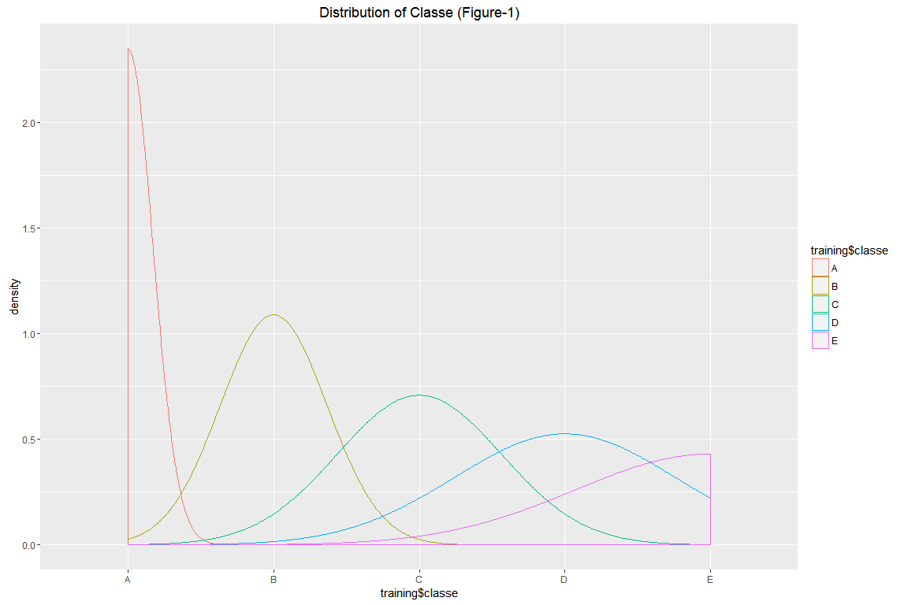
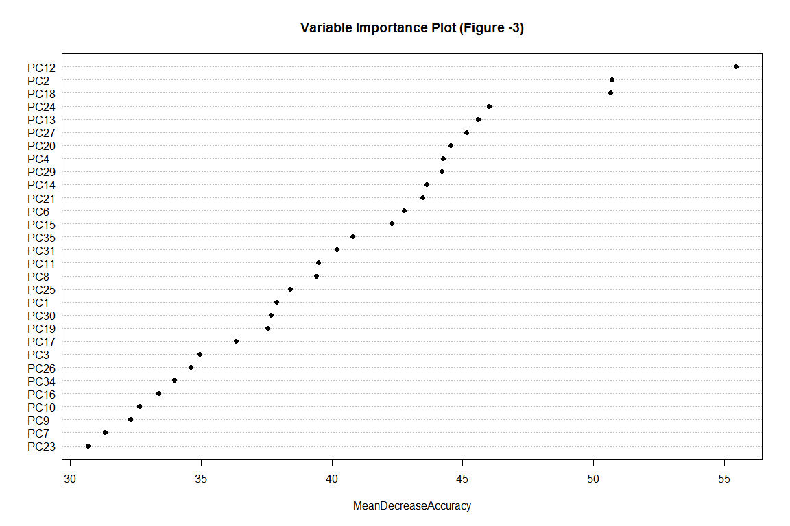
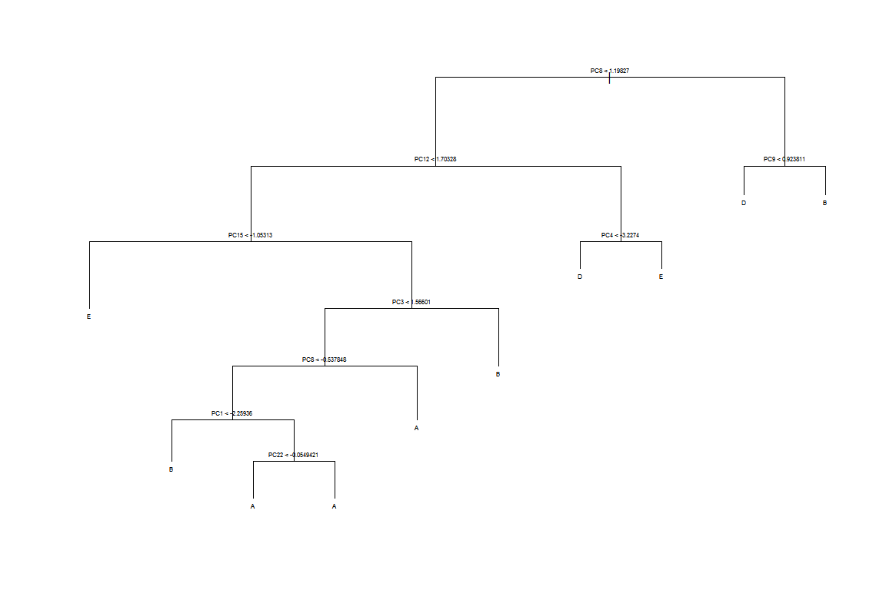

# <center>Practical Machine Learning Assignment</center>
<center><h3>**Qualitative Prediction of Dumbell Curl Exercises**<h3></center>
<center> <h4>*CB*</h4> </center>
<center> <h5>July 28, 2016</h5> </center>
 
### Overview:

A group of 6 participants each performed a set of 10 repetitions using a small dumbell weight.  The repetitions were performed according to different specification and assigned a 'classe' such that the participant in: 

* Classe A - Correctly performed the repetition
* Classe B - Threw the elbow to the front 
* Classe C - Lifted the dumbell only halfway
* Classe D - Lowered the dumbell only halfway
* Classe E - Threw the hips to the front
 
Using on-body sensing devices, time-series data were collected for 17 features including accelerometer, gyroscopic, and magnetometer.  The devices were used to measure acceleration, pitch, yaw, and roll of the belt, arm, and wrist during each dumbell repetition.

The exercise data are divided into two sets:

1. > Training data - in which the 'classe' has been provided.
2. > Testing data, - in which the 'classe' has been ommited. 


**The goal of this assignment is to constuct a model that will correctly predict the classe of a each dumbell repitition in the *Testing* data.** 


### Reading the data


The dataset training contains **19,622** rows and **160** columns.  Upon a quick look at the distribution of *'classe'* in the training data set *(Appendix, Figure-1)*, it appears that the  counts of classe A > classe B > classe C > clasee D > classe E.  If the testing data is a random sample (and large enough), we might expect a similar distribution.


#### Metadata Descriptions for Dimensions in the Training Data

The dimension found in the data are described in the table, below.


Field Name             Field Description       
---------------------  ------------------------
X                      Row Number              
user_name              Participant Name        
raw_timestamp_part_1   Date                    
raw_timestamp_part_2   Time (in milliseconds)  
cvtd_timestamp         Combined Date/Time      
new_window             Start of New Repetition 
num_window             Start of New Set        
classe                 Quality of Repetition   

####Preprocess the data

It often improves accuracy and reduces processing time to remove data that are:

* Completely 'NA'
* More than half of the rows are zero
* Correlated with other fields at a rate greater than 0.90

#####Create Data Parition

The existing training data set was partitioned to simulate a new testing data set. A randomly selected 1/3 subset of original training set was allocated to create this *'validation'*  data set.  The validation set was used to test the model predictions before being applied to the Testing data set, which helps prevent over-fitting the model.  In this case, it was also necessary because we don't know what the actual classe values are in the testing set. 


After preprocessing and partitioning the data sets, the training data set now has '**57**' columns and '**14,718**' rows and the testing data set has '**57**' columns, with the rows count remaining unchanged at '**20**'.  It is worth mentioning that the columns removed from the testing data set were based upon conditions in the training data set (i.e. correlated, 'NA, and zero values). The new validation data set has '**60**' columns and '**3,657**' rows.  

A correlation matrix *(Appendix, Figure-2)* shows the relative correlations between the attributes in the training data.


### Principle Component Analysis

An analysis of the most influential data in the training data set helped to identify important components, and reduce the model complexity. The principle component analyis was used to:

1. Identify subsets of the remaining columns that contribute most to the outcome ('classe') of a dumbbell repetition
2. Center and Scale the data to prevent differences in column data types from askewing the measurement contributions to the model
3. Reduce the complexity of the prediction model and improve processing time


The principle component analysis was able to capture '**0.95**' percent of the variance with just '**26**' components. A Variable Importance Plot *(Appendix, Figure-3)* shows the relative importance of these components, as well as the accuracy that would be lost in the model if that component was ommitted. A Classification Tree Plot  *(Appendix, Figure-4)* helps vizualize the rules for predicting outcomes based on the principle compoents. 

###Random Forest Prediction Model

Random Forest model was chosen for it's accuracy and ease of use in classification predictions.  In this model, there were 4 folds created and used in a cross-validation method.  


```
## Random Forest 
## 
## 14718 samples
##    25 predictor
##     5 classes: 'A', 'B', 'C', 'D', 'E' 
## 
## No pre-processing
## Resampling: Cross-Validated (4 fold) 
## Summary of sample sizes: 11040, 11038, 11039, 11037 
## Resampling results across tuning parameters:
## 
##   mtry  Accuracy  Kappa  Accuracy SD  Kappa SD
##    2    0.971     0.964  0.00336      0.00426 
##   14    0.964     0.955  0.00538      0.00681 
##   26    0.957     0.945  0.00433      0.00548 
## 
## Accuracy was used to select the optimal model using  the largest value.
## The final value used for the model was mtry = 2.
```

```
## Accuracy 
##        1
```

      
The overall accuracy of this simple model was '**0.97**' which is pretty good considering the original study produced 98.2% accuracy. The accuracy of the prediction against the validation data was '**1**'.

[Qualitative Activity Recognition of Weight Lifting Exercise](http://groupware.les.inf.puc-rio.br/public/papers/2012.Ugulino.WearableComputing.HAR.Classifier.RIBBON.pdf "Activity Recognition Study")


```
##  [1] B A B A A E D B A A B C B A E E A B B B
## Levels: A B C D E
```
      
      
The final prediction against the testing data was '**BABAAEDBAABCBAEEABBB**'


###Executive Summary

Even a relatively simple Random Forest model appeared to be very effective at predicting the classe of the repetitions. Increasing the number of repeats and folds in the random forest showed some improvement but dramatically increased the processing time. Removing the highly correlated fields did not have a significant impact on the model accuracy in this case.  Another GBM (boosted model) was tried with similar results *(Addendum, R Code)*.  

Perhaps an interesting note is that despite the fact that the dumbell repetitions are measured in a time-series; the 'classe' is assigned to the entire repetition.  For example, it may be possible that a number of rows of the time-series data (measured in milliseconds) are preformed correctly (classe A), but because of a mistake later in the repetition, those rows received a lower classe.  Even with this potential issue, the prediction model worked well and didn't require a time-series analysis.


## Appendix





<!--html_preserve--><div id="htmlwidget-6931" style="width:1152px;height:768px;" class="iplotCorr html-widget"></div>
<script type="application/json" data-for="htmlwidget-6931">{"x":{"data":{"indID":["1","2","6","7","8","9","10","11","13","14","15","16","17","19","20","21","24","25","26","28","29","30","31","32","35","37","39","40","41","43","44","45","47","49","50","52","53","56","57","58","60","61","62","63","65","66","67","68","69","70","71","72","73","74","75","76","77","78","79","83","84","85","86","87","88","89","90","92","94","95","96","97","99","100","101","103","104","105","106","109","110","112","113","114","115","116","117","118","120","121","122","123","124","125","126","128","130","132","133","134","135","137","139","140","141","142","143","145","146","147","149","150","151","152","153","154","155","156","157","158","160","161","162","164","165","167","168","169","170","171","172","173","174","175","176","178","179","180","181","182","183","185","186","187","188","189","190","191","194","195","196","198","199","201","203","206","208","209","210","211","213","214","215","216","218","219","220","222","223","224","225","226","227","228","229","230","231","233","234","236","237","239","241","244","245","246","247","248","249","250","251","253","255","256","258","260","262","263","265","266","267","268","269","270","271","272","273","274","276","279","280","281","282","283","284","285","286","287","290","291","293","294","295","296","297","298","299","300","302","304","305","308","310","311","312","315","316","317","318","320","321","322","323","324","325","326","327","329","330","331","333","334","336","338","339","340","341","343","344","345","346","347","348","349","350","351","352","354","355","357","358","359","360","361","362","363","365","366","367","368","369","370","371","373","374","375","376","378","379","381","382","383","384","385","386","387","388","390","392","393","394","397","398","400","401","402","403","404","406","407","409","410","411","412","413","414","415","416","417","418","419","420","422","423","425","426","427","428","432","434","435","437","439","440","442","443","444","445","446","447","448","449","450","451","455","456","458","459","460","461","464","465","466","467","468","469","470","471","472","474","475","476","477","478","479","480","481","483","484","485","486","487","488","489","493","494","495","496","497","498","500","501","503","505","506","507","508","509","510","511","512","513","514","515","517","519","520","521","522","523","524","525","526","527","528","529","530","531","536","537","538","539","540","541","542","543","545","546","548","549","550","551","552","553","555","556","558","559","560","561","562","563","564","565","566","567","568","570","571","572","573","575","577","578","579","580","581","582","583","584","586","587","588","589","590","591","592","593","594","595","596","598","599","600","602","603","604","606","607","608","610","612","614","615","616","617","618","619","621","622","624","625","626","627","628","629","630","631","632","633","635","636","637","638","639","641","643","644","646","647","648","649","650","653","654","655","656","657","658","659","660","661","662","664","665","667","668","669","670","673","674","676","677","678","680","681","682","683","684","686","687","688","689","690","692","693","694","695","696","697","698","700","702","703","704","705","706","707","708","709","710","711","714","716","719","720","721","722","723","724","725","727","728","729","730","731","733","734","735","737","738","741","742","745","746","747","748","749","751","752","754","755","756","757","758","759","761","762","764","766","767","768","769","770","771","772","773","775","777","778","780","782","783","784","785","786","787","788","790","792","793","794","795","796","799","800","801","802","803","804","805","808","809","810","811","812","816","818","820","821","822","823","824","825","826","827","828","829","830","831","833","834","835","836","837","838","839","841","843","844","845","846","849","850","851","853","854","855","856","858","859","860","861","862","863","865","866","867","868","869","871","872","873","876","877","878","879","880","881","883","884","885","886","887","888","889","890","892","893","894","895","897","899","901","902","903","904","907","909","910","912","913","914","915","916","918","919","920","921","922","923","926","927","928","929","930","932","933","934","936","938","939","940","941","942","943","944","945","946","947","948","950","951","952","953","954","955","957","958","960","962","963","965","966","967","968","971","972","973","974","976","977","978","980","982","983","985","986","987","988","989","990","991","992","993","994","995","996","998","1000","1001","1003","1004","1005","1009","1010","1011","1014","1015","1017","1018","1019","1020","1021","1024","1026","1027","1031","1032","1033","1034","1035","1036","1037","1038","1039","1040","1042","1043","1044","1045","1046","1047","1048","1049","1050","1051","1053","1054","1055","1056","1057","1058","1059","1061","1062","1063","1064","1065","1066","1067","1068","1069","1070","1071","1075","1076","1077","1079","1080","1081","1082","1083","1084","1086","1088","1089","1091","1093","1094","1095","1097","1098","1100","1101","1102","1105","1107","1108","1109","1111","1112","1113","1114","1115","1116","1117","1118","1119","1120","1122","1124","1125","1127","1128","1129","1130","1131","1135","1136","1137","1138","1139","1140","1141","1142","1143","1144","1146","1147","1148","1149","1150","1151","1152","1153","1154","1155","1156","1157","1158","1159","1160","1161","1162","1163","1164","1165","1166","1169","1170","1171","1172","1173","1174","1176","1177","1179","1181","1182","1183","1184","1185","1187","1188","1190","1192","1193","1194","1195","1196","1197","1198","1200","1201","1202","1203","1204","1205","1206","1208","1209","1212","1213","1216","1218","1220","1221","1222","1223","1224","1225","1227","1228","1230","1231","1232","1233","1234","1235","1236","1237","1238","1239","1240","1241","1242","1243","1244","1245","1246","1247","1248","1249","1251","1253","1255","1256","1257","1259","1260","1261","1263","1264","1267","1269","1271","1273","1275","1276","1279","1280","1282","1283","1284","1285","1286","1287","1288","1289","1290","1291","1292","1295","1297","1298","1299","1301","1302","1303","1305","1306","1307","1309","1310","1312","1313","1314","1316","1319","1321","1322","1324","1325","1326","1327","1328","1329","1330","1331","1332","1335","1336","1337","1338","1339","1340","1341","1342","1344","1345","1346","1347","1348","1349","1350","1351","1352","1354","1355","1356","1357","1358","1359","1360","1361","1362","1364","1365","1366","1369","1370","1371","1372","1375","1376","1377","1378","1379","1381","1382","1383","1384","1385","1386","1387","1388","1389","1390","1392","1393","1394","1395","1396","1397","1399","1402","1403","1404","1405","1406","1407","1408","1409","1411","1413","1414","1415","1416","1417","1419","1420","1421","1422","1423","1425","1426","1428","1429","1430","1431","1432","1433","1434","1435","1436","1437","1438","1441","1443","1444","1445","1446","1447","1448","1449","1450","1451","1452","1454","1456","1458","1459","1460","1461","1462","1463","1465","1467","1468","1471","1472","1475","1476","1477","1479","1480","1481","1482","1483","1484","1485","1486","1488","1489","1490","1491","1492","1494","1495","1496","1497","1498","1499","1500","1501","1504","1505","1507","1508","1509","1510","1511","1513","1514","1516","1518","1519","1520","1521","1523","1524","1525","1526","1527","1528","1529","1531","1532","1535","1536","1537","1538","1540","1541","1542","1543","1544","1545","1548","1550","1552","1553","1554","1555","1556","1557","1559","1560","1563","1564","1565","1567","1568","1569","1571","1572","1574","1575","1576","1577","1579","1581","1584","1587","1588","1589","1591","1592","1593","1595","1599","1600","1602","1603","1604","1605","1606","1607","1608","1609","1611","1613","1614","1615","1616","1618","1619","1622","1623","1624","1625","1627","1628","1630","1631","1632","1633","1634","1635","1636","1637","1638","1640","1641","1642","1644","1645","1649","1650","1651","1652","1653","1654","1655","1656","1657","1658","1660","1662","1664","1666","1667","1668","1669","1671","1672","1673","1674","1675","1677","1679","1680","1681","1682","1683","1684","1685","1686","1687","1688","1689","1690","1691","1692","1693","1694","1697","1699","1700","1704","1705","1707","1710","1711","1713","1714","1716","1720","1721","1723","1726","1728","1730","1732","1733","1734","1735","1736","1737","1738","1739","1740","1741","1742","1743","1744","1745","1747","1748","1749","1750","1751","1752","1753","1755","1757","1758","1760","1761","1764","1765","1769","1771","1772","1773","1774","1775","1776","1778","1782","1783","1784","1785","1786","1787","1788","1789","1790","1791","1792","1793","1795","1796","1798","1799","1800","1801","1804","1805","1806","1808","1809","1810","1811","1812","1815","1816","1818","1819","1820","1821","1825","1826","1827","1828","1829","1830","1831","1832","1833","1836","1837","1838","1840","1841","1842","1843","1846","1847","1848","1849","1851","1852","1855","1856","1857","1858","1859","1860","1861","1862","1863","1864","1866","1867","1868","1869","1870","1871","1872","1873","1874","1875","1876","1878","1879","1880","1881","1882","1884","1886","1887","1889","1890","1891","1892","1893","1894","1897","1899","1900","1902","1903","1904","1905","1906","1907","1908","1910","1911","1912","1913","1914","1915","1917","1918","1919","1920","1921","1922","1923","1924","1925","1926","1927","1928","1931","1932","1933","1934","1935","1939","1940","1941","1942","1943","1944","1945","1946","1949","1950","1951","1952","1953","1956","1957","1959","1960","1961","1962","1963","1965","1966","1967","1968","1969","1970","1972","1973","1974","1975","1976","1977","1980","1981","1982","1983","1985","1986","1987","1988","1990","1991","1992","1994","1995","1996","1997","1998","1999","2001","2002","2003","2004","2005","2006","2007","2008","2009","2012","2013","2014","2016","2019","2020","2021","2023","2024","2025","2026","2028","2029","2030","2031","2032","2033","2034","2035","2036","2037","2038","2039","2041","2042","2043","2044","2045","2046","2048","2049","2050","2051","2052","2054","2055","2056","2058","2059","2060","2061","2063","2065","2067","2068","2069","2070","2073","2074","2075","2076","2077","2078","2079","2080","2082","2083","2084","2086","2087","2088","2090","2091","2092","2094","2095","2096","2097","2098","2099","2100","2101","2102","2104","2105","2106","2107","2110","2112","2115","2117","2118","2119","2120","2121","2122","2123","2124","2125","2126","2127","2128","2129","2130","2131","2132","2133","2134","2135","2136","2137","2138","2139","2140","2141","2142","2143","2144","2146","2147","2149","2152","2153","2154","2155","2157","2158","2159","2160","2162","2163","2164","2165","2166","2167","2168","2170","2173","2174","2175","2176","2179","2180","2182","2183","2184","2185","2186","2187","2189","2190","2191","2192","2195","2196","2197","2198","2199","2200","2201","2202","2205","2206","2207","2208","2209","2210","2211","2212","2214","2215","2216","2217","2219","2220","2221","2222","2224","2226","2227","2228","2230","2231","2232","2235","2236","2237","2238","2239","2240","2241","2242","2243","2244","2245","2246","2247","2251","2252","2254","2256","2257","2258","2259","2260","2263","2264","2265","2267","2268","2271","2274","2275","2276","2277","2278","2279","2280","2281","2282","2283","2284","2285","2286","2287","2288","2289","2290","2291","2292","2293","2294","2296","2298","2299","2300","2301","2302","2303","2304","2306","2307","2308","2309","2310","2311","2312","2313","2314","2317","2318","2319","2320","2322","2323","2324","2325","2328","2329","2330","2331","2332","2333","2334","2336","2338","2339","2340","2341","2344","2345","2346","2347","2348","2349","2350","2352","2353","2355","2356","2357","2359","2360","2361","2362","2363","2364","2365","2366","2368","2370","2371","2372","2373","2374","2375","2376","2377","2378","2379","2380","2382","2384","2385","2387","2389","2393","2394","2395","2399","2400","2402","2403","2405","2406","2407","2409","2413","2414","2417","2418","2420","2422","2423","2424","2425","2427","2429","2431","2432","2434","2437","2438","2439","2440","2441","2442","2443","2444","2446","2447","2448","2449","2450","2451","2452","2453","2454","2455","2456","2457","2458","2459","2460","2461","2462","2463","2464","2465","2466","2471","2472","2473","2474","2475","2477","2479","2480","2481","2482","2484","2486","2487","2489","2490","2491","2492","2495","2497","2498","2500","2504","2506","2507","2508","2509","2510","2511","2512","2513","2514","2515","2516","2517","2518","2520","2521","2522","2523","2524","2525","2526","2527","2528","2529","2531","2532","2533","2534","2535","2537","2538","2540","2541","2542","2544","2545","2547","2548","2549","2551","2552","2553","2555","2556","2557","2558","2559","2561","2562","2563","2565","2566","2568","2569","2570","2571","2572","2575","2576","2577","2578","2579","2580","2581","2583","2584","2586","2589","2590","2591","2593","2595","2596","2597","2598","2599","2600","2602","2603","2604","2605","2606","2607","2609","2611","2612","2613","2615","2616","2617","2619","2620","2622","2623","2626","2627","2630","2631","2632","2635","2636","2637","2638","2639","2641","2643","2645","2646","2647","2648","2649","2650","2651","2652","2653","2654","2655","2656","2657","2658","2659","2660","2661","2662","2663","2667","2669","2671","2672","2673","2675","2676","2677","2678","2679","2680","2681","2682","2684","2686","2687","2688","2689","2690","2692","2693","2695","2697","2699","2700","2703","2704","2705","2706","2707","2709","2710","2711","2712","2713","2714","2717","2718","2719","2720","2721","2722","2723","2724","2725","2726","2727","2728","2730","2732","2733","2734","2736","2737","2738","2739","2740","2741","2742","2743","2745","2747","2749","2750","2752","2753","2755","2756","2757","2759","2760","2762","2763","2764","2766","2767","2769","2770","2771","2772","2773","2775","2777","2778","2781","2782","2784","2785","2788","2790","2793","2794","2795","2797","2800","2801","2802","2804","2808","2809","2810","2812","2813","2815","2816","2817","2818","2819","2820","2821","2822","2823","2824","2829","2830","2832","2833","2834","2835","2836","2837","2838","2839","2840","2842","2844","2847","2849","2850","2851","2853","2854","2856","2859","2862","2863","2864","2865","2866","2867","2869","2870","2871","2872","2873","2876","2877","2878","2879","2880","2882","2887","2888","2890","2893","2894","2895","2897","2898","2899","2900","2901","2903","2905","2907","2908","2909","2910","2911","2912","2913","2914","2916","2917","2919","2920","2921","2922","2923","2924","2925","2926","2927","2929","2931","2932","2933","2935","2936","2937","2938","2939","2940","2942","2943","2944","2945","2946","2947","2948","2949","2950","2951","2952","2953","2954","2955","2958","2959","2960","2962","2963","2964","2965","2966","2967","2969","2971","2972","2974","2975","2976","2977","2978","2979","2980","2981","2982","2983","2984","2985","2986","2987","2988","2989","2990","2991","2993","2994","2995","2996","2997","2998","3000","3001","3004","3005","3006","3007","3008","3009","3010","3011","3013","3014","3015","3016","3017","3018","3020","3021","3022","3023","3024","3025","3026","3027","3028","3029","3031","3033","3034","3035","3036","3037","3038","3040","3041","3043","3044","3045","3046","3047","3048","3049","3050","3053","3054","3055","3056","3057","3059","3061","3062","3064","3065","3068","3069","3070","3071","3072","3073","3074","3077","3079","3080","3082","3084","3085","3086","3087","3088","3089","3090","3091","3092","3093","3094","3095","3096","3098","3099","3100","3102","3103","3104","3105","3106","3107","3108","3109","3110","3111","3112","3113","3114","3115","3116","3117","3118","3119","3121","3123","3124","3125","3126","3127","3128","3129","3130","3131","3133","3134","3136","3138","3139","3140","3141","3142","3144","3146","3147","3148","3149","3151","3152","3153","3155","3157","3158","3159","3160","3161","3163","3164","3165","3166","3167","3168","3169","3170","3171","3172","3174","3175","3176","3178","3179","3180","3181","3182","3183","3185","3187","3190","3192","3193","3194","3195","3196","3198","3199","3200","3201","3202","3203","3204","3205","3207","3208","3210","3211","3212","3214","3216","3218","3219","3220","3221","3224","3225","3226","3227","3230","3232","3233","3234","3235","3236","3238","3239","3240","3241","3245","3246","3247","3248","3249","3251","3253","3254","3256","3257","3258","3259","3261","3262","3263","3264","3265","3266","3267","3268","3269","3270","3271","3272","3273","3274","3275","3276","3277","3280","3282","3283","3284","3286","3288","3289","3290","3297","3298","3299","3300","3301","3302","3304","3305","3306","3307","3308","3310","3311","3312","3314","3315","3316","3317","3318","3319","3320","3322","3323","3324","3325","3328","3329","3330","3332","3333","3334","3337","3340","3341","3342","3343","3344","3345","3346","3347","3348","3349","3350","3352","3353","3354","3355","3356","3357","3359","3360","3361","3364","3366","3367","3368","3369","3371","3373","3374","3375","3376","3377","3378","3379","3381","3382","3383","3384","3385","3386","3387","3388","3389","3390","3391","3393","3394","3395","3396","3398","3399","3402","3404","3405","3406","3408","3410","3412","3413","3414","3415","3416","3417","3418","3419","3422","3423","3424","3426","3427","3428","3429","3430","3431","3432","3433","3434","3435","3436","3437","3439","3440","3441","3443","3444","3445","3446","3449","3450","3451","3452","3453","3456","3457","3458","3459","3460","3463","3464","3465","3467","3468","3469","3470","3471","3472","3473","3474","3476","3480","3484","3485","3486","3488","3489","3490","3491","3492","3493","3494","3495","3500","3501","3502","3503","3504","3505","3506","3507","3509","3510","3513","3514","3515","3516","3518","3519","3521","3522","3524","3525","3526","3527","3529","3530","3532","3533","3534","3535","3536","3537","3538","3539","3540","3541","3543","3544","3546","3547","3548","3549","3551","3552","3553","3554","3555","3556","3557","3558","3561","3562","3563","3564","3565","3568","3569","3570","3571","3572","3576","3578","3579","3581","3582","3583","3584","3585","3586","3587","3589","3591","3592","3594","3595","3596","3597","3598","3599","3600","3602","3603","3604","3605","3606","3607","3609","3611","3612","3613","3614","3615","3616","3618","3620","3621","3622","3623","3625","3626","3627","3629","3630","3631","3632","3633","3634","3635","3636","3637","3638","3639","3641","3642","3645","3646","3647","3648","3649","3650","3651","3654","3655","3656","3657","3658","3659","3660","3662","3663","3664","3665","3670","3671","3672","3673","3676","3677","3678","3679","3680","3683","3685","3690","3692","3693","3694","3695","3696","3697","3698","3699","3700","3701","3702","3703","3704","3705","3706","3707","3709","3711","3712","3714","3715","3716","3717","3718","3720","3721","3722","3723","3724","3725","3727","3728","3729","3730","3732","3733","3734","3735","3737","3738","3742","3743","3744","3745","3746","3747","3749","3750","3751","3752","3753","3754","3755","3756","3757","3759","3760","3761","3762","3764","3765","3767","3768","3769","3770","3771","3773","3774","3775","3776","3777","3778","3780","3781","3782","3783","3785","3786","3787","3790","3792","3793","3794","3795","3796","3797","3798","3799","3800","3801","3802","3803","3804","3805","3807","3809","3810","3811","3812","3813","3814","3815","3816","3817","3818","3819","3821","3822","3823","3824","3825","3827","3828","3832","3833","3834","3835","3836","3837","3840","3841","3842","3844","3845","3846","3847","3848","3851","3852","3853","3854","3855","3856","3857","3858","3859","3860","3861","3862","3864","3867","3868","3869","3871","3872","3873","3874","3877","3878","3879","3886","3887","3890","3891","3892","3894","3895","3896","3897","3898","3899","3903","3904","3905","3906","3907","3909","3910","3911","3912","3913","3915","3917","3919","3920","3921","3922","3923","3924","3925","3927","3929","3934","3935","3937","3938","3940","3941","3942","3943","3944","3945","3949","3951","3952","3953","3954","3956","3957","3959","3961","3963","3965","3966","3968","3969","3971","3973","3974","3975","3976","3977","3979","3980","3981","3982","3983","3984","3985","3986","3989","3990","3991","3993","3994","3995","3996","4000","4002","4003","4007","4008","4010","4012","4013","4014","4016","4017","4019","4020","4021","4022","4024","4025","4027","4028","4029","4030","4032","4033","4034","4035","4036","4037","4038","4039","4040","4041","4042","4043","4044","4045","4046","4047","4048","4049","4050","4051","4052","4053","4055","4057","4058","4059","4060","4063","4064","4065","4067","4068","4069","4070","4071","4072","4074","4075","4076","4078","4079","4080","4081","4083","4085","4086","4087","4088","4089","4090","4093","4095","4096","4097","4098","4099","4100","4101","4102","4103","4104","4105","4106","4107","4109","4110","4111","4112","4113","4114","4116","4118","4119","4120","4121","4122","4123","4124","4125","4126","4129","4130","4132","4133","4134","4135","4136","4137","4138","4139","4143","4144","4146","4147","4148","4150","4151","4152","4153","4154","4155","4156","4157","4158","4159","4162","4163","4164","4165","4166","4167","4168","4169","4170","4174","4175","4177","4178","4179","4180","4181","4182","4183","4186","4187","4188","4190","4191","4193","4194","4195","4196","4197","4199","4200","4201","4203","4205","4206","4207","4209","4210","4211","4212","4213","4214","4215","4216","4217","4218","4220","4221","4222","4223","4224","4226","4227","4230","4232","4233","4235","4236","4237","4238","4240","4241","4243","4245","4246","4247","4249","4251","4252","4253","4256","4257","4258","4260","4262","4263","4264","4265","4266","4267","4268","4269","4270","4271","4272","4273","4275","4276","4277","4278","4279","4280","4281","4283","4284","4286","4287","4288","4289","4292","4293","4295","4297","4298","4299","4300","4301","4302","4303","4306","4307","4308","4309","4310","4311","4312","4313","4314","4315","4316","4317","4318","4319","4320","4321","4322","4323","4324","4326","4327","4328","4329","4330","4331","4332","4333","4334","4335","4336","4339","4340","4341","4345","4346","4347","4348","4349","4350","4352","4354","4356","4357","4359","4360","4362","4363","4364","4365","4367","4370","4371","4372","4375","4376","4377","4378","4380","4382","4384","4385","4386","4387","4388","4389","4390","4391","4392","4393","4395","4396","4397","4398","4400","4402","4404","4405","4406","4408","4409","4410","4412","4414","4415","4416","4417","4418","4419","4421","4422","4423","4424","4425","4426","4428","4429","4430","4431","4432","4434","4436","4438","4439","4441","4442","4444","4445","4447","4448","4449","4452","4453","4455","4456","4457","4458","4459","4460","4462","4463","4465","4466","4469","4471","4473","4475","4477","4478","4479","4480","4481","4482","4483","4484","4485","4486","4487","4488","4489","4490","4492","4493","4494","4497","4498","4499","4500","4501","4502","4503","4504","4505","4507","4509","4511","4517","4518","4519","4520","4521","4523","4524","4528","4529","4530","4531","4532","4534","4535","4536","4537","4539","4540","4541","4542","4543","4544","4545","4546","4547","4548","4549","4550","4551","4552","4553","4554","4555","4556","4557","4558","4559","4560","4561","4563","4564","4565","4566","4567","4568","4569","4570","4571","4572","4573","4574","4575","4576","4578","4579","4580","4581","4582","4583","4585","4587","4588","4589","4591","4592","4593","4594","4595","4596","4597","4599","4600","4602","4603","4606","4608","4610","4612","4616","4617","4618","4619","4621","4623","4624","4625","4626","4627","4628","4630","4631","4632","4633","4634","4635","4636","4637","4638","4639","4641","4643","4647","4649","4650","4651","4652","4653","4654","4655","4656","4657","4658","4659","4660","4661","4662","4663","4664","4665","4666","4667","4669","4670","4671","4672","4673","4675","4676","4677","4678","4680","4682","4685","4686","4688","4689","4690","4692","4694","4695","4696","4697","4698","4699","4701","4702","4703","4704","4706","4707","4708","4711","4712","4713","4714","4717","4718","4719","4721","4722","4724","4725","4726","4727","4728","4729","4730","4731","4732","4733","4737","4738","4739","4740","4741","4742","4743","4744","4745","4746","4747","4748","4750","4751","4752","4753","4757","4758","4759","4760","4762","4763","4764","4767","4768","4771","4774","4775","4776","4777","4779","4780","4781","4782","4783","4784","4785","4787","4788","4789","4790","4792","4793","4794","4795","4796","4798","4799","4800","4801","4802","4803","4804","4805","4806","4807","4808","4809","4810","4811","4817","4818","4819","4821","4822","4823","4825","4826","4827","4828","4829","4830","4831","4832","4833","4834","4837","4838","4840","4841","4843","4844","4845","4846","4847","4848","4849","4852","4853","4854","4855","4858","4859","4860","4861","4862","4863","4865","4866","4868","4869","4870","4871","4872","4873","4874","4875","4876","4877","4878","4879","4880","4881","4882","4883","4885","4886","4889","4892","4893","4894","4896","4898","4899","4900","4901","4902","4903","4905","4906","4909","4910","4912","4913","4914","4915","4917","4918","4919","4920","4921","4925","4927","4929","4930","4931","4932","4933","4934","4935","4938","4939","4940","4942","4943","4944","4946","4947","4948","4950","4951","4952","4954","4955","4956","4957","4958","4960","4961","4962","4963","4964","4968","4969","4970","4971","4972","4973","4974","4975","4976","4977","4978","4979","4981","4982","4983","4984","4986","4987","4989","4991","4993","4994","4995","4996","5000","5001","5004","5005","5006","5007","5009","5010","5011","5012","5013","5014","5015","5017","5018","5020","5021","5022","5025","5027","5028","5029","5030","5031","5032","5034","5035","5036","5037","5038","5040","5041","5042","5044","5045","5047","5048","5050","5051","5052","5053","5054","5055","5056","5058","5059","5060","5061","5062","5063","5065","5070","5071","5072","5075","5076","5077","5079","5080","5081","5082","5083","5085","5086","5088","5089","5090","5091","5092","5093","5094","5095","5097","5098","5099","5101","5102","5103","5104","5105","5107","5108","5109","5111","5112","5113","5114","5115","5117","5118","5120","5122","5123","5126","5128","5130","5131","5132","5133","5134","5135","5136","5137","5138","5139","5141","5142","5144","5145","5147","5148","5149","5150","5151","5152","5154","5155","5156","5157","5158","5159","5160","5161","5162","5163","5165","5166","5167","5168","5169","5170","5171","5172","5173","5174","5175","5176","5177","5178","5179","5180","5181","5182","5184","5186","5187","5188","5189","5190","5192","5194","5195","5196","5197","5198","5199","5200","5201","5202","5204","5205","5206","5207","5208","5209","5210","5211","5212","5214","5215","5216","5217","5218","5219","5220","5222","5223","5225","5226","5227","5228","5229","5230","5231","5232","5233","5234","5235","5236","5237","5238","5239","5242","5244","5245","5246","5247","5248","5249","5250","5251","5252","5253","5254","5255","5256","5257","5258","5259","5260","5264","5265","5266","5267","5269","5270","5271","5272","5273","5275","5277","5278","5279","5281","5282","5284","5286","5287","5288","5290","5291","5292","5293","5295","5296","5299","5303","5305","5306","5307","5308","5309","5310","5311","5312","5313","5314","5317","5318","5319","5320","5321","5322","5323","5325","5327","5328","5329","5330","5332","5333","5334","5336","5337","5338","5340","5341","5342","5343","5345","5347","5348","5350","5352","5353","5354","5355","5357","5358","5360","5361","5363","5364","5365","5366","5370","5371","5372","5373","5375","5376","5377","5379","5380","5381","5383","5384","5385","5386","5387","5388","5389","5390","5391","5392","5393","5394","5397","5398","5399","5402","5404","5405","5406","5408","5410","5411","5412","5415","5416","5418","5420","5422","5425","5426","5427","5428","5429","5430","5431","5432","5433","5435","5436","5437","5438","5439","5440","5441","5442","5443","5444","5445","5446","5447","5448","5450","5451","5452","5453","5454","5455","5456","5459","5460","5461","5462","5464","5465","5466","5467","5468","5470","5471","5472","5475","5477","5479","5480","5481","5482","5483","5484","5485","5486","5489","5490","5491","5492","5494","5496","5498","5499","5502","5503","5504","5505","5506","5509","5510","5511","5513","5514","5515","5517","5518","5519","5520","5522","5523","5526","5528","5530","5531","5534","5535","5536","5537","5540","5541","5542","5544","5547","5548","5551","5552","5554","5555","5557","5558","5560","5561","5562","5564","5565","5567","5568","5571","5572","5573","5574","5575","5576","5577","5578","5579","5580","5583","5585","5587","5588","5589","5590","5591","5593","5595","5596","5597","5598","5599","5600","5601","5602","5604","5605","5608","5609","5611","5612","5613","5614","5615","5617","5619","5620","5622","5623","5625","5626","5628","5630","5631","5632","5633","5634","5635","5638","5639","5641","5642","5643","5644","5645","5646","5647","5648","5651","5652","5653","5656","5657","5658","5659","5660","5661","5662","5663","5664","5665","5667","5668","5669","5670","5671","5672","5674","5675","5676","5678","5679","5680","5681","5682","5683","5684","5685","5686","5687","5688","5689","5691","5692","5694","5697","5699","5700","5701","5702","5703","5704","5705","5706","5707","5708","5709","5712","5713","5714","5717","5718","5719","5720","5721","5722","5723","5724","5725","5727","5729","5730","5732","5733","5735","5736","5737","5739","5741","5743","5744","5745","5746","5747","5748","5749","5750","5752","5755","5756","5757","5758","5759","5760","5761","5763","5764","5767","5768","5769","5770","5771","5772","5773","5774","5775","5776","5778","5780","5781","5783","5784","5785","5787","5788","5789","5790","5791","5793","5796","5797","5798","5802","5803","5804","5805","5806","5807","5808","5809","5810","5811","5812","5814","5815","5817","5818","5819","5820","5821","5822","5824","5825","5826","5827","5828","5830","5831","5832","5834","5838","5839","5840","5841","5843","5844","5845","5847","5848","5849","5850","5851","5852","5854","5855","5856","5857","5858","5860","5861","5862","5863","5864","5865","5868","5871","5872","5874","5875","5876","5877","5879","5880","5881","5884","5885","5886","5888","5891","5892","5893","5894","5895","5896","5897","5900","5901","5902","5903","5904","5905","5906","5907","5908","5909","5910","5911","5912","5915","5916","5917","5918","5920","5921","5927","5928","5929","5936","5938","5939","5940","5941","5942","5946","5947","5948","5950","5951","5953","5955","5956","5957","5958","5959","5960","5961","5962","5963","5964","5965","5968","5970","5971","5972","5973","5974","5975","5976","5978","5979","5980","5981","5982","5986","5987","5988","5989","5990","5991","5992","5993","5995","5996","5997","5999","6000","6001","6002","6003","6004","6005","6006","6007","6008","6010","6012","6013","6017","6018","6019","6020","6023","6025","6028","6030","6031","6034","6036","6037","6038","6040","6041","6042","6043","6044","6045","6046","6047","6048","6049","6050","6051","6052","6053","6054","6057","6058","6060","6063","6064","6069","6070","6072","6073","6074","6075","6076","6078","6081","6082","6083","6084","6085","6087","6088","6089","6090","6092","6093","6094","6095","6096","6098","6099","6100","6101","6102","6103","6104","6105","6108","6109","6110","6112","6113","6114","6115","6117","6118","6120","6121","6122","6123","6124","6127","6128","6129","6130","6131","6133","6134","6136","6138","6139","6140","6141","6142","6144","6146","6147","6148","6150","6151","6152","6153","6154","6155","6159","6160","6161","6163","6164","6165","6166","6167","6168","6169","6170","6171","6172","6173","6175","6177","6178","6179","6181","6182","6184","6186","6187","6188","6189","6190","6191","6192","6194","6197","6199","6200","6201","6202","6204","6205","6206","6207","6208","6209","6210","6211","6212","6213","6214","6215","6216","6217","6218","6220","6223","6225","6227","6228","6229","6230","6232","6234","6235","6236","6237","6238","6239","6240","6243","6244","6245","6246","6248","6250","6251","6252","6254","6256","6257","6258","6259","6260","6262","6263","6264","6266","6267","6268","6269","6270","6272","6273","6274","6275","6276","6277","6278","6280","6281","6283","6284","6286","6287","6288","6291","6292","6293","6294","6295","6296","6297","6300","6301","6302","6303","6305","6306","6308","6309","6310","6312","6313","6314","6317","6319","6320","6321","6322","6324","6325","6327","6328","6329","6331","6332","6333","6335","6337","6339","6341","6342","6343","6345","6346","6347","6348","6349","6350","6351","6352","6353","6354","6356","6357","6358","6359","6360","6362","6363","6364","6366","6368","6369","6370","6371","6373","6375","6377","6379","6380","6381","6382","6385","6388","6389","6390","6391","6392","6393","6394","6396","6397","6398","6399","6400","6403","6405","6406","6407","6408","6409","6410","6411","6412","6413","6414","6415","6416","6419","6420","6421","6422","6423","6424","6425","6426","6427","6428","6429","6431","6432","6433","6435","6436","6437","6439","6440","6441","6442","6443","6446","6448","6451","6452","6453","6454","6455","6457","6460","6462","6463","6464","6466","6467","6468","6469","6470","6471","6472","6473","6476","6477","6478","6479","6480","6483","6484","6485","6486","6487","6488","6489","6490","6492","6493","6494","6495","6496","6497","6499","6501","6502","6503","6505","6507","6508","6510","6511","6512","6513","6514","6515","6516","6517","6518","6519","6520","6521","6522","6523","6524","6527","6529","6530","6532","6534","6535","6536","6537","6539","6540","6542","6543","6544","6545","6546","6547","6548","6549","6551","6552","6554","6555","6559","6560","6561","6563","6564","6566","6568","6569","6571","6573","6574","6575","6576","6579","6580","6581","6582","6583","6585","6586","6587","6588","6590","6591","6592","6593","6594","6595","6596","6598","6599","6600","6602","6604","6605","6607","6609","6610","6611","6612","6613","6614","6616","6618","6620","6627","6628","6629","6630","6631","6632","6633","6635","6636","6637","6639","6640","6641","6642","6644","6645","6646","6647","6648","6649","6650","6651","6652","6655","6657","6659","6660","6661","6662","6663","6664","6665","6666","6667","6668","6669","6670","6671","6672","6673","6674","6675","6678","6679","6680","6682","6683","6684","6685","6686","6687","6689","6692","6693","6694","6695","6698","6699","6701","6702","6703","6704","6705","6706","6707","6708","6709","6711","6712","6714","6715","6716","6717","6718","6719","6720","6722","6725","6727","6728","6729","6730","6732","6733","6734","6735","6736","6737","6739","6740","6742","6744","6745","6747","6748","6749","6750","6751","6752","6754","6755","6756","6757","6758","6759","6760","6763","6764","6765","6766","6768","6769","6770","6771","6772","6773","6774","6775","6776","6778","6779","6780","6781","6782","6783","6785","6788","6790","6791","6792","6793","6794","6795","6797","6798","6799","6800","6801","6802","6803","6804","6805","6806","6807","6808","6810","6811","6812","6813","6814","6815","6816","6817","6819","6820","6821","6822","6823","6824","6825","6826","6829","6831","6832","6833","6836","6837","6838","6839","6840","6842","6845","6846","6849","6850","6852","6853","6854","6855","6856","6857","6858","6859","6860","6861","6862","6863","6864","6865","6866","6867","6870","6871","6872","6873","6874","6876","6878","6879","6880","6881","6882","6884","6887","6888","6889","6893","6894","6896","6897","6898","6900","6901","6902","6903","6905","6906","6907","6908","6910","6911","6912","6913","6914","6916","6917","6918","6919","6920","6922","6923","6924","6925","6926","6927","6929","6930","6932","6933","6934","6935","6936","6938","6940","6941","6942","6943","6944","6945","6946","6947","6948","6949","6951","6952","6953","6954","6955","6958","6959","6960","6961","6962","6964","6965","6968","6969","6970","6971","6972","6973","6975","6976","6977","6978","6979","6980","6981","6984","6987","6988","6989","6990","6991","6992","6995","6996","6997","6998","6999","7001","7002","7004","7005","7006","7007","7008","7010","7012","7013","7014","7015","7016","7017","7018","7019","7020","7021","7022","7023","7025","7026","7027","7028","7029","7030","7031","7032","7033","7034","7035","7036","7037","7038","7042","7043","7044","7045","7048","7049","7051","7052","7053","7054","7056","7057","7059","7060","7061","7063","7067","7068","7069","7071","7072","7073","7074","7075","7077","7078","7079","7080","7081","7082","7083","7084","7085","7087","7088","7089","7090","7091","7093","7094","7098","7100","7101","7102","7103","7105","7106","7107","7110","7111","7113","7114","7115","7116","7117","7118","7119","7120","7121","7122","7123","7124","7125","7126","7127","7128","7129","7130","7131","7132","7133","7135","7136","7137","7138","7139","7140","7141","7142","7143","7144","7146","7147","7148","7150","7152","7153","7154","7155","7156","7157","7158","7160","7161","7162","7163","7165","7166","7167","7168","7169","7170","7171","7173","7176","7177","7178","7179","7180","7181","7182","7183","7184","7185","7186","7187","7189","7190","7191","7193","7195","7196","7198","7200","7201","7203","7204","7206","7207","7208","7209","7210","7211","7212","7213","7215","7216","7217","7221","7222","7223","7225","7227","7228","7229","7230","7231","7233","7234","7235","7237","7238","7239","7240","7241","7242","7243","7244","7245","7246","7247","7248","7249","7250","7251","7252","7254","7255","7256","7257","7258","7259","7260","7262","7263","7264","7265","7266","7267","7268","7269","7270","7271","7273","7274","7275","7276","7277","7278","7279","7280","7281","7282","7283","7284","7286","7290","7292","7293","7294","7295","7296","7297","7298","7300","7301","7302","7303","7304","7305","7306","7307","7309","7310","7311","7312","7313","7314","7315","7316","7317","7319","7322","7323","7324","7325","7328","7330","7331","7332","7333","7334","7335","7336","7337","7339","7340","7341","7343","7344","7345","7346","7347","7349","7350","7351","7352","7355","7356","7359","7360","7361","7362","7364","7365","7370","7373","7374","7375","7376","7377","7379","7380","7381","7382","7383","7384","7387","7388","7389","7390","7391","7393","7395","7396","7398","7399","7400","7401","7402","7403","7404","7405","7406","7407","7409","7410","7414","7416","7417","7419","7420","7421","7422","7424","7425","7426","7427","7428","7429","7430","7431","7432","7433","7434","7435","7436","7437","7438","7439","7441","7442","7443","7444","7446","7447","7448","7453","7455","7456","7457","7458","7459","7460","7461","7462","7465","7466","7467","7468","7469","7471","7473","7474","7475","7476","7478","7479","7482","7486","7487","7488","7489","7490","7491","7493","7494","7495","7496","7497","7500","7502","7505","7508","7509","7510","7511","7512","7513","7514","7517","7518","7521","7523","7524","7525","7526","7527","7529","7530","7531","7532","7533","7534","7536","7537","7538","7540","7542","7544","7545","7546","7547","7550","7551","7552","7553","7554","7555","7556","7557","7558","7559","7560","7561","7562","7563","7564","7565","7568","7570","7571","7573","7576","7579","7582","7583","7584","7585","7586","7587","7588","7589","7590","7591","7592","7594","7596","7597","7599","7600","7601","7602","7603","7604","7605","7606","7607","7608","7610","7612","7613","7614","7615","7616","7618","7620","7621","7622","7623","7624","7625","7626","7628","7629","7631","7633","7634","7636","7637","7638","7639","7640","7642","7643","7644","7645","7646","7647","7648","7649","7650","7651","7652","7653","7654","7655","7658","7659","7660","7663","7667","7668","7669","7670","7671","7673","7675","7676","7677","7679","7680","7682","7684","7685","7686","7687","7689","7690","7691","7692","7693","7694","7697","7698","7699","7700","7701","7702","7704","7705","7709","7710","7713","7714","7717","7719","7720","7721","7722","7723","7725","7726","7727","7728","7729","7731","7732","7733","7734","7735","7736","7737","7738","7739","7740","7741","7742","7743","7744","7747","7748","7749","7751","7753","7754","7756","7758","7760","7761","7762","7764","7765","7766","7767","7768","7769","7770","7772","7774","7776","7778","7779","7781","7782","7783","7784","7785","7786","7787","7788","7789","7790","7792","7793","7796","7797","7798","7799","7801","7803","7805","7806","7807","7808","7809","7811","7812","7813","7814","7816","7819","7821","7822","7825","7826","7827","7828","7829","7830","7832","7833","7834","7835","7836","7837","7839","7840","7841","7842","7843","7844","7845","7846","7848","7850","7851","7853","7854","7856","7857","7858","7861","7862","7863","7865","7866","7867","7868","7869","7870","7871","7873","7874","7876","7877","7878","7879","7882","7883","7885","7886","7887","7889","7890","7892","7895","7897","7898","7899","7901","7902","7904","7907","7909","7911","7912","7914","7915","7916","7919","7920","7921","7922","7923","7924","7926","7927","7928","7929","7930","7931","7932","7933","7934","7935","7936","7937","7938","7939","7941","7942","7943","7944","7945","7946","7948","7950","7951","7952","7954","7955","7956","7957","7960","7962","7963","7964","7966","7968","7970","7973","7976","7977","7978","7979","7980","7981","7982","7983","7988","7989","7990","7993","7995","7997","7998","7999","8000","8001","8002","8005","8007","8008","8010","8011","8012","8013","8014","8015","8016","8017","8018","8019","8020","8021","8022","8024","8025","8026","8027","8028","8029","8030","8031","8032","8033","8035","8037","8038","8039","8040","8041","8042","8043","8044","8045","8047","8048","8049","8051","8052","8053","8055","8056","8057","8058","8060","8062","8063","8064","8065","8066","8068","8069","8070","8071","8073","8075","8076","8077","8079","8080","8082","8083","8084","8085","8087","8088","8089","8090","8091","8092","8093","8094","8095","8096","8097","8098","8099","8100","8102","8103","8104","8106","8109","8111","8113","8114","8115","8116","8119","8121","8123","8124","8125","8126","8128","8129","8130","8131","8132","8133","8134","8139","8141","8142","8145","8146","8147","8149","8150","8151","8153","8154","8155","8156","8158","8159","8160","8161","8162","8164","8166","8167","8169","8170","8172","8173","8174","8175","8176","8177","8179","8180","8181","8182","8183","8184","8185","8186","8188","8190","8191","8193","8194","8195","8196","8197","8198","8199","8201","8202","8204","8205","8209","8210","8211","8212","8213","8214","8215","8216","8219","8221","8222","8223","8225","8226","8229","8230","8231","8233","8234","8235","8236","8237","8239","8240","8241","8244","8245","8246","8247","8248","8249","8250","8251","8252","8253","8257","8258","8260","8261","8262","8264","8265","8266","8268","8269","8271","8272","8273","8274","8275","8276","8277","8278","8281","8282","8283","8284","8286","8287","8288","8291","8292","8293","8294","8295","8296","8297","8298","8299","8302","8303","8304","8306","8307","8308","8312","8313","8314","8315","8316","8317","8318","8319","8320","8321","8322","8323","8324","8326","8327","8328","8329","8330","8331","8333","8335","8336","8337","8338","8339","8340","8341","8342","8343","8344","8345","8346","8347","8348","8349","8350","8351","8354","8355","8358","8359","8360","8361","8362","8366","8367","8368","8370","8372","8373","8374","8375","8376","8377","8379","8380","8381","8382","8384","8386","8387","8388","8389","8390","8391","8392","8393","8394","8396","8397","8398","8399","8400","8401","8403","8404","8405","8407","8408","8410","8411","8413","8415","8416","8417","8418","8419","8420","8421","8422","8425","8426","8428","8429","8431","8432","8433","8436","8437","8439","8440","8441","8442","8443","8445","8446","8447","8448","8449","8450","8451","8452","8453","8456","8457","8458","8461","8462","8463","8464","8466","8467","8468","8469","8470","8471","8472","8473","8475","8476","8477","8478","8479","8481","8482","8483","8484","8486","8487","8488","8489","8491","8492","8493","8495","8496","8497","8498","8499","8501","8503","8506","8507","8508","8509","8511","8513","8515","8517","8518","8520","8521","8523","8524","8526","8527","8528","8529","8530","8531","8532","8533","8534","8536","8537","8539","8540","8541","8542","8547","8548","8549","8550","8551","8553","8555","8557","8558","8559","8561","8562","8563","8565","8566","8567","8568","8570","8571","8572","8573","8575","8576","8577","8578","8579","8581","8582","8584","8585","8587","8590","8591","8594","8595","8596","8597","8598","8599","8600","8602","8603","8604","8605","8607","8609","8610","8612","8613","8614","8616","8617","8618","8619","8620","8621","8622","8623","8624","8625","8626","8627","8628","8630","8631","8632","8633","8634","8635","8636","8637","8638","8639","8640","8642","8643","8644","8649","8650","8651","8652","8653","8654","8656","8657","8659","8660","8661","8662","8665","8666","8667","8670","8671","8672","8674","8675","8676","8677","8680","8681","8682","8685","8687","8688","8689","8690","8691","8692","8693","8694","8695","8696","8699","8701","8702","8703","8704","8705","8708","8709","8710","8711","8712","8713","8714","8715","8716","8717","8719","8720","8721","8723","8724","8725","8726","8728","8730","8731","8732","8733","8734","8736","8737","8738","8739","8740","8741","8744","8745","8746","8747","8748","8749","8750","8751","8752","8753","8754","8755","8756","8757","8758","8759","8760","8761","8763","8764","8765","8766","8769","8770","8773","8774","8775","8776","8777","8778","8779","8780","8781","8782","8783","8784","8785","8787","8788","8789","8790","8791","8792","8793","8795","8796","8797","8798","8800","8802","8803","8804","8806","8807","8808","8809","8810","8811","8813","8814","8815","8816","8818","8820","8821","8822","8825","8826","8828","8832","8833","8834","8835","8836","8837","8838","8839","8840","8841","8842","8843","8844","8845","8846","8847","8848","8849","8851","8852","8854","8857","8858","8859","8861","8868","8869","8870","8872","8873","8874","8875","8876","8880","8882","8883","8885","8886","8887","8888","8889","8890","8891","8892","8893","8895","8896","8897","8898","8901","8903","8904","8905","8906","8907","8908","8909","8910","8911","8912","8913","8915","8916","8917","8920","8923","8924","8925","8927","8928","8929","8930","8931","8932","8933","8934","8935","8937","8938","8939","8940","8942","8943","8944","8945","8946","8947","8948","8949","8952","8953","8954","8955","8956","8958","8960","8961","8962","8963","8965","8968","8969","8970","8971","8972","8973","8974","8975","8976","8977","8978","8981","8983","8984","8985","8986","8987","8988","8989","8992","8993","8994","8995","8996","8998","8999","9000","9001","9002","9004","9005","9006","9008","9009","9011","9012","9013","9014","9015","9016","9017","9018","9019","9020","9021","9022","9023","9024","9025","9027","9028","9029","9030","9031","9032","9033","9035","9037","9038","9040","9041","9043","9044","9045","9047","9048","9049","9050","9051","9053","9054","9056","9057","9058","9059","9060","9061","9064","9065","9066","9067","9068","9070","9071","9073","9074","9075","9076","9077","9078","9079","9080","9081","9082","9083","9085","9086","9087","9089","9091","9092","9093","9094","9098","9099","9100","9101","9103","9104","9105","9106","9107","9109","9110","9112","9113","9115","9117","9118","9119","9120","9121","9122","9123","9124","9125","9127","9128","9129","9130","9132","9133","9134","9135","9136","9137","9138","9139","9141","9142","9145","9146","9147","9148","9149","9150","9153","9155","9156","9158","9159","9160","9161","9162","9163","9164","9165","9167","9168","9170","9171","9172","9173","9174","9176","9177","9179","9180","9183","9185","9186","9189","9190","9191","9192","9193","9194","9195","9196","9197","9199","9200","9201","9202","9203","9204","9205","9208","9209","9211","9212","9214","9215","9216","9218","9219","9220","9221","9222","9223","9224","9225","9226","9227","9228","9229","9231","9232","9233","9234","9235","9236","9237","9238","9239","9240","9241","9242","9243","9244","9245","9246","9247","9248","9249","9251","9252","9253","9255","9257","9259","9260","9262","9263","9264","9265","9266","9267","9269","9270","9272","9273","9274","9275","9276","9277","9278","9279","9280","9282","9283","9284","9288","9289","9292","9293","9294","9295","9296","9297","9298","9299","9302","9303","9304","9305","9306","9308","9309","9310","9311","9314","9315","9320","9321","9323","9324","9326","9328","9329","9330","9332","9333","9334","9335","9336","9337","9339","9341","9342","9343","9344","9345","9346","9347","9348","9349","9350","9356","9357","9358","9359","9360","9361","9362","9364","9365","9366","9367","9369","9370","9372","9373","9374","9375","9376","9377","9380","9381","9382","9383","9384","9387","9388","9389","9390","9391","9392","9393","9395","9396","9397","9398","9401","9402","9403","9404","9405","9408","9409","9411","9412","9413","9414","9415","9416","9417","9418","9419","9420","9421","9423","9424","9426","9427","9431","9432","9434","9435","9436","9437","9438","9440","9441","9442","9443","9444","9445","9446","9447","9448","9449","9451","9452","9453","9454","9455","9456","9457","9459","9460","9462","9463","9466","9468","9469","9473","9475","9478","9479","9481","9482","9483","9486","9488","9489","9490","9491","9492","9493","9494","9496","9497","9498","9500","9507","9508","9509","9510","9512","9513","9514","9515","9517","9519","9521","9522","9523","9524","9525","9526","9527","9529","9530","9531","9533","9534","9535","9536","9537","9538","9539","9540","9541","9542","9544","9545","9547","9549","9550","9553","9554","9555","9556","9558","9559","9561","9562","9563","9564","9565","9566","9567","9568","9569","9571","9572","9573","9574","9575","9576","9577","9578","9580","9581","9583","9584","9585","9586","9587","9589","9590","9591","9592","9594","9595","9596","9599","9602","9603","9604","9606","9607","9608","9609","9611","9612","9613","9614","9615","9617","9618","9619","9621","9622","9623","9625","9626","9627","9628","9629","9630","9631","9632","9633","9636","9638","9640","9641","9642","9643","9644","9645","9647","9648","9651","9652","9653","9654","9655","9658","9659","9660","9662","9663","9664","9665","9666","9667","9668","9669","9670","9671","9672","9673","9676","9677","9678","9680","9682","9683","9684","9685","9686","9687","9688","9689","9690","9691","9692","9694","9695","9696","9700","9701","9704","9705","9706","9707","9708","9709","9713","9716","9717","9718","9719","9720","9721","9722","9723","9725","9726","9728","9729","9730","9731","9732","9733","9735","9736","9737","9738","9741","9744","9745","9746","9747","9748","9749","9750","9751","9752","9753","9754","9755","9756","9757","9759","9760","9761","9762","9764","9765","9766","9767","9768","9769","9770","9773","9774","9775","9776","9777","9779","9781","9782","9783","9785","9786","9789","9790","9791","9792","9793","9794","9795","9796","9797","9798","9799","9800","9802","9803","9804","9806","9809","9810","9811","9812","9815","9816","9817","9818","9819","9820","9821","9822","9824","9825","9826","9827","9832","9833","9834","9836","9837","9838","9839","9840","9841","9842","9843","9844","9846","9847","9848","9849","9850","9851","9855","9860","9861","9862","9863","9864","9865","9866","9867","9868","9870","9871","9872","9873","9874","9875","9877","9878","9879","9880","9881","9882","9883","9884","9888","9889","9890","9891","9893","9894","9895","9897","9898","9899","9900","9901","9902","9903","9904","9905","9908","9911","9912","9914","9915","9916","9918","9919","9920","9921","9922","9925","9927","9928","9930","9931","9934","9935","9936","9938","9939","9940","9941","9942","9943","9945","9946","9947","9948","9949","9950","9952","9953","9956","9957","9959","9960","9962","9963","9966","9968","9969","9971","9974","9976","9977","9979","9980","9981","9982","9983","9986","9987","9988","9989","9991","9993","9994","9995","9996","9997","9998","10000","10003","10005","10006","10007","10008","10009","10010","10012","10014","10015","10016","10017","10018","10019","10020","10021","10022","10023","10024","10025","10026","10027","10028","10030","10031","10032","10033","10035","10036","10039","10040","10041","10043","10045","10046","10047","10050","10051","10053","10054","10055","10056","10057","10058","10059","10060","10061","10062","10063","10064","10065","10066","10070","10071","10072","10073","10075","10079","10081","10082","10084","10085","10086","10088","10089","10091","10092","10093","10095","10096","10097","10098","10099","10103","10104","10105","10107","10108","10109","10111","10112","10113","10114","10115","10116","10117","10120","10121","10124","10125","10126","10127","10128","10129","10130","10131","10132","10133","10134","10135","10136","10138","10139","10140","10141","10142","10143","10144","10146","10147","10148","10149","10151","10152","10154","10156","10157","10160","10161","10162","10163","10164","10165","10166","10167","10168","10169","10171","10172","10175","10176","10177","10179","10180","10181","10182","10183","10184","10185","10186","10187","10188","10190","10191","10192","10193","10194","10195","10196","10197","10198","10199","10200","10202","10203","10204","10205","10206","10207","10208","10210","10211","10212","10213","10214","10215","10216","10217","10218","10219","10220","10221","10222","10223","10224","10226","10227","10228","10230","10231","10233","10234","10235","10236","10237","10240","10241","10242","10243","10244","10247","10248","10250","10251","10252","10253","10254","10256","10258","10259","10260","10262","10263","10264","10265","10266","10267","10268","10269","10270","10271","10272","10273","10274","10275","10276","10277","10278","10279","10280","10281","10282","10285","10287","10288","10289","10290","10291","10293","10296","10297","10298","10301","10302","10303","10305","10306","10307","10308","10310","10311","10312","10313","10314","10315","10318","10319","10322","10324","10325","10326","10327","10328","10329","10330","10331","10332","10333","10334","10336","10338","10340","10341","10342","10343","10344","10346","10347","10348","10349","10350","10351","10352","10353","10354","10355","10356","10357","10358","10360","10365","10366","10367","10368","10370","10371","10372","10375","10377","10378","10379","10380","10382","10383","10385","10387","10388","10389","10390","10392","10393","10394","10396","10397","10398","10399","10400","10401","10404","10405","10406","10408","10414","10415","10416","10417","10418","10419","10420","10421","10422","10424","10425","10426","10427","10428","10429","10430","10431","10434","10435","10436","10437","10438","10439","10440","10441","10442","10443","10444","10446","10447","10448","10449","10450","10451","10453","10454","10455","10456","10457","10458","10459","10460","10461","10462","10463","10466","10468","10469","10471","10473","10474","10475","10476","10477","10478","10479","10480","10481","10482","10484","10486","10487","10488","10489","10490","10491","10492","10493","10494","10495","10496","10498","10499","10500","10501","10503","10504","10505","10507","10508","10509","10510","10511","10512","10513","10514","10515","10516","10518","10520","10522","10524","10525","10527","10528","10529","10530","10531","10533","10534","10535","10537","10538","10539","10540","10541","10542","10544","10546","10547","10548","10549","10550","10551","10553","10555","10556","10557","10558","10559","10560","10561","10562","10564","10565","10568","10569","10570","10572","10573","10574","10575","10576","10577","10578","10579","10581","10582","10583","10584","10586","10587","10588","10589","10590","10591","10592","10593","10594","10595","10597","10598","10599","10600","10602","10603","10604","10605","10606","10607","10608","10610","10611","10613","10614","10615","10616","10618","10619","10622","10624","10626","10627","10628","10629","10631","10632","10634","10635","10636","10637","10638","10639","10640","10641","10642","10643","10644","10646","10647","10649","10650","10652","10653","10654","10655","10656","10657","10658","10659","10660","10662","10663","10666","10667","10669","10671","10673","10674","10677","10680","10681","10682","10683","10684","10685","10686","10688","10690","10691","10692","10693","10694","10695","10696","10697","10698","10699","10700","10701","10702","10703","10704","10707","10709","10711","10712","10714","10715","10716","10717","10718","10719","10720","10721","10722","10723","10724","10725","10726","10727","10728","10729","10730","10731","10733","10734","10735","10736","10737","10738","10739","10740","10742","10744","10745","10747","10748","10749","10750","10751","10752","10754","10755","10757","10759","10760","10762","10763","10764","10766","10767","10768","10769","10771","10774","10775","10776","10777","10778","10779","10780","10782","10783","10784","10786","10789","10790","10794","10795","10796","10797","10798","10799","10800","10801","10803","10808","10810","10812","10813","10814","10815","10817","10818","10819","10820","10821","10823","10824","10825","10826","10828","10829","10830","10831","10832","10834","10835","10836","10837","10839","10840","10841","10842","10847","10848","10849","10850","10852","10853","10854","10855","10857","10859","10860","10861","10862","10863","10864","10865","10866","10867","10868","10869","10870","10871","10872","10873","10874","10875","10876","10878","10879","10881","10882","10883","10884","10885","10888","10889","10890","10891","10896","10897","10898","10900","10902","10904","10905","10906","10907","10908","10910","10911","10913","10914","10915","10916","10918","10919","10922","10923","10924","10925","10928","10929","10930","10931","10932","10933","10934","10935","10936","10937","10940","10941","10943","10944","10945","10946","10947","10948","10949","10950","10951","10952","10954","10956","10957","10958","10960","10962","10964","10965","10966","10967","10969","10970","10971","10972","10973","10974","10975","10976","10977","10978","10979","10981","10982","10983","10984","10985","10986","10987","10988","10989","10990","10991","10992","10993","10994","10995","10996","10997","10998","10999","11000","11001","11002","11005","11007","11008","11009","11010","11011","11013","11014","11016","11018","11019","11020","11021","11023","11024","11027","11029","11030","11031","11033","11034","11035","11036","11037","11038","11039","11040","11041","11042","11044","11045","11046","11047","11048","11049","11052","11053","11054","11057","11058","11061","11062","11064","11066","11067","11068","11071","11072","11073","11076","11077","11078","11079","11080","11084","11085","11086","11087","11088","11089","11090","11091","11092","11093","11094","11097","11101","11102","11103","11104","11105","11108","11109","11110","11111","11112","11113","11114","11116","11117","11118","11119","11120","11121","11123","11124","11125","11126","11131","11132","11133","11134","11136","11137","11138","11139","11140","11141","11144","11145","11146","11147","11148","11149","11150","11151","11153","11154","11156","11157","11158","11159","11160","11162","11163","11164","11165","11167","11169","11170","11172","11173","11174","11175","11176","11177","11179","11180","11182","11184","11185","11188","11190","11191","11192","11193","11194","11195","11196","11197","11198","11199","11200","11201","11202","11203","11204","11205","11206","11207","11208","11209","11211","11213","11215","11216","11217","11218","11219","11220","11221","11222","11223","11225","11226","11229","11231","11232","11233","11234","11235","11236","11237","11240","11241","11243","11244","11245","11246","11248","11253","11254","11255","11257","11258","11261","11262","11263","11264","11265","11266","11268","11270","11272","11275","11276","11277","11278","11279","11280","11281","11282","11283","11284","11285","11287","11290","11291","11292","11293","11294","11295","11296","11297","11298","11299","11300","11301","11302","11303","11304","11305","11306","11307","11308","11309","11310","11311","11312","11314","11315","11317","11318","11319","11320","11321","11322","11323","11327","11328","11330","11331","11332","11333","11334","11335","11336","11337","11338","11339","11340","11342","11344","11345","11347","11348","11349","11350","11351","11353","11354","11355","11356","11357","11358","11359","11360","11361","11362","11363","11364","11365","11366","11367","11368","11369","11371","11372","11373","11374","11375","11377","11378","11379","11380","11382","11383","11384","11385","11386","11387","11388","11390","11391","11395","11397","11398","11399","11400","11402","11405","11406","11409","11412","11413","11414","11416","11417","11418","11419","11421","11422","11423","11424","11425","11426","11427","11428","11430","11431","11433","11434","11435","11436","11437","11438","11439","11441","11442","11443","11444","11445","11446","11447","11448","11449","11450","11453","11456","11457","11458","11460","11461","11462","11463","11465","11466","11467","11468","11469","11470","11474","11476","11477","11478","11480","11481","11483","11485","11486","11487","11488","11490","11491","11493","11496","11497","11498","11501","11502","11503","11504","11505","11506","11507","11508","11510","11511","11512","11513","11515","11516","11517","11518","11519","11521","11522","11523","11524","11525","11526","11527","11528","11529","11530","11531","11532","11533","11534","11535","11537","11538","11540","11542","11543","11544","11545","11546","11547","11548","11550","11551","11554","11555","11556","11557","11558","11559","11560","11562","11563","11565","11566","11567","11569","11570","11572","11574","11575","11576","11577","11578","11579","11584","11585","11589","11591","11592","11594","11595","11596","11597","11598","11599","11600","11601","11602","11603","11604","11605","11607","11608","11610","11611","11612","11615","11616","11617","11618","11619","11620","11621","11622","11623","11624","11625","11626","11627","11628","11629","11630","11631","11633","11634","11635","11636","11638","11639","11642","11643","11645","11646","11647","11648","11650","11652","11657","11658","11659","11660","11662","11663","11665","11667","11668","11670","11671","11672","11673","11674","11675","11677","11678","11679","11680","11681","11684","11685","11686","11687","11688","11690","11691","11693","11695","11696","11697","11698","11699","11701","11702","11703","11704","11705","11706","11707","11708","11709","11710","11711","11712","11713","11715","11716","11718","11719","11720","11721","11722","11723","11724","11726","11727","11728","11729","11731","11732","11733","11734","11735","11736","11738","11739","11740","11741","11742","11743","11745","11746","11747","11748","11749","11752","11753","11754","11755","11756","11757","11759","11760","11761","11762","11763","11767","11769","11770","11771","11772","11773","11774","11776","11778","11779","11780","11782","11785","11787","11788","11789","11791","11793","11794","11795","11796","11797","11798","11799","11802","11803","11804","11807","11808","11809","11810","11811","11812","11813","11814","11815","11816","11817","11818","11819","11820","11821","11822","11823","11824","11826","11827","11828","11829","11830","11831","11832","11834","11835","11836","11837","11839","11840","11842","11843","11844","11845","11846","11847","11848","11850","11852","11853","11854","11855","11856","11857","11858","11860","11861","11863","11864","11865","11866","11867","11868","11869","11870","11871","11872","11873","11874","11875","11879","11880","11881","11882","11883","11885","11886","11887","11888","11890","11891","11892","11893","11895","11896","11897","11898","11900","11902","11904","11905","11906","11908","11910","11911","11912","11913","11914","11915","11916","11917","11919","11920","11923","11927","11928","11929","11930","11931","11932","11933","11934","11935","11936","11937","11938","11939","11940","11941","11942","11943","11944","11946","11947","11948","11953","11954","11956","11958","11963","11964","11965","11966","11968","11969","11971","11972","11973","11975","11976","11977","11978","11979","11980","11981","11983","11986","11987","11988","11989","11990","11992","11993","11995","11996","11997","11998","12001","12002","12004","12005","12007","12008","12009","12010","12012","12013","12015","12016","12017","12018","12019","12022","12023","12024","12026","12027","12028","12029","12030","12032","12033","12034","12035","12036","12037","12038","12039","12041","12042","12043","12044","12046","12048","12049","12050","12051","12052","12053","12054","12055","12056","12057","12058","12060","12061","12063","12064","12065","12066","12067","12069","12071","12072","12073","12074","12077","12078","12079","12080","12082","12084","12086","12087","12088","12089","12090","12091","12092","12093","12094","12095","12096","12097","12098","12099","12101","12102","12104","12105","12106","12107","12109","12110","12111","12114","12115","12116","12117","12118","12119","12122","12123","12124","12126","12127","12129","12130","12131","12132","12133","12134","12137","12138","12140","12141","12142","12143","12144","12145","12146","12149","12150","12151","12153","12154","12156","12158","12160","12163","12164","12167","12168","12169","12170","12171","12172","12173","12174","12175","12176","12178","12180","12181","12182","12183","12184","12186","12187","12189","12193","12194","12195","12196","12197","12198","12199","12201","12202","12203","12204","12205","12206","12208","12209","12210","12212","12213","12214","12215","12216","12219","12220","12221","12222","12223","12224","12225","12226","12227","12229","12230","12232","12233","12235","12236","12237","12239","12240","12241","12242","12243","12244","12246","12247","12249","12250","12252","12253","12254","12257","12259","12260","12262","12263","12264","12266","12267","12268","12270","12271","12272","12274","12275","12276","12278","12279","12281","12282","12284","12285","12286","12287","12288","12289","12290","12291","12293","12294","12295","12296","12298","12300","12301","12302","12303","12305","12306","12307","12309","12311","12314","12315","12316","12319","12320","12321","12322","12324","12325","12326","12327","12328","12330","12331","12332","12333","12335","12336","12337","12339","12340","12341","12342","12343","12345","12346","12347","12348","12349","12350","12351","12352","12353","12354","12355","12357","12358","12360","12362","12364","12365","12367","12368","12369","12372","12373","12374","12376","12378","12379","12380","12381","12382","12383","12384","12386","12387","12389","12396","12397","12399","12400","12401","12402","12404","12405","12406","12407","12409","12410","12411","12412","12414","12415","12416","12419","12423","12424","12425","12426","12427","12428","12429","12431","12432","12433","12434","12435","12436","12438","12440","12443","12444","12445","12446","12447","12448","12449","12450","12454","12458","12459","12460","12461","12462","12463","12465","12467","12468","12469","12470","12472","12473","12474","12475","12476","12477","12478","12479","12480","12481","12482","12485","12487","12489","12490","12492","12493","12494","12495","12496","12497","12498","12499","12501","12503","12505","12506","12507","12508","12509","12510","12511","12514","12515","12517","12518","12519","12520","12522","12523","12524","12525","12527","12529","12530","12531","12532","12534","12535","12536","12538","12539","12541","12543","12544","12546","12548","12549","12550","12551","12553","12555","12557","12558","12559","12560","12563","12564","12565","12566","12567","12569","12570","12572","12573","12575","12576","12578","12579","12580","12581","12582","12583","12584","12585","12586","12588","12590","12591","12592","12594","12595","12596","12597","12599","12600","12603","12604","12605","12606","12608","12609","12611","12612","12613","12614","12616","12618","12619","12621","12623","12624","12627","12628","12629","12630","12631","12632","12633","12637","12639","12641","12642","12644","12645","12646","12647","12648","12649","12650","12651","12653","12654","12655","12657","12658","12659","12660","12661","12663","12667","12668","12669","12670","12672","12673","12674","12677","12678","12681","12682","12683","12684","12686","12688","12689","12690","12691","12692","12693","12694","12695","12696","12698","12699","12700","12702","12704","12705","12706","12707","12708","12710","12711","12712","12713","12715","12718","12719","12720","12723","12724","12725","12726","12727","12730","12731","12732","12733","12739","12740","12741","12743","12745","12746","12747","12748","12749","12750","12751","12752","12753","12754","12756","12757","12759","12760","12762","12763","12764","12765","12766","12767","12768","12770","12772","12773","12774","12775","12776","12777","12778","12779","12780","12781","12782","12783","12784","12786","12787","12788","12790","12792","12794","12795","12796","12798","12799","12800","12801","12802","12803","12804","12805","12806","12807","12808","12809","12810","12811","12812","12813","12814","12815","12817","12820","12822","12823","12824","12825","12826","12827","12828","12829","12831","12832","12833","12834","12836","12840","12841","12842","12843","12844","12845","12846","12847","12848","12849","12850","12853","12854","12855","12857","12858","12859","12861","12863","12865","12866","12867","12869","12871","12872","12873","12874","12875","12876","12877","12878","12879","12882","12883","12885","12887","12888","12889","12891","12893","12894","12896","12897","12900","12901","12903","12904","12905","12906","12907","12908","12909","12912","12913","12914","12916","12917","12918","12919","12920","12923","12924","12925","12926","12928","12929","12931","12932","12934","12935","12936","12937","12938","12939","12941","12942","12943","12944","12945","12946","12947","12948","12949","12950","12951","12952","12953","12955","12956","12957","12958","12959","12960","12961","12962","12963","12965","12966","12967","12969","12970","12972","12973","12974","12975","12976","12977","12980","12981","12982","12984","12985","12987","12988","12990","12991","12992","12994","12996","12997","12998","12999","13000","13001","13002","13003","13006","13008","13009","13010","13011","13012","13013","13014","13015","13016","13017","13018","13019","13020","13021","13022","13023","13024","13025","13027","13028","13029","13031","13032","13033","13034","13035","13036","13037","13039","13040","13041","13042","13044","13045","13046","13047","13048","13049","13051","13052","13053","13054","13055","13057","13058","13059","13060","13062","13064","13067","13068","13069","13070","13071","13072","13074","13076","13078","13080","13081","13082","13083","13084","13087","13088","13089","13090","13091","13092","13093","13094","13095","13097","13098","13100","13101","13102","13103","13104","13105","13107","13109","13110","13114","13117","13118","13119","13120","13122","13123","13125","13126","13127","13129","13130","13131","13132","13133","13134","13135","13136","13137","13138","13143","13146","13147","13149","13150","13151","13152","13154","13155","13156","13158","13159","13160","13161","13163","13164","13165","13166","13167","13169","13171","13173","13174","13175","13176","13179","13180","13181","13182","13183","13184","13186","13187","13188","13189","13190","13191","13193","13195","13197","13198","13199","13201","13203","13205","13207","13208","13209","13210","13211","13212","13214","13215","13216","13218","13219","13220","13221","13222","13223","13226","13227","13228","13229","13230","13231","13233","13234","13235","13236","13237","13239","13240","13241","13242","13243","13244","13245","13246","13247","13249","13250","13252","13253","13255","13256","13258","13259","13260","13261","13262","13263","13265","13268","13269","13270","13271","13272","13274","13275","13278","13279","13280","13281","13282","13283","13284","13285","13286","13288","13289","13290","13291","13292","13294","13295","13296","13297","13298","13299","13300","13302","13303","13304","13306","13307","13308","13309","13311","13312","13314","13315","13316","13317","13318","13319","13320","13321","13322","13323","13325","13326","13328","13329","13331","13332","13333","13334","13335","13336","13337","13340","13341","13342","13343","13344","13345","13346","13347","13348","13349","13350","13352","13354","13355","13356","13357","13358","13359","13360","13362","13363","13364","13365","13366","13367","13368","13370","13371","13373","13374","13375","13376","13377","13378","13379","13381","13382","13383","13384","13385","13386","13387","13388","13389","13390","13391","13392","13393","13395","13396","13397","13398","13399","13400","13402","13403","13404","13405","13406","13407","13408","13409","13411","13413","13415","13416","13417","13419","13420","13423","13424","13425","13427","13428","13429","13432","13433","13434","13435","13436","13439","13440","13441","13442","13443","13445","13446","13447","13450","13452","13453","13454","13455","13456","13458","13459","13460","13461","13462","13463","13464","13465","13466","13467","13468","13469","13470","13472","13473","13474","13475","13476","13477","13479","13480","13481","13482","13483","13484","13485","13486","13487","13488","13489","13491","13492","13493","13495","13496","13497","13498","13500","13501","13502","13503","13506","13507","13509","13510","13511","13512","13515","13516","13517","13519","13520","13521","13522","13523","13524","13525","13526","13527","13531","13532","13533","13536","13537","13538","13539","13540","13542","13545","13546","13547","13548","13549","13551","13552","13553","13554","13555","13556","13557","13558","13560","13561","13562","13564","13565","13566","13569","13571","13573","13574","13575","13576","13577","13579","13580","13581","13582","13584","13587","13588","13591","13592","13594","13596","13597","13598","13599","13600","13602","13603","13604","13605","13606","13607","13608","13609","13610","13612","13614","13615","13616","13617","13618","13619","13620","13621","13625","13626","13627","13629","13630","13631","13632","13633","13634","13635","13636","13637","13638","13639","13640","13641","13643","13645","13646","13647","13648","13651","13652","13653","13654","13655","13656","13657","13658","13660","13661","13662","13663","13664","13666","13668","13669","13672","13674","13675","13676","13677","13679","13680","13681","13682","13683","13685","13686","13687","13688","13689","13690","13691","13693","13694","13695","13696","13698","13699","13700","13701","13702","13703","13704","13705","13706","13708","13709","13710","13711","13712","13713","13714","13716","13717","13719","13720","13721","13722","13723","13724","13725","13726","13727","13731","13732","13733","13734","13737","13738","13739","13740","13741","13742","13743","13744","13745","13746","13747","13748","13749","13750","13751","13752","13753","13754","13755","13756","13757","13758","13760","13761","13764","13765","13766","13767","13768","13769","13771","13772","13775","13776","13778","13779","13781","13782","13783","13785","13786","13788","13789","13790","13791","13792","13794","13796","13798","13801","13802","13803","13804","13805","13808","13809","13810","13811","13812","13814","13815","13816","13818","13819","13820","13822","13823","13826","13827","13828","13829","13830","13832","13834","13835","13836","13837","13839","13841","13843","13844","13845","13846","13847","13848","13849","13850","13851","13852","13853","13855","13857","13858","13859","13861","13863","13864","13865","13866","13868","13870","13871","13872","13873","13874","13876","13879","13880","13881","13882","13883","13884","13886","13887","13888","13889","13890","13891","13892","13893","13894","13896","13897","13898","13899","13900","13901","13902","13905","13906","13907","13908","13909","13910","13911","13912","13916","13917","13918","13919","13921","13922","13923","13924","13925","13926","13927","13928","13930","13933","13934","13935","13938","13939","13940","13941","13942","13943","13944","13945","13946","13947","13949","13950","13951","13952","13954","13955","13956","13957","13958","13959","13960","13961","13962","13963","13965","13966","13967","13968","13969","13970","13971","13972","13974","13975","13976","13977","13978","13979","13981","13983","13984","13985","13986","13988","13989","13990","13991","13992","13993","13994","13995","13996","13997","13998","13999","14000","14001","14002","14003","14004","14006","14007","14008","14009","14010","14011","14012","14013","14014","14017","14018","14019","14020","14022","14023","14024","14026","14027","14028","14029","14030","14031","14032","14033","14035","14036","14038","14039","14040","14041","14042","14044","14045","14047","14048","14049","14050","14052","14053","14054","14056","14057","14058","14059","14061","14062","14063","14064","14065","14066","14068","14069","14071","14072","14074","14076","14077","14078","14079","14080","14082","14084","14085","14087","14088","14089","14091","14092","14093","14094","14095","14097","14098","14099","14100","14102","14106","14107","14108","14110","14111","14113","14114","14115","14116","14117","14118","14120","14121","14122","14123","14124","14125","14127","14128","14129","14130","14133","14135","14136","14137","14138","14139","14140","14141","14142","14143","14144","14146","14149","14150","14152","14153","14154","14156","14158","14159","14160","14162","14164","14165","14166","14167","14170","14171","14172","14173","14176","14177","14178","14179","14180","14181","14182","14183","14185","14186","14187","14188","14189","14190","14191","14192","14193","14195","14196","14197","14198","14200","14201","14203","14204","14206","14207","14208","14209","14211","14214","14215","14216","14217","14218","14220","14221","14224","14226","14227","14229","14231","14232","14233","14234","14236","14237","14238","14239","14240","14242","14243","14245","14246","14247","14249","14252","14253","14254","14256","14258","14259","14260","14261","14262","14263","14264","14265","14266","14267","14270","14271","14272","14273","14275","14276","14277","14278","14279","14280","14281","14282","14283","14284","14285","14286","14287","14288","14289","14290","14292","14293","14295","14298","14300","14301","14304","14305","14308","14310","14313","14315","14316","14318","14320","14322","14323","14324","14325","14326","14327","14329","14330","14331","14333","14334","14335","14336","14337","14338","14340","14341","14343","14344","14345","14347","14348","14349","14353","14354","14355","14356","14359","14361","14363","14364","14365","14366","14367","14368","14370","14371","14373","14374","14375","14376","14377","14379","14381","14382","14384","14386","14387","14388","14389","14390","14392","14395","14396","14397","14398","14399","14400","14401","14403","14404","14405","14406","14407","14409","14410","14411","14412","14413","14414","14415","14416","14417","14418","14419","14420","14421","14422","14423","14424","14425","14426","14428","14429","14430","14431","14433","14434","14435","14438","14439","14440","14441","14442","14443","14445","14446","14447","14448","14449","14450","14451","14453","14457","14458","14460","14461","14462","14463","14466","14467","14468","14469","14472","14474","14475","14476","14478","14479","14481","14482","14483","14484","14486","14487","14488","14492","14493","14494","14495","14496","14497","14498","14499","14500","14501","14502","14503","14504","14505","14506","14507","14508","14510","14511","14514","14515","14519","14520","14522","14523","14524","14525","14526","14528","14530","14531","14532","14534","14535","14537","14538","14539","14540","14541","14542","14544","14545","14546","14549","14550","14551","14552","14554","14555","14557","14558","14559","14560","14564","14565","14566","14567","14568","14569","14570","14573","14575","14576","14577","14578","14579","14580","14581","14582","14583","14584","14586","14587","14588","14589","14593","14595","14596","14597","14598","14599","14600","14602","14603","14604","14605","14606","14608","14609","14610","14611","14612","14614","14616","14617","14618","14621","14622","14624","14625","14627","14629","14630","14631","14633","14634","14635","14636","14640","14641","14642","14649","14650","14652","14653","14654","14656","14657","14658","14659","14661","14662","14663","14664","14666","14667","14670","14671","14674","14675","14676","14677","14678","14680","14681","14683","14686","14687","14688","14689","14690","14691","14692","14694","14697","14698","14699","14700","14701","14702","14703","14704","14708","14709","14710","14711","14712","14713","14714","14715","14716","14717","14718","14719","14720","14721","14722","14723","14724","14725","14726","14727","14728","14729","14730","14731","14732","14735","14738","14741","14742","14743","14744","14745","14746","14747","14748","14749","14750","14751","14752","14753","14754","14755","14757","14758","14759","14760","14761","14762","14764","14765","14766","14767","14768","14769","14770","14771","14772","14774","14776","14779","14780","14781","14782","14783","14784","14785","14786","14788","14789","14790","14791","14792","14793","14794","14795","14796","14798","14799","14800","14801","14802","14803","14804","14806","14807","14808","14809","14810","14811","14816","14817","14818","14820","14821","14822","14823","14824","14825","14826","14829","14831","14832","14833","14834","14835","14836","14837","14838","14839","14842","14843","14844","14845","14847","14848","14849","14852","14853","14854","14855","14856","14857","14858","14859","14860","14862","14863","14865","14866","14867","14868","14870","14872","14873","14874","14876","14877","14879","14880","14883","14886","14887","14888","14889","14890","14893","14896","14898","14901","14902","14903","14905","14906","14907","14908","14910","14911","14913","14914","14915","14916","14917","14918","14920","14921","14923","14924","14925","14926","14927","14929","14930","14931","14932","14934","14935","14936","14937","14938","14939","14940","14941","14942","14943","14944","14946","14947","14948","14949","14950","14951","14952","14953","14954","14955","14957","14958","14959","14960","14962","14963","14964","14967","14968","14971","14974","14976","14977","14978","14980","14981","14982","14983","14984","14985","14986","14987","14988","14989","14993","14995","14996","14997","14998","14999","15000","15002","15003","15004","15005","15007","15008","15009","15010","15012","15015","15017","15018","15019","15020","15022","15023","15024","15026","15028","15030","15033","15035","15036","15037","15038","15039","15040","15041","15042","15043","15044","15046","15047","15048","15049","15050","15051","15052","15053","15054","15056","15057","15059","15060","15061","15062","15063","15064","15066","15068","15069","15071","15072","15075","15076","15077","15078","15079","15080","15082","15083","15084","15085","15086","15087","15088","15089","15090","15091","15092","15093","15094","15097","15098","15099","15100","15101","15102","15103","15104","15105","15107","15108","15109","15111","15112","15113","15116","15117","15119","15121","15122","15123","15124","15125","15126","15128","15130","15131","15133","15135","15136","15137","15138","15139","15140","15141","15142","15143","15144","15146","15147","15148","15149","15150","15151","15152","15154","15156","15157","15158","15159","15160","15161","15163","15164","15165","15166","15167","15168","15169","15170","15171","15173","15175","15176","15179","15180","15181","15182","15183","15184","15185","15186","15187","15188","15190","15191","15192","15193","15194","15195","15196","15197","15198","15199","15200","15202","15203","15204","15205","15206","15207","15208","15209","15211","15212","15213","15214","15215","15216","15217","15218","15219","15220","15221","15223","15224","15225","15226","15228","15229","15230","15231","15232","15233","15234","15236","15237","15238","15240","15241","15244","15246","15247","15248","15249","15250","15252","15254","15255","15256","15257","15258","15259","15260","15261","15262","15263","15266","15268","15269","15270","15271","15272","15274","15275","15277","15278","15279","15280","15281","15282","15283","15284","15285","15287","15288","15290","15291","15292","15293","15294","15296","15297","15298","15299","15301","15302","15303","15306","15307","15308","15309","15311","15313","15314","15315","15316","15317","15318","15319","15322","15323","15325","15326","15327","15328","15329","15330","15331","15332","15333","15334","15335","15336","15337","15339","15340","15341","15342","15344","15345","15346","15347","15348","15349","15350","15351","15353","15354","15355","15356","15358","15361","15362","15363","15364","15365","15367","15369","15370","15371","15373","15375","15376","15377","15378","15379","15381","15382","15385","15386","15387","15388","15389","15390","15391","15396","15397","15398","15399","15400","15402","15403","15404","15405","15406","15407","15409","15410","15411","15412","15414","15415","15416","15417","15418","15419","15420","15421","15422","15424","15425","15426","15429","15431","15432","15433","15434","15436","15437","15438","15440","15441","15442","15443","15444","15446","15447","15448","15449","15452","15453","15454","15455","15456","15457","15458","15460","15461","15462","15465","15466","15467","15468","15469","15470","15472","15476","15477","15478","15479","15481","15482","15483","15484","15485","15486","15488","15489","15490","15491","15493","15494","15495","15496","15499","15500","15501","15503","15504","15506","15509","15510","15511","15513","15515","15517","15518","15519","15520","15521","15522","15525","15526","15527","15528","15530","15534","15535","15536","15537","15538","15541","15543","15544","15545","15547","15549","15551","15552","15553","15554","15555","15556","15557","15558","15559","15560","15561","15562","15563","15564","15566","15567","15568","15569","15570","15571","15572","15573","15574","15577","15578","15579","15580","15582","15583","15585","15586","15589","15590","15591","15592","15593","15596","15597","15598","15601","15603","15604","15605","15606","15609","15610","15611","15612","15613","15614","15616","15618","15619","15620","15621","15622","15623","15624","15625","15628","15629","15630","15631","15632","15633","15635","15636","15638","15639","15640","15641","15642","15644","15646","15648","15649","15650","15651","15652","15653","15654","15655","15656","15657","15658","15659","15660","15662","15663","15664","15665","15666","15667","15668","15670","15671","15673","15674","15676","15677","15678","15679","15680","15681","15682","15683","15684","15685","15686","15687","15688","15689","15691","15692","15693","15695","15696","15698","15699","15700","15701","15704","15705","15706","15707","15708","15709","15710","15711","15712","15714","15715","15717","15718","15719","15720","15721","15724","15725","15726","15728","15729","15731","15732","15733","15734","15735","15736","15737","15738","15739","15740","15742","15743","15744","15745","15746","15747","15748","15749","15751","15753","15754","15755","15758","15762","15763","15764","15765","15766","15767","15771","15772","15773","15774","15776","15777","15778","15781","15782","15783","15784","15788","15789","15791","15792","15793","15794","15795","15797","15798","15799","15800","15801","15802","15803","15805","15806","15807","15809","15810","15811","15812","15813","15814","15815","15816","15817","15818","15820","15821","15823","15824","15826","15827","15828","15829","15832","15833","15834","15835","15836","15837","15838","15839","15840","15841","15842","15843","15844","15847","15848","15850","15851","15853","15854","15856","15857","15859","15860","15861","15862","15863","15864","15865","15866","15868","15869","15870","15872","15874","15875","15877","15878","15880","15881","15882","15883","15884","15885","15888","15889","15891","15893","15894","15896","15900","15901","15902","15904","15905","15906","15907","15909","15910","15911","15914","15915","15916","15917","15918","15921","15922","15924","15926","15929","15930","15931","15932","15933","15934","15935","15936","15939","15940","15942","15943","15944","15945","15947","15950","15951","15953","15954","15955","15956","15957","15958","15959","15960","15961","15962","15963","15964","15965","15966","15967","15968","15970","15971","15973","15975","15976","15978","15980","15981","15982","15983","15985","15987","15988","15989","15990","15991","15993","15994","15996","15997","15998","16000","16001","16002","16004","16005","16007","16008","16010","16012","16013","16014","16015","16017","16020","16021","16022","16023","16024","16025","16026","16028","16029","16030","16032","16033","16034","16036","16037","16038","16040","16041","16042","16043","16044","16045","16046","16047","16048","16049","16051","16052","16053","16054","16055","16057","16058","16059","16060","16062","16063","16064","16065","16066","16068","16069","16070","16071","16072","16073","16074","16077","16078","16079","16082","16083","16084","16085","16086","16087","16088","16089","16090","16091","16094","16095","16096","16097","16098","16102","16103","16106","16107","16110","16111","16113","16114","16115","16117","16119","16120","16122","16123","16124","16125","16127","16128","16129","16130","16131","16132","16135","16136","16137","16140","16141","16143","16145","16146","16147","16149","16150","16153","16155","16156","16157","16158","16159","16160","16162","16163","16169","16170","16171","16172","16174","16175","16177","16178","16179","16180","16181","16182","16183","16184","16186","16187","16188","16190","16191","16192","16194","16196","16198","16199","16200","16201","16202","16203","16204","16205","16207","16208","16209","16211","16213","16215","16216","16218","16222","16223","16224","16226","16227","16229","16230","16231","16232","16233","16234","16235","16236","16237","16238","16239","16241","16243","16244","16246","16247","16248","16249","16250","16251","16253","16254","16255","16258","16259","16260","16261","16262","16263","16264","16265","16266","16267","16271","16272","16274","16276","16277","16278","16279","16280","16281","16282","16283","16284","16285","16286","16287","16288","16289","16292","16293","16296","16297","16298","16300","16302","16303","16304","16305","16306","16307","16309","16310","16312","16314","16316","16317","16318","16319","16320","16321","16322","16323","16324","16325","16326","16328","16329","16330","16332","16333","16334","16336","16337","16339","16340","16341","16342","16343","16344","16345","16348","16349","16350","16351","16352","16353","16355","16356","16357","16358","16359","16360","16361","16362","16363","16364","16365","16366","16367","16368","16372","16373","16374","16375","16376","16378","16379","16380","16381","16382","16383","16384","16385","16386","16387","16389","16390","16391","16392","16393","16396","16398","16400","16401","16404","16406","16407","16408","16409","16411","16412","16413","16416","16417","16419","16420","16421","16422","16425","16426","16427","16428","16430","16431","16432","16433","16434","16435","16437","16438","16439","16440","16441","16443","16444","16446","16447","16449","16450","16452","16453","16454","16455","16456","16457","16458","16459","16462","16464","16465","16469","16472","16475","16476","16478","16479","16480","16481","16482","16484","16485","16486","16487","16488","16489","16492","16495","16496","16497","16498","16499","16500","16502","16503","16504","16505","16508","16509","16510","16511","16512","16514","16517","16518","16519","16520","16521","16522","16523","16524","16526","16527","16528","16529","16530","16531","16532","16533","16535","16537","16540","16541","16542","16543","16544","16548","16549","16550","16554","16556","16557","16558","16559","16562","16563","16565","16566","16568","16570","16571","16572","16574","16576","16577","16579","16581","16582","16586","16587","16588","16589","16590","16592","16593","16594","16595","16596","16597","16599","16600","16601","16603","16604","16606","16608","16609","16610","16611","16613","16614","16615","16616","16617","16618","16620","16622","16623","16624","16625","16626","16627","16629","16631","16632","16634","16635","16638","16639","16640","16641","16643","16644","16645","16647","16648","16649","16650","16651","16652","16653","16654","16655","16656","16657","16658","16659","16660","16662","16663","16664","16665","16666","16667","16668","16669","16670","16671","16672","16673","16675","16677","16678","16681","16682","16685","16687","16691","16692","16693","16695","16697","16698","16700","16701","16702","16703","16705","16706","16707","16708","16710","16712","16713","16714","16715","16718","16719","16720","16721","16722","16725","16726","16727","16729","16730","16731","16732","16733","16734","16736","16737","16738","16739","16740","16741","16742","16743","16744","16746","16749","16750","16751","16753","16754","16755","16756","16757","16758","16759","16760","16762","16763","16764","16765","16769","16770","16771","16772","16775","16776","16777","16778","16779","16780","16781","16782","16783","16785","16786","16787","16789","16790","16793","16794","16795","16796","16797","16798","16799","16800","16801","16802","16803","16805","16806","16809","16810","16812","16813","16814","16815","16816","16818","16820","16821","16822","16823","16824","16825","16826","16827","16828","16829","16830","16832","16833","16834","16835","16836","16838","16840","16841","16842","16843","16844","16845","16846","16847","16848","16850","16851","16852","16855","16857","16859","16860","16863","16864","16866","16867","16868","16869","16871","16874","16875","16876","16878","16879","16881","16883","16884","16886","16887","16889","16891","16892","16893","16894","16895","16896","16898","16901","16902","16905","16906","16908","16909","16911","16912","16913","16914","16915","16916","16918","16921","16922","16923","16924","16925","16926","16927","16929","16930","16931","16932","16934","16935","16936","16938","16939","16940","16941","16943","16944","16945","16946","16947","16950","16951","16954","16955","16956","16957","16958","16959","16960","16962","16963","16964","16965","16967","16968","16969","16970","16971","16972","16973","16974","16975","16977","16978","16982","16983","16984","16986","16987","16988","16989","16991","16992","16993","16995","16996","16999","17001","17002","17004","17006","17007","17008","17010","17011","17012","17013","17016","17017","17018","17019","17020","17021","17022","17023","17025","17026","17027","17028","17030","17032","17035","17036","17037","17038","17039","17040","17042","17044","17045","17047","17048","17049","17051","17052","17053","17054","17055","17056","17057","17058","17060","17061","17062","17064","17065","17067","17068","17070","17071","17072","17073","17074","17075","17077","17079","17080","17082","17084","17085","17087","17089","17090","17091","17093","17094","17095","17096","17098","17100","17101","17102","17103","17104","17105","17106","17107","17108","17109","17110","17111","17112","17113","17114","17115","17118","17122","17123","17124","17125","17127","17128","17130","17132","17133","17134","17135","17136","17137","17140","17141","17142","17143","17144","17146","17148","17150","17151","17152","17153","17154","17155","17156","17159","17160","17162","17163","17164","17165","17166","17167","17168","17170","17171","17172","17173","17175","17176","17177","17178","17179","17181","17182","17183","17184","17185","17186","17187","17189","17192","17193","17195","17197","17199","17202","17203","17204","17206","17209","17210","17211","17212","17213","17215","17216","17217","17219","17221","17222","17223","17225","17226","17227","17228","17229","17230","17232","17233","17234","17235","17236","17238","17239","17240","17241","17244","17246","17247","17248","17249","17250","17251","17252","17253","17254","17255","17256","17257","17258","17261","17262","17263","17264","17265","17266","17267","17268","17269","17270","17271","17273","17274","17276","17277","17279","17280","17281","17282","17283","17284","17285","17287","17288","17289","17290","17291","17292","17294","17295","17296","17297","17298","17299","17300","17302","17303","17304","17305","17306","17307","17308","17310","17311","17312","17313","17314","17316","17317","17318","17320","17321","17322","17324","17325","17326","17328","17330","17331","17332","17333","17335","17336","17338","17339","17341","17342","17343","17344","17345","17346","17347","17349","17350","17351","17352","17354","17355","17356","17358","17359","17360","17361","17362","17363","17364","17366","17367","17368","17370","17371","17372","17374","17375","17377","17378","17379","17382","17383","17384","17385","17386","17387","17388","17389","17390","17391","17393","17394","17395","17396","17398","17400","17401","17402","17403","17404","17405","17406","17407","17408","17409","17410","17411","17412","17413","17416","17418","17419","17420","17421","17422","17424","17425","17427","17428","17429","17430","17431","17432","17434","17435","17438","17439","17440","17441","17442","17443","17445","17446","17447","17448","17449","17450","17452","17454","17455","17456","17458","17459","17460","17461","17462","17465","17467","17468","17469","17471","17472","17473","17474","17475","17476","17477","17478","17479","17482","17483","17484","17485","17487","17488","17489","17490","17491","17492","17493","17494","17495","17496","17498","17499","17503","17505","17506","17508","17510","17511","17513","17514","17515","17516","17517","17519","17521","17522","17523","17524","17526","17527","17528","17529","17530","17531","17532","17533","17534","17536","17538","17540","17541","17542","17543","17544","17546","17548","17550","17551","17552","17554","17556","17557","17558","17560","17562","17563","17566","17568","17569","17570","17571","17572","17573","17575","17576","17577","17578","17580","17581","17582","17585","17587","17590","17594","17599","17601","17603","17605","17606","17607","17608","17610","17611","17612","17614","17615","17617","17618","17619","17620","17621","17622","17623","17624","17625","17628","17629","17631","17632","17633","17634","17635","17636","17637","17639","17640","17641","17642","17643","17645","17646","17648","17649","17650","17652","17653","17654","17655","17656","17657","17658","17659","17660","17661","17662","17664","17665","17666","17667","17668","17669","17670","17671","17672","17673","17674","17675","17676","17677","17678","17679","17680","17681","17683","17685","17687","17688","17689","17690","17691","17693","17695","17696","17698","17699","17700","17701","17705","17707","17708","17709","17710","17711","17712","17713","17714","17715","17716","17717","17718","17719","17720","17721","17722","17723","17724","17728","17729","17730","17732","17734","17735","17738","17740","17741","17744","17745","17748","17749","17750","17751","17752","17753","17754","17755","17757","17758","17759","17760","17762","17763","17764","17765","17766","17767","17768","17769","17770","17772","17773","17774","17775","17776","17777","17779","17780","17782","17783","17784","17785","17787","17788","17789","17790","17791","17792","17796","17798","17799","17800","17801","17802","17804","17805","17806","17807","17808","17809","17810","17811","17812","17813","17814","17816","17817","17821","17822","17824","17826","17827","17828","17829","17830","17831","17832","17833","17835","17836","17837","17839","17840","17841","17842","17843","17844","17845","17846","17849","17850","17852","17853","17855","17856","17858","17859","17860","17861","17863","17864","17865","17869","17870","17871","17872","17873","17874","17876","17878","17879","17882","17883","17887","17888","17889","17890","17891","17892","17893","17894","17895","17896","17897","17898","17900","17901","17902","17903","17904","17905","17906","17907","17909","17910","17911","17912","17913","17914","17915","17916","17918","17919","17920","17921","17924","17926","17929","17930","17931","17932","17934","17937","17938","17939","17940","17941","17943","17944","17945","17947","17949","17950","17953","17954","17955","17956","17957","17958","17959","17960","17961","17962","17963","17964","17966","17967","17968","17971","17972","17973","17974","17975","17977","17978","17979","17980","17982","17983","17986","17987","17990","17991","17994","17995","17996","17997","17998","18001","18002","18003","18004","18006","18007","18009","18010","18011","18012","18013","18014","18015","18016","18017","18018","18019","18022","18023","18024","18025","18026","18027","18028","18029","18030","18031","18032","18034","18035","18039","18042","18043","18045","18047","18048","18049","18050","18051","18053","18054","18055","18058","18059","18060","18061","18062","18063","18065","18066","18068","18072","18073","18075","18076","18077","18079","18080","18081","18082","18083","18084","18087","18088","18089","18090","18091","18092","18093","18094","18095","18097","18100","18102","18103","18105","18106","18107","18108","18109","18110","18111","18113","18114","18116","18117","18118","18119","18123","18124","18125","18128","18129","18130","18132","18133","18134","18135","18136","18137","18138","18139","18140","18141","18142","18143","18144","18146","18148","18150","18151","18152","18153","18155","18156","18158","18159","18160","18161","18162","18163","18164","18165","18166","18169","18170","18171","18174","18175","18178","18179","18181","18182","18183","18184","18185","18186","18187","18188","18189","18190","18191","18194","18195","18196","18197","18200","18201","18204","18206","18207","18208","18209","18210","18211","18212","18213","18215","18216","18217","18218","18219","18220","18221","18222","18224","18225","18226","18227","18228","18229","18230","18231","18232","18233","18235","18236","18237","18238","18239","18240","18242","18243","18244","18245","18248","18249","18251","18252","18253","18254","18255","18260","18262","18263","18264","18266","18267","18270","18271","18273","18274","18275","18277","18278","18279","18280","18281","18282","18284","18285","18286","18287","18290","18292","18294","18295","18296","18297","18298","18300","18301","18302","18303","18304","18305","18306","18307","18308","18310","18311","18312","18313","18314","18315","18317","18318","18319","18320","18321","18322","18323","18324","18326","18328","18329","18331","18332","18333","18334","18335","18336","18337","18338","18339","18340","18341","18343","18344","18345","18347","18348","18350","18352","18353","18354","18355","18357","18359","18360","18361","18362","18364","18365","18366","18367","18368","18369","18370","18372","18373","18374","18375","18376","18377","18379","18380","18381","18382","18384","18385","18386","18387","18388","18389","18390","18391","18392","18394","18395","18396","18397","18399","18400","18401","18402","18403","18404","18405","18406","18407","18408","18409","18410","18411","18412","18413","18415","18416","18417","18419","18420","18422","18423","18424","18426","18428","18429","18430","18431","18432","18433","18435","18439","18440","18441","18442","18443","18444","18445","18447","18448","18450","18451","18452","18453","18454","18455","18456","18457","18458","18459","18461","18464","18465","18466","18468","18469","18470","18471","18472","18475","18476","18480","18484","18485","18486","18487","18488","18490","18491","18494","18495","18496","18497","18498","18499","18500","18501","18503","18504","18505","18506","18507","18509","18510","18511","18512","18515","18516","18517","18519","18520","18521","18523","18524","18526","18527","18528","18529","18530","18531","18532","18533","18534","18535","18536","18537","18538","18541","18543","18544","18545","18546","18547","18548","18549","18552","18554","18556","18557","18559","18560","18562","18563","18564","18566","18567","18569","18570","18571","18572","18573","18574","18575","18576","18577","18578","18581","18583","18584","18587","18588","18589","18590","18591","18592","18593","18594","18596","18597","18598","18600","18601","18602","18603","18604","18605","18608","18609","18610","18612","18613","18615","18616","18617","18618","18619","18622","18623","18624","18627","18628","18630","18631","18632","18633","18634","18635","18636","18637","18638","18639","18641","18642","18643","18644","18645","18649","18652","18653","18654","18655","18656","18657","18658","18660","18661","18663","18665","18669","18670","18672","18673","18674","18679","18682","18683","18684","18685","18686","18687","18688","18689","18691","18692","18693","18694","18695","18696","18697","18698","18699","18700","18701","18703","18704","18706","18707","18709","18710","18712","18713","18714","18715","18716","18717","18718","18720","18721","18723","18724","18726","18727","18728","18729","18731","18733","18734","18735","18736","18737","18738","18739","18740","18741","18742","18745","18746","18747","18748","18750","18751","18753","18754","18755","18756","18757","18758","18760","18761","18764","18765","18766","18768","18769","18770","18771","18772","18773","18775","18776","18778","18779","18780","18781","18782","18784","18786","18788","18789","18790","18791","18792","18793","18795","18796","18797","18799","18800","18801","18802","18804","18805","18806","18807","18809","18811","18812","18813","18815","18816","18818","18820","18821","18822","18823","18824","18825","18826","18827","18828","18829","18830","18832","18833","18836","18837","18838","18839","18840","18842","18843","18844","18845","18846","18849","18851","18852","18854","18855","18856","18857","18859","18860","18861","18864","18865","18867","18868","18869","18870","18872","18873","18874","18875","18876","18877","18879","18880","18883","18884","18885","18886","18887","18888","18890","18892","18893","18894","18895","18897","18898","18899","18900","18901","18902","18903","18904","18905","18906","18907","18908","18910","18912","18913","18914","18916","18917","18919","18921","18922","18923","18925","18926","18927","18928","18930","18931","18932","18933","18934","18936","18938","18939","18940","18942","18945","18946","18947","18948","18949","18950","18951","18952","18953","18954","18955","18956","18957","18958","18959","18960","18962","18963","18964","18965","18966","18967","18968","18969","18970","18971","18972","18975","18976","18978","18981","18983","18986","18987","18988","18989","18990","18991","18993","18994","18996","18998","18999","19000","19001","19003","19005","19006","19007","19008","19010","19011","19013","19014","19016","19017","19018","19019","19020","19021","19025","19026","19027","19028","19031","19032","19033","19034","19038","19039","19040","19041","19042","19043","19044","19045","19047","19048","19050","19051","19052","19053","19054","19055","19056","19057","19058","19059","19060","19061","19062","19063","19064","19065","19066","19069","19070","19071","19072","19073","19074","19075","19076","19077","19078","19080","19081","19083","19084","19085","19086","19088","19089","19090","19091","19092","19093","19095","19097","19098","19099","19101","19102","19103","19104","19106","19107","19110","19111","19113","19114","19115","19116","19117","19118","19119","19122","19123","19124","19125","19126","19127","19128","19130","19134","19135","19138","19139","19142","19143","19144","19146","19147","19148","19149","19150","19151","19152","19153","19154","19157","19158","19160","19161","19162","19163","19165","19166","19167","19168","19170","19171","19174","19175","19176","19179","19181","19183","19184","19185","19186","19187","19188","19189","19190","19191","19192","19193","19197","19198","19200","19202","19207","19208","19210","19211","19212","19213","19214","19215","19218","19220","19221","19222","19223","19224","19225","19226","19227","19228","19230","19231","19233","19234","19235","19236","19237","19238","19239","19240","19243","19244","19245","19246","19247","19248","19250","19252","19253","19254","19255","19257","19259","19260","19261","19262","19263","19264","19266","19267","19268","19270","19271","19272","19273","19274","19275","19276","19277","19280","19282","19283","19285","19287","19288","19289","19290","19291","19292","19293","19294","19295","19297","19299","19300","19302","19303","19306","19307","19308","19309","19311","19312","19313","19314","19317","19318","19319","19321","19322","19323","19324","19325","19326","19327","19328","19329","19331","19332","19334","19335","19338","19339","19340","19341","19342","19343","19345","19346","19347","19349","19350","19351","19352","19353","19354","19355","19356","19357","19358","19360","19362","19363","19364","19365","19366","19369","19370","19371","19372","19373","19375","19376","19377","19378","19379","19380","19381","19382","19384","19386","19387","19390","19391","19392","19396","19397","19398","19399","19401","19402","19403","19404","19405","19406","19407","19410","19411","19413","19414","19415","19416","19418","19419","19420","19423","19424","19426","19428","19429","19430","19431","19433","19434","19435","19436","19439","19440","19441","19444","19446","19447","19448","19449","19450","19451","19452","19453","19454","19455","19456","19457","19458","19459","19460","19461","19462","19463","19464","19465","19466","19467","19468","19469","19471","19472","19473","19475","19476","19477","19478","19479","19482","19483","19484","19487","19488","19489","19490","19491","19493","19494","19495","19497","19499","19500","19501","19503","19504","19507","19508","19509","19510","19511","19513","19514","19516","19517","19518","19520","19521","19523","19527","19529","19530","19531","19532","19533","19536","19537","19538","19540","19541","19542","19544","19545","19546","19547","19548","19551","19553","19554","19555","19556","19558","19560","19562","19563","19564","19565","19566","19568","19572","19573","19574","19575","19576","19577","19579","19580","19582","19583","19585","19586","19587","19588","19590","19592","19594","19595","19596","19597","19598","19599","19600","19601","19603","19604","19605","19606","19607","19608","19609","19612","19614","19615","19617","19620","19622"],"var":["gyros_belt_y","gyros_arm_z","yaw_belt","roll_belt","total_accel_belt","gyros_belt_x","accel_belt_x","magnet_belt_x","accel_arm_x","magnet_arm_x","roll_arm","yaw_arm","pitch_dumbbell","pitch_belt","yaw_dumbbell","gyros_arm_y","accel_arm_y","accel_arm_z","pitch_arm","magnet_arm_y","magnet_arm_z","magnet_belt_y","magnet_belt_z","roll_dumbbell","total_accel_dumbbell","gyros_belt_z","total_accel_arm","gyros_arm_x","gyros_dumbbell_y","gyros_dumbbell_z"],"corr":[[1,0.49048,0.52863,0.46168,0.40651,0.33207,0.44616,0.40478,-0.13559,0.067796,-0.37041,-0.22587,-0.14241,-0.3965,-0.29269,-0.15875,-0.48663,0.054629,0.014039,-0.078807,0.021975,0.058471,0.12604,0.067901,-0.066789,0.35111,-0.15957,0.08695,0.034566,0.008646],[0.49048,1,0.55147,0.54672,0.51018,0.28261,0.35365,0.37978,-0.0077959,0.079474,-0.35022,-0.2309,-0.055227,-0.31263,-0.17967,-0.47062,-0.59145,0.0031605,-0.0072991,-0.1078,-0.059946,-0.02202,0.14145,0.047464,-0.098444,-0.10054,-0.11093,0.33118,0.075411,0.0081192],[0.52863,0.55147,1,0.81554,0.7621,0.14409,0.70914,0.73842,0.0578,0.079103,-0.33644,-0.23303,-0.09599,-0.70121,-0.34869,-0.21593,-0.67669,0.2531,0.14158,-0.011077,0.021379,-0.058797,0.090656,0.097097,0.046375,-0.27269,-0.24305,0.044689,0.043101,0.0036901],[0.46168,0.54672,0.81554,1,0.98046,-0.11864,0.25725,0.35183,0.22637,0.084621,-0.37224,-0.23149,0.059755,-0.21577,0.025576,-0.2324,-0.79329,0.39459,0.062652,0.01405,0.028965,-0.20953,-0.066392,-0.12935,-0.19135,-0.45619,-0.27639,0.034861,0.052489,0.0005217],[0.40651,0.51018,0.7621,0.98046,1,-0.16496,0.17188,0.28757,0.24517,0.07579,-0.36125,-0.21608,0.054025,-0.13806,0.061201,-0.21981,-0.75583,0.40128,0.056807,0.040993,0.028446,-0.20906,-0.053228,-0.13419,-0.171,-0.47207,-0.26384,0.026133,0.045957,-0.0045831],[0.33207,0.28261,0.14409,-0.11864,-0.16496,1,0.4729,0.42284,-0.37963,0.019062,-0.24815,-0.14453,-0.19618,-0.43567,-0.43673,-0.041082,-0.077232,-0.26343,-0.024378,-0.13355,-0.013977,0.11091,0.22504,0.25393,0.067769,0.33797,-0.0048699,0.057583,0.11617,0.019159],[0.44616,0.35365,0.70914,0.25725,0.17188,0.4729,1,0.89039,-0.20258,0.041724,-0.19526,-0.14267,-0.22069,-0.96618,-0.64649,-0.12202,-0.26345,-0.047704,0.13482,-0.057178,-0.0039029,0.013356,0.07492,0.32777,0.28064,0.1157,-0.10489,0.058762,0.02818,0.0085626],[0.40478,0.37978,0.73842,0.35183,0.28757,0.42284,0.89039,1,-0.16529,0.0045487,-0.20896,-0.12636,-0.25228,-0.88312,-0.60683,-0.13934,-0.28687,0.01043,0.18107,0.015399,0.015603,-0.050215,0.11788,0.29341,0.33676,0.019729,-0.091732,0.056305,0.043637,0.0053813],[-0.13559,-0.0077959,0.0578,0.22637,0.24517,-0.37963,-0.20258,-0.16529,1,0.81611,0.17245,0.045372,0.26346,0.19726,0.33417,-0.079718,-0.41772,-0.14638,-0.47924,-0.69979,-0.66033,-0.10979,-0.1318,-0.073779,-0.18447,-0.27043,-0.10966,-0.0070536,-0.050392,-0.015554],[0.067796,0.079474,0.079103,0.084621,0.07579,0.019062,0.041724,0.0045487,0.81611,1,0.056974,-0.027125,0.13363,-0.042743,0.068382,-0.065805,-0.34483,-0.15248,-0.53425,-0.79345,-0.5849,0.020714,0.021917,0.092678,-0.11608,-0.028267,-0.27375,-0.025475,-0.0085395,-0.0085688],[-0.37041,-0.35022,-0.33644,-0.37224,-0.36125,-0.24815,-0.19526,-0.20896,0.17245,0.056974,1,0.40563,0.22879,0.16987,0.28247,0.074654,0.33319,-0.076086,-0.047971,-0.12653,-0.10329,-0.16603,-0.21033,-0.14768,-0.16133,0.0306,0.063757,-0.0082399,-0.1075,0.0032354],[-0.22587,-0.2309,-0.23303,-0.23149,-0.21608,-0.14453,-0.14267,-0.12636,0.045372,-0.027125,0.40563,1,0.086696,0.14476,0.14489,0.067702,0.30727,0.024779,-0.084422,0.070785,0.036664,-0.14994,-0.18912,-0.12224,-0.065475,0.029134,-0.0094452,-0.0060662,-0.079206,0.011544],[-0.14241,-0.055227,-0.09599,0.059755,0.054025,-0.19618,-0.22069,-0.25228,0.26346,0.13363,0.22879,0.086696,1,0.23082,0.51733,0.0006886,-0.096111,0.078958,-0.15732,-0.16295,-0.091467,-0.24428,-0.17404,0.21116,-0.40263,-0.22517,-0.074116,-0.02663,-0.096894,-0.0017646],[-0.3965,-0.31263,-0.70121,-0.21577,-0.13806,-0.43567,-0.96618,-0.88312,0.19726,-0.042743,0.16987,0.14476,0.23082,1,0.66025,0.10422,0.2234,0.042787,-0.16539,0.044329,-0.0025709,-0.090906,-0.13319,-0.35159,-0.31711,-0.10647,0.10079,-0.046955,-0.02691,-0.0069616],[-0.29269,-0.17967,-0.34869,0.025576,0.061201,-0.43673,-0.64649,-0.60683,0.33417,0.068382,0.28247,0.14489,0.51733,0.66025,1,0.039378,-0.02369,0.13355,-0.18786,-0.11395,-0.060555,-0.24516,-0.21103,-0.28096,-0.52926,-0.24412,-0.024835,-0.045693,-0.060615,0.015161],[-0.15875,-0.47062,-0.21593,-0.2324,-0.21981,-0.041082,-0.12202,-0.13934,-0.079718,-0.065805,0.074654,0.067702,0.0006886,0.10422,0.039378,1,0.2129,-0.010534,0.014875,-0.00658,0.030058,0.0015151,-0.054932,-0.0024947,0.041181,0.01115,0.074207,-0.91863,-0.0041354,-0.00021515],[-0.48663,-0.59145,-0.67669,-0.79329,-0.75583,-0.077232,-0.26345,-0.28687,-0.41772,-0.34483,0.33319,0.30727,-0.096111,0.2234,-0.02369,0.2129,1,0.11875,0.18949,0.48786,0.41995,0.10349,-0.057561,0.055782,0.28021,0.3109,0.096798,-0.033604,-0.070905,-0.0073491],[0.054629,0.0031605,0.2531,0.39459,0.40128,-0.26343,-0.047704,0.01043,-0.14638,-0.15248,-0.076086,0.024779,0.078958,0.042787,0.13355,-0.010534,0.11875,1,0.32601,0.55308,0.77818,-0.094816,-0.045074,-0.1238,-0.10748,-0.23906,-0.59663,-0.055584,-0.045726,0.00029505],[0.014039,-0.0072991,0.14158,0.062652,0.056807,-0.024378,0.13482,0.18107,-0.47924,-0.53425,-0.047971,-0.084422,-0.15732,-0.16539,-0.18786,0.014875,0.18949,0.32601,1,0.55439,0.52762,0.029418,0.041902,0.024709,0.19975,-0.030259,0.033297,0.012865,0.0029804,0.0040453],[-0.078807,-0.1078,-0.011077,0.01405,0.040993,-0.13355,-0.057178,0.015399,-0.69979,-0.79345,-0.12653,0.070785,-0.16295,0.044329,-0.11395,-0.00658,0.48786,0.55308,0.55439,1,0.81387,0.086974,0.06988,-0.030599,0.22844,-0.036276,-0.03013,0.064099,-0.013697,-0.0058768],[0.021975,-0.059946,0.021379,0.028965,0.028446,-0.013977,-0.0039029,0.015603,-0.66033,-0.5849,-0.10329,0.036664,-0.091467,-0.0025709,-0.060555,0.030058,0.41995,0.77818,0.52762,0.81387,1,0.022351,0.0275,-0.057246,0.041096,0.020518,-0.36324,0.011038,-0.027424,0.011187],[0.058471,-0.02202,-0.058797,-0.20953,-0.20906,0.11091,0.013356,-0.050215,-0.10979,0.020714,-0.16603,-0.14994,-0.24428,-0.090906,-0.24516,0.0015151,0.10349,-0.094816,0.029418,0.086974,0.022351,1,0.76948,0.22341,0.36528,0.13266,0.066908,0.027593,-0.034369,-0.011169],[0.12604,0.14145,0.090656,-0.066392,-0.053228,0.22504,0.07492,0.11788,-0.1318,0.021917,-0.21033,-0.18912,-0.17404,-0.13319,-0.21103,-0.054932,-0.057561,-0.045074,0.041902,0.06988,0.0275,0.76948,1,0.23963,0.20918,0.080285,0.0058777,0.039677,-0.011811,-0.00634],[0.067901,0.047464,0.097097,-0.12935,-0.13419,0.25393,0.32777,0.29341,-0.073779,0.092678,-0.14768,-0.12224,0.21116,-0.35159,-0.28096,-0.0024947,0.055782,-0.1238,0.024709,-0.030599,-0.057246,0.22341,0.23963,1,0.36381,0.073044,-0.005845,0.011612,0.041194,0.0017025],[-0.066789,-0.098444,0.046375,-0.19135,-0.171,0.067769,0.28064,0.33676,-0.18447,-0.11608,-0.16133,-0.065475,-0.40263,-0.31711,-0.52926,0.041181,0.28021,-0.10748,0.19975,0.22844,0.041096,0.36528,0.20918,0.36381,1,0.11108,0.14127,0.00049068,0.077621,0.0041445],[0.35111,-0.10054,-0.27269,-0.45619,-0.47207,0.33797,0.1157,0.019729,-0.27043,-0.028267,0.0306,0.029134,-0.22517,-0.10647,-0.24412,0.01115,0.3109,-0.23906,-0.030259,-0.036276,0.020518,0.13266,0.080285,0.073044,0.11108,1,0.086585,0.10262,-0.035978,0.0010419],[-0.15957,-0.11093,-0.24305,-0.27639,-0.26384,-0.0048699,-0.10489,-0.091732,-0.10966,-0.27375,0.063757,-0.0094452,-0.074116,0.10079,-0.024835,0.074207,0.096798,-0.59663,0.033297,-0.03013,-0.36324,0.066908,0.0058777,-0.005845,0.14127,0.086585,1,-0.010153,0.047343,-0.0049266],[0.08695,0.33118,0.044689,0.034861,0.026133,0.057583,0.058762,0.056305,-0.0070536,-0.025475,-0.0082399,-0.0060662,-0.02663,-0.046955,-0.045693,-0.91863,-0.033604,-0.055584,0.012865,0.064099,0.011038,0.027593,0.039677,0.011612,0.00049068,0.10262,-0.010153,1,-0.0040425,0.0026264],[0.034566,0.075411,0.043101,0.052489,0.045957,0.11617,0.02818,0.043637,-0.050392,-0.0085395,-0.1075,-0.079206,-0.096894,-0.02691,-0.060615,-0.0041354,-0.070905,-0.045726,0.0029804,-0.013697,-0.027424,-0.034369,-0.011811,0.041194,0.077621,-0.035978,0.047343,-0.0040425,1,0.67361],[0.008646,0.0081192,0.0036901,0.0005217,-0.0045831,0.019159,0.0085626,0.0053813,-0.015554,-0.0085688,0.0032354,0.011544,-0.0017646,-0.0069616,0.015161,-0.00021515,-0.0073491,0.00029505,0.0040453,-0.0058768,0.011187,-0.011169,-0.00634,0.0017025,0.0041445,0.0010419,-0.0049266,0.0026264,0.67361,1]],"rows":[0,1,2,3,4,5,6,7,8,9,10,11,12,13,14,15,16,17,18,19,20,21,22,23,24,25,26,27,28,29],"cols":[0,1,2,3,4,5,6,7,8,9,10,11,12,13,14,15,16,17,18,19,20,21,22,23,24,25,26,27,28,29],"dat":[[0,0,0,0,0,0,0,0,0,0,0,0,0,0,0,0,0,0,0,0,0,0,0.02,0,0,0.02,0,0,0,0.02,0.02,0.02,0.02,0,0,0,0,0,0,0,0,0,0,0,0,0,0,0,0,0,0,0,0,0,0,0,0,0,0,0,0,0,0,0,0,0,0,0,0,0,0,0,0,0,0,0,0,0,0,0,0,0,0,0,0,0,0,0,0,0,0,0.02,0,0.02,0,0,0,0,0,0,0.02,0.02,0.02,0,0,0,0,0,0,0.02,0,0,-0.02,0,0,0,0,0,-0.02,0,0,0,0,0,0,-0.03,-0.02,-0.03,-0.03,-0.03,-0.03,-0.03,-0.05,-0.05,-0.05,-0.03,-0.05,-0.03,-0.03,-0.03,-0.03,-0.02,-0.02,-0.02,-0.03,-0.03,-0.03,-0.03,-0.03,-0.03,-0.03,-0.03,-0.03,-0.03,-0.03,-0.05,-0.03,-0.03,-0.03,-0.03,-0.03,-0.03,-0.03,-0.03,-0.03,-0.03,-0.02,-0.02,-0.02,-0.02,-0.02,-0.02,-0.02,-0.02,-0.02,-0.02,-0.03,-0.02,-0.02,-0.02,-0.02,0,-0.02,-0.02,-0.02,-0.02,-0.03,-0.03,-0.03,-0.03,-0.03,-0.02,-0.02,-0.03,-0.06,-0.05,-0.05,-0.05,-0.05,-0.05,-0.03,-0.03,-0.03,-0.03,-0.03,-0.03,-0.02,-0.02,-0.02,-0.02,0,0,-0.02,0,-0.02,-0.03,-0.02,-0.03,-0.03,-0.03,-0.03,-0.03,-0.02,-0.02,-0.02,-0.03,-0.03,-0.03,-0.02,-0.02,0,0,0,0,0,-0.02,-0.03,-0.03,-0.05,-0.03,-0.03,-0.05,-0.05,-0.05,-0.03,-0.03,-0.03,-0.03,-0.03,-0.03,-0.03,-0.03,-0.03,-0.03,-0.03,-0.03,-0.02,-0.03,-0.03,-0.03,-0.03,-0.03,-0.03,-0.03,-0.03,-0.05,-0.03,-0.05,-0.05,-0.03,-0.03,-0.03,-0.03,-0.02,0,-0.02,-0.02,-0.02,-0.02,-0.02,-0.02,-0.02,-0.02,0,-0.02,-0.02,-0.03,-0.05,-0.05,-0.03,-0.03,-0.03,-0.03,-0.03,-0.03,-0.05,-0.05,-0.03,-0.03,-0.02,-0.02,-0.02,-0.02,-0.02,-0.02,-0.02,-0.02,-0.02,-0.02,-0.02,-0.03,-0.05,-0.05,-0.06,-0.05,-0.05,-0.03,-0.05,-0.03,-0.05,-0.03,-0.05,-0.03,-0.03,-0.03,-0.03,-0.02,-0.02,-0.02,-0.03,-0.02,-0.03,-0.05,-0.05,-0.05,-0.03,-0.03,-0.03,-0.03,-0.03,-0.02,-0.02,-0.02,-0.03,-0.02,-0.02,-0.03,-0.03,-0.02,-0.02,-0.03,-0.03,-0.02,-0.03,-0.03,-0.03,-0.03,-0.03,-0.03,-0.03,-0.03,-0.05,-0.05,-0.03,-0.03,-0.03,-0.03,-0.03,-0.02,-0.02,-0.03,-0.03,-0.02,-0.02,-0.03,-0.05,-0.03,-0.02,-0.03,-0.03,-0.03,-0.02,-0.03,-0.03,-0.03,-0.05,-0.03,-0.05,-0.05,-0.05,-0.05,-0.05,-0.05,-0.03,-0.05,-0.05,0,0,-0.02,0,-0.02,-0.02,-0.03,-0.03,-0.05,-0.05,-0.05,-0.02,-0.02,-0.02,-0.02,-0.02,-0.02,-0.02,-0.02,-0.02,-0.03,-0.02,-0.02,-0.02,-0.02,-0.02,-0.02,-0.02,-0.03,-0.02,-0.03,-0.03,-0.03,-0.03,-0.05,-0.05,-0.05,-0.03,-0.03,-0.03,-0.02,-0.03,-0.03,-0.02,-0.03,-0.03,-0.05,-0.05,-0.03,-0.03,-0.03,-0.03,-0.03,-0.03,-0.05,-0.03,-0.03,-0.03,-0.03,-0.03,-0.03,-0.03,-0.03,-0.03,-0.03,-0.02,-0.03,-0.02,-0.03,-0.05,-0.03,-0.03,-0.03,-0.03,-0.03,-0.03,-0.03,-0.03,-0.02,-0.02,-0.02,-0.02,-0.02,-0.02,-0.02,-0.02,-0.02,-0.02,-0.03,-0.03,-0.03,-0.03,-0.03,-0.02,-0.03,-0.03,-0.03,-0.03,-0.03,-0.03,-0.03,-0.03,-0.02,-0.03,-0.03,-0.03,-0.02,-0.02,-0.03,-0.02,-0.02,-0.03,-0.03,-0.03,-0.02,-0.03,-0.02,-0.03,-0.03,-0.02,-0.03,-0.03,-0.03,-0.03,-0.03,-0.03,-0.03,-0.03,-0.02,-0.03,-0.03,-0.03,-0.03,-0.03,-0.03,-0.03,-0.03,-0.02,-0.02,-0.03,0.14,0.14,0.13,0.11,0.1,0.11,0.13,0.1,0.08,0.08,0.06,0.05,0.03,0.05,0.05,0.03,0.08,0.1,0.11,0.13,0.13,0.13,0.11,0.13,0.13,0.13,0.11,0.11,0.11,0.13,0.13,0.14,0.14,0.13,0.11,0.13,0.11,0.11,0.11,0.11,0.11,0.11,0.11,0.11,0.13,0.13,0.11,0.13,0.13,0.11,0.11,0.1,0.11,0.11,0.11,0.11,0.11,0.11,0.11,0.11,0.11,0.11,0.1,0.11,0.11,0.11,0.11,0.11,0.11,0.11,0.11,0.11,0.11,0.11,0.11,0.11,0.11,0.11,0.11,0.11,0.11,0.11,0.11,0.11,0.11,0.11,0.11,0.11,0.11,0.11,0.11,0.11,0.11,0.11,0.11,0.11,0.11,0.11,0.11,0.11,0.11,0.11,0.11,0.11,0.11,0.11,0.11,0.11,0.13,0.11,0.11,0.13,0.11,0.13,0.13,0.13,0.13,0.11,0.11,0.11,0.11,0.11,0.11,0.11,0.11,0.11,0.11,0.13,0.13,0.11,0.11,0.11,0.13,0.11,0.1,0.1,0.1,0.1,0.1,0.1,0.1,0.1,0.1,0.1,0.1,0.1,0.1,0.11,0.11,0.13,0.13,0.11,0.11,0.11,0.11,0.11,0.11,0.11,0.11,0.11,0.11,0.11,0.13,0.13,0.11,0.13,0.14,0.13,0.13,0.13,0.13,0.13,0.13,0.13,0.11,0.11,0.11,0.11,0.11,0.11,0.11,0.11,0.11,0.11,0.11,0.11,0.11,0.11,0.11,0.05,0.08,0.11,0.13,0.18,0.29,0.13,0.13,0.13,0.13,0.14,0.16,0.13,0.11,0.11,0.11,0.11,0.1,0.1,0.1,0.1,0.1,0.1,0.1,0.1,0.11,0.11,0.11,0.18,0.22,0.19,0.16,0.06,0.13,0.11,0.11,0.13,0.13,0.13,0.13,0.11,0.11,0.11,0.1,0.08,0.1,0.1,0.11,0.13,0.14,0.13,0.13,0.13,0.13,0.11,0.11,0.11,0.11,0.11,0.11,0.1,0.08,0.08,0.11,0.13,0.13,0.13,0.13,0.13,0.13,0.13,0.13,0.13,0.13,0.13,0.13,0.13,0.13,0.13,0.13,0.13,0.13,0.13,0.13,0.13,0.13,0.13,0.13,0.13,0.14,0.13,0.14,0.14,0.14,0.13,0.11,0.11,0.13,0.1,0.08,0.05,0.05,0.08,0.13,0.14,0.14,0.1,0.08,0.08,0.08,0.08,0.1,0.1,0.1,0.11,0.1,0.11,0.11,0.11,0.1,0.1,0.11,0.11,0.11,0.11,0.11,0.11,0.11,0.11,0.11,0.11,0.11,0.11,0.11,0.11,0.11,0.11,0.11,0.11,0.11,0.11,0.11,0.11,0.11,0.11,0.11,0.11,0.11,0.11,0.11,0.11,0.11,0.11,0.11,0.11,0.11,0.11,0.11,0.11,0.11,0.11,0.11,0.11,0.11,0.11,0.11,0.13,0.13,0.11,0.11,0.11,0.11,0.11,0.11,0.11,0.11,0.11,0.11,0.11,0.11,0.11,0.11,0.11,0.11,0.11,0.11,0.11,0.11,0.11,0.11,0.11,0.11,0.11,0.11,0.11,0.11,0.11,0.11,0.11,0.11,0.11,0.11,0.11,0.11,0.13,0.11,0.13,0.11,0.11,0.11,0.11,0.11,0.13,0.11,0.11,0.11,0.11,0.11,0.11,0.11,0.11,0.11,0.13,0.11,0.11,0.11,0.13,0.11,0.11,0.11,0.11,0.11,0.1,0.1,0.1,0.11,0.11,0.11,0.11,0.11,0.11,0.11,0.11,0.11,0.11,0.11,0.13,0.11,0.11,0.11,0.11,0.11,0.11,0.11,0.11,0.11,0.11,0.11,0.11,0.11,0.11,0.1,0.11,0.11,0.11,0.11,0.1,0.11,0.11,0.11,0.11,0.11,0.11,0.11,0.11,0.11,0.11,0.11,0.11,0.11,0.11,0.11,0.11,0.11,0.11,0.11,0.11,0.11,0.11,0.11,0.11,0.11,0.11,0.11,0.11,0.11,0.11,0.11,0.11,0.11,0.11,0.11,0.11,0.11,0.11,0.11,0.11,0.11,0.11,0.11,0.11,0.11,0.13,0.11,0.11,0.11,0.11,0.11,0.11,0.11,0.11,0.11,0.11,0.11,0.11,0.11,0.11,0.11,0.11,0.11,0.11,0.11,0.11,0.11,0.11,0.11,0.11,0.11,0.11,0.11,0.11,0.11,0.11,0.11,0.11,0.11,0.11,0.11,0.11,0.11,0.11,0.11,0.11,0.13,0.13,0.11,0.13,0.13,0.11,0.11,0.11,0.11,0.11,0.11,0.13,0.11,0.11,0.11,0.11,0.11,0.13,0.11,0.11,0.11,0.1,0.11,0.11,0.11,0.1,0.11,0.11,0.11,0.11,0.11,0.11,0.11,0.11,0.11,0.11,0.11,0.11,0.11,0.11,0.11,0.11,0.11,0.11,0.11,0.11,0.11,0.11,0.11,0.11,0.11,0.11,0.11,0.11,0.11,0.11,0.11,0.11,0.11,0.11,0.11,0.11,0.11,0.11,0.11,0.11,0.11,0.11,0.11,0.11,0.11,0.11,0.11,0.11,0.11,0.11,0.11,0.11,0.13,0.11,0.11,0.11,0.11,0.11,0.11,0.11,0.11,0.11,0.11,0.11,0.11,0.11,0.11,0.11,0.11,0.13,0.11,0.13,0.13,0.11,0.11,0.11,0.11,0.11,0.11,0.11,0.13,0.11,0.11,0.11,0.11,0.11,0.11,0.11,0.11,0.11,0.11,0.11,0.11,0.11,0.11,0.11,0.11,0.11,0.11,0.11,0.11,0.11,0.11,0.11,0.11,0.11,0.11,0.11,0.11,0.13,0.11,0.11,0.11,0.11,0.1,0.11,0.11,0.11,0.11,0.11,0.11,0.13,0.11,0.11,0.11,0.11,0.11,0.11,0.11,0.11,0.11,0.11,0.11,0.11,0,0,0,0,0,0.02,0.03,0.02,0.02,0.02,0,0,0,-0.02,-0.02,0,0.02,0,0.02,0,0,0.02,0.02,0.02,0.02,0.02,0.02,0.02,0,0,0,0,0,0,-0.02,-0.02,0,0,0,0,0,0,0,0.02,0.02,0,0,0.02,0,0.02,0,0.02,0,0.02,0.02,0.03,0.03,0.03,0.03,0.02,0.02,0.02,0,0,0,-0.02,0,0,0,-0.02,0,0,0.02,0,0,0.02,0,-0.02,-0.02,0,0,0,0.02,0.02,0.02,0.02,0.02,0.02,0.02,0.02,0.02,0.02,0.02,0.03,0.03,0.03,0.03,0.03,0.03,0.03,0.02,0.02,-0.02,-0.02,0,-0.02,-0.02,0,0,0,0,0.02,0,0,0,0,0,0,0,0,0,0,0,0,-0.02,0,-0.02,-0.02,0,0,0,0,0,0,0,0,0,0,0,0,0.02,0,0,0,0,0,0.02,0.02,0.02,0.02,0.02,0.02,0,0,0,0,0,0,0,0,0,0,0.02,0,0.02,0,0,0,0.02,0.02,0,0,0,0,0,0,0,0,0,0.02,0,0.02,0.02,0,0,0,0,-0.02,0,0,0,0,0,0,-0.02,0,0,-0.02,0,-0.02,-0.02,0,0.03,0.03,0.02,0,0,0.02,0.02,0.02,0.02,0.02,0.02,0.02,0.02,0.02,0.02,0,-0.02,0,-0.02,-0.02,0,0,-0.02,-0.02,-0.02,0,0,0,0,0,0,0,0.02,0,0,0,0,0,0,0,0,0,0.02,0.02,0.02,0,0,0,0,0,0,0,-0.02,0,0,0,0.02,0.02,0.02,0.02,0.02,0,-0.02,-0.02,0,0,0.02,0.02,0.02,0.02,0.02,0.02,0.02,0.02,0.02,0,0,0,0.02,0.02,0.02,0,0,0,0,0,0,0,0,0,0,0,0,0,0,-0.02,0,0,0,0,0,0,0,0,0,0,0,0,0.02,0.02,0,0,0,0,0,0.02,0.02,0.02,0.02,0.02,0,0,0.02,0.02,0,0,0,0,0,0,-0.02,-0.02,0.02,0,-0.02,-0.02,-0.02,-0.02,-0.02,0,0,0,0,0,0,0,0.02,0.02,0.02,0,0,0.02,0,0,0,0,0,0.02,0,0,0,0,0,0,0,0,0.02,0,0,0,0,-0.02,0,0,0,0,0,0,0,0,0,0,-0.02,0,0,0,-0.02,-0.02,-0.02,0.02,0.02,0.02,0.02,0.02,0.03,0.03,0.03,0.03,0.02,0.03,0.02,-0.02,0,0,0,0.05,0.02,0,-0.02,-0.02,-0.02,-0.02,0,-0.02,0,0,0,0,0,0,0,0.02,0,-0.02,-0.02,-0.02,-0.02,0,0,0,0.02,0.02,0.02,0.02,0.02,0.02,0.02,0.02,0.03,0.02,0.02,0,0,0,0,-0.02,-0.02,-0.02,0,0.02,0.02,0.02,0.03,0.02,0,0,0,0,0,0,0,0,0,0,0,0,0,0.02,0,0,0,0,0,0,0,0,0.02,0,0,0.02,-0.02,0,0,0.02,0.02,0,0,0,0,0,0.02,0,0,0,0,0,0,0.02,0,0,0,0,0,0,0,0,0,0.02,0.02,0,0,0,0,0,0,0,0,0.02,0.02,0,0,0,0,0,0.02,0.02,0,0,0,0,0,-0.02,-0.02,0,0,0,0,0,0,0.02,0.02,0,0.02,0.02,0,0,0,0,0.02,0.02,0,0,0,0,0,0,-0.02,-0.03,-0.02,0,0,-0.02,0,0,0,0,0,0,0,-0.02,0,0,0.02,0,-0.02,0,0,0,0,0,0,0.02,0,0,0.02,0,0,0.02,-0.02,0.02,0.02,-0.02,0,0,0,0,0,0,0,0,0,0.02,0,0.02,0.02,0,0.02,0.02,0,0,0.02,0,0,0,0,0.02,0.02,0.02,0,0,0,0.02,0.02,0,0,0,0,0,0,0,-0.02,0,0,0,-0.02,0,0,0,0,0,0,0,0,0,0.02,0,0.02,0,-0.02,0.02,0.02,0,0.02,0,-0.02,-0.02,-0.02,0.02,0.02,0.02,-0.02,-0.02,0,0.02,0.03,0.03,-0.03,0,0.02,0.03,0,-0.02,-0.02,0,0,0,0,0,0.02,0.02,0,0,0,0.02,0.02,0,0,0.02,0,0,0.02,0.02,0,0,0.02,0,0,0,0,0,0,0,0,0,0,0,0,0,0.02,0,0,0,0,0,0,0.02,0.02,0,0.02,0,0,0,0,0,0,0,0,0,0,0,0,0,0,0,0.02,0,0,0.02,0,0,0,0,0,0,0,0,0,0,0,0,0,0,0,-0.02,0.02,-0.02,-0.02,0,0,0,-0.02,-0.02,0,0,0,0,0,0,0,0,0.02,0.03,0.03,0.02,0.02,0,0,0,0,0,0,0,0,0,0,0,0,0.02,0.02,0,0,0.02,0,0.02,0.02,0.02,0,0.02,0,0,0.02,0.03,0.02,0,0,-0.02,-0.03,-0.02,-0.02,0,0,0,0,0.02,0,0,0,0,0,0,0,0,0,0.03,0.03,0,0,0,0.02,0,0,0,-0.02,-0.02,-0.02,0,-0.02,0,0,0,0.02,0,0.02,0,0,0.02,0.02,0.02,0,0,0,0,0,-0.02,-0.02,0,-0.02,-0.02,0,-0.02,-0.02,0,0,0,0,0,0,0,0,0.02,0.02,-0.02,-0.02,-0.02,0.02,0,0,0,0,0,0.02,0,0.02,0,0,0,-0.02,0,0.03,0,0.02,0.02,0,0,0,-0.02,-0.03,-0.03,-0.02,-0.02,-0.02,0,0.02,0,0,0,-0.02,0,0,0,0.03,0.02,0,0.02,0,0,0,0,0,0,0.02,0,-0.02,0,0,0.02,0.02,0.02,0.02,0,0.02,0.03,0.02,0.03,0.02,0,0,-0.02,-0.02,0,0,-0.02,0,0,0,0,0.02,0,0,0,0,0,0,-0.02,0,0.02,0.02,0.02,0.02,0.02,0.02,0,0,0,-0.02,0,0,0,-0.02,-0.02,0,0.02,0.03,0.02,0,0,0,0,-0.02,-0.02,-0.02,0,0,0,0.02,0.02,0,0,0,0,0,0.02,0.02,-0.02,0,0,0,0,0,0,0,0,0,0.02,0.02,0.02,0,0,0,0,0,0,0,0,0,-0.02,0,0,0.02,0.02,0,0,0,0.02,0,0,-0.02,-0.02,-0.02,-0.03,-0.02,0,0.02,0.02,0,0,0.02,0,0,-0.02,0,0,0,0.02,0,0,0,0,0.02,0,0,0,-0.02,0,-0.02,0,0,0,0.02,0,-0.02,0,0.03,0.03,0.02,-0.02,0,0,0.02,0.02,0,0,0,0,0,0,0.02,0.02,0.02,0.02,0.02,0,0,0,-0.02,0,-0.02,-0.02,0,0.02,0,0,0.02,0,-0.02,-0.02,-0.02,-0.02,0,0,-0.02,0,0,0.02,0.02,0,0,0,0,0,0,0,-0.02,-0.02,0,0.02,0,0,0,0,0,0,0,0.02,0.02,0,0,-0.02,0,0,0,0.02,0,0.02,0.02,0.05,0.03,0.02,0,0,0,-0.02,-0.02,-0.02,-0.02,-0.02,-0.02,-0.02,-0.02,-0.02,-0.02,0,-0.02,0,0,0,0,0,0,0,0,0,0,0,0,0,0,0,0,0,0,0.02,0,0,0,0,0,0,0,0,0,0.02,0.02,0.02,0,0,0,0,0,0,0,0,0,0,0,0.02,0.02,0.03,0.03,0,0.02,-0.02,0,0,0.02,0.02,0,0,0,0,0,0,0,0,0,0,0,0,0,0,0,0,0,0,0,0,0,0,0,0,0,0.02,0,0,0,0,0,0,0,0,0,0,0,0,0,0.02,0.02,0.03,0,0,0,0,0,0,0,0,0,0,0,0,0,0,0,0,0,0,0,0,-0.02,-0.02,0,0,0,0.02,0.02,0.02,0,0.02,0.02,0.02,0.02,0,0,0,0,0,0,0,0,0.02,0.02,0,0,0,0,-0.02,-0.03,-0.03,-0.02,0.02,0.02,0.02,0,0.02,0.02,0,0.02,0.02,0.02,0,0.02,0.02,0,0,0.02,0,0.02,0,0.02,0.02,0,0,0,0,0,-0.02,0.02,0.02,0,0,0.02,0,0.02,0,0,0.02,0.02,0.02,0,0.02,0,0,0.02,0,0.02,0.02,0,0,0.02,0.02,0.02,0.02,0,0.02,0.02,0,-0.02,0,0,0,0,0,0.02,0.03,0.03,0.02,0.02,0,-0.02,-0.02,-0.03,-0.02,-0.02,0,0,0.02,0.02,0.02,0.03,0.03,0.03,0.03,0.02,0.02,0.02,0,0,0,0.02,0,-0.02,0,-0.02,-0.03,0,-0.02,0,0,0,0,0,0,0,-0.02,0,0,0,0,0.02,0,-0.02,0,0,0,0,0,0,0,0.02,0.02,0,0,0,0,0,0,0,-0.02,-0.02,0,-0.02,-0.02,0,-0.02,0.02,0.02,0,0,0,0.02,0.02,0,0.02,0.02,0.02,0.02,0.03,0.02,0,0,0,0,0,0.02,0,0,0.02,0,0,0,0.02,0,0,0.02,0,0,0,0,0,0,-0.02,-0.03,-0.03,0,0,-0.02,0.02,0.02,0.02,0.03,0.03,0.03,0.03,0.03,0.02,0,0,0,0,0,0,0,0.02,0.02,0.03,0.03,0.02,0.02,0.02,0.02,0,0,0,0,-0.02,-0.03,-0.02,0,0.02,0.02,0.02,0,0,0.02,0.02,0.02,0.02,0.02,0.02,0.02,-0.02,-0.02,-0.02,-0.02,-0.02,-0.02,-0.02,-0.02,-0.02,0,0.02,0,0,0.02,0.02,0,0.02,0,-0.02,0,0,0,0,0,0,0,0,0,0.02,0,0,0,0,0,0,-0.02,0,0,0.02,0.02,0.02,0,0,0.02,0,0,0,0,0.02,-0.02,0,-0.02,-0.02,-0.02,-0.02,-0.03,-0.03,-0.02,-0.03,-0.03,0.02,0,0,0,0.02,0.02,0.02,0.02,0.02,0,0,0,0,0.02,0.02,0.02,0.02,0,0,0.02,0.02,0,0,0,0,-0.02,-0.02,0,-0.03,-0.02,-0.02,-0.03,-0.03,-0.03,-0.03,-0.02,-0.02,-0.02,0,0,0.02,0.02,0.02,0.02,0.03,0.02,0.02,0.03,0.03,0.02,0.02,0,0,0,0,0,-0.02,0,0,0,-0.02,0,0,0,0.02,0,0.02,0.02,0.02,0,0,0,0,0,0.02,0,0,0.02,0,-0.02,-0.02,0,0,0.02,0.02,0.02,0,0,0,0,0.02,0.02,0.03,0.02,0.02,0,0,-0.02,0,0.02,0.02,0.03,0.05,0.05,0,0,0,0,0,0,-0.02,0,0,-0.02,-0.03,-0.03,-0.02,-0.02,-0.02,-0.02,0.05,0.05,0.02,0.02,0,0,0,0,0,-0.02,-0.02,0.02,0.02,0.02,0,0,0,0,0.02,0,0,0.02,0,-0.02,0,0,0,0.02,0,-0.02,0,0,0.02,0.02,0.02,0,0,0,0,0,0,0.02,0,0,0,0,0,0,0,0,0,0,0,0,0,0,0,0.02,0,0.02,0.02,0,0,0,0,0,0,0,0,0,0.02,0.02,0,0.02,0.02,0,0.02,0.02,0.02,0.02,0,0.02,0,0,0,0,0,-0.02,0,0,0,0,0,0.02,0,0,0,0,0,0.02,0.02,0.02,0.02,0.02,0.11,0.11,0.13,0.13,0.11,0.11,0.11,0.11,0.11,0.11,0.11,0.11,0.11,0.11,0.11,0.11,0.11,0.11,0.11,0.11,0.11,0.11,0.11,0.11,0.11,0.11,0.11,0.11,0.11,0.11,0.11,0.11,0.13,0.11,0.11,0.11,0.11,0.11,0.11,0.11,0.11,0.11,0.11,0.11,0.11,0.11,0.11,0.11,0.11,0.11,0.11,0.11,0.11,0.11,0.13,0.13,0.11,0.11,0.11,0.11,0.11,0.11,0.13,0.11,0.11,0.11,0.11,0.11,0.11,0.11,0.11,0.11,0.11,0.11,0.11,0.11,0.11,0.11,0.13,0.11,0.11,0.11,0.11,0.1,0.11,0.11,0.11,0.11,0.11,0.11,0.11,0.11,0.11,0.11,0.11,0.11,0.13,0.11,0.11,0.11,0.11,0.11,0.11,0.11,0.11,0.13,0.11,0.11,0.11,0.11,0.11,0.1,0.11,0.11,0.11,0.11,0.11,0.11,0.11,0.11,0.11,0.11,0.11,0.13,0.13,0.08,0.08,0.1,0.11,0.13,0.13,0.11,0.11,0.11,0.11,0.11,0.11,0.11,0.11,0.11,0.11,0.11,0.13,0.11,0.11,0.11,0.11,0.11,0.11,-0.02,0,0,-0.1,-0.05,-0.02,0.1,0.14,0.21,0.26,0.27,0.18,0.13,0.13,0.11,0.11,0.11,0.11,0.1,0.1,0.1,0.1,0.1,0.11,0.11,0.11,0.11,0.11,0.11,0.11,0.11,0.13,0.13,0.13,0.13,0.1,0.1,0.1,0.11,0.11,0.11,0.11,0.18,0.26,0.16,0.18,0.21,0.19,0.16,0.14,0.11,0.1,0.08,0.08,0.08,0.08,0.08,0.1,0.08,0.08,0.08,0.08,0.06,0.06,0.08,0.11,0.11,0.11,0.1,0.1,0.11,0.06,0.06,0.06,0.08,0.08,0.08,0.1,0.11,0.13,0.13,0.13,0.13,0.14,0.14,0.14,0.19,0.19,0.22,0.19,0.14,0.08,0.11,0.13,0.11,0.11,0.08,0.13,0.13,0.1,0.1,0.1,0.1,0.1,0.1,0.1,0.1,0.1,0.1,0.11,0.11,0.11,0.1,0.1,0.11,0.1,0.08,0.06,0.08,0.1,0.1,0.1,0.11,0.11,0.13,0.13,0.13,0.13,0.13,0.13,0.13,0.1,0.13,0.13,0.11,0.11,0.14,0.13,0.13,0.13,0.14,0.14,0.14,0.11,0.11,0.11,0.1,0.1,0.11,0.1,0.1,0.11,0.13,0.13,0.11,0.11,0.1,0.11,0.11,0.11,0.1,0.11,0.13,0.11,0.13,0.13,0.13,0.11,0.11,0.11,0.11,0.1,0.11,0.11,0.11,0.11,0.14,0.14,0.11,0.11,0.1,0.11,0.11,0.11,0.11,0.11,0.11,0.11,0.13,0.13,0.1,0.11,0.11,0.11,0.11,0.11,0.11,0.11,0.13,0.11,0.1,0.11,0.11,0.1,0.1,0.1,0.08,0.08,0.1,0.1,0.11,0.11,0.1,0.1,0.11,0.11,0.11,0.11,0.11,0.11,0.1,0.1,0.1,0.1,0.1,0.13,0.11,0.11,0.11,0.1,0.11,0.11,0.11,0.1,0.11,0.1,0.11,0.11,0.13,0.13,0.13,0.13,0.13,0.13,0.11,0.13,0.14,0.14,0.13,0.14,0.13,0.13,0.13,0.13,0.13,0.13,0.13,0.1,0.1,0.1,0.08,0.11,0.11,0.1,0.11,0.11,0.13,0.13,0.13,0.11,0.11,0.11,0.11,0.1,0.11,0.1,0.1,0.11,0.1,0.1,0.1,0.11,0.11,0.11,0.11,0.11,0.11,0.11,0.13,0.13,0.11,0.1,0.1,0.1,0.11,0.11,0.11,0.11,0.11,0.11,0.1,0.1,0.1,0.11,0.1,0.11,0.11,0.11,0.13,0.11,0.11,0.11,0.11,0.11,0.11,0.11,0.1,0.1,0.11,0.13,0.13,0.13,0.11,0.11,0.11,0.13,0.13,0.14,0.13,0.13,0.11,0.1,0.1,0.1,0.1,0.08,0.1,0.08,0.1,0.13,0.13,0.11,0.13,0.11,0.11,0.13,0.13,0.13,0.13,0.13,0.13,0.11,0.13,0.11,0.13,0.13,0.1,0.1,0.1,0.1,0.11,0.08,0.11,0.13,0.11,0.11,0.13,0.13,0.13,0.13,0.13,0.13,0.11,0.11,0.14,0.14,0.14,0.14,0.13,0.11,0.11,0.11,0.11,0.11,0.11,0.13,0.13,0.1,0.08,0.1,0.11,0.11,0.11,0.1,0.1,0.11,0.11,0.11,0.11,0.1,0.1,0.1,0.11,0.11,0.1,0.1,0.13,0.13,0.13,0.13,0.13,0.13,0.13,0.13,0.13,0.13,0.13,0.13,0.11,0.11,0.11,0.11,0.13,0.13,0.11,0.11,0.1,0.08,0.1,0.11,0.11,0.13,0.11,0.1,0.1,0.1,0.1,0.1,0.1,0.11,0.11,0.11,0.11,0.13,0.13,0.11,0.11,0.11,0.11,0.11,0.11,0.11,0.11,0.1,0.11,0.11,0.06,0.05,0.06,0.11,0.11,0.13,0.13,0.14,0.14,0.13,0.13,0.11,0.11,0.13,0.13,0.13,0.13,0.13,0.11,0.11,0.1,0.1,0.1,0.11,0.13,0.13,0.11,0.13,0.13,0.11,0.11,0.11,0.11,0.13,0.13,0.11,0.1,0.1,0.08,0.1,0.08,0.1,0.11,0.11,0.11,0.11,0.11,0.1,0.1,0.1,0.11,0.11,0.11,0.1,0.1,0.11,0.11,0.13,0.13,0.13,0.13,0.13,0.13,0.13,0.11,0.11,0.13,0.11,0.11,0.13,0.13,0.13,0.13,0.13,0.11,0.11,0.11,0.11,0.11,0.11,0.11,0.11,0.11,0.11,0.11,0.11,0.11,0.11,0.11,0.11,0.11,0.11,0.11,0.11,0.11,0.11,0.11,0.11,0.11,0.11,0.13,0.11,0.11,0.11,0.11,0.11,0.11,0.11,0.13,0.11,0.11,0.13,0.13,0.11,0.11,0.11,0.11,0.11,0.11,0.11,0.11,0.11,0.11,0.11,0.11,0.11,0.11,0.11,0.13,0.13,0.13,0.13,0.13,0.13,0.11,0.11,0.11,0.11,0.11,0.11,0.11,0.13,0.13,0.13,0.11,0.13,0.11,0.11,0.11,0.11,0.11,0.11,0.11,0.11,0.11,0.11,0.13,0.11,0.11,0.14,0.16,0.16,0.16,0.14,0.13,0.13,0.11,0.13,0.11,0.1,0.1,0.1,0.11,0.11,0.11,0.11,0.11,0.11,0.11,0.11,0.11,0.11,0.11,0.13,0.13,0.13,0.13,0.14,0.13,0.13,0.13,0.13,0.13,0.13,0.14,0.11,0.11,0.11,0.1,0.1,0.11,0.11,0.11,0.14,0.14,0.14,0.14,0.14,0.14,0.14,0.13,0.11,0.1,0.13,0.13,0.13,0.13,0.13,0.13,0.11,0.11,0.1,0.1,0.1,0.1,0.11,0.13,0.13,0.11,0.11,0.11,0.11,0.11,0.11,0.11,0.11,0.13,0.13,0.13,0.13,0.13,0.11,0.18,0.22,0.26,0.34,0.37,0.35,0.35,0.29,0.35,0.42,0.4,0.4,0.31,0.14,0.1,0.06,0,0.02,0,0,0.02,0,0,0,0,-0.02,-0.02,0,0,0,0,0,0,0,0,0,-0.02,0,0,0,0,0,0,0,-0.02,0,0,0,0,-0.02,0,0,0.02,0.03,0,0,-0.02,-0.02,-0.02,0.03,-0.02,0,0,0,0,0,0,0,0,0,0.02,0.02,0.02,0.02,0.03,0.02,-0.02,-0.02,0,0,0,0.02,0,0,0.02,0.02,0.02,0.02,0.02,0.02,0.02,0,0,0,-0.02,0,0,0,0,0,0.02,0.02,0,0.02,0,0,-0.02,-0.02,0,0,0,0,0.02,0.02,0,0.02,0,0,0,0,0,0,0.02,0.02,0.02,0.02,0.02,0.02,0,0.02,0,0,0,0.02,0,0,0,0,0,0,0,0.02,0.02,0,0,0,0.02,0.02,0.02,0.02,0,0,0,0,0,-0.02,-0.02,-0.02,0.02,0,-0.02,-0.02,0.02,0.02,0.02,0,0.02,0.02,0,0,-0.02,-0.02,-0.02,-0.02,-0.02,-0.03,0.02,0.02,0.02,0.02,0,0,0,-0.02,0,0,0,0,0,0,0,0,0,0,0,0,0,0,0,0,0,0,0,0,0,0.02,0.02,0.02,0.02,0.02,0,0.02,-0.02,0,-0.02,-0.02,-0.02,-0.02,-0.03,-0.05,-0.05,-0.05,-0.05,-0.03,-0.05,-0.05,-0.06,-0.05,-0.03,0,-0.02,-0.02,-0.02,-0.02,-0.03,-0.05,-0.03,-0.03,-0.02,-0.02,-0.02,-0.02,-0.02,-0.03,-0.03,-0.03,-0.05,-0.05,-0.05,-0.03,-0.02,-0.02,-0.02,-0.02,-0.05,-0.06,-0.05,-0.05,-0.05,-0.03,-0.03,-0.02,-0.02,-0.03,-0.03,-0.03,-0.03,-0.03,-0.02,-0.02,-0.03,-0.03,-0.03,-0.02,-0.02,-0.03,-0.03,-0.05,-0.05,-0.05,-0.03,-0.02,-0.03,-0.03,-0.03,-0.02,-0.03,-0.03,-0.03,-0.03,-0.03,-0.03,-0.03,-0.03,-0.03,0.03,0,0.02,0,0,0,-0.03,-0.02,-0.02,0,0.02,0.02,0,0,0.02,0.02,0,0,-0.02,-0.02,0,-0.02,0,-0.02,-0.03,-0.02,-0.02,-0.02,-0.03,-0.03,-0.02,-0.02,-0.03,-0.03,-0.03,-0.03,-0.03,-0.03,-0.03,-0.05,-0.05,-0.03,-0.05,-0.05,-0.05,-0.05,-0.05,-0.03,-0.02,-0.02,0,-0.03,-0.03,-0.03,-0.02,-0.02,-0.03,-0.03,-0.03,-0.03,-0.03,-0.02,-0.03,0,-0.02,-0.02,-0.03,-0.03,-0.03,-0.03,-0.03,-0.03,-0.05,-0.03,-0.03,-0.05,-0.03,-0.05,-0.03,-0.05,-0.05,-0.05,-0.05,-0.03,-0.03,-0.02,-0.02,-0.03,-0.03,-0.02,-0.03,-0.02,-0.02,0,0,0,0,-0.02,-0.02,-0.02,-0.02,-0.03,-0.03,-0.03,-0.03,-0.03,-0.05,-0.05,-0.03,-0.05,-0.05,-0.06,-0.06,-0.06,-0.06,-0.05,-0.05,-0.05,-0.05,-0.03,-0.03,-0.03,-0.03,-0.03,-0.02,-0.02,0,0,-0.03,-0.02,-0.03,-0.03,-0.03,-0.03,-0.02,-0.03,-0.02,-0.02,-0.02,-0.03,-0.03,-0.03,-0.03,-0.03,-0.03,-0.03,-0.03,-0.03,-0.03,-0.03,-0.06,-0.05,0.02,0.03,0.02,0.02,0.02,-0.02,-0.02,-0.02,-0.02,-0.05,-0.05,-0.05,-0.05,-0.05,-0.05,-0.05,-0.03,-0.03,-0.02,-0.02,-0.02,-0.03,-0.03,-0.03,-0.02,-0.03,-0.03,-0.05,-0.06,-0.06,-0.05,-0.05,-0.06,-0.05,-0.03,-0.02,0,0.02,0.02,0,0,-0.02,0,0,-0.02,-0.02,-0.02,-0.03,-0.02,-0.02,-0.03,-0.03,-0.03,-0.03,-0.03,-0.02,-0.02,-0.02,-0.02,-0.02,-0.02,-0.03,-0.02,-0.02,-0.03,-0.05,-0.05,-0.05,-0.05,-0.02,-0.02,-0.02,-0.02,-0.02,-0.02,-0.02,-0.02,-0.03,-0.02,-0.02,-0.02,-0.03,-0.03,-0.03,-0.05,-0.03,-0.03,-0.05,-0.06,-0.06,-0.06,-0.06,-0.06,-0.05,-0.05,-0.03,0,0,-0.02,-0.02,-0.03,-0.02,-0.02,-0.02,-0.03,-0.03,-0.03,-0.03,-0.03,-0.03,-0.03,-0.02,-0.02,-0.02,0,0,-0.02,-0.02,-0.02,-0.02,-0.03,-0.03,-0.03,-0.03,-0.02,-0.03,-0.1,-0.08,-0.06,-0.05,-0.05,0,-0.02,-0.05,-0.05,-0.08,-0.08,-0.08,-0.06,-0.06,0.02,0.02,0.03,0.02,0.02,0,0.02,-0.05,-0.05,-0.03,-0.03,-0.03,-0.05,-0.05,-0.05,-0.05,-0.03,-0.03,-0.02,-0.02,-0.02,0,-0.02,-0.02,-0.02,-0.02,-0.03,-0.03,-0.03,-0.03,-0.05,-0.05,-0.06,-0.08,-0.08,-0.1,-0.1,-0.08,-0.02,-0.02,-0.02,0,0,-0.02,0,0,0,-0.03,-0.03,-0.03,-0.05,-0.05,-0.06,0,0,0,0,0,0,0.02,0,0,0.02,0.03,0.05,0.05,0.05,0.03,0,0,0,0,0,0,-0.02,-0.02,-0.02,-0.02,0,0,0.02,0,-0.02,-0.02,-0.02,-0.02,-0.02,-0.02,-0.02,-0.02,0,0,0,0,0,0,0,0,-0.02,0,0,0.02,0.02,0.02,0.02,0.03,0.02,0,-0.02,0,0,0,0,0,-0.02,-0.02,-0.02,0,0,0,0.03,0.05,0.03,0.03,0,0,0,0,0,0,0,0.02,0.02,0.02,0,0.02,0,0.02,0,0,0.02,0.02,0.02,0.02,0.02,0,0,0,0,0,0,0,-0.02,0,0,0,0.02,0.02,0.02,0,0,0,0,0,0.02,0.02,0,0,0,0,0.02,0,-0.02,-0.02,-0.02,-0.02,-0.03,-0.03,-0.02,0,0,0,0,-0.02,-0.02,-0.02,0,0.02,0.02,0.02,0,0.02,0.02,0.03,0.02,0.03,0.02,0,0.02,0,-0.02,0,0,0,0,0.02,0,0.02,0.02,0.02,0.02,0.02,0.02,0,-0.02,-0.02,-0.02,-0.02,0,0,0,-0.02,0,0,0.02,0.02,0.02,0.03,0.03,0,0,0,0,0,0,0,0,0,0.02,0.02,0.02,0.02,0.02,0.02,0.02,0.02,0,0,0,-0.02,0,0,-0.02,0,0.02,0.02,0.02,0,0,0.02,0,0,-0.02,-0.02,-0.02,-0.03,0,0,0.02,0,0,0.02,0,0,0,0.02,0,0.02,0.02,0.02,0.02,0,0,-0.02,0,0,0,0.02,0.02,0,0,-0.02,-0.02,-0.02,-0.02,0,0,0.02,0.02,0,0,0,0,0,-0.02,-0.02,-0.02,-0.02,-0.02,-0.02,0,0,0,0,0,0,0.02,0.02,0.02,0.02,0.02,0.02,0.02,0.02,0.02,0,0.02,0.02,0,-0.02,-0.02,-0.02,0,0,0,0,0.02,0.02,0,0,0,0,0,0.02,0.02,0.02,0.02,0.02,0.02,0.02,0.02,0.02,0.02,0.03,0.02,0.03,0.02,0.02,0.02,0.02,-0.02,-0.02,-0.02,0,0,0.02,0,0,0,0,0.02,0.02,0,0.02,0,0.02,0.02,-0.03,-0.03,-0.03,-0.05,-0.03,-0.03,0.03,0.02,0,0,0,0,0.02,0,0,0,0,0,0,0,0,0,0,0,0,0,0,0.02,0,0,0,0,0,0,0,0,0,0,-0.02,0,0,0,0.02,0.02,0.02,0.02,0,0.02,-0.02,0,0,0,-0.02,0,0,0.02,0.02,0,0,0,0,0,0,0,0,0,0,0.02,0,0,0,0.02,0,0,0,0,0.02,0.02,0,0,0,0.02,0.02,0,0.02,0,0,0,0,0,0,0,0,0.02,0.02,0,-0.02,0,0,0,0.02,0,0,0,0.02,0,0,0,0,0,0,0,0,0,0,0,0,0,0,0,0,0,0,0,0,0.02,0.02,0,0,0,0,0,0,0,0,0,0,0,0,0,0.02,0,0,0,0,0,0,0,0,0,0,0,0,0,0,0,0,0,0,0,0,0.02,0,0.02,0,0,0,0.02,0,0,0,0,0,0,0,0.02,0,0,0,0,0,0,0,0,0,0,0.02,0.02,0.02,0,0,0,0,0,-0.02,0,0,0,0.03,0.03,0.03,0.03,0.02,0.02,0,0.02,0.02,0,0,0,0,0,0,0,-0.02,-0.02,-0.02,-0.02,-0.02,-0.02,0,-0.02,0,0,0,0,0,0,0,0.02,0.02,0.02,0,0,-0.02,0.02,0.02,0,0.02,0,0,-0.02,-0.02,0,0,0,0,0,0,0,0.02,0,0,-0.02,0,0,0,0,0,0,-0.02,0,0,0,0,0,0,-0.02,-0.02,0.02,0.02,0.02,0,0,0,0,0,0,0.02,0,0,0.02,0.02,0.02,0,0,0.02,0,0,0.02,0,0,0,-0.02,-0.02,-0.02,0,0,0.02,0.02,0,0,0,0,0,0,0,0,0,0,0,0,0,0.02,0.02,0,0,0,0,0,0,0,0,0.02,0.02,0.02,0,0.02,0.03,0.02,0.02,0.03,0.02,0,0,0.02,0.02,0.02,0,0,0,0,0,0,0,0,0.02,0,0,0,0,0,0,0,0,0,0.02,0.02,-0.02,-0.03,-0.05,0,-0.02,-0.02,0,0,0,0,0,0.02,0.02,0,-0.02,0,-0.02,-0.02,-0.02,-0.02,-0.02,-0.02,-0.02,-0.02,-0.02,0,0,0,0.02,0.02,0.02,0.02,0.02,0.03,0.03,0.03,0.02,0,0,0.03,0.03,0.02,0.03,0.02,0,-0.02,-0.02,-0.03,-0.02,-0.03,-0.03,-0.03,0,0.02,0.02,0.03,0.02,0.03,0.02,0.02,0.02,0.02,0.02,0,0,0,0,-0.02,0,0.02,0.02,0.03,0.03,0,0,0.02,0.02,0,-0.02,-0.02,-0.02,-0.03,-0.02,-0.03,-0.05,-0.05,0,0,0.05,0.03,0.03,0.03,0.02,0,-0.02,0,-0.02,0,-0.02,-0.02,0,0,0.02,0,0.03,0.03,0,0,0,-0.02,-0.03,-0.03,-0.03,-0.03,-0.03,-0.02,0.02,0.02,0.03,0.02,0.03,0.03,0,-0.02,-0.02,0,-0.02,-0.03,-0.03,-0.02,0,0.02,0.02,0.02,0.02,0.02,0.02,0.02,0.02,0.02,0,-0.02,0,-0.02,-0.02,-0.03,-0.03,-0.03,0,0,0.03,0.03,0.02,0.02,0.02,0.02,-0.02,0,0,0,-0.03,-0.03,-0.03,-0.02,-0.02,0.02,0.02,0.03,-0.02,0,0.03,0.03,0.03,0.03,0.02,0,-0.02,-0.02,-0.02,0,0,0.02,0.02,0.02,0,-0.02,0,0.02,0.03,0.03,0.03,0.02,0.02,0.03,0.02,0,0.02,0.02,-0.02,0,0,0,0,0,0,-0.02,0.02,0.02,0.02,0.02,0,-0.03,-0.03,-0.03,-0.02,0,0,0,0.03,0.03,0.03,0.03,0.03,0.03,0.03,0.02,0,-0.02,-0.03,-0.02,0.02,0.03,0,0,0,-0.02,-0.02,-0.02,-0.02,-0.02,0,0.02,0.02,0.02,0.03,0.02,-0.02,-0.02,0,-0.02,-0.03,-0.03,-0.03,-0.02,-0.02,0.02,0.02,0.03,0.03,0.03,0.02,0.02,0.02,0,-0.02,-0.03,-0.03,0,-0.02,-0.02,0,0,0,0,0,-0.02,0,-0.02,0,0,0,0,0,-0.02,0,0.02,0.02,0.02,-0.02,-0.02,0,0,0.11,0.13,0.11,0.11,0.11,0.11,0.1,0.11,0.11,0.1,0.1,0.1,0.11,0.11,0.11,0.13,0.13,0.11,0.11,0.11,0.11,0.11,0.11,0.11,0.11,0.11,0.11,0.11,0.11,0.11,0.11,0.11,0.11,0.1,0.11,0.11,0.11,0.13,0.11,0.11,0.11,0.11,0.11,0.11,0.11,0.11,0.11,0.11,0.11,0.11,0.11,0.11,0.11,0.11,0.11,0.11,0.11,0.11,0.11,0.11,0.11,0.11,0.11,0.11,0.11,0.11,0.11,0.11,0.11,0.11,0.11,0.11,0.11,0.11,0.11,0.11,0.11,0.11,0.11,0.11,0.11,0.11,0.11,0.11,0.11,0.11,0.11,0.11,0.11,0.11,0.11,0.11,0.11,0.11,0.11,0.11,0.11,0.11,0.11,0.11,0.11,0.11,0.11,0.11,0.11,0.11,0.11,0.11,0.11,0.11,0.11,0.11,0.11,0.11,0.11,0.11,0.1,0.11,0.11,0.11,0.11,0.11,0.13,0.11,0.11,0.11,0.11,0.11,0.11,0.11,0.11,0.11,0.11,0.11,0.11,0.11,0.11,0.11,0.11,0.11,0.1,0.1,0.11,0.11,0.11,0.11,0.11,0.11,0.11,0.11,0.13,0.11,0.11,0.11,0.11,0.11,0.11,0.11,0.11,0.11,0.11,0.11,0.11,0.11,0.11,0.11,0.11,0.11,0.11,0.11,0.11,0.11,0.13,0.11,0.11,0.11,0.11,0.11,0.11,0.13,0.11,0.11,0.11,0.11,0.11,0.11,0.11,0.11,0.11,0.11,0.11,0.11,0.11,0.11,0.11,0.11,0.11,0.11,0.11,0.13,0.13,0.11,0.11,0.11,0.11,0.11,0.11,0.11,0.11,0.13,0.11,0.11,0.11,0.11,0.1,0.11,0.11,0.11,0.11,0.11,0.11,0.11,0.11,0.11,0.11,0.11,0.11,0.11,0.11,0.11,0.11,0.11,0.11,0.11,0.11,0.11,0.11,0.11,0.13,0.11,0.11,0.11,0.11,0.11,0.11,0.11,0.11,0.11,0.11,0.11,0.11,0.11,0.13,0.13,0.13,0.13,0.11,0.11,0.11,0.11,0.11,0.11,0.11,0.11,0.13,0.11,0.11,0.11,0.11,0.11,0.11,0.11,0.11,0.11,0.11,0.11,0.11,0.11,0.11,0.11,0.13,0.13,0.11,0.11,0.11,0.11,0.11,0.11,0.11,0.11,0.11,0.11,0.11,0.11,0.1,0.1,0.1,0.11,0.11,0.11,0.11,0.11,0.11,0.11,0.11,0.1,0.1,0.08,0.1,0.1,0.11,0.1,0.1,0.08,0.11,0.11,0.11,0.11,0.13,0.13,0.13,0.13,0.13,0.13,0.13,0.13,0.11,0.11,0.14,0.16,0.14,0.16,0.14,0.13,0.11,0.08,0.05,0.06,0.08,0.06,0.08,0.16,0.14,0.11,0.14,0.18,0.16,0.11,0.11,0.14,0.13,0.13,0.11,0.06,0.05,0.13,0.13,0.13,0.08,0.08,0.1,0.1,0.1,0.1,0.1,0.1,0.11,0.11,0.11,0.13,0.11,0.11,0.11,0.11,0.11,0.11,0.11,0.11,0.11,0.11,0.11,0.11,0.11,0.11,0.11,0.13,0.11,0.11,0.11,0.11,0.11,0.11,0.11,0.11,0.11,0.11,0.11,0.11,0.11,0.11,0.13,0.11,0.11,0.11,0.11,0.1,0.11,0.11,0.11,0.11,0.11,0.11,0.11,0.11,0.11,0.11,0.11,0.11,0.11,0.11,0.13,0.11,0.13,0.11,0.11,0.11,0.11,0.13,0.13,0.11,0.13,0.13,0.11,0.11,0.11,0.11,0.11,0.11,0.11,0.11,0.11,0.11,0.11,0.11,0.11,0.11,0.11,0.11,0.11,0.11,0.11,0.11,0.11,0.11,0.11,0.11,0.11,0.11,0.11,0.11,0.13,0.11,0.13,0.13,0.13,0.13,0.11,0.11,0.11,0.11,0.13,0.13,0.13,0.11,0.11,0.11,0.11,0.1,0.1,0.11,0.13,0.11,0.13,0.11,0.11,0.11,0.1,0.11,0.11,0.13,0.13,0.13,0.13,0.1,0.1,0.1,0.1,0.11,0.13,0.13,0.11,0.11,0.13,0.13,0.11,0.11,0.1,0.1,0.1,0.11,0.13,0.13,0.13,0.13,0.13,0.14,0.14,0.14,0.14,0.14,0.14,0.14,0.16,0.14,0.13,0.14,0.13,0.11,0.13,0.13,0.13,0.11,0.11,0.1,0.1,0.11,0.11,0.13,0.1,0.11,0.1,0.11,0.11,0.11,0.11,0.11,0.11,0.11,0.1,0.1,0.11,0.11,0.11,0.11,0.11,0.11,0.11,0.1,0.1,0.11,0.11,0.1,0.1,0.1,0.1,0.11,0.13,0.11,0.11,0.11,0.13,0.11,0.11,0.11,0.11,0.13,0.14,0.13,0.11,0.11,0.13,0.11,0.13,0.13,0.13,0.11,0.1,0.1,0.1,0.1,0.1,0.11,0.13,0.11,0.11,0.11,0.1,0.11,0.11,0.11,0.11,0.11,0.11,0.11,0.11,0.11,0.11,0.1,0.1,0.11,0.11,0.1,0.1,0.11,0.11,0.11,0.11,0.11,0.1,0.11,0.11,0.11,0.11,0.11,0.11,0.13,0.11,0.13,0.11,0.11,0.11,0.11,0.11,0.11,0.11,0.1,0.1,0.1,0.1,0.11,0.11,0.11,0.11,0.11,0.11,0.11,0.11,0.13,0.11,0.11,0.11,0.11,0.13,0.13,0.13,0.11,0.11,0.1,0.1,0.11,0.1,0.11,0.11,0.11,0.11,0.11,0.11,0.11,0.11,0.11,0.11,0.11,0.1,0.11,0.11,0.11,0.11,0.1,0.11,0.11,0.11,0.11,0.11,0.13,0.11,0.11,0.11,0.11,0.11,0.11,0.11,0.11,0.11,0.11,0.11,0.11,0.11,0.13,0.13,0.13,0.13,0.13,0.14,0.13,0.13,0.13,0.11,0.11,0.11,0.11,0.11,0.11,0.11,0.11,0.1,0.11,0.11,0.11,0.11,0.1,0.11,0.11,0.11,0.1,0.11,0.1,0.11,0.11,0.11,0.11,0.11,0.11,0.11,0.11,0.11,0.11,0.13,0.13,0.13,0.13,0.13,0.11,0.11,0.11,0.1,0.11,0.11,0.11,0.11,0.13,0.13,0.11,0.11,0.11,0.1,0.1,0.11,0.13,0.13,0.14,0.14,0.13,0.13,0.13,0.13,0.14,0.13,0.14,0.14,0.13,0.13,0.11,0.11,0.1,0.11,0.11,0.11,0.1,0.1,0.1,0.08,0.11,0.11,0.11,0.11,0.11,0.11,0.11,0.11,0.1,0.1,0.1,0.1,0.1,0.11,0.11,0.11,0.11,0.11,0.11,0.13,0.13,0.13,0.13,0.11,0.13,0.13,0.14,0.14,0.11,0.11,0.13,0.13,0.11,0.13,0.13,0.16,0.14,0.13,0.11,0.08,0.11,0.11,0.11,0.11,0.11,0.11,0.11,0.1,0.11,0.1,0.11,0.11,0.11,0.11,0.11,0.11,0.11,0.11,0.11,0.11,0.11,0.11,0.14,0.14,0.21,0.13,0.13,0.13,0.11,0.13,0.11,0.11,0.11,0.11,0.13,0.1,0.1,0.1,0.11,0.11,0.13,0.13,0.11,0.13,0.13,0.11,0.13,0.11,0.11,0.1,0.11,0.1,0.1,0.1,0.11,0.11,0.11,0.11,0.11,0.11,0.11,0.11,0.13,0.13,0.13,0.14,0.16,0.13,0.1,0.1,0.1,0.11,0.11,0.13,0.13,0.13,0.13,0.13,0.13,0.13,0.13,0.13,0.11,0.13,0.13,0.13,0.13,0.13,0.08,0.1,0.11,0.11,0.11,0.13,0.13,0.11,0.1,0.11,0.11,0.11,0.11,0.11,0.1,0.11,0.11,0.11,0.11,0.11,0.1,0.1,0.11,0.11,0.11,0.11,0.11,0.11,0.11,0.11,0.11,0.11,0.11,0.13,0.13,0.13,0.13,0.14,0.19,0.11,0.1,0.13,0.13,0.11,0.1,0.11,0.1,0.16,0.14,0.13,0.13,0.13,0.13,0.13,0.11,0.13,0.11,0.13,0.11,0.11,0.11,0.1,0.11,0.11,0.11,0.11,0.11,0.11,0.11,0.11,0.11,0.1,0.11,0.11,0.11,0.11,0.11,0.13,0.13,0.11,0.11,0.11,0.11,0.11,0.11,0.11,0.11,0.11,0.11,0.11,0.13,0.11,0.11,0.11,0.11,0.1,0.1,0.1,0.11,0.11,0.1,0.1,0.11,0.11,0.11,0.11,0.11,0.11,0.11,0.11,0.11,0.11,0.13,0.13,0.13,0.11,0.11,0.11,0.11,0.11,0.11,0.11,0.13,0.11,0.11,0.13,0.11,0.11,0.11,0.13,0.11,0.11,0.11,0.11,0.11,0.11,0.1,0.1,0.1,0.1,0.1,0.1,0.14,0.14,0.14,0.14,0.1,0.11,0.11,0.13,0.13,0.13,0.13,0.13,0.13,0.13,0.13,0.13,0.14,0.14,0.13,0.13,0.13,0.11,0.11,0.11,0.1,0.11,0.11,0.1,0.11,0.11,0.11,0.1,0.1,0.11,0.11,0.11,0.11,0.13,0.13,0.13,0.13,0.13,0.13,0.14,0.13,0.14,0.14,0.16,0.14,0.13,0.13,0.13,0.11,0.11,0.11,0.11,0.11,0.1,0.11,0.11,0.1,0.1,0.1,0.1,0.1,0.1,0.1,0.11,0.1,0.1,0.1,0.13,0.11,0.11,0,0,0,0,0,0.02,0.02,0,0.02,0.02,0.03,0.03,0.02,0,0,0,-0.03,-0.03,-0.02,-0.02,-0.02,-0.02,-0.02,-0.02,0,0,0.02,0,0,0.02,0.02,0,-0.02,0,0,0.02,0.03,0.05,0.03,0.02,0.02,0.03,0.03,0.03,0.02,0.02,-0.02,0,-0.02,-0.02,0,0.02,0,0.02,0.02,0,0.02,0.03,0.03,0.03,0.03,0.02,0,-0.02,0,-0.02,-0.02,-0.02,-0.02,0,0,0,0,0,-0.02,-0.03,-0.05,-0.03,-0.02,-0.02,-0.02,0.02,0.02,0.02,0.02,0.03,0.03,0.02,0.02,0.02,-0.02,0,-0.02,-0.02,-0.05,-0.03,-0.02,-0.02,0,0.02,0.02,0,0,0,0,0,0,0,-0.02,-0.02,-0.02,-0.03,-0.02,-0.02,0,0,0,0,0,0.02,0.02,0,0,0,-0.02,0,0,0,0,0,0.02,0.02,0.02,0.02,0.02,0,0,0,-0.02,-0.02,-0.02,0,0,0.02,0.03,0.03,0,0,0.02,0.02,0,0.02,0.02,0.02,-0.02,-0.02,-0.02,-0.02,0,0,0,0.02,0,0,0,0.02,0.02,0,0,0,0.02,0.02,0.02,0.02,0.02,0.03,0.03,0.03,0.02,0.02,0.02,0.02,0.02,0.02,0.02,0,-0.02,0,-0.02,0,0,0,0,-0.02,-0.02,-0.02,0,-0.02,-0.02,-0.02,0,0,0,0.02,0.02,-0.02,-0.03,-0.03,-0.05,-0.05,-0.05,-0.05,-0.05,-0.05,-0.03,-0.05,-0.03,-0.02,0,-0.02,0,0,-0.02,-0.02,-0.02,-0.02,-0.03,-0.05,-0.02,-0.02,-0.02,-0.03,-0.03,-0.03,-0.05,-0.03,-0.03,-0.03,-0.03,-0.05,-0.06,-0.05,-0.05,-0.05,-0.05,-0.03,-0.03,-0.02,-0.03,-0.02,-0.02,-0.02,-0.02,-0.02,-0.05,0.02,0.02,0,0.02,0,0,0,0,0,0,0,0,0.02,0,0,0,0.02,0.02,0.02,0,0.02,0.02,0.02,0,0.02,0.03,0.02,0.02,0.02,0,0.02,0,0,0,0,0,0,0,0,0,0,0,0,0,0,0,0,0,0,-0.02,0,0,0,0,0,0,0,0,0.02,0.02,0,0,0,0,0,0,0,0,0.02,0.02,0.02,0.02,0.02,0.02,0,0,0.02,0,0,0,0,0,-0.02,-0.02,0,0,-0.02,0,0,0,-0.02,0,0,0,0,0,0,0,0.02,0,0,0,0.02,0.02,0.02,0.02,0.02,0,0,0,0,0,0,0,0,0,0,0,0,0,0,0,0,0.02,0,0,0,0,0,0,0.02,0,0,0.02,0.02,0.02,0,0,-0.02,0,0,0,0,0.02,0,0,0,0.02,0,0,0,0,0,0,0,0,0,0,0,0,0,0,0.02,-0.03,-0.03,-0.03,-0.02,-0.02,-0.02,-0.02,-0.02,-0.02,-0.02,-0.02,-0.02,-0.02,-0.02,-0.02,-0.02,-0.03,-0.02,-0.03,-0.05,-0.05,-0.03,-0.05,-0.03,-0.03,-0.03,-0.03,-0.05,-0.05,-0.03,-0.03,-0.03,-0.03,-0.02,-0.03,-0.03,-0.03,-0.03,-0.03,-0.03,-0.03,-0.03,-0.03,-0.03,-0.02,-0.02,-0.02,-0.02,-0.02,-0.02,-0.02,-0.02,-0.02,-0.02,-0.02,-0.03,-0.03,-0.02,-0.03,-0.03,-0.03,-0.03,-0.05,-0.05,-0.03,-0.03,-0.03,-0.03,-0.03,-0.03,-0.03,-0.03,-0.03,-0.03,-0.03,-0.03,-0.03,-0.02,-0.02,-0.03,-0.02,-0.03,-0.03,-0.05,-0.03,-0.03,-0.03,-0.02,-0.02,-0.02,-0.02,-0.02,-0.02,-0.03,-0.03,-0.05,-0.05,-0.05,-0.03,-0.03,-0.03,-0.03,-0.02,-0.03,-0.03,-0.03,-0.03,-0.03,-0.03,-0.03,-0.03,-0.02,-0.02,-0.02,-0.02,0,0,-0.02,-0.02,-0.03,-0.05,-0.05,-0.05,-0.03,-0.03,-0.03,-0.05,-0.05,-0.05,-0.03,-0.02,-0.03,-0.03,-0.02,-0.03,-0.02,-0.03,-0.03,-0.05,-0.05,-0.03,-0.03,-0.03,-0.03,-0.03,-0.05,-0.02,-0.02,-0.02,-0.02,-0.02,-0.02,-0.02,-0.02,-0.02,-0.02,-0.02,-0.02,-0.02,-0.02,-0.03,-0.03,-0.05,-0.05,-0.03,-0.03,-0.03,-0.03,-0.05,-0.03,-0.03,-0.02,-0.03,-0.03,-0.02,-0.03,-0.03,-0.03,-0.05,-0.03,-0.02,-0.03,-0.03,-0.03,-0.03,-0.03,-0.02,-0.02,-0.02,0,-0.02,-0.03,-0.03,-0.03,-0.03,-0.03,-0.03,-0.03,-0.03,-0.03,-0.03,-0.03,-0.03,-0.03,-0.02,-0.02,-0.03,0.02,-0.02,-0.02,-0.05,-0.05,-0.06,-0.05,-0.03,-0.03,-0.03,-0.03,-0.03,-0.02,-0.03,-0.02,0,-0.02,-0.02,0,0,-0.02,-0.02,-0.03,-0.05,-0.05,-0.05,-0.03,-0.03,-0.03,-0.03,-0.03,-0.03,-0.03,-0.03,-0.05,-0.03,-0.02,-0.03,-0.03,-0.03,-0.03,-0.03,-0.03,-0.02,-0.02,-0.02,-0.02,-0.03,-0.02,-0.02,-0.02,-0.03,-0.03,-0.03,-0.05,-0.05,-0.03,-0.05,-0.02,-0.03,-0.03,-0.02,-0.03,-0.03,-0.03,-0.03,-0.03,-0.03,-0.03,-0.03,-0.03,-0.03,-0.03,-0.03,0,-0.02,0,0.03,0.03,0.03,0,0,0,0,0,0,0,0.02,0.02,0.02,0.02,0.02,0.02,0.02,0,0.02,0.02,0,0,-0.02,-0.02,0,0,0,0,0,0,0,0,-0.02,0,0,0.02,0.02,0.02,0.02,0,0,0,0,0.02,0.02,0,0,0,0,0,0.03,0.03,0.02,0,0,0,0,0,-0.02,0,0,0,0,0,-0.02,0,0,0,0,0,0,0,0,0,0,0,0,0,0,0,0,0,0,-0.02,0,0,0,0.02,0,0.02,0.02,0,0,0,0,0,0,0.02,0,-0.02,-0.02,-0.02,-0.02,-0.02,-0.02,-0.02,0,0,0.02,0.02,0.02,0.02,0.02,0,0,0,0.02,0,0.02,0.02,0,0,-0.02,0,0,0.02,0.02,0.03,-0.02,0,-0.02,0,0,0,0.02,0.02,0,0,-0.02,0,0,0.02,0.03,0.02,0.02,0,0,0,-0.02,-0.02,-0.02,0,0,0,0.02,0.02,0,0,0,0.02,0.02,0,0,-0.02,0,0,-0.02,0,0,0,0,0,0,0,0,0,-0.02,0,0.02,0,0,0,-0.02,0,-0.02,0,0,0.02,0.02,0.02,0.02,0.02,0.02,0.02,0,0,-0.02,-0.02,0,0,0,0,0.02,0,0,0.02,0,0,0,0,0,0,0.02,0,0,0,0,0,0,0,0,0,-0.02,0,0.02,0.02,0.02,0.02,0.02,0.02,0.02,0,-0.03,-0.02,-0.02,0,0,0,0,0.02,0,-0.02,-0.02,-0.02,0,0,0,0,0,0.02,0.02,0.02,0.02,0,0.02,0.02,0.02,0,-0.02,0,-0.02,0,0,0,0,0,0.02,0.02,0.02,0.03,0.02,0,0,0,0,0,0,0,0,0,0,0,0,0,0.02,0.02,0,0,-0.02,0,-0.02,-0.02,-0.02,-0.02,0,0,0.02,0.02,0,0.02,0,0.02,0.02,0,0,0,0,0,0,0,0,0,0,-0.02,-0.02,-0.02,-0.02,-0.02,-0.02,-0.02,0,0,0,0,-0.03,0.02,0.02,0.02,0.02,0,0,0,0,0,0,0,0,0,0,-0.02,-0.02,0,0,0,-0.02,-0.02,0,-0.02,0,0.02,0.02,0,-0.02,-0.02,-0.02,-0.02,0,0,0,0,0,-0.02,0,0,0,0,0,0,0.02,0,0,0,0.02,0.02,0.03,0.03,0.02,0.02,0,0,0,-0.02,-0.02,-0.02,-0.02,0,-0.02,-0.02,0,0,0,0,-0.02,-0.02,0,0,0.02,0,0,0,0.02,0.02,0,-0.02,0,0,-0.02,0,-0.02,-0.02,-0.02,0,0,0,0,0,0.02,0.02,0.02,0.02,0,0.02,0,0,0.02,0,0,0.02,0.02,0.02,0.02,0,0,0,0,0,0,0,0,0.02,0.02,0.02,0.02,0.02,0.02,0,0,0,-0.02,-0.02,0,-0.02,0,0,0,0.02,0.02,0,0,0,0.02,0.02,0.03,0.02,0.02,0,-0.02,-0.02,-0.02,0,-0.02,-0.02,-0.02,0.02,0.02,0.02,0,0,0,0.02,0,0,0,0.02,0.02,0.02,0,-0.02,-0.02,-0.02,-0.02,-0.02,0,0,0.02,0,0,-0.02,-0.02,-0.02,-0.02,-0.02,0,0,0,0,-0.02,0.02,0.02,0,0,0.02,0.02,0,0,0,0,0,0,0.02,0,0,0.02,0,0,0,0,0,0,-0.02,-0.02,-0.02,-0.02,0,0,0,0,-0.02,0,0,0,0.02,0.02,0,0.02,0,0,0,0,0,-0.02,-0.02,-0.02,-0.03,-0.02,0,0.02,0.03,0,-0.02,-0.02,-0.03,0,0.02,0.02,0,0,0.02,0,0.02,0.03,0.03,0.03,0,0.02,0.02,0.02,0.02,0.02,0,0,0,-0.02,-0.02,0,-0.02,0,-0.02,-0.02,0,0.02,0.02,0,0,0,-0.02,0,0,-0.02,-0.02,-0.02,-0.02,0,0,0.02,0.02,0.03,0.03,0.03,0.02,0.02,0,-0.02,-0.02,-0.02,0,0,0,0,-0.02,0,0,0,0,0,0,0,0,0,0.02,0.02,0.02,0.02,0,0.02,0,0,0,0,0,0,0,0,0,0,0,0,0,0.02,0.02,0,0,0,0,-0.02,0,0,0,0,0,-0.02,0,-0.02,0,0,0,-0.02,0,0,0,0.02,0.02,0.02,0.02,0,0,0.02,0.02,0.02,0.02,0.02,0.02,0,0.02,0,0,0,0,0,0.02,0,0.02,0,0.02,0,0,0,0,0,0,0.02,0,0,0,0,0,0,0.02,0.02,0,0.02,0.02,0.02,0.02,0.02,0,0,0,0,0.02,0,0,0,0,0,-0.02,0,0,0,-0.02,0,0,-0.02,-0.02,0,0.02,0,0,0,0,0,0,0.02,0.02,0.02,0.02,-0.02,0,-0.02,0,0,0,0,0,0.02,0,0.02,0.03,0.02,0.02,0,0,-0.02,-0.02,0,0,-0.02,0,0.02,0.02,0,0,0,0,0,0,0,0,0,0,0.02,0.02,0.02,0.02,0.03,0.03,0,0,0,-0.02,0,0,0.02,0,0,0,0,0,-0.02,-0.02,0,0,0,0,-0.02,-0.03,-0.02,-0.02,0,0.02,0,0.02,0.02,0.02,0.03,0.02,0.02,0,-0.02,0,0,0.02,0.02,0,0,0,0.02,0,-0.02,-0.02,-0.03,-0.02,0,0,0,0.02,0.02,0,0.03,0.02,0,0,0.02,0.02,0.03,0,0,0,-0.02,-0.02,0,0.02,0,0,0,0,0,0,0.02,0,0.03,0.03,0.03,0.03,0.02,0,0,0,0,0.02,0.02,0,0,0,0.02,0,0,-0.02,-0.02,-0.02,-0.02,-0.02,-0.02,-0.02,-0.02,-0.02,0,-0.02,0.03,0.03,0.02,0.02,0.02,0.02,0,0,0,0,-0.02,0,0,0.02,0,0,0,0.02,0,0,0,0,0,0,-0.02,-0.02,0,0,0,0,0.02,0.02,0,0.02,0,0,0,0,0,0,0,0,0.02,0,0,0,0,0.02,0,0,0.02,0.02,0,0,0,0,0.02,0,0,0,0,0,0,0,0,0,0,0,-0.02,0,0.02,0,0.02,0.02,0,0,0,-0.02,-0.02,0,0,-0.02,-0.02,-0.02,0,0,0,0.02,0.02,0,0.02,0.03,0.02,0,-0.02,-0.03,0,0.03,-0.02,-0.02,0,0.02,0.02,0,0,-0.02,-0.02,-0.02,-0.05,0,0,0.02,0.02,0.02,0.02,0.03,0.02,0.02,-0.02,0,0,0.02,0.03,0.02,-0.02,-0.03,0.02,0,0,0.02,0.02,0,-0.02,0,0,0,0,0.02,0,0,0,0,0,0,0,0,0,0,0,0,0,0,-0.02,0.02,0,0,0,0,0,0,0.02,0.02,0,0,0,0,0,0,0,0,0,-0.02,-0.02,-0.02,0,-0.03,-0.03,0,0.02,0.02,0,0.02,0,0.02,0,-0.02,0,0,0,0,0,0,0.02,0.02,0,0.02,0.02,0.02,0.02,0.02,0,0.02,0,0,0,0.11,0.11,0.11,0.08,0.1,0.1,0.11,0.11,0.11,0.11,0.11,0.11,0.11,0.11,0.11,0.13,0.11,0.11,0.11,0.11,0.11,0.11,0.11,0.11,0.11,0.11,0.11,0.11,0.11,0.11,0.11,0.11,0.11,0.13,0.11,0.11,0.11,0.11,0.11,0.11,0.11,0.11,0.11,0.11,0.11,0.11,0.1,0.11,0.1,0.11,0.11,0.11,0.11,0.11,0.11,0.11,0.11,0.11,0.11,0.11,0.11,0.11,0.11,0.11,0.11,0.11,0.11,0.11,0.11,0.11,0.11,0.11,0.11,0.11,0.11,0.11,0.11,0.11,0.11,0.11,0.11,0.11,0.11,0.13,0.13,0.13,0.13,0.13,0.11,0.11,0.11,0.11,0.11,0.11,0.11,0.11,0.11,0.11,0.11,0.11,0.1,0.11,0.11,0.11,0.11,0.11,0.11,0.11,0.11,0.11,0.11,0.11,0.11,0.11,0.11,0.11,0.11,0.11,0.11,0.11,0.11,0.11,0.11,0.11,0.11,0.08,0.11,0.11,0.11,0.11,0.11,0.11,0.11,0.13,0.11,0.11,0.11,0.11,0.13,0.11,0.11,0.11,0.11,0.11,0.11,0.11,0.11,0.11,0.11,0.11,0.11,0.11,0.11,0.13,0.11,0.11,0.11,0.11,0.11,0.11,0.11,0.11,0.11,0.11,0.11,0.11,0.11,0.11,0.13,0.11,0.11,0.11,0.11,0.11,0.11,0.11,0.11,0.11,0.11,0.11,0.11,0.11,0.11,0.11,0.11,0.11,0.11,0.11,0.11,0.11,0.11,0.11,0.11,0.1,0.11,0.11,0.11,0.11,0.11,0.11,0.13,0.1,0.11,0.11,0.11,0.11,0.11,0.11,0.11,0.11,0.11,0.11,0.11,0.11,0.11,0.11,0.11,0.11,0.11,0.11,0.11,0.11,0.11,0.11,0.11,0.11,0.13,0.13,0.13,0.13,0.11,0.11,0.11,0.11,0.11,0.11,0.11,0.11,0.11,0.11,0.11,0.11,0.11,0.1,0.1,0.11,0.11,0.11,0.11,0.11,0.11,0.1,0.11,0.11,0.11,0.11,0.11,0.11,0.11,0.11,0.11,0.11,0.11,0.11,0.11,0.11,0.11,0.11,0.11,0.11,0.11,0.11,0.11,0.11,0.11,0.11,0.13,0.11,0.13,0.13,0.13,0.11,0.11,0.11,0.11,0.11,0.11,0.11,0.11,0.11,0.11,0.11,0.11,0.11,0.11,0.11,0.11,0.11,0.11,0.11,0.11,0.11,0.11,0.11,0.11,0.11,0.11,0.11,0.11,0.11,0.11,0.11,0.11,0.11,0.11,0.11,0.11,0.11,0.11,0.11,0.11,0.11,0.11,0.11,0.11,0.11,0.13,0.11,0.11,0.11,0.1,0.11,0.1,0.11,0.11,0.11,0.11,0.11,0.11,0.11,0.11,0.11,0.11,0.11,0.11,0.11,0.11,0.11,0.11,0.11,0.11,0.11,0.11,0.11,0.11,0.11,0.11,0.11,0.11,0.11,0.11,0.11,0.11,0.11,0.13,0.11,0.11,0.11,0.11,0.11,0.11,0.11,0.11,0.11,0.11,0.11,0.11,0.11,0.11,0.11,0.11,0.11,0.11,0.11,0.11,0.11,0.11,0.11,0.11,0.11,0.13,0.11,0.13,0.11,0.13,0.13,0.13,0.11,0.11,0.11,0.11,0.11,0.11,0.11,0.11,0.11,0.11,0.13,0.11,0.13,0.11,0.11,0.11,0.13,0.13,0.11,0.11,0.11,0.1,0.08,0.06,0.06,0.08,0.13,0.13,0.13,0.13,0.11,0.13,0.11,0.13,0.13,0.13,0.13,0.11,0.11,0.11,0.11,0.11,0.11,0.11,0.11,0.11,0.11,0.11,0.11,0.11,0.11,0.11,0.11,0.13,0.11,0.13,0.11,0.11,0.11,0.11,0.11,0.11,0.11,0.11,0.11,0.11,0.11,0.11,0.11,0.11,0.11,0.11,0.11,0.11,0.11,0.11,0.11,0.11,0.11,0.11,0.11,0.11,0.11,0.11,0.11,0.11,0.13,0.11,0.11,0.11,0.13,0.11,0.11,0.11,0.11,0.13,0.11,0.11,0.11,0.11,0.11,0.11,0.11,0.11,0.13,0.11,0.11,0.11,0.11,0.11,0.11,0.11,0.11,0.11,0.11,0.11,0.11,0.11,0.11,0.11,0.11,0.11,0.13,0.11,0.11,0.11,0.11,0.11,0.11,0.11,0.13,0.11,0.13,0.13,0.11,0.13,0.13,0.11,0.11,0.11,0.11,0.11,0.11,0.11,0.11,0.11,0.11,0.11,0.11,0.11,0.11,0.13,0.11,0.11,0.11,0.11,0.11,0.11,0.11,0.11,0.11,0.13,0.13,0.11,0.11,0.11,0.11,0.11,0.13,0.13,0.11,0.11,0.13,0.11,0.11,0.11,0.11,0.13,0.1,0.13,0.11,0.1,0.13,0.11,0.11,0.14,0.14,0.11,0.11,0.11,0.11,0.11,0.11,0.11,0.13,0.13,0.13,0.13,0.13,0.13,0.11,0.11,0.1,0.11,0.13,0.11,0.13,0.1,0.1,0.11,0.13,0.11,0.1,0.1,0.11,0.13,0.11,0.1,0.1,0.11,0.11,0.11,0.13,0.13,0.13,0.11,0.11,0.11,0.11,0.11,0.11,0.11,0.11,0.11,0.11,0.11,0.11,0.13,0.11,0.11,0.13,0.11,0.11,0.11,0.1,0.1,0.11,0.13,0.13,0.13,0.1,0.08,0.13,0.13,0.11,0.11,0.11,0.11,0.11,0.1,0.1,0.1,0.11,0.11,0.11,0.11,0.11,0.11,0.11,0.11,0.11,0.11,0.11,0.11,0.14,0.14,0.13,0.14,0.13,0.13,0.13,0.11,0.11,0.11,0.11,0.11,0.11,0.13,0.11,0.1,0.1,0.1,0.11,0.11,0.13,0.13,0.13,0.13,0.11,0.11,0.13,0.13,0.13,0.13,0.13,0.13,0.1,0.1,0.08,0.1,0.1,0.11,0.13,0.11,0.11,0.11,0.13,0.13,0.13,0.13,0.11,0.11,0.1,0.13,0.13,0.1,0.11,0.11,0.11,0.13,0.11,0.13,0.11,0.11,0.13,0.13,0.13,0.13,0.13,0.1,0.1,0.1,0.1,0.1,0.13,0.14,0.14,0.1,0.13,0.13,0.13,0.13,0.13,0.13,0.13,0.11,0.1,0.1,0.11,0.11,0.11,0.1,0.1,0.11,0.1,0.13,0.11,0.1,0.11,0.11,0.11,0.11,0.11,0.11,0.11,0.11,0.11,0.1,0.11,0.11,0.13,0.11,0.1,0.1,0.08,0.08,0.1,0.16,0.14,0.13,0.13,0.11,0.11,0.11,0.11,0.11,0.11,0.13,0.13,0.13,0.13,0.13,0.11,0.1,0.1,0.1,0.13,0.11,0.11,0.13,0.11,0.11,0.11,0.11,0.13,0.13,0.13,0.11,0.11,0.11,0.11,0.11,0.1,0.11,0.11,0.11,0.1,0.1,0.11,0.11,0.13,0.13,0.13,0.1,0.1,0.1,0.11,0.13,0.13,0.14,0.11,0.11,0.11,0.11,0.11,0.11,0.13,0.11,0.13,0.14,0.14,0.14,0.14,0.14,0.11,0.11,0.11,0.13,0.11,0.11,0.13,0.13,0.1,0.1,0.1,0.1,0.1,0.11,0.13,0.13,0.1,0.11,0.1,0.11,0.1,0.11,0.11,0.13,0.11,0.13,0.11,0.11,0.11,0.08,0.1,0.1,0.1,0.1,0.11,0.13,0.11,0.11,0.11,0.13,0.11,0.11,0.1,0.11,0.13,0.11,0.13,0.13,0.11,0.1,0.13,0.1,0.1,0.13,0.13,0.11,0.13,0.11,0.11,0.11,0.11,0.13,0.11,0.11,0.11,0.11,0.11,0.11,0.1,0.11,0.11,0.13,0.1,0.13,0.13,0.13,0.14,0.11,0.13,0.11,0.11,0.11,0.11,0.11,0.11,0.11,0.11,0.11,0.13,0.11,0.08,0.06,0.11,0.11,0.11,0.11,0.11,0.11,0.11,0.13,0.11,0.11,0.1,0.11,0.1,0.11,0.11,0.11,0.11,0.11,0.11,0.11,-0.02,0,0.02,0.02,0,0,0,-0.02,-0.02,-0.02,-0.02,0,0,0,0,0,-0.02,-0.02,0,-0.02,0,0,-0.02,0,0,-0.02,-0.02,0,0.02,0.02,0,0,-0.02,-0.02,0,0,0.02,0,0,0,0,0,0,0,0.02,0,0,0,0.02,0.02,0.02,0.02,0.02,0,-0.02,-0.02,0.02,0.02,0.03,0.03,0.02,0.02,0.02,0.02,0,0,-0.02,0,0,0,0,0.02,0,0,0,0,0.03,0.05,0.05,0.03,0.02,0.02,0.02,0.02,0.02,-0.02,-0.02,-0.02,-0.02,-0.02,-0.02,-0.02,0,0,-0.02,-0.02,-0.05,-0.03,-0.02,-0.03,-0.03,-0.05,-0.03,-0.02,-0.02,-0.03,-0.03,-0.03,-0.03,-0.03,-0.03,-0.03,-0.05,-0.05,-0.03,-0.03,-0.03,-0.03,-0.03,-0.03,-0.02,-0.02,0,-0.02,-0.02,0,0,-0.02,-0.02,-0.05,-0.05,-0.03,-0.03,-0.03,-0.02,-0.02,-0.02,-0.02,-0.03,-0.03,-0.03,-0.03,-0.03,-0.03,-0.03,-0.03,-0.03,-0.03,-0.02,-0.02,-0.02,-0.03,-0.03,-0.03,-0.03,-0.03,-0.03,-0.03,-0.03,-0.05,-0.03,-0.03,-0.03,-0.02,0,-0.03,-0.05,-0.03,-0.03,-0.03,-0.05,-0.03,-0.02,-0.03,-0.02,-0.02,-0.02,-0.03,0,0,0,0,0,0,0,0,0.02,0,0,0,0,0.02,0,0,-0.02,0,0,0.02,0.02,0.02,0.02,0,0.02,0,0,0,0.02,0.02,0.02,0.02,0,0,0.02,0.02,0.02,0.02,0,0,0,0.02,0,0,0,0.02,0.02,0.02,0.02,0,-0.02,0.02,0,0,0,0,0,0,0,0,0,0,0.02,0.02,0.02,0.02,0,0,0,0,0,0,0,-0.02,0,0,0.02,0.02,0,0,0.02,0.02,-0.02,-0.02,0,0,-0.02,0.02,0,0,0,0,0,0.03,0.03,-0.02,0,0,0,0,0,0,0,0,0,0,0,0,0,0,-0.02,0,0,-0.02,-0.02,0,-0.02,0,-0.02,-0.02,-0.02,0,0,-0.02,0,0,0,0,0,0,-0.02,0,0,0,0,0.02,0.02,0.02,0.02,0.02,0.03,0.02,0.02,0.02,0.03,0.02,0.02,0.02,0.02,0.02,-0.03,-0.03,-0.03,-0.03,-0.03,-0.03,-0.03,-0.05,-0.03,-0.03,-0.03,-0.05,-0.05,-0.03,-0.03,-0.03,-0.02,-0.02,-0.03,-0.03,-0.02,-0.03,-0.02,-0.02,-0.02,-0.02,-0.02,-0.02,-0.02,-0.02,-0.03,-0.03,-0.03,-0.03,-0.03,-0.05,-0.05,-0.05,-0.05,-0.06,-0.03,-0.03,-0.05,-0.02,0,-0.02,-0.02,-0.03,-0.03,-0.05,-0.05,-0.05,-0.03,-0.03,-0.03,-0.03,-0.03,-0.03,-0.03,-0.03,-0.03,-0.05,-0.03,-0.03,-0.03,-0.03,-0.03,-0.02,-0.03,-0.02,-0.02,-0.02,-0.02,-0.02,-0.02,0,-0.03,-0.03,-0.03,-0.03,-0.03,-0.03,-0.03,-0.03,-0.05,-0.05,-0.05,-0.05,-0.05,-0.03,-0.03,-0.03,-0.02,-0.03,-0.02,-0.02,-0.05,-0.03,-0.03,-0.03,-0.03,-0.03,-0.03,-0.02,-0.03,-0.03,-0.03,-0.03,-0.02,-0.02,-0.03,-0.02,-0.03,-0.03,-0.03,-0.03,-0.03,-0.03,-0.03,-0.03,-0.03,-0.03,-0.03,-0.03,-0.02,-0.02,-0.03,-0.03,-0.03,-0.02,-0.02,-0.02,-0.03,-0.03,-0.03,-0.05,-0.05,-0.05,-0.06,-0.06,-0.05,-0.03,-0.02,-0.02,-0.02,-0.03,-0.03,-0.03,-0.02,-0.02,-0.02,0,-0.02,-0.02,-0.02,-0.02,-0.02,-0.03,-0.03,-0.03,-0.03,-0.02,-0.03,-0.02,-0.02,-0.02,-0.03,-0.03,-0.03,-0.03,-0.03,-0.03,-0.03,-0.02,-0.03,-0.02,-0.03,-0.03,-0.03,-0.03,-0.03,-0.03,-0.03,-0.03,-0.03,-0.03,-0.03,-0.03,-0.03,-0.03,-0.03,-0.03,-0.03,-0.03,-0.03,-0.03,-0.03,-0.05,-0.03,-0.03,-0.03,-0.05,-0.05,-0.05,-0.05,-0.05,-0.05,-0.02,-0.02,0,0.02,-0.03,-0.05,-0.03,-0.03,-0.03,-0.03,-0.03,-0.03,-0.03,-0.03,-0.03,-0.02,-0.03,-0.02,-0.03,-0.02,-0.02,-0.02,-0.02,-0.03,-0.03,-0.03,-0.03,-0.03,-0.05,-0.03,-0.05,-0.05,-0.05,-0.05,-0.05,-0.05,-0.05,-0.02,-0.03,-0.03,-0.03,-0.03,-0.05,-0.03,-0.03,-0.02,-0.03,-0.02,-0.02,-0.02,-0.02,-0.03,-0.03,-0.03,-0.03,-0.02,-0.03,-0.03,-0.05,-0.05,-0.03,-0.03,-0.03,-0.03,0,0,0,-0.03,-0.03,-0.02,-0.03,-0.03,-0.03,-0.03,-0.05,-0.05,-0.05,-0.03,-0.03,-0.03,-0.03,-0.02,-0.02,0,0,-0.06,0.11,0.11,0.11,0.11,0.11,0.11,0.1,0.1,0.1,0.13,0.13,0.13,0.11,0.11,0.11,0.11,0.1,0.11,0.11,0.11,0.13,0.13,0.13,0.11,0.11,0.11,0.11,0.11,0.11,0.11,0.11,0.11,0.13,0.11,0.11,0.13,0.13,0.11,0.13,0.13,0.13,0.14,0.14,0.13,0.1,0.11,0.11,0.16,0.11,0.1,0.1,0.1,0.11,0.1,0.11,0.11,0.11,0.11,0.11,0.11,0.11,0.11,0.1,0.11,0.11,0.13,0.13,0.11,0.11,0.11,0.11,0.1,0.11,0.13,0.11,0.11,0.11,0.11,0.11,0.11,0.11,0.13,0.13,0.11,0.13,0.11,0.11,0.13,0.1,0.1,0.11,0.13,0.13,0.13,0.13,0.13,0.13,0.11,0.11,0.11,0.11,0.13,0.11,0.1,0.1,0.1,0.11,0.1,0.1,0.1,0.1,0.08,0.08,0.1,0.1,0.11,0.11,0.1,0.1,0.11,0.11,0.11,0.11,0.11,0.11,0.13,0.11,0.11,0.13,0.11,0.11,0.11,0.11,0.11,0.13,0.13,0.11,0.11,0.1,0.08,0.13,0.13,0.13,0.14,0.14,0.13,0.1,0.1,0.11,0.13,0.1,0.1,0.1,0.1,0.1,0.1,0.1,0.1,0.1,0.11,0.11,0.11,0.11,0.13,0.11,0.11,0.11,0.11,0.11,0.11,0.13,0.1,0.1,0.1,0.1,0.11,0.11,0.11,0.14,0.16,0.13,0.13,0.14,0.13,0.13,0.1,0.11,0.1,0.1,0.1,0.11,0.1,0.1,0.1,0.11,0.11,0.11,0.11,0.13,0.13,0.13,0.13,0.14,0.13,0.13,0.13,0.14,0.11,0.11,0.13,0.11,0.11,0.1,0.08,0.06,0.06,0.11,0.13,0.14,0.14,0.14,0.16,0.13,0.08,0.05,0.06,0.06,0.1,0.1,0.16,0.14,0.16,0.13,0.13,-0.02,-0.02,-0.02,-0.03,-0.03,-0.06,-0.08,-0.1,-0.1,-0.14,-0.11,0,0.14,0.21,0.21,0.19,0.21,0.03,0.03,0,-0.05,-0.06,-0.1,-0.13,-0.13,-0.14,-0.18,-0.18,-0.18,-0.16,-0.19,-0.22,-0.24,-0.24,-0.18,-0.16,-0.14,-0.13,-0.1,-0.05,-0.02,-0.02,0.02,0.06,0.08,0.1,0.11,0.11,0.11,0.13,0.14,0.18,0.21,0.24,0.5,0.51,0.48,0.26,0.13,0.1,0.06,0.05,0.06,0.02,-0.03,-0.05,-0.08,-0.1,-0.11,-0.14,-0.19,-0.19,-0.19,-0.19,-0.21,-0.19,-0.18,-0.14,-0.14,-0.13,-0.13,-0.22,-0.18,-0.13,-0.11,0.21,0.16,0.13,0.02,0,-0.08,-0.1,-0.19,-0.21,-0.21,-0.24,-0.24,-0.29,-0.31,-0.31,-0.31,-0.29,-0.26,-0.24,-0.22,-0.22,-0.16,-0.13,-0.11,-0.06,-0.05,-0.05,-0.05,-0.05,0.06,0.11,0.11,0.14,0.16,0.19,0.22,0.31,0.42,0.43,0.42,0.39,0.47,0.5,0.48,0.47,0.45,0.27,0.16,0.03,-0.14,-0.18,-0.21,-0.21,-0.21,-0.24,-0.24,-0.24,-0.22,-0.22,-0.24,-0.18,-0.16,-0.16,-0.16,-0.19,-0.24,-0.19,-0.13,-0.11,-0.08,-0.06,-0.03,0.02,0.05,0.1,0.11,0.11,0.19,0.21,0.32,0.37,0.39,0.37,0.34,0.39,0.37,0.31,0.16,0.11,0.05,-0.03,-0.06,-0.08,-0.11,-0.18,-0.19,-0.22,-0.22,-0.24,-0.24,-0.19,-0.19,-0.19,-0.16,-0.18,-0.19,-0.13,-0.13,-0.08,-0.05,-0.02,0.02,0.05,0.05,0.08,0.1,0.11,0.13,0.13,0.14,0.18,0.18,0.19,0.24,0.26,0.29,0.32,0.34,0.26,0.24,0.22,0.21,0.18,0,-0.11,-0.11,-0.19,-0.21,-0.21,-0.22,-0.26,-0.26,-0.24,-0.24,-0.24,-0.26,-0.26,-0.24,-0.16,-0.08,-0.05,-0.02,0.13,0.21,0.21,0.21,0.19,0.21,0.21,0.19,0.21,0.22,0.26,0.27,0.29,0.31,0.26,0.26,0.18,0.14,0.1,0.02,0,-0.05,-0.06,-0.08,-0.13,-0.14,-0.14,-0.14,-0.18,-0.18,-0.21,-0.21,-0.22,-0.19,-0.18,-0.16,-0.19,-0.19,-0.19,-0.18,-0.18,-0.16,-0.16,-0.13,-0.13,-0.13,-0.1,-0.06,0.02,0.06,0.08,0.11,0.16,0.16,0.18,0.18,0.18,0.16,0.18,0.18,0.26,0.29,0.31,0.31,0.32,0.32,0.31,0.32,0.26,0.18,0.08,0.05,0.02,-0.06,-0.1,-0.11,-0.16,-0.16,-0.18,-0.18,-0.19,-0.24,-0.24,-0.22,-0.21,-0.21,-0.21,-0.16,-0.14,-0.13,-0.11,-0.08,-0.08,-0.02,0,0,0,-0.02,-0.03,-0.02,0.02,0.03,0.02,0,0,-0.02,0,0.02,0,0,0,0.02,0,0,0.02,0.02,0.02,0.03,0.03,0.05,0.03,-0.02,-0.02,-0.02,-0.02,-0.02,0,0,0.02,0,0,0,0,0,0,0,0.02,0.02,0.02,0.02,0.02,0,0,0,0,0,0,0,0,0,0,0,-0.02,0,0,0,0,0.03,0.02,0,0,0,0,0,0,0,0,0,0,0.02,0,0.02,0.02,0.02,0.02,0.02,0,0,0,-0.02,-0.02,0,0,0,0,0.02,0,0,0,0,0,0,0.02,0,0,0,0,-0.02,0,0,0,0,0,0.02,0,0,0,0,0,0,0,0,0.02,0.03,0.03,0.02,0,-0.03,-0.02,-0.02,-0.02,0,-0.02,0,0,0,0,0,0,0,0,0,-0.02,0,0,0,0,0,0,0,0.02,0.02,0.03,0.02,0,-0.02,0,0,0,0,0,0,0.02,0,0,0.02,0,0.02,0.02,-0.02,0,0,0,0,0,0,0,0.02,0.02,0,0,0,0,0.02,0,0.02,0,0,-0.02,-0.02,0,0,0,0,-0.02,0,0.02,0,0,0,0.02,0,0,0,0,0,0,0,0,0,0,0,0.02,0,0,0,-0.02,-0.02,0,0,0,0,0.02,0,0,0.02,0.02,0.02,0.02,-0.02,0,0,0,0,-0.02,-0.02,0,0,0,0,0.02,0,-0.02,0.02,0.02,0.05,0.03,0.03,0,0.02,0.02,0,-0.02,0,0,0,0,0,0,0,0,0,0,0,0,-0.02,0,0.02,0.02,0.02,0,0,0,0,0,-0.02,0,0,-0.03,0,0,0,0,-0.02,0,0,0,0.02,0,0,0,0,0,0,-0.02,0,0,0.03,0.03,0.03,0.03,0,-0.02,0,0,0,0,0,-0.02,0,-0.02,0,0,-0.02,0,0,0,0,0,-0.02,-0.02,0,0,-0.02,0,0.02,0.02,0.02,0,0,0,0,0,0,0,0,-0.02,0,0.02,0.03,0.03,0.02,0,0.02,0.02,0,0,0,0,0.02,0,0,0,0,0,0,0,0,0,-0.02,0,-0.02,-0.02,-0.02,-0.02,0.03,0.03,0.03,0,0.02,0.02,0,0.02,0.02,0,0.02,0.02,0,0,0,0,0.02,0,-0.02,-0.02,-0.02,-0.02,0,0,0,0,0.02,0,0.02,0,0,0,0,0,0,-0.02,0,0,0.02,0,0,-0.02,0,0,0,-0.02,-0.02,0,0,0.02,0,0.02,0.03,0.02,0.02,0.02,0,0,0,0,-0.02,-0.02,-0.03,0.02,0.02,0.02,0,0,0,0,0,-0.02,0,0.02,0,0,0,0,-0.02,-0.02,-0.02,0,0,-0.02,-0.02,0,0,0,0,-0.03,-0.05,-0.03,-0.03,-0.03,0,0,0,0,0,0.02,0,0,0,0,0,0,0,0,0,0,0.02,0,0,0,0.02,0,0,0,0,0,0,0.02,0.02,0.02,0.02,0,0,0.02,0.02,0.02,0.02,0.02,0.02,0.02,0,0,0,0,0,0,-0.02,0,0,0,-0.02,-0.05,-0.03,-0.03,-0.03,-0.02,-0.02,0,0,0,0.02,0,0,0.03,0.05,0.06,0.08,0.1,0.1,0.1,0.1,0.05,-0.06,-0.06,-0.06,-0.06,-0.06,-0.06,-0.06,-0.03,-0.05,-0.08,-0.06,0.02,0,0.02,0.02,0.02,-0.02,-0.02,0.02,0.02,0,0,0.02,0,0,0,0.11,0.11,0.11,0.11,0.11,0.11,0.11,0.11,0.11,0.1,0.1,0.11,0.11,0.11,0.11,0.11,0.11,0.11,0.11,0.11,0.11,0.11,0.11,0.11,0.11,0.11,0.11,0.11,0.11,0.11,0.11,0.13,0.11,0.11,0.11,0.11,0.11,0.11,0.11,0.11,0.11,0.11,0.11,0.11,0.11,0.11,0.11,0.11,0.11,0.11,0.11,0.11,0.11,0.11,0.11,0.11,0.11,0.11,0.11,0.11,0.11,0.11,0.11,0.13,0.11,0.11,0.11,0.11,0.11,0.11,0.11,0.11,0.11,0.11,0.11,0.11,0.11,0.11,0.11,0.11,0.11,0.11,0.11,0.11,0.11,0.11,0.13,0.11,0.11,0.11,0.11,0.11,0.11,0.11,0.11,0.11,0.11,0.11,0.11,0.11,0.11,0.11,0.11,0.11,0.11,0.11,0.11,0.11,0.11,0.11,0.11,0.11,0.11,0.11,0.13,0.13,0.11,0.11,0.11,0.11,0.11,0.11,0.11,0.11,0.11,0.11,0.11,0.11,0.11,0.11,0.11,0.11,0.11,0.11,0.11,0.11,0.11,0.13,0.11,0.11,0.11,0.11,0.11,0.11,0.11,0.11,0.11,0.11,0.11,0.11,0.11,0.11,0.11,0.11,0.11,0.11,0.11,0.11,0.11,0.11,0.11,0.11,0.11,0.11,0.11,0.11,0.11,0.11,0.11,0.11,0.11,0.11,0.11,0.11,0.11,0.11,0.11,0.11,0.13,0.11,0.11,0.11,0.11,0.11,0.11,0.11,0.11,0.11,0.11,0.11,0.11,0.11,0.11,0.11,0.11,0.13,0.11,0.11,0.11,0.11,0.11,0.11,0.11,0.11,0.11,0.11,0.11,0.11,0.11,0.11,0.11,0.11,0.11,0.11,0.1,0.11,0.11,0.11,0.11,0.11,0.11,0.13,0.13,0.13,0.18,0.22,0.27,0.18,0.1,0,0,-0.02,-0.02,-0.02,0,0.08,0.22,0.26,0.27,0.27,0.22,0.03,0.16,0.18,0.08,0.08,0.1,0.11,0.08,0.16,0.16,0.18,0.16,0.19,-0.06,-0.05,-0.05,-0.03,-0.02,0.02,0.03,0.05,0.06,0.08,0.13,0.13,0.14,0.16,0.14,0.19,0.18,0.19,0.21,0.18,0.1,0.16,0.11,0.11,0.11,0.11,0.11,0.11,0.11,0.11,0.1,0.11,0.11,0.11,0.11,0.11,0.11,0.11,0.11,0.11,0.11,0.11,0.11,0.11,0.11,0.11,0.11,0.13,0.13,0.11,0.11,0.13,0.11,0.11,0.11,0.11,0.11,0.11,0.11,0.11,0.11,0.11,0.11,0.11,0.11,0.11,0.11,0.11,0.11,0.11,0.11,0.11,0.13,0.11,0.11,0.11,0.11,0.11,0.1,0.11,0.11,0.11,0.11,0.11,0.11,0.11,0.11,0.11,0.11,0.11,0.11,0.11,0.11,0.11,0.11,0.11,0.11,0.11,0.11,0.11,0.11,0.11,0.11,0.11,0.11,0.13,0.11,0.11,0.11,0.11,0.11,0.11,0.11,0.11,0.11,0.11,0.11,0.11,0.11,0.11,0.11,0.11,0.11,0.11,0.11,0.11,0.11,0.11,0.11,0.11,0.11,0.11,0.11,0.11,0.11,0.11,0.11,0.11,0.11,0.11,0.11,0.14,0.13,0.13,0.13,0.11,0.13,0.14,0.14,0.08,0.06,0.06,0.22,0.24,0.24,0.11,-0.03,0.02,0.05,0.06,0.1,0.16,0.14,0.13,0.1,0.08,0.1,0.1,0.1,0.08,0.08,0.08,0.08,0.1,0.1,0.1,0.11,0.11,0.13,0.14,0.14,0.14,0.13,0.13,0.1,0.1,0.1,0.13,0.11,0.11,0.11,0.13,0.11,0.11,0.11,0.11,0.1,0.1,0.1,0.11,0.11,0.13,0.11,0.13,0.14,0.14,0.11,0.1,0.1,0.11,0.13,0.08,0.08,0.1,0.1,0.1,0.13,0.11,0.13,0.13,0.1,0.1,0.13,0.13,0.13,0.13,0.13,0.13,0.13,0.11,0.11,0.11,0.11,0.11,0.11,0.11,0.1,0.1,0.11,0.08,0.08,0.11,0.11,0.11,0.11,0.13,0.13,0.1,0.11,0.11,0.11,0.11,0.13,0.13,0.13,0.13,0.11,0.13,0.11,0.11,0.11,0.11,0.13,0.13,0.11,0.11,0.11,0.11,0.11,0.11,0.11,0.11,0.13,0.11,0.11,0.11,0.11,0.1,0.1,0.11,0.11,0.11,0.11,0.11,0.13,0.11,0.11,0.11,0.1,0.1,0.1,0.11,0.11,0.11,0.11,0.11,0.11,0.11,0.11,0.11,0.11,0.11,0.11,0.11,0.11,0.11,0.11,0.11,0.13,0.11,0.11,0.11,0.11,0.11,0.13,0.13,0.11,0.11,0.1,0.11,0.11,0.11,0.11,0.11,0.11,0.11,0.11,0.13,0.13,0.13,0.13,0.13,0.13,0.13,0.13,0.11,0.11,0.11,0.13,0.13,0.11,0.11,0.1,0.1,0.11,0.11,0.11,0.11,0.11,0.11,0.11,0.08,0.1,0.1,0.13,0.13,0.11,0.13,0.14,0.13,0.11,0.11,0.11,0.11,0.13,0.11,0.13,0.13,0.13,0.13,0.13,0.11,0.13,0.1,0.11,0.11,0.11,0.11,0.13,0.11,0.1,0.1,0.08,0.1,0.08,0.1,0.11,0.13,0.14,0.16,0.16,0.14,0.14,0.14,0.13,-0.02,0,-0.02,0,0.02,0,0,0,0.02,0.02,0.02,0,0,0,0,0,0,0,0,0.03,0.05,0,0,0,0,-0.02,-0.02,-0.02,0,0,0.02,0,-0.02,0,-0.02,-0.02,-0.02,0,0,0,0,0,0,0.02,0.02,0.02,0,0,-0.02,-0.02,0,0,0,0.02,0,-0.02,0,0,0,0,0.03,0.02,0.02,0,0,0.02,0.02,0.02,0,0.02,0,0,0,0,0,0,0,-0.22,-0.19,-0.18,-0.08,-0.05,-0.03,0.06,0.06,0.21,0.22,0.26,0.35,0.37,0.35,0.02,-0.05,-0.06,-0.08,-0.14,-0.16,-0.19,-0.22,-0.22,-0.22,-0.24,-0.24,-0.24,-0.21,-0.18,-0.18,-0.18,-0.13,-0.08,-0.08,-0.1,-0.11,-0.11,-0.08,-0.05,0.11,0.11,0.11,0.11,0.11,0.13,0.13,0.14,0.18,0.19,0.21,0.22,0.22,0.34,0.37,0.31,0.1,-0.06,-0.06,-0.1,-0.11,-0.13,-0.14,-0.14,-0.16,-0.16,-0.14,-0.16,-0.18,-0.19,-0.22,-0.22,-0.22,-0.22,-0.19,-0.19,-0.1,-0.03,0.06,0.08,0.1,0.11,0.13,0.16,0.18,0.19,0.21,0.22,0.22,0.24,0.32,0.31,0.26,0.19,0.16,-0.03,-0.03,-0.02,-0.02,-0.02,-0.02,-0.02,-0.03,-0.02,-0.03,-0.02,-0.02,-0.02,-0.02,-0.02,-0.03,-0.02,-0.02,-0.03,-0.03,-0.05,-0.05,-0.03,-0.03,-0.03,-0.03,-0.02,-0.02,-0.02,-0.03,-0.02,-0.03,-0.03,-0.03,-0.03,-0.05,-0.03,-0.05,-0.03,-0.03,-0.02,-0.02,-0.03,-0.03,-0.05,-0.05,-0.03,-0.03,-0.02,-0.02,-0.02,-0.02,-0.03,-0.03,-0.02,-0.02,-0.02,-0.02,-0.02,-0.03,0.03,0.02,0,-0.02,-0.02,-0.03,-0.02,-0.03,-0.02,0,0,-0.02,0,0,0,0.02,0,0,0,0,0.03,0,0,0,-0.02,0,0,0,0,0,0,0.02,0,0,0,0,0,0.02,0.02,0.02,0.03,-0.03,-0.08,-0.13,-0.16,-0.16,-0.14,-0.31,-0.22,-0.32,-0.24,-0.35,-0.35,-0.4,-0.43,-0.22,-0.13,-0.13,-0.1,-0.05,-0.03,0,0,0.03,0.03,0.03,0.03,-0.02,-0.03,-0.05,-0.03,-0.03,0,0,0,0.02,0,0.02,0.03,0.03,0.11,0.11,0.13,0.14,0.14,0.14,0.14,0.14,0.16,0.16,0.14,0.21,0.22,0.21,0.13,0.13,0.1,0.16,0.21,0.13,0.11,0.1,0.14,0.06,0.08,0.11,0.1,0.08,0.08,0.08,0.1,0.05,0.11,0.06,0.05,0.05,0.06,0.1,0.13,0.14,0.13,0.13,0.14,0.16,0.11,0.13,0.11,0.11,0.11,0.13,0.13,0.13,0.13,0.11,0.11,0.13,0.13,0.16,0.16,-0.05,-0.08,-0.03,-0.02,-0.02,-0.02,-0.02,0.11,0.22,0,0.06,0.39,0.39,0.42,0.35,0.13,0.13,0.16,0.18,0.16,0.11,0.06,-0.02,-0.08,-0.11,-0.18,0.14,0.31,-0.08,-0.13,0,0.05,0.29,0.27,0.18,0.21,0.14,0.14,0.11,0.1,0.1,0.1,0.03,0.08,0.1,0.1,0.08,-0.05,-0.06,-0.06,-0.06,-0.06,0.03,0.05,0.05,0.03,0.03,0.03,0.02,0.02,0.03,0.03,0.05,0.03,0,0,0.02,0,-0.03,-0.02,-0.02,-0.02,-0.03,-0.02,-0.02,0.05,0.06,0.05,0.05,0.05,0.02,0.02,0.02,0.02,0.02,0.03,0.03,0.1,0.08,0.06,0.06,0.05,0.03,0.02,0,0,0,0,-0.02,-0.03,-0.02,-0.02,0,0,0.06,0.06,0.03,0.03,-0.02,-0.03,-0.05,-0.08,-0.06,-0.05,-0.02,-0.02,-0.02,-0.03,-0.02,-0.02,0,0,0,0.02,0.03,0.02,0.03,0.02,0.03,0.02,0.03,0.03,0.02,0,0.02,0.05,0.05,0.08,0.06,0.06,0.06,0.06,0.06,0.02,-0.05,-0.05,-0.03,-0.03,-0.05,-0.05,-0.02,-0.02,0,-0.02,-0.03,-0.03,-0.03,-0.03,-0.05,-0.05,-0.03,-0.03,-0.05,-0.05,-0.05,-0.05,-0.05,-0.02,-0.02,0,0.02,0.03,-0.05,-0.03,-0.03,-0.03,-0.03,-0.03,-0.05,-0.05,-0.05,-0.05,-0.05,-0.03,-0.06,-0.02,0.02,0.02,0.06,0.06,0.06,0.06,0.05,-0.02,-0.03,-0.05,-0.05,-0.05,-0.03,-0.03,-0.03,-0.02,-0.03,-0.03,-0.02,-0.02,-0.02,-0.02,-0.02,-0.02,-0.03,-0.03,-0.06,-0.05,-0.03,0.02,0.02,0.02,0.02,0.02,-0.02,-0.02,0,0.02,0.02,0.02,0.03,0.03,0.05,0.06,0.08,0.05,0.03,0.03,0,0,0,0,-0.02,0,0,0.02,0.03,0.02,0.03,0.05,0.05,0.06,0.05,0.05,0.05,0.05,0.05,0.05,0.06,0.06,0.05,0.02,0.02,0.03,0.02,0.03,0,-0.02,-0.02,-0.05,-0.05,-0.05,-0.06,-0.06,-0.08,-0.1,-0.05,-0.05,-0.05,0.03,0.03,0.03,0.03,0.03,0.03,0.03,0.08,0.1,0.1,0.06,0.1,0.1,0.06,-0.03,-0.02,-0.02,-0.03,0.02,0.02,0.02,0,-0.03,-0.05,-0.03,-0.02,-0.08,-0.05,-0.06,-0.05,-0.03,0.02,0.02,0.03,0.05,0.06,0.05,0.03,0.03,0.05,0.03,0.06,0.06,0.08,0.08,0.06,0.06,0.1,0.06,0.05,0.05,0.02,-0.05,-0.06,-0.06,-0.06,-0.05,-0.05,-0.03,-0.03,-0.06,-0.03,-0.05,-0.06,-0.02,-0.03,-0.03,-0.02,-0.02,-0.02,-0.02,-0.02,0,0.03,0.03,0.02,0.02,0.02,-0.02,-0.02,-0.02,-0.02,0,0,0,0,0,0.02,0,0.02,0.02,0.02,0,0.02,0,0,0.02,0.02,0,0,0,0,0,-0.02,-0.02,-0.02,0,0,0,0,0,-0.02,-0.02,-0.03,0.02,0,0.02,0.02,0,0,0,0,0,0,0,-0.02,0,0,0,0,0,0,0,0,-0.02,-0.05,-0.05,-0.1,-0.13,-0.06,-0.05,-0.05,-0.05,-0.03,-0.02,0.02,0.02,0.02,0.03,0.05,0.05,0,-0.14,-0.18,-0.13,-0.11,-0.03,0.02,0.06,0.05,0.03,0.02,0,-0.02,-0.03,-0.05,-0.03,-0.02,0,0.05,0.05,0.02,0.05,0.02,-0.02,-0.03,-0.1,-0.18,-0.13,-0.13,-0.1,-0.08,-0.08,-0.1,-0.1,-0.08,-0.02,-0.05,-0.02,-0.02,0,-0.02,-0.03,-0.05,-0.05,-0.03,-0.02,0,0,0,-0.02,-0.02,-0.03,-0.03,-0.02,-0.02,-0.05,-0.02,0,0.02,0.05,0.06,-0.06,-0.08,-0.05,-0.05,-0.1,-0.11,-0.13,-0.1,-0.08,-0.06,-0.03,-0.03,-0.08,-0.06,-0.03,-0.03,-0.03,-0.02,-0.02,-0.02,-0.03,-0.03,-0.03,-0.03,-0.03,0.13,0.14,0.13,0.14,0.19,0.19,0.13,0.08,0.1,0.11,0.1,0.13,0.19,0.16,0.11,0.08,0.08,0.08,0.13,0.16,0.11,0.11,0.11,0.14,0.11,0.16,0.22,0.22,0.22,0.19,0.16,0.14,0.05,0.06,0.06,0.1,0.11,0.11,0.11,0.11,0.13,0.11,0.02,0.06,0.1,0.1,0.11,0.13,0.1,0.1,0.06,0.06,0.06,0.06,0.06,0.05,0.05,0.1,0.1,0.1,0.08,0.16,0.16,0.16,0.13,0.13,0.13,0.11,0.13,0.11,0.11,0.16,0.18,0.13,0.13,0.11,0.1,0.06,0.08,0.11,0.13,0.11,0.13,0.13,0.11,0.11,0.13,0.16,0.18,0.16,0.13,0.11,0.14,0.14,0.08,0.08,0.1,0.1,0.1,0.1,0.11,0.13,0.13,0.1,0.08,0.1,0.06,0.08,0.08,0.11,0.11,0.13,0.13,0.13,0.14,0.13,0.16,0.16,0.14,0.11,0.11,0.11,0.1,0.1,0.03,0.03,0.05,0.1,0.06,0.1,0.13,0.11,0.11,0.11,0.1,0.1,0.1,0.11,0.13,0.21,0.22,0.22,0.16,0.16,0.19,0.19,0.18,0.18,0.16,0.16,0.06,0.05,-0.02,-0.03,-0.03,-0.03,-0.11,-0.02,0,0.05,0.03,0.05,0.05,0.05,0.06,0.13,0.1,0.11,0.1,0.11,0.1,0.1,0.11,0.1,0.1,0.1,0.1,0.16,0.16,0.16,0.19,0.18,0.16,0.18,0.18,0.19,0.19,0.21,0.14,0.18,0.13,0.13,0.08,0.06,0.08,0.06,0.11,0.05,0.03,0.05,0.02,0,0.02,0.02,0.02,0.02,-0.03,0,0.05,0.06,0.08,0.08,0.08,0.05,0.08,0.16,0.21,0.21,0.16,0.13,0.21,0.18,0.11,0.1,0.14,0.21,0.21,0.21,0.16,0.14,0.16,0.18,0.14,0.18,0.14,0.16,0.1,0.06,0.05,0.06,0.06,0.08,0.08,0.06,0.08,0.14,0.26,0.16,0.06,0.11,0.13,0.08,0.03,0.08,0.1,0.08,0.06,0.14,0.11,0.13,0.1,0.08,0.1,0.08,0.11,0.08,0.02,0.02,0.08,0.14,0.14,0.13,0.14,0.14,0.14,0.16,0.16,0.13,0.08,0.06,0.08,0.08,0.08,0.11,0.08,0.08,0.22,0.26,0.31,0.27,0.22,0.11,0.08,0.1,0.11,0.08,0.13,0.14,0.08,0.06,0.05,0.05,0.06,0.08,0.1,0.1,0.16,0.13,0.05,0.02,0.03,0.1,0.08,0.06,0.11,0.11,0.13,0.1,0.03,0.11,0.1,0.1,0.1,0.11,0.16,0.22,0.18,0.16,0.14,0.13,0.13,0.13,0.16,0.18,0.19,0.03,0.05,0.03,0.03,0.03,0.03,0.02,0.02,0.05,0.05,0.1,0.11,0.13,0.14,0.1,0.11,0.11,0.11,0.13,0.13,0.11,0.13,0.13,0.11,0.11,0.11,0.11,0.11,0.1,0.11,0.13,0.11,0.11,0.06,0.06,0.19,0.24,0.19,0.14,0.19,0.19,0.14,0.18,0.16,0.11,0.08,0.05,0.13,0.11,0.1,0.11,0.11,0.03,0.02,0.02,0.11,0.14,0.16,0.22,0.22,0.11,0.1,0.08,0.11,0.13,0.14,0.14,0.14,0.14,0.14,0.13,0.11,0.08,0.06,0.05,0.08,0.18,0.19,0.14,0.14,0.16,0.11,0.13,0.13,0.11,0.1,0.1,0.1,0.1,0.1,0.11,0.08,0.06,0.08,0.03,0.02,0.03,0.05,0.05,0.06,0.06,0.08,0.08,0.08,0.08,0.13,0.11,0.16,0.18,0.18,0.14,0.14,0.16,0.14,0.16,0.14,0.11,0.14,0.18,0.18,0.16,0.16,0.16,0.16,0.14,0.16,0.18,0.18,0.19,0.22,0.21,0.22,0.21,0.14,0.11,0.08,0.03,0,-0.05,-0.08,-0.06,-0.06,-0.05,-0.02,-0.03,-0.03,-0.02,0.02,-0.02,-0.03,-0.02,0.08,0.13,0.21,0.18,0.13,0.13,0.11,0.14,0.1,0.1,0.1,0.1,0.1,0.08,0.08,0.08,0.05,0.03,0.06,0.08,0.11,0.13,0.13,0.11,0.11,0.11,0.11,0.11,0.11,0.11,0.05,0.03,0.05,0.03,0.03,0.02,0.02,0,0,0.02,0.02,0,0.02,0.02,0.02,0.02,0,0,0.02,0,0,0.02,0.02,0.02,0.02,0.02,0.02,0.02,0.02,0.02,0,0,-0.02,0.02,0.02,0.02,0.02,0.02,0.02,0.02,0.02,0.02,0.02,0.02,0.02,0.02,0,0,0,-0.02,-0.02,-0.02,0,0.02,0,0,-0.02,0,-0.02,-0.02,0,0.02,0.03,0.02,0.02,0,0,0,0.02,0.02,0.02,0,0.02,0.02,0.02,0,0.02,0.02,0,0,-0.02,0,0,0,0.02,0.02,0.02,0,-0.02,-0.02,-0.02,-0.02,-0.02,-0.03,-0.02,-0.03,-0.03,-0.05,-0.03,-0.03,0,0.03,0.05,0.02,0,0,0.02,-0.02,-0.02,0,-0.02,0,0,0.02,0.02,0.02,0.02,0,0.02,0,0,0,0,-0.02,-0.02,-0.02,-0.02,-0.02,-0.02,-0.03,-0.03,0,0,0,0.02,0,0,0,0.02,0.02,0.02,0.02,0.03,0.03,0,0.02,0.02,0,0,0,0,0,-0.02,-0.02,-0.02,-0.02,-0.03,0,0.03,0.02,0.02,0,0,0,0,0.02,0.02,0.02,0,0.02,0.02,0.02,0.02,0,0.02,0.02,0,0,0,0,0.02,0.02,0.02,0.02,-0.02,-0.03,-0.03,-0.03,0,0.02,0.02,0.02,0,0,0.03,0.03,0.03,0.03,0.02,0,0,0,0,0.03,0.02,0.02,0.02,0.02,0.02,0.02,0.02,0.02,-0.02,0,0,0,0,0.02,0.02,0.02,-0.02,-0.02,-0.03,-0.03,-0.05,-0.03,-0.03,-0.03,-0.03,-0.03,0.02,0,0,-0.02,-0.02,0,0.02,0.02,0.02,0.02,0.02,0,0,0,0.02,0.02,0.02,0.02,0.02,0,-0.02,-0.03,-0.05,-0.03,-0.03,-0.02,-0.02,-0.02,0,0.02,0.02,0.02,0.02,0.02,0.03,0.03,0.03,0.03,0.03,0.03,0.02,0.02,0,0,0,0,0,0,0,0,0,0.02,0,0,0.02,0,0,0,0,0,0,0,0,0,0,0,0,0,0,0,-0.32,-0.27,-0.45,0.1,0.16,0.11,-0.22,-0.64,-0.16,0.1,0.06,-0.06,0.02,0.18,0.27,0.19,0,0,0,0.02,0.02,0.02,0,-0.02,0.02,0.02,0.02,0.02,0,0,-0.02,0,0,0,0,0,0,0,0,0,0,0,-0.02,-0.03,0.05,0.06,0.08,0.06,0.06,0.05,0.03,0.29,0.32,0.34,0.26,0.18,0,-0.03,-0.06,-0.24,-0.27,-0.29,-0.31,-0.32,-0.39,-0.32,-0.31,-0.11,-0.05,0.19,0.21,0.24,0.11,0.18,0.24,0.56,0.64,0.31,0.21,0.14,0,0,-0.05,-0.1,-0.14,-0.19,-0.24,-0.26,-0.27,-0.31,-0.24,-0.18,-0.13,0,-0.02,0.05,0.02,0.05,0.08,0.11,0.16,0.26,0.45,0.51,0.43,0.37,0.29,0.24,0.14,0.03,-0.02,-0.13,-0.19,-0.37,-0.42,-0.48,-0.42,-0.26,-0.24,-0.19,-0.02,0,0.03,0.05,0.06,0.06,0.14,0.14,0.18,0.47,0.47,0.42,0.21,0.11,0.05,0.02,-0.13,-0.29,-0.34,-0.4,-0.42,-0.43,-0.42,-0.34,-0.31,-0.19,0,0.05,0.06,0.03,0.03,0.03,0.06,0.11,0.14,0.24,0.47,0.29,0.19,0.1,0.11,0.02,-0.16,-0.21,-0.31,-0.27,-0.27,-0.05,0.02,0.05,0,0,0.05,0.03,0.02,0.02,0.02,0.02,0.02,0.02,0.08,0.1,0.24,0.32,0.61,0.63,0.27,0.19,0.21,0.16,0.11,0.08,0,-0.03,-0.08,-0.16,-0.24,-0.29,-0.39,-0.45,-0.4,-0.37,-0.32,-0.32,-0.18,-0.08,-0.03,0.02,0.02,0,0.02,0.03,0.03,0.02,0.03,0.11,0.11,0.16,0.24,0.39,0.45,0.45,0.42,0.24,0.18,-0.05,-0.11,-0.24,-0.29,-0.32,-0.27,-0.18,-0.18,-0.14,0.02,0.02,0.02,0.02,-0.06,-0.05,-0.02,0.02,0.03,0.05,0.08,0.11,0.18,0.19,0.21,0.29,0.26,0.14,0,-0.16,-0.22,-0.26,-0.29,-0.31,-0.26,-0.21,-0.1,-0.06,-0.06,-0.05,0,0.02,0.02,0.06,-0.16,-0.1,-0.1,-0.1,0,0.02,0.03,0.03,0.03,0,0,-0.02,-0.05,0,0,0,0,0,0,0,0,-0.02,0.02,0,0.02,0.02,0.02,0,-0.02,-0.02,0.02,0.02,-0.02,0,0,0.02,0,0.02,0,0,0,0.02,0.02,0,0,-0.02,-0.02,0,0.18,0.18,0.18,0.19,0.19,0.19,0.19,0.18,0.14,0.13,0.14,0.16,0.16,0.14,0.13,0.1,0.1,0.13,0.11,0.08,0.08,0.14,0.11,0.11,0.08,0.11,0.14,0.16,0.14,0.14,0.14,0.13,0.08,0.1,0.1,0.08,0.05,0.05,0.03,0.02,0.02,0.03,0,-0.03,-0.03,-0.03,-0.05,-0.02,0,0.02,0.03,0.05,0.05,0.06,0.1,0.18,0.18,0.18,0.19,0.19,0.18,0.18,0.19,0.16,0.14,0.14,0.24,0.24,0.21,0.14,0.18,0.18,0.18,0.16,0.11,0.1,0.1,0.1,0.1,0.1,0.11,0.08,0.08,0.11,0.1,0.03,0,0.02,0.02,0.03,0.05,0.06,0.06,0.11,0.14,0.14,0.14,0.16,0.18,0.18,0.18,0.18,0.18,0.16,0.14,0.14,0.1,0.14,0.19,0.27,0.19,0.18,0.19,0.1,0.11,0.14,0.11,0.11,0.08,0.1,0.13,0.11,0.13,0.11,0.11,0.11,0.1,0.1,0.08,0.03,0.02,0,0,0,0,0.02,0.02,0.03,0.06,0.1,0.11,0.16,0.18,0.18,0.19,0.18,0.13,0.18,0.16,0.08,0.11,0.19,0.16,0.13,0.13,0.18,0.21,0.14,0.13,0.13,0.11,0.11,0.08,0.13,0.13,0.11,0.1,0.1,0.11,0.13,0.11,0.11,0.08,0.08,0.08,0.06,0.05,0,0,0.02,0.05,0.05,0.19,0.13,0.18,0.11,0.13,0.06,0.13,0.1,0.05,0.06,0.06,0.1,0.08,0.06,0.06,0.05,0.05,0.03,0.03,0.03,0.03,0.03,0.03,0.03,0.03,0.05,0.05,0.06,0.14,0.19,0.19,0.16,0.16,0.18,0.14,0.14,0.24,0.31,0.13,0.14,0.16,0.11,0.16,0.16,0.14,0.11,0.13,0.1,0.1,0.1,0.06,0.05,0.05,0.05,0.05,0.05,0.03,0.03,0.02,0.02,0.16,0.16,0.14,0.11,0.11,0.19,0.14,0.18,0.14,0.13,0.14,0.11,0.11,0.1,0.11,0.08,0.1,0.1,0.1,0.11,0.1,0.1,0.05,0.06,0.06,0.03,0.02,0.03,0.03,0.05,0.06,0.06,0.08,0.1,0.1,0.11,0.13,0.18,0.16,0.16,0.16,0.13,0.19,0.13,0.1,0.08,0.1,0.13,0.1,0.13,0.18,0.14,0.14,0.06,0.1,0.11,0.14,0.11,0.1,0.13,0.14,0.14,0.11,0.11,0.11,0.11,0.1,0.08,0.08,0.06,0.06,0.06,0.05,0.16,0.14,0.14,0.13,0.16,0.14,0.14,0.16,0.18,0.24,0.22,0.13,0.19,0.18,0.13,0.11,0.11,0.02,0.02,0.02,0.03,0.03,0.05,0.05,0.06,0.05,0.06,0.1,0.14,0.13,0.13,0.03,0.05,0.03,0.03,0.03,0.05,0.06,0.11,0.1,0.11,0.16,0.18,0.18,0.16,0.19,0.19,0.18,0.16,0.16,0.08,0.08,0.08,0.1,0.1,0.16,0.19,0.19,0.18,0.18,0.19,0.21,0.14,0.11,0.1,-0.1,-0.06,-0.11,-0.13,-0.05,-0.02,0,0.05,0.02,-0.02,0,0.02,-0.02,-0.03,-0.05,-0.05,-0.06,-0.05,-0.02,0.02,0.02,0.06,0.05,0.03,0.03,0,-0.13,-0.03,0,-0.02,0,0.05,-0.03,-0.05,-0.08,-0.08,-0.1,-0.1,-0.13,-0.16,-0.16,-0.16,-0.14,-0.05,0.02,-0.06,-0.08,-0.11,0,0.02,0,-0.02,-0.02,-0.03,-0.03,-0.03,-0.02,-0.02,-0.02,-0.03,-0.02,-0.02,0,0.03,-0.06,0,0,0,-0.02,0.02,0.03,0.02,0.03,-0.02,-0.03,-0.1,-0.14,-0.14,-0.14,-0.08,-0.06,0,-0.03,-0.06,0,-0.02,-0.02,0.02,0.03,-0.02,-0.06,0.03,0,-0.03,-0.05,-0.03,-0.02,-0.03,-0.03,0.02,0.02,0.05,-0.08,-0.08,-0.08,-0.08,-0.05,0,0.02,0.1,0.11,0.13,0.13,0.1,0.06,0.05,0,-0.06,-0.06,-0.05,-0.05,-0.05,-0.05,-0.05,-0.03,0.03,0.03,0.05,0.05,0.06,0.08,0.08,0.08,0.11,0.1,0.06,0.05,0.06,0.05,0,-0.02,-0.05,-0.14,-0.16,-0.06,-0.11,-0.11,-0.18,-0.06,0.05,0.02,0.03,0.03,0.02,0,-0.03,-0.05,-0.02,0,-0.03,-0.03,-0.05,-0.03,-0.05,-0.03,-0.02,0,0,-0.02,-0.03,-0.03,-0.03,-0.03,-0.03,-0.03,-0.02,-0.02,-0.03,-0.05,-0.05,-0.03,-0.02,-0.02,-0.02,-0.02,-0.02,-0.02,-0.02,-0.02,-0.02,-0.02,-0.02,0,0,0,0,-0.02,0.02,0.02,0,0,0,0.02,0,0,0,0.02,0.02,0.02,0,0.02,0.02,0,0.02,0.03,0.02,0,0.02,0,0.02,0.02,0.18,0.18,0.13,0.18,0.13,0.11,0.1,0.1,0.1,0.08,0.05,0.03,0.03,0.03,0.03,0,-0.02,-0.02,0,0,0,0.02,0,0,0,0,0,0,0.06,0.11,0.13,0.16,0.19,0.24,0.31,0.26,0.26,0.19,0.16,0.13,0.05,0,-0.05,-0.11,-0.14,-0.19,-0.26,-0.24,-0.27,0.08,0.1,0.14,0.27,0.31,0.21,0.05,0.1,0.11,0.11,0.06,0.02,-0.02,-0.03,-0.05,-0.11,-0.22,-0.24,-0.21,-0.14,0,0.02,-0.02,0,-0.02,0,0,0,0.02,0,0,0.02,0.02,0,0.02,0.02,0.02,0.02,0.02,0.03,0.02,0.02,0.02,0,0,0,0,0.02,0.02,0.02,0.05,0.11,0.13,0.06,0.14,0.22,0.22,0,0,0,0,0.02,0,0,-0.05,-0.03,-0.05,-0.03,-0.02,0.02,0.02,0.02,0.02,0,0,0.02,0.02,0,0.02,0.02,0,0,0,0,0,0,0.02,0.02,0.02,0.02,0,0,0.02,0.02,0.02,0.02,0.02,-0.06,-0.08,-0.1,-0.1,-0.03,-0.02,0,0,0,0,0,0,-0.03,-0.03,-0.03,-0.03,-0.03,-0.02,-0.02,-0.02,-0.02,-0.08,-0.13,-0.19,-0.21,-0.21,-0.21,-0.14,-0.05,-0.03,-0.06,-0.02,0.03,0.05,0.03,0.03,0.02,-0.03,0.06,-0.02,-0.06,-0.08,-0.11,-0.11,-0.1,-0.13,-0.06,0.02,-0.02,0.02,0,-0.05,-0.13,-0.16,-0.16,-0.16,-0.16,-0.14,-0.14,-0.14,-0.05,-0.05,-0.06,-0.05,-0.02,0.06,0.06,0.1,0.1,0.1,0.05,0.03,0.02,-0.02,-0.03,-0.05,-0.02,-0.03,-0.02,-0.06,-0.08,-0.08,-0.05,-0.03,0,0.02,0.02,0.06,0.08,0.02,0,-0.06,-0.03,-0.03,-0.08,0.06,0.03,0.05,0.06,0.05,0,-0.02,-0.06,-0.06,-0.06,-0.05,-0.02,-0.02,-0.05,-0.03,-0.03,-0.1,-0.11,-0.1,-0.05,0.02,0.02,0.02,0.02,0.02,0.05,0.06,0.08,0.06,0.03,0.03,0.05,0.06,0.1,-0.02,-0.03,-0.02,-0.03,-0.05,-0.05,-0.03,-0.02,-0.03,-0.03,-0.05,-0.05,-0.05,-0.02,0.03,0,0,0,0.02,0.03,0.03,0.03,0.05,0.1,0.08,0.05,0.05,0.03,0.03,0.02,0,0,-0.02,-0.03,0.13,0.21,0.42,0.35,0.06,0.03,0.11,0.19,0.16,0.14,0.13,0.06,0.05,0.05,0.05,0,0,-0.02],[-0.02,-0.02,0,0,0,-0.02,-0.02,0,-0.02,-0.03,-0.03,-0.03,-0.02,-0.02,-0.02,-0.02,-0.02,0,-0.02,0,0,0,0,-0.02,-0.02,-0.02,0,-0.02,-0.02,-0.02,0,-0.02,-0.02,-0.03,-0.02,-0.03,-0.03,-0.02,-0.02,0,0,0,-0.02,0,0,-0.02,-0.03,-0.02,-0.03,-0.02,-0.02,-0.02,-0.02,0,0,-0.02,0,0,0.02,-0.02,-0.02,-0.02,0,-0.02,-0.02,0,0,-0.02,0,0,0,0,-0.03,-0.03,-0.03,-0.02,-0.03,-0.02,-0.02,-0.03,-0.02,-0.02,0,-0.02,-0.02,-0.03,-0.02,-0.02,-0.02,-0.02,0,-0.02,-0.02,-0.02,-0.02,0,-0.02,-0.02,-0.02,-0.03,-0.02,-0.03,0,-0.02,-0.02,0,0,-0.03,-0.05,-0.05,-0.02,-0.02,-0.02,-0.03,-0.02,0,0.02,0.02,0.02,0.02,0,-0.02,-0.02,0,0.02,-0.1,-0.08,-0.07,-0.05,-0.05,-0.07,-0.11,-0.11,-0.1,-0.07,-0.05,-0.08,-0.05,-0.03,0.03,-0.03,-0.02,-0.02,-0.03,-0.08,-0.07,-0.05,-0.05,-0.07,-0.03,0.02,0.02,-0.05,-0.08,-0.03,-0.05,-0.07,-0.43,0.13,0.13,0.13,0.15,0.11,0.13,0.16,0.16,0.18,0.15,0.07,-0.08,-0.2,-0.18,-0.11,-0.05,0.08,0.34,0.28,0.1,0.1,0.11,0.13,0.11,0.05,0.07,0.08,0.13,0.1,0.08,0.07,0.07,0.08,0.1,0.13,0.16,0.1,0.11,0.15,0.11,0.1,0.08,0.05,0.02,0,0.05,0.05,0.02,0,0,0.08,0.08,0.05,0,-0.11,-0.15,-0.13,-0.03,0,-0.02,-0.07,-0.07,-0.05,-0.03,0.1,0.1,0.07,0.07,-0.03,-0.23,0.51,0.41,0.08,0.18,-0.05,-0.07,-0.02,0.03,0.07,0.05,0.02,-0.21,-0.16,-0.21,-0.07,0.28,0.62,0.51,0.21,-0.3,-0.44,-0.25,-0.13,-0.13,-0.13,-0.21,-0.21,-0.21,-0.16,-0.13,-0.15,-0.13,-0.05,0.05,0.25,0.28,0.2,0.15,0.13,0.07,0.03,-0.18,-0.2,-0.13,-0.02,0.33,0,-0.05,0.2,0.25,0.33,0.33,0.28,0.07,0.05,0,0.11,0.2,0.18,-0.13,0.18,0.16,0.05,-0.02,0.2,0.23,0.03,-0.02,0.05,0.23,0.28,0.16,0.11,0.08,0.1,0.2,0.03,-0.02,0.02,0.18,0.23,0.21,0.21,0.25,0.21,0,0,0.02,0.08,0.11,0.15,0.16,0.23,0.28,0.21,0.15,0,-0.31,-0.3,-0.28,-0.26,-0.18,0.05,0.41,0.26,0.08,-0.38,0.13,0.3,0.36,0.36,0.15,0.08,0.03,0.08,0.1,0.44,0.28,0.18,0.23,0.26,0.25,0.08,-0.2,-0.03,0.25,-0.21,-0.18,-0.1,-0.16,0.16,0.07,-0.21,-0.25,-0.28,-0.08,-0.05,-0.08,-0.07,-0.33,-0.16,0.03,0.2,0.31,0.39,0.28,-0.23,-0.3,-0.41,-0.44,-0.2,-0.02,-0.02,-0.13,-0.13,0.1,0.2,0.02,0,0,-0.05,-0.15,-0.18,-0.13,-0.07,0.08,0.23,0.25,-0.11,-0.15,-0.2,-0.25,-0.38,-0.28,-0.2,-0.11,-0.02,0.08,0.15,-0.11,0.41,0.33,0.16,-0.1,0.26,0.51,0.39,0.21,0.23,0.23,0.11,0.05,0.02,0.02,0.02,0.11,0.08,0.02,-0.38,-0.57,-0.18,-0.18,0.25,0.16,-0.16,-0.23,0.41,0.51,0.56,0.33,0.15,0,0.08,-0.07,-0.21,-0.25,-0.25,-0.21,-0.07,0.03,-0.21,-0.07,0.28,0.13,0.03,0.2,0.61,0.33,0.16,0.49,0.36,0.23,-0.05,0.07,-0.21,-0.26,-0.11,-0.05,-0.11,-0.03,-0.03,-0.02,0.18,0.05,0.16,0.18,0.16,0.16,0.2,0.25,0.33,0.25,0.23,0.33,0.3,0.26,0.2,-0.05,-0.11,-0.03,0.05,-0.07,-0.21,-0.08,0.02,0.38,0.28,0.05,0.43,0.26,0,0.07,0.08,0.28,0.07,0.03,0.1,0.05,0,-0.44,0.02,0.16,0.15,0.13,0.15,0.07,0.13,0.31,0.8,0.59,0.15,-0.03,0.02,0.15,0.16,0.16,-0.18,-0.38,-0.49,-0.48,-0.38,-0.1,0.07,0.02,-0.33,-0.54,-0.56,-0.13,-0.49,-0.66,-1.08,-1.38,-1.66,-2.28,-2.13,-1.57,-0.8,-0.49,-0.18,0.07,0.21,0.3,0.18,0.25,0.77,1.03,0.98,0.89,0.74,0.62,0.49,0.44,0.38,0.38,0.61,0.69,0.67,0.66,0.64,0.69,0.75,0.84,0.82,1.16,1.02,0.62,0.62,0.62,0.59,0.57,0.67,0.69,0.66,0.79,0.87,0.87,0.92,0.95,0.92,0.89,0.92,0.94,0.92,0.84,0.84,0.84,0.84,0.84,0.87,1.02,1.48,1.69,1.25,0.2,0.36,0.8,0.87,0.92,0.94,0.8,0.79,0.89,0.89,0.79,0.71,0.75,0.98,0.95,0.94,0.9,0.9,0.82,0.75,0.92,0.98,0.94,0.87,0.74,0.85,0.82,0.79,0.77,0.77,0.82,0.87,0.84,0.82,0.8,0.77,0.74,0.75,0.8,0.84,0.85,0.85,0.87,0.87,0.85,0.84,0.77,0.85,0.85,0.85,0.85,0.84,0.69,0.67,0.85,0.92,0.97,0.92,0.72,0.67,0.67,0.74,0.8,0.8,0.79,0.79,0.79,0.77,0.79,0.85,0.97,1.07,1.03,1.07,1.07,1.03,0.98,0.94,0.89,0.87,0.85,0.85,0.85,0.75,0.71,0.74,0.71,0.71,0.69,0.66,0.59,0.57,0.59,0.72,0.69,0.66,0.49,0.25,0.16,0.13,0.26,0.72,0.9,1.03,1.16,1.16,0.82,0.49,0.38,0.89,0.52,0.52,0.49,0.39,0.41,0.74,0.82,0.8,0.79,0.75,0.74,0.75,0.75,0.75,0.75,0.69,0.62,0.72,0.77,0.8,0.77,0.75,0.74,0.74,0.72,0.69,0.51,0.34,0.61,0.66,0.69,0.95,0.87,0.64,0.64,0.9,1,1.08,1.18,1.25,1.28,1.28,1.25,1.13,0.75,0.56,0.28,0.08,0.74,0.79,0.82,0.82,0.79,0.77,0.75,0.77,0.79,0.8,0.79,0.77,0.85,0.82,0.82,0.8,0.79,0.8,0.8,0.79,0.74,0.79,0.97,0.87,0.84,0.72,0.8,0.8,0.79,0.79,0.82,0.84,0.87,0.9,0.9,0.89,0.9,0.94,0.97,1.02,1,0.9,0.87,0.74,0.71,0.72,0.77,0.84,0.75,0.97,0.84,0.69,0.72,0.54,0.31,0.52,0.41,0.54,0.72,0.62,1.05,0.85,0.61,0.56,0.52,0.8,1.26,1.05,0.62,0.57,0.61,0.67,0.77,0.75,0.85,0.74,0.79,0.9,0.79,0.85,0.87,0.84,0.66,0.8,1.1,0.97,0.9,0.75,0.72,0.75,0.84,1,1.05,1.16,1.12,0.95,0.85,0.79,0.8,0.9,0.85,0.85,0.59,0.62,0.71,0.74,0.8,0.84,0.9,0.75,0.85,1.64,1.76,1.18,0.79,0.36,-0.67,0.23,0.28,0.95,1.02,0.89,0.56,0.67,1,0.94,0.87,0.87,0.87,0.87,0.85,0.84,0.84,0.82,0.8,0.82,0.8,0.8,0.79,0.82,0.94,0.97,0.98,1.02,0.97,0.95,0.9,0.82,0.74,0.57,0.54,0.44,0.31,0.28,0.49,0.92,0.9,0.85,0.87,0.94,1.03,1.02,0.74,0.74,0.75,0.74,0.85,0.46,0.38,0.31,0.26,0.89,0.95,0.95,0.71,0.57,0.79,0.87,0.84,0.84,0.84,0.82,0.89,0.9,0.84,0.97,1.15,0.8,0.85,0.82,0.8,0.82,1.05,1.1,0.98,0.77,0.82,0.75,0.87,1,1.02,1.23,1.21,1.03,0.98,0.71,0.92,1.35,1.03,0.98,0.95,0.77,0.8,0.75,0.77,0.77,0.75,0.67,0.64,0.16,0.18,1,0.89,0.84,0.95,1.18,1.2,1.12,0.71,0.72,0.84,0.82,0.59,0.82,1.02,0.92,1.05,1.07,0.8,0.94,0.69,0.59,0.43,0.44,0.69,0.9,1.38,0.8,0.79,0.79,0.97,0.85,0.84,0.74,0.79,0.61,0.34,0.49,0.69,0.36,0.31,0.31,0.44,0.44,0.54,0.72,0.79,0.75,0.74,0.8,0.85,0.89,0.82,0.79,0.79,0.74,0.8,0.87,0.87,0.71,0.66,0.61,0.67,0.79,0.8,0.75,0.71,0.71,0.95,0.92,0.9,1.2,1.05,0.84,0.82,1.18,1.35,1.18,0.89,0.74,0.62,0.89,1.18,0.71,0.43,0.43,0.52,0.61,0.54,0.25,0.13,1.05,1.3,1.26,0.94,0.79,0.89,0.95,0.95,0.98,0.94,0.92,0.84,0.77,0.52,0.56,0.49,0.46,0.41,0.41,0.51,0.07,0.07,0.2,0.67,1.02,0.89,0.84,1,0.9,0.74,0.67,0.67,0.77,1.02,1.03,0.98,0.8,0.72,1.05,0.71,0.79,1.1,1.18,1.21,1.23,1.26,1.26,0.69,0.18,0.23,0.36,1.28,1.57,0.56,0.36,0.16,0.23,0.44,0.79,1.1,0.46,0.36,1.15,1.3,1.18,0.79,0.77,0.74,0.72,0.72,0.67,0.36,0.25,0.34,0.23,0.13,0.23,0.71,0.92,0.94,0.66,0.79,1.13,0.56,0.64,0.97,0.61,0.79,0.82,0.62,0.66,1.02,1.07,1.07,0.98,0.74,0.89,0.67,0.61,0.59,0.85,0.9,0.64,0.54,0.08,0.23,0.31,0.49,0.56,0.23,0.34,0.9,1.33,1.03,0.89,0.69,0.56,0.54,0.62,0.84,0.61,0.72,0.72,0.67,0.69,0.74,0.82,0.9,0.9,0.87,0.94,0.94,1.15,0.92,0.85,0.75,0.84,0.95,0.98,0.79,0.51,0.72,0.57,0.59,0.79,0.75,0.69,0.92,0.75,0.71,0.87,0.95,0.9,0.74,0.75,0.79,0.87,0.92,0.92,0.89,0.84,0.79,0.82,0.89,0.98,0.98,0.87,0.77,0.13,0.15,0,-0.3,-0.07,0.1,0.25,0.25,0.2,0.15,0.11,0.03,-0.02,-0.03,-0.05,-0.05,-0.03,0,0.03,0.03,0.02,0,-0.02,-0.05,-0.07,-0.05,-0.05,0,0,-0.02,-0.03,-0.05,-0.02,0,0,0,0.02,-0.02,-0.02,-0.02,-0.02,-0.02,0.03,0.03,-0.02,-0.02,-0.02,-0.05,-0.03,-0.02,-0.02,0,0,0,0,0,-0.02,-0.02,-0.02,0,0.03,0.02,0,0.02,0.02,0,-0.02,-0.02,0,-0.02,-0.03,-0.02,-0.02,-0.03,-0.02,0,-0.02,-0.02,-0.02,-0.03,-0.02,0,-0.02,-0.02,-0.03,-0.03,0.02,0.02,0,-0.03,0,0.02,0.02,0.02,0,-0.02,-0.02,-0.02,0,0,-0.03,-0.05,0.02,-0.02,0.03,-0.05,-0.05,-0.05,-0.03,-0.03,-0.02,0.03,0.05,0.05,0.02,0,-0.02,-0.03,-0.07,-0.07,-0.03,-0.02,0,0.05,0.05,0.03,-0.02,-0.1,-0.07,-0.64,-1.03,-1,-0.82,-0.67,-0.57,-0.54,-0.56,-0.59,-0.64,-0.62,-0.48,-0.36,-0.21,-0.1,-0.11,0.39,0.07,-0.1,-0.28,-0.31,-0.3,-0.16,0.07,0.3,0,-0.1,-0.21,-0.38,-0.44,-0.51,-0.48,-0.51,-0.57,-0.61,-0.67,-0.66,-0.97,-1.02,-0.9,-0.82,-0.62,-0.48,-0.41,-0.3,-0.18,0,0.39,0.52,0.39,-0.28,0.03,0.38,0.48,0.38,0.28,0.02,-0.08,-0.03,-0.03,0.21,0.36,0.38,0.07,0.16,0.18,0.05,-0.02,-0.11,-0.2,-0.25,-0.43,-0.59,-0.39,-0.59,-0.67,-0.49,-0.67,-0.66,-0.34,-0.26,-0.18,-0.26,-0.21,-0.15,0,0.05,0.07,0,0.41,0.13,0.03,-0.03,-0.1,-0.02,0.13,0.21,0.23,0.18,0.2,0.33,0.49,0.21,0.21,0.43,0.38,0.2,0.26,0.25,0.3,0.34,0.25,0.18,0.61,0.66,0,-0.07,-0.07,0.28,0.34,0.13,-0.31,-0.36,-0.34,-0.28,-0.07,0.03,0.07,0.02,-0.05,-0.13,-0.71,-0.75,-0.69,-0.57,-0.72,-0.85,-0.69,-0.66,-0.59,-0.59,-0.62,-0.75,-0.79,-0.82,-0.85,-0.74,-0.3,0.36,0.41,0.39,0.38,0.44,0.39,0.3,0.48,0.48,0.2,0.15,0.07,0.03,0.18,0.21,0.03,0.16,0.1,0.15,-0.28,-0.33,-0.38,-0.38,-0.15,0.13,0.26,0.38,0.39,0.36,0.16,-0.13,-0.28,-0.31,-0.33,-0.46,-0.56,-0.57,-0.64,-0.98,-1.05,-0.87,-0.72,-0.71,-0.71,-0.49,-0.43,-0.33,-0.2,0,-0.25,-0.28,-0.21,0.18,0.21,0.25,0.25,0.11,0.39,0.16,0.05,0.03,0.05,0.13,0.02,-0.23,-0.21,-0.07,0.02,0.07,0.1,-0.11,-0.23,-0.36,-0.64,-0.71,-0.72,-0.49,-0.51,-0.54,-0.95,-1.13,-0.97,-0.87,-0.84,-0.82,-0.8,-0.77,-0.62,-0.28,0.57,0.2,0,0.44,0.2,0.41,0.34,0.41,0.51,0.72,0.62,0.44,0.3,0.13,0.1,0.2,0.3,0.61,0.71,0.74,0.33,0.1,-0.11,-0.62,-0.72,-0.54,-0.15,0.18,0.34,0.36,0.11,-0.03,-0.21,-0.64,-1.05,-1.05,-0.84,-0.48,-0.77,-1.07,-1,-0.48,-0.36,-0.31,-0.26,0.23,0.48,0.67,0.77,0.11,0.02,0.1,0.31,0.15,0.23,0.34,0.2,0.15,0.2,0.38,0.44,0.02,-0.13,-0.16,-0.08,-0.05,0.31,0.28,0.05,-0.66,-0.72,-0.72,-0.67,-0.71,-0.59,-0.56,-0.51,-0.39,-0.33,-0.26,-0.23,-0.18,0,0.07,0.2,0.61,0.51,0.39,0.28,0.08,0.28,-0.02,-0.02,0.11,0,-0.05,0,-0.23,-0.28,-0.13,0,-0.08,-0.1,-0.07,-0.02,0.11,-0.02,-0.07,-0.16,-0.15,-0.11,-0.05,-0.02,0.02,0.02,0.03,-0.2,-0.25,-0.26,0.3,0.43,-0.26,-0.23,0.02,0.23,0.26,-0.3,0.07,0.28,0.33,0.15,0.05,-0.18,-0.21,-0.2,-0.13,-0.03,0.05,0.1,0.08,-0.05,-0.13,-0.25,-0.33,-0.26,-0.3,-0.15,-0.07,0.34,-0.1,-0.21,-0.31,-0.25,-0.13,0.05,0.15,0.07,0.02,-0.03,-0.07,-0.07,-0.03,-0.03,0,0.02,-0.02,-0.03,0,0,-0.03,-0.03,-0.07,-0.08,0.02,0.03,0.02,0.02,0,0.02,0.02,0.02,0.02,-0.02,-0.03,0,0.02,0,-0.02,-0.07,-0.05,-0.03,-0.02,0.02,0.02,0.02,-0.05,-0.05,-0.02,0,-0.02,0,0.03,0.07,0.07,0.03,-0.03,0,0.03,-0.02,-0.07,-0.1,-0.1,-0.1,-0.08,-0.02,0.02,0.03,0.11,0.05,0.05,0,0.02,-0.05,0.05,0.02,0.02,0,0.02,0.05,-0.03,-0.03,-0.08,-0.08,0.03,-0.11,-0.02,0,-0.03,-0.05,-0.03,0,0.03,-0.02,0,-0.02,-0.05,0,-0.02,-0.02,-0.05,-0.05,0.03,0.03,0.03,0,0,0,-0.02,-0.03,0.02,0.02,0.02,0,0,-0.03,-0.03,-0.03,0.03,-0.02,-0.02,-0.03,0,-0.02,-0.02,0,0,-0.05,-0.03,-0.02,-0.02,0,-0.02,-0.08,-0.02,0.05,-0.02,0,-0.13,-0.15,-0.03,0.05,0.1,0.13,-0.05,-0.08,-0.08,0.07,0.02,-0.2,-0.18,-0.13,-0.08,-0.25,-0.38,-0.48,-0.33,-0.13,-0.07,0.02,0.13,-0.39,-0.62,-0.52,-0.39,-0.08,0.18,0.25,0.23,0.05,0,-0.03,-0.08,-0.11,-0.18,-0.18,0.1,0.31,0.25,0.02,-0.11,-0.18,0,0.05,-0.07,-0.08,-0.11,0.03,0,-0.05,-0.07,-0.03,-0.03,-0.02,-0.02,-0.05,-0.13,-0.07,0.03,0,-0.05,-0.02,-0.02,0,0,0,-0.02,-0.02,-0.03,-0.03,-0.03,-0.05,-0.03,-0.03,-0.02,0.02,0,-0.05,-0.07,-0.03,-0.08,0.02,-0.02,-0.03,0,-0.03,0.02,-0.02,-0.02,-0.03,-0.02,0,-0.02,-0.02,0,0,0,-0.02,-0.02,-0.02,-0.02,-0.02,-0.02,-0.02,0.03,0.02,0.02,0.02,0.02,0,-0.02,-0.02,0,-0.02,-0.02,0,-0.02,-0.03,-0.03,-0.02,0,0,-0.02,-0.03,-0.03,-0.03,-0.02,0,-0.02,0,-0.02,-0.02,0,-0.02,-0.02,0,0,-0.02,-0.03,-0.02,0,-0.02,-0.02,-0.02,-0.02,-0.02,0,-0.02,-0.02,-0.02,-0.02,-0.02,0,-0.02,-0.03,-0.02,-0.02,0.02,0,0,0,0,0,0,0,0,0,0,0,-0.03,-0.02,-0.02,-0.02,0,-0.02,-0.02,-0.02,-0.02,0,0,0,-0.03,-0.02,-0.02,-0.02,-0.02,-0.02,-0.02,-0.02,-0.02,-0.02,-0.03,-0.02,0,-0.03,0,0,-0.02,-0.02,-0.02,-0.02,0.02,0.03,0.03,0.05,0.03,0.03,-0.05,-0.03,0.02,0.02,0,-0.02,-0.03,0,0,0,0.02,0.03,0.02,0,0,0,-0.03,-0.03,-0.03,-0.05,-0.02,-0.03,-0.03,-0.02,-0.05,-0.07,-0.03,-0.02,-0.03,-0.07,-0.03,-0.03,-0.02,-0.02,0,0,0.02,0,-0.02,-0.02,-0.02,-0.02,-0.02,0,0,0,0,0,0,0,0,0,-0.02,-0.03,-0.03,-0.03,-0.05,-0.03,-0.03,-0.02,-0.05,-0.02,-0.02,0,-0.02,0,-0.02,-0.03,-0.03,-0.03,-0.03,-0.02,-0.02,-0.02,-0.02,-0.02,-0.02,-0.05,-0.08,-0.05,-0.02,-0.25,-0.28,-0.38,-0.39,-0.39,-0.41,-0.54,-0.54,-0.57,-0.46,-0.52,-0.44,-0.54,-0.49,-0.38,-0.31,-0.21,-0.13,-0.02,0.2,0.21,0.16,0.1,0.02,0.07,0.11,0.31,0.33,0.48,0.23,-0.07,0,0.1,0.25,0.49,0.9,0.89,0.59,0.38,0.16,0.02,0.41,0.43,0.26,0.15,0.1,0.26,0.21,0.25,0.38,0.36,0.43,0.31,0.38,0.39,0.2,0.25,0.36,0.54,0.33,0.18,-0.08,-0.23,-0.25,-0.51,-0.71,-0.52,-0.1,0.07,-0.03,-0.21,-0.39,-0.61,-0.56,-0.67,-0.79,-0.72,-0.39,-0.46,-0.52,-0.49,-0.52,-0.26,0,0.1,0.13,0.1,-0.21,-0.49,-0.13,0.43,0.54,0.64,0.66,0.52,0.28,0.38,0.43,0.56,0.41,0.16,0.39,0.43,0.05,0.25,0.26,-0.26,-0.33,-0.13,0.02,0.07,-0.16,-0.3,0.48,0.61,0.08,0,0.57,0.97,0.49,0.33,0.48,0.49,0.28,0.21,0.16,0.03,-0.03,-0.11,-0.2,-0.3,-0.23,1.02,1.1,0.75,0.46,-0.44,-0.67,-0.71,-0.11,0,0.13,0.13,0.25,0.07,-0.08,-0.23,-0.51,-0.38,-0.51,-0.54,-0.52,-0.72,-0.39,0.1,0.66,0.82,0.8,0.66,0.02,-0.13,-0.15,0.1,0.67,0.77,0.56,0.46,0.41,0.28,0.25,0.2,0.26,0.26,0.21,0.07,-0.26,-0.34,-0.16,-0.11,-0.07,-0.1,-0.2,-0.28,-0.34,-0.23,-0.18,-0.02,0.33,0.84,0.62,-0.75,-1,-0.9,-0.44,-0.1,0.1,-0.15,-0.21,-0.3,-0.36,-0.43,-0.52,-1,-0.98,-0.15,-0.43,-0.54,-0.49,-0.16,0.28,0.46,0.48,-0.21,0.98,1.05,0.25,0.08,0.16,0.44,0.43,0.26,0.02,-0.33,-0.43,-0.3,0.08,0.1,0.02,-0.07,0.3,0.33,0.38,0.36,-0.08,-0.21,-0.18,-0.15,-0.23,-0.33,0.1,-0.3,-0.36,-0.08,-0.23,-0.33,-0.69,-0.67,-0.59,-0.21,-0.05,0.1,-0.39,-0.56,0.41,0.82,0.25,-0.28,-0.26,-0.1,-0.1,-0.1,0,0.03,-0.07,-0.07,-0.08,-0.1,-0.1,-0.03,0.02,0.02,-0.02,-0.03,0.02,-0.3,0.07,0.03,-0.05,0.15,0.15,0.1,0.08,0.07,0.02,0.02,0.02,0.03,0.02,0,0.05,0.08,0.03,0.02,-0.02,-0.05,0.02,0.03,0.02,0,0,0,0.03,-0.03,-0.05,0.02,0.07,0.08,-0.02,0.07,0.07,0,-0.11,-0.13,0.02,0.03,0.02,0.03,-0.05,-0.07,-0.03,0.1,-0.05,-0.13,-0.16,0,-0.02,-0.11,-0.13,-0.11,0.1,0.1,-0.03,0.07,0.07,-0.03,-0.08,-0.18,-0.15,-0.11,0.08,0.05,0,-0.07,-0.02,0.13,0.02,0.05,-0.1,-0.13,-0.13,0.08,-0.08,-0.03,0.07,0.03,0,-0.03,-0.05,0,-0.02,-0.05,-0.03,0.02,0.02,-0.02,0,0,-0.07,0.03,0.03,-0.05,-0.07,0.02,-0.02,-0.02,-0.1,-0.05,-0.02,0.02,0.05,0.03,0,-0.02,-0.03,-0.03,0.02,0.03,0.02,0,0.02,-0.02,-0.07,-0.03,-0.03,0,-0.02,-0.03,-0.03,0.03,0.03,0,0,-0.05,-0.03,0.02,0.03,0.02,0,-0.03,-0.03,-0.03,0.02,-0.02,-0.02,0,0.02,0.02,0,-0.02,-0.03,0.03,-0.02,-0.15,-0.11,-0.03,0.02,0.02,0,-0.05,-0.15,-0.1,-0.03,0.16,-0.05,0.05,0.07,0.02,-0.08,0.02,0,0.02,-0.02,-0.07,-0.03,0.08,0.07,-0.02,-0.03,-0.05,0.08,0.15,0.21,0.23,0.25,0.1,0.1,-0.18,-0.08,-0.02,0.03,0.03,0.02,-0.05,-0.03,-0.02,0,0.02,-0.03,-0.03,-0.03,0.08,0.11,0.11,0.1,0.05,-0.15,0.03,-0.07,-0.05,-0.07,-0.07,-0.2,-0.16,-0.07,0.02,0.07,0.05,0.03,-0.02,-0.1,-0.11,-0.1,-0.08,-0.02,-0.02,-0.07,-0.03,-0.02,0,0,-0.05,-0.03,-0.03,-0.13,-0.16,-0.18,-0.21,-0.44,-0.49,0.2,0.16,-0.05,-0.13,-0.2,-0.16,0.05,0.02,-0.02,-0.08,-0.05,-0.02,-0.02,-0.03,0.05,0.03,0.03,-0.02,0,-0.03,-0.03,-0.02,-0.02,-0.05,-0.02,-0.02,-0.05,-0.07,0.02,0,-0.02,-0.07,-0.08,-0.07,0,0.03,-0.02,-0.02,0,-0.02,-0.03,-0.07,-0.05,-0.02,-0.02,-0.03,-0.02,-0.05,-0.03,0.03,0.05,-0.23,-0.51,-0.66,-1.05,-0.54,-0.49,-0.69,-0.61,-0.59,-0.43,-0.33,-0.67,-0.62,-0.54,-0.57,-0.62,-0.57,-0.43,-0.25,-0.13,-0.21,-0.11,0.05,0.23,0.36,0.44,0.44,0.28,0.43,0.57,0.57,0.84,0.72,0.49,0.43,0.28,0.23,-0.31,-0.33,-0.25,-0.26,-0.8,-0.92,-0.9,-0.84,-0.84,-0.69,-0.43,-0.38,-0.84,-0.54,-0.33,-0.3,0.05,0.26,0.41,0.44,0.49,0.59,0.57,0.57,0.54,0.56,0.52,0.48,0.56,0.33,0.75,0.84,0.54,0.87,1.1,1.2,0.48,0.21,0.16,-0.26,-0.46,-0.39,-0.18,-0.72,-0.92,-0.97,-0.72,-0.79,-0.84,-0.84,-0.82,-0.56,-0.48,-0.34,-0.39,-0.26,-0.02,0.2,0.49,0.61,0.41,0.39,0.25,0.34,0.38,0.48,0.61,0.67,1.51,1.33,1.07,0.28,-0.05,-0.46,-0.57,-0.71,-0.8,-0.84,-0.67,-0.49,-0.44,-0.54,-0.57,-0.61,-0.8,-0.75,-0.89,-0.89,-0.72,-0.74,-0.71,-0.64,-0.25,-0.1,-0.08,-0.08,-0.05,0.03,0.28,0.26,0.23,0.11,0.2,0.34,0.44,0.44,0.71,1.1,1.21,1.15,0.95,0.84,0.97,0.94,0.8,0.46,0.26,0.07,-0.3,-0.28,-0.26,-0.49,-0.54,-0.43,-0.44,-0.44,-0.46,-0.49,-0.51,-0.54,-0.49,-0.85,-0.8,-0.87,-0.8,-0.75,0.11,0.02,-0.31,0.16,0.69,0.59,0.05,-0.05,-0.07,0.28,1.46,1.66,1.1,0.92,-0.07,-0.03,-0.43,-0.41,-0.43,-0.44,-0.44,-0.43,-0.51,-0.72,-0.64,-0.59,-0.52,-0.52,0.39,0.34,0.21,-0.33,-0.2,0.25,0.34,0.56,0.66,0.49,0.61,0.82,1.07,1.16,1.28,1.26,1.15,0.62,0.18,-0.84,-0.46,-0.26,-0.38,-0.56,-0.59,-0.61,-0.62,-0.62,-0.57,-0.51,-0.36,-0.13,0.05,0.05,-0.3,-0.36,-0.36,-0.33,-0.3,-0.1,0.71,0.18,0.15,0.15,0.18,0.61,0.61,0.71,-0.21,-0.21,-0.08,-0.13,-0.3,-0.44,-0.89,-0.54,-0.75,-0.8,-0.71,-0.69,-0.18,0.16,0.69,0.67,0.54,-0.1,-0.36,-0.44,0.03,0.03,0.03,-0.07,-0.1,-0.13,-0.11,-0.03,-0.02,-0.02,-0.03,-0.05,-0.05,-0.11,-0.15,-0.1,-0.11,0.05,0.52,0.49,0.28,0.26,0.3,0.15,-0.71,-0.62,-0.52,-0.39,-0.26,-0.21,-0.13,0,0.1,0.18,0.49,0.61,0.64,0.56,0.66,0.69,0.94,0.97,0.52,0.59,0.8,1,1.03,0.54,0.66,0.89,0.75,0.57,0.66,0.94,1.03,0.77,0.87,0.92,0.79,0.71,0.56,0.59,0.54,0.51,0.39,0.43,0.95,0.94,0.64,0.62,0.61,0.67,0.67,0.69,0.71,0.74,0.89,1.02,1.16,0.97,0.05,-0.02,-0.02,0.39,0.49,0.61,0.64,0.46,0.49,0.62,0.75,0.79,0.57,0.31,0.49,0.57,0.72,0.69,0.85,0.66,0.59,0.52,0.52,0.49,0.56,0.62,0.69,0.75,0.51,0.38,0.62,0.15,-0.1,0.08,0.31,0.66,0.9,0.95,1.16,1.2,0.82,0.82,0.49,0.54,1.41,1.2,0.85,0.69,0.62,0.3,1.1,1.02,0.85,0.77,0.74,0.74,0.75,0.77,0.77,0.77,0.77,0.8,0.77,0.75,0.82,0.87,0.87,0.85,0.89,0.97,0.97,-0.02,0.36,0.54,0.46,0.59,0.9,1.12,1.23,0.74,0.75,0.79,0.87,0.9,0.92,0.84,0.8,0.84,0.89,0.95,0.94,0.87,0.82,0.74,0.62,0.61,0.61,0.57,0.52,0.51,0.97,0.98,0.98,0.64,0.74,1.1,0.71,0.66,0.64,0.69,0.72,0.74,0.79,0.75,0.8,0.74,0.74,0.74,0.8,0.79,0.77,0.77,0.79,0.8,0.8,0.79,0.79,0.79,0.8,0.8,0.79,0.77,0.77,0.77,0.77,0.79,0.77,0.75,0.79,0.79,0.79,0.8,0.79,0.79,0.79,0.82,0.8,0.79,0.77,0.79,0.8,0.8,0.8,0.85,0.82,0.77,0.75,0.74,0.72,0.74,0.74,0.77,0.79,0.8,0.8,0.8,0.8,0.77,0.75,0.77,0.77,0.79,0.77,0.77,0.69,0.8,0.84,0.79,0.75,0.75,0.79,0.8,0.82,0.82,0.84,0.84,0.8,0.8,0.8,0.79,0.77,0.75,0.75,0.79,0.71,0.72,0.75,0.85,0.87,0.79,0.89,0.95,1,1.03,1.05,1.03,1.02,0.97,0.77,0.71,0.79,0.77,0.8,0.82,0.77,0.79,0.79,0.75,0.72,0.67,0.75,0.79,0.77,0.77,0.77,0.77,0.75,0.74,0.72,0.75,0.8,0.85,1,1.05,1.05,0.8,0.85,0.82,0.82,0.79,0.77,0.72,0.59,0.75,0.75,0.74,0.71,0.71,0.59,0.69,0.79,1.03,1.1,1.15,1.03,0.92,0.8,0.75,0.79,0.75,0.79,0.92,0.94,0.94,0.8,0.8,0.8,0.8,0.8,0.8,0.8,0.75,0.74,0.77,0.77,0.82,0.8,0.82,0.84,0.98,1.03,0.05,0.05,0.41,0.33,0.38,1.1,0.89,0.54,0.61,0.82,0.94,0.9,0.79,0.74,0.67,0.61,0.74,0.8,0.8,0.79,0.75,0.77,0.82,0.84,0.84,0.84,0.82,0.8,0.8,0.79,0.77,0.61,0.54,0.51,0.57,0.59,0.61,0.66,0.82,0.89,0.94,0.94,0.79,0.8,0.84,0.87,0.89,0.9,0.9,0.89,0.84,0.85,0.75,0.82,0.84,0.94,0.92,0.9,0.89,0.85,0.92,0.94,1,1.03,1.02,1.02,0.94,0.82,0.8,0.85,0.85,0.95,0.64,0.61,0.9,1,1.15,1.26,0.48,1,1.2,1.23,0.69,0.34,0.11,-0.03,0,0.23,1.02,0.94,0.92,0.92,0.95,1.18,1.12,0.8,0.72,0.62,0.69,0.79,0.82,0.82,0.82,0.82,0.8,0.75,0.79,0.79,0.79,0.82,1.49,0.71,0.34,0.8,0.62,0.46,0.41,0.56,0.84,1.2,0.97,0.61,0.94,0.94,0.85,0.74,0.77,0.95,1.26,1.43,1.16,0.98,0.82,0.61,0.72,0.66,0.31,0.71,1.16,1.74,1.26,1.13,1.23,1.02,0.82,0.59,0.72,0.69,0.36,0.23,0.25,0.34,0.49,0.64,0.72,0.82,1.02,1.03,0.44,0.51,0.67,1.02,0.85,0.79,0.75,1,1.39,0.52,0.38,0.57,0.74,0.85,0.82,0.25,0.3,0.62,0.08,0,0.66,1.35,1.56,1.41,1.33,0.62,0.54,0.61,0.8,0.95,1.02,0.61,0.72,0.95,1.25,0.92,0.39,0.41,0.74,0.71,0.64,0.62,1.05,0.9,0.85,0.33,0.44,1.07,1.13,1.02,0.89,0.87,1.21,1.18,0.92,0.69,0.59,0.71,0.79,0.41,0.56,0.69,0.89,1.18,0.87,0.82,0.79,0.82,0.97,1.08,0.8,0.64,0.74,0.84,0.79,0.82,0.75,0.9,0.56,0.52,0.74,0.77,0.82,0.77,0.51,0.52,0.94,0.9,0.77,0.9,1.16,1.25,1.46,1.77,0.67,0.75,1.02,0.8,0.79,0.75,0.98,1.1,1,0.82,0.59,0.34,-0.02,0.79,0.8,0.8,0.84,0.84,0.85,0.97,1.07,1.2,1.2,1.15,1.12,0.97,0.67,0.67,0.79,0.75,0.61,0.61,0.46,0.36,0.28,0.26,0.23,0.51,0.72,1.18,0.67,0.51,0.52,0.59,1.1,1.12,1.05,0.8,0.69,0.57,0.41,0.46,0.56,0.61,0.64,0.89,1.56,1.69,1.71,1.21,0.94,0.64,0.28,0.41,0.54,0.82,1.1,1.25,0.84,0.67,1.05,0.66,0.75,0.38,0.36,0.75,0.82,0.84,0.75,0.69,0.64,0.59,0.64,0.82,0.95,1.15,0.92,0.31,0.11,0.87,0.57,0.26,0.21,0.33,1.71,1.74,1.02,0.52,0.39,0.46,0.64,0.84,1.15,0.41,0.23,0.16,0.67,0.9,1.02,1.13,0.9,0.69,0.62,0.9,0.87,0.75,0.59,0.82,0.9,0.92,0.61,0.57,0.74,0.82,0.95,0.94,0.87,0.8,0.67,0.69,0.62,0.57,0.56,0.62,0.64,0.66,0.66,0.34,0.66,0.82,0.94,0.92,0.87,0.98,0.9,0.77,0.84,0.84,0.74,0.64,0.64,0.8,0.89,0.9,0.84,0.79,0.79,0.8,0.84,0.85,0.79,0.74,0.85,0.84,0.89,0.85,0.9,0.77,1.18,1.36,1.38,1.23,0.64,0.61,1.03,1.08,0.92,0.87,0.94,0.79,0.79,0.77,1.05,0.31,0.28,0.38,0.59,0.64,0.72,0.85,0.71,1,1.03,1.08,1.05,0.9,0.87,0.9,1,0.9,1.25,1.07,0.87,0.41,0.31,0.33,0.72,0.95,0.92,0.79,0.61,0.39,0.41,0.74,0.84,0.89,0.89,0.92,0.9,0.87,0.92,0.95,0.95,0.92,0.77,0.74,0.72,0.69,0.69,0.82,0.87,0.89,0.77,0.77,0.75,0.75,0.77,0.8,0.8,1.07,0.87,0.82,0.75,1.05,1.28,1.16,0.31,0.11,0.18,0.25,0.49,0.69,0.64,0.38,0.64,0.61,0.54,0.59,0.85,0.82,0.82,0.87,0.87,0.85,0.8,0.79,0.77,1.2,1.33,1.28,1.26,1.08,0.95,0.61,0.54,0.62,0.77,0.77,0.82,0.82,0.75,0.64,0.62,0.62,0.02,-0.02,-0.02,-0.02,0,0,-0.07,0.03,0.08,0.05,0.02,0,-0.02,-0.02,0,-0.02,-0.03,-0.05,-0.05,0,-0.03,-0.07,-0.08,-0.1,-0.07,-0.03,0.03,0.07,0.02,-0.05,-0.08,-0.05,-0.02,-0.03,-0.07,-0.1,-0.13,-0.2,-0.23,-0.15,0.2,0.25,0.18,-0.11,0.15,0.33,0.38,0.38,0.38,0.33,0.26,0.3,0.31,0.28,0.31,0.07,-0.11,-0.51,-0.67,-0.71,-0.84,-0.74,-0.67,-0.74,-0.97,-0.94,-0.89,-0.82,-0.74,-0.69,-0.62,-0.39,-0.25,-0.11,-0.08,-0.03,0.08,0.13,0.1,0.2,0.31,0.31,0.28,0.21,-0.1,-0.79,-0.59,-0.3,0.48,0.51,-0.02,0.13,-0.03,0.48,0.38,0.36,0.44,0.36,0.13,0.1,0.11,0.62,0.59,0.52,0.41,0.16,0.03,-0.1,-0.21,-0.31,-0.36,-0.36,0.3,0.28,0.25,0.2,0.2,0.28,0.18,0.28,0.3,0.2,0.26,0.28,0.1,0.05,-0.05,0.23,0.02,0.3,0,0,-0.02,-0.03,-0.02,0.02,0.02,0.05,0,-0.02,-0.03,-0.03,0.03,-0.02,-0.05,-0.03,-0.02,-0.02,0,0.05,1,0.84,0.07,0.03,-0.11,-0.18,-0.25,0.26,0.15,0.02,-0.25,-0.2,-0.16,-0.15,-0.2,-0.21,-0.16,0.21,0.03,0.11,0.15,0.16,-0.02,-0.16,-0.33,0.03,0.08,0.03,-0.1,-0.13,-0.28,-0.03,0.11,-0.3,-0.28,-0.28,-0.11,0.11,0.15,0.11,-0.02,-0.26,-0.59,-0.82,0.03,0.41,0.94,0.57,0.54,0.49,-0.21,0.39,-0.07,-0.54,-0.57,0.23,0.48,0.44,-0.39,-0.44,-0.2,0.38,0.39,-0.25,-0.23,-0.2,-0.18,-0.2,0.03,0.08,0.08,0.03,0.23,0.13,-0.39,-0.26,0.15,-0.26,-0.66,-0.75,0.3,0.43,0.51,0.21,-0.34,-0.48,-0.18,-0.15,-0.2,0.07,0.43,0.56,0.21,0.05,-0.02,-0.08,-0.08,-0.11,0.11,0.2,0.33,0.31,0.25,0.46,0.13,-0.07,0.31,0.02,-0.49,0.1,0.26,0.44,0.57,0.38,0.1,0.13,0.13,-0.07,-0.13,-0.2,-0.18,-0.3,-0.2,-0.2,-0.16,-0.08,-0.1,0.18,-0.13,0.46,0.11,0.11,0.1,-0.56,-0.67,-0.1,-0.15,-0.2,-0.28,-0.38,-0.84,-0.89,-0.38,-0.26,-0.21,-0.25,-0.44,-0.72,-0.8,-0.82,-0.77,-0.67,0.38,0.36,-0.49,-0.44,-0.23,0.31,0.2,0.16,0.21,0.25,0.28,0.26,0.23,0.23,0.16,0.16,0.1,0.1,0.15,0.13,0.18,0.18,0.15,0.13,0,-0.2,-0.23,-0.13,-0.18,-0.13,0,0,-0.13,0.16,0.43,0.49,0.46,-0.02,0.1,0.08,-0.08,0.1,0.16,0.36,0.15,-0.02,-0.15,-0.23,-0.21,-0.38,-0.25,-0.18,-0.84,-0.66,-0.52,-0.46,-0.43,-0.44,-0.48,-0.43,0.44,0.54,0.66,0.67,0.54,0.15,-0.56,-0.25,0.36,0.52,0.59,-0.34,-0.51,-0.59,-0.64,-0.62,-0.69,-0.69,-0.79,-0.8,-0.72,-0.62,-0.56,-0.43,-0.59,-0.34,-0.08,0.07,-0.15,-0.34,-0.51,-0.66,-0.54,-0.33,-0.23,0,-0.07,-0.15,0.21,0.28,0.21,0,0.08,0.33,0.59,0.3,0.2,-0.02,0.03,0.08,-0.02,0.05,-0.3,-0.43,-0.3,-0.54,-0.9,-0.77,0.07,-0.31,-0.71,-0.87,-0.74,-0.48,-0.08,0.57,0.67,-0.08,-0.33,-0.03,-0.1,-0.38,-0.33,-0.15,0.33,0.33,0.67,0.77,0.52,0.74,0.89,0.62,0.25,-0.48,-0.69,-0.69,-0.31,-0.07,0.44,0.69,0.1,-0.2,-0.97,-1.54,-1.21,-0.77,-0.67,-0.72,-0.66,-0.13,-0.94,-1,-0.71,-0.36,-0.36,-0.21,0.2,0.33,0.16,0.03,-0.03,0.25,0.41,0.66,0.69,0.54,0.52,0.64,0.85,0.94,0.82,0.03,-0.18,0.03,-0.1,-0.07,0,-0.02,-0.46,-0.67,0.3,-0.28,-0.13,-0.07,-0.03,0.95,0.54,0.57,0.39,-0.21,-0.54,-0.54,-0.02,0.25,0.3,0.05,-0.51,-0.69,-0.84,-0.94,-0.97,-0.54,-0.02,-0.43,-0.74,-1.3,-0.08,0.57,0.39,0.16,0.02,0.08,0.15,0.21,0.28,-0.2,-0.25,-0.15,0.89,0.89,0.74,0.59,0.72,0.82,1.1,1.2,-0.51,-0.46,-0.25,0.08,-0.16,-0.26,-0.36,-1.12,-1.33,-1.25,-1.18,-0.97,-0.71,0.49,0.56,0.66,0.75,-0.92,-0.44,0.21,0.15,-0.02,-0.33,-0.49,-0.23,-0.21,-0.16,-0.1,0.1,0.11,0.18,0.28,0.34,0.41,0.46,0.97,1.1,1.12,1.08,0.97,1.28,1.43,1.25,0.98,0.66,-0.43,0.16,0.31,0.18,-0.34,-0.52,-0.66,-0.72,-1.82,-2.03,-2.17,-2.1,-1.72,-0.21,-0.38,-0.46,-0.38,-0.34,-0.28,-0.31,-0.28,-0.18,-0.3,-0.44,-0.46,-0.44,0.34,0.16,-0.1,-0.31,-0.39,-0.23,-0.1,0.31,0.1,0.21,0.38,0.56,0.16,-0.3,-0.64,0.33,-0.07,-0.54,-0.28,-0.02,0.13,0.03,0.05,0.28,0.23,0.3,0.16,0.1,0.03,-0.31,-0.28,-0.05,0.26,0.3,0.33,0.38,0.39,0.18,0.08,-0.13,-0.11,0,-0.03,0.13,-0.05,-0.1,0.16,0.2,0.16,0.15,0.03,-0.1,-0.11,-0.05,0.02,0.08,0.07,0,0.02,0.05,0,-0.08,-0.05,0.02,0.03,0.02,-0.05,-0.08,-0.08,-0.05,0,-0.02,-0.03,-0.07,-0.05,-0.03,-0.03,-0.02,-0.03,-0.02,-0.03,-0.03,0,0.02,0.02,0,0,0,0.02,0.02,0.03,0.07,0.03,-0.03,-0.03,-0.2,-0.25,-0.44,-0.49,-0.49,-0.48,-0.38,0.38,-0.08,-0.11,-0.02,0.05,0.15,0.2,0.11,0.02,-0.03,0.02,0.18,0.15,0.08,0.08,0.08,-0.1,-0.18,-0.41,-0.48,-0.52,-0.51,-0.44,-0.33,-0.07,0.03,0.1,0.1,-0.2,-0.61,-0.52,-0.62,-0.79,-0.92,-0.92,-0.74,-0.69,-0.89,-0.48,-0.36,-0.31,-0.28,-0.18,-0.13,-0.08,-0.08,-0.08,-0.08,-0.05,0.3,0.28,0.51,0.16,0.07,-0.02,0,0.05,-0.07,-0.11,0.26,0.66,0.54,0.11,0,-0.07,-0.08,-0.25,-0.84,-0.85,-0.77,-0.59,-0.52,-0.52,-0.43,-0.16,-0.07,-0.03,-0.11,-0.11,-0.11,-0.1,-0.25,0.66,0.72,0.75,0.71,0.54,0.16,0.05,-0.15,-0.21,-0.23,-0.15,-0.07,-0.07,0.1,0.28,0.36,0.23,0.07,-0.28,-0.41,-0.21,-0.02,0.34,0.08,-0.33,-0.3,-0.25,0.26,0.31,0.31,0.31,0.3,0.13,0.08,-0.2,-0.25,-0.48,-0.71,-0.62,-0.52,-0.05,0,0.02,-0.11,0.02,0.1,-0.3,0.03,0.18,0.61,0.64,0.51,0.43,0.03,0.08,0.05,-0.13,-0.26,-0.13,0.13,0.43,0.52,-0.03,0,0,0.18,0.13,-0.25,-0.13,0.31,0.46,0.16,-0.2,-0.25,-0.26,-0.31,-0.36,-0.57,-0.64,-0.54,-0.23,-0.18,-0.11,0.07,0,-0.08,-0.36,-0.38,-0.08,-0.23,-0.38,-0.41,-0.26,0.07,0.38,0.38,0.07,-0.1,-0.03,0.07,0.11,-0.02,0.02,-0.75,-0.57,-0.49,-0.41,-0.36,-0.28,-0.26,-0.13,-0.21,-0.25,-0.26,-0.25,-0.07,0.21,0.43,0.41,0.33,-0.05,-0.11,0.13,0.2,0.28,0.33,0.3,0.1,0.08,-0.05,-0.18,-0.2,-0.23,-0.16,-0.1,0.18,0.28,0.51,0.39,0.26,0.2,0.34,0.44,-0.43,-0.38,0,0.11,0.1,0.05,-0.08,-0.26,-0.67,-0.85,-0.72,-0.57,-0.39,-0.38,-0.38,-0.39,-0.33,-0.26,0.11,0.57,-0.05,0.05,0.34,0.38,0.13,0.03,-0.15,0.03,0.03,-0.44,0.18,0.33,0.51,0.75,0.39,-0.11,-0.11,-0.13,-0.2,-0.67,-0.61,0.1,0.13,-0.48,-0.41,-0.1,-0.2,-0.2,-0.28,-0.79,-0.87,-0.52,-0.43,-0.36,-0.1,0.15,0.15,0.46,0.66,0.02,0.77,0.31,0.48,0.31,0.13,0,-0.03,-0.07,-0.1,0,-0.31,-0.38,-0.16,0.62,0.49,0.44,0.31,0.08,0.02,-0.41,-0.33,-0.13,0.25,-1.03,-0.51,0.2,0.26,-0.89,-0.48,-0.2,0,0.57,0.9,-0.15,-0.48,-0.59,0.8,0.62,0.31,0.3,0.34,0.52,-0.59,-0.87,-0.9,-0.94,-0.82,-0.61,0.03,0.08,-0.05,-0.11,-0.51,-0.52,0.08,0.84,-0.33,-0.57,0.25,0.51,0.39,0.31,0.25,0.33,0.51,-0.64,0,0.38,-0.57,-0.69,-0.64,-0.57,-0.25,-0.05,0.02,0.56,0.71,0.62,0.61,0.67,0.61,0.34,-0.03,0.07,0,-0.05,-0.3,-0.39,-0.15,-0.18,-0.05,-0.11,0.64,0.3,-0.15,-0.1,0.1,0.28,0.33,0.13,-0.08,-0.26,0.02,0.2,0.08,0.05,0.07,0.15,0.13,0.07,0.05,0,-0.03,0,0.05,0.03,0,0,0.02,0.02,0.02,-0.02,0.03,0,-0.02,-0.02,-0.02,-0.03,-0.03,-0.03,0.28,0.28,0.21,0.13,0.08,0.02,0.21,0.41,0.41,0.33,-0.25,-0.16,-0.08,-0.56,-0.33,-0.21,-0.33,-0.31,-0.25,-0.15,0.26,0.28,0.18,0.05,0.05,0.25,0.34,0.16,-0.1,-0.3,-0.41,-0.62,-0.57,-0.57,-0.48,-0.31,-0.23,-0.07,0.03,0.03,-0.21,-0.41,-0.46,-0.79,-0.82,-0.71,-0.23,-0.34,-0.79,-0.9,-0.74,0.07,0.21,0.33,0.41,0.25,0,-0.25,0.15,0.54,-0.2,-0.13,0.03,-0.41,-0.82,-0.8,-0.84,-0.82,-0.75,-0.43,-0.38,-0.16,-0.15,-0.11,0.02,0.05,0.2,0.64,0.89,1.07,0.61,0.28,0.3,0.38,0.3,0.26,0.2,0.2,0.72,0.71,0.62,0.34,-0.15,-0.49,-0.43,-0.31,-0.21,-0.2,-0.07,-0.64,-0.46,-0.34,-0.3,-0.59,-0.52,-0.46,0.41,0.31,0.2,0.2,0.1,0.05,-0.07,-0.3,-0.33,-0.23,-0.11,-0.02,0.02,0.05,-0.08,-0.21,-0.3,-0.21,-0.18,-0.23,-0.33,-0.74,0.66,0.38,0.36,0.48,0.64,0.72,0.69,0.3,0.21,0.25,0.41,0,0.13,-0.31,-0.21,-0.23,-0.2,-0.3,-0.28,-0.18,-0.11,-0.46,-0.59,-0.92,-0.94,-0.9,-0.89,-0.87,-0.79,-0.52,-0.48,-0.51,-0.46,-0.28,-0.13,-0.1,-0.07,-0.02,0,0.21,0.48,0.38,0.25,-0.11,-0.25,0.8,0.18,0.2,0.13,0.2,0.28,0.39,0.48,0.38,0.1,0.07,-0.16,-0.23,-0.39,-0.38,-0.44,-0.44,-0.38,0.02,0.3,0.51,0.46,0.41,-0.07,-0.2,-0.21,-0.39,0.1,1.23,1.28,1,1,0.92,0.74,0.28,-0.34,-0.52,-0.48,-0.43,-0.36,-0.25,-0.34,-0.33,-0.39,1.43,1.46,-0.48,-0.52,0.11,-0.25,-0.25,-0.3,-0.87,-0.85,-0.8,-0.85,-0.74,-0.56,-0.52,-0.28,-0.31,-0.36,-0.08,0.03,-0.1,-0.3,-0.43,0.46,0.66,0.77,0.8,0.75,0.49,0.49,0.39,0.67,0.61,0.52,0.48,0.07,-0.05,0.15,0.94,0.66,-0.18,-0.23,-0.11,-0.21,-0.23,-0.07,-0.05,-0.1,-0.08,0,0,-0.02,-0.02,0,-0.02,-0.02,-0.02,-0.05,-0.05,-0.03,-0.03,-0.03,-0.02,-0.02,-0.08,-0.02,-0.03,-0.07,-0.16,-0.87,-0.97,-0.92,-0.44,-0.64,-0.59,-0.48,-0.46,-0.43,-0.39,-0.11,-0.1,-0.13,-0.79,-0.89,-0.71,0.9,0.79,0.79,0.85,0.92,0.8,0.56,0.64,0.48,0.3,0.34,0.41,0.2,0.08,-0.59,-0.41,-0.36,-0.33,0.16,-0.08,-0.8,-0.92,-0.64,-0.38,-0.18,-0.08,-0.51,-0.39,0.08,-0.07,-0.61,-0.8,-0.67,-0.56,0.05,0.28,0.52,0.79,0.9,1,0.94,0.77,0.41,0.56,1.1,0.77,0.15,0.03,0.23,0.15,0.03,-0.08,-0.26,-0.21,0.26,0.23,0.46,0.41,0.13,0,0.18,0.05,-0.02,0,-0.66,-0.85,-0.56,-0.46,-0.52,-1.39,-1.44,-0.59,-0.07,0.38,0.75,-0.25,-0.56,0.16,0.61,0.66,0.79,0.75,0.38,0.33,-0.1,0.38,0.59,0.31,0.08,-0.52,-0.3,-0.15,-0.2,-0.46,-0.52,-0.71,-0.9,-0.84,0,0.02,0,0.03,0.05,-0.72,-0.9,-0.77,-0.43,1.08,1.28,1.03,0.08,0.07,0.07,0.13,0.39,0.54,0.57,0.59,0.46,0.38,0.28,0.16,-0.1,-0.13,-0.13,-0.05,0.08,-0.03,-0.46,-0.46,-0.1,-0.26,-0.48,-0.94,-0.94,-0.69,-0.54,-0.3,-0.21,-0.23,-0.25,-0.33,-0.43,-0.85,-0.69,-0.3,-0.71,-0.79,-0.89,-0.64,-0.59,-0.57,-0.52,-0.39,-0.28,-0.46,0.02,-0.03,-0.03,0,0.05,0.38,0.66,0.54,0.38,0.28,0.56,-0.84,-0.34,-0.21,0.87,0.84,1,1.1,1.38,1.43,1.28,0.8,0.72,0.49,0.69,0.77,0.89,0.49,0.48,0.79,0.72,0.67,0.66,0.66,0.67,0.66,0.72,0.85,0.94,0.92,0.9,0.89,0.48,0.36,0.38,0.43,0.31,0.16,0.18,0.77,0.85,0.92,0.84,0.69,0.75,0.69,0.69,0.34,0.38,0.79,0.79,1,1.08,0.98,0.59,0.43,0.36,0.44,0.31,0.44,0.46,0.62,0.82,0.8,0.87,1.02,1.15,1.33,1.35,1.21,0.84,0.92,0.48,0.66,0.64,0.51,0.49,0.59,0.61,1.38,0.8,0.97,0.66,0.56,0.56,0.62,0.67,0.67,0.52,0.43,0.67,0.72,0.62,0.46,0.52,0.49,0.66,0.59,0.62,0.8,0.98,0.69,0.8,0.87,0.56,0.62,0.56,0.49,0.56,0.56,0.51,1.2,0.94,0.74,0.59,0.59,0.52,0.64,0.72,0.75,0.9,0.71,0.66,0.67,0.8,0.87,0.49,0.43,0.36,0.26,0.74,0.62,0.98,1.07,0.98,0.66,0.66,0.57,0.54,-0.07,0.18,0.18,0.38,1.05,0.49,0.11,1.74,1.48,1.2,0.95,0.72,0.34,0.31,0.38,0.62,0.69,0.75,0.33,0.21,0.21,-0.02,0.98,0.87,0.71,0.72,0.87,0.97,1.07,1.08,0.89,0.54,0.51,0.57,0.61,0.54,0.51,0.54,0.79,0.77,0.75,0.72,0.75,0.79,0.84,0.9,0.92,0.98,1.03,1.05,1.15,1.16,1.07,0.92,0.61,0.34,0.84,0.39,0.38,0.16,0.31,0.39,0.46,0.28,0.39,0.69,0.94,1.18,1.18,0.74,0.75,0.84,0.48,0.41,0.8,0.89,0.92,1.05,1.1,1.28,1.3,1.25,1.26,0.84,0.94,0.98,0.94,0.87,0.8,0.74,0.67,0.59,0.51,0.51,0.49,0.49,0.36,0.34,0.11,0.23,0.18,0.9,0.98,1.28,1.26,1.23,1.05,0.2,0.08,0.13,0.36,0.56,0.61,0.59,0.54,0.51,0.52,0.69,0.82,0.95,0.95,0.77,1.07,1.03,0.95,0.56,0.41,-0.02,0.05,0.31,0.52,1.13,0.72,0.54,1.16,0.92,0.85,0.94,1.18,1.02,0.89,0.74,0.57,0.54,0.57,0.54,0.51,0.46,0.31,0.31,0.31,0.23,-0.1,0.33,1.05,0.64,0.66,0.59,0.43,0.39,0.43,0.41,0.54,0.62,0.71,0.79,1.03,1,0.98,1.03,1.08,1.25,1.25,1.26,1.23,1.25,1.28,1.31,1.33,1.21,1.07,0.95,1.03,1.07,1.05,1.2,1.2,1.08,0.75,1.16,1.23,0.79,1.12,0.72,0.77,0.77,0.62,0.77,0.75,0.71,0.77,0.71,0.69,0.64,0.69,0.71,0.57,0.48,0.62,0.34,0.15,0.33,0.74,0.74,0.87,0.8,0.85,0.84,0.64,0.74,0.72,0.72,0.59,0.62,0.8,0.97,0.98,0.98,0.97,0.95,1,1.26,1.26,1.25,1.18,0.72,1.26,1.28,1.26,0.74,0.64,0.75,0.94,1.15,1.2,0.71,0.74,0.82,0.89,0.9,0.87,1.02,0.98,0.9,0.9,0.28,0.34,0.62,0.75,0.8,0.74,0.69,1,0.94,0.8,0.89,0.97,0.18,0.26,0.1,0.16,0.71,0.8,0.59,0.52,0.89,1.15,0.97,0.66,0.8,0.97,1.08,1.21,1.03,0.97,0.56,0.52,0.56,0.56,0.56,0.69,0.8,0.94,1.03,1.23,1.23,1.16,1.12,0.71,0.18,0.8,0.89,0.9,0.92,0.79,0.89,0.89,0.92,0.9,0.84,0.8,0.77,0.8,0.84,0.87,0.9,0.92,0.85,0.82,1.08,0.95,1.08,1.25,1.25,1.05,1.35,1.16,1,0.97,0.9,0.75,0.66,0.25,0.26,0.54,0.62,0.54,0.48,0.38,0.38,0.49,0.48,0.49,0.25,0.26,0.69,0.33,1.02,1.1,1.15,0.2,0.39,0.64,0.48,1.03,0.87,0.9,0.9,0.79,1.08,1.02,0.89,0.98,0.98,0.92,0.85,0.41,0.72,0.66,0.57,0.95,1.43,1.61,1.74,1.64,0.52,0.34,0.16,0.07,0.31,0.49,1.21,1,0.67,0.52,0.39,0.38,0.46,0.62,0.69,0.72,0.71,0.95,1.18,1.07,0.98,0.87,0.75,0.69,0.62,0.82,0.94,0.89,0.71,1.21,1.05,0.95,0.82,0.72,0.85,0.79,0.77,0.62,0.26,0.31,0.61,0.62,0.41,0.2,-0.05,0.05,0.23,0.71,1.69,1.74,1.62,0.89,0.49,0.51,0.64,0.9,1.02,0.84,0.61,0.56,0.54,0.52,0.34,0.33,0.61,0.33,0.2,0.49,0.54,0.59,0.69,0.75,0.72,0.59,0.3,0.84,0.71,0.08,0.03,0.2,0.69,0.94,1.16,1.16,1.23,1.33,1.43,1.53,1.23,0.97,1.51,1.2,1.08,0.92,0.69,0.49,0.61,0.77,0.87,0.98,0.66,0.26,0.33,1.02,0.98,0.64,0.62,0.95,0.98,0.77,0.69,0.61,0.46,0.52,0.57,0.72,1.02,1.23,0.11,0.18,0.51,0.69,0.75,1.03,1.03,1.07,1.08,1.1,1.1,1.21,1.21,1.21,0.95,0.82,0.82,0.85,0.74,0.54,0.39,0.64,0.62,0.64,0.67,0.87,0.8,0.79,0.82,1.03,0.89,0.75,0.67,0.52,0.52,0.61,0.59,0.46,-0.11,-0.05,0.03,0.56,0.69,0.66,0.3,0.39,0.51,1.12,1.21,0.39,0.41,0.49,1.07,1.05,1.03,1,1,0.98,0.97,1.13,1.28,1.26,0.97,1.39,1.49,1.28,1.25,1.07,1.2,1.31,0.77,0.77,0.87,0.97,0.98,0.97,1,1.08,0.54,0.46,0.26,0.25,0.41,0.64,1.23,1.26,0.74,1.12,0.66,0.51,0.33,-0.18,-0.34,-0.31,-0.1,0.16,0.57,0.49,0.41,0.44,0.51,0.54,0.85,0.72,0.77,0.98,1.07,1.13,1.26,1.23,1.21,1.2,1.12,1.18,1.31,1.43,1.36,1.12,1.12,1.2,1.48,1.2,0.15,0.18,0.31,0.62,1.02,1.33,0.89,0.87,0.87,0.87,0.85,0.97,1.16,1.16,1.16,0.92,0.79,0.48,0.48,0.54,0.18,-0.21,0,1.15,0.36,0.28,0.3,0.61,0.66,0.77,0.8,0.75,0.64,0.36,0.41,0.39,0.39,0.38,0.57,0.48,0.49,0.46,0.64,0.77,1.77,1.82,1.84,1.67,1.18,1.05,0.95,0.89,0.82,0.67,0.39,0.71,0.82,0.54,0.16,0.74,0.94,1.05,1,0.95,0.85,0.89,0.67,0.57,0.51,0.46,0.57,0.66,0.56,0.54,0.74,0.77,0.87,0.75,0.79,0.92,1,1.05,1.12,1.15,1.21,1.15,1.12,1.03,0.98,0.95,0.94,1.05,0.72,0.77,0.75,0.74,0.49,0.85,1.36,1.57,1.18,0.89,0.26,0.49,-0.03,-0.1,0,0.33,0.64,0.66,0.67,0.66,0.64,0.62,0.71,0.74,0.79,0.77,0.75,0.66,0.57,0.79,0.8,0.8,1.12,0.97,1,1,1,0.94,0.82,0.77,0.8,0.97,1.16,0.72,0.15,0.16,0.54,0.67,0.1,0.15,1.35,1.25,0.8,0.71,0.46,0.48,0.61,0.75,1.1,1.18,0.85,0.05,0.72,1.53,1.61,1.57,0.94,0.62,0.67,0.75,0.8,0.87,0.61,0.28,0.89,0.69,0.3,1.3,0.54,0.72,0.97,1.07,1.18,1.23,1.08,0.77,0.74,0.75,0.84,0.84,0.77,0.82,0.75,0.77,0.28,0.15,0.75,1.16,1.26,1.59,0.57,0.52,0.48,0.48,0.67,0.67,0.8,0.92,0.62,0.54,0.46,0.62,0.72,0.75,1.23,1.25,1.12,0.64,0.54,0.43,0.62,0.56,0.52,0.71,0.75,0.9,1.13,1.2,0.89,0.23,0.69,0.69,0.84,0.9,0.85,0.87,0.84,0.95,0.95,0.92,0.94,0.98,1,0.97,0.51,0.66,0.9,0.87,0.9,0.95,1.08,1.2,1.15,0.97,0.74,0.75,0.21,0.3,0.57,0.72,0.71,0.62,0.69,0.97,1.07,0.79,0.69,0.85,0.87,0.48,0.46,0.57,0.84,0.97,0.9,0.8,0.77,0.8,0.85,0.92,0.9,0.89,0.85,0.84,0.87,0.82,0.79,0.77,0.79,0.79,0.77,0.89,0.98,0.82,0.74,0.71,0.49,0.84,1.05,1.13,0.97,0.9,0.79,1.02,1.28,1.16,1,0.85,0.77,0.59,0.62,0.67,0.72,1.13,0.74,1.3,1.28,1.2,1.12,1.13,1.18,1.2,1.15,1.12,1.15,1.2,1.23,1.1,1.02,0.95,0.85,0.72,0.74,0.64,0.64,0.59,1.03,0.59,0.72,0.98,0.57,0.38,0.56,0.62,0.67,0.77,0.87,0.94,0.87,0.82,1.23,0.98,0.07,-0.69,-0.69,-0.62,-0.41,0.71,0.97,1.05,0.8,0.66,0.57,1.1,1.07,1.12,1.15,-0.03,1.03,0.92,0.62,0.71,0.23,0.54,0.36,0.39,0.49,0.97,1.16,0.95,1.1,0.94,0.34,0.51,-0.2,-0.26,-0.44,-0.36,-0.3,-0.28,-0.3,-0.57,-0.97,-1.18,-1,-0.9,-0.87,-0.98,-1.1,-0.23,0.49,1.03,1.28,1.31,1.08,0.94,0.87,0.92,0.92,0.87,0.59,0.33,-0.52,-0.43,-0.38,-0.33,-0.43,-0.34,-0.56,-0.49,-0.18,-0.15,-0.1,-0.18,-0.28,-0.3,-0.28,-0.39,-0.85,0.28,0.59,0.64,0.75,0.84,0.41,0.05,0.05,0.13,0.21,0.1,0.02,-0.03,0,0,0,-0.07,-0.15,-0.11,-0.03,-0.05,-0.05,-0.07,-0.61,-0.74,-0.77,-0.77,-0.74,-0.52,-0.48,-0.43,-0.44,-0.41,-0.34,-0.48,-0.33,-0.1,-0.15,-0.25,-0.26,-0.1,0.52,0.75,0.95,0.1,-0.03,0.43,0.49,0.36,0.51,0.23,-0.05,-0.43,-0.33,-0.13,0.23,0.15,0.07,-0.02,-0.21,-0.25,-0.34,-0.31,-0.2,-0.03,0.31,0.34,-0.11,-0.31,-0.28,-0.26,0.25,0.39,0.07,-0.38,-0.46,-0.51,-0.51,-0.48,-0.26,-0.13,0.08,0.26,0.15,-0.25,-0.3,-0.61,-0.79,-0.82,0.05,0.13,0.05,-0.05,-0.13,-0.13,-0.07,0.02,0.15,0.28,0.3,0.13,0.03,-0.1,-0.1,-0.07,-0.05,0,-0.05,-0.66,-0.8,-0.74,-0.72,-0.71,-0.64,-0.34,-0.26,-0.13,-0.15,-0.15,-0.52,-0.25,-0.02,0.26,0.61,0.16,0.03,0.21,0.59,-1.02,-1.35,-1.28,-0.87,-0.69,-0.75,-0.77,-0.05,0.36,0.31,0.2,0.15,0.1,0.07,0.16,0.07,0.41,0.36,0.11,-0.3,0.07,0.15,0.13,0.03,0.05,0.11,-0.02,-0.11,-0.25,-0.25,-0.46,0.49,-0.41,-0.39,-0.11,0.07,0.26,0.39,0.28,-0.21,-0.46,-0.82,-0.98,-1.43,-1.48,-1.16,-1,-0.69,-0.57,0.05,0.05,-0.18,-0.2,-0.36,-1.05,-1.31,-1.25,-1.18,-0.95,-0.43,0.16,0.25,-0.77,-0.97,-1.12,-0.67,-0.08,0.02,-0.21,-0.15,-0.15,-0.69,-0.67,-0.13,0,-0.16,0.07,0.11,0.3,0.33,0.33,-0.66,-0.67,-0.36,0.18,-0.21,-0.38,-0.41,-0.31,-0.13,-0.48,-0.94,-1.12,-1.2,-1.03,-0.92,-0.97,-0.61,-0.21,-0.34,-0.59,-0.66,-0.67,-0.56,-0.49,-0.36,-0.31,-0.2,0,-0.1,-0.18,-0.21,0.44,-0.31,-0.41,-0.46,-0.16,0.02,0.46,0.23,-0.07,-0.1,0,0.1,0.34,0.34,0.36,0.36,0.3,0.03,0.1,0.13,0.39,0.69,0.72,0.67,0.57,0.56,0.39,0.33,0.33,0.25,0.23,0.23,0.33,0.46,0.46,0.43,0.33,0.05,-0.07,-0.41,-0.23,-0.21,-0.85,-0.43,-0.87,-0.34,-0.44,-0.54,-0.41,-0.33,-0.2,0.48,0.64,-0.3,-0.66,0.75,0.95,1.02,0.64,0.41,-0.39,-0.46,-0.52,-0.49,-0.23,0,-0.08,-0.28,0.16,0.02,-0.15,0.15,0.28,0.38,0.49,0.43,0.25,-0.05,-0.05,-0.05,-0.05,-0.03,0,-0.03,-0.1,-0.13,-0.26,-0.2,-0.51,-0.71,-1.03,-0.49,-0.38,0.28,0.08,-0.98,-0.92,-0.31,-0.16,-0.49,-0.94,-1.2,-1.57,-1.16,0.1,0.26,-0.2,-0.41,-0.2,0.2,0.64,0.98,0.87,-0.1,0,0.13,0.21,0.3,0.26,0.21,0.08,-0.03,-0.03,-0.33,-0.05,0.07,-0.25,-0.57,-1.12,-0.95,-0.41,-0.31,0.13,-0.46,-0.64,-0.77,-0.79,-0.25,-0.08,-0.05,0.25,0.33,0.34,0.36,0.41,0.38,0.25,-0.02,-0.43,-0.36,-0.23,-0.03,0.02,0.2,0.2,0.11,0.1,0.11,0.16,0.1,0.03,-0.02,-0.11,-0.11,0.1,0.16,-0.07,-0.2,-0.11,-0.02,-0.15,-0.33,0.16,0.48,0.13,-0.1,0.26,0.44,0.46,0.38,0.25,0.13,0.11,0.16,0.25,0.21,0.1,0.28,0.3,0.21,0.13,0.05,0.15,0.23,0.13,0.1,-0.13,-0.08,-0.23,-0.23,-0.2,0.05,-0.44,-0.39,-0.16,0.25,-0.05,-0.3,0.11,0.11,0.05,0.05,0.03,0,0.16,0.3,0.23,0,-0.02,0.02,0.33,0.46,0.56,0.28,0.36,0.31,0.26,0.18,-0.16,0.02,0.18,0.15,0.07,-0.02,-0.23,-0.31,-0.38,-0.08,0.26,0.41,-0.13,-0.13,-0.11,0.02,-0.11,-0.08,0.07,0.28,0.71,0.74,0.79,0.08,0.07,0.23,0.28,-0.15,-0.13,-0.1,-0.11,0.11,0.28,0.26,-0.26,-0.3,-0.31,-0.3,-0.25,-0.15,0.15,0.11,-0.05,-0.05,0,0.08,0.15,0.15,0.03,-0.02,0.13,-0.11,0.15,0.39,0.38,0.33,0.3,0.21,0.08,0.18,0.33,-0.05,-0.31,-0.05,0.03,-0.03,0.03,0.11,0.08,0.1,0.11,0.13,0.11,0.15,0.13,0.08,-0.03,0.13,0.11,-0.03,-0.05,0.03,0.08,0.11,0.31,0.18,0.1,0.03,0.05,0.25,0.21,0.1,0.25,0.31,0.34,0.31,0.3,0.25,0.21,0.15,0.13,0.15,0.1,0,-0.11,-0.08,-0.02,-0.21,0.08,0.11,0.02,0.16,0.02,-0.16,-0.33,-0.3,-0.02,0.13,0.13,0.11,0.02,0.36,0.54,0.39,0.15,0.21,0.59,0.52,0.18,0.02,-0.1,0.1,0.18,0.28,0.16,0.11,0.08,0.03,0.02,-0.15,0.18,0.11,-0.34,-0.26,-0.07,0.07,-0.31,-0.21,-0.33,-0.15,-0.16,-0.03,0.41,0.66,0.26,-0.02,-0.02,0.23,0.16,-0.16,0.08,0.2,0.36,0.38,0.31,0.08,-0.03,0.02,0.13,-0.08,-0.08,0.03,0.02,-0.02,-0.11,-0.25,-0.31,0.03,0.07,-0.3,-0.38,-0.39,-0.38,-0.31,0.16,0.18,-0.2,-0.3,-0.61,-0.49,-0.39,-0.2,-0.15,0.16,0.08,-0.26,-0.23,-0.38,-0.8,-0.9,-0.98,-0.71,-0.43,-0.38,-0.41,-0.36,0.03,0.13,0.23,0.21,-0.1,-0.15,-0.16,-0.15,-0.15,-0.13,-0.11,-0.05,0.02,0.07,0.36,0.46,-0.1,-0.21,-0.23,0.05,0.31,0.33,0.26,0.18,0.16,0.18,0.11,0.02,-0.28,-0.36,-0.41,-0.46,0.05,0.08,-0.08,-0.33,-0.43,-0.52,-0.69,-0.74,-0.74,-0.75,-0.69,-0.59,-0.38,-0.1,-0.18,-0.3,-0.18,-0.05,-0.21,0.38,0.49,0.11,-0.08,-0.2,-0.2,-0.11,-0.08,-0.07,0,0.02,0.11,0.36,0.34,0.36,0.03,0.05,0.05,0,0.11,0,0.07,0.1,0.31,0.26,0.15,-0.05,-0.38,-0.46,-0.51,-0.75,-0.84,-0.87,-0.82,-0.72,-0.71,-0.64,-0.59,-0.59,-0.25,0.15,0.23,0.39,0.39,0.21,0.2,0.11,-0.08,-0.08,-0.1,0.05,-0.11,-0.52,-0.51,-0.49,-0.15,0.03,0.03,0.03,-0.31,-0.31,-0.28,-0.2,-0.05,-0.3,-0.31,-0.36,-0.34,-0.43,-0.49,0.39,0.08,-0.56,-0.64,-0.61,-0.52,-0.02,0.1,0.11,0,-0.05,-0.79,-1.1,-0.9,-0.67,0.28,0.16,0.2,0.39,0.49,0.74,0.2,0.16,0.3,0.18,0.2,0.26,0.34,0.3,0.23,0,-0.23,-0.13,-0.16,-0.28,-0.33,-0.41,-0.44,-0.82,-0.77,-0.92,-1,-1.1,-0.72,-0.52,-0.33,0.25,0.38,0.23,0.18,0.49,0.57,0.75,0.67,0.57,0.38,0.39,0.38,0.31,0.11,-0.07,0,0.28,0.39,0.3,0,-0.18,-0.44,-0.9,-1.05,-0.8,-0.75,-0.79,-1.03,-1.13,-1.13,-1.05,-0.62,0.28,0.43,0.51,0.48,0.44,0.39,0.34,0.43,0.52,0.57,0.74,0.59,0.57,0.52,0.34,0.39,0.41,0.18,0.13,-0.25,-0.18,-0.18,-0.51,-0.74,-0.95,-1.18,-1.39,-0.84,-0.48,-0.13,0.92,0.84,0.69,0.31,0.18,0.08,0.02,0.03,0.1,0.21,0.02,0,-0.07,-0.1,-0.1,-0.07,-0.16,-0.25,-0.33,-0.31,-0.28,-0.25,-0.31,-0.57,-1.48,-0.41,0.03,0.31,0.38,0.39,0.38,0.34,0.33,0.51,0.66,0.41,0.16,0.02,0.33,0.43,0.41,-0.07,-0.3,-0.28,-0.23,-0.18,-0.11,-0.05,0.03,0.11,0.11,0.05,-0.11,-0.82,-0.62,-0.48,-0.18,-0.13,-0.11,-0.2,-0.34,-0.38,-0.33,-0.21,-0.08,0.03,0.44,-0.03,-0.43,-0.67,-0.61,-0.36,0.34,0.52,0.57,0.69,0.56,0.39,0.07,0.13,0.1,0.07,0.1,0.13,0.34,0.3,0.2,0.2,0.31,0.23,0.2,0.16,-0.1,-0.2,-0.18,-0.25,-0.31,-0.36,-0.38,-0.39,-0.28,-0.26,-0.3,-0.43,-0.95,-0.82,-0.51,-0.43,-0.25,-0.23,0,0.02,0,-0.03,-0.15,-0.11,0.1,0.25,0.28,0.16,0.25,0.41,0.49,0.61,0.52,0.11,0.13,0.69,0.67,0.64,0.43,0.36,0.11,-0.07,0.07,0.2,0.16,0.11,0.11,0.2,0.23,-0.28,-0.34,-0.38,-0.43,-0.41,-0.72,-1.26,-1.28,-1.25,-0.77,0.36,0.41,0.64,0.44,0.23,0.34,0.13,-0.07,-0.15,0.3,0.41,0.41,0.26,0.15,0.2,0.2,0.18,0.15,-0.02,-0.03,-0.1,-0.08,-0.05,-0.1,0.18,0.2,0.15,0.08,-0.02,-0.07,0.05,0.02,0.31,0.41,0.36,0.21,0.08,0.02,-0.11,-0.39,-0.48,-0.48,-0.38,-0.36,-0.54,-0.39,-0.36,0.03,0.11,0.2,0.13,0.16,0.23,0.05,-0.02,0,0.07,0.07,-0.3,-0.38,-0.08,0.49,0.26,0.16,0.18,-0.56,-0.21,-0.52,-0.31,-0.11,-0.02,-0.18,-0.18,-0.15,-0.1,0.05,0.1,0.11,-0.1,-0.18,-0.26,0.25,0.28,-0.02,-0.13,-0.07,-0.07,-0.03,-0.02,0,0,-0.02,-0.03,-0.07,-0.03,-0.03,-0.08,-0.15,-0.2,-0.21,-0.23,-0.25,-0.18,-0.18,-0.31,-0.38,-0.36,-0.54,-0.33,-0.44,-0.59,-0.56,-0.36,0.52,0.51,0.34,0.51,0.74,0.64,0.79,0.34,0.11,-0.07,-0.3,-0.2,-0.02,0.3,0.44,0.43,0.05,-0.11,-0.36,-0.44,-0.05,-0.3,-0.23,-0.31,-0.36,-0.57,-0.67,-0.72,-0.46,-0.15,0.34,-0.26,-0.13,0.44,0.67,0.75,0.71,0.64,0.64,0.66,0.61,0.49,0.41,0.66,0.66,0.52,0.02,0,0.26,0.34,0.31,0.46,0.46,0.36,0.25,0.31,0.48,0.54,0.61,0.52,0.34,0.07,-0.36,-0.1,0.07,-0.41,-0.39,-0.44,-0.52,-0.71,-0.75,-0.72,-0.31,0.1,0.16,-0.13,-0.3,-0.41,-0.48,0.21,0.52,0.23,0.21,0.25,0.38,0.44,0.28,0.34,-0.05,0.1,0.16,0.18,0.23,0.36,0.41,0.38,0.3,-0.23,-0.25,-0.15,-0.16,-0.33,-0.48,-0.57,-0.57,-0.57,-0.61,-0.69,-0.9,-0.85,-0.64,-0.51,-0.51,-0.43,-0.28,0.02,0.05,0.11,0.16,0.2,0.26,0.3,0.51,0.57,0.66,0.59,0.51,0.31,0.28,0.34,0.33,0.25,0.39,0.97,0.92,-0.48,-0.21,-0.28,-0.48,-0.77,-0.87,0.18,1.02,0.92,0.84,0.64,0.2,0.3,0.72,0.33,0.08,-0.08,0.38,0.59,0.72,0.62,0.46,0.28,0.15,-0.3,-0.61,-0.51,-0.2,0.21,-0.74,-1,-1.25,-1.1,-0.89,-0.84,-0.79,-0.85,-0.77,-0.05,0.05,-0.23,-0.39,-0.54,-0.07,0.43,0.98,0.23,-0.59,-0.67,-0.51,0.13,0.64,1.15,1.03,0.84,0.67,0,-0.33,-0.21,-0.02,0.25,0.31,-0.03,-0.52,-0.28,-0.28,-0.25,-0.2,0,-0.77,-0.52,-0.31,-0.31,-0.43,-0.61,-0.49,0.43,0.72,1.16,1.12,0.8,-0.1,-0.25,0.38,0.46,0.59,0.54,0.48,0.3,0.11,0.1,0.03,0.15,0.23,0.33,0.41,0.38,-0.05,-0.3,-0.61,-0.11,0.05,0.02,0.02,0.03,0.03,0.03,0.02,0.02,-0.1,-0.1,-0.1,0.03,0.07,0.05,0,-0.03,0,0.02,0.02,0.02,-0.13,-0.36,-0.43,-0.54,-0.59,-0.66,-0.74,-0.92,-0.77,-0.69,-0.66,-0.82,-0.33,-0.48,0.39,0.59,0.66,0.36,0.33,0.48,0.82,0.62,0.46,0.77,0.15,0.05,0.03,0.05,0,-0.16,-0.11,-0.16,-0.15,-0.13,-0.21,-0.31,-0.38,-0.48,-1.23,-1.51,-1.39,-1.15,-0.62,0.03,0.11,0.18,-0.13,-0.31,-0.21,-0.1,0.25,0.57,0.92,0.89,0.54,0.59,0.57,0.54,0.46,0.25,-0.16,-0.38,-0.31,-0.18,-0.16,-0.23,-0.28,-0.46,-0.52,-0.57,-0.61,-0.97,-1,-0.87,-0.69,-0.67,-0.13,0,-0.44,-0.33,-0.1,-0.3,0.8,1.1,1.2,1.28,0.61,-0.26,-0.08,-0.18,-0.3,-1,-1.21,-0.97,-0.74,-0.62,-0.52,-0.23,-0.23,-0.3,-0.13,0.36,0.34,0.8,0.74,0.67,0.57,1.84,1.95,1.94,1.66,-0.36,-0.62,-0.77,-0.79,-0.61,-0.38,0.05,0,-0.34,-0.62,-1.41,-1.23,-1,-0.85,-0.71,-0.56,-0.51,-0.28,-0.18,-0.23,-0.39,-0.11,0.21,1.08,1.15,1.03,0.98,1.18,0.39,-0.08,-0.11,-0.1,-0.05,-0.07,-0.07,-0.08,-0.21,-1.53,-1.49,-1.18,-1.03,-1.13,-1.28,-0.84,-0.48,-0.15,0.08,0.44,0.33,-0.15,-0.44,-0.39,-0.21,0.25,0.51,1.38,1.28,1.07,0.49,0.25,0.18,0.48,0.98,0.74,0.44,0.23,-0.07,-0.11,-0.13,-0.21,-0.36,-0.21,-0.61,-1.02,-1.46,-0.69,-0.02,0.03,-0.1,-0.18,0.2,0.94,0.98,0.92,0.79,0.61,0.3,0.18,0.51,0.77,1.33,1.33,1.21,0.41,-0.39,-0.38,-0.33,-0.23,-0.16,-0.52,-0.89,-1.12,-1.82,-0.56,-0.1,-0.23,-0.13,0.54,0.61,0.64,0.71,0.66,0.52,1.13,0.69,0.07,-0.18,-0.51,-0.52,-0.48,-0.54,-1.49,-1.48,-1.43,-1.28,-0.77,-0.87,-0.95,-1,0.15,1.03,0.28,1.57,1.76,1.41,1.05,-0.2,-0.41,-0.34,-0.18,-0.15,-0.16,-0.52,-1.28,-1.39,-1.28,-1,-0.94,-1.15,-1.28,-1.02,-0.38,-0.69,0.56,0.61,0.49,0.31,0.31,0.66,1.18,0.51,0.82,1.18,-0.08,-0.1,-0.11,-0.15,-0.16,-0.11,-0.05,0,0.08,0.13,0.18,0.2,0.16,0.1,0.08,0.02,-0.03,-0.05,-0.03,-0.05,-0.07,-0.03,0,-0.02,-0.02,0,-0.08,0.48,1.02,1.36,1.46,1.3,0.18,0.49,0.62,0.03,-0.51,-1.28,-1.26,-1.05,-0.25,-0.08,-0.92,-1.15,-1.31,-1.41,-1.18,-0.56,-0.79,-1.05,-1.03,-0.72,0.69,0.21,1.53,2.03,1.2,0.79,0.2,0.18,0.31,0.39,0.62,0.71,0.77,0.74,0.62,0.46,1.13,0.21,0.2,0.2,0.62,0.8,0.82,0.61,0.38,0.56,0.69,0.74,0.89,0.56,0.66,0.69,0.77,0.87,0.87,0.44,0.46,0.49,0.51,0.49,0.56,0.74,0.95,0.98,1.13,1.07,1.03,1.02,0.94,0.84,0.8,0.95,0.8,0.62,0.69,0.87,0.94,0.9,0.87,0.79,0.79,0.9,0.64,-0.38,0.16,0.52,0.9,0.92,0.98,0.98,1,0.98,1.13,1.18,1.16,1.35,0.62,0.69,0.74,0.64,0.44,0.52,0.57,0.61,0.56,0.56,0.48,0.43,0.28,-0.15,0.38,0.74,0.61,0.34,0.57,0.66,0.72,0.95,0.89,0.87,0.84,0.67,0.57,0.59,0.49,0.39,0.34,0.57,1,1.03,0.46,0.57,0.61,0.64,0.75,0.69,0.38,0.43,0.39,0.34,0.36,0.18,0.21,0.34,0.56,0.64,0.52,0.79,1.02,0.89,0.62,0.64,0.82,0.97,0.74,0.79,0.82,0.82,0.85,0.92,0.95,0.9,0.8,0.9,0.97,1.15,0.98,0.92,0.9,1.25,1.33,1.18,1.15,0.9,0.77,0.71,0.71,0.82,0.87,0.87,0.97,1.07,1.12,1.1,1.07,1.02,0.95,0.84,0.46,0.23,0.31,0.31,0.28,0.23,0.2,0.13,0.43,0.48,0.56,0.62,0.62,0.48,0.51,0.84,0.74,0.75,0.8,0.82,0.77,0.56,0.77,0.94,0.8,0.64,0.67,0.71,0.85,0.9,1.18,1.15,1.02,0.66,0.33,0.38,0.46,0.66,0.46,0.26,0.54,0.67,0.74,0.69,0.38,0.31,0.21,0.39,0.43,0.49,0.84,0.8,0.57,0.56,0.62,0.74,0.84,0.84,0.71,0.69,0.64,0.67,0.59,0.61,0.79,0.87,0.87,0.79,0.77,1.08,1.61,1.41,0.8,0.75,0.71,0.77,0.95,1.18,0.72,0.44,0.31,0.57,0.85,0.95,1.25,1.15,0.51,0.44,0.89,0.85,0.84,0.79,0.13,-0.1,0.41,0.38,0.51,0.56,0.46,0.49,0.48,0.51,0.52,0.54,0.59,0.59,0.94,0.77,0.64,0.95,1,0.94,0.8,0.72,0.77,1.18,1.05,1.18,0.82,1.03,1.08,1,0.77,0.69,0.72,0.8,0.89,0.97,1.07,1.12,1.1,0.85,0.67,0.57,0.49,0.52,0.62,0.57,0.54,0.48,0.34,0.26,0.48,0.59,0.56,0.46,0.64,0.71,0.74,0.67,0.62,0.61,0.82,0.79,0.69,0.62,0.62,0.69,0.9,0.71,1.18,1.03,0.8,0.8,0.84,0.89,0.92,0.84,0.31,0.41,0.46,0.43,0.38,0.46,0.52,0.54,0.46,0.48,0.49,0.52,0.59,0.75,0.79,0.66,0.69,0.71,0.67,0.62,0.84,0.84,0.79,0.85,0.9,0.82,1.03,1.12,1.44,1.23,0.92,0.64,0.72,1.3,1.26,1.25,1,0.77,0.57,0.49,0.57,0.85,0.85,0.8,0.72,0.72,0.69,0.64,0.54,0.59,0.49,0.31,0.33,0.33,0.33,0.59,0.49,0.54,0.49,0.64,0.71,0.67,0.74,0.67,0.79,1,1.12,1.16,1.05,0.69,0.85,0.79,0.77,1.46,0.95,0.95,1.33,1.23,1.21,1.16,0.98,1.02,1.03,1.05,0.94,0.9,0.95,0.92,0.92,0.95,1,1.07,1,0.38,0.3,0.44,0.15,0.05,0.18,1.07,0.13,0.54,0.44,0.72,0.61,0.98,1.18,0.72,0.49,0.46,0.67,0.9,0.82,0.8,1.28,1.35,1.2,0.87,0.97,0.98,1.12,1.1,1.03,1.07,1.07,0.92,0.61,0.67,1.15,1.1,0.97,0.64,0.18,0.15,0.9,0.94,0.75,0.66,0.66,1.05,1.28,1.41,1.53,1,0.9,0.85,0.95,0.92,0.87,0.77,0.64,1.1,1.76,0.75,0.82,0.98,1.18,1.71,0.51,0.56,0.62,0.79,1.31,1.3,1,1.16,1.18,1.18,1.07,1,0.87,0.85,0.89,0.92,0.94,0.82,0.74,0.64,0.59,0.61,0.59,0.59,0.57,0.48,0.21,0.23,0.31,0.3,0.38,0.62,0.69,0.71,0.54,0.66,0.71,0.33,0.48,1.16,1.1,0.74,0.59,0.44,0.38,0.34,0.38,0.56,0.77,0.87,0.92,0.89,0.79,0.74,0.74,0.92,1.02,0.56,0.31,0.07,-0.11,1.53,1.61,0.46,0.59,0.69,0.89,0.92,0.87,0.64,0.64,0.74,0.46,0.52,0.54,0.61,0.77,0.44,0.38,0.38,0.56,0.66,0.82,0.71,0.64,0.74,0.71,0.82,0.95,1.08,1.38,1,0.36,0.25,0.41,0.59,0.69,0.71,0.59,0.71,0.92,0.95,0.82,0.31,1,1.12,0.05,0.79,1.13,0.98,0.59,0.41,0.31,0.41,0.77,0.71,0.69,0.64,0.66,0.74,0.82,0.77,0.85,0.89,0.9,0.94,1,1.03,1.02,1.02,0.94,0.8,0.69,0.61,0.89,1.33,1.41,1.2,0.9,0.62,0.66,0.66,0.56,0.62,0.95,1,1.07,1.33,1.39,1.38,1.18,0.94,0.8,0.59,0.8,1.79,1.69,1.36,0.61,1.3,1.16,1,0.84,0.66,0.72,0.8,0.9,0.94,0.57,0.26,0.13,0.56,0.59,0.57,0.49,0.39,0.31,0.64,0.8,1.02,1.02,0.98,0.94,0.84,1,1.35,1.2,1.03,0.94,0.72,1.12,1.44,0.43,0.48,0.59,0.75,0.67,0.2,0.36,1.1,1.44,1.87,1.87,1.64,1.49,1.35,1.16,1.02,0.57,0.31,0.56,1,1.13,1.12,1.1,0.82,0.62,0.43,0.75,0.92,0.97,0.97,1,1.07,1.15,1.16,1.16,1.1,0.75,1.2,1.39,1.36,-0.11,1.05,1.12,1.02,0.9,0.67,0.74,0.97,0.33,-0.03,-0.03,0.05,0.41,0.59,0.9,0.8,0.75,0.57,0.52,0.49,0.57,0.74,0.94,0.82,0.61,0.51,1.05,1.07,1,0.97,0.8,0.85,0.79,0.75,0.77,0.79,0.75,0.56,0.67,0.9,0.84,0.84,0.84,0.85,0.92,0.9,0.98,0.9,0.72,0.77,0.87,0.85,1.25,1.41,1.08,0.46,0.15,0.1,0.46,0.71,1.03,0.94,0.15,-0.02,0.05,0.56,0.52,0.72,1,0.94,0.9,0.89,0.92,1,1.03,0.87,0.82,0.75,0.8,0.87,0.97,0.92,0.9,0.72,1.07,1.03,0.97,0.8,0.75,0.72,0.95,1.33,0.56,0.51,0.39,0.46,0.89,0.46,0.39,0.46,0.64,0.66,0.46,0.39,0.95,0.85,0.59,0.48,0.67,0.98,1.03,1.12,1.23,1.53,1.38,0.89,0.92,0.66,0.62,0.67,0.67,0.8,1.2,1.15,1.03,0.92,0.98,1.08,0.94,0.82,0.46,0.49,0.61,0.89,1.02,1.26,1.03,0.84,0.41,0.38,0.43,1.35,0.46,0.36,0.43,0.69,1.1,0.64,0.36,0.38,1.21,1.02,0.95,0.75,0.52,0.59,0.62,0.66,0.69,0.66,0.57,0.33,0.72,0.75,0.8,0.72,0.34,0.46,0.64,0.69,0.67,0.75,0.43,0.38,0.46,0.62,0.74,0.89,0.72,0.69,0.69,0.79,0.98,0.98,0.92,0.87,0.87,0.92,0.8,0.84,1.08,1.26,1.15,0.71,0.31,0.85,0.97,0.97,0.59,0.34,0.11,-0.08,0.39,0.56,0.77,0.77,0.07,0.18,0.3,0.38,0.59,0.62,0.05,0.36,0.54,0.54,0.49,1.05,1.05,1,0.97,0.95,0.9,0.84,0.75,0.75,0.98,1.23,0.02,-0.18,1.18,1.41,1.39,1.05,0.75,0.54,0.67,-0.07,-0.03,-0.02,-0.57,-0.94,-1,-1.16,-1.15,-0.74,-0.64,-0.66,-0.64,-0.62,-0.54,0.08,0.95,-0.13,-0.21,-0.3,-0.15,-0.18,-0.23,0,0.07,0.05,-0.11,0.11,0.03,0.03,0.03,-0.34,-0.36,-0.13,0.07,0.07,0.13,0.2,0.08,0,-0.02,-0.08,-0.18,-0.18,0.87,0.67,0.64,-0.08,-0.03,0,-0.07,0,0.3,0.39,0.31,0.26,0.13,-0.71,-0.07,0.03,0.05,0.23,0.23,0.2,0.26,0.28,0.3,0.33,0.36,0.59,0.72,0.66,0.52,0.31,0.26,0.33,0.52,-0.02,0.03,0.13,0.34,0.48,0.26,-0.08,-0.13,-0.15,-0.16,-0.18,-0.16,-0.36,-0.59,-0.64,-0.44,-0.05,0.46,0.44,0.07,-0.26,-0.16,0.23,0.08,-0.21,-0.03,-0.11,-0.43,-0.25,-0.15,-0.07,0.07,0.1,0.07,0.02,0.18,0.15,-0.13,0,0.15,0.11,0.02,0.03,0.03,0.21,0.03,0.13,0.28,0.26,0.34,0.3,-0.1,0.11,0.25,0.1,-0.07,0.11,0.28,0.05,-0.2,-0.49,-0.43,0.13,0.23,0.3,0.28,0.08,-0.33,-0.36,-0.28,-0.13,-0.03,0.16,0,-0.1,-0.31,-0.15,-0.05,0,-0.02,-0.07,0.18,0.41,0.43,-0.03,-0.02,0.1,0.59,0.34,-0.2,-0.18,-0.18,-0.07,-0.08,0,0,-0.11,-0.07,0.05,0.13,0.26,0.13,-0.18,-0.2,-0.13,-0.11,-0.33,-0.72,-0.77,-0.62,-0.2,0.13,0.16,0.11,-0.2,-0.52,-0.28,-0.05,0.31,0.44,0.39,0.33,0.25,0.2,0.3,-0.71,-0.71,-0.08,0,-0.15,-0.21,-0.31,-0.36,-0.3,-0.2,-0.02,0.18,-0.13,0.28,0.46,0.39,0.38,0.03,0.05,0.02,-0.46,-0.51,-0.49,-0.46,-0.48,-0.54,-0.59,-0.34,-0.39,-0.49,-0.51,-0.54,-0.56,-0.48,0.02,0.64,-0.2,-0.16,-0.02,0.49,0.59,0.54,0.48,0.1,0.69,0.52,0.36,0.21,-0.08,-0.05,0,0,-0.18,-0.23,-0.05,-0.07,-0.21,-0.41,-0.56,-0.56,-0.46,-0.39,-0.31,-0.8,-1,-0.82,-0.3,0.11,-0.25,-0.16,0.3,0.59,0.28,0.36,0.26,-0.48,-0.66,-0.74,-0.66,-0.03,-0.16,0.02,0.39,0.23,0.36,0.43,0.51,0.25,-0.52,0.02,0.05,-0.25,-0.26,-0.18,-0.52,-0.61,-0.54,-0.48,-0.41,-0.38,-0.56,-0.69,-0.74,-0.67,-0.54,-0.38,-0.26,-0.28,0.46,0.1,0.05,0.1,0.31,0.41,0.33,0.16,0.18,0.38,0.26,0.02,0.03,0.38,0.51,0.52,0.28,0.02,-0.02,0.07,0.2,0.2,0.18,0.1,0.18,0.31,0.36,0.21,0.16,0.15,0.16,0.15,0.08,-0.1,0.07,0.07,0.25,0.52,-0.23,0.05,0.21,0.2,0.08,-0.52,-0.52,-0.48,-0.43,0.2,0.02,-0.08,-0.57,-0.48,-0.28,-0.15,-0.1,-0.08,-0.05,-0.03,0.05,0.08,-0.05,-0.1,0.02,0.16,0.18,0.16,-0.54,-0.05,0.23,0.28,0.16,0.07,0.03,0.02,0.08,0.08,0.1,0.11,0.1,0.02,0.1,0.25,0.26,0.26,0.26,0.31,0.33,0.18,0.41,-0.64,-0.23,0.25,0.33,0.21,0.08,-0.34,-0.41,-0.44,-0.31,0.02,-0.05,-0.08,-0.41,-0.05,0.21,0.13,0.08,0.02,0.08,0.1,0.05,-0.05,0.07,0.18,0.1,0.16,0.36,0.41,0.43,0.39,0.26,0.16,0.11,0.21,0.1,0,0.07,0.28,0.34,0.38,0.11,0.34,0.41,0.44,0.51,0.52,0.52,0.33,0.2,-0.11,-0.03,0.2,0.2,0.25,0.2,0.13,0.16,0.05,-0.11,-0.16,-0.26,-0.64,-0.36,-0.23,0.11,0.16,0.08,0.15,0.18,0.25,0.26,0.26,0.26,0.26,0.2,0.56,0.56,0.54,0.48,0.34,0.03,0.15,0.13,0.13,-0.2,-0.28,0.48,-0.41,-0.54,-0.36,-0.07,0.28,0.23,0.11,0.05,-0.18,-0.11,-0.08,-0.16,-0.15,-0.03,-0.67,-0.74,-0.75,-0.15,-0.21,-0.15,0.15,0.11,0.07,-0.02,0.11,0.15,0.13,0.03,0.05,0.07,0.05,0.28,0.25,0.26,0.28,0.21,0.48,0.39,0.33,0.38,0.56,0.69,0.77,-0.1,-0.1,-0.05,0.07,0.21,0.26,0.33,0.3,0.28,0.26,0.64,0.59,0.57,0.49,0.51,0.52,0.26,0.05,-0.18,-0.39,-0.15,-0.28,-0.28,-0.34,-0.18,-0.15,-0.11,-0.26,-0.39,-0.39,-0.46,-0.39,-0.07,0.07,-0.07,-0.16,-0.11,-0.02,0.07,0.08,0.07,0.21,0.18,0.28,0.48,0.51,0.49,0.48,0.39,0.43,0.62,0.31,0.18,0.13,0.07,-0.02,0,-0.08,-0.08,-0.21,-0.25,-0.25,-0.46,-0.36,-0.48,0.18,0,0.13,0.15,0.13,0.15,0.18,0.11,0.11,0.44,0.48,0.51,0.54,0.52,0.48,0.41,0.25,0.08,-0.05,-0.13,-0.1,-0.05,0.1,0.15,-0.15,-0.39,-0.56,0.98,0.74,0.67,0.79,1.1,1,0.66,0.66,0.56,1.36,1.33,1.2,0.72,0.52,0.38,0.43,0.75,0.77,0.94,0.9,0.56,0.77,0.9,1.03,0.98,0.9,0.82,1.02,1.3,1.3,1.39,1.53,1.53,1.43,0.87,0.94,1.07,1.3,1.28,1.21,1.08,0.64,0.48,0.28,0.39,0.69,0.84,0.61,0.51,0.44,0.41,0.44,0.49,0.51,0.75,0.82,0.8,0.67,0.62,0.54,0.54,0.57,0.57,0.69,0.64,0.57,0.54,0.56,0.64,0.59,0.62,0.77,0.97,1.26,1.12,0.72,0.43,0.49,1.02,0.95,0.9,0.74,0.92,1.03,1.05,0.89,0.64,0.85,0.74,0.69,0.52,0.71,0.77,0.95,1.02,0.94,0.74,0.84,0.66,0.64,0.66,0.71,0.77,0.89,0.95,0.95,0.74,0.34,0.39,0.46,0.54,0.64,0.69,0.72,0.71,0.72,0.59,0.67,0.79,0.94,0.87,0.82,1.1,1.12,1.1,1,0.79,0.79,0.89,0.56,0.57,0.49,0.51,0.92,0.98,0.75,0.23,0.34,0.54,0.8,1.25,1.16,1.02,0.72,0.51,0.62,0.84,0.77,0.44,-0.07,1.07,1.05,0.98,0.71,0.64,0.59,0.54,0.56,0.62,0.66,0.75,0.92,0.62,0.62,0.87,0.94,1.05,1.26,1.41,1.53,0.57,0.69,0.59,0.57,0.66,0.57,0.87,0.82,0.75,0.77,0.74,0.67,0.74,0.82,0.84,0.87,0.92,0.97,0.89,0.85,0.92,0.71,0.54,0.38,0.56,0.69,0.84,0.97,0.67,0.71,0.85,0.79,0.67,0.77,0.9,0.89,0.84,0.61,0.66,0.69,0.67,0.64,0.61,0.61,0.57,0.51,0.54,0.59,0.67,0.77,0.97,1.05,1.07,1.16,0.75,0.75,0.75,0.84,0.85,1.23,0.59,0.69,0.64,0.33,-0.95,-0.92,-0.92,-0.9,-0.9,-0.98,-0.98,-0.85,-0.77,-0.13,0.1,0.44,0.38,0.18,0.39,0.57,0.72,0.48,0.64,0.38,0.15,0.05,0.05,0.08,0.1,0.1,0.07,0.11,0.2,0.25,0.08,-0.08,-0.15,-0.28,-0.52,-0.69,-0.79,-0.9,-1.03,-0.66,-0.62,-0.89,-1.03,-0.98,-0.77,-0.52,0.25,0.43,0.54,0.57,0.52,0.49,0.34,0.23,0.49,0.41,0.52,0.46,0.36,0.51,0.54,0.46,0.44,0.54,0.49,0.41,0.16,0.03,-0.07,-0.26,-0.13,-0.03,-0.02,0.03,0.03,0.05,0.05,0.02,-0.08,-0.18,-0.31,-0.84,-0.46,-0.59,-0.74,-0.34,-0.18,0.18,0.31,0.21,-0.13,-0.26,-0.18,-0.15,-0.1,0.15,0.21,0.33,0.26,0.07,-0.05,-0.11,-0.18,-0.21,-0.21,-0.18,0,0.02,-0.13,-0.38,-0.48,-0.61,-0.74,-0.94,-0.77,-0.67,-0.69,-0.46,-0.31,0.05,0.28,0.25,0.61,0.62,0.52,0.16,0.05,0.15,0.26,0.33,0.41,0.59,0.69,-0.39,-0.3,-0.15,-0.03,0,0.05,0.13,0.07,0,-0.11,-0.23,-0.51,-0.61,-0.26,-0.1,-0.15,-0.21,-0.38,-0.43,-0.31,-0.41,-0.41,-0.36,-0.23,0.02,0.48,0.38,0.3,0.2,0.2,0.21,0.2,0.2,0.52,0.61,0.59,0.44,0.21,-0.05,-0.69,-0.54,-0.21,0.05,0.2,0.18,0.13,-0.49,-0.79,-0.64,-0.41,-0.3,-0.43,-0.52,-0.52,-0.72,-0.66,-0.57,-0.11,0.31,0.26,0.08,0.11,0.23,0.23,0.44,0.49,0.2,0.11,-0.1,-0.25,-0.18,-0.15,0,0.08,0.15,0.16,0.23,0.66,0.89,0.9,-0.25,-0.26,-0.13,0.18,0.23,0.15,-0.26,-0.31,-0.46,-0.34,-0.44,-0.56,-0.71,-0.44,-0.33,-0.23,-0.18,-0.28,-0.02,0.16,0.2,0.16,0.3,0.38,-0.03,0.46,0.52,0.49,0.49,0.56,0.52,0.15,-0.41,-0.69,-0.52,-0.43,-0.31,-0.21,-0.13,-0.1,0.07,0.02,-0.18,-0.8,-0.9,-0.98,-1.02,-0.97,-0.67,-0.57,-0.52,-0.36,-0.34,-0.3,-0.21,-0.15,-0.18,-0.2,-0.02,0.26,0.49,0.52,0.49,0.21,0.26,0.43,0.56,0.38,0.31,0.07,-0.11,-0.18,-0.02,0.23,0.26,0.21,0.02,0,0,-0.07,-0.11,-0.15,-0.18,-0.2,-0.11,-0.02,0.21,0.34,0.38,0.36,0.28,0.1,-0.16,-0.21,-0.15,-0.26,-0.39,-0.82,-0.75,-0.77,-0.77,-0.75,-0.72,-0.64,-0.56,-0.46,-0.26,-0.07,0.23,0.3,0.34,0.38,0.46,0.51,0.41,0.33,0.3,0.05,-0.02,-0.1,-0.11,0.15,0.25,0.23,0.13,-0.3,-0.33,-0.21,0.02,0.1,0.34,-0.38,-0.11,-0.03,0.48,0.48,0.38,0.3,0.13,-0.2,-0.13,-0.15,0.33,0.48,0.46,-1.51,-1.16,-0.69,-0.66,-0.57,-0.74,0.72,0.61,0.85,0.95,0.56,0.64,0.52,0.36,0.48,0.34,-0.05,-0.13,-0.41,-0.41,-0.07,-0.1,-0.18,-0.28,-0.48,-0.52,-0.84,-0.98,-0.39,-0.57,-0.64,-0.71,-0.75,-0.64,-0.52,-0.44,-0.07,0.11,0.34,0.48,0.48,0.59,0.75,0.77,0.79,0.85,1.21,1,0.1,-0.02,0.13,0.16,0.34,0.16,-0.31,-0.38,-0.26,-0.05,-0.15,-0.2,-0.8,-0.95,-1.02,-1,-0.9,-0.62,-0.59,-0.69,-0.66,-0.36,-0.33,-0.28,-0.15,0.56,0.62,0.59,0.51,0.56,0.66,0.94,0.94,0.64,0.62,0.26,0.26,0.34,0.46,0.41,0.36,-0.07,-0.08,-0.31,-0.43,-0.48,-0.56,-0.52,-1.33,-1.28,-0.92,-0.49,-0.31,-0.13,0.11,0.16,0.56,0.66,0.79,0.92,0.97,0.85,0.52,0.56,-0.11,-0.26,-0.08,-0.57,-0.49,-0.46,-0.34,-0.74,-0.92,-0.61,-0.43,-0.49,-1.18,-1.02,-0.36,-0.18,-0.16,0.38,0.23,0.28,0.66,1.1,1.1,0.48,0.16,0.11,-0.31,0.11,0.02,0.07,0.05,0,-0.05,-0.02,0.1,0.07,0.07,0.08,0.05,0.03,0.02,0,-0.02,-0.02,-0.11,-0.13,-0.11,0,0.02,-0.02,-0.15,-0.1,-0.16,-0.3,-0.62,0.39,0.39,0.66,0.51,0.33,0.16,-0.03,-0.28,-0.49,-0.56,-0.23,-0.15,-0.1,-0.46,-0.41,-0.41,-0.51,-0.64,-0.56,-0.38,-0.39,-0.1,0.28,0.44,0.13,0.11,0.1,0.69,0.44,0.36,0.34,0.18,-0.51,0.08,0.25,0.21,-0.18,-0.18,-0.11,-0.64,-0.62,-0.67,-0.79,-0.75,0.43,0.64,1.07,1.16,1.21,0.97,0.64,0.54,-0.48,-0.11,1.33,0.36,-0.61,-0.54,-0.1,0,0.25,0.34,0.13,0.16,0.26,0.16,0,-0.07,0.03,0.08,0,0.03,0.16,0.18,0.18,0.05,0,-0.08,-0.08,-0.07,0.02,0.03,0.05,0,0.02,0.03,0.03,0.07,0.13,0.1,0,0.11,0.03,-0.05,-0.07,-0.07,-0.02,0.03,0,-0.03,0,-0.03,-0.05,0.05,-0.08,-0.02,0,-0.2,-0.52,-0.8,-0.87,-0.94,-0.94,-1.3,-0.92,-0.05,-0.03,-0.03,0.02,0,0.08,0.31,0.34,-0.71,-0.71,-0.05,0.18,0.39,0.46,0.41,-0.36,-0.28,0,-0.3,-0.28,-0.18,-0.16,-0.07,0,-0.26,-0.46,-0.2,-0.1,0.23,0.36,0.25,0.1,-0.05,0.03,0.48,0.51,0.44,0.08,-0.31,-0.26,0.08,0.03,-0.03,-0.03,-0.2,-0.34,-0.23,-0.11,-0.18,-0.16,-0.13,-0.1,-0.33,-0.59,-0.57,0.15,0.23,0.13,0.54,0.36,0.31,0.18,0.15,0.33,0.3,0.23,-0.61,-0.54,0.3,-0.25,-0.15,-0.11,-0.13,-0.11,-0.18,-0.3,-0.43,-0.51,-0.74,-0.69,-0.11,0.94,0.87,0.57,-0.34,-0.48,-0.2,0.05,0.51,0.59,-0.69,-0.52,-0.36,0.16,0.28,-0.39,-0.43,-0.16,-0.1,-0.21,-0.2,-0.11,-0.43,-0.13,0.21,0.52,0.69,0.57,0.21,-0.26,-0.31,0.15,0.16,-0.02,-0.08,0.26,0.2,0.1,-0.11,-0.25,-0.16,0.07,0.1,-0.07,-0.05,-0.05,-0.18,-0.23,0.02,0.05,0.05,-0.18,-0.41,-0.67,-0.9,-1.3,-1.12,-0.95,-0.8,0.85,1.18,-0.43,0.15,0.59,0.52,0.52,0.54,0.38,-0.25,-0.36,-0.23,-0.36,-0.2,-0.11,-0.77,-0.9,-0.44,-0.31,-0.1,0.05,0.34,0.33,0.33,0.33,0.41,0.59,0.72,0.84,0.69,0.64,0.33,0.31,0.07,0.02,-0.3,-0.3,-0.2,-0.16,-0.18,-0.3,-0.43,-0.59,-0.67,-0.62,-0.34,-0.21,-0.31,-0.59,-0.79,-0.79,-0.59,-0.51,0.28,0.43,0.51,0.41,0.34,0.59,0.34,0.2,0.11,0.1,0.08,0.07,-0.03,-0.1,-0.1,-0.1,-0.1,-0.3,-0.34,-0.41,-0.48,-0.51,-0.3,-0.15,-0.2,-0.52,-1.08,-0.97,-0.72,-0.36,0.05,0.38,0.57,-0.02,-0.11,-0.26,-0.31,-0.36,0.16,0.28,0.21,0.13,0.02,0.16,0.23,-0.43,-0.28,-0.18,0.03,-0.02,-0.23,0.02,0.15,0.44,1.18,1.28,1.26,1.16,0.59,0.57,0.66,0.75,0.75,0.74,0.52,0.56,-0.08,1.23,1.31,0.77,0.75,0.82,0.94,0.82,0.66,0.72,0.9,0.92,0.79,0.28,0.02,0.02,-0.02,0.1,0.62,0.71,0.79,0.84,0.69,0.64,0.64,0.77,0.75,0.79,0.82,0.94,1.12,1.18,1.18,1.07,1.28,1.25,0.92,1.08,1.33,1.28,0.92,0.43,0.31,0.26,1.28,1.26,0.98,0.84,0.54,0.69,0.79,0.89,0.84,0.64,0.9,0.57,0.67,0.79,0.74,0.72,1,1.02,1.07,0.84,0.85,0.77,0.52,0.38,0.33,0.41,0.52,0.67,0.71,0.64,0.62,0.97,1.07,1.18,0.67,0.74,0.71,0.72,0.77,0.82,0.84,0.84,0.79,0.97,1.59,1.77,1.74,1.51,0.84,0.51,-0.03,0.13,0.3,0.41,0.41,0.46,0.57,0.67,0.66,0.62,0.74,0.89,0.97,1,1,0.95,0.92,0.71,0.61,0.44,0.92,0.69,0.75,0.77,1.08,1.03,0.94,0.87,0.84,0.87,1.03,1.13,1.26,0.92,0.87,1,1.02,1.05,0.84,0.69,0.79,1.28,1.33,1.23,1.03,0.41,0.36,0.95,0.97,0.75,0.94,0.41,0.75,0.9,0.98,0.94,0.75,0.74,0.71,0.71,0.77,0.77,0.87,1.02,0.79,0.72,0.72,0.75,0.92,0.94,1.1,1.1,0.95,1,0.98,0.72,0.75,0.92,0.92,0.67,0.72,0.31,0.41,0.92,0.84,0.66,0.66,0.67,0.75,0.94,1.05,0.97,0.67,0.34,0.92,0.97,0.74,0.72,0.67,0.67,0.77,0.9,0.98,0.85,0.72,0.8,0.89,0.95,0.95,0.89,0.85,0.57,0.54,0.57,1.1,1.21,0.84,0.74,0.79,0.8,0.59,0.62,0.64,0.69,0.72,0.75,0.74,0.66,0.77,0.79,0.64,0.38,0.34,0.59,0.82,0.69,0.41,0.85,1.2,0.52,0.62,0.48,0.44,0.52,0.71,0.67,0.59,0.85,0.89,1.08,1.15,0.82,0.75,0.66,0.54,0.43,0.67,0.77,0.95,0.94,0.95,1.12,1.21,1.18,1.18,1.12,1.03,0.98,0.69,0.82,0.9,0.64,0.54,0.48,0.62,0.98,0.92,1.12,0.94,0.54,0.16,0.69,0.77,0.74,1.23,1.26,1.26,1.16,0.84,0.77,0.51,0.59,0.67,0.72,0.67,0.51,0.39,0.41,0.48,0.72,0.69,0.56,0.62,0.66,0.69,0.72,0.87,0.9,0.84,0.8,0.75,0.71,0.69,0.69,0.72,0.82,0.84,0.85,0.84,0.94,0.97,0.98,1.05,1.02,1.03,0.97,0.9,0.66,0.54,0.64,0.56,0.62,0.64,0.56,0.41,0.39,0.39,0.38,0.21,0.07,0.15,0.31,0.31,0.33,0.56,0.48,0.61,0.69,0.75,0.74,0.61,0.61,0.51,0.52,0.8,0.72,0.92,0.9,0.98,1,1.02,1.07,1.07,1.05,1.03,1.26,1.25,1.03,1,1.18,1.33,1.3,1.16,1.16,0.2,0.64,0.54,0.36,0.66,0.94,0.87,0.54,0.75,0.66,0.69,0.97,0.97,0.43,0.49,0.75,1.1,0.92,0.38,1.03,0.92,1.15,1.08,0.64,0.36,0.33,0.33,0.46,1.16,1.3,1.31,1.33,1.13,0.97,0.82,0.85,0.94,0.75,0.54,0.49,0.54,0.66,0.94,0.95,0.94,0.89,0.87,0.89,0.97,1.02,0.94,0.75,0.87,1.07,1.16,0.98,0.67,0.82,0.61,0.26,1.23,0.98,0.98,1.03,0.46,0.49,0.79,0.98,0.89,0.66,0.34,0.02,-0.15,1.03,1.18,0.38,0.38,0.41,0.52,0.75,0.92,0.85,0.54,0.75,0.84,0.89,0.79,0.44,0.62,0.79,1.18,1.1,1.07,1.16,1.41,1.31,1.02,0.89,0.85,0.85,0.9,0.98,0.85,0.89,0.94,0.94,0.87,0.87,0.85,0.85,0.9,0.61,0.51,0.92,1.38,1.41,1.1,0.74,0.34,-0.03,0.2,0.46,0.72,1.21,1.07,0.95,0.56,0.49,0.48,0.97,0.97,1.03,0.52,0.59,0.66,0.38,0.52,0.87,1.05,1.1,0.69,0.62,0.62,0.62,0.54,0.54,0.64,0.71,0.72,0.48,0.48,0.69,0.82,0.94,0.54,0.64,0.72,0.8,0.74,0.66,1,0.8,0.69,1.1,0.98,0.39,0.43,0.52,0.64,0.72,0.85,1.03,0.85,0.64,0.56,0.94,0.98,0.74,0.74,0.77,0.89,0.98,0.95,0.95,0.92,0.84,0.82,0.54,0.69,0.79,0.87,0.92,0.79,0.67,0.54,0.77,0.71,0.72,0.56,0.44,0.31,0.77,1.31,1.3,0.79,0.77,0.89,0.85,0.79,0.64,0.62,0.71,0.67,0.41,-0.33,0.15,0.82,1.26,0.64,0.57,1.1,0.71,0.56,0.56,0.54,0.8,1.3,0.92,1.3,0.85,0.66,0.44,0.77,0.89,0.89,0.82,0.79,0.82,0.67,0.84,0.92,0.89,0.85,0.8,0.75,0.72,0.87,0.85,0.85,0.87,0.92,0.92,0.72,0.59,0.71,0.52,0.46,0.48,0.52,0.8,0.79,0.89,0.9,0.67,0.54,0.48,0.39,0.33,0.54,0.71,0.66,0.43,0.1,0.02,0.51,0.36,0.26,-0.1,-0.16,-0.3,-0.3,-0.1,-0.18,-0.28,-0.3,-0.18,0.36,0.36,-0.1,0.13,0.82,0.75,0.18,-0.25,-0.31,-0.2,-0.03,0.23,0.34,0.3,0.38,0.1,-0.16,-0.23,-0.59,-0.02,-0.07,-0.2,-0.11,0.02,-0.03,-0.2,-0.2,-0.11,-0.02,0.08,0.15,-0.05,0.03,0.03,-0.02,-0.74,-0.77,-0.61,0.26,0.26,-0.2,-0.34,-0.69,-0.51,0.02,0.03,-0.02,-0.03,0.03,0.02,0.02,0.02,0.02,0.03,0.07,0.08,0.07,0.08,-0.71,-0.62,-0.54,-1.33,-1.1,-0.92,-0.07,0,0.33,0.36,0.31,0.23,0.43,0.31,0.28,0.02,0,0.05,0.03,0.08,0.05,-0.2,-0.02,0.18,0.23,-0.33,-0.46,-0.72,-0.36,-0.51,-0.75,-1.02,-1.08,-1.12,-0.85,-0.62,0.03,0.21,0.36,0.31,0.28,0.28,0.16,0.1,0.2,0.34,0.39,0.54,0.54,0.41,0.44,0.43,0.62,0.82,0.28,0.44,0.72,0.49,0.13,-0.02,-0.38,-0.51,-0.52,-0.46,-0.28,-0.07,0.05,0.11,0.13,-0.15,-0.72,-0.75,-0.74,-0.39,-0.34,-0.77,-0.79,-0.59,-0.11,0.41,0.69,0.59,0.16,0.05,0.16,0.26,0.34,0.62,0.57,0.52,0.57,0.57,0.36,0.43,0.74,0.41,0.13,-0.3,-0.18,-0.1,0.25,0.2,0.16,-0.41,-0.43,-0.64,-0.54,-0.51,0.23,-0.07,-0.61,-0.64,-0.1,-0.41,-0.26,-0.08,-0.02,-0.02,-0.02,0.2,0.15,0.1,0.13,0.3,0.49,0.49,0.02,-0.28,-0.34,-0.71,-0.56,-0.41,0.1,0.21,0.08,0,0.11,0.13,0.31,0.36,0.52,0.54,0.67,0.84,0.3,-0.51,-0.77,-0.66,0.02,0.25,0.26,0.21,0.16,-0.59,0.74,0.62,0.52,0.31,0.3,0.33,0.25,0.44,0.52,0.43,0.3,0.26,0,-0.41,-0.28,-0.03,-0.31,-0.44,-0.43,-0.41,-0.18,0.02,0.08,-0.48,-0.54,-0.59,-0.64,-0.67,-0.87,-0.66,-0.34,0.33,0.41,0.16,0.43,0.36,0.33,0.33,0.39,0.39,-0.23,-0.11,-0.16,0.38,0.41,0.51,0.36,0.36,0.44,0.66,0.82,1.46,1.41,1.41,1.99,2.66,2.95,2.99,2.69,2.49,2.4,2.18,2.12,1.56,1.15,0.59,0.31,-0.49,-0.23,-0.11,0.1,0.15,0.13,0.64,1.08,0.69,0.71,0.66,0.67,0.38,1.12,0.26,-0.07,-0.56,-0.39,-0.1,0.15,0.3,0.74,0.66,0.74,0.38,-0.33,-0.33,0.67,0.79,0.64,0.85,0.87,0.62,0.44,0.59,0.69,0.71,0.75,0.82,1.36,1.44,0.84,0.41,0.57,0.31,0.69,0.61,0.57,0.54,0.66,0.84,0.75,0.87,0.41,0.03,-0.28,0.25,0.21,0.33,0.33,0.41,0.41,0.48,0.36,1.03,0.98,0.75,0.95,0.97,0.82,0.57,0.67,1.16,0.85,1.21,1.69,1.84,1.77,1.3,0.52,0.56,0.77,0.79,0.84,0.72,0.52,0.31,0.48,0.59,0.77,0.71,0.62,0.52,0.28,-0.64,-0.51,-0.46,0.11,0.38,0.56,0.98,0.79,0.72,0.75,1.02,1.41,1.87,1.69,0.92,0.67,0.39,0.49,0.71,0.82,-0.03,-0.39,-0.77,-1.12,-1.76,0.34,-0.75,-0.95,-1.02,-0.39,0.67,0.49,0.07,-0.07,-0.11,-0.03,0.11,0.3,0.43,0.57,0.69,0.89,0.82,0.59,0.52,0.39,0,-0.13,-0.15,-0.2,-0.16,-0.23,0,-0.34,-0.36,-0.38,-0.39,-0.41,-0.34,-0.39,-0.33,-0.28,-0.13,-1.15,-1.16,0.26,0.49,0.43,-0.05,0,0.08,0.21,0.39,0.48,0.49,0.52,0.62,0.64,0.64,0.61,0.52,0.54,0.25,-0.02,-0.18,-0.18,-0.18,-0.25,-0.11,-0.11,-0.28,-0.43,-0.31,-0.26,-0.1,-0.13,-0.51,-0.61,-0.82,-0.94,-1.08,-0.77,-0.21,0.43,0.95,1.23,1.12,-0.15,-0.25,-0.21,0.03,0.48,0.48,0.38,0.33,0.16,0.48,0.51,0.38,0.25,0.11,-0.03,-0.15,-0.25,-0.25,-0.21,-0.1,-0.11,-0.36,-0.59,-0.59,-0.71,-0.28,-0.15,-0.08,-0.07,-0.11,-0.21,-0.36,-0.48,-0.61,-0.66,0.74,0.66,0.38,-0.26,-0.33,0.26,0.51,0.48,0.15,0.13,0.11,0.07,0.05,0,-0.03,-0.07,-0.07,-0.05,-0.1,-0.07,-0.11,-0.2,-0.13,-0.13,-0.07,-0.39,-0.43,-0.46,-1.35,-1.1,-0.62,-0.49,-0.79,-0.74,-0.31,-0.07,0.2,0.48,-0.36,-0.34,0.03,0.25,0.44,0.49,0.51,0.51,0.54,0.57,0.52,0.49,0.18,0.44,0.67,1.08,1.28,1.03,0.08,-0.26,-1.05,0.11,0.34,0.31,-0.48,-0.64,-0.64,-0.52,-0.48,-1.03,-0.98,-0.87,-0.54,0.38,0.3,0.21,0.1,0.16,0.3,0.33,-0.36,-0.18,-0.08,0,0.07,0.03,-0.05,-0.48,-0.66,-0.82,-0.94,-0.98,-0.98,-0.87,-0.61,-0.57,-0.84,-0.97,-0.72,0,0.67,0.74,0.49,-0.36,0.3,0.41,0.46,0.44,0.52,0.72,0.39,0.39,0.74,0.36,0.39,0.33,0.13,-0.67,-0.59,-0.49,-0.1,-0.34,-1.13,-1.18,-0.84,-0.52,-0.41,-0.46,-0.36,1.07,-0.28,0.79,0.9,0.87,0.75,0.8,0.69,0.57,0.49,0.49,-0.34,-0.54,-0.54,-0.38,-0.13,-0.11,-0.13,-0.51,-0.82,-0.87,-0.67,-0.49,-0.11,-0.07,-0.28,-0.62,-0.75,-0.77,-0.64,-0.44,0.44,0.89,0.95,-0.18,-0.02,0.23,0.34,0.46,0.54,0.56,0.59,0.52,0.52,0.56,0.61,0.56,-0.02,-0.13,0.02,0.23,0.13,0.05,-0.02,-0.2,-0.08,-0.05,-0.05,-0.16,-0.41,-0.43,-0.54,-0.59,-0.39,0.21,0.1,-0.02,0.02,0.11,0.2,0.26,0.31,0.28,0,-0.15,-0.13,-0.05,0.03,0.08,0.26,0.36,0.66,0.79,0.89,1.1,1.21,1.15,0.2,-0.16,-0.38,-1.38,-1.31,-0.59,-0.07,0.11,-0.43,-0.46,-0.38,-0.69,0.07,-0.38,-0.66,-0.07,0.3,0.43,0.75,0.08,-0.25,-0.46,-0.44,-0.21,-0.11,0.08,0.43,0.52,0.62,0.52,0.31,0.23,0.08,-0.15,0.07,0.36,-0.03,-0.16,-0.1,0.49,0.51,0.54,0.56,0.51,0.43,0.16,0.02,-0.11,-0.2,-0.38,-0.44,-0.02,0.21,0.26,-0.54,0.2,0.75,0.92,1.08,0.71,1.03,1,0.67,0.08,0.28,-0.03,-0.8,-1.2,-1.41,-0.2,0.2,0.36,0.49,0.02,-0.54,0,0.15,0.26,0.3,0.28,0.26,0.16,0.11,-0.18,-0.25,-0.26,0.26,0.31,1.02,1.13,1.23,1.2,0.57,-0.16,-0.05,0.03,0.26,0.15,-0.07,-0.39,-0.43,-0.54,-0.48,-0.41,-0.16,0.02,0.02,-0.13,0.38,-0.69,-0.79,-0.15,0.33,0.36,0.33,0.33,0.36,-0.07,-0.23,-0.52,-0.39,0.07,0.26,0.3,0.25,0.11,0.92,1.51,0.41,0.25,0.23,0,0.02,0.1,0.3,0.48,0.92,1.02,0.9,1.03,0.85,0.77,0.87,0.94,0.74,0.48,0.31,0.26,0.33,1.48,1.43,0.33,0,-0.03,0.87,0.9,0.9,0.97,0.92,0.9,0.79,0.66,0.84,0.82,0.84,1.07,1.26,0.28,0.16,0.18,0.31,0.97,0.92,0.89,0.95,0.98,0.61,0.2,0.38,-0.1,0.54,1.53,1.28,0.72,0.49,0.31,0.34,0.79,0.9,0.59,0.48,1.07,1.02,0.94,0.82,1.94,1.53,1.16,0.52,0.26,0.13,0.23,0.74,0.54,0.08,0.64,1.21,0.92,0.77,0.51,0.71,0.92,0.56,0.54,0.71,0.75,0.71,0.71,0.71,0.71,0.72,0.71,0.66,0.49,0.44,0.56,0.72,0.67,0.49,0.3,0.15,0.46,0.67,1.33,1.02,0.79,0.66,1.08,1.08,0.51,1.41,1.1,0.31,0.28,0.87,1.15,1.41,1.41,1.36,1.38,1.3,0.82,0.71,0.66,0.56,0.52,0.94,1.1,0.97,0.89,0.8,0.94,1.18,0.97,0.48,0.41,0.51,0.61,0.62,0.57,0.98,1.16,1.23,1.12,0.97,0.8,0.25,0.16,0.08,0.13,0.1,0.18,0.87,0.92,0.8,0.84,1.03,1.31,1.33,1.2,0.97,1.05,1.1,0.72,0.69,0.94,1.05,1.15,0.94,0.71,0.75,0.98,1.02,0.59,0.57,0.72,0.87,1.03,1.08,1.12,1.13,1.3,1.03,0.98,0.98,1.02,1,0.84,0.61,0.52,0.39,0.33,0.72,0.98,0.92,0.74,0.74,0.77,0.72,0.72,0.67,0.67,0.75,0.64,0.54,0.46,0.51,0.74,0.8,0.87,0.67,0.28,0.1,0.1,0.13,0.18,0.26,0.77,0.77,0.75,0.8,0.8,0.8,0.94,0.95,0.95,1.07,0.98,0.75,0.72,0.8,0.82,0.94,1.1,1.13,1.21,1.13,0.89,0.8,1.03,1.36,1.36,0.69,0.51,0.25,0.26,0.31,0.41,0.49,0.62,0.71,0.8,0.28,0.66,1.77,1.54,0.89,0.41,0.61,0.72,0.62,0.59,0.64,0.8,0.77,0.75,0.94,0.92,0.92,0.89,0.87,0.89,0.85,0.75,0.72,0.71,1.18,1.12,0.82,0.69,0.62,0.56,1.1,1.03,0.94,0.62,0.52,0.49,0.85,0.94,0.74,0.71,0.75,0.92,1.07,0.71,0.44,0.38,0.34,0.36,0.57,0.61,0.92,1.08,1.18,1.21,1.02,0.9,0.59,0.44,0.26,0.23,0.62,0.61,0.51,0.72,0.82,0.75,0.75,0.85,0.84,0.75,0.77,0.94,0.95,0.97,1,1.05,1.16,1.21,1.03,0.92,0.77,0.72,0.75,0.74,0.79,0.84,0.89,1.36,1.89,2.1,2.23,2.2,1.13,0.57,0.18,-0.25,-0.3,-0.16,0.05,0.52,0.3,0.64,1,1.12,1.08,0.9,0.75,0.75,0.77,0.75,0.71,0.59,0.59,0.61,0.61,0.98,1.08,1.33,1.26,1.07,0.98,0.87,0.61,0.62,1.26,0.75,0.71,0.8,1.41,1.46,1.33,0.87,0.56,0.36,0.44,0.3,-0.41,-0.46,0,1.74,1.77,0.44,-0.16,-0.08,0.75,1,0.79,0.54,0.74,1.02,1.13,0.89,1.03,1.12,1.16,1.18,1.16,0.77,0.51,0.95,1.23,1.51,1.82,1.1,0.48,1.08,1.15,1.12,0.57,0.48,0.39,0.51,0.77,1.1,1.74,1.12,0.25,0.48,0.92,1.15,1.46,1.28,0.08,0.15,0.44,0.54,0.56,0.57,0.36,0.3,0.77,0.9,0.79,0.13,0.26,0.49,0.9,0.82,0.61,0.51,0.62,0.77,0.9,1,1.2,1.1,0.97,0.92,0.87,0.75,0.66,0.62,0.72,1.31,0.36,0.2,0.28,1.38,1.33,1.03,0.49,0.33,0.21,0.05,0.15,0.82,1.31,1.31,1.28,1.13,1.15,1.13,1.13,1,0.44,0.38,0.46,0.56,0.97,1.03,0.94,0.21,0.69,0.82,0.82,1.05,0.98,0.92,0.85,0.62,0.44,0.18,0.48,1.02,1.38,1.12,0.67,0.54,0.43,0.69,1.13,1.05,0.9,0.8,0.75,1.02,1,0.85,0.21,0.02,-0.13,-0.61,-0.75,-0.72,-0.49,-0.23,0.03,-0.46,-0.56,-0.64,-0.18,-0.07,0.02,-0.05,-0.23,-0.26,0.39,0.43,0.36,0.28,0.16,-0.15,-0.11,0.05,0.49,0.41,0.34,-0.21,-0.26,-0.2,-0.07,0.07,0.21,-0.08,-0.38,-0.44,-0.31,-0.15,-0.21,-0.25,-0.26,-0.28,-0.26,-0.15,-0.38,-0.05,0.36,0.34,0.25,0.16,0.05,0.02,0.15,0.05,-0.07,0.39,0.38,0.07,0.1,0.2,0.2,0.18,0.13,0.11,0.02,0,0.1,0.2,0.21,-0.08,-0.11,-0.21,-0.25,-0.31,-0.36,-0.36,-0.39,-0.46,-0.67,-0.72,-0.72,-0.82,-1.02,-1.03,-1.08,-0.13,-0.08,-0.08,-0.18,-0.3,-0.31,-0.2,0.05,0.18,0.16,-0.02,-0.15,-0.2,-0.25,-0.3,-0.26,-0.13,-0.07,0.21,-0.03,0.02,0.16,0.2,0.2,0.08,-0.1,-0.23,-0.18,-0.13,-0.05,0.08,0,0.08,0.02,0.07,0.1,0.1,0.11,0.16,0.1,-0.11,-0.21,-0.34,-0.39,-0.38,-0.36,-0.33,-0.28,-0.26,0.03,0.07,-0.39,-0.33,-0.28,-0.05,0.07,0.15,-0.1,-0.11,-0.08,0.26,0.23,-0.13,-0.13,-0.11,-0.36,-0.46,-0.34,-0.28,0.03,-0.05,-0.18,-0.08,0.15,0.21,0.07,0,-0.11,-0.31,-0.33,-0.38,-0.26,-0.2,-0.02,0.2,0.18,0.03,0.02,-0.07,-0.11,-0.1,0.1,0.13,0.2,0.1,-0.21,-0.25,-0.3,-0.23,-0.07,-0.03,-0.1,0.08,0.1,0.07,-0.02,-0.11,-0.48,-0.46,-0.43,-0.33,-0.13,0.02,-0.1,0.28,0.25,0.18,0.31,0.21,0.05,0.3,0.25,-0.03,-0.21,-0.15,0.15,0.11,0.08,-0.3,-0.34,-0.34,-0.28,-0.31,-0.28,-0.28,-0.33,-0.31,-0.25,-0.16,0.1,-0.07,-0.08,-0.18,-0.26,-0.34,-0.36,-0.31,-0.31,-0.1,0.05,0.15,0.16,-0.02,-0.15,-0.25,-0.13,0.13,0.56,0.26,-0.1,-0.18,0.18,0.13,-0.25,-0.33,-0.33,-0.18,-0.08,0.11,0.16,0.1,-0.11,-0.23,-0.31,-0.39,-0.39,-0.41,-0.41,-0.07,0,0.02,0.07,-0.03,-0.11,-0.18,0.18,0.39,0.41,0.38,0.18,0.02,-0.08,-0.25,-0.23,-0.07,-0.07,-0.02,-0.13,-0.31,-0.28,-0.05,-0.21,-0.25,-0.13,-0.1,0.05,0.56,0.62,0.36,0.13,-0.07,0,-0.34,-0.61,-0.62,-0.34,0.16,0.33,0.23,-0.07,-0.05,-0.02,0.03,0.15,0.16,0.18,0.3,0.36,0.25,0.05,-0.07,0.02,0.03,0.03,-0.02,-0.03,-0.03,0,-0.11,-0.15,-0.03,0.03,-0.07,0.15,0.16,0.11,0.08,0.07,0.03,0.03,0.03,0,0,-0.03,-0.05,0.02,0,-0.05,-0.03,0,0.02,-0.05,-0.08,-0.05,0.02,0,-0.02,0,-0.07,0,0.02,0,-0.08,-0.08,-0.05,-0.02,0.03,0.08,-0.05,-0.08,-0.05,-0.03,-0.05,-0.1,-0.23,-0.02,0.16,0.2,0.08,-0.02,-0.36,-0.34,-0.02,0,-0.11,-0.15,-0.11,-0.05,0.02,0.15,0.16,0.07,-0.03,-0.08,-0.03,-0.02,-0.05,0,0.07,0.02,-0.08,-0.08,-0.07,0.05,-0.02,-0.03,0,0.07,0.07,0.02,0.02,0,0,0.03,-0.03,-0.03,0.1,0.05,-0.08,-0.11,0,0,-0.03,-0.07,-0.05,-0.03,-0.03,-0.03,-0.03,0.03,0.03,0.02,0.02,0.03,0.03,-0.07,-0.02,-0.02,-0.02,-0.02,0.03,0.02,-0.02,-0.03,-0.03,0,0,-0.02,-0.07,-0.03,0.15,0.13,0.02,0.08,0.34,0.46,0.44,0.51,0.51,0.41,0.82,0.71,0.3,0,-0.16,-0.21,-0.23,-0.2,0.02,0.03,0,0.03,0.1,0.11,0.08,-0.03,-0.13,-0.18,-0.3,-0.49,-0.77,-1.1,-1.39,-0.95,-0.8,-1,-1.21,-1.53,-1.56,-0.85,-0.74,0.43,0.56,0.57,0.54,0.57,0.69,0.8,1.1,1.12,1.07,1.07,0.82,0.92,0.82,0.72,1.12,0.82,0.82,0.56,0.3,-0.38,-0.59,-1.13,-1.2,-1.2,-1.15,-1.18,-0.9,-0.9,-0.98,-0.85,-0.46,-0.31,-0.23,-0.25,0.62,0.69,0.64,0.66,0.8,0.84,1.03,1.25,1.44,0.98,0,-1.18,-1.28,-1.25,-1.25,0.34,-1.38,-1.38,-1.2,-1.21,-1.15,-0.94,-0.77,-0.82,-0.69,-0.61,-0.75,-0.85,0.61,0.54,1.16,0.57,0.41,0.39,0.77,0.62,0.54,0.33,0.03,-0.26,-0.33,-0.39,-0.51,-0.62,-0.87,1.28,0.28,-0.07,-0.31,-0.46,-1.2,-0.61,-0.46,-0.44,-1.16,-1.36,-1.31,-0.75,-1.51,-1.51,-0.95,-0.98,-0.98,-0.9,-0.89,-0.71,-0.39,-0.21,-0.3,-0.38,-0.41,-0.16,0.46,0.56,0.52,0.64,1.03,1.38,-0.02,0.52,0.62,0.77,-0.44,-1.03,-1.28,-1.18,-1.05,-0.97,-0.97,-0.69,0.05,-0.15,-0.41,0.69,0.23,0.18,0.16,0.26,0.41,0.66,1.1,0.9,0.79,0.43,0.77,0.85,0.74,0.8,0.94,1.03,1.16,1.1,0.97,0.85,0.84,0.79,0.84,0.87,0.92,0.92,0.89,0.59,0.59,0.59,0.54,0.64,0.79,0.85,0.84,0.89,0.95,0.89,0.71,0.54,0.62,0.67,0.74,0.74,0.69,0.54,0.43,0.48,0.66,0.75,0.84,0.92,0.94,0.79,0.71,0.77,0.69,0.43,0.38,0.34,0.36,0.79,1.39,1.21,1.02,0.54,0.61,0.71,1.13,0.89,0.8,0.74,0.92,1.12,0.56,0.59,0.51,0.72,0.85,0.9,0.9,0.64,0.15,0.23,0.69,0.72,0.82,0.89,0.92,0.97,0.67,0.61,0.77,0.77,0.85,0.92,0.72,1.3,1.15,0.79,0.66,0.71,0.87,0.95,1.03,1.08,0.92,0.74,0.77,1,1.03,0.89,0.59,0.64,0.8,0.28,0.36,0.54,0.97,0.69,0.57,0.54,0.71,0.74,0.75,0.77,0.69,0.72,0.87,0.94,0.72,0.52,0.56,0.56,0.59,0.38,0.07,-0.1,0.79,0.98,1.1,1.15,1.38,1.41,0.82,0.67,0.72,0.82,0.85,0.69,0.69,0.67,0.69,0.72,0.79,0.87,1.12,1.1,1.03,0.72,0.71,0.98,0.15,-0.1,-0.54,-0.43,-0.2,0.16,0.62,1.12,1.05,0.75,0.69,0.77,0.8,0.92,0.85,0.8,0.67,0.66,0.71,0.87,0.92,0.85,0.64,0.57,0.69,0.79,0.82,0.67,0.66,0.59,0.51,0.49,0.49,0.54,0.54,0.52,0.51,0.52,0.57,0.64,0.82,0.74,0.79,0.82,0.57,0.57,0.56,0.75,1,1,1.07,1.16,0.67,0.61,0.49,0.23,0.26,0.54,0.49,1.33,1.05,0.94,0.79,0.69,0.79,0.85,0.87,0.89,0.9,0.89,0.85,0.85,0.82,0.71,0.61,0.69,0.69,0.79,0.82,0.54,0.67,0.79,0.87,0.9,0.92,0.98,1.16,1.02,0.79,0.84,1.13,1.3,1.33,1.18,0.75,0.67,0.79,0.71,0.95,0.97,0.92,0.48,0.54,0.52,0.89,1.02,0.43,0.31,0.11,-0.2,-0.13,0.1,0.62,0.66,0.61,0.56,0.39,0.51,1.02,1.31,0.03,0.16,0.66,0.57,0.52,0.51,0.84,0.62,0.38,0.48,0.72,0.71,0.74,0.52,0.49,0.59,0.67,0.85,1.3,1.48,1.07,0.51,0.56,0.64,0.75,1.05,0.92,0.87,0.94,0.92,0.89,0.84,0.28,0.11,0.46,0.44,0.39,0.38,0.31,0.3,0.26,0.82,0.72,0.87,0.8,0.94,1.1,1.16,1.26,0.79,0.66,1.07,1.21,1.41,1.48,1.12,0.98,0.87,0.69,0.2,0.72,0.79,0.61,0.2,0.05,0.36,0.62,0.71,0.72,0.72,0.8,1.61,1.74,0.64,0.08,-1.67,-0.3,0.66,1.25,1.38,0.71,0.11,0.8,0.82,0.84,0.79,0.79,0.59,0.59,0.66,0.59,0.71,0.77,0.84,0.92,0.89,0.87,-0.2,-0.16,-0.33,-0.13,0.23,0.2,-0.08,-0.11,1.18,0.82,0.34,-0.52,0.28,0.95,0.98,0.8,0,-0.69,-0.95,-0.67,-0.1,0.34,0.31,0.43,0.31,-0.13,0.16,-0.28,-0.57,-0.69,-0.08,0.51,-0.18,-0.33,-0.51,-0.71,-0.72,-0.61,-0.41,0.05,0.16,0.25,0.1,-0.16,-0.05,0.46,0.49,0.46,-0.05,1.57,1.38,-0.48,-0.56,-0.46,0.05,0.25,0.39,0.15,-0.11,-0.33,-0.72,-1.15,-1.44,-1.44,-0.48,1.18,1.3,1.26,0.85,0.23,-0.16,-0.75,-0.67,-0.3,-0.21,-0.15,0.38,0.43,0.2,0.05,-0.02,-0.1,-0.02,0.11,0.43,0.54,0.71,0.98,1.13,0.8,0.1,0.56,0.67,0.79,0.3,-0.46,-0.48,-0.67,-0.61,-0.39,-0.28,0.28,-0.02,0.11,-0.21,-0.44,-0.51,-1.02,-1.1,0.31,0.89,1.15,1.2,-0.25,-0.8,-0.8,-0.72,0.23,-0.15,-0.25,-0.18,-0.16,-0.3,-0.51,-0.74,-1,-0.95,-0.44,0.16,1.76,1.92,1.8,1.48,0.57,0.33,0,-0.36,-0.87,-0.9,-0.77,-0.57,-0.11,-1.31,-1.13,-0.08,-0.18,-0.23,-0.1,0.31,0.67,0.71,0.72,0.66,0.44,0.61,0.84,0.52,0.13,-0.03,0.2,0.2,0.21,0.25,0.25,0.43,0.77,0.39,0.05,0.07,0.03,-0.41,-0.44,-0.52,-0.48,-0.15,-0.07,0.15,0.11,0.1,0.15,0.16,0.08,-0.03,-0.11,-0.21,-0.36,-0.18,0.71,0.95,0.98,0.77,0.64,0.56,-0.05,0.11,0.8,0.97,-0.25,-0.61,-0.72,-0.61,-0.59,-0.67,-0.89,-1,-0.95,-0.82,-0.56,-0.59,-1.08,-1.25,-0.26,0.46,0.74,0.94,0.39,0.39,0.46,0.64,0.72,-0.13,1.1,1.1,0.71,1.41,1.12,0.62,0.66,0.82,1.05,1.21,1.15,0.13,0.51,0.74,0.95,0.38,0.56,0.67,1.3,0.71,0.31,0.28,0.95,0.21,0.02,-0.2,-0.46,-0.64,-1.18,-1.15,-1.08,-0.98,-0.95,-0.95,-0.98,-0.43,-0.57,-0.9,-0.57,0.16,1.13,0.85,0.61,0.43,0.64,0.97,0.67,0.57,0.13,-0.89,-0.74,-0.8,-0.95,-0.92,-0.23,-0.52,-0.16,0.11,0.3,0.57,0.51,0.57,0.61,0.57,0.56,0.59,0.08,0.77,1.57,-0.07,-0.07,0.05,0.08,0.07,-0.1,-0.08,-0.05,0,-0.07,-0.08,-0.07,0,-0.07,-0.07,0,0.07,0.1,0.03,0.02,-0.08,-0.07,0.15,-0.13,-0.33,-0.34,-0.05,0.07,0.13,0.02,-0.08,-0.07,0.05,0.23,0.08,-0.28,-0.21,0.05,-0.08,-0.13,-0.02,-0.26,-0.31,-0.41,-0.1,0.11,0.28,0.3,0.08,-0.25,-0.2,-0.21,-0.23,-0.23,-0.23,-0.23,-0.31,-0.41,-0.33,0.25,0.33,0.44,0.49,0.49,0.56,0.51,0.25,0.21,0.2,0.05,-0.11,-0.11,-0.1,-0.1,-0.54,-0.11,-0.02,0.48,0.26,0.08,0.15,-0.57,0.26,0.69,0.66,0.43,-0.11,-0.28,-0.41,-0.15,-0.08,0.33,0.38,0.46,0.16,0,-0.05,0.08,-0.21,0.11,0.08,0.03,-0.08,-0.23,-0.48,-0.34,-0.16,0.11,0.66,0.71,0.94,1.03,1.02,0.31,0.07,-0.08,-0.57,-0.98,-0.16,0.33,0.23,-0.25,-0.23,0.03,0.3,0.15,1.13,0.92,0.54,0.23,0.21,0.15,0.11,0.07,-0.05,-0.07,-0.05,-0.08,-0.07,-0.08,-0.03,0.05,0.2,0.33,0.34,0.43,0.57,0.54,0.33,0.07,-0.16,0.13,0.38,0.66,0.02,0.11,-0.36,-0.62,-0.61,-0.48,-0.23,-0.07,-0.21,-0.23,0.28,0.44,-0.1,-0.26,-0.34,-0.07,0.07,0.33,-0.46,0.15,0.57,0.82,-0.15,-0.48,0.61,0.56,0.33,0.51,0.54,0.51,0.43,0.13,0.15,0.15,0.38,0.33,0.02,0.08,-0.38,-0.36,-0.3,-0.21,0.02,-0.3,-0.69,-0.69,-0.69,-0.74,-0.77,-0.75,-0.75,-0.67,-0.59,-1.08,0.95,0.21,-0.46,-0.25,0.07,0.46,0.36,0.38,0.61,0.52,0.46,0.49,0.52,0.56,0.38,0.48,0.71,0.67,0.62,-0.36,-0.25,0.34,0.44,0.48,0.39,0.31,0.25,0.1,-0.02,0.07,0.11,0.15,0.28,0.66,0.26,0.18,0.56,1.1,0.8,0.66,0.62,0.64,0.77,1.56,1.18,0.69,0.66,0.28,0.23,0.59],[-94.4,-94.4,-94.4,-94.4,-94.4,-94.4,-94.4,-94.4,-94.4,-94.4,-94.4,-94.4,-94.4,-94.4,-94.4,-94.4,-94.4,-94.4,-94.4,-94.4,-94.4,-94.4,-94.4,-94.4,-94.4,-94.3,-94.3,-94.3,-94.3,-94.3,-94.2,-94.2,-94.2,-94.2,-94.2,-94.1,-94.1,-94.1,-94.1,-94.1,-94.1,-94.1,-94.1,-94.1,-94.1,-94.1,-94.1,-94.1,-94.1,-94.1,-94.1,-94.1,-94.1,-94.1,-94.1,-94.1,-94.1,-94.1,-94,-94.1,-94.1,-94.1,-94.1,-94.1,-94,-94.1,-94.1,-94,-94.1,-94.1,-94.1,-94.1,-94.1,-94.1,-94.1,-94.1,-94.1,-94.1,-94.1,-94,-94,-94,-94.1,-94.1,-94.1,-94.1,-94.1,-94.1,-94.1,-94.1,-94,-94,-94,-94,-94,-94,-93.9,-93.9,-93.9,-93.9,-93.9,-93.9,-93.8,-93.8,-93.8,-93.8,-93.8,-93.8,-93.8,-93.8,-93.8,-93.8,-93.8,-93.8,-93.8,-93.8,-93.8,-93.8,-93.8,-93.8,-93.8,-93.8,-93.8,-93.8,-93.8,1.53,1.07,0.95,0.87,0.78,0.56,0.51,0.5,0.78,0.92,0.93,0.85,0.77,0.72,0.67,0.78,0.91,0.95,0.98,1.3,1.32,1.39,1.45,1.63,1.65,1.71,1.85,1.92,1.97,2.12,2.3,2.35,2.35,2.35,2.39,2.45,2.46,2.51,2.57,2.61,2.63,2.66,2.69,2.66,2.6,2.49,2.43,2.39,2.36,2.32,2.18,2.11,2.01,2.01,1.97,1.94,1.76,1.52,1.41,1.35,1.32,1.1,0.97,0.91,0.82,0.73,0.6,0.23,0.19,0.78,1.64,1.7,1.83,1.9,1.94,1.89,1.8,1.75,1.5,1.45,1.34,1.29,1.13,0.92,0.72,0.67,0.59,0.39,0.33,0.3,0.4,0.46,0.49,0.43,0.39,0.38,0.38,0.43,0.42,0.44,0.82,0.88,1.09,1.15,0.85,0.3,-0.33,-1.03,-1.21,-1.51,-2.07,-2.11,-2.08,-2,-1.36,-1.26,-1.17,-0.79,-0.77,-0.88,-0.91,-0.96,-0.97,-0.94,-0.96,-0.9,-0.9,-0.9,-0.86,-0.82,-0.75,-0.57,-0.6,-0.65,-0.7,-0.74,-0.74,-0.79,-0.8,-0.74,-0.71,-0.7,-0.25,-0.19,-0.09,-0.03,-0.04,-0.05,-0.24,-0.57,-0.71,-1.09,-1.19,-1.32,-1.45,-1.51,-1.8,-1.92,-2.26,-2.37,-2.92,-3.09,-2.92,-2.41,-1.79,-1.77,-1.79,-1.75,-1.59,-1.49,-1.41,-1.23,-1.08,-0.79,-0.74,-0.74,-1.04,-1.11,-1.77,-2.08,-2.21,-2.29,-2.4,-2.61,-2.75,-2.89,-2.8,-2.65,-2.21,-2.15,-2.01,-1.86,-1.79,-1.72,-1.6,-1.55,-1.41,-1.32,-1.3,-1.3,-1.54,-1.57,-1.68,-2.02,-2.1,-2.12,-2.19,-2.14,-2.16,-2.1,-2.24,-2.24,-2.29,-2.34,-2.47,-2.54,-2.62,-2.8,-2.86,-2.86,-2.79,-2.51,-2.43,-2.36,-2.31,-2.08,-2.22,-2.51,-2.93,-3.83,-3.95,-4.08,-4.14,-4.24,-4.03,-3.7,-3.45,-3.39,-3.35,-3.32,-3.32,-3.26,-3.23,-3.28,-3.38,-3.43,-3.48,-3.51,-3.57,-3.42,-3.35,-3.26,-3.22,-3.16,-3.14,-3.08,-3.12,-3.17,-3.14,-3.07,-3.13,-3.01,-2.84,-2.76,-2.74,-2.76,-2.78,-2.83,-3.01,-3.17,-3.33,-3.55,-3.54,-3.54,-3.53,-3.28,-3.05,-2.95,-2.87,-2.77,-2.68,-2.54,-2.35,-2,-2,-2.01,-1.97,-1.91,-1.97,-1.95,-1.97,-2.24,-2.39,-2.58,-2.76,-2.88,-2.97,-3.09,-3.41,-3.58,-3.68,-3.81,-3.88,-3.75,-3.63,-3.09,-3.06,-2.96,-2.88,-3,-3.1,-3.2,-3.42,-3.5,-3.62,-4.01,-3.91,-3.91,-3.85,-3.87,-3.9,-3.98,-4.09,-4.62,-4.62,-4.41,-4.36,-4.3,-4.27,-4.24,-4.14,-4.14,-3.88,-3.8,-3.79,-3.83,-3.98,-4.56,-4.61,-4.52,-3.98,-3.89,-3.65,-3.64,-3.62,-3.68,-3.69,-3.69,-3.67,-3.62,-3.58,-3.56,-3.55,-3.6,-3.6,-3.58,-3.6,-3.63,-3.66,-3.69,-3.84,-3.92,-4.05,-4.02,-4.06,-4.01,-3.92,-3.85,-3.56,-3.44,-3.47,-3.39,-3.41,-3.47,-3.56,-3.57,-3.49,-3.55,-3.6,-3.63,-3.73,-3.75,-4.03,-4.59,-4.69,-4.72,-4.75,-4.79,-4.7,-4.63,-4.58,-4.53,-4.6,-4.63,-4.64,-4.65,-4.69,-4.69,-4.61,-4.41,-4.46,-4.36,-4.35,-4.32,-4.28,-4.24,-4.11,-4.04,-4.04,-4.03,-3.96,179,178,178,178,178,178,178,178,178,178,178,178,177,177,177,177,178,178,178,178,178,178,178,178,177,177,177,176,176,176,175,175,174,172,171,169,169,169,169,168,168,168,168,168,168,167,167,167,167,167,166,166,166,165,165,165,165,165,165,165,164,164,164,164,164,164,164,163,163,163,163,163,163,163,163,163,163,163,163,163,163,163,163,163,163,163,163,163,163,163,163,163,163,163,163,163,163,163,163,163,163,163,163,163,163,163,163,163,163,163,163,163,163,163,162,162,162,161,161,161,161,161,161,161,161,161,161,161,161,161,161,161,161,161,161,161,161,160,160,160,161,161,161,161,161,161,161,161,161,161,161,161,161,161,161,161,161,161,-2.95,-2.87,-2.78,-2.75,-3.24,-3.37,-3.51,-3.56,-3.71,-3.69,-3.74,-3.76,-3.74,-3.72,-3.74,-3.72,-3.57,161,161,161,161,161,161,161,161,161,161,161,161,161,161,162,162,164,166,166,166,166,166,166,165,164,163,162,161,162,162,163,163,163,164,164,179,179,179,179,179,179,179,179,179,179,179,179,178,164,164,164,164,164,164,163,163,163,163,163,163,163,162,161,160,160,160,160,160,160,160,161,161,161,162,164,164,167,168,170,170,170,170,170,170,170,170,170,169,169,169,169,168,168,168,167,167,166,165,165,164,163,162,162,160,159,159,159,159,160,160,160,161,162,162,162,162,162,161,161,161,160,160,160,160,160,160,160,160,160,160,160,160,160,161,161,161,161,161,161,161,161,161,162,162,162,162,162,162,162,162,162,162,162,162,163,163,163,164,164,165,165,165,165,165,165,167,167,167,167,167,167,168,168,168,168,168,168,168,168,168,168,168,168,168,168,168,168,168,169,169,169,169,169,169,169,169,169,170,170,170,169,169,169,169,169,169,169,169,170,170,170,170,170,170,170,171,171,171,171,171,171,171,171,171,171,171,171,171,171,171,171,171,171,171,171,171,171,171,171,171,172,172,172,172,172,173,173,173,173,173,173,173,173,172,172,172,172,172,172,172,173,173,173,173,173,173,173,173,173,173,173,173,173,173,173,173,173,173,174,174,174,174,173,173,173,173,173,173,173,173,173,173,173,173,173,174,174,174,174,174,174,174,174,174,174,173,173,173,173,174,173,173,173,173,173,173,173,173,173,173,174,174,174,174,174,174,174,174,174,174,174,175,175,175,175,174,174,174,174,174,173,173,173,174,174,173,173,173,174,174,174,174,174,174,174,174,174,174,174,174,174,174,174,174,174,174,173,173,173,173,173,173,173,173,173,173,173,173,173,173,173,173,173,173,173,173,173,173,174,174,174,174,174,174,174,173,173,174,173,173,173,173,173,173,173,173,173,174,174,174,174,174,174,174,174,174,174,173,173,174,174,174,174,174,174,173,173,173,173,173,174,174,174,174,174,174,173,173,173,173,173,172,173,173,173,173,173,173,173,173,173,173,173,173,173,174,174,174,174,173,173,173,173,173,173,173,173,173,173,173,173,173,173,173,173,173,173,173,173,173,173,173,173,173,173,173,173,173,173,173,173,172,172,172,172,172,172,172,172,172,172,172,172,172,172,173,173,173,173,173,173,173,172,172,172,172,172,172,172,172,171,171,171,171,171,171,172,-87.8,-87.8,-87.8,-87.8,-87.8,-87.8,-87.7,-87.7,-87.7,-87.7,-87.7,-87.7,-87.7,-87.8,-87.8,-87.8,-87.8,-87.8,-87.8,-87.8,-87.8,-87.8,-87.8,-87.8,-87.8,-87.7,-87.7,-87.7,-87.7,-87.7,-87.7,-87.8,-87.8,-87.8,-87.8,-87.8,-87.9,-87.9,-87.9,-88,-88,-88,-88,-88.1,-88,-88.1,-88.1,-88.1,-88.2,-88.1,-88.2,-88.2,-88.2,-88.2,-88.2,-88.2,-88,-88,-88,-87.8,-87.8,-87.8,-87.8,-87.8,-87.8,-87.9,-88,-88,-88,-88,-88,-88,-87.9,-87.9,-88,-87.9,-87.9,-87.8,-87.8,-87.9,-87.9,-87.9,-87.9,-87.9,-87.8,-87.8,-87.8,-87.8,-87.8,-87.8,-87.7,-87.7,-87.7,-87.7,-87.7,-87.6,-87.5,-87.5,-87.3,-87.3,-87.3,-87.3,-87.4,-87.4,-87.5,-87.6,-87.6,-87.6,-87.6,-87.6,-87.7,-87.6,-87.6,-87.6,-87.6,-87.6,-87.6,-87.6,-87.7,-87.7,-87.6,-87.6,-87.7,-87.7,-87.7,-87.7,-87.7,-87.7,-87.8,-87.7,-87.8,-87.7,-87.7,-87.7,-87.7,-87.7,-87.7,-87.7,-87.7,-87.7,-87.7,-87.7,-87.7,-87.8,-87.8,-87.7,-87.7,-87.7,-87.6,-87.6,-87.6,-87.6,-87.6,-87.6,-87.6,-87.6,-87.6,-87.6,-87.6,-87.6,-87.6,-87.6,-87.6,-87.6,-87.6,-87.6,-87.6,-87.6,-87.6,-87.6,-87.6,-87.6,-87.6,-87.6,-87.6,-87.6,-87.7,-87.6,-87.6,-87.6,-87.6,-87.6,-87.5,-87.5,-87.6,-87.5,-87.5,-87.6,-87.6,-87.6,-87.6,-87.6,-87.3,-87.3,-87.3,-87.3,-87.3,-87.4,-87.4,-87.4,-87.5,-87.6,-87.5,-87.4,-87.3,-87.3,-87.4,-87.3,-87.3,-87.3,-87.3,-87.2,-87.2,-87.2,-87.2,-87.2,-87.1,-87.1,-87.2,-87.2,-87.2,-87.2,-87.2,-87.3,-87.3,-87.3,-87.3,-87.4,-87.3,-87.7,-87.7,-87.7,-87.7,-87.7,-87.7,-87.7,-87.7,-87.7,-87.7,-87.8,-87.8,-87.8,-87.8,-87.8,-87.7,-87.7,-87.6,-87.6,-87.6,-87.7,-87.7,-87.7,-87.7,-87.7,-87.8,-87.8,-87.8,-87.8,-87.8,-87.8,-87.7,-87.7,-87.6,-87.7,-87.7,-87.8,-87.8,-87.8,-87.8,-87.8,-87.7,-87.7,-87.7,-87.7,-87.7,-87.7,-87.6,-87.7,-87.7,-87.7,-87.7,-87.7,-87.6,-87.7,-87.7,-87.7,-87.7,-87.7,-87.7,-87.7,-87.8,-87.8,-87.8,-87.8,-87.9,-88,-88,-88,-88,-88.1,-88.1,-88.1,-88.1,-88.1,-88.2,-88.2,-88.2,-88.2,-88.2,-88.2,-88.3,-88.2,-88.2,-88.2,-88.2,-88.2,-88.3,-88.3,-88.3,-88.3,-88.3,-88.3,-88.3,-88.3,-88.3,-88.3,-88.3,-88.3,-88.3,-88.3,-88.3,-88.3,-88.3,-88.3,-88.1,-88.1,-88.1,-88.1,-88.2,-88.4,-88.4,-88.5,-88.5,-88.5,-88.6,-88.6,-88.6,-88.6,-88.6,-88.6,-88.6,-88.6,-88.6,-88.6,-88.6,-88.6,-88.6,-88.7,-88.7,-88.7,-88.7,-88.7,-88.7,-88.7,-88.7,-88.8,-88.8,-88.8,-88.8,-88.8,-88.8,-88.8,-88.8,-88.8,-88.8,-88.9,-88.9,-88.9,-88.9,-88.9,-88.9,-88.9,-88.9,-88.9,-89,-89,-89,-89,-89,-89.1,-89.1,-89.1,-89.1,-89,-89,-89,-88.9,-88.9,-88.9,-88.8,-88.8,-88.7,-88.7,-88.7,-88.8,-88.8,-88.8,-88.6,-88.6,-88.6,-88.6,-88.7,-88.8,-88.8,-88.8,-88.9,-88.9,-89,-89.1,-89.1,-89.2,-89.2,-89.3,-89.2,-89.2,-89.3,-89.3,-89.4,-89.4,-89.6,-89.6,-89.5,-89.3,-89.3,-89.3,-89.2,-89.2,-89.2,-89.1,-89.1,-88.9,-88.9,-88.9,-88.8,-88.8,-88.8,-88.8,-88.9,-88.9,-88.9,-88.9,-88.9,-88.8,-88.8,-88.7,-88.7,-88.7,-88,-88,-88,-88,-88,-88,-88,-88,-88,-88,-88,-88,-88,-88,-87.9,-87.9,-87.9,-87.9,-87.9,-87.9,-87.9,-87.9,-87.9,-87.9,-87.8,-87.9,-87.9,-87.9,-87.9,-87.9,-87.9,-87.9,-87.9,-87.9,-87.9,-87.9,-87.9,-87.9,-87.9,-87.9,-87.9,-87.9,-87.9,-87.9,-87.9,-87.9,-87.9,-87.9,-87.9,-87.9,-87.9,-87.9,-87.9,-87.9,-87.9,-87.9,-87.9,-87.9,-87.9,-87.9,-87.9,-87.9,-87.9,-87.9,-87.8,-87.8,-87.8,-87.9,-87.9,-87.8,-87.8,-87.8,-87.8,-87.8,-87.9,-87.9,-87.9,-87.9,-88,-88,-88,-88,-88,-88,-87.9,-87.9,-87.9,-87.9,-87.9,-87.9,-87.9,-87.9,-87.9,-87.9,-87.9,-87.9,-87.9,-87.9,-87.9,-87.9,-88,-88,-88.1,-88.1,-88.2,-88.2,-88.3,-88.3,-88.3,-88.3,-88.3,-88.3,-88.3,-88.3,-88.3,-88.3,-88.3,-88.3,-88.3,-88.3,-88.3,-88.3,-88.3,-88.3,-88.3,-88.4,-88.3,-88.3,-88.3,-88.3,-88.3,-88.3,-88.3,-88.3,-88.3,-88.3,-88.3,-88.3,-88.3,-88.3,-88.3,-88.3,-88.3,-88.3,-88.3,-88.3,-88.2,-88.3,-88.2,-88.2,-88.2,-88.2,-88.2,-88.2,-88.2,-88.1,-88.1,-88.1,-88.1,-88.1,-88.1,-88,-88,-88,-88,-88,-88,-88,-87.9,-88,-87.9,-87.9,-87.9,-87.9,-87.9,-88,-88,-88,-88,-88,-88,-88,-88,-88,-88,-88,-88,-88,-88,-88,-88,-88,-88,-88,-88.1,-88,-88.1,-88.1,-88,-88,-88,-88.1,-88,-88,-88,-88.1,-88,-88.1,-88.1,-88.1,-88,-88.1,-88.1,-88.1,-88,-88,-88,-88,-88.1,-88.1,-88,-88,-88,-88,-88,-88,-88,-88,-88,-88,-88,-88,-88,-88,-88,-88,-88,-88,-88,-88,-87.9,-87.9,-87.9,-87.9,-87.9,-87.9,-87.9,-87.9,-87.9,-87.9,-87.9,-87.9,-88,-88,-88,-88,-88,-88,-88,-88,-88,-88,-88,-93.8,-93.8,-93.8,-93.8,-93.8,-93.8,-93.8,-93.8,-93.8,-93.8,-93.8,-93.8,-93.8,-93.8,-93.9,-93.9,-93.9,-93.9,-93.9,-93.9,-93.9,-93.8,-93.8,-93.8,-93.8,-93.8,-93.8,-93.8,-93.8,-93.8,-93.8,-93.7,-93.7,-93.7,-93.7,-93.8,-93.7,-93.8,-93.8,-93.9,-93.8,-93.9,-94,-94,-94,-94,-94,-94.1,-94.1,-94.1,-94.1,-94.1,-94.1,-94,-94,-93.9,-93.9,-93.9,-93.9,-93.9,-93.9,-93.9,-94,-94,-94,-94,-94,-94,-94.1,-94.1,-94.1,-94.1,-94.1,-94,-94,-94,-94,-93.9,-93.9,-93.9,-93.9,-93.9,-93.9,-93.9,-93.7,-93.7,-93.7,-93.8,-93.8,-93.9,-94,-94,-94.1,-94.1,-94.1,-94.1,-94.1,-94.1,-94.2,-94.2,-94.2,-94.2,-94.2,-94.2,-94.2,-94,-94,-93.9,-93.9,-93.9,-93.9,-93.9,-93.9,-93.9,-93.9,-93.9,-93.9,-94,-94,-94,-94,-94,-94,-93.9,-93.8,-93.8,-93.8,-93.8,-93.7,-93.7,-93.6,-93.6,-93.6,-93.6,-93.6,-93.7,-93.8,-93.8,-93.8,-93.9,-93.9,-93.9,-94,-94,-94.1,-94.1,-94.1,-94.1,-94.1,-94.1,-94.1,-94.1,-93.9,-93.9,-93.9,-94,-93.9,-93.9,-93.9,-93.9,-94,-93.9,-93.9,-93.9,-93.8,-93.8,-93.8,-93.7,-93.7,-93.8,-93.7,-93.5,-93.5,-93.4,-93.4,-93.4,-93.4,-93.4,-93.5,-93.5,-93.6,-93.6,-93.7,-93.7,-93.7,-93.7,-93.7,-93.7,-93.7,-93.7,-93.7,-93.7,-93.7,-93.6,-93.5,-93.5,-93.5,-93.5,-93.6,-93.6,-93.7,-93.6,-93.5,-93.5,-93.5,-93.5,-93.5,-93.5,-93.5,-93.5,-93.5,-93.5,-93.4,-93.3,-93.3,-93.3,-93.3,-93.3,-93.2,-93.5,-93.6,-93.6,-93.6,-93.7,-93.7,-93.7,-93.7,-93.7,-93.7,-93.6,-93.6,-93.7,-93.7,-93.7,-93.7,-93.8,-93.8,-93.8,-93.8,-93.8,-93.7,-93.7,-93.6,-93.6,-93.6,-93.6,-93.6,-93.7,-93.7,-93.7,-93.7,-93.7,-93.8,-93.7,-93.6,-93.5,-93.5,-93.5,-93.5,-93.5,-93.6,-93.7,-93.7,-93.8,-93.8,-93.8,-93.8,-93.8,-93.8,-93.8,-93.8,-93.8,-93.8,-93.7,-93.7,-93.7,-93.7,-93.7,-93.7,-93.7,-93.8,-93.8,-93.8,-93.8,-93.8,-93.8,-93.8,-93.7,-93.7,-93.7,-93.7,-93.7,-93.7,-93.7,-93.7,-93.7,-93.7,-93.7,-93.7,-93.7,-93.6,-93.5,-93.5,-93.5,-93.5,-93.5,-93.5,-93.5,-93.5,-93.5,-93.6,-93.7,-93.7,-93.7,-93.7,-93.7,-93.7,-93.7,-93.7,-93.7,-93.7,-93.7,-93.7,-93.7,-93.7,-93.7,-93.6,-93.6,-93.6,-93.6,-93.6,-93.5,-93.5,-93.5,-93.5,-93.6,-93.6,-93.5,-93.5,-93.5,-93.5,-93.5,-93.6,-93.6,-93.6,-93.5,-93.4,-93.4,-93.4,-93.5,-93.5,-93.5,-93.4,-93.4,-93.4,-93.4,-93.4,-93.4,-93.4,-93.3,-93.3,-93.3,-93.2,-93.2,-93.2,-93.2,-93.2,-93.3,-93.3,-93.3,-93.2,-93.1,-93.1,-93.1,-93.1,-93.1,-93.2,-93.2,-93.3,-93.3,-93.3,-93.3,-93.3,-93.3,-93.3,-93.3,-93.3,-93.2,-93.3,-93.2,-93.3,-93.2,-93.2,-93.2,-93.3,-93.3,-93.3,-93.2,-93.2,-93.2,-93.2,-93.2,-93.2,-93.2,-93.2,-93.2,-93.2,-93.2,-93.2,-93.2,-93.2,-93.2,-93.3,-93.2,-93.2,-93.2,-93.1,-93,-92.9,-92.8,-92.8,-92.7,-92.7,-92.7,-92.7,-92.8,-92.8,-92.9,-93,-93,-93,-93,-93.1,-93.1,-93.1,-93.1,-93.1,-93.1,-93.1,-93.1,-93.1,-93.2,-93.1,-93.2,-93.2,-93.1,-93.1,-93.1,-93.1,-93.1,-93.1,-93.1,-93.2,-93.1,-93.1,-93.1,-93.1,-93.1,-93.1,-93.1,-93.1,-93.1,-93.1,-93.1,-93.1,-93,-93,-93,-93,-93,-93,-93,-93,-93,-93,-93,-93,-92.9,-92.8,-92.7,-92.7,-88,-87.9,-87.9,-87.9,-88,-87.9,-87.9,-87.9,-87.9,-87.9,-87.9,-87.9,-87.9,-87.9,-87.9,-87.9,-87.9,-87.9,-87.9,-88,-88,-88,-88,-88,-88,-88,-88,-88,-88,-88,-88,-88,-88,-88,-88,-88,-88,-88,-88,-88,-88,-88,-88,-88,-88,-88.1,-88.1,-88,-88,-87.9,-87.9,-87.9,-87.9,-87.9,-87.9,-87.9,-87.9,-88,-88,-88,-88,-88,-88,-88.1,-88.1,-88.1,-88.1,-88.1,-88.1,-88.1,-88.2,-88.2,-88.2,-88.2,-88.2,-88.2,-88.1,-88.1,-88.1,-88.1,-88.1,-88.1,-88.1,-88.1,-88.1,-88.1,-88.1,-88.1,-88.2,-88.2,-88.2,-88.1,-88.1,-88.1,-88.1,-88.1,-88.1,-88.2,-88.2,-88.3,-88.4,-88.4,-88.3,-88.3,-88.3,-88.3,-88.3,-88.3,-88.3,-88.3,-88.3,-88.3,-88.3,-88.3,-88.3,-88.3,-88.3,-88.2,-88.2,-88.2,-88.2,-88.2,-88.2,-88.2,-88.2,-88.2,-88.2,-88.2,-88.2,-88.2,-88.2,-88.2,-88.2,-88.2,-88.1,-88.1,-88.1,-88.1,-88.1,-88,-88,-88,-88,-88,-88.1,-88,-88,-88,-88,-88,-88,-88,-87.9,-87.9,-87.9,-87.9,-87.8,-87.8,-87.9,-87.9,-87.9,-87.9,-88.1,-88,-87.9,-87.8,-87.8,-87.6,-87.7,-87.8,-87.8,-88,-88,-88.1,-88.1,-88.1,-88,-88,-88,-88,-87.7,-87.6,-87.6,-87.5,-87.5,-87.5,-87.5,-87.5,-87.5,-87.5,-87.5,-87.6,-87.6,-87.7,-87.7,-87.7,-87.7,-87.8,-87.8,-87.8,-87.8,-87.8,-87.8,-87.8,-87.8,-87.8,-87.8,-87.8,-87.8,-87.8,-87.8,-87.8,-87.9,-87.9,-87.9,-87.9,-87.9,-87.9,-87.8,-87.7,-87.6,-87.6,-87.6,-87.6,-87.6,-87.6,-87.6,-87.6,-87.6,-87.7,-87.7,-87.7,-87.7,-87.8,-87.8,-87.8,-87.8,-87.9,-87.9,-87.9,-87.9,-87.8,-87.8,-87.8,-87.8,-87.8,-87.8,-87.7,-87.7,-87.7,-87.7,-87.8,-87.8,-87.8,-87.8,-87.8,-87.8,-87.8,-87.8,-87.8,-87.8,-87.8,-87.7,-87.8,-87.7,-87.8,-87.8,-87.8,-87.9,-87.9,-88,-88,-88,-88.1,-88.2,-88.2,-88.3,-88.3,-88.3,-88.2,-88.1,-88,-88,-87.9,-87.9,-87.9,-87.9,-88,-88,-88,-88,-88,-88.1,-88.1,-88,-88,-87.9,-87.7,-87.7,-87.7,-87.7,-87.7,-87.7,-87.7,-87.8,-87.8,-88,-88,-88.1,-88.1,-88.1,-88,-87.9,-87.9,-87.9,-87.9,-87.9,-87.9,-87.8,-87.8,-87.8,-87.8,-87.8,-87.9,-87.9,-88,-88,-88,-88.1,-88.2,-88.1,-88,-88,-87.9,-87.9,-87.9,-87.9,-87.8,-87.8,-87.9,-87.9,-87.9,-87.9,-87.9,-87.9,-87.9,-87.9,-87.9,-87.9,-87.8,-87.8,-87.9,-87.9,-87.9,-87.9,-88,-88,-88,-88,-88,-88,-88,-88,-88,-87.9,-87.9,-87.9,-87.9,-87.9,-87.9,-87.9,-87.9,-88,-88,-88.1,-88.2,-88.3,-88.3,-88.3,-88.4,-88.5,-88.5,-88.5,-88.5,-88.5,-88.5,-88.4,-88.4,-88.4,-88.4,-88.4,-88.5,-88.5,-88.5,-88.5,-88.4,-88.4,-88.4,-88.4,-88.4,-88.4,-88.3,-88.4,-88.4,-88.4,-88.4,-88.4,-88.5,-88.5,-88.6,-88.8,-88.8,-89.1,-89.2,-89.2,-89.3,-89.3,-89.3,-89.4,-89.4,-89.4,-89.4,-89.4,-89.3,-89.3,-89.2,-89.2,-89.2,-89.2,-89.1,-89,-89,-89,-89,-89,-89,-89,-89.2,-89.2,-89.2,-89.2,-89.2,-89.2,-89.2,-89.2,-89,-89,-89,-89,-89,-89,-89,-89,-89,-89,-89,-89,-89,-89,-89,-89.1,-89.1,-89.1,-89.1,-89.1,-89.1,-89.1,-89.1,-89.1,-89.1,-89,-89,-89,-89,-88.9,-88.8,-88.8,-88.9,-89,-89.1,-89,-89,-88.9,-88.9,-88.7,-88.6,-88.7,-88.7,-88.7,-88.7,-88.7,-88.8,-88.8,-88.8,-89,-89,-89.1,-89.1,-89.1,-89.2,-89.2,-89,-89,-88.7,-88.7,-88.7,-88.6,-88.6,-88.6,-88.7,-88.7,-88.7,-88.6,-88.5,-88.5,-88.5,-88.5,-88.6,-88.6,-88.5,-88.5,-88.5,-88.5,-88.5,-88.5,-88.6,-88.6,-88.6,-88.6,-88.5,-88.5,-88.5,-88.6,-88.4,-88.3,-88.2,-88.2,-88.3,-88.3,-88.3,-88.3,-88.3,-88.3,-88.3,-88.3,-88.3,-88.3,-88.3,-88.3,-88.3,-88.3,-88.2,-88.3,-88.3,-88.3,-88.2,-88.2,-88.2,-88.2,-88.2,-88.2,-88.2,-88.2,-88.2,-88.2,-88.2,-88.2,-88.2,-87.6,-87.6,-87.6,-87.6,-87.6,-87.6,-87.6,-87.6,-87.6,-87.6,-87.5,-87.5,-87.5,-87.5,-87.5,-87.5,-87.5,-87.5,-87.6,-87.6,-87.7,-87.7,-87.8,-87.8,-87.8,-87.9,-87.8,-87.9,-87.9,-87.9,-87.9,-87.9,-87.9,-87.8,-87.8,-87.8,-87.8,172,172,172,172,172,172,172,172,172,172,172,172,172,172,172,172,172,173,172,173,173,173,173,173,173,173,173,173,173,173,172,172,173,173,173,173,173,173,173,173,173,173,173,173,173,172,173,173,173,173,173,173,173,173,173,172,172,173,173,173,173,173,173,173,173,170,170,170,170,170,170,170,170,170,170,171,171,171,171,171,171,171,166,166,167,167,167,167,167,167,167,167,167,167,167,167,165,166,166,166,166,166,166,166,166,166,166,166,167,167,167,167,167,167,167,166,166,165,165,165,165,165,165,165,165,4,3.73,3.34,3,2.82,2.28,1.77,1.63,1.08,0.06,-0.42,-0.65,-0.78,-0.87,-0.94,-1.13,-1.19,-1.22,-1.27,-1.34,-1.45,-1.37,-1.36,-1.37,-15.2,-15.1,-14.9,-12.2,-11.9,-11.6,-11.3,-11.2,-11.2,-11.8,-11.8,-11.6,-12.8,-12.8,-12.8,-13.2,-13.1,-13.1,-12.9,-12.5,-12.3,-12.3,-12.2,-12,-12.1,-12.1,-12.1,-12.1,-12,-12,-12,-12,-12,-12,-12.4,-12.7,-12.7,-12.8,-12.3,-11.8,-11,-10.6,-4.57,-3.44,-2.51,-5.18,-6.42,-7.64,-9.37,-10,-11.6,-12.7,-13.3,-13.5,-13.6,-13.6,-13.6,-13.8,-13.8,-13.8,-13.7,-13.7,-13.6,-13.5,-13.2,-13.2,-13.1,-13.1,-13,-13,-13,-12.8,-12.7,-12.6,-12.2,-12.1,-11.9,-11.8,-11.7,-11.8,-11.8,-11.9,-12,-12.4,-12.8,-13,-14.8,-15.1,-16.6,-17.1,-18.1,-18.3,-18.3,-18.5,-18.7,-18.7,-18.3,-18.1,-18.1,-18.1,-18.1,-18,-17.9,-17.9,-17.8,-17.6,-17.4,-17.3,-15.2,-15.5,-15.7,-16.1,-16.2,-16.4,-16.6,-16.6,-16.5,-16.2,-16.1,-16,-15.9,-15.7,-15.6,-15.5,-15,-14.9,-14.7,-14.5,-14.5,-14.4,-14.4,-14.3,-14.3,-14.3,-14.5,-14.6,-15.2,-15.3,-15.4,-15.6,-15.7,-15.7,-15.6,-15.4,-15.3,-15,-13.4,-13.3,-13.3,-13.4,-13.5,-13.9,-14.1,-14.2,-14.3,-14.3,-14.3,-14.2,-14.4,-14.6,-14.7,-14.4,-14.2,-13.8,-13.7,-13.2,-13.2,-13.1,-12.7,-12.5,-12.3,-12.2,-12,-12.1,-12.1,-12.1,-12.4,-12.5,-11.8,-11.8,-11.5,-11.5,-11.5,-11.6,-11.6,-11.9,-12,-12,-11.9,-11.8,-11.4,-11.2,-11.1,-10.6,-10.4,-11.5,-11.3,-11.2,-11,-10.7,-10.2,-10,-9.92,-9.81,-9.8,-9.75,-9.72,-9.7,-9.68,-9.65,-9.74,-9.94,-9.99,-9.39,-9.33,-9.2,-9.1,-9.1,-9.09,-9.1,-9.29,-9.26,-9.21,-9.07,-9.01,-8.9,-8.59,-8.44,-8.05,-7.02,-6.58,-6.57,-6.58,-6.59,-6.62,-6.67,-6.71,-6.74,-6.79,-6.77,-6.85,-6.92,-6.94,-6.97,-6.89,-6.92,-6.85,-6.85,-6.69,-6.72,-6.35,-6.32,-6.15,-6.05,-6.02,-6.01,-5.61,-5.4,-5.29,-4.9,-4.55,-4.33,-4.2,-4.1,-3.89,-3.86,-3.8,-4.38,-4.51,-4.73,-4.82,-4.9,-4.89,-4.85,-4.84,-4.71,-4.71,-4.71,-4.72,-4.64,-4.64,-4.65,-4.6,-4.49,-4.33,-4.07,-4,-3.43,-3.71,-3.66,-3.36,-2.72,-2.62,-2.55,-2.48,-2.36,-2.17,-2.06,-2.15,-2.47,-2.46,-2.44,-2.43,-2.46,-2.43,-2.37,-2.23,-2.12,-1.82,-1.71,-1.7,-1.63,-1.59,-1.82,-1.84,-1.87,-1.78,-1.47,-1.11,-1.22,-1.27,-1.32,-1.3,-1.16,-1.11,-1.11,-1.18,-1.21,-1.31,-1.14,-1.09,-0.73,-0.62,-0.5,-0.02,0.12,0.51,0.65,0.62,0.27,0.04,-0.08,-0.21,-0.41,-0.4,-0.16,-0.17,-0.22,-0.24,-0.19,-0.36,-0.68,-0.95,-0.78,-0.6,-0.5,-0.31,-0.05,-0.04,0.06,0.03,0.18,0.23,0.23,0.13,0.05,-0.02,-0.08,-0.18,-0.21,-0.22,-0.12,0.01,0.81,1.07,1,0.97,1.19,1.57,1.61,1.66,2.17,2.02,1.75,1.61,1.18,1.05,0.75,1.08,1.19,1.21,1.3,1.3,1.4,1.39,1.44,1.49,1.5,1.56,2.71,2.96,3,2.98,2.96,2.98,2.97,2.3,1.88,1.47,1.18,1.12,1.08,0.93,1.31,1.72,1.76,1.67,1.53,1.43,1.43,1.49,1.47,1.61,1.6,1.84,1.9,1.93,1.98,2.08,2.19,1.85,1.21,0.57,0.44,0.38,0.33,0.37,0.56,0.7,0.82,0.9,0.91,0.96,0.67,0.63,0.63,0.76,0.84,0.94,1.22,1.37,1.78,1.85,1.89,1.9,1.89,1.89,1.93,2.02,1.89,1.87,1.52,1,0.85,0.68,0.59,0.53,0.52,0.57,0.61,0.71,0.67,0.62,0.6,0.78,0.82,0.9,1.03,1.01,0.99,0.84,0.73,0.53,0.4,0.38,0.31,0.4,0.47,0.53,0.6,0.6,0.6,0.53,0.46,0.52,0.43,0.37,0.15,-0.06,-0.11,0.3,1.22,1.03,0.39,0.46,0.4,0.35,0.37,0.35,0.33,0.33,0.37,0.29,-0.07,-0.31,-0.27,-0.28,-0.3,-0.07,-0.07,-0.1,-0.18,-0.23,-0.26,-0.4,-0.44,-0.55,-0.62,-0.65,-0.62,-0.61,-0.66,-0.69,-1.11,-1.15,-1.25,172,172,172,172,172,172,172,172,172,172,172,172,172,172,172,172,172,172,172,172,172,172,172,172,172,172,172,172,172,172,172,171,171,171,171,172,172,171,172,172,172,172,172,173,173,172,173,173,173,173,173,173,173,173,173,173,174,174,174,174,174,174,174,174,174,174,173,173,173,173,174,174,174,174,174,174,174,0.72,0.86,0.77,0.55,0.46,0.38,0.21,0,0.26,0.31,0.39,0.51,0.71,0.8,0.94,1.22,1.25,-0.47,-0.56,-0.66,-0.81,-0.87,-0.82,-0.94,-0.91,-0.98,-0.92,-0.93,-0.95,-1.01,-1.16,-1.18,-1.17,-1.21,-1.12,-1.1,-1.18,-1.17,-10.1,-10.1,-10,-9.92,-9.93,-9.96,-10,-10.1,-10.6,-10.6,-11,-11.8,-11.7,-11.7,-11.7,-11.7,-11.6,-11.6,-12.7,-13.1,-13.2,-13.4,-13.4,-13.3,-13.2,-12.5,-11.6,-11.5,-11.5,-11.4,-11.5,-11.6,-11.8,-17,-16.9,-16.7,-16.5,-16.4,-16.4,-16.3,-15.9,-15.8,-15.7,-15.4,-15.3,-15.3,-1.43,-1.91,-2.4,-2.77,-3.9,-4.48,-6.15,-7.21,-8.14,-10.8,-13.2,-14.8,-14.9,-15.1,-15.2,-15.3,-15.4,-87.9,-87.9,-87.9,-87.9,-87.9,-87.9,-87.9,-87.9,-87.9,-88,-88,-88,-88,-88,-88,-88,-88,-88,-88,-88,-88,-88.1,-88.1,-88.1,-88.1,-88.1,-88.1,-88.1,-88.1,-88.1,-88.1,-88.1,-88.1,-88.1,-88.2,-88.2,-88.1,-88.1,-88.1,-88.1,-88.1,-88.1,-88.2,-88.1,-88.4,-88.4,-88.4,-88.4,-88.4,-88.4,-88.4,-88.3,-88.3,-88.3,-88.3,-88.2,-88.2,-87.7,-87.6,-87.6,-87.7,-87.8,-87.8,-87.8,-87.8,-87.8,-87.8,-87.8,-87.8,-87.8,-87.8,-87.8,-87.8,-87.7,-87.7,-87.7,-87.7,-87.4,-87.4,-87.4,-87.4,-87.4,-87.5,-87.5,-87.5,-87.5,-87.5,-87.5,-87.4,-87.5,-87.5,-87.8,-87.8,-87.6,-87.6,-87.6,-87.6,-87.5,-87.5,-87.4,-87.4,-87.4,-87.4,-87.4,-87.4,-87.4,-87.4,-87.4,-87.3,-87.3,-87.3,-87.3,-87.7,-87.7,-87.7,-87.7,-87.7,-87.7,-87.7,-87.7,-87.7,-87.7,-87.7,-87.7,-87.7,-87.7,-87.7,-87.7,-87.7,-87.7,-87.9,-87.9,-87.9,-87.9,-87.9,-87.9,-87.9,-87.9,-87.9,-87.9,-88,-88,-88,-88,-88.1,-88.1,-88.2,-88.2,-88.1,-87.6,-87.4,-87.4,-87.4,-87.4,-87.4,-87.5,-87.5,-87.6,-87.6,-87.7,-87.7,-87.7,-87.6,-87.6,-87.6,-87.6,-87.6,-87.5,-87.5,-87.6,-87.6,-87.6,-87.6,-87.6,-87.6,-87.6,-87.6,-87.6,-87.6,-87.7,-87.6,-87.6,-87.6,-87.6,-87.6,-87.6,-87.6,-87.6,-87.5,-87.5,-87.5,-87.5,-87.5,-87.4,-87.4,-87.4,-87.4,-87.4,-87.5,-87.5,-4.38,-4.71,-4.99,-4.99,-5.01,-4.7,-4.45,-4.37,-3.81,-3.74,-3.56,-3.37,-3.34,-3.64,-3.74,-3.85,-3.96,-4,-4.43,-4.48,-4.52,-4.51,-3.72,-3.99,-4.25,-4.49,-4.66,-5.01,-5.07,-5.15,-5.02,-4.44,-3.79,-4.04,-4.99,-5.12,-5.43,-5.5,-5.37,-5.2,-4.38,-4.1,-3.95,-3.83,-3.87,-3.97,-4.07,-4.31,-2.69,-2.46,-2.34,-2.29,-2.18,-1.85,-1.89,-2.06,-2.29,-2.69,-3.13,-3.41,-3.42,-2.24,-2.07,-2,-2.02,-2.09,-2.16,-2.16,-2.2,-2.3,-2.28,-2.14,-2.1,-2.06,-2.05,-1.98,-2.09,-1.79,1.8,-93.5,-93.5,-93.4,-93.4,-93.4,-93.4,-93.5,-93.6,-93.6,-93.6,-93.6,-93.5,-93.5,-93.5,-93.4,-93.4,-93.4,-93.5,-93.5,-93.5,-93.5,-93.5,-93.5,-3.66,-3.47,-3.01,-2.96,-2.71,-2.65,-2.84,-3.01,-3.55,-3.71,-3.88,-3.9,-4.19,-4.32,-4.57,-4.63,-4.51,-4.16,-2.86,-2.74,-2.3,-2.16,-1.63,-1.34,-1.08,-1.35,-1.49,-1.49,-1.3,-1.25,-1.03,-0.85,-0.78,-0.59,-0.32,-0.27,-0.21,-0.15,-0.32,-0.55,-0.85,-1.29,-1.31,-1.42,-1.59,-1.67,-1.76,-1.84,-2.28,-3.4,-3.56,-3.69,-3.75,-3.43,-3.3,-3.2,-3.04,-2.93,-2.57,-2.45,-2.91,-2.86,-2.84,-2.98,-3.19,-3.42,-3.78,-3.95,-4.01,-4.03,-4.06,-4.24,-4.37,-4.51,-5.11,-5.31,-5.52,-5.64,-5.92,-6.06,-6.17,-6.32,-6.42,-7.29,-7.61,-7.63,-6.66,-6.27,-5.97,-5.84,-5.73,-5.43,-5.25,-5,-4.9,-4.71,-4.7,-4.75,-4.83,-4.83,-4.79,-4.28,-4.27,-4.18,-4.18,-4.47,-4.67,-4.75,-4.76,-4.77,-4.55,-3.99,-4,-4.15,-4.74,-5.02,-5.41,-5.72,-6.13,-6.98,-7.17,-7.14,-7.07,-7,-6.87,-6.58,-6.41,-5,-4.24,-5.61,-6.01,-6.39,-6.43,-6.41,-5.13,-5.06,-4.81,-4.74,-4.77,-4.77,-4.81,-4.85,-4.88,-4.9,-4.89,-4.92,-4.95,-4.95,-5.08,-5.15,-5.2,-5.18,-5.32,-5.65,-6.17,-6.56,-6.96,-7.38,-7.55,-6.53,-6.03,-5.49,-5.29,-3.35,-3.49,-3.57,-3.91,-4.06,-4.29,-4.31,-4.34,-4.29,-4.31,-4.44,-4.58,-4.58,-4.48,-4.43,-4.37,-4.43,-4.42,-4.48,-4.66,-5.37,-5.45,-5.41,-5.33,-5.28,-5.22,-5.22,-5.61,-6.1,-5.75,-5.5,-4.87,-3.8,-3.06,-2.96,-3.21,-3.42,-3.52,-3.91,-4.11,-4.19,-4.19,-4.1,-3.63,-3.4,-3.27,-3.25,-4.33,-4.86,-6.24,-6.8,-6.9,-6.66,-5.76,-4.85,-4.1,-3.85,-3.62,-3.25,-2.89,-2.9,-2.97,-3.59,-3.65,-3.79,-3.61,-3.31,-3.25,-3.21,-3.26,-3.25,-3.36,-3.35,-3.47,-3.67,-3.71,-3.89,-4.01,-4.02,-4.1,-4.15,-4.17,-4.32,-4.94,-5.19,-6.19,-8.4,-8.76,-9.13,-9.45,-10.2,-9.48,-5.11,-4.67,-4.46,-8.5,-8.98,-8.95,-8.75,-8.33,-8.08,-5.84,-5.54,-5.29,-4.93,-4.97,-5.82,-6.13,-6.43,-6.44,-6.38,-6.31,-6.18,-5.5,-5.31,-5.02,-4.9,-4.79,-4.52,-4.4,-4.3,-4.27,-4.2,-4.21,-4.19,-4.12,-4.05,-4.06,-4.11,-4.14,-4.23,-6.36,-7,-7.09,-6.66,-6.43,-5.48,-5.18,-4.13,-2.95,-2.3,-1.88,-1.63,-1.54,-1.86,-1.97,-2.1,-2.17,-2.31,-2.44,-2.5,-2.67,-2.91,-3.19,-3.15,-2.32,-2.19,-2.02,-1.79,-88.7,-88.8,-88.8,-88.9,-88.9,-89,-89,-89,-89.1,-88.6,-88.6,-88.5,-88.4,-88.4,-88.2,-88.2,-88.2,-88.3,-88.3,-88.3,-88.3,-88.3,-88.4,-88.4,-88.5,-88.5,-88.6,-88.6,-88.6,-88.7,-88.8,-88.9,-88.9,-88.9,-89,-89,-89.1,-89.1,-89.1,-89.1,-89.1,-89.1,-89.2,-89.2,-89.2,-89.2,-89.2,-89.2,-89.1,-89.1,-89.1,-89,-89,-89,-89,-89.1,-89.1,-89.1,-89.1,-89.1,-89.1,-89.1,-89,-89.1,-89.1,-89,-89,-88.9,-88.8,-88.7,-88.6,-88.6,-88.6,-88.6,-88.6,-88.6,-88.5,-88.5,-88.4,-88.4,-88.4,-88.3,-88.3,-88.3,-88.3,-88.2,-88.3,-88.3,-88.3,-88.3,-88.2,-88.2,-88.2,-88.2,-88.3,-88.3,-88.2,-88.2,-88.2,-88.3,-88.3,-88.3,-88.3,-88.3,-88.3,-88.2,-88.2,-88.2,-88.3,-88.3,-88.3,-88.3,-88.3,-88.3,-88.3,-88.4,-88.4,-88.4,-88.4,-88.4,-88.4,-88.5,-88.5,-88.5,-88.6,-88.8,-88.9,-88.9,-88.9,-88.9,-88.9,-88.9,-88.9,-88.9,-88.9,-88.9,-88.8,-88.8,-88.8,-88.7,-88.7,-88.6,-88.6,-88.6,-88.5,-88.5,-88.4,-88.5,-88.5,-88.5,-88.5,-88.5,-88.3,-88.3,-88.3,-88.3,-88.3,-88.3,-88.3,-88.3,-88.3,-88.3,-88.3,-88.4,-88.4,-88.5,-88.5,-88.5,-88.6,-88.7,-88.7,-88.7,-88.7,-88.7,-88.5,-88.4,-88.3,-88.3,-88.3,-88.3,-88.4,-88.4,-88.4,-88.4,-88.4,-88.5,-88.5,-88.4,-88.4,-88.4,-88.3,-88.3,-88.3,-88.3,-88.3,-88.3,-88.4,-88.4,-88.4,-88.5,-88.5,-88.5,-88.5,-88.6,-88.6,-88.6,-88.6,-88.6,-88.7,-88.8,-88.9,-88.9,-89.1,-89.1,-89.1,-89.1,-89.1,-89.1,-89,-89,-89,-89,-88.9,-88.8,-88.8,-88.8,-88.7,-88.6,-88.6,-88.6,-88.6,-88.6,-88.6,-88.6,-88.6,-88.5,-88.4,-88.4,-88.5,-88.6,-88.6,-88.7,-88.8,-88.8,-88.8,-88.8,-88.8,-88.9,-88.8,-88.9,-88.9,-88.9,-89,-89,-89,-89.1,-89.2,-89.2,-89.2,-89.3,-89.3,-89.3,-89.3,-89.2,-89.1,-89.1,-89.1,-89.1,-89,-89,-89,-89,-88.5,-88.5,-88.5,-88.5,-88.5,-88.5,-88.5,-88.6,-88.6,-88.6,-88.6,-88.6,-88.5,-88.5,-88.5,-88.5,-88.5,-88.5,-88.5,-88.5,-88.5,-88.5,-88.5,-88.5,-88.3,-88.4,-88.4,-88.3,-88.3,-88.3,-88.2,-88.2,-88.1,-88.1,-88.1,-88.1,-88.1,-88.2,-88.2,-88.2,-88.1,-88.1,-88.2,-88.2,-88.2,-88.2,-88.2,-88.2,-88.2,-88.2,-88.2,-88.2,-88.2,-88.3,-88.3,-88.4,-88.5,-88.6,-92.6,-92.6,-92.5,-92.5,-92.5,-92.4,-92.4,-92.4,-92.4,-92.5,-92.4,-92.4,-92.4,-92.4,-92.4,-92.4,-92.4,-92.4,-92.4,-92.4,-92.4,-92.3,-92.3,-92.4,-92.4,-92.4,-92.4,-92.4,-92.5,-92.5,-92.5,-92.5,-92.6,-92.6,-92.6,-92.6,-92.6,-92.6,-92.5,-92.5,-92.5,-92.4,-92.4,-92.5,-92.6,-92.6,-92.6,-92.7,-92.7,-92.7,-92.7,-92.7,-92.7,-92.7,-92.7,-92.7,-92.7,-92.7,-92.7,-92.7,-92.7,-92.6,-92.6,-92.6,-92.7,-92.6,-92.6,-92.6,-92.6,-92.6,-92.7,-92.6,-92.7,-92.7,-92.7,-92.7,-92.7,-92.7,-92.6,-92.6,-92.6,-92.7,-92.6,-92.7,-92.8,-92.8,-92.7,-92.7,-92.7,-92.6,-92.7,-92.7,-92.7,-92.7,-92.7,-92.8,-92.8,-92.8,-92.9,-92.8,-92.8,-92.8,-92.8,-92.8,-92.8,-92.8,-92.8,-92.8,-92.8,-92.8,-92.8,-92.8,-92.8,-92.8,-92.8,-92.8,-92.7,-92.7,-92.7,-92.7,-92.6,-92.6,-92.6,-92.7,-92.6,-92.6,-92.6,-92.6,-92.6,-92.6,-92.6,-92.6,-92.7,-92.7,-92.7,-92.7,-92.7,-92.7,-92.7,-92.7,-92.7,-92.7,-92.7,-92.8,-92.8,-92.8,-92.8,-92.7,-92.8,-92.7,-92.7,-92.7,-92.7,-92.7,-92.7,-92.7,-92.7,-92.7,-92.7,-92.8,-92.8,-92.7,-92.7,-92.7,-92.7,-92.7,-92.7,-92.8,-92.7,-92.7,-92.7,-92.7,-92.7,-92.7,-92.7,-92.7,-92.7,-92.7,-92.7,-92.7,-92.7,-92.7,-92.6,-92.6,-92.6,-92.7,-92.7,-92.7,-92.7,-92.7,-92.7,-92.7,-92.9,-92.9,-92.9,-92.8,-92.8,-92.8,-92.7,-92.7,-92.7,-92.7,-92.7,-92.8,-92.8,-92.8,-92.8,-92.8,-92.9,-92.9,-93,-93,-93.1,-93.1,-93.1,-93.2,-93.3,-93.3,-93.3,-93.3,-93.3,-93.4,-93.4,-93.3,-93.3,-93.3,-93.3,-93.3,-93.3,-93.3,-93.3,-93.3,-92.8,-92.8,-92.8,-92.9,-93,-93,-93,-93,-93,-93.1,-93.1,-93.1,-93.1,-93.1,-93.1,-93.1,-93.1,-93,-93,-93.1,-93.1,-93,-93,-93.1,-93.1,-93.1,-93.1,-93.1,-93.1,-93.1,-93.2,-93.2,-93.2,-93.1,-93.1,-93.1,-93.1,-93.1,-93.2,-93.2,-93.2,-93.2,-93.1,-93.1,-93.1,-93.1,-93.1,-93.1,-93.1,-93,-93,-93,-93,-93,-93,-93.1,-93.1,-93.1,-93.1,-93.1,-93.1,-93.1,-93.1,-93.2,-93.2,-93.2,-93.2,-93.2,-92.3,-92.2,-92.2,-92.2,-92.2,-92.2,-92.1,-92,-91.9,-91.9,-91.9,-91.8,-91.8,-91.7,-91.7,-91.7,-91.5,-91.5,-91.3,-91.3,-91.3,-91.2,-91.1,-91,-91,-90.9,-90.9,-90.8,-90.8,-90.8,-90.7,-90.7,-90.6,-90.6,-90.5,-90.5,-90.5,-90.5,-90.5,-90.4,-90.4,-90.4,-90.4,-90.3,-90.3,-90.3,-90.2,-90.2,-90.2,-90.2,-90.1,-90.1,-90,-90.1,-90.2,-90.3,-90.4,-90.4,-90.5,-88.2,-88.2,-88.2,-88.3,-88.2,-88.2,-88.1,-88.1,-88.2,-88.2,-88.2,-88.3,-88.3,-88.4,-88.5,-88.5,-88.5,-88.5,-88.6,-88.6,-88.6,-88.5,-88.5,-88.5,-88.4,-88.4,-88.4,-88.1,-88.1,-88,-88.5,-88.5,-88.3,-88.2,-88.2,-88,-87.9,-87.9,-88.1,-88.1,-88.1,-88.3,-88.4,-88.5,-88.6,-88.6,-88.6,-88.6,-88.4,-88.3,-88.3,-88.2,-88.2,-88.2,-88.2,-88.2,-88.2,-88.2,-88.2,-88.3,-88.4,-88.4,-88.4,-88.3,-88.3,-88.2,-88.1,-88.1,-88,-87.9,-87.9,-87.9,-87.9,-88,-88.1,-88.2,-88.2,-88.3,-88.4,-88.4,-88.4,-88.2,-88,-87.9,-87.8,-87.7,-87.7,-87.8,-87.8,-87.8,-87.9,-88.2,-88.2,-88.2,-88.2,-88.2,-88.2,-88.1,-87.9,-87.8,-87.8,-87.8,-87.9,-88,-88,-88.1,-88.1,-88.2,-88.2,-88.1,-88.1,-88,-87.9,-87.8,-87.8,-87.7,-87.8,-87.8,-87.9,-87.9,-88,-88,-88.1,-88.2,-88.2,-88,-88,-87.9,-87.9,-87.8,-87.8,-87.7,-87.7,-87.7,-87.8,-87.9,-87.9,-87.9,-88,-88,-88.1,-88.1,-88.1,-87.9,-87.9,-87.7,-87.7,-87.7,-87.6,-87.7,-87.7,-87.7,-87.8,-87.9,-88,-88,-88.1,-88.2,-88.2,-88.2,-88.1,-88.1,-88.2,-88.1,-88,-88,-87.9,-87.9,-87.9,-87.9,-87.9,-87.9,-87.9,-87.9,-87.8,-87.7,-87.6,-87.5,-87.6,-87.8,-87.7,-87.6,-87.5,-87.4,-87.3,-87.3,-87.2,-87.1,-87.1,-87.1,-87.1,-87.2,-87.2,-87.2,-87.3,-87.3,-87.3,-87.3,-87.3,-87.3,-87.1,-87.1,-87,-87,-87.1,-87.3,-87.4,-87.5,-87.6,-87.6,-87.6,-87.5,-87.5,-87.3,-87.2,-87.1,-87,-86.9,-86.7,-86.7,-86.8,-86.8,-87,-87.1,-87,-86.9,-86.9,-86.9,-86.9,-87,-87,-87,-87.1,-87.1,-87.1,-87.1,-87,-86.9,-86.9,-87,-87,-87.1,-87.1,-87.2,-87.2,-87.4,-87.4,-87.4,-87.3,-87.3,-87.2,-87.1,-87.1,-87,-87,-86.9,-86.9,-87,-87.2,-87.3,-88.1,-88.2,-88.2,-88.2,-88.2,-88.2,-88.2,-88.2,-88.3,-88.3,-88.3,-88.3,-88.4,-88.4,-88.4,-88.4,-88.4,-88.4,-88.4,-88.3,-88.3,-88.3,-88,-88,-88,168,168,168,168,168,168,169,169,169,169,169,168,168,167,167,166,166,166,166,166,166,166,166,166,166,166,166,166,166,166,166,166,166,166,166,165,165,165,165,164,164,165,165,164,164,164,165,164,164,164,164,164,164,165,165,165,165,165,164,164,164,164,164,164,164,165,165,165,164,164,164,164,164,164,164,165,165,165,165,165,165,165,165,164,164,164,164,164,164,164,164,164,164,164,164,164,164,164,164,164,164,164,164,164,164,164,164,164,164,164,164,164,164,164,164,164,165,164,164,164,164,164,163,163,163,163,163,163,164,164,164,164,164,164,164,164,164,164,164,164,164,164,164,164,164,164,164,164,164,163,163,163,163,164,164,164,164,164,164,164,164,164,164,164,164,164,164,164,164,164,163,163,163,163,163,163,163,163,163,163,163,163,163,164,164,164,164,164,164,164,164,164,164,164,165,165,165,164,164,164,164,164,164,164,165,165,164,164,164,163,164,164,164,164,164,164,164,164,163,163,163,163,163,163,163,163,163,163,163,163,163,163,163,164,164,164,164,164,164,164,164,164,165,165,165,165,165,165,165,165,165,165,165,165,165,165,165,165,165,166,166,166,166,166,166,165,165,165,165,166,166,166,166,165,164,164,164,164,164,164,163,163,163,163,163,163,163,163,164,164,164,164,164,165,165,166,166,165,165,165,166,166,167,167,167,168,170,171,172,173,174,175,176,177,-179,-178,-178,-178,-177,-176,-175,-175,-175,-175,-174,-174,-174,-173,-174,-174,-174,-174,-175,-175,-175,-175,-176,-177,-178,-179,-179,179,179,178,177,175,174,171,169,167,166,163,163,163,163,163,163,164,165,165,166,166,167,167,167,168,169,169,169,169,169,164,164,164,164,164,164,164,164,164,165,164,164,164,164,164,164,164,164,163,164,164,164,164,164,164,164,164,164,164,164,164,163,163,164,164,164,164,164,164,164,164,164,164,164,164,164,164,164,164,163,163,163,164,164,164,164,164,164,164,164,164,164,164,164,167,167,167,167,167,167,167,167,167,167,167,167,167,167,167,167,167,166,166,168,168,168,168,168,168,167,167,167,167,167,167,167,167,167,167,172,171,171,171,172,172,172,172,172,171,169,169,168,168,168,168,168,168,-1.45,-1.63,-2.06,-2.01,-2.04,-2.11,-2.28,-2.76,-3.44,-4.19,-4.44,-4.67,-4.74,-6.38,-6.25,-6.2,-5.36,-5.06,-4.87,-4.78,-4.69,-4.62,-4.86,-4.9,-4.93,-5.04,-5.24,-5.31,-5.52,-5.59,-5.59,-5.58,-5.55,-5.57,-5.56,-5.53,-5.48,-5.52,-5.55,-5.25,-4.94,-4.84,-4.74,-4.68,-4.64,-4.58,-4.49,-4.76,-4.99,-5.38,-6.08,-6.72,-7.02,-7.13,-7.32,-7.61,-7.84,-8.07,-8.13,-8.32,-8.57,-8.62,-8.68,-8.66,-8.48,-8.41,-8.21,-8.17,-8.15,-8.1,-7.91,-7.8,-7.74,-7.51,-7.42,-7.23,-7.18,-7.12,-7.05,-6.81,-6.62,-6.5,-6.25,-6.03,-5.95,-5.91,-6.19,-6.71,-6.71,-6.76,-6.72,-6.73,-6.74,-6.6,-6.44,-6.4,-6.42,-5.94,-5.54,-5.26,-5.07,-4.97,-4.95,-5.09,-6.07,-6.41,-6.64,-6.7,-6.96,-7.18,-7.26,-7.07,-6.99,-7.09,-7.16,-7.27,-7.69,-7.69,-7.68,-7.31,-7.26,-7.09,-7.03,-7.08,-7.13,-6.99,-6.77,-6.51,-6.42,-6.23,-6.18,-5.95,-5.89,-5.81,-5.7,-5.64,-5.54,-5.53,-5.56,-5.53,-4.55,-4.57,-4.94,-5.22,-5.36,-6.35,-6.52,-6.72,-7.24,-7.46,-7.57,-7.87,-7.89,-7.93,-7.65,-7.52,-7.29,-7.32,-7.25,-7.11,-7.07,-4.72,-4.77,-4.96,-5.06,-5.03,-4.56,-4.25,-4.23,-3.96,-3.69,-3.51,-3.35,-3.19,-3.12,-3.04,-3.14,-3.18,-3.39,-3.46,-3.43,-3.78,-3.91,-3.96,-4.13,-4.14,-4.14,-4.22,-4.23,-4.52,-4.54,-4.48,-4.47,-4.46,-4.48,-4.48,-4.51,-4.49,-4.46,-4.48,-4.5,-4.44,-4.59,-4.59,-4.46,-4.23,-3.95,-4.32,-4.42,-4.55,-4.72,-4.75,-4.91,-4.94,-4.96,-4.93,-4.99,-4.98,-5.09,-5.12,-5.12,-5.08,-4.87,-4.7,-4.43,-4.35,-3.95,-3.65,-3.73,-3.84,-3.97,-4.19,-4.29,-4.71,-4.82,-4.88,-4.94,-4.97,-5,-5.05,-5.08,-5.11,-5.24,-5.28,-5.54,-5.71,-5.8,-5.85,-5.92,-5.92,-5.84,-5.68,-5.61,-5.54,-5.49,-5.48,-5.38,-5.46,-5.5,-5.64,-5.69,-5.78,-5.67,-5.64,-5.52,-5.49,-5.33,-5.01,-4.73,-4.95,-5.07,-5.23,-5.6,-5.93,-6.23,-6.4,-6.54,-6.81,-6.92,-7.31,-7.35,-7.94,-8.02,-7.96,-7.83,-7.36,-6.62,-6.53,-6.42,-5.85,-5.56,-6.01,-6.19,-6.57,-6.75,-7.16,-7.31,-7.24,-7.26,-7.3,-7.11,-5.04,-4.84,-4.65,-4.14,-3.91,-3.56,-3.55,-3.54,-3.7,-3.87,-3.89,-3.99,-4.18,-4.25,-4.29,-4.74,-5.07,-5.16,-5.52,-5.87,-6.6,-6.62,-6.58,-6.37,-6.24,-5.89,-5.75,-5.5,-5.32,-5.11,-4.91,-4.43,-4.59,-5.51,-5.53,-5.88,-5.88,-5.83,-5.66,-5.68,-5.65,-5.67,-5.61,-5.67,-5.78,-5.89,-6.02,-6.01,-6.05,-5.99,-5.87,-5.82,-5.7,-5.76,-6.09,-6.23,-6.32,-6.31,-5.6,-5.33,-5.24,-5.05,-5.04,-5.09,-5.11,-5.05,-5.06,-5.06,-5.01,-4.61,-4.52,-4.39,-4.28,-4.08,-3.82,-3.96,-4.09,-4.57,-4.88,-4.94,-5.09,-5.25,-5.47,-5.47,-5.53,-5.59,-5.16,-5.07,-4.87,-4.65,-4.36,-4.24,-4.21,-4.26,-4.28,-4.33,-4.5,-4.52,-4.42,-4.3,-3.89,-3.58,-3.52,-3.35,-3.29,-3.25,-3.18,-3.42,-3.49,-3.55,-3.62,-3.64,-3.67,-3.88,-3.57,-3.26,-2.73,-2.66,-2.56,-2.16,-2.33,-2.47,-2.5,-2.62,-2.78,-3.32,-3.98,-5.44,-5.68,-5.93,-6.44,-6.37,-6.39,-6.37,-6.32,-6.23,-6.09,-6.02,-5.97,-5.99,-5.98,-5.81,-5.8,-5.74,-5.8,-5.79,-5.62,-5.61,-5.29,-5.04,-4.84,-4.53,-4.4,-4.38,-4.37,-4.38,-4.44,-4.48,-4.54,-4.35,-4.27,-3.97,-3.9,-3.76,-3.4,-3.25,-3.17,-3.14,-3.02,-3.01,-2.89,-2.84,-2.63,173,173,173,172,172,168,168,168,169,169,169,169,169,169,169,169,168,168,168,168,168,168,168,168,167,168,168,168,168,168,168,169,169,169,168,168,168,168,167,167,167,167,167,167,168,168,168,168,168,168,168,168,168,168,168,168,168,168,168,167,167,167,167,167,167,167,167,167,167,167,167,168,168,168,167,167,-6.22,-6.11,-6.04,-5.71,-5.47,-5.36,-5.18,-4.33,-4.03,-4.1,-4.21,-4.26,-4.43,-5.25,-5.46,-5.54,-5.87,-6.94,-6.85,-6.82,-6.81,-6.77,-6.83,-6.8,-6.78,-6.72,-6.73,-6.69,-6.68,-6.75,-6.77,-6.84,-6.78,-6.79,-6.86,-6.78,-6.61,-6.13,-5.96,-6.93,-6.22,-5.79,-5.6,-5,-4.82,-4.69,-4.53,-4.45,-4.48,-4.48,-4.52,-4.47,-4.46,-4.44,-5.76,-5.87,-6.19,-6.37,-6.51,-6.61,-6.75,-7.11,-7.1,-6.85,-6.55,-6.41,-6.02,-4.94,-4.75,-4.72,-4.66,-4.47,-5.08,-5.12,-5.11,-5.16,-5.17,-5.29,-5.71,-6.1,-6.27,-6.36,-6.53,-6.54,-6.54,-6.47,-6.46,-88.3,-88.3,-88.3,-88.3,-88.3,-88.3,-88.3,-88.3,-88.2,-88.2,-88,-88,-88,-87.9,-87.9,-87.9,-87.4,-87.5,-87.6,-87.7,-87.7,-87.8,-87.9,-88,-88,-88,-88,-88,-88,-88,-88,-88,-88.1,-87.9,-88.1,-88.1,-88.1,-87.8,-87.8,-87.8,-87.7,-87.7,-87.6,-87.6,-87.6,-87.5,-87.7,-87.8,-87.8,-87.9,-88,-87.9,-88.4,-88.4,-88.3,-88.3,-88.3,-88.2,-88.2,-88.1,-88.1,-88,-87.9,-88,-88.1,-88.2,-88.3,-88.4,-88.4,-87.9,-88,-88,-88,-88,-88.1,-88.1,-88.2,-88.3,-88.4,-88.4,-88.5,-88.5,-88.3,-88.3,-88.3,-88.2,-88.1,-88.1,-88.1,-88,-88.1,-88.1,-88.2,-88.2,-88.8,-88.9,-89,-89.1,-89.1,-89.1,-89,-89,-89,-89,-89,-89,-89,-89.1,-89.1,-89.2,-89.3,-89.4,-89.5,-88.9,-88.9,-88.9,-88.9,-88.9,-88.8,-88.8,-88.5,-88.5,-88.5,-88.5,-88.5,-88.5,-88.5,-88.5,-88.5,-88.6,-88.6,-88.6,-88.6,-88.6,-88.5,-88.4,-88.5,-88.5,-88.5,-88.5,-88.5,-88.5,-88.5,-88.5,-88.4,-88.4,-88.4,-88.4,-88.4,-88.4,-88.4,-88.3,-88.3,-88.3,-88.3,-88.3,-88.4,-88.5,-88.5,-88.5,-88.5,-88.5,-88.4,-88.4,-88.4,-88.4,-88.4,-88.4,-88.4,-88.4,-88.3,-88.3,-88.3,-88.3,-89.3,-89.2,-89.1,-89,-88.8,-88.8,-88.8,-88.7,-88.7,-88.6,-88.6,-88.6,-88.6,-88.6,-88.6,-88.7,-89.1,-89.1,-89.1,-89.2,-89.3,-89.4,-89.4,-89.4,-89.4,-89.5,-89.5,-89.5,-89.4,-89.4,-89.3,-4.2,-4.73,-4.82,-4.98,-5.01,-5.04,-5.05,-5.09,-5.18,-5.24,-5.35,-5.43,-5.48,-5.47,-5.55,-5.57,-5.96,-6.1,-6.46,-6.63,-6.93,-7.09,-7.98,-5.64,-5.99,-6.2,-8.77,-9.03,-9.54,-9.95,-10.2,-10.1,-9.91,-9.75,-8.74,-7.97,-6.83,-2.3,-2.29,-2.2,-1.99,-2.05,-2.54,-3.14,-3.09,-3,-2.98,-3,-3.04,-3.09,-90.8,-90.8,-90.5,-90.5,-90.5,-90.5,-90.6,-90.6,-90.6,-90.7,-90.7,-90.7,-90.7,-90.7,-93.2,-93.1,-93.1,-93,-93,-93,-93,-92.9,-92.9,-92.9,-92.9,-92.9,-92.8,-92.8,-92.7,-92.7,-92.6,-92.5,-92.4,-93.1,-93.1,-93.1,-93.1,-93.1,-93.1,-93.1,-93.1,-93.1,-93.1,-93.1,-93.1,-93.1,-93.1,-93.1,-93.1,-93.1,-93.1,-93.1,-93.2,-93.2,-93.3,-93.3,-93.3,-93.2,-93.2,-93.2,-93.2,-93.2,-93.2,-93.2,-93.2,-93.2,-93.2,-93.2,-93.2,-93.1,-93.1,-92.9,-92.9,-92.8,-92.8,-92.8,-92.8,-92.7,-92.7,-92.7,-92.7,-92.8,-92.8,-92.8,-92.8,-92.8,-92.8,-92.8,-92.8,-92.8,-92.8,-92.8,-92.8,-92.8,-92.8,-92.8,-92.8,-92.8,-92.8,-92.8,-92.8,-92.8,-92.8,-92.8,-92.8,-92.7,-92.7,-92.7,-92.7,-92.8,-92.8,-92.8,-92.7,-92.7,-92.8,-92.7,-92.8,-92.8,-92.8,-92.8,-92.8,-92.8,-92.8,-92.8,-92.8,-92.7,-92.8,-92.8,-92.8,-92.8,-92.8,-92.8,-92.8,-92.8,-92.7,-92.7,-92.6,-92.6,-92.7,-92.7,-92.7,-92.7,-92.7,-92.7,-92.8,-92.8,-92.8,-92.8,-92.7,-92.7,-92.7,-92.7,-92.7,-92.7,-92.8,-92.7,-92.7,-92.7,-92.7,-92.7,-92.7,-92.8,-92.8,-0.78,-1.01,-1.12,-1.24,-1.4,-2.36,-2.51,-2.61,-2.79,-2.88,-2.9,-2.96,-3.22,-3.29,-3.4,-3.56,-3.93,-4.1,-4.23,-4.2,-4.18,-4.19,-4.19,-4.09,-4.06,-4.06,-4.01,-3.91,-3.86,-3.71,-3.64,-3.64,-3.7,-3.68,-3.65,-3.58,-3.2,-3.2,-3.34,-3.25,-2.84,-2.79,-2.72,-2.69,-2.68,-2.66,-2.61,-2.57,-2.57,-2.57,-2.55,-2.56,-2.54,-2.56,-2.56,-3.09,-3.23,-3.58,-3.77,-3.91,-4.14,-4.13,-4.08,-4.07,-4.17,-4.29,-4.32,-4.27,-4.17,-4.08,-4.24,-4.32,-4.3,-4.27,-4.29,-4.41,-4.32,-4.2,-4.29,-4.38,-4.34,-4.3,-4.12,-3.79,-3.71,-3.37,-3.22,-2.9,-3.68,-3.85,-4.12,-2.75,-3.17,-3.23,-3.26,-3.28,-3.13,-2.95,-2.83,-2.8,-2.83,-2.81,-2.85,-2.83,-2.8,-2.85,-2.84,-2.78,-3.07,-3.13,-3.08,-2.85,-2.94,-3.03,-3.09,-3.18,-3.47,-3.58,-4.25,-4.73,-4.81,-4.63,-4.64,-4.66,-4.63,-4.54,-4.43,-4.09,-4.07,-4.13,-4.15,-4.2,-4.21,-4.27,-4.32,-4.36,-4.48,-4.46,-4.17,-4.07,-4.06,-4.05,-4.02,-3.98,-3.97,-3.91,-3.84,-3.79,-3.97,-4.24,-4.35,-4.47,-4.56,-4.63,-4.56,-4.58,-4.53,-4.5,-4.67,-4.96,-6.1,-6.36,-6.37,-6.36,-6.26,-6.29,-6.24,-6.25,-6.05,-6.01,-5.96,-5.92,-5.88,-5.88,-5.86,-5.87,-5.87,-5.82,-5.74,-5,-4.83,-4.62,-4.55,-4.34,-4.27,-4.16,-4.2,-4.31,-4.87,-5.44,-5.85,-6.1,-6.18,-6.17,-6.13,-6.15,-5.68,-5.72,-5.85,-5.92,-5.85,-5.76,-5.69,-5.9,-6.06,-6.09,-6.12,-5.8,-5.68,-5.58,-5.46,-5.4,-5.39,-5.42,-5.39,-5.35,-5.28,-5.3,-5.32,-5.24,-5.22,-4.73,-4.94,-5.01,-5.12,-5.33,-5.69,-6.21,-6.67,-6.81,-6.74,-6.69,-6.6,-6.39,-6.33,-6.16,-5.95,-5.93,-5.64,-5.49,-5.33,-5.12,-4.83,-4.78,-4.96,-4.79,-4.79,-4.74,-4.51,-4.5,-4.33,-4.28,-4.36,-4.54,-4.56,-5.05,-5.32,-5.46,-5.89,-5.97,-6.12,-6.14,-6.03,-6.05,-5.95,-5.9,-5.95,-5.93,-5.94,-5.96,-5.94,-5.98,-6,-6.03,-6.02,-5.95,-5.94,-5.95,-5.95,-5.9,-6.02,-89.6,-89.6,-89.7,-89.6,-89.6,-89.6,-89.5,-89.5,-89.4,-89.4,-89.4,-89.4,-89.4,-89.3,-89.3,-89.3,-89.2,-89.2,-89.2,-89.1,-89,-89,-88.9,-88.9,-88.9,-88.9,-88.9,-88.9,-88.9,-88.9,-88.9,-88.9,-88.9,-88.9,-88.9,-88.9,-88.9,-88.9,-88.9,-88.8,-88.7,-88.6,-88.6,-88.6,-88.6,-88.6,-88.6,-88.6,-88.6,-88.6,-88.5,-88.5,-88.5,-88.5,-88.3,-88.3,-88.2,-88.2,-88.3,-88.3,-88.3,-88.3,-88.3,-88.3,-88.4,-88.4,-88.4,-88.4,-88.5,-88.5,-88.5,-88.6,-88.4,-88.4,-88.5,-88.5,-88.5,-88.5,-88.5,-88.5,-88.5,-88.5,-88.6,-88.5,-88.5,-88.5,-88.6,-88.6,-88.6,-88.6,-88.6,-88.6,-88.5,-88.5,-88.5,-88.4,-88.4,-88.4,-88.4,-88.4,-88.3,-88.3,-88.3,-88.4,-88.4,-88.4,-88.4,-88.5,-88.5,-88.5,-88.5,-88.5,-88.5,-88.4,-88.4,-88.3,-88.3,-88.3,-88.4,-88.4,-88.4,-88.4,-88.3,-88.3,-88.3,-88.3,-88.3,-88.4,-88.3,-88.3,-88.3,-88.6,-88.6,-88.6,-88.6,-88.6,-88.6,-88.5,-88.5,-88.4,-88.4,-88.4,-88.1,-88,-88,-87.9,-87.9,-87.9,-87.9,-87.9,-87.9,-87.9,-87.9,-88.1,-88.2,-88.2,-88.2,-88.2,-88.2,-88.1,-88.1,-88.1,-88.2,-88,-88,-88,-88.1,-88.1,-88.1,-88.2,-88.2,-88.2,-88.2,-88.1,-88.1,-88.1,-88.2,-88.2,-88.2,-88.2,-88.3,-88.2,-88.1,-88.1,-88.1,-88.1,-88.1,-88.1,-88.1,-88.1,-88.1,-88.1,-88,-88,-88,-88,-87.9,-87.9,-87.9,-88,-88,-88.1,-88.1,-88.2,-88.1,-88.1,-88.1,-88,-88.1,-88.1,-88.1,-88.1,-88.1,-88.1,-88.1,-88,-88,-88,-88,-88,-88,-88,-88,-88.1,-88.1,-88.1,-88.2,-88.2,-88.2,-88.2,-88.2,-88.2,-88.1,-88.1,-88.1,-88.2,-88.2,-88.4,-88.4,-88.4,-88.4,-88.4,-88.3,-88.3,-88.4,-88.4,-88.4,-88.4,-88.4,-88.4,-88.4,-88.4,-88.3,-88.3,-88.3,-88.3,-88.3,-88.2,-88.2,-88.2,-87.8,-87.9,-87.9,-87.9,-87.9,-87.8,-87.8,-87.8,-87.8,-87.8,-87.7,-87.7,-87.7,-87.6,-87.5,-87.5,-87.5,-87.5,-87.5,-87.4,-87.5,-87.4,-87.4,-87.4,-87.4,-87.4,-87.4,-87.3,-87.3,-87.3,-87.3,-87.4,-87.4,-87.4,-87.4,-87.4,-87.4,-87.4,-87.4,-87.4,-87.3,-87.2,-87.2,-87.1,-90.8,-90.7,-90.8,-90.8,-90.8,-90.8,-90.8,-90.8,-90.8,-90.9,-90.9,-90.9,-91.1,-91.1,-91.2,-91.2,-91.2,-91.2,-91.3,-91.4,-91.4,-91.4,-91.4,-91.5,-91.5,-91.5,-91.5,-91.5,-91.5,-91.6,-91.6,-91.6,-91.7,-91.7,-91.7,-91.7,-91.7,-91.8,-91.8,-91.8,-91.9,-91.9,-91.9,-91.9,-92,-92,-92,-92.1,-92,-92,-92,-92,-92.1,-92.1,-92.2,-92.3,-92.3,-92.4,-92.4,-92.4,-92.5,-92.5,-92.6,-92.6,-92.6,-92.7,-92.7,-92.7,-92.7,-92.7,-92.7,-92.7,-92.7,-92.6,-92.6,-92.5,-92.5,-92.5,-92.5,-92.5,-92.5,-92.5,-92.5,-92.6,-92.6,-92.6,-92.6,-92.7,-92.7,-92.7,-92.7,-92.7,-92.9,-93,-93,-93,-93,-92.8,-92.8,-92.7,-92.7,-92.7,-92.8,-92.8,-92.8,-92.9,-92.9,-93,-93.1,-93.1,-93.1,-93.1,-93.2,-93.2,-93.2,-93.1,-93.1,-93.1,-93,-93,-93,-93,-93,-92.9,-92.9,-93,-93,-92.9,-92.9,-92.8,-92.7,-92.7,-92.8,-92.7,-92.7,-92.7,-92.7,-92.7,-92.7,-92.7,-92.7,-92.6,-92.6,-92.6,-92.6,-92.6,-92.6,-92.7,-92.8,-92.8,-93.1,-93.1,-93.1,-93.1,-93,-93,-92.9,-92.9,-93,-92.9,-92.9,-92.9,-92.6,-92.5,-92.5,-92.6,-92.6,-92.7,-92.7,-92.7,-92.7,-92.7,-92.9,-92.9,-92.9,-92.9,-92.9,-92.9,-92.9,-92.8,-92.9,-92.9,-92.4,-92.3,-92.3,-92.3,-92.4,-92.4,-92.5,-92.5,-92.6,-92.6,-92.5,-92.5,-92.5,-92.5,-92.5,-92.6,-92.6,-92.7,-92.7,-92.7,-92.7,-92.8,-92.8,-92.8,-92.8,-92.7,-92.8,-92.8,-92.8,-92.7,-92.7,-92.7,-92.8,-92.8,-92.7,-92.7,-92.7,-92.7,-92.7,-92.6,-92.7,-92.6,-92.6,-92.6,-92.6,-92.5,-92.6,-92.6,-92.7,-92.8,-92.9,-92.9,-92.9,-92.9,-92.9,-92.9,-92.9,-93,-92.9,-92.9,-92.9,-92.9,-92.9,-92.9,-92.9,-92.9,-92.9,-93,-93,-93,-93.1,-93.2,-93.2,-93.2,-93.1,-93,-93,-93.1,-93.2,-93.4,-93.4,-93.4,-93.4,-93.4,-93.4,-93.4,-93.4,-93.4,-93.2,-93.1,-93.1,-93.1,-93,-92.7,-92.7,-92.7,-92.7,-92.7,-92.6,-92.7,-92.7,-92.7,-92.7,-92.8,-92.8,-92.9,-92.9,-92.9,-92.9,-92.8,-92.8,-92.8,-92.8,-92.8,-92.8,-92.9,-92.9,-93.1,-93.1,-93.1,-93.2,-93.2,-93.1,-93.1,-93,-92.9,-92.8,-92.8,-92.8,-92.9,-92.9,-92.9,-93,-93,-93,-93,-93.1,-93.1,-93.2,-93.2,-93.2,-93.2,-93.3,-93.3,-93.3,-93.3,-93.3,-93.3,-93.3,-93.3,-93.3,-93.3,-93.3,-93.3,-93.3,-93.3,-93.3,-93.3,-93.3,-93.3,-93.4,-93.4,-93.4,-93.5,-93.5,-93.5,-93.5,-88,-88,-87.9,-87.9,-87.9,-87.9,-87.9,-87.9,-87.9,-87.8,-87.8,-87.8,-87.8,-87.8,-87.8,-87.8,-87.8,-87.8,-87.8,-87.8,-87.8,-87.7,-87.7,-87.7,-87.7,-87.7,-87.7,-87.7,-87.7,-87.6,-87.6,-87.6,-87.6,-87.6,-87.6,-87.6,-87.7,-87.7,-87.7,-87.7,-87.7,-87.7,-87.8,-87.7,-87.7,-87.7,-87.7,-87.7,-87.8,-87.8,-87.8,-87.8,-87.8,-87.8,-87.9,-87.9,-87.9,-87.9,-87.8,-87.8,-87.8,-87.8,-87.8,-87.8,-87.8,-87.8,-87.8,-88,-88,-87.9,-87.9,-87.9,-87.9,-87.9,-88,-88,-88,-88.1,-88.1,-88.1,-88.1,-88.1,-88.1,-88.2,-88.2,-88.1,-88.1,-88.1,-88.1,-88.1,-88.1,-88.1,-88.1,-88.1,-88.1,-88.1,-88.1,-88.1,-88.1,-88.1,-88.1,-88.1,-88.1,-88.1,-88.1,-88.1,-88.1,-88.1,-87.9,-87.8,-87.9,-87.9,-87.9,-88,-88,-88,-88,-88,-88,-88,-87.9,-87.9,-87.9,-87.9,-87.9,-87.9,-87.9,-87.9,-88,-88,-88,-88,-88,-87.9,-87.8,-87.7,-87.7,-87.7,-87.8,-87.8,-87.9,-87.9,-87.8,-87.8,-87.8,-87.8,-87.8,-87.8,-87.8,-87.8,-87.8,-87.9,-87.9,-87.9,-87.9,-88.1,-88.2,-88.2,-88.2,-88.2,-88.2,-88.2,-88.2,-88,-87.9,-87.8,-87.8,-87.8,-87.9,-88,-87.9,-87.9,-87.9,-87.9,-87.9,-87.9,-87.9,-87.9,-87.9,-87.9,-88,-88,-88.1,-88.1,-88.1,-88.1,-88.1,-88.1,-88.1,-88.1,-88.1,-88.1,-88.1,-88,-88,-87.9,-88,-88,-88.1,-88.2,-88.1,-88.1,-88,-88,-88,-88,-88.1,-88.1,-88,-88,-87.9,-87.9,-87.8,-87.8,-87.7,-87.7,-87.7,-87.8,-88,-88,-87.9,-87.8,-87.8,-87.8,-87.8,-87.8,-87.8,-87.8,-87.9,-87.9,-87.9,-88,-88,-88,-88.1,-88.1,-88.1,-88.2,-88.1,-88.1,-88,-88,-88,-88,-87.9,-88,-88,-88,-88,-88.1,-88,-88,-88,-88,-88,-88,-88,-88,-88.1,-88,-88,-88,-88.1,-88.1,-88.1,-88.1,-88.1,-88.1,-88.1,-88,-88,-88,-88,-88,-88,-88,-88,-88,-88,-88,-88,-88,-88,-88,-88,-87.9,-87.9,-87.9,-87.8,-87.8,-87.8,-87.8,-87.8,-87.7,-87.7,-87.7,-87.7,-87.7,-87.6,-87.6,-87.6,-87.6,-87.6,-87.5,-87.5,-87.5,-87.5,-87.5,-87.5,-87.5,-87.4,-87.4,-87.4,-87.4,-87.4,-87.4,-87.4,-87.4,-87.4,-87.4,-87.5,-87.5,-87.5,-87.5,-87.5,-87.5,-87.4,-87.2,-87.2,-87.1,-87.1,-87.1,-87.2,-87.4,-87.5,-87.4,-87.4,-87.4,-87.4,-87.2,-87.2,-87.2,-87.3,-87.4,-87.4,-87.5,-87.6,-87.8,-87.8,-87.5,-87.5,-87.4,-87.4,-87.3,-87.3,-87.3,-87.3,-87.6,-87.8,-87.8,-87.6,-87.6,-87.7,-87.7,-87.8,-87.8,-87.8,-87.8,-87.8,-87.8,-87.8,-87.8,-87.8,-87.8,-87.8,-87.8,-87.8,-87.8,-87.8,-87.9,-87.9,-87.9,-87.9,-87.9,-87.9,-87.9,-87.9,-87.9,-87.9,-87.9,-87.9,-88.2,-88.2,-88.2,-88.2,-88.2,-88.2,-88.2,-88.2,-88.2,-88.2,-88.2,-88.2,-88.2,-88.2,-88.2,-88.1,-88.1,-88.1,-88.1,-88.1,-88.1,-88.1,-88.2,-88.2,-88.2,-88.2,-88.1,-87.8,-87.8,-87.7,-87.7,-87.7,-87.7,-87.8,-87.8,-87.8,-87.8,-87.7,-87.7,-87.7,-87.7,-87.7,-87.6,-87.6,-87.6,-87.6,-87.6,-87.6,-87.6,-87.6,-87.6,-87.6,169,168,167,167,168,168,168,168,168,167,167,167,167,166,166,167,167,167,167,167,167,167,167,166,166,166,166,166,166,166,166,166,166,166,166,165,165,165,164,164,164,164,164,164,164,164,165,165,165,165,165,165,165,165,165,165,164,164,165,165,165,165,165,165,165,165,165,165,165,165,165,165,165,165,165,165,165,164,164,164,163,163,163,163,163,163,163,163,162,162,162,162,162,162,162,162,162,162,162,162,162,163,162,162,162,162,162,162,161,161,162,162,162,162,162,161,161,161,161,162,162,162,162,162,162,162,162,162,162,162,162,162,162,162,161,161,161,161,161,161,161,161,161,161,161,161,161,161,161,161,161,161,161,161,161,161,161,161,161,161,161,162,162,162,162,162,162,162,162,162,162,162,162,162,162,162,162,161,161,161,161,161,161,161,161,161,161,161,161,161,161,161,161,161,161,161,161,161,161,161,161,161,161,161,161,161,161,161,161,161,161,161,161,161,161,161,161,161,162,161,161,161,161,161,161,161,161,161,161,161,161,161,161,161,161,161,161,161,161,161,161,162,162,162,162,161,161,161,161,161,162,162,162,162,162,162,161,161,161,161,161,161,161,161,161,161,161,161,161,161,161,161,161,161,161,161,161,161,161,160,160,160,160,161,161,161,161,161,161,161,161,161,161,161,161,161,161,161,162,162,162,162,161,161,161,161,161,161,161,161,161,161,162,162,162,162,162,162,162,162,162,162,162,162,162,162,162,162,163,163,163,163,163,163,162,162,162,162,162,161,162,162,162,162,162,162,162,162,162,162,162,162,162,162,162,162,162,162,162,162,162,162,162,162,162,162,162,163,163,164,164,164,165,165,165,166,166,167,167,167,167,167,167,167,167,167,167,167,166,166,166,166,166,166,165,165,165,165,165,165,165,166,166,166,166,166,166,165,165,164,164,163,164,164,164,165,165,165,165,166,166,166,166,166,166,166,166,165,165,165,165,165,165,165,165,164,164,164,164,165,165,165,165,165,165,165,165,165,165,165,165,165,165,165,165,165,165,165,165,165,165,165,165,165,165,165,165,165,165,165,161,161,162,162,162,162,162,162,162,162,162,162,162,162,162,162,162,160,160,160,160,160,160,160,160,161,161,161,161,161,161,161,162,161,162,162,162,162,162,162,162,161,161,161,161,161,161,161,161,161,161,161,161,161,166,166,166,165,165,165,165,165,165,165,165,165,165,165,165,165,165,166,166,167,166,166,166,166,166,166,166,166,166,166,166,166,166,167,167,167,167,167,167,167,167,167,167,167,166,-2.31,-1.89,-1.66,-1.58,-1.58,-1.63,-1.65,-1.71,-1.78,-1.84,-1.86,-2.09,-2.15,-2.26,-2.29,-2.35,-2.01,-1.77,-1.73,-1.63,-1.56,-1.46,-1.42,-1.4,-1.44,-1.52,-1.55,-1.57,-1.43,-1.76,-2.01,-1.97,-1.78,-1.61,-1.52,-1.45,-1.42,-1.29,-1.21,-1.2,-1.15,-1.12,-1.1,-1.01,-1.07,-1.12,-1.19,-1.23,-1.17,-1.21,-1.23,-1.29,-1.4,-1.37,-1.43,-1.46,-1.53,-1.51,-1.57,-1.61,-1.62,-1.6,-1.65,-1.65,-1.5,-1.38,-1.4,-1.37,-1.31,-1.27,-1.33,-1.31,-1.25,-1.26,-1.27,-1.12,-0.75,-0.62,-0.18,-0.16,-0.39,-0.54,-0.61,-0.71,-0.44,-0.15,-0.14,-0.13,-0.02,0.04,0.09,0.1,0.38,0.7,0.78,0.8,0.63,0.61,0.64,0.61,0.58,0.42,0.4,0.41,0.54,0.52,0.65,0.79,0.85,1.06,1.14,1.36,1.35,1.39,1.54,1.62,1.66,1.57,1.5,1.46,1.47,1.56,1.61,1.72,1.8,1.92,2.09,2.15,2.01,1.98,1.95,1.9,1.85,1.73,2.03,2.08,2.27,2.4,2.47,2.7,2.55,2.54,2.65,2.9,3.06,3.13,3.21,3.2,3.14,3.2,3.26,3.26,3.21,2.88,2.45,2.42,2.37,2.74,2.5,2.47,2.4,2.4,2.3,1.93,1.73,1.38,1.34,1.29,1.26,1.28,1.31,1.44,1.44,1.44,1.51,1.72,1.84,1.84,1.83,1.76,1.74,1.74,1.88,2.18,2.25,2.14,2.14,2.13,1.61,1.45,1.42,1.27,1.23,1.2,1.32,1.48,1.57,1.79,1.89,2.01,2.01,2.1,2.16,2.12,2.37,2.35,2.48,2.52,2.5,2.37,2.36,2.58,2.72,2.86,2.92,3.13,3.07,2.98,2.85,2.82,2.79,2.75,3.02,3.03,3.03,2.99,3.07,3.13,3.25,3.35,3.63,3.86,3.64,3.6,3.22,3.19,3.15,3.28,3.28,3.32,3.41,3.6,3.53,3.49,3.44,3.4,3.35,3.27,3.27,3.42,3.47,3.33,3.29,3.18,3.19,3.11,2.95,2.83,2.57,2.39,2.35,3.19,3.06,2.91,2.94,2.93,3.22,3.24,3.34,3.64,3.8,3.79,3.66,3.41,3.33,3.16,3.43,3.47,3.45,3.29,3.29,3.34,3.23,3.11,3,2.48,2.38,2.17,2.19,2.17,2.26,2.35,2.4,2.66,2.79,3.16,3.16,3.27,3.69,3.83,3.97,4.05,4.07,4.34,4.03,3.85,3.68,3.26,3.05,3.05,3.02,3.24,3.35,3.41,3.46,3.48,3.7,3.75,4.08,2.99,2.88,2.24,2.28,2.49,2.52,2.49,2.51,2.56,3.21,2.43,2.6,2.94,3.2,3.32,3.35,3.22,3.21,3.21,3.18,3.39,3.32,3.39,3.33,3.3,3.31,3.3,2.13,2.14,2.18,2.44,2.68,2.88,2.97,3.01,2.87,2.83,2.77,2.74,2.76,2.89,2.95,2.97,3.23,3.08,3.06,3.06,3.04,3.03,2.95,2.48,2.27,2.08,2.27,2.28,-1.66,-1.7,-1.74,-1.69,-1.64,-1.62,-1.48,-1.48,-1.53,-1.52,-1.55,-1.75,-1.72,-1.73,-1.78,-1.9,-1.86,-1.9,-2.06,-2.03,-88.1,-88,-88,-87.9,-87.8,-87.8,-87.8,-87.8,-87.8,-87.9,-87.9,-87.9,-87.8,-87.8,-87.8,-88,-88,-88,-88,-88.1,-88.1,-88.1,-88.2,-88.2,-88.2,-88.2,-88.2,-88.4,-88.3,-88.3,-88,-88,-88.1,-88.2,-88.2,-88.2,-88.2,-88,-88,-88,-88.1,-88.1,-88.1,-88.1,-88.1,-88.1,-88,-88,-88,-87.9,-87.9,-87.8,-87.8,-87.7,-87.7,-87.8,-88.3,-88.2,-88.2,-88.1,-88,-88,-88,-87.9,-87.9,-87.9,-88,-88.1,-88.1,-88.1,-88,-88,-88,-88,-88,-88.1,-88.2,-88.1,-88.1,-88,-88,-87.9,-87.9,-87.9,-87.9,-87.9,-88,-88.1,-88.2,-88.3,-88.3,-88.4,-88.4,-88.5,-88.5,-88.6,-6.59,-6.46,-6.51,-5.97,-6.12,-5.75,-5.48,-5.46,-5.34,-5.32,-5.31,-5.28,-5.25,-5.16,-5.14,-5.4,-5.3,-5.15,-5.29,-5.35,-5.31,-5.21,-4.94,-4.97,-4.78,-4.77,-4.81,-4.9,-5.06,-5.25,-5.67,-6.01,-6.33,-6.64,-6.66,-3.08,-3.09,-3.07,-3.27,-3.38,-3.5,-3.56,-3.46,-3.38,-3.35,-3.27,-3.14,-3.02,-3.07,-3.07,-3.06,-2.99,-2.88,-3.65,-3.66,-3.67,-3.41,-3.36,-3.38,-3.36,-3.32,-3.07,-3.03,-3.05,-2.68,-2.55,-2.44,-2.53,-2.69,-4.32,-4.19,-4.16,-4.19,-3.72,-3.68,-3.62,-3.69,-3.48,-3.48,-3.53,-93.2,-93.3,-93.4,-93.4,-93.4,-93.4,-93.4,-93.4,-93.4,-93.4,-93.4,-93.4,-93.4,-93.5,-93.5,-93.5,-93.5,-93.5,-93.5,-93.6,-93.6,-93.5,-93.5,-93.5,-93.5,-93,-93,-93,-93,-93.1,-93.1,-93.1,-93,-93,-93,-93,-93,-93,-93,-92.9,-92.8,-92.8,-93.4,-93.4,-93.4,-93.4,-93.4,-93.4,-93.4,-93.4,-93.3,-93.3,-93.3,-93.3,-93.3,-93.3,-93.3,-93.3,-93.3,-93.3,-93.3,-93.3,-93.3,-93.3,-93.3,-93.2,-93.2,-93.2,-93.2,-93.2,-93.2,-93.3,-93.3,-93.3,-93.3,-93.3,-93.3,-93.3,-93.3,-93.2,-93.2,-93.1,-93.2,-93.1,-93.2,-93.3,-93.3,-93.3,-93.3,-93.3,-93.3,-93.3,-93.3,-93.3,-93.3,-93.3,-93.2,-93.2,-93.1,-93.1,-93.2,-93.2,-93.2,-93.2,-93.3,-93.3,-93.3,-93.4,-93.4,-93.4,-93.4,-93.4,-93.5,-93.5,-93.5,-93.6,-93.6,-93.6,-93.7,-93.7,-93.7,-93.8,-93.8,-93.8,-93.8,-93.8,-93.8,-93.8,-93.8,-93.8,-93.8,-93.8,-93.9,-94,-94,-94,-94,-93.9,-93.9,-93.8,-93.8,-93.8,-93.7,-93.7,-93.6,-93.6,-93.6,-93.5,-93.5,-93.4,-93.4,-93.4,-5.78,-5.43,-5.39,-5.24,-5.23,-5.22,-5.23,-5.29,-5.35,-5.32,-5.28,-5.25,-5.2,-5.13,-5.13,-5.2,-5.29,-5.37,-5.53,-5.65,-5.61,-5.54,-5.48,-5.38,-5.05,-4.92,-4.8,-4.74,-4.59,-4.66,-4.68,-4.85,-5,-5.04,-5.01,-4.87,-4.68,-4.44,-4.25,-4.18,-4.18,-4.33,-4.42,-4.99,-5.21,-5.18,-5.13,-6.9,-6.43,-6.18,-6.14,-6.11,-6.06,-6.08,-6.23,-6.33,-6.39,-6.42,-6.46,-6.53,-6.47,-6.48,-6.3,-6.3,-6.32,-6.31,-6.17,-6.16,-5.77,-5.69,-5.64,-5.63,-5.66,-5.85,-5.94,-6.02,-6.48,-6.61,-6.87,-7.03,-7.45,-7.4,-7.39,-7.2,-6.99,-6.82,-6.5,-6.48,-6.47,-6.49,-6.52,-6.59,-6.75,-6.86,-6.92,-6.72,-6.41,-5.88,-5.86,-5.85,-5.83,-5.78,-5.77,-5.68,-5.54,-5.57,-6.23,-6.28,-6.47,-6.55,-6.63,-6.76,-6.7,-6.76,-6.74,-6.69,-6.65,-6.64,-6.52,-6.47,-6.33,-6.32,-6.3,-6.29,-6.29,-6.24,-6.21,-6.13,-6.02,-6.09,-6.16,-6.54,-7.18,-7.16,-7,-6.72,-6.39,-6.3,-5.98,-6,-6.16,-6.74,-6.76,-6.76,-6.7,-6.52,-5.58,-5.47,-5.33,-5.22,-5.02,-5.2,-5.35,-5.38,-5.37,-5.5,-5.56,-4.18,-4.19,-4.21,-4.23,-4.26,-4.25,-4.24,-4.27,-4.23,-4.19,-4.21,-4.13,-4.05,-4.03,-4.01,-4.28,-4.33,-4.42,-4.79,-5.05,-5.14,-5.23,-5.18,-5.12,-4.93,-4.73,-4.67,-4.64,-4.61,-4.6,-4.6,-4.47,-4.65,-4.86,-4.89,-4.99,-5.08,-5.33,-5.29,-5.2,-5.1,-5.11,-5.04,-5.04,-6.6,-6.5,-6.45,-6.28,-6.21,-6.18,-6.33,-6.41,-6.55,-7.11,-7.31,-7.35,-7.3,-7.05,-7.03,-6.96,-6.84,-6.75,-6.7,-6.62,-6.26,-6.19,-6.17,-6.21,-6.23,-6.38,-6.49,-6.67,-6.79,-6.88,-6.99,-7.05,-6.9,-6.61,-6.25,-6.03,-5.78,-5.64,-5.53,-5.4,-5.29,-5.27,-5.4,-6.2,-6.17,-6.05,-5.94,-5.85,-5.6,-5.5,-5,-4.71,-4.81,-4.86,-4.84,-4.88,-4.99,-5.06,-5.11,-5.2,-5.23,-5.28,-5.43,-5.49,-5.57,-4.71,-4.27,-4.35,-4.42,-4.53,-4.79,-5.26,-5.47,-5.49,-5.23,-5.11,-5.09,-5.05,-5.03,-5.03,-4.83,-4.77,-4.71,-4.66,-4.6,-4.78,-4.86,-5.01,-5.11,-5.39,-5.25,-5.04,-2.17,-2.07,-1.92,-1.89,-1.85,-1.83,-1.7,-1.72,-1.75,-1.77,-1.77,-1.78,-1.83,-2.1,-2.08,-2.05,-1.86,-1.9,-2,-1.89,-1.92,-1.77,-1.77,-1.73,-1.91,-1.94,-1.93,-2.15,-2.23,-2.31,-2.34,-2.37,-2.36,-2.36,-2.3,-2.41,-2.42,-2.34,-2.3,-2.24,-2.15,-2.15,-2.11,-2.08,-2.07,-2.09,-1.95,-1.96,-2.13,-2.38,-2.4,-2.41,-2.34,-2.35,-2.4,-2.4,-2.43,-2.49,-2.52,-2.45,-2.5,-2.46,-2.51,-2.54,-2.54,-2.59,-2.64,-2.67,-2.69,-2.57,-2.53,-2.35,-2.17,-2.49,-2.54,-2.57,-2.65,-2.63,-2.58,-2.65,-2.67,-2.73,-2.81,-2.78,-2.6,-2.55,-2.59,-0.74,-0.86,-0.95,-1.01,-1.09,-1.19,-1.17,-1.21,-1.23,-1.12,-0.52,-0.23,-0.13,-0.13,-0.12,-0.13,-0.18,-0.29,-0.25,-0.36,-0.63,-0.75,-0.73,-0.79,-0.85,-0.92,-0.86,-0.86,-0.87,-0.53,-0.13,-0.02,-0.04,-0.24,-0.29,-0.26,-0.26,-0.22,-0.24,-0.17,-0.02,0.1,0.45,0.59,0.8,0.8,0.71,0.69,0.49,0.66,0.72,0.75,0.75,0.78,0.72,0.65,0.44,0.39,0.4,0.63,0.7,0.81,0.87,0.59,0.57,0.54,0.43,0.39,0.36,0.41,0.36,0.42,0.32,0.28,0.25,0.81,0.93,1.05,0.82,0.74,0.69,0.66,0.64,0.77,0.99,1.02,1.07,1.07,0.99,0.38,0.31,0.16,0.16,0.13,0.16,0.19,0.13,0.11,0.24,0.28,0.04,-0.11,-0.31,-0.52,-0.24,-0.42,-0.52,-0.67,-0.72,-0.74,-0.81,-0.89,-0.91,-0.9,-1.15,-1.21,-1.18,-0.86,-0.79,-0.54,-1.46,-1.53,-1.69,-2.12,-2.2,-2.33,-2.32,-2.29,-2.23,-2.29,-2.32,-2.4,-2.37,-2.39,-2.07,-1.82,-0.52,1.25,1.75,1.93,2.29,2.45,2.93,3.05,3,2.53,2.23,-87.1,-87.2,-87.2,-87.2,-87.3,-87.5,-87.6,-87.8,-87.9,-88.4,-88.5,-88.6,-88.1,-87.2,-86.4,-85.9,-84.9,-83.5,-83.4,-83,-82.8,-82.8,-82.8,-82.8,-82.9,-82.9,-83.2,-83.4,-83.8,-84.1,-85.1,-86,-86.3,-87.5,-88.3,-88.8,-89.1,-89.3,-90.2,-90.6,-90.6,-90.7,-90.6,-90.5,-90.4,-90.4,-90.1,-90,-89.9,-89.7,-89.4,-89.2,-88.8,-88.2,-84.3,-83.7,-83.2,-81.4,-81,-80.9,-80.8,-80.6,-80.5,-80,-79.8,-79.7,-79.6,-79.6,-79.5,-79.5,-79.9,-80.3,-80.7,-80.9,-81,-81.3,-81.6,-81.7,-81.9,-82,-82.1,-83.3,-84.3,-85.1,-85.5,-79.9,-79.4,-79.1,-78.6,-78.5,-78.4,-78.4,-78.7,-78.8,-78.9,-79.8,-80.1,-81.2,-81.5,-82.2,-82.6,-82.9,-83.9,-84.2,-84.7,-85.3,-86.2,-86.5,-87,-87.6,-87.7,-87.7,-87.7,-87.8,-87.9,-87.7,-87.6,-87.2,-87.1,-86.7,-86.3,-84.7,-83,-82.5,-81.5,-83.3,-81.7,-81.2,-80.6,-80.1,-79.5,-77.9,-76.7,-75.9,-75.8,-76,-76.3,-76.5,-76.7,-77.9,-78.1,-78.3,-78.5,-78.7,-79.4,-80.2,-80.8,-81.1,-81.5,-81.8,-82.4,-84.4,-86.2,-86.6,-86.8,-87,-87.1,-87.3,-87.4,-87.2,-87.1,-87,-86.2,-85.5,-83.8,-83.4,-81.1,-80.7,-80.3,-78.5,-78,-77.6,-77,-76.7,-75.9,-75.8,-75.7,-75.7,-75.8,-76.4,-77,-77.4,-77.9,-78.1,-79.2,-79.7,-80.1,-81.1,-81.5,-81.8,-82.7,-84.1,-85,-85.8,-85.9,-86.2,-86.4,-86.5,-86.5,-86.5,-86.4,-86.3,-86.2,-86.1,-86,-85.5,-85.2,-85,-84.5,-84.3,-83.7,-82.9,-82.6,-81,-80.5,-80.2,-79.4,-79.2,-78.5,-78.8,-78.8,-79.7,-80.4,-80.8,-81.3,-82.8,-84.4,-84.7,-84.9,-85.2,-85.8,-86.4,-86.6,-88.2,-88.9,-89,-89,-88.9,-88.2,-88,-87.6,-87.4,-87.1,-86.9,-86.5,-86.2,-85.7,-84.9,-84.6,-84.4,-84,-83.1,-82.8,-81.5,-81.4,-81.1,-80.4,-80.4,-80.3,-80.3,-80.3,-80.6,-80.7,-80.8,-81.3,-81.8,-82,-82.6,-83,-83.5,-83.8,-84.2,-84.5,-84.9,-85.1,-85.6,-86.9,-87.2,-87.7,-87.9,-88.6,-88.7,-88.9,-89,-89,-89.1,-89.2,-89.2,-89.1,-88.8,-88.7,-88.4,-88.3,-88.2,-87.5,-87.3,-87.2,-86.2,-85.9,-85.3,-84.7,-84.3,-83.9,-83.5,-82.7,-81.8,-81.1,-80.4,-80.3,-80.2,-80.3,-80.3,-80.3,-80.6,-80.9,-81.1,-81.2,-81.4,-83,-83.2,-83.5,-84,-84.2,-84.6,-85.2,-85.4,-85.6,-85.8,-86.3,-86.4,-86.6,-86.6,-86.6,-86.6,-86.7,-86.9,-87,-87.1,-87.2,-87.2,-87.3,-87.5,-87.5,-87.7,-88.2,-88.2,-88.2,-88.2,-88.1,-88.2,-88.2,-88.2,-88.1,-88.1,-88,-87.8,-87.8,-87.6,-93.5,-93.6,-93.6,-93.6,-93.7,-93.7,-93.7,-93.7,-93.5,-93.6,-93.6,-93.6,-93.6,-93.6,-93.7,-93.6,-93.6,-93.5,-93.5,-93.4,-93.4,-93.4,-93.4,-93.4,-93.4,-93.5,-93.5,-93.5,-93.6,-93.6,-93.6,-93.7,-93.7,-93.7,-93.7,-93.7,-93.5,-93.5,-93.5,-93.5,-93.5,-93.5,-93.6,-93.6,-93.6,-93.6,-93.6,-93.6,-93.7,-93.7,-93.6,-93.6,-93.6,-93.6,-93.5,-93.5,-93.5,-93.6,-93.6,-93.6,-93.7,-93.7,-93.7,-93.7,-93.7,-93.7,-93.7,-93.7,-93.7,-93.7,-93.7,-93.7,-93.7,-93.7,-93.7,-93.7,-93.7,-93.8,-93.8,-93.7,-93.7,-93.8,-93.8,-93.7,-93.7,-93.8,-93.8,-93.8,-93.8,-93.8,-93.8,-93.8,-93.7,-93.6,-93.6,-93.6,-93.6,-93.7,-93.7,-93.8,-93.8,-93.9,-93.9,-93.9,-93.9,-93.9,-93.9,-93.9,-93.9,-93.9,-93.8,-93.8,-93.8,-93.9,-93.9,-93.9,-94,-94,-94,-93.9,-93.9,-93.8,-93.7,-93.6,-93.7,-93.8,-93.8,-93.8,-93.8,-93.8,-93.8,-93.8,-93.8,-93.8,-93.7,-93.7,-93.6,-93.6,-93.5,-93.5,-93.5,-93.5,-93.5,-93.5,-93.6,-93.6,-93.4,-93.4,-93.4,-93.4,-93.4,-93.4,-93.4,-93.4,-93.4,-93.4,-93.4,-93.4,-93.5,-93.5,-93.6,-93.6,-93.6,-93.6,-93.6,-93.6,-93.5,-93.6,-93.6,-93.6,-93.6,-93.6,-93.6,-93.6,-93.6,-93.6,-93.6,-93.6,-93.6,-93.6,-93.6,-93.5,-93.5,-93.4,-93.4,-93.5,-93.5,-93.5,-93.6,-93.6,-93.5,-93.6,-93.6,-93.6,-93.5,-93.4,-93.4,-93.4,-93.3,-93.3,-93.3,-93.3,-93.3,-93.4,-93.4,-93.4,-87.6,-87.6,-87.6,-87.6,-87.6,-87.7,-87.6,-87.6,-87.5,-87.5,-87.4,-87.3,-87.3,-87.3,-87.3,-87.4,-87.4,-87.4,-87.4,-87.5,-87.5,-87.5,-87.5,-87.5,-87.5,-87.5,-87.5,-87.5,-87.6,-87.6,-87.6,-87.3,-87.2,-87.2,-87.3,-87.3,-87.3,-87.3,-87.4,-87.4,-87.4,-87.5,-87.5,-87.5,-87.5,-87.5,-87.5,-87.5,-87.5,-87.5,-87.5,-87.5,-87.5,-87.5,-87.5,-87.6,-87.6,-87.6,-87.6,-87.6,-87.5,-87.5,-87.4,-87.4,-87.4,-87.4,-87.4,-87.5,-87.5,-87.4,-87.4,-87.4,-87.5,-87.5,-87.5,-87.5,-87.2,-87.2,-87.2,-87.2,-87.1,-87.1,-87.1,-87.2,-87.2,-87.2,-87.3,-87.3,-87.3,-87.3,-87.2,-87.1,-87.1,-87.1,-87.3,-87.3,-87.3,-87.3,-87.4,-87.4,-87.5,-87.4,-87.3,-87.3,-87.3,-87.3,-87.3,-87.3,-87.3,-87.3,-87.3,-87.4,-87.3,-87.4,-87.4,-87.4,-87.4,-87.4,-87.4,-87.5,-87.5,-87.5,-87.5,-87.5,-87.6,-87.6,-87.6,-87.6,-87.6,-87.6,-87.5,-87.5,-87.5,-87.5,-87.4,-87.4,-87.4,-87.4,-87.4,-87.4,-87.4,-87.4,-87.5,-87.5,-87.4,-87.4,-87.4,-87.4,-87.4,-87.5,-87.5,-87.5,-87.5,-87.5,-87.4,-87.4,-87.4,-87.4,-87.4,-87.4,-87.4,-87.4,-87.4,-87.5,-87.5,-87.5,-87.5,-87.5,-87.5,-87.5,-87.6,-87.6,-87.6,-87.7,-87.7,-87.7,-87.7,-87.7,-87.6,-87.6,-87.6,-87.6,-87.5,-87.5,-87.5,-87.5,-87.5,-87.6,-87.6,-87.6,-87.7,-87.7,-87.7,-87.6,-87.6,-87.6,-87.6,-87.6,-87.6,-87.7,-87.7,-87.7,-87.6,-87.6,-87.6,-87.6,-87.6,-87.7,-87.7,-87.7,-87.7,-87.7,-87.8,-87.8,-87.8,-87.8,-87.8,-88,-88.1,-88.4,-88.4,-88.5,-88.5,-88.3,-88.4,-88.4,-88.5,-88.3,-88.3,-88.3,-88.3,-88.3,-88.4,-88.4,-88.4,-88.4,-88.4,-88.4,-88.4,-88.4,-88.4,-88.4,-88.4,-88.4,-88.4,-88.4,-88.4,-88.4,-88.5,-88.5,-88.4,-88.4,-88.4,-88.4,-88.4,-88.4,-88.4,-88.4,-88.3,-88.3,-88.3,-88.3,-88.2,-88.2,-88.2,-88.2,-88.2,-88.2,-88.2,-88.2,-88.3,-88.3,-88.3,-88.4,-88.6,-88.7,-88.7,-88.7,-88.8,-88.8,-88.8,-88.8,-88.8,-88.9,-88.8,-88.8,-88.7,-88.7,-88.6,-88.5,-88.2,-87.9,-87.8,-87.6,-87.8,-87.9,-88,-88.1,-88.1,-88.2,-88.4,-88.7,-88.6,-88.8,-88.9,-88.9,-89,-88.9,-88.9,-88.9,-89,-89.1,-89,-88.9,-88.9,-88.9,-88.9,-88.9,-88.8,-88.8,165,165,165,165,165,165,165,165,165,165,165,165,165,165,165,164,165,165,165,165,165,165,165,165,165,165,165,164,164,164,164,164,165,165,165,165,165,165,165,165,165,165,165,165,165,165,165,165,165,165,165,165,165,165,165,165,165,165,165,165,165,165,166,166,166,166,166,166,165,165,165,166,166,166,166,166,166,166,166,166,166,166,166,166,166,166,165,165,165,165,165,166,165,165,165,165,165,166,166,166,166,166,166,166,166,166,166,166,166,166,166,166,166,166,166,166,166,166,166,166,166,166,166,166,166,166,166,166,166,166,166,166,166,166,166,166,166,166,166,166,166,166,166,166,166,166,166,166,166,166,166,166,166,166,166,166,166,166,166,166,166,166,166,166,166,166,166,166,166,166,166,166,166,166,166,166,166,166,166,166,166,166,166,166,166,166,166,166,166,166,166,166,166,166,166,166,166,166,166,166,166,166,166,166,166,166,166,166,166,166,165,165,165,165,165,165,166,166,166,166,166,165,165,165,165,164,163,162,162,162,163,164,164,165,166,167,169,169,169,169,169,169,170,170,170,170,171,172,172,171,171,171,171,170,170,171,171,171,172,172,172,172,172,172,172,172,172,173,173,173,172,172,172,171,171,171,166,166,166,165,165,165,165,165,166,166,166,166,166,166,166,166,166,166,166,166,166,166,166,166,166,166,166,165,165,165,165,165,165,165,165,165,165,166,166,166,166,166,166,166,166,166,166,165,165,165,165,165,165,165,165,165,165,166,166,166,166,165,165,165,165,166,166,166,166,166,166,166,166,164,165,165,165,165,165,165,165,165,165,165,165,165,165,164,164,164,164,164,164,164,164,164,164,164,164,164,164,164,164,164,164,164,165,165,165,165,165,165,165,165,165,164,165,165,165,4.5,4.63,4.71,4.96,4.98,4.99,3.53,3.4,3.25,3.26,3.37,3.43,3.47,3.55,3.81,4.29,4.31,4.29,4.27,4.19,3.97,3.66,3.61,3.78,4.24,4.47,4.52,4.59,4.49,4.29,4.14,4.05,3.9,3.52,3.35,2.97,2.57,2.22,1.73,1.7,1.45,1.34,1.33,0.62,-0.26,-0.34,-0.52,-0.34,0.23,0.3,0.31,0.37,0.38,0.34,0.31,0.12,0,-0.03,-0.04,-0.27,-0.37,-0.33,-0.25,-0.25,-0.24,-0.11,0.12,0.24,0.46,0.54,0.39,0.28,0.24,0.09,0,-0.11,-0.22,-0.36,-0.38,-0.44,-0.43,-0.33,-0.36,-0.33,-0.08,-0.02,0.15,0.21,0.29,0.34,-0.17,-0.24,-0.35,-0.45,-0.62,-0.68,-0.76,-0.9,-1.1,-1.08,-1.26,-1.34,-1.49,-1.49,-1.46,-1.51,-1.55,-1.47,-1.36,-1.39,-1.23,-1.13,-1.04,-0.89,-0.89,-0.78,-0.92,-1.01,-1.03,-1.86,-1.77,-1.71,-1.65,-1.94,-1.89,-1.91,-1.91,-1.94,-2,-2.05,-2.2,-2.29,-2.45,-2.48,-2.54,-2.55,-2.35,-2.27,-2.12,-2.12,-2.15,-0.69,-0.65,-0.68,-0.77,-0.75,-0.9,-0.56,-0.33,-0.25,-0.64,-0.66,-1.84,-1.93,-1.96,-1.99,-2.01,-1.98,-1.9,-1.78,-1.67,-1.58,-1.38,-1.24,-1.06,-1.03,-1.02,-1.05,-1.03,-0.96,-0.92,-0.86,-0.72,-2.51,-2.27,-2.15,-2.06,-2.01,-1.98,-1.86,-1.84,-1.76,-1.7,-1.76,-1.77,-1.77,-1.84,-1.96,-1.77,-1.69,-1.61,-1.49,-1.41,-1.31,-1.16,-1.2,-1.26,-1.29,-1.24,-1.26,-1.26,-1.44,-1.51,-1.62,-1.74,-2.11,-2.09,-1.06,-1.31,-1.42,-1.45,-1.47,-1.61,-2.02,-2.27,-2.09,-1.94,-1.88,-1.82,-0.43,-0.89,-0.95,-1.01,-1.09,-1.07,-1.12,-0.85,-0.76,-0.66,-0.63,-0.66,-0.65,-0.57,-0.42,-0.45,-0.46,-0.51,3.58,3.51,3.5,3.53,3.57,3.49,3.22,3.1,2.94,2.5,2.1,1.65,1.57,1.44,1.48,1.56,1.7,-88.8,-88.9,-88.9,-88.9,-88.9,-88.9,-88.9,-89,-89,-88.9,-88.9,-88.9,-88.9,-88.9,-88.9,-88.9,-88.9,-88.9,-88.9,-88.9,-88.8,-87.4,-87.4,-87.4,-87.4,-87.5,-87.5,-87.5,-87.5,-87.5,-87.5,-87.5,-87.6,-87.5,-87.6,-87.6,-87.6,-87.6,-87.6,-87.1,-87.1,-87.1,-87.1,-87.1,-87.1,-87.1,-87.1,-87.1,-87.1,-87.1,-87.2,-87.2,-87.2,-87.2,-87.5,-87.5,-87.5,-87.5,-87.5,-87.5,-87.4,-87.3,-87.3,-87.3,-87.2,-87.2,-87.2,-87.2,-87.2,-87.1,-87.1,-87.1,-87.2,-87.2,-87.2,-87.2,-87.2,-82.1,-82.9,-83.1,-85.7,-86.2,-86.3,-87,-87.1,-86.1,-85.7,-85.2,-84.2,-81,-80.6,-76.5,-76.4,-76.4,-76.4,-76.4,-76.5,-76.6,-77.9,-78.2,-78.6,-79.2,-80.6,-80.8,-81.6,-84,-84.5,-85.1,-85.7,-86.3,-86.5,-86.9,-87,-87.4,-87.5,-87.6,-87.7,-87.6,-87.6,-87.5,-87.4,-87,-86.9,-86.8,-86.3,-86,-85.6,-85.2,-84.9,-83.6,-83.1,-81,-78.3,-77.9,-77.9,-77.9,-78,-78.1,-78.3,-78.5,-78.6,-78.8,-79,-79.2,-79.4,-79.6,-80.3,-81.4,-81.7,-82,-83.6,-83.8,-86.4,-86.8,-86.9,-86.9,-86.8,-86.6,-86.4,-86,-85.3,-85.1,-84.9,-84.6,-83.8,-83.5,-81.6,-80.9,-79.9,-79.3,-78.9,-5.01,-5.02,-5.03,-5.08,-5.09,-5.1,-5.12,-5.12,-5.17,-5.73,-5.86,-6.41,-6.65,-6.72,-6.94,-6.69,-5.67,-5.7,-6.36,-6.38,-5.96,-5.83,-5.22,-5.11,-4.94,-4.85,-4.9,-4.9,-4.93,-4.87,-4.8,-4.79,-5.58,-5.79,-5.97,-6.25,-6.29,-6.33,-6.22,-6.1,-6.1,-6.15,-5.05,-4.94,-4.93,-4.95,-5.23,-5.17,-5.16,-5.07,-5.04,-5.1,-5.12,-5.19,-5.43,-5.61,-5.67,-5.79,-5.94,-7.1,-93.1,-93,-93,-93.1,-93.1,-93.1,-93.2,-93.2,-93.3,-93.3,-93.3,-93.3,-93.3,-93.3,-93.4,-93.4,-93.3,-93.3,-93.3,-93.3,-93.2,-93.1,-93.1,-93.5,-93.6,-93.6,-93.6,-93.6,-93.6,-93.6,-93.6,-93.6,-93.6,-93.5,-93.5,-93.6,-93.6,-93.6,-93.6,-93.6,-82.1,-82.6,-82.3,-81.9,-81.8,-81.4,-80.8,-81,-86,-86.2,-86.5,-88.9,-89.7,-90.4,-93.1,-94.3,-94.9,-95.6,-96.1,-96.4,-96.4,-96.3,-96.2,-95.3,-94.7,-94,-93.7,-93,-92.8,-92.8,-92.5,-92.4,-88.4,-88.4,-88.4,132,133,134,134,135,136,136,136,136,135,135,135,135,136,137,137,136,134,133,133,132,132,132,132,131,130,130,129,129,129,129,129,129,129,129,129,129,130,130,130,130,130,130,130,130,130,130,130,129,130,131,132,132,140,142,142,142,142,140,139,139,139,139,140,142,144,144,145,145,145,145,145,144,141,141,141,141,142,142,145,146,147,148,149,150,151,156,164,166,171,176,-179,-172,-170,-168,-167,160,160,160,159,158,158,158,157,157,158,-93.3,-92.9,-92.6,-92.5,-92.3,-92.6,-92.9,-92.9,-93.1,-93.2,-93.2,-93.2,-93.1,-93.1,-93.1,-93.1,-93.1,-93.1,-93.1,-93.1,-93.1,-93.1,-93.2,-93.3,-93.3,-93.3,-93.4,-93.4,-93.4,-93.5,-93.5,-93.6,-93.7,-93.7,-93.7,-93.7,-93.7,-93.7,-93.7,-93.7,-93.8,-93.8,-93.8,-93.8,-93.8,-93.4,-93.2,-93.2,-93,-92.9,-92.9,-93,-93,-93,-93.1,-93.1,-93.2,-93.2,-93.2,-93.2,-93.1,-93.1,-92.9,-92.8,-92.8,-92.8,-92.7,-92.8,-92.9,-93.1,-93.3,-93.7,-93.7,-93.7,-93.7,-93.7,-93.5,-93.5,-93.5,-93.5,-93.5,-93.4,-93.4,-93.4,-93.3,-93.3,-93.3,-93.1,-93.1,-93,-93,-93,-92.9,-92.6,-92.5,-92.3,-92.2,-92.1,-92.1,-92,-92,-91.8,-91.7,-91.7,-91.7,-91.8,-91.8,-91.9,-91.9,-91.9,-92.1,-92.1,-92.4,-92.5,-92.5,-92.5,-92.6,-92.7,-92.7,-92.8,-92.9,-93,-93.2,-93.2,-93.1,-93.1,-93.1,-92.9,-92.8,-92.8,-91.2,-91.2,-91.3,-91.4,-91.7,-91.8,-91.9,-92.1,-92.1,-92.2,-92.4,-92.4,-92.5,-92.5,-92.5,-92.4,-91.7,-91.4,-91.3,-91.2,-90.7,-90.8,-90.9,-91,-91.3,-91.3,-91.5,-91.5,-91.6,-91.7,-91.9,-92,-92.1,-92.1,-92.2,-92.2,-92.3,-92.3,-92.4,-92.5,-92.6,-92.7,-92.6,-92.5,-92.4,-92.3,-92.3,-92.2,-92.3,-92.3,-92.3,-92.3,-92.3,-92.3,-92.2,-92.2,-92,-91.9,-91.8,-91.4,-91.3,-91.3,-91.2,-92.2,-92.2,-92.2,-92.2,-92.2,-92.2,-92.2,-92.1,-92,-92,-92,-92,-92,-91.9,-91.8,-91.7,-91.7,-91.7,-91.7,-91.6,-91.6,-91.5,-91.4,-91.4,-91.4,-91.2,-91,-90.9,-90.9,-91,-91.2,-91.4,-91.5,-91.6,-91.6,-92,-92.4,-92.7,-92.8,-93,-93.1,-93.1,-93.1,-93.1,-93.1,-93.1,-93.1,-93,-92.7,-92,-91.8,-91.5,-91.4,-91.4,-91.3,-91.3,-91.2,-91.3,-91.4,-91.5,-91.5,-91.5,-91.6,-91.7,-91.8,-91.7,-91.9,-93.1,-93.2,-93.2,-93.3,-93.3,-93.3,-93.3,-93.1,-93,-92.8,-92.8,-92.7,-92.6,-92.5,-92.5,-92.4,-92.3,-92.2,-92.2,-92.1,-91.9,-91.8,-91.8,-91.4,-91.3,-91.2,-91.3,-91.4,-91.4,-91.5,-91.6,-91.6,-91.7,-92,-92.2,-92.3,-92.8,-92.9,-92.9,-93,-93,-93,-93,-93,-93,-93,-92.8,-92.8,-92.7,-92.7,-92.7,-92.8,-92.9,-93.1,-93.1,-93.2,-93.2,-93.2,-93.2,-93.2,-93.2,-93.2,-93.2,-93.2,-93.1,-93.1,-93.1,-93.1,-93.1,-93.1,-93.1,-93.1,-93.1,-93.1,-93.1,-93.1,-93.1,-93.1,-93.2,-93.2,-93.2,-93.2,-93.2,-93.2,-93.2,-93.3,-93.4,-93.4,-93.2,-93.2,-93.2,-93.2,-93.1,-93.1,-93.2,-93.2,-93.2,-93.1,-93.2,-93.2,-93.2,-93.2,-93.1,-93.1,-93.1,-93.1,-93.1,-93.1,-3.52,-3.58,-4.51,-5.12,-5.25,-5.16,-4.67,-4.28,-4.31,-4.36,-4.5,-4.65,-4.82,-5.29,-5.43,-5.61,-5.64,-1.45,-0.84,2.76,4.54,6.27,6.66,5.78,6.17,6.49,7.15,7.65,7.87,8.11,8.66,8.26,8.16,7.89,7.39,7.21,7.06,5.98,2.6,2.46,2.49,3.01,6.01,8.31,8.89,9.83,10.3,10.8,11.3,12.2,12.6,12.6,12.6,12.8,12.6,12.4,12.8,13,13.5,13.7,13.9,14.1,14.2,14.1,13.8,13.4,13.3,12.9,12.9,12.6,12.5,12.3,11.9,11.3,10.9,9.82,7.85,7.42,7.76,8.63,9.3,9.66,9.97,11.9,12.3,13.4,13.7,14.2,14.5,14.9,15.2,15.5,15.6,15.4,15.3,15.2,15,15.1,15.2,14.6,14.4,14.2,2.11,1.68,1.13,0.88,-0.05,-0.71,-1.56,-1.58,-0.94,-0.75,0.25,1.05,1.71,2.13,3.07,8.91,9.73,13.6,15,15.7,20.2,27.5,27.8,29.9,31,32.8,33.2,33.1,32.9,33,33.1,33.3,33.8,35.4,36.1,36.9,37.1,38.7,38.9,40.8,41,41.3,41.8,42.6,42.6,43.2,43.7,44.1,45.1,45.8,46.1,46.9,47.3,48.5,48.9,51.7,52,54.4,54.6,54.8,55.1,56.1,56,56,55.8,55.8,55.7,55.7,55.6,55.2,55.1,54.6,54.2,54,54,53.9,54,54.2,54.6,55.2,55.3,55.3,55.3,55.2,55.1,54.9,54.9,54.7,54.6,54.3,54.1,53.8,53.5,52.8,53,53.2,53.6,53.9,53.9,54.3,54.7,54.7,54.7,55.3,55.5,56.1,56.4,56.7,56.8,56.9,56.8,56.7,56.5,56.4,56.2,56.1,55.5,54.8,54.5,54.4,54.2,54.1,53.6,53.4,53.2,53.2,53.2,52.7,52.5,52.6,52.6,52.5,52.4,52.3,52.3,52.2,51.8,51.6,51.5,50.7,50.4,50.1,49.1,48.8,48.4,47.9,47.7,47.3,46.5,46.4,46.8,47.3,48.4,50.4,51.4,52.3,53.6,55.7,56,56.9,57.2,57.5,57.8,58.3,59.2,58.9,58.5,57.7,57.1,56.1,54.3,53.5,52.9,51.9,51.8,51.7,51.7,51.3,51.1,50.9,50.3,49.8,49.6,49.1,48.8,48.6,48.4,47.9,47,46.3,45.6,44,43.4,43.1,43,44.6,44.8,45.4,45.8,46.6,46.9,47.6,48.3,49,49.3,49.5,50.3,50.8,51.2,51.2,51.2,51.2,51.1,50.8,50.2,49.4,48.8,47.9,46.1,46,44.8,44.5,43.1,42.9,42,41.4,41.1,40.8,40,39.2,38.7,37,36.4,35.7,35.5,35.3,35.5,35.8,36.7,36.9,37.7,38.1,38.9,39.7,40.2,40.7,41.4,42.1,43.4,43.8,44.4,45.3,46,48,48.3,49,49.6,50.7,50.9,51.2,51.5,51.8,51.9,51.9,51.9,52,52.2,52.3,53.2,53.4,53.5,53.6,54.6,54.6,54.5,54.3,54.1,54,54,54.2,54.6,54.8,55,55,55,55.1,55,54.9,54.7,54.3,53.9,53.4,53.4,53.5,53.5,53.6,53.9,53.9,54.3,54.4,54.6,54.7,55.4,55.5,56,56.2,56.6,57,57.7,58.4,58.6,59,58.6,58.4,58.1,57.9,57.7,57.6,57.6,57.7,57.8,57.9,58,58.1,58,58,57.6,57.5,57.4,57,56.7,56.5,56.2,55.7,55.3,56,56.7,57,57.3,57.5,58.4,58.6,58.9,59.4,59.7,60.1,60.2,60.2,59.4,58.7,58,57.9,57.9,57.9,57.9,58.3,58.4,58.5,58.6,58.6,58.6,58.6,58.5,58,57.8,57.3,56.9,56.7,56.5,56.3,55.7,55.5,53.4,51.8,51.2,51,50.8,50.9,51,51,51.3,51.9,52.7,52.9,53.4,53.5,53.8,55.4,56.1,57.7,58.7,59.1,59.3,59,58.5,56.2,55.8,55.3,55,54.5,54.6,54.7,54.8,54.9,55,55.2,55.2,55,55,55,55.1,54.9,54.1,52.9,52.8,52.7,52.4,52.3,52.2,52.1,52.1,52,52.1,52.1,52.7,53.2,53.8,54.1,54.8,55.8,58.1,58.5,59.5,60.2,60.4,60.5,61.2,61.4,61.3,61.2,60.7,59.8,59.1,58.5,56.6,56.3,55.6,55,54.9,54.7,54.7,54.7,54.7,54.4,54.3,54.3,54.4,54.5,54.5,54.5,54.6,54,52.4,52.1,51.3,48.3,48,47.5,47.5,48,48.3,49,49.8,51,52.9,53.3,53.7,54.2,55.4,56,56.4,56.8,58.4,58.5,58.6,58.5,57.8,57.6,56.8,56.1,51.8,50.1,48.9,46.3,44.4,43.7,43.1,42.6,42.4,42,41.7,41.4,41.2,41.2,41.4,41.4,41.3,41.3,41.1,40.9,40.9,40.7,40.6,40.3,40.2,39.9,-87.5,-87.4,-87.4,-87.3,-87.3,-87.2,-87.2,-87.1,-87.2,-87.1,-87,-87,-86.9,-86.9,-86.9,-86.7,-86.7,-86.6,-86.4,-86.4,-86.4,-86.4,-86.3,-86.3,-86.2,-86.2,-86.1,-86,-86,-86,-86,-86,-86,-86.1,-86.1,-85.8,-85.7,-85.7,-85.7,-85.7,-85.7,-85.7,-85.6,-85.6,-85.6,-85.6,-85.6,-85.7,-85.7,-85.8,-85.8,-85.8,-85.9,-85.9,-85.9,-86,-86,-86.5,-86.5,-87,-87,-87,-87,-87,-87,-87,-87,-87,-87.1,-87,-87.1,-87.1,-87.1,-87.1,-87.1,-87.1,-87.1,-87.1,-87.1,-87.1,-87.2,-87.2,-87.2,-87.2,-87.2,-87.2,-87.2,-87.3,-87.3,-87.3,-87.4,-87.4,-87.5,-87.5,-87.6,-87.7,-87.8,-87.9,-88,-88.1,-88.1,-88,-87.9,-87.8,-87.8,-87.9,-87.9,-88,-88.1,-88.1,-88.1,-88.2,-88.2,-88.2,-88.2,-88.1,-88.1,-88.1,-88.1,-88,-88,-88,-88,-88,-88,-88,-88.2,-88.2,-88.2,-88.3,-88.3,-88.4,-88.4,-88.4,-88.4,-88.4,-88.4,-88.5,-88.2,-88.2,-88.2,-88.2,-88,-88,-87.9,-87.8,-87.8,-87.8,-87.8,-87.8,-87.8,-87.8,-87.8,-87.8,-87.9,-87.9,-87.9,-88,-87.8,-87.8,-87.8,-87.8,-87.8,-87.8,-87.8,-87.7,-87.7,-87.7,-87.7,-87.7,-87.6,-87.6,-87.6,-87.6,-87.6,-87.5,-87.4,-87.4,-87.4,-87.4,-87.4,-87.3,-87.2,-87.2,-87.2,-87.3,-87.4,-87.4,-87.7,-87.6,-87.6,-87.6,-87.6,-87.6,-87.5,-87.4,-87.4,-87.3,-87.3,-87.3,-87.3,-87.4,-87.4,-87.8,-87.8,-87.7,-87.7,-87.6,-87.6,-87.6,-87.5,-87.5,-87.5,-87.6,-87.6,-87.5,-87.5,-87.5,-87.5,-87.5,-87.5,-87.5,-87.6,-87.6,-87.7,-87.8,-87.8,-88,-88,-88.1,-88.1,-88,-88.1,-88.1,-88.1,-88.1,-88.1,-88.1,-88.1,-88,-88,-88,-88.1,-88.1,-88,-87.9,-87.9,-87.9,-87.7,-87.7,-87.7,-87.9,-88.1,-88.3,-88.3,-88.4,-88.5,-88.6,-88.6,-88.6,-88.6,-88.6,-88.6,-88.6,-88.6,-88.5,-88.5,-88.5,-88.4,-88.3,-88.4,-88.3,-88.4,-88.4,-88.4,-88.4,-88.4,-88.5,-88.5,-88.5,-88.5,-88.5,-88.5,-88.6,-88.6,-88.6,-88.6,-88.6,-88.6,-88.6,-88.6,-88.6,-88.6,-88.6,-88.6,-88.7,-88.7,-88.7,-88.7,-84.9,-85.6,-86.1,-87.6,-88.6,-88.3,-86.9,-86.9,-87.7,-87.8,-87.7,-87.5,-87.5,-87.3,-86.6,-86,-84.2,-88.8,-88.8,-88.8,-88.8,-88.8,-88.7,-88.7,-88.7,-88.7,-88.6,-88.6,-88.6,-88.6,-88.6,-88.6,-88.6,-88.6,-88.6,-88.6,-88.6,-88.6,-88.6,-88.6,-88.6,-88.6,-88.6,-88.2,-88.2,-88.2,-88,-87.9,-87.6,-87.5,-87.3,-87.3,-86.3,-85.9,-83.8,-83.4,-81.3,-80.9,-80.9,-81,-81.9,-82.1,-82.4,-82.8,-83.1,-85.2,-87.6,-88.4,-88.9,-89.1,-88.8,-88.6,-87.9,-87.2,-86.9,-86.7,-85.2,-84.5,-82.2,-81.9,-81.5,-80.8,-80.7,-80.6,-80.7,-80.7,-80.9,-81.4,-81.7,-82.2,-86.8,-87.5,-87.8,-88,-88,-88,-88,-88,-88,-87.9,-87.8,-87.2,-86.3,-85,-84.4,-82.8,-82.3,-81.4,-81.1,-81,-80.6,-80.4,-80.5,-80.8,-81.9,-82.7,-83.8,-85.4,-86.5,-86.8,-87.4,-87.7,-87.7,-87.6,-87.5,-87.5,-87.5,-86.9,-86.7,-86.5,-83.6,-83.1,-82.2,-81,-79.1,-79,-78.9,-78.8,-79.5,-80.1,-80.9,-81.4,-81.8,-83.2,-84,-84.3,-85.3,-85.9,-85.5,-85.5,-85.3,-85.3,-85.3,-85.1,-84.9,-84.7,-84.3,-81.3,-78.3,-78.1,-77.8,-77.6,-77.4,-77.8,-78,-78.7,-84.5,-84.8,-85.7,-85.7,-85.5,-85.4,-85.4,-85.4,-85.3,-85.4,-85.4,-85.4,-85.4,-85.4,-85.4,-85.2,-85.1,-84.6,-84.2,-82.4,-81.7,-79.3,-78.6,-77.1,-76.9,-76.7,-76.6,-76.6,-76.7,-76.8,-77,-77.5,-77.8,-79.2,-81.4,-81.8,-82.2,-83,-83.7,-84.6,-84.8,-85,-84.9,-84.8,-84.9,-84.9,-84.9,-84.9,-85,-84.9,-84.7,-84.6,-84.2,-83.8,-82.2,-81.3,-80.7,-79.8,-77.7,-77.6,-77.4,-77.5,-77.9,-78.7,-79.1,-82.4,-83.2,-83.6,-84.3,-84.9,-84.9,-84.9,-85,-85.6,-86.1,-86.2,-86.2,-86.2,-86.2,-86.1,-85.9,-85.3,-84.4,-84.1,-82.9,-82.6,-81.1,-80.4,-80.8,-81.2,-81.5,-82.4,-83.1,-84.6,-85.8,-87.1,-87.2,-87.4,-87.4,-87.5,-87.4,-87.4,-87.4,-85.6,-86,-86.1,-86.3,-86.5,-86.5,-86.5,-86.5,-86.5,-86.5,-86.5,-86.5,-86.8,-87.6,-87.7,-87.7,-87.8,-87.8,-87.8,-87.8,-87.8,-87.8,-87.8,-87.8,-87.8,-87.8,-87.8,-87.8,-87.8,-87.9,-87.9,-87.9,-87.9,-88,-88.1,-88,-88.1,-88.2,-88.2,-88.2,-88.3,-88.2,-88.2,-88.2,-88.2,-88.2,-88.2,-88.2,169,168,168,167,167,167,166,164,163,163,163,160,159,159,158,158,158,158,157,157,156,156,154,152,151,150,149,148,146,146,146,146,145,145,145,145,145,145,144,144,144,144,144,144,145,145,145,146,147,147,147,147,147,148,147,145,145,145,144,144,144,144,143,142,141,141,139,139,138,137,136,136,135,134,133,132,131,131,131,131,131,131,131,132,132,133,134,135,135,135,135,136,136,136,136,136,136,134,133,132,132,132,132,131,131,131,131,131,130,130,129,129,128,126,126,125,125,125,125,125,125,125,125,125,125,125,125,126,126,127,127,128,129,130,130,130,131,132,132,133,133,133,133,133,133,132,132,132,131,131,130,130,130,130,130,130,129,129,129,128,128,129,129,127,127,126,126,126,126,126,127,127,127,128,128,128,128,129,129,129,131,131,124,124,124,124,124,124,124,124,125,125,126,127,127,127,128,128,128,128,128,129,129,130,131,131,132,133,134,134,134,133,133,132,132,132,132,132,131,130,129,129,126,126,126,126,126,127,127,127,127,128,128,128,128,129,131,132,132,133,134,134,135,135,135,135,135,134,134,133,133,131,131,131,131,130,130,130,130,131,131,131,132,132,132,132,132,132,132,133,133,133,133,133,133,134,134,134,133,133,132,132,131,131,130,130,129,129,129,129,129,129,129,128,128,128,127,127,127,127,127,127,126,126,126,127,127,127,128,128,128,127,127,127,127,132,132,131,132,132,131,131,130,130,127,127,125,124,123,123,123,123,128,128,129,130,130,130,130,130,131,131,131,132,132,132,136,136,138,138,139,139,139,140,140,140,140,140,140,139,139,139,138,137,136,131,131,131,132,132,130,130,129,129,128,128,128,126,126,126,14,14.5,14.3,14,13.7,13.6,13.6,13.2,13.1,13.1,13.1,13.1,13.3,13.2,13.2,13.3,14,14.9,15.3,15.7,15.5,14.9,14.2,13.2,13,12.5,14.9,17.1,17.4,17.1,17,16.2,13.9,14,14.2,14.7,15.1,15.3,16,17.3,17.7,18.7,19.5,19.9,19.8,19.7,19.8,19.8,20.4,20.1,20.2,21.2,21.4,21.6,21.8,21.8,21.5,21.4,21.1,20.9,20.7,20.4,20.3,20.2,20.1,20.4,20.4,20.3,19.9,19.3,19.1,18.2,17.6,16.9,16.7,17,18.2,18.4,19.2,20.1,20,19.3,19.1,18.9,18.3,18.2,18.1,17.6,17.6,17.8,18.5,18.8,18.7,18.6,18.7,19,19.3,19.8,19.6,19.3,19.1,17.1,15.7,15.9,16.1,16.3,16.7,16.9,17,15.7,14.7,14.2,13.7,10.9,10.3,9.67,9.69,20,20.5,20.9,21,21.2,21.4,22.9,23.3,24.6,24.6,24.2,23.8,22.3,21.8,21.2,20.6,19.5,19.1,18.6,18.2,17.5,17.2,17,16.9,16.9,19.9,20.3,22,22.4,22.5,21.8,21.5,21.2,20.6,20.3,20.1,20.1,21,21.8,19.2,18.9,18.8,18.5,18.4,18.3,18.2,18.1,17.8,17.4,17,16.4,16.3,16.2,15.5,15.4,15.1,15,14.8,14.7,14.5,14.4,14.3,14.3,14.2,14,13.8,13.7,13.6,-88.2,-88.3,-88.3,-88.4,-88.4,-88.4,-88.5,-88.5,-88.7,-88.7,-88.7,-88.7,-88.7,-88.7,-88.7,-88.8,-88.8,-88.8,-88.8,-88.8,-88.8,-88.8,-88.7,-88.7,-88.7,-88.7,-88.7,-88.7,-88.7,-88.6,-88.5,-88.5,-88.5,-88.5,-88.5,-88.4,54.2,53.3,51.8,50.6,50.3,50.5,50.8,51,51.2,51.4,51.7,52.9,54.5,54.9,55.3,-86.9,-87,-87,-87.2,-87.2,-87.3,-87.3,-87.4,-87.4,-87.5,-87.5,-87.5,-87.5,-87.2,-87,-86.8,-86.7,-86.4,-86.2,-85.5,-83.4,-82.3,-81.4,-81,-80.7,-80.3,-80.2,-80.1,-80.2,-80.3,-80.4,-81.1,-81.4,-82.8,-84.8,-84.7,-84.4,-83,-82.7,-81.4,-81.3,-81.1,-81,-80.9,-80.5,-80.4,-80.3,-80.3,-80.4,-80.5,-81.5,-83.4,-84.3,-85,-88.6,-88.6,-88.6,-88.5,-88.6,-88.6,-88.6,-88.6,-88.5,-88.5,-88.5,-88.5,-88.5,-88.5,-88.4,-88.4,-88.4,-88.4,-88.3,-88.3,-88.2,-88.2,-88.6,-88.7,-88.7,-88.7,-88.7,-88.7,-88.6,-88.6,-88.4,-88.1,-87.7,-87.6,-87.2,-86.1,-85.8,-87.4,-87.4,-87.4,-87.4,-87.4,-87.4,-87.4,-87.5,-87.7,-87.9,-87.9,-88.1,-88.1,-87.9,-87.9,-87.9,-87.9,-87.9,-87.9,-86.1,-86.1,-86.1,-86.1,-86.2,-86.2,-86.2,-86.3,-86.3,-86.3,-86.4,-86.4,-86.4,-86.4,-86.4,-86.4,-86.4,-86.4,-86.4,-86.4,-86.4,22.7,23.2,23.7,26,26,25.8,24.8,24.6,24.4,23.9,23.7,23.4,22.9,22.7,22,21.9,21.7,20.8,20.5,20.2,20,10.7,11.9,13.4,13.9,14.4,14.9,16.5,17.7,17.8,18.3,18.3,18.2,18.1,18.3,18.3,18.3,19,16.3,16,16.2,16.6,17.3,17.5,18.3,18.4,18.4,18,16.2,15.3,15.2,15.9,15.3,15.6,16,16.4,16.7,17.4,17.7,18.1,18.7,18.8,18.6,18.5,18.4,18.2,17.5,16.3,16,15.7,15.5,15.6,15.7,16,16.3,16.5,16.9,13.7,13.6,14,14.1,14.4,14.6,14.6,13.8,13.3,13.1,12.1,11.8,10.9,10.8,10.8,11.5,11.7,12.5,-92.2,-92,-91.9,-91.8,-91.6,-91.5,-91.7,-92,-92.5,-92.7,-92.8,-92.9,-92.9,-92.9,-93,-93,-92,-92.1,-92.4,-92.9,-93,-93.1,-93.1,-93.1,-93.2,-93.2,-93,-92.9,-92.7,-92.6,-92.7,-92.7,-92.7,-92.5,-91.1,-91.2,-91.6,-91.7,-91.8,-91.9,-91.9,-91.9,-91.9,-91.9,-92,-92.1,-92.1,-92.1,-92.7,-92.5,-92.5,-92.5,-92.5,-92.4,-92.3,-92,-91.9,-91.7,-91.5,-91.4,-91.3,-91.3,-91.3,-91.1,-91.1,-91.1,-91.1,-91.1,-171,-173,178,177,173,171,168,164,163,162,161,124,124,125,126,129,130,132],[1.41,1.41,1.45,1.42,1.42,1.43,1.45,1.45,1.42,1.42,1.45,1.48,1.51,1.57,1.59,1.6,1.51,1.53,1.55,1.53,1.52,1.52,1.53,1.44,1.41,1.41,1.4,1.4,1.4,1.34,1.3,1.3,1.33,1.31,1.3,1.27,1.26,1.27,1.25,1.23,1.25,1.26,1.26,1.27,1.28,1.23,1.23,1.2,1.17,1.16,1.15,1.16,1.18,1.19,1.18,1.18,1.18,1.16,1.14,1.09,1.08,1.06,1.06,1.04,1.04,1.04,1.04,1.02,1.02,1.01,1.04,1.02,1.03,1.06,1.05,1.03,1.03,1.03,1.05,1.07,1.06,1.05,1.07,1.12,1.15,1.22,1.23,1.27,1.29,1.24,1.12,1.05,1.09,1.11,1.13,1.16,1.29,1.4,1.4,1.41,1.44,1.48,1.44,1.42,1.4,1.3,1.29,1.22,1.23,1.21,1.06,1.03,0.97,0.93,0.92,0.91,0.9,0.88,0.9,0.85,0.88,0.91,0.98,1,1.01,129,129,129,129,129,129,129,129,129,129,129,128,128,128,128,128,128,128,129,129,129,129,129,129,129,129,129,129,129,129,129,129,129,129,129,129,129,129,129,129,129,129,129,129,129,129,129,129,129,129,129,129,129,129,129,129,128,128,128,128,128,128,128,128,128,128,127,127,127,127,127,127,127,127,128,128,128,128,127,127,127,127,127,127,127,127,127,127,127,127,127,127,127,126,126,126,126,126,126,126,126,127,127,127,127,127,126,126,125,125,124,124,124,124,124,125,125,125,125,125,125,125,125,125,125,125,125,125,125,125,125,125,125,125,125,124,124,124,124,124,124,125,125,125,125,125,125,125,125,125,125,125,125,125,125,125,124,124,124,124,123,123,123,124,124,124,124,124,125,125,125,125,125,125,125,125,125,125,125,125,125,125,124,124,124,124,124,124,124,124,124,124,124,124,124,124,124,124,125,125,124,124,124,124,124,124,124,124,124,124,124,123,123,123,123,123,123,123,123,123,123,124,124,124,124,124,124,124,124,123,123,123,123,122,123,123,123,123,123,123,123,123,124,124,124,124,124,124,124,124,124,124,124,124,124,124,124,123,123,123,124,124,124,124,124,124,124,124,124,124,124,124,124,124,124,124,124,124,124,124,124,124,124,124,124,124,124,124,124,124,124,124,124,123,123,123,123,123,123,123,122,122,122,122,122,123,123,123,123,123,123,123,122,122,122,122,122,122,122,122,122,122,122,122,122,122,122,122,122,123,123,123,123,123,123,123,123,123,123,123,123,123,123,123,123,123,123,123,123,123,123,123,123,123,123,123,123,123,123,124,123,123,123,123,123,123,123,123,123,123,123,123,123,123,123,123,123,123,123,123,123,123,123,122,122,122,122,122,123,123,123,123,123,123,123,123,123,123,124,124,124,124,124,124,124,124,124,124,124,124,124,122,122,122,122,122,122,123,123,123,123,123,124,124,124,124,124,124,124,124,125,125,125,125,125,125,125,126,126,126,126,127,127,127,128,128,129,129,129,129,129,129,129,129,129,129,130,130,130,130,130,130,130,130,130,130,130,130,130,130,130,130,130,130,130,130,130,130,130,130,130,130,130,129,129,129,129,129,129,129,129,129,129,129,129,129,129,129,129,129,129,129,129,129,129,129,129,129,129,129,129,129,129,129,129,129,129,129,129,129,129,129,129,129,129,129,129,129,129,129,129,129,129,129,129,129,129,129,130,130,130,130,130,130,130,130,130,130,130,130,130,130,130,129,129,129,129,129,129,129,129,129,129,129,129,129,129,129,129,119,119,119,119,118,118,118,118,118,118,118,117,117,117,117,117,117,129,129,129,129,129,129,129,129,129,129,129,129,129,129,128,128,127,126,126,126,125,125,126,126,126,126,127,127,127,126,126,126,126,126,126,122,122,122,122,122,122,122,122,122,122,122,122,122,126,126,126,126,126,126,126,126,126,126,126,126,126,126,126,127,127,128,128,128,128,128,128,128,128,128,127,127,126,125,125,125,125,125,125,125,125,125,126,126,126,126,126,126,126,126,126,127,127,127,127,127,128,128,128,129,129,129,130,130,130,130,130,131,131,131,131,131,131,131,131,131,131,130,129,129,128,127,126,126,126,125,125,125,125,125,125,125,125,125,125,125,125,125,125,125,125,125,125,125,125,125,125,125,125,124,124,124,124,124,124,124,124,124,124,124,124,123,123,123,123,123,123,123,123,123,123,123,123,123,123,123,123,123,123,123,123,123,123,123,123,123,123,123,123,123,123,123,123,122,122,122,122,122,122,122,122,122,122,122,122,122,122,122,122,122,122,122,122,122,122,122,122,122,122,122,121,121,121,121,121,121,121,121,121,121,121,122,122,122,122,121,121,121,121,121,121,121,121,121,121,121,121,121,121,121,121,121,121,121,121,121,121,121,121,121,121,121,121,121,121,121,121,121,121,121,121,121,121,121,121,121,121,121,121,121,121,121,121,121,121,120,120,120,120,120,120,120,120,120,120,120,120,120,120,120,120,121,121,120,120,120,120,121,121,121,121,121,121,121,121,121,121,121,121,121,121,121,121,121,121,121,121,121,121,121,121,121,121,121,121,121,121,121,121,121,121,121,121,121,121,121,121,121,121,121,121,121,121,121,121,121,121,121,121,121,121,121,121,121,121,121,121,121,121,121,121,121,121,121,121,121,121,121,121,121,121,121,121,121,121,121,121,121,121,121,121,121,121,121,121,121,121,121,121,121,121,121,121,121,121,121,121,121,121,121,121,121,121,121,121,121,121,121,121,121,121,121,121,121,121,121,121,121,121,121,121,121,121,121,121,121,121,122,121,121,121,121,121,121,121,121,121,121,122,121,121,121,121,121,121,121,121,122,122,121,121,121,121,121,121,121,121,121,121,121,121,121,121,121,121,121,121,121,121,121,121,121,121,121,121,122,122,121,121,121,121,121,121,121,121,121,121,121,121,121,121,121,121,121,121,121,121,122,122,122,122,122,122,122,122,122,122,122,122,122,122,122,122,1.67,1.65,1.56,1.18,0.99,0.92,0.99,1.08,1.14,1.19,1.25,1.3,1.32,1.33,1.37,1.44,1.47,1.5,1.61,1.63,1.75,1.8,1.8,1.8,1.77,1.78,1.78,1.7,1.64,1.61,1.36,1.24,1.26,1.25,1.26,1.24,1.14,1.16,1.16,1.21,1.27,1.28,1.29,1.46,1.63,1.43,1.45,1.48,1.5,1.51,1.57,1.61,1.65,1.69,1.66,1.64,1.61,1.61,1.58,1.35,1.25,1.25,1.35,1.38,1.33,1.32,1.33,1.3,1.35,1.4,1.66,1.73,1.79,1.9,1.89,1.8,1.49,1.15,1.06,0.71,0.7,0.71,0.72,0.74,0.94,1.03,1.39,1.46,1.52,1.64,1.75,1.85,1.91,1.97,2.01,2.05,2.08,2.04,1.93,1.93,1.82,1.8,1.51,1.42,1.1,1,0.99,0.98,0.97,0.99,1,1.07,1.24,1.32,1.43,1.49,1.59,1.62,1.72,1.77,1.81,1.83,1.85,1.9,1.96,1.94,1.7,1.58,1.4,1.08,0.91,0.9,0.89,0.87,0.87,0.88,0.87,0.91,1.06,1.12,1.22,1.27,1.36,1.43,1.27,1.22,1.39,1.39,1.41,1.42,1.41,1.36,1.37,1.36,1.26,1.19,1.07,0.93,0.87,0.8,0.61,0.62,0.7,0.77,0.91,1.06,1.2,1.29,1.39,1.44,1.56,1.72,1.77,2.04,2.05,2.05,2.01,1.86,1.82,1.55,1.49,1.36,1.31,1.17,1.15,1.14,1.13,1.1,1.07,1.03,1,1,1.61,1.64,1.61,1.58,1.51,1.43,1.39,1.32,1.18,0.77,0.82,0.93,1.13,1.3,1.47,1.56,1.66,1.71,1.72,1.89,1.94,1.93,2.01,2.02,1.88,1.59,1.21,1.15,1.09,1.04,1,0.93,0.93,0.93,0.94,0.88,0.88,1.23,1.18,1.18,1.15,1.08,1.11,1.12,1.13,1.17,1.18,1.2,1.22,1.28,1.49,1.53,1.82,1.85,1.86,1.94,1.91,1.85,1.71,1.67,1.45,1.39,1.11,0.99,0.87,0.82,0.76,0.72,0.82,0.9,1.05,1.21,1.32,1.37,1.47,1.5,1.53,1.56,1.63,1.67,1.69,1.7,1.77,1.81,1.75,1.19,1.06,0.95,0.88,0.8,0.76,0.74,0.76,0.77,0.71,0.71,0.71,0.73,0.77,0.79,1.09,1.17,1.37,1.57,1.54,1.54,1.49,1.39,1.3,1.21,1.17,1.06,0.93,0.85,0.73,0.6,0.58,0.59,0.6,0.75,0.96,1.01,1.05,1.19,1.47,1.69,1.81,1.84,2.01,2.05,2.03,2,1.97,1.9,1.57,1.5,1.42,1.16,1.08,1.01,0.99,0.92,1.03,0.98,0.96,0.97,0.96,1.05,1.04,1.06,1.08,1.09,1.12,1.16,1.17,1.22,1.23,1.25,1.28,1.31,1.31,1.36,1.38,1.36,1.33,1.36,1.36,1.36,1.37,1.38,1.37,1.38,1.4,1.39,1.39,1.39,1.4,1.42,1.42,1.41,1.4,1.39,1.38,1.32,1.33,1.35,1.35,1.36,1.37,1.41,1.41,1.41,1.41,1.44,1.45,1.47,1.48,1.54,1.58,1.6,1.7,1.77,1.78,1.83,1.87,1.89,1.92,1.95,1.95,1.94,1.88,1.5,1.42,1.31,1.35,1.55,1.57,1.56,1.55,1.55,1.57,1.61,1.76,1.96,1.98,1.97,1.93,1.92,1.88,1.77,1.64,1.36,1.06,0.84,0.82,0.55,0.5,0.38,0.39,0.7,1.61,1.71,1.85,2.04,2.06,2.04,2,2,1.81,1.77,1.65,1.37,1.34,1.33,1.28,1.21,1.05,0.97,0.93,0.84,0.93,1.02,1.09,1.1,1.04,0.54,0.54,0.53,0.54,0.53,0.54,0.53,0.53,0.55,0.62,0.62,0.63,0.63,0.64,0.69,0.7,0.7,0.7,0.71,0.71,0.73,0.74,0.75,0.73,0.73,0.74,0.72,0.64,0.62,0.64,0.77,0.79,0.76,0.77,0.75,0.77,0.79,0.76,0.77,0.75,0.72,0.69,0.7,0.69,0.71,0.71,0.71,0.7,0.68,0.7,0.69,0.69,0.69,0.77,0.77,0.78,0.77,0.79,0.83,0.83,0.83,0.83,0.83,0.84,0.9,0.94,0.96,0.98,0.98,1,1,0.99,0.99,0.98,1.01,1.02,1.05,1.06,1.06,1.06,1.07,1.06,1.01,0.99,0.98,1,0.97,0.95,0.93,0.9,0.91,0.92,0.92,0.91,0.82,0.8,0.77,0.7,0.69,0.66,0.62,0.47,0.4,0.25,0.3,0.34,0.4,0.39,0.38,0.37,0.34,0.31,0.29,0.29,0.21,0.19,0.19,0.2,0.22,0.21,0.2,0.18,0.17,0.14,0.15,0.15,0.15,0.17,0.16,0.21,0.23,0.3,0.36,0.36,0.4,0.5,0.45,0.41,0.49,0.5,0.56,0.55,0.71,0.51,0.46,0.44,0.37,0.38,0.4,0.39,0.43,0.45,0.47,0.49,0.5,0.53,0.51,0.49,0.45,0.44,0.48,0.54,0.59,0.63,0.64,0.66,0.68,0.71,0.79,0.81,0.83,0.85,0.87,0.88,0.88,0.87,0.84,0.83,0.84,0.82,0.76,0.76,0.76,0.74,0.71,0.56,0.56,0.54,0.53,0.52,0.48,0.52,0.56,0.58,0.44,0.53,0.45,0.47,0.59,0.62,0.6,0.57,0.49,0.57,0.58,0.53,0.61,0.38,0.42,0.48,0.56,0.72,0.65,0.64,0.66,0.68,0.69,0.67,0.55,0.72,0.75,0.69,0.68,0.69,0.73,0.73,0.75,0.7,0.7,0.73,0.78,0.78,0.76,0.77,0.76,0.76,0.78,0.78,0.78,0.78,0.79,0.8,0.75,0.76,0.75,0.76,0.73,0.66,0.64,0.61,0.6,0.58,0.56,0.53,0.53,0.5,0.56,0.57,0.63,0.64,0.67,0.68,0.68,1.01,1.02,1.03,1.03,1.04,1.04,1.08,1.42,1.47,1.54,1.6,1.66,1.69,1.64,1.71,1.73,1.63,1.57,1.53,1.36,1.24,1.25,1.17,1.17,1.08,1.02,1.01,1.07,1.07,1.05,1,0.95,0.94,0.94,0.95,0.96,0.98,1.04,1.04,1.16,1.17,1.2,1.26,1.28,1.34,1.4,1.39,1.29,1.41,1.41,1.43,1.44,1.42,1.46,1.51,1.62,1.64,1.69,1.73,1.7,1.68,1.68,1.61,1.65,1.7,1.72,1.73,1.83,1.87,1.91,1.91,1.88,1.88,1.83,1.79,1.73,1.65,1.63,1.63,1.56,1.49,1.49,1.51,1.51,1.4,1.44,1.46,1.38,1.39,1.39,1.35,1.34,1.27,1.16,1.15,1.37,1.46,1.54,1.46,1.39,1.34,1.29,1.25,1.23,1.17,1.27,1.33,1.45,1.48,1.41,1.4,1.36,1.37,1.35,1.4,1.43,1.47,1.52,1.52,1.47,1.44,1.42,1.42,1.41,1.37,1.24,1.2,1.15,1.21,1.21,1.2,1.21,1.23,1.36,1.52,1.52,1.51,1.53,1.49,1.49,1.48,1.42,1.32,1.32,1.43,1.43,1.45,1.44,1.41,1.25,1.07,1.08,1.25,1.35,1.31,1.26,1.1,1.26,1.37,1.39,1.37,1.34,1.29,1.26,1.27,1.18,0.82,0.79,0.81,0.84,0.8,0.69,0.68,0.7,0.83,0.87,0.95,0.98,1.08,1.12,1.15,1.16,1.2,1.31,1.39,1.41,1.43,1.54,1.64,1.68,1.71,1.68,1.6,1.75,1.87,1.79,1.7,1.67,1.58,1.56,1.46,1.25,1.19,1.22,1.12,0.99,0.95,0.91,0.89,0.87,0.85,0.8,0.83,0.8,0.79,0.78,0.78,0.85,0.91,1.39,1.4,1.42,1.48,1.6,1.65,1.7,1.79,1.72,1.58,1.66,1.72,1.7,1.62,1.61,1.66,1.57,1.49,1.43,1.36,1.32,1.29,1.24,1.23,1.19,1.15,1.17,1.15,1.08,1.08,1.12,1.1,1.07,1.1,1.11,1.12,1.2,1.16,1.15,1.12,1.13,1.17,1.17,1.16,1.27,1.28,1.35,1.4,1.42,1.43,1.56,1.54,1.51,1.3,1.25,1.24,1.43,1.46,1.43,1.36,1.33,1.3,1.32,1.34,1.32,1.35,1.44,1.43,1.35,1.27,1.25,1.21,1.18,1.1,1.09,1.08,1.01,1.03,0.99,0.94,0.96,0.89,0.87,0.78,0.78,0.8,0.91,1.02,1.09,1.13,1.16,1.27,1.37,1.47,1.38,1.34,1.34,1.36,1.38,1.5,1.69,1.71,1.77,1.74,1.68,1.65,1.64,1.74,1.58,1.59,1.61,1.62,1.29,1.32,1.33,1.36,1.47,1.48,1.51,1.62,1.66,1.78,1.78,1.84,1.79,1.75,1.81,2.09,2.11,2.01,1.83,1.78,1.73,1.7,1.69,1.67,1.53,1.47,1.4,1.37,1.27,1.25,1.19,1.09,1.04,0.97,0.95,0.91,0.88,0.87,0.87,0.72,0.75,0.85,0.86,0.96,1.16,1.29,1.37,1.45,1.43,1.42,1.42,1.48,1.52,1.54,1.58,1.72,1.76,1.79,1.77,1.74,1.67,1.66,1.66,1.74,1.77,1.79,1.71,1.71,1.74,1.75,1.73,1.71,1.68,1.64,1.59,1.56,1.52,1.53,1.56,1.54,1.55,1.51,1.48,1.42,1.45,1.34,1.45,1.27,1.22,1.19,1.07,0.91,0.83,0.78,0.7,0.64,0.58,0.72,0.74,0.8,0.85,0.9,0.93,1,1.11,1.21,1.22,1.22,1.2,1.18,1.16,1.17,1.18,1.19,1.17,1.18,1.17,1.13,1.12,1.13,1.12,1.13,1.12,1.1,1.1,1.04,1.04,1.05,1.07,1.09,1.11,1.11,1.14,1.18,1.2,1.21,1.22,1.23,1.23,1.24,1.29,1.3,1.33,1.39,1.41,1.38,1.36,1.32,1.33,1.33,0.56,0.58,0.6,0.48,0.47,0.52,0.6,0.61,0.6,0.6,0.58,0.54,0.52,0.51,0.49,0.49,0.44,0.43,0.4,0.36,0.39,0.37,0.35,0.36,0.37,0.34,0.34,0.35,0.34,0.35,0.33,0.32,0.31,0.31,0.32,0.33,0.32,0.35,0.4,0.42,0.44,0.44,0.46,0.48,0.44,0.44,0.45,0.5,0.5,0.42,0.38,0.37,0.42,0.46,0.45,0.46,0.51,0.49,0.47,0.38,0.38,0.39,0.38,0.38,0.38,0.39,0.39,0.44,0.45,0.43,0.38,0.35,0.41,0.38,0.4,0.42,0.38,0.38,0.4,0.4,0.43,0.44,0.45,0.45,0.47,0.48,0.52,0.52,0.61,0.64,0.68,0.76,0.9,0.84,0.83,0.77,0.67,0.54,0.44,0.15,0.16,0.21,0.23,0.24,0.26,0.25,0.25,0.23,0.25,0.31,0.36,0.37,0.41,0.47,0.46,0.58,0.62,0.83,0.95,1.04,1.14,1.22,1.28,1.25,1.23,1.21,1.2,1.18,1.16,1.15,1.14,1.06,1.06,1.01,0.98,0.95,0.92,0.94,0.94,0.95,0.94,0.95,0.95,0.94,0.88,0.86,0.84,0.87,0.86,0.87,0.91,0.93,0.95,1.02,1.03,1.06,1.22,1.23,1.26,1.27,1.25,1.25,0.83,0.87,0.88,0.96,1.02,1.1,1.14,1.28,1.29,1.28,1.23,1.21,1.23,1.36,1.34,1.33,1.32,1.35,1.38,1.36,1.34,1.33,1.36,1.47,1.48,1.49,1.48,1.46,1.48,1.48,1.46,1.45,1.43,1.31,1.26,1.06,0.89,0.79,0.73,0.67,0.64,0.57,0.39,0.33,0.22,0.24,0.28,0.62,0.66,0.71,0.74,0.79,0.85,0.86,0.85,0.91,0.89,0.83,0.84,0.85,0.86,0.89,0.91,0.95,1,0.99,0.99,1,0.99,1.05,0.99,0.94,0.91,0.87,0.84,0.7,0.59,0.53,0.58,0.57,0.47,0.46,0.44,0.49,0.53,0.58,0.62,0.74,0.78,1,1.06,1.14,1.16,1.17,1.18,1.17,1.13,1.12,1.1,1.08,1.09,1.06,1.06,1.12,1.11,1.08,1.08,1.1,1.1,1.1,1.04,0.97,0.58,0.49,0.4,0.19,0.16,0.14,0.34,0.35,0.38,0.42,0.48,0.63,0.72,0.85,0.87,0.93,1,1.04,1.07,1.06,1.1,1.16,1.21,1.56,1.57,1.57,1.53,1.54,1.42,1.38,1.35,1.21,0.88,0.82,0.55,0.52,0.58,0.57,0.51,0.35,0.31,0.28,0.3,0.33,0.36,0.42,0.43,0.73,0.81,0.88,0.86,0.91,0.91,0.93,0.85,0.8,0.72,0.87,0.9,1.06,1.07,1.12,1.11,1.12,1.16,0.99,0.95,0.87,0.83,0.71,0.64,0.56,0.54,0.43,0.45,0.61,0.87,1.01,1.05,1.01,1.01,0.98,0.87,0.77,0.73,0.72,0.71,0.73,0.75,0.76,0.77,0.79,0.81,0.86,0.85,0.88,0.87,0.82,0.82,0.75,0.67,0.45,0.43,0.39,0.23,0.09,0,-0.22,-0.53,-0.54,-0.52,-0.48,-0.32,-0.27,-0.23,0.01,0.25,0.54,0.58,0.54,0.4,0.36,0.34,0.33,0.38,0.43,0.44,0.47,0.51,0.53,0.54,0.58,0.57,0.56,0.54,0.5,0.31,0.14,-0.47,-0.56,-0.65,-0.74,-0.8,-0.94,-1.06,-1.11,-1.21,-1.23,-1.24,-1.19,-1.16,-1.05,-0.99,-0.8,-0.66,-0.6,-0.06,0.13,0.24,0.33,0.35,0.38,0.41,0.43,0.42,0.44,0.44,0.42,0.38,0.37,0.32,0.35,0.38,0.41,0.59,0.68,0.78,0.85,0.89,0.93,1.02,1.07,1.1,1.09,1.1,1.11,1,0.87,0.76,0.73,0.62,0.61,0.61,0.59,0.57,0.53,0.38,0.41,0.44,0.54,0.58,1.02,1.06,1.16,1.25,1.34,1.37,1.5,1.49,1.49,1.55,1.6,1.58,1.43,1.42,1.39,1.36,1.18,1.13,1.08,0.75,0.72,0.68,0.6,0.08,-0.02,-0.17,0.2,0.31,1.1,1.17,1.22,1.5,1.52,1.51,1.48,1.39,1.35,1.09,1.11,1.1,1.08,1.06,1.03,1.04,1.04,1.03,1.02,1.03,1.04,1.1,1.1,1.17,1.16,1.15,1.15,1.13,1.13,0.94,0.77,0.74,0.77,0.8,0.91,0.92,0.95,0.97,0.96,0.99,1.1,1.04,1.04,0.99,0.95,0.9,0.88,0.82,0.66,0.55,0.5,0.49,0.49,0.51,0.5,0.55,0.51,0.5,0.55,0.55,0.56,0.54,0.52,0.54,0.56,1.31,1.29,1.25,1.7,1.76,1.79,1.91,1.91,1.94,1.95,1.96,1.91,1.93,1.75,1.73,1.59,1.47,1.44,1.44,1.42,1.34,1.12,1.11,1.03,1.03,1,1.08,1.29,1.37,1.38,1.39,1.4,1.44,1.46,1.51,1.55,1.63,121,121,121,121,121,121,121,121,121,121,121,121,121,121,121,121,121,121,121,121,121,121,121,121,121,121,121,121,121,121,121,121,121,121,121,121,121,122,122,122,122,122,122,122,122,122,121,121,121,121,121,121,121,121,121,121,121,121,121,121,121,121,121,121,121,122,122,122,122,122,122,121,121,121,121,121,121,121,121,121,121,122,124,124,123,123,123,123,123,123,123,123,123,123,123,123,124,124,124,124,124,124,124,124,124,124,124,124,124,124,124,124,124,124,124,124,124,124,124,124,124,124,124,124,124,124,124,123,123,123,122,122,122,122,121,121,121,121,121,121,120,120,120,120,120,120,121,121,121,108,108,109,112,112,113,115,115,115,115,114,112,112,112,112,112,112,112,112,112,113,113,113,113,113,113,113,113,113,113,113,113,113,113,112,112,112,112,112,113,113,114,118,119,120,117,116,115,114,113,112,111,111,111,111,111,111,111,111,111,111,112,112,112,111,111,111,112,112,112,112,112,112,112,112,112,112,112,112,112,112,112,112,112,111,111,110,110,109,109,108,108,108,108,108,108,109,109,109,109,109,109,109,109,109,109,109,109,111,111,111,111,111,111,111,111,111,111,111,112,112,112,112,112,112,113,113,113,113,113,113,113,113,113,113,112,112,112,112,112,111,111,112,112,112,112,113,113,114,114,114,114,114,113,113,113,113,113,113,113,113,113,113,113,114,114,114,114,114,114,114,114,114,114,114,114,114,114,115,115,114,114,114,114,114,113,113,113,114,114,114,114,114,114,115,114,114,114,114,114,115,115,115,115,115,115,115,115,116,116,116,116,115,115,115,115,115,115,115,115,115,115,115,115,115,116,116,116,116,116,117,117,117,117,117,117,117,117,117,117,117,117,117,116,116,116,116,116,116,116,116,116,116,116,116,116,117,117,117,118,118,118,118,118,118,118,118,118,118,118,118,117,117,117,117,117,117,117,117,117,117,117,117,117,117,118,118,118,117,117,118,118,118,119,119,119,119,119,119,119,119,119,119,119,119,119,119,119,119,119,119,119,119,118,118,118,118,119,119,118,118,118,118,118,118,118,118,118,118,118,118,119,119,119,119,119,120,120,120,120,120,120,119,119,119,119,119,119,119,119,119,119,119,119,119,119,120,120,120,120,120,120,120,120,120,120,119,119,119,119,119,119,119,119,119,119,119,119,120,120,120,120,120,120,120,120,120,119,119,119,119,119,119,119,119,118,118,119,119,119,120,120,120,120,119,119,118,118,118,118,118,117,117,117,117,117,117,117,117,117,117,117,116,116,117,117,117,117,117,117,118,117,117,117,117,117,118,118,118,118,118,118,118,118,118,119,119,119,119,119,119,119,119,119,119,119,119,119,119,119,119,119,119,118,119,119,118,118,118,119,119,119,119,119,119,119,119,119,119,119,119,119,119,119,119,119,119,119,119,120,120,120,120,120,120,119,119,119,119,119,119,120,120,120,119,119,119,119,119,119,119,119,119,119,119,119,119,119,119,118,118,118,118,118,118,118,118,118,118,118,118,118,118,117,117,117,122,122,122,122,122,122,122,122,122,122,122,122,122,122,122,122,122,122,122,122,122,122,122,122,122,122,122,122,122,122,122,122,122,122,122,122,122,122,122,122,122,122,122,122,122,122,122,122,122,122,122,122,122,122,122,122,122,122,122,122,122,122,122,122,122,122,122,122,122,122,122,122,122,122,122,122,122,119,119,119,119,119,119,119,119,119,119,119,119,120,120,120,120,120,119,119,119,119,119,119,119,119,119,119,119,119,119,118,118,119,119,119,118,118,118,115,115,115,115,115,115,115,115,114,114,114,113,113,113,113,113,113,114,113,113,113,113,113,113,113,114,115,115,115,115,115,115,115,109,109,109,109,109,109,110,110,110,110,110,110,110,121,121,121,121,120,119,117,117,116,115,112,110,110,109,108,108,108,1.15,1.15,1.15,1.14,1.14,1.12,1.06,1,0.94,0.87,0.83,0.8,0.78,0.77,0.77,0.79,0.8,0.84,0.84,0.83,0.47,0.48,0.45,0.45,0.45,0.43,0.42,0.41,0.39,0.37,0.37,0.42,0.48,0.46,0.46,0.46,0.47,0.49,0.56,0.57,0.54,0.52,0.47,0.49,0.88,0.85,0.84,0.82,0.76,0.74,0.76,0.79,0.8,0.86,0.89,1.02,1.07,0.82,0.94,1.01,1.2,1.34,1.53,1.59,1.67,1.75,1.78,1.8,1.83,1.85,1.84,1.81,1.78,1.73,1.7,1.34,1.3,0.93,0.93,1.04,1.1,1.13,1.15,1.17,1.27,1.32,1.37,1.38,1.4,1.41,1.17,0.75,0.7,1.01,1.05,1.07,1.1,1.12,1.13,1.19,1.2,1.28,1.33,1.38,1.43,1.49,1.5,1.51,1.53,1.53,1.53,1.54,1.08,1.05,1.03,1,1,1.02,0.96,0.91,0.91,0.94,0.95,0.95,0.94,0.93,0.97,1.08,1.1,1.15,1.66,1.65,1.65,1.66,1.68,1.65,1.23,1.05,0.89,0.89,0.87,0.83,0.87,0.99,1.06,1.08,1.11,1.13,1.28,1.35,1.51,1.56,1.47,1.47,1.35,1.32,1.29,0.94,0.83,0.72,0.68,0.8,0.96,1.19,1.25,1.27,1.39,1.16,1.16,1.16,1.17,1.21,1.23,1.24,1.24,1.23,1.24,1.24,1.22,1.25,1.27,1.3,1.31,1.24,1.21,1.25,1.27,1.28,1.29,1.3,1.3,1.32,1.34,1.35,1.37,1.34,1.28,1.23,1.21,1.2,123,122,122,122,122,122,122,122,122,123,123,123,123,122,122,122,122,122,122,122,122,122,123,124,124,123,123,123,123,122,122,123,123,123,123,123,122,122,122,122,123,123,123,123,123,123,123,123,124,124,124,124,124,125,125,125,125,124,124,124,124,124,124,124,124,124,124,124,124,124,124,124,124,124,124,124,124,124,129,1.62,1.56,1.54,1.5,1.38,1.3,1.02,0.96,0.91,0.88,0.87,0.81,0.77,0.77,0.78,0.8,0.83,0.92,1.04,1.1,1.16,1.2,1.24,124,125,125,125,125,125,125,125,125,125,125,125,124,124,124,124,124,124,124,124,125,125,125,125,125,125,125,125,125,125,124,124,124,124,124,124,124,124,124,124,124,124,124,124,124,123,123,123,123,123,122,122,122,122,122,122,122,123,123,123,122,122,122,122,122,122,122,122,122,122,122,122,123,123,123,123,123,123,122,122,122,122,122,121,121,121,122,122,122,122,122,123,123,123,123,123,123,123,123,123,123,122,122,122,122,121,121,121,121,121,122,123,123,123,123,123,123,123,122,121,121,121,121,121,121,121,121,123,123,123,122,121,121,121,121,121,121,121,121,121,121,121,121,121,121,121,121,121,121,121,121,121,121,121,121,121,121,120,120,121,121,122,122,124,123,123,123,123,122,122,122,122,122,121,121,121,121,121,121,121,121,121,121,121,121,121,121,121,121,121,123,122,122,122,122,122,122,122,122,122,122,122,122,122,122,122,123,123,123,123,123,123,121,121,121,121,121,122,122,122,123,123,123,123,123,123,123,123,122,122,122,122,122,122,121,121,121,121,121,121,121,121,121,121,122,122,122,122,121,120,119,119,119,118,119,122,122,123,121,120,120,121,121,121,122,122,123,123,123,123,122,122,121,121,121,121,121,121,121,121,121,121,121,121,121,121,121,122,122,122,122,122,123,123,121,120,120,121,121,121,122,122,123,124,124,124,124,124,124,124,123,123,123,123,123,122,122,122,122,122,123,123,1.04,1.33,1.42,1.53,1.56,1.69,1.73,1.69,1.53,0.82,0.89,1.07,1.16,1.25,1.36,1.36,1.36,1.54,1.59,1.63,1.69,1.74,1.84,1.89,2.05,2.15,2.15,2.01,1.42,0.94,0.87,0.6,0.55,0.47,0.42,0.35,0.36,0.41,0.52,0.57,0.62,0.59,0.69,0.78,0.86,1.05,1.35,1.44,1.67,1.74,1.83,1.82,1.84,1.82,1.81,1.8,1.81,1.79,1.66,1.52,1.46,1.38,1.33,1.25,0.94,0.88,0.86,1,1.19,1.24,1.25,1.25,1.24,1.4,1.46,1.64,1.95,2.12,2.25,2.25,2.13,1.98,1.61,1.53,1.42,1.23,1.05,1.92,2.12,2.13,2.14,2.11,1.78,1.72,1.68,1.62,1.41,1.34,1.2,0.94,0.67,0.59,0.54,0.76,0.78,0.79,0.82,0.84,0.85,0.83,0.82,0.96,1.01,1.14,1.42,1.68,1.82,1.75,1.73,1.69,1.54,1.48,1.38,1.34,1.21,0.83,0.52,0.42,0.37,0.28,0.25,0.24,0.2,0.19,0.23,0.26,0.48,0.54,0.9,1.39,1.46,1.54,1.6,1.72,1.86,1.93,2.16,2.12,1.95,1.67,1.46,1.36,1.82,1.94,2.13,2.1,2.03,1.98,1.78,1.72,1.19,1.06,1.01,0.92,0.81,0.49,0.41,0.4,0.46,0.96,1.05,1.24,1.33,1.5,1.68,1.95,2.16,2.22,2.22,2.25,2.28,2.29,2.24,2.12,2.02,1.79,1.6,1.41,1.21,1.03,0.89,0.68,0.73,1.13,1.15,1.18,1.18,1.18,1.21,1.3,1.44,1.67,1.75,1.95,1.95,1.86,1.71,1.31,1.13,0.41,0.33,0.27,0.05,-0.01,0.04,0.59,1.17,1.3,1.46,1.58,1.78,1.84,1.79,1.71,1.7,1.61,1.36,1.3,1.16,1.02,0.92,0.59,0.56,0.4,0.58,0.69,0.83,0.88,1,1.2,1.33,1.44,1.57,1.57,1.55,1.49,1.23,1.15,0.93,0.78,0.72,0.7,0.61,0.45,0.37,0.21,0.21,0.21,0.67,0.87,1.2,1.36,1.62,2.08,2.52,2.8,2.79,2.72,2.71,2.66,2.59,2.4,1.83,1.65,1.54,1.44,1.36,1.08,0.88,0.64,0.45,0.37,0.27,0.17,0.05,0.01,0,0.06,0.09,0.19,0.89,1.01,1.11,1.22,1.36,1.51,2.34,2.37,2.4,2.43,2.47,2.45,2.24,2.15,1.98,1.75,1.63,1.13,0.72,0.65,0.56,0.53,0.77,0.84,0.9,1.14,1.19,1.26,1.42,1.52,1.62,1.46,1.41,1.35,1.1,1.04,0.96,0.86,0.73,0.66,1.34,1.38,1.4,1.42,1.43,1.52,1.54,1.47,1.46,1.4,1.45,1.41,1.24,1.18,1.15,1.08,1,0.94,0.94,0.94,0.94,0.99,1.09,1.23,1.37,1.45,1.55,1.53,1.64,1.65,1.65,1.65,1.68,1.65,1.64,1.64,1.56,1.49,1.39,1.26,1.12,0.85,0.96,1.05,1.2,1.21,1.26,1.33,1.33,1.36,1.43,1.6,1.59,1.61,1.61,1.48,1.32,1.27,1.24,1.22,1.25,1.36,1.4,1.47,1.49,1.72,1.79,1.85,1.92,1.82,1.74,1.59,1.51,1.41,1.29,1.2,1.13,1.06,1.05,1.08,1.14,1.17,1.2,1.38,1.49,1.55,1.63,1.72,1.73,1.75,1.84,1.85,1.79,1.75,1.55,1.45,1.37,1.32,1.16,1.11,1.03,0.92,0.91,0.95,1.01,0.99,1.02,1.2,1.24,1.27,1.2,1.13,1.09,1.06,0.95,0.94,1.16,1.16,1.14,1.17,1.1,1.1,1.08,1.02,1.02,1,1.08,1.12,1.14,1.17,1.2,1.23,1.29,1.45,1.62,1.64,1.66,1.66,1.72,1.73,1.7,1.7,1.74,1.75,1.74,1.74,1.66,1.62,1.64,1.65,1.65,1.67,1.71,1.82,1.85,1.82,1.81,1.81,1.77,1.76,1.81,1.84,1.7,1.5,1.29,1.28,1.09,1.06,1.01,0.95,0.93,0.91,0.71,0.68,0.64,0.64,0.65,0.68,0.69,0.71,0.73,0.78,0.84,0.88,0.93,0.99,1.1,1.51,1.63,1.65,1.66,1.67,1.76,1.73,1.73,1.71,1.72,1.73,1.72,1.63,1.56,1.45,1.43,1.35,1.33,1.31,1.28,1.23,1.19,1.09,1.02,0.93,0.89,0.9,0.93,1.1,1.2,1.21,1.48,1.47,1.54,1.54,1.5,1.39,1.36,1.31,1.26,1.28,1.28,1.29,1.31,1.35,1.14,1.15,1.21,1.26,1.36,1.72,1.77,1.79,1.78,1.74,1.74,1.34,1.3,1.23,0.97,0.89,0.85,0.81,0.81,0.8,0.89,1.03,1.15,1.18,1.22,1.27,1.28,1.33,1.42,1.49,1.45,1.32,1.13,0.97,0.93,0.9,0.83,0.56,0.53,0.59,1.13,1.21,1.51,1.69,1.71,1.74,1.93,1.97,1.96,1.95,2.06,1.97,1.78,1.52,1.44,1.38,1.38,1.4,1.44,1.47,1.52,1.58,1.73,1.76,1.81,1.87,1.91,1.92,1.67,1.46,1.42,1.43,1.44,1.44,1.49,1.54,1.55,1.55,1.61,1.6,1.57,1.53,1.46,1.45,1.32,1.33,1.24,1.15,1.14,0.96,0.95,0.91,0.91,0.91,0.88,0.89,0.86,0.75,0.73,0.7,0.71,0.68,0.61,0.62,0.63,0.63,0.6,0.54,0.54,0.53,0.51,0.52,0.55,0.66,0.68,0.62,0.69,0.74,0.86,0.96,1.25,1.35,1.29,1.24,1.26,1.29,1.36,0.6,0.62,0.62,0.61,0.59,0.6,0.79,0.88,0.96,1.03,1.06,1.08,1.08,1.08,1.08,1.04,0.94,0.88,0.79,0.73,0.68,0.67,0.74,0.76,0.76,0.77,0.79,0.83,0.84,1.02,0.86,0.86,0.97,1,1.03,1.11,1.15,1.13,0.86,0.78,0.75,0.56,0.46,0.38,0.35,0.24,0.24,0.26,0.4,0.63,0.7,0.83,0.93,1.12,1.14,1.17,1.22,1.22,1.2,1.06,1.02,0.89,0.87,0.86,0.86,0.96,1.03,1,1.02,1.09,1.15,1.12,1.09,0.97,0.59,0.36,0.28,0.15,0.11,0.89,0.86,0.86,0.92,0.87,0.94,1.08,1.08,0.94,0.87,0.8,0.62,0.27,0.26,0.25,0.23,0.27,0.32,0.48,0.66,0.95,0.99,1.03,1.12,1.22,1.19,1.14,1.11,1.07,1,0.94,0.98,1,1.02,1.02,1.02,1.03,0.96,0.86,0.73,0.67,0.59,0.61,0.59,0.29,0.28,0.41,0.43,0.47,0.53,0.77,0.85,0.91,1.07,1.21,1.19,1.21,1.2,1.16,1.11,1.01,0.92,0.76,0.75,0.82,0.89,0.96,1.05,1.09,1.14,1.25,1.26,1.29,1.31,1.33,1.29,1.22,1.06,0.83,0.65,0.62,0.62,0.67,0.69,0.85,1,1.07,1.11,1.33,1.35,0.72,0.66,0.46,0.45,0.44,0.48,0.52,0.62,0.67,0.7,0.48,0.55,0.65,0.7,0.82,0.84,0.84,0.92,0.98,1.02,1.06,1.15,1.03,0.95,0.87,0.6,0.48,0.49,0.39,0.53,0.91,1.29,1.4,1.47,1.5,1.6,1.54,1.42,1.18,1.11,1.09,1.11,1.13,1.15,1.35,1.4,1.58,1.62,1.68,1.77,1.77,1.81,1.79,1.48,1.35,1.12,0.92,0.83,0.77,0.73,0.73,0.76,0.8,0.82,0.8,0.78,0.79,0.79,0.84,0.9,0.95,0.96,0.97,1.03,1.04,1.01,0.77,0.73,0.7,0.65,0.65,0.7,0.72,0.69,0.65,0.64,0.66,0.69,0.72,0.73,0.67,-0.15,-0.12,-0.12,-0.11,-0.12,-0.12,-0.12,-0.12,-0.15,-0.13,-0.07,-0.11,-0.11,-0.11,-0.11,-0.11,-0.13,-0.21,-0.26,-0.39,-0.38,-0.27,0.4,0.45,0.47,125,125,125,125,125,125,125,125,125,125,125,125,125,125,125,126,126,126,126,126,126,126,126,126,126,126,126,126,126,126,126,126,126,126,126,126,126,127,127,126,126,126,126,126,126,126,126,126,126,126,126,126,126,126,126,126,126,126,126,126,126,126,126,126,126,126,126,126,126,126,126,126,126,126,126,127,127,126,127,127,127,127,127,127,127,127,127,127,127,127,127,126,126,126,126,126,126,126,126,126,126,126,126,126,127,127,127,126,126,126,126,126,126,126,126,126,126,127,127,127,127,127,127,127,127,127,127,127,127,127,127,127,127,127,127,127,127,127,127,126,126,126,127,127,127,127,127,127,127,127,127,127,126,126,126,126,126,126,126,126,126,126,126,126,126,126,126,126,126,126,127,127,127,127,127,127,127,127,127,127,127,127,127,127,127,127,127,127,127,127,127,126,126,126,126,126,126,126,126,126,126,126,126,126,126,126,126,126,126,127,127,127,126,126,126,126,126,126,127,127,127,127,127,127,127,127,126,126,126,126,126,126,126,126,126,126,126,126,126,126,126,126,126,126,126,126,126,126,126,126,126,126,126,126,126,126,126,126,126,126,126,126,126,126,126,126,126,126,126,126,126,126,127,127,127,127,127,127,127,127,127,127,127,127,127,127,127,127,127,126,126,126,126,126,126,126,126,126,126,126,125,125,125,125,124,124,123,123,122,122,121,120,120,120,118,118,118,118,117,117,117,117,117,117,117,117,117,118,118,118,118,119,119,120,120,120,121,121,122,122,122,122,122,122,123,123,123,124,124,126,126,127,127,127,127,128,128,128,127,127,127,126,126,126,126,125,125,125,125,125,125,126,126,126,126,126,126,126,126,126,126,126,126,127,127,127,127,127,127,127,127,127,127,127,127,127,127,127,127,127,127,127,127,127,127,126,126,126,126,126,126,126,126,126,126,126,126,126,126,127,127,127,127,127,127,127,127,127,127,127,126,126,126,126,126,125,125,125,125,125,125,125,125,125,125,125,125,125,125,125,125,126,126,126,125,125,125,125,125,125,125,125,125,125,125,125,124,124,124,124,122,122,122,122,122,123,123,123,123,123,124,124,124,124,124,124,124,124,117,117,117,117,117,116,117,116,116,116,116,116,115,116,116,116,117,117,117,117,117,117,116,116,116,116,116,116,115,115,115,115,115,115,115,115,115,115,114,115,115,115,115,115,115,115,115,115,115,115,115,115,115,115,115,115,115,115,115,115,115,115,115,115,115,115,115,115,115,115,115,115,115,115,115,115,115,115,115,116,116,116,116,116,116,116,116,115,115,115,115,115,115,115,115,115,115,115,115,115,116,116,116,116,115,115,115,115,115,115,115,115,115,115,115,115,115,115,115,115,115,115,115,115,115,115,115,116,116,116,116,116,116,116,116,116,116,116,116,116,116,116,116,116,116,116,115,115,115,115,115,115,115,115,115,115,115,115,115,115,115,116,116,116,116,116,116,117,117,117,117,117,117,117,117,118,117,117,117,117,117,117,117,117,117,117,117,117,117,116,116,116,117,117,117,117,117,117,117,117,117,117,117,117,117,117,117,117,117,117,116,116,116,116,116,116,116,116,115,115,115,115,115,115,115,115,116,116,116,116,116,116,116,115,115,115,115,115,115,115,115,115,115,115,115,115,115,115,115,115,115,115,115,116,116,116,116,116,116,116,116,116,116,116,116,116,116,116,117,116,116,116,116,116,115,115,115,115,115,115,115,115,115,115,115,115,115,115,116,116,116,116,116,115,115,115,115,115,115,115,115,117,117,117,117,118,117,117,117,117,117,116,116,116,116,116,116,116,116,116,116,115,115,115,115,115,115,116,116,116,116,116,117,117,116,116,116,116,116,116,116,116,116,116,116,116,116,116,116,116,116,116,116,116,117,116,116,116,116,116,116,116,116,116,116,116,116,116,116,117,117,117,117,117,117,117,117,117,117,117,117,117,117,117,117,117,116,117,117,117,117,117,117,117,117,117,117,117,118,118,118,118,118,118,118,118,118,118,117,117,117,117,117,117,117,117,117,117,117,117,117,117,117,117,117,117,117,117,117,117,117,116,117,117,117,117,117,117,117,117,117,117,117,117,117,117,117,117,117,117,117,118,118,118,118,117,117,117,117,117,117,117,117,117,117,117,117,117,117,117,117,117,117,117,122,122,122,122,122,124,124,124,124,124,124,124,124,124,124,124,124,124,124,124,125,125,125,125,124,124,124,124,124,124,124,124,125,125,125,125,125,125,125,125,125,125,126,125,125,125,125,125,125,125,125,125,125,125,125,125,125,125,125,125,125,125,125,125,125,125,125,125,125,125,125,125,125,125,125,125,117,117,117,117,117,117,117,117,117,117,117,116,116,116,116,116,116,115,115,115,115,115,115,115,115,115,115,115,115,115,115,116,116,116,116,116,116,116,116,116,116,116,116,117,117,117,117,117,117,117,117,117,117,117,116,116,115,115,115,115,115,115,115,115,115,115,115,116,116,116,116,116,116,116,116,116,116,116,116,116,116,116,116,116,116,116,116,-0.2,-0.25,-0.2,-0.18,-0.16,-0.08,-0.07,-0.03,-0.02,0.01,0.04,0.08,0.11,0.23,0.27,0.36,0.57,0.45,0.33,0.14,0.02,-0.19,-0.41,-0.47,-0.52,-0.6,-0.64,-0.66,-0.67,-0.54,-0.47,-0.3,-0.26,1.41,1.02,0.97,1.06,1.27,1.3,1.32,1.4,1.46,1.45,1.43,1.36,1.35,1.42,1.28,1.21,1.1,0.84,0.76,0.04,0.05,0.07,0.09,0.21,0.25,0.31,0.53,0.6,0.7,0.99,1.02,0.99,1.08,1.06,1.03,0.99,1.2,1.16,1.05,0.99,0.94,0.88,0.86,0.81,0.7,0.42,0.37,0.31,0.21,0.29,0.33,0.44,0.53,0.62,0.86,0.9,0.97,1.19,1.23,1.25,1.24,0.36,0.24,0.27,0.36,0.57,0.79,1.04,1.02,1.02,0.98,0.93,0.89,0.84,0.79,0.81,0.86,0.85,0.95,1.03,1.68,1.53,1.5,1.48,1.18,1.24,1.43,1.55,1.56,1.54,1.51,1.54,1.56,1.59,1.71,1.87,1.98,2.15,2.18,2.09,2.01,1.95,0.95,0.63,0.59,0.56,0.57,0.57,0.65,0.75,0.83,0.92,0.92,0.86,0.85,0.83,0.85,1.02,1.2,1.61,1.66,0.79,0.63,0.54,0.42,0.28,0.28,0.24,0.22,0.27,0.36,0.39,0.72,0.85,0.92,0.98,1.12,1.34,1.43,1.66,1.84,1.17,1.34,1.51,1.75,2.01,2.01,2,1.99,1.99,1.96,1.8,1.45,1.4,1.28,1,0.81,1.2,1.13,0.97,0.62,0.37,0.36,0.26,0.26,0.2,0.2,0.23,0.24,0.29,0.3,0.9,121,121,121,121,121,121,121,121,121,121,121,121,122,122,122,122,122,122,122,122,122,122,121,121,121,121,120,120,120,119,119,119,119,119,120,121,122,123,123,123,123,123,123,123,123,123,123,122,122,122,1.22,1.22,1.4,1.31,1.2,1.12,1.09,1.13,1.13,1.16,1.2,1.2,1.18,1.2,1.92,2.07,2.12,2.03,1.97,1.84,1.8,1.8,1.81,1.78,1.73,1.71,1.73,1.74,1.67,1.62,1.59,1.65,1.8,1.8,1.82,1.78,1.74,1.59,1.5,1.39,1.29,1.29,1.3,1.43,1.42,1.42,1.44,1.49,1.54,1.6,1.73,1.81,1.38,1.41,1.41,1.35,1.38,1.45,1.43,1.43,1.49,1.51,1.49,1.51,1.53,1.53,1.52,1.51,1.41,1.35,1.29,1.23,1.18,1.7,1.74,1.64,1.52,1.32,1.18,1.18,1.21,1.21,1.21,1.21,1.2,1.23,1.53,1.55,1.56,1.59,1.59,0.85,0.88,0.89,0.9,0.93,0.95,0.96,1.16,1.21,1.41,1.41,1.36,1.29,1.17,1.05,0.99,0.78,1.02,1.13,1.14,1.14,1.1,1.07,1.06,1.15,1.16,1.07,1.03,0.78,0.75,0.69,0.71,0.8,0.93,0.88,0.82,0.81,0.84,0.96,1.04,1.11,1.13,1.18,1.25,1.33,1.4,1.4,1.43,1.42,1.41,1.42,1.44,1.4,1.49,1.5,1.51,1.55,1.56,1.5,1.44,1.38,1.32,1.29,1.19,1.31,1.32,1.36,1.39,1.38,1.41,1.38,1.48,123,124,124,124,124,123,123,123,123,123,123,123,123,123,123,123,123,123,122,122,122,122,122,122,122,122,122,122,122,122,123,122,122,122,122,122,122,122,122,122,122,122,122,122,123,123,123,123,123,123,123,123,123,123,123,123,123,122,122,122,122,122,122,122,122,122,122,122,122,123,123,123,123,123,123,123,123,123,123,123,123,123,123,123,123,123,123,124,124,124,123,124,123,123,123,123,123,123,123,123,123,123,123,123,123,123,123,123,123,123,123,123,123,123,123,123,123,123,122,122,122,122,122,122,122,122,122,122,122,122,122,122,122,122,122,122,121,121,121,122,122,122,122,122,122,122,122,122,122,122,122,122,122,122,122,122,122,122,122,122,121,121,121,121,121,121,121,121,121,121,121,121,121,121,121,121,121,121,121,121,121,121,121,121,122,122,122,122,122,122,122,121,121,121,121,121,121,121,122,122,122,122,122,122,122,122,121,122,122,122,122,122,122,122,121,122,122,122,122,122,122,122,122,122,122,122,122,122,122,121,121,121,121,122,122,122,122,122,122,122,122,122,122,122,122,122,122,122,122,122,122,122,122,122,122,122,122,122,121,121,121,121,121,121,121,121,121,121,121,121,121,121,121,121,121,121,121,121,121,121,121,1.1,1.26,1.39,1.55,1.62,1.65,1.64,1.64,1.39,1.38,1.34,1.38,1.41,1.5,1.53,1.59,1.61,1.63,1.61,1.62,1.56,1.38,1.37,1.27,1.19,1.08,1.09,1.1,1.06,1.02,1,1,1,1.04,1.05,1.02,1.04,1.19,1.31,1.51,1.53,1.54,1.55,1.51,1.49,1.47,1.28,1.19,1.18,1.2,1.22,1.21,1.2,1.31,1.43,1.45,1.37,1.33,1.3,1.28,1.24,1.23,1.16,1.13,1.11,1.03,0.99,1.01,0.97,1,0.99,1.09,1.43,1.44,1.49,1.47,1.43,1.4,1.29,1.23,1.14,0.96,0.87,0.82,0.79,0.78,0.79,0.95,1.01,1.07,1.13,1.5,1.71,1.65,1.64,1.48,1.45,1.41,1.31,1.12,1.12,1.08,1.11,1.17,1.2,1.23,1.24,1.26,1.24,1.26,1.27,1.44,1.54,1.55,1.6,1.6,1.53,1.47,1.44,1.33,1.28,1.19,0.83,0.84,0.86,0.9,0.92,1.23,1.33,1.37,1.54,1.6,1.6,1.56,1.52,1.34,0.8,0.54,0.5,0.64,0.67,0.71,1.11,1.21,1.39,1.46,1.54,1.56,1.54,1.53,1.49,1.47,1.45,1.02,1,1.12,1.16,1.41,1.47,1.49,1.37,1.34,1.15,0.94,0.9,0.83,0.64,0.71,0.75,0.99,1.05,1.12,1.32,1.68,1.97,1.99,1.96,1.92,1.88,1.83,1.39,1.19,1.16,1.17,1.21,1.31,1.33,1.34,1.4,1.45,1.62,1.6,1.6,1.59,1.49,1.29,1.24,1.09,1.02,0.8,0.76,0.66,0.61,0.98,1.12,1.18,1.44,1.48,1.49,1.54,1.54,1.36,1.15,1.03,0.97,0.9,0.87,0.89,0.93,0.96,1.09,1.16,1.25,1.28,1.34,1.35,1.55,1.6,1.58,1.53,1.45,1.12,0.99,0.92,0.8,0.83,0.96,1.22,1.29,1.7,1.66,1.64,1.44,1.37,1.29,1.16,0.94,0.67,0.66,0.68,0.74,0.75,0.78,0.9,0.96,1.02,1.09,1.15,1.23,1.31,0.67,0.71,0.91,0.97,1.1,1.14,1.37,1.47,1.54,1.55,1.55,1.55,1.57,1.63,1.54,1.39,1.29,1.23,1.24,1.23,1.23,1.22,1.22,1.27,1.4,1.49,1.5,1.61,1.54,1.41,1.35,1.07,0.97,0.95,0.97,0.97,0.95,0.93,0.92,0.87,0.85,0.93,0.96,1.08,1.22,1.23,1.21,1.21,1.23,1.25,1.25,1.26,1.31,1.32,1.33,1.31,1.35,1.35,1.36,1.39,1.39,1.4,1.48,1.49,1.48,1.47,1.52,1.48,1.25,1.23,1.21,1.2,1.16,1.17,1.12,1.15,1.21,1.23,1.22,1.25,1.25,1.23,1.32,1.3,1.3,1.27,1.26,1.29,1.31,1.34,1.39,1.4,1.36,1.34,1.41,1.43,1.49,1.51,1.63,1.7,1.81,1.86,1.9,1.92,1.98,1.92,1.9,1.94,1.97,2.02,1.92,1.52,1.47,1.39,1.35,1.36,1.27,1.28,1.26,1.3,1.35,1.32,1.3,1.26,1.22,1.23,1.18,1.15,1.13,1.14,1.15,1.1,1.08,1.09,1.11,1.17,1.25,1.31,1.41,1.48,1.53,0.78,0.79,0.84,0.84,0.87,1.09,1.14,1.2,1.3,1.48,1.52,1.53,1.48,1.45,1.51,1.51,1.51,1.54,1.6,1.6,1.38,1.25,1.23,1.17,1.03,1.04,1.03,1.02,1.03,1,0.98,0.97,0.96,0.89,0.81,0.89,0.89,0.91,0.92,1,1.03,1.06,1.11,1.14,1.19,1.25,1.26,1.31,1.36,1.4,1.47,1.45,1.49,1.72,1.71,1.71,1.69,1.47,1.36,1.3,1.24,1.21,1.13,1.13,1.11,0.9,0.91,0.91,0.99,1.11,1.22,1.55,1.65,1.6,1.53,1.33,1.41,1.6,1.74,1.71,1.62,1.3,1.26,1.22,1.14,0.81,0.77,0.72,0.68,0.72,0.71,0.67,0.7,0.8,0.8,0.89,0.93,0.95,0.97,0.99,1.04,1.1,1.17,1.21,1.27,1.35,1.4,1.55,1.45,1.49,1.51,1.53,1.47,1.3,1.27,1.17,1.14,1.09,1.07,0.88,0.89,0.79,0.75,0.74,0.72,0.66,0.71,0.67,0.68,0.76,0.87,0.97,1.03,1.22,1.36,1.46,1.5,1.52,1.5,1.52,1.51,1.47,1.47,1.5,1.58,1.48,1.34,1.27,1.23,1.18,1.16,1.14,1.12,0.96,0.89,0.83,0.72,0.76,0.73,0.86,0.96,0.85,0.82,0.74,1.92,1.87,1.83,1.78,1.77,1.78,1.71,1.68,1.64,1.56,1.54,1.39,1.19,1.18,1.72,1.78,1.85,1.93,2,2.09,2.1,2.09,2.03,2.04,1.89,1.93,1.98,2,2.34,2.48,2.58,2.46,2.4,2.33,2.29,2.21,2.06,1.82,1.67,1.64,1.61,1.53,1.53,1.41,1.39,1.3,1.21,1.14,0.96,0.86,0.81,0.79,0.76,0.77,0.8,0.81,0.82,0.83,0.83,0.87,0.87,0.93,0.94,0.94,0.94,0.94,0.91,0.93,0.94,0.94,0.93,0.98,0.99,1.01,1.11,1.13,1.15,1.19,1.2,1.18,1.17,1.19,1.2,1.21,1.32,1.32,1.24,1.23,0.59,0.58,0.59,0.63,0.6,0.61,0.64,0.71,0.77,0.84,0.83,0.79,0.69,0.51,0.47,0.41,0.35,0.33,0.32,0.3,0.28,0.3,0.38,0.46,0.46,0.4,0.41,0.47,0.5,0.55,0.63,0.72,0.8,0.81,0.89,0.89,0.86,0.85,0.85,0.88,0.94,1.05,1.04,1.05,1.05,1.07,1.07,1.06,1.05,1.02,0.9,0.83,0.67,0.54,0.48,0.46,0.4,0.4,0.4,0.45,0.55,0.58,0.61,0.64,0.72,0.99,1.21,0.95,0.97,1.02,1.12,1.14,1.2,1.21,1.06,1.02,0.9,0.76,0.74,0.61,0.57,0.51,0.48,0.45,0.43,0.39,0.39,0.38,0.4,0.41,0.43,0.46,0.54,0.57,0.59,0.66,0.77,0.48,0.48,0.34,0.33,0.33,0.34,0.35,0.35,0.47,0.49,0.54,0.72,0.82,1.03,1.08,1.08,1.06,1.03,1.03,1.03,1.06,1.14,1.17,1.19,1.16,1.12,1.07,1.05,0.7,0.65,0.62,0.48,0.18,0.25,0.39,0.4,0.42,0.61,0.77,0.89,0.97,1.04,1.04,1.01,0.98,1,0.99,0.97,0.96,0.93,0.92,0.9,0.84,0.78,0.71,0.68,0.65,0.57,0.1,-0.11,-0.14,-0.14,-0.09,0.03,0.06,0.09,0.27,0.61,0.83,0.88,1.03,1.24,1.26,1.25,1.24,1.26,1.25,1.23,1.19,1.1,1.06,1.09,1.08,0.96,0.9,0.87,0.86,0.73,0.71,0.71,0.71,0.72,0.71,0.7,0.7,0.82,0.85,0.88,1.03,1.05,1.03,1.07,1.08,1.09,1.12,1.09,1.03,0.86,0.75,0.38,0.33,0.29,0.31,0.46,0.55,0.68,0.73,0.9,0.94,1.1,1.12,1.13,1.13,1.27,1.31,1.33,1.32,1.14,1.12,1.11,1.09,0.81,0.82,0.86,0.89,0.88,0.85,0.72,0.67,0.62,0.53,0.68,0.7,0.77,0.82,0.87,0.89,0.93,0.94,0.96,1.04,0.99,0.8,0.75,0.8,0.79,0.79,0.79,0.77,0.74,0.75,0.64,0.6,0.56,0.54,0.52,0.45,0.39,0.1,0.1,0.11,0.23,0.27,0.33,0.35,0.33,0.34,0.33,0.3,0.27,0.26,0.28,0.28,0.28,0.3,0.3,0.31,0.31,0.33,0.35,0.36,0.41,0.47,0.54,0.58,0.6,0.72,0.82,0.82,0.89,0.91,0.86,0.84,0.79,0.8,0.81,0.82,0.82,0.83,0.84,0.86,0.92,0.88,0.86,0.88,0.97,1,1.09,1.21,1.25,1.29,1.37,1.35,1.32,1.19,1.02,1,0.97,0.96,1.05,1.06,1.11,1.15,1.35,1.37,1.4,1.16,0.93,0.89,0.87,0.87,0.87,0.85,0.88,1.04,1.39,1.44,1.45,1.42,1.36,1.13,1.08,1.22,1.27,1.27,1.32,1.34,1.3,1.28,1.25,0.74,0.45,0.42,0.65,0.69,0.55,0.53,0.58,0.7,0.74,0.82,0.85,0.89,0.92,0.83,0.83,0.83,0.81,0.8,0.82,0.84,0.85,0.8,0.79,0.75,0.72,0.72,0.7,0.71,0.7,0.65,0.6,0.57,0.53,-0.36,-0.4,-0.44,-0.48,-0.51,-0.52,-0.53,-0.5,-0.43,-0.38,-0.29,-0.27,-0.25,-0.23,-0.19,-0.01,0.05,0.11,0.54,0.62,0.58,0.62,0.64,0.65,0.63,0.64,0.71,0.58,0.43,0.4,0.45,0.59,0.68,0.74,0.86,0.85,0.85,0.86,0.88,0.87,0.9,0.91,0.93,0.95,0.97,0.97,1,1.01,1,1.02,1,0.96,125,125,125,125,125,125,125,125,125,125,125,125,125,125,125,125,124,124,124,124,124,124,124,126,126,126,126,126,125,125,125,125,125,125,125,126,126,126,126,126,126,126,126,126,126,126,126,126,126,126,126,126,126,126,126,126,126,126,126,126,126,126,126,126,126,126,126,126,126,126,126,126,126,126,126,126,126,126,126,127,127,127,127,127,127,127,127,127,127,127,127,127,127,127,128,128,128,128,128,128,128,128,128,128,128,128,128,128,128,128,128,128,128,128,128,128,128,128,128,128,128,128,128,128,128,127,127,127,127,127,127,127,127,127,127,127,127,127,127,127,127,127,127,127,127,127,127,127,127,127,127,127,127,127,127,127,127,127,127,127,127,127,127,127,127,127,127,127,127,127,127,127,127,127,127,127,128,128,128,128,128,128,128,128,128,128,128,127,127,127,127,127,127,127,127,127,127,127,127,127,127,128,128,128,128,128,128,128,128,128,128,128,128,128,128,127,127,127,128,128,127,128,128,128,128,128,128,128,128,127,127,127,127,127,127,127,127,127,127,127,127,127,127,127,127,127,127,127,127,127,127,127,127,127,127,127,127,127,127,127,127,127,127,127,127,127,127,127,127,127,127,127,127,127,127,127,127,127,127,127,127,127,127,127,127,127,127,127,127,127,127,127,127,127,127,127,127,127,127,127,127,127,127,127,127,127,127,127,127,127,127,127,127,127,127,127,127,127,127,127,127,127,127,127,127,127,127,126,126,126,127,127,127,127,127,127,127,127,127,127,127,127,127,127,127,127,127,127,127,127,127,127,127,127,127,127,127,127,127,127,127,126,127,126,126,126,126,126,126,126,126,125,125,125,125,125,125,125,125,125,125,125,125,125,125,125,125,125,125,125,125,125,125,125,125,125,125,125,125,125,125,125,125,125,124,124,124,125,125,125,125,125,125,125,125,125,125,125,125,124,124,124,123,124,124,124,124,124,124,124,124,124,124,124,124,124,124,124,124,124,124,124,124,124,124,124,124,124,124,124,124,124,124,124,124,124,124,124,124,124,124,124,124,125,125,125,125,125,125,125,127,127,127,126,126,126,126,126,126,126,126,127,127,127,127,127,126,127,127,127,127,127,127,127,127,127,127,127,127,127,128,127,127,127,127,127,127,127,127,127,127,128,128,128,128,128,128,128,128,128,128,127,128,128,125,125,125,126,126,126,126,126,126,126,126,126,126,126,126,126,126,125,125,125,125,126,126,126,126,126,126,125,125,126,126,126,126,124,124,124,124,124,124,124,124,124,125,125,125,117,118,118,118,118,118,118,117,117,117,117,117,117,117,117,117,117,118,118,118,118,118,118,118,118,118,118,118,118,118,118,118,118,118,119,119,119,119,119,118,118,118,118,118,118,118,118,119,119,119,119,119,118,118,118,118,118,118,118,118,118,118,118,118,118,118,118,118,118,119,119,119,119,119,119,119,119,119,120,120,120,120,120,120,120,120,120,120,120,120,120,120,120,120,120,120,120,120,120,120,120,120,120,120,120,120,120,120,120,120,120,120,120,120,120,120,120,120,120,120,120,120,120,120,120,120,120,120,120,120,120,120,120,120,120,120,120,120,120,120,120,120,120,119,119,119,119,120,120,120,120,120,120,120,120,120,120,120,120,120,120,120,120,120,120,120,120,120,119,119,119,119,120,120,120,120,120,120,120,120,120,120,120,120,120,120,120,120,120,120,120,119,119,119,119,119,119,120,120,120,120,120,120,120,120,120,120,120,120,120,120,120,120,120,120,120,120,120,120,120,120,120,120,120,120,120,120,120,121,121,121,121,121,121,120,120,120,120,120,120,120,120,120,120,120,120,120,120,120,119,119,119,119,119,119,119,119,119,119,119,119,121,121,120,120,120,120,120,121,120,120,121,120,120,120,121,121,121,121,121,121,121,121,121,121,121,121,121,121,121,121,121,121,121,121,121,121,121,121,121,121,121,121,121,121,121,121,120,120,120,120,120,120,120,120,120,120,120,120,120,120,120,120,120,120,120,120,120,121,119,119,120,120,120,120,120,120,120,120,120,121,121,121,121,121,121,120,120,120,120,120,120,120,120,120,120,120,120,120,120,120,120,120,120,120,120,120,120,119,119,119,119,119,119,117,117,117,117,117,117,117,117,118,118,118,117,118,117,117,117,117,117,117,117,0.74,0.63,0.58,0.67,0.7,0.67,0.66,0.66,0.49,0.45,0.43,0.42,0.44,0.48,0.64,0.49,0.42,0.37,0.21,0.09,0.07,0.03,-0.14,-0.18,-0.19,-0.27,-0.38,-0.44,-0.4,-0.28,0.93,1.02,1.13,1.11,1.11,1.12,1.14,1.4,1.27,1.19,1.14,0.94,0.84,1.54,1.53,1.48,1.21,1.16,1.1,1.07,0.99,0.86,0.84,0.71,0.69,0.69,1.35,1.48,1.53,1.52,1.41,1.37,1.26,1.21,1.1,1.06,0.8,0.8,0.81,0.8,0.76,0.79,0.81,0.81,0.94,1.01,1.57,1.58,1.55,1.52,1.48,1.39,1.22,1.2,1.16,1.06,0.96,0.83,0.64,0.6,0.69,0.79,0.99,1.32,1.42,1.48,121,121,121,121,121,121,121,121,121,121,121,121,121,121,121,121,121,121,121,121,121,121,121,121,122,122,122,122,122,122,122,122,122,121,121,123,123,123,123,122,122,122,122,122,122,122,122,122,122,122,122,122,123,122,122,122,122,122,122,122,122,122,122,122,123,123,123,124,124,123,123,123,123,123,123,123,123,123,123,123,0.77,0.84,1.31,1.38,1.39,1.42,1.48,1.56,1.6,1.67,1.72,1.76,1.77,1.77,1.75,1.83,1.85,1.87,1.92,1.99,2.03,2.06,2.09,2.04,2,1.56,1.55,1.56,1.55,1.46,1.41,1.38,1.31,1.3,1.29,1.13,1.02,1.01,1.01,0.91,0.84,0.84,1.29,1.31,1.34,1.45,1.42,1.39,1.36,1.35,1.39,1.42,1.55,1.57,1.58,1.62,1.64,1.64,1.6,1.6,1.63,1.64,1.62,1.62,1.55,1.51,1.47,1.46,1.51,1.6,1.58,1.59,1.44,1.26,1.22,1.2,1.18,1.17,1.16,1.18,1.27,1.18,0.88,0.93,1.14,1.13,1.14,1.14,1.1,1.09,1.02,1.05,1.02,1,1.03,1.09,1.11,1.38,1.41,1.43,1.51,1.52,1.53,1.56,1.67,1.86,1.83,1.6,1.33,1.28,1.24,1.18,1.16,1.17,1.18,1.19,1.12,1.12,1.1,1.08,1.09,1.11,1.12,1.12,1.14,1.19,1.18,1.18,1.16,1.11,1.08,1.05,0.99,0.85,0.85,0.85,0.86,0.86,0.9,0.9,0.94,1.02,1.06,1.09,1.07,1.05,0.99,0.76,0.56,0.45,0.32,0.32,121,121,121,121,121,121,121,121,122,122,122,122,122,122,122,122,122,122,122,122,122,122,122,122,122,122,122,122,122,122,122,122,121,121,121,121,121,121,121,122,122,122,122,121,121,121,121,120,121,121,121,121,121,121,121,121,122,122,122,122,122,122,122,122,122,122,122,122,122,122,122,122,122,121,121,121,121,120,120,120,120,120,120,120,120,120,121,121,121,121,121,121,121,121,121,121,121,121,121,121,121,122,122,122,122,122,121,121,121,121,121,121,121,121,121,121,121,121,121,121,121,121,121,121,121,121,121,121,121,121,121,121,120,120,120,121,121,121,122,122,122,122,122,122,122,122,122,122,122,122,122,122,122,122,122,122,122,122,122,122,122,122,122,122,122,122,122,122,122,122,122,122,121,121,121,121,120,120,120,120,120,120,120,120,120,120,121,121,121,121,121,121,121,121,121,121,121,121,121,121,121,120,120,120,120,120,120,120,120,120,120,120,120,120,120,120,121,121,121,121,121,121,122,122,122,122,122,122,121,121,121,121,121,121,121,122,122,122,122,122,122,122,122,122,122,122,122,122,122,122,122,122,122,123,123,123,123,122,122,122,122,122,122,122,122,122,122,122,122,122,122,122,122,122,122,122,122,122,122,122,122,122,122,122,122,122,122,122,122,122,121,120,120,118,118,118,119,119,119,119,119,119,119,119,119,119,118,118,118,118,118,118,118,118,118,118,118,119,119,119,119,119,119,119,119,119,119,119,118,118,118,118,118,118,118,118,118,118,118,118,118,118,118,118,118,118,118,118,118,118,118,118,118,118,118,118,118,118,118,118,118,118,118,118,118,118,118,118,118,118,119,119,119,119,119,119,119,119,119,119,120,120,120,120,120,120,119,119,119,119,119,119,119,119,119,119,119,119,119,119,118,118,118,118,118,118,118,118,118,119,119,119,119,119,119,119,119,119,119,119,119,119,120,120,120,120,120,120,120,120,120,120,120,120,120,120,120,119,119,119,119,119,119,119,119,119,119,119,119,119,119,119,119,119,119,119,119,119,119,119,119,119,119,119,120,120,120,120,120,119,119,119,119,119,119,119,119,119,119,118,118,118,118,119,119,119,119,119,119,119,119,119,119,119,119,119,119,119,119,118,117,117,117,117,117,117,117,117,117,118,118,118,118,118,118,118,119,121,121,121,121,121,120,118,117,116,115,1.22,1.2,1.15,1.11,1.03,0.38,0.21,-0.4,-0.74,-1.81,-2.22,-2.78,-1.97,0.77,3.08,4.65,7.85,13.4,13.5,13.5,13.3,13,12.6,12.2,11.7,10.7,8.83,8.08,5.57,3.68,-1.19,-5.46,-6.57,-10.6,-12.9,-14.4,-15.3,-16.1,-19.1,-20.9,-21.1,-21.4,-21.2,-20.7,-20.4,-20.1,-18.5,-17.8,-17.2,-16.4,-14.5,-13.5,-11.2,-8.46,3.61,4.88,5.97,12,13.6,14,14.3,14.5,14.6,14.9,14.6,14.4,13.9,13.6,13.2,12.3,8.71,5.95,3.97,2.94,1.92,0.86,-1.35,-2.5,-3.62,-4.57,-5.47,-11.2,-14.9,-18.1,-19.3,11.2,12.7,13.7,14.4,14.3,13.5,13,9.73,9.06,8.25,4.51,3.53,-0.79,-1.96,-4.18,-5.26,-6.28,-9.41,-10.4,-12.2,-14,-17.7,-19.2,-21.4,-23.2,-23.5,-23.7,-23.9,-24.2,-23.8,-21,-20.2,-17.6,-16.6,-14.2,-11.4,-3.97,1.47,2.65,5.28,-3.74,0.45,1.65,3.05,4.59,6.34,11.7,14.4,16,15,14.2,13,12.3,11.5,6.61,5.53,4.35,3.22,2.02,-1.19,-4.94,-7.51,-9.09,-10.8,-11.8,-13.8,-20.6,-25.3,-26.5,-27,-27.4,-27.8,-28.3,-28,-25.9,-25.3,-24.5,-19.7,-15.9,-7.34,-5.92,1.4,2.86,4.23,8.9,9.86,10.7,12.7,13.5,14.6,14.6,14.2,14,13.6,10.5,6.67,4.55,2.38,1.37,-2.79,-4.73,-6.63,-10.3,-12.4,-13.3,-16,-19.6,-22.4,-24.4,-24.6,-24.7,-24.5,-23.9,-23.5,-21.8,-21.1,-20.4,-19.5,-18.6,-17.6,-14.2,-11.6,-10.2,-7.37,-6.02,-3.3,-0.65,0.65,6.63,8.32,8.88,10.7,11.2,12.5,11.4,11.1,7.68,5.31,3.61,1.76,-3.25,-7.6,-8.65,-9.64,-10.6,-12.5,-14.2,-15,-19.8,-22.9,-23.5,-23.6,-23,-18.2,-17.3,-14.2,-13.1,-10.8,-9.62,-7.02,-4.55,-2.25,1.16,2.14,3.08,4.2,7.77,8.75,12,12.4,13,13.9,13.8,13.6,13.5,13.2,11.7,11.1,10.3,8.08,5.83,4.96,2.33,0.43,-1.52,-2.51,-4.43,-6.25,-8.58,-9.85,-12.2,-17.5,-18.2,-19.9,-20.6,-22.9,-23.3,-23.6,-23.8,-24,-24,-23.3,-22.9,-22.1,-19.4,-18.6,-15.7,-14.7,-13.5,-7.16,-5.83,-4.58,0.39,1.55,4.03,6.86,8.3,9.52,10.6,12.4,14.6,16.1,16.6,16.5,16.4,15.2,14.3,13.8,12.2,10.7,9.9,9.08,8.2,1.42,0.33,-0.63,-2.52,-3.39,-5.23,-8.24,-9.06,-9.84,-11.2,-12.7,-12.7,-12.2,-11.9,-11.1,-10.7,-7.52,-6.62,-6.4,-5.46,-4.53,-4.28,-3.65,-3.1,-2.99,-2.52,0.27,0.32,0.34,0.35,0.36,0.4,0.4,0.59,0.72,0.78,0.9,1.22,1.29,1.44,1.13,1.11,1.01,0.95,0.99,0.98,1.06,1.1,1.5,1.39,1.38,1.35,1.35,1.35,1.42,1.61,1.63,1.63,1.55,1.54,1.47,1.46,1.45,1.44,1.43,1.43,1.38,1.38,1.25,1.23,1.22,1.28,1.26,1.25,1.25,1.21,1.35,1.5,1.58,1.56,1.52,1.46,1.42,1.46,1.47,1.5,1.54,1.58,1.56,1.53,1.47,1.48,1.36,1.3,1.25,1.18,1.18,1.19,1.21,1.23,1.25,1.25,1.25,1.24,1.27,1.28,1.28,1.26,1.25,1.35,1.37,1.36,1.35,1.32,1.27,1.23,1.24,1.25,1.29,1.58,1.63,1.69,1.68,1.66,1.65,1.64,1.63,1.65,1.64,1.62,1.6,1.58,1.51,1.45,1.41,1.3,1.14,1.15,1.14,1.13,1.1,1.1,1.05,1.03,1.12,1.08,1.01,0.98,1.02,1.08,1.37,1.42,1.46,1.46,1.5,1.57,1.57,1.61,1.58,1.64,1.63,1.58,1.44,1.36,1.24,1.17,1.19,1.19,1.18,1.08,1.05,1.02,1.06,1.05,0.99,0.93,1.01,1.13,1.21,1.26,1.25,1.27,1.31,1.35,1.35,1.41,1.46,1.48,1.52,1.53,1.51,1.5,1.49,1.48,1.48,1.48,1.45,1.42,1.38,1.15,1.16,1.18,1.22,1.19,1.14,1.23,1.49,1.48,1.48,1.39,1.23,1.14,1.12,1.09,1.09,1.12,1.15,1.22,1.27,1.29,1.28,1.28,1.31,1.38,1.42,1.38,1.35,1.41,1.57,1.6,1.6,1.67,1.7,1.71,1.83,1.69,1.7,1.72,1.53,1.46,1.38,1.36,1.31,1.21,1.22,1.21,0.95,0.92,0.97,1,1.01,1.03,1.07,1.08,1.12,1.13,1.13,1.06,1.04,1.07,1.15,1.26,1.24,1.18,1.15,0.95,0.96,0.96,1.02,1.04,1.05,1.1,1.14,1.16,1.07,0.98,0.96,1,1.07,1.08,1.09,1.11,1.19,1.25,1.26,1.21,1.21,1.23,1.22,1.21,1.15,1.13,1.08,0.97,0.97,0.96,0.96,0.93,0.97,0.99,0.99,0.98,0.98,0.95,0.89,0.86,0.89,0.92,0.95,0.98,1.07,1.12,1.15,1.1,1.01,0.89,0.72,0.69,0.64,0.63,0.73,0.79,0.86,0.82,0.76,0.77,0.79,0.81,0.88,0.87,0.78,0.76,0.6,0.56,0.51,0.51,0.53,0.63,0.63,0.64,1.05,1.04,1.03,1.04,1.03,0.95,0.86,0.83,0.89,0.91,0.96,0.96,0.98,0.99,1.1,1.14,1.16,1.18,1.18,1.16,1.03,1,0.88,0.85,0.85,0.87,0.94,0.96,0.95,0.89,0.77,0.55,0.49,0.45,0.42,0.53,0.57,0.69,0.71,0.81,1.19,1.17,1.2,1.23,1.19,1.17,1.14,1.1,0.94,0.91,0.98,1.05,1.19,1.18,1.15,1.04,0.95,0.9,0.9,0.9,0.94,0.95,0.99,1,1.02,1.04,1.12,1.14,1.14,1.12,1.04,1.02,0.79,0.79,0.81,0.84,0.78,0.85,0.87,0.78,0.74,0.57,0.54,0.53,0.61,0.6,0.63,0.69,0.74,0.83,0.87,0.93,0.94,1.05,1.08,1.13,1.07,0.61,0.73,0.77,0.82,0.87,0.91,0.95,0.98,0.9,0.87,0.85,0.56,0.56,0.53,0.52,0.49,0.43,0.41,0.4,0.37,0.27,0.27,0.3,0.28,0.2,0.2,0,0.03,-0.03,-0.04,0,0.03,0.02,-0.1,-0.04,-0.04,0.11,0.19,0.26,0.35,0.38,0.42,0.43,0.43,0.43,0.47,0.48,0.48,0.47,0.46,0.48,0.5,0.56,0.57,0.55,0.53,0.5,0.51,0.57,0.63,0.66,0.71,0.74,0.76,0.78,0.81,0.89,0.93,0.95,1,1.01,1.03,1.05,1.01,1.01,0.93,0.91,0.81,0.62,0.47,0.45,0.42,0.32,0.09,0.03,-0.05,-0.13,-0.19,-0.29,-0.33,-0.28,-0.28,-0.28,-0.26,-0.06,0.03,0.17,0.34,0.56,1.02,1.75,2,2.36,2.09,1.91,1.74,1.56,1.39,1.2,0.8,-0.08,0.7,0.52,0.45,0.34,0.35,0.42,0.49,0.52,0.51,0.5,0.42,0.45,0.45,0.46,0.5,0.51,0.55,0.6,125,125,125,125,125,125,125,125,125,125,125,125,125,125,125,125,125,125,125,125,125,125,125,125,125,125,125,125,125,125,125,125,124,124,124,124,124,124,124,124,124,124,124,124,124,124,124,125,125,125,125,125,125,125,125,124,124,124,124,124,124,124,124,124,124,124,124,124,124,124,124,124,124,124,124,124,124,124,124,124,124,124,124,124,124,124,125,125,125,125,125,125,125,125,125,124,124,124,124,124,124,124,124,124,124,124,124,124,124,124,124,124,124,125,125,125,125,125,125,125,125,125,125,125,125,125,125,125,124,124,124,124,124,124,124,124,124,124,124,124,124,124,124,124,124,124,124,124,124,124,124,124,124,124,124,124,124,124,124,124,124,124,124,125,125,125,125,125,125,125,125,125,125,125,125,125,125,125,125,125,125,125,125,125,124,124,124,124,124,124,124,124,124,124,124,124,124,124,124,124,124,124,124,124,124,124,124,124,125,125,125,124,124,124,124,124,124,124,124,124,124,124,124,124,125,125,126,127,128,128,128,128,128,127,127,127,127,127,128,129,129,129,124,124,124,123,121,119,119,120,120,120,121,122,128,127,126,125,125,124,124,124,124,124,123,123,123,123,123,123,123,124,124,123,123,124,125,124,124,124,124,124,124,124,124,124,124,124,124,124,124,124,124,124,124,124,124,124,124,124,124,124,124,125,125,125,125,125,125,125,125,125,125,124,124,124,124,124,124,124,124,124,124,124,124,124,124,124,124,124,124,124,124,124,124,124,124,124,124,124,124,124,124,124,124,124,124,124,124,125,125,125,125,125,125,125,125,125,125,125,125,125,125,125,125,125,125,126,126,126,126,126,126,126,126,125,125,125,125,125,125,125,125,125,125,125,125,125,125,125,125,125,125,125,125,120,120,120,120,121,121,119,119,119,119,119,119,119,118,118,119,119,119,119,119,119,119,119,120,120,120,120,120,120,120,120,120,120,120,120,120,120,120,120,120,119,119,119,119,118,118,118,119,119,119,119,119,119,119,119,119,119,119,119,119,119,119,119,119,119,119,119,119,119,119,119,119,119,119,119,119,119,119,118,118,118,118,118,118,118,119,119,119,119,119,119,119,119,119,118,118,118,118,118,118,118,118,118,118,118,118,118,118,118,118,118,118,118,118,118,118,118,118,118,118,118,118,118,118,118,118,118,118,118,118,118,118,118,118,118,118,118,118,118,118,118,119,119,119,119,119,118,119,119,119,119,119,118,118,118,118,118,118,118,118,118,118,118,119,119,119,119,119,119,119,119,119,119,119,119,119,119,119,119,119,119,119,119,119,119,118,119,119,119,118,118,118,118,118,118,118,118,118,118,118,118,118,118,118,118,118,118,118,118,118,118,118,118,118,118,118,118,118,118,119,119,119,119,119,118,118,118,118,119,119,118,118,118,118,118,118,118,119,119,119,119,119,119,119,119,119,119,119,118,118,118,119,119,119,-0.26,-0.29,-0.29,-0.25,-0.22,-0.1,-0.06,0.13,0.17,0.28,0.37,0.39,0.4,0.38,0.35,0.33,0.38,0.38,0.38,0.53,0.59,1.02,0.99,1.08,1.12,1.12,1.06,1.01,0.97,0.94,0.87,0.82,0.72,0.7,0.61,0.54,0.55,0.58,0.53,0.84,0.87,0.89,0.93,1.02,1.13,1.15,1.12,1.06,1.02,1,0.98,1.04,1.05,1.05,0.82,0.88,0.9,0.83,0.8,0.74,0.69,0.76,0.84,0.83,0.95,1,1.03,1.1,1.14,1.15,1.14,1.12,1.06,1.03,0.99,0.95,0.93,-9.38,-12.2,-13.2,-21.4,-23.6,-24.1,-25,-24.3,-16.8,-14.1,-11.3,-6.76,6.6,7.81,15.2,15.2,15.1,14.9,13.6,13.1,12.6,7.05,5.95,3.73,1.52,-3.78,-4.74,-7.56,-15.8,-17.6,-19.4,-21.1,-22.6,-23.2,-24.4,-24.9,-26.2,-26.4,-26.6,-26.4,-26.2,-25.9,-25.1,-24.6,-22.4,-21.5,-20.5,-17,-15.6,-12.6,-9.56,-8.05,-2.11,-0.57,6.86,14.6,14.8,14.1,13.1,12.5,10.5,8.97,7.47,6.62,4.78,2.88,2,1.06,0.13,-2.81,-6.44,-7.41,-8.46,-14.1,-14.9,-21.9,-22.8,-22.8,-22.5,-21.9,-21,-19.7,-17.2,-12.4,-11.1,-9.78,-8.35,-4.11,-2.55,4.47,7.41,10.4,12.1,13.4,121,121,121,121,121,121,121,121,121,120,120,120,119,119,119,119,122,122,121,121,121,121,122,122,122,123,123,123,123,123,123,122,122,121,121,121,121,121,121,121,121,121,121,121,121,121,121,121,121,121,121,121,121,121,121,121,121,120,120,120,1.24,1.23,1.22,1.19,1.16,1.15,1.08,1.05,1.04,1.07,1.03,0.98,0.86,0.82,0.77,0.77,1.06,1.17,1.08,1.06,1.08,1.22,1.29,1.55,1.54,1.56,1.56,1.6,1.72,1.76,1.83,1.82,1.83,1.71,1.67,1.59,1.58,1.56,1.51,1.49,3.56,2.31,2.41,1.28,0.48,0.49,-0.03,-1.42,-10.8,-11.4,-12.2,-17,-18.2,-19.2,-22.7,-24.7,-25.9,-27,-27.9,-28.4,-28.6,-28.8,-28.9,-28.6,-28.2,-27.8,-27.6,-27.5,-27.9,-28,-28,-28,0.75,0.75,0.76,141,139,139,137,135,133,132,132,132,133,133,133,133,132,132,132,133,137,137,139,140,141,143,144,149,151,154,155,156,157,157,158,158,158,157,155,152,149,147,146,144,143,141,140,140,139,138,137,136,135,135,134,134,134,134,134,135,135,137,137,138,138,139,140,140,139,139,139,139,138,138,137,137,137,137,137,138,138,139,139,139,139,139,139,139,138,137,133,132,131,129,126,122,122,122,122,123,123,123,123,122,122,123,123,123,123,1.12,3.78,5.12,5.46,6.15,7.65,7.62,7.45,6.93,6.97,7.11,7.08,6.61,6.31,6.03,5.72,5.22,4.65,4.04,3.42,2.75,-2.03,-4.47,-6.39,-7.19,-7.52,-7.97,-8.2,-8.32,-8.44,-8.34,-8.35,-8.3,-7.78,-7.63,-7.46,-7.29,-7.12,-6.71,-6.17,-5.87,-5.5,-4.56,0.37,1.1,5.46,6.87,7.45,8.98,9.27,9.54,9.76,9.97,10.1,10.3,10.2,10.1,9.98,9.96,9.94,9.86,9.89,9.12,8.43,7.91,6.11,2,0.61,-0.68,-2.37,-3.79,-6.1,-6.96,-7.11,-7.42,-7.55,-7.81,-7.85,-8.05,-8.05,-8,-7.88,-7.82,-7.68,-7.55,-7.38,-7.19,-6.34,-5.89,-5.37,-4.06,-0.66,1.23,5.48,5.96,7,7.53,7.76,7.87,7.92,7.98,8.35,7.73,7.92,7.97,7.92,7.56,7.33,6.64,5.64,3.94,2.92,-0.78,-1.31,-1.84,-2.35,-2.84,-3.44,-3.97,-4.51,-5.29,-5.95,-6.94,-6.89,-6.86,-6.71,-6.61,-5.98,-5.67,-5.49,7.17,6.85,5.48,4.59,1.94,0.3,-1.18,-2.32,-2.74,-3.22,-5.02,-5.94,-7.11,-7.89,-7.31,-6.55,-1.02,1.82,2.5,3.11,8.37,9.68,9.45,8.96,8.08,7.99,7.61,7.39,7.13,6.42,3.46,2.9,1.76,1.18,-0.05,-0.65,-1.21,-1.69,-4.19,-6.05,-7.61,-7.67,-7.73,-7.36,-7.28,-7.07,-6.79,-6.48,-5.81,-5.23,-3.6,-0.09,0.5,1.07,2.74,3.24,4.25,5.17,6.01,7.17,7.54,7.55,7.76,-6.69,-5.93,-5.66,-5.03,-4.64,-4.22,-3.74,-1.2,3.16,3.75,4.34,5.05,5.68,6.33,7.71,9.12,9.21,9.35,9.43,9.48,9.55,9.57,9.63,9.65,9.61,8.73,6.87,4.74,3.31,2.57,0.32,-3.13,-3.72,-4.19,-4.7,-6.82,-9.43,-11,-11.4,-12.4,-13.3,-13.1,-12.9,-12.8,-11.9,-11.6,-11.3,-7.12,-4.68,0.38,3.85,6.31,7.54,8.06,12.9,12.9,12.4,10.1,6.91,6.05,5.2,3.48,-0.92,-1.6,-2.78,-3.62,-5.18,-7.1,-7.29,-7.42,-7.57,-7.36,-7.24,-6.47,-4.88,-4.06,-1.96,-1.34,-0.74,1.14,2.32,3.47,4.69,5.28,5.91,6.51,7.1,8.46,9.26,9.52,12.4,12.5,12.5,12.4,11.9,11.5,11.1,10.1,9.49,8.83,6.02,4.51,2.99,-0.37,-3.09,-4.19,-5.29,-5.74,-6.12,-6.37,-6.85,-6.73,-6.65,-6.12,-6,-5.53,-5.46,-5.2,-4.74,-4.44,-3.57,-3.22,-2.91,-2.82,-2.71,-2.58,-2.24,-2.07,-2.01,-1.77,-1.56,-1.49,-1.33,-1.18,-1.13,-0.98,-0.84,-0.66,-0.56,-0.53,-0.41,-0.35,-0.26,-0.12,-0.04,0.03,0.46,0.52,0.72,0.78,0.81,0.9,0.89,0.96,1.3,2.34,2.37,2.42,2.43,2.38,2.35,2.3,2.19,2.18,2.14,2.04,1.86,1.83,1.76,1.52,1.44,1.27,1.24,1.13,0.83,118,118,118,120,125,126,130,134,135,136,136,137,138,139,139,139,140,140,140,138,137,136,129,127,126,126,126,126,126,126,127,130,130,132,133,134,135,139,138,138,138,139,140,140,140,140,139,139,139,138,137,133,132,131,129,129,127,127,128,128,128,128,128,128,128,128,128,129,130,132,133,135,138,139,139,139,139,139,140,140,141,141,141,139,139,137,137,136,133,131,130,130,129,126,125,124,124,125,125,126,126,126,115,116,118,119,125,127,131,133,138,139,141,143,144,145,146,149,150,149,149,149,145,138,138,135,134,131,130,129,128,127,127,127,126,126,126,126,127,130,130,136,137,137,139,141,142,147,149,150,153,154,155,156,156,157,158,158,158,156,155,155,154,147,145,144,143,143,142,142,140,137,136,134,134,133,132,132,131,131,131,132,133,133,135,136,138,139,140,140,141,142,143,144,146,150,151,152,153,154,154,154,154,154,154,153,153,152,150,148,147,145,144,144,142,142,141,141,139,137,136,136,135,135,133,133,132,132,131,132,133,133,133,134,134,135,135,136,137,138,138,139,139,140,142,143,144,145,146,147,149,150,152,153,155,156,156,155,155,154,154,152,152,151,149,148,144,141,139,137,135,133,128,126,126,125,125,125,125,125,126,127,128,129,129,130,132,132,133,134,136,138,139,141,142,143,146,155,155,155,155,155,155,155,154,154,153,153,151,149,146,145,144,143,142,140,137,134,133,132,128,127,126,126,128,128,130,131,131,132,134,136,136,139,140,142,144,145,146,148,151,152,153,154,155,156,156,156,157,158,157,157,157,156,156,153,152,151,150,147,146,144,142,141,138,137,134,133,130,129,127,126,126,126,128,129,130,131,132,133,136,137,139,141,141,142,144,147,149,150,152,154,154,155,155,155,155,155,155,155,154,154,153,153,151,151,149,149,148,147,145,143,142,137,134,132,130,128,127,127,127,127,128,128,129,129,130,131,132,133,133,134,135,136,137,138,139,156,156,156,155,155,153,153,152,151,150,148,146,144,140,138,135,134,133,132,131,130,130,130,131,131,132,132,133,135,135,137,138,138,139,140,145,146,149,151,153,154,155,157,157,157,157,157,156,156,155,154,154,150,149,146,145,143,141,140,139,135,135,133,133,131,132,132,133,133,133,135,135,138,138,140,142,144,147,149,149,149,150,151,151,153,154,154,155,155,156,157,157,157,158,157,156,155,153,152,151,150,147,145,140,139,135,130,130,129,129,129,129,129,129,129,129,130,130,130,130,131,131,131,131,132,132,133,133,133,133,133,133,133,133,133,133,132,132,131,132,132,132,132,134,134,134,134,134,134,134,134,133,133,133,133,131,131,131,130,130,130,130,130,130,130,130,130,130,130,129,129,130,130,130,130,130,130,130,130,130,130,1.5,1.57,1.62,1.66,1.7,1.72,1.75,1.74,1.77,1.79,1.74,1.6,1.56,1.59,1.61,1.91,2.02,2.02,1.47,1.44,1.44,1.46,1.45,1.43,1.45,1.46,1.42,1.39,1.38,1.28,1.25,1.18,1.06,1.1,1.1,1.61,1.52,1.36,1.34,1.29,1.35,1.38,1.44,1.66,1.78,1.88,1.84,1.65,1.44,1.4,1.39,1.38,1.53,1.62,1.63,1.62,1.65,1.13,1.07,0.89,0.95,1.04,1.07,1.11,1.13,1.15,1.16,1.19,1.3,1.47,1.5,1.68,1.65,1.44,1.4,1.22,1.13,1.11,1.08,1.04,0.98,0.96,0.97,0.98,1.04,1.11,1.17,1.43,1.41,1.4,1.28,1.21,1.09,1,0.85,0.71,0.59,0.52,0.51,0.54,0.66,0.91,1.07,1.27,1.44,1.82,2.12,2.15,2.03,1.97,1.91,1.83,1.7,1.6,1.47,1.42,1.4,1.27,1.15,1.64,1.67,1.63,1.55,1.44,1.34,1.26,0.73,0.63,0.57,0.53,0.53,0.69,0.78,0.87,0.94,1.03,1.29,1.35,1.81,1.86,1.9,1.9,1.82,1.79,1.71,1.61,1.57,1.35,1.37,1.58,1.55,1.5,1.26,1.09,0.89,0.85,0.85,0.87,1.09,1.14,1.18,1.2,1.24,1.25,1.26,1.4,1.46,1.55,1.7,1.7,1.68,1.57,1.55,1.38,1.32,1.16,1.04,1.08,1.17,1.19,1.24,1.28,1.29,1.16,1.01,0.94,0.81,0.75,0.7,0.83,0.87,0.93,0.95,0.98,1.28,1.35,1.43,1.52,1.68,1.8,1.75,1.62,1.58,1.65,1.73,1.88,1.96,1.98,1.93,1.64,1.36,1.34,1.25,1.14,1.09,1.1,1.16,1.34,1.39,1.42,1.53,1.43,1.28,1.21,1.06,1.01,0.85,0.65,0.61,0.53,0.57,0.77,0.84,0.98,1.03,1.15,1.29,1.48,1.58,1.93,2,2.06,2.08,2.06,1.96,1.76,1.71,1.68,1.25,0.89,0.66,0.56,0.6,0.77,0.8,0.84,0.85,0.86,0.93,0.98,0.99,1,1.02,1.05,1.15,1.26,1.3,1.34,1.42,1.45,1.44,1.44,1.47,1.5,1.52,1.53,1.59,1.59,1.59,1.65,1.67,1.66,1.66,1.65,1.62,1.6,1.56,1.49,1.49,1.49,1.46,1.42,1.46,1.43,1.43,1.4,1.37,1.36,1.35,0.59,0.55,0.34,0.39,-2.42,-2.62,-0.45,1.71,1.03,1.16,1.14,1.28,1.35,1.88,2.19,2.52,3.6,0.63,0.64,0.85,0.87,0.92,0.93,0.94,0.93,0.92,0.94,0.97,1.09,1.13,1.18,1.07,0.88,0.83,0.76,0.77,0.75,0.74,0.74,0.92,0.95,0.93,0.82,1.25,1.17,0.25,0.51,0.67,1.28,1.72,2.3,2.64,4.25,4.84,6.33,6.56,7.3,8.37,8.62,8.76,7.69,7.26,6.77,6.24,5.48,0.43,-4.88,-5.86,-7.06,-7.61,-5.85,-5.24,-3.28,-0.22,0.57,1.28,4.12,4.79,7.43,8.28,9.57,10.3,10.3,10.4,10.5,10.5,10.3,9.7,9.27,8.35,-2.42,-4.29,-5.67,-6.02,-6.32,-5.58,-5.15,-5.06,-4.69,-4.44,-4.14,-2.48,-0.4,1.44,2.12,4.08,4.87,6.99,7.53,8.72,8.94,8.77,9.24,9.06,6.75,5.25,3.37,-0.04,-2.83,-3.55,-4.69,-5.74,-5.91,-4.91,-4.66,-4.47,-4.24,-2.33,-1.95,-1.53,1.62,2.06,3.31,6.24,8.2,8.48,8.77,9.82,9.75,8.97,7.83,7.03,5.97,2.39,0.01,-1.08,-4.64,-5.57,-4.16,-3.93,-3.45,-3.31,-2.54,-1.8,-1.17,-0.91,-0.63,0.85,5.55,6.16,7.1,8.31,8.98,10.2,10.2,9.57,-3.51,-4.36,-6.21,-6.21,-5.83,-5.2,-4.96,-4.75,-4.68,-4.43,-4.37,-4.27,-4.13,-3.96,-3.79,-2.83,-2.54,-1.67,-1.38,-0.34,-0.09,3.82,5.82,7.52,7.64,7.77,8.14,9.03,9.5,9.79,9.84,9.63,9.41,7.15,1.53,0.35,-0.67,-2.45,-3.9,-5.44,-5.91,-6.01,-5.98,-5.39,-5.24,-5.03,-4.96,-4.88,-4.43,-4.25,-3.4,-3.06,-2.01,-1.22,0.75,1.39,1.62,2.39,7.54,8.14,9.07,9.19,9.23,8.41,7.91,0.03,-1.87,-2.72,-4.45,-5.25,-5.12,-4.49,-4.32,-3.83,-3.78,-3.77,-3.53,-3.37,-3.16,-2.71,-2.15,-0.91,0.6,1.17,2.89,3.19,4.79,5.7,5.51,5.13,4.86,3.69,2.72,0.43,-1.47,-3.67,-3.94,-4.25,-4.4,-4.46,-4.45,-4.39,-3.91,-3.15,-4.29,-4.48,-4.6,-4.55,-4.15,-3.81,-3.55,-3.44,-2.84,-2.74,-2.54,-2.54,-0.95,-0.88,-0.76,-0.68,-0.64,-0.6,-0.56,-0.51,-0.47,-0.43,-0.42,-0.38,-0.37,-0.31,-0.27,-0.29,-0.3,-0.33,-0.37,-0.39,-0.29,-0.14,-0.1,-0.06,0.32,0.38,0.37,0.36,0.35,0.43,0.46,0.49,0.53,0.53,0.48,123,124,124,125,125,126,126,129,131,132,133,139,140,141,143,143,144,145,145,146,148,149,152,155,157,157,159,159,160,160,160,159,159,158,158,157,154,153,153,152,150,149,147,145,143,142,140,138,136,134,134,133,133,132,132,133,133,133,134,134,134,134,136,139,141,142,148,149,150,153,154,155,155,157,158,161,162,162,162,162,161,161,160,157,156,152,143,143,142,141,140,139,138,137,136,136,136,137,139,139,139,139,140,140,140,141,142,144,146,147,151,152,154,157,158,159,160,160,160,161,160,160,160,158,158,157,157,154,152,151,149,147,145,144,144,143,141,140,139,137,137,136,137,137,137,139,139,140,142,143,146,147,147,148,148,149,150,153,154,155,156,156,156,159,160,161,161,161,160,160,158,157,155,154,152,151,149,147,146,145,141,141,149,152,153,155,157,158,159,159,159,159,157,157,156,156,155,155,155,154,154,153,153,149,144,142,139,137,136,136,134,136,136,138,139,140,141,141,143,144,146,147,155,158,159,159,159,158,157,156,156,156,155,155,155,155,152,151,150,148,147,146,139,140,140,141,142,149,149,151,152,155,155,157,157,157,158,159,159,158,158,157,155,155,151,150,149,148,146,141,141,140,139,138,138,136,136,136,136,136,136,137,138,139,139,140,141,142,143,145,148,150,152,156,156,157,159,159,160,160,160,160,161,161,160,158,158,157,155,154,153,151,150,149,148,135,135,136,136,136,138,140,141,142,150,150,155,156,157,157,157,157,146,143,142,140,140,139,138,137,137,137,135,134,134,134,141,140,137,135,135,134,133,132,131,131,132,132,134,134,135,135,136,136,138,140,140,139,138,138,138,138,140,140,140,140,141,142,142,143,140,138,135,134,133,133,133,132,131,130,130,130,130,129,129,130,131,134,136,139,140,141,142,142,142,143,144,134,138,141,142,144,145,145,145,146,145,145,145,144,144,144,143,141,140,137,137,136,132,131,131,131,131,131,131,131,131,132,132,132,132,132,133,133,135,138,139,140,141,142,143,144,144,145,145,146,145,145,143,141,140,137,136,135,132,132,131,130,129,129,129,129,129,129,132,134,136,143,144,145,145,146,129,131,132,133,136,138,139,142,143,143,143,144,145,145,145,133,133,134,134,135,135,137,138,142,142,143,143,143,143,143,144,145,145,146,146,147,147,147,147,148,144,144,141,140,140,135,133,133,133,132,132,132,132,133,139,139,139,139,138,138,138,138,138,138,138,137,137,137,135,135,135,135,135,135,135,135,135,135,135,135,135,135,135,0.44,0.41,0.4,0.35,0.3,0.24,0.22,0.27,0.29,0.28,0.27,0.31,0.36,0.43,0.46,0.55,0.57,0.6,0.61,0.59,0.58,0.56,0.64,0.64,0.68,0.66,0.64,0.73,0.76,0.78,0.71,0.65,0.6,0.58,0.57,0.63,141,142,147,153,155,157,157,157,158,158,158,158,157,157,157,-2.09,-1.94,-1.97,-1.88,-1.83,-1.71,-1.66,-1.31,-1.12,-1.06,-1.04,-0.99,-0.98,-3.16,-2.72,-2.42,-2.1,-1.76,-1.42,-0.84,1.49,4.23,5.28,5.89,6.44,7.01,7.21,7.28,7.28,7.2,7.11,6.46,6.09,3.23,-3.61,-3.28,-2.13,0.39,0.91,3.15,4.69,5.38,5.37,5.37,5.15,5.27,5.4,5.52,5.57,5.49,4.2,1.09,-0.96,-2.48,0.77,0.7,0.63,0.6,0.56,0.45,0.42,0.4,0.33,0.32,0.32,0.27,0.21,0.26,0.33,0.35,0.39,0.52,0.7,0.81,0.99,1.18,1.33,1.33,1.37,1.35,1.36,1.35,1.35,1.46,1.58,1.69,1.62,1.26,1.26,2.01,1.92,1.52,1.44,1.46,1.49,1.39,1.37,1.36,1.06,0.76,0.61,0.58,0.58,0.66,1,1.05,1.13,1.18,1.24,1.32,1.71,1.84,1.88,1.92,1.94,1.94,1.92,1.9,1.89,1.87,1.73,1.68,1.6,1.47,1.37,1.34,1.18,1.11,1.09,1.38,1.38,134,134,134,138,139,139,139,139,139,139,139,139,139,139,139,139,139,138,138,139,139,146,145,144,144,143,143,142,140,139,138,135,134,134,134,134,133,133,146,146,145,145,143,142,140,140,139,138,128,126,125,127,144,144,143,143,143,142,142,141,140,140,138,136,135,135,134,133,132,132,131,131,131,131,131,131,131,127,127,131,132,133,135,136,139,140,141,142,142,143,143,143,143,142,142,8.67,10.5,10.7,10.7,10.7,10.6,7.84,4.08,0.41,-0.8,-1.32,-2.56,-2.75,-3.76,-5.48,-5.93,-5.99,-6.46,-7.81,-8.5,-8.45,-8.01,-7.81,-7.6,-6.8,-5.61,-3.94,-2.69,0.1,2.75,3.6,4.42,4.82,6.76,7.57,6.11,1.26,0,-1.14,-1.55,-1.93,-3.1,-3.99,-5.88,-6.78,-7.09,-7.06,-7.08,-5.1,-3.52,-3.18,-2.84,-2.44,-1.12,-0.02,4.47,5.04,6.52,7.26,8.11,8.33,8.51,8.84,8.95,8.58,8,7.85,7.69,125,126,128,129,129,127,126,125,125,125,124,157,156,154,154,148,145,143],[3,3,3,3,3,3,3,3,3,3,3,3,3,3,3,3,3,3,3,3,3,3,3,3,3,3,3,3,3,3,3,3,3,3,3,3,3,3,3,3,3,3,3,3,3,3,3,3,3,3,3,3,3,3,3,3,3,3,3,3,3,3,3,3,3,3,3,3,3,3,3,3,3,3,3,3,3,3,3,3,3,3,3,3,3,3,3,3,3,3,3,3,3,3,3,3,3,3,3,3,3,3,3,3,3,3,3,3,3,3,3,3,3,3,3,3,4,3,3,4,4,4,4,3,4,21,21,21,21,21,21,21,21,21,21,21,21,21,21,21,20,20,21,21,21,21,21,21,21,21,21,21,21,21,21,21,21,21,21,21,21,21,21,21,21,21,21,21,21,21,20,21,21,21,21,21,20,21,21,20,21,21,21,21,21,20,20,21,20,21,20,21,20,20,20,20,20,20,21,20,21,21,21,21,20,20,21,21,21,20,20,20,20,20,20,20,20,20,20,20,20,20,20,20,20,20,20,20,20,21,21,20,20,20,20,20,19,19,19,19,20,20,20,20,20,20,20,20,20,20,20,20,20,20,20,20,20,20,19,19,19,20,20,20,19,19,20,20,20,20,20,20,20,20,20,21,20,20,20,20,20,20,20,20,20,19,19,19,20,20,20,20,20,20,20,20,20,20,20,20,20,20,20,20,20,20,20,20,20,20,19,19,19,20,20,20,20,20,20,20,20,20,20,20,20,20,20,20,20,19,19,19,19,20,19,20,20,19,19,19,19,19,20,20,19,19,20,20,20,20,20,20,20,20,19,20,19,19,19,19,19,20,20,20,19,20,20,20,20,20,20,20,19,20,20,20,20,20,20,19,20,19,19,19,19,19,20,20,20,20,20,20,20,20,20,20,20,20,20,20,20,19,20,20,19,19,20,20,19,20,19,19,20,20,20,20,20,19,20,20,20,20,20,19,19,19,19,19,19,19,19,19,20,20,20,19,20,20,19,19,19,19,19,19,20,19,19,20,19,19,19,19,19,19,20,19,20,20,20,20,20,20,20,19,20,20,20,19,19,19,19,20,19,19,19,19,19,19,19,19,20,20,20,20,20,20,20,20,19,20,19,19,19,20,20,19,19,19,19,19,19,19,20,20,20,20,20,20,19,19,19,19,19,20,20,20,20,20,20,20,20,20,20,20,20,20,20,20,20,20,20,20,20,20,20,20,17,18,18,18,17,18,18,18,18,19,18,17,19,17,18,18,18,19,18,19,19,19,18,19,19,19,19,19,19,19,19,19,19,19,19,19,19,19,19,19,19,19,19,19,19,19,19,19,19,19,19,19,19,19,19,19,19,19,19,19,19,19,18,19,18,18,18,18,18,18,18,18,18,18,18,18,18,18,18,18,18,18,18,18,18,18,18,18,18,18,18,18,18,18,18,18,18,18,18,18,18,18,18,18,18,18,18,18,18,18,18,18,18,18,18,18,18,18,18,18,18,18,18,18,18,18,18,18,18,18,18,18,19,18,18,18,18,18,18,18,18,18,18,18,18,18,18,18,18,18,18,18,18,17,18,18,18,18,18,18,18,18,18,18,18,18,18,18,18,18,17,17,18,18,18,18,18,18,18,18,18,18,18,18,18,18,18,18,18,18,19,18,17,18,20,17,17,17,17,17,17,18,18,17,17,17,17,17,17,17,18,18,18,18,18,17,17,18,18,20,17,16,18,17,17,17,17,17,17,17,17,17,18,17,18,17,18,17,18,18,18,18,18,18,18,18,18,18,18,19,19,17,17,18,18,18,18,18,18,18,18,18,18,18,18,18,18,18,18,18,18,18,18,18,18,18,18,18,19,18,18,18,18,19,19,18,19,19,19,19,19,19,19,19,19,18,18,18,18,18,18,17,17,17,17,17,17,17,17,17,17,17,17,17,17,17,17,17,17,17,17,17,17,17,17,17,17,17,17,17,17,17,17,17,17,17,17,17,17,17,17,17,18,18,17,17,17,17,17,17,17,17,17,17,17,17,17,17,17,17,17,17,17,17,17,17,18,17,17,17,17,17,17,17,18,18,18,17,17,17,17,17,17,17,17,17,17,17,17,17,17,17,17,17,17,17,17,17,17,17,17,17,17,17,17,17,17,17,17,17,18,17,17,18,17,17,17,17,17,17,18,17,18,18,18,18,17,17,17,18,17,17,17,17,17,17,17,17,17,17,18,17,17,18,17,17,17,17,17,17,18,17,17,17,17,17,18,18,18,17,18,17,17,17,17,17,17,17,17,17,17,17,17,17,17,17,17,17,17,17,17,17,17,17,17,17,17,17,18,17,17,17,17,17,17,17,17,17,17,17,17,17,17,17,17,17,17,17,18,18,17,18,17,17,18,17,17,17,17,17,17,17,17,17,17,17,17,17,17,17,17,18,17,17,18,17,18,18,18,17,18,17,17,18,17,17,17,17,17,17,17,17,17,17,17,18,17,18,18,17,17,17,17,17,17,17,18,18,18,18,18,17,18,18,17,17,17,17,17,17,17,17,17,17,17,17,17,17,17,17,17,17,17,17,17,17,17,17,17,18,17,17,17,18,17,17,17,17,17,17,17,17,17,17,17,17,17,17,17,17,17,17,17,17,17,17,17,17,18,17,18,18,18,18,18,18,17,17,17,18,18,17,18,17,18,17,17,17,17,17,17,17,17,17,17,17,17,17,17,17,17,17,18,18,17,18,18,17,17,17,17,17,17,17,17,17,17,17,17,17,17,18,17,17,17,18,18,18,17,18,18,18,18,17,18,17,17,17,17,18,17,17,3,3,3,3,3,3,4,3,3,4,4,4,4,3,3,3,3,3,3,3,3,3,3,3,3,3,3,3,3,3,3,3,3,3,3,3,3,3,3,3,3,3,3,3,3,3,3,3,3,3,3,3,3,3,3,3,3,3,3,3,3,3,3,3,3,3,3,3,3,3,3,3,3,3,2,2,3,3,3,3,3,3,3,3,3,3,3,3,3,3,3,3,2,2,2,2,2,2,2,3,3,3,3,3,3,3,3,3,3,3,3,3,3,3,3,3,3,3,2,3,3,3,3,2,2,3,2,3,3,3,3,3,3,3,3,3,3,3,3,3,3,3,3,3,3,3,3,3,3,3,3,3,3,3,3,3,3,3,3,4,3,3,3,3,4,3,3,3,3,3,3,3,3,3,3,3,3,3,3,3,3,3,3,3,3,3,3,3,3,3,3,3,3,3,3,3,3,3,3,3,3,3,3,3,3,3,2,3,3,2,3,3,3,2,3,3,3,3,3,3,3,3,3,3,3,3,3,3,3,3,3,3,3,3,3,3,3,3,3,3,3,3,3,3,2,2,2,3,2,2,3,2,3,3,3,3,3,3,3,3,3,3,3,3,3,3,2,2,2,2,2,2,2,3,2,2,3,3,3,3,3,3,3,3,3,3,3,3,3,3,3,3,3,3,3,3,2,3,2,3,2,3,3,3,3,3,3,3,3,3,3,3,3,3,3,3,3,3,2,3,2,2,2,2,2,2,2,2,2,3,3,3,3,3,3,3,3,3,3,3,3,3,3,3,3,3,3,3,3,3,3,3,3,3,3,3,3,3,3,3,3,3,3,3,3,3,3,3,3,3,3,3,3,3,3,3,3,3,3,3,3,3,3,3,3,3,3,3,3,3,3,3,3,2,3,2,2,2,2,2,2,3,3,3,3,3,3,3,3,2,2,3,2,2,2,2,2,2,3,2,2,2,2,2,3,3,3,3,3,3,3,3,3,2,2,2,2,2,2,2,2,3,3,2,2,3,3,3,3,3,3,3,3,3,3,3,3,5,5,5,5,5,5,5,5,5,5,5,5,5,5,5,5,5,5,5,5,5,5,4,5,5,5,5,5,5,4,5,5,5,5,5,5,5,5,5,5,4,5,5,5,4,5,5,5,5,5,5,5,4,5,5,5,5,5,4,5,4,5,4,5,5,5,5,5,4,5,5,5,4,4,4,4,4,4,5,4,4,4,5,4,4,4,4,4,4,5,4,4,4,4,5,5,4,4,4,4,4,4,4,4,4,4,4,4,5,5,5,4,5,5,5,5,5,5,5,5,5,5,4,5,5,5,5,5,5,5,5,5,4,5,5,5,5,5,5,5,5,5,5,4,5,4,5,5,5,5,5,5,5,5,5,5,5,5,5,5,5,5,4,5,5,5,5,5,5,5,5,5,5,5,5,4,5,5,4,4,5,5,4,5,5,5,5,5,5,5,5,5,5,5,5,5,5,5,4,4,5,5,5,5,5,5,4,5,6,6,6,5,5,5,5,4,4,4,5,5,5,5,5,5,5,5,5,5,5,5,5,5,5,5,5,5,5,5,5,5,5,5,5,5,5,5,5,5,5,5,5,5,5,5,5,5,5,5,5,5,5,5,5,4,4,4,4,3,3,3,3,3,3,3,3,3,3,3,3,3,3,3,3,3,3,3,3,3,4,3,3,3,3,4,3,3,3,4,3,3,4,4,3,3,3,3,3,3,3,3,4,4,3,3,3,3,3,4,4,4,3,4,3,3,3,3,3,3,3,3,3,3,3,3,3,3,3,3,3,3,3,3,3,3,3,3,3,3,3,3,3,3,3,3,3,3,3,3,3,3,3,3,3,3,3,3,3,3,3,4,3,3,3,3,3,3,3,3,3,3,3,3,3,3,3,3,3,3,3,3,3,3,3,3,3,3,3,3,3,3,3,3,3,3,3,3,3,3,3,3,3,3,3,3,3,3,3,3,3,3,3,3,3,3,3,3,3,3,3,3,3,3,3,4,3,4,4,3,3,3,3,3,3,3,3,3,3,3,3,3,3,3,3,3,3,3,3,3,3,3,3,3,3,3,3,3,3,3,3,3,3,3,3,3,3,4,3,4,4,3,3,3,3,3,3,3,3,3,3,3,3,3,4,3,3,3,3,3,3,3,3,3,3,3,3,3,3,3,3,3,3,3,3,3,3,3,3,3,3,3,3,3,3,3,3,3,3,3,3,3,3,3,3,3,3,3,4,3,4,4,3,3,3,3,3,3,3,3,3,3,3,3,3,3,3,3,3,3,3,3,3,3,4,4,4,4,4,3,3,3,3,3,3,3,3,3,3,3,3,3,3,3,3,3,3,4,3,3,4,3,3,3,3,3,3,3,4,3,3,3,3,3,3,3,3,3,3,3,3,3,3,3,3,3,3,3,3,3,3,3,3,3,3,3,3,3,3,3,4,3,3,3,4,4,4,4,4,3,3,3,3,3,3,3,3,3,3,3,3,3,3,3,3,3,3,3,3,3,3,3,4,4,3,3,3,3,3,3,3,3,3,3,3,3,3,3,3,3,3,2,3,3,3,3,3,3,3,4,3,3,4,3,4,4,3,3,3,4,3,3,3,3,3,3,4,4,3,3,3,3,3,3,3,3,3,3,4,3,4,4,4,4,4,4,4,4,4,4,4,4,3,4,4,4,3,3,4,3,4,3,3,3,3,3,5,5,5,5,5,5,5,5,5,5,5,5,5,5,5,5,5,5,5,5,5,5,5,5,5,5,5,5,5,5,5,5,5,5,5,5,5,5,5,5,5,5,5,5,5,5,5,5,5,5,5,6,5,5,5,5,5,5,5,5,5,5,6,5,5,5,5,5,5,5,5,6,5,5,5,5,5,5,5,5,5,5,5,5,5,5,5,5,5,5,5,5,4,5,5,6,5,6,6,6,5,4,5,5,5,5,5,5,5,5,5,5,5,5,5,5,5,5,5,5,5,5,5,5,5,5,5,5,5,4,5,5,5,5,5,5,5,5,5,5,5,5,5,5,5,5,5,5,5,5,5,5,5,4,5,5,4,5,4,4,5,4,5,5,5,5,5,4,4,4,4,4,4,4,4,4,4,4,4,4,4,4,4,5,5,4,4,4,4,4,4,4,4,4,4,4,4,4,4,4,4,4,4,4,4,5,5,4,5,4,4,4,4,4,4,4,4,4,4,5,4,5,5,4,4,4,4,4,4,4,4,3,4,4,4,4,4,4,4,4,5,4,5,5,5,4,4,4,4,4,4,4,4,4,4,4,4,4,4,4,4,4,4,4,4,4,4,4,4,4,4,4,4,4,7,3,5,4,3,4,4,4,4,4,4,4,4,4,4,4,4,4,4,4,4,4,4,4,4,3,4,3,4,4,4,3,4,4,4,5,4,4,4,4,4,4,4,4,4,4,4,4,4,4,4,4,4,4,4,4,4,4,4,4,4,4,4,4,4,4,4,4,4,4,4,4,4,4,4,4,4,4,4,4,4,4,4,4,4,4,4,4,4,4,4,4,4,4,4,4,4,4,4,4,4,4,4,4,4,4,4,4,5,4,4,4,5,4,4,4,4,4,4,4,5,4,4,5,4,4,4,5,5,4,4,4,4,4,5,4,4,5,5,5,5,5,5,5,5,5,5,5,5,6,6,6,6,5,5,5,5,5,5,5,6,5,5,5,5,5,5,5,5,5,5,5,5,6,5,5,5,5,5,5,5,4,4,5,5,4,5,4,5,4,5,5,5,5,5,5,5,5,5,4,4,5,5,4,4,5,5,4,5,5,5,4,4,3,4,4,4,4,4,4,4,4,4,4,5,5,5,5,4,4,5,5,4,4,4,4,4,4,5,4,4,4,4,4,4,4,4,4,5,4,4,4,4,4,5,5,5,4,4,5,5,4,4,4,4,4,4,4,4,4,4,4,4,4,4,4,4,4,4,4,4,4,4,4,4,5,4,4,5,5,4,5,5,4,3,3,3,3,3,3,3,3,3,3,3,3,3,3,3,3,3,3,3,3,3,3,3,3,3,3,3,3,3,3,3,3,3,3,3,3,3,17,17,17,17,17,17,17,17,17,17,17,17,17,17,17,17,17,17,17,17,17,17,17,18,17,17,17,17,18,17,18,17,18,17,18,18,18,18,17,17,17,17,18,18,18,17,18,17,18,18,18,18,17,18,17,17,17,18,17,17,17,17,17,17,17,17,17,17,17,17,17,17,17,17,17,17,17,17,17,17,17,17,17,17,17,17,17,17,17,17,17,17,17,17,17,17,17,17,17,17,17,17,17,17,17,17,17,17,17,17,17,17,17,17,17,17,17,17,17,17,17,17,17,17,17,20,20,19,19,19,19,19,20,20,19,19,19,19,20,19,19,19,19,19,19,19,19,20,19,17,16,17,19,20,20,20,20,20,18,17,17,17,18,17,18,18,18,18,18,18,18,17,18,18,18,17,17,18,18,18,18,18,17,18,17,18,18,17,18,17,18,18,18,18,17,17,18,18,17,17,17,17,17,17,17,17,17,17,17,17,18,18,18,17,17,17,18,17,17,17,17,18,17,18,18,18,17,17,18,18,17,17,17,17,18,16,17,17,17,17,18,17,17,17,17,17,17,17,17,17,17,17,17,17,17,17,17,17,17,17,17,18,17,17,18,17,17,17,17,18,18,17,17,18,18,18,18,18,18,18,18,18,17,18,18,17,17,18,17,17,17,17,17,17,17,18,18,18,18,18,18,18,18,17,18,18,18,18,17,17,18,18,18,18,18,18,18,17,18,17,18,18,18,18,18,18,18,18,18,18,18,17,18,18,17,17,17,17,17,17,17,17,18,17,17,18,18,17,17,18,18,18,18,18,17,17,18,18,18,18,17,18,18,17,18,18,18,18,18,17,17,17,18,18,18,18,18,18,18,17,18,18,18,18,18,18,18,18,18,18,18,18,18,18,18,17,17,18,18,18,18,18,18,18,18,18,18,18,18,18,18,18,18,18,18,18,18,17,18,18,18,17,18,18,17,18,17,18,17,18,18,18,18,18,18,18,18,18,17,18,18,18,18,18,17,19,18,18,18,18,18,19,18,18,18,18,18,18,18,18,18,17,18,18,17,18,18,18,18,18,17,18,18,18,18,18,17,17,18,17,18,18,17,18,18,19,18,18,18,18,18,18,18,18,18,18,18,17,18,18,18,17,18,18,18,18,18,18,18,18,18,19,18,19,19,18,18,17,18,18,18,18,18,18,18,17,17,18,18,18,18,18,18,19,18,18,18,18,18,18,18,18,18,17,17,17,17,18,17,17,17,18,18,19,18,17,18,18,17,17,17,18,17,17,17,17,17,16,16,17,17,17,17,17,17,17,17,17,17,17,18,17,18,17,17,17,17,17,17,18,18,18,18,18,18,18,18,17,18,18,18,18,18,18,17,18,18,18,18,17,18,18,17,19,18,18,18,18,17,17,18,18,17,18,17,17,18,18,18,18,18,18,17,17,18,18,18,18,18,18,18,18,18,19,18,18,19,18,18,19,18,18,18,18,18,18,17,18,18,18,18,18,18,18,18,18,18,18,18,18,18,18,17,18,17,17,17,17,18,18,17,17,17,17,17,17,17,17,17,17,18,17,17,17,18,18,18,18,17,18,18,18,17,18,17,18,17,17,17,18,18,18,18,18,17,18,18,17,17,18,17,17,18,18,17,17,17,17,18,18,17,17,18,17,18,18,18,17,18,18,17,17,18,18,18,18,18,17,18,18,17,18,18,18,17,18,17,17,18,18,18,17,18,18,18,18,17,18,18,17,18,18,18,18,18,18,18,18,18,18,18,18,18,18,18,18,18,18,18,18,18,18,17,17,18,18,18,18,18,17,18,18,17,18,17,18,17,18,17,17,18,17,17,17,17,17,17,17,18,17,17,17,17,17,17,17,18,18,18,18,18,18,18,17,17,17,17,17,17,17,17,17,17,17,17,17,20,20,20,20,20,20,18,19,20,19,18,19,18,17,16,16,16,4,4,5,5,4,5,4,5,5,5,4,4,4,5,4,5,4,4,5,4,5,5,5,5,5,5,5,5,5,5,5,5,5,5,5,5,5,5,5,5,5,5,5,5,3,3,3,3,3,3,3,3,3,3,3,3,3,3,3,3,3,3,3,3,3,3,3,3,3,3,2,3,3,3,2,3,3,3,3,3,3,3,3,3,3,3,3,3,3,3,3,3,3,3,3,3,3,3,3,3,3,3,3,3,3,3,3,3,2,3,3,3,3,3,3,3,3,3,3,3,3,3,3,3,3,3,3,3,3,3,3,3,3,3,2,3,3,3,3,3,3,3,3,3,3,3,3,3,3,3,3,3,3,3,3,3,3,4,4,4,4,4,4,4,4,3,3,3,3,3,3,3,4,3,4,3,3,3,3,3,3,3,4,3,3,3,3,3,3,3,3,3,3,3,3,3,3,3,3,3,20,20,19,19,18,19,19,19,19,19,19,20,20,19,20,20,20,19,19,19,20,19,20,20,20,20,20,20,20,19,19,20,20,20,20,20,19,19,19,19,20,19,20,20,20,20,20,20,20,20,20,20,20,20,20,20,20,20,20,19,19,20,20,20,20,20,20,20,20,20,20,20,20,20,20,20,19,19,21,2,3,3,3,3,3,3,3,3,3,3,3,4,4,4,4,4,3,3,3,3,3,3,19,20,20,20,20,20,20,20,20,20,20,20,20,20,19,19,19,19,20,20,20,20,20,20,21,20,20,20,20,20,19,19,19,19,19,19,19,19,19,20,19,19,19,20,20,20,20,20,20,20,19,19,18,19,19,20,19,20,19,20,19,19,19,19,19,19,19,19,19,19,19,20,20,20,20,20,20,20,20,20,20,20,20,19,18,18,20,19,20,20,20,20,20,20,20,20,21,20,20,20,20,19,19,19,19,18,19,19,19,19,19,20,21,20,20,20,20,20,19,18,18,18,19,19,19,19,19,20,21,20,20,19,19,18,19,19,18,19,19,19,19,19,19,19,19,19,19,19,19,19,20,20,20,20,20,19,19,18,18,19,19,20,19,20,21,20,20,20,19,19,19,19,20,19,18,18,19,19,19,19,19,19,19,19,19,19,19,19,19,20,20,18,19,19,19,19,19,19,19,19,19,19,19,19,19,19,20,20,20,20,20,20,19,18,18,19,19,20,19,19,20,20,20,20,20,19,19,20,19,19,19,19,19,19,18,18,19,18,18,19,19,19,19,20,20,20,20,20,20,19,19,19,18,18,19,21,21,20,19,18,19,20,19,19,20,20,20,21,21,20,20,19,19,19,19,19,19,18,19,19,19,19,18,19,19,19,19,20,19,20,20,20,20,20,19,18,18,19,19,19,19,19,20,21,21,20,20,20,20,19,19,19,20,19,19,19,18,18,19,19,19,19,3,2,2,2,2,2,2,2,2,3,3,3,3,3,3,3,3,2,2,2,2,2,2,2,2,1,2,2,2,3,3,2,3,3,3,3,3,3,3,3,3,3,3,3,3,3,3,3,3,2,2,2,2,2,2,2,2,2,3,3,3,2,3,3,3,3,3,3,3,3,3,3,2,2,2,2,2,2,2,2,1,2,2,2,2,2,2,2,2,2,2,2,2,3,2,2,3,3,3,3,3,3,3,3,3,3,2,3,3,3,3,2,2,2,2,1,2,2,2,2,2,2,2,2,3,2,3,3,3,3,3,3,3,3,3,3,3,3,3,2,2,2,2,2,2,2,2,2,2,3,3,3,2,2,2,2,2,2,2,2,3,3,3,3,3,3,3,3,3,3,3,3,3,2,3,2,2,2,2,2,2,2,2,2,2,2,2,2,2,3,3,3,3,3,3,3,2,2,2,2,2,2,2,1,1,2,2,2,2,3,3,3,3,4,3,3,3,3,3,2,2,2,2,2,2,2,2,3,3,3,3,3,3,3,3,3,3,3,3,3,2,2,3,2,2,2,2,3,3,3,3,3,4,4,3,4,4,4,4,4,3,3,3,3,2,2,2,2,2,2,2,2,2,2,2,3,3,3,3,3,3,3,3,3,3,3,3,3,3,3,3,3,3,3,3,2,2,1,2,2,2,1,2,2,2,2,2,3,3,3,3,3,3,3,2,2,2,2,2,2,2,2,2,2,3,3,3,3,3,3,3,4,3,3,3,3,3,3,3,3,3,3,3,4,4,4,4,3,3,3,4,3,4,3,3,3,3,3,3,3,3,3,3,3,3,3,3,3,3,3,3,4,3,3,3,3,3,3,3,3,3,3,3,3,3,3,4,4,3,4,4,4,4,3,3,3,3,3,3,3,3,3,3,3,3,3,3,3,4,4,4,3,4,3,3,3,3,3,3,3,3,3,3,3,2,2,2,3,3,3,3,4,4,3,3,3,3,3,3,3,3,3,3,3,3,3,3,3,3,3,3,3,3,3,3,4,4,4,4,4,4,3,3,3,3,3,3,3,3,3,3,3,3,3,2,3,3,3,3,3,3,3,3,3,3,3,3,3,3,3,3,3,3,3,3,3,3,3,3,3,3,3,4,3,3,3,3,4,3,3,3,4,4,3,4,4,4,3,3,3,3,3,2,2,2,2,3,3,3,4,3,3,3,3,3,3,3,4,3,3,3,3,3,3,3,3,3,3,3,3,3,3,3,3,3,3,3,3,3,3,4,3,3,3,3,4,3,3,3,2,3,3,3,3,3,3,3,3,3,3,3,3,3,3,3,3,3,3,3,3,3,3,3,3,3,4,3,3,3,4,4,4,3,3,3,3,3,3,3,3,2,3,3,3,3,3,3,3,3,3,3,3,3,3,3,3,3,2,2,3,2,2,3,3,3,3,2,3,3,3,2,3,2,3,2,2,2,2,2,2,2,3,3,3,3,3,3,3,3,3,2,2,3,3,3,3,2,3,3,3,3,2,2,2,3,3,3,2,3,3,3,3,3,3,3,3,3,3,3,5,4,4,5,5,5,4,4,4,4,4,4,4,4,4,4,4,5,4,4,5,5,5,4,5,5,4,4,5,4,4,5,5,5,5,5,4,4,4,4,4,4,4,5,5,5,5,5,5,4,4,4,4,4,4,4,4,4,4,4,4,5,4,5,5,5,4,4,4,4,4,4,4,4,4,4,4,5,5,4,5,5,4,4,4,4,4,4,4,4,4,4,4,5,5,5,5,4,4,4,4,4,4,3,4,4,4,4,4,5,5,4,4,4,4,4,4,4,4,4,4,4,4,5,5,5,5,5,5,4,4,4,4,4,4,3,4,4,4,4,4,4,5,5,4,4,4,4,4,4,4,4,4,3,4,4,4,4,5,5,4,5,4,4,4,4,4,4,4,4,5,4,4,4,4,4,4,5,4,5,5,5,5,5,4,4,4,4,4,4,4,4,3,3,4,4,5,5,4,4,3,4,3,4,3,4,4,4,5,4,5,5,4,4,4,3,3,3,3,3,4,4,3,3,4,4,5,5,5,4,4,4,4,4,4,3,3,4,3,3,3,3,3,3,3,4,4,4,4,5,4,4,4,4,4,4,4,4,3,3,5,5,5,5,5,5,5,5,5,5,5,5,5,5,5,5,5,4,4,5,5,5,5,5,5,18,18,18,18,17,18,18,18,18,18,18,18,18,18,18,18,18,18,18,18,18,18,18,18,18,18,18,18,18,18,18,18,18,18,18,18,18,18,18,18,18,18,18,18,18,18,18,18,18,18,18,18,17,18,18,18,18,18,18,18,18,18,17,18,18,17,18,18,18,18,18,18,18,18,18,17,18,18,18,18,18,18,18,18,18,18,18,18,18,18,18,18,18,18,18,18,17,18,18,18,18,18,18,18,18,18,18,18,17,18,18,18,17,18,18,18,18,18,18,18,18,18,18,18,18,18,18,18,18,18,18,18,18,18,18,18,18,18,18,18,18,18,18,18,18,18,18,18,18,18,18,18,18,17,18,18,18,18,18,18,18,18,17,18,18,18,18,18,18,18,18,18,18,18,18,18,18,18,17,18,18,18,18,17,18,18,18,17,18,18,18,18,18,18,17,17,18,18,18,18,18,18,18,18,18,18,18,18,18,18,18,18,17,18,18,18,18,18,18,18,18,18,18,18,18,18,18,18,18,17,18,18,18,17,17,18,17,18,18,18,18,18,17,18,18,18,18,18,18,18,18,18,18,18,18,18,18,18,18,18,18,18,17,18,18,18,18,18,18,18,18,18,18,18,18,18,18,18,18,18,18,18,18,18,18,18,18,18,18,18,18,18,17,18,18,18,18,18,18,18,18,17,18,17,17,17,17,18,17,17,17,17,17,17,17,17,17,17,17,17,17,17,17,17,18,18,17,18,17,17,17,17,19,19,19,19,19,19,20,19,17,18,17,17,17,17,17,17,17,18,18,18,18,18,17,18,19,18,18,18,18,18,18,18,17,18,17,17,17,17,18,18,18,18,18,18,18,18,18,17,17,18,18,18,18,18,18,18,18,18,18,18,18,18,18,18,18,18,18,18,18,18,18,18,17,17,17,18,18,18,18,18,18,18,18,18,18,18,18,18,18,18,18,18,18,18,18,18,18,18,18,18,17,18,18,17,18,18,18,18,18,18,18,18,18,18,18,18,18,18,18,18,18,18,18,18,18,18,18,18,18,18,18,18,18,18,17,17,18,18,18,17,18,18,17,18,18,18,18,18,18,18,18,18,18,17,17,17,17,17,18,17,17,17,18,18,18,17,17,17,17,18,17,18,18,18,18,18,18,18,18,18,18,18,17,17,17,17,17,17,17,17,17,17,18,17,17,17,17,17,17,17,17,17,18,17,17,17,17,18,17,17,17,17,17,17,18,17,17,17,17,17,17,17,18,17,17,17,18,18,17,18,18,17,17,18,17,17,17,18,18,18,18,18,18,17,17,18,17,17,17,17,17,17,17,17,17,17,17,18,18,17,18,17,17,17,17,17,17,17,17,17,17,17,17,17,17,17,17,18,18,17,17,17,17,18,18,18,18,18,18,18,18,18,18,18,18,17,18,18,18,18,18,18,18,18,17,17,17,17,17,17,17,17,17,17,17,17,17,18,18,17,17,17,17,17,18,18,18,17,17,17,18,18,18,18,18,18,18,17,17,18,18,18,18,18,18,17,17,18,18,18,18,17,18,18,18,18,17,17,18,18,18,18,18,18,18,18,17,17,18,18,18,17,17,17,17,17,17,17,17,17,17,17,17,17,17,17,17,17,17,17,17,17,17,17,17,17,17,17,17,17,17,17,17,17,17,17,17,17,17,17,17,17,17,17,17,18,17,18,17,17,17,17,17,17,18,18,18,18,18,18,17,17,17,17,17,17,17,17,17,17,17,17,17,17,17,17,18,18,18,17,17,17,17,17,17,17,17,18,17,17,18,18,18,18,18,18,18,18,17,17,17,17,17,17,17,17,17,17,17,17,17,17,17,17,17,17,18,18,17,18,18,18,17,17,17,17,18,18,18,18,17,17,17,17,17,18,17,17,17,17,18,18,17,15,17,17,18,18,17,18,17,17,17,17,17,17,18,18,18,18,17,18,18,18,18,18,18,18,18,17,18,18,17,17,17,17,17,18,18,18,18,18,18,17,18,18,18,18,18,18,18,18,18,18,18,17,18,18,17,17,17,17,17,17,18,18,17,18,18,17,18,18,17,18,18,17,18,17,18,18,18,18,18,18,18,18,18,18,18,18,18,18,18,18,18,18,18,18,18,18,18,18,18,18,18,16,17,18,18,17,17,18,17,18,17,17,17,17,17,18,17,17,17,18,17,17,18,18,18,18,18,17,18,18,18,18,18,18,18,18,18,18,18,18,17,17,18,17,17,17,18,18,18,18,18,18,18,18,18,18,18,18,18,18,18,18,18,18,18,18,18,18,18,18,18,18,18,18,18,18,18,18,18,18,18,18,18,18,18,18,18,18,17,18,18,18,18,18,17,18,17,18,18,18,18,18,18,18,18,17,17,18,18,17,17,17,17,17,17,17,17,17,17,17,17,17,17,17,17,17,18,18,18,18,18,17,17,17,18,18,18,18,18,18,18,18,18,18,18,18,18,18,18,17,17,18,18,17,17,17,17,17,17,17,17,17,17,18,17,17,17,18,18,18,17,17,18,18,17,18,18,18,17,5,5,5,5,5,5,5,5,5,5,5,5,5,5,5,5,3,3,4,4,4,4,5,5,5,4,4,4,4,5,5,5,5,4,4,5,5,5,4,5,4,4,4,4,4,3,3,3,3,4,5,5,4,5,5,5,5,5,4,4,4,4,4,4,4,4,4,4,4,4,4,4,4,4,4,4,4,4,4,4,5,5,5,5,5,5,4,4,4,4,4,4,4,4,3,3,3,3,3,3,3,3,3,3,3,3,3,3,3,3,3,3,3,3,3,3,3,3,3,3,3,3,3,3,2,2,2,2,2,2,1,1,1,1,2,3,3,3,3,3,3,3,3,3,3,3,3,3,3,2,2,3,2,2,3,3,3,3,3,3,3,3,3,3,3,3,3,3,3,3,2,2,2,2,3,3,3,2,2,2,2,2,2,3,3,3,2,3,2,3,2,2,3,3,3,3,3,3,3,3,3,3,3,3,3,19,19,19,18,18,19,19,19,19,19,19,19,19,21,20,20,20,20,20,20,20,20,20,20,20,20,19,19,19,18,18,19,19,19,19,20,20,20,19,19,20,20,20,19,20,19,19,19,19,18,3,3,3,3,3,3,3,3,3,3,3,3,3,3,3,3,3,3,3,3,3,3,2,2,2,2,2,2,2,2,2,3,2,3,3,3,3,3,3,3,3,3,3,4,3,3,3,3,3,3,3,3,3,3,3,3,3,3,3,3,3,3,3,3,3,3,3,3,3,3,3,3,3,3,3,3,3,3,3,3,3,3,3,3,3,3,3,3,3,3,3,4,4,3,3,3,3,3,3,3,3,3,3,3,3,3,3,3,3,3,3,3,2,3,3,3,3,3,3,3,3,4,3,3,3,4,4,3,3,4,3,3,3,3,3,4,4,3,3,3,3,3,3,3,3,3,3,3,3,3,3,3,3,3,3,4,4,3,3,3,3,3,3,20,19,20,20,20,20,20,20,20,20,20,20,20,20,20,19,20,20,19,19,19,19,19,20,19,19,19,19,19,20,20,20,19,20,19,19,19,19,19,19,19,19,20,19,19,19,19,19,19,20,19,19,20,20,19,20,20,20,19,19,19,19,19,19,19,20,19,19,19,19,20,20,20,19,20,20,20,20,19,19,19,19,19,19,19,20,20,20,20,20,20,20,20,20,19,19,19,19,19,20,20,19,19,20,20,20,20,20,19,20,19,20,19,20,20,20,20,20,20,19,19,19,19,19,19,19,19,19,20,19,19,20,19,19,19,19,19,19,19,19,20,19,19,19,19,19,19,19,19,19,19,19,19,20,19,19,20,19,20,20,19,19,19,19,19,19,19,19,19,19,19,20,20,19,19,19,19,19,19,19,19,19,19,19,19,19,19,19,19,19,19,19,19,19,19,19,19,19,19,19,19,20,19,20,19,19,19,19,19,19,19,19,19,18,19,19,19,19,19,18,18,20,19,19,20,20,20,20,19,19,19,19,19,19,19,20,20,20,19,19,19,19,19,19,19,19,19,19,19,20,20,20,20,20,20,20,20,19,19,18,19,19,19,19,19,19,19,19,19,20,19,19,19,19,19,19,19,19,19,19,19,3,2,2,3,2,2,2,2,3,3,2,2,2,2,2,2,3,2,2,2,3,3,2,3,2,3,2,3,3,3,3,3,2,3,3,2,3,3,2,2,2,2,2,2,3,2,3,3,3,2,3,2,2,2,2,2,2,3,3,3,2,2,3,3,2,3,3,3,3,3,3,3,2,3,2,2,3,2,2,2,3,3,3,3,3,3,3,2,2,3,2,2,3,3,3,2,2,2,3,3,2,3,3,3,3,3,3,3,3,3,3,2,2,2,2,2,2,2,2,2,2,2,3,3,3,3,3,2,2,2,2,2,2,2,2,2,3,3,3,3,3,3,3,3,3,3,3,2,2,2,2,2,2,3,3,2,2,2,2,2,2,2,3,3,3,3,3,3,3,3,3,3,3,2,2,2,2,2,2,2,3,3,3,3,3,2,2,2,2,2,2,2,2,2,2,2,2,2,2,3,3,3,3,3,3,2,2,2,2,2,2,2,3,3,3,3,3,3,3,2,2,2,2,2,2,2,2,2,2,2,2,2,2,2,3,3,3,3,3,2,2,2,2,2,2,2,3,3,2,2,3,2,2,2,2,2,2,2,2,2,3,3,3,3,3,3,3,2,2,2,2,2,2,2,2,2,3,3,3,3,3,3,2,2,3,2,2,2,2,2,2,2,2,2,3,2,3,3,3,3,2,3,3,3,3,3,3,3,3,3,3,3,3,3,3,3,3,3,2,2,3,3,3,3,3,2,3,3,3,3,3,3,3,3,2,3,3,2,3,2,3,2,3,3,3,3,3,2,3,3,3,3,3,3,3,3,3,3,3,3,2,3,3,3,3,3,2,2,3,2,3,3,3,2,2,2,2,3,2,2,3,2,3,3,3,3,3,3,3,3,3,3,3,3,3,3,3,3,3,3,3,3,3,3,3,3,3,3,3,3,3,3,3,3,3,3,3,3,3,3,3,3,3,3,3,3,3,3,3,3,3,3,3,3,3,3,3,3,3,3,3,3,3,3,3,3,3,3,3,3,3,3,3,3,3,3,3,3,3,3,3,3,2,2,2,3,3,3,3,3,2,3,3,2,3,3,3,3,3,3,3,3,3,3,3,3,3,3,3,3,3,3,3,3,3,3,3,3,3,3,3,3,3,3,3,3,3,3,3,3,3,3,3,3,3,3,3,3,3,3,3,4,3,3,3,3,3,3,4,4,4,4,4,4,3,3,3,3,3,3,3,3,3,3,3,3,3,3,3,3,3,3,3,3,3,2,3,3,3,4,4,4,3,4,4,3,3,3,3,3,3,3,3,3,3,3,3,3,3,3,3,3,3,3,3,3,3,3,3,2,3,2,2,2,2,2,2,2,3,3,3,3,2,2,3,3,3,2,3,2,2,3,3,3,3,3,3,3,3,3,3,3,3,3,3,3,3,3,3,3,3,3,3,3,3,3,3,3,3,3,3,3,3,3,3,3,3,3,3,3,3,3,3,5,5,5,5,5,5,5,5,5,5,5,5,5,5,5,5,5,5,5,5,5,5,5,5,5,5,5,5,5,5,5,4,5,5,5,5,5,5,4,5,5,5,4,5,4,4,4,5,4,5,5,5,5,5,5,5,5,5,5,5,5,5,5,5,5,4,4,4,4,5,5,5,4,4,5,4,5,4,4,5,5,5,5,5,5,5,5,5,5,5,6,5,5,5,5,5,4,5,5,5,5,5,5,5,5,5,5,5,5,5,4,4,4,5,5,5,5,5,5,5,4,4,4,5,4,4,4,4,5,5,5,5,5,5,5,5,5,5,4,4,5,5,4,4,4,4,5,4,4,5,5,4,5,5,4,5,5,5,6,5,5,5,5,5,5,4,5,5,4,5,4,5,4,4,4,4,4,4,4,4,5,5,5,4,5,5,5,5,5,5,5,5,5,5,5,4,4,4,4,5,5,5,4,4,4,5,5,5,5,5,5,5,5,5,5,4,4,4,5,4,5,5,4,4,4,4,3,4,5,5,4,4,4,4,5,5,5,5,5,4,5,4,4,4,4,5,4,4,4,4,5,5,5,4,4,5,5,4,4,5,5,5,4,5,5,5,5,5,5,5,5,5,5,5,5,4,4,5,5,5,4,4,5,5,5,5,5,5,5,4,4,4,5,4,4,4,5,5,5,4,5,5,5,5,5,4,5,5,4,4,5,4,4,4,4,4,4,4,4,4,4,4,5,5,5,5,5,4,5,5,4,5,4,4,4,6,4,5,4,4,4,4,4,4,4,4,4,4,4,4,4,5,4,4,4,4,4,4,5,4,4,4,4,4,4,4,4,4,4,4,4,4,4,4,4,4,4,4,4,4,4,4,4,4,4,4,4,5,4,5,4,5,5,5,5,4,5,5,5,5,5,5,5,5,5,5,5,5,5,5,4,5,5,5,5,5,5,5,5,5,5,5,5,5,5,5,5,5,5,5,5,5,5,5,5,5,5,4,5,5,5,5,5,17,17,18,18,18,17,18,18,18,17,17,17,18,18,17,17,17,17,17,17,17,17,17,18,18,17,17,18,18,18,17,17,17,17,18,18,18,18,18,18,18,18,18,18,18,18,17,17,17,17,18,18,18,18,18,18,18,18,18,18,18,17,18,17,18,18,18,18,17,18,18,18,18,18,18,18,18,18,18,18,18,18,18,18,18,18,17,18,18,18,18,18,18,18,18,18,18,17,18,18,18,18,18,18,18,18,18,18,18,18,18,18,18,18,18,18,18,18,18,18,18,18,18,18,18,18,18,18,17,18,18,18,18,18,18,18,17,18,18,18,17,18,18,18,17,18,18,18,18,18,18,18,17,18,18,18,18,18,18,18,18,18,18,18,18,18,18,18,18,18,17,17,18,18,18,18,18,18,18,18,18,18,18,18,18,18,18,18,18,18,18,18,18,18,18,18,18,18,18,18,18,18,18,18,18,18,18,18,18,18,18,18,18,18,18,18,18,18,18,18,18,18,18,18,18,18,18,18,18,18,18,18,18,18,18,18,18,18,18,17,18,18,18,18,18,18,18,18,18,17,18,18,18,18,18,18,18,18,18,18,18,18,18,18,18,18,17,18,18,18,18,18,18,18,18,18,18,18,18,18,17,17,18,18,18,18,18,18,18,18,17,17,17,17,18,18,18,18,18,18,18,18,18,18,18,18,18,18,18,18,17,18,18,18,18,18,18,18,18,18,18,18,18,18,18,18,18,18,17,18,18,18,18,18,18,18,18,18,18,18,18,18,18,18,18,18,18,18,18,18,18,18,18,18,18,18,18,18,18,18,18,18,18,18,18,17,18,17,18,18,18,17,17,17,17,18,17,18,18,18,18,18,17,18,17,18,18,17,18,18,18,17,18,18,18,17,17,17,17,17,18,17,17,17,17,17,18,17,17,17,18,17,17,18,18,18,18,18,18,18,17,17,17,17,17,17,17,17,17,17,17,17,17,17,17,17,17,17,17,17,17,17,17,17,17,17,17,17,17,17,18,17,17,17,17,17,17,17,17,17,17,18,17,17,17,17,18,17,17,18,18,17,18,18,18,18,17,18,18,18,17,18,18,18,18,18,18,18,18,18,18,18,18,17,18,18,18,18,17,18,18,18,18,18,18,18,18,18,18,18,18,18,18,18,18,18,18,18,18,18,18,18,18,18,18,18,18,18,18,18,18,18,17,17,18,18,17,18,18,18,18,18,17,18,18,18,18,18,18,18,18,18,18,18,18,18,18,17,17,17,17,17,17,17,17,17,18,17,18,18,18,18,18,18,17,18,17,17,18,17,18,17,17,17,17,17,17,17,18,18,17,17,18,18,18,18,18,18,18,18,18,18,17,18,18,18,18,18,18,17,18,17,18,18,18,18,18,18,18,18,18,18,18,18,18,17,18,18,18,18,18,18,18,18,18,18,18,17,17,17,18,18,18,18,18,18,18,19,18,18,18,18,18,19,18,18,18,18,18,18,18,18,18,18,18,18,18,18,18,18,19,18,18,18,18,18,18,18,18,18,18,18,18,18,18,18,18,18,18,18,18,18,18,18,18,18,18,18,19,19,18,18,18,18,18,18,17,17,18,18,18,18,17,17,18,17,17,18,18,18,18,18,18,18,18,18,18,18,18,18,18,18,18,18,18,18,18,18,18,18,17,18,18,18,18,18,18,18,18,18,18,18,18,18,18,18,18,18,18,18,18,18,18,18,18,18,18,18,18,18,18,18,18,18,18,18,18,18,18,18,18,18,18,18,18,18,18,18,18,18,18,18,18,18,18,18,18,18,18,18,19,19,18,18,18,18,18,18,18,18,18,18,18,18,18,18,18,17,18,18,18,18,17,18,18,18,18,18,18,18,18,19,18,18,18,18,17,18,18,18,18,18,18,18,18,18,18,18,18,18,19,18,18,18,18,18,18,18,18,19,18,18,18,18,18,18,18,18,18,18,18,18,18,18,18,18,18,18,18,18,18,18,17,18,18,18,18,18,18,18,18,18,18,18,18,18,18,18,17,18,18,17,18,18,18,17,18,18,18,18,18,18,18,18,18,18,18,18,18,18,18,18,18,18,18,17,18,18,17,17,18,18,18,18,18,18,18,18,18,18,18,18,18,17,17,17,17,17,17,17,17,17,18,18,17,18,18,18,18,17,17,17,18,5,5,4,5,5,5,5,5,5,5,4,5,5,5,5,4,4,4,4,4,4,4,5,5,5,5,5,5,5,5,5,4,4,5,4,5,5,5,4,5,5,5,4,2,2,2,2,3,3,2,2,3,3,3,3,3,2,2,2,2,3,3,3,3,2,2,3,3,3,3,3,3,3,3,3,3,2,2,2,2,2,2,2,3,2,2,3,3,3,3,3,3,3,2,2,2,19,19,20,20,19,19,19,19,19,19,19,19,19,19,19,19,19,19,19,19,19,19,19,19,19,20,20,20,20,20,20,20,20,19,19,19,20,19,20,20,19,19,19,19,20,19,19,19,19,19,19,19,19,19,19,20,19,19,19,19,19,19,19,19,19,19,20,20,20,19,20,20,20,20,20,19,20,20,19,19,4,3,3,3,3,3,3,3,3,3,3,3,3,3,3,3,3,3,3,4,3,3,3,4,3,3,3,3,3,3,3,3,3,3,3,3,2,2,2,3,3,3,3,3,3,3,3,3,3,3,3,3,3,3,3,3,3,3,3,2,2,3,3,3,3,3,3,2,3,3,2,3,2,2,2,2,3,3,3,3,3,3,3,3,3,3,3,3,3,3,3,3,3,3,3,3,3,3,3,3,3,3,3,3,2,3,2,2,3,3,3,3,3,3,3,3,3,3,3,3,3,3,3,3,3,3,3,3,3,3,3,3,3,3,4,3,4,3,3,4,4,4,4,4,4,4,3,3,3,3,3,3,19,19,19,19,19,19,19,19,18,18,19,19,20,19,20,20,20,20,19,19,19,19,19,20,19,20,20,20,20,19,19,19,19,19,18,18,19,19,19,19,19,19,19,19,18,19,19,19,19,19,19,19,20,20,20,19,20,20,20,20,19,19,20,20,20,19,19,19,20,20,20,19,20,19,19,19,19,19,19,19,18,18,18,19,18,19,20,19,19,19,20,19,19,19,18,18,19,19,19,19,19,19,20,19,19,19,20,19,19,19,19,19,19,19,19,19,19,19,19,19,19,19,19,19,19,19,19,19,19,19,19,19,19,19,19,19,19,19,19,20,20,19,20,20,19,20,20,20,19,19,20,19,19,19,20,19,19,19,19,20,19,19,19,19,20,20,19,19,19,19,19,19,19,19,19,19,18,18,18,18,18,19,19,19,19,19,19,19,19,20,19,19,19,19,19,19,19,19,19,20,19,19,19,19,19,19,19,19,19,19,19,19,19,19,19,19,19,20,19,19,20,20,20,19,20,20,20,20,19,19,19,19,19,18,19,19,19,19,19,19,20,20,20,20,19,20,20,19,19,20,20,19,20,20,20,20,19,20,20,20,20,20,20,20,20,18,19,20,20,20,20,21,20,20,19,19,19,20,19,19,19,19,19,19,19,19,20,20,19,19,19,19,19,18,18,18,18,18,18,18,18,18,18,18,18,18,18,18,18,18,18,18,18,17,18,18,18,17,18,18,18,18,18,18,18,18,18,18,18,18,18,18,18,18,18,18,18,18,18,18,18,18,18,18,18,18,18,17,17,18,18,18,18,18,18,18,18,18,18,18,18,18,17,17,18,18,18,18,18,18,18,18,18,18,18,18,18,18,18,18,18,19,18,18,18,18,18,18,18,18,18,18,18,18,18,18,18,18,18,18,18,18,17,17,17,17,17,17,18,18,18,18,18,18,18,18,18,18,18,18,18,18,18,18,18,18,18,18,19,18,18,18,18,18,18,18,18,18,18,18,18,18,18,18,18,18,18,18,18,18,18,18,18,18,18,18,18,18,18,18,18,17,17,18,18,18,19,18,18,18,18,18,17,18,18,18,18,18,18,18,18,18,18,18,18,18,18,18,18,18,18,18,18,18,18,18,18,18,18,17,18,18,17,18,17,18,18,18,18,18,18,17,17,18,18,18,18,18,18,18,18,18,19,18,18,17,17,3,3,3,3,3,3,3,2,2,4,4,4,1,1,1,1,2,3,4,3,3,3,2,2,2,2,1,1,1,1,2,2,2,3,5,7,7,8,9,9,9,10,10,10,10,10,9,8,8,8,7,6,5,3,2,2,1,5,5,4,4,5,6,5,4,4,4,4,4,3,2,2,2,2,2,2,1,1,2,2,1,3,6,7,8,5,4,5,5,5,3,3,3,2,1,1,1,1,1,2,2,2,4,4,4,5,6,7,8,10,10,10,10,10,10,9,9,7,7,5,5,3,2,2,4,2,3,3,3,4,4,3,6,7,6,6,4,4,4,4,3,3,3,3,3,1,2,3,4,4,5,7,10,10,10,11,11,11,11,10,10,10,7,6,4,3,3,3,4,4,4,4,6,6,6,6,5,5,5,4,4,3,3,3,3,1,1,3,4,4,5,7,9,10,10,10,10,9,9,9,9,8,8,8,7,5,4,4,3,3,2,2,2,4,1,2,3,4,5,4,3,2,2,2,1,2,3,3,4,4,4,5,5,8,9,10,10,10,9,8,6,6,5,4,3,2,2,2,2,2,2,2,3,3,3,4,4,4,3,3,4,3,3,3,3,3,2,2,2,3,2,3,2,2,3,5,6,7,8,8,9,10,10,10,10,10,9,10,10,8,8,6,6,5,3,3,3,3,2,2,3,3,3,3,3,5,5,6,5,6,4,5,5,5,4,4,4,4,3,3,2,3,3,1,2,3,3,4,4,4,4,4,4,5,4,5,5,5,5,5,4,4,4,4,3,3,3,4,4,4,4,3,3,4,4,4,4,3,3,3,3,3,3,3,3,3,3,4,3,3,3,3,3,3,3,3,3,3,3,3,3,3,3,3,3,3,3,3,3,3,3,3,3,3,3,3,3,3,3,3,3,3,3,3,3,3,3,3,3,3,3,3,3,3,3,3,3,3,3,3,3,3,3,3,3,3,3,3,3,3,3,3,3,3,3,3,3,3,3,3,3,3,3,3,3,3,3,3,3,3,2,3,2,3,3,3,3,3,3,3,3,3,3,3,3,3,3,3,3,3,3,3,3,3,3,3,3,2,3,3,3,3,3,3,3,3,3,3,3,3,3,3,3,3,4,4,3,3,3,3,3,3,3,3,3,3,3,3,3,3,3,3,3,3,3,3,3,3,3,3,3,3,3,4,3,3,3,3,3,3,3,3,3,3,3,3,3,3,3,3,3,3,3,3,3,3,3,3,3,3,3,3,3,3,3,3,3,3,3,3,3,3,3,3,4,5,4,5,4,5,5,4,5,5,5,5,5,4,4,4,4,4,4,4,4,4,4,4,4,4,4,4,5,5,5,5,5,5,5,4,4,4,4,4,4,4,4,4,4,4,4,4,4,4,4,4,4,4,4,4,4,4,4,4,5,5,4,5,5,4,4,4,4,4,4,4,4,4,4,4,4,4,4,4,4,4,4,4,4,4,5,5,5,5,5,5,5,4,4,4,4,4,4,4,5,5,5,5,5,5,5,5,4,4,4,4,4,4,4,4,4,4,4,4,4,4,4,4,4,4,4,5,5,5,5,5,5,4,4,4,4,4,5,4,4,4,4,4,4,4,4,4,4,4,4,4,4,4,4,4,4,4,4,4,4,4,4,4,4,4,4,4,4,4,4,4,4,4,4,5,5,5,5,5,5,5,4,4,4,4,4,4,4,4,4,4,3,4,4,4,4,4,4,5,5,5,4,4,4,4,4,4,4,4,4,5,5,5,4,4,5,6,5,4,4,4,4,5,5,5,5,5,5,5,5,5,5,5,5,5,5,5,5,4,5,5,5,5,5,5,5,5,5,5,5,5,4,4,4,5,5,4,5,5,5,5,4,5,5,4,5,5,5,5,5,5,5,5,5,5,5,5,5,5,5,5,5,5,4,4,4,4,4,4,4,6,6,5,5,5,5,5,5,5,4,4,4,4,5,6,6,5,5,5,5,5,5,5,5,5,5,5,5,5,18,18,18,17,18,18,17,17,17,17,17,17,17,17,18,17,17,18,18,18,18,18,18,18,18,18,17,18,18,18,18,17,17,17,17,17,17,17,17,18,17,17,17,18,17,17,17,18,18,18,18,17,17,17,17,17,17,17,18,18,18,18,17,18,18,18,18,17,18,18,17,17,17,17,18,18,18,17,18,18,18,18,18,18,18,18,18,18,18,18,18,18,17,17,17,17,18,17,18,18,18,18,18,17,17,17,18,18,18,18,18,18,18,18,18,18,18,18,18,18,18,18,18,18,18,18,18,18,18,18,18,18,18,18,18,18,17,17,17,18,17,17,17,18,18,18,18,18,18,17,18,17,18,17,17,17,17,17,17,18,17,17,18,17,18,17,18,18,18,18,18,18,18,17,18,18,17,18,18,18,18,18,18,18,17,18,18,18,17,17,17,17,17,17,17,17,17,17,17,17,18,18,17,17,17,18,18,18,18,18,18,17,18,18,18,18,17,17,17,17,17,17,17,17,17,18,19,20,20,20,18,18,19,18,18,18,17,17,17,17,18,19,17,18,18,18,16,17,17,17,17,17,17,17,18,18,19,18,18,18,17,17,17,17,18,18,17,17,18,18,17,18,18,17,17,19,17,17,18,18,17,18,17,17,17,18,17,17,17,18,17,18,18,18,17,17,18,17,17,18,18,18,18,18,17,17,18,18,18,17,18,17,18,18,17,17,17,18,17,17,17,18,18,18,17,17,17,17,17,17,17,17,17,17,17,17,18,17,18,17,17,17,17,17,17,17,17,17,17,18,18,17,18,18,18,18,18,17,18,18,18,17,18,18,18,18,18,18,18,18,17,18,18,18,18,18,18,18,18,18,17,18,18,18,18,18,18,18,18,18,18,18,18,18,17,18,18,18,18,18,19,18,18,18,18,17,18,18,17,17,17,17,17,18,17,17,17,17,19,18,18,18,18,19,18,18,18,18,17,18,18,18,18,18,18,18,18,18,18,18,18,18,18,18,18,18,18,18,18,18,18,18,18,18,18,18,18,18,18,18,18,18,18,18,18,19,18,18,18,18,18,18,18,18,18,18,18,17,17,18,18,18,18,18,18,18,18,18,18,18,18,18,18,17,18,18,18,17,18,18,17,18,18,18,18,17,18,18,17,17,18,18,18,18,18,18,18,18,18,18,17,17,18,18,17,17,18,18,18,18,18,18,18,18,18,18,18,18,18,18,18,18,18,18,18,17,18,18,18,18,17,17,18,18,18,18,17,17,18,18,18,18,18,18,18,18,18,18,18,18,18,18,18,18,18,18,18,18,18,18,18,18,18,18,18,18,17,18,18,18,18,17,18,17,18,18,18,18,18,18,18,18,18,17,18,18,18,18,18,18,18,18,18,18,18,18,18,18,18,18,18,18,18,18,18,18,18,18,18,18,18,18,17,18,17,17,17,18,18,17,17,17,18,17,17,18,17,17,17,5,4,4,5,5,5,5,5,5,5,5,5,5,5,5,5,5,5,5,5,5,5,4,4,4,4,4,4,4,4,4,4,4,4,4,4,4,4,4,4,4,4,4,4,4,5,5,4,4,4,4,4,4,4,4,4,4,4,4,5,5,5,4,4,4,4,4,4,4,4,4,4,4,4,4,4,4,2,4,5,9,10,10,11,10,6,6,5,3,4,4,5,5,5,6,5,5,4,2,2,2,3,2,2,1,6,7,7,8,9,10,11,11,11,11,11,11,11,11,11,10,9,9,8,6,6,5,3,3,2,2,3,4,5,5,4,4,3,3,2,2,2,2,2,1,1,2,1,2,2,5,6,10,10,10,10,9,9,8,7,5,5,5,4,1,0,3,3,4,5,5,19,19,19,19,19,19,19,19,19,19,19,19,19,18,18,18,19,20,18,18,19,19,19,19,19,20,20,20,19,20,20,20,20,20,19,19,18,18,19,19,19,19,19,19,19,19,19,19,19,19,19,19,19,19,19,19,19,19,19,18,4,3,3,3,3,3,3,3,3,3,3,3,3,3,3,3,3,3,3,3,3,3,3,3,3,3,3,3,3,3,3,3,3,3,3,3,3,3,3,3,1,2,2,4,4,8,22,18,7,9,8,6,7,8,6,8,9,9,10,10,10,10,10,10,9,9,9,9,9,9,8,8,5,5,4,19,19,18,18,17,17,17,17,17,17,16,16,16,16,17,16,16,18,18,17,17,18,19,19,20,22,23,24,24,24,24,25,26,26,25,25,24,20,20,20,20,19,19,20,20,19,19,17,16,18,17,16,16,16,16,16,17,17,17,17,18,17,18,20,20,20,20,21,21,20,21,21,21,18,18,19,18,18,17,18,19,19,18,18,19,20,20,20,21,20,20,13,19,18,18,19,17,17,17,16,16,16,16,16,16,16,3,2,1,1,1,2,2,2,1,3,3,3,2,3,3,3,2,2,2,2,2,2,3,3,4,3,3,4,4,4,5,5,7,6,6,6,6,6,5,5,5,5,4,3,2,2,2,2,2,2,2,2,2,2,2,1,1,2,2,1,3,3,3,2,1,2,1,1,1,1,1,3,2,3,4,4,4,6,5,5,5,5,5,5,5,5,5,4,4,4,3,2,2,2,1,2,1,1,0,1,1,1,2,3,3,3,3,3,2,2,1,2,2,2,1,1,2,2,3,3,3,3,3,3,3,4,4,4,5,4,2,2,1,2,1,0,1,1,1,1,2,3,3,4,4,4,2,1,1,1,2,2,2,2,2,2,3,3,3,1,2,2,1,1,1,1,1,1,3,2,2,3,3,5,5,5,5,5,5,4,3,2,2,2,2,2,2,3,2,1,1,1,2,5,4,5,4,4,4,4,2,2,2,2,2,2,2,1,2,3,3,3,2,2,2,2,3,2,3,2,1,1,1,1,2,1,1,2,3,4,6,7,7,8,7,8,7,7,7,6,4,3,3,2,2,1,1,4,3,4,2,2,1,1,1,2,2,2,2,1,2,4,4,4,5,5,5,6,4,3,2,2,2,1,1,2,2,3,3,3,3,2,3,4,3,4,5,5,4,4,3,3,3,3,2,2,1,1,1,2,3,2,2,2,3,3,3,3,4,4,4,4,4,4,4,4,4,4,4,4,4,4,4,4,4,4,4,4,4,4,4,4,4,4,3,4,3,3,3,4,4,3,3,3,3,4,3,3,3,3,3,3,3,3,3,3,3,3,3,3,3,3,3,3,3,3,4,4,18,18,19,18,21,21,23,25,25,24,24,23,23,23,23,23,24,25,25,24,24,24,21,20,17,19,19,19,19,19,19,20,21,21,22,23,23,24,22,22,20,21,24,23,23,24,23,23,24,24,24,20,19,21,19,19,19,19,19,19,19,19,19,19,19,19,20,21,21,21,22,23,24,24,24,24,23,21,23,25,25,25,24,23,23,23,23,24,20,20,20,21,21,18,19,18,18,18,18,18,18,18,17,17,18,18,20,21,22,21,23,24,25,27,26,26,27,26,26,25,26,25,24,21,20,20,19,18,17,17,18,17,17,16,17,16,17,17,17,17,17,19,19,20,22,21,23,23,24,24,25,25,25,26,26,26,27,28,27,26,26,26,25,24,22,22,21,21,20,20,20,19,18,18,18,17,17,18,17,17,17,18,18,17,19,19,19,20,20,20,20,21,22,23,23,24,25,24,24,25,25,26,25,25,25,24,24,24,24,24,23,22,22,22,21,21,20,20,20,19,19,19,19,18,18,18,18,18,18,18,19,19,19,19,19,19,19,21,20,20,20,20,20,20,21,22,23,23,23,22,24,24,25,26,26,27,27,25,25,25,25,24,24,24,24,23,22,21,20,19,19,18,16,16,16,16,16,15,15,15,15,15,16,16,17,17,17,18,18,18,20,20,21,22,21,21,22,26,26,27,26,26,25,26,26,25,25,25,25,24,23,23,23,23,22,21,20,18,17,17,17,16,17,17,17,17,18,18,18,18,20,20,20,21,21,22,23,23,23,23,26,26,25,25,26,26,26,25,27,29,28,27,27,25,26,25,26,25,24,23,23,22,21,21,20,20,19,18,17,16,16,15,16,16,16,16,16,16,16,16,19,20,21,21,22,22,21,23,22,22,24,26,25,26,26,26,26,25,26,26,26,26,26,25,24,24,24,24,23,23,21,21,21,19,18,17,17,17,15,16,16,16,15,15,16,17,17,17,18,18,18,18,19,19,19,20,20,27,27,27,26,26,26,25,25,24,24,24,22,21,20,19,18,17,17,17,17,16,16,17,17,17,17,17,17,18,18,18,18,18,18,19,22,23,24,24,25,26,25,26,27,26,27,27,27,27,26,26,26,26,24,23,22,22,20,20,20,18,18,17,18,17,17,18,18,18,18,19,19,19,19,19,21,22,24,23,23,23,23,23,23,25,26,26,26,26,26,25,26,27,28,28,27,26,25,25,24,24,23,22,19,19,18,18,18,18,16,16,17,17,16,16,16,17,17,17,17,17,17,17,17,17,18,18,18,18,18,19,19,19,19,19,20,20,19,19,19,19,19,18,17,18,18,19,18,18,18,18,18,17,18,20,18,18,18,18,18,18,18,18,18,18,18,17,18,19,17,17,18,18,18,18,18,18,18,18,18,18,3,3,3,3,3,3,3,3,3,3,3,3,3,3,3,3,3,3,3,3,3,3,3,3,3,3,3,3,3,3,3,3,3,3,4,3,3,3,3,3,3,3,3,3,3,3,3,3,3,3,3,3,3,3,3,3,3,3,3,3,3,3,3,3,3,3,3,3,3,3,3,3,3,3,3,3,3,3,3,3,3,3,3,3,3,3,3,3,3,3,3,3,3,3,3,3,3,3,3,3,4,3,3,3,3,3,2,2,2,2,3,3,3,3,3,3,3,3,3,3,3,3,3,3,3,3,3,3,3,3,3,3,4,4,3,3,3,2,3,3,2,3,3,3,3,3,3,3,3,3,3,3,3,3,3,3,3,4,3,3,3,3,3,3,3,3,3,3,3,3,3,3,3,3,3,3,3,3,3,3,3,3,3,3,3,3,3,3,3,3,3,3,3,3,3,3,3,3,3,2,3,3,3,3,3,3,3,3,3,3,3,3,3,3,3,3,3,3,3,3,3,3,3,3,3,3,3,3,3,3,4,3,3,3,3,3,3,3,3,3,3,3,3,3,3,3,3,3,3,3,3,3,4,4,3,3,4,3,3,3,3,3,3,3,3,3,3,3,3,3,3,3,3,3,3,3,3,3,3,3,3,3,3,3,3,3,3,3,3,3,3,3,3,3,3,3,3,3,3,4,2,3,3,3,3,5,17,14,8,9,10,13,9,4,4,2,5,5,5,5,5,5,5,5,5,5,5,5,4,5,5,5,5,5,5,5,5,5,5,4,5,5,5,5,3,4,3,2,2,1,2,2,2,3,3,5,6,6,5,3,3,3,2,2,2,3,3,7,7,4,4,3,2,7,5,2,4,5,4,4,4,4,4,4,3,4,3,2,3,2,3,6,7,5,6,6,5,4,4,4,3,5,1,1,2,3,3,5,4,4,5,5,4,3,1,2,5,3,2,4,5,2,5,5,5,5,3,3,3,2,2,3,2,5,4,4,5,3,3,2,1,2,4,3,3,3,3,4,4,5,4,3,2,3,3,3,2,4,2,8,6,6,5,4,5,4,4,5,4,2,3,4,6,5,5,5,5,4,4,4,3,3,4,4,4,3,4,2,3,3,5,6,7,6,5,5,4,4,2,4,4,4,3,3,6,5,4,3,4,5,5,5,5,4,5,3,3,3,4,2,2,1,3,7,6,4,4,3,3,2,4,3,2,4,4,4,4,4,3,4,5,4,3,3,3,2,3,1,1,2,2,4,4,4,3,3,3,2,3,2,4,4,4,4,4,4,4,4,3,3,3,3,4,5,5,5,5,4,4,5,6,5,5,5,5,5,5,5,5,5,5,5,5,5,5,5,5,5,5,5,5,5,5,5,5,5,5,5,5,5,5,5,5,5,5,5,17,17,17,17,17,18,18,18,19,19,18,22,21,20,21,20,20,21,22,22,26,27,25,25,24,25,26,25,26,25,25,26,26,26,25,25,23,24,24,24,22,21,20,20,19,19,18,18,18,17,17,17,17,17,16,16,16,15,16,16,16,16,17,17,17,18,19,20,21,23,22,24,24,24,23,25,25,25,26,26,27,27,26,25,24,22,19,19,19,19,18,18,17,17,17,17,17,18,17,16,16,17,17,17,17,17,17,19,19,19,21,21,23,23,24,24,25,25,25,25,24,25,26,25,25,25,25,24,22,21,21,20,19,19,20,20,19,18,18,18,18,17,17,18,18,17,16,16,18,17,18,18,19,20,21,20,21,21,22,23,23,24,23,25,25,27,27,27,27,27,25,24,24,24,22,22,21,20,20,20,19,18,20,22,22,22,23,25,25,25,25,25,25,25,25,25,24,24,24,24,23,23,23,21,20,19,18,18,18,17,16,16,16,17,16,17,17,17,19,21,20,21,23,25,26,26,25,24,24,24,24,23,24,24,24,24,23,23,23,22,20,20,17,17,18,19,18,22,22,23,23,23,24,24,24,24,24,25,25,26,26,26,24,24,23,22,22,21,20,19,19,18,19,19,18,17,17,17,17,17,18,18,17,19,17,18,18,18,19,20,21,22,22,23,23,24,26,25,25,26,26,25,25,25,26,26,25,25,24,24,24,23,22,22,21,17,16,16,16,16,17,17,18,19,21,21,23,24,25,25,24,24,20,19,19,19,18,18,17,18,17,17,17,16,17,17,19,19,18,18,18,17,17,16,16,17,17,17,17,18,17,17,17,17,17,18,18,18,18,18,18,18,18,17,16,16,16,17,18,18,24,24,21,20,22,23,21,21,20,20,20,20,20,20,20,20,21,21,22,23,23,23,24,24,23,24,25,21,22,23,23,24,22,22,23,26,25,25,25,25,25,24,25,24,23,23,21,20,21,19,19,18,19,20,20,20,20,20,20,19,19,20,22,21,21,23,23,24,23,23,24,24,24,24,23,25,25,24,25,23,24,22,21,20,21,20,20,19,20,19,20,19,19,19,20,20,22,24,24,25,24,24,20,20,20,21,22,22,22,26,25,25,26,24,24,23,23,19,20,20,20,21,21,20,21,24,23,25,24,23,23,23,23,24,24,24,24,24,25,25,25,26,24,24,22,24,25,20,22,24,20,19,18,19,19,19,22,23,23,22,23,23,22,22,22,22,22,22,22,21,20,21,22,22,21,21,22,22,21,21,22,22,22,22,22,5,5,5,4,5,4,5,5,5,5,5,5,5,5,5,5,5,5,5,5,4,5,5,5,5,5,5,5,5,5,4,5,5,5,5,5,21,21,23,25,27,27,28,28,28,28,28,28,27,27,27,5,5,5,5,5,5,5,5,5,5,5,5,5,4,4,3,3,2,2,2,2,2,2,3,4,4,4,4,3,3,3,2,2,2,3,3,3,3,1,2,3,3,3,3,4,3,4,4,5,4,4,3,2,2,5,5,4,5,5,5,5,5,5,5,5,5,5,5,5,5,5,4,5,5,5,5,3,3,3,3,3,3,3,3,3,4,4,6,4,4,4,3,3,3,3,3,3,3,3,3,3,3,3,4,3,3,3,3,3,3,2,2,2,3,3,3,2,2,2,3,3,3,3,3,3,3,3,3,2,3,3,21,20,20,22,23,22,22,22,22,23,22,22,23,22,22,22,22,22,22,22,22,26,27,25,25,24,23,24,24,25,23,20,21,22,21,20,19,19,25,24,26,26,25,24,22,23,24,25,20,19,19,18,25,24,24,24,24,24,24,24,24,24,22,20,22,23,21,20,20,20,19,20,20,20,19,20,20,18,18,21,21,21,23,23,23,24,24,23,24,23,23,23,25,24,25,2,3,3,2,3,4,3,2,2,2,2,2,3,2,3,2,2,2,4,4,5,4,5,5,5,4,4,3,3,2,2,2,2,1,3,1,1,1,2,2,2,2,2,3,4,4,4,4,4,3,3,3,3,2,2,2,2,2,1,1,1,1,3,2,1,2,2,2,20,19,19,19,17,17,18,16,16,16,17,25,25,24,24,21,19,18],[0,0.02,0.02,0.02,0.02,0.02,0.03,0.03,0.02,0.02,0,0,0,0,0.02,0.02,0.02,0.03,0.02,0.03,0.03,0.03,0.02,0.02,0,0,0.02,0.03,0.03,0,-0.02,-0.02,-0.02,0.02,0,0,0,0.03,0.02,0,0,0,0,0,0,0,0,0,0,0.02,0.02,0,0.02,0.02,0.02,0.02,0.02,0.02,0.02,0.02,0.03,0.03,0.03,0.02,0,0.02,0.02,0.02,0.02,0.02,0.02,0,0,0.02,0.02,0.02,0.02,0.02,0.02,0.02,0.02,0.02,0.02,0,0,-0.02,0,0,-0.02,-0.02,0,0,0,0,0.02,0.03,0.06,0.06,0.05,0.03,0,-0.03,0,0,0,0,0,0.02,0.02,0,0.02,0.02,0.03,0.03,0.03,0.03,0.02,0.02,0.02,0.02,0.03,0.03,0.03,0.03,0.03,-0.51,-0.53,-0.51,-0.51,-0.5,-0.48,-0.47,-0.47,-0.4,-0.42,-0.47,-0.5,-0.51,-0.51,-0.45,-0.4,-0.39,-0.39,-0.4,-0.43,-0.43,-0.42,-0.4,-0.43,-0.43,-0.42,-0.4,-0.42,-0.43,-0.43,-0.42,-0.43,-0.43,-0.43,-0.43,-0.43,-0.43,-0.43,-0.43,-0.45,-0.42,-0.4,-0.43,-0.43,-0.47,-0.47,-0.47,-0.47,-0.47,-0.47,-0.47,-0.45,-0.45,-0.45,-0.45,-0.47,-0.51,-0.47,-0.48,-0.48,-0.48,-0.48,-0.5,-0.5,-0.5,-0.48,-0.5,-0.47,-0.43,-0.32,-0.37,-0.39,-0.37,-0.43,-0.43,-0.45,-0.47,-0.48,-0.5,-0.48,-0.47,-0.48,-0.5,-0.5,-0.48,-0.5,-0.5,-0.47,-0.45,-0.43,-0.4,-0.4,-0.4,-0.45,-0.45,-0.42,-0.4,-0.4,-0.4,-0.4,-0.39,-0.37,-0.39,-0.45,-0.5,-0.58,-0.56,-0.58,-0.58,-0.55,-0.48,-0.42,-0.39,-0.37,-0.31,-0.32,-0.34,-0.43,-0.43,-0.45,-0.45,-0.45,-0.43,-0.42,-0.43,-0.43,-0.42,-0.43,-0.43,-0.4,-0.4,-0.4,-0.45,-0.47,-0.45,-0.43,-0.42,-0.43,-0.42,-0.39,-0.39,-0.39,-0.35,-0.35,-0.4,-0.4,-0.4,-0.42,-0.48,-0.51,-0.53,-0.53,-0.51,-0.51,-0.53,-0.53,-0.56,-0.55,-0.53,-0.53,-0.48,-0.45,-0.37,-0.31,-0.42,-0.43,-0.42,-0.42,-0.37,-0.37,-0.37,-0.35,-0.35,-0.39,-0.42,-0.43,-0.48,-0.5,-0.53,-0.53,-0.55,-0.55,-0.55,-0.55,-0.55,-0.34,-0.32,-0.31,-0.34,-0.39,-0.37,-0.39,-0.4,-0.4,-0.39,-0.39,-0.4,-0.42,-0.42,-0.47,-0.5,-0.5,-0.5,-0.47,-0.43,-0.42,-0.43,-0.43,-0.43,-0.43,-0.45,-0.43,-0.45,-0.45,-0.45,-0.47,-0.47,-0.47,-0.47,-0.39,-0.35,-0.32,-0.34,-0.34,-0.35,-0.4,-0.48,-0.51,-0.55,-0.55,-0.53,-0.51,-0.5,-0.42,-0.34,-0.34,-0.37,-0.39,-0.4,-0.4,-0.4,-0.42,-0.45,-0.47,-0.48,-0.48,-0.47,-0.43,-0.43,-0.43,-0.43,-0.42,-0.43,-0.43,-0.43,-0.43,-0.45,-0.42,-0.4,-0.39,-0.35,-0.35,-0.37,-0.39,-0.42,-0.43,-0.45,-0.47,-0.5,-0.51,-0.5,-0.42,-0.42,-0.4,-0.4,-0.37,-0.35,-0.35,-0.37,-0.37,-0.37,-0.37,-0.42,-0.4,-0.4,-0.4,-0.43,-0.42,-0.42,-0.43,-0.43,-0.5,-0.5,-0.53,-0.55,-0.55,-0.55,-0.53,-0.51,-0.5,-0.48,-0.47,-0.42,-0.35,-0.34,-0.35,-0.37,-0.39,-0.42,-0.47,-0.48,-0.48,-0.5,-0.5,-0.5,-0.42,-0.4,-0.4,-0.4,-0.4,-0.42,-0.43,-0.47,-0.43,-0.42,-0.37,-0.39,-0.39,-0.39,-0.4,-0.4,-0.4,-0.39,-0.4,-0.42,-0.45,-0.51,-0.48,-0.45,-0.4,-0.37,-0.37,-0.4,-0.42,-0.42,-0.43,-0.45,-0.43,-0.43,-0.42,-0.4,-0.4,-0.4,-0.42,-0.42,-0.42,-0.43,-0.43,-0.43,-0.47,-0.51,-0.51,-0.47,-0.45,-0.45,-0.39,-0.37,-0.39,-0.4,-0.4,-0.43,-0.42,-0.43,-0.45,-0.42,-0.42,-0.4,-0.43,-0.47,-0.45,-0.47,-0.48,-0.5,-0.42,-0.43,-0.43,-0.43,-0.42,-0.37,-0.37,-0.4,-0.43,-0.47,-0.47,-0.45,-0.45,-0.45,-0.43,-0.43,-0.45,-0.45,-0.43,-0.45,-0.45,-0.43,-0.43,-0.43,-0.43,-0.45,-0.43,-0.42,0.11,0.11,0.06,0.06,0.06,0.14,0.08,0.03,0.03,0.06,0.05,-0.02,0.02,0.05,0.06,0.06,0.18,0.19,0.13,0.11,0.1,0.1,0.08,0.08,0.08,0.06,0.06,0.05,0.05,0.03,0.02,0,-0.02,0,0.02,0.08,0.06,0.1,0.08,0.1,0.1,0.1,0.11,0.11,0.08,0.1,0.1,0.1,0.1,0.08,0.1,0.1,0.06,0.08,0.1,0.11,0.13,0.13,0.11,0.13,0.13,0.11,0.14,0.13,0.13,0.13,0.13,0.11,0.11,0.11,0.11,0.13,0.13,0.13,0.11,0.11,0.11,0.11,0.11,0.11,0.11,0.1,0.11,0.13,0.13,0.13,0.13,0.13,0.13,0.13,0.11,0.08,0.08,0.08,0.08,0.13,0.13,0.13,0.13,0.11,0.11,0.13,0.13,0.13,0.11,0.11,0.11,0.11,0.1,0.1,0.1,0.08,0.06,0.06,0.06,0.03,0.05,0.1,0.1,0.08,0.11,0.1,0.1,0.08,0.1,0.1,0.1,0.14,0.16,0.13,0.11,0.1,0.08,0.06,0.05,0.06,0.08,0.1,0.11,0.13,0.14,0.14,0.14,0.13,0.14,0.14,0.14,0.14,0.05,0.08,0.1,0.18,0.18,0.14,0.11,0.11,0.11,0.11,0.13,0.13,0.13,0.08,0.03,0.03,0.05,0.03,0.05,0.06,0.08,0.08,0.1,0.11,0.13,0.11,0.08,0.1,0.1,0.1,0.11,0.11,0.1,0.11,0.11,0.11,0.11,0.11,0.11,0.11,0.13,0.19,0.29,0.5,0.45,0.39,0.29,0.02,-0.05,-0.13,-0.16,-0.22,-0.24,-0.1,0.08,0.22,0.16,0.11,0.14,0.14,0.11,0.1,0.19,0.18,0.16,0.18,0.14,0.1,0.1,0.14,0.18,0.22,0.08,0.03,0.05,0.1,0.1,0.1,0.1,0.08,0.05,0.02,0,-0.02,0,0.03,0.06,0.06,-0.03,-0.05,0,0.02,0.03,0.13,0.14,0.18,0.18,0.19,0.21,0.21,0.26,0.34,0.34,0.43,0.45,0.08,0.08,0.1,0.1,0.1,0.08,0.06,0.05,0.03,0.02,0.02,0,0,-0.03,-0.05,-0.06,-0.06,-0.06,-0.05,-0.08,-0.08,-0.1,-0.08,-0.08,-0.06,0,0.03,0.06,0.16,0.19,0.26,0.27,0.29,0.24,0.19,0.14,0.03,0,-0.05,-0.03,-0.03,-0.03,0.02,0.02,0.06,0.06,0.08,0.1,0.16,0.16,0.13,0.1,0.06,0.06,0.13,0.16,0.16,0.08,0.1,0.1,0.11,0.14,0.16,0.18,0.18,0.18,0.18,0.16,0.14,0.1,0.1,0.08,0.06,0.08,0.13,0.14,0.14,0.16,0.16,0.14,0.13,0.11,0.11,0.1,0.1,0.1,0.1,0.1,0.1,0.08,0.1,0.11,0.13,0.13,0.11,0.11,0.11,0.11,0.11,0.11,0.1,0.1,0.1,0.1,0.1,0.1,0.11,0.11,0.13,0.11,0.1,0.1,0.1,0.1,0.1,0.1,0.14,0.14,0.14,0.11,0.08,0.06,0.06,0.06,0.08,0.11,0.11,0.14,0.14,0.14,0.14,0.13,0.11,0.11,0.11,0.11,0.11,0.08,0.08,0.08,0.08,0.1,0.08,0.13,0.14,0.16,0.13,0.1,0.08,0.08,0.1,0.1,0.13,0.13,0.11,0.11,0.11,0.11,0.11,0.13,0.13,0.13,0.16,0.18,0.16,0.16,0.14,0.14,0.13,0.13,0.11,0.1,0.1,0.1,0.1,0.08,0.08,0.1,0.1,0.11,0.11,0.14,0.13,0.11,0.11,0.11,0.11,0.11,0.11,0.13,0.13,0.11,0.11,0.1,0.11,0.14,0.14,0.16,0.16,0.18,0.16,0.14,0.13,0.11,0.06,0.08,0.1,0.1,0.11,0.1,0.11,0.16,0.14,0.14,0.11,0.11,0.1,0.11,0.11,0.11,0.13,0.11,0.08,0.08,0.08,0.08,0.08,0.1,0.11,0.13,0.13,0.13,0.08,0.06,0.11,0.13,0.14,0.13,0.11,0.1,0.13,0.13,0.13,0.11,0.11,0.11,0.11,0.13,0.14,0.18,0.18,0.18,0.18,0.16,0.11,0.1,0.08,0.06,0.1,0.1,0.08,0.08,0.1,0.1,0.11,0.11,0.11,0.1,0.1,0.1,0.13,0.13,0.13,0.13,0.1,0.1,0.1,0.1,0.1,0.13,0.14,0.13,0.13,0.13,0.13,0.13,0.08,0.08,0.08,0.08,0.1,0.1,0.1,0.11,0.13,0.13,0.1,0.08,0.1,0.1,0.11,0.11,0.1,0.1,0.11,0.11,0.14,0.14,0.16,0.16,0.16,0.14,0.14,0.13,0.1,0.08,0.08,0.1,0.11,0.13,0.08,0.08,0.1,0.1,0.11,0.13,0.13,0.13,0.13,0.11,0.11,0.13,0.13,0.11,0.11,0.1,0.11,0.1,0.1,0.11,0.11,0.14,0.14,0.11,0.11,0.1,0.08,0.1,0.1,0.1,0.13,0.13,0.11,0.1,0.13,0.13,0.13,0.11,0.08,0.08,0.08,0.11,0.08,0.11,0.13,0.13,0.14,0.13,0.11,0.11,0.11,0.11,0.11,0.11,0.13,0.16,0.14,0.13,0.08,0.1,0.08,0.08,0.1,0.08,0.08,0.1,0.13,0.14,0.14,0.11,0.08,0.1,0.1,0.11,0.13,0.11,0.11,0.11,0.1,0.1,0.1,0.13,0.14,0.13,0.13,0.11,0.11,0.11,0.13,0.13,0.06,0.06,0.06,0.1,0.1,0.1,0.1,0.11,0.14,0.14,0.14,0.13,0.1,0.11,0.14,0.14,0.14,0.13,0.16,0.14,0.13,0.08,0.03,0.03,0.06,0.06,0.06,0.06,0.06,0.05,0.05,0.06,0.08,0.08,0.1,0.11,0.11,0.14,0.14,-0.06,-0.06,-0.02,-0.05,-0.02,0.05,0.1,0.1,0.08,0.06,0.05,0.03,0.02,0.02,0.02,0.02,0,0,0,0,-0.03,-0.05,-0.05,-0.05,-0.03,-0.02,-0.02,0.02,0.02,0.03,0.02,0.05,0.08,0.08,0.08,0.08,0.05,0.03,0.02,0,0,0.02,0.03,0.02,-0.05,0.02,0.03,0.03,0.03,0.02,0,-0.02,-0.03,-0.1,-0.05,-0.03,-0.03,-0.02,-0.02,0,0.05,0.05,0.08,0.08,0.02,0,0.02,0.02,0.02,0.06,0.08,0.06,0.05,0,-0.03,-0.02,0.02,-0.02,-0.03,0.06,0.06,0.06,0.03,0.02,-0.02,-0.03,-0.06,-0.06,-0.06,-0.06,-0.06,-0.06,-0.06,-0.06,-0.06,-0.08,-0.06,-0.05,0,0,0.02,0.03,0.08,0.08,0.05,0.06,0.06,0.06,0.03,0.03,0.02,0.02,0.08,0.08,0.08,0.08,0.06,0.06,0.03,0.02,0.02,0,0,0,-0.03,-0.02,-0.02,0,-0.02,-0.05,0.06,0.1,0.14,0.13,0.1,0.08,0.05,0.03,0.02,0.02,0.03,0.02,0.02,0.02,0.03,0.05,-0.03,-0.06,-0.08,-0.08,-0.08,-0.08,-0.06,-0.03,-0.02,0,0.02,0.05,0.03,0.02,0.02,0.03,0.1,0.11,0.13,0.05,0.03,0.05,0.02,0.02,-0.02,-0.02,-0.02,-0.03,-0.03,-0.02,0,0.02,0.03,0.05,0.06,0.06,0.05,0.05,0.05,0.03,0.02,0.05,0.03,0.03,0.03,0.03,-0.03,-0.03,-0.03,0,0,0,0,0,-0.02,-0.02,0.13,0.13,0.06,0.02,0.02,0,-0.03,-0.03,-0.05,-0.11,-0.1,-0.11,-0.1,-0.1,-0.03,0.02,0.05,0.06,0.06,0.08,0.1,0.08,0.08,0.06,0.05,0.03,0.03,0.05,0.06,0.06,0.06,0.1,0.05,0.03,0.02,0,0,0,0,0,0,-0.02,-0.05,-0.03,-0.02,-0.02,0,-0.02,0,0.02,0.03,0.03,-0.02,-0.05,-0.02,-0.02,0.02,0.05,0.14,0.14,0.11,0.08,0.03,0.02,-0.05,-0.05,-0.06,-0.08,-0.1,-0.1,-0.1,-0.1,-0.1,-0.08,-0.08,0,-0.02,-0.03,-0.05,-0.05,0,0.05,0.06,0.06,0.06,0.05,0.05,0.05,0.02,0,0.02,0.02,0,0.02,0.02,0.02,0.02,0.02,0,0.02,0,-0.03,-0.05,-0.06,-0.06,-0.05,0,0.02,0.06,0.16,0.13,0.11,0.1,0.06,0.05,0.02,0.02,0,-0.06,-0.06,-0.05,-0.05,-0.05,-0.02,0.03,0.03,0.05,0.05,0.05,0.05,0.03,0.03,0,0.03,0.06,0.08,0.1,0.05,0.03,0.02,0.02,0,0,0,0,0,-0.02,-0.02,0,0.02,0.02,0.03,0.02,0.02,0.02,0.02,0.02,0,0.02,0.02,0.02,0.02,0.02,0.02,0.03,0.02,0,0,0.03,0,-0.02,-0.02,0,0.03,0.03,0.03,0.03,0.02,0.02,0,0,0.02,0.03,0.05,0.05,0.05,0.05,0.1,0.1,0.06,0,-0.05,-0.11,-0.13,-0.14,-0.13,-0.13,-0.13,-0.11,-0.11,-0.1,-0.11,-0.08,-0.02,0,0.05,0.05,0.06,0.08,0.18,0.18,0.19,0.21,0.19,0.16,0.14,0.03,-0.02,-0.03,-0.03,-0.05,0,0.06,0.05,0.05,0.13,0.14,0.06,0.05,-0.02,-0.02,-0.03,-0.03,-0.08,-0.1,-0.08,-0.05,-0.05,-0.08,-0.11,-0.16,-0.16,-0.16,-0.16,-0.14,-0.13,-0.13,-0.11,-0.1,0.02,0.06,0.08,0.1,0.08,0.1,0.03,0.03,0,0.02,0.03,0.03,0.03,0.02,0.02,0.02,0.02,0,0.02,0.02,0.02,0.03,0.02,0.02,0.02,0,0,0,0.03,0.03,0.02,0.02,0.02,0.02,0,-0.02,-0.02,0,-0.02,-0.02,-0.02,0.03,0.03,0,-0.02,-0.02,-0.02,0,0,0.02,0.02,0.03,0.03,0.03,0.03,0.03,0.03,0.02,0,0,-0.02,0,0,0,0.02,0.03,0.03,0.03,0.03,0.02,0,0.02,0.02,0.02,0.02,0.02,0,0,0,0.02,0.03,0.02,0,-0.02,-0.02,0,0,0,0.02,0.02,0.02,0.03,0,0.02,0.02,0,0,0,0,0.03,0.1,0.11,0.1,0.08,0.1,0.11,0.1,-0.03,-0.06,-0.11,-0.11,-0.1,-0.05,-0.05,-0.03,-0.02,0.02,0.03,0.05,0.08,0.08,0.05,0.05,0.02,0,0,0,0,0.02,0.05,0.05,0.05,0.06,0.05,0.05,0.02,0,0,0.02,0.02,0.05,0.05,0.02,0,0.02,0.02,0.02,-0.02,0.03,0,0,0.02,0.03,0.05,0.03,0.03,0.03,0.03,0,0,0,0.02,0.06,0.05,0.02,-0.02,-0.06,-0.05,-0.03,-0.02,0,0.02,0.02,0,0,0,0,0,-0.02,0,0.02,0.03,0.02,0.02,0.02,0.02,0.02,0.02,0,0.02,0.02,0.03,0.02,0.03,0.03,0.02,0,0.05,0.03,0.02,0.02,0.03,0,0,0,-0.02,-0.02,-0.03,0,0.02,0.02,0,0,0.03,0.05,0.05,0.05,-0.03,-0.02,0.03,0.03,0.05,0.03,0.02,0,0.02,0,0.02,0.02,0.02,0.02,0.02,0.02,0.02,0.02,0.02,0.02,0,0,0.02,0.02,0.02,0.02,0.02,0.02,0.02,0.03,0.03,0.02,0.02,0.02,0.02,0.02,0.02,0.02,0.02,0.03,0.02,0.02,0.02,0,0.02,0.02,0,0,0.02,0.02,0.02,0.02,0.05,0.03,0.02,0,-0.02,-0.02,-0.03,0.05,0.05,0.03,0.02,0,0.03,0.02,0,-0.03,-0.06,-0.03,-0.02,-0.02,-0.02,0.02,0.03,0.05,0.02,-0.02,-0.03,-0.02,-0.02,-0.02,-0.02,0.02,0.03,0.05,0.08,0.11,0.11,0.1,0.08,0.03,0,0,-0.03,-0.03,0,0,0,0.02,0.03,0.02,0.02,0.03,0.06,0.08,0.11,0.1,0.08,0.06,0,-0.03,-0.05,-0.03,-0.02,0,0.02,0.02,0.02,0.02,0,-0.02,-0.02,-0.03,-0.03,-0.02,-0.02,-0.02,-0.02,-0.02,-0.02,-0.02,-0.02,-0.03,-0.02,-0.02,0.05,0.08,0.1,0.16,0.16,0.13,0.11,0.06,-0.02,-0.06,-0.06,-0.05,-0.06,-0.08,-0.08,-0.08,-0.08,-0.06,-0.06,-0.05,0.02,0.13,0.14,0.08,0.06,0.05,0.03,0.05,0.06,0.05,0.05,0.06,0.05,-0.02,-0.02,-0.03,-0.02,-0.03,-0.03,-0.03,0.02,0,0,-0.03,-0.03,0,-0.03,-0.02,0.06,0.08,0.06,0.06,0.05,0,-0.02,-0.05,-0.06,-0.05,-0.03,-0.03,-0.02,-0.02,-0.02,-0.03,-0.02,-0.03,0.06,0.1,0.19,0.13,0.06,0.05,0.06,0.06,0.05,0.03,0.02,-0.02,0,0.02,0,0.02,-0.05,0,0.02,0.03,0.05,0.02,0.06,0.05,0.03,0.02,0.03,0.03,-0.05,-0.06,-0.08,-0.08,-0.06,-0.05,-0.02,-0.02,-0.02,-0.03,-0.03,-0.03,-0.03,-0.03,0.14,0.18,0.1,0.06,0.08,0.08,0.06,0.02,-0.06,-0.06,-0.02,0.02,0.02,-0.05,-0.06,-0.08,-0.05,-0.03,-0.03,-0.02,-0.03,0,0.02,0.03,0.05,0.06,0.08,-0.02,-0.03,0,0,0.02,0.02,-0.02,-0.06,-0.06,0,0.16,0.1,0.03,0,0,0,-0.02,-0.03,-0.03,0.02,0.02,0.05,0.05,0.05,0.05,0.05,0.05,0.05,0.02,0.03,0.02,0.02,-0.02,-0.06,-0.05,-0.06,0.02,0.06,0.1,0.08,0.08,0.06,-0.03,-0.06,-0.08,-0.03,-0.02,0.02,0.02,0.03,0,0,-0.02,0,0.05,0.08,0.08,0.06,0.05,0.05,0.05,0.05,0.03,0.03,0.02,0.02,0.03,0.03,0.05,0.06,0.06,0.06,0.06,0.05,0.03,0.05,0.03,0.02,0,0.02,0.02,0.05,0.05,-0.05,-0.05,-0.05,-0.02,0,0.03,0.06,0.06,0.08,0.03,-0.03,-0.08,-0.06,-0.03,-0.03,0,0.02,-0.02,-0.02,-0.02,-0.02,0.02,0.13,0.14,0.05,0.03,0,-0.03,-0.02,-0.06,-0.08,-0.08,-0.06,0.02,0.06,0.06,0.08,0.1,0.08,0.03,-0.06,-0.05,0.16,0.16,0.05,-0.02,-0.03,-0.02,0,0,0.02,0.02,0.03,0.03,0.02,0,-0.02,-0.03,-0.02,0.02,0.03,0.02,0,0,0,-0.02,0,0,0.1,0.05,0.02,0.02,0.03,0.06,0.08,0.05,-0.02,-0.03,-0.05,-0.06,-0.06,-0.06,-0.06,-0.05,-0.02,0.02,0.02,0.02,0.03,0.05,0.05,0.03,0.02,0.02,0.02,0.14,0.14,0.11,0.05,0.03,0.02,0,0,0,0.02,0.02,0.02,0.02,0.02,0.03,-0.03,-0.08,-0.13,-0.16,-0.05,-0.02,0.02,0.02,0.02,0.03,0.02,0.03,0.03,0.03,0.05,0.06,0.03,0.03,0.02,0,-0.02,0,-0.02,-0.02,0,0.02,0.03,0.02,0.03,0.02,0.02,0.02,0.02,0.03,0.03,0.03,0.03,0.03,0.02,0.03,0.03,0.03,0.02,0.02,0.02,0.02,0.03,0.03,0.02,0.02,0.03,0.03,0.03,0.03,0.03,0.02,0.02,0.02,0.02,0.02,0.02,0,0,0,0.02,0.02,0.02,0,0,0,0.03,0.03,0.02,0.03,0.02,0.02,0.02,0.02,0.02,0.02,0.02,0.02,0,0,0.02,0.02,0.02,0.02,0.02,0.02,0.02,0.02,0.02,0.02,0.02,0.02,0.02,0.02,0.02,0.03,0.02,0.02,0.02,0.03,0.05,0.05,0.02,0.02,0.02,0.02,0.02,0.02,0,-0.02,-0.02,-0.06,-0.05,-0.02,0.11,0.08,0.03,-0.03,-0.05,-0.05,-0.06,-0.08,0.11,0.1,0.08,0.08,0.06,0,-0.08,-0.06,-0.03,0.02,0.03,0.06,0.08,0.06,-0.02,-0.13,-0.06,-0.02,0,0.05,0.05,0.03,0.05,0.05,0.03,0.03,0.03,0.03,0.03,0.03,0.02,0.06,0.08,0.05,0,-0.02,0.1,0.08,0.06,0,-0.03,-0.05,-0.06,-0.02,0.02,0.06,0.11,0.06,0.03,-0.03,0,0.02,0.05,0.03,0.03,0.02,0.02,0.03,0.03,0.03,0.02,0,-0.02,0,0,0.02,0.03,0.05,0.06,0.06,0.05,0,0,0,0.02,0.02,0.02,0.02,0.02,0.02,0.03,0.03,0.03,0.03,0.02,0,-0.02,-0.02,-0.03,-0.03,-0.03,-0.02,-0.02,0,0,0.02,0.03,0.02,0,-0.03,-0.02,0.02,0.02,0.03,0.03,0.06,0.13,0.18,0.18,0.16,0.1,0,-0.08,-0.1,-0.14,-0.13,-0.11,-0.1,0.03,0.08,0.08,0.08,0.08,0.16,0.18,0.16,0.11,0.06,-0.02,-0.02,0,-0.03,-0.03,-0.05,-0.1,-0.08,-0.1,-0.1,-0.05,-0.05,-0.06,-0.05,-0.03,0,0.03,0.06,0.11,0.11,0.1,0.08,0.1,0.11,0,-0.02,-0.03,-0.06,-0.08,-0.1,-0.1,-0.1,-0.03,0,0.13,0.11,0.05,0,-0.02,-0.02,0.02,0.02,-0.02,-0.03,-0.03,-0.03,-0.05,-0.06,-0.03,-0.05,-0.02,-0.03,0.03,0,-0.11,-0.08,0.13,0.14,0.11,0.1,0.1,0.1,0.1,0.08,0.06,0.05,-0.06,-0.08,-0.06,-0.05,-0.03,-0.05,-0.03,-0.03,-0.03,-0.02,0.05,-0.02,0.02,0.05,0.05,0.05,-0.05,-0.06,-0.08,-0.1,-0.11,-0.13,-0.11,-0.06,-0.11,-0.13,0,0.08,0.13,0.21,0.21,0.21,0.19,0.19,0.13,0.1,0,0,-0.02,-0.08,-0.06,-0.05,-0.02,-0.02,0.05,0.08,0.1,0.03,0.05,0.05,0.05,0,-0.03,-0.06,-0.11,-0.02,-0.02,-0.11,-0.1,0.02,0.14,0.18,0.08,0.08,0.1,0.11,0.13,0.14,0.16,0.16,0.02,-0.06,-0.1,-0.1,-0.11,-0.11,-0.11,-0.08,-0.08,0.14,0.13,0.02,0.08,0.08,0.03,0,-0.05,-0.06,-0.1,-0.1,-0.06,-0.05,-0.02,0.03,0.05,0.06,0.06,0.08,0.08,0.06,-0.05,-0.06,-0.03,-0.05,-0.03,-0.06,-0.05,-0.03,0.02,0.05,0.08,0.11,0.11,0.1,0.08,0.03,-0.02,-0.03,-0.02,-0.02,-0.02,-0.03,-0.03,-0.06,-0.06,-0.1,-0.08,-0.06,-0.13,-0.14,-0.1,0.1,0.14,0.14,0.11,0.13,0.13,0.14,0.14,0.08,-0.03,-0.03,-0.05,-0.02,0.02,0.03,0.08,0.11,0.11,0.11,0.05,-0.05,-0.05,-0.05,-0.03,-0.05,-0.11,-0.1,-0.11,-0.05,-0.03,-0.11,-0.11,-0.11,-0.1,-0.06,-0.02,0.05,0.08,0.14,0.16,0.19,0.14,0.1,0.08,0.1,0.13,0.16,0.18,0.16,0.13,0.06,-0.05,-0.06,-0.08,-0.1,-0.14,-0.13,-0.11,-0.11,-0.13,-0.13,-0.11,-0.05,0.1,0.02,0,-0.02,-0.02,-0.03,-0.03,-0.05,-0.05,-0.06,-0.06,-0.06,-0.05,-0.05,-0.05,-0.08,-0.03,-0.03,-0.03,-0.02,-0.02,-0.03,-0.02,-0.02,0.03,0.13,0.1,0.1,0.11,0.11,0.03,0,-0.06,-0.1,-0.1,-0.08,0.1,0.16,0.19,0.22,0.06,0.05,0.1,0.11,0.08,0.03,-0.1,-0.08,-0.05,-0.05,-0.05,-0.06,-0.06,-0.05,-0.02,0.03,0.14,0.18,0.1,0.05,0,-0.11,-0.11,-0.1,-0.1,-0.1,-0.1,0.14,0.13,0.1,0.08,0.05,-0.02,0.03,0.06,0.13,0.14,0.14,0.08,-0.02,-0.02,-0.05,-0.03,0,-0.02,-0.02,-0.06,-0.13,0.27,0.14,0.06,0.03,-0.1,-0.1,-0.08,-0.08,-0.08,-0.08,-0.02,0.02,0.03,0.03,0.05,0.03,0.06,0.03,0.02,0.02,0.02,0.02,0.03,0.03,0.03,0.02,0.03,0.03,0.02,0.02,0.03,0.05,0,-0.03,-0.06,0.02,0,0.02,0.08,0.08,0.06,0,0,-0.02,-0.02,0,-0.02,-0.02,0.05,0.05,0.03,0.05,0.03,0,0.02,0.08,0.03,0.02,0.02,0,0.02,0.02,0.03,0.06,0.08,0.06,0.05,0.05,0.02,0,-0.02,-0.03,0.08,0.08,0.08,0.13,0.14,0.13,0.11,0.11,0.11,0.11,0.13,0.11,0.1,0.13,0.14,0.14,0.13,0.13,0.11,0.13,0.11,0.13,0.11,0.13,0.13,0.11,0.1,0.08,0.08,0.08,0.08,0.08,0.08,0.13,0.13,0.11,0.11,0.1,0.13,0.11,0.11,0.11,0.1,0.1,0.1,0.11,0.06,0.06,0.06,0.08,0.08,0.1,0.11,0.11,0.1,0.1,0.1,0.13,0.13,0.14,0.1,0.08,0.1,0.1,0.13,0.1,0.1,0.11,0.11,0.13,0.13,0.13,0.13,0.13,0.11,0.11,0.13,0.13,0.11,0.11,0.11,0.08,0.05,0.06,0.13,0.11,0.13,0.13,0.13,0.11,0.11,0.11,0.11,0.13,0.11,0.11,0.14,0.16,0.08,0.08,0.08,0.08,0.08,0.08,0.1,0.11,0.13,0.16,0.14,0.14,0.13,0.11,0.08,0.06,0.05,0.05,0.05,0.08,0.08,0.11,0.13,0.14,0.11,0.1,0.1,0.05,0.02,0,0.02,0.02,0.02,0.03,0.03,0.02,0.02,0.03,0.03,0.03,0.05,0.05,0.06,0.06,0.08,0.08,0.08,0.11,0.11,0.11,0.1,0.14,0.08,0.14,0.24,0.11,0.05,0.06,0.08,0.06,0.14,0.16,0.08,0.06,0.11,0.11,0.13,0.13,0.13,0.16,0.14,0.16,0.16,0.14,0.11,0.1,0.1,0.1,0.11,0.11,0.11,0.11,0.1,0.1,0.1,0.03,0.05,0.06,0.06,0.19,0.26,0.34,0.39,0.77,0.63,0.1,-0.31,-0.35,-0.35,-0.37,-0.37,-0.29,-0.16,-0.03,0,0.03,0.05,0.06,0.08,0.11,0.11,0.11,0.13,0.13,0.13,0.13,0.13,0.13,0.13,0.13,0.13,0.11,0.13,0.13,0.13,0.16,0.18,0.18,0.16,0.13,0.1,0.08,0.05,0.03,-0.02,-0.06,-0.1,-0.1,-0.1,-0.06,-0.1,0.06,0.06,0.05,0.05,0.05,0.06,0.14,0.11,0.11,0.11,0.11,0.13,0.11,0.13,0.13,0.13,0.13,0.13,0.06,0.02,0.03,0.03,0.05,0.05,0.06,0.1,0.11,0.14,0.14,0.14,0.18,0.19,0.18,0.19,0.21,0.19,0.18,0.13,0.11,0.1,0.11,0.11,0.08,0.06,0.03,0,-0.02,0,0.02,0.1,0.1,0.1,0.11,0.16,0.19,0.22,0.19,0.18,0.05,0.03,0.02,0,0.02,0.02,0.06,0.1,0.11,0.08,0.02,0.02,0.02,0.21,0.21,0.21,0.19,0.18,0.16,0.14,0.14,0.14,0.14,0.14,0.1,0.08,0.06,0.06,0.05,0.03,0.08,0.1,0.08,0.06,0.08,0.06,0.08,0.03,0.05,0.1,0.16,0.18,0.22,0.22,0.22,0.22,0.18,0.14,0.18,0.16,0.14,0.19,0.16,0.14,0.14,0.1,0.08,0.1,0.11,0.11,0.11,0.08,0.05,0.03,0.06,0.14,0.13,0.13,0.1,0.1,0.08,0.08,0.08,0.1,0.13,0.16,0.14,0.14,0.18,0.19,0.22,0.21,0.14,0.1,0.1,0.06,0.06,0.06,0.06,0.06,0.06,0.06,0.06,0.08,0.08,0.08,0.1,0.11,0.11,0.13,0.13,0.11,0.14,0.14,0.16,0.14,0.14,0.13,0.14,0.19,0.19,0.21,0.19,0.18,0.19,0.18,0.18,0.14,0.08,0,0.02,0.02,0.02,0.06,0.11,0.13,0.11,0.11,0.11,0.11,0.11,0.11,0.11,0.1,0.11,0.14,0.16,0.19,0.19,0.16,0.1,0.13,0.16,0.16,0.16,0.16,0.16,0.16,0.16,0.08,0.05,0.05,0.08,0.1,0.08,0.06,0.1,0.1,0.14,0.18,0.16,0.14,0.13,0.1,0.08,0.06,0.1,0.13,0.18,0.18,0.19,0.1,0.08,0.11,0.13,0.13,0.13,0.13,0.08,0.08,0.08,0.18,0.18,0.22,0.22,0.22,0.22,0.21,0.14,0.13,0.1,0.03,0,-0.02,-0.02,0.03,0.1,0.13,0.13,0.1,0.1,0.1,0.05,0.03,0.06,0.18,0.18,0.16,0.14,0.14,0.16,0.14,0.13,0.11,0.08,0.08,0.08,0.05,0.06,0.06,0.1,0.1,0.08,0.14,0.14,0.18,0.1,0.08,0.11,0.13,0.16,0.16,0.16,0.11,0.05,0.02,-0.02,-0.03,-0.02,0.13,0.14,0.1,0.1,0.11,0.11,0.11,0.11,0.14,0.16,0.16,0.16,0.18,0.16,0.16,0.14,0.11,0.06,0.05,-0.02,0,0.03,0.05,0.05,0.08,0.08,0.16,0.14,0.14,0.1,0.08,0.1,0.11,0.14,0.16,0.16,0.14,0.13,0.14,0.14,0.16,0.19,0.14,0.02,-0.02,0.03,0.06,0.08,0.08,0.16,0.18,0.19,0.19,0.19,0.19,0.14,0.13,0.14,0.16,0.18,0.19,0.19,0.22,0.22,0.19,0.19,0.18,0.16,0.14,0.16,0.14,0.14,0.05,0.05,0.03,0.05,0.05,0.06,0.06,0.08,0.14,0.13,0.18,0.11,0.13,0.11,0.13,0.14,0.14,0.14,0.14,0.14,0.13,0.1,0.06,0.06,0.1,0.1,0.11,0.16,0.18,0.18,0.13,0.11,0.11,0.08,0.06,0.05,0.02,0.03,0.03,0.06,0.08,0.18,0.08,0.05,0.08,0.11,0.1,0.1,0.08,0.11,0.11,0.11,0.11,0.1,0.08,0.1,0.11,0.11,0.13,0.13,0.1,0.11,0.1,0.1,0.11,0.14,0.13,0.13,0.11,0.11,0.11,0.11,0.11,0.11,0.1,0.1,0.1,0.13,0.13,0.11,0.1,0.1,0.11,0.13,0.13,0.11,0.1,0.14,0.14,0.13,0.13,0.13,0.13,0.13,0.13,0.11,0.13,0.13,0.14,0.14,0.11,0.1,0.08,0.08,0.08,0.08,0.08,0.06,0.08,0.1,0.11,0.13,0.14,0.14,0.08,0.14,0.18,0.19,0.19,0.19,0.08,0.08,0.13,0.13,0.13,0.14,0.16,0.16,0.16,0.18,0.18,0.18,0.18,0.18,0.16,0.16,0.14,0.14,0.08,0.08,0.08,0.08,0.06,0.06,0.08,0.16,0.18,0.18,0.18,0.16,0.14,0.14,0.13,0.05,0.14,0.13,0.1,0.08,0.08,0.1,0.08,0.14,0.19,0.18,0.16,0.16,0.16,0.18,0.18,0.16,0.14,0.08,0.08,0.06,0.06,0.06,0.06,0.08,0.08,0.08,0.08,0.1,0.1,0.08,0.11,0.13,0.13,0.11,0.11,0.1,0.08,0.1,0.14,0.14,0.13,0.08,0.1,0.06,0.05,0.05,0,0.02,0,0.06,0.11,0.11,0.1,0.11,0.1,0.11,0.03,0.03,0.05,0.11,0.1,0.16,0.16,0.21,0.14,0.1,0.1,0.06,0.03,0.03,0.02,0.14,0.13,0.13,0.13,0.11,0.13,0.14,0.16,0.18,0.19,0.19,0.18,0.18,0.08,0.03,-0.02,-0.05,-0.11,-0.13,-0.13,-0.05,-0.13,-0.21,-0.22,0.06,0.1,0.11,0.1,0.06,0.06,0.02,0,0,0,0,0,-0.02,0,-0.02,-0.05,-0.05,-0.03,-0.03,-0.03,-0.05,-0.03,-0.05,-0.05,-0.05,-0.02,0.02,0.02,0,0.02,0.02,0.03,0.02,0.02,0.02,0.03,0.03,0.02,0.02,-0.02,-0.03,-0.02,0,0.03,0.08,0.06,0.03,0.02,0.02,0.05,0.03,0,0,0.02,0.05,0.05,0.03,0,0,-0.03,-0.08,-0.16,-0.1,0.14,0.14,0.13,0.03,0.05,0.03,0,-0.05,-0.08,-0.1,-0.1,-0.1,-0.1,-0.1,-0.06,-0.03,-0.03,-0.03,0.02,0.02,0,0,-0.02,0.02,0.03,0.03,0.03,-0.05,-0.06,-0.03,-0.02,0.02,0.02,0,0.02,0.06,0,-0.02,-0.02,0,0,0,0.02,0.02,0.05,0.06,0.06,0.05,0.03,0.02,0.02,0,0,0,0,-0.05,-0.03,-0.03,0.03,0.06,0.06,0.08,0.08,0.05,0.03,0.03,0.02,0,0,0.02,0,0,0.05,-0.06,-0.06,-0.08,-0.06,-0.05,-0.05,-0.02,-0.02,-0.02,-0.02,0,-0.02,0.03,-0.02,-0.06,-0.06,0.06,0.1,0.05,0.05,-0.05,-0.03,-0.02,-0.03,-0.03,-0.05,-0.05,-0.1,-0.1,-0.06,0.08,0.1,0.06,0.03,0,0,0.02,0.03,0,-0.02,-0.02,-0.02,0.02,0.02,0.02,0.02,0.02,0.02,0.02,0.02,0.05,0.05,0.05,0.02,0.02,0.02,0,0,-0.03,-0.03,-0.03,-0.03,-0.05,-0.03,0.02,0.03,0.06,0.08,0.08,0.06,-0.55,-0.53,-0.5,-0.45,-0.43,-0.32,-0.32,-0.32,-0.34,-0.34,-0.37,-0.42,-0.45,-0.45,-0.48,-0.5,-0.48,-0.48,-0.43,-0.43,-0.43,-0.43,-0.47,-0.48,-0.51,-0.53,-0.53,-0.55,-0.55,-0.5,-0.37,-0.34,-0.39,-0.55,-0.56,-0.56,-0.53,-0.51,-0.39,-0.35,-0.35,-0.37,-0.4,-0.43,-0.45,-0.48,-0.48,-0.51,-0.34,-0.35,-0.37,-0.37,-0.39,-0.47,-0.48,-0.51,-0.51,-0.53,-0.53,-0.45,-0.43,-0.37,-0.37,-0.42,-0.43,-0.45,-0.47,-0.45,-0.47,-0.45,-0.47,-0.42,-0.42,-0.42,-0.42,-0.42,-0.47,-0.4,-0.48,0,0.06,0.05,0.05,0.02,0.02,0.05,0.05,0.05,0.05,0.05,0.06,0.06,0.03,0.02,0.02,0.02,0.03,0.03,0.03,0,0,0,-0.4,-0.4,-0.39,-0.39,-0.4,-0.5,-0.55,-0.56,-0.63,-0.63,-0.58,-0.58,-0.63,-0.61,-0.53,-0.53,-0.39,-0.31,-0.32,-0.34,-0.34,-0.34,-0.32,-0.35,-0.47,-0.5,-0.5,-0.43,-0.42,-0.43,-0.39,-0.37,-0.39,-0.37,-0.34,-0.35,-0.37,-0.39,-0.47,-0.48,-0.5,-0.45,-0.43,-0.43,-0.5,-0.5,-0.5,-0.51,-0.56,-0.58,-0.56,-0.55,-0.31,-0.26,-0.26,-0.29,-0.29,-0.29,-0.32,-0.34,-0.34,-0.34,-0.39,-0.45,-0.48,-0.48,-0.47,-0.45,-0.42,-0.42,-0.43,-0.5,-0.51,-0.53,-0.61,-0.61,-0.55,-0.56,-0.59,-0.58,-0.56,-0.56,-0.56,-0.58,-0.5,-0.4,-0.29,-0.26,-0.32,-0.34,-0.34,-0.34,-0.32,-0.35,-0.39,-0.45,-0.51,-0.53,-0.48,-0.45,-0.42,-0.39,-0.4,-0.4,-0.48,-0.5,-0.48,-0.4,-0.4,-0.4,-0.39,-0.42,-0.45,-0.53,-0.59,-0.58,-0.63,-0.63,-0.63,-0.55,-0.45,-0.4,-0.37,-0.34,-0.32,-0.29,-0.27,-0.26,-0.43,-0.67,-0.61,-0.51,-0.47,-0.4,-0.34,-0.35,-0.35,-0.37,-0.42,-0.42,-0.43,-0.43,-0.45,-0.45,-0.43,-0.43,-0.42,-0.43,-0.45,-0.43,-0.43,-0.45,-0.51,-0.58,-0.64,-0.63,-0.61,-0.56,-0.5,-0.29,-0.27,-0.31,-0.29,-0.5,-0.56,-0.58,-0.58,-0.56,-0.45,-0.43,-0.43,-0.4,-0.43,-0.5,-0.45,-0.37,-0.35,-0.37,-0.42,-0.42,-0.39,-0.43,-0.48,-0.45,-0.4,-0.37,-0.35,-0.35,-0.39,-0.42,-0.47,-0.43,-0.27,-0.24,-0.18,-0.24,-0.35,-0.42,-0.5,-0.5,-0.51,-0.5,-0.47,-0.45,-0.42,-0.35,-0.35,-0.37,-0.37,-0.48,-0.67,-0.69,-0.64,-0.56,-0.45,-0.29,-0.22,-0.26,-0.22,-0.22,-0.24,-0.29,-0.42,-0.45,-0.48,-0.5,-0.5,-0.5,-0.35,-0.35,-0.39,-0.43,-0.45,-0.45,-0.43,-0.4,-0.42,-0.45,-0.45,-0.43,-0.39,-0.37,-0.39,-0.4,-0.42,-0.5,-0.66,-0.71,-0.74,-0.79,-0.77,-0.75,-0.72,-0.27,-0.19,-0.22,-0.32,-0.42,-0.71,-0.67,-0.27,-0.27,-0.27,-0.24,-0.24,-0.27,-0.32,-0.51,-0.58,-0.58,-0.58,-0.47,-0.43,-0.4,-0.35,-0.31,-0.39,-0.37,-0.32,-0.35,-0.37,-0.39,-0.39,-0.37,-0.37,-0.39,-0.39,-0.39,-0.4,-0.43,-0.45,-0.47,-0.48,-0.48,-0.66,-0.55,-0.5,-0.22,-0.21,-0.14,-0.13,-0.11,-0.13,-0.19,-0.31,-0.39,-0.43,-0.58,-0.58,-0.56,-0.53,-0.51,-0.48,-0.48,-0.5,-0.48,-0.4,-0.37,-0.27,-0.27,-0.26,-0.24,0.11,0.14,0.11,0.03,0.03,-0.02,-0.03,-0.05,-0.05,0,0.02,0.05,0.06,0.08,0.05,0.02,0.02,0.08,0.08,0.08,0.08,0.06,0.05,0.03,-0.05,-0.06,-0.05,-0.06,0.08,0.06,0.03,0,0.02,0.03,0.06,0.08,0.05,0.02,0.02,0.02,0.03,0,-0.02,0.03,0.06,0.13,0.16,0.14,0.08,0.03,-0.02,-0.03,-0.05,-0.05,0,0.03,0.06,0.06,0.03,0.02,0.02,-0.02,0,0,-0.02,-0.02,0.03,0.08,0.03,-0.03,-0.03,-0.05,-0.05,0.02,0.03,0.05,0.02,0,-0.02,-0.03,-0.03,-0.03,-0.03,-0.02,0,0.02,0.03,-0.03,-0.1,-0.1,-0.08,-0.08,-0.06,-0.06,-0.05,-0.03,0,0,-0.02,-0.06,-0.03,-0.02,0.08,0.1,0.1,0.08,0.06,0.05,0.06,0.06,0.06,0.08,0.06,0.05,-0.03,-0.03,0,0.03,0.06,0.05,0.08,0.1,0.08,0.06,0.05,-0.1,0,0.03,0.06,0.1,0.11,0.11,0.11,0.05,0.03,0.02,-0.05,-0.06,-0.02,0.05,0.05,0.05,0.03,-0.03,-0.06,-0.06,-0.02,0.02,0,-0.02,-0.03,-0.05,0,-0.03,-0.08,-0.08,-0.08,-0.05,-0.03,-0.02,0.03,0.02,0,-0.03,-0.08,0.03,0.14,0.14,0.03,-0.05,-0.05,0,0.02,0.05,0.05,0.05,0.02,0.02,0.02,-0.02,-0.03,-0.05,-0.08,-0.1,-0.11,-0.06,-0.06,-0.1,-0.08,-0.1,-0.11,-0.1,-0.05,0.11,0.1,0.08,0.1,0.13,0.14,0.14,0.14,0.08,0.05,-0.08,-0.06,-0.02,0.03,0.11,0.1,0.11,0.14,0.21,0.16,0.06,-0.03,-0.13,0.03,0.06,0.11,0.11,0.1,0.08,-0.05,-0.06,-0.08,-0.05,-0.06,-0.06,-0.08,-0.08,-0.08,-0.08,-0.08,-0.05,0.05,0.06,0.08,0.08,0.11,0.13,0.11,0.05,-0.05,-0.05,-0.05,-0.03,0,0,0.05,0.06,0.06,0.05,0.02,0.03,0.05,0.18,0.16,0.11,-0.02,-0.03,0.02,0.03,0.1,0.16,0.16,0.05,-0.02,-0.06,-0.1,-0.1,-0.03,-0.02,0.05,0.08,0.06,0.08,0.1,0.06,0.02,-0.05,-0.06,-0.05,-0.03,-0.03,0.02,0.06,0.08,0.08,0.08,0.02,0.1,0.1,0.1,0.11,0.11,0.11,-0.05,-0.05,-0.05,-0.05,-0.06,-0.08,-0.1,-0.11,-0.13,-0.13,-0.13,-0.03,-0.02,0,0,0.02,0.11,0.08,0.13,0.13,0.13,0.11,0.08,0.03,-0.08,0,0,0,0.05,0.05,0.05,0,0,0,-0.02,0,0.06,0.03,0,-0.1,-0.1,-0.13,-0.14,-0.13,-0.14,-0.13,-0.03,-0.02,-0.02,0,0.02,0.02,0,0,0,0,0.02,0.05,0.08,0.1,0.08,0.08,0.03,0.02,0.02,0.02,0,-0.02,-0.02,-0.02,-0.05,-0.05,-0.02,0.03,0.1,0.08,0.1,0.13,0.08,0.05,-0.03,-0.06,-0.08,-0.1,-0.11,-0.14,-0.11,-0.08,-0.08,-0.03,0,0.02,0.02,0.08,0.1,0.11,0.02,-0.02,-0.02,0.08,0.13,0.08,0.03,-0.06,-0.05,0,0.02,0.03,0.05,0.08,0.1,0.1,0.03,0.02,-0.03,-0.03,0,0.03,0.06,0.1,0.1,0.14,0.14,0.13,0.06,-0.02,-0.08,-0.11,-0.06,-0.02,0.03,0.05,0.05,0.05,0.05,0.08,0.08,0.05,0,0,0.05,-0.03,-0.05,-0.06,0,0.02,0,0.02,0.06,0.06,-0.02,0,0,0.03,0.05,0.05,0.05,0.05,0.03,0.02,0,0,0,0.02,0,0.02,0.05,0.06,0,-0.02,-0.03,-0.05,-0.05,-0.05,-0.06,-0.06,-0.06,-0.06,-0.05,-0.03,0,0.05,0.06,0.06,0.06,0.03,0.02,0.06,0.06,0.02,0.02,0.02,0.02,0.03,0.03,0.05,-0.05,-0.03,-0.02,-0.02,0,0,-0.03,-0.03,-0.02,0,0.1,0.08,0.06,0.05,0.03,-0.02,-0.02,-0.03,-0.03,-0.03,0,0.02,0.02,0.03,0.1,0.14,0.06,0.05,0,-0.03,-0.14,-0.11,-0.08,-0.03,0,0.08,0.06,0.05,0.03,0,0,0.05,0.05,0.03,0.03,0.03,0.03,0.06,0.08,0.11,0.16,0.21,0.19,0.11,0,-0.03,-0.1,-0.08,-0.05,-0.03,-0.03,-0.02,0,0.02,0.05,0.08,0.08,0.06,0.05,0.03,-0.02,0.02,0.11,0.13,0.08,-0.08,-0.1,-0.11,-0.11,-0.1,-0.1,-0.03,-0.03,-0.03,-0.02,0.02,0.03,0.02,0.02,0.02,0.05,0.06,0.03,0.05,0.05,0.05,0.06,0.1,0.06,-0.03,-0.05,-0.05,0.03,0.03,0.03,0.05,0.08,0.02,0.05,0,0.1,0.1,0.03,-0.14,-0.16,-0.16,0.1,0.1,-0.02,0.13,0.1,0.08,0.1,0.13,0.13,0.11,0.11,0.08,0.06,0.03,0.02,0.02,0,0,0,0.02,0.05,0.11,0,-0.03,-0.03,-0.03,-0.03,-0.02,0.02,0.03,0.02,-0.02,0,0.06,0.06,0.02,-0.02,-0.02,0,0,0.05,0.08,0.1,0.06,0.06,0.03,0.03,0.05,0.03,0.02,-0.02,-0.02,-0.02,0,0.03,0,-0.02,0.02,0.05,0.06,0.08,0.05,-0.02,-0.03,-0.02,-0.03,-0.05,-0.14,-0.14,-0.08,-0.05,-0.05,-0.08,-0.1,-0.05,0,0.02,0.05,0.02,0,0.02,-0.13,-0.11,-0.1,-0.05,0.08,0.16,0.13,0.08,0,-0.11,-0.14,-0.16,-0.18,-0.19,-0.16,-0.14,-0.08,-0.05,-0.02,0,0.03,0.06,0.11,0.11,0.11,0.11,0.13,0.18,0.19,0.21,-0.06,0,0.18,0.21,0.19,0.22,0.16,0.08,-0.08,-0.11,-0.13,-0.16,-0.18,-0.13,-0.13,-0.02,0.03,0.06,0.11,0.21,0.21,0.18,0.11,-0.06,-0.06,-0.08,-0.08,-0.08,-0.08,-0.1,-0.06,0.03,0.06,0.08,0.11,0.16,0.1,0.1,0.1,0.14,0.11,0.06,0.02,-0.06,-0.03,-0.05,-0.06,-0.11,-0.13,-0.08,-0.05,0.16,0.22,0.21,0.21,0.21,0.19,0.06,0.03,0.03,0.05,-0.13,-0.13,-0.14,-0.08,0.02,0.08,0.08,0.1,-0.03,-0.06,-0.1,-0.18,-0.18,-0.16,-0.11,-0.1,-0.1,-0.08,0.13,0.18,0.16,0.18,0.24,0.24,0.03,-0.06,-0.11,-0.13,-0.13,-0.13,-0.11,-0.11,-0.1,-0.1,0.03,0.03,0.03,0.06,0.19,0.18,0.18,0.11,-0.11,-0.22,-0.19,-0.18,-0.14,-0.14,-0.14,-0.13,-0.08,-0.05,0.16,0.19,0.16,0.16,0.18,0.16,0.03,-0.02,-0.06,-0.18,-0.22,-0.24,-0.24,-0.24,-0.24,-0.22,0.02,0.14,0.13,0.13,0.27,0.29,0.29,0.26,-0.06,-0.13,0.05,0.05,0.02,0.03,0.1,0.19,0.29,0.24,0.1,-0.16,-0.13,-0.02,0.11,0.16,0.21,0.18,0.18,0.18,0.16,0.13,0.08,0,-0.13,-0.1,-0.06,-0.05,-0.08,-0.08,0.03,-0.1,0.08,0.13,0.11,0.02,-0.03,-0.19,-0.18,-0.16,-0.08,0,0.03,0.1,0.16,0.18,0.18,0.19,0.24,0.21,0.29,0.19,0.16,0.03,-0.06,-0.26,-0.18,-0.05,0.03,0.08,0.1,0.08,0.08,0.08,0.08,0.08,0.1,0.11,0.11,0.11,0,-0.05,-0.19,-0.24,-0.27,-0.24,-0.24,-0.22,-0.16,-0.14,-0.13,0.06,0.1,0.16,0.18,0.19,0.24,0.26,0.26,0.27,0.19,-0.13,-0.18,-0.08,-0.03,0,0.03,0.06,0.08,0.08,0.08,0.06,0.06,0.03,0.02,0,0,0,0.02,0.02,0.06,0.06,0.05,0.05,0.02,-0.02,-0.03,-0.05,0.13,0.13,0.18,0.19,0.19,0.19,0.18,0.13,0.1,0,0.02,0.03,0.03,0.1,0.11,0.1,0.11,0.1,0.1,0.06,0.06,0.1,0.13,0.16,0.11,0.06,0.06,0.06,0.11,0.1,0.1,0.13,0.13,0.08,0.08,0.06,0.06,0.05,0.05,0.08,0.1,0.11,0.11,0.11,0.11,0.13,0.1,0.1,0.1,0.1,0.11,0.11,0.13,0.14,0.14,0.14,0.13,0.06,0.1,0.11,0.11,0.13,0.11,0.13,0.14,0.18,0.06,0.05,0.06,0.08,0.1,0.13,0.13,0.14,0.14,0.13,0.13,0.18,0.1,0.08,0.08,0.06,0.06,0.06,0.11,0.14,0.13,0.13,0.13,0.13,0.13,0.11,0.11,0.11,0.11,0.11,0.1,0.1,0.1,0.11,0.11,0.11,0.11,0.1,0.08,0.08,0.1,0.1,0.1,0.11,0.13,0.14,0.18,0.18,0.18,0.18,0.06,0.06,0.06,0.08,0.06,0.06,0.1,0.1,0.11,0.11,0.08,0.11,0.11,0.13,0.1,0.08,0.11,0.11,0.13,0.13,0.11,0.11,0.13,0.16,0.14,0.13,0.08,0.08,0.08,0.08,0.1,0.1,0.08,0.08,0.1,0.11,0.13,0.11,0.11,0.11,0.14,0.14,0.11,0.1,0.1,0.08,0.08,0.08,0.11,0.11,0.11,0.1,0.1,0.06,0.06,0.08,0.13,0.1,0.1,0.08,0.08,0.11,0.11,0.11,0.13,0.13,0.13,0.13,0.13,0.11,0.11,0.11,0.13,0.13,0.11,0.14,0.11,0.13,0.11,0.1,0.1,0.08,0.08,0.08,0.08,0.11,0.14,0.14,0.11,0.1,0.11,0.08,0.08,0.1,0.13,0.13,0.18,0.18,0.16,0.16,0.1,0.06,0.05,0.08,0.1,0.11,0.13,0.13,0.13,0.11,0.13,0.13,0.13,0.13,0.13,0.13,0.13,0.14,0.14,0.11,0.1,0.11,0.16,0.16,0.18,0.19,0.16,0.14,0.14,0.13,0.13,0.11,0.11,0.11,0.1,0.1,0.1,0.1,0.13,0.13,0.14,0.16,0.16,0.16,0.1,0.1,0.08,0.08,0.08,0.08,0.08,0.08,0.1,0.19,0.14,0.08,0.05,0.02,0.05,0.05,0.03,0.03,0.03,0.05,0.08,0.1,0.1,0.13,0.13,0.13,0.13,0.13,0.13,0.14,0.13,0.18,0.19,0.21,0.21,0.14,0.1,0.06,0.08,0.11,0.14,0.29,0.31,0.34,0.35,0.39,0.53,0.66,0.63,0.64,0.63,0.59,0.58,0.56,0.32,0.31,0.34,0.34,0.34,0.34,0.27,0.24,0.24,0.21,0.16,0.18,0.18,0.16,0.06,0.05,0.03,0.03,0.08,0.1,0.1,0.06,-0.08,-0.1,-0.13,-0.11,-0.05,-0.03,-0.06,-0.14,-0.18,-0.21,-0.22,-0.11,-0.13,-0.22,-0.21,0,0.02,0.08,0.18,0.18,0.22,0.29,0.34,0.34,0.32,0.35,0.35,0.34,0.34,0.32,0.26,0.22,0.19,0.16,0.05,0.06,0.08,0.1,0.14,0.14,0.13,0.14,0.14,0.16,0.11,0.06,0.05,0.05,0.05,0.05,0.06,0.06,0.06,0.05,0.11,0.1,0.1,0.1,0.14,0.18,0.16,0.08,0.05,0.06,0.11,0.13,0.14,0.14,0.14,0.13,0.14,0.16,0.16,0.14,0.11,0.1,0.1,0.1,0.08,0.08,0.06,0.08,0.08,0.08,0.11,0.11,0.13,0.14,0.14,0.11,0.1,0.11,0.11,0.1,0.13,0.13,0.13,0.13,0.1,0.14,0.11,0.1,0.1,0.13,0.11,0.1,0.1,0.1,0.08,0.08,0.11,0.13,0.13,0.11,0.1,0.06,0.02,0.05,0.14,0.13,0.1,0.1,0.11,0.1,0.08,0.06,0.08,0.08,0.1,0.11,0.14,0.11,0.11,0.11,0.02,0.02,0.05,0.14,0.21,0.11,0.1,0.02,-0.03,-0.06,-0.05,-0.03,0.06,0.08,0.1,0.14,0.16,0.16,0.1,0.11,0.11,0.11,0.11,0.11,0.06,-0.06,-0.11,-0.1,-0.08,-0.05,-0.02,0.16,0.16,0.16,0.22,0.22,0.19,0.18,0.16,0.13,0.03,0.02,0.03,0.03,0.03,0.05,0.06,0.11,0.13,0.13,0.13,0.13,0.14,0.16,0.16,0.11,0.13,0.18,0.21,0.21,0.21,0.19,0.19,0.18,0.13,0.03,0,-0.02,0,0.03,0.03,0.03,0.03,0.02,0.03,0.05,0.05,0.05,0.06,0.06,0.11,0.11,0.14,0.16,0.16,0.13,0.13,0.13,0.14,0.16,0.18,0.18,0.16,0.14,0.13,0.13,0.16,0.21,0.21,0.21,0.21,0.18,0.13,0.13,0.05,0.08,0.1,0.08,0.1,0.11,0.13,0.16,0.16,0.14,0.13,0.18,0.19,0.16,0.16,0.14,0.11,0.06,-0.02,-0.02,-0.02,-0.02,0.02,0.05,0.1,0.13,0.08,0.06,0.05,0.05,0.1,0.13,0.14,0.16,0.14,0.14,0.13,0.08,0.1,0.19,0.19,0.19,0.19,0.18,0.18,0.16,0.18,0.16,0.13,0.11,0.11,0.11,0.1,0.1,0.05,0.03,-0.02,-0.03,-0.03,-0.1,-0.1,-0.1,-0.06,-0.05,-0.02,0.05,0.08,0.13,0.18,0.16,0.14,0.13,0.14,0.14,0.16,0.05,0.05,0.03,0.05,0.19,0.14,0.14,0.14,0.16,0.13,0.16,0.16,0.18,0.16,0.08,0.06,0.06,0.03,0.03,0.03,0.05,0.05,0.06,0.13,0.13,0.13,0.1,0.1,0.08,0.1,0.1,0.13,0.11,0.13,0.11,0.11,0.11,0.11,0.11,0.13,0.14,0.1,0.13,0.18,0.21,0.16,0.02,0.02,0.03,0.06,0.08,0.08,0.1,0.1,0.1,0.1,0.11,0.08,0.08,0.14,0.16,0.19,0.19,0.21,0.21,0.18,0.1,0.08,0.05,0.03,0.03,0.03,0.03,0.03,0.05,0.13,0.13,0.13,0.13,0.11,0.11,0.13,0.11,0.06,0.06,0.06,0.06,0.13,0.14,0.16,0.19,0.19,0.19,0.18,0.13,0.13,0.11,0.1,0.08,0.1,0.14,0.16,0.16,0.16,0.18,0.21,0.21,0.1,0.03,0.02,0.02,-0.02,-0.03,-0.03,-0.02,-0.02,0.03,0.05,0.03,0.03,0.03,0.1,0.16,0.18,0.22,0.22,0.22,0.24,0.19,0.06,-0.03,-0.05,-0.03,-0.02,0.03,0.08,0.08,0.1,0.1,0.13,0.24,0.27,0.29,0.31,0.27,0.14,0.11,0.08,0.03,0.02,0.02,0.02,0.08,0.08,0.08,0.06,0.05,0.05,0.02,0.02,0.06,0.1,0.16,0.21,0.22,0.26,0.26,0.29,0.31,0.29,0.26,0.03,0.02,0,0.02,0.1,0.1,0.11,0.11,0.11,0.11,0.1,0.08,0.06,0.06,0.06,0.08,0.1,0.13,0.14,0.16,0.16,0.16,0.08,0.02,0.02,0.03,0.14,0.24,0.22,0.19,0.14,0.14,0.1,0.1,0.11,0.13,0.13,0.13,0.19,0.21,0.22,0.21,0.21,0.13,0.05,0.02,-0.03,0.02,0.05,0.08,0.08,0.06,0.06,0.06,0.13,0.21,0.22,0.24,0.24,0.16,0.16,0.11,0.11,0.11,0.1,0.1,0.13,0.18,0.18,0.19,0.13,0.11,0.1,0.1,0.1,0.1,0.06,0.06,0.1,0.1,0.08,0.08,0.1,0.21,0.26,0.27,0.26,0.24,0.16,0.02,0.02,0.02,0,-0.02,-0.05,-0.06,-0.02,0.02,0.03,0.06,0.14,0.13,0.13,0.13,0.14,0.14,0.13,0.13,0.11,0.1,0.08,0.08,0.1,0.1,0.11,0.13,0.14,0.16,0.14,0.14,0.14,0.13,0.05,0.05,0.06,0.06,0.08,0.11,0.16,0.11,0.14,0.14,0.16,0.14,0.18,0.18,0.11,0.13,0.14,0.16,0.18,0.19,0.03,0.03,0.02,0,0,0.16,0.16,0.16,0.14,0.14,0.14,0.11,0.1,0.08,0.08,0.1,0.11,0.08,0.06,0.06,0.08,0.11,0.13,0.14,0.18,0.18,0.16,0.19,0.18,0.18,0.16,0.14,0.1,0.1,0.1,0.11,0.05,0.06,0.1,0.11,0.11,0.11,0.11,0.16,0.18,0.16,0.19,0.18,0.18,0.08,0.1,0.1,0.1,0.13,0.14,0.11,0.08,0.08,0.1,0.1,0.11,0.13,0.13,0.11,0.11,0.08,0.1,0.11,0.16,0.18,0.19,0.14,0.06,0.06,0.08,0.1,0.1,0.1,0.13,0.18,0.22,0.22,0.24,0.19,0.14,0.05,0.02,-0.02,-0.02,-0.02,0,0.02,0.02,0.11,0.11,0.11,0.11,0.11,0.11,0.11,0.1,0.11,0.11,0.13,0.13,0.13,0.13,0.11,0.13,0.13,0.13,0.14,0.18,0.16,0.18,0.16,0.19,0.19,0.19,0.18,0.16,0.14,0.11,0.11,0.11,0.11,0.1,0.1,0.08,0.06,0.05,0.05,0.02,0,0,0.02,0.02,0.05,0.08,0.18,0.24,0.26,0.26,0.19,0.16,0.16,0.16,0.1,0.1,0.11,0.13,0.13,0.08,0.05,-0.02,0.02,0.11,0.08,0.08,0.11,0.11,0.1,0.11,0.03,0,0,0,-0.02,0.02,0.03,0.05,0.13,0.18,0.21,0.22,0.21,0.13,0.1,0.02,-0.18,-0.16,-0.13,-0.06,0.03,0.06,0.13,0.18,0.19,0.21,0.14,0.13,0.11,-0.1,-0.11,-0.16,-0.14,-0.14,0,0.11,0.22,0.35,0.32,0.31,0.31,0.29,0.29,0.26,0.18,0.02,-0.18,-0.14,-0.13,-0.16,-0.21,-0.06,-0.13,-0.11,-0.02,0.02,0.1,0.11,0.11,0.18,0.18,0.14,-0.08,-0.19,-0.22,-0.22,-0.14,-0.13,-0.11,0.14,0.03,-0.02,-0.03,-0.05,-0.1,-0.16,-0.19,-0.19,-0.14,-0.14,-0.1,0.08,0.02,0.02,0.05,0.1,0.13,0.11,0.1,0.02,-0.18,-0.19,-0.13,-0.11,0.08,0.1,0.08,0.03,-0.05,-0.1,-0.1,0.05,0.06,0.06,0.06,0.06,0.06,0.05,0.06,0.05,0.02,0,0,-0.05,-0.05,-0.06,-0.06,-0.05,0.03,0.06,0.08,0.06,0.06,0.06,0.06,0.08,0.06,0.05,-0.02,-0.1,-0.14,-0.14,-0.08,-0.02,0.02,-0.05,-0.08,-0.08,-0.06,-0.06,-0.02,0.05,0.06,0.08,0.1,0.06,0.02,0.03,0.06,0.08,0.11,0.11,0.05,0.03,0.08,0.11,0.1,0,0.05,0.06,0.06,0.05,0.02,-0.02,-0.03,-0.05,-0.02,0.02,0.05,0.08,0.08,0.08,0.05,0,0.05,0.06,0.06,0.03,-0.06,-0.08,-0.06,0,0.02,-0.02,-0.02,-0.02,-0.03,-0.06,-0.11,-0.08,0.03,0.05,0.1,0.1,0.05,0.05,0.03,0.03,0.06,0.08,0.05,0.03,0.03,0.02,0,-0.48,-0.51,-0.51,-0.5,-0.47,-0.47,-0.45,-0.43,-0.47,-0.47,-0.45,-0.45,-0.42,-0.45,-0.48,-0.51,-0.56,-0.58,-0.59,-0.59,-0.61,-0.63,-0.69,-0.56,-0.61,-0.61,-0.71,-0.69,-0.66,-0.59,-0.55,-0.32,-0.29,-0.27,-0.21,-0.24,-0.27,-0.35,-0.37,-0.37,-0.42,-0.45,-0.5,-0.43,-0.39,-0.37,-0.39,-0.4,-0.42,-0.37,0.05,0.05,0.02,0.03,0.03,0.02,0.02,0.02,0.03,0.02,0.03,0.02,0.03,0.03,0.11,0.11,0.1,0.08,0.05,-0.02,-0.05,-0.06,-0.06,-0.05,0,0.03,0.05,0.03,0.03,0.03,0.06,0.06,0.06,-0.05,0,0.05,0.05,0.05,0.02,0.02,0.05,0.06,0.06,0,-0.08,-0.08,-0.06,0,0.02,0.03,0.05,0.08,0.03,0.02,0,0,-0.02,0,0.02,0.02,0.03,0.05,0.05,0.05,0.03,0.02,0.02,0.02,-0.03,-0.03,-0.02,-0.03,-0.05,-0.08,-0.05,-0.06,-0.06,-0.03,0.05,0.06,0.08,0.05,-0.03,-0.05,0,0.02,0.06,0.06,0.06,0.1,0.1,0.02,0,-0.02,-0.02,0.02,0.05,0.03,0.03,0.06,-0.03,-0.08,-0.13,-0.11,-0.1,-0.06,-0.05,0.11,0.08,0.06,0.06,0.05,0.06,0.02,-0.02,-0.05,-0.08,-0.1,-0.1,0.03,0.05,0.05,0.08,0.06,0.05,0.03,-0.05,-0.03,0,0.02,0.05,0.06,0.08,0.14,0.18,0.13,0.1,0.06,0.03,0.03,0.02,-0.02,-0.03,-0.05,-0.05,-0.03,0,0,0.02,0,-0.02,-0.02,0.02,0.03,0.1,0.05,0.03,0.03,0.02,-0.02,0,0.02,0,-0.39,-0.5,-0.5,-0.51,-0.53,-0.53,-0.5,-0.5,-0.48,-0.48,-0.5,-0.5,-0.5,-0.5,-0.51,-0.48,-0.5,-0.48,-0.48,-0.43,-0.43,-0.45,-0.43,-0.42,-0.4,-0.4,-0.42,-0.4,-0.39,-0.4,-0.42,-0.47,-0.45,-0.43,-0.42,-0.4,-0.39,-0.4,-0.39,-0.35,-0.35,-0.37,-0.4,-0.42,-0.42,-0.39,-0.4,-0.4,-0.39,-0.4,-0.4,-0.4,-0.39,-0.42,-0.43,-0.53,-0.55,-0.58,-0.58,-0.56,-0.45,-0.43,-0.4,-0.42,-0.43,-0.43,-0.39,-0.4,-0.39,-0.43,-0.48,-0.42,-0.43,-0.43,-0.45,-0.45,-0.4,-0.45,-0.47,-0.43,-0.42,-0.4,-0.37,-0.39,-0.4,-0.31,-0.31,-0.45,-0.56,-0.58,-0.58,-0.5,-0.48,-0.47,-0.45,-0.45,-0.4,-0.43,-0.42,-0.43,-0.45,-0.45,-0.42,-0.4,-0.42,-0.43,-0.42,-0.43,-0.47,-0.47,-0.45,-0.42,-0.47,-0.48,-0.48,-0.5,-0.53,-0.53,-0.53,-0.48,-0.47,-0.43,-0.42,-0.43,-0.42,-0.39,-0.39,-0.37,-0.43,-0.45,-0.45,-0.47,-0.48,-0.47,-0.45,-0.43,-0.4,-0.39,-0.37,-0.37,-0.39,-0.4,-0.42,-0.42,-0.39,-0.37,-0.37,-0.39,-0.48,-0.5,-0.48,-0.48,-0.47,-0.4,-0.39,-0.39,-0.42,-0.43,-0.48,-0.51,-0.51,-0.47,-0.45,-0.43,-0.4,-0.43,-0.43,-0.43,-0.42,-0.4,-0.4,-0.42,-0.43,-0.45,-0.47,-0.43,-0.42,-0.39,-0.37,-0.37,-0.34,-0.34,-0.34,-0.35,-0.35,-0.39,-0.43,-0.47,-0.55,-0.55,-0.55,-0.51,-0.5,-0.47,-0.45,-0.42,-0.45,-0.47,-0.43,-0.43,-0.42,-0.4,-0.43,-0.48,-0.45,-0.45,-0.42,-0.34,-0.34,-0.35,-0.4,-0.42,-0.45,-0.45,-0.4,-0.39,-0.4,-0.42,-0.4,-0.39,-0.35,-0.42,-0.48,-0.48,-0.5,-0.53,-0.55,-0.58,-0.55,-0.47,-0.45,-0.42,-0.4,-0.42,-0.42,-0.42,-0.45,-0.45,-0.39,-0.39,-0.39,-0.37,-0.42,-0.42,-0.42,-0.42,-0.42,-0.4,-0.39,-0.4,-0.43,-0.47,-0.48,-0.47,-0.47,-0.55,-0.58,-0.58,-0.56,-0.55,-0.5,-0.47,-0.42,-0.42,-0.4,-0.43,-0.45,-0.43,-0.43,-0.45,-0.45,-0.45,-0.45,-0.42,-0.42,-0.42,-0.42,-0.43,-0.43,-0.43,-0.45,0.13,0.14,0.06,0,-0.02,-0.02,-0.02,0,0.06,0.02,-0.02,0,0.02,-0.02,-0.02,-0.05,-0.06,-0.03,-0.02,0,-0.02,-0.03,-0.02,0.02,0.02,0.05,0.05,0.03,0.02,0.03,0.05,0.06,0.1,0.1,0.1,0.05,0,0.08,0.08,0.02,-0.02,-0.11,-0.11,-0.11,-0.1,-0.1,-0.05,-0.02,0,0,0.02,0.02,0.05,-0.06,-0.05,0,0.05,0.05,0.05,0.03,0.02,0,0,0.02,0.03,0.05,0.06,0.06,0.06,0.05,0.05,0.05,0.05,0.05,-0.02,-0.03,-0.02,-0.03,-0.05,-0.03,-0.06,-0.03,-0.02,0,0.08,0.08,0.08,0.03,0.03,0.02,0,-0.05,-0.02,-0.03,-0.03,-0.03,-0.02,-0.02,0.02,0.02,0.03,0.05,0.06,0.08,0.06,0.06,0.05,0.03,0.03,0,0,0.06,0.1,0.08,0.08,0.06,-0.02,-0.1,-0.1,-0.16,-0.14,-0.13,0.02,0.02,0.03,0.05,0.05,-0.02,-0.05,-0.06,-0.14,0.06,0.05,0.03,0.02,-0.03,-0.13,-0.05,-0.02,0.03,0.03,0.02,0.03,0.03,0.08,0.1,0.08,0.08,0.02,0,-0.02,-0.02,-0.02,-0.02,0.03,0,-0.02,-0.06,-0.08,-0.03,0.02,0.03,0.03,0.02,0.02,0.05,0.13,0.08,0.06,0.03,0.03,0.05,0.08,0.13,0.05,0,-0.06,-0.08,-0.1,-0.11,-0.06,0.02,0.06,0.05,0.05,0,0,0,-0.02,-0.03,-0.08,-0.08,-0.08,-0.06,-0.03,0.03,0.03,0.03,0.05,0.05,0.06,0.11,0.11,0.05,0.08,0.1,0.05,0.02,-0.03,-0.08,-0.11,-0.08,0,0.03,0.03,0.03,0.03,0.03,0.03,0.05,0.05,0.03,0.03,0.02,0,0,-0.08,-0.1,-0.08,-0.08,-0.06,0,0.02,0,0.18,0.19,0.16,0.06,0.05,0.08,0.05,-0.03,-0.05,-0.03,-0.05,-0.05,0,0.06,0.05,0.05,0,0.02,0,0.02,0.03,0.03,0.03,0.03,0.02,0,0.05,0.02,0.03,0.05,0.05,0.06,0.06,0.03,0,-0.02,-0.02,-0.03,-0.03,-0.05,-0.05,0.03,0.05,0.05,0.06,0.06,0.06,0.08,0.1,0.06,0,-0.02,-0.03,-0.05,-0.02,0.03,0.02,0.03,0.06,0.08,0.08,0.06,0.05,0.03,0.02,0,0.02,0.08,0.06,0.03,0.05,0.06,0.08,0.06,0.05,0.06,0.06,0.06,0.05,0.03,0.03,0.02,-0.02,-0.02,0,0,0.02,0.02,-0.02,-0.02,-0.03,-0.02,0.03,0.08,0.08,0.05,0,-0.02,-0.05,-0.05,-0.05,-0.05,-0.06,-0.06,-0.06,-0.05,-0.02,-0.02,0,-0.02,-0.03,-0.02,0,-0.02,0,0,-0.03,-0.03,0.02,0.02,0.1,0.1,0.1,0.08,0.05,0.05,0.05,0.05,0.05,0.03,0,0.02,0.03,0.05,0.05,0.02,0,-0.02,-0.11,-0.14,-0.13,-0.13,-0.08,-0.05,-0.02,-0.02,0.03,0.08,0.08,0.1,0.08,0.08,0.08,0.1,0.1,0.1,0.08,0.08,0.06,0.08,0.1,0.13,0.08,0.05,0.02,0,0,0,-0.02,0.05,0.05,0.03,0.05,0.05,0.03,0.03,0.02,-0.02,-0.03,-0.02,0.02,0.05,0.05,0.05,0.05,0.05,0.03,0.03,0.02,0,-0.02,-0.05,-0.06,-0.06,-0.06,-0.08,-0.08,-0.05,-0.05,0,0.02,0,-0.02,-0.02,-0.02,0,-0.02,-0.02,0,0.02,0.02,0.02,0.03,0.05,0.06,0.08,0.08,0.03,0.02,0,0.08,0.08,0.08,0.08,0.02,-0.03,-0.03,-0.05,-0.06,-0.05,-0.05,-0.05,0.1,0.14,0.1,0.06,0.08,0.1,0.11,0.1,0.08,0.06,-0.05,-0.03,-0.06,-0.05,-0.03,0,0.02,-0.02,-0.08,-0.11,0.06,0.08,0.11,0.11,0.08,0.06,0.03,0.02,0.03,0.06,0.08,0.06,0.05,0.05,0.05,0.05,0.06,0.06,0.06,0.08,0.06,0.06,0.03,0.03,0.02,0.02,0.02,0.03,0.05,0.05,-0.02,-0.02,-0.05,-0.05,0.05,0,0,-0.02,-0.05,-0.06,-0.06,-0.06,0,0.06,0.1,0.1,0.1,0.08,0.05,0.02,0,0,0,0,0,0,0,0,-0.03,-0.06,-0.05,0,0.02,0.03,0.03,0.03,0.03,0.03,0.02,0.03,0.03,0.06,0.05,0.03,-0.03,0.02,0.05,0.05,0.06,-0.03,-0.03,-0.03,-0.05,-0.05,-0.05,-0.03,-0.03,-0.02,-0.03,-0.02,-0.05,-0.05,-0.06,0.05,0.06,0.06,0.08,0.08,0.1,0.06,0.02,-0.03,-0.06,-0.08,-0.08,-0.08,-0.05,0.02,0.03,0.11,0.13,0.13,0.13,0.11,0.06,0,0,-0.03,-0.05,-0.06,-0.11,-0.13,-0.11,-0.11,-0.08,-0.02,-0.02,0.03,0.08,0.1,0.1,0.08,0.08,0.06,0.06,0.05,0.02,0,0,0,0,0,0.02,0.02,0.03,0.02,0.02,0.02,0.03,0.03,0.05,0.05,0.05,0.02,0.02,0.02,0.02,0.02,0.03,0.02,0.06,0.06,0.06,0.02,-0.02,-0.02,-0.02,0.02,0.03,-0.02,-0.05,-0.03,-0.02,-0.02,-0.06,-0.13,-0.13,-0.06,-0.05,0.02,0.03,0.03,0.02,0,0,0,0.02,0.03,0.03,0.05,0.05,0.03,0.06,0.11,0.1,0.1,0.1,0.06,0.02,-0.02,-0.03,-0.06,-0.1,-0.05,-0.03,0.03,0.03,0.02,0,0.05,0.05,0.03,0.02,0,-0.02,-0.02,-0.02,-0.02,0.02,0,0,0,0.02,0.03,0.06,0.06,0.02,0,0.02,0.02,0.05,0.08,0.03,-0.13,0.05,0.03,0.05,0.03,0.03,0.11,0.1,0.08,0.08,0.03,0.02,-0.02,0.02,0.03,0.05,0.03,0.03,0.03,0.05,0.08,0.11,0.08,0.05,0.02,0,0.02,0,0.02,0.02,0,-0.02,-0.03,0.03,0.05,0.08,0.1,0.1,0.08,0.02,0,0.03,0.14,0.14,-0.05,-0.1,-0.11,-0.1,-0.03,-0.02,0,0.06,0.05,0.06,0.08,0.08,0.06,0.06,-0.03,-0.14,-0.11,-0.1,0,-0.03,0.06,0.02,0.02,0.03,0.1,0.11,0.08,0.02,-0.11,-0.14,0.02,0.08,0.1,0.1,0.11,0.1,0.1,0.08,0.03,-0.02,-0.03,-0.1,-0.1,-0.1,-0.08,-0.03,-0.02,-0.03,-0.03,0,0,0.02,0.02,0.06,0.11,0.13,0.11,0.05,-0.11,0,0.08,0.1,0.08,0.06,0.05,0.03,0.05,0.05,0.05,0.05,0.02,0.02,-0.03,-0.05,-0.05,-0.03,-0.02,-0.02,0.06,0.1,0.1,0.11,0.08,0.1,0.1,0.02,-0.06,-0.08,-0.06,-0.08,-0.05,-0.02,0.03,0.03,0,-0.02,-0.13,-0.13,0.08,0.13,0.13,0.14,0.14,0.16,0.11,0.08,-0.08,-0.13,-0.02,0,0.03,0.06,0.05,0.05,0.02,0,-0.02,-0.02,-0.06,-0.08,-0.1,-0.1,-0.1,-0.08,-0.03,-0.05,0,0.05,0.08,0.08,0.16,0.16,0.14,0.11,0.1,-0.02,-0.05,-0.1,-0.11,-0.06,0.06,0.05,0.02,0.03,0.1,0.08,0.05,0.02,-0.05,-0.05,-0.03,-0.03,-0.03,-0.02,0,0.11,0.11,0.16,0.16,0.14,0.11,0.06,0.05,0.03,0.02,-0.02,-0.03,-0.05,-0.03,-0.03,-0.03,-0.03,-0.03,0.02,0.03,0.03,0.03,0.03,0.02,0.02,0.02,0.02,0.02,0.02,0.02,0.02,0.03,0.03,0.02,0.03,0.02,0.02,0.03,0.05,-0.02,-0.05,-0.06,-0.08,-0.05,0.08,0.13,0.14,0.11,0.06,0.02,-0.06,-0.1,-0.1,-0.13,-0.11,-0.11,-0.08,-0.03,-0.02,0,0.02,0.1,0.06,0.06,0.11,0.13,-0.1,-0.19,-0.16,-0.16,0.11,0.14,0.18,0.16,0.18,0.18,0.02,-0.19,-0.21,-0.21,-0.22,-0.26,-0.14,-0.06,0.18,0.14,0.11,0.11,0.19,0.22,0.22,0.18,-0.05,-0.11,0.11,0.14,0.13,0.05,0.03,-0.1,-0.11,-0.11,-0.08,-0.06,-0.05,0,0.05,0.05,0.06,0.06,0.06,0.05,0.02,0.02,0.03,0.03,0.05,0.06,0.06,0.05,0.05,0.03,0.02,0.03,0.03,0.03,0.1,0.1,0.1,0.1,0.1,0.1,0.1,0.11,0.11,0.11,0.1,0.11,0.1,0.11,0.13,0.13,0.11,0.1,-0.1,-0.08,-0.05,-0.06,-0.19,-0.22,-0.21,-0.11,0.03,0.03,0.03,0.03,0.03,0.05,-0.11,-0.05,0,0,0.02,0.02,0.02,0,0,0,0,0,0,-0.02,-0.02,0,-0.02,-0.02,-0.03,-0.03,0.03,0.02,0.11,0.13,0.16,0.14,0.14,0.08,0.05,0.03,0.03,0.03,0.05,0.05,0.11,0.14,0.14,0.13,0.13,0.13,0.13,0.13,0.13,0.06,0.06,0.11,0.13,0.13,0.14,0.11,0.11,0.11,0.11,0.1,0.1,0.08,0.08,0.08,0.08,0.1,0.1,0.1,0.11,0.11,0.19,0.19,0.19,0.19,0.18,0.18,0.16,0.13,0.1,0.08,0.08,0.08,0.1,0.11,0.11,0.11,0.13,0.14,0.14,0.13,0.13,0.11,0.1,0.11,0.1,0.1,0.11,0.11,0.11,0.1,0.11,0.1,0.1,0.08,0.06,0.03,0.03,0.1,0.11,0.13,0.11,0.11,0.08,0.08,0.1,0.11,0.13,0.11,0.1,0.08,0.16,0.18,0.18,0.18,0.16,0.16,0.18,0.11,0.03,0.03,0.06,0.08,0.1,0.1,0.1,0.11,0.13,0.11,0.11,0.1,0.1,0.1,0.11,0.13,0.13,0.14,0.14,0.13,0.13,0.14,0.14,0.18,0.14,0.14,0.13,0.1,0.08,0.06,0.08,0.06,0.03,0.06,0.08,0.1,0.11,0.13,0.13,0.13,0.14,0.16,0.14,0.11,0.1,0.1,0.08,0.05,0.06,0.1,0.11,0.11,0.11,0.13,0.14,0.16,0.16,0.11,0.13,0.16,0.14,0.14,0.13,0.11,0.11,0.11,0.11,0.11,0.13,0.11,0.11,0.13,0.11,0.11,0.06,0.06,0.08,0.08,0.08,0.08,0.1,0.1,0.1,0.1,0.1,0.13,0.1,0.1,0.11,0.11,0.11,0.11,0.13,0.13,0.13,0.11,0.05,0.03,0.02,0.14,0.13,0.11,0.1,0.1,0.1,0.1,0.11,0.11,0.11,0.11,0.13,0.14,0.16,0.13,0.11,0.11,0.13,0.11,0.1,0.08,0.1,0.1,0.1,0.08,0.08,0.08,0.11,0.11,0.11,0.13,0.14,0.16,0.16,0.16,0.14,0.13,0.13,0.13,0.13,0.13,0.11,0.11,0.1,0.08,0.1,0.1,0.11,0.13,0.13,0.14,0.13,0.1,0.08,0.08,0.08,0.06,0.06,0.06,0.11,0.13,0.16,0.14,0.13,0.08,0.06,0.06,0.08,0.11,0.13,0.14,0.14,0.13,0.06,0.06,0.08,0.08,0.08,0.08,0.06,0.08,0.1,0.08,0.08,0.14,0.11,0.13,0.14,0.14,0.11,0.1,0.1,0.1,0.1,0.11,0.14,0.14,0.16,0.13,0.08,0.08,0.06,0.08,0.1,0.13,0.13,0.14,0.14,0.13,0.11,0.11,0.11,0.13,0.11,0.11,0.11,0.11,0.13,0.13,0.11,0.1,0.08,0.08,0.08,0.08,0.1,0.18,0.14,0.13,0.11,0.1,0.08,0.06,0.05,0.05,0.06,0.06,0.1,0.11,0.13,0.13,0.13,0.13,0.13,0.11,0.1,0.1,0.1,0.1,0.1,0.11,0.11,0.11,0.11,0.13,0.13,0.11,0.11,0.11,0.11,0.1,0.1,0.11,0.11,0.11,0.16,0.21,0.22,0.26,0.26,0.27,0.27,0.26,0.26,0.24,0.22,0.21,0.21,0.19,0.18,0.13,0.1,0.08,0.06,0.08,0.08,0.06,0.05,0.06,0.06,0.05,0.05,0.05,0.06,0.08,0.08,0.1,0.11,0.13,0.14,0.18,0.19,0.19,0.18,0.16,0.06,-0.05,-0.05,-0.02,0.03,0.11,0.22,0.22,0.22,0.22,0.21,0.19,0.18,0.18,0.21,0.19,0.16,0.05,0.05,0.05,0.05,0.06,0.08,0.08,0.06,0.05,0.11,0.11,0.08,0.06,0.1,0.11,0.13,0.16,0.11,0.11,0.1,0.11,0.11,0.11,0.11,0.08,0.08,0.08,0.1,0.11,0.13,0.11,0.11,0.11,0.11,0.1,0.1,0.1,0.1,0.11,0.11,0.1,0.1,0.1,0.1,0.1,0.1,0.1,0.1,0.11,0.14,0.14,0.14,0.13,0.13,0.11,0.11,0.13,0.11,0.1,0.11,0.13,0.13,0.13,0.13,0.08,0.13,0.13,0.13,0.11,0.1,0.13,0.16,0.11,0.14,0.13,0.11,0.11,0.13,0.13,0.13,0.13,0.13,0.13,0.13,0.13,0.11,0.11,0.1,0.08,0.06,0.08,0.08,0.08,0.1,0.11,0.13,0.14,0.16,0.16,0.16,0.14,0.1,0.1,0.1,0.08,0.03,0.06,0.1,0.13,0.14,0.14,0.14,0.13,0.11,0.11,0.11,0.11,0.1,0.13,0.13,0.13,0.06,0.08,0.1,0.11,0.16,0.16,0.13,0.13,0.13,0.13,0.11,0.1,0.1,0.08,0.08,0.08,0.08,0.08,0.08,0.1,0.1,0.1,0.06,0.06,0.1,0.16,0.18,0.13,0.13,0.11,0.11,0.08,0.1,0.11,0.11,0.13,0.06,0.08,0.1,0.11,0.14,0.16,0.14,0.14,0.14,0.13,0.13,0.13,0.11,0.11,0.11,0.11,0.11,0.11,0.06,0.08,0.1,0.13,0.14,0.16,0.14,0.14,0.11,0.11,0.11,0.11,0.11,0.11,0.13,0.11,0.1,0.1,0.11,0.1,0.1,0.1,0.1,0.08,0.08,0.08,0.08,0.1,0.1,0.1,0.11,0.13,0.13,0.11,0.11,0.11,0.11,0.1,0.08,0.1,0.1,0.11,0.13,0.13,0.13,0.13,0.16,0.18,0.18,0.1,0.08,0.06,0.06,0.06,0.06,0.13,0.13,0.13,0.13,0.13,0.13,0.14,0.14,0.16,0.14,0.13,0.11,0.1,0.1,0.08,0.08,0.08,0.06,0.08,0.1,0.13,0.13,0.13,0.13,0.11,0.11,0.13,0.11,0.1,0.1,0.11,0.11,0.13,0.06,0.06,0.08,0.1,0.1,0.11,0.16,0.18,0.16,0.16,0.14,0.06,0.06,0.06,0.06,0.06,0.1,0.13,0.14,0.11,0.13,0.14,0.13,0.11,0.13,0.11,0.18,0.16,0.14,0.13,0.13,0.13,0.14,0.13,0.11,0.11,0.08,0.06,0.06,0.03,0.11,0.08,0.1,0.11,0.11,0.1,0.06,0.06,0.06,0.05,0.05,0.06,0.1,0.11,0.13,0.11,0.13,0.18,0.14,0.13,0.13,0.13,0.1,0.1,0.11,0.14,0.14,0.11,0.06,0.05,0.03,0,-0.02,-0.02,0.03,0.06,0.14,0.16,0.13,0.16,0.16,0.16,0.14,0.14,0.13,0.11,0.1,0.13,0.11,0.11,0.1,0.11,0.13,0.13,0.14,0.14,0.14,0.13,0.13,0.11,0.1,0.08,0.1,0.1,0.13,0.13,0.13,0.11,0.13,0.16,0.16,0.19,0.19,0.18,0.13,0.03,0.03,0.06,0.08,0.08,0.1,0.13,0.14,0.13,0.11,0.11,0.11,0.11,0.13,0.11,0.11,0.11,0.13,0.11,0.11,0.13,0.13,0.08,0.06,0.05,0.05,0.1,0.11,0.11,0.05,0.03,0.06,0.11,0.14,0.16,0.16,0.18,0.14,0.14,0.13,0.08,0.1,0.11,0.1,0.18,0.16,0.14,0.1,0.11,0.11,0,-0.02,-0.02,-0.03,-0.02,0.05,0.06,0.08,0.11,0.13,0.14,0.16,0.18,0.19,0.18,0.18,0.11,0.13,0.13,0.11,0.11,0.11,0.05,0.05,0.06,0.05,0.06,0.1,0.13,0.13,0.11,0.14,0.16,0.16,0.16,0.18,0.18,0.06,0.05,0.11,0.11,0.14,0.14,0.13,0.13,0.13,0.21,0.16,0.19,0.18,0.18,0.14,0.13,0.11,0.11,0.13,0.13,0.11,0.1,0.1,0.1,0.1,0.1,0.06,0.13,0.14,0.16,0.18,0.16,0.16,0.14,0.11,0.1,0.11,0.11,0.13,0.13,0.13,0.13,0.14,0.13,0.1,0.1,0.1,0.1,0.1,0.08,0.08,0.08,0.1,0.13,0.13,0.1,0.11,0.13,0.14,0.14,0.16,0.14,0.14,0.11,0.1,0.1,0.11,0.11,0.1,0.08,0.08,0.08,0.08,0.06,0.06,0.02,0,0,0.03,0.02,0.02,0.02,0,0,0,-0.02,0,0,0.02,0.03,0.03,0.03,0.03,0.06,0.05,0.03,0.05,0.03,0.05,0.05,0.05,0.02,0.05,0.05,0.06,0.02,-0.05,-0.08,-0.1,-0.06,-0.03,0,0.08,0.1,0.08,-0.02,0,0.02,-0.02,-0.02,0,0.02,0.02,0.02,0.02,0,-0.02,-0.02,0.08,0.1,0.11,-0.1,-0.11,-0.1,-0.1,-0.03,-0.02,0.02,0.03,0.05,0.05,0.02,0.03,0.03,0.05,0.06,0.1,0.1,0.08,0.02,0,-0.11,-0.08,-0.06,-0.03,-0.02,-0.02,-0.02,-0.03,-0.03,-0.02,0.03,0.14,0.14,0.1,0.06,0.05,0.08,0.18,0.16,0.14,-0.43,-0.45,-0.45,-0.47,-0.45,-0.37,-0.37,-0.42,-0.4,-0.42,-0.42,-0.39,-0.37,-0.39,-0.39,-0.34,-0.35,-0.4,-0.47,-0.45,-0.39,-0.39,-0.37,-0.42,-0.42,-0.43,-0.47,-0.48,-0.48,-0.51,-0.5,-0.53,-0.56,-0.47,-0.45,-0.45,-0.45,-0.45,-0.5,-0.5,-0.48,-0.47,-0.35,-0.37,-0.37,-0.37,-0.35,-0.43,-0.42,-0.42,-0.39,-0.4,-0.39,-0.45,-0.43,-0.43,-0.4,-0.4,-0.42,-0.4,-0.39,-0.39,-0.4,-0.39,-0.35,-0.35,-0.39,-0.47,-0.5,-0.42,-0.42,-0.42,-0.47,-0.42,-0.43,-0.45,-0.43,-0.4,-0.4,-0.47,0.05,0.06,0.08,0.11,0.11,0.11,0.1,0.08,0.06,0.05,0.03,-0.02,-0.02,-0.02,0,0,0.02,0.03,0.08,0.1,0.11,0.1,0.1,0.06,0.05,0.02,-0.02,0.02,0.03,0.05,0.05,0.05,0.02,-0.02,-0.03,-0.06,-0.08,-0.05,-0.05,-0.03,0.03,0.03,-0.02,-0.02,-0.02,-0.03,-0.02,0.03,0.05,0.1,0.1,0.08,0.03,0,-0.02,-0.02,0,0,0.02,0.02,0.03,0,0.02,0.02,0,-0.02,0,0.02,0.03,-0.02,0,0,-0.06,-0.02,0,0.02,0.03,0.05,0.06,0.05,-0.02,-0.02,0.1,0.11,0,-0.02,-0.03,-0.03,-0.02,-0.02,-0.02,0,0.03,0.03,0.03,0.05,0.03,0.02,0,0,0,0,0,0,0.03,-0.05,-0.05,-0.08,0,0.02,0.02,0.03,0.05,0.03,0.05,0.05,0.08,0.06,0.06,0.05,0.05,0.03,0.03,0.05,0.05,0.06,0.08,0.1,0.11,0.11,0.11,0.11,0.11,0.03,0.02,0,0.02,0.02,0.03,0.02,0.03,0,0.02,0.03,0.02,0.02,0,0.05,0.05,0.02,-0.02,-0.03,-0.37,-0.37,-0.37,-0.39,-0.4,-0.43,-0.43,-0.45,-0.43,-0.42,-0.39,-0.37,-0.39,-0.42,-0.45,-0.48,-0.48,-0.48,-0.5,-0.48,-0.45,-0.42,-0.39,-0.37,-0.39,-0.39,-0.4,-0.4,-0.48,-0.47,-0.47,-0.5,-0.5,-0.45,-0.42,-0.37,-0.35,-0.37,-0.4,-0.42,-0.45,-0.48,-0.48,-0.55,-0.47,-0.39,-0.42,-0.31,-0.32,-0.34,-0.37,-0.42,-0.42,-0.45,-0.5,-0.5,-0.5,-0.5,-0.5,-0.5,-0.43,-0.43,-0.43,-0.45,-0.45,-0.43,-0.4,-0.42,-0.4,-0.43,-0.43,-0.43,-0.45,-0.5,-0.5,-0.51,-0.55,-0.55,-0.55,-0.55,-0.48,-0.43,-0.4,-0.39,-0.39,-0.39,-0.4,-0.42,-0.43,-0.43,-0.45,-0.47,-0.47,-0.47,-0.39,-0.39,-0.34,-0.42,-0.43,-0.45,-0.43,-0.43,-0.43,-0.43,-0.42,-0.43,-0.45,-0.48,-0.48,-0.5,-0.5,-0.43,-0.43,-0.45,-0.45,-0.42,-0.42,-0.42,-0.39,-0.39,-0.4,-0.42,-0.43,-0.42,-0.42,-0.42,-0.42,-0.4,-0.43,-0.47,-0.48,-0.51,-0.45,-0.42,-0.37,-0.34,-0.34,-0.34,-0.45,-0.48,-0.56,-0.47,-0.43,-0.43,-0.42,-0.4,-0.32,-0.34,-0.35,-0.35,-0.39,-0.48,-0.47,-0.47,-0.48,-0.48,-0.5,-0.42,-0.45,-0.45,-0.45,-0.45,-0.43,-0.43,-0.45,-0.43,-0.43,-0.43,-0.4,-0.4,-0.43,-0.45,-0.5,-0.5,-0.5,-0.5,-0.47,-0.47,-0.39,-0.35,-0.34,-0.35,-0.35,-0.37,-0.39,-0.39,-0.37,-0.39,-0.39,-0.48,-0.5,-0.48,-0.48,-0.48,-0.43,-0.4,-0.4,-0.4,-0.42,-0.4,-0.42,-0.39,-0.39,-0.39,-0.37,-0.43,-0.43,-0.48,-0.48,-0.5,-0.5,-0.43,-0.43,-0.4,-0.39,-0.39,-0.39,-0.4,-0.4,-0.39,-0.4,-0.42,-0.43,-0.43,-0.47,-0.48,-0.51,-0.53,-0.53,-0.53,-0.51,-0.48,-0.47,-0.37,-0.32,-0.34,-0.34,-0.34,-0.34,-0.35,-0.37,-0.4,-0.48,-0.5,-0.5,-0.43,-0.42,-0.42,-0.4,-0.35,-0.35,-0.39,-0.45,-0.48,-0.48,-0.47,-0.47,-0.48,-0.47,-0.48,-0.48,-0.5,-0.5,-0.51,-0.51,-0.34,-0.35,-0.42,-0.5,-0.51,-0.53,-0.58,-0.5,-0.53,-0.48,-0.4,-0.4,-0.43,-0.43,-0.42,-0.43,-0.4,-0.39,-0.39,-0.39,-0.4,-0.5,-0.51,-0.5,-0.5,-0.42,-0.34,-0.29,0.14,0.14,0.11,0.11,0.13,0.13,0.11,0.1,0.1,0.11,0.1,0.1,0.08,0.11,0.14,0.14,0.14,0.13,0.11,0.13,0.13,0.14,0.13,0.13,0.08,0.08,0.08,0.1,0.08,0.08,0.08,0.1,0.1,0.11,0.1,0.08,0.1,0.14,0.16,0.16,0.16,0.13,0.11,0.1,0.1,0.11,0.13,0.11,0.08,0.06,0.08,0.1,0.1,0.1,0.11,0.11,0.11,0.1,0.11,0.11,0.1,0.11,0.11,0.13,0.13,0.13,0.13,0.13,0.13,0.16,0.18,0.18,0.1,0.08,0.08,0.1,0.1,0.1,0.1,0.08,0.08,0.08,0.1,0.1,0.1,0.11,0.11,0.11,0.08,0.06,0.06,0.03,0.03,0.05,0.08,0.1,0.11,0.14,0.16,0.14,0.13,0.11,0.1,0.06,0.06,0.06,0.06,0.05,0.05,0.05,0.05,0.06,0.1,0.11,0.11,0.13,0.19,0.14,0.13,0.1,0.08,0.08,0.13,0.14,0.14,0.16,0.16,0.18,0.16,0.16,0.18,0.14,0.13,0.08,0.06,0.08,0.14,0.13,0.13,0.11,0.08,0.06,0.06,0.05,0.13,0.13,0.16,0.14,0.13,0.13,0.08,0.08,0.06,0.08,0.08,0.1,0.1,0.1,0.1,0.1,0.1,0.11,0.19,0.18,0.1,0.08,0.08,0.1,0.1,0.13,0.14,0.16,0.13,0.11,0.11,0.1,0.02,0.03,0.08,0.11,0.13,0.13,0.13,0.11,0.11,0.1,0.11,0.06,0.05,0.03,0.18,0.13,0.06,0.06,0.1,0.1,0.1,0.11,0.1,0.06,0.06,0.08,0.11,0.11,0.18,0.16,0.11,-0.02,-0.02,-0.02,0.03,0.05,0.08,0.1,0.11,0.11,0.08,0.08,0.08,0.1,0.14,0.19,0.24,0.32,0.29,0.26,0.24,0.24,0.24,0.18,0.11,0.1,0.02,0.05,0.02,0,0,0,0,0.02,0.03,0.03,0,-0.02,-0.05,-0.14,-0.18,-0.16,-0.1,-0.1,0.02,0.02,0.06,0.14,0.16,0.14,0.14,0.18,0.21,0.26,0.21,0.18,0.13,0.06,-0.14,-0.1,-0.05,0.18,0.21,0.22,0.22,0.21,0.14,-0.03,-0.03,-0.08,-0.08,0.02,0.06,0.08,0.03,0.02,-0.02,-0.03,0,0,0,0,-0.24,-0.24,-0.31,-0.26,-0.16,-0.13,-0.1,-0.05,0.03,0.16,0.14,0.14,0.18,0.19,0.21,0.22,0.16,0.1,0.05,0.02,-0.02,-0.02,-0.11,-0.18,-0.21,-0.19,-0.21,-0.11,0.06,0.13,0.11,-0.1,-0.13,-0.11,-0.02,0.03,0.11,0.16,0.34,0.32,0.29,0.16,0.14,0.08,0.05,-0.02,-0.05,-0.08,-0.06,-0.08,-0.1,-0.11,-0.11,-0.13,0.02,0.02,-0.06,-0.13,-0.19,-0.11,0.11,0.13,0.1,0.02,0.03,0.1,0.14,0.03,-0.13,-0.21,-0.24,-0.05,-0.16,-0.18,-0.18,-0.18,-0.22,-0.05,-0.08,0.1,0.24,0.19,0.1,0.03,-0.02,-0.03,0,0.02,0.03,0.05,-0.03,-0.11,-0.14,-0.11,-0.1,-0.1,-0.06,0.13,0.1,0.06,0.06,0.08,0.08,0.1,0.05,0,-0.02,-0.02,0,0.02,-0.05,-0.1,-0.18,-0.16,-0.14,0.03,-0.05,-0.14,-0.19,-0.08,-0.05,0.02,0.13,0.14,0.13,0,0.02,0.05,0.08,0.1,0.05,-0.02,-0.06,-0.14,-0.13,-0.11,0.05,0.19,0.02,0.05,0.08,0.1,0.1,0.1,0.08,0.06,0.05,0.03,0.02,0,0,0.06,0.13,0.13,0.13,0.14,0.11,0.02,-0.03,-0.02,0.03,0.02,-0.03,-0.02,0.08,0.14,0.18,0.05,0.03,0.05,0.06,-0.02,-0.18,-0.21,-0.26,-0.27,-0.29,-0.26,-0.24,-0.08,-0.24,-0.19,-0.13,0.13,0.21,0.19,0.26,0.26,0.26,0.24,0.26,0.21,0.13,0,-0.03,-0.08,-0.11,0.02,0.06,-0.02,-0.05,-0.03,0.1,0.08,0.06,0.06,0.08,0.06,0.02,-0.02,-0.02,0.05,0.06,0.08,0,-0.13,-0.18,-0.27,-0.31,-0.27,-0.26,-0.22,0.05,0.06,0.05,0.02,-0.13,-0.16,-0.16,-0.13,-0.1,0.02,0.1,0.13,0.14,0.14,0.16,0.22,0.26,0.29,0.29,0.26,0.22,0,-0.05,-0.11,-0.11,-0.05,0.03,0.06,0,-0.14,-0.03,-0.02,-0.05,-0.06,0.08,0.16,0.16,0.08,0.06,0.08,0.1,0.11,0.14,0.1,0.1,0.08,0.05,-0.02,0.02,0.05,0.05,-0.02,-0.14,-0.11,0,0,0.02,0.02,-0.08,0.02,0.06,0.22,0.31,0.29,0.26,0.19,0.19,0.11,-0.02,0.02,0.02,0.02,0.03,0.03,0.03,0.14,0.18,0.16,0.14,0.11,0.1,0.03,-0.02,-0.02,0,0,-0.02,-0.02,0.13,0.14,0.06,0.02,0,-0.05,-0.05,-0.05,-0.06,0,-0.02,0,0,0.05,0.06,0.06,0.05,0.05,0,-0.02,-0.03,-0.03,-0.06,-0.06,-0.05,-0.03,0,0.02,0.03,0.05,0.18,0.11,0.08,0.02,-0.02,-0.06,-0.06,-0.03,-0.03,-0.03,0,0.03,0,-0.02,-0.02,-0.02,0.02,0.03,0.06,0.06,0.05,0.03,0.03,0.03,0.02,0.02,0,0,0,0,0,-0.02,0,-0.03,-0.03,-0.05,-0.05,-0.03,0,0.03,0.06,0.13,0.14,0.08,0.06,-0.02,-0.03,0,0,0,0,0.02,0.02,-0.05,-0.05,-0.03,0.02,0.08,0.1,0.14,0.08,0.08,0.06,0.05,0.02,-0.02,-0.05,-0.03,-0.06,-0.08,-0.05,0.06,0.1,0.13,0.11,0.05,0.05,0.05,0,0,0,-0.02,0.02,-0.03,-0.02,0.02,0.1,0.1,0.08,0.06,0.02,-0.02,-0.03,-0.06,-0.05,-0.03,-0.02,-0.03,-0.05,-0.06,0.1,0.08,0.03,-0.03,-0.02,-0.02,-0.02,-0.02,-0.02,-0.03,-0.06,-0.06,-0.06,-0.05,-0.02,0.02,0.05,0.08,0.1,0.1,0.11,0.11,0.1,-0.02,-0.06,-0.06,-0.02,0,0,0.08,0.03,0.02,0,-0.05,-0.06,-0.05,-0.03,-0.02,0,0.03,0.05,0.02,-0.03,-0.05,-0.03,0.02,0.1,0.1,0.05,0.03,0.02,0.03,0.03,0.02,0,0.02,0.03,0.02,-0.02,0,0.02,0.03,0.08,0,-0.05,-0.06,-0.08,-0.06,-0.06,-0.05,-0.03,-0.02,0.05,0.03,0.02,-0.02,0,0.03,0.14,0.19,0.21,0.06,0.02,0.02,-0.03,-0.05,-0.03,0,0,0.02,0.03,0.02,0.02,0.03,0.03,0,-0.02,-0.03,-0.05,-0.02,0.02,0.18,0.05,-0.05,-0.05,-0.03,-0.03,-0.02,-0.05,-0.06,-0.08,-0.1,-0.08,-0.06,-0.05,0,0.02,0.1,0.11,0.08,0.06,0.03,0.06,0.05,-0.02,-0.03,-0.03,-0.05,-0.06,-0.05,0.13,0.16,0.19,0.18,-0.02,0,0.02,-0.02,-0.03,0.02,0.03,0.05,0.05,0.05,0.02,0,0,0,0.02,0.02,0,0.02,0,-0.02,-0.03,-0.03,-0.02,0,0.03,0.1,0.13,0.06,0.03,0,0,-0.02,-0.02,-0.02,-0.06,-0.08,0,0.1,0.21,0.21,0.14,0.06,0.05,0.03,0.02,0,-0.05,-0.05,-0.06,-0.05,0,0.02,0.08,0.06,0.06,0.03,-0.02,-0.03,-0.02,0,0.02,0.05,0.03,0.03,0.16,0.16,0.13,0.02,0.02,0.05,-0.11,-0.11,-0.1,-0.08,-0.06,-0.05,-0.02,0,0.06,0.06,0.03,0.02,-0.03,-0.03,-0.05,-0.03,-0.02,0.06,0.14,0.14,0.1,0.05,0,-0.02,0,-0.02,-0.02,-0.02,-0.03,-0.05,-0.03,-0.03,0.05,0.03,0.02,0,0,0,0,0.02,0.02,0.02,0.03,0.11,0.02,0,0.02,0.03,0.03,0.03,0,-0.05,-0.08,-0.1,-0.1,-0.03,-0.03,0.1,0.06,0.05,0.05,0.03,0.02,0.02,0.02,0,0.02,0.06,0.02,0.03,0.03,0.03,0.03,0.05,0.05,0.06,0.06,0.03,0.02,0,-0.02,0.03,0.05,-0.03,-0.08,-0.08,-0.03,0.03,0.1,0.13,0.02,-0.03,-0.02,0.03,0.03,0.02,0.02,0.02,0.02,0.02,-0.02,0,0.02,0.02,0.02,0.02,0.02,0.02,0.02,0.02,0.02,0.02,0.03,0.02,0.02,0,0,0,0.02,0.02,0,0,0,0.02,0.02,0.03,0.02,0.03,0.02,0.03,0.02,0.02,0.02,0.02,0.02,0.02,0.02,0.02,0.03,-0.02,-0.03,-0.03,-0.03,0,0.02,0.03,0,0,0,-0.02,0,-0.03,-0.05,-0.05,-0.05,-0.05,-0.02,0.02,0.02,0.03,0.05,0.05,0.05,0.03,0.05,0.06,0.08,0.06,0.11,0.16,0.16,0.02,-0.08,-0.06,-0.06,-0.05,0.1,0.08,-0.02,0,0,0.02,0.02,0.03,0.03,0,0.1,0.08,0.08,0.08,0.1,0.11,0.11,0.11,0.1,0.1,0.1,0.11,0.14,0.13,0.1,0.16,0.14,0.11,0.13,0.11,0.11,0.1,0.1,0.11,0.1,0.1,0.1,0.1,0.1,0.11,0.13,0.13,0.11,0.11,0.11,0.13,0.14,0.14,0.14,0.1,0.1,0.1,0.1,0.11,0.11,0.11,0.11,0.06,0.06,0.08,0.11,0.13,0.13,0.13,0.11,0.11,0.11,0.13,0.13,0.13,0.11,0.11,0.13,0.13,0.14,0.14,0.13,0.13,0.1,0.13,0.14,0.13,0.11,0.1,0.1,0.1,0.1,0.11,0.11,0.13,0.11,0.11,0.11,0.1,0.1,0.08,0.06,0.11,0.13,0.11,0.16,0.16,0.13,0.19,0.18,0.19,0.19,0.18,0.18,0.16,0.14,0.14,0.14,0.14,0.16,0.16,0.14,0.14,0.11,0.08,0.08,0.08,0.08,0.06,0.06,0.08,0.06,0.06,0.08,0.1,0.1,0.1,0.11,0.11,0.13,0.11,0.11,0.14,0.11,0.1,0.11,0.11,0.1,0.1,0.1,0.1,0.1,0.11,0.13,0.13,0.13,0.11,0.13,0.1,0.08,0.1,0.11,0.1,0.1,0.13,0.14,0.14,0.14,0.1,0.1,0.11,0.11,0.13,0.13,0.11,0.11,0.11,0.11,0.13,0.13,0.14,0.14,0.1,0.06,0.06,0.11,0.14,0.16,0.16,0.14,0.14,0.11,0.1,0.1,0.08,0.1,0.1,0.11,0.13,0.11,0.11,0.11,0.1,0.08,0.1,0.1,0.1,0.13,0.18,0.19,0.21,0.21,0.14,0.06,0.06,0.11,0.11,0.1,0.11,0.1,0.1,0.1,0.1,0.08,0.06,0.05,0.03,0.14,0.16,0.18,0.18,0.18,0.16,0.16,0.1,0.08,0.05,0.05,0.08,0.06,0.02,0.06,0.14,0.26,0.37,0.42,0.43,0.43,0.4,0.37,0.34,0.39,0.37,0.27,0.18,0.11,0.05,0.05,0.03,0.14,0.22,0.24,0.21,0.14,0.02,0,0.02,0.03,0.05,0.05,0.08,0.06,0.13,0.13,0.1,0.1,0.08,0.08,0.1,0.13,0.14,0.16,0.19,0.19,0.05,-0.02,0.02,0.03,-0.03,-0.06,-0.05,0.08,0.1,0.1,0.08,0.08,0.08,0.1,0.16,0.16,0.16,0.16,0.13,0.11,0.11,0.1,0.1,0.16,0.16,0.13,0.1,0.1,0.1,0.1,0.13,0.13,0.1,0.08,0.06,0.08,0.08,0.08,0.08,0.08,0.06,0.06,0.06,0.06,0.1,0.11,0.11,0.13,0.11,0.11,0.11,0.11,0.11,0.11,0.08,0.1,0.1,0.1,0.1,0.1,0.11,0.13,0.14,0.14,0.14,0.14,0.13,0.11,0.05,0.06,0.1,0.1,0.14,0.11,0.11,0.11,0.11,0.1,0.13,0.11,0.13,0.11,0.11,0.11,0.14,0.16,0.16,0.16,0.14,0.1,0.08,0.1,0.1,0.11,0.1,0.11,0.1,0.11,0.11,0.1,0.08,0.06,0.1,0.11,0.13,0.13,0.11,0.13,0.13,0.13,0.13,0.13,0.13,0.11,0.13,0.13,0.13,0.11,0.08,0.08,0.08,0.1,0.11,0.13,0.13,0.11,0.18,0.16,0.16,0.14,0.11,0.05,0,0.02,0.13,0.14,0.16,0.21,0.22,0.27,0.27,0.18,0.14,0.11,0.08,0.1,0.11,0.13,0.13,0.34,0.22,0.19,0.18,0.13,0.08,0.03,0,-0.02,-0.02,-0.05,-0.05,-0.06,-0.05,0,0.08,0.08,0.08,0.08,0.06,0.03,0.06,0.06,0.08,0.21,0.21,0.19,0.18,0.13,0.13,0.13,0.11,0.06,0.05,0.05,0.05,0.06,0.1,0.1,0.14,0.13,0.14,0.14,0.14,0.14,0.13,0.1,0.05,0.03,0.05,0.05,0.08,0.08,0.08,0.08,0.08,0.13,0.13,0.14,0.16,0.19,0.21,0.22,0.21,0.21,0.18,0.1,0.06,0.06,0.06,0.05,0.06,0.06,0.05,0.05,0.06,0.08,0.06,0.08,0.08,0.1,0.1,0.1,0.11,0.13,0.14,0.14,0.18,0.18,0.18,0.18,0.18,0.16,0.1,0.08,0.08,0.11,0.13,0.13,0.1,0.08,0.08,0.08,0.1,0.08,0.08,0.06,0.06,0.08,0.1,0.11,0.11,0.13,0.16,0.16,0.14,0.13,0.11,0.11,0.11,0.1,0.11,0.11,0.08,0.21,0.19,0.14,0.05,0.11,0.08,0.08,0.08,0.1,0.11,0.11,0.14,0.14,0.16,0.16,0.13,0.16,0.18,0.16,0.14,0.11,0.13,0.11,0.11,0.13,0.13,0.13,0.14,0.13,0.14,0.14,0.13,0.13,0.13,0.11,0.08,0.1,0.1,0.06,0.08,0.1,0.13,0.13,0.13,0.14,0.14,0.14,0.13,0.11,0.11,0.1,0.1,0.08,0.1,0.08,0.08,0.08,0.08,0.08,0.1,0.08,0.08,0.1,0.1,0.1,0.06,0.08,0.11,0.16,0.16,0.14,0.11,0.06,0.08,0.08,0.1,0.1,0.11,0.11,0.14,0.16,0.16,0.14,0.11,0.13,0.11,0.11,0.1,0.1,0.08,0.13,0.13,0.13,0.16,0.11,0.08,0.05,0.03,0.03,0.03,0.02,0.06,0.08,0.13,0.18,0.21,0.26,0.05,0.03,0.03,0.03,0.02,-0.02,-0.02,-0.02,-0.02,0,0.02,0.02,0.03,0.03,0.02,0.02,0.03,0.03,0.03,0,0.02,0.06,0.02,-0.05,-0.06,-0.13,-0.11,-0.1,-0.03,-0.02,-0.02,-0.02,-0.03,-0.03,-0.02,0.03,0.03,0.02,0.02,-0.03,-0.03,-0.08,-0.08,-0.1,-0.05,-0.05,-0.03,-0.03,-0.03,-0.03,-0.03,0,0,0.03,-0.02,-0.06,-0.06,-0.02,-0.02,0.05,0.16,0.19,0.14,0,-0.02,-0.03,-0.03,0.02,0.02,0.02,0.02,-0.02,-0.03,-0.03,0,0.02,0,-0.13,-0.11,-0.14,0.11,0.03,0.06,0.19,0.08,0.05,0.06,0.1,0.05,-0.21,-0.19,0.08,0.08,0.13,0.16,0.24,0.21,0.18,0,0.03,0.05,0,-0.13,-0.13,-0.14,-0.08,-0.02,0.11,0.26,0.29,0.24,0.06,-0.05,-0.11,-0.08,-0.02,0.11,0.13,0.11,0.06,0.03,0,0,0,0.03,0.06,0.1,0.05,0.03,0,0,-0.16,-0.03,-0.02,0.06,0.1,0.11,0.13,0.11,0.1,0.1,0.08,0.11,0.11,0.08,0.05,-0.05,-0.11,-0.1,-0.08,-0.06,-0.1,0.03,0.16,0.13,0.11,0.1,0.06,0.06,0.03,0.1,0.1,0.08,0.05,-0.03,-0.03,-0.13,-0.08,-0.05,-0.1,-0.08,-0.43,-0.43,-0.43,-0.43,-0.43,-0.42,-0.42,-0.42,-0.43,-0.51,-0.51,-0.51,-0.5,-0.48,-0.39,-0.39,-0.48,-0.48,-0.5,-0.42,-0.32,-0.32,-0.39,-0.39,-0.37,-0.5,-0.47,-0.5,-0.47,-0.45,-0.47,-0.47,-0.43,-0.5,-0.51,-0.48,-0.47,-0.43,-0.39,-0.42,-0.43,-0.45,-0.35,-0.37,-0.42,-0.45,-0.42,-0.4,-0.39,-0.4,-0.42,-0.42,-0.43,-0.43,-0.47,-0.48,-0.5,-0.51,-0.53,-0.51,0.08,0.1,0.11,0.08,0.08,0.08,0.08,0.06,0.06,0.02,0,-0.02,-0.06,-0.1,-0.11,-0.02,0.06,0.03,0.02,0.05,0.11,0.08,0.06,0.02,0.03,0.02,0.02,0.02,0.02,0.02,0.03,0.02,0.03,0.1,0.06,0.06,0.08,0.06,0.05,0.03,1.8,1.65,1.3,1.49,1.51,1.38,1.2,1.01,0.55,0.53,0.51,0.82,0.77,0.71,0.53,0.5,0.42,0.32,0.26,0.21,0.18,0.13,0.11,-0.02,-0.05,-0.02,0.02,0.11,0.1,0.1,0.1,0.11,0.02,0.03,0.05,0.37,0.31,0.31,0.29,0.22,0.14,-0.03,-0.05,-0.02,0.02,0.05,0.1,0.14,0.27,0.22,0.13,-0.11,-0.21,-0.19,-0.02,-0.02,-0.03,-0.03,-0.05,-0.13,-0.16,-0.13,-0.08,-0.03,-0.03,0,0.13,0.11,0.11,0.16,0.18,0.22,0.39,0.32,0.27,0.21,0.19,0.26,0.29,0.24,0.06,0.03,0.06,0.26,0.32,0.51,0.61,0.64,0.55,0.45,0.4,-0.18,-0.19,-0.24,-0.22,-0.19,-0.11,0.45,0.43,0.19,0.08,0.11,0.08,0.06,-0.02,-0.1,-0.08,-0.1,0.06,0.11,0.29,0.51,0.67,0.75,0.8,0.8,0.85,0.88,0.92,0.95,1.01,1.17,1.12,1.08,0.85,1.08,1.08,0.47,0.27,0.16,0.06,0.35,0.31,0.21,0.11,0.02,0,0.03,0.08,0.16,0.21,-0.13,-0.32,-0.21,-0.19,-0.21,-0.13,0.13,0.18,0.26,0.24,0,-0.02,-0.06,-0.08,-0.08,-0.1,-0.08,-0.06,-0.05,-0.03,-0.02,0.03,0.13,0.11,0.02,-0.03,-0.11,-0.14,-0.16,-0.19,-0.13,-0.06,0.19,0.27,0.26,0.24,0.24,0.22,0.19,0.21,0.19,0.19,0.16,0.03,0,-0.1,-0.1,-0.1,-0.13,-0.14,-0.14,-0.13,-0.11,-0.08,-0.05,-0.03,0,0.03,0.06,0.14,0.16,0.13,-0.16,-0.14,-0.14,-0.16,0.18,0.24,0.31,0.37,0.37,0.27,0.1,0.08,-0.08,-0.21,-0.19,-0.13,0.03,0.08,0.14,0.22,0.22,0.19,0.16,0.11,0.1,0.03,0.05,0.08,0.11,0.08,0.1,-0.05,-0.06,-0.11,-0.16,-0.21,-0.22,-0.22,-0.24,-0.19,0.16,0.14,0.13,0.11,0.08,0.06,0.06,0.08,0.13,0.18,0.31,0.31,0.31,0.29,0.26,0.22,0.19,0.13,0.03,-0.02,-0.26,-0.29,-0.31,-0.29,-0.27,-0.14,0.03,0.13,0.05,0.05,0.08,0.1,0.11,0.19,0.16,0.14,0.14,0.11,0.05,-0.02,-0.14,-0.03,0.08,0.02,-0.02,-0.02,0,0,-0.08,-0.1,0,0.06,0.21,0.21,0,-0.03,-0.03,0,0.1,0.1,0.13,0.16,0.19,0.21,0.21,0.19,0.05,-0.06,-0.18,-0.19,-0.18,-0.14,-0.13,-0.06,0.02,0.05,0.03,0.05,0.05,0.18,0.16,0.13,0.06,0.05,-0.03,-0.08,-0.13,-0.13,-0.03,0.02,0.16,0.06,0.05,0.03,0.02,0.02,0.02,0.03,0.1,0.02,-0.03,-0.08,-0.13,-0.16,-0.14,-0.06,0,-0.03,-0.08,-0.1,-0.06,-0.03,-0.02,0.02,0.08,0.1,0.13,0.1,0.13,0.11,0.08,0.05,0.05,0.05,0.03,0.02,-0.08,-0.16,-0.1,-0.11,-0.06,0.1,0.13,0.13,0.16,0.18,0.18,0.18,0.32,0.22,-0.08,-0.16,-0.11,-0.11,-0.11,0.08,0.08,0.11,-0.02,-0.06,-0.08,-0.06,-0.05,-0.18,-0.22,-0.31,-0.35,-0.26,-0.14,-0.11,-0.05,0.02,0.03,0.08,0.14,0.06,0.05,0.06,0.08,0.08,0.11,0.06,0.05,0.03,0.02,0.02,0,0,0,-0.1,-0.13,0.03,0.08,0.24,0.19,0.08,0.05,0.02,-0.03,-0.03,-0.05,-0.05,-0.02,-0.02,0.02,-0.1,-0.1,-0.13,-0.16,-0.18,-0.16,-0.16,-0.18,-0.13,-0.02,0.02,0.08,0.11,0.14,0.19,0.19,0.05,0.02,0,0,0,0,0.02,0.03,0.05,0.06,0.06,0.06,0.06,0.05,0.05,0.05,0.06,0.05,0.05,0.05,0.05,0.06,0.08,0.08,0.08,0.06,0.03,0.03,0.05,0.05,0.05,0.1,0.11,0.1,0.11,0.02,0.02,0,0,0,0,-0.02,-0.02,-0.02,-0.02,-0.02,0,0.02,0.05,0.06,0.06,0.06,0.08,0.06,0.05,-0.43,-0.45,-0.66,-0.58,-0.45,-0.39,-0.32,-0.63,-0.66,-0.75,-0.82,-0.87,-0.85,-0.83,-0.8,-0.72,-0.64,-0.08,-0.08,-0.14,-0.13,-0.4,-0.71,-0.43,-0.19,-0.13,-0.11,-0.21,-0.21,-0.22,-0.5,-0.53,-0.55,-0.59,-0.63,-0.66,-0.69,-0.9,-0.77,-0.67,-0.56,-0.21,-0.11,-0.1,-0.1,-0.06,-0.06,-0.08,-0.13,-0.24,-0.32,-0.56,-0.53,-0.5,-0.58,-0.55,-0.32,-0.27,-0.21,-0.19,-0.22,-0.31,-0.34,-0.39,-0.51,-0.53,-0.5,-0.48,-0.48,-0.45,-0.47,-0.55,-0.69,-0.82,-0.87,-0.96,-0.82,-0.24,-0.08,-0.08,-0.13,-0.13,-0.13,-0.18,-0.19,-0.32,-0.32,-0.37,-0.39,-0.29,-0.29,-0.31,-0.37,-0.47,-0.47,-0.47,-0.37,-0.32,-0.34,-0.51,-0.53,-0.53,0.05,0.05,0.06,0.1,-0.06,-0.16,-0.11,-0.06,0.11,0.11,0.11,0.16,0.18,0.16,0.14,0.27,0.26,0.21,0.13,0.11,0.08,-0.1,-0.11,0.02,0.08,0.06,-0.14,-0.21,-0.18,-0.08,-0.05,-0.03,0.05,0.22,0.21,0.21,0.21,0.21,0.21,0.29,0.31,0.29,0.14,-0.03,-0.13,0.02,0.06,0.08,0.18,0.22,0.24,0.29,0.29,0.27,0.26,0.27,0.27,0.18,0.19,0.21,0.21,0.05,0.02,0.02,0,0,0.02,0.02,0.02,0.02,0.02,-0.03,0.05,0.1,0.13,0.11,0.16,0.21,0.24,0.21,0.19,0.18,0.14,0.13,0.06,0.06,0.08,0.06,0.05,0.03,0.02,-0.02,-0.03,0.18,0.19,0.21,0.21,0.16,0.14,0.13,0.14,0.13,0.14,0.21,0.22,0.21,0.19,0.21,0.19,0.11,0.06,0.03,0.02,0,0,-0.02,0,-0.02,-0.02,-0.03,-0.03,-0.03,0.06,0.05,0.1,0.1,0.1,0.06,0.1,0.18,0.16,0.16,0.13,0.14,0.16,0.19,0.1,0.11,0.08,-0.05,-0.06,-0.06,-0.03,-0.03,-0.03,-0.03,-0.03,0.02,0,0.05,0.21,0.29,0.35,0.43,0.4,0.29,0.22,0.24,0.24,0.19,0.21,0.21,0.22,0.29,0.19,0.05,-0.02,-0.08,-0.14,-0.11,-0.05,-0.02,-0.02,0.1,0.14,0.18,0.21,0.18,0.18,0.16,0.08,0.05,0.06,0.1,0.14,0.11,0.1,0.05,0.06,0.08,-0.02,-0.21,-0.19,-0.18,0.13,0.22,0.24,0.29,0.31,0.32,0.34,0.37,0.34,0.34,0.31,0.27,0.21,0.19,0.13,0.13,0.1,0.08,0.08,0,-0.05,0.03,0.03,0.05,0.11,0.19,-0.03,-0.03,-0.02,-0.02,-0.02,0.02,-0.02,-0.05,-0.14,-0.19,-0.21,-0.21,-0.1,0.02,0.03,0.11,0.16,0.1,0.13,0.16,0.16,0.21,0.29,0.4,0.47,0.53,0.47,0.24,-0.06,-0.08,-0.03,0.1,0.16,0.18,0.19,0.16,0.16,0.11,0.1,0.06,-0.02,-0.06,-0.06,-0.06,-0.05,0.02,0.08,0.1,0.19,0.18,0.18,0.19,0.14,0.11,0.06,0.02,-0.02,-0.02,0.21,0.24,0.29,0.22,0.19,0.14,0.06,0.18,0.24,0.22,0.24,0.16,0.08,0.1,0.08,0.14,0.18,0.21,0.14,0.13,0.08,0.1,0.13,0.14,0.21,0.22,0.27,0.22,0.29,0.34,0.27,0.22,0.19,0.02,-0.05,0,0.05,0.06,0.11,0.13,0.14,0.19,0.21,0.22,0.24,0.24,0.21,0.24,0.11,0.06,0.02,-0.03,-0.02,-0.03,-0.05,-0.08,-0.11,0.22,0.21,0.19,0.19,0.18,0.18,0.18,0.16,0.19,0.19,0.1,0.08,0.02,-0.03,-0.08,0.03,0.13,0.21,0.22,0.26,0.29,0.31,0.31,0.29,0.19,0.18,0.14,0.13,0.06,0.06,0.03,-0.02,-0.06,-0.06,-0.05,0.02,0,-0.21,-0.08,-0.02,0.02,0.18,0.19,0.14,0.05,0.02,0,0.21,0.19,0.18,0.16,0.18,0.24,0.26,0.4,0.34,0.29,0.05,-0.08,-0.16,-0.02,-0.05,0,0.02,0.13,0.29,0.34,0.35,0.35,0.35,0.22,0.16,0.13,0.14,0.14,0.11,-0.03,-0.13,0.13,0.1,0.06,0.03,0.03,0.02,-0.03,-0.08,-0.11,-0.06,-0.02,0.18,0.26,0.26,0.24,0.24,0.31,0.4,0.4,0.35,0.32,0.29,0.27,0.19,0.14,0.06,0.05,0.05,-0.08,-0.24,-0.27,-0.13,-0.08,-0.06,0.06,0.1,0.16,0.21,0.24,0.24,0.19,0.21,0.26,0.31,0.29,0.29,0.29,0.29,0.11,-0.06,-0.08,-0.11,-0.08,-0.03,0.11,0.37,0.45,0.48,0.48,0.45,0.42,0.45,0.42,0.39,0.22,0.29,0.42,0.5,0.53,0.39,0.29,0.13,0.08,0.1,0.14,0.26,0.32,0.03,0.08,0.1,0.03,0.08,0.11,0.14,0.18,0.19,0.21,0.26,0.27,0.27,0.35,0.34,0.35,0.34,0.32,0.29,0.27,0.26,0.26,0.26,0.26,0.26,0.24,0,-0.02,-0.03,-0.05,-0.05,-0.06,-0.11,-0.13,-0.02,0.03,0.03,0,-0.02,0,0.02,-0.02,-0.06,-0.06,0.02,0.05,0.06,0.08,0.08,0.05,0.03,0.02,-0.03,-0.06,-0.08,-0.06,-0.06,-0.05,-0.02,0.08,-0.02,-0.06,-0.1,-0.06,-0.05,0.05,0.08,0.08,0.08,0.03,0.02,-0.06,-0.08,-0.06,-0.06,-0.05,-0.02,0.03,0.11,0.06,0.02,-0.02,0,-0.06,-0.06,0.1,0.11,0.13,0.11,0.1,0.08,0.05,0.02,0.03,0.05,0.1,0.1,-0.06,-0.08,-0.06,-0.06,-0.02,0,0.02,0.06,0.08,0.11,0.13,0.13,0.1,0.06,0.06,0.05,0.05,0.03,0.02,-0.03,-0.05,-0.05,-0.05,-0.05,-0.06,-0.08,-0.08,-0.02,0.03,0.11,0.16,0.11,0.1,0.05,0.03,0.06,-0.08,-0.08,-0.06,-0.05,-0.03,-0.03,-0.02,-0.05,-0.03,-0.02,0.05,0.14,-0.05,-0.08,-0.08,-0.06,-0.06,-0.05,-0.03,0.02,0.03,0.05,0.06,0.1,0.14,0.16,0.14,0.13,0.08,0.05,0.05,0,-0.02,-0.03,-0.06,-0.02,0,-0.03,-0.05,-0.05,0.08,0.08,0,-0.06,-0.1,-0.11,-0.1,-0.03,-0.02,0.02,0.13,0.16,0.14,0.11,0.08,0.06,0.08,0.08,0.11,0.11,0.06,-0.06,-0.1,-0.13,-0.08,-0.06,-0.05,-0.02,0.08,0.13,0.1,0.05,0.05,0.03,0.02,0,-0.02,-0.06,-0.06,-0.08,-0.08,0.05,0.05,0.03,0,-0.02,-0.03,0.02,0.03,0.03,0.02,0,-0.03,-0.05,0.03,0.05,0.03,0.03,0,-0.05,-0.08,-0.06,-0.03,-0.02,-0.03,0.02,0.06,0.06,0.11,0.11,0.08,0.06,0.05,-0.02,-0.05,-0.03,-0.02,-0.02,-0.02,0.02,0.08,0.08,0.1,0.16,0.14,0.13,0.06,0.06,0.05,0.05,0.08,0.08,0,-0.05,-0.06,-0.13,-0.11,-0.08,-0.1,-0.16,-0.18,-0.1,-0.03,0,0.08,0.11,0.1,0.1,0.06,0.05,0.03,0,0.02,0.02,0.02,0.02,0.02,0.03,0,0.02,0.02,0.02,0,0.02,0,0.02,0.03,0.03,0.03,0.03,0.03,0.02,0.03,0.03,0.02,0.02,0,-0.02,0,0.02,0.02,0,0.02,0.02,0.02,0.02,0,0,0,0.02,0.02,0.02,0.58,0.8,0.58,0.58,0.39,0.39,0.02,0.37,1.38,1.33,1.28,1.22,1.27,1.54,1.98,2.02,2.22,0,-0.02,0,0,0,0.02,0,0.02,0.02,0.02,0.02,0.02,0.02,0.03,0.02,0.03,0.03,0.03,0.03,0.02,0.02,0.02,0,0,0,0.03,-0.02,0.02,-0.11,0,0.05,0.06,0.02,-0.11,-0.22,-0.61,-0.59,-0.22,-0.21,0.06,0.16,0.16,0.16,0.16,0.19,0.21,0.22,0.22,0.1,-0.24,-0.31,-0.18,-0.02,0.31,0.27,0.24,-0.08,-0.24,-0.27,-0.29,-0.21,-0.05,-0.06,-0.22,0.34,0.39,0.37,0.34,0.27,0.21,0.13,0.1,0.08,-0.18,-0.21,-0.35,-0.37,-0.19,0.02,0.24,0.29,0.24,0.22,0.21,0.19,0.08,-0.03,-0.08,-0.22,-0.29,-0.43,-0.51,-0.43,0.02,0.24,0.37,0.39,0.29,0.26,0.16,0,0.02,0.05,0.08,0.11,-0.05,0.11,0.18,0.18,0.18,0.16,0.18,0.18,-0.34,-0.39,-0.53,-0.37,0.21,0.26,0.29,0.27,0.14,0.14,0.16,0.16,0.16,0.11,0.13,0.14,0.06,-0.1,0.03,0.05,0.16,0.19,0.13,0.05,0.02,-0.02,-0.1,-0.34,-0.29,-0.26,-0.13,0.08,0.16,0.29,0.34,0.4,0,-0.03,-0.1,-0.05,-0.08,-0.11,-0.08,0,0.05,0.14,0.16,0.19,0.19,0.21,0.19,0.14,0.13,-0.02,-0.05,-0.24,-0.31,-0.4,-0.4,-0.06,-0.02,0,0,0.05,0.1,0.11,0.11,0.13,0.14,0.22,0.19,0.13,0.08,0.02,0,0.02,0.02,-0.06,-0.13,-0.1,-0.03,0.19,0.22,0.24,0.18,0.14,0.14,0.16,0.16,0.03,-0.22,-0.32,-0.39,-0.4,-0.02,0.05,0.27,0.32,0.27,0.24,0.24,0.13,0,-0.1,-0.22,0.06,0.06,0.08,0.11,-0.29,-0.13,-0.02,0.11,0.13,0.14,0.16,0.16,0.06,-0.14,-0.19,-0.27,-0.32,-0.16,0.34,0.37,0.37,0.37,0.35,0.35,0.16,-0.06,-0.11,-0.14,-0.19,-0.19,-0.18,-0.11,-0.05,0.11,-0.16,-0.14,-0.18,-0.19,0.03,0.22,0.19,0.13,0.08,-0.1,-0.1,-0.06,-0.05,0.02,0,0.02,0.02,0.03,0.03,0.03,0.05,0.05,0.06,0.06,0.06,0.06,0.05,-0.02,-0.03,-0.03,0.02,0.06,0.1,0.05,0.02,0,0.02,0.03,0.03,0.03,0.03,0.03,0.02,0,0.03,0,0,0,0.02,-0.08,-0.1,-0.1,-0.13,-0.14,-0.16,-0.18,-0.13,-0.08,-0.03,-0.14,-0.05,0,0.03,0.05,0.05,0.1,0.1,0.06,0.03,0.03,0.06,0.05,0,-0.03,-0.08,-0.06,0.06,0.1,0.11,0.13,0.18,0.21,0.22,0.26,0.27,0.29,0.32,0.39,0.42,0.39,0.37,0.35,0.35,0.35,0.39,0.4,0.4,0.39,0.34,0.29,0.26,0.24,0.14,0.02,0.02,0.13,0.14,0.14,0.19,0.22,-0.03,-0.14,-0.08,-0.06,-0.05,-0.1,-0.13,-0.22,-0.16,-0.14,-0.13,-0.11,-0.03,0.02,0.03,0.06,0.06,0.08,0.1,0.13,0.14,0.39,0.4,0.42,0.27,0.27,0.29,0.31,0.32,0.27,0.27,0.21,0.11,0.08,0.03,-0.05,-0.02,-0.03,0.03,0.1,0.1,0.06,0.06,0.05,0,-0.03,-0.03,-0.02,-0.03,-0.06,-0.11,-0.11,-0.11,0,0,0.02,0.08,0.1,0.11,0.11,0.11,0.18,0.19,0.21,0.22,0.29,0.32,0.42,0.43,0.4,0.39,0.37,0.34,0.34,0.32,0.34,0.31,0.22,0.19,0.11,0.11,0.11,0.13,0,-0.03,-0.05,-0.08,-0.11,-0.08,-0.06,-0.08,-0.1,-0.08,-0.05,-0.06,0.02,0,0,-0.06,-0.1,-0.06,0.03,0.03,0.1,0.11,0.13,0.18,0.21,0.29,0.31,0.35,0.37,0.4,0.4,0.4,0.37,0.34,0.32,0.29,0.31,0.06,0.22,0.19,0.1,-0.02,-0.08,-0.05,-0.06,0.03,0.06,0.19,0.18,0.18,0.21,0.29,0.31,0.31,0.31,0.32,0.32,0.32,0.37,0.34,0.34,0.35,0.34,0.31,0.29,0,0,0,-0.02,0.05,0.16,0.03,0,-0.14,-0.16,-0.18,-0.06,0.03,-0.05,0.06,0.06,0.06,-0.06,0.1,0.13,0.14,0.14,0.16,0.18,0.24,0.27,0.37,0.39,0.4,0.39,0.34,0.32,-0.13,-0.11,-0.08,-0.08,-0.06,0.05,0.05,-0.06,-0.1,-0.1,-0.06,0,0.05,0.1,0.1,0.08,0.13,0.18,0.21,0.26,0.24,0.24,0.24,0.27,0.29,0.27,0.24,0.24,0.24,0.22,0.24,0.24,0.26,0.21,0.18,0.13,0.08,0,-0.02,0.02,0.02,0.02,0.13,-0.05,-0.11,-0.1,-0.08,0.08,0.14,0.05,0.03,0.02,0,-0.06,-0.05,-0.05,-0.03,-0.02,0.02,0.08,0.11,0.14,0.13,0.22,0.24,0.24,0.27,0.27,0.26,0.31,0.32,0.34,0.35,0.11,0.11,0.11,0.18,0.13,0,-0.13,-0.18,-0.19,0.05,0.03,-0.18,-0.16,-0.02,0.11,0.14,0.16,0.39,0.4,0.39,0.34,0.31,0.29,0.27,0.24,0.22,0.21,0.24,0.22,0.16,0.16,0.34,0.35,0.32,0.32,0.32,0.32,0.29,0.24,0.1,0.06,0.1,0.1,0.06,0.03,-0.02,-0.06,-0.14,-0.16,-0.16,0.27,0.26,0.24,0.16,0.13,-0.05,-0.06,0.06,0.08,0,-0.05,-0.1,-0.31,-0.32,-0.32,-0.29,-0.56,-0.82,-0.82,-0.72,-0.64,-0.58,-0.5,-0.43,-0.4,-0.4,-0.35,-0.4,-0.45,-0.4,-0.37,-0.26,-0.19,-0.24,-0.45,-0.58,-0.58,-0.67,-0.77,-0.72,-0.66,-0.14,-0.37,-0.39,-0.53,-0.53,-0.69,-0.56,-0.47,-0.32,-0.19,-0.27,-0.26,-0.14,-0.08,-0.1,-0.13,-0.24,-0.56,-0.66,-0.59,-0.55,-0.55,-0.26,-0.48,-0.22,-0.14,-0.16,-0.18,-0.29,-0.35,-0.43,-0.45,-0.48,-0.51,-0.51,-0.45,-0.37,-0.35,-0.35,-0.37,-0.42,-0.5,-0.66,-0.74,-0.71,-0.63,-0.64,-0.63,-0.58,-0.08,-0.24,-0.22,-0.24,-0.53,-0.66,-0.71,-0.74,-0.72,-0.5,-0.53,-0.58,-0.58,-0.35,-0.31,-0.11,-0.39,-0.42,-0.4,-0.37,-0.24,-0.16,-0.5,-0.58,-0.59,-0.66,-0.61,-0.32,-0.27,-0.22,-0.21,-0.21,-0.21,-0.26,-0.63,-0.82,-0.85,-0.9,-0.98,-0.88,-0.56,-0.42,-0.22,-0.29,-0.27,-0.26,-0.21,-0.11,0.1,0.1,-0.19,-0.31,-0.59,-0.69,-0.88,-0.92,-0.93,-0.95,-1,-1,-0.96,-0.92,-0.77,-0.72,-0.64,-0.56,-0.43,-0.19,-0.21,-0.29,-0.5,-0.61,-0.79,-0.74,-0.67,-0.67,-0.63,-0.56,-0.37,-0.03,0.05,-0.47,-0.39,-0.35,-0.48,-0.5,-0.5,-0.5,-0.5,-0.5,-0.51,-0.51,-0.5,-0.51,-0.55,-0.53,-0.53,-0.51,-0.48,-0.47,-0.47,-0.42,-0.39,-0.42,-0.43,-0.45,-0.48,-0.5,-0.47,-0.43,0,-0.02,-0.03,-0.05,-0.05,-0.05,-0.05,-0.03,-0.03,-0.02,0.06,0.08,0.1,0.1,0.08,0.05,0.05,0.05,0.06,0.08,0.08,0.08,0.08,0.06,0.06,0.05,0.03,0,0,0.02,0.03,0.03,0.02,0,-0.03,-0.02,-0.19,-0.26,-0.11,0.05,0.05,0.13,0.14,0.16,0.18,0.19,0.21,0.27,0.31,0.29,0.27,-0.02,0.08,0.08,0.06,0.08,0.03,0.05,0.03,0.03,0.02,0.02,0.03,0.03,0.16,0.1,0.05,0.02,-0.02,-0.05,-0.11,-0.22,-0.26,-0.26,-0.21,-0.16,0.08,0.21,0.32,0.37,0.35,0.34,0.29,0.26,0.22,0.14,0.13,0.1,-0.05,-0.06,-0.35,-0.37,-0.22,-0.14,-0.06,0.13,0.19,0.29,0.32,0.32,0.34,0.34,0,-0.16,-0.21,0.06,0.06,0.05,0.03,0.03,0.03,0.03,0.03,0.05,0.05,0.06,0.08,0.08,0.08,0.06,0.03,0.02,0,0.02,0.02,0.02,-0.02,0.02,0.02,0.02,0.02,0,-0.02,-0.03,-0.03,0,0,-0.1,-0.18,-0.02,0.05,0.08,0.1,0.11,0.1,0.06,0.02,0.02,0,0,0,0.02,0.02,0.06,0.1,0.03,0,0,-0.02,-0.02,0.02,0.02,0.02,0.03,0,0,-0.03,-0.05,-0.08,-0.08,-0.08,-0.1,-0.08,-0.05,-0.02,-0.02,-0.02,0.02,0.03,0.08,-0.06,-0.08,0.03,0.02,0.02,-0.11,-0.37,-0.35,-0.5,-0.5,-0.5,-0.5,-0.48,-0.47,-0.51,-0.51,-0.48,-0.48,-0.48,-0.5,-0.5,-0.47,-0.45,-0.03,-0.06,-0.18,-0.18,-0.14,-0.14,-0.22,-0.42,-0.5,-0.66,-0.72,-0.71,-0.56,-0.45,-0.48,-0.35,-0.29,-0.59,-0.55,-0.19,-0.29,-0.27,-0.26,-0.47,-0.51,-0.61,-0.85,-0.47,-0.4,-0.43,-0.34,-0.16,-0.18,-0.18,-0.21,-0.22,-0.27,-0.29,-0.32,-0.51,-0.59,-0.67,-0.58,-0.59,-0.8,-0.9,-0.74,-0.66,-0.55,-0.39,-0.32,-0.27,-0.29,-0.27,-0.22,-0.35,-0.47,-0.43,-0.22,-0.22,-0.26,-0.32,-0.37,-0.59,-0.69,-0.69,-0.69,-0.66,-0.58,-0.59,-0.31,-0.16,-0.18,-0.21,0.05,0,-0.02,0.05,0.13,0.13,0.02,0.02,-0.02,-0.05,-0.1,-0.14,-0.18,-0.19,-0.24,-0.24,-0.18,-0.18,-0.13,0.05,0.1,0.14,0.14,0.16,0.18,0.22,0.26,0.29,0.16,-0.06,-0.11,-0.13,-0.14,-0.03,0.19,0.1,0.16,0.11,0.06,0.03,0.03,-0.03,-0.05,-0.14,-0.18,-0.19,-0.16,-0.06,0.16,0.08,0.06,0.05,0.05,0.06,0.06,0.02,0,-0.1,-0.14,-0.18,-0.18,-0.16,-0.08,-0.03,0.06,0.1,0.08,0.06,-0.42,-0.47,-0.43,-0.42,-0.37,-0.42,-0.45,-0.39,-0.42,-0.37,-0.22,0.18,0.26,0.29,0.31,0.37,0.37,0.35],[-21,-22,-21,-22,-22,-20,-21,-21,-22,-22,-21,-21,-21,-20,-22,-20,-20,-19,-21,-21,-20,-21,-21,-21,-22,-20,-21,-20,-20,-22,-21,-20,-19,-19,-18,-19,-19,-18,-19,-21,-21,-20,-20,-20,-19,-21,-17,-19,-20,-20,-19,-19,-18,-19,-19,-20,-19,-21,-18,-19,-20,-20,-20,-20,-20,-20,-20,-19,-20,-20,-21,-21,-19,-19,-20,-19,-20,-21,-19,-19,-19,-20,-20,-21,-22,-20,-20,-19,-19,-19,-19,-22,-20,-19,-20,-19,-19,-20,-18,-20,-19,-19,-20,-19,-19,-18,-18,-17,-19,-19,-17,-18,-18,-20,-18,-18,-20,-17,-18,-19,-21,-20,-21,-19,-19,-45,-42,-44,-42,-41,-44,-42,-41,-42,-44,-50,-46,-45,-44,-43,-44,-45,-44,-45,-46,-43,-44,-45,-44,-44,-46,-46,-49,-44,-43,-46,-47,-48,-48,-47,-45,-45,-49,-46,-46,-44,-46,-47,-46,-48,-45,-45,-45,-46,-46,-45,-43,-47,-45,-44,-45,-45,-43,-44,-44,-43,-43,-43,-42,-42,-43,-43,-42,-39,-42,-48,-43,-48,-47,-46,-47,-47,-46,-45,-44,-46,-46,-45,-46,-45,-47,-46,-42,-42,-41,-43,-45,-47,-46,-45,-39,-40,-43,-44,-44,-42,-41,-44,-42,-46,-45,-39,-39,-37,-39,-35,-31,-33,-34,-39,-42,-45,-42,-43,-41,-41,-41,-38,-42,-39,-41,-41,-42,-39,-38,-38,-42,-41,-40,-40,-40,-41,-40,-38,-41,-43,-42,-39,-44,-41,-42,-42,-44,-44,-43,-44,-39,-40,-42,-41,-42,-42,-38,-42,-40,-39,-38,-37,-42,-43,-40,-41,-39,-40,-40,-40,-40,-40,-45,-44,-43,-43,-43,-40,-42,-40,-40,-41,-40,-35,-37,-36,-35,-46,-41,-40,-45,-40,-40,-40,-40,-43,-42,-45,-45,-44,-42,-39,-39,-40,-41,-41,-41,-41,-42,-40,-41,-42,-40,-43,-43,-42,-41,-40,-37,-33,-43,-43,-43,-42,-45,-44,-41,-42,-39,-38,-37,-35,-33,-36,-44,-44,-43,-45,-40,-41,-42,-43,-43,-42,-40,-36,-41,-38,-40,-40,-45,-42,-40,-43,-39,-41,-38,-39,-41,-41,-41,-44,-45,-44,-44,-45,-44,-44,-41,-41,-39,-43,-44,-43,-37,-43,-42,-42,-41,-40,-41,-41,-41,-41,-43,-41,-40,-42,-42,-40,-40,-42,-44,-42,-39,-36,-38,-37,-35,-37,-36,-36,-36,-38,-42,-44,-43,-43,-42,-43,-42,-40,-39,-41,-36,-38,-39,-39,-41,-41,-44,-43,-38,-39,-43,-42,-42,-41,-40,-42,-42,-43,-42,-43,-43,-43,-37,-37,-37,-43,-44,-43,-42,-42,-41,-42,-41,-38,-39,-42,-41,-42,-43,-40,-42,-43,-41,-42,-45,-41,-38,-40,-39,-41,-38,-42,-43,-44,-44,-39,-42,-43,-41,-39,-39,-39,-42,-40,-42,-43,-41,-40,-45,-40,-42,-42,-41,-42,-43,-44,-44,-42,-41,-42,-42,-41,-43,-44,-42,-41,-44,-42,-42,-42,-43,-41,-42,-42,-40,-42,52,52,49,47,47,57,45,50,51,54,40,38,71,50,53,53,50,45,41,42,44,46,42,43,46,45,46,45,45,45,44,44,45,47,48,47,47,47,47,47,46,47,49,48,46,48,49,45,46,48,47,46,46,48,47,48,46,47,46,47,48,47,45,44,46,45,45,45,47,47,47,46,47,45,46,45,45,45,46,46,44,45,47,48,47,46,44,46,46,45,46,45,45,45,45,46,45,45,45,45,47,45,47,45,44,47,46,46,46,47,46,46,48,48,47,45,46,48,45,46,45,46,45,47,46,47,48,50,47,43,43,43,42,43,46,48,47,48,49,49,48,46,45,46,45,45,45,44,45,50,52,44,45,43,42,47,47,45,-24,-25,-24,-28,-24,-23,-24,-25,-21,-21,-20,-24,-21,-21,-26,-26,-22,42,44,44,45,46,45,45,46,45,45,46,44,44,46,62,62,58,29,15,33,26,29,33,37,40,45,59,62,49,41,48,48,46,44,47,45,47,44,36,43,45,48,43,60,56,49,49,55,50,50,49,48,45,44,43,43,44,52,50,51,45,41,47,54,55,55,54,53,50,52,53,47,46,57,49,50,50,41,49,51,50,46,42,44,45,46,46,46,47,47,45,46,47,47,47,50,50,49,50,51,53,53,55,62,61,62,64,63,59,57,55,44,42,38,26,25,34,37,37,40,48,53,54,48,52,56,56,50,48,49,51,55,57,55,52,51,49,51,53,52,52,49,50,47,46,44,44,44,44,45,50,50,47,50,48,48,48,46,47,47,46,46,46,47,46,45,45,49,49,50,48,49,47,48,47,46,46,47,47,48,46,48,48,50,49,49,47,47,46,47,48,48,48,50,48,49,47,44,45,50,48,47,51,48,50,49,47,48,47,45,46,49,48,49,47,47,48,48,50,49,47,50,51,46,44,46,48,50,52,50,48,47,45,48,46,50,48,48,50,49,49,48,49,45,48,47,49,46,47,47,47,45,46,47,47,48,49,50,50,49,47,46,47,49,47,47,49,46,47,46,47,47,50,49,49,51,47,49,47,48,45,46,49,49,50,50,46,48,49,50,46,49,47,48,48,47,48,47,47,46,44,47,50,49,49,50,48,49,48,46,45,50,51,51,45,47,49,49,47,48,47,48,45,49,50,51,51,50,49,48,47,46,45,44,45,46,50,47,46,51,51,49,52,45,47,49,49,49,48,48,48,47,48,47,49,50,50,49,50,47,50,49,48,46,44,48,47,50,50,49,48,48,49,50,48,50,50,50,51,46,48,48,49,50,49,51,50,48,47,47,46,45,44,45,47,49,48,49,47,48,52,51,52,49,50,50,48,48,50,51,47,47,47,48,47,49,49,48,49,48,48,47,49,47,49,50,49,49,51,48,48,47,48,49,46,46,49,51,49,49,48,49,50,50,47,47,47,50,48,48,48,49,51,49,48,46,47,47,46,50,50,48,49,49,51,51,47,47,49,51,48,49,51,48,48,47,49,48,51,50,46,47,49,47,48,49,49,49,47,50,49,50,49,48,53,52,51,46,47,46,47,50,50,50,49,46,49,46,47,45,50,50,49,48,48,47,46,46,47,51,48,50,51,49,50,49,47,-12,-13,-11,-11,-8,-9,-13,-13,-15,-16,-18,-14,-14,-11,-12,-11,-13,-10,-11,-13,-12,-12,-12,-9,-9,-9,-14,-7,-9,-9,-9,-9,-12,-11,-11,-11,-15,-11,-13,-14,-11,-9,-13,-14,-15,-11,-9,-12,-13,-14,-11,-13,-14,-10,-8,-12,-10,-9,-9,-8,-9,-9,-12,-11,-12,-8,-8,-12,-10,-10,-9,-10,-11,-12,-7,-8,-10,-12,-10,-10,-14,-15,-12,-10,-11,-12,-9,-8,-8,-8,-7,-7,-7,-8,-8,-8,-7,-7,-8,-7,-10,-8,-7,-9,-6,-11,-11,-12,-10,-8,-9,-9,-6,-7,-9,-7,-8,-10,-10,-10,-9,-11,-11,-8,-7,-10,-7,-8,-11,-9,-4,-4,-9,-11,-15,-17,-14,-10,-10,-10,-8,-8,-13,-11,-13,-11,-13,-14,-12,-10,-9,-8,-7,-10,-7,-7,-8,-9,-10,-12,-7,-6,-6,-8,-16,-13,-9,-8,-12,-12,-10,-9,-8,-9,-8,-8,-9,-6,-6,-9,-7,-11,-10,-11,-12,-11,-8,-8,-10,-10,-9,-9,-12,-9,-7,-8,-10,-9,-8,-9,-13,-5,-8,-13,-14,-9,-8,-10,-9,-10,-11,-8,-6,-8,-7,-7,-5,-7,-7,-7,-6,-7,-8,-8,-9,-9,-11,-10,-10,-7,-8,-9,-8,-9,-8,-10,-11,-10,-10,-10,-9,-7,-9,-11,-8,-7,-7,-9,-8,-8,-9,-7,-7,-7,-10,-8,-5,-4,-3,-3,-9,-14,-12,-11,-11,-9,-7,-8,-8,-10,-10,-8,-7,-9,-8,-7,-8,-9,-7,-10,-9,-9,-7,-8,-9,-11,-10,-9,-9,-11,-10,-7,-9,-9,-8,-6,-9,-8,-8,-8,-7,-9,-10,-10,-10,-9,-8,-6,-3,-3,-3,-4,-12,-11,-12,-11,-8,-9,-9,-11,-8,-5,-6,-7,-6,-5,-6,-7,-6,-7,-9,-9,-9,-8,-5,-6,-4,-5,-6,-10,-10,-8,-8,-8,-9,-9,-7,-9,-9,-9,-7,-8,-7,-8,-8,-7,-8,-8,-8,-7,-7,-7,-8,-8,-7,-7,-9,-10,-9,-8,-7,-11,-9,-6,-6,-9,-9,-8,-8,-9,-9,-8,-8,-7,-7,-9,-10,-10,-9,-6,-7,-11,-13,-10,-14,-13,-8,-8,-9,-7,-7,-8,-8,-5,-4,-3,-5,-11,-6,-4,-4,-5,-6,-5,-7,-7,-11,-10,-10,-6,-7,-7,-7,-7,-7,-9,-7,-6,-7,-12,-14,-9,-12,-10,-6,-10,-6,-5,-7,-7,-13,-15,-12,-7,-6,-8,-6,-5,-4,-5,-3,-4,-5,-8,-11,-7,-9,-15,-15,-16,-15,-14,-16,-15,-16,-16,-15,-14,-16,-14,-15,-15,-18,-18,-14,-15,-16,-16,-15,-16,-16,-14,-15,-15,-17,-21,-18,-15,-14,-16,-14,-14,-16,-16,-20,-14,-14,-15,-14,-13,-13,-13,-14,-15,-16,-15,-15,-17,-18,-15,-17,-15,-14,-14,-15,-13,-13,-15,-16,-16,-19,-16,-16,-14,-15,-14,-17,-17,-15,-13,-13,-14,-15,-14,-15,-15,-15,-13,-13,-14,-15,-15,-17,-16,-14,-15,-16,-15,-14,-12,-12,-13,-15,-18,-13,-13,-18,-23,-25,-22,-18,-15,-13,-12,-13,-12,-13,-13,-12,-12,-12,-19,-20,-18,-18,-16,-18,-19,-13,-13,-16,-15,-16,-17,-18,-19,-19,-17,-14,-16,-16,-15,-18,-17,-19,-14,-15,-16,-17,-15,-18,-13,-13,-16,-16,-17,-16,-15,-17,-17,-15,-15,-14,-13,-18,-21,-19,-16,-14,-12,-14,-17,-16,-16,-15,-14,-14,-16,-14,-13,-13,-13,-13,-15,-16,-15,-13,-15,-15,-14,-14,-14,-15,-16,-16,-16,-17,-15,-16,-14,-17,-14,-17,-14,-15,-16,-16,-17,-15,-15,-15,-15,-15,-14,-13,-17,-18,-19,-17,-14,-14,-15,-16,-15,-17,-15,-15,-16,-16,-15,-16,-15,-14,-16,-15,-15,-16,-16,-17,-15,-14,-15,-15,-14,-15,-14,-16,-15,-15,-16,-15,-14,-15,-14,-17,-13,-15,-16,-16,-15,-16,-13,-16,-15,-17,-15,-16,-15,-16,-17,-22,-23,-23,-22,-20,-20,-17,-19,-21,-18,-19,-17,-15,-21,-21,-20,-16,-19,-16,-19,-17,-14,-17,-19,-20,-22,-17,-19,-19,-18,-21,-16,-18,-17,-16,-17,-20,-21,-22,-23,-22,-22,-19,-20,-19,-19,-18,-20,-23,-20,-18,-18,-16,-17,-19,-22,-22,-22,-24,-21,-20,-19,-16,-20,-18,-20,-21,-21,-20,-23,-18,-19,-21,-17,-19,-20,-19,-17,-18,-23,-16,-17,-19,-20,-17,-17,-13,-18,-19,-22,-16,-21,-24,-18,-18,-19,-19,-19,-18,-19,-18,-18,-17,-17,-14,-19,-20,-22,-20,-19,-22,-15,-23,-17,-21,-18,-22,-21,-18,-22,-16,-22,-22,-16,-17,-19,-21,-16,-22,-21,-16,-17,-17,-16,-19,-18,-20,-20,-22,-21,-20,-16,-19,-18,-17,-18,-19,-19,-18,-20,-14,-14,-21,-22,-22,-19,-22,-23,-22,-19,-22,-17,-15,-19,-21,-17,-21,-18,-13,-18,-27,-21,-18,-21,-21,-19,-15,-19,-23,-24,-23,-12,-15,-20,-19,-18,-20,-19,-19,-20,-19,-20,-14,-23,-24,-21,-19,-19,-22,-23,-24,-12,-18,-11,-23,-16,-20,-19,-14,-19,-17,-23,-23,-17,-20,-19,-15,-17,-17,-18,-20,-17,-18,-17,-18,-22,-20,-17,-10,-25,-24,-21,-19,-20,-18,-23,-19,-11,-15,-22,-12,-23,-18,-20,-16,-19,-23,-21,-15,-22,-21,-15,-18,-20,-19,-14,-18,-19,-18,-20,-20,-23,-21,-19,-14,-19,-18,-17,-19,-21,-19,-20,-18,-18,-16,-25,-23,-18,-18,-17,-19,-21,-19,-21,-18,-19,-18,-21,-18,-19,-19,-19,-19,-18,-17,-20,-19,-17,-21,-22,-23,-26,-18,-21,-17,-21,-15,-13,-14,-17,-19,-23,-22,-19,-19,-18,-17,-20,-17,-21,-20,-20,-23,-17,-16,-19,-23,-19,-20,-20,-17,-23,-22,-23,-16,-19,-20,-19,-16,-17,-21,-22,-22,-18,-14,-22,-26,-24,-22,-18,-20,-19,-21,-23,-21,-19,-19,-23,-24,-24,-16,-10,-20,-20,-20,-17,-22,-16,-14,-21,-18,-23,-22,-21,-19,-17,-22,-24,-24,-21,-22,-22,-18,-20,-20,-16,-19,-15,-20,-18,-18,-18,-19,-20,-22,-23,-23,-20,-24,-25,-26,-23,-22,-21,-21,-21,-18,-19,-18,-19,-22,-19,-22,-19,-21,-26,-10,-23,-16,-20,-18,-17,-19,-16,-18,-18,-19,-20,-21,-20,-21,-20,-20,-22,-22,-20,-20,-20,-21,-19,-19,-22,-21,-21,-21,-20,-19,-20,-21,-21,-19,-22,-19,-23,-19,-20,-21,-21,-22,-19,-20,-21,-20,-21,-21,-21,-21,-20,-20,-21,-21,-19,-19,-20,-21,-20,-18,-19,-19,-21,-20,-15,-14,-14,-15,-15,-16,-14,-15,-16,-15,-16,-15,-15,-14,-15,-14,-15,-15,-17,-16,-16,-16,-15,-14,-15,-16,-15,-14,-15,-14,-15,-15,-15,-14,-14,-15,-18,-17,-16,-17,-17,-17,-16,-14,-16,-17,-16,-13,-11,-19,-25,-30,-20,-13,-13,-20,-16,-14,-14,-17,-19,-22,-25,-14,-12,-12,-13,-19,-14,-13,-16,-23,-16,-12,-14,-15,-19,-18,-15,-15,-15,-16,-16,-17,-17,-16,-16,-14,-14,-23,-23,-19,-10,-15,-16,-25,-24,-28,-24,-22,-12,-8,-7,-18,-24,-23,-16,-13,-14,-15,-17,-17,-18,-18,-16,-15,-17,-19,-20,-16,-15,-17,-11,-10,-12,-14,-16,-21,-18,-15,-15,-15,-15,-16,-16,-18,-16,-15,-14,-17,-17,-16,-19,-17,-16,-14,-14,-14,-15,-13,-15,-14,-13,-16,-15,-17,-11,-9,-12,-14,-14,-14,-11,-11,-14,-14,-13,-19,-16,-19,-18,-14,-12,-14,-13,-11,-13,-13,-15,-15,-14,-13,-13,-25,-24,-15,-12,-12,-14,-16,-14,-13,-11,-9,-8,-12,-11,-12,-9,-10,-10,-13,-9,-7,-14,-14,-16,-12,-15,-15,-16,-17,-15,-17,-14,-13,-12,-13,-13,-17,-21,-22,-23,-10,-11,-13,-15,-16,-16,-14,-14,-12,-11,-12,-15,-13,-12,-10,-22,-18,-11,-12,-21,-17,-17,-11,-11,-14,-13,-13,-15,-14,-14,-11,-12,-13,-13,-13,-12,-14,-4,-5,-11,-10,-12,-17,-16,-16,-14,-14,-14,-13,-10,-9,-32,-12,-12,-4,-6,-9,-10,-12,-14,-17,-15,-16,-14,-16,-17,-16,-13,-13,-9,-12,-11,-5,-3,-21,-11,-11,-9,-13,-13,-17,-17,-7,-13,-15,-7,-4,0,-1,-21,-12,-13,-10,-9,-6,-8,-11,-14,-19,-17,-17,-14,-12,-12,-13,-9,-11,-8,-20,-18,-9,-12,-19,-21,-16,-13,-13,-12,-10,-9,-12,-13,-10,-10,-15,-13,-12,-14,-16,-13,-11,-12,-12,-13,-12,-9,-7,-5,-8,-9,-13,-18,-17,-17,-14,-13,-11,-12,-13,-13,-15,-15,-12,-12,-12,-13,-16,-14,-7,-15,-13,-15,-13,-12,-11,-12,-12,-19,-13,-13,-12,-13,-11,-9,-10,-13,-14,-14,-21,-16,-11,-13,-13,-14,-13,-14,-13,-10,-15,-19,-18,-14,-11,-9,-10,-12,-11,-12,-12,-15,-22,-25,-14,-14,-13,-14,-15,-20,-22,-24,-23,-24,-23,-19,-13,-13,-14,-15,-14,-13,-10,-5,-21,-20,-18,-13,-13,-15,-14,-15,-16,-16,-15,-12,-15,-17,-15,-12,-13,-14,-12,-16,-16,-14,-12,-13,-12,-18,-15,-16,-13,-13,-20,-19,-17,-17,-12,-12,-4,-5,-9,-18,-17,-16,-8,-10,-16,-16,-11,-12,-11,-12,-13,-14,-14,-13,-13,-17,-9,-9,-21,-19,-22,-13,-13,-13,-11,-12,-12,-17,-18,-17,-18,-18,-9,-9,-8,-9,-11,-19,-16,-17,-14,-10,-9,-12,-13,-16,-16,-15,-15,-16,-17,-20,-14,-15,-13,-12,-12,-13,-11,-10,-12,-14,-12,-13,-13,-13,-14,-13,-13,-13,-11,-14,-13,-13,-11,-14,-13,-13,-12,-12,-18,-16,-20,-11,-11,-12,-12,-11,-13,-11,-11,-12,-12,-13,-10,-11,-12,-12,-12,-11,-11,-12,-9,-11,-13,-13,-12,-11,-11,-10,-9,-11,-11,-11,-13,-14,-16,-13,-11,-13,49,51,51,51,49,47,48,49,49,50,49,47,47,51,49,47,45,48,51,49,48,50,50,49,47,46,47,47,49,48,49,48,52,49,49,46,46,50,50,49,48,48,49,48,48,48,49,47,48,49,49,50,49,49,50,49,49,51,49,47,47,48,50,49,49,48,47,50,49,49,48,48,48,46,48,48,48,48,45,45,45,47,49,49,47,47,49,48,48,46,48,50,48,47,47,45,52,51,47,48,48,48,47,48,49,50,52,52,49,48,47,44,43,43,43,48,46,49,48,49,50,47,49,49,48,-68,-64,-63,-61,-61,-62,-64,-63,-65,-64,-64,-63,-62,-63,-64,-65,-64,-63,-63,-65,-65,-64,-65,-65,-12,-37,-19,-57,-66,-62,-52,-52,-54,-13,-15,-33,-12,-24,-29,-24,-25,-26,-27,-27,-28,-29,-29,-32,-29,-29,-30,-30,-30,-29,-29,-28,-30,-30,-27,-29,-28,-28,-28,-26,-26,-28,-26,-41,-38,-22,-15,-15,-15,-11,-3,-6,-11,-12,-12,-12,-13,-18,-18,-17,-18,-19,-19,-19,-25,-21,-23,-24,-24,-24,-21,-28,-26,-26,-26,-25,-27,-33,-32,-32,-31,-31,-32,-34,-30,-29,-24,-25,-25,-19,-21,-20,-22,-17,-19,-17,-19,-24,-16,-20,-21,-18,-15,-21,-22,-23,-22,-22,-29,-20,-21,-25,-23,-25,-24,-22,-23,-24,-23,-22,-23,-26,-27,-24,-29,-28,-29,-27,-26,-25,-26,-25,-29,-24,-29,-30,-24,-22,-23,-23,-22,-22,-23,-18,-20,-19,-25,-22,-27,-24,-25,-26,-23,-28,-21,-21,-23,-27,-26,-24,-21,-22,-23,-26,-27,-25,-25,-25,-22,-27,-27,-24,-28,-28,-27,-28,-28,-28,-21,-22,-30,-25,-21,-25,-26,-22,-21,-14,-23,-19,-24,-25,-25,-27,-28,-21,-22,-24,-20,-19,-22,-21,-23,-26,-25,-21,-20,-22,-24,-24,-29,-24,-17,-25,-26,-24,-24,-23,-25,-25,-22,-22,-19,-21,-27,-30,-20,-21,-25,-27,-26,-29,-28,-25,-25,-26,-24,-24,-27,-25,-26,-23,-24,-23,-24,-25,-23,-22,-24,-26,-29,-28,-22,-23,-27,-28,-20,-19,-21,-19,-24,-24,-19,-17,-23,-26,-26,-22,-20,-23,-24,-19,-18,-25,-26,-22,-24,-24,-22,-23,-25,-25,-23,-21,-22,-25,-24,-25,-23,-18,-23,-19,-21,-21,-21,-19,-23,-25,-21,-20,-19,-20,-27,-26,-22,-21,-20,-21,-23,-25,-27,-24,-24,-22,-22,-19,-19,-26,-23,-23,-23,-18,-17,-18,-21,-24,-26,-22,-20,-15,-17,-15,-18,-20,-20,-25,-24,-23,-26,-28,-26,-23,-22,-17,-20,-25,-24,-22,-21,-23,-25,-21,-18,-16,-21,-22,-21,-20,-19,-23,-22,-22,-21,-22,-23,-26,-22,-24,-13,-16,-23,-16,-20,-17,-24,-23,-17,-22,-18,-17,-18,-21,-21,-23,-24,-20,-19,-13,-20,-19,-18,-17,-15,-21,-21,-20,-21,-21,-20,-23,-22,-23,-26,-25,-29,-26,-19,-20,-20,-20,-22,-20,-21,-23,-23,-21,-25,-23,-18,-17,-23,-24,-20,-24,-20,-17,-19,-19,-18,-18,-22,-20,-18,-20,-20,-19,-18,-21,-20,-20,-21,-25,-24,-21,-21,-20,-18,-22,-22,-26,-24,-24,-24,-24,-26,-24,-22,-25,-25,-30,-25,-25,-25,-24,-23,-22,-20,-22,-26,-22,-23,-21,-23,-20,-25,-21,-21,-26,-29,-28,-25,-25,-19,-23,-20,-18,-23,-22,-23,-26,-26,-23,-24,-24,-26,-24,-20,-22,-23,-21,-24,-26,-24,-23,-23,-26,-28,-24,-21,-22,-24,-28,-25,-25,-25,-24,-23,-22,-24,-24,-22,-23,-25,-22,-22,-25,-23,-23,-24,-24,-24,-22,-23,-19,-21,-21,46,47,47,45,50,52,48,48,47,51,49,48,47,47,49,49,47,48,47,47,49,49,46,46,46,48,47,48,48,47,47,51,50,52,53,47,47,51,52,50,50,47,47,49,50,49,49,49,50,52,51,50,49,48,50,49,47,47,50,48,47,48,49,49,48,46,53,53,53,49,50,49,48,49,47,47,49,-26,-26,-30,-28,-20,-17,-23,-21,-24,-27,-25,-25,-24,-23,-25,-25,-26,-23,-24,-24,-24,-22,-24,-25,-23,-23,-24,-24,-21,-24,-21,-21,-22,-23,-25,-27,-25,-20,-26,-26,-26,-28,-27,-27,-24,-23,-23,-19,-27,-20,-19,-23,-22,-20,-24,-18,-21,-22,-19,-16,-23,-16,-17,-20,-25,-25,-26,-24,-24,-26,-24,-23,-22,-23,-24,-24,-24,-21,-23,-24,-19,-24,-25,-24,-65,-66,-63,-66,-63,-64,-42,-44,-46,-37,-30,-16,-15,-24,-27,-26,-25,-12,-15,-14,-14,-14,-14,-17,-14,-16,-14,-13,-15,-13,-15,-15,-14,-15,-16,-14,-11,-15,-15,-18,-16,-16,-15,-15,-15,-16,-14,-15,-16,-18,-17,-18,-15,-13,-11,-14,-17,-18,-16,-11,-19,-8,-9,-8,-7,-7,-8,-13,-9,-8,-13,-12,-7,-4,-8,-15,-15,-9,-7,-14,-14,-10,-11,-10,-10,-7,-9,-6,-6,-6,-6,-7,-9,-8,-11,-11,-8,-6,-6,-5,-5,-14,-10,-7,-8,-9,-12,-7,-6,-3,-10,-9,-10,-8,-8,-9,-9,-10,-8,-9,-10,-8,-9,-11,-9,-8,-8,-8,-10,-9,-7,-7,-7,-8,-8,-9,-10,-12,-15,-14,-10,-8,-9,-13,-9,-8,-8,-11,-10,-11,-11,-9,-10,-12,-10,-13,-13,-13,-12,-10,-17,-13,-9,-8,-9,-16,-10,-14,-13,-15,-15,-13,-14,-14,-15,-10,-7,-7,-10,-11,-17,-16,-14,-11,-13,-11,-10,-11,-10,-12,-12,-12,-13,-11,-12,-14,-12,-10,-12,-13,-11,-12,-13,-11,-13,-12,-14,-14,-13,-10,-11,-8,-8,-10,-13,-14,-16,-39,-37,-34,-33,-34,-35,-43,-42,-44,-43,-43,-49,-42,-48,-44,-42,-39,-40,-41,-41,-40,-42,-42,-44,-40,-39,-40,-40,-38,-35,-35,-41,-44,-43,-37,-37,-38,-36,-37,-36,-44,-43,-43,-44,-44,-44,-40,-40,-41,-42,-44,-41,-42,-41,-42,-42,-40,-41,-38,-34,-32,-41,-42,-40,-42,-41,-39,-42,-41,-42,-40,-41,-40,-44,-42,-42,-39,-41,-50,-12,-16,-22,-19,-15,-19,-19,-18,-20,-22,-20,-21,-23,-23,-20,-20,-19,-15,-16,-18,-21,-20,-20,-40,-40,-42,-40,-44,-46,-43,-42,-43,-39,-37,-40,-41,-40,-39,-39,-31,-34,-46,-45,-45,-43,-41,-52,-51,-45,-39,-41,-44,-46,-40,-43,-45,-40,-41,-42,-43,-44,-45,-45,-41,-41,-39,-41,-43,-42,-43,-45,-42,-40,-36,-35,-30,-40,-45,-49,-44,-44,-47,-43,-43,-46,-48,-46,-45,-43,-42,-39,-40,-41,-41,-45,-43,-41,-41,-34,-38,-43,-41,-38,-36,-39,-42,-34,-32,-25,-40,-44,-48,-46,-43,-41,-41,-47,-45,-44,-49,-45,-37,-38,-39,-42,-41,-43,-45,-42,-41,-41,-42,-40,-41,-44,-46,-48,-38,-42,-43,-37,-41,-34,-32,-31,-31,-34,-38,-41,-37,-39,-54,-40,-35,-33,-30,-30,-43,-43,-38,-42,-39,-40,-42,-42,-39,-39,-38,-39,-41,-40,-39,-39,-40,-44,-38,-45,-41,-36,-35,-33,-31,-41,-43,-42,-37,-52,-49,-47,-43,-36,-42,-40,-41,-45,-48,-45,-36,-36,-45,-44,-42,-41,-41,-47,-44,-39,-34,-34,-37,-41,-41,-45,-45,-28,-29,-32,-44,-42,-49,-44,-41,-43,-42,-39,-39,-38,-38,-35,-41,-41,-42,-46,-42,-38,-35,-29,-28,-36,-39,-42,-40,-42,-44,-46,-48,-45,-46,-41,-43,-39,-39,-44,-46,-42,-43,-44,-38,-37,-43,-41,-40,-38,-38,-40,-42,-41,-40,-49,-43,-40,-40,-36,-33,-30,-29,-31,-33,-51,-48,-49,-39,-31,-40,-41,-36,-37,-47,-47,-49,-53,-41,-43,-42,-36,-37,-37,-35,-33,-43,-35,-40,-45,-47,-45,-38,-41,-42,-39,-39,-42,-40,-41,-40,-42,-40,-40,-32,-32,-28,-35,-38,-36,-39,-43,-47,-51,-49,-47,-45,-44,-41,-36,-39,-40,-39,-41,-40,-43,-29,-33,-40,-39,-37,-38,-7,-8,-9,-10,-8,-7,-8,-6,-8,-2,-2,-5,-7,-8,-9,-7,-7,-5,-6,-6,-5,-6,-8,-7,-6,-5,-5,-7,-2,-13,-10,-6,-7,-7,-6,-6,-11,-8,-8,-6,-10,-9,-6,-5,-6,-5,-9,-9,-16,-14,-9,-11,-8,-7,-4,-5,-7,-8,-8,-7,-6,-8,-6,-7,-7,-6,-4,-6,-15,-14,-14,-7,-7,-6,-6,-3,-6,-7,-7,-8,-4,-6,-7,-3,-4,-5,-7,-9,-7,-6,-8,-7,-2,-5,-5,-3,-8,-7,-7,-7,-2,-1,-3,-10,-8,-11,-8,-8,-5,-5,-8,-5,-6,-6,-7,-3,-5,-6,-6,-7,-4,-4,-8,-7,-12,-8,-2,-1,-3,-6,-7,-8,-9,-12,-10,-10,-12,-10,-3,-7,-7,-8,-11,-11,-9,-7,-6,-4,-9,-8,-7,-6,-8,-10,-7,-5,-6,-2,-6,-4,-7,-8,-8,-9,-8,0,-4,-7,-11,-6,-4,-2,-3,-6,-8,-6,-7,-7,-9,-8,-10,-8,-7,-7,-5,-2,-6,-5,-5,-7,-8,-3,1,-7,-8,-7,-2,-2,-3,-6,-6,-9,-11,-3,-4,-2,-3,-6,-8,-1,0,1,-10,-17,-10,-6,-2,-3,-5,-5,-7,-6,-8,-7,-5,-6,-6,-7,-7,-4,-7,-6,-6,-4,-3,-5,-7,-5,-5,-8,-7,-9,-9,-7,-6,-4,-6,-6,-7,-7,-9,-12,-8,-6,-4,-6,-9,-12,-11,-6,-4,-4,-3,-7,-9,-13,-12,-11,-9,-6,-6,-7,-3,-7,-6,-4,-6,-9,-11,-7,-7,-6,-7,-6,-4,-4,-7,-9,-9,-10,-6,-6,-7,-9,-8,-10,-6,-5,-5,-6,-7,-6,-7,-7,-7,-5,-4,-2,-5,-6,-5,-5,-6,-4,-6,-4,-7,-8,-7,-7,-2,-5,-6,-5,-5,-6,-7,-8,-7,-5,-19,-21,-21,-22,-21,-21,-19,-21,-20,-18,-18,-16,-15,-15,-16,-17,-16,-17,-18,-19,-20,-19,-17,-16,-15,-17,-18,-17,-18,-21,-21,-19,-18,-17,-18,-18,-18,-16,-17,-10,-15,-22,-12,-19,-20,-21,-23,-17,-21,-23,-21,-18,-18,-16,-17,-17,-15,-17,-17,-10,-11,-17,-25,-16,-17,-14,-16,-21,-22,-20,-18,-13,-18,-15,-12,-18,-17,-18,-17,-23,-20,-13,-16,-15,-10,-18,-20,-14,-19,-20,-22,-24,-23,-22,-14,-12,-14,-19,-15,-16,-17,-15,-17,-21,-17,-17,-18,-16,-17,-19,-16,-16,-16,-15,-14,-14,-19,-16,-18,-14,-21,-19,-18,-20,-20,-16,-21,-15,-16,-16,-19,-16,-17,-17,-19,-21,-19,-21,-19,-17,-19,-18,-14,-18,-14,-15,-16,-13,-17,-16,-16,-22,-12,-16,-21,-20,-19,-17,-19,-17,-16,-18,-21,-18,-18,-15,-18,-17,-18,-16,-17,-19,-18,-18,-19,-18,-19,-21,-18,-16,-17,-16,-15,-15,-17,-17,-13,-18,-21,-21,-21,-21,-13,-11,-10,-10,-13,-17,-21,-21,-17,-13,-14,-15,-16,-19,-19,-16,-16,-16,-15,-10,-15,-17,-18,-19,-24,-23,-18,-17,-19,-18,-17,-16,-14,-15,-14,-13,-14,-17,-19,-17,-19,-14,-13,-20,-16,-23,-21,-16,-17,-17,-18,-15,-15,-16,-15,-14,-15,-17,-17,-17,-16,-15,-20,-16,-19,-15,-11,-19,-25,-22,-19,-19,-18,-20,-15,-15,-14,-18,-18,-19,-13,-15,-22,-21,-22,-23,-21,-22,-11,-18,-25,-18,-19,-17,-17,-18,-18,-20,-21,-20,-16,-13,-13,-17,-15,-11,-8,-18,-17,-13,-13,-16,-16,-12,-11,-18,-18,-18,-12,-16,-15,-17,-16,-16,-12,-11,-9,-14,-12,-15,-16,-14,-14,-15,-16,-15,-15,-13,-12,-11,-15,-14,-12,-10,-9,-11,-12,-17,-13,-10,-12,-13,-14,-7,-9,-5,-7,-13,-16,-20,-7,-22,-15,-16,-10,-12,-11,-11,-13,-9,-6,-7,-4,-19,-17,-19,-17,-16,-15,-14,-14,-9,-9,-12,-12,-10,-10,-13,-7,-8,-9,-13,-14,-11,-10,-14,-15,-7,0,-6,-16,-15,-13,-21,-26,-15,-20,-17,-14,-13,-13,-13,-9,-10,-12,-8,-10,-11,-13,-19,-13,-11,-12,-11,-11,-13,-12,-7,-7,-6,-4,-7,-11,-17,-16,-10,-10,-14,-21,-20,-8,-7,-13,-11,-14,-17,-8,-6,-2,-13,-13,-10,-17,-18,-19,-14,-9,-12,-16,-14,-14,-10,-8,-14,-13,-12,-12,-16,-15,-15,-8,-7,-6,-8,-11,-11,-7,-10,-15,-10,-10,-10,-27,-18,-15,-13,-13,-14,-10,-11,-21,-17,-18,-15,-15,-11,-8,-10,-13,-14,-22,-10,-6,-8,-12,-13,-14,-12,-7,-5,-4,-12,-14,-10,-9,-12,-20,-22,-17,-19,-9,-9,-11,-11,-11,-12,2,-12,-24,-7,-4,-11,-14,-17,-23,-16,-13,-14,-8,-6,-2,5,-3,-24,-29,-15,-13,-2,3,-3,-15,-15,-14,-16,-16,-13,-15,-15,-3,-8,-6,-13,-11,-8,-7,-19,-1,-3,-10,-14,-14,-13,-10,-12,-6,-3,-4,-2,-7,-8,-10,-7,-8,0,-17,-14,-7,-26,-26,-2,7,2,-18,-11,-17,-25,-23,-14,-13,-8,-6,-5,-8,-8,-15,-12,-18,-13,-6,-3,-9,-9,-9,-9,-8,0,-1,-8,-10,-12,-13,-12,-11,-17,-30,-18,-12,-9,-8,-11,-9,-14,-14,-14,-13,-16,-17,-15,-16,-13,-11,-13,-13,-9,-12,-14,-22,-19,-17,-19,-16,-16,49,53,52,53,47,49,48,44,44,47,51,51,52,52,52,56,49,50,48,51,56,56,53,52,45,47,49,52,47,49,54,53,51,50,51,45,49,48,52,52,52,50,50,51,52,49,47,50,51,52,52,52,49,50,51,50,48,50,51,52,51,51,49,54,55,48,49,52,52,55,56,54,53,52,49,53,47,46,50,53,47,49,48,46,54,51,48,48,49,51,51,51,51,50,51,51,49,50,51,53,50,49,48,47,49,52,52,50,51,52,54,55,52,50,51,51,49,52,53,50,49,49,52,52,53,51,54,53,46,47,49,52,52,51,51,47,50,52,53,52,50,50,51,49,51,51,49,48,48,49,51,51,53,49,52,53,51,50,47,50,48,49,50,51,50,50,49,50,47,51,51,53,48,48,47,48,51,51,50,49,50,50,49,48,48,50,50,51,52,48,49,51,51,51,50,48,48,47,52,52,51,53,51,49,48,48,50,50,51,51,55,52,51,49,49,47,47,48,50,52,53,53,53,50,49,51,52,50,50,50,50,51,51,52,49,50,50,51,52,53,53,52,48,48,48,50,51,51,50,49,50,50,51,52,52,52,51,51,52,48,51,48,50,51,50,52,49,53,53,49,46,48,47,50,51,49,49,54,53,54,55,55,53,52,53,51,52,50,50,52,50,52,53,49,49,42,46,54,57,58,59,54,55,53,54,55,60,74,54,54,47,48,54,54,48,60,56,52,53,59,47,52,54,46,49,50,52,52,45,45,47,41,46,47,50,41,31,33,32,29,37,33,27,30,41,49,49,58,48,62,64,59,60,56,56,53,57,53,47,47,52,49,48,47,46,46,42,40,42,44,45,52,53,53,50,50,52,52,53,49,46,49,49,51,52,53,51,49,47,48,48,48,50,51,50,50,47,48,45,53,54,51,50,51,51,51,51,52,48,46,46,48,51,49,49,50,50,50,51,50,51,50,54,49,48,49,53,50,51,51,52,50,51,49,51,49,49,49,51,53,47,49,49,50,47,53,52,48,47,48,44,42,54,57,47,48,49,49,48,47,48,50,51,52,53,51,48,49,50,51,52,53,55,57,46,43,45,45,45,51,51,53,57,57,58,53,53,51,-23,-22,-26,-24,-19,-19,-27,-26,-22,-19,-18,-18,-17,-21,-23,-24,-26,-27,-31,-31,-32,-30,-26,-23,-24,-24,-20,-20,-21,-18,-19,-18,-20,-20,-19,-22,-27,-27,-19,-22,-21,-20,-21,-22,-23,-23,-26,-25,-23,-22,-19,-21,-20,-22,-18,-19,-20,-20,-22,-21,-20,-19,-19,-18,-20,-21,-24,-26,-25,-21,-20,-21,-21,-24,-24,-23,-23,-20,-20,-20,-23,-25,-25,-26,-27,-28,-28,-20,-22,-21,-20,-19,-18,-19,-22,-23,-20,-21,-22,-20,-22,-25,-27,-25,-22,-20,-21,-19,-19,-15,-18,-22,-23,-23,-22,-21,-17,-15,-17,-22,-24,-21,-23,-21,-18,-17,-23,-23,-24,-22,-25,-24,-23,-26,-24,-25,-24,-27,-25,-22,-24,-24,-24,-22,-22,-22,-21,-19,-17,-15,-13,-14,-16,-15,-23,-23,-22,-22,-21,-21,-20,-22,-23,-21,-23,-21,-24,-20,-20,-22,-22,-17,-19,-20,-23,-25,-25,-23,-21,-24,-23,-19,-21,-21,-20,-22,-22,-24,-23,-21,-22,-22,-22,-24,-25,-23,-25,-24,-23,-22,-21,-22,-23,-19,-19,-22,-27,-23,-21,-21,-20,-21,-21,-21,-22,-21,-20,-20,-22,-21,-17,-15,-19,-20,-23,-22,-21,-23,-23,-22,-23,-20,-21,-20,-20,-19,-21,-22,-23,-23,-23,-21,-22,-25,-22,-22,-22,-21,-19,-20,-20,-21,-23,-26,-26,-26,-26,-24,-23,-23,-22,-22,-21,-23,-21,-20,-21,-24,-30,-27,-27,-25,-27,-24,-21,-21,-20,-19,-19,-19,-20,-17,-15,-19,-20,-18,-18,-19,-22,-22,-26,-24,-22,-21,-20,-20,-19,-21,-20,-21,-21,-17,-17,-19,-26,-30,-25,-24,-27,-26,-23,-21,-18,-18,-20,-21,-19,-20,-21,-22,-20,-16,-16,-15,-13,-16,-18,-19,-17,-18,-17,-20,-23,-21,-16,-16,-18,-19,-20,-21,-21,-21,-23,-22,-23,-21,-19,-17,-18,-19,-19,-19,-19,-21,-22,-21,-20,-16,-18,-19,-22,-22,-23,-23,-19,-19,-18,-17,-17,-18,-17,-20,-21,-20,-19,-26,-28,-25,-20,-15,-17,-19,-21,-16,-17,-17,-20,-20,-18,-18,-21,-25,-22,-23,-22,-21,-24,-18,-17,-16,-18,-20,-22,-22,-21,-19,-22,-23,-19,-18,-20,-21,-20,-21,-18,-17,-17,-20,-22,-23,-17,-22,-21,-22,-22,-21,-19,-19,-16,-15,-18,-16,-17,-21,-19,-18,-18,-20,-22,-22,-21,-22,-19,-18,-19,-19,-18,-18,-17,-16,-21,-18,-21,-22,-19,-19,-21,-21,-19,-15,-10,-18,-18,-17,-17,-21,-14,-21,-18,-18,-18,-19,-17,-18,48,48,50,50,49,49,52,47,49,49,48,48,48,48,49,51,49,45,47,49,52,51,50,50,50,49,51,52,49,52,47,46,49,48,53,52,51,52,52,51,51,50,53,53,51,50,49,47,47,49,52,49,53,52,51,47,45,50,51,53,52,49,47,49,49,49,53,56,55,52,52,46,47,53,52,51,-19,-20,-20,-18,-19,-19,-22,-25,-27,-28,-27,-27,-25,-20,-19,-21,-20,-23,-22,-21,-23,-22,-23,-22,-22,-20,-19,-20,-21,-21,-19,-18,-20,-19,-18,-17,-17,-22,-17,-23,-20,-21,-23,-25,-24,-26,-21,-24,-24,-22,-24,-24,-25,-24,-24,-23,-24,-23,-21,-21,-19,-14,-14,-13,-15,-17,-22,-23,-21,-21,-20,-23,-21,-20,-22,-22,-26,-25,-23,-18,-28,-27,-22,-23,-26,-24,-20,-13,-15,-14,-16,-15,-14,-12,-12,-10,-11,-13,-15,-19,-21,-19,-17,-5,-5,-8,-2,-2,-16,-11,-13,-15,-15,-14,-16,-16,-18,-20,-13,-13,-9,-12,-1,3,-12,-14,-18,-14,-13,-14,-16,-26,-14,-7,-7,-8,-17,-7,-7,-12,-14,-9,-10,-13,-14,-13,-13,-13,-15,-25,-17,-14,-8,-8,-9,-10,-16,-18,-13,-14,-15,-20,-16,-14,-11,-6,-6,-10,-15,-18,-14,-7,-14,-13,-12,-18,-17,-14,-10,-5,-6,-4,-8,-10,-9,-9,-11,-8,-5,-6,-8,-9,-7,-9,-8,-8,-11,-9,-8,-8,-4,-9,-7,-6,-4,-5,-5,-7,-8,-8,-7,-5,-6,-7,-8,-10,-12,-7,-7,2,-2,-1,-7,-6,-5,-6,-3,-2,-4,-5,-7,-11,-13,-6,-6,0,-1,-7,-10,-7,-8,-5,-8,-7,-5,-5,-7,-7,-9,-12,-11,-10,-7,-3,-4,-5,-7,-7,-10,-8,-9,-6,-8,-6,-8,-7,-7,-5,-3,-8,-7,-5,-7,-7,-9,-6,-5,-6,-5,-5,-11,-10,-9,-9,-7,-8,-6,-13,-8,-10,-12,-5,-48,-44,-43,-40,-37,-36,-38,-42,-40,-40,-40,-39,-36,-44,-44,-41,-43,-41,-39,-39,-43,-43,-40,-46,-44,-40,-38,-38,-30,-32,-32,-33,-37,-38,-41,-44,-45,-49,-45,-41,-52,-48,-43,-41,-39,-45,-44,-42,-42,-40,-13,-12,-12,-14,-15,-14,-16,-14,-13,-13,-12,-12,-12,-12,-19,-22,-21,-24,-24,-24,-23,-19,-14,-10,-9,-10,-14,-13,-14,-13,-14,-16,-12,-15,-14,-15,-12,-18,-17,-14,-11,-12,-13,-25,-15,-14,-14,-12,-14,-14,-11,-17,-17,-20,-19,-16,-18,-11,-13,-16,-16,-15,-17,-19,-19,-18,-16,-18,-20,-16,-14,-19,-18,-17,-17,-17,-16,-12,-13,-16,-19,-20,-18,-18,-11,-10,-11,-17,-19,-14,-11,-21,-21,-20,-18,-17,-16,-18,-14,-14,-21,-20,-16,-13,-15,-12,-13,-17,-16,-20,-21,-19,-12,-18,-20,-20,-21,-18,-19,-17,-15,-17,-14,-20,-20,-20,-19,-17,-15,-22,-14,-15,-14,-10,-16,-25,-24,-19,-19,-20,-22,-22,-19,-18,-15,-14,-16,-17,-17,-19,-17,-14,-15,-11,-16,-19,-22,-16,-20,-17,-14,-14,-16,-49,-45,-43,-42,-41,-35,-38,-40,-39,-40,-41,-38,-42,-40,-40,-37,-41,-38,-37,-41,-41,-39,-38,-41,-37,-41,-40,-38,-37,-42,-42,-41,-39,-40,-38,-37,-43,-42,-36,-41,-44,-42,-42,-42,-40,-40,-40,-40,-40,-42,-41,-39,-39,-40,-40,-43,-43,-40,-38,-35,-32,-38,-39,-44,-40,-40,-39,-40,-38,-44,-38,-40,-42,-43,-43,-37,-38,-45,-40,-37,-36,-37,-40,-44,-38,-36,-39,-45,-40,-40,-36,-43,-37,-37,-38,-38,-36,-39,-42,-42,-42,-41,-38,-41,-42,-41,-43,-41,-40,-39,-39,-43,-43,-41,-41,-42,-40,-40,-40,-38,-35,-39,-38,-38,-37,-39,-40,-42,-47,-42,-42,-41,-40,-38,-38,-42,-36,-36,-43,-43,-45,-44,-40,-40,-36,-38,-40,-44,-45,-39,-36,-38,-36,-41,-37,-38,-42,-42,-42,-40,-35,-35,-36,-38,-36,-42,-39,-36,-39,-39,-41,-44,-40,-42,-41,-40,-36,-33,-35,-36,-38,-37,-37,-41,-40,-41,-42,-40,-38,-38,-34,-33,-33,-33,-31,-32,-41,-37,-37,-39,-39,-40,-41,-38,-36,-36,-37,-38,-38,-40,-43,-40,-39,-35,-34,-37,-39,-39,-38,-34,-29,-45,-42,-41,-41,-39,-41,-37,-32,-34,-33,-33,-37,-37,-38,-43,-36,-35,-37,-39,-38,-40,-40,-41,-36,-38,-37,-36,-38,-37,-43,-41,-38,-38,-38,-41,-37,-37,-34,-32,-33,-37,-40,-38,-39,-39,-39,-38,-39,-41,-39,-37,-38,-34,-37,-39,-40,-40,-39,-40,-37,-6,-8,-13,-11,-10,-7,-9,-8,-7,-8,-7,-8,-7,-8,-8,-11,-8,-5,-6,-6,-9,-7,-5,-5,-6,-7,-8,-9,-7,-7,-5,-5,-5,-8,-9,-10,-10,-8,-9,-9,-10,-8,-9,-9,-7,-7,-3,-2,-4,-5,-5,-4,-4,-8,-5,-4,-6,-7,-8,-8,-6,-7,-5,-5,-3,-4,-7,-7,-7,-9,-8,-4,-8,-9,-7,-6,-8,-7,-7,-8,-6,-5,-5,-4,-6,-6,-8,-5,-7,-8,-8,-7,-8,-6,-6,-5,-5,-3,-1,-6,-5,-6,-6,-6,-10,-8,-8,-8,-8,-7,-4,-4,-7,-7,-7,-7,-12,-8,-8,-9,-6,-3,-4,-6,-4,-6,-6,-7,-7,-7,-6,-9,-10,-6,-6,-6,-4,1,0,-7,-7,-7,-4,-3,-7,-6,-5,-6,-7,-7,-6,-5,-5,-3,-7,-8,-7,-6,-4,-3,0,-3,-7,-3,-5,-3,-6,-8,-7,-3,-4,-3,-4,-5,-9,-10,-7,-6,-7,-7,-1,-3,-5,-7,-8,-6,-6,-6,-6,-6,-7,-5,-5,-4,-4,-4,-5,-5,-4,-5,-4,-3,-5,-3,-4,-3,-6,-7,-8,-9,-5,-1,-2,-1,-4,-5,-4,-5,-5,-6,-5,-5,-6,-8,-7,-6,-7,-6,-5,-4,0,-5,-6,-6,-2,-5,-8,-5,-5,-6,-7,-9,-4,-4,-6,-2,-1,-7,-6,-6,-5,-6,-5,-5,-4,-6,-7,-8,-7,-6,-7,-6,-3,-5,-3,-4,-7,-8,-7,-7,-6,-6,-6,-6,-3,-3,-3,-5,-5,-4,-2,-2,-6,-7,-5,-7,-5,-6,-2,-4,-5,-5,-4,-5,-7,-7,-8,-5,-6,-3,-2,-6,-7,-6,-15,-13,-14,-15,-16,-12,-13,-15,-15,-16,-14,-14,-13,-11,-10,-13,-14,-15,-16,-15,-18,-12,-11,-18,-20,-20,-20,-18,-14,-16,-14,-16,-15,-14,-16,-15,-11,-10,-14,-16,-15,-13,-12,-13,-16,-16,-16,-11,-15,-14,-16,-15,-18,-19,-17,-18,-16,-18,-19,-18,-16,-12,-17,-14,-18,-13,-20,-20,-19,-15,-16,-13,-12,-10,-11,-14,-8,-14,-14,-13,-18,-17,-13,-13,-16,-16,-18,-17,-17,-13,-11,-14,-20,-17,-17,-20,-17,-19,-16,-19,-18,-16,-17,-17,-18,-15,-16,-21,-19,-18,-13,-18,-17,-17,-17,-18,-19,-17,-18,-18,-18,-19,-18,-17,-17,-19,-19,-12,-15,-17,-18,-18,-15,-17,-16,-14,-18,-19,-13,-15,-16,-16,-13,-14,-12,-13,-15,-18,-18,-19,-17,-18,-17,-16,-17,-20,-16,-19,-16,-13,-13,-18,-10,-15,-18,-17,-12,-17,-17,-16,-22,-22,-15,-12,-17,-16,-14,-12,-20,-18,-17,-19,-18,-11,-10,-13,-21,-22,-15,-17,-13,-15,-20,-17,-17,-17,-15,-15,-14,-17,-16,-15,-16,-17,-16,-18,-15,-16,-14,-14,-16,-17,-19,-17,-17,-15,-16,-23,-14,-17,-21,-19,-17,-15,-6,-13,-22,-17,-19,-21,-19,-15,-21,-21,-20,-20,-19,-19,-18,-20,-21,-18,-16,-15,-14,-15,-21,-20,-19,-21,-14,-14,-14,-22,-23,-22,-21,-10,-17,-19,-21,-22,-22,-21,-21,-24,-20,-17,-20,-23,-21,-18,-17,-17,-17,-14,-15,-16,-17,-13,-19,-19,-23,-21,-22,-15,-18,-17,-13,-16,-14,-15,-15,-16,-18,-19,-21,-18,-16,-18,-22,-22,-22,-15,-19,-13,-14,-16,-17,-12,-13,-18,-18,-22,-22,-19,-19,-22,-19,-19,-18,-20,-17,-17,-18,-16,-16,-19,-17,-17,-18,-17,-16,-18,-18,-17,-17,-18,-17,-18,-16,-17,-19,-18,-17,-19,-23,-22,-19,-12,-13,-18,-13,-14,-16,-16,-17,-16,-12,-9,-10,-9,-17,-17,-15,-17,-15,-14,-13,-12,-15,-14,-19,-15,-12,-14,-14,-13,-14,-16,-18,-15,-15,-16,-17,-12,-10,-11,-17,-16,-14,-13,-11,-14,-15,-16,-16,-14,-11,-11,-13,-16,-16,-15,-13,-14,-13,-15,-19,-16,-14,-11,-9,-13,-18,-11,-12,-13,-13,-13,-12,-11,-13,-12,-14,-16,-15,-11,-12,-13,-16,-19,-17,-19,-14,-16,-16,-24,-29,-23,-19,-14,-16,-14,-13,-14,-14,-14,-11,-12,-14,-15,-18,-21,-18,-15,-12,-13,-13,-18,-18,-19,-12,-10,-10,-11,-11,-15,-14,-12,-14,-13,-13,-16,-12,-8,-6,-10,-17,-18,-17,-13,-12,-12,-11,-22,-21,-18,-12,-10,-13,-14,-12,-12,-12,-16,-13,-20,-20,-20,-13,-13,-11,-7,-21,-16,-20,-19,-14,-15,-16,-14,-14,-11,-13,-16,-23,-13,-9,-13,-11,-12,-13,-15,-16,-13,-12,-17,-18,-19,-22,-17,-16,-14,-14,-14,-16,-13,-13,-14,-19,-17,-12,-12,-22,-17,-14,-16,-14,-11,-10,-13,-16,-15,-14,-13,-12,-8,-15,-15,-11,-12,-12,-21,-22,-21,-13,-13,-13,-14,-12,-12,-12,-15,-14,-11,-13,-18,-18,-15,-13,-7,-8,-14,-13,-13,-16,-11,-11,-12,-14,-16,-18,-22,-23,-20,-13,-16,-8,-13,-14,-14,-12,-14,-16,-15,-18,-13,-13,-13,-11,-12,-14,-14,-14,-13,-11,-17,-16,-20,-19,-17,-14,-15,-14,-13,-13,-13,-13,-13,-12,-11,-11,-11,-13,-15,-15,-18,-14,-13,-14,-14,-12,-12,-13,-13,-12,-14,-12,-14,-13,-11,-13,-14,-16,-16,-18,-6,-7,-9,-10,-16,-18,-13,-14,-14,-13,-12,-13,-12,-12,-13,-13,-11,-10,-9,-17,-12,-8,-17,-22,-17,-10,-11,2,-17,-15,-15,-10,-12,-17,-12,-13,-14,-14,-16,6,8,-19,-21,-22,-10,-6,-8,-13,-19,-9,-13,-9,-16,-16,-14,-14,-15,-12,-11,-8,-7,-7,-10,-12,-12,-12,-11,-11,-12,-12,-9,-12,-10,-11,-12,-13,-15,-12,-15,-14,-13,-14,-13,-13,-14,-15,-15,-16,-14,-13,-15,-16,-14,-14,-15,-15,-16,-15,-16,-17,-21,-17,-12,-10,-25,-28,-23,-15,0,-9,-16,-13,-16,-14,-19,-15,-13,-14,-14,-15,-14,-16,-17,-14,-14,-14,-14,-15,-18,-16,-14,-18,-18,-18,-14,43,45,49,48,49,49,43,43,41,41,46,49,45,50,51,47,47,46,47,45,48,45,44,45,47,49,49,46,45,48,47,46,47,46,47,47,47,48,50,50,49,45,48,42,50,50,45,45,43,42,42,45,45,47,48,48,47,48,48,50,47,47,48,47,47,47,47,46,46,47,48,47,49,47,46,46,46,45,44,46,49,51,48,47,46,47,47,49,50,48,50,44,47,49,53,51,49,46,48,51,50,41,48,49,50,50,48,48,48,48,44,45,46,48,48,48,49,51,48,47,47,47,48,51,50,51,49,47,45,44,51,48,45,46,45,49,48,49,50,49,48,49,50,48,48,47,46,46,45,47,51,51,45,47,50,50,49,50,49,49,51,50,43,46,47,49,48,48,50,49,46,47,49,50,45,46,49,49,49,49,48,49,50,47,49,48,48,50,48,51,50,48,48,49,48,49,47,46,43,43,44,48,44,45,46,47,50,49,49,47,49,50,51,50,49,47,48,49,47,47,45,50,51,48,47,48,51,53,47,44,50,53,51,48,49,44,45,47,49,49,49,49,48,47,46,51,52,51,50,49,50,48,44,47,49,48,49,47,49,50,49,49,47,46,44,47,47,52,51,52,52,45,46,46,48,50,49,51,47,44,45,46,56,49,53,46,47,51,49,46,45,49,48,50,53,53,53,51,48,47,48,48,50,50,52,48,48,49,48,48,48,49,48,48,48,48,49,50,48,49,45,47,49,49,48,50,48,50,47,50,47,43,43,46,49,48,49,48,51,49,50,49,49,49,46,47,48,48,48,50,48,46,49,49,50,50,47,47,49,48,50,47,49,48,49,51,54,50,52,49,49,48,48,48,44,46,47,50,48,46,44,44,43,45,46,48,46,45,50,50,51,48,49,51,52,49,49,50,48,50,51,50,49,48,45,44,46,45,48,51,54,55,52,50,48,48,45,45,45,45,48,47,45,45,46,47,46,47,48,46,47,50,50,46,47,48,49,50,52,51,47,48,47,47,49,49,46,45,48,52,50,49,48,47,49,48,47,49,49,49,48,48,48,48,49,47,51,50,50,49,51,49,50,48,47,48,48,50,48,47,47,51,48,49,49,49,51,51,52,50,46,47,48,52,49,45,50,47,49,51,49,47,46,47,48,47,48,48,47,46,47,48,47,48,49,49,53,50,49,48,49,48,46,45,45,48,49,42,44,51,51,50,50,48,45,45,45,48,48,45,45,50,47,46,46,48,50,49,48,47,46,49,49,46,44,46,46,45,46,47,46,46,48,47,46,46,49,48,49,-20,-15,-22,-20,-17,-18,-22,-15,-15,-16,-15,-16,-14,-15,-16,-18,-16,-19,-17,-17,-20,-17,-18,-20,-18,-17,-17,-17,-16,-16,-16,-17,-18,-14,-19,-19,-17,-16,-17,-19,-17,-18,-18,-19,-19,-19,-18,-18,-18,-19,-19,-18,-17,-17,-18,-19,-16,-16,-16,-18,-17,-17,-18,-19,-19,-16,-18,-18,-17,-16,-15,-15,-16,-17,-16,-19,-17,-15,-24,-18,-18,-20,-19,-16,-16,-18,-19,-19,-16,-16,-16,-16,-20,-21,-19,-20,-18,-18,-19,-18,-18,-21,-14,-14,-15,-17,-19,-19,-20,-19,-17,-19,-18,-18,-19,-15,-19,-20,-20,-16,-16,-16,-16,-16,-17,-18,-17,-16,-27,-24,-18,-16,-17,-15,-19,-18,-20,-18,-17,-20,-18,-18,-19,-20,-20,-18,-19,-19,-23,-22,-22,-20,-19,-18,-20,-20,-21,-22,-20,-19,-18,-19,-20,-19,-19,-18,-19,-19,-17,-16,-15,-17,-18,-16,-16,-21,-19,-19,-20,-18,-19,-18,-15,-18,-17,-21,-21,-18,-19,-18,-17,-14,-15,-14,-18,-17,-17,-20,-19,-20,-20,-19,-18,-19,-19,-18,-19,-18,-20,-19,-17,-19,-20,-23,-22,-20,-19,-20,-21,-17,-18,-16,-20,-18,-19,-16,-18,-17,-16,-17,-19,-24,-22,-18,-18,-17,-19,-16,-17,-18,-19,-17,-19,-19,-19,-19,-18,-18,-18,-19,-21,-19,-19,-22,-21,-22,-19,-16,-18,-18,-17,-19,-23,-17,-17,-18,-19,-18,-18,-20,-22,-22,-23,-21,-21,-20,-21,-20,-20,-15,-13,-15,-22,-20,-18,-15,-15,-16,-14,-14,-14,-15,-16,-15,-16,-18,-19,-19,-23,-20,-20,-22,-20,-17,-23,-19,-17,-19,-18,-16,-19,-23,-23,-17,-14,-17,-23,-18,-21,-23,-22,-18,-19,-21,-24,-21,-18,-23,-19,-15,-16,-21,-20,-22,-24,-20,-19,-18,-18,-22,-20,-20,-19,-19,-21,-21,-18,-18,-17,-19,-22,-22,-23,-24,-21,-20,-18,-18,-20,-16,-17,-17,-19,-20,-18,-19,-20,-19,-19,-17,-17,-17,-18,-17,-14,-14,-13,-13,-13,-16,-17,-18,-18,-17,-18,-17,-19,-19,-17,-16,-16,-17,-16,-17,-21,-19,-13,-19,-18,-19,-20,-16,-15,-15,-15,-13,-14,-13,-18,-12,-11,-10,-13,-15,-14,-14,-14,-13,-13,-14,-14,-15,-16,-14,-20,-20,-14,-14,-11,-11,-11,-12,-15,-17,-15,-11,-13,-7,-5,-5,-4,-5,-6,-6,-4,-5,-5,-3,-4,-4,-6,-4,-4,-4,-2,-4,-4,-3,-5,-5,-4,-5,-5,-2,-1,-5,-6,-6,-7,-4,-5,-4,-3,-3,-4,-6,-4,-6,-6,-2,0,0,-8,-7,-5,-5,-3,-7,-6,-8,-38,-40,-37,-39,-39,-35,-41,-38,-41,-42,-40,-36,-38,-39,-41,-40,-41,-45,-40,-35,-37,-37,-43,-37,-39,-45,-46,-42,-40,-42,-35,-39,-37,-34,-35,-39,-40,-42,-43,-39,-37,-36,-42,-44,-42,-38,-44,-42,-42,-41,-40,-41,-39,-37,-37,-39,-42,-41,-37,-37,-38,-43,-41,-38,-39,-39,-41,-42,-41,-37,-39,-41,-40,-41,-42,-44,-40,-42,-44,-41,-21,-17,-19,-17,-19,-19,-21,-24,-24,-21,-24,-24,-24,-20,-19,-23,-18,-16,-18,-18,-20,-22,-22,-23,-21,-18,-20,-18,-16,-17,-17,-21,-19,-20,-21,-18,-16,-16,-13,-17,-13,-14,-18,-19,-19,-14,-15,-13,-11,-15,-17,-20,-19,-21,-18,-18,-17,-18,-19,-14,-13,-12,-16,-21,-17,-23,-13,-13,-20,-17,-16,-18,-16,-13,-13,-15,-16,-15,-15,-13,-22,-15,-10,-22,-19,-20,-18,-14,-19,-17,-18,-17,-21,-12,-20,-13,-20,-20,-20,-18,-19,-18,-16,-18,-17,-18,-14,-15,-14,-13,-17,-16,-16,-18,-16,-18,-19,-19,-19,-19,-20,-18,-19,-17,-18,-17,-17,-18,-18,-20,-21,-19,-21,-22,-21,-21,-21,-20,-20,-21,-20,-20,-17,-21,-19,-20,-18,-12,-20,-18,-18,-20,-37,-38,-38,-41,-43,-40,-37,-38,-35,-35,-36,-34,-40,-42,-42,-39,-38,-38,-38,-38,-37,-37,-36,-39,-36,-41,-41,-40,-41,-39,-39,-40,-35,-31,-31,-32,-38,-36,-40,-39,-45,-40,-41,-40,-29,-30,-38,-37,-39,-40,-43,-41,-42,-45,-37,-41,-41,-42,-37,-35,-35,-36,-43,-42,-37,-33,-40,-43,-41,-37,-38,-40,-43,-39,-41,-41,-38,-37,-38,-38,-29,-30,-31,-40,-36,-41,-41,-40,-42,-43,-44,-36,-41,-37,-30,-36,-38,-43,-41,-39,-40,-39,-39,-40,-38,-40,-43,-41,-41,-41,-38,-39,-40,-39,-38,-36,-40,-39,-39,-39,-41,-41,-39,-38,-39,-38,-38,-40,-41,-39,-41,-40,-33,-34,-37,-36,-40,-38,-44,-47,-45,-34,-40,-42,-39,-40,-44,-45,-43,-45,-49,-41,-40,-40,-40,-40,-40,-41,-41,-40,-43,-37,-39,-41,-40,-36,-38,-38,-38,-43,-41,-41,-40,-40,-40,-40,-37,-37,-32,-33,-35,-40,-42,-43,-43,-38,-41,-39,-41,-43,-39,-37,-38,-39,-36,-39,-39,-40,-41,-40,-41,-42,-37,-36,-42,-42,-42,-41,-42,-42,-34,-37,-38,-35,-39,-37,-43,-37,-36,-39,-42,-38,-40,-39,-43,-40,-42,-40,-37,-38,-37,-34,-34,-28,-35,-39,-39,-38,-40,-41,-43,-41,-47,-38,-32,-39,-38,-35,-35,-37,-39,-38,-42,-42,-39,-35,-39,-39,-40,-41,-38,-40,-40,-40,-40,-31,-42,-41,-46,-44,-43,-47,-45,-32,-28,-39,-40,-42,-40,-41,-39,-35,-37,-41,-42,-44,-45,-41,-36,-35,-34,-32,-30,-20,-22,-22,-23,-21,-21,-25,-25,-21,-21,-23,-23,-21,-20,-19,-21,-20,-22,-22,-22,-19,-24,-24,-23,-20,-23,-20,-22,-20,-19,-19,-22,-19,-15,-26,-17,-17,-19,-21,-21,-22,-22,-22,-22,-19,-19,-19,-21,-20,-18,-17,-20,-21,-20,-18,-19,-19,-21,-21,-20,-21,-18,-19,-21,-21,-22,-22,-23,-21,-19,-18,-21,-25,-21,-20,-20,-21,-20,-22,-22,-21,-20,-19,-20,-21,-17,-21,-21,-22,-21,-22,-21,-20,-18,-18,-17,-15,-23,-19,-19,-21,-21,-21,-19,-19,-20,-20,-24,-19,-15,-12,-14,-19,-19,-19,-18,-19,-23,-23,-24,-23,-21,-21,-20,-24,-23,-23,-23,-25,-21,-19,-25,-28,-26,-25,-20,-23,-23,-23,-23,-25,-26,-25,-21,-21,-20,-22,-24,-24,-23,-22,-23,-23,-21,-21,-21,-21,-21,-23,-22,-20,-20,-21,-26,-27,-22,-22,-21,-20,-21,-22,-31,-30,-25,-25,-29,-21,-21,-18,-19,-25,-22,-22,-22,-21,-21,-24,-27,-26,-17,-19,-29,-26,-22,-24,-22,-22,-23,-28,-25,-25,-21,-20,-21,-21,-25,-26,-22,-21,-20,-17,-20,-15,-15,-15,-25,-25,-20,-15,-14,-12,-19,-16,-18,-25,-25,-22,-24,-25,-23,-28,-32,-27,-17,-6,-7,-6,-4,-4,-4,-5,-6,-7,-13,-18,-17,-4,4,-3,2,11,15,16,8,4,6,7,9,9,3,-4,-3,-1,2,-7,-5,-2,-3,-19,-13,-15,-22,-24,-21,-19,-25,-24,-20,-21,-23,-29,-29,-28,-25,-20,-17,-16,-12,-5,3,7,25,22,20,24,29,35,21,17,16,17,19,16,6,3,5,12,14,7,3,2,5,4,0,-1,7,-9,-10,-19,11,10,14,10,11,12,12,-1,-5,-6,-2,-2,-1,-6,-16,-17,-13,-7,-8,-12,-16,-16,-20,-7,-39,-38,-36,-33,-15,-27,-33,-34,-27,-21,-11,-12,-13,-10,-7,30,-11,-1,13,21,19,17,25,16,22,13,11,3,1,4,18,13,10,8,7,6,-6,-8,-7,-14,-13,-10,-12,-30,-29,-28,-30,-30,-30,-33,-32,-30,-29,-16,-15,-25,-21,14,17,25,-2,-7,-3,24,31,19,27,21,15,11,13,12,15,16,13,1,-2,-6,-12,-7,-5,-2,-25,-31,-21,-23,-34,-28,-27,-31,-27,-26,-28,-27,-24,-17,-10,-10,-13,-11,-11,-16,-18,-13,20,6,4,4,8,7,13,9,-3,4,0,0,-12,-18,-19,-20,-21,-10,-11,-13,-21,-28,-24,-25,-32,-33,-29,-18,-15,-21,-18,-17,-17,-17,-5,-5,-1,7,9,8,-2,3,11,6,-2,8,7,2,-4,-4,-3,7,5,3,-5,-7,-9,-8,-13,-11,-4,-4,-10,-8,-13,-24,-26,-34,-32,-28,-27,-23,-29,-25,-27,-33,-25,-24,-15,-16,-13,-18,-19,-19,-21,-9,7,8,10,12,5,-7,7,15,7,3,4,17,9,5,3,6,9,10,10,-2,-3,-7,-8,-16,-10,-4,-7,-14,-15,-11,-6,-11,-12,-13,-17,-17,-10,-9,-15,-18,-21,-20,-23,-24,-22,-15,-13,-14,-16,-19,-17,-18,-13,-17,-20,-18,-19,-20,-20,-20,-20,-17,-20,-19,-18,-16,-16,-24,-24,-23,-20,-20,-19,-16,-18,-21,-17,-21,-15,-21,-21,-23,-23,-23,-18,-20,-21,-19,-19,-16,-18,-17,-15,-14,-15,-18,-21,-21,-23,-21,-23,-21,-18,-19,-20,-15,-20,-18,-21,-18,-17,-17,-16,-16,-20,-21,-20,-20,-19,-20,-20,-19,-19,-20,-18,-19,-20,-18,-18,-18,-19,-19,-19,-14,-11,-12,-17,-15,-24,-22,-19,-19,-19,-20,-21,-19,-20,-22,-17,-18,-19,-14,-16,-12,-18,-21,-22,-22,-23,-22,-20,-21,-19,-19,-21,-16,-15,-13,-13,-22,-23,-21,-21,-21,-15,-24,-26,-18,-12,-18,-15,-14,-21,-20,-21,-23,-21,-20,-18,-17,-17,-21,-20,-21,-17,-21,-24,-18,-23,-21,-21,-20,-20,-20,-19,-15,-20,-23,-17,-12,-13,-13,-11,-15,-16,-17,-17,-19,-22,-17,-17,-18,-18,-17,-19,-20,-18,-18,-24,-16,-19,-16,-15,-15,-14,-15,-21,-18,-19,-17,-13,-16,-20,-21,-21,-20,-16,-21,-20,-20,-17,-15,-21,-16,-13,-14,-17,-20,-20,-23,-22,-18,-19,-18,-18,-13,-15,-13,-17,-18,-12,-14,-9,-2,-7,-21,-23,-16,-16,-15,-10,-12,-9,-6,-13,-14,-13,-11,-13,-15,-15,-14,-14,-15,-10,-7,-16,-30,-15,-14,-12,-11,-14,-15,-15,-13,-10,-11,-10,-10,-2,-5,-7,-12,-15,-16,-13,-12,-13,-14,-14,-14,-13,-13,-11,-4,-5,-9,-16,-16,-13,-14,-12,-2,-15,-12,-14,-10,-12,-14,-15,-11,-12,-11,-13,-11,-11,-13,-14,-12,-13,-13,-13,-9,-7,-9,-23,-24,-16,-15,-14,-13,-14,-19,-12,-6,-4,-14,-18,-25,-25,-15,-15,-11,-15,-13,-14,-10,-13,-5,-7,-12,-13,-14,-13,-13,-11,-11,-12,-16,-16,-15,-12,-12,-19,-21,-18,-16,-12,-13,-11,-7,-7,-12,-9,-7,-9,-12,-9,-13,-11,-15,-15,-13,-11,-12,-8,-10,-11,-20,-19,-15,-11,-10,-12,-14,-12,-11,-13,-12,-10,-11,-13,-13,-10,-13,-12,-11,-10,-11,-12,-6,-4,-20,-15,-13,-11,-11,-14,-17,-15,-13,-14,-13,-12,-11,-11,-14,-13,-13,-14,-13,-13,-12,-11,-5,-4,-12,-10,-12,-11,-11,-10,-9,-9,-12,-17,-19,-17,-10,-6,-8,-25,-14,-6,-1,-1,-6,-18,-21,-18,-14,-21,-19,-19,-18,-16,-19,-20,-17,-16,-16,-16,-15,-15,-16,-15,-16,-16,-16,-13,-15,-16,-15,-14,-15,-14,-13,-14,-15,-16,-15,-14,-15,-14,-15,-16,-13,-15,-14,-15,-13,-13,-15,-18,-17,-16,-17,-25,-19,-16,-19,-14,-11,-15,-16,-14,-14,-14,-13,-13,-15,-14,-13,-11,-12,-17,-19,-14,-18,-17,-14,-14,-15,-14,-15,-14,2,-14,-18,-23,-21,-14,-13,-14,-15,-21,-16,-13,-13,-16,-15,-15,-16,-15,47,47,48,50,51,48,48,48,48,49,51,50,46,48,48,49,45,49,51,49,46,45,48,47,48,47,48,49,50,50,52,51,48,50,48,49,47,49,49,48,48,48,49,49,48,48,46,47,49,50,51,49,50,46,48,49,48,49,48,47,52,51,48,52,49,47,46,47,49,51,49,47,47,46,49,48,49,48,50,50,47,47,47,47,45,47,48,51,52,47,51,49,49,49,51,48,48,48,47,47,48,48,49,49,48,49,47,46,45,46,47,49,48,49,48,48,47,48,49,48,49,49,50,51,52,49,48,56,47,49,45,48,50,48,49,50,48,48,49,51,46,46,47,48,50,51,49,47,53,50,49,48,46,44,48,51,50,48,47,49,49,49,49,47,50,48,49,44,47,49,51,50,50,46,45,46,44,46,46,49,49,49,49,48,47,48,46,45,48,48,46,50,53,53,53,52,44,41,47,49,50,46,50,52,45,46,47,48,45,45,45,47,52,50,50,48,46,42,42,39,41,45,44,44,49,51,74,76,83,78,70,67,67,66,65,59,42,40,33,37,43,49,48,57,59,58,49,54,56,55,56,57,57,52,46,36,39,34,29,27,26,30,29,27,36,36,33,39,28,20,45,53,54,32,49,72,50,50,50,46,48,49,49,49,48,50,47,47,48,48,49,49,47,46,46,45,48,48,49,51,51,46,47,48,50,51,48,49,49,48,49,50,48,51,50,50,50,48,47,48,49,49,48,47,49,46,47,49,50,49,52,53,49,47,48,48,49,46,54,45,49,48,50,49,48,48,48,48,47,47,47,48,48,52,46,47,45,47,47,49,47,48,47,49,49,50,49,47,48,46,46,53,51,50,43,48,49,48,48,46,47,49,50,49,47,48,49,45,47,49,49,48,47,47,45,-22,-21,-20,-23,-20,-24,-13,-17,-17,-16,-18,-11,-8,-7,-17,-31,-28,-25,-19,-10,-19,-20,-20,-28,-26,-25,-29,-29,-27,-22,-23,-24,-24,-20,-21,-19,-16,-17,-20,-20,-19,-20,-20,-23,-19,-20,-20,-19,-23,-26,-25,-21,-21,-19,-21,-21,-22,-23,-22,-22,-19,-20,-21,-19,-19,-22,-22,-22,-24,-22,-24,-23,-23,-19,-22,-19,-20,-19,-21,-21,-23,-20,-18,-18,-21,-22,-23,-25,-25,-21,-21,-22,-21,-22,-22,-22,-22,-24,-17,-21,-21,-21,-20,-20,-21,-19,-25,-23,-19,-17,-22,-22,-24,-21,-22,-22,-24,-23,-23,-21,-21,-23,-23,-21,-21,-20,-19,-21,-22,-21,-21,-20,-18,-20,-19,-17,-22,-24,-23,-21,-22,-21,-23,-22,-21,-22,-22,-23,-27,-28,-21,-17,-20,-20,-17,-18,-18,-19,-19,-17,-18,-21,-19,-19,-22,-25,-25,-24,-19,-20,-19,-18,-21,-20,-20,-19,-19,-19,-20,-23,-22,-22,-19,-19,-20,-19,-21,-20,-20,-22,-22,-20,-20,-21,-23,-21,-21,-21,-21,-20,-19,-21,-20,-21,-22,-21,-20,-22,-21,-21,-24,-24,-22,-23,-22,-22,-24,-24,-20,-20,-19,-19,-21,-19,-22,-22,-21,-20,-20,-21,-21,-21,-23,-22,-21,-22,-22,-21,-20,-17,-20,-22,-23,-24,-25,-23,-18,-20,-15,-14,-14,-8,-9,-12,-14,-13,-14,-16,-18,-18,-22,-15,-15,-15,-18,-15,-14,-16,-18,-17,-16,-17,-16,-17,-22,-20,-14,-17,-15,-13,-6,-5,-5,-7,-14,-14,-11,-13,-10,-14,-14,-11,-13,-15,-14,-14,-13,-13,-5,-9,-15,-14,-13,-13,-10,-13,-10,-9,-14,-16,-13,-11,-11,-8,-6,-18,-18,-12,-14,-10,-8,-12,-11,-13,-13,-15,-14,-11,-9,-12,-12,-7,-10,-14,-19,-22,-19,-36,-32,-15,-14,-12,-15,29,19,12,17,20,22,2,3,6,11,12,8,10,3,-1,-7,-13,-8,-6,-8,-29,-33,-40,-34,-19,-16,-15,-25,-23,-29,-36,-34,-23,-24,-22,-12,-8,-13,-12,-11,-6,-4,20,13,19,16,15,15,9,7,4,5,9,8,7,8,6,-1,-7,-6,-2,-19,-17,-9,-16,-24,-21,-23,-21,-21,-15,-9,-11,-14,-13,-3,-4,20,23,4,17,24,-43,-40,-39,-39,-38,-38,-40,-41,-40,-39,-41,-34,-40,-35,-34,-38,-39,-39,-31,-29,-39,-40,-41,-37,-42,-42,-39,-37,-33,-42,-39,-39,-39,-42,-40,-37,-32,-34,-39,-44,-41,-41,-41,-44,-43,-42,-38,-38,-35,-43,-40,-40,-40,-40,-40,-40,-42,-42,-41,-25,-18,-15,-18,-20,-16,-18,-19,-18,-16,-19,-19,-20,-19,-19,-12,-12,-20,-22,-13,-12,-17,-22,-22,-18,-19,-21,-21,-20,-21,-16,-20,-14,-14,-16,-19,-16,-21,-19,-18,-19,-6,-1,-13,37,-16,-41,-120,-54,-67,-81,-70,-44,-54,-66,-51,-68,-71,-75,-83,-80,-77,-79,-82,-80,-73,-66,-66,-66,-69,-69,-63,-64,-14,-15,-13,43,46,47,45,43,42,46,50,57,60,61,59,57,41,40,36,36,53,56,45,45,49,48,57,49,51,63,74,58,56,58,58,56,60,59,54,58,42,36,36,44,52,55,44,41,44,58,56,74,72,72,56,51,43,37,39,44,47,48,52,57,56,65,41,19,45,40,29,30,26,27,22,27,28,35,52,66,56,44,62,72,72,69,70,76,75,72,47,38,53,35,26,-8,33,8,8,65,51,54,51,57,56,64,70,61,62,-21,-17,-5,-5,-11,-3,-6,-6,-6,-21,-14,-16,-17,-18,-20,-20,-19,-17,-20,-22,-17,-20,-16,-23,-22,-20,-16,-11,-14,-7,-5,-11,8,-19,-21,-19,-16,-20,-18,-21,-19,-18,-20,-14,-12,-8,-8,-10,-18,-15,-12,-11,-9,-8,-12,2,0,-6,-7,1,-13,-15,-15,-4,-3,-19,0,-9,-1,-4,-6,-18,-10,-13,-19,-18,-6,4,-3,-4,-3,-12,-20,-22,-21,-19,-19,-15,-10,-6,-12,-14,-8,-8,-6,-11,-6,-7,-3,-5,-8,-5,-13,-23,-21,-17,-16,-19,-18,-15,-12,-14,-16,-14,-11,-10,-12,-17,-18,-19,-17,-17,-14,-18,-16,-6,-4,-1,6,-1,-13,-16,-10,-12,-8,-2,-12,-7,-9,-10,-16,-17,-13,-11,-19,-17,-13,-6,-5,-6,-18,-6,-9,-13,-13,-14,-21,-15,-13,-12,-15,-15,-8,-8,-6,-7,-11,-11,-23,-15,-17,-16,-8,-11,-13,-12,-10,-20,-20,-17,-14,-13,-15,-14,-14,-15,-15,-13,-16,-8,-6,-4,-13,-19,-24,-21,-17,-22,-20,-17,-13,-20,-21,-20,-18,-10,-5,-7,-15,-15,-17,-18,-11,-6,-5,-11,-10,-11,-9,-9,-5,-12,-14,-7,-10,-11,-11,-12,-17,-17,-20,-9,-20,-18,-19,-19,-19,-18,-17,-17,-15,-24,-20,-4,-17,-8,-11,-10,-13,-8,-10,-15,-9,-6,-11,-15,-17,-17,-18,-10,-5,-8,-1,-10,-15,-6,-24,-23,-20,-17,-13,-11,-17,-11,-9,-3,-4,-8,-6,-5,-20,-15,-13,-2,0,-6,-15,-16,-14,-13,-10,-10,-11,-13,-8,-12,-11,-12,-8,-20,-16,-11,-9,-15,-6,-4,0,-8,-3,-9,-17,-16,-20,-20,-18,-18,-18,-17,-16,-15,-15,-14,-16,-17,-16,-17,-16,-16,-14,-14,-16,-16,-16,-14,-13,-16,-15,-17,-17,-17,-15,-16,-16,-15,-16,-19,-12,-15,-19,-18,-19,-23,-19,-20,-19,-17,-17,-17,-16,-14,-14,-15,-20,-18,-20,-20,-20,-23,-50,-43,-39,-41,-35,-35,-41,-58,-58,-55,-55,-50,-45,-50,-49,-38,-31,-56,-56,-53,-58,-81,-57,-45,-27,-31,-52,-49,-41,-39,-47,-45,-45,-43,-43,-41,-48,-41,-14,-11,-11,1,-32,-54,-53,-43,-49,-54,-57,-57,-62,-43,-42,-49,-44,-39,-36,-34,-35,-37,-44,-41,-46,-49,-43,-43,-39,-44,-41,-43,-43,-43,-51,-51,-53,-49,-22,-9,-25,-50,-35,-37,-42,-46,-50,-48,-48,-50,-35,-39,-45,-53,-53,-40,-47,-40,-37,-40,-47,-45,-44,-42,-18,-16,-17,-17,-23,-15,-17,-11,-10,-14,-19,-14,-10,-12,-19,-13,-10,-11,-5,-5,-8,-20,-16,-3,-10,-13,-29,-22,-1,3,-2,-4,-5,-12,-18,-12,-13,-13,-12,-3,-3,-9,-24,-26,-28,-15,-15,-18,-17,-14,-13,-19,-20,-24,-22,-22,-21,-16,-12,-10,-14,-21,-17,-21,-16,-16,-14,-14,-15,-20,-16,-16,-7,-8,-13,-15,-16,-15,-16,-25,-21,-22,-21,-19,-19,-17,-19,-20,-22,-12,-15,-21,-13,-5,-10,-17,-17,-17,-15,-15,-12,-11,-10,-12,-13,-15,-16,-15,-16,-23,-18,-18,-19,-20,-15,-13,-12,-18,-13,-11,-11,-11,-11,-17,-15,-19,-19,-19,-13,-22,-28,-23,-17,-14,-13,-20,-9,-11,-14,-23,-22,-20,-16,-16,-14,-11,-11,-14,0,1,-7,-10,-10,-15,-32,-21,-17,-13,-18,-19,-17,-19,-17,-17,-35,-32,-31,-35,-30,-22,-23,-21,-25,-13,-11,-11,-14,-23,-23,-26,-29,-20,-19,-17,-17,-24,-26,-21,-15,-20,-21,-27,-17,-12,-13,-18,-18,-11,-14,-13,-17,-22,-20,-27,-28,-28,-21,-29,-27,-29,-33,-32,-31,-35,-32,-28,-29,-30,-13,-20,-30,-20,-23,-22,-12,-19,-23,-21,-22,-22,-18,-11,0,-10,-13,-4,-13,-24,-2,-4,-18,-17,0,6,-1,-15,-36,-30,-16,-16,-15,-2,-12,-13,-15,-13,-10,-20,-19,-24,-27,-23,-22,-23,-17,-10,-16,-15,-27,-22,-29,-26,-29,-26,-22,-18,-18,-24,-5,-11,-21,-28,-32,-34,-27,-20,-25,-19,-14,-19,-15,-14,-13,-13,-8,-6,-15,-9,-14,-10,-8,-8,-12,-11,-10,-9,-6,-13,-20,-24,-26,-27,-14,-10,-21,-13,-14,-17,-13,-24,-19,-17,-16,-25,-21,-21,-28,-27,-23,-18,-15,-16,-15,-23,-22,-19,-20,-20,-19,-20,-19,-19,-19,-23,-22,-29,-20,-24,-26,-20,-8,-10,-14,-19,-15,-12,-16,-21,-26,-27,-26,-26,-28,-21,-20,-24,-32,-31,-27,-25,-27,-30,-22,-16,-8,-4,-10,-17,-16,-21,-21,-14,-21,-19,-16,-16,-13,-23,-26,-20,-29,-27,-39,-36,-23,-21,-17,-12,-4,-15,-6,-8,-12,-17,-21,-20,-18,-12,-10,-14,-38,-35,-22,-12,-21,-24,-16,-18,-18,-10,-12,-20,-11,-6,-9,-11,-20,-20,-18,-6,-20,-23,-23,-22,-22,-20,-27,-29,-26,-28,-27,-41,-40,-30,-5,-12,-20,-10,-6,-3,-4,-9,-24,-13,-11,-9,-13,-16,-18,-18,-19,-21,-11,-8,-4,18,22,27,14,16,10,9,6,13,12,-5,-23,-27,-6,-13,-16,-20,-46,-47,-47,-43,-30,-28,-28,-37,-23,-21,-25,-21,-14,-18,-18,-17,-18,-17,-18,-21,-20,-21,-23,-23,-24,-27,-30,-29,-28,-28,-27,-25,-28,-26,-14,-16,-16,-14,-15,-17,-17,-12,-6,-15,-14,-18,-10,-10,-10,-14,-14,-13,-8,-9,-10,-14,-13,-15,-11,-14,-14,-17,-15,-11,-9,-12,-11,-15,-18,-13,-8,-9,-8,-9,-8,-7,-8,-7,-8,-9,-11,-9,-7,-7,-2,-1,-11,-12,-12,-8,-7,-7,-8,-3,-7,-10,-12,-12,-11,-10,-10,-6,-7,-6,-7,-10,-10,-6,-7,-8,-7,-3,-3,-5,-7,-7,-9,-11,-10,-9,-8,-8,-9,-9,-11,-9,-7,-8,-9,-9,-10,-6,0,1,-4,-10,-14,-10,-14,-8,-7,-8,-7,-6,-7,-8,-10,-9,-13,-7,-8,-5,-5,-13,-7,-7,-7,-7,-8,-7,-5,-6,-7,-6,-4,-7,-14,-17,-14,-11,-7,-7,-13,-11,-9,-7,-4,-5,-9,-8,-7,-5,-8,-10,-8,-11,-10,-7,-5,-4,-1,-6,-11,-12,-13,-11,-9,-9,-7,-8,-9,-12,-11,-11,-5,-6,-7,-5,-4,-4,-11,-12,-7,-7,-8,-7,-8,-8,-10,-10,-7,-9,-5,-11,-10,-10,-9,-7,-6,-6,-8,-8,-8,-9,-7,-6,-4,-6,-8,-10,-12,-5,-5,-7,-9,-9,-4,-7,-6,-4,-6,-8,-8,-8,-10,-9,-7,-8,-8,-8,-8,-7,-7,-6,-8,-12,-14,-12,-9,-10,-6,-10,-12,-17,-15,-13,-5,-6,-8,-10,-11,-10,-7,-8,-7,-9,-13,-13,-11,-12,-11,-11,-12,-11,-8,-10,-9,-9,-12,-11,-10,-10,-10,-9,-9,-10,-10,-10,-9,-11,-9,-9,-10,-10,-9,-8,-10,-10,-8,-8,-9,-9,-9,-9,-8,-8,-10,-8,-8,-8,-8,-10,-8,-7,-20,-24,-19,-23,-13,-35,65,81,-74,-80,-60,-1,11,2,18,-7,-16,-15,-15,-15,-16,-14,-14,-15,-17,-13,-15,-15,-15,-15,-16,-14,-15,-16,-15,-14,-15,-15,-14,-12,-13,-10,-9,-10,-4,8,7,-4,-5,-7,-17,-3,8,1,-4,27,3,1,-5,6,7,5,1,-5,-7,-11,-8,10,21,-16,-15,-9,-15,-18,-21,9,4,15,-5,-14,26,14,-1,-11,-13,-10,0,-1,8,-2,-10,-45,-40,25,6,-11,-19,-14,-9,-4,-10,-13,3,3,9,14,0,0,15,40,31,18,4,-1,-1,-13,-16,2,-2,-13,-9,-18,-1,-9,-12,-12,1,-3,-8,-11,-11,12,19,30,19,23,5,5,16,13,5,3,4,-1,6,-11,-1,-14,-9,9,-16,-11,-4,-12,-8,2,7,18,19,43,35,34,27,20,16,-9,-8,-10,2,-4,-10,-10,-1,0,-12,-9,-6,-8,-12,-16,-4,-10,-13,-5,-10,1,26,19,30,22,28,30,28,27,25,21,23,23,12,-6,-9,-10,-3,-1,-21,-18,-7,-11,14,10,-8,-12,-13,-18,-19,-2,1,-12,-18,-6,1,0,-3,44,48,24,8,6,18,15,-13,-15,-4,-14,-7,-12,-4,-7,-12,-4,-3,-6,-8,-6,-6,-3,-9,4,2,-8,0,19,8,-7,-6,-4,-7,-8,-13,-5,-14,-17,-12,-11,-9,6,17,-5,1,-3,-8,-9,1,-12,-15,-24,-27,-13,-10,-6,-17,-12,-14,-13,-13,-14,-14,-13,-15,-14,-13,-13,-14,-13,-15,-15,-14,-14,-9,-12,-14,-26,-19,-18,-18,-14,-14,-15,-14,-14,-13,-13,-13,-15,-15,-14,53,49,53,50,50,53,49,55,60,62,59,68,68,67,59,53,53,49,55,58,56,64,71,57,49,49,69,67,70,67,66,66,69,70,71,71,61,67,72,68,52,52,52,51,50,52,51,44,49,35,35,35,36,38,43,48,46,53,58,59,57,53,33,45,45,44,43,49,57,68,55,67,56,56,52,61,60,58,60,60,64,68,69,64,59,45,43,45,49,47,41,42,44,37,38,37,39,51,44,51,58,52,49,44,43,44,39,48,52,49,52,52,64,65,69,60,63,68,63,59,60,59,63,66,67,66,63,63,60,54,49,43,43,42,45,48,50,46,43,45,46,48,49,50,52,47,39,39,47,43,62,51,48,48,51,50,44,50,52,53,45,51,60,50,49,66,65,66,68,71,67,62,57,56,51,50,48,43,49,50,49,45,59,51,49,52,54,64,72,69,66,67,59,63,63,65,58,55,56,57,55,55,56,44,47,45,45,46,45,39,55,47,45,53,51,43,39,29,41,52,59,78,50,70,79,72,66,69,71,63,61,60,63,65,67,64,61,67,63,50,42,39,48,48,40,43,46,59,57,45,57,64,71,70,65,57,57,64,65,66,67,67,56,55,56,53,50,47,45,44,42,43,46,47,46,39,38,38,37,46,53,51,50,54,45,32,34,42,55,61,58,45,50,47,44,51,59,52,60,67,63,52,58,53,62,68,66,61,53,53,54,53,51,53,53,50,51,56,55,40,39,27,34,43,54,52,57,71,78,74,66,67,51,42,43,45,46,46,43,47,50,53,50,46,53,50,43,48,44,45,47,48,45,32,44,51,48,50,44,49,44,44,46,48,46,41,40,41,41,43,46,51,57,44,41,38,39,35,38,44,-63,-58,-55,-52,-45,-34,-43,-36,-39,-37,-35,-45,-50,-44,-36,-38,-33,-41,-46,-55,-48,-39,-52,-40,-35,-38,-48,-39,-42,-34,-41,-42,-14,-9,-6,-48,-39,-31,-27,-43,-44,-46,-61,-62,-42,-30,-44,-59,-55,-34,-25,-42,-40,-43,-51,-51,-41,-40,-50,-47,-42,-28,-31,-37,-35,-42,-43,-47,-56,-40,-32,-48,-42,-33,-23,-19,-36,-37,-47,-64,-54,-40,-48,-46,-44,-57,-58,-39,-23,-40,-41,-60,-49,-37,-41,-29,-38,-53,-49,-51,-56,-34,-35,-33,-36,-39,-36,-40,-50,-55,-49,-48,-48,-28,-31,-16,-15,-53,-45,-36,-34,-27,-23,-30,-38,-65,-63,-56,-50,-48,-37,-37,-47,-38,-34,-27,-19,-25,-23,-16,-14,-4,-44,-43,-50,-63,-58,-56,-32,-35,-42,-35,-30,-21,-31,-48,-44,-44,-53,-50,-46,-45,-46,-49,-45,-47,-47,-48,-47,-47,-50,-47,-40,-40,-45,-45,-45,-46,-50,-49,-51,-47,-44,-40,-39,-15,-16,-17,-13,-11,-12,-14,-15,-14,-12,-17,-16,-20,-21,-22,-21,-22,-19,-15,-16,-16,-19,-19,-18,-17,-19,-16,-17,-17,-15,-14,-17,-17,-16,-17,-12,-18,-11,-16,-18,-11,-4,-7,-7,-5,-2,-1,-4,-18,-17,-19,-11,-11,-16,-16,-11,-14,-14,-15,-15,-14,-13,-14,-15,-11,-18,-15,-11,-2,2,-5,9,10,-1,3,12,20,21,14,1,-2,-2,1,2,0,-10,-10,-4,-8,-4,3,11,20,15,12,9,9,3,2,-4,-6,-17,-13,-2,1,-14,-14,-15,-16,-16,-15,-16,-15,-16,-16,-15,-15,-18,-17,-23,-21,-18,-14,-15,-14,-14,-17,-9,-9,-7,-7,-10,-9,-8,-4,-2,2,6,44,34,30,27,-2,-7,-10,-8,-9,-7,-9,-9,-7,-7,-6,-5,-9,-14,-13,-10,-8,-6,-6,-8,-7,-7,-11,-11,-10,-9,-7,-9,-7,-7,-5,-5,-9,-8,-8,-3,-4,-6,-9,-9,-50,-50,-50,-48,-48,-50,-48,-48,-47,-43,-42,-46,-46,-42,-48,-43,-44,-50,-40,-47,-46,-14,-55,-37,-37,-40,-44,-48,-50,-53,-52,-56,-40,-20,-42,-51,-23,-44,-37,-18,-48,-34,-40,-37,-54,-51,-61,-68,-76,-42,-49,-51,-44,-44,-48,-52,-50,-46,-52,-56,-57,-55,-44,-45,-55,-60,-49,-29,-31,-37,-33,-33,-33,-43,-34,-36,-46,-35,-35,-37,-41,-43,-44,-47,-46,-39,-43,-32,-38,-38,-36,-22,-46,-49,-40,-9,-13,-10,-6,-4,-15,-12,-13,-18,-18,-20,-13,-15,-15,-10,-16,-5,-21,-5,-21,-18,-20,-21,-22,-19,-19,-17,-19,-27,-20,-17,-19,-14,-9,-18,-11,-10,-8,-12,-15,-12,-16,-12,-16,-17,-11,-5,-6,-17,-15,-15,-17,-17,-8,-14,-15,-15,-13,-11,-10,-11,-12,-8,-10,-10,-16,-15,-14,9,8,13,27,46,27,72,49,56,70,85,68,74,67,69,49,47,42],[-3,-7,0,-4,-2,1,-3,-5,-3,-8,-1,0,-6,-3,-1,-10,-3,-8,-10,-4,-4,2,0,-4,1,0,-2,-1,1,2,-4,-8,-3,-2,1,0,-2,-4,2,-4,-2,-5,-6,-7,-3,-3,-3,-3,-6,1,-9,-6,-1,-2,-1,-8,6,-3,-7,0,-11,2,-3,0,-3,-4,3,-12,-4,-7,-4,1,-1,-5,-5,1,-8,-6,-3,-1,-1,-3,-3,1,-7,1,-1,-2,-2,-6,-8,-9,2,-3,-9,0,-5,-5,0,0,2,5,0,-3,-5,-6,-3,-4,-2,-3,-2,-2,1,-4,-2,-1,-8,-6,-7,0,-4,-2,0,-1,0,14,9,10,8,10,13,3,4,4,-2,7,1,-4,1,-1,1,4,5,3,7,6,1,5,0,-3,6,7,6,9,2,4,6,7,6,3,2,4,4,-2,9,3,7,2,7,8,9,8,6,3,0,8,1,10,5,7,10,5,3,5,4,9,-3,-3,2,6,-3,2,8,4,4,0,3,2,5,8,5,0,-1,-4,-1,-2,-3,2,-4,4,-5,-7,-1,-4,-6,-7,1,-5,-3,6,0,1,6,2,8,2,7,7,5,10,5,0,0,0,-4,-2,0,0,1,-1,7,6,1,1,-2,2,5,-6,3,4,0,6,-5,0,-5,7,1,4,2,4,5,2,2,8,7,3,6,9,5,2,9,11,9,10,9,3,7,5,5,7,8,-1,6,1,0,1,1,-1,2,7,9,2,3,2,7,1,8,9,6,8,8,9,10,4,4,11,0,1,4,6,2,4,1,10,6,7,6,5,6,6,0,8,9,8,11,6,2,7,6,2,1,3,2,7,1,7,8,4,0,1,6,6,5,2,4,1,7,8,8,11,15,3,11,-1,2,-2,0,-4,-2,-4,-1,2,6,2,3,6,5,2,9,1,2,3,6,-1,4,4,5,3,-4,-2,4,2,3,0,0,-3,9,4,3,4,7,6,2,9,3,-7,1,2,-5,-2,-4,-3,0,3,7,3,0,5,8,1,6,6,7,12,11,11,12,4,7,9,3,10,8,6,11,2,8,1,4,4,10,3,8,1,6,6,6,2,2,-5,5,9,0,6,10,9,6,9,4,8,3,8,6,4,7,4,8,9,13,8,8,10,5,6,0,1,0,2,1,4,1,8,0,1,2,3,0,2,4,7,9,6,4,6,0,3,-5,7,1,-2,0,-1,-5,6,-1,0,8,0,3,-1,5,5,4,11,3,10,3,3,1,-2,0,-3,4,9,5,7,9,6,5,0,6,5,-1,5,-3,7,1,5,4,1,1,0,2,1,-1,-1,214,221,221,217,220,222,220,216,221,216,216,212,214,210,204,205,197,198,206,199,198,199,198,202,205,204,204,197,200,199,205,197,194,190,188,185,188,184,187,187,189,184,182,182,185,182,186,181,186,185,179,180,181,178,180,187,179,179,184,182,174,183,182,178,189,181,182,186,182,180,183,189,179,182,180,181,177,185,182,182,182,185,179,176,179,180,184,191,183,183,182,183,179,182,184,181,183,179,183,185,179,179,187,184,182,182,177,184,177,179,181,179,184,178,182,186,178,179,177,174,169,176,173,172,169,179,172,173,171,181,175,177,180,178,175,173,175,168,169,169,167,168,163,173,168,167,164,167,162,166,173,167,171,169,173,171,173,172,30,26,29,23,22,20,20,16,25,18,19,21,17,25,19,17,21,165,168,167,170,170,171,171,175,167,171,172,169,169,168,170,167,180,183,190,188,194,194,187,189,189,189,175,179,180,184,188,181,196,187,182,207,207,208,209,205,209,210,208,213,220,220,217,216,178,191,179,186,182,187,185,188,185,180,175,179,178,179,175,170,175,175,172,177,173,171,168,172,179,183,183,190,189,191,205,197,200,201,202,200,201,200,202,199,198,193,199,198,192,197,197,185,189,178,194,184,171,171,173,175,168,163,161,162,164,171,173,175,176,174,167,167,166,168,168,160,161,160,162,158,166,162,158,159,162,162,162,163,162,161,169,169,167,164,172,163,166,168,164,167,166,166,172,166,164,172,166,163,161,163,162,172,166,171,168,173,166,165,167,167,161,163,165,160,166,169,163,158,163,162,162,170,161,161,162,167,159,165,167,164,165,160,163,167,166,164,162,167,163,161,171,161,162,167,170,168,165,169,158,165,170,164,166,165,163,169,159,165,161,168,161,161,161,161,167,161,163,161,164,166,157,158,161,165,164,162,166,169,166,163,164,167,162,160,163,161,166,165,169,166,166,165,169,165,167,167,171,169,168,161,167,162,166,163,169,162,171,161,167,164,166,161,165,164,167,161,169,166,163,164,161,163,162,164,166,165,160,171,168,167,161,160,168,163,160,165,161,165,166,161,165,171,165,163,169,167,163,163,161,167,173,168,165,160,166,170,171,164,164,167,161,162,170,164,161,166,169,164,170,164,167,163,159,172,171,170,170,168,170,168,172,166,166,164,167,159,174,160,165,167,167,167,165,168,165,167,160,165,162,170,166,161,162,165,164,166,160,160,160,167,161,165,163,161,164,167,162,165,166,168,173,163,165,167,165,162,161,162,165,166,160,171,174,162,171,172,174,166,176,169,168,164,166,168,166,162,166,161,165,164,166,171,166,172,170,169,170,174,163,161,169,166,164,162,164,165,167,166,168,171,164,172,163,168,167,167,174,171,167,168,176,164,171,163,172,172,168,164,166,164,173,169,165,165,166,168,165,169,166,169,169,166,170,170,168,163,162,169,166,166,170,169,170,169,164,170,165,165,166,170,167,175,169,168,166,173,170,171,167,169,166,170,172,170,176,170,168,161,161,173,162,166,167,164,169,165,161,167,169,170,166,171,171,167,168,172,171,166,166,167,166,165,162,168,161,170,160,164,166,165,161,167,167,67,61,63,62,54,54,56,53,60,64,63,61,56,68,65,55,62,63,57,61,63,60,57,56,55,57,56,59,56,53,52,56,56,63,63,60,65,66,61,63,58,66,55,59,63,49,57,50,56,53,56,53,49,46,49,55,54,48,51,51,47,57,53,53,57,49,57,51,52,59,56,65,63,57,58,61,60,62,60,53,53,56,57,62,56,50,60,51,56,56,45,53,50,49,51,48,45,44,48,40,52,46,51,46,52,54,57,54,48,53,53,53,60,51,60,56,61,52,61,64,63,59,63,63,56,64,56,57,55,59,52,54,58,56,54,61,57,61,56,56,57,57,55,58,57,57,58,62,56,56,50,53,57,54,51,54,45,53,56,48,48,48,51,55,55,56,56,52,56,60,59,57,58,52,55,50,52,53,48,57,50,59,58,55,61,58,57,64,57,62,59,56,60,59,60,51,60,45,50,56,55,50,59,57,62,58,63,57,53,58,62,54,56,48,45,52,49,52,54,46,56,49,51,56,56,56,56,58,53,42,48,53,50,49,55,52,52,53,49,59,52,51,55,54,51,54,51,51,50,53,51,45,52,48,47,48,48,53,45,51,50,46,49,56,54,51,55,53,60,59,50,55,45,45,48,48,45,42,41,45,40,41,37,41,41,43,38,41,40,40,41,40,43,44,42,39,43,40,42,35,43,40,42,36,39,37,38,37,33,30,35,41,42,38,44,41,41,46,45,41,45,40,38,46,42,41,40,41,44,47,47,47,43,32,31,39,31,34,35,39,37,41,43,35,36,35,28,36,33,40,35,34,34,35,32,38,33,37,37,37,35,34,40,39,39,43,35,43,32,35,39,41,36,36,34,33,43,34,38,34,32,31,36,38,36,35,35,35,41,40,36,41,37,41,37,37,40,32,33,33,39,36,31,22,17,18,14,28,22,26,24,20,25,24,29,34,36,36,39,39,39,31,38,40,41,37,36,43,48,47,44,49,43,44,46,40,37,44,40,40,37,40,35,34,26,31,26,25,23,19,21,26,18,25,20,25,20,52,59,54,49,53,50,54,51,58,48,53,59,54,50,57,55,54,51,54,59,52,55,50,55,57,51,52,49,51,52,51,57,54,48,49,52,47,48,55,52,51,51,49,50,50,48,47,49,51,50,54,47,49,45,52,45,50,49,43,48,49,53,52,58,49,45,48,47,48,50,52,55,44,56,56,47,56,48,46,51,46,47,49,52,48,50,50,48,46,47,51,46,51,41,50,48,61,52,49,46,52,55,52,48,48,43,48,48,47,41,46,47,40,45,49,45,45,44,46,41,46,49,48,40,46,46,48,49,45,57,47,50,49,48,49,51,50,48,53,53,49,50,50,48,49,56,44,52,51,46,42,53,51,57,54,55,48,56,58,53,53,50,48,53,47,51,51,54,48,59,50,50,48,47,50,48,46,47,51,54,44,50,48,48,50,47,52,48,52,54,45,48,56,50,51,56,47,51,54,55,49,46,44,53,46,50,55,48,47,50,42,49,46,51,49,55,47,47,48,49,54,55,48,46,49,49,51,45,55,46,55,53,49,52,43,54,43,51,51,49,51,51,54,48,48,56,53,52,50,51,55,51,51,48,47,51,50,46,49,48,48,51,50,-5,0,-1,0,0,-9,-2,0,2,1,0,-7,0,0,-2,-2,-3,-2,-7,-10,-3,-3,-5,-4,-3,-6,-8,-3,-6,-6,-6,-8,-7,-6,0,-2,-5,1,0,4,0,0,-4,2,-6,-5,-10,-8,-8,-4,-13,-11,-4,-8,-3,1,-4,-1,-4,-1,-2,-2,-3,-1,-9,-6,-2,-6,-6,-8,-3,-1,0,2,-3,-6,-2,-4,-7,-9,-1,-8,-6,-8,-10,-7,1,-4,-4,-1,1,0,-2,0,0,-4,-7,-7,-4,-3,-6,-8,-5,-7,-9,-8,-5,-1,-2,-3,2,-7,1,3,-3,5,5,1,1,4,0,1,1,2,-4,0,0,-2,-1,3,-3,-7,-3,-4,-3,4,1,-3,-3,-2,3,-5,-8,-5,-9,0,-6,-10,-11,-6,-7,-10,-5,-1,0,1,0,-1,0,0,1,4,1,11,9,0,1,3,4,2,3,0,1,11,2,9,7,5,1,3,7,-8,0,2,0,-7,-2,-7,-10,-6,-7,-4,-13,1,1,3,-4,4,2,1,10,6,-2,-5,0,-1,-3,-4,-6,-12,-4,-9,-8,-2,-2,-11,-2,-6,1,-1,1,-6,-5,-2,-2,-1,-1,-1,-7,-1,2,4,1,-3,-3,-3,1,3,-1,-4,1,-7,-2,0,3,-3,2,3,-3,2,-6,-6,-5,1,-6,-1,-8,-5,2,-2,2,3,-9,-7,-2,-5,-5,0,-6,-6,-6,-8,2,-2,-9,-2,-2,-5,3,1,-1,1,-2,-4,6,-2,-1,3,0,4,1,4,3,6,3,7,2,3,7,13,5,1,-1,-1,2,7,4,2,7,0,-3,1,2,-1,0,-4,2,-2,0,-1,0,-3,-4,-3,-5,5,-2,-4,8,1,0,0,0,5,5,-3,2,2,6,2,6,13,-5,0,13,6,5,6,2,3,3,8,8,8,8,6,3,13,1,5,2,12,7,4,4,8,8,4,2,7,9,7,4,8,7,2,13,8,5,11,12,8,-1,7,6,7,2,1,4,2,3,8,3,4,4,2,8,2,10,16,15,10,6,7,7,11,8,7,8,4,9,10,11,1,9,8,0,6,11,12,11,8,15,8,6,4,9,10,8,6,6,9,1,2,3,3,8,6,3,2,5,10,0,5,6,3,8,8,4,4,6,5,6,7,5,14,8,8,8,3,6,5,4,8,9,13,6,10,12,9,4,9,9,8,11,9,9,9,12,15,12,50,54,52,46,48,55,48,48,48,53,53,51,51,46,50,45,46,51,43,46,50,49,50,51,45,53,54,57,47,44,47,51,45,53,48,47,46,43,51,47,50,43,54,46,48,52,47,48,48,52,48,56,49,49,47,45,45,45,50,46,50,49,50,48,49,49,46,51,48,42,50,42,41,35,40,38,41,45,39,40,44,45,40,42,47,40,45,41,47,52,47,47,56,47,54,49,46,54,50,47,43,44,44,47,46,45,46,55,45,48,54,48,44,42,51,44,47,47,54,51,51,55,52,49,54,50,50,47,52,52,50,52,55,56,46,58,50,56,49,50,51,56,50,51,50,46,49,48,46,53,47,45,47,56,41,49,45,44,49,49,54,48,48,40,50,46,49,57,51,50,50,53,49,53,36,46,42,41,43,46,51,50,55,62,57,59,59,59,58,55,60,48,48,52,50,52,51,41,45,44,45,40,39,46,48,51,48,48,56,55,54,57,49,50,49,50,50,54,47,56,53,50,50,48,54,54,49,51,40,53,46,45,49,44,41,48,43,43,44,41,39,43,46,49,49,50,56,46,46,52,48,51,47,44,50,41,49,47,43,43,37,46,44,45,48,48,47,55,43,42,42,39,41,39,33,34,35,30,32,32,44,43,48,47,42,44,48,50,53,50,46,48,49,47,48,48,48,52,53,51,50,53,54,54,55,47,44,40,38,40,46,41,40,49,48,40,49,53,50,57,54,59,60,53,50,50,50,53,42,42,42,48,47,50,53,47,56,58,53,49,45,47,43,45,39,43,48,46,43,45,47,48,47,46,41,47,43,47,48,42,43,43,46,47,51,45,53,46,44,45,47,48,42,41,43,43,36,39,32,30,33,32,28,32,30,37,33,37,40,42,44,44,41,45,41,43,39,45,41,45,43,42,45,43,45,44,46,41,39,37,31,33,21,18,18,18,20,24,17,21,23,22,24,28,28,26,30,35,39,34,47,46,44,49,52,45,51,41,41,38,39,47,33,31,41,42,40,40,42,36,40,39,40,34,39,34,34,35,35,31,30,26,26,27,31,29,31,27,25,27,26,34,29,37,39,41,42,41,39,35,36,33,35,36,40,40,38,44,44,43,49,39,40,39,34,32,39,33,30,32,31,38,40,51,53,50,45,38,39,46,40,40,42,36,40,43,39,47,48,44,40,42,49,52,46,44,48,42,48,49,44,39,48,44,49,51,50,52,51,47,44,44,47,40,45,44,39,43,43,43,48,46,43,40,45,43,47,48,45,45,48,45,48,51,43,43,47,43,75,62,69,65,61,66,66,61,67,59,61,62,57,57,58,60,63,61,56,67,63,64,59,58,61,60,60,70,63,66,67,63,68,66,69,64,63,165,161,167,171,167,168,170,163,168,172,166,163,168,170,169,164,171,167,172,168,166,169,169,173,171,167,161,169,170,165,172,168,162,163,167,167,169,163,168,169,169,173,162,167,172,163,164,160,163,167,163,163,161,162,162,164,160,161,164,163,163,166,162,167,161,166,158,166,162,165,160,168,165,161,163,161,162,164,168,163,165,166,166,166,159,159,167,169,170,167,159,163,162,166,164,164,168,169,173,165,168,169,163,166,167,169,169,168,169,166,163,168,166,169,167,168,166,173,168,166,167,171,165,165,167,17,25,9,13,7,17,13,10,11,5,-4,0,-4,0,3,-6,-3,-1,-2,-5,-3,-8,-6,-6,54,40,37,14,6,1,-6,-2,1,16,17,40,39,39,40,35,35,31,37,36,32,36,36,37,33,29,34,36,40,35,32,41,27,37,37,30,30,26,31,27,31,36,69,81,96,92,85,86,81,75,67,65,59,54,61,55,56,51,54,56,51,62,46,52,46,47,45,48,44,44,43,37,38,44,37,36,37,40,37,32,33,34,38,31,30,35,30,34,32,29,33,30,34,29,23,33,25,23,23,26,24,20,26,24,24,22,23,24,27,20,27,19,22,22,20,23,20,19,22,17,16,17,21,21,19,21,23,20,25,23,21,22,30,23,28,19,17,15,17,17,16,19,17,25,23,22,22,24,25,17,22,12,21,17,16,18,22,19,15,15,9,16,16,18,16,22,19,19,19,19,21,19,19,17,18,17,15,21,20,14,8,15,11,12,13,13,9,11,9,10,11,12,11,19,13,23,11,13,14,20,16,16,16,16,15,21,13,15,18,12,16,10,6,7,15,15,3,10,12,3,9,9,7,7,6,11,13,5,11,10,15,10,15,13,17,12,9,14,13,15,7,12,10,12,10,11,11,13,18,12,10,16,17,12,17,20,23,22,17,25,26,24,25,26,18,30,26,20,21,24,14,23,19,13,16,16,18,16,16,21,16,24,20,17,12,26,26,21,28,22,23,26,24,27,22,26,31,26,26,23,19,23,14,21,21,21,22,27,20,28,21,23,25,22,22,18,24,27,17,18,22,24,23,27,20,23,26,29,31,29,31,25,22,28,39,33,35,32,26,26,26,23,23,24,24,27,30,27,30,26,32,30,28,26,30,29,28,29,30,25,31,27,26,23,27,23,26,26,22,26,23,24,25,27,25,30,36,31,29,35,33,33,36,27,26,30,26,27,24,30,19,24,25,30,22,21,24,22,24,27,26,28,28,24,29,21,21,15,17,20,18,16,23,20,23,23,17,19,24,24,16,17,27,25,22,22,26,30,30,30,25,20,23,18,20,19,11,21,24,23,21,23,17,19,20,23,24,22,23,27,23,23,25,26,29,30,21,29,21,22,22,16,10,23,20,21,15,24,23,22,25,25,24,33,23,32,26,25,33,28,23,21,27,32,25,28,26,25,36,27,27,20,30,27,30,21,22,22,16,18,18,26,31,24,19,23,17,22,18,19,25,21,20,15,23,19,16,19,22,24,24,18,24,29,28,33,25,30,22,27,33,32,33,27,27,31,167,165,170,166,165,167,163,165,166,158,167,166,166,166,163,162,167,167,173,161,175,158,166,167,173,167,170,169,167,172,166,163,173,166,170,161,164,160,167,171,166,172,167,172,173,169,169,166,174,172,170,174,176,173,172,176,174,173,181,178,179,178,179,174,174,175,169,176,175,175,177,175,175,180,182,176,174,23,23,21,23,30,19,24,20,24,36,29,35,28,27,28,21,35,23,16,24,19,18,24,21,17,18,23,17,19,19,21,26,17,20,27,23,25,20,10,13,20,13,17,13,10,9,19,11,7,10,15,11,12,22,13,10,16,25,14,20,18,22,14,18,23,20,20,17,17,14,15,18,25,23,28,23,26,18,27,32,27,27,32,28,-6,-6,0,-7,-3,1,8,9,16,26,32,45,47,54,56,60,57,51,47,51,41,52,42,47,44,44,48,44,45,41,47,43,38,43,45,46,41,46,46,49,46,48,45,49,44,47,45,45,49,54,46,50,49,53,49,48,46,56,48,51,52,46,38,41,46,44,46,47,48,47,40,40,37,33,53,57,56,50,56,59,55,56,53,56,56,51,51,54,44,50,45,48,47,41,52,58,54,52,49,54,52,56,53,50,56,50,53,45,48,47,60,54,54,50,62,60,54,62,58,56,63,53,62,63,59,57,58,57,58,58,51,55,62,48,61,55,58,56,58,60,59,59,60,58,58,63,56,60,63,65,60,52,55,53,47,53,59,55,51,54,50,47,51,47,56,51,70,70,70,72,64,69,66,69,67,61,55,54,64,61,63,58,61,54,69,66,67,67,66,68,71,67,60,63,65,62,67,66,66,65,66,63,65,72,68,58,69,71,69,65,62,64,60,66,66,71,71,2,0,5,-5,-4,2,-1,0,3,2,4,3,3,5,4,2,4,5,4,6,-4,2,2,9,6,7,5,-2,-7,-3,0,-5,1,7,6,2,0,-1,3,2,9,7,2,9,5,0,7,3,9,7,3,2,7,16,6,9,12,4,7,8,-3,9,3,6,1,5,2,3,2,5,-2,-2,3,3,4,3,0,2,15,0,1,8,0,2,0,1,-4,5,-3,0,7,10,8,5,3,5,-1,6,6,8,6,8,4,3,4,5,8,4,7,2,-7,-6,-1,-1,-3,-4,-12,-16,-17,-11,-13,-9,-6,-7,-6,-2,-7,-8,-13,-12,-2,-5,-7,-6,-9,2,-1,4,-5,4,10,4,8,3,3,1,4,6,-2,4,-1,-4,-3,-7,-10,-10,-3,-10,-10,-6,-6,-3,7,-2,3,5,2,5,2,4,1,7,6,1,5,-1,3,1,-5,-3,2,-6,-2,-4,-3,-2,-16,-12,-6,-5,-4,-5,-2,-3,-7,-1,-1,-6,-1,-7,-9,-10,-5,-5,-7,-1,-3,-1,-2,-3,1,-3,-6,2,1,-1,0,-6,-8,-5,-7,-11,-18,-19,-17,-16,-11,-12,-12,-3,-8,-8,-21,-19,-18,-15,-7,-7,-4,2,-2,-6,0,-3,-7,-10,-6,-1,-2,2,-6,1,2,1,-1,4,-7,-11,-8,-19,-19,-16,-15,-8,-7,4,-8,-9,-7,-8,-7,-8,-12,-13,-4,-2,-7,-7,-7,-2,-2,0,-2,0,-6,-5,-4,-1,-3,3,7,-3,-7,-12,-9,-4,-10,-1,6,5,-1,4,4,-1,1,1,0,2,5,4,7,6,0,3,-14,-16,-15,-16,-9,-8,-5,-4,-2,-5,-5,-1,1,-7,1,-3,-5,1,-2,4,2,-1,0,-4,-3,6,-3,1,1,-1,1,10,9,17,7,7,-2,-6,-8,-17,-13,-18,-14,1,1,-1,-21,-15,-15,-22,-13,-20,-9,-7,-9,-10,-17,-22,-21,-22,-22,-20,-17,-18,-9,-12,-9,-13,-9,-8,-10,-12,-7,-9,-7,-5,-11,-6,-6,0,-1,-7,-15,-23,-18,-18,-8,-13,-13,-7,0,-6,7,-2,5,0,0,-9,-9,-4,-1,1,-2,-7,-2,-6,3,0,2,6,24,27,30,33,35,32,33,32,24,27,30,32,36,33,33,29,36,29,30,34,40,36,39,38,31,32,31,25,30,27,30,29,31,32,32,35,31,37,35,26,34,29,33,36,36,31,37,43,44,45,45,42,39,48,35,41,33,45,46,44,45,46,36,41,47,41,41,40,39,51,43,40,39,42,40,40,45,40,39,44,41,44,35,37,40,39,35,38,40,33,38,42,34,32,30,33,30,36,28,25,26,31,23,28,32,29,37,31,30,31,32,34,38,32,37,31,36,34,43,34,33,38,42,42,35,30,37,27,32,34,38,47,39,34,37,38,40,39,33,39,46,41,39,47,46,41,38,39,39,38,33,40,37,44,30,35,35,33,31,31,36,39,35,35,34,31,33,29,38,30,33,34,36,31,31,42,42,39,36,37,36,38,39,32,28,31,40,27,25,30,23,23,24,19,24,22,24,23,25,22,31,33,33,29,28,32,23,26,29,32,33,31,39,48,39,33,33,36,31,40,42,42,39,38,36,39,39,32,37,29,35,26,25,23,27,28,23,24,23,31,32,40,33,27,27,27,27,33,34,30,31,29,30,28,32,36,36,33,32,37,28,37,36,39,45,48,47,48,46,40,43,41,25,31,32,32,31,39,35,30,35,34,30,30,31,30,36,34,35,31,44,34,35,36,36,40,31,41,40,40,39,41,36,37,32,32,35,36,17,23,13,24,25,31,32,37,32,38,49,37,32,30,34,35,33,32,31,31,29,30,4,14,16,17,11,16,13,10,10,9,11,5,3,0,-4,-1,2,0,-1,4,0,-5,2,2,2,-1,5,1,6,-2,3,7,0,3,4,4,1,0,2,4,4,6,9,3,15,9,11,8,9,8,8,3,4,1,3,1,-6,8,-1,1,4,4,-3,2,6,1,7,4,2,3,-5,0,3,-4,3,1,2,6,6,3,5,10,4,4,9,11,8,5,10,11,6,8,6,1,-4,5,4,6,5,9,7,4,10,-1,8,11,5,11,5,4,6,-2,-2,0,5,0,1,10,4,3,9,6,5,13,1,9,15,8,13,9,6,2,4,5,8,10,8,7,11,7,-1,4,-4,1,1,-1,5,0,5,3,4,6,5,6,6,3,4,4,4,-2,7,3,4,11,6,4,1,7,0,0,8,0,4,4,2,7,4,2,1,1,1,-3,1,4,3,-4,5,5,2,6,15,3,-7,-7,-2,-7,-4,-7,0,3,-3,0,-10,-1,1,1,1,0,-2,-1,4,-6,-1,2,1,2,0,11,-2,1,-4,-4,0,-2,-4,-4,-9,-1,-2,3,0,-1,1,-1,5,12,6,3,9,3,5,-4,2,-4,0,-1,-1,0,-1,-5,-7,-2,0,1,-4,-3,-6,-4,-5,-3,1,-4,4,-9,-4,-2,5,-4,0,-3,7,4,7,8,4,1,-1,2,5,2,2,-1,-2,-1,5,8,11,6,6,11,13,4,1,8,1,9,7,3,4,6,23,21,18,17,20,16,15,17,17,19,16,17,22,23,21,21,19,25,21,24,17,24,23,20,24,34,28,29,27,25,32,37,29,28,30,28,30,34,38,26,27,35,33,32,31,27,24,15,15,22,18,21,10,11,13,11,7,4,10,43,42,39,38,38,43,48,47,43,42,45,38,35,37,34,32,34,28,30,37,26,30,30,32,37,37,41,42,41,48,29,31,32,34,34,44,49,57,49,48,51,45,41,39,41,29,34,35,40,44,49,45,49,46,47,44,43,41,45,41,38,38,42,35,35,48,47,52,50,54,57,54,50,57,46,56,46,46,46,28,28,29,37,46,47,54,53,56,56,53,53,51,53,45,42,50,47,49,54,58,59,55,42,43,38,39,39,43,34,44,46,44,43,48,51,60,55,52,53,46,48,49,47,43,40,46,45,45,43,50,49,46,51,54,41,40,39,40,38,41,38,35,36,35,36,43,45,46,42,54,41,46,43,40,40,34,35,28,26,22,23,31,29,32,38,42,45,54,45,51,54,54,51,52,56,58,61,62,59,48,46,52,50,50,51,52,60,60,66,65,62,59,53,52,51,56,47,49,45,43,53,55,46,49,42,42,41,34,34,34,34,33,36,48,52,50,56,61,68,68,68,67,65,58,63,62,60,62,68,59,60,64,62,57,56,59,67,65,63,63,60,58,54,48,48,40,39,34,36,30,36,48,37,46,53,47,56,53,49,49,49,43,48,47,45,47,42,42,40,41,47,41,45,50,47,49,50,48,49,44,46,49,60,65,62,174,172,170,173,174,175,175,180,175,170,171,171,161,173,164,161,167,170,163,167,165,169,163,172,166,167,167,172,168,168,170,162,162,161,165,163,161,166,159,163,159,167,164,166,162,159,161,162,160,161,162,171,169,162,163,169,166,159,157,159,166,161,167,160,160,159,166,168,165,162,167,168,167,161,165,172,167,172,169,169,163,160,164,167,164,161,160,159,164,164,167,160,166,167,166,168,163,167,169,169,167,170,161,167,160,163,161,175,169,168,165,166,168,167,170,172,164,166,172,160,162,160,165,163,163,166,165,162,167,163,169,168,162,163,167,166,164,165,160,166,171,167,164,159,160,162,161,161,164,163,161,166,159,167,162,160,164,158,163,160,162,162,166,162,162,161,162,167,159,162,162,165,163,162,167,159,161,163,158,154,153,158,156,160,160,153,156,165,162,167,164,164,163,169,167,162,161,166,166,162,170,163,162,162,162,163,166,166,159,166,168,161,163,162,163,171,161,159,163,164,157,160,157,158,159,151,161,167,163,164,165,166,160,165,161,162,155,163,166,163,161,164,167,172,172,167,164,163,175,167,164,167,169,163,166,168,170,171,163,164,168,171,168,170,173,169,166,171,165,172,170,169,165,164,161,170,159,168,163,169,168,169,171,162,163,164,166,169,168,165,162,167,168,166,171,166,166,166,167,170,162,173,175,169,170,172,181,181,182,187,191,201,197,210,206,207,214,211,214,215,219,221,219,228,218,218,230,220,224,221,223,215,217,215,216,220,208,204,201,193,191,191,186,179,188,183,189,182,179,173,174,174,171,161,159,159,161,164,168,167,168,173,172,183,172,180,183,177,174,186,179,160,161,162,167,163,161,162,166,166,165,168,169,166,159,166,162,166,158,166,166,166,162,167,155,159,166,167,164,163,166,170,158,168,164,166,162,160,160,162,168,160,164,165,164,163,162,168,165,170,168,169,161,161,167,164,160,166,166,172,161,171,175,168,166,170,173,172,173,168,167,168,162,173,168,166,169,162,168,167,164,164,163,170,160,158,157,157,164,160,160,164,159,161,161,164,165,159,160,163,171,167,175,167,181,178,173,168,178,166,166,164,161,161,171,169,163,159,31,30,32,33,33,34,32,21,23,14,21,16,16,3,4,-2,8,8,5,16,13,9,10,11,14,7,8,8,8,8,8,11,15,15,23,10,16,20,13,20,29,25,23,25,29,23,23,26,23,20,20,16,12,17,17,10,8,10,11,8,5,1,3,4,5,3,4,5,7,7,14,5,3,10,10,10,10,11,10,9,8,9,15,12,14,13,15,8,12,15,9,12,10,11,15,15,14,24,22,22,16,19,23,20,11,15,16,21,17,17,6,7,18,6,5,14,2,10,8,8,9,11,12,11,3,13,12,15,8,9,16,13,4,9,9,12,13,14,14,11,24,19,20,15,18,11,16,10,6,2,1,6,6,4,1,4,7,5,5,5,4,9,7,10,8,12,11,22,15,19,17,23,15,21,18,16,18,19,21,9,11,11,14,13,6,17,9,11,7,14,4,15,9,13,9,10,8,12,13,11,11,16,11,6,11,13,11,15,12,12,16,10,16,10,18,12,12,13,7,14,12,11,11,18,21,17,22,15,19,24,25,20,16,15,15,18,15,17,11,6,13,14,14,15,12,8,10,12,8,12,13,7,8,12,16,11,14,15,9,13,16,11,15,14,14,15,16,14,17,18,18,18,14,13,5,10,21,10,12,14,15,10,16,21,15,20,20,25,24,26,25,22,18,10,18,15,13,10,8,13,9,17,20,23,21,24,29,22,20,20,19,17,29,18,28,21,22,22,22,17,17,16,21,20,24,21,25,25,25,27,31,30,27,24,19,19,20,16,20,25,22,28,21,18,18,19,18,20,13,10,16,10,19,15,15,16,8,16,21,21,22,19,26,25,25,28,23,25,17,25,16,23,21,22,22,26,25,25,16,20,20,16,23,16,14,19,12,16,10,17,11,16,19,18,16,16,18,15,21,23,25,24,18,22,21,21,17,22,21,22,21,16,27,25,24,33,33,30,32,29,37,34,39,27,32,34,32,33,17,15,27,12,19,17,11,15,15,15,19,14,15,16,17,15,16,12,12,12,16,19,10,15,13,12,14,15,12,11,15,16,17,20,12,18,16,18,16,16,21,18,23,24,27,26,176,177,171,171,181,163,167,162,166,162,171,162,159,166,161,159,163,164,161,169,162,163,163,157,159,165,168,177,177,165,171,168,168,171,175,174,171,168,166,169,171,157,162,167,163,166,166,168,171,163,169,167,169,168,167,170,162,169,169,167,168,174,163,170,171,172,171,172,166,172,172,169,172,166,163,168,16,11,17,13,18,15,12,18,19,17,21,10,15,17,10,15,20,10,13,10,13,11,17,12,19,21,15,8,17,17,10,20,22,12,18,13,18,19,19,10,6,14,9,10,11,12,8,14,11,15,14,9,10,9,16,9,10,15,12,12,5,17,14,18,16,22,18,20,17,21,23,26,16,17,19,9,18,8,9,4,2,9,7,1,4,7,0,53,56,49,44,46,44,47,46,47,53,56,60,59,62,62,66,43,45,44,34,39,40,37,41,43,47,51,49,46,51,46,43,48,43,40,41,42,48,50,53,53,64,66,65,73,70,67,62,64,58,48,49,40,40,35,34,38,39,40,47,48,49,47,43,40,32,32,29,25,52,48,56,59,46,48,47,46,41,43,41,39,37,38,43,44,45,46,49,57,50,47,42,44,41,30,31,30,33,32,33,21,26,25,27,23,33,26,28,22,22,31,28,26,43,38,43,35,36,35,29,36,40,31,37,37,40,35,38,33,36,32,33,31,29,30,34,33,31,34,24,32,26,27,28,35,32,33,28,33,35,35,31,29,38,42,40,40,39,42,40,43,39,40,45,35,36,39,47,40,37,41,37,41,33,37,39,42,42,40,41,34,37,41,40,39,34,36,38,31,33,30,31,27,32,34,32,36,37,40,45,40,39,40,35,37,4,5,5,0,-5,-2,-1,-5,-3,1,-7,-5,0,0,-2,0,-2,-3,-3,1,-11,-13,-18,2,6,3,-18,-12,-19,-17,-30,-24,-19,-17,-17,-16,-7,-5,-3,-8,-2,-8,-3,-3,-3,-2,1,2,-3,1,11,16,7,7,11,12,12,16,10,13,10,10,15,8,2,10,7,12,13,9,13,9,10,16,14,17,13,13,17,13,24,22,21,-12,-2,1,1,-1,-3,4,-3,1,-3,5,-1,2,-4,-4,-1,-3,-3,1,-4,-1,2,2,4,1,-1,-4,1,-2,0,3,-1,-1,6,-3,1,-3,5,4,5,0,0,-3,1,-2,-5,-1,-7,-5,-5,0,-6,-1,1,-1,-4,1,2,4,-3,7,7,-1,6,1,3,4,2,-2,-1,1,1,-2,4,-1,1,8,11,4,6,6,10,2,7,1,-2,5,7,-5,2,4,8,-4,-5,-3,-3,2,1,-3,7,6,6,14,10,9,8,2,8,9,4,11,0,2,3,4,-2,9,7,-3,3,3,5,7,4,7,3,0,3,1,-1,11,10,4,3,14,7,4,0,0,9,2,-1,4,2,0,-1,0,-1,-10,-8,-5,-2,-6,-11,1,-7,-3,-3,3,-7,-8,-7,0,-3,-1,-7,-2,-1,-2,-1,-1,6,5,2,5,9,4,10,3,7,7,9,-2,9,8,12,8,1,-1,2,4,-1,2,3,2,-5,-2,-1,-4,-3,-1,-2,0,7,2,9,7,4,3,1,1,3,3,6,4,11,0,8,5,8,6,15,15,9,11,14,9,9,9,4,9,11,11,8,15,13,2,7,8,7,-2,9,16,10,12,11,9,10,7,9,2,3,4,3,6,0,8,2,6,4,10,10,7,7,9,4,8,10,7,3,4,7,7,5,11,12,15,12,16,8,9,14,12,15,13,16,17,17,17,13,8,9,8,9,7,1,3,5,8,5,5,6,7,8,9,3,4,10,10,17,17,17,10,19,21,19,14,18,18,15,17,17,14,19,15,9,13,9,13,11,21,16,16,8,14,11,11,14,18,19,18,18,16,13,12,12,13,17,9,16,18,24,20,21,13,18,16,15,15,10,12,11,7,14,14,11,9,10,8,7,19,12,16,8,13,16,11,15,22,12,14,14,17,12,11,10,20,13,6,10,3,8,3,4,11,5,9,7,8,2,6,5,-1,3,10,9,5,11,5,10,9,33,32,36,37,34,32,38,38,36,34,36,40,31,33,36,37,35,29,35,40,34,39,31,32,43,36,31,32,34,38,37,40,35,41,40,39,38,40,38,43,44,41,38,36,43,32,38,32,29,36,41,37,39,33,34,29,27,23,34,33,30,31,32,24,34,31,31,27,37,37,44,38,43,40,39,37,38,40,36,33,35,35,37,32,34,35,35,34,37,36,40,37,31,31,28,32,26,33,34,30,32,32,30,31,34,33,34,36,38,29,28,35,42,38,42,40,41,38,32,41,33,33,32,30,26,30,28,39,31,24,28,48,48,52,47,48,39,40,32,39,45,42,36,38,40,34,47,39,42,39,43,42,42,40,29,32,39,35,31,26,25,29,32,39,29,34,34,32,42,38,44,39,41,39,46,45,41,47,43,43,31,30,31,40,35,37,42,33,33,30,30,32,24,27,32,33,33,33,33,30,37,35,35,38,35,41,45,36,40,37,35,32,34,27,35,33,35,39,34,32,31,31,32,34,31,33,29,30,27,24,26,22,26,30,32,37,39,41,41,43,46,41,41,32,41,33,35,36,40,36,31,36,35,36,38,40,40,41,38,38,48,44,48,46,46,48,44,48,46,50,48,43,51,43,41,46,41,48,42,39,44,40,49,53,53,47,52,47,47,43,45,48,40,43,43,49,48,45,49,44,51,53,48,51,15,13,17,16,14,11,15,14,16,17,15,13,6,15,13,12,14,7,11,12,11,5,10,10,8,12,12,8,11,8,5,7,9,9,6,4,1,7,0,9,0,0,5,2,1,3,1,2,-6,4,3,6,8,-1,4,2,-1,1,6,5,1,4,0,3,5,5,2,0,7,-1,7,-4,8,-2,-1,1,-3,2,0,6,0,-1,1,-1,-1,-1,1,12,1,8,7,11,3,3,3,10,6,4,3,4,-2,4,3,2,14,1,4,-2,5,2,-1,-4,1,1,1,5,5,3,8,9,4,0,7,2,2,-3,-5,0,1,3,3,0,5,4,-1,4,0,3,6,4,1,2,0,2,-5,-3,3,7,-2,-1,2,0,6,1,2,8,3,-1,3,-2,0,3,7,5,10,6,3,5,11,8,11,10,1,5,2,4,5,0,2,7,5,0,3,2,2,3,5,8,3,3,5,4,5,5,4,8,8,6,10,1,0,1,2,6,13,6,11,3,2,8,12,9,5,7,6,2,6,-2,9,2,10,0,1,2,-2,10,1,-5,10,1,2,0,8,3,4,-3,0,4,0,5,1,1,-1,-7,-4,3,-6,3,1,-1,0,-2,-1,-8,-6,-1,-7,-1,4,2,-1,9,4,4,3,3,8,6,6,8,3,9,11,3,5,4,3,10,8,9,8,14,8,4,3,0,8,2,0,6,3,2,6,8,7,11,9,8,5,3,-3,1,3,-4,-1,-7,-3,-2,-2,-2,-3,-2,-1,-9,-7,-4,2,-7,0,-7,-1,-1,-4,-3,0,-6,-9,0,-2,4,-5,4,-2,-4,1,2,0,-2,1,-5,-1,4,3,2,2,5,5,4,-4,60,54,53,52,56,54,53,56,55,51,46,43,43,40,52,44,49,38,44,48,44,50,40,49,50,48,47,41,46,49,46,47,55,50,47,50,45,41,46,45,49,44,47,50,46,48,48,42,47,50,38,43,46,42,41,44,43,44,40,42,52,44,47,45,46,51,45,40,42,50,46,43,44,43,44,46,48,47,45,45,41,45,46,45,43,46,53,47,53,47,50,41,45,45,49,48,49,46,42,48,48,48,46,49,46,47,47,48,53,48,56,56,54,52,49,48,47,44,51,53,57,54,51,55,51,53,44,43,46,45,48,44,43,49,48,49,59,49,52,50,45,46,50,47,49,49,46,53,50,51,50,47,50,46,47,39,38,39,41,40,39,40,44,40,49,52,55,49,47,54,45,44,44,53,47,44,45,43,53,48,47,39,46,41,48,44,41,41,45,45,45,50,42,52,52,51,49,48,45,50,45,46,51,46,50,47,46,41,41,45,47,42,55,54,48,56,51,49,45,53,47,52,49,53,50,45,49,54,46,52,43,48,41,47,44,44,41,36,44,48,44,44,44,51,47,43,42,47,43,41,45,43,45,45,45,52,47,45,56,46,46,49,47,47,44,51,49,46,57,56,59,57,59,56,56,58,59,56,54,55,51,57,58,58,54,51,52,61,50,52,55,58,55,54,52,53,60,53,56,56,54,56,59,61,55,52,59,57,45,48,52,53,59,53,51,60,56,53,52,51,49,51,41,46,51,46,51,51,56,55,48,59,55,40,46,45,46,46,48,54,56,55,52,47,44,42,39,29,34,33,37,41,43,47,46,49,46,51,39,39,52,48,43,53,42,46,41,49,45,42,47,48,44,45,43,40,42,50,44,44,46,47,46,48,43,57,49,48,53,48,52,53,53,50,50,53,58,61,55,61,59,57,59,62,63,56,64,69,65,65,65,62,62,62,52,53,57,59,48,51,50,51,55,50,52,44,51,50,50,49,46,52,50,48,42,55,48,48,47,49,50,45,50,182,176,176,176,175,175,174,179,175,171,174,174,176,168,175,177,173,177,170,177,176,180,176,171,170,170,170,174,177,171,173,175,172,175,168,173,165,164,169,164,166,170,166,164,167,172,166,176,165,171,173,172,171,170,170,169,167,168,172,170,170,173,170,173,170,171,176,174,165,166,169,167,170,168,166,171,167,168,165,162,166,167,170,158,163,161,168,166,160,169,166,164,166,166,160,163,161,164,166,170,167,167,166,164,161,166,166,164,160,164,171,166,167,165,167,165,171,168,161,164,169,163,163,163,162,173,167,166,167,167,174,165,165,160,165,165,164,158,163,160,166,166,173,167,163,166,169,164,166,165,162,163,160,167,165,166,167,169,169,168,164,169,168,170,171,167,172,168,161,162,169,165,174,162,168,170,168,166,169,162,169,169,167,164,167,164,166,166,159,169,163,161,165,167,172,160,163,170,163,167,165,172,169,168,167,164,161,162,165,167,167,166,166,161,170,165,165,162,173,166,165,169,165,167,163,166,169,167,164,162,160,162,162,164,169,165,161,167,162,167,166,167,175,165,168,166,172,174,162,164,169,162,167,168,161,166,164,167,171,163,161,167,166,161,166,160,168,168,160,164,164,170,160,166,166,164,165,164,157,158,169,159,163,161,163,168,167,161,174,163,163,165,163,164,167,168,167,172,165,162,163,167,162,165,168,165,165,165,166,166,161,169,160,166,173,167,173,169,165,171,164,164,167,166,165,162,173,165,173,168,169,172,165,175,170,168,168,163,164,160,167,161,166,166,166,166,159,160,165,163,165,157,166,160,160,169,165,162,163,165,164,166,167,164,166,163,163,164,158,172,177,172,172,172,167,179,180,174,181,172,183,175,175,176,175,177,170,176,168,175,168,169,174,175,175,168,182,173,169,170,175,172,182,176,184,177,173,178,165,167,167,164,161,167,168,172,171,165,166,168,170,170,169,165,167,166,161,164,173,171,165,162,164,166,168,176,169,167,165,160,168,174,172,168,167,167,171,166,171,169,160,169,164,168,167,164,164,167,160,161,162,164,174,168,163,169,160,159,166,166,163,160,167,169,162,163,166,167,169,170,172,159,167,169,171,163,164,164,163,163,167,167,163,168,170,165,171,166,167,165,166,167,166,167,167,165,168,159,173,166,167,163,159,166,162,164,165,165,160,173,164,166,161,165,172,171,169,170,172,172,168,166,168,174,171,166,168,173,170,166,163,172,173,169,176,166,168,166,170,167,170,172,168,171,179,166,173,176,172,176,173,177,176,175,173,175,176,180,174,23,25,32,29,31,36,30,30,32,27,27,23,31,24,30,34,31,28,29,27,30,25,33,33,32,25,31,33,38,31,32,33,25,30,32,34,28,25,34,29,34,26,31,27,32,37,33,28,27,26,27,27,31,25,32,30,26,25,27,36,24,31,29,26,28,30,35,26,30,26,25,26,26,27,23,27,30,28,31,28,29,27,30,27,30,27,26,33,29,25,26,27,24,27,29,28,22,24,31,26,28,24,24,32,30,32,29,25,34,20,29,33,27,31,26,25,26,19,26,14,22,19,22,26,27,23,30,26,25,28,21,30,24,21,29,24,26,27,25,26,30,28,28,25,31,27,28,24,34,31,34,27,24,25,22,27,26,24,24,26,27,30,25,21,35,25,28,31,23,19,25,24,28,32,27,23,26,28,27,26,32,32,30,33,35,31,31,33,24,30,24,19,21,27,26,22,24,24,22,33,31,27,28,25,33,27,21,26,22,29,30,22,24,24,27,23,26,24,26,29,24,27,30,27,29,32,26,31,32,30,27,29,23,30,23,26,23,27,23,26,29,26,26,28,30,30,30,29,36,32,31,25,28,30,24,23,31,32,23,22,31,34,30,27,29,29,30,27,23,30,26,27,32,30,28,30,30,41,40,35,37,42,37,32,41,30,32,29,24,34,27,30,28,34,31,34,36,34,31,33,28,28,30,29,25,28,32,32,27,21,28,23,26,20,25,20,22,25,21,24,25,26,27,29,27,34,28,40,30,27,32,25,29,25,29,32,30,33,27,37,25,39,34,34,26,28,22,22,22,16,21,22,26,29,25,25,26,30,26,29,30,25,27,33,29,28,31,29,31,27,30,26,29,23,24,28,30,28,38,32,31,29,29,29,32,31,27,32,34,26,23,27,27,29,56,55,62,60,58,57,62,60,51,56,58,52,48,46,53,49,48,50,51,47,57,56,52,57,51,47,51,49,46,49,51,53,46,45,40,41,48,49,48,47,49,43,55,41,36,43,36,39,37,38,39,40,38,42,37,46,31,32,31,32,31,24,30,28,31,27,30,31,28,31,32,34,32,36,33,36,27,23,26,25,23,23,20,25,26,29,25,29,31,25,31,31,30,37,42,45,3,5,3,11,3,9,9,13,12,13,10,8,5,15,17,6,4,8,4,9,10,5,12,11,18,16,15,18,13,11,13,18,10,10,10,2,3,7,1,2,1,3,8,6,10,-1,2,5,8,10,6,8,14,7,3,2,2,10,3,3,6,5,9,4,9,6,16,14,21,5,-2,1,0,0,6,6,-1,1,0,4,0,1,0,0,4,4,8,6,8,1,-5,4,0,4,5,-1,1,-2,7,2,9,6,6,5,6,7,5,2,3,1,2,4,5,11,6,6,2,3,3,-4,14,5,3,-4,-1,2,-8,-6,-1,3,1,2,4,3,4,3,-1,-4,1,-1,3,3,4,0,0,-1,8,1,4,1,-4,1,4,-4,-1,-1,-7,3,-3,0,4,-5,3,1,1,2,4,0,5,-5,2,-3,3,0,0,-2,-1,10,4,1,-3,3,-2,-3,7,6,-2,-2,-5,-13,-6,-6,-7,0,-7,0,1,-4,0,-6,-4,0,3,0,-1,-6,-1,-1,-4,-3,0,-2,-2,2,7,6,8,0,4,7,10,6,1,8,4,4,5,4,6,12,11,2,10,5,9,11,10,13,9,5,15,14,14,10,4,12,14,10,10,9,7,3,7,2,1,2,5,7,7,9,9,9,6,8,5,10,4,9,7,8,10,3,10,5,3,7,3,9,6,9,9,12,10,10,15,8,10,8,7,7,7,4,5,8,11,7,9,1,8,7,3,10,8,8,8,5,10,10,3,9,0,5,7,2,2,8,-2,4,2,-3,7,-3,3,-3,9,6,3,3,11,7,7,4,14,7,7,13,8,8,-1,-1,3,2,6,1,-2,9,0,2,2,1,9,3,7,6,7,2,8,5,7,7,0,-1,5,11,10,2,1,7,9,3,3,1,4,-5,-1,1,1,-11,-2,0,2,1,0,6,3,4,0,5,3,3,8,7,1,4,4,4,4,7,1,4,3,7,6,5,3,0,-2,-1,-4,2,2,-4,1,0,6,2,3,3,8,7,3,4,3,4,3,6,-1,6,5,4,2,-3,8,9,8,10,10,11,12,9,4,14,10,9,0,7,8,3,12,6,13,4,8,10,7,6,13,14,3,8,9,6,7,7,6,4,6,11,13,13,11,13,13,16,10,6,2,3,5,5,7,8,8,8,10,12,9,12,9,14,4,11,5,9,13,10,7,0,3,13,8,5,4,6,1,0,0,3,3,0,1,0,-4,-2,4,6,-8,0,0,-4,2,-3,-1,1,5,19,17,24,22,26,18,24,24,20,22,21,19,23,18,20,26,19,23,19,18,26,32,25,26,26,25,23,31,27,19,25,30,24,19,22,17,23,19,22,24,25,28,20,27,17,27,25,27,24,31,23,23,25,22,25,27,18,22,23,26,19,26,22,24,27,26,25,24,24,23,26,26,22,24,23,26,23,21,20,25,24,27,23,24,18,22,22,32,21,21,22,19,18,20,22,18,24,23,27,23,25,27,28,29,33,22,24,25,25,18,21,24,21,16,14,18,19,23,16,19,17,18,12,23,13,11,21,20,25,25,20,23,25,19,23,19,25,19,22,25,18,17,23,24,22,23,19,22,30,22,17,21,20,22,18,20,21,20,24,17,21,12,16,26,22,24,23,24,20,20,24,24,19,21,20,19,18,18,19,17,15,21,17,23,25,28,22,21,24,19,19,21,11,18,15,12,13,11,11,14,14,15,16,15,11,22,23,20,24,20,22,19,14,14,15,8,11,15,14,16,16,19,17,22,29,28,23,28,26,29,29,28,35,36,48,46,52,52,51,46,43,42,40,35,29,30,30,41,45,48,65,77,76,88,87,90,91,86,87,88,91,92,89,89,65,43,38,22,20,18,8,12,10,3,-3,-1,-3,10,8,8,7,7,24,18,21,21,27,34,76,87,82,89,80,91,89,86,83,92,95,101,98,106,106,108,104,102,90,97,83,88,80,69,69,58,60,27,20,6,-3,97,94,96,103,95,105,101,107,114,108,103,102,93,93,81,76,72,51,53,46,31,16,8,2,-6,-5,-6,-11,-23,-9,2,7,13,19,27,36,64,81,84,93,65,77,78,89,89,89,104,116,125,128,127,124,130,126,107,100,97,100,90,80,66,53,50,36,41,28,1,-8,-25,-15,-16,-18,-14,-8,-9,-5,-8,6,19,43,46,67,71,78,96,99,96,99,95,108,106,103,112,107,97,83,75,79,70,65,51,45,32,25,15,8,0,-10,-12,-16,-15,-16,-12,-6,-6,-5,-4,-7,12,10,16,21,16,29,40,45,57,64,79,88,91,106,101,106,108,110,107,96,89,83,71,43,42,32,29,19,9,-5,-22,-49,-52,-43,-40,-15,-8,6,13,19,31,32,46,53,62,68,72,77,90,86,108,109,109,113,125,116,122,115,118,118,111,106,96,97,86,82,71,64,53,45,32,30,19,-3,2,-10,-16,-30,-31,-37,-31,-32,-36,-36,-32,-24,-10,-7,-6,7,7,32,34,38,54,63,66,74,77,84,87,93,100,105,111,109,113,110,108,108,109,105,110,105,104,90,85,82,81,78,71,68,57,57,49,38,40,36,41,30,33,34,21,31,37,45,48,59,60,56,61,62,64,62,67,58,60,67,65,71,70,72,78,80,80,1,-4,0,1,1,-2,-4,5,2,8,2,11,3,3,-6,2,6,-1,0,2,1,2,1,0,-1,1,-2,-1,2,-4,-4,-4,-6,0,-1,-8,-4,-1,-4,4,5,1,5,-1,-3,0,-4,-4,0,-2,-4,-6,0,1,-3,0,-3,4,4,-2,-1,4,2,-3,-4,-6,-2,3,-6,1,0,-1,-4,-4,-3,-7,-9,-1,-1,5,-5,0,-2,-1,-10,0,1,6,3,-2,-9,-2,-5,-10,-4,4,1,3,0,1,5,1,7,1,-7,-11,-6,-7,0,-6,-7,4,-1,0,0,0,-2,1,-3,3,2,0,8,4,-5,8,7,3,1,6,-6,-3,-1,-7,-3,-4,7,0,-1,-3,4,-8,1,-7,-1,-3,-8,0,-5,0,-7,-2,-4,-7,-4,-3,-5,-6,0,0,-3,-6,-6,-2,-5,0,-4,-1,6,5,4,0,-2,1,-4,-2,-1,-2,0,-2,0,5,4,2,-3,4,-3,3,5,7,3,1,1,2,-2,-3,2,1,3,11,1,0,8,-1,0,3,52,44,42,48,49,48,51,44,44,52,49,56,56,57,53,53,56,50,46,49,53,51,49,52,55,52,60,47,44,48,56,56,58,56,58,48,49,55,52,54,48,50,52,48,48,48,42,48,51,46,47,48,49,48,45,48,48,47,54,49,49,49,49,52,64,53,52,56,56,51,50,54,50,53,51,56,61,57,56,57,57,57,64,62,53,53,50,52,47,53,52,58,54,57,43,48,45,50,45,39,40,43,50,43,55,48,52,53,56,53,49,51,53,51,46,39,46,45,52,53,49,50,46,49,47,52,51,43,47,51,49,56,51,55,51,50,48,48,49,46,46,55,49,54,52,49,55,48,47,48,49,43,54,54,49,51,53,56,52,59,47,49,55,53,43,52,48,46,50,43,49,53,50,43,49,45,45,50,52,51,50,51,59,56,57,60,57,54,48,44,48,40,48,51,50,45,48,56,48,49,50,49,54,43,49,43,49,47,51,46,50,48,50,50,47,47,50,50,47,37,42,38,43,40,40,45,44,38,44,50,44,49,46,45,41,53,44,52,40,40,46,39,46,47,41,44,49,46,45,46,41,41,39,41,48,39,42,45,46,42,47,48,44,60,46,48,49,49,48,48,36,41,41,38,35,42,40,42,36,37,40,33,35,43,38,38,40,41,37,37,44,51,51,55,51,46,44,43,43,42,39,43,44,37,39,38,46,43,46,42,35,39,37,41,40,42,38,36,48,37,161,161,163,162,164,161,159,167,167,166,163,167,161,163,164,159,165,161,155,160,163,155,163,161,159,158,159,159,164,164,163,167,160,160,160,167,167,164,162,165,162,164,162,163,164,159,165,165,158,169,163,161,162,164,157,169,162,161,158,161,161,167,167,159,157,163,162,163,166,168,156,162,161,164,164,165,162,163,159,157,166,165,159,163,165,167,166,159,164,162,165,161,157,160,162,160,161,156,164,158,156,166,159,167,162,163,160,160,165,166,168,159,164,162,164,165,161,163,165,171,160,166,161,164,161,155,160,159,163,167,162,166,159,160,158,162,160,162,157,164,158,164,159,163,171,157,156,160,158,158,160,160,151,166,163,160,152,157,163,160,170,161,161,165,162,164,163,159,161,163,165,159,162,158,156,162,161,153,159,164,160,157,160,161,158,157,162,158,164,164,159,163,154,165,167,155,165,156,165,162,154,162,163,156,161,163,158,159,154,159,156,158,161,164,159,164,162,158,159,158,164,159,157,161,163,174,176,178,183,180,179,175,175,172,174,174,178,185,188,194,191,189,173,176,176,178,176,181,180,184,181,186,187,193,183,177,172,157,160,151,151,146,149,149,155,145,145,156,159,164,164,162,169,164,170,172,158,166,162,163,164,159,169,159,161,163,165,165,162,162,163,164,159,161,165,155,157,165,164,160,164,169,166,165,164,164,158,161,158,158,159,157,164,164,162,167,163,165,166,160,162,163,166,167,162,168,155,165,166,164,161,163,164,167,166,166,162,161,160,163,163,159,158,165,166,159,160,162,163,163,163,161,159,160,168,159,161,160,163,161,161,156,159,163,162,160,162,159,156,160,154,165,160,164,159,161,159,156,158,163,159,157,165,164,166,165,165,160,158,160,156,159,162,154,164,28,28,30,31,34,27,28,24,22,25,19,30,29,29,40,35,34,27,26,27,28,32,28,41,43,39,40,41,40,37,34,42,33,28,31,27,32,24,32,20,27,25,30,25,19,13,20,17,28,24,18,25,31,22,31,24,17,18,19,21,20,22,19,18,26,15,22,28,17,22,18,20,16,18,25,20,17,16,18,19,19,17,18,28,24,20,22,21,26,28,28,32,25,23,25,23,29,26,21,18,20,20,15,21,22,11,15,16,16,17,20,19,21,22,24,18,23,23,27,26,21,27,25,24,22,18,27,18,19,21,23,19,17,21,22,19,17,21,26,20,27,23,20,11,24,16,20,23,23,15,19,19,19,19,18,20,22,19,19,18,21,19,29,30,22,28,25,24,24,25,24,23,23,23,21,19,26,26,21,23,16,25,21,27,22,21,19,24,18,20,29,19,21,23,25,22,23,27,25,23,32,28,27,29,28,25,28,24,22,22,16,19,22,16,16,20,10,17,23,26,16,20,21,20,25,16,25,28,25,24,28,24,26,23,28,28,25,38,26,28,29,27,27,34,30,29,29,17,29,26,18,33,24,26,36,37,39,37,34,31,39,38,34,38,34,39,41,39,41,39,34,38,40,41,40,67,58,58,60,53,58,51,50,56,50,56,51,49,53,50,46,53,48,57,61,49,51,46,53,58,52,49,50,52,52,50,40,49,56,53,52,48,50,54,53,55,49,63,60,60,53,59,59,59,56,57,56,60,56,55,54,32,16,25,-14,-17,-14,-10,-4,13,24,37,53,93,94,114,112,114,120,124,117,124,102,105,98,92,61,65,43,14,5,9,-11,-13,-3,-7,-2,-15,-15,-19,-9,-11,-13,-3,1,3,6,5,23,18,24,37,42,58,65,92,105,103,96,98,100,98,96,97,90,94,84,84,86,81,71,50,44,51,21,19,-1,-6,1,-3,3,9,15,18,32,38,40,46,57,61,79,87,95,101,104,8,-2,4,4,1,5,10,5,5,3,9,2,3,11,3,14,6,11,1,0,-2,-4,2,-1,7,2,0,-5,8,-2,2,-1,9,3,3,11,3,3,5,7,3,5,7,9,8,7,6,12,2,16,5,15,13,14,5,12,7,5,10,3,6,1,10,2,10,0,5,6,4,4,6,1,3,3,-4,2,-2,2,0,6,6,3,3,-1,-6,-7,-6,-1,-7,-3,-7,-1,-2,2,0,-4,0,-7,1,-1,422,443,452,438,427,422,404,405,336,321,309,255,255,240,216,185,181,170,164,157,152,150,152,149,151,159,156,147,148,151,144,142,54,51,55,194,194,193,189,193,187,179,189,188,182,184,189,187,195,198,194,198,195,196,195,196,184,190,192,184,182,165,165,158,154,150,143,141,139,140,149,149,164,167,165,163,172,170,175,174,174,172,170,175,179,177,180,184,206,218,217,208,212,192,190,191,190,186,190,194,184,171,164,167,165,158,149,153,158,162,181,200,213,232,265,268,280,294,306,314,318,348,393,395,409,431,449,485,479,476,474,368,378,385,382,384,383,382,382,383,375,6,5,3,-2,6,-9,-11,-12,-13,-10,-5,-9,-12,-14,-12,-10,-8,-10,-8,-14,-15,-9,-15,-13,-11,-13,-9,-13,-12,-14,-22,-21,-23,-23,-16,-15,-11,-12,-6,-11,-5,-7,-2,3,-5,1,3,8,7,10,10,0,2,2,2,0,0,5,6,2,13,10,6,5,3,3,6,4,12,11,7,13,12,14,5,10,3,4,1,2,0,3,8,2,3,1,5,9,7,5,13,10,11,23,19,24,17,22,18,16,15,13,13,8,5,9,9,11,9,7,9,8,18,24,24,19,22,26,21,18,26,16,10,12,5,3,4,-2,0,-7,18,12,22,14,16,23,19,21,15,19,19,16,7,-4,7,3,12,14,13,11,19,11,10,9,13,16,17,15,20,15,11,15,18,15,13,20,11,24,13,16,9,8,1,5,1,-2,0,-2,-1,2,0,6,8,7,9,14,15,10,18,13,12,19,20,7,2,2,7,-2,1,4,2,10,2,6,11,11,5,9,8,14,10,13,11,17,17,6,15,16,25,23,29,24,30,25,23,23,23,20,9,-2,-8,-10,-12,-10,-12,-14,-14,-9,-5,-7,1,13,16,16,22,23,24,30,34,34,33,28,29,33,25,14,22,12,14,-2,-15,-18,-23,-16,-19,-15,-12,-14,-7,-7,1,4,3,0,3,11,4,7,2,14,11,15,13,20,22,25,29,33,25,25,24,28,22,16,16,16,14,5,-1,-2,-8,0,-9,-13,-14,-17,-14,-10,-8,-9,-13,-12,-8,-6,-10,-2,-12,-5,-4,-13,-7,0,0,-8,-2,-3,4,-4,-4,1,-4,-8,-1,-5,8,1,1,0,5,-3,3,5,1,10,-1,0,7,1,7,7,13,15,12,10,9,10,13,8,7,9,8,8,12,8,8,15,8,17,1,3,0,-9,-18,-18,-13,-18,-19,-20,-29,-25,-32,-32,-41,-45,-42,-27,-21,-11,-9,-5,-2,-5,-1,-4,15,13,17,15,17,11,14,6,10,9,6,-1,-27,-32,-36,-37,-18,-17,-6,-7,-10,-1,1,0,5,-4,-10,-6,-8,-12,-3,-2,3,6,3,8,9,11,8,11,6,5,11,8,12,11,7,1,1,-8,-19,-26,-20,-11,-3,0,-1,4,4,7,2,4,1,5,6,7,11,8,8,2,13,5,19,9,7,15,33,38,33,39,38,36,38,31,18,23,27,29,38,33,29,39,44,44,46,56,54,44,42,41,36,41,41,42,35,33,32,37,34,32,36,29,32,36,34,37,41,43,40,38,25,13,10,11,10,14,12,16,22,17,17,30,23,29,36,40,38,42,42,46,40,38,41,46,39,32,33,30,33,31,35,35,32,37,25,32,31,31,35,39,36,40,36,36,35,38,36,35,32,33,36,34,38,41,35,37,43,48,44,41,44,46,53,52,56,55,53,56,42,54,48,50,47,51,38,44,40,40,29,37,27,29,28,28,22,21,26,26,29,32,26,32,31,26,27,30,30,34,33,37,29,30,30,28,28,26,28,27,34,38,44,47,48,43,40,46,44,44,43,44,48,46,45,40,39,32,26,20,24,17,20,22,18,22,22,24,34,27,33,39,43,39,33,38,49,45,43,36,31,31,24,22,28,30,31,38,39,38,41,43,47,43,45,46,37,40,40,42,35,28,28,25,24,24,34,35,41,43,41,43,31,42,38,44,43,39,36,30,26,25,23,25,24,30,16,16,23,13,26,27,29,31,36,47,44,36,29,35,27,34,31,24,31,29,32,36,31,25,19,23,17,13,11,15,10,7,10,9,21,12,20,19,18,20,16,20,18,17,19,21,14,17,14,26,40,40,40,41,38,34,43,41,40,47,41,37,44,42,45,41,41,46,49,54,63,59,56,53,51,44,39,41,40,42,37,40,42,39,38,41,43,46,43,49,57,54,45,51,52,51,48,45,43,44,43,43,38,36,40,34,38,38,39,35,34,25,23,22,26,22,28,32,36,36,34,33,36,39,29,37,32,38,32,34,34,27,21,27,15,12,10,12,11,15,18,11,14,7,10,5,11,9,8,16,16,21,28,27,32,30,37,27,24,17,22,18,26,26,28,24,37,31,40,40,38,39,32,31,27,32,25,36,33,28,32,25,25,20,6,2,8,6,9,5,12,7,24,30,36,38,39,43,41,36,40,39,35,30,28,27,21,29,21,23,30,18,22,36,32,36,37,42,42,55,40,49,52,59,67,64,71,63,69,68,77,73,81,79,88,82,81,75,81,80,71,68,66,69,74,74,70,65,58,57,65,78,76,83,86,76,73,71,77,80,76,78,82,80,85,82,83,88,91,88,97,98,103,102,104,101,102,103,82,83,86,86,82,78,88,73,69,74,73,74,72,72,70,73,75,68,63,62,69,66,70,66,60,68,70,72,75,66,63,72,62,56,61,65,53,49,53,50,49,58,59,55,52,58,53,54,50,49,52,56,46,53,49,51,51,47,43,38,31,42,38,41,49,45,45,41,41,39,54,47,47,44,38,40,36,34,38,35,40,47,42,45,43,40,46,47,51,44,45,50,46,41,41,41,35,35,26,33,37,38,34,42,45,37,55,39,40,41,37,39,36,34,32,31,35,32,34,41,51,41,44,38,43,35,39,38,35,37,38,37,42,39,44,46,44,44,43,55,46,53,45,48,45,47,49,46,48,45,46,41,41,34,38,38,37,31,34,44,45,46,49,51,48,48,45,47,47,50,45,45,40,38,39,50,52,45,48,44,52,55,51,48,43,49,48,46,40,35,40,35,40,40,48,39,42,43,38,41,35,39,39,39,41,49,45,37,39,40,39,32,36,37,37,38,39,41,40,42,47,43,44,41,47,45,40,40,43,44,42,46,44,53,58,53,50,57,45,53,54,55,46,51,40,40,41,42,32,35,31,27,26,32,30,24,28,32,27,30,31,33,29,35,26,30,34,31,38,30,35,28,33,39,32,38,34,33,34,38,34,37,33,34,40,39,32,30,29,39,35,35,32,37,36,38,36,35,37,68,76,76,80,105,122,143,157,159,170,188,200,210,230,268,288,346,39,36,43,37,46,41,41,42,43,35,47,46,40,45,43,41,45,40,37,43,45,46,40,38,37,48,50,52,50,55,48,55,60,65,61,66,61,80,82,97,98,99,103,94,90,88,88,84,59,25,9,0,-9,5,14,29,35,43,48,62,70,91,90,99,104,111,104,108,116,109,108,101,92,36,30,17,22,9,10,13,11,21,19,23,39,50,62,70,84,92,97,94,93,100,99,103,98,94,90,79,57,45,39,33,26,27,33,28,34,31,54,52,58,86,93,96,91,110,112,119,118,121,108,103,97,90,75,67,62,50,32,41,41,47,46,54,56,64,58,67,87,102,104,103,105,111,112,115,111,59,52,36,38,42,42,36,37,40,47,45,43,46,46,49,59,52,67,68,91,94,105,101,119,121,114,119,115,124,123,119,119,107,99,75,72,70,56,50,42,29,38,33,32,29,30,34,35,41,42,43,49,61,66,74,87,92,98,100,107,115,116,120,111,108,83,71,66,51,40,43,35,43,38,25,16,24,28,29,27,32,50,53,59,70,74,76,89,92,99,94,87,75,68,58,37,34,35,26,28,33,28,27,52,48,44,39,32,37,42,43,42,48,48,45,44,46,41,45,47,42,48,46,46,48,45,46,48,41,46,43,44,45,44,47,46,48,46,45,48,50,44,45,51,58,51,54,54,54,50,51,194,191,191,196,191,192,193,192,190,183,187,175,167,171,171,165,167,163,166,163,162,160,158,157,147,155,147,147,149,145,143,144,149,144,148,151,160,157,159,163,169,176,175,176,174,176,176,169,174,166,164,170,166,162,168,173,166,172,175,178,180,189,189,186,179,185,183,181,184,173,169,165,159,152,154,134,135,135,129,134,133,125,129,140,145,158,171,166,172,173,171,175,167,173,171,175,178,174,185,182,177,188,185,184,187,184,184,181,179,180,186,183,180,159,158,153,143,143,142,140,136,143,141,140,145,144,147,150,154,162,164,170,179,173,175,163,173,168,168,167,170,180,172,182,183,186,182,190,185,190,176,167,172,171,172,169,169,167,166,157,155,143,134,130,131,132,127,130,132,128,134,129,150,151,164,166,177,174,173,173,171,174,171,167,165,162,167,165,156,158,153,146,144,146,147,150,158,163,162,158,156,157,160,168,171,177,175,175,169,175,174,182,176,176,185,191,189,187,181,184,182,175,172,174,167,169,173,161,151,157,160,158,159,152,150,154,169,168,174,179,188,183,183,183,184,183,182,181,176,181,173,167,167,159,153,151,146,151,146,156,154,156,158,161,174,177,170,173,175,176,182,175,173,177,176,175,173,167,173,172,174,173,172,172,181,184,182,176,174,170,174,170,167,165,160,159,148,152,149,137,145,140,143,148,149,153,156,157,160,170,175,171,174,170,182,190,195,196,195,198,198,196,206,190,199,201,194,177,168,176,171,174,187,191,181,185,185,183,187,184,190,188,189,187,198,190,186,188,182,185,179,185,187,176,185,186,183,183,189,186,192,190,192,189,192,176,176,178,174,171,178,168,177,181,183,180,188,180,179,172,11,8,-5,-7,-9,-15,-18,-17,-9,-8,-12,-8,-5,-9,-8,-5,-3,-1,3,7,13,6,10,6,0,-3,9,6,14,15,13,6,-14,-8,-12,-7,-2,-8,1,3,5,10,10,-1,3,-2,-3,-6,4,-5,0,6,11,12,16,20,16,17,12,10,15,5,15,19,17,18,25,20,20,9,4,13,0,3,1,-4,19,19,16,15,13,-1,1,-3,-10,-12,-12,-9,-5,-10,-2,2,1,-2,3,8,13,19,15,21,13,4,5,4,1,9,11,13,11,22,11,14,8,-4,-16,-15,-17,-3,-1,7,9,10,16,21,25,43,47,44,42,36,33,33,30,17,18,15,13,2,-1,0,-4,-3,18,20,23,20,16,-3,-5,-9,-19,-9,-15,-12,-9,1,12,16,17,18,18,22,18,22,12,11,11,13,7,14,9,8,5,7,9,3,11,1,1,-1,2,3,8,2,-2,55,51,44,42,43,36,36,37,39,32,34,32,40,38,35,42,41,43,39,44,47,47,43,45,54,49,45,54,50,52,51,52,50,54,55,48,51,50,28,31,32,24,27,28,31,24,36,33,38,38,40,41,43,37,38,44,44,39,41,39,43,48,46,41,34,44,35,42,44,48,61,74,86,87,88,91,95,102,100,105,106,102,92,96,86,45,45,49,71,75,86,82,78,77,84,87,89,90,96,100,102,96,79,61,49,45,46,50,46,42,47,47,47,51,45,49,51,51,52,54,50,48,56,51,55,53,54,33,38,34,32,40,42,38,36,36,33,39,41,43,48,54,39,39,41,46,47,49,48,42,47,41,33,38,42,43,47,45,41,43,47,49,47,49,52,44,48,48,51,44,43,46,39,40,36,43,43,39,39,41,47,47,8,1,9,24,20,26,25,27,28,27,26,25,25,24,19,15,21,19,24,19,16,-9,-2,3,2,3,5,6,0,4,2,-18,-7,-13,-12,-10,-15,-6,1,6,3,9,13,13,13,10,7,1,-9,-10,-8,6,4,2,11,12,4,9,6,10,7,6,1,-3,-11,-7,-7,-18,-12,-12,-12,-5,-10,-3,0,0,3,7,1,14,16,12,19,13,14,10,9,2,8,3,-5,-2,7,9,12,17,19,25,20,28,29,20,22,17,13,12,12,4,0,-9,1,-7,-12,-16,-24,-25,-18,-24,-25,-17,-9,-9,-8,0,0,3,5,5,9,29,22,29,29,24,24,25,22,23,14,8,9,1,6,-1,2,7,4,6,4,8,11,17,18,15,18,16,22,18,13,15,15,18,15,464,449,440,438,422,405,389,370,368,359,369,174,170,178,178,191,191,194],[-288,-290,-289,-289,-289,-288,-288,-290,-287,-288,-289,-289,-289,-289,-289,-288,-289,-289,-290,-290,-290,-289,-290,-289,-290,-290,-289,-291,-289,-289,-287,-290,-289,-288,-289,-290,-287,-287,-290,-289,-290,-290,-290,-289,-288,-289,-289,-288,-289,-289,-290,-290,-290,-290,-289,-289,-290,-290,-288,-288,-288,-290,-291,-289,-289,-289,-291,-289,-289,-289,-288,-290,-289,-289,-290,-289,-288,-286,-288,-286,-289,-288,-291,-288,-288,-287,-286,-288,-288,-288,-288,-287,-288,-288,-288,-288,-286,-288,-287,-287,-287,-288,-288,-288,-287,-288,-286,-286,-287,-289,-287,-287,-286,-290,-289,-286,-289,-288,-286,-287,-288,-286,-286,-287,-289,-212,-217,-217,-217,-216,-217,-216,-215,-216,-217,-217,-216,-216,-215,-218,-216,-215,-215,-219,-217,-218,-216,-217,-215,-217,-215,-217,-212,-216,-217,-215,-213,-3,-3,-5,-2,-2,-1,-3,-5,-5,-5,-6,-8,-8,5,8,6,2,2,-1,2,-2,-3,0,-1,-1,-1,1,4,-2,-2,-1,0,-2,1,-2,-1,-3,-2,-3,-6,-3,-2,-3,0,5,4,7,11,13,12,17,25,32,38,40,50,60,72,82,92,99,157,164,189,200,272,274,287,346,354,382,428,434,421,420,417,407,396,345,295,301,275,198,209,161,98,71,22,-20,-22,11,21,6,11,11,21,7,34,36,46,132,138,140,164,179,221,234,258,266,276,366,374,407,413,416,419,415,417,415,411,405,396,406,381,362,359,331,319,246,198,125,70,233,281,295,341,369,392,405,411,416,411,417,425,412,414,349,324,310,312,301,274,273,141,131,120,76,28,30,24,15,20,20,20,16,11,4,-2,0,1,4,4,18,26,41,47,50,76,148,176,188,196,239,245,262,292,304,376,383,403,413,416,418,424,418,413,383,293,286,272,264,210,195,146,141,120,119,89,82,87,13,22,23,24,19,14,5,9,11,11,5,29,37,58,64,105,132,144,172,168,174,151,120,105,118,85,74,35,15,15,16,19,17,17,9,13,20,31,35,40,64,210,219,243,286,336,403,398,402,399,408,400,399,406,394,376,345,326,313,277,235,170,154,111,97,86,63,12,9,5,-10,12,20,10,16,23,27,27,32,47,60,157,170,257,274,294,336,365,392,393,409,401,392,377,366,7,12,14,43,64,127,138,152,185,245,292,304,330,357,378,388,406,404,412,397,397,394,11,6,14,16,22,15,31,37,35,61,73,137,217,239,270,342,356,389,382,382,361,348,347,263,175,216,223,230,243,348,348,376,386,400,403,387,387,383,368,344,245,213,165,153,150,139,136,107,84,45,35,32,-125,-124,-122,-121,-121,-111,-134,-137,-158,-160,-168,-173,-183,-202,-208,-214,-216,-220,-223,-235,-237,-239,-242,-242,-237,-227,-229,-234,-236,-236,-232,-230,-226,-226,-226,-215,-211,-211,-210,-212,-211,-209,-206,-205,-204,-210,-211,-210,-212,-215,-219,-220,-231,-227,-229,-233,-236,-235,-234,-234,-234,-244,-260,-263,-291,-266,-268,-276,-279,-278,-277,-273,-272,-273,-274,-270,-271,-270,-279,-278,-277,-278,-276,-268,-269,-278,-278,-276,-273,-272,-276,-276,-276,-279,-278,-278,-276,-278,-278,-278,-277,-277,-276,-276,-278,-279,-283,-285,-283,-276,-274,-276,-277,-277,-278,-282,-275,-276,-276,-277,-279,-280,-279,-279,-279,-280,-279,-275,-276,-278,-278,-280,-280,-279,-280,-280,-279,-278,-278,-283,-283,-282,-279,-279,-277,-277,-278,-275,-280,-280,-280,-276,-276,-275,-273,-274,-273,-270,-293,-293,-291,-282,-268,-260,-228,-204,-149,-133,-128,-111,-72,-37,-7,7,60,-269,-270,-264,-266,-270,-269,-266,-266,-268,-270,-271,-269,-271,-271,-270,-268,-267,-268,-267,-268,-266,-266,-266,-265,-265,-255,-265,-262,-244,-246,-244,-235,-232,-237,-234,-159,-158,-156,-158,-156,-151,-148,-147,-145,-139,-135,-129,-130,-236,-235,-231,-229,-234,-232,-233,-232,-234,-233,-232,-232,-234,-234,-233,-234,-237,-236,-234,-237,-237,-237,-237,-235,-233,-235,-237,-237,-237,-237,-237,-236,-239,-241,-243,-241,-237,-236,-236,-246,-242,-237,-238,-235,-234,-232,-238,-242,-241,-243,-234,-239,-239,-240,-238,-239,-238,-239,-242,-237,-244,-243,-230,-238,-246,-247,-242,-240,-233,-232,-235,-236,-246,-244,-239,-240,-241,-239,-240,-236,-238,-243,-243,-236,-250,-239,-240,-238,-243,-238,-244,-242,-242,-241,-240,-236,-237,-235,-235,-238,-239,-233,-236,-234,-230,-230,-230,-228,-227,-226,-223,-219,-215,-211,-209,-209,-204,-277,-277,-274,-275,-272,-270,-275,-275,-273,-274,-277,-277,-275,-277,-275,-277,-277,-279,-276,-277,-276,-277,-280,-277,-279,-281,-282,-286,-287,-281,-285,-287,-283,-278,-275,-272,-271,-266,-273,-266,-263,-269,-276,-280,-277,-281,-282,-280,-278,-275,-45,-40,-22,18,50,57,104,111,130,146,147,152,157,161,160,156,152,156,140,130,109,101,91,76,67,27,28,-17,-16,-40,-65,-53,-102,-115,-113,-133,-141,-133,-199,-213,-241,-254,-253,-245,-250,-253,-255,-255,-262,-272,-271,-265,-251,-245,158,158,152,145,134,126,119,112,104,98,74,77,51,1,14,-9,-21,-37,-118,-119,-181,-194,-201,-212,-214,-224,-242,-244,-241,-260,-260,-266,-263,-262,-251,-259,-214,-212,-171,-156,-145,-103,-67,-7,14,20,38,63,88,137,140,145,153,151,160,162,163,159,164,163,170,167,159,164,165,159,160,159,159,143,126,119,108,88,39,23,7,5,-19,-50,-83,-86,-141,-162,-154,-149,-163,-180,-207,-225,-253,-245,-244,-248,-253,-260,-267,-269,-270,-267,-266,-270,-273,-265,-256,-232,-235,-226,-208,-215,-152,-137,-101,-52,-4,57,87,99,112,127,136,147,150,152,148,148,150,162,157,145,144,138,135,134,125,110,113,93,59,45,25,-9,-17,-84,-108,-115,-113,-143,-170,-175,-245,-261,-250,-257,-268,-263,-272,-273,-270,-266,-268,-263,-244,-195,-192,-168,-165,-113,-71,-57,-43,35,49,-57,-56,-109,-147,-180,-219,-218,-217,-257,-264,-263,-265,-261,-267,-271,-271,-272,-271,-273,-261,-265,-254,-246,-229,-211,-205,-148,-127,-104,-43,-32,51,72,84,105,118,127,150,154,154,159,157,159,156,161,162,163,162,149,81,81,57,50,42,12,-16,-32,-26,-85,-126,-140,135,139,144,160,163,157,165,165,162,164,160,159,160,160,157,155,154,139,137,131,121,119,94,78,-180,-225,-201,-230,-200,-212,-219,-224,-218,-210,-207,-213,-215,-222,-221,-215,-215,-219,-217,-218,-216,-221,-220,-217,-218,-218,-217,-218,-217,-217,-219,-216,-217,-216,-217,-217,-219,-218,-216,-218,-217,-218,-220,-219,-220,-220,-220,-220,-219,-220,-221,-220,-221,-220,-221,-220,-218,-220,-220,-220,-220,-221,-219,-218,-219,-218,-220,-219,-217,-219,-219,-220,-217,-219,-220,-220,-218,-219,-219,-218,-218,-217,-218,-216,-218,-218,-218,-218,-218,-220,-218,-219,-219,-219,-220,-218,-220,-220,-217,-218,-220,-218,-219,-219,-224,-222,-223,-225,-224,-225,-225,-225,-227,-225,-227,-225,-224,-226,-226,-227,-226,-226,-228,-228,-225,-226,-224,-218,-206,-180,-144,-137,-96,-65,-53,-44,-19,-2,57,70,96,104,116,137,181,-204,-221,-215,-216,-217,-215,-217,-220,-227,-222,-220,-224,-215,-214,-211,-186,-178,-162,-156,-122,-81,-12,24,62,69,98,117,132,164,159,160,154,157,161,173,166,166,162,170,167,159,160,148,140,141,119,120,-229,-234,-233,-228,-224,-232,-230,-222,-214,-179,-134,-101,-67,28,68,112,136,141,148,161,159,164,162,166,195,187,165,154,150,147,140,101,79,67,43,-1,-16,161,158,161,160,162,137,119,107,84,74,66,52,25,-53,-73,-157,-172,-178,-215,-228,-226,-222,-225,-232,-232,-235,-236,-235,-233,-231,-228,-215,-208,-200,-182,-164,-142,-44,-34,-24,-11,26,45,62,85,92,115,131,153,158,155,160,161,150,122,114,102,67,52,40,17,-1,-4,-98,-140,-200,-211,-223,-222,-222,-214,-214,-229,-231,-236,-234,-231,-231,-229,-223,-227,-229,-220,-198,-200,-190,-166,-119,-68,-42,-17,35,83,91,107,111,130,153,150,158,152,157,159,159,162,-207,-219,-218,-219,-218,-231,-235,-238,-236,-238,-238,-237,-240,-238,-234,-225,-216,-207,-194,-196,-188,-160,-106,-51,13,33,48,57,73,81,97,142,149,151,152,152,121,54,17,-34,-46,-95,-110,-128,-145,-149,-162,-177,-184,-203,-216,-226,-234,-225,-223,-224,-229,-238,-236,-229,-231,-229,-229,-230,-228,-224,-204,-205,-195,-79,-52,28,45,111,128,134,137,137,135,136,125,136,153,153,147,116,102,56,30,-40,-112,-180,-192,-236,-237,-237,-236,-232,-197,-194,-177,-131,-97,-88,-63,-20,29,60,81,123,132,130,155,156,160,156,147,123,115,113,116,151,150,-276,-276,-280,-282,-286,-275,-280,-279,-280,-278,-282,-286,-283,-279,-279,-281,-282,-279,-280,-279,-278,-282,-280,-280,-281,-298,-286,-246,-276,-286,-273,-270,-276,-288,-291,-290,-256,-265,-291,-283,-278,-275,-275,-278,-278,-280,-283,-282,-279,-278,-280,-277,-278,-287,-284,-275,-271,-281,-280,-279,-277,-276,-277,-279,-281,-279,-278,-279,-279,-280,-279,-282,-280,-277,-279,-279,-281,-282,-281,-278,-279,-280,-280,-279,-280,-279,-278,-280,-281,-281,-280,-280,-280,-283,-278,-278,-279,-281,-281,-279,-278,-277,-277,-284,-274,-276,-281,-280,-279,-277,-278,-281,-282,-283,-283,-284,-283,-278,-279,-281,-281,-282,-281,-280,-280,-280,-277,-280,-281,-283,-279,-284,-281,-281,-280,-282,-280,-279,-281,-281,-282,-280,-279,-284,-281,-282,-279,-280,-282,-282,-279,-282,-280,-283,-280,-282,-281,-283,-280,-281,-281,-282,-281,-283,-281,-280,-278,-279,-283,-283,-283,-282,-278,-281,-281,-282,-279,-280,-280,-281,-282,-283,-280,-278,-279,-281,-280,-280,-281,-283,-280,-281,-282,-280,-283,-282,-282,-282,-280,-279,-280,-278,-280,-274,-274,-279,-281,-280,-278,-277,-278,-279,-271,-266,-267,-274,-279,-279,-250,-309,-268,-288,-290,-295,-280,-278,-279,-283,-280,-270,-281,-279,-265,-264,-285,-275,-288,-283,-275,-276,-284,-281,-277,-275,-272,-277,-275,-276,-274,-274,-270,-271,-275,-273,-275,-274,-276,-275,-273,-274,-275,-274,-273,-288,-287,-286,-286,-285,-286,-287,-287,-286,-287,-287,-286,-288,-287,-289,-287,-287,-288,-289,-287,-288,-287,-288,-287,-287,-287,-290,-288,-288,-286,-287,-287,-287,-287,-289,-288,-286,-287,-287,-288,-287,-286,-289,-287,-287,-287,-286,-290,-288,-287,-288,-289,-288,-289,-288,-288,-287,-289,-286,-288,-287,-289,-286,-288,-287,-288,-287,-289,-288,-288,-289,-289,-290,-288,-288,-287,-288,-287,-286,-289,-288,-290,-289,-288,-289,-287,-287,-288,-288,-286,-287,-288,-288,-287,-285,-289,-289,-288,-289,-288,-288,-287,-289,-288,-289,-289,-289,-288,-289,-290,-289,-288,-289,-290,-289,-289,-289,-289,-287,-289,-288,-289,-288,-290,-290,-290,-290,-289,-290,-289,-289,-288,-289,-288,-287,-289,-289,-289,-289,-289,-289,-288,-289,-288,-290,-291,-288,-287,-287,-287,-289,-290,-288,-288,-288,-289,-289,-288,-288,-288,-289,-289,-288,-289,-288,-288,-289,-286,-289,-288,-290,-289,-290,-289,-289,-289,-290,-290,-287,-290,-289,-288,-287,-287,-288,-287,-289,-287,-287,-287,-288,-287,-287,-287,-286,-288,-287,-288,-287,-287,-287,-285,-283,-287,-286,-286,-287,-286,-283,-286,-287,-285,-287,-284,-286,-285,-286,-286,-284,-284,-282,-279,-278,-268,-264,-252,-241,-240,-227,-200,-176,-146,-88,-59,-44,-16,20,52,58,74,100,115,125,131,135,140,146,149,153,154,158,151,149,144,139,153,155,155,150,152,149,146,143,132,115,91,87,74,67,16,16,-5,-79,-95,-105,-210,-206,-207,-227,-233,-238,-255,-268,-270,-282,-273,-278,-281,-272,-264,-258,-254,-244,-232,-222,-206,-185,-133,-101,-87,-44,-35,25,45,59,94,101,118,120,117,127,133,144,138,134,140,138,137,131,137,143,146,140,132,102,88,65,-8,-61,-152,-155,114,116,115,117,116,114,146,151,148,126,127,118,112,57,57,22,-23,-44,-78,-88,-100,-151,-167,-200,-292,-290,-273,-270,-262,-270,-274,-276,-263,-253,-248,-231,-208,-196,-190,-44,9,61,76,102,120,115,111,109,112,119,130,153,154,152,135,130,132,127,125,118,110,93,90,73,52,44,-19,-50,-49,-64,-87,-85,-104,-109,-111,-119,-211,-227,-241,-251,-262,-276,-245,-264,-280,-272,-269,-255,-224,-203,-174,-116,-96,-76,-35,1,94,121,118,122,113,107,113,142,130,112,106,51,16,5,-30,-50,-88,-90,-124,-133,-144,-177,-158,-161,-243,-281,-280,-278,-273,-284,-290,-282,-283,-292,-289,-278,-253,-211,-170,-108,-68,32,50,64,82,97,106,124,134,116,107,141,150,147,-269,-278,-273,-274,-278,-276,-276,-277,-275,-278,-276,-274,-275,-277,-275,-278,-265,-282,-274,-273,-276,-274,-275,-275,-274,-274,-272,-273,-275,-276,-272,-274,-274,-275,-275,-274,-275,-277,-275,-274,-274,-275,-275,-275,-274,-274,-276,-275,-275,-276,-275,-276,-276,-277,-277,-271,-271,-278,-276,-276,-276,-276,-271,-275,-274,-275,-272,-277,-273,-271,-275,-272,-277,-274,-273,-277,-278,-276,-276,-277,-275,-277,-280,-280,-277,-272,-275,-278,-275,-277,-275,-274,-275,-275,-277,-276,-276,-276,-276,-276,-277,-276,-274,-275,-276,-275,-277,-274,-275,-274,-277,-274,-275,-278,-278,-276,-274,-276,-273,-277,-278,-274,-277,-274,-274,-276,-274,-278,-274,-276,-275,-276,-274,-275,-277,-280,-281,-274,-269,-278,-275,-278,-278,-275,-275,-277,-275,-276,-275,-275,-277,-275,-276,-275,-276,-277,-276,-276,-276,-276,-276,-277,-279,-272,-279,-282,-279,-273,-278,-275,-277,-279,-276,-273,-275,-277,-286,-290,-283,-275,-286,-280,-273,-276,-277,-274,-275,-276,-278,-280,-283,-274,-274,-277,-286,-286,-266,-287,-274,-279,-280,-277,-279,-279,-277,-277,-278,-280,-276,-284,-282,-275,-273,-273,-280,-286,-289,-274,-286,-266,-262,-266,-276,-279,-275,-274,-278,-282,-280,-279,-275,-276,-278,-280,-280,-281,-277,-278,-278,-277,-278,-276,-276,-282,-287,-273,-271,-274,-277,-283,-290,-282,-283,-273,-275,-274,-276,-276,-274,-273,-279,-277,-274,-278,-279,-275,-275,-274,-277,-280,-276,-277,-280,-278,-279,-276,-277,-276,-277,-278,-280,-278,-279,-277,-278,-275,-280,-276,-275,-279,-274,-281,-274,-279,-280,-278,-275,-293,-259,-260,-276,-265,-286,-271,-264,-260,-141,-129,-47,-34,-1,47,89,111,123,148,159,157,166,186,191,159,162,163,158,148,137,104,43,-20,-82,-136,-105,-256,-262,-274,-278,-278,-273,-258,-269,-279,-276,-257,-243,-198,-189,-138,-44,35,101,143,160,164,163,158,156,125,126,126,104,73,82,96,10,54,24,-3,-126,-105,-198,-170,-164,-211,-262,-293,-273,-247,-221,-225,-236,-262,-263,-249,-244,-137,-83,-77,-53,-8,54,174,162,167,165,168,165,161,130,104,96,43,8,-7,0,-76,-124,-276,-270,-243,-282,-264,-248,-252,-254,-250,-251,-267,-295,-275,-247,-250,-239,-156,-100,-77,-44,5,57,70,130,169,170,158,160,159,158,135,128,114,84,89,85,50,18,-123,-127,-184,-264,-299,-281,-288,-276,-272,-251,-242,-248,-245,-236,-241,-254,-265,-285,-276,-235,-230,-221,-209,-188,-156,-33,19,30,111,105,138,147,149,108,48,22,-81,-114,-110,-123,-201,-248,-297,-290,-264,-264,-251,-251,-266,-257,-251,-251,-244,-165,-138,-92,81,106,157,163,163,108,119,114,61,78,78,-160,-180,-151,-115,-180,-284,-305,-313,-322,-283,-234,-249,-272,-268,-286,-291,-272,-229,-212,-179,-114,83,149,141,145,142,139,143,143,133,84,36,-50,-108,-85,-131,-127,-235,-298,-257,-267,-260,-262,-257,-259,-222,-150,-36,-21,50,67,137,139,158,146,153,-57,-50,-22,-223,-222,-223,-226,-225,-222,-222,-223,-221,-222,-223,-221,-224,-232,-231,-230,-193,-191,-210,-246,-218,-219,-234,-249,-210,-203,-209,-221,-224,-185,-165,-159,-165,-178,-217,-210,-206,-164,-132,-120,-27,-19,3,20,41,75,98,123,124,-161,-194,-207,-229,-224,-234,-255,-256,-256,-264,-264,-260,-265,-263,-263,-240,-225,75,121,137,139,149,155,158,163,157,159,142,135,99,75,-185,-179,-153,-143,-113,-93,-66,-41,14,25,38,73,114,117,141,149,159,157,155,-277,-275,-269,-273,-272,-273,-273,-272,-273,-259,-253,-210,-195,-168,-149,-133,-91,-267,-273,-277,-277,-279,-282,-286,-279,-279,-276,-273,-271,-274,-273,-253,-257,-264,-270,-270,-268,-268,-267,-269,-268,-266,-264,-265,-264,-269,-270,-268,-267,-263,-264,-264,-205,-228,-246,-251,-246,-230,-237,-244,-294,-297,-297,-298,-297,-296,-295,-297,-300,-299,-300,-299,-299,-300,-303,-310,-316,-315,-307,-281,-306,-303,-304,-301,-299,-304,-308,-302,-302,-301,-300,-300,-301,-301,-302,-299,-299,-299,-299,-300,-300,-299,-300,-298,-300,-298,-297,-300,-299,-301,-300,-301,-300,-300,-300,-300,-299,-300,-301,-299,-299,-299,-301,-300,-300,-301,-301,-299,-301,-300,-300,-299,-299,-300,-300,-299,-300,-300,-301,-299,-301,-299,-299,-299,-298,-296,-297,-296,-298,-298,-299,-298,-297,-298,-299,-300,-298,-298,-298,-296,-296,-297,-298,-299,-300,-297,-297,-297,-297,-298,-297,-298,-296,-298,-298,-296,-297,-297,-299,-299,-296,-297,-300,-302,-305,-304,-301,-300,-301,-299,-300,-298,-299,-299,-298,-299,-298,-298,-299,-299,-299,-299,-298,-298,-297,-297,-299,-298,-296,-300,-298,-293,-297,-297,-298,-300,-303,-300,-302,-302,-303,-303,-303,-303,-299,-299,-299,-301,-299,-300,-293,-294,-299,-301,-301,-298,-298,-299,-300,-299,-300,-298,-301,-299,-299,-302,-301,-299,-300,-300,-300,-300,-297,-299,-299,-297,-299,-300,-299,-301,-297,-298,-201,-182,-148,-152,-144,-180,-175,-174,-176,-186,-186,-180,-179,-181,-180,-174,-171,-177,-177,-179,-176,-179,-180,-182,-182,-183,-183,-183,-182,-182,-184,-186,-181,-182,-176,-150,-153,-157,-167,-172,-175,-179,-190,-189,-189,-190,-191,-189,-190,-188,-186,-186,-187,-192,-195,-195,-193,-189,-189,-191,-194,-192,-191,-191,-192,-192,-190,-189,-189,-183,-182,-180,-223,-230,-266,-267,-278,-273,-292,-249,-264,-295,-306,-304,-307,-313,-310,-302,-294,-302,-300,-301,-302,-290,-289,-307,-313,-290,-292,-298,-297,-295,-297,-296,-297,-293,-296,-295,-295,-294,109,129,140,144,152,146,140,136,130,103,79,-5,-52,-52,-107,-103,-140,-170,-221,-223,-270,-258,-271,-290,-293,-294,-294,-292,-277,-258,-240,114,66,88,44,7,-3,11,-80,-94,-113,-150,-173,-196,-192,-197,-230,-237,-274,-275,-274,-281,-276,-275,-272,-267,-246,-201,-189,-131,-114,-100,-44,-20,-23,74,95,91,114,119,127,135,142,148,131,125,99,112,49,29,-14,-23,-36,-77,-133,-219,-254,-252,-257,-271,-299,-304,-287,-285,-271,-219,-220,-206,-194,-111,-40,-23,-5,11,28,55,59,129,125,130,134,133,131,120,122,112,99,102,54,23,-17,-53,-57,-82,-90,-199,-223,-220,-242,-254,-265,-268,-277,-279,-272,-275,-265,-261,-255,-251,-247,-192,-125,-65,-9,-3,20,28,65,109,117,95,109,111,126,151,150,143,145,144,146,130,138,119,111,114,101,80,36,39,2,-54,-76,-113,-148,-161,-178,-183,-191,-232,-237,-236,-264,-279,-280,-284,-284,-286,-281,-282,-281,-280,-277,-275,-268,-256,-248,-237,-194,-189,-185,-158,-149,-137,-99,-81,-75,-55,-10,3,26,32,107,46,30,-39,-93,-115,-117,-124,-157,-160,-160,-190,-231,-261,-291,-298,-277,-289,-294,-295,-298,-292,-290,-291,-242,-209,-190,-165,-150,-148,-142,-119,-104,3,14,22,49,24,22,-15,-10,-12,-47,-83,-88,-106,-127,-143,-154,-162,-194,-190,-199,-210,-234,-244,-247,-242,-240,-234,-237,-234,-225,-208,-195,-185,-175,-111,-84,-73,-43,-21,-11,65,106,125,136,137,134,156,153,162,161,162,156,145,141,140,126,124,116,120,116,103,65,65,57,-5,-15,-46,-45,-69,-97,-112,-149,-156,-177,-184,-213,-236,-241,-242,-255,126,132,137,144,145,148,151,150,141,136,138,141,120,127,109,98,89,-35,-25,10,51,67,76,103,104,113,114,119,134,138,142,142,146,143,131,137,121,110,-179,-181,-183,-190,-188,-188,-181,-180,-178,-178,-180,-176,-177,-177,-177,-178,-180,-177,-294,-299,-301,-303,-298,-306,-303,-288,-279,-275,-271,-250,-240,-238,-242,-299,-297,-296,-293,-294,-296,-296,-297,-296,-296,-297,-296,-296,-302,-313,-308,-305,-301,-303,-306,-302,-308,-303,-296,-302,-301,-297,-309,-305,-299,-277,-278,-276,-276,-277,-278,-279,-277,-277,-277,-277,-274,-275,-276,-277,-276,-279,-279,-277,-274,-279,-280,-282,-280,-277,-280,-280,-282,-284,-281,-281,-281,-282,-282,-280,-280,-281,-281,-277,-278,-279,-280,-281,-280,166,162,155,160,156,151,89,48,16,-32,-77,-145,-175,-216,-215,-210,-164,-143,-107,-97,-42,-8,33,36,54,67,81,98,106,132,138,170,171,-72,-78,-133,-166,-166,-176,-187,-200,-212,-224,-222,-225,-228,-236,-229,-232,75,1,-12,-27,-81,-102,-120,-161,-203,-215,-221,-224,-227,-224,-222,-220,-220,-216,-214,137,132,130,108,93,78,71,51,-1,-18,-41,-48,-71,-89,-115,-173,-186,-186,-219,-221,-220,-219,-221,-219,-220,-220,-222,-222,-220,-222,-219,-221,-220,-220,-220,-220,-220,-128,-195,-180,-204,-216,-223,-220,-222,-221,-222,-227,-225,-224,-222,-223,-224,-224,-223,-67,-82,-75,-72,-67,-77,-81,-94,-88,-90,-85,-85,-85,-97,-100,-100,-31,-48,-37,-52,-29,-6,-2,1,8,1,-10,-15,-19,-23,-44,-46,-51,212,207,144,131,149,126,101,58,36,32,28,29,21,20,21,18,16,19,61,72,77,99,389,337,256,265,195,164,156,144,120,62,33,345,230,209,188,163,115,136,49,35,23,-14,-8,12,14,8,247,288,308,317,360,402,404,402,386,348,287,226,239,62,52,15,-9,2,-2,-9,-6,-3,-1,0,5,9,15,27,65,206,-215,-220,-265,-254,-258,-261,-263,-247,-248,-245,-232,-225,-197,-165,-80,-66,-51,-42,-15,14,32,50,67,96,0,-7,7,7,1,7,-3,1,1,1,-1,-3,-1,-2,-1,0,-2,-1,-2,-6,-1,2,-2,-2,2,14,20,27,50,64,102,127,151,217,274,288,326,342,378,387,400,393,390,377,388,395,388,375,359,228,201,209,97,87,51,23,20,11,-7,-11,286,300,325,365,380,369,391,391,372,387,382,382,385,386,351,329,321,311,254,253,234,210,196,125,73,46,-22,-27,-28,-22,-4,25,28,5,2,6,9,9,68,82,87,153,166,183,271,316,328,374,357,363,344,396,395,384,327,305,286,223,203,112,43,32,31,39,37,21,7,16,22,25,10,13,25,44,182,194,253,280,344,345,360,351,352,331,343,342,363,363,349,347,342,323,291,229,165,116,87,30,45,-14,-18,4,0,-5,11,19,23,35,88,103,133,199,217,230,259,292,311,322,325,331,334,339,357,338,343,340,341,351,329,325,3,108,135,149,177,255,306,341,352,351,347,358,372,365,364,349,331,307,301,252,59,60,47,52,33,-4,-13,10,10,0,4,7,-10,-8,-13,6,18,48,178,220,223,254,290,304,320,325,327,343,357,374,378,371,371,252,201,193,135,116,60,19,1,-8,-25,-5,13,1,-12,-17,-34,-34,9,5,0,4,-2,3,3,21,36,46,105,206,215,233,247,260,306,323,313,323,319,306,310,337,345,344,349,343,322,260,265,169,178,189,-6,-24,-27,1,6,8,17,1,1,-8,-10,-2,3,35,43,70,80,102,174,195,224,264,298,309,327,334,351,353,149,118,84,47,38,-91,-108,-125,-167,-42,-56,-80,-96,-102,-136,-147,-173,-214,-219,-222,-225,-230,-228,-234,-226,-225,-225,-224,-230,-239,-240,-238,-239,-238,-240,-236,-231,-233,-234,-234,-232,-232,-235,-233,-234,-232,-233,-234,-236,-237,-234,-233,-234,-235,-231,-233,-233,-234,-232,-232,-233,-235,-234,-234,-230,-230,-231,-228,-231,-230,-233,-227,-225,-225,-226,-227,-226,-224,-221,-221,-219,-211,-181,-178,-174,-125,-105,107,157,156,138,130,87,66,53,28,-29,-41,-66,-109,-163,-173,-205,-247,-250,-243,-244,-240,-232,-231,-239,-237,-235,-231,-225,-225,-213,-164,-132,-121,-82,-57,-16,3,49,89,89,83,82,75,65,60,38,-35,-60,-74,-81,-74,9,90,93,108,120,129,141,138,83,49,17,-71,-97,-101,-217,-207,-145,-130,-115,-88,-36,-19,91,95,99,108,113,99,85,81,-21,-27,-11,10,16,36,71,96,104,101,98,84,84,71,48,34,10,-29,-49,-75,-102,-141,-177,-228,-226,-222,-221,-230,-231,-231,-230,-225,-228,-227,-230,-181,-175,-162,-147,-53,-22,87,93,92,93,91,82,15,-82,-90,-72,-48,-15,-5,68,86,91,126,117,98,82,59,16,-104,-110,-158,-223,-234,-229,-222,-221,-220,-228,-226,-226,-224,-210,-199,-149,-132,-55,-2,19,25,55,80,87,103,104,111,25,0,-61,-79,-100,-65,-10,51,77,84,99,110,116,105,-142,-98,-68,-48,-31,45,68,97,109,109,111,111,110,105,94,62,49,4,-134,-135,-145,-148,-137,-120,26,38,49,86,95,119,120,116,97,89,54,-55,-111,-131,-164,-178,-251,-219,-223,-224,-228,-232,-227,-233,-159,10,25,41,73,84,90,97,101,102,130,108,39,48,9,-22,-24,-75,-99,-136,-145,-179,-246,-245,-273,-275,-273,-277,-277,-280,-285,-275,-287,-281,-277,-236,-206,-190,-112,-76,-63,-10,39,78,90,100,115,130,136,113,113,136,95,64,16,-4,-27,-75,-88,-97,-101,-172,-204,-233,-236,-280,-275,-277,-280,-283,-271,-269,-275,-280,-281,-169,-120,-107,-66,71,119,132,114,117,118,119,140,141,96,89,82,52,40,-58,-115,-78,-69,-28,-7,6,63,94,108,122,138,132,118,106,149,163,129,114,109,86,59,22,-31,-136,-171,-233,-274,-267,-270,-275,-274,-274,141,133,133,132,105,103,69,67,53,13,-52,-81,-112,-125,-126,-131,-143,-186,-260,-266,-270,-266,-265,-266,-266,-267,-271,-275,-276,-279,-280,-279,-278,-277,-277,-275,-280,-279,-279,-280,-279,-278,-281,-278,-279,-279,-280,-280,-281,-279,-282,-280,-282,-281,-280,-280,99,98,90,73,58,3,-20,-68,-87,-102,-180,-179,-198,-225,-270,-254,-264,-262,-260,-253,82,66,46,42,17,-26,-66,-92,-121,-145,-156,-177,-191,-225,-240,-251,-250,-221,-215,-231,-234,-220,-211,-131,-49,-36,53,59,65,57,42,-53,-73,-76,-87,-85,-89,-38,-30,-6,-242,-252,-246,-239,-169,-5,3,27,48,71,84,38,21,6,5,39,38,35,54,75,118,129,122,88,88,80,65,45,-6,-50,-61,-89,-163,-195,-202,-204,-222,-214,-221,-218,-43,-29,14,73,81,91,46,32,-70,-133,-152,-191,-216,-254,-265,-260,-253,-250,-249,-249,-255,-257,-236,-237,-237,-244,-250,-262,48,77,82,91,87,83,76,5,-5,-21,-51,-109,-134,-197,-203,-223,-253,-251,-252,-250,-249,-248,-246,-214,-199,-161,-125,-100,-58,-21,-7,15,78,91,98,99,98,92,85,56,35,34,35,33,35,50,113,95,82,72,41,-2,-44,-60,-84,-130,-177,-187,-204,137,139,140,133,113,86,2,-1,-1,-37,-80,-124,-164,-137,-231,-258,-240,-253,-287,-291,-301,-264,-244,-235,-232,-242,-253,-279,-280,-254,-263,-335,-277,-223,-260,-254,-282,-298,-259,-257,-245,-180,-124,-57,-50,8,39,57,173,173,174,182,186,147,140,135,109,98,74,54,-42,-95,-90,-51,-118,-110,-206,-208,-270,-306,-258,-242,-230,-254,-271,-250,-256,-259,-265,-256,-253,-259,-260,-256,-256,-257,-257,-256,-259,-257,-257,-255,-259,-262,-256,-258,-259,-252,-235,-233,-221,-221,-236,-183,-166,-123,-95,-79,-56,51,49,79,64,91,97,100,70,60,40,52,-16,-10,-49,-134,-127,-296,-324,-326,-321,-235,-227,-221,-234,-253,-274,-327,-326,-281,-248,-225,-217,-88,-58,15,40,64,77,79,85,87,96,96,55,62,53,35,61,24,-49,-74,-133,-213,-302,-248,-209,-205,-199,-241,-241,-11,-42,-112,-135,-173,-242,-252,-317,-300,-222,-294,-275,-254,-199,-142,-76,-70,-13,6,27,47,62,92,94,92,84,66,64,44,-48,-138,-270,-287,-318,-306,-198,-220,-240,-275,-289,-297,-283,-245,-209,-47,-26,12,29,73,69,82,72,76,68,71,52,35,-30,-53,-42,-40,-167,-187,-258,-244,-238,-261,-298,-289,-291,-258,-246,-225,-218,-244,-241,-258,-276,-295,-259,-250,-174,-136,-56,-19,-6,7,29,33,89,84,-287,-323,-316,-299,-241,-221,-187,-144,-43,-41,1,84,99,98,103,95,69,56,44,31,7,-74,-42,-49,-40,106,90,66,49,38,5,-2,-104,-111,-133,-130,-146,-181,-234,-230,-272,-271,-271,-272,-274,-277,-276,-273,-282,-280,-282,-281,-282,-286,-290,-286,-294,-288,-286,-292,-285,-288,-284,-289,-273,-269,-212,-209,-185,-164,-72,33,46,54,69,85,110,116,103,101,85,84,95,97,96,96,89,88,83,88,91,93,81,92,63,46,43,50,10,-2,-83,-146,-231,-258,-260,-259,-258,-258,-262,-213,-213,-196,-181,-178,-148,-145,-126,-107,-104,-59,-38,-31,-11,36,53,103,101,100,115,108,115,107,-80,-125,-144,-136,-158,-172,-168,-180,-181,-233,-249,-251,-255,-264,-266,-250,-250,-256,-250,80,81,75,79,76,63,58,74,68,28,-24,-40,-32,-107,-181,-172,-214,-277,-274,-273,-270,-263,-252,-250,-244,-251,-245,-197,-190,-174,-128,-65,-15,23,45,62,66,78,106,103,111,109,110,113,107,97,75,60,62,65,59,58,57,60,61,69,86,90,92,111,114,115,124,83,49,-265,-268,-230,-99,-30,-16,-13,12,39,57,79,95,93,108,104,112,108,105,81,79,78,80,80,75,75,71,71,-248,-254,-258,-259,-262,-270,-272,-264,-261,-244,-243,-245,-235,-207,-208,-168,-145,-72,-15,6,58,66,71,79,99,99,103,112,108,107,110,100,96,99,97,98,103,103,102,107,107,101,98,76,44,41,27,2,-20,-70,-83,-150,-192,-246,-255,-264,-265,-262,-263,-266,-263,-261,-253,-257,-251,-228,-230,-225,-188,-130,-46,0,54,122,126,135,135,122,122,120,112,105,104,105,108,112,110,108,106,107,104,100,99,96,92,92,57,51,54,33,-9,4,-65,-58,-79,-106,-156,-156,-200,-224,-262,-271,-275,-271,-268,-267,-269,-273,-276,-281,-279,-283,-276,-274,-261,-253,-228,-193,-171,-36,-11,52,66,117,126,130,127,113,103,100,84,86,78,83,78,73,71,87,88,86,84,84,102,77,79,79,48,52,-3,-6,-29,-112,-129,-171,-168,-171,-185,-206,-206,-209,-216,-223,51,46,0,-17,-108,-186,-197,-246,-261,-259,-253,-257,-221,-231,-211,-185,-142,-125,-131,-106,-67,-23,-13,23,42,51,57,67,102,103,111,111,114,111,119,104,92,105,94,86,79,88,77,65,20,-232,-241,-241,-247,-251,-260,-261,-260,-263,-262,-263,-265,-270,-270,-270,-269,-271,-271,-273,106,105,93,75,50,44,-54,-55,-42,-56,-83,-97,-165,-178,-180,-206,-259,-253,-250,-224,-212,-192,-189,-163,-139,-90,-27,10,39,60,74,113,121,127,47,96,135,134,132,157,145,144,129,111,119,98,94,-302,-288,-291,-269,-262,-243,-235,-216,-201,-142,-122,-101,-84,-73,-69,-28,10,39,47,49,56,63,84,88,101,115,136,144,151,160,159,158,157,155,154,148,144,131,100,68,62,58,41,17,-4,-12,-81,-112,-117,-152,-150,-173,-180,-200,-210,-223,-230,-254,-261,-266,-278,-282,-282,-282,-281,-286,-286,-284,-286,-283,-283,-265,-253,-228,-151,-116,-87,-69,-60,-36,15,40,64,77,127,140,143,125,128,121,167,139,132,133,129,124,108,81,38,-5,-46,-54,-55,-125,-161,-169,-197,-225,-250,-254,-275,-275,-284,-272,-286,-288,-295,-293,-282,-284,-279,-269,-262,-258,-243,-229,-204,155,154,163,168,169,151,151,156,149,147,148,149,148,137,115,106,86,78,46,33,16,-273,-273,-278,-280,-278,-277,-276,-273,-267,-265,-192,-179,-174,-192,-109,-46,-32,48,81,75,116,128,134,133,131,121,89,91,50,47,43,70,73,76,74,68,69,78,104,121,141,126,99,60,8,-45,-159,-175,-183,-246,-254,-278,-280,-285,-287,-291,-287,-311,-307,-299,-292,-296,-293,-261,-259,-226,-14,-6,-2,18,50,70,106,114,125,129,127,121,126,128,119,72,61,70,78,85,92,95,93,102,106,117,120,122,129,124,125,120,99,67,15,-74,-75,-103,-111,-123,-151,-245,-231,-246,-258,-282,-298,-294,-298,-300,-292,-290,-292,-294,-278,-292,-245,-239,-171,-68,-54,-34,38,92,117,124,134,131,127,121,116,120,118,119,-100,-107,-136,-153,-152,-235,-234,-269,-332,-321,-308,-299,-310,-312,-296,-307,-305,-299,-278,-251,-178,-152,-100,-62,-43,-16,-8,14,26,37,47,147,150,134,132,112,111,106,120,122,118,121,123,123,126,130,131,130,122,124,113,98,92,15,-297,-294,-294,-274,-236,-207,-193,-133,-121,-56,-2,28,52,57,77,113,118,125,134,139,145,150,150,139,136,127,121,113,107,109,113,130,130,122,125,124,114,104,67,53,41,31,-12,-56,-73,-91,-158,-219,-225,-294,-294,-292,-293,-300,-296,-298,-298,-285,-287,-275,-224,-196,-156,-135,-112,-37,64,69,80,85,102,112,130,145,149,151,105,123,121,118,120,115,137,139,157,155,134,115,96,93,53,6,-72,-126,-163,-213,-269,-288,-298,-306,-310,-310,-300,-303,-303,-290,-270,-255,-244,-216,-184,-133,-111,7,36,43,74,84,96,-256,-258,-258,-263,-263,140,140,143,149,153,159,151,156,152,156,160,153,152,144,139,138,135,122,119,-211,-231,-263,-255,-251,-248,-250,-251,-270,-269,-256,-259,-212,-216,-180,-92,-91,-85,-40,33,37,55,119,131,133,147,159,164,168,162,157,159,168,165,167,167,162,162,162,161,161,160,157,157,161,157,157,154,160,158,146,136,-108,-117,-133,-242,-263,-269,-271,-273,-281,-297,-299,-305,-302,-303,-301,-306,-307,96,95,113,124,126,129,124,121,119,136,146,145,147,143,120,118,109,88,90,68,17,-6,-2,-73,-105,-140,-195,-209,-228,-233,-236,-241,-250,-272,-285,-280,-278,-145,-132,-89,-82,-44,-31,-21,2,20,72,92,93,118,135,133,139,146,167,50,32,10,9,-46,-97,-139,-162,-196,-216,-261,-276,-293,-282,-293,-134,-317,-246,-224,-227,-226,-228,-240,-290,-304,-266,-259,-214,-169,-146,-70,93,81,88,46,51,49,-33,-95,-106,-114,-306,-300,-299,-223,-223,-234,-235,-300,-234,-118,-61,-20,-5,11,28,48,63,70,83,88,103,92,85,82,58,51,-264,-260,-261,-260,-253,-249,-249,-257,-259,-257,-255,-256,-255,-253,-253,-258,-257,-227,-187,-156,-134,-113,-66,-56,-51,-29,20,28,55,116,147,151,154,165,154,127,113,76,24,-64,-86,-121,83,56,-4,-32,-79,-103,-114,-11,3,26,37,62,70,92,107,105,93,56,-9,-4,-63,-73,-88,-201,-247,-241,-223,-230,-223,-224,-223,-222,-224,-227,-227,-221,-214,-209,-191,-165,-155,-151,-218,-223,-230,-231,-224,-229,-231,-219,-228,-229,-230,-231,-230,-227,-225,-233,-223,-224,-72,-47,-33,56,81,94,103,108,101,88,83,29,-26,-32,-37,-37,-9,-1,46,75,-9,13,50,66,123,132,140,154,150,160,160,134,133,108,70,27,-227,-238,-246,-236,-248,-250,-240,-238,-241,-248,-249,-239,-233,-226,-91,310,320,333,325,328,345,340,334,349,337,309,286,291,212,147,146,86,53,56,37,11,20,-23,245,207,202,65,41,1,-39,-70,-14,-4,6,0,-1,-2,-14,-23,-29,20,5,0,15,73,130,145,188,201,244,32,43,-215,-254,-238,-238,-241,-255,-243,-214,-170,-151,-67,-49,-250,-170,-119,-38,-17,8,11,38,46,58,80,87,93,97,81,66,25,-14,0,78,39,17,12,-25,-53,-52,-11,16,27,73,93,92,101,108,113,123,113,86,83,82,94,113,112,101,104,109,48,38,3,-1,-31,-43,-56,-70,-148,-183,-219,-248,-245,-188,-108,1,40,59,49,48,27,4,-35,-39,-22,-2,48,46,43,73,90,32,38,48,55,59,60,61,55,43,17,11,42,45,67,95,97,114,-277,-277,-277,-278,-277,-275,-276,-272,-273,-257,-252,-197,-191,-110,-34,-3,-274,-260,-231,-204,-151,-81,-32,0,30,62,76,99,118,130,137,132,124,119,127,134,-211,-211,-214,-217,-254,-255,-259,-269,-275,-272,-271,-268,-267,-264,-270,-257,-228,-208,-158,379,347,329,327,306,211,182,130,119,105,106,97,-1,-15,-26,-56,-11,-1,1,-6,-10,-11,-11,-7,-9,-5,5,16,26,42,50,91,111,142,170,171,245,279,324,317,340,337,335,317,292,242,235,219,201,197,133,138,131,119,108,57,49,36,23,12,7,18,31,26,6,11,15,21,21,62,76,145,165,185,206,239,318,340,338,334,330,332,337,311,272,232,220,155,28,29,34,22,10,1,-9,-17,-1,-1,-3,-3,-4,-8,-8,-10,-13,-3,13,21,98,116,128,149,125,119,127,96,92,77,16,-33,-20,6,2,-2,-2,-11,1,15,15,37,69,79,88,93,108,121,209,216,287,294,314,335,344,346,353,354,357,361,353,298,307,282,255,194,220,182,156,99,64,59,-3,3,10,30,15,12,13,12,1,3,8,9,18,34,40,70,140,155,165,337,341,292,289,219,228,196,139,110,90,45,31,25,17,10,5,1,5,2,2,8,5,6,13,59,131,125,162,228,245,264,292,315,330,338,322,314,308,301,271,251,237,192,137,116,83,81,70,30,14,8,-1,-6,0,0,-1,-9,30,41,87,111,133,169,262,272,361,284,280,288,235,202,145,109,109,70,65,37,26,23,-8,-9,-8,-3,-2,-2,-7,-1,29,50,55,64,65,76,89,154,172,193,216,230,243,284,331,-132,-254,-274,-246,-224,-223,-230,-228,-229,-241,-201,-192,-189,-127,-113,-68,-26,6,27,50,84,99,99,91,86,56,43,35,2,-14,-27,-42,-78,-91,-86,-34,-5,73,79,49,-6,-70,-87,-115,-132,-172,-226,-250,-258,-262,-252,-243,-241,-234,-256,-250,-222,-210,-200,-163,-147,-129,-92,-70,-50,-22,30,45,74,71,75,1,-70,-27,50,58,67,78,83,88,81,60,51,42,-7,-19,-27,-92,-113,-141,-158,-264,-224,-218,-215,-216,-222,-226,-235,-229,-224,-217,-179,-156,-134,-108,-81,-57,-31,-13,35,81,79,75,70,54,18,-21,-37,-84,-88,-89,1,25,56,77,92,127,107,100,47,-236,-237,-235,-232,-229,-204,-168,-161,-101,-86,-75,-234,-241,-225,-223,-225,-224,-230,-229,-229,-211,-218,-161,-36,76,88,136,156,130,113,92,26,-81,-75,-125,-221,-228,-228,-234,-235,-233,-230,-229,-234,-228,-222,-219,-203,-202,-110,-54,2,31,68,125,142,139,155,162,144,137,119,106,84,27,16,-18,-33,-84,-97,-169,-207,-224,-223,-225,-228,-223,-222,-218,-185,-144,-96,-55,-35,-6,33,49,65,95,135,143,154,157,159,160,115,96,65,69,10,-59,-88,-111,-229,-245,-240,-229,-225,-239,-233,-220,-92,-70,-7,9,52,133,145,150,164,161,159,149,141,134,130,119,112,103,-231,-236,-239,-238,-235,-231,-223,-196,-165,-157,-144,-123,-80,-53,26,108,127,143,154,161,161,158,129,93,33,-23,-26,-106,-147,-198,-206,-251,-250,-240,-234,-230,-227,-226,-227,-232,-233,-234,-232,-218,60,62,70,78,79,81,72,64,60,51,43,34,-37,-36,-13,11,27,28,54,74,94,102,106,119,87,64,50,47,10,-32,-92,-105,-157,-158,-193,-219,-222,-238,-239,-241,-232,-222,-208,-202,-197,-202,-206,-209,-206,-194,-41,-27,-3,9,48,79,98,97,96,98,72,50,22,15,10,22,42,77,74,62,55,21,-14,-53,-46,-64,-112,-140,-173,-188,-209,-213,-236,-255,-260,-262,-279,-280,-275,-273,-268,-263,-306,-287,-264,-174,-111,77,74,-27,-45,-56,-129,-139,-148,-183,-229,-235,-237,-242,-249,-253,-253,-255,-259,-264,-263,-264,-260,-260,-280,-272,-272,-273,-278,-276,-276,-276,-285,-286,-288,-290,-279,-283,-280,-280,-280,-276,-290,-290,-286,-283,-285,-291,-280,-282,-278,-281,-279,-289,-281,-276,-279,-282,-289,-284,-289,-285,-277,-280,-281,-271,-268,-269,-280,-277,-276,-273,-278,-277,-274,-281,-275,-278,-278,-263,-257,-251,-264,-264,-260,-262,-265,-265,-266,-265,-266,-265,-267,-267,-267,-266,-265,-267,-262,-260,-260,-256,-251,-244,-239,-229,-218,-212,-144,-65,-45,-29,43,68,69,64,67,60,35,21,-110,-145,-154,-169,-194,-208,-232,-249,-255,-270,-272,-259,-269,-268,-251,-214,-184,-173,-161,-104,-81,-66,-27,-14,8,29,93,88,77,58,50,50,36,26,-25,-49,-64,-112,-134,-158,-182,-228,-241,-257,-266,27,15,-2,-14,-28,-46,-94,-118,-145,-148,-186,-227,-255,-248,-211,-198,-186,-181,-134,-93,-76,-43,-16,-9,34,46,58,74,82,61,40,16,6,-18,-43,-51,-111,-159,-196,-212,-225,-260,-268,-266,-261,-261,-269,-273,-265,-260,-252,-249,-228,-216,-180,-168,-158,-91,-77,-51,-38,47,65,72,79,81,88,88,91,93,83,68,58,57,-68,-103,-119,-132,-145,-178,-194,-300,-276,-272,-270,-276,-272,-258,96,86,88,69,54,54,34,-27,-81,-87,-224,-237,-270,-311,-323,-330,-334,-326,-301,-238,-201,-214,-243,-263,-280,-292,-299,-292,-297,-265,-163,-130,-92,-66,-22,-4,87,108,136,113,107,61,43,-51,-40,0,-33,-171,-129,-342,-312,-324,-302,-288,-276,-282,-272,-225,-233,-275,-305,-316,-326,-339,-307,-216,-29,48,63,80,111,103,79,78,55,48,51,16,-41,-94,-151,-161,-187,-199,-206,-215,-247,-260,-279,-286,-287,-281,-256,-240,-234,-237,-255,-256,-256,-262,-265,-262,-258,-255,-259,-259,-258,-259,-267,-264,-260,-263,-261,-259,-260,-259,-255,-270,-247,-244,-240,-237,-231,-215,-197,-140,-120,-103,-70,47,78,70,68,61,-15,-35,-82,-84,-166,-197,-271,-266,-262,-258,-262,-267,-262,-259,-258,-257,-258,-272,-257,-247,-250,-208,-154,-147,-147,-74,19,25,36,66,75,73,79,56,-98,-201,-280,-288,-257,-253,-259,-272,-280,-269,-266,-261,-253,-259,-256,-271,-287,-274,-269,-275,-244,-239,-199,-182,-83,-12,16,85,76,45,-26,-97,-81,-153,-299,-300,-278,-263,-275,-277,-270,-247,-144,-124,-83,-49,40,48,87,73,-6,-17,-119,-162,-178,-228,-280,-299,-317,-319,-286,-262,-257,-241,-228,-236,-259,-259,-286,-270,-205,-205,-147,-125,-103,-79,-63,1,19,71,84,102,1,-97,-115,-230,-201,-277,-299,-270,-243,-245,-256,-262,-264,-263,-266,-260,-238,-212,-137,-124,-83,-29,5,48,42,85,97,92,103,88,73,71,52,-6,-26,-93,-166,-168,-173,-227,-230,-301,-303,-286,-254,-263,-247,-249,-252,-269,-281,-265,-222,-112,4,25,41,48,48,-16,-42,-78,-103,-117,-179,-202,-278,-270,-250,-257,-260,-295,-270,-253,-240,-240,-245,-282,-264,-247,-140,-43,-15,54,80,52,-9,-18,-54,-155,-123,-212,-315,-273,-258,-243,-247,-270,-274,-255,-254,-248,-186,-117,-105,-68,4,68,-16,-208,-255,-247,-271,-273,-264,-255,-250,-243,-246,-256,-288,-268,-260,-217,-199,-190,-145,-79,-17,95,92,83,49,25,25,-24,-53,-41,-207,-201,-251,-266,-261,-258,-259,-263,-268,-269,-263,-259,-260,-265,-259,-258,-266,-262,-263,-260,-260,-262,-261,-262,-262,-261,-261,-263,-262,-263,123,98,81,20,-40,-198,-270,-298,-262,-233,-210,-208,-213,-254,-257,-306,-313,-316,-311,-299,-122,-109,-85,-43,-23,83,57,-102,-122,-139,-150,-177,-190,-194,-192,-206,-212,-225,-257,-273,-260,-270,-255,-254,-261,-215,-209,-205,-100,-96,-135,-172,-172,-169,-200,-253,-259,-262,-257,-260,110,103,102,89,87,85,78,71,67,55,52,47,36,23,21,15,-14,-42,-80,-106,-137,-257,-254,-245,-263,-263,-265,-257,-307,-316,-320,-321,-309,-299,-294,-293,-295,-294,-289,-287,-300,-301,-309,-305,-306,-303,-306,-303,-307,-307,-305,-294,-296,-292,-272,-281,-292,-312,-308,-307,-308,-304,-305,-302,-296,-291,-305,-296,-293,-290,-292,-288,-289,-284,-284,-267,-272,-271,-270,-259,-256,-237,-233,-222,-211,-203,-204,-185,-147,-131,-88,-25,-8,9,38,56,80,97,93,103,104,97,96,94,91,84,79,64,53,11,-69,-74,-88,-97,-107,-141,-158,-180,-209,-210,-208,-213,-217,-227,-253,-261,-263,-279,-280,-278,-275,-275,-273,-267,-260,-245,-241,-231,-220,-209,-190,-144,-116,-97,-98,-87,-30,-25,24,29,54,50,75,114,116,116,116,104,108,101,86,74,64,50,33,26,-252,-250,-255,-258,-257,-256,-217,-220,-209,-206,-208,-183,-180,-142,-110,-79,-52,50,56,68,79,82,82,90,95,92,90,76,76,55,53,34,28,14,-44,-48,-57,-80,-125,-143,-178,-182,-181,-175,-218,-245,-248,-251,-249,-259,-258,-262,-277,-290,-285,-275,-280,-288,-291,-238,-218,-206,-195,-168,-156,-128,-94,-89,-46,-39,-20,-15,-1,64,74,85,82,79,73,65,60,61,-24,-40,-149,-195,-206,-231,-234,-252,-254,-254,-257,-258,-260,-259,-259,-265,-270,-272,-276,-257,-243,-239,-238,-241,-237,-219,-200,-147,-115,-103,-91,-20,-15,-10,-1,18,25,63,74,71,71,76,83,86,-260,-269,-273,-282,-284,-284,-283,-276,-277,-246,-240,-218,-212,-194,-187,-177,-86,-71,-50,-42,-34,-19,-3,7,68,72,69,79,85,107,105,103,90,87,59,22,-65,-117,-132,-159,-187,-207,-254,-268,-280,-304,-307,-284,-270,-261,-282,-289,-290,-286,-282,-283,-277,-278,-263,-252,-219,-195,-200,-193,-138,-132,-56,-25,-7,-5,18,39,54,69,88,84,84,89,93,79,38,13,-25,-73,-123,-163,-170,-173,-190,-214,-222,-231,-237,-253,-257,-266,-284,-274,-275,-278,-284,-277,-282,-262,-257,-226,-222,-187,-137,-83,-38,-15,44,76,81,87,75,72,75,77,68,59,60,22,-10,-5,-50,-74,-101,-109,-159,-153,-152,-197,-208,-206,-173,-190,-206,-244,-247,-252,-259,87,78,59,48,14,0,-16,-20,-27,-167,-177,-202,-229,-232,-236,-245,-255,-17,-48,-125,-155,-146,-145,-183,-188,-201,-238,-259,-250,-252,-285,-305,-300,-299,-295,-292,-293,-289,-290,-291,-299,-285,-287,-290,-292,-292,-294,-278,-277,-281,-275,-280,-285,-282,-247,-229,-215,-189,-164,-93,-52,-44,-10,14,56,65,66,83,107,116,114,123,119,109,114,102,96,97,82,86,96,62,51,25,17,-51,-72,-148,-126,-112,-84,-75,-60,-22,-14,10,125,130,132,116,146,138,143,140,140,133,108,114,131,138,-199,-203,-214,-224,-292,-301,-296,-298,-299,-300,-301,-303,-308,-280,-261,-270,-272,-255,-124,-31,17,101,114,128,133,128,136,134,124,114,114,113,110,117,116,111,125,127,129,127,128,131,132,123,119,116,111,101,72,27,19,4,-1,-76,-131,-138,-210,-220,-237,-220,-219,-256,-267,-271,-279,-281,-288,-291,-281,-276,-255,-237,-220,-118,-53,-23,-2,23,37,38,49,65,104,117,126,155,155,152,145,139,113,100,100,102,107,110,117,127,116,116,133,137,135,129,97,52,-73,-78,-88,-108,-129,-158,-224,-227,-241,-276,-287,-314,-311,-311,-314,-314,-302,-310,-307,-309,-294,-293,-292,-266,-261,-257,101,102,104,108,109,111,110,117,138,140,134,95,71,66,-308,-299,-302,-290,-285,-286,-275,-260,-220,-204,-197,-188,-173,-166,-133,-59,-20,14,28,69,67,67,86,88,90,81,57,63,34,34,11,-27,-43,-40,-79,-84,-141,-162,-198,-206,-234,-243,-252,-259,-269,-278,-284,-275,-277,-275,-268,-256,-183,-165,-117,-83,-64,-59,-21,-12,11,29,63,68,63,85,95,93,73,78,77,70,66,47,13,-7,-7,-44,-61,-64,-98,-100,-121,-144,-219,-230,-228,-227,-230,-256,-273,-296,-277,-282,-296,-291,-249,-225,-207,-195,-170,-39,-30,-23,-84,-106,-151,-159,-191,-219,-229,-241,-267,-268,-288,-301,-301,-293,-300,103,102,102,55,58,55,31,29,13,-33,-50,-71,-77,-85,-105,-118,-136,-164,-168,-201,-212,-220,-274,-293,-290,-280,-283,-286,-266,-253,-227,-114,-74,-61,-45,13,26,37,53,62,51,66,87,-291,-280,-113,-30,32,34,42,54,97,108,4,26,55,66,84,80,78,84,87,57,9,1,-9,-19,-24,-41,-69,-66,-78,-94,-151,-193,-195,-211,-293,-295,-294,-297,-296,-298,-175,-152,-133,-22,79,87,95,103,110,125,139,144,147,121,112,145,138,142,129,127,128,120,113,69,49,29,9,-38,-56,-73,-106,-123,-163,-184,-187,-262,-259,-261,-247,-230,-231,-220,-180,13,56,66,73,109,133,120,-271,-280,-279,-264,-264,-255,-252,-266,-264,-258,-263,-269,-256,-260,-263,-264,-257,-246,-264,-259,-263,-257,-264,-261,-253,-261,-254,-254,-4,-33,-59,-149,-160,-151,-156,-195,-232,-239,-247,-238,-227,69,96,97,102,116,114,103,96,93,64,-54,-77,-99,-89,-150,-161,-186,-204,-200,-211,6,-24,-39,-50,-88,-106,-180,-200,-217,-232,-230,-218,-223,-225,-231,-240,-243,-238,-237,-240,-12,2,12,33,68,175,227,254,315,325,332,341,343,355,359,207,217,264,316,334,344,354,357,342,242,243,213,208,163,158,78,41,59,6,-7,134,152,198,251,272,310,319,328,331,335,331,338,316,309,300,272,272,182,216,224,257,323,332,333,324,331,315,311,267,159,154,132,23,14,-9,4,5,4,12,19,22,64,118,129,168,-269,-267,-234,-203,-193,-182,-161,-116,-103,-58,-27,1,11,25,55,71,71,71,76,80,81,82,84,73,72,-99,-28,31,37,71,73,78,78,74,68,44,26,26,41,55,77,88,-104,-103,-97,-62,-50,-30,-26,-8,4,12,54,81,93,102,113,121,132,127,111,147,153,150,142,146,136,141,117,67,44,37,-74,-132,-133,-127,-126,-117,-108,-107,-122,-109,-72,-41,27,37,43,85,112,117,115,113,112,128,134,135,128,90,94,102,117,125,129,124,113,139,128,106,72,65,53,5,-26,-37,-65,-68,-56,-48,-39,-30,-27,-19,-13,1,5,42,57,72,90,100,104,112,115,114,120,124,129,127,123,116,95,73,52,24,21,17,-17,-49,-75,-74,-82,-86,361,353,348,335,334,329,312,280,242,224,240,231,214,187,124,77,75,37,-1,2,-4,-1,-1,-5,-12,-2,15,11,54,42,56,89,134,180,199,213,261,284,288,307,320,317,329,334,333,344,346,266,293,273,270,258,248,250,258,265,268,275,278,280,282,286,306,316,323,333,342,348,389,405,407,403,392,367,371,349,293,285,291,283,247,224,195,230,213,216,211,209,212,213,220,223,259,269,305,338,345,391,412,418,425,426,426,421,404,397,239,240,279,283,293,351,357,369,374,379,377,388,404,409,418,417,423,428,424,410,399,410,379,340,339,281,198,184,185,182,176,173,190,193,206,266,279,298,314,333,388,392,398,400,410,419,417,409,385,353,342,397,401,413,422,425,422,408,409,413,396,391,352,365,324,320,288,275,255,204,225,234,226,215,215,217,214,214,216,215,222,222,234,288,303,308,325,329,371,408,412,418,430,437,435,240,240,241,245,254,258,283,288,299,335,360,387,407,417,417,425,421,426,431,435,394,379,372,339,301,298,280,267,273,257,245,236,225,215,212,212,207,204,208,211,218,217,230,300,321,331,341,350,362,373,395,431,422,422,419,417,405,387,381,337,344,346,308,295,225,203,202,202,210,216,225,258,273,282,353,374,383,389,391,399,412,414,414,412,411,417,417,409,393,329,261,272,70,74,57,56,12,0,-27,-39,-39,-144,-142,-151,-180,-42,2,6,36,49,65,93,103,102,101,92,83,84,82,42,24,13,12,-46,-42,-40,-110,-247,-253,-256,-259,-260,-257,-249,-251,-265,-231,-202,-185,-150,-94,-59,-42,-22,-15,-3,24,25,28,35,41,51,57,54,71,82,77,80,88,97,96,110,122,134,150,161,160,155,158,157,140,130,127,115,70,63,0,-12,-15,49,32,-31,-28,-39,-48,-64,-82,-95,-95,-80,-81,-70,-61,-53,-28,-9,1,13,34,74,77,84,100,105,114,118,132,139,142,146,149,151,157,157,149,143,140,128,123,101,95,55,38,16,15,-15,-11,-36,-65,-61,-57,-58,-56,-55,-56,-53,-45,-28,7,13,22,45,122,136,137,147,153,154,157,158,153,150,155,162,155,151,153,136,134,132,125,108,43,-27,-34,-40,-70,-79,-96,-94,-94,-91,-94,-88,-84,-80,-65,-39,-21,-5,21,40,132,88,59,46,-13,-19,-21,-48,-73,-78,-79,-83,-87,-86,-30,-28,15,110,112,118,147,143,147,147,146,155,156,156,159,158,155,151,157,155,132,112,109,88,79,54,32,27,-20,-44,-180,-124,-105,-85,-71,11,32,70,77,124,132,145,162,150,134,109,43,-114,-104,-157,-160,-175,-192,-203,-208,-227,-240,-243,-243,-239,-226,-233,-239,-232,-231,-223,-219,-213,-167,-59,-40,0,30,89,92,115,147,154,153,159,170,171,152,138,28,3,-25,-94,-141,-151,-145,-151,-162,-203,-231,-249,-278,-275,-270,-253,-227,-238,-236,-237,-240,-244,-243,-243,-246,-244,-238,-178,-136,-83,-36,-194,-191,-204,-249,-243,-235,-236,-236,-238,-237,-237,-236,-233,-237,-231,-232,-228,-209,-204,-192,-175,-148,-131,-90,-46,-38,-23,-12,24,69,136,131,134,133,120,133,128,112,102,88,2,-44,-77,-91,-105,-113,-186,-273,-337,-231,-238,-239,-239,-241,-278,-283,-287,-293,-302,-269,-211,-134,-90,-56,-34,-2,91,161,163,159,155,144,128,116,104,92,83,7,-33,-110,-131,-193,-216,-235,-341,-336,-328,-275,-239,-241,-245,-264,-273,-280,-291,-233,-196,-159,-134,-50,-22,10,77,103,113,130,105,100,119,126,104,90,63,54,-9,-26,-37,-65,-84,-85,-141,-154,-184,-197,-203,-228,-276,-301,-277,-249,-236,-229,-229,-260,-273,-268,-179,-99,-71,-29,49,91,95,105,102,89,89,85,109,99,78,65,-22,-149,-171,-226,-238,-281,-306,-332,-323,-281,-238,-227,-226,-230,-240,-243,-278,-286,-298,-291,-281,-237,-218,-193,-115,-93,-61,0,35,45,78,94,119,121,106,98,87,92,101,103,95,83,41,-4,-4,-21,-32,-37,-92,-146,-163,-185,-223,-232,-273,-283,-280,-244,-236,-237,-255,-254,-256,-251,-255,-251,-253,-270,-255,-234,-186,-169,-157,-65,-22,-4,28,58,59,69,80,90,101,113,106,103,116,137,134,131,100,53,36,-27,-44,-81,-95,-188,-228,-239,-312,-268,-255,-229,-253,-251,-255,138,123,117,123,131,112,93,-33,-105,-122,-138,-174,-188,-242,-170,-154,-108,-83,-67,90,84,82,40,-28,-138,-205,-223,-212,-215,-272,-269,-269,-272,-260,-268,-268,-266,-263,-237,-236,-213,-198,-74,-50,-39,3,56,67,75,84,100,103,95,90,86,64,37,4,-19,-19,-58,-105,-180,-211,-255,-262,-264,-282,-273,-251,-249,-271,-260,-254,-243,-239,-197,-187,-150,-106,-47,-25,21,74,92,106,109,97,91,80,81,75,62,32,11,-98,-131,-161,-156,-150,-147,-194,-205,-252,-252,-241,-242,-242,-243,-218,-143,-52,-33,-29,10,44,66,92,62,42,-11,-60,-99,-115,-163,-230,-268,-269,-276,-258,-261,-264,-276,-270,-258,-186,-131,-94,-21,12,88,107,115,101,101,96,66,45,6,-66,-182,-207,-244,-267,-259,-264,-267,-268,-269,-272,-274,-272,-271,-267,-268,-271,-270,-269,-269,-265,-271,-270,-270,-262,-264,-260,-240,-235,-197,-147,-16,73,66,44,29,2,-2,-7,-6,-11,-12,-8,2,3,-7,13,18,28,52,58,102,112,101,103,106,133,136,130,107,79,72,56,-69,-107,-105,-101,-110,-108,-106,-106,-35,-5,70,78,111,117,123,76,42,54,-10,-99,-74,-166,-251,-307,-281,-244,-242,-259,-260,-252,-251,-245,-250,-249,-250,-249,-251,-249,-251,-249,-252,-250,-249,-248,-250,-250,-251,-252,-252,-251,-248,-253,-252,-254,-251,-252,-250,-255,-254,-249,-257,-254,-253,-257,-255,-252,-254,-256,-256,-255,-254,-254,-257,-253,-256,-257,-256,-242,-239,-230,-226,-222,-149,-138,44,39,37,33,33,34,21,24,3,-2,7,15,32,35,37,-10,-3,5,46,33,43,35,70,79,62,95,117,133,143,150,155,151,156,137,71,94,67,38,-20,-7,10,9,11,0,-11,-5,7,21,47,57,66,69,69,104,132,174,171,159,103,120,84,35,81,49,4,20,-12,-33,9,-16,0,11,16,29,31,54,61,68,90,113,138,161,151,153,146,159,139,151,102,111,-27,-85,-38,-38,-20,-26,-35,-27,-22,30,45,47,77,108,134,145,154,147,147,150,156,87,113,24,17,10,-11,-9,-10,-8,-8,-15,-15,27,31,38,-14,-8,7,22,28,29,50,48,44,66,62,65,59,133,141,142,142,82,105,111,86,18,-27,-20,-30,-7,1,1,24,25,46,66,98,134,130,134,142,150,120,127,135,103,63,23,-27,-8,-25,-38,-50,-34,-39,-40,-43,-52,-43,-38,-24,-11,11,11,24,44,93,114,132,144,168,134,120,102,79,53,41,38,18,19,22,1,21,6,13,18,18,5,8,24,42,53,50,75,64,68,129,158,164,167,171,162,154,152,83,122,140,162,146,146,153,150,96,94,79,8,7,14,21,4,-12,-7,-268,-260,-261,-263,-265,-264,-271,-268,-267,-273,-270,-261,-249,-242,-193,-257,-273,-277,-275,-277,-288,-291,-293,-293,-299,-306,-309,-268,-260,-266,-261,-250,103,112,110,107,110,110,110,84,81,81,74,63,39,26,16,-18,-78,-90,-148,-180,-212,-216,-245,-261,-269,-273,-284,-287,-284,-282,-289,-110,-101,-95,-84,-74,-28,-5,-3,2,6,1,-33,-24,-16,-12,-5,-7,21,32,42,54,64,77,112,138,143,141,137,138,-19,-3,-3,0,-1,10,11,15,26,35,49,63,82,78,88,94,100,120,125,120,132,141,147,151,143,152,149,150,148,146,139,141,138,70,53,5,-30,106,131,134,153,152,151,154,149,150,144,144,142,127,75,53,48,31,11,-20,-51,-74,-92,-92,-86,-98,-94,-91,-90,-86,-85,-24,-9,3,18,35,51,56,69,99,118,150,155,142,140,149,149,153,150,147,142,119,125,119,109,68,61,26,7,-24,-60,-75,-96,-112,-115,-116,-119,-118,-122,-116,-95,-90,-80,-68,-4,2,57,65,73,87,115,118,146,144,150,154,156,152,141,136,136,114,109,73,29,12,-17,-41,-36,-44,-56,-65,-66,-67,-66,-64,-60,-57,-34,-24,-19,-19,0,24,79,64,27,0,-3,-53,-45,-74,-76,-74,-81,-81,30,50,60,85,90,134,132,134,127,133,149,144,158,153,142,147,130,122,124,110,110,101,-67,-59,-66,-74,-91,-92,-83,-67,-66,-28,-9,2,26,43,57,78,135,127,116,100,104,62,73,64,53,50,25,17,29,13,9,-21,-13,-17,-13,-19,-20,3,-4,-4,-7,-5,-6,-6,-8,-6,-4,-13,-12,-21,-24,-24,-35,-28,-42,-39,-49,-54,-62,-52,-44,-303,-292,-285,-280,-293,-285,-291,-289,-268,-264,-209,-172,-232,-210,-195,-132,-41,3,7,25,33,64,102,95,99,108,76,71,69,53,46,37,36,10,-24,-30,-70,-83,-156,-171,-164,-191,-203,-197,-200,-167,-142,-123,-91,-27,2,10,21,48,71,78,86,86,92,116,121,113,111,110,23,5,-77,-130,-138,-196,-208,-221,-226,-253,-262,-268,-270,-260,-269,-277,-276,82,91,106,103,109,106,100,97,94,98,92,85,77,69,55,17,7,-13,-25,-52,-123,-198,-214,-215,-272,-277,-282,-287,-283,-284,-287,-285,-257,-247,-240,-237,-207,-160,-146,-48,-37,-20,-5,43,49,66,93,109,110,110,108,106,105,104,86,71,45,43,-3,-19,-35,-49,-60,-87,-90,-101,-161,-227,-230,-227,-228,-79,-73,-64,-39,-16,-4,37,58,77,82,80,78,85,86,87,83,91,72,69,44,45,26,-9,-27,-45,-290,-286,-269,-244,-173,-173,-164,-155,-70,-56,-47,-26,-2,30,39,48,53,74,79,90,88,87,108,119,129,146,162,160,148,154,165,144,125,77,108,126,120,119,128,140,161,163,157,149,158,152,147,147,136,114,108,99,101,65,-39,-64,-59,-55,-48,-41,-39,-35,-36,-12,14,50,71,-192,-233,-235,-259,-277,-291,-291,-290,-291,-288,-290,-287,-283,-284,-293,-236,-221,-211,-194,-83,-69,-54,-79,-106,-160,-161,-200,-253,-277,-290,-299,-297,-286,-225,-256,-264,-269,-267,-277,-260,-260,-250,-240,-235,-236,-228,-208,-131,-117,-109,-93,-279,-281,-280,-279,-269,-260,-244,-236,-226,-184,-138,-69,-57,-34,-16,7,16,153,134,136,109,108,91,92,61,-4,18,-42,-47,-16,-7,-22,-16,11,6,23,48,59,72,119,161,156,162,152,145,144,125,125,128,101,84,32,4,31,-10,-11,9,7,9,13,9,6,8,11,8,5,11,5,10,6,8,-116,-75,-70,23,24,-99,49,69,79,45,48,43,41,46,35,43,44,40,42,43,42,38,40,-246,-215,-203,-27,43,57,105,116,128,108,96,46,81,64,-136,-152,-167,-194,-294,-312,-321,-233,-224,-219,-223,-255,-262,-254,-100,-90,-39,-8,40,69,77,84,124,125,131,152,153,147,131,131,87,88,83,19,19,-21,-49,-66,-101,-108,-176,-180,-260,-257,-250,-250,-230,-236,-233,-237,-240,-236,-237,-240,-242,-240,-224,-217,-208,-131,-114,53,85,159,163,165,164,162,146,114,100,103,98,56,37,-38,-28,-102,-119,-155,431,426,418,430,421,420,402,408,402,333,322,283,299,293,270,250,316,315,224,192,205,212,219,213,208,252,274,289,307,329,353,362,378,306,286,240,233,242,261,244,239,235,354,355,368,378,394,397,410,407,420,418,413,417,393,374,363,360,354,246,123,118,111,95,90,74,57,43,24,13,-33,-41,-78,-77,-47,-49,-65,-45,-5,3,25,65,75,26,49,66,77,84,111,117,123,119,120,141,130,123,110,96,83,84,158,143,127,52,5,-2,-24,-49,-175,-189,-203,-225,-229,-235,-224,-241,-239,-244,-246,-259,-264,-271,-274,-277,-281,-283,-282,-281,-276,-277,-275,-276,-222,-195,-254,74,74,80,87,68,10,-40,-78,-128,-125,-147,-187,-226,-323,-318,-295,-298,-289,-289,-264,-268,-265,-274,-273,-261,-246,-212,-191,-150,-118,-88,68,68,69,70,70,79,93,93,94,86,77,64,31,35,-26,-50,-89,-175,-188,-246,-268,-284,-278,-269,-264,-271,-264,-269,-242,-232,-226,-222,-211,-140,-69,-36,-20,-13,0,18,37,46,33,37,39,48,51,57,39,54,40,32,47,41,22,5,-127,-116,-195,-234,-265,-279,-286,-280,-285,18,26,29,28,42,44,53,46,55,56,-88,-89,-69,-60,-41,56,113,116,139,142,112,109,116,115,121,129,122,121,124,124,124,69,34,12,-29,-25,-60,-72,-74,-116,-113,-84,-94,-74,-67,-55,-45,-34,-17,14,25,28,43,128,132,103,104,110,135,131,130,129,129,126,109,96,80,87,75,65,30,13,-43,-68,-76,-81,-53,-60,-67,-74,-59,-20,36,46,60,70,115,125,147,152,158,134,118,108,102,97,95,123,128,128,130,112,99,48,37,18,1,-18,-35,-44,-77,-153,-105,-124,-131,-131,-132,-132,-120,-94,-54,-34,42,49,56,68,79,88,99,114,134,143,113,112,115,132,136,127,119,115,-255,-257,-254,-255,-261,-259,-257,-258,-257,-255,-255,-249,-253,-247,-238,-245,-172,-152,-144,-136,-19,57,64,68,48,49,-3,-12,-63,-85,-74,-65,-40,-35,-29,-31,-17,-12,31,62,74,72,59,3,-5,-31,-59,-92,-185,-218,-254,-220,-210,-211,-215,-225,-234,-239,-229,-115,-58,-28,37,-14,-99,-100,-133,-129,-120,-126,-110,-115,-113,-108,-106,-106,-110,-110,-32,-17,0,17,32,46,60,67,66,67,30,-68,-112,-125,-112,-57,-6,15,29,37,64,100,48,40,-39,-173,-210,-225,-228,-194,-182,-171,-186,-187,-101,-35,4,23,30,-17,-29,-107,-32,16,24,43,60,78,71,67,44,-10,-146,-177,-176,-200,-188,-184,-191,-145,-118,-49,-35,-19,23,38,40,43,44,41,40,38,41,44,53,56,64,77,78,91,84,79,74,67,60,2,-23,-40,-113,-146,-163,-186,-186,-186,-183,-168,-181,-181,-152,-138,-116,-98,-80,-23,7,71,79,78,80,74,68,50,52,55,79,91,88,86,95,96,87,81,49,21,11,-15,-20,-63,-107,-121,-148,-208,-213,-305,-300,-284,-271,-282,-272,-159,78,91,98,85,76,69,56,75,85,93,88,81,84,77,37,-4,-46,-52,-108,-296,274,258,231,182,171,174,155,37,28,18,18,14,9,-8,-24,-36,-39,-5,-3,16,37,17,19,177,159,150,126,126,176,192,363,372,358,309,216,218,207,61,-28,-41,-44,-10,26,14,18,15,10,10,9,6,9,17,22,72,162,189,225,210,198,220,221,279,328,341,372,343,353,270,215,121,101,80,53,31,24,-5,-22,34,34,9,5,6,8,3,15,30,40,44,112,142,161,168,171,262,256,192,237,354,381,407,410,394,-55,-76,-81,-98,-94,-93,-78,-65,-28,-19,9,22,36,49,68,117,120,152,160,162,162,159,160,138,113,111,70,77,62,-5,6,-4,-28,-51,-68,-85,-86,-73,-73,-73,-64,-55,-49,-19,-18,48,69,102,128,143,151,159,167,160,163,170,174,144,150,155,159,130,132,130,109,108,98,84,81,46,34,12,-28,-46,-43,-61,-67,-60,-58,-52,-41,-24,6,18,29,49,60,68,74,82,93,123,137,171,163,162,151,144,145,152,157,156,155,135,141,106,89,69,31,11,0,-1,-15,-18,-22,-22,-42,-65,-77,-81,-78,-80,-68,-72,-66,-58,-52,-32,1,22,53,57,88,99,96,117,138,140,141,158,163,168,169,169,169,160,152,141,140,137,165,159,155,156,155,157,155,136,128,113,118,86,86,71,17,-38,-66,-98,-116,-151,-190,-204,-220,-249,-257,-263,-270,-291,-262,-255,-280,-297,-303,-294,-287,-290,-305,-314,-301,-295,-294,-291,-292,-291,-294,-293,-296,-308,-301,-273,-271,-247,-211,-186,-166,-132,-86,-20,25,56,90,101,108,145,132,128,130,140,149,136,58,60,0,-16,-49,-81,-82,-80,-145,-171,-196,-224,-247,-296,-301,-307,-319,-314,-306,-308,-319,-317,-308,-307,-307,-300,-304,-274,-233,-192,-155,-79,-36,76,81,83,109,118,126,136,136,155,167,168,175,174,167,159,152,143,137,132,89,82,70,53,44,35,-32,-50,-77,-121,-121,-130,-177,-240,-267,-273,-275,-283,-285,-278,-281,-282,-279,-283,-267,-256,-165,-144,-117,-99,-46,-25,9,31,74,102,122,123,136,147,142,132,123,127,142,143,146,146,121,116,114,111,94,72,41,34,28,1,-20,-26,-46,-73,-100,-166,-141,-134,-103,-34,-14,-10,6,27,37,54,113,131,157,173,159,163,150,144,149,154,145,146,144,142,140,126,122,76,72,45,21,31,14,-17,-104,-128,-182,-237,-262,-262,-278,-276,-282,-274,-265,-272,-233,-218,-193,-188,-181,-99,-38,0,44,56,96,119,151,152,161,144,142,145,146,147,144,140,130,104,98,12,0,-29,-71,-102,-133,-224,-224,-221,-256,-255,-250,-256,-254,-258,-275,-261,-262,-260,-249,-250,-256,-209,-165,-152,-106,-79,-68,-55,18,59,119,127,132,172,183,179,148,146,141,147,150,147,145,143,136,110,96,79,78,45,32,20,0,-62,-170,-180,-229,-292,-293,-265,-258,-260,-263,-270,-260,-261,-226,-214,-213,-180,-92,-67,-53,-46,39,54,109,117,118,123,139,162,141,154,154,139,112,103,88,66,57,29,-7,-48,-50,-101,-163,-172,-199,-235,-266,-259,-266,-273,-277,-298,-303,-283,-282,-328,-336,-315,-289,-268,-235,-228,-273,-285,-289,-266,-137,-94,-70,5,57,73,99,91,100,105,114,124,133,113,81,57,29,-2,-24,-35,-84,-220,-284,-238,-275,-226,-190,-88,7,18,28,70,86,119,107,89,100,115,121,124,125,122,111,71,58,-241,-236,-234,-236,-235,-235,-234,-232,-232,-235,-235,-238,-238,-238,-237,-238,-238,-234,-212,-192,-190,-184,-172,-148,-112,-97,-75,-43,-10,18,63,70,71,96,89,108,110,110,118,122,134,148,152,160,171,172,155,143,109,105,118,121,117,114,116,121,119,135,129,128,95,83,137,157,155,152,156,156,150,108,107,86,74,55,40,37,31,31,37,42,44,88,93,101,109,98,95,74,74,76,142,142,152,126,104,79,70,71,58,38,41,77,80,76,79,90,90,94,103,100,112,106,109,100,97,96,101,104,124,154,149,154,147,131,114,83,68,61,50,28,32,46,42,45,65,69,76,98,111,109,114,123,113,85,98,111,-17,1,46,65,97,96,84,81,86,104,135,138,149,152,149,137,135,74,66,41,44,28,7,-21,-40,-42,-43,-8,-1,5,27,37,46,60,74,80,92,96,99,96,92,92,112,137,137,116,72,39,11,16,50,58,48,34,35,40,43,48,57,70,72,97,109,111,114,108,104,99,96,99,105,110,118,130,139,142,138,144,121,114,102,81,54,35,6,21,34,43,37,95,108,108,106,108,114,111,-17,-6,18,45,89,94,101,112,116,113,108,103,102,99,104,116,128,-3,-4,6,3,2,7,7,2,3,4,5,0,1,1,6,5,3,-1,0,3,13,6,2,6,7,1,-1,-2,-1,0,2,-1,1,-1,2,4,3,2,2,2,2,1,-3,-7,-8,-8,-10,-11,-23,-27,-35,-30,-35,-18,-15,-7,4,8,9,6,2,-5,-3,4,-4,-5,-4,-4,-7,-5,-6,-9,-15,-20,-22,-25,-25,-18,-19,-21,-22,-19,-19,-18,-20,-22,-17,-22,-31,-29,-24,-25,-30,-28,-19,-23,-34,-26,-27,-29,-24,-27,-21,-18,-23,-29,-23,-24,-24,-25,-21,-22,-24,-25,-25,-25,-24,-18,-18,-21,-19,-16,-16,-18,-20,-20,-23,-19,-19,-20,-26,-25,-31,-58,-59,-119,-146,-143,-166,-186,-231,-263,-258,-265,-265,-260,-257,-251,-257,-258,-261,-260,-257,-256,-256,-256,-246,-240,-226,-240,-267,-280,-253,-231,-242,-234,-240,-208,-140,-138,-41,50,80,92,99,109,124,103,66,65,26,10,-85,-158,-190,-248,-292,-341,-404,-332,-266,-245,-195,-215,-309,-318,-316,-323,-316,-282,-274,-174,-144,-59,-7,22,53,112,110,88,56,-25,-87,-112,-327,-377,-363,-197,-309,-315,-328,-328,-243,-293,-293,-292,-298,-292,-249,-211,-117,-48,-30,39,52,172,93,-8,-88,-49,-200,-128,-285,-328,-209,-191,-192,-208,-230,-246,-271,-305,-285,-251,-223,-203,-280,-251,-197,-159,-134,-81,-49,9,79,-294,-252,-124,-98,-81,-62,-49,-19,45,108,136,162,178,192,160,146,141,106,29,14,-208,-209,-279,-296,-229,-304,-271,-247,-219,-107,-84,-35,55,56,85,-81,-59,-61,-66,-72,-69,-64,-63,-47,-36,-36,59,76,92,116,131,148,142,138,146,157,150,155,149,147,149,135,138,127,128,119,108,109,92,84,85,57,48,26,23,5,-24,-30,-31,-51,-61,-69,-81,-80,-80,-84,-83,-88,-92,-94,-64,-56,-62,-27,-19,-13,-6,24,85,92,99,139,145,147,153,157,152,151,132,111,96,74,57,72,58,52,16,24,-13,-18,-50,-58,-56,-54,-48,-47,-58,-50,-47,-2,17,2,41,107,110,128,145,141,148,150,157,146,145,142,142,133,120,124,67,43,2,-23,-30,-55,-66,-68,-81,-102,-102,-100,-99,-98,-97,-103,-88,-77,-64,-45,-38,-26,-15,-18,30,42,56,79,117,127,133,137,143,153,163,170,166,162,160,161,161,161,159,157,130,125,117,66,52,15,-75,-75,-161,-162,-157,-150,-173,-200,-207,-225,-230,-259,-264,-266,-269,-273,-275,-278,-279,-278,-270,-270,-265,-259,-270,-269,-266,-257,-262,-262,-266,-270,-262,-269,-281,-278,-274,-276,-280,-281,-280,-281,-288,-291,-293,-294,-296,-293,-276,-270,-278,-270,-266,-274,-252,-207,-192,-130,-79,43,41,30,26,19,7,19,24,30,47,52,57,66,67,92,90,90,90,76,76,-254,-257,-248,-238,-230,-125,-109,-70,-59,24,26,44,52,49,52,54,52,50,45,33,32,35,64,64,69,70,65,33,24,10,-20,-25,-38,-140,-160,-166,-167,-229,-232,-268,-306,-309,-273,-266,-269,-268,-261,-275,-254,-249,-225,-165,-156,-107,-28,-17,0,10,36,47,73,82,89,80,82,75,72,74,86,91,100,102,101,-210,-248,-282,-284,-263,-271,-255,-253,-254,-270,-276,-196,-123,26,73,76,72,97,89,79,73,58,38,42,47,25,9,-57,-113,-163,-184,-10,-27,-88,-142,-155,-168,-197,-217,-296,-333,-321,-285,-249,-279,-279,-275,-277,-260,-244,-283,-285,-285,-284,-286,-298,-290,-291,-282,-279,-278,-277,-286,-283,-284,8,26,87,106,126,160,196,248,334,320,329,334,378,374,381,379,344,254,197,122,104,66,-15,-11,-12,-9,14,280,158,67,56,7,5,15,23,32,29,28,13,15,7,-10,-17,25,45,124,119,159,256,246,274,316,334,347,375,368,335,315,288,238,200,176,109,100,61,-3,-22,-32,-54,-66,-63,9,17,6,9,6,-7,-12,-40,52,79,158,177,193,266,283,298,320,341,342,372,374,369,376,357,295,226,165,117,102,71,-47,313,236,212,192,134,87,79,13,-22,-62,-88,-62,13,3,9,390,359,347,330,311,281,175,157,-24,-65,-44,-33,-43,-50,-84,-83,-58,-27,-1,13,20,22,28,26,3,-11,19,103,144,157,225,251,272,319,337,344,385,410,407,6,2,6,-3,1,-1,3,2,2,-14,-8,1,-4,-3,14,17,11,19,25,27,35,30,34,32,35,37,30,27,20,113,135,121,95,86,69,51,-13,-218,-185,-314,-322,-219,-198,-206,-256,-272,-288,-296,-278,-248,-206,-126,-95,-64,-14,108,135,129,132,118,96,36,-16,-70,-124,-122,-151,-210,-284,-275,-268,-285,-286,-290,-299,-307,-226,-210,-210,-200,181,112,101,-30,-114,-197,-251,-337,-215,-197,-191,-196,-241,-292,-240,-228,-229,-209,-192,-130,1,100,173,186,164,127,80,86,-11,-46,-16,-132,-65,-183,-244,-218,-167,-53,-27,85,100,140,136,131,105,48,46,28,-22,-30,-65,-225,-312,-383,1,6,6,5,8,3,2,4,0,1,5,7,4,5,4,1,0,1,0,5,0,0,108,139,155,150,102,89,66,48,0,-15,-23,-29,-77,-29,-10,123,137,146,148,93,87,93,29,-44,-66,-93,-118,-114,-53,-58,-60,-58,-56,-52,33,19,9,-57,-76,-98,-102,-139,-167,-184,-240,-265,-271,-263,-243,-231,-237,-231,-236,-245,-243,407,411,404,329,86,7,-33,-20,-9,21,28,12,-2,12,15,9,0,3,4,8,-1,18,21,-15,-15,-17,-26,-34,12,28,51,221,227,235,261,268,310,384,-50,-2,55,15,7,-5,-9,12,41,84,223,296,315,392,10,13,12,10,3,1,8,19,48,59,86,131,149,198,218,264,276,288,305,298,320,350,375,383,378,358,343,235,227,227,149,166,56,26,19,-22,-27,-12,-6,25,16,12,14,52,-66,-86,-93,-67,-32,49,68,61,51,27,-11,-32,-63,-101,-112,-29,-43,-71,-70,-57,-54,-54,-55,-57,-61,-61,-54,-9,49,72,99,98,105,56,76,-117,-108,-70,-58,-43,0,14,59,80,95,86,83,122,55,50,47,15,4,-50,-141,-156,-176,-197,-221,-228,-233,-233,-244,-243,-247,-249,-247,-267,-265,-261,-266,-260,-187,-149,-90,-77,-54,-21,79,74,76,79,67,62,58],[-368,-369,-369,-373,-372,-369,-376,-366,-372,-371,-374,-367,-371,-369,-373,-375,-374,-370,-366,-364,-367,-366,-371,-368,-369,-363,-369,-376,-375,-372,-373,-367,-370,-371,-372,-369,-371,-370,-369,-368,-368,-375,-374,-369,-368,-373,-363,-363,-364,-371,-371,-364,-370,-372,-368,-369,-367,-367,-368,-367,-373,-368,-370,-370,-370,-368,-365,-367,-365,-368,-371,-367,-369,-368,-367,-367,-365,-370,-363,-368,-365,-365,-358,-361,-365,-365,-364,-369,-361,-362,-362,-363,-367,-368,-361,-374,-371,-367,-369,-365,-372,-361,-369,-360,-361,-364,-365,-367,-367,-367,-367,-373,-375,-373,-366,-364,-362,-363,-372,-369,-363,-367,-370,-360,-369,-427,-432,-428,-426,-430,-436,-428,-429,-426,-427,-437,-430,-433,-433,-435,-436,-441,-429,-434,-430,-434,-432,-425,-429,-432,-429,-435,-424,-422,-429,-418,-425,-418,-416,-423,-416,-417,-420,-417,-420,-411,-410,-413,-412,-415,-416,-403,-404,-407,-397,-392,-392,-397,-397,-396,-401,-401,-397,-404,-405,-403,-408,-408,-410,-414,-411,-415,-412,-423,-414,-418,-415,-409,-412,-408,-416,-402,-405,-385,-380,-359,-360,-332,-292,-258,-232,-208,-152,-124,-72,-16,39,81,207,255,326,369,521,535,564,666,683,713,740,738,718,732,743,743,728,640,601,572,537,376,350,291,14,-101,-221,-310,-368,-393,-412,-422,-402,-398,-375,-327,-255,-240,-84,194,238,266,339,388,453,499,558,590,607,741,745,738,734,737,730,735,748,746,744,736,729,715,709,695,678,636,614,456,352,199,0,489,581,618,682,718,729,735,747,744,718,720,731,739,752,698,645,616,601,574,518,475,152,112,66,-55,-111,-192,-234,-276,-296,-307,-325,-353,-370,-382,-397,-415,-405,-398,-344,-312,-262,-177,-115,-70,8,267,298,347,398,517,533,576,627,636,737,744,738,736,720,728,716,724,740,720,590,553,539,491,401,314,208,117,101,32,-25,-38,-94,-237,-287,-309,-311,-330,-347,-366,-376,-361,-342,-338,-256,-215,-71,-23,143,227,286,272,250,169,151,107,84,46,4,-75,-168,-280,-387,-385,-380,-375,-345,-310,-283,-264,-224,-187,-163,7,456,496,518,638,701,743,744,735,736,743,743,741,739,729,722,686,647,623,575,476,374,318,74,49,-20,-116,-251,-271,-295,-327,-339,-341,-355,-328,-310,-277,-241,-208,-148,-64,314,373,560,582,655,702,732,743,744,744,750,747,743,714,-367,-333,-279,-109,-84,151,209,271,435,537,643,674,695,725,736,731,740,735,742,741,751,743,-354,-357,-358,-360,-352,-321,-264,-229,-214,-63,-23,233,446,508,598,702,718,729,743,735,721,689,677,566,340,464,491,534,552,711,715,740,736,723,718,730,738,737,731,710,501,391,229,205,173,83,59,8,-67,-123,-170,-217,200,206,209,209,212,210,184,158,125,108,86,68,39,35,-12,-45,-88,-107,-162,-165,-168,-176,-185,-192,-188,-190,-188,-178,-183,-176,-166,-161,-155,-131,-137,-110,-103,-94,-86,-84,-78,-74,-80,-72,-70,-80,-79,-81,-86,-96,-116,-124,-142,-154,-158,-168,-172,-181,-181,-181,-187,-208,-250,-285,-314,-318,-323,-320,-311,-314,-312,-312,-309,-308,-306,-307,-299,-306,-307,-306,-312,-317,-316,-316,-318,-319,-325,-323,-324,-321,-326,-331,-331,-330,-330,-332,-328,-326,-333,-327,-331,-329,-327,-330,-332,-333,-337,-337,-330,-330,-328,-331,-328,-334,-327,-335,-330,-335,-332,-331,-329,-332,-336,-339,-331,-337,-333,-333,-337,-335,-335,-335,-340,-331,-338,-337,-337,-332,-336,-334,-336,-329,-335,-333,-332,-336,-334,-335,-325,-322,-322,-319,-319,-317,-317,-314,-314,-307,-374,-371,-364,-350,-107,-65,2,84,169,221,245,367,412,485,565,597,676,-309,-306,-294,-297,-294,-292,-294,-292,-294,-294,-294,-294,-287,-293,-295,-285,-285,-280,-284,-285,-292,-287,-285,-288,-283,-278,-260,-246,-218,-198,-180,-170,-164,-162,-171,99,113,115,124,130,140,146,150,153,170,176,178,187,-164,-165,-165,-161,-161,-156,-159,-156,-166,-165,-157,-162,-164,-165,-168,-164,-166,-170,-166,-168,-171,-168,-170,-172,-168,-167,-168,-162,-174,-180,-175,-176,-173,-181,-170,-173,-173,-175,-176,-171,-176,-182,-176,-181,-182,-173,-173,-181,-172,-168,-166,-173,-174,-177,-178,-195,-192,-194,-184,-184,-190,-193,-194,-186,-178,-183,-185,-198,-195,-190,-190,-190,-182,-181,-186,-191,-194,-187,-186,-188,-197,-184,-186,-189,-198,-195,-196,-192,-185,-185,-179,-176,-171,-174,-175,-176,-179,-173,-175,-174,-172,-169,-163,-160,-151,-154,-149,-147,-141,-133,-123,-113,-91,-89,-84,-85,-74,-322,-318,-325,-327,-323,-326,-328,-328,-326,-328,-329,-331,-329,-329,-329,-331,-334,-328,-333,-325,-329,-328,-333,-331,-330,-331,-332,-341,-339,-340,-342,-337,-336,-329,-323,-311,-323,-315,-316,-310,-307,-311,-310,-309,-311,-299,-311,-306,-312,-328,590,616,646,683,734,743,759,759,748,727,716,714,710,707,705,709,714,717,747,749,756,751,724,698,687,634,577,531,483,458,412,374,333,322,242,201,188,164,23,-39,-119,-151,-162,-207,-227,-243,-244,-245,-255,-256,-259,-264,-221,-197,723,730,738,740,753,766,758,761,760,735,719,693,679,583,533,514,489,419,267,217,60,15,-8,-51,-68,-119,-194,-196,-201,-234,-239,-251,-253,-262,-258,-233,-89,-32,162,216,237,374,487,602,639,666,708,723,752,765,751,762,748,748,744,743,742,742,744,736,731,747,740,728,729,733,732,741,743,743,758,762,762,751,655,625,612,576,543,428,394,332,219,106,87,61,42,15,-36,-101,-183,-216,-220,-236,-239,-257,-265,-269,-271,-277,-279,-287,-287,-274,-269,-140,-102,-54,-38,19,325,354,422,570,668,734,745,761,765,757,756,754,751,750,746,747,741,741,747,753,758,754,753,760,760,763,755,743,716,678,642,582,534,388,343,312,255,182,72,21,-137,-159,-223,-232,-265,-290,-286,-288,-293,-283,-275,-242,-192,59,84,168,224,393,494,516,565,684,675,476,444,361,108,37,-37,-97,-131,-197,-209,-228,-246,-258,-277,-283,-284,-280,-286,-296,-286,-270,-237,-142,-95,-2,87,290,344,433,552,626,725,741,745,756,756,763,751,746,739,746,734,737,733,739,739,730,737,739,753,741,719,690,662,618,537,519,464,391,241,169,762,757,754,751,745,743,738,738,739,740,737,739,739,739,745,737,739,747,757,756,756,760,753,742,-306,-312,-318,-340,-334,-340,-337,-344,-341,-345,-336,-337,-334,-338,-341,-335,-335,-331,-330,-333,-336,-337,-338,-334,-337,-336,-339,-331,-330,-332,-332,-331,-330,-323,-331,-330,-332,-330,-339,-335,-339,-336,-342,-341,-344,-339,-343,-339,-337,-339,-344,-343,-332,-343,-341,-339,-341,-337,-337,-341,-332,-335,-331,-336,-334,-331,-329,-330,-334,-323,-339,-332,-333,-335,-332,-333,-329,-332,-335,-330,-333,-336,-338,-330,-325,-337,-336,-325,-331,-327,-329,-326,-332,-330,-326,-334,-330,-335,-328,-337,-330,-334,-334,-335,-355,-364,-362,-357,-359,-357,-353,-353,-357,-359,-361,-364,-363,-363,-369,-361,-372,-367,-370,-379,-370,-374,-364,-344,-309,-181,22,89,250,358,378,441,522,547,674,690,725,728,733,717,694,-248,-300,-316,-334,-333,-331,-354,-360,-365,-367,-366,-360,-339,-322,-323,-148,-99,2,27,163,360,575,642,687,710,728,727,721,595,576,546,498,458,461,494,518,551,574,628,659,695,710,736,744,736,724,711,-363,-367,-368,-362,-354,-346,-339,-329,-308,-99,154,245,402,618,719,737,727,715,696,602,571,569,535,543,567,592,696,715,728,731,735,731,712,693,649,539,519,482,489,532,561,629,734,736,737,715,694,671,654,601,395,343,21,-38,-58,-244,-303,-329,-364,-373,-379,-388,-388,-383,-378,-371,-368,-351,-298,-272,-212,-96,27,160,433,494,518,573,637,685,712,709,741,732,693,506,516,550,580,641,704,744,730,717,677,647,609,585,522,485,153,76,-88,-265,-333,-355,-358,-374,-384,-388,-400,-396,-392,-390,-396,-387,-377,-375,-377,-332,-222,-195,-142,24,247,433,527,549,698,735,730,727,705,687,575,550,527,483,485,497,502,539,-275,-328,-346,-348,-346,-387,-382,-387,-394,-396,-394,-399,-394,-382,-368,-364,-323,-294,-236,-112,-50,49,262,466,596,658,686,697,719,738,734,680,467,483,498,698,741,647,583,463,402,222,201,137,74,50,-11,-98,-121,-222,-244,-286,-350,-352,-364,-396,-402,-410,-413,-406,-409,-400,-379,-372,-356,-325,-233,-205,-78,363,459,656,711,725,701,679,666,543,525,502,476,535,585,610,717,740,732,659,601,456,170,-25,-79,-326,-347,-408,-406,-385,-126,-68,12,209,269,334,419,503,629,661,699,731,732,731,721,708,661,621,603,470,476,488,521,606,661,-419,-419,-424,-434,-430,-435,-426,-417,-414,-419,-420,-420,-422,-428,-423,-436,-434,-424,-430,-428,-428,-426,-424,-421,-422,-421,-421,-422,-424,-422,-407,-416,-427,-429,-426,-429,-431,-430,-436,-428,-426,-425,-430,-437,-435,-437,-438,-436,-431,-437,-427,-437,-425,-423,-433,-425,-421,-420,-420,-418,-422,-420,-423,-424,-431,-428,-422,-425,-418,-426,-423,-422,-416,-425,-417,-422,-424,-424,-421,-417,-422,-425,-423,-427,-426,-424,-429,-425,-428,-423,-424,-423,-424,-424,-422,-421,-423,-413,-424,-423,-424,-423,-417,-425,-425,-422,-424,-426,-419,-424,-422,-420,-423,-421,-417,-424,-423,-423,-425,-425,-422,-425,-418,-424,-417,-422,-426,-432,-427,-428,-428,-422,-427,-423,-422,-422,-426,-418,-428,-422,-427,-424,-432,-419,-426,-429,-418,-417,-423,-420,-422,-431,-426,-426,-422,-424,-425,-419,-426,-420,-426,-432,-430,-430,-427,-422,-422,-423,-427,-423,-427,-424,-420,-421,-425,-424,-431,-420,-425,-426,-418,-428,-422,-423,-422,-422,-416,-425,-417,-421,-424,-417,-416,-424,-420,-419,-424,-420,-415,-418,-422,-418,-420,-417,-417,-423,-421,-423,-418,-418,-416,-420,-418,-429,-433,-426,-419,-423,-422,-434,-423,-417,-412,-415,-414,-412,-414,-426,-426,-427,-430,-425,-419,-409,-418,-416,-417,-407,-425,-424,-424,-419,-421,-411,-413,-407,-403,-407,-402,-408,-410,-411,-414,-410,-407,-409,-412,-407,-404,-412,-416,-415,-412,-366,-362,-363,-363,-364,-365,-360,-363,-360,-366,-366,-375,-367,-363,-366,-367,-366,-364,-367,-365,-363,-365,-367,-362,-362,-366,-362,-371,-360,-364,-368,-367,-368,-366,-368,-374,-368,-365,-361,-368,-362,-370,-363,-368,-373,-366,-362,-368,-366,-371,-367,-368,-368,-366,-367,-369,-365,-367,-366,-368,-367,-373,-367,-364,-372,-363,-365,-370,-365,-370,-373,-367,-365,-368,-366,-368,-368,-369,-369,-369,-368,-368,-368,-373,-367,-371,-372,-375,-374,-368,-368,-362,-364,-366,-358,-371,-367,-366,-371,-372,-372,-375,-377,-372,-370,-373,-370,-377,-375,-376,-364,-375,-372,-377,-370,-366,-377,-371,-369,-374,-374,-373,-372,-375,-373,-376,-372,-370,-374,-375,-369,-368,-375,-369,-378,-373,-372,-368,-370,-373,-373,-367,-367,-368,-370,-372,-371,-368,-368,-374,-371,-367,-368,-369,-367,-361,-363,-368,-367,-363,-368,-369,-368,-366,-365,-365,-369,-373,-373,-369,-374,-369,-364,-365,-366,-374,-369,-373,-371,-373,-368,-367,-362,-360,-360,-369,-362,-368,-363,-369,-362,-363,-362,-365,-358,-360,-362,-366,-362,-360,-361,-361,-358,-354,-353,-355,-360,-357,-357,-353,-354,-356,-356,-358,-353,-350,-349,-359,-357,-342,-339,-335,-329,-294,-274,-217,-162,-154,-103,35,79,168,324,384,443,527,609,671,678,710,740,751,762,759,747,744,742,721,709,685,679,642,607,609,611,640,653,662,695,700,727,751,758,754,741,729,716,708,703,596,560,545,336,271,232,-1,-37,-66,-152,-168,-184,-218,-248,-277,-356,-359,-367,-341,-303,-279,-227,-198,-132,-80,-63,60,129,267,366,388,517,565,659,695,717,755,766,755,762,756,743,722,699,666,658,641,641,648,676,715,712,755,760,766,744,745,690,560,396,188,151,764,771,761,739,694,666,663,683,693,716,735,762,764,724,721,643,571,507,433,380,355,272,212,-7,-239,-263,-310,-334,-369,-362,-361,-291,-278,-185,-142,-5,80,100,165,572,705,740,749,763,759,717,688,678,665,663,663,685,697,697,715,741,756,765,769,767,764,758,748,705,692,674,528,469,427,363,335,296,253,234,195,172,-9,-58,-110,-165,-223,-346,-361,-363,-357,-300,-236,-114,57,106,203,447,471,520,631,684,757,754,746,714,696,673,669,675,724,761,772,727,661,629,517,498,438,390,309,276,223,144,69,20,-88,-183,-199,-267,-287,-379,-401,-429,-433,-425,-400,-186,-33,68,233,478,520,686,711,719,762,761,769,761,754,698,694,710,729,738,-405,-412,-410,-423,-422,-423,-417,-418,-418,-420,-418,-418,-426,-417,-423,-421,-409,-405,-407,-408,-415,-414,-410,-415,-415,-412,-410,-409,-403,-410,-405,-407,-403,-411,-413,-408,-402,-408,-409,-411,-408,-410,-407,-407,-407,-411,-405,-416,-407,-403,-405,-410,-412,-403,-411,-404,-412,-412,-408,-418,-409,-415,-410,-410,-410,-409,-409,-413,-405,-411,-410,-406,-413,-411,-412,-416,-415,-409,-410,-413,-404,-415,-408,-406,-408,-410,-411,-410,-421,-410,-407,-417,-408,-408,-407,-410,-408,-409,-412,-407,-412,-409,-404,-405,-410,-401,-408,-414,-410,-407,-407,-407,-405,-417,-409,-412,-415,-407,-414,-413,-411,-411,-411,-406,-413,-409,-410,-412,-405,-409,-408,-410,-401,-405,-406,-403,-409,-411,-408,-410,-413,-409,-416,-408,-410,-416,-409,-410,-408,-407,-408,-403,-404,-407,-407,-408,-408,-410,-415,-410,-411,-411,-416,-408,-417,-409,-405,-412,-411,-404,-410,-407,-405,-412,-407,-410,-420,-419,-416,-412,-409,-410,-411,-408,-409,-412,-415,-416,-419,-422,-424,-419,-415,-419,-417,-416,-409,-398,-406,-405,-403,-403,-403,-406,-406,-408,-411,-411,-415,-417,-410,-413,-402,-401,-413,-407,-413,-410,-416,-414,-416,-420,-425,-416,-421,-419,-418,-422,-412,-415,-420,-410,-417,-419,-416,-420,-419,-415,-418,-418,-413,-413,-419,-414,-414,-413,-413,-409,-414,-416,-418,-415,-418,-411,-419,-414,-416,-411,-409,-412,-415,-417,-424,-421,-418,-425,-422,-422,-417,-422,-425,-428,-425,-426,-425,-429,-424,-421,-428,-425,-425,-429,-430,-425,-423,-420,-419,-417,-424,-424,-418,-422,-421,-425,-418,-420,-421,-421,-417,-424,-412,-405,-335,-275,-218,-31,301,332,549,586,661,699,719,745,755,742,749,742,753,743,741,735,753,751,754,747,756,742,646,617,464,292,196,-150,-164,-264,-288,-330,-353,-390,-367,-284,-231,-51,55,165,202,370,557,691,751,750,745,736,732,730,746,749,753,750,746,741,736,716,669,641,614,507,395,287,204,128,48,-46,-127,-263,-312,-326,-378,-380,-381,-304,-131,-36,45,362,507,526,579,639,711,755,742,724,733,738,748,752,755,748,744,707,642,606,586,458,340,78,46,-37,-262,-341,-394,-384,-382,-361,-354,-317,-248,-189,-58,20,62,369,475,571,627,687,720,742,747,730,722,719,732,733,736,756,752,756,748,738,728,704,658,356,239,169,40,-57,-169,-245,-269,-311,-363,-368,-397,-408,-412,-405,-381,-314,-237,-179,26,60,132,172,249,360,614,693,731,742,751,739,740,750,740,682,665,470,408,356,258,73,40,-212,-259,-365,-392,-380,-369,-340,-195,-148,-119,-25,322,357,447,746,753,751,751,748,751,745,728,714,686,668,311,257,229,167,128,-157,-248,-302,-350,-372,-417,-409,-339,-331,-275,-228,-208,76,153,255,456,740,751,752,754,757,754,750,749,745,735,633,472,440,370,295,160,-34,-218,-378,-387,-367,-352,-245,-163,23,370,602,651,723,728,756,751,757,748,752,146,192,218,-386,-372,-374,-379,-368,-370,-369,-363,-368,-372,-375,-374,-377,-374,-371,-351,-354,-330,-328,-332,-344,-338,-345,-337,-322,-303,-303,-305,-290,-296,-290,-296,-308,-301,-102,-75,-39,174,312,339,567,603,650,676,701,730,756,765,770,51,9,-28,-130,-167,-180,-230,-237,-244,-255,-263,-261,-261,-250,-248,-184,-137,734,759,756,757,756,748,759,752,753,755,758,757,761,726,57,140,211,305,403,456,533,594,690,710,725,747,756,759,743,740,734,733,729,-342,-341,-330,-331,-307,-302,-296,-297,-287,-255,-251,-77,56,213,242,303,480,-288,-286,-333,-340,-343,-338,-327,-317,-318,-320,-325,-313,-314,-313,-254,-258,-290,-294,-295,-292,-293,-288,-281,-282,-278,-279,-271,-270,-277,-281,-278,-278,-280,-287,-286,-105,-121,-133,-141,-140,-154,-196,-222,-412,-412,-415,-418,-409,-416,-410,-412,-412,-421,-412,-410,-414,-414,-418,-415,-415,-414,-418,-424,-427,-440,-440,-442,-434,-437,-428,-420,-416,-431,-422,-420,-422,-417,-414,-417,-425,-424,-420,-413,-415,-421,-416,-422,-424,-423,-421,-424,-422,-422,-423,-416,-423,-423,-423,-425,-422,-428,-424,-424,-420,-420,-423,-422,-424,-425,-416,-423,-423,-424,-420,-418,-420,-423,-419,-424,-422,-421,-412,-417,-422,-421,-417,-419,-419,-415,-421,-420,-422,-419,-423,-411,-418,-416,-409,-410,-411,-415,-417,-416,-417,-419,-418,-423,-411,-415,-417,-416,-415,-418,-409,-412,-417,-419,-417,-416,-421,-413,-425,-417,-421,-416,-415,-418,-409,-415,-415,-409,-414,-408,-408,-408,-410,-411,-412,-418,-410,-421,-427,-424,-422,-426,-424,-425,-433,-426,-429,-423,-427,-423,-436,-418,-424,-421,-414,-418,-419,-415,-419,-420,-423,-423,-417,-423,-432,-425,-426,-431,-426,-432,-437,-436,-422,-425,-418,-416,-421,-425,-423,-425,-420,-422,-423,-422,-420,-421,-425,-417,-422,-417,-418,-412,-421,-419,-419,-419,-413,-411,-418,-415,-419,-424,-19,-11,62,67,69,65,60,63,70,59,49,36,31,21,17,4,13,32,33,25,25,19,15,18,24,17,11,22,20,18,24,33,32,38,43,30,24,25,31,27,31,26,14,7,4,0,1,-4,-7,-7,4,-1,-8,-11,-6,-12,-9,-13,-6,-3,-2,-6,-2,-4,0,-2,-4,-7,-8,-28,-35,-42,-137,-143,-215,-246,-266,-274,-372,-364,-382,-393,-393,-387,-392,-386,-390,-390,-394,-400,-393,-399,-403,-397,-385,-391,-392,-383,-387,-381,-380,-385,-382,-387,-388,-382,-386,-390,-387,-378,736,732,723,722,731,738,732,733,729,721,703,569,512,467,350,321,255,144,40,-16,-155,-198,-220,-312,-382,-414,-372,-312,-261,-156,-38,719,702,687,673,585,572,544,404,356,294,202,154,93,48,36,-71,-89,-228,-298,-312,-363,-334,-314,-299,-247,-149,117,136,260,281,317,459,514,572,671,698,706,727,731,729,719,727,726,734,733,714,708,662,632,542,515,460,362,292,-3,-181,-203,-229,-293,-363,-383,-391,-305,-197,-37,4,80,118,308,409,520,553,587,613,642,651,728,729,732,725,721,733,728,727,724,716,712,640,587,498,442,414,365,318,42,-83,-108,-176,-206,-240,-276,-327,-346,-332,-324,-224,-208,-144,-120,-85,93,297,422,554,595,619,626,681,701,710,706,716,723,726,721,715,722,728,733,735,728,730,720,719,717,710,693,614,599,558,391,370,264,154,110,64,41,25,-43,-72,-106,-241,-277,-297,-339,-379,-381,-380,-366,-358,-341,-280,-268,-200,-154,-124,-69,31,54,95,200,217,252,361,398,407,456,513,558,616,633,698,628,596,414,347,237,221,193,181,141,132,49,-49,-196,-354,-424,-422,-441,-443,-414,-380,-344,-312,-286,-121,0,114,179,212,233,276,294,338,583,596,625,660,638,630,543,516,495,410,371,356,289,196,147,123,108,21,-3,-46,-64,-93,-193,-198,-194,-195,-165,-122,-100,-72,-24,-8,35,57,353,433,458,506,612,622,743,754,764,759,759,755,737,736,742,737,743,739,747,746,755,754,759,766,759,756,750,723,706,683,569,527,508,474,423,311,283,132,104,46,22,-46,-113,-133,-140,-214,721,727,723,723,724,717,721,721,724,723,733,728,733,725,720,710,687,471,540,601,669,686,700,731,727,731,730,722,724,729,719,732,731,734,735,739,728,727,19,22,26,26,32,37,32,28,22,28,30,30,33,32,28,23,34,30,-416,-411,-407,-405,-403,-391,-389,-344,-287,-260,-252,-200,-132,-110,-77,-409,-411,-417,-412,-413,-407,-413,-413,-410,-407,-409,-409,-413,-444,-428,-420,-424,-421,-415,-427,-429,-427,-431,-427,-425,-432,-426,-426,-426,-425,-410,-413,-413,-415,-406,-408,-402,-411,-414,-410,-409,-416,-411,-412,-410,-411,-415,-411,-411,-410,-422,-425,-421,-426,-422,-420,-420,-424,-423,-425,-426,-425,-425,-429,-426,-422,-424,-426,-425,-413,-419,-419,-417,-421,573,608,638,646,705,716,728,662,608,477,309,61,-83,-325,-278,-245,21,128,304,334,494,626,662,682,714,729,738,724,709,680,658,508,499,356,292,121,39,-14,-67,-91,-281,-312,-345,-344,-367,-363,-391,-389,-378,667,486,459,417,295,195,82,-27,-208,-266,-279,-300,-334,-335,-335,-343,-348,-346,-353,732,738,723,684,686,661,622,582,484,424,383,359,288,243,114,-117,-153,-206,-344,-342,-346,-346,-343,-345,-345,-344,-342,-343,-340,-342,-343,-349,-347,-343,-337,-341,-339,-25,-168,-199,-259,-271,-304,-320,-338,-377,-386,-381,-386,-389,-387,-385,-376,-377,-387,279,268,270,265,261,136,123,92,69,69,58,54,43,34,22,10,349,360,392,408,437,458,463,459,462,455,446,410,396,365,319,303,303,411,325,218,152,128,29,-33,-57,-189,-218,-272,-292,-319,-336,-332,-327,-325,-315,-100,-39,14,96,735,662,565,472,386,254,220,126,-1,-143,-288,691,481,433,315,264,81,17,-146,-218,-291,-339,-361,-376,-386,-395,512,613,657,695,730,730,741,751,729,667,589,428,417,-105,-197,-277,-352,-407,-434,-455,-454,-443,-439,-383,-350,-264,-250,-157,0,428,-432,-66,-222,-285,-297,-327,-319,-190,-175,-123,-52,6,153,258,435,521,577,594,648,709,722,739,743,752,-302,-354,-391,-395,-402,-400,-393,-397,-396,-396,-395,-394,-394,-386,-389,-395,-394,-392,-388,-392,-397,-396,-398,-398,-394,-353,-329,-253,-149,-126,93,181,338,545,633,669,710,745,735,662,605,517,508,523,618,634,655,673,717,590,555,506,154,47,-24,-88,-129,-183,-311,-335,722,728,746,709,658,596,524,517,541,551,583,674,693,695,701,705,658,638,586,546,499,478,428,186,47,-41,-303,-365,-399,-422,-425,-433,-437,-431,-438,-420,-388,-381,-51,47,115,400,442,562,674,732,748,688,654,635,453,680,708,732,722,686,617,559,438,167,-4,-31,-83,-136,-157,-231,-258,-401,-421,-331,-270,-134,-105,-25,518,549,664,709,710,689,639,615,573,506,465,432,407,414,458,506,639,687,702,637,499,389,272,59,-44,-427,-452,-470,-465,-314,-244,-188,-107,-38,178,241,278,517,547,642,692,728,734,727,688,672,630,514,454,423,500,551,564,616,682,685,-277,272,392,437,570,704,749,708,603,523,496,425,429,449,502,574,667,691,681,643,272,152,-132,-243,-313,-389,-465,-482,-477,-476,-472,-457,-423,-397,-345,-17,72,204,518,648,666,702,722,725,666,593,411,389,415,499,589,622,680,614,539,466,307,281,103,-184,-205,-265,-292,-470,-501,-468,-425,-360,-414,-445,-498,-493,-498,-487,-402,-367,-358,-204,-127,276,403,580,625,646,686,708,685,640,572,508,481,296,342,423,452,561,603,644,672,656,644,567,543,488,-244,-390,-425,-477,-489,-497,-496,-484,-441,-410,-348,-286,-222,54,131,172,265,306,463,503,629,746,739,736,559,522,492,476,685,714,663,587,573,246,176,107,-37,414,356,279,253,205,61,-12,-78,-218,-248,-272,-297,-307,-342,-341,-388,-387,-390,-377,-351,-342,-342,-352,-347,-361,-354,-356,-355,-356,-356,-366,-360,-352,-354,-344,-360,-347,-358,-352,-353,-351,-347,-353,-359,-348,-355,-360,-353,-355,-353,-358,-359,-360,-359,-359,-350,-357,-341,-342,-342,-341,-344,-336,-331,-331,-332,-338,-339,-335,-331,-329,-307,-296,-217,-182,-149,-57,16,419,627,662,724,734,705,693,658,638,465,444,345,194,35,-9,-163,-312,-333,-368,-376,-393,-404,-423,-439,-452,-451,-460,-438,-387,-300,-33,184,226,415,454,568,624,727,688,591,544,484,398,213,146,43,-125,-176,-199,-198,-174,25,387,459,488,538,614,679,714,717,660,600,403,323,277,-216,-102,238,281,368,482,578,636,738,710,685,642,559,373,237,207,-135,-117,-87,22,49,179,314,536,688,719,726,736,740,732,695,651,604,487,409,322,227,120,-12,-218,-299,-385,-392,-406,-424,-423,-428,-425,-421,-411,-403,-128,-49,115,250,530,622,725,719,696,568,442,308,-38,-240,-252,-236,-177,-40,-19,331,434,505,676,744,745,729,698,606,302,268,38,-249,-328,-393,-397,-423,-436,-438,-417,-359,-322,-245,-148,205,299,516,647,693,704,737,730,719,622,599,422,15,-84,-217,-260,-292,-179,26,253,406,436,572,646,719,737,261,396,468,516,569,703,742,719,683,648,617,591,489,404,311,207,144,-35,-356,-388,-387,-377,-346,-322,109,176,211,323,459,608,713,720,743,730,708,434,203,161,56,-21,-371,-419,-454,-433,-419,-415,-387,-343,154,585,643,664,738,737,717,665,607,555,752,768,715,683,660,584,537,407,302,211,143,34,-203,-225,-253,-306,-336,-367,-372,-374,-377,-377,-359,-300,-234,-26,108,215,471,524,571,649,722,747,755,769,773,751,721,683,668,744,765,715,621,577,525,412,381,339,317,132,13,-92,-118,-240,-320,-338,-347,-377,-394,-402,-386,-348,-278,269,385,513,588,747,768,758,739,724,710,715,730,742,766,762,743,722,682,452,432,510,537,639,671,683,737,755,769,765,757,731,711,683,696,712,733,762,764,752,687,646,535,219,90,-87,-391,-384,-384,-379,-337,-313,732,754,770,774,772,768,754,748,702,641,529,450,394,341,255,233,130,27,-188,-232,-286,-300,-321,-332,-360,-358,-360,-360,-346,-349,-334,-326,-331,-321,-335,-326,-329,-336,-337,-336,-336,-333,-332,-340,-337,-343,-338,-341,-340,-342,-343,-337,-336,-340,-337,-331,775,774,766,753,735,626,582,442,413,352,178,145,85,-72,-240,-365,-367,-355,-339,-314,767,762,740,709,694,584,446,366,280,135,112,-52,-75,-136,-217,-255,-265,-276,-255,-169,-93,5,79,336,614,649,736,697,572,421,334,112,47,16,-48,-55,-58,10,57,121,-343,-307,-237,-28,271,701,727,753,760,743,699,237,204,190,165,224,260,314,349,424,578,688,756,768,757,757,732,673,538,472,451,336,134,-44,-86,-102,-160,-266,-173,71,570,632,716,732,714,689,660,630,348,207,169,49,-21,-196,-231,-261,-291,-293,-320,-325,-327,-326,-285,-262,-247,-214,-155,-70,409,662,714,729,753,763,775,636,617,549,483,242,167,-19,-81,-132,-359,-367,-338,-291,-255,-88,-17,181,218,342,424,498,600,711,730,759,747,711,616,580,562,521,478,373,274,272,273,292,305,479,679,749,769,763,739,650,510,438,325,221,50,-11,-106,755,760,746,751,736,717,611,601,534,423,385,328,295,212,-13,-46,-168,-194,-264,-309,-350,-382,-391,-388,-396,-394,-382,-327,-304,-184,-128,-241,-342,-382,-409,-427,-300,-261,-22,56,94,357,472,616,658,732,739,742,735,732,735,748,748,751,751,750,753,753,731,662,606,461,417,389,330,227,50,3,-99,-233,-309,-344,-349,-393,-387,-351,-337,-320,-315,-310,-313,-310,-314,-311,-313,-313,-318,-315,-315,-313,-318,-313,-320,-313,-314,-325,-320,-322,-318,-252,-210,-180,132,413,460,534,575,640,707,715,666,595,499,430,422,537,606,665,713,726,748,745,704,468,427,-80,-119,-236,-325,-447,-459,-457,-457,-402,-247,-90,10,174,230,335,383,682,712,727,692,559,458,429,422,427,451,471,581,642,664,696,730,747,691,522,398,140,-174,-338,-383,-393,-404,-343,-325,700,657,404,361,235,98,-20,-234,-314,-420,-160,18,257,309,538,682,705,752,746,739,698,623,456,412,403,567,646,682,738,610,221,-38,-149,-250,-277,-394,-383,-352,-212,-67,-28,117,280,379,726,740,725,675,555,487,458,457,470,562,627,682,752,678,661,607,575,473,351,209,127,77,-18,-53,-222,-248,-348,-357,-401,-404,-400,-385,-230,-208,-138,290,341,586,619,714,750,732,719,671,608,449,425,-250,-101,-2,38,310,367,470,513,714,741,658,451,426,444,472,496,555,664,686,741,750,688,749,751,757,758,758,735,709,660,645,612,376,360,220,168,122,44,-89,-116,-297,-298,-299,-297,-298,-299,-298,-312,-312,-319,-326,-333,-332,-373,-369,-377,-375,-377,-373,-375,-365,-368,-362,-359,-348,-331,-58,40,319,356,673,772,763,749,739,689,551,486,448,405,390,383,362,367,373,380,413,463,527,561,661,758,758,750,714,699,675,662,627,601,417,247,-105,-240,-256,-313,-313,-310,-303,-175,-107,51,115,146,280,319,450,530,559,614,629,670,718,764,763,719,663,652,628,568,507,494,393,316,277,215,176,128,87,54,41,-116,-176,-184,-216,-236,-256,-283,-287,-279,-264,359,347,373,665,722,745,728,711,702,622,529,509,458,382,187,113,-126,-242,-246,-266,-276,-290,-294,-296,-277,-272,-210,74,109,175,404,615,687,742,760,761,756,752,686,648,608,570,508,471,427,413,298,266,264,263,263,300,337,368,398,413,497,521,562,624,697,714,753,714,675,-301,-241,-115,403,583,629,664,711,728,744,771,752,743,679,646,548,467,458,347,358,363,399,420,460,492,574,621,-170,-219,-234,-262,-262,-275,-275,-287,-267,-236,-230,-200,-192,-14,40,216,320,498,676,720,746,730,727,700,627,586,555,517,476,460,444,422,421,414,410,409,415,427,458,590,600,654,760,678,631,607,587,552,456,382,338,110,1,-97,-140,-244,-281,-293,-301,-302,-309,-310,-286,-266,-261,-123,-76,8,174,407,569,709,765,646,642,593,581,532,492,459,454,447,440,449,453,461,469,488,547,559,591,607,654,688,699,726,711,670,639,617,582,525,442,403,354,282,199,147,-6,-97,-190,-223,-232,-279,-309,-309,-316,-334,-348,-344,-346,-357,-334,-278,-262,-158,-80,82,193,556,681,757,761,709,692,630,560,475,439,391,365,360,371,378,400,403,422,470,583,620,639,671,743,678,728,761,700,647,545,525,486,349,238,133,122,76,58,1,-53,-74,-113,-120,656,645,559,538,320,62,49,-137,-178,-223,-238,-258,-203,-163,-85,6,224,296,406,505,613,694,728,757,765,762,766,748,693,671,600,576,566,527,496,456,385,411,437,499,623,668,754,730,631,-169,-184,-196,-215,-220,-240,-241,-247,-253,-254,-260,-261,-265,-269,-274,-274,-278,-286,-288,752,745,728,692,671,645,501,491,457,425,393,381,155,41,22,-18,-232,-220,-208,-180,-19,72,114,191,273,409,579,664,720,729,743,763,761,762,665,693,724,718,719,706,716,719,726,726,719,719,717,-439,-426,-407,-183,-119,-40,8,59,91,270,319,342,377,435,456,534,595,633,639,655,663,679,685,692,705,713,728,726,724,717,718,711,711,711,709,703,707,731,725,689,679,645,614,571,534,508,364,273,216,162,130,77,27,-24,-58,-86,-119,-181,-199,-226,-290,-332,-366,-376,-400,-403,-379,-349,-332,-286,-245,-196,-176,-47,238,328,414,447,477,523,608,648,666,680,715,722,726,725,724,723,718,726,730,731,730,728,720,700,610,523,470,439,425,230,142,106,-11,-52,-134,-199,-278,-298,-377,-405,-409,-408,-397,-379,-354,-328,-312,-231,-172,-128,-58,13,91,704,699,693,697,699,702,699,703,717,725,724,728,729,734,726,708,685,668,630,583,562,-324,-328,-326,-318,-313,-304,-292,-284,-268,-182,3,78,160,219,406,533,574,682,715,722,727,706,695,555,542,502,361,342,228,217,212,233,256,263,282,295,316,362,439,491,559,696,731,710,638,536,220,161,115,-51,-98,-188,-254,-273,-297,-355,-364,-412,-408,-372,-353,-309,-276,-164,-137,81,591,646,657,678,704,722,726,715,720,552,527,523,470,459,432,262,246,271,299,307,335,393,415,432,468,507,527,591,630,666,694,715,733,732,642,513,442,384,342,262,186,-73,-137,-154,-193,-234,-276,-327,-338,-348,-369,-382,-383,-371,-288,-236,-70,-43,276,472,520,570,692,738,728,715,671,659,593,535,515,495,489,409,324,309,255,182,134,-37,-87,-126,-215,-275,-302,-357,-424,-437,-456,-423,-322,-309,-128,-37,292,370,470,551,595,658,668,707,724,728,729,679,648,537,527,444,432,434,452,464,480,520,530,543,570,621,655,676,723,737,738,734,727,604,-396,-375,-359,-221,-6,98,129,345,393,531,606,663,687,701,716,734,735,732,722,728,699,678,656,596,539,515,459,425,420,421,433,538,619,646,668,670,727,735,709,695,682,623,571,469,402,339,169,26,-13,-311,-334,-390,-396,-411,-415,-393,-361,-316,-307,-191,21,156,308,332,395,536,722,717,725,731,732,726,708,611,586,538,405,454,457,480,490,517,577,619,655,661,695,731,730,728,710,653,425,347,221,-27,-170,-263,-328,-435,-427,-424,-414,-359,-347,-306,-165,-37,-4,88,247,405,432,645,675,694,725,733,733,-230,-238,-236,-242,-235,759,761,758,765,752,743,729,723,724,725,733,739,740,739,752,756,754,758,759,-104,-125,-173,-191,-210,-223,-245,-247,-277,-275,-278,-273,-77,-7,165,449,479,518,619,700,709,729,759,759,757,744,731,720,722,717,721,720,723,727,728,730,741,732,735,734,742,738,743,755,752,750,747,757,757,758,758,759,317,239,217,12,-83,-108,-148,-282,-319,-369,-373,-396,-399,-433,-429,-432,-413,359,369,439,465,482,508,535,553,572,610,650,670,690,705,731,732,739,733,734,713,619,571,502,369,226,183,26,-24,-60,-170,-192,-220,-231,-262,-291,-312,-316,267,295,419,475,511,532,566,622,647,687,702,700,716,731,723,730,728,716,656,648,610,546,407,349,227,129,-38,-99,-192,-260,-380,-430,-438,491,-197,-277,-385,-398,-413,-414,-389,-288,-198,59,160,214,468,506,693,428,477,528,646,699,753,678,622,595,483,-204,-235,-291,-430,-425,-384,-363,-199,263,538,651,747,746,747,708,657,627,605,544,447,438,484,499,561,708,746,-289,-289,-290,-297,-300,-302,-302,-310,-311,-314,-312,-304,-313,-311,-306,-313,-311,71,229,329,400,428,526,570,593,645,706,724,747,747,725,730,740,748,754,751,748,736,642,575,453,416,362,181,5,-95,-232,-295,-281,-4,32,108,143,295,330,505,618,692,737,730,600,538,425,359,293,26,-239,-296,-412,-425,-428,-446,-448,-454,-453,-445,-417,-394,-299,-235,-21,119,165,43,-241,-262,-306,-316,-375,-395,-393,-396,-411,-415,-434,-439,-443,-445,-434,-435,-350,-311,248,354,468,695,737,742,701,690,511,427,358,2,-89,-125,-137,-135,-69,-23,122,267,581,657,722,732,597,570,558,492,505,594,659,733,732,723,678,596,-230,-268,-322,-400,-432,-439,-449,-445,-448,-432,-391,-366,-323,-285,405,514,343,343,382,432,484,505,539,631,653,696,688,662,566,481,420,220,154,-13,-73,-162,-185,-359,598,517,459,-48,-115,-209,-293,-376,-454,-470,-460,-478,-478,-459,-403,-416,-434,-455,-456,-401,-141,71,256,317,466,522,645,755,773,-140,-299,-327,-325,-307,-264,-120,54,222,310,572,602,-37,264,393,609,668,722,746,763,765,764,744,715,677,616,491,441,298,176,179,503,360,228,169,75,48,57,122,140,183,358,514,532,577,638,711,743,774,745,471,536,564,666,693,761,774,775,683,672,630,602,522,491,453,427,225,79,-3,-339,-348,136,449,750,759,679,502,470,347,243,127,116,129,155,282,315,335,439,543,753,769,770,775,744,658,607,357,280,244,272,323,360,429,505,561,771,-321,-326,-324,-329,-327,-319,-320,-314,-316,-302,-281,97,129,394,599,672,-251,-155,19,126,288,522,605,678,685,723,757,772,773,758,751,736,728,714,699,700,10,-10,-57,-77,-151,-221,-273,-314,-344,-356,-388,-324,-293,-215,-160,-78,25,158,299,673,750,759,758,759,585,500,431,296,231,154,125,-120,-156,-216,-299,-469,-487,-497,-490,-490,-468,-453,-423,-384,-366,-311,-276,-264,-151,-75,58,110,218,281,293,515,529,630,631,636,624,611,594,535,456,436,397,365,345,232,184,162,120,69,-131,-163,-215,-243,-257,-310,-326,-339,-353,-358,-355,-322,-294,-277,-100,1,212,263,342,427,512,611,648,642,631,625,617,601,567,504,392,369,221,-216,-229,-280,-212,-338,-364,-376,-400,-435,-444,-445,-441,-441,-438,-432,-422,-420,-373,-351,-271,88,152,181,209,152,113,87,52,-22,-64,-234,-357,-414,-440,-440,-444,-442,-425,-406,-290,-230,-162,-3,54,86,148,175,225,445,464,624,650,658,685,699,700,715,712,698,680,635,595,569,548,526,385,337,295,187,80,-9,-103,-317,-367,-364,-374,-372,-368,-368,-367,-360,-353,-348,-331,-304,-221,-181,-55,221,278,299,647,628,568,559,471,435,363,218,114,-40,-135,-224,-275,-304,-312,-338,-354,-420,-425,-410,-383,-352,-344,-305,-29,180,221,347,492,514,547,580,597,632,641,626,622,603,540,481,474,447,293,137,93,23,-30,-137,-222,-284,-342,-376,-390,-412,-424,-425,-378,-182,-131,71,185,261,351,569,586,693,552,527,515,461,373,261,91,46,-53,-73,-243,-275,-295,-352,-360,-384,-419,-438,-442,-429,-389,-245,-113,-64,-43,9,30,89,288,360,477,493,539,550,589,671,270,-90,-294,-386,-406,-422,-461,-459,-453,-427,-158,-125,7,355,429,544,628,701,726,736,673,522,492,383,346,126,94,33,-53,-111,-134,-186,-242,-254,-227,-117,49,528,671,727,665,449,380,280,207,170,-107,-225,-260,-385,-405,-410,-423,-490,-402,-342,-45,-4,99,250,297,390,508,575,605,702,735,738,653,549,495,-73,-197,-110,240,304,347,417,573,605,695,741,743,734,605,567,518,260,185,146,70,-337,-449,-471,-463,-436,-425,-418,-380,-122,-25,69,256,346,428,474,548,574,641,680,723,663,546,486,329,228,-30,-165,-189,-275,-271,-270,-39,62,252,356,422,725,744,733,675,-370,-377,-365,-367,-350,-230,-124,-102,282,316,378,-338,-363,-379,-383,-385,-379,-390,-387,-340,-305,-280,144,592,725,735,733,741,724,709,697,562,301,251,118,-186,-270,-299,-367,-379,-384,-394,-401,-376,-350,-276,-253,-178,-126,332,521,615,676,703,731,735,739,736,732,733,727,719,707,680,592,564,496,473,300,217,-8,-153,-384,-394,-396,-386,-353,-294,-170,32,228,409,500,528,644,689,707,722,735,735,740,742,730,735,742,727,711,700,675,604,433,322,201,-178,-303,-369,-418,-423,-364,-313,-144,426,502,582,647,690,737,740,736,724,722,725,728,732,733,733,733,728,713,-424,-419,-385,-370,-342,-312,-168,10,203,235,318,398,425,525,687,731,729,723,710,726,719,722,728,705,628,525,456,219,70,-57,-112,-360,-404,-410,-417,-420,-418,-422,-423,-425,-430,-358,-309,-63,763,763,734,700,691,601,528,471,448,387,322,297,78,91,122,152,171,206,345,447,524,591,690,758,744,731,702,685,597,518,361,306,143,82,-15,-68,-111,-125,-209,-245,-263,-271,-262,-264,-255,-195,-151,-105,-27,54,617,654,729,741,763,743,657,614,584,563,400,327,237,204,199,252,328,600,743,774,757,715,654,535,478,445,324,231,134,72,-25,-54,-140,-192,-234,-255,-324,-419,-429,-436,-450,-449,-303,-138,37,286,514,681,744,535,509,453,207,157,127,-1,-155,-208,-223,-240,-256,-259,-262,-261,-263,-267,-267,-276,-280,-275,-278,-286,-294,-300,-312,-314,-319,-336,-343,-346,-354,-351,-350,-347,-343,-338,-342,-347,-341,-333,-339,-339,-339,-335,-338,-336,-336,-332,-327,-320,-323,-331,-327,-328,-342,-336,-331,-319,-322,-326,-320,-318,-291,-296,-313,-313,-320,-315,-314,-322,-324,-326,-320,-317,-302,-278,-267,-265,-250,-246,-246,-255,-270,-264,-275,-272,-277,-276,-279,-272,-280,-278,-275,-280,-270,-268,-264,-248,-246,-195,-174,-131,-79,-38,215,438,505,532,637,664,696,694,655,650,587,570,265,203,128,77,52,-11,-79,-176,-220,-291,-339,-351,-328,-306,-164,38,170,198,249,371,394,439,508,554,603,680,714,721,707,708,706,678,678,648,523,503,461,326,297,246,96,-112,-171,-224,-292,627,609,584,568,484,464,398,346,294,190,108,-84,-277,-292,63,119,181,204,266,411,432,517,619,653,686,705,712,718,726,716,646,607,582,561,522,459,292,189,11,-61,-86,-160,-233,-269,-326,-345,-342,-326,-284,-227,-157,-70,24,89,197,254,288,445,469,543,585,715,730,739,744,749,748,753,745,750,731,716,693,678,466,388,325,299,238,136,70,-126,-249,-266,-387,-314,-156,-120,435,415,448,607,669,724,734,744,653,532,148,61,-70,-231,-296,-320,-362,-392,-406,-426,-450,-443,-445,-420,-362,-119,36,192,257,366,511,634,713,731,718,676,520,481,446,469,505,586,752,730,709,682,624,585,514,322,93,-33,-222,-316,-384,-401,-427,-447,-452,-362,-236,-203,-125,-82,72,499,743,644,583,524,436,424,495,509,649,685,732,734,697,535,494,365,323,250,214,31,-70,-157,-236,-256,-292,-310,-355,-389,-403,-416,-332,-335,-332,-333,-336,-336,-345,-341,-337,-343,-343,-339,-338,-339,-345,-342,-339,-342,-336,-334,-337,-322,-296,-284,-224,-214,-175,-119,25,270,295,351,449,638,633,615,604,602,538,489,421,348,169,82,-183,-376,-396,-395,-393,-396,-381,-379,-359,-353,-338,-292,-255,-233,-155,113,338,366,423,501,611,626,634,663,639,631,633,600,404,234,-32,-191,-295,-310,-347,-362,-395,-415,-424,-419,-419,-413,-386,-377,-315,-296,-250,-224,52,97,251,372,501,623,646,665,662,614,473,370,326,233,-317,-380,-452,-456,-334,-317,-43,73,388,475,552,584,650,651,662,642,535,496,328,186,97,65,-212,-234,-277,-302,-392,-404,-412,-416,-423,-428,-424,-416,-369,-247,176,214,400,468,490,545,566,649,660,689,682,683,566,427,330,234,-37,-202,-363,-399,-429,-422,-418,-410,-396,-368,-347,57,101,225,475,500,570,630,662,669,687,704,705,701,699,683,671,650,644,545,495,426,313,249,145,49,-73,-202,-273,-381,-408,-423,-420,-422,-400,-329,-142,-39,275,482,637,659,663,666,615,525,465,451,376,318,223,91,-17,-73,-171,-232,-251,-359,-421,-423,-427,-419,-399,-277,-107,9,367,600,657,702,694,636,558,539,491,230,163,-28,-346,-384,-392,-416,-422,-375,-338,-41,34,79,316,490,565,587,659,671,516,139,-74,-132,-227,-265,-379,-403,-393,-386,-378,-362,-310,-106,7,156,270,344,437,580,587,688,675,631,595,594,559,511,465,391,71,16,-152,-352,-351,-344,-349,-348,-341,-343,-342,-344,-338,-341,-341,-339,-345,-341,-340,-339,-341,-339,-341,-338,-337,-335,-336,-340,-341,-337,656,729,750,731,619,302,-23,-343,-381,-395,-427,-432,-438,-419,-390,-242,-208,-127,-84,72,557,591,681,717,738,730,630,359,297,197,177,87,39,1,-27,-70,-90,-132,-177,-223,-283,-296,-293,-264,-202,-126,-15,36,307,281,160,114,92,80,-25,-186,-239,-248,-271,-279,447,426,392,358,337,330,311,329,364,636,679,712,728,743,747,741,706,630,507,463,292,-83,-134,-156,-262,-291,-307,-365,-406,-412,-419,-412,-415,-410,-411,-412,-419,-419,-424,-425,-440,-439,-443,-439,-441,-439,-441,-435,-437,-433,-431,-432,-431,-427,-414,-398,-408,-418,-423,-417,-413,-413,-423,-417,-417,-419,-408,-397,-393,-379,-379,-363,-370,-358,-358,-297,-292,-279,-270,-255,-231,-177,-159,-120,-92,-60,57,136,277,304,474,582,615,619,648,683,699,712,715,722,725,712,721,715,713,713,713,706,680,578,378,359,328,312,251,137,135,1,-62,-74,-85,-96,-121,-131,-204,-228,-266,-309,-314,-324,-329,-328,-332,-325,-262,-118,-105,-56,-31,69,98,248,367,391,423,448,522,556,630,647,668,674,716,751,747,751,748,744,743,733,718,715,710,660,649,633,-237,-252,-255,-256,-246,-209,-134,-98,-47,-32,14,103,151,250,366,428,490,675,691,700,707,711,725,717,720,717,714,703,695,677,663,648,630,603,529,491,439,389,262,193,111,88,49,36,-96,-140,-161,-178,-216,-250,-252,-277,-314,-344,-347,-347,-345,-347,-344,-219,-117,99,142,212,280,330,382,407,491,510,557,573,595,694,701,696,693,690,687,688,678,674,515,489,198,74,-58,-140,-154,-191,-215,-226,-231,-248,-251,-254,-272,-278,-298,-310,-300,-264,-247,-218,-148,-127,-82,-64,6,204,320,380,461,566,583,596,601,628,630,665,679,683,686,690,696,706,-245,-297,-332,-346,-351,-361,-349,-350,-342,-205,-158,-86,22,92,138,213,414,454,511,519,556,560,619,630,693,706,714,712,714,717,718,723,716,712,687,631,409,304,241,135,41,-37,-170,-214,-239,-282,-301,-320,-333,-353,-371,-373,-372,-368,-356,-346,-340,-280,-268,-177,-69,82,140,164,320,369,490,537,575,600,631,667,678,687,703,702,702,705,703,693,636,615,522,411,277,115,98,65,36,-32,-44,-167,-181,-217,-236,-260,-338,-359,-361,-361,-361,-357,-334,-267,-215,-32,-12,102,296,432,535,577,647,695,703,705,706,703,697,690,665,670,663,606,575,529,447,405,293,280,207,161,140,101,70,57,-21,-81,-106,-160,-185,-233,-246,702,701,693,676,638,571,565,536,481,158,141,-52,-145,-160,-183,-198,-213,525,415,183,153,120,103,13,-13,-48,-155,-194,-207,-224,-372,-369,-368,-367,-364,-366,-363,-368,-374,-381,-381,-391,-391,-392,-391,-385,-384,-376,-379,-378,-349,-331,-320,-307,-229,-169,-128,30,124,427,595,670,728,760,767,753,737,707,619,550,500,529,500,485,459,508,555,568,694,749,757,691,658,632,578,428,419,281,317,381,468,528,554,662,676,723,725,681,633,720,612,567,550,523,489,475,469,489,534,558,38,0,-24,-61,-216,-354,-397,-413,-430,-436,-420,-417,-346,-309,-246,-197,-107,51,405,576,687,729,707,673,648,633,552,523,447,428,427,420,415,424,460,468,541,565,588,607,629,660,680,695,699,718,730,737,713,678,646,608,590,433,295,248,55,10,-98,-123,-162,-205,-223,-261,-299,-384,-401,-361,-320,-207,-84,-34,57,433,537,593,628,685,702,723,719,728,709,690,682,593,578,566,551,528,455,427,425,418,430,434,439,471,510,569,628,680,695,727,725,692,424,394,360,291,241,164,-31,-94,-109,-190,-214,-302,-336,-349,-374,-389,-425,-456,-446,-427,-373,-340,-275,-106,-72,-6,360,355,360,382,390,411,433,481,600,616,719,733,734,707,-424,-372,-366,-333,-322,-298,-215,-169,-15,54,99,122,216,241,312,525,557,591,645,666,669,678,703,701,696,690,648,639,622,613,579,493,451,426,363,334,199,127,42,-35,-120,-149,-160,-184,-241,-312,-328,-341,-323,-279,-206,-158,151,203,338,403,471,484,549,564,600,618,645,655,662,681,680,680,677,665,662,645,647,625,592,538,510,410,398,379,312,268,234,151,-18,-32,-61,-97,-117,-165,-201,-236,-386,-394,-354,-305,-89,44,112,173,233,485,523,538,336,293,178,96,49,-48,-64,-88,-201,-264,-313,-423,-425,-403,-336,714,712,708,664,661,641,593,571,558,467,454,386,362,334,282,248,202,152,124,22,4,-33,-173,-358,-387,-387,-383,-339,-176,-98,1,358,438,472,521,586,605,615,630,639,647,665,689,-267,-191,355,514,627,649,675,679,702,719,567,615,655,679,684,686,667,667,665,645,560,542,521,510,487,448,379,444,418,377,246,149,26,-87,-212,-391,-414,-425,-429,-429,263,300,366,629,731,725,714,706,671,665,562,519,479,428,421,663,672,682,712,709,718,727,730,715,702,691,590,500,417,405,268,208,187,87,52,-342,-335,-329,-248,-137,111,199,326,750,743,734,711,670,643,629,-219,-369,-392,-415,-403,-398,-401,-354,-347,-329,-327,-334,-342,-347,-351,-362,-332,-307,-292,-280,-289,-298,-326,-345,-348,-341,-334,-330,576,507,435,137,111,56,24,-98,-277,-306,-390,-399,-419,697,728,727,727,719,713,703,693,647,638,386,263,237,190,107,25,-58,-114,-220,-281,613,546,488,409,304,203,25,-44,-78,-178,-274,-348,-391,-395,-394,-394,-379,-379,-371,-373,-381,-405,-409,-226,17,370,498,595,658,682,696,709,712,707,709,422,463,566,645,673,688,698,686,675,509,434,413,372,296,230,53,-124,-196,-316,-334,224,296,402,515,535,587,600,639,644,644,643,630,597,575,556,497,460,275,470,483,534,620,623,627,628,628,584,560,477,265,202,67,-129,-184,-419,-427,-433,-435,-349,-301,-259,-33,202,231,359,-311,-321,-58,81,130,160,264,368,405,471,532,587,620,645,693,722,741,749,744,747,745,741,732,715,700,583,694,763,746,666,631,586,479,456,407,296,220,233,299,355,560,619,198,227,242,410,432,486,524,580,607,622,697,743,761,770,765,772,771,713,691,714,730,737,754,761,772,772,762,731,695,674,418,212,170,133,124,96,86,97,190,246,407,481,673,704,715,755,772,772,756,742,670,691,713,732,745,772,773,778,762,758,746,735,678,716,736,779,736,712,697,640,505,397,306,297,283,295,322,411,455,500,527,587,623,712,735,761,771,771,777,758,743,644,667,671,694,734,749,777,777,739,713,676,643,634,566,456,393,349,296,256,707,697,695,666,648,616,595,520,460,448,415,373,354,288,138,11,-13,-166,-277,-427,-443,-438,-432,-421,-393,-370,-349,-338,-125,-59,-6,152,235,310,356,424,476,555,587,586,585,570,570,560,569,581,601,438,411,418,412,419,414,411,430,433,428,438,443,462,481,507,561,580,594,614,642,667,750,714,739,755,742,716,710,694,571,546,507,487,404,374,361,317,285,274,291,296,294,311,327,360,439,484,583,673,727,731,703,698,693,694,699,722,745,742,388,404,485,504,528,695,730,743,751,751,741,728,684,680,679,691,718,732,742,741,743,751,715,670,664,504,290,240,206,186,190,183,237,248,298,494,532,594,632,671,756,750,747,740,724,714,728,739,731,696,685,632,659,672,689,714,736,742,740,747,742,734,718,694,647,609,521,490,475,358,317,315,289,297,294,305,312,312,318,329,346,364,400,497,545,570,593,650,736,757,746,735,699,691,682,388,391,393,405,427,442,501,518,537,648,736,747,746,715,699,677,676,687,689,703,748,739,725,674,632,592,571,508,467,459,391,380,317,292,281,269,270,277,279,286,297,335,365,583,646,690,701,718,746,746,737,700,711,715,734,742,748,754,740,717,696,683,633,619,356,264,257,288,298,315,344,470,524,550,727,755,747,747,723,712,681,678,682,690,701,740,743,752,748,695,636,606,668,659,643,629,573,558,495,482,435,273,200,163,76,485,557,573,623,652,663,671,674,682,690,683,695,693,695,633,600,582,565,497,488,460,341,-47,-71,-156,-188,-210,-239,-235,-232,-222,-59,40,129,280,411,513,538,553,568,568,586,591,582,588,594,599,607,601,613,656,678,688,714,712,722,730,727,730,708,673,680,676,688,702,724,737,732,732,698,676,535,494,461,639,586,505,472,429,406,372,341,318,284,300,363,402,425,438,483,540,582,589,651,709,713,731,730,726,738,733,730,730,705,667,662,656,672,679,706,712,724,728,730,732,728,659,651,566,546,505,476,424,359,352,340,335,341,349,345,378,445,478,570,586,634,660,729,730,730,725,724,725,709,712,694,694,686,681,655,662,698,733,735,735,730,734,636,485,456,419,380,372,263,262,254,254,268,310,312,355,394,448,515,601,631,672,738,723,651,627,527,519,491,397,345,281,272,288,317,317,423,441,631,735,728,733,732,732,714,705,698,685,677,671,667,667,670,673,681,703,731,734,734,728,717,661,580,567,499,436,210,325,401,433,498,680,691,714,726,728,731,731,719,735,729,719,647,360,300,136,43,0,-58,-122,-153,-236,-334,-361,-391,-424,-431,-419,-408,-347,-245,-158,-83,-48,231,503,534,633,676,725,729,730,740,734,739,734,729,739,741,732,599,554,541,324,231,166,109,76,15,-114,-247,-279,-351,-381,-397,-416,-456,-456,-440,-435,-431,-418,-389,-360,-351,-310,-288,62,275,490,555,-192,-244,-294,-375,-373,-387,-386,-401,-399,-398,-394,-395,-381,-377,-369,-357,-348,-278,-263,-213,-152,-4,76,235,424,453,500,536,640,714,689,656,565,543,482,458,547,671,698,727,713,610,583,521,486,417,152,-216,-541,-555,-565,-563,-560,-558,-511,-494,-481,-449,-417,-180,187,375,535,630,657,718,672,502,454,421,421,406,400,507,663,697,707,715,616,318,280,-37,-123,-165,-514,-550,-574,-566,-578,-584,-572,-564,-554,-553,-264,30,185,376,422,654,706,736,709,650,629,518,344,389,564,576,646,714,736,736,689,667,628,596,536,503,313,197,117,10,-69,-190,-319,-414,-579,-570,-569,-568,-569,-532,-314,-217,340,555,647,714,707,518,489,443,412,315,270,254,399,645,701,730,688,272,234,6,-88,-249,-303,-508,-547,-542,-559,-560,-569,-576,-580,-565,-544,-536,-496,-129,-21,148,196,307,575,637,665,734,705,673,587,487,413,362,299,269,305,328,395,643,683,718,735,702,667,647,603,550,415,222,152,30,-200,-271,-405,-460,-499,-537,-534,-535,-551,-560,-558,-557,-548,-529,-523,-479,-318,-125,137,226,306,551,640,677,730,728,713,690,648,378,348,342,356,374,449,549,591,634,682,730,712,631,609,521,460,30,-176,-219,-512,-544,-547,-557,-557,-560,-539,412,371,375,457,563,686,699,636,493,417,305,61,-31,-162,153,224,438,526,571,746,772,766,702,586,379,228,99,10,-80,-318,-390,-391,-393,-371,-265,-227,-200,-160,-31,-9,79,135,455,525,559,631,688,713,723,736,765,764,771,766,752,723,679,587,557,527,465,347,25,-27,-176,-216,-286,-342,-373,-377,-361,-320,-249,-225,-52,-31,121,183,282,371,544,603,685,745,753,755,762,761,758,762,751,741,713,642,611,402,347,208,182,134,115,35,-9,-274,-298,-302,-243,-143,-118,22,304,507,530,582,677,726,751,762,697,668,587,448,417,360,130,-56,-202,-257,-360,-390,-370,-368,-282,-148,-86,223,375,499,641,716,757,765,770,773,766,768,739,707,587,499,131,41,-76,-334,-360,-356,-345,-343,-347,-329,-328,-312,-324,-318,-316,-320,-320,-320,-326,-322,-316,-319,-315,-293,-276,-280,-216,-212,-1,172,519,731,718,683,644,576,542,524,498,480,453,389,389,400,478,546,599,652,712,735,767,761,693,690,686,718,731,744,772,729,714,699,438,246,174,167,140,140,149,164,748,742,615,566,555,589,636,740,750,734,692,549,450,142,-8,-333,-372,-384,-379,-273,-275,-263,-259,-271,-277,-281,-291,-292,-289,-288,-287,-283,-281,-286,-280,-289,-293,-286,-283,-289,-288,-288,-287,-297,-291,-295,-287,-288,-297,-290,-289,-291,-294,-293,-292,-295,-297,-295,-298,-299,-307,-300,-303,-298,-311,-308,-308,-314,-290,-262,-213,-213,-164,-137,98,179,539,534,532,531,523,522,511,511,456,452,432,441,452,468,469,478,476,473,509,527,572,587,689,720,741,744,734,725,710,708,711,722,734,747,737,723,659,614,486,474,408,411,406,408,430,454,481,530,592,705,718,732,751,739,743,710,709,714,734,723,705,696,660,628,582,568,461,424,396,403,454,476,487,537,588,685,732,737,749,741,732,702,694,693,712,720,748,748,740,739,429,379,351,326,315,340,347,415,439,575,619,670,758,740,737,727,715,708,713,731,751,720,713,613,610,467,425,416,409,400,400,402,404,543,579,619,426,435,482,487,513,572,613,618,653,704,721,739,742,728,711,725,744,744,745,726,723,629,477,429,402,389,453,503,614,651,750,746,722,661,666,680,689,703,738,743,753,730,683,637,582,520,428,312,283,286,299,305,329,342,366,419,474,496,595,623,668,728,755,753,742,739,719,757,734,721,686,652,586,578,551,533,513,482,453,429,429,436,445,488,511,538,567,592,632,692,712,730,735,729,719,715,705,697,692,727,748,732,719,695,700,701,719,725,719,703,633,456,440,439,438,443,457,469,-250,-261,-277,-282,-287,-292,-300,-294,-296,-294,-288,-280,-160,-130,68,-198,-254,-317,-326,-339,-377,-379,-387,-387,-389,-394,-382,-364,-334,-293,-251,-191,733,734,730,733,737,735,735,721,716,716,701,679,639,619,602,506,409,363,175,72,-18,-41,-155,-228,-255,-265,-343,-348,-367,-373,-384,206,252,263,304,339,522,536,535,527,524,522,411,425,456,566,617,638,672,706,722,747,757,761,759,727,718,708,712,735,456,479,477,491,495,533,545,559,596,655,692,707,735,745,759,761,766,755,755,743,743,729,735,729,723,717,718,723,728,726,744,756,756,700,675,508,411,763,757,754,750,750,750,752,752,760,757,759,763,762,724,679,631,608,579,546,367,332,314,308,293,272,261,261,262,285,313,506,552,579,597,639,675,694,729,758,767,759,747,753,756,757,759,761,765,763,761,760,762,761,757,718,697,599,583,442,414,307,250,241,218,209,208,204,199,208,232,256,330,422,579,614,736,737,757,764,759,762,762,761,756,757,754,760,766,770,763,759,755,717,659,603,481,435,396,374,362,355,348,345,349,347,349,355,419,436,502,552,568,614,705,703,609,554,513,401,375,340,337,336,330,310,672,725,742,768,765,746,738,734,732,726,719,724,726,733,739,751,761,760,767,762,759,753,353,342,331,311,298,298,297,320,359,486,532,609,664,706,717,740,736,749,762,763,751,728,718,659,647,594,573,563,547,531,513,488,490,472,468,461,466,518,515,514,508,512,510,507,504,506,503,499,493,473,459,440,435,411,398,391,376,373,362,339,339,-390,-364,-352,-348,-346,-312,-296,-264,-253,-214,-33,34,-29,117,145,358,553,596,613,632,653,689,722,722,730,728,694,685,681,661,659,648,634,598,519,501,444,363,149,133,77,41,22,-35,-58,125,253,311,386,514,574,578,623,651,680,696,695,695,710,715,719,723,722,714,609,573,353,261,206,38,7,-12,-67,-148,-175,-183,-204,-239,-284,-343,-339,690,698,699,699,702,705,698,701,698,688,683,680,677,661,645,571,551,517,469,427,256,35,3,-65,-228,-308,-317,-334,-355,-344,-316,-289,-154,-124,-91,-50,97,235,278,492,523,533,577,629,655,676,701,713,709,714,717,713,704,706,684,676,621,601,538,513,474,431,416,354,333,307,148,-41,-60,-80,-102,401,436,472,516,584,592,625,643,676,678,680,691,691,687,688,684,664,660,650,629,627,599,500,499,471,-318,-279,-168,-56,194,213,263,287,448,481,496,539,564,605,635,641,641,658,665,675,668,679,725,734,734,725,719,692,664,676,682,714,730,722,726,726,724,743,736,719,717,700,704,687,709,724,726,724,734,734,728,717,717,670,416,368,354,358,359,360,380,391,440,560,592,619,704,23,-57,-127,-201,-236,-328,-351,-387,-396,-393,-378,-301,-272,-243,-230,-77,-3,74,144,404,438,441,379,331,176,135,73,-101,-291,-373,-381,-392,-353,-115,-218,-219,-239,-251,-283,-260,-224,-168,-121,-103,-19,2,62,262,280,324,349,-348,-342,-337,-320,-227,-141,-69,-15,38,210,312,479,494,570,597,609,617,745,742,757,745,743,728,715,595,555,491,361,360,349,358,422,453,530,569,625,724,735,752,744,712,701,711,727,732,751,755,748,753,723,711,674,582,562,410,405,475,471,474,474,475,466,476,471,463,472,473,464,460,468,467,276,390,438,534,536,540,563,563,565,543,547,542,545,545,547,536,542,542,539,541,540,537,534,-239,0,105,695,728,715,518,415,591,648,716,738,738,734,153,37,-43,-89,-347,-434,-502,-549,-543,-536,-541,-490,-476,-360,332,428,506,601,654,665,697,717,739,741,735,739,739,735,730,733,698,685,664,596,559,481,417,365,208,155,-64,-38,-311,-356,-389,-401,-430,-438,-454,-442,-443,-439,-420,-418,-395,-342,-215,-147,-116,239,270,688,708,730,735,735,740,733,735,714,700,689,684,619,580,430,364,254,148,72,671,674,671,703,719,731,746,748,743,653,639,545,489,472,430,398,640,617,400,350,274,273,292,293,307,426,487,565,585,649,701,720,728,604,530,449,410,389,364,352,354,356,626,642,687,702,742,756,750,715,716,735,739,746,751,741,723,713,702,531,774,769,778,763,751,748,714,686,649,593,526,490,380,290,233,251,352,410,566,604,671,740,756,634,688,724,729,743,762,743,723,695,675,726,768,768,764,759,749,742,646,740,735,612,553,515,447,431,49,-26,-82,-307,-329,-340,-359,-375,-381,-401,-415,-435,-441,-459,-467,-496,-505,-509,-509,-505,-492,-493,-487,-495,161,121,24,408,491,531,580,699,723,579,519,421,347,310,233,196,-59,-96,-224,-346,-457,-468,-482,-472,-430,-379,-344,-65,75,336,476,575,600,692,665,632,514,460,358,377,516,562,598,653,712,736,702,682,607,539,425,236,175,72,-23,-56,-328,-365,-371,-388,-377,-306,-224,-173,-100,154,185,481,710,762,717,699,616,536,364,295,215,221,324,397,500,585,714,724,728,726,717,709,680,595,378,347,166,20,-50,-219,-296,-373,-406,729,687,574,496,375,325,269,220,176,171,166,269,347,404,478,772,767,768,744,713,644,647,661,674,688,699,725,737,742,755,759,736,679,594,538,496,426,358,316,236,168,155,249,375,419,468,486,532,602,660,696,711,755,754,745,682,665,676,720,727,738,743,755,770,774,764,753,749,733,711,651,638,471,409,368,298,224,240,273,330,414,560,681,710,754,762,769,766,752,744,745,708,708,685,672,668,665,695,708,721,747,771,773,723,709,638,579,566,516,467,441,188,69,89,110,121,174,223,284,361,493,567,760,772,774,782,778,773,763,762,744,716,643,633,649,661,676,728,752,762,-242,-243,-244,-248,-246,-249,-247,-249,-240,-247,-238,-233,-224,-205,-179,-162,-37,48,90,134,579,760,739,690,424,359,159,85,18,-56,-84,-74,-39,-26,15,36,55,84,293,436,654,699,766,717,691,620,521,420,219,103,-133,-295,-294,-289,-256,-227,-169,-97,-5,430,674,696,758,634,434,410,276,247,188,163,27,1,17,33,64,78,119,206,573,603,659,681,732,759,774,752,662,609,334,85,-79,-125,-118,-39,136,188,245,279,503,732,766,750,630,250,89,58,-10,-149,-176,-190,-96,25,351,637,753,772,761,208,137,-91,75,270,300,369,460,731,760,773,772,653,57,-47,-87,-139,-146,-119,5,286,412,671,696,737,777,755,711,652,605,565,535,484,384,330,301,330,368,536,620,684,714,731,763,768,765,705,651,558,325,99,10,-73,-99,-104,-115,-86,-17,1,166,242,424,463,592,695,761,710,608,512,485,451,414,351,343,342,382,453,486,541,615,634,686,739,768,760,749,692,671,552,403,340,269,-38,-104,-316,-357,-377,-364,-322,-17,364,746,708,639,519,460,424,390,378,396,414,478,549,590,650,760,756,655,603,480,-39,411,400,308,264,211,197,140,-19,-51,-100,-123,-170,-188,-259,-315,-352,-368,-485,-480,-463,-420,-325,179,741,688,612,470,310,215,165,409,713,739,761,723,690,641,330,-230,-262,-320,-372,-467,-468,-464,-440,-437,-415,-402,-319,-282,21,64,253,607,648,633,547,389,303,266,383,495,566,690,734,749,719,681,503,441,180,31,-105,-122,-217,-389,-459,-470,-469,-462,-451,-442,-341,-309,-144,-76,39,296,464,495,567,593,754,714,572,359,572,597,725,742,747,416,359,295,273,258,278,334,367,494,508,603,640,655,672,698,737,731,719,721,706,658,680,690,719,738,728,702,695,663,613,606,569,516,410,369,321,301,292,294,352,364,375,405,479,525,678,725,736,731,726,730,721,722,709,703,667,656,643,647,651,670,724,736,735,728,725,722,718,706,632,599,529,494,438,410,386,332,327,340,414,456,474,590,619,662,685,692,709,707,724,731,727,734,711,703,693,686,667,660,645,646,647,655,695,701,740,721,689,660,584,541,537,511,487,473,454,407,354,332,326,313,309,304,310,363,384,401,495,557,630,683,709,726,732,737,735,731,723,726,710,709,698,681,675,665,644,630,611,575,584,616,627,646,667,676,689,709,731,735,726,719,713,696,662,588,494,432,345,289,195,33,-39,-76,-142,-168,-184,-194,-269,-324,-329,-373,-384,-379,-389,-384,-383,-385,-374,-366,-361,-358,-358,-354,-363,-375,-383,-347,-242,-202,-49,22,136,249,361,435,462,605,689,730,727,719,711,707,645,598,556,559,581,679,697,704,688,598,582,488,424,406,355,284,214,157,1,-82,-198,-278,-335,-382,-416,-443,-447,-423,-412,-378,-339,-305,-289,-232,-131,118,227,417,584,631,709,723,728,734,728,722,710,708,694,661,654,629,627,615,610,633,671,687,693,722,705,693,664,649,636,524,516,417,356,312,289,157,-42,-158,-200,-253,-307,-331,-365,-340,-326,-309,-294,-156,-79,304,344,400,429,604,615,684,688,721,727,727,710,699,636,588,548,531,532,568,593,623,677,719,719,722,727,720,723,664,659,638,587,551,519,490,433,406,320,400,455,484,526,631,650,668,699,710,727,722,713,668,637,606,598,592,586,597,646,656,660,679,701,707,725,723,709,704,664,643,614,581,565,394,343,158,-42,-158,-191,-282,-322,-329,-333,-323,-249,-56,-3,100,122,196,493,577,688,720,725,725,711,691,572,552,530,538,565,604,645,654,672,683,720,729,684,667,591,500,424,316,34,-15,-26,-137,-157,-196,-230,-250,-261,-293,-283,-252,-223,-155,-134,-74,55,301,363,509,582,602,637,709,725,710,702,638,570,568,558,570,582,593,615,626,643,651,667,701,733,738,727,722,709,688,670,633,460,209,185,53,-201,-217,-264,-301,-294,-280,-249,-201,-113,30,76,117,211,487,563,601,625,719,724,728,734,714,711,689,629,522,552,589,671,724,734,733,721,715,689,622,569,504,406,241,186,94,-45,-187,-215,-230,-261,-283,-372,-378,-402,-312,-471,-553,-575,-565,-565,-565,-569,-546,-305,-264,-78,460,502,572,709,724,720,275,292,300,337,382,448,566,667,731,737,719,664,626,540,385,-52,-299,-555,-210,80,226,559,710,723,739,711,671,444,365,253,342,430,455,510,640,704,727,724,700,-400,-393,-392,-396,-393,-394,-392,-391,-394,-394,-402,-404,-390,-394,-396,-401,-384,-375,-265,-204,-152,-126,-57,60,188,271,356,494,570,600,711,689,653,556,528,473,432,403,401,439,480,532,568,618,683,709,738,741,699,644,533,553,564,580,608,648,701,739,689,675,556,429,472,656,678,698,716,726,736,707,698,675,635,602,538,504,479,463,424,417,445,690,706,718,722,646,607,392,308,296,532,582,732,720,709,633,589,523,508,475,437,460,472,508,576,629,644,670,738,729,729,626,607,392,328,299,331,363,440,604,657,719,725,738,730,683,624,551,533,482,464,408,450,457,570,586,617,722,727,740,734,712,679,411,318,382,576,603,702,730,622,569,381,298,303,387,445,487,633,645,724,743,741,666,627,571,534,481,456,377,281,270,227,264,438,509,631,656,703,735,740,722,597,589,532,354,323,327,468,577,600,741,685,609,500,378,374,372,404,451,480,531,573,591,641,673,684,733,732,717,699,603,526,474,434,349,398,436,454,543,596,636,686,713,733,729,732,676,591,541,388,380,389,412,508,710,736,729,627,564,503,367,371,468,528,646,732,686,523,414,402,349,321,305,287,298,326,362,455,475,476,470,474,473,469,474,473,474,485,480,478,485,483,480,475,471,471,471,473,473,474,470,472,474,479,465,468,457,464,470,469,468,471,468,471,467,473,476,473,469,458,471,454,453,446,444,442,417,390,381,379,367,400,408,441,495,525,530,542,543,534,519,489,432,424,413,406,408,405,406,401,404,421,422,424,428,422,423,425,416,415,416,426,414,412,410,412,413,406,411,408,401,398,393,391,395,403,402,400,399,400,399,394,399,408,412,410,403,405,404,403,410,408,412,416,414,414,423,420,410,418,422,417,422,419,421,423,413,420,398,392,387,356,349,255,176,93,75,36,-124,-294,-299,-344,-374,-390,-397,-399,-384,-320,-325,-327,-335,-341,-348,-348,-366,-363,-338,-323,-299,-278,-221,-179,121,175,427,483,672,695,702,580,492,511,535,582,650,669,700,737,748,744,605,337,236,195,42,-104,-314,-384,-426,-437,-433,-428,-345,-313,-238,-65,41,268,386,616,700,744,715,696,638,602,639,735,755,736,623,591,-52,-267,-359,-455,-324,-293,-40,69,-417,-331,-232,-71,20,68,222,392,637,746,751,697,674,663,759,683,630,574,431,320,61,-232,-426,-431,-416,-411,-392,-371,-332,-211,-305,-373,-395,-394,-267,143,392,521,554,704,727,754,735,-76,262,612,692,708,735,743,745,726,695,664,640,637,627,659,691,704,744,748,696,406,183,141,45,-365,-93,144,193,292,676,702,746,700,687,647,286,272,274,273,283,302,305,419,473,491,581,733,759,757,757,748,741,747,739,736,739,735,740,743,753,757,763,759,758,758,751,753,737,728,723,715,650,632,616,584,529,495,430,407,373,359,342,325,303,288,290,281,276,278,279,327,335,421,481,501,547,580,693,759,763,764,742,735,731,727,733,738,741,752,767,727,714,694,672,652,625,579,567,468,460,389,346,345,346,351,362,379,396,439,503,528,547,639,757,759,747,721,724,710,705,693,696,698,703,718,742,745,759,700,659,584,480,454,415,352,325,314,270,248,249,248,245,251,250,285,314,359,422,455,471,498,572,621,668,751,763,708,686,651,640,632,643,652,658,668,675,680,678,678,681,686,691,719,722,732,757,753,694,338,310,131,121,96,73,41,-25,-56,-118,-131,-203,-221,-263,-287,-284,-306,-319,-322,-330,-323,-323,-313,-299,-294,-291,-282,-261,-252,-254,-244,-243,-252,-251,-256,-258,-257,-263,-266,-266,-312,-362,-375,-394,-405,-407,-419,-432,-425,-415,-392,-364,-137,32,150,471,500,667,747,581,446,281,262,217,114,127,166,185,220,268,309,368,405,621,676,704,740,737,741,-165,-113,-42,-4,62,545,593,692,724,747,730,655,639,536,484,344,279,208,186,210,296,329,547,611,656,699,749,705,672,635,578,553,501,336,275,244,198,-11,-34,-132,-274,-391,-458,-427,-384,-370,-325,-205,-88,91,216,514,574,657,745,760,758,755,742,693,610,556,464,325,310,297,286,313,336,398,442,472,504,65,-23,-167,-211,-305,-420,-445,-442,-437,-181,-141,439,623,759,741,721,692,598,659,715,753,747,750,732,733,705,681,558,397,250,220,619,603,404,336,268,225,133,53,-160,-232,-313,-372,-418,-417,-416,-416,-399,-375,-271,-334,-329,-339,-339,-347,-359,-360,-356,-350,-340,-338,-330,-325,-329,-321,-216,-36,308,349,496,597,665,742,698,643,606,545,532,586,633,679,756,714,659,441,325,131,-68,-243,-266,-376,-431,739,578,263,168,-54,-444,-457,-467,-482,-476,-473,-458,-395,-376,-282,-181,-17,174,433,504,542,755,635,473,491,536,566,661,680,746,755,741,700,679,599,462,429,216,-21,-87,-162,-273,-363,-404,-473,-487,-509,-504,-477,-395,-379,-261,77,226,552,607,638,753,754,750,717,660,593,506,549,567,603,738,752,721,467,361,241,166,-270,752,729,705,671,579,480,402,-43,-175,-252,-292,-491,-522,-543,-544,651,731,753,762,752,726,650,592,229,121,-6,-89,-276,-310,-378,-425,-476,-489,-518,-522,-543,-541,-543,-543,-542,-121,-21,442,554,585,741,746,741,651,608,559,493,448,486,-389,-393,-399,-396,-389,-388,-392,-394,-390,-390,-397,-379,-381,-381,-342,-343,-311,-304,-279,-278,-260,-250,-243,-245,-257,-250,-259,-260,-276,638,635,683,714,723,748,751,666,311,225,-181,-308,-400,-397,-391,-336,-284,-260,-165,41,86,332,576,614,738,748,620,596,600,617,745,756,745,684,595,498,298,230,35,-242,-345,-361,-309,-294,-268,-252,-214,-46,126,169,223,687,741,744,666,582,216,122,-295,-394,-397,-403,-391,-346,37,188,294,347,433,482,598,752,694,653,651,667,728,750,751,725,710,687,589,534,268,299,413,584,756,743,676,614,611,627,646,714,737,750,743,724,673,471,60,-170,-340,468,468,473,471,481,478,491,486,480,479,481,479,471,473,473,465,466,471,471,468,472,469,337,518,687,714,732,718,694,613,496,392,341,288,231,220,245,457,529,649,698,708,694,669,496,362,249,219,131,98,194,213,260,296,344,378,631,574,549,368,342,259,199,112,39,3,-166,-240,-272,-395,-427,-434,-451,-453,-458,-409,-415,554,569,610,753,407,176,-250,-280,-335,-390,-403,-434,-431,-426,-408,-401,-389,-370,-378,-368,-378,-541,-509,-445,-416,-379,-325,-195,130,184,440,720,747,751,719,683,544,501,-410,-451,-486,-471,-411,-374,-84,-33,162,326,755,685,642,648,-404,-397,-362,-342,-293,-182,-107,-71,151,238,376,503,578,664,715,751,742,698,582,551,504,448,442,455,598,753,724,620,570,491,404,341,21,-74,-143,-308,-356,-473,-482,-493,-475,-467,-438,480,160,26,-6,20,74,362,642,778,780,768,678,657,505,333,300,579,518,411,171,116,93,101,114,163,252,353,431,614,749,774,771,763,662,718,480,-99,-114,-44,-12,10,100,193,374,532,614,704,770,766,747,725,711,681,581,511,169,138,28,-28,-105,-121,-141,-186,-227,-234,-243,-241,-245,-439,-428,-216,-187,110,406,547,711,725,747,755,593,512,411,376,268,309,362],[-128,-128,-128,-128,-128,-128,-128,-128,-128,-128,-129,-129,-129,-129,-129,-129,-129,-129,-129,-129,-129,-129,-129,-129,-129,-130,-130,-130,-130,-130,-130,-130,-130,-130,-130,-130,-130,-130,-131,-131,-131,-131,-131,-131,-131,-131,-131,-131,-131,-131,-131,-131,-131,-131,-131,-131,-131,-131,-131,-131,-131,-131,-131,-131,-131,-131,-131,-131,-131,-131,-131,-131,-132,-132,-132,-132,-132,-132,-132,-132,-132,-132,-132,-133,-133,-133,-133,-133,-133,-133,-133,-133,-133,-133,-133,-133,-133,-133,-133,-134,-134,-134,-134,-134,-134,-134,-134,-134,-134,-134,-135,-135,-135,-135,-135,-135,-135,-135,-135,-135,-135,-135,-135,-135,-135,-167,-168,-168,-168,-168,-169,-169,-169,-170,-171,-171,-171,-172,-172,-172,-172,-172,-172,-172,-173,-173,-173,-174,-174,-174,-174,-174,-175,-175,-175,-176,-176,-8.81,-8.6,-8.36,-7.92,-7.41,-7.2,-6.99,-6.13,-5.69,-5.23,-4.66,-4.45,-4.52,-4.86,-5.02,-5.11,-5.11,-4.97,-3.58,-2.89,-2.23,-2.16,-1.95,-1.83,-1.37,-1.12,-1.02,-0.95,-0.85,-0.46,-0.36,-0.35,-0.34,-0.28,-0.15,0.26,0.55,1.04,0.95,1.05,1.12,1.27,1.3,1.33,1.38,1.37,1.53,1.58,1.61,1.59,1.54,1.57,1.56,1.5,1.34,0.29,-0.25,-1.42,-2.55,-3.96,-4.79,-10,-12.3,-17.9,-21.8,-59.6,-71.2,-82.6,-127,-133,-141,-149,-149,-150,-150,-151,-152,-153,-162,-169,-175,175,64.4,56.9,51,38.8,38,39.6,41.3,41.9,41.4,39.8,38.5,38.3,38.4,38.6,39.2,40.4,41,45.2,67.4,72.7,79.9,96.9,106,124,131,143,148,151,167,168,170,170,170,170,171,170,169,167,166,165,165,164,162,161,156,155,142,133,118,101,128,134,137,140,143,145,145,146,147,148,149,149,150,150,150,148,148,147,146,145,145,135,134,133,128,125,123,121,120,119,119,118,118,116,115,113,105,104,104,103,105,107,111,114,116,118,123,125,126,127,130,131,131,132,132,134,134,133,133,132,132,132,133,135,140,145,146,146,146,147,147,147,146,146,145,144,144,143,140,138,138,138,138,139,139,138,138,137,136,136,136,136,136,134,132,132,153,154,156,157,157,158,158,159,160,162,164,165,165,165,164,163,162,161,161,160,160,160,156,131,127,123,105,88.4,71.8,70.2,68.7,67.1,69.2,72.1,73.9,75.8,78.1,80.8,91.6,102,108,121,139,154,158,175,177,179,-180,-177,-176,-175,-173,-173,-173,-173,-172,-173,-173,-174,-175,-176,-176,160,152,57.8,47.2,36.5,29.3,27.2,26.6,26.2,26.1,26.3,26.3,25.4,23.6,-135,-134,-133,-125,-123,-98.8,-90.7,-82,-49.3,-32.8,-21.3,-17.8,-16.5,-14.1,-13.1,-12.2,-9.91,-9.48,-8.67,-8.35,-8.33,-8.59,-88.9,-89.1,-89.2,-89,-88.4,-86.3,-83.6,-82.5,-81.2,-70.7,-68.6,-56.7,-44.1,-41.1,-38.3,-35.8,-35.5,-34,-31.6,-30.5,-30.1,-29.5,-29.4,-30.7,-46.3,-46.8,-47.1,-47.6,-48.1,-54,-55.3,-58,-61.4,-62.6,-63.1,-60.2,-58.7,-52.6,-50.4,-45.4,-31.4,-28.4,-26.3,-26.1,-26,-25.3,-24.8,-23.9,-24,-24.9,-26.2,-26.8,19.2,21.6,26.7,28.6,29.9,30,24.9,22.7,28.1,33.5,46.2,87,148,175,-172,-168,-162,-157,-142,-141,-140,-139,-138,-137,-137,-136,-134,-133,-132,-130,-127,-126,-124,-114,-110,-98.8,-97.7,-93.7,-93.1,-92.5,-91.9,-91.3,-90,-89.4,-86.5,-85.4,-84.6,-83.3,-82.6,-81.9,-78.3,-77.5,-73.3,-70.8,-70,-67.1,-65.6,-64.8,-64.1,-63.4,-62.6,-59.2,-52.3,-49.1,-43.2,-40.8,-40.4,-38.5,-37.7,-36.7,-35.8,-32.3,-30.7,-26.4,-24.7,-23,-21.5,-20,-11.4,-10.4,-7.44,-6.55,-5.61,-1.35,-0.58,3.95,5.85,7.78,8.71,10.2,15.7,28,29.5,30.2,30.9,36,37.5,41.3,42,43.5,44.9,47.5,48.3,49.7,52,53.5,55.9,56.7,57.5,58.2,59,62.8,67.8,68.7,69.6,71.4,76.3,80.6,82.8,91.5,94.4,97.6,105,113,117,122,126,134,142,150,153,156,159,162,171,-175,-168,-159,-156,-150,-148,-145,-141,-137,-135,-133,-127,-126,-117,-115,-114,-111,-110,-107,-106,-104,-103,-101,-63.9,-64.1,-64.4,-66,-78.2,-79.9,-83.5,-86.9,-89.4,-90.2,-90.8,-91.8,-92,-92.3,-92.8,-93,-91.3,-100,-98.8,-98.2,-97.8,-97.7,-95.9,-93.5,-92.7,-90.4,-87.4,-86.7,-86,-85.3,-83.9,-81.8,-80.6,-79,-76.6,-75.9,-75.2,-72.2,-71.5,-70.8,-70.2,-68.9,-67.6,-64.3,-63.2,-61.3,-57.8,-54.3,-50.9,-48.2,-44.7,-43.5,-24.2,-22.4,-20.8,-19,-16.4,-14,-10.9,-8,-3.54,1.5,4.4,7.97,9.72,-42.1,-41.3,-40.5,-39.6,-37.2,-36.4,-34.8,-34.1,-33.2,-30.7,-29.2,-26.7,-24.1,-20.7,-18.1,-13,-12.1,-11.3,-5.16,-4.41,-2.12,-1.37,0.45,3.27,4.06,6.91,11.5,12.3,17.4,18.9,26.8,27.5,28.3,30.7,31.6,32.3,33.2,33.9,35.6,37.3,38.2,39.7,40.3,41.5,42.5,43.7,44.4,46.7,49.5,52.1,52.9,55.1,58,58.5,59.2,67.2,67.7,68.9,72.5,73.9,80.1,81.3,83.2,85.9,88.9,92.9,102,104,108,111,112,114,122,124,136,143,149,156,169,179,-177,-174,-169,-163,-152,-148,-146,-135,-132,-131,-130,-126,-124,-121,-119,-116,-115,-114,-112,-108,-107,-105,-98.3,-97.7,-92.6,-91.5,-90.8,-90.1,-88.5,-81.3,-79.1,-65.2,-57.2,-54.4,-53.8,-53.6,-56.4,29.7,30.2,33.4,34.3,36,38.4,38.9,42,42.8,43.4,48.5,49.2,49.7,50.9,52.6,54.3,54.9,55.4,56.9,57.3,57.8,59.4,61,64.6,65.8,66.4,67.2,70.5,71.2,76,78.9,87.8,113,121,132,145,148,164,179,-163,-146,-142,-139,-129,-126,-115,-114,-112,-111,-110,-34,-33,-32.3,-31.2,-30.4,-29.9,-29.3,-29.9,-31,-28.6,-26.6,-25.5,-24.3,-23,-21.8,-17.6,-12.8,-11.3,-2.95,0.34,6.29,6.21,6.15,6.26,6.13,7.03,7.17,8.62,8.73,9.22,9.93,10.3,10.8,11.2,12.1,12.5,12.5,12.4,9.99,6.68,-3.58,-15.4,-22.4,-59.8,-77.3,-84,-86.2,-87.1,-90,-90.7,-90.9,-90.3,-83.5,-81.1,-6.44,-3.62,2.28,5.12,11.2,13.6,14.3,14.1,13.8,12.8,12.2,10.6,11,11.3,11.6,12.6,13.3,14.7,18.7,19,20.9,20.5,20.3,19.6,19,11.8,-45.3,-53.5,-67.5,-97.2,-98.6,-99.3,-99.7,-99,-97.7,-95.2,-68.9,-57,-33.2,-29.8,-27,-20.5,-16.3,-12.6,-12.1,-12,-11.9,-12.6,-13.9,-15.4,-14.9,-13.7,-13,-12.1,-6.1,-5.08,-3.81,-2.69,2.56,3.53,5.24,6.16,7.29,10.8,12,13.1,14,23.2,24.4,26.7,32.8,34.2,34.2,33.4,30.1,30.2,30.3,29.7,29.4,31.1,32.2,34.8,39.8,44.2,45.4,46.8,48.5,50.6,55.8,68.2,109,142,153,170,176,-165,-153,-148,-145,-141,-139,-136,-133,-127,-124,-99.6,-92.6,-85,-77.1,-68.4,-27.4,-23.9,-21.5,-14.2,-11.2,-12.4,-13.7,-14.5,-15.1,-15.9,-16,-16,-15.2,-13,-11.8,-10.6,-7.14,-5.21,0.06,7.75,8.64,11,12.1,13.2,14.9,16.1,16.4,16.2,13.5,11.5,9.62,8.87,9.89,10.9,10.5,9.75,8.38,6.48,4.13,2.96,-10.6,-13.8,-28.9,-31.6,-41.7,-50.6,-51.2,-51.5,-51.7,-51.7,-51.6,-48.4,-42.4,-21.9,-19.7,-15.9,-14.1,-8.79,-6.29,-5.33,-3.95,-5.17,13.8,14.4,14.6,16.7,18.9,19.5,20.2,19.8,18.6,17.7,17.2,16.2,14.6,12,6.38,3.57,2.67,1.9,-2.79,-4.17,-6.85,-6.45,-4.56,-0.63,0.77,3.27,5.5,7.71,7.98,9.26,11.5,12.5,9.58,7.76,6.78,3.83,2.97,2.32,0.46,2.83,5.01,5.95,8.12,9.41,10.8,13.6,15.1,23.9,25.4,28.4,34.6,34.3,33.3,32.3,31.4,30.5,30.1,30.3,29.4,30.1,32.8,33.9,6.32,6.44,6.75,14.7,17,18.9,22.3,27.6,28.8,32.7,33.6,34.6,35.7,36.9,38,39.1,41,42.5,43.7,44.3,45.2,45.5,43.1,41.9,76.1,76.8,77.6,78.1,77.3,77.4,77.8,78.1,78.2,78.1,78.1,78,77.9,77.7,77.7,77.1,77,76.9,76.7,76.7,76.8,76.9,76.9,76.8,76.7,76.6,76.5,76.2,76.2,76.2,75.8,75.4,75.2,75.1,75.1,75.1,75.1,75.2,75.2,75.2,75.2,75.2,75.3,76.1,76.4,74.5,74.5,74.4,74.3,74.3,74.2,74.2,74.2,74.2,74.1,74.1,74.1,74,74,73.9,73.9,73.8,73.6,73.6,73.6,73.6,73.5,73.4,73.3,73.2,73.1,73,72.9,72.8,72.7,72.7,72.6,72.3,72.3,72.1,72,72,71.9,71.8,71.6,71.5,71.5,71.5,71.5,71.4,71.4,71.4,71.4,71.5,71.5,71.4,71.4,71.4,71.4,71.4,71.4,71.3,71.1,71.1,72.8,73.5,73.4,73.3,72.9,72.8,72.7,72.5,73.3,73.6,73.9,73.9,74,74,74.1,74,74,74,74.1,74.2,74.3,74.3,73.4,72.1,68.8,61,50.6,48.8,44.1,42.1,41.5,41,40.4,40.3,42,43.3,47.1,50.1,58,67.2,72.6,67.4,70.7,71.1,71.5,71.5,71.6,71.8,72.3,75.1,75.4,75.1,74.4,72.1,71.1,70,61.6,60.3,57.7,56.5,54.4,51.7,50.6,51,52.2,53.6,58.3,71,76,108,112,116,122,127,127,123,121,118,116,109,105,97.1,92.8,81.3,77.9,72.9,71,69.3,75.2,75.6,75.8,76,75.7,75.1,74.6,73.9,72.3,64.1,60.9,60.1,59.4,62.6,67.4,73.9,86.4,90.6,95.1,112,114,116,118,118,116,113,103,97.5,94.7,91.8,89.2,81.9,79.8,77.8,74.4,70.5,69.9,124,124,122,121,117,99.9,94.7,92.5,87.2,85.1,83,80.8,77.6,75.7,76.1,78.9,79.1,79.3,82.1,84.7,85.9,86.2,86.1,85,84.7,83.9,83.9,83.9,83.8,83.5,83.1,79.7,78.5,76.2,73.6,71.5,70.1,69.7,70.4,71.4,72.6,75.2,77.8,79.1,80.3,83.6,89.6,101,123,123,122,120,116,109,98.6,94.1,91.5,84.7,82.7,80.9,79.4,77.2,76.5,73.7,73.7,74.6,76.5,76.8,76.6,76.4,75.8,75.5,75.9,76.2,77.2,78.1,78.6,79.1,78.9,78.2,77.7,77.2,75.3,72,71.2,70.4,68,65.7,66.6,68.9,70.8,77.2,86.6,90.2,93.9,98.5,107,119,121,122,125,125,125,125,123,79.6,81.9,82.4,82.5,82.7,85.6,85.7,85.3,85,84.8,84.8,84.9,85,84.7,84.3,83.6,80.9,79.9,77.7,75.5,74.9,74,72.9,73,75.8,77.7,78.7,79.8,81.5,83.3,88.2,107,129,128,127,110,96.1,80.5,76.8,73.8,73.4,74.4,74.9,75.2,75.5,75.7,75.9,76.6,77.2,79,80.2,81.5,84.5,84.9,85.1,84.2,82.8,81.7,81.2,81.5,82.1,82.5,82.7,82.5,82,80.1,75.8,74.2,72,72.6,73.8,78.2,79.9,93.6,102,106,110,122,125,127,130,128,124,122,109,97.8,94.6,84.8,81.6,78,76.3,77.5,78.2,83.3,83.5,82.9,82.9,82.7,79.1,79.4,79.8,79.1,78.9,78.9,79.4,80.8,84.8,86.1,88.6,96.8,99.8,103,106,109,119,122,125,136,137,136,135,130,125,0,0,0,0,0,0,0,0,0,0,0,0,0,0,0,0,0,0,0,0,0,0,0,0,0,0,0,0,0,0,0,0,0,0,0,0,0,0,0,0,0,0,0,0,0,0,0,0,0,0,0,0,0,0,0,0,0,0,0,0,0,0,0,0,0,0,0,0,0,0,0,0,0,0,0,0,0,0,0,0,0,0,0,0,0,0,0,0,0,0,0,0,0,0,0,0,0,0,0,0,0,0,0,0,0,0,0,0,0,0,0,0,0,0,0,0,0,0,0,0,0,0,0,0,0,0,0,0,0,0,0,0,0,0,0,0,0,0,0,0,0,0,0,0,0,0,0,0,0,0,0,0,0,0,0,0,0,0,0,0,0,0,0,0,0,0,0,0,0,0,0,0,0,0,0,0,0,0,0,0,0,0,0,0,0,0,0,0,0,0,0,0,0,0,0,0,0,0,0,0,0,0,0,0,0,0,0,0,0,0,0,0,0,0,0,0,0,0,0,0,0,0,0,0,0,0,0,0,0,0,0,0,0,0,0,0,0,0,0,0,0,0,0,0,0,0,0,0,0,0,0,0,0,0,0,0,0,0,0,0,0,0,0,-135,-135,-135,-135,-135,-135,-135,-135,-135,-135,-135,-135,-136,-136,-136,-136,-136,-136,-136,-137,-137,-137,-137,-137,-137,-137,-137,-137,-137,-137,-137,-137,-137,-137,-137,-137,-137,-137,-137,-137,-137,-137,-137,-137,-137,-137,-137,-138,-138,-138,-138,-138,-138,-138,-138,-138,-138,-138,-138,-138,-138,-138,-138,-138,-138,-138,-138,-138,-138,-138,-139,-139,-139,-139,-139,-139,-139,-139,-139,-139,-139,-139,-139,-139,-139,-139,-139,-139,-139,-139,-139,-140,-140,-139,-139,-140,-140,-140,-140,-140,-140,-140,-140,-140,-140,-140,-140,-140,-140,-140,-140,-140,-140,-140,-140,-140,-140,-140,-140,-140,-141,-141,-141,-141,-141,-141,-141,-141,-141,-141,-141,-141,-141,-141,-141,-141,-141,-141,-141,-141,-141,-141,-141,-141,-141,-141,-141,-141,-141,-141,-141,-141,-141,-141,-141,-141,-141,-141,-141,-141,-141,-142,-142,-142,-142,-142,-142,-143,-143,-143,-143,-143,-143,-144,-144,-144,-144,-144,-144,-144,-144,-144,-144,-144,-144,-144,-144,-144,-144,-144,-144,-144,-144,-144,-144,-144,-144,-144,-145,-145,-145,-145,-145,-146,-146,-146,-146,-146,-146,-146,-146,-146,-146,-146,-146,-146,-146,-146,-146,-146,-146,-147,-147,-148,-149,-151,-152,-153,-154,-156,-157,-159,-158,-158,-157,-151,-46.1,-2.87,-0.83,1.03,3.1,4.3,6.44,7.33,8.74,9.2,9.56,10.1,10.3,11.4,11.9,13.5,15.5,15.3,15.3,15.7,16.2,17.3,21,22,24.5,28,30.9,34.2,38.4,41.3,42.6,43.8,44.8,52.1,53.9,55.1,68.6,75.7,80.7,123,129,134,149,151,154,160,164,166,173,173,172,169,162,159,154,151,142,136,129,104,88.5,69.5,59.9,56.3,45,42.9,37.7,36,35.3,34.1,34.9,35.7,37,38.3,40.7,42.4,43.4,47.2,49,50.8,53.8,55.3,54.7,53.2,52.9,55.5,56.2,57.4,61.3,61.9,63,62.8,64.2,66.9,67.3,58.4,62.4,66.8,81.5,94.7,104,107,104,102,95.1,91.7,89,88,80.3,79,74.9,72.1,70.4,69.3,69,68.7,68.1,67.8,67.1,74.1,76.2,79.6,80.8,81.9,80.6,79.7,75.9,75.1,73.1,72.5,71.4,71,70.7,70.3,68.8,70.1,73.5,75.1,79,89.8,112,121,128,130,131,131,129,127,125,122,115,113,111,109,107,103,99.9,97.1,88.5,85.7,83,72.6,69.9,68.9,67.3,66.8,66.5,66.2,65.8,65.4,64.9,63.7,63.8,64.3,65.6,68.1,77.1,76.8,74.4,73.3,69.9,68.3,67.1,66.2,66.1,66,67.8,68.6,69.2,69.2,68.9,76.1,104,111,120,124,129,130,130,121,112,109,93,81.6,78.5,72.5,71.3,70.4,69.7,68,67.1,66.5,66.3,66.6,66.7,67.2,68.7,69.4,71.3,72.3,75.9,76.1,76.3,76.2,75.2,73.6,68.6,67.2,66.4,66.8,70.9,71.9,73.3,74,75.2,79.2,81.8,89.1,107,111,127,130,132,127,124,0,0,0,0,0,0,0,0,0,0,0,0,0,0,0,0,0,0,0,0,0,0,0,0,0,0,0,0,0,0,0,0,0,0,0,0,0,0,0,0,0,0,0,0,0,0,0,0,0,0,0,0,0,0,0,0,0,0,0,0,0,0,0,0,0,0,0,0,0,0,0,0,0,0,0,0,0,0,0,0,0,0,0,0,0,0,0,0,0,0,0,0,0,0,0,0,0,0,0,0,0,0,0,0,0,0,0,0,0,0,0,0,0,0,0,0,0,0,0,0,0,0,0,0,0,0,0,0,0,0,0,0,0,0,0,0,0,0,0,0,0,0,0,0,0,0,0,0,0,0,0,0,0,0,0,0,0,0,0,0,0,0,0,0,0,0,0,0,0,0,0,0,0,0,0,0,0,0,0,0,0,0,0,0,0,0,0,0,0,0,0,0,0,0,0,0,0,0,0,0,0,0,0,0,0,0,0,0,0,0,0,0,0,0,0,0,0,0,0,0,0,0,0,0,0,0,0,0,0,0,0,0,0,0,0,0,0,0,0,0,0,0,0,0,0,0,0,0,0,0,0,0,0,0,0,0,0,0,0,0,0,0,0,0,0,0,0,0,0,0,0,0,0,0,0,0,0,0,0,0,0,0,0,0,0,0,0,0,0,0,0,0,0,0,0,0,0,0,0,0,0,0,0,0,0,0,0,0,0,0,0,0,0,0,0,0,0,0,0,0,0,0,0,0,0,0,0,0,0,0,0,0,0,0,0,0,0,0,0,0,0,0,0,0,0,0,0,0,0,0,0,0,0,0,0,0,0,0,0,0,0,0,0,0,0,0,0,0,0,0,0,0,0,0,0,0,0,0,0,0,0,0,0,0,0,0,0,0,0,0,0,0,0,0,0,0,0,0,0,0,0,0,0,0,0,0,0,0,0,0,0,0,0,0,0,0,0,0,0,0,0,0,0,0,0,0,0,0,0,0,0,0,0,0,0,0,0,0,0,0,0,0,0,0,0,0,0,0,0,0,0,0,0,0,0,0,0,0,0,0,0,0,0,0,0,0,0,0,0,0,0,0,0,0,0,0,0,0,0,0,0,0,0,0,0,0,0,0,0,0,0,0,0,0,0,0,0,0,0,0,0,0,0,0,0,0,0,0,0,0,0,0,0,0,0,0,0,0,0,0,0,0,0,0,0,0,0,0,0,0,0,0,0,0,0,0,0,0,0,0,0,0,0,0,0,0,0,0,0,0,0,0,0,0,0,0,0,0,0,0,0,0,0,0,0,0,0,0,62,60.8,58.9,83.4,83.4,83.3,83.1,82.9,82.7,82.5,82.2,82.2,82.2,82,82,81.9,81.5,81.3,79.9,78.9,77.3,77.9,78.9,79.3,79.3,79.8,80.4,77.8,76,75.6,75.4,75.1,74.9,74.8,74.8,75,75.4,27.7,26.4,25.4,22,21.3,21.2,21.7,21.1,18,16.7,14.7,12.4,11.3,7.51,6.54,36.5,37.9,39.2,42.6,43.8,44.5,48.2,49.3,49.9,51.5,51.7,51.2,50.5,46.9,43.9,34.6,29.7,-6.97,-9.84,-11.2,-11.3,-11.5,-8.81,-5.05,-4.15,-2.99,0.9,4.88,6.55,13,13.5,-48.1,-39,-35,-28.6,-23.8,-22,-18.9,-16.9,-15.9,-15.9,-16.1,-17.3,-19.1,-20.6,-21.2,-20.5,-18.8,-17.9,-12.5,-107,-107,-106,-105,-103,-101,-100,-99.4,-98.2,-92.9,-91.9,-74,-63.3,-54.2,-51,-48.3,-38.4,-8.37,-6.63,7.88,8.96,14.5,15.2,17.3,18.4,23.1,24.1,25.6,26.8,27.4,29.2,-48.6,-47.8,-41.1,-39,-38.3,-36.3,-34.9,-34.2,-32,-31.3,-30.6,-29.1,-23.7,-23.1,-20.2,-18.6,-17,-16.2,-15.4,-11.9,-11,-62.8,-63.1,-62.5,-61.9,-61.2,-59,-55.2,-52.4,139,139,139,139,139,140,141,141,141,142,143,143,143,143,143,143,143,143,142,142,139,140,140,140,147,146,148,151,151,151,150,150,150,151,151,151,152,152,152,154,154,154,154,154,154,155,155,155,155,156,156,156,156,157,157,157,157,157,157,158,158,158,159,159,160,160,161,161,162,163,163,164,164,165,165,166,166,167,167,167,167,167,168,168,168,169,169,169,170,170,171,171,172,172,172,174,175,175,176,176,176,177,177,178,178,178,179,179,180,-180,-178,-178,-177,-176,-174,-172,-172,-172,-171,-171,-169,-169,-168,-167,-167,-167,-166,-165,-165,-163,-160,-159,-135,-134,-134,-131,-130,-129,-126,-124,-122,-120,-119,-119,-118,-117,-117,-116,-115,-115,-114,-113,-113,-113,-113,-113,-112,-111,-109,-108,-106,-106,-106,-102,-99.5,-99.1,-98.5,-97.4,-97,-96.1,-93.6,-93.4,-93.1,-92.9,-92.6,-91.1,-90.5,-90.1,-89.6,-89.1,-88.7,-87.9,-87,-86.4,-86.2,-84.6,-84.4,-83.7,-83.5,-83,-82.8,-82.6,-81.6,-81.4,-81,-80.8,-80.1,-80,-79.9,-79.7,-77.7,-77.3,-116,-117,-122,-124,-125,-125,-124,-125,-126,-125,-124,-124,-123,-123,-123,-123,-123,-117,-116,-116,-116,-115,-114,-114,-114,-113,-113,-113,-113,-113,-113,-113,-113,-113,-114,-113,-113,-113,-113,-113,-112,-112,-111,-111,-111,-110,-110,-109,-108,-108,-108,-106,-105,-105,-104,-104,-103,-103,-103,-103,-102,-102,-101,-101,-100,-99.8,-99.1,-98.2,-97.6,-96.1,-95,-94.2,-88.4,-87.1,-82.7,-81.1,-79.4,-77.5,-70.5,-69.8,-68.9,-66,-65.6,-66.4,-67.2,-68,-70,-70.6,-70.4,-68,-67.7,-67.2,-67,-66,-64.2,-63.7,-63.7,-65,-65.2,-65.1,-64.9,-64.8,-64.7,-64.6,-64.5,-64.5,-64.5,-64.4,-64.4,-64.1,-83.6,-84.3,-90.1,-87.7,-87.7,-87.9,-88.1,-88.2,-87.5,-84.7,-80.6,-66.7,-62.7,-60.8,-57.9,-57.3,-56.4,-55.3,-53.3,-52.4,-49.8,-49.6,-49.7,-50.5,-51.6,-51.7,-52.7,-53,-51.8,-48.2,-45.3,-56.1,-52.5,-49.9,-47.8,-39.5,-37.9,-36.3,-31.8,-31.8,-32.4,-33.9,-34.3,-35,-35.3,-35.5,-35.9,-36.1,-38.6,-41.1,-41.7,-39.7,-38.7,-38.3,-37.7,-36.2,-32.7,-25.8,-26.1,-27.4,-27.4,-27.4,-26.3,-27.1,-29.8,-34.2,-37.7,-39.3,-47.3,-51.6,-52.3,-53.1,-53,-52.4,-51.7,-51.1,-48.5,-48,-42,-39.1,-34.4,-33.1,-30.3,-27.5,-27.9,-34,-38.7,-39.2,-39.8,-42.4,-43.6,-43.9,-44,-42.7,-41.4,-37.1,-36.1,-33.3,-32.7,-31.3,-29.6,-27,-26.7,-26.8,-27.2,-28.8,-29.4,-42.7,-44.9,-46.7,-49.7,-52.4,-49,-48.4,-48,-46.7,-45.2,-44.2,-34.7,-31.9,-28.8,-27.3,-26.9,-26.6,-26.5,-29.3,-32.3,-33,-34.8,-35.8,-36.9,-37.5,-40.2,-40.8,-40.2,-39.5,-36.5,-35.7,-33.2,-32,-30.3,-22,-17.7,-18.1,-17.3,-17.8,-18.4,-19.2,-23.5,-25.4,-26.4,-27.2,-28.7,-31.4,-40,-55.2,-54.8,-54.1,-52.8,-52.1,-51.3,-49.1,-48.4,-44.3,-43.3,-42.2,-41,-38.2,-31.5,-30.5,-28,-21.4,-21.2,-21.9,-23.4,-24.8,-26.4,-27.3,-28.2,-30.7,-31.2,-31.4,-33,-34.8,-35.6,-37.2,-38.2,-37.8,-37.3,-36.5,-36.1,-35.8,-34.9,-34.6,-33,-31.9,-31.3,-29.7,-25.8,-24.1,-22.5,-18.9,-18.4,-18.3,-19.9,-20.3,-20.6,-20.7,-20.3,-19.6,-20.7,-21.3,-29.5,-31.8,-29.5,-22.6,-23.5,-24.5,-24.6,-24.7,-24.8,-25.2,-25.5,-27.1,-29.7,-33.1,-37,-38.3,-38.7,-39.5,-42.1,-40.6,-39.5,-39,-38.7,-38.3,-29.6,-23.9,-20.4,-19.9,-20,-20.2,-20.1,-19.9,-19.3,-14.7,-15.9,-18.5,35.4,34.5,34.4,34.9,35.1,35,36,37.3,38.1,40.2,43.4,45.7,46.7,47.7,53.5,55,57.2,58.6,62.1,79.4,80.6,81.7,83,80.4,67.8,64,59.3,51.3,47.9,44.6,41.7,28.8,27.1,26.6,26.5,25.3,24,14.7,11.3,9.92,9.92,10.1,10.1,19.1,19.8,32.4,34.4,35.4,37.3,38.9,39.6,40.3,41.4,41.9,42.1,41.8,41.2,39.9,37.2,36.5,35.4,29.5,28.6,28.7,29.3,30.7,32.9,33.3,36.5,37.2,38.8,39.4,41.3,43,43.2,43.2,39.4,-37.8,-46.8,-51,-54.4,-55.8,-56.9,-57.4,-56.5,-54.4,-53.5,-51.7,-50.6,-48.2,-47.7,-45.9,-42.5,-38.4,-47.9,-46.4,-45.1,-44.7,-45.2,-45.8,-52.7,-57.8,-61.7,-63.1,-64.3,-65.6,-66.2,-65.3,-64.8,-64.1,-63.3,-61.5,-60.8,-59.8,-59,-122,-122,-122,-122,-122,-122,-122,-122,-121,-121,-121,-120,-119,-119,-118,-118,-118,-117,-76.4,-76.2,-76.3,-77.1,-76.8,-75.1,-75.2,-81.9,-93.1,-96.7,-98.5,-103,-108,-109,-111,-154,-154,-151,-149,-144,-143,-142,-139,-139,-139,-138,-137,-137,141,145,147,147,148,148,148,147,147,147,147,147,148,148,148,147,147,0,0,0,0,0,0,0,0,0,0,0,0,0,0,0,0,0,0,0,0,0,0,0,0,0,0,0,0,0,0,0,0,0,0,0,0,0,0,0,0,0,0,0,0,121,118,117,115,109,107,92.3,84.7,81.1,77.9,76.5,77.1,77,78.2,75.7,74.3,67.1,65.4,64.4,64.3,64.5,66.8,68,69.2,72.5,75.1,77.9,85.4,94.8,104,107,121,122,68.5,68.4,69.5,70.7,71.5,72.3,73,76.7,76.2,74.6,74.6,76.5,77.2,80.4,81.5,81.1,64.7,60.7,60.6,60.7,61.4,62,62.7,63.9,69.1,71.4,72.6,73.5,74.9,75.3,75.4,75.5,75.3,75.1,74.9,58.4,57.9,57.2,56,55.4,55.1,54.5,54.1,53.9,54.1,54.3,54.7,55.2,55.4,56.4,62.1,63.2,65.3,76.3,76.3,76.2,76.1,75.9,75.7,75.5,75.5,75.6,75.5,75.5,75.4,75.5,75.4,75.2,75.2,74.9,74.9,74.8,64,70.7,74.4,78.4,79.1,81.4,82.1,82.6,85.8,86.7,87.1,86.8,86.2,85.8,85.4,85.1,84.9,84.1,53.9,54.5,54.8,55,55.4,60.2,60.4,60.6,61,61.5,61.7,61.9,61.9,61.9,61.9,62.2,50.2,48.7,46.5,45.1,44.8,45,45.3,45.4,45.4,44.7,43.9,42.6,43.7,46.2,50.5,51.4,52.1,-34.7,-35.5,-36.6,-38.8,-40,-42.1,-42.5,-42.7,-46.1,-47.1,-49.4,-49.7,-49.3,-50,-50.2,-50.3,-50.4,-50.4,-48.7,-47.7,-47.3,-46.6,-9.36,-15.2,-24.4,-33.2,-38.9,-51,-55.1,-66.5,-76.7,-83.2,-89.2,22.9,-17.6,-39.1,-111,-120,-135,-136,-137,-136,-135,-136,-136,-136,-136,-135,126,122,119,118,112,101,103,107,116,127,135,144,146,95.7,92.8,90.4,87.8,84.4,81.7,77.4,76.3,71.4,70.5,70.9,72.3,75.7,77.3,81.1,91.4,123,-166,72,82.2,85.1,86.3,87.5,86.4,76.5,74.8,72.9,69.4,67.6,62.2,58.5,54.9,54.1,53.9,53.8,53.5,53,52.8,52.6,52.6,53,-25.9,-24.9,-25.5,-25.6,-25,-20.7,-18.2,-16.8,-13.5,-12.8,-11.5,-10.8,-8.96,-8.46,-7.06,-6.68,-5.42,-4.87,-2.69,-2.45,-1.73,-1.45,-0.75,-0.41,-0.02,-0.84,-1.56,-2.77,-4.88,-5.74,-11.6,-15.5,-25.4,-52,-80,-88.7,-103,-118,-126,-131,-133,-135,-134,-134,-132,-132,-132,-132,-132,-118,-77.7,-0.8,34.4,33.6,33.2,32.8,32.4,31.8,30.2,29.6,-153,-153,-153,-152,-151,-151,-152,-154,-154,-153,-152,-153,-155,-156,-164,-167,-175,-180,166,157,144,131,118,74.1,62.5,57.5,49.1,48.3,47.6,47,46.3,44.6,43.7,42.2,41.6,40,40.3,40.4,46.9,52,55.6,97.1,114,145,168,180,-178,-175,-174,-174,-175,-172,-173,-176,176,171,163,154,138,108,91.9,87.4,83.4,80.7,78.6,76.8,76.5,74.9,72.1,74.5,76.7,81.9,84.3,87.9,134,138,149,154,160,160,162,162,161,158,156,154,152,152,155,159,166,167,166,158,149,143,138,128,123,110,106,99,96.9,97.3,99,100,104,107,117,120,122,130,132,136,139,141,142,142,142,142,141,137,133,136,139,141,143,147,153,155,97.8,116,120,122,125,133,138,140,140,137,136,131,131,132,135,139,144,147,147,147,139,137,134,132,130,125,117,116,115,115,114,113,114,114,115,118,118,119,122,124,125,125,124,124,124,124,119,116,116,120,123,124,128,138,138,137,135,135,134,134,135,135,136,131,126,116,117,117,139,138,130,130,127,127,124,124,124,123,122,116,113,110,109,109,108,108,106,107,109,109,109,107,107,108,109,111,111,113,114,121,122,123,124,124,146,148,147,146,146,144,144,142,140,138,136,133,131,123,121,118,116,112,107,105,101,96.5,93.3,93.5,98.7,99.3,99.3,98.7,123,102,94.8,89.1,87.9,84.6,84.5,84.5,85.9,81.6,81.4,80.9,80.7,80.6,79.5,78.9,78.8,80.6,81.1,81.8,82.4,83.2,84.2,84.5,84.9,84.9,84.9,85,83.5,85.8,85.7,86.2,86.5,87,87.2,87.5,87.3,86.9,86.7,86.8,87,87.3,87.3,87.3,87.4,87.5,87.2,87.2,87.2,87.3,87.4,87.3,87.2,87.2,87.1,87.1,87.1,87.1,87,86.8,86.8,86.7,86.6,86.6,86.3,86.2,86.1,86,86,86,86,86,86,86.2,86.2,86.3,86.7,86.7,86.5,86.4,85.5,84.6,81.9,81.3,80.6,78.6,77.8,126,114,111,103,101,93,91.2,89.7,88.3,84.5,84,83.7,84.1,85,85.4,86.9,89,89.3,89.4,89.3,89,88.8,88.7,88.5,88.4,88.5,88.7,88.6,87.4,83.2,78.9,78,77.8,78,78.6,80.9,82.5,89.1,104,115,119,123,128,134,135,137,139,139,139,140,140,140,133,131,129,126,121,115,110,93.8,89.1,87.7,84.8,83.9,83.5,85.7,84.6,81.6,81.2,81.2,82.2,84.3,85.9,96.7,102,105,112,117,126,130,131,134,137,137,138,138,137,134,125,115,110,107,104,101,98.1,94.1,91.7,90.4,89.1,88.4,87.1,85.6,84.7,84.6,87.5,88.3,87.7,87.5,87.4,88.3,88.7,89.1,89.9,90.5,90.9,90.8,86.6,86.2,85,84.4,85.5,88,102,104,107,120,126,130,134,134,135,136,137,138,139,134,131,129,118,106,103,97.2,92.9,89.4,84.5,84.1,83.2,85.3,86.3,86.8,86.9,88,90.6,91.3,90.2,87.8,87.2,85.9,84.7,83.4,83.6,86.1,91.6,93.9,96.5,103,106,108,118,120,129,139,139,139,139,139,140,139,136,131,129,124,119,111,105,82,83.3,84.3,85.8,87.5,96,102,108,113,115,118,121,126,130,134,137,139,141,139,139,140,140,141,141,141,140,139,135,131,122,113,109,103,96.2,93.8,87.6,87.4,87.5,88.2,89,93.1,91.7,91.8,91.8,91.7,91.6,90.9,89.7,84.2,86.6,88.3,90.1,98.7,101,105,110,118,121,119,116,96.6,89.7,86,79.5,77.7,72.8,71.4,70,69.8,68.5,69.8,70.5,71.4,74.9,76.7,77.5,77.6,77.6,77.5,75.7,73.8,72,71.4,69.2,68.1,68.8,74.1,75.6,76.5,77.2,78.1,81,83.2,85.7,96.9,114,123,132,136,124,114,98,84.6,81.4,77.4,74.1,73.3,72.5,71.9,70.4,69.5,68.2,68.2,71.2,74.2,75.1,75.8,76.8,77.1,76.6,75,73.2,72.6,69,70,73.7,77.5,84.8,91.2,107,117,124,129,128,126,121,109,106,99.1,91.4,84.3,70.4,65,66.1,66.2,65.6,65.9,66.7,73,78.2,84.5,88,105,115,124,131,131,127,120,108,105,97.2,82.4,76.9,68.9,61.4,59.8,63,69.5,68,67.2,66.5,64.2,63.8,125,119,116,113,103,101,98.3,95.4,87.9,78.4,71,68.1,66.7,65.5,63.6,63,62.2,61.7,63.6,65.3,65.6,65.8,66.2,66.8,68.6,68.8,68.8,68,67.7,68,68.2,68.2,68.3,68.8,69,69.2,70.1,70.1,70.2,70.1,70.2,70.3,70.4,70.4,70.5,70.6,70.7,70.6,70.8,70.8,70.7,70.7,70.7,70.5,70.5,70.3,112,109,105,101,96.9,82.3,79.3,75.2,74.7,74.4,73.1,72.9,72.8,72.1,71.9,73.4,72.5,71.9,71.3,70.7,111,106,102,97.7,93.5,84.6,81.9,80.9,79.9,78.5,77.9,75.2,74.7,73.9,73.3,73.1,73,72.6,72.3,71.8,71.2,70.3,70,70.6,76.2,78.8,111,116,132,142,144,151,153,154,156,156,156,154,153,153,77,76,75.2,73.9,72.4,82.4,83.5,87.7,90.8,103,114,151,152,153,153,152,151,151,150,149,142,131,120,111,108,104,99.4,91,81.4,80.5,80.3,80,78.6,76,75.7,75.4,75.3,74,73.2,70.5,74.6,76.3,81.8,105,110,115,82.2,79.6,72.2,72.1,72.1,72.3,72.7,73.6,73.7,73.9,74.1,74.4,74.6,74.9,75,74.7,72.7,72,71.3,70.5,69.6,67.3,149,129,125,121,118,115,108,84.1,82.5,80.3,79.4,77.3,77.2,76.1,76,76.1,78.7,78.4,75.6,74.3,73.8,71.1,70.3,68.3,68,68.2,68.7,69.7,72.5,75.7,78,83.4,101,112,134,137,140,143,145,151,157,158,158,157,157,151,134,123,112,107,99.4,89,83.9,82.8,81.7,80.3,79.2,78.7,77.6,0,0,0,0,0,0,0,0,0,0,0,0,0,0,0,0,0,0,0,0,0,0,0,0,0,0,0,0,0,0,0,0,0,0,0,0,0,0,0,0,0,0,0,0,0,0,0,0,0,0,0,0,0,0,0,0,0,0,0,0,0,0,0,0,0,0,0,0,0,0,0,0,0,0,0,0,0,0,0,0,0,0,0,0,0,0,0,0,0,0,0,0,0,0,0,0,0,0,0,0,0,0,0,0,0,0,0,0,0,0,0,0,0,0,0,0,0,0,0,0,0,0,0,0,0,0,0,0,0,0,0,0,0,0,0,0,0,0,0,0,0,0,0,0,0,0,0,0,0,0,0,0,0,0,0,0,0,0,0,0,0,0,0,0,0,0,0,0,0,0,0,0,0,0,0,0,0,0,0,0,0,0,0,0,0,0,0,0,0,0,0,0,0,0,0,0,0,0,0,0,0,0,0,0,0,0,0,0,0,0,0,0,0,0,0,0,0,0,0,0,0,0,0,0,0,0,0,0,0,0,0,0,0,0,0,0,0,0,0,0,0,0,0,0,0,0,0,0,0,0,0,0,0,0,0,0,0,0,0,0,0,0,0,0,0,0,0,0,0,0,0,0,0,0,0,0,0,0,0,0,0,0,0,0,0,53.7,52.9,48.3,46.9,46.1,45.7,45.8,45.4,46.2,48.5,49.8,51.4,55.8,61.8,63.6,126,141,149,152,161,174,177,-172,-162,-145,-140,-138,-136,-128,-128,-128,-128,-128,-128,-128,-124,-122,-115,-112,-106,-105,-67.5,-56.1,-37.8,-34.6,-22.3,-23.5,-24.3,-25.5,-26.9,-32.4,-46,-50.5,-52.8,-56.5,-57.7,-57.9,-55.4,-49.7,-47.1,-45.4,-37.1,-28.6,-18.3,-14.7,-2.56,3.87,3.44,2.16,1.04,0.31,-0.49,-1.2,-1.39,-1.95,-2.08,-3.36,-21.7,-40.4,-42.9,-55.1,-55.9,-55.7,-55,-39.9,-34.6,-24.4,-22,-19.9,-17,-15.7,-13.7,-12.1,-11.6,-11.1,-10.5,-9.96,-9.97,-13.1,-15.5,-27.8,-36.9,-40.1,-42.8,-50.8,-59.2,-62.2,12.2,12.9,13,12.7,12.5,12,11.5,11.3,11.1,8.27,5.44,4.46,2.55,0.36,-1.88,-9.41,-9.87,-9.96,-9.69,-103,-110,-100,22.7,25.1,25,24.7,24.8,24.3,21.3,18.3,17.7,17.3,18,19.8,18.9,13.3,13.8,12.9,12,11,9,7.33,6.77,5.5,5.43,6.42,10.9,11.2,11.3,10.9,11.5,12.3,9.87,7.05,3.36,1.39,-1.07,-9.62,-12.4,-17.7,-25.2,-36.2,-51.7,-72,-82.4,-123,-133,-135,-136,-138,-139,-132,-117,-65.1,-6.6,16.9,20.7,23.1,26.5,29.1,30,29.8,25.6,23.1,9.83,9.06,9.9,11.3,10.8,10.7,10.8,10.4,10,9.67,7.01,3.58,2.34,-7.31,-9.45,-28.3,-87.1,-101,-148,-153,-154,-160,-165,86.1,47,35.3,34.8,38.6,39.4,39.9,40.4,40.6,40.6,40.5,39,36.9,35.1,34.1,33.2,32.4,28.5,28,25.8,24.6,22.8,22.6,21.9,14.6,12.9,11,8.38,-3.84,-10.9,-15.8,-29.6,-49.7,-63.7,-77.7,-99.7,-107,-111,-116,-116,-116,-111,13.7,30.7,31.1,31.8,30.5,22.8,20.2,18.9,18,17.6,17.4,18.7,18.7,20.6,22.1,22.9,23.4,23.9,23.3,22.9,22.5,21.5,21,20.7,19.6,19.4,19.2,18.6,18.6,18.4,17.7,14.9,13.9,12.9,4.74,-23.7,-26,-35.2,-39.5,-64.7,-80.3,-102,-107,-111,-114,-112,-107,-101,-92.4,-78.5,-5.37,3.26,10.2,14.8,20.7,22.7,24.3,25.4,21.8,20.8,20.4,20.6,21.1,20.9,22.7,23.3,23.8,24.5,26.2,27,28.9,29.9,29.9,29.8,29.6,28.2,26.6,26.1,25.4,24.3,22.3,21.8,20.3,19.3,18.5,16.6,16.1,15.9,15.6,15,14.7,16.3,15,10,8.59,-8.72,-12,-23.7,-48.8,-113,-128,-139,-144,-146,-147,-148,-147,-146,-144,-134,21.5,25,27,28.3,26.8,34.2,34.6,33.9,28.2,26.6,25.9,25.9,26.3,29.8,31.3,32.5,33,33.5,34,34.7,36,36.4,37,37.4,21.9,20.8,18.3,17.9,19.7,20,19.8,19.2,18.7,17.1,16,14.6,-7.95,-6.77,-4.36,-2.62,0.81,1.62,2.82,3.39,4.32,6.03,5.48,3.28,0.64,-0.5,-1.66,-3.01,-12.3,-15,-25.3,-29.5,-34.2,-45.4,-53.1,-69.3,-75.9,-64.9,-51.8,-28.2,-0.17,6.73,12.8,14.2,10.7,68.5,70.7,72.9,74.1,78.2,83.8,84.5,86.2,89,91.1,92.2,95.5,101,103,104,106,108,118,121,29.4,28.1,27.4,25.8,25.7,25.1,24.3,24.6,24.8,24.9,25.2,25.5,27.1,27.3,27.3,27.8,6.83,5.32,4.61,6.59,14.5,16.1,16.6,17.2,17.2,16.2,15,12.6,7.25,6.68,6.14,1.25,-0.75,-1.21,-22.7,-26.6,-52.4,-54,-55.1,-57.7,-55.3,-51.9,-49,-46.4,-45.6,-44.5,-43.7,-42.4,-41.8,-41.4,-37.7,-35.6,-32.5,-30.6,-29,-27.3,-24.1,-24.5,-25.1,-26,-27.5,-27.9,-27.7,-27.4,-28.7,-29.8,-30.8,-32,-33.6,-34.9,-36,-38.2,-40.8,-48.5,-51.7,-52.7,-53.7,-54.6,-55.7,-56.8,-58.5,-60.6,-59.8,-57.5,-52.9,-46.9,-40.8,-39.2,-36.2,-32.9,-29.9,-27,-25.8,-22,-23.9,-25.2,-26.6,-26.9,-28.6,-30.3,-33.8,-36.4,-37.5,-38.9,-37.9,-37.3,-36.2,-36.8,-38.4,-40.1,-40.7,-41.2,-40.8,-39.5,-38.8,-38.4,-37.5,-36.3,-35.3,-34.8,-33,-29.5,-30.5,-31.8,-32.1,-32.5,-33.2,-34.9,-37,-38.9,-42.1,-48.5,-50.2,-54.2,-57.3,-58.7,-60.4,-60.8,-57.9,-54.3,-51.7,-50.3,-47.4,-43.5,-39.9,-33.7,-29.2,-25.4,-24.6,-24,-25.2,-27.3,-27.9,-30.4,-31.3,-33,-34.9,-39.7,-40.8,-43.7,-43.7,-44.2,-44.4,-43.7,-43,-41.6,-40.9,-40.2,-37.7,-35.8,-34.7,-32.3,-29.6,-26.6,-61.3,-62.5,-64.6,-65.3,-65.4,-63.3,-62.5,-61.6,-58.3,-57,-55.8,-51.8,-50.6,-48.3,-43.1,-42.2,-40.3,-38.7,-34.7,-32.7,-32.2,-40.5,-40.7,-41.1,-41.1,-40.6,-40.2,-39.9,-39.8,-38.1,-34.3,-29.5,-28.1,-27.3,-27.1,-27.2,-28.5,-29.3,-36.9,-42.4,-44.9,-56.5,-61.4,-63.8,-82.5,-85.1,-87.6,-94.3,-95.1,-98.9,-99.5,-99.9,-98.3,-96.8,-96,-95.2,-94.3,-93.2,-90.8,-86,-81.9,-77.2,-62.7,-53.1,-47.8,-42.8,-39.3,-38.3,-38.5,-38.7,-41.6,-42.8,-46.2,-48.1,-48.8,-49.6,-51.4,-51.8,-51.9,-52,-51.7,-51.4,-50.3,-49.2,-44.3,-42.5,-36.6,-29.8,-30.4,-31.2,-32.4,-36,-38.5,-55.2,-58.2,-61.1,-75.3,-76.9,-78.3,-81.3,-82.7,-83.9,-90.5,-91,-91.4,-90.2,-89.4,-88.3,-84.3,-82.7,-81.3,-79.7,-76.7,-74.9,-70.9,-65.9,-63.5,-59.2,-57.2,-52,-49.4,-42.1,-39.8,-41.4,-42.1,-42.5,-42.9,-42.9,-45.6,-47.2,-48.1,-48.8,-50.4,-51.8,-52.6,-52.9,-53.1,-53.7,-54.1,-56.3,-56.2,-53.6,-52.4,-51.6,-51.2,-43.8,-43.5,-44.2,-44.8,-47.5,-53.7,-60.7,-62.4,-66.5,-68.1,-74.8,-79,-80.3,-81.5,-82.6,-86.6,-39.9,-40.3,-40.8,-41.9,-42.3,-42,-41.6,-41.3,-40.9,-41.3,-41.9,-43.1,-45.2,-45.8,-46.9,-48.7,-46.3,-45.2,-40.9,-40,-40.1,-39.8,-39.5,-40,-40.4,-41,-41.3,-42.8,-44.2,-45.8,-47.2,-69.2,-71.5,-80,-81.2,-85.1,-85.4,-85.1,-84.2,-83.9,-82.8,-81.1,-80,-78.8,-77.5,-72.8,-69.3,-67.5,-61.9,-59.3,-58.2,-57.2,-56.2,-42.8,-51.4,-50.7,-50,-45.2,-41.8,-39.6,-38.1,-32.5,-32.4,-35.3,-36.9,-39.7,-41.2,-42.9,-46.7,-54,-55.8,-57.8,-59.6,-61.2,-65.7,-68.8,-70.3,-75.9,-79.9,-81.1,-84,-86.3,-87.2,-86.9,-86.6,-79.6,-72,-70.1,-68,-65.9,-58,-55.4,-50.4,-48.3,-46.6,-42.3,-37.4,-36.7,-37.7,-38.5,-39.6,-44.2,-45.4,-46.7,-46.9,-48.3,-48.9,-51.3,-51.6,-51.8,-50.4,-48.2,-46.8,-41.6,-39.4,-38.2,-34.7,-33.5,-32.3,-30.2,-34.4,-36.2,-37.9,-39.8,-42,-49.5,-58.1,-71.7,-74.1,-78.8,-86.5,-85.5,-85.1,-83.7,-82.7,-79.9,-74.5,-70.6,-67.5,-66,-62.5,-55.5,-54.3,-52.7,-50,-44.8,-35.9,-36.3,-38.6,-41.2,-42.4,-42.8,-42.1,-44,-44.2,-44.5,-44.6,-43.5,-43,-41.4,-37.4,-35.2,-34.8,-34.4,-34.1,-34.4,-34.6,-33.7,-34,-34.3,-37.5,-39.5,-44.1,31.1,29.1,26.7,18,15,-1.15,-0.48,0.38,1.47,0.55,1.53,5.44,7.46,9.87,12.2,15.8,21.6,23.9,25,26,27.7,29.4,29.8,29.6,28.1,28.1,28,26.7,24.8,22.1,18.9,17.2,11.9,10.3,7.09,6.22,8.78,9.85,11.8,13.4,13.7,13.9,13.9,10.9,10.1,8.92,0.81,0.04,-0.22,3.06,3.95,4.66,8.89,11.7,14.4,19.5,21.7,22.9,25.3,27.8,31.6,33.8,34.8,37.7,38.7,40.5,42.8,43.5,44.7,45.2,45.6,47.9,50.8,52.7,53.7,54.4,-40.2,-40.8,-40.8,-40.9,-42,-42.7,-43.5,-48,-48.3,-48.7,-49,-49.4,-49.9,-52.5,-52.9,-52.9,-52.4,-85.8,-85.4,-82.2,-80,-78.9,-76.8,-75.6,-74.3,-72.8,-69.8,-66.9,-65.4,-62,-60.2,-54.6,-53.7,-52.9,-52.4,-51.8,-49.9,-43.3,-41,-31.1,-28,-28.9,-29.7,-28.5,-29.7,-31.6,-36.1,-36.8,-37.5,-38,-38.9,-39.5,-39.8,-40,-21,-20.2,-20.4,-23.3,-24.8,-26.5,-27.9,-30.7,-31.2,-33,-34.5,-35.5,-38.3,-44.4,-45.8,-46.5,-47,-56.9,-36.8,-35,-31.1,-28.5,-27.1,-26.9,-28.1,-29.9,-35.5,-36.4,-36.5,-37.1,-38.5,-38.3,-39.4,0,0,0,0,0,0,0,0,0,0,0,0,0,0,0,0,0,0,0,0,0,0,0,0,0,0,0,0,0,0,0,0,0,0,0,0,0,0,0,0,0,0,0,0,0,0,0,0,0,0,0,0,0,0,0,0,0,0,0,0,0,0,0,0,0,0,0,0,0,0,0,0,0,0,0,0,0,0,0,0,0,0,0,0,0,0,0,0,0,0,0,0,0,0,133,139,143,145,144,143,143,142,142,141,139,136,134,125,118,112,106,97.4,91.3,91.8,88.6,87.6,86.9,85.6,89.5,90.4,90.5,90.1,89.7,89.3,87.8,87.1,86.9,86.9,87.2,87.2,85.7,85.1,83.2,82.3,82,82.5,84.7,85.1,85.3,85.4,85.6,85.8,86,86.3,87.3,87.8,89.4,89.5,89.4,89.3,89.1,88.7,87.2,86.7,76.7,76.4,77.2,84.8,91.2,93.3,98.5,102,118,124,126,131,132,132,133,134,134,134,132,129,95,97.4,100,106,124,125,126,127,127,124,119,105,103,98.5,91.4,85.9,90.1,90.9,92.3,93.1,94.2,94.6,95.7,95.9,95.9,95.8,94.9,94.3,92.8,92.1,92.2,112,108,108,108,109,110,111,113,117,118,123,125,127,130,132,132,135,136,138,139,140,140,140,156,154,153,139,137,134,132,131,127,125,123,113,108,100,29,28.8,28.6,25.5,22.4,19.1,19.2,17.4,15.5,14.4,-1.16,-56.1,-149,87.5,90.6,77.4,78.9,79.2,78.4,77.3,76.2,74.9,74.3,74.1,74.1,77,78.9,66,62.3,62.9,69.5,70.7,73.7,75.9,81.2,84.9,88.4,97,103,117,129,141,144,150,155,156,143,149,154,155,159,160,160,158,158,157,152,145,143,140,133,125,117,107,95.8,146,143,141,135,131,121,118,115,95.2,91.8,89.5,87.7,85.3,84.7,84.2,83.7,81.7,80.9,80.1,77.6,77.5,64.4,66.6,80.5,97.1,114,139,143,148,151,154,155,155,154,151,151,152,149,145,84.3,88.4,92.8,98.3,110,131,137,151,153,155,154,153,152,150,147,145,118,69.8,69.8,69.7,69.7,69.6,69.6,69.6,69.4,69.2,68,67.3,64.2,63.9,64.3,71.6,75.7,63.4,63.1,59.8,58,58.2,63.6,65.7,65.4,65,64.8,66.3,76.3,87.5,100,114,118,122,126,130,134,65.6,65.6,65.9,66.2,67.3,69.1,70.3,71.3,71.9,72.1,71.5,69.5,69.2,67.9,67,64.4,62.1,61.7,63.5,101,102,102,102,103,111,116,118,126,129,131,134,143,145,147,149,147,146,144,140,139,134,131,126,120,118,113,112,111,105,101,94.6,91.9,88.3,85.8,84.5,75.6,74.8,72.4,71.3,69.8,70.6,71.5,71.4,72.8,76.4,77.6,78.9,80.2,81.5,86,87.7,89.6,91.4,95.1,108,110,114,116,118,122,123,125,125,125,122,116,113,111,91.2,81,63.7,61.3,57.7,53.7,50,46.9,46.5,46.3,46.2,46.1,46,46.1,47.2,49.4,51.9,52.6,56.8,94.5,98.4,106,21.5,19.4,18.9,18.4,17.7,13.6,9.08,5.61,4.93,4.24,3.67,2.49,1.97,1.46,0.06,0.54,2.11,3.18,2.89,2.7,9.3,9.03,8.9,8.91,9.16,10.9,11.6,14.6,15,14.4,13,12.8,10.6,9.43,8.03,7.41,6.74,7.23,7.82,6.88,6.32,5.6,4.94,4.19,3.6,0.95,0.22,-7.93,-10.8,-14,-17.6,-21,-24.2,-27.8,-27.3,-17.6,-4.87,8.01,14.4,16,17.3,18.5,22.2,23,23.6,25.3,25.9,24.8,23.9,27,26.1,26.1,26.1,26.3,26.2,25.9,25.7,24.6,24.6,24.8,24.8,24.8,25.2,25.4,26,26.7,27.5,28.6,119,116,110,108,99.9,97.7,92.8,84.6,81.1,75.2,73.9,73.3,73.2,73.2,73.2,73.2,73.1,69.6,69.3,67.8,67.2,67.2,67.3,67.7,73.6,80.5,82.4,88.7,100,103,104,107,108,111,113,112,112,111,108,107,106,106,99.8,98.7,98.5,97.7,96.6,94.4,93.6,93.5,93.9,93.1,92.4,89.8,84.7,83.6,79,79.2,79.5,80.9,82.1,84.1,87.1,95.7,97.4,109,101,101,99.6,98.7,98.9,98.9,98.1,97.9,98.3,98.4,97.8,98,98.3,99.7,99.3,99.1,96.5,88.5,87.1,82.5,78.1,73,71.9,71.7,71.6,71.5,71.2,71,72.3,74,76.6,77.5,78.3,79.5,80.8,87.5,89.2,90.6,92,91.7,91.3,91.3,91.2,91.2,91.4,91,86.7,86,84.9,82.5,82.4,82.7,84.6,88,89.7,93.6,102,117,120,125,127,133,133,134,135,136,136,136,137,137,137,137,136,122,114,96,90.3,87.9,88,88.6,88.9,89.3,91.6,93.1,93.8,94.9,95,95,94.9,95.4,93.5,92.2,89,88.3,87.7,86.8,86.5,86.5,87.2,88.2,89.4,92.9,99,101,111,121,124,138,139,139,137,136,134,132,124,121,116,107,104,100,91.6,91.2,90.9,90,89.9,90,90.1,92.2,94.6,95.2,95.3,95.9,95.9,95.7,94.9,91.5,90.9,90.4,89.4,89.3,89.5,89.9,90.7,91.7,93,94.6,98.1,111,122,124,131,134,140,142,142,142,142,142,141,139,135,131,128,111,106,104,97.2,93,92.6,91.9,91.6,91.3,88.6,87.6,87.2,87.6,87.9,88.1,84.4,85,83.5,82.8,81.3,80.6,79.6,79.7,80.5,80.6,80.6,79.9,88.2,92.4,94.4,105,104,100,97.9,95.7,83.4,76.8,76.2,75.1,75.6,76.3,76.6,79.3,79.7,80.1,80.3,79.5,78.1,77.6,76.6,76.3,75.6,75.4,75.5,79.7,82.3,82.9,83.8,89.1,91.3,93.4,97.4,98.1,95.6,93.2,90.3,88.9,85.1,76.6,75,72.3,71.4,69.2,68.8,69.4,69.2,69.2,69.8,70.3,73.5,73.5,72.5,71,68.5,67,68,70.1,71.3,73.8,74.8,75.6,77.1,81.6,93.6,95.2,97,97.2,97,96.2,87.7,85.4,83.1,81.6,74.1,70,69,68.8,70.7,72.7,74.9,78,78.2,75.8,74.9,74,78.3,80.2,82.2,82.8,83.1,88.9,91.4,93.7,101,103,104,102,100,98.7,97,95,93.2,91.2,79,78.9,78.1,77.7,77,76.8,76,76,77.1,77.7,78.8,80.1,81.7,84.6,88.9,99,103,105,106,106,106,105,99.6,95.1,86.7,81.5,79,73.8,72.9,73.4,73.7,75.3,75,74.8,74.6,74.5,74.5,74.5,74.5,75,75,75.1,74.7,72.2,94.6,98.6,108,114,120,133,142,144,146,148,150,152,162,161,161,159,158,157,154,151,148,143,136,125,106,102,96.8,93.2,86.4,82.4,78.8,78.3,77.3,77.2,77.9,78.2,78.5,78.8,79.3,79.2,78.9,78.7,78.3,77.9,77.4,75.4,74.5,74.2,73.8,73.6,81.8,83.5,87,89.8,100,112,131,135,139,141,149,152,155,156,156,156,155,144,129,116,110,99.4,89.9,83.9,82.9,82.1,80.7,79.7,78.8,78.3,77.7,77.8,78.2,78.4,78.7,79.1,80.3,80.8,80.7,80.4,80,79.2,74.1,70,67.6,68.4,74.5,134,130,78.8,77.3,75.6,72.7,72.3,71.7,70.3,70.6,72.2,72.8,73.7,74.2,74.7,75,75.2,75.4,75.5,75.4,75.2,74.9,74.8,74.5,75.1,75.4,75.6,75.8,76,75.9,76.1,76.3,77.5,79.6,81.3,82.4,82.5,82.4,82.2,81.1,80.6,79.5,79.1,78.7,78.1,77.6,77.1,77,77.1,77.3,78.3,78.7,79.4,81.7,81.7,81.7,81.8,83.6,82.9,81.9,81.6,83.3,84.1,84.2,84.6,80.9,80.4,79.1,76.3,76,75.9,75.7,75.1,75,74.9,74.4,74.5,74.7,74.7,74.5,73.9,73.8,74.5,75,74.6,73.9,73.9,73.8,73.8,73.9,74,74,74,73.8,73.7,73.7,73.6,73.4,73.2,73,72.2,71.9,71.1,70.9,70.4,69.8,69.6,70.1,71.5,70.5,69.8,65.6,65.9,71.7,72.4,70.3,69.9,69.4,68.6,66.8,68,68.7,68.9,68.9,69.2,70.1,72.5,74.8,77.2,79.6,79.8,78.4,77.2,71.8,67.9,66.3,65.9,65.5,64.4,64,63.6,62.7,62.7,64.2,67.6,66.6,68.7,70,71.3,71.6,71.6,71.4,70.8,69.6,68.6,68.2,69.1,69.9,70.6,72.1,74,75.9,78.3,81.5,76.3,75.6,74.5,73.5,71.8,71.3,71.5,72.1,72.8,74.5,75.7,77.8,81.5,82.1,72.2,71.3,70.4,69.6,68.6,66.3,65.9,65.4,66.8,67.7,69.7,69.9,69.9,69.8,71.4,73.2,71.6,70.4,69.9,69.5,68.6,68,69.1,69.9,72,73.8,74.8,77,79.5,82.1,85.3,86.7,86.4,85.6,83.5,81,77.9,74.6,71.4,70.1,67.6,66.6,65.6,62.8,62,60.4,59.7,59.4,59.6,60,61.7,62.7,64.9,65.9,66.7,67.3,67.6,66.6,66.3,66.1,64,63.9,64.3,64.6,65.3,66.8,67.6,73.1,79.1,81.1,85,80.5,75.4,73.6,0,0,0,0,0,0,0,0,0,0,0,0,0,0,0,0,0,0,0,0,0,0,0,0,0,0,0,0,0,0,0,0,0,0,0,0,0,0,0,0,0,0,0,0,0,0,0,0,0,0,0,0,0,0,0,0,0,0,0,0,0,0,0,0,0,0,0,0,0,0,0,0,0,0,0,0,0,0,0,0,0,0,0,0,0,0,0,0,0,0,0,0,0,0,0,0,0,0,0,0,0,0,0,0,0,0,0,0,0,0,0,0,0,0,0,0,0,0,0,0,0,0,0,0,0,0,0,0,0,0,0,0,0,0,0,0,0,0,0,0,0,0,0,0,0,0,0,0,0,0,0,0,0,0,0,0,0,0,0,0,0,0,0,0,0,0,0,0,0,0,0,0,0,0,0,0,0,0,0,0,0,0,0,0,0,0,0,0,0,0,0,0,0,0,0,0,0,0,0,0,0,0,0,0,0,0,0,0,0,0,0,0,0,0,0,0,0,0,0,0,0,0,0,0,0,0,0,0,0,0,0,0,0,0,0,0,0,0,0,0,0,0,0,0,0,0,0,0,0,0,0,0,0,0,0,0,0,0,0,0,0,0,0,0,0,0,0,0,0,0,0,0,0,0,0,0,0,0,0,0,0,0,0,0,0,0,0,0,0,0,0,0,0,0,0,0,0,0,0,0,0,0,0,0,0,0,0,0,0,0,0,0,0,0,0,0,0,0,0,0,0,0,0,0,0,0,0,0,0,0,0,0,0,0,0,0,0,0,0,0,0,0,0,0,0,0,0,0,0,0,0,0,0,0,0,0,0,0,0,0,0,0,0,0,0,0,0,0,0,0,0,0,0,0,0,0,0,0,0,0,0,0,0,0,0,0,0,0,0,0,0,0,0,0,0,0,0,0,0,0,0,0,0,0,0,0,0,0,0,0,0,0,0,0,0,0,0,0,0,0,0,0,0,0,0,0,0,0,0,0,0,0,0,0,0,0,0,0,0,0,0,0,0,23.8,18.9,18.6,21.8,24.9,25,23.6,22.5,21.5,21,20.4,20.3,20,19.7,18.7,15.4,14.7,13.2,13.1,13.3,14.1,15.6,16.2,23.6,23.5,23.2,23.6,23.8,24.1,25.1,23.5,22.8,22.8,22.6,22.5,-136,-139,-144,-147,-150,-151,-153,-155,-154,34.4,33.8,33.4,31.8,30,29.4,29.6,30.4,29.7,29.7,30,31,34.2,34.2,34.2,33.4,32.8,32.1,30.4,29.6,30.1,30.6,31.1,31.1,31,30.9,30.5,30.1,29.6,29.1,28.5,27.7,27.6,27.7,27.9,28.4,27.7,27,26.8,26.6,26.2,26.1,25.7,25.9,27.6,28.7,31.5,31.4,29.9,26.5,11.8,8.61,5.39,-0.42,-4.96,-7.15,-10.8,-16.8,-19.2,-19.5,-20.7,-21,-22.4,-23,-24.2,-24.7,-25.9,-25.6,-25.3,-25,-24.2,-23,-21,-20.1,-19.1,-18.2,-17.3,-15.1,-14.3,-13.5,-13.1,-11.2,-13.1,-13.6,-14.1,-14.7,-18.1,-21.1,-22.5,-22.3,-22.3,-22.5,-21.8,-21.6,-21.5,-21.4,-21.2,-21.3,-22,-22.1,-19.7,-11.5,-10.9,-10.5,-10,-8.36,-4.61,-4.08,-2.27,0.6,0.65,0.65,0.63,0.76,0.88,1.61,1.8,2.33,3.09,3.28,3.47,3.64,3.76,3.8,3.37,2.76,2.31,2.35,2.31,2.19,1.84,1.51,1.01,0.62,0.59,0.64,0.68,-0.29,-0.77,-4.26,-5.17,-6.76,-7.34,-11,-19.1,-21.8,-22.3,-22.7,-22.7,-23.5,-23.6,-24.3,-24.2,-23.8,-21,-20,-19.1,12.3,11.4,11.2,11.1,11.1,11.4,10.1,10.3,10.5,10.8,11.1,10.9,10.7,9.55,8.81,8.37,7.55,-3.37,-5.81,-8.29,-10.9,-12.1,-13.9,-14.8,-15.5,-16.9,-17.4,-18.9,-19.2,-20.3,-20.4,-20.5,-20.3,-19.6,-17.8,-17.1,-15.6,-12.9,-7.77,-7.13,-7.04,-7.09,-7.09,-6.92,-4.92,-4.98,-5.45,-6.07,-6.96,-7.15,-7.13,-6.64,-5.2,-5.55,-5.86,-5.45,-5.25,-5.05,-4.86,-4.67,-5.49,-5.41,-5.53,-5.68,-5.7,-5.86,-6.22,-6.44,-7.42,-7.78,-8.91,-9.54,-10.2,-18.7,-20.3,-22.5,-22.3,-22.1,-21.9,-21.9,-22.1,-22.3,-16.7,-15.7,-9.97,-9.18,-10.3,-9.32,-9.22,-9.27,-9.63,-9.77,-9.83,-9.8,-9.7,-9.52,-9.27,-8.77,-8.49,-8.57,-8.65,-8.91,-8.74,-8.18,-7.34,-7.11,-6.94,-6.92,-7.15,-7.62,-7.84,-8.06,-8.84,-11.4,-12,-12.6,-13.2,-14,-14.6,-17.8,-18.5,-19.1,-19.5,-20.2,-20.7,-21.1,-14.3,-14.2,-13.5,-13.9,-13.9,-13.9,-13.8,-13.2,-12.5,-11.5,-11.2,-10.4,-9.85,-9.9,-9.89,-9.86,-9.34,-9.74,-10.6,-11.2,-11.9,-12.5,-13.6,-14.2,-20.7,-22,-23.3,-24.5,-26.7,-28.6,-28.1,-27.8,-27.8,-28.3,-27.8,-26,-17.3,-13.9,-12.3,-11.2,-11.4,-12.4,-11.2,-11.2,-11.3,-11.6,-12.1,-12.6,-13.1,-13.9,-14.1,-13.9,-13.7,-13.3,-13,-12.7,-12.2,-11.4,-10.9,-9.6,-9.21,-9.44,-9.63,-9.86,-10.4,-10.7,-12.4,-14,-15.8,-16.5,-18.3,-21.1,-22.9,-24.7,-26.9,-26.5,-26.2,-25.4,-25,-26,-25.7,-25.1,-21.7,-17.2,-15.4,-12.4,-12,-11.6,-11.3,-11.1,-11,-10.6,-10.6,-10.7,-10.9,-11,-11.4,-11.8,-11.7,-11.5,-10.2,-9.8,-8.95,-8.95,-8.19,-7.24,-7.54,-8.54,-7.59,-8.59,-11.2,-12.4,-17.3,-22,-23.8,-24.5,-25.4,-25.6,-26.5,-26.4,-23.7,-23.7,-23.7,-22.1,-20.2,-18.1,-15.9,-15.3,-13.9,-13.4,-12.5,-12.3,-12.1,-11.9,-11.8,-12.2,-14.4,-14,-13.8,-13.8,-14.3,-16.5,-17.2,-22.1,-22,-22.7,-23.3,-23.7,-22.9,-21.9,-20.7,-18.4,-12.3,-12.2,-12.8,-12.8,-12.8,-13,-13.2,-13.6,-14.2,-7.58,-0.94,-0.69,0.01,0.61,8.28,8.92,8.15,9.58,9.35,10.4,11.5,-25.7,-26.4,-26.5,-26.5,-26.4,-26.4,-26.5,-27.1,-28.1,-28.6,-29.1,-29.7,-29.9,-30.1,-30.2,-30.3,-30.2,-29.8,-29.5,-29.2,-28.4,-27.6,-26.9,-26.5,21.5,20.9,21,21.5,21.4,21.8,22.5,22.6,19.9,17.1,13.6,9,4.36,-7.85,-43.6,-95.9,-117,-91.7,-110,-114,-123,-110,-40.6,-4.56,24.7,24.6,25.5,24.1,23.6,22.2,19.3,19.5,20.8,17.5,17.7,18,18.9,19.3,19.8,19.5,18.8,16.5,-18.2,-28.7,-45,-54.9,-71.8,-75.9,-77.3,-79.8,-82.6,-83.7,-83.8,-83,-81.3,-79.6,-35,-35.3,-35.4,-35.5,-35.1,-35.1,-37.2,-39.9,-41.3,-41.9,-41.8,-41.5,-39.9,-39.1,-37,-35.8,-33.6,-32.4,-33,-31.5,-33.3,-57.4,-60.7,-64.4,-67.3,-68.9,-77.6,-79,-83.5,-84.4,-84.8,-85.2,-85.4,-85.6,-84.1,-83.7,-79.8,-78.5,-77.1,-75.5,-73.8,-70,-68,-66,-64.1,-62.5,-61.4,-59.7,-56.1,-49.3,-46.2,-43.6,-41.5,-37.7,-37.4,-37.6,-39.5,-40.1,-41.1,-41.3,-41.4,-41.4,-41.2,-41,-40.9,-41.5,-41.6,-42.6,-42,-35.9,-29,-28.1,-27.7,-30.6,-31.3,-31.2,-31.9,-36.3,-37.9,-39.8,-41.5,-47.5,-58.8,-65,-67.8,-82.7,-84,-85.3,-86.6,-88,-93.9,-95.3,-95.6,-95.1,-94.6,-94.1,-93.5,-92.4,-90,-85.7,-77.5,-73.4,-71.3,-66,-58.3,-53.1,-34.6,-34.7,-34.8,-34.9,-35.3,-37.1,-43.9,-45,-45,-44.4,-44.2,-44,-44.2,-44.6,-45,-45.6,-47.5,-55.9,-55.8,-53.9,-50.1,-48.7,-44,-37.7,-36.7,-35.9,-95.7,-95.5,-94.9,-93.4,-92.9,-91.7,-89.9,-86.9,-76.5,-74.9,-64.5,-58.5,-56.9,-53.8,-54,-54.7,-53.8,-52.2,-51.5,-50.5,-48.9,-47.3,-43.8,-44.2,-44.4,-44.7,-44.7,-44.4,-43.5,-41.5,-41.4,-41.2,-42.4,-43.6,-44.3,-44.7,-47.4,-48.1,-49.7,-50.6,-48.2,-46.1,-44,-43.1,-41.3,-37.6,-36.4,-36,-35.8,-35.8,-36.5,-37.9,-39.6,-40.8,-42.1,-42.6,-43,-43.5,-44.6,-46.9,-47,-45.1,-44.5,-43,-40.7,-39,-33.4,-32.2,-28.9,-29.4,-30.5,-31.1,-32.7,-32.9,-32.5,-32.4,-33.7,-34.7,-37.4,-42.4,-43.6,-44.4,-43.9,-43.2,-42.8,-42,-41.5,-40.4,-38.1,-35.2,-34.6,-33.9,-33.9,-33.8,-33.3,-33.2,-33.2,-34.6,-36.7,-36.9,-37.3,-38.3,-38.8,-40.3,-41.4,-42,-45.5,-46.5,-45.9,-44.9,-35.8,-33.5,-32.9,-32.6,-32.2,-30.4,-30.9,-31.3,-34.9,-34.9,-36.1,-38.2,-39.4,-40.8,-41.1,-41.3,-42.4,-42.2,-42.1,-46.5,-46.6,-45.4,-42.5,-49.6,-49.9,-49.8,-45.6,-44.5,-43.4,-39.6,-38.6,-37.4,-33,-32.4,-32.5,-32.8,-33,-33.1,-32.9,-32.2,-31.8,-32,-34.4,-35.3,-36.2,-38.9,-43.6,-45.2,-46.4,-46.6,-44,-36.4,-35.4,-34.7,-30.2,-29.1,-28.8,-28.5,-29.2,-29.7,-29.9,-30.3,-30.6,-31.3,-31.9,-35.3,-40.4,-36.8,-30.3,-29.9,-35.3,-36.3,-38.3,-39.4,-43.1,-48.5,-32.1,-33.7,-37.4,-41.5,-44,-44.3,-43.6,-43.6,-43.6,-43,-38.6,-37.9,-37.3,-36.7,-36.3,-35.5,-35.1,-40.1,-39.5,-38.9,-37.4,-38,-40.8,-43.1,-45,-48.2,-49.3,-50.1,-51,-53.1,-35.1,-34.9,-34.6,-34.6,-54.2,-57.3,-60.6,-63.5,-67.7,-69.2,-81.4,-86.3,-89,-91.4,-92.2,-70.1,-68.5,-66.9,-63.5,-61.9,-60.8,-59.6,-58.6,-54.3,-51.9,-49.6,-39.3,-39.9,-38.9,-38,-34,-33.1,-33.2,-34.3,-34.7,0,0,0,0,0,0,0,0,0,0,0,0,0,0,0,0,0,0,0,0,0,0,0,0,0,0,0,0,0,0,0,0,0,0,0,0,0,0,0,0,0,0,0,78.9,77.1,76,73,72.5,72.2,71.9,71.6,72.7,73.4,77,77.4,78.4,90,96.2,97.8,99,101,101,99,97.8,94.6,92.4,80.6,78.9,78.9,79.2,79.7,80.2,80.5,80.6,81.3,82.5,94.9,93.4,93,92.9,93.6,94.5,95.2,95.4,95.6,96,96.3,96.5,95.7,94,92.5,90.6,89.9,92.2,93.3,94.1,51.1,49.9,49.4,49.1,53.4,73.6,88.6,105,119,123,126,129,130,129,128,34.3,37.2,52.1,103,126,138,138,135,121,77.8,70.2,67,64.6,60.3,57.7,54.7,52.1,51.2,52.2,52.2,2.54,2.49,2.85,3.25,2.79,1.33,0.52,0.36,1.01,1.88,2.84,4.35,5.64,5.5,5.48,5.64,6.02,9.22,22,21.7,20.9,18.9,18.8,18.8,18.9,18.7,17.6,18.9,20.6,22,21.9,20.8,21.8,21.7,130,129,128,120,54.3,45.7,42.4,29,24,23.6,22.7,82.4,83.5,74.3,71.9,71.3,70.9,70,68.1,67.4,66.5,66,66.6,67,67.3,68.1,69,70.2,71.5,74.9,78.2,79.5,80,80.1,79.2,78.7,77.5,87.8,109,113,130,134,137,143,144,145,148,151,151,150,149,144,139,54.3,54.4,54.6,54.1,54,53.7,53.6,53.3,53.1,52.9,53.5,56.9,60,61.6,64,67.5,77,125,133,123,119,115,104,102,98,96.2,85.9,74.7,71.1,69.2,59.2,56.6,56.4,56.3,56.3,56,55.8,55.4,55.6,55.7,56.3,56.7,57.5,58.3,59.5,64.8,69.4,72.1,88.7,107,136,130,127,120,112,69.4,73.7,79.5,98.3,104,110,115,131,122,118,94,73.9,71.4,69.3,63.9,60.3,56.1,54.1,54.1,53.5,53.2,53.1,52.9,52.8,53,53.4,53.9,54.1,55.9,57,59.7,65.6,69.7,76.1,92.9,110,139,136,134,131,119,109,94.4,85.1,68.2,64.5,59.5,57.5,55.5,51.5,49.9,50.5,50.5,50.3,50.1,92,91.7,91.2,90.1,89.3,87.9,87.5,86.6,85.9,85.6,85.3,85.1,84.9,84.5,83.8,84.1,84.3,86.8,90.2,90.9,85.5,82.3,74.9,73,65.8,62.9,61.6,60.5,56.4,56.1,55.8,54.1,53.7,54.2,54.9,56.6,58.8,61.9,64.3,65.4,65.8,65.6,65.2,65.3,66.2,67.6,69.1,82.1,80.4,80.7,80.9,81.3,81.3,81.3,81.2,81.3,81.5,81.6,81.9,82.1,82.5,83.2,85.1,85.9,86.8,87.6,89.7,91,101,116,111,108,107,107,106,106,103,102,101,101,101,101,101,99.5,97.9,98.2,97.7,97.6,97.4,97,96.8,96.3,94.2,93.3,92.2,91.1,90.7,92.8,94.3,94.9,95.3,95.8,95.9,95.9,96.9,98.1,102,100,96.6,95.5,94.4,84.1,81.7,79.9,79.2,78.3,78.1,78.1,78.2,78.1,77.1,76.9,78.1,78.6,80,80.8,81.5,83.4,86.6,91.9,93.4,104,115,116,117,118,118,117,111,109,106,81.9,78.6,72.4,67.2,63.1,55,54.7,54.4,54.3,54.1,52.9,53.3,53.5,56.8,59.6,60.7,37.6,36.9,36.1,34.8,34.2,34.5,34.7,34.7,34.6,34,33.8,33.5,33,32.6,32.1,29.6,28.8,28,25.7,21.3,20.3,16.4,15.5,14.8,13.7,12.4,12,11.5,9.93,9.48,8.65,7.7,7.66,8.02,8.27,8.55,9.05,11,13.2,13.7,14.3,16,16.9,17.9,-3.74,-4.33,-4.52,-4.64,-4.27,-3.98,-2.67,-2.21,-1.79,0.03,3,3.99,5.28,7.15,7.74,9.39,12.1,12.6,12.6,12.1,11.7,11.3,11,9.59,8.81,7.93,7.49,6.33,4.53,3.51,1.37,0.41,-2.29,-2.99,-3.68,-4.36,-5.17,-5.26,-5.24,-5.2,-5.16,-4.78,-4.15,-3.31,-2.7,-2.07,-1.9,-1.82,-2.07,-2.32,-2.6,-1.78,2.35,3.64,4.75,6.89,8.99,10.8,11.4,12.3,12.4,12.4,11.7,11.3,6.38,4.11,3.34,3.27,3.32,3.35,3.44,4.07,3.99,3.87,4.27,2.92,1.25,0.11,-3.61,-6.28,-11.7,-8.98,-4.61,0.73,4.73,13.1,15.2,18.7,20.5,26.3,25.7,25.1,-42.1,-42.1,-42.3,-42.1,-38.2,-37.5,-36.3,-36.1,-36.2,-36.2,-34.7,-34.6,-35.5,-35,-36.8,-37.3,-38.7,-39.4,-40.3,-40.6,-41.4,-43.6,-43.7,-43.5,-43.7,-44.1,-44.4,-45.3,-43.7,-42.6,-41.2,-38.3,-36.7,-35.4,-32.7,-40.7,-41,-41.5,-41.6,-41.7,-41.7,-41.7,-41.8,-42,-41.4,-40,-38.6,-37.8,-38.5,-39.9,-40.9,-41.7,-42.2,-42.7,-44,-43.8,-43.5,-43.2,-43.3,-43.8,-44.1,-44.4,-45.2,-46.6,-47.6,-48.3,-49.9,-50.8,-51.5,-54.6,-55.6,-57.9,-62.9,-61.9,-61.6,-61.1,-61.2,-61.1,-56.8,-54.7,-53.8,-52.8,-50.3,-48.2,-38.9,-38,-38,-43.7,-40,-37.4,-37.3,-37.4,-37.3,-36.9,-36.3,-36.2,-36.3,-35.3,-35.6,-36.1,-36.3,-36.6,-37,-37.5,-38,-38.1,-38.9,-43.2,-46.3,-48.1,-49.7,-51.2,-54.3,-55.7,-57.4,-58.9,-67.6,-73.8,-75,-75,-72.3,-71.7,-66,-64.4,-59.6,-58,-56.3,-53.4,-51.4,-43.3,-42.2,-39.3,-39.2,-38.4,-37.9,-36.7,-38.7,-39.2,-39.5,-39.4,-38.2,-37.8,-37.6,-37.7,-39.9,-40.8,-42.6,-43.1,-44.9,-47.8,-63.4,-64.4,-65.1,-67.2,-68.3,-69.5,-70.8,-71.9,-75.4,-76.3,-77.3,-77.9,-77.9,-77.5,-72.6,-65.2,-63.7,-61.9,-60.1,-56.3,-42.6,-36.8,-36.8,-37,-37,-37.2,-37.6,-37.5,-37.7,-37.7,-37.9,-38.4,-38.5,-38.6,-38.7,-39,-39.7,-40.7,-41.4,-42.9,-60,-54,-46.4,-44.7,-42.3,-42.1,-41.7,-38.6,-38,-38.9,-38.8,-38,-38.9,-39,-39.5,-39.8,-46.9,-58,-59.2,-60.5,-65.8,-68.5,-74.2,-75.5,-76.8,-79.2,-81.3,-82,-82.6,-83,-82.8,-80.5,-78.9,-72.6,-63.6,-61.5,-60.8,-58.7,-57.5,-46.8,-42.2,-41.6,-39,-39.2,71,71.8,72.6,73.6,74.9,80.5,81.5,84,86.2,96.2,99.4,103,106,102,97.4,94,84.6,72.3,72.1,71.5,71.3,71.1,71,71,71.1,71.4,72.3,72.6,74,74.9,76.2,76,75.6,73.8,71.9,70.4,69.8,69.1,67.6,71.8,73,75.3,75.5,78.4,80.3,82.8,91.4,93.1,94.5,95.5,96.6,96.4,94.8,92.5,75.1,72.6,71,67.7,67.3,67.5,67.8,68.1,68.5,70.4,72.1,73.1,74.5,75.1,75.4,75.6,75.3,75.2,74.9,74.7,74.6,74.3,73.8,73.5,73.1,72.5,71.9,67,67.6,71,72.9,71.4,71,71.4,74.7,75.1,75.3,75.1,73.7,73.5,73.4,73.5,73.8,75,75.3,75.4,75.2,74.9,73.9,73.6,73,72.7,73.3,74.3,76.4,79.8,80.8,81.8,82.8,86.7,92.4,111,114,121,123,126,128,124,115,112,106,90.7,83.3,81.9,80.8,80,79.6,80.5,84.8,90.5,89.4,89.3,89.1,88.9,88.8,87.6,87.1,86.6,85.9,85,82.4,80.4,82.2,85.2,89,91,94.7,107,118,119,119,120,120,120,118,110,107,105,92.5,85.7,81.3,81.1,83.5,84.7,85.8,91.5,92.7,93.4,92.9,92,90.4,89.7,89.4,89.1,88.8,85.1,82,81.7,83,84.2,91,94.2,95.9,102,107,109,115,122,122,117,115,110,106,103,101,94,91.9,90,88.3,86.8,85.6,82.9,82.3,82.3,82.6,82.9,84.6,87.3,88.8,92.4,92,92,92.6,92.9,93,89.6,89,87.4,90.6,93.8,97.2,103,114,115,117,118,119,121,121,119,108,104,103,93.8,86.8,87.2,89.3,90.3,92.6,93.7,95.8,96.2,95.4,93.7,93.4,93.1,93,92.4,92.2,91.5,91.2,90.3,86.3,85.5,84.1,83.7,83.7,86.6,88.4,90.1,94.2,99.6,102,111,115,117,118,119,120,121,121,120,112,110,107,106,99.7,98.3,97.1,95.9,94.7,92.4,92,92.2,92.8,93.6,93.8,94.5,94.7,94.7,94.5,94.3,94.1,93.3,93.3,93.5,94.1,94.4,94.7,94.8,94.7,93.8,92.8,93.2,93.5,93.7,95.3,97.2,98.3,101,102,104,106,109,120,120,120,120,120,119,116,115,113,110,102,100,94.5,93.2,91,90,88,89.5,90.2,93.4,93.9,93.7,93.1,92.8,92.9,93.2,118,119,119,118,116,111,109,96,92.4,91.7,90.5,91,91.9,94,62.9,61.5,59.2,58.4,58,56.2,72.8,75.4,76.2,72.1,68.8,68.8,69.9,71,73.2,78.7,80.4,80.4,79.7,77.3,74.8,74.2,73.5,72.9,70.6,70,68.4,67.4,65.1,64.8,64.2,62.6,62.6,63.1,63.9,64.7,73.3,78.9,84,87.6,88.9,83.5,78.5,69.6,67.5,66.2,64.7,66,67.3,67.4,68.9,69.5,71.8,73.4,73.5,72.1,71.6,70.3,69.2,68.5,65,63.9,60.8,60,59,59.3,61.4,61.1,62.5,67.9,69.3,73,75.7,84.9,89.8,90.7,90.2,86.9,84.5,76.8,75.1,67.7,67.6,66.9,66.8,67,67.3,68.1,68.5,72.3,72.4,70.9,69,66.9,66.2,64.8,62.9,61.6,61.6,62,65.2,71.2,76.4,99.1,88.7,86.2,79.1,71.6,71,70.9,71.8,73.8,75.1,75.1,76.2,74.4,73,72.2,70,67.6,66.7,65.2,68.1,71.1,72.7,74.4,80.2,85.1,88.2,103,105,105,101,95.7,85.7,76.4,68.5,67.5,65.7,68.9,69,69,69.2,69.2,69.2,69,69.7,69.8,69.9,70,70.2,70.2,70.2,70.3,70.2,70.2,70,69.9,69.6,69.1,69.4,69.4,68.3,68.2,67.6,69.1,74.4,87.2,83.9,78.5,73.6,68.1,66.8,65.6,64.5,63,61.8,58.3,58,58.1,58.7,59.2,59.3,59.2,59.5,60.4,78.1,92.7,129,132,132,124,119,115,91,73.4,70.7,68.5,58.4,54.3,53.7,54,54.6,54.5,54.3,54.2,0,0,0,0,0,0,0,0,0,0,0,0,0,0,0,0,0,0,0,0,0,0,0,0,0,0,0,0,0,0,0,0,0,0,0,0,0,0,0,0,0,0,0,0,0,0,0,0,0,0,0,0,0,0,0,0,0,0,0,0,0,0,0,0,0,0,0,0,0,0,0,0,0,0,0,0,0,0,0,0,0,0,0,0,0,0,0,0,0,0,0,0,0,0,0,0,0,0,0,0,0,0,0,0,0,0,0,0,0,0,0,0,0,0,0,0,0,0,0,0,0,0,0,0,0,0,0,0,0,0,0,0,0,0,0,0,0,0,0,0,0,0,0,0,0,0,0,0,0,0,0,0,0,0,0,0,0,0,0,0,0,0,0,0,0,0,0,0,0,0,0,0,0,0,0,0,0,0,0,0,0,0,0,0,0,0,0,0,0,0,0,0,0,0,0,0,0,0,0,0,0,0,0,0,0,0,0,0,0,0,0,0,0,0,0,0,0,0,0,0,0,0,0,0,0,0,0,0,0,0,0,0,0,0,0,0,0,0,0,0,0,0,0,0,0,0,0,0,0,0,0,0,0,0,0,0,0,0,0,0,0,0,0,0,0,0,0,0,0,0,0,0,0,0,0,0,0,0,0,0,0,0,0,0,0,0,0,0,0,0,0,0,0,0,0,0,0,0,0,0,0,0,0,0,0,0,0,0,0,0,0,0,0,0,0,0,0,0,0,0,-18,-19,-18.5,-18.1,-17.6,-17.2,-16.8,-16.9,-16.9,-16.7,-16.4,-16.1,-13.7,-13.4,-13.3,-12.4,-12.2,-12.9,-13.3,-13.5,-13.3,-13.1,-13.3,-13.5,-13.3,-12.8,-12.5,-12.3,-12.6,-12.6,-12.5,-12.4,-30.4,-30.9,-30.9,-30.9,-30.9,-31.1,-31.4,-31.5,-31.6,-31.2,-30.7,-29.8,-25.6,-24.2,-22.9,-18.2,-14.4,-13.5,-11.1,-10.7,-9.73,-9.53,-9.75,-12,-12.9,-13.8,-15.6,-15.4,-14.8,-14.9,-16.5,-17.4,-17.2,-16.9,-16.7,-16.7,-18.9,-19.5,-19.3,-18.5,-18.1,-17.9,-6.81,-6.38,-5.89,-5.01,-5.09,-5.39,-7.01,-8.39,-10.3,-14.7,-17.5,-20.1,-38.2,-53.1,-58,-58.8,-48.9,-41.9,-6.71,-6.11,-6.02,-5.93,-5.79,-5.35,-5.19,-5.06,-4.96,-5.06,-3.89,-3.33,-3.23,-3.97,-8.02,-11.1,-26.1,-38.5,-43.7,-48.4,-53.1,-56.6,-59.6,-61.8,-63.6,-64.7,-65.2,-60.9,-58.4,-55.4,-40.7,-37.3,-34,-20.3,-18.8,-16.8,-13.6,-38.2,-51.9,-54.5,-58.9,-57.2,-54.7,-53.4,-50.2,-48.5,-44.3,-41.6,-33.7,-28,-20,-17.4,-14.7,-13.6,-11.9,-10.8,-12.7,-10.9,-9.92,-9.21,-8.7,-8.57,-9.23,-8.59,-8.19,-6.98,-6.32,-5.15,-5.66,-5.67,-5.6,-5.84,-8.22,-10,-17.6,-33.2,-39.3,-51.6,-56.3,-54.8,-52.9,-50.5,-49.2,-47.6,-43.9,-42.1,-36.9,-34.7,-33.4,-31.9,-30.3,-26.5,-24.6,-18.1,-17.1,-13.2,-13,-12.1,-13.7,-13.3,-11.3,-11.2,-11.2,-11.1,-10.9,-10.1,-8.69,-8.34,-8.01,-9.45,-12,-12.3,-24,-27,-30.5,-33.8,-47.5,-50.2,-57.7,-58,-56,-55,-53.8,-50.1,-45.7,-43.4,-42.1,-38.7,-37.7,-33.7,-28.5,-23.6,-18.6,-17.8,-16.4,-15.3,-15.2,-15.2,-15.2,-15.2,-15,-14.7,-14.5,-14.5,-14.3,-14.3,-15,-16.5,-17.6,-19.7,-27.8,-26.5,-21.1,-18.9,-16.1,-12.8,-13.4,-11.3,-11.6,-11.8,-11.7,-11.5,-22.3,-28.3,-31,-46.4,-51.3,-69.6,-72.2,-74.4,-76.4,-78.3,-80.7,-80.5,-79,-69.3,-67,-58.6,-51.7,-48.9,-46.3,-41,-39.1,-35,-12.4,-11.9,-11.5,-10.8,-10.9,-11.1,-11.2,-8.82,-8.24,-6.85,-6.65,-8.13,-12.6,-17.5,-19.5,-23.8,-38,-34,-21.4,-15.9,-14.6,-13,-12.1,-9.93,-9.36,-7.8,-7.42,-7.36,-7.47,-7.59,-8.09,-7.64,-7.51,-7.25,-7.28,-7.25,-7.24,-17.6,-17,-16.7,-15.8,-15.6,-15.4,-15.3,-15.3,-15.3,-15.2,-14.9,-14,-13.8,-13.5,-12.9,-12.5,-11.4,-10.4,-10,-9.18,-8.78,-8.48,-8.12,-8.29,-16.2,-16.4,-16.3,-16.3,-16.4,-16.1,-15.9,-15.6,-15.3,-15.2,-16.4,-16.9,-11.5,-11.4,-11.6,-13.1,-15.8,-18,-18.6,-19.5,-20.6,-23.6,-28.1,-29.1,-29.7,-30.2,-26.5,-26.1,-25.9,-25.5,-25.4,-25.3,-25,-24,-21.7,-21,-19.3,-17.5,-13.9,-13.7,-13.1,-12.7,-12.3,-11.9,-11.7,-14.2,-14.1,-14.2,-14.8,-17.6,-17.6,-17.8,-19.2,-21.5,-24,-26.2,-26.6,-26.2,-40.9,-43.5,-45.2,-46,-46.9,-47.8,-39.6,-38.4,-32.6,-31.1,-31.4,-34.9,-35.8,-36.7,-38.3,-39.6,-39.5,-39.4,-39.3,-39.4,-40.2,-41.5,-41.7,-45.8,-47,-48.3,-49,-49.6,-49.9,-50,-49.7,-49.3,-49,-48.4,-48,-47.1,-45.7,-44.2,-40.2,-39.5,-37.1,-35.4,-34.2,-33.7,-35.5,-36.1,-39.1,-42.5,-43.6,-44,-44.2,-45.3,-45.2,-44.1,-43.2,-37,-36.3,-36,-36.1,-38.4,-37.4,-36.6,-36.3,-36.8,-37.4,-38.3,-39.8,-40.4,-41.7,-44.8,-48.6,-49,-49.3,-49.9,-51.1,-51.9,-51.7,-49.9,-48.1,-43.8,-42.8,-37.3,-35.9,-33.8,-32.8,-32.4,-32.2,-32.1,-31.9,-32,-34.3,-34.6,-34.9,-35.2,-30.3,-30.4,-30.4,-30.4,-30.6,-30.8,-31.9,-31.6,-31.2,-31.6,-32.3,-33.7,-42.4,-43.6,-44.1,-44.2,-41.9,-40.5,-40.1,-39.2,-39.1,-38.5,-35.2,-34.5,-33.8,-41.7,-40.4,-36.9,-35,-36.3,-35.7,-35.1,-34.5,-33.5,-33.6,-33.7,-34,-34.5,-36.1,-37.1,-37.5,-38,-40.1,-41.8,-42.6,-42.7,-42.7,-52.1,-55.1,-58.1,-65.4,-68,-74.7,-76.8,-75.4,-74.2,-66.3,-61.9,-50.2,-55,-56.6,-58,-59.4,-60.9,-63.8,-65.5,-67.2,-68.2,-70.4,-66.8,-64.7,-64,-63.2,-61.3,-56.4,-54.5,-53.7,-52.8,-46,-37.9,-38.5,-38.9,-38.9,-38.8,-38.7,-38.6,-38.8,-39.7,-41.6,-42.3,-42.7,-47.4,-37.2,-40.5,-43.1,-44,-44.3,-47.8,-48.7,-50.8,-51.1,-50.8,-50.1,-46.8,-45.7,-44.8,-44,-43.6,-43.3,-41.7,-39.2,-34.4,-34.5,-33,-32.1,-32.7,-35.3,-36,-36.9,-38.3,-41.6,-41.8,-41.5,-41.6,-42.6,-35.6,-38.8,-39,-39.3,-39.5,-40.2,-39.8,-38.5,-37,-35.6,-34.8,-33.6,-33.2,-32.5,-30.6,-30.4,-30.3,-30.3,-41.6,-41.5,-41.2,-40.9,-38.8,-37.3,-36.8,-36.6,-36.4,-35.4,-35.5,-36.6,-36.8,-37.6,-38.3,-38.8,-39.5,0,0,0,0,0,0,0,0,0,0,0,0,0,0,0,0,0,0,0,0,0,0,0,0,0,0,0,0,0,0,0,0,0,0,0,0,0,0,0,0,0,0,0,0,0,0,0,0,0,0,0,0,0,0,0,0,0,0,0,0,0,0,0,0,0,0,0,0,0,0,0,0,0,0,0,0,0,71.3,69.6,69.6,84.7,93.5,97.1,119,124,115,110,104,97,103,100,74,74,74.1,74.4,76.9,77.8,78.8,80.1,80.3,80.8,81.2,78.7,77.6,73.4,66.6,68.3,70.2,71.8,73.1,74.2,76.4,78.8,89.4,92.7,95.6,99.8,99.1,98,95.3,93.6,87.5,85.6,83.7,75.7,74.2,71.1,69.7,69,68.9,69.5,72.2,67.2,73,75.4,76.8,77.2,77.3,76.7,75.8,75.3,74.4,73.8,73.6,73.5,73.3,72,68.2,67.2,66.4,65.3,65.9,75.2,77.3,82.8,85.4,87.9,89.9,90.5,88.4,82.2,80.4,79.1,77,71.2,69.4,64.9,64.5,64.9,65.1,65.6,19,20.5,20.7,19.6,19,18.8,19.4,19.6,19.7,14.4,13.3,8.51,4.46,3.3,0.4,-2.85,62.9,64.2,84.4,91.9,101,102,92.9,90.9,84.4,58.7,49.6,42,40.1,36.8,34,33.5,98.9,104,105,105,105,105,105,106,105,105,72.4,73.7,79.3,81.9,102,105,113,127,127,124,121,116,109,105,104,102,100,88.1,100,97.8,94.5,87,83,79.2,72.5,67.4,65,61.5,59,58.3,56.9,54.6,52.4,52.1,52.1,52.2,53,53.2,54.8,59.2,62.2,76.3,78.7,81.5,83.2,84.5,99.3,112,125,137,139,132,120,114,105,100,95.7,91.4,120,93.2,83.7,61.3,59.7,59.5,59.1,58.9,60.8,62.8,64.1,77.9,79.7,81.6,87.7,95.9,102,109,115,121,124,129,132,140,144,145,145,142,139,138,139,139,0,0,0,-95,-88.4,-85.8,-79.6,-65.2,-46.7,-27.8,-26.1,-26.4,-26.9,-27.2,-27.4,-27.7,-28.6,-29.1,-30.8,-34.1,-42.7,-44.3,-48.1,-47.8,-46.1,-44.1,-42.8,-36.6,-36.1,-37.3,-38.7,-40.9,-42.3,-45.6,-75.3,-77.5,-84.3,-88.1,-95.6,-96.4,-89.9,-86.3,-84.1,-76.6,-68.7,-61.9,-50.9,-47.2,-36.8,-32.3,-31.2,-31.8,-32.2,-33.2,-34.6,-35.4,-39.8,-41.5,-42.1,-42.8,-42.2,-39.7,-37.4,-36.4,-34.8,-33.3,-33.3,-33.8,-42.8,-49.8,-58.9,-62.3,-70.4,-75.6,-83.3,-86.2,-87.4,-86.6,-82.9,-79.3,-75.1,-70.2,-61.2,-59.9,-57,-49,-45.6,-42,-38.9,-34.4,-32.4,-33.2,-35.6,-37.4,-38.4,-39.6,-40.3,-41.9,-42.5,-63.4,-68.6,-75.7,-77.2,-80.2,-81.4,-84,-86,-86.9,-87,49.4,47.8,46.5,45.7,43.2,62.4,80,85.5,110,126,147,147,145,142,139,135,130,125,118,114,109,74.6,65.4,61.4,60,59.5,58.4,57.2,56.6,55.3,54.5,53.4,53.8,54.4,54.6,55,55.4,56.1,58,60,61.2,63.1,68.7,106,111,135,137,136,126,121,117,112,107,103,96.4,88.1,82.9,79.4,75.4,69.9,64,62.4,59,58.2,57.7,56.2,55.7,55.2,55,55.3,55.9,56.9,59.6,60.7,67.2,72.9,87.8,92.5,102,106,110,119,123,128,131,134,135,129,125,121,111,97.2,91.6,75.6,73.2,65.7,63.3,62.8,62.2,61.7,61.2,59,59.2,58.6,58.3,58,57.7,57.7,57.4,56.8,56.7,57.3,63.9,67,70.4,74,77.7,82.8,87.8,95,107,117,137,137,136,133,130,117,109,106,67.7,67.9,68.3,68.5,68.8,69,68.9,68.7,68.7,68.6,68.1,67.8,67.4,65.9,64.6,64.1,61.7,60.4,60,59.6,62.6,80.3,97.2,120,155,157,162,164,165,167,167,167,166,166,167,168,168,168,166,161,139,135,117,86.2,82.3,77.6,76.8,77.5,77.6,77.2,75.1,73.7,74.2,74.5,73.3,72.2,70,68.2,66.8,66.2,72.9,75,91.5,82.5,75.9,75.2,74.3,74.2,74.3,74.6,74.2,71.7,71.7,71.7,71.8,72,72,71.7,74.8,76.4,78.2,81,82.6,84.4,92.4,104,121,128,147,153,156,158,159,158,155,154,154,153,146,126,107,102,87,80.4,80.5,80.7,80.8,78.9,78.3,77.8,76.8,76.1,74.6,79.6,86.7,95.6,100,144,144,151,149,147,146,145,142,127,124,117,108,92.4,80.2,78.6,78.2,77.4,76.2,76,75.5,76.4,77.5,83.5,85.9,87.7,98.7,108,117,125,129,133,136,138,143,147,149,154,152,144,140,135,132,130,127,124,121,104,95.7,90.7,85.3,81.8,81.2,81.9,82.1,82.2,82.2,81.1,80.9,81,82.3,82.8,85,86.2,89,93.1,95.6,122,135,140,142,143,145,148,149,149,148,145,144,141,138,135,131,127,123,117,114,109,107,104,102,101,100,90.2,88.8,84.4,84.5,84.9,83.9,82.4,79.9,81.2,114,122,129,136,140,142,145,147,146,145,142,137,135,130,121,116,102,99.8,96,91.7,24.1,23.9,21.2,22.2,22.9,22.6,21.7,22.6,22.9,23.2,23.5,23.7,23.8,23.7,23.3,22.9,22.3,15.8,14.8,11,10.9,11.9,11.3,-13.2,-107,-120,-129,-130,-130,-130,-127,-81.1,-60.8,-9.57,16.6,18.1,18.3,18,16.9,16.9,17.2,16.9,12.3,10.3,10.2,10.2,10.3,10.5,10.7,11.1,11.2,10.9,10.4,8.93,2.66,-0.04,-136,-137,-137,-137,-137,-138,-137,-136,-132,-127,-122,31.8,33.1,33.2,32.8,30.7,29.4,28.9,28.8,28.2,28,24.8,23.6,21.2,21,21,21.1,21.7,22,22.2,21.8,20.4,16.8,16.2,16.4,16.5,16.5,-155,-155,-153,-149,-150,-150,-156,-159,-163,-39.5,-40.4,-40.4,-39.8,-39.7,-39.2,-38.7,-39.1,-40.7,-41,-42.5,-43.8,-45.7,-46.8,-49.3,-58.6,-59.5,-66,-69.3,-70.9,-80.5,-75.7,-74.8,-67.4,-63.3,-56.9,-52.3,-51.1,-48.2,-44.8,-43.6,-42.3,-38.5,-37.5,-38.7,-40.6,-41.2,-40.5,-40.3,-41,-40.9,-40.8,-41.3,-44.7,-46.6,-57.5,-65.4,-68.1,-68.6,-69.7,-70.6,-72.8,-73.9,-76.6,-77.1,-82.3,-83.4,-85.1,-84.3,-83.5,-81.9,-65.3,-58.8,-57.3,-55.5,-54.9,-54.3,-53.8,-51.7,-42,-40.9,-39.3,-36.5,-34.5,-34.3,-34.6,-35.4,-35,-35.4,-38,-38.8,-39.2,-42.6,-43.3,-45.5,-47.2,-48.2,-49.2,-50.4,-53,-54.4,-58.9,-61.6,-71.1,-73.3,-75.8,-80.2,-84.2,-85.2,-85.6,-82.8,-82.3,-81.9,-76.1,-74.4,-66.3,-59.7,-53.4,-51.4,-51.4,-50.6,-49.8,-47.8,-46.7,-45.8,-44.8,-42.2,-40.4,-40.4,-40.5,-40.8,-41,-41.6,-41.1,-40.2,-40.2,-40.4,-41.6,-41.9,-42.6,-45.4,-47.9,-51.2,-52.7,-54.3,-58,-64.8,-65.8,-66.1,-67.2,-67.7,-68.3,-72.7,-74.3,-77.7,-81.2,-83.1,-86.8,-90.7,-90.4,-87.6,-86.4,-84.2,-79.6,-76.9,-74.3,-70.8,-64,-62.4,-59.3,-57.5,-55.7,-53.6,-49.6,-43.1,-40.6,-39.7,-39.1,-38.6,-39.1,-42.8,-44.4,-45,-45.8,-46,-46.1,-46.2,-46.3,-46.8,-47.1,-47.9,-48,-47.9,-47.8,-47.9,-48.1,-48.5,-49.1,-49.7,-49,-48.2,-48.1,-48.3,-48.3,-49.5,-48.6,-47.5,-43.7,-42.3,-38.4,-37.5,-36.4,-35.9,-35.7,-35.7,-35.9,-37.6,-41.4,-49.9,-52.9,-58.5,-61.6,-64,-70.1,-74,-76.2,-76.1,-74.7,-69.2,-66.8,-55.9,-54.7,-48.4,-47.4,-45.8,-45.8,-45.8,-45.9,-46,-46,-46.1,-46.5,-47.3,-49.4,-51.4,-53.1,-54,-54.3,-54.8,-55,-55.4,-55.3,-55,-54.1,-53.5,-52.7,-51.2,-49.3,-47.2,-47,-44.6,-41.5,-41.5,-48.9,-50.2,-52.8,-55.3,-61.5,-62.9,-65,-66.6,-68.1,-70.1,-70.5,-71.5,-71.9,-72.1,-72.1,-70.8,-67.5,-66.6,-65.7,-56.1,-54.6,-52.1,-50.2,-49.4,-48.5,-43.5,-42.5,-40.4,-40.6,-41.1,-41.6,-43,-44.3,-46.8,-47.7,-49.6,-51,-51.7,-51.8,-51.6,-51.5,-51.3,-50.9,-48.3,-46.8,-43,-42.5,-42.1,-41.7,-41.6,-41.6,-42.8,-44,-49.3,-53.8,-58.8,-62.9,-64.5,-72.8,-75.7,-77.2,-78.5,-78.2,-76.6,-75.2,-73.7,-69.3,-64.2,-63.1,-62,-60.9,-58.4,-55.9,-50.3,-49.2,-48.1,-46.4,-45.2,-44.6,-44.3,-44.1,-44,-41.1,-38.9,-37.4,-36.1,-34.9,-31.9,-31.9,-32.9,-36.5,-39.1,-47.9,-56.8,-61,-67.6,-71.8,-73.2,-72.9,-72.4,-72.1,-71.9,-69.6,-68.9,-68.1,-67.3,-65.1,-64.4,-63,-62.4,-57.6,-57,-53.2,-50.4,-49.5,-48.3,-47.6,-47,-47.3,-47.6,-49.2,-51.6,-52.3,-52.9,-51.7,-51.2,-50.8,-50.9,-50.7,-49,-49,-50.9,-51.9,-53.3,-50.8,-49.5,-50.1,-56.4,-62,-69.7,-71.5,-73.2,-84,-85.5,-85.8,-85,-82.6,-79.5,-77.4,-75.9,-74.5,-73,-67.7,-66.6,-63.2,-61.3,-55,-49.6,-47.6,-47.5,-48.2,-48,-47.9,-49,-49.8,-50.6,-52,-52.4,-52.3,-47.5,-46.3,-47.3,-47.7,-47,-46.3,-44.4,-41.5,-44.6,-45.7,-48.5,-50.3,-51.2,-52,-54.7,-57.8,-68.5,-69.3,-72.6,-79,-80.8,-81.3,-80.6,-80.3,-80.1,-79.9,-79.7,-79.2,-78.5,-77.6,-74.2,-68.9,-67.9,-67.2,-65.8,-64.8,-63.8,-62.8,-60.8,-55.3,-55.5,-56.4,-58.7,-60.7,-60.6,-60.6,-62,-62.8,-63.3,-64.1,-64.7,-63.6,-59.4,-58.4,-57.3,-55.8,-54.1,-54,-53.9,-53.8,-57.2,-58.6,-61.5,-62.6,-65.5,-66.1,-67.9,-72.3,-82.7,-81.7,-80.7,-76.3,-71.1,-69,-67.3,-65.7,-64.7,-62.6,-59.4,-57.1,-54.4,-52.1,-51.9,-52.3,-53.7,-55.8,-56.8,-56.9,-57.3,-57.7,-58.3,-59.7,-59.8,-60.1,96,97.8,98.4,98.4,97.8,97.3,96.3,95.5,94,90.3,89.1,87.1,86.6,87.9,89.3,95.1,99.8,102,125,126,126,125,125,122,117,110,106,102,101,95.1,93.5,90.9,88.2,87.8,90,96,88.7,86.9,87.2,92.5,98.6,99.4,100,104,109,122,124,125,124,122,121,120,112,108,105,96.9,95.1,83.1,83.6,84.8,84.9,85.3,85.5,85.8,85.9,86,86.2,86.2,86.4,87,87.2,87.9,87.8,86.6,86.3,84,83.3,83,82.9,82.8,82.8,83.6,84.5,85.6,88.7,90.9,93.5,113,116,119,127,128,129,130,131,131,131,129,126,125,121,114,110,105,101,93.8,90.6,82.6,83.4,84,84.8,86.5,88.4,91.8,99.4,110,113,122,128,127,117,115,112,110,108,106,96.6,95.1,93.4,90.6,89.3,85.7,84.8,83.9,83.3,82,80.8,81.2,89,90.8,92.9,104,115,120,131,134,134,126,125,106,95.4,91,84.1,81.2,77.8,76.9,75.9,75,74.6,74.8,76.2,78.3,81.1,82.6,84.5,93.1,95.5,101,118,122,133,138,138,138,137,133,122,116,106,103,97.5,92.4,83.4,78.6,74.6,73.6,72.1,71.6,68.6,69.3,69.9,73.6,74.8,76.2,85.1,87.3,90,92.8,101,111,137,141,140,72.9,75.7,85.6,92.6,127,130,140,142,142,139,137,135,125,122,105,97.8,93.9,77.9,73.3,69.8,68.3,65.7,64.8,63.9,62.8,62.5,61.8,60.7,60.9,62.1,66.1,68.5,74.2,80.3,89.2,94.8,118,122,125,133,134,136,132,124,120,90.7,76.5,70.9,65.1,61.1,59.5,59.5,60,61.7,62.3,63.8,64.5,65.4,67.8,69.7,71.6,78.8,91,96.5,103,120,127,130,133,138,136,134,133,128,122,118,108,102,85.2,81.6,77.8,70.1,63.4,61.1,57.6,57.2,56.9,56.8,58.2,71.1,89.3,95.2,122,130,135,142,51.2,51.2,52,56.4,85.3,101,131,138,140,141,143,144,144,145,144,143,139,0,0,0,0,0,0,0,0,0,0,0,0,0,0,0,0,0,0,0,0,0,0,0,0,0,0,0,0,0,0,0,0,0,0,0,0,0,0,0,0,0,0,0,0,0,0,0,0,0,0,0,0,0,0,0,0,0,0,0,0,0,0,0,0,0,0,0,0,0,0,0,0,0,0,0,0,0,0,0,0,0,0,0,0,0,0,0,0,0,0,0,0,0,0,0,0,0,0,0,0,0,0,0,0,0,0,0,0,0,0,0,0,0,0,0,0,0,0,0,0,0,0,0,0,0,0,0,0,0,0,0,0,0,0,0,0,0,0,0,0,0,0,0,0,0,0,0,0,0,0,0,0,0,0,0,0,0,0,0,0,0,0,0,0,0,0,0,0,0,0,0,0,0,0,0,0,0,0,0,0,0,0,0,0,0,0,0,0,0,0,0,0,0,0,0,0,0,0,0,0,0,0,0,0,0,0,0,0,0,0,0,0,0,0,0,0,0,0,0,0,0,0,0,0,0,0,0,0,0,0,0,0,0,0,0,0,0,0,0,0,0,0,0,0,0,0,0,0,0,0,0,0,0,0,0,0,0,0,0,0,0,0,0,0,0,0,0,0,0,0,0,0,0,0,0,0,0,0,0,0,0,0,0,0,0,0,0,0,0,0,0,0,0,0,0,0,0,0,0,0,-11.4,-12.3,-12.8,-13.4,-13.9,-14.3,-14.3,-13.1,-13,-13.4,-15,-30.4,-39.9,-44.1,-59.4,-64.9,-66.2,-67.4,-67.5,-67.6,-66.6,-65.6,-61.7,-58.3,-54.5,-52.2,-47.9,-46.1,-40.4,-39.2,-37.8,-36.7,-35.1,-33.5,-32.3,-30.9,-24,-22.8,-21.8,-20.2,-18.5,-17.9,-17.1,-16.7,-16.1,-16,-16.1,-16.5,-17.2,-17.4,-17.2,-17,-16.7,-16.4,-15.7,-15.4,-15.4,-15.5,-16.7,-17.7,-18.7,-19.8,-26.6,-39.3,-46.7,-51.6,-72.1,-73.7,-74.9,-74.2,-70.6,-69.2,-66.4,-59.8,-48.7,-35.2,-33.3,-31.2,-27.9,-26.4,-23.5,-21.1,-20,-22,-22.3,-20.9,-21,-20.8,-20.6,-20.3,-19.6,-19.2,-19.4,-19.9,-20.5,-20.8,-21,-23.8,-52.9,-56.6,-68.8,-78.4,-80.8,-84.4,-85.6,-86.3,-86.5,-84.3,-81.8,-78,-65,-60.4,-50.3,-31.1,-27.5,-22,-19.4,-19.5,-19.4,-18,-17.3,-17.4,-18.5,-18.5,-18.4,-18.3,-18.1,-17.9,-17.8,-17.4,-16.9,-16.8,-17.9,-18.4,-19,-19.6,-22.3,-26,-30.8,-48.8,-60.8,-89.1,-92.3,-98.6,-99.6,-96.7,-95.4,-94.1,-92.1,-90.8,-88.3,-87.1,-86.4,-85.7,-84.9,-83.9,-82.7,-70.3,-66.7,-62.2,-47.8,-36.7,-21.1,-1.16,-1.75,-8.36,-9.69,-10.8,-11.5,-11.6,-10.7,-10.2,-10.1,-10.3,-11.2,-11.3,-11.2,-11.1,-11.1,-11.3,-12.4,-12.5,-5.35,-4.33,-4.14,-3.75,-3.66,-3.58,-3.37,-3.24,-3.41,-3.59,-4.69,-5.65,-6.03,-6.75,-7.59,-8.08,-8.37,-8.64,-8.94,-9.17,-9.37,-9.83,-10.6,-10.8,-10.8,-11.2,-11.3,-11.4,-12.4,-11.7,-11.3,-10.2,-8.79,-4.13,-3.41,-3.53,-7.16,-8.58,-13.8,-21.8,-107,-119,-125,-126,-127,-129,-127,-126,-125,-124,-122,-121,-117,-116,-91.9,-78.1,-71.5,-54.6,-43.2,-37.6,-21.1,-20.4,-19.7,-19,-18.3,-20.9,-21.8,-25.8,-28,-49.1,-54,-74.4,-81.3,-93.7,-96.4,-105,-108,-110,-110,-109,-104,-102,-86,-77.4,-73,-63,-51.4,-26.2,-23.8,-21.9,-19.1,-18.1,-17.6,-16.8,-16.8,-17,-17.2,-20.3,-21,-22,-23.2,-27.6,-37.3,-36.2,-34.7,-33.7,-32.8,-29,-25.6,-24.2,-24.2,-26.4,-27.4,-30.3,-39.5,-42.5,-50.1,-54.1,-58.9,-69.5,-82.6,-87.3,-93.9,-102,-103,-103,-102,-101,-99.1,-95.6,-92.5,-90.7,-88.6,-17.9,-20.2,-24,-25,-28.9,-35.8,-38.1,-38.6,-39,-31,-30.1,-28.3,-31.4,-46.4,-55,-59.5,-64.4,-81.1,-71.7,-63.1,-53.8,-49.9,-45.5,-37.2,-33.8,-30.3,-27.7,-20.1,-16.3,-15.5,-15.7,-16.9,-15.3,-12.9,-12.5,-12.3,-12.2,-12.2,-12.4,-11.6,-10.6,-11.5,-14.8,-23.7,-28.2,-28.2,-26.8,-24.8,-23.5,-22.5,-12.4,-12.4,-12.3,-12.2,-12.1,-11.7,-11.6,-10.5,-9.52,-8.62,-8.34,-8.02,-6.66,-6.33,-6.02,34.3,34.5,38.8,41.3,50.3,70.5,107,159,-177,-172,-171,-171,-172,-171,-171,-171,174,143,121,85.5,75.7,68.2,64.4,63.2,63,62.1,59.1,149,126,102,99.4,94.9,89.2,88.6,87.8,85.9,83.8,83.1,81.9,81.8,82.2,83.7,85.7,89.3,92.9,103,106,109,124,135,142,142,141,140,138,138,137,136,133,132,130,125,119,117,110,110,111,111,113,113,112,108,106,103,103,102,103,103,104,104,104,104,104,104,108,109,110,113,116,119,120,121,121,122,124,124,123,123,122,122,122,126,112,115,116,117,120,122,123,127,131,133,135,140,138,135,134,98.8,98.6,98.8,99.4,100,101,106,108,116,118,120,121,130,133,137,139,142,143,143,143,141,140,139,138,137,120,115,92.7,86.9,84.7,78.2,77.8,79.1,85.2,86.9,88.8,92.2,95.6,96.5,111,95.8,78.7,58.3,51.5,48.3,45.5,40.3,33.7,27.8,26.4,19.5,18.9,18.1,15.1,14.2,11.7,10.9,9.39,9.07,8.87,8.72,7.6,7.63,7.81,7.75,7.38,7.08,6.33,0,0,0,0,0,0,0,0,0,0,0,0,0,0,0,0,0,0,0,0,0,0,0,0,0,0,0,0,0,0,0,0,0,0,0,0,-43.7,-43.5,-45.8,-50.2,-51.5,-52.2,-50.9,-50.1,-48.9,-47.7,-46.3,-44,-43.8,-43.4,-42.7,0,0,0,0,0,0,0,0,0,0,0,0,0,0,0,0,0,0,0,0,0,0,0,0,0,0,0,0,0,0,0,0,0,0,0,0,0,0,0,0,0,0,0,0,0,0,0,0,0,0,0,0,0,0,0,0,0,0,0,0,0,0,0,0,0,0,0,0,0,0,0,0,0,0,0,0,144,135,110,105,79.2,71.8,68.3,61.2,55.5,53.2,52.5,52.4,52.6,51.5,51.3,137,133,120,113,86.8,83.9,81.7,71.6,69.3,69.3,69.5,69.9,69.5,67,66.9,66.9,67,67.3,67.7,89.8,86.8,85.5,83.2,83.1,83.5,83.9,84.9,85.6,86.3,88.1,88.6,89.2,90.7,91.2,91.3,91.4,91.4,89.4,81.8,81.7,96.4,95.9,95.3,94.2,112,123,147,150,151,153,153,152,151,150,149,149,148,141,138,133,129,132,132,131,130,129,128,122,111,108,98.5,89.9,89.4,89.9,91.7,93.2,98.1,98.8,127,126,122,120,120,120,115,114,111,108,99.7,104,106,108,59.4,59.7,59.9,60.3,60.7,62.1,63.1,64.4,71.1,74.4,83,94.4,102,117,130,146,150,156,162,163,164,164,163,164,165,170,145,65.9,59.3,50.8,45.1,43.5,38.4,37,36.3,35.5,35.9,36.8,36.3,34.6,33.4,33.2,33.5,142,152,155,158,158,156,151,137,119,110,106,93.7,90.8,85.3,82.4,81.9,89.3,88.1,84.9,82.4,81.2,79.7,79.4,79.2,79.6,80.3,80.3,80.9,84.7,88.9,91.7,97,100,121,109,143,159,162,160,159,159,159,158,153,146,138,129,118,102,78.9,75.9,73.3,70.4,66.2,64.1,58.6,58.3,58.8,60.1,62.4,63.1,63.7,65.2,66.8,66.9,67.1,67.2,67.4,-44.9,-45,-41.5,-41.3,-41,-41.1,-43.1,-50.6,-52.6,-54.4,-55.9,-79,-85.2,-91.1,-92.7,-99.1,-99.6,-97.6],[-161,-161,-161,-161,-161,-161,-161,-161,-161,-161,-161,-161,-161,-161,-161,-161,-161,-161,-161,-161,-161,-161,-161,-161,-161,-161,-161,-162,-162,-162,-162,-162,-162,-162,-162,-162,-162,-162,-162,-162,-162,-162,-162,-162,-162,-162,-162,-162,-162,-162,-162,-162,-162,-162,-162,-162,-162,-162,-162,-162,-162,-162,-162,-162,-162,-162,-162,-162,-162,-162,-162,-162,-163,-163,-163,-163,-163,-163,-163,-163,-163,-163,-163,-163,-163,-163,-163,-163,-163,-163,-163,-163,-163,-163,-163,-163,-164,-164,-164,-164,-164,-164,-164,-164,-164,-164,-164,-164,-164,-164,-164,-164,-164,-164,-164,-165,-165,-165,-165,-165,-165,-165,-165,-165,-165,151,150,150,150,150,149,149,149,148,148,147,147,147,147,146,146,146,145,145,144,144,144,144,144,144,144,144,143,143,143,143,142,10.7,10,8.83,6.35,3.93,2.71,1.47,-3.72,-6.4,-9.17,-13.4,-16.2,-18.9,-21.5,-22.8,-24.2,-25.6,-27.1,-33.4,-36.7,-43.3,-45,-48.3,-49.9,-56.7,-63.3,-68.2,-69.8,-71.4,-77.6,-80.6,-82.1,-83.6,-86.5,-90.8,-98.8,-103,-111,-118,-120,-121,-124,-125,-126,-127,-128,-130,-130,-131,-131,-131,-132,-132,-132,-132,-131,-131,-130,-128,-127,-126,-120,-117,-112,-107,-68.2,-56.3,-44.7,0.56,7.25,14.1,22.7,26,26.1,25.3,25.3,25.5,26.3,34.7,41.7,47.6,57.9,167,175,-180,-169,-168,-168,-169,-169,-170,-171,-173,-175,-175,-177,180,176,174,167,138,132,124,105,95.5,77.2,69,56.6,51.4,46.9,24.4,22.2,14.7,13.3,12.1,11.5,12,16.1,17.5,21.9,23.5,25.3,26.9,28.9,32.5,34.3,40.1,42.3,60.7,72.4,90.6,111,53.4,43.4,37.4,28.9,21.4,16.5,14.1,9.28,4.37,-2.22,-3,-2.69,5.6,7.47,23.7,31.1,33.9,36.2,38.9,44,46.7,74.7,77.3,79.9,90.2,95.5,100,105,108,110,111,113,115,118,119,122,125,126,125,121,117,113,105,99.5,96.5,90.1,68.7,65.1,61.8,58.4,48,44.5,40.9,34.3,31.3,12.6,6.86,-1.62,-3.99,-6.41,-8.16,-10.9,-6.4,1.49,14.1,36.5,39.4,42.5,45.1,53.5,61,68.2,74.2,76.4,80.1,84.1,85.9,90,99.6,104,105,106,107,109,111,113,113,111,110,105,103,93.6,90.8,79.2,72.8,69.3,72.5,75.1,79.9,82.5,84.7,87,89.2,91.6,97.5,104,111,122,122,122,122,121,120,119,117,116,115,113,105,66.2,61,55.9,33.9,13,-13.3,-16.2,-18.7,-20.7,-17.9,-13.9,-11.3,-8.72,-5.67,-2.18,10.7,22.2,28.6,44.1,66.9,85.2,90.4,112,115,119,124,130,131,132,135,136,136,140,142,142,142,142,142,141,140,118,109,12.8,1.91,-9.07,-16.9,-21,-22.4,-23,-24.3,-24.3,-24.3,-24.5,-25.9,-177,-175,-171,-160,-156,-128,-119,-110,-74.4,-55.7,-40.7,-35.6,-33.4,-29.1,-27.2,-25.5,-21.2,-20.2,-18.5,-19.2,-20.1,-22.1,-135,-135,-135,-134,-133,-130,-123,-121,-119,-104,-101,-78.9,-57.2,-50.6,-41.1,-25.7,-22.6,-2.52,-9.4,-17.2,-20.1,-25.9,-28.9,-40.7,-63.4,-53.5,-50.4,-46.8,-43.6,-21.4,-17.6,-9.54,5.28,10.8,13.1,7.4,4.53,-6.04,-9.84,-18.4,-49.8,-59.9,-71.6,-74.1,-76.2,-82.5,-84.6,-88.4,-91.9,-95.4,-98.2,-101,-165,-162,-153,-149,-146,-137,-132,-129,-121,-114,-101,-60.3,0.58,27.3,40.3,44.3,49.5,52.9,61.8,62.6,63.3,64,65,65.4,65.8,66.9,68.5,69.8,70.4,71.6,74.8,75.7,77.6,85.1,88.4,97,97.6,101,101,102,102,103,104,104,106,106,106,106,106,106,105,105,105,105,105,105,105,105,104,104,104,104,101,99.6,97.2,98.2,98.9,99.8,100,100,100,102,102,104,105,106,107,108,112,112,114,114,115,118,119,124,126,128,128,130,137,150,151,151,152,148,146,139,137,134,132,127,125,123,119,117,113,112,111,110,109,105,100,99.6,99,98,96,95.6,95.8,97.1,97.7,98.4,101,105,108,111,114,119,124,130,132,134,136,138,145,154,159,165,167,171,172,174,176,178,179,180,-177,-176,-172,-171,-171,-170,-169,-168,-168,-168,-167,-166,-119,-118,-118,-117,-98.2,-95.6,-89.6,-83.4,-76.8,-73.6,-70,-60.5,-57.5,-48.8,-41,-38.4,-26.7,-165,-164,-164,-164,-163,-162,-161,-160,-159,-157,-157,-156,-156,-155,-153,-153,-151,-150,-149,-149,-148,-147,-147,-147,-146,-145,-142,-140,-137,-134,-132,-131,-130,-129,-129,165,166,167,168,169,169,170,171,172,175,177,-180,-177,-128,-128,-128,-128,-128,-128,-128,-128,-128,-128,-128,-128,-128,-128,-128,-129,-129,-129,-131,-131,-131,-131,-131,-132,-132,-132,-133,-133,-134,-134,-141,-142,-143,-146,-147,-148,-149,-150,-153,-155,-157,-159,-161,-163,-166,-168,-170,-173,-178,179,177,173,168,167,165,156,156,154,149,148,145,145,144,142,141,141,143,143,145,146,147,147,150,151,159,164,168,173,-178,-171,-169,-167,-163,-160,-153,-152,-151,-148,-147,-147,-147,-146,-145,-144,-144,-143,-143,-143,-143,-142,-142,-142,-141,-140,-139,-139,-139,-139,-138,-136,-135,-131,-129,-129,-128,-128,-126,-130,-129,-129,-129,-129,-129,-130,-131,-131,-132,-136,-137,-137,-138,-140,-142,-142,-143,-145,-146,-146,-148,-150,-155,-157,-157,-158,-160,-161,-164,-163,-158,-138,-131,-122,-110,-106,-93.5,-82.4,-69.4,-57.3,-55.1,-53.2,-47.1,-45.5,-41.1,-41.1,-41.9,-42.5,-45.4,-2.49,-1.12,0.08,2.4,5.01,5.75,9.64,10.8,13.5,14.9,14.7,14.4,14,13.5,12.9,10.8,8.16,7.27,2.17,0.41,-4.31,-4.74,-5.67,-6.11,-6.57,-8.74,-10.3,-11.5,-13,-13.4,-14.4,-15.1,-15.8,-16.6,-19.5,-20.5,-21.6,-22.8,-30.5,-36.1,-51.7,-65.9,-73.9,-116,-137,-146,-150,-151,-158,-160,-162,-162,-156,-153,-34.3,-34.2,-33.7,-33.6,-33.2,-32.8,-32.4,-30.9,-30.3,-29.3,-28.5,-28,-27.9,-28,-28.5,-28.6,-28.7,-29.1,-30.1,-30.6,-32.9,-33.6,-33.9,-35.6,-37,-49.3,-114,-123,-138,-176,180,179,177,176,177,180,-151,-139,-113,-109,-105,-95.9,-88.8,-81,-78.1,-76.8,-74.1,-71.2,-66.5,-53.6,-52.5,-50.1,-49.1,-48.3,-44.4,-44,-43.5,-43.1,-41.3,-41,-40.2,-39.8,-39.5,-38.7,-38.5,-38.2,-38,-36.4,-36,-34.9,-31.3,-29.3,-28.1,-24.3,-17.6,-17.1,-16.7,-16.4,-16.1,-13.4,-12.5,-11.3,-9.15,-5.08,-3.79,-2.57,-1.05,0.89,6.26,19.8,57.7,87.7,97.2,112,117,133,142,146,148,150,152,154,156,161,164,-171,-164,-156,-148,-139,-93.7,-88.8,-85.2,-74.5,-68.3,-62.9,-60.1,-57.3,-54.4,-51.5,-48.7,-47.3,-46.3,-44.5,-43.8,-43.2,-41.9,-41.2,-40.1,-38.2,-37.9,-37.4,-37.2,-37,-36.6,-36.3,-36.1,-35.5,-34.6,-34.3,-34.5,-36,-37.9,-43.1,-43.7,-44.4,-45.6,-48,-52.9,-55.9,-76,-79.3,-97.1,-101,-116,-130,-131,-132,-133,-134,-134,-131,-123,-99.3,-96.1,-89.5,-86.3,-76.6,-72.7,-71.1,-67.8,-59.4,-29,-30.4,-30.7,-31.7,-34.2,-35.2,-36.7,-38.3,-40.6,-45.1,-46.4,-49.3,-52.5,-56.9,-65.4,-70.3,-71.5,-72.5,-78.9,-81,-85.1,-84.8,-82.3,-76.7,-74.9,-71.7,-68.8,-63.2,-62,-60.1,-58.1,-56.4,-51.4,-49.3,-48.1,-44.4,-43.1,-39.8,-31.6,-30.6,-30.5,-30.5,-30.8,-30.9,-31.1,-31.6,-31.8,-32.7,-32.9,-33.2,-23.2,-21.7,-18.9,-16.4,-15.2,-13.4,-12.1,-11.8,-11.5,-10.9,-9.17,-8.1,-30.9,-30.3,-29,-27.9,-28,-28.1,-28.3,-29,-29.1,-28.9,-28.8,-28.8,-28.8,-28.7,-28.7,-28.7,-28.3,-27.4,-26.1,-25.2,-22.9,-20.4,-13.6,-11.8,90.3,90.7,91.4,95,95.3,94.9,94,93.4,93.1,92.7,92.4,92,91.9,91.8,91.7,91.2,91.1,90.9,90.3,90.2,90,90.1,90,90.1,90.1,90.1,90,89.7,89.6,89.5,89.1,88.8,88.7,88.6,88.5,88.5,88.3,88.3,88.3,88.6,88.6,88.6,88.7,89.3,89.7,87.3,87.3,87.2,87.2,87.2,87.1,87.1,87.1,87.1,87.1,87,87,87,87,86.9,86.7,86.6,86.3,86.3,86.1,86,85.9,85.9,85.8,85.8,85.6,85.6,85.6,85.6,85.5,85.5,85.4,85.4,85.3,85.3,85.2,85.1,85,85,84.9,84.9,84.7,84.7,84.6,84.6,84.6,84.6,84.6,84.6,84.5,84.5,84.6,84.6,84.6,84.6,84.6,84.6,84.4,84.4,86.2,87.3,87.3,87.3,86.9,86.7,86.6,86.3,86.3,86.6,86.8,86.9,87.1,87.2,87.4,87.5,87.5,87.6,87.6,87.6,87.3,87.2,85.9,84.3,80,70.7,61.2,59.3,52.8,48.6,46.5,44.3,39.9,37.4,26.9,23.8,16.6,12.2,2.18,-8.75,-19.1,78.6,84.3,85.5,87.9,89.1,90.1,91.8,93.2,95,95,95,94.7,92.9,92.1,91.1,80.5,78.4,73.7,71.3,66.5,56.5,43.1,36.7,29.8,25.9,16.8,-0.91,-7.16,-48.6,-53.6,-58.4,-65.2,-68,-67.6,-63,-59.7,-54.8,-51.6,-39.8,-35,-24.2,-18.7,-3.41,1.43,9.71,13.5,17.4,101,102,102,102,101,100,99.9,99.1,97.5,87.9,74.6,69.1,60.8,40.4,24.8,10.5,-7.69,-13.2,-19.2,-42.8,-46.4,-49.4,-52.3,-52.3,-48.5,-44.1,-21.6,-13.5,-9.26,-5.05,-1.02,11.5,15.6,20,28,39.1,42.1,-56.3,-55.2,-48.9,-46.8,-37.6,-6.19,3.49,7.8,17.7,22,26.5,30.8,38.5,53.8,56.8,75.8,78.4,81.1,93.1,98.9,102,106,107,111,111,112,112,112,111,111,110,106,104,101,95.3,88.1,82.5,62.7,58.7,54.7,50.3,41.7,32.4,27.4,23,13.2,1.51,-16.6,-51,-49.2,-45.5,-40.6,-30.6,-17.9,1.52,10.8,16,29.3,33.1,36.9,40.5,46.9,49.7,71.2,76.6,87.6,99.6,107,109,110,112,114,115,116,116,116,116,117,116,116,116,115,113,106,104,101,93.2,79.7,66.8,57.8,52.3,31.7,9.65,3.51,-2.38,-8.68,-20.4,-40.5,-43.6,-46.6,-51.7,-51.3,-50.4,-49.1,-45.7,100,106,108,109,110,114,115,116,116,116,116,116,116,115,115,114,110,109,106,99.2,96.6,90.7,77.4,61,47.4,38,33.4,28.9,23.6,18.5,7.75,-20.6,-53.5,-51.2,-49.8,-17.3,7.28,35.6,44.1,54.6,57.8,69.3,72,74.6,77.4,79.8,82.4,87.7,90,95,97.5,99.9,106,108,109,113,115,117,118,118,117,117,115,114,113,110,104,101,96.2,67.5,59.2,36,26.4,-2.23,-14.3,-20.3,-26.4,-45.8,-49.2,-51.7,-53,-46.2,-40.2,-36.9,-13.4,7.21,12.7,31.4,39,52.2,69.8,83.4,85.9,103,104,114,115,114,96.2,93.7,88.7,77.3,74.2,70.8,63.8,56.1,39.7,35.3,26.8,8.24,2.92,-2.25,-7.49,-12.7,-28.2,-33.3,-37.9,-51.5,-50.2,-48.5,-46.2,-36.4,-27.2,0,0,0,0,0,0,0,0,0,0,0,0,0,0,0,0,0,0,0,0,0,0,0,0,0,0,0,0,0,0,0,0,0,0,0,0,0,0,0,0,0,0,0,0,0,0,0,0,0,0,0,0,0,0,0,0,0,0,0,0,0,0,0,0,0,0,0,0,0,0,0,0,0,0,0,0,0,0,0,0,0,0,0,0,0,0,0,0,0,0,0,0,0,0,0,0,0,0,0,0,0,0,0,0,0,0,0,0,0,0,0,0,0,0,0,0,0,0,0,0,0,0,0,0,0,0,0,0,0,0,0,0,0,0,0,0,0,0,0,0,0,0,0,0,0,0,0,0,0,0,0,0,0,0,0,0,0,0,0,0,0,0,0,0,0,0,0,0,0,0,0,0,0,0,0,0,0,0,0,0,0,0,0,0,0,0,0,0,0,0,0,0,0,0,0,0,0,0,0,0,0,0,0,0,0,0,0,0,0,0,0,0,0,0,0,0,0,0,0,0,0,0,0,0,0,0,0,0,0,0,0,0,0,0,0,0,0,0,0,0,0,0,0,0,0,0,0,0,0,0,0,0,0,0,0,0,0,0,0,0,0,0,0,-165,-165,-165,-165,-165,-165,-165,-165,-165,-165,-165,-165,-166,-166,-166,-166,-166,-166,-166,-166,-166,-166,-166,-166,-166,-166,-166,-166,-166,-166,-166,-166,-167,-166,-167,-167,-167,-167,-167,-167,-167,-167,-167,-167,-167,-167,-167,-167,-167,-167,-167,-167,-167,-167,-167,-168,-168,-168,-168,-168,-168,-168,-168,-168,-168,-168,-168,-168,-168,-168,-168,-168,-168,-168,-168,-168,-168,-168,-168,-169,-169,-169,-169,-169,-169,-169,-169,-169,-169,-169,-169,-169,-169,-169,-169,-169,-169,-169,-169,-169,-169,-169,-169,-169,-170,-170,-170,-170,-170,-170,-170,-170,-170,-170,-170,-170,-170,-170,-170,-170,-171,-171,-171,-171,-171,-171,-171,-171,-171,-171,-171,-171,-171,-171,-171,-171,-171,-171,-171,-171,-171,-171,-171,-171,-171,-171,-171,-171,-171,-171,-171,-171,-171,-171,-171,-172,-171,-171,-171,-172,-172,-172,-172,-172,-172,-172,-172,-173,-173,-173,-173,-173,-173,-173,-173,-173,-173,-173,-173,-173,-173,-174,-174,-174,-174,-174,-174,-174,-174,-174,-174,-174,-174,-174,-174,-174,-174,-174,-175,-175,-175,-175,-175,-175,-175,-175,-175,-175,-175,-175,-176,-176,-176,-176,-176,-176,-176,-176,-176,-176,-176,-176,-176,-176,-176,-176,-175,-175,-174,-172,-171,-169,-164,-161,-158,-150,-43.3,1.41,3.82,6.2,8.76,10,11.2,11.6,12,12.2,12.4,12.7,12.9,13.4,13.5,13.3,12.2,12.1,12.1,12.5,12.7,12.9,12.7,12.6,12.8,13.9,16,18.9,21.8,23.6,24.6,25.8,26.9,34.4,36.3,37.7,51.6,58.5,63.2,106,112,116,131,133,135,140,144,145,152,152,151,149,144,141,135,132,122,115,108,83.9,69,50.4,41.5,38,26.4,24.2,18.5,16.3,15.2,12.3,10.1,9.02,7.75,6.42,3.83,0.55,-2.13,-5.84,-7.25,-8.51,-10.2,-10.1,-7.3,-2.9,-1.66,3.68,4.33,5.64,9.61,10.7,16.2,25.8,33.4,43.5,45.5,1.5,-2.82,-7.44,-23,-38,-46.8,-46.7,-41.5,-38.9,-29.5,-22.4,-8.56,-5.86,10.6,14,23.7,29.7,35,39.7,42.2,44.3,49,51.4,62.4,74.9,76.8,79.9,81.3,85.5,86.5,86.6,83.5,82,76.7,74.9,68.4,64.3,62.3,60,37.2,26.8,17.7,14.2,6.96,-8.1,-34.7,-45.3,-51.1,-52.1,-52,-51.2,-46.4,-44.7,-42.4,-37.1,-26.6,-20.5,-14.4,-11,-7.53,0.12,4.29,8.43,21.1,25,29,44.6,49.2,51.2,54.9,56.6,58.3,59.8,61.3,62.9,64.6,73.9,76,79.8,83.3,86.6,93.8,96.2,97,97,94.3,90.9,84.3,76.5,73.7,67.9,55.7,52.3,49,40.4,34.8,18.3,-17.8,-25.2,-38.1,-42.5,-47.5,-48,-46.2,-34.6,-18,-6.9,18.8,34.2,38.6,49.4,52.6,55.2,57.5,62.5,64.6,66.8,70.9,74.6,76.5,83.3,87.7,89.5,93.2,95.1,103,104,108,109,108,107,92.7,85.1,79.7,71.3,55.3,52,33.8,30.8,27.4,19.6,15.7,6.53,-14.1,-19.3,-40,-41.9,-36.6,-31.2,-28,0,0,0,0,0,0,0,0,0,0,0,0,0,0,0,0,0,0,0,0,0,0,0,0,0,0,0,0,0,0,0,0,0,0,0,0,0,0,0,0,0,0,0,0,0,0,0,0,0,0,0,0,0,0,0,0,0,0,0,0,0,0,0,0,0,0,0,0,0,0,0,0,0,0,0,0,0,0,0,0,0,0,0,0,0,0,0,0,0,0,0,0,0,0,0,0,0,0,0,0,0,0,0,0,0,0,0,0,0,0,0,0,0,0,0,0,0,0,0,0,0,0,0,0,0,0,0,0,0,0,0,0,0,0,0,0,0,0,0,0,0,0,0,0,0,0,0,0,0,0,0,0,0,0,0,0,0,0,0,0,0,0,0,0,0,0,0,0,0,0,0,0,0,0,0,0,0,0,0,0,0,0,0,0,0,0,0,0,0,0,0,0,0,0,0,0,0,0,0,0,0,0,0,0,0,0,0,0,0,0,0,0,0,0,0,0,0,0,0,0,0,0,0,0,0,0,0,0,0,0,0,0,0,0,0,0,0,0,0,0,0,0,0,0,0,0,0,0,0,0,0,0,0,0,0,0,0,0,0,0,0,0,0,0,0,0,0,0,0,0,0,0,0,0,0,0,0,0,0,0,0,0,0,0,0,0,0,0,0,0,0,0,0,0,0,0,0,0,0,0,0,0,0,0,0,0,0,0,0,0,0,0,0,0,0,0,0,0,0,0,0,0,0,0,0,0,0,0,0,0,0,0,0,0,0,0,0,0,0,0,0,0,0,0,0,0,0,0,0,0,0,0,0,0,0,0,0,0,0,0,0,0,0,0,0,0,0,0,0,0,0,0,0,0,0,0,0,0,0,0,0,0,0,0,0,0,0,0,0,0,0,0,0,0,0,0,0,0,0,0,0,0,0,0,0,0,0,0,0,0,0,0,0,0,0,0,0,0,0,0,0,0,0,0,0,0,0,0,0,0,0,0,0,0,0,0,0,0,0,0,0,0,0,0,0,0,0,0,0,0,0,0,0,0,0,0,0,0,0,0,0,0,0,0,0,0,0,0,0,0,0,0,0,0,0,0,0,0,0,0,0,0,0,0,0,0,0,0,0,0,0,0,0,0,0,0,0,0,0,0,0,0,0,0,0,0,0,0,0,0,0,0,0,0,0,0,0,0,0,0,0,0,0,0,0,0,0,0,0,0,0,0,0,0,0,0,0,0,0,0,0,0,0,0,0,0,0,0,0,0,0,0,0,0,0,0,0,0,0,0,0,0,0,0,0,0,0,0,78.3,75.2,72.4,95.8,95.7,95.6,95.3,95.2,95.2,95.1,95.7,95.8,95.9,96.5,96.5,96.7,96.7,96.7,96,95.1,93.2,91,90.6,89.2,88.9,88.5,88.6,89.3,90.4,90.7,91.1,91.6,91.6,91.6,91.6,91.6,91.1,-31.8,-33.3,-34.7,-38.6,-39.6,-39.9,-41.1,-41.5,-41.8,-41.8,-41.4,-40.7,-39.8,-34.6,-32.7,-6.96,-6.36,-5.36,-2.72,-3.04,-3.06,-3.02,-3.09,-3.21,-4.17,-4.45,-6,-7.04,-11.3,-14.6,-24.4,-29.6,-53.9,-42,-36.8,-35.7,-34.8,-32.3,-31.7,-31.6,-31.5,-31.3,-31.7,-32.1,-32.4,-29.5,-115,-103,-97.5,-88.6,-81.6,-78.8,-73.7,-69.3,-61.5,-59.9,-58.3,-53.7,-49,-45.8,-39,-38.2,-36.7,-36.1,-34.6,-52.2,-52.9,-54.2,-54.7,-55.5,-56.2,-56.5,-56.8,-57.2,-58.7,-58.6,-45.4,-35.1,-24,-20.2,-17.2,-7.43,-135,-135,-139,-139,-140,-140,-139,-138,-138,-138,-137,-136,-134,-131,-132,-133,-134,-134,-134,-134,-133,-133,-133,-133,-133,-133,-133,-133,-133,-133,-134,-134,-134,-135,-135,-126,-126,-126,-126,-126,-126,-128,-130,119,119,118,118,118,118,118,118,118,117,117,117,117,117,117,116,116,116,116,116,116,116,116,117,111,111,110,108,107,107,106,106,106,105,105,103,102,102,102,99,98.7,98.5,98.1,97.4,97,96.9,96.5,95.8,95.1,94.9,94,93.8,93.5,93.1,92.9,92.7,92.5,92.4,91.5,90.3,90.1,89.9,88.2,87.6,86.9,86.7,84.7,84.3,83,81.3,80.7,80.1,79.3,79,78.3,77.4,76.5,76.2,75.9,75.6,75.2,74.5,73.5,73.2,72.9,72.3,72.1,71.8,70.5,69.5,68.8,68.1,67.4,67,66.3,63.5,62.5,62.2,60.6,60.3,60,59.4,58.9,58.3,58,57.2,56.9,56.3,55.6,55.2,52.9,52.5,50.2,49.3,46.3,43,42.6,42,41,40.8,38.6,38,37.7,37.4,37.4,37.3,37,36.5,36.2,34.9,29.4,27.4,-3.5,-5.04,-5.46,-8.25,-9.67,-11.8,-14.8,-17.2,-19.8,-23,-23.7,-24.3,-25.7,-26.3,-27.5,-28.1,-29.7,-30.2,-31.3,-32.3,-32.6,-32.4,-32.1,-31.6,-32.8,-33.9,-35.7,-36.6,-38.8,-39.5,-40.1,-46.7,-50.9,-51.5,-52.5,-54.4,-55,-56.7,-62.7,-63.1,-63,-63,-62.9,-63.4,-63.8,-64.4,-65.4,-66.3,-67.1,-68.6,-69.5,-70,-70.2,-71.9,-72.3,-73.3,-73.6,-74.5,-74.7,-75,-76.9,-77.6,-78.3,-78.8,-79.9,-80.2,-80.4,-80.6,-82.7,-82.8,-50,-49.2,-47.2,-47.1,-47,-47,-47,-47,-47.1,-47.5,-48,-48.2,-49.4,-49.9,-50.4,-51.4,-51.7,-57.5,-57.8,-58,-58.7,-59.5,-60.4,-60.8,-60.9,-61,-61,-61.1,-61.1,-61.2,-61.4,-61.9,-62.2,-63.1,-63.6,-66.3,-66.5,-66.6,-66.8,-66.8,-66.7,-66.7,-67,-67.1,-67.5,-67.9,-68,-68.2,-68.6,-68.7,-68.9,-69.7,-71.1,-71.6,-71.8,-71.9,-72,-72.1,-72.2,-72.4,-72.5,-72.5,-72.5,-72.6,-72.7,-72.8,-73.2,-74,-74.7,-76.4,-77.8,-78.6,-87.5,-89.7,-96.6,-98.8,-101,-103,-113,-113,-114,-116,-116,-116,-116,-117,-117,-117,-117,-118,-119,-119,-119,-118,-118,-118,-118,-118,-118,-119,-119,-119,-119,-119,-119,-119,-119,-119,-119,-119,-9.39,-3.16,1.85,-1.15,-2.08,-3.03,-4.11,-6.14,-8.69,-13.7,-20.6,-44.7,-52.1,-55.6,-65.7,-68.6,-74.5,-80.4,-89.2,-92.1,-102,-105,-107,-113,-118,-120,-118,-114,-110,-104,-96.6,-14.2,-18.9,-23.3,-26.5,-40.7,-43.2,-46,-57.8,-60.1,-64.1,-70.7,-72.8,-77,-78.8,-80.8,-87.1,-89.4,-97.1,-102,-103,-107,-106,-105,-103,-100,-94.7,-78.6,-76.5,-68.1,-66.1,-63.8,-53.3,-47.1,-39.8,-26.4,-20.6,-18.6,-8.56,-0.88,1.21,4.12,4.82,4,-0.09,-2.72,-10.6,-12.1,-22.8,-28.7,-39.6,-42,-47.1,-54.4,-58.6,-76.9,-88.5,-89.8,-91.2,-95.6,-101,-102,-103,-99.2,-91.8,-81.1,-79.2,-73.6,-71.8,-59.1,-51.8,-43.3,-40,-36.6,-34.9,-29.8,-28.1,-3.18,-0.61,1.59,5.48,7.97,3.11,1.41,-0.05,-3.64,-7.38,-9.35,-24.9,-31.1,-38.8,-44.1,-45.8,-49.3,-52.7,-69.1,-77.7,-79,-83.2,-86.1,-88.9,-90.5,-94.9,-95.6,-95.8,-95.2,-89.5,-88,-84.6,-83,-81.2,-72.3,-59.6,-50.1,-39.2,-34.8,-32.8,-30.5,-21,-17.1,-15.1,-13.4,-11.3,-8.61,-0.75,13.8,13.1,12,9.98,8.73,7.47,3.45,2.2,-4.06,-5.56,-7.44,-9.45,-13.9,-27.7,-30,-34.5,-48,-49.9,-55.9,-62.1,-64.6,-66.9,-68.1,-69.3,-73.2,-74.7,-77.4,-87.5,-90.4,-91.6,-94.1,-98,-98.2,-98.1,-97.4,-96.7,-95.9,-92.5,-91.3,-86.8,-83.6,-81.9,-78.4,-72.8,-71,-69.2,-63.6,-61.6,-59.5,-51.6,-49.6,-47.6,-44,-40.1,-35,-28.5,-27.2,-14.9,-27.6,-31.7,-46.8,-50.9,-56.2,-57.5,-59.2,-60.5,-62,-63.3,-67.9,-74.2,-83.7,-94.2,-99.1,-100,-101,-101,-99,-97.1,-94.5,-93.2,-91.5,-80.2,-74.5,-68.6,-64.6,-62.8,-60.7,-58.9,-56.9,-55,-36,-34,-30.1,-2.91,-1.93,-1.13,0.66,0.97,1.3,3.17,3.99,4.32,5.61,8.56,10.3,10.9,11.4,15.4,16.7,18.5,19.6,22.2,33.8,34.5,35.1,34.7,30.8,15.8,11.7,6.59,-2.06,-5.95,-9.65,-13,-25.5,-27.7,-28.7,-29.6,-32.2,-33.3,-35.9,-33.7,-31.7,-30.5,-29.9,-29.4,-26.5,-26.4,-25.7,-25.5,-25.4,-25.1,-24.6,-24.2,-23.7,-22.5,-21.8,-19.7,-18.5,-15.9,-13.1,-8.58,-7.82,-7.01,-3.93,-4.02,-4.25,-4.56,-5.03,-4.79,-4.6,-4.9,-5.16,-5.64,-5.65,-5.47,-5.92,-6.25,-6.63,-15.2,-3.22,5.01,8.95,12.4,13.8,14.9,15.7,13.6,10.8,9.71,7.28,5.77,1.16,-0.22,-3.82,-9.6,-16.1,-54.3,-48.9,-41.1,-31,-28.4,-25.3,-11.4,-3.64,1.98,3.76,5.07,5.81,5.13,2.54,1.62,0.5,-0.8,-4.57,-6.02,-7.79,-9.28,-51.6,-51.5,-51.4,-51.6,-51.6,-51.7,-51.9,-52,-52.8,-52.9,-53.1,-54,-54.9,-55.3,-55.5,-55.9,-56.5,-57.2,-83.1,-82.6,-82.5,-82.5,-82.4,-81,-80.3,-74.4,-67.4,-65.2,-63.9,-60.3,-55.6,-54.7,-52.8,21.8,20.7,16.3,12.2,7.43,5.79,4.31,1.8,1.39,1,-0.2,-0.64,-1.15,116,116,115,115,115,115,115,115,114,114,113,112,112,112,111,111,111,0,0,0,0,0,0,0,0,0,0,0,0,0,0,0,0,0,0,0,0,0,0,0,0,0,0,0,0,0,0,0,0,0,0,0,0,0,0,0,0,0,0,0,0,-41.4,-35.7,-32.5,-28.9,-16.6,-12.3,15.4,30.1,38.3,49.7,62.4,78,87.9,105,102,99.8,85.6,79.6,70.1,66.7,55.2,42.3,37.8,32.8,22.8,16.9,11.5,-0.86,-13.8,-26.1,-31,-53.3,-55,53.5,55.9,65.8,70.6,72.9,75.4,77.9,90.6,94.8,99.6,101,104,104,109,109,109,27.8,43.7,45.9,47.7,54,60.1,66.1,72.3,83.3,86.7,88.4,90,92.7,94,94.9,95.9,96.8,97.6,98.3,3.59,5.63,7.97,14.8,17.1,19.1,23.5,27.4,33.5,37.3,39.2,41.1,45.2,47.1,54.7,68.2,71.2,75.5,89.5,89.5,89.4,89.4,89.1,88.8,88.4,88.4,88.3,88.3,88.3,88.3,88.3,88.2,88.1,88.1,87.8,87.8,87.6,70.8,75.5,77.7,81.5,82.6,86.3,87.6,88.7,93.6,94.2,94.7,95.7,96.1,96.2,96.4,96.4,96.4,96.3,46.8,47.5,47.7,47.7,47.7,53.8,54.9,58,60.8,61.7,62,63.1,64.2,66.9,68.3,68.6,55.7,52.5,48.6,45.8,41.6,39.5,38.9,38.7,38.7,39,39.4,41.8,42.4,43.2,44.5,44.9,45.4,-53.8,-61.5,-69.2,-73.5,-75.4,-81.7,-86.3,-88.6,-99.1,-101,-104,-107,-109,-112,-112,-111,-111,-110,-95.2,-90.2,-87.7,-82.2,-24.8,-37.5,-49.3,-58.9,-66.4,-81.8,-85.8,-96.1,-108,-121,-132,-26.8,-65.6,-86.6,-158,-166,-179,179,178,177,177,176,176,177,178,180,47.7,35.9,27.9,24,11.5,-16,-12.6,-4.44,9.05,24.3,40,57.4,60.7,120,127,133,138,143,146,149,150,150,150,146,142,135,132,126,109,61.6,152,57.2,69.5,73.3,74.9,78.7,78.4,67.4,65,62.3,57.3,54.9,48,43.3,34,29.6,27.5,25.4,21.3,17.6,15.9,13.9,12.1,9.89,-107,-111,-116,-116,-117,-119,-120,-121,-123,-123,-124,-125,-126,-126,-128,-128,-129,-130,-133,-133,-135,-135,-136,-137,-138,-137,-136,-134,-130,-128,-118,-112,-99.3,-68.8,-36.8,-26.5,-8.91,8.06,19.2,29.5,33.3,38.2,38.4,38.4,36.7,36,35.4,34.7,33,12.7,-28.1,-105,-147,-149,-149,-150,-150,-151,-151,-152,20.9,21.8,23.2,25.3,26.1,26.5,26.5,26.5,27.2,27.6,28.1,30.9,31.8,32.7,39.1,41.7,48.5,53,66.6,75.1,86.8,100,112,156,166,171,-180,-178,-177,-177,-177,-177,-176,-177,-177,-178,-180,180,167,161,157,112,94.4,63.1,39.7,26.4,22.2,12.6,10.7,8.52,1.69,13.8,17.6,21.8,32.7,39,46.6,56,73.4,108,126,130,134,137,140,144,146,152,154,145,141,130,126,120,59.4,53.9,37.5,29.4,8.07,4.84,-1.97,-5.62,-8.8,-15.9,-19.2,-21.8,-24.4,-24.1,-20.6,-14.9,-0.88,6.76,19.1,37.3,51.6,62.2,72.4,88.3,97.1,128,132,134,135,123,118,114,106,102,82.6,77.4,72.5,51.9,46.9,37.1,27.8,18.4,8.66,3.76,-6.23,-10.8,-16,-29.7,-38.4,-39.6,-32.6,-28.6,-24,-14.4,1.74,13.7,118,75,63.4,57.6,45.3,23.1,3.73,-9.57,-26.1,-33.9,-37.5,-44.1,-43.2,-41.2,-35.5,-24.2,-5.9,9.07,13.9,28.8,66.2,74.7,94.7,103,108,116,125,128,129,129,128,127,123,121,117,90.9,86.4,76.1,48.5,32.3,27,16.2,5.06,-0.23,-17.2,-28.5,-50.9,-52.1,-50.2,-41.1,-29.8,-25.7,-12.3,29.5,38.7,47.8,60.7,65.2,77.3,96.5,99.6,103,106,123,126,126,122,117,116,119,126,126,127,126,118,116,114,103,97.1,65.1,53.2,34.6,28.5,22.2,16.2,10.6,-17.4,-28.2,-38.6,-44.2,-49.2,-65.3,-61.5,-55.4,-52.2,-40,-35.7,-26,-20.7,8.87,15.6,27.9,33.8,39.9,103,115,117,124,125,127,127,126,124,120,116,110,106,84.5,79.6,73.7,68,61.8,49.6,44.2,32.6,10.2,-13.9,-18.4,-40.2,-43.5,-46,-47.8,-21.9,17.3,28.5,37.9,41,63.3,68,72.6,81.5,53.4,56.5,62.2,65.3,67.8,76,80.9,86,95.4,97.2,99.3,101,103,106,107,112,113,114,114,111,110,110,111,112,112,113,113,114,114,115,115,115,114,114,114,114,115,115,115,115,115,115,115,115,115,116,116,116,116,117,117,117,117,117,117,116,116,116,116,116,115,115,115,115,115,115,115,115,115,114,113,112,110,105,104,103,96.8,92.2,-60,-33.7,-28,-12.1,-6.52,13.6,18.8,23.2,28,44.2,47.6,54.2,64,73.9,76.9,86.6,98.9,102,106,108,110,112,114,117,120,120,120,119,115,106,90,78.2,74.1,64.2,58.5,47.1,41.4,21.9,-17.1,-36.9,-42.9,-48.8,-59,-74.7,-78.4,-86,-96.3,-99.6,-102,-105,-103,-92.4,-63.8,-59.4,-54.1,-48.7,-37.8,-27.2,-16.8,12.6,25.7,33.5,51.6,58.5,61.5,101,93.8,74.3,69.9,65.1,55.1,44.3,38.3,-0.56,-12,-17.2,-28.6,-38.7,-59.5,-70.2,-73.8,-96.8,-99.3,-97.1,-91.7,-88.6,-81.2,-68.7,-48.1,-25.4,-14.2,-8.79,-3.08,2.38,7.49,17,25.2,32.7,42.7,49.6,56.9,64.2,72,79.6,94.6,99,111,112,114,118,118,118,119,118,117,116,95.1,91.9,80.3,71.7,51.6,39.9,-3.55,-8.82,-14.2,-39,-51.7,-62.7,-87.5,-103,-105,-104,-101,-93.2,-90.4,-67.7,-58.2,-52.9,-30.2,-6.82,-1.16,9.89,20.1,34,58.7,62.5,76.5,95.6,101,111,112,116,118,118,117,111,108,103,96.8,76.5,71.4,54.2,36.6,30.7,24.6,7.31,-2.87,-8.02,-29.5,-34.7,-54.2,-84.6,-91.5,-101,-104,-107,-102,-89.8,-73.5,-63.4,-58,-46.7,-34.4,-16.3,-4.78,74.2,63.8,58.6,52.9,47.4,24.2,7.8,-8.15,-19.3,-24.6,-30.1,-35.8,-45.4,-54.8,-63.2,-70.8,-74.6,-85.7,-109,-111,-112,-112,-110,-108,-85.4,-81.6,-77.8,-69,-59.1,-42,-23.7,-16.4,-3.79,9.07,14.5,49,63.3,66.8,74.2,78,103,113,118,116,116,115,112,108,79.1,44.5,38.3,32.8,8.9,3.38,-8.36,-20.7,-33.7,-39.8,-20.8,-14.1,19,27.9,33.1,44.7,47.8,58.5,62.7,69,72.6,78.3,92.6,94.2,95.7,99.4,102,104,105,106,107,108,107,103,98.7,88.4,80.4,74.4,56.6,52.8,49.4,39.4,29.4,21.9,17.8,13.7,-1.37,-19.8,-30.5,-40.1,-41.6,-24.3,-2.71,23,42.5,47.2,53.7,61.4,63.5,65.7,67.6,77.4,83.3,89.4,91.4,98.3,103,104,106,108,109,111,111,108,104,73.7,65.9,57.5,49.6,23.3,9.01,-10.9,-22.7,-29.7,-32.7,-30.4,-28.5,-23.5,-0.29,4.13,14.3,25,34.9,59.5,66.4,59.4,56.3,47.6,44.2,41.1,29.7,22.1,13.2,8.79,-12.8,-25.2,-35.7,-41.4,-39,-35.1,-27.1,1.04,6.17,16.1,35.7,43.3,56.7,73.4,79.1,87.3,108,109,109,109,106,105,-33.5,-24.6,-17.8,-11.9,6.36,10.5,15.3,19.5,29.2,42,52.8,58.6,61.3,63.6,68.6,70.7,74.8,80.8,93.6,96.9,99.9,101,102,103,106,106,107,108,108,108,107,107,107,108,108,108,108,109,109,110,110,110,111,111,111,111,112,112,112,112,112,112,113,113,113,113,0.76,5.73,11.7,17.5,23.1,43.2,47.9,58.4,61.6,64.3,72.9,75.9,79,87.4,101,110,110,110,109,107,5.27,12.3,18,24.2,30,43.9,53.9,59.7,65.3,73.2,75.9,85.8,88.6,93.4,97.8,101,102,103,101,96.7,92.2,86.3,83,65.7,43.5,36.7,-20.5,-28.2,-51.9,-70.8,-75.6,-93.1,-96.2,-98.8,-102,-102,-102,-98.9,-96,-92,109,107,103,91.4,74.7,32,27.5,16.4,10.5,-8.86,-23.5,-82.5,-84.7,-86.5,-87.1,-83.8,-82.3,-78.3,-75.5,-68.4,-49.9,-31.7,-12.9,3.81,9.22,15.8,22,33.4,50.1,55.6,58,65,76.6,87.8,89.7,91.9,95.9,105,99.6,84.8,49.3,44.5,28.9,-13,-19.7,-27.3,35.7,39.8,60,68,70.2,76.9,81.8,93.3,95.3,98.6,100,101,102,103,104,104,101,99.9,98.2,96.2,93.7,88.2,-74.1,-41.2,-34.1,-27.5,-20.8,-14.6,-1.44,35.1,38.6,44.6,49.8,63.8,68.6,80.5,85.2,87.9,107,108,107,104,102,91.3,88,77.8,74,65.3,61.2,56.1,46.1,32.5,27.1,16.4,-12.7,-26.1,-52.6,-57.2,-60.8,-64.8,-68.3,-76.9,-83,-83.3,-83.2,-82.2,-81.2,-68.1,-36.7,-18.7,-0.89,5.59,17.8,34.2,48.7,54.7,60.4,68.4,78.9,83.8,91.1,0,0,0,0,0,0,0,0,0,0,0,0,0,0,0,0,0,0,0,0,0,0,0,0,0,0,0,0,0,0,0,0,0,0,0,0,0,0,0,0,0,0,0,0,0,0,0,0,0,0,0,0,0,0,0,0,0,0,0,0,0,0,0,0,0,0,0,0,0,0,0,0,0,0,0,0,0,0,0,0,0,0,0,0,0,0,0,0,0,0,0,0,0,0,0,0,0,0,0,0,0,0,0,0,0,0,0,0,0,0,0,0,0,0,0,0,0,0,0,0,0,0,0,0,0,0,0,0,0,0,0,0,0,0,0,0,0,0,0,0,0,0,0,0,0,0,0,0,0,0,0,0,0,0,0,0,0,0,0,0,0,0,0,0,0,0,0,0,0,0,0,0,0,0,0,0,0,0,0,0,0,0,0,0,0,0,0,0,0,0,0,0,0,0,0,0,0,0,0,0,0,0,0,0,0,0,0,0,0,0,0,0,0,0,0,0,0,0,0,0,0,0,0,0,0,0,0,0,0,0,0,0,0,0,0,0,0,0,0,0,0,0,0,0,0,0,0,0,0,0,0,0,0,0,0,0,0,0,0,0,0,0,0,0,0,0,0,0,0,0,0,0,0,0,0,0,0,0,0,0,0,0,0,0,0,-13.8,-12,-3.69,0.25,3.68,5.4,6.69,13.8,14.8,18.3,19.9,21.4,24.8,31.3,33.6,74.9,87.1,94.8,97.3,106,117,120,129,138,152,156,157,158,164,165,165,165,166,168,169,174,175,-179,-176,-171,-169,-128,-114,-89.1,-83.7,-58.8,-36.2,-32.9,-29.4,-26,-17.6,6.47,14.6,19.3,25.4,28.1,29,30.5,28.7,27.4,26.5,21,14.8,6.83,3.95,-5.84,-14.2,-15,-16.7,-18.5,-19.4,-20.2,-21.2,-22.3,-23.4,-30.4,-37.5,-66.6,-91.4,-94.2,-108,-110,-110,-109,-93.8,-87.6,-75.1,-72.1,-69,-63.6,-60.9,-55.9,-51.2,-48.9,-46.8,-44.9,-43.1,-39.4,-32.6,-27.7,-9.73,2.52,6.76,10.6,21.5,32.5,36.2,-25.3,-27.1,-27.8,-29.2,-29.8,-31.1,-32.4,-33.1,-33.9,-42.5,-47.5,-48.8,-51.5,-54.7,-58.2,-68.2,-68.6,-68.6,-68,91.5,99.6,96.2,-18.3,-19.2,-18.5,-18.5,-18.6,-18.5,-18.1,-18,-18.2,-18.5,-19.3,-21.8,-22.4,-25.1,-34.9,-37,-38.7,-40.1,-42.3,-43.7,-44.2,-46,-46.4,-47.1,-41.9,-40.7,-39.6,-35.2,-32.1,-30.6,-27.5,-24.5,-20.3,-17.9,-14.8,-2.25,2.79,9.42,17.9,30,46.5,67.6,78.3,121,133,135,138,140,143,137,122,71.2,13.4,-8.52,-11.4,-13,-14.6,-14.8,-14.7,-12.4,-8.2,-7.15,-45.9,-49.7,-46.1,-35.8,-32.2,-31.5,-30.8,-29.4,-28.7,-27.9,-24.4,-19,-16.8,-4.36,-1.42,21.2,81.4,95.4,146,152,154,163,168,-80,-39.8,-24.7,-22.9,-4.81,-5.81,-6.57,-7.18,-7.45,-7.84,-8.31,-10.9,-13.6,-15.6,-16.7,-17.6,-18.5,-22,-22.3,-22.9,-23.2,-23.5,-24.3,-24.6,-18.1,-15.9,-13.3,-10.2,2.75,9.47,14.2,28,48.6,62.9,77.2,99.6,107,111,116,118,118,115,-8.05,-19.9,-19.4,-18.4,-13.6,-8.02,-7.52,-7.3,-7.17,-7.14,-7.91,-9.15,-9.35,-11.2,-13.4,-14.5,-15.3,-19.3,-23.8,-24.8,-25.6,-27.1,-27.8,-28.3,-29.9,-30.2,-30.3,-29.5,-29.1,-28.5,-27.8,-26.1,-25,-23.9,-15.3,16.4,19.2,29,33.5,59.1,74.9,97.4,103,107,110,111,107,102,93.8,80.7,11.4,3.69,-2.17,-5.8,-9.6,-10.5,-10.9,-10.8,-2.76,-1.93,-1.91,-2.08,-2.38,-2.97,-4.41,-4.92,-5.49,-6.35,-7.32,-7.66,-9.83,-11.4,-13.5,-14.1,-14.7,-17,-19.9,-20.8,-21.9,-23.8,-27.4,-28.2,-30.4,-31.9,-33.3,-36.4,-36.9,-37.4,-37.1,-35.6,-34.5,-31.8,-30.1,-25.8,-24.3,-4.52,-0.68,13.2,40.2,107,123,135,141,144,146,148,148,148,146,138,-14.3,-16.7,-17.7,-18,-14,-19.7,-17.2,-13.9,-5.32,-4.11,-3.26,-3.18,-3.16,-3.45,-3.31,-2.84,-2.79,-2.77,-2.83,-3.08,-3.76,-4.04,-4.5,-4.62,-6.78,-6.5,-6.48,-6.75,-9.92,-14,-14.9,-24.1,-26.2,-30.3,-32.6,-36.2,-64.7,-63,-59.1,-55.3,-49.3,-48,-45.4,-42.7,-40.3,-37.4,-35.3,-32.3,-28.9,-27.2,-25.2,-22.9,-9.78,-5.93,6.75,11.6,16.8,29.2,37.4,54.9,58.1,49.6,38.9,18.6,-4.58,-10,-14.7,-17.4,-19.4,38.1,39.5,40.8,41.4,43.5,45.5,45.8,46.3,47.5,48.6,49.2,51.4,55.2,56.3,57.6,59.1,60.5,68,70.1,-18.6,-16.4,-14.7,-12.1,-11.7,-11.2,-11.8,-12.2,-12.6,-13.1,-13.4,-13.7,-15.2,-15.4,-15.2,-14.6,-54.3,-56,-56.9,-55.1,-47,-45.1,-44.5,-43.5,-42.7,-41.7,-41.1,-40.7,-39.4,-38.9,-38.4,-34.1,-31.9,-31,-24.6,-17.5,10.3,12.4,14,16.1,13.7,10,5.24,-0.02,-1.99,-4.18,-6.46,-105,-103,-103,-87.9,-83,-78.2,-75.7,-73.6,-71.1,-59.6,-57.4,-55.1,-52.6,-48.4,-46.4,-40.2,-34.3,-30.4,-28.3,-26.5,-24.6,-22.6,-20.6,-18.9,-15.3,-11.5,-0.79,5.88,7.74,9.55,11.1,12.7,14.1,16.1,18.2,17.3,14.3,5.89,-6.15,-16.4,-19.3,-24.9,-30.5,-35.6,-40.4,-42.7,-53.2,-58.3,-60.7,-64.2,-65.3,-68.8,-71,-74.3,-76.6,-77.8,-80.3,-85.2,-86.4,-89.2,-93.6,-96,-98.1,-99.1,-100,-101,-100,-98.7,-97.6,-94.9,-91.9,-88.1,-86,-78,-61.2,-56.2,-48.8,-46.6,-44.3,-40,-31.8,-26.4,-23.1,-19.1,-9.85,-5.35,-0.15,3,4.53,7.08,10.7,8.39,4.16,1.02,-0.67,-4.22,-9.69,-15.6,-29.2,-36.7,-42.2,-43.9,-45.6,-57.4,-62.6,-64.2,-72,-75.2,-81.7,-86.6,-92.5,-93.8,-99.7,-102,-103,-103,-102,-102,-99.8,-98.5,-97,-90.7,-85.9,-83.2,-78,-72.6,-67.3,20.7,21.4,22.3,22.7,22.7,20.4,19.4,18.3,14.2,12.5,11,6.06,4.62,1.64,-6.79,-9.59,-15.7,-19.1,-26.4,-31.7,-33.6,-95.9,-96.1,-96.1,-96.1,-95.9,-96.2,-96.1,-95.9,-94.5,-88.9,-77.1,-72.1,-66.7,-64,-49.7,-40.7,-37.9,-22,-14.6,-11.1,4.87,12.4,16.3,41.9,45.7,49.5,63.6,66.3,75,75.5,75.7,74.5,73,71.9,70.8,69.3,67.5,63.5,55.5,49.5,42.7,18.1,0.16,-11.9,-23.9,-34.4,-58.4,-61.5,-64.4,-76.4,-79.5,-87.8,-92.7,-94.9,-97,-102,-103,-109,-109,-105,-104,-99.8,-97.4,-89.7,-87,-73.3,-38.3,-31.7,-28.5,-25.3,-18.5,-15.2,3.23,6.79,10.7,41.1,43.5,45.6,50.1,52.4,54.5,69.1,70.3,68.8,66.8,65.6,64.1,58.4,56.1,53.9,51.3,46.1,43.1,36.6,28.7,24.9,17,13,1.8,-5.81,-25.8,-39.6,-45.4,-48,-50.6,-56.1,-62,-80.2,-85.2,-87.6,-89.8,-94,-98.1,-102,-103,-105,-107,-108,-109,-109,-101,-96.6,-84.4,-81.3,-61.3,-44.7,-41,-37.7,-20.3,-2.83,10.2,13.5,22.4,25.8,37,43.8,45.8,47.6,49.3,55.8,-55.2,-57.8,-60.1,-65.2,-68.1,-80,-82.9,-86.5,-92.9,-97.8,-100,-105,-111,-112,-114,-112,-105,-102,-90.8,-84,-61.9,-58,-49.8,-41.8,-38.2,-30.9,-26.9,-20.1,-16.4,-13,-9.95,22.4,26.9,42.5,44.6,52.6,53.4,53.6,50.7,49.8,47.6,44.5,42.6,40.6,38.4,30.8,24.9,21.5,10.7,3.58,0.04,-3.18,-6.45,-32.4,-110,-109,-108,-96.2,-81.8,-77,-74.2,-60.9,-58,-45.6,-36.4,-27.2,-24.1,-20.9,-14.4,-2.06,0.74,3.9,6.82,9.49,17.4,23,25.8,36.8,44.5,46.7,51.9,55.3,56.2,55.6,54.8,43.1,30.2,26.9,23.4,19.8,4.85,-2.52,-16.6,-20.5,-23.7,-30.5,-39.8,-47.3,-51.9,-56.3,-66.4,-75.4,-77.3,-101,-103,-108,-109,-111,-111,-109,-106,-104,-102,-94.3,-78.2,-69.6,-60.4,-57.5,-54.3,-42.3,-17.3,-13.8,-10.5,-7.25,-3.8,6.67,16.5,36.4,40.4,46.4,60.5,56.1,55,52.6,51.3,47.6,40.2,34.3,28.4,25.3,18.5,3.99,0.52,-6.47,-14.4,-26.7,-49.6,-55.8,-63.3,-79.4,-90.2,-97.8,-104,-113,-113,-112,-111,-108,-106,-103,-93.9,-85.6,-82.6,-76,-66.2,-55.7,-52.2,-32.5,-25.9,-23,-13.4,-9.75,-3.21,-26.4,-28.7,-31.3,-41.3,-44.7,-30.2,-29.7,-29.1,-28,-25.6,-23.7,-22.7,-22.8,-23.1,-23.5,-24,-24.8,-24.9,-24.9,-24.8,-24.4,-22.1,-21.3,-20.4,-14.9,-15.2,-17.8,-20.3,-23.4,-27.5,-32.3,-35.1,-43.6,-45.9,-50.1,-51.4,-48.4,-46.6,-43.5,-39.9,-39.4,-38.9,-37.5,-35.8,-35.4,-34.2,-26.5,-24.3,-22.5,-19.5,-19.4,-19.5,-20.6,-21.4,-22.2,-23.6,-24.2,-24.5,-25.2,-25.8,-26.6,-26.9,-26.9,-27.1,-27.1,-27,-26.5,-26.2,-25.4,-24.9,-24.4,-22.7,-21.4,-20.6,-20.1,-19.3,-56.2,-61,-63.3,-77.3,-82.9,-85.3,-87.8,-98.7,-102,-107,-108,-109,-110,-113,-113,-113,-112,59.9,59.1,52.9,50.2,48.7,45.2,43.1,40.9,38.3,33.2,27.9,25.2,19.4,16.5,4.85,1.88,-0.88,-4.02,-6.86,-13.4,-30.1,-35.9,-38.3,-48.6,-56.5,-59.2,-70.4,-73.8,-76.9,-84.1,-85.4,-86.9,-88.2,-90.8,-93,-94.5,-95,-56.7,-54.2,-46.2,-40.4,-37.7,-35.1,-32.8,-26.1,-24.3,-17.3,-14.1,-12.6,-9.13,2.64,5.53,7.03,8.37,18.1,-19.8,-23,-29.5,-34.9,-46.6,-50.9,-58.8,-64.5,-75.7,-80.5,-87.2,-91.9,-100,-103,-104,0,0,0,0,0,0,0,0,0,0,0,0,0,0,0,0,0,0,0,0,0,0,0,0,0,0,0,0,0,0,0,0,0,0,0,0,0,0,0,0,0,0,0,0,0,0,0,0,0,0,0,0,0,0,0,0,0,0,0,0,0,0,0,0,0,0,0,0,0,0,0,0,0,0,0,0,0,0,0,0,0,0,0,0,0,0,0,0,0,0,0,0,0,0,-61,-73.8,-85.7,-93.1,-103,-107,-108,-93.4,-89.9,-86.1,-81.7,-73.1,-68.2,-51.4,-38.8,-25.6,-12.4,6.99,29.4,36.9,49.3,53.5,57.7,78.7,95.3,100,113,115,116,117,120,121,121,120,118,115,106,103,91.8,83.5,78.6,77,94.3,96.9,99.3,102,105,109,110,111,114,115,118,118,119,119,119,119,109,107,79.8,72.1,62.3,33,13.2,6.49,-6.68,-14,-40.7,-51.5,-56.3,-85.7,-92.5,-95,-96.8,-97.4,-93.7,-91.7,-83.6,-72.9,44.2,32.2,19.2,0.09,-36.2,-39.7,-43.1,-50.1,-48.7,-38.5,-28.2,-1.46,3.06,11.8,25.3,36.9,93.1,95.2,99.6,107,113,114,116,116,116,115,111,109,106,104,60.6,-44.3,-60.8,-60.6,-56.4,-53.2,-49.6,-45.4,-41.2,-26.6,-21.8,-3.72,2.07,15.5,33.5,44.5,49.9,68.7,72.9,84.6,88.3,95.1,98.5,111,36.4,45.6,50.7,89.7,93.3,101,109,116,124,125,126,130,132,132,-153,-153,-153,-155,-155,-155,-155,-154,-152,-150,-134,-78.3,16.1,18.6,12.2,93.4,105,109,109,109,107,98.1,88.2,76.2,71.9,51.6,45.8,85.3,70.8,61.5,41.7,37.1,27.5,22.3,11.4,5.14,-0.46,-13.3,-20.9,-37.5,-52,-67.7,-72.3,-84.1,-91.1,-90.8,-63.3,-76.7,-86.5,-89,-95.1,-97.1,-97.1,-93.5,-91.7,-89.7,-77.4,-63.6,-59.1,-54.4,-43.3,-31.1,-18.9,-2.21,15.3,-65.5,-59.8,-54.6,-41.9,-34.9,-15.1,-9.29,-3.03,27.5,32.8,37.1,40.8,47.6,50.4,53.5,56.4,67.9,77.1,82.9,108,108,81.3,62.5,23,-5.47,-29.4,-62.5,-68.1,-77.3,-84.7,-91.2,-91.8,-90.4,-89.5,-82.2,-80.2,-77.7,-67.9,-59.3,27.6,20.7,13.6,5.59,-10.9,-36.6,-44,-71.6,-75.6,-77.9,-76,-72.6,-70.2,-64.6,-57.2,-53,-9.69,113,113,113,113,113,113,113,113,113,113,112,93.8,90.8,75.9,55.7,45.1,102,97.1,88.5,83.6,75.2,59.3,50.1,45,42.1,36.1,29.1,15,2.95,-11.1,-26.2,-31.8,-36,-39.8,-42.2,-43.6,83.8,85.9,87.7,89.6,93.2,97.9,101,104,106,107,110,107,106,100,98,93.9,88.8,83.4,73.5,-28,-12.1,-7.83,-3.12,1.63,32.7,43.2,48.5,63.3,68.1,73,77.4,95.4,99.4,104,110,124,126,128,127,127,124,122,118,112,110,103,101,98.6,89.5,82.2,71.9,66.4,57.9,52.4,49.8,31.7,28.9,18.2,17,16.3,16.3,16.9,18,21.8,28,29.8,32,34.2,36.7,44.7,47.5,50.3,53,58.8,77.4,80.3,85.8,88.4,91.1,96.7,98.6,100,102,102,101,96,92.8,90.4,67.1,55.9,37.5,34.3,28,20.1,14.4,6.91,2.67,2.05,2.06,2.21,2.36,2.89,3.83,6.77,11.8,13.5,22.4,62.3,66,73.5,-17.9,-22.3,-23.1,-23.9,-24.9,-28.6,-32.7,-37,-37.9,-38.8,-39.5,-40.5,-40.9,-41.2,-42.5,-43.2,-44,-42.6,-41.9,-41.5,-55.1,-56.9,-57.8,-58.8,-59.9,-63.5,-64.8,-71.7,-78.3,-80.7,-86.9,-88.1,-93.1,-94.8,-97.2,-98.5,-101,-102,-102,-102,-101,-101,-100,-99.3,-98.7,-94.2,-93.2,-84.2,-81.3,-78.2,-74.4,-70.9,-67.6,-64.1,-64.7,-74.7,-88.3,-103,-109,-111,-112,-114,-119,-121,-123,-126,-130,-132,-135,-143,-146,-147,-148,-151,-153,-153,-154,-157,-157,-158,-159,-160,-162,-163,-165,-170,-171,-173,49.8,54,62.3,65.2,75.5,78.6,85.7,99,105,116,122,126,129,130,131,132,133,137,137,136,134,132,131,128,111,95.9,92.7,81.6,62.9,59.3,55.7,49.7,46.9,40.9,37.6,38.6,39.5,41.7,47.5,53.1,55.1,57,70.4,80.1,82.8,87.7,92.3,99.7,106,110,114,118,119,121,122,121,118,105,103,89,82.5,75.6,68,45.4,41.2,22.1,39.2,41.3,43.8,49.1,54.3,62.2,75.2,77.4,84.6,86.7,98.4,102,103,108,109,111,113,113,113,111,107,98.1,90.8,88.7,86.6,84.6,82.3,80.1,66.9,61,51.6,47.9,44.7,40.7,36.9,23,58.2,81.5,94.1,103,107,110,117,118,119,115,96.3,92.8,85.8,64.1,59.1,48.6,37.1,25.3,19.6,3.25,-19.2,-43.5,-48.8,-57.8,-62.1,-77.8,-81.3,-84.9,-91.5,-95,-97.9,-101,-105,-107,-106,-99.9,-89.4,-48,-29.8,7.95,23.9,46.3,50.3,58.2,62,66.3,82.4,90.1,94,104,107,109,112,123,113,106,90.6,86.1,81.3,71.7,66.8,61.5,50.7,44.5,39,26.8,9.01,3.41,-24.6,-41.9,-47.1,-89.3,-102,-96.9,-75,-70.6,-66.1,-61.1,-44.6,-38.6,-26,-6.89,-0.45,5.47,32.6,36.2,39.5,60.9,64.7,68.9,73.3,101,117,120,120,118,116,114,110,93.1,88.9,84.9,70.3,65.1,59.8,54,48.5,42.5,36.7,30.5,18.3,-24.4,-42.1,-47.1,-60.7,-68.4,-86.1,-95.7,-98.5,-105,-106,-106,-92.2,-85.3,-73.1,-63.5,-58.2,-16.9,-5.07,0.67,20.5,116,116,116,116,116,106,99.2,96.6,72.3,68.7,65.2,113,116,120,120,122,122,123,123,119,116,114,87.5,45.3,17.8,13.9,1.23,4.45,11.7,17.8,22.1,47.1,69.5,72.4,80.5,99.6,107,109,117,118,119,120,122,121,118,113,111,106,104,76.2,58.7,45.2,37,29,13,9.29,5.98,0.71,0.22,8.06,13.1,19.5,22.8,30.8,46.8,50.2,56.6,59.3,70.1,75.1,88.6,96.6,119,120,120,119,117,112,105,94.2,83.8,71.1,62,57.5,43.6,34.8,30.6,25.6,16.1,0.3,-1.4,-2.54,-2.11,-1.14,0.66,18.4,22.9,27.5,31.2,45.9,60,68.9,74.9,99.5,108,114,121,122,117,113,103,66,57.5,48.6,40.5,32.3,7.25,3.2,-0.34,-8.07,-8.01,-7.08,-3.27,-0.48,2.44,5.46,9.28,12.8,16.9,122,122,119,118,115,113,104,94.2,83.2,79.4,74.7,69.8,64.5,54.3,29,0.71,-5.01,-7.45,-7.8,-7.59,-6.74,-3.53,7.94,19.3,37,49.7,57,74.2,83.6,92.5,95.1,114,120,121,122,123,124,125,125,126,125,118,114,99.5,5,-1.47,-15.7,-23.6,-31.2,-46.9,-59.1,-63.2,-67.7,-71.6,-75.5,-79,-89.8,-89.2,-88.2,-87.1,-85.7,-84.1,-75.1,-68.2,-60.1,-49.6,-37.2,-18.1,14.1,19.9,26.6,31.8,42.1,50.2,63.2,66,77.5,80.2,88.1,90.3,92.6,95,100,103,105,106,106,106,106,103,100,98.5,93.7,87.8,45.9,39.8,28.7,22.5,4.15,-13.8,-39.5,-44.9,-49.6,-54.1,-68.6,-74.4,-80.5,-82.5,-82.7,-79.4,-75.5,-49.3,-19.9,1.87,10.1,25,37.8,51.1,55.1,58.4,65.2,72.2,78.8,82.3,88.4,91.2,97.1,99.8,103,105,110,118,120,121,122,123,116,106,93.9,78,59.2,-34.1,-23.9,55.6,59.4,63.3,78,80.7,83.3,90.4,99.6,103,104,106,107,107,107,108,108,108,108,108,109,109,109,110,110,110,111,111,112,112,113,115,115,115,114,114,114,113,114,114,114,115,115,115,115,115,115,114,114,114,114,113,112,112,113,113,112,112,112,114,114,114,114,113,111,112,113,114,115,115,115,116,116,116,117,117,116,115,114,114,114,113,114,114,115,115,115,116,116,116,116,116,116,116,116,116,116,116,116,115,114,112,111,108,105,103,88.7,73.4,66.9,65.2,55.1,51.5,43.5,43.3,48.2,49.5,55,56.5,71.3,74.1,77.2,79.2,81.2,85.1,88.7,94,97.3,100,104,105,103,102,90.8,78.2,71.1,68.6,66.4,59.6,57.5,55.2,50.4,48.1,43,34.8,29,28.2,28,28.3,29.2,30.7,32.3,36.3,45.8,48.4,50.6,56.9,59,61,67.7,79.2,83.4,87.3,91.9,31.9,34.1,36.8,39.1,43.5,46,50.2,52,54.3,60.4,64.7,76.2,90.3,91.9,68.7,66,63.3,60.8,58.1,50.9,48.4,43.1,35.4,33.1,27.4,25.9,24.9,23.2,21.6,23.1,31.5,35.7,37.9,40.1,42.5,46.9,55.6,62.8,71.8,76.5,79,83.7,87.9,91.7,95.6,96.9,96.9,96,92.7,88.3,82.7,76.9,70.8,67.9,61.8,58.8,55.8,47.5,44.9,39.9,37.2,24.1,22.4,20.8,18.3,17.3,15.9,15.6,15.6,16.1,18.2,23.5,25.7,27.5,46.7,52,54.8,57.4,60.4,66,68.8,82,90.6,93,103,97.2,86.2,82.8,0,0,0,0,0,0,0,0,0,0,0,0,0,0,0,0,0,0,0,0,0,0,0,0,0,0,0,0,0,0,0,0,0,0,0,0,0,0,0,0,0,0,0,0,0,0,0,0,0,0,0,0,0,0,0,0,0,0,0,0,0,0,0,0,0,0,0,0,0,0,0,0,0,0,0,0,0,0,0,0,0,0,0,0,0,0,0,0,0,0,0,0,0,0,0,0,0,0,0,0,0,0,0,0,0,0,0,0,0,0,0,0,0,0,0,0,0,0,0,0,0,0,0,0,0,0,0,0,0,0,0,0,0,0,0,0,0,0,0,0,0,0,0,0,0,0,0,0,0,0,0,0,0,0,0,0,0,0,0,0,0,0,0,0,0,0,0,0,0,0,0,0,0,0,0,0,0,0,0,0,0,0,0,0,0,0,0,0,0,0,0,0,0,0,0,0,0,0,0,0,0,0,0,0,0,0,0,0,0,0,0,0,0,0,0,0,0,0,0,0,0,0,0,0,0,0,0,0,0,0,0,0,0,0,0,0,0,0,0,0,0,0,0,0,0,0,0,0,0,0,0,0,0,0,0,0,0,0,0,0,0,0,0,0,0,0,0,0,0,0,0,0,0,0,0,0,0,0,0,0,0,0,0,0,0,0,0,0,0,0,0,0,0,0,0,0,0,0,0,0,0,0,0,0,0,0,0,0,0,0,0,0,0,0,0,0,0,0,0,0,0,0,0,0,0,0,0,0,0,0,0,0,0,0,0,0,0,0,0,0,0,0,0,0,0,0,0,0,0,0,0,0,0,0,0,0,0,0,0,0,0,0,0,0,0,0,0,0,0,0,0,0,0,0,0,0,0,0,0,0,0,0,0,0,0,0,0,0,0,0,0,0,0,0,0,0,0,0,0,0,0,0,0,0,0,0,0,0,0,0,0,0,0,0,0,0,0,0,0,0,0,0,0,0,0,0,0,0,0,0,0,0,0,0,0,0,0,0,0,0,0,0,0,-11.3,-10,-14.5,-16.6,-19.9,-21,-23,-23.9,-24.8,-25.5,-26.8,-27.5,-29,-30.9,-32.9,-37,-40.4,-43,-42.2,-40.4,-38.7,-37.2,-36.6,-13.9,-14.2,-14.6,-14.8,-15.1,-15.4,-17.7,-21.4,-22.9,-23.3,-24.9,-26,134,137,143,146,149,150,154,159,160,-21.2,-19.7,-18.6,-16.3,-14,-13.1,-12.9,-12.9,-12.4,-12.9,-13.2,-14.2,-18,-18.8,-19.7,-22.6,-23.8,-25.4,-29.4,-27.3,-25.5,-25.2,-25.6,-26.1,-26.9,-27.6,-29.5,-30.5,-32,-33.3,-34.8,-38.7,-39.7,-39.9,-39.9,-40.3,-41,-41.6,-41.9,-42.3,-42.9,-43,-43.4,-43.1,-40.8,-37.4,-28.7,-29.1,-31.3,-34.4,-47.9,-51.3,-54.8,-61.5,-67,-69.6,-74,-81,-83.4,-83.7,-84.7,-84.8,-84.5,-84.9,-87.4,-88.9,-94.8,-94.3,-93.8,-93.3,-92.4,-90.9,-86.8,-85.1,-83.1,-81.2,-79,-72.6,-68.3,-62.1,-60.4,-54,-46.2,-45,-43.7,-41.4,-36.5,-32.3,-29.2,-28.1,-26.6,-24.7,-24.3,-24,-23.4,-23.2,-23.1,-23,-22.7,-23.3,-29.2,-38.9,-39.9,-40.9,-41.9,-44.7,-50,-50.9,-56.8,-61.1,-61.7,-62.2,-63,-64,-64.6,-68.5,-69.8,-71.8,-74.8,-75.5,-76.1,-76.7,-77.2,-77.6,-78.1,-76.2,-71.7,-70.5,-69.4,-68.4,-66.1,-64.8,-59.7,-56,-54.8,-53.7,-52.5,-49.1,-47.9,-41.4,-39.9,-37.2,-36,-30.4,-17.4,-14.4,-13.4,-12.1,-11.4,-11,-11.1,-11.6,-12.1,-12.9,-17.3,-18.7,-20.2,-75.5,-75.9,-75.9,-75.9,-76,-75.6,-73.5,-72.3,-71.7,-71,-70.3,-67.7,-66.8,-63.6,-60.4,-58.2,-55.8,-40.1,-37,-34.1,-31.4,-30.2,-28.1,-27.1,-25.8,-24,-23.5,-22.4,-22.4,-22.8,-23.3,-24.5,-25.3,-27.4,-32.8,-34.2,-37.1,-40.4,-47,-49.9,-52.7,-53.9,-55.1,-56.5,-63.3,-65.7,-66.6,-67.5,-69.3,-71.2,-72.1,-74.3,-78.3,-81.7,-82.1,-83.9,-84.2,-84.5,-84.7,-80.5,-77,-69.8,-68.7,-66.4,-64.1,-62.9,-60.6,-59.3,-55.9,-54.7,-52.1,-50.9,-49.4,-35.6,-33.4,-30.7,-29.7,-29.3,-29.3,-29.2,-29.2,-29.2,-37.3,-39,-52.7,-57.2,-64.5,-69,-70,-72.6,-74.1,-74.8,-75.5,-76.2,-77,-77.7,-78.6,-80.1,-82,-83.6,-83.8,-82.8,-82.3,-81.3,-79.4,-78.6,-77.8,-76.7,-74.5,-68.6,-64.8,-62.1,-58.1,-51.5,-50.1,-48.9,-47.8,-46.5,-45.4,-39.3,-37.3,-35.7,-34.9,-33.9,-33,-29.6,-71.7,-76.7,-80.5,-82.6,-83.2,-83.7,-84.2,-85.2,-85.4,-80.4,-79.4,-76,-72.5,-70,-68.8,-66.4,-58.7,-57,-54,-52.3,-50.8,-49.3,-46.3,-44.9,-34.9,-33.4,-31.9,-30.6,-28.3,-25.1,-24.8,-24.3,-23.9,-23.2,-24.2,-28,-43.5,-48.7,-52.1,-56.7,-61,-65.1,-73.5,-75.3,-77.3,-80.7,-82.2,-83.2,-84.2,-85.7,-88.4,-88.7,-88.8,-89.1,-89.3,-89.3,-89,-87.5,-86.7,-83.6,-79.6,-73.6,-72,-70.5,-64.4,-62.9,-56.4,-53.1,-49.7,-48.2,-44.8,-40.3,-37.7,-35.2,-31.4,-31,-30.7,-30.3,-30,-28.3,-30.7,-32.7,-38.5,-45.5,-51.2,-58.9,-60.6,-62.3,-63.7,-66.6,-68.1,-74.5,-75.8,-79.3,-80.5,-81.7,-88.7,-92.6,-93.2,-93.7,-94.7,-94.8,-94,-90.9,-87.9,-80.5,-78.9,-74.4,-67.5,-60,-54,-51,-42,-35,-32.4,-31.3,-29.1,-29.1,-29,-29.1,-30.3,-30.5,-30.6,-33.8,-36.1,-39.1,-43.9,-45.4,-50,-51.8,-55.2,-56.7,-58.4,-59.9,-61.3,-62.6,-67.1,-70.6,-71.7,-75.1,-77.1,-79.3,-79.8,-27.6,-27.4,-27.1,-27.4,-29,-32.2,-33.4,-34.9,-37.6,-51.1,-52.3,-60.9,-65.7,-66.8,-67.9,-68.8,-69.8,-28,-35,-46.7,-47.6,-49.5,-50.5,-57.2,-59.2,-60.7,-67.5,-69.3,-71.7,-73.3,-91.5,-94.1,-94.8,-95.5,-96.6,-97,-97.9,-98.9,-101,-102,-104,-106,-106,-106,-106,-106,-106,-105,-105,-104,-102,-99.4,-97.4,-96.4,-28.3,-28.4,-28.5,-28.4,-28,-26.9,-26.1,-25.6,-24,-21.3,-16.3,-11.1,-6.52,5.54,41.5,93.8,115,88.2,107,112,125,118,49.6,13.9,-13.8,-12.7,-12.6,-11.1,-11,-10.7,-10.2,-11.4,-12,-31.7,-30.7,-29.9,-28.6,-27.9,-27.4,-25.5,-24.7,-22.8,11,22.8,39.8,10.4,37.5,43.6,45.2,48,51.3,52.8,52.7,50.8,46,42,-77,-78.8,-80.6,-82.8,-93.8,-106,-109,-111,-112,-113,-112,-111,-106,-104,-98.9,-96.2,-89.8,-79.8,-55.7,-38.6,-24.6,8.96,15.5,24.7,30.2,32.6,43.9,45.9,54,55.9,56.5,56.8,57,56,52.8,51.7,42.7,40.2,37.4,34.5,31.4,24.7,21.3,17.6,13.9,10.2,6.52,-0.67,-12.2,-24.7,-28.9,-32.7,-36.4,-51,-60.8,-63.2,-76.4,-78.6,-86.6,-88.4,-90.6,-94.8,-96.9,-98.9,-102,-110,-111,-108,-106,-99.6,-91.8,-89.6,-84.1,-58.1,-45.9,-41.9,-38.2,-25.9,-22.2,-18,-14.4,-3.03,12.1,18.7,21.6,38.3,40.3,42.3,44.4,46.4,53.8,56,56.5,56.5,55.9,55.1,54.1,51.7,47.1,40.9,28.9,21.8,17.9,6.59,-12.1,-19.4,-51.3,-53.2,-55.5,-59.9,-62.4,-67.2,-78.5,-82.7,-84.9,-89.9,-92.4,-99.8,-102,-104,-106,-108,-111,-114,-114,-111,-107,-105,-98.8,-87.3,-83.9,-80.7,60.1,60.2,59.7,57.8,57.1,55.4,53.1,48.7,33.9,31.4,10.9,-5.54,-8.75,-15.5,-113,-109,-109,-107,-106,-103,-96.9,-93.8,-83.1,-77.8,-75.3,-72.2,-66.7,-64.1,-58.6,-40.9,-38.7,-34.5,-27.4,-24.1,-22.4,-21.1,-16.1,-15.7,-15.7,-16.8,-23.2,-25.9,-29,-30.6,-33.8,-42.6,-45.9,-47.6,-52.6,-54.1,-62.4,-67.5,-72.9,-77.9,-84.2,-85.8,-87.2,-88.8,-93,-100,-101,-103,-102,-98.6,-93.8,-90,-69.5,-67,-57.2,-52.4,-47.4,-45.2,-39.2,-37.6,-33.4,-32.1,-28.2,-27,-24.3,-18.5,-17.7,-17.2,-18.6,-20,-20.8,-22.6,-23.6,-25.8,-29.9,-36.1,-37.5,-45.1,-46.1,-47.1,-51.5,-53.9,-56.3,-61.7,-72,-73.6,-75.3,-78.4,-79.8,-83,-86.2,-90,-103,-103,-99.7,-96.7,-80.9,-73,-68.1,-63.5,-59.5,-42.4,-38.8,-37.1,-49.1,-52.2,-60,-64.5,-67.4,-73.3,-75,-76.6,-85.4,-92.1,-95,-105,-107,-105,-99,-9.38,-9.94,-11.4,-19,-20.6,-22.4,-29.8,-31.8,-33.9,-41.7,-43.5,-48.4,-49.9,-51.5,-54.6,-56.3,-59.5,-62.5,-64.1,-70,-71.7,-73.3,-83.5,-100,-102,-102,-102,-99.1,-87.2,-82.8,-75.7,-54.3,-47.7,-45.7,-40.4,-34.3,-31.5,-30.1,-28.8,-27.4,-24.9,-23.6,-18.2,-95,-87.8,-53.8,-40.4,-27.3,-25.5,-21.9,-20.2,-14.7,-8.83,-33.9,-29.2,-23,-18.5,-16.9,-16.8,-19.1,-19.6,-20.3,-22.7,-32.5,-34.1,-35.5,-37.1,-38.6,-41.6,-46.2,-48.2,-51,-53.8,-62.1,-70.2,-77.7,-85.1,-94.7,-110,-112,-113,-113,-113,-62.7,-59,-55,-31.8,4.95,8.72,12.9,16.7,23.4,26.1,41.2,46,50,54.2,55.4,26.5,23.9,21.3,15.6,12.7,10.3,7.27,4.22,-11.9,-16.1,-19.7,-37.6,-45.1,-51.4,-53.3,-61.6,-65.9,-67.9,-73.4,-75.3,0,0,0,0,0,0,0,0,0,0,0,0,0,0,0,0,0,0,0,0,0,0,0,0,0,0,0,0,0,0,0,0,0,0,0,0,0,0,0,0,0,0,0,44.1,51.2,57.9,76.9,80,82.7,85.5,91.5,105,108,117,118,120,26,14,12.4,11.3,13,14.8,19.5,22.4,29.1,33,60.8,69.4,72.2,75,80.8,85.9,91.3,93.9,103,107,29.6,37.6,41.6,48.7,56.2,63.9,75.5,79.5,83.2,90.1,95.7,104,110,113,114,115,115,115,115,116,167,167,165,154,143,113,94.2,73.1,53.6,48.4,44.5,38.7,38.4,38.8,39.6,-180,177,161,108,84.6,72.5,71.6,74.6,87.6,133,141,145,147,152,156,161,164,165,166,167,-41.2,-40.4,-39.3,-38,-37.6,-36.8,-36.3,-36.5,-37.1,-37.8,-38.7,-40.4,-43.4,-44.7,-45.3,-46.9,-48.2,-53.4,-7.97,-8.45,-9.08,-10.2,-10.6,-10.9,-11.6,-12,-12.3,-13.1,-13.6,-13.9,-13.6,-13.7,-16.2,-17.3,100,99.6,98.9,92.4,28.5,19.7,16.3,2.58,-2.85,-3.66,-5.99,93.2,94.8,76.3,68.9,66.4,64,59.3,52.8,50.8,46.6,42.3,37.8,35.6,33.5,29.4,24.1,21,19.5,16.9,15.6,15.6,16.2,17.4,20.7,22.7,52.4,30.8,-4.81,-11.7,-35.4,-40.9,-45.6,-57.6,-61.1,-64.2,-71.8,-77.1,-77.3,-73.4,-69.3,-53.1,-44,68.4,67.3,66.1,58,56.3,53,51.4,48,46.2,44.6,36.9,29.3,23.7,20.9,17.3,12.6,1.29,-50.9,-55.9,-43.5,-39.4,-34.6,-20.7,-17.3,-10.8,-7.81,6.26,23.5,30,33.2,54.1,65.2,66.6,67.8,68.8,70.2,70.6,70.5,67.7,65.4,57.6,53.8,39.1,36.7,33.7,24.4,16.4,11.9,-9.6,-29.9,-58,-51.8,-48.4,-39.3,-28.8,17.8,13,6.63,-14.5,-21.5,-28.7,-35.4,-54.6,-41.3,-36.7,-1.3,25.2,28.9,32.4,41.5,50.4,57.2,61.6,62.2,63.1,62.8,60.8,57.2,55.8,52.2,50,45.9,43.8,34.6,31.5,24.9,15.4,10,2.39,-15.9,-34.4,-63.5,-58.1,-55.3,-51.7,-37,-24.2,-4.58,7.03,27.8,32.5,39.7,42.6,45.4,51.3,56.8,59.4,60.5,62.7,63.7,14.7,16.6,18,21.3,23.3,27.3,29.4,35.9,40.5,42.7,44.6,46.9,49.1,53.4,62.5,71.2,73.1,83.6,91.9,104,103,102,98.6,97.9,95.4,94,93.2,92.3,82.5,79.5,77.8,70.6,66.4,61.8,59.2,54.1,48.8,42.2,37.3,35.6,35.2,35.4,35.6,35,34,32.3,30.2,39.4,40.8,40.9,41,41.1,41.2,41.2,41,40.5,40.1,39.6,38.9,38.2,36.3,33.8,28.7,26.9,24.7,22.6,17.7,14.9,-7.03,-29,-19.3,-13.1,-6.51,2.98,6.48,9.41,25.7,28,32.3,34.2,41.9,43.7,45.3,48.7,51.8,52.7,52.2,51.9,51.5,50.2,49.2,46.9,39.1,34.2,24.7,13.4,1.99,-21.6,-28.4,-30.1,-31.1,-31.3,-30.5,-22.4,-14.9,-6.65,44.8,42.4,34.6,32,29.4,6.38,-0.93,-8.31,-11.9,-18.7,-22.1,-25.2,-32.8,-34.7,-35.7,-33.4,-27.1,-25.4,-21.2,-18.8,-16.8,-12.2,-4.72,6.41,9.49,31.4,59.4,63.6,67.6,69.6,69.8,69.6,63.7,61.6,56.7,26.4,22,13.7,6.32,0.1,-17.7,-19.6,-21.7,-23.4,-26.4,-29.5,-26.2,-25,-15.9,-9.47,-6.92,-30.5,-29.2,-28.3,-26.6,-25.3,-24.4,-24,-23.7,-23.1,-22.5,-22.1,-21.2,-20.4,-19.4,-18.9,-18.2,-17.8,-17.3,-16.4,-19.1,-19.8,-23.2,-24,-24.6,-25.3,-26.2,-26.5,-26.9,-28,-28.2,-28.7,-29,-28.6,-28,-27.6,-27.2,-26.1,-22.7,-20.6,-19.9,-19.4,-19.5,-19.7,-20,-32.6,-32.4,-32.2,-31.8,-30.9,-30.5,-29,-28.3,-27.6,-23.2,-18.4,-17.1,-15.1,-12.4,-12.3,-12.9,-14.6,-15.1,-15.4,-15.9,-19.3,-21.5,-22.3,-24.2,-25.5,-26.8,-27.4,-28.5,-29.9,-30.8,-32.2,-32.8,-34.7,-35.4,-35.8,-35.7,-35,-34.7,-34.5,-34.2,-33.7,-32.8,-31.7,-24.4,-22.4,-20.2,-19.1,-17.8,-15,-13.6,-5.8,-4.13,-7.94,-9.31,-10.6,-13.4,-16.2,-19.2,-20.4,-22.8,-23.9,-24.7,-25.8,-26.1,-30.8,-32,-32.7,-32.4,-32.2,-32,-31.6,-29.7,-28.5,-27.7,-21.1,-17.1,-13.7,-11.7,-6.27,-2.92,4.32,1.78,-2.6,-8.13,-12.4,-21.6,-23.9,-27.4,-29.2,-34.4,-34.5,-34.3,-19.9,-20.8,-23.8,-24.7,-31.9,-33.2,-38.5,-40.1,-43,-53,-58.5,-60.3,-65.8,-43.1,-34.9,-33.5,-27.8,-24.8,-21.8,-20.4,-19.5,-16.8,-16.3,-15.9,-14.5,-14.6,-14.8,-22.8,-26.9,-29.3,-31.6,-36.4,-39,-41.2,-50.9,-75.3,-77.7,-84.4,-86.5,-88.2,-90.7,-91.3,-90.8,-89.7,-78.9,-73,-66.9,-57.8,-49.4,-40.2,-36.8,-35.4,-34.3,-33.4,-31.7,-31.6,-31.6,-31.4,-31.2,-30.5,-29.9,-29.3,-27.6,-22,-18.3,-16,-11.9,-9.73,-7.78,-1.89,0.02,5.32,16.5,24.3,24.3,23.5,21.2,19.1,10.3,6.3,4.41,0.33,-13.6,-18.7,-37.2,-40.5,-43.4,-27.3,-34.6,-41.1,-44,-47.8,-49,-51.4,-53.8,-54.9,-56.9,-56.3,-51.6,-48.9,-47.3,-45.8,-42.3,-38.7,-34.7,-32.5,-25.9,-16.4,-11.7,-9.17,-6.92,-4.64,-0.14,1.94,4.43,6.74,20,28.3,30,30.4,27.1,26.1,17.8,15.8,9.41,7.06,2.71,-4.68,-9.45,-24.5,-27,-36.2,-37.7,-41.6,-42.8,-47.6,-51.8,-52.3,-52.7,-53,-53,-52.6,-52.1,-50.6,-45.1,-42.2,-33.5,-31.5,-27.3,-22.7,4.26,6.52,8.24,12,13.6,15.4,17.1,18.6,23.6,24.9,26.4,27.8,31.2,29.5,19.4,6.82,4.53,2.04,-0.17,-4.96,-30.5,-45.4,-46.7,-49.4,-51.9,-53.1,-59.6,-60,-60.6,-60.5,-59.7,-57.1,-56.2,-54.3,-51.8,-47.1,-41.1,-34.6,-30,-23.4,3.44,-10.4,-25.5,-30.4,-40.5,-42,-43.4,-51.7,-55.5,-59.7,-60.2,-60.4,-58.4,-57.7,-50.9,-49.2,-28.4,-6.46,-4.48,-2.47,5.82,9.99,18.4,20.2,21.9,24.9,27.1,27.9,28.6,29,29.1,27,25.2,18.2,4.54,-0.19,-2.46,-7.88,-10.5,-26.6,-37.1,-38.7,-45.5,-49.8,85.2,76.7,71.8,67.2,62,37.9,33.2,23.8,18.7,3.36,-0.69,-5.53,-7.17,1.07,10.8,18.6,37.2,68.6,71.7,81.1,87.1,90.1,92.8,95.9,98.5,104,112,114,120,122,124,123,123,117,110,105,102,98.6,84.5,62.3,57.7,44.8,37.1,24.9,20.4,16.3,5.42,3.69,2.46,1.84,2,3.08,6.65,11.5,44.7,49.1,52.7,68.7,74.6,77.2,80,82.7,85.4,94,100,104,111,114,116,120,125,126,125,125,124,122,119,117,115,112,110,91.6,77.6,61.9,53.7,99.1,103,107,115,117,119,120,123,123,123,124,123,123,122,121,120,119,115,113,110,106,97.2,91.7,82.4,68.5,64.8,60.7,56.6,42.6,26,-16.3,-22.4,-38.2,-42.4,-48.5,-50.9,-41.5,-22.3,-16.4,-4.99,18.7,35.8,40.6,45.8,50.7,55.1,73.9,94.1,120,136,138,138,137,136,127,124,121,117,113,101,81.1,64,52.1,39.7,33.8,21.3,-18,-43.5,-49.2,-51.6,-53.4,-54.7,-54.7,-45.8,-23.4,-17.4,-11.6,18.7,35.5,61.3,65.2,84.6,89.3,93.6,114,119,122,131,134,138,135,132,130,127,108,89.4,78.5,67.4,61.5,36.6,24.1,12.6,-10.8,-22.6,-28.2,-42.6,-58.4,-54.2,-39.9,-35.1,-24.3,-12.7,-1.5,4.67,22.8,28.3,33.8,38.9,44,48.7,62.9,71.4,76.1,83.7,87.9,96.5,106,111,129,132,133,136,136,129,108,104,67.3,48.1,34.8,21.3,-10.4,-40.3,-44.9,-49.3,-53.2,-60.5,-65.4,-66.5,-54.1,-25.8,-13.5,-7.49,22,62.3,67.1,81.3,86.7,97.4,102,113,122,127,134,135,137,138,138,138,130,127,121,99.1,94.2,82.9,77,70.7,44.6,37,30.3,9.54,-9.39,-15.4,-33.9,-43.6,-51.5,-55.1,-61.2,-63.8,-61.6,-59.2,-53.2,-26.1,-20.5,-8.29,-2.5,21,26,31.2,35.8,40.6,54.2,67.3,71.6,80.3,96.2,100,112,115,118,129,130,132,135,135,133,131,129,127,125,120,111,99.2,80.8,76.1,70.8,48.3,35.8,29.5,10.4,-2.08,-8.91,-15.9,-22.5,-55.1,-57.3,-58.6,-57.7,-55.7,-49.9,-38.5,-34,-28.8,-18.1,9.53,14.7,31,36,45.3,50.3,80.8,94,98.3,117,129,131,135,136,136,130,-51.1,-55.8,-55.6,-47.4,-36.3,-17.9,-12.6,31.5,47.2,51.6,61.1,78.7,83.5,93,66.9,64,51.1,44.8,42.1,23.3,8.52,7.32,20.7,36.9,52.8,63.6,69.7,75.3,82.9,101,106,107,108,106,100,98,95.8,93.8,86.7,84.4,79.6,76.8,56.9,51.4,48.9,42,34.6,32.2,29.6,27.2,14.2,9.16,5.9,5.13,7.15,17.9,26.7,43.1,46.9,50.3,56.3,62.9,79.5,81.8,91.7,94,100,104,106,107,107,104,101,98.6,90.1,88,80.9,78.4,72.7,66.5,53.9,48.4,40.1,26.8,24.3,19.3,16.4,9.61,7.61,8.31,10.2,16.7,20.9,36.7,40.7,60.2,62.8,70.2,72.5,74.8,76.8,81,83,102,103,106,103,98.2,96.3,89.6,73.7,61.2,58.1,55,45.3,34.4,27.1,9.15,27.4,31.4,44.5,60.4,63.7,66.3,79.2,88.9,98.5,103,111,114,114,113,108,101,98.2,81.5,68.9,60.3,44.9,34.7,20.7,13.6,9.66,-4.31,-1.47,0.57,10.2,20.9,41.5,56.8,81.4,87.5,96.4,114,117,117,118,118,118,118,118,118,118,118,118,118,118,118,118,118,118,118,119,118,117,117,114,113,102,91.8,64.9,30.3,34.7,42.5,49.6,57.4,59.3,61.2,62.7,64.3,65.5,68.6,68.1,67.6,62.2,57.1,53.3,49.2,42.4,39.3,13.7,-3.07,-44.4,-47.6,-46.9,-35.1,-30.1,-24.6,8.06,32.2,35.8,38.9,59.8,68.1,70.7,71.1,71.6,71.3,70.8,70.2,0,0,0,0,0,0,0,0,0,0,0,0,0,0,0,0,0,0,0,0,0,0,0,0,0,0,0,0,0,0,0,0,0,0,0,0,0,0,0,0,0,0,0,0,0,0,0,0,0,0,0,0,0,0,0,0,0,0,0,0,0,0,0,0,0,0,0,0,0,0,0,0,0,0,0,0,0,0,0,0,0,0,0,0,0,0,0,0,0,0,0,0,0,0,0,0,0,0,0,0,0,0,0,0,0,0,0,0,0,0,0,0,0,0,0,0,0,0,0,0,0,0,0,0,0,0,0,0,0,0,0,0,0,0,0,0,0,0,0,0,0,0,0,0,0,0,0,0,0,0,0,0,0,0,0,0,0,0,0,0,0,0,0,0,0,0,0,0,0,0,0,0,0,0,0,0,0,0,0,0,0,0,0,0,0,0,0,0,0,0,0,0,0,0,0,0,0,0,0,0,0,0,0,0,0,0,0,0,0,0,0,0,0,0,0,0,0,0,0,0,0,0,0,0,0,0,0,0,0,0,0,0,0,0,0,0,0,0,0,0,0,0,0,0,0,0,0,0,0,0,0,0,0,0,0,0,0,0,0,0,0,0,0,0,0,0,0,0,0,0,0,0,0,0,0,0,0,0,0,0,0,0,0,0,0,0,0,0,0,0,0,0,0,0,0,0,0,0,0,0,0,0,0,0,0,0,0,0,0,0,0,0,0,0,0,0,0,0,0,0,-80.4,-81.2,-82.9,-83.4,-84.1,-84.6,-85.8,-86,-86,-86,-85.9,-85.6,-81,-80.1,-72.2,-76.3,-79.4,-85.3,-86.3,-87.1,-91.2,-92,-93.3,-94.3,-95.7,-96.1,-96,-94.9,-93.1,-90.6,-89.1,-85.8,-22.2,-21.3,-21,-20.7,-19.2,-19,-18.8,-19.1,-19.8,-20.6,-21.5,-23.3,-28.9,-30.7,-32.3,-38.7,-44.6,-46.2,-55,-59.5,-64.7,-66.3,-72.6,-77.6,-78.6,-79.7,-86.4,-87.3,-90.6,-91.2,-93.5,-69.6,-68.2,-67,-65.8,-64.6,-52.4,-50.9,-50.1,-49.2,-48.7,-48.4,-38.3,-37.5,-36.7,-32.2,-29.5,-28.1,-24.9,-23,-20.8,-16,-12.8,-9.76,11.1,27.9,33.7,36.4,28.3,22.1,-27.3,-27,-26.8,-26.6,-26.2,-25,-24.5,-24,-22.6,-20.1,-18.2,-17.1,-14.2,-12.5,-7.5,-4.41,8.81,19.8,24.8,29.2,33.8,37.2,40.3,42.6,44.5,45.6,46.2,42.2,39.9,37.2,23.5,20.3,16.9,-7.1,-10.7,-24.2,-31.1,3.71,18.3,21.2,27.9,27.2,25.3,24.2,21.4,19.8,16.2,14,7.5,2.29,-8.09,-12.6,-17.1,-18.7,-21.8,-24.4,-32.9,-35.5,-36.4,-37.1,-37.8,-39.5,-40,-41,-41.2,-41.5,-41,-35.6,-33.7,-32.8,-31.8,-29.6,-26.1,-23.9,-15.4,1.01,7.52,20.8,27.3,26.4,24.7,22,20.5,18.8,15.2,13.6,8.78,6.76,5.04,3.36,1.5,-6.51,-10.5,-21.4,-23.1,-33.1,-34.1,-40.7,-42.6,-43.8,-46.5,-47.2,-47.6,-47.8,-48.4,-49.3,-49.7,-49.5,-46.9,-43.5,-35.3,-33.8,-16.3,-12.9,-8.9,-5.27,9.52,12.7,22.8,23.8,21.5,20.5,19.4,16.2,12.3,9.93,8.38,2.51,0.67,-9.26,-17.6,-24,-33.7,-35.9,-39.4,-41.6,-42.7,-43.5,-43.9,-44.1,-44.4,-44.9,-45,-45.1,-43.4,-42.7,-40.1,-37.3,-35.6,-31.9,-13.6,-15.9,-26.5,-31.2,-35.3,-41.5,-43.4,-45.6,-45.7,-45.8,-46.1,-47.1,-27.4,-18.4,-14.9,4.32,10.3,31.5,34.6,37.1,39.1,40.9,42.9,42.7,41.6,32.5,30.3,22.1,15.7,12.8,10.2,4.3,1.85,-3.44,-35.7,-37,-37.5,-39.4,-40.1,-40.5,-41,-42,-41.2,-37.5,-35.5,-31.8,-26.7,-20.4,-17.9,-12.5,18.6,15.1,3.82,-2.09,-5,-8.19,-10.2,-16,-17.1,-21.1,-22,-22.6,-23.1,-23.6,-24.7,-25.7,-25.9,-26.7,-26.8,-26.9,-27,-46.7,-45.9,-45.7,-44.8,-44.5,-44.2,-43.9,-43.5,-43.1,-42.8,-42.1,-40.4,-39.8,-39.6,-39.6,-39.7,-40,-40.3,-40.4,-40.7,-40.8,-40.9,-41.1,-40.9,-94.9,-94.5,-94.1,-94,-96,-93.8,-92.9,-91.7,-90.6,-89.1,-79.5,-76.3,-78.8,-73.5,-71.4,-62.3,-52.6,-47.8,-46.4,-44.8,-42.2,-37,-28.1,-26.9,-26.2,-25.1,-27.9,-27.5,-27.6,-28.3,-28.7,-29.2,-29.9,-31.9,-37.3,-38.9,-41.9,-45.1,-55.6,-57,-59.8,-61.2,-62.7,-65.4,-67,-69.3,-64.3,-61.9,-59.2,-51.5,-48.1,-46.9,-43.4,-39.6,-34.5,-31.4,-29.8,-29.2,-11.6,-8.81,-6.82,-5.61,-5.89,-8.17,-27.4,-29.8,-49.9,-55.8,-59.4,-70.1,-71.8,-73.4,-76.5,-82.4,-83.9,-85.5,-87.1,-90.1,-94.4,-98.5,-99.2,-20.1,-17.6,-16.5,-16.1,-15.9,-15.8,-16.3,-16.7,-17.2,-17.7,-19,-19.7,-21.3,-23.5,-26,-35.1,-36.6,-41.1,-44,-46.8,-57.6,-71.7,-73.1,-77.3,-89.1,-96.4,-97.8,-99,-101,-100,-98.1,-96.8,-87.7,-85.5,-83.3,-80.9,-71,-61.9,-59.7,-43.4,-41.6,-39.7,-36.2,-29.5,-26.2,-21.5,-16.5,-11.8,-11.2,-10.7,-10.2,-10.8,-12.5,-13.2,-16,-18.5,-27.2,-28.8,-36.1,-38.1,-42.1,-45.5,-47.3,-50.5,-52.2,-53.8,-64,-76.4,-78.1,-79.9,-81.2,-52.5,-50.2,-48,-43.9,-36.8,-35.2,-30.9,-28.2,-24.1,-22.9,-21.8,-20.7,-17.9,-18,-18.2,-18.7,-21,-22.5,-23.2,-26.3,-27.6,-30.4,-39.6,-41.2,-42.8,-97.7,-94.4,-86.3,-79.2,-64.3,-62,-59.8,-57.2,-46.5,-44.6,-42.8,-39.4,-36.2,-30.5,-28.2,-27.1,-26.2,-23.1,-21.4,-20.4,-20,-19.6,-6.5,-2.58,1.4,12.6,16.4,25.7,30.4,28.3,25.8,14.1,7.49,-7.78,-0.94,1.38,3.66,5.92,8.29,14.6,18.1,20.7,21.9,24.2,19.6,15.2,13.6,11.7,7.97,-2.09,-6.29,-8.36,-10.5,-23.3,-47.1,-50.4,-51.2,-51.4,-51.3,-51.1,-50,-49,-45.4,-34.1,-30.4,-28.5,-12.3,-69.2,-74,-78.6,-85,-88.3,-96.9,-98.4,-103,-104,-104,-102,-95,-93.1,-91.3,-89.2,-79.6,-74.4,-69.3,-64.5,-49,-46.9,-44.5,-49.3,-52.6,-61.3,-63.3,-67,-79.6,-94.2,-102,-103,-103,-100,-82.7,-90.1,-91,-92.4,-93.1,-96.1,-94.9,-92.1,-89.3,-86.1,-84.2,-80.6,-78.8,-75.1,-63.5,-61.4,-59.1,-56.9,-99.6,-99.7,-99.4,-98.1,-91.9,-86.1,-81.8,-79.6,-77.2,-67.4,-59.6,-48.8,-46.3,-39.5,-37.3,-35.5,-33.8,0,0,0,0,0,0,0,0,0,0,0,0,0,0,0,0,0,0,0,0,0,0,0,0,0,0,0,0,0,0,0,0,0,0,0,0,0,0,0,0,0,0,0,0,0,0,0,0,0,0,0,0,0,0,0,0,0,0,0,0,0,0,0,0,0,0,0,0,0,0,0,0,0,0,0,0,0,106,93.7,89.7,31.5,2.72,-4.74,-43.4,-54.8,-35.4,-24.7,-12.4,5.64,1.17,7.29,74.4,81.8,85.6,89.7,107,111,116,130,131,132,132,124,122,113,74.5,67.2,59.2,51.4,43.6,38.8,30.6,25.9,11.4,7.7,4.74,2.17,3.7,5.62,10.6,13.6,24,27.9,31.6,45.4,48.8,56.4,62.4,65.6,75.5,77.9,90.1,88.3,104,108,112,114,118,121,122,123,123,122,121,120,119,114,105,102,99.7,81.6,78.1,36,26.5,13,8.33,5.51,4.59,5.7,10.5,21,24.2,26.9,30.8,41.6,45.1,59.4,64.2,71.5,76.2,80.9,-20.3,-20.7,-20.7,-20,-19.5,-19.4,-19.9,-20.3,-21.1,-24.8,-25.5,-28,-29.4,-29.8,-32.3,-32.9,-1.33,1.67,30.1,39.7,53,54.2,45.5,43.7,37.7,11.9,2.11,-6.05,-8.21,-12.3,-17.4,-18.8,-1.02,20.4,29.4,39.7,43,44.3,46.3,47.3,47.5,47.6,25.6,23.7,16.2,12.9,-10.4,-14.5,-23.2,-34.2,-33.7,-29.9,-27.2,-21.1,-10.3,-3.05,0.61,4.34,8.03,31.1,-10.3,-6.05,-1.28,8.67,13.8,18.7,27.5,34.9,38.7,46.1,50.9,52.9,58.1,62.3,65.6,65.7,60.9,58,48.7,46.8,39.7,31,26.7,52.4,45.4,38.2,34.2,30.9,4.7,-10.8,-26.9,-39.7,-41.9,-32.3,-13.8,-5.23,7.66,13.7,19.5,25,-38.1,-4.49,7.99,41.7,46.5,48.3,52.3,54.6,73.7,78.6,80.7,92.8,93.6,94.2,94.2,93,91.9,90.9,90.1,90,90,90.2,90.3,91.2,91.7,91.9,91.8,90.9,90.4,90.5,91.2,91.5,0,0,0,67.3,57.4,53.6,44.7,22.5,-11.4,-41.1,-46.2,-54.2,-57.9,-61.8,-65.4,-69.1,-82.2,-85.1,-93.1,-102,-111,-112,-114,-114,-111,-108,-105,-88.8,-82.3,-64.4,-56.6,-48.1,-43.2,-34.1,29.9,34.8,50.4,56.4,66.4,64.3,50.4,44.2,40.6,28.2,13.8,-0.65,-18.2,-23.9,-39.9,-49.3,-56.6,-69.1,-71.8,-77.8,-83.5,-86.2,-104,-107,-108,-110,-109,-105,-99.8,-97.9,-93.4,-79,-75.3,-55.6,-27.8,-9.22,12.3,19.6,34.5,45.7,62.4,68.5,75.9,74.1,66.6,59.4,50.6,40.1,18,12.9,6.96,-5.55,-11.3,-17.3,-22.7,-37.6,-57.8,-61.1,-72.5,-80.5,-85.6,-96.3,-102,-109,-111,9.38,21.2,39.3,48.6,60.3,63.1,68.5,72.6,75.2,76,66.7,63.5,59.5,58,54.6,18.7,-2.29,-8.96,-37.9,-55.9,-73.2,-72.4,-68.3,-65.4,-62,-57.5,-51.7,-45.3,-37.7,-31.6,-25.7,21.7,37.9,46.3,50.4,52.2,55.6,58.6,60.3,64.3,67.1,67.9,64.3,58.4,56.6,54.5,52.3,49.9,44.8,39.1,36.1,32.5,24.3,-23.8,-31.3,-60,-60.5,-59.1,-45.9,-40.6,-35,-29.2,-23,-17.8,-7.94,3.34,10.1,15,20.5,28.8,38.7,41.4,52,54.7,55.9,59.4,62,61.7,60.6,57.4,52.8,45,33.4,30.6,20.3,12.5,-6,-11.6,-23.4,-28.5,-34.6,-46.4,-51.5,-55.6,-58,-58.8,-58.2,-50.3,-46.2,-41.1,-29.7,-10.5,-1.47,21.8,25.4,36,40.9,42.8,44.9,46.9,49,59.9,66.4,65.9,65.3,64.5,62.2,60.9,57.6,53.9,47.2,42.1,20.7,16.2,11.7,7.06,2.46,-3.45,-9.26,-17.3,-31.1,-43.2,-62.6,-61.9,-60.6,-56.4,-53.7,-37.4,-26.8,-22.6,94.3,94.3,94.6,94.7,95.3,95.6,96,96.2,96.2,96.2,96.1,96,96,95.7,94.8,94.2,87.9,84.1,82.8,81.1,52,10.4,-11.1,-37.2,-83.8,-87.8,-101,-104,-106,-109,-111,-111,-111,-110,-109,-108,-107,-106,-95.2,-84.2,-51.4,-44.5,-20.4,20.1,26.7,36.9,45.1,52.1,62.8,70.3,84.4,98.5,99,99.1,97.6,96.5,93.7,89.6,84.2,59,37.9,31.9,3.55,37.2,54,57.4,63.4,66.2,68.9,71.6,79.6,83.2,82.6,81.6,80.5,79.1,77.7,71.6,47.6,42.5,37.2,30.4,24.9,18.4,3.67,-13.7,-39.3,-48.5,-81.5,-97.4,-105,-106,-105,-102,-92.9,-90.3,-87.2,-83.9,-66.2,-28.3,5.16,12.6,38,69.7,77.2,80.7,83.8,94.2,95.9,96.9,92.7,86.3,64.4,41.1,19.5,2.85,-5.06,-84.5,-88.2,-100,-93.2,-82.4,-78.7,-74.5,-64.6,-26.7,-19.9,-5.96,9.14,34.1,78.2,87.1,89.4,93.4,95.2,94.1,86.6,69.2,59.6,36.5,29.7,24,2.49,-12.2,-26.3,-39.8,-46.4,-52.5,-57.3,-61.4,-70.9,-75.1,-76.5,-73.1,-69.4,-53.6,-44.8,-34.4,-29,-23.9,-13.6,-7.56,-1.82,25.5,38,47.9,65.4,80.2,86.7,91.6,92.9,93.8,94.3,92.9,90.2,88.1,76.6,72.9,59.9,54.7,44.4,28,16.9,-26.8,-43.4,-54.2,-57.2,-60,-62.3,-67.2,-68.1,-67.7,-64.3,-58.5,-56.3,-50.4,-43.3,-38.9,-29.5,-20,-5.76,6.53,13.1,25.5,31,45.5,57.6,61.1,65.2,87.9,91.3,109,113,115,115,112,91.6,63.2,-13.6,-25.5,-37.1,-53.5,-59.4,-61.7,-64.6,-63.3,-61.9,-60.3,-56.1,-46.7,-42.7,-34.1,-4.35,7.7,32.8,38.5,53.3,89,-34.9,-34.9,-34,-34.1,-34.6,-34.5,-34.1,-35.2,-35.7,-36.3,-37.1,-37.7,-38.5,-39.7,-40.3,-40.9,-41.6,-46.9,-47.5,-50.9,-52.6,-54.3,-52.8,-23.9,75.8,91.3,105,112,115,118,117,67.5,46.9,-5.58,-35.4,-38.8,-41.4,-48,-61.5,-63,-64.5,-67.3,-72.9,-76.3,-77.2,-78.9,-79.7,-80.4,-80.9,-81.7,-81.8,-80.8,-80,-77.9,-67.1,-63.1,81.1,85,91.2,93.4,95.2,94.3,90.3,87.6,80.9,75.2,69.4,-86.4,-88.8,-94.5,-96,-102,-106,-109,-110,-112,-117,-122,-123,-125,-127,-128,-129,-133,-134,-136,-136,-136,-135,-135,-135,-135,-135,35.5,36.6,36.2,32.2,30.3,30.7,36.3,39.3,43.1,-51,-54.8,-59.2,-60.9,-62.1,-61.1,-57,-54.1,-44.9,-42.7,-34.4,-30.3,-26.3,-24,-19.6,2.5,4.73,14.6,17.1,18.4,30.1,25.3,23.8,12.6,5.39,-8.17,-17,-19.7,-25.5,-31.7,-34,-36.4,-42.8,-51.2,-53.7,-56.6,-57.5,-59,-58.7,-54.8,-54.1,-53.3,-51,-45,-41.1,-19.5,-6.09,1.85,8.36,10.5,11.5,13.5,14.5,18.3,19.5,28.8,30,32.7,31.6,30.2,27.3,8.87,2.2,-0.34,-5.17,-7.79,-10.3,-12.7,-17.6,-32,-36.1,-42.5,-47.2,-51.3,-52.4,-54.5,-57.4,-58,-56.5,-51.3,-48,-46.3,-35,-32.8,-25.9,-21.5,-19.2,-17.1,-14.9,-10.8,-8.74,-2.57,1.53,16.9,19.4,21.7,25.2,28.9,30.1,32.8,31.8,30.9,29.8,20.1,17.7,0.05,-12,-20.9,-26.5,-35.1,-38.6,-40.2,-43.2,-44.7,-46,-47.4,-51.3,-56.2,-57.1,-57.9,-58.6,-59.2,-59.2,-58.1,-54.4,-53.2,-52,-44.3,-38.4,-31.6,-21.8,-16.6,-11.1,-8.55,-6.19,-1.16,9.59,12.9,14.4,18.6,19.9,20.9,25.2,26.5,29.5,32.9,34.7,38.6,43.2,42.7,37.8,35.4,32.1,27.2,24.5,21.7,16.8,5.53,3.17,-5.05,-9.14,-12.9,-16.8,-22.9,-34.4,-42,-47.7,-52.9,-56.7,-62.4,-72.1,-76.4,-79,-84.2,-85.7,-87.1,-88.5,-94.3,-98.6,-99.9,-103,-105,-105,-106,-105,-105,-105,-104,-104,-103,-104,-104,-104,-104,-106,-107,-105,-96.1,-92.8,-82.1,-78.2,-70.5,-62.8,-54.5,-50.3,-46.1,-33.9,-20.9,-4.49,-0.26,7.15,11.2,14.8,27.3,36.8,41.2,40.7,37.4,22.9,17.4,-12.6,-15.7,-30.3,-33,-41.2,-46.2,-48.6,-51.5,-56.9,-62.5,-65.3,-76.9,-82.8,-91.8,-97.3,-103,-108,-112,-116,-116,-113,-111,-108,-105,-102,-100,-95.7,-90.6,-74.5,-66.7,-54.7,-38.9,-31.9,-14.3,-11.7,-6.47,-1.76,8.07,10.2,14.3,17.8,21,26.9,28.3,31.6,33.1,34,34.1,31.8,23.8,21.4,19,-7.09,-10.2,-15.7,-20.9,-23.4,-26.2,-38.2,-40.6,-47.9,-52.9,-55.4,-58.1,-65.9,-79.7,-87.8,-90.1,-95,-99.1,-102,-105,-104,-102,-101,-99,-89.8,-84.2,-59.7,-56.4,-53.2,-49.7,-35.4,-32,-21.8,-18.7,-9.05,-2.85,5.57,13.4,16.1,31.6,38.5,42.1,44.5,43.9,40.4,36.8,32.7,22.8,11.5,8.91,6,3.17,-2.69,-8.25,-19.7,-22.4,-25.3,-30.5,-35.5,-38.1,-40.4,-45.4,-47.9,-57.9,-51.8,-48.3,-45.1,-41.9,-31.7,-28.3,-24.3,-17.1,-13.3,-2.78,6.64,13.6,24.8,31.2,35.5,36.6,37.3,37.3,36.6,29.6,27.9,25.9,24,17.3,14.9,10,7.3,-8.21,-10.4,-18.4,-24.2,-26.8,-30,-32.9,-47.6,-50.4,-66.2,-80.6,-88.5,-90.6,-98.8,-103,-104,-104,-103,-97.2,-83.4,-81.4,-74.2,-71.7,-66,-45.3,-37.3,-21.2,-9.65,-2.63,8.82,13.6,18.2,37.7,40.8,43.2,43.1,38.9,32.4,28.4,25.8,23.1,20.4,7.56,0.59,-17.8,-21.8,-32.7,-43.3,-50.1,-60.3,-78.9,-81.8,-84.3,-91.5,-93.5,-95.3,-98.7,-100,-101,-105,-105,-103,-100,-96.7,-94.8,-90.6,-82.7,-63.1,-59,-46.7,-38.6,-34.6,-30.4,-15.2,-7.98,12,14.9,27.2,37.2,38.4,38.6,37.2,36.4,34.3,30.4,28.8,27.2,25.4,23.3,15.9,3.58,0.13,-3.22,-9.41,-13.2,-17.1,-20.5,-27.6,-46.6,-65.8,-68.9,-75.9,-95.7,-97.8,-101,-105,-104,-103,-101,-97.2,-90.8,-81,-78.5,-75.5,-69.7,-46.9,-38.6,-34.2,-30,-12.4,-9.46,-3.75,-1.31,8.42,10.9,19,29.2,42.7,39,34.9,23.3,9.9,3.11,-3.49,-10.5,-14.4,-21.6,-32.1,-38.2,-44.6,-53.3,-65.7,-68.5,-74.7,-83.7,-94.8,-96.9,-99.2,-101,-103,-110,-112,-114,103,113,118,126,128,130,133,136,127,110,105,95.9,57.8,51.3,45.6,21.6,-1.33,-7.56,-63.5,-62.6,-61,-58.9,-56.2,-50.1,-37.6,-22.9,-5.52,6.5,11.7,27.7,32.2,41.4,55.1,84.8,103,135,104,85.4,74.8,46.1,22.2,16.6,11.3,-5.81,-17.9,-48.3,-55.8,-64.9,-58.4,-51.7,-48,-43.8,-25,-14.3,-3.78,15.5,19.7,121,121,122,122,122,122,122,122,122,123,123,123,123,123,124,124,123,122,114,110,107,104,101,93.5,84.5,79.1,73.6,61,53.9,46.1,-5.8,-11.7,-18.1,-33.7,-37.4,-44.1,-46.8,-50.4,-50.8,-48.7,-44.7,-39.3,-36.5,-29.6,-18.1,-10.5,-2.24,5.5,23.1,31.8,44.4,42.7,41.3,39.6,35.4,30.1,20.1,2.22,-20.6,-27.1,-43.9,-56.4,-51.7,-28.9,-24.1,-19.5,-14.5,-10.2,-5.32,16.3,19.7,23.5,29.7,32.4,40.7,42.9,45.2,47,50.3,51.3,49.7,20.7,15.9,10.5,-13.3,-33.3,-39.5,-62.6,-69.4,-69.8,-47,-43.4,-9.07,9.49,17.4,30.4,35.5,41.5,43.5,46.8,50.4,48.7,47.5,43.8,39,32.6,29.2,25,5.94,0.55,-11,-37.1,-43.3,-64.3,-72.1,-73,-70.9,-68.9,-61.2,-42.5,-32.9,-17.6,-11.9,-1.61,7.66,23.4,32.1,39.8,42,45.9,47.7,53.8,51.3,49.7,41.3,38.5,35.4,15.1,10.4,4.86,-0.4,-13.9,-27.8,-66.1,-72.5,-67.3,43.3,38.2,21.9,9.53,-40.5,-45.7,-63.6,-71.5,-70.4,-64.1,-58.5,-55.2,-39.4,-34.6,-11.8,-0.79,4.91,28.2,35.2,41.3,43.9,48.8,51.4,55.3,61.9,63.1,65.2,63.5,54.3,48.3,36.7,31.4,20.4,8.79,-4.66,-12.3,-42,-48.2,-53.1,-71.8,-74,-74,-60.7,-47.8,-42.4,0.96,25.6,35.9,46.9,55.6,57.2,56.9,55.6,51.8,50.2,46,43.6,41,34.4,30.2,26.1,10.8,-8.31,-15.7,-23.6,-46.2,-56.5,-61,-65.4,-75.1,-70.3,-67.3,-64,-56,-46.1,-40.6,-27.8,-20.9,4.12,9.36,14.9,27.1,38.6,42.9,53.6,54,53.8,52.6,47,19.2,-5.41,-12.4,-42.8,-53.4,-61.5,-73.2,59.7,53.8,48.7,37.2,-5.11,-22.8,-57.4,-68.1,-71.3,-74,-76.1,-77.8,-78.8,-78.4,-75.3,-73.1,-64.9,0,0,0,0,0,0,0,0,0,0,0,0,0,0,0,0,0,0,0,0,0,0,0,0,0,0,0,0,0,0,0,0,0,0,0,0,0,0,0,0,0,0,0,0,0,0,0,0,0,0,0,0,0,0,0,0,0,0,0,0,0,0,0,0,0,0,0,0,0,0,0,0,0,0,0,0,0,0,0,0,0,0,0,0,0,0,0,0,0,0,0,0,0,0,0,0,0,0,0,0,0,0,0,0,0,0,0,0,0,0,0,0,0,0,0,0,0,0,0,0,0,0,0,0,0,0,0,0,0,0,0,0,0,0,0,0,0,0,0,0,0,0,0,0,0,0,0,0,0,0,0,0,0,0,0,0,0,0,0,0,0,0,0,0,0,0,0,0,0,0,0,0,0,0,0,0,0,0,0,0,0,0,0,0,0,0,0,0,0,0,0,0,0,0,0,0,0,0,0,0,0,0,0,0,0,0,0,0,0,0,0,0,0,0,0,0,0,0,0,0,0,0,0,0,0,0,0,0,0,0,0,0,0,0,0,0,0,0,0,0,0,0,0,0,0,0,0,0,0,0,0,0,0,0,0,0,0,0,0,0,0,0,0,0,0,0,0,0,0,0,0,0,0,0,0,0,0,0,0,0,0,0,0,0,0,0,0,0,0,0,0,0,0,0,0,0,0,0,0,0,-48.2,-49,-49,-48.7,-48.4,-47.8,-47.2,-43.9,-41.4,-39.9,-36.3,-15,-3.03,1.57,18.7,25.4,27.4,30.2,30.9,31.4,30.7,29.8,25.8,22.4,18.5,16.2,11.7,9.7,1.75,-0.31,-2.45,-4.52,-7.81,-10.1,-11.9,-13.9,-23.5,-25.2,-26.9,-30,-34.1,-36.4,-40.2,-41.7,-43.7,-44.3,-45.3,-46.2,-46.9,-47.5,-47.8,-48.1,-48.4,-48.7,-49.5,-48.7,-48.1,-45.1,-42.2,-40.4,-38.6,-36.7,-25,-5.32,4.57,10.2,32.4,34.2,35.6,36.7,33.7,32.3,29,22.2,10.8,-9.99,-13.1,-16.4,-21.8,-23.9,-28.1,-31.6,-33.4,-39.5,-40,-44.9,-48.5,-48.6,-48.7,-48.8,-48.9,-48.4,-48,-45.6,-42.7,-41.6,-40.4,-33.3,7.12,11.9,26.3,37.1,39.9,44.4,46.2,47.5,49.2,47.9,45.1,40.8,27,22.2,10.4,-18.3,-23.9,-33.1,-41.2,-42.2,-44.3,-47.9,-50.1,-50.7,-52.9,-54,-54.4,-54.7,-55.1,-55.8,-55.7,-55.2,-54.4,-52.6,-49.6,-48.4,-47,-45.5,-40.3,-35.6,-30.1,-9.65,6.21,40.6,45.1,55.6,57.9,58.3,56.6,55,53,51.9,49.2,47.8,47,46.1,45.3,44.3,43.1,31.6,28.1,23.4,6.33,-8.93,-28.3,-58.2,-59.6,-64.8,-65.7,-66.7,-67.6,-68.6,-71.7,-73.9,-76.9,-77.9,-82.2,-83.1,-86.2,-88.2,-88.7,-89.6,-91.6,-92,-86.6,-86.8,-86.8,-86,-85.1,-84.6,-84.4,-84.4,-84.5,-84.7,-85.3,-85.7,-85.8,-86.1,-86.2,-86.3,-86.3,-86.3,-86.4,-86.5,-86.7,-88.5,-90.3,-91.1,-92,-92,-91.9,-91.8,-92.1,-92.4,-92.4,-92.3,-91.6,-84.5,-79.5,-76,-64.5,-61.5,-51.9,-39.8,61.6,78.2,90.1,92.1,93.7,98.8,98.3,96.3,95.4,94.3,91.4,89.6,85.2,82.7,53.5,37.7,29.9,9.22,-4.32,-11,-82.5,-80.6,-78.7,-76.7,-74.7,-51,-47.7,-36.1,-31.6,0.98,7.56,33.1,41.8,60.7,65.4,79.5,84.2,89.6,90.5,89.2,82.6,80.2,56.8,44.9,39.1,25.8,9.02,-25,-29.3,-33.7,-40.8,-44.2,-46.8,-56.2,-58.3,-60.7,-62.7,-72.3,-74.1,-78.5,-88.7,-96.8,-103,-101,-98.4,-96.5,-94.7,-87.9,-80.2,-71.4,-65.4,-48.9,-45.3,-37.1,-18.6,-13.8,-2.39,3.42,10.2,24.4,44.1,53.1,63.3,74.8,75.8,76.7,77,75.5,73.2,68.1,63.6,60.9,57.8,-73.3,-78.1,-85.9,-88.1,-94.9,-105,-108,-108,-108,-92.6,-90.1,-57.1,-41.4,-7.08,8.01,14.2,21,46.6,32.5,21.1,7.03,1.93,-3.5,-13.9,-18.7,-23.6,-27.8,-43.8,-55.7,-63.3,-66,-39.9,-43.3,-55.1,-58.9,-60.7,-62.6,-66.2,-70.1,-81.5,-86.5,-92.4,-96.4,-96.8,-95.1,-94.6,-94.5,-94.3,-93.3,-87.9,-92.7,-93.1,-93.5,-94.5,-94.7,-95,-94.5,-92.1,-90.2,-88.3,-88,-87.8,-87.3,-87.1,-87,178,174,163,159,148,126,88.1,33,6.5,1.21,-1.17,-5.59,-8.01,-6.24,-2.76,-0.49,20.2,53.3,75,110,120,132,140,146,148,152,152,17.7,51.3,81.8,87.3,103,131,132,133,135,135,135,133,128,126,120,112,97.4,85.6,60.7,54.3,47.3,3.33,-26.2,-43.4,-42.4,-39,-34.8,-25.4,-20.3,-3.57,2.35,13.9,20.6,26.3,37.7,49.4,54.2,69.9,87.5,91.8,96,105,113,116,124,127,129,129,127,118,116,105,80,69.7,40.6,35,29.2,1.76,-3.32,-8.57,-19,-28.7,-37.5,-46.8,-43.8,-41,-37.2,-14.1,2.25,13.9,44.8,54.3,63.5,68.3,101,-3.91,7.38,14,19.8,33.2,45.5,51.3,84.3,94.4,99.8,104,123,126,129,129,-30.5,-18.5,-9.24,-4.55,0.29,5.64,24.2,31.4,66.2,72.6,83,87.5,102,106,111,115,121,123,125,127,129,129,130,130,129,94,87.2,47.4,34.7,29.4,8.12,-0.84,-9.62,-27.8,-31.7,-35.6,-42.6,-47.1,-43.9,91.7,78.5,63.7,45.2,38.6,35.4,32.6,27.2,19.1,6.03,1.64,-12.7,-14.4,-16.1,-21.9,-23.1,-26.8,-28,-31.8,-33.2,-37.7,-42.7,-54.4,-56.2,-61.5,-65,-68.3,-70,-73.3,0,0,0,0,0,0,0,0,0,0,0,0,0,0,0,0,0,0,0,0,0,0,0,0,0,0,0,0,0,0,0,0,0,0,0,0,-55.3,-60.7,-73.7,-94.3,-103,-105,-101,-99.7,-97.9,-96.2,-93.9,-83.5,-70.9,-67.9,-64.5,0,0,0,0,0,0,0,0,0,0,0,0,0,0,0,0,0,0,0,0,0,0,0,0,0,0,0,0,0,0,0,0,0,0,0,0,0,0,0,0,0,0,0,0,0,0,0,0,0,0,0,0,0,0,0,0,0,0,0,0,0,0,0,0,0,0,0,0,0,0,0,0,0,0,0,0,-75.3,-59.3,-27.8,-21.1,11.7,21.9,26.9,38.3,49.6,56,59.5,62.3,65.8,66,65.5,-61.5,-54.2,-35.3,-24.3,17.8,22.2,25.6,44.9,54.8,62,64.2,69.8,72.1,69,67.4,65.2,63,60.5,57.6,32.1,39.7,43.5,56.6,59.8,66.1,69,76.1,79.9,83.3,94.7,98.1,102,110,116,118,121,122,125,123,123,-38.5,-35.5,-32.3,-6.86,49.8,70.7,107,111,114,118,120,121,122,122,120,120,120,115,113,110,107,129,127,121,119,116,112,99.3,75.8,68.6,46.4,9.22,2.59,-8.82,-19.3,-24.7,-41.2,-46,112,117,122,121,115,113,91.2,85.7,73.7,61,5.27,-28.1,-33.3,-32,151,150,148,145,143,137,134,130,116,110,96.2,79.6,69.7,49.6,31.6,8.24,2.27,-8.9,-22.9,-26.6,-30,-34.5,-34.6,-33.1,-22.8,70.5,95,173,179,-174,-171,-170,-168,-167,-167,-167,-167,-168,-168,-170,-172,-173,-175,-68.5,-90.4,-95.5,-97.6,-96.6,-94.3,-75.8,-46.8,-13.2,2.05,9,29.1,35,49,60.7,64.4,42.5,46.7,56.9,72.3,76.8,78.7,78.8,78.5,75.7,70.7,63.1,56.9,41.1,19.8,9.68,-1.77,-7.78,-38.8,-21.4,-69.3,-106,-107,-105,-104,-103,-98.5,-94,-79.8,-64.6,-51.6,-37.5,-17.2,-14.6,19.6,24.1,28.2,32.8,42.5,48.4,67.2,69.2,74.8,78,82.3,83.6,84.9,88.1,91.4,93.2,93.9,94,94.1,-115,-115,-101,-98.5,-80.3,-62.9,-49,-28.4,-23,-17.8,-12.7,44.2,57.2,67.2,69.7,79.4,76.3,71.5],[-70.494,-70.638,-70.818,-70.248,-70.348,-70.425,-70.851,-70.638,-70.818,-70.996,-70.671,-70.252,-70.106,-70.283,-70.348,-70.818,-70.7,-70.494,-70.313,-70.494,-70.494,-70.671,-70.343,-70.849,-70.64,-70.64,-70.494,-70.283,-70.313,-70.362,-70.64,-70.588,-70.638,-71.418,-70.326,-70.4,-70.752,-71.029,-70.606,-70.786,-70.46,-70.816,-70.429,-70.606,-70.818,-70.816,-70.463,-70.816,-70.847,-70.818,-71.238,-70.784,-70.996,-70.914,-70.195,-70.5,-70.64,-70.46,-70.851,-70.735,-70.882,-70.313,-71.06,-70.702,-70.912,-70.757,-70.702,-70.912,-71.091,-70.377,-70.16,-70.101,-70.524,-70.699,-70.761,-70.524,-70.377,-70.131,-70.52,-70.49,-70.318,-70.201,-70.761,-70.172,-70.318,-70.638,-70.463,-70.106,-70.671,-70.283,-70.337,-70.52,-70.216,-70.04,-70.705,-70.278,-70.916,-70.916,-70.916,-70.916,-70.916,-70.916,-70.916,-70.916,-70.916,-70.916,-70.916,-70.916,-70.916,-70.916,-70.916,-70.916,-70.916,16.234,15.959,17.482,31.902,31.902,25.681,19.465,17.431,22.331,23.246,29.138,29.6,-36.078,-21.972,-8.1792,7.7329,37.601,19.726,23.624,18.712,6.5982,30.917,21.603,12.825,18.063,16.636,-1.1229,22.285,15.437,13.023,17.559,7.2654,9.5837,14.526,20.905,15.025,10.52,1.1018,7.5088,16.479,17.798,12.752,11.838,10.069,12.229,16.1,15.259,9.5802,12.371,10.631,9.8501,23.562,9.6585,7.1512,14.045,21.232,14.761,13.354,5.9584,8.4597,6.8625,11.516,12.806,15.612,12.854,14.688,15.287,14.709,14.573,17,15.674,16.458,14.935,23.49,15.827,12.371,7.8391,6.6565,15.924,13.467,17.602,12.581,13.452,10.925,15.207,14.67,13.614,11.766,12.466,15.717,12.896,13.748,12.62,11.659,11.909,13.215,10.986,12.928,13.051,16.744,15.031,13.226,12.256,15.876,16.483,16.105,18.433,16.792,15.176,15.63,15.971,12.318,18.947,14.449,16.682,21.532,19.057,19.367,19.249,21.007,14.484,20.212,23.825,28.401,25.562,27.821,13.767,27.786,32.894,16.636,21.834,34.162,37.061,34.691,24.005,16.716,20.76,19.969,28.165,24.351,36.531,18.707,23.443,37.03,32.534,20.627,4.8717,16.35,12.54,9.3755,17.302,30.11,43.114,48.485,9.2932,20.905,21.4,15.922,16.841,16.765,19.011,15.95,11.516,14.411,19.511,22.361,19.25,15.08,13.742,13.359,19.329,14.886,17.666,20.726,15.33,32.358,2.2429,25.808,23.261,32.86,31.17,19.639,14.106,31.739,33.261,24.21,18.313,23.068,22.566,18.957,26.264,26.5,24.788,18.515,16.336,22.761,25.723,32.896,28.375,30.18,31.831,20.02,35.833,34.94,27.429,23.695,25.493,20.722,29.643,46.33,40.112,41.982,41.304,34.536,25.99,33.201,23.601,19.307,15.808,38.962,34.516,15.287,29.529,24.083,11.746,22.318,18.455,22.517,25.255,21.356,42.209,29.075,26.81,18.62,20.593,15.736,19.859,25.831,26.554,23.497,24.364,21.614,25.711,24.692,24.615,22.349,25.505,23.804,25.5,17.1,24.091,32.114,30.209,29.716,37.062,31.57,27.537,31.718,32.641,16.459,26.036,33.923,40.663,48.578,46.426,33.976,31.616,31.707,21.289,22.085,32.711,28.6,18.628,21.747,23.25,24.285,18.779,26.087,25.486,26.626,32.831,32.504,18.651,43.968,47.088,30.48,33.973,10.947,44.158,48.428,47.929,48.23,42.509,38.608,37.643,25.408,23.316,40.833,43.875,33.643,17.666,26.91,34.32,21.121,18.271,32.122,27.564,23.796,26.749,38.5,29.146,40.477,36.557,17.699,19.896,28.836,25.937,24.996,19.472,25.505,27.112,35.875,22.154,19.913,29.085,23.437,26.091,26.398,39.195,41.656,43.241,34.745,37.931,23.2,20.296,38.862,40.125,31.458,24.721,30.251,31.54,29.92,25.098,48.811,22.502,25.367,24.184,34.974,31.8,38.35,40.037,43.759,50.048,43.262,50.623,50.735,47.588,42.587,37.446,34.81,41.094,30.639,45.673,34.536,24.803,17.193,13.162,40.172,45.213,33.686,22.728,17.547,24.678,29.553,24.235,28.117,34.282,33.702,38.437,45.163,45.017,48.516,18.667,60.493,54.9,32.961,49.894,37.14,44.525,47.939,32.767,36.874,18.457,14.599,34.465,31.51,13.599,21.663,31.941,42.462,36.767,46.509,28.428,33.612,23.581,36.563,9.9986,51.253,16.115,32.173,55.914,21.165,32.827,35.994,29.68,32.052,24.377,21.125,17.993,33.314,31.721,36.445,28.423,-28.439,-29.852,-28.455,-27.645,-26.558,-28.253,-29.966,-27.416,-26.97,-27.573,-27.108,-27.767,-27.294,-26.97,-27.38,-26.43,-28.336,-26.581,-27.312,-26.916,-25.872,-26.718,-27.581,-27.777,-28.892,-30.288,-27.809,-26.115,-26.581,-25.962,-27.439,-27.246,-25.301,-28.868,-26.761,-24.018,-24.871,-27.599,-26.252,-24.181,-23.374,-22.6,-22.355,-23.374,-27.938,-25.363,-25.238,-25.635,-26.075,-26.174,-25.366,-26.052,-26.737,-26.233,-25.211,-25.086,-26.004,-27.19,-26.672,-25.5,-25.595,-28.464,-26.921,-26.914,-29.116,-29.559,-29.041,-27.762,-28.825,-28.788,-29.109,-27.369,-30.071,-28.818,-28.633,-28.272,-28.966,-32.101,-30.687,-29.253,-28.624,-26.686,-25.477,-26.79,-28.072,-30.156,-30.69,-29.841,-28.863,-29.671,-29.975,-29.447,-29.134,-30.365,-30.291,-29.823,-29.02,-29.959,-29.034,-29.442,-28.369,-28.038,-28.288,-28.339,-28.723,-29.117,-28.765,-29.873,-29.42,-28.805,-29.02,-29.655,-29.181,-29.331,-29.702,-29.272,-28.146,-29.039,-29.22,-29.46,-29.74,-28.619,-30.677,-28.632,-30.013,-31.209,-29.789,-28.494,-29.098,-30.08,-30.133,-31.892,-32.669,-31.219,-29.868,-30.9,-26.768,-30.122,-31.448,-30.705,-30.17,-28.515,-29.991,-26.886,-28.605,-30.913,-29.865,-28.915,-30.452,-29.949,-30.164,-30.955,-31.6,-27.79,-29.021,-30.512,-29.916,-34.084,58.095,94.124,129.82,-102.97,-37.748,-22.956,-30.775,-8.6013,-29.009,-22.535,0,-39.918,-21.215,-23.794,-29.971,-26.554,-15.265,-32.158,-30.94,-30.475,-31.948,-31.976,-32.104,-30.644,-28.748,-32.048,-31.749,-31.261,-29.799,-30.44,-29.399,-32.639,-27.412,-26.534,-30.742,-32.6,-33.703,-33.588,-34.684,-36.315,-35.708,-34.167,-34.099,-29.386,-28.33,-30.741,-30.607,-31.315,-29.789,-28.54,-30.823,-29.658,-28.326,-28.853,-27.373,-27.9,-28.093,-29.551,-26.743,-29.176,-27.168,-31.193,-27.284,-25.796,-26.529,-28.241,-29.467,-28.987,-28.761,-29.42,-30.18,-27.395,-24.947,-24.978,-26.041,-26.559,-28.187,-27.897,-28.156,-28.628,-28.984,-27.481,-27.727,-27.128,-28.756,-27.457,-27.638,-27.427,-23.924,-23.796,-21.023,-36.081,-34.649,-35.334,-32.683,-29.762,-30.2,-28.573,-30.485,-31.406,-32.288,-33.161,-32.693,-31.406,-32.005,-31.495,-32.495,-34.425,-33.382,-31.921,-32.01,-32.823,-30.074,-31.65,-28.843,-27.664,-31.543,-32.047,-34.813,-36.413,-31.797,-31.683,-30.579,-28.902,-29.635,-29.77,-29.591,-29.721,-27.92,-29.966,-30.346,-31.757,-31.9,-33.195,-32.333,-32.004,-30.988,-29.924,-30.113,-27.115,-28.035,-26.485,-28.234,-31.618,-30.943,-30.959,-30.11,-27.746,-27.828,-29.16,-28.531,-28.123,-27.74,-28.605,-28.67,-28.3,-28.726,-27.323,-28.934,-28.157,-28.492,-28.863,-29.569,-29.973,-30.345,-29.223,-28.181,-33.031,-31.238,-31.735,-32.297,-30.508,-29.994,-33.158,-31.508,-33.085,-29.98,-29.7,-29.907,-28.792,-27.66,-30.997,-23.727,-29.143,-26.962,-24.218,-32.319,-24.181,-18.184,-25.808,-21.033,-26.392,-31.628,-35.191,-29.002,-29.833,-21.944,-32.005,-27.233,-28.959,-25.199,-30.084,-32.408,-28.674,-25.63,-28.891,-32.545,-31.001,-30.738,-28.458,-26.441,-30.111,-31.614,-30.973,-25.468,-28.906,-25.639,-31.844,-31.576,-27.404,-27.797,-26.804,-22.943,-21.424,-22.13,-21.426,-19.455,-19.819,-18.161,-17.94,-16.178,-17.15,-32.098,-23.925,-28.224,-37.794,-27.008,-33.252,-30.816,-26.92,-33.1,-28.777,-26.998,-27.527,-32.37,-33.389,-28.637,-28.709,-30.062,-29.101,-27.124,-32.621,-26.604,-27.465,-28.675,-29.366,-30.436,-31.122,-37.155,-32.128,-31.337,-29.061,-29.858,-30.549,-29.245,-27.265,-29.365,-25.638,-27.612,-28.736,-28.204,-27.2,-25.044,-27.097,-28.275,-26.729,-26.022,-22.519,-24.595,-24.128,-22.517,-20.038,-22.087,-20.954,-20.053,-20.2,-19.201,-43.206,-35.883,-24.212,-31.189,-31.239,-28.043,-34.111,-35.771,-35.21,-26.809,-28.456,-28.813,-29.366,-32.864,-30.671,-27.093,-34.984,-27.651,-30.009,-32.133,-32.06,-34.145,-33.727,-31.188,-32.07,-26.426,-27.612,-25.276,-31.575,-25.904,-28.42,-23.536,-24.333,-24.215,-21.527,-20.675,-20.089,-20.104,-20.696,-21.994,-22.098,-20.51,-24.177,-23.977,-24.828,-30.4,-26.419,-27.238,-28.078,-27.465,-27.642,-30.63,-25.48,-24.601,-36.633,-34.347,-23.597,-19.519,-21.407,-34.132,-27.56,-25.159,-27.781,-25.069,-29.717,-34.789,-28.069,-27.202,-30.55,-34.604,-29.852,-29.616,-27.752,-30.641,-32.754,-33.003,-32.65,-33.837,-32.37,-28.92,-28.679,-30.25,-27.141,-28.101,-27.646,-25.646,-26.611,-26.358,-30.931,-28.394,-29.014,-29.489,-24.717,-26.91,-24.965,-22.973,-23.073,-23.518,-23.94,-22.795,-22.577,-22.71,-21.946,-23.012,-22.992,-23.092,-23.281,-25.24,-27.617,-27.647,-26.278,-24.094,-24.934,-31.063,-33.023,-23.162,-39.259,-26.234,-37.571,-25.879,-24.658,-33.018,-28.761,-21.5,-21.887,-33.799,-29.951,-30.998,-30.057,-33.915,-30.632,-33.38,-35.871,-29.439,-32.145,-32.78,-29.084,-31.175,-30.113,-33.747,-27.8,-29.853,-31.567,-31.777,-30.828,-34.146,-38.664,-27.088,-30.923,-27.178,-26.507,-26.291,-33.169,-25.04,-24.901,-25.289,-24.102,-24.206,-23.669,-24.978,-23.242,-22.71,-19.925,-20.433,-20.359,-20.433,-20.473,-20.1,-20.865,-20.456,-21.655,-30.688,-32.967,-32.669,-32.342,-30.269,-32.331,-37.195,-28.98,-28.236,-28.877,-28.655,-29.288,-29.415,-32.031,-25.406,-27.926,-26.659,-26.042,-26.887,-25.016,-25.235,-24.853,-23.812,-23.222,-22.443,-22.919,-21.3,-21.827,-21.766,-22.159,-21.721,-21.014,-20.702,-22.069,-22.902,-21.324,-22.341,-22.808,-25.583,-24.977,-29.403,-30.018,-25.816,-24.964,-27.389,-25.685,-29.374,-26.923,-32.289,-26.736,-28.315,-23.318,-32.084,-24.795,-28.823,-31.976,-32.156,-30.357,-33.521,-27.863,-32.145,-34.951,-21.116,-19.054,-20.902,-21.046,-21.363,-21.603,-22.038,-22.511,-23.15,-24.528,-23.568,-23.744,-25.363,-25.72,-25.66,-25.375,-27.31,-26.019,-29.604,-27.505,-26.097,-28.604,-29.676,-25.48,-61.306,-61.306,-61.306,-61.306,-61.306,-61.306,-61.306,-61.306,-61.306,-61.306,-61.306,-61.306,-61.306,-61.306,-61.306,-61.306,-61.3,-61.306,-61.306,-61.306,-61.306,-61.306,-61.306,-61.306,-61.306,-61.306,-61.306,-61.306,-61.306,-61.306,-61.306,-61.306,-61.306,-61.306,-61.306,-61.3,-61.306,-61.306,-61.306,-61.306,-61.306,-61.306,-61.306,-61.306,-61.306,5.0724,21.454,25.344,5.5735,2.8575,27.557,29.009,37.573,31.543,62.459,56.057,16.316,13.012,2.7717,3.8443,47.584,-19.644,-74.838,-43.587,-53.789,-25.92,-71.116,-39.689,-44.464,-56.487,-29.784,-33.789,-44.283,-3.5676,-30.288,-30.233,-27.8,-34.054,-31.98,-57.352,-67.388,-65.963,-38.361,-80.866,-56.944,-59.711,-106.11,-94.604,10.999,60.181,56.733,36.796,40.733,41.421,46.365,54.838,38.922,58.592,73.919,69.633,58.794,50.608,58.085,40.015,35.67,29.128,40.7,-37.643,-13.001,-70.226,-5.1941,-50.545,-78.152,-56.986,-73.074,-65.55,-83.808,-70.863,-38.051,-3.8414,14.698,-7.8832,-32.071,6.973,-22.994,0,0,-55.165,-48.205,-9.3285,-49.369,-74.222,-19.406,-42.053,-21.454,-56.823,-8.2855,-42.053,-44.051,0,-33.984,33.984,44.659,64.953,53.2,-16.175,-81,-56.314,-28.61,0,47.564,13.43,-7.964,-23.794,0,-18.597,-4.7529,-31.459,-44.664,-50.462,-14.816,-17.35,-41.316,-40.125,-30.789,-27.543,0,0,-38.051,19.74,27.502,57.899,73.488,57.98,57.512,51.869,65.896,69.816,60.252,69.755,80.455,50.159,43.966,43.675,42.303,46.489,59.669,51.498,54.017,69.017,72.287,67.2,11.257,18.974,-8.2855,0,-46.226,-33.984,-19.913,-17.929,-40.125,9.2188,-53.984,-37.676,-48.09,-40.371,38.579,85.606,49.318,45.899,48.8,67.799,66.43,66.907,43.07,65.479,54.729,89.6,39.755,56.841,53.615,58.631,59.05,46.857,40.316,37.07,69.65,62.766,16.459,62.052,54.79,80.557,76.259,35.354,44.769,74.697,58.638,74.833,76.546,49.498,17.921,43.129,16.39,6.8573,-13.594,-8.2855,-4.1571,-42.285,-82.225,-6.6058,30.014,16.056,-32.359,-23.832,3.6621,-29.583,-31.704,-32.129,-34.296,-38.102,-31.203,-54.104,-44.094,-34.372,-36.673,-11.959,-5.0724,4.4692,11.134,55.939,27.166,75.486,60.904,36.796,74.086,44.424,47.146,49.106,50.936,86.494,66.891,43.316,37.466,59.489,69.915,75.54,55.435,49.749,69.755,70.546,18,56.673,4.9958,42.938,35.448,13.942,-61.467,-72.287,-69.718,20.284,2.9403,-9.9056,-49.693,-48.221,13.456,17.194,45.677,-12.087,-31.294,-25.9,-24.619,-52.826,-23.113,-9.2188,-27.884,-67.232,-12.317,0,9.4845,26.392,65.57,58.72,33.337,28.182,40.587,79.155,73.866,80.31,79.74,52.775,48.319,51.851,65.568,70.748,-52.41,-35.813,-23.211,-30.934,-16.294,-42.239,-35.49,-47.369,-69.409,-18.177,-20.733,-3.5699,-10.159,-37.379,-27.11,-39.902,-32.093,-24.177,-36.693,-46.296,-44.961,-43.968,-33.133,-32.109,-33.875,-42.12,-33.133,-21.526,-19.08,-26.005,-35.127,-40.489,-43.663,-47.735,-43.467,-35.382,-37.347,-33.206,-41.721,-36.078,-43.37,-40.125,-37.145,-36.656,-34.032,-32.175,-42.943,-36.254,-37.974,-36.235,-32.093,-43.129,-48.53,-33.695,-41.734,-44.527,-28.904,-33.444,-27.8,-33.188,-37.748,-27.767,-36.783,-35.833,-33.97,-37.9,-33.741,-38.524,-47.584,-29.439,-31.75,-40.339,-24.869,-28.808,7.034,14.748,-1.8171,27.39,37.283,27.033,42.8,56.4,66.674,70.23,91.972,90.9,89.507,93.483,90.635,99.62,80.37,64.252,65.634,47.431,57.578,33.555,37.892,6.182,-38.361,-34.896,-44.574,-103.83,-36.916,-7.6421,-21.44,-32.278,-32.343,-16.84,-10.308,-25.132,-38.451,-43.578,-38.67,-36.87,-24.7,-16.834,0,-44.763,3.4469,23.816,0,7.5954,11.42,-50.492,-49.828,-50.192,-51.332,-49.381,-50.692,-50.192,-50.2,-50.063,-50.72,-50.744,-50.439,-50.706,-50.706,-51.019,-49.972,-50.063,-50.33,-50.539,-51.261,-51.261,-51.109,-51.133,-49.943,-50.163,-49.943,-49.433,-50.816,-51.049,-50.802,-51.588,-51.431,-49.898,-50.539,-51.315,-50.492,-50.119,-50.65,-51.054,-51.6,-50.637,-49.582,-50.295,-50.96,-51,-50.401,-50.567,-51.206,-50.65,-50.956,-51.45,-51.308,-50.274,-50.579,-50.999,-50.846,-50.747,-50.93,-50.983,-50.915,-50.453,-50.233,-51.216,-50.802,-51.014,-49.754,-50.413,-50.063,-50.274,-50.51,-50.706,-50.29,-49.898,-49.8,-49.807,-50.095,-50.308,-50.308,-50.603,-50.859,-51.206,-50.455,-50.264,-50.884,-50.79,-50.567,-51.269,-51.264,-50.508,-50.318,-51.487,-51.249,-50.897,-50.915,-50.51,-50.79,-50.918,-50.539,-51.166,-50.815,-51.107,-50.299,-50.593,-50.264,-50.833,-50.902,-50.999,-50.873,-50.636,-50.539,-50.452,-51.195,-51.082,-51.034,-51.195,-50.93,-50.706,-50.163,-50.987,-50.987,-50.192,-50.357,-50.636,-51.249,-50.97,-50.97,-50.079,-49.906,-50.553,-50.636,-50.974,-50.816,-50.956,-51.025,-50.196,-51.768,-51.324,-50.623,-51.593,-52.41,-50.276,-50.577,-51.202,-50.715,-51.658,-51.374,-49.824,-50.6,-52.584,-52.736,-51.252,-52.702,-49.814,-49.826,-51.009,-51.411,-51.543,-51.894,-50.87,-50.267,-52.761,-49.459,-50.731,-51.661,-50.922,-51.557,-50.96,-52.4,-51.684,-53.128,-50.442,-45.561,-44.204,-46.326,-46.06,-51.185,-45.876,-47.618,-49.116,-49.305,-46.226,-47.39,-47.633,-48.724,-48.477,-50.497,-48.921,-45.98,-48.278,-47.976,-50.255,-50.699,-49.97,-50.772,-50.441,-50.11,-51.191,-51.044,-50.008,-50.175,-49.755,-48.244,-49.652,-49.712,-48.94,-50.458,-51.346,-51.353,-50.575,-51.584,-52.362,-50.575,-50.542,-51.28,-51.049,-51.044,-50.908,-51.145,-49.763,-50.951,-53.816,-49.143,-47.639,-50.373,-53.273,-52.653,-51.983,-51.133,-51.689,-52.164,-51.275,-50.942,-50.839,-50.972,-51.147,-50.201,-50.608,-50.575,-51.049,-49.841,-50.639,-50.542,-50.844,-50.475,-50.273,-50.609,-50.942,-51.145,-51.012,-50.071,-50.736,-51.179,-51.615,-50.71,-51.077,-50.441,-51.843,-50.776,-49.688,-50.969,-50.281,-50.725,-50.366,29.595,31.357,24.783,14.669,21.816,26.156,36.508,14.371,28.895,27.208,12.182,22.517,16.133,11.16,-3.9979,21.69,-2.8187,24.52,10.466,27.558,13.205,-4.3359,60.945,-3.4387,39.088,8.6414,8.6784,0,7.2847,9.8454,47.518,14.595,15.298,12.137,0,19.62,-7.8107,-6.7625,-6.056,4.2848,-3.0619,-3.8079,12.34,16.49,-4.7001,-6.973,-17.701,14.758,-20.654,5.5844,5.5844,5.5844,10.264,12.582,18.658,28.841,13.635,20.865,37.408,28.904,27.191,23.862,30.033,25.182,18.274,13.805,9.9391,20.75,15.639,28.987,15.037,11.488,8.6784,14.8,8.7669,0,12.121,15.492,15.552,10.711,18.18,3.786,27.434,10.947,2.5378,3.2093,21.145,4.408,13.154,14.262,21.215,-16.199,13.077,10.056,25.597,12.781,8.8427,0,5.5413,3.3621,7.6547,10.561,11.239,22.77,5.8756,-6.3161,-6.6642,12.555,11.534,33.714,42.053,53.984,47.332,50.644,26.765,31.444,12.057,20.085,13.675,0,13.205,-4.7529,-13.271,-7.4971,3.3508,11.472,21.634,11.096,48.059,-31.139,-8.4282,-10.014,39.683,16.128,6.3931,3.8528,9.7746,-4.408,11.104,7.0505,14.318,22.808,14.698,14.018,0,0,15.196,8.9048,-3.028,13.271,-5.8454,13.056,11.488,3.7618,19.724,31.991,49.211,25.466,12.101,12.601,9.9449,9.0941,7.3389,0,6.4294,-3.8079,4.6541,7.4142,-27.434,21.634,0,-33.768,15.552,2.9353,-15.038,-35.813,-3.4286,5.3825,21.934,0,-6.973,12.786,-3.5952,15.095,24.483,8.6208,-18.2,-5.9453,11.731,9.0106,0,20.733,-24.177,-55.512,-20.654,51.481,63.533,34.465,14.174,38.065,-28.558,-15.426,9.1627,-43.966,27.166,2.5184,39.462,52.161,-3.2868,-38.579,121.41,-38.465,-15.719,49.914,54.104,35.857,-3.4226,3.1612,0,-21.454,5.1732,-9.5491,0,26.937,-19.697,0,-23.71,-34.358,-36.282,-16.985,0,17.709,35.56,42.1,20.941,0,0,-20.654,17.012,-4.4692,3.5882,-17.365,16.661,33.253,-60.126,0,-14.451,35.56,32.362,16.487,8.9205,-40.61,-3.873,-26.743,0,59.526,-47.249,5.9584,28.712,29.85,-26.215,16.985,0,8.9205,3.2365,10.119,12.636,8.3495,3.1044,0,11.573,0,-42.053,-37.5,-19.187,-16.03,10.804,115.03,15.122,56.647,63.989,53.901,19.74,19.592,17.985,-7.3389,-19.187,-46.166,15.768,-33.984,14.515,17.834,8.9205,38.051,0,38.051,-22.535,-33.984,6.5419,20.891,-7.8286,7.6547,-24.316,20.891,44.291,-11.573,28.354,35.857,30.628,-27.055,0,-7.1673,-35.227,-24.094,-8.3141,-7.1307,-7.4813,50.8,-34.201,-7.2002,2.6121,7.8406,-16.24,-17.156,-50.827,-54.645,-43.786,15.834,12.746,-10.004,7.6772,-46.226,-11.651,-14.798,-5.442,0,25.02,23.071,-27.711,4.8698,-32.129,-35.623,-53.181,-43.815,0,-13.14,-5.2295,-4.1077,17.286,28.287,70.546,87.606,41.722,39.046,19.996,26.811,15.923,26.005,11.066,0,-10.665,4.3741,7.4398,12.541,0,18.04,-14.032,18.423,60.203,25.179,22.481,63.978,-39.946,36.208,63.275,0,0,0,-22.994,-10.264,17.207,23.5,-33.922,-32.733,8.1741,29.757,6.3607,3.7538,11.186,21.362,22.48,5.0724,25.842,-19.74,-41.3,-21.362,-58.233,-32.071,-76.579,-14.049,-27.83,38.051,42.053,40.935,36.881,19.165,52.003,36.12,21.709,22.253,6.6385,21.513,16.294,14.174,13.001,-18.751,-87.606,12.027,-26.171,18.1,4.7158,64.257,80.02,34.861,-55.342,35.42,18.177,-6.973,-22.425,0,0,6.3161,5.8354,-6.1352,-4.9896,0,0,15.682,0,0,0,-7.3389,0,9.9056,-5.0724,0,-6.1352,11.651,-6.1938,5.0724,-7.3389,0,0,4.5517,11.239,12.582,6.056,15.682,18.224,5.5413,0,8.067,-14.154,-6.182,-25.091,0,6.5279,6.8573,0,-7.0593,-6.1938,0,-6.6421,-6.6568,6.4327,8.2855,8.067,0,-7.5883,-5.6373,-5.0724,-51.404,-50.837,-50.31,-51.079,-51.747,-50.71,-50.847,-50.07,-49.74,-49.667,-50.651,-50.802,-51.763,-50.792,-49.755,-50.241,-50.278,-50.03,-51.276,-51.244,-49.886,-50.29,-51.512,-52.215,-52.242,-50.842,-49.83,-50.015,-51.508,-51.08,-50.736,-50.331,-51.212,-50.099,-50.371,-50.475,-51.08,-50.675,-50.675,-50.643,-50.675,-51.179,-51.008,-50.979,-51.109,-50.706,-50.91,-51.109,-51.212,-50.575,-50.506,-50.574,-50.802,-51.173,-50.608,-51.007,-51.318,-50.201,-51.282,-50.91,-50.604,-50.472,-50.574,-50.473,-51.282,-50.71,-50.342,-50.26,-51.314,-52.322,-52.432,-49.192,-51.373,-51.483,-50.675,-50.639,-50.933,-51.678,-50.811,-50.575,-50.374,-50.706,-51.169,-50.131,-49.9,-51.012,-50.71,-50.604,-50.906,-50.91,-50.839,-51.075,-51.044,-50.574,-51.243,-51.044,-51.044,-50.811,-51.147,-51.243,-50.942,-51.012,-51.212,-50.942,-51.012,-51.147,-50.406,-51.114,-51.012,-50.878,-50.802,-51.615,-51.344,-51.124,-49.896,-50.709,-51.007,-50.203,-51.947,-52.3,-51.739,-50.567,-51.281,-50.975,-50.566,-50.66,-51.947,-53.03,-50.582,-51.828,-53.708,-50.497,-47.028,-52.128,-49.219,-49.488,-50.068,-51.044,-52.057,-50.779,-50.238,-51.282,-51.318,-52.316,-54.345,-51.49,-47.384,-49.166,-52.281,-54.296,-53.308,-51.959,-51.48,-51.115,-51.661,-51.695,-51.66,-51.04,-51.512,-51.978,-51.678,-51.346,-53.799,-52.502,-49.212,-49.139,-50.467,-51.04,-50.976,-51.838,-50.807,-50.209,-50.943,-51.409,-51.314,-51.073,-50.442,-50.241,-50.742,-51.044,-49.041,-53.276,-57.249,-49.711,-49.228,-51.858,-50.006,-50.379,-49.768,-49.683,-49.852,-50.943,-50.442,-49.637,-50.273,-50.577,-51.179,-51.205,-50.172,-50.18,-50.939,-50.442,-50.006,-49.971,-50.675,-50.673,-51.566,-51.584,-52.03,-52.391,-50.641,-50.871,-51.145,-51.212,-51.1,-51.708,-51.114,-51.547,-51.382,-50.639,-50.238,-52.326,-50.91,-51.416,-52.492,-50.478,-52.435,-51.373,-50.937,-51.621,-51.483,-51.45,-50.834,-56.25,-56.553,-51.197,-47.857,-52.502,-52.651,-55.637,-51.544,-51.627,-45.381,-42.074,-44.047,-46.685,-48.572,-51.809,-50.091,-46.917,-46.613,-43.72,-44.469,-41.563,-39.177,-41.338,-40.842,-39.659,-39.324,-39.569,-39.51,-38.499,-41.683,-48.501,-31.893,-36.792,-36.943,-58.856,-46.471,-43.338,-50.131,-51.511,-52.834,-54.046,-55.828,-35.982,-41.78,-51.03,-46.028,-48.946,-52.708,-50.288,-49.977,-50.133,-49.933,-49.448,-47.985,-49.366,-48.745,-44.822,-45.199,-44.966,-41.463,-41.533,-42.185,-37.725,-37.907,-38.096,-40.713,-38.915,-40.237,-41.149,-41.556,-40.614,-49.803,-58.094,-45.016,-33.923,-47.177,-39.049,-38.115,-51.843,-62.52,-38.411,-35.174,-39.748,-48.735,-57.62,-49.899,-51.071,-50.839,-47.24,-47.58,-45.109,-45.259,-45.7,-42.972,-43.843,-43.63,-43.625,-39.561,-32.984,-34.446,-37.724,-37.739,-40.697,-39.41,-43.437,-43.58,-36.943,-37.75,-35.146,-44.684,-45.115,-40.466,-46.289,-49.776,-52.359,-47.371,-50.507,-54.43,-47.021,-48.323,-44.733,-44.435,-46.294,-42.74,-43.847,-43.127,-40.6,-42.238,-43.729,-44.38,-42.302,-39.194,-35.791,-34.643,-34.602,-36.334,-35.66,-38.589,-37.909,-38.984,-40.798,-39.192,-31.504,-45.487,-53.109,-45.729,-51.422,-38.174,-42.937,-52.058,-55.457,-52.367,-50.618,-43.852,-45.641,-47.976,-54.279,-53.875,-48.191,-48.542,-45.022,-47.788,-46.74,-44.265,-49.789,-44.336,-40.337,-39.71,-38.014,-39.885,-39.962,-38.64,-40.171,-42.031,-43.784,-39.943,-42.003,-42.576,-55.389,-52.134,-53.417,-50.983,-53.24,-50.868,-50.202,-53.129,-55.925,-47.397,-46.233,-45.032,-47.514,-54.146,-57.781,-53.981,-48.928,-48.465,-50.133,-46.22,-48.751,-44.839,-45.887,-46.809,-46.619,-46.974,-44.566,-47.543,-46.212,-45.511,-43.044,-36.966,-34.175,-35.503,-41.276,-44.626,-38.413,-50.124,-36.329,-53.21,-36.22,-37.569,-52.818,-44.652,-34.773,-45.694,-50.803,-38.388,-36.117,-52.797,-49.168,-53.329,-58.186,-49.832,-42,-42.333,-47.3,-51.416,-49.594,-52.688,-53.624,-47.552,-48.604,-51.246,-46.237,-46.702,-46.196,-46.7,-41.381,-40.382,-44.278,-42.937,-42.402,-42.977,-48.383,-45.836,-40.706,-53.698,-46.23,-52.076,-48.931,-55.372,-53.963,-52.018,-57.829,-62.633,-57.084,-52.028,-51.7,-51.55,-53.129,-52.766,-51.426,-48.89,-47.194,-48.522,-50.015,-48.263,-48.126,-50.43,-50.583,-36.442,-36.42,-37.817,-40.248,-42.06,-42.869,-44.947,-45.429,-47.666,-46.584,-46.757,-43.5,-39.073,-49.139,-57.037,-47.329,-43.678,-54.111,-50.9,-45.71,-57.296,-57.973,-56.611,-50.175,-49.066,-48.816,-48.286,-48.043,-46.708,-47.928,-46.294,-47.525,-45.695,-44.909,-42.474,-37.7,-37.05,-37.274,-42.328,-39.222,-61.757,-57.888,-54.388,-43.406,-64.178,-40.9,-51.125,-52.326,-58.497,-54.603,-51.738,-49.263,-49.393,-46.743,-46.963,-45.69,-57.419,-57.806,-56.94,-56.149,-56.263,-56.869,-58.068,-58.871,-58.306,-58.306,-57.774,-56.801,-57.161,-57.386,-57.917,-57.66,-58.116,-57.949,-58.092,-57.596,-59.629,-61.306,-61.306,-61.306,-61.306,-61.306,-61.306,-61.306,-61.306,-61.306,-61.306,-61.306,-61.306,-61.306,-61.306,-61.306,-61.306,-24.525,-25.604,-26.524,-32.111,-26.596,-25.933,-23.553,-24.13,-22.716,-21.745,-22.569,-21.864,-22.172,-20.226,-21.037,-30.954,-29.196,-27.812,-30.434,-31.175,-31.782,-34.464,-37.501,-33.342,-28.587,-27.229,-29.99,-28.601,-27.608,-26.006,-33.227,-27.1,-23.358,-28.015,-25.234,-26.226,-22.936,-25.167,-22.801,-24.468,-28.278,-31.848,-28.365,-28.251,-22.016,-37.953,-19.163,-19.697,-19.63,-20.104,-19.416,-20.006,-22.697,-22.873,-24.178,-27.044,-26.656,-28.259,-26.518,-29.885,-26.974,-28.442,-25.935,-31.213,-21.9,-17.979,-18.985,-22.198,-19.767,-22.04,-23.587,-23.025,-25.83,-24.572,-26.89,-27.012,-29.07,-27.626,-26.454,-24.705,-25.91,-19.574,-23.546,-23.652,-18.523,-20.553,-16.48,-14.767,-15.854,-22.275,-25.698,-26.023,-24.234,-27.991,-26.754,-29.8,-30.361,-30.444,-32.349,-32.719,-31.757,-37.648,-36.352,-32.073,-30.966,-36.749,-38.551,-35.452,-33.146,-32.158,-27.913,-28.681,-31.467,-29.986,-29.352,-24.913,-23.844,-24.85,-24.216,-28.628,-32.316,-29.404,-29.741,-32.911,-29.799,-29.354,-26.554,-30.43,-36.38,-33.904,-37.017,-37.177,-31.873,-16.376,-19.137,-49.211,-26.704,-25.92,-30.002,-23.098,-21.707,-21.024,-16.24,-20.368,-29.425,-30.895,-20.53,-26.704,-43.208,-23.011,-24.859,-51.774,-7.1262,-16.515,-20.679,-36.673,-28.833,-29.132,-35.121,-34.977,-27.924,-26.091,-27.055,-26.392,-30.43,-29.971,-37.676,-39,-60.783,-62.546,-48.362,-40.139,0,-26.145,-30.723,-29.682,-38.252,-51.436,-19.74,-15.586,-25.355,-29.824,-33.48,-15.7,-16.866,-22.012,-22.481,-21.945,-9.1011,-14.9,-19.12,-36.673,41.327,49.254,0,18.131,-7.284,-88.206,-95.978,-24.963,-2.484,-14.798,-19.776,-31.546,-34.296,-49.318,-34.2,-14.776,-18.089,-20.399,-29.347,-22.045,-15.682,-23.862,-33.476,-28.368,-17.921,-35.055,-33.476,-29.787,-27.402,-19.509,-28.242,-24.084,-21.355,-20.755,-23.794,-25.531,-22.797,-26.637,-23.617,-24.486,-23.617,-18.216,-18.216,-24.778,-20.755,-29.436,-22.77,-17.24,-10.324,-2.3385,-40.393,-42.262,-45.52,16.515,-11.058,-69.474,-41.809,-30.141,-21.907,-22.906,-29.069,-24.872,-28.745,-20.411,-16.056,0,21.893,-11.119,-52.826,-37.591,0,-58.031,-34.707,-31.459,34.745,43.299,39.061,7.3889,1.3303,-13.113,-40.957,-54.364,-40.274,-31.546,-12.6,-14.448,-20.053,-24.336,-25.318,-8.6208,14.181,-28.978,-51.749,-33.711,-12.019,-8.5784,-23.954,-21.375,-20.891,-14.983,-21.597,-25.399,-20.053,-18.888,-22.314,-25.013,-22.331,-18.211,-26.837,-23.937,-17.979,-18.776,-27.103,-23.209,-12.53,-10.596,-48.294,-42.9,-18.375,-13.464,-34.319,-31.534,-28.593,-33.284,-38.121,-22.425,13.635,13.271,29.784,35.121,32.175,46.226,21.737,-12.34,-8.9,-16.639,-19.859,-17.101,-18.375,-33.629,-18.106,-17.877,-25.246,-34.612,-26.145,-2.067,-8.4597,-51.607,-59.078,-32.479,-57.828,-30.628,-22.485,5.2474,-44.924,-21.925,0,-42.215,-20.034,-13.849,-17.709,-8.4282,2.1881,-11.866,-24.021,-32.504,-16.716,-14.816,-9.3912,-34.6,-13.718,-17.663,-17.981,-37.279,-25.5,-15.576,-8.0178,-66.343,-45.202,34.543,2.7728,-61.25,-13.181,-67.759,-42.997,-32.346,-14.049,86.9,-58.17,-56.394,-87.626,0,11.402,-61.548,-91.041,-36.282,-35.857,-36.269,-19.716,-58.698,-33.49,-8.2015,-12.555,-42.46,-49.318,5.6262,-15.834,-57.95,-57.605,-17.732,-22.5,-38.739,-25.909,-13.809,-30.43,-24.281,-11.475,-16.564,-7.1207,-17.714,-17.438,-17.548,-22.175,-19.591,-28.808,-36.861,-22.58,-14.798,-13.954,-14.276,-21.355,-17.709,-37.595,-48.164,-8.5776,-15.221,-9.066,0,-20.932,-34.254,-27.543,-36.38,19.74,0,-21.099,-10.776,-43.154,-49.816,-18.638,-29.14,-39.229,-34.372,-10.665,-20.912,-13.717,-19.546,-22.729,-19.478,-12.225,-12.386,-16.758,-9.133,-8.3,-14.576,-23.773,-10.191,-5.9218,-29.222,-15.367,-12.781,-8.2855,-27.711,0,17.497,-42.053,14.049,-9.2671,-20.39,-21.737,-29.826,8.465,-25.866,-45.74,3.9203,-3.3029,-17.012,-27.006,-19.14,-2.2419,-13.166,-18.389,-12.601,-15.03,-15.265,-8.4955,-11.534,0,-9.6875,-30.275,-22.164,-21.553,-10.765,-8.6031,-17.081,-19.697,-19.646,-3.3303,-27.813,-5.0146,-20.977,-9.2582,-23.148,-19.74,-46.365,54.042,69.398,0,0,56.647,66.52,98.279,0,0,-15.221,-19.913,-17.438,-16.459,-25.431,-15.287,-18.637,-13.077,-17.064,-3.028,6.4294,-16.434,-22.622,-5.0513,-2.4832,-26.811,-1.907,-13.86,-4.9943,-22.955,-19.932,-12.047,-31.562,-4.8173,-4.0188,-15.889,-18.065,-2.2759,-13.313,-14.976,-23.353,-16.2,-11.036,-11.134,-39.424,0,23.794,30.628,55.512,61.548,41.595,47.518,-22.615,-8.5229,-9.6712,-5.1457,-8.9833,-20.094,-15.114,-13.36,-37.584,-2.8009,-14.87,-19.898,-46.055,-54.962,-12.572,-16.897,-28.975,-23.858,-13.733,-15.576,-17.319,6.2609,-12.751,-21.186,-12.121,-6.4445,-5.7406,-14.463,-6.6421,-10.103,-7.0052,-11.012,-5.9928,2.0474,-20.7,-13.635,-6.2147,-14.708,6.8694,-18.497,-9.4527,-15.114,-42.361,-30.068,-43.241,22.68,65.383,0,-78.54,-48.762,61.548,66.107,28.61,31.667,10.36,0,-34.844,-20.639,-5.1457,5.0146,21.232,-14.727,0,0,-30.275,-18.937,-26.3,-46.803,-38.786,-16.007,-26.544,-17.136,-39.778,-53.382,-11.27,-12.429,-16.294,-19.834,-10.864,-10.01,-21.811,-39.933,-37.057,-34.79,-12.777,-13.025,-18.748,-30.775,-20.898,-16.171,-24.343,-25.409,-27.611,9.9177,19.366,24.04,55.086,58.8,71.883,25.091,24.177,19.187,0,-10.605,0,-16.672,35.623,-4.9407,-21.362,0,-10.36,-27.8,-15.527,-23.424,-36.882,-24.895,3.7122,-16.764,-3.8329,21.362,6.2756,-14.816,-20.993,-15.47,2.9635,2.7664,0,0,-31.239,-32.705,-24.791,-32.01,-25.405,-26.377,-31.7,-29.28,-30.003,-30.24,-29.682,-29.07,-29.021,-31.276,-30.678,-30.249,-29.74,-30.982,-32.7,-34.165,-33.403,-31.724,-27.005,-27.995,-25.038,-23.548,-25.086,-26.576,-24.588,-23.102,-26.154,-28.872,-26.724,-27.037,-26.31,-23.669,-23.68,-22.275,-22.541,-19.299,-21.121,-19.683,-18.152,-21.488,-20.352,-26.539,-26.063,-26.845,-24.22,-28.042,-32.818,-28.726,-26.488,-30.296,-26.586,-25.988,-31.724,-25.283,-22.229,-25.175,-34.507,-25.737,-29.35,-38.089,-36.033,-23.55,-27.838,-33.688,-30.187,-33.84,-22.873,-27.011,-36.062,-29.741,-29.281,-27.004,-34.941,-26.604,-24.999,-18.983,-14.041,-19.511,-10.532,-20.456,-30.009,-40.008,-17.663,-15.03,-15.959,-19.74,-32.129,-22.68,-37.643,-19.9,-16.459,0,6.0896,-24.676,-25.597,-6.0012,-8.8765,4.1898,-31.325,-15.037,15.527,-28.35,-24.237,-10.438,-33.37,-19.686,12.101,-32.092,-17.401,-13.707,-6.2,-38.731,-26.781,-2.6932,21.328,37.622,48.362,71.499,27.055,-27.055,-35.857,-54.507,-14.816,-46.037,-4.8469,-13.077,-28.195,-15.265,-12.563,-12.068,-29.335,-26.554,-3.3229,-17.325,-40.096,-58.88,-19.083,-32.154,-20.028,-17.768,-16.294,-20.314,-22.41,-32.1,-45.734,-61.489,-4.1815,-9.8501,-21.46,-33.219,-25.681,-15.934,-7.7486,-12.734,-16.673,-10.583,-8.1,-24.296,-37.057,-31.807,-22.415,-20.903,-24.003,-25.408,-28.226,-22.844,-25.157,-48.35,-18.877,-14.758,-10.832,-27.469,-23.113,-22.535,-51.346,-50.942,-52.566,-52.957,-51.969,-49.405,-50.724,-53.509,-50.404,-51.419,-52.71,-53.308,-53.068,-51.197,-52.529,-52.294,-50.71,-48.603,-45.912,-46.611,-49.622,-48.586,-47.883,-49.428,-49.851,-50.183,-49.513,-49.64,-49.585,-49.456,-49.669,-49.016,-50.371,-50.371,-50.18,-50.83,-50.201,-49.189,-50.862,-50.475,-50.271,-50.607,-49.443,-50.2,58.233,53.269,60.22,48.876,45.909,46.744,77.456,10.916,49.015,-7.1307,-15.99,-5.1457,4.7001,-43.444,-35.288,-27.68,-41.162,-42.053,-40.326,-45.21,-63.703,-35.583,0,-97.992,0,61.548,23.287,95.532,73.72,57.975,44.814,65.515,62.7,-3.8414,11.257,-27.711,-6.1352,-41.9,-12.958,10.836,-76.354,-78.518,18.149,28.881,-23.349,-28.975,11.691,27.841,10.804,43.615,26.811,-9.029,-58.095,-29.767,28.354,-32.652,-21.362,-77.243,-76.964,-65.082,-66.231,7.3389,33.935,27.493,24.316,11.711,-21.268,-44.291,29.292,28.77,31.468,62.422,62.422,50.941,38.639,71.33,24.417,7.6547,13.001,24.417,-4.6693,-72.973,-114.74,-22.994,-76.579,-28.558,-130.02,-130.02,-130.02,-130.02,-130.02,-78.85,-70.967,-70.967,-41.95,-18.478,-18.478,-18.478,-28.987,-16.515,-16.515,-16.515,24.778,24.778,-5.8858,-56.533,-56.623,-57.057,-56.998,-82.018,-56.998,-56.718,-56.94,-56.296,-56.917,-57.033,-56.636,-57.363,-56.893,-57.363,-56.858,-56.658,-57.1,-56.541,-56.845,-56.728,-56.801,-56.999,-56.985,-56.741,-56.662,-56.801,-57.382,-57.161,-56.463,-56.556,-56.379,-56.801,-56.882,-57.348,-57.568,-57.103,-57.419,-57.806,-57.528,-57.14,-56.917,-56.754,-57.057,-56.658,-57.138,-56.741,-56.636,-57.302,-57.126,-56.8,39.377,24.957,25.903,34.422,38.261,38.7,32.429,26.131,33.136,31.773,30.725,29.934,31.051,27.966,30.338,24.333,29.689,29.124,33.37,38.29,38.037,44.724,34.125,25.562,26.71,43.297,47.699,26.554,23.983,18.863,36.759,28.082,32.2,37.784,41.317,44.661,22.97,13.921,27.503,40.254,25.283,34.674,28.721,30.739,28.421,30.085,28.261,26.183,42.251,22.769,47.948,28.033,26.054,30.696,36.561,21.344,21.86,31.453,21.06,35.073,37.424,21.816,24.495,48.944,34.903,30.715,34.531,26.422,22.823,25.65,20.16,18.62,39.232,24.949,20.873,24.161,18.958,20.5,-50.241,-71.469,4.1321,12.414,21.81,45.962,72.973,-6.2633,-2.1032,24.486,-21.737,-60.416,-2.6864,-30.628,8.7669,34.844,89.227,38.877,26.284,35.56,34.358,9.7746,-43.463,-22.235,36.269,36.529,30.685,29.493,28.944,20.56,28.771,36.552,30.355,28.787,33.261,47.602,46.276,40.885,16.49,19.263,39.777,53.078,30,33.476,26.74,19.74,38.418,19.913,32.903,40.773,40.272,38.702,24.491,29.426,32.534,26.765,32.139,32.167,38.819,37.116,27.187,19.629,27.306,18.816,18.6,21.846,21.019,26.604,22.116,22.937,28.587,23.365,25.487,21.649,24.205,24.649,23.909,22.788,19.996,24.163,18.574,23.618,21.043,23.992,-8.5731,-8.0181,-11.495,-47.568,-31.154,-47.518,-54.95,-45.694,-46.961,-37.697,-28.195,-13.56,-15.886,-17.182,-19.269,-28.079,-12.672,11.87,-13.563,-12.097,-8.554,14.546,21.422,-3.262,16.903,42.843,26.48,56.534,54.358,48.963,29.453,2.0032,5.2298,26.51,24.282,32.055,19.858,20.669,10.221,5.4268,6.3,11.487,8.7239,14.401,-2.1336,-15.128,-14.083,-27.924,-31.671,-33.84,-48.341,-29.746,-20.275,-20.054,-20.956,-20.218,-15.028,-18.511,2.3,17.316,20.839,28.937,21.095,5.1757,1.1174,11.656,8.4194,53.985,-1.0895,22.022,28.375,17.207,14.118,17.106,11.971,14.524,5.2831,-3.6936,-10.363,-12.407,-22.129,-21.295,-23.154,-35.776,-41.123,-36.61,-39.461,-39.737,-39.046,-39.06,-35.275,-40.415,-58.095,-42.397,-32.097,-32.212,-32.008,-32.736,-36.828,-22.139,-7.0676,18.947,30.364,19.93,24.881,14.572,18.237,10.33,21.172,15.642,21.864,12.258,13.727,23.939,32.273,4.0073,4.4134,1.7326,4.131,4.309,8.9616,-8.1077,-13.2,-44.418,-45.331,-44.458,-46.138,-45.322,-54.748,-61.6,-9.0005,22.812,22.566,14.742,28.925,21.119,28.447,11.477,0,-10.75,-7.9752,-7.0513,-15.247,-17.878,-22.636,-34.031,-32.036,-43.243,-45.786,-59.181,-83.451,-47.788,-30.279,-27.8,-28.465,-41.525,2.5855,51.275,3.1132,0,-2.2605,2.5248,17.059,51.886,84.693,-4.6789,2.6118,25.442,10.633,30.111,24.679,39.268,25.351,44.582,31.316,15.118,12.945,7.674,8.3362,4.9238,-10.355,-7.2593,-19.077,-39.316,-42.466,-54.062,-62.447,-55.313,-49.906,-57.406,-48.009,-48.032,-46.198,-48.732,-34.672,65.127,22.167,24.563,-48.847,-37.784,-42.95,-45.041,-38.345,-37.449,-12.447,-6.6493,-11.38,7.8697,10.137,55.352,80.442,26.06,8.2869,-5.2467,-3.1,-0.98582,18.999,12.59,25.199,24.489,15.264,34.872,18.947,24.999,24.955,10.635,4.2279,0,-4.7303,-8.2435,-10.943,-22.118,-30.539,-36.87,-66.2,-76.486,-74.632,-54.701,-51.892,-32.998,-40.975,-39.681,-51.725,-41.114,-45.218,-31.181,-23.84,3.7575,-4.1625,2.0035,3.7088,10.832,19.281,14.911,3.8189,39.544,33.888,-3.4184,3.5882,7.5731,14.884,22.282,26.686,67.357,83.958,95.317,99.8,95.791,103.74,98.118,98.3,39.826,50.808,55.97,59.47,63.674,60.98,85.63,88.666,97.283,97.937,98.791,99.191,100.66,97.257,96.133,96.26,99.02,100.43,95.338,87.437,85.728,84.606,84.216,79.037,70.787,72.603,68.374,52.014,34.298,32.777,39.022,37.379,10.583,-80.488,-41.678,-20.496,0,-11.859,-21.285,-51.378,-35.993,-19.089,-35.623,-13.927,-8.2323,-20.53,-38.364,-48.526,-33.133,-10.43,19.285,-11.263,-12.386,9.8321,3.9477,36.09,34.418,54.286,75,87.974,90.271,91.899,101.43,101.29,101.23,98.156,98.399,96.028,98.63,95.756,94.766,102.64,98.482,91.577,90.905,86.073,83.42,79.508,-46.821,-34.732,-31.144,-26.088,-14.465,7.3738,6.5834,16.834,19.098,25.747,29.585,40.23,54.097,75.477,83.625,85.283,93.554,94.494,92.113,94.961,98.844,98.765,97.388,98.906,101.81,101.7,102.17,103.1,105.3,95.256,86.138,82.73,83.823,79.74,79.035,77.247,75.801,62.756,50.978,52.671,47.433,51.213,51.213,31.058,25.721,25.681,-69.389,-69.389,-69.389,-69.389,-102.97,-118.29,4.3359,-5.8529,4.4295,-22.844,-25.996,-27.191,-18.242,-37.939,-41.969,-33.116,-11.343,14.005,2.1088,104.01,101.54,99.683,100.12,93.318,96.725,87.028,84.574,68.87,70.404,71.425,69.571,66.695,46.247,41.417,34.772,36.315,-100.84,-97.054,-60.52,-4.8684,6.1767,-14.6,-8.4673,-2.641,-42.931,-49.65,-43.215,-42.687,-44.079,-36.029,-19.322,-27.813,31.241,12.837,26.094,31.279,32.089,33.073,59.021,71.866,95.033,96.807,97.442,96.974,97.794,103.93,108.05,111.2,106.12,101.96,84.669,88.098,76.598,72.83,64.826,64.607,37.921,33.238,26.52,18.106,-50.192,-93.321,19.317,-15.186,-18.817,-5.5975,-2.3927,-5.448,-10.399,-10.613,-13.605,-23.107,1.9369,11.848,19.571,32.914,33.327,53.647,81.564,84.083,94.994,102.35,99.73,101.24,101.78,103.57,97.417,97.645,93.889,87.972,89.412,85.162,84.032,78.184,73.297,51.908,53.369,44.419,28.746,23.601,3.6342,2.0826,7.9483,-4.4198,-91.812,-43.443,-23.468,12.49,19.406,5.6896,16.985,-51.242,-3.873,2.3029,2.3566,4.9114,4.5362,21.088,38.775,81.3,60.141,51.755,44.733,40.079,30.525,29.801,34.276,34.276,34.276,37.076,37.076,37.076,37.076,35.564,35.564,24.133,-13.432,-20.827,-2.0106,0,2.3798,-5.3307,-19.072,-12.242,-20.892,-22.615,-43.563,-40.466,-16.614,14.916,4.8193,12.553,28.22,35.768,66.024,77.945,79.094,88.138,94.402,102.4,98.742,107.93,101.43,99.709,98.676,98.517,92.152,69.618,64.237,56.432,55.431,39.943,41.415,41.948,29.219,27.414,27.786,-22.118,0,11.691,16.49,-8.5229,8.5152,0,-5.8354,-64.94,-19.62,50.504,-17.379,-8.5681,1.3995,1.5085,11.189,14.157,10.68,10.68,12.08,23.909,26.713,30.696,35.474,35.474,49.954,45.72,51.844,62.631,66.506,77.361,72.074,53.861,39.8,32.991,30.986,19.557,10.394,25.482,18.039,6.4434,20.891,9.0005,72.973,24.271,7.2373,-95.45,-26.97,-22.874,-20.545,-34.6,-14.871,-26.554,0,-8.4955,12.588,6.5445,-5.6907,-16.217,0,-6.205,-1.3284,4.1815,16.938,22.535,54.091,59.747,71.032,72.991,66.967,40.192,26.716,18.389,23.928,9.8507,8.2455,3.0337,10.443,30.628,15.983,-7.6547,10.804,0,-119.44,57.826,69.277,78.827,89.002,92.33,94.536,85.565,81.867,80.76,73.778,49.248,29.881,20.083,25.613,8.9408,12.487,11.528,6.8694,3.702,0,26.392,-56.394,24.498,-19.366,-61.905,-45.819,0,5.2295,16.403,8.4955,-1.5699,3,0.85908,-3.4881,-3.1982,-16.324,1.4845,10.187,16.241,26.811,12.781,-38.361,-32.071,-14.467,19.089,19.571,-16.501,-8.7315,-18.937,-11.196,-33.984,-14.884,-12.047,-16.12,-20.2,-17.064,-7.9577,-16.672,-29.544,-9.6275,0,0,-18.395,-14.776,-7.3763,-7.9105,-15.289,-13.4,31.132,36.637,39.167,48.494,55.723,59.778,60.827,64.755,79.551,89.879,51.234,46.064,34.013,33.779,16.806,12.131,16.394,9.8713,14.676,2.7,18.624,19.486,19.284,16.369,12.789,8.2998,12.66,0,-8.3109,-7.3041,-39.848,-48.221,-89.53,0,-77.024,-24.828,-3.4286,-11.466,-16.479,-26.944,69.86,64.861,57.251,47.467,44.1,24.999,9.4472,19.763,20.197,-8.0721,3.0583,20.819,14.049,-61.548,24.316,0,-43.525,-15.492,-18.36,-5.8655,-11.8,-12.511,-13.733,5.5735,-4.5294,-1.5102,0,-5.784,-16.403,7.0496,13.27,-12.068,-23.794,-38.588,-21.086,-26.215,-23.907,-17.013,-19.656,5.5649,60.627,-67.342,-15.718,-5.6815,6.719,2.8522,6.8036,9.4459,9.4057,16.241,21.356,-22.152,-54.98,-89.417,-54.668,-43.653,-42.945,-23.177,-17.071,18.645,35.126,35.834,44.33,49.31,51.763,50.019,51.619,57.963,70.203,71.734,69.567,58.566,44.986,24.61,12.023,9.3654,10.947,-15.102,-49.369,-24.579,-8.5993,2.3533,2.9422,0,0,1.8937,60.614,59.369,56.924,48.792,49.902,33.517,37.955,29.48,27.498,37.118,34.871,36.17,41.556,37.175,15.304,18.653,7.0859,6.4146,2.4831,2.6179,3.8439,10.3,7.0725,11.128,7.6128,10.851,16.954,12.21,4.5475,7.5066,6.4393,13.455,12.15,23.858,13.4,16.487,9.3031,14.262,12.852,14.144,16.414,16.8,18.533,16.175,16.113,11.171,11.9,17.585,15.957,11.512,10.415,17.445,18.751,11.283,16.835,16.361,13.505,11.827,15.978,16.834,17.796,13.577,8.3188,4.5464,9.9162,10.648,8.6974,11.309,9.732,8.5868,13.456,14.221,15.103,16.045,15.512,7.6672,8.6468,1.4761,5.3216,13.097,11.2,-42.264,-44.513,-45.534,-47.13,-44.569,-43.464,-38.104,-34.879,-38.499,-39.269,-40.37,-38.908,-38.701,-38.506,-42.389,-41.797,-43.569,-44.569,-44.887,-43.446,-44.543,-39.546,-41.952,-50.014,-46.387,-38.506,-43.364,-53.816,-52.315,-45.9,-49.365,-51.028,-50.155,-51.014,-51.631,-51.46,-51.191,-52.074,-52.181,-51.249,-51.429,-51.8,-51.887,-51.889,-51.829,-51.585,-51.364,-51.281,-51.147,-51.753,-51.689,-49.744,-50.325,-51.233,-53.429,-52.961,-46.284,-44.518,-51.344,-44.538,-37.692,-36.717,-35.822,-35.951,-36.382,-32.535,-23.146,-23.255,-19.115,-11.948,-18.164,-17.077,-17.399,-23.199,-24.611,-31.465,-27.498,-27.344,-30.422,-40.628,-41.727,-35.056,-30.75,-25.72,-15.332,-19.085,-20.311,-23.707,-26.217,-25.918,-26.878,-30.498,-40.8,-40.111,-32.166,-50.307,-43.831,-58.386,-53.711,-43.082,-44.822,-50.736,-53.265,-55.029,-52.265,-49.38,-46.7,-46.408,-49.341,-34.006,-38.663,-37.281,-28.921,-23.673,-20.595,-17.439,-16.134,-20.847,-16.825,-18.9,-26.166,-26.611,-33.666,-31.095,-32.084,-49.158,-46.396,-41.409,-41.14,-53.991,-55.571,-59.043,-52.1,-50.546,-50.494,-51.273,-53.807,-53.302,-54.566,-54.686,-53.79,-48.323,-54.07,-46.215,-43.555,-40.296,-33.514,-28.975,-26.42,-20.896,-18.3,-21.733,-20.649,-20.904,-22.465,-23.812,-26.778,-28.588,-38.399,-38.68,-33.754,-38.839,-36.273,-39.589,-48.914,-46.509,-50.349,-49.015,-46.878,-29.834,-31.46,-36.432,-37.61,-43.59,-44.642,-50.708,-56.27,-55.723,-47.428,-55.24,-59.726,-54.418,-55.1,-47.163,-41.184,-36.428,-37.143,-37.681,-37.628,-33.73,-33.363,-22.853,-19.189,-20.95,-28.548,-28.223,-32.706,-29.7,-42.286,-39.851,-56.545,-52.017,-55.643,-55.614,-46.377,-47.369,-52.532,-55.332,-54.698,-52.786,-45.442,-45.126,-44.856,-47.017,-51.408,-27.829,-27.286,-25.382,-21.81,-22.405,-22.071,-21.426,-27.823,-25.046,-32.023,-25.954,-27.036,-29.88,-32.331,-32.936,-42.566,-36.39,-39.394,-46.935,-60.176,-67.503,-60.361,-46.888,-40.155,-54.328,-50.872,-44.367,-50.958,-52.618,-56.487,-40.975,-44.478,-45.278,-40.995,-35.769,-37.922,-38.64,-39.317,-30.878,-27.512,-26.3,-21.191,-18.444,-19.164,-21.1,-47.77,-49.998,-53.425,-49.094,-50.073,-42.683,-41.556,-40.991,-37.833,-35.661,-27.812,-16.453,-19.355,-18.487,-20.393,-22.34,-24.829,-23.255,-23.673,-28.446,-27.232,-23.4,-34.925,-31,-34.427,-31.002,-31.51,-30.5,-35.285,-34.334,-34.867,-31.537,-30.317,-29.762,-39.22,-32.186,-30.87,-24.205,-15.294,-11.8,14.208,-0.46628,-0.48598,-3.3996,-13.545,-6.7878,-4.533,-14.956,-10.134,-19.718,-19.428,-13.932,-16.734,-29.267,-30.862,-31.114,-28.554,-27.633,-30.296,-30.327,-27.684,-27.233,-30.414,-31.243,-31.518,-29.986,-28.047,-29.59,-24.59,-24.37,-7.3857,-1.0448,-2.508,1.349,4.5883,1.9346,9.4253,13.445,15.007,16.345,17.03,16.905,17.961,17.706,17.801,16.764,9.5732,4.645,-4.3328,-6.6346,-3.2386,-14.752,-12.134,-12.69,-17.676,-15.63,-14.629,-14.376,-18.265,-20.256,-26.228,-31.702,-21.138,-28.467,-27.88,-27.227,-30.293,-33.627,-30.171,-35.668,-30.832,-28.151,-28.13,-23.147,-22.48,-24.375,-24.492,-26.423,-26.201,-25.6,-24.693,-22.331,-12.317,-13.903,-3.4518,4.419,8.4544,8.4928,9.1748,11.249,12.935,11.338,-15.255,-25.919,-18.701,-25.708,-28.608,-19.377,-38.757,-28.033,-18.67,-22.779,-34.741,-35.443,-34.925,-32.381,-30.814,-27.295,-30.748,-33.558,-32.67,16.55,17.081,24.943,19.967,13.105,-0.45631,-8.3125,-8.9925,-11.53,-12.244,-9.7964,-15.244,-21.8,-8.4877,-18.441,-25.316,-17.98,-19.702,-29.186,-32.208,-27.941,-27.666,-35.031,-32.353,-26.549,-28.532,-32.916,-29.954,-29.427,-27.639,-35.758,-28.042,-27.521,-33.88,-32.159,-39.934,-34.226,-29.06,-27.692,-24.292,-28.486,-27.303,-21.329,-24.167,-25.163,-26.145,-19.896,-7.6038,-10.925,-11.661,-8.1733,4.3249,6.1301,7.9357,9.8521,12.625,14.63,15.692,15.527,15.024,17.757,20.744,17.958,21.211,22.1,-25.964,-28.491,-29.939,-31.59,-32.682,-35.996,-34.012,-27.821,-29.543,-28.915,-27.937,-23.938,-22.392,-27.401,-26.762,-22.477,-22.308,-19.981,5.608,9.8489,11.461,11.453,13.621,13.176,12.048,17.99,17.5,-22.86,-24.721,-27.775,-24.932,-24.251,-26.662,-30.883,-30.907,-24.039,-26.216,-24.687,-26.529,-30.484,-33.535,-32.576,-31.244,-30.304,-28.364,-28.179,-28.67,-30.408,-28.151,-28.034,-29.439,-31.363,-21.521,-20.924,-23.496,-19.468,-21.044,-22.164,-24.623,-23.343,-17.47,-21.865,-23.066,-9.2932,-6.6671,-0.94491,9.6308,9.1277,9.4184,10.9,11.751,13.599,10.884,10.537,11.017,12.294,8.4491,7.5328,-14.974,-23.724,-20.836,-20.143,-18.14,-22.223,-25.1,-23.845,-23.879,-30.955,-29.578,-30.93,-22.33,-23.281,-34.651,-29.484,-21.861,-32.117,-34.468,-35.754,-27.752,-30.158,-29.168,-31.719,-30.44,-29.474,-32.626,-28.73,-28.841,-28.215,-26.131,-22.533,-25.115,-25.205,-26.196,-28.202,-30.331,-24.788,-16.5,-15.914,-18.131,-14.846,-13.915,-13.863,-9.8,1.424,3.2051,5.0561,6.0593,7.2689,8.2328,10.209,12.649,13.809,11.892,13.424,14.296,19.103,16.892,17.572,16.782,15.066,6.5108,-9.7829,-11.618,-12,-16.124,-18.019,-13.947,-16.574,-12.013,-24.349,-19.426,-22.936,-26.71,-28.454,-25.424,-26.976,-30.2,-26.348,-29.832,-32.294,-29.777,-28.832,-25.444,-32.563,-29.001,-29.85,-32.361,-32.235,-28.929,-29.839,-32.556,-30.421,-27.761,-25.28,-27.302,-25.67,-25.369,-28.005,-27.867,-19.402,17.087,20.717,19.147,17.945,16.203,9.5743,10.212,6.7945,-7.3116,-16.367,-20.695,-17.27,-9.591,-5.7771,-19.065,-18.208,-24.673,-22.886,-19.833,21.33,20.887,21.339,18.92,7.4859,-15.692,-13.579,-20.584,-16.046,-20.31,-23.915,-19.582,-29.329,-30.176,-36.795,-29.037,-26.163,-27.583,-28.961,-21.119,-22.516,-24.987,-18.639,-20.959,-9.4614,-5.3186,-4.2341,-2.1028,1.4027,4.9024,2.866,5.2113,8.114,9.4379,9.8489,11.495,22.875,23.729,23.015,20.22,8.2457,5.0464,-9.7125,-6.1015,-9.3023,-4.1194,-2.4331,-4.0467,-0.94936,6.3248,14.553,14.285,17.585,18.759,20.512,22.682,21.813,21.014,20.113,19.07,18.723,18.468,17.801,14.264,-22.257,-21.934,-23.312,-24.235,-23.847,-23.416,-26.83,-27.326,-26.299,-27.891,-29.494,-28.472,-23.223,-26.77,-25.567,-30.044,-28.055,-32.281,-31.875,-30.101,-25.821,-28.166,-27.22,-31.777,-26.192,-26.561,-24.259,-26.487,-22.627,-22.637,-22.779,-21.82,-19.908,-20.7,-23.794,-16.49,-22.031,-15.705,-5.446,10.191,-12.429,3.3968,-20.251,-21.386,-26.743,-21.834,-23.71,12.024,10.984,-3.3678,0,3.9601,9.0005,25.164,-18.012,-42.593,-8.9009,0,6.4832,-12.813,-5.7623,10.302,-12.317,-12.832,-9.3431,-9.88,-20.9,-11.875,-8.9009,-8.5784,-6.3161,-2.655,-9.2671,-31.068,8.8765,5.2474,-2.5602,-2.6301,-12.657,-27.528,-28.034,-12.34,-7.2002,-15.66,-14.871,-12.432,-13.065,-15.655,-10.473,-9.9391,-10.473,-10.36,-10.103,-21.104,-18.077,-32.062,-20.932,-8.3557,5.2358,-14.62,-25.281,-19.591,-9.2856,-12.093,-13.57,-2.1083,7.983,16.316,12.879,22.11,21.473,30.259,30.121,39.271,43.306,43.178,41.914,51.086,54.1,56.598,63.182,78.163,72.961,68.786,68.3,67.589,67.452,58.78,51.34,47.541,38.089,5.8266,30.001,8.6667,31.382,28.101,42.4,23.195,12.55,0,-4.8162,5.8004,-23.451,-11.543,-3.2143,-18.445,-19.233,-6.0601,-4.5586,-2.9149,2.8785,12.24,2.5212,0,8.0764,10.438,18.459,26.466,27.08,27.508,33.343,33.981,33.394,41.482,43.394,44.132,46.104,50.645,51.607,52.276,49.786,53.628,52.94,59.707,47.227,30.09,41.544,11.6,15.595,30.578,3.1933,-6.8037,28.987,26.332,16.551,-7.0105,-8.1497,-2.4134,5.5975,7.3917,-1.2069,1.2648,7.2415,7.011,2.5,53.056,53.104,57.198,57.302,68.339,52.221,52.222,45.36,40.192,36.869,31.4,32.175,26.837,30.618,23.146,17.033,10.537,27.469,20.276,12.212,13.225,14.6,15.88,0,11.014,14.429,-8.6675,-8.5194,5.9995,-6.6598,-2.4923,8.2389,8.2716,10.941,5.3545,1.1627,7.421,16.121,12.957,19.959,18.587,19.763,33.755,30.914,42.03,40.791,42.252,39.934,42.763,46.199,47.178,49.996,47.84,49.669,51.031,53.036,52.604,52.943,51.819,47.589,48.174,44.553,40.675,38.182,32.496,32.392,29.111,28.831,32.791,32.598,30.65,27.536,20.919,17.195,13.494,8.7123,-5.403,1.588,7.0297,10.685,11.847,5.1045,8.4859,3.9203,-2.6289,2.4427,6.5839,13.219,14.106,11.3,14.471,24.2,15.978,20.595,0,-6.8852,3.2277,3.2277,17.291,17.888,30.724,25.7,31.435,25.914,20.944,23.277,19.165,21.208,32.679,30.071,28.333,36.766,35.624,37.931,35.722,38.664,39.561,43.593,51.227,52.279,52.678,55.345,54.485,52.211,48.965,41.606,37.363,32.098,32.57,37,44.225,40.065,39.149,42.365,31.477,27.748,30.146,28.71,23.011,21.729,12.415,7.735,8.9643,4.9676,7.2442,15.812,18.478,19.207,20.487,19.573,16.848,15.07,20.103,24.946,24.595,37.057,42.053,40.82,40.459,43.5,56.134,51.849,59.933,61.695,61.394,54.453,52.354,53.166,52.088,49.137,45.506,20.402,28.541,17.914,17.914,17.914,17.914,17.914,17.914,17.914,17.914,17.914,17.914,17.914,17.914,17.914,17.914,17.914,17.914,17.914,17.914,17.914,17.914,17.914,-84.457,-47.888,-45.984,-61.659,-41.767,-82.429,-93.259,-35.376,-39.18,-37.879,-34.577,-47.585,-47.002,-42.354,-42.85,-38.292,-44.884,-52.068,-48.788,-47.429,-47.8,-62.737,-59.231,-78.48,-4.6099,0,-48.066,-97.362,-99.442,-99.442,-89.53,126.79,108.85,108.85,94.637,81.166,75.739,62.363,52.964,49.438,49.438,49.438,56.725,57.941,72.76,84.246,71.038,84.751,83.478,59.711,51.802,31.144,35.877,16.84,23.366,33.042,-12.34,-6.3801,-43.299,-63.978,-78.54,-39.083,-38.213,-12.068,-31.189,-127.23,-40.449,-43.782,-46.973,-45.622,-48.574,-36.326,-58.729,-47.399,-38.709,-46.351,-37.873,-48.383,-72.298,-100.1,-102.57,-93.159,-63.275,-24.316,-43.815,-27.981,32.362,64.7,99.188,78.496,76.596,82.885,67.86,67.765,65.904,82.839,83.165,87.465,81.44,74.473,76.369,76.882,81.86,66.812,71.286,52.957,44.768,26.061,25.426,10.711,19.557,24.094,7.0244,-30.43,-28.073,-34.201,-42.635,-46.037,-26.733,-39.318,-33.276,-29.798,-33.707,-29.732,-18.657,-20.266,-20.735,-19.01,-16.625,-20.056,-19.701,-18.362,-20.262,-20.518,-22.545,-21.575,-20.703,-21.024,-21.341,-22.214,-21.514,-23.279,-24.2,-26.242,-31.204,-29.138,-30.357,-29.352,-33.525,-31.904,-29.98,-29.09,-28.125,-28.992,-29.765,-28.655,-28.345,-29.72,-27.512,-28.897,-29.467,-29.139,-29.987,-29.987,-29.821,-28.979,-29.621,-29.806,-30.66,-30.35,-29.671,-29.806,-31.13,-29.9,-29.286,-33.864,-30.884,-28.802,-29.011,-28.802,-28.888,-31.127,-29.744,-31.327,-32.029,-29.556,-29.556,-30.643,-30.167,-30.082,-27.607,-31.972,-29.543,-29.51,-31.253,17.914,17.914,17.914,-34.431,-32.565,-25.597,-25.597,-28.975,-28.975,-57.693,-57.693,-57.693,16.985,-48.729,-57.638,-16.49,-44.8,-3.9979,8.0433,-9.1369,8.3222,20.953,7.5907,8.3657,8.5776,6.6433,5.5155,5.3392,5.5118,4.0874,0,1.3428,0,5.1849,10.933,13.417,9.9018,3.8298,10.187,17.246,8.2832,15.466,15.128,24.254,20.388,23.239,38.024,38.703,39.85,42.972,45.868,46.227,47.568,50.5,66.886,66.479,71.222,77.096,74.982,70.401,69.142,62.791,62.415,59.701,50.772,43.872,46.005,38.579,31.544,30.098,25.792,40.44,4.3783,14.889,13.594,18.751,58.698,117.6,23.794,16.905,14.668,35.444,29.612,40.255,29.8,13.954,17.929,-24.254,-49.499,-51.604,-53.876,-57.015,-44.552,-47.339,-46.692,-46.938,-53.311,-51.922,-47.235,-47.784,-52.061,-46.667,-39.061,-23.684,-21.963,-23.65,-27.441,-31.377,-25.184,-44.699,-39.518,-37.227,-40.62,-63.993,-62.848,-58.101,-45.767,-51.268,-53.778,-57.2,-41.997,-52.404,-53.214,-49.119,-42.643,-41.834,-42.282,-38.808,-38.937,-39.285,-38.304,-35.805,-31.937,-16.684,-26.614,-30.212,-25.797,-28.678,-32.6,-40.813,-38.535,-39.57,-54.96,-52.489,-53.81,-55.398,-55.199,-48.848,-45.7,-48.869,-46.526,-50.089,-57.042,-48.632,-45.033,-44.9,-46.433,-65.853,-63.824,-51.305,-42.634,-42.153,-43.102,-40.686,-47.356,-56.322,-56.057,-54.786,-47.738,-52.103,-53.274,-50.458,-50.266,-51.992,-52.437,-52.545,-49.946,-51.481,-52.101,-50.325,-50.9,36.418,38.682,38.682,38.682,38.682,38.682,38.682,38.682,38.682,38.682,38.682,38.682,38.682,38.682,38.682,38.682,38.682,38.682,38.682,77.934,86.157,93.144,99.945,107.02,103.65,102.74,102.69,103.72,97.829,92.798,99.331,95.716,90.78,91.574,86.787,89.171,85.118,81.121,91.752,82.574,79.5,9.1027,37.626,50.942,55.941,59.198,64.203,79.086,80.982,83.183,86.175,91.223,99.997,101.77,102.6,100.47,103.8,105.79,110.79,111.13,72.036,68.536,49.53,33.1,53.914,33.884,18.594,22.359,13.675,-10.587,-33.322,-66.311,-35.63,-31.912,-24.352,-4.7529,3.1836,4.8569,-21.753,-14.8,-75.291,-56.675,-45.278,-33.667,-11.616,-16.672,-22.332,3.7618,-23.564,-40.754,-36.849,-4.9212,-15.584,4.7079,13.944,11.9,90.953,89.244,86.838,84.302,77.949,82.165,75.014,72.379,69.262,62.819,51.376,48.417,58.246,53.299,-33.9,29.683,16.157,18.989,5.5723,0.87822,-4.0352,-3.8375,-11.802,-15.37,-19.016,-21.402,-28.05,-36.349,-40.118,-40.19,-42.196,-56.697,-67.065,-66.537,-66.12,-62.119,-65.38,-53.6,-61.738,-59.843,-69.765,-38.894,-38.766,-52.988,-37.644,-50.81,-27.23,-23.265,-26.378,-4.1635,8.6369,4.9149,19.571,24.162,31.817,24.873,20.351,18.637,13.316,8.7387,9.6319,1.012,1.9765,-2.8617,-7.8609,-5.3156,0,5.9631,-15.046,-2.1273,3.166,0,-10.945,2.723,5.7937,6.0504,-2.9054,-3.1471,3.0519,11.265,7.6758,14.298,5.6329,7.5689,5.0724,7.3945,4.3146,4.1625,3.9883,7.5611,12.245,9.4845,8.6657,16.656,17.24,21.096,21.322,16.199,-1.8782,1.0954,3.7186,4.5755,5.418,-22.994,-42.931,-40.875,-29.11,-53.692,-13.695,40.041,39.512,42.241,53.693,53.581,49.439,46.888,50.792,33.549,35.298,42.706,45.364,47.631,52.936,54.273,58.5,80.954,83.131,84.611,82.695,72.729,67.586,65.318,66.862,46.718,20.32,12.798,-27.463,4.9,-18.739,-12.225,-24.316,-13.22,1.7629,0,-4.5272,9.982,25.137,28.407,29.26,37.499,40.444,43.778,47.486,50.775,45.879,50.1,-1.3633,7.6173,9.973,20.867,32.598,41.096,37.464,54.651,63.532,71.114,72.617,72.852,72.517,62.857,51.989,47.859,9.2435,-100.33,12.582,-43.463,-93.027,-5.516,-43.249,-56.647,-21.709,-28.899,-12.67,6.9227,0,-8.2572,-9.8042,-25.627,-1.3495,-4.4667,5.56,14.573,16.198,26.36,44.805,49.633,54.394,44.472,45.994,41.547,60.701,73.621,80.227,81.826,76.812,73.052,69.467,70.918,68.512,-25.866,-31.357,-34.547,-18.36,-32.445,-13.248,-10.804,13.78,-5.9037,-6.5295,-15.998,-8.8308,-8.2434,11.041,22.517,34.045,39.104,43.738,49.314,13.529,17.13,24.686,31.831,26.781,26.581,7.984,-1.724,-18.824,-22.813,-24.9,-22.842,-32.808,-35.658,-43.889,-48.647,-60.112,-68.917,-79.876,-76.147,-73.231,-50.5,-46.974,-45.855,-50.13,-49.806,-57.398,-47.493,-30.824,-19.472,-16.289,12.827,26.639,7.7778,10.885,12.957,11.954,7.8808,12.462,27.45,37.09,12.158,22.203,20.053,4.9841,-7.5609,-9.2996,-13.788,-17.231,-19.703,-27.154,-27.344,-34.027,-41.479,-42.143,-60.389,-58.806,-51.311,-46.684,-39.154,-45.841,-43.669,-39.589,-33.895,-42.024,-48,-43.1,-37.247,-43.424,-15.208,-12.644,20.296,64.554,69.41,9.2165,12.334,3.0468,15.077,18.373,23.365,24.665,23.145,22.697,24.517,27.208,17.854,25.876,34.666,30.305,26.902,43.081,25.272,25.55,27.055,28.117,35.212,37.313,28.073,30.286,41.291,31.067,29.86,37.349,39.656,35.92,31.007,29.137,36.112,30.853,37.239,38.7,30.09,27.653,18.196,20.439,22.76,20.53,14.088,20.184,27.343,25.878,27.208,40.98,30.19,16.241,30.327,27.031,36.019,33.607,22.41,15.427,18.536,22.664,32.549,23.113,37.713,32.419,18.58,7.7675,10.178,25.219,33.344,36.566,46.137,32.82,20.172,12.327,29.899,26.025,15.417,14.715,20.5,21.452,22.247,23.125,28.841,18.174,27.404,30.062,22.746,28.416,30.48,37.899,35.988,34.039,27.651,33.3,29.017,31.739,26.827,33.405,46.256,52.197,36.924,36.415,36.701,25.798,29.024,35.785,21.867,42.269,40.184,37.433,19.311,19.696,11.699,39.674,45.741,14.322,22.979,21.681,27.689,30.487,31.781,33.447,36.322,26.141,23.082,24.7,27.62,23.437,19.503,29.91,28.465,35.735,34.177,27.617,32.965,37.96,33.704,41.4,34.08,36.389,42.888,47.142,39.211,6.1053,15.034,24.012,23.224,49.063,30.975,8.4449,9.7388,24.964,37.584,34.227,13.668,18.486,33.019,35.073,28.638,21.317,19.74,25.213,33.927,34.588,23.867,28.975,23.412,18.873,27.595,39.886,35.564,24.496,49.014,29.503,33.273,44.418,36.701,14.989,26.076,25.539,29.85,30.823,28.035,24.211,26.209,21.518,28.7,28.738,29.201,27.411,28.249,20.123,26.437,30.487,24.26,26.692,45.787,33.05,28.542,30.972,24.25,23.42,32.43,30.475,29.92,26.094,32.359,36.163,38.682,0,-69.447,-69.447,-69.447,-69.447,-69.447,-55.31,-55.31,-55.31,-13.22,-11.333,2.0474,-17.945,-17.945,-17.945,-17.945,-17.945,-17.945,-17.945,-17.945,-66.298,-66.298,-66.298,-66.298,-66.298,-66.298,-66.298,-66.298,-66.298,-66.298,-66.298,-130.1,-7.13,-17.285,-36.117,-27.45,-39.967,-32.304,-36.442,-42.245,-31.941,-31.941,-31.941,-31.941,-31.941,-31.941,-31.941,-31.941,-31.941,-31.941,-32.065,-36.12,-43.712,-48.569,-49.071,-31.144,-21.878,-21.447,-29.196,-29.196,-29.196,-29.196,-33.43,-42.43,-38.222,-38.222,-38.222,-38.222,-38.222,-38.222,-38.222,-38.222,-38.222,-38.222,-38.222,-38.222,-38.222,-38.222,-38.222,-38.222,-38.222,-38.222,-38.222,-38.222,-38.222,-38.222,-38.222,-38.222,-38.222,-38.2,-38.222,-38.222,-38.222,-38.222,-38.222,-38.222,-38.222,-38.222,-38.222,-38.222,-38.222,-38.222,-38.222,-38.222,-38.222,-38.222,-38.222,-38.222,-38.222,-38.222,-38.222,-38.222,-38.222,-38.222,-38.222,-38.222,-38.222,-38.222,-38.222,-38.222,-38.222,-38.222,-38.222,-38.222,-38.222,-38.222,-38.222,-38.222,-38.222,-38.2,-38.222,-38.222,6.0896,4.447,3.3621,5.6531,5.6329,5.6329,13.307,13.124,18.147,-19.913,-15.562,-10.836,-21.362,0,0,-51.668,-59.505,-21.057,38.995,54.042,54.042,-20.877,-25.729,-26.743,-19.366,-19.4,-9.5491,-26.284,-58.455,-15.682,14.551,25.434,8.7856,15.339,25.748,27.208,9.1944,17.602,18.418,30.628,12.258,-29.128,-39.356,11.186,12.34,-10.106,-28.466,-45.21,-60.624,-5.3174,47.53,49.254,-6.7625,-13.879,-27.564,-46.117,-45.163,5.8454,-17.012,69.474,42.053,-35.56,-16.03,0,-5.0724,10.36,17.547,2.9029,7.8193,18.943,32.454,27.404,26.958,8.7315,-23.148,-22.215,-34.358,-28.034,-20.891,-52.947,-53.097,-58.729,-59.778,-23.71,-13.879,27.166,90.485,18.927,-15.09,-59.433,-48.402,-39.823,-15.41,-22.201,-14.88,0,0,-58.17,0,-6.2419,-40.769,5.4561,-2.8705,10.945,10.329,2.6447,21.454,4.4295,-39.356,-40.935,-40.935,-40.935,-40.935,-40.935,-40.935,-40.935,-40.935,-40.935,-40.935,-40.935,-40.935,-40.935,-8.7482,11.731,35.623,34.465,63.681,-94.096,-33.042,-26.284,-26.284,-26.284,-26.284,-26.284,-26.284,-26.284,-26.284,-26.284,-26.284,-26.284,-26.284,-5.5413,9.0941,9.0941,9.0941,9.0941,9.0941,9.0941,9.0941,9.0941,9.0941,4.1898,10.567,-8.5505,20.129,15.07,17.422,17.422,11.212,11.212,11.212,11.212,11.212,11.212,11.212,11.212,11.212,11.212,2.099,2.099,2.099,-11.113,-5.801,-10.86,-11.563,0,-8.4684,-8.1589,-5.5735,-8.465,-8.465,-5.873,2.9054,2.415,-2.3934,-2.415,-10.438,-13.754,-7.1775,-25.132,-7.0554,-8.2855,-10.999,-2.3798,-7.964,-6.7082,-16.133,-20.356,-18.759,-3.9531,-11.493,-8.0712,1.6882,-6.4926,-3.365,9.007,-3.3578,-3.4221,-8.4495,-5.516,-5.2295,-8.4597,-7.6078,-23.041,-14.404,-2.6121,-14.805,-5.0688,-15.95,-2.3208,-38.369,-60.783,-15.095,-3.8443,-12.258,7.6885,-3.9979,3.9508,-8.5229,0,0,-20.803,-15.862,-10.254,-15.853,0,-8.1133,7.8286,-15.828,-2.9429,-4.7516,-20.584,-11.176,-12.672,-10.191,-8.7482,6.4662,-4.7855,-14.88,-30.025,-14.942,-5.7647,-33.935,-2.8277,-23.654,-27.532,-24.737,-11.943,-28.558,-105.3,-10.165,1.6766,-65.201,-9.0941,-5.3689,-8.0604,-3.2097,-13.9,-17.857,-10.947,11.943,6.3989,-1.5168,-64.94,-18.421,-31.459,-8.554,-20.778,-9.4107,-4.408,-16.635,-16.738,-33.711,-18.36,-13.329,-13.57,-27.927,-3.4469,-19.406,17.286,7.0505,-27.493,-23.617,-16.758,-9.3285,-13.263,-13.617,-11.527,-9.9607,-10.631,-2.8187,-5.3307,-18.89,-8.4382,-16.49,-16.199,-15.934,-2.211,-2.6301,-11.488,-14.12,-4.2046,-19.557,-46.119,-21.174,-13.517,-53.345,-78.54,-6.118,-8.2998,-4.2157,-26.796,-14.6,-12.806,-14.362,-10.308,-27.618,-18.937,-23.263,-15.044,-9.525,-2.9952,-2.9227,-25.741,-5.6463,17.709,-23.794,-10.804,-37.07,-100.69,11.721,-18.52,-18.903,-17.884,-18.285,-5.0773,-12.218,-9.0005,8.6208,4.1499,-29.462,-4.6391,-17.12,-12.435,-9.4952,-9.2533,-13.539,-6.7587,-21.999,-6.1938,8.9205,-24.003,6.1352,51.293,10.118,-6.2298,-32.258,-14.237,-74.222,-45.163,-25.721,-31.951,-4.2692,2.0139,-8.8242,-13.712,-10.984,-16.985,-14.85,-5.1372,-15.175,-14.4,-33.929,-7.0399,-15.182,-25.431,-18.698,-5.117,-9.4952,-11.691,-19.697,-26.314,-4.1321,-19.83,-8.7076,-21.924,10.284,-22.335,10.605,-44.261,-78.035,-40.733,-47.837,-6.9677,-13.944,-18.999,-15.231,-3.4655,-3.5975,-18.637,-17.833,-9.8111,-5.6262,-2.4673,-16.234,-26.091,-8.5462,0,-13.87,-20.708,-20.8,-23.273,-16.866,-11.306,-7.8676,-8.0904,-11.361,-2.6864,-10.3,-12.078,-16.515,-30.5,-23.794,-35.763,-33.014,-8.4541,-28.739,-30.805,-33.354,-24.364,-17.46,-13.78,5.5477,0,-17.701,-30.605,-20.803,-8.8083,3.8189,-26.151,-46.365,-3.0939,-5.7197,-4.2809,-16.654,-14.099,0,0,-3.0939,-30.628,-2.0718,-13.859,-10.106,-31.459,-24.352,-9.3183,-6.4128,-7.1858,-15.231,-22.392,-38.669,-21.9,-7.0903,4.899,12.435,-5.3689,0,0,6.2298,-7.6547,-42.428,21.215,-6.9687,-17.913,-13.517,-50.908,38.121,7.3889,10.882,-20.722,22.68,-14.997,-45.521,-21.588,-20.966,-31.951,-31.59,-24.417,-7.7929,-23.921,-24.737,-8.6657,-10.605,-11.186,-15,-9.3183,-20.733,0,-4.7369,-21.925,-12.258,0,-14.262,-12.351,-21.565,-9.8,-16.121,-6.2849,-14.93,-2.7846,-23.518,-25.145,-18.628,-26.453,-27.025,-28.011,-29.259,-21.997,-30.303,-33.638,-42.858,-42.008,-48.002,-49.104,-46.136,-51.217,-53.723,-51.358,-50.512,-54.828,-53.314,-55.898,-47.696,-48.812,-48.31,-55.208,-51.439,-50.561,-47.275,-49.264,-51.556,-52.674,-54.646,-54.802,-55.763,-51.726,-53.982,-55.07,-53.281,-52.352,-51.723,-53.164,-52.726,-52.941,-53.086,-52.336,-51.779,-51.983,-52.296,-53.377,-53.273,-51.016,-54.008,-53.204,-54.387,-55.896,-54.182,-56.489,-54.66,-52.4,-54.189,-52.968,-53.847,-53.996,-53.098,-52.5,-54.611,-53.715,-54.244,-52.024,-53.015,-51.495,-51.392,-51.46,-55.326,-54.872,-50.821,-48.838,-50.865,-50.31,-51.8,-52.594,-52.972,-54.27,-51.796,-46.762,-52.968,-51.29,-49.463,-53.102,-57.124,-47.323,-53.164,-54.556,-49.579,-57.243,-50.636,-54.295,-56.64,-50.636,-51.915,-55.022,-54.55,-51.28,-52.27,-49.884,-49.011,-54.493,-58.858,-48.912,-56.407,-59.919,-58.959,-51.767,-55.73,-57.6,-54.973,-52.683,-48.173,-47.276,-54.941,-54.076,-55.62,-56.832,-52.781,-54.461,-53.534,-54.387,-54.166,-52.808,-51.885,-58.934,-47.286,-41.544,-52.888,-50.014,-55.336,-50.843,-55.078,-50.638,-51.772,-48.576,-56.663,-53.639,-52.828,-55.044,-53.093,-57.273,-53.3,-54.05,-56.186,-53.51,-51.317,-51.038,-55.315,-56.458,-52.72,-52.315,-52.901,-49.798,-51.541,-49.249,-48.351,-44.814,-57.307,-51.897,-57.945,-48.422,-55.579,-59.586,-42.366,-52.393,-57.536,-58.241,-56.797,-53.603,-53.06,-51.622,-55.382,-56.577,-51.913,-53.377,-49.887,-52.645,-55.027,-55.061,-52.415,-53.4,-53.314,-51.826,-49.367,-51.841,-48.877,-47.62,-55.805,-60.142,-42.359,-49.478,-56.696,-51.362,-55.952,-60.099,-53.445,-53.794,-53.325,-51.68,-54.946,-52.192,-53.746,-48.249,-53.072,-49.26,-49.632,-53.345,-48.611,-54.658,-51.702,-51.429,-54.762,-47.559,-54.389,-55.701,-51.507,-51.531,-51.586,-52.339,-53.595,-55.331,-57.449,-56.029,-56.11,-56.58,-52.152,-51.133,-59.658,-57.817,-56.1,-55.584,-51.427,-52.726,-50.742,-49.192,-49.85,-50.204,-49.927,-53.794,-48.593,-48.276,-62.007,-46.374,-42.366,-54.463,-60.666,-55.805,-54.561,-61.294,-51.007,-51.567,-53.472,-53.658,-51.595,-49.925,-49.945,-56.433,-55.357,-45.983,-43.848,-51.946,-52.82,-54.145,-46.881,-58.847,-54.269,-49.8,-53.8,-46.809,-47.971,-51.909,-45.935,-47.871,-54.823,-54.959,-57.665,-58.523,-57.627,-47.899,-50.219,-50.366,-56.613,-55.882,-55.582,-52.417,-53.223,-52.71,-54.8,-54.073,-49.151,-57.107,-59.601,-52.183,-47.816,-51.015,-48.669,-48.088,-58.913,-54.76,-51.922,-55.967,-48.47,-59.149,-53.619,-52.404,-48.596,-50.608,-50.394,-56.585,-57.745,-52.651,-51.588,-50.864,-51.144,-51.963,-50.608,-50.983,-51.853,-52.628,-54.231,-52.275,-50.274,-50.515,-50.599,-54.283,-52.996,-44.212,-61.705,-54.789,-59.198,-57.262,-56.44,-56.202,-56.556,-55.353,-51.43,-54.416,-55.319,-53.044,-53.034,-53.43,-54.26,-55.709,-54.681,-53.546,-54.877,-54.661,-54.528,-56.006,-54.108,-55.683,-54.458,-55.335,-54.09,-54.255,-55.415,-55.139,-53.796,-56.118,-55.284,-55.299,-55.716,-54.032,-55.617,-52.763,-53.974,-54.507,-53.663,-55.382,-54.177,-53.223,-51.102,-49.428,-47.327,-30.106,-36.491,-37.413,-37.465,-38.396,-37.96,-47.128,-38.433,-28.933,-41.248,-33.486,-32.625,-29.578,-26.847,-26.64,-32.596,-30.592,-29.715,-34.631,-35.942,-38.867,-40.868,-43.211,-45.977,-45.85,-31.549,-35.379,-42.873,-38.731,-56.758,-45.546,-51.511,-45.423,-46.499,-51.71,-54.004,-62.1,-54.871,-54.338,-53.686,-55.82,-55.542,-54.725,-53.749,-54.105,-54.6,-55.188,-54.539,-54.634,-55.508,-54.391,-54.263,-54,-54.295,-54.639,-55.071,-54.064,-55.469,-55.741,-54.115,-54.841,-56.56,-14.855,-9.3273,0.48771,-0.92187,2.8058,4.6259,3.6483,5.877,7.6489,6.7511,8.2248,8.2539,10.673,9.3773,10.192,-5.2602,-14.043,-23.637,-18.484,-23.766,-21.629,-27.613,-21.949,12.177,14.33,16.624,19.022,20.047,20.086,22.548,27.006,18.825,19.475,8.3616,0.47871,-24.962,-24.368,-23.147,-26.278,-24.752,-25.153,-27.491,-26.833,-25.162,-24.934,-24.99,-25.691,-25.522,-24.937,-24.405,-23.882,-22.384,-23.445,-21.294,-21.07,-18.4,-17.755,-16.894,-14.02,-13.961,-14.149,-15.037,-20.81,-34.723,-25.239,-25.22,-31.674,-27.801,-28.942,-30.698,-34.17,-32.829,-30.641,-28.739,-30.273,-35.357,-33.74,-31.132,-36.645,-31.503,-33.77,-32.892,-33.716,-37.58,-34.403,-35.662,-34.689,-32.133,-33.589,-36.176,-30.648,-33.924,-29.206,-26.397,-29.873,-32.811,-34.493,-30.045,-26.293,-30.386,-31.486,-36.038,-35.845,-30.649,-32.901,-34.298,-31.732,-35.874,-28.064,-30.146,-31.8,-31.4,-30.27,-30.757,-30.172,-31.869,-27.155,-27.752,-33.447,-32.922,-29.543,-31.596,-28.064,-27.769,-30.831,-35.303,-33.627,-25.529,-26.869,-35.747,-34.873,-33.13,-33.514,-34.407,-31.557,-30.759,-32.681,-35.044,-36.171,-31.536,-28.2,-27.549,-34.064,-28.889,-31.452,-32.706,-34.005,-34.53,-33.55,-31.145,-29.488,-28.7,-33.496,-31.248,-25.737,-26.163,-29.463,-26.654,-28.667,-25.849,-26.368,-26.556,-25.979,-25.594,-26.8,-27.878,-27.992,-26.406,-26.328,-27.979,-26.406,-27.135,-28.954,-28.034,-29.34,-30.366,-27.777,-27.429,-30.918,-34.756,-32.613,-32.615,-33.167,-24.816,-32.142,-31.76,-27.648,-35.149,-28.354,-28.583,-26.948,-30.009,-31.5,-32.452,-29.892,-30.854,-37.906,-34.355,-30.572,-29.017,-27.769,-26.251,-27.792,-26.375,-26.08,-28.478,-28.856,-27.711,-28.274,-30.044,-30.569,-27.752,-29.4,-26.845,-32.697,-30.73,-26.939,-27.932,-25.639,-34.694,-31.303,-33.112,-33.208,-32.909,-30.054,-29.594,-29.51,-28.209,-31.089,-33.037,-34.784,-32.088,-26.303,-25.553,-29.159,-36.427,-34.213,-32.599,-31.002,-29.393,-26.688,-28.666,-28.568,-28.891,-30.024,-29.676,-28.992,-35.193,-34.875,-27.545,-28.012,-25.882,-29.403,-30.653,-29.551,-26.063,-27.589,-28.694,-29.977,-29.188,-29.563,-27.916,-30.993,-27.946,-28.786,-29.894,-27.855,-32.893,-34.872,-30.024,-36.942,-31.408,-26.492,-30.508,-32.481,-29.7,-31.742,-31.94,-31.455,-30.964,-28.688,-28.301,-29.407,-32.854,-29.458,-29.691,-33.093,-26.345,-27.47,-31.04,-31.56,-30.15,-28.076,-27.544,-28.999,-31.426,-28.68,-27.055,-29.738,-25.446,-25.163,-25.583,-28.441,-27.67,-24.331,-27.049,-26.782,-25.382,-27.3,-26.782,-29.951,-31.116,-35.568,-21.225,-24.141,-25.278,-27.762,-28.31,-25.926,-24.384,-34.952,-24.785,-27.725,-28.226,-31.139,-33.879,-32.854,-31.716,-29.83,-28.453,-32.359,-30.511,-29.205,-29.721,-30.119,-29.27,-30.156,-30.519,-28.898,-25.382,-28.811,-30.136,-25.884,-28.4,-30.446,-28.452,-27.322,-30.76,-31.677,-26.384,-28.722,-28.401,-28.409,-31.55,-31.964,-29.794,-31.576,-35.355,-27.56,-29.661,-33.258,-41.922,-24.707,-32.933,-30.919,-33.781,-35.127,-35.316,-28.674,-29.762,-29.997,-31.307,-33.041,-34.632,-34.551,-32.865,-30.968,-29.143,-30.038,-29.5,-31.152,-29.724,-30.283,-28.306,-26.943,-28.195,-28.007,-28.417,-28.746,-27.867,-27.994,-27.378,-29.512,-28.147,-27.388,-33.681,-32.528,-32.315,-23.626,-27.304,-33.646,-30.184,-31.715,-31.674,-28.015,-31.644,-32.023,-33.169,-32.064,-28.505,-33.712,-29.009,-33.587,-30.655,-27.93,-26.351,-32.379,-32.799,-28.762,-28.451,-28.994,-32.476,-32.718,-31.29,-30.462,-32.705,-31.832,-32.627,-32.528,-29.715,-28.5,-27.4,-28.926,-26.768,-25.183,-28.847,-28.315,-28.857,-27.349,-25.926,-26.006,-32.211,-28.268,-31.878,-23.703,-35.952,-29.642,-22.069,-19.841,-21.559,-35.689,-32.062,-33.789,-29.29,-30.662,-35.06,-32.507,-30.622,-30.501,-29.861,-31.929,-31.424,-32.052,-30.834,-31.083,-33.218,-30.035,-30.808,-33.881,-35.93,-33.799,-32.991,-30.575,-30.817,-31.688,-28.417,-31.155,-31.661,-34.891,-31.151,-36.048,-27.765,-32.16,-32.152,-31.083,-31.581,-33.8,-29.459,-29.568,-28.896,-27.525,-26.656,-26.347,-30.425,-31.417,-28.509,-27.794,-29.426,-27.384,-27.1,-30.548,-36.961,-35.42,-29.333,-26.459,-34.578,-31.815,-35.201,-27.905,-31.81,-27.073,-29.696,-31.902,-30.59,-28.122,-28.192,-30.472,-28.745,-31.238,-31.16,-29.542,-29.934,-30.752,-30.518,-32.108,-19.2,-15.808,-13.542,-32.277,-29.885,-27.732,-21.53,-27.042,-29.269,-22.213,-25.065,-24.959,-19.964,-28.11,-33.508,-31.926,-32.774,-30.667,-30.908,-32.362,-25.571,-27.597,-28.621,-28.375,-30.13,-22.525,-21.663,-20.511,-19.916,-8.7034,2.9539,7.913,-25.056,-30.897,-34.171,-25.982,-31.174,-32.876,-28.613,-30.789,-28.367,-36.664,-32.738,-27.697,-64.984,-57.186,-51.837,-44.917,-37.226,-35.939,-36.619,-45.575,-49.144,-44.333,-42.6,-41.383,-42.407,-44.676,-41.995,-41.194,-40.179,-48.698,-39.057,-43.836,-45.608,-46.433,-43.717,-43.241,-43.19,-39.349,-44.027,-42.1,-46.185,-39.731,-38.228,-44.165,-44.228,-39.105,-38.228,-39.756,-39.879,-41.79,-40.441,-47.777,-47.891,-39.052,-36.717,-38.078,-49.601,-51.736,-45.892,-45.127,-47.12,-50.157,-42.321,-46.333,-47.56,-46.742,-42.473,-38.188,-44.083,-45.408,-46.103,-46.278,-45.408,-45.857,-48.762,-48.762,-45.069,-49.334,-45.74,-50,-51.049,-45.163,-46.424,-50.732,-47.884,-49.704,-48.859,-42.764,-44.083,-45.945,-35.724,-49.398,-32.361,-43.238,-46.695,-62.19,-50.54,-64.326,-60.714,-46.309,-29.757,-26.915,-29.717,-38.114,-42.174,-39.143,-41.726,-48.592,-41.101,-43.695,-45.349,-56.967,-62.563,-42.013,-42.275,-42.159,-34.333,-29.802,-37.8,-42.838,-37.205,-48.237,-45.832,-47.94,-52.445,-44.941,-48.441,-41.366,-44.449,-51.481,-52.608,-44.109,-47.29,-44.339,-37.1,-51.524,-51.045,-48.805,-46.333,-45.083,-46.052,-42.426,-41.841,-46.009,-64.594,-40.149,-40.165,-47.305,-45.378,-35.5,-34.069,-51.774,-50.524,-42.294,-41.8,-45.73,-46.413,-47.415,-45.481,-44.974,-44.703,-46.762,-50.492,-46.97,-48.57,-47.578,-51.039,-51.947,-40.18,-43.326,-59.077,-49.019,-39.652,-44.222,-50.862,-55.304,-44.919,-47.737,-46.716,-46.365,-45.276,-46.413,-46.902,-43.642,-45.401,-48.907,-53.247,-47.436,-44.249,-48.987,-52.9,-46.883,-44.305,-43.517,-44.831,-46.932,-47.278,-58.17,-49.178,-46.544,-48.096,-40.248,-50.509,-43.292,-42.093,-46.742,-48.479,-45.9,-45.594,-41.84,-55.234,-57.747,-45.448,-43.463,-44.738,-38.675,-43.057,-46.161,-44.349,-44.78,-48.254,-50.491,-48.972,-44.722,-46.127,-50.571,-45.631,-52.307,-47.372,-44.919,-49.947,-46.166,-46.759,-49.498,-44.919,-47.638,-44.608,-46.269,-50.982,-49.547,-48.047,-51.524,-47.467,-49.997,-42.513,-50.192,-46.568,-43.115,-43.14,-48.429,-48.53,-47.698,-36.842,-48.535,-56.25,-58.37,-45.473,-40.547,-42.607,-55.73,-48.944,-35.583,-37.043,-42.683,-43.574,-51.544,-44.941,-45.231,-39.935,-49.57,-41.073,-39.548,-44.6,-49.651,-55.303,-45.365,-46.152,-41.515,-42.785,-36.235,-38.234,-48.122,-43.493,-43.129,-36.415,-43.961,-43.961,-43.961,-43.961,-43.961,-43.961,-43.961,-43.961,-43.961,-43.961,-43.961,-43.961,-43.961,-43.961,-43.961,-43.961,-43.961,-43.961,-43.961,-43.961,-43.961,-43.961,-43.961,-43.961,-43.961,-44,-43.961,-43.961,-43.961,-43.961,-43.961,-43.961,-43.961,-43.961,-43.961,-43.961,-43.961,-43.961,-43.961,-43.961,-43.961,-43.961,-43.961,-43.961,-43.961,-43.961,-43.961,-43.961,-43.961,-43.961,-43.961,-43.961,-43.961,-43.961,-43.961,-43.961,-50.143,-45.962,-53.651,-48.64,-46.86,-48.907,-49.92,-49.106,-43.249,-49.754,-46.206,-48.937,-43.85,-43.756,-51.744,-53.926,-51.4,-54.741,-46.872,-43.238,-48.018,-36.909,-43.835,-47.264,-44.657,-41.182,-38.582,-39.775,-43.803,-44.3,-42.71,-46.722,-47.725,-42.1,-48.371,-46.996,-49.447,-38.133,-39.936,-36.721,-51.668,-44.61,-41.786,-50.615,-50.1,-31.989,-32.5,-39.671,-39.448,-45.229,-48.102,-49.015,-42.255,-37.76,-32.21,-27.08,-50.492,-52.13,-26.299,-24.169,-46.641,-42.407,-38.902,-41.923,-35.6,-55.626,-53.028,-57.69,-53.341,-54.115,-55.382,-54.162,-54.937,-54.054,-54.981,-54.473,-54.143,-54.61,-54.681,-54.634,-59.397,-45.449,-46.419,-61.082,-57.532,-46.716,-39.849,-60.099,-54.681,-53.836,-45.723,-47.135,-45.222,-39.985,-42.329,-52.082,-54.261,-52.274,-58.013,-51.099,-52.634,-52.041,-57.52,-52.663,-51.139,-53.471,-51.715,-55.2,-76.204,-75.495,0,7.964,7.7929,-8.7482,-12.734,-40.371,-35.344,-26.456,18.284,54.716,39.424,6.2284,6.2284,6.2284,6.2284,6.2284,6.2284,6.2284,-2.02,-2.02,-2.1731,9.6996,14.954,21.286,26.171,24.232,13.78,-3.9979,-19.253,-31.189,-39.813,-38.222,-38.222,-38.222,-38.222,-38.222,-38.222,-38.222,-38.222,-38.222,-38.222,-38.222,-38.222,-38.222,-38.222,-38.222,-38.222,-38.222,-38.222,-38.222,-38.2,23.589,33.204,28.388,24.471,38.499,15.771,38.013,45.199,1.0039,21.986,46.997,50.287,19.051,8.4668,14.7,32.132,41.705,46.349,27.659,31.081,22.981,21.107,23.437,41.82,12.69,14.949,18.033,22.331,19.147,18.437,24.959,26.834,18.212,24.713,21.661,35.874,29.747,4.2917,16.467,33.242,40.126,47.434,8.5004,11.562,15.428,12.842,29.703,39.758,22.967,13.886,19.795,19.964,29.741,26.363,34.378,17.598,21.95,28.346,31.444,47.651,31.826,7.7543,31.754,19.597,31.092,26.46,16.424,35.817,27.6,18.482,30.685,27.773,45.985,32.933,31.098,19.74,35.423,37.591,29.559,31.374,0,2.874,-58.095,-40.604,-78.796,-31.098,-4.423,-19.935,-4.8698,-7.8406,-12.734,8.4166,-3.3229,2.9544,-4.4295,0,-18.801,-3.8079,-2.8425,9.6712,3.7122,8.2572,14.748,-26.226,-40.649,-3.0033,-3.4469,-8.2855,-16.693,10.363,3.495,-3.1933,-5.1715,-18.533,-26.441,-20.203,-31.266,-7.449,-6.3686,-2.0812,-7.8757,-23.071,6.4268,7.3389,9.7138,13.411,16.856,18.284,22.518,15.215,8.5132,9.7652,15.404,12.494,13.437,8.7608,11.603,9.4853,20.654,35.471,22.739,9.3272,14.748,15.872,11.085,20.898,18.916,21.477,13.224,19.614,12.235,14.475,21.096,6.6162,9.0941,4.9392,8.117,4.9392,8.4382,21.794,13.427,12.644,6.7454,9.0451,16.39,27.25,16.355,9.7746,24.284,20.337,36.767,78.54,18.15,7.4853,14.932,10.991,17.203,-7.4193,5.2011,-6.0012,6.0727,6.182,9.9607,11.427,43.591,12.087,6.785,24.778,11.817,23.928,11.641,6.6642,12.784,-11.488,0,23.071,-3.5975,0,13.028,8.2572,0,21.362,0,0,19.74,0,10.502,16.49,15.41,19.913,20.32,15.834,-7.1858,-8.1,6.973,-8.9205,0,8.5229,-21.362,5.7104,-22.68,21.268,21.268,20.034,9.7746,0,9.7746,19.366,-10.502,0,-25.091,-10.804,31.436,40.941,29.843,32.847,31.068,16.652,19.258,18.836,36.776,27.023,30.264,32.752,36.376,31.676,11.889,27.367,24.873,26.532,27.34,27.248,30.558,31.654,20.778,23.393,26.624,22.189,24.497,26.366,25.255,30.975,37.11,45.814,30.062,28.726,25.466,33.2,36.413,31.754,37.004,23.644,36.257,18.79,35.433,28.532,19.366,39.051,26.5,18.122,22.876,22.716,21.411,23.293,24.176,18.62,34.031,35.27,26.044,43.818,47.696,28.711,15.754,19.51,26.376,34.707,43.912,33.132,23.541,27.355,22.85,26.291,16.693,35.735,27.543,29.086,30.287,31.701,29.705,31.829,21.949,27.187,43.969,40.175,25.185,25.013,27.53,15.95,32.728,41.242,38.825,13.32,26.4,20.885,13.388,18.877,17.145,35.87,22.464,12.324,26.362,21.726,22.675,41.363,34.246,31.817,25.36,29.312,38.988,18.615,22.571,28.881,25.525,54.09,37.601,30.349,40.012,26.713,21.267,21.362,30.54,36.079,30.978,28.815,29.387,34.655,32.86,32.481,31.374,33.862,36.619,26.117,29.493,34.504,10.523,42.9,24.883,28.937,21.268,15.218,24.553,12.871,28.619,14.16,30.09,29.245,37.618,11.193,25.088,18.519,24.976,22.498,19.163,25.345,29.439,18.318,20.122,14.856,18.861,25.192,15.401,16.306,25.959,26.52,22.197,32.085,30.132,18.191,14.259,18.299,17.548,25.84,18.89,14.692,23.36,30.328,18.533,6.1938,13.178,20.655,3.1612,13.156,16.585,12.805,7.9195,14.65,2.26,6.8152,-1.0346,14.794,16.492,27.68,16.12,0,5.5413,20.905,23.992,19.799,22.423,15.114,15.114,21.346,22.5,12.39,5.5009,1.9227,10.272,-0.84863,-1.021,14.007,15.459,4.6541,0,10.529,13.334,13.177,8.9928,9.1708,10.52,15.887,17.899,22.169,19.527,15.351,15.877,13.831,10.576,18.902,13.195,9.1476,23.054,20.681,17.563,12.655,7.7687,-3.1343,5.5651,-12.958,0,10.48,10.4,3.9977,2.0642,-3.0145,5.7988,-2.8949,10.859,7.4006,9.8793,-1.7127,-1.9011,7.2938,12.88,5.6702,13.366,13.088,13.014,13.268,16.598,15.2,12.124,15.673,14.657,18.515,23.051,14.02,16.437,14.821,17.199,16.113,-5.8749,-5.7374,-10.099,6.9227,11.7,14.967,12.045,4.912,14.525,9.29,15.606,-1.0068,6.9763,9.7327,21.388,21.064,9.2125,6.0631,19.799,16.413,12.922,12.242,13.561,12.682,18.186,41.099,57.226,49.65,47.33,46.636,51.327,47.888,37.1,36.451,29.292,57.938,55.229,42.1,41.532,41.532,41.532,41.532,41.532,41.532,41.532,41.532,41.532,41.532,41.532,41.532,41.532,41.532,41.532,41.532,41.532,41.532,41.532,41.532,41.532,41.532,41.532,41.532,41.532,41.532,41.532,41.532,41.532,41.532,41.532,41.532,41.532,41.532,41.532,41.532,41.532,41.532,41.532,41.532,41.532,41.532,41.532,41.532,41.532,41.532,41.532,41.532,41.532,41.532,41.532,41.532,41.532,41.532,41.532,41.532,41.532,41.532,41.532,41.532,41.532,41.532,41.532,41.532,41.532,41.532,41.532,41.532,41.532,41.532,41.532,41.532,41.532,41.5,65.509,10.756,29.504,37.853,50.241,56.846,41.451,6.0981,14.323,44.58,39.577,32.445,25.426,60.551,47.837,38.664,37.037,10.264,0,48.762,149.4,-21.362,-9.6825,11.134,37.379,48.629,49.572,40.887,42.663,0,-35.673,-33.768,-58.095,-83.722,-10.067,30.628,32.451,31.459,48.441,78.54,42.88,-12.227,-53.768,24.498,56.394,67.534,42.942,38.319,34.818,41.223,39.045,41.106,55.734,45.861,40.46,20.284,25.668,55.212,49.38,60.126,58.8,73.434,53.736,49.154,68.052,62.88,38.023,23.536,39.448,41.451,44.249,41.9,31.614,30.671,49.318,44.007,43.463,22.235,0,-77.024,-63.887,31.766,5.1457,32.175,28.787,20.39,33.121,37.171,46.315,36.417,42.727,51.54,68.415,65.275,48.881,35.022,41.597,46.86,61.503,53.053,43.837,35.481,36.125,30.628,55.939,53.789,55.086,29.523,47.934,44.574,46.2,27.83,42.274,39.916,47.022,37.573,56.1,51.186,47.556,49.907,49.633,49.606,50.089,56.944,48.434,41.058,60.174,67.512,57.627,64.987,39.102,30.266,39.741,36.916,46.915,46.752,27.187,27.187,27.187,27.187,27.187,27.187,27.187,27.187,27.187,27.187,27.187,2.099,2.099,2.099,2.099,2.099,2.099,2.099,2.099,2.099,2.099,2.099,2.099,2.099,4.6693,5.1372,12.582,-3.4634,-17.913,-16.924,-24.094,0,50.644,72.384,14.262,0,20.778,-80.668,-73.059,-73.471,-37.643,-43.759,-43.759,-43.759,-43.759,-43.759,-43.759,-43.759,-43.759,-43.759,-43.759,-43.759,-43.759,-43.759,-43.759,-43.759,-43.759,-43.759,-43.759,-43.759,-43.759,-43.759,-43.759,-43.759,-43.759,-43.759,-43.759,-43.759,-43.759,-43.759,-43.759,-43.759,-43.759,-43.759,-43.759,-43.8,-43.759,-43.759,-43.759,-43.759,-43.759,-43.759,-43.759,-43.759,-43.759,-43.759,-43.759,-43.759,-43.759,-43.759,-43.759,-43.759,-43.759,-43.759,-43.759,-43.759,-19.847,9.3014,-12.986,-21.709,-19.223,-40.266,-48.495,-59.532,0,86.64,34.186,38.776,47.863,48.836,30.993,17.409,18.581,19.095,21.488,30.115,28,30.412,39.281,44.476,34.144,37.69,37.213,35.642,25.708,42.199,40.618,42.194,-14.527,3.1409,-46.365,-65.407,-65.407,-94.304,-104.29,24.3,0,-42.624,-57.663,-73.537,-76.842,-74.558,25.248,-3.4423,-19.134,-56.953,-48.738,4.1321,8.5229,70.364,11.688,20.133,32.688,40.119,50.793,49.342,20.805,42.466,37.878,32.944,32.581,38.235,36.017,27.616,34.918,44.229,49.254,55.555,51.637,38.571,-29.14,-10.86,10.138,-75.291,-41.7,-75.403,-71.636,-16.03,-16.26,-16.031,-27.418,-33.839,-40.809,-46.985,-46.958,-66.753,-42.894,12.317,33.741,55.512,42.542,34.465,39.95,31.394,27.994,21.454,22.06,23.081,35.086,35.678,43.38,31.384,25.842,28.002,46.479,59.784,55.265,38.556,4.3,8.1741,8.1741,8.1741,8.1741,14.825,5.7647,5.7647,-32.258,-32.258,-32.258,-53.768,-53.768,-53.768,-27.055,-37.299,137.02,-34.772,-69.097,-73.272,-65.35,-9.9353,-33.451,-34.134,-27.506,-27.055,-16.985,31.766,28.825,22.211,14.362,16.833,16.833,16.833,16.833,16.833,16.833,16.833,16.833,16.833,16.833,16.833,16.833,16.833,16.833,16.833,16.833,16.833,16.833,16.833,16.833,16.833,16.833,16.833,16.833,16.833,16.833,16.833,16.833,16.833,16.833,16.833,16.833,16.833,16.833,16.833,16.833,16.833,16.833,16.833,16.833,16.833,16.833,16.833,16.833,16.833,16.833,16.833,16.833,16.833,16.833,16.833,16.833,16.833,16.833,16.833,16.833,16.833,16.833,16.833,16.833,16.8,16.833,16.833,16.833,16.833,16.833,16.833,16.833,16.833,16.833,16.833,16.833,16.833,16.833,16.833,16.833,16.833,16.833,16.833,16.833,16.833,16.833,16.833,16.833,16.833,16.833,16.833,16.833,16.833,16.833,16.833,16.833,16.833,16.833,16.833,16.833,16.833,16.833,16.833,16.833,16.833,16.833,16.833,16.833,16.833,16.833,16.833,16.833,16.833,16.833,16.833,16.833,16.833,16.833,16.833,16.8,9.1367,11.651,15.507,10.119,10.119,6.3729,6.3729,10.431,15.652,13.973,6.2732,6.0205,6.0205,6.3514,-11.147,-19.133,-18.224,-14.669,-9.12,-18.378,-20.993,-6.2388,-30.236,-49.935,9.9177,39.424,26.811,14.798,32.648,0,10.728,5.0337,6.2602,-27.966,21.057,5.442,11.766,15.828,-4.1898,17.709,26.6,44.069,19.697,-28.602,-20.009,0,-10.836,-13.373,0,-4.0939,5.1941,10.119,0,-63.887,-24.316,-40.504,0,42.407,112.27,75.437,33.451,34.201,11.928,11.711,5.5413,2.4554,11.058,10.042,-9.9669,21.454,9.7167,-4.5376,14.514,33.741,29.591,35.227,4.408,4.4692,0,-18.751,-15.1,0,4.6541,15.834,11.959,5.4339,0,11.134,14.758,12.317,-10.804,0,12.786,-10.374,6.4194,0,0,7.9577,32.129,26.937,45.163,46.803,29.971,17.913,15.382,0,0,-15.576,0,12.805,18.36,-4.6192,16.174,45.962,11.959,-21.737,-46.77,-26.937,16.771,0,6.5559,18.974,5.442,15.828,-44.291,-60.126,0,6.3256,30.911,11.686,24.926,35.79,10.804,10.43,2.2131,0,0,27.434,22.952,14.27,6.7625,43.984,27.055,-17.264,-23.794,-38.534,-6.8573,-13.255,0,6.973,-26.811,-50.71,-11.186,30.947,48.69,52.006,28.987,36.165,32.975,3.1455,10.254,-3.6596,10.502,0,-27.884,14.467,15.245,18.3,10.832,7.8286,0,7.4444,29.583,-4.8469,17.985,-39.902,4.6192,0,11.315,45.163,12.087,27.914,9.029,16.584,6.0504,2.9227,0,13.373,13.068,-3.5341,5.6329,6.8856,12.134,19.592,6.7147,17.167,7.3367,16.506,26.355,13.78,23.7,11.723,36.467,45.199,21.386,19.134,19.809,17.441,9.8789,45.21,23.623,17.709,25.547,11.096,26.678,31.325,15.741,3.8542,7.5316,7.2302,-55.477,-54.263,-54.892,-56.504,-56.55,-54.754,-54.702,-53.627,-54.338,-55.737,-57.108,-54.8,-56.452,-54.264,-54.104,-51.387,-49.753,-48.475,-52.92,-45.284,-50.143,-47.35,-54.184,-48.634,-52.81,-50.403,-49.87,-51.676,-50.476,-50.609,-50.677,-50.67,-50.342,-48.716,-49.028,-50.913,-51.04,-48.653,-49.918,-50.808,-50.078,-51.558,-52.3,-52.167,-44.864,-51.098,-52.346,-48.391,-47.136,-53.26,-51.479,-47.137,-56.212,-52.617,-50.969,-50.264,-49.511,-48.858,-48.636,-48.713,-48.945,-49.6,-50.075,-49.684,-50.482,-48.713,-50.016,-50.376,-46.97,-50.284,-46.204,-45.444,-52.31,-47.752,-44.219,-44.338,-47,-47.308,-48.508,-47.674,-36.126,-38.806,-43.342,-43.298,-45.7,-50.558,-57.767,-45.635,-46.81,-51.495,-44.076,-56.524,-57.301,-47.592,-39.959,-41.04,-45.538,-41.724,-43.193,-44.123,-45.257,-53.063,-44.408,-52.019,-48.295,-42.998,-59.936,-51.767,-49.445,-49.912,-51.247,-51.104,-49.223,-49.665,-43.4,-47.194,-48.02,-46.867,-43.73,-44.542,-43.613,-43.836,-44.667,-42.182,-41.917,-51.301,-55.568,-50.992,-46.178,-54.278,-55.561,-53.52,-52.841,-47.396,-51.805,-51.35,-51.545,-51.761,-51.364,-51.431,-49.753,-49.504,-48.609,-47.064,-47.425,-45.585,-43.028,-43.034,-42.8,-42.409,-41.94,-44.808,-47.761,-42.867,-44.039,-43.883,-56.114,-47.284,-52.859,-49.582,-54.1,-51.571,-49.26,-48.847,-50.526,-51.336,-46.595,-46.719,-44.818,-46.174,-45.534,-36.315,-39.611,-41.202,-39.752,-41.43,-43.471,-43.546,-50.697,-50.057,-47.432,-43.03,-46.527,-51.705,-49.933,-49.458,-50.623,-50,-49.354,-49.023,-48.872,-46.416,-39.838,-43.172,-39.396,-37.837,-38.256,-34.848,-34.573,-46.062,-42.137,-35.264,-44.306,-43.945,-43.026,-43.225,-45.24,-44.657,-47.235,-49.724,-48.313,-49.747,-48.746,-45.892,-49.692,-51.466,-52.655,-49.179,-51.244,-46.843,-45.631,-46.8,-47.859,-47.263,-47.256,-47.353,-36.68,-42.521,-41.036,-43.984,-47.312,-48.585,-42.496,-48.29,-47.81,-51.525,-54.157,-50.681,-52.164,-56.616,-48.079,-49.906,-51.053,-49.951,-46.585,-48.33,-45.045,-45.944,-49.886,-46.577,-35.359,-35.078,-38.505,-41.473,-42.751,-43.807,-43.74,-43.79,-42.308,-40.4,-45.007,-43.394,-50.483,-47.377,-47.606,-52.88,-45.353,-49.317,-55.657,-54.238,-52.5,-51.254,-51.237,-51.608,-51.735,-51.721,-50.64,-51.65,-52.189,-51.04,-52.078,-51.839,-52.034,-51.025,-51.157,-52.913,-51.778,-52.544,-52.534,-52.813,-53.171,-52.778,-53.19,-53.928,-51.296,-51.448,-51.506,-51.175,-50.351,-50.817,-51.256,-49.444,-50.605,-50.256,-49.533,-50.735,-49.756,-50.585,-49.418,-50.342,-49.979,-50.061,-49.707,-50.26,-50.153,-49.977,-50.5,-49.783,-51.211,-50.281,-35.199,-31.236,-26.233,-25.99,-29.713,-30.787,-30.429,-28.101,-29.686,-29.911,-30.224,-31.311,-29.629,-27.927,-28.831,-29.87,-29.93,-31.054,-29.903,-35.657,-26.743,-24.629,-28.182,-32.333,-29.11,-33.004,-29.529,-28.636,-29.671,-26.862,-28.519,-29.574,-27.256,-27.337,-25.233,-25.158,-29.661,-26.953,-26.953,-28.847,-25.721,-25.721,-29.452,-28.212,-27.179,-28.328,-33.262,-31.391,-28.654,-28.933,-33.416,-33.041,-29.161,-29.33,-31.253,-26.233,-27.282,-27.85,-30.757,-31.728,-32.987,-32.277,-29.726,-35.568,-33.214,-30.922,-29.341,-30.085,-28.104,-29.473,-28.832,-28.405,-29.371,-29.857,-27.645,-26.928,-26.821,-25.957,-26.269,-26.045,-23.556,-22.401,-23.056,-21.501,-19.099,-15.644,-13.217,-14.981,-16.434,-23.458,-23.58,-23,-23.155,-26.595,-26.134,-24.997,-22.665,-22.86,-24.349,-25.766,-22.584,-22.219,-21.968,-23.878,-22.5,-20.819,-20.226,-21.229,-19.839,-16.988,-17.612,-17.668,-16.855,-14.588,-14.591,-17.233,-16.764,-17.5,-18.813,-19.919,-19.9,-21.25,-22.928,-22.268,-22.186,-24.855,-28.157,-27.274,-26.095,-20.604,-18.588,-19.688,-18.805,-18.092,-20.927,-20.595,-21.605,-21.463,-21.534,-22.285,-20.884,-23.92,-28.172,-24.234,-24.956,-26.61,-32.609,-21.919,-26.549,-25.096,-24.286,-30.789,-32.964,-30.399,-30.138,-29.374,-28.795,-27.887,-29.374,-25.115,-23.944,-25.467,-27.759,-24.682,-22.986,-24.051,-25.98,-24.781,-23.879,-21.308,-18.885,-24.024,-21.883,-18.019,-20.66,-22.552,-22.83,-21.2,-22.915,-23.189,-22.857,-23.777,-25.98,-26.41,-24.371,-25.746,-23.178,-24.634,-26.663,-24.662,-27.267,-25.539,-27.9,-30.851,-27.581,-28.504,-28.601,-29.042,-27.359,-27.944,-26.771,-30.115,-27.523,-23.746,-21.423,-22.396,-22.86,-22.865,-24.334,-23.99,-20.672,-22.186,-17.949,-19.566,-18.462,-17.496,-18.065,-18.672,-19.191,-21.121,-21.456,-22.515,-24.571,-20.1,-27.144,-23.665,-28.315,-34.443,-27.253,-29.016,-26.593,-29.281,-31.773,-28.849,-29.905,-28.707,-30.448,-29.231,-30.581,-26.604,-26.862,-30.2,-23.493,-23.734,-23.412,-23.872,-23.319,-27.863,-28.799,-31.917,-30.357,-25.362,-25.571,-29.28,-25.809,-25.763,-27.389,-22.6,-23.957,-23.429,-25.128,-23.986,-23.856,-24.234,-22.574,-19.88,-21.796,-15.238,-15.804,-14.198,-15.252,-17.872,-16.749,-20.294,-21.152,-18.182,-27.448,-27.995,-27.063,-28.426,-29.655,-28.401,-27.314,-26.597,-30.011,-23.31,-22.83,-23.886,-23.653,-23.939,-23.478,-21.274,-22.457,-24.679,-22.472,-25.516,-25.722,-23.799,-30.275,-30.48,-25.482,-27.2,-25.421,-27.291,-30.909,-30.213,-27.424,-27.841,-26.919,-28.501,-27.88,-27.448,-27.448,-28.965,-28.258,-27.125,-28.339,-28.26,-28.932,-28.055,-26.517,-30.007,-33.453,-28.605,-28.768,-31.638,-26.327,-32.881,-32.829,-33.209,-33.06,-33.711,-27.253,-29.887,-29.222,-26.75,-26.776,-27.534,-27.322,-31.237,-31.892,-26.527,-24.371,-24.631,-24.226,-26.277,-26.151,-25.07,-29.6,-28.439,-28.727,-29.692,-25.563,-24.829,-26.034,-26.155,-25.549,-25.059,-25.5,-25.222,-26.464,-27.513,-25.222,-25.105,-27.608,-26.784,-30.336,-24.202,-27.041,-34.835,-28.847,-33.608,-31.351,-29.136,-28.073,-32.142,-30.771,-30.983,-30.633,-30.627,-29.433,-31.676,-26.533,-28.455,-28.25,-26.455,-28.716,-27.567,-29.146,-27.25,-29.289,-30.577,-31.07,-28.608,-26.783,-43.961,-43.961,-43.961,-43.961,-43.961,-43.961,-44,-43.961,-43.961,-43.961,-43.961,-129.86,-129.86,-149.59,-124.44,-15.789,43.241,70.568,86.96,-54.636,-44.007,-13.373,23.8,-88.122,-61.073,-22.392,-34.479,-43.786,-17.701,-55.061,-53.768,-32.123,-26.97,-39.046,-55.034,-35.651,-24.065,-33.116,-12.677,17.207,78.54,-9.7746,-68.306,-36.92,12.34,-26.811,-21.362,20.034,20.034,20.034,20.034,-7.8893,0,-23.148,-33.555,-31.667,24.099,24.099,24.099,5.5413,36.208,34.254,3.978,5.117,7.7798,46.963,38.402,33.768,37.525,40.393,27.366,27.366,27.366,27.366,27.366,31.29,31.29,37.412,37.412,51.545,51.545,15.816,15.816,15.816,38.796,38.796,38.796,38.796,38.796,46.815,56.739,50.827,0,3.7,42.916,82.074,72.361,47.942,26.614,26.441,28.787,20.903,37.763,37.955,38.089,36.882,48.383,34.693,16.09,26.995,38.093,38.093,38.093,26.796,32.465,29.249,43.608,21.454,21.5,29.767,46.055,16.924,52.657,25.495,52.241,46.12,41.17,12.317,23.424,18.927,28.013,25.905,53.823,49.119,49.119,49.119,49.119,28.2,25.347,37.617,37.617,31.644,34.424,56.725,22.516,18.739,14.816,-38.051,-108.57,-64.35,-129.52,-61.548,6.056,6.056,6.056,6.056,6.056,6.056,28.602,28.602,28.602,28.602,64.052,77.024,53.181,53.181,53.181,53.181,34.745,34.745,17.701,-8.7482,89.2,41.532,41.532,41.532,41.532,41.532,41.532,41.532,41.532,41.532,0,6.056,6.056,6.1,41.68,35.115,42.333,23.786,52.873,52.517,40.057,41.329,39.474,41.532,41.532,41.532,41.532,41.532,41.532,41.532,41.532,41.532,41.532,41.532,41.5,21.454,21.454,39.656,12.317,22.201,30.339,20.509,24.177,49.693,-11.134,0,46.2,25.255,42.053,8.067,11.049,25.431,33.875,27.966,60.154,28.975,10.667,38.719,51.04,23.071,7.1673,24.094,4.7158,-13.883,3.3,25.729,8.4768,-14.604,-35.851,-40.165,-101.22,-71.578,-62.901,21.999,29.568,-41.327,-33.555,-47.747,-49.015,-49.015,-49.015,-49.015,-49.394,-49.686,-48.914,-47.158,-47.798,-48.167,-48.696,-49.89,-49.158,-49.763,-49.562,-50.08,-50.135,-50.034,-49.62,-50.12,-49.098,-49.525,-50.321,-50.538,-49.8,-46.075,-46.165,-49.575,-51.512,-52.437,-50.378,-51.16,-52.995,-53.102,-52.69,-50.019,-48.497,-48.149,-47.782,-50.542,-49.982,-36.814,-41.5,-52.353,-51.087,-50.585,-51.445,-49.528,-47.776,-48.154,-49.287,-49.326,-48.048,-48.27,-46.382,-46.506,-38.018,-35.333,-41.303,-43.69,-43.045,-45.758,-49.221,-41.728,-47.905,-54.547,-43.289,-54.988,-46.629,-47.868,-49.118,-48.728,-50.186,-51.069,-51.31,-49.634,-50.438,-48.705,-47.712,-47.62,-47.029,27.974,41.04,44.412,34.322,38.903,38.982,38.291,57.196,-8.8159,-20.959,11.549,-39.8,66.634,39.683,-21.54,-21.925,-42.495,-44.428,-25.761,-24.859,-45.21,28.61,30.645,23.794,34.082,33.935,16.692,26.192,47.102,47.102,47.727,47.727,47.727,47.727,47.727,47.727,47.727,47.727,47.727,29.583,29.583,29.583,29.583,29.583,29.583,29.583,-6.8694,-39.462,-94.096,-100.61,-108.03,-48.362,29.009,94.304,-57.9,-43.759,-43.759,-43.759,-43.759,-43.759,-43.759,-43.759,34.222,33.731,36.637,37.137,37.137,36.439,34.497,34.497,36.667,36.667,36.667,44.676,47.1,-43.759,-43.759,-43.759,-43.759,-43.759,-43.759,-43.759,-43.759,-43.759,-43.759,-43.759,-43.759,-43.759,-43.759,-43.759,-43.759,-43.759,-43.759,-43.759,19.736,20.722,22.386,18.147,19.608,16.186,14.546,16.765,17.643,9.4675,10.57,26.729,18.501,19.713,16.098,7.8,20.844,25.917,13.167,3.6788,15.641,16.294,14.009,10.549,20.909,14.024,18.508,12.44,27.016,32.484,30.378,21.138,26.819,27.474,28.401,33.504,31.851,29.228,33.592,27.055,25.495,31.799,18.664,29.254,27.28,29.589,27.397,32.767,24.497,23.277,28.944,20.5,18.5,25.157,31.826,34.41,32.168,28.379,27.142,24,32.497,21.526,26.134,5.2474,29.594,31.667,5.9891,16.056,2.4995,30.775,11.844,51.04,-42.283,-4.9346,-8.9523,-3.9508,9.8454,2.717,9.6028,9.1885,-6.0896,18.04,17,26.743,13.226,32.175,40.106,50.725,34.74,18.817,24.237,12.74,10.685,22.163,12.959,21.553,17.646,14.746,20.305,36.7,11.079,14.127,12.541,9.3361,9.6458,9.522,11.882,11.427,11.651,9.2188,11.427,9.45,14.413,12.189,11.289,11.591,8.9205,2.5378,0,2.0862,-4.1571,7.1432,31.718,0,-28.169,-20.45,-1.8034,31.772,17.752,31.766,56.583,59.872,-52.232,-52.375,-52.702,-16.716,-19.984,-22.746,-30.367,-41.219,-37.531,-16.572,-7.3544,-6.8764,-4.4435,1.9176,6.0063,8.4344,23.428,25.888,24.758,30.48,32.603,32.419,25.872,26.932,28.295,28.31,28.578,26.603,26.481,10,2.4834,-4.5976,-8.7571,-17.28,-19.011,-15.392,-21.819,-26.344,-36.633,-32.166,-27.63,-21.927,-21.158,-25.906,-24.297,-21.243,-23.169,-24.351,-33.229,-46.422,-41.821,-38.675,-35.7,-29.509,-7.188,-5.4113,24.306,26.577,26.216,31.57,32.923,27.96,24.465,24.776,22.637,16.584,12.908,-9.6611,-21.836,-22.364,-22.814,-22.765,-23.347,-25.167,-28.356,-34.574,-43.259,-42.297,-37.434,-34.525,-33.7,-34.42,-21.24,-25.958,-28.224,-25.369,-22.02,-19.323,-19.666,-21.113,-44.423,-43.211,-30.861,-24.656,-23.542,-27.324,-30.631,-6.7563,0.44144,-7.8133,5.4951,2.9251,-4.6908,-20.607,-20.156,-4.8377,-14.223,-11.938,-20.476,-11.7,6.6421,0,0,-6.056,6.1352,10.537,6.7776,1.8252,2.2637,34.554,35.891,45.655,45.198,47.986,50.651,53.314,53.649,56.717,58.559,64.794,88.338,74.138,74.481,68.864,65.832,63.825,58.112,51.316,44.694,37.227,32.464,14.946,47.747,6.027,-27.393,-16.871,3.6045,0,14.055,20.509,6.5524,-23.071,-6.4386,-28.018,0,-3.4286,-16.614,-17.921,-36.704,-39.448,-22.615,3.9203,30.628,10.902,14.171,20.436,15.462,13.063,5.3625,9.3578,13.267,32.321,42.838,45.151,45.205,69.987,87.926,97.281,91.323,78.696,68.317,52.592,46.9,25.779,27.959,13.928,19.048,24.991,15.855,20.954,24.657,18.883,3.8,-1.483,1.6938,0,22.68,93.027,18.597,-54.201,15.398,7.8832,17.76,0,3.6139,6.0145,7.7899,0,-10.135,-11.711,-15.586,-0.97633,-6.9999,1.4,3.774,20.474,29.655,34.956,40.78,51.908,62.806,94.986,91.813,86.129,82.196,76.716,73.811,70.666,68.533,70.098,60.425,36.632,39.062,32.031,20.727,21.96,23.509,7.8878,10.756,10.942,22.544,44.738,54.131,69.16,77.911,87.283,80.995,78.325,77.727,68.19,60.753,35.316,7.1467,8.1037,22.692,-9.7167,19.554,17.063,21.999,0,-86.259,-110.06,-91.146,8.8688,10.7,25.193,27.586,26.894,37.167,50.615,55.483,66.38,73.825,87.85,90.624,88.546,84.102,72.702,70.204,41.685,36.784,25.207,15.102,16.521,13.561,27.762,29.411,0,-128.06,0,21.053,4.4241,5.9258,0,0,0,-8.3317,1.5411,0,0,-1.9442,-17.5,29.392,19.95,27.042,39.302,48.365,45.163,29.978,13.675,-14.127,-54.716,-100.33,-83.722,5.8858,14.889,-46.166,-9.9269,-2.874,0,3.6,0,-4.0768,0,-3.2868,26.811,28.193,5.0465,22.849,13.351,20.531,25.629,23.747,38.265,40.343,42.182,44.462,47.352,39.269,35.293,34.499,34.657,35.788,30.271,32.313,37.052,33.48,32.869,33.776,48.205,0,-14.709,-9.268,-39.975,-12.891,0,-16.09,7.3389,23.173,37.064,35.899,39.766,34.727,19.687,19.54,28.158,37.755,39.672,43.328,25.647,31.396,31.241,31.21,30.372,31.84,23.683,25.13,37.637,25.169,18.999,-13.14,11.379,-53.305,0,17.348,-8.3069,-25.367,3.0866,-8.5,-10.528,-25.157,-25.495,10.43,18.478,10.984,20.977,30.598,29.967,31.647,29.8,27.803,34.482,28.232,26.778,30.308,32.728,37.9,47.366,40.388,38.813,40.816,40.743,44.249,40.116,40.099,38.615,41.24,36.964,35.957,34.695,40.993,36.714,22.481,33.014,11.505,0,3.0074,13.517,6.694,10.438,-23.832,-27.813,-35.666,-17.615,-3.9477,7.2564,4.7106,0,-9.4845,0,0,4.7529,5.2511,-12.412,0,5.4745,-10.145,0,-10.473,0,-8.9833,-13.553,-13.594,-29.532,-30.122,-16.199,-26.937,-16.24,-6.8153,-9.3995,0,12.011,10.604,13.179,14,15.901,14.758,17.068,6.6112,6.3801,0,3.2323,1.6537,0,0,0,5.2168,15.154,16.252,14.14,17.444,14.541,19.984,26.534,21.285,12.965,7.1917,-3.0999,-1.7561,1.6815,11.3,1.6517,0,4.9514,4.5942,3.1967,11.694,9.4,0,19.187,15.361,17.903,15.981,18.43,19.439,21.599,15.532,15.08,12.696,12.06,17.225,16.48,19.428,14.23,22.205,2.7137,9.1066,8.8034,11.117,13.854,4.2642,7.0967,1.8893,3.7249,12.9,0,11.402,41.042,16.71,0.91899,11.345,18.915,17.241,15.69,13.282,21.979,23.491,22.57,16.811,11.644,12.327,12.926,17.883,14.349,16.26,15.948,21.722,25.761,16.028,-9.8585,6.3825,20.085,12.713,12.973,-1.7582,7.3089,4.9091,5.4709,-1.0133,18.985,19.7,27.96,4.5265,0.9328,35.841,13.043,24.197,32.983,36.258,33.786,15.157,4.6793,3.9749,35.345,23.921,34.536,50.047,44.46,43.822,27.187,27.187,27.187,27.187,27.187,27.187,27.187,27.187,27.187,27.187,27.187,27.187,27.187,27.187,27.187,27.187,27.187,27.187,27.187,27.187,27.187,27.187,27.187,27.187,27.187,27.187,27.187,27.2,27.187,27.187,27.187,27.187,27.187,27.187,27.187,27.187,27.187,27.187,27.187,27.187,27.187,27.187,27.187,27.2,27.187,27.187,27.187,27.187,27.187,27.187,27.187,27.187,27.187,27.187,27.187,27.187,27.187,27.187,27.187,27.187,0,-33.529,-41.127,-41.127,-41.127,-41.127,-41.127,-49.584,-61.817,-42.958,-55.357,-58.729,-45.668,-53.228,-60.767,-46.354,-51.355,-86.651,-54.636,-60.203,-60.394,-61.905,-59.222,-59.3,-56.205,-55.225,-57.22,-61.013,-61.503,-61.257,-56.869,-56.9,-81.955,-104.42,-60.967,-63.759,-31.459,14.798,22.77,-17.438,49.036,60.828,66.058,29.351,34.222,58.927,45.473,39.088,41.923,18.88,7.6047,4.1042,0,-6.182,-6.3161,-19.913,-24.417,-37.432,-31.873,-36.655,-40.769,-45.449,-49.57,-47.055,-56.982,-69.754,-69.131,-52.576,-52.839,-71.681,-56.852,-62.551,-57.947,-61.538,-68.342,-54.509,-61.236,-66.474,-67.402,-71.428,-73.577,-68.626,-62.549,-60.493,-55.152,-65.642,-49.967,-21.824,-65.201,-4.7529,-38.361,13.056,73.034,5.6107,52.328,37.432,15,23.928,33.296,38.784,54.042,79.253,60.53,38.436,50.908,-21.867,-86.2,-42.283,-35.313,-72.068,-44.775,-36.569,-47.152,-57.003,-55.976,-52.081,-53.731,-41.973,-53.607,-50.655,-55.767,-54.736,-47.245,-48.732,-47.845,-46.417,-48.371,-45.812,-47.103,-48.555,-56.597,-50.483,-47.815,-56.895,-72.042,-54.164,-54.164,-54.164,-54.164,-40.822,-67.199,-80.038,4.899,3.873,-3.495,-6.728,30.43,13.78,0,-26.392,14.04,24.364,0,-2.8209,20.094,46.254,24.457,-2.9544,-23.903,-37.879,-21.551,-23.207,-58.224,-71.667,-51.167,-38.777,-28.169,-32.526,-73.238,-57.892,-58.036,-40.242,-48.397,-49.629,-48.018,-58.047,-59.902,-55.774,-53.005,-49.081,-52.671,-61.798,-70.878,-31.738,-32.899,-36.329,-45.827,-37.871,-33.956,-9.6028,-30.54,-49.693,-40.504,55.777,71.409,90.133,36.4,28.987,49.394,17.35,6.5262,0,28.03,35.564,35.127,10.515,-9.3796,-33.474,-80.707,-41.595,-65.509,-88.439,0,-15.662,-58.321,-53.92,-49.129,-36.629,-51.367,-49.459,-34.627,-55.267,-57.411,-54.294,-64.005,-41.748,-46.866,-48.681,-50.088,-53.724,-53.376,-43.854,-25.255,-25.831,-39.045,-52.651,-44.55,-32.254,-38.688,-107.39,-148.5,-137.34,95.532,86.375,17.365,-12.922,-32.161,6.2147,16.788,51.568,46.055,20.067,15.492,-17.156,-11.096,-14.049,-25.179,-54.11,-37.591,-97.832,-12.225,-33.042,-35.132,-22.956,-32.326,-46.354,-63.498,-85.039,-78.509,-37.412,-42.111,-47.153,-54.701,-52.736,-46.5,-26.811,49.254,-61.548,-24.316,16.797,32.175,-8.2855,-24.316,25.576,30.236,11.913,30.404,31.341,28.841,34.371,31.144,27.243,20.268,24.209,7.0593,-6.1352,-28.602,12.34,54.042,-10.438,-18.318,-37.198,-52.573,-50.334,-63.228,-39.377,-51.856,-61.094,-53.931,-52.213,-50.144,-48.712,-58.399,-50.075,-47.61,-51.749,-49.395,-65.058,-58.566,-58.269,-53.207,-24.065,-75.907,-57.997,-56.414,-107.26,28.354,-21.709,-11.283,0,48.546,37.347,28.978,11.882,2.2812,3.8329,-15.586,-35.344,-18.823,-33.984,5.418,-19.279,-13.87,-12.582,-37.24,-41.944,-38.6,-46.769,-60.138,-54.004,-71.746,-65.824,-52.505,-50.511,-56.04,-58.667,-61.185,-56.658,-51.645,-51.994,-54.084,-50.124,-43.448,-51.834,-56.778,-48.054,-36.757,-48.169,-23.591,-27.564,72.36,90.183,78.413,73.074,121.2,126.45,26.856,25.029,71.194,80.36,33.444,16.953,12.861,15.67,35.144,48.251,24.1,21.737,34.892,114.65,95.532,50.827,23.71,-5.7197,-7.1673,-10.264,-13.809,-32.143,-40.664,-41.668,-65.85,-37.794,-97.793,-118.54,-72.161,-64.105,-78.259,-39.29,-55.939,-64.577,-66.384,-51.85,-45.36,-49.994,-56.626,-59.745,-58.278,-51.815,-51.657,-40.948,-37.331,-38.77,-61.755,-59.772,-56.627,-58.625,-58.311,-55.752,-52.476,-47.64,-40.328,-32.016,-47.781,-35.39,-19.6,-47.241,-84.792,-100.58,-97.864,-61.9,-73.324,-78.056,-61.637,-60.653,-58.949,-56.603,-58.015,-67.842,-60.614,-60.832,-60.646,-57.633,-55.881,-59.939,-57.631,-54.86,8.5229,8.7315,12.174,12.258,13.973,13.056,9.3361,9.2856,-13.879,4.5517,8.7988,14.049,23.148,21.9,18.856,25.46,13.052,13.177,55.055,48.94,48.742,46.4,46.516,45.809,42.831,40.816,34.422,36.061,34.945,30.123,32.807,33.318,28.538,7.9195,7.4193,21.585,37.423,52.005,56.34,55.3,47.304,45.137,44.626,36.057,32.827,35.489,35.959,31.659,23.351,13.522,23.36,30.644,16.098,23.302,18.64,21.666,26.497,34.516,27.179,27.584,24.298,32.362,20.752,12.89,13.581,27.801,32.173,22.88,20.71,22.53,27.309,38.634,38.818,46.152,49.761,53.9,51.337,48.697,49.302,51.67,57.527,52.058,47.011,43.735,42.805,41.738,41.864,37.077,36.838,38.029,36.379,36.446,29.254,28.463,23.872,26.612,25.887,26.798,14.042,13.448,24.139,28.544,24.156,23.184,25.201,24.185,22.164,41.354,42.662,43.836,46.334,47.937,54.088,61.57,47.039,61.27,58.721,49.372,44.676,38.481,32.59,29.728,28.735,30.017,27.79,38.348,31.414,29.738,27.362,31.016,27.304,8.1371,3.8202,12.093,22.435,34.944,25.987,24.779,34.158,37.692,38.989,42.244,43.293,45.943,57.784,48.64,45.857,40.063,40.334,37.864,40.563,37.761,28.978,26.678,33.586,38.053,30.779,18.68,17.276,14.447,27.981,24.642,26.731,29.451,31.752,31.739,31.103,26.712,32.281,38.254,44.379,48.793,51.157,50.589,58.719,56.856,55.124,50.005,41.95,40.589,35.849,37.534,40.349,44.753,34.055,33.984,30.045,31.643,19.752,34.474,35.851,25.363,25.274,26.061,32.103,30.465,26.661,30.126,33.536,35.066,44.279,56.455,59.3,32.936,32.372,34.389,31.825,50.132,51.658,53.898,49.835,46.297,53.49,58.789,53.199,42.45,43.599,37.584,42.899,41.69,41.172,35.935,31.56,36.581,33.52,32.476,28.696,28.005,27.131,25.246,13.838,31.78,26.777,22.343,29.055,29.293,32.327,30.089,31.711,40.619,44.225,45.974,53.042,56.324,53.202,55.206,48.829,47.708,46.569,39.222,42.473,46.68,48.676,35.615,34.344,33.876,36.507,42.199,35.8,32.64,37.189,35.789,31.266,27.582,27.369,21.068,21.068,21.068,18.574,18.574,18.574,18.574,8.2972,8.2972,8.2972,6.4779,5.9263,12.567,12.567,12.567,12.567,21.936,25.402,25.402,25.402,25.402,25.402,28.235,35.407,33.241,20.611,13.025,14.493,21.748,21.748,13.476,16.81,17.783,17.8,11.359,11.651,11.359,9.4527,12.714,11.505,9.3361,14.413,9.6458,9.6458,11.796,13.954,11.882,13.686,9.2188,9.2188,9.2188,-50.585,-51.234,-51.039,-51.079,-51.523,-50.908,-50.734,-51.689,-51.862,-50.979,-50.403,-51.862,-51.889,-52.622,-51.323,-51.798,-51.871,-49.871,-49.07,-49.814,-52.752,-52.505,-51.185,-51.669,-52.492,-50.8,-51.058,-50.236,-48.922,-52.84,-52.486,-51.192,-50.446,-51.688,-52.47,-50.049,-50.233,-50.715,-50.9,-51.22,-51.905,-51.7,-51.553,-51.393,-51.692,-51.641,-51.887,-52.509,-51.393,-50.862,-51.287,-51.929,-51.566,-51.271,-51.647,-51.572,-51.109,-51.42,-50.944,-50.709,-51.309,-50.841,-51.888,-51.209,-51.584,-51.845,-51.509,-52.069,-51.509,-51.377,-51.346,-50.575,-51.94,-50.736,-54.988,-52.35,-48.735,-55.608,-50.387,-50.238,-49.637,-51.148,-51.324,-51.014,-53.587,-51.466,-50.66,-50.196,-50.32,-51.147,-52.371,-53.02,-52.121,-51.156,-53.221,-52.937,-51.078,-50.102,-50.913,-50.239,-49.289,-55.346,-53.213,-44.05,-48.026,-48.504,-47.502,-48.931,-50.607,-48.631,-25.512,-28.393,-33.312,-47.283,-46.762,-39.949,-48.819,-37.011,-40.477,-44.159,-47.491,-63.258,-54.5,-43.781,-41.929,-44.358,-50.839,-53.189,-53.902,-48.316,-46.135,-38.013,-34.476,-53.392,-56.516,-31.617,-35.278,-42.236,-44.721,-39.03,-39.653,-42.696,-31.877,-50.117,-45.495,-57.772,-53.536,-41.612,-41.495,-45.787,-44.545,-37.148,-41.681,-46.116,-47.842,-52.006,-46.383,-36.831,-30.116,-26.663,-29.894,-38.524,-47.028,-49.041,-45.819,-45.44,-47.072,-43.258,-47.571,-46.054,-34.122,-29.624,-53.133,-71.308,-60.433,-58.089,-61.074,-52.743,-43.099,-37.125,-47.117,-52.226,-49.327,-49.809,-44.806,-39.644,-36.689,-39.316,-41.505,-49.965,-50.579,-45.862,-47.408,-49.371,-33.676,-36.083,-37.493,-42.085,-42.033,-42.736,-41.355,-43.569,-38.885,-31.083,-44.509,-31.487,-43.761,-54.348,-48.267,-63.643,-56.616,-40.126,-44.747,-50.999,-49.672,-39.102,-37.712,-30.777,-45.246,-44.003,-43.103,-46.829,-35.498,-52.966,-45.951,-45.505,-43.245,-40.911,-48.934,-50.353,-50.474,-46.815,-45.436,-36.019,-33.983,-34.233,-56.549,-49.488,-39.355,-41.294,-51.939,-58.375,-48.96,-46.408,-36.209,-36.138,-41.491,-43.971,-41.828,-43.148,-45.624,-54.597,-37.738,-42.048,-45.858,-49.325,-50.392,-47.588,-47.23,-43.67,-42.318,-38.924,-35.875,-41.522,-29.402,-38.796,-43.487,-39.28,-40.507,-43.705,-39.659,-30.918,-46.674,-34.381,-47.419,-52.935,-47.456,-36.365,-51.193,-32.69,-55.93,-50.977,-64.141,-50.545,-47.681,-53.856,-50.023,-51.3,-48.758,-43.196,-28.302,-38.451,-36.5,-35.63,-39.644,-37.515,-33.829,-39.097,-34.667,-37.2,-28.752,-26.707,-27.761,-30.455,-30.501,-29.281,-26.832,-28.625,-25.766,-29.848,-31.423,-24.881,-25.032,-22.369,-24.87,-21.881,-21.714,-25.1,-24.763,-24.131,-24.74,-22.195,-20.086,-18.294,-20.377,-18.977,-16.471,-16.844,-17.172,-17.623,-16.784,-17.674,-18.496,-20.431,-20.132,-21.25,-22.21,-21.78,-22.685,-22.688,-25.115,-21.977,-23.814,-24.824,-24.126,-26.3,-26.024,-26.45,-28.487,-27.471,-25.882,-26.292,-28.752,-29.604,-27.03,-27.941,-28.408,-28.757,-29.478,-27.319,-27.984,-29.518,-39.3,-21.512,-25.418,-26.438,-23.04,-25.081,-24.558,-23.434,-25.259,-24.826,-23.417,-20.218,-17.783,-16.365,-17.738,-16.133,-16.922,-17.546,-18.934,-21.3,-23.639,-20.938,-19.638,-26.018,-24.141,-27.139,-27.136,-27.634,-27.861,-29.575,-31.414,-27.055,-27.67,-26.18,-27.523,-29.63,-25.443,-25.316,-30.571,-22.533,-23.24,-21.306,-25.647,-24.623,-22.321,-24.825,-24.365,-22.358,-22.666,-23.109,-17.291,-11.531,-11.053,-13.753,-18.636,-20.789,-22.552,-22.57,-18.941,-19.824,-20.376,-21.011,-23.222,-25.712,-24.42,-29.922,-23.5,-25.853,-25.494,-26.531,-26.242,-26.383,-26.381,-26.906,-28.362,-27.781,-26.21,-27.776,-29.606,-25.549,-26.022,-23.695,-24.623,-25.376,-16.312,-19.963,-21.507,-20.077,-16.515,-17.957,-17.836,-16.098,-15.22,-11.922,-10.975,-5.954,-7.6679,-5.4687,-6.0149,-6.2923,-8.6462,-11.978,-10.737,-15.806,-14.811,-15.365,-16.629,-18.176,-22.812,-19.706,-25.123,-25.113,-16.81,-19.642,-18.847,-16.071,-20.664,-22.133,-27.006,-23.7,-39.104,-36.956,-34.566,-31.672,-30.766,-25.662,-22.545,-22.113,-19.954,-21.383,-27.419,-28.847,-25.131,-24.213,-22.589,-23.014,-21.899,-19.681,-16.381,-14.983,-13.914,-18.118,-16.727,-16.369,-18.306,-19.968,-21.626,-22.472,-30.854,-33.507,-32.591,-33.6,-32.784,-29.378,-31.899,-27.252,-28.942,-29.39,-31.222,-25.829,-27.74,-29.193,-33.526,-31.483,-31.821,-39.221,-29.46,-21.629,-17.683,-13.72,-2.3213,-1.3461,-2.3409,4.1717,16.574,24.698,27.258,26.601,25.64,29.185,-14.045,-14.676,-20.208,-25.199,-23.197,-32.411,-35.933,-34.015,-34.176,-39.453,-36.699,-25.612,-22.598,-16.708,-26.731,-27.5,-25.762,-27.087,-19.824,-22.834,-39.775,-37.214,-33.104,-25.5,-26.014,-13.531,-6.2359,19.623,20.681,22.844,30.221,30.56,28.93,29.3,29.107,29.223,31.358,31.6,32.809,31.55,33.846,34.087,26.246,11.866,7.8519,4.6322,3.2651,-1.0397,-8.7766,-15.741,-15.668,-18.774,-22.588,-25.138,-26.573,-23.283,-37.372,-40.691,-35.567,-25.94,-30.185,-31.818,-39.006,-22.375,-22.81,-20.645,-31.185,-29.064,-26.523,-23.339,-22.132,-34.003,-42,22.35,19.215,23.007,22.483,25.997,24.461,20.714,21.16,21.367,3.0551,0,4.0712,-5.787,-23.121,-22.763,-27.343,-31.1,-28.744,-30.444,-32.408,-19.251,-19.417,-18.534,-6.0768,0.50517,5.8517,7.563,22.105,18.743,20.616,22.684,43.695,43.014,43.378,43.802,43.509,41.898,39.644,35.977,23.686,18.686,17.494,7.7902,3.4039,1.0351,0.52239,-9.7596,-8.5602,-11.337,-14.4,-23.089,-25.576,-25.634,-28.772,-27.32,-31.804,-30.994,-28.973,-31.382,-34.267,-33.482,-34.198,-36.1,-33.989,-33.248,-101.62,-52.049,-47.366,-46.302,-35.71,-19.443,-27.721,-39.787,-42.336,-29.579,-33.548,-4.3359,-0.81612,22.755,3.0619,-4.4945,48.921,14.747,-0.84453,9.211,9.7221,26.184,22.487,4.2645,5.8953,14.406,-19.3,6.6689,64.385,-13.651,-6.0154,17.998,28.064,23.719,11.462,6.2719,9.0183,7.1038,8.6335,-0.72512,1.5289,0.74713,-11.281,-24.599,-17.5,-22.875,-24.094,-16.536,-53.488,-22.497,-14.228,-4.3825,-13.247,-25.212,-22.565,-22.926,-24.06,-16.82,7.1532,-3.6219,-5.6783,15.51,-10.726,-1.7036,15.131,16.482,19.082,22.675,40.47,33.5,36.918,46.157,2.6941,19.53,19.906,21.835,25.265,6.5487,16.98,2.3867,3.6,-14.252,-23.956,-29.368,-18.946,-18.438,-18.174,-22.781,-34.223,-34.684,-22.031,-26.307,-25.721,-24.558,-27.366,-37.969,-42.662,-2.8048,-7.3089,-21.679,-20.468,10.8,-39.244,-41.327,-40.464,-38.024,-31.083,-26.001,-29.35,-46.478,-53.483,-51.999,-36.003,-21.446,-8.5681,47.907,48.35,2.2354,-16.858,-41.613,-63.209,-48.29,-6.1097,-29.048,-25.794,-10.413,-12.317,-22.11,-22.491,-35.407,-41.125,-35.908,-21.44,-24.67,-18.589,-2.1662,7.3235,-18.095,-12.177,6.8784,15.333,15.077,-11.667,-4.1988,7.6314,18.262,17.072,16.556,40.718,44.102,14.174,1.6656,-2.3861,8.7124,10.318,24.2,25.732,19.732,21.355,-3.0989,-3.3194,2.692,4.4753,-1.2345,-20.981,-24.031,-16.316,-27.471,-27.961,-18.388,-16.674,-14.65,-6.1836,-8.7139,-21.5,-12.781,-45.594,-21.463,7.3213,1.2086,0,47.857,87.107,75.791,57.295,-56.381,-32.035,-52.302,-38.765,-49.282,-67.902,-63.872,-55.929,-52.722,-50.896,-59.598,-49.359,-51.36,-53.706,-53.365,-52.988,-54.882,-55.022,-53.641,-52.988,-55.897,-53.826,-50.778,-50.913,-51.783,-53.128,-50.946,-52.408,-51.763,-51.383,-51.988,-51.558,-52.127,-52.415,-52.11,-52.46,-65.899,-62.905,-46.271,-44.175,-46.306,-67.75,-62.182,-56.297,-58.304,-61.676,-50.778,-33.607,23.132,12.904,-28.287,-45.922,-58.534,-55.257,-47.564,-54.349,-50.392,-48.343,-45.502,-41.399,-44.512,-46.812,-44.26,-43.303,-36.982,-42.964,-45.357,-46.408,-46.612,-45.472,-45.615,-29.442,-38.602,-49.337,-41.148,-43.562,-52.645,-51.974,-56.73,-56.125,-54.733,-53.208,-45.6,-48.618,-53.126,-46.581,-46.084,-44.395,-37.074,-41.576,-56.113,-32.866,-39.866,-51.315,-58.779,-51.322,-53.624,-56.21,-55.759,-57.696,-48.485,-45.791,-55.688,-46.2,-39.459,-51.353,-51.623,-51.747,-52.15,-52.25,-51.438,-50.975,-51.942,-51.282,-52.999,-53.346,-51.621,-52.025,-52.391,-52.19,-52.492,-52.23,-51.584,-51.988,-52.292,-53.043,-52.047,18.943,13.491,10.264,5.1457,9.3183,11.793,10.329,9.1011,9.1011,9.1011,9.1011,9.1011,9.1011,10.627,10.627,46.506,52.99,45.375,42.059,38.306,37.867,43.327,29.984,29.815,32.112,29.462,30.377,25.246,34.402,27.679,27.483,25.619,28.18,30.438,24.877,23.884,19.64,26.625,23.921,27.761,27.313,35.595,36.264,37.373,39.199,42.857,45.495,52.031,58.76,56.313,49.555,52.815,46.914,38.618,38.863,4.2778,-2.6826,-8.2332,-16.428,-18.669,-19.005,-11.003,-19.406,-28.125,-26.335,-31.935,-42.305,-22.523,-13.128,-3.9153,-19.496,-23.073,-6.4319,36.496,64.346,42.381,20.588,12.44,43.149,28.169,14.29,13.964,2.2704,20.656,23.422,15.946,28.862,16.999,7.762,11.628,8.0182,6.2278,-15.5,18.287,34.307,4.0921,-5.2899,13.382,18.272,11.781,4.4463,10.804,6.1379,-12.236,-31.462,-28.312,-52.147,-19.85,-18.962,-21.853,-18.771,-13.483,-17.75,-33.801,-36.67,-59.349,10.589,-45.562,-55.036,-42.276,-25.675,-14.479,-22.677,-22.39,-20.722,-50.501,-21.733,-7.6939,-45.028,17.872,0,0,15.619,13.53,21.172,25.608,12.856,21.991,11.335,32.743,29.639,30.236,22.219,13.919,-9.8783,-5.8308,-9.7665,-8.9902,-8.9156,-1.0787,-6.7433,-6.6385,9.2363,-2.4129,17.913,13.86,20.846,32.95,29.879,30.923,25.629,38.019,34.958,40.724,32.884,30.072,37.485,35.756,33.345,37.94,39.363,32.514,32.788,31.921,48.026,33.201,22.461,28.172,6.958,13.012,-80.63,-11.049,6.182,-10.6,21.709,-11.065,36.059,55.139,59.783,64.146,63.879,55.804,48.873,46.744,48.344,47.358,43.564,45.324,28.313,7.4398,32.028,65.455,60.781,-105.53,11.529,17.35,17.737,3.6919,-3.5676,-15.254,-3.9477,4.3086,13.056,9.9207,-7.1432,-14.43,-9.0531,-5.7,21.713,19.698,30.849,30.382,34.145,28.497,25.033,18.793,13.137,7.514,5.1022,-33.143,-26.944,-29.653,-28.885,-22.791,-20.99,-19.7],[8.07,8.07,8.06,8.09,8.13,8.16,8.17,8.18,8.2,8.21,8.2,8.15,8.12,8.06,8.07,8.1,8.1,8.11,8.09,8.14,8.16,8.17,8.17,8.19,8.18,8.11,8.04,8.05,8.06,8.05,8,7.85,7.76,7.69,7.68,7.56,7.54,7.46,7.45,7.43,7.41,7.41,7.4,7.35,7.33,7.31,7.32,7.28,7.27,7.29,7.29,7.27,7.26,7.25,7.25,7.26,7.28,7.28,7.31,7.31,7.34,7.41,7.44,7.45,7.46,7.47,7.48,7.5,7.51,7.52,7.54,7.53,7.43,7.42,7.42,7.41,7.4,7.4,7.42,7.43,7.43,7.43,7.44,7.4,7.39,7.35,7.34,7.33,7.23,7.2,7.15,7.13,7.18,7.16,7.17,7.21,7.44,7.64,7.74,7.81,7.82,7.54,7.28,7.26,7.22,7.15,7.13,7.04,7.03,7.04,6.97,6.96,6.98,7.03,7.06,7.08,7.08,7.09,7.08,7.07,7.23,7.26,7.3,7.37,7.38,28.7,28.9,28.9,28.9,28.9,28.8,28.8,28.8,28.6,28.5,28.5,28.7,28.8,28.8,28.8,28.6,28.5,28.5,28.4,28.2,28.2,28.1,28.1,28.1,28.1,28,28,28,28,28,27.9,27.9,27.9,27.9,27.9,28,27.9,27.9,28,28,28,27.9,27.8,27.8,27.8,27.9,27.9,27.9,27.9,27.9,27.9,27.9,27.8,27.8,27.8,27.8,27.8,27.8,27.8,27.8,27.8,27.8,27.9,27.9,27.9,27.9,28,27.9,27.8,27.5,27.3,27.3,27.3,27.4,27.4,27.4,27.5,27.6,27.7,27.7,27.8,27.8,27.9,28,28,28.1,28.1,28,28,28,27.8,27.8,27.7,27.8,27.8,27.8,27.7,27.6,27.5,27.5,27.3,27.2,27,27,27.1,27.4,27.5,27.6,27.7,27.7,27.6,27.5,27.4,27.3,26.8,26.7,26.7,26.6,26.7,26.7,26.7,26.7,26.7,26.6,26.5,26.5,26.4,26.4,26.4,26.3,26.3,26.2,26.2,26.2,26.2,26.2,26.2,26.2,26.2,26.1,26.1,26.1,25.9,25.8,25.8,25.8,25.8,25.8,25.9,26.1,26.1,26.3,26.3,26.3,26.4,26.4,26.5,26.6,26.6,26.7,26.7,26.6,26.5,26.1,25.9,25.9,25.9,25.9,25.8,25.7,25.7,25.6,25.5,25.4,25.4,25.4,25.6,25.6,25.9,26,26.1,26.1,26.2,26.3,26.3,26.1,26,25.9,25.7,25.7,25.6,25.6,25.6,25.6,25.6,25.6,25.5,25.5,25.5,25.6,25.9,25.9,26,26,25.9,25.9,25.9,26,26,26.1,26.2,26.2,26.2,26.2,26.3,26.3,26.3,26.3,26.4,26.2,26.1,25.7,25.7,25.6,25.6,25.5,25.7,25.9,26.2,26.7,26.7,26.8,26.8,26.8,26.6,26.3,26.3,26.3,26.3,26.3,26.3,26.2,26.3,26.3,26.3,26.4,26.4,26.3,26.3,26.1,26.1,26.1,26.1,26.1,26.1,26.1,26.1,26.1,26.1,26,26,25.9,25.9,25.9,25.9,26,26.1,26.1,26.3,26.5,26.7,26.7,26.7,26.6,26.6,26.4,26.2,26.2,26.1,26.1,26.1,26.1,26.1,25.9,25.8,25.8,25.8,25.7,25.5,25.5,25.5,25.7,25.8,25.9,26,26,26.1,26.1,26.2,26.2,26.2,26.2,26.1,26,25.9,25.7,25.7,25.7,25.8,25.9,26,26,26.1,26.1,26.1,26,25.9,25.9,25.9,25.9,25.9,25.9,26,26.1,26.1,26,26,25.9,25.9,25.8,25.8,25.8,25.5,25.5,25.5,25.6,25.7,26.3,26.3,26.2,25.9,25.9,25.9,25.9,25.9,25.9,26,26.1,26.1,26,25.9,25.9,25.9,25.9,25.9,25.8,25.8,25.8,25.8,26.1,26.2,26.2,26.2,26.2,26.2,26,26,26,25.9,25.9,26,26,26,26.1,26,26,25.8,25.7,25.7,25.7,25.7,25.8,25.9,26.4,26.5,26.4,26.5,26.4,26.2,26.2,26.1,26.2,26.3,26.3,26.4,26.4,26.4,26.4,26.4,26.5,26.5,26.4,26.5,26.5,26.4,26.4,26.4,26.4,26.4,26.4,26.4,-44.9,-44.9,-44.9,-44.9,-44.9,-44.9,-45,-44.8,-44.6,-44.6,-44.5,-44.3,-44.2,-44.2,-44,-43.8,-43.7,-43.7,-43.8,-43.8,-43.7,-43.7,-43.6,-43.6,-43.5,-43.4,-43.2,-43.1,-43,-42.9,-42.6,-42.5,-42.3,-41.5,-41.1,-40.5,-40.5,-40.3,-40.3,-40.3,-40.3,-40.2,-40.2,-40.2,-40.2,-40.2,-40.2,-40.2,-40.1,-40.1,-40,-39.9,-39.7,-39.6,-39.6,-39.6,-39.6,-39.6,-39.6,-39.6,-39.6,-39.6,-39.7,-39.7,-39.8,-39.8,-39.9,-39.8,-39.8,-39.8,-39.9,-39.9,-39.9,-40,-40,-40,-40,-40,-40.1,-40.1,-40.1,-40.1,-40.1,-40.1,-40.2,-40.3,-40.3,-40.3,-40.4,-40.4,-40.5,-40.4,-40.3,-40.3,-40.3,-40.3,-40.3,-40.4,-40.4,-40.4,-40.4,-40.4,-40.4,-40.4,-40.4,-40.4,-40.4,-40.4,-40.5,-40.4,-40.4,-40.4,-40.3,-40.3,-40.2,-40.2,-39.9,-39.9,-39.8,-39.7,-39.7,-39.7,-39.7,-39.7,-39.7,-39.6,-39.6,-39.8,-40,-40.1,-40.1,-40.1,-40,-40,-39.8,-39.6,-39.5,-39.4,-39.4,-39.4,-39.4,-39.5,-39.5,-39.5,-39.5,-39.5,-39.6,-39.6,-39.3,-39.3,-39.3,-39.5,-39.6,-39.8,-39.8,-39.8,-39.8,-39.8,17.3,17.3,17.3,17.3,17.7,17.8,17.8,17.9,17.9,17.9,17.9,17.9,17.8,17.8,17.7,17.7,17.7,-39.8,-39.8,-39.8,-39.7,-39.7,-39.7,-39.7,-39.7,-39.7,-39.8,-39.8,-39.8,-39.8,-39.8,-39.8,-40.1,-41,-42.3,-42.5,-42.8,-42.5,-42.4,-42.3,-42.1,-41.6,-41.2,-40.3,-40.3,-40.8,-41.2,-41.2,-41.3,-41.3,-41.3,-41.3,-44.2,-44.2,-44.2,-44.2,-44.2,-44.2,-44.2,-44.3,-44.6,-45,-44.9,-44.8,-44.8,-41.3,-41.3,-41.3,-41.3,-41.3,-41.3,-41.2,-41.1,-41,-40.7,-40.6,-40.4,-40.3,-40,-39.7,-39.4,-39.4,-39.4,-39.7,-39.8,-40,-40.1,-40.3,-40.6,-40.6,-41.1,-42,-42.2,-43.2,-43.7,-44.5,-44.5,-44.5,-44.5,-44.5,-44.5,-44.4,-44.4,-44.3,-44.2,-44.1,-44,-43.9,-43.7,-43.5,-43.3,-43.1,-42.8,-42.4,-42.1,-42,-41.5,-41,-40.9,-40.7,-40.3,-40.3,-40.5,-41,-41.4,-42.3,-42.5,-42.8,-43.3,-43.4,-43.2,-42.5,-42.3,-41.9,-41.5,-41.3,-41.2,-40.7,-40.6,-40.4,-40.3,-40.2,-40.2,-40.4,-40.5,-40.5,-40.5,-40.5,-40.5,-40.7,-40.8,-40.8,-40.9,-40.9,-40.9,-40.9,-41,-41.1,-41.2,-41.3,-41.4,-41.5,-41.5,-41.6,-41.6,-41.6,-41.5,-41.3,-41.3,-41.4,-41.5,-41.5,-41.6,-41.7,-42.1,-42.1,-42.3,-42.3,-42.3,-42.3,-42.2,-42.2,-42.7,-42.7,-42.6,-42.6,-42.6,-42.6,-42.6,-42.7,-42.7,-42.7,-42.7,-42.7,-42.7,-42.7,-42.7,-42.7,-42.7,-42.7,-42.7,-42.7,-42.7,-42.8,-42.8,-42.8,-42.8,-42.8,-42.8,-42.7,-42.7,-42.9,-42.9,-43,-43.1,-43.1,-43,-42.9,-42.9,-42.7,-42.8,-42.8,-42.9,-42.9,-42.9,-43,-43,-43,-43,-43,-43,-43,-43.1,-43.1,-43.1,-43.1,-43,-43,-43.1,-43.1,-43.2,-43.3,-43.3,-43.3,-43.2,-43.2,-43.2,-43.3,-43.4,-43.4,-43.4,-43.4,-43.3,-43.3,-43.4,-43.4,-43.4,-43.6,-43.7,-43.7,-43.8,-43.8,-43.9,-43.8,-43.8,-43.8,-43.8,-43.7,-43.7,-43.7,-43.6,-43.5,-43.4,-43.4,-43.4,-43.5,-43.5,-43.6,-43.6,-43.6,-43.6,-43.6,-43.6,-43.6,-43.7,-43.8,-43.6,-43.5,-43.5,-43.5,-43.6,-43.6,-43.6,-43.7,-43.8,-43.8,-43.9,-43.9,-43.9,-43.7,-43.7,-43.7,-43.6,-43.6,-43.5,-43.5,-43.7,-43.7,-43.7,-43.8,-43.8,-43.7,-43.8,-43.8,-43.8,-44,-44,-44,-43.9,-43.9,-43.8,-43.8,-43.7,-43.7,-43.8,-43.8,-43.8,-43.7,-43.7,-43.6,-43.6,-43.7,-43.7,-43.7,-43.7,-43.7,-43.7,-43.8,-43.8,-43.8,-43.7,-43.7,-43.8,-43.8,-44,-44.1,-44.2,-44.2,-44.2,-44.2,-44.2,-44.2,-44.1,-43.9,-43.9,-43.8,-43.7,-43.7,-43.7,-43.7,-43.8,-43.8,-43.8,-43.8,-43.8,-43.8,-43.8,-43.8,-43.8,-43.8,-43.8,-43.8,-43.8,-43.8,-43.8,-43.9,-43.9,-43.9,-43.9,-43.9,-44,-43.8,-43.7,-43.7,-43.7,-43.7,-43.7,-43.7,-43.7,-43.7,-43.7,-43.7,-43.7,-43.7,-43.7,-43.7,-43.7,-43.7,-43.7,-43.7,-43.7,-43.8,-43.8,-43.9,-44,-44,-44.1,-44.1,-44.1,-44,-44,-44,-43.9,-43.9,-43.9,-43.8,-43.8,-43.8,-43.8,-43.8,-43.8,-43.8,-43.8,-43.9,-43.9,-43.9,-43.9,-43.9,-43.9,-43.9,-43.9,-43.9,-43.9,-43.9,-43.9,-43.9,-44,-44,-44,-44,-44,-43.9,-43.9,-43.9,-43.8,-43.9,-43.9,-43.9,-43.9,-43.9,-43.9,-44,-43.9,-43.9,-43.8,-43.8,-43.8,-43.8,-43.5,-43.6,-43.6,-43.7,-43.8,-43.8,-43.8,-43.8,-43.8,-43.8,-43.8,-43.8,-43.9,-43.9,-44.1,-44,-44,-44,-43.9,-43.9,-43.8,-43.8,-43.8,-43.9,-43.9,-44,-44,-43.9,-43.9,-43.9,-43.8,-43.9,-43.9,-43.9,-43.9,-43.9,-43.8,-43.8,-43.9,-43.9,-44,-44,-44,-43.9,-43.9,-44,-44,-43.8,-43.8,-43.7,-43.5,-43.5,-43.5,-43.5,-43.5,-43.5,-43.6,-43.6,-43.7,-43.6,-43.6,-43.7,-43.8,-43.8,-43.8,-44,-44.1,-44.1,-44,-43.8,-43.7,-43.6,-43.5,-43.5,-43.5,-43.4,-43.4,-43.3,-43.2,-43.2,-43.2,-43.2,-43.2,-43.2,-43.3,-43.3,5.66,5.49,5.22,5,4.68,4.68,4.99,5.22,5.31,5.41,5.49,5.62,5.65,5.63,5.62,5.61,5.59,5.59,5.54,5.51,5.28,5.13,5.07,4.88,4.74,4.7,4.64,4.62,4.6,4.62,4.8,4.94,5.09,5.36,5.43,5.51,6.15,6.22,6.2,6.13,6.1,6.08,6.07,6.12,5.89,5.35,5.37,5.36,5.39,5.41,5.41,5.37,5.34,4.8,4.52,4.45,4.3,4.25,4.22,4.12,4.4,4.44,4.79,4.89,5.05,4.9,4.75,4.78,4.83,4.97,5.45,5.57,5.64,5.6,5.31,5.08,4.75,4.76,4.73,4.6,4.66,4.76,4.89,4.91,4.84,4.79,4.53,4.44,4.33,4.13,3.93,3.73,3.63,3.54,3.46,3.26,3.09,2.97,2.94,2.96,2.97,3.03,3.53,3.7,3.83,4.04,4.12,4.21,4.33,4.36,4.36,4.37,4.48,4.57,4.68,4.75,4.79,4.83,4.89,4.88,4.88,4.85,4.84,4.78,4.5,4.44,4.19,4.12,4.09,3.93,3.77,3.83,4.22,4.49,4.59,4.73,4.95,5,4.93,4.93,4.92,4.9,4.87,4.9,4.65,4.8,4.78,4.71,4.56,4.47,4.36,4.12,3.93,3.64,3.56,3.54,3.54,3.66,3.69,3.72,3.66,3.67,3.8,3.9,4.18,4.66,4.81,4.83,4.81,4.82,4.8,4.69,4.64,4.22,4.17,4.12,4.03,3.99,3.99,4.21,4.32,4.42,4.47,4.57,4.62,4.7,4.7,4.73,4.72,4.77,4.79,4.79,4.36,4.29,4.23,4,3.95,3.95,3.94,3.92,3.87,3.54,3.85,4.13,4.52,4.62,4.55,4.48,4.37,4.31,4.24,3.76,3.63,3.46,3.22,3.09,2.79,2.77,2.99,3.11,3.17,3.25,3.35,3.63,3.71,3.78,3.92,4.04,4.07,3.27,3.38,3.63,3.7,3.96,4.49,4.51,4.51,4.51,4.49,4.48,4.46,4.38,4.21,4.17,3.78,3.72,3.67,3.54,3.51,3.49,3.42,3.45,3.51,3.53,3.56,3.47,3.37,3.32,3.29,3.29,3.67,3.84,4.17,4.47,4.63,4.63,4.37,4.26,4.15,4.02,3.82,3.58,3.45,3.32,3.12,2.9,2.64,2.52,2.53,2.5,2.47,2.35,2.33,2.52,2.68,2.77,3.03,3.1,3.16,3.23,3.34,3.35,3.3,3.33,3.35,3.27,3.33,3.35,3.37,3.38,3.36,3.36,3.36,3.35,3.26,3.2,3.06,2.83,2.75,2.73,2.77,3.08,3.81,3.96,4.08,4.34,4.43,4.43,4.39,4.36,4.11,3.63,3.52,3.44,3.36,3.23,3.18,3.19,3.23,3.38,3.42,3.47,3.51,3.59,1.87,2.04,2.18,2.26,2.36,3.4,3.44,3.52,3.53,3.49,3.47,3.47,3.47,3.39,3.37,3.35,3.3,3.3,3.32,3.36,3.37,3.41,3.42,3.47,3.48,3.45,3.45,3.44,3.44,3.45,3.46,3.45,3.5,3.53,3.54,3.38,3.38,3.53,3.53,3.41,3.38,3.41,3.44,3.48,3.5,3.51,3.52,3.54,3.52,3.53,3.54,3.57,3.72,3.78,3.83,3.99,4.13,4.26,4.31,4.23,4.02,3.92,3.44,3.27,3.12,2.83,2.42,2.3,2.14,1.33,1.14,0.9,0.92,1.34,1.58,1.67,1.76,2.42,2.61,2.84,3.28,4.19,4.52,4.69,5.01,4.82,4.7,4.31,4.12,3.82,3.94,4.17,4.2,4.45,4.56,5.39,5.42,5.08,4.74,4.69,4.53,4.23,4.11,3.96,3.71,3.53,3.25,3.18,2.95,2.25,2.07,1.89,1.75,1.62,1.17,1.05,0.95,0.85,0.98,1.09,1.25,1.71,1.97,5.44,5.45,5.38,5.3,5.32,5.37,5.42,5.42,5.45,5.41,5.41,5.38,5.38,5.37,5.39,5.43,5.44,5.45,5.44,5.41,5.4,5.38,5.3,5.35,5.4,5.36,5.35,5.35,5.37,5.36,5.07,5.04,4.96,4.91,4.87,4.8,4.91,4.92,4.9,4.83,4.79,4.71,4.7,4.69,4.69,4.71,4.73,4.75,4.78,4.83,4.85,4.87,4.87,4.82,4.8,4.77,4.75,4.75,4.77,4.78,4.8,4.85,4.88,4.93,4.95,4.96,4.97,4.96,4.97,4.97,4.97,4.97,4.95,4.94,5.01,5.01,4.98,4.94,4.89,4.87,4.84,4.82,4.84,4.84,4.86,4.88,4.91,4.9,4.9,4.9,4.88,4.86,4.82,4.82,5.2,5.3,5.39,5.63,5.7,5.79,5.9,6.09,6.05,5.73,5.28,5.15,4.69,4.6,4.54,4.5,4.47,4.48,4.51,4.58,5.15,5.3,5.36,5.4,5.4,5.38,5.38,5.36,5.35,5.42,5.45,5.49,5.69,5.78,5.82,5.87,5.84,5.68,5.7,5.69,5.59,5.73,5.81,5.8,5.72,5.71,5.71,5.64,5.59,5.69,5.61,5.59,5.64,5.68,5.78,5.84,5.86,5.93,5.88,5.75,5.66,5.6,5.64,5.66,5.71,5.7,5.4,5.24,5.17,5,4.89,4.9,4.92,4.91,4.86,4.84,4.82,4.8,4.77,4.74,4.74,4.75,4.77,4.77,4.79,4.79,4.79,4.8,4.78,4.76,4.75,4.89,4.89,4.92,4.95,4.96,5.08,5.55,5.59,5.58,5.53,5.55,5.43,5.4,5.4,5.37,5.33,5.28,5.1,5.09,5.09,5.06,5.08,5.05,5.12,5.17,5.21,5.19,5.1,5.09,5.11,5.18,5.2,5.21,5.18,5.14,5.1,5.09,5.09,5.09,5.09,5.09,5.09,5.1,5.1,5.1,5.11,5.1,5.09,5.09,5.07,5.07,5.07,5.06,5.06,5.08,5.14,5.16,5.22,5.22,5.22,5.27,5.26,5.23,5.24,5.23,5.25,5.25,5.26,5.25,5.16,5.15,5.23,5.21,5.16,5.14,5.16,5.15,5.16,7.45,7.49,7.52,7.53,7.51,7.47,7.38,7.28,7.36,7.39,7.41,7.37,7.35,7.32,7.4,7.36,7.06,6.8,6.78,6.66,6.52,6.44,6.44,6.48,6.64,6.65,6.61,6.52,6.5,6.48,6.44,6.48,6.49,6.57,6.64,7.07,7.37,7.86,7.94,8.14,8.14,8.1,7.68,7.61,7.33,7.23,7.21,7.2,7.38,7.49,7.5,7.47,7.52,7.56,7.71,7.91,7.99,8.13,8.16,8.11,8.03,7.97,7.83,7.68,7.68,7.66,7.66,7.69,7.69,7.6,7.58,7.5,7.45,7.27,7.22,7.17,7.07,7.03,6.98,6.87,6.87,6.66,6.48,6.47,6.54,6.67,6.76,7.77,7.92,8.19,8.53,8.72,8.73,8.41,8.27,7.85,7.64,7.41,7.06,6.94,6.84,6.75,6.66,6.58,6.53,6.85,7,7.32,7.41,7.49,7.5,7.6,7.62,7.75,7.8,7.87,7.97,7.99,7.96,7.8,7.59,7.5,7.48,7.41,7.13,7.07,7.05,7,6.82,6.77,6.75,6.7,6.7,6.91,7.27,7.32,7.55,7.66,7.63,7.57,7.51,7.45,7.02,6.97,6.83,6.78,6.76,6.7,6.69,6.61,6.66,6.71,7.49,7.85,8.13,8.18,8.33,8.55,8.64,8.66,8.62,8.32,8.23,8.07,8.03,8.01,7.59,7.3,7.24,7.15,7.26,7.52,7.58,7.6,7.68,7.69,7.69,7.66,7.53,7.47,7.41,6.61,6.47,6.28,6.28,6.27,6.25,6.24,6.17,6.15,6.14,6.12,6.25,6.82,7.38,7.69,7.84,7.89,8.24,8.32,8.18,7.13,6.69,6.68,6.6,6.6,6.49,6.4,6.11,6.03,6.01,5.96,5.98,5.98,5.99,6.05,6.11,6.33,6.73,7.59,7.47,7.27,7.13,7.02,7,6.97,6.92,6.86,6.74,7.47,7.8,8.02,7.92,7.85,7.81,7.69,7.56,7.41,7.32,7.31,7.31,7.3,7.43,7.45,7.51,7.51,7.54,7.61,7.64,7.58,7.59,7.52,7.14,6.82,6.74,6.67,6.72,6.86,7.3,7.36,7.56,7.62,7.42,7.16,6.9,6.77,6.78,6.78,6.79,6.88,6.89,6.86,6.66,6.7,6.77,7.69,7.8,7.86,7.92,7.93,7.93,7.94,7.97,7.95,7.81,7.82,7.83,7.89,8,8.02,8.09,8.12,8.16,8.15,8.15,8.1,8.09,7.97,7.87,7.87,8,8.05,7.98,7.79,7.71,7.47,7.44,7.41,7.4,7.4,7.52,7.6,7.58,7.38,7.28,7.23,7.09,7.01,7,6.98,6.97,6.7,6.69,6.74,7.08,7.2,7.64,7.72,7.79,7.5,7.47,7.71,7.62,7.53,7.25,7.11,7.19,7.4,7.55,7.6,7.79,7.88,7.72,7.66,7.67,7.78,8.18,8.25,8.18,8.06,8,7.97,7.94,7.95,8,8,7.98,7.96,7.95,7.72,7.71,7.67,7.55,7.55,7.53,7.51,7.46,7.41,7.35,7.28,7.46,7.82,7.88,7.89,7.9,7.95,8.13,8.24,8.29,8.26,8.18,8.09,7.79,7.67,7.57,7.41,7.24,7.2,7.17,7.18,7.2,7.22,7.25,7.26,7.36,7.39,7.44,7.7,8,8.14,8.32,8.39,8.39,8.37,8.35,8.32,8.31,8.23,8.21,8.15,8.11,8.13,7.95,7.74,7.39,7.21,6.86,6.75,6.66,6.67,6.68,6.71,6.84,6.86,6.86,6.92,6.95,7.23,7.54,7.57,7.57,7.55,7.49,7.48,7.42,7.26,7.19,7.19,7.25,7.28,7.29,7.33,7.35,7.36,7.37,7.39,7.42,7.43,7.47,7.54,7.55,7.61,7.65,7.65,7.67,7.66,7.65,7.65,7.66,7.69,7.66,7.66,7.73,7.78,7.81,7.88,7.92,7.92,7.88,7.87,7.87,7.83,7.81,7.75,7.7,7.69,7.62,7.6,7.52,7.48,7.47,5.05,5.04,5.07,5.11,5.12,5.14,5.07,5.07,5.07,5.07,5.09,5.09,5.07,5.06,5.03,5.03,5.04,5.05,5.05,5.07,5.08,5.09,5.09,5.09,5.08,5.09,5.1,5.1,5.08,5.08,5.09,5.09,5.07,5.06,5.08,5.11,5.19,5.26,5.27,5.27,5.28,5.29,5.29,5.23,5.15,5.11,4.68,4.54,4.5,4.83,5.33,5.39,5.41,5.28,5.11,4.82,4.66,4.75,4.94,5.29,5.37,5.44,5.51,5.07,4.97,4.9,4.81,4.95,5.07,5.14,5.19,5.23,4.88,4.14,3.98,3.98,4.09,4.17,4.29,4.34,4.39,4.49,4.58,4.61,4.65,4.77,4.82,4.9,5.04,5.48,5.55,5.57,5.42,5.78,5.84,5.95,6.02,5.99,5.95,5.72,5.29,5.28,5.26,5.54,5.79,5.84,5.73,5.6,5.58,5.65,5.8,5.84,5.85,5.85,5.87,5.91,5.92,5.97,5.96,5.94,5.91,5.88,5.8,5.79,5.79,5.82,5.86,5.96,5.97,5.94,5.91,5.84,5.81,5.81,5.79,5.79,5.79,5.8,5.81,5.83,5.86,5.85,5.83,5.72,5.39,5.28,5.15,4.98,4.94,4.9,4.86,4.84,4.84,4.95,4.98,4.96,4.81,4.75,4.71,4.7,4.72,4.74,3.65,3.98,4.5,4.89,5.23,5.86,5.93,5.67,5.56,4.87,4.51,4.35,3.98,3.74,3.91,3.99,4.08,4.17,4.89,5.26,5.41,5.85,5.95,5.96,5.7,5.65,5.48,5.41,5.34,4.97,4.84,4.7,4.53,4.3,4.06,3.69,3.3,3.17,3.16,3.2,3.32,3.44,4.43,4.53,4.72,4.93,5.21,5.6,5.54,5.45,5.13,4.92,4.7,4.57,4.44,4.09,3.99,4.37,4.5,4.72,4.76,4.56,4.5,4.48,4.53,4.5,4.47,4.43,4.39,4.25,4.16,4,3.93,3.9,3.86,3.83,3.91,3.8,3.42,3.49,4.29,4.63,4.74,4.94,5.02,5.09,5.16,5.3,5.32,5.09,4.86,4.53,4.45,4.39,4.32,3.79,3.75,3.71,3.58,3.55,4.45,4.41,4.43,4.63,4.7,4.63,4.25,4.08,3.75,3.63,3.49,3.34,2.88,2.87,2.75,2.52,2.58,2.81,4.16,4.38,4.6,4.81,5.04,5.34,5.58,5.65,5.63,5.6,4.99,4.79,4.62,4.36,4.28,4.26,4.28,5.02,5.18,5.19,5.21,5.23,5.2,5.12,5.05,4.54,3.93,3.91,3.52,3.37,3.18,3.3,3.64,4.43,4.5,4.69,4.78,4.88,4.98,5.24,5.38,6.14,6.02,5.79,5.5,5.19,5.02,4.68,3.72,3.6,3.64,4.6,4.84,4.77,4.81,4.99,5.01,4.99,4.92,4.15,4.03,3.72,3.64,3.46,3.48,3.58,3.64,3.9,4.27,4.62,5.01,4.93,4.76,4.4,4.31,4.14,3.92,3.68,3.63,3.62,3.64,3.68,3.77,3.88,4.28,4.39,4.45,4.47,4.32,4.25,4.17,4.11,4.05,3.96,3.88,3.54,3.34,3.25,3.03,2.82,2.69,2.01,2.13,2.48,2.67,3.68,4.08,4.22,4.36,4.81,5.28,5.29,5.22,4.96,4.68,4.65,4.66,4.73,4.97,5.18,5.29,5.5,5.46,5.39,5.29,5.05,4.83,4.34,4.22,3.96,3.4,3.27,2.73,2.62,2.53,2.42,2.34,2.25,2.33,2.43,2.86,3.05,3.27,4.4,4.7,5.01,5.1,5.45,5.74,5.91,7.11,7.38,7.54,7.5,7.41,7.3,7.18,6.24,6.05,5.87,5.71,5.38,5.2,5.04,4.8,5.37,5.54,5.54,5.44,5.34,5.23,5.11,5.03,4.96,4.79,4.71,4.63,4.45,4.38,4.33,4.03,3.79,3.71,3.68,3.58,3.57,3.54,3.52,3.49,3.52,4.24,4.65,4.93,5.16,5.26,6,6,5.81,5.04,4.42,4.3,3.98,4.1,4.28,4.76,5.45,5.5,5.55,5.6,5.94,6,5.21,5.07,4.98,4.48,4.4,4.31,4.17,3.7,3.67,3.71,4.74,4.9,6.38,6.44,6.42,5.32,5.15,4.86,4.72,4.43,4.3,4.66,4.82,4.94,5.04,5.1,4.88,4.81,4.84,4.96,5.08,5.66,6,6.03,5.99,5.8,5.69,5.63,5.33,5.28,5.13,4.51,4.53,5.42,5.78,5.81,5.38,5.24,5.12,5,4.87,4.63,4.16,4.05,4.06,4.12,4.19,4.28,4.51,4.63,4.71,4.63,4.63,4.63,4.63,4.68,4.74,4.77,4.75,4.75,4.78,4.77,4.8,4.83,4.86,4.83,4.75,5.67,5.65,5.63,5.47,5.56,5.61,5.69,5.66,5.62,5.59,5.42,5.34,5.3,5.09,5.15,5.28,5.49,5.51,5.59,5.51,5.67,5.92,5.95,5.92,5.9,5.89,5.85,5.92,5.97,6.04,6.08,6.12,6.16,6.17,6.18,6.12,5.95,-43.5,-43.5,-43.5,-43.6,-43.6,-43.7,-43.7,-43.7,-43.7,-43.7,-43.7,-43.7,-43.7,-43.7,-43.7,-43.8,-43.8,-43.8,-43.8,-43.8,-43.8,-43.8,-43.8,-43.8,-43.9,-43.8,-43.8,-43.8,-43.7,-43.7,-43.6,-43.6,-43.7,-43.8,-43.8,-43.8,-43.8,-43.7,-43.7,-43.7,-43.7,-43.7,-43.7,-43.7,-43.6,-43.5,-43.6,-43.6,-43.5,-43.5,-43.4,-43.4,-43.4,-43.4,-43.4,-43.4,-43.4,-43.4,-43.5,-43.5,-43.5,-43.5,-43.5,-43.5,-43.5,-43,-43,-43,-43,-43,-43.1,-43.1,-43.1,-43.1,-43.1,-43.1,-43.2,-43.3,-43.3,-43.3,-43.3,-43.2,-42.4,-42.3,-42.4,-42.4,-42.5,-42.5,-42.6,-42.6,-42.6,-42.6,-42.7,-42.7,-42.7,-42.7,-42.5,-42.5,-42.6,-42.6,-42.6,-42.5,-42.5,-42.5,-42.5,-42.5,-42.5,-42.6,-42.8,-42.9,-42.9,-42.9,-42.9,-42.8,-42.8,-42.6,-42.5,-42.1,-42.1,-42.1,-42.1,-42.2,-42.3,-42.3,-42.4,38.8,39,39.2,39.3,39.4,39.6,39.8,39.9,40.2,40.5,40.8,40.9,41,41,41,41.1,41.1,41.1,41.1,41.2,41.2,41.2,41.2,41.2,33,33.1,33.8,34.9,35.4,35.9,36.5,36.4,36.3,33.7,33.3,32,31.9,31.7,31.7,31.2,31.1,31.1,30.9,30.8,30.7,30.7,30.6,30.5,30.4,30.4,30.2,30.2,30.1,30.1,30,30,30,29.9,29.8,29.8,29.9,29.9,29.7,29.5,29.1,28.9,25.9,24.9,23.8,24.6,24.8,25.1,25.5,25.7,26.2,26.7,27,27,27.1,27.1,27.2,27.2,27.2,27.3,27.3,27.3,27.2,27.2,27.2,27.2,27.1,27,27,27,27,27,27.1,27.1,27.1,27.1,27,27,26.9,26.9,26.9,26.9,26.9,26.9,26.9,27,27,27,26.8,26.7,26.7,26.6,26.6,26.6,26.6,26.6,26.5,26.4,26.3,26.2,26.2,26.2,26.2,26.2,26.2,26.1,26.1,26.1,24.5,24.6,24.6,24.7,24.8,24.8,24.9,24.9,24.9,24.9,24.9,24.9,24.8,24.8,24.7,24.6,24.4,24.3,24.2,24.1,24,24,23.9,23.8,23.8,23.7,23.8,23.9,24,24.1,24.1,23.8,23.6,23.6,23.5,23.4,23.3,23.2,22.6,22.6,22.7,22.7,22.8,22.9,22.9,23,23,23,23,23,23,23.1,23.1,23.1,23,22.8,22.7,22.5,22.5,22.4,22.2,22.2,22.1,22.1,22.1,22.1,22.1,22.1,22.1,22.1,21.3,21.3,21.3,21.4,21.4,21.4,21.5,21.6,21.6,21.6,21.5,21.4,21.2,21.1,21.1,20.9,20.8,20.5,20.4,20.4,20.3,20.1,19.9,19.8,19.8,19.8,19.8,19.9,19.9,19.9,19.9,19.9,20,20.2,20.2,20.2,20.1,20.1,20.1,20.1,20.1,20.2,20.3,20.3,20.3,20.2,20.2,20.2,20,19.9,19.7,19.3,19.2,19.2,19.3,19.4,19.4,19.4,19.5,19.5,19.5,19.5,19.5,19.5,19.5,19.5,19.5,19.4,19.3,19.2,19.2,19.1,18.9,18.9,18.8,18.7,18.7,18.7,18.2,18.1,18.1,17.9,17.8,17.8,17.7,17.7,17.6,17.6,17.6,17.9,17.9,18,18,18.1,18.1,18.1,18.1,18.1,18.2,18.2,18.2,18.2,18.2,18.2,18.2,18.2,18.1,17.9,17.9,17.5,17.6,17.6,17.3,17.1,17.1,17,17,16.9,16.9,16.9,17,17.3,17.3,17.3,17.4,17.4,17.5,17.5,17.5,17.4,17.2,17.2,17.2,17.2,17.3,17.5,17.5,17.5,17.5,17.4,17.3,17.2,17.2,17.2,17.2,17.1,17.1,17,16.9,16.9,16.9,16.7,16.7,16.5,16.5,16.4,16.2,16.2,16.2,16.3,16.3,16.5,16.6,16.7,16.8,16.8,16.9,16.7,16.7,16.6,16.6,16.6,16.7,16.8,16.9,16.6,16.4,16.3,16.3,16.2,16.2,16.2,16.2,16.2,16.3,16.3,16.4,16.4,16.5,16.5,16.5,16.5,16.4,16.4,16.3,16,15.8,15.8,15.8,15.6,15.4,15.4,15.3,15.2,15.3,15.5,15.6,15.8,15.9,15.9,15.9,16,16,16,15.9,15.9,16,16,16,16,15.9,15.5,15.5,15.5,15.5,15.5,15.6,15.7,16.2,16.3,16.4,16.5,16.5,16.5,16.5,16.3,16.1,16,16,16,16,16,16,16,15.7,15.7,15.6,15.6,15.6,15.6,15.5,15.5,15.6,15.9,16.1,16.2,16.2,16.3,16.3,16.3,16.2,16.2,16.1,16.1,16,16.2,16.2,16.1,16.1,16,15.9,15.8,15.7,15.5,15.5,15.5,15.5,15.5,15.6,15.6,15.7,16,16.1,16.3,16.4,16.5,16.4,16.5,16.4,16.4,16.4,16.3,16.2,16.1,16.1,16,15.9,15.9,15.9,15.9,15.9,15.9,16,16,16.1,16.1,16.1,16,16,15.9,15.9,15.8,15.8,15.8,16,16.1,16.1,16.3,16.5,16.7,16.9,16.9,16.6,16.1,16.2,16.5,16.6,16.7,16.7,16.7,16.7,16.8,16.8,16.8,16.9,17,17,17,17,17,16.9,16.8,16.8,16.8,16.8,16.8,16.7,16.6,16.6,16.6,16.6,16.6,16.6,16.6,16.6,16.7,16.7,16.7,-43.4,-43.4,-43.4,-43.4,-43.4,-43.4,-43.4,-43.5,-43.5,-43.4,-43.5,-43.5,-43.5,-43.5,-43.6,-43.6,-43.6,-43.6,-43.6,-43.6,-43.7,-43.7,-43.8,-43.8,-43.7,-43.7,-43.6,-43.6,-43.6,-43.6,-43.5,-43.4,-43.4,-43.4,-43.4,-43.5,-43.5,-43.5,-43.5,-43.7,-43.8,-43.8,-43.9,-44,-44,-44,-44,-44,-44.1,-44.2,-44.2,-44.3,-44.4,-44.5,-44.5,-44.6,-44.7,-44.7,-44.8,-44.8,-44.8,-44.8,-44.8,-44.7,-44.7,-44.7,-44.5,-44.5,-44.5,-44.6,-44.7,-44.7,-44.8,-44.9,-44.9,-44.9,-44.7,16.5,16.5,16.5,16.5,16.5,16.4,16.4,16.4,16.2,16.1,16.1,16.1,16.1,16,16,16,16,17.2,17.2,17.3,17.4,17.4,17.4,17.5,17.5,17.5,17.5,17.5,17.5,17.5,17.4,17.4,17.4,17.4,17.3,17.3,17.3,17.3,20.7,20.7,20.7,20.7,20.7,20.8,20.8,20.8,21,21,21.1,21,20.8,20.7,20.7,20.6,20.6,20.6,22.1,22.2,22.2,22,21.9,21.7,21.6,21.3,21.1,21.2,21.2,21.2,21.3,21.3,21.3,25.8,25.8,25.7,25.6,25.3,25.3,25.2,24.9,24.9,24.8,24.6,24.5,24.4,41.2,41.2,41,40.8,40.4,40.1,39.7,39,38.4,37.1,35.8,34,33.5,32.8,32.4,32.5,32.6,4.71,4.69,4.66,4.65,4.63,4.58,4.5,4.45,4.38,4.24,4.18,4.13,4.09,4.04,3.93,3.82,3.77,3.72,3.68,3.61,5.08,5.08,5.06,5.08,5.08,5.11,5.1,5.1,5.1,5.13,5.14,5.17,5.18,5.17,5.12,5.09,5.07,5.08,5.24,5.3,5.44,5.45,5.44,5.5,3.63,3.62,3.61,3.62,3.67,3.7,3.9,3.94,3.9,3.75,3.56,2.63,2.03,4.06,4.4,4.58,5.04,5.05,5.08,5.09,5,4.67,4.55,4.42,4.14,3.98,3.86,3.6,3.44,3.32,3.25,3.17,3.2,4.1,4.1,4.03,4,4,3.99,3.97,3.98,3.86,3.67,3.63,3.64,3.65,3.59,3.64,3.67,4.73,4.49,4.44,4.43,4.33,4.26,4.27,4.3,4.4,4.48,4.53,4.57,4.62,4.61,4.62,4.59,4.55,4.51,4.48,4.47,4.41,4.34,4.26,4.3,4.35,4.47,4.62,4.8,4.89,4.95,4.98,4.91,4.87,4.85,4.88,4.81,4.76,5.56,5.46,5.33,5.23,4.95,4.71,4.41,4.38,4.34,4.34,4.37,4.39,4.43,4.54,4.54,4.48,4.45,4.54,5.07,6.14,6.23,6.14,5.98,5.95,5.81,5.75,5.7,4.96,4.77,4.59,4.53,4.82,5,5.23,5.27,5.3,5.31,6.01,6.01,5.94,5.88,5.8,5.6,5.61,5.61,5.66,5.69,5.69,5.71,5.74,5.79,5.93,5.97,5.72,5.72,5.76,5.72,5.66,5.58,5.53,5.51,5.48,5.43,5.37,5.26,5.27,5.32,5.69,5.79,5.87,26.1,26.2,26.3,26.3,26.3,26.1,25.9,25.9,25.7,25.7,25.7,25.8,25.9,26,26.1,26.2,26.2,26.2,26.4,26.4,26.4,26.4,25.8,25.8,25.9,26,26.1,26.3,26.3,26.4,26.3,26,25.9,25.8,26.3,26.3,26.3,26.3,26.2,26.1,25.8,25.8,25.8,25.9,26,26.1,26.1,26.3,25.8,25.6,25.6,25.6,25.4,25.3,25.4,25.5,25.8,26,26.2,26.3,26.3,26,26,26,26,26,26,26,26.1,26,26,25.9,25.9,26,26,26,26.1,25.9,28.6,7.26,7.32,7.42,7.49,7.42,7.38,7.54,7.57,7.58,7.69,7.74,7.91,8.02,8.17,8.16,8.14,8.12,8.07,8,7.96,7.91,7.9,7.87,26.2,26.1,25.7,25.7,25.6,25.9,26.2,26.3,26.7,26.9,27,27,27.3,27.4,27.5,27.5,27.5,27.2,26.5,26.5,26.4,26.4,26.3,26.2,26.5,26.9,27,26.8,26.8,26.8,26.7,26.6,26.5,26.4,26.2,26.2,26.2,26.1,26.2,26.4,26.4,26.3,26.3,26.3,26.4,26.4,26.5,26.6,26.8,27.5,27.5,27.5,27.4,27.1,26.9,26.9,26.8,26.8,26.7,26.7,26.4,26.4,26.4,26.5,26.6,26.7,26.8,26.8,26.7,26.7,26.7,26.6,26.6,26.6,26.9,27,27,27,27.2,27.3,27.3,27.3,27.4,27.8,27.9,27.9,27.1,26.8,26.7,26.8,26.8,26.7,26.6,26.6,26.6,26.7,26.8,26.9,26.9,26.9,26.8,26.5,26.4,26.3,26.4,26.6,26.7,26.6,26.6,26.6,26.4,26,26,26.2,26.6,26.7,26.9,27.1,27.3,27.7,27.7,27.6,27.5,27.4,27.3,27.1,27,26.5,26.4,27.7,27.8,27.6,27.5,27.4,26.3,26.3,26.2,26.1,26.1,26.1,26.1,26.2,26.2,26.2,26.3,26.3,26.2,26.2,26.2,26.2,26.1,26.1,26.2,26.4,26.8,27,27.1,27.4,27.5,26.8,26.6,26.4,26.4,26.3,26.5,26.6,26.8,26.8,26.7,26.7,26.7,26.5,26.5,26.6,26.7,26.6,26.5,26.5,26.4,26.4,26.4,26.5,26.6,26.7,26.6,26.5,26.4,26.2,26.1,26,26.3,26.4,26.2,25.9,25.6,25.2,25.2,25.4,25.7,25.8,25.8,25.9,26,26,25.9,25.7,25.4,25.2,25.1,25.2,26.2,26.5,27.2,27.4,27.4,27.1,26.4,26.1,25.8,25.7,25.6,25.5,25.6,25.7,25.8,26.1,26.1,26.2,25.8,25.7,25.7,25.7,25.7,25.8,25.9,25.8,25.9,26,26,26,25.9,25.8,25.7,25.3,25.2,25.3,25.7,25.9,26.4,27.4,27.5,27.7,27.8,27.5,27,25.3,25.3,25.5,27.7,28.1,27.4,27.2,26.9,26.8,25.9,25.9,25.9,26.3,26.7,27.3,27.3,27.2,27.1,27,26.9,26.7,26.4,26.3,26.2,26.2,26.2,26.2,26.3,26.2,26.2,26.2,26.2,26.1,26.1,25.9,25.9,25.8,25.9,25.9,26.9,27.1,27.2,26.6,26.4,25.9,25.7,25.2,24.8,24.7,24.8,25,25.1,25.6,25.7,25.7,25.8,25.8,25.8,25.8,25.8,25.8,25.9,25.8,25.3,25.2,25.2,25.1,2.15,3.39,3.76,4,4.03,3.63,3.53,3.4,3.17,1.57,1.56,1.65,1.72,1.83,2.18,2.27,2.33,2.47,2.54,2.63,2.71,2.76,2.87,2.92,2.73,2.64,2.47,2.13,1.87,3.05,3.14,3.13,3.12,3.15,3.21,3.31,3.46,3.52,3.53,3.52,3.52,3.57,3.46,3.42,3.45,3.68,4.22,4.37,4.68,4.77,4.75,4.62,4.55,4.45,4.15,4.01,4.01,4.04,4.11,4.09,4.06,3.92,3.85,3.8,3.63,3.51,3.43,3.48,3.62,3.68,3.68,3.57,3.48,3.28,3.28,3.31,3.36,3.3,3.16,3.11,2.85,2.71,2.46,2.45,2.4,2.41,2.46,3.44,3.03,2.91,2.55,2.47,2.02,1.9,1.84,1.8,1.73,1.76,1.77,1.66,1.56,1.51,1.59,2.1,2.26,2.47,2.59,2.65,2.73,2.78,2.87,3.12,3.15,3.2,3.19,2.99,2.65,2.6,2.73,2.77,2.89,2.96,3.09,3.16,3.3,3.16,2.92,2.89,2.9,3,3.53,3.63,3.82,4.03,4.07,4.07,3.96,3.89,3.54,3.65,3.67,3.69,3.7,3.7,3.59,3.41,3,2.85,2.81,2.7,2.65,2.59,3.49,3.39,2.98,2.88,2.74,2.56,2.39,2.36,2.45,2.51,2.52,2.48,2.38,2.1,2.29,2.43,3.27,3.07,2.99,2.85,2.8,2.8,2.92,3.01,3.13,3.12,3.12,3.11,3.07,3.04,2.89,2.65,2.42,2,1.79,1.61,1.43,1.25,1.09,0.47,0.35,0.88,1.03,1.18,1.73,1.85,1.98,2.26,2.58,2.94,3.01,2.29,2.17,1.94,1.91,2.13,2.37,2.82,2.92,3.09,4.03,4.39,4.39,3.53,2.92,2.93,3.08,3.27,3.55,3.61,3.6,3.39,3.28,2.84,2.51,2.42,2.25,2.05,1.76,1.23,1.15,0.94,0.99,1.15,1.64,1.75,2.1,2.7,2.98,3.25,3.08,3.03,2.87,2.72,2.58,2.56,2.63,2.81,2.87,2.93,3.08,3.1,3.13,3.51,3.65,4.19,4.4,4.26,4.07,4.03,4.08,4.42,4.91,5.28,5.26,5.16,4.88,4.53,4.08,3.92,1.58,1.74,1.83,1.93,2.02,2.43,2.6,2.53,2.38,2.32,2.27,2.23,2.23,2.31,2.45,2.64,2.74,2.88,2.94,3.02,3.11,3.21,3.34,3.45,3.52,3.42,3.3,3.09,2.86,2.55,2.2,2.08,1.83,1.56,1.41,0.56,0.53,0.56,0.62,0.66,1.22,1.78,2.31,2.85,2.95,3.07,3.24,3.31,2.71,2.08,2.07,2.06,2.13,2.17,2.27,2.31,2.31,2.31,7.41,7.36,7.36,7.44,7.44,7.24,7.14,6.53,6.24,5.75,5.5,5.12,4.49,4.47,4.46,4.47,4.53,4.61,4.64,4.67,4.71,4.84,4.94,5.12,5.29,5.72,6.05,6.24,6.51,6.52,6.56,6.61,6.61,6.56,6.52,6.49,6.39,6.2,6.07,6.06,6.17,7.06,7.41,7.77,8.08,8.1,8.06,7.77,7.63,7.5,7.39,6.54,6.07,5.73,5.62,5.43,5.36,5.36,5.38,5.49,5.54,5.82,6.06,6.07,6,6.18,6.36,6.59,6.76,6.63,6.37,6.27,6.18,6.23,6.26,6.4,6.5,6.66,6.91,6.89,6.84,6.71,6.56,6.57,6.38,6.47,6.58,7.01,7.11,7.25,7.54,7.6,7.5,7.4,6.9,6.67,6.6,6.63,6.75,6.78,6.82,7.02,7.06,7.15,7.13,7.04,7,6.89,6.68,6.4,5.71,5.71,5.7,5.71,5.79,5.83,6.92,6.86,6.77,6.77,6.91,6.98,7.02,7.05,7.12,7.09,7.01,6.99,6.93,6.91,6.84,6.85,6.89,6.97,7.11,7.08,7.02,6.95,6.91,6.85,6.59,6.53,6.45,6.12,5.99,5.84,5.8,5.85,5.88,6.11,6.16,6.28,6.31,6.37,6.51,6.73,6.77,6.8,6.76,6.75,6.76,6.83,6.63,6.5,6.36,6.34,6.23,6.23,6.12,5.75,5.68,5.7,6.01,6.1,6.17,6.23,6.27,6.3,6.3,6.12,6.06,6.01,5.89,5.88,5.87,5.92,6.18,6.88,7.21,7.27,7.27,7.24,5.65,5.49,5.33,5.23,5.17,5.42,5.75,5.95,6.07,6.03,5.98,6,6.03,6.12,6.21,6.27,6.28,6.39,6.5,6.69,6.86,7.24,7.43,8.1,8.18,8.16,7.22,7.11,6.81,6.65,6.6,6.37,6.34,6.31,6.37,6.41,6.45,6.64,6.71,6.79,6.26,6.23,6.36,6.96,7.38,7.38,7.3,7.04,6.87,6.44,6.21,5.61,5.55,5.5,5.31,5.3,5.32,5.37,5.4,5.44,5.53,5.72,5.86,6.01,6.05,6.13,6.17,6.3,6.8,6.95,6.93,6.73,6.54,6.7,6.74,6.74,6.79,7.16,7.14,7.15,7.07,7.11,7.24,6.8,6.64,6.5,6.32,6.47,6.78,6.64,6.76,7.13,7.3,7.85,7.95,8.11,8.18,8.22,8.25,8.26,8.18,8.12,7.86,7.76,7.7,7.64,7.58,7.52,6.93,6.44,6.34,6.24,6.18,6.14,6.03,6.11,6.14,6.13,6.07,6.08,6.19,6.23,6.17,6.14,5.61,5.56,5.34,5.41,5.51,5.82,5.87,6.01,6.01,6.01,6.02,6.02,5.95,5.81,5.74,5.59,5.48,5.46,5.31,5.28,5.27,5.27,5.32,5.47,5.49,5.42,5.33,5.17,5.09,4.42,2.99,2.53,2.29,2.22,2.21,2.07,2.03,2.08,2.37,2.71,3.04,3.05,3.14,4.28,4.12,4,3.9,3.91,4.16,5,5.12,5.16,4.91,4.75,4.57,4.36,3.9,2.8,2.62,2.28,2.24,2.2,2.21,2.28,2.42,2.63,2.74,2.87,3,3.17,4.03,4.23,5.18,1.88,1.81,2.19,2.64,3.42,4.4,6.03,6.14,5.97,5.81,5.67,4.81,4.38,3.75,3.59,3.23,3.24,3.3,4.01,4.71,4.92,5.28,5.53,5.35,5.24,5.1,4.83,4.7,4.33,3.91,3.71,3.54,3.58,3.63,3.71,4.17,4.8,4.92,5.19,5.55,5.85,5.97,6,5.78,5.34,5.09,4.98,4.68,4.52,1.39,1.34,1.63,2.55,3.8,4.28,6,6.21,6.64,6.67,6.65,6.53,6.04,5.86,5.65,4.97,4.77,4.84,5.27,5.53,5.48,5.35,5.23,4.26,3.39,3.18,3.02,2.87,2.74,2.57,2.63,2.97,3.35,3.94,4.64,4.87,6.32,6.3,6.01,5.65,5.45,5.09,4.94,4.37,3.88,3.79,3.61,3.67,3.75,3.86,4.5,4.65,4.82,5.24,5.15,4.29,3.41,3.15,2.77,2.62,2.47,2.35,1.8,1.74,2.04,2.45,3.6,4.18,4.36,4.5,4.92,4.94,4.9,4.4,3.95,3.64,3.33,2.78,1.94,1.17,0.62,0.91,1.84,2.73,3.73,4.3,4.61,4.91,5.46,5.35,3.66,3.71,3.78,3.78,3.85,4.03,4.39,5.58,6.01,5.56,2.94,2.72,2.78,2.91,3.55,4.26,4.46,5.04,5.22,5.36,5.5,5.52,4.84,4.43,3.98,3.46,3.18,3.08,2.95,3.39,2.88,3.34,3.51,3.61,3.59,2.65,2.28,1.95,1.48,1.39,1.4,1.55,1.81,2.01,3.5,3.71,4.56,4.95,5.62,6.62,6.75,6.81,6.8,5.8,4.97,4.41,4.35,4.45,4.53,4.62,4.76,5,5.11,5.22,5.26,5.3,5.33,5.39,5.39,5.32,4.76,4.51,3.37,2.7,1.81,1.58,0.69,0.55,0.44,0.29,0.38,0.86,1.09,1.59,2.75,3.06,3.38,3.98,4.56,4.86,4.48,4.69,4.42,4.38,4.39,4.48,4.56,4.64,4.71,5.01,5.07,5.25,5.26,5.21,5.18,5.14,5.13,5.09,5.14,5.18,5.33,5.4,5.53,7.46,7.29,7.19,-43.9,-44,-44.2,-44.3,-44.4,-44.5,-44.5,-44.7,-44.7,-44.3,-44.1,-43.9,-43.7,-43.6,-43.6,-43.3,-43.4,-43.4,-43.3,-43.3,-43.2,-43.2,-43.3,-43.4,-43.5,-43.4,-43.3,-43.3,-43.5,-43.5,-43.5,-43.5,-43.5,-43.5,-43.4,-43.3,-43.2,-43,-42.9,-42.8,-42.8,-42.9,-42.9,-42.9,-43,-43.1,-43.1,-43.1,-43.1,-43.1,-43.1,-43,-43.1,-43.1,-43.2,-43.3,-43.3,-43.1,-43,-43.1,-43.1,-43.1,-43.1,-43.1,-43.2,-43.4,-43.3,-43.3,-43.2,-43.2,-43.2,-43.2,-43.3,-43.3,-43.3,-43.5,-43.6,-43.8,-43.8,-43.8,-43.5,-43.5,-43.4,-43.4,-43.2,-43.3,-43.4,-43.4,-43.4,-43.4,-43.4,-43.5,-43.5,-43.5,-43.5,-43.5,-43.5,-43.4,-43.4,-43.4,-43.4,-43.4,-43.4,-43.4,-43.3,-43.2,-43.2,-43.5,-43.5,-43.5,-43.5,-43.6,-43.7,-43.8,-43.8,-43.9,-43.9,-43.7,-43.7,-43.6,-43.5,-43.4,-43.3,-43.3,-43.3,-43.3,-43.4,-43.4,-43.6,-43.8,-43.7,-43.7,-43.6,-43.6,-43.6,-43.7,-43.7,-43.7,-43.7,-43.8,-43.9,-43.9,-43.7,-43.5,-43.5,-43.5,-43.5,-43.4,-43.4,-43.3,-43.3,-43.3,-43.4,-43.5,-43.5,-43.5,-43.6,-43.7,-43.7,-43.7,-43.6,-43.6,-43.5,-43.5,-43.5,-43.5,-43.5,-43.5,-43.4,-43.4,-43.3,-43.3,-43.4,-43.3,-43.3,-43.3,-43.3,-43.2,-43.2,-43.3,-43.3,-43.3,-43.3,-43.3,-43.3,-43.4,-43.4,-43.3,-43.4,-43.5,-43.5,-43.6,-43.7,-43.7,-43.8,-43.8,-43.8,-43.7,-43.7,-43.7,-43.7,-43.7,-43.8,-43.8,-43.9,-43.8,-43.8,-43.7,-43.7,-43.5,-43.5,-43.5,-43.7,-43.7,-43.8,-43.8,-43.8,-43.8,-43.4,-43.2,-43.2,-43.2,-43.2,-43.3,-43.3,-43.3,-43.4,-43.4,-43.4,-43.4,-43.4,-43.5,-43.5,-43.6,-43.7,-43.7,-43.7,-43.7,-43.9,-43.9,-44,-44,-44.2,-44.3,-44.3,-44.3,-44.3,-44.3,-44.3,-44.3,-44.3,-44.3,-44.3,-44.3,-44.3,-44.3,-44.4,-44.6,-44.6,-44.7,-44.7,-44.6,-44.6,-44.5,-44.5,-44.5,-44.4,-44.3,-44.3,-44.6,-44.7,-44.7,-44.5,-44.1,-43.9,-43.8,-43.8,-43.6,-43.6,-43.5,-43.5,-43.5,-43.5,-43.6,-43.6,-43.6,-43.7,-43.8,-43.8,-43.9,-44,-44.1,-44.2,-44.4,-44.5,-44.6,-44.4,-44.3,-44.2,-44.3,-44.3,-44.8,-44.9,-45.1,-45.3,-45.5,-46.5,-46.9,-47.3,-47.7,-48.3,-48.6,-48.8,-49.1,-50.4,-50.6,-50.7,-50.9,-51,-51.3,-51.6,-51.7,-51.8,-51.9,-52,-52,-52.1,-52.1,-52,-52,-51.9,-51.8,-51.8,-51.7,-51.6,-51.3,-49.9,-49.5,-48.6,-47.8,-47.3,-46.7,-46.6,-46,-45.6,-45.1,-44.7,-43.6,-43,-42.2,-42,-41.5,-41.5,-41.4,-41.3,-41.6,-41.8,-42.3,-42.7,-43,-43.3,-43.6,-43.7,-43.9,-44,-44.3,-44.6,-44.7,-44.7,-44.8,-44.6,-43.7,-43.7,-43.7,-43.8,-43.9,-43.9,-43.9,-44,-44.1,-44.2,-44.1,-44,-44,-43.9,-43.9,-43.7,-43.7,-43.6,-43.5,-43.5,-43.5,-43.5,-43.5,-43.5,-43.8,-43.8,-43.7,-43.6,-43.3,-43.4,-43.4,-43.4,-43.4,-43.4,-43.5,-43.6,-43.6,-43.7,-43.7,-43.7,-43.7,-43.7,-43.6,-43.6,-43.6,-43.5,-43.5,-43.4,-43.4,-43.4,-43.4,-43.5,-43.5,-43.5,-43.5,-43.3,-43.4,-43.4,-43.4,-43.4,-43.5,-43.5,-43.6,-43.6,-43.7,-43.7,-43.7,-43.7,-43.7,-43.8,-43.8,-43.7,-43.7,-43.7,-43.6,-43.6,-43.7,-43.7,-43.7,-43.7,-43.6,-43.3,-43.2,-42.8,-42.8,-42.8,-42.8,-42.8,-42.8,-42.6,-42.6,-42.6,-42.6,-42.6,-42.6,-42.9,-43,-43,-43,-44,-43.9,-43.9,-44,-44.5,-44.6,-44.5,-44.3,-44.1,-43.7,-43.1,-42.7,-42.6,-42.6,-42.7,-42.8,-42.9,-42.9,16.7,16.7,16.4,16.4,16.4,16.4,16.5,16.9,17.3,17.7,17.7,17.8,17.9,19,18.8,18.8,18.4,18.3,18.2,18.2,18.2,18.3,18.5,18.5,18.5,18.5,18.6,18.6,18.6,18.4,18.3,18.3,18.2,18.2,18.1,18,18,17.9,17.9,17.6,17.3,17.3,17.2,17.2,17.1,17.1,17.1,17.3,17.4,17.6,17.9,18.2,18.4,18.4,18.5,18.6,18.6,18.7,18.7,18.9,19,19.1,19.1,19.1,19,18.9,18.8,18.8,18.8,18.8,18.7,18.7,18.6,18.5,18.5,18.5,18.5,18.5,18.4,18.3,18.1,18.1,18,17.9,17.9,17.9,18,18.2,18.1,18.1,18.1,18.1,18,17.8,17.7,17.6,17.5,17.2,17.1,17.1,17.1,17.1,17.1,17.2,17.5,17.7,17.8,17.9,18,18.1,18.1,18,18,18.1,18.1,18.2,18.3,18.3,18.3,18.1,18.1,18.1,18,18.1,18.1,18,17.8,17.7,17.7,17.6,17.6,17.5,17.5,17.5,17.5,17.5,17.5,17.4,17.5,17.5,16.6,16.6,16.8,17,17.1,17.6,17.8,17.9,18.2,18.2,18.3,18.4,18.4,18.4,18.1,18.1,18,18,17.9,17.8,17.8,17,17.1,17.2,17.2,16.9,16.6,16.5,16.5,16.4,16.4,16.3,16.3,16.3,16.2,16.2,16.3,16.4,16.6,16.6,16.7,16.8,16.9,16.9,17,17,17,17,17,17.2,17.2,17.2,17.2,17.2,17.2,17.2,17.2,17.2,17.2,17.2,17.1,17.1,17.1,17.2,17,16.9,16.7,17.1,17.1,17.2,17.2,17.2,17.2,17.2,17.1,17.1,17.1,17.1,17,17,17,16.9,16.8,16.8,16.6,16.6,16.4,16.2,16.3,16.3,16.4,16.5,16.5,16.7,16.8,16.8,17,17,17,16.9,17,17,16.9,16.9,17.1,17.2,17.2,17.2,17.2,17.2,17.1,17.1,16.9,16.9,16.8,16.8,16.9,16.9,16.9,16.9,16.9,16.9,16.7,16.7,16.6,16.6,16.5,16.5,16.5,16.6,16.6,16.6,16.7,16.8,17,17,17.1,17.1,17.1,17,17,17,17,16.9,16.8,16.6,16.4,16.3,16.2,16,16,16.4,16.5,16.8,16.8,17,17.1,17.1,17.1,17.1,17.1,15.9,15.8,15.7,15.5,15.5,15.4,15.5,15.5,15.6,15.8,15.8,15.9,15.9,15.9,15.9,16.1,16.2,16.2,16.3,16.3,16.4,16.4,16.3,16.2,16.1,15.9,15.8,15.5,15.4,15.3,15.2,15.4,15.5,16.1,16.1,16.2,16.2,16.2,16.2,16.2,16.3,16.3,16.3,16.4,16.4,16.5,16.5,16.5,16.5,16.5,16.4,16.4,16.4,16.4,16.8,16.8,16.7,16.4,15.9,15.8,15.7,15.6,15.5,15.6,15.6,15.6,15.6,15.6,15.6,15.6,15.5,15.4,15.4,15.3,15.2,15.3,15.4,15.7,15.9,15.9,16,16,16.1,16.2,16.2,16.3,16.3,16.2,16.1,16.1,15.9,15.9,15.9,15.9,15.9,15.9,15.9,15.8,15.6,15.4,15.3,15.2,15.3,15.5,15.5,15.5,15.5,15.5,15.5,15.5,15.4,15.4,15.4,15.4,15.2,14.9,14.6,14.5,14.4,14.2,14.4,14.5,14.6,14.6,14.7,14.9,15.2,15.8,15.9,16,16.4,16.3,16.3,16.3,16.3,16.2,16.2,16.1,16.1,16.1,16.2,16.3,16.3,16.3,16.3,16.3,16.2,16.2,16.1,15.9,15.9,15.8,15.8,16,16,16,16,16,15.9,15.8,15.9,15.8,15.8,15.7,15.6,15.5,15.5,15.3,15.2,15.2,15.1,15,14.9,-44.5,-44.5,-44.4,-44.2,-44.1,-43,-43,-43.1,-43.1,-43.1,-43.2,-43.2,-43.1,-43.1,-43,-42.9,-42.9,-42.9,-42.8,-42.8,-42.7,-42.7,-42.7,-42.8,-43.3,-43.4,-43.6,-43.7,-43.8,-43.9,-44,-44,-44,-43.9,-43.9,-43.9,-43.5,-43.5,-43.4,-43.4,-43.4,-43.4,-43.4,-43.5,-43.5,-43.6,-43.8,-43.8,-43.9,-43.8,-43.8,-43.8,-43.7,-43.7,-43.7,-43.8,-43.7,-43.7,-43.6,-43.6,-43.7,-43.8,-43.8,-43.8,-43.8,-43.7,-43.7,-43.7,-43.8,-43.9,-43.9,-44.1,-44.1,-43.9,-43.9,-43.9,16.5,16.5,16.5,16.3,16.2,16.1,16.1,15.9,15.9,16.1,16.2,16.3,16.4,16.7,16.7,16.7,16.8,17.1,17.1,17.1,17.1,17,17,17,17,17,16.9,16.9,16.8,16.8,16.7,16.6,16.6,16.6,16.5,16.5,16.4,16.3,16.2,17.7,17.5,17.3,17.2,16.9,16.9,16.9,16.9,16.9,16.9,16.9,16.9,16.9,16.9,17,17.5,17.5,17.5,17.6,17.6,17.6,17.6,17.6,17.6,17.4,17.2,17.1,16.9,16.5,16.5,16.5,16.5,16.5,18,18,18,18,18.1,18.2,18.5,18.7,18.8,18.9,19.1,19.2,19,19.1,19.1,5.52,5.5,5.44,5.36,5.32,5.2,5.22,5.24,5.52,5.79,6.52,6.73,6.92,7.43,7.52,7.55,3.97,3.45,3.01,2.63,2.57,2.71,3.36,3.56,3.77,4.27,5.81,5.92,6.03,6.08,5.93,5.39,5.19,4.74,3.91,3.99,4.29,5.48,5.82,6.13,7.1,7.62,7.87,8.09,8.45,8.63,7.06,6.4,6.14,5.63,4.21,3.64,3.42,3.29,3.07,3.07,3.43,3.56,3.69,4.19,4.39,4.72,4.98,4.69,4.19,2.75,1.94,1.78,1.67,6.16,6.32,6.26,6.17,6.07,5.84,5.66,5.43,5.17,4.41,4.17,3.85,3.7,4.34,4.36,4.39,4.52,4.79,5.11,5.19,5.33,4.72,4.24,3.58,3.38,2.4,2.7,3.01,3.13,3.06,2.89,2.68,2.4,2.45,2.52,2.59,2.73,2.79,2.93,3.06,3.18,3.26,3.26,3.21,3.08,2.81,2.74,2.65,2.23,2.08,2.18,2.73,2.8,2.87,2.94,3.11,3.22,3.26,3.31,3.28,3.18,2.51,2.34,1.82,1.58,1.57,2.25,1.88,1.79,1.71,1.64,1.54,1.56,1.63,1.72,1.99,2.11,2.35,2.38,2.45,2.47,2.63,2.88,3.48,3.48,2.71,2.91,3.13,3.27,3.25,3.28,3.38,3.41,3.59,3.62,3.59,3.07,2.95,2.92,2.93,3.03,3.24,3.31,3.54,3.57,3.92,3.96,4.05,4.09,3.77,3.64,3.54,3.14,3.09,3.01,2.87,2.7,2.65,2.52,2.19,1.85,2.99,3.02,3.15,3.58,3.85,3.9,4,4.03,4.08,4.18,4.47,4.51,4.5,4.49,3.95,25.5,25.9,26,26.2,26.2,26.3,26.3,26.3,26.4,26.4,26.4,26.4,26.4,26.2,26.2,26.2,26.3,26.4,26.6,26.6,26.7,26.9,27.4,26.3,26.5,26.6,27.7,27.8,28,28.1,28.2,27.9,27.7,27.6,27,26.8,26.4,26.7,26.7,26.7,26.7,26.9,27.1,27.1,27,26.7,26.7,26.6,26.6,26.5,4.73,4.77,3.17,3.54,3.84,3.97,4.06,4.16,4.34,4.41,4.46,4.46,4.57,4.58,7.62,8.11,8.35,8.66,8.72,8.71,8.65,8.46,8.34,8.17,7.83,7.71,7.58,7.47,7.32,7.28,7.24,7.25,7.23,5.8,5.68,5.76,5.79,5.95,6.01,6.01,5.99,6,6.02,6.3,6.09,5.96,5.85,5.72,5.66,5.67,5.76,5.92,6.94,6.93,6.94,6.89,6.83,6.72,6.64,6.59,6.6,6.62,6.63,6.67,6.76,6.78,6.79,6.78,6.75,6.57,6.42,6.39,6.34,6.25,5.89,5.5,5.23,5.05,5,5.05,5.26,5.45,5.53,5.49,5.38,5.35,5.5,5.52,5.59,5.89,6.04,6.35,6.37,6.37,6.36,6.34,6.37,6.38,6.45,6.47,6.65,6.52,6.27,6.11,5.76,5.53,5.43,5.79,6.27,6.55,6.64,6.72,6.79,6.8,6.78,6.72,6.65,6.29,6.07,5.64,5.7,5.9,6.09,6.21,5.91,6.03,6.06,5.96,5.87,5.96,6.03,6.07,6.14,6.32,6.58,7.07,7.4,7.56,7.63,7.64,7.64,7.63,7.6,7.43,6.01,5.94,5.91,5.9,5.94,5.91,5.89,5.83,5.79,5.8,6.02,6.32,6.36,6.47,6.46,6.48,6.43,6.37,6.38,24.7,25.1,25.2,25.2,25.3,25.6,25.7,25.7,25.7,25.7,25.7,25.8,25.8,25.8,25.9,25.9,26.1,26.1,26.1,26.1,26.1,26.2,26.2,26.2,26.1,26,26,26,26,26,25.9,26,26.1,26.1,26,25.9,25.8,25.8,25.8,25.7,25.5,25.5,25.5,25.6,25.6,25.4,25.4,25.3,25.3,25.3,25.2,25.2,25.1,25.1,25.1,25.5,25.6,25.8,25.9,25.9,25.9,25.9,25.8,25.8,25.9,25.9,25.8,25.7,25.7,25.8,25.9,25.8,25.8,25.9,25.9,25.9,25.8,25.7,25.8,25.8,25.8,25.7,25.6,25.5,25.6,25.3,25.2,25.2,25.7,25.8,25.9,25,25.1,25.1,25.1,25.1,25.2,25.2,25.2,25.3,25.3,25.3,25.3,25.3,25.3,25.3,25.3,25.3,25.7,25.8,25.8,25.4,25.5,25.5,25.6,25.6,25.7,25.8,25.9,26,26.1,26,26,26.1,26,26,25.9,25.8,25.9,25.9,25.9,26,26,26,26,26,25.9,25.9,25.7,25.7,25.7,25.8,25.8,25.8,25.7,25.7,25.5,25.4,25.6,25.8,25.8,25.8,25.8,25.5,25.4,25.4,25.3,25.2,25.3,25.5,25.8,25.8,25.8,25.8,25.8,25.8,25.8,25.8,25.7,25.6,25.6,25.6,25.6,25.6,25.7,25.6,25.6,25.6,25.5,24.9,24.7,24.5,24.5,24.4,24.4,24.3,24.4,24.4,24.8,24.9,25,25.1,25.1,25,25,25,25,25,25,25,25,24.9,24.9,25.2,25.2,25.2,25.1,24.6,24.5,24.4,24.4,24.5,24.6,24.8,24.8,24.7,24.7,24.7,24.7,24.6,24.6,24.4,24.5,24.6,24.7,24.8,24.9,25.1,25.3,25.2,25.3,25.2,25.2,25.1,25.1,25,25.2,25.2,25,24.9,24.9,24.8,24.8,24.8,25,24.9,24.9,24.8,24.8,24.7,24.6,24.7,24.7,24.7,24.7,25,25.1,25.2,25.4,25.4,25.5,25.5,25.5,25.5,25.4,25.4,25.3,25.3,25.3,25.3,25.3,25.3,25.3,25.2,25.2,25.1,25.1,25.2,25.2,25.2,25.2,3.59,4.29,4.56,4.63,4.56,4.51,4.28,4.24,4.17,4.24,3.84,3.8,3.73,3.59,3.54,3.41,3.26,3.12,3.06,2.95,2.91,2.79,2.75,2.68,2.66,2.81,2.85,2.88,2.91,2.93,2.96,3,3.1,3.24,3.34,3.55,3.63,3.63,3.82,3.93,3.89,3.37,3.21,2.92,2.82,2.69,2.26,2.13,2.08,2.01,2.02,2.02,2.06,2.24,1.81,1.75,1.9,1.96,2.03,2.15,2.18,2.17,2.18,2.19,2.2,2.2,2.36,2.43,2.78,2.93,2.99,2.78,3.37,3.44,3.36,3.29,3.23,3.18,2.99,2.93,2.79,2.55,2.5,2.47,2.67,2.74,2.81,3.05,3.04,3.04,3.03,2.77,2.29,2.21,2.16,2.02,1.99,1.96,1.91,1.93,1.97,2.01,2.25,2.34,2.4,2.5,2.56,2.6,2.64,2.64,2.59,2.54,2.73,2.81,3.02,3.15,3.22,3.05,2.93,2.47,2.32,2.16,1.71,1.72,1.8,1.86,1.92,2.07,2.01,1.95,1.45,4.44,4.45,4.45,4.39,4.09,2.92,2.45,2.35,2.5,2.53,2.54,2.24,2.25,2.43,2.53,2.68,2.74,2.83,2.81,2.66,2.57,2.52,1.99,1.94,2.03,2.03,1.73,1.4,1.21,1.16,1.15,1.53,1.65,1.65,1.74,2.42,2.7,2.77,2.86,2.84,2.85,2.89,3.18,3.75,3.74,3.57,3.43,3.14,2.98,1.79,1.55,1.67,1.79,1.93,2.03,2.02,2.02,2,1.96,1.66,1.51,1.34,1.27,1.15,1.13,1.17,1.25,1.32,1.54,1.69,2.14,2.46,2.63,2.67,2.74,3.08,3.1,2.99,2.74,2.25,1.8,1.54,1.51,1.5,1.6,1.66,1.68,1.71,1.78,1.98,2,2.08,2.09,2.11,2.12,1.74,1.65,1.56,1.46,1.2,1.05,1.13,1.17,1.7,2.28,2.86,3.31,3.32,3.87,3.88,3.81,2.62,2.45,2.3,2.14,2.02,2.24,2.29,2.34,2.37,2.35,2.34,2.32,2.33,2.33,2.36,2.39,2.42,2.42,2.69,2.69,2.64,2.64,2.69,2.71,2.85,2.96,2.94,2.9,2.86,2.79,2.73,2.58,2.12,1.85,1.87,1.93,1.99,2.05,2.09,2.16,2.48,2.72,2.82,2.69,2.57,2.21,1.99,1.94,1.94,1.98,2.08,2.15,2.22,2.29,2.35,2.39,2.38,2.31,2.28,2.53,2.66,2.75,4.8,4.88,5,5.06,5.12,5.27,5.34,5.38,5.44,5.47,5.51,5.5,5.36,5.31,5.26,5.2,5.19,5.2,5.16,5.11,5.05,4.96,4.95,5.06,5.66,5.75,5.79,5.81,5.73,5.58,5.33,5.26,5.08,5.01,4.8,4.77,4.77,4.72,4.65,4.61,4.59,4.59,4.58,4.54,4.54,4.62,4.61,4.6,4.55,4.63,5.46,5.57,5.78,5.9,6.18,6.3,6.42,6.46,6.52,6.57,6.7,6.66,6.64,6.68,6.68,6.71,6.66,6.6,6.2,5.76,5.6,5.32,5.07,4.77,4.7,4.65,4.67,4.71,4.92,5.03,5.23,5.36,5.56,5.64,5.71,5.82,6.04,6.36,6.42,6.5,6.55,6.65,7.38,7.54,7.52,7.47,7.39,5.75,5.78,6.13,6.19,6.23,6.39,6.44,6.46,6.54,6.58,6.57,6.57,6.55,6.52,6.53,6.58,6.62,6.65,6.74,6.81,6.82,6.85,6.83,6.78,6.65,6.58,6.5,6.41,6.24,6.16,6,5.8,5.66,5.64,5.65,5.57,5.54,5.53,5.53,5.49,5.49,5.48,5.46,5.47,5.49,5.52,5.54,5.63,5.68,5.73,6.13,6.21,6.26,6.46,6.54,6.63,6.7,7.09,6.95,6.87,6.61,6.39,6.25,6.13,5.98,5.21,5.42,6.06,6.51,6.61,6.71,7.11,7.32,7.37,7.46,6.85,6.75,6.53,6.19,6.14,5.99,6.16,6.18,6.04,5.62,4.89,5.01,5.1,5.18,5.56,5.68,5.87,5.86,5.85,5.88,6.05,6.14,6.19,6.23,6.27,6.36,6.4,6.55,6.61,6.69,6.78,6.82,6.91,6.82,6.82,6.79,6.62,6.57,6.67,6.69,6.67,6.65,6.45,6.38,6.15,6.2,6.22,6.16,6.09,6.02,5.85,5.66,5.53,5.48,5.71,6.16,6.37,6.46,6.79,6.85,6.82,6.84,6.85,6.88,6.89,6.88,6.86,6.84,6.8,6.56,6,5.94,5.93,5.93,5.94,6.02,6.08,6.2,6.31,6.3,6.3,6.4,6.49,6.57,6.58,6.44,6.37,6.48,6.65,8.53,8.47,8.41,8.33,8.17,8.13,7.95,7.85,7.82,7.67,7.62,7.23,6.57,6.33,5.96,5.99,6.04,6.12,6.2,6.43,6.52,6.62,6.73,6.69,6.43,6.3,6.21,6.06,5.85,5.86,6.12,6.38,6.49,6.62,6.74,6.96,7.09,6.99,6.91,6.84,6.82,6.65,6.45,6.1,5.79,5.5,5.28,5.28,5.37,5.45,5.61,5.9,6.13,6.28,6.5,6.58,6.64,6.82,6.82,6.83,6.82,6.78,6.76,6.75,6.75,6.76,6.75,6.76,6.75,6.77,6.8,6.86,6.88,6.92,7.1,7.08,7.07,7.06,7.05,7.04,7.01,7.11,7.28,7.33,7.68,7.57,7.43,7.42,5.92,5.91,5.82,5.41,5.25,5.16,5.13,4.9,4.54,4.06,3.19,3.11,3.08,3.19,3.25,3.28,3.29,3.3,3.31,3.32,3.39,3.46,3.55,3.67,3.84,4.09,4.29,4.5,4.6,4.69,4.85,4.92,4.89,4.83,4.46,4.28,3.71,3.66,3.65,3.79,3.85,3.86,4.07,4.18,4.2,4.21,4.21,4.2,4.18,4.05,3.93,3.91,3.95,3.94,3.93,3.94,4,4.11,4.23,4.6,4.59,4.6,4.6,4.63,4.72,4.95,4.47,3.76,3.82,3.9,4,4.03,4.3,4.39,4.75,4.81,4.89,4.94,4.91,4.77,4.78,4.84,4.87,4.91,4.94,5.05,5.16,5.37,5.57,5.64,5.7,5.7,5.67,5.61,5.61,5.57,4.96,4.89,4.84,4.62,4.64,4.71,4.8,4.9,4.99,5.22,5.22,5.22,5.61,5.87,6.2,5.98,5.84,4.99,4.81,4.75,4.71,4.76,4.85,4.91,5.07,5.13,5.18,5.27,5.3,4.48,4.32,4.16,3.87,3.93,4.05,4.38,4.4,4.42,4.63,4.83,4.98,5.14,4.86,4.52,3.68,4.3,4.49,4.59,4.7,4.78,5.05,5.13,5.28,5.27,5.24,4.91,4.78,4.64,4.36,4.04,3.9,3.86,3.84,3.82,3.84,3.85,3.88,4.05,4.42,4.65,4.76,5.05,4.34,4,4.18,4.47,4.69,4.74,4.77,4.8,4.87,4.93,4.99,5.05,5.12,5.13,5.12,5.06,4.83,4.77,4.73,4.69,4.66,4.75,4.93,5.15,5.45,5.68,5.75,6.05,5.96,5.28,4.8,4.51,4.44,4.33,4.82,4.86,4.89,4.82,3.96,3.79,3.49,3.71,4.45,4.74,5.03,5.18,5.72,5.82,5.81,5.38,4.61,4.59,4.62,4.74,4.8,4.82,4.96,4.95,4.92,4.86,4.65,4.56,4.44,4.33,4.05,3.91,3.66,3.61,3.52,3.63,4.24,4.31,4.62,4.79,4.94,5.07,5.18,5.32,5.29,4.88,4.46,4.12,4.2,4.36,4.4,4.43,4.77,5.11,5.31,5.36,5.08,5,4.87,4.8,4.73,4.64,4.62,5.08,5.19,5.45,6.11,6.26,6.49,6.64,6.67,6.67,6.64,6.49,6.4,6.21,6.03,5.95,5.87,5.71,5.63,5.43,5.43,5.42,5.42,5.44,5.43,5.44,5.41,5.37,5.37,5.32,5.27,5.24,5.23,5.23,5.22,5.22,5.19,5.18,5.11,5.12,5.05,4.95,4.79,4.69,3.76,3.71,3.91,4.05,4.29,4.37,4.43,4.27,4.05,3.94,3.51,3.38,3.25,2.91,2.69,2.68,2.68,2.7,2.9,3.6,3.87,4.06,5.03,5.22,4.9,3.32,2.73,2.44,2.94,3.18,3.38,4.62,4.79,5.18,3.83,3.32,3.08,2.6,2.08,0.89,0.74,1.69,1.95,2.18,2.75,3.24,3.66,3.9,4.63,4.75,3.93,3.49,4.35,4.5,4.77,4.79,4.49,4.21,4.06,3.82,3.7,3.61,3.44,3.56,3.65,3.81,3.92,3.97,4.07,4.17,4.17,4.16,4.22,4.43,4.57,4.62,4.66,4.75,4.79,4.8,4.8,4.82,4.88,6.05,6.12,6.2,6.27,6.35,6.43,6.5,6.58,6.89,6.98,7.12,7.2,7.26,7.34,7.45,7.8,7.89,7.95,7.63,7.18,6.89,6.65,6.34,6.12,5.89,5.46,5.23,5.01,5.04,5.09,5.12,5.27,5,4.43,4.26,4.24,4.25,4.26,4.27,4.27,4.27,4.26,4.25,4.24,4.23,4.2,4.17,4.02,3.99,3.99,3.97,3.93,-44.4,-44,-43.8,-43.7,-43.7,-43.7,-43.7,-43.7,-43.5,-43.4,-43.3,-43.3,-43.1,-43,-42.9,-43.1,-43.2,-43.3,-43.3,-43.3,-43.3,-43.4,-43.4,-42.3,-42.2,-42.1,-42.1,-42.1,-42.2,-42.1,-42.1,-42.1,-42.1,-42.1,-42.1,-41.6,-41.6,-41.5,-41.5,-41.5,-41.5,-41.4,-41.4,-41.4,-41.6,-41.6,-41.7,-41.7,-41.8,-41.8,-41.8,-41.8,-41.8,-41.7,-41.7,-41.6,-41.5,-41.5,-41.4,-41.4,-41.5,-41.5,-41.6,-41.6,-41.6,-41.6,-41.6,-41.6,-41.6,-41.6,-41.5,-41.5,-41.5,-41.5,-41.5,-41.5,-41.4,-41.3,-41.3,-41,-40.8,-40.7,-40.8,-40.8,-40.8,-40.9,-40.8,-40.8,-40.7,-40.7,-40.7,-40.7,-40.7,-40.6,-40.8,-40.8,-40.9,-41,-41.1,-41.1,-41.2,-41.2,-41,-40.9,-40.7,-40.7,-40.6,-40.6,-40.6,-40.6,-41,-41,-41,-41,-40.9,-40.9,-40.9,-40.9,-41,-41,-41,-41,-41,-41.1,-41.1,-41.2,-41.3,-41.3,-41.3,-41.3,-41.2,-41.1,-40.9,-40.9,-40.6,-40.4,-40.4,-40.4,-40.4,-40.4,-40.5,-40.5,-40.5,-40.6,-40.8,-40.8,-40.8,-40.8,-40.8,-40.6,-40.5,-40.4,-40.5,-40.5,-40.5,-40.5,-40.6,-40.6,-40.7,-40.8,-40.8,-40.9,-41,-41,-41,-41,-41,-41,-41,-41.1,-41.1,-41.1,-41.1,-41.1,-41.1,-41.1,-41,-40.9,-40.8,-40.8,-40.8,-40.7,-40.7,-40.7,-40.7,-40.6,-40.6,-40.7,-40.8,-40.8,-40.8,-40.8,-40.8,-40.8,-40.8,-40.8,-40.8,-40.8,-40.7,-40.7,-40.6,-41.2,-41.2,-41.2,-41.2,-41.1,-41,-41,-41,-41,-41,-41,-41,-41.1,-41.2,-41.2,-41.2,-41.2,-41.2,-41.2,-41.2,-41.2,-41.2,-41.1,-41.1,-41.1,-41,-41,-41,-41,-41,-41,-41.1,-41.1,-41.2,-41.4,-41.4,-41.4,-41.5,-41.5,-41.6,-41.6,-41.6,-41.6,-41.5,-41.4,-41.4,-41.4,-41.4,-41.4,-41.4,-41.4,-41.5,-41.4,-41.3,-41.3,-41.2,-41.1,-41.1,-41.1,-41,-41.1,-41.3,-41.3,-41.3,-41.3,-41.2,-41.2,-41.1,-41.2,-41.2,-41.2,-41.3,-41.3,-41.1,-41,-41,-41,-40.9,-40.9,-40.9,-40.9,-40.9,-41.1,-41.1,-41.3,-41.3,-41.4,-41.5,-41.5,-41.5,-41.5,-41.5,-41.5,-41.5,-41.5,-41.5,-41.6,-41.6,-41.7,-41.6,-41.6,-41.4,-41.4,-41.4,-41.4,-41.4,-41.4,-41.5,-41.5,-41.5,-41.5,-41.5,-41.6,-41.6,-41.6,-41.6,-41.6,-41.6,-41.6,-41.7,-41.6,-41.6,-41.5,-41.5,-41.5,-41.5,-41.9,-42.1,-42.1,-42.1,-42.1,-42,-42,-41.8,-41.7,-41.4,-41.3,-41.3,-41.3,-41.3,-41.3,-41.3,-41.4,-41.4,-41.4,-41.4,-41.4,-41.4,-41.4,-41.4,-41.4,-41.4,-41.4,-41.4,-41.4,-41.5,-41.5,-41.5,-41.5,-41.5,-41.5,-41.4,-41.4,-41.4,-41.5,-41.6,-41.8,-42,-42.6,-42.7,-42.8,-43,-43.1,-43.3,-43.3,-43.5,-43.8,-43.9,-43.9,-44,-44,-44,-43.9,-43.7,-43.7,-43.6,-43.5,-43.3,-43.2,-43.2,-43.1,-43,-42.9,-42.8,-42.8,-42.8,-42.8,-42.8,-42.8,-42.8,-43,-43.1,-43.1,-43.2,-43.3,-43.2,-42.6,-42.3,-42,-41.8,-41.8,-42.2,-42.3,-42.4,-42.5,-42.6,-42.6,-42.8,-42.8,-42.8,-42.8,-42.8,-42.7,-42.5,-42.5,-42.5,-42.4,-42.4,-42.3,-42.2,-42.1,-42.1,-42.2,-42.1,-42,-41.9,-41.9,-42,-42.2,-42.2,-42.2,-42.2,-42.2,-42.2,-42.2,-42.2,-42.1,-42.1,-42.1,-42.1,-42.1,-42.1,-42.1,-42.1,-42.1,-42.1,-42.1,-42.1,-42.1,-42.1,-42.1,-42.1,-42,-42,-42,-41.9,-41.9,-41.9,-41.9,-41.5,-41.5,-41.5,-41.6,-41.6,-41.7,-41.7,-41.7,-41.7,-41.7,-41.7,-41.7,-41.7,-41.7,-41.7,-41.7,-41.7,-40.4,-40.4,-40.6,-40.6,-40.6,-40.6,-40.7,-40.8,-40.9,-41,-41,-41,-41.1,-40.6,-40.7,-40.7,-40.7,-40.8,-40.8,-40.8,-40.8,-40.9,-40.9,-40.8,-40.7,-40.7,-40.6,-40.6,-40.6,-40.6,-40.6,-40.6,-40.6,-40.8,-40.9,-41,-41,-42,-41.9,-41.9,-41.9,-41.8,-41.5,-41.5,-41.6,-41.6,-41.7,-41.8,-41.8,-41.8,-41.8,-41.8,-41.7,-41.7,-42.8,-42.8,-42.8,-42.7,-42.3,-42.2,-42.2,-42.4,-42.5,-42.5,-42.5,-42.5,-42.5,-42.5,-42.5,-42.4,-43.3,-43.3,-43.3,-43.2,-43.2,-43.2,-43.1,-43.1,-43.1,-43,-42.8,-42.8,14.8,14,14,14,14,14,14,14.1,14.1,14.2,14.1,14.5,14.5,14.5,14.4,14.3,14.1,14.1,14,14,13.9,13.9,13.9,13.9,13.9,13.8,13.8,13.8,13.7,13.8,13.9,13.9,13.9,13.8,13.7,13.7,13.7,13.7,13.7,13.6,13.7,13.7,13.7,13.7,13.6,13.7,13.7,13.7,13.7,13.8,13.8,13.7,13.7,13.8,13.8,13.8,13.8,13.8,13.8,13.8,13.8,13.8,13.8,13.8,13.8,13.7,13.7,13.9,13.8,13.8,13.8,13.8,13.8,13.8,13.8,13.7,13.4,13.3,13.3,13.4,13.6,13.6,13.7,13.7,13.7,13.7,13.7,13.7,13.7,13.7,13.7,13.7,13.6,13.5,13.5,13.5,13.6,13.7,13.7,13.7,13.7,13.9,13.9,13.8,13.7,13.7,13.7,13.6,13.6,13.6,13.6,13.6,13.7,13.7,13.7,13.6,13.6,14,14.1,14.1,14.2,14.2,14.1,14,13.8,13.8,13.7,13.7,13.7,13.8,13.8,13.8,13.8,13.8,13.7,13.7,13.8,13.9,13.9,13.8,13.8,13.8,13.8,14,13.9,13.8,13.8,13.7,13.7,13.7,13.7,13.7,13.7,13.8,14,14.1,14.2,14.2,14.2,14.2,14.2,14.2,14.2,14.3,14.3,14.4,14.5,14.5,14.6,14.6,14.6,14.6,14.5,14.5,14.3,14.2,14.2,14.2,14.1,14.1,14.1,14.1,14,13.8,13.8,13.8,13.9,14,14.3,14.5,14.6,14.7,14.8,14.7,14.6,14.5,14.5,14.3,14.3,14.2,14.2,14.2,14.2,14.2,14.2,14.2,14.3,14.3,14.3,14.3,14.3,14.3,14.3,14.3,14.4,14.3,14.2,14.2,14.2,14.2,14.2,14.2,14.2,14.1,14.1,14.1,14,14,13.8,13.8,13.7,13.7,13.9,14,14.2,14.3,14.3,14.3,14.3,14.2,14.2,14.1,14.1,14.1,14.1,14.1,14.1,14.1,14.1,14,14,14,14,14,14.1,14.2,14.3,14.3,14.4,14.4,14.4,14.1,14.2,14.5,14.5,14.5,14.4,14.3,14.3,14.3,14.3,14.3,14.3,14.4,14.4,14.5,14,14,13.9,13.8,13.7,13.7,13.8,13.9,14,14.3,14.4,14.5,14.5,14.5,14.5,14.5,14.5,14.5,14.4,14.2,14.1,14.1,14,14.1,14.1,14.1,14.2,14.3,14.5,14.6,14.7,14.8,14.9,14.9,14.9,14.9,15,15,15,14.9,14.9,14.8,14.7,14.5,14.7,14.8,14.8,14.7,14.7,14.7,14.7,14.6,14.2,14.3,14.1,14,13.9,13.8,13.9,13.9,13.9,13.9,13.8,13.8,13.8,13.9,13.9,13.9,13.9,14,14.5,14.5,14.5,14.4,14.3,14.2,14.2,14.2,14.3,14.3,14.3,14.3,14.2,13.8,13.7,13.7,13.7,13.7,13.7,13.7,13.8,13.8,13.8,14,13.9,14,14,14.1,14.2,14.2,14.2,14.1,14.1,14.1,14.1,14,14,14,14.1,14.2,14.2,14.2,14.3,14.3,14.3,14.4,14.4,14.5,5.34,5.35,5.24,5.28,5.35,5.36,5.38,5.37,5.07,5.03,5,4.98,4.91,4.91,4.94,4.9,4.96,4.96,5.04,5.15,5.17,5.2,5.25,5.29,5.32,5.43,5.52,5.54,5.57,5.72,5.61,5.56,5.26,4.73,4.52,4.35,4.3,4.55,5.09,5.24,5.26,5.01,4.98,2.24,2.2,2.15,2.11,2.1,2.1,2.11,2.11,1.97,1.93,1.91,1.99,2.3,1.84,1.33,1.22,1.1,0.8,0.77,0.8,0.84,0.96,1.03,1.49,1.54,1.58,1.63,1.71,1.85,2.05,2.14,2.35,2.31,1.18,0.98,0.91,0.82,0.78,0.79,0.78,0.76,0.75,0.75,0.78,1.14,2.02,2.44,2.59,2.69,2.83,3.47,3.78,4.14,25.7,25.7,25.7,25.6,25.6,25.3,25.2,25.1,25.1,25.1,25.1,25.1,25,25,25,25.3,25.3,25.3,25.5,25.6,25.4,25.4,25.3,25.4,25.1,25.1,25.2,25.2,25.3,25.3,25.3,25.4,25.6,25.7,25.7,25.8,25.8,25.9,26,26.1,26.1,26.1,25.9,25.8,25.8,25.8,25.7,25.9,25.9,25.9,25.8,25.8,25.5,25.6,25.6,25.6,25.5,25.5,25.5,25.4,25.3,25.2,25.2,25.2,24.9,24.9,24.8,24.8,24.9,25.9,25.9,25.8,25.9,25.8,25.8,25.8,25.8,25.6,25.6,25.6,6.71,6.84,7.51,7.76,7.83,7.92,8.11,8.34,8.42,8.5,8.53,8.53,8.52,8.5,8.42,8.29,8.24,8.22,8.2,8.3,8.37,8.44,8.53,8.66,8.69,7.37,7.33,7.15,7.17,7.19,7.21,7.23,7.32,7.29,7.25,7.09,6.69,6.31,6.01,5.87,5.75,5.73,6.73,6.7,6.68,6.43,6.36,6.31,6.31,6.37,6.45,6.52,6.78,6.85,6.83,6.8,6.79,6.77,6.79,6.72,6.83,6.89,6.82,6.81,6.78,6.74,6.83,6.77,6.78,6.84,6.78,6.75,6.55,6.09,6.04,6.01,6.03,6.09,6.14,6.27,6.28,6.3,6.37,6.51,6.94,6.91,6.88,6.67,6.5,6.5,6.37,6.36,6.38,6.52,6.48,6.6,6.56,6.99,6.99,6.98,6.94,6.94,6.91,6.87,6.91,6.78,6.72,6.08,5.72,5.71,5.69,5.86,6.02,6.26,6.45,6.48,6.75,6.83,7.03,7.2,7.24,7.29,7.3,7.34,7.35,7.54,7.58,7.73,7.91,7.99,8.09,8.28,8.47,9,8.91,8.86,8.83,8.71,8.68,8.62,8.58,8.51,8.48,8.41,8.39,8.35,8.28,8.09,8.05,8.03,7.89,7.81,25.1,24.9,24.9,24.8,24.8,24.9,24.9,25,25,25,24.9,24.9,24.8,24.8,24.9,25,25,25.1,25.2,25.5,25.5,25.5,25.3,25.2,25,24.9,24.9,24.9,24.9,24.9,24.9,25.1,25.2,25.2,25.2,25.1,24.9,24.9,24.9,25,25.1,25.2,25.3,25.6,25.5,25.4,25.3,25.5,25.2,25.1,25.1,25.2,25.2,25.2,25.4,25.4,25.5,25.6,25.6,25.6,25.5,25.5,25.5,25.5,25.5,25.5,25.4,25.4,25.2,25.3,25.2,25.1,25.1,25.2,25.2,25.2,25.6,25.7,25.8,25.8,26,25.9,25.9,25.7,25.6,25.6,25.5,25.5,25.5,25.6,25.6,25.7,25.7,25.7,25.6,25.4,25.2,25.1,25.2,25.2,25.2,25.2,25.2,25.1,25,25,25.6,25.7,25.7,25.8,25.8,25.7,25.7,25.7,25.7,25.7,25.7,25.7,25.5,25.5,25.5,25.5,25.5,25.5,25.4,25.4,25.4,25.3,25.3,25.3,25.3,25.5,25.7,25.6,25.5,25.2,25.1,25.1,25.3,25.4,25.7,26.1,26,26,25.9,25.8,25.3,25.3,25.2,25.2,25.2,25.5,25.5,25.5,25.6,25.6,25.6,25.2,25.3,25.3,25.4,25.4,25.4,25.3,25.4,25.3,25.2,25.2,25.2,25.1,25.2,25.2,25.4,25.5,25.5,25.7,25.8,25.8,25.8,25.7,25.6,25.5,25.4,25.4,25.4,25.4,25.4,25.3,25.3,25.5,25.6,25.6,25.6,25.6,25.6,25.5,25.5,25.5,25.5,25.5,25.4,25.3,25.3,25.3,25.2,25.3,25.4,25.5,25.5,25.5,25.5,25.4,25.4,25.4,25.2,25.1,25.1,25.1,25,25,25,24.9,24.9,24.9,24.9,25,25.1,25.1,25.2,25.3,25.3,25.4,25.4,25.2,25,24.9,24.8,24.6,24.6,24.6,24.6,24.6,24.9,25.1,25.4,25.3,25.3,25.2,25.2,25.1,25,25,25.1,25.2,25.2,25.2,25.2,25.2,25.2,25.2,25.3,25.3,25.3,25.4,25.5,25.7,25.3,25.3,25.5,25.6,25.7,25.8,26.1,26.1,26.1,25.8,25.8,25.8,25.8,25.8,25.8,25.7,25.7,25.7,25.7,25.7,25.8,25.9,25.9,25.9,25.6,25.3,25.2,16.3,16.3,16.3,16.3,16.3,16.3,16.4,16.4,16.5,16.4,16.4,16.4,16.5,16.4,16.4,16.4,16.3,16.3,16.3,16.3,16.3,16,16,16,16.1,16.1,16.2,16.2,16.3,16.3,16.3,16.3,16.3,16.3,16.3,16.5,16.5,16.4,16.3,16.3,16.2,16,16,16,16.1,16.1,16.1,16,16,16.1,16.2,16.2,16.2,16.2,16.3,16.3,16.3,16.3,16.3,16.3,16.3,16.3,16.3,16.3,16.3,16.3,16.2,16.2,16.2,16.2,16.2,16.1,16,16.1,16.1,16.1,16.2,16.2,16.2,16.3,16.3,16.3,16.3,16.3,16.3,16.3,16.3,15.8,15.9,16,16.1,16.2,16.2,16.3,16.3,16.2,16.2,15.7,15.6,15.6,15.6,15.6,15.6,15.7,15.7,15.8,15.9,16.1,16.2,16.2,16.3,16.4,16.5,16.5,16.5,16.5,16.3,16.3,16.3,16.4,16.5,16.5,16.6,16.5,16.5,16.4,16.4,16.3,16.3,16.3,16.2,16.1,16.1,16.2,16.2,16.3,16.2,16.2,16.2,16.2,16.3,16.3,16.4,16.4,16.3,16.2,16.1,16.1,16.1,16.1,16.5,16.5,16.6,16.7,16.7,16.7,16.8,16.8,16.8,16.9,16.9,16.9,16.6,16.5,16.5,16.8,16.8,16.8,16.8,16.8,16.7,16.4,16.5,16.6,16.6,16.6,17.2,17.2,17.2,17.2,17.1,17,16.9,16.9,16.9,16.9,17,17.1,17.2,17.4,17.7,17.6,17.8,17.9,18,18,18.1,18.1,18.1,18.1,18.2,18.2,18.1,18.1,17.8,17.8,17.6,17.6,17.7,17.7,17.9,18,18.1,18.1,18.1,18.2,18.3,18.3,18.3,18.2,18.1,17.8,17.6,17.1,16.5,16.5,16.5,16.4,16.3,16,15.8,15.8,15.9,16,2.75,2.71,2.69,2.66,2.62,2.61,2.6,2.62,2.6,2.56,2.54,2.44,1.76,0.93,0.21,0.01,-0.97,-1.72,-1.82,-1.72,-1.44,-1.29,-1.15,-0.99,-0.82,-0.39,0.52,0.79,1.29,1.44,0.8,0.33,0.28,0.49,1.18,1.65,1.85,2.03,2.5,2.45,2.39,2.13,1.93,1.87,1.96,2.08,2.36,2.4,2.41,2.4,2.44,2.48,2.62,2.73,1.47,1.14,0.63,-2.4,-3.35,-3.69,-3.98,-4.22,-4.39,-4.39,-4.24,-4.16,-3.93,-3.78,-3.64,-3.22,-1.97,-1.51,-1.42,-1.52,-1.69,-1.77,-1.95,-2.15,-2.43,-2.67,-2.87,-3.85,-3.93,-3.73,-3.58,-2.26,-2.77,-3.24,-3.98,-3.98,-3.79,-3.65,-1.54,-1.12,-0.66,0.64,0.82,1,1.01,1.13,1.24,1.3,1.09,0.97,0.71,0.46,-0.18,-0.57,-0.96,-0.86,-0.97,-1.14,-1.4,-2.05,-1.89,-0.7,-0.56,-0.37,-0.3,0,0.46,1.51,1.41,1.25,0.41,0.64,0.54,0.3,-0.17,-0.7,-1.23,-2.86,-3.71,-4.14,-3.12,-2.64,-2.34,-2.26,-2.23,-2.73,-2.84,-2.9,-2.92,-2.9,-3.05,-3.33,-3.25,-3.22,-3.25,-3.24,-3.32,-3.55,-3,-2.99,-2.98,-2.95,-2.9,-2.72,-2.39,-2.11,-2.08,-2.06,-1.85,-1.59,-0.69,-0.53,-0.94,-1.32,-1.68,-2.74,-2.84,-2.99,-3.9,-4.53,-5.25,-5.65,-5.62,-5.53,-5.39,-5.06,-5.17,-5.15,-5.12,-5.09,-4.8,-4.62,-4.45,-4.14,-4.17,-4.21,-4.21,-3.35,-3.23,-3.47,-3.41,-3.26,-3.07,-2.84,-2.74,-2.45,-2.36,-2.29,-2.24,-2.2,-2.16,-1.82,-1.33,-1.06,-0.47,-0.17,0.39,0.95,1.16,0.29,-0.16,-0.27,-0.64,-0.73,-0.95,-0.82,-0.71,0.38,0.42,0.45,0.55,0.86,1.28,1.14,0.94,0.72,0.17,-0.48,-0.79,-2.21,-3.61,-4.14,-4.29,-3.97,-1.85,-1.57,-0.6,-0.24,0.49,0.89,1.74,2.54,3.18,3.67,3.56,3.39,3.14,2.22,2.05,1.7,1.59,1.27,0.89,0.9,1.03,1.02,1.03,1.32,1.38,1.4,1.27,1.09,1.09,1.23,1.37,1.21,1.05,0.61,0.22,-0.28,-0.58,-1.09,-1.86,-1.84,-1.85,-1.91,-2.51,-2.75,-3,-3.19,-3.34,-3.44,-3.2,-3.03,-2.64,-1.87,-1.64,-0.83,-0.48,-0.06,2.14,2.58,2.97,4.21,4.33,3.9,3.14,2.86,2.66,2.49,2.28,1.7,0.98,0.54,0.43,0.33,0.09,0.25,0.41,0.81,0.97,1.04,1.08,1.14,1.99,2.08,2.17,2.39,2.46,2.67,2.56,2.54,2.56,2.64,2.22,2.09,1.94,1.97,2.06,2.11,2.13,2.15,2.22,3.08,4.51,4.87,5.93,7.01,7.24,7.94,6.88,6.74,6.7,6.62,6.66,6.71,6.72,7.14,7.5,7.64,7.95,8.24,8.31,8.35,7.24,7.21,7.04,6.97,6.95,6.84,6.97,7.09,8.05,8.2,8.17,8.06,7.91,7.75,7.52,7.07,7.01,7.03,6.97,7.03,7.26,7.34,7.4,7.49,7.6,7.6,7.49,7.45,7.01,6.85,6.8,6.56,6.51,6.51,6.51,6.51,6.97,7.29,7.47,7.56,7.59,7.41,7.27,7.05,6.99,6.95,6.93,6.95,7.15,7.11,7.02,6.98,6.95,6.93,7.01,7.19,7.24,7.41,7.45,7.48,7.49,7.5,7.51,7.49,7.45,7.45,7.38,7.31,7.23,7.08,7.03,6.89,6.83,6.69,6.62,6.6,6.59,6.72,6.86,7.4,7.51,7.54,7.48,7.44,7.42,7.42,7.42,7.44,7.45,7.26,7.17,6.85,6.72,6.81,6.88,7.17,7.84,8.13,8.2,8.25,8.34,8.26,8.1,7.46,6.96,6.86,6.68,6.59,6.66,6.75,7.51,7.84,7.97,8.04,8.08,8,7.87,7.89,7.83,7.82,7.69,7.44,7.49,7.62,7.98,8.15,8.25,8.23,8.17,7.71,7.27,7.2,7.03,6.98,6.77,6.57,6.59,6.82,7,6.81,6.75,6.75,6.73,6.72,6.71,6.62,6.34,6.23,6.18,6.18,6.06,6.02,6.02,6.07,6.11,6.2,6.53,6.65,6.88,7.25,7.01,6.9,6.52,6.52,6.39,6.57,6.96,7.86,7.82,7.71,7.58,7.26,7.21,7.14,7.08,7.06,7.05,7.1,7.08,7,6.58,6.48,6.55,6.74,7,7.04,7.13,7.17,7.35,7.42,7.42,7.34,7.34,7.29,7.03,6.74,6.69,6.67,7.37,7.67,7.53,7.48,7.29,6.97,6.89,6.81,3.89,3.83,3.83,3.89,3.92,3.83,3.78,3.7,3.96,4.12,4.56,5.29,5.36,5.37,5.27,4.77,4.59,4.33,4.29,4.51,4.53,4.53,4.49,4.49,4.53,4.54,4.45,4.37,4.19,4.11,4.1,4.8,5.32,5.3,5.22,5.16,4.94,4.77,4.65,4.49,4.39,4.14,3.9,3.81,3.63,3.54,3.48,3.69,3.77,3.98,4.06,4.21,4.3,4.42,4.39,4.34,4.3,4.19,4.03,3.97,4.03,4.16,4.33,4.5,5.03,4.63,4.63,4.54,3.83,3.79,3.85,3.9,4.05,4.07,4.28,4.27,4.35,4.33,4.34,4.32,4.29,4.25,4.26,4.22,4.01,3.95,3.77,3.75,3.78,3.9,4.01,4.7,4.78,4.86,3.57,3.57,3.54,3.52,3.4,3.28,3.19,3.29,3.81,4.05,4.46,4.77,4.93,4.95,4.97,4.94,4.66,4.58,4.16,3.99,3.65,3.62,3.83,3.98,4.04,4.13,4.1,4.01,3.9,3.88,3.92,4.16,4.21,4.25,4.61,4.97,5.12,5.44,5.45,5.47,4.77,4.62,4.46,4.31,4.07,3.99,3.85,3.8,3.91,4.02,4.34,4.36,4.24,4.2,4.15,4.03,3.95,4,4.28,4.42,4.9,4.98,5.02,4.92,4.83,4.77,4.65,4.62,4.39,4.31,4.07,4.01,4.03,4.08,4.1,4.09,4.01,3.98,3.97,3.92,3.91,4.03,4.05,4.16,5.38,5.39,5.39,5.39,5.38,5.36,5.35,5.2,5.01,4.03,3.91,3.37,3.33,3.49,3.79,3.86,3.97,4.04,4.05,4.08,4.09,4.08,4.07,4.1,3.97,4,4.06,4.09,4.1,4.18,4.21,4.24,4.28,4.44,4.46,4.48,4.46,4.31,4.31,4.86,4.65,4.13,4.03,3.99,4.02,4.68,4.99,4.98,4.9,4.91,5.01,5.04,5.08,5.1,5.14,5.15,5.1,5,4.97,4.98,4.99,4.99,5,5,5,5.02,5.04,5.04,5.07,5.09,5.1,5.04,4.97,4.96,4.95,4.94,4.92,4.91,4.9,4.91,4.9,4.92,4.9,4.92,4.93,4.96,5.01,5.01,4.99,4.99,5,4.97,5,5.02,5.06,5.08,5.02,4.98,4.93,4.93,4.92,4.93,4.95,4.91,4.89,4.85,4.83,4.66,4.58,4.52,4.46,4.38,4.27,4.23,4.24,4.29,4.5,4.57,4.63,4.65,4.69,4.76,4.91,5.38,5.53,5.69,5.85,6.2,5.97,5.88,5.64,5.54,5.63,5.69,5.79,5.22,5.19,5.18,5.19,5.23,5.29,5.28,-41.9,-41.8,-41.7,-41.7,-41.7,-41.7,-41.7,-41.7,-41.7,-41.7,-41.6,-41.6,-41.8,-41.8,-41.8,-41.7,-41.7,-41.8,-41.8,-41.8,-41.8,-41.8,-41.7,-41.7,-41.7,-41.7,-41.6,-41.6,-41.6,-41.6,-41.6,-41.7,-41.7,-41.7,-41.7,-41.8,-41.9,-41.9,-41.9,-42,-41.9,-41.9,-41.9,-41.9,-41.9,-41.9,-41.9,-41.9,-41.7,-41.7,-41.7,-41.7,-41.7,-41.7,-41.8,-41.7,-41.7,-41.8,-41.9,-41.9,-41.9,-41.9,-42,-42,-42,-42,-42,-42,-41.8,-41.8,-41.9,-42,-42,-42,-42,-41.9,-41.9,-41.9,-41.9,-41.9,-42,-42,-42,-41.9,-41.9,-41.9,-41.7,-41.7,-41.7,-41.8,-41.9,-42,-41.5,-41.8,-41.8,-41.9,-42,-42.1,-42.2,-42.2,-42.2,-42.3,-42.3,-42.3,-42.4,-42.4,-42.5,-42.5,-42.5,-42.4,-42.4,-42.4,-42.3,-42.3,-42.3,-42.3,-42.2,-42.2,-42.1,-42.1,-42.1,-42.1,-42.1,-42.1,-42.1,-42.1,-42.1,-42.1,-42.2,-42.2,-42.2,-42.2,-42.1,-42.1,-42.1,-42,-42,-42,-42,-42.1,-42.1,-42.1,-42.1,-42.1,-42,-42,-42,-42,-41.9,-41.9,-41.9,-42,-42,-41.9,-41.9,-41.9,-41.9,-41.9,-42,-42,-42,-42,-42,-42,-42,-42.1,-42.1,-42.1,-42.1,-41.9,-41.8,-41.9,-41.9,-42,-42,-42,-42,-42,-41.9,-41.9,-41.9,-41.9,-41.9,-41.9,-41.9,-41.9,-41.9,-41.9,-41.8,-41.7,-41.7,-41.7,-41.7,-41.8,-41.9,-42,-42.1,-42.2,-42.1,-42.1,-42,-42,-41.9,-41.9,-41.9,-41.9,-41.9,-41.9,-41.8,-41.8,-41.5,-41.3,-41.4,-41.4,-41.4,-41.6,-41.7,-41.8,-41.8,-41.8,-41.8,-41.6,-41.4,-41.3,-41.4,-41.5,-42.1,-43.1,-44.1,-45.1,-45.6,-45.8,-46,-46.4,-46.6,-46.9,-48.3,-48.7,-49.6,-50.1,-50.1,-49.6,-45.6,-45.6,-45.6,-45.7,-45.9,-46.2,-46.4,-46.4,-46.4,-46.4,-46.4,-46.5,-48.7,-47.6,-47.4,-46.3,-46.1,-45.5,-45.4,-45.3,-45.2,-45.2,-45.2,-45.2,-45.3,-45.9,-45.9,-45.9,-45.8,-45.8,-45.9,-45.8,-45.6,-45.5,-42.1,-42.1,-42.1,-42,-41.9,-41.9,-41.9,-42,-42.1,-42.3,-42.3,-42.4,-42.4,-42.4,-42.4,-42.3,-42,-42,-42.1,-42.1,-42,-42,-42,-42,-42,-42.1,-42,-42,-42,-42,-41.9,-41.8,-41.8,-41.7,-41.6,-41.6,-41.5,-41.9,-41.9,-41.9,-42,-42,-42,-42,-42,-42,-42,-41.9,-41.8,-41.8,-41.8,-41.8,-41.8,-41.8,-41.8,-41.8,-41.9,-41.9,-41.9,-42,-42,-41.8,-41.7,-41.6,-41.6,-41.9,-41.9,-41.9,-41.9,-41.9,-41.9,-41.9,-41.9,-41.7,-41.7,-41.7,-41.7,-41.8,-41.9,-41.9,-42,-42,-42,-41.8,-41.8,-41.8,-41.8,-41.6,-41.6,-41.6,-41.6,-41.6,-41.6,-41.6,-41.5,-41.4,-41.4,-41.4,-41.5,-41.4,-41.4,-41.4,-41.5,-41.5,-41.5,-41.5,-41.8,-41.8,-41.8,-41.8,-41.8,-41.8,-41.7,-41.6,-41.6,-41.6,-41.6,-41.7,-41.7,14.4,14.3,14.2,14.1,14,14.1,14.9,15,15.2,15.2,15.3,14.9,14.6,14.4,14.1,14.5,14.6,14.7,14.8,14.8,14.7,14.5,14.4,13.4,13.5,13.4,13.4,13.5,13.6,13.9,14,14.1,14.2,14.5,14.6,14.8,15,15.2,15.2,15.2,15.1,15.1,15.1,15.6,16,16.1,16.1,15.9,15.7,15.6,15.6,15.5,15.5,15.5,15.5,15.7,15.7,15.8,15.8,16,16,16.1,16.1,16,16,15.9,15.8,15.8,15.8,15.8,15.9,16,16.1,16.2,16.3,16.3,16.3,16.3,16.3,16.3,16.3,16.2,16.2,16.1,15.9,15.8,15.7,15.6,15.6,15.6,15.8,15.8,15.9,15.9,16,16,16.1,16.2,16.4,16.5,16.6,16.6,16.7,16.7,16.7,16.7,16.7,16.7,16.7,16.7,16.6,16.5,16.4,16.3,16.2,16.2,16.2,16.2,16.2,16.3,16.2,16.2,16.2,16.3,16.3,16.3,16.3,16.4,16.4,16.5,16.5,16.5,16.6,16.5,16.5,16.5,16.5,16.4,16.4,16.4,16.4,17.5,17.5,17.5,17.5,17.5,17.6,17.4,17.4,17.4,17.7,17.7,16.3,16.3,16.4,16.4,16.4,16.4,16.3,16.3,16.2,16.2,16.2,16,15.9,15.9,15.9,15.9,15.9,15.9,15.9,15.9,15.8,16.2,16.1,16,16,16,16,16,16,16,16.1,16.1,16.1,16.3,16.5,16.5,16.4,16.3,16.2,16.1,16.1,16,15.9,15.9,16,16,16,16,16,16.1,16.2,16.2,16.3,16.4,16.4,16.2,16.3,16.3,16.6,16.6,16.7,16.8,16.8,16.7,16.5,16.5,16.3,15.9,16.1,16.1,16.2,16.2,16.1,16.1,16,15.9,15.8,15.8,15.8,15.8,15.8,15.9,15.9,15.9,15.9,14.4,14.4,14.4,14.4,14.6,14.7,14.8,14.9,15,15.2,15.3,15.3,15.3,15.2,15.1,15,14.9,5.44,5.48,5.48,5.5,5.5,5.46,5.43,5.11,5.04,4.99,4.98,4.99,5.03,5.04,5.23,5.24,5.3,5.33,5.38,5.4,5.41,5.84,5.89,5.68,5.6,5.12,4.77,4.59,4.28,4.18,4.07,4.05,3.91,3.85,3.76,3.78,3.83,3.87,3.87,4.73,4.69,4.44,4.34,3.69,3.53,3.42,3.36,3.33,3.3,3.27,3.18,3.21,3.2,3.23,4.23,4.08,4.01,3.78,3.75,3.78,4.05,4.63,5.02,5.4,5.23,5.12,5.02,4.86,4.82,4.81,4.8,4.76,4.68,4.63,4.47,4.44,4.42,-3.34,-3.43,-3.52,-3.71,-3.67,-3.63,-2.32,-1.75,-0.97,-0.67,-0.27,0.38,-0.35,-0.99,-4.37,-4.28,-4.19,-4.08,-3.21,-2.89,-2.65,-2.16,-2.2,-2.24,-2.34,-3.11,-3.27,-3.39,-2.94,-3.12,-3.14,-2.8,-2.29,-2.08,-1.94,-2.06,-2.69,-2.83,-2.9,-2.34,-2.15,-1.99,-1.74,-1.66,-1.52,-1.48,-1.44,-1.28,-1.13,-0.76,-0.37,-0.19,0.19,0.25,-0.62,-4.03,-4.6,-4.67,-4.57,-4.49,-4.18,-3.92,-3.66,-3.5,-3.28,-3.08,-2.99,-2.92,-2.91,-2.93,-2.97,-2.91,-2.88,-2.78,-2.86,-3.78,-3.51,-2.86,-2.55,-2.3,-2.08,-1.87,-1.59,-1.08,-0.9,-0.72,-0.53,-0.17,-0.17,-0.78,-1.7,-2.49,-2.86,-3.41,25.4,25.5,25.5,25.5,25.4,25.4,25.3,25.3,25.3,25.6,25.6,25.8,25.8,25.8,25.7,25.3,25.6,25.7,26,25.9,25.6,25.6,25.3,25.3,25.2,25.4,25.5,25.5,25.5,25.5,25.5,25.5,25,25.3,25.5,25.7,25.7,25.7,25.6,25.5,25.5,25.6,25.1,25.1,25.2,25.3,25.5,25.4,25.4,25.2,25.2,25.1,25.1,25.2,25.2,25.3,25.3,25.4,25.4,25.8,6.64,6.74,6.82,7.04,7.14,7.18,7.33,7.45,7.49,7.55,7.54,7.49,7.28,6.96,6.36,5.99,6.08,6.24,6.34,6.34,6.47,6.81,6.91,7.04,7.06,7.1,7.13,7.16,7.15,7.2,7.16,7.22,7.18,7.31,7.59,7.68,7.79,7.86,7.88,7.87,44.4,47.4,47.8,45.6,46.3,46.8,49.2,50.5,56.3,56.1,56.3,57.4,57.6,57.7,58.2,58,58.5,59,59.4,59.7,59.8,60,60.1,60.1,60,59.9,59.8,59.9,60.3,60.3,60.2,60.1,5.82,5.82,5.85,-36.3,-36.7,-36.8,-37,-37.2,-37.4,-37.1,-37,-36.8,-36.8,-36.9,-37,-37.1,-38.1,-38.2,-38.4,-38.3,-37.2,-37,-36.7,-36.6,-36.1,-35.9,-35.9,-35.1,-34.5,-32.6,-32.4,-32.2,-31.9,-31.4,-29.1,-29.1,-28.2,-28.1,-27.9,-28.1,-30.2,-30.7,-30.8,-31,-31.2,-31.7,-32.4,-32.6,-32.6,-32.6,-32.6,-33.2,-33.6,-34.6,-35.7,-36.2,-41.2,-42.3,-42.5,-42.1,-41.9,-40.1,-39.2,-38.9,-38.6,-39.8,-40.3,-39.5,-37.6,-37.1,-36.4,-36,-35.2,-34.4,-32.6,-32.2,-30.4,-30.3,-31.1,-32.4,-34.3,-36,-38.8,-39.6,-40.4,-42.3,-43.2,-44.2,-45.1,-47.9,-51.5,-52,-53,-53.9,-54.4,-55.8,-54.7,-53.8,-53.3,-38.9,-39.6,-40.2,-40.4,-40.4,-40.4,-40.3,-40.3,-40.5,-40.6,7.23,5.59,4.61,4.29,3.68,2.01,1.99,2.23,3.08,3.73,5.01,5.02,5.01,4.99,5,5.02,5.07,5.1,5.09,5.17,5.29,5.73,6.2,6.69,6.87,6.85,6.61,6.24,5.98,5.21,4.43,3.83,4.06,5.19,5.48,5.77,6.04,6.29,6.73,7.17,7.37,7.57,7.87,8.07,7.97,7.07,6.68,6.48,6.09,5.99,5.83,5.67,5.51,5.38,5.19,5.03,4.85,4.75,4.78,4.89,5.2,5.38,5.45,5.08,4.79,4.19,3.84,4.16,4.71,5.38,6.31,7.42,7.74,7.7,7.48,6.98,5.64,5.38,5.22,5.24,5.34,5.68,5.9,6.13,6.31,6.44,6.54,6.67,6.68,6.69,6.7,6.83,6.91,6.61,6.42,5.77,5.33,4.98,4.64,4.21,3.84,2.26,2.97,3.63,4.04,4.36,4.74,4.9,5.31,5.6,6.1,6.38,7.77,8.08,8.33,8.53,8.65,8.76,8.9,8.97,8.96,8.74,7.16,6.74,6.36,5.57,5.15,3.88,3.66,3.72,4.58,4.67,5.02,5.2,5.56,5.57,5.81,6.14,6.17,6.2,6.31,6.26,5.74,4.43,4.54,4.75,4.8,4.59,4.49,4.38,3.57,2.7,2.65,2.92,4.41,4.71,5.74,5.82,5.82,5.8,6.03,6.16,6.4,6.47,6.66,6.73,6.82,6.95,7.68,7.55,6.32,6.08,5.22,4.17,4,3.79,3.73,3.82,4.01,4.16,4.42,5.07,5.25,5.4,5.7,5.74,5.8,5.64,5.39,3.91,3.63,3.6,3.8,3.88,4.28,4.38,4.47,4.5,4.56,4.64,4.93,5.76,5.81,5.83,5.78,5.66,5.45,4.81,4.83,4.85,4.8,4.77,4.78,4.73,4.56,4.46,4.67,4.77,5.44,5.83,5.88,5.92,5.98,5.93,5.71,5.69,5.67,5.62,5.34,4.19,3.43,3.28,2.86,2.73,2.99,3.13,3.3,4.07,4.26,4.45,6.44,7.31,7.67,6.85,6.17,5.86,5.62,6.19,6.27,6.81,6.78,6.43,6.34,6.19,5.87,5.16,4.91,4.38,3.81,2.61,3.24,2.79,2.71,2.59,2.95,3.06,3.8,4.74,4.88,5.29,5.41,5.47,5.72,5.91,5.88,5.82,5.71,5.62,5.58,5.52,5.46,5.51,5.4,4.68,4.68,5.41,5.91,6.24,6.35,6.39,6.35,6.3,6.22,6.06,6.03,5.94,5.68,5.37,4.86,4.56,4.49,4.33,4.12,3.32,3.08,2.89,2.57,2.52,2.71,2.79,3.17,3.84,4.37,5.51,5.63,5.64,5.64,5.64,5.63,5.61,5.62,5.65,5.79,5.98,6.04,6.13,6.21,6.24,6.28,6.33,6.42,6.46,6.48,6.51,6.53,6.63,6.79,6.83,6.87,7,7,7.03,7.05,7.05,7.31,7.45,7.8,8,9,8.88,8.73,8.51,8.45,8.39,8.26,7.96,7.88,7.8,7.67,7.47,7.41,7.35,7.55,7.66,7.87,7.93,8.07,8.38,25.3,25.4,26.6,27.4,28.2,28.1,27.3,27,27.2,27.4,27.7,28,28.4,28.7,28.9,29.1,29.1,24,23.8,23.6,23.2,24.1,25.7,26.3,25.5,25.2,24.6,24.5,24.4,24.3,24.6,25.3,25.4,25.7,26,26.1,26.2,27.1,27.6,27.4,27.2,26.9,24.2,22.6,22.5,22,21.7,21.5,21.5,21.6,21.8,23.2,23.3,23.6,24.6,24.7,24.4,24.3,24,23.8,23.7,23.6,23.5,23.5,23.9,24.1,24.2,24.4,24.5,24.5,24.6,24.9,25.4,26,26.2,26.9,27.1,26.4,25.7,24,23.2,22.7,22.3,21.4,21.3,21.5,21.5,21.6,21.6,21.5,21.5,21.5,21.7,22.7,22.8,23,23,22.9,22.9,23.5,23.6,23.8,16,16,16,16,15.9,16.1,16.4,16.6,16,15.7,14.6,14,13.2,12.8,12.2,9.36,9.08,7.64,7.35,7.09,6.42,7.96,8.2,8.9,8.89,8.85,9.04,9.19,9.47,9.59,9.66,9.73,10,10.1,10.1,9.95,9.88,9.37,9.29,8.23,8.03,7.85,7.85,8.92,9.62,10.6,10.6,10.6,10.2,9.82,9.59,8.99,8.79,8.46,8.39,6.99,6.89,6.65,6.59,6.44,6.1,6.54,6.95,7.05,7.36,7.5,7.6,7.7,7.89,8.45,8.67,8.99,9.04,9.01,8.98,8.97,8.88,8.83,8.57,8.26,8.14,8.1,8,8,8.11,8.25,8.3,8.34,8.39,8.54,8.61,9.1,9.36,8.87,8.33,8.01,7.81,7.65,7.64,7.39,7.14,7.06,6.93,6.38,6.26,5.84,5.69,5.63,5.63,5.92,6.25,6.38,6.67,6.82,6.97,7.1,7.37,7.67,7.77,7.9,8.03,8.16,8.58,8.71,9,9.1,9.18,9.6,9.79,9.79,9.79,9.8,9.84,9.82,9.8,9.69,9.82,9.78,9.78,10,10.1,10.3,10.6,10.7,10.9,10.9,10.9,10.9,10.8,10.5,8.95,8.32,7.24,5.94,5.54,5.76,5.88,5.63,5.56,5.79,5.82,5.87,5.96,5.79,6,6.98,7.76,8.51,9.15,9.93,11.1,11.4,11.6,11.8,11.8,11.8,11.7,11.4,11.2,11.1,10.9,10.9,10.9,10.8,10.7,10.6,10.5,10.5,10.5,10.5,10.9,12.4,13.1,13.4,13.6,10.4,10.2,9.26,8.89,8.01,7.74,7.33,7.1,6.83,6.88,6.99,7.36,7.78,8.53,8.69,9.12,9.37,9.6,10.4,11.6,12.2,12.2,12.2,11.9,11.8,11.4,11.5,11.9,12,12.3,12.3,12.3,12.4,12.7,13.2,13.5,14.4,14.5,14.4,14.3,13.8,13.3,13.2,13,12.5,11.5,11.3,10.5,9.03,8.24,7.45,6.7,6.63,7.4,7.78,8.07,7.94,7.52,7.18,7.06,6.93,6.81,6.81,6.91,7.18,7.61,8.18,9.17,9.4,9.97,10.2,10.4,10.5,10.3,10.1,10,9.99,8.99,8.96,8.96,9.02,9.09,9.19,9.36,9.25,8.95,8.88,8.95,9.07,9.55,9.78,9.53,9.41,8.93,8.52,8.46,7.99,7.92,7.81,7.63,7.39,6.86,6.68,6.63,6.65,6.58,6.46,6.04,5.93,5.59,5.46,4.84,4.38,4.14,4.32,4.44,5.34,6.14,6.44,6.68,6.76,6.8,6.8,6.89,6.78,6.65,6.58,6.51,6.4,6.22,5.86,5.53,5.58,5.69,5.96,6.22,6.35,6.49,6.74,6.95,4.62,4.7,4.78,4.86,4.95,5.21,5.33,5.46,5.64,5.77,6.23,6.87,7.37,8.34,9.22,9.81,9.83,9.7,9.51,9.31,8.58,8.42,8.25,8.12,7.94,7.9,7.88,7.89,8.29,8.36,8.64,8.93,9.13,9.36,9.55,10.4,10.5,12,12.6,12.5,12.2,10.7,9.85,9.69,9.55,9.69,10.2,8.94,8.85,8.56,8.44,8.23,7.16,7.4,6.85,6.73,6.62,7.09,7.62,8.13,9.63,9.96,10.5,10.6,10.5,10,9.62,9.38,9.16,8.95,8.4,8.35,8.49,8.5,8.53,8.74,9.23,10.2,9.33,9.24,9.3,9.65,9.71,9.8,10.1,10.1,10.2,10.7,10.5,9.47,8.8,8.28,8.17,7.87,7.16,5.25,5.08,4.9,4.97,5,5.05,5.23,5.57,6.51,6.63,7.15,7.6,8.34,8.69,9.37,9.49,9.72,9.77,9.75,9.67,9.56,9.46,9.2,8.72,8.58,8.43,8.04,7.87,7.7,7.54,7.19,6.64,7.05,7.14,7.29,7.96,7.86,7.53,6.22,5.44,5.05,4.35,3.84,3.47,3.07,2.93,2.88,3.18,3.53,3.35,3.18,3.02,2.35,2.55,3.23,3.6,4.84,4.89,4.52,4.17,6.26,6.54,6.71,7.16,7.54,7.62,7.68,7.67,7.64,7.61,7.43,7.32,7.21,7.11,6.82,6.69,6.41,6.05,5.7,5.68,5.67,5.65,5.63,5.47,5.42,5.37,8.26,8.05,7.94,7.68,7.54,7.4,7.11,6.52,5.22,5.28,5.32,5.33,5.05,5,4.97,4.88,4.64,4.57,3.62,3.65,3.7,3.78,3.9,4.07,4.23,4.28,4.22,4.14,4.08,3.85,3.77,3.61,3.51,3.7,3.99,3.08,1.91,1.57,1.51,1.67,2.08,2.18,2.27,2.48,2.53,2.54,2.41,2.12,1.86,1.75,1.73,1.73,2.06,2.35,2.52,2.56,2.56,2.04,1.96,1.82,1.92,2.22,2.39,2.54,2.67,2.75,2.93,2.98,3.07,3.25,3.32,3.29,3.2,2.59,2.5,2.03,2.03,2.05,2.09,2.15,2.36,2.64,2.78,2.89,3.11,3.19,3.24,3.41,3.42,3.43,3.39,3.33,3.18,3.1,2.97,2.82,2.66,2.49,2.36,2.33,2.42,2.9,3.24,3.51,3.67,3.81,3.9,3.93,3.65,3.53,3.43,3.28,3.18,3.06,2.95,2.8,2.76,2.8,3.09,4.18,3.53,3.4,3.29,3.18,3.1,3.05,2.92,2.91,2.94,3.05,3.13,3.44,3.6,3.78,3.97,4.21,4.33,4.33,4.62,4.6,4.53,4.1,3.77,3.7,3.45,3.25,3.17,3.01,3.05,3.25,3.1,2.91,2.49,2.27,2.03,2,1.97,2.22,2.95,3.14,3.47,3.72,3.85,3.92,3.99,4.21,4.29,4.41,4.31,4.18,3.31,2.82,2.71,2.44,2.39,2.43,3.04,3.32,3.53,3.55,3.54,3.53,3.45,3.32,3.12,3.04,2.86,2.74,2.15,2.36,2.42,2.46,2.46,2.43,2.4,2.42,2.44,2.46,2.45,2.39,1.89,1.88,1.99,3.49,3.48,3.48,3.38,2.62,2.51,2.27,2.1,2.08,2.07,2.14,2.21,2.53,2.62,3.04,3.16,3.2,3.14,3.03,2.92,2.88,2.79,2.77,2.77,3,3.07,3.3,3.76,4.55,4.84,5.14,5.18,5.21,5.2,5.18,5.23,5.3,5.26,5.18,4.25,4.05,3.56,2.94,2.5,2.33,1.27,1.02,1.08,1.4,2.09,2.71,2.86,3.06,3.26,3.3,3.34,3.37,3.39,3.38,3.39,3.39,3.48,3.56,3.58,3.59,3.58,3.58,3.57,3.55,3.49,3.53,3.56,3.58,3.62,3.67,3.67,3.72,3.74,3.69,3.68,3.66,3.58,3.47,3.43,3.43,3.43,3.43,3.43,3.39,3.35,3.32,3.3,3.28,3.26,3.26,3.27,-0.64,2.03,4.13,6.25,10.5,11.3,14.9,15.2,17,18.4,20.3,21.9,23.4,26.9,31.2,33,37.4,5.19,5.16,5.02,5,4.92,4.92,4.9,4.88,4.98,4.99,4.98,4.99,4.99,4.98,5.02,5.06,5.07,5.18,5.21,5.21,5.19,5.18,5.05,5.01,4.97,4.96,5.99,5.94,5.25,4.66,4.52,4.32,4.16,3.8,3.48,1.48,0.74,-2.23,-2.46,-2.96,-2.92,-2.7,-2.45,-1.25,-1.03,-0.81,-0.57,-0.28,1.24,0.76,0.2,-0.72,-1.37,1.28,1.69,2.68,3.52,3.19,2.94,1.75,1.26,0.18,-0.15,-0.25,-1.91,-1.74,-1.46,-1.01,-0.43,0.03,0.63,0.76,0.95,1,0.36,-0.08,-0.3,-1.21,-1.75,-1,-0.65,0.18,0.54,0.85,1.96,2.67,2.64,2.35,1.23,0.69,-1.1,-1.73,-2.68,-4.69,-5.06,-4.49,-3.29,-1.26,-0.45,0.14,0.77,0.83,0.81,1.01,1.47,1.66,1.66,2.02,2.22,2.45,3.43,3.52,3.65,3.05,2.63,1.43,-2.61,-5.85,-5.78,-5.56,-4.52,-3.45,-3,-2.81,-2.68,-2.43,-1.79,-1.49,-1.29,-0.85,-0.57,-0.95,-0.78,-0.46,-0.28,1.05,1.52,1.57,1.64,1.45,-0.47,-4.94,-5.38,-6.36,-7.06,-7.31,-7.06,-6.8,-5.58,-0.23,-0.21,-0.14,-0.16,-0.49,-0.66,-0.66,-0.64,-0.59,-0.18,0.05,0.3,0.53,0.8,1.07,1.94,2.06,2.52,2.52,1.92,1.62,-2.58,-4.76,-7.08,-7.31,-7.41,-7.61,-7.97,-8.02,-8.03,-7.9,-7.65,-7.51,-6.54,-4.5,-4.16,-3.9,-3.53,-3.36,-3.14,-2.92,-2.82,-2.85,-2.87,-2.98,-2.56,-2.25,-1.91,-0.84,-0.55,0.24,0.44,0.97,1.36,1.08,0.36,-0.17,-1.14,-5.97,-6.31,-6.66,-6.08,-4.73,-3.71,-3.53,-0.64,-0.09,-0.01,-0.63,-1.48,-1.34,-0.8,-0.64,0.65,-1.9,-1.93,-1.6,-1.39,-1.12,-0.63,-0.15,0.54,0.27,-0.05,-1.44,-1.7,-4.14,-3.75,-1.09,-0.05,0.46,1.87,2.74,3.93,3.92,2.32,2.18,1.85,1.65,1.45,1.34,1.19,1.02,1.71,1,0.77,0.57,-0.36,1.04,1.88,2.32,2.49,2.57,2.47,2.26,2.05,4.01,4.06,4.12,4.12,4.14,4.17,4.2,4.28,4.38,4.47,4.53,4.58,4.64,4.73,4.73,4.63,4.58,4.53,4.62,4.86,5.6,5.71,5.7,5.7,5.51,5.58,5.56,5.58,5.58,5.51,5.48,5.46,5.46,5.44,5.39,-46.6,-46.4,-46.4,-46.3,-46.2,-46.1,-46,-45.4,-45.1,-45,-44.8,-43.3,-42.6,-42.6,-42.2,-41.9,-41.9,-41.8,-41.7,-41.6,-40.6,-40,-39,-38.5,-37.4,-36.9,-35.6,-35.2,-34.2,-34,-33.9,-33.8,-33.5,-33.5,-33.5,-33.6,-33.9,-34.1,-34.3,-34.9,-35.8,-36.2,-37.2,-37.5,-38,-38.1,-38.4,-38.8,-39.3,-39.6,-39.8,-39.9,-39.9,-40,-40.1,-40.1,-40,-40.2,-40.4,-40.6,-40.8,-41,-41.3,-40.5,-40.2,-40.1,-39.7,-39.5,-39.3,-37.4,-36.4,-36,-35.2,-33.8,-32.8,-30.4,-30.2,-30.1,-29.7,-29.5,-29.2,-29,-29,-30.3,-30.6,-32.5,-34.8,-34.9,-35,-35.2,-35.5,-35.8,-35.9,-36.3,-36.5,-36.5,-36.4,-36,-36.3,-36.3,-36.2,-36.4,-36.5,-36.5,-36.4,-36.4,-36.1,-35.7,-35.6,-35.5,-35.3,-35.1,-34.4,-32,-31.7,-31,-29.8,-29.7,-29.6,-29.5,-29.2,-29.2,-29,-29,-29.1,-29.3,-29.5,-30.2,-30.8,-31.8,-32.5,-33.3,-34,-34.2,-34.4,-34.5,-35,-35.4,-35.7,-36.1,-36.4,-36.7,-36.8,-37,-37.1,-37.2,-37,-36.7,-36.4,-35.9,-35,-35,-34.8,-34.6,-34.5,-34.3,-34.2,-33.6,-33.5,-33.3,-32,-30.5,-29.6,-28.1,-27.9,-27.1,-27.1,-27,-27.1,-27.2,-27.8,-28.4,-29.2,-29.5,-31,-31.3,-32.5,-33.2,-33.4,-33.7,-34.6,-34.8,-32,-33.1,-33.2,-33,-32.5,-31.8,-31.4,-31.2,-30.7,-30.6,-30.8,-30.7,-30.6,-30.8,-31.1,-31.3,-31.4,-31.5,-31.6,-31.8,-31.9,-33,-34,-34.3,-35.1,-35.7,-35.8,-35.9,-35.9,-35.8,-35.8,-35.6,-35.6,-36.4,-36.4,-36.2,-35.4,-35.2,-34.5,-34.2,-34.1,-33.3,-33.2,-33.2,-33.1,-31.4,-31.7,-32,-32,-32,-32,-32.1,-32.3,-32.5,-33.7,-34.1,-34.3,-34.9,-35.1,-35.2,-36,-35.8,-35.6,-35.5,-35.3,-35,-34.9,-34.4,-34,-32.3,-32.2,-32.2,-32.1,-31.9,-31.8,-31.4,-31.2,-31,-31.1,-31.1,-31.1,-31.1,-31.1,-31.4,-31.6,-31.9,-32.1,-32.7,-32.8,-32.8,-33,-33.1,-33.2,-33.6,-33.7,-33.7,-33.7,-33.3,-33.3,-33.3,-33.2,-33,-33.7,-33.5,-33,-32.8,-32.6,-32.7,-33,-33,-32.7,-32.1,-31.8,-31,-29.6,-29.3,-28.5,-28.3,-28.2,-28,-27.8,-27.7,-27.5,-28,-28.2,-28.4,-29,-29.1,-29.2,-29.7,-30.2,-30.5,-30.8,-35.6,-35.7,-35.8,-35.9,-36.2,-36,-35.5,-35.2,-35,-34.5,-34.4,-32.2,-31.2,-30.9,-31.5,-31.7,-31.7,-31.6,-32.4,-32.9,-33.4,-33.5,-33.7,-33.9,-33.9,-34,-34.1,-34.5,-35,-35.3,-35.4,-36.1,-36.3,-37,-37.3,-37.4,-37.5,-37.7,-37.9,-38.1,-38,-38.1,-38.2,-38.4,-38.4,-38.3,-38.2,-37.8,-37.4,-36.6,-35,-35.1,-35.2,-35.4,-35.4,-34.9,-34.8,-34.9,-35.2,-35.1,-35,-34.9,-33.8,-33.4,-32.9,20.5,21.7,23.7,24.3,25.1,25.5,25.4,25.5,25.3,25.2,25.1,24.9,24.9,25.1,25.2,25.1,24.8,24.1,23.8,23.7,24.1,24.3,24.5,25.2,25.3,25.2,20.4,23.9,23.5,23.7,23.6,24,24.1,23.8,23.4,22.2,21.9,21.6,20.5,19.1,18.9,18.6,18.7,20,21,21.7,21.7,21.9,22.3,22.9,22.5,21.6,21.5,21.3,21.2,21.4,21.7,21.8,22,22.2,22.4,22.5,22.2,22,22,21.8,21.8,21.8,22.4,23.3,23.5,23.4,23.6,23.8,23.6,21.7,20.2,19.9,19.5,20.5,21.6,22.8,23.1,23.4,23.6,23.8,24.1,24.6,24.4,24,23.5,23.6,23.8,23.9,24,23.7,23.2,22.6,23.2,23.3,23.6,24.4,25,24.9,24.7,24.6,24.3,23.6,23.4,23.9,24.3,24.4,24.7,26.2,26.4,25.3,24.9,22.2,22.3,22.2,22.1,21.9,21.6,20.2,19.8,18.7,19,19.8,20.2,21.7,22.2,22.6,23,24,24.3,24.6,24.7,24.4,24.2,24,23.4,22.3,17.9,17.9,17.9,18.8,19.4,21.6,22.6,22.9,23.3,23.5,23.5,23.4,22.3,21.6,25.2,24.9,24.4,24.8,25,25.1,25.1,25.3,25.5,25.9,26,25.3,25.4,25.6,26.3,26.5,26.7,26.6,26.6,26.6,26.5,26.3,26.2,26.3,26.4,26.6,26.6,26.6,26.4,5.34,5.29,5.15,5.01,4.92,4.75,4.66,4.4,4.1,4.07,4.24,4.51,5.05,5.29,5.39,5.6,5.66,5.72,5.84,6.06,6.12,6.35,6.62,6.67,6.8,6.86,6.79,6.69,6.66,6.65,6.4,6.39,6.39,6.29,6.14,6.03,7.74,8.37,9.78,9.44,9.23,8.28,7.64,7.42,7.21,6.98,6.7,5.61,4.76,4.68,4.62,1.53,1.73,1.84,2.39,2.6,3.12,3.18,3.57,3.7,3.72,3.73,3.79,3.85,1.82,2.19,2.35,2.44,2.46,2.34,1.91,-0.13,-2.01,-3.09,-3.49,-3.84,-4.15,-4.01,-3.56,-2.72,-2.22,-1.74,-0.45,-0.15,1.13,0.03,0.26,0.75,1.06,1.02,-0.07,-1.82,-3.38,-3.74,-3.9,-3.8,-3.36,-2.77,-2.36,-1.96,-1.02,1.44,3.2,2.84,1.8,5.02,5.14,5.29,5.31,5.33,5.4,5.41,5.43,5.64,5.7,5.76,5.87,6.41,6.54,6.67,6.7,6.7,6.64,6.56,6.53,6.47,6.36,3.28,3.29,3.29,3.27,3.22,3.19,3.14,2.96,2.69,2.44,2.15,1.45,-0.55,-2.12,-2.32,2.12,2.31,2.8,2.99,3.09,3.1,3.07,3.03,2.96,2.96,2.95,2.98,3.12,3.55,3.58,3.59,3.57,3.52,3.49,2.53,2.58,2.61,2.65,2.69,2.69,2.65,2.52,2.42,2.35,2.03,1.94,1.87,1.79,1.83,1.84,1.86,1.86,2.26,2.5,2.41,21.1,20.9,20.8,20.3,21.5,21.6,22.6,22.7,22.8,23,23,23.1,23.5,23.6,23.9,24,24,24.4,24.6,24.6,24.7,22.2,20.1,19.5,19.3,19.1,18.9,19,19.4,19.6,21.1,22.9,23.3,23.4,23.2,23.2,23.2,22.7,23.9,23.6,21.4,20.9,19.7,19.5,20.3,20.7,21.4,22.7,24.4,25,25,24.5,20.2,20,19.9,19.9,20,20,20.1,20.2,21.1,21.5,22.3,22.7,22.9,23.8,24.9,25.6,25.6,25.5,25.2,25,24.8,24.4,24.3,24.1,24,24.1,24.1,23.7,23.6,23.4,23.3,23.3,23.8,24.2,24.3,24.5,24.4,24,24,23.2,21.8,21.5,20.9,6.23,6.28,6.21,6.15,6.23,6.36,6.76,6.81,6.82,6.73,6.63,6.21,5.99,5.29,4.54,4.2,2.18,1.93,1.85,2.1,2.54,3.13,3.37,3.6,4.35,5.12,6.05,6.67,7.88,8.18,7.9,7.52,7.39,6.61,4.69,6.17,6.85,6.94,6.81,6.77,6.76,6.54,6.35,5.77,5.11,4.63,4.14,3.63,4.02,5.07,5.14,5.18,5.25,5.33,5.34,5.1,5.15,5.11,4.79,4.16,3.94,3.77,3.5,3.38,3.5,3.97,4.18,4.34,-48.7,-47.4,-44.2,-43.9,-42,-39.3,-37.9,-37,-36.7,-36.3,-36.2,-32,-32.3,-32.7,-32.9,-34.7,-35.5,-36],[-84.874,-84.711,-84.465,-85.1,-85.097,-84.916,-84.446,-84.711,-84.465,-84.28,-84.691,-85.036,-85.261,-85.078,-85.097,-84.465,-84.7,-84.874,-85.119,-84.874,-84.874,-84.691,-85.159,-84.506,-84.649,-84.649,-84.874,-85.078,-85.119,-84.831,-84.649,-84.933,-84.711,-83.932,-84.851,-84.9,-84.442,-84.202,-84.669,-84.423,-84.895,-84.526,-84.853,-84.669,-84.465,-84.526,-84.833,-84.526,-84.567,-84.465,-84.176,-84.484,-84.22,-84.468,-85.381,-85,-84.649,-84.895,-84.446,-84.711,-84.487,-85.119,-84.303,-84.731,-84.527,-84.869,-84.731,-84.527,-84.343,-85.137,-85.404,-85.324,-84.914,-84.792,-84.81,-84.914,-85.137,-85.364,-84.976,-84.936,-85.057,-85.319,-84.81,-85.279,-85.057,-84.711,-84.833,-85.261,-84.691,-85.078,-85.221,-84.976,-85.48,-85.241,-84.671,-85.141,-84.408,-84.408,-84.408,-84.408,-84.408,-84.408,-84.408,-84.408,-84.408,-84.408,-84.408,-84.408,-84.408,-84.408,-84.408,-84.408,-84.408,-99.813,-97.257,-81.062,-44.923,-44.923,-50.362,-49.249,-52.478,-45.884,-31.799,-17.647,-24.6,50.222,50.009,79.645,79.603,80.159,116.47,111.81,116.44,127.32,126.13,113.59,140.74,138.79,139.07,114.22,108.44,113,106.42,109.93,107.89,115.4,120.91,122.07,116.68,117.86,124.54,120.09,106.52,119.94,116.7,130.35,123.72,127.69,123.9,122.4,121.52,128.24,130.42,123.48,123.43,130.3,125.09,119.43,120.33,122.64,129.68,126.23,119.3,122.38,124.69,126.27,126.09,124.25,127.36,125.88,124.61,124.92,127.4,124.18,126.67,129.49,128.73,130.24,128.24,122.18,122.48,122.71,128.37,129.84,124.04,124.81,125.83,118.86,120.98,125.33,122.01,124.35,124.98,122.21,122.18,122.02,122.35,125.48,126.22,127.6,125.97,125.66,122.6,124.81,123.27,124.53,121.89,124.04,129.47,127.71,123.4,124.49,123.37,123.53,121.02,126.02,122.47,124.51,125.58,124.4,133.54,124.36,123.25,129.5,122.36,131.11,127.78,128.99,129.14,134.38,126.24,121.78,127.56,134.56,122.92,113.24,106.92,101.03,106.23,115.46,119.4,119.74,126.28,117.3,131.36,126.1,120.03,123.76,128.48,115.68,116.42,121.7,108.47,115.46,124.29,112.39,94.512,118.9,122.07,132.87,132.98,135.19,133.26,135.29,126.29,124.69,131.3,128.58,123.71,127.49,129.22,122.45,117.53,128.85,132.1,131.15,134.56,121.26,122.61,116.68,126.74,126.97,124.04,125.89,111.93,116.62,124.92,123.23,128.33,134.6,128.8,126.59,122.91,122.6,129.1,122.41,129.2,130.52,129.23,127.49,124.1,127.49,125.7,121.93,123.65,116.11,121.59,122.28,121.96,128.09,135.71,114.49,110.58,115.98,115.06,106.43,116.01,125.24,122.74,133.45,132.53,136.19,117.91,122.56,125.88,127.38,130.32,137.13,133.1,134.62,134.35,128.53,135.72,110.09,122.35,130.25,128.09,124.39,122.34,130.37,131.02,126.72,126.81,130.52,135.03,131.03,131.67,130.37,128.84,118.13,130.4,131.2,136.28,130.82,124.36,125.98,126.9,116.66,119.84,118.81,121.01,117.89,138.66,130.68,123.1,116.02,103.91,96.297,104.2,112.7,117.27,127.64,132.57,121.74,126,121.2,130.85,129.99,129.38,133.68,128.51,126.51,127.92,124.23,124.5,137.91,113.02,109.85,126.38,119.32,138.77,105.89,92.416,97.923,104.94,112.75,116.93,108.06,129.32,133.73,116.14,106.05,119.83,139.26,130.07,116.75,126.98,138.78,124.43,126.16,130.67,128.04,118.4,127.93,116.52,118.69,139.1,135.71,128.16,129.33,131.7,136.17,131.37,127.98,121.19,128.29,127.95,127.26,132.24,126.4,130.28,117.88,115.22,113.84,121.22,114.4,131.4,134.35,102.09,114.65,122.31,118.71,119.71,123.31,126.06,131.95,106.79,131.27,131.71,132.76,120.38,125.3,117.77,116.26,112.91,102.92,109.93,100.33,101.65,104.19,113.3,109.86,118.34,115.91,126.34,111.02,121.28,132.14,135.9,139.33,115.9,111.69,118.23,133.56,134.92,126.59,125.09,132.5,128.88,122.62,123.16,118.08,106.11,112.03,108.53,123.7,92.796,102.04,117.45,106.04,119.85,110.92,108.67,119.38,119.49,129.97,138.03,122.61,124.68,141.4,116.4,117.08,110.31,111.66,107.39,99.986,119.31,128.38,119.34,119.89,105.25,129.69,124.89,95.289,123.86,123.75,120.88,124.56,120.53,126.43,123.33,126.79,123.67,124.35,118.56,128.03,-101.07,-100.37,-100.13,-100.97,-100.33,-101.13,-97.892,-98.772,-100.25,-100.57,-101.21,-100.52,-99.919,-100.25,-101.56,-100.63,-98.501,-100.04,-101.32,-102.2,-102.49,-100.83,-102.58,-101.61,-100.43,-97.861,-98.731,-99.569,-100.04,-102.7,-101.61,-101.51,-102.61,-98.444,-108.66,-105.27,-104.9,-100.23,-102.82,-106.45,-108.51,-108.9,-109.03,-108.51,-105.3,-106.13,-107.42,-104.35,-103.74,-104.73,-104.05,-104.99,-101.73,-103.02,-104.53,-102.67,-104.39,-104.47,-103.65,-102.2,-99.782,-98.275,-103.3,-103.52,-102.69,-105.2,-104.42,-106.96,-105.36,-105.21,-104.82,-106.97,-104.76,-105.46,-106.54,-105.74,-100.82,-102.38,-103.98,-104.54,-99.967,-100.03,-100.78,-103.59,-103.41,-103.02,-102.74,-103.4,-103.48,-102.4,-105.28,-103.39,-106.12,-104.02,-103.62,-105.56,-106.67,-106.35,-105.58,-104.49,-107.35,-106.43,-108.02,-106.15,-107.22,-107.19,-108.68,-107.01,-107.82,-106.54,-106.67,-106.89,-107.59,-107.32,-107.17,-108.08,-108.28,-109.21,-109.03,-108.11,-106.23,-106.69,-108.25,-105.59,-106.61,-110.34,-106.49,-108.15,-108.46,-108.28,-108.58,-108.35,-108.11,-107.93,-109.42,-108.5,-105.17,-108.49,-108.04,-107.43,-107.63,-108.46,-107.69,-107.94,-105.33,-103.73,-111.9,-110.92,-104.75,-108.67,-111.34,-106.27,-105.3,-108.15,-106.82,-108.34,-109.75,-109.2,-33.555,-11.573,24.316,44.291,117.18,131.36,125.98,141.53,126.45,131.83,145.14,95.478,114.92,110.99,90.643,110.23,141.81,-110.74,-107.09,-109.33,-107.22,-106.16,-111.75,-109.21,-110.36,-109.02,-109.99,-109.26,-107.75,-107.83,-111.58,-108.58,-111.63,-116.26,-104.77,-103.5,-103.95,-109.07,-104.46,-101.39,-103.88,-106.25,-109.69,-113,-112.28,-108.64,-110.3,-107.28,-110.13,-110.69,-110.52,-104.7,-101.53,-100.18,-100.62,-99.255,-98.227,-96.716,-99.311,-99.712,-100.35,-98.452,-99.081,-100.6,-99.337,-104.18,-104.65,-106.4,-107.33,-107.82,-107.73,-109.16,-109.95,-111.39,-112.25,-111.96,-110.46,-110.22,-111.45,-110.05,-109.68,-110.95,-111.48,-109.65,-110.54,-113.72,-112.48,-110.57,-109.72,-106.81,-113.4,-103.34,-102.53,-95.011,-90.756,-106.21,-104,-105.53,-105.61,-103.56,-103.94,-103.2,-102.82,-103.56,-103.03,-102.83,-103.44,-100.99,-98.141,-100.28,-101.87,-100.74,-100.74,-100.46,-105.83,-107.6,-97.423,-97.9,-97.183,-98.087,-104.67,-105.52,-105.06,-102.56,-111.75,-106.36,-104.2,-103.72,-107.26,-110.09,-106.32,-105.92,-104.9,-103.78,-100.36,-99.885,-99.99,-107.29,-106.07,-103.87,-103.43,-103.7,-103.33,-96.45,-97.012,-97.8,-98.391,-102.88,-104.7,-98.578,-96.462,-96.368,-101.73,-100.94,-100.23,-101.47,-102.66,-103.55,-101.63,-101.78,-101.41,-102.35,-101.77,-101.8,-104.95,-105.55,-103.13,-103.31,-103.86,-100.87,-99.431,-101.04,-103.87,-107.23,-102.61,-101.97,-98.222,-93.042,-85.84,-85.615,-86.876,-88.431,-91.851,-92.928,-90.717,-93.588,-93.693,-94.346,-97.462,-93.783,-94.744,-94.799,-95.941,-93.115,-90.966,-79.629,-87.861,-103.03,-100.24,-95.749,-82.731,-83.896,-83.434,-86.408,-90.409,-87.273,-86.864,-86.742,-85.781,-92.16,-93.254,-90.527,-103.81,-97.929,-93.767,-80.63,-81.918,-87.152,-84.096,-90.725,-91.019,-93.701,-91.175,-91.633,-92.964,-88.883,-90.723,-93.87,-94.073,-92.026,-95.295,-92.922,-93.675,-98.823,-101.05,-89.415,-91.793,-88.129,-90.451,-93.389,-92.157,-86.16,-87.038,-90.412,-92.447,-92.199,-92.264,-87.801,-87.67,-85.165,-86.356,-85.759,-87.945,-91.922,-92.245,-88.18,-85.168,-96.663,-90.911,-95.226,-81.799,-80.75,-86.068,-84.106,-84.743,-88.798,-83.68,-88.373,-88.746,-89.134,-87.854,-92.7,-88.143,-92.262,-94.163,-93.29,-93.406,-93.193,-94.985,-94.473,-91.713,-93.753,-90.864,-94.049,-96.22,-95,-94.342,-103.03,-91.349,-90.048,-95.467,-92.16,-89.645,-95.624,-98.624,-94.992,-84.883,-89.213,-90.495,-88.18,-89.027,-84.543,-83.181,-89.399,-88.434,-92.204,-85.822,-92.311,-94.814,-98.662,-99.154,-91.842,-87.224,-88.746,-85.727,-92.482,-101.98,-95.999,-102.23,-95.633,-95.499,-98.648,-97.178,-100.09,-98.42,-98.182,-95.614,-100.07,-101.49,-98.45,-100.54,-97.212,-96.3,-91.744,-96.825,-94.115,-93.158,-95.92,-94.056,-92.109,-102.05,-97.471,-93.705,-98.956,-94.424,-96.184,-85.044,-90.226,-95.325,-87.011,-83.935,-84.105,-87.959,-82.804,-83.836,-87.02,-89.587,-89.107,-86.76,-95.368,-92.413,-92.919,-93.347,-97.146,-100.42,-92.447,-89.389,-87.835,-87.82,-91.423,-90.891,-90.11,-89.128,-86.48,-86.013,-93.336,-95.716,-96.951,-93.755,-94.431,-96.969,-96.765,-98.807,-97.269,-99.521,-95.289,-97.659,-98.701,-96.238,-97.245,-98.142,-99.854,-99.579,-101.8,-102.22,-100.51,-91.428,-90.221,-88.971,-93.06,-95.609,-97.556,-96.849,-96.846,-100.26,-100.34,-96.156,-101.85,-97.907,-89.025,-92.6,-96.808,-93.618,-106.05,-95.363,-93.485,-94.373,-98.645,-99.091,-100.69,-99.53,-94.831,-92.475,-91.917,-92.523,-92.652,-91.414,-90.3,-99.287,-92.303,-92.709,-103.26,-117.03,-91.489,-90.049,-84.525,-84.87,-87.517,-94.4,-98.925,-95.844,-92.66,-89.117,-87.934,-86.598,-90.014,-91.953,-94.22,-92.82,-93.001,-92.199,-94.202,-92.199,-92.513,-91.689,-92.671,-91.528,-97.69,-96.433,-93.74,-95.386,-92.36,-90.126,-101.48,-96.969,-91.461,-89.076,-89.473,-90.723,-84.717,-89.337,-92.077,-94.836,-94.424,-90.205,-90.051,-87.768,-94.191,-88,-89.434,-98.076,-95.839,-96.655,-93.651,-95.4,-94.544,-94.166,-92.597,-92.689,-95.188,-95.668,-92.896,-93.94,-95.614,-97.16,-94.237,-95.128,-93.06,-94.099,-91.736,-89.934,-95.42,-92.758,-94.124,-93.333,-93.381,-95.582,-92.511,-93.015,-95.73,-88.875,-89.339,-86.689,-93.978,-93.19,-91.583,-88.207,-88.087,-94.831,-97.38,-89.448,-90.542,-90.357,-90.417,-90.895,-93.8,-93.268,-93.502,-94.117,-84.817,-84.548,-84.567,-88.683,-91.41,-91.815,-90.293,-92.342,-89.986,-89.457,-88.428,-94.287,-86.705,-85.101,-89.588,94.294,94.294,94.294,94.294,94.294,94.294,94.294,94.294,94.294,94.294,94.294,94.294,94.294,94.294,94.294,94.294,94.3,94.294,94.294,94.294,94.294,94.294,94.294,94.294,94.294,94.294,94.294,94.294,94.294,94.294,94.294,94.294,94.294,94.294,94.294,94.3,94.294,94.294,94.294,94.294,94.294,94.294,94.294,94.294,94.294,-41.765,-49.954,-48.944,-52.517,-54.017,-91.672,-78.322,-76.88,-19.513,-48.681,-51.471,-70.727,-74.056,-76.542,-39.448,-20.503,9.7746,-82.242,-93.094,-71.028,-75.253,27.543,-33.322,-27.726,-7.6547,25.426,30.296,11.713,3.5676,0,-5.9584,-4.5755,-28.651,-46.159,4.9346,14.451,23.794,31.718,14.518,56.944,41.327,45.163,50.827,10.999,22.844,-14.709,16.056,18.106,-3.6596,0,-2.3698,22.15,7.9078,-6.271,-3.1293,1.3867,6.0631,7.576,14.895,58.581,-120.36,33.6,29.85,133.49,0,-48.619,97.921,-8.8159,-29.187,-49.693,-27.434,13.156,0,0,-3.8414,3.6621,15.816,7.8893,43.129,34.892,50.71,78.54,0,4.2157,18.739,30.068,39.656,54.014,42.053,49.954,83.298,72.36,95.532,69.398,103.04,72.973,72.973,44.659,-9.3183,-13.5,38.524,27.506,42.317,18.927,63.275,51.568,61.9,106.57,123.1,89.606,70.384,44.184,20.778,26.215,18.704,9.8573,11.534,15.114,13.056,94.096,78.54,142.89,137.34,119.03,90.183,27.502,16.49,3.5297,9.4598,10.217,15.447,9.4339,-1.3677,10.563,16.128,10.564,27.595,18.839,27.254,21.779,37.558,28.479,37.835,44.291,62.317,59.718,42.8,81.855,67.987,72.36,64.35,63.681,72.973,71.999,42.916,-13.056,58.517,43.404,68.246,40.769,104.36,100.97,52.766,10.947,13.675,12.5,23.445,23.037,15.028,15.973,-8.9678,4.3378,18.478,37.854,40.429,37.35,41.413,59.05,61.952,83.465,91.146,86.051,54.471,71.469,-17.533,6.9508,35.79,45.282,44.193,67.549,49.228,73.399,74.833,51.104,62.442,103.83,113.32,136.54,128.44,112.79,84.03,78.453,57.896,27.481,59.569,36.269,36.796,54.3,53.69,49.606,29.583,28.735,32.129,21.566,16.985,87.488,48.197,30.339,28.466,64.052,98.844,114.97,110.52,109.49,86.039,110.71,58.015,49.693,69.383,38.941,35.671,47.146,8.1393,23.763,17.654,47.347,60.047,56.295,68.216,60.206,56.886,79.259,90.433,76.964,70.546,110.8,100.41,152.08,106.39,121.45,133.71,57.372,51.917,54.881,78.254,48.973,46.12,19.187,64.708,41.421,34.925,72.293,37.013,55.596,49.57,35.56,15.985,43.343,58.517,39.557,7.7929,117.18,0,146.47,127.48,82.074,62.94,46.254,36.991,33.116,33.215,26.037,20.436,16.17,30.973,36.656,39.893,36.235,43.518,26.814,5.8454,19.847,10.165,16.294,-4.5565,-21.893,30.901,51.446,29.343,24.96,0,-16.985,18.36,-22.506,-29.568,-7.0158,16.03,-3.5882,-5.2565,-10.244,-2.6606,6.5106,6.3161,-5.5413,-3.1455,-6.5106,3.0519,6.3256,6.4327,3.1286,0,0,0,0,-6.9351,-6.6385,0,-6.7587,-9.6424,-6.4696,-13.056,-21.335,-11.976,-6.0727,0,-3.786,0,-6.182,-3.223,-7.0158,-6.973,-15.613,-15.085,-17.46,-27.255,-12.702,-4.1042,4.5755,-3.2588,-12.317,-18.378,-19.486,-18.999,-22.401,-33.2,-25.091,-16.175,-20.503,-29.439,-34.288,59.532,27.701,127.19,139.14,116.4,123.71,108.15,96.065,96.736,84.673,78.5,72.111,70.23,50.03,48.807,46.962,42.783,47.529,42.173,60.016,66.715,65.634,82.86,78.479,87.626,79.147,118.55,-31.718,-55.674,-53.462,-52.657,-33.711,-9.5579,-19.629,-78.229,-64.833,-60.631,-75.597,-70.308,-61.1,-56.238,-60.128,-63.364,-24.7,-21.099,-9.4952,61.519,76.045,112.16,154.22,134.95,134.14,-83.631,-85.03,-85.068,-85.326,-85.171,-84.532,-85.068,-85.1,-85.597,-85.141,-85.648,-85.583,-84.835,-84.79,-83.666,-85.116,-85.597,-84.847,-84.493,-83.907,-83.907,-83.865,-84.389,-84.552,-84.503,-84.552,-84.779,-84.048,-84.221,-85.26,-84.538,-84.243,-85.252,-84.493,-83.514,-83.631,-85.204,-85.226,-84.259,-84.58,-84.922,-85.176,-84.32,-83.856,-84,-84.714,-85.056,-84.297,-85.226,-85.345,-84.544,-84.767,-85.24,-85.362,-84.65,-84.613,-84.178,-84.783,-84.35,-84.481,-85.834,-85.882,-84.556,-85.26,-84.954,-85.163,-85.019,-85.597,-85.24,-85.446,-84.835,-85.494,-85.252,-85.3,-84.772,-86.098,-86.114,-86.114,-85.925,-84.871,-84.297,-84.322,-84.934,-85.429,-85.005,-85.056,-83.94,-85.463,-85.5,-84.544,-83.852,-85.157,-85.736,-84.481,-85.446,-85.005,-84.522,-84.493,-84.988,-85.566,-85.378,-85.802,-84.1,-84.934,-84.35,-84.219,-84.65,-85.175,-84.969,-84.493,-84.362,-84.035,-84.819,-85.461,-84.035,-84.783,-84.835,-84.503,-84.39,-84.39,-85.068,-85.412,-84.969,-83.641,-84.089,-84.089,-84.331,-85.562,-84.797,-84.969,-84.125,-84.048,-85.345,-85.209,-83.841,-84.915,-85.071,-84.664,-84.319,-83.886,-84.05,-83.802,-84.071,-83.608,-84.188,-84.634,-85.388,-85.7,-82.974,-81.217,-82.4,-83.698,-82.887,-84.152,-83.427,-83.713,-83.212,-82.624,-83.652,-83.713,-79.912,-84.119,-83.877,-82.684,-79.342,-79.923,-81.296,-76.8,-79.378,-74.464,-77.649,-75.284,-80.529,-84.188,-84.546,-84.188,-81.541,-80.427,-80.216,-75.279,-77.388,-78.367,-79.309,-78.79,-79.253,-68.397,-71.543,-80.839,-81.555,-81.011,-77.41,-75.775,-76.337,-76.373,-78.395,-77.539,-75.288,-76.564,-78.803,-78.139,-78.588,-78.138,-77.671,-76.829,-76.36,-75.172,-76.402,-77.095,-78.152,-77.777,-76.769,-77.402,-77.132,-77.25,-77.261,-78.016,-78.261,-77.497,-73.008,-81.302,-80.032,-76.216,-75.143,-77.745,-79,-78.728,-77.093,-75.281,-76.502,-77.111,-76.562,-76.388,-76.211,-75.961,-76.741,-76.266,-76.976,-77.402,-77.261,-76.584,-76.549,-77.132,-77.662,-77.224,-76.869,-77.731,-76.388,-77.497,-76.99,-76.514,-76.035,-76.314,-76.662,-77.154,-76.899,-78.395,-75.136,-77.811,-80.404,-76.039,-74.985,-75.263,-76.282,-17.919,-22.215,-24.783,-22.104,-18.66,-12.199,-13.02,-12.307,6.1097,-2.2396,2.0254,34.151,30.293,19.615,28.356,47.93,70.523,53.492,51.926,76.894,29.389,21.846,27.274,46.335,109.52,30.687,29.309,31.362,32.087,35.121,47.518,41.94,47.48,45.997,32.175,45.408,53.191,49.271,131.86,102.88,69.827,86.545,103.85,119.5,85.071,134.86,131.91,82.598,20.654,46.287,46.287,46.287,59.867,31.912,33.061,-14.27,-10.212,-5.9218,-9.76,-12.702,-27.191,-69.212,-20.627,-18.222,-11.382,9.1871,7.449,0,5.1941,28.987,42.46,39.205,51.342,60.1,55.311,66.104,58.98,66.52,70.832,62.855,51.294,65.053,65.55,49.318,41.808,32.665,29.025,84.672,59.131,36.327,114.92,103.56,75.403,73.323,78.796,80.707,59.355,44.872,58.698,73.73,99.948,100.33,126.4,128.47,107.76,32.109,44.765,38.51,17.35,-11.049,-42.053,-43.404,-60.627,-50.644,-7.219,-4.4198,-3.0074,25.204,45.899,10.488,68.415,44.184,55.777,59.65,68.998,71.845,63.143,37.805,15.472,34.08,56.232,43.882,99.252,69.755,69.304,48.05,135.08,84.672,72.729,73.319,94.178,113,87.706,71.028,47.952,48.089,68.902,63.462,61.288,99.371,120.75,114.65,39.205,34.53,3.9203,-10.502,-64.519,-6.3022,-33.839,-18.965,6.6239,42.1,62.684,34.098,57.772,70.388,108.43,118.35,65.55,63.143,81.242,108.32,83.828,70.189,77.418,-5.8454,10.302,8.0787,63.179,58,113.32,77.727,91.207,102,92.136,84.236,72.7,63.624,77.855,123.71,88.035,113.31,127.89,43.525,20.654,12.34,-71.999,-107.26,-43.763,-49.8,-82.194,53.768,86.716,74.913,36.588,71.382,80.503,97.992,76.163,38.579,-15.682,5.0052,21.027,29.13,48.197,114.92,66.359,60.52,66.597,101.9,119.65,126.45,71.883,128.01,136.3,150.84,107.76,100.13,65.407,100.69,0,-29.8,-105.6,-95.5,-39.102,-55.86,-4.9958,42.262,22.77,17.967,36.693,89.065,72.53,64.681,78.54,49.394,87.575,105.6,-43.786,77.193,46.166,17.012,61.971,125.75,122.2,23.581,92.137,-30.233,46.119,37.643,17.365,100.69,89.606,109.93,50.681,41.595,47.091,39.975,44.953,91.51,94.124,90.975,42.053,51,49.693,24.177,21.737,-18.36,-85.298,-79.74,-82.553,-102.65,-90.183,-58.422,0,62.684,49.693,8.9205,99.265,72.973,65.289,97.524,46.166,59.087,116.6,119.03,11.196,72.973,55.034,54.507,44.464,56.487,100.23,97.832,102.97,94.124,99.591,114.92,113.03,93.027,82.242,36.619,86.189,126.79,148.77,149.95,133.22,94.6,92.152,47.307,34.642,78.233,60.154,8.5462,33.042,13.028,-32.362,-110.51,-120.04,-30.43,-39.356,110.16,119.44,108.57,105.58,108.39,104.83,68.005,96.269,74.982,110.78,95.055,100.69,60.126,-32.175,13.14,-10.473,-16.501,-20.79,-69.185,-70.546,-69.474,-110.06,-102.82,-37.78,-26.811,26.743,-6.4327,0,50.71,26.937,40.448,46.226,58.278,68.892,80.049,82.456,45.52,33.667,52.161,46.211,92.071,79.38,40.024,70.119,0,37.089,89.606,114.74,133.96,132.62,102.32,67.375,82.553,95.532,99.307,64.833,59.794,66.107,68.93,52.539,114.97,128.1,137.34,24.3,126.63,67.967,7.8893,19.935,14.049,0,0,-42.053,-63.978,-24.271,-24.04,-35.526,-45.755,-29.128,-13.838,-37.347,-17.884,16.294,4.7106,19.571,59.346,69.474,47.789,61.255,124,33.629,92.563,74.998,109.33,73.279,54.716,91.969,113.32,130.02,135.97,0,124.31,144,137.57,150.02,151.82,126.49,121.41,110.71,131.02,137.34,126.37,129.98,109.74,114.97,123.15,137.57,119.44,143.19,114.97,126.37,128.47,115.84,104.42,126.4,122.61,131.86,121.41,131.16,122.72,122.78,131.31,141.24,118.55,114.42,128.47,136.3,128.44,127.23,141.24,104.83,129.25,147.68,150.42,130.25,145.35,131.31,149.4,140.05,127.94,114.97,-79.147,-76.286,-73.45,-78.293,-79.597,-77.216,-80.118,-78.661,-77.097,-75.806,-73.545,-78.824,-79.57,-79.523,-78.588,-77.293,-77.622,-73.17,-81.42,-80.12,-72.755,-73.878,-80.344,-81.168,-80.763,-76.97,-74.032,-74.806,-78.622,-77.592,-76.035,-76.017,-76.651,-76.089,-76.356,-77.224,-77.592,-76.885,-76.885,-77.308,-76.885,-77.074,-77.054,-77.415,-76.475,-76.461,-76.813,-76.475,-76.651,-78.152,-76.798,-76.708,-75.95,-76.387,-76.976,-76.3,-77.521,-76.266,-77.946,-76.813,-76.284,-76.532,-76.708,-77.924,-77.946,-77.154,-77.471,-74.201,-76.826,-79.635,-80.113,-76.559,-74.194,-77.601,-76.885,-76.549,-75.701,-75.814,-77.332,-77.402,-77.046,-76.461,-75.626,-76.353,-76.4,-76.99,-77.154,-76.284,-76.047,-76.813,-76.211,-76.137,-76.564,-76.708,-76.226,-77.321,-76.564,-77.332,-76.741,-76.226,-76.388,-76.99,-76.651,-76.388,-76.99,-76.741,-77.318,-77.167,-76.99,-77.238,-75.95,-79.473,-75.633,-75.455,-77.827,-77.908,-78.438,-76.96,-77.513,-76.9,-75.73,-74.154,-75.718,-75.88,-75.944,-75.433,-76.076,-75.59,-74.83,-75.226,-74.76,-78.918,-78.67,-77.911,-76.13,-77.809,-77.91,-80.458,-80.098,-73.289,-77.992,-77.946,-78.223,-76.506,-75.761,-79.355,-79.883,-75.088,-73.622,-74.434,-78.276,-79.922,-79.007,-77.866,-77.626,-75.475,-76.163,-75.794,-75.724,-75.653,-75.814,-76.402,-77.759,-80.302,-78.772,-75.348,-75.848,-78.718,-76.723,-76.657,-76.706,-77.717,-77.145,-77.752,-76.826,-78.338,-76.955,-76.603,-76.795,-77.321,-76.035,-70.679,-71.325,-84.643,-85.859,-78.743,-78.058,-80.224,-75.983,-77.251,-77.336,-77.145,-77.649,-77.616,-76.869,-77.46,-77.074,-76.719,-76.691,-76.759,-76.46,-76.955,-78.058,-77.029,-76.885,-78.283,-79.218,-77.777,-78.423,-77.787,-78.005,-78.683,-77.497,-76.651,-75.792,-76.152,-77.167,-78.2,-77.426,-76.549,-77.992,-77.192,-77.567,-77.002,-77.96,-77.285,-78.761,-78.171,-78.582,-77.353,-77.601,-76.577,-79.069,-77.626,-76.272,-76.043,-77.713,-76.518,-79.428,-84.759,-74.079,-80.139,-66.162,-66.155,-68.117,-71.059,-73.456,-74.557,-73.642,-73.619,-72.415,-76.582,-78.582,-80.066,-75.946,-80.284,-78.393,-77.125,-79.242,-79.718,-79.135,-80.389,-76.213,-69.053,-74.043,-75.005,-83.925,-70.091,-71.552,-80.163,-76.353,-77.669,-79.417,-77.723,-61.538,-75.486,-89.291,-78.796,-83.518,-79.51,-75.413,-75.077,-73.919,-75.051,-74.207,-74.11,-70.102,-72.445,-71.514,-71.409,-73.44,-73.148,-74.458,-77.512,-74.82,-74.979,-72.896,-79.398,-80.707,-81.046,-74.248,-70.309,-66.43,-76.337,-69.051,-72.411,-69.016,-83.281,-65.893,-63.593,-75.194,-78.361,-81.816,-64.452,-73.435,-75.628,-74.124,-64.132,-77.121,-76.213,-77.095,-70.452,-67.541,-71.706,-69.135,-69.574,-71.499,-71.201,-76.358,-73.468,-75.895,-72.47,-77.047,-77.648,-74.723,-72.443,-72.961,-74.039,-69.582,-72.837,-76.415,-81.579,-89.85,-75.226,-67.196,-76.003,-77.95,-80.169,-81.713,-77.497,-77.593,-71.496,-68.503,-67.859,-67.773,-71.014,-73.297,-75.573,-74.3,-75.9,-77.602,-76.28,-76.25,-77.503,-76.887,-79.323,-78.009,-76.646,-78.632,-77.713,-73.854,-76.428,-69.11,-74.919,-69.009,-70.518,-79.076,-65.976,-85.64,-67.497,-75.115,-79.341,-80.049,-67.691,-71.623,-92.697,-75.334,-78.958,-81.011,-67.962,-76.585,-73,-67.991,-70.693,-77.518,-78.074,-79.042,-80.087,-81.548,-78.279,-75.291,-78.37,-83.223,-82.913,-83.959,-81.959,-78.563,-74.642,-72.611,-75.438,-83.144,-67.49,-83.622,-74.456,-76.583,-82.087,-71.273,-77.662,-79.783,-79.397,-72.924,-75.099,-75.915,-78.218,-74.292,-75.499,-76.706,-72.709,-74.94,-77.052,-71.288,-73.436,-74.692,-74.972,-75.242,-78.036,-77.604,-82.242,-80.914,-77.688,-77.228,-74.459,-73.677,-76.922,-78.602,-79.109,-73.832,-76.857,-67.304,-85.102,-68.695,-77.437,-87.261,-77.744,-74.584,-87.245,-83.609,-64.96,-73.808,-84.097,-73.806,-71.827,-83.717,-83.57,-81.18,-83.9,-78.423,-67.2,-67.221,-80.225,-73.636,-76.685,-68.859,-73.533,-72.018,-73.529,-73.689,-75.944,-76.512,-77.717,-76.045,-78.494,-79.341,-78.798,-78.669,-73.919,-72.365,-84.905,-75.515,-84.462,-71.211,-79.008,-72.863,-72.874,-81.82,-82.842,-80.432,-82.136,-78.761,-76.6,-79.583,-78.562,-81.213,-75.212,-76.019,-75.957,-77.716,-74.806,-76.058,-77.218,-79.872,-77.624,-78.01,-77.964,-78.956,-80.868,-81.539,-82.029,-78.004,-75.904,-76.121,-77.91,-76.212,-80.662,-89.064,-86.166,-72.375,-83.182,-88.016,-73.608,-73.8,-79.443,-85.453,-77.148,-79.847,-78.139,-75.602,-75.242,-74.943,-74.089,-73.496,-75.26,-71.014,-78.586,-81.563,-81.501,-78.134,-84.6,-77.302,-83.795,-80.766,-80.874,-64.442,-73.592,-67.248,-74.589,-75.413,-69.9,-82.661,-77.192,-75.458,-78.104,-77.471,-73.346,-71.607,-72.255,-70.3,-68.953,97.539,97.233,98.099,98.646,98.444,97.933,96.88,96.312,96.94,96.94,97.401,98.245,97.887,97.71,97.252,97.634,96.987,97.084,96.934,97.717,95.633,94.294,94.294,94.294,94.294,94.294,94.294,94.294,94.294,94.294,94.294,94.294,94.294,94.294,94.294,94.294,94.294,-89.74,-90.949,-92.453,-91.849,-91.751,-97.25,-93.262,-91.282,-87.871,-93.584,-87.566,-91.106,-88.219,-92.48,-92.808,-89.562,-87.16,-92.415,-98.344,-92.523,-92.261,-102.4,-96.05,-97.522,-93.083,-96.075,-91.408,-92.282,-85.897,-89.05,-88.624,-89.5,-101.02,-85.351,-90.874,-90.038,-91.542,-94.297,-94.655,-95.334,-95.875,-97.395,-95.408,-95.811,-88.804,-103.06,-98.501,-99.741,-98.363,-96.585,-101.4,-100.35,-96.46,-102.86,-102.72,-100.35,-96.356,-95.216,-93.226,-97.5,-92.637,-92.36,-97.987,-92.273,-92.3,-96.421,-96.034,-90.26,-96.985,-95.012,-92.813,-96.422,-90.551,-89.71,-92.232,-91.896,-95.953,-98.872,-95.879,-97.339,-101.63,-97.041,-82.3,-96.642,-90.294,-87.531,-88.962,-90.733,-90.982,-91.619,-90.822,-92.338,-90.956,-89.908,-89.022,-91.3,-109.88,-111.81,-106.7,-101.74,-103.89,-101.86,-100.12,-104.6,-109.36,-106.78,-102.04,-102.64,-95.026,-96.453,-82.524,-83.695,-90.376,-90.386,-88.125,-87.628,-93.426,-93.819,-95.524,-96.689,-95.548,-104.18,-107.4,-101.15,-105.18,67.759,75.094,70.652,72.192,66.575,62.844,68.892,73.622,65.777,60.727,64.519,72.042,75.253,74.167,82.212,70.246,67.653,60.154,65.207,74.329,70.964,87.022,78.056,51.772,86.375,108.8,94.391,60.604,63.334,62.085,64.052,60.494,71.615,75.882,69.779,58.386,54.208,56.394,60.07,77.418,90.643,75.222,78.392,89.269,84.075,95.055,110.4,80.5,81.606,92.28,107.05,103.8,94.47,90.183,77.335,72.257,72.887,66.957,46.622,70.425,59.197,46.211,52.08,47.173,40,24.963,-79.969,-80.799,-15.828,32.175,32.103,25.755,7.0244,11.728,19.12,46.349,45.819,37.727,37.037,21.566,10.947,30.3,40.344,34.065,32.398,34.89,32.136,31.766,31.232,30.33,41.619,49.535,35.055,30.33,29.787,30.934,29.504,34.756,30.275,27.597,26.814,23.794,28.443,28.64,23.617,26.637,24.486,26.637,30.671,30.671,31.159,36.104,23.424,17.012,9.8186,10.324,18.817,15.175,20.654,18.423,140.56,145.42,87.606,72.668,77.775,61.009,55.152,47.261,47.744,45.892,33.809,36.796,68.573,54.831,77.924,15.985,82.454,78.54,41.822,5.445,66.728,51.637,85.606,118.02,88.691,86.062,81.612,47.249,31.062,74.877,107.39,134.2,136.57,105.82,108.34,116.41,84.236,142.46,93.612,81.872,94.735,105.37,108.73,97.979,101.31,97.832,104.67,97.299,94.352,108.03,93.511,94.658,92.33,93.193,93.067,88.098,82.952,74.172,66.364,79.511,100.36,67.496,89.89,75.372,89.4,52.646,48.907,38.823,29.035,40.593,53.918,21.423,-14.88,-38.31,-36.063,-62.724,-69.309,-86.169,-63.681,-132.73,-12.34,17.9,87.264,106.93,127.73,138.13,123.1,112.06,120.42,106.39,99.144,115.91,105.13,100.65,57.099,53.097,73.439,88.565,113.03,133.76,52.161,69.053,123,135.47,75.168,110.96,101.85,122.13,138.14,116.53,84.765,71.923,84.075,125.57,139.24,146.12,112.7,114.74,119.11,115.94,111.19,126.28,138.33,141.45,45.23,34.427,67.528,98.222,89.504,77.676,29.354,49.655,27.593,-14.049,-25.7,-13.78,-27.055,33.555,21.867,22.956,61.548,61.183,78.925,114.92,109.07,136.75,98.05,96.436,138.66,116.37,111.7,87.069,100.37,110.51,80.647,61.475,124.72,125,107.9,122.09,130,77.418,57.954,110.41,132,107.06,84.644,85.08,90.369,107.53,133.92,127.19,115.01,102.52,108.57,98.724,121.98,121.84,122.13,78.677,76.821,111.87,140.05,148.01,144.11,127.25,90.062,71.116,72.192,90.183,110.71,-16.834,111.13,99.093,105.27,106.25,103.9,106.31,111.67,128.01,125.01,139.48,103.55,130.83,131.61,134.92,121.95,116.14,133.71,145.3,141.37,133.12,144.33,135.37,110.4,125.01,135.67,72.36,52.54,135.21,77.024,95.532,-14.049,127.38,136.4,132.73,124.34,106.27,107.81,108.27,136.96,143.42,128.47,128.85,136.23,122.71,116.53,121.44,134.22,141.75,141.81,142.89,136.18,143.22,112.61,117.9,134.01,134.34,145.98,123.81,120.79,136.3,124.72,152.37,90.976,126.1,108.65,117.97,75.907,90.183,-110.71,0,-44.051,-84.415,-142.89,-46.365,-15.492,0,78.54,105.17,98.615,117.62,138.69,138.66,127.3,125.88,133.71,136.05,139.67,152.8,147.98,137.88,129.15,128.47,131.86,87.607,96.137,143.03,151.5,125.82,131.72,140,119.77,129.82,104.28,95.704,125.21,136.32,138.2,139.59,128.24,120.3,143.8,109.49,87.606,78.54,123.1,30.628,43.525,61.548,-10.119,47.518,55.061,121.22,116.13,96.659,93.975,132.3,112.76,92.599,119.41,137.14,135.97,128.75,109.49,102.03,118.88,126.28,123.11,115.73,137.6,138.33,139.58,111.25,144.33,121.73,144.02,123.62,127.39,139.67,147.68,138.8,137.01,123.79,128.09,138.43,136.3,140.01,145.86,142.37,147.36,130.77,143.69,112.76,107.76,124.61,99.382,111.85,86.375,131.02,-60.126,-67.474,11.573,-11.186,18.927,57.633,48.406,54.855,64.039,79.984,96.659,126.1,132.25,136.18,143.82,112.47,84.107,107.26,89.3,77.786,93.878,112.72,106.43,96.881,92.556,95.12,111.91,128.99,106.75,86.337,110.73,88.595,87.783,111.34,95.242,94.925,73.894,68.563,76.802,82.664,93.869,87.066,73.08,82.736,112.37,-9.9177,19.366,-19.165,-15.768,0,0,33.741,16.03,49.693,21.867,43.72,58.8,114.99,119.44,141.4,126.63,151.2,138.33,128.89,101.71,119.01,108.63,89.504,118.86,112.21,100.29,83.605,76.13,139.24,121.61,140.41,135.97,131.76,134.61,149.95,-92.16,-87.85,-93.06,-89.632,-88.121,-86.806,-87.387,-89.251,-90.083,-89.366,-87.884,-86.016,-89.084,-90.365,-89.22,-86.53,-88.659,-89.802,-91.2,-91.884,-87.756,-89.935,-91.735,-87.705,-82.904,-83.421,-88.446,-86.038,-82.716,-89.603,-95.431,-89.948,-91.443,-100.8,-99.363,-90.014,-86.502,-91.619,-89.056,-95.295,-93.474,-89.828,-92.415,-90.282,-92.497,-93.218,-90.112,-94.809,-92.038,-95.962,-92.769,-89.108,-95.183,-96.221,-91.723,-91.868,-91.313,-95.176,-96.818,-102.37,-96.401,-92.586,-99.082,-96.85,-90.138,-95.041,-99.208,-100.74,-90.464,-90.416,-90.742,-93.79,-100.53,-87.767,-89.875,-91.703,-95.341,94.236,111.89,123.29,127.42,118.44,131.39,107.64,84.865,98.745,101.46,94.175,97.257,90.183,110.78,111.85,108.06,81.1,71.469,110.71,65.427,82.242,71.853,99.666,119.66,99.307,108.85,111.7,101.71,123.47,128.71,133.56,114.29,123.87,120.98,115.5,132.34,143.37,150.1,18.999,9.9395,8.0875,-8.4768,-26.554,-35.623,9.3796,-56.394,56.394,21.215,97.832,139.24,97.035,132.12,136.05,106.42,114.9,102.79,24.316,105.01,110.23,119.51,90.759,74.303,62.863,86.131,124.72,102.1,104.33,106.75,97.401,94.096,98.8,62.951,58,27.518,32.014,34.77,30.358,23.064,13.261,18.162,23.064,16.673,18.592,21.8,64.531,95.242,79.638,79.133,76.386,61.548,60.109,72.281,60.181,72.588,65.344,79.385,82.598,80.488,82.749,70.635,73.469,-76.402,-76.388,-76.084,-77.501,-77.835,-73.347,-79.63,-78.616,-76.621,-78.402,-78.625,-78.276,-76.258,-76.043,-73.997,-76.576,-77.216,-77.147,-78.02,-78.343,-73.684,-74.797,-75.598,-74.005,-78.765,-78.186,-76.475,-76.919,-76.389,-77.317,-76.494,-76.274,-76.356,-76.356,-76.759,-75.526,-76.266,-75.18,-79.387,-80.404,-79.055,-78.472,-77.789,-76.6,58.233,48.792,44.419,57.598,61.392,65.394,62.978,137.31,94.95,149.95,92.085,60.138,71.786,26.62,2.4688,27.68,22.415,42.053,50.022,45.21,63.703,67.777,110.71,25.179,62.025,-61.548,31.277,42.053,31.546,22.753,25.02,-26.072,-27.7,151.65,73.959,52.54,82.68,33.935,59.433,77.955,49.283,2.0794,40.18,52.177,42.956,44.291,69.65,51.747,70.364,81.787,118.68,144.29,87.626,126.37,99.591,46.57,21.362,16.175,32.697,30.775,37.789,93.831,67.997,53.845,50.241,48.631,51.498,28.975,6.6683,19.773,29.151,31.114,31.114,36.755,32.454,19.366,-81.138,99.948,133.49,-81.138,91.653,72.973,34.892,114.74,-19.935,-5.6373,-14.88,-14.88,-14.88,-14.88,-14.88,-32.071,-49.369,-49.369,-65.727,-89.6,-89.6,-89.6,-115.47,-140.56,-140.56,-140.56,-116.73,-116.73,-78.367,98.347,98.087,97.898,97.98,57.166,97.98,98.311,98.099,98.791,98.045,97.843,98.377,97.657,97.989,97.657,98.164,98.432,98,98.631,98.35,98.547,98.245,98.017,98.204,98.364,98.39,98.245,97.676,97.887,98.655,98.402,98.723,98.245,98.179,97.845,97.633,98.005,97.539,97.233,97.562,97.87,98.045,98.135,97.898,98.432,97.833,98.364,98.377,97.74,98.058,98.3,113.58,130.33,131.07,119.69,113.15,116.79,123.61,130.92,122.95,124.95,126.01,127.12,125.93,128.91,126.53,130.07,121.86,123.81,123.71,118.79,118.94,110.37,122.86,128.99,130.14,106.36,100.04,126.72,125.38,137.92,120.02,128.47,124.8,118.97,98.345,98.311,133.73,138.08,129.36,113.52,131.7,122.33,128.27,126.15,128.64,126.91,128.45,128.66,114.28,134.31,109.11,119.34,130.93,126.29,118.19,128.26,126.7,125.15,129.29,121.41,119.58,134.21,132.54,107.9,121.32,123.71,114.65,120.18,119.49,128.57,127.54,128.09,117.83,131.35,131.33,127.67,135.85,131.9,55.824,61.073,-12.425,77.773,21.81,-12.709,72.973,84.973,38.823,-3.0308,132.73,76.747,53.56,30.628,55.311,64.039,67.232,86.039,79.595,105.6,118.46,135.08,100.13,79.908,120.62,120.37,125.62,125.41,127.14,130.18,126.44,120.53,126.7,128.06,123.23,109.45,110.36,115.83,119.5,133.86,104.91,88.098,112.66,111.07,101.27,122.66,108.32,121.2,117.2,109.56,116.28,118.19,132.46,125.74,124.52,129.31,124.58,124.83,116.62,119.28,129.51,123.05,121.82,135.51,128.1,125.15,128.63,122.88,130.61,130.01,126.78,131.8,130.41,131.17,128.27,126.9,128.01,131.79,132.97,127.7,127.29,127.73,131.49,129.36,68.348,72.569,44.173,42.481,47.254,47.518,38.603,39.92,49.581,48.758,40.875,32.372,42.022,55.679,81.765,85.939,78.628,109.33,74.239,35.2,53.823,99.852,77.096,76.95,133.92,114.04,122.9,90.248,91.58,107.97,125.01,137.83,122.54,127.61,129.34,123.84,134.57,132.16,109.23,101.56,93.5,98.081,96.646,88.322,87.578,60.714,66.866,58.386,54.197,42.256,28.033,35.94,40.451,44.962,57.621,65.855,80.907,69.291,87.6,99.457,132.43,110.45,84.713,97.507,125.24,107.07,81.149,101.24,137.31,128.25,127.49,132.62,121.7,124.82,106.7,113.6,95.88,81.734,58.443,81.247,80.367,72.644,58.857,71.376,51.149,66.66,50.801,50.974,40.666,33.576,46.979,38.051,48.685,33.078,31.359,34.446,47.729,65.464,55.925,65.071,93.276,126.45,102.79,137.05,127.31,130.02,125.16,121.78,127.76,127.64,128.33,127.29,127.94,115.82,122.31,107.87,82.183,90.804,81.373,78.447,85.074,80.495,70.74,52.655,41.375,40.65,36.869,30.349,34.303,23.5,128.26,129.11,132.34,131.32,126.77,119.49,109.45,89.592,75.909,72.3,72.602,54.295,54.068,64.503,58.529,63.525,46.397,31.349,27.608,25.055,42.837,20.376,29.518,34.4,40.684,44.623,86.739,104.2,84.361,119.25,146.64,78.508,94.832,103.63,28.946,112.06,115.31,131.32,131.89,126.71,130.02,115.72,130.02,109.41,125.64,119.09,98.657,95.198,84.714,59.174,67.913,76.572,69.847,32.764,47.332,33.663,17.921,18.565,10.052,25.265,28.954,27.429,22.074,45.288,41.537,90.188,87.806,97.653,22.954,27.35,34.096,49.656,52.532,47.239,42.018,68.926,85.873,106.24,96.28,100.38,75.897,131.02,133.61,126.79,136.9,140.21,138.08,144.43,131.7,132.44,141.76,119.67,126.02,111.89,123.74,93.556,74.269,68.429,61.16,59.611,54.084,57.6,57.003,61.102,19.42,23.291,32.36,13.36,21.22,17.824,21.572,34.114,37.362,46.535,54.86,75.163,66.73,37.499,54.703,91.301,92.268,80.488,110.67,95.629,81.165,103.59,113.8,114.66,120.2,138.93,141.99,134.64,118.86,80.593,68.069,52.991,49.497,46.484,42.488,45.411,48.5,108.4,97.075,92.131,88.521,81.239,81.165,63.039,59.296,50.802,49.801,47.887,47.643,45.573,47.204,50.627,42.998,42.402,42.041,47.877,54.403,56.366,57.233,61.511,65.717,67.378,67.29,67.372,81.961,108.51,113.42,102.17,115.03,135.63,75.421,54.742,41.923,23.974,-11.859,-15.147,-24.828,-58.652,-25.576,-48.362,-64.546,-54.778,-51.795,-38.364,-58.87,-43.663,10.43,51.534,65.22,121.95,137.88,140.73,109.2,100.39,89.764,70.8,59.489,55.68,54.066,45.175,43.55,45.214,46.634,44.308,45.87,41.642,42.56,45.086,41.543,46.323,50.626,50.213,54.365,59.492,57.789,-35.235,-32.329,-6.1324,43.249,57.111,146.64,140.81,129.93,121.66,112.99,110.25,99.761,90,77.376,66.293,61.147,54.815,52.215,52.347,51.176,47.299,44.495,46.231,44.256,43.727,43.9,42.239,41.44,41.3,49.839,55.603,57.874,57.505,56.647,59.186,62.315,63.718,70.769,95.591,94.764,102.54,100.07,100.07,106.58,103.24,122.2,82.634,82.634,82.634,82.634,44.291,33.283,21.846,8.7856,-22.325,-29.882,-31.957,-27.191,-31.623,-32.303,-28.74,-40.587,34.644,85.381,108.79,41.688,43.042,44.002,43.695,49.08,44.445,53.117,54.608,64.574,68.11,68.228,76.257,76.836,85.571,101.22,106.8,120.76,-26.195,-25.538,-3.1612,4.8684,24.949,-29.523,-30.05,-21.286,-11.588,-15.215,-8.8288,-17.522,-40.015,-38.734,52.275,58.131,101.81,141.28,124.05,120.38,112.81,102.24,91.75,76.788,54.115,51.593,51.32,47.651,46.631,41.464,40.189,36.326,41.433,44.453,55.857,55.169,65.085,66.886,68.055,76.797,100.87,102.48,116.14,137.24,85.068,-15.85,-2.1331,-10.103,2.3385,-19.708,-36.706,-19.176,-13.012,10.613,60.058,70.156,141.4,145.17,133.49,112.76,112.31,94.196,70.482,67.001,56.737,45.782,47.469,42.483,42.609,34.311,41.965,43.414,48.285,54.527,54.063,60.554,58.446,71.251,73.297,87.241,84.22,96.782,114.86,131.99,153.02,154.13,133.63,125.31,8.5993,-54.453,-66.886,-49.312,-54.014,-34.818,-38.102,-24.767,61.971,67.093,78.512,151.18,140.5,124.21,104.37,64.232,76.361,77.771,82.47,92.959,122.5,118.38,120.42,120.42,120.42,119.9,119.9,119.9,119.9,121.52,121.52,132.9,121.52,20.827,26.443,11.849,-2.3798,-16.053,-33.815,-26.778,-25.629,-7.4813,-9.6054,3.2815,97.357,139.46,147.7,135.37,122.57,115.71,82.208,71.988,70.991,63,56.038,46.457,45.688,39.2,44.777,45.619,46.078,48.022,54.503,73.376,79.215,89.835,90.327,93.777,99.26,104.3,119.97,129.62,126.24,125.53,138.54,144,139.69,121.22,87.172,84.415,144,89.065,45.408,63.275,35.313,11.025,11.219,19.737,32.471,26.352,21.483,21.483,18.176,16.218,8.4569,-2.3245,4.2115,4.2115,4.0607,5.6787,4.9573,-5.556,-8.28,-7.1893,2.2759,7.7797,9,9.0531,10.968,-4.8601,2.594,5.2539,15.898,30.07,8.3052,-36.777,72.973,112.27,75.728,-39.414,-17.857,-6.4832,34.693,91.298,4.9407,110.23,5.3,11.338,47.837,31.587,18.592,18.95,16.076,10.873,33.852,27.518,18.008,11.196,7.2758,6.8241,-1.6721,-2.0839,13.968,9.7954,14.719,29.857,24.743,15.258,12.847,13.182,25.766,-6.9636,-3.1836,-7.6547,-70.364,-103.91,-35.623,11.157,8.9113,4.2991,5.1516,4.4573,2.3033,9.7862,15.712,7.6408,6.9456,7.3752,6.404,22.27,14.619,33.068,34.129,30.556,-6.8694,0,-39.061,-13.081,27.055,-132.58,-19.366,5.8058,108.57,131.02,74.711,42.053,60.126,38.629,35.5,15.526,10.481,12.826,35.26,31.702,40.045,35.384,35.158,17.077,-67.357,-78.85,-50.13,-25.576,-13.001,4.1077,-40.326,-45.473,-22.535,-13.373,-2.4718,-12.047,-4.5875,-2.5,-3.3968,40.875,25.157,0,6.4128,10.308,50.71,134.92,40.344,20.408,26.655,19.506,33.411,15.876,8.3939,13.202,14.209,12.68,12.479,18.822,10.53,1.9436,4.8593,18.218,10.974,11.63,16.237,18.595,28.925,29.438,43.606,27.774,5.4,31.091,26.37,24.57,34.77,23.328,29.439,14.075,-15.102,2.7675,0,-17.332,-9.2881,-54.716,119.03,-77.024,-51.378,-38.664,-50.124,-47.313,-36.963,4.6622,6.9092,11.805,11.055,13.172,7.9889,21.87,35.657,18.154,6.7245,10.723,-8.8697,14.049,-61.548,-129.82,-78.54,-55.512,-66.52,-37.379,-70.08,-62.9,-57.13,-66.369,-40.057,-46.988,-43.657,-28.054,-38.52,-49.334,-46.241,-44.449,-24.316,-23.794,0,4.6528,17.365,10.951,-24.883,9.1267,22.436,47.332,-86.679,-57.981,-51.998,-50.454,-56.137,-54.07,-44.878,-47.822,-56.014,-50.775,-53.827,-64.713,-64.32,1.8567,2.0135,-7.3544,5.3033,1.6989,1.8539,12.174,13.401,7.7423,6.8566,10.277,12.019,13.395,15.89,14.193,7.8968,10.031,13.229,17.033,20.905,29.408,31.701,14.619,0,-97.783,-69.283,-64.502,-46.351,-57.548,-52.925,-51.703,-42.968,16.509,18.021,13.996,26.425,19.674,22.369,26.678,38.648,33.337,44.471,46.68,44.924,40.578,42.977,52.127,39.176,47.821,27.038,49.125,76.655,93.91,93.7,116.47,125.94,118.87,118.97,116.9,119.1,117.93,119.43,120.28,117.88,126.78,115.73,125.34,123.36,119.16,117.81,118.27,119.55,118.36,116.1,117.16,114.96,120.39,115.95,121.27,115.57,115.97,119.91,124.88,124.67,120,127.64,125.16,122.18,122.99,120.04,126.83,129.93,126.36,128.61,133.95,123.17,135.88,127.48,131.68,136.06,140.05,127.18,129.97,123.71,127.81,120.55,127,132.61,140.92,142.19,145.16,120.22,133.3,-71.587,-72.848,-74.687,-75.614,-80.476,-79.873,-73.836,-72.882,-74.736,-76.408,-77.839,-77.681,-77.975,-77.872,-77.821,-78.335,-75.516,-76.553,-71.928,-73.468,-68.992,-72.728,-71.072,-66.731,-71.274,-82.691,-81.299,-69.425,-65.926,-70.3,-74.223,-75.105,-76.55,-76.148,-74.789,-73.795,-74.317,-75.396,-72.233,-74.344,-76.162,-74.9,-74.61,-75.393,-75.477,-75.555,-74.417,-75.718,-74.063,-75.647,-74.948,-73.997,-75.937,-77.942,-81.239,-77.856,-72.464,-65.22,-70.946,-63.882,-68.517,-59.935,-60.398,-59.023,-61.132,-63.661,-74.625,-78.323,-54.976,-70.088,-67.196,-65.764,-64.911,-65.12,-61.3,-51.073,-53.815,-61.166,-63.484,-54.779,-48.969,-50.015,-62.589,-67.661,-69.237,-61.608,-57.358,-61.405,-61.554,-62.587,-48.882,-52.287,-47.2,-46.05,-56.422,-61.112,-72.254,-69.097,-68.158,-69.775,-76.908,-78.851,-76.216,-73.453,-70.175,-68.409,-68.099,-68.454,-57.661,-47.096,-49.771,-58.928,-58.35,-61.605,-59.627,-58.287,-55.358,-57.615,-59.453,-59.879,-61.821,-63.119,-51.318,-56.502,-58.463,-56.39,-57.112,-60.933,-70.962,-77.456,-84.233,-79.975,-79,-82.336,-78.88,-79.361,-79.51,-78.65,-78.578,-78.158,-78.621,-66.062,-59.507,-52.951,-49.456,-56.601,-64.101,-62.03,-60.969,-59.137,-64.2,-61.39,-62.531,-62.499,-63.24,-63.637,-64.265,-57.972,-54.02,-47.268,-57.581,-60.219,-70.369,-69.647,-66.51,-75.539,-80.679,-78.635,-76.233,-46.862,-51.547,-60.902,-56.968,-50.186,-66.524,-58.593,-57.618,-71.897,-74.444,-70.172,-71.733,-67.508,-59.5,-54.091,-53.323,-48.02,-47.793,-46.37,-44.828,-56.093,-59.125,-65.565,-60.114,-56.273,-61.873,-51.968,-48.791,-50.721,-44.529,-73.711,-71.097,-76.671,-76.344,-70.933,-74.005,-71.726,-79.647,-76.173,-76.295,-70.717,-63.098,-58.99,-62.628,-43.275,-44.479,-66.429,-71.033,-73.685,-60.152,-48.821,-51.42,-52.623,-57.354,-57.983,-44.269,-44.697,-52.746,-48.97,-53.038,-64.954,-56.026,-56.11,-67.995,-81.312,-81.641,-69.015,-60.751,-58.02,-60.545,-73.004,-78.036,-67.887,-68.598,-69.136,-77.776,-63.579,-62.024,-56.22,-43.108,-43.765,-36.669,-46.07,-49.577,-71.626,-68.978,-64.234,-61.133,-51.352,-50.799,-49.7,-77.372,-66.204,-62.044,-59.42,-42.088,-42.339,-43.208,-42.263,-44.308,-45.78,-70.318,-48.259,-41.742,-42.955,-44.286,-45.256,-55.459,-56.639,-55.685,-42.697,-34.38,-53.1,-44.941,-49.525,-48.123,-100.98,-101.44,-103.13,-101.98,-99.456,-99.363,-99.38,-104.42,-101.06,-90.935,-81.989,-80.728,-60.894,-48.693,-59.1,-40.114,-51.162,-48.538,-49.593,-46.13,-38.228,-40.908,-57.144,-55.659,-62.151,-63.171,-64.826,-71.332,-84.1,-89.902,-79.567,-90.441,-90.78,-98.429,-99.926,-97.178,-100.24,-99.456,-104.64,-96.24,-93.476,-75.562,-72.596,-58.625,-58.044,-56.136,-45.428,-40.739,-43.142,-46.107,-42.894,-42.32,-37.302,-38.756,-38.8,-39.342,-39.04,-37.408,-35.572,-38.411,-41.2,-46.746,-47.764,-49.116,-48.795,-34.937,-56.274,-54.354,-58.265,-59.379,-61.839,-60.875,-62.373,-65.725,-67.709,-64.514,-76.901,-78.898,-87.769,-87.974,-89.651,-94.369,-90.797,-93.532,-98.051,-92.916,-90.787,-84.926,-76.761,-64.429,-60.567,-59.909,-56.969,-57.171,-58.531,-55.702,-51.523,-50.786,-50.639,-53.837,-48.511,-42.611,-44.788,-44.517,-36.564,-37.876,-35.92,-70.922,-76.033,-80.442,-77.625,-75.292,-86.213,-84.868,-85.191,-90.897,-79.024,-97.496,-103.24,-105.06,-103.23,-98.922,-99.484,-100.88,-97.802,-95.694,-34.451,-31.69,-28.721,-42.765,-45.936,-45.344,-44.337,-43.417,-41.965,-34.004,-42.445,-47.887,-48.3,-54.02,-72.988,-77.396,-86.559,-93.857,-93.275,-92.232,-95.506,-101.31,-90.974,-88.9,-86.84,-89.004,-102.02,-90.923,-94.145,-98.05,-88.467,-95.787,-111.39,-100.84,-100.64,-96.852,-99.553,-98.849,-86.991,-85.432,-84.716,-79.387,-69.547,-64.487,-66.431,-70.655,-53.226,-49.616,-50.715,-48.406,-44.696,-45.244,-41.213,-39.742,-39.421,-40.76,-37.542,-35.467,-34.623,-33.556,-32.979,-33.848,-32.557,-29.037,-31.8,-91.841,-86.06,-92.225,-95.094,-101.97,-94.336,-89.545,-99.066,-99.047,-95.686,-92.052,-89.751,-92.626,-69.395,-70.704,-50.844,-49.667,-50.385,-48.792,-42.985,-43.271,-36.402,-37.68,-36.73,-35.053,-34.327,-34.6,-73.965,-80.732,-84.067,-86.995,-94.494,-97.41,-90.136,-78.636,-76.124,-77.771,-87.28,-97.357,-95.687,-90.085,-91.724,-86.645,-83.241,-95.12,-92.116,-89.346,-91.071,-90.787,-92.497,-92.909,-89.972,-82.152,-82.291,-68.865,-64.742,-61.366,-57.178,-52.793,-51.861,-51.601,-56.03,-53.218,-55.372,-58.652,-49.744,-44.497,-41.268,-39.535,-36.5,-38.36,-38.087,-38.298,-38.642,-38.787,-41.119,-43.043,-44.752,-57.062,-51.372,-55.907,-48.571,-75.697,-85.055,-85.1,-82.072,-92.675,-90.51,-89.332,-91.501,-98.261,-101.6,-94.902,-96.047,-95.779,-97.671,-106.31,-100.98,-101.92,-103.56,-104.05,-102.23,-107.83,-113.79,-105.83,-105.23,-99.945,-94.594,-90.65,-91.805,-74.259,-72.238,-70.044,-71.172,-73.323,-72.646,-72.441,-66.552,-56.507,-58.798,-61.398,-57.246,-56.8,-47.846,-43.473,-44.658,-43.774,-42.58,-37.674,-37.185,-37.409,-37.431,-37.297,-37.691,-36.866,-38.496,-38.338,-42.999,-41.839,-44.176,-53.118,-50.49,-52.448,-54.8,-54.893,-42.967,-46.323,-49.95,-66.306,-72.865,-82.186,-85.712,-86.998,-91.175,-96.163,-88.156,-98.8,-91.601,-94.621,-97.043,-96.191,-95.569,-99.921,-98.227,-105.53,-104.37,-107.04,-88.995,-94.828,-105.51,-94.129,-89.274,-88.253,-90.734,-84.657,-73.334,-75.388,-71.904,-69.43,-61.678,-32.898,-33.626,-33.168,-34.598,-38.109,-40.795,-43.068,-45.166,-52.547,-51.64,-44.615,-44.694,-48.652,-51.962,-53.643,-67.512,-71.453,-68.521,-71.902,-31.421,-30.517,-36.395,-35.679,-49.345,-36.208,-30.952,-65.224,-64.8,-70.318,-76.547,-80.019,-102.56,-102.6,-99.6,-93.217,-91.883,-92.329,-76.52,-70.278,-67.529,-51.733,-54.673,-57.777,-53.414,-47.482,-49.632,-54.119,-43.432,-42.719,-46.558,-41.426,-37.334,-44.538,-42.985,-35.58,-35.138,-34.308,-35.793,-40.4,-47.013,-46.096,-45.696,-42.182,-59.117,-47.013,-54.191,-55.38,-47.849,-42.833,-37.321,-38.187,-39.243,-37.35,-37.286,-36.298,-35.357,-35.788,-36.448,-37.18,-37.719,-38.037,-38.411,-40.28,-89.509,-92.954,-92.406,-92.723,-92.581,-95.682,-96.648,-95.275,-95.627,-94.368,-91.946,-89.801,-85.136,-86.871,-91.733,-96.617,-93.34,-95.246,-92.435,-88.215,-90.154,-85.867,-89.806,-99.54,-82.092,-97.45,-88.713,-90.327,-92.813,-92.493,-88.672,-91.425,-88.927,-89.3,123.1,119.5,131.64,132.4,126.16,99.597,144.27,139.67,118.16,135.26,125.75,134.56,107.76,43.326,62.442,56.895,91.51,98.162,80.246,77.145,96.854,91.827,116.44,110.71,133.27,128.1,98.827,146.22,117.18,144.25,130.19,140.56,136,124.61,116.44,108.73,124.31,138.2,127.38,124.59,100.13,116.27,133.69,153.36,128.47,103.67,97.921,139.58,138.71,141.42,141.4,144.4,143,141.21,145.36,144.64,145.36,138.33,138.8,135.84,103.33,61.602,127.25,121.95,109.67,127.75,126.98,133.92,134.05,110.32,94.706,74.045,64.111,56.574,50.25,44.125,31.411,37.025,32.874,34.145,26.242,27.774,22.807,22.711,23.855,19.52,17.707,23.875,24.393,21.324,23.2,20.674,20.604,23.47,35.844,28.5,26.876,46.28,50.475,53.487,60.547,62.409,62.605,61.223,89.835,116.81,115.48,131,133.24,109.4,148.42,126.53,134.6,139.26,141.15,143.6,117.06,117.44,116.85,115.63,105.79,77.997,66.289,76.67,78.274,55.357,47.597,48.181,46.646,44.83,43.394,41.006,39.012,37.424,35.539,33.303,34.98,29.223,26.639,21.309,73.628,85.935,71.136,63.008,56.157,102.16,110.61,125.9,89.062,89.604,92.766,95.657,97.143,105.26,136.57,114.52,116.1,124.88,130.43,99.844,111.8,37.374,36.635,37.545,35.558,37.188,34.487,38.807,40.858,48.127,57.551,62.7,60.554,61.692,59.822,74.589,77.103,74.623,82.749,91.886,94.146,93.089,92.752,93.058,118.79,105.18,106.3,137.6,145.02,128.47,139.69,139.37,126.06,123.53,120.59,125.31,116.42,103.12,108.19,88.707,91.586,87.629,69.206,76.039,70.149,60.195,56.028,46.874,46.58,45.773,45.468,47.178,38.134,34.749,31.888,34.758,34.165,34.595,36.204,36.058,40.574,41.061,45.364,48.507,43.758,48.677,54.137,65.898,57.283,61.359,70.782,71.251,70.544,67.257,72.297,78.42,122.19,108.02,100.02,94.033,94.506,93.71,113.29,111.07,112.31,113.58,112.84,117.08,117.48,118.26,115.45,112.27,109.01,126.83,114.05,90.71,91.272,97.605,97.605,92.024,88.592,86.529,76,78.057,92.647,78.254,71.23,65.318,68.345,61.823,63.404,60.297,57.418,55.507,51.635,49.382,45.409,44.528,42.748,36.185,38.922,34.659,37.53,36.433,37.303,38.121,40.724,44.992,44.872,60.615,59.214,44.225,52.842,51.581,46.811,59.351,72.011,63.582,69.479,65.383,80.182,104.88,106.7,113.85,100.5,100.55,90.644,89.6,92.273,83.132,84.132,79.325,69.895,65.549,62.655,62.91,46.977,42.053,43.282,38.327,37.5,30.409,32.474,30.326,33.895,36.567,43.443,40.32,34.477,34.783,34.816,39.681,53.116,63.512,62.37,62.37,62.37,62.37,62.37,62.37,62.37,62.37,62.37,62.37,62.37,62.37,62.37,62.37,62.37,62.37,62.37,62.37,62.37,62.37,62.37,-39.933,-50.794,-12.359,-14.979,-12.199,-28.1,-16.133,-8.4082,-14.905,-9.2582,-6.5224,-9.8321,-18.558,-18.529,-8.5335,-2.768,-8.6893,-2.8431,-4.1372,-8.3133,-12.6,-26.395,-23.912,3.4479,-3.0727,0,8.4166,-51.917,-52.714,-52.714,-54.716,-17.993,-3.8528,-3.8528,-7.7344,-20.878,-14.776,-10.086,-8.4303,-5.2745,-5.2745,-5.2745,-19.08,-22.08,-12.77,-21.208,-44.976,-22.042,-16.716,-41.327,-25.018,6.1324,0,30.645,30.228,50.827,-51.481,-110.31,-85.606,-40.935,-43.815,-19.165,18.755,24.316,3.0691,29.85,-13.613,-9.2875,1.3717,5.8775,3.3353,2.6323,90.268,18.079,33.663,41.155,33.232,103.29,72.298,36.92,52.968,41.292,93.805,129.82,78.54,116.95,101.22,22.099,3.6402,2.9454,7.1775,0,4.4851,-5.0178,-1.1134,-11.913,-11.984,-1.0511,-10.982,-7.9823,-3.0074,9.949,4.8698,-2.0652,11.705,22.144,9.2892,29.892,29.784,62.855,57.535,79.785,68.371,70.652,58.729,34.201,46.454,35.658,31.75,-94.757,-93.488,-93.379,-97.897,-93.411,-91.004,-90.419,-90.295,-87.887,-92.433,-90.653,-89.176,-89.212,-88.103,-88.858,-88.665,-88.933,-90.611,-91.092,-90.539,-88.848,-89.911,-90.651,-89.2,-91.135,-86.542,-91.591,-91.291,-96.098,-93.906,-96.983,-98.222,-91.624,-94.163,-93.214,-89.796,-90.723,-93.014,-90.597,-93.173,-92.786,-94.546,-92.849,-95.076,-95.076,-93.04,-95.218,-97.382,-95.047,-92.854,-93.585,-93.404,-95.047,-94.179,-95.477,-92.481,-91.284,-94.508,-97.55,-96.432,-97.55,-97.982,-97.683,-100.21,-99.4,-98.208,-98.152,-98.152,-98.375,-100.25,-99.828,-100.19,-98.65,-99.047,-98.736,-99.88,62.37,62.37,62.37,-31.189,-19.316,-10.145,-10.145,44.291,44.291,57.693,57.693,57.693,53.181,-44.98,0,-5.4745,9.3,92.623,71.129,131.38,107.83,111.3,103.42,110.02,111.87,112.63,111.02,116.95,114.08,108.73,119.28,118.51,122.32,116.78,103.69,104.2,112.45,113.41,109.69,121.46,97.442,89.544,87.122,65.006,68.805,59.203,52.91,54.141,53.283,51.553,49.588,46.972,43.816,40.8,23.468,23.545,26.121,24.58,28.41,28.993,27.21,28.455,29.934,30.22,29.478,29.998,31.462,54.864,53.78,55.212,55.342,60.237,50.232,63.523,41.871,31.591,5.5413,39.479,-23.794,2.4038,-7.3144,8.0178,5.3081,10.466,17.709,35.513,42.916,-55.263,-46.35,-66.695,-60.962,-64.676,-53.094,-59.425,-67.105,-63.33,-67.54,-67.493,-66.52,-68.567,-51.238,-53.507,-45.02,-53.778,-57.207,-49.52,-50.43,-44.208,-52.577,-54.611,-54.554,-54.3,-51.849,-82.485,-75.112,-66.455,-74.86,-74.022,-72.357,-74,-62.568,-72.883,-66.777,-62.507,-48.181,-46.869,-46.692,-46.796,-51.247,-56.017,-56.438,-57.04,-65.199,-67.726,-58.33,-61.369,-65.187,-53.786,-34.4,-55.509,-53.987,-71.783,-66.285,-73.032,-75.675,-75.584,-74.561,-78.557,-79.607,-72.564,-69.508,-76.01,-73.054,-63.471,-59.275,-58.7,-74.589,-80.754,-76.053,-76.742,-69.742,-64.425,-73.215,-76.12,-71.025,-76.568,-76.548,-72.049,-72.519,-72.73,-74.719,-75.683,-76.802,-76.337,-75.149,-75.323,-73.117,-76.151,-74.167,-75.937,-74.5,118.38,118.36,118.36,118.36,118.36,118.36,118.36,118.36,118.36,118.36,118.36,118.36,118.36,118.36,118.36,118.36,118.36,118.36,118.36,71.545,62.43,56.061,50.376,41.216,41.853,41.561,39.213,39.42,44.184,47.634,47.012,51.175,55.158,48.703,56.451,52.387,58.916,61.761,54.077,64.825,67.3,134.2,97.679,91.948,88.595,83.236,84.105,69.73,65.474,63.139,60.409,55.536,49.125,45.799,43.741,44.236,40.919,37.903,35.381,36.42,67.811,72.185,85.481,93.943,98.366,107.06,123.1,131.55,141.78,115.75,103.98,-31.286,-38.509,-12.582,44.895,-4.7529,-64.949,-45.22,-41.989,-45.8,60.627,11.959,0,0,-23.393,-38.265,-50.047,-34.53,-37.564,-34.03,-32.065,66.226,75.785,130.46,141.81,139.4,53.866,54.934,55.243,59.288,60.985,58.469,67.054,68.084,68.343,75.05,86.679,86.167,81.752,86.666,94.8,127.37,120.28,101.48,82.317,76.673,74.467,74.127,67.18,58.208,56.803,64.572,68.382,64.052,53.813,26.628,27.353,41.736,26.427,18.728,9.8052,20.639,28.721,28,17.782,13.382,13.487,16.035,27.051,23.687,36.157,38.3,64.702,31.558,32.051,44.46,78.168,77.552,133.49,131.7,125.09,129.9,131.7,113.34,109.42,102.24,104.62,94.342,82.014,73.103,88.523,106.89,113.42,102.4,139.73,154.95,137.7,95.759,91.395,105.77,105.23,95.499,94.996,107.81,102.44,76.591,90.43,102.55,119.15,120.16,114.97,121.05,99.931,102.18,107,113.48,111.01,111.9,96.528,97.721,93.784,93.182,85.681,103.56,-48.876,-42.932,-32.152,-27.8,-70.737,-34.892,11.588,28.195,14.4,15.631,18.883,14.487,17.472,20.134,14.935,12.409,11.89,11.482,14.702,4.4505,6.7505,3.2492,6.6449,8.405,18.416,15.282,13.565,2.8963,1.1821,4.0639,3.247,11.104,21.007,24.318,19.007,11.674,7.2713,1.9637,50.042,59.4,-9.3285,-18.395,100.23,22.149,15.933,30.92,22.826,25.179,23.713,16.423,18.263,21.367,8.565,10.986,13.405,12.866,13.964,15.3,19.203,21.472,14.432,1.1509,10.695,10.405,14.992,6.8931,13.588,0.58277,0.55799,6.0015,7.5157,13.558,11.219,4.1253,21.135,10.561,-31.912,-34.358,-27.055,11.049,-9.6875,46.365,120.36,79.301,15.862,97.921,47.735,42.508,29.805,45.488,37.295,42.987,36.957,32.239,25.073,16.104,14.994,11.427,13.724,15.917,18.511,18.451,8.9596,6.6593,-1.1983,9.4328,10.269,12.367,13.425,10.665,-1.4889,-2.8425,22.215,49.394,115.03,69.135,3.3029,21.737,58.17,33.05,28.665,20.317,26.777,26.853,27.908,24.283,16.361,11.318,9.5597,12.264,131.99,100.15,95.807,105.39,110.41,81.593,75.097,76.087,59.607,52.824,50,53.807,46.665,40.444,47.319,47.987,18.748,13.13,19.813,14.37,20.924,16.582,21.134,37.007,40.301,48.545,47.094,56.583,64.142,52.912,55.833,110.94,99.291,83.031,90.69,88.707,113.45,114.56,132.31,122.74,115.02,108.73,105.59,105.82,81.935,69.719,74.586,67.936,54.862,65.587,55.828,67.281,65.28,57.758,60.149,48.601,41.529,47.091,52.191,48.776,33.245,39.114,40.919,50.016,58.394,56.2,69.253,46.331,45.756,76.911,82.658,99.708,92.366,79.655,112.81,95.083,120.61,137.72,123.99,131.8,130.93,129.15,133.24,128.82,129.78,133.17,128.55,121.37,126.2,129.96,112.65,119.09,125.41,129.47,128.88,121.58,117.51,126.33,126.77,114.81,125.66,126.34,118.16,116.13,120.36,125.97,127.84,120.9,123.67,119.01,117.4,126.97,129.07,131.97,133.41,131.32,124.67,129.73,133.48,129.18,123.98,129.78,113.74,124.39,137.52,125.72,130.02,121.06,122.92,134.03,130.88,131.54,134.1,124.06,126.8,118.34,123.76,120.69,122.52,138.18,129.59,116.44,114.99,109.81,114.68,122.75,134.32,126.89,129.49,132.24,131.58,128.58,131.57,133.71,132.06,128.22,136.94,129.5,126.68,134.12,128.58,126.6,118.09,119.86,122.84,129.43,123.3,125.29,125.09,129.65,122.51,107.18,101.4,112.5,116.82,117.5,131.24,128.03,120.55,135.21,106.42,116.88,119.65,121.75,128.31,138.28,103.07,110.63,131.93,129.74,133.85,129.37,125.49,124.65,122.99,119.45,130.24,133.49,132.3,128.52,132.24,136.4,127,128.51,121.27,122.44,128.8,120.87,116.8,122.02,113.6,121.07,119.89,110.64,108.52,117.23,140.58,129.74,132.98,133.76,103.1,120.97,127.29,129.65,131.57,111.59,122.83,133.9,131.48,122.64,121.41,128.14,129.64,137.34,131.68,123.13,122.42,131.01,127.32,133.43,138.17,128.54,111.54,119.04,132.55,105.7,126.14,123.72,101.45,111.31,140.07,127.32,131.15,127.23,125.96,126.32,132.29,130.11,135.17,128.3,127.07,122.6,129.59,128.75,136.73,130.46,125.49,132.74,130.07,106.19,123.47,127.75,120.74,132.74,133.55,121.12,125.94,126.06,129.27,123.03,119.9,118.36,112.55,39.411,39.411,39.411,39.411,39.411,35.78,35.78,35.78,22.149,20.498,18.531,-6.6982,-6.6982,-6.6982,-6.6982,-6.6982,-6.6982,-6.6982,-6.6982,-12.994,-12.994,-12.994,-12.994,-12.994,-12.994,-12.994,-12.994,-12.994,-12.994,-12.994,-4.3825,1.4248,-14.382,-25.991,-16.336,-15.628,-19.662,-56.404,-73.902,-33.784,-33.784,-33.784,-33.784,-33.784,-33.784,-33.784,-33.784,-33.784,-33.784,-36.849,-45.755,-58.276,-46.184,-46.762,-54.793,-55.517,-53.23,-46.647,-46.647,-46.647,-46.647,-44.52,-44.821,-38.222,-38.222,-38.222,-38.222,-38.222,-38.222,-38.222,-38.222,-38.222,-38.222,-38.222,-38.222,-38.222,-38.222,-38.222,-38.222,-38.222,-38.222,-38.222,-38.222,-38.222,-38.222,-38.222,-38.222,-38.222,-38.2,-38.222,-38.222,-38.222,-38.222,-38.222,-38.222,-38.222,-38.222,-38.222,-38.222,-38.222,-38.222,-38.222,-38.222,-38.222,-38.222,-38.222,-38.222,-38.222,-38.222,-38.222,-38.222,-38.222,-38.222,-38.222,-38.222,-38.222,-38.222,-38.222,-38.222,-38.222,-38.222,-38.222,-38.222,-38.222,-38.222,-38.222,-38.222,-38.222,-38.2,-38.222,-38.222,-65.427,-36.36,-34.282,-43.759,-70.422,-70.422,-88.508,-86.856,-91.01,-117.62,-132.01,-116.62,-126.63,-122.2,-140.56,-91.146,-85.832,-134.86,-114.9,-103.04,-75.597,-90.686,-120.27,-125.75,-129.52,-129.5,-126.45,-114.18,-74.022,-31.766,-49.071,-52.732,-69.9,-80.422,-70.52,-59.421,-45.128,-46.708,-43.19,-30.628,-33.213,-120.36,-116.9,-66.107,-51.481,-103.05,-111.67,-90.485,-91.303,-112.8,-101.57,-90.773,-107.26,-131.87,-126.16,-92.895,-106.11,-120.75,-128.47,-87.606,-95.532,-35.56,24.177,70.226,41.765,15.576,-21.999,-45.046,-85.58,-75.13,-38.639,-24.294,-30.041,-115.71,-75.907,31.357,-118.46,-97.921,-97.832,-94.096,-71.853,-76.514,-87.488,-107.76,-111.8,-110.71,-45.21,-122.47,-135.66,-82.161,-88.761,-102.19,-117.05,-121.06,-130.02,-121.2,-116.59,-13.78,50.71,0,-91.569,-60.968,-88.658,-91.395,-54.164,-65.381,-49.954,-134.3,-116.9,-63.978,-63.978,-63.978,-63.978,-63.978,-63.978,-63.978,-63.978,-63.978,-63.978,-63.978,-63.978,-63.978,-90.485,-77.855,11.651,34.465,46.226,-30.789,-50.827,-70.702,-70.702,-70.702,-70.702,-70.702,-70.702,-70.702,-70.702,-70.702,-70.702,-70.702,-70.702,-98.05,-74.928,-74.928,-74.928,-74.928,-74.928,-74.928,-74.928,-74.928,-74.928,-99.307,-77.984,-92.244,-88.633,-69.895,-67.944,-67.944,-93.667,-93.667,-93.667,-93.667,-93.667,-93.667,-93.667,-93.667,-93.667,-93.667,-88.923,-88.923,-88.923,103.42,111.67,124.81,110.65,105.52,112.49,125.59,116.59,106.27,106.27,114.28,94.996,92.208,73.434,64.811,77.997,83.359,79.969,70.308,74.975,72.36,74.85,66.708,49.762,59.269,61.1,62.366,47.335,42.791,23.141,16.196,20.399,13.013,11.802,29.196,13.469,12.004,3.3764,11.049,10.473,36.731,47.352,7.6199,10.271,34.642,29.947,32.666,26.105,38.04,41.494,74.086,52.505,117.42,121.51,128.74,128.43,32.149,121.22,113.1,135.97,66.821,136.71,142.55,140.73,104.27,110.06,83.748,104.9,74.336,31.387,6.8182,15.678,6.3232,7.6373,26.521,50.594,29.111,22.425,44.14,34.155,76.34,67.997,50.138,34.531,79.464,75.54,91.786,66.846,17.467,30.934,60.651,53.918,81.325,53.496,81.053,73.95,50.5,11.87,14.619,91.786,34.803,16.762,89.065,91.692,80.668,53.823,31.459,122.17,72.212,30.844,55.574,97.357,99.699,68.314,60.431,51.215,76.045,54.014,110.71,73.319,53.845,35.861,36.976,18.739,13.263,-5.8211,9.2139,22.566,15.985,37.511,16.053,38.499,37.387,33.451,50.504,35.093,31.468,46.347,0,41.381,38.796,57.535,28.712,43.381,94.174,86.756,43.815,47.638,78.196,48.205,80.185,62.108,57.373,69.983,80.423,95.8,45.473,40.628,24.216,15.918,15.03,26.614,35.453,82.365,122.13,23.794,85.539,91.146,16.985,73.746,26.62,4.177,21.513,20.934,47.435,42.727,36.777,72.097,84.319,40.713,38.008,10.668,0,0,-6.9356,-4.5007,41.721,45.163,104.83,46.166,125.62,18.5,48.499,33.829,6.2298,-24.913,18.345,67.853,106.11,46.137,87.541,121.95,16.18,23.118,48.335,93.376,53.181,67.056,31.319,40.393,74.998,45.979,40.999,33.384,15.153,32.433,-5.117,0,5.8354,-6.5279,7.8113,51.866,19.83,14.546,21.924,46.101,17.314,43.72,14.326,78.035,40.733,67.863,10.462,-6.1812,0,30.831,58.76,52.77,13.942,24.639,71.157,56.357,27.482,54.358,54.208,75.167,73.282,50.512,23.342,12.422,-9.2384,7.2002,11.306,5.242,0,-5.6712,-10.765,-12.369,-9.6542,0,-5,65.963,67.171,70.542,93.094,10.326,0,23.122,10.357,2.8956,-5.4972,-2.7728,22.923,45.585,15.122,85.912,82.284,75.769,26.151,35.118,38.031,23.071,81.472,19.463,11.266,25.518,21.867,38.031,30.628,10.377,52.051,103.05,80.668,105.12,91.23,73.81,52.657,30.831,8.3366,23.794,0,-10.647,19.716,0,-10.753,10.308,40.489,148.26,99.948,30.406,35.857,50.913,137.02,30.807,86.046,101.67,88.691,57.405,135.71,111.85,23.7,32.546,7.7973,11.588,28.296,48.477,81.138,89.227,63.397,75.54,59.749,43.72,89.691,70.44,64.953,37.957,75.683,54.786,25.655,33.213,55.86,36.327,42.317,49.015,57.1,45.717,42.053,27.104,22.462,-59.104,-59.836,-48.465,-55.393,-58.288,-57.75,-53.115,-36.122,-53.644,-53.013,-62.877,-66.048,-65.62,-56.273,-60.314,-64.781,-64.826,-66.573,-71.616,-72.409,-72.41,-68.8,-69.063,-79.352,-84.348,-78.422,-72.862,-70.517,-68.763,-68.385,-74.307,-77.262,-80.661,-79.734,-76.621,-77.07,-77.161,-77.719,-78.007,-76.723,-77.529,-77.502,-76.102,-78.233,-77.984,-77.499,-77.749,-77.397,-77.932,-77.481,-77.308,-76.925,-79.854,-77.07,-76.476,-77.498,-76.808,-77.316,-75.594,-78.111,-77.142,-77.482,-78.074,-77.822,-76.894,-77.579,-78.789,-76.907,-74.106,-79.473,-76.345,-77.545,-77.367,-76.505,-77.145,-78.073,-79.808,-75.672,-75.944,-81.36,-81.18,-79.486,-77.818,-75.193,-74.653,-77.652,-77.482,-77.894,-79.734,-75.508,-71.14,-78.014,-78.52,-78.518,-87.687,-76.691,-76.403,-77.314,-73.877,-78.669,-80.012,-78.141,-75.425,-77.25,-76.247,-77.772,-78.901,-76.964,-70.908,-79.752,-79.006,-79.704,-75.188,-79.922,-80.419,-83.2,-85.984,-80.427,-80.369,-77.799,-79.765,-82.031,-83.688,-79.871,-79.575,-78.724,-77.928,-76.476,-71.369,-78.108,-79.009,-75.254,-78.08,-77.826,-72.297,-79.013,-74.397,-83.153,-80.14,-76.477,-86.545,-80.834,-75.032,-77.729,-78.437,-79.939,-83.593,-79.331,-75.4,-78.095,-76.16,-71.569,-71.676,-72.646,-76.613,-77.95,-77.559,-76.095,-75.415,-76.246,-75.297,-75.882,-75.726,-80.525,-73.597,-79.695,-77.683,-80.343,-83.872,-83.548,-73.831,-78.482,-83.835,-84.349,-81.508,-79.868,-84.803,-81.535,-76.877,-70.642,-71.814,-69.847,-76.35,-77.324,-74.216,-73.041,-74.467,-74.3,-75.421,-74.689,-76.65,-72.015,-74.12,-74.584,-70.015,-67.135,-78.118,-84.458,-70.035,-79.569,-81.073,-85.577,-76.648,-82.961,-80.444,-74.382,-73.615,-75.23,-72.728,-76.728,-72.808,-74.042,-74.403,-70.727,-75.742,-72.242,-74.851,-76.162,-70.391,-70.544,-88.579,-85.759,-82.895,-78.938,-78.052,-77.096,-79.241,-79.658,-81.38,-81.538,-81.535,-79.456,-73.287,-75.281,-73.779,-73.359,-66.8,-71.325,-80.147,-78.97,-76.727,-75.865,-73.607,-73.276,-75.997,-76.035,-79.353,-77.527,-72.63,-89.505,-73.831,-86.564,-89.576,-82.38,-75.421,-83.253,-75.357,-74.198,-74.08,-69.433,-67.804,-72.435,-74.883,-71.301,-74.013,-76.686,-79.748,-74.531,-74.598,-72.432,-89.289,-69.32,-69.831,-76.364,-74.3,-79.024,-76.958,-64.746,-77.29,-83.482,-78.496,-85.258,-88.751,-86.452,-83.465,-75.34,-74.428,-76.282,-78.162,-80.858,-83.435,-79.151,-70.737,-79.367,-70,-69.321,-76.081,-72.442,-71.926,-74.784,-75.691,-74.321,-73.763,-75.004,-73.849,-69.231,-79.966,-75.404,-84.455,-81.71,-72.1,-72.277,-72.628,-74.693,-76.477,-81.707,-81.177,-78.035,-71.127,-73.551,-78.193,-73.303,-71.503,-76.583,-76.879,-75.149,-76.714,-71.897,-78.317,-74.909,-74.193,-72.908,-74.447,-73.279,-69.089,-72.343,-76.68,-76.364,-76.848,-79.374,-79.769,-82.813,-77.642,-79.528,-79.963,-79.108,-78.789,-78.85,-78.442,-79.434,-78.814,-78.957,-79.792,-78.054,-78.419,-78.711,-78.695,-78.194,-77.427,-77.306,-77.336,-77.786,-78.281,-77.33,-78.557,-76.001,-74.889,-76.729,-77.055,-77.065,-78.948,-75.586,-76.823,-80.711,-77.003,-74.772,-76.487,-70.001,-64.457,-60.563,-63.504,-66.349,-63.699,-64.936,-67.751,-70.12,-68.192,-65.171,-41.505,-51.868,-76.311,-67.022,-62.592,-67.34,-67.726,-65.353,-64.067,-65.431,-66.501,-64.126,-64.05,-64.033,-62.792,-58.445,-51.937,-45.12,-52.941,-54.447,-49.508,-75.522,-58.898,-67.884,-59.354,-69.064,-75.485,-75.559,-85.708,-80.1,-74.512,-76.57,-74.706,-75.054,-73.303,-75.148,-74.969,-75.864,-74.607,-74.333,-73.57,-74.547,-74.519,-74.978,-74.441,-74.2,-75.149,-75.684,-75.679,-74.793,-74.964,-75.225,-76.216,-75.325,-74.152,-62.001,-53.781,-50.946,-44.301,-47.6,-47.552,-44.293,-44.865,-45.616,-44.643,-42.33,-41.539,-40.129,-42.758,-46.519,-55.925,-68.783,-60.947,-54.447,-64.259,-80.89,-85.429,-87.104,-39.314,-38.239,-32.386,-32.503,-31.639,-30.606,-30.829,-32.676,-39.325,-41.211,-49.3,-53.22,-114.64,-113.09,-109.81,-107.59,-106.23,-107.99,-109.39,-104.59,-109.07,-103.28,-103.65,-102.93,-102.82,-104.27,-105.1,-104.35,-106.15,-106.51,-107.37,-107.45,-108.6,-103.73,-104.82,-108.04,-104.99,-102.65,-100.78,-93.781,-98.708,-119.78,-115.54,-107.33,-101.97,-95.487,-93.707,-90.386,-88.486,-92.413,-96.948,-97.21,-98.331,-87.184,-88.829,-92.452,-106.68,-95.185,-105.14,-106.08,-101.93,-101.59,-101.37,-96.62,-92.671,-110.56,-90.279,-105.15,-102.86,-100.65,-96.144,-101.78,-100.98,-98.414,-98.336,-100.61,-98.865,-103.97,-95.897,-95.896,-95.318,-94.576,-95.251,-101.56,-107.11,-101.82,-94.374,-100.4,-100.37,-102.09,-102.52,-103.76,-104.14,-99.808,-97.509,-97.294,-97.36,-99.047,-101.86,-101.48,-103.32,-100.39,-93.862,-90.797,-97.077,-102.23,-96.262,-93.338,-99.783,-95.474,-95.681,-92.563,-93.228,-96.95,-96.163,-95.555,-94.704,-93.384,-90.291,-84.015,-93.586,-100.19,-89.642,-87.242,-92.447,-102.01,-93.749,-97.489,-96.857,-90.709,-90.592,-92.586,-92.732,-89.828,-92.093,-93.913,-93.016,-93.579,-94.362,-93.421,-94.433,-94.8,-95.154,-93.704,-96.618,-96.204,-95.611,-96.618,-98.492,-97.446,-97.921,-96.379,-96.287,-95.585,-99.022,-101.31,-99.686,-94.897,-96.385,-93.136,-104.67,-104.06,-93.946,-99.128,-94.26,-99.591,-94.641,-96.551,-100.58,-103.78,-97.951,-97.798,-96.437,-96.782,-99.006,-99.128,-98.536,-101.1,-95.792,-96.68,-95.466,-96.845,-96.125,-98.08,-96.269,-99.172,-99.106,-97.738,-97.509,-97.837,-97.968,-98.199,-98.24,-99.696,-95.296,-101.07,-95.661,-98.815,-103.71,-103,-100,-100.47,-101.72,-98.736,-98.83,-101.42,-105.34,-105.75,-103.45,-93.632,-92.095,-100.49,-98.507,-103.54,-105.54,-102.4,-112.29,-98.648,-90.106,-86.665,-87.273,-91.873,-94.216,-99.616,-97.219,-94.939,-97.511,-93.719,-97.438,-98.487,-98.135,-99.494,-98.202,-96.669,-97.269,-99.816,-100.84,-100.63,-99.386,-95.644,-96.426,-98.626,-96.952,-99.1,-97.575,-92.28,-98.823,-97.372,-100.1,-108.21,-108.24,-100.19,-99.8,-99.442,-100.01,-96.661,-97.7,-101.39,-102.82,-101.8,-102.8,-101.99,-104.67,-104.8,-95.574,-86.44,-83.322,-88.823,-95.553,-98.138,-94.392,-93.618,-92.012,-93.143,-93.027,-91.55,-92.089,-86.106,-87.088,-91.902,-92.033,-88.571,-91.079,-89.849,-89.761,-90.4,-89.849,-95.398,-94.545,-90.721,-98.079,-95.1,-95.877,-95.531,-95.308,-95.395,-100.66,-97.063,-111,-107.72,-108.44,-105.54,-99.715,-102.8,-98.569,-104.18,-96.943,-100.1,-102.19,-103.09,-101.46,-100.36,-102.38,-101.94,-100.4,-98.376,-97.462,-99.924,-100.62,-97.988,-101,-101.12,-103.46,-102.64,-100.75,-98.03,-99.789,-101.57,-102.08,-99.883,-97.089,-100.08,-100.74,-103.25,-95.762,-90.226,-90.652,-98.31,-111.5,-87.111,-95.801,-101.5,-104.11,-104.19,-106.96,-97.769,-98.836,-99.403,-98.518,-100.15,-100.2,-98.243,-96.517,-98.018,-97.206,-99.956,-101.5,-100.53,-102.59,-102.31,-103.75,-99.553,-98.754,-100.94,-101,-100.64,-101.25,-99.802,-100.78,-100.48,-100.64,-101.92,-100.93,-102.02,-96.72,-94.533,-100.36,-101.4,-100.52,-99.991,-96.245,-98.905,-95.077,-99.623,-98.925,-93.641,-103.91,-102.56,-96.137,-96.294,-100.18,-102,-106.43,-105.28,-104.13,-100.6,-104.92,-97.303,-101.39,-103.73,-97.011,-88.487,-87.85,-90.35,-96.101,-95.683,-96.953,-93.9,-97.739,-100.48,-97.548,-89.708,-100.07,-96.381,-95.082,-95.472,-95.395,-95.822,-94.814,-91.791,-90.508,-95.937,-98.785,-101.05,-84.555,-95.224,-108.69,-93.932,-103.65,-110.71,-101.1,-100.45,-103.85,-101.14,-97.733,-96.065,-98.361,-98.806,-102.19,-105.73,-101.31,-101.9,-101.88,-95.589,-98.612,-105.08,-102.02,-106.82,-105.5,-104.9,-105.01,-98.08,-105.83,-104.4,-104.62,-102.49,-113.66,-101.18,-102.12,-98.002,-99.479,-101.9,-100.94,-99.3,-103.22,-106.37,-102.53,-99.744,-100.49,-101.5,-98.879,-96.515,-96.191,-102.89,-96.789,-101.74,-98.4,-94.872,-91.862,-89.53,-90.385,-90.194,-93.298,-97.166,-99.874,-99.519,-103.55,-99.822,-101.22,-100.55,-101.46,-101.73,-100.97,-98.402,-101.7,-100.68,-101.41,-101.53,-101.32,-103.65,-102.41,-46.109,-38.642,-39.623,-80.387,-84.455,-95.969,-104.74,-116.22,-119.45,-115.43,-117.14,-114.61,-115.41,-119.24,-112.34,-107.59,-107.77,-103.22,-101.64,-104.29,-101.22,-101.43,-100.03,-90.952,-70.366,-57.762,-59.608,-43.187,-48.426,-51.416,-54.866,-44.802,-43.338,-100.71,-98.784,-93.07,-98.296,-96.77,-93.438,-102.17,-97.188,-97.592,-91.842,-94.932,-105.53,15.679,19.132,51.837,49.561,35.604,18.955,33.568,10.443,18.99,53.331,33.1,28.534,26.009,21.104,18.519,20.156,25.028,16.114,27.541,32.037,17.439,26.913,28.614,22.54,18.418,24.905,26.427,17.223,23.9,20.631,25.592,20.172,29.416,23.677,25.592,13.782,16.907,18.295,22.486,32.769,34.835,27.764,23.182,25.037,28.648,24.11,28.745,32.894,28.563,23.425,22.298,24.177,18.419,19.651,20.752,19.568,18.152,19.62,32.605,32.175,19.62,14.277,12.527,12.527,22.849,16.403,15.838,19,24.68,21.999,24.349,18.534,16.531,11.535,10.974,20.888,18.152,21.517,24.074,23.094,34.132,13.51,18.105,25.994,58.634,-13.753,7.6143,28.684,23.007,25.386,26.944,18.056,11.187,39.143,30.175,35.384,43.004,45.736,45.349,44.202,39.445,25.972,16.794,23.833,39.75,42.006,30.4,33.51,23.936,24.177,22.307,22.455,18.89,17.151,17.757,21.129,13.27,12.34,17.348,17.161,15.241,14.905,13.6,14.355,30.411,36.368,24.177,22.732,31.807,27.8,32.493,21.478,12.487,28.69,30.895,28.027,19.929,33.741,35.762,32.04,23.64,21.508,23.4,15.963,16.656,13.57,9.1014,4.4987,9.6213,10.902,11.703,4.3815,11.341,19.758,11.19,7.0976,18.149,12.024,21.462,28.274,23.997,29.463,19.25,18.748,16.78,18.149,28.082,25.313,12.531,16.656,27.465,13.568,9.7616,13.464,12.726,14.101,7.3893,6.0748,10.1,7.2943,1.5311,4.6858,7.7478,5.8392,14.689,13.78,15.292,15.017,20.184,4.5211,13.235,10.898,14.137,19.651,15.09,13.9,6.0769,8.135,-2.8365,3.6402,12.225,34.358,14.042,15.884,13.958,18.194,17.249,19.681,26.837,17.25,26.253,19.341,9.7518,9.9902,6.8904,14.554,12.618,16.78,18.269,8.9205,10.537,10.747,16.78,6.118,12.358,18.287,11.042,7.4357,12.357,14.355,11.055,16.049,11.127,9.0331,13.981,13.976,14.99,12.356,15.613,16.914,18.106,13.159,9.7116,11.371,18.937,25.521,16.608,16.097,25.344,18.216,12.516,11.315,13.228,18.022,17.151,13.605,39.935,34.364,18.404,21.022,26.9,7.6908,11.165,10.978,9.2264,14.571,10.392,13.916,14.037,7.0189,-2.5539,-6.973,16.397,21.443,21.443,21.443,21.443,21.443,21.443,21.443,21.443,21.443,21.443,21.443,21.443,21.443,21.443,21.443,21.443,21.443,21.443,21.443,21.443,21.443,21.443,21.443,21.443,21.443,21.4,21.443,21.443,21.443,21.443,21.443,21.443,21.443,21.443,21.443,21.443,21.443,21.443,21.443,21.443,21.443,21.443,21.443,21.443,21.443,21.443,21.443,21.443,21.443,21.443,21.443,21.443,21.443,21.443,21.443,21.443,23.282,12.709,23.118,16.773,10.053,13.464,10.276,8.1393,9.6875,4.6203,7.969,11.371,11.456,13.075,7.7367,6.2282,10.2,26.327,18.804,13.51,14.903,13.024,7.9668,14.176,1.2702,14.88,8.5078,6.056,10.301,15.9,4.6042,8.3065,19.815,17.223,21.3,21.475,22.522,27.543,34.922,35.123,14.581,14.886,21.42,24.485,22.6,33.372,31.207,30.379,23.779,21.39,27.564,34.944,27.248,34.727,36.797,40.594,32.35,23.656,38.051,38.753,19.803,26.009,28.844,20.496,24.8,-72.347,-69.434,-77.569,-78.608,-76.216,-74.772,-73.446,-75.504,-75.948,-75.417,-74.454,-75.418,-73.821,-74.076,-74.547,-59.397,-65.55,-69.33,-74.777,-62.571,-60.234,-68.628,-70.199,-74.076,-75.96,-55.496,-55.898,-51.783,-50.254,-62.284,-87.146,-80.177,-78.689,-85.161,-79.321,-79.764,-79.788,-80.006,-77.643,-77.553,-77.324,-78.57,-72.9,-70.883,-75.495,-116.59,-106.57,-89.227,-90.485,-86.64,-104.36,-109.74,-101.57,-95.824,-89.53,87.606,-81.275,-81.275,-81.275,-81.275,-81.275,-81.275,-81.275,-78.519,-78.519,-73.906,-71.246,-66.97,-65.275,-61.255,-70.931,-96.872,-64.29,-80.027,-125.73,-88.733,-38.222,-38.222,-38.222,-38.222,-38.222,-38.222,-38.222,-38.222,-38.222,-38.222,-38.222,-38.222,-38.222,-38.222,-38.222,-38.222,-38.222,-38.222,-38.222,-38.2,130.18,123.86,126.75,132.16,116.67,136.36,118.79,111.8,145.97,134.97,107.99,104.45,133.38,145.82,141.8,124.52,115.37,110.65,129.31,125.8,128.39,134.32,132.24,115.24,122.31,140.75,135.35,131.06,137.08,135.95,132.12,129.1,135.14,131.83,133.48,121.18,120.42,130.68,138.93,119.11,116.4,109.48,123.26,129.19,125.59,128.89,125.72,107.99,126.63,128.36,129.65,129.37,127,129.81,122.68,124.52,122.19,127.15,125.31,99.195,125.18,136.07,124.77,134.06,125.9,129.58,128.91,118.12,126.6,133.73,125.62,128.56,102.26,124.15,125.96,132.13,121.63,119.06,127.13,124.91,42.663,32.161,33.555,97.812,71.853,73.851,43.35,76.579,81.86,78.233,68.801,48.066,26.902,33.095,22.325,33.206,43.404,30.947,25.866,39.656,26.281,42.508,54.019,54.512,48.621,57.105,80.916,84.03,88.733,58.443,63.606,46.339,18.192,34.928,35.592,35.115,7.6974,9.9391,4.2441,-4.1634,-2.6228,5.7197,61.629,62.684,59.157,47.621,50.33,57.693,53.224,49.65,58.559,60.102,62.245,43.75,38.932,33.43,41.719,36.816,20.654,0,24.847,30.264,37.617,34.252,29.173,58.623,50.125,44.034,49.459,34.332,79.223,54.12,93.182,75.21,81.325,69.688,70.581,69.688,70.254,81.793,66.34,62.916,62.384,57.278,58.809,46.515,54.17,44.382,31.644,32.551,25.434,0,34.793,52.913,48.652,38.216,58.999,83.493,89.437,99.666,34.032,37.974,22.566,16.031,14.958,37.013,22.796,58.455,46.894,55.469,65.579,44.765,31.098,39.205,108.99,68.005,52.77,61.466,100.55,113.67,142.89,126.63,101.22,78.54,90.183,131.02,123.29,96.275,117.05,117.62,122.78,110.51,103.83,131.3,113.32,137.02,127.23,121.22,126.63,102.77,111.85,100.53,100.53,110.96,135.08,137.34,135.08,129.52,123.29,132.58,114.42,132.73,124.77,114.66,127.16,124.16,124.59,138.44,137.48,135.99,120.13,129.77,126.54,120.53,115.9,123.52,144.43,128.66,131.11,130.39,126.85,129.65,119.89,123.42,133.58,131.53,130.44,132.66,132.56,130.64,131.82,120.97,117.36,111.11,126.68,128.33,130.81,119.78,113.5,124.77,118.57,133.41,120.07,137.38,121.04,128.37,129.52,117.96,129.6,135.6,133.88,132.27,134.87,128.79,131.57,137.63,122.99,121.57,129.89,113,109.05,126.77,137.34,137.09,125,117.24,111.13,122.57,131.69,127.92,134.23,130.67,140.24,118.17,129.54,125.11,126.78,123.93,126.63,124.98,132.49,127.3,105.84,113.26,131.72,124.96,129.1,133.69,123.55,104.6,114.92,140.69,129.3,126.54,133.59,135.02,138.89,121.15,133.84,138.86,129.47,134.74,134.3,114.94,122.34,125.09,131.6,127.21,111.87,104.25,110.89,118.27,130.94,89.203,113.66,123.01,116.99,129,134.64,134.76,123.75,116.26,121.2,123.3,125.35,121.39,124.04,124.07,124.91,123.14,120.3,130.74,125.41,121.29,143.2,112.27,126.05,110.45,100.53,111.69,121.06,125.95,127.77,141.51,126.97,125.42,115.02,134.6,129.42,138.1,131.75,134,133.98,129.73,126.42,133.14,124.3,111.51,113.82,130.37,137.94,139.27,130.59,130.36,134.65,124.1,123.26,127.92,130.29,125.41,123.7,118.45,113.75,114.85,112.34,108.33,117.16,104.83,121.84,120.04,96.453,83.808,94.883,95.67,99.056,109.1,96.988,115.42,107.47,110.83,121.72,117.4,115.75,109.03,122.72,124.5,129.36,126.63,119.4,130.02,130.02,128.11,122.7,102.34,93.186,99.051,91.014,104.63,101.1,121.5,103.97,108.43,106.15,139.21,143.69,114.23,113.86,118.36,118.36,128.61,123.01,126.23,128.48,121.27,124.89,123.87,117.14,109.74,107.69,104.06,107.88,110.58,101.35,91.92,77.327,133.14,118.64,132.17,95.864,77.175,76.4,70.686,79.248,88.451,107.37,92.867,121.1,106.9,113.28,108.01,106.43,131.78,139.57,115.85,125.93,126.52,124.8,121.16,122.17,128.1,131.55,131.62,128.61,129.2,127.11,128.07,119.62,115.69,104.94,95.577,93.963,100.81,117.26,97.921,79.9,105.03,89.633,104.35,109.54,110.37,126.39,100.78,110.75,129.04,131.29,117.94,101.3,109.45,114.58,109.4,123.75,127.51,118.26,128.41,124.33,-18.077,-21.834,-15.215,-17.933,-15.045,-14.371,-13.204,-10.088,-14.732,-6.6683,8.7713,8.0801,-27.6,-22.378,-22.378,-22.378,-22.378,-22.378,-22.378,-22.378,-22.378,-22.378,-22.378,-22.378,-22.378,-22.378,-22.378,-22.378,-22.378,-22.378,-22.378,-22.378,-22.378,-22.378,-22.378,-22.378,-22.378,-22.378,-22.378,-22.378,-22.378,-22.378,-22.378,-22.378,-22.378,-22.378,-22.378,-22.378,-22.378,-22.378,-22.378,-22.378,-22.378,-22.378,-22.378,-22.378,-22.378,-22.378,-22.378,-22.378,-22.378,-22.378,-22.378,-22.378,-22.378,-22.378,-22.378,-22.378,-22.378,-22.378,-22.378,-22.378,-22.378,-22.378,-22.378,-22.378,-22.378,-22.378,-22.378,-22.378,-22.378,-22.378,-22.378,-22.378,-22.378,-22.378,-22.4,-16.693,-52.471,-19.509,-20.296,-24.316,-39.933,-82.162,-102.21,-97.535,-81.787,-34.977,-32.445,-29.784,12.227,12.588,3.4286,54.344,-20.639,-38.051,12.527,-7.6772,21.362,-50.45,-46.055,18.36,53.499,49.572,34.774,0,32.175,99.382,108.32,87.626,59.087,78.035,90.097,57.828,118.98,102.32,78.54,76.559,94.948,87.606,132.58,27.055,28.156,19.554,11.529,-5.6896,-2.8622,2.719,0,6.3514,-38.202,-64.607,-78.254,-81.815,-11.427,-2.2572,-8.4955,0,26.639,24.732,3.1471,0,0,3.7122,3.8876,3.8443,25.918,37.581,33.935,31.614,18.216,10.947,65.427,34.358,72.293,46.365,-17.497,30.275,15.682,20.722,0,3.5496,-3.3755,-10.861,-8.0801,-4.4692,-20.171,-12.218,-15.628,-13.205,-21.286,-23.7,-24.759,-39.013,-23.884,-15.109,-13.355,-40.26,-8.6964,-5.0513,113.03,-15.221,18.739,15.768,14.6,7.6942,3.9203,-8.1133,0,2.2794,4.0922,6.9762,-8.7482,-7.3,-24.741,-25.24,-3.1913,-1.8317,-3.6621,-2.088,4.3146,-2.3283,4.6975,10.502,8.6313,13.115,22.481,20.941,10.86,7.2633,-3.0074,15.128,22.729,14.7,14.7,14.7,14.7,14.7,14.7,14.7,14.7,14.7,14.7,14.7,-88.923,-88.923,-88.923,-88.923,-88.923,-88.923,-88.923,-88.923,-88.923,-88.923,-88.923,-88.923,-88.923,-91.653,-80.221,-95.393,-132.34,-137.02,-118.46,-126.79,-78.54,-50.644,-55.838,-117.81,-147.11,-31.459,-66.728,-78.463,-77.658,-108.06,-112.91,-112.91,-112.91,-112.91,-112.91,-112.91,-112.91,-112.91,-112.91,-112.91,-112.91,-112.91,-112.91,-112.91,-112.91,-112.91,-112.91,-112.91,-112.91,-112.91,-112.91,-112.91,-112.91,-112.91,-112.91,-112.91,-112.91,-112.91,-112.91,-112.91,-112.91,-112.91,-112.91,-112.91,-112.9,-112.91,-112.91,-112.91,-112.91,-112.91,-112.91,-112.91,-112.91,-112.91,-112.91,-112.91,-112.91,-112.91,-112.91,-112.91,-112.91,-112.91,-112.91,-112.91,-112.91,-126.3,-130.91,-137.29,-123.57,-127.05,-100.93,-93.355,-81.687,-110.71,68.801,105.85,98.965,101.85,96.886,107.82,111.2,106.57,91.681,94.463,86.275,91.4,86.191,75.798,69.689,75.356,74.23,77.016,79.586,75.305,76.888,85.197,71.451,77.492,76.271,110.71,78.925,78.925,-52.136,-44.664,100.2,121.2,-77.942,-72.677,-67.932,-71.74,-78.651,-103.61,-150.87,-132.48,-72.214,-86.964,-51.866,-34.745,-10.804,115.87,113.75,108.91,106.69,95.125,98.561,92.179,79.471,87.662,81.759,80.406,71.969,83.503,82.98,87.852,88.793,85.529,81.131,85.879,80.886,103.9,124.81,140.81,-60.627,-85.1,-79.975,-82.404,-127.89,-125.68,-137.33,-124.58,-120.98,-110.38,-109,-104.98,-86.625,-78.079,-117.18,-61.79,-10.561,97.093,107.26,98.835,108.4,103.45,101.9,85.494,88.366,88.409,76.204,67.288,85.622,89.667,85.714,84.362,77.56,85.505,82.577,89.2,95.532,95.532,95.532,95.532,96.654,80.407,80.407,94.439,94.439,94.439,87.606,87.606,87.606,93.027,98.438,8.9205,-106.8,-75.39,-76.077,-85.464,-144.34,-119.5,-118.23,-68.639,-93.027,-53.181,121.41,108.17,110.48,107.75,101.25,101.25,101.25,101.25,101.25,101.25,101.25,101.25,101.25,101.25,101.25,101.25,101.25,101.25,101.25,101.25,101.25,101.25,101.25,101.25,101.25,101.25,101.25,101.25,101.25,101.25,101.25,101.25,101.25,101.25,101.25,101.25,101.25,101.25,101.25,101.25,101.25,101.25,101.25,101.25,101.25,101.25,101.25,101.25,101.25,101.25,101.25,101.25,101.25,101.25,101.25,101.25,101.25,101.25,101.25,101.25,101.25,101.25,101.25,101.25,101.2,101.25,101.25,101.25,101.25,101.25,101.25,101.25,101.25,101.25,101.25,101.25,101.25,101.25,101.25,101.25,101.25,101.25,101.25,101.25,101.25,101.25,101.25,101.25,101.25,101.25,101.25,101.25,101.25,101.25,101.25,101.25,101.25,101.25,101.25,101.25,101.25,101.25,101.25,101.25,101.25,101.25,101.25,101.25,101.25,101.25,101.25,101.25,101.25,101.25,101.25,101.25,101.25,101.25,101.25,101.2,120.88,119.44,113.06,114.12,114.12,115.02,115.02,121.42,115.74,115.61,122.37,117.47,117.47,119.69,31.089,24.7,18.224,17.137,18.317,27.767,10.438,25.205,14.944,0,9.9177,-87.606,-118.68,-108.57,-27.055,19.74,36.496,71.299,56.069,35.227,134.86,105.58,59.151,49.254,57.58,122.13,59.2,48.402,136.3,116.04,100.61,99.442,116.62,120.36,105.84,95.887,108.14,114.12,85.197,84.107,100.23,49.254,0,-26.009,-36.881,-75.437,-119.5,-34.201,14.93,48.631,58.698,43.055,67.559,70.973,63.978,49.954,81.483,68.808,58.766,61.79,86.051,111.31,84.672,110.52,92.73,120,112.8,115.84,108.43,110.51,98.844,117.66,96.525,109.49,72.307,117.18,85.539,90.483,77.727,67.045,78.334,46.365,29.85,7.9577,5.2656,10.665,-21.999,-77.786,-57.195,8.9205,12.288,49.642,74.195,73.72,78.54,59.667,37.379,58.729,20.268,68.636,98.844,132.73,68.306,128.01,124.04,113.42,116.09,85.479,105.58,104.9,102.97,78.54,23.109,19.08,-103.91,-52.968,-48.473,-29.07,21.737,10.43,8.8634,29.146,40.024,65.55,63.294,28.841,49.271,92.458,129.47,93.003,110.99,92.518,128.44,143.82,148.77,113.32,118.68,106.37,89.691,3.8079,-89.437,-74.454,-28.987,-13.651,8.8427,22.197,38.474,41.421,31.991,66.104,22.201,50.13,68.511,54.8,75.421,44.464,52.48,60.676,66.812,88.704,139.09,106.37,98.12,103.04,64.621,97.772,37.013,62.077,9.029,51.812,61.192,66.071,64.9,72.973,105.27,78.477,70.422,75.876,65.005,58.422,47.002,51.34,53.881,51.545,46.295,33.595,32.59,21.896,24.006,-2.5695,4.246,15.273,17.806,39.587,23.898,45.21,39.302,37.722,68.381,37.805,50.443,52.445,64.464,59.285,62.259,55.123,-74.542,-74.441,-75.592,-76.077,-75.64,-75.862,-76.637,-81.591,-76.57,-75.923,-77.619,-73.9,-76.068,-79.466,-78.261,-69.276,-75.903,-74.776,-71.962,-87.757,-79.712,-69.427,-73.152,-78.161,-78.798,-78.023,-76.851,-76.573,-77.975,-77.731,-77.636,-76.198,-77.471,-76.427,-77.939,-77.51,-76.634,-77.968,-77.931,-78.084,-78.702,-78.562,-77.9,-78.537,-77.855,-80.376,-81.228,-80.326,-81.907,-79.263,-79.385,-75.894,-77.962,-80.957,-78.86,-79.781,-80.775,-79.272,-79.131,-79.03,-80.411,-80,-79.429,-79.418,-78.073,-79.03,-78.107,-78.538,-76.041,-74.505,-69.415,-69.058,-72.024,-73.85,-72.787,-68.024,-66.682,-68.301,-70.592,-73.917,-72.501,-67.084,-69.674,-65.915,-63.457,-59.2,-57.36,-61.177,-71.033,-62.496,-79.099,-77.22,-72.694,-71.54,-68.544,-67.281,-61.215,-61.739,-65.74,-66.044,-61.966,-64.032,-76.741,-68.533,-63.862,-75.333,-71.256,-81.591,-67.183,-64.251,-70.002,-72.448,-73.236,-70.219,-63.3,-65.414,-72.138,-72.24,-72.31,-71.598,-66.053,-70.838,-71.407,-69.442,-65.67,-65.514,-65.077,-65.623,-69.915,-68.274,-66.437,-65.6,-66.865,-70.5,-73.074,-72.36,-72.029,-72.516,-73.379,-71.853,-69.278,-67.836,-67.098,-65.945,-70.575,-73.005,-66.755,-67.188,-67.9,-70.699,-65.281,-59.707,-62.921,-65.791,-67.332,-74.287,-63.96,-74.491,-67.648,-71.811,-71.608,-77.389,-71.813,-74.011,-75.599,-73.842,-69.248,-66.625,-66.096,-69.583,-74.687,-70.29,-74.897,-71.34,-72.759,-65.86,-61.033,-63.594,-65.543,-66.692,-71.54,-76.571,-73.826,-69.214,-75.397,-74.778,-71.064,-71.8,-72.422,-66.261,-67.64,-61.692,-68.204,-71.206,-72.275,-71.262,-68.791,-66.944,-68.8,-51.169,-55.26,-61.885,-73.719,-70.339,-63.357,-63.256,-61.804,-68.942,-70.306,-64.549,-62.29,-66.614,-65.297,-72.912,-73.635,-68.329,-66.896,-69.33,-71.898,-66.045,-63.367,-61.7,-60.693,-71.654,-67.463,-69.604,-61.951,-70.652,-65.85,-57.704,-58.024,-60.93,-67.763,-65.457,-69.245,-71.044,-67.163,-74.714,-77.111,-72.515,-70.241,-68.585,-70.328,-68.52,-67.02,-61.344,-61.794,-63.969,-70.666,-70.985,-67.619,-65.577,-63.945,-64.049,-65.163,-65.712,-67.983,-65.011,-63.391,-64.3,-60.899,-67.109,-64.265,-66.269,-69.295,-65.21,-72.623,-73.43,-72.712,-70.49,-70.8,-71.738,-70.285,-70.251,-70.26,-70.712,-73.187,-70.929,-69.111,-70.78,-70.953,-70.891,-70.56,-71.383,-70.959,-70.154,-70.949,-70.363,-71.113,-71.869,-71.344,-71.71,-70.897,-70.756,-70.561,-71.41,-72.914,-73.512,-74.165,-74.45,-73.123,-73.032,-73.183,-71.99,-72.535,-74.149,-74.686,-73.616,-74.582,-74.811,-75.139,-74.532,-75.555,-74.201,-74.024,-73.919,-74.1,-73.129,-73.989,-73.768,-101.6,-98.974,-98.551,-98.565,-96.323,-97.38,-90.978,-94.139,-95.77,-98.979,-98.312,-98.208,-95.713,-96.354,-98.923,-95.092,-97.57,-94.161,-96.333,-96.933,-99.545,-102.87,-96.382,-101.47,-88.094,-87.601,-86.936,-88.716,-93.404,-90.131,-93.082,-90.972,-94.965,-95.37,-96.621,-96.202,-96.061,-96.403,-96.403,-94.75,-95.306,-95.306,-94.892,-99.906,-102.19,-103.98,-100.29,-99.225,-101.2,-103.97,-97.71,-100.15,-96.083,-97.203,-99.88,-98.551,-98.526,-98.039,-101.38,-99.722,-103.5,-101.93,-99.455,-107.29,-109.15,-111.34,-111.93,-110.73,-104.46,-103.58,-104.31,-106.56,-108.77,-106.89,-89.565,-91.5,-89.165,-87.012,-82.028,-83.459,-79.024,-83.892,-84.488,-81.741,-84.703,-85.394,-84.064,-79.86,-85.04,-80.918,-78.425,-74.5,-84.179,-80.781,-80.53,-78.372,-79.586,-77.973,-78.39,-78.459,-79.888,-70.769,-77.322,-76.516,-79.509,-81.666,-78.719,-77.386,-81.268,-79.252,-80.591,-81.67,-81.383,-80.638,-79.937,-79.964,-82.597,-80.9,-82.199,-80.448,-82.349,-79.958,-81.91,-78.329,-77.969,-84.682,-82.287,-85.629,-86.637,-85.373,-83.958,-81.975,-82.918,-83.351,-83.371,-84.781,-85.25,-84.51,-82.888,-83.888,-82.797,-85.544,-80.956,-86.47,-81.67,-81.051,-85.579,-86.013,-86.84,-86.89,-93.352,-94.096,-90.167,-87.422,-88.737,-90.131,-90.351,-90.094,-90.131,-84.135,-91.166,-90.979,-83.878,-80.613,-83.38,-81.28,-89.722,-91.137,-87.039,-84.486,-86.54,-90.125,-84.727,-88.65,-87.765,-87.828,-86.82,-85,-86.727,-86.166,-85.606,-87.392,-89.722,-89.078,-85.008,-85.155,-87.213,-89.883,-92.114,-91.395,-91.136,-93.734,-92.1,-91.383,-93.589,-91.85,-92.282,-92.421,-93.517,-89.215,-91.668,-86.624,-84.855,-89.514,-75.892,-79.213,-77.973,-75.569,-82.388,-80.903,-76.068,-80.812,-77.311,-75.92,-75.029,-76.289,-75.853,-76.816,-78.192,-80.427,-78.912,-79.423,-78.613,-81.2,-82.912,-80.391,-86.952,-90.118,-89.083,-88.369,-90.824,-90.446,-89.633,-91.568,-90.697,-91.935,-89.759,-90.504,-90.883,-90.873,-90.131,-90.5,-78.064,-79.812,-77.748,-78.064,-78.97,-84.661,-86.229,-93.596,-91.291,-91.666,-90.902,-90.969,-85.389,-88.909,-90.824,-77.573,-79.215,-83.256,-80.859,-82.535,-84.409,-82.758,-86.654,-87.666,-79.754,-81.629,-79.782,-78.6,-78.094,-77.667,-78.559,-77.94,-74.917,-80.855,-87.098,-87.705,-88.246,-92.659,-91.873,-88.679,-87.607,-94.927,-86.231,-80.756,-81.816,-84.833,-80.285,-84.794,-85.109,-81.17,-74.594,-75.173,-78.885,-89.666,-83.153,-84.43,-84.107,-83.518,-85.752,-84.441,-86.397,-88.176,-88.831,-88.457,-87.785,-85.918,-85.497,-86.294,-87.974,-87.098,-87.098,-105.17,-108.22,-109.59,-106.15,-106.83,-104.93,-103.2,-104.37,-103.31,-102.51,-105.33,-106.41,-101.83,-103.06,-101.16,-99.415,-99.277,-107.46,-105.93,-104.98,-100.27,-97.849,-92.534,-95.754,-101.8,-104.66,-107.01,-108.35,-116.91,-116.3,-117.1,-115.79,-111.69,-111.92,-113.79,-113.7,-89.262,-92.389,-92.298,-94.463,-89.939,-91.918,-91.569,-91.383,-88.987,-90.231,-89.778,-93.978,-94.306,-89.778,-101.93,-102.23,-108.47,-95.131,-101.14,-103.67,-94.932,-94.75,-101.88,-97.247,-90.824,-97.022,-93.612,-96.506,-94.566,-94.913,-94.466,-97.39,-98.407,-96.294,-100.13,-99.044,-98.918,-98.395,-99.594,-100.68,-102.03,-100.38,-98.561,-100.13,-98.827,-95.694,21.443,21.443,21.443,21.443,21.443,21.443,21.4,21.443,21.443,21.443,21.443,-27.085,-27.085,7.486,32.123,29.632,35.673,25.889,-2.388,-99.605,-101.98,-72.973,-49.1,-66.52,0,-51.04,-46.752,-32.362,-17.701,-55.061,-39.424,-27.991,-17.857,-35.64,-47.53,-39.823,-18.645,-40.587,-21.232,-17.207,0,19.644,-68.306,-100.1,-139.58,-118.68,-83.605,-40.935,-40.935,-40.935,-40.935,-32.071,-29.146,-75.907,-58.095,-57.633,-91.993,-91.993,-91.993,-58.698,-60.255,-54.975,-82.677,-69.365,-42.74,-33.296,-43.852,-33.768,-37.525,-15.175,-6.0093,-6.0093,-6.0093,-6.0093,-6.0093,0,0,-3.3229,-3.3229,16.506,16.506,-7.8832,-7.8832,-7.8832,4.2046,4.2046,4.2046,4.2046,4.2046,-20.98,-18.012,-33.042,-21.867,-7.4,-110.1,-30.979,-19.032,-42.81,-58.864,-77.106,-84.093,-76.386,-41.396,-34.652,-41.449,-29.942,-21.638,-20.545,-22.622,-30.97,-33.681,-33.681,-33.681,-19.026,-24.158,-29.249,-33.474,-49.954,-50,7.3389,-11.134,-34.358,7.1858,4.2046,9.0847,9.9056,-5.7197,-37.748,-29.436,-28.61,-15.866,-53.788,8.554,19.546,19.546,19.546,19.546,-6.1879,-23.194,-33.492,-33.492,-17.877,-23.849,-19.08,-40.139,-53.789,-9.8573,-83.722,-45.819,0,19.366,-61.548,24.452,24.452,24.452,24.452,24.452,24.452,28.602,28.602,28.602,28.602,36.673,17.497,16.985,16.985,16.985,16.985,-8.5229,-8.5229,-17.701,-26.521,-31.7,-22.378,-22.378,-22.378,-22.378,-22.378,-22.378,-22.378,-22.378,-22.378,6.6568,24.452,24.452,24.5,-22.974,-20.203,-15.466,-7.8621,-10.106,-5.5735,-5.5735,-30.044,-24.534,-22.378,-22.378,-22.378,-22.378,-22.378,-22.378,-22.378,-22.378,-22.378,-22.378,-22.378,-22.4,-49.954,-49.954,-9.6712,-37.748,-27.884,-17.156,-57.41,-16.03,-19.187,-46.055,-32.175,7.4,0,-42.053,-24.417,-33.714,-15.153,5.5413,-35.227,-16.24,-102.97,-3.5496,15.799,22.392,-5.7197,-36.619,-71.578,-33.629,-47.942,-52.3,-25.729,-21.328,-19.527,-25.333,-30.895,-32.362,-24.094,19.74,106.11,-39.902,-24.336,-58.095,-62.471,-58.999,-58.999,-58.999,-58.999,-71.12,-70.384,-72.255,-75.452,-75.42,-74.234,-74.014,-73.307,-72.744,-72.454,-71.671,-71.298,-71.677,-72.612,-72.582,-72.112,-72.371,-74.221,-72.899,-73.252,-73.1,-75.442,-71.371,-71.239,-69.184,-69.731,-64.894,-66.672,-69.93,-69.827,-66.914,-69.222,-63.107,-63.151,-62.236,-66.022,-68.089,-62.565,-68.1,-70.992,-72.762,-73.616,-75.029,-68.482,-68.33,-69.038,-67.685,-66.134,-67.993,-67.024,-69.332,-70.517,-70.369,-69.09,-71.333,-61.839,-63.282,-62.85,-63.945,-69.851,-63.991,-67.466,-71.774,-74.271,-70.128,-71.014,-70.451,-74.964,-75.495,-75.363,-75.285,-75.639,-71.532,-69.909,-66.61,-63.029,-65.307,84.562,85.596,81.412,78.563,84.226,87.352,83.178,80.127,78.152,87.858,104.36,110.2,66.634,39.683,-129.35,-123,-108.78,-103.45,-117.72,-108.8,-90.485,122.47,121.84,110.99,107.84,101.73,104.65,90.178,83.937,83.937,77.535,77.535,77.535,77.535,77.535,77.535,77.535,77.535,77.535,66.812,66.812,66.812,66.812,66.812,66.812,66.812,71.032,-61.466,-30.789,-52.003,-16.616,35.623,9.5491,-31.655,-87.5,-112.91,-112.91,-112.91,-112.91,-112.91,-112.91,-112.91,75.001,75.13,72.787,75.366,75.366,74.955,75.819,75.819,76.687,76.687,76.687,82.213,83.9,-112.91,-112.91,-112.91,-112.91,-112.91,-112.91,-112.91,-112.91,-112.91,-112.91,-112.91,-112.91,-112.91,-112.91,-112.91,-112.91,-112.91,-112.91,-112.91,128.98,135.71,132,127.12,123.73,127.6,131.06,132.49,124.02,116.04,125.17,117.95,111.25,110.52,100.68,103.2,119.77,119.17,120.95,134.52,132.22,133.93,92.682,107.05,120.56,122.62,129.95,137.75,129.83,124.53,116.7,114.13,130.01,129,127.78,122.57,122.1,124.83,115.02,128.34,123.98,117.19,138.28,127.8,129.52,127.04,126.09,123.68,132.56,133.71,128.06,136.58,137.57,126.7,125.18,122.41,124.84,128.7,129.86,133,45.046,86.771,77.722,52.161,65.066,89.227,41.591,116.62,64.327,125.98,39.414,100.44,70.08,121.45,88.644,124.67,120.49,74.661,82.579,73.809,91.269,111.32,109.7,15.923,-6.5986,0,2.7889,-13.535,-21.108,2.3385,14.451,27.889,39.406,58.183,41.824,31.405,37.755,29.824,47.903,80,99.785,100.62,97.112,99.549,100.23,98.256,97.877,100.42,99.175,97.645,100.42,93.073,99.335,101.81,98.563,107.37,109.93,115.18,118.25,116.27,127.25,137.74,121.01,115.26,116.68,77.756,68.306,38.782,54.105,71.541,62.697,58.68,-78.409,-78.16,-77.228,-128.52,-122.71,-119.9,-109.94,-86.988,-68.698,-42.783,-42.945,-41.419,-37.92,-36.263,-36.35,-34.868,-31.876,-32.777,-29.198,-29.674,-29.165,-27.177,-23.096,-24.494,-23.424,-27.22,-28.578,-34.61,-39.398,-46.327,-48.57,-50.651,-52.843,-52.326,-73.056,-76.952,-87.485,-96.951,-99.638,-104.81,-115.13,-117.58,-118.77,-116.78,-125.61,-125.9,-127.56,-121.79,-98.101,-87.177,-81.298,-49.266,-46.7,-39.057,-40.306,-40,-21.471,-19.729,-20.647,-28.089,-27.153,-31.47,-30.457,-29.951,-33.256,-39.542,-43.821,-54.038,-54.813,-59.8,-68.721,-73.594,-78.515,-84.365,-91.7,-96.055,-110.08,-108.94,-107.83,-110.61,-106.4,-102.27,-109.28,-110.17,-113.96,-112.2,-114.6,-119.21,-118.51,-112.84,-90.561,-92.55,-90.798,-92.2,-88.301,-54.839,-41.562,-24.55,-24.069,-34.85,-37.684,-48.698,-62.627,-64.621,-62.098,-66.437,-72.566,-78.711,-84.138,35.6,147.68,143.82,78.54,131.86,74.022,41.976,38.168,37.366,31.451,31.046,31.24,28.78,27.946,24.398,23.991,24.069,20.59,19.584,22.292,18.947,14.933,19.12,21.392,21.485,24.379,25.948,29.337,31.773,21.782,30.275,34.768,32.476,49.479,59.097,40.308,50.644,44.721,47.064,43.372,57.41,85.259,83.778,-15.07,-46.308,83.082,102.94,97.357,49.535,107,117.42,133.22,136.96,113.03,66.436,74.844,62.297,64.87,50.696,51.567,50.739,40.807,31.652,33.51,26.053,26.707,22.117,15.756,12.882,18.887,21.338,29.416,37.205,37.994,36.497,35.757,47.837,53.218,54.033,54.19,59.634,42.945,44.642,52.3,61.672,67.727,62.267,111.85,56.394,-70.384,-34.032,-6.5779,-15.816,-36.113,-56.673,-21.852,-18.132,-9.743,-9.9669,-8.1033,0,77.335,47.672,47.632,39.6,43.629,37.467,32.323,38.963,34.176,26.311,24.19,18.371,20.103,19.784,21.355,21.661,23.829,28.571,29.496,28.254,32.732,33.4,27.283,25.343,28.215,39.29,37.844,51.493,54.364,35.162,33.347,33.044,30.829,20.328,20.922,24.787,21.863,21.559,21.928,29.854,29.191,26.24,37.359,68.684,33.504,-74.654,-42.942,-55.104,-69.173,-34.877,26.736,46.2,37.07,44.472,38.4,31.125,31.754,34.676,29.724,27.591,24.674,25.01,19.274,18.079,16.025,16.321,18.058,23.728,24.833,18.509,23.976,30.25,35.869,44.019,44.05,71.783,89.898,51.915,-25.105,-19.74,-53.23,-48.293,-42.746,-42.878,-42.878,-42.878,-60.49,-42.912,-54.319,-36.315,-46.355,-39.4,63.636,50.887,53.334,61.195,68.405,77.302,86.999,45.899,140.08,89.53,55.512,38.051,78.367,63.523,8.9205,-32.794,-32.161,-33.324,-21.9,-15.866,-20.522,-34.098,-16.506,118.68,124.04,78.413,72.361,65.156,52.786,53.168,43.971,39.088,36.627,34.937,37.139,35.738,36.328,42.504,43.992,45.195,56.471,49.47,54.526,53.425,66.957,55.897,62.646,108.66,46.365,98.001,-18.617,-8.3495,0,11.315,61.475,126.37,111.47,85.926,81.048,76.853,75.978,73.672,67.804,74.675,60.181,57.157,53.088,46.705,48.591,43.959,55.822,53.336,57.677,63.373,64.314,60.613,62.007,138.08,138.44,63.866,53.305,117.85,49.461,-4.1499,0,15.492,-14.1,21.174,16.672,4.2046,81.658,89.6,125.33,108.65,78.775,83.011,82.029,70.226,73.918,72.814,73.468,73.644,56.508,52.447,51.1,36.655,40.388,41.415,39.777,41.264,45.607,44.879,47.28,48.014,50.176,51.865,53.73,53.524,53.084,60.662,73.253,70.542,127.51,73.997,80.62,123.26,87.764,133.56,113.12,58.131,45.163,116.81,140.73,123,142.13,132.58,146.47,0,152.54,150.36,149.65,143.19,121.78,139.69,129.46,152.08,145.36,140.56,140.84,143.53,112.79,96.953,109.74,50.504,10.665,-60.154,-63.836,-76.778,-81.103,-80.225,-76.916,-75.628,-73.6,-76.28,-82.598,-93.223,-106.62,-110.31,-111.42,-96.858,-97.342,-116.35,-112.33,-103.04,-101.92,128.58,125.09,121.15,119.19,115.3,114.52,116.26,90.862,88.785,93.53,105.08,103.61,122.74,125.44,118.08,122.78,117.81,91.443,102.04,120.37,116.24,117.41,133.59,132.13,128.57,135.14,123.83,130.86,128.46,131.27,129.22,120.84,120.09,117.75,117.53,123.41,122.88,115.72,125.22,129.19,131.37,104.09,97.661,109.01,117.27,118.28,119.72,137.4,137.83,114.38,96.167,123.9,127.22,133.21,128.67,136.5,127.67,130.48,129.17,125.72,123.39,126.87,135.98,134.32,127.84,116.17,118.03,125.68,118.06,113.18,108.79,117,115.29,133.65,124.57,131.24,96.71,100.45,91.544,117.46,106.52,122.97,137.71,137.1,127.06,122.61,132.56,120.02,126.55,132.25,122.35,116.3,120.06,118.06,118.41,126.54,121.66,121.08,117.38,96.326,101.68,109.53,14.7,14.7,14.7,14.7,14.7,14.7,14.7,14.7,14.7,14.7,14.7,14.7,14.7,14.7,14.7,14.7,14.7,14.7,14.7,14.7,14.7,14.7,14.7,14.7,14.7,14.7,14.7,14.7,14.7,14.7,14.7,14.7,14.7,14.7,14.7,14.7,14.7,14.7,14.7,14.7,14.7,14.7,14.7,14.7,14.7,14.7,14.7,14.7,14.7,14.7,14.7,14.7,14.7,14.7,14.7,14.7,14.7,14.7,14.7,14.7,-103.04,-42.389,-30.452,-30.452,-30.452,-30.452,-30.452,-39.046,-39.669,-31.768,-17.615,-28.073,-36.912,-21.925,-20.535,-33.12,-22.411,-18.451,-12.113,-18.991,-13.953,-5.8058,-16.726,-16.952,-16.472,-17.577,-17.003,-18.003,-15.109,-16.115,-18.962,-13.1,-2.4364,-4.5517,35.07,-45.173,-118.98,-45.819,17.012,-68.949,-29.403,-30.97,-39.356,-2.2257,-6.7166,-21.785,-38.599,-33.652,-20.496,-15.705,-30.878,-33.444,-33.929,-37.974,-60.416,-81.15,-131.31,-71.835,-73.622,-47.366,-48.09,-45.449,-34.364,-11.359,-26.41,-17.449,-23.091,-10.585,-56.528,-22.078,-15.132,-17.307,-16.04,-13.268,-8.8518,-18.087,-13.494,-12.098,-4.2567,-13.731,-6.7166,-14.306,0,-19.072,-22.906,-10.92,-26.254,6.1901,91.653,112.6,106.19,114.65,83.493,90.283,92.656,71.835,70.44,55.469,46.963,35.097,24.247,24.907,15.03,8.6639,10.852,-135.21,-70.9,-70.08,-76.38,-42.99,-25.335,-34.186,-18.271,-23.34,-27.512,-30.096,-26.899,-26.632,-31.317,-29.698,-19.135,-21.597,-21.768,-18.677,-22.828,-25.219,-21.3,-19.069,-13.128,-19.495,-19.828,-17.68,-10.243,3.3678,-26.704,-10.329,-10.329,-10.329,-10.329,55.777,58.641,15.166,-136.75,-61.971,-63.606,-56.787,-77.418,-96.872,18.311,-13.081,-55.246,-27.932,-29.85,-28.593,-14.305,-33.337,-28.64,-33.095,-78.988,-117.97,-52.99,-45.815,-31.54,-31.957,-44.598,-46.101,-28.169,-23.937,-25.066,-13.439,-11.854,-16.612,-15.012,-24.039,-14.903,-17.076,-14.698,-10.444,-18.646,-20.34,-22.634,-19.435,-12.312,-16.213,-22.558,-29.5,-30.641,-35.232,-76.69,-73.578,-59.245,73.074,-49.254,-13.271,0,-47.942,-47.6,-28.987,-34.547,-11.534,-8.161,-20.54,-71.272,-84.797,-94.979,-87.834,-84.696,-100.62,-74.746,-114.12,-88.733,-63.294,-36.12,-36.694,-31.789,-31.917,-31.477,-35.158,-17.708,-8.2248,-9.9497,-17.589,-15.58,-11.951,-9.6,-7.9848,-8.2905,-7.0229,-4.2135,-2.6025,-6.3639,-2.235,0,-3.3325,-2.719,-2.0102,-7.501,29.694,-8.3943,37.037,3.8329,0,8.1741,23.011,64.94,30.54,2.874,9.3296,11.964,-32.258,-46.055,-7.9814,-3.0866,-30.339,-37.805,-77.559,-97.992,-79.403,-60.781,54.507,-18.395,-50.827,-35.132,-11.402,-32.326,-33.12,-17.727,-20.073,-14.477,3.3229,-11.706,-17.909,-16.829,-18.141,-20.4,-118.68,-104.9,-61.548,100.23,81.025,60.554,-8.2855,-12.068,-19.089,14.944,19.132,5.446,-7.1207,-14.27,-7.2273,-6.1324,-20.32,-16.174,-34.227,-78.291,-82.68,-59.956,-51.481,-54.042,-42.99,-15.238,-33.324,-33.56,-19.416,-12.401,-17.529,-13.337,-9.3519,-13.175,-14.298,-8.9134,-15.949,-6.5462,-8.7398,-11.483,-7.6181,-14.094,-17.226,-16.192,-12.644,-8.4653,-18.645,-23.148,45.381,40.292,18.937,-99.591,29.128,-18.877,-58.8,-2.4561,3.6493,-54.629,-57.675,-60.681,-56.626,-77.335,-109.74,-121,-72.973,-70.737,-66.001,-50.512,-31.912,-26.781,-35.18,-17.8,12.168,-5.1457,-9.4858,-1.3698,-3.8242,-15.095,-15.18,-9.6118,-6.331,4.4198,-2.191,1.0735,13.706,14.573,8.8631,5.1045,5.3108,-1.4535,21.17,21.299,12.222,-27.04,126.16,8.2855,19.74,78.413,60.904,35.877,9.5491,81.787,54.702,14.903,51.302,4.1042,11.838,20.293,15.67,0,0,18,-10.804,-22.994,-13.056,-42.053,-94.604,-42.361,-41.17,-36.619,-20.639,-23.148,-19.876,-24.736,-39.465,-38.327,-5.9874,-18.128,-10.153,6.9592,-2.2569,-16.23,-7.2498,-3.062,-1.1574,-2.2822,-4.767,0,3.5084,3.8329,6.5458,6.7166,18.501,15.725,30.323,26.726,19.601,8.6966,10.882,16.845,24.59,7.035,5.8821,8.0247,4.9866,-26.047,-36.626,-42.791,-35.39,-62.396,-67.43,-51.809,-45.827,-38.265,-30.2,-29.319,-26.704,-32.356,-31.746,-28.168,-27.794,-26.341,-29.815,-29.577,-29.706,-30.467,-31.667,-27.616,-33.654,-34.197,-33.013,121.22,115.71,119.73,121.51,115.61,114.65,127.15,112.91,111.8,104.42,71.957,77.559,75.907,78.9,81.986,89.802,80.5,87.594,56.769,61.387,62.151,65.71,65.345,66.014,71.616,73.873,79.178,80.578,82.371,78.988,82.054,81.894,88.989,91.264,83.493,83.98,69.891,55.459,54.788,62.8,73.566,73.435,70.839,73.977,73.805,86.566,84.47,88.402,93.366,95.876,92.498,95.934,100.68,96.604,101.48,103.5,101.08,88.219,90.67,97.544,94.294,101.22,109.2,108.39,103.03,94.225,98.181,103.89,102.55,95.493,91.363,75.473,74.412,74.496,72.475,60.8,62.745,66.441,66.896,65.516,66.684,71.745,73.895,76.424,76.967,80.179,80.057,86.978,87.535,88.117,91.198,90.138,92.601,92.914,98.332,99.644,93.964,103.02,109.88,99.918,97.983,109.07,99.224,104.52,104.75,99.406,94.705,74.522,72.878,72.021,73.041,68.257,64.302,54.659,63.338,65.231,68.867,73.605,74.404,83.895,89.074,94.387,93.005,91.267,91.04,91.546,92.3,91.55,96.032,96.441,92.356,102.26,97.465,95.729,95.4,106.54,98.833,95.209,85.64,79.645,81.194,67.924,75.758,72.77,56.309,63.317,62.66,72.146,74.177,85.3,87.032,94.335,93.612,96.174,100.89,97.648,103.21,104.13,113.99,119.23,116.95,111.55,108.4,107.83,104.27,99.896,97.828,96.351,89.868,87.652,74.448,73.382,71.687,63.902,60.222,60.448,63.549,74.255,75.728,77.139,82.28,84.177,89.278,91.223,94.798,92.189,101.19,100.59,111.65,110.61,112.5,113.65,114.38,112.4,103.33,101.58,100.89,98.637,92.786,89.174,76.578,62.465,60.8,91.605,92.551,86.911,84.542,71.861,69.891,65.59,61.63,63.101,63.931,66.225,70.471,74.194,74.191,79.679,84.053,85.247,92.793,93.184,96.196,93.206,95.198,100.23,101.43,104.49,107.45,106.39,116.71,105.75,105.95,107.05,107.03,98.826,101.52,96.173,94.317,84.037,80.927,78.768,72.099,69.543,64.421,59.231,61.5,62.296,72.271,77.649,81.373,84.815,81.961,85.281,91.847,95.269,96.614,95.993,99.9,102.02,100.09,97.55,97.833,106.21,105.71,109.47,109.47,109.47,112.35,112.35,112.35,112.35,114.73,114.73,114.73,116.61,120.22,117.94,117.94,117.94,117.94,112.88,109.28,109.28,109.28,109.28,109.28,92.071,84.532,97.091,99.976,68.563,84.23,76.211,76.211,85.166,77.14,71.686,71.7,95.459,99.175,95.459,101.5,99.151,97.295,99.549,99.335,100.23,100.23,101.1,98.724,97.877,99.976,97.645,97.645,97.645,-73.616,-73.556,-73.887,-74.245,-73.721,-73.032,-74.042,-74.948,-77.28,-76.654,-78.023,-77.28,-75.393,-78.085,-76.758,-75.908,-76.516,-72.059,-72.235,-71.679,-70.592,-72.246,-76.238,-76.862,-76.876,-77.8,-79.744,-80.45,-81.699,-77.01,-76.244,-80.549,-83.159,-81.414,-80.397,-80.838,-81.189,-81.363,-81.719,-80.836,-79.663,-79.6,-79.25,-79.18,-79.009,-80.12,-79.356,-78.28,-79.18,-79.387,-79.704,-78.941,-79.218,-78.69,-78.376,-77.83,-77.918,-77.698,-77.839,-77.908,-78.27,-78.361,-78.305,-78.094,-77.777,-77.34,-77.926,-78.008,-77.926,-76.736,-76.402,-77.402,-77.123,-81.658,-74.271,-77.129,-82.049,-78.404,-80.259,-77.992,-77.616,-80.625,-81.004,-84.954,-82.321,-83.315,-82.776,-82.906,-81.363,-80.958,-82.78,-82.561,-82.281,-83.224,-81.936,-83.37,-82.064,-83.698,-83.023,-85.133,-88.46,-87.891,-80.789,-68.928,-69.192,-68.633,-49.044,-47.416,-47.127,-48.631,-71.015,-64.212,-62.611,-42.264,-39.899,-44.145,-53.948,-79.835,-79.808,-77.803,-100.16,-90.642,-93.926,-90.244,-89.614,-85.825,-98.717,-91.992,-87.09,-79.549,-57.817,-49.006,-48.987,-59.696,-62.955,-53.662,-48.949,-46.361,-44.388,-49.988,-54.629,-72.15,-77.644,-81.288,-85.093,-78.693,-77.462,-73.055,-87.776,-67.162,-62.457,-61.266,-59.305,-57.641,-64.664,-69.551,-62.374,-64.867,-47.564,-58.594,-68.496,-68.601,-63.616,-63.844,-57.806,-56.284,-52.565,-56.03,-66.249,-69.501,-76.693,-68.275,-100.78,-85.706,-95.53,-95.206,-87.787,-80.312,-72.658,-71.94,-88.035,-90.92,-82.332,-68.601,-69.564,-70.827,-64.522,-61.89,-55.544,-57.3,-62.952,-68.062,-66.296,-61.164,-62.049,-55.286,-53.282,-51.166,-49.56,-47.308,-50.522,-51.54,-58.667,-73.618,-62.264,-75.457,-77.381,-68.627,-69.096,-76.221,-70.966,-74.502,-79.643,-77.1,-67.314,-68.361,-65.636,-60.245,-59.799,-58.229,-53.925,-56.929,-64.512,-61.496,-62.311,-52.573,-57.122,-55.025,-52.415,-50.734,-50.116,-49.726,-52.267,-63.669,-66.287,-73.604,-88.328,-67.828,-69.964,-72.927,-82.863,-78.97,-75.236,-63.951,-59.355,-60.927,-63.402,-58.901,-61.968,-65.556,-66.021,-57.312,-62.441,-58.223,-56.554,-52.358,-65.231,-59.654,-50.543,-48.605,-49.782,-57.54,-64.714,-65.85,-78.073,-62.916,-51.623,-49.272,-53.588,-50.086,-51.576,-63.263,-57.539,-72.621,-70.733,-66.28,-70.222,-76.57,-68.633,-82.843,-84.868,-96.818,-78.826,-77.193,-80.475,-79.09,-82.873,-78.2,-72.494,-59.885,-53.687,-54.734,-51.725,-50.206,-46.608,-47.944,-48.322,-51.914,-57.026,-83.6,-91.145,-93.307,-92.456,-91.697,-92.866,-92.919,-92.955,-92.73,-92.596,-85.992,-86.459,-83.124,-80.314,-76.906,-74.355,-74.643,-76.218,-79.233,-78.589,-78.355,-81.735,-84.247,-76.175,-83.023,-78.704,-74.939,-81.482,-80.055,-79.604,-77.721,-79.691,-80.951,-79.688,-80.081,-81.276,-79.958,-77.199,-76.204,-80.802,-79.41,-81.63,-80.297,-81.779,-83.724,-85.808,-86.9,-86.369,-90.154,-93.081,-89.213,-89.424,-92.369,-91.145,-89.457,-89.039,-91.307,-91.421,-94.331,-92.554,-94.313,-94.517,-92.98,-87.248,-93.809,-93.302,-94.021,-79.467,-80.741,-85.029,-83.432,-85.573,-82.098,-87.054,-85.068,-82.247,-79.343,-79.789,-79.351,-80.322,-80.946,-78.535,-84.5,-84.717,-82.637,-84.357,-92.683,-95.1,-93.436,-91.526,-90.172,-92.135,-95.658,-94.247,-93.027,-92.033,-94.714,-94.333,-94.923,-92.869,-91.284,-97.25,-84.288,-83.977,-88.12,-82.247,-82.015,-81.667,-86.099,-82.454,-82.672,-83.39,-81.514,-82.192,-79.561,-80.29,-80.343,-82.733,-84.059,-79.89,-76.386,-73.023,-70.675,-80.655,-76.364,-79.283,-82.688,-82.765,-90.443,-88.6,-84.905,-86.685,-85.175,-85.434,-85.214,-88.905,-89.489,-90.773,-87.011,-87.19,-89.748,-87.348,-86.956,-87.283,-84.811,-82.015,-79.771,-72.093,-69.86,-70.847,-75.487,-77.883,-72.906,-72.953,-74.62,-75.734,-74.824,-77.298,-73.19,-70.611,-70.34,-69.205,-64.022,-64.342,-67.051,-67.317,-69.376,-72.627,-74.952,-75.069,-75.857,-78.751,-80.797,-76.451,-78.454,-76.786,-78.772,-99.805,-100.68,-97.146,-99.715,-104.93,-102.8,-110.51,-113.39,-113.74,-111.92,-110.1,-110.54,-111.81,-113.67,-110.17,-108.13,-100.27,-95.883,-95.995,-97.457,-100.77,-102.64,-102.73,-103.08,-107.33,-108.92,-109.22,-104.5,-108,-104.44,-105.37,-108.26,-107.04,-105.91,-109.67,-107.33,-109.19,-107.7,-109.36,-118.23,-118,-123.7,-120.69,-119.22,-118.61,-125.66,-113.65,-120.54,-113.43,-114.51,-112.22,-88.014,-72.218,-60.494,-58.049,-50.472,-41.575,-39.13,-38.387,-39.479,-35.009,-35.017,-34.632,-30.072,-29.178,-29.956,-75.108,-81.152,-83.875,-82.731,-82.132,-91.158,-90.816,-95.15,-102.48,-112.1,-114.75,-111.16,-108.39,-111.26,-109.29,-114.5,-117.55,-117.39,-118.78,-106.51,-84.569,-82.361,-51.569,-45.252,-41.359,-44.519,-33.095,-35.95,-34.773,-29.882,-34.464,-34.854,-31.964,-26.7,-27.612,-27.74,-27.652,-25.74,-24.661,-22.397,-22.208,-24.463,-33.487,-38.959,-33.467,-34.482,-36.73,-44.037,-51.559,-56.743,-56.448,-72.737,-75.238,-80.087,-87.106,-94.502,-95.633,-91.335,-86.892,-88.724,-97.66,-102.42,-110.7,-102.35,-101.5,-106.38,-114,-111.31,-113.26,-114.69,-113.69,-92.572,-82.6,-31.224,-27.462,-27.642,-27.468,-27.959,-29.245,-27.911,-26.767,-25.33,-35.196,-37.042,-54.391,-65.265,-80.526,-95.426,-95.42,-96,-82.098,-61.071,-48.461,-46.696,-41.368,-37.746,-39.48,-37.769,-36.896,-36.709,-34.966,-34.392,-32.503,-28.915,-26.066,-26.58,-24.742,-23.862,-23.895,-22.499,-24.459,-23.228,-28.239,-29.015,-29.835,-34.398,-37.847,-44.973,-47.766,-53.386,-55.744,-58.82,-64.422,-105.01,-103.96,-105.38,-103.89,-103.14,-103.78,-102.37,-104.08,-103.04,-99.73,-101.97,-102.94,-108.23,-111.42,-114.95,36.208,25.378,59.943,61.39,38.468,61.825,50.629,59.04,84.547,93.78,78.472,86.107,129.8,104.21,87.158,91.698,107.6,130.27,129.7,134.66,136.8,129.23,127.63,129.98,131.7,114.14,82.7,104.78,90.734,118.2,122.81,136.68,128.26,133.34,143.8,139.7,110.27,98.99,100.96,88.81,93.173,90.185,86.311,89.346,60.552,54.769,71.578,82.48,60.615,62.873,59.596,66.03,71.485,67,81.17,91.969,94.089,111.68,91.757,82.313,111.65,98.356,115.52,116.78,136.91,133.66,137.96,134.3,116.48,120.8,119.3,109.89,123.1,137.3,132.1,132.38,124.63,129.76,115.32,111.72,98.6,92.711,90.425,89.463,52.615,70.187,76.359,76.508,82.271,56.059,69.585,51.888,56.283,62.609,66.875,83.497,80.978,113.56,71.712,94.856,83.741,106,52.319,55.64,51.451,44.353,45.913,56.576,58.454,74.141,61.247,84.099,86.844,67.292,143.1,71.359,47.431,44.686,83.462,70.333,75.256,108.07,149.73,70.883,73.884,58.759,50.786,61.863,57.008,84.532,89.223,103.54,106.66,110.31,106.09,87.716,73.108,87.446,118.79,138,113.83,73.205,110.93,126.94,143.75,137.39,139.97,111.1,115.92,111.67,110.77,104.73,108.17,120.38,105.14,107.1,128.75,132.48,130.27,94.987,87.879,81.358,80.697,81.588,85.181,66.138,70.727,60.976,54.838,51.631,57.351,57.737,47.804,62.997,53.7,57.67,67.356,123.61,95.285,110.7,144.36,103.61,52.798,40.488,79.806,-54.301,-71.397,-63.814,-83.225,-92.749,-77.554,-76.764,-78.587,-79.687,-79.647,-80.143,-82.632,-80.599,-79.338,-77.15,-78.509,-76.27,-78.141,-80.869,-75.589,-74.479,-75.257,-76.931,-76.745,-75.988,-77.559,-77.083,-77.035,-77.803,-78.123,-77.783,-77.448,-77.535,-77.733,-77.907,-78.009,-4.4278,-9.3529,-6.1305,-14.796,4.831,4.645,0,-12.159,-18.457,-16.067,-8.8523,-10.164,21.453,37.321,7.983,-84.039,-84.132,-81.47,-83.179,-85.37,-77.129,-74.201,-59.627,-59.576,-56.128,-58.781,-58.551,-58.086,-50.285,-47.561,-48.356,-51.158,-53.547,-52.425,-52.648,-55.958,-63.442,-67.705,-67.705,-76.56,-72.285,-73.577,-74.865,-74.113,-74.738,-75.592,-75.688,-75.785,-79.36,-50.572,-50.45,-49.244,-60.052,-53.127,-64.645,-79.697,-76.32,-73.124,-64.754,-75.983,-89.13,-69.032,-68.356,-72.267,-71.788,-77.156,-80.532,-69.229,-70.872,-77.095,-78.052,-78.552,-78.554,-78.729,-79.432,-80.573,-79.611,-77.946,-78.828,-78.229,-77.353,-77.36,-79.185,-78.833,-77.96,-77.71,-77.777,-77.783,-78.307,-78.407,-79.08,78.401,90.203,96.09,96.659,91.23,92.739,101.72,95.787,95.787,95.787,95.787,95.787,95.787,97.438,97.438,67.284,64.151,76.853,75.135,88.475,92.189,90.491,94.443,97.804,101.68,105.75,98.256,106.39,97.098,104.29,106.43,103.48,100.27,99.576,100.16,98.677,97.285,88.168,87.893,88.253,87.63,78.112,75.003,75.045,70.773,70.292,70.154,62.572,59.493,61.905,67.488,66.047,76.159,85.307,89.488,120.06,110.64,85.581,79.215,51.133,67.791,44.043,62.388,71.976,46.056,76.244,89.58,114.79,107.89,95.129,91.144,92.797,133.92,119.48,92.722,93.361,116.79,97.412,108.92,116.68,140.28,140.27,135.22,133.15,130.54,140.77,122.92,123.88,110.12,94.781,104.17,109.54,89.2,137.05,115.07,108.36,115.92,117.76,134.88,128.65,136,109.2,101.81,77.319,69.277,61.651,36.379,77.424,78.944,79.815,70.294,64.563,60.629,53.401,58.257,49.141,145.67,95.385,71.039,68.374,41.224,44.173,65.364,56.638,65.774,64.515,114.87,102.07,82.119,93.431,71.37,101.22,133.45,129.98,135.67,131.36,143.4,130.33,145.13,123.48,119.71,126.84,124.56,122.7,72.844,62.211,67.54,53.557,58.125,116.01,20.355,26.856,15.433,14.527,137.02,93.724,83.545,70.384,57.654,55.907,53.168,47.782,42.356,41.606,37.076,42.609,54.239,55.27,59.007,60.625,68.714,73.429,67.894,67.851,66.368,58.729,69.706,98.635,103.03,10.399,12.058,121.46,118.55,-8.4,91.041,65.268,34.883,29.056,46.337,41.557,36.445,28.591,30.739,41.265,43.004,44.499,47.176,41.666,61.801,110.16,88.923,57.605,37.591,50.45,38.319,11.534,24.961,-7.3889,3.5676,3.7996,15.853,12.958,114.65,51.809,46.237,35.236,32.991,34.7,-27.16,-26.694,-27.077,-25.825,-28.941,-30.106,-23.438,-32.274,-32.44,-33.756,-37.999,-91.967,-102.53,-108.04,-113.92,-111.61,-120.03,-128.2],[0,-0.02,-0.03,-0.03,-0.02,-0.03,-0.03,-0.03,-0.02,0,0,0,0,-0.02,-0.02,-0.02,0,-0.02,-0.02,-0.02,-0.02,-0.02,0,-0.02,-0.02,-0.02,-0.02,-0.02,-0.02,-0.03,-0.03,-0.03,-0.03,-0.02,-0.02,-0.02,-0.02,-0.02,-0.02,-0.02,-0.03,-0.03,-0.02,-0.02,-0.02,-0.02,-0.02,-0.02,-0.02,-0.03,-0.02,-0.02,-0.02,-0.02,-0.02,-0.03,-0.02,-0.03,-0.02,-0.02,-0.02,-0.02,-0.02,-0.02,-0.03,-0.02,-0.02,-0.02,-0.02,-0.02,-0.03,-0.02,0,0,0,-0.02,-0.02,-0.02,-0.02,0,0,0,-0.02,-0.02,0,-0.02,-0.02,0,-0.02,-0.02,-0.02,-0.02,-0.02,-0.02,-0.02,-0.02,-0.02,-0.02,-0.02,0,0,0,-0.02,-0.03,-0.03,-0.03,-0.03,-0.02,-0.02,0,-0.02,-0.02,-0.02,0,-0.02,-0.02,-0.02,0,-0.02,-0.02,-0.02,-0.02,-0.02,-0.02,-0.02,-0.02,-0.03,-0.05,-0.03,-0.05,-0.03,-0.05,-0.03,-0.05,-0.05,-0.05,-0.05,-0.05,-0.06,-0.06,-0.03,-0.02,0,-0.02,-0.03,-0.05,-0.03,-0.05,-0.08,-0.08,-0.1,-0.06,-0.05,-0.05,-0.06,-0.05,-0.05,0.4,-0.24,-0.24,-0.24,-0.24,-0.26,-0.26,-0.24,-0.24,-0.24,-0.22,-0.18,-0.1,-0.06,-0.1,-0.13,-0.14,-0.18,-0.26,-0.24,-0.22,-0.22,-0.22,-0.22,-0.24,-0.21,-0.21,-0.19,-0.21,-0.21,-0.19,-0.19,-0.19,-0.21,-0.21,-0.22,-0.22,-0.19,-0.22,-0.22,-0.24,-0.21,-0.19,-0.14,-0.1,-0.08,0.02,0.03,0.08,0.1,0.13,0.19,0.27,0.29,0.32,0.43,0.45,0.47,0.5,0.51,0.53,0.56,0.58,0.59,0.58,0.51,0.48,0.48,0.29,0.29,0.34,0.47,0.37,-0.16,-0.75,-1.12,-1.17,-1.24,-1.25,-1.27,-1.25,-1.3,-1.24,-1.25,-1.28,-0.96,-0.87,-1.04,-1.06,-0.8,-0.27,-0.14,-0.05,-0.02,0.02,0.1,0.21,0.35,0.4,0.58,0.59,0.58,0.58,0.58,0.55,0.47,0.43,0.45,0.51,0.58,0.69,0.74,0.58,0.45,0.27,0.05,-0.61,-1,-1.01,-1.08,-1.11,-1.14,-1.14,-1.14,-1.03,-0.98,-0.92,-0.92,-1.04,-1.11,-1.11,-1.04,0.47,0.51,0.48,0.42,0.45,0.53,0.59,0.66,0.63,0.22,-0.14,-0.32,-1.01,-1.09,-1.38,-1.33,-1.28,-1.25,-1.24,-1.25,-1.25,-1.03,-1,-1.03,-0.92,-0.87,-0.83,-0.77,-0.71,-0.69,-0.64,-0.59,-0.55,-0.55,-0.51,-0.37,-0.05,0,0.05,0.31,0.32,0.39,0.4,0.61,0.72,0.88,0.71,0.67,0.64,0.64,0.77,0.82,0.85,0.79,0.75,0.71,0.71,0.59,0.51,0.37,0.21,-0.4,-0.69,-0.95,-1.27,-1.4,-1.43,-1.43,-1.43,-1.43,-1.35,-1.08,-0.96,-0.9,-0.85,-0.85,-0.82,-0.87,-0.59,-0.45,-0.48,-0.5,-0.53,-0.58,-0.5,-0.03,0.03,0.22,0.31,0.5,0.53,0.75,0.82,0.83,0.77,0.75,-1.14,-1.04,-1,-1.01,-0.98,-0.92,-0.93,-0.96,-0.87,-0.92,-0.82,-0.14,-0.08,0.02,0.1,0.26,0.4,0.45,0.47,0.5,0.53,0.61,0.85,0.77,0.79,0.82,0.75,0.64,0.64,0.59,0.53,-0.64,-0.96,-1.19,-1.25,-1.32,-1.38,-1.41,-1.49,-1.54,-1.53,-1.38,-1.2,-1.22,-1.19,-1.19,-1.11,-0.92,-0.74,-0.8,-0.82,-0.77,-0.56,-0.47,-0.39,-0.13,0.06,0.22,0.27,0.37,0.4,0.48,0.56,0.72,0.66,0.55,0.59,0.66,0.61,0.55,0.5,0.47,-0.58,-0.72,-0.85,-1.17,-1.41,0.13,0.29,0.37,0.71,0.74,0.82,0.8,0.8,0.72,0.69,0.56,0.5,0.51,0.48,0.48,0.47,0.31,0.22,-0.29,-0.59,-0.74,-0.96,-0.5,-0.29,-0.26,-0.13,-0.11,0.11,0.37,0.39,0.4,0.55,0.63,0.85,0.75,0.83,0.87,0.87,0.9,0.19,-1.19,-1.61,-1.69,-1.8,-1.78,-1.57,0.9,0.75,0.72,0.69,0.69,0.75,0.74,0.77,0.69,0.43,-0.02,-1,-1.19,-1.7,-1.83,-1.98,-1.62,-1.64,-1.35,-1.2,-1.12,-0.95,-0.93,-0.83,-0.71,-0.53,-0.39,-0.47,-0.18,-0.19,-0.22,-0.24,-0.21,-0.16,-0.13,-0.16,-0.27,-0.32,-0.42,-0.47,-0.51,-0.55,-0.51,-0.43,-0.53,-0.63,-0.63,-0.61,-0.58,-0.53,-0.43,-0.37,-0.34,-0.32,-0.29,-0.29,-0.27,-0.26,-0.37,-0.39,-0.42,-0.59,-0.61,-0.58,-0.56,-0.42,-0.4,-0.4,-0.42,-0.43,-0.45,-0.47,-0.47,-0.5,-0.53,-0.56,-0.59,-0.63,-0.66,-0.64,-0.59,-0.59,-0.59,-0.53,-0.5,-0.5,-0.51,-0.53,-0.53,-0.61,-0.77,-0.9,-0.85,-0.4,-0.42,-0.55,-0.58,-0.59,-0.59,-0.55,-0.5,-0.51,-0.5,-0.47,-0.45,-0.45,-0.61,-0.61,-0.64,-0.64,-0.63,-0.51,-0.47,-0.47,-0.53,-0.51,-0.5,-0.48,-0.53,-0.51,-0.51,-0.5,-0.5,-0.51,-0.53,-0.5,-0.5,-0.5,-0.48,-0.48,-0.47,-0.5,-0.51,-0.53,-0.53,-0.55,-0.53,-0.55,-0.53,-0.51,-0.51,-0.53,-0.53,-0.53,-0.51,-0.45,-0.43,-0.53,-0.55,-0.58,-0.55,-0.47,-0.42,-0.42,-0.43,-0.45,-0.45,-0.48,-0.48,-0.48,-0.48,-0.5,-0.56,-0.66,-0.66,-0.56,-0.58,-0.59,-0.59,-0.59,-0.58,-0.55,-0.53,-0.51,-0.56,-0.56,-0.48,-0.45,-0.45,-0.45,-0.45,-0.45,-0.43,-0.39,-0.37,-0.37,-0.5,-0.48,-0.47,-0.37,0.03,0.08,0.06,0.03,0,-0.02,-0.06,0.03,0.08,0.18,0.18,0.16,-0.1,-0.35,-0.32,-0.32,-0.29,-0.32,-0.53,-0.58,-0.56,-0.55,-0.53,-0.53,-0.55,-0.53,-0.55,-0.51,-0.5,-0.47,-0.48,-0.5,-0.51,-0.51,-0.51,-0.51,-0.51,-0.5,-0.47,-0.24,-0.19,-0.29,-0.39,-0.47,-0.51,-0.48,-0.47,-0.48,-0.13,-0.19,-0.24,-0.29,-0.37,-0.39,-0.4,-0.4,-0.4,-0.34,-0.31,-0.24,-0.22,-0.5,-0.5,-0.51,-0.51,-0.5,-0.48,-0.5,-0.48,-0.5,-0.5,-0.5,-0.51,-0.5,-0.51,-0.51,-0.55,-0.53,-0.53,-0.51,-0.51,-0.48,-0.48,-0.56,-0.53,-0.51,-0.5,-0.5,-0.5,-0.51,-0.53,-0.48,-0.53,-0.56,-0.53,-0.55,-0.56,-0.58,-0.63,-0.69,-0.69,-0.69,-0.69,-0.67,-0.63,-0.56,-0.51,-0.5,-0.5,-0.45,-0.51,-0.48,-0.45,-0.48,-0.47,-0.37,-0.45,-0.43,-0.43,-0.37,-0.31,-0.71,-0.64,-0.51,-0.43,-0.39,-0.47,-0.75,-0.72,-0.51,-0.4,-0.37,-0.35,-0.47,-0.5,-0.61,-0.53,-0.55,-0.58,-0.51,-0.55,-0.58,-0.55,-0.51,-0.56,-0.55,-0.47,-0.47,-0.35,-0.32,-0.34,-0.39,-0.5,-0.55,-0.61,-0.59,-0.55,-0.51,-0.48,-0.47,-0.51,-0.5,-0.48,-0.32,-0.35,-0.39,-0.37,-0.39,-0.42,-0.42,-0.47,-0.51,-0.61,-0.72,-0.58,-0.48,-0.35,-0.06,-0.16,-0.21,-0.5,-0.51,-0.48,-0.35,-0.42,-0.55,-0.58,-0.58,-0.56,-0.58,-0.61,-0.59,-0.59,-0.59,-0.59,-0.58,-0.58,-0.58,-0.58,-0.59,-0.61,-0.64,-0.67,-0.69,-0.71,-0.63,-0.63,-0.56,-0.53,-0.45,-0.32,-0.29,-0.24,-0.14,-0.13,-0.11,-0.39,-0.5,-0.55,-0.58,-0.63,-0.71,-0.71,-0.67,-0.64,-0.66,-0.66,-0.61,-0.26,-0.26,-0.27,-0.27,-0.47,-0.48,-0.37,-0.32,-0.29,-0.42,-0.48,-0.5,-0.51,-0.51,-0.5,-0.56,-0.58,-0.58,-0.69,-0.82,-0.95,-0.93,-0.92,-0.88,-0.85,-0.93,-1.01,-1,-0.98,-0.93,-0.95,-1.01,-1.03,-1.04,-1.09,-1.06,-1.04,-1.06,-0.79,-0.79,-0.83,-0.8,-0.75,-0.69,-0.55,-0.53,-0.51,-0.51,-0.55,-0.53,-0.5,-0.51,-0.1,0,-0.56,-0.58,-0.63,-0.67,-0.87,-0.93,-0.95,-0.92,-0.9,-0.96,-0.93,-0.98,-0.95,-0.98,-1.06,-1.06,-1.03,-1.03,-0.98,-0.96,-0.88,-0.75,-0.71,-0.67,-0.74,-0.87,-0.55,-0.53,-0.53,-0.58,-0.58,-0.56,-0.56,-0.5,-0.42,-0.21,0.03,0.13,0.24,0.22,0.21,0.1,0.02,-0.06,-0.16,-0.19,-0.19,-0.21,-0.26,-0.34,-0.35,-0.35,-0.37,-0.37,-0.42,-0.45,-0.47,-0.48,-0.48,-0.47,-0.4,-0.42,-0.45,-0.5,-0.5,-0.5,-0.51,-0.67,-0.67,-0.69,-0.98,-1.03,-1.03,-1.06,-1.38,-1.36,-1.35,-1.35,-1.3,-1.16,-1.16,-1.32,-1.25,-0.92,-0.96,-1,-0.98,-0.93,-0.8,-0.66,-0.77,-0.79,-0.72,-0.61,-0.55,-0.48,-0.51,-0.55,-0.55,-0.56,-0.56,-0.51,-0.5,-0.42,-0.37,0.06,0.14,0.21,0.24,0.29,0.43,0.37,0.29,0.03,-0.08,-0.16,-0.21,-0.32,-0.34,-0.34,-0.32,-0.35,-0.39,-0.45,-0.48,-0.53,-0.55,-0.55,-0.63,-0.61,-0.66,-0.8,-0.87,-0.95,-1.12,-1.24,-1.25,-1.27,-1.12,-1.11,-1.16,-1.38,-1.59,-1.46,-1.32,-1.2,-1.11,-1.03,-1,-1.01,-0.85,-0.79,-0.83,-0.88,-0.8,-0.53,-0.51,-0.5,-0.48,-0.43,-0.39,-0.1,0.06,0.58,0.64,0.66,0.61,0.31,0.21,0.18,0.19,-0.05,-1.46,-1.24,-1.27,-1.3,-1.01,-1.03,-0.95,-0.79,-0.79,-0.9,-0.92,-0.87,-0.8,-0.64,-0.47,-0.43,-0.42,-0.4,-0.55,-0.55,-0.32,-0.14,0.11,0.4,0.42,0.45,0.56,0.58,0.48,0.29,0.05,0.16,-0.05,-0.06,-0.06,-0.16,-0.21,-0.26,-0.21,-0.32,-0.34,-0.35,-0.42,-0.43,-0.45,-0.5,-0.5,-0.53,-0.55,-0.61,-1.48,-1.46,-1.41,-1.36,-1.4,-1.35,-1.45,-1.4,-1.4,-1.27,-1.16,-1.08,-0.26,-0.27,-0.29,-0.47,-0.4,-0.4,-0.47,-0.53,-0.51,-0.45,-0.48,-0.51,-0.56,-0.58,-0.59,-0.63,-0.66,-0.69,-0.79,-0.85,-0.98,-1.09,-1.17,-1.17,-0.19,-0.06,0.18,0.1,-0.1,-0.19,-0.26,-0.22,-0.19,-0.14,-0.1,-0.05,-0.05,-0.02,-0.02,-0.03,-0.03,-0.05,-0.05,-0.03,0,0.02,0.02,0.03,0.02,0.02,0,0,0,-0.02,0,0,0,-0.02,-0.02,-0.02,-0.02,0,0,0,0,0,-0.02,-0.02,0.02,0,0,0.02,0,0.02,0,0,0,-0.02,-0.02,-0.02,0,0,0,0,-0.02,-0.02,0,0,0,0,0,0,-0.02,0,0.02,0.02,0,0.02,-0.02,-0.02,-0.02,-0.02,-0.02,0,0,0,0,0.02,0.02,0,-0.02,-0.02,-0.02,0,0,-0.02,-0.03,-0.02,-0.02,-0.02,-0.02,-0.02,0,0.02,0.02,0.02,-0.02,-0.02,-0.06,0.03,0.03,0.05,0.05,0.03,0.02,0,-0.02,-0.02,-0.02,-0.02,0.02,0.02,0.02,0.02,0,-0.02,-0.02,-0.03,-0.03,-0.03,0.08,0.16,0.26,0.64,0.92,0.87,0.72,0.61,0.55,0.53,0.5,0.51,0.4,0.32,0.16,0.08,0.02,0.05,-0.22,-0.26,-0.03,0.03,0.13,0.16,0.19,0.16,0.05,-0.13,0,0.02,0.08,0.18,0.22,0.27,0.43,0.48,0.56,0.63,0.74,0.77,0.87,0.74,0.56,0.48,0.35,0.29,0.29,0.34,0.29,0.18,-0.19,-0.55,-0.48,0.11,0.06,-0.11,-0.21,-0.45,-0.51,-0.59,-0.63,-0.64,-0.66,-0.72,-0.72,-0.77,-0.03,-0.03,-0.02,0.03,0.06,0.13,0.18,0.22,0.32,0.58,0.67,0.79,0.83,0.59,0.56,0.43,0.26,0.21,0.19,0.4,0.37,0.27,-0.02,-0.16,-0.11,-0.05,-0.69,-0.72,-0.72,-0.75,-0.77,-0.95,-0.98,-1.01,-1.09,-1.14,-1.14,-0.13,-0.29,-0.22,-0.24,-0.45,-1.08,-1.19,-1.22,-1.2,-1.2,-1.19,-1.16,-1.16,-1.35,-1.33,-0.83,-0.79,-0.72,-0.59,-0.45,-0.29,-0.05,0,0.11,0.1,0.05,0,0.06,0.11,0.18,0.26,0.61,0.66,0.74,0.77,0.9,0.96,0.82,0.79,0.74,0.72,0.67,0.66,0.63,0.59,0.55,0.42,0.21,-0.13,-0.32,-0.39,-0.4,-0.51,-0.71,-1.04,-1.12,-1.16,-1.16,-1.12,-1.08,-1.01,-0.95,-0.92,-0.61,-0.53,-0.48,-0.29,-0.05,0.02,0.05,0.08,0.02,-0.08,-0.11,-0.14,-0.14,-0.14,-0.1,0.08,0.14,0.19,0.24,0.32,0.47,0.5,0.58,0.77,0.87,0.75,0.69,0.69,0.63,0.42,0.34,0.29,0.22,0.19,0.43,0.47,0.47,-0.08,-0.21,-0.29,-0.32,-0.29,-0.31,-0.16,-0.08,-0.1,-0.1,-0.14,-0.11,0,-0.02,-0.05,-0.05,-0.05,-0.05,0.18,0.29,0.39,0.58,0.64,0.71,0.79,0.8,0.9,1.16,1.14,0.92,0.79,0.74,0.69,0.64,0.59,0.47,0.35,-0.39,-0.31,-0.22,-0.9,-1.06,-0.98,-0.92,-1,-1.06,-1.17,-1.12,-1.04,-0.96,-0.85,-0.75,-0.63,-0.63,-0.64,-0.67,-0.69,-0.47,-0.34,-0.22,0.08,0.22,0.21,0.1,-0.03,-0.06,-0.05,0.08,0.18,0.26,0.47,0.74,0.79,0.77,1,1.11,1,0.83,0.42,0.42,0.43,0.47,0.45,0.32,0.13,-0.27,-0.45,-0.45,-0.51,-1.17,-1.3,-1.3,-1.36,-1.32,-1.11,-0.87,-0.74,-0.72,-0.43,-0.32,-0.05,-0.02,0.18,0.69,0.77,1.03,1.45,1.46,1.45,1.43,1.35,1.14,1.11,1.03,0.85,0.82,0.77,0.74,0.71,0.72,0.74,0.72,-0.06,-0.5,-0.64,-0.74,-0.95,-1.17,-0.02,-0.03,-0.03,-0.1,-0.03,-0.08,0.13,0.13,0,-0.05,-0.05,-0.05,-0.06,-0.08,-0.08,-0.02,0,0.03,0.02,0.02,0,0.02,0,-0.02,-0.02,0.16,0.16,-0.02,-0.08,0,0.05,-0.14,-0.22,-0.21,-0.18,-0.05,0.03,-0.05,-0.03,0.05,0.06,-0.02,-0.06,-0.1,-0.11,-0.11,-0.1,-0.05,0.02,0.06,0.05,0.05,0.05,0.05,0.1,0.05,0,-0.06,-0.03,-0.02,-0.03,-0.03,-0.03,-0.05,-0.1,-0.06,-0.06,-0.05,-0.03,-0.02,-0.03,-0.03,-0.05,-0.05,-0.02,-0.02,-0.03,-0.03,-0.02,0,-0.02,0,-0.03,-0.03,-0.03,-0.03,-0.03,-0.02,-0.03,-0.03,-0.02,-0.02,0,0,0,0,0,0,0,0,-0.02,-0.02,-0.03,-0.02,0,-0.02,-0.02,-0.02,-0.02,-0.02,-0.05,-0.05,-0.03,-0.05,-0.02,-0.02,-0.02,0,0,0.02,0.02,0,-0.02,-0.05,-0.06,-0.1,-0.06,-0.05,-0.05,0,0,0,-0.03,-0.05,-0.03,-0.02,-0.02,-0.03,0,0,0,-0.02,-0.1,0,-0.02,-0.02,0,0.02,0,-0.05,-0.03,-0.05,-0.03,-0.02,0,0,0,0,0,0,-0.05,-0.05,-0.03,-0.03,0,0.02,0.02,0,0,0,0,0,0,-0.02,-0.03,-0.03,-0.02,-0.02,-0.02,0,0,0,-0.02,-0.02,-0.02,0,0.02,0.02,0,0,-0.02,-0.02,-0.03,-0.03,-0.03,-0.02,0.02,0.02,-0.02,-0.03,-0.05,-0.05,0.02,0.02,0.02,0.02,-0.02,0.03,0,0,0,0.08,0.03,0.03,0.06,0.14,0.14,0.11,-0.02,0.26,0.31,0.21,0.16,0.05,-0.13,-0.18,-0.19,-0.16,-0.11,-0.1,0.03,0.1,0.06,0.03,-0.06,-0.06,0.05,0.03,0.02,0,0.05,0.02,0,0.02,0.06,0.03,0,-0.03,-0.03,-0.06,-0.08,-0.08,-0.03,0.02,0.05,0.02,-0.05,-0.03,-0.02,0,-0.02,-0.02,0.02,-0.02,-0.02,-0.02,-0.02,0,0,-0.02,-0.02,-0.02,-0.03,-0.03,-0.02,0,0.02,0.02,0,-0.02,-0.02,-0.02,-0.03,-0.02,-0.03,0,-0.02,-0.02,-0.03,-0.03,-0.03,-0.03,-0.03,-0.03,-0.02,-0.02,-0.02,-0.02,-0.02,0,-0.02,-0.02,-0.05,-0.03,-0.03,-0.02,-0.02,-0.02,-0.02,-0.02,-0.03,-0.02,-0.02,0,-0.02,0,0,-0.02,-0.02,-0.02,-0.02,-0.02,0,-0.02,-0.02,-0.02,-0.02,-0.02,-0.02,-0.02,-0.03,-0.02,-0.02,-0.02,-0.02,-0.02,-0.02,-0.02,-0.02,-0.02,-0.02,-0.02,-0.02,-0.02,-0.02,-0.02,-0.02,-0.02,-0.03,-0.02,-0.03,-0.03,-0.02,-0.02,-0.02,-0.03,-0.03,-0.02,-0.02,-0.02,-0.03,-0.03,-0.03,-0.05,-0.03,-0.03,-0.02,0,0,-0.02,-0.02,-0.02,-0.02,-0.02,-0.02,-0.02,-0.02,-0.02,-0.02,-0.02,0,0,0,-0.02,-0.02,-0.02,-0.02,-0.02,-0.02,0,0,-0.02,-0.02,-0.02,-0.02,-0.02,0,-0.02,-0.02,-0.03,-0.03,-0.03,-0.03,-0.03,-0.03,-0.02,-0.02,-0.03,-0.05,-0.05,-0.03,-0.03,-0.03,-0.02,-0.02,-0.02,-0.02,-0.02,-0.02,-0.02,-0.05,-0.02,-0.03,-0.03,0,0.02,0,-0.02,-0.02,0,-0.02,-0.03,-0.03,-0.02,0.02,0,0,-0.02,-0.03,-0.03,-0.03,-0.03,-0.03,-0.02,-0.02,0,-0.02,-0.02,-0.03,-0.02,-0.03,-0.03,-0.03,-0.03,-0.02,-0.02,-0.03,-0.02,0,0,-0.02,0,0,0,-0.02,0,0,-0.02,-0.02,-0.03,-0.03,-0.02,0,0,0,0,-0.02,-0.02,-0.02,-0.03,-0.03,0,0,-0.02,-0.03,0.02,0.24,0.29,0.37,0.39,0.39,0.39,0.32,0.32,0.27,0.22,0.22,0.21,0.24,0.19,0.16,0.14,0.16,0.22,0.22,0.19,0.21,0.27,0.31,0.35,0.39,0.43,0.43,0.39,0.16,0,-0.03,-0.05,-0.08,-0.1,-0.19,-0.43,-0.43,-0.47,-0.5,-0.47,-0.43,-0.63,-0.72,-0.72,-0.71,-0.72,-0.92,-0.98,-0.96,-1.03,-1.01,-1.04,-0.74,-0.74,-0.69,-0.47,-0.45,-0.48,-0.56,-0.47,-0.42,-0.14,0.02,0.11,0.31,0.51,0.53,0.58,0.61,0.74,0.82,0.87,0.9,0.85,0.87,0.83,0.8,0.64,0.66,0.64,0.63,0.67,0.66,0.56,0.53,0.51,0.53,0.64,0.64,0.48,0.11,0,-0.11,-0.32,-0.43,-0.45,-0.59,-0.64,-0.82,-0.8,-0.75,-1,-1.06,-1.06,-1.24,-1.33,-1.08,-1,0.74,0.71,0.69,0.82,0.72,0.1,-0.37,-0.29,-0.29,-0.63,-0.95,-1.17,-1.14,-1.4,-1.46,-1.48,-1.49,-1.51,-1.51,-1.48,-1.49,-1.43,-1.38,-1.17,-1.25,-1.19,-0.9,-0.74,0.08,0.35,0.43,0.56,0.61,0.83,0.93,1.2,1.4,1.49,1.59,1.38,1.24,1.24,1.19,1.14,1.2,0.98,0.61,0.02,-0.26,-0.43,-0.55,-0.34,-0.26,-0.27,-0.37,-0.77,-0.96,-1.04,-1.06,-1.08,-1.12,-1.12,-1.14,-1.28,-1.32,-1.3,-1.43,-1.27,-1.19,-1.22,-1.17,-1.14,-1.11,-1.01,-0.95,-0.92,-0.72,-0.67,-0.64,-0.71,-0.93,-0.61,0.13,0.39,0.47,0.66,0.75,1.01,1.33,1.41,1.45,1.36,1.32,1.27,1.3,1.11,0.74,0.87,0.93,0.82,0.56,0,-0.27,-0.53,-0.22,-0.93,-1.32,-1.35,-1.28,-1.33,-1.43,-1.49,-1.46,-1.36,-1.2,-1.14,-1.17,-1.08,-1.09,-1.08,-0.95,-0.87,-0.8,-0.69,-0.64,-0.27,-0.24,-0.05,-0.05,0.11,0.31,0.88,1.17,1.24,1.2,1.19,1.16,1.04,1,0.96,0.8,0.77,0.75,0.85,0.92,0.34,0.02,-0.63,-0.47,-0.5,-0.05,-0.11,-0.11,-0.1,-0.06,-0.02,0.02,0.02,-0.02,-0.02,-0.03,-0.05,-0.06,-0.05,-0.03,-0.05,0.13,0,-0.02,-0.05,-0.08,-0.08,-0.06,-0.05,-0.03,-0.02,0.02,0.02,0.02,0.02,-0.03,-0.05,-0.06,-0.03,-0.02,-0.02,0,0,0,-0.02,-0.03,-0.02,-0.02,-0.03,-0.02,-0.02,-0.03,-0.03,-0.05,0,-0.08,-0.06,-0.02,0.02,0,-0.05,-0.1,-0.06,-0.05,0.02,0.02,0.02,-0.03,0.05,0.03,0.05,-0.02,0,0.03,0.02,0,-0.08,-0.08,0,-0.08,-0.1,0.02,0.05,0.08,0.06,0.05,-0.06,-0.02,0,0.03,-0.06,-0.13,-0.02,-0.03,0.05,0.03,0.02,-0.03,-0.05,-0.05,-0.03,-0.03,-0.03,-0.03,-0.02,-0.02,-0.02,0,0,-0.02,-0.02,-0.02,-0.02,-0.02,-0.02,-0.02,-0.02,-0.02,-0.02,-0.05,-0.02,-0.02,0,0,0,0,-0.02,0,0,0,-0.02,-0.02,-0.02,-0.02,-0.02,-0.02,0,-0.02,0.02,-0.05,-0.06,-0.06,-0.02,0,-0.05,-0.05,-0.03,-0.02,-0.02,0,0,-0.02,-0.03,-0.03,-0.03,-0.02,-0.03,-0.03,-0.02,-0.02,-0.02,-0.02,-0.02,-0.02,-0.02,0,-0.02,-0.08,0,0,0,-0.02,-0.05,-0.02,0.02,0.02,-0.02,-0.06,-0.06,-0.08,-0.03,-0.02,0,0.02,0.05,0.03,-0.03,-0.05,-0.05,-0.03,-0.03,-0.08,-0.08,-0.03,-0.03,-0.03,-0.02,-0.03,-0.06,-0.08,-0.05,0.03,-0.05,-0.02,-0.05,-0.05,-0.06,-0.06,-0.05,-0.05,-0.03,-0.03,-0.03,-0.03,-0.02,-0.02,0.02,0.06,0,-0.06,-0.05,-0.02,-0.08,0,0,0.02,-0.02,-0.03,0.03,0.05,0.05,0.02,-0.03,-0.03,-0.02,-0.02,-0.02,-0.02,-0.03,-0.05,-0.03,-0.03,0.02,0.02,0.02,0,0.02,0,0.02,0.03,0.03,0.03,0.02,0.02,0.03,0.05,-0.02,-0.03,0.02,0.02,0.03,0.03,-0.03,-0.03,-0.03,-0.05,-0.06,0,0,-0.03,-0.05,-0.05,-0.08,-0.05,-0.03,-0.03,-0.02,0,0,0,0,0,0,-0.03,-0.05,-0.02,0,0,0,0,0,0,-0.02,-0.03,-0.03,-0.02,0.02,0,-0.02,-0.03,-0.03,-0.05,-0.02,-0.06,-0.05,0.02,0.14,0.83,1.11,1.19,1.75,1.49,1.41,1.17,1.06,0.98,0.95,0.82,0.66,0.61,0.48,0.47,0.55,0.63,0.58,0.48,-0.42,-0.51,-0.59,-0.66,-0.67,-0.75,-0.88,-1.09,-1.08,-0.87,-0.8,-1,-1.14,-1.14,-1.04,-0.95,-0.71,-0.69,0.58,0.71,1.17,1.3,1.73,1.81,1.78,1.77,1.62,1.28,1.04,0.71,0.55,0.42,0.03,-0.08,-0.34,-0.5,-0.72,-0.8,-0.87,-0.96,-1,-1.08,-1.12,-1.11,-1.27,-1.38,-1.11,-1.04,-1.2,-1.17,-1.06,-1.16,-1.35,-1.49,-1.24,-0.9,-0.69,-0.39,-0.06,0.1,0.8,1.62,1.75,1.81,1.72,1.53,1.48,1.43,1.24,0.98,0.59,0.4,-0.06,-0.27,-0.35,-0.43,-0.56,-0.77,-0.87,-0.9,-1.03,-1.09,-1.11,-1.16,-1.28,-1.48,-1.53,-1.59,-1.75,-1.48,-0.88,0.26,0.37,0.47,0.55,0.63,0.9,1.33,1.48,1.77,1.88,1.96,1.89,1.73,1.51,1.45,1.2,1.09,1.03,0.56,0.4,0.1,-0.16,-0.26,-0.34,-0.42,-0.67,-0.74,-0.83,-0.87,-0.88,-0.93,-1,-1.11,-0.92,-1.4,-1.41,-1.53,-1.43,-1.48,-1.43,-1.35,-1.27,-1.01,-0.85,-0.69,-0.22,0,0.18,0.58,0.88,1.24,1.35,1.7,1.77,1.81,1.85,1.89,1.89,1.61,1.36,1.2,1.19,1.11,-0.14,-0.22,-0.42,-0.83,-1.32,-1.45,-1.3,-1.24,-1.24,-1.41,-1.4,-1.49,-1.48,-1.38,-0.93,-0.47,0.55,0.59,0.69,1.28,1.32,1.41,1.61,1.67,1.65,1.57,0.96,0.92,-0.06,-0.19,-0.31,-0.83,-0.87,-1.08,-1.08,-1.09,-1.25,-1.4,-1.28,-1.32,-1.49,-1.69,-1.8,-1.86,-1.73,-1.2,-0.95,-0.02,0.32,0.83,0.88,1.08,1.27,1.36,1.72,1.73,1.72,1.57,0.92,0.72,0.13,-0.02,-0.53,-0.58,-0.63,-0.69,-0.75,-0.82,-1.38,-1.41,-1.38,-1.25,-1.28,-1.35,-1.22,-1.25,-0.18,0.22,0.24,0.29,0.88,1.27,1.62,1.62,1.35,1.2,0.83,0.79,0.66,0.53,-0.03,-0.13,-0.19,-0.93,-0.95,-0.9,0,-0.02,-0.02,0.05,0.06,0.06,0.06,-0.02,0,0.02,0.06,0.06,0.08,0.14,0.18,0.24,0.13,-0.21,-0.66,-0.61,-0.27,-0.18,-0.03,0.13,0.61,0.58,0.58,0.53,0.29,0.19,0.08,-0.02,-0.11,-0.26,0.16,0.21,0.26,0.39,0.37,0.32,0.14,0.13,0.11,0.05,-0.06,-0.21,-0.24,-0.11,-0.21,-1.14,-1.08,-1,-0.79,-0.85,-0.82,-0.63,-0.63,-0.61,-0.51,-0.47,-0.4,-0.37,-0.27,-0.21,0.03,0.11,-0.18,-0.26,-0.29,-0.29,-0.34,-0.4,-0.42,-0.42,-0.42,-0.45,-0.59,-0.67,-1.12,-1.41,0.43,0.51,0.48,0.31,0.14,0.06,-0.03,-0.05,-0.18,-0.26,-0.31,-0.4,-0.42,-0.39,-0.47,-0.5,-0.53,-0.53,-0.58,-0.39,-0.34,-0.27,-0.26,-0.24,-0.26,-0.29,-0.32,-0.37,-0.37,-0.34,-0.16,0.05,0.11,0.03,-0.06,-0.27,-0.55,-0.56,-0.72,-0.74,-0.47,-0.45,-0.32,-0.48,-0.83,-0.75,-0.55,-0.39,-0.32,-0.19,-0.75,-0.71,-0.48,-0.45,-0.45,-0.45,-0.45,-0.47,-0.47,-0.47,-0.47,-0.5,-0.5,-0.51,-0.55,-0.58,-0.59,-0.58,-0.59,-0.58,-0.56,-0.27,-0.31,-0.35,-0.43,-0.51,-0.69,-0.83,-0.87,-0.5,-0.51,-0.51,-0.53,-0.53,-0.55,-0.55,-0.53,-0.55,-0.56,-0.55,-0.56,-0.55,-0.53,-0.5,-0.45,-0.45,-0.47,-0.45,-0.42,-0.4,-0.67,-0.66,-0.64,-0.48,-0.53,-0.5,-0.48,-0.47,-0.45,-0.48,-0.5,-0.5,-0.5,-0.5,-0.5,-0.48,-0.5,-0.48,-0.5,-0.5,-0.5,-0.5,-0.5,-0.5,-0.5,-0.5,-0.5,-0.51,-0.51,-0.5,-0.5,-0.5,-0.5,-0.5,-0.5,-0.5,-0.5,-0.5,-0.5,-0.5,-0.5,-0.5,-0.5,-0.5,-0.5,-0.51,-0.51,-0.5,-0.5,-0.5,-0.48,-0.5,-0.51,-0.51,-0.5,-0.48,-0.48,-0.48,-0.47,-0.47,-0.47,-0.48,-0.48,-0.48,-0.5,-0.5,-0.5,-0.48,-0.48,-0.48,-0.48,-0.48,-0.48,-0.48,-0.4,-0.47,-0.5,-0.53,-0.51,-0.51,-0.53,-0.53,-0.51,-0.5,-0.51,-0.51,-0.51,-0.5,-0.5,-0.5,-0.5,-0.48,-0.48,-0.48,-0.5,-0.51,-0.53,-0.56,-0.56,-0.55,-0.56,-0.58,-0.58,-0.59,-0.58,-0.56,-0.53,-0.53,-0.48,-0.45,-0.43,-0.51,-0.53,-0.51,-0.5,-0.5,-0.5,-0.5,-0.48,-0.47,-0.48,-0.48,-0.5,-0.5,-0.5,-0.5,-0.5,-0.51,-0.51,-0.48,-0.5,-0.53,-0.59,-0.61,-0.58,-0.53,-0.56,-0.55,-0.51,-0.48,-0.47,-0.45,-0.45,-0.45,-0.47,-0.47,-0.47,-0.47,-0.45,-0.47,-0.48,-0.51,-0.55,-0.58,-0.58,-0.56,-0.56,-0.53,-0.5,-0.48,-0.51,-0.53,-0.55,-0.53,-0.51,-0.5,-0.51,-0.51,-0.5,-0.5,-0.5,-0.48,-0.48,-0.5,-0.48,-0.51,-0.51,-0.51,-0.51,-0.59,-0.64,-0.05,-0.03,-0.35,-0.55,-0.61,-0.85,-0.72,-0.59,-0.63,-0.72,-0.77,-0.74,-0.61,-0.56,-0.55,-0.58,-0.59,-0.51,-0.51,-0.5,-0.51,-0.51,-0.55,-0.56,-0.56,-0.55,-0.53,-0.51,-0.51,-0.47,-0.42,-0.26,-0.22,-0.27,-0.34,-0.47,-0.5,-0.53,-0.63,-0.67,-0.75,-0.79,-0.79,-0.79,-0.75,-0.71,-0.67,-0.63,-0.55,-0.53,-0.48,-0.51,-0.51,-0.48,-0.47,-0.51,-0.51,-0.51,-0.51,-0.51,-0.48,-0.48,-0.51,-0.51,-0.53,-0.51,-0.51,-0.48,-0.47,-0.5,-0.55,-0.61,-0.39,-0.31,-0.35,-0.37,-0.42,-0.48,-0.53,-0.47,-0.56,-0.58,-0.13,-0.05,-0.16,-0.27,-0.34,-0.35,-0.58,-0.63,-0.64,-0.64,-0.64,-0.67,-0.53,-0.47,-0.45,-0.43,-0.45,-0.5,-0.53,-0.53,-0.56,-0.55,-0.53,-0.51,-0.5,-0.5,-0.51,-0.55,-0.27,-0.16,-0.24,-0.66,-0.64,-0.61,-0.61,-0.69,-0.8,-1,-1.08,-1.16,-1.22,-1.25,-1.22,-1.16,-1.12,-1.17,-1.27,-1.33,-1.28,-1.2,-1.12,-0.85,-0.63,-0.4,-0.29,-0.35,-0.32,-0.14,0.31,-1.19,-1.28,-1.38,-1.38,-1.32,-1.33,-1.35,-1.27,-1.24,-1.27,-1.28,-1.24,-1.2,-1.24,-1.25,-1.28,-1.27,-1.03,-0.88,-0.87,-0.42,-0.22,-0.13,-0.08,-0.02,0.1,0.5,0.51,0.39,0.34,0.32,0.34,0.32,0.11,-0.03,0.03,0.05,-0.11,-0.27,-0.39,-0.47,-0.55,-0.58,-0.72,-0.82,-1,-1.06,-1.35,-1.3,-1.32,-1.38,-1.53,-1.56,-1.33,-1.03,-0.85,-0.8,-0.74,-0.61,-0.72,-0.67,-0.64,-0.11,0,0.02,0.02,0.02,0.03,-0.03,0,-0.02,0.02,-0.02,0,-0.06,-0.1,0.11,0.05,0,-0.08,-0.9,-1,-1,-1,-1.01,-1.09,-1.14,-1.11,-1.09,-1.12,-1.2,-1.22,-1.27,-1.2,-1.06,-0.87,-0.83,-0.92,-0.88,-0.87,-0.87,-0.61,-0.56,-0.31,-0.27,-0.16,-0.16,-0.1,-0.06,-0.11,0.18,0.66,0.61,0.48,0.43,0.42,0.39,0,0,0,0.02,0.11,0.21,0.26,-0.59,-0.64,-0.69,-0.75,-0.8,-0.83,-0.95,-0.98,-1.08,-1.11,-1.14,-1.17,-1.19,-1.22,-1.2,-1.24,-1.3,-1.24,-1.2,-1.04,-0.92,-0.82,-0.82,-0.82,-0.87,-0.9,-1.04,-0.96,-0.82,-0.75,-0.69,-0.63,-0.58,-0.5,-0.35,-0.29,-0.19,-0.06,-0.05,-0.02,0,0,0.06,0.08,0.1,0.14,0.35,0.42,0.47,0.42,0.39,0.32,0.27,0.24,0.14,0.02,-0.02,-0.26,-1.08,-1.11,-1.04,-0.98,-1.06,-1.11,-1.12,-1.09,-1.06,-1.06,-1.01,-1,-0.98,-1,-0.87,-0.69,-0.48,-0.16,-0.31,-0.24,-0.16,-0.13,-0.13,-0.06,0.05,0.24,0.35,0.37,0.35,0.31,0.31,0.27,0.45,0.43,0.27,-1.12,-1.11,-1.09,-1.14,-1.09,-1.04,-0.95,-0.98,-1.01,-0.93,-0.79,-0.87,-0.87,-0.88,-0.8,-0.82,-0.87,-0.87,-0.83,-0.59,-0.58,-0.53,-0.37,-0.32,-0.11,-0.08,-0.05,0.02,0.05,0.08,0.14,0.34,0.24,0.19,0.18,0.16,0.18,-0.08,-0.19,-0.27,-0.31,-0.34,-0.32,-0.37,-0.39,-0.51,-0.55,-0.56,-0.61,-0.66,-0.71,-0.77,-0.9,-0.96,-1.04,-1.06,-1.03,-1.06,-1.24,-1.25,-1.24,-1.17,-1.32,-1.36,-1.4,-1.41,-1.22,-1.17,-1.25,-1.25,-1.16,-1.12,-1.06,-1.03,-0.96,-0.9,-0.8,0.05,0.02,-0.03,-0.16,-0.22,-0.31,-0.45,-0.53,-0.79,-0.85,-0.98,-1.01,-1.03,-1.03,-1.06,-1.14,-1.17,0.24,0.19,0.18,0.22,0.27,0.32,0.31,0.16,-0.02,-0.11,-0.19,-0.37,-0.53,-0.72,-0.77,-0.82,-0.87,-0.93,-0.96,-0.98,-0.98,-0.55,-0.53,-0.53,-0.53,-0.53,-0.55,-0.56,-0.56,-0.56,-0.56,-0.56,-0.47,-0.48,-0.48,-0.5,-0.51,-0.53,-0.51,-0.71,-0.58,-0.56,-0.59,-0.72,-0.63,-0.56,-0.13,-0.02,-0.02,-0.05,-0.13,-0.03,-0.06,-0.06,-0.42,-0.42,-0.42,-0.42,-0.51,-0.53,-0.53,-0.53,-0.53,-0.53,-0.53,-0.51,-0.51,-0.64,-0.64,-0.63,-0.61,-0.59,-0.56,-0.5,-0.45,-0.42,-0.47,-0.5,-0.51,-0.5,-0.45,-0.48,-0.45,-0.45,-0.03,-0.02,-0.02,-0.02,-0.02,-0.02,-0.02,-0.03,-0.05,-0.02,-0.02,-0.02,-0.02,-0.02,-0.02,-0.02,-0.03,-0.03,-0.03,-0.03,0.02,0.02,0.02,0.03,-0.02,-0.05,-0.08,-0.08,-0.06,-0.06,-0.05,-0.02,0,0.02,0.03,0.03,0.03,0.05,0.03,0.02,-0.05,-0.08,-0.08,-0.02,-0.29,-0.39,-0.47,-0.56,-0.88,-0.96,-1.19,-1.2,-1.19,-1.17,-0.98,-0.61,-0.34,0.4,0.58,0.63,0.82,0.82,0.82,0.85,0.93,0.85,0.79,0.72,0.59,0.55,0.48,0.37,0.27,0.22,0.21,0.27,0.16,-1.01,-1,-0.92,-0.87,-0.82,-0.74,-0.67,-0.18,0.27,0.39,0.29,-0.13,-0.14,-0.03,0.02,0.13,-0.88,-0.85,-0.87,-0.92,-0.83,-0.66,-0.53,-0.45,-0.51,-0.5,-0.47,-0.4,-0.27,-0.18,-0.1,-0.02,0.03,0.06,0.06,-0.56,-0.58,-0.59,-0.59,-0.59,-0.59,-0.59,-0.64,-0.64,-0.61,-0.59,-0.58,-0.51,-0.47,-0.29,-0.29,-0.16,-0.18,0,0,0,0.02,0,-0.02,-0.03,-0.03,-0.02,-0.02,-0.02,0,0,0.02,0.03,0.02,0,-0.02,-0.03,-0.51,-0.83,-0.58,-0.14,-0.08,-0.06,-0.08,-0.06,-0.16,-0.06,0.02,0.1,0.08,0.1,0.11,0.11,0.1,0.06,0.19,0.18,0.13,0.06,0,0.22,0.29,0.4,0.27,0.21,0.19,0.21,0.22,0.14,-0.06,-0.14,-1.19,-1.04,-0.8,-0.53,-0.34,-0.22,-0.18,-0.13,-0.02,0.05,0.13,-0.08,-0.21,-0.4,-0.26,-0.13,-0.02,-1.32,-1.43,-1.12,-0.9,-0.83,-0.9,-1.06,-1.09,-0.69,-0.61,-0.43,-0.5,-0.51,-0.03,0,0.03,0.08,0.16,0.71,0.75,0.79,0.88,-1.17,-1.48,-1.32,-1.19,-1.24,-1.14,-1.03,-0.75,-0.79,-0.79,-0.59,-1.51,-1.36,-1.33,-1.33,-1.32,-0.95,-0.95,-0.72,-0.69,-0.63,-0.48,-0.37,-0.24,-0.22,-0.11,0.75,0.77,0.71,0.71,0.71,-0.53,-0.83,-1.08,-1.43,-1.45,-1.27,-1.19,-1.24,-0.98,-1,-0.9,-0.75,-0.58,-0.58,-0.26,-0.16,0.08,0.11,0.31,0.39,0.45,0.48,0.55,0.63,0.5,-0.02,-1.08,-0.77,-0.53,-0.42,0.27,0.34,0.64,0.74,0.83,1,1.08,1.33,1.33,1.12,1.03,1.01,0.98,0.95,0.98,0.95,0.93,0.88,0.85,-0.66,-0.61,-0.13,-0.1,-0.14,-0.26,-0.22,-0.22,-0.27,-0.27,-0.26,-0.27,-0.24,-0.24,-0.19,-0.19,-0.19,-0.21,-0.24,-0.24,-0.22,-0.24,-0.26,-0.22,-0.14,0.29,0.43,0.67,0.92,0.95,1.04,1.04,1.12,1.09,1.01,1.03,1.08,1.22,1.25,1.11,1.14,-0.08,-0.42,-0.92,-1.53,-1.64,-1.78,-1.91,-2.41,-2.52,-2.42,-2.39,-2.1,-2.04,-1.98,-1.81,-1.62,-1.48,-1.11,-1.06,1.33,1.3,1.22,1.22,1.22,1.14,0.69,-0.47,-1.08,-1.28,-1.46,-1.89,-1.96,-2.02,-2.22,-2.2,-2.1,-2.04,-1.93,-1.91,-1.85,-1.78,-1.75,-1.65,-1.35,-1.35,-1.08,-0.9,-0.61,-0.45,-0.31,-0.08,-0.05,-0.08,-0.08,-0.02,0.24,0.34,1.12,1.19,1.22,1.56,1.49,1.41,1.19,1.2,1.22,1.54,1.59,1.67,-1.01,-1.96,-2.06,-2.07,-2.06,-1.89,-1.81,-1.67,-1.81,-1.75,-1.4,-1.27,-1.19,-1.12,-1.11,-1.17,-1.11,-0.56,-0.13,0.48,0.74,1.17,1.27,1.28,1.38,1.38,1.25,1.14,1.3,1.32,1.36,1.41,1.48,1.38,1.2,0.9,0.08,-0.39,-1.12,-1.59,-2.33,-2.68,-2.97,-2.76,-2.47,-2.46,-2.31,-1.91,-1.62,-0.93,-0.21,0.18,0.18,0.82,0.92,0.96,1.01,1.06,1.24,1.3,1.32,1.22,1.16,1.04,1.12,1.32,1.49,1.53,1.57,1.57,1.56,1.48,1.24,-1.22,-1.61,-1.83,-2.09,-2.62,-3.18,-3.44,0.77,1.72,1.64,1.54,1.46,1.46,1.61,1.53,1.4,1.27,1.16,0.13,-0.87,-1.2,-1.65,-2.1,-2.6,-2.78,-2.75,-2.57,-2.14,-1.98,-1.36,-1.16,-0.87,-0.55,-0.35,-0.45,-0.22,-0.14,-0.02,0.18,0.4,0.48,0.77,1.57,1.61,1.59,1.38,1.41,1.51,1.65,1.77,1.83,1.91,1.98,1,-0.75,-1.17,-1.62,-1.78,-1.86,-2.17,-2.3,-1.89,-1.73,-1.64,-1.65,-1.33,-1.22,-1.36,-1.43,-1.4,-0.27,-0.31,0.29,0.55,0.8,-0.79,-0.58,-0.18,-0.13,-0.06,-0.05,0.37,0.39,0.43,0.74,0.9,1.59,1.7,1.62,1.59,1.61,1.62,1.65,1.86,2.14,2.36,2.46,2.42,0.47,-1.43,-2.04,-2.23,-2.6,-2.71,-2.92,-2.97,-2.86,-2.65,-2.18,-1.96,-1.86,-1.53,-1.12,-1.04,-0.4,-0.35,-0.11,-0.02,0.14,0.37,0.63,0.92,1.14,1.2,1.46,1.59,1.72,1.83,1.93,1.89,1.83,1.7,1.77,1.85,1.85,1.46,1.32,1.12,0.83,-1.28,-1.62,-1.27,-1.16,-1.19,-1.16,-1.03,-0.98,-0.95,-1.17,-1.14,-1.03,-0.96,-0.88,-0.63,-0.48,-0.43,-0.42,-0.42,-0.4,-0.37,-0.35,-0.27,-0.24,-0.1,-0.06,-0.03,0.08,0,-0.08,-0.06,-0.16,-0.18,-0.18,-0.16,-0.08,0.02,0.06,0.05,0.05,0.02,0.02,0,-0.03,-0.03,-0.03,0.02,0.02,-0.02,-0.03,-0.02,0.02,0.02,0.02,0.02,0,0.03,0.02,0.03,0.03,0.03,0.02,0.02,0.02,0.02,0,0.03,0.03,0,-0.02,0,0.03,0.03,-0.02,-0.02,-0.03,-0.08,-0.06,0.03,0.05,0.14,0.27,0.53,0.58,0.59,0.64,0.66,-1.27,-1.38,-1.33,-1.35,-1.38,-1.45,-1.43,-1.36,-1.32,-1.14,-1.12,-1.08,-1.04,-0.92,-0.88,-0.77,-0.58,-0.47,-0.26,-0.19,-0.14,-0.13,-0.11,-0.05,0.02,0.03,0.05,0.24,0.43,0.85,0.96,1.16,1.28,1.4,1.41,1.4,1.4,1.35,1.04,0.92,0.87,0.8,0.75,0.69,0.69,0.75,0.88,0.85,0.71,-0.35,-0.59,-1.04,-1.36,-1.38,-1.41,-1.43,-1.43,-1.32,-1.17,-1.25,-1.41,-1.43,-1.08,-0.9,-0.83,0.74,0.93,1.38,1.4,1.38,1.35,1.28,1.28,1.01,0.8,0.74,0.71,0.72,0.72,0.67,0.71,0.87,-0.67,-0.82,-1.03,-1.12,-1.25,-1.45,-1.57,-1.57,-1.49,-1.49,-1.49,-1.48,-1.48,-1.49,-1.49,-1.36,-1.2,-1.01,-0.85,-0.72,-0.66,-0.69,-0.58,-0.43,-0.1,-0.1,-0.11,-0.19,-0.19,-0.18,-0.13,-0.05,0.08,0.11,0.9,1,1.28,1.45,1.54,1.51,0.98,0.93,0.9,0.82,0.72,0.64,1.01,0.5,0.21,-0.47,-0.8,-1,-1.03,-1.22,-1.3,-1.32,-1.41,-1.35,-1.36,-1.48,-1.46,-1.48,-1.03,-0.92,-0.88,-0.71,-0.56,-0.11,-0.11,-0.22,-0.19,-0.06,0.19,0.51,0.61,0.8,1,1.54,1.61,1.62,1.43,1.36,1.33,1.22,1.22,1.25,1.27,1.24,1.01,1,1,0.85,0.64,0.13,-0.82,-1.14,-1.28,-1.35,-1.41,-1.54,-1.69,-1.72,-1.8,1.53,1.49,1.45,1.4,1.36,1.17,1.12,1.09,1.08,1.06,1.04,1.03,0.95,0.87,0.87,0.95,1,1.01,0.59,0.35,0.05,-0.27,-0.55,-0.74,-1.14,-1.16,-1.17,-1.2,-1.24,-1.33,-1.38,-1.38,-1.43,-1.48,-1.54,-1.61,-1.36,-1.35,-1.35,-1.35,-0.51,-0.14,0.05,0.18,0.21,0.24,0.4,0.67,1.45,1.62,1.54,1.45,1.28,1.28,1.27,1.19,1.08,1.03,-0.67,-0.95,-1.27,-1.32,-1.45,-1.49,-1.46,-1.35,-1.22,-1.04,-0.96,-0.69,-0.64,-0.67,-0.67,-0.56,-0.43,-0.19,-0.14,-0.1,-0.02,0.24,0.34,0.4,0.66,1.24,1.32,1.24,1.24,1.17,1.12,1.17,1.03,0.85,0.85,0.83,0.88,0.93,0.77,0.22,-0.45,-0.53,-1.12,-1.25,-1.46,-1.46,-1.35,-1.24,-1.2,-1.14,-1.08,-1.03,-0.83,-0.74,-0.74,-0.82,-0.66,-0.58,-0.53,-0.35,-0.24,0.03,0.26,0.42,0.58,1.69,1.41,1.11,1.06,1.03,0.9,0.85,0.66,0.22,-0.22,-0.34,-0.26,-0.16,-1.06,-1.09,-1.16,-1.12,-1.16,-1.17,1.04,1.03,0.96,0.8,0.74,0.66,0.4,0.51,0.63,0.64,0.9,0.92,0.59,0.08,-0.16,-0.05,-0.35,-1.03,-1.01,-1.03,-1.04,-1.14,-1.3,-0.85,-0.8,-0.82,0.06,0.19,0.21,0.27,0.32,0.34,-0.21,-0.59,-0.79,-0.92,-1.2,-1.33,-1.4,-1.32,-1.28,-1.3,-1.25,-1.35,-1.27,-1.06,-1.04,-1.03,-0.9,-0.66,-0.67,-0.59,-0.45,-0.39,-0.37,-0.39,-0.19,-0.08,0.02,0.16,0.08,0.03,-0.02,-0.03,-0.05,-0.1,-0.1,-0.06,-0.05,-0.03,-0.02,-0.03,-0.03,-0.03,-0.03,-0.03,-0.05,-0.05,-0.05,-0.03,-0.02,-0.02,0,-0.02,-0.03,0,0,0.02,-1.64,-1.62,-1.57,-1.49,-1.4,-1.32,-1.33,-1.48,-1.54,-1.57,-1.35,-1.25,-1.16,-0.85,-0.51,-0.02,0.22,0.27,0.34,0.39,-2.07,-2.07,-1.99,-1.89,-1.81,-1.8,-1.73,-1.56,-1.41,-1,-0.88,-0.47,-0.45,-0.39,-0.37,-0.27,-0.22,0.06,0.22,0.48,0.77,1.04,1.16,1.53,1.57,1.56,1.64,1.67,1.72,1.65,1.61,1.25,1.04,0.79,0.18,-0.03,-0.22,-0.55,-0.61,-0.82,0.11,0.35,0.51,1.08,1.49,1.59,1.56,1.53,1.45,1.22,1.17,0.87,0.79,0.64,-0.32,-0.42,-0.48,-0.88,-1.12,-1.4,-1.77,-1.93,-2.04,-1.8,-1.72,-1.67,-1.57,-1.4,-1.43,-1.46,-1.45,-1.38,-1.04,-0.58,-0.5,-0.47,-0.43,0.08,0.43,1.17,1.28,1.22,1.32,1.49,1.48,1.45,-1.32,-1.28,-1.22,-1.09,-1.03,-0.93,-0.79,-0.47,-0.39,-0.27,-0.26,-0.26,-0.26,-0.22,-0.1,0.02,0.29,0.34,0.42,0.5,0.63,0.95,-1,-1.72,-1.86,-2.01,-2.1,-2.17,-2.22,-1.77,-1.7,-1.65,-1.56,-1.08,-0.96,-0.63,-0.59,-0.61,-0.13,-0.03,0.31,0.4,0.47,1,1.14,1.4,1.43,1.4,1.38,1.36,1.32,1.19,1.16,1.14,1.06,1.03,1,0.98,0.98,0.96,0.95,0.75,0.24,0.1,-0.02,-0.16,-0.24,-1.4,-1.86,-1.86,-1.93,-2.02,-2.12,-2.01,-1.67,-1.51,-1.3,-1.01,-0.82,-0.71,-0.53,-0.39,-0.47,-0.56,-0.67,-0.93,-1.08,-1.35,-1.33,-1.43,-1.25,-1.36,-1.35,-1.22,-0.95,-1.35,-1.28,-1.36,-1.43,-1.36,-1.24,-0.83,-0.48,-0.1,0.03,0.1,0.16,0.24,0.67,0.82,1.24,-1.54,-1.51,-0.75,-0.53,-0.31,0.21,0.98,1.16,1.75,1.83,1.89,1.94,1.88,1.59,1.49,1.3,1.24,1.14,0.14,-0.16,-0.18,-0.11,-0.06,-0.35,-0.48,-0.63,-0.88,-0.96,-1.28,-1.48,-1.51,-1.57,-1.59,-1.69,-1.69,-1.35,-1.06,-1.06,-1.16,-0.95,-0.71,-0.58,-0.51,-0.37,0.26,0.42,0.4,0.35,0.31,-0.02,-0.02,-0.03,-0.03,-0.03,-0.03,-0.02,-0.02,0,0,0,-0.02,-0.03,-0.03,-0.03,-0.02,-0.03,-0.05,-0.1,0.05,0.83,1.01,1.16,1.93,2.12,2.18,2.22,2.17,2.14,2.07,1.78,1.7,1.64,1.61,1.12,0.75,-1.41,-1.7,-2.02,-2.42,-2.59,-2.83,-2.86,-2.83,-2.79,-2.78,-2.09,-2.1,-1.98,-1.46,-0.4,-0.19,-0.11,0.21,0.53,1.35,2.12,2.23,2.33,2.3,2.26,2.31,2.41,2.34,2.07,2.02,1.85,1.4,1.2,0.96,-0.45,-0.74,-1,-1.56,-1.89,-2.07,-2.25,-2.49,-2.55,-2.52,-2.52,-2.67,-2.52,-2.04,-1.24,-0.87,-0.67,-0.42,0.87,1,-2.68,-2.63,-2.47,-2.38,-2.39,-2.22,-2.14,-1.77,-1.43,-0.56,1.75,2.06,2.15,2.15,2.25,2.17,2.06,1.69,1.56,1.46,1.38,1.54,1.2,0.59,-0.47,-1.65,-2.18,-2.36,-2.63,-2.39,-2.02,-1.98,-1.89,-1.77,-1.64,0.18,0.45,0.72,1.32,1.56,1.78,2.18,2.34,2.38,2.22,2.22,2.09,2.04,1.77,1.4,1.14,0.35,-0.11,-1.61,-2.14,-2.55,-2.83,-2.28,-2.22,-2.22,-2.23,-2.26,-2.34,-2.22,-2.18,-2.25,-2.23,-2.04,-1.4,-1.3,-0.85,-0.74,-0.32,-0.08,0.32,0.43,1.04,1.24,1.46,2.41,2.44,2.46,2.46,2.39,2.1,2.04,1.98,1.86,1.73,1.38,0.83,1.56,2.14,2.36,2.49,2.7,2.73,2.76,2.78,2.75,2.76,1.98,0.64,-0.14,-0.42,-0.71,-1.03,-1.54,-2.22,-2.42,-2.92,-3.02,-3.1,2.28,1.96,1.81,-0.98,-1.04,-1.25,-1.35,-1.49,-1.56,-1.61,-1.45,-1.38,-1.09,-1.06,-1.01,-0.98,-0.8,-0.77,-0.51,-0.47,-0.43,-0.43,-0.43,-0.45,-0.43,-0.48,-0.56,-0.61,-0.63,-0.61,-0.61,-0.4,-0.37,-0.34,-0.27,-0.31,-0.34,-0.37,-0.5,-0.56,-0.61,-0.59,-0.53,-0.5,0.11,0.34,0.55,0.51,0.31,0.31,0.26,0.24,0.24,0.24,0.11,0,-0.03,-0.19,-0.31,-0.39,-0.55,-0.48,-0.5,-0.51,-0.64,-0.85,-1.16,-1.24,-1.53,-1.67,-1.59,-1.38,-1.25,-1.16,-1.12,-1.12,-1.09,-1.08,-1.32,-1.24,-1.08,-0.79,-0.71,-0.48,-0.42,-0.4,-0.37,-0.02,0.06,0.22,0.29,0.32,0.35,0.4,0.39,0.32,0.27,0.26,0.19,0.11,0.16,0.13,0.13,0.19,0.08,0.05,0.02,-0.05,-0.08,-0.06,-1.43,-1.4,-1.28,-1.14,-1.08,-0.96,-0.93,-0.9,-0.9,-0.93,-0.8,-0.77,-0.75,-0.77,-0.75,-0.47,-0.39,-0.27,-0.14,-0.11,-0.19,-0.77,-1.88,-2.09,-2.22,-2.04,-1.96,-1.91,-1.54,-1.3,-1.28,-1.32,-1.36,-1.32,-1.17,-1.04,-1.22,-1.08,-0.93,-0.8,-0.56,-0.43,-0.39,-0.34,-0.31,-0.16,0.69,0.79,0.83,0.87,0.35,0.32,0.43,0.43,0.35,0.31,0.24,0.16,0.16,0.21,0.19,0.13,0.1,0.11,0.1,-0.21,-0.61,-0.67,-0.69,-0.71,-0.71,-0.8,-0.88,-0.98,-1.09,-1.33,-1.45,-1.56,-1.83,-1.89,-1.93,-1.89,-1.59,-1.35,-0.58,0.08,0.43,0.5,0.37,0.32,0.31,0.35,0.31,0.22,0.11,0.05,0.05,0.13,0.11,0.03,0.06,0.08,-0.5,-0.63,-0.67,-0.82,-0.9,-1.04,-1.14,-1.48,-1.61,-0.88,-0.82,-0.79,-0.74,-0.71,-0.67,-0.64,-0.47,-0.24,-0.13,-0.05,0.05,0.13,0.55,0.64,0.87,0.85,0.83,0.55,0.51,0.39,0.37,0.37,0.37,0.35,0.26,0.21,0.08,-0.05,-0.08,-0.11,-0.19,-0.22,-0.27,-0.45,-0.53,-0.64,-0.67,-0.71,-1.11,-1.2,-1.45,-1.91,-1.48,-1.19,-1.08,-1.03,-1.01,-1.14,-1.12,-1.04,-1.09,-1.16,-1.04,-1.01,-1.01,-0.82,-0.75,-0.67,-0.53,-0.48,-0.42,-0.19,-0.1,-0.02,0.42,0.48,0.61,0.67,0.72,0.5,0.22,0.4,-0.14,-0.16,-0.16,-0.16,-0.19,-0.21,-0.29,-0.31,-0.35,-0.39,-0.53,-0.58,-0.61,-0.66,-0.69,-0.96,-1.03,-1.11,-1.2,-1.38,-1.48,-1.59,-1.69,-1.67,-1.57,-1.57,-1.56,-1.51,-1.49,-1.51,-1.56,-1.54,-1.43,-1.33,-1.36,-1.33,-1.28,-1.19,-1.12,-1.04,-0.93,-0.8,-0.77,-0.75,-0.67,-0.56,-0.51,-0.47,-0.45,-0.42,-0.06,-0.02,0.26,0.48,0.69,0.69,0.55,0.27,0.14,0.13,0,-0.02,-0.03,-0.08,-0.02,-0.03,-0.13,-0.32,-0.51,-0.64,-0.72,-0.74,-0.75,-0.82,-1.03,-1.54,-1.65,-1.78,-1.88,-2.02,-1.8,-2.07,-2.22,-1.75,-1.54,-1.43,-1.46,-1.46,-1.53,-1.38,-1.2,-1.2,-1.25,-1.24,-1.12,-1.08,-1.08,-1.03,-0.98,-1.27,-1.24,-1.22,-1.27,-1.33,-1.25,-1.2,-1.08,-0.96,-0.82,-0.77,-0.74,0.08,0.22,0.43,0.47,0.43,0.43,0.5,0.51,0.35,0.21,0.21,0.27,0.16,0.1,0.03,-0.02,0.05,0.06,0.16,0.13,0.13,0.13,0.13,0.06,-0.64,-0.72,-0.77,-0.98,-1.41,-1.59,-1.96,-1.73,-1.3,-0.71,-0.71,-0.67,-0.66,-0.56,-0.56,-0.58,-0.59,-0.58,-0.56,-0.56,-0.55,-0.55,-0.56,-0.58,-0.58,-0.58,-0.55,-0.53,-1.03,-1.03,-1.08,-1.19,-1.19,-1.24,-1.41,-1.4,-1.43,-1.45,-1.38,-1.32,-1.06,-0.82,-0.74,-0.59,-0.31,-0.24,-0.18,0.03,0.4,0.47,0.5,0.55,0.55,0.43,0.16,0.16,-0.13,-0.18,-0.22,-0.1,-0.18,-0.26,0.08,-0.16,-0.13,-0.19,-0.27,-0.63,-0.79,-0.87,-1,-1.11,-1.14,-1.16,-1.17,-0.35,-0.31,-0.22,0.29,0.22,0.19,0.18,0.16,0.21,0.5,0.5,0.47,0.4,0.24,0.18,-0.05,0.05,0.06,0.05,0.03,0,-0.05,-0.1,-0.13,-0.13,-0.1,-0.27,-0.31,-0.22,-0.18,-0.14,-0.13,-0.16,-0.22,-0.37,-0.53,-0.79,-1.04,-1.32,-1.43,-1.43,-1.41,-1.38,-1.41,-1.36,-1.35,-1.19,-0.95,-0.92,-0.9,-0.9,-0.88,-0.79,-0.66,-0.67,-0.69,-0.72,-0.93,-0.95,-0.95,-0.85,-0.74,-0.72,-0.71,-0.66,-0.56,-0.31,-0.18,-0.11,0.02,0.08,0.16,0.13,-0.05,0.21,0.29,0.16,0.13,0.1,0.06,-0.1,-0.16,-0.19,-0.21,-0.34,-0.14,-0.02,-0.19,-0.27,-0.45,-0.51,-0.77,-0.92,-0.96,-1,-1.09,-1.22,-1.19,-1.14,-1.28,-1.33,-1.32,-1.3,-1.35,-1.22,-1.19,-1.12,-1.06,-1.09,-0.98,-0.8,-0.77,-0.79,-0.74,-0.5,-0.42,-0.32,-0.27,-0.11,-0.03,0.06,0.32,0.37,0.42,0.47,0.5,0.5,-0.16,-0.21,-0.45,-0.53,-0.53,-0.66,-0.69,-0.72,-0.8,-0.83,-0.85,-0.85,-0.87,-0.93,-0.96,-0.95,-0.98,-1.03,-1.04,-1.03,-1,-0.47,-0.43,-0.37,-0.37,-0.56,-0.55,-0.53,-0.55,-0.4,0.05,0.39,0.45,0.51,0.53,0.43,0.39,0.39,0.31,0.21,0.14,-0.03,-0.03,0,0.24,0.24,0.22,0,-0.05,-0.35,-0.45,-0.58,-0.61,-0.53,-0.51,-0.55,-0.61,-0.67,-0.83,-1,-1.11,-1.27,-1.4,-1.53,-1.59,-1.49,-1.35,-1.4,-1.45,-1.45,-1.24,-1.17,-1.06,-1,-0.98,-0.93,-0.79,-0.83,-0.5,-0.47,-0.27,-0.24,-0.21,-0.18,-0.19,-0.14,0.29,0.56,0.69,0.72,0.79,0.82,0.8,0.47,0.37,0.29,0.11,0.1,0.1,0.06,0.03,0.02,-0.43,-0.55,-0.71,-0.77,-0.8,-0.8,-0.75,-0.75,-0.8,-0.88,-1.09,-1.24,-1.45,-1.53,-1.56,-1.51,-1.49,-1.56,-1.73,-1.85,-1.27,-1.09,-1.03,-1.03,-1.17,-1.33,-1.2,-1.09,-1.03,-0.96,-0.95,-0.93,-0.93,-0.9,-0.85,-0.75,-0.66,-0.29,-0.24,-0.14,0.08,0.16,0.08,0.03,0.26,0.27,0.27,0.21,0.14,0.03,0.05,0.14,0.22,0.32,0.14,0.1,0.05,0.03,-0.05,-1.33,-1.25,-1.14,-1.11,-1.17,-1.45,-1.48,-1.51,-1.36,-1.2,-1.17,-1.16,-0.93,-0.85,-0.69,-0.14,0.03,0.1,0.42,0.61,0.47,0.5,0.47,0.45,0.47,0.53,0.51,0.56,0.55,0.5,0.45,0.03,-0.02,0.05,0.03,-0.21,-0.31,-0.61,-0.72,-0.74,-0.83,-0.96,-1.01,-1.08,-1.14,-1.27,-1.35,-1.4,-1.41,-1.38,-1.33,-1.27,-1.27,-1.41,-0.35,-0.31,-0.24,-0.06,-0.08,-0.13,-0.11,0.48,0.61,0.74,0.58,0.58,0.58,0.47,0.26,-0.02,-0.05,-0.05,-0.08,-0.08,-0.02,0.02,0.03,0.03,0,-0.05,-0.1,-0.19,-0.63,-0.66,-0.69,-1.01,-1.36,-1.48,-1.56,-1.62,-1.56,-1.45,-1.33,-1.33,-1.36,-1.48,-1.36,-1.14,-1.03,-1.08,-1.12,-0.72,-0.63,-0.96,-0.88,-0.64,-0.61,-0.37,-0.37,-0.4,-0.37,-0.37,-0.29,0.06,0.45,0.32,0.27,0.32,0.35,0.58,0.59,0.56,0.5,0.43,0.37,0.29,0.27,-0.03,0,0.18,-0.56,-0.61,-0.64,-0.75,-0.85,-1,-1.09,-1.16,-1.25,-1.33,-1.51,-1.69,-1.72,-1.7,-1.67,-1.64,-1.78,-1.45,-1.11,-1.17,-1.01,-1.04,-1.01,-0.37,-0.32,-0.27,-0.26,-0.18,-0.14,-0.08,0.24,0.56,0.64,0.77,0.88,0.83,0.79,0.53,0.51,0.55,0.67,0.71,0.67,-0.53,-0.48,-0.47,-0.45,-0.42,-0.37,-0.43,-0.45,-0.34,-0.14,-0.27,-0.34,-0.42,-0.51,-0.55,-0.59,-0.67,-0.75,-0.8,-0.85,-0.93,-0.96,-0.96,-0.98,-0.67,-0.74,-0.82,-0.82,-0.83,-0.88,-0.9,-0.88,-0.74,-0.66,-0.5,-0.39,0.37,0.45,0.48,0.34,0.31,0.29,0.19,0,-0.08,-0.1,-0.13,-0.21,-0.27,-0.27,-0.32,-0.35,-0.48,-0.5,-0.5,-0.58,-0.59,-0.61,-0.63,-0.63,-0.63,-0.63,-0.63,-0.63,-0.64,-0.64,-0.64,-0.63,-0.59,-0.58,-0.59,-0.61,-0.56,-0.58,-0.63,-0.67,-1.09,-1.14,-1.17,-1.3,-1.14,-1.04,-0.96,-0.83,-0.9,-0.87,-0.82,-0.75,-0.71,-0.5,-0.45,-0.43,-0.39,-0.79,-0.69,-0.85,-0.95,-0.98,-1.06,-1.11,-1.17,-1.25,-1.36,-1.46,-1.48,-1.49,-1.53,-1.49,-1.49,-1.51,-1.48,-1.46,-1.46,-1.36,-1.43,-1,-1.04,-0.95,-0.96,-1.2,-1.12,-1.01,-0.92,-0.9,-0.88,-0.85,-0.79,-0.72,-0.64,-0.61,0.67,0.72,0.83,0.85,0.71,0.55,0.37,-0.03,-0.11,-0.19,-0.13,-0.1,-0.08,-0.32,-0.32,-0.32,-0.32,-0.05,-1.48,-1.48,-1.4,-1.35,-1.24,-1.33,-1.25,-1.14,-1,-1,-1,-0.92,-0.67,-0.56,-0.42,-3.1,-1.72,-1.38,-0.92,-0.64,0.18,0.35,0.64,1.16,1.64,2.06,2.14,2.18,2.41,2.52,2.6,0.05,-0.67,-1.24,-1.8,-2.15,-2.57,-2.63,-2.62,-2.62,-2.81,-2.14,-2.02,-1.83,-0.03,0.22,0.72,0.9,1.72,2.62,2.65,2.59,2.2,2.09,1.94,1.59,1.51,1.49,1.48,1.48,1.24,-0.4,-0.82,-1.01,-1.35,-2.31,-2.62,0.05,-0.02,-0.16,-0.16,-0.1,-0.08,-0.06,-0.02,0.02,0.02,0.02,0,0,0,0.03,0.02,0,1.69,1.77,1.78,1.78,1.75,1.59,1.53,1.46,1.45,1.38,1.33,1.22,1.06,-0.29,-0.39,-0.43,-0.48,-0.61,-0.95,-1.11,-1.4,-1.56,-1.49,-1.64,-1.54,0.92,1,1.17,1.17,1.01,0.58,-0.1,-1.22,-1.27,-1.32,-1.38,-1.4,-1.43,-1.53,-1.62,-1.77,-1.86,-2.01,-2.1,-1.41,-0.92,-0.77,-0.72,-0.87,-0.8,-0.61,-0.26,-0.18,-0.1,-0.02,0.08,0.08,0.06,0.03,0.05,0.18,0.72,0.85,1.28,1.48,1.51,-0.69,-0.53,-0.45,-0.39,-0.31,-0.16,-0.13,-0.16,-0.21,-0.26,-0.27,-0.16,-0.13,-0.06,-0.03,0,0.06,0.37,0.48,1.01,1.08,1.14,1.01,0.83,0.79,0.66,0.61,0.55,0.61,0.66,0.96,0.77,0.59,0.32,-0.18,-0.4,-0.43,-0.67,-1.01,2.5,2.39,2.14,1.48,0.9,0.9,0.88,0.18,-0.29,-0.66,-0.79,-1.25,-1.27,-1.3,-1.25,-1.2,-0.92,-0.85,-0.69,-0.48,-0.37,-0.32,-0.22,-0.06,0.08,0.21,0.66,0.8,1.06,1.19,2.38,1.83,0.32,-0.26,-1.17,-1.51,-1.77,-1.99,-2.18,-2.71,-2.81,-2.99,-2.97,-2.81,-2.22,-1.96,-1.85,-1.65,-1.67,-1.51,-1.53,-1.33,-1.25,-1.03,-3.08,-2.84,-2.71,-1.61,-1.46,-1.36,-1.49,-1.43,-0.29,-0.14,-0.06,-0.03,-0.08,0,-0.96,-0.88,-0.74,-0.02,0.13,0.29,1.04,1.3,1.27,1.3,1.33,1.33,1.33,1.27,1.33,-0.5,-0.43,-0.02,0.14,0.34,0.48,0.87,1.28,1.65,1.72,1.57,1.51,1.09,1.22,1.16,1.11,1.19,1.3,1.32,1.28,1.22,1.14,1.04,1,0.96,0.96,1.12,1.19,1.14,0.53,-0.4,1.35,1.27,1.03,0.95,0.67,0.34,-0.22,-0.72,-0.79,-0.83,-0.93,-1.27,-1.36,-1.46,-1.65,-1.78,-1.72,-1.56,-1.46,-1.83,-1.93,-2.01,-2.15,-2.22,-2.15,-2.07,-2.04,-1.72,-1.64,-1.56,-1.53,-1.53,-1.49,-1.46,-1.46,-1.33,-1.27,-1.04,-0.19,-0.08,1.35,1.3,1.51,1.38,1.43,1.38,1.33,1.25,1.08,0.35,0.03,-0.31,-0.29,-0.61,-0.74,-0.88,-1.22,-1.49,1.14,1.22,1.28,1.35,1.32,1.19,1.17,0.8,0.48,-0.22,-0.51,-0.75,-0.85,-1.08,-1.2,-1.25,-1.73,0,0,0,0,-0.02,-0.03,-0.02,0.03,0.05,0.24,0.42,1.2,1.33,1.4,1.04,1.01,0.48,0.72,1.19,1.14,0.92,0.88,0.92,1.04,1.08,1.08,0.87,0.43,0.42,0.63,0.67,0.53,0.34,0.06,-0.19,-0.43,-0.71,-0.66,-0.66,-0.67,-0.71,-0.61,-0.59,-0.5,-0.37,-0.31,0.11,0.4,0.48,0.79,0.96,1.2,1.17,1.04,1.03,-2.22,-2.52,-2.54,-2.52,-2.46,-2.07,-2.06,-2.06,-1.88,-1.86,-1.83,-1.81,-1.54,-1.54,-1.54,-1.32,-0.42,-0.27,-0.21,-0.06,-0.05,0,0.03,0.14,0.18,0.16,0.35,0.37,0.37,0.47,0.5,0.55,0.53,0.5,0.55,0.55,0.35,0.34,0.16,0.03,-0.29,-0.47,-0.51,-0.47,-0.64,-0.93,-1,-1.04,-1.04,-1.04,-1,-0.98,-0.98,-0.98,-0.88,-0.69,-0.66,-0.64,-0.64,-0.61,-0.43,-0.29,-0.27,-0.18,-0.16,-0.06,0.1,0.16,0.18,0.4,0.61,0.53,0.47,0.35,0.34,0.32,0,-0.35,-0.39,-0.42,-0.4,-0.4,-0.42,-0.51,-0.74,-0.71,-0.72,-0.72,-0.69,-0.71,-0.69,-0.74,-0.67,-0.66,-0.63,-0.56,-0.26,-0.16,-0.16,-0.13,-0.1,-0.03,0.03,0.06,0.1,0.05,0.1,0.21,0.64,0.58,0.55,-0.59,-0.58,-0.58,-0.63,-0.69,-0.75,-0.87,-0.88,-0.74,-0.58,-0.45,-0.4,-0.08,-0.02,0.06,0.11,0.26,0.4,0.55,0.83,0.85,0.83,0.82,0.79,0.75,0.61,0.59,0.5,0.47,0.39,0.31,0.19,0.06,-0.14,-0.24,-0.45,-0.5,-0.61,-0.71,-0.72,-0.83,-0.83,-0.85,-0.96,-1.04,-1.01,-1,-0.82,-0.64,-0.63,-0.31,-0.27,-0.27,-0.19,-0.16,-0.16,-0.18,-0.13,-0.08,-0.02,0.03,0.13,0.37,0.42,0.71,0.71,0.67,0.66,-0.66,-0.71,-0.77,-0.74,-0.72,-0.67,-0.83,-0.85,-0.83,-0.83,-0.75,-0.74,-0.72,-0.67,-0.64,-0.59,-0.55,-0.27,-0.24,-0.02,0.08,0.21,0.26,0.34,0.79,0.67,0.64,0.59,0.37,0.42,0.43,0.34,0.27,-0.05,-0.31,-0.5,-0.56,-0.59,-0.88,-0.9,-0.87,-0.8,-0.9,-1.08,-1.12,-1,-0.87,-0.64,-0.66,-0.64,-0.66,-0.61,-0.56,-0.45,-0.13,-0.05,0.24,0.69,0.77,1.01,0.93,0.83,0.77,0.79,0.74,-0.35,-1,-0.96,-1.01,-1.19,-1.3,-1.38,-1.12,-1.09,-0.96,-0.93,-0.58,-0.56,-0.61,-0.74,-0.72,-0.66,-0.48,-0.24,-0.21,-0.08,0.22,0.55,0.66,0.69,0.75,0.8,0.82,0.82,0.61,0.55,0.61,0.61,0.58,0.53,0.51,0.16,-1.72,-1.41,-0.83,-0.34,-0.14,-0.1,0.06,0.08,0.1,0.19,0.8,0.9,1.11,1.48,1.51,1.49,1.36,1.24,1.14,1.06,0.98,0.83,0.8,0.79,0.8,0.9,0.92,0.92,0.9,0.88,0.85,0.79,0.55,-0.02,-0.35,-1.03,-1.46,-1.73,-1.8,-1.56,-1.57,-1.53,-1.46,-1.35,-1.24,-1.17,-1.01,-0.96,-0.87,-0.47,-0.34,-0.29,-0.27,0.13,0.47,0.69,1.38,1.48,1.56,1.73,1.77,1.78,1.86,1.85,1.78,1.62,1.43,1.4,1.2,1.01,0.93,1.09,-0.77,-1.06,-1.25,-1.28,-1.35,-1.36,-1.51,-1.57,-1.72,-1.73,-1.7,-1.69,-1.65,-1.59,-1.53,-1.08,-1.03,-0.98,-0.92,-0.64,-0.34,-0.19,-0.14,0.14,0.27,0.43,0.8,1.46,1.54,1.61,1.78,1.78,1.78,1.75,1.7,1.69,1.61,1.56,1.56,1.2,1.01,0.98,0.95,0.95,1.03,1.03,0.96,0.48,0.21,-0.1,-1.38,-1.41,-1.45,-1.49,-1.54,-1.7,-1.65,-1.64,-1.59,0.13,0.14,0.11,0.08,0.05,0.55,0.71,0.72,0.96,1.01,1.03,-0.45,-0.21,0.16,0.21,0.22,0.21,0.02,-0.02,0.08,0.22,0.34,1.11,0.96,0.47,0.27,-0.27,-0.26,-0.31,-0.48,-0.56,-0.96,-0.75,-0.75,-0.69,-0.51,-0.37,-0.34,-0.24,-0.18,-0.11,0,0.08,0.13,0.22,0.48,0.53,0.67,0.75,0.96,0.79,0.71,0.61,0.51,0.27,0.16,0.06,-0.18,-0.21,-0.21,-0.29,-0.43,-0.5,-0.67,-0.82,-0.8,-0.79,-0.79,-0.77,-0.79,-0.56,-0.43,0.16,0.02,-0.03,-0.1,0.05,0.35,0.55,0.87,0.85,0.71,0.69,0.66,0.61,0.61,0.56,0.5,0.26,-0.14,-0.19,-0.21,-0.21,-0.19,-0.18,-0.47,-0.56,-0.63,-0.71,-0.83,-0.82,-0.74,-0.66,-0.45,-0.39,-0.32,-0.18,-0.14,0.39,0.51,0.74,0.96,0.95,0.92,0.9,0.87,0.29,0.18,0.05,-0.24,-0.27,-0.27,-0.32,-0.34,-0.39,-0.43,-0.5,-0.58,-0.64,-0.03,0.02,0.22,0.29,0.43,0.5,0.77,1.03,1.11,1.12,1.14,1.16,1.17,1.22,1.14,0.13,-0.11,-0.22,-0.24,-0.24,-0.26,-0.27,-0.42,-0.64,-0.93,-0.88,-0.8,-0.53,-0.58,-0.64,-0.58,-0.26,-0.03,0.02,0.03,0.03,0,-0.03,-0.06,-0.08,-0.06,0.19,0.42,0.95,1.35,1.33,1.33,1.36,1.36,1.36,1.33,1.28,1.24,1.19,1.17,1.16,-0.27,-0.39,-0.47,-0.5,-0.51,-0.53,-0.93,-1.22,-1.53,-1.88,-2.23,-2.41,-2.02,-1.91,-1.77,-1.62,-1.49,-1.38,-1.19,-1.12,-0.96,-0.88,-0.93,-0.83,-0.77,-0.72,-0.5,-0.32,-0.08,0,0.06,0.16,0.22,0.47,0.59,0.66,0.79,1.01,1.61,1.53,1.33,1.28,1.19,1.2,1.28,1.32,1.33,1.35,1.2,1.03,0.66,0.31,0.11,-0.53,-0.8,-1.59,-2.02,-2.2,-2.18,-1.89,-1.73,-1.75,-1.7,-1.67,-1.57,-1.46,-1.32,-1.2,-0.98,-0.93,-0.9,-0.87,-0.85,-0.83,-0.72,-0.31,-0.21,-0.1,-0.02,0.11,0.75,1.09,1.19,1.19,1.06,-1.41,-1.48,-1.36,-1.38,-1.38,-1.17,-1.03,-0.9,-0.66,-0.56,-0.47,-0.43,-0.27,-0.19,-0.13,-0.14,-0.14,-0.16,-0.18,-0.16,-0.11,-0.08,-0.1,-0.11,-0.21,-0.24,-0.26,-0.26,-0.24,-0.24,-0.18,-0.03,0.02,-0.13,-0.11,-0.16,-0.13,-0.08,-0.03,0.02,0.13,0.21,0.21,0.16,0.13,0.06,0.06,-0.05,-0.1,-0.13,-0.06,-0.1,-0.16,-0.1,-0.1,-0.11,-0.13,0.03,0.03,0.03,0.61,-0.03,-0.19,-0.14,-0.1,0.1,0,0.13,0.13,0.06,0.03,0.05,0.06,0.06,0.06,0.08,0.1,0.14,0.21,0.21,0.21,-0.02,-0.08,-0.02,0,-0.03,-0.03,-0.03,-0.05,-0.05,-0.03,0,0.02,0.02,0,0.02,0.03,0.06,0.06,0.08,0.24,0.27,0.43,0.5,0.59,0.67,0.71,1,0.75,0.71,0.71,0.58,0.53,-0.05,-0.14,-0.42,-0.5,-0.8,-0.83,-1.14,-1.11,-0.96,-0.88,-0.77,-0.66,-0.61,-0.55,-0.61,-0.55,-0.31,0.03,0.27,0.37,0.59,0.82,0.82,0.85,0.88,1,1.04,1.04,0.98,0.87,0.69,0.67,0.29,-0.05,-0.21,-0.34,-0.42,-0.51,-0.66,-0.87,-1.2,-1.22,-1.28,-1.51,-1.61,-1.61,-1.38,-0.9,-0.79,-0.72,-0.53,-1.06,-1.09,-1.14,-1.12,-1.19,-1.33,-1.36,-1.48,-1.56,-1.45,-1.32,-0.77,-0.26,-0.14,1.11,1.12,1.16,1.24,1.3,1.27,1.24,1.09,0.83,0.77,0.67,0.64,0.61,0.5,-0.02,-0.35,-0.64,-0.74,-0.79,-0.9,-0.96,-0.93,-1.08,-0.93,-0.85,-0.75,-0.77,-0.72,-0.64,-0.56,-0.4,-0.22,0.14,0.22,0.32,0.48,0.69,0.88,1.01,1.04,1.04,1.04,1.06,1.06,1,0.85,0.79,0.66,0.61,0.55,0.35,0.27,0.14,0.06,0,-0.06,-0.19,-0.4,-0.48,-0.56,-0.93,-0.98,-0.92,-0.87,-0.9,-0.9,-0.85,-0.83,-0.83,-0.85,0.32,0.37,0.61,0.74,1.3,1.11,-0.55,-1.67,-2.01,-2.33,-2.49,-2.6,-2.49,-2.38,-2.15,-2.09,-1.89,-1.75,-1.61,-1.41,-1.22,-1.03,-0.8,-0.59,-0.24,0,0.35,0.51,0.79,1.83,2.28,2.47,2.55,2.59,2.6,2.59,2.6,2.54,1.85,1.59,1.06,1.01,0.59,-0.21,-0.82,-1.65,-2.67,-2.54,-2.54,-2.63,-2.76,-2.57,-2.46,-2.33,-2.36,-2.09,-1.83,-1.62,-1.22,-0.96,-0.48,-0.19,0.06,0.88,1.3,1.45,1.61,1.81,2.31,2.84,2.23,1.75,1.62,1.49,0.82,0.48,-1.09,-1.36,-2.17,-2.31,-2.57,-2.57,-2.2,-2.23,-2.06,-1.98,-1.98,-1.89,-1.83,-1.59,-1.41,-1.24,-1.11,-1.06,-0.96,-0.85,-0.69,-0.51,-0.39,-0.11,0.03,-0.06,-0.06,-0.06,-0.05,-0.03,-0.03,-0.03,-0.05,-0.03,-0.03,-0.05,-0.03,-0.03,0.02,0.02,0,-0.05,0,0.02,0.02,0.16,0.42,0.48,0.74,0.8,0.85,0.93,1.08,1.01,1,0.98,0.98,0.42,-0.26,-0.37,-0.43,-0.55,-0.79,-0.93,-0.98,-1.09,-1.03,-1.06,-0.82,-0.29,-0.18,-0.06,0.03,0.1,0.13,0.18,0.21,0.26,0.27,0.5,0.61,0.71,0.93,1.25,1.16,1.09,1.04,0.9,0.58,0.47,0.4,-0.02,-0.14,-0.16,-0.18,-0.34,-0.96,-1.17,-1.19,-0.9,-0.8,-0.75,-0.74,-0.69,-0.4,-0.18,-0.03,0.06,0.18,0.18,0.26,0.34,0.67,0.75,0.87,0.96,1.4,1.41,1.4,1.41,1.28,0.74,0.58,-0.1,-0.22,-0.58,-0.59,-0.69,-0.82,-0.93,-1.08,-0.93,-0.18,-0.06,0.83,0.93,1.67,1.8,1.49,1.24,0.95,0.83,0.26,0.1,-0.18,-0.27,-0.74,-0.88,-1.06,-0.87,-1.04,-1.06,-1.43,-1.48,-1.43,-1.33,-0.56,-0.29,-0.1,-0.02,0,0.03,0.18,0.24,0.71,1.25,1.51,1.38,1.17,1.11,1.06,0.98,0.87,0.58,0.45,0.08,-0.03,-0.21,-0.53,-0.88,-1.17,-1.06,-1.14,-1.19,-0.83,-0.51,0.02,0.08,0.22,0.29,0.34,0.45,0.58,1.45,1.41,1.32,1.24,1.19,1.01,0.83,0.69,0.51,0.31,0.02,-0.06,-0.16,-0.26,-0.31,-0.35,-0.55,-0.75,-1.24,-1.41,-1.51,-1.57,-1.53,-1.49,-1.3,-1.35,-1.36,-1.06,-0.63,-0.31,-0.16,0.19,0.22,0.34,0.74,1.54,1.67,1.67,1.12,0.53,0.22,0.02,-0.05,-0.59,-0.85,-1.09,-1.19,-1.32,-1.4,-1.27,-1.33,-1.24,-1.16,-1.35,-1.43,-1.43,-1.19,-0.14,0,0.08,0.16,0.32,1.04,1.46,1.61,1.61,0.92,0.69,-0.02,-0.31,-0.69,-0.83,-1.03,-1.11,-1.11,-1.2,-1.32,-1.03,-0.61,-0.4,-0.16,0.1,0.67,0.82,1.59,1.56,1.49,1.36,1.08,1.01,0.98,0.45,-0.32,-0.77,-1.01,-1.12,-1.17,-1.27,-1.22,-0.18,0.03,0.13,0.27,0.32,0.37,0.72,1.3,1.48,1.36,1.24,1.2,1.09,0.8,0.72,-0.1,-0.08,-0.29,-0.5,-0.53,-0.56,-0.63,-0.67,-0.93,-0.92,-0.98,-1.08,0.05,0.08,0.08,0.06,0.05,0.03,0.03,0.05,-0.05,-0.1,-0.05,-0.03,-0.05,-0.06,-0.08,0,0.02,0.02,0.02,0,-0.03,-0.03,-0.03,-0.06,-0.06,-0.03,0,-0.74,-1.08,-1.54,-1.78,-2.12,-2.02,-1.88,-1.49,-1.17,-0.87,-0.34,-0.06,0.18,0.61,0.75,1.45,1.61,1.73,1.77,1.75,1.93,1.91,1.88,1.85,1.61,-1.86,-1.41,-1.51,-1.61,-1.69,-1.62,-1.19,-1.04,-0.98,-1.01,-1.04,-1.01,-1.01,-0.93,-0.82,-0.64,-0.71,-0.11,0.08,0.27,0.29,0.48,0.59,-1.12,-1.04,-0.87,-0.87,-0.92,-0.96,-0.83,-0.82,-0.74,-0.74,-0.67,-0.61,-0.1,-0.11,-0.13,-0.18,-0.27,-0.32,-0.48,-0.63,-0.79,-2.14,-2.28,-2.42,-2.57,-2.68,-2.76,-2.86,-2.92,-2.84,-2.7,-2.6,-2.39,-1.98,-1.85,-1.75,-1.59,-1.54,-1.53,-1.06,-0.24,-0.22,-0.29,-0.42,-0.47,-0.51,-0.53,-0.59,-0.64,-0.74,-0.77,-0.77,-0.69,-0.42,-0.34,-0.35,-0.39,-0.39,-0.39,-0.37,-0.4,-0.35,-0.34,-0.27,-0.26,-0.24,-0.05,-0.34,-0.56,-0.58,-0.51,-0.67,-0.75,-0.75,-0.77,-0.74,-0.74,-0.74,-0.69,-0.55,-0.51,-0.42,-0.39,-0.37,-0.45,-0.61,-0.59,-0.26,-0.34,-0.37,-0.4,-0.42,-0.32,-0.06,0.03,0.05,0.08,0.13,0.27,0.21,0.05,-0.06,-0.11,-0.24,-0.34,-0.42,-0.4,-0.35,-0.42,-0.47,-0.48,-0.45,-0.48,-0.5,-0.5,-0.56,-0.59,-0.61,-0.61,-0.67,-0.71,-0.83,-0.96,-0.95,-0.93,-0.9,-0.98,-1.04,-0.98,-0.85,-0.77,-0.72,-0.67,-0.66,-0.71,-0.72,-0.72,-0.75,-0.82,-0.77,-0.77,-0.72,-0.67,-0.64,-0.59,-0.37,0.03,0.26,0.27,0.27,0.27,0.31,0.31,0.19,0.11,0.06,0.02,0,-0.1,-0.14,-0.27,-0.26,-0.31,-0.32,-0.34,-0.39,-0.39,-0.43,-0.56,-0.58,-0.59,-0.61,-0.69,-0.75,-0.79,-0.95,-0.96,-0.96,-0.59,-0.42,-0.37,-0.37,-0.37,-0.11,0.14,0.14,0.16,0.18,0.21,0.34,0.34,0.35,0.24,0.21,0.16,-0.24,-0.29,-0.27,-0.35,-0.37,-0.45,-0.5,-0.5,-0.5,-0.51,-0.56,-0.59,-0.64,-0.67,-0.74,-0.8,-0.88,-0.92,-0.95,-1.06,-1.16,-1.25,-1.17,-1.04,-0.98,-0.96,-1,-1.03,-0.83,-0.79,-0.74,-0.67,-0.74,-0.79,-0.82,-0.79,-0.55,-0.51,-0.51,-0.5,-0.47,-0.43,0.16,0.24,0.14,0.1,-0.02,-0.03,-0.05,-0.13,-0.16,-0.22,-0.24,-0.24,-0.26,-0.27,-0.45,-0.47,-0.45,-0.56,-0.61,-0.59,-0.58,-0.58,-0.61,-1.08,-1.08,-1.25,-1.06,-0.9,-0.83,-0.82,-0.67,-0.66,-0.66,-0.66,-0.67,-0.71,-0.74,-0.74,-0.72,-0.63,-0.48,-0.43,-0.21,-0.19,-0.14,-0.13,-0.1,-0.02,0.05,0.08,-0.02,0.02,-0.02,-0.05,-0.26,-0.32,-0.37,-0.37,-0.39,-0.4,-0.42,-0.42,-0.42,-0.37,-0.39,-0.42,-0.53,-0.66,-0.8,-0.72,-0.63,-0.61,-0.59,-0.58,-0.55,-0.42,0.02,0.03,0.02,0.05,0.06,0.03,-0.03,0.06,0.06,-0.02,-0.05,-0.1,-0.13,-0.24,-0.27,-0.37,-0.43,-0.47,-0.48,-0.5,-0.55,-0.51,-0.47,-0.5,-0.56,-0.71,-0.87,-1.09,-1.2,-1.22,-1.08,-0.98,-0.93,-1.2,-1.22,-1.2,-1.03,-0.92,-0.8,-0.71,-0.59,-0.45,-0.42,-0.39,-0.37,-0.39,-0.37,-0.27,-0.13,-0.05,0.14,0.31,0.31,0.27,0.24,0.05,0.05,-0.03,-0.05,-0.16,-0.21,-0.27,-0.37,-0.42,-0.5,-0.56,-0.56,-0.59,-0.56,-0.45,-0.53,-0.77,-0.8,-1.11,-1.09,-1.04,-1.2,-1.2,-1.17,-1.14,-1.01,-0.98,-1,-0.95,-0.87,-0.88,-0.92,-0.87,-0.72,-0.69,-0.66,-0.51,-0.47,-0.14,0.14,0.18,0.37,0.39,0.31,0.08,0.21,-0.06,-0.1,-0.29,-0.32,-0.5,-0.59,-0.55,-0.47,-0.45,-0.51,-0.64,-0.64,-0.64,-0.88,-1.01,-1.14,-1.12,-1.16,-1.19,-1.27,-1.25,-1.24,-1.22,-1.16,-1.09,-1.06,-0.88,-0.88,-0.88,-0.83,-0.72,-0.48,-0.43,-0.55,-0.56,-0.59,-0.64,-0.69,-0.82,-0.85,-0.9,-0.95,-0.93,-0.92,-0.83,-0.79,-0.72,-0.67,-0.66,-0.64,-1.08,-1.33,-0.98,-0.95,-0.95,-1,-1.04,-0.72,-0.69,-0.79,-0.83,-0.88,-0.92,-0.63,-0.63,-0.63,-0.63,-0.59,-0.58,-0.55,-0.56,-0.56,-0.56,-0.58,-0.51,-0.48,-0.42,-0.37,-0.37,-0.34,-0.26,-0.22,-0.19,-0.1,-0.08,-0.14,-0.16,-0.06,0.16,0.24,0.55,0.69,0.93,0.92,0.93,0.83,0.63,0.55,0.53,0.48,0.37,0.11,-0.03,-0.06,-0.05,-0.18,-0.22,-0.51,-0.95,-1.16,-1.27,-1.91,-2.12,-2.2,-1.81,-1.65,-1.45,-1.24,-1.27,-1.3,0.96,0.93,0.88,0.8,0.8,0.79,0.74,0.67,0.55,0.06,0.02,-0.02,0.37,0.05,0.05,0.03,-0.03,-0.18,-0.29,-0.69,-0.85,-0.98,-0.98,-0.98,-1.03,-1.09,-1.12,-1.25,-1.04,-0.74,-0.59,-0.58,-0.53,-0.37,-0.27,0.19,0.26,0.4,0.51,0.77,1.01,0.67,0.95,1.04,0.26,0.21,0.27,0.27,0.24,0.1,0.05,-0.22,-0.37,-0.45,-0.5,-0.56,-0.66,-0.63,-0.69,-1.32,-1.38,-1.4,-1.38,-1.36,-1.33,-1.33,-1.35,-1.38,-1.43,-1.48,-1.53,-1.62,-1.69,-1.72,-1.65,-1.54,-1.27,-1.25,-1.22,-1.09,-1.11,-1.14,-1.25,-1.32,-1.3,-1.22,-1.16,-1.11,-0.74,-0.59,-0.24,-0.22,-0.22,0.35,0.53,0.92,1.08,1.12,1.11,1.08,1.01,0.96,0.88,0.82,0.66,0.43,0.35,0.32,0.14,0.16,0.16,0.18,0.16,-0.18,-0.45,-0.58,-0.79,-0.82,-0.8,-0.75,-0.66,-0.72,-1.04,-1.38,-1.38,-1.38,-1.33,-1.28,-1.33,-1.12,-1.14,-1.2,-1.32,-1.28,-1.09,-0.71,-0.87,-0.95,-1.04,-1.09,-1.08,-1.06,-1.03,-0.96,-0.93,-0.61,-0.31,-0.35,-0.45,-0.35,-0.31,-0.05,0.37,0.5,0.59,-0.72,-0.79,-0.72,-0.71,-0.75,-0.85,-0.95,-1.11,-1.14,-1.12,-1.04,-1.28,-1.36,-1.51,-0.1,-0.43,-0.45,-0.42,-0.37,-0.31,-0.18,-0.14,0.31,0.37,0.4,0.4,0.31,0.26,0.21,0.1,0.1,0.03,-0.1,-0.14,-0.21,-0.26,-0.58,-0.61,-0.66,-0.69,-0.85,-0.9,-0.95,-0.96,-0.98,-1.08,-1.09,-1.09,-1.04,-1.03,-0.98,-0.96,-0.95,-0.93,-0.82,-0.82,-0.83,-0.85,-0.87,-0.72,-0.71,-0.45,-0.29,-0.13,0,0.08,0.27,0.26,0.45,0.59,0.55,0.47,0.1,-0.05,-0.24,-0.21,-0.02,0.03,0,-0.37,-0.42,-0.48,-0.74,-0.77,-0.79,-0.79,-0.8,-0.88,-0.98,-1,-0.98,-0.8,-0.79,-0.79,-0.85,-0.88,-0.88,-0.9,-0.95,-0.93,-0.95,-0.87,-0.83,-0.82,-0.87,-0.98,-0.58,-0.4,-0.16,-0.11,0.24,0.4,0.37,0.21,0.1,0.05,0.06,0.05,-0.9,-0.9,-0.88,-0.72,-0.66,-0.77,-0.8,-0.82,-0.93,-0.9,-0.8,-0.72,-0.56,-0.29,-0.03,-0.59,-0.63,-0.69,-0.98,-1,-1.01,-1.09,-1.12,-1.14,-1.09,-1.09,-0.95,-0.95,-0.93,-0.95,-0.96,-0.98,-0.93,-0.88,-0.74,-0.75,-0.8,-1.12,-0.63,-0.53,-0.39,-0.39,-0.34,0.11,0.21,0.29,0.24,0.24,0.19,0.1,-0.03,-0.05,-0.03,-0.06,-0.1,-0.11,-0.08,-0.1,0.05,0.14,0.27,0.24,0.1,0.03,-0.08,-0.14,-0.27,-0.48,-0.03,-0.08,-0.18,-0.35,-0.51,-0.56,-0.63,-0.61,-0.63,-0.66,-0.92,-0.95,-0.96,-0.95,-0.93,-0.93,-0.93,-1.36,-1.45,-1.53,-1.59,-1.35,-1.22,-1.11,-1.09,-0.9,-0.66,-0.5,-0.34,-0.13,0.72,0.72,0.69,0.75,0.47,0.37,0.29,0.19,0,-0.05,0.05,-0.02,0.08,-0.02,-0.11,-1.17,-1.2,-1.25,-1.33,-1.33,-1.33,-1.35,-1.38,-1.54,-1.59,-1.62,-1.33,-0.93,-1.08,-1.19,-1.4,-1.32,-1.24,-1.03,-1,0,-0.02,0.06,0.72,1.08,1.67,1.73,1.81,1.35,1.28,1.16,1.03,0.74,0.55,-0.63,-1.06,-0.5,-0.39,0.1,0.29,0.32,0.31,0.21,0.16,0.14,0.02,-0.16,-0.21,-0.18,-0.02,0.55,0.48,0.22,0.03,-0.05,-0.18,-0.21,-0.22,-0.05,0.05,0.05,0.06,0.03,-1.06,-1.08,-1.09,-0.66,-0.59,-0.58,-0.5,-0.42,-0.43,-0.45,-0.21,-0.16,-0.13,0.63,0.1,0,-0.08,-0.27,-0.29,-0.35,-0.45,-0.53,-0.59,-0.64,-0.67,-0.75,-0.82,-0.8,-0.79,-0.64,-0.55,-0.47,-0.51,-1.54,-1.53,-1.53,-1.56,-1.48,-1.32,-1.16,-1.04,-0.96,-0.77,-0.53,-0.21,0.11,0.19,0.24,0.22,0.06,-0.19,-0.19,-0.1,-0.45,-0.34,-0.29,0.56,0.79,0.66,0.61,0.55,0.35,0.24,0.13,-0.32,-0.43,-0.53,-0.58,0.59,0.56,0.55,0.31,0.1,-0.16,-0.21,-0.37,-0.55,-0.93,-1.04,-1.01,-1.08,-1.12,-1.19,-1.22,-0.8,-0.71,-0.8,-0.75,0.51,0.5,0.42,0.32,0.31,0.27,0.21,-0.29,-0.39,-0.47,-0.51,-0.55,-0.55,-0.5,-0.48,-0.48,-0.58,-0.59,0.34,0.35,0.4,-0.02,-0.14,-0.27,-0.42,-0.39,-0.5,-0.64,-0.74,-0.8,-0.72,-0.75,-0.98,-0.77,-0.18,-0.13,-0.14,-0.1,0.19,0.27,0.34,0.63,0.55,0.53,0.4,-0.48,-0.27,0.95,1.03,1.01,1.03,1.06,1.14,1.14,1.08,0.88,0.85,0.87,0.93,1.01,1,0.69,0.48,0.13,-0.19,-0.32,-0.45,-0.53,-0.67,-0.77,1.03,1.12,0.95,0.93,1.06,1.11,1.14,1.14,1.09,1.01,0.75,0.31,0.13,-0.4,-0.72,-1.2,-1.33,0.35,0.4,0.45,0.74,0.77,0.75,0.75,0.79,0.8,0.8,0.72,0.69,0.71,0.69,0.69,0.67,0.64,0.35,-0.35,-0.26,-0.26,-0.32,-0.58,-0.66,-0.71,-0.71,-0.74,-1.12,-1.17,-1.14,-1.11,-0.75,-0.69,-0.61,-0.53,-0.22,-0.08,0.24,0.58,0.71,0.88,0.93,0.87,0.8,0.77,0.75,0.96,1.03,0.9,0.72,-0.08,-0.18,-0.18,-0.34,-0.55,0.66,0.71,0.75,1.04,1.12,1.14,1.11,0.55,-0.32,-0.42,-0.95,-0.93,-0.98,-1.03,-1.12,-1.01,-0.45,-0.35,-0.29,0.13,0.22,0.43,0.72,0.79,0.8,0.79,0.75,0.75,0.82,0.83,0.82,0.75,0.67,0.58,0.55,0.58,-0.21,-0.32,-0.34,-0.35,-0.51,-0.66,-0.79,-0.75,-0.85,-0.98,-0.95,-0.87,-0.87,-0.92,-1.01,-0.93,-0.87,-0.69,-0.56,-0.16,-0.59,-0.67,-0.77,-0.8,-0.92,-1.01,-1.06,-1.09,-1.01,-1,-1.08,-1.11,-1.03,-0.96,-0.83,-0.75,-0.83,-0.88,-0.26,-0.19,-0.14,-0.08,-0.02,0.26,0.37,0.37,0.4,0.51,0.58,0.64,0.72,0.66,0.56,0.51,0.47,0.37,0.22,-0.06,-0.31,-0.35,-0.35,-0.35,-0.24,-0.18,-0.06,0.06,-0.34,-0.18,-0.1,-0.08,0,0.05,0.06,0.02,0.03,0.05,0.05,0.06,0.1,0.11,0.13,0.19,0.22,0.24,0.27,0.37,0.4,0.77,-0.53,-1,-1.28,-1.56,-1.69,-1.65,-1.54,-1.04,-0.95,-0.8,-0.77,-0.74,-0.67,-0.56,-0.26,-0.1,-0.14,-0.05,-0.05,-0.03,0.02,0.05,0.11,0.32,0.42,0.61,0.79,0.79,0.47,0.19,0.05,-0.13,-0.42,-0.55,-0.92,-1.17,-1.32,0.02,0.06,0.19,0.24,0.29,0.8,0.8,0.83,0.82,0.77,0.74,0.69,0.37,0.19,-0.51,-0.71,-0.98,-1.04,-1.16,-1.2,-1.22,-1.25,-1.24,-1.2,-1.17,-1.01,-0.47,-0.39,-0.19,-0.11,-0.08,-0.06,0.08,0.08,0.1,0.35,0.4,0.47,0.51,0.58,0.55,0.56,0.56,0.55,0.47,-0.43,-0.88,-0.98,-1.46,-1.38,-1.27,-0.1,-0.45,-0.51,-0.72,-1.01,-1.25,-1.33,-1.36,-1.41,-1.36,-1.35,-1.28,-1.17,-1.11,-1.19,-0.88,-0.8,-0.74,-0.59,-0.34,-0.26,-0.19,-0.16,-0.1,-0.02,-0.03,-0.03,-0.03,-0.02,-0.02,0,0.1,0.22,0.32,0.39,0.43,0.5,0.56,0.48,0.47,0.35,0.11,0.03,-0.08,-0.06,-0.05,-0.03,-0.02,0.02,0.05,0.16,0.22,0.27,0.5,0.43,0.47,0.51,0.27,0.14,-0.19,-0.53,-0.55,-0.53,-0.55,-1.19,-1.28,-1.28,-1.16,-1.14,-1.01,-0.98,-0.87,-0.9,-0.88,-0.72,-0.63,-0.39,-0.34,-0.16,-0.02,0.05,0.05,0.05,0.05,0.03,0.03,0.13,0.47,0.51,0.59,0.63,0.69,0.75,0.77,0.37,-0.4,-0.69,-0.75,-0.82,-1.06,-1.32,-1.46,-1.51,-1.49,-1.45,-1.38,-1.03,-0.9,-0.5,-0.35,-0.05,0.03,0.06,0.1,0.11,0.39,0.5,0.51,0.71,0.79,0.77,0.74,0.64,0.55,-0.13,-0.37,-0.56,-0.67,-0.75,-0.96,-1.08,-1.32,-1.4,-1.57,-1.33,-1.11,-0.64,-0.67,-0.74,-0.77,-0.93,-0.92,-0.87,-0.85,-0.82,-1,-1.03,-1.06,-0.9,0.03,-0.13,-0.19,-0.35,-0.34,-0.31,-0.39,-0.5,-0.43,-0.53,-0.58,-0.59,-0.59,-0.58,-0.98,-1.06,-1.12,-1.19,-1.27,-1.33,-1.4,-1.33,-1.08,-1.08,-1.09,-1.01,-0.92,-0.74,-0.27,-0.11,0.02,0.26,0.27,0.34,0.37,0.34,0.14,-0.02,-0.14,-0.27,-0.37,-0.64,-0.66,-0.67,-0.61,-0.56,-0.43,-0.39,-0.34,-0.26,-0.1,-0.05,-0.02,-0.05,-0.06,-0.11,-0.21,-0.24,-0.31,-0.35,-0.71,-0.71,-0.61,-0.47,-0.51,-0.95,-1,-1.01,-1.04,-1.14,-1.16,-1.22,-1.09,-1,-1.04,-0.96,-0.9,-0.83,-0.8,-0.8,-0.82,-0.83,-0.82,-0.77,-0.13,0.02,0,-0.02,-0.05,-0.08,-0.08,0,0.03,0.11,0.19,0.08,0.05,0,-0.06,-0.18,-0.16,-0.16,-0.14,-0.18,-0.37,-0.42,-0.5,-0.63,-0.66,-0.85,-0.9,-1.04,-1.08,-1.09,-1.11,-1.06,-0.95,-0.95,-0.77,-0.77,-0.83,-0.85,-0.82,-0.51,-0.51,-0.53,-0.56,-0.48,-0.45,-0.39,-0.19,-0.1,-0.1,-0.06,-0.05,0.06,0.13,-0.29,-0.26,-0.26,-0.18,-0.18,-0.18,-0.18,-0.21,-0.32,-0.35,-0.39,-0.45,-0.58,-0.58,-0.8,-0.93,-1,-1.04,-1.09,-1.16,-0.96,-0.98,-0.92,-0.87,-0.83,-0.79,-0.63,-0.59,-0.5,-0.47,-0.35,-0.26,-0.24,-0.21,-0.18,-0.08,0,0.05,0.02,-0.06,-0.8,-0.96,-1.01,-1.03,-0.75,-0.74,-0.75,-1,-0.85,-0.67,-0.66,-0.35,-0.26,-0.29,-0.14,-0.05,0.05,-0.19,-0.19,-0.18,-0.1,-0.1,-0.24,-0.31,-0.42,-0.58,-0.59,-0.61,-0.61,-0.56,-0.5,-0.5,-0.56,-0.69,-0.83,-0.87,-0.9,-0.98,-1.01,-1.19,-1.03,-1.01,-0.95,-0.83,1.06,0.98,0.92,0.83,0.8,0.66,0.59,0.45,0.37,0.08,0.02,-0.08,-0.11,-0.21,-0.42,-0.56,-0.82,-0.82,-0.83,-0.79,-0.71,-0.66,-0.61,-0.56,-0.48,-0.39,-0.31,-0.27,-0.21,-0.14,-0.05,0.08,0.13,0.43,0.63,0.8,0.83,0.87,0.85,0.53,0.51,0.59,0.61,0.42,0.27,0.16,-0.16,-0.19,-0.19,-0.18,-0.19,-0.21,-0.22,-0.31,-0.79,-0.79,-0.82,-0.79,-0.74,-0.72,-0.69,-0.64,-0.64,-0.55,-0.48,-0.45,-0.32,-0.22,-0.14,-0.02,0,0.02,0,-0.02,0.02,0.03,0.14,0.19,0.29,0.4,0.48,0.77,0.66,0.64,0.64,-0.26,-0.24,-0.27,-0.21,-0.14,0.03,0.08,0.13,0.11,0.11,0,-0.05,-0.1,-0.05,0.08,0.14,0.22,0.39,0.42,0.51,0.55,0.56,0.66,0.8,0.92,0.95,1,1.09,1.2,1.04,0.82,0.75,0.51,0.45,0.27,0,-0.45,-0.98,-1.11,-1.33,-1.33,-1.25,-1.16,-1.11,-1.11,-1.12,-1.28,-1.3,-0.48,0.1,0.08,0.08,0.06,0.03,0.21,0.31,0.42,0.53,0.64,0.98,1.16,1.19,1.25,1.33,1.38,1.4,0.79,0.51,0.48,0.47,0.42,0.31,0.02,-0.45,-1,-1.08,-1.16,-1.16,-1.11,-1.08,-1.04,-1.04,-1.08,-1.09,-0.83,-0.67,-0.53,0,0.13,0.1,0.06,0.1,0.14,0.24,0.98,1.27,1.25,1.2,1.22,1.38,1.38,1.3,1,0.77,0.67,0.5,0.16,-0.55,-0.69,-0.8,-1.09,-1.35,-1.53,-1.59,-1.49,-1.4,-1.33,-1.22,-1.16,-1.09,-0.9,-0.79,-0.71,-0.55,-0.51,-0.56,-0.64,-0.67,-0.11,-0.02,-0.05,-0.14,-0.14,0.13,0.92,1.01,1.43,1.56,1.56,1.56,1.32,0.71,0.67,0.66,0.71,0.82,0.53,0.24,-0.71,-1.3,-1.59,-1.7,-1.38,-1.14,-1.14,-1.12,-1.16,-1.08,-1,-0.71,-0.39,0,0.16,0.14,0.13,0.1,0.1,0.08,0.11,0.16,0.34,0.9,0.98,1.09,1.14,1.14,1.09,1.09,1.06,1.06,1,0.93,0.72,0.63,0.58,0.61,0.5,0,-0.53,-0.69,-0.72,-1.24,-1.43,-1.69,-1.77,-1.72,-1.67,-1.57,-1.48,-1.43,-1.3,-1.19,-1.11,-0.95,-0.58,-0.5,-0.34,-0.29,-0.22,0.03,0.05,0.02,-0.13,-0.13,-0.11,-0.08,-0.05,0.03,0.1,0.32,0.74,1,1.33,1.45,1.56,1.81,1.77,1.73,1.59,1.45,1.33,1.2,1.06,0.67,0.51,0.32,-0.21,-0.43,-0.63,-0.83,-0.98,-1.16,-1.51,-1.72,-1.69,-1.54,-1.49,-1.41,-1.35,-0.92,-0.77,-0.71,-0.48,-0.02,0.05,0,-0.06,-0.08,-0.02,0.53,0.18,-0.03,-0.71,-0.93,-1.32,-1.41,-1.65,-1.54,-1.53,-1.4,-1.33,-1.32,-1.24,1.17,1.04,0.85,0.75,0.64,0.43,-0.18,-0.22,-0.82,-1.14,-1.14,-1.22,-1.06,-0.93,-0.8,-0.42,-0.22,-0.16,0.1,0.29,0.42,0.48,0.53,0.58,0.69,0.72,0.87,0.93,0.66,0.69,0.71,0.67,0.63,0.58,0.53,0.51,0.26,0.08,-0.14,-0.34,-0.45,-0.64,-0.8,-0.95,-0.93,-0.96,-1.24,-1.32,-1.06,-0.93,-0.69,-0.59,-0.56,-0.45,-0.13,0.11,0.16,0.32,0.48,0.51,0.8,0.88,0.9,0.9,0.92,0.83,0.82,0.8,0.72,0.42,0.39,0.27,0.18,-0.22,-0.45,-0.5,-0.55,-0.71,-0.8,-1.2,-1.19,-1.32,-1.33,-1.12,-1.03,-1,-1.04,-0.92,-0.83,-0.24,-0.21,0.18,0.47,0.71,0.77,0.93,1.25,1.04,0.9,0.74,0.74,0.55,0.35,-0.27,-0.71,-0.79,-1.04,-1.3,-1.41,-1.36,-1.27,-1.17,-0.8,-0.61,-0.29,0.14,0.32,0.4,0.61,0.95,1.01,1.01,0.95,0.98,1.01,0.72,0.35,0.31,0.26,-0.16,-0.39,-0.42,-0.67,-0.96,-1.32,-1.19,-0.92,-0.8,-0.5,-0.26,-0.05,-0.03,0.05,0.1,0.1,0.05,-0.11,-0.11,-0.13,-0.13,-0.13,-0.11,-0.1,-0.08,-0.05,-0.03,0.03,0.03,0.05,0.02,-0.02,0.02,0.27,0.32,0.55,0.77,0.96,-1.08,-1.11,-1.19,-1.2,-1.04,-0.98,-0.87,-0.67,-0.53,-0.42,0,0.18,0.26,0.71,0.74,0.79,0.8,0.8,0.77,0.67,0.72,0.47,0.05,-0.18,-0.4,-0.45,-0.48,-1,-1.04,-1,-1.01,-1.04,-0.43,-0.4,-0.39,-0.26,0.19,0.26,0.31,1.53,1.56,1.45,1.04,0.67,-0.83,-1,-1.46,-1.7,-1.73,-1.93,-2.06,-1.98,-1.53,-1.25,-1.32,-0.75,0.42,0.5,0.13,0.05,-0.06,-0.24,-0.24,-0.21,-0.21,-0.08,-0.02,0.02,0.02,0,-0.02,-0.05,-0.08,-0.08,-0.06,-0.08,-0.02,-0.02,-0.02,-0.02,-0.03,-0.05,-0.05,-0.06,-0.05,-0.03,-0.06,-0.06,-0.05,-0.06,-0.05,-0.02,-0.03,0,0,-0.02,-0.05,-0.03,-0.05,-0.03,-0.02,-0.02,-0.05,-0.03,-0.02,0,-0.02,0.16,0.42,0.56,0.61,0.71,0.74,0.85,0.83,-0.06,-0.06,-0.05,-0.03,-0.05,-0.05,-0.06,-0.14,-0.03,-0.02,-0.08,-0.1,-0.06,-0.03,-0.02,0.1,0.06,-0.05,0.34,0.4,0.51,0.58,0.71,0.74,0.85,0.98,0.8,0.64,0.18,-0.24,-0.35,-0.39,-0.47,-0.58,-0.88,-0.92,-1.09,-0.96,-0.59,-0.55,-0.21,-0.06,-0.02,0.1,0.22,0.35,0.45,0.58,0.77,0.95,0.95,0.92,0.79,0.85,0.79,0.13,-0.03,-0.31,-1.03,-1.08,-1.09,-1.03,-1.11,-1.14,-1.06,-1.11,-0.61,-0.27,-0.06,0.18,0.43,0.51,0.61,0.75,0.88,1.01,0.96,0.93,0.83,0.82,0.66,0.14,-0.29,-0.4,-0.4,-0.4,-0.71,-0.79,-1,-1.06,-0.83,-0.34,-0.27,-0.26,-0.14,0.31,0.34,0.5,0.53,0.88,0.92,0.98,0.83,0.72,0.53,0.32,0.08,-0.32,-0.48,-0.56,-0.61,-0.71,-0.74,-0.8,-0.67,-0.42,-0.26,-0.19,-0.1,-0.02,0,0.05,0.06,0.77,0.83,0.9,0.19,0.21,0.4,0.48,0.55,0.88,0.98,1.06,1.14,1.14,1.03,0.88,0.75,0.42,0.22,-0.35,-0.61,-1,-1,-1.04,-1.09,-1.03,-0.74,-0.61,-0.39,0.34,0.67,0.83,1.2,1.3,1.06,1.03,0.98,0.48,-0.56,-0.63,-0.66,-0.71,-0.9,-1.08,-1.17,-1.41,-1.41,-1.54,-1.38,-1.35,-1.11,-0.63,-0.14,-0.02,0.19,0.32,0.45,0.58,0.72,0.96,1.12,1.2,1.24,1.24,1.25,1.24,0.95,0.85,0.53,0.37,-0.21,-0.71,-0.98,-0.95,-0.88,-0.98,-1.03,-0.96,-0.88,-0.8,-0.77,-0.59,-0.43,-0.08,0.02,0.11,0.19,0.63,0.8,0.95,1.03,1.06,1.08,1.19,1.24,1.32,0.83,0.77,0.67,0.55,0.37,0.13,-0.26,-0.48,1,0.9,0.8,0.18,-0.29,-0.39,-0.53,-0.59,-0.82,-0.88,-1.01,-0.13,-0.08,-0.06,-0.03,0.1,0.14,0.03,-0.42,-0.47,-0.61,-0.63,-0.66,-0.64,-0.43,-0.45,-0.43,-0.4,-0.35,-0.34,-0.11,-0.11,0.14,-1.04,-1.04,-0.77,-0.74,-0.71,-0.56,-0.51,-0.45,-0.51,-0.56,-0.47,-0.37,-0.14,0,0.22,0.27,0.31,-0.43,-0.45,-0.48,-0.5,-0.51,-0.51,-0.5,-0.66,-0.74,-0.79,-0.8,-0.8,-0.95,-0.98,-1,-0.98,-1.09,-1.09,-1.11,-1.16,-1.25,-1.27,-1.04,-0.79,-0.74,-0.72,-0.79,-0.8,-0.72,-0.67,-0.47,-0.24,-0.27,-0.29,-0.27,-0.22,-0.75,-0.66,-0.61,-0.59,-0.56,-0.55,-0.26,-0.21,-0.16,0.11,0.14,0.13,0.16,0.14,0.13,0.08,0.03,-0.02,-0.06,-0.16,-0.27,-0.61,-0.79,-0.87,-0.47,-0.4,-0.39,-0.34,-0.31,-0.27,-0.24,-0.21,-0.16,-0.1,-0.11,-0.14,-0.14,-0.1,0.08,0.14,0.11,-0.05,-0.13,-0.19,-0.26,-0.32,-0.37,-0.39,-0.45,-0.5,-0.56,-0.66,-0.67,-0.69,-0.77,-0.79,-0.8,-0.88,-1,-0.74,-0.77,-0.32,-0.35,-0.4,-0.56,-0.58,-0.51,-0.5,-0.5,-0.53,-0.63,-0.69,-0.8,-0.8,-0.96,-1,-1.04,-1.06,-1.04,-0.98,-0.72,-0.79,-0.79,-0.74,-0.69,-0.45,-0.42,-0.5,-0.5,-0.4,-0.34,0,-0.08,-0.13,-0.16,-0.11,0,0.03,-0.02,-0.26,-0.31,-0.42,-0.5,-0.51,-0.55,-0.58,-0.61,-0.63,-0.64,-0.66,-0.72,-0.75,-0.82,-0.83,-0.87,-0.95,-1.03,-1.03,-1,-0.82,-0.75,-0.53,-0.48,-0.56,-0.58,-0.51,-0.48,-0.48,-0.53,-0.59,-0.4,-0.32,0,0.14,-0.08,-0.11,0.03,0.03,0,-0.03,-0.29,-0.35,-0.53,-0.55,-0.51,-0.55,-0.56,-0.63,-0.67,-0.72,-0.77,-0.83,-0.85,-0.85,-0.95,-0.96,-0.83,-0.75,-0.69,-0.56,-0.48,-0.45,-0.47,-0.47,-0.48,-0.48,-0.48,-0.45,-0.31,-0.27,-0.14,0,0.05,0.02,-1.11,-1.08,-0.92,-0.9,-1.01,-0.69,-0.56,-0.39,-0.39,-0.4,-0.48,-0.56,-0.03,-0.1,-0.11,-0.16,-0.16,-0.13,-0.16,-0.21,-0.26,-0.31,-0.48,-0.55,-0.63,-0.67,-0.71,-0.82,-0.93,-0.98,-1.03,-1.08,-1.11,-1.11,-0.61,-0.59,-0.58,-0.51,-0.47,-0.47,-0.47,-0.4,-0.24,-0.16,-0.05,0.08,0.11,-0.14,-0.19,-0.27,-0.92,-0.98,-1.2,-1.3,-1.35,-1.28,-1.22,-1.03,-1.04,-0.93,-0.85,-0.75,-0.69,-0.63,-0.56,-0.58,-0.56,-0.48,-0.48,-0.48,-0.5,-0.5,-0.53,-0.53,-0.47,-0.45,-0.45,-0.43,-0.42,-0.4,-0.39,-0.39,-0.42,-0.47,-0.5,-0.56,-0.58,-0.66,-0.64,-0.64,-0.66,-0.64,-0.63,-0.56,-0.53,-0.39,-0.37,-0.42,-0.43,-0.34,-0.14,-0.1,-0.02,0.06,0.1,0.19,0.02,0.32,0.34,0.32,0.06,-0.14,-0.24,-0.29,-0.34,-0.35,-0.39,-0.45,-0.4,-0.42,-0.5,-0.47,-0.59,-0.61,-0.72,-0.75,-0.79,-0.83,-0.92,-0.98,-0.98,-1.04,-1.08,-1.04,-1,-1.08,-1.09,-1.08,-1.08,-1.04,0.06,-0.16,-0.14,-0.13,-0.34,-0.43,-0.4,-0.32,-0.42,-0.43,-0.45,-0.53,-0.53,-0.21,-0.29,-0.47,-0.64,-0.77,-0.66,-1.25,-1.28,-1.2,-1.17,-1.08,-0.88,-0.83,-0.77,-0.71,-0.77,-0.82,-0.9,-1,-1,-0.85,-0.66,-0.59,-0.34,-0.39,-0.39,-0.4,-0.43,-0.47,-0.59,-0.63,-0.63,-0.64,-0.66,-0.67,-0.75,-0.83,-0.88,-0.9,-0.9,-0.93,-0.98,-0.9,-0.79,-0.9,-0.83,-0.74,-0.92,-0.85,-0.82,-0.8,-0.24,-0.24,-0.29,-0.27,0,0.08,0.18,0.24,0.27,-0.02,-0.06,0.03,0.02,0,-0.08,-0.18,-0.24,-0.24,-0.22,-0.34,-0.39,-0.43,-0.51,-0.51,-0.56,-0.59,-0.77,-0.82,-0.93,-1,-1.19,-1.2,-1.16,-1.11,-1.09,-1.06,-1.06,-1.08,-1.08,-1.19,-1.2,-1.14,-1.06,0.34,0.34,0.32,0.26,0.1,0.06,-0.18,-0.22,-0.27,-0.24,-0.21,-0.19,-0.39,-0.47,-0.51,-0.58,-0.75,-0.79,-0.75,-0.8,-0.83,-0.87,-1.01,-1.01,-1.03,-0.14,-0.03,0.14,0.24,0.1,0.05,0.03,0.05,0.1,0.06,0.03,-0.02,-0.06,-0.18,-0.24,-0.29,-0.32,-0.32,-0.31,-0.35,-0.4,-0.43,-0.1,-0.13,-0.16,-0.16,-0.16,-0.13,-0.74,-0.72,-0.69,-0.93,-0.96,0.03,-0.03,-0.11,-0.18,-0.24,-0.27,-0.21,-0.08,0.02,0.02,-0.51,-0.8,-0.8,-0.8,-0.85,-0.95,-1.06,-1.06,-1.08,-1.09,-1.04,-0.87,-0.64,-0.53,-0.53,-0.48,-0.43,-0.24,-0.13,0.03,-0.11,-0.02,0.02,0.1,-0.8,-0.61,-0.66,-0.74,-0.79,-0.75,-0.74,-0.64,-0.47,-0.42,-0.31,-0.21,-0.22,-0.19,-0.11,0,-0.03,-0.14,-0.19,0.05,0.03,-1.03,-1,-0.98,-0.93,-0.92,-0.92,-1.06,-0.95,-0.58,-0.45,-0.4,-0.21,-0.96,-0.74,-0.69,-0.64,-0.63,-0.47,-0.29,-0.14,-0.1,-0.03,0.03,0.1,0.1,0.08,0.21,0.24,0.27,0.31,-0.53,-0.47,-0.37,-0.27,-0.14,-0.05,0.02,0.02,0.03,0.11,0.18,0.21,0.19,0.1,0.05,0,-0.03,-0.74,-0.98,-1.06,-1.19,-1.22,-1.11,-1.03,-1.12,-1.03,-0.85,-0.34,-0.19,0.03,0.13,0.66,0.79,1.04,1.11,1.3,1.22,1.2,0.74,0.51,0.03,-0.14,-0.42,-0.43,-0.48,-0.74,-0.87,-1.03,-1.12,-1.19,-1.24,-1.17,-0.93,-0.88,-0.05,-0.02,-0.02,0.02,-0.03,-0.06,-0.05,0,-0.02,-0.03,-0.05,-0.05,-0.06,-0.03,-0.03,-0.03,-0.02,0.79,0.67,0.58,0.29,0.13,0.02,-0.03,-0.34,-0.27,-0.19,-0.05,0.03,0.03,0,0.02,0.02,0.02,0,-0.03,-0.03,-0.06,-0.06,-0.05,0.93,1,1.01,1.33,0.8,0.63,0.29,0.26,-0.82,-1.08,-1.25,-1.35,-1.38,-1.38,-0.87,-0.8,-0.77,-0.75,-0.51,-0.47,-0.37,-0.05,-0.05,-0.14,-0.1,0.42,0.55,0.87,0.71,0.74,0.77,0.8,0.74,0.67,0.48,0.37,0.03,-0.03,-0.1,-0.22,-0.24,-0.26,-0.29,-0.34,-0.45,-0.56,-0.59,-0.66,-0.69,-0.67,-0.71,-0.71,-0.8,-0.87,-0.69,-0.53,-0.66,-0.56,-0.39,-0.27,0.02,0.11,0.19,0.21,0.18,0.1,0.1,0.1,0.13,0.39,0.8,0.83,0.85,0.72,0.71,0.47,0.37,0.11,-0.06,-0.18,-0.21,-0.21,-0.13,-0.24,-0.32,-0.37,-0.43,-0.58,-0.58,-0.61,-0.67,-0.66,-0.63,-0.56,-0.19,-0.37,-0.42,-0.51,-0.64,-0.79,-1.17,-1.27,-1.4,-1.17,-1.14,-0.82,-0.51,-0.48,-0.43,-0.1,-1.03,-0.98,-0.92,-0.83,-0.34,-0.32,0.05,0.06,0.11,0.19,0.34,0.45,0.48,0.53,0.55,0.58,-1.33,-1.16,-0.95,-0.61,-0.37,-0.31,-0.35,-0.18,-0.13,-0.11,0.27,0.31,0.43,0.47,0.53,0.51,0.43,-0.32,-0.43,-0.64,-0.71,-0.85,-1.25,-1.51,-1.59,-1.64,-1.7,-1.16,-0.9,-0.93,-0.93,-0.92,-0.95,-1,-1,-1.09,-1.14,-1.2,-1.09,-1.11,-0.85,-0.42,-0.03,0.18,0.56,0.66,0.69,0.67,0.63,0.66,0.66,0.85,0.85,0.88,0.9,0.92,1,0.9,0.64,0.22,0.13,-0.39,-0.85,-0.96,-1.04,-1.08,-1.11,-1.09,-0.72,-0.83,-0.72,-0.67,-0.93,-1.03,-1,-0.95,-0.63,-0.67,-0.72,-0.9,-0.88,-0.85,-0.96,-1.11,-1.16,-1.17,-1,-0.98,-0.93,-0.82,-0.75,-0.51,-0.31,-0.1,0,0.21,0.1,0.05,-0.1,-0.11,-1.65,-1.77,-1.85,-1.14,-1.27,-1.3,-1.38,-1.65,-2.31,-2.44,-2.38,-2.04,-1.96,-1.89,-1.81,-1.75,-1.49,-1.43,-1.24,-0.93,-0.39,-0.35,-0.39,-0.35,-0.27,-0.18,-0.13,0.32,0.45,0.43,0.4,0.4,0.4,0.4,0.31,0.29,0.19,0.08,-0.31,-0.66,-1.14,-1.22,-1.25,-1.45,-1.59,-1.8,-2.02,-2.02,-2.01,-1.8,-1.56,-1.33,-1.33,-1.27,-1.17,-1.09,-0.61,-0.51,-0.42,-0.4,-0.37,-0.19,-0.02,0.08,0.21,0.56,0.56,0.69,1.16,1.14,1.08,1.08,1.04,1,0.77,0.58,-1.08,-1.27,-1.72,-1.93,-2.17,-2.41,-2.76,-2.84,-2.91,-2.84,-2.79,-2.7,-2.54,-2.18,-1.45,-1.36,-1.14,-1.14,-1.08,-0.93,-0.85,-0.8,-0.79,0.61,0.55,0.56,0.61,0.55,0.51,0.39,0.22,0.02,-0.11,-0.1,0.59,0.82,0.93,1.11,0.4,0.74,0.79,0.8,0.45,-0.34,-0.35,-0.31,-0.27,-0.27,-0.32,-0.39,-0.47,-0.56,-0.66,-0.75,-1.17,-1.32,-1.43,-1.36,-1.28,-1.22,-0.95,-0.9,-0.64,-0.37,0.14,0.58,0.88,0.96,1.01,1.03,1.08,1.14,1.16,1.16,1.12,1.04,1.06,1.04,0.1,-0.24,-0.34,-0.31,-0.34,-0.39,-0.5,-0.61,-0.67,-0.79,-0.92,-0.98,-1.04,-1.11,-1.12,-1.2,-1.16,-1.17,-0.98,-0.88,-0.64,0,0.29,0.43,0.61,0.8,0.92,1,1,0.9,0.85,0.8,0.8,0.85,0.92,1.03,0.88,0.59,0.24,-0.08,-0.34,-0.5,-0.53,-0.53,-0.56,-0.69,-0.96,-1.08,-1.27,-1.25,-1.27,-1.33,-1.43,-1.36,-1.28,-1.25,-0.92,0.19,0.5,0.61,0.67,0.74,0.77,0.96,1.11,1.12,1.2,1.04,0.98,0.95,0.92,0.87,0.87,0.87,0.87,0.82,0.79,-0.27,-0.42,-0.45,-0.27,-0.21,-0.42,-0.67,-0.74,-0.1,-0.1,-0.06,-0.05,-0.03,-0.03,-0.02,0.02,0.02,0.03,0.08,0.06,0.08,0.11,0.08,0.14,0.45,0.75,0.83,0.9,1.75,1.41,1.2,1.17,1.41,1.36,1.12,1,0.83,0.43,-0.06,-0.08,-0.14,-0.19,-0.26,-0.32,-0.43,-0.53,-1.04,-1.46,-1.98,-2.04,-2.15,-2.14,-2.15,-2.28,-2.46,-2.41,-1.98,-1.62,-0.71,-0.24,-0.14,0,0.58,0.71,0.8,0.88,1.06,1.78,1.75,1.69,1.45,-1.72,-1.54,-1.51,-1.4,-1.28,-1.19,-1.04,-0.22,0.27,0.34,0.39,0.43,0.53,0.63,0.98,1.46,1.57,1.69,1.72,1.73,1.67,1.54,1.54,1.53,1.54,1.45,1.14,0.4,-0.18,-0.37,-0.55,-0.85,-0.92,-1.01,-1.12,-1.59,-1.83,-1.73,-1.69,-1.83,-1.8,-1.65,-1.48,-1.28,-0.4,-0.24,-0.14,0.56,0.87,1.57,1.75,1.65,1.54,1.49,1.25,1.14,-0.16,-0.35,-0.9,-1.06,-1.22,-1.59,-2.38,-2.39,-2.36,-2.25,-1.88,-1.01,-0.55,-0.4,-0.19,0.26,0.34,0.71,1.35,1.67,1.78,1.7,1.65,1.57,1.53,1.53,1.53,1.51,1.46,1.38,1.32,1.01,0.71,0.51,-0.5,-0.72,-1.38,-1.57,-1.69,-1.72,-1.75,-1.88,-1.96,-2.01,-1.93,-1.88,-1.89,-1.51,-0.92,-0.8,-0.63,-0.5,-0.35,-0.19,0.43,0.58,0.66,1.14,1.28,1.61,1.64,1.69,1.75,1.75,1.43,1.35,1.12,1.06,0.98,0.92,0.53,0.06,-0.16,-0.53,-0.67,-0.77,-0.93,-1.17,-1.28,-1.48,-1.67,-2.01,-2.15,-2.23,-2.41,-2.47,-2.6,-2.36,-2.28,-2.14,-1.01,-0.92,-0.34,-0.26,-0.19,0.35,0.45,0.88,1.43,1.41,1.51,1.51,1.06,0.82,0.66,0.21,-0.61,-0.61,-0.63,-0.75,-1.09,-1.17,-1.38,-1.91,-2.02,-1.99,-2.04,-1.91,-1.38,-0.95,-0.88,-0.48,-0.5,-0.43,-0.42,-0.61,-1.09,-1.11,-1.14,-1.16,-1.14,-1.11,-1.08,-1.04,-0.96,-0.87,-0.18,-0.11,0.08,0.21,0.51,1.56,2.23,2.7,2.81,2.75,2.42,1.89,0.92,-2.12,-2.65,-2.91,-3.29,-3.2,-2.87,-2.65,-2.22,-1.35,-1.17,-1.03,-0.77,-0.1,-0.13,-0.11,-0.03,0.06,0.21,0.35,0.59,0.71,1.36,1.45,1.54,1.62,1.62,2.67,2.79,2.49,1.54,0.24,-2.12,-2.26,-2.31,-2.75,-2.99,-3.1,-3.07,-2.99,-2.47,-2.38,-1.91,-1.72,-1.36,-1.28,-1.27,-1.06,-0.18,-0.11,-0.03,-0.06,-0.05,-0.02,0.42,0.48,1.08,1.25,1.46,1.4,1.3,1.27,1.27,1.36,2.23,2.42,2.68,0.74,-2.3,-2.41,-2.59,-2.62,-2.62,-0.79,-0.79,-0.8,-0.75,-0.39,-0.34,-0.13,-0.05,0,-0.02,-0.03,0,0.05,0.06,0.03,-0.22,-0.19,0.05,-0.02,-0.03,-0.16,-0.83,-0.83,-0.96,-1.06,-1.12,-1.09,-1.08,-1.11,-1.08,-1.06,-1.08,-1.11,-0.87,-0.69,-0.59,-0.58,-0.48,-0.42,-0.37,-0.39,-0.35,-0.18,0.05,-0.02,0.31,-0.19,-0.58,-0.59,-0.48,-0.4,-0.32,-0.32,-0.43,-0.47,-0.26,-0.16,-0.82,-0.79,-0.77,-0.72,-1.03,-1.11,-1.14,-1.19,-1.12,-1.08,-1.03,-1.11,-1.14,-0.95,-0.93,-1.01,-0.95,-0.88,-0.79,-0.63,-0.56,-0.26,-0.11,-0.13,-0.11,0.02,0,-0.03,-0.03,-0.06,-0.1,-0.11,-0.1,-0.1,-0.14,-0.24,-0.29,-0.29,-0.29,-0.24,-0.29,-0.39,-0.66,-0.69,-0.63,-0.55,-0.71,-0.79,-0.74,-1.01,-1.11,-0.96,-0.61,-0.71,-0.79,-0.96,-0.98,-0.98,-1.01,-0.95,-0.79,-0.69,-0.61,-0.55,-0.5,-0.37,-0.34,-0.18,-0.16,-0.14,-0.05,-0.05,0.1,0.26,0.26,0.16,0.08,0.03,-0.02,-0.19,-0.32,-0.39,-0.43,-0.4,-0.37,-0.06,-0.02,0.05,0.03,0.02,-0.16,-0.69,-0.71,-0.5,-0.45,-0.55,-0.75,-0.8,-0.83,-0.83,-0.83,-0.83,-0.75,-0.69,-0.72,-0.85,-0.98,-1.01,-0.95,-0.95,-0.96,-1.01,-0.87,-0.53,-0.61,-0.58,-0.75,-0.8,-0.82,-0.8,-0.79,-0.8,-0.8,-0.74,-0.66,-0.59,-0.5,-0.35,-0.35,-0.34,-0.26,-0.42,-0.48,-0.47,-0.45,-0.43,-0.47,-0.56,-0.13,0.02,0.32,0.37,0.51,0.56,0.69,0.72,0.69,0.71,0.71,0.82,0.8,0.55,0.48,0.32,0.27,0.22,0,-0.02,-0.37,-0.64,-0.79,-1.01,-1.11,-1.14,-1.2,-1.19,-1.16,-1.11,-1.09,-1.11,-1.12,-1.16,-1.17,-1.17,-1.27,-1.19,-1.04,-1.01,-1.03,-1.01,-0.96,-0.37,-0.26,-0.1,-0.11,-0.16,-0.14,-0.19,-0.27,-0.21,-0.18,0.27,0.29,0.34,0.55,0.56,0.34,0.21,0.13,0.13,0.16,0.13,0.03,0,0,-0.1,-0.16,-0.32,-0.42,-0.5,-0.53,-0.75,-0.96,-1,-1.03,-1.28,-1.27,-1.19,-1.12,-1.11,-1.09,-1.28,-1.28,-1.3,-1.2,-1.2,-1.19,-1.17,-1.14,-0.98,-0.95,-0.88,-0.82,-0.75,-0.32,-0.13,-0.06,-0.02,0.02,0.06,0.11,0.06,0.1,0.11,0.16,0.55,0.58,0.59,0.59,0.48,0.37,0.16,0.13,0.14,0,-0.02,-0.13,-0.39,-0.63,-0.85,-0.88,-0.93,-1.06,-1.08,-1.09,-1.12,-1.14,-1.19,-1.22,-1.2,-1.2,-1.17,-1.11,-1.08,-1.08,-1.08,-1.09,-1.11,0.32,0.32,0.4,0.5,0.59,1.06,1.19,1.27,1.17,1.06,0.69,0.32,-0.05,-0.1,-0.24,-0.48,-0.56,-0.55,-0.56,-0.69,-0.98,-0.98,-0.98,-0.98,-0.9,-0.9,-0.88,-0.88,-0.85,-0.95,-1.19,-1.28,-1.27,-1.27,-1.27,-1.19,-1.17,-1.33,-1.11,-0.9,-0.87,-0.88,-0.79,-0.72,-0.51,-0.29,0,0.02,0.05,0.13,0.11,0.05,-0.18,0.08,0.64,0.56,0.24,-0.31,-0.42,-0.34,-0.16,-0.24,-0.48,-0.51,-0.64,-0.93,-1.04,-1.09,-1.14,-1.17,-1.14,-1.08,-1.06,-1.2,-1.64,-1.77,-1.65,-1.59,-1.32,-1.28,-1.27,-1.04,-0.92,-0.8,-0.72,-0.74,-0.75,-0.79,-0.58,-0.13,-0.03,-0.1,-0.06,0.18,0.75,0.96,0.98,0.8,0.66,0.63,0.58,0.5,0.47,0.08,0.05,0.03,-0.31,-0.37,-0.4,-0.61,-0.63,-0.63,-0.63,-0.66,-0.71,-0.75,-0.83,-1.08,-1.11,-1.09,-1.09,-1.09,-1.06,-1.04,-1.01,-0.93,-1.24,-1.14,-1.06,-0.98,-1.09,-1.03,-0.88,-0.29,-0.11,-0.05,0.05,0.05,-0.18,-0.37,-0.31,-0.22,-0.08,0.43,0.55,0.58,0.63,0.29,0.19,0.06,0.03,0.05,0.08,0.22,0.27,-0.61,-0.74,-0.77,-1.09,-1.38,-1.61,-1.57,-1.36,-1.27,-1,-0.88,-0.95,-1.14,-1.24,-1.16,-1.09,-1,-1.14,-0.98,-0.95,-0.88,-0.83,-0.82,-0.82,-0.77,-0.59,-1.2,-0.96,-0.74,-0.32,-0.16,-0.06,0.05,-0.06,0.21,0.72,0.87,1.08,1.27,1.28,1.28,1.4,1.43,1.38,0.1,-0.43,-0.56,-0.59,-0.59,-0.58,-0.85,-1.38,-1.81,-1.8,-1.73,-1.48,-1.4,-1.28,-1.24,-0.8,-0.63,-0.02,0.98,1.3,1.38,1.51,1.56,1.59,1.59,1.46,1.24,0.82,0.88,0.24,-0.74,-0.88,-0.93,-1.01,-1.33,-1.43,-1.48,-1.25,-1.19,-0.13,-0.11,-0.1,-0.08,-0.08,-0.08,-0.08,-0.08,-0.06,-0.03,-0.05,-0.08,-0.11,-0.11,0.03,0.03,0.26,0.29,0.67,0.87,1,1.09,1.16,1.38,1.57,1.64,1.73,1.78,1.73,1.65,0.9,0.87,0.85,0.87,0.87,0.8,0.75,0.43,0.03,-0.26,-0.43,-0.53,-0.56,-0.67,-0.9,-1.01,-1.06,-1.09,-1.06,-0.83,0.1,0.19,0.27,0.37,0.59,0.77,0.9,0.96,0.95,0.93,0.82,0.72,-0.55,-1.03,-1.12,-1.22,-1.3,-1.36,-1.41,-1.33,-1.27,-1.19,-1.01,-0.96,-0.8,-0.71,-0.61,-0.5,-0.32,0.42,0.51,1.32,1.32,1.3,1.17,1.04,1.01,0.88,0.45,0.19,-0.77,-0.83,-1.35,-1.22,-1.11,-0.75,-0.56,-0.47,-0.47,-0.42,0.05,0.4,0.47,0.64,0.8,1,1.08,1.16,1.24,1.2,1.09,0.72,0.67,0.74,0.48,0.31,-0.31,-0.42,-0.59,-0.8,-0.96,-1.16,-1.22,-1.22,-1.14,-0.92,-0.67,-0.58,-0.55,-0.39,-0.31,0.32,0.42,0.48,0.77,0.83,0.9,1.01,1,0.95,0.9,0.82,0.75,0.83,-0.66,-0.69,1.2,1.22,1.4,1.48,1.04,1,0.98,-0.03,-0.26,-0.64,-0.69,-0.67,-0.87,-0.92,-1.09,-1.08,-1.03,-0.82,-0.77,-0.74,-0.69,-0.67,-0.67,-0.53,-0.34,-0.27,-0.1,0.27,0.69,0.83,0.87,0.83,0.74,0.66,0.58,0.56,0.59,0.63,0.66,0.71,0.48,-0.34,-0.63,-0.64,-0.71,-1.12,-0.95,-0.71,-0.45,-0.1,0.11,0.16,0.24,0.45,0.55,0.71,0.75,0.82,0.87,0.85,0.83,0.67,0.48,0.42,0.43,0.53,0.67,0.74,0.8,-0.31,-0.58,-0.63,-0.63,-0.64,-0.71,-0.75,-0.93,-1.01,-1.12,-1.11,-1.06,-0.83,-0.55,-0.42,-0.1,0.06,0.14,0.26,0.61,0.79,0.58,0.53,0.56,0.61,0.66,0.63,0.56,0.82,0.83,0.67,0.29,0.18,0.31,0.47,0.5,0.55,0.5,0.35,0.19,-0.22,-0.53,-0.59,-0.59,0,0,-0.08,-0.08,-0.06,-0.03,-0.03,0,0.02,0.05,0.05,-0.02,-0.05,-0.03,-0.06,-0.11,-0.1,-0.06,-0.03,0.02,0,-0.02,0,0,0,-0.03,-0.06,-0.05,0,0.02,0,0.02,0,0,0,0,0,0,-0.02,-0.02,-0.03,-0.02,-0.02,-0.03,-0.03,-0.05,-0.06,-0.08,-0.14,-0.08,-0.08,-0.05,-0.02,0.1,0.13,0.22,0.22,0.13,0.08,-0.05,-0.08,-0.19,-0.21,-0.31,-0.21,-0.16,-0.14,-0.11,-0.1,-0.08,-0.08,-0.05,0.02,0.03,0.02,0,-0.02,-0.02,-0.05,-0.05,-0.03,0,0,0.02,-0.03,0,0.02,-0.02,-0.05,-0.02,0,0,-0.03,-0.02,-0.03,-0.06,-0.1,-0.02,-0.05,-0.03,-0.06,-0.02,0.02,0.06,0.06,0.05,-0.05,-0.05,-0.05,-0.06,-0.05,-0.05,-0.05,0,-0.02,-0.02,-0.02,-0.03,-0.02,-0.02,0,0,0.02,0.02,0.02,0.02,0,0,-0.02,-0.02,-0.05,-0.13,-0.14,-0.11,-0.13,-0.29,-0.34,-0.4,-0.42,-0.42,-0.51,-0.67,-0.64,-0.53,-0.34,-0.14,0.13,0.16,0.24,0.05,0.03,-0.05,-0.05,-0.19,-0.19,-0.16,-0.14,-0.06,0.27,0.45,0.69,1.01,1.25,1.4,1.61,1.65,1.77,1.85,1.89,1.86,1.35,1.35,-0.24,-0.61,-0.88,-1.08,-1.35,-1.48,-1.65,-1.99,-2.15,-2.12,-2.06,-1.99,-2.07,-2.12,-2.22,-2.3,-1.89,-1.33,-0.83,-0.59,0.35,0.59,1.24,1.45,1.61,1.99,2.06,1.96,2.02,2.25,2.1,1.85,1.83,1.75,1.51,-0.92,-1.03,-1.7,-1.89,-2.01,-2.17,-2.22,-2.14,-2.15,-1.81,-0.72,1.53,1.65,2.1,2.18,-0.56,1.43,1.59,1.73,1.77,1.81,1.8,1.93,2.07,1.96,1.88,1.43,1.35,-0.64,-1.53,-1.96,-1.8,-1.8,-1.59,-1.8,-1.91,-1.56,-0.4,-0.16,0.27,0.51,0.77,0.96,1.12,1.56,-1.48,-0.75,-0.55,-0.34,1.22,2.01,2.04,2.02,2.02,1.93,1.88,1.72,1.2,1.96,2.09,1.86,1.75,1.69,1.62,1.54,1.48,1.4,1.14,0.95,0.69,0.4,-0.11,-0.61,-0.85,-1,-1.4,-1.93,-2.18,-1.88,-2.06,-2.04,-2.02,0.79,1.93,2.14,2.17,2.22,2.3,2.18,1.99,1.4,1.25,0.79,-0.58,-0.45,-0.37,-0.31,-0.24,-0.21,-0.21,-0.19,-0.06,0.02,0.13,-0.14,-0.21,-0.21,-0.37,-0.43,-0.48,-0.56,-0.58,-0.58,-0.59,-0.61,-0.64,-0.66,-0.72,-0.77,-0.83,-0.87,-0.88,-0.87,-0.85,-0.83,-0.83,-0.85,-0.87,-0.92,-1.01,-0.98,-0.95,-0.95,-0.88,-0.85,-0.75,-0.67,-0.64,-0.64,-0.58,-0.48,-0.43,-0.48,-0.51,-0.55,-0.56,-0.56,-0.53,-0.29,-0.29,-0.11,0.03,0.05,0.03,-0.02,-0.08,-0.13,-0.11,-0.1,-0.24,-0.31,-0.37,-0.71,-0.69,-0.66,-0.64,-0.79,-1.12,-1.14,-1.11,-1.09,-1.03,-1.01,-1.08,-1.03,-0.96,-0.47,-0.48,-0.56,-0.48,-0.5,-0.53,-0.55,-0.51,-0.37,-0.32,-0.31,-0.29,-0.31,-0.31,-0.11,-0.22,-0.18,-0.11,-0.18,-0.26,-0.4,-0.47,-0.5,-0.58,-0.59,-0.59,-0.67,-0.96,-1.04,-1.27,-1.12,-1.06,-1.11,-0.87,-0.79,-0.74,-0.79,-0.71,-0.63,-0.5,-0.56,-0.58,-0.58,-0.56,-0.48,-0.43,-0.42,-0.39,-0.24,-0.08,-0.1,-0.1,-0.1,-0.03,0.05,-0.02,-0.34,-0.31,-0.22,-0.24,-0.37,-0.45,-0.64,-0.61,-0.61,-0.63,-0.64,-0.63,-0.61,-0.61,-0.61,-0.61,-0.64,-0.69,-1.08,-1.19,-1.28,-1.8,-2.26,-2.57,-1.59,-1.46,-0.8,-0.74,-0.72,-0.75,-0.8,-0.88,-0.92,-0.83,-0.8,-0.74,-0.72,-0.71,-0.66,-0.63,-0.56,-0.55,-0.56,-0.51,-0.5,-0.47,-0.31,-0.32,-0.4,-0.47,-0.5,-0.61,-0.63,-0.64,-0.63,-0.63,-0.61,-0.53,-0.53,-0.53,-0.53,-0.55,-0.56,-0.58,-0.66,-0.63,-0.59,-0.48,-0.39,-0.37,-0.37,-0.51,-0.53,-0.56,-0.58,-0.47,0.21,0.35,0.42,0.56,0.51,0.31,0.21,0.19,0.29,0.29,0.26,0.21,-0.31,-0.61,-0.82,-0.9,-0.98,-1.16,-1.27,-1.45,-1.51,-1.81,-1.83,-1.83,-1.81,-1.8,-1.8,0.02,0,0,0.02,0.06,0.4,0.35,0.43,0.51,0.53,0.5,0.48,0.45,0.45,0.45,0.35,0.22,-0.1,-0.29,-0.66,-1.2,-1.32,-1.7,-1.78,-1.85,-1.99,-2.25,-2.1,-2.04,-1.96,-1.77,-1.67,-1.59,-1.59,-1.56,-1.51,-1.46,-1.04,-1.08,-1.24,-1.32,-0.85,-0.4,-0.22,-0.11,-0.05,0,0.13,0.29,0.43,0.4,0.39,0.39,0.42,0.48,0.47,0.43,0.39,0.37,0.29,0.27,0.35,0.4,0.18,0.06,-0.05,-0.58,-0.8,-0.92,-1.04,-1.17,-1.25,-1.33,-1.64,-1.56,-1.4,-1.28,-1.11,-0.77,-0.5,-0.43,-0.37,0.31,0.4,0.59,0.59,0.35,0.26,0.22,0.22,-1.56,-1.86,-2.01,-2.25,-2.31,-2.31,-2.28,-2.3,-2.23,-2.17,-2.07,-1.88,-1.81,-1.72,-1.69,-1.64,-1.38,-1.36,-1.36,-1.36,-1.35,-1.4,-1.8,-1.69,-1.36,-0.83,0.48,0.26,-0.11,-0.4,-0.5,-0.39,0.08,-0.58,-0.58,-0.58,-0.53,-0.51,-0.26,-0.16,-0.08,-0.1,-0.26,-0.27,-0.32,-0.39,-0.37,-0.37,1,1.27,1.41,1.35,1.27,1.32,1.43,1.59,1.61,1.69,1.73,1.43,-0.42,-1.4,-1.93,-2.14,-2.97,-2.7,-2.41,-1.98,-1.98,-1.83,-1.78,-1.46,-1.36,-0.72,0.06,-2.99,-2.57,-2.07,-2.07,-1.83,-0.63,-0.47,-0.35,-0.06,0.16,0.19,0.31,0.4,0.47,0.61,0.9,1.14,1.16,1.16,1.25,1.41,2.34,2.22,1.73,-1.08,-1.45,-1.72,-2.18,-2.42,-3.12,-3.24,-3.4,-3.32,-3.12,-2.55,-1.86,-1.56,-1.32,-1.51,-1.59,-1.72,-1.8,-1.45,-1.11,-0.26,-0.16,-0.05,-0.05,0,0.06,0.16,0.69,1.12,1.27,1.45,1.41,1.38,1.43,1.45,1.41,1.45,1.54,1.61,0.83,-0.96,-1.35,-1.62,-2.83,-3.16,-3.07,-2.18,-2.06,-1.85,-1.81,-1.62,-3.02,-3.26,-3.24,-3.24,-2.97,-2.49,-2.34,-1.51,-1.77,-1.88,-1.91,-0.75,-0.29,0,0.08,-1.85,-2.34,-2.65,-2.78,-2.86,-2.89,-2.71,-2.59,-1.46,-1.27,-0.85,-0.96,-1.43,-1.54,-1.61,-1.59,-1.09,-0.85,-0.64,-0.47,-0.13,0.03,0.1,0.06,0,1.51,1.51,1.28,1.33,1.36,1.53,1.54,1.53,1.49,1.45,1.35,1.12,-0.34,-1.12,-0.39,-0.31,-0.21,-0.21,-0.19,-0.19,-0.18,-0.21,-0.31,-0.32,-0.32,-0.1,-0.06,-0.02,0.26,0.31,0.31,0.31,0.14,0.08,-0.03,-0.16,-0.29,-0.32,-0.34,-0.31,-0.29,-0.32,-0.42,0.24,-0.08,-0.95,-1.49,-1.77,-2.2,-2.33,-2.5,-2.33,-2.3,-1.98,-1.54,-0.24,0.29,0.5,1.08,1.24,1.38,1.62,1.93,1.98,1.96,2.1,2.09,1.91,1.98,0.93,-0.18,-0.48,-0.72,-1.69,-1.8,-1.85,-2.01,-2.14,-2.04,-1.2,-1.28,-0.88,-1.14,-0.9,-0.27,-0.14,-0.18,-0.21,-0.14,-0.03,0.24,0.39,0.35,0.34,-0.39,-1.32,-1.43,-2.12,-2.18,-2.12,-2.01,-1.67,-0.8,-0.47,-0.11,0.47,0.98,1.94,1.96,1.98,1.99,1.99,1.99,1.96,1.48,0.85,0.27,-0.06,-0.48,-1.28,-1.54,-1.7,-1.72,-1.73,-1.85,-1.59,-1.62,-1.7,2.15,2.1,2.07,1.72,1.7,1.04,0.39,-0.24,-0.47,-0.71,-1.54,-1.96,-2.17,-2.25,-2.28,-2.15,-1.91,-1.8,-1.85,-1.51,-0.02,0,-0.02,-0.02,-0.02,0.02,0,0,-0.05,-0.02,-0.02,-0.02,-0.03,-0.02,-0.03,-0.03,-0.03,-0.06,-0.05,-0.03,-0.03,-0.03,-0.32,-0.45,-0.71,-0.75,-0.74,-0.74,-0.75,-0.67,-0.45,-0.34,-0.32,-0.31,-0.11,0.08,0.14,-0.64,-0.71,-1.09,-1.28,-1.11,-1.03,-0.96,-0.75,-0.77,-0.69,-0.69,-0.47,-0.19,0.61,0.72,0.82,0.93,1.04,1.12,-0.98,-0.83,-0.77,-0.71,-0.71,-0.74,-0.77,-0.75,-0.75,-0.74,-0.72,-0.74,-0.69,-0.42,-0.21,-0.19,-0.02,0.02,0.26,0.13,0.06,-1.38,-1.49,-1.61,-2.76,-2.59,-2.47,-1.91,-1.67,-1.33,-0.69,-0.48,-0.06,0.02,0.1,-0.02,-0.11,-0.13,-0.19,-0.18,-0.22,-0.27,0.11,0.18,0.42,0.53,0.61,0.72,0.95,1.09,1.14,1.61,1.88,1.98,2.14,2.26,2.23,1.67,-0.66,-1.12,-0.74,0,0.13,0.32,0.47,1.27,1.38,1.51,1.57,1.93,1.75,1.67,-1.73,0.19,0.32,0.48,0.63,0.75,1.08,1.2,1.27,1.48,1.51,1.62,1.65,1.67,1.7,1.78,1.96,1.98,1.96,1.86,1.75,1.59,0.77,-0.55,-1.06,-1.75,-2.57,-2.52,-2.02,-1.85,-1.73,-1.49,-1.48,-1.25,-1.19,-1.19,-1.06,-1.08,-0.59,-0.42,-0.19,-0.11,-0.05,0.08,1.24,1.08,0.66,0.08,-0.26,-0.34,-1.3,-2.09,-2.44,-2.46,-2.38,-2.04,-1.91,-1.72,-1.69,-1.57,-1.65,-1.57,-1.33,-0.67,-0.14,0.18,0.26,0.32,0.48,0.82,1.16,1.27,1.28,1.25,1.25,1.2,1.16,1.16,1.4,1.4,0.26,-0.14,-0.18,-0.24,-0.32,-0.61,-0.9,-1.4,-1.77,-1.91,-2.02,-1.99,-0.87,-1.22,-1.19,-1.27,-1.38,-1.38,-1.45,-0.58,-0.55,-0.59,-0.55,-0.5,-0.45,-0.4,-0.26,-0.13,-0.02,-0.08,-0.08,-0.1,-0.39,-0.32,0.43,0.51,0.58,0.53,0.66,0.71,0.71,0.69,0.69,0.22,0.29,0.27,0.22,-0.45,-0.82,-1.06],[109,110,111,111,111,109,110,110,111,111,111,109,110,109,109,111,110,109,108,110,109,109,109,108,111,111,112,111,110,110,109,110,111,108,109,110,108,110,110,110,111,111,111,111,109,109,111,111,111,109,111,111,110,110,110,110,111,111,109,109,109,111,111,110,109,109,109,110,109,111,109,111,108,111,110,110,109,109,110,110,111,109,111,110,110,108,109,110,111,110,111,110,112,112,110,111,110,109,110,111,111,110,108,109,107,111,109,111,111,111,108,108,112,110,111,111,112,110,111,109,111,110,109,112,113,-77,-75,-76,-77,-75,-74,-77,-79,-77,-74,-77,-74,-75,-76,-70,-73,-74,-73,-77,-79,-79,-80,-77,-77,-78,-77,-78,-76,-75,-74,-76,-79,-12,-11,-12,-12,-8,-10,-12,-8,-11,-12,-11,-12,-10,-9,-10,-10,-10,-10,-11,-9,-12,-10,-10,-10,-8,-8,-7,-10,-9,-7,-9,-9,-9,-10,-10,-7,-8,-9,-10,-10,-9,-6,-5,0,1,1,3,5,5,7,6,11,17,19,24,29,33,27,33,32,35,33,29,28,26,10,7,4,-7,-1,-14,-37,-64,-90,-68,-45,-45,-28,6,20,18,31,36,37,32,47,25,16,21,18,27,8,-1,3,-1,7,11,23,21,28,15,13,12,8,7,-1,5,6,5,5,-25,-40,-86,-92,-95,-100,-101,-54,-53,-32,-30,-29,-11,1,-3,9,11,7,20,19,41,30,6,4,-2,-11,-9,-18,-29,-48,-70,-86,-97,-101,-53,-55,9,22,21,9,9,38,43,35,38,44,21,31,27,31,29,27,19,9,11,9,6,7,9,7,7,12,17,25,36,41,45,46,25,32,33,35,30,25,21,11,9,-12,-37,-53,-74,-75,-75,-71,-44,-35,-22,37,24,38,60,72,49,80,60,50,39,47,32,29,25,2,2,6,7,6,5,11,15,18,20,24,30,38,43,26,24,22,59,57,45,53,62,48,34,33,22,29,19,15,13,14,16,15,18,20,26,27,31,37,47,17,24,20,8,-2,-51,-59,-64,-76,-70,-47,-42,-38,-32,-19,16,20,42,40,43,58,52,45,51,46,21,11,6,11,23,18,12,5,14,17,15,20,23,27,35,11,4,8,2,-9,-29,-27,-45,-51,-82,-68,-67,-49,-36,6,6,15,39,36,27,24,18,9,5,-6,-11,-16,-20,-32,-50,-56,-57,-80,-58,-56,-43,5,9,9,1,9,12,17,19,19,37,43,30,37,36,36,7,-5,-82,-53,-40,-33,11,10,74,25,20,18,20,15,10,1,-29,-59,-70,-102,-79,-73,-41,-34,2,57,69,85,66,71,50,45,56,42,37,14,2,95,93,90,78,65,34,-2,-33,-39,-36,-35,-39,-40,-29,-33,-50,-52,-50,-55,-48,-49,-51,-46,-40,-38,-39,-48,-54,-56,-58,-67,-64,-65,-58,-60,-55,-53,-64,-63,-60,-61,-60,-68,-68,-75,-70,-68,-73,-72,-70,-66,-63,-58,-60,-61,-69,-63,-64,-65,-65,-64,-65,-58,-53,-38,-55,-61,-57,-56,-55,-53,-55,-55,-54,-53,-53,-56,-60,-60,-59,-56,-57,-56,-40,-36,-57,-57,-57,-54,-51,-51,-50,-49,-49,-49,-51,-50,-47,-48,-48,-48,-49,-49,-49,-48,-48,-52,-51,-47,-51,-48,-46,-50,-48,-50,-51,-46,-45,-49,-47,-47,-47,-46,-42,-44,-42,-44,-44,-45,-44,-45,-45,-45,-45,-54,-29,-29,-41,-46,-51,-49,-43,-36,-37,-39,-40,-38,-40,-37,-38,-39,-41,-43,-35,-37,-43,-42,-41,-57,-57,-57,-52,-53,-56,-50,-60,-70,-66,-71,-67,-65,-69,-84,-86,-122,-38,-46,-49,-45,-46,-49,-49,-50,-48,-47,-47,-49,-48,-51,-50,-49,-56,-56,-58,-58,-55,-56,-56,-54,-51,-53,-47,-56,-69,-64,-64,-70,-51,-55,-62,86,85,85,87,96,88,95,97,102,100,103,110,92,-62,-60,-62,-62,-62,-61,-63,-64,-64,-61,-62,-66,-61,-62,-62,-60,-61,-61,-57,-56,-60,-65,-62,-59,-56,-57,-59,-61,-61,-60,-63,-66,-67,-63,-63,-57,-58,-62,-70,-64,-54,-53,-49,-53,-51,-52,-55,-52,-70,-51,-43,-65,-58,-55,-62,-50,-62,-70,-70,-58,-69,-79,-59,-68,-71,-68,-75,-79,-63,-63,-63,-68,-71,-78,-85,-66,-79,-75,-73,-77,-83,-71,-81,-71,-61,-60,-67,-55,-76,-66,-72,-75,-75,-61,-60,-53,-51,-53,-56,-54,-53,-52,-49,-57,-46,-44,-44,-46,-47,-51,-45,-24,-10,-5,-2,-5,-26,-58,-58,-61,-59,-52,-54,-60,-61,-61,-59,-53,-54,-55,-59,-57,-57,-56,-58,-61,-62,-62,-62,-64,-66,-66,-68,-69,-66,-69,-69,-66,-68,-69,-62,-57,-57,-54,-47,-43,-49,-53,-51,-59,-63,-64,-67,-69,-64,-63,-66,-108,-108,-112,-121,-122,-110,-109,-111,-137,-139,-140,-138,-140,-143,-144,-144,-138,-144,-142,-135,-99,-114,-98,-100,-86,-79,-86,-62,-81,-78,-61,-72,-57,-44,-60,-35,-32,-43,-47,-51,-48,-47,-54,-41,-43,-48,-46,-46,-52,-49,-55,-52,-19,-20,-127,-129,-129,-119,-111,-110,-92,-105,-96,-94,-65,-107,-90,-58,-70,-81,-56,-84,-30,-32,-36,-44,-48,-58,-60,-49,-39,-42,-43,-50,-53,-54,-45,-36,-29,-26,-43,-30,-45,-49,-54,-66,-72,-93,-94,-93,-98,-101,-104,-116,-115,-113,-118,-118,-120,-129,-130,-117,-120,-115,-122,-123,-124,-126,-125,-126,-130,-123,-122,-113,-110,-106,-87,-80,-82,-81,-35,-20,-46,-53,-39,-21,-4,-10,-19,-31,-35,-31,-35,-62,-50,-50,-44,-39,-44,-53,-58,-57,-56,-50,-50,-49,-46,-49,-46,-20,-19,-18,-32,-34,-47,-55,-77,-90,-91,-111,-106,-112,-103,-112,-105,-117,-123,-120,-115,-113,-112,-119,-109,-110,-113,-110,-103,-98,-97,-92,-88,-64,-45,-61,-38,-45,-27,-8,16,14,-16,-4,-19,-29,-25,-28,-38,-31,-30,-38,-38,-38,-39,-35,-30,-19,-8,-13,-14,-28,-32,-57,-69,-67,-62,-85,-48,-10,-23,17,-14,-22,-17,-27,-35,-47,-46,-41,-39,-33,-48,-52,-54,-56,-57,-51,-32,-12,-2,-8,-7,-23,-22,-50,-66,-66,-81,-59,-81,-71,-78,-83,-90,-85,-115,-112,-118,-112,-122,-124,-120,-119,-117,-117,-125,-118,-76,-57,-63,-43,-57,-20,-20,-6,-22,-1,-2,-18,-103,-96,-101,-108,-116,-112,-115,-113,-107,-115,-108,-118,-119,-115,-113,-113,-117,-111,-116,-114,-100,-107,-83,-55,195,194,149,149,151,159,164,165,161,156,154,155,156,155,155,152,152,155,158,157,154,153,154,152,154,154,154,154,154,154,156,153,152,153,153,153,154,154,154,154,154,154,153,154,154,154,154,155,153,154,154,153,154,154,154,154,154,154,155,154,154,154,153,153,154,154,154,154,154,156,157,154,154,154,153,155,156,154,155,154,153,154,155,154,153,153,154,154,153,154,153,154,155,154,155,154,155,155,154,154,155,153,154,154,156,155,155,155,152,153,154,153,154,153,157,155,156,155,154,154,154,154,155,156,156,156,160,164,164,188,175,175,156,138,136,138,127,120,95,89,78,79,80,74,69,166,170,169,164,163,160,159,156,157,160,157,161,161,162,162,189,189,187,186,176,159,135,115,89,89,73,65,60,38,33,19,19,33,38,42,42,39,42,41,43,59,58,78,86,67,86,105,161,161,158,156,156,159,159,160,170,180,178,168,156,124,111,77,70,65,61,50,43,35,38,45,64,49,79,84,81,84,98,97,108,123,134,165,172,30,30,32,31,45,85,95,103,129,130,132,151,158,183,202,212,211,209,196,191,187,175,168,164,161,161,165,166,170,174,174,186,187,197,201,203,193,159,154,152,150,137,125,115,100,97,81,71,41,41,43,45,57,73,91,107,127,144,154,163,170,177,181,178,185,190,185,174,174,173,166,162,160,161,162,163,162,167,166,166,164,163,170,186,191,197,198,183,150,146,135,106,86,82,71,66,65,47,38,28,24,25,27,29,31,178,178,172,172,167,163,166,166,165,164,164,166,168,174,174,174,189,189,191,207,211,203,193,166,131,117,111,100,94,89,78,63,13,24,22,62,89,134,154,167,174,191,194,204,210,207,194,194,187,184,186,188,195,185,182,170,169,157,153,153,152,154,163,165,168,185,204,203,207,178,165,123,103,68,61,61,55,24,15,7,6,3,3,9,62,98,117,156,166,194,197,191,192,184,188,163,161,164,210,213,218,214,201,199,191,169,150,131,118,90,90,87,78,75,59,50,45,-12,-8,-2,5,14,35,159,157,156,163,160,158,157,156,152,160,158,157,157,156,160,159,159,162,159,157,155,157,158,157,157,163,162,160,153,156,153,149,147,155,157,176,164,167,161,157,155,155,155,154,154,155,157,159,161,163,166,162,160,160,160,156,158,154,164,163,162,154,155,156,161,159,160,160,158,157,157,159,157,156,154,155,157,156,156,154,158,157,155,157,155,156,154,155,156,156,156,157,158,156,156,156,155,156,156,155,155,156,158,157,157,156,158,156,156,155,156,156,154,156,158,156,156,159,157,156,154,155,155,154,157,157,157,155,157,158,154,152,154,156,154,154,154,153,155,153,155,153,157,155,155,154,157,153,155,151,154,154,155,156,156,154,153,153,154,152,155,154,152,158,156,156,156,154,153,154,154,154,153,154,155,153,156,157,156,154,154,155,154,154,158,155,154,153,155,154,155,155,155,154,156,152,155,154,153,151,151,154,155,153,152,151,154,157,153,150,154,161,165,165,165,172,172,171,166,152,149,136,136,139,143,146,149,163,164,168,165,166,176,171,163,155,157,158,159,158,154,161,171,167,168,159,159,159,160,161,161,160,163,164,160,157,160,161,164,163,163,162,163,111,112,112,111,110,111,112,113,111,111,111,112,114,112,110,109,111,113,111,111,112,113,112,110,110,110,112,112,111,110,112,111,111,112,111,112,112,112,110,111,111,111,113,111,111,111,111,111,113,111,113,112,111,110,111,111,111,112,110,112,112,112,111,112,112,111,111,112,112,112,110,112,112,110,110,112,112,111,110,112,112,112,111,110,110,113,111,112,112,112,112,109,110,110,110,111,111,110,110,109,113,111,113,111,111,111,111,110,110,112,110,111,110,110,110,111,112,111,111,109,109,109,109,111,112,111,112,111,110,112,111,110,113,111,111,112,109,112,111,111,110,111,112,110,110,112,112,111,111,110,112,111,110,111,112,110,111,112,111,111,112,112,111,110,110,109,112,108,108,110,111,110,109,109,107,108,107,108,111,111,112,109,109,110,110,108,110,110,111,110,110,110,109,110,109,109,110,110,109,110,109,112,109,106,108,109,109,110,111,111,111,109,111,107,107,109,109,112,110,109,105,112,117,118,121,118,115,117,112,108,103,97,83,73,69,61,48,36,30,31,27,20,23,23,20,17,15,5,5,-4,-4,-23,-20,-19,-16,-8,-15,-14,-11,-11,-7,7,14,33,29,42,54,50,54,87,88,83,130,129,127,152,149,147,138,133,129,123,128,126,128,130,127,129,136,137,142,143,141,142,137,141,130,134,111,109,91,92,64,62,56,36,29,20,17,12,7,-8,-32,-34,-35,-30,-33,-29,-21,-6,-6,25,32,35,63,68,93,131,153,168,171,26,21,21,-1,-33,-46,-31,-23,-22,-12,-8,36,44,80,100,124,146,139,156,153,156,163,176,156,146,152,162,164,158,139,137,136,149,166,169,171,191,190,190,111,87,82,67,50,20,-22,-52,-60,-59,-48,-39,-8,-6,-8,-14,-8,9,20,25,31,49,63,73,87,98,101,139,150,150,148,165,165,163,163,153,148,140,140,124,117,110,162,158,144,144,137,146,162,168,169,158,130,123,115,102,79,55,12,2,-34,-44,-41,-39,-13,-1,-4,34,78,111,110,126,131,160,153,158,155,151,168,153,139,139,152,152,140,137,127,121,114,116,131,134,157,158,155,141,121,111,91,86,72,61,51,45,26,25,-37,-39,-8,1,1,157,161,163,161,168,164,156,156,155,155,154,154,158,158,155,156,152,152,153,155,158,160,162,163,162,160,159,158,156,156,157,155,161,159,162,162,161,160,158,159,159,157,157,161,161,161,155,156,158,159,157,157,158,158,158,157,159,156,157,160,160,160,158,161,158,156,156,160,159,157,158,154,159,156,160,160,163,164,160,158,158,155,157,159,160,155,157,164,159,160,158,154,155,157,157,159,160,160,160,159,159,160,157,157,157,157,160,158,159,159,157,160,158,157,161,161,162,158,159,159,158,156,158,158,157,158,158,158,159,160,157,159,159,158,157,158,157,158,158,159,160,160,161,157,158,157,156,158,157,159,158,160,159,156,160,158,157,158,159,158,158,160,157,157,159,158,158,156,158,158,157,155,156,155,158,161,159,158,160,157,155,154,153,157,155,153,156,156,157,159,159,154,156,157,159,164,154,154,155,154,154,154,155,154,157,157,158,156,155,160,160,160,154,150,150,150,150,152,160,154,152,151,153,156,156,155,156,155,153,155,154,153,155,158,159,156,161,158,157,155,157,156,158,158,157,154,152,155,157,166,165,158,155,161,162,157,155,156,155,154,158,155,156,158,155,154,156,154,156,156,154,153,152,154,153,152,155,155,152,156,156,155,157,156,155,152,156,153,154,154,157,154,154,153,152,156,155,154,149,156,167,182,219,233,237,239,176,180,138,149,128,99,103,73,67,66,69,63,47,38,33,16,27,35,61,53,54,82,146,165,174,194,161,207,204,204,205,192,187,217,221,231,235,238,236,216,211,198,157,111,87,62,37,27,25,41,44,65,61,63,73,91,97,89,137,137,147,168,199,186,244,216,184,198,205,237,220,228,226,209,212,231,263,258,251,198,171,166,154,132,106,18,18,27,50,47,47,61,70,72,83,112,127,140,136,169,176,239,254,213,254,220,202,199,202,209,211,227,258,265,245,250,248,195,179,161,150,130,103,99,57,28,27,33,34,32,34,56,64,85,95,72,78,103,129,194,163,197,209,230,211,218,232,229,217,218,225,221,211,209,204,216,234,238,239,239,244,239,234,208,151,121,124,103,75,18,21,38,76,117,118,170,195,200,162,188,226,210,221,210,200,202,209,214,221,217,218,230,205,201,179,90,79,23,22,33,77,64,86,91,101,107,182,183,175,159,191,206,218,226,233,252,200,203,203,207,217,221,229,228,220,205,175,99,50,31,32,68,64,60,71,87,74,143,191,194,187,200,171,212,219,183,165,186,191,214,238,229,202,154,144,105,117,60,40,35,29,35,129,112,99,157,158,156,155,155,153,153,158,157,158,156,154,154,155,155,160,168,174,181,183,149,143,136,134,120,134,141,149,174,168,163,166,177,190,-29,-29,-21,-36,-43,-47,-78,-72,-75,-80,-78,-84,-78,-94,-98,-29,-22,-33,-34,-47,-48,-40,-42,-42,-42,-44,-44,-47,-39,-36,-22,-25,-89,-86,-100,-95,-102,-107,-105,-111,-106,-111,-125,-122,-110,-68,-49,-48,-66,-68,-83,-93,-95,-97,-123,-124,-121,-118,-117,-115,-123,-132,-127,-125,-126,-59,-55,-61,-64,-69,-74,-77,-79,-76,-61,-61,-46,-57,-79,-90,-85,-104,-63,-63,-62,-61,-49,-52,-54,-76,-65,-46,-25,-36,-43,-62,-63,-60,-67,-64,-65,-68,-66,-66,-68,-68,-70,-69,-66,-68,-68,-70,-69,-68,-66,-63,-63,-62,-67,-62,-70,-78,-80,-80,-69,-45,-46,-46,-46,-44,-45,-46,-44,-46,-43,-46,-45,-44,-43,-42,-46,-44,-42,-45,-46,-49,-55,-55,-51,-54,-42,-49,-44,-42,-44,-47,-48,-46,-45,-44,-45,-44,-45,-44,-45,-45,-45,-44,-45,-45,-46,-46,-44,-45,-44,-44,-44,-45,-43,-45,-45,-44,-45,-44,-46,-46,-47,-45,-46,-45,-44,-45,-45,-43,-43,-43,-43,-44,-43,-44,-45,-41,-42,-42,-42,-43,-42,-43,-42,-42,-45,-43,-43,-41,-41,-41,-42,-41,-41,-39,-42,-47,-47,-40,-40,-42,-42,-37,-36,-40,-43,-41,-39,-41,-41,-39,-41,-41,-42,-40,-41,-41,-43,-44,-44,-45,-44,-47,-47,-45,-46,-43,-44,-43,-44,-43,-43,-42,-44,-44,-43,-43,-44,-43,-42,-43,-46,-45,-44,-45,-44,-43,-45,-33,-37,-41,-47,-50,-48,-43,-43,-45,-46,-47,-45,-43,-45,-45,-42,-50,-49,-46,-49,-47,-43,-49,-45,-46,-43,-43,-46,-47,-45,-40,-42,-43,-43,-42,-43,-43,-41,-42,-44,-42,-41,-42,-41,-41,-41,-43,-42,-43,-42,-41,-41,-45,-42,-33,-34,-67,-74,-89,-74,-74,-77,-79,-83,-84,-85,-88,-81,-77,-73,-81,-85,-85,-84,-85,-87,-85,-83,-83,-83,-82,-82,-80,-79,-76,-77,-81,-86,-89,-106,-107,-111,-108,-104,-107,-107,-102,-100,-99,-97,-96,-94,-94,-96,-97,-97,-95,-93,-89,-89,-89,-89,-90,-89,-86,-87,-85,-81,-81,-79,-79,-80,-80,-74,-76,-79,-63,-64,-64,-62,-64,-73,-61,-78,-74,-48,-68,-55,-43,-39,-65,-73,-61,-57,-59,-61,-55,-59,-53,-49,-51,-61,-65,-61,-60,-62,-62,-58,-57,-56,-58,-60,-60,-59,-90,-91,-118,-115,-112,-113,-117,-118,-114,-106,-89,-62,-78,-51,-53,-49,-46,-60,-47,-45,-18,-23,-33,-35,-54,-58,-54,-56,-50,-34,-9,-75,-85,-57,-48,-31,-36,-32,-20,-22,-34,-34,-34,-32,-39,-44,-41,-39,-47,-54,-58,-44,-49,-43,-41,-46,-30,-17,-17,-20,-22,-22,-28,-48,-58,-73,-67,-83,-111,-118,-117,-117,-111,-122,-111,-111,-101,-95,-74,-48,-58,-59,-39,-18,-17,-41,-51,-59,-61,-67,-65,-59,-82,-52,-61,-68,-63,-55,-58,-59,-63,-69,-46,-60,-63,-73,-77,-106,-109,-110,-120,-137,-105,-109,-103,-94,-94,-93,-61,-59,-50,-38,-37,-45,-35,-29,-47,-46,-61,-64,-57,-51,-68,-67,-62,-62,-61,-62,-54,-48,-40,-17,-2,-26,-48,-49,-56,-59,-73,-62,-52,-50,-62,-72,-84,-119,-119,-119,-118,-116,-110,-106,-102,-88,-85,-84,-61,-72,-47,-36,-23,-20,-13,-18,-13,-18,-24,-26,-32,-60,-66,-61,-38,-48,-51,-59,-60,-50,-48,-48,-47,-46,-50,-56,-52,-50,-48,-45,-36,-29,-23,-14,-12,-13,-30,-31,-33,-54,-58,-55,-58,-64,-74,-47,-44,-30,-40,-42,-44,-38,-33,-33,-32,-41,-47,-64,-64,-49,-22,-31,-79,-75,-63,-60,-62,-63,-60,-42,-15,-18,-19,-19,-29,-35,-32,-42,-44,-54,-50,-46,-32,-17,-20,-30,-31,-24,-15,-20,-26,-40,-33,-31,-31,-40,-48,-45,-43,-39,-40,-42,-40,-42,-30,-27,-28,-27,-25,-30,-29,-45,-61,-66,-71,-77,-84,-86,-95,-96,-103,-97,-89,-114,-113,-111,-113,-111,-116,-116,-115,-118,-113,-109,-91,-92,-94,-79,-50,-70,-69,-38,-43,-23,-15,-6,-17,-13,-8,-7,-4,-8,-7,-10,-12,-12,-21,-79,-106,-113,-106,-105,-118,-110,-126,-122,-121,-114,-103,-92,-90,-81,-70,-55,-48,-47,-47,-41,-40,-54,-97,-106,-114,-116,-123,-115,-123,-119,-116,-113,-106,-97,-84,-89,-95,-82,-82,-85,-86,-87,-87,-84,-84,-84,-84,-81,-82,-85,-87,-86,-85,-84,-83,-52,-44,-44,-49,-50,-34,-35,-35,-43,-49,-47,-61,-37,-32,-14,-40,-42,-43,-41,-41,-40,-41,-43,-42,-43,-42,-43,-43,-52,-53,-53,-49,-45,-44,-43,-44,-52,-47,-47,-43,-44,-49,-41,-38,-42,159,160,159,158,159,159,157,159,157,159,160,158,158,156,156,157,159,158,159,156,156,157,154,152,151,151,151,155,156,156,155,156,157,157,157,157,155,156,149,149,150,152,154,155,28,43,54,56,67,77,124,137,157,184,195,209,187,176,183,190,189,185,178,177,155,145,114,111,108,94,81,73,68,53,53,36,34,190,182,189,190,188,189,189,197,202,150,146,145,149,157,162,165,114,161,161,159,180,175,170,178,169,171,171,169,164,163,164,164,166,166,162,99,106,98,120,115,118,130,137,152,148,153,161,168,167,167,167,170,157,153,155,154,155,154,154,154,154,155,156,154,155,154,155,154,152,152,152,155,183,185,173,163,156,154,151,146,160,156,154,154,154,153,156,157,156,158,172,169,157,155,153,129,129,121,132,138,139,129,128,137,145,153,111,115,122,134,143,128,144,157,180,184,187,151,152,167,170,169,170,54,41,84,66,41,34,41,38,27,19,16,11,12,12,11,15,19,22,42,41,39,47,-32,17,47,30,40,75,60,38,13,25,-2,-19,35,49,15,39,28,30,12,8,0,4,3,-4,-5,-4,12,-1,-2,3,-15,-77,-67,-52,-22,26,50,30,41,22,27,25,15,12,7,8,6,-5,-1,3,9,21,21,28,39,5,-74,136,161,164,164,146,140,153,157,160,166,168,168,156,112,92,92,90,82,76,68,63,61,46,4,7,3,4,0,-4,0,-3,-1,-6,-2,1,-4,-4,-4,-4,-2,-3,-2,-6,-1,1,-1,0,8,31,36,57,56,54,51,53,47,28,18,10,15,3,-38,-62,-86,-143,-138,-124,-98,-89,-84,-73,-40,61,78,85,93,74,89,85,81,78,40,29,5,3,-8,-30,-62,-78,-140,-151,-120,-112,-93,-51,-40,-29,18,25,53,49,82,68,69,77,79,81,65,58,38,29,37,30,26,9,6,8,3,13,23,29,71,79,83,52,56,35,17,6,-4,-41,-54,-57,-157,-52,-33,-17,22,64,47,66,53,76,87,62,54,52,41,46,44,25,22,47,58,75,71,69,48,40,13,18,-22,-33,-37,-38,-60,-104,-128,-148,-155,-157,-143,-119,-74,-55,-10,32,69,73,98,88,79,53,34,3,-1,42,47,42,49,58,69,65,61,44,35,40,40,36,-3,-7,-38,-40,-42,-84,-130,-115,-118,-91,-82,-75,-36,-21,70,78,72,74,57,23,-7,-44,-84,-93,-110,-165,-172,-152,-123,-78,-31,27,28,65,101,94,82,80,60,36,-4,4,28,27,22,20,37,31,43,85,87,75,54,57,53,49,12,-6,-32,-60,-178,-184,-144,-108,-83,-50,-53,75,90,68,58,59,71,44,36,21,13,0,0,24,39,49,41,30,-1,-2,-2,-1,33,34,29,60,69,95,77,63,58,58,55,50,-4,-15,-33,-47,-79,-248,-212,-135,-127,-83,-78,-46,-34,82,64,103,58,58,76,57,59,30,20,15,17,7,28,46,53,67,72,97,103,101,87,81,58,45,31,14,-32,-61,-136,-138,-179,-208,54,155,172,176,170,214,217,207,201,180,188,201,199,196,196,182,171,174,170,165,164,167,165,162,162,162,159,163,145,154,150,152,155,155,157,158,159,157,154,154,150,152,151,153,153,157,156,153,154,155,155,156,156,156,155,154,156,155,155,155,155,155,155,155,154,156,157,156,156,156,158,156,156,154,153,154,155,156,163,162,171,170,172,173,173,177,183,41,75,86,109,115,151,157,173,188,201,208,211,214,208,205,196,189,185,174,168,160,159,161,162,161,160,165,161,179,187,206,216,218,210,202,185,174,148,90,65,63,60,50,33,34,26,3,1,-4,-36,-16,-21,28,45,45,49,78,90,102,139,166,183,207,206,208,203,218,225,218,213,202,176,166,109,98,91,80,68,48,40,36,13,-16,-20,-17,-15,-7,18,49,101,115,123,135,145,158,173,185,201,212,216,222,210,217,211,198,190,165,161,167,170,167,168,165,161,162,165,221,226,226,231,199,181,117,111,105,75,53,48,17,-11,-21,-18,-10,-3,2,26,32,43,85,119,124,145,154,183,211,208,211,190,184,178,167,154,154,159,166,190,199,209,219,228,226,203,175,163,156,131,112,105,80,75,40,7,-5,-15,-25,-37,-29,-13,16,25,29,53,90,121,133,224,213,199,194,185,151,132,102,93,87,84,70,56,44,36,26,25,10,-34,-40,-49,-54,-44,-29,-7,-2,12,17,36,54,83,91,115,132,143,211,218,218,216,213,200,182,169,159,163,167,175,201,227,162,156,148,124,116,103,83,72,65,11,9,95,78,94,138,141,154,165,182,164,144,133,128,136,142,130,124,123,126,130,130,135,147,167,171,157,150,121,115,113,103,75,62,61,56,28,22,-18,-50,-40,2,43,82,115,132,133,160,161,168,166,160,147,136,134,136,125,128,134,127,126,140,138,139,144,158,121,107,98,80,39,0,-25,-53,-44,-5,2,-3,32,42,48,78,83,127,112,97,88,75,64,58,49,44,35,31,9,-16,-39,-50,-19,-21,-18,37,44,63,81,98,121,146,137,127,124,123,128,126,124,127,-15,-17,-8,9,36,41,77,81,85,105,137,145,157,138,161,165,146,149,105,130,120,121,126,129,132,129,125,117,107,106,105,113,115,110,113,117,116,113,116,113,113,113,113,112,114,111,113,115,117,115,112,110,113,115,114,115,71,72,86,94,93,107,121,138,145,155,175,162,174,155,135,140,135,135,135,136,67,81,105,119,123,154,172,187,191,185,186,147,145,138,140,152,155,154,150,161,173,176,176,168,117,106,25,18,-3,-31,-33,-80,-87,-101,-106,-104,-82,-74,-59,-66,158,149,148,174,171,82,78,57,36,19,4,-85,-89,-93,-65,-61,-57,-55,-64,-59,-55,-17,10,60,65,77,92,111,137,160,167,168,189,174,170,161,159,152,165,184,114,105,80,28,22,5,114,117,150,169,171,156,167,155,149,137,134,134,132,133,140,142,140,148,154,158,163,183,-52,-19,-20,-16,-4,16,73,154,167,168,181,170,169,164,150,152,141,142,145,151,156,183,186,179,172,158,136,123,94,71,66,57,16,10,-25,-31,-41,-47,-55,-86,-107,-105,-102,-82,-87,-71,-18,22,57,67,101,151,172,187,185,183,181,175,171,53,59,59,62,85,96,145,153,158,186,208,241,215,138,192,201,200,191,210,212,225,218,205,201,198,191,186,209,214,233,192,214,225,185,202,194,234,237,242,247,247,220,190,151,142,108,103,100,27,56,63,64,67,41,48,51,59,70,93,120,168,200,217,206,221,216,223,209,210,213,202,171,171,209,203,172,168,163,160,168,169,171,173,175,174,175,174,172,172,171,171,175,171,172,170,172,172,175,199,253,260,254,270,241,231,213,195,184,157,78,46,27,-9,-44,-53,-17,15,7,52,46,138,151,200,266,242,275,281,280,256,200,209,219,211,222,267,286,291,266,268,262,260,179,160,107,93,38,-16,-27,-36,-44,-37,-31,17,9,30,62,63,130,215,243,251,269,262,257,245,247,254,240,250,196,189,227,242,265,271,253,267,235,241,257,249,262,256,232,172,167,102,93,80,78,67,-27,-46,-32,13,33,41,101,225,224,256,247,275,267,233,226,237,239,261,266,297,293,287,163,154,92,72,12,-24,-35,-46,-38,-8,1,45,118,196,206,195,169,250,236,277,273,271,273,280,255,258,232,216,216,214,212,212,250,267,267,286,283,249,216,161,98,87,77,54,37,-31,-70,276,291,296,297,282,289,270,244,186,167,61,-63,-77,-76,-60,-49,-25,8,29,78,127,210,134,114,111,-90,-84,-82,-62,-63,-27,-19,12,17,5,3,-2,-6,-11,-22,-33,-33,-34,-33,-36,-36,-37,-42,-40,-38,-39,-38,-39,-33,-36,-42,-34,-41,-49,-50,-61,-52,-52,-54,-46,-41,-27,-19,-30,-39,-63,-101,-104,-98,-99,-108,-141,-162,-148,-172,-159,-165,-154,-142,-142,-147,-149,-144,-148,-142,-130,-102,-81,-65,-74,-51,-42,-63,-71,-47,-29,-13,-28,-22,-25,-35,-39,-37,-38,-22,-21,-22,-18,-10,-34,-32,-36,-42,-41,-70,-74,-68,-71,-96,-90,-108,-113,-114,-123,-127,-134,-129,2,17,20,7,7,8,-9,-4,-10,-18,-18,-19,-24,-30,-31,-15,-12,-3,7,-158,-160,-155,-129,-98,-47,-19,-20,-18,2,5,8,-13,7,20,-4,-55,-23,-27,-26,-23,-21,-30,-29,-31,-34,-20,10,3,-14,-28,-62,-79,-88,-96,-112,-115,-118,-141,-132,-148,-152,-156,-161,-169,-175,-200,-187,-187,-184,-174,-166,-166,-172,-172,-168,-167,-166,-161,-150,-126,-114,-83,-31,-27,-33,5,2,-52,-73,-85,-81,-81,-103,-117,-114,-125,-125,-134,-143,-152,-166,-166,-177,-175,-174,-173,-172,-169,-167,-158,-161,-13,-22,-21,-22,-23,-24,-21,-16,-5,1,0,1,5,10,17,6,-6,-43,-69,-66,-113,-119,-116,-119,-140,-148,-151,-156,-160,-157,-161,-167,-167,-168,-174,-175,-171,-170,-162,-152,-149,-143,-107,-11,-20,-35,-29,-15,-34,-15,-20,-30,-34,-30,-33,-24,-23,-24,-27,-28,-28,-31,-15,-8,3,3,4,-6,-13,-42,-81,-87,-101,-143,-141,-144,-144,-152,-157,-155,-155,-154,-153,-159,-160,-164,-165,-165,-158,-158,-153,-149,-148,-145,-136,-125,-62,-32,-46,-45,-28,-27,-6,-10,-1,-6,10,5,7,2,-17,-15,-11,-18,-18,-17,-20,-28,-37,-36,-39,-41,-39,9,0,8,-2,-11,-14,-60,-79,-83,-84,-101,-110,-115,-122,-142,-144,-151,-159,-160,-149,-153,-148,-146,-146,-146,-139,-137,-134,-124,-70,-140,-141,-101,-23,-42,-20,-32,-26,9,-2,3,-5,-7,-7,-1,-12,-10,-10,-15,-28,-33,-36,-38,-3,-4,-3,-25,-24,-21,-29,-33,-1,3,4,-11,-33,-34,-30,-51,-78,-77,-72,-83,-93,-97,-101,-101,-106,-108,-111,-120,-119,-124,-135,-141,-147,-145,-136,-138,-123,-126,-93,-31,-14,-23,-24,-31,-29,-31,-34,-34,-35,-35,-33,-35,-32,-33,-35,-35,-37,-35,-33,-33,-84,-82,-73,-75,-47,-47,-3,4,-8,-15,2,16,4,-8,-17,-16,-24,-20,-17,-9,-8,-19,-11,-25,-21,-50,-69,-77,-93,-90,-91,-89,-109,-113,-76,-70,-117,-121,-129,-124,-112,-111,-96,-91,-86,-83,-78,-86,-63,-55,-62,-69,-63,-51,-48,-44,-29,-38,-41,-45,-63,-70,-68,-67,-68,-65,-69,-84,-87,-86,-85,-84,-88,-111,-109,-102,-110,-107,-104,-105,-116,-132,-138,-135,-112,-87,-70,-63,-40,-39,-36,-17,-24,-3,-13,-17,-25,-24,-43,-48,-56,-68,-72,-80,-58,-59,-62,-65,-58,-64,-64,-54,-51,-45,-47,-49,-47,-47,-60,-63,-64,-48,-63,-69,-78,-81,-88,-99,-97,-108,-107,-129,-136,-135,-145,-152,-152,-144,-150,-143,-137,-130,-121,-108,-84,-75,-43,-22,-24,-23,-4,-40,-44,-24,-31,-42,-35,-47,-48,-68,-43,-47,-50,-58,-52,-36,-33,-32,-30,-27,-27,-30,-22,-23,-142,-139,-140,-139,-138,-136,-136,-138,-127,-123,-121,-118,-114,-107,-85,-85,-77,-67,-55,-50,-41,-60,-60,-66,-70,-71,-69,-70,-66,-50,-21,-30,-25,-36,-38,-59,-60,-61,-93,-106,-121,-138,-136,-133,-162,-159,-173,-191,-190,-198,-196,-193,-184,-188,-188,-191,-193,-194,-189,-189,-186,-172,-150,-138,-113,-80,-77,-41,-39,-22,-28,-30,-25,-16,-19,-30,-40,-38,-47,-51,-41,-38,-47,-51,-35,-33,-9,-38,-45,-51,-50,-73,-82,-129,-138,-140,-168,-171,-176,-182,-191,-185,-207,-193,-198,-194,-189,-186,-185,-186,-182,-179,-180,-177,-175,-174,-160,-141,-144,-122,-111,-61,-40,-49,-55,-58,-49,-51,-22,-32,-36,-35,-27,-42,-40,-41,-41,-36,-39,-46,-48,-41,-24,-53,-63,-48,-56,-77,-82,-100,-114,-133,-134,-142,-145,-171,-181,-185,-186,-182,-203,-47,-43,-33,-39,-40,-40,-41,-27,-27,-9,-18,-32,-40,-37,-33,-46,-38,-28,-2,-5,-38,-45,-48,-57,-65,-62,-64,-81,-84,-83,-82,-137,-146,-164,-178,-193,-191,-185,-182,-183,-176,-174,-172,-169,-165,-157,-147,-143,-129,-106,-93,-93,-100,-59,-55,-51,-51,-45,-29,-25,-24,-4,-7,-41,-61,-77,-89,-97,-104,-117,-123,-124,-125,-127,-134,-143,-142,-152,-170,-170,-184,-185,-180,-177,-174,-161,-148,-141,-136,-131,-112,-91,-77,-71,-69,-58,-40,-24,-51,-49,-25,-34,-46,-35,-44,-35,-37,-55,-56,-53,-49,-46,-40,-19,-24,-33,-34,-31,-26,-28,-78,-83,-85,-89,-97,-105,-122,-144,-142,-155,-195,-182,-177,-173,-174,-166,-168,-156,-145,-145,-138,-110,-108,-91,-87,-55,-47,-17,-36,-33,-33,-35,-39,-41,-37,-41,-43,-41,-36,-31,-3,14,15,3,-7,-22,-26,-54,-47,-48,-67,-73,-96,-23,-23,-25,-34,-31,-112,-110,-102,-97,-109,-117,-130,-134,-136,-131,-129,-122,-122,-114,-110,-121,-108,-93,-91,-48,-51,-45,-47,-41,-45,-45,-44,-27,-21,-28,-29,-21,-18,-19,-56,-48,-50,-64,-95,-82,-80,-96,-105,-109,-115,-124,-124,-130,-125,-125,-120,-123,-119,-119,-119,-112,-108,-108,-112,-111,-107,-100,-99,-101,-98,-101,-93,-97,-92,-98,-99,-45,-50,-46,-24,-27,-26,-25,-47,-48,-44,-43,-46,-47,-45,-46,-49,-52,-191,-182,-195,-195,-192,-189,-185,-184,-184,-161,-160,-156,-143,-136,-109,-110,-99,-83,-81,-83,-58,-39,-60,-40,-41,-47,-26,-28,-33,-50,-48,-53,-55,-58,-53,-54,-54,-12,-10,-22,-43,-67,-78,-97,-107,-100,-91,-86,-87,-95,-108,-120,-117,-110,-128,-55,-34,-49,-16,-41,-42,-40,-43,-78,-66,-67,-65,-66,-70,-77,277,269,267,249,252,234,221,222,238,273,272,272,280,273,271,186,-70,-50,-22,18,29,73,173,203,212,233,277,273,275,254,257,244,241,269,296,240,193,134,113,102,88,69,63,51,30,-26,-33,-8,9,0,49,100,157,159,160,165,181,182,180,178,178,173,173,172,173,177,175,174,174,240,230,214,206,192,169,166,163,160,133,117,127,60,35,46,53,65,54,60,60,87,153,167,199,203,38,23,-13,-22,-43,-62,-56,-25,-22,-14,-1,8,15,38,63,91,108,149,204,212,199,206,210,210,203,191,178,176,172,171,168,162,161,160,158,171,217,221,232,231,227,191,192,191,190,184,176,173,170,163,167,167,163,165,159,159,163,166,191,194,191,178,173,130,105,93,85,81,64,66,60,52,45,29,24,25,19,20,14,29,201,179,124,89,51,42,35,-1,0,17,33,84,95,117,147,160,189,188,189,175,170,169,173,171,170,170,188,202,214,217,257,-82,-189,-200,-165,-147,-144,-109,-81,-76,-51,2,31,54,78,82,85,91,71,70,77,54,41,24,89,109,89,78,72,47,50,48,27,21,12,-3,-1,4,19,15,19,10,13,16,62,72,69,60,50,52,31,73,61,159,158,152,150,154,165,197,197,190,183,123,109,182,152,124,96,88,68,63,51,38,35,13,9,-3,-14,-34,-36,-66,-94,-67,-33,-67,-88,-93,-99,-94,-86,-94,-91,-90,-78,-62,-58,-55,-34,0,10,45,73,-69,-51,-46,-29,-14,27,46,49,131,140,149,147,158,160,159,163,177,170,184,155,159,160,129,72,42,12,-22,-28,-57,-72,-93,-85,-65,-58,-51,-52,-53,-58,-54,65,63,45,33,22,2,-7,-55,-64,-59,-48,-57,-53,-45,-38,-38,51,114,114,113,112,112,113,115,118,118,133,147,173,173,135,96,78,147,151,154,142,118,101,98,85,77,52,24,10,3,-4,-29,-39,-44,-46,-47,-33,155,142,141,143,134,137,121,127,124,123,132,140,143,152,153,159,146,138,126,-115,-69,-38,-35,-13,30,53,58,67,70,72,74,66,68,65,46,4,-5,2,-3,-4,-7,-11,-2,1,3,19,23,20,28,39,30,32,32,36,33,10,-8,-21,-20,-32,-11,-5,-14,-11,-6,8,8,11,11,23,21,28,35,31,21,18,15,17,18,12,14,7,-4,-2,1,5,15,18,27,37,6,-3,-7,4,-19,-47,-28,-24,-14,-12,-6,-15,-17,-10,-3,-6,3,16,16,14,14,-2,2,-1,-4,4,-11,-13,-15,-19,-16,-16,-11,-13,-4,4,21,16,18,15,0,12,6,-8,-3,1,2,0,8,6,-4,0,-7,-8,-8,-2,12,20,34,26,29,35,27,23,17,10,8,-18,-27,-32,-46,-40,-40,-40,-42,-32,-16,-17,-12,-10,-7,-4,35,9,23,23,41,38,12,10,3,7,4,-3,-6,-8,-9,-6,-4,7,13,13,34,37,38,21,16,13,-6,-20,6,-6,6,2,1,14,28,7,13,13,15,12,10,11,13,-1,-4,3,8,9,9,23,35,17,20,11,11,18,7,-12,-25,-32,-33,-13,-10,0,4,14,28,24,16,29,34,45,36,14,21,8,6,5,2,5,3,4,7,49,55,41,27,25,20,-1,-24,-41,13,8,-12,19,27,44,53,47,51,54,19,10,10,3,4,1,2,6,4,4,8,28,29,28,37,40,37,33,16,29,30,23,16,20,-16,-27,230,230,218,193,180,178,158,156,147,151,213,217,233,217,216,181,160,143,135,118,81,57,51,34,31,19,11,6,10,8,2,-5,-26,-35,-29,-19,-2,55,101,157,180,219,217,229,231,227,207,209,207,192,191,186,185,150,190,220,254,261,264,255,248,243,209,200,188,159,140,131,85,64,53,-15,-40,-39,-8,0,6,0,41,44,78,127,135,139,202,207,210,214,212,216,218,198,171,167,169,187,198,202,225,230,230,231,227,221,218,207,198,194,188,183,157,89,58,55,35,14,-23,-38,-44,-74,-77,-72,-33,-29,0,10,36,118,138,152,175,162,163,160,157,160,187,192,192,182,180,176,179,173,166,163,164,160,154,155,172,192,197,202,149,74,68,56,60,77,79,88,136,174,175,179,182,171,172,167,164,165,163,155,160,173,189,193,189,188,162,142,120,102,88,58,49,51,47,46,67,59,66,83,87,126,134,141,146,169,158,175,165,142,137,137,150,166,181,193,189,163,146,135,130,120,101,93,81,58,48,50,47,48,46,47,65,76,90,91,111,158,159,174,172,174,172,158,157,180,187,199,179,167,147,138,120,62,59,52,50,57,56,56,62,66,70,73,75,84,157,158,172,179,182,187,206,205,204,200,198,194,190,171,124,76,74,73,72,73,72,76,86,101,132,168,170,160,190,182,189,177,167,157,154,153,151,150,146,151,153,184,193,201,36,28,20,12,3,-5,-28,-37,-48,-54,-63,-70,-102,-90,-79,-86,-91,-87,-76,-67,-55,-44,-14,29,85,114,131,134,136,164,176,182,183,181,173,184,179,170,170,162,159,159,160,156,154,167,170,183,189,198,119,106,86,77,54,38,4,-4,-12,-20,-55,-79,-97,-100,-97,-87,-76,-38,17,37,70,122,129,157,162,159,177,172,183,180,168,175,174,165,155,153,154,143,142,143,143,139,174,177,183,146,114,-17,-6,119,132,133,150,146,140,129,122,123,122,124,107,102,101,100,96,104,107,112,107,104,90,83,89,90,94,100,104,106,95,84,94,112,118,118,119,114,100,103,84,78,89,79,84,80,79,88,97,95,96,96,95,94,97,95,98,95,92,106,110,115,110,106,110,102,97,101,100,92,98,100,99,97,91,96,98,111,111,105,103,104,108,106,111,109,108,109,111,110,111,108,107,104,108,112,110,110,112,122,126,123,130,132,124,128,124,80,84,77,48,26,5,8,29,29,67,67,131,157,138,156,162,144,148,130,124,129,135,135,143,143,139,140,139,144,142,138,131,120,103,88,74,66,29,19,19,27,32,38,40,53,94,121,119,140,148,167,169,164,154,149,139,97,101,118,119,106,122,152,147,173,160,193,168,139,148,161,164,160,159,150,137,127,105,79,76,63,60,60,49,35,46,65,81,82,93,110,110,145,146,141,141,142,139,138,134,136,135,130,132,139,146,154,163,157,151,137,134,132,106,98,88,80,46,29,22,21,16,14,12,9,8,16,32,38,37,88,119,123,120,124,142,140,156,137,141,126,135,152,158,-40,-61,-50,-10,21,27,67,156,212,211,262,257,253,228,234,247,261,253,247,231,230,216,212,204,218,282,299,303,290,290,239,224,182,157,73,50,-12,-25,-73,-56,-58,-21,70,168,174,162,150,154,225,284,268,273,260,268,267,271,249,241,225,214,258,259,265,275,288,281,124,44,34,11,-48,-53,-31,-22,11,28,62,150,192,221,221,262,254,264,264,246,249,235,232,227,217,218,211,219,214,196,162,170,172,174,172,172,173,175,170,164,165,166,170,169,168,170,167,168,169,171,176,190,204,205,211,210,203,203,219,188,180,175,162,66,92,74,73,81,107,121,132,137,202,186,198,186,178,172,176,183,159,156,170,173,175,201,198,201,215,203,165,163,144,120,85,74,75,86,96,94,87,80,129,165,221,220,186,192,194,191,187,192,165,166,174,170,176,186,200,208,208,212,222,214,196,168,137,69,74,85,100,108,86,109,120,159,202,194,181,161,215,229,242,224,154,136,110,96,81,78,95,101,101,106,158,192,194,202,187,189,213,236,218,204,200,190,171,169,193,194,214,232,189,187,155,142,127,124,125,85,82,94,83,84,87,119,151,178,197,217,219,196,191,184,181,182,177,185,197,224,200,190,164,150,129,82,68,65,56,61,69,75,68,59,63,63,65,105,126,133,221,224,195,213,209,205,206,190,211,193,181,183,181,214,249,238,196,130,81,82,91,87,104,143,156,159,188,183,205,204,201,215,194,203,205,226,211,199,188,181,192,228,238,237,165,101,75,69,70,96,144,144,132,199,200,211,233,219,213,211,196,213,217,224,223,222,170,129,134,106,84,86,86,165,195,194,225,227,221,199,178,179,186,198,231,233,240,203,178,171,163,108,80,101,84,76,91,108,102,100,126,123,171,156,202,168,173,173,169,165,159,158,160,163,162,161,163,169,170,168,172,168,166,165,167,163,163,171,167,166,168,171,35,51,80,107,168,267,238,283,285,284,259,244,222,213,233,252,261,265,271,246,197,196,151,129,108,-42,-27,-11,12,31,35,17,14,9,4,-9,-7,-18,-10,-22,-42,-36,-18,-5,8,0,-10,-4,23,5,-14,0,-5,-14,-10,-29,-29,-30,-25,-26,-149,-152,-156,-160,-165,-167,-166,-163,-162,-135,-131,-123,-109,-89,-73,-51,-36,22,30,43,41,53,45,41,29,15,8,34,-3,-42,-53,-53,-61,-63,-62,-55,-58,-62,-52,-41,-15,7,-20,-22,-50,-37,-27,-19,-18,-29,-34,-25,-21,4,-11,-16,-19,-25,-37,-38,-41,-44,-45,-39,-40,-42,-35,-48,-46,-52,-55,-71,-68,-63,-60,-59,-53,-53,-53,-47,-31,-31,-25,-19,-26,-34,-33,-47,-68,-75,-60,-88,-98,-85,-85,-87,-98,-110,-90,-99,-105,-101,-103,-109,-105,-98,-93,-97,-98,-81,-41,-47,-43,-41,-46,-36,-18,-33,-16,-17,-23,-25,-33,-31,-30,-35,-25,-25,-25,-24,-24,-21,-18,-17,-6,-15,-11,-15,-20,-12,-24,-42,-64,-60,-65,-62,-75,-69,-79,-70,-81,-77,-84,-92,-97,-98,-99,-87,-101,-100,-98,-95,-85,-89,-69,-64,2,-10,-12,-15,-22,7,4,-5,-10,-4,-2,-3,-1,-16,-28,-38,-46,-78,-75,-73,-80,-83,-81,-84,-76,-78,-80,-77,-90,-79,-87,-84,-79,-68,-57,-53,-84,-55,-18,-17,-17,-17,-24,-37,-20,-11,-15,-37,-46,-35,-38,-43,-30,-29,-35,-40,-40,-41,-37,-16,-33,-39,-43,-58,-47,-54,-57,-60,-79,-73,-77,-79,-79,-86,-86,-99,-93,-91,-84,-82,-86,-93,-51,-51,-25,1,-18,-20,-22,-25,-34,-37,-37,-37,-38,-38,-38,-32,-31,-31,-28,-26,-31,-28,-28,-28,-23,-21,-30,-34,-52,-56,-61,-81,-82,-74,-73,-76,-80,-80,-84,-85,-88,-89,-97,-95,-50,-46,-34,-41,-41,-41,-44,-40,-33,-35,-32,-40,-29,-40,-41,-39,-45,-58,-66,-66,-70,-77,-83,-86,-96,-99,-93,-92,-87,-84,-82,-93,-86,-102,-83,-78,-56,-26,-26,-19,-16,-37,-30,-34,-37,-23,-19,-20,-23,-24,-38,-42,-43,-51,-50,-45,-34,-15,-18,-6,-21,-28,-27,-29,-37,-49,-64,-71,-76,-81,-84,-87,-85,-84,-84,-79,-75,-68,-65,-85,-79,-83,-59,-30,-28,-16,-21,-21,-10,-5,-7,-13,-15,-19,-20,-32,-22,-18,-18,-20,-20,-22,-11,-10,-11,-5,-6,-20,-34,-36,-49,-60,-74,-86,-90,-94,-63,-59,-79,-79,-71,-76,-72,-86,-52,-62,-49,-40,-31,-29,-7,-10,-20,-5,14,23,-30,-28,-22,-22,-18,-23,-29,-94,-90,-83,-81,-78,-98,-86,-76,-77,-30,-29,-45,-33,-38,-38,-32,-31,-80,-42,-11,4,-11,-16,29,10,-9,-9,-10,-17,-6,-56,-58,-57,-52,-50,-51,-50,-52,-54,-55,-51,-42,-38,-41,-47,-52,-44,-41,-27,-29,-48,-48,-52,-52,-5,-10,-4,12,8,-12,-37,-48,-90,-96,-91,-106,-111,-123,-139,-146,-147,-146,-161,-156,-163,-160,-155,-151,-126,-79,-67,4,-7,12,-17,-6,20,-22,-18,-21,-37,-36,-35,-59,-67,-81,-126,-117,-133,-119,-157,-147,-154,-172,-184,-192,-182,-175,-164,-163,-16,-22,-22,-24,-25,-27,-34,-42,-43,-34,-26,-23,-14,-13,7,11,13,15,-21,-30,-41,-131,-133,-137,-144,-149,-181,-192,-193,-200,-203,-201,-196,-183,-180,-180,-176,-169,-162,-153,-149,-138,-133,-132,-125,-117,-117,-118,-91,-64,-45,-31,-29,-22,-19,-25,-27,-35,-23,-23,-26,-36,-37,-38,-44,-35,-41,-49,-43,-23,7,24,23,12,4,-11,-21,-57,-70,-79,-83,-99,-107,-116,-113,-140,-145,-148,-158,-164,-188,-182,-170,-152,-150,-148,-151,-158,-164,-158,-145,-143,-136,-112,-91,-65,-35,-44,-41,-36,-29,-21,-53,-57,-52,-35,-34,-32,-32,-36,-38,-40,-53,-61,-63,-58,-43,-35,-15,5,1,-1,-184,-177,-172,-176,-175,-175,-175,-170,-148,-141,-125,-109,-107,-84,-61,-75,-73,-55,-53,-53,-40,-32,-14,-28,-44,-56,-54,-56,-64,-80,-65,-77,-76,-96,-100,-105,-104,-100,-100,-88,-80,-83,-78,-77,-67,-56,-48,-50,-48,-44,-46,-54,-41,-53,-54,-61,-66,-68,-61,-62,-63,-53,-53,-48,-40,-33,-31,-24,-25,-32,-42,-50,-74,-76,-67,-60,-60,-74,-88,-100,-111,-118,-100,-96,-95,-90,-93,-90,-73,-61,-60,-56,-56,-61,-53,-61,-51,-66,-48,-38,-34,-43,-45,-62,-71,-62,-32,-43,-55,-52,-22,-44,-51,-52,-58,-52,-56,-58,-55,-49,-44,-64,-68,-73,-78,-77,-50,-49,-55,-62,-38,-40,-45,-111,-113,-115,-87,-87,-82,-80,-74,-65,-42,-41,-40,-52,-52,-42,-41,-37,-23,-32,-44,-52,-63,-53,-47,-58,-61,-56,-56,-29,-32,-34,-42,-52,-52,-57,-54,-61,-64,-62,-65,-68,-65,-83,-38,-26,-49,-50,-85,-87,-95,-94,-102,-111,-69,-81,-98,-104,-111,-110,-94,-100,-101,-100,-83,-76,-74,-81,-78,-66,-73,-41,-48,-45,-19,-13,-10,-23,-41,-31,-28,-29,-38,-48,-21,-26,-35,-47,-120,-122,-130,-138,-145,-144,-162,-165,-183,-185,-194,-138,-137,-132,-120,-116,-112,-110,-105,-84,-78,-66,-23,-61,-48,-42,-14,-7,-1,-22,-20,165,169,177,227,235,262,260,216,71,47,38,40,0,-5,27,197,199,196,185,167,172,171,152,158,162,159,158,169,168,177,175,168,163,165,164,157,164,170,173,178,174,168,162,154,175,177,183,187,191,184,175,166,165,163,162,155,99,78,82,85,88,94,94,94,109,118,166,159,177,176,187,195,188,193,178,178,197,213,212,216,224,221,218,217,216,207,196,185,171,169,163,161,153,153,158,166,4,0,4,31,36,10,10,9,-37,-50,-51,-55,-48,-41,-37,15,11,1,-33,-40,-39,-29,-23,-18,11,10,-3,12,25,24,53,51,7,6,4,9,11,10,-12,-15,-34,-41,-29,-27,-26,-21,-11,-3,-14,-9,-8,-19,17,-1,-8,-10,-48,-51,-51,-34,-39,-18,-20,-20,7,21,-3,9,17,1,-2,-2,-8,13,23,30,24,6,8,1,137,146,161,151,151,149,149,146,138,126,110,108,111,106,85,46,27,21,15,17,24,26,35,50,49,109,66,33,25,-3,-7,-10,-37,-45,-50,-78,-93,-77,-83,-84,-49,-41,132,130,130,123,121,109,103,100,94,89,58,45,34,32,22,20,4,-44,-41,-21,-23,-23,-9,-5,8,8,34,58,84,88,140,159,164,159,164,175,168,165,148,141,129,111,74,64,62,56,52,33,3,-14,-43,-26,-33,-24,-20,43,44,51,40,30,7,-3,-50,-29,-18,33,60,66,78,103,136,134,134,136,138,136,130,121,112,100,93,80,73,60,54,41,28,19,12,1,-6,-48,-27,-28,-26,-19,-8,5,34,46,54,64,81,69,72,99,135,138,122,130,-43,-32,-33,-16,-7,-20,-9,11,24,24,20,24,32,31,32,38,29,23,8,10,6,2,-5,-7,6,2,15,33,31,26,22,19,20,6,14,-7,-7,-32,-40,-31,-19,-10,-11,-8,-5,3,3,46,11,8,8,11,1,-1,-3,3,-1,-2,-2,5,1,-6,-2,1,-4,-4,-4,-5,-44,-94,-85,-68,-35,17,16,23,56,49,30,21,41,42,47,38,18,22,20,23,16,17,22,30,25,25,23,-4,-33,-68,-83,-86,-91,-86,-79,-72,-45,-28,14,19,19,18,25,-7,-13,-33,-44,-54,-63,-78,-93,-99,-90,-71,-53,-57,-38,-30,-24,-27,-5,24,30,34,24,13,21,-5,1,1,2,3,4,5,5,1,-4,-9,-42,-48,-49,-54,-78,-92,-77,-69,-35,4,11,-117,-82,-99,-88,-94,-72,-51,-48,-48,-33,-21,15,4,23,8,19,21,27,33,24,19,12,10,11,0,-3,-3,-2,-4,-3,3,8,2,7,1,-2,-5,-33,-50,-61,-71,-86,-97,-98,-5,-6,-7,-4,2,1,7,5,4,-11,-30,-34,-50,-78,-87,-101,-73,-62,-60,-74,-36,-31,-19,2,25,20,21,31,22,19,21,11,13,16,19,9,-4,-7,-8,-4,-7,1,4,-6,-14,-12,-12,-24,-37,-54,-69,-102,-85,-88,-81,-80,-70,-49,-27,-5,-9,-1,19,13,26,12,1,8,10,16,6,9,7,3,-16,-35,-53,-64,-81,-111,-112,-113,-101,-91,-90,-80,-74,-62,-56,26,51,59,-103,-102,-107,-107,-77,-82,-73,-78,-62,-80,-40,-45,-35,-75,-91,-92,-95,-95,-100,-91,-103,-111,-110,-107,-106,-109,-105,-110,-98,-88,-87,-62,-52,-45,-35,-41,-37,-42,-34,-21,-14,-22,-19,-11,-33,-58,-60,-59,-79,-85,-104,-105,-101,-100,-97,-84,-80,-74,-74,-75,-73,-75,-82,-98,-105,-114,-124,-138,-133,-128,-139,-143,-167,-140,-140,-128,-146,-151,-141,-142,-126,-126,-99,-101,-44,-32,-32,-69,-76,-48,-56,-58,-56,-70,-52,-47,-49,-39,-47,-53,-55,-59,-63,-75,-69,-65,-62,-86,-95,-102,-107,-114,-115,-115,-118,-132,-133,-143,-147,-149,-145,-147,-135,-139,-128,-120,-118,-96,-88,-67,-68,-66,-69,-73,-71,-57,-57,-61,-66,-69,-57,-54,-54,-61,-70,-73,-82,-81,-78,-101,-135,-134,-128,-140,-148,-149,-152,-153,-157,-159,-153,-161,-149,-150,-145,-130,-136,-142,-125,-108,-70,-54,-50,-61,-48,-50,-57,-50,-57,-56,-57,-63,-63,-58,-58,-63,-72,-75,-87,-86,-108,-106,-86,-74,-85,-90,-87,-73,-54,-57,-56,-57,-70,-72,-58,-57,-99,-108,-110,-118,-131,-139,-149,-151,-156,-159,-148,-145,-141,-134,-135,-138,-141,-143,-132,-125,-121,-115,-100,-81,-71,-73,-53,-60,177,161,155,151,144,106,101,84,81,57,55,57,52,58,67,76,116,165,183,178,190,180,178,176,176,174,169,165,161,155,152,157,164,181,188,185,188,189,165,128,129,110,98,75,68,59,49,50,50,51,48,51,60,63,120,119,127,166,160,175,190,185,178,177,180,181,175,171,171,160,145,148,150,151,154,158,175,179,185,187,189,167,158,150,134,182,165,161,170,168,171,171,163,160,160,159,158,160,166,178,177,176,187,189,191,193,197,194,196,188,190,189,181,162,131,91,92,59,55,45,37,32,58,71,93,134,162,160,158,167,175,191,189,199,150,144,146,146,144,166,174,181,189,208,209,207,183,179,163,158,140,77,56,53,45,38,33,27,28,59,70,82,139,152,188,176,167,174,182,188,189,191,167,153,147,150,160,167,173,214,206,196,184,173,149,129,117,84,71,67,45,-2,12,31,30,67,82,92,107,153,162,172,170,177,179,184,181,188,183,166,173,181,184,164,150,147,151,151,167,208,213,197,173,166,152,96,57,56,54,45,36,6,-8,10,53,72,84,158,186,190,206,193,182,195,199,185,168,153,152,147,146,145,145,167,175,187,214,213,212,202,194,162,154,139,105,77,68,59,52,44,39,10,-11,5,3,-2,48,64,76,105,164,173,187,190,191,199,204,211,216,198,191,177,179,172,155,150,151,154,155,161,166,172,173,178,186,202,212,217,219,217,187,163,158,125,94,86,73,62,16,3,-2,3,13,0,11,17,27,78,130,135,182,178,192,199,198,196,190,190,159,154,147,153,153,164,42,17,14,26,44,73,97,176,205,206,214,201,193,205,134,120,83,68,58,16,-6,-6,38,91,132,143,174,155,158,121,126,134,139,141,136,141,137,141,141,146,155,148,98,85,76,64,40,33,31,21,-4,-17,-12,-2,2,23,54,79,86,88,107,127,164,167,156,147,138,140,138,143,141,144,138,138,150,147,144,142,124,112,82,68,46,15,6,-2,-8,-9,-3,10,14,23,34,63,83,136,152,168,173,166,159,181,176,133,136,157,155,163,162,165,146,81,68,68,61,30,9,15,34,54,83,110,131,151,175,177,162,152,145,147,154,153,152,165,166,149,116,107,68,62,20,19,8,-2,16,12,19,49,95,127,163,153,156,137,138,135,130,126,123,117,123,122,119,119,125,127,125,127,127,126,125,121,120,121,125,127,136,138,143,153,100,61,76,94,111,123,133,139,136,142,145,136,131,128,119,85,81,67,55,47,17,4,-38,-49,-51,-38,-32,-27,25,62,67,80,135,145,135,136,147,145,139,136,111,95,28,-20,-35,30,44,57,80,79,165,219,191,195,224,236,269,199,189,149,146,150,162,170,180,180,178,175,170,169,170,174,168,167,171,173,172,174,174,171,170,170,171,176,173,169,171,169,167,172,175,170,173,170,168,170,170,166,168,172,172,177,175,171,171,169,167,174,173,196,197,195,203,199,171,167,107,99,116,104,101,110,102,108,119,112,97,99,104,103,116,114,106,101,135,133,131,125,91,90,93,50,30,14,-12,2,22,33,27,35,85,78,136,147,162,164,155,155,148,139,143,149,144,149,134,92,87,78,83,54,35,-3,-6,24,84,90,96,113,110,102,163,151,179,182,151,149,151,154,155,149,144,113,91,82,70,53,20,-15,0,13,26,14,32,27,68,72,158,185,168,170,160,156,150,149,149,139,122,113,44,23,4,-13,-5,-3,21,38,36,90,86,131,149,128,155,148,149,143,133,130,150,148,142,133,153,151,156,158,160,165,157,143,138,90,69,67,64,-11,-12,20,19,84,71,72,105,141,187,148,186,176,163,167,148,129,71,48,35,-38,2,0,6,3,34,26,27,86,116,166,182,165,200,208,227,204,207,205,213,214,211,198,183,169,137,134,123,95,42,37,19,7,-8,42,79,89,105,143,159,155,161,160,169,184,185,196,192,189,189,192,190,189,173,156,132,114,109,113,23,4,2,-12,-26,-22,-12,12,66,47,32,-5,4,18,26,28,98,88,128,151,154,145,132,121,124,109,-29,-50,-47,-42,-42,-41,-36,-44,-44,-37,-31,-28,-24,-25,-34,-32,-26,-22,-24,-25,-24,-29,-39,-41,-37,-36,-20,9,1,5,2,-9,-74,-85,-84,-85,-83,-83,-85,-83,-83,-83,-86,-78,-65,-61,-54,-40,-26,-22,-22,-20,-7,-9,-2,-8,-11,-17,-31,-27,-32,-28,-33,-77,-78,-82,-76,-68,-80,-81,-69,-69,-71,-73,-47,-53,-59,-63,-57,-64,-71,-78,-84,-96,-102,-109,-114,-134,-142,-142,-134,-129,-62,-61,-61,-62,-60,-65,-65,-63,-65,-93,-81,-77,-77,-73,-70,-80,-98,-118,-116,-107,-112,-118,-126,-120,-113,-126,-122,-122,-118,-110,-104,-109,-103,-96,-62,-87,-79,-117,-120,-124,-126,-121,-120,-120,-125,-132,-131,-129,-121,-111,-82,-88,-81,-70,-55,-41,-80,-71,-57,-52,-54,-50,-70,-71,-68,-66,-79,-72,-76,-76,-75,-77,-84,-86,-103,-114,-105,-116,-128,-113,-110,-113,-116,-121,-110,-106,-116,-97,-115,-117,-97,-77,-101,-66,-45,-64,-41,-60,-70,-66,-60,-68,-70,-69,-66,-49,-35,-36,-43,-56,-92,-90,-95,-99,-105,-112,-128,-121,-116,-111,-114,-119,-120,-116,-111,-111,-110,-104,-104,-104,-69,-59,-47,-40,-46,-52,-57,-57,-62,-64,-64,-62,-61,-58,-59,-60,-53,-59,-77,-84,-71,-54,-56,-44,-63,-17,-40,-47,-53,-60,-55,-57,-83,-105,-109,-123,-116,-126,-124,-124,-124,-126,-136,-130,-135,-120,-115,-128,-108,-110,-108,-93,-94,-87,-68,-83,-81,-81,-74,-81,-84,-67,-68,-72,-73,-81,-109,-121,-116,-118,-122,-122,-104,-86,-90,-41,-55,-48,-47,-46,-31,-24,-50,-39,-62,-41,-55,-53,-67,-64,-63,-80,-79,-79,-76,-76,-76,-78,-79,-84,-83,-83,-83,-82,-78,-84,-80,-79,-66,-70,-71,-64,-59,-48,-50,-32,-40,-40,-45,-27,-30,-18,-17,-20,-14,-40,-49,-3,-21,-29,-56,-71,-74,-75,-75,-66,-79,-76,-78,-83,-89,-91,-95,-89,-94,-88,-90,-92,-71,-65,-59,-46,-41,-25,-18,-28,-19,-10,-16,-18,-56,-54,-55,-67,-81,-80,-79,-76,-98,-84,-91,-91,-88,-107,-118,-123,-122,-87,-101,-72,-61,-39,-20,-21,-31,-50,-48,-47,-71,-73,-78,-65,-54,-47,-38,-51,-103,-101,-105,-108,-120,-122,-109,-111,-105,-106,-108,-105,-103,-96,-87,-82,-82,-64,-69,-44,-48,-53,-50,-50,-71,-59,-61,-57,-65,-65,-68,-68,-26,-29,-28,-24,-68,-69,-71,-83,-82,-84,-84,-100,-98,-98,-100,-121,-123,-122,-118,-124,-125,-125,-121,-108,-99,-95,-59,-55,-55,-49,-46,-50,-52,-56,-42,-46,-43,-45,-42,-44,-48,-55,-67,-50,-62,-79,-78,-68,-66,-65,-66,-94,-100,-100,-95,-89,-89,-88,-74,-75,-75,-64,-66,-65,-35,-37,-40,-27,-66,-68,-64,-55,-62,-68,-71,-71,-77,-86,-96,-98,-91,-93,-98,-113,-118,-117,-98,-105,-118,-113,-125,-145,-146,-136,-140,-128,-109,-96,-119,-119,-114,-128,-131,-125,-130,-131,-141,-170,-148,-145,-144,-144,-132,-118,-109,-102,-98,-77,-36,-27,-29,-26,-29,-31,-29,-38,-56,-52,-62,-75,-100,-42,-53,-66,-64,-64,-59,-57,-47,-49,-49,-54,-60,-60,-53,-44,-53,-71,-72,-70,-66,-75,-61,-40,-53,-61,-59,-58,-54,-46,-35,-53,-50,-40,-36,-59,-55,-51,-52,-60,-50,-47,-41,-47,-52,-44,-38,-39,-30,-33,-38,-40,-50,-47,-48,-58,-46,-42,-42,-42,-48,-39,-54,-75,-76,-76,-76,-81,-79,-1,31,26,81,89,88,104,124,166,169,196,209,186,188,195,191,175,175,148,90,88,52,28,1,3,23,28,25,33,38,51,60,86,108,148,181,175,156,136,122,120,105,108,119,119,116,110,107,106,115,118,114,116,112,170,127,103,75,100,112,94,93,80,105,110,106,102,101,102,104,105,102,99,101,105,102,104,201,186,181,135,90,89,53,24,29,50,73,118,101,119,196,188,171,172,176,174,175,141,143,145,147,180,185,200,156,158,151,138,125,106,92,88,64,62,65,65,67,68,83,86,96,97,109,126,137,141,166,159,172,165,194,170,179,181,176,172,164,158,154,152,148,146,150,155,160,186,190,187,185,159,157,95,90,53,52,54,59,61,70,72,75,80,84,112,115,138,150,172,158,161,-95,-79,-69,-77,-73,-72,-50,-56,-32,21,24,46,16,21,25,-2,18,19,24,41,28,25,4,5,4,6,5,2,-4,-10,-20,-22,-14,45,38,41,37,29,20,20,18,12,-7,-8,-19,-22,-51,-65,-88,-68,-79,-76,-73,-92,-61,-36,-24,-29,-14,62,9,11,20,39,43,58,66,66,85,92,127,125,155,152,136,134,117,106,92,84,80,62,58,78,65,58,55,56,0,-6,-35,-44,-47,-39,-22,-11,23,43,53,55,52,78,96,131,133,143,150,158,180,175,178,192,188,185,174,168,171,168,168,162,157,153,150,130,128,129,127,126,126,127,129,128,186,162,193,-149,-139,-137,-138,-123,-49,22,38,19,-7,-13,-4,13,25,25,-16,-17,-47,-49,-49,-41,-26,-21,-25,-27,-15,-10,-10,-21,-30,-35,-132,-140,-146,-159,-157,-151,-134,-130,-126,-110,-87,-84,-30,-46,7,-1,14,-2,-18,-13,-16,-24,-45,-56,-35,-66,-53,0,-13,-7,-13,-10,3,17,-13,-71,-103,-114,-129,-147,-168,-190,-228,-223,-207,-186,-158,-137,-94,-82,-49,-14,-17,1,23,14,25,14,10,-10,-20,-33,-28,-40,-45,-105,-116,-144,-158,-180,-194,-210,-211,-227,-237,136,123,117,116,84,11,-2,-5,-23,-49,-61,-57,-44,-40,-41,-38,-37,-38,-22,-22,-15,47,83,115,121,143,155,148,152,164,169,161,150,137,135,137,132,124,115,90,77,72,57,6,-1,-53,-47,-43,-28,-23,-25,-22,-21,-21,-3,7,17,35,46,60,87,97,140,154,152,156,162,163,142,137,129,114,82,74,50,43,28,24,11,7,0,-49,-59,-69,-74,-69,-58,-37,-32,-26,-14,12,28,68,91,96,116,123,136,139,147,162,177,162,155,143,141,141,146,141,122,118,35,31,26,19,14,11,3,-3,-12,-34,-61,-53,-40,-32,-31,-26,-17,-6,126,129,128,130,126,129,127,131,127,129,129,128,128,129,127,135,148,161,168,168,121,33,11,8,-36,-52,-85,-92,-100,-100,-71,-72,-80,-82,-87,-93,-101,-101,-101,-78,-23,-5,33,104,116,132,171,185,215,213,185,161,169,171,158,149,159,171,183,143,90,78,29,113,160,159,171,159,167,170,163,153,149,147,147,151,153,161,141,125,112,93,72,54,33,15,5,-3,-38,-73,-110,-113,-109,-93,-86,-82,-77,-72,-52,0,62,81,110,186,184,203,204,174,178,176,164,172,157,123,70,49,33,-52,-59,-113,-87,-78,-79,-67,-66,13,34,50,93,150,181,186,177,163,157,159,176,180,167,116,100,88,52,39,22,0,-11,-21,-30,-39,-72,-94,-109,-129,-108,-66,-46,-23,-12,0,14,29,45,106,123,153,183,175,162,174,179,176,176,164,173,176,188,185,174,159,150,109,83,8,-21,-51,-62,-70,-80,-113,-121,-121,-110,-86,-82,-70,-56,-50,-34,-9,29,68,86,122,137,206,226,216,210,188,180,138,134,143,131,127,170,142,7,-6,-29,-66,-91,-104,-143,-126,-121,-118,-103,-69,-60,-46,27,68,133,135,174,192,46,63,20,25,23,14,-6,7,10,11,18,20,22,25,23,21,13,5,3,5,25,45,104,41,-56,-61,-87,-228,-268,-302,-205,-143,-135,-50,32,51,17,68,52,29,26,37,1,-13,-9,7,14,19,29,45,50,68,67,70,39,32,-62,-123,-279,-315,-318,-188,-170,-163,-112,-58,-47,52,33,85,84,80,85,71,72,54,19,29,31,-2,-2,0,-2,40,46,66,72,75,55,39,40,48,40,1,-63,-92,-301,-153,-140,-66,-76,-59,-63,-70,-71,-64,-57,-57,-54,-60,-73,-75,-81,-81,-87,-92,-106,-112,-115,-126,-129,-140,-177,-150,-156,-134,-126,-114,-87,-87,-77,-78,-86,-87,-45,-39,-47,-61,-68,-65,-66,-68,-69,-67,-55,-77,-90,-121,-145,-149,-134,-130,-134,-142,-147,-149,-148,-151,-155,-145,-148,-149,-152,-131,-106,-96,-87,-86,-91,-91,-110,-43,-54,-69,-65,-48,-41,-42,-46,-38,-40,-58,-58,-64,-82,-86,-91,-101,-101,-102,-104,-97,-104,-122,-128,-135,-127,-133,-141,-151,-153,-161,-134,-132,-136,-148,-147,-137,-127,-94,-105,-114,-116,-105,-93,-89,-83,-81,-70,-51,-53,-53,-51,-50,-62,-63,-55,-58,-59,-65,-63,-63,-78,-91,-108,-112,-112,-119,-140,-136,-135,-132,-127,-125,-134,-136,-149,-161,-163,-174,-156,-147,-149,-160,-163,-157,-157,-143,-133,-140,-124,-100,-116,-118,-114,-100,-76,-70,-76,-59,-63,-51,-51,-74,-83,-84,-85,-85,-83,-71,-57,-60,-59,-57,-57,-55,-57,-63,-72,-80,-75,-70,-68,-77,-81,-78,-78,-21,-21,-32,-30,-25,-23,-26,-33,-36,-47,-54,-57,-85,-108,-117,-131,-143,-151,-162,-183,-206,-208,-201,-176,-163,-107,-101,-87,-87,-78,-72,-74,-70,-69,-60,-57,-51,-55,-57,-60,-66,-55,-35,-34,-36,-66,-67,-71,-77,-75,-62,-81,-60,-22,-48,-74,-62,-67,-109,-108,-103,-104,-127,-130,-132,-135,-144,-169,-172,-177,-179,-181,-181,-176,-168,-161,-154,-108,-96,-98,-91,-82,-82,-67,-64,-60,-47,-47,-51,-57,-34,-43,-50,-50,-56,-51,-37,-44,-47,-51,-53,-50,-52,-47,-44,-38,-36,-53,-59,-80,-83,-106,-126,-138,-137,-144,-172,-192,-198,-205,-200,-190,-187,-177,-164,-144,-139,-138,-139,-127,-114,-91,-85,-76,-91,-77,-75,-81,-72,-72,-47,-49,-48,-44,-26,-16,-30,-46,-75,-88,-111,-148,-158,-150,-170,-177,-175,-181,-185,-192,-171,-154,-148,-145,-140,-138,-129,-127,-116,-117,-112,-101,-96,-100,-95,-82,-70,-60,-54,-45,-54,-58,-53,-45,-40,-48,-58,-64,-65,-60,-79,-94,-83,-82,-86,-117,-136,-148,-139,-139,-164,-179,-178,-177,-185,-174,-169,-161,-147,-147,-136,-132,-122,-115,-84,-84,-27,-30,-26,-20,-20,-34,-42,-44,-58,-66,-61,-37,-24,-25,-21,-4,0,-20,-16,-37,-43,-37,-60,-69,-73,-94,-112,-145,-151,-161,-185,-194,-196,-164,-161,-157,-174,-172,-166,-163,-160,-153,-140,-126,-125,-128,-107,-109,-109,-111,-82,-73,-71,-100,-50,-46,-41,-59,-63,-65,-80,-97,-118,-87,-89,-80,-57,-63,-83,-96,-100,-111,-113,-131,-133,-133,-136,-142,-163,-186,-178,-183,-161,-151,-138,-116,-82,-81,-84,-90,-94,-89,-65,-60,-61,-67,-64,-56,-49,-54,-67,-78,-79,-68,-56,196,196,196,190,162,155,152,153,172,206,209,214,183,169,165,131,102,90,-16,-5,-6,-6,-3,14,18,59,99,140,163,191,192,196,198,187,183,158,215,216,209,178,136,130,124,99,78,38,20,-29,-4,14,22,29,78,87,109,153,159,158,158,160,159,159,161,162,162,159,161,159,159,158,158,160,161,177,182,208,209,215,220,220,225,214,211,215,189,170,159,84,82,78,57,64,37,29,9,2,12,9,10,17,27,60,68,83,112,145,158,162,158,157,157,157,150,141,113,78,70,49,27,20,55,62,69,81,90,100,153,162,177,180,172,193,192,196,197,192,186,186,153,146,136,101,48,44,18,-13,-11,25,33,92,129,143,168,169,150,151,164,178,169,166,167,166,156,153,148,116,99,79,50,45,38,-12,-16,-3,-3,10,36,51,81,86,115,129,153,156,150,153,168,169,154,155,156,153,152,148,123,106,99,89,81,65,37,0,8,153,154,143,124,42,40,18,-12,-7,15,24,27,53,53,84,97,106,131,138,136,136,134,131,155,151,153,159,160,147,135,120,112,94,89,74,65,56,56,53,23,12,-1,17,28,42,103,141,149,139,147,143,137,139,145,143,137,135,131,118,107,106,83,75,73,70,52,50,48,40,-6,1,7,21,22,28,37,56,56,105,111,114,137,130,140,145,152,145,144,146,94,76,67,49,44,41,20,142,126,112,94,52,45,50,45,41,30,19,10,7,5,15,17,27,126,122,116,115,123,121,123,123,126,122,121,119,121,126,119,127,124,131,132,132,130,127,127,133,127,129,134,135,134,129,127,131,129,128,128,130,131,127,128,130,127,128,134,124,125,123,119,123,135,131,131,130,140,137,136,130,114,105,104,102,105,115,114,115,137,140,137,131,131,133,132,131,134,127,126,121,125,129,124,130,133,130,126,127,125,129,127,128,133,134,125,126,125,123,125,130,129,129,133,133,133,138,137,130,128,124,129,128,132,128,130,130,134,128,128,126,128,131,130,133,135,131,130,130,129,130,127,130,128,127,133,126,129,132,131,148,161,147,151,178,181,175,190,186,191,182,179,173,164,164,168,159,159,161,163,164,172,180,217,237,262,279,281,265,253,259,244,221,164,161,62,18,-24,-12,0,15,17,29,56,53,105,104,145,182,209,232,222,236,276,267,281,278,233,240,254,261,269,290,288,252,248,186,140,81,56,37,15,-20,-20,49,64,98,135,153,232,279,275,264,268,274,277,280,252,265,236,248,253,245,232,229,171,131,100,51,20,-9,43,130,186,146,210,157,245,232,266,260,228,219,226,240,243,255,237,278,272,257,246,233,216,182,173,154,115,68,33,255,240,144,115,101,96,96,61,33,12,2,-16,-23,-42,-18,-17,13,31,81,119,205,216,218,229,239,269,256,239,234,172,152,104,26,15,-6,-59,-42,-44,-47,-51,-57,-66,-58,-58,-58,-65,-104,-109,-114,-122,-130,-128,-119,-117,-115,-120,-117,-118,-112,-115,-113,-105,-105,-98,-99,-89,-83,-98,-85,-71,-77,-70,-76,-56,-67,-50,-41,-45,-46,-46,-44,-53,-52,-64,-68,-69,-70,-69,-67,-65,-56,-60,-54,-71,-72,-78,-82,-112,-115,-103,-105,-130,-133,-133,-123,-119,-117,-122,-120,-102,-87,-64,-60,-71,-63,-60,-28,-37,-67,-61,-66,-81,-79,-79,-82,-81,-70,-76,-72,-84,-89,-87,-83,-106,-107,-116,-134,-134,-137,-138,-139,-134,-127,-128,-136,-131,-120,-123,-82,-54,-40,-61,-66,-42,-43,-49,-50,-62,-64,-64,-68,-67,-63,-58,-61,-59,-55,-66,-65,-77,-77,-72,-101,-98,-141,-124,-135,-135,-149,-154,-147,-148,-149,-145,-144,-141,-138,-134,-135,-136,-141,-140,-128,-125,-121,-96,-89,-51,55,48,11,-1,-19,-42,-39,-16,-21,-15,-27,-29,-26,-27,-32,-33,-33,-52,-51,0,10,6,-5,-11,-16,-16,-17,-16,-14,-14,-18,-19,-27,-38,-44,-46,-48,-50,-51,-52,-50,-49,-48,-46,-59,-60,-59,-55,-41,-37,-29,-19,-4,-5,-4,-23,-28,-53,-58,-108,-135,-150,-149,-170,-185,-178,-169,-172,-165,-157,-157,-155,-149,-118,-103,-101,-72,-59,-56,-20,-18,-18,-20,-14,-22,-30,-29,-32,-82,-85,-119,-126,-140,-150,-167,-182,-190,-194,-205,-197,-189,-162,-135,-131,-127,-75,-20,-9,5,9,-4,-6,12,17,18,14,-2,-17,-41,-28,-22,-37,-30,-30,-27,-28,-19,-15,-11,-20,-24,-25,-48,-69,-80,-84,-100,-112,-114,-125,-134,-156,-182,-189,-192,-203,-197,-200,-185,-174,-171,-167,13,21,-4,11,-21,-25,-22,-21,-16,-5,-1,-14,-32,-79,-95,-101,-108,-148,-138,-136,-87,-77,-47,-21,-25,-21,-6,13,34,35,45,1,-3,-15,-6,-2,1,0,-11,-28,-3,-7,-23,-13,-90,-82,-82,-43,-32,-23,-55,-56,-57,-63,-63,-57,-52,-47,-38,-34,-33,-31,-22,-20,-19,67,60,34,27,27,30,26,4,-74,-93,-110,-167,-246,-210,-183,-158,-64,35,43,60,50,79,77,67,59,38,12,-19,48,60,46,86,22,34,30,28,24,22,16,21,19,40,43,57,51,51,56,58,8,-108,-230,-181,-173,-178,-158,-137,-53,-34,-14,36,75,49,68,66,40,48,52,53,53,46,46,22,0,-11,-11,-3,14,18,61,66,61,32,29,17,-9,-19,-26,-42,-58,-132,-240,-223,-198,-185,-113,-35,36,77,77,71,54,38,-63,4,49,34,82,96,68,58,36,37,48,48,47,14,11,-144,-100,-98,-81,-51,-26,34,47,58,72,40,26,29,30,38,46,21,25,34,41,33,4,4,7,-3,72,64,41,27,21,-9,-24,-43,-95,-120,-147,-213,-286,-242,6,8,9,6,2,1,3,3,-9,27,20,14,10,16,16,16,18,15,15,18,13,17,20,20,19,14,15,18,9,-18,-37,-18,19,28,58,82,142,216,189,263,257,258,239,240,231,241,251,247,248,251,215,185,167,156,104,-13,-33,-28,-13,40,59,73,134,213,197,-59,-60,-50,-59,-25,-35,-59,-64,-70,-65,-56,-23,-44,-44,-44,6,54,56,158,187,193,240,258,280,283,277,245,248,259,228,224,217,215,205,160,59,24,1,-4,20,41,84,72,127,145,130,201,150,187,235,208,170,115,85,31,-3,-31,-19,1,27,83,101,124,141,181,163,253,191,296,137,130,130,131,133,129,128,130,125,135,131,127,134,134,131,126,126,131,128,131,133,129,4,25,57,61,98,97,105,118,132,134,128,124,148,134,133,19,24,48,72,144,154,153,160,161,168,175,189,195,197,195,192,187,183,178,170,173,167,166,172,172,172,160,175,182,188,178,177,170,176,171,163,165,164,155,156,-213,-202,-189,-119,41,62,96,110,121,88,76,47,5,-9,-4,-33,-13,-6,8,8,-2,-2,11,11,22,37,38,60,69,71,86,7,-2,-31,-56,-76,-142,-245,49,43,92,1,14,18,79,81,71,71,-7,-83,-125,-153,19,33,35,41,54,76,77,83,79,76,74,60,53,34,26,-19,-38,-68,-101,-111,-167,-220,-244,-232,-152,-7,-11,84,78,62,69,59,41,29,30,16,15,25,23,12,2,4,23,-36,-79,-107,-113,-96,-83,-68,-35,51,71,99,145,147,176,197,190,155,163,175,183,168,161,156,153,153,158,145,140,112,73,58,32,31,-4,14,-34,-104,-82,-92,-102,-109,-101,-106,-77,-62,-40,-8,22,-10,62,75,69,85,100,141,152,143,138,137,140,138,137,139,137,124,122,123,121,-37,-43,-6,-9,0,-12,-4,-46,-53,-75,-81,-124,-139,-162,-169,-181,-167,-152],[-123,-125,-122,-125,-124,-122,-124,-123,-124,-124,-124,-121,-122,-122,-125,-124,-125,-123,-123,-126,-125,-125,-126,-127,-124,-124,-122,-123,-125,-124,-123,-123,-124,-124,-125,-127,-125,-124,-125,-124,-123,-124,-125,-121,-125,-125,-124,-125,-122,-122,-123,-123,-123,-122,-122,-122,-124,-123,-125,-122,-123,-123,-123,-122,-124,-123,-121,-125,-123,-123,-122,-122,-122,-122,-124,-123,-120,-121,-124,-124,-123,-122,-122,-123,-122,-122,-124,-122,-122,-122,-123,-120,-123,-123,-124,-123,-124,-122,-124,-122,-122,-123,-121,-123,-122,-121,-122,-121,-122,-123,-123,-122,-121,-122,-122,-121,-120,-120,-122,-122,-122,-122,-123,-122,-122,-86,-87,-87,-86,-88,-90,-88,-88,-88,-86,-85,-87,-86,-90,-87,-88,-91,-89,-87,-87,-88,-88,-87,-85,-86,-88,-84,-89,-90,-89,-87,-92,23,24,21,24,24,22,24,24,24,25,25,35,34,35,31,28,28,29,28,28,27,27,25,25,26,29,26,28,28,29,27,24,24,28,25,25,23,22,23,25,25,27,29,35,34,35,41,50,57,61,67,77,80,86,90,100,115,125,133,142,152,163,155,154,153,105,91,96,80,74,77,8,-89,-114,-73,-28,-33,17,82,81,114,102,84,189,157,169,127,82,81,73,64,63,60,70,68,77,94,124,122,136,161,151,147,159,148,149,146,149,147,137,25,8,-109,-134,-158,-158,-119,-34,-26,16,24,22,57,51,51,62,93,78,75,97,129,149,129,118,97,87,63,41,33,-5,-64,-136,-124,-105,-40,-23,24,83,78,108,99,99,148,122,115,106,102,100,101,89,87,84,77,70,50,52,44,35,50,51,55,76,86,95,110,128,128,142,143,145,149,145,140,120,112,94,94,33,-11,-60,-91,-103,-129,-137,-95,-57,-20,85,101,106,117,125,133,133,124,114,117,105,100,117,95,86,77,70,69,61,60,73,80,93,100,127,126,146,140,153,163,160,140,123,142,130,122,102,130,110,115,99,78,75,67,76,75,92,96,98,107,116,119,125,143,126,124,121,103,84,-66,-102,-116,-105,-55,-47,-32,-2,1,-12,43,89,103,93,106,144,126,147,141,139,113,99,105,106,90,98,88,74,96,99,102,109,121,141,146,166,146,125,120,95,72,9,-31,-62,-92,-87,-87,-36,37,75,84,101,154,167,154,144,144,138,120,101,84,76,62,22,-7,-91,-121,-100,-91,-64,-35,76,65,70,61,68,77,103,114,108,133,146,146,136,124,117,71,58,-165,-70,0,-13,40,82,140,153,144,140,139,120,84,50,4,-122,-136,-129,-106,-84,-47,-49,8,97,145,154,128,144,114,119,98,107,97,98,85,-123,-121,-104,-96,-87,-49,-35,4,-1,16,26,29,43,46,46,51,41,27,14,6,10,18,25,21,17,17,11,13,16,15,12,10,12,11,14,22,24,31,29,16,23,25,24,20,27,14,17,26,26,17,25,18,15,16,11,12,10,7,6,3,4,1,-31,-19,-17,-29,-28,-27,-28,-27,-26,-30,-31,-26,-27,-23,-23,-26,-32,-30,-31,-33,-31,-26,-28,-32,-32,-30,-30,-34,-33,-36,-39,-37,-36,-37,-36,-37,-38,-40,-37,-35,-36,-35,-35,-39,-35,-39,-38,-40,-37,-35,-39,-38,-37,-37,-42,-38,-37,-35,-42,-38,-43,-44,-40,-40,-39,-38,-42,-41,-39,-42,-39,-39,-40,-38,-39,-45,-46,-45,-47,-46,-50,-48,-45,-43,-45,-42,-44,-42,-45,-42,-43,-40,-40,-38,-33,-34,-45,-44,-37,-12,55,48,71,88,54,58,49,24,41,45,32,41,-33,-34,-29,-29,-25,-27,-25,-24,-24,-25,-29,-27,-25,-28,-27,-25,-24,-20,-23,-23,-24,-20,-20,-22,-17,-10,-8,-7,-9,-10,-5,3,7,3,5,10,-128,-129,-133,-140,-139,-133,-139,-145,-147,-148,-146,-144,-144,10,9,10,9,10,11,11,11,10,11,11,11,8,11,12,8,12,7,8,5,6,5,7,12,12,8,2,6,4,5,8,9,7,8,4,4,5,3,3,6,10,4,7,5,3,1,3,3,7,9,4,9,5,1,-1,7,10,9,7,2,8,19,15,12,0,0,12,18,16,18,14,13,12,7,14,8,11,8,11,7,8,7,6,12,15,12,9,12,7,7,2,4,5,6,7,8,5,8,5,2,2,4,1,9,5,7,4,0,2,6,7,0,-2,7,4,5,-1,-25,-24,-25,-29,-27,-24,-29,-28,-29,-29,-33,-33,-32,-32,-33,-32,-30,-31,-34,-32,-32,-33,-28,-30,-28,-30,-32,-33,-35,-35,-35,-35,-32,-32,-31,-27,-25,-17,-23,-24,-30,-30,-27,-36,-33,-33,-35,-38,-37,-29,33,23,19,-13,-40,-52,-118,-128,-167,-206,-211,-210,-215,-216,-218,-217,-209,-200,-187,-167,-77,-65,-26,-27,-13,9,34,37,69,69,48,66,83,74,68,74,70,61,45,34,34,31,27,11,-1,-5,-9,-16,-22,-22,-24,-13,58,60,-195,-184,-173,-184,-164,-147,-142,-105,-104,-73,-47,-5,-12,31,57,44,65,58,72,55,51,56,53,37,33,29,13,7,1,-20,-19,-20,-14,-4,21,30,80,74,94,91,87,63,54,11,-8,-9,-32,-48,-81,-142,-150,-151,-157,-161,-158,-160,-159,-157,-160,-163,-154,-167,-184,-178,-180,-184,-185,-183,-181,-187,-161,-137,-145,-100,2,10,5,23,65,58,56,38,69,61,47,46,41,34,39,35,28,14,12,8,8,-10,-18,-22,-22,-25,-24,-26,-25,-9,17,79,79,85,108,103,96,77,64,24,-12,-59,-99,-103,-119,-127,-146,-161,-164,-171,-184,-185,-175,-169,-180,-176,-176,-164,-163,-166,-141,-137,-116,-89,-53,-19,-15,12,16,48,60,56,65,62,41,36,24,15,-5,-16,-13,-24,-24,-24,-19,-15,-14,15,40,87,87,95,80,60,27,33,20,-28,-33,40,35,61,32,33,38,29,5,-4,-5,-6,-8,-10,-25,-28,-29,-31,-28,-17,28,44,78,83,90,105,91,67,60,45,12,-9,-41,-55,-62,-96,-99,-121,-156,-171,-180,-177,-184,-184,-188,-180,-175,-177,-189,-208,-116,-102,-54,-14,11,8,46,26,50,48,62,63,-153,-155,-155,-163,-165,-171,-168,-171,-172,-170,-179,-171,-171,-171,-175,-187,-181,-193,-176,-172,-169,-141,-88,-90,-106,-100,-108,-96,-111,-107,-101,-106,-110,-111,-114,-113,-109,-107,-110,-111,-113,-111,-110,-110,-111,-108,-109,-110,-108,-108,-109,-108,-108,-108,-109,-108,-106,-108,-108,-108,-108,-113,-112,-109,-108,-114,-115,-112,-110,-112,-112,-112,-112,-110,-112,-111,-113,-112,-112,-111,-112,-111,-113,-111,-111,-111,-112,-112,-113,-112,-113,-112,-112,-113,-113,-112,-112,-112,-112,-112,-112,-112,-112,-110,-109,-108,-111,-111,-110,-111,-110,-109,-112,-110,-112,-113,-111,-110,-113,-111,-111,-113,-112,-113,-112,-110,-113,-114,-116,-111,-111,-113,-119,-119,-119,-121,-126,-126,-130,-126,-125,-127,-124,-125,-124,-124,-125,-123,-122,-125,-98,-85,-64,-17,28,34,27,24,18,9,-7,-12,-81,-91,-122,-136,-164,-201,-248,-87,-92,-96,-99,-102,-105,-111,-110,-114,-117,-111,-105,-85,-77,-71,-13,-4,12,13,27,20,-2,-31,-68,-81,-118,-169,-189,-297,-328,-374,-406,-409,-402,-372,-374,-351,-341,-296,-280,-267,-257,-196,-184,-132,-133,-108,-118,-121,-122,-123,-114,-109,-108,-99,-81,-22,18,16,18,-33,-70,-144,-193,-210,-218,-338,-361,-380,-402,-372,-308,-329,-260,-240,-225,-209,-197,-126,-124,-122,-68,-22,-28,-420,-406,-359,-351,-300,-211,-153,-141,-117,-93,-65,-41,-12,-11,-10,-28,-39,-46,-78,-102,-110,-115,-122,-133,-133,-142,-137,-133,-131,-115,-110,-83,-74,-50,-25,-1,5,12,4,-3,-7,-21,-47,-62,-80,-132,-154,-219,-414,-389,-373,-345,-292,-265,-164,-124,-107,-51,-59,-25,-13,-24,6,-19,-44,-44,-74,-88,-90,-95,-99,-111,-123,-124,-132,-130,-136,-129,-127,-116,-113,-110,-74,-27,-22,-7,26,42,27,17,-5,-53,-137,-152,-186,-211,-225,-345,-374,-393,-443,-413,-401,-389,-365,-76,-91,-100,-109,-114,-144,-146,-148,-147,-151,-150,-149,-145,-122,-113,-105,-72,-62,-41,-26,-13,11,26,9,-22,-55,-58,-80,-87,-99,-140,-222,-426,-391,-384,-252,-141,-49,-45,-5,-1,6,7,8,-11,-13,-20,-39,-47,-62,-67,-77,-87,-100,-108,-119,-123,-125,-124,-120,-121,-115,-98,-92,-77,-60,-33,-22,-4,4,7,-26,-72,-170,-198,-211,-233,-383,-417,-435,-447,-386,-353,-341,-229,-128,-121,-65,-34,-18,-4,-34,-47,-87,-86,-106,-110,-98,-46,-39,-25,-12,-10,-5,-10,-25,-50,-68,-94,-139,-142,-173,-185,-193,-246,-278,-308,-456,-439,-422,-402,-333,-307,-198,-198,-193,-190,-195,-197,-198,-198,-199,-198,-194,-194,-193,-195,-195,-191,-192,-194,-195,-198,-196,-197,-199,-198,-195,-204,-208,-206,-205,-208,-197,-197,-195,-190,-188,-205,-213,-208,-205,-208,-203,-194,-198,-197,-198,-198,-200,-201,-200,-201,-201,-198,-199,-201,-201,-197,-196,-201,-198,-199,-196,-197,-196,-192,-194,-192,-190,-193,-194,-191,-193,-196,-194,-196,-193,-191,-192,-193,-191,-192,-194,-193,-193,-191,-193,-192,-191,-193,-191,-193,-194,-193,-194,-196,-194,-195,-194,-191,-192,-192,-192,-191,-189,-193,-194,-193,-194,-196,-193,-193,-194,-191,-190,-193,-194,-192,-195,-196,-196,-194,-193,-194,-194,-191,-194,-195,-191,-191,-188,-191,-194,-193,-196,-194,-193,-192,-196,-193,-197,-195,-193,-193,-194,-193,-194,-194,-196,-194,-194,-194,-194,-193,-191,-191,-191,-197,-194,-196,-191,-193,-192,-192,-193,-196,-195,-197,-196,-194,-192,-193,-193,-193,-193,-193,-192,-191,-194,-193,-194,-193,-192,-194,-196,-193,-196,-192,-192,-194,-193,-193,-193,-192,-193,-193,-190,-190,-189,-187,-187,-187,-189,-191,-191,-188,-191,-192,-191,-191,-189,-190,-189,-186,-177,-185,-184,-186,-182,-195,-182,-195,-185,-202,-203,-202,-193,-199,-199,-192,-196,-180,-188,-194,-188,-180,-212,-200,-200,-194,-183,-181,-186,-183,-192,-192,-191,-190,-186,-185,-188,-189,-186,-183,-187,-186,-184,-185,-184,-184,-184,-187,-184,-185,-186,-123,-124,-123,-123,-124,-123,-121,-123,-124,-122,-120,-124,-119,-122,-122,-123,-123,-122,-123,-122,-122,-122,-122,-123,-121,-122,-121,-119,-119,-120,-122,-121,-123,-120,-124,-120,-120,-120,-123,-126,-124,-123,-123,-123,-123,-122,-123,-124,-123,-124,-123,-124,-124,-124,-123,-122,-124,-123,-122,-125,-124,-124,-124,-122,-122,-122,-123,-123,-123,-122,-124,-124,-126,-121,-123,-125,-122,-122,-123,-123,-124,-124,-123,-123,-124,-122,-123,-126,-123,-121,-122,-122,-122,-124,-123,-125,-124,-123,-123,-123,-123,-122,-126,-127,-123,-123,-122,-125,-125,-126,-126,-125,-125,-125,-124,-123,-126,-126,-126,-124,-126,-125,-123,-124,-125,-124,-125,-123,-126,-127,-127,-126,-125,-123,-123,-125,-124,-123,-123,-126,-126,-125,-127,-127,-123,-124,-125,-126,-125,-124,-123,-124,-123,-124,-122,-125,-126,-125,-124,-124,-123,-124,-122,-125,-126,-126,-125,-124,-124,-120,-123,-124,-125,-123,-122,-121,-122,-124,-120,-122,-120,-122,-119,-121,-121,-123,-123,-119,-123,-120,-121,-120,-121,-120,-122,-123,-120,-119,-122,-119,-118,-116,-119,-117,-118,-119,-119,-118,-117,-117,-118,-117,-118,-118,-119,-118,-119,-116,-116,-116,-115,-111,-103,-78,-69,-54,-43,-40,-30,-10,9,17,14,4,-2,-20,-41,-58,-68,-78,-105,-147,-178,-188,-211,-215,-220,-245,-263,-279,-278,-302,-325,-336,-338,-307,-301,-291,-271,-264,-244,-219,-188,-145,-138,-134,-96,-101,-98,-68,-30,-24,-4,-13,-18,-14,-12,-12,-46,-56,-63,-72,-83,-87,-98,-93,-86,-75,-58,-49,-35,-28,-19,-14,-13,-6,-6,10,1,-4,-25,-25,-69,-80,-92,-124,-161,-177,-186,-203,-214,-255,-293,-311,-318,-317,-336,-342,-317,-273,-263,-195,-192,-185,-139,-144,-102,-43,-24,-20,-21,-180,-200,-214,-244,-313,-341,-313,-313,-305,-292,-248,-190,-187,-137,-95,-61,-57,-44,-41,-21,-23,-5,0,-16,-68,-64,-66,-67,-66,-64,-65,-58,-41,-33,-28,-15,-5,3,6,-63,-83,-112,-127,-160,-202,-266,-313,-335,-340,-335,-332,-318,-305,-297,-294,-232,-210,-201,-190,-192,-154,-157,-134,-93,-95,-90,-42,-26,-28,-5,-13,14,-5,-15,-23,-12,-25,-27,-38,-52,-62,-66,-54,-48,-40,-19,-10,15,16,17,1,-34,-35,-49,-65,-73,-127,-215,-246,-294,-322,-342,-336,-332,-294,-234,-183,-115,-71,-48,-31,-31,-17,12,0,-9,23,7,3,-2,-30,-36,-42,-57,-65,-91,-99,-85,-82,-67,-70,-12,-2,-5,-11,-28,-39,-82,-91,-102,-135,-152,-180,-206,-208,-327,-338,-299,-283,-276,-187,-182,-186,-183,-183,-182,-184,-181,-180,-181,-181,-179,-179,-181,-177,-172,-184,-180,-177,-175,-177,-177,-176,-175,-176,-176,-177,-175,-179,-177,-180,-181,-180,-181,-179,-182,-180,-179,-182,-178,-182,-179,-180,-182,-183,-181,-180,-181,-182,-184,-184,-182,-186,-179,-184,-183,-184,-177,-180,-184,-186,-181,-180,-184,-185,-185,-184,-182,-184,-186,-189,-180,-182,-186,-185,-183,-183,-182,-188,-191,-188,-185,-182,-181,-183,-182,-184,-185,-183,-182,-184,-182,-185,-184,-186,-184,-184,-186,-183,-184,-184,-184,-183,-184,-184,-184,-185,-184,-182,-185,-182,-184,-184,-183,-186,-185,-182,-179,-184,-183,-183,-182,-186,-183,-184,-184,-182,-183,-184,-183,-185,-183,-185,-185,-182,-182,-183,-186,-183,-182,-182,-181,-181,-185,-185,-182,-180,-186,-183,-184,-183,-186,-186,-183,-183,-185,-185,-182,-186,-182,-183,-185,-183,-185,-185,-186,-189,-182,-181,-183,-183,-186,-189,-188,-187,-181,-183,-181,-183,-180,-185,-181,-184,-189,-188,-186,-180,-177,-174,-174,-180,-182,-180,-182,-178,-185,-194,-184,-187,-186,-185,-184,-184,-184,-185,-187,-183,-183,-183,-184,-185,-190,-190,-186,-181,-183,-186,-186,-187,-190,-191,-184,-182,-188,-189,-190,-190,-188,-188,-190,-189,-189,-188,-186,-186,-186,-184,-187,-185,-187,-186,-185,-189,-184,-192,-185,-186,-188,-191,-170,-181,-175,-183,-189,-189,-185,-185,-184,-182,-181,-184,-179,-182,-180,-183,-186,-185,-183,-185,-186,-181,-180,-184,-182,-181,-184,-184,-181,-179,-179,-183,-181,-180,-183,-184,-185,-184,-183,-182,-182,-181,-181,-179,-178,-179,-181,-179,-172,-170,-159,-152,-102,-89,-67,-51,-28,-45,-28,-34,-83,-85,-143,-139,-198,-209,-194,-185,-200,-202,-214,-253,-248,-234,-222,-214,-198,-188,-202,-17,-105,-107,-76,26,-76,-82,-107,-106,-118,-116,-90,-95,-70,-68,-48,-47,-32,-30,-28,-63,-113,-141,-199,-267,-329,-302,-270,-241,-255,-217,-182,-205,-237,-177,-94,-192,-14,21,55,-89,33,-50,-31,-77,-95,-93,-93,-97,-88,-86,-57,-80,-80,-67,-43,-40,-66,-62,-77,-87,-90,-118,-265,-302,-311,-276,-259,-257,-250,-217,-188,-155,-141,-115,-119,-38,-82,-40,-78,-75,-85,-92,-94,-93,-90,-92,-84,-95,-67,-65,-48,-31,-30,-25,-37,-35,-81,-78,-111,-135,-138,-254,-282,-329,-314,-302,-292,-285,-230,-212,-212,-229,-150,-121,-162,-109,-62,-32,-70,-42,-72,-61,-90,-85,-88,-59,-53,-72,-87,-80,-91,-92,-71,-51,-35,-33,-30,-30,-34,-16,-70,-86,-111,-145,-112,-158,-321,-293,-246,-182,-95,-77,-1,-50,-66,-1,-19,-74,-98,-95,-82,-98,-112,-92,-82,-63,-52,-56,-35,-40,-50,-58,-156,-157,-290,-266,-248,-249,-178,-132,-219,-89,-47,-98,-136,-74,43,-2,-107,-82,-80,-113,-91,-87,-102,-108,-91,-75,-87,-67,-36,-24,-36,-62,-152,-247,-288,-269,-222,-223,-200,-183,-179,-206,-31,-3,-99,20,-35,-57,-66,-97,-124,-147,-138,-126,-87,-41,-41,-45,-79,-104,-106,-86,-232,-279,-269,-285,-244,-29,-26,-18,-119,-121,-121,-119,-122,-122,-118,-118,-117,-119,-117,-118,-114,-111,-115,-114,-123,-120,-106,-103,-110,-111,-97,-101,-101,-92,-87,-73,-91,-94,-99,-103,-108,-106,69,75,73,91,70,59,11,15,-7,-2,-18,-46,-69,-139,-147,40,30,45,20,7,5,-2,-11,-8,-12,-11,-1,5,22,32,57,64,-73,-137,-147,-145,-151,-146,-140,-134,-146,-147,-182,-184,-163,-58,131,109,106,85,74,67,37,28,-18,-34,-46,-80,-109,-132,-171,-184,-190,-196,-206,-8,-4,-3,-11,-17,-24,-22,-23,-23,6,30,103,133,119,124,88,55,-20,-23,-33,-31,-35,-37,-32,-36,-32,-27,-34,-40,-40,-34,4,1,-9,-12,-9,-14,-15,-10,-15,-15,-13,-14,-19,-20,-13,-11,-10,-10,-8,-14,-15,3,13,18,18,10,10,9,1,-68,-68,-69,-70,-72,-73,-73,-74,-72,-71,-78,-79,-77,-80,-79,-78,-73,-78,-81,-79,-66,-60,-62,-69,-76,-74,-74,-82,-81,-77,-73,-74,-74,-76,-77,-74,-78,-76,-76,-77,-77,-78,-76,-76,-74,-76,-77,-75,-76,-76,-77,-76,-78,-76,-76,-78,-80,-79,-76,-77,-76,-76,-77,-77,-75,-76,-78,-80,-77,-77,-77,-77,-75,-77,-79,-77,-81,-80,-79,-79,-77,-74,-74,-76,-76,-78,-76,-77,-76,-75,-73,-77,-77,-76,-78,-75,-75,-75,-75,-76,-74,-74,-79,-76,-75,-77,-76,-80,-77,-75,-77,-74,-76,-75,-79,-77,-75,-74,-73,-75,-72,-70,-71,-75,-75,-75,-79,-81,-82,-81,-73,-75,-74,-76,-74,-74,-77,-75,-75,-77,-72,-74,-74,-74,-76,-76,-75,-72,-75,-73,-70,-69,-69,-72,-73,-79,-80,-78,-76,-78,-81,-81,-80,-74,-75,-77,-79,-81,-79,-77,-67,-69,-71,-75,-75,-81,-82,-81,-83,-78,-75,-76,-75,-79,-79,-80,-80,-79,-80,-81,-79,-80,-78,-78,-75,-75,-74,-77,-76,-77,-70,-72,12,21,17,12,16,45,44,39,41,40,30,28,57,57,56,61,52,38,41,40,40,43,43,43,42,41,42,40,39,38,37,35,38,40,41,52,55,56,56,54,50,46,42,43,44,49,47,46,45,44,39,37,37,44,44,43,40,42,41,42,37,36,33,32,32,32,30,29,31,27,-23,-34,-21,11,-3,1,-8,0,-35,-32,-37,-52,-56,-56,-54,-76,-61,-56,-59,-56,-55,-57,-58,-61,-62,-58,-59,-67,-66,-61,-57,-57,-58,-58,-57,-60,-57,-57,-56,-55,-112,-155,-158,-144,-118,-122,-136,-120,-117,-112,-87,19,3,35,40,78,62,50,46,60,43,37,8,10,-9,-6,-1,4,29,23,34,-63,-111,-52,-66,-21,-15,14,25,26,58,31,52,60,51,44,29,30,30,13,5,25,25,30,31,31,23,34,38,51,47,45,22,4,2,-14,-34,-54,-116,-146,-146,-163,-154,-162,-135,-112,-101,-68,-51,-27,9,8,35,76,39,44,25,29,25,-13,-17,-18,-1,19,29,31,27,44,46,50,31,36,37,6,5,-23,-47,-119,-136,-140,-151,-173,-142,-133,-123,-103,-85,-66,-16,-4,20,38,54,45,48,53,24,24,11,5,0,2,9,2,12,13,29,31,38,38,51,52,38,24,-4,-22,-24,-25,-77,-66,-53,-90,-106,-110,-125,-168,-161,-159,-144,-143,-131,-133,-115,-104,-99,-85,-67,-71,-29,11,8,29,34,49,58,47,44,47,40,24,19,10,-2,-10,-9,-4,-5,-10,-7,-2,-2,-3,8,3,21,25,30,33,42,43,46,42,38,40,32,49,53,16,13,-5,-13,-26,-64,-22,-9,42,45,44,48,70,49,43,40,20,30,8,-19,-24,11,-7,-20,-9,-4,2,6,7,37,34,31,28,38,44,25,28,41,-11,-10,-28,-7,26,17,43,43,55,44,51,55,56,50,41,40,39,33,22,20,18,25,15,11,14,15,22,50,59,64,66,74,74,89,88,83,66,48,8,-7,-69,-109,-122,-130,-130,-135,-178,-184,-166,-167,-170,-181,-181,-183,-185,-179,-164,-150,-137,-103,-77,-42,-27,-17,6,20,32,36,53,56,56,43,35,23,29,14,13,15,13,-13,-93,-119,-131,-146,-155,-171,-170,-152,-147,-152,-140,-124,-120,-100,-92,-69,-36,22,17,18,-16,-23,-43,-150,-174,-185,-194,-196,-179,-178,-161,-155,-132,-136,-117,-87,-101,-116,42,41,38,35,35,38,36,40,45,47,42,42,39,42,40,43,45,41,-74,-70,-73,-62,-65,-72,-73,-53,-30,-26,-23,-19,14,5,20,-79,-76,-70,-67,-73,-72,-71,-76,-77,-75,-75,-77,-76,-77,-87,-93,-93,-94,-92,-87,-84,-77,-77,-82,-78,-80,-85,-85,-81,-81,-185,-183,-185,-184,-184,-186,-184,-185,-186,-186,-186,-186,-186,-186,-183,-184,-185,-187,-184,-185,-193,-191,-194,-196,-194,-192,-193,-193,-192,-192,-193,-193,-192,-194,-193,-192,-192,-191,-188,-189,-190,-186,-186,-190,-349,-319,-313,-291,-254,-239,-125,-89,-27,4,25,-22,-33,-75,-60,-51,14,14,32,32,32,-13,-25,-39,-84,-100,-126,-159,-196,-251,-270,-408,-414,3,23,0,-26,-26,-28,-31,-61,-81,-98,-104,-117,-121,-144,-123,-114,-42,-11,-4,-15,-4,2,-12,-26,-73,-82,-83,-83,-94,-93,-101,-102,-111,-111,-109,-159,-142,-112,-77,-75,-84,-41,-28,-34,-3,-12,-21,4,5,-1,-35,-47,-84,-109,-111,-112,-111,-114,-115,-115,-113,-112,-113,-113,-112,-111,-115,-112,-111,-113,-113,-111,-86,-81,-75,-79,-87,-101,-104,-110,-114,-117,-117,-119,-123,-119,-120,-120,-116,-118,-13,-21,-31,-41,-56,3,7,-7,-14,-25,-24,-25,-18,-26,-52,-63,-16,-24,-1,-23,-25,-33,-35,-41,-54,-73,-75,-45,-37,-18,-14,-9,-9,97,140,187,128,126,100,117,108,114,107,83,64,69,65,71,72,75,79,132,150,141,158,-8,86,116,180,110,148,168,159,137,133,73,27,135,141,157,155,146,180,109,79,88,72,77,58,63,60,144,120,86,78,32,-117,-77,-56,-7,57,92,123,141,110,91,77,63,44,46,44,46,44,55,78,82,102,108,113,148,126,-87,-48,-65,-69,-72,-39,-38,-20,-18,-16,-1,9,30,25,-21,-43,-48,-56,-66,-80,-87,-101,-101,-134,71,61,42,37,36,27,20,25,21,16,15,17,16,17,17,19,15,17,17,13,15,17,19,17,31,66,74,114,138,140,153,163,172,131,97,75,57,34,-34,-116,-167,-257,-250,-233,-160,-131,-132,-147,-99,83,52,105,86,127,116,85,123,135,85,74,72,62,28,-39,-97,-177,-291,-274,-251,-185,-176,-126,-112,-80,2,-19,50,75,83,117,130,105,84,160,111,97,84,93,79,73,64,60,56,51,49,56,79,82,156,166,172,160,165,126,83,57,30,-35,-86,-140,-320,-106,-79,-51,40,40,101,80,94,126,161,162,155,139,114,106,100,77,68,110,136,171,174,174,151,137,87,69,-25,-60,-96,-121,-148,-266,-291,-339,-370,-372,-288,-233,-120,-118,1,85,143,158,146,157,170,77,70,39,35,95,123,133,147,151,171,162,180,167,143,130,116,95,21,1,-62,-99,-126,-235,-291,-212,-184,-179,-165,-134,-107,-54,123,187,182,173,146,89,27,-51,-141,-202,-240,-377,-328,-303,-201,-168,-117,-49,-33,-5,133,194,119,93,83,70,49,47,51,39,45,64,69,83,93,169,173,177,122,108,91,81,28,-5,-51,-123,-332,-349,-297,-217,-170,-156,-86,115,70,124,160,151,190,86,81,96,81,44,38,81,92,114,62,63,44,41,50,49,84,94,90,125,129,185,155,104,97,88,61,58,-26,-62,-132,-148,-187,-379,-308,-241,-216,-190,-175,-144,-145,-14,65,69,101,172,111,86,81,62,66,51,57,51,69,83,92,113,130,177,180,196,184,180,159,148,136,93,-8,-46,-207,-236,-317,-376,-294,-119,-74,-64,-66,-38,-43,-49,-65,-7,-10,0,-3,-5,-11,-19,-36,-60,-66,-72,-79,-92,-100,-105,-108,-102,-101,-110,-141,-150,-144,-137,-135,-127,-126,-130,-130,-131,-130,-132,-133,-137,-137,-136,-140,-135,-133,-136,-135,-137,-135,-136,-137,-137,-136,-134,-135,-137,-136,-135,-135,-136,-134,-135,-133,-134,-132,-133,-132,-129,-131,-125,-127,-131,-131,-132,-126,-122,-109,-111,-98,-91,-53,-43,-39,8,27,-356,-262,-243,-165,-151,-90,-85,-59,-29,8,10,3,-3,-24,-33,-49,-78,-84,-101,-120,-123,-116,-116,-132,-129,-128,-125,-107,-84,-28,31,75,87,87,86,61,43,-10,-174,-221,-249,-264,-304,-352,-368,-406,-517,-559,-593,-597,-580,-479,-357,-345,-308,-286,-265,-199,-175,-80,-48,-25,11,-4,4,-10,1,57,54,56,56,26,14,-125,-156,-191,-232,-269,-340,-363,-368,-532,-541,-527,-497,-486,-454,-384,-303,-206,-169,-153,-115,-92,-82,-50,-19,-20,-10,-10,-20,-6,-10,-10,-50,-67,-105,-117,-111,-128,-129,-131,-130,-127,-103,-103,5,9,47,66,44,15,-142,-157,-165,-249,-309,-347,-472,-629,-630,-579,-533,-479,-465,-356,-334,-323,-214,-149,-105,-86,-55,-25,21,22,2,-44,-62,-94,-100,-113,-109,-111,-108,-62,-43,-18,11,71,74,51,3,-18,-38,-95,-129,-146,-218,-235,-335,-433,-463,-546,-570,-599,-535,-471,-399,-350,-328,-301,-224,-157,-141,63,60,50,38,28,-36,-86,-158,-186,-207,-214,-252,-280,-324,-341,-378,-379,-413,-597,-608,-613,-612,-595,-573,-418,-414,-401,-359,-339,-276,-186,-156,-144,-69,-47,8,5,-10,-24,-28,-77,-96,-94,-96,-94,-87,-72,-51,39,20,7,-7,-71,-85,-122,-184,-222,-243,-236,-235,-145,-72,-93,-51,-37,0,-1,6,-4,-25,-48,-61,-78,-84,-97,-107,-106,-99,-96,-64,-50,-30,-15,6,-1,-7,-32,-49,-46,-60,-107,-134,-139,-150,-187,-215,-265,-324,-348,-272,-185,-93,-45,-39,-19,5,-4,-8,-15,-21,-24,-34,-35,-66,-82,-82,-85,-90,-79,-66,-61,-53,-35,19,-26,-48,-63,-111,-157,-197,-275,-310,-339,-305,-286,-274,-170,-171,-123,-115,-74,-23,-15,-23,-31,-56,-58,-77,-113,-120,-158,-156,-207,-249,-300,-339,-303,-283,-267,-150,-150,-141,-90,-68,-26,8,-6,-33,-67,-49,-54,-50,-38,-35,-279,-260,-234,-202,-179,-161,-148,-143,-84,-93,-47,-3,8,5,10,14,16,8,-42,-43,-60,-58,-66,-70,-67,-72,-78,-95,-103,-108,-110,-119,-114,-111,-111,-109,-117,-113,-112,-114,-112,-115,-114,-109,-115,-115,-113,-113,-115,-113,-118,-114,-115,-114,-113,-110,-175,-160,-141,-112,-105,-59,-55,-34,-24,-12,15,21,3,0,-36,-38,-22,-17,-8,2,-120,-111,-117,-82,-54,-28,-3,-4,19,3,16,-17,-21,-20,-15,-10,-3,19,24,44,68,84,90,74,2,-16,-191,-199,-270,-325,-356,-463,-479,-485,-495,-480,-468,-444,-434,-424,-24,-21,-12,38,54,-54,-57,-98,-129,-183,-216,-457,-461,-472,-417,-401,-398,-392,-384,-367,-328,-272,-224,-160,-124,-110,-100,-59,-17,-14,-5,-14,-17,-27,-29,-37,-37,-10,22,69,-20,-28,-72,-173,-193,-221,-42,-31,-9,-12,-27,-26,-28,-25,-29,-42,-42,-43,-43,-45,-29,-23,-2,3,10,19,35,80,-380,-288,-265,-244,-232,-217,-132,-21,-17,6,8,-16,-17,-34,-31,-48,-56,-55,-25,-10,2,47,58,68,62,48,28,11,-31,-69,-81,-106,-192,-218,-289,-300,-313,-331,-350,-434,-470,-458,-448,-410,-404,-360,-262,-217,-159,-138,-116,-22,3,-2,6,-10,-22,-20,-30,-235,-222,-214,-215,-173,-154,-126,-107,8,45,25,-54,-113,5,-27,-82,-65,-88,-103,-87,-107,-102,-113,-114,-109,-111,-119,-95,-90,-53,-58,-102,-130,-106,-119,-95,-56,-55,-23,-18,-16,-31,-59,-93,-108,-156,-137,-161,-308,-256,-236,-207,-189,-241,-235,-226,-231,-220,-185,-65,-138,-94,-82,20,-39,-26,-86,-74,-107,-120,-101,-99,-92,-97,-130,-161,-169,-169,-169,-163,-160,-163,-164,-165,-163,-163,-164,-165,-164,-163,-165,-163,-166,-164,-164,-162,-164,-149,-99,-19,5,-3,46,26,-12,-27,-27,-36,-94,-204,-274,-291,-411,-475,-479,-383,-363,-304,-297,-239,-228,-138,-160,-91,-37,-53,-71,-46,-61,-62,-69,-72,-74,-51,13,13,35,8,20,28,9,-109,-141,-197,-214,-325,-437,-475,-501,-514,-480,-446,-376,-302,-321,-319,-190,-88,-144,-103,-11,2,-52,-70,-65,-78,-75,-54,-34,-83,-92,-55,-74,-7,-47,-13,-52,-71,-65,14,18,20,17,-38,-69,-106,-158,-185,-193,-220,-246,-454,-498,-470,-352,-304,-274,-248,-86,-30,-46,-38,-72,-55,-35,-57,-22,13,16,25,30,24,19,-140,-124,-189,-235,-290,-417,-448,-513,-489,-398,-319,-337,-205,-103,-127,-66,-16,-102,-8,-82,-36,5,-11,-64,-16,-39,-38,-44,-55,-57,-66,-51,3,11,-5,52,58,-14,-36,-109,-202,-221,-225,-248,-287,-432,-531,-15,15,13,25,22,19,-3,-45,-76,-128,-249,-492,-493,-483,-459,-435,-403,-319,-329,-200,-215,-114,-91,-182,-186,-134,-136,-89,-59,-45,-32,0,61,74,60,57,40,28,17,23,-37,-37,-39,-39,-39,-46,-45,-47,-47,-56,-52,-54,-52,-56,-61,-51,-63,-52,-54,-57,-50,-57,-46,-38,-1,-3,147,151,142,132,31,-106,-120,-136,-159,-200,-305,-324,-349,-344,-364,-362,-355,-360,-358,-359,-353,-339,-321,-311,-258,-85,-85,-46,-21,-21,-20,32,20,22,71,78,33,9,4,5,12,16,18,81,86,113,110,104,131,114,111,90,74,55,36,16,-13,-62,-95,-191,-227,-251,-248,-293,-308,-328,46,67,69,70,69,63,65,48,41,10,-3,-9,-11,-19,-21,13,29,36,49,-377,-383,-364,-241,-200,-132,-63,-41,-27,-4,35,32,34,46,77,67,14,9,14,11,11,8,9,4,7,7,19,131,146,141,112,27,16,-17,-42,-87,-106,-130,-201,-222,-263,-291,-307,-318,-342,-347,-382,-381,-374,-366,-366,-362,-362,-353,-347,-344,-325,-312,-298,-249,-221,-194,-142,-25,-23,-25,17,56,81,54,43,53,32,5,-9,-89,-145,-161,-207,-234,-275,-318,-323,-376,-370,-366,-354,-348,-324,-317,-286,-274,2,-14,-23,-23,-26,-28,-25,-11,9,23,33,34,46,93,103,124,131,75,16,1,-150,-149,-161,-181,-226,-276,-287,-311,-332,-348,-358,-366,-367,-363,-356,-351,-339,-337,-324,-289,-275,-253,-120,-15,7,18,33,27,47,58,78,48,25,24,22,4,-11,-8,-10,-10,-9,-4,24,25,36,73,85,121,132,118,39,-15,-100,-221,-242,-255,-264,-311,-324,-345,-358,-363,-364,-348,-333,-320,-321,-316,-291,-287,-278,-271,-260,-255,-221,-206,-14,2,27,44,21,35,41,49,56,55,49,43,32,8,5,0,-2,-22,-28,-30,-30,-30,-39,-41,-39,-41,-29,27,52,67,99,112,103,49,-5,-60,-66,-194,-200,-238,-276,-325,-345,-357,-375,-372,-366,-357,-348,-343,-339,-328,-283,-267,-256,-255,-103,-249,-202,-157,8,35,37,46,57,70,77,62,57,51,51,45,21,15,1,6,-19,5,21,37,54,87,85,6,5,-1,-5,-20,99,100,131,129,118,121,116,97,45,3,-12,-36,-71,-93,-117,-130,-214,-220,-260,-278,-294,-312,-313,-341,-358,-346,-346,-333,-289,-250,-157,-31,9,5,-1,3,-1,-14,-27,-26,-30,-31,-30,-31,-29,-38,-38,-38,-37,-37,-39,-39,-92,-87,-44,-21,-24,-19,22,20,36,43,46,42,49,42,46,36,-4,4,7,20,68,80,79,93,91,53,17,-15,-69,-72,-81,-79,-111,-124,-40,-49,-153,-164,-178,-174,-174,-172,-151,-132,-107,-117,-99,-26,3,9,34,43,38,42,50,52,45,38,34,49,48,42,18,-20,-24,-23,-35,-47,-54,-48,-51,-54,-70,-107,-120,-130,-144,-151,-159,-165,-173,-194,-198,-178,-150,-95,-65,-57,-13,1,-3,21,27,41,50,65,58,55,42,38,32,28,20,29,-4,-9,-22,-6,-10,-8,-14,-9,-12,-13,-4,-3,2,21,41,47,55,51,59,35,31,42,28,-16,-40,-36,-33,-56,-71,-84,-112,-118,-159,-150,-167,-143,-130,-128,-107,-87,-51,16,22,24,25,36,62,66,57,29,13,3,8,-3,-4,-27,-22,-29,-28,-28,-22,4,13,15,28,34,32,39,55,47,-173,-176,-173,-182,-183,-196,-195,-186,-172,-162,-157,-128,-122,-108,-75,-75,-43,-31,-12,17,16,-16,-19,-24,-28,-32,-30,-26,-11,19,67,72,82,101,77,63,52,42,-25,-42,-79,-149,-168,-175,-237,-240,-262,-365,-359,-365,-360,-364,-376,-378,-371,-364,-353,-345,-320,-311,-306,-281,-178,-118,-76,3,24,75,65,59,46,36,36,16,14,2,-23,-34,-30,-29,-2,13,24,27,33,33,69,-5,-15,-34,-27,-54,-60,-122,-133,-133,-246,-263,-276,-287,-290,-310,-382,-369,-368,-369,-361,-360,-334,-332,-326,-307,-291,-281,-262,-213,-215,-194,-176,-121,-112,-19,46,94,73,59,65,50,55,41,30,28,14,-8,-17,-24,-30,-26,-28,-12,-6,11,41,72,77,90,51,38,40,-29,-96,-142,-152,-183,-207,-247,-278,-281,-276,-283,-331,50,70,64,42,45,17,44,41,-14,2,-9,-21,-23,-28,-29,-22,1,9,59,90,97,80,55,42,2,-18,-23,-52,-66,-63,-75,-190,-204,-274,-298,-344,-344,-328,-310,-308,-303,-295,-288,-284,-274,-248,-229,-218,-175,-129,-118,-110,-83,-2,-21,-18,-14,12,57,49,54,53,51,32,14,-14,-19,-45,-70,-118,-129,-135,-141,-150,-173,-193,-199,-249,-285,-299,-314,-330,-328,-324,-320,-289,-242,-238,-223,-200,-159,-115,-35,-38,-28,10,29,48,50,46,69,71,66,-17,-22,-31,-33,-45,-42,-33,-20,-10,-5,19,63,69,66,60,58,15,-57,-73,-83,-96,-109,-147,-156,-227,-238,-263,-352,-316,-310,-307,-300,-284,-254,-256,-219,-213,-207,-160,-168,-105,-100,-30,80,98,87,39,0,-14,-31,-55,-53,-42,-37,-14,-14,3,30,53,56,66,59,45,38,-35,-34,-47,-72,-84,-119,-20,-19,-22,-19,-15,-128,-138,-138,-130,-141,-158,-208,-211,-201,-186,-186,-190,-176,-174,-178,-154,-127,-128,-124,5,-4,7,3,-2,-4,-16,-12,-11,-5,14,13,77,83,92,48,42,36,15,-39,-52,-58,-106,-131,-148,-177,-176,-177,-200,-201,-201,-180,-172,-176,-179,-177,-171,-168,-165,-165,-168,-163,-162,-159,-148,-147,-141,-123,-124,-134,-153,-154,57,62,60,45,40,36,36,-13,-20,-43,-44,-46,-49,-48,-44,-39,-31,-353,-335,-317,-306,-289,-281,-275,-263,-254,-246,-227,-221,-206,-178,-141,-132,-132,-104,-83,-68,7,14,18,33,72,46,31,41,33,1,9,2,-2,6,-4,-7,-8,50,42,55,2,15,19,10,-30,-32,-58,-56,-75,-76,-113,-118,-118,-123,-178,-54,-7,2,50,30,47,65,65,35,17,13,0,-32,-23,-28,-64,-31,-38,-29,-37,-48,-46,-67,-29,-7,23,7,60,27,38,-69,-527,-486,-389,-357,-269,-208,-53,-155,-134,25,-56,-63,-78,-54,-53,-56,-37,-18,5,-46,-78,-163,-184,-188,-216,-244,-246,-264,-328,-445,-470,-429,-414,-336,-265,-153,-170,-170,-172,-165,-165,-165,-165,-159,-163,-160,-160,-157,-161,-163,-162,-163,-160,-30,-25,-32,-39,-57,-63,-66,-90,-86,-109,-137,-131,-213,-298,-262,-249,-233,-234,-212,-218,-205,-29,-164,-35,-126,-329,-381,-433,-449,-515,-567,-596,-467,-449,-414,-404,-373,-355,-315,-259,-206,-163,-81,-12,-14,-7,-6,-7,-14,-56,-75,-95,-97,-94,-99,-100,-99,-102,-101,-88,-68,-1,7,43,56,66,-14,-53,-59,-74,-76,-81,-102,-109,-109,-127,-125,-131,-131,-128,-125,-115,-109,-42,-31,72,81,91,12,-65,-80,-135,-184,-252,-279,-304,-447,-568,-582,-585,-566,-492,-479,-414,-387,-59,-81,-133,-195,-291,-345,-372,-453,-442,-336,-288,-188,-164,-140,-78,-43,-101,-108,-115,-125,-131,-126,-138,-136,-142,-136,-123,-108,-101,-89,-12,-187,-374,-351,-323,-287,-208,-207,-201,-132,-133,-45,-49,65,139,97,142,156,150,148,131,123,120,100,51,99,136,126,88,92,71,77,54,48,33,29,33,29,78,74,57,56,46,65,153,170,163,151,142,146,100,-78,-94,-39,-49,-45,-34,-21,-2,46,55,49,39,-2,-17,91,74,35,-35,-51,-76,-84,-111,-137,-138,-182,-199,-238,-273,-335,-354,-414,-472,-453,-312,-377,-436,-453,-480,-449,-441,-432,-427,-422,-389,-345,-332,-327,-297,-277,-228,-166,-97,-370,-344,-338,-300,-275,-232,-199,-160,-56,-28,-33,-19,-31,-23,-23,-23,-24,-16,-13,-27,-26,94,27,-64,-144,-216,-295,-305,-381,-445,-526,-531,-445,-426,-410,-404,-398,-369,-346,-73,-93,-129,-140,-194,-248,-274,-435,-471,-430,-418,-401,-396,-380,-351,-337,-199,-110,-107,-108,-110,-110,-107,-108,-100,-99,-63,-37,65,83,50,-15,-35,-8,12,14,17,-3,-22,-33,-52,-76,-93,-132,-171,-184,-205,-256,-287,-306,-319,-321,-312,-11,-10,-20,-22,-27,-51,-68,-77,-88,-84,-52,-41,-31,-7,12,18,17,23,13,-139,-80,-53,-8,51,108,158,138,157,133,141,151,112,110,96,106,66,54,35,28,26,25,19,33,35,46,62,70,70,87,97,125,137,136,141,139,140,91,34,30,91,79,93,63,68,95,136,129,114,127,149,155,151,151,152,100,91,98,88,85,91,83,66,67,54,56,73,92,100,128,182,147,144,142,133,119,68,56,61,101,100,107,109,91,103,125,139,150,119,105,80,118,67,68,65,63,48,43,35,35,39,42,47,54,41,66,86,100,138,140,148,153,145,139,166,147,137,126,89,62,60,51,47,38,41,43,67,100,118,135,141,144,155,153,161,151,144,138,91,62,56,14,-4,-23,-18,-15,31,76,95,55,70,113,72,130,152,131,140,113,133,134,83,80,74,70,62,50,49,45,61,68,74,77,88,106,118,147,145,158,141,68,72,66,81,80,117,140,159,171,138,125,98,92,84,80,68,72,54,51,54,64,72,85,96,145,142,131,138,109,102,111,91,60,36,39,68,71,77,100,125,120,104,128,148,139,126,144,113,91,75,60,49,41,48,43,44,70,123,129,140,140,142,134,117,82,3,79,77,107,126,130,126,119,137,110,121,96,70,63,46,51,45,43,39,36,42,56,101,121,127,137,136,138,145,139,155,159,155,143,151,85,4,18,-10,-33,-63,-69,-73,-92,-94,-99,-90,14,23,42,83,85,58,31,-19,-40,-88,-193,-269,-292,-333,-343,-398,-414,-426,-463,-482,-506,-522,-581,-604,-602,-523,-482,-310,-212,-90,-17,30,31,21,18,1,-31,-43,-43,-72,-77,-86,-97,-106,-55,-34,27,43,48,63,66,71,59,44,21,-6,-83,-90,-200,-259,-274,-436,-567,-513,-414,-398,-372,-348,-316,-285,-208,-125,-100,-83,16,13,8,-6,-6,-16,-8,-45,-83,-87,-87,-75,-79,-70,-32,22,33,35,54,55,53,42,34,25,10,-4,-47,-193,-272,-290,-337,-375,-454,-493,-506,-569,-571,-570,-455,-425,-391,-361,-345,-163,-133,-116,-65,-145,-147,-149,-146,-128,-33,-27,-25,6,0,-6,-102,-109,-122,-123,-124,-124,-121,-115,-88,-60,-56,14,-28,-172,-190,-244,-223,-195,-128,-130,-27,-9,4,-24,-48,-67,-78,-106,-110,-109,-114,-115,-96,-79,-58,-50,-27,-17,4,-17,-45,-92,-86,-196,-201,-220,-253,-253,-201,-160,-141,-122,-95,-39,-23,-22,-34,-23,2,-20,-42,-91,-95,-96,-97,-78,-54,-26,25,27,20,-7,-14,-37,-72,-93,-119,-178,-257,-262,-276,-266,-263,-249,-142,-132,-145,-106,-53,0,-3,-3,-41,-66,-92,-101,-101,-81,-60,-22,3,-27,-27,-71,-78,-205,-221,-241,-279,-284,-278,-242,-229,-218,-196,-183,-165,-148,-115,-113,-98,-94,-84,-76,-32,-6,13,11,19,5,1,-31,-92,-226,-250,-272,-273,-278,-275,-248,-194,-154,-67,-49,15,9,-24,-34,-37,-92,-96,-98,-103,-104,-106,-104,-106,-107,-104,-73,-52,-5,-139,-156,-194,-204,-218,-251,-303,-323,-341,-366,-386,-399,-461,-442,-429,-427,-417,-411,-373,-349,-325,-305,-281,-218,-127,-93,-84,-57,-29,-18,-5,-18,-32,-38,-12,-28,-12,-23,-27,-29,-30,-27,-28,-29,-27,-3,10,28,44,63,-26,-41,-80,-93,-149,-200,-270,-281,-295,-307,-375,-415,-452,-454,-455,-430,-412,-308,-222,-154,-116,-22,0,-12,16,7,-4,7,4,0,2,-6,-14,-34,-45,-46,-55,-70,-71,-79,-73,-71,23,65,92,68,21,-261,-236,17,12,15,46,45,55,23,0,-16,-21,-30,-45,-60,-65,-69,-70,-86,-91,-97,-96,-93,-107,-91,-90,-92,-92,-88,-86,-93,-86,-108,-103,-110,-113,-113,-114,-115,-108,-110,-102,-109,-85,-112,-94,-103,-101,-103,-100,-99,-98,-101,-102,-107,-104,-102,-96,-108,-106,-99,-111,-107,-102,-103,-117,-103,-98,-99,-99,-100,-98,-98,-97,-101,-93,-96,-91,-80,-75,-76,-94,-95,-90,-89,-88,-86,-87,-87,-88,-86,-89,-91,-93,-92,-86,-86,-86,-82,-75,-52,-48,-32,-24,-18,-6,-7,19,-27,-36,-37,-60,-90,-160,-153,-98,-107,-45,-43,-24,-20,-13,-14,-22,-15,-27,-47,-56,-61,-65,-43,-29,-26,-23,-23,-21,-14,-15,-6,-12,-28,-26,-45,-79,-112,-155,-185,-182,-165,-159,-143,-151,-131,-36,-43,-23,-30,-8,-1,9,-20,-35,-39,-65,-87,-71,-52,-57,-57,-30,-57,-22,-24,-2,-13,-40,-44,-40,-19,-13,-4,-3,6,-31,-31,-56,-85,-92,-123,-132,-132,-144,-170,-154,-114,-94,-87,-45,-67,-49,-18,11,-7,-21,-21,-37,-38,-51,-57,-60,-44,-44,-28,-15,5,11,20,3,3,3,7,-23,-35,-40,-49,-122,-143,-163,-182,-189,-186,-187,-183,-175,-153,-124,-123,-101,-42,-23,-4,4,0,8,6,-4,-21,-28,-44,-37,-9,21,-480,-523,-490,-363,-292,-253,-271,-195,-75,2,-15,-15,-45,-31,-40,-49,-59,-66,-61,-62,-64,-63,-67,-56,-28,24,37,64,42,27,-27,-23,-106,-110,-209,-225,-366,-392,-522,-512,-432,-385,-163,-246,-160,13,-64,-165,43,-113,-43,-20,-40,-14,-33,-48,-65,-39,-51,-20,2,1,12,7,15,-44,-138,-263,-321,-376,-493,-523,-440,-403,-340,-304,-261,-140,-126,-56,-96,-2,-35,-27,-2,-33,-61,-45,-68,-83,-89,-82,-78,-97,-89,-94,-162,-163,-167,-165,-170,-167,-161,-164,-166,-164,-165,-165,-162,-163,-161,-165,-161,-159,-164,-163,-156,-141,-114,-115,-78,-70,-68,-39,-28,-28,-16,-27,-37,-178,-50,-115,-128,-133,-101,-55,-100,-10,-17,-9,-80,-121,-109,-110,-122,-134,-137,-142,-122,-110,-92,-61,-49,-30,-58,-20,-14,-4,-69,-68,-119,-158,-170,-153,-86,-77,-71,-119,-95,-113,-80,-74,-81,-97,-96,-95,-103,-96,-103,-109,-112,-126,-94,-89,-66,-57,-44,-33,-9,-15,-12,-42,-78,-192,-170,-135,-128,-95,-45,-74,14,-76,-87,-87,-83,-93,-74,-59,-16,-22,-49,-78,-123,-93,-150,-148,-134,-145,-100,-66,17,-18,15,-64,-114,-98,-96,-86,-102,-98,-103,-125,-112,-114,-114,-103,-91,-54,-26,-22,-41,-63,-82,-86,-94,-153,-153,-172,-180,-135,-116,-99,40,-107,-3,-86,-111,-85,-98,-96,-99,-96,-95,-76,-59,-21,-24,-14,-25,-66,-83,-145,-158,-175,-203,-181,-171,-180,-123,-146,-172,-121,-85,-69,-54,-97,-73,-57,0,-73,-34,-73,-67,-102,-85,-99,-99,-103,-78,-54,-33,-24,-14,-100,-160,-177,-168,-170,-125,-90,-78,-110,-61,-24,-61,-10,-86,-67,-92,-103,-104,-91,-98,-93,-97,-107,-102,-59,-47,-25,-23,-108,-137,-199,-159,-84,-44,-10,-59,-74,4,-70,-90,-97,-100,-90,-99,-68,-61,-11,-23,-27,-52,-61,-106,-128,-161,-179,-58,-84,-58,-54,-102,-100,-81,-87,-89,-92,-90,-80,-48,-50,-3,-27,-31,-60,-40,-90,-121,-142,-103,-113,-101,-102,-76,-77,-58,-35,-74,-26,-71,-161,-160,-161,-161,-162,-159,-164,-162,-162,-167,-160,-159,-160,-168,-161,-166,-160,-165,-161,-165,-165,-160,-164,-164,-160,-163,-164,-359,-281,-164,-214,-97,-75,-58,-55,-35,-26,-50,-36,-22,-36,-15,17,13,5,25,26,-35,-20,-124,-125,-124,-49,3,74,39,35,35,39,40,29,23,6,1,0,-5,-6,-31,-27,1,16,30,51,99,94,46,39,49,39,40,42,14,-10,-8,-9,-5,0,-332,-345,-352,-366,-369,-371,-370,-366,-356,-277,-260,-210,-194,-185,-149,-105,-34,25,81,94,93,36,32,27,-8,-13,-15,-32,-58,-65,-67,-66,-65,-64,-66,-75,-76,-72,-73,-81,-82,-92,-104,-94,-90,-86,-97,-102,-103,-97,-97,-99,-106,-100,-93,-110,-83,-108,-96,-83,-89,-80,-75,-68,-61,-70,-62,-63,-65,-52,-51,-40,-42,-39,-42,-28,-28,-24,-20,5,21,65,63,72,74,84,86,90,81,50,32,-18,-27,-8,-31,-46,-34,-41,-38,-30,-22,-27,-38,-48,-46,-52,-60,-62,-49,21,69,71,70,72,66,59,51,32,23,18,11,-5,-5,-7,-24,-32,-29,-32,-28,-27,-29,-29,-24,-4,27,44,52,55,65,65,72,47,22,37,36,38,26,11,-7,-7,-11,-28,-35,-70,-66,-66,-74,-74,-69,-72,-71,-59,-56,-28,-30,-24,-30,-25,-28,-23,-13,24,37,38,47,49,44,59,58,59,39,34,13,-49,-47,-58,-48,-49,-64,-41,-50,-49,-49,-48,-47,-37,-33,-34,-27,-14,26,30,39,37,62,63,64,53,47,67,36,27,24,7,6,-3,-5,-13,-28,-30,-31,-43,-38,-39,-33,59,56,68,63,55,49,50,52,33,29,27,11,14,-6,-55,-30,-24,-48,-32,-33,-37,-43,-39,14,18,76,80,36,18,12,1,-3,-4,-9,-15,-17,-18,-20,-26,-27,-20,-17,10,30,41,58,60,67,73,65,60,47,37,29,2,-2,-5,-12,-2,-2,-17,-18,-12,-23,-31,-28,-36,-2,-13,-27,-32,-29,-27,-29,-21,-17,42,39,52,51,63,68,57,51,35,23,19,15,13,1,-8,-63,-61,-66,-66,-65,-43,-31,-50,-48,-61,-68,-50,63,67,61,61,56,39,1,-2,1,3,6,1,-4,-14,-28,-33,-34,-35,-37,-24,-8,22,45,37,58,71,59,61,55,31,8,1,-3,-11,-16,-30,-46,-58,-40,-43,-42,-27,-28,-45,-37,-35,3,55,62,50,40,42,44,41,33,13,11,-11,-14,-21,-34,-44,-44,-39,-54,-54,-30,-14,4,57,66,56,26,33,25,2,-32,-59,-92,-85,-35,-28,-23,-20,-42,-47,-30,-25,-40,17,35,43,42,71,61,70,86,85,82,74,21,22,19,10,5,4,-4,-44,-45,-49,-44,-29,0,2,4,29,69,63,51,27,23,24,15,8,34,59,66,63,50,46,22,17,-12,-17,-28,-32,-36,-44,-54,-52,-51,-51,-52,-51,-49,-54,-50,-61,-67,-57,-58,-55,-54,-48,-38,-43,-35,-34,-34,-30,-30,46,69,84,112,131,102,58,12,-15,-44,-97,-144,-162,-190,-248,-283,-301,-304,-331,-348,-345,-311,-293,-286,-240,-163,-67,-35,9,5,32,76,63,108,93,89,74,59,55,23,5,-20,-202,-228,-257,-150,-230,-266,-275,-294,-316,-323,-323,-310,-289,-278,26,25,21,15,-23,-38,-42,-51,-45,-38,-27,-20,16,22,30,32,47,54,41,16,-31,-133,-154,-184,-191,-209,-271,-287,-332,-342,-336,-334,-333,-326,-316,-310,-276,-268,-257,-242,-233,-212,-205,-203,-193,-164,-156,-133,-90,-16,16,26,35,53,60,56,54,47,10,12,18,3,3,6,-2,-24,-29,-23,-3,13,65,70,80,45,-1,-25,-25,-65,-59,-79,-75,-103,-154,-179,-177,-254,-259,-260,-275,-283,-329,-351,-351,-352,-343,-339,-330,-313,-302,-284,-244,-215,-213,-148,-35,-14,35,32,27,44,46,63,51,30,24,8,-1,-32,-34,-37,-36,-40,-36,-52,-47,-30,-13,-6,25,53,59,70,-345,-349,-352,-345,-343,-336,-320,-305,-259,-253,-177,-103,-105,-61,-45,-33,-34,-27,-27,-30,2,17,64,57,60,61,62,62,78,-4,20,-17,-29,-38,-43,-58,-90,-98,-86,-67,-31,-12,-25,-5,4,28,29,47,54,61,44,55,50,48,24,22,19,11,0,-16,-17,-1,4,14,23,31,55,53,40,26,11,3,-11,-13,-10,-11,-21,-34,-38,-42,-47,-59,-40,-33,-31,-24,-24,-22,-2,19,33,52,51,51,49,46,41,32,40,42,42,32,28,4,-13,-24,-6,-4,-1,17,39,29,26,23,30,39,29,32,49,54,59,60,43,30,29,19,7,-17,-14,-35,-24,-17,-2,-82,-80,-73,-40,-32,-26,-9,11,16,37,38,58,49,50,49,53,53,55,45,29,22,21,6,-9,-17,-13,-10,1,29,33,43,30,8,10,-11,-6,3,-14,-17,-5,-26,-19,-34,13,21,42,38,-35,-43,-55,-50,-74,-91,21,-22,-49,-71,-66,-74,-35,-37,-28,-30,2,7,16,18,29,34,51,44,43,43,67,68,60,35,8,-23,-37,-35,-38,-38,83,86,83,10,-128,-137,-154,-169,-202,-214,-269,-287,-311,-332,-345,-225,-223,-195,-190,-177,-165,-168,-166,-62,-53,-53,44,51,64,56,41,57,43,43,35,-162,-162,-148,-31,11,50,50,29,-186,-195,-207,-236,-330,-338,-398,-99,-105,-102,-126,-138,-139,-139,-173,-175,-177,-174,-164,-160,-163,-159,-149,-173,-179,-186,-180,-176,-166,-157,-155,-156,-164,-166,-166,-39,-6,-8,-15,-31,-18,-11,-39,-67,-74,-103,-103,-118,-163,-210,-216,-216,-185,-174,-145,-140,-93,-101,-33,-15,-39,1,-31,-25,-28,-41,-80,-91,-23,-6,-4,-3,-19,1,-18,-26,-33,-43,-58,-90,-102,-113,-122,-126,-145,-148,-141,-145,66,56,53,119,141,150,133,136,58,18,-42,-53,-41,-12,8,153,143,113,49,7,-9,13,31,44,73,140,104,126,124,136,145,135,94,69,67,157,153,159,121,87,78,68,38,35,35,28,58,88,94,91,118,118,150,130,122,98,32,32,21,43,77,101,94,85,161,177,148,116,124,52,51,48,42,99,113,122,146,145,136,132,-67,-65,-20,-24,-29,-31,-23,-17,-22,-36,-44,-55,-49,-51,-94,-150,-181,-196,-205,-199,-187,-180,-168,-152,-143,23,-57,-146,-171,-254,-274,-278,-339,-361,-380,-460,-473,-442,-424,-399,-338,-316,31,27,24,7,6,-1,-7,-19,-22,-21,-75,-106,-124,-132,-157,-160,-191,-303,-344,-274,-262,-262,-213,-193,-190,-174,-159,-119,-106,-102,-6,39,50,60,67,69,72,54,37,32,14,-9,-57,-64,-81,-100,-126,-155,-220,-248,-346,-328,-311,-278,-264,-141,-162,-177,-202,-214,-249,-277,-328,-298,-286,-171,-95,-87,-78,-47,8,35,44,53,69,67,67,56,48,29,13,-3,-15,-58,-61,-104,-146,-164,-187,-223,-260,-361,-337,-329,-315,-279,-255,-168,-149,-60,-59,-82,-50,-11,-34,35,35,45,69,43,-20,11,36,37,60,81,98,118,133,102,128,145,148,142,131,132,115,91,65,47,29,31,34,37,67,60,88,111,123,117,114,133,159,130,165,92,83,51,53,89,118,111,144,165,150,174,155,200,149,147,153,146,152,155,151,160,164,175,173,174,176,172,171,149,144,146,132,119,41,-156,-76,-67,4,65,94,68,155,131,133,141,162,169,160,172,168,160,160,165,168,181,188,194,198,188,171,113,52,-74,-149,-170,-177,-180,-162,-97,-64,1,185,194,184,168,172,104,77,44,23,-13,-44,-89,-170,-186,-179,-150,-101,-81,-52,-66,-55,-4,32,83,101,138,179,176,195,170,174,178,188,193,194,161,157,137,113,102,18,0,-21,-46,-108,-170,-114,-120,19,95,104,-233,-188,-143,-124,-106,-71,-77,-56,-16,24,53,34,114,60,130,162,136,132,198,183,180,162,169,165,163,158,156,157,167,173,180,195,179,160,150,127,115,59,6,-25,-61,-127,-139,-166,159,168,180,179,195,194,197,180,176,142,52,30,-26,-134,-155,-167,-155,-144,-136,-138,-35,40,40,77,102,158,155,149,186,179,184,175,185,183,181,185,184,175,172,172,178,183,192,154,146,108,111,81,42,32,-72,-182,-130,-122,-113,-86,-66,-2,34,32,83,118,107,109,164,193,178,189,193,200,198,191,178,162,75,39,-4,-18,-92,-165,-221,-206,-184,-164,-152,-106,-94,-58,-55,39,91,110,-38,-31,-22,-12,4,-6,17,8,56,39,62,64,59,25,14,9,-10,-27,-38,-29,-5,-20,-26,-37,-79,-76,-74,-46,-31,-13,23,27,28,39,23,56,49,47,54,65,55,66,76,62,101,94,72,52,-2,-18,-35,-24,-26,-26,-5,10,21,32,42,48,63,53,60,36,18,-2,-33,-52,-64,-88,-86,-109,-158,-245,-241,-225,-202,-195,-157,-150,-139,-128,-50,-11,57,79,56,11,18,46,51,49,57,58,72,75,88,86,81,76,79,71,70,61,35,29,1,-44,-64,-72,-75,-87,-86,-93,-98,-123,-180,-225,-250,-255,-214,-212,-190,-193,-162,-158,-122,-92,-69,-4,4,46,51,56,61,61,94,98,100,104,108,105,99,88,83,80,42,41,51,16,-120,-118,-126,-138,-142,-151,-151,-159,-182,-192,-194,-197,-234,-222,-190,-145,-137,-130,-120,-89,12,63,59,57,77,74,92,92,95,94,87,84,88,97,95,92,59,34,0,-22,-131,-52,-20,2,74,67,62,53,67,100,99,92,85,81,90,81,19,-65,-80,-90,-108,-126,-168,-171,-182,-206,-226,-232,-239,-239,-240,-215,-205,-193,-131,-140,-128,-77,-59,24,38,35,46,60,18,17,8,11,-9,-72,-74,-134,-157,-218,-235,-269,-287,-233,-178,-153,-80,-23,-16,-12,1,-7,-15,-28,-31,-53,-73,-81,-89,-95,-100,-98,-89,-60,-34,-2,3,9,20,-33,-25,-39,-74,-129,-167,-206,-229,-229,-244,-248,-243,-236,-217,-190,-33,-35,-57,-13,6,-11,-4,-14,-25,-45,-58,-61,-79,-80,-86,-92,-100,-104,-99,-97,-97,-99,-78,-70,-61,-51,-36,-2,-5,-22,-39,-51,-72,-89,-114,-113,-134,-134,-137,-141,-141,-146,-146,-131,-136,-109,-105,-94,-77,-78,-65,-49,-25,-23,-13,-3,-3,-1,-11,-30,-66,-182,-239,-316,-347,-429,-458,-381,-274,-260,-209,-102,-19,-29,3,17,-3,-10,-26,-73,-106,-107,-107,-109,-109,-95,-83,-74,-63,-45,-9,23,15,6,-26,-29,-74,-215,-365,-424,-457,-483,-497,-482,-395,-280,-262,-232,-70,-13,10,26,-30,-47,-54,-79,-81,-95,-103,-110,-112,-110,-97,-95,-85,-10,15,21,11,15,-26,-52,-82,-194,-225,-242,-362,-553,-437,-365,-337,-291,-232,-181,-141,-49,-21,-8,-25,-8,26,-1,45,29,-3,-19,-43,-57,-56,-94,-99,-99,-104,-104,-87,-27,-21,36,17,-18,-40,-165,-312,-338,-349,-381,-478,-560,-583,-420,-295,-244,-213,-35,19,16,-11,-14,-25,-34,-49,-84,-84,-103,-99,-107,-109,-105,-108,-88,-79,-55,4,25,47,42,46,16,-19,-25,-112,-167,-203,-257,-337,-382,-423,-554,-581,-530,-486,-422,-297,-280,-208,-167,-63,-19,-13,-13,-9,-12,-5,-8,-2,-33,-43,-79,-87,-91,-115,-124,-128,-125,-123,-123,-116,-117,-110,-98,-88,-51,-28,2,13,14,4,-20,-25,-80,-132,-168,-204,-219,-497,-533,-547,-546,-514,-412,-350,-334,-312,-253,-119,-100,-42,-40,0,-11,-16,-45,-52,-70,-113,-120,-110,-115,-113,-102,-427,-528,-521,-402,-348,-271,-236,-71,-18,-15,23,-13,-21,-53,34,20,-5,-47,-56,-152,-239,-236,-143,-63,-20,41,36,53,-3,-69,-64,-62,-50,-43,-41,-35,-29,-27,-5,-5,15,21,-16,-22,-33,-58,-93,-103,-113,-131,-194,-226,-234,-215,-200,-165,-101,-33,-54,-36,-15,-12,0,-17,-34,-36,-54,-46,-39,-41,-42,-40,-32,-32,-1,10,25,32,27,-5,-37,-49,-91,-156,-170,-190,-198,-227,-205,-194,-185,-162,-154,-83,-66,13,-3,17,5,-11,13,-17,-18,-55,-61,-31,-15,-9,-3,-2,22,-23,-34,-32,-60,-127,-182,-211,-120,-123,-70,-6,-14,-13,-19,-31,-48,-64,-64,-45,-31,-29,-10,28,30,23,-15,-33,-68,-98,-145,-168,-183,-263,-218,-214,-178,-121,-48,-21,-6,15,3,-63,-88,-90,-95,-99,-103,-111,-117,-110,-111,-111,-111,-109,-108,-109,-113,-103,-106,-102,-106,-96,-92,-86,-55,-53,-17,14,-35,-107,-94,-60,-36,-20,-5,10,21,24,33,65,57,54,45,12,1,-17,-43,-47,-165,-214,-345,-338,-339,-294,-279,-273,-140,-83,-87,-54,-12,35,38,45,46,43,39,39,-160,-180,-327,-437,-496,-397,-342,-231,-178,-129,-169,-100,69,-8,-57,-53,-61,-110,-114,-175,-167,-168,-157,-155,-154,-141,-140,-144,-144,-146,-145,-153,-152,-151,-150,-152,-153,-150,-154,-149,-153,-149,-149,-152,-150,-151,-148,-156,-151,-151,-154,-152,-157,-157,-155,-158,-157,-156,-153,-156,-155,-157,-156,-158,-156,-157,-160,-155,-152,-127,-108,-93,-76,-59,7,-8,-38,-43,-34,-34,-33,-29,-78,-57,-1,10,17,3,-34,-55,-33,-25,-23,-33,74,55,66,20,-81,-73,-138,-154,-285,-312,-359,-361,-313,-307,-250,-239,-193,-112,-21,-43,-30,17,37,10,9,-4,21,38,60,37,15,-90,-103,-126,-163,-207,-227,-358,-366,-314,-127,-47,-99,-166,-1,-40,-78,-19,87,54,3,-14,36,54,56,37,11,-61,-110,-111,-183,-195,-264,-379,-338,-318,-288,-261,-242,-209,-174,-131,67,42,116,56,43,34,29,55,52,8,-15,-51,-237,-250,-274,-322,-350,-358,-313,-274,-228,-143,-85,-68,-61,34,30,25,15,13,18,1,16,25,10,-5,9,25,23,34,38,16,30,18,-2,-61,-91,-106,-113,-330,-346,-293,-253,-195,-116,-65,-102,-79,-21,49,32,54,58,40,33,-2,-137,-163,-287,-373,-329,-328,-309,-285,-291,-224,-201,-82,-59,-39,-49,46,53,63,42,35,33,34,46,32,49,36,32,11,-21,-42,-65,-101,-175,-165,-252,-274,-321,-233,-82,-85,-47,-73,5,1,-32,-20,20,-3,22,29,25,26,22,53,32,26,17,3,-47,-73,-88,-91,-212,-221,-302,-373,-389,-390,-340,-275,-205,-242,-268,-375,-365,-336,-300,-290,-73,-63,-13,86,35,26,15,-15,-32,-38,-9,-2,-13,-18,-22,-19,-21,-15,-13,-13,-9,-1,42,49,54,-10,-12,-31,-31,-41,-56,-57,-66,-75,-58,-40,-39,-2,11,28,43,48,-48,-41,-50,-59,-53,-56,-53,-71,-59,-54,-54,-38,-20,-15,-20,9,27,25,61,48,29,26,0,-4,-9,-13,-38,-41,-50,-54,-63,47,39,33,34,33,8,33,32,43,48,35,129,121,115,72,45,27,16,-3,-11,-44,-58,-64,-174,-221,-253,-249,-228,-213,59,72,77,91,82,81,80,75,77,48,19,-1,-35,-54,-86,-97,-131,-164,-172,-198,-205,-209,-216,-226,-241,-229,-237,-218,-213,-214,-192,-184,-172,-20,-9,69,88,-111,-150,-182,-202,-190,-167,-160,-154,-152,-154,-149,-139,-114,-55,-6,19,29,23,58,79,84,83,84,82,80,81,78,82,85,86,75,76,64,56,14,-18,-21,-58,-103,-121,-156,-187,-186,-170,-149,-148,-144,-141,-144,-140,-138,-112,-110,-108,-63,-10,46,43,75,75,75,73,65,66,64,64,64,62,73,110,116,101,102,47,36,-57,-62,-79,-75,-137,-144,-174,-187,-161,-155,-144,-139,-145,-142,-132,-102,-96,-48,3,40,93,95,82,61,60,58,63,59,58,73,77,92,99,100,105,94,80,51,-35,-23,28,39,50,84,61,37,37,38,41,46,17,-36,-52,-124,-131,-188,-206,-217,-230,-226,-224,-224,-203,-184,-190,-177,-168,-168,-140,-124,-103,-82,73,73,65,61,71,82,88,137,139,66,51,36,15,-28,-24,-63,-218,-215,-170,-127,-71,-31,8,35,38,52,50,43,59,64,49,57,63,53,48,43,48,37,36,40,40,45,41,39,35,36,37,33,23,29,30,52,43,62,38,43,54,56,58,90,126,-70,-54,-57,-55,-33,17,16,20,36,45,47,44,80,54,61,30,-1,-9,-24,-16,-20,-22,-43,-45,-52,-41,-27,-30,-33,-44,-48,-50,-37,-25,2,7,43,42,72,58,64,40,36,26,44,59,46,44,33,22,17,7,2,-27,-25,-35,-33,-28,-61,-86,-113,-127,-95,-87,-5,-2,60,60,51,52,51,41,35,14,15,13,4,0,-10,-7,-2,-52,-63,-66,-72,-70,-68,-48,-48,-45,-44,-45,-44,-38,-30,-25,14,19,28,38,38,67,40,34,32,1,-15,-18,-26,2,6,12,15,37,43,51,58,45,46,50,28,29,26,20,-13,-27,-45,-57,-74,-80,-80,-77,-73,-62,-60,-45,-32,-9,0,23,26,29,40,53,48,59,49,50,43,48,49,40,37,25,16,8,5,-7,-7,-38,-59,-64,-76,-83,-70,-61,-47,-38,-30,-35,-35,-31,-18,-13,21,23,20,-7,6,25,66,43,43,44,42,12,15,9,4,3,-14,-26,-30,-27,-23,-30,-25,-33,-39,-88,-105,-101,-133,-150,-193,-231,-218,-201,-172,-148,-52,-91,-92,-103,-128,-134,-164,-182,-195,-202,-212,-187,-170,-171,-164,-134,-93,-78,-73,-56,-9,60,93,103,108,106,111,99,90,67,74,44,41,-51,44,40,30,-6,-11,-25,-17,-10,-6,-8,0,9,16,36,44,50,53,54,54,26,18,26,51,33,37,54,42,22,0,-19,-24,-22,-10,38,2,0,-9,-16,8,22,35,39,38,43,36,37,44,58,58,47,45,-2,1,11,13,38,59,67,62,63,62,48,11,12,-18,-4,-14,-21,-260,-241,-181,-179,-131,-115,-103,-5,-63,25,53,39,53,54,64,49,40,36,-11,-137,-129,-163,-255,-347,-355,-311,-293,-286,-232,-244,-166,-141,-56,-69,-112,-58,-1,42,17,-11,-15,-25,-23,-26,-28,-27,-25,-32,-31,-25,-21,-19,-27,-28,-23,-21,-65,-85,5,-140,-96,-113,-37,-9,-17,-42,-49,-34,-35,-25,-27,-36,-33,-32,-37,-40,-35,-4,22,18,-29,-132,-166,-356,-481,-341,-303,-247,-138,-180,-130,-18,-24,-28,-37,-57,-67,-73,-101,-104,-106,-99,-61,-59,-27,8,-1,-20,-24,-80,-69,-116,-160,-195,-212,-229,-233,-219,-216,-203,-176,-145,-131,-92,-81,-47,-1,25,34,-12,-27,-18,-38,-87,-91,-101,-109,-112,-117,-108,-111,-115,-107,-102,-103,-103,-74,-36,-33,-27,-9,-5,-96,-116,-191,-226,-231,-236,-214,-192,-138,-138,-111,-87,-32,-22,-20,10,-13,-4,-31,-182,-167,-171,-116,-123,-105,-65,-30,-6,94,99,159,169,163,169,151,127,158,139,197,215,200,147,149,168,195,185,172,162,133,90,88,8,85,147,197,202,208,169,143,143,146,149,143,131,125,31,7,-44,-177,-136,-131,-128,-84,-23,2,8,43,76,192,-180,-169,-165,-147,-112,-102,-96,-59,-65,-18,-19,-12,32,70,76,68,49,37,-5,-13,-36,-91,-108,-68,-81,-92,-87,-88,-172,-211,-266,-306,-315,-292,-211,-208,-143,-119,-114,-99,-305,-205,-99,-33,-42,-30,-11,-33,-25,-26,-28,-83,-94,-104,-109,-141,-157,-176,-186,-200,-204,-211,-214,-220,-221,-227,-226,-221,-216,-216,-211,-213,-88,28,8,-346,-332,-312,-286,-218,-140,29,47,25,60,61,63,51,71,65,43,12,-20,-30,6,-1,32,41,51,115,120,139,126,99,78,41,-238,-256,-303,-336,-411,-383,-310,-287,-283,-244,-207,-157,-88,-36,-10,37,41,76,84,65,81,79,-6,-23,-17,-26,-30,38,57,62,80,111,124,157,70,-64,-142,-169,-221,-274,-353,-393,-432,-422,-372,-352,-300,-273,-217,-171,-144,-110,-65,-47,-69,-18,23,49,68,69,61,26,7,-24,-26,-119,-168,-257,-302,-349,-389,-416,-462,-473,-473,76,87,87,92,60,-145,-181,-189,-222,-277,-367,-381,-358,-351,-334,-312,-305,-287,-239,-221,-203,-101,-50,-57,-46,-22,10,16,16,36,53,69,53,41,31,23,17,13,-8,-43,-64,-82,-122,-229,-246,-358,-368,-358,-294,-282,-275,-255,-231,-215,-185,-134,-142,-105,-103,-82,-48,-69,-10,4,17,37,74,65,53,46,24,10,-55,-77,-132,-154,-191,-199,-202,-218,-234,-304,-334,-354,-361,-362,-360,-328,-312,-301,-274,-186,-149,-78,-55,-47,-50,-37,-20,-20,-22,26,71,62,56,52,40,43,55,37,30,5,-133,-151,-164,-173,-186,-196,-210,-212,-232,-273,-350,-352,-350,-336,-335,-275,-256,-239,-95,-93,-94,-97,-99,-97,-94,-93,-94,-92,-92,-94,-95,-86,-80,-71,-20,32,45,57,23,-120,-197,-231,-347,-369,-441,-454,-488,-482,-470,-474,-477,-478,-475,-472,-466,-456,-412,-351,-258,-246,-166,-82,-71,-41,-28,2,17,34,6,22,26,26,26,21,20,43,56,35,-27,-50,-141,-32,6,36,63,65,82,68,76,51,46,44,40,46,51,61,63,42,30,-2,-31,-57,-142,-164,-226,-238,-349,-445,-508,-513,-499,-480,-441,-416,-408,-403,-356,-249,-141,-105,-63,42,36,67,72,71,63,60,42,52,97,29,-67,-123,-147,-391,-417,-538,-457,-407,-398,-372,-340,-213,-205,-124,-88,0,39,21,33,57,51,49,66,79,61,-10,-29,-50,-134,-170,-202,-263,-275,-295,-318,-353,-422,-463,-458,-435,-409,-347,-323,-278,-271,-252,-210,-196,-163,-60,-42,-11,13,22,23,15,20,28,32,41,44,52,64,62,33,12,-11,-56,-102,-234,-315,-369,-379,-392,-409,-448,-452,-456,-434,-401,-386,-357,-329,-311,-284,-251,-175,-139,-106,-94,-73,-32,-39,-25,-23,-24,-36,-26,-34,-23,8,11,54,11,-188,-250,-284,-382,-418,-428,-439,-447,-444,-440,-420,-357,-343,-308,-192,-148,-50,-16,-12,18,165,153,139,137,107,104,71,80,95,82,78,74,68,67,63,65,56,53,52,67,103,150,292,130,5,-6,-54,-316,-419,-516,-225,-93,-98,-12,18,101,127,192,168,164,160,139,107,89,93,102,119,132,147,166,176,245,239,221,175,138,-71,-204,-465,-477,-490,-262,-179,-174,-110,-114,-43,140,63,152,139,140,139,139,148,104,102,75,77,53,58,66,70,112,116,172,202,198,199,184,179,182,163,111,-16,-204,-458,-154,-134,-95,-70,-63,63,75,83,91,100,102,95,98,68,54,10,12,4,-4,-25,-121,-134,-151,-146,-152,-225,-205,-203,-164,-161,-70,-59,-32,-1,-25,26,55,58,69,76,98,103,90,84,81,85,87,88,88,84,-9,-98,-136,-128,-130,-125,-138,-138,-158,-156,-202,-211,-250,-238,-235,-231,-156,-113,-106,-78,-67,-62,-53,-33,7,31,32,34,54,72,72,104,108,99,99,100,95,29,1,-16,-37,-41,-47,-50,-58,-67,-100,-100,-174,-176,-180,-182,-210,-224,-258,-241,-233,-236,-218,-202,-112,-35,-9,8,53,54,68,70,75,73,70,48,78,84,89,102,112,103,99,87,80,74,75,52,31,-14,-46,-63,-85,-97,-97,-138,-140,-156,-172,-176,-173,-174,-171,-174,-194,-215,-282,-311,-301,-244,-238,-222,-204,-200,-194,-172,-147,-124,-55,-39,-56,-26,6,20,28,52,46,55,61,82,57,46,17,12,10,9,0,-29,-24,-34,-23,-23,-41,-41,-44,-56,-44,-58,-56,-57,-58,-60,-59,-61,58,67,61,67,81,89,94,88,74,72,41,14,-30,-116,-101,-148,-163,-168,-233,-294,-327,-311,-290,-211,-195,-49,-35,9,15,51,54,53,68,62,65,55,44,39,25,14,10,-5,-7,-14,-18,-18,-15,-4,6,13,29,32,48,113,89,45,-16,-45,-72,-77,-75,-89,-146,-143,-158,-177,-178,-201,-213,-237,-254,-257,-259,-257,-220,-215,-194,-58,-42,-25,-18,-10,4,24,19,47,32,44,66,61,40,40,32,36,34,29,36,36,36,41,41,60,62,73,64,59,44,11,-5,-47,-50,-85,-102,-114,-128,-147,-227,-273,-304,-329,-323,-290,-272,-241,-201,-145,-136,-124,-106,-96,-61,-25,-18,4,6,15,38,38,70,66,49,54,41,33,34,2,-10,-20,-59,-73,-106,-152,-145,-183,-230,-266,-270,-267,-259,-266,-238,-226,-219,-212,-186,-182,-147,-127,-87,-79,-36,-42,-11,8,-10,55,63,82,68,57,55,32,34,31,30,36,25,61,73,91,93,112,78,24,-44,-104,-126,-153,-158,-162,-274,-306,-325,-316,-285,-259,-242,-235,-222,-218,-172,-123,-43,-37,31,53,78,91,71,64,59,48,43,42,40,39,37,33,44,40,42,35,45,39,69,84,76,52,30,19,1,-56,-95,-167,-172,-224,-307,-316,-311,-277,-265,-254,-239,-233,-231,-228,-225,-200,-140,-129,-119,-69,-68,-46,-28,-6,56,68,95,67,86,81,82,69,67,64,63,65,72,78,85,77,102,58,11,-8,-24,-82,-91,-106,-115,-124,-132,-161,-200,-322,-292,-270,-222,-153,-139,-127,-76,-59,-41,14,2,61,58,53,69,75,64,77,65,48,33,25,7,8,35,-56,-68,-74,-89,-99,-93,-103,-102,-89,-43,-31,9,17,-7,-20,-72,-144,-151,-543,-533,-473,-450,-431,-403,-349,-273,-204,-131,-94,-28,-32,-1,-8,-33,-55,-106,-28,13,20,-20,-64,-81,-99,-149,-229,-367,-466,-556,-432,-398,-385,-373,-286,-219,-164,-74,-73,-158,-157,-147,-145,-145,-148,-147,-143,-145,-147,-144,-146,-147,-148,-148,-145,-122,-111,-67,-5,2,5,21,55,56,57,73,24,5,13,-193,-204,-231,-287,-327,-402,-430,-476,-463,-422,-388,-354,-339,-314,-260,-219,-196,-134,-85,-20,33,24,22,18,1,-12,-30,-89,-194,-215,-331,-429,-379,-279,-270,-253,-220,-202,-191,-87,-48,-55,-40,-35,-3,1,8,13,21,52,45,-27,-53,-55,-147,-247,-273,-409,-524,-522,-341,-330,-174,-101,-62,-13,-1,-12,1,10,63,54,54,43,35,17,11,1,-57,-116,-145,-241,-261,-411,-515,-520,-461,-440,-392,-314,-294,-214,-194,-138,-117,-43,-28,-6,7,23,37,50,47,43,31,20,11,-34,-58,-85,-112,-148,-203,-383,-451,-421,18,12,-33,-94,-275,-299,-417,-501,-484,-427,-375,-359,-312,-302,-207,-159,-126,-36,-12,-16,-9,24,30,19,42,57,82,104,92,84,34,22,-43,-88,-139,-155,-255,-304,-326,-488,-517,-494,-384,-335,-324,-136,-38,5,53,79,78,67,62,58,58,49,45,36,27,9,-11,-58,-136,-158,-183,-279,-325,-352,-381,-481,-435,-418,-386,-349,-328,-306,-289,-225,-108,-80,-77,5,16,18,79,80,81,73,74,-37,-132,-153,-264,-294,-331,-465,89,80,61,18,-147,-192,-319,-378,-404,-464,-499,-518,-527,-512,-472,-431,-386,-38,-35,-27,-32,-29,-26,-23,-28,-23,-28,-29,-32,-29,-31,-32,-25,-26,-27,-30,-33,-35,-43,-28,-29,-30,-33,-29,-29,-27,-29,-28,-30,-30,-31,-30,-32,-33,-34,-32,-30,-30,-28,-31,-33,-37,-37,-38,-33,-20,-21,-18,-15,-1,8,10,-1,-45,-70,-77,-83,-87,-54,-49,-32,-2,3,5,4,0,-2,0,-7,-11,-31,-29,-30,-26,-26,-25,-22,-24,-23,-24,-26,-25,-21,-23,-26,-24,-28,-36,-30,-25,-24,-23,-14,-17,-29,-30,-32,-26,-23,-20,-27,-24,-20,-28,-30,-22,-25,-25,-23,-22,-26,-26,-26,-23,-23,-25,-26,-25,-28,-26,-27,-28,-25,-32,-29,-26,-27,-26,-51,-54,-59,-63,-56,-46,-22,-43,-63,-76,-114,-114,-111,-118,-119,-133,-135,-145,-173,-171,-165,-166,-156,-146,-140,-115,-105,-18,12,26,28,58,52,55,71,70,26,-28,-72,-263,-347,-552,-502,-467,-426,-336,-329,-336,-230,-191,-142,-84,-31,-31,-89,-51,-37,-26,-1,-29,-28,-10,-10,6,24,35,44,32,45,32,-38,-68,-187,-231,-238,-335,-439,-386,-287,-246,-157,-60,-64,7,-47,-11,-18,1,14,38,55,-57,-5,15,34,42,24,36,-10,-90,-152,-192,-280,-332,-369,-185,-69,-163,-36,-160,15,14,-32,-23,-18,-25,-25,-23,-4,-7,4,-23,-42,-28,-16,-2,0,-32,-72,-72,-103,-137,-188,-286,17,26,-85,-118,-122,-143,-145,-205,-246,-331,-367,-392,-425,-463,-399,-332,-296,-232,-234,-81,-135,-35,-113,-65,-21,12,15,-1,18,-84,-97,-168,-289,-351,-420,56,111,119,127,128,134,137,123,89,86,60,-51,-111,-117,-173,-205,-203,-219,-227,-215,-198,-203,-171,-172,-168,-159,-159,-148,-113,-97,-86,-89,-53,-53,-53,-43,12,18,9,42,59,61,69,58,57,60,71,74,73,64,56,59,60,63,59,119,118,123,106,90,69,52,4,-105,-135,-144,-188,-197,-206,-208,-188,-191,-191,-181,-158,-38,-32,-27,32,19,40,31,42,66,55,66,79,75,71,73,77,94,98,113,94,92,63,28,-110,-125,-161,-191,-211,-238,-240,-234,-246,-233,-226,-218,-197,-189,-149,1,-7,24,93,83,74,74,70,60,65,72,72,68,71,88,94,94,91,101,100,99,92,94,88,58,32,-70,-102,-207,-254,-312,-322,-238,-231,-235,-235,-234,-228,-224,-224,-223,-223,-229,-227,-218,-215,-208,-171,-112,-59,51,78,69,56,45,65,50,33,35,10,7,-9,-13,-20,-27,-29,-29,-34,-34,-74,-70,-69,-72,-66,-70,-60,-58,-59,-62,-54,-48,-41,-48,-33,-45,-44,-43,-36,-37,-40,-37,-38,-41,-48,-55,-55,-55,-54,-31,-20,7,34,99,122,141,141,109,58,-7,-252,-351,-426,-435,-449,-430,-434,-429,-419,-409,-396,-387,-365,-360,-258,-230,-196,-144,-125,-93,94,97,105,104,107,98,77,67,29,-110,-130,-209,-226,-307,-321,-374,-419,-467,-470,-460,-396,-379,-282,-259,-239,-205,-130,-42,-30,-18,2,22,48,66,58,56,58,39,28,10,6,1,-22,24,36,44,61,89,115,125,134,109,89,46,-43,-68,-104,-138,-150,-196,-264,-298,-349,-417,-414,-425,-414,-393,-378,-356,-341,-333,-324,55,33,30,33,28,-2,15,21,23,88,89,110,46,-91,-159,-175,-199,-289,-242,-207,-127,-120,-120,-78,-46,-57,-63,1,31,50,41,-12,-12,46,68,63,73,58,51,13,3,0,-11,-26,-25,-25,-9,3,41,63,-35,-34,-36,-38,-37,-38,-44,-52,-62,-68,-66,-65,-65,-62,-63,175,196,182,178,164,162,139,99,-79,-161,-191,-326,-349,-245,-182,-175,-60,106,99,131,158,133,141,133,128,122,118,-17,134,166,191,180,112,110,111,101,99,109,113,138,145,168,195,199,185,177,175,181,102,-180,-360,-264,-222,-194,-171,-170,-116,-87,47,18,46,144,150,197,160,141,123,121,97,108,99,82,77,85,83,78,112,138,162,192,184,151,150,133,47,32,11,-27,-103,-250,-367,-310,-263,-185,-104,15,31,181,128,154,145,127,-2,-35,18,103,134,115,179,137,111,93,93,97,84,66,71,-163,-135,-71,-55,-48,-32,38,124,210,167,198,178,126,133,119,114,117,129,125,115,100,91,90,93,79,178,189,207,180,159,83,54,17,-72,-99,-218,-321,-387,-270,16,22,13,13,12,13,14,11,16,7,4,8,-1,6,17,26,34,43,21,37,42,37,42,37,40,43,34,36,40,-441,-407,-357,-327,-299,-241,-211,-44,-152,-60,-37,-30,-34,-33,-33,-24,-9,-4,-5,-10,9,-9,-62,-77,-110,-145,-443,-439,-416,-387,-194,-212,-193,-167,-72,-81,59,69,57,27,48,44,25,24,32,49,63,68,61,63,57,-379,-277,-244,-87,-96,-13,-86,-25,-22,-29,-26,-10,-19,1,8,14,-19,-11,-46,-56,-211,-362,-411,-433,-435,-317,-302,-158,-237,-208,-60,-141,0,-24,3,-17,-63,-135,-215,-360,-483,-447,-422,-400,-307,-268,-134,-121,-148,-47,-25,-67,58,-36,-23,-24,-34,-32,-30,-35,-37,-34,-37,-34,-28,-30,-32,-25,-32,-36,-30,-29,-28,-26,-29,-26,-453,-361,-268,-245,-94,-45,-47,-11,27,48,31,49,76,87,87,-375,-354,-298,-240,-76,-69,-42,-7,-13,21,14,35,54,73,73,69,67,65,57,-38,-22,-10,-9,-8,-31,-22,-22,-40,-46,-48,-61,-62,-102,-101,-100,-112,-113,-121,-153,-153,-199,-179,-178,-65,186,131,167,158,154,145,148,115,74,69,35,18,16,15,7,14,7,75,82,96,106,135,142,188,221,220,202,63,44,-10,-40,-71,-202,-360,130,129,138,113,145,151,199,211,210,189,84,-136,-194,-187,120,135,148,157,163,194,186,196,203,203,198,174,160,142,100,29,1,-46,-127,-181,-289,-400,-397,-366,-188,33,45,102,108,182,136,163,122,122,137,113,106,98,93,79,75,77,108,-315,-473,-514,-526,-483,-469,-377,-289,-193,-125,-118,-34,-27,-13,20,17,43,33,32,55,48,35,38,38,36,59,66,59,26,-44,-89,-132,-145,-210,-193,-298,-527,-485,-472,-475,-465,-440,-422,-383,-339,-304,-258,-181,-203,-128,-107,-59,-80,-14,-33,27,10,10,-2,-24,-30,-34,-49,-64,-77,-82,-86,-85,-2,5,87,96,144,115,90,20,11,-13,-14,-250,-302,-347,-359,-432,-391,-365],[22.5,22.5,22,21.9,21.8,21.7,21.6,21.5,21.4,21.4,21.4,21.3,21.3,21.2,21.1,20.9,20.7,20.7,20.7,20.7,20.7,20.7,20.7,20.6,20.5,20.3,20.2,20.1,20.1,19.9,19.9,19.7,19.7,19.6,19.5,19.4,19.4,19.2,19.1,19,19,18.9,18.9,18.8,18.8,18.6,18.6,18.6,18.5,18.5,18.4,18.4,18.2,18.2,18.1,18.1,18.1,18,17.9,17.8,17.8,17.7,17.7,17.7,17.7,17.6,17.6,17.5,17.4,17.4,17.3,17.2,17.1,17.1,17.1,17.1,17,17,17,16.9,16.9,16.9,16.7,16.6,16.6,16.5,16.5,16.4,16.4,16.3,16.2,16.2,16.1,16,15.9,15.9,15.6,15.5,15.4,15.3,15.3,15.3,15.1,15.1,15,14.8,14.7,14.5,14.5,14.5,14.3,14.2,14.2,14.1,14.1,14,13.9,13.9,13.9,13.8,13.8,13.8,13.8,13.8,13.8,-9.75,-9.79,-9.76,-9.74,-9.67,-9.44,-9.4,-9.37,-9.28,-9.28,-9.24,-9.23,-9.23,-9.22,-9.22,-9.22,-9.16,-9.13,-9.1,-8.79,-8.75,-8.7,-8.65,-8.48,-8.42,-8.26,-7.93,-7.68,-7.39,-7.08,-7,-7.04,15.9,15.4,14.6,13.2,11.8,11.2,10.6,8.45,7.5,6.64,5.39,4.63,3.85,2.88,2.34,1.75,1.22,0.71,-0.99,-1.59,-2.35,-2.49,-2.78,-2.95,-3.57,-3.96,-4.16,-4.25,-4.37,-4.44,-4.54,-4.58,-4.62,-4.67,-4.83,-5.2,-5.35,-5.77,-6.19,-6.3,-6.4,-6.8,-7,-7.46,-8.1,-8.46,-10.3,-10.8,-12.1,-12.8,-14.6,-17.9,-22,-23.4,-24.9,-29.7,-31.7,-35.7,-39.7,-44.3,-46.5,-56.8,-59.6,-64.7,-67.2,-76.6,-77.2,-77.2,-70.5,-67.4,-62.2,-48.1,-38,-32.9,-37,-46.7,-49.1,-53.7,-71.5,-76.6,-79,-81.5,-80,-77.4,-74.3,-54.4,-47.5,-38.5,-31.5,-27.9,-25.5,-24.4,-24.2,-25.4,-26.1,-27.8,-31.3,-36.7,-38.9,-48.2,-65.2,-66.8,-68.3,-69.9,-69.9,-68.2,-66.5,-62.3,-59.8,-57.3,-35.6,-32.6,-21.6,-19.4,-17.6,-16.6,-16.7,-21.5,-23,-27.4,-28.6,-29.9,-31.1,-32.5,-35,-36.2,-39.9,-41.1,-47.8,-50.3,-51.6,-48.9,-36.9,-32.3,-29.1,-23.5,-17.7,-13.9,-12.1,-8.33,-4.39,1.41,2.55,2.56,-1.5,-2.38,-9.46,-12.7,-13.9,-14.9,-16,-18.1,-19.1,-26.8,-27.1,-27.4,-28.6,-29.2,-29.3,-29.2,-28.8,-28.5,-28.2,-27.9,-27.4,-27.1,-26.9,-26.6,-26.4,-26.3,-26.3,-26.3,-26.3,-26.1,-25.1,-24.4,-24.1,-23.4,-19.3,-18.1,-16.8,-15.4,-10.9,-9.49,-7.95,-5,-3.56,6.18,9.14,13.6,14.8,16.2,17.4,20.9,21.1,19.4,16.8,10.3,9.29,8.17,7.18,4.34,2,-0.44,-2.52,-3.37,-4.7,-6.21,-6.86,-8.24,-11.9,-13.2,-13.4,-13.5,-13.5,-13.3,-13.1,-11.3,-10.8,-9.58,-8.73,-5.53,-4.14,1.49,2.98,8.5,11.6,13.3,30,28.8,26.3,24.8,23.5,22.1,20.7,19.2,15.3,11.3,6.73,2.94,3.46,4.02,4.68,7.4,9.95,11.5,13.4,15.4,17.5,19.6,28.8,50,51.3,52.3,53.5,51.3,42.8,41.2,39.7,39.5,42.6,46.5,48.7,50.7,52.9,55.1,61,64.3,65.4,66.6,65.1,60.9,59,46.7,44.4,40.2,34,26.2,24.8,23.3,21.3,20.7,20.4,20.9,23.5,26.2,28,31.8,33.9,38.7,44.4,73,76.1,78.3,75.4,69.3,59.2,49.4,44,41.2,35.3,36.7,38.5,45.7,54.3,34.6,36.6,40.9,51.4,54.1,64.8,66.2,66.9,64.1,57.7,47.4,42,39.3,33.2,30.3,27.6,19.3,17.4,14.1,15.4,16.6,19.3,36.1,35.3,35,34.3,34.1,33.9,34.8,35.1,35.3,35.3,35.1,32.2,24,20.7,15.5,5.73,3.58,-11.6,-9.69,-6.67,-5.52,-3.22,-1.99,3.09,-2.05,-6.9,-8.46,-10.3,-11.9,-21.3,-22.6,-25,-28.5,-29.5,-30.2,-31.2,-31.5,-32.3,-32.4,-32.3,-26.6,-23.3,-19.4,-18.5,-17.6,-14.7,-13.6,-11.3,-8.77,-5.84,-3.16,-0.58,74.4,74.8,75.8,76.1,76.4,76.8,78.2,80.5,83.8,85.4,87.1,88.5,88.2,86.6,83.5,80.6,75.9,73.7,66.9,65.9,65,64.2,62.7,62,61.5,60.5,59.2,58.5,58.2,57.5,56.3,55.9,55.1,50.3,47.5,40.9,40.2,37.5,37.1,36.6,36.2,35.7,34.7,34.2,31.7,30.7,30.1,28.9,28.4,27.7,24.4,23.7,20.5,18.8,18.3,16.6,15.9,15.6,15.3,15,14.6,13.5,12,11.8,10.7,9.25,8.92,8.19,7.89,7.52,7.2,5.99,5.64,5.01,4.85,4.76,4.75,4.8,5.24,5.34,5.66,5.79,5.91,6.82,7.08,8.83,9.41,10.1,10.4,11.1,13.7,19.9,20.9,21.4,21.9,25.5,26.5,29.2,29.8,31,32.1,34.3,34.9,36.1,37.9,39.2,41,41.7,42.4,42.9,43.6,46.8,50.6,51.3,51.8,53.1,56.3,58.6,59.7,63.5,64.7,66,68.5,70.2,70.9,71.4,71.9,72.5,72.9,73.1,73.2,73.1,73.1,73.1,73,72.7,72.1,71.1,70.8,69.9,69.4,69,67.8,66.7,66.2,65.6,63.4,62.8,58.8,57.8,57.2,55.1,54.5,52.2,51.1,49.6,48.3,46.4,-23.6,-23.5,-23.5,-23.3,-21.9,-21.5,-20.6,-19.5,-18.1,-17.5,-16.7,-14.4,-13.5,-10.2,-6.86,-5.82,-2.73,45.1,44,43.2,42.5,42.2,40,37.9,37.3,35.3,32.8,32.2,31.6,31,29.8,28.1,27,25.5,23.7,23.2,22.7,20.6,20.1,19.6,19.2,18.2,17.3,15.7,15,13.9,12.2,10.3,8.69,7.7,6.38,5.91,66.9,66.9,66.9,67,67,66.9,67.2,67.7,68.7,69.9,70.8,71.8,72.2,5.4,5.11,4.84,4.58,3.98,3.82,3.52,3.39,3.27,2.92,2.76,2.59,2.54,2.59,2.71,3.21,3.35,3.46,4.17,4.33,4.96,5.17,5.62,6.32,6.56,7.6,9.23,9.54,12.3,13.1,18.1,18.5,19,20.4,20.9,21.4,21.9,22.4,23.6,24.8,25.5,26.7,27.3,28.5,29.6,30.7,31.3,32.9,35.1,36.8,37.4,39.7,42,42.6,43.7,49.5,50,51.1,53.7,54.4,57.6,58.5,59.7,61.7,63.5,65,67.9,68.7,69.8,70.6,70.9,71.2,72.6,72.9,74.3,74.7,75.1,75.2,75.3,74.8,74.6,74.3,73.8,73,71.2,70.3,69.8,66.3,65.3,64.9,64.5,62.9,62.3,61,60.3,59,58.4,57.8,56.7,54.3,53.8,52.7,48.7,48.4,45,44.3,43.8,43.3,42.5,37.6,36,27.9,24.7,23.4,23,22.7,23.1,31.4,32.4,35,35.6,36.8,39.2,39.7,41.8,42.4,43.1,48.1,48.7,49.4,50.7,52.6,54.7,55.3,55.9,57.8,58.5,59.1,61.1,63.2,68.2,69.7,70.5,71.4,74.6,75.3,79.7,80.9,83.2,85.8,86.2,86.4,86.2,86,83.7,82.1,81.1,79.1,78.6,78.1,76.2,75.5,71.9,71.2,69.5,68.7,66.1,22.6,19.7,17,11.4,2.23,-0.85,-15.8,-19,-25.6,-31,-32.8,-33.6,-34.2,-34.7,-35,-35,-33.7,-33,-26.1,-22.5,-7.6,-5.72,-1.41,0.83,3.06,12.4,16.7,22.1,27.2,29.9,34.9,37.7,40.2,42.7,49.6,51.9,53.9,56,68.1,73.3,79.8,81.9,82.6,82.4,80.7,79.2,78.1,77.5,74,72.8,71,69.3,66.5,66.4,-31.1,-30.1,-26.4,-24.1,-18.5,-15.5,-14.2,-10.8,-9.44,-6.8,-3.33,0.13,2.86,14.8,19.4,22.2,24.6,32,46,50.1,64.2,67.9,69.7,74.1,75.6,80.7,85.5,85.4,84.7,79,76.9,76.2,74.2,73,72,71.6,71.2,69.7,62,59.9,57.6,49.6,41.2,30.1,23.5,20.4,14.1,7.51,-2.08,-22.2,-23.6,-26,-27,-27.6,-29.8,-29.9,-30.1,-30.2,-30.6,-30.7,-30.9,-31,-31.1,-31.2,-31.1,-30.9,-30.7,-26,-25,-22.4,-14.8,-11.7,-10.3,-5.81,9.24,12.1,15.2,18,21,33.2,36.4,42.1,53.2,62.2,64.4,66.3,68.2,70.2,73.6,78,82.4,83.4,83.2,82.4,81.9,79.4,77.3,76.2,75.6,74.3,73.6,72.3,71.1,69.7,69.2,71.8,72.3,72.6,72.6,72.2,60.7,57.4,54.3,40.9,26.4,11.8,4.84,-1.32,-7.13,-12.3,-16.3,-18.3,-19.4,-21.3,-22.1,-22.7,-23.6,-23.6,-22.7,-18.8,-18,-16.1,-15.2,-14.4,-12.8,-11.2,-10.6,-7.51,-3.19,0.87,5.5,12.4,17.5,30.8,33.4,36.2,41,47.5,54.7,57.9,69.4,70.6,73.2,73.3,72.7,70.5,70.2,69.8,69.3,68.5,68.2,66.6,64.6,54,52.1,47.5,44.8,32.9,26.6,23.7,17.7,1.32,-20.7,4.43,7.55,16.1,35.8,41.5,48.3,53.3,57.4,62.8,63.9,65.7,67.2,68.9,72.1,73.1,73.4,73.7,74.5,74.7,74.3,73.7,71.4,65.9,63.4,57.6,51.5,37.5,33.7,26.6,16.6,8.45,-6.09,-11.1,-13.8,-21.8,-24.6,-31.9,-46.6,-49,-50,-50.3,-50.7,-50.8,-50.8,-50.5,-50.2,-48.4,-48.1,-47.1,-29.5,-27.1,-22.1,-16,-13.2,-6.77,2.7,5.57,11.9,17.8,30.9,37.8,-34.6,-36.2,-39.2,-43.3,-43.6,-43.6,-43.4,-42.6,-42.4,-41.1,-40.7,-40.3,-39.8,-39.2,-38.7,-38,-36.5,-34.3,-31.8,-30.4,-28,-26.2,-22.6,-21.5,40.5,40.8,40.5,39.5,39.7,40.4,41.6,42.1,42.3,42.4,42.5,42.6,42.6,42.8,42.8,42.9,42.9,43,43.3,43.3,43.4,43.3,43.3,43.2,43.2,43.2,43.1,43.1,43.1,43.1,43.1,43,43,43,43,43,43.2,43.2,43.2,43.2,43.2,43.2,43.3,43.7,43.7,43.6,43.6,43.6,43.6,43.6,43.5,43.5,43.5,43.5,43.5,43.6,43.6,43.6,43.6,43.6,43.5,43.5,43.5,43.5,43.4,43.3,43.3,43.3,43.3,43.3,43.3,43.2,43.2,43.2,43.2,43.2,43.3,43.3,43.3,43.3,43.3,43.3,43.3,43.2,43.2,43.1,43.2,43.2,43.2,43.2,43.2,43.2,43.2,43.2,43.3,43.3,43.3,43.4,43.4,43.4,43.3,43.3,43.3,43.3,44.4,44.7,44.7,44.6,44.4,44.3,44.2,44.2,44.3,44.4,44.5,44.5,44.5,44.5,44.6,44.6,44.6,44.6,44.6,44.7,45,45,44.7,43.9,41.8,35.2,22.8,20,9.9,3.32,0.12,-3.26,-9.93,-13.4,-26.2,-29.5,-36.1,-39.4,-45.2,-49.5,-51.3,26.8,29.2,29.4,29.7,29.7,29.7,29.6,29.7,30.6,30.7,30.6,30.3,29.1,28.5,27.8,19.9,18.1,13.7,11.1,5.6,-6.3,-22.5,-28.9,-34.1,-36.9,-42.4,-50.1,-51.9,-54.1,-53.4,-52.2,-49.5,-45.8,-45.2,-46.7,-48.3,-49.8,-50.4,-51.8,-52,-51.6,-51,-48.2,-46.8,-44,-42.7,-40.8,23.6,23.6,23.6,23.4,22.9,22.4,22,21.4,20,10.6,-1.21,-6.37,-14.5,-29.5,-36.9,-42.6,-47.1,-47.7,-47.9,-45.9,-45.4,-44.7,-43.9,-43.6,-43.9,-45.3,-43.9,-43,-42.4,-41.6,-40.7,-36.9,-35.5,-33.3,-28.4,-19.8,-17.2,-36.6,-36.4,-38.1,-38.7,-40.9,-40.6,-38.8,-37.9,-35,-33.2,-31.1,-28.9,-24.2,-12.4,-9.83,4.09,5.53,6.93,12.6,15,16.1,16.8,16.8,16.6,16.5,16,16,15.8,15.6,15.2,14.8,11.6,10.3,7.57,2.91,-2.74,-7.2,-21.2,-23.5,-25.7,-27.8,-31.2,-34.1,-35.3,-36.4,-39.1,-41.1,-42.1,-34.3,-34.4,-35.1,-36.3,-38.4,-39.7,-38.7,-37.4,-36.2,-31.1,-29.2,-27.2,-25.3,-21.5,-19.8,-6.22,-3.28,2.08,7.09,9.3,9.56,9.73,9.9,10.1,10.5,10.7,11,11.3,11.5,11.8,11.6,11.1,10.7,10.2,8.25,4,2.52,0.76,-5.07,-15.4,-23.9,-28.7,-31.3,-37.2,-40.7,-41.3,-41.7,-41.9,-41.1,-36.6,-35.9,-35.1,-33.3,-33.2,-33.3,-33.6,-34.6,8.14,10.1,10.5,10.7,10.9,12.9,13,13.2,13.2,13.3,13.4,13.4,13.5,13,12.6,12,9.41,8.35,5.72,1.06,-0.67,-4.59,-13.9,-24.7,-31.6,-34.5,-35.6,-36.6,-37.8,-39.1,-41.1,-42.8,-33.2,-33.6,-34.2,-41.2,-39.3,-30.7,-26.3,-19.6,-17.2,-8.01,-5.87,-3.95,-1.92,-0.31,1.25,4.09,5.32,7.84,9.05,10.3,12.9,13.5,13.8,14.2,13.9,13.5,13.2,13.2,13.3,13.2,12.8,12.4,12,10.3,6.29,4.47,0.71,-17.4,-22.4,-33.4,-36.1,-41.8,-42.8,-42.7,-42.3,-37.9,-36.5,-35.2,-33.8,-35.5,-37.6,-38.6,-40.7,-38.4,-37.4,-30,-25.5,-17,-5.58,2.35,3.74,11.6,12.2,14.4,14.5,13.6,3.35,1.79,-1.49,-10.3,-12.8,-15.4,-20.2,-24.9,-31.9,-33.2,-35.8,-40.1,-41,-41.6,-41.8,-41.6,-39.5,-38.2,-36.8,-30.2,-30,-30.4,-31.2,-34.4,-36.5,0,0,0,0,0,0,0,0,0,0,0,0,0,0,0,0,0,0,0,0,0,0,0,0,0,0,0,0,0,0,0,0,0,0,0,0,0,0,0,0,0,0,0,0,0,0,0,0,0,0,0,0,0,0,0,0,0,0,0,0,0,0,0,0,0,0,0,0,0,0,0,0,0,0,0,0,0,0,0,0,0,0,0,0,0,0,0,0,0,0,0,0,0,0,0,0,0,0,0,0,0,0,0,0,0,0,0,0,0,0,0,0,0,0,0,0,0,0,0,0,0,0,0,0,0,0,0,0,0,0,0,0,0,0,0,0,0,0,0,0,0,0,0,0,0,0,0,0,0,0,0,0,0,0,0,0,0,0,0,0,0,0,0,0,0,0,0,0,0,0,0,0,0,0,0,0,0,0,0,0,0,0,0,0,0,0,0,0,0,0,0,0,0,0,0,0,0,0,0,0,0,0,0,0,0,0,0,0,0,0,0,0,0,0,0,0,0,0,0,0,0,0,0,0,0,0,0,0,0,0,0,0,0,0,0,0,0,0,0,0,0,0,0,0,0,0,0,0,0,0,0,0,0,0,0,0,0,0,0,0,0,0,0,13.8,13.8,13.8,13.8,13.7,13.7,13.7,13.5,13.4,13.2,12.9,12.7,12.7,12.6,12.7,12.8,12.7,12.6,12.6,12.5,12.4,12.3,12.3,12.3,12.2,12.1,12,11.8,11.8,11.7,11.6,11.4,11.4,11.3,11.3,11.1,11.1,11.1,11.1,11,10.9,10.9,10.6,10.6,10.4,10.3,10.2,10.1,9.92,9.87,9.85,9.78,9.73,9.71,9.66,9.61,9.57,9.51,9.45,9.39,9.35,9.32,9.22,9.17,9.15,9.13,9.11,9.05,8.98,8.87,8.8,8.77,8.74,8.58,8.55,8.51,8.4,8.38,8.35,8.28,8.24,8.2,8.14,8.13,8.03,7.98,7.96,7.78,7.73,7.68,7.58,7.51,7.4,7.31,7.29,7.16,7.08,6.96,6.8,6.75,6.68,6.63,6.58,6.55,6.47,6.37,6.34,6.24,6.21,6.13,6.1,6.03,5.98,5.9,5.87,5.85,5.8,5.64,5.6,5.53,5.42,5.39,5.35,5.31,5.13,5.03,5.02,5,4.95,4.87,4.72,4.69,4.61,4.57,4.49,4.45,4.35,4.29,4.28,4.27,4.27,4.28,4.28,4.28,4.18,4.12,4.06,3.97,3.93,3.77,3.69,3.68,3.67,3.67,3.64,3.64,3.63,3.5,3.31,3.25,3.19,2.98,3.04,3.05,3.03,2.97,2.3,2.1,1.96,1.81,1.76,1.91,2.02,2.04,1.98,1.94,1.89,1.84,1.68,1.65,1.63,1.66,1.67,1.67,1.66,1.65,1.66,1.67,1.65,1.64,1.62,1.58,1.41,1.34,1.27,1.18,1.14,1.11,0.92,0.88,0.83,0.73,0.79,0.79,0.76,0.73,0.7,0.68,0.63,0.62,0.62,0.61,0.6,0.59,0.57,0.54,0.49,0.33,0.12,0.72,0.85,1.05,1.37,4.51,6.11,10.2,14.2,15.6,18.7,28.7,32.5,38.6,50.4,56.8,64.4,78.2,86.8,77.4,74,68,58.1,51.4,41,37.3,30.9,28.3,25.4,20.9,18.9,13.6,11.9,7.35,3.04,3.12,3.71,6.83,8.67,10.6,15.4,16.8,21.4,27.6,31,32.5,33.3,34.6,35.8,36.8,38.2,46.9,48.3,49,59.1,62.8,64.7,69.1,68.8,68.4,65.6,64.9,64.1,62.4,60.9,60.1,54.7,53.7,53.7,54.6,57.3,58.5,61.5,63,65.9,67.1,68,68.4,66.7,61.6,57,54.7,42.1,38.2,23.7,17,13.4,2.36,-5.76,-9.61,-14.3,-19,-27.3,-37.4,-43.2,-47.5,-48.4,-49,-49.2,-48,-44.9,-40.1,-38.5,-30.6,-30,-29.3,-27.4,-26.4,-19.8,-5.72,7.49,21.4,23.6,-40.2,-44.4,-48,-56.2,-60.4,-61.2,-60.2,-59.6,-59.5,-58.4,-56.4,-52.1,-51.3,-43.7,-41.2,-32,-25.2,-18.2,-11.9,-8.98,-6.39,-0.89,1.97,13.6,26.6,28.5,31.3,32.4,33.7,32.9,32.3,28.6,27.4,22.7,20.9,13.9,8.9,6.29,3.11,-24,-30,-36.7,-39.1,-43.8,-51.6,-57.5,-56.9,-55.2,-54.3,-53.6,-53.1,-53.1,-53.5,-54,-55,-55.5,-55.7,-55.7,-55.6,-55.5,-54.7,-54.2,-53.1,-48.4,-46.5,-43.9,-28.3,-22.4,-20.1,-15.3,-13,-10.7,-8.75,-6.83,-4.87,-2.99,6.37,8.2,11.4,14.6,17.9,25.4,26,25.1,24.4,20.8,17.3,10.6,1.83,-1.33,-7.91,-20.7,-23.7,-26.2,-30,-32.6,-41.6,-54.5,-55.2,-54.7,-53.9,-52.1,-51.3,-50.5,-53.2,-54.7,-54.3,-49.6,-42.3,-38.9,-27.7,-23.9,-20.4,-17.8,-12.5,-10.2,-7.8,-3.16,1.2,3.28,9.64,13.5,15,18,19.3,23.5,24,25.1,25.1,24.6,23.3,11.9,4.28,-1.48,-10.1,-24.1,-26.4,-33.4,-35,-36.9,-40.7,-42.3,-45.8,-51.5,-52.5,-52.3,-51.4,-49.6,-50.8,-51.5,0,0,0,0,0,0,0,0,0,0,0,0,0,0,0,0,0,0,0,0,0,0,0,0,0,0,0,0,0,0,0,0,0,0,0,0,0,0,0,0,0,0,0,0,0,0,0,0,0,0,0,0,0,0,0,0,0,0,0,0,0,0,0,0,0,0,0,0,0,0,0,0,0,0,0,0,0,0,0,0,0,0,0,0,0,0,0,0,0,0,0,0,0,0,0,0,0,0,0,0,0,0,0,0,0,0,0,0,0,0,0,0,0,0,0,0,0,0,0,0,0,0,0,0,0,0,0,0,0,0,0,0,0,0,0,0,0,0,0,0,0,0,0,0,0,0,0,0,0,0,0,0,0,0,0,0,0,0,0,0,0,0,0,0,0,0,0,0,0,0,0,0,0,0,0,0,0,0,0,0,0,0,0,0,0,0,0,0,0,0,0,0,0,0,0,0,0,0,0,0,0,0,0,0,0,0,0,0,0,0,0,0,0,0,0,0,0,0,0,0,0,0,0,0,0,0,0,0,0,0,0,0,0,0,0,0,0,0,0,0,0,0,0,0,0,0,0,0,0,0,0,0,0,0,0,0,0,0,0,0,0,0,0,0,0,0,0,0,0,0,0,0,0,0,0,0,0,0,0,0,0,0,0,0,0,0,0,0,0,0,0,0,0,0,0,0,0,0,0,0,0,0,0,0,0,0,0,0,0,0,0,0,0,0,0,0,0,0,0,0,0,0,0,0,0,0,0,0,0,0,0,0,0,0,0,0,0,0,0,0,0,0,0,0,0,0,0,0,0,0,0,0,0,0,0,0,0,0,0,0,0,0,0,0,0,0,0,0,0,0,0,0,0,0,0,0,0,0,0,0,0,0,0,0,0,0,0,0,0,0,0,0,0,0,0,0,0,0,0,0,0,0,0,0,0,0,0,0,0,0,0,0,0,0,0,0,0,0,0,0,0,0,0,0,0,0,0,0,0,0,0,0,0,0,0,0,0,0,0,0,0,0,0,0,0,0,0,0,0,0,0,0,0,0,0,0,0,0,0,0,0,0,0,0,0,0,0,0,0,0,0,0,0,0,0,0,0,0,0,0,0,0,0,0,0,0,0,0,0,0,0,0,0,0,0,0,0,0,0,0,0,0,0,0,0,0,0,0,0,0,0,0,0,0,0,0,0,0,0,0,0,0,0,0,0,0,0,0,0,0,0,0,0,0,0,0,0,0,0,0,0,0,0,0,0,0,0,0,0,0,0,0,0,0,0,0,0,0,0,0,0,0,0,0,0,0,0,0,2.66,4.3,5.92,45,45,45,44.8,44.7,44.6,44.5,44.5,44.5,44.5,43.9,43.8,43.6,42.8,42.6,41,39.9,39.8,42.8,44.4,45.8,46,46.1,45.9,42.4,40.3,39.6,38.9,38.2,37.9,37.8,37.9,38.1,38.9,73.3,71.4,69.1,56.2,46.8,43.7,26,23.4,15.6,13,7.44,-1.12,-7.29,-25.5,-30.5,46.1,50.3,54.2,63,66.6,67.8,73.7,75.4,76.2,79,79.5,80.7,81,81.1,80.8,78.1,75.2,-10.1,-32,-38.6,-39.9,-41,-44.1,-44.9,-45,-45,-45.3,-44.6,-44,-39.5,-29.2,61.9,58.1,55.5,49.9,43.4,40.2,33.5,27.1,13.9,10.8,7.27,-2.45,-11.6,-16.8,-25.6,-26.8,-28.9,-29.7,-31.7,62.1,61.8,61.2,61,60.6,60.2,60,59.7,59.3,57.4,57,54.3,51.5,47.2,45,42.8,31.5,13.9,14.3,19.9,20.3,22.8,23,23.6,24.3,26.4,26.9,27.7,28.4,28.8,30.5,17.7,17.5,16.3,16,15.8,15.3,14.9,14.7,14.2,14,13.8,13.5,12.7,12.6,12.6,12.8,13,13,13.1,13.4,13.5,24.9,25.1,25,24.5,23.8,22.1,20,18.8,-27.4,-27.7,-28,-28.1,-28.2,-28.4,-28.8,-28.9,-29.3,-29.8,-29.9,-29.9,-29.9,-30,-30.1,-30.5,-30.7,-31,-31.4,-32.2,-34.8,-35.9,-36,-36,-40.4,-41,-41,-41.2,-41.6,-42.1,-42.8,-42.9,-43,-43.7,-43.8,-45.3,-46.3,-46.6,-46.7,-48.7,-48.9,-49.1,-49.5,-50,-50.3,-50.4,-50.6,-51.1,-51.6,-51.9,-52.4,-52.5,-52.8,-53,-53.1,-53.3,-53.4,-53.5,-54.1,-54.9,-55,-55.1,-56.1,-56.4,-56.8,-56.9,-57.8,-58,-58.7,-59.5,-59.7,-59.9,-60.2,-60.3,-60.5,-60.7,-61.1,-61.2,-61.3,-61.5,-61.6,-62,-62.4,-62.5,-62.6,-62.8,-63,-63.1,-63.5,-63.8,-64.1,-64.3,-64.5,-64.6,-64.8,-65.4,-65.8,-65.9,-66.6,-66.7,-66.8,-66.9,-67.1,-67.2,-67.2,-67.4,-67.5,-67.7,-67.8,-67.9,-68.4,-68.5,-69.2,-69.5,-69.8,-70.3,-70.4,-70.6,-70.9,-71,-71.2,-71.3,-71.3,-71.2,-71.2,-71.1,-70.9,-70.8,-70.8,-70.9,-71.8,-71.8,-73.1,-73.2,-73.2,-73.1,-73.2,-73.3,-73.3,-73.4,-73.3,-73.1,-73.1,-73.1,-73,-73,-72.9,-72.9,-72.7,-72.7,-72.5,-72.3,-72.2,-72.1,-72.1,-72.1,-72,-72,-72,-71.9,-71.7,-71.6,-71.5,-70.5,-69.6,-69.4,-69.2,-68.8,-68.7,-68.5,-67.2,-67,-66.6,-66.6,-66.6,-66.6,-66.6,-66.6,-66.4,-66.3,-66,-65.6,-65.4,-65.3,-65.3,-64.9,-64.8,-64.5,-64.4,-64.1,-64,-63.9,-63.3,-63,-62.8,-62.5,-62.1,-62,-61.9,-61.9,-61.5,-61.6,-45.2,-44.2,-39.8,-39.3,-39.2,-41,-41.5,-41.6,-41.7,-42.2,-43.3,-43.7,-44.5,-44.7,-44.9,-45.3,-45.4,-44.1,-44.1,-44,-44,-44,-44.1,-44.1,-44.1,-44.1,-44.1,-44,-43.9,-43.7,-43.4,-42.2,-41.4,-40.3,-39.8,-38.8,-38.8,-38.7,-38.9,-39,-39.4,-39.7,-41.9,-42.2,-42.8,-43.3,-43.5,-43.8,-43.9,-43.9,-43.7,-43.1,-43.2,-43,-42.9,-42.7,-42.6,-42.5,-42.5,-42.4,-42.1,-42,-41.9,-41.7,-41.7,-41.6,-41.5,-41.3,-41.1,-40.8,-40.8,-40.9,-40.6,-40.2,-38.6,-38.1,-37.6,-37.2,-33.7,-33.3,-33.1,-32.7,-31.7,-30.1,-29.5,-29,-28.3,-28.1,-27.4,-27.4,-27.4,-27.5,-27.6,-28.2,-28.4,-28,-27.8,-26.4,-26,-25.6,-25.4,-25.3,-25.2,-25.2,-25.1,-24.8,-24.5,-24.2,-24.2,-23.8,-6.74,-9.67,-10.5,-11.1,-11.5,-11.6,-11.9,-12.5,-13.9,-17.3,-20.9,-19.8,-17.4,-15.7,-12.1,-11,-8.65,-6.31,-2.9,-1.91,1.62,2.5,3.34,6.19,9.38,11.3,10.7,8.9,6.88,3.23,0.28,-32.6,-32.9,-32.5,-32.1,-25.8,-24.1,-21.8,-10.5,-7.99,-4.28,1.14,2.85,5.88,7.12,8.38,12.1,13.5,18.1,20.8,21.4,23,22.4,21.9,21.2,19.4,15.7,6,5,0.59,-0.64,-2.11,-7.52,-8.86,-11.6,-20.7,-24.7,-26,-31.5,-35.3,-36.4,-37.9,-38.3,-38,-36.2,-35.5,-33.9,-33.7,-30.9,-27.7,-18.9,-16.6,-11.8,-5.2,-1.38,14.3,22.1,23,23.9,27.3,30.5,31,31.3,29.6,26.2,20.1,18.8,15.1,13.9,4.97,-0.6,-6.18,-8.28,-10.5,-11.6,-15.5,-17,-35.3,-36.3,-37.1,-38.3,-37.5,-36.5,-36.2,-36,-35.2,-34.4,-33.9,-26.6,-21.7,-13.5,-7.85,-6.16,-3.22,-0.34,13.6,20.2,21.2,23.9,25.7,27.4,28.3,31.1,31.6,32.6,32.4,29.5,28.5,26,24.7,23.1,14,2.71,-3.4,-8.62,-11.2,-12.3,-13.8,-21.2,-25.3,-27.7,-29.4,-31.2,-33.4,-37.6,-40.5,-40.3,-40,-39.4,-39.1,-38.9,-38.3,-38.3,-37.8,-37.8,-37.6,-37.2,-35.9,-28.1,-26.3,-22.3,-7.05,-4.64,2.16,8.25,11,13.6,14.9,16.1,19.7,20.8,22.4,27.8,29.9,30.8,32.6,34.6,34.6,34.5,34.1,33.8,33.5,32.1,31.6,29.2,27.3,26.1,23.5,19,17.4,15.7,10.8,9.23,7.71,2.41,1.14,-0.26,-2.94,-5.47,-8.9,-13.2,-14,-26.9,-30.5,-27.2,-8.2,-2.04,3.89,5.11,6.6,7.88,9.24,10.4,14.5,20,26.8,32.8,35.2,35.9,36.5,38.4,38.3,37.4,36.2,35.6,34.7,26.3,20.6,14.6,11.1,9.68,8.02,6.52,4.83,3,-10.6,-11.7,-14,-9.03,-6.84,-4.27,5.12,7.34,9.49,18,22.2,24.1,29.8,37.9,42.6,44.1,45.5,54,56.4,59.1,60.5,63.2,74.2,74.8,75.4,76.9,77.6,77.4,76.9,76.1,74.2,73,71.5,69.7,52.1,45.9,42.7,39.6,30.3,26.8,2.22,-9.33,-17.2,-21.2,-23,-24.7,-35.5,-35.5,-31,-30.2,-29.7,-28.5,-26.8,-25.7,-24.5,-22.2,-21,-19.1,-18.5,-16.6,-14.9,-9.42,-7.78,-6,7.37,12.5,15.1,18.1,23.7,33.6,36,48.8,50.9,56.3,58.3,63.5,69.8,71.3,72.4,79.6,-37.4,-40.8,-41.7,-42.4,-42.7,-43,-43,-41.7,-41.1,-40.9,-40.8,-40.8,-40.6,-40.6,-40.1,-39.1,-37.1,-10,-10.9,-12.7,-16.6,-18,-19.7,-26.9,-29.8,-31.2,-31.5,-31.6,-31.3,-30.9,-30.2,-30.2,-30.2,-30.1,-30.7,-31.1,-31.3,-31.6,-45.3,-45.2,-45.1,-44.8,-44.8,-44.8,-44.8,-44.9,-45.2,-45.2,-45.3,-44.8,-44.5,-44.4,-44.4,-44.3,-44.3,-44.1,-62.2,-62.5,-62.5,-62.5,-63.2,-64.2,-64.3,-62.9,-58.9,-57.4,-56.6,-54.5,-51,-50,-48.2,-72,-72.1,-72.6,-72.9,-72.7,-72.8,-73,-73.1,-73.1,-73.1,-73.1,-73.1,-73.1,-35.5,-34.1,-33.6,-33.4,-33.3,-33.3,-33.9,-34.8,-35.7,-36.9,-37.4,-37.9,-38,-38.3,-39,-39.4,-39.7,0,0,0,0,0,0,0,0,0,0,0,0,0,0,0,0,0,0,0,0,0,0,0,0,0,0,0,0,0,0,0,0,0,0,0,0,0,0,0,0,0,0,0,0,-36,-37.4,-38.1,-38.6,-39.1,-38.9,-34.9,-29.5,-25.1,-18.2,-9.81,-0.44,3.79,17.4,15.2,13.8,2.38,-2.49,-10,-12.7,-21.4,-30,-32.3,-34.4,-37.7,-39.2,-40.5,-43.1,-44.5,-44.2,-43.5,-38.1,-37.5,-7.22,-5.03,3.52,7.42,9.17,10.9,12.4,18.5,18.8,18.2,18,18.4,18.7,20.3,20.3,19.9,-34,-18.3,-15.9,-13.7,-6.68,-0.71,4.4,8.99,16.6,18.8,19.9,20.8,22.1,22.5,22.8,23,23.1,23.1,23.1,-39.2,-37.7,-35.7,-30,-27.9,-26,-21.7,-17.2,-9.88,-5.39,-3.3,-1.22,3.06,4.89,11.3,21.4,23.1,25.2,43.7,43.7,43.7,43.6,43.6,43.5,43.6,43.6,43.7,43.7,43.7,43.7,43.8,43.7,43.5,43.5,43.4,43.4,43.6,28.4,39.6,41.8,44,44.2,44.9,45.1,45.3,46.9,47.1,47.2,46.7,46.4,46.1,45.7,45.6,45.5,45.1,24.8,24.5,24.2,24.1,24.1,26.4,26.6,26.4,25.2,24.8,24.7,24.5,24.4,24.5,25,25.4,13.7,14.9,16.2,16.7,16.5,15.4,14.9,14.7,14.7,14.9,15.2,17.3,18.1,20,23.6,24.1,24.5,8.47,10.8,13.3,14.7,15.2,17,17.9,18.3,20,20.3,20.7,20.5,20.1,18.2,17.9,17.6,17.2,16.9,11.3,9.27,8.19,5.87,22.4,33.9,41.7,45.9,47.9,49.8,50.1,50.4,49,45.1,39.8,57.4,82,83.6,80.1,77.4,64.5,60.1,49.3,44.5,40,36,34.2,32.8,32.2,32.2,22.5,26.1,28,28.9,30.8,32.3,33.7,35.9,38.6,40.1,38.7,34.9,34,-45.7,-42.3,-38.8,-35.7,-32.1,-30.3,-28.1,-27.7,-27.6,-27.8,-30.3,-32.3,-35.7,-36.9,-39.2,-42.9,-40,-9.8,34.5,44,45.7,46.3,46.1,45.7,40.1,38.7,36.8,32.7,30.3,21.9,15,1.21,-4.1,-6.13,-8.16,-12.5,-17.7,-20.2,-23.3,-26,-29.2,3.36,5.18,6.7,6.61,5.83,2.8,1.16,0.33,-1.33,-1.65,-2.24,-2.52,-3.16,-3.35,-3.97,-4.18,-4.87,-5.1,-5.53,-5.57,-5.67,-5.71,-5.69,-5.67,-5.99,-9.28,-11.6,-16.1,-22.9,-25.5,-39.6,-45.6,-54.6,-64.4,-66,-65.1,-61.4,-53.2,-42.7,-28.2,-20.6,-10.1,-10.4,-12.9,-22.8,-25.9,-29.2,-32.8,-45.4,-83.1,-87.1,-86.3,-56.3,-48.2,-44.1,-40.3,-36.7,-33,-24.5,-21.7,-62,-57.1,-48.2,-30.4,-21.4,-13.5,-3.96,-2.23,-4.97,-6.88,-9.31,-24.8,-28.3,-31.8,-47.4,-51.4,-58.6,-62,-68.3,-70.3,-72.1,-72.9,-72.8,-62.3,-53.9,-48.1,-31,-26.4,-22.9,-21.7,-21,-20.1,-19.8,-19.5,-19.3,-20,-22.9,-24.2,-47.8,-54.7,-58.2,-73.1,-73.7,-70.5,-59.9,-43.1,-35.3,-13.7,-9.41,-4.44,14.7,-9.34,-15.7,-22,-34.6,-40.3,-45.7,-50.4,-54.5,-53.8,-49.6,-47.9,-46.1,-44.4,-42.5,-38.5,-36.9,-28.7,-26.4,-30.7,-33.4,-39,-40.8,-42.7,-40.8,-38.7,-29.8,-23.2,-2.02,1.56,9.12,12.9,16,21.9,24.3,26.3,28.5,28.7,27.6,24.8,15.8,10.6,2.04,-9.26,-16.5,-20.3,-22.8,-24.9,-25.4,-21.2,-20.6,-21.5,-21.8,-25.1,-26.6,-27.2,-28.2,-28.5,-27.5,-26.8,-26,-20.3,-18.1,-13,-7.48,-1.67,4.24,7.16,12.8,15.3,18,23.6,26.3,29.8,28.8,28.1,27.3,25.6,22.1,18.6,-20.3,-23.3,-22.4,-21.4,-18.5,-10.6,-2.22,4.04,12,15.2,16.5,19.3,20.7,21.2,21.8,21.5,19.7,16.9,15.7,11.1,-1.23,-3.06,-5.67,-6.7,-7.8,-10.1,-11.5,-10,-9.08,-8.8,-8.55,-8.2,-7.64,-7.4,-7.08,-5.38,-5.07,-4.13,0.92,4.93,6.15,8.44,10.4,11.2,13.8,15.2,16.3,17.7,18.6,20.9,22.3,22.6,23.3,20.5,18.3,15.6,11.8,10.6,6.97,1.69,1.18,0.7,0.14,-3.74,-4.44,-3.05,-2.39,-1.73,4.43,3.23,2.66,2.7,3.11,3.47,8.06,8.84,9.77,13.2,14.6,18.5,18.8,18.5,18.4,18.1,17.8,17.3,13.7,11.5,8.91,7.34,5.82,0.6,3.05,6.43,8.14,14.4,16.5,21,23.2,30.7,31.2,31.3,31,30.4,18.7,13.7,12.7,9.99,9.71,9.5,9.64,10.5,12.6,14.4,16.2,18.1,19,23.4,23.9,24.2,24.1,23.7,22.2,21.3,19,13.1,3.83,1.95,-6.45,-7.68,-8.72,-9.58,-37.2,-31.6,-27.6,-23.5,-21.8,-5.83,-2.75,0.15,5.57,-13.9,-12,-8.59,-6.8,-5.34,-1.3,0.83,2.85,6.5,7.23,8.01,8.62,9.26,10.2,10.6,11.8,12,12.1,11.9,10.3,11.4,11.4,12,12.2,12.7,12.9,13.2,13.2,12.9,12.8,12.6,12.5,12.4,12.3,12.3,12.3,12.5,12.4,12.4,12.4,12.4,12.5,12.4,12.4,12.4,12.3,12.3,12.2,12.2,12.1,11.9,11.9,11.8,11.7,11.7,11.5,11.5,11.3,11.2,11.2,11.2,11.2,11.1,11,10.9,10.9,11,11.4,11.5,11.5,11.4,10.7,9.89,6.54,5.64,4.61,1.04,-1.54,-26.6,-29.1,-29.1,-27.7,-27,-22.5,-20.8,-19.2,-17.3,-10.1,-8.4,-5.09,-0.18,4.28,5.53,9.08,12.7,13.3,14.1,14.4,14.6,14.8,15,15.2,15.2,15.2,15,14.3,12.7,8.19,-0.6,-7.18,-9.59,-15.2,-18.2,-23.5,-25.8,-32,-37,-36,-35.1,-33.6,-30,-22.3,-20.2,-15.8,-9.98,-8.36,-7.03,-7.02,-8.2,-14.6,-26.1,-27.4,-28.6,-29.6,-31,-31.7,-32,-29,-24,-20.2,-11,-7.99,-6.68,7.01,4.11,-6.22,-8.62,-11.1,-15.9,-20.3,-22.4,-31.2,-32.5,-32.7,-32.2,-30.7,-25,-20.8,-19.2,-9.42,-10.1,-11.2,-13.7,-15,-18.1,-22.3,-26.8,-28.9,-28.9,-28.7,-28.1,-27.2,-26.1,-23.1,-19.7,-16.3,-11.5,-8.67,-6.15,-3.86,-1.55,0.82,5.93,7.21,8.99,9.14,9.31,10.3,10.5,10.7,11.1,11.2,11.1,10.9,4.02,2.62,-2.81,-7.22,-16.8,-21.4,-29.2,-29.5,-29.8,-27.8,-24.1,-19.3,-7.92,-2.19,-1.81,-2.11,-3.7,-7.48,-8.86,-19.6,-23,-24.6,-28.8,-30.4,-30.1,-28.2,-25.2,-19.6,-8.95,-7.39,-1.6,5.53,7.38,9.36,9.55,10.4,11.5,11.8,11.2,8.57,7.65,5.24,2.26,-8.52,-11.2,-19,-24.7,-26,-27.2,-28.6,-29.2,-29.7,-30.8,-30.5,-26.1,-12.4,-9.12,-4.92,-3.68,-2.36,-5.65,-12.8,-20.6,-24.3,-25.9,-28.3,-29.8,-29.8,-28.3,-11.5,-16.8,-19.1,-21.2,-23.2,-28.6,-30.3,-31.4,-31.8,-31.7,-31.2,-30.5,-28,-24.5,-20.6,-16.6,-14.6,-8.53,3.51,4.49,4.8,4.45,3.51,2.11,-13,-15,-16.9,-20.9,-24.6,-29,-31.3,-32,-32.2,-30.3,-28.9,-12.2,-4.58,-2.79,0.82,2.59,11.1,12.1,12.1,11.2,11,10.7,9.77,8.21,-5.98,-23.6,-25.8,-27.5,-32.4,-33.1,-34.5,-35.2,-34.4,-33.4,-52.3,-53,-50,-46.3,-43.9,-34,-30.7,-20.3,-15.9,-9.6,-5.82,-1.01,10.8,12.1,13.3,16.4,18,19.3,19.6,19.8,19.8,19.1,17.9,15,11.6,2.02,-6.31,-12.1,-26,-28.4,-29.4,-31.8,-35.8,-39.1,-40.9,-42.5,-47.9,-51,-50.8,-48.1,-45.9,-49.7,-52.6,-49.4,-39.8,-36.5,-30.5,-23.1,-21,-18.8,-17,-6.77,-1.32,3.71,5.39,11.6,15.4,16.5,17.4,18.8,19.2,19.6,18.5,15.8,13.2,-16.3,-23.1,-28.3,-30.3,-37.8,-45.7,-52.3,-53.3,-52,-50.2,-49.7,-50.2,-51.9,-54.6,-54.3,-53,-50.7,-47,-26.2,-25.4,-30.2,-31.6,-33.9,-35.2,-36.7,-41.4,-44.2,-47.7,-49.3,-55.6,-56.8,-55.9,-54.1,-53.6,-55.2,-57.2,-58.3,-58.2,-57,-50.7,-46.2,-31.6,-9.77,-3.22,6.63,21.4,21.2,20.8,20.3,17.6,16.4,-57,-57.9,-58,-58.1,-57.1,-56.3,-55.2,-53.7,-49.9,-42.1,-31.8,-25.3,-22.4,-20.1,-15,-12.6,-8.07,-2.26,8.84,11.8,14,14.9,15.8,16.6,18.1,18.2,18.2,17.7,17.2,16.7,16.4,16.2,16.1,16.2,16.3,16.4,16.6,16.5,16.5,16.5,16.5,16.5,16.6,16.6,16.6,16.7,16.6,16.6,16.5,16.5,16.3,16.3,16.2,16.1,16,15.8,-45.1,-44.6,-44,-43,-41.7,-32.5,-28.9,-18.6,-15.2,-12.5,-4.29,-1.73,0.82,6.97,14.6,19.1,18.5,18,17.1,16,-43.5,-42.3,-40.9,-38.5,-35.8,-26.6,-18.5,-13.6,-8.96,-3.19,-1.49,3.65,4.94,7.21,9.3,10.9,11.5,11.5,10.4,7.08,3.71,-1.09,-3.84,-17.6,-31.8,-34.7,-45,-44.9,-42.3,-36.3,-34.1,-23.5,-20.9,-18.6,-15.6,-15,-15,-17.5,-19.9,-22.8,12.8,11.1,7.98,-0.76,-14.9,-37.1,-38.7,-42.5,-44.2,-47.6,-48.2,-28,-26.6,-25.4,-24.9,-27.4,-28.4,-30.5,-31.7,-34.5,-40.4,-43.6,-43.7,-44,-43.5,-42.7,-41.6,-38.1,-27.9,-23,-20.9,-14.2,-4.47,2.67,3.71,4.86,6.91,10.6,6.96,-4.99,-30.9,-32.6,-36.8,-47.8,-48.5,-48.8,-36.7,-34.1,-13,-4.58,-2.58,3.15,6.68,13.8,14.9,16.4,17.1,17.6,18.1,18.6,19,18.9,17.2,16.2,15,13.6,11.7,7.14,-38.8,-48.8,-49.3,-49.6,-49.8,-49.6,-48,-32.7,-30.1,-25,-20.1,-7.57,-4.01,3.4,5.85,7.26,16.8,16.9,15,13,11.8,4.07,1.21,-8.07,-11.4,-18.8,-22,-25.6,-31.6,-36,-37.9,-41.7,-48.3,-49.4,-46.9,-45.5,-44.1,-42.5,-40.8,-35.3,-29.8,-29.3,-29.4,-30.6,-31.6,-38.8,-46.2,-48.2,-47.9,-46.7,-43.1,-34,-23.9,-19.3,-15.2,-9.86,-3.53,-0.91,2.64,0,0,0,0,0,0,0,0,0,0,0,0,0,0,0,0,0,0,0,0,0,0,0,0,0,0,0,0,0,0,0,0,0,0,0,0,0,0,0,0,0,0,0,0,0,0,0,0,0,0,0,0,0,0,0,0,0,0,0,0,0,0,0,0,0,0,0,0,0,0,0,0,0,0,0,0,0,0,0,0,0,0,0,0,0,0,0,0,0,0,0,0,0,0,0,0,0,0,0,0,0,0,0,0,0,0,0,0,0,0,0,0,0,0,0,0,0,0,0,0,0,0,0,0,0,0,0,0,0,0,0,0,0,0,0,0,0,0,0,0,0,0,0,0,0,0,0,0,0,0,0,0,0,0,0,0,0,0,0,0,0,0,0,0,0,0,0,0,0,0,0,0,0,0,0,0,0,0,0,0,0,0,0,0,0,0,0,0,0,0,0,0,0,0,0,0,0,0,0,0,0,0,0,0,0,0,0,0,0,0,0,0,0,0,0,0,0,0,0,0,0,0,0,0,0,0,0,0,0,0,0,0,0,0,0,0,0,0,0,0,0,0,0,0,0,0,0,0,0,0,0,0,0,0,0,0,0,0,0,0,0,0,0,0,0,0,0,0,0,0,0,0,0,0,0,0,0,0,0,0,0,0,0,0,0,-32.1,-32,-28.5,-24.1,-18.7,-15.6,-12.2,12.7,15.8,25.6,29.6,33.1,40,49,51.3,80.2,81.3,81.8,81.9,82.1,82.2,82.2,81.8,81.1,79.1,78,77.4,76.7,70.8,70,69.3,68.4,67.9,66.8,66.6,65.7,65.3,62.9,61.9,60.4,60.1,57.8,55.2,45,41.6,16.3,-9.71,-13.3,-17.1,-20.6,-28.2,-41.5,-44.8,-46.4,-48.6,-49.8,-50.3,-53.5,-55.3,-55.6,-55.6,-54.8,-52.7,-48.6,-46.5,-35.1,-13,-9.93,-4.43,1.59,4.41,6.9,9.54,13,16.1,31.6,43.3,63.7,67.7,68,68.2,67.7,67.4,67,60.3,57.1,47.9,45,41.7,35,31.4,23.9,15.8,11.6,7.52,3.62,-0.15,-7.23,-18.4,-25.6,-44.4,-52.5,-54.7,-56.5,-60.8,-63.7,-64.4,19.4,25.3,28.1,33,35.4,39.4,42.9,44.3,45.6,56.5,61.2,62.3,63.9,65.5,66.8,68,67.7,67,66.2,-78.1,-77.6,-82.4,-59.1,-51,-40.7,-28,-24.3,-20.3,-9.31,1.54,4.93,8.52,15.6,31.8,37.4,54.6,62.3,63.4,64.4,65.1,66,66.4,66.4,65.7,65.3,61.9,43.2,39.7,36,18.2,0.6,-10.7,-21.2,-28.1,-35.9,-39.7,-44.1,-59.7,-65.1,-70,-73.9,-77.2,-79.5,-80.6,-80.6,-77.3,-77.1,-77.5,-77.9,-78.5,-82.1,-85.1,-87,-88.2,-86.7,-80.7,-77,-73.2,-64.9,-55.6,-50.7,-41,-24.8,-18.8,66.8,63.6,54.5,20.3,1.25,-2.35,-6.11,-14.2,-18,-22,-34.8,-48.7,-53.1,-68.4,-71.2,-81.4,-84.7,-84.3,-79,-80.2,-81,-84.6,-86.2,-88.8,-86.7,-77,-73.1,57.5,61.7,63.5,65.3,66,66.8,67.3,68.7,68,66.7,65.6,64.5,63,51.6,48.8,37.7,29.3,14.8,-3.56,-12,-42.9,-48.3,-53.1,-58,-71.8,-76.3,-78.3,-81.8,-84.1,-84.8,-85.2,-85.1,-85,-85,-85.4,-85.8,-87,-87.8,-87.9,-75,-72.1,-65.6,-42.7,-19.9,-13.9,-11,-8.21,-5.22,3.51,12,14.6,32.2,40.9,47.6,51.5,58.9,62.5,63.2,63.7,64.4,64.6,64.7,63.4,62.5,61.4,52.5,50.2,44.4,33.4,14.9,0.13,-17.1,-40.9,-69.9,-71.6,-75.8,-77,-80.7,-81.4,-81.5,-81.5,-81.4,-81.5,-83,-83.7,-84.4,-85.1,-85.7,-83.5,-81.8,-79.5,-76.9,-70.5,-66.7,-62.7,-58.3,-29.7,-21.7,-18.3,-14.6,-10.9,-4.02,5.85,8.91,12.3,17.9,26.4,28.9,40.5,47,54.5,56.2,57.8,61.2,63.8,64.5,65.1,66.1,67.5,67.7,68.1,68.1,68,63.9,62,55,48.7,38,29.9,-0.15,-14.5,-30.9,-34.7,-64.2,-67.4,-75.7,-81.6,-81.7,-79.5,-76.5,-74.7,-74.7,-75.6,-77.3,-78.6,-80,-81.7,-85.8,-82,-78.1,-73.9,-69.3,-50.4,-64.1,-54.1,-45.7,-21.5,-13.8,-2.84,0.47,3.85,16.6,25.5,33,35.2,37.4,39.6,43.1,47.9,49.4,52.2,53.6,-15.5,-12.8,-3.16,-0.01,19.4,39,41,54.2,56.9,60.6,61.8,63.3,61.9,59.9,54.6,48,32.3,28.4,19.8,10.8,1.76,-10.4,-17.1,-23.7,-30.5,-34,-37.8,-41.9,-58.4,-62,-69.7,-71.8,-73.5,-76.2,-77.2,-78.5,-70.3,-72.3,-73,-71.1,-60.7,-54,-39.5,-22.8,-5.42,56.2,57.8,59.4,60.2,63,67.2,67.7,68.9,70.6,71.6,72.2,73.6,75.6,76.1,76.5,77,77.5,79.2,79.6,-23.9,-22.4,-19.7,-13.3,-11.4,-7.36,7.9,10.7,13.6,16.5,19.2,21.6,40.3,49.2,50.8,53.7,84.4,84.1,83.7,81.9,72.7,66.3,63.9,58.7,52.9,43.1,26.8,17.3,4.48,1.6,-1.34,-15.5,-20.4,-22.6,-18.1,-24.6,-43,-43.6,-44,-44.3,-44.1,-43.6,-42.8,-42,-41.7,-41.2,-40.6,32.1,31.7,31.5,26.2,23.6,20.3,18.3,16.4,14.3,5.1,3.5,1.91,0.14,-2.96,-4.55,-9.75,-13.7,-16.3,-17.7,-18.9,-20.2,-21.6,-23,-24.3,-27,-29.6,-35.4,-38.7,-39.3,-39.9,-40.1,-40.3,-40.4,-40.3,-39.1,-38.6,-37.8,-36.3,-35.5,-33.4,-32.3,-29.8,-26.6,-23,-18.8,-16.7,-4.39,1.85,4.7,8.57,9.59,12.8,15,18.4,20.7,21.7,23.6,26.1,26.7,27.9,30.4,31.9,33.1,33.6,34.1,34.3,34.1,33.7,33.4,32.6,31.5,29.8,28.8,23.4,8.47,4.64,-0.87,-2.6,-4.32,-7.51,-12.5,-15.8,-17.8,-19.9,-24.3,-26,-27,-27.6,-28,-28.8,-30.4,-29.4,-28.3,-27.4,-26.9,-26.1,-25.2,-23.9,-16.1,-9.46,-4.18,-2.2,-0.15,10.8,14.7,15.8,20.9,22.7,26.4,29,32.4,33,34.9,35.2,35.6,35.8,36.2,36.1,35.7,35.4,35,33.3,31.6,30.6,28.2,25.4,22,-36.2,-36,-35.7,-35.7,-35.7,-35.3,-35.1,-34.9,-33.9,-33.5,-33.1,-31.5,-31,-30.2,-29.3,-29,-27.6,-26.5,-22.9,-18.6,-16.9,31.4,31.6,32.2,32.4,33.2,33.2,32.9,32.7,31.8,28.8,21.2,17.6,13.9,11.9,0.42,-7.31,-9.68,-20.1,-24.3,-26.3,-33.2,-35.3,-36,-35.1,-34.3,-33.4,-29.6,-28.8,-25.2,-25,-25,-26.3,-26.5,-26.6,-26.7,-26.8,-27.1,-27.8,-29,-29.8,-30.4,-28.6,-24.1,-19.9,-13.3,-5.53,12.2,14,15.6,22.3,23.9,28.1,30.1,31,31.7,33.6,34,36.4,36.2,34.9,34.3,32.7,31.5,26.9,25.1,15.7,-9.71,-12.8,-14.2,-15.5,-18.1,-19.4,-26.3,-27.2,-27.9,-29.1,-28.7,-28.3,-27.4,-26.8,-26.3,-22.6,-22.5,-23,-23.6,-23.9,-24.2,-24.7,-24.7,-24.7,-24.7,-24.9,-25.1,-25.6,-25.5,-25.3,-24.2,-23.3,-20.3,-18.8,-12.6,-2.98,1.53,3.58,5.54,9.16,12.5,21.4,23.5,24.5,25.4,27,28.4,29.4,29.8,30.2,30.9,31.2,32.7,32.7,30.8,29.5,25.7,24.3,12.2,1.73,-0.38,-2.15,-10.7,-19.6,-24.5,-25.3,-26.3,-26.3,-24.8,-23.1,-22.5,-22,-21.4,-18.9,0.08,1.76,3.44,6.9,8.63,14.6,16,17.8,20.7,22.8,23.8,25.4,27.8,28.4,29.3,29.5,27,25.9,20.2,16.7,4.19,1.66,-3.76,-8.86,-11,-13.3,-14.5,-16.4,-17.5,-18.5,-19.4,-26.2,-26.1,-24.4,-23.9,-21.7,-21.5,-21.2,-21.7,-21.8,-22.2,-22.8,-23.1,-23.4,-23.8,-24.6,-24.9,-24.8,-23.8,-23,-22.7,-22.6,-22.5,-14.2,32.2,31.7,31.2,25.6,16.8,13,10.6,0.38,-1.29,-6.83,-9.77,-13,-14.2,-15.6,-18.9,-25.3,-26.6,-27.8,-28.8,-29.5,-30.6,-31,-31,-30.6,-29.8,-29.4,-28.1,-26.8,-26.1,-26.2,-26.3,-28.2,-29.8,-30,-30.3,-30.4,-29.7,-29,-25.8,-24.3,-23,-19.5,-13.4,-6.86,-2.52,1.21,8.46,15.2,16.8,29.2,29.9,32.3,32.8,34.6,34.8,34.7,33.4,31.8,30.8,26.7,19.3,14.5,7.89,5.69,3.15,-4.85,-18.9,-21,-22.9,-24.8,-26.8,-31.8,-34.2,-34.3,-33.9,-32.4,-28.4,-29.3,-29.4,-29.6,-29.9,-30.5,-31.2,-31.2,-31.1,-31,-30.8,-30,-29.8,-29.4,-28,-23.4,-7.81,-3.54,2.11,11.9,17.6,21.2,23.5,28.4,28.7,28.9,28.8,27.4,26.8,24.8,19.6,14.8,13.1,9.53,4.23,-1.5,-3.44,-12.4,-16.1,-17.7,-22.3,-23.9,-26.6,82.8,83.3,83.6,84.5,84.6,-24.8,-26.5,-28.4,-31.6,-36.2,-39.9,-44,-44.6,-44.6,-44,-42.6,-39.4,-37.3,-36.1,-34.9,-32.5,-27.7,-26.3,-25.7,62,63.2,67.8,69.5,71.1,72.6,73.9,74.6,76.5,76.8,77,76.9,65.2,60.5,48.5,27.7,24.4,21.3,11.6,0.26,-2.68,-8.57,-29.6,-34.5,-39,-49,-50.2,-50.7,-52.4,-52.7,-52.6,-51.3,-50.4,-50,-49.1,-48.2,-46.6,-45.5,-44.9,-43.1,-42.5,-41.2,-39,-38.4,-36.9,-36.2,-35.6,-33.5,-32.4,-32,-31.8,-31.8,2.95,6.29,7.83,15.9,19.1,20.5,22,27.5,28.6,30.1,30.5,30.9,31.3,32.9,33.2,33.2,33,-18.9,-19.3,-20,-20.6,-20.9,-21.4,-21.7,-22,-22.2,-22.8,-23.3,-23.5,-23.7,-23.6,-23.3,-23.3,-23.2,-23.3,-23.2,-22.5,-15.8,-12.2,-11.7,-0.93,6.81,9.25,16.2,18.4,20.4,24.6,25.3,26.1,26.9,28.4,29.5,30.3,30.7,14.1,12.2,6.32,2.95,1.85,0.3,-1.22,-6.02,-7.51,-14.3,-17.6,-18.9,-22.2,-30.9,-32.7,-33.6,-34.4,-36.7,-35,-33.3,-28.2,-22.9,-10.7,-6.12,0.57,5.22,13.4,16.1,19.7,22.4,27.5,29.2,30.4,0,0,0,0,0,0,0,0,0,0,0,0,0,0,0,0,0,0,0,0,0,0,0,0,0,0,0,0,0,0,0,0,0,0,0,0,0,0,0,0,0,0,0,0,0,0,0,0,0,0,0,0,0,0,0,0,0,0,0,0,0,0,0,0,0,0,0,0,0,0,0,0,0,0,0,0,0,0,0,0,0,0,0,0,0,0,0,0,0,0,0,0,0,0,-26,-19,-12.2,-8.2,-3.83,-2.3,-2.79,-12.4,-14.3,-16.2,-18.2,-21.8,-23.4,-27.6,-29.3,-29.8,-29.3,-25.3,-15.7,-13,-8.85,-7.7,-6.61,-0.39,5.52,7.11,9.73,9.95,10.1,10.1,9.86,9.63,9.53,9.34,8.99,8.44,5.25,3.9,-1.77,-6.35,-9.09,-0.28,6.12,6.88,7.51,8.04,8.74,9.23,9.51,9.79,10.5,10.9,12,12.1,12.3,12.4,12.4,12.2,10,9.28,-8.76,-13.1,-18.2,-28.8,-32.6,-33.4,-34.9,-35.2,-31.7,-28.3,-26.4,-14.7,-12.2,-11.3,-10.7,-10.7,-13.5,-15,-19.6,-23.5,-24.5,-29.5,-32.8,-34.7,-31.6,-30.9,-30.3,-29.1,-29.5,-32,-34,-33.9,-33.6,-32.3,-28.6,-23.5,11.8,12.7,14.5,17,18.9,19.2,20.2,20.5,20.4,20,17.7,16.8,14.3,12.8,-16,11.6,9.69,9.96,11.3,12.4,13.6,15,16.4,21.1,22.5,26.1,26.7,27.5,26.1,24.1,22.9,18.3,17.4,14.5,13.6,11.7,10.6,6.44,9.97,6.03,3.8,-9.48,-10.6,-12.8,-14.4,-15.3,-16.2,-16.5,-16.8,-18.7,-18.8,-18.3,-16.8,-14.6,-12.7,-9.7,-9.7,-14.1,-35.7,-52.3,-65.9,-70.5,-84.4,-87.8,-76,-40.9,-42.4,3.74,9.37,10.8,10.4,9.44,7.71,1.42,-5.93,-15.5,-18.8,-32.3,-35.1,4.44,-9.44,-17.5,-29.5,-31.2,-35.5,-38,-42.8,-44.9,-46.4,-48.7,-49.5,-49.9,-47.9,-42.6,-40.5,-34.2,-28.7,-27.7,-42.8,-36.4,-29.9,-28.1,-23.5,-22.1,-22.3,-24.9,-26.2,-27.6,-35.5,-41.5,-42.8,-43.9,-45.8,-46.6,-46.7,-46.5,-44.4,-35.3,-37,-38.4,-40.4,-41.1,-41.9,-41.9,-41.8,-35.9,-33.5,-31.3,-29,-24.2,-22.1,-19.9,-17.7,-9.3,-3.05,0.54,12.9,13,-6.55,-22.4,-39.9,-46.9,-48,-41.2,-38.7,-33.6,-28.4,-22.5,-21.5,-22.3,-23.4,-29.3,-30.5,-31.7,-36.4,-39.6,-45.8,-47.4,-48.8,-49.9,-50.7,-47.1,-44.9,-30.9,-27.6,-24.5,-25.8,-28.2,-29.7,-33,-36.6,-38.5,-45.6,14.7,14.5,14.5,14.5,14.4,14.4,14.3,14.2,14,12.7,11.1,-9.29,-12.6,-27.3,-39,-41.6,13.3,8.9,-1.73,-8.21,-17.6,-30,-33.6,-35.5,-37.2,-41.9,-46.7,-52.9,-56.4,-59.4,-60.5,-60,-59.2,-57.9,-56.7,-54.6,-1.03,0.76,2.29,3.88,7.05,11,13.5,15.6,17.3,17.9,18.8,15.7,14.4,9.32,6.94,1.88,-4.34,-10.1,-19.3,2.32,12,14.3,16.7,18.8,27.6,29.2,29.8,30.5,30.3,30,29.4,24.8,23.2,21.5,18.3,12.4,11.9,12.3,14.4,15.2,19.6,21.9,25.3,28.3,29.2,30.8,31.1,31.4,31.7,31.3,29.7,28.6,26.7,25,24.1,16.7,15.6,10.6,10,10.6,11.6,13.7,15.2,19.1,25.1,26.6,28.2,29.9,31.7,36.1,37.5,38.8,40,42.1,46,46.3,46.6,46.6,46.6,46.7,47,47.6,47.9,48.5,49.9,51.7,52.3,52.6,52.6,50,41.1,39.1,34.9,28.4,22.5,14.2,11.6,11.9,13.4,14,14.6,16.7,20,26.7,34.3,36.3,45.6,67,67.7,68.9,53.9,62.8,64.2,65.4,66.8,68.1,65.5,60.6,59.2,57.6,56.3,53.6,52.4,51,45,41.6,35.7,9.62,4.18,1.37,-12.2,-7.61,-5.69,-3.7,-1.57,4.2,6.33,17.1,27.5,29.9,30.8,30.6,27.5,25.6,22.2,19.7,10,5.15,-0.43,-12.7,-15.8,-19.4,-22.6,-26.4,-29.7,-47.9,-51,-67.1,-70,-72.5,-74.9,-76.7,-78.3,-80.3,-80.8,-80.7,-78.8,-73.7,-68.8,-67.1,-65,-62.8,-51.2,-46.9,-44.5,-37.4,-29.7,-22.8,-17,-2.48,0.54,0.79,1.02,0.85,0.38,0.04,-0.29,-1.87,-2.52,-3.36,-4.31,-6.82,-13.9,-16.1,-26.4,-47.7,-51,-54.4,-47.7,-47.4,-46.6,-46.3,-45.1,-44.7,-43.1,-38.4,-35.5,-28.2,-23.9,-19.6,-17,-15.8,-14.6,-13.6,-12.6,-7.37,-7.21,-7.56,-8.49,-9.9,-10.8,-12.8,-25.2,-33.1,-34.3,-37.3,-38.9,-38.8,-38.7,-38.3,-38,-36.6,-34.3,-33,-32.6,-31.7,-29.5,-27.4,-26.8,-26.3,-22.5,-18.7,-17.5,-15.5,-13.7,-10.8,-7.91,-5.7,-3.48,-1.35,-0.64,1.19,3.31,3.31,1.69,-5.62,-7.06,-15.5,-18.9,-21.8,-24.3,-29.4,-29.9,-26.3,-19.4,-18.6,-17.7,-15.5,-12.9,-8.85,-2.8,-1.78,1.16,1.99,5.82,6.85,7.48,9.51,10.3,11.9,13.9,16.3,16.5,16.9,15.7,8.66,2.87,1.16,-0.57,-2.29,-4.15,-5.95,-15,-18.2,-22.7,-24.3,-25.6,-27,-28.2,-30.7,-1.32,8.3,12,13.4,13.7,13.8,13.6,13.5,12.9,12.2,6.91,5.47,2.3,-8.64,-11.3,-16.4,-21.1,-24.9,-26.2,-28.9,-31.9,-30.8,-29.6,-26.8,-25.3,-19.1,-17.6,-16.1,-13.4,-12,-10.8,-9.62,-8.06,-7.85,-8.36,-11.4,-15.3,-24.2,-25.4,-21.8,-16.4,-5.95,-4.04,-0.39,1.11,2.71,7.8,9.76,10.6,12.2,12.5,12.6,12.8,12.6,11.2,9.81,4.18,2.21,-0.02,-4.85,-7.34,-9.97,-15.2,-17.9,-20.1,-24,-27,-27.5,-30,-28,-26.7,-7.77,-4.13,-6.83,-17.6,-19.5,-21.2,-22.9,-26.9,-27.8,-29.2,-29.2,-28.1,-26.8,-15.7,-13.7,-11.9,-2.63,-1.44,-0.26,0.88,7.68,10.9,11.6,11.7,11.9,11.7,11.3,9.93,2.69,0.66,-1.22,-8.16,-10.5,-12.8,-15.1,-17.2,-19.2,-20.9,-22.5,-25.1,-29.3,-27.2,-25.9,-20.8,-17.3,-8.86,-4.63,-3.5,-1.36,-1.35,-1.72,-8.45,-11.3,-15.9,-18.8,-20,-22.8,-22.3,-21.6,-16.8,6.89,6.68,6.31,6.18,5.85,2.6,-0.25,-1.34,-11,-12.4,-13.8,2.25,3.12,3.06,2.84,2.37,2.11,1.51,1.44,0.58,-0.5,-1.36,-16.1,-32.4,-35.4,-35.8,-36.2,-35.7,-36.6,-37.5,-37.8,-30.2,-18.4,-16.7,-12.1,-2.16,0.91,1.7,4.92,5.24,5.49,5.67,5.39,4.02,2.87,-0.11,-1.36,-4.49,-6.07,-23.5,-31,-34.1,-34.7,-36.1,-39.7,-40.5,-41,-40.8,-40.6,-40.1,-40.6,-41.4,-41.4,-40.2,-33.2,-30.9,-26.8,-24.7,-16.4,-12.5,-3.28,1.31,8.38,8.49,8.56,8.68,7.59,4.97,0.59,-7.97,-15.6,-23.5,-28.3,-30.3,-34.4,-36.1,-37.1,-38.4,-40.7,-42.4,-42.1,-41.6,-41.4,-41.3,-41.3,-41.4,-41.2,-40.4,-39,-32.4,-23,-16.9,-12.8,1.2,5.19,7.95,10.9,11.1,7.75,5.24,-1.29,-22.9,-26.7,-30.1,-32.5,-34.1,-40.6,-41.3,-41.4,-40.1,-39.5,-39.4,-39.3,-39.3,-39.4,-39.5,-39.7,-39.7,-39.6,10.9,10.7,9.16,8.44,6.56,5.43,-0.66,-6.87,-13.7,-15.8,-18.3,-20.6,-22.9,-27,-33.6,-36.8,-36.4,-35.5,-35.1,-34.9,-34.8,-34.9,-35.5,-35.9,-31.4,-25.8,-22.3,-14.3,-9.48,-4.61,-3.25,4.84,6.47,6.72,6.92,7.08,7.21,7.35,7.48,7.66,7.62,4.82,2.56,-7.23,-43.8,-44.8,-46,-46.1,-45.9,-43.8,-40.1,-38.2,-35.9,-33.5,-31,-28.5,-17.7,-18.3,-19.4,-20.6,-22.2,-23.9,-31.2,-35.2,-38.6,-41.6,-43.3,-43.9,-41.3,-40.2,-38.1,-36,-31.1,-26.3,-18,-16,-8.45,-6.72,-1.64,-0.23,1.13,2.46,5.48,6.89,7.44,7.48,7.4,7.16,6.75,3.86,1.44,-0.11,-3.55,-7.83,-33.8,-35.5,-37.4,-38.5,-41.4,-42.4,-41.3,-40.1,-38.9,-37.4,-31.2,-27.8,-23.6,-22.2,-22,-25.2,-28.2,-41,-47.8,-47.9,-47,-43.7,-39,-31.3,-28.5,-26.2,-21.2,-16.1,-11.5,-9.16,-5.44,-3.78,-0.36,1.2,2.77,4.22,7,10.3,10.7,11,11.1,10.9,4.14,-3.3,-13,-24.1,-33.7,-41.5,-44.6,-33.5,-31.1,-28.3,-15.5,-13.2,-11.2,-6.2,0.45,3.31,4.09,5.16,5.83,6.22,6.41,6.57,6.76,7.22,7.54,8.08,8.27,8.37,8.5,9.33,9.66,10,10.4,11,11.4,12,12.2,12.3,12.6,13,13.6,13.7,13.7,13.7,13.6,13.5,13,12.7,12.5,12.3,12.2,12,12,12,12.1,12.6,12.7,13.1,14.4,14.5,14.6,14.8,15.9,15.7,15.5,12.6,12.4,12.8,12.9,13.1,12.1,12,11.7,10.9,10.6,10.5,10.3,10.1,10,9.93,8.84,8.67,8.12,6.57,6.17,5.49,4.45,4.5,4.6,4.62,4.96,4.99,5.01,5.07,5.21,5.23,5.18,5.13,4.99,4.92,4.81,4.72,4.58,4.44,4.28,3.19,2.61,0.2,-0.88,-3.32,-6.18,-7.7,-20.8,-30.1,-30.3,-30.3,-35.4,-38.1,-42.7,-42.6,-39.4,-38.4,-32.7,-30.9,-2.65,1.79,5.91,7.94,9.73,13.1,16,20,22.5,24.6,26.9,27.4,26.6,25.8,19.3,9.87,3.77,1.46,-0.61,-7.5,-9.78,-12.4,-16.1,-17.5,-20.8,-26.9,-34.9,-36.6,-37.1,-37,-36.3,-35.2,-34,-30.6,-20.3,-16.8,-13.3,-4.16,-1.18,1.64,9.49,19.4,22.4,25.2,28.1,-29.2,-27.1,-24.3,-21.6,-15.4,-11.7,-5.51,-3.08,-0.18,7.01,11.7,20.4,26.8,27.6,12.5,10.1,7.46,5.04,2.11,-6,-8.74,-13,-17.2,-18.8,-23.1,-24.5,-25.6,-27.9,-32.1,-31.9,-26.6,-23.4,-21.5,-19.3,-16.4,-9.88,1.15,7.92,15.3,18.6,20.3,23.2,25.5,27.6,29.7,30.4,30.4,30.1,28.9,27.2,24.5,20.9,16.4,14.1,8.91,6.28,3.46,-5.08,-7.23,-10.4,-11.8,-23.4,-25.3,-27,-30.1,-31.4,-33.8,-34.9,-35.6,-36.2,-36.5,-34.3,-32.9,-31.6,-11.3,-3.99,-1.15,1.19,3.91,8.66,10.9,19.7,24.6,25.9,28.8,26.2,21.3,19.3,0,0,0,0,0,0,0,0,0,0,0,0,0,0,0,0,0,0,0,0,0,0,0,0,0,0,0,0,0,0,0,0,0,0,0,0,0,0,0,0,0,0,0,0,0,0,0,0,0,0,0,0,0,0,0,0,0,0,0,0,0,0,0,0,0,0,0,0,0,0,0,0,0,0,0,0,0,0,0,0,0,0,0,0,0,0,0,0,0,0,0,0,0,0,0,0,0,0,0,0,0,0,0,0,0,0,0,0,0,0,0,0,0,0,0,0,0,0,0,0,0,0,0,0,0,0,0,0,0,0,0,0,0,0,0,0,0,0,0,0,0,0,0,0,0,0,0,0,0,0,0,0,0,0,0,0,0,0,0,0,0,0,0,0,0,0,0,0,0,0,0,0,0,0,0,0,0,0,0,0,0,0,0,0,0,0,0,0,0,0,0,0,0,0,0,0,0,0,0,0,0,0,0,0,0,0,0,0,0,0,0,0,0,0,0,0,0,0,0,0,0,0,0,0,0,0,0,0,0,0,0,0,0,0,0,0,0,0,0,0,0,0,0,0,0,0,0,0,0,0,0,0,0,0,0,0,0,0,0,0,0,0,0,0,0,0,0,0,0,0,0,0,0,0,0,0,0,0,0,0,0,0,0,0,0,0,0,0,0,0,0,0,0,0,0,0,0,0,0,0,0,0,0,0,0,0,0,0,0,0,0,0,0,0,0,0,0,0,0,0,0,0,0,0,0,0,0,0,0,0,0,0,0,0,0,0,0,0,0,0,0,0,0,0,0,0,0,0,0,0,0,0,0,0,0,0,0,0,0,0,0,0,0,0,0,0,0,0,0,0,0,0,0,0,0,0,0,0,0,0,0,0,0,0,0,0,0,0,0,0,0,0,0,0,0,0,0,0,0,0,0,0,0,0,0,0,0,0,0,0,0,0,0,0,0,0,0,0,0,0,0,0,0,0,0,0,0,0,0,0,0,0,0,0,0,0,0,0,0,0,0,0,0,-39.1,-21.1,8.34,13.4,20.5,23.1,29.6,33.3,36.2,37.7,40.4,41.7,44.5,48.8,52.2,56.4,57.9,57.5,56.2,52.4,46.5,39.3,36.6,11,13,22.2,25.6,27.1,28.6,35.9,48.1,51.9,52.6,54.4,55.1,-75.8,-74.5,-72.1,-69.9,-68.3,-67.7,-66.7,-68.6,-72.1,-78.2,-73,-67.5,-63,-58.5,-53.2,-46.6,-34.1,-19.9,-8.22,-2.62,12,39.4,42.1,44.8,51.9,53.6,55.4,59.7,63.8,65,65.3,65.7,65.9,66,66.1,66.6,66.8,67.1,67.4,67.8,68.8,69.3,69.9,70.1,71.1,71.9,72.6,72.9,73.4,74,74.1,74.6,74.8,76.1,76.4,76.6,77.6,79.4,79.8,79.5,79.4,79.3,78.9,78,77.3,76.2,74.4,72.8,72.2,70.7,70.5,69.4,68.9,67.9,67.4,57.4,56.9,56.3,55.7,54.4,52.8,49.1,47.7,45.8,44,41.9,35,29.7,20.5,17.5,5.57,-5.36,-6.84,-8.4,-11.5,-17.7,-21.9,-25.1,-26.4,-27.9,-29.1,-29.4,-29.6,-30,-30.2,-30.2,-30.1,-29.6,-28,-16,-1.18,0.35,1.95,3.55,7.63,13.6,14.6,21.6,25.5,26.1,26.6,27.7,29.1,29.8,34.7,36.1,38.3,41,41.4,41.8,42,42.2,42.2,41.5,37.3,28.3,25.9,23.3,20.8,15.2,12.3,0.99,-6.98,-9.58,-11.9,-14.4,-20.3,-22,-28.3,-29.6,-31.9,-33.1,-37.7,-47.6,-48.7,-49,-49.5,-49.5,-49,-48.5,-46.3,-45.3,-43.8,-37.1,-35,-32.8,31.8,32.5,32.6,32.6,32.3,30.2,25,21.6,19.6,17.3,15.1,7.73,5.21,-2.99,-11.3,-17.1,-21.7,-33.9,-35.9,-37.5,-38.9,-39.4,-40.2,-40.6,-41,-41.4,-41.3,-39.7,-39.1,-36.2,-34.9,-31.8,-29.8,-25.8,-16.7,-14.2,-10,-6.01,2.86,6.91,11.2,13,14.8,16.7,24.3,27.1,28.2,29.2,31.3,33.2,33.9,35.2,37.6,39.3,39.2,38.6,38.5,38.3,38.1,29.7,23.3,8.82,6.33,1,-4.1,-6.64,-11.7,-14.4,-20.8,-22.7,-25.7,-26.8,-28,-36.4,-37.1,-37,-36.8,-36.5,-36.1,-35.6,-34.9,-34.2,-15.3,-12.2,9.6,16.1,24.6,28.5,29.4,31.8,33.1,33.6,34.1,34.6,35,35.4,35.8,36.4,37.1,37.5,37.4,34.6,33.6,31.4,26.7,24.7,22.6,20.2,15.5,2.27,-5.75,-10.7,-17.6,-24.5,-25.3,-25.9,-26.3,-26.6,-27.2,-30.7,-32,-33.1,-33.5,-34,-34.4,-36.2,37.2,40.2,41.6,42.2,42.3,42.3,42.2,41.4,40.4,31.3,29.5,23.2,16.4,11.5,9.21,4.29,-11.3,-14.1,-18.4,-20.3,-21.9,-23.3,-26.1,-27.3,-34.5,-35.5,-36.5,-37.2,-38.5,-40.2,-40.5,-40.7,-40.7,-40.1,-37.2,-31,-7.76,-1.22,2.8,8.56,14.2,19.2,27.2,28.7,30.4,33.2,34.2,34.9,35.5,36.5,38.1,38.2,38.2,37.9,37.4,36.7,35.6,32.3,30.7,25.1,18.4,8.47,5.61,3.05,-7.96,-10.7,-20.5,-23.1,-25.3,-26.2,-27.9,-30.3,-31.7,-33.2,-35.8,-36.1,-36.2,-36.5,-36.5,-35.7,-30,-26.4,-16.4,-5.87,2.32,11.5,13.3,15.1,16.8,20.1,21.8,27.9,29,31.9,32.9,33.8,37.5,37.6,37.5,37.3,36.6,36.3,34.9,32.1,28.9,18.7,16.5,9.58,-3.05,-14.3,-19.9,-22.2,-27.9,-32.4,-34.5,-35.5,-37.1,-36.6,-35,-34.5,-32.6,-32,-31.3,-24.5,-20.4,-15.8,-6.99,-4.59,2.16,4.52,8.79,10.7,12.7,14.4,16,17.3,21.2,24.2,25.2,28.3,30.2,33.1,33.9,-36.4,-36.2,-34.4,-32.3,-27.2,-20,-17.8,-15.1,-10.2,12.4,14.3,25.5,30.7,32,33.3,34.4,35.5,-20.2,-10.3,5.69,7.06,9.38,10.4,15.3,17.4,20.1,26.8,28.5,29.7,30.5,66.9,66.4,66.1,65.8,65.1,64.8,64.2,63.9,63.7,63.4,62.8,61.9,61.7,61.6,61.6,61.5,61.3,61,60.9,60.7,60.1,59.5,58.8,58.3,52.5,47.6,45.3,34.3,26.5,4.3,-10.5,-19.6,-27.9,-35.8,-47.7,-56.4,-61.2,-69.4,-79.3,-81.2,-79.6,-79.3,-78.1,-77.7,-77.4,-85.7,-87.3,-85.7,-68.1,-57.5,-46,-31.2,-27.7,-24,-16.2,-0.25,2.2,20.4,16.5,12.3,4.66,0.87,-3.13,-14.3,-18,-24.3,-66.4,-72.6,-77,-30.6,-31.8,-30.8,-30.4,-29.5,-28.3,-27.7,-27.7,-28.2,-29.3,-29.8,8.37,9.66,10.9,12.2,18.4,23.8,25.7,27,27.6,27.7,27.1,26.6,24.7,23.7,21.3,20,16.7,11.7,-1.9,-10.9,-15.6,-26.7,-28.2,-28.8,-28.6,-28.3,-26.4,-26,-24.1,-23.8,-23.7,-23.6,-23.7,-24.1,-24.3,-24.3,-26.6,-27.3,-27.9,-28.4,-28.7,-29,-28.9,-28.6,-28.3,-28,-27.9,-27.7,-26.7,-24.1,-22.3,-20.5,-18.4,-8.3,-1.66,0.01,8.56,9.84,13.5,14,14.7,16,16.7,17.5,18.8,21,21.5,21.3,20.3,14.7,8.3,6.77,3.39,-11.9,-17.9,-18.9,-20.2,-24.4,-25.5,-26.6,-27.5,-29.8,-32.7,-33.4,-33.3,-29.2,-28.5,-27.7,-26.9,-26,-23.1,-22.5,-22.5,-23,-23.4,-23.7,-24.1,-24.5,-25.1,-26.4,-28.6,-29.2,-29.2,-28.7,-27.5,-25.9,-4.71,-2.86,-0.8,2.69,4.58,8.49,18.1,21,22.2,24.8,25.9,29.3,30.3,31.2,31.9,32.5,33.9,37.9,37.9,37,34.8,33.9,30.4,24,22.1,20.3,-18.1,-18.7,-19.2,-20.1,-20.4,-21.2,-22.2,-24,-27.5,-27.7,-25.6,-23,-22.7,-21.7,29,29.3,28.9,27.8,27.2,26.2,23.9,22.5,18,16.1,15.2,14.1,11.9,10.7,8.06,-1.29,-1.93,-3.8,-8.12,-10.5,-11.8,-13,-18.7,-19.6,-21,-21.7,-21.2,-20.5,-19.2,-18.3,-16.2,-9.29,-6.34,-4.84,-1.01,0.15,6.43,10.2,13.7,16.7,20.4,21.4,22.1,22.9,24.7,27.8,28.1,28.1,27.6,26.2,23.9,21.9,10.4,8.5,1.45,-1.31,-2.81,-3.19,-4.47,-5.05,-7.38,-8.2,-11.2,-12.1,-13.8,-17.6,-18.4,-19,-19.6,-19.5,-19.3,-18.9,-18.5,-17.7,-15,-9.94,-8.56,-1.06,-0.07,0.93,4.79,6.62,8.55,12.8,20,21,22,23.8,24.7,26.6,28.4,30.1,35.6,36.4,35.8,34.6,25.7,20.9,18,15,12.2,-1.3,-3.48,-4.41,2.25,4.87,11.2,15,17.5,22,23,24,28.3,31,32.3,37.4,37.7,36.8,34.2,-26.8,-26.8,-26.6,-24.8,-24.2,-23.5,-19.4,-18.1,-16.8,-9.62,-7.98,-3.13,-1.75,-0.3,2.41,3.83,6.5,8.97,10.4,16,17.5,18.9,25.1,32.4,33.4,34.1,34.3,32.6,25.2,22.6,18.3,2.46,-1.91,-2.72,-4.43,-6.6,-8.33,-9.28,-10.4,-11.6,-13.8,-14.9,-19.3,32.2,28.1,4.29,-5.33,-12.6,-13.7,-15.8,-16.8,-21.2,-26.3,-6.32,-9.45,-14.1,-17.8,-19.6,-20.1,-20.8,-20.7,-20.4,-19.2,-12.5,-11.2,-9.87,-8.47,-6.95,-4.26,-0.22,-5.09,-3.48,-1.93,2.64,7.29,11.8,15.9,20.5,25.3,26.2,26.7,27.2,28.4,9.6,7.15,4.48,-10.5,-24.5,-25.6,-26.6,-27.4,-28.4,-28.6,-26.6,-24.2,-22.1,-19.8,-19.1,-31,-31.1,-31.2,-31.1,-31,-31,-31,-31,-30.1,-29.2,-28.1,-19.8,-13.3,-8.48,-7.25,-2.59,0.09,1.49,5.57,7.08,0,0,0,0,0,0,0,0,0,0,0,0,0,0,0,0,0,0,0,0,0,0,0,0,0,0,0,0,0,0,0,0,0,0,0,0,0,0,0,0,0,0,0,-29.8,-25.4,-21.1,-9.79,-8.12,-6.58,-5.16,-2.23,4.15,5.36,9.23,9.56,10.4,-24.4,-27.7,-28.2,-28.5,-29.9,-30.4,-31.4,-31.8,-32.1,-31.8,-21.3,-17.4,-16,-14.4,-11.4,-8.7,-6.18,-5.12,-1.78,-0.1,-13.7,-10.6,-8.86,-5.53,-2.25,0.61,4.13,5.1,5.93,7.31,8.24,9,8.57,7.71,7.03,5.98,5.39,6.28,6.73,7.19,-9.03,-7.36,-6.53,-20.5,-34.9,-53.7,-57.6,-58.3,-55.8,-54.4,-53,-49.7,-49,-48.4,-48.1,-63.9,-66.8,-75.1,-80.2,-78.7,-75.8,-75.2,-74.4,-74.1,-66.7,-63,-60.8,-58.6,-53.7,-48.5,-37.4,-26.5,-21.9,-14,-12.4,-1.58,-7.09,-15.9,-28.1,-31,-36,-38.3,-44,-44.8,-45.3,-45.6,-45.3,-42.2,-39.9,-38.6,-34.1,-30.9,-16.8,11.6,8.66,3.6,-6.07,-7.14,-7.76,-8.13,-7.66,-4.08,-1.56,5.55,22,26.6,35.1,48.5,52.3,70.5,71.1,71.5,73.5,73,69.8,67.9,50.9,33.6,30.4,20.5,28.8,29.8,17.8,11.5,9.33,7.19,2.73,-4.3,-6.61,-11.1,-14.2,-16.7,-18.1,-19.7,-23.7,-29.9,-33.5,-35,-37.2,-38.5,-38.7,-38.6,-38.3,-36.9,-35.9,-36.3,-41.2,-42.6,-41.9,-37.5,-36.1,-34.6,-29.8,-28,-26.3,-21.4,-17.7,-19.3,-23.7,-26.5,-35.1,-38.5,-3.45,-4.86,-6.2,-17,-19.3,-23.2,-24.8,-27.8,-29.3,-30.6,-38.6,-45.5,-50.1,-52.2,-54.8,-57.6,-62.8,-66.7,-64.1,-65.8,-66.4,-66.9,-67,-66.9,-66.7,-66.5,-64.9,-57.7,-53.2,-50.5,-22.6,-8.3,-6.33,-4.86,-3.57,-1.96,-1.71,-2.83,-7.8,-11.5,-22.5,-27.5,-38.5,-40.3,-42.6,-48.5,-53.4,-55.9,-63.6,-65.5,-60.2,-62,-62.8,-64.5,-65.2,-50.3,-52.3,-54.5,-59.3,-60.3,-61.1,-61.5,-60.3,-62,-62.5,-61.7,-53.7,-51.7,-49.3,-40.2,-26.9,-19.1,-13.8,-13,-12.1,-12.6,-15.8,-21.1,-23.2,-28,-30.6,-34.2,-35.9,-42.8,-45.4,-50.3,-55.7,-57.9,-60.3,-63.8,-64.6,-58.1,-59,-59.7,-60.6,-63.1,-63.8,-63.8,-63,-56.3,-53.6,-48,-45.3,-42,-34.2,-22.2,-16.8,-14.4,-10.2,-8.43,-30.6,-28.5,-27.6,-25.8,-24.7,-22.3,-21,-16.7,-13.6,-12.2,-10.8,-9.2,-7.65,-4.63,1.26,6.6,7.65,13.5,18,24.8,25.8,26.1,25.9,25.7,23.8,21.8,20.7,19.4,6.56,2.56,0.3,-9.57,-14.8,-19.9,-22.5,-27,-31.1,-35.4,-37.8,-37.5,-36.4,-35.5,-34.5,-33.4,-33.4,-33.9,-34.8,-13.3,-12.2,-11.9,-11.9,-11.9,-12,-12.1,-12.4,-12.6,-12.7,-12.9,-13.1,-13.4,-13.9,-14.5,-15.7,-16.1,-16.6,-17,-17.9,-18.4,-21.1,-17.1,-15.7,-14.3,-12.2,-8.52,-7.13,-6.03,-0.36,0.4,1.83,2.44,5,5.56,6.06,6.88,7.42,7.89,8.83,8.97,9.1,9.37,9.45,9.54,9.06,8.45,6.88,4.43,1.71,-3.07,-3.59,-3.48,-3.21,-2.25,-1.55,2.43,5.8,9.52,29.4,29.8,30.1,30.1,29.9,24.2,21.2,17.8,16.1,12.8,11,9.47,5.86,5.14,6,8.1,13.7,15.2,18.7,20.7,22.4,26,31.2,37.3,38.7,45.4,47.7,47.7,47.7,48,48.7,49,50.6,51.1,51.9,50.8,49.8,47,43.6,39.8,23.2,20.9,18.3,16.1,11.9,8.03,13.9,15.9,32.2,41.2,43.9,-11.8,-9.73,-8.14,-4.11,0.53,5.86,8.5,11.2,17,22.6,25.7,31.4,37.1,42.8,48.1,57.8,60,62.2,69.9,73.4,73.7,74,73.9,73.6,73,71.6,71.2,70.6,68.6,67.8,66,62,51.7,46.3,43.5,40.9,34.9,16.4,1.6,-3.96,-9.37,-17.3,-19.4,-21.2,44.6,44.1,43.8,42.6,39.6,38.3,33,30.8,28.6,14.9,-4.16,-10.4,-19.5,-34.4,-37,-40.7,-41.5,-40.7,-39.7,-36.7,-20.8,-12.5,-9.31,-0.73,4.73,10,12.5,17,20.8,22.7,25.8,27.1,31,32.1,32.6,32.8,32.2,31.8,31.3,30.7,29.1,26,21.9,0.28,-6.03,-13,-16.2,-19.7,-26.9,-30.3,-49.1,-58.3,-55.7,-53.9,-52,-47.5,-42.4,-36.7,-33.9,-27.5,-24.2,-21.4,-15,-12.4,10.2,15.7,14.2,11.6,10.4,8.81,5.53,-5.75,-11.3,-14.7,-42.1,-53.3,-60.5,-64.1,-71.2,-74.3,-80.6,-81.1,-80.8,-79.8,-78.4,-72,-69.3,-64.2,-61.1,-41.8,-31.6,-29,-18,-17.9,-16.8,-16.3,-12.1,-11.1,-6.18,-4.44,-1.07,7.55,11.6,12.8,16.8,0.28,-4.06,-4.94,-9.11,-11.6,-14,-15.5,-16.8,-17.5,-18,-18.6,-22,-22.3,-22.4,-19.3,-16.6,-15,-13.5,-10.3,-8.58,-7.02,-0.59,17.2,18.5,21.6,22.5,23.3,24.3,24.8,24.8,24.7,19.7,15.8,11.7,5.51,0.35,-2.56,-2.7,-2.78,-3.01,-3.2,-4.47,-4.78,-5.08,-5.6,-5.85,-6.23,-6.42,-6.63,-7.34,-9.92,-11.6,-12.5,-14.5,-15.5,-16.4,-19.8,-20.8,-22.9,-26.5,-30.1,-30.4,-30.4,-29.1,-28,-25.5,-24.4,-23.8,-23,-20.2,-18.4,-9.18,-7.38,-5.74,-21,-16.8,-11.2,-8.64,-5.26,-4.22,-2.29,-0.49,0.33,1.85,1.53,-0.99,-2.58,-3.57,-4.63,-7.24,-9.99,-12.9,-14.3,-18.3,-22.9,-25.2,-26.5,-27.5,-28.6,-30.8,-31.7,-32.6,-33.4,-35.4,-36.4,-36.4,-36.4,-36.2,-36.1,-35.2,-35,-34.2,-33.8,-33.4,-32.4,-31.5,-25.8,-24.2,-16.5,-15.3,-12.2,-11.3,-8.01,-3.79,-3.19,-2.76,-2.51,-2.74,-3.13,-3.53,-4.45,-7.23,-8.92,-14.4,-15.5,-17.6,-19.4,-29.8,-30.5,-30.8,-31.4,-31.5,-31.6,-31.7,-31.7,-32,-32.1,-32.2,-32.3,-33.9,-33.7,-33,-31.6,-31.3,-31,-30.7,-30.4,-22.1,-11.3,-10.3,-8.12,-6.1,-5.07,0.17,0.51,0.91,0.88,0.43,-1.06,-1.62,-2.92,-4.66,-8.04,-12.1,-16.2,-18.5,-21.7,-36,-32.5,-26.8,-24.1,-17.2,-15.9,-14.8,-10.2,-7.98,-4.89,-4.64,-4.76,-5.65,-6.11,-11.3,-12.3,-21.6,-30.3,-31.1,-31.8,-33.2,-33.6,-34,-34.1,-34.3,-34.9,-35.4,-35.6,-35.8,-35.9,-35.9,-35.5,-35.3,-34.8,-32.8,-31.7,-31.3,-30.2,-29.5,-24.2,-19.2,-18.3,-13.7,-10.2,-17.4,-22.7,-25.3,-27.5,-29.8,-35.8,-36.2,-37.5,-38.4,-40,-40,-39.5,-38.8,-39.7,-40.5,-41,-37.2,-19.4,-17.2,-11.2,-7.32,-5.52,-3.89,-2.14,-0.75,2,5.59,6.48,8.69,9.57,10.4,9.65,9.2,5.72,1.19,-2.96,-5.15,-7.6,-17.8,-29.6,-30.7,-33.3,-34.6,-37.9,-39.3,-40.3,-41.9,-41.7,-41.5,-41.3,-40.9,-40.7,-40.5,-40.5,-34,-31.2,-28.4,-15.3,-10.9,-8.95,-6.85,-5.07,-3.2,2.06,5.27,6.86,9.38,10.4,11.1,12,12.9,12.9,12.5,12.3,12,11.5,10.1,9.22,8.12,6.73,5.23,-8.13,-17.5,-26.1,-29.7,1.35,3.08,4.84,8.68,9.06,9.5,9.5,9.01,8.86,8.7,8.23,8.19,8.24,8.13,7.53,7.07,6.42,3.66,2.57,0.14,-2.55,-8.34,-11.6,-16.8,-23.9,-25.6,-27.4,-29.2,-34.6,-38.3,-40.1,-39.4,-35.5,-34,-31.7,-30.5,-34.4,-38.4,-38.8,-38.7,-27.6,-20.2,-18.2,-15.9,-13.6,-11.4,-1.72,7.25,13.6,12.8,12.6,12.3,12.2,12.1,11,10.5,9.74,8.77,7.52,2.62,-6.31,-13.4,-17.7,-21.4,-23,-25.3,-27.7,-24.4,-23.1,-22.6,-22.3,-22.2,-22.5,-25.2,-28.6,-28.8,-28.9,-25.4,-19.7,-8.29,-6.41,2.63,4.47,6.03,11.2,11.9,12.3,12.5,12,11.2,10.8,10.5,10.3,9.89,4.19,-4.24,-9.19,-13.7,-15.9,-23.5,-25.7,-26.3,-27.7,-28.1,-27.9,-25.3,-20.4,-21,-25,-25.9,-26.9,-26.8,-26.3,-25.5,-21,-19.2,-17.5,-15.9,-14.1,-12.4,-7.31,-4.25,-2.69,-0.32,0.82,3.01,5.06,5.95,7.98,7.91,7.91,8.24,8.41,8.76,4.67,3.26,-10,-16.1,-19.5,-22,-24.6,-23.2,-22.2,-21.2,-20.4,-19.1,-18.4,-18.2,-20.7,-24.1,-23.1,-22.6,-16.5,-3.8,-2.18,2.26,3.77,6.13,6.97,8.08,8.4,8.1,7.09,6.82,6.56,6.37,5.88,5.8,5.5,5.34,4.65,-0.62,-2.18,-6.02,-8.07,-10.3,-18.1,-19.8,-21,-21.8,-22.8,-22.9,-22.3,-20.6,-18.7,-17.8,-16.4,-15.5,-15.7,-16,-17.4,-21.9,-21.9,-21.4,-21.5,-16.7,-15.1,-13.8,-12.5,-11,-6.82,-2.74,-1.56,0.53,3,3.37,3.95,4.04,4.08,3.6,3.42,3.31,3.49,3.66,4,4.39,4.56,4.68,4.73,4.49,2.82,-0.02,-5.24,-6.75,-8.45,-15.7,-18.9,-20.3,-22.9,-24,-24.6,-24.7,-24.7,-19.3,-18.9,-18.7,-19.1,-19.6,-21,-23.2,-23.8,-24.1,-23.9,-22,-21,-16,-14.3,-11.2,-9.39,1.17,4.4,5.2,7.56,7.58,7.39,7,7.18,7.31,7.86,-18.9,-18.1,-18.3,-19.5,-21,-21.8,-21.7,-14.6,-9.45,-7.82,-4.36,2.18,3.77,6.35,5.6,2.65,-9.55,-14,-14.9,-29.6,-42.1,-43.1,-40.5,-31.2,-16.1,-7.37,-2.34,2.05,7.32,15.7,17.9,18.2,18.2,16.7,13,11.7,10.3,8.89,3.71,1.96,-2.08,-4.62,-19.6,-22,-22.9,-26.4,-31.9,-33.6,-35.6,-37.3,-47.2,-50.7,-52.9,-54.1,-54.8,-53.5,-50.8,-42.2,-39.1,-35.4,-27,-18.1,-0.1,1.95,9.49,11,14.9,17.2,18.3,18.2,17.7,15.4,12.8,11.3,3.61,1.44,-6.14,-8.85,-14.7,-20.6,-29.1,-31.2,-36.4,-44.6,-46,-49.4,-51.4,-55.5,-56.5,-56.8,-56.5,-55.3,-54.2,-47.1,-44.6,-25.2,-22.4,-14.7,-12.4,-10.1,-8.02,-3.92,-2.15,10.3,10.9,10.9,8.2,3.3,1.34,-5.51,-22.1,-33.6,-34.9,-36,-39.7,-45,-47.4,-53.4,-52.2,-51.2,-46.1,-31,-27.6,-25,-11.5,-2.21,5.14,7.82,12.5,13,12,11.1,7.15,0.59,-2,-16.6,-25.5,-30.5,-34.4,-39.1,-44.3,-46.6,-48,-51.4,-52.4,-53,-54,-52.7,-46.1,-35.7,-17.9,-13.4,-7.53,4.3,5.49,5.51,5.28,5.07,4.86,4.27,4.11,4.18,4.28,4.39,4.63,4.73,4.81,4.87,4.9,4.91,4.79,4.71,4.51,3.55,3.12,2.94,0.37,-0.4,-10.7,-19.1,-35.9,-56.6,-54.9,-50.7,-44.2,-35,-32.5,-30.1,-28.6,-27,-25.8,-22.3,-22.8,-23.4,-29.6,-34.8,-37.9,-40.8,-45.8,-47.9,-59.2,-62.7,-62.1,-61.3,-61.3,-63.1,-63.7,-64.2,-64,-56.1,-54.1,-51.9,-18.2,-5.96,-1.98,-1.01,0.4,0.16,-0.48,-1.36,0,0,0,0,0,0,0,0,0,0,0,0,0,0,0,0,0,0,0,0,0,0,0,0,0,0,0,0,0,0,0,0,0,0,0,0,0,0,0,0,0,0,0,0,0,0,0,0,0,0,0,0,0,0,0,0,0,0,0,0,0,0,0,0,0,0,0,0,0,0,0,0,0,0,0,0,0,0,0,0,0,0,0,0,0,0,0,0,0,0,0,0,0,0,0,0,0,0,0,0,0,0,0,0,0,0,0,0,0,0,0,0,0,0,0,0,0,0,0,0,0,0,0,0,0,0,0,0,0,0,0,0,0,0,0,0,0,0,0,0,0,0,0,0,0,0,0,0,0,0,0,0,0,0,0,0,0,0,0,0,0,0,0,0,0,0,0,0,0,0,0,0,0,0,0,0,0,0,0,0,0,0,0,0,0,0,0,0,0,0,0,0,0,0,0,0,0,0,0,0,0,0,0,0,0,0,0,0,0,0,0,0,0,0,0,0,0,0,0,0,0,0,0,0,0,0,0,0,0,0,0,0,0,0,0,0,0,0,0,0,0,0,0,0,0,0,0,0,0,0,0,0,0,0,0,0,0,0,0,0,0,0,0,0,0,0,0,0,0,0,0,0,0,0,0,0,0,0,0,0,0,0,0,0,0,0,0,0,0,0,0,0,0,0,0,0,0,0,0,0,0,0,0,0,0,0,0,0,0,0,0,0,0,0,0,0,0,0,0,0,34.7,35.8,36.7,36.8,36.9,37,37.2,37,36.9,36.6,36.2,35.7,27.9,26.3,13.6,32,34.2,37.7,38.3,38.8,41,41.3,41.9,42.2,42.3,42,41.6,40.1,37.9,35.2,33.4,29.3,-41.3,-41.8,-42,-42.2,-43.5,-43.5,-43.6,-42.8,-41.8,-41.1,-40.2,-37.9,-31.6,-29.4,-27.2,-17.1,-6.34,-3.48,9.79,15.5,20.8,22.3,28.1,33.4,34.5,35.5,39.8,40,40.2,40.2,40.7,3.67,1.23,-0.82,-2.92,-4.84,-15.5,-14.7,-14.1,-13.6,-13.5,-13.4,-0.44,-2.21,-4.24,-14.1,-19.5,-22.1,-27.2,-29.8,-32.4,-37.3,-40.1,-42.5,-55,-60.8,-62.2,-63.8,-63.4,-62.4,-9.04,-10.4,-11,-11.7,-12.6,-16,-17.4,-18.8,-22.3,-28.5,-34,-36.7,-42.4,-45,-50.3,-52.9,-59.7,-63.1,-64.5,-65.6,-66.6,-67.4,-68.1,-68.7,-69.1,-69.5,-70.2,-70.6,-70.6,-70.5,-68.8,-68,-67,-44.4,-39.6,-22.1,-15,-59.2,-63.2,-64,-66.7,-67.1,-67.1,-67,-66.5,-66.2,-65.5,-65.1,-63.5,-60,-48.6,-41.5,-34.2,-32,-27.5,-23.4,-9.63,-7.06,-6.19,-5.59,-5.04,-3.09,-2.46,-2.26,-2.44,-4.25,-6.28,-22.3,-26.5,-28.8,-31.3,-36.6,-40.9,-42.8,-48.2,-55.3,-57.6,-62.1,-65,-65.1,-64.9,-64.3,-64.1,-63.8,-63.1,-62.7,-61.3,-60.5,-59,-58,-56.7,-48.3,-43.9,-31,-29,-16.4,-15.1,-6.55,-3.4,-2.23,-0.72,-0.29,-0.09,0.05,0.11,-0.34,-2.78,-3.79,-9.55,-15.6,-30.2,-32.9,-47.2,-48.5,-49.8,-51,-54.9,-56,-59.6,-60.4,-60.5,-60.4,-60.3,-59.9,-59.3,-58.7,-58.2,-55,-53.9,-45.9,-37.1,-30.3,-19.5,-17.1,-14,-12.4,-11.5,-10.8,-10.5,-10.4,-10.4,-10.5,-10.6,-11.1,-16,-17.4,-22.6,-26.9,-29.2,-34.2,-45.5,-43.5,-31.6,-25.8,-20.8,-13.9,-11.2,-8.83,-8.42,-8.04,-7.3,-6.05,-39.8,-46.7,-48.5,-55.1,-56.4,-58.8,-59,-59.2,-59.2,-59.3,-59.6,-59.7,-60.2,-60.9,-60.8,-60.4,-59.6,-59.1,-58.4,-56.4,-55.4,-52.5,-10.7,-9.76,-9.32,-7.76,-6.93,-6.6,-6.23,-9.11,-11.6,-22,-26.9,-33.5,-39.6,-45.8,-47.6,-51.4,-61.5,-60.4,-55,-49.9,-46.4,-41.7,-38.6,-29.3,-27.6,-21.4,-20,-18.9,-17.7,-16.5,-13.7,-11.8,-11.4,-10.2,-9.79,-9.62,-9.38,-12.6,-12.1,-11.9,-11.4,-11.1,-11,-10.8,-10.6,-10.3,-10.1,-9.63,-7.64,-5.93,-4.53,-3.11,-2.47,-0.71,0.27,0.81,1.99,2.6,3.17,4.54,4.91,41.3,40.5,39.3,38.6,38.3,35.7,34.7,33.3,31.9,30.2,19.2,14.8,19.1,10.5,7.24,-7.45,-18.9,-21.8,-22.6,-23.5,-25.3,-29,-36.6,-37.4,-37.8,-38.5,-34,-32.9,-32.5,-30.7,-29.8,-28.6,-27.2,-23.6,-14.2,-11.4,-6.48,-2.2,11.5,13.1,16.3,17.9,19.4,22,23.5,9.39,0.6,-3.67,-7.88,-18.7,-22.8,-24,-26.7,-29.1,-32.3,-33.6,-34.3,-34.5,-24,-25.9,-27.5,-29,-31.2,-31.6,-21.9,-20.3,-3.65,0.48,3.19,11.7,13.1,14.4,17,21.2,22.1,22.8,23.4,24.5,26.2,28.2,28.6,-21.6,-23.4,-24.4,-24.7,-25,-25.1,-25.3,-25.3,-25.2,-25.2,-24.9,-24.7,-24.3,-23.5,-22.5,-16.5,-15.2,-11.2,-8.62,-5.87,5.02,16.3,17.3,20.5,27.2,30.1,30.7,31.1,33,32.7,31.6,30.8,24.6,23.1,21.7,20.3,14.9,8.75,6.88,-5.12,-6.11,-7.09,-8.99,-13,-15.3,-18.6,-22,-24.7,-25.1,-25.4,-26,-26,-25.2,-24.9,-24,-23.2,-18.9,-18.1,-13.6,-12.2,-8.72,-5.58,-3.94,-1.35,0.08,1.29,8.98,16.8,17.5,18.1,18.7,-3.74,-5.13,-6.15,-7.71,-9.38,-9.81,-12.4,-14.7,-19.7,-21.1,-22.2,-23.2,-25,-25.1,-25,-24.8,-24.7,-24.5,-24.3,-22.5,-21.6,-19.5,-11.2,-9.66,-8.13,33.1,31.4,27,22.5,12.4,10.6,8.7,6.58,-1.3,-2.19,-3.02,-4.37,-5.71,-8.97,-10.6,-11.4,-12.1,-14.7,-15.9,-16.7,-16.9,-17.2,-31,-32.7,-34.2,-36.8,-37.3,-37.2,-37.5,-37.6,-37.5,-37.1,-36.5,-22.3,-25.5,-26.6,-27.6,-28.7,-29.7,-31.6,-31.8,-31.4,-31,-29.5,-29.5,-29,-28.7,-28.4,-27.7,-26.4,-26,-25.8,-25.7,-22.7,-3.46,-0.86,-0.08,0.05,0,-0.18,-0.8,-1.24,-2.65,-8.21,-10.3,-11.4,-20,19.5,23.7,27.1,30.9,32.5,36.8,37.4,39.1,39.7,39.7,39.3,36.6,35.6,34.6,33.5,28,24.9,21.3,17.2,3.9,2.48,-6.21,-1.51,1.51,9.36,11,14.1,22.3,29.6,33.7,34.7,35,34.2,19.3,23.2,23.6,24.4,24.7,26.8,26.3,24.9,23.1,20.8,19.5,17,15.7,12.9,3.86,2.32,0.71,-0.84,28.8,28.9,28.8,28.2,24.1,19.7,16.3,14.5,12.5,4.3,-2.02,-9.57,-10.7,-12.6,-12.8,-13.2,-13.7,0,0,0,0,0,0,0,0,0,0,0,0,0,0,0,0,0,0,0,0,0,0,0,0,0,0,0,0,0,0,0,0,0,0,0,0,0,0,0,0,0,0,0,0,0,0,0,0,0,0,0,0,0,0,0,0,0,0,0,0,0,0,0,0,0,0,0,0,0,0,0,0,0,0,0,0,0,2.01,-6.31,-9.07,-37.1,-39.8,-39.7,-32.1,-27.9,-33.1,-33.9,-33.7,-31.8,-38.1,-37.3,-4.46,-0.31,1.63,3.64,10.6,11.9,13.2,16.1,16.3,16.6,16.8,14.1,12.9,6.87,-20.4,-25.1,-29.6,-33.7,-36.2,-37.4,-40.1,-41.3,-43.7,-44.1,-44.2,-43.3,-43.2,-43.2,-43.3,-43.2,-42.7,-41.7,-40.8,-34.8,-32.3,-27.8,-23.8,-21.7,-14.1,-12.1,-3.23,0.88,10.8,13.4,15.3,16,17,17.1,16.9,16.7,16.1,15.4,15,14.6,13.9,10.9,3.79,1.4,-0.76,-15.7,-18,-33.6,-37.2,-42.2,-42.9,-42.6,-42.2,-41.7,-41.5,-42,-41.9,-41.4,-40.7,-36.3,-34.2,-22.4,-17.7,-11.5,-7.7,-4.2,-22.5,-23.1,-22.6,-18.5,-14.6,-12.4,-5.19,-2.87,2.28,24.1,26.8,35.6,40,41.1,44.2,44.8,48.9,51.1,65.4,67.7,69.6,70,72,71.9,71.5,66.4,61.7,55.1,52.6,46.6,36.4,32.8,12,19.7,21.7,23.2,23.6,23.8,24.8,26.1,26.3,26.5,-37,-37.9,-40.9,-41.9,-44.9,-44.8,-43.6,-38.4,-38,-37.7,-37.8,-37.7,-36.3,-34.3,-32.9,-31.4,-29.8,-17.9,-65,-64.8,-64.5,-62.8,-61.4,-59.9,-55.7,-50.8,-47.7,-37.5,-30,-26.5,-18.4,-13.1,-10,-10.5,-18,-22,-31.6,-33.1,-37.8,-43.2,-45.7,-39.5,-42.1,-45,-46.6,-48,-56.7,-59,-58.1,-53.7,-52.4,-55.4,-58.5,-59.9,-60.7,-60.3,-59.5,-58.2,-48.1,-49,-47,-30.7,-25.5,-22.6,-16.9,-14.1,4.83,8.94,10.8,22.1,23.2,24.4,27.8,32.1,35.2,38.9,42.2,45.3,46.9,49.7,51,55.4,56.7,57.4,57.5,56.9,55.8,55.7,55.7,55.8,0,0,0,-39.7,-42.9,-43.8,-45.2,-45.5,-39.9,-26.4,-22.5,-16.3,-13.3,-9.97,-6.79,-3.63,7.48,9.76,15.7,22,28.6,29.4,31.4,31.2,29.3,26.9,25.2,12.4,7.45,-5.87,-11.5,-17.2,-20.2,-25.2,-36.9,-36.7,-35,-33.8,-31.1,-31.7,-36.6,-38.2,-39,-40.8,-41.5,-41.4,-38.8,-37.4,-30.5,-23.4,-16.6,-5.42,-2.97,2.25,7.01,9.15,21.4,23.2,23.7,26.3,26.1,22.9,19.3,17.9,14.7,4.51,1.74,-13.6,-29.1,-33,-35.2,-35.1,-33.1,-31.1,-26.4,-24.1,-21.6,-22.6,-26.2,-28.9,-31.4,-33.7,-36.9,-37.6,-38.1,-38,-37.5,-36.6,-35.4,-29.9,-14.2,-11.4,-1.82,4.29,7.73,14.4,17.3,20.6,21.4,-28.1,-28.6,-27.7,-26.7,-24.5,-23.7,-21.9,-20.2,-19,-18.5,-2.92,-9.46,-16.7,-19.4,-26.1,-57.8,-65.6,-67.6,-71.8,-70.9,-62.1,-61.7,-62.8,-63.8,-65,-66.3,-67.6,-68.6,-69.3,-69.8,-70.2,-63.4,-51.9,-40.5,-32.5,-28.2,-22.3,-17.4,-15,-9.13,-5.22,-4.77,-10.7,-19.2,-21.9,-24.8,-27.6,-30.6,-36.3,-40.5,-42.4,-44.8,-49.7,-63.3,-63.9,-60.7,-59.6,-59.7,-62.5,-63.5,-64.2,-64.6,-64.9,-65.1,-65.5,-64.8,-63.6,-62.1,-60,-55.5,-46.6,-43.3,-22,-17.2,-15.2,-9.65,-4.97,-5.87,-7.77,-12.3,-18.4,-28,-37.5,-39.7,-46.8,-50.9,-58,-59.5,-62.1,-63,-63.8,-64.1,-63.6,-62.6,-61.5,-60.5,-59.9,-60.3,-60.9,-61.5,-62.1,-61.3,-60,-50.6,-48.2,-37.7,-30.1,-26.5,-22.4,-19.2,-15.8,-0.55,7.44,5.89,4.59,3.12,-0.45,-2.33,-6.99,-12.5,-21.6,-27.9,-44.9,-47.7,-50.1,-52.2,-54,-56.1,-57.9,-59.9,-62.1,-62.5,-57.3,-56.8,-56.7,-57.5,-58.3,-61.5,-62,-62,17.2,17.3,17.5,17.6,17.8,17.9,18,17.9,17.9,17.8,17.3,17,16.5,15.2,13.9,13.2,5.12,-0.24,-2.13,-4.32,-36.2,-58.3,-61.5,-60.8,-43.7,-40.9,-28.6,-25.2,-22,-17.1,-14.5,-15.3,-17.2,-18.2,-20.4,-21.7,-23.2,-25.1,-37,-45.1,-56.1,-57,-57.2,-47,-42.4,-32.3,-22.9,-15.2,-4.36,1.63,10.1,16.5,16.8,16.7,14.6,13.2,10,6.09,1,-24,-39.9,-42,-50.2,-32.1,-18.9,-16,-10.6,-8.22,-5.89,-3.7,1.1,0.81,0.15,-0.68,-1.6,-2.74,-4,-9.43,-28,-31,-33.9,-37.2,-39.4,-41.7,-45.7,-47.9,-47.4,-45.9,-33.1,-20.6,-12.8,-10.6,-10.7,-14.1,-22.7,-24.7,-26.9,-29,-37.8,-45,-45.8,-44.6,-34.7,-11.1,-5.47,-3.08,-1.06,4.44,5.08,5.43,2.09,-2.36,-18.4,-31.5,-38.3,-41.4,-42.2,-23.3,-20.9,-10.1,-18.3,-26.9,-29,-31.2,-35.1,-41.6,-42,-41.5,-39.5,-30.5,-2.9,1.49,2.42,3.86,3.46,2.7,-2.05,-13.4,-19.8,-32.2,-34.3,-35.3,-39,-40.1,-39.7,-38.1,-36.9,-35.5,-34.2,-32.9,-29.4,-27.1,-26.2,-25.9,-28.2,-34.9,-37.4,-39.6,-40.6,-41.4,-43,-43.5,-43.5,-39.3,-33.6,-27.4,-15.9,-6.81,-2.78,0.56,1.37,1.92,2.21,0.61,-1.14,-2.33,-8.71,-10.7,-17.7,-20.2,-24.7,-29.5,-31,-34.7,-32.4,-28.6,-27.3,-26.1,-25,-22.6,-22.1,-22.2,-23.6,-26.8,-27.9,-30.5,-33,-34.2,-36,-37.4,-38.8,-38.1,-37.1,-33.2,-30.2,-21.1,-13.7,-11.7,-9.47,0.43,1.59,6.51,7.64,8.02,7.19,5.68,-2.72,-17.2,-35.1,-35.7,-35.1,-30.9,-28.4,-27.1,-24.7,-22.5,-22.8,-23.5,-25.3,-28.8,-30,-32,-34.8,-34.3,-26.4,-23.8,-17.7,-2.9,-11.2,-9.59,-3.55,-0.95,2.28,3.12,6.94,18.2,20.6,22.8,25.4,27.7,30.4,35.5,38.2,40.7,43.1,51.4,51.2,46.3,41.7,32.3,-7.13,-64.9,-70.8,-63.8,-49.7,-36.5,-31.2,-28.1,-47.4,-75.9,-77.9,-75.3,-60.5,-55.4,-49.5,-21.2,18.6,21.9,25.2,30,37,36.7,36.1,34.2,32.5,30.6,28.2,22.2,18.7,-3.93,-9.09,-21.3,-53.1,-59.1,-53.2,-44.9,-29.7,-24.8,-22.7,-31.5,-41.7,-47.7,-64.1,-75.3,-80.8,-75.3,-69.6,-47.6,-42.8,-24.4,-12.3,-5.14,-1.92,4.73,16.1,23.6,23.9,23.5,21.7,20.7,19.6,9.01,6.41,-6.28,-10.5,-19.6,-40.3,-51.9,-57.9,-63.1,-69.2,-70.9,-54.4,-38.4,-16,-33.6,-38.2,-56.8,-61.2,-65.6,-9.24,-6.35,-3.56,-2.55,-1.48,-2.24,-4.92,-6.66,-12.5,-13.8,-18.2,-19.8,-21.2,-21.9,-23.5,-33.3,-34.2,-35.1,-34.6,-34.4,-33,-34.4,-34.5,-34.4,-33.8,-32.3,-30,-29.1,-26.7,-23,-20.8,-19.2,-15.2,-9.81,-7.56,-4.73,-3.93,-3.16,-3.34,-5.54,-6.14,-6.82,-8.19,-11,-12.8,-20.9,-24.1,-26.8,-30.1,-30.9,-31,-31.1,-31.1,-31.4,-31.6,-32.2,-31.9,-31.3,-31.5,-31.7,-32,-32.1,-31.7,-31.6,-31.7,-31.5,-31.2,-30.7,-29.5,-25,-22.7,-17.3,-13.9,-10.7,-9.77,-7.88,-5.04,-4.6,-5.45,-8.32,-10.6,-11.8,-19.3,-20.4,-23,-24.4,-25.3,-26.1,-27,-28.5,-29.4,-31.5,-32.8,-35.9,-35.9,-35.8,-35.4,-34.8,-34.7,-35,-36,-36.1,-36,-34.9,-34.7,-31.3,-28.1,-25.4,-23,-17.3,-15,-14.1,-12.9,-12.3,-11.8,-11.3,-9.73,-6.98,-6.24,-5.5,-4.79,-4.21,-3.41,-4.05,-6.35,-7.08,-7.82,-12.2,-15.9,-19.5,-23.2,-24.8,-26.6,-27.5,-28.4,-30.2,-32.6,-33.2,-33.6,-34.7,-35,-35.1,-34.7,-34.3,-33.4,-32.5,-32,-31.3,-31.4,-31.6,-31.9,-31.7,-31.4,-31.6,-31.9,-32,-32,-30.2,-29.7,-28.2,-26.9,-25.4,-24.1,-21.8,-15.7,-10.1,-5.2,-1.19,1.59,5.98,14.4,17.8,19.7,22.8,23.4,24,24.6,27.1,28.8,29.2,30.2,30.5,30.7,30.9,31,31.1,31.2,31.5,31.7,31.7,31.8,32.3,32.5,32.7,33.5,32.4,31.5,28,26.4,20.4,18,13.2,8.18,2.51,-0.48,-3.35,-10.9,-14.7,-18.7,-19.7,-21.8,-22.8,-23.5,-24.6,-24.6,-23.8,-23.8,-24,-23.6,-23.1,-17.7,-16.9,-11.1,-9.54,-4.17,-1.17,0.24,1.96,4.89,7.89,9.39,14.7,17.3,21.3,23.6,25.5,26.9,28,29.3,29.4,29.5,29.3,28.4,27.1,26,24.9,22.4,19.3,9.75,5.38,-1.86,-10.7,-11.5,-16,-17.2,-19.7,-21.7,-24.8,-25.2,-25.5,-25.4,-25.2,-24.7,-24.6,-24.7,-24.8,-24.9,-25,-25.3,-25,-24.8,-24.5,-21.3,-20.9,-19.8,-18.1,-17.2,-15.9,-9.01,-7.45,-2.41,0.75,2.29,4.02,8.71,16,20.2,21.4,23.6,25.4,26.7,28,27.9,27.6,27.2,26.7,23,20.2,4.82,2.42,0.1,-2.33,-10.1,-11.1,-13.8,-14.6,-17.7,-20,-22.2,-23.8,-24.1,-24.5,-24.1,-23.7,-23.3,-23.3,-23.6,-23.8,-23.8,-23.4,-22,-21.6,-21.2,-20.9,-20,-19.2,-16.4,-15.3,-13.9,-11,-7.59,-5.67,-4.08,-0.9,0.66,3.44,-0.55,-2.89,-5,-7.07,-11.3,-12.2,-13.1,-15,-16,-18.6,-20.9,-22.1,-22.9,-23.1,-23.8,-24.2,-24.5,-24.6,-24.8,-25.7,-25.8,-25.7,-25.6,-24.7,-24.3,-23.1,-22.5,-18.1,-17.7,-15.9,-13.9,-12.7,-11.3,-9.85,-0.27,1.28,8.44,14.5,18,18.9,21.8,22.7,22.9,22.9,22.7,21.2,15.8,14.9,12,11.1,8.72,-3.81,-8.63,-13.9,-15.6,-17,-19.8,-21.2,-22.2,-21.1,-20.6,-20.3,-20.2,-20.1,-20.7,-21.2,-21.4,-21.6,-21.7,-21.1,-20.4,-16.3,-14.9,-10.6,-7.96,-5.68,-2,4.77,5.83,6.73,9.39,10.3,11.2,12.8,13.4,13.8,13.8,13.3,12.2,11.3,9.52,8.45,6.3,3.48,-1.85,-3.03,-6.83,-9.53,-10.7,-11.6,-13.2,-14.9,-19.2,-19.4,-19.6,-18.5,-18.3,-18.1,-18,-18,-18,-17.7,-17.6,-17.6,-17.5,-17.5,-17.7,-16.9,-16.6,-16.6,-16.2,-15.6,-14.8,-13.7,-10.7,-3.17,4.01,5.28,8.07,13.4,13.7,14.4,15.9,16.4,16.6,16.7,16.6,15.3,10.9,9.73,8.3,5.6,-3.4,-6.16,-7.11,-7.67,-9.48,-10.4,-12.9,-13.7,-16.4,-16.9,-17.5,-16.6,-14.1,-14.6,-14.8,-16.1,-17.1,-17.9,-18.9,-19.8,-19.6,-18.2,-13.5,-10.2,-6.93,-3.48,1.68,3.01,5.93,9.38,12.8,13.4,14.1,14.7,15.3,17.4,17.7,18.1,8.43,9.81,10.1,10.2,10.1,9.93,9.54,9.37,9.43,6.65,5.39,2.33,-11.3,-13.3,-14.9,-19.4,-22.7,-23.7,-17.6,-17.4,-17.7,-18.3,-19.2,-21.3,-24.4,-25.1,-23.8,-22.4,-21.2,-16.9,-15.6,-12.5,-7.55,2.46,6.08,9.53,3.19,-3.67,-7.65,-17.2,-21.7,-22.4,-23.1,-25.1,-26.3,-21.7,-19.9,-18.4,-20.1,-21.6,-22.4,-23.1,-24.5,-24.1,-23.9,-21.4,-20.4,3.12,3.2,4,4.08,4.24,4.31,4.39,4.46,4.52,4.6,4.66,4.82,5.11,5.23,5.55,5.49,4.41,3.95,-0.66,-3.28,-4.92,-6.63,-8.57,-12.9,-17.8,-20.5,-23.2,-28.1,-30.2,-32,-30.1,-29,-27.7,-23.3,-22.2,-20.1,-19.4,-18.7,-19.1,-20.5,-22.4,-24.7,-25.7,-27.8,-29.5,-29.5,-28.9,-28.1,-24.1,-21,-18.1,-18.8,-19.3,-19.9,-21.5,-23.6,-26.8,-30,-31.5,-31.1,-27.6,-22.9,-24.4,-30.1,-30.4,-30.4,-30.1,-29.7,-29,-23.7,-22.5,-21.2,-18.8,-17.6,-13.9,-12.9,-11.9,-11.1,-9.79,-10.9,-11.8,-25.8,-27.4,-28.9,-33.1,-33,-32,-24.4,-22,-22,-30.7,-31.6,-33.1,-30.1,-27.8,-22.7,-20.5,-17.6,-16.6,-14.8,-13.3,-15.3,-16.2,-18.7,-21.6,-25.1,-26.8,-28.7,-35.2,-36.5,-38.7,-38.8,-37.4,-29.1,-25.5,-25.1,-26.5,-27.6,-31.1,-36.9,-38.2,-38.2,-37.6,-36.2,-34.2,-28.6,-24.6,-20.5,-19.3,-17.1,-16.2,-15.3,-17.8,-19,-25,-26.7,-28.6,-37.7,-39.1,-40.6,-41.7,-43.3,-43.1,-30.8,-26.3,-28.9,-26.2,-29,-36,-39.1,-37.4,-35.6,-27.1,-23.4,-24.2,-27.6,-30.4,-32,-37.6,-38.6,-40.1,-39.2,-38.5,-31.8,-28.1,-24.2,-22.4,-18.5,-16.4,-13.1,-8.02,-7.1,-5.6,-7.44,-16.5,-21.8,-30.2,-33.2,-37.9,-41,-42.9,-43.4,-40.8,-39.2,-37.6,-31.2,-30.3,-30,-35.5,-40.1,-41.5,-41.1,-32.2,-26.4,-19.3,-13.6,-13.2,-13.6,-15.1,-18.8,-20.3,-24.1,-26.2,-28.3,-33.1,-35.6,-37.7,-43.5,-47.3,-47.8,-47.7,-44,-40.6,-38.9,-37.3,-34.4,-36.5,-37.7,-39,-42,-44.6,-45.7,-46.7,-46.6,-42.6,-41,-38.8,-32.5,-24.7,-21.4,-12.4,-12.3,-12.7,-14.2,-20.3,-40.9,-47.6,-48.3,-45.4,-41.7,-38.2,-32.4,-14.1,-21.9,-28.1,-38.1,-52.6,-52.7,-43.6,-37.7,-35.8,-34.2,-32.8,-31.8,-31.1,-31.3,-32.9,-34.1,-38.5,0,0,0,0,0,0,0,0,0,0,0,0,0,0,0,0,0,0,0,0,0,0,0,0,0,0,0,0,0,0,0,0,0,0,0,0,0,0,0,0,0,0,0,0,0,0,0,0,0,0,0,0,0,0,0,0,0,0,0,0,0,0,0,0,0,0,0,0,0,0,0,0,0,0,0,0,0,0,0,0,0,0,0,0,0,0,0,0,0,0,0,0,0,0,0,0,0,0,0,0,0,0,0,0,0,0,0,0,0,0,0,0,0,0,0,0,0,0,0,0,0,0,0,0,0,0,0,0,0,0,0,0,0,0,0,0,0,0,0,0,0,0,0,0,0,0,0,0,0,0,0,0,0,0,0,0,0,0,0,0,0,0,0,0,0,0,0,0,0,0,0,0,0,0,0,0,0,0,0,0,0,0,0,0,0,0,0,0,0,0,0,0,0,0,0,0,0,0,0,0,0,0,0,0,0,0,0,0,0,0,0,0,0,0,0,0,0,0,0,0,0,0,0,0,0,0,0,0,0,0,0,0,0,0,0,0,0,0,0,0,0,0,0,0,0,0,0,0,0,0,0,0,0,0,0,0,0,0,0,0,0,0,0,0,0,0,0,0,0,0,0,0,0,0,0,0,0,0,0,0,0,0,0,0,0,0,0,0,0,0,0,0,0,0,0,0,0,0,0,0,-4.72,-3.74,-3.73,-3.95,-4.49,-5.33,-6.41,-13.9,-19,-21.7,-27.3,-44.9,-49.9,-51.4,-56.2,-57.7,-58.3,-59.3,-59.7,-60,-60.4,-60.4,-60.4,-60.1,-59.6,-59.3,-58.5,-58.1,-55.3,-54.3,-53.1,-51.9,-49.5,-47.8,-46.3,-44.6,-35.4,-33.5,-31.6,-27.4,-21.6,-19,-14.5,-12.7,-10.1,-9.26,-7.83,-6.43,-4.94,-4.24,-3.97,-3.74,-3.56,-3.39,-2.96,-6.43,-7.81,-13.8,-18.6,-21.3,-24,-26.6,-40.1,-50,-53.1,-54.4,-57,-57.1,-57.3,-58.7,-59.3,-59.4,-59.3,-58.8,-57.3,-48.8,-46.7,-44.2,-39.4,-37.8,-34,-30.8,-28.7,-20.1,-19.3,-14.4,-11.8,-11.9,-12.1,-12.4,-13.1,-14.6,-15.4,-19.3,-24.4,-26.4,-28.4,-38,-55.4,-56.3,-57.8,-58.1,-58.1,-58.3,-58.4,-58.5,-59.1,-59.6,-59.9,-60,-59.9,-59.6,-57.8,-44.1,-38.9,-28.8,-19.2,-17.8,-15.1,-11.4,-9.4,-8.72,-5.73,-4.72,-4.5,-4.37,-4.29,-4.53,-5.15,-7.13,-9.03,-12.6,-17.2,-18.9,-21,-23,-29.8,-35,-40.2,-50.9,-54.4,-55.3,-54.9,-53.8,-53.5,-54.9,-55.5,-56,-56.7,-57.3,-58.3,-58.7,-58.9,-59.1,-59.2,-59.5,-59.7,-61.5,-61.8,-62,-60.7,-57.5,-50.6,-15.3,-12.5,-0.3,1.63,3.47,5.11,6.66,10.6,12.9,16.1,17.2,22.2,23.1,25.8,27.3,27.8,28.5,29.6,29.8,39.8,39.8,39.7,39.4,39,38.7,38.2,37.9,35.4,35,33.2,32.4,32.3,32.1,32,32.3,32.4,32.6,32.8,33,33.2,35.5,38.4,39.5,41.5,43,43.4,43.8,45.9,45,44.5,42.3,39.6,23.2,12.6,4.83,-18.3,-23.5,-38.8,-52.1,-55.7,-47.5,-37.5,-35.3,-33.2,-25.6,-26.6,-29.5,-30.7,-32.2,-35.8,-37.9,-42.6,-45,-59.7,-62.4,-62.9,-61.9,-59.4,-57.6,24.7,21.7,18.6,15.1,11.7,-21.4,-25.3,-36.9,-40.4,-50.3,-51.6,-52.3,-51.3,-47.3,-45.8,-39,-36,-31.8,-31,-31.7,-36.3,-37.9,-47.6,-49.8,-50.5,-50.8,-49.6,-38.8,-35.8,-32.3,-24.9,-20.2,-16.5,-4.05,-1.49,1.29,3.67,15.6,17.7,22,30.3,35.7,40.6,40,38.3,37,35.6,29.7,21.7,11.9,4.73,-14.6,-18.4,-26,-36.9,-38.2,-41.3,-42.6,-43.6,-44.1,-42.8,-41.2,-37.8,-30.4,-29.5,-28.8,-28.2,-29.3,-30.7,-33.3,-35.4,-36.5,-37.6,10.2,14.8,21.3,23,27.6,33.6,34.8,34.8,34.7,23.5,21.5,-7.52,-20.8,-35.2,-39.9,-41.4,-42.5,-40.8,-43.2,-43.9,-44,-43.6,-42.9,-40.8,-39.3,-37.3,-35.3,-23.4,-9.47,-0.96,2.06,-39.6,-35.3,-14.7,-8.44,-5.55,-2.62,2.59,7.65,18.6,22.7,26.5,29.3,35.6,39.6,40.7,40.5,39.6,37.8,31.8,30,30.2,30.4,30.9,31.1,33.6,34.3,36.6,38.2,39.3,39.4,39.5,39.4,39.3,39.4,-11.4,-24.6,-49.6,-54.7,-64.1,-72.5,-76.3,-68.5,-42.3,-32.2,-27.9,-21.2,-19.5,-23.9,-30.1,-33.4,-50.9,-60.6,-61.5,-54.2,-47.7,-36.9,-25.8,-16,-13.1,-6.88,-2.74,-30.8,-35,-30.4,-28.4,-20.6,-5.56,-4.98,-4.51,-4.06,-4.35,-4.62,-5.57,-7.82,-8.69,-10.9,-13.7,-18.1,-20.8,-23.1,-23.1,-23,-18.8,-9,-1.49,-1.65,-2.93,-4.32,-6.77,-7.65,-9.11,-9.21,-9.22,-9.22,-9.2,-9.26,-9.87,-10.2,-10.8,-8.92,-8.26,-7.56,-5.99,-4.86,-4.49,-4.39,-4.54,-4.56,-4.45,-3.67,-1.96,-1.52,-0.61,-0.57,-0.93,-3.03,-3.44,-3.8,-4.84,-4.9,-4.83,-4.45,-4,-3.82,-3.91,-3.54,-3.32,-3.02,0.62,3.62,5.35,7.94,8.33,8.34,8.17,5.35,10.7,14.3,16,17.4,19.5,20.5,20.5,15.3,13.1,11.9,10.8,5.85,4.73,3.14,2.89,-3.39,3.16,8.65,11.4,14,16.6,23.2,24.8,25,23.9,21.5,20.4,17.1,16.1,14.9,13.8,12.1,11.5,10.8,10.1,9.13,8.89,8.76,8.78,9.56,27.7,28.6,25.6,21.9,19.8,8.64,2.91,-2.61,-12.9,-14.9,-16.7,-19.7,-20.3,-18,56.5,59.6,60.1,57.2,55.2,54,52.8,50.1,45.9,39.5,36.8,26.6,25.3,23.9,17.8,16.3,12.2,11,7.87,6.65,4.28,2.21,-1.32,-1.74,-2.86,-3.54,-4.09,-4.28,-4.35,0,0,0,0,0,0,0,0,0,0,0,0,0,0,0,0,0,0,0,0,0,0,0,0,0,0,0,0,0,0,0,0,0,0,0,0,4.89,7.58,14.9,24.3,26.9,28.1,26.9,26.1,25.1,24.2,23.1,17.2,11.1,9.44,7.42,0,0,0,0,0,0,0,0,0,0,0,0,0,0,0,0,0,0,0,0,0,0,0,0,0,0,0,0,0,0,0,0,0,0,0,0,0,0,0,0,0,0,0,0,0,0,0,0,0,0,0,0,0,0,0,0,0,0,0,0,0,0,0,0,0,0,0,0,0,0,0,0,0,0,0,0,-31.2,-40.7,-49.4,-49.7,-45.7,-42,-39.5,-31.4,-21.3,-15.2,-11.8,-8.8,-5.48,-5.69,-6.41,-31.9,-35.2,-40,-40.6,-33.3,-31.5,-30,-19.1,-11.8,-6.45,-4.85,-0.85,0.49,-4.06,-5.72,-7.91,-10,-12.5,-15.2,-16.9,-14.4,-13.2,-8.34,-7.11,-4.59,-3.4,-0.86,0.42,1.47,4.58,5.5,6.45,8.24,9.13,9.31,9.59,9.53,8.39,3.25,3.04,-15,-13.4,-11.5,6.74,33.6,35.6,30.4,29.2,28.1,26.3,25.7,24.4,24.4,24.7,27.1,28.2,29.6,39.7,42.5,45,47.5,3.25,5.42,8.93,10.5,12.1,13.7,18.4,23.3,23.8,22.6,12.9,10.3,5.26,0.1,-2.59,-10.6,-11.7,3.68,3.2,2.82,2.88,5.7,6.57,11.1,11.7,12.4,12.5,3.97,-2.72,-3.54,0.23,-3.75,-5.27,-6.95,-9.25,-11.5,-17.5,-21,-24.2,-34.9,-38.3,-44.1,-48.3,-49.4,-49.3,-46.3,-37.7,-34.4,-26.8,-15.1,-11.7,-8.63,-4.26,-3.21,-3.97,-11.7,-77.5,-80.2,-71.4,-67.7,-60.1,-52.2,-48.4,-26.2,-19.1,-15.7,-2.45,0.27,10.3,11.1,11.7,10.6,9.8,5.86,-38.5,-22.2,-16.9,-14.1,-15.4,-18.5,-33,-42.8,-44.6,-42.4,-40.8,-32.6,-29.6,-22,-14.1,-11.5,-26.3,-24,-18.1,-8.58,-6.83,-6.76,-7.09,-7.53,-9.72,-13.1,-18.5,-22.6,-30.8,-37.6,-40.7,-43.4,-44.7,-46.7,-52.5,-43.7,-12.3,-10.9,-14.6,-16.2,-17.9,-23.1,-26.9,-36.1,-42.3,-45.6,-47.5,-48.7,-62,-55.1,-52.8,-50.2,-46.9,-35.3,-27.4,-5.57,-3.66,1.92,5.16,9.19,10.3,11.4,13.8,15.8,16.5,16.8,16.9,17,23.1,22.9,15.7,14.2,3.74,-7.69,-15.8,-24.4,-25.6,-26.4,-26.7,-43.2,-41.5,-38.7,-37.7,-33.7,-35.1,-37.7],[337,337,342,336,338,341,334,339,338,331,342,340,337,340,335,337,350,340,346,340,337,349,331,338,336,342,334,350,339,339,343,333,332,337,335,348,342,338,334,335,343,334,342,341,339,335,331,348,339,335,350,338,340,335,335,341,351,336,335,345,338,342,341,339,336,344,339,341,339,333,338,334,342,338,338,330,329,342,339,337,347,337,333,343,338,340,331,337,335,346,335,330,335,333,337,337,337,333,334,336,322,330,336,336,330,329,337,335,335,334,330,335,329,333,334,332,333,328,330,335,338,332,338,335,339,355,356,353,356,356,359,358,353,355,358,349,353,355,355,360,355,356,362,363,358,357,360,353,359,357,357,361,352,362,363,364,366,319,309,317,316,313,321,319,319,318,318,323,319,323,311,323,310,312,312,312,319,330,325,316,324,313,318,319,320,310,324,319,320,321,313,320,329,326,321,317,319,323,321,323,322,318,326,320,319,328,328,326,331,329,331,337,322,320,306,310,295,288,263,257,242,224,176,170,158,106,96,65,4,-32,-57,-33,30,46,75,177,208,222,248,292,295,309,333,344,360,368,361,356,340,331,325,331,326,329,312,317,297,241,228,231,198,189,179,174,152,150,129,38,33,-8,-23,-33,-37,-22,11,20,63,66,83,110,122,139,161,181,190,270,309,312,341,205,180,162,128,100,83,63,38,16,-19,-27,-18,20,34,147,204,222,226,242,259,290,367,376,377,385,389,377,383,378,379,373,370,373,368,369,368,355,354,350,348,347,351,359,357,358,349,281,284,269,258,226,216,204,176,161,84,54,23,14,6,1,-9,16,61,128,267,275,292,298,336,370,383,391,394,391,388,389,390,376,360,359,356,356,358,365,351,356,346,338,332,337,328,319,289,270,259,349,354,368,362,371,373,365,371,378,385,376,361,360,360,352,351,343,349,346,357,347,358,339,248,230,225,159,113,46,25,-1,-2,18,50,65,73,106,134,173,209,224,251,284,308,311,358,358,364,356,359,357,363,367,366,361,349,350,346,337,341,340,346,330,245,232,190,192,151,123,89,66,46,25,37,49,74,136,350,339,348,342,335,306,289,272,239,206,163,142,125,116,91,89,61,58,35,54,52,75,374,376,374,364,368,372,363,369,361,373,369,326,287,272,228,144,135,37,76,126,147,196,211,294,290,255,243,227,228,142,131,97,45,16,4,33,42,105,124,174,333,369,406,396,411,409,416,418,413,405,386,390,560,550,538,531,519,458,371,326,290,268,251,252,243,233,233,217,218,219,247,259,250,248,243,240,243,234,230,226,221,216,213,207,205,208,198,200,199,192,191,184,184,185,177,182,168,172,168,175,173,179,186,190,194,199,199,207,208,215,213,210,211,230,261,274,294,286,273,267,263,265,271,268,279,273,282,276,281,286,290,291,299,297,310,303,302,300,307,315,304,306,313,319,318,317,314,316,314,327,323,317,324,317,316,321,323,328,321,330,327,326,329,322,325,330,325,327,335,322,323,326,337,338,334,345,339,344,337,327,334,332,332,335,336,338,337,335,341,350,344,347,359,358,355,357,360,370,364,368,361,371,361,362,370,364,363,356,349,340,265,270,263,261,204,201,162,145,123,121,118,117,107,88,57,44,5,340,327,325,320,317,310,314,304,305,310,301,304,296,296,301,296,294,290,282,298,294,287,292,286,284,290,275,263,254,250,240,241,243,233,225,574,577,578,573,582,580,577,580,572,574,568,575,567,231,226,236,228,230,225,225,235,222,219,228,230,226,231,224,238,227,240,235,233,234,242,239,247,242,237,245,249,244,249,242,238,234,246,254,247,245,244,255,259,261,259,259,259,258,258,255,275,256,262,265,255,263,253,249,245,242,246,224,224,235,234,227,212,207,202,218,219,222,216,214,213,210,219,214,202,222,218,220,215,216,216,212,209,228,236,226,234,239,236,232,248,241,250,252,259,262,255,256,260,258,257,267,263,275,263,260,267,267,265,263,303,353,351,359,358,306,275,273,271,280,274,269,266,271,274,273,287,286,280,280,280,283,279,277,289,287,287,279,276,284,279,280,284,298,293,311,313,307,303,302,295,287,282,263,273,277,278,275,272,272,272,276,278,265,267,271,-37,-44,-65,-76,-91,-84,-98,-92,-106,-109,-112,-105,-108,-104,-111,-103,-109,-108,-101,-85,-33,-36,-15,-5,3,29,49,75,81,96,104,111,120,144,162,181,182,195,215,229,252,266,262,290,280,287,285,289,289,287,280,276,257,244,-84,-79,-72,-67,-48,-45,-40,-16,-15,2,29,33,45,90,107,119,133,147,210,211,242,240,236,241,232,264,286,286,289,307,305,303,301,299,302,277,244,234,178,160,147,102,63,19,7,-3,-6,-31,-44,-67,-66,-72,-72,-76,-82,-89,-80,-84,-86,-84,-89,-81,-88,-91,-86,-88,-93,-79,-70,-70,-44,-34,-30,2,82,97,112,127,145,169,184,205,254,258,261,257,264,270,259,247,245,270,263,271,275,275,289,294,295,294,291,299,300,294,288,247,251,240,232,234,117,104,69,19,-6,-33,-47,-59,-63,-67,-64,-72,-70,-73,-67,-73,-73,-65,-68,-59,-58,-46,-47,-36,-31,-12,13,37,66,89,97,141,170,262,265,272,275,272,284,297,323,321,318,327,349,348,349,354,343,347,343,328,318,262,250,221,199,150,118,118,80,19,99,200,204,241,291,301,314,304,306,312,321,328,336,329,330,324,326,320,317,325,323,315,304,288,261,246,233,162,146,111,88,78,16,8,-6,-26,-27,-39,-70,-62,-74,-74,-68,-80,-79,-80,-83,-84,-88,-82,22,39,66,92,107,134,181,198,211,231,261,269,-40,-41,-57,-60,-65,-59,-79,-69,-77,-72,-76,-79,-70,-74,-73,-69,-69,-62,-57,-54,-38,-17,15,37,235,241,245,236,217,220,222,224,233,227,230,235,229,228,228,235,224,235,228,216,224,234,226,224,235,231,226,235,223,234,222,221,224,231,223,221,228,232,222,223,223,221,224,227,225,232,231,238,227,234,221,234,228,228,234,231,235,228,224,230,226,226,232,230,233,241,235,243,239,237,231,237,231,236,231,233,231,235,233,230,234,228,234,233,237,234,235,236,227,226,225,235,239,231,242,232,231,234,236,241,230,226,233,229,230,241,250,243,237,249,236,241,240,250,256,241,254,249,243,254,253,245,243,245,245,248,254,256,242,224,141,117,45,12,2,-23,-51,-64,-122,-130,-150,-140,-151,-154,-126,258,272,264,270,263,270,266,257,285,280,281,285,277,272,267,219,198,180,171,127,64,-37,-77,-108,-128,-143,-156,-169,-176,-169,-164,-171,-167,-173,-163,-167,-174,-181,-183,-173,-167,-156,-124,-125,-99,-89,-79,277,288,286,296,296,295,297,297,286,231,175,138,82,-15,-78,-107,-111,-110,-115,-124,-124,-129,-120,-124,-113,-120,-102,-75,-73,-64,-46,-17,9,28,61,116,129,-126,-131,-137,-138,-147,-93,-44,-42,-1,28,42,61,103,206,228,314,336,331,346,351,351,351,355,338,337,332,336,345,343,341,345,320,321,301,273,246,197,87,62,56,30,-1,-24,-44,-56,-79,-89,-105,-120,-123,-127,-122,-125,-117,-65,-39,-5,35,55,88,91,123,148,238,257,287,306,303,299,301,289,284,281,293,297,302,313,317,316,303,303,300,291,264,253,245,203,108,38,4,-13,-84,-129,-130,-135,-133,-145,-150,-143,-153,-152,-148,-151,-162,-157,301,311,314,322,320,332,338,327,325,324,317,319,322,316,319,315,316,302,289,263,246,234,155,56,-23,-65,-88,-93,-112,-128,-146,-162,-182,-193,-196,-170,-98,1,37,95,123,196,204,226,241,249,258,265,274,297,314,317,317,325,317,304,293,292,277,291,304,297,304,301,292,297,269,248,222,96,63,-64,-117,-155,-169,-172,-171,-188,-194,-206,-208,-221,-215,-203,-160,-82,-69,20,59,139,230,270,273,315,308,288,281,296,291,289,274,227,197,168,128,81,7,-33,-67,-140,-151,-156,-166,-179,-211,-209,-216,-245,-252,-254,-251,-231,-219,450,457,459,455,457,452,460,454,450,457,460,455,461,454,457,458,454,462,454,458,462,461,457,452,461,459,462,459,455,460,464,463,458,456,457,455,448,457,462,451,466,460,464,459,459,458,464,458,457,460,472,461,465,458,458,453,457,456,466,456,467,452,457,455,444,452,455,453,448,454,458,444,452,452,451,450,442,445,448,454,449,453,451,450,447,447,442,443,451,457,448,451,443,442,462,449,456,460,453,455,454,448,452,454,453,457,450,447,452,451,453,454,449,448,451,454,454,460,452,457,457,461,451,448,449,451,442,453,451,451,454,444,451,462,454,452,457,459,460,456,460,463,459,455,455,462,462,454,455,453,454,455,456,450,457,461,464,458,458,458,450,452,447,458,452,466,458,453,454,453,457,455,453,454,457,452,460,463,454,463,454,459,458,452,461,449,464,462,467,462,462,453,453,456,453,451,456,454,447,453,453,450,461,457,453,460,459,457,452,451,458,448,443,439,443,443,441,432,448,437,438,433,429,429,430,428,428,432,426,433,428,428,426,425,428,429,436,433,431,437,438,438,433,433,431,435,437,439,438,430,438,428,432,436,424,435,432,438,425,433,427,429,426,341,333,336,333,340,339,341,329,336,331,334,337,350,338,333,335,332,336,343,340,333,337,335,331,344,327,334,339,336,337,334,342,325,335,334,336,336,343,335,336,339,340,331,332,334,330,339,337,329,341,339,330,335,337,345,336,337,337,339,341,337,339,340,332,341,335,326,337,333,334,332,342,329,341,335,339,339,332,328,333,340,341,335,332,337,342,339,342,336,335,339,344,335,339,328,334,334,337,338,336,334,334,351,337,333,342,334,342,333,337,338,335,332,338,339,351,340,341,331,338,338,331,336,331,350,333,333,338,336,330,338,337,337,338,338,334,346,338,341,341,348,344,341,341,334,348,348,338,342,342,340,335,345,338,354,345,352,342,341,350,340,348,348,345,345,340,333,342,346,336,338,335,336,345,337,336,341,334,334,340,346,335,341,337,338,337,336,335,341,334,330,330,335,348,340,337,347,336,331,335,336,334,333,335,331,335,336,334,336,341,330,334,347,339,332,329,328,345,338,346,329,337,333,324,319,303,283,286,261,226,195,159,114,88,62,33,-5,-25,-34,-47,-65,-84,-88,-88,-110,-107,-119,-128,-134,-159,-168,-180,-201,-194,-200,-202,-207,-212,-214,-212,-217,-189,-166,-147,-128,-91,-82,-65,-64,14,41,45,170,199,206,289,300,299,320,327,329,343,346,354,358,351,352,337,332,325,316,316,311,310,295,257,242,175,139,117,52,40,-27,-62,-80,-121,-146,-154,-157,-171,-185,-206,-220,-237,-242,-244,-251,-246,-238,-229,-218,-178,-163,-145,-72,-64,14,130,227,298,304,-136,-152,-156,-195,-227,-241,-242,-238,-234,-223,-215,-146,-120,-13,-6,71,133,170,220,236,254,276,290,319,366,372,382,390,387,376,380,360,366,375,366,355,351,342,322,95,-5,-53,-86,-123,-177,-238,-265,-266,-263,-264,-268,-250,-254,-260,-246,-222,-205,-166,-160,-139,-95,-91,-53,-8,12,39,142,172,202,226,225,250,255,257,274,276,294,294,313,313,333,380,374,354,360,348,340,326,302,295,258,177,159,128,44,-2,-88,-180,-192,-211,-212,-219,-218,-222,-195,-172,-114,0,50,74,154,172,193,215,243,255,254,285,294,302,325,331,333,340,345,355,356,353,345,344,335,331,318,293,251,159,134,13,-13,-27,-56,-71,-105,-162,-164,-221,-227,-211,-203,-192,420,422,421,417,415,411,419,412,411,417,408,411,413,413,418,416,409,409,414,409,414,415,411,409,409,409,411,411,420,420,422,416,416,430,421,424,421,416,423,419,423,430,426,428,427,427,422,428,429,421,430,419,424,422,426,431,426,421,424,416,423,425,420,432,427,426,422,420,430,423,426,433,423,424,430,424,422,431,425,423,425,426,429,423,423,427,425,428,426,435,432,432,430,424,435,426,432,433,429,421,426,431,432,435,430,432,424,434,434,435,436,428,431,431,427,423,431,432,432,428,427,426,424,433,434,432,438,435,431,429,432,433,443,431,435,425,427,432,432,434,424,428,426,426,430,430,428,433,437,428,430,430,431,430,425,431,438,430,434,433,440,438,443,434,431,428,424,431,437,432,427,432,429,431,432,429,437,435,436,440,436,432,435,429,435,429,431,427,436,432,421,426,431,438,434,440,436,444,448,441,440,438,437,441,439,445,444,441,439,439,441,445,437,452,447,444,450,440,438,445,449,436,433,433,437,429,437,437,440,431,438,441,430,436,435,434,431,438,432,439,438,434,437,441,432,433,431,433,427,427,418,416,420,415,420,412,428,427,420,422,413,408,415,419,411,418,417,418,414,416,409,412,423,412,415,415,409,414,409,413,417,410,414,410,417,415,414,417,420,415,421,415,415,411,416,414,409,403,412,411,412,416,414,419,407,366,263,252,136,120,68,38,3,-61,-64,-83,-91,-93,-105,-115,-120,-121,-104,-85,-67,-52,-40,-8,108,135,187,271,309,439,439,448,442,455,445,432,439,439,447,419,383,353,345,263,160,51,-27,-74,-79,-88,-86,-79,-54,-36,-28,-11,-2,28,26,52,102,128,144,206,254,306,336,361,385,419,442,466,457,457,454,449,444,454,436,416,389,277,198,180,145,81,13,-97,-90,-98,-81,-74,-64,-54,-29,4,6,59,101,127,149,211,272,400,399,440,463,454,450,441,436,437,443,443,427,426,403,397,396,269,225,159,119,61,23,-2,-77,-84,-89,-84,-84,-81,-69,-39,-12,-11,-4,27,37,58,92,229,287,310,373,409,428,441,447,443,450,449,441,438,436,430,442,430,431,433,399,385,371,356,336,296,147,62,4,-22,-48,-107,-103,-82,-12,77,94,219,232,248,281,367,372,457,458,453,448,444,440,448,434,438,434,418,304,291,240,-14,-16,-71,-81,-75,-3,7,44,59,97,108,272,299,314,339,362,453,466,468,472,469,446,435,449,444,448,440,439,384,369,329,251,12,-30,-53,-55,-23,-18,-14,-2,13,28,145,248,258,282,318,357,416,453,444,445,441,444,446,437,398,281,149,106,32,22,-38,-39,-54,-56,-60,-122,-111,-111,209,198,213,205,204,202,200,198,201,197,198,200,197,204,202,209,218,213,212,219,234,236,239,247,234,224,221,225,219,225,223,228,222,227,275,266,262,202,171,159,108,91,56,44,34,10,-2,-33,-43,303,306,299,294,294,308,318,313,318,328,314,327,313,315,303,288,281,3,-35,-40,-41,-54,-48,-61,-50,-49,-59,-52,-44,-27,56,169,136,118,77,44,26,6,-19,-60,-67,-74,-77,-77,-90,-88,-89,-93,-87,-81,262,262,253,250,250,244,234,237,240,223,221,153,129,52,50,32,-7,245,248,291,293,310,297,298,280,298,299,301,315,304,296,220,219,234,229,230,232,227,226,227,231,229,221,227,223,237,224,233,224,225,234,233,202,189,177,165,167,179,188,191,259,265,262,263,263,271,263,268,267,274,272,278,280,270,274,292,274,271,273,264,246,257,248,252,277,270,283,287,289,291,285,294,280,282,285,280,288,282,290,284,280,285,273,282,291,289,278,283,283,278,285,290,290,287,287,296,292,280,284,277,284,281,275,284,283,285,287,279,287,289,281,280,286,276,284,285,284,285,298,278,287,286,294,284,288,293,293,277,286,284,287,285,283,291,287,285,281,283,290,281,290,291,281,285,277,286,282,285,288,283,296,280,280,282,283,281,281,278,279,274,277,271,271,282,279,282,290,298,296,299,289,295,284,280,278,280,279,282,283,276,286,273,288,276,270,284,278,285,275,278,270,271,269,272,274,282,281,280,296,282,281,278,288,278,270,275,268,279,278,264,259,250,268,264,269,281,276,282,283,279,274,278,280,276,288,286,293,294,286,289,283,289,286,284,295,289,289,286,289,287,299,302,240,227,174,160,143,158,151,144,158,160,159,162,169,163,171,148,151,167,173,168,159,168,168,166,175,173,172,177,166,173,160,168,148,144,136,116,115,117,111,115,119,123,127,134,129,134,144,129,146,147,152,168,162,161,158,161,171,168,166,178,178,178,181,182,193,192,200,197,200,207,219,213,226,211,223,226,237,246,246,259,262,276,287,274,281,264,250,248,250,266,259,264,258,261,270,281,283,275,273,278,274,273,269,270,271,280,265,271,269,266,-16,-30,-58,-52,-46,-40,-50,-44,-34,-12,18,92,106,118,142,145,160,186,205,221,257,264,274,285,279,264,253,249,256,258,275,28,60,81,100,154,165,171,224,215,223,231,233,237,243,241,255,261,271,266,269,290,300,295,296,292,296,299,292,248,240,242,194,163,108,59,31,17,-18,-25,-33,-33,-33,-31,-24,-5,28,33,97,127,158,166,204,246,257,266,274,264,266,280,284,287,285,268,235,221,210,216,215,172,155,133,129,107,102,86,73,-12,-22,-20,-36,-52,-20,-16,-7,-4,20,24,91,113,154,182,190,196,221,255,269,259,257,271,266,276,270,279,267,271,262,256,261,262,271,298,272,228,176,145,133,119,68,69,54,45,38,18,0,-59,-47,-49,-39,-35,-37,-16,-10,20,34,33,54,79,144,141,170,239,238,258,271,268,266,266,263,249,253,263,299,293,299,300,305,312,308,308,300,303,285,288,277,261,252,247,254,256,268,271,269,259,207,182,183,170,142,127,107,88,46,137,137,200,210,219,226,231,237,245,247,247,246,266,287,308,310,303,295,289,283,272,257,241,251,266,281,259,254,243,235,234,231,151,141,127,95,98,111,154,169,183,195,207,207,227,245,252,256,261,266,268,274,272,279,297,293,295,297,291,283,279,279,254,250,255,248,141,118,104,98,63,50,-8,-35,-39,-43,-50,-51,-77,-68,-69,-65,-78,-67,-68,-60,-54,-50,-40,-22,-20,-5,15,59,71,89,140,161,176,202,228,261,270,315,318,344,343,355,361,361,369,371,0,-18,-34,-48,-47,-54,-48,-47,-46,-40,-27,-20,3,16,23,56,88,153,143,109,73,51,30,-14,-22,-48,-49,-59,-67,-66,-41,-46,-45,-33,-19,-2,5,-1,160,162,164,174,173,162,163,162,149,161,161,168,160,165,159,162,164,175,302,309,309,310,316,342,342,348,320,308,295,282,275,274,269,289,284,288,274,279,281,281,283,271,281,286,285,280,257,280,288,280,301,291,291,285,285,287,285,293,280,288,282,287,284,427,429,437,430,430,427,436,438,435,434,438,438,432,431,437,434,432,433,431,438,462,455,461,458,463,464,457,462,458,460,456,453,450,462,451,457,458,450,443,456,448,456,455,455,-162,-155,-157,-150,-137,-117,-20,45,73,132,199,260,284,324,312,300,226,193,134,126,58,-20,-37,-48,-74,-85,-97,-103,-118,-123,-124,-117,-118,188,210,253,265,283,289,298,310,306,289,288,299,303,315,337,343,-32,79,83,106,155,184,213,235,281,292,295,296,303,304,300,293,299,285,285,-84,-73,-59,-25,-25,-10,12,35,82,101,120,120,138,159,173,231,234,250,227,229,228,227,221,228,229,228,228,237,222,226,226,235,230,236,235,227,236,134,174,198,215,215,224,219,214,216,217,219,215,217,210,211,211,212,202,65,62,77,78,79,127,145,121,115,126,109,117,118,109,106,103,-78,-71,-53,-48,-24,-20,-20,-15,-15,-19,-38,-59,-38,-19,36,47,55,344,366,395,395,397,404,410,417,418,408,392,395,399,390,383,379,382,379,366,363,352,343,113,211,264,294,312,347,346,341,340,372,368,157,277,286,307,305,335,336,356,367,372,373,366,353,351,350,210,173,143,132,89,-1,11,46,120,193,247,308,312,356,368,369,370,360,350,345,348,340,345,344,347,340,337,336,322,224,346,345,364,370,386,366,358,355,343,338,322,305,258,211,145,96,73,64,19,-33,-49,-60,-79,-102,389,390,369,369,361,360,363,363,360,375,367,373,372,381,381,373,378,377,378,376,378,383,383,380,381,381,380,386,377,378,352,335,293,217,182,158,128,59,-7,-70,-104,-128,-134,-120,-83,-59,-52,-9,76,336,361,387,474,472,476,470,465,473,442,430,119,103,53,-24,-64,-107,-120,-103,-96,-84,-78,8,39,62,189,207,277,292,327,354,368,384,396,442,456,438,426,417,412,403,395,383,380,387,369,370,378,377,383,373,361,282,269,223,161,84,40,-67,-85,-105,-156,-40,4,72,181,222,278,304,361,418,422,419,406,401,407,410,421,402,381,385,393,385,376,369,263,252,192,147,12,-11,-57,-70,-94,-111,-115,-120,-110,-109,-97,-82,-27,29,152,296,390,417,446,467,457,399,389,366,366,388,380,383,386,382,355,345,338,264,252,207,177,137,90,58,10,-11,-43,-106,-121,-145,-118,-98,-77,-33,89,197,402,347,307,295,233,157,44,-32,-117,-147,-151,-147,-124,-128,-103,-55,53,172,211,300,459,462,478,463,451,411,377,375,382,387,391,378,395,403,422,425,409,382,311,260,245,201,127,105,3,-51,-141,-110,-100,-70,-17,4,91,329,382,401,423,422,427,430,430,435,440,378,358,351,368,383,415,393,367,371,374,370,387,400,393,409,421,385,348,283,272,246,217,181,29,-33,-104,-143,-165,-200,-188,-170,-166,-99,-55,14,65,268,290,358,361,388,474,437,423,399,391,387,385,383,394,403,402,409,402,381,368,359,339,323,254,243,170,64,-97,-110,-243,-254,-262,-264,-196,-19,45,88,103,258,279,296,327,156,184,211,215,227,242,253,252,284,283,283,295,294,297,300,286,290,285,289,283,304,305,305,310,309,309,316,310,296,304,305,320,312,307,324,317,316,304,313,310,315,310,305,312,313,305,304,311,315,309,320,312,313,309,309,309,307,311,307,308,303,313,311,306,321,315,309,316,313,315,312,318,309,293,278,281,255,240,-165,-127,-106,-48,-34,61,87,102,113,198,211,242,286,315,331,346,350,350,337,331,324,313,312,322,320,320,325,319,326,310,263,201,187,120,104,42,2,-83,-178,-204,-201,-198,-204,-181,-180,-160,-153,-130,-124,-142,-128,-193,-238,-235,-229,-220,-202,-166,-140,-25,48,86,193,209,223,326,312,205,191,163,108,65,33,-110,-127,-145,-160,-181,-170,-163,-168,-106,-132,-143,-183,-186,-225,-232,-208,-137,-98,-77,-58,-37,-3,38,80,125,194,213,244,256,272,298,342,340,324,321,324,319,321,322,327,333,332,333,318,306,272,232,113,49,-111,-125,-141,-173,-184,-179,-144,-82,-89,-110,-140,-187,-197,-230,-229,-226,-175,-107,-85,-47,13,88,200,207,262,312,317,315,305,311,326,325,325,316,322,318,297,212,177,80,14,-16,-34,-97,-142,-161,-206,-212,-238,-208,-192,-145,-132,-132,-175,-225,-260,-249,-244,-224,-194,-135,-89,160,109,72,57,20,-60,-121,-170,-202,-204,-221,-225,-239,-247,-245,-253,-258,-238,-157,-148,-139,-149,-157,-182,-271,-280,-281,-278,-269,-240,-200,-174,-139,-84,-56,151,237,256,284,312,346,317,307,307,324,317,317,315,215,9,-36,-56,-156,-170,-198,-237,-247,-260,-176,-156,4,32,75,137,158,227,264,289,307,324,343,348,362,374,393,380,379,385,382,366,359,352,354,336,289,264,176,146,123,67,-9,-48,-69,-80,-116,-158,-190,-206,-217,-184,-101,13,104,127,167,235,237,256,263,319,321,340,330,358,368,379,368,369,370,366,358,363,356,230,186,138,113,-43,-105,-165,-190,-208,-211,-201,-200,-188,-119,-100,-63,-25,10,180,115,72,62,-19,-38,-48,-82,-112,-116,-131,-172,-203,-225,-227,-239,-238,-217,-126,-114,-79,-3,50,128,241,252,313,341,328,330,329,310,322,-262,-244,-226,-201,-114,-93,-65,-58,-2,52,127,170,191,198,229,229,261,272,310,324,330,328,327,333,339,346,343,343,337,336,346,351,351,351,357,349,354,352,358,356,360,363,362,362,362,366,359,358,368,363,359,358,358,362,363,355,-89,-65,-31,-12,23,106,135,208,227,250,306,315,326,341,332,329,331,321,323,323,-84,-64,-27,20,44,136,232,272,295,328,333,328,329,333,333,320,319,312,321,306,299,285,263,171,17,13,-227,-260,-298,-292,-286,-272,-272,-270,-267,-261,-267,-271,-281,-299,325,339,326,294,192,-69,-105,-163,-178,-240,-279,-314,-319,-312,-306,-314,-317,-329,-346,-349,-342,-294,-216,-126,-85,-68,-33,14,128,181,184,257,321,327,337,334,337,322,324,255,32,5,-69,-236,-263,-285,26,56,229,281,302,312,332,344,337,330,336,339,344,335,350,339,328,326,330,321,312,279,-315,-278,-261,-247,-224,-176,-116,88,108,163,206,311,335,352,364,361,356,359,348,344,342,319,303,246,222,172,128,86,33,-42,-59,-118,-203,-234,-270,-290,-285,-290,-304,-314,-341,-337,-341,-341,-343,-343,-284,-210,-125,-88,-21,91,201,245,303,320,361,373,370,-32,-36,-28,-8,19,55,164,169,216,265,275,290,303,322,409,419,450,458,467,460,468,466,452,454,449,441,448,453,460,450,441,484,464,460,449,452,446,454,421,405,387,299,247,167,131,45,28,5,-72,-77,-71,-73,-70,-49,-44,-46,-15,-11,47,126,174,279,298,313,345,375,409,416,436,463,458,461,455,449,442,446,453,453,453,464,452,458,454,456,456,453,457,455,467,457,470,460,455,459,452,453,447,448,448,431,422,418,363,267,247,203,182,145,80,-111,-146,-189,-218,-218,-209,-212,-209,-169,-127,-101,-26,6,129,328,352,458,464,469,462,424,424,422,413,426,442,429,415,374,366,339,314,143,128,-47,-103,-170,-190,-202,-200,-195,-189,-187,-179,-159,-152,-121,-69,28,152,293,364,446,471,467,458,450,458,449,460,120,176,347,365,409,436,455,468,454,439,445,413,346,339,242,126,103,4,-16,-40,-76,-132,-158,-168,-184,-173,-130,-104,-34,238,406,456,472,480,480,438,428,444,442,431,434,401,356,327,101,47,-72,-115,-204,-226,-221,-219,-205,-198,-197,-147,5,145,170,205,224,294,349,397,425,431,443,448,448,455,435,441,425,432,437,432,431,436,425,316,293,177,156,77,-50,-91,-98,-152,-189,-221,-209,459,448,433,426,338,322,281,255,88,45,-167,-242,-243,-245,-239,-238,-214,-169,-143,-40,-13,150,-30,-86,-101,-6,2,40,72,124,127,147,259,263,290,305,304,327,337,332,372,361,351,357,346,348,353,341,340,362,359,359,357,344,342,335,330,323,309,296,289,285,282,288,279,282,244,222,147,141,19,-86,-96,-106,-115,-128,-148,-131,-124,-113,-109,-98,-85,-77,-74,-81,-80,-97,-107,-110,-100,-5,15,46,67,72,84,95,111,113,179,244,313,335,331,321,318,312,315,290,283,244,231,217,186,178,132,109,92,73,66,49,28,-11,-33,-82,-90,-84,-91,-91,-90,-91,271,294,302,317,312,315,326,322,324,352,352,357,361,357,358,363,345,339,340,-105,-111,-101,-65,-24,56,112,138,146,208,248,242,256,278,328,334,294,361,363,359,362,359,357,345,337,339,331,270,266,247,155,73,37,-14,-52,-74,-93,-94,-130,-151,-160,-173,-164,-165,-167,-168,-148,-148,-151,-153,-138,-145,-143,-145,-133,-137,-142,-128,-123,-115,-78,-74,-14,106,130,374,371,331,164,73,47,24,-14,-14,-40,-64,-88,-105,-132,-135,-160,-156,-152,-141,-140,-145,-145,-150,-151,-161,-163,-150,368,379,377,391,383,389,383,379,373,369,372,372,373,335,310,253,223,150,66,30,-89,-111,-115,-131,-149,-152,-154,-149,-147,-138,-146,-145,-123,-143,-138,-141,-143,-142,-141,-131,-132,-115,-6,151,168,174,176,192,224,250,255,294,316,334,341,361,378,376,374,378,369,370,364,361,355,328,315,291,245,155,85,12,-65,-132,-125,-127,-129,-108,-109,-107,-96,-108,-99,-105,-117,-108,-112,-124,-129,-120,-129,-128,-123,-116,-102,-82,67,100,120,134,162,184,231,257,263,291,317,327,363,384,391,386,387,386,386,379,381,382,376,375,375,375,374,357,365,356,346,299,261,144,90,19,18,-45,-52,-71,-71,-74,-87,-84,-85,-81,-79,-80,-96,-84,-85,-92,-89,-79,-66,-54,42,-123,-92,-49,95,124,170,182,196,261,299,318,316,332,329,342,351,361,356,359,149,150,183,193,270,309,322,363,365,365,372,381,320,304,293,258,208,197,158,129,85,53,31,0,-16,-31,-34,-40,-76,-82,-104,-97,-105,-93,-102,-109,-68,-60,-74,-76,-81,-68,-5,100,177,333,326,337,338,335,344,346,345,349,352,350,355,349,342,350,362,358,359,355,6,20,45,86,90,110,222,224,239,238,261,273,304,312,303,311,356,372,354,342,299,276,260,239,205,159,81,45,4,0,-6,-33,-40,-45,76,60,-30,-30,-29,-40,-24,-12,1,31,46,44,65,292,290,285,220,218,224,224,235,241,216,202,194,174,138,136,113,98,79,71,66,64,40,35,32,25,15,-27,-31,-36,-36,-55,-55,-53,-63,-78,-72,-68,-35,24,81,96,127,149,171,196,210,255,266,255,269,255,268,252,237,219,211,204,252,253,271,306,310,315,325,327,335,325,319,312,296,275,263,259,230,182,145,109,94,94,79,46,16,7,-13,-48,-54,-77,-83,-78,-84,-82,-87,-68,-58,-45,-37,-1,42,111,159,193,211,220,275,281,285,301,306,322,326,322,316,320,325,334,318,332,329,331,323,317,299,298,290,280,268,268,-79,-89,-83,-85,-77,-79,-79,-71,-71,-60,-68,-47,-38,-33,18,22,47,65,97,118,117,292,289,288,284,278,274,273,271,285,280,265,241,224,203,148,110,91,15,-20,-33,-69,-83,-87,-128,-123,-133,-146,-160,-160,-155,-150,-161,-161,-165,-172,-170,-180,-182,-181,-168,-170,-125,-76,-15,45,101,195,202,220,242,254,259,273,285,279,290,297,329,330,297,293,277,266,263,255,251,158,122,118,84,54,17,-59,-69,-79,-150,-151,-155,-169,-161,-162,-162,-162,-157,-158,-159,-159,-178,-175,-180,-194,-169,-182,-177,-162,-153,-126,-110,-56,-27,95,141,139,153,161,171,196,259,267,265,267,280,271,287,285,295,304,310,298,291,268,259,191,187,163,105,81,60,-14,-70,-114,-114,-147,-151,-184,-194,-195,-191,-196,-192,187,184,190,204,211,261,280,295,319,330,338,339,354,353,359,320,308,328,295,269,189,174,146,125,99,67,64,35,12,-10,-23,-121,-137,-155,-156,-170,-158,-181,-171,-165,-159,-163,-158,-164,-156,-144,-128,-109,-78,-45,-41,-23,-7,106,305,314,303,295,255,250,252,258,247,175,120,72,41,46,17,-36,-39,-47,-54,-60,-81,-95,-98,-119,-138,-139,-142,-148,-143,-148,-138,-134,-110,-102,-87,-79,-12,7,71,81,99,138,168,187,192,203,234,225,228,311,313,338,335,332,333,310,312,302,300,309,258,226,216,216,210,175,28,17,6,3,-25,-60,-79,-140,-153,-159,-182,-171,-159,-168,-162,-155,-163,-140,-130,-120,-98,-38,-11,26,59,114,211,235,238,270,297,309,340,366,368,358,368,337,355,333,338,327,317,305,260,220,215,118,104,78,32,1,-17,367,363,369,364,361,-54,-43,-48,-54,-65,-66,-90,-91,-86,-91,-78,-82,-72,-62,-62,-55,-31,-23,-13,291,292,296,313,301,308,316,327,338,346,332,340,287,276,223,128,123,108,67,12,21,2,-43,-55,-60,-77,-85,-83,-86,-82,-79,-91,-86,-73,-82,-70,-72,-68,-68,-68,-62,-54,-52,-59,-43,-40,-40,-31,-41,-38,-39,-31,193,206,205,257,272,282,286,287,308,320,319,317,323,324,320,321,319,-193,-214,-213,-215,-223,-218,-200,-206,-202,-183,-170,-173,-144,-119,-73,-61,-38,-16,0,38,95,131,141,184,212,219,277,279,275,269,271,260,271,279,284,287,293,259,249,195,146,114,96,61,31,20,13,-1,-6,-17,-52,-53,-52,-55,-90,125,133,157,190,211,216,232,238,217,224,243,259,301,311,308,332,482,464,451,442,436,441,444,437,435,378,346,319,219,195,55,-211,-216,-209,-192,-163,-97,119,173,203,282,485,490,483,445,445,449,449,460,375,253,174,31,-9,-32,-98,-123,-143,-156,-175,-188,-197,-196,-193,-180,-106,-23,451,455,460,459,462,463,463,470,461,461,459,461,460,455,463,457,461,409,356,318,290,265,222,191,171,149,91,77,27,-44,-77,-64,-55,-41,-29,6,29,74,165,213,281,305,-275,-288,-280,-259,-213,-192,-185,-267,-268,-279,-285,-283,-281,-259,-212,-177,-143,-52,106,156,190,204,216,269,324,342,326,315,313,318,294,295,297,292,296,296,299,294,251,211,192,270,319,325,332,331,323,326,328,321,321,322,326,327,325,320,327,318,333,325,160,119,66,-52,-117,-124,-142,-149,-165,-154,-150,-95,-60,-41,-63,-77,-103,-106,-130,-149,87,10,-86,-152,-220,-220,-223,-213,-218,-219,-198,-108,-101,-70,9,59,367,370,374,355,332,333,337,334,331,333,361,366,375,370,221,-119,-151,-146,-125,-118,-111,-96,-80,-2,21,147,199,274,363,396,403,436,439,454,451,458,456,425,346,405,428,485,469,462,443,443,408,397,395,378,370,370,416,409,395,380,379,377,403,368,338,329,278,256,199,-104,-137,368,380,371,369,368,358,349,307,253,218,54,34,275,161,111,28,-2,-65,-98,-140,-153,-175,-215,-232,-243,-268,-278,-294,-288,-282,-298,-322,-328,-317,-318,-326,-328,-326,-332,-333,-341,-357,-347,-341,-322,-311,-265,-224,-155,-67,-346,-342,-329,-294,-280,-194,-156,-149,34,60,88,118,174,197,223,239,304,337,346,341,333,228,108,-100,-192,-251,-282,-285,-281,-279,-270,-272,-278,-279,-295,-306,-310,-330,-328,-93,-130,-141,-172,-200,-248,-268,-254,-267,-271,-272,-273,-286,-283,-286,-273,-146,356,359,352,355,352,362,361,359,359,354,339,268,265,130,19,-17,317,317,257,216,166,69,23,-30,-62,-101,-160,-186,-208,-230,-251,-255,-263,-268,-268,-278,298,296,311,322,324,347,360,351,354,349,345,351,342,344,322,295,263,216,175,-184,-71,-22,20,46,219,260,292,332,352,369,380,417,426,421,421,368,348,346,342,335,354,354,360,368,372,374,380,383,383,370,347,337,319,303,298,215,203,167,152,145,159,167,172,200,234,245,257,271,273,298,312,313,329,331,349,358,359,354,356,355,357,360,360,360,349,342,344,338,333,311,240,230,213,197,152,123,126,132,137,139,137,143,170,204,232,237,249,342,338,346,337,354,347,345,352,337,334,336,336,340,334,335,336,332,331,328,340,301,288,282,275,280,279,274,285,311,323,359,363,352,342,344,342,340,343,340,349,354,350,329,307,310,296,295,277,225,213,152,149,142,131,124,115,117,116,117,139,161,190,197,207,211,263,273,285,316,335,338,328,356,349,346,346,344,346,347,348,350,346,352,350,346,352,352,335,274,262,256,166,182,202,207,239,244,257,290,303,318,339,349,352,349,343,359,348,340,332,338,331,342,337,347,320,282,277,252,213,201,192,168,160,153,141,147,152,165,190,238,240,250,285,336,338,362,355,352,364,357,354,361,359,350,349,344,357,367,367,330,294,276,262,163,162,131,213,224,226,248,293,335,360,359,376,377,371,374,373,369,371,366,360,345,351,353,351,360,356,346,344,342,332,320,272,257,217,211,187,179,172,136,253,317,333,314,309,295,289,298,301,302,294,293,260,153,104,48,1,-59,-74,-136,-174,-212,-213,-213,-219,-213,-214,-203,-183,-168,-166,-151,-144,-136,-144,-170,-222,-201,-153,-16,47,182,198,242,258,279,324,347,348,346,334,330,315,315,319,319,295,284,260,214,200,163,89,61,42,-45,-100,-125,-193,-230,-234,-213,-197,-227,-285,-288,-285,-282,-247,-238,-192,-119,-104,-80,73,103,132,238,250,268,279,324,310,311,312,309,315,309,323,305,291,271,201,169,137,113,71,50,22,-34,-79,-213,-233,-248,-262,-268,-258,-248,-236,-221,-218,-213,-272,-282,-278,-265,-258,-122,-72,-48,43,311,320,319,300,298,286,276,274,190,173,150,318,317,313,302,302,299,297,284,291,297,295,212,11,-86,-104,-95,-89,-78,-55,-38,70,165,186,214,271,286,289,294,298,301,297,298,300,293,292,286,281,264,129,44,-24,-52,-78,-111,-117,-117,-110,-111,-95,-84,-70,-54,-22,41,53,80,91,159,182,244,250,245,262,263,293,291,287,270,215,150,83,48,28,-27,-57,-79,-83,-103,-97,-102,-94,-87,-97,-95,-57,-42,-38,-23,22,118,139,174,268,286,290,305,314,300,303,287,153,120,78,32,-6,-67,-79,-86,-81,-80,-76,-75,-60,-61,-52,-44,-35,-26,315,320,310,322,320,322,311,283,250,235,218,190,176,142,16,-65,-50,-48,-41,-47,-47,-32,-16,18,84,136,158,209,239,269,276,302,296,286,291,281,289,295,290,293,292,289,290,261,-152,-189,-224,-233,-250,-272,-286,-297,-296,-306,-310,-307,-346,-343,-350,-336,-333,-337,-338,-340,-336,-324,-276,-178,-8,13,51,64,141,179,247,264,320,338,359,367,374,384,388,378,379,383,370,379,363,352,345,339,328,300,52,32,-36,-51,-135,-190,-244,-260,-279,-283,-312,-323,-314,-323,-323,-331,-342,-336,-242,-150,-103,-30,20,119,170,173,249,279,306,315,337,336,351,358,366,363,363,366,373,368,358,360,343,278,225,137,30,-301,-255,55,65,96,212,232,234,251,278,307,295,300,316,311,318,321,330,319,320,315,318,319,314,317,325,313,321,319,319,316,318,329,353,360,375,365,369,365,354,352,347,335,338,332,326,331,336,334,329,337,338,342,356,361,360,356,367,362,357,370,388,392,405,392,382,370,359,334,334,326,328,329,328,320,331,325,326,334,324,320,324,324,325,334,322,333,325,325,331,322,322,324,325,323,331,319,325,320,309,310,306,291,293,286,270,265,183,64,29,9,-88,-110,-132,-125,-94,-82,-8,-5,216,242,260,279,274,280,289,307,311,339,337,339,333,325,303,273,232,236,220,157,142,113,71,47,28,-16,-91,-97,-90,-79,-66,-56,-49,-11,90,96,139,201,217,251,302,328,331,343,352,44,59,80,103,143,152,203,229,258,302,323,348,346,367,316,287,277,253,227,147,133,86,45,13,-5,-34,-43,-65,-72,-65,-2,15,40,48,72,116,196,235,269,285,288,313,319,328,337,341,343,344,344,333,319,310,278,257,226,195,185,90,77,39,23,-90,-105,-120,-137,-136,-144,-137,-150,-143,-133,-107,-103,-77,83,112,131,145,164,198,223,269,313,317,320,312,291,289,-251,-243,-238,-235,-202,-153,-134,8,139,232,399,413,426,430,430,438,434,435,430,433,430,422,423,434,432,431,403,345,325,284,223,135,47,30,-145,-185,-252,-258,-255,-254,-247,-245,-72,31,81,100,150,181,221,325,407,440,452,443,435,432,432,435,436,440,432,431,431,421,399,264,35,-150,-179,-197,-211,-211,-194,-200,-155,-143,-93,50,118,242,258,334,351,371,384,423,433,446,441,450,445,451,450,439,442,438,431,434,427,436,439,431,435,435,439,435,432,436,427,429,433,431,439,437,438,431,438,430,431,431,424,417,410,388,353,249,242,218,174,28,40,55,60,69,122,156,189,222,295,326,391,414,414,415,413,419,411,419,428,420,413,419,410,411,405,325,212,196,161,129,85,71,67,59,55,62,65,72,200,274,360,415,420,415,425,428,423,428,422,408,405,412,412,408,414,408,402,398,343,325,273,231,183,101,91,79,76,115,137,173,207,240,416,428,419,419,423,421,383,346,210,170,133,119,84,76,66,80,142,159,238,300,328,333,425,437,453,458,446,439,450,433,425,432,432,431,431,431,292,278,197,173,163,137,126,82,78,55,52,57,106,171,222,263,364,408,437,423,418,413,423,418,425,427,418,332,322,274,162,142,93,58,42,30,23,21,31,31,30,35,44,58,62,154,194,249,306,328,353,382,410,429,435,428,428,432,432,428,417,428,425,396,277,189,108,105,105,103,137,200,236,251,289,324,343,372,387,398,435,443,460,462,444,438,447,437,442,440,415,398,226,85,59,37,38,77,145,152,181,309,323,386,458,458,453,449,440,439,438,382,351,347,236,159,111,100,48,61,153,293,370,400,434,443,440,444,436,437,440,438,443,403,359,293,254,236,182,88,79,61,53,69,97,106,121,149,170,225,325,344,414,430,425,431,433,424,424,428,425,432,431,436,429,438,435,432,433,439,443,450,437,430,443,431,438,440,434,436,-116,-89,-30,30,152,333,403,456,461,447,434,428,419,413,419,418,416,399,383,336,181,152,96,46,2,103,188,293,334,384,393,405,397,394,384,385,388,388,397,396,380,381,367,366,340,331,317,303,313,318,325,326,327,333,353,350,346,343,339,346,-135,-135,-130,-123,-118,-108,-106,-109,-128,-76,-54,-33,-20,17,45,81,151,221,295,305,384,460,467,462,481,473,463,465,449,439,438,442,448,439,447,452,448,448,447,450,453,455,456,458,453,450,452,455,460,450,460,462,468,463,449,418,412,414,404,371,367,361,367,351,360,352,347,336,338,316,325,297,302,303,294,280,290,281,280,278,278,252,252,238,234,234,191,158,104,97,61,19,1,-4,0,-18,-24,-40,-42,-39,-39,-41,-51,-44,-39,-34,-38,-21,-20,36,123,138,133,143,178,227,238,265,300,313,301,312,308,310,326,327,347,347,348,353,358,354,355,344,321,284,275,265,258,224,210,176,120,113,101,97,63,48,18,11,4,2,-17,-34,-30,-35,-46,-33,-33,-37,-16,-16,-10,21,30,44,397,382,387,378,380,372,341,331,328,327,315,291,281,242,193,169,147,42,48,39,30,24,27,19,23,27,23,32,36,39,41,48,65,68,87,104,124,149,217,246,262,261,271,276,312,317,314,319,311,311,313,328,339,352,347,348,341,344,338,305,259,205,199,169,146,140,114,114,84,72,52,46,40,10,9,0,8,18,9,17,15,19,121,128,233,263,284,308,315,317,324,328,320,318,332,329,328,344,338,333,339,317,315,306,300,295,283,268,256,203,161,142,122,67,60,60,56,45,45,36,22,27,27,9,17,18,279,308,324,321,323,322,324,320,325,289,273,260,238,221,195,177,132,115,88,85,75,64,54,44,15,14,12,16,7,16,11,16,10,16,23,55,150,199,229,256,285,286,322,330,330,345,341,344,337,329,339,341,334,338,337,332,338,332,310,300,285,230,219,210,168,146,106,85,61,45,40,29,17,39,27,23,32,35,32,29,60,63,117,170,209,268,271,293,297,314,323,349,350,360,357,371,371,373,382,374,384,387,384,365,360,314,302,253,219,167,103,86,54,33,31,31,42,48,40,36,53,53,58,87,107,139,167,185,221,227,244,261,272,279,292,294,284,303,311,325,322,304,310,13,18,24,23,42,59,64,83,117,224,224,271,281,286,279,290,279,99,157,270,264,277,282,361,372,352,371,373,373,388,297,313,314,323,325,323,327,330,331,331,345,343,347,350,342,340,336,335,343,335,318,311,300,290,339,330,337,303,278,191,115,63,16,-24,-75,-101,-117,-143,-149,-153,-147,-144,-140,-149,-151,-152,-135,-138,-77,-7,67,150,172,200,213,261,267,226,213,197,157,141,126,54,55,6,-121,-131,-142,-82,-161,-167,-171,-165,-158,-170,-160,-163,-152,-137,300,310,300,311,338,375,375,371,368,372,359,358,345,344,348,336,331,317,214,149,59,-109,-135,-163,-183,-192,-197,-196,-203,-200,-208,-198,-190,-177,-185,-179,-164,-148,-140,-135,-123,-110,-110,-86,-82,-59,-51,-22,36,83,111,128,137,194,232,237,260,264,277,286,296,300,306,325,325,344,352,337,319,349,379,388,378,282,235,216,191,135,99,79,63,-1,-37,-60,-74,-104,-108,-115,-123,-124,-114,-111,-113,-116,-108,-119,-114,-113,-116,-114,-102,-76,-75,-33,28,64,203,205,210,218,227,226,211,223,226,258,270,311,310,328,331,341,342,318,306,309,297,298,303,295,291,283,-107,-118,-120,-127,-126,-124,-130,-133,-127,-109,-66,-19,-8,27,317,298,284,297,285,272,258,262,251,227,200,192,162,153,140,89,77,59,39,17,21,8,8,13,16,19,46,54,71,76,86,142,144,151,176,179,204,207,221,220,237,235,248,244,252,264,267,288,279,273,278,273,239,235,233,201,160,153,109,106,89,89,71,54,40,-1,3,-1,9,11,21,42,33,41,86,101,117,136,140,146,174,184,196,204,227,234,240,250,245,250,252,263,304,299,285,267,265,242,218,204,188,131,107,108,152,176,188,182,181,196,199,214,241,282,292,328,342,335,295,-12,-2,-6,36,44,46,84,102,104,153,155,172,173,182,189,199,211,227,237,235,234,229,259,297,299,280,280,273,283,257,241,177,163,153,137,102,86,83,69,66,54,40,15,288,288,174,126,48,40,20,13,0,-23,89,58,31,5,12,10,22,21,32,40,85,86,94,97,107,116,139,172,180,197,249,265,273,286,292,336,345,348,335,333,208,205,172,84,-79,-94,-110,-117,-129,-131,-125,-130,-135,-136,-144,-104,-96,-92,-70,-61,-46,-27,-24,53,76,82,162,160,191,201,262,285,284,293,299,428,432,427,420,393,332,297,251,-64,-100,-110,-130,-150,-151,-124,429,429,428,423,421,430,433,431,425,428,430,426,429,429,431,427,434,427,436,430,428,436,437,437,436,441,444,428,93,117,154,242,245,253,267,268,288,299,303,312,317,-33,-56,-49,-55,-40,-33,-26,-15,17,18,142,166,179,203,229,253,268,281,308,311,84,135,169,215,257,286,320,324,331,341,343,342,322,314,298,296,292,314,309,330,357,359,347,352,328,250,214,171,132,134,119,117,121,116,121,232,216,183,140,130,127,123,131,138,224,250,259,270,287,314,361,364,368,380,374,263,260,235,212,203,177,173,165,155,166,173,185,201,195,207,209,217,271,195,195,172,124,121,127,127,138,138,160,197,263,276,293,329,342,340,334,332,335,324,324,338,299,264,254,222,348,365,332,306,290,281,257,194,168,124,99,63,49,31,-4,-61,-87,-95,-104,-100,-94,-77,-80,-52,-27,-13,-75,-186,-214,-256,-271,-275,-287,-280,-296,-290,-295,-299,-315,-323,-321,-318,201,199,190,111,95,72,47,11,1,-25,-89,-143,-154,-193,-200,-205,-240,-274,-283,-282,-275,-266,-249,-234,-217,-193,-161,-80,-41,-3,155,228,240,258,253,257,251,239,220,202,126,96,-50,-79,-89,-132,-174,-190,-230,-249,-281,-282,-273,-278,-272,-148,-147,-174,-207,-227,-235,-250,-292,-281,-275,-193,-101,-82,-60,2,86,120,144,160,152,147,123,92,65,28,10,-29,-47,-115,-144,-177,-209,-228,-230,-254,-270,-307,-294,-299,-290,-293,-271,-232,-205,-151,-129,-71,-66,-43,-6,66,100,124,154,159,116,133,132,150,158,179,194,238,267,264,274,287,295,305,335,342,349,356,371,348,344,345,347,353,344,351,350,352,347,342,330,287,254,239,227,206,184,157,132,139,144,141,148,147,143,139,135,244,229,232,231,229,223,216,214,206,207,199,195,197,185,171,160,154,155,145,131,127,36,-48,1,36,59,137,150,171,237,256,253,263,285,288,288,288,270,272,264,264,259,259,258,246,219,202,173,130,85,1,-32,-28,-32,-32,-31,2,42,97,231,223,209,203,200,127,94,64,42,15,13,-22,-48,-51,-46,-32,2,22,42,56,72,97,135,195,204,269,271,253,250,243,235,239,226,226,222,193,178,166,153,125,43,22,22,1,-20,-32,-4,8,107,157,171,-96,-93,-78,-53,-41,-9,9,17,54,81,106,143,165,196,225,243,255,247,255,254,251,254,255,253,247,245,238,244,228,231,231,215,198,185,168,165,148,80,28,11,-13,-45,-41,-45,219,212,205,194,197,191,187,174,173,129,80,51,20,-28,-31,-46,-44,-38,-27,-22,69,107,129,172,194,209,220,235,248,249,248,244,254,253,253,245,235,229,228,227,221,219,208,143,128,101,93,81,50,49,-33,-60,-41,-38,-22,-5,25,64,79,125,132,147,181,181,243,239,234,224,223,223,215,190,172,161,76,31,-8,-9,-44,-53,-67,-68,-65,-65,-49,-20,-3,30,43,162,206,216,19,43,39,44,100,97,114,120,126,180,209,216,229,114,77,57,42,32,24,25,9,6,0,-1,16,12,17,48,70,85,95,143,147,171,218,256,242,284,273,279,292,297,298,285,236,229,211,183,140,99,66,64,63,57,54,53,60,62,53,52,57,46,36,10,1,1,-25,-33,-44,-49,-59,-69,-84,-103,-103,-96,-92,-90,-75,-61,-44,-20,26,46,153,163,180,86,113,148,152,158,163,173,180,186,198,195,182,164,153,151,152,123,122,114,92,42,16,10,-2,-5,-18,-31,-27,-33,-53,-69,-76,-76,-70,-71,-56,-51,-28,-33,-18,10,28,81,91,104,108,134,129,155,143,144,137,149,151,153,155,155,112,102,71,65,43,14,-56,-64,-61,-79,-83,-90,-92,-89,-98,-99,-98,-103,-104,-99,-72,-45,-44,-33,-31,1,84,147,149,153,157,168,179,185,181,177,174,156,158,153,142,129,109,91,72,57,-22,6,68,66,86,97,109,148,159,159,163,172,153,157,137,135,42,-14,-19,-29,-52,-66,-70,-74,-79,-71,-69,-67,-64,-61,-66,-60,-57,-73,-52,-35,-33,-13,-2,66,106,112,139,149,168,129,96,82,57,-40,-47,-69,-86,-97,-99,-98,-84,-86,-68,-61,14,136,160,208,228,237,242,248,256,262,266,272,267,279,279,279,281,289,263,253,232,226,128,28,21,-34,-65,-104,-110,-112,-115,-116,-114,-110,-104,-106,-84,-85,16,44,60,132,156,173,193,201,225,249,275,286,280,288,288,284,280,272,271,271,271,269,277,272,276,274,280,189,124,64,28,279,274,286,298,295,300,303,292,295,296,305,304,308,307,311,312,311,314,304,306,299,284,273,233,168,158,132,117,49,-25,-111,-113,-115,-122,-126,-128,-130,-116,-96,-80,9,67,76,103,108,146,224,308,320,298,291,298,297,293,308,311,311,316,319,278,205,145,93,60,40,-19,-124,-131,-126,-124,-126,-126,-125,-148,-122,-113,-112,-17,53,169,183,261,287,293,335,336,325,294,289,288,290,286,308,316,297,223,182,119,118,11,-29,-79,-139,-150,-153,-158,-164,-180,-181,-177,-153,-124,-90,-62,19,37,62,77,88,112,148,173,199,208,223,241,284,306,314,295,303,287,291,298,307,285,159,72,37,-19,-129,-152,-159,-150,-153,-144,-150,-151,-168,-138,-100,-71,44,193,203,257,274,305,318,332,328,296,290,298,288,296,302,302,303,305,319,251,223,177,161,125,31,-4,-13,-75,-119,-129,-148,-154,-152,-150,-156,-156,-172,-165,-188,-158,-141,-108,-80,27,67,78,104,124,182,232,249,275,304,310,327,323,335,319,309,316,315,313,306,315,309,320,325,335,327,297,253,237,209,105,48,-2,-89,-128,-134,-146,-153,-160,-154,-161,-158,-167,-174,-177,-164,-153,-131,-24,12,85,99,143,174,257,302,305,337,310,314,302,296,293,298,-143,-138,-137,-137,-135,-107,-90,105,177,215,231,296,298,325,168,130,33,-18,-41,-186,-182,-192,-99,10,113,176,229,260,287,337,335,327,324,314,302,294,309,290,250,242,216,184,39,5,-33,-83,-144,-146,-163,-180,-231,-230,-235,-213,-196,-171,-119,-36,-12,8,71,148,271,286,318,312,334,330,334,322,322,314,312,313,265,249,183,149,114,63,-19,-63,-121,-189,-198,-209,-224,-218,-195,-191,-169,-140,-124,-48,-13,145,177,220,235,254,261,293,303,361,360,351,335,313,304,267,153,-9,-30,-62,-108,-164,-179,-180,-108,-82,2,101,112,152,267,330,354,353,354,336,330,330,320,290,268,164,102,41,-67,-133,-169,-204,-210,-211,-194,-180,-135,-109,22,88,228,269,280,327,324,327,331,322,325,321,328,324,330,332,327,338,337,327,330,329,324,323,325,331,325,324,315,306,265,204,26,-128,-98,-60,-9,56,64,83,91,101,108,109,105,105,62,10,-34,-65,-121,-153,-228,-248,-298,-300,-305,-291,-285,-276,-204,-106,-97,-68,135,182,205,211,223,222,219,215,-14,-57,-146,-149,-153,-128,-115,-55,-3,33,90,218,272,354,366,446,439,416,415,418,409,418,415,422,423,427,429,438,432,437,431,439,430,441,436,441,442,440,443,441,440,439,446,446,441,439,446,442,444,443,440,444,455,445,458,455,449,443,448,454,451,451,454,449,447,450,445,444,452,445,414,415,396,374,259,233,84,78,81,83,89,93,102,113,111,105,99,94,102,101,113,106,97,107,95,91,61,59,5,-21,-45,-84,-114,-130,-139,-136,-134,-134,-113,-86,-32,-11,61,97,144,140,176,174,177,182,160,143,136,110,78,-10,-18,-27,-94,-110,-109,-135,-135,-131,-11,-3,27,36,61,93,126,133,181,178,199,207,147,146,142,121,96,31,-29,-40,-97,-101,-120,-145,-147,-148,-141,-126,-95,-79,-21,-11,180,190,190,200,215,204,193,168,154,104,74,43,-96,-120,-124,-126,-129,-136,-120,-101,-84,0,17,86,107,152,175,177,172,179,171,177,176,112,101,73,185,192,172,168,148,126,102,95,65,5,-21,-48,-51,-123,-132,-118,-95,-34,-24,-7,11,99,180,185,194,205,161,150,77,43,-80,-95,-148,-176,-186,-171,-178,-168,-141,-105,-94,-9,52,104,138,181,229,271,279,273,270,270,255,253,234,216,166,161,95,82,37,-29,-99,-103,-130,-139,-144,-74,-5,6,57,86,141,151,168,168,183,202,224,225,227,217,216,194,183,159,145,119,89,34,14,-31,-134,-146,-148,-157,-167,-167,-167,-159,-72,-108,-118,-138,-129,-133,-115,-109,12,39,92,160,157,153,156,153,145,130,298,296,301,303,312,322,312,317,309,303,316,303,282,280,218,339,351,364,364,362,377,376,371,365,372,373,378,367,360,347,337,324,21,17,7,7,14,12,11,27,34,30,41,57,96,99,104,156,209,226,282,303,336,338,371,371,376,369,372,371,380,377,372,145,141,136,137,125,63,57,73,76,72,84,110,119,107,75,51,42,18,2,-8,-30,-46,-61,-85,-103,-107,-112,-108,-110,108,95,101,90,80,76,70,56,51,27,17,20,13,9,-5,-13,-36,-47,-44,-57,-56,-59,-60,-53,-62,-54,-53,-47,-52,-38,-40,-40,-25,41,63,79,120,-47,-50,-57,-64,-60,-54,-63,-63,-68,-54,-59,-36,-31,4,38,72,75,94,120,108,128,142,141,159,151,150,142,130,135,130,95,73,64,64,55,32,28,2,-29,-34,-44,-47,-45,-43,-44,-44,-45,-37,-37,-30,-23,-15,-13,-3,33,48,100,103,136,145,162,148,135,155,158,156,156,153,158,160,159,145,109,42,24,-22,-32,-48,-50,-72,-65,-75,-75,-68,-71,-64,-67,-53,-53,-41,-23,-13,13,37,78,119,134,144,149,143,139,134,140,136,136,142,128,113,108,92,74,57,36,46,48,90,105,136,173,163,173,160,168,166,152,0,-17,-26,-51,-62,-85,-83,-86,-85,-91,-89,-88,-84,-80,-64,-67,-56,-42,-40,-21,-22,2,121,127,130,136,130,124,119,123,128,104,91,57,15,-8,-28,-32,-103,-86,-64,-36,-3,24,30,62,74,100,107,114,108,113,108,111,124,107,106,113,105,70,73,80,81,76,77,74,72,73,70,68,72,76,75,80,89,99,102,108,121,126,134,130,120,379,368,352,351,348,331,326,312,306,307,227,207,284,235,239,165,90,65,57,51,48,27,21,16,11,13,3,15,13,25,33,37,44,66,104,108,129,169,256,250,262,275,283,303,313,190,157,145,117,62,49,49,29,18,16,5,2,3,-17,-29,-29,-22,-8,4,89,95,178,219,228,233,226,229,222,229,238,247,251,265,271,288,297,29,13,8,24,9,4,8,15,11,20,19,28,37,45,59,87,109,119,141,155,197,235,234,229,259,280,269,275,279,268,278,266,274,277,267,257,185,153,151,97,86,79,60,36,24,15,-3,-20,-15,-34,-30,-37,-31,-32,-13,-2,37,54,114,120,158,161,164,188,198,201,243,264,282,291,277,200,188,170,160,127,117,99,94,95,99,82,87,60,52,50,60,69,76,83,102,95,104,140,145,158,304,301,293,274,188,179,175,167,143,130,123,113,95,66,54,45,46,28,11,26,15,9,4,-11,-13,-42,-42,-65,-77,-71,-74,-33,-31,9,-12,-25,-21,-38,-51,-56,-62,-65,-73,-90,-79,-78,-62,-64,-51,-20,-4,12,15,63,188,197,208,198,189,199,192,190,168,105,98,83,19,245,224,225,244,264,291,290,305,315,315,311,273,277,274,266,200,182,172,162,139,134,174,187,195,217,209,213,259,295,336,359,364,313,288,278,287,293,288,287,286,289,283,287,280,276,276,272,238,237,225,219,285,283,286,279,265,252,240,227,220,195,175,141,130,98,82,80,80,-135,-117,-94,-64,-36,-3,2,118,155,187,241,248,248,235,213,191,157,134,99,23,-3,-91,-114,-138,-144,-142,-130,-105,-91,-73,-40,-36,23,43,77,149,157,180,178,119,112,108,104,117,112,106,116,113,113,121,125,114,118,121,185,124,102,80,80,77,66,65,63,68,74,67,75,71,76,80,75,70,70,82,79,80,82,256,203,178,-64,-138,-143,-143,-141,-138,-131,-100,-40,-69,-40,237,251,262,271,306,319,323,292,285,277,284,291,300,286,120,93,54,7,-20,-49,-67,-83,-99,-96,-85,-88,-79,-78,-61,-67,-31,-31,-4,29,46,71,100,123,184,204,275,240,303,309,305,300,304,302,285,285,286,282,277,289,287,299,264,255,238,145,148,-42,-64,-90,-87,-84,-84,-90,-77,-68,-55,-50,-36,2,14,91,116,161,185,209,-57,-57,-60,-39,-24,-12,20,33,67,189,203,232,229,227,236,228,181,195,261,266,254,248,248,252,238,208,188,167,154,127,100,83,118,233,248,259,244,247,245,250,262,251,115,111,87,76,16,-7,-20,-50,-58,-36,-23,3,36,74,98,118,140,238,-222,-208,-188,-162,-147,-124,-91,-43,-22,27,76,117,149,176,177,162,117,85,14,-14,-55,-104,-126,-45,-105,-137,-155,-159,-272,-286,-308,-341,-343,-325,-281,-251,-200,-182,-165,-129,-186,-133,-110,-10,11,37,69,86,192,216,240,333,353,368,395,430,444,471,478,470,466,464,461,453,443,441,434,445,454,458,449,450,325,333,366,-74,-62,-60,-37,13,143,283,309,321,332,339,346,347,375,383,379,379,341,336,312,304,301,314,309,289,258,193,151,113,113,68,-90,-101,-127,-127,-81,-74,-34,-20,-5,20,60,109,186,212,267,292,320,337,331,332,340,333,343,335,334,331,333,328,335,334,330,272,265,203,89,1,-77,-91,-141,-177,-207,-197,-203,-204,-196,-187,-161,-121,-3,24,59,125,169,183,223,289,318,318,326,326,331,342,361,352,348,-82,-106,-159,-189,-223,-214,-218,-206,-196,-206,186,128,85,51,-10,-228,-256,-273,-300,-316,-333,-327,-320,-326,-317,-322,-307,-312,-307,-298,-278,-136,-48,35,84,117,158,179,193,223,234,229,200,145,118,101,87,57,22,-25,-67,-77,-133,-247,-259,-289,-294,-294,-268,-269,-261,-259,-246,-230,-207,-164,-144,-135,-103,-69,8,26,144,175,191,203,230,220,211,206,156,69,-6,-50,-98,-122,-176,-192,-219,-227,-224,-263,-265,-266,-277,-278,-281,-267,-267,-251,-235,-174,-147,-50,-22,45,90,106,144,174,179,260,282,273,263,260,255,239,207,169,93,48,-125,-158,-168,-184,-207,-210,-235,-242,-260,-272,-301,-302,-306,-288,-293,-275,-257,-257,359,357,358,368,365,362,360,363,357,362,361,356,360,345,343,336,311,279,255,256,17,-245,-270,-296,-309,-299,-263,-261,-255,-256,-245,-247,-250,-247,-274,-288,-293,-317,-359,-372,-326,-299,-225,-15,32,100,191,261,348,372,369,366,358,360,351,345,330,317,292,118,-54,-77,-211,49,178,214,249,250,277,284,313,298,288,282,281,280,271,239,37,15,-22,-53,-107,-144,-209,-252,-298,-310,-287,-262,-252,-254,-263,-277,-311,-320,-330,-329,-342,-262,-123,-90,36,274,326,326,348,342,347,334,324,296,161,-13,-134,-193,-210,-260,-254,-249,-278,-326,-328,-344,-354,-281,-240,-179,-100,65,343,349,353,340,343,335,318,235,186,-8,-25,-70,-170,-205,-252,-273,-283,-286,-292,-290,-301,-326,-351,-384,-370,-352,-330,-311,-280,-272,-226,-195,-150,-19,39,133,264,307,326,332,358,347,345,350,330,322,294,261,186,172,85,-4,-87,-256,-303,-326,-333,-343,-345,-352,-360,-366,-370,-358,-357,-335,-323,-325,-293,-249,-160,-89,-71,51,71,205,317,348,365,373,360,328,331,334,324,314,269,146,-262,-299,-329,-338,-354,-372,-375,-392,-386,-381,-367,-339,-328,-296,-181,-105,34,74,167,327,294,293,295,310,332,328,325,356,366,371,374,388,391,388,383,372,374,329,319,317,332,353,312,32,-119,-179,-242,-279,-300,-314,-301,-163,-115,-37,89,131,164,268,340,341,343,341,303,297,299,306,308,310,315,330,326,303,294,257,143,124,-173,-223,-290,-315,-326,-301,-271,-241,-165,-92,-35,121,175,282,312,365,378,385,390,387,374,343,326,322,327,327,333,358,366,363,365,333,262,219,207,180,166,-28,-97,-205,-299,-248,-235,-106,-64,-44,137,140,156,165,171,164,166,155,125,115,82,73,46,48,18,-37,-34,-71,-76,-75,-111,-101,-106,-70,-38,16,41,47,62,79,84,92,133,164,159,156,147,155,154,140,154,138,133,81,60,-30,-69,-68,-74,-73,-70,-74,-70,-82,-72,-82,-81,-96,-92,-90,-79,-51,-29,-32,-3,-4,15,17,40,104,107,117,148,166,186,167,176,181,171,133,125,120,77,74,46,38,27,17,12,4,1,-28,-31,-50,-63,-54,-54,-55,-64,-64,-64,-57,-63,-54,-56,-42,-7,32,43,38,43,53,65,88,100,108,142,173,171,179,170,172,156,162,167,160,155,132,113,88,53,18,3,-13,-5,-25,-56,-65,-69,-84,-77,-80,-93,-99,-102,-101,-99,-103,-87,-82,-83,-88,-96,-102,-105,-85,-82,-56,-58,-32,-31,-22,-11,13,62,89,106,131,144,165,153,161,176,179,192,201,195,230,235,235,247,262,251,257,248,265,251,246,238,244,248,262,255,252,257,257,257,242,239,227,208,185,156,132,111,94,40,-39,-100,-120,-147,-133,-163,-189,-205,-216,-202,-203,-170,-150,-51,-40,21,30,65,84,78,97,111,130,155,191,209,226,242,246,260,273,286,292,276,263,247,242,229,236,229,210,168,141,132,101,80,-9,-25,-35,-53,-100,-107,-129,-128,-148,-171,-175,-185,-186,-192,-198,-182,-160,-160,-156,-52,-32,-14,2,15,16,77,84,121,144,148,150,185,222,227,228,225,242,249,255,248,243,241,233,208,210,137,133,124,122,74,59,9,1,-55,-78,-109,-143,-149,-169,-190,-203,-194,-208,-203,-192,-181,-165,-130,-127,-123,-105,-90,-64,-11,7,12,30,53,49,61,78,80,161,149,147,151,146,95,78,40,-5,-32,-96,-130,-155,-180,-188,-191,-194,-197,-203,-188,-168,-159,-150,-153,-137,-124,-118,-111,-72,-62,-36,1,15,38,49,72,91,132,177,189,189,212,238,242,247,242,227,186,167,111,101,65,31,16,-19,-85,-109,-126,-126,-136,-150,-148,-152,-158,-175,-164,-162,-153,-148,-146,-113,-79,-43,-30,20,105,127,161,223,239,246,251,252,249,244,241,238,287,296,284,274,273,278,279,288,200,173,111,69,63,38,-26,-61,-110,-127,-160,-163,-156,-153,-158,-157,-146,-141,-140,-141,-133,-132,-125,-87,-83,-70,-49,-47,-36,-24,-2,61,126,127,131,180,168,182,183,174,162,153,135,112,117,120,121,123,71,45,33,18,-58,-77,-86,-79,-119,-129,-169,-181,-181,-179,-171,-144,-102,-67,-52,-8,6,5,31,52,67,115,157,157,169,174,196,217,217,205,213,217,220,215,348,348,351,331,319,309,290,289,299,304,293,257,120,124,83,-12,-99,-104,-190,-190,-194,-192,-200,-191,-182,-148,-74,-26,5,66,93,132,190,275,310,299,288,234,203,82,-27,-39,-70,-134,-160,-190,-193,-196,-197,-207,-210,-189,-157,-128,-90,-7,4,256,274,277,272,278,292,266,273,276,277,272,279,285,284,299,280,287,289,272,271,267,251,242,210,169,147,100,44,1,-17,-174,-187,-199,-217,-223,-224,-220,-233,-239,-243,-238,-229,-220,-215,-186,-160,-121,-91,3,43,63,63,62,50,34,3,-36,-88,-145,-162,-187,-202,-189,-178,-169,-158,-131,-113,-105,13,28,55,83,100,128,131,143,153,158,141,140,-16,-28,-54,-128,-167,-185,-209,-209,-210,-224,-215,-114,-35,-1,60,67,81,91,95,122,82,85,69,47,18,10,-23,-91,-115,-150,-176,-184,-206,-211,-217,-216,-216,-210,-192,-173,-126,-125,-79,-37,26,48,81,78,96,100,98,86,78,34,34,11,-81,-89,-111,-106,-153,-169,-206,-218,-220,37,33,-33,-68,-183,-201,-213,-223,-223,-218,-228,-223,-180,-186,-118,-91,-72,-5,13,35,50,68,68,98,107,114,120,99,45,19,-32,-52,-78,-109,-125,-138,-161,-164,-167,-162,-165,-177,-202,-194,-187,-95,-13,43,65,77,67,67,66,49,48,24,-1,-3,-40,-55,-67,-114,-141,-144,-157,-173,-188,-174,-187,-179,-189,-200,-189,-198,-187,-180,-154,-142,-77,-56,-47,-1,43,44,93,91,87,72,48,-69,-130,-142,-178,-175,-184,-187,43,-4,-23,-86,-156,-176,-173,-184,-189,-190,-186,-182,-183,-193,-202,-207,-211,137,134,139,142,142,145,146,143,142,143,140,137,134,138,143,161,149,164,176,169,167,168,157,158,154,149,166,167,161,158,161,163,159,156,157,159,160,162,153,149,156,159,160,149,156,159,154,159,181,175,173,184,175,161,157,151,121,116,121,122,130,121,124,131,159,169,165,168,168,176,172,174,178,169,169,173,169,171,168,170,174,171,170,172,174,175,163,169,178,170,171,167,177,176,175,173,180,184,175,181,180,181,186,182,180,175,177,174,176,174,175,179,183,174,177,175,179,172,178,170,177,172,169,173,184,173,167,180,174,184,174,187,188,186,204,232,259,275,294,314,363,403,405,407,410,411,408,407,402,402,406,405,410,416,413,409,414,413,406,415,403,391,388,382,286,276,185,160,38,9,-130,-159,-175,-180,-180,-176,-166,-159,-128,-92,-40,-11,153,296,323,349,383,412,428,435,429,425,422,425,418,417,411,378,352,289,252,129,61,-58,-110,-123,-155,-170,-166,-111,-61,13,127,149,400,440,432,425,425,422,374,350,445,425,412,383,366,340,295,246,113,-22,-62,-135,-147,-154,-45,87,144,177,254,291,375,418,430,427,428,424,436,428,436,422,439,446,443,433,444,348,257,195,176,46,1,-46,-110,385,254,81,19,-6,-43,-59,-98,-135,-175,-187,-199,-199,-198,-183,-173,-167,-121,-47,62,257,324,345,366,441,410,352,328,290,88,62,-7,-132,-137,-159,176,150,146,136,117,113,124,106,100,84,49,-31,-54,-59,-74,-79,-73,-71,-73,-76,-77,-80,-56,-62,-56,-55,-41,-30,-13,-4,11,-5,12,18,34,28,89,94,93,101,135,133,148,160,159,165,167,148,144,148,139,149,138,154,150,127,125,114,91,81,57,45,-8,-36,-45,-55,-90,-87,-83,-89,-79,-77,-79,-64,-24,37,48,56,76,87,100,125,125,110,117,120,108,104,105,112,109,115,96,93,75,67,61,41,-45,-48,-72,-89,-85,-87,-90,-92,-102,-92,-96,-86,-74,-70,-34,57,79,110,155,147,143,158,175,168,162,156,160,172,162,162,152,153,153,139,125,116,95,92,63,33,4,-48,-60,-74,-85,-96,-104,-118,-109,-109,-108,-89,-88,-89,-91,-86,-82,-89,-79,-68,-57,-51,18,75,161,369,370,346,339,330,332,326,345,360,362,365,359,361,367,368,374,378,353,351,394,407,408,408,400,400,397,399,399,381,378,368,355,351,348,328,326,323,321,326,315,318,319,319,318,311,318,310,309,310,297,304,321,308,272,259,145,138,69,21,-87,-95,-112,-97,-95,-76,-91,-89,-95,-97,-105,-106,-101,-97,-30,2,15,57,104,123,273,269,258,258,255,124,112,73,55,-42,-61,-93,-98,-139,-144,-166,-162,-157,-152,-159,-165,-173,-125,-97,-80,-53,18,153,191,205,241,243,262,290,304,301,320,338,331,332,360,365,307,309,296,308,304,288,270,236,206,119,111,67,7,-14,-42,-57,-63,-87,-127,-143,-149,-142,-145,-142,-154,-162,-157,-160,-158,-150,-141,393,397,387,388,378,354,346,333,338,327,319,188,124,-14,-36,-47,-73,-119,-81,-48,25,36,64,120,132,172,207,274,337,383,385,242,239,288,305,305,321,341,344,388,397,400,385,331,304,296,300,309,319,301,350,350,356,353,355,362,352,356,369,373,386,375,389,391,387,342,316,242,238,184,151,100,17,-135,-179,-205,-233,-249,-241,-215,-198,-39,117,178,252,284,336,363,376,374,365,350,77,254,317,333,382,352,349,348,335,330,330,330,333,345,345,347,330,313,257,234,226,20,-145,-246,-253,-226,-218,-161,-146,-38,22,103,164,192,237,266,293,281,341,357,373,388,385,370,343,340,329,323,319,334,329,354,325,305,209,173,157,37,7,-7,-56,-118,-171,-216,-222,-210,-205,-79,46,127,296,322,340,352,390,15,101,131,180,248,293,303,340,357,371,378,348,334,320,325,-198,-110,-50,-5,24,76,164,200,259,251,252,269,322,329,335,347,333,336,329,323,314,315,314,304,311,310,289,163,119,105,-21,-68,-121,-209,-241,-270,-299,-327,-323,401,389,389,391,389,394,393,398,396,422,418,414,425,431,423,426,425,414,417,421,423,432,422,418,418,415,418,420,404,-167,-164,-150,-118,-112,-57,-13,130,336,368,442,448,456,444,452,437,433,443,429,388,378,295,176,155,37,-24,-153,-173,-171,-171,-79,-61,-13,85,183,238,122,143,185,225,255,255,243,240,253,252,259,223,166,169,163,-136,-72,-57,122,189,355,377,446,437,438,441,434,430,365,315,284,268,225,209,128,-77,-129,-131,-119,-110,-78,-43,7,56,67,110,194,214,317,277,238,150,-51,-73,-138,-145,-139,-131,-120,-92,-44,14,38,77,147,277,398,416,449,156,147,157,153,158,148,158,155,156,152,152,154,154,152,154,148,159,157,166,164,154,163,-208,-208,-174,-165,-97,-72,-43,-4,29,52,56,75,92,87,82,-224,-218,-183,-152,0,25,27,107,150,188,195,214,220,175,168,157,146,137,123,57,79,85,131,148,176,192,219,236,251,284,294,300,300,288,291,274,285,286,246,249,-311,-305,-279,-98,244,304,391,383,391,395,377,377,370,370,376,376,381,397,395,384,392,319,331,340,342,348,344,347,294,279,214,87,48,-21,-89,-141,-239,-265,378,354,321,322,337,346,341,343,301,283,30,-140,-170,-184,346,345,356,361,364,366,360,353,324,309,269,222,195,146,94,-7,-53,-110,-193,-208,-230,-239,-238,-236,-209,67,115,225,247,269,286,297,343,346,348,347,349,327,330,313,299,305,315,-291,-263,-268,-274,-288,-289,-324,-314,-175,-101,-42,79,100,189,285,286,117,160,215,305,307,305,294,287,284,237,196,149,22,-120,-170,-204,-224,-275,-266,-315,-250,-274,-258,-263,-276,-308,-330,-348,-347,-319,-279,-208,-242,-108,-84,-68,-26,54,129,223,222,258,278,317,332,322,343,350,352,346,345,355,327,326,309,306,243,181,138,49,26,6,-16,-106,-144,-159,-158,-138,-103,-84],[516,513,513,509,510,518,516,509,509,523,510,509,512,509,514,513,516,512,511,532,514,523,512,528,514,515,510,514,510,507,516,515,506,508,515,505,508,519,513,518,510,525,511,514,510,511,513,518,507,526,510,510,515,510,513,510,510,523,516,507,517,514,511,511,525,523,513,506,514,512,512,513,527,515,525,510,507,513,515,511,514,517,521,515,511,512,510,507,523,518,519,519,511,514,512,513,514,515,514,515,511,535,512,521,515,512,514,510,514,521,530,511,519,516,509,512,509,510,515,515,511,510,510,512,527,461,454,450,455,450,452,450,469,460,459,458,455,459,455,469,446,447,461,450,452,447,449,450,452,451,452,443,450,445,449,455,454,494,496,493,493,500,499,490,507,494,497,501,494,492,504,504,522,511,507,515,508,506,512,508,500,501,517,501,503,511,497,510,496,496,505,489,502,490,483,494,486,490,491,497,497,495,503,511,519,518,520,526,550,561,562,567,580,588,598,596,596,593,570,562,535,523,422,407,381,267,242,169,3,-107,-149,-101,5,42,88,255,313,342,384,482,491,522,593,587,560,508,487,480,477,481,494,503,508,534,582,579,619,597,583,582,549,527,480,460,404,372,340,84,56,-74,-99,-119,-128,-116,-30,-19,59,77,102,136,157,185,210,277,294,434,489,543,590,442,366,309,233,136,85,43,-11,-71,-131,-159,-140,-28,-23,171,255,295,304,348,370,398,534,540,541,553,561,543,524,523,509,501,493,484,473,460,459,462,470,471,512,529,546,565,566,563,575,541,531,517,480,404,402,367,309,287,67,-5,-104,-119,-144,-164,-204,-163,-74,59,281,321,329,365,428,457,501,523,533,555,547,547,541,535,538,519,515,507,497,492,497,505,518,525,567,574,601,592,577,574,541,498,508,539,536,539,543,549,558,567,545,517,475,465,476,489,504,525,541,547,559,571,576,593,458,418,412,284,163,-37,-76,-101,-106,-72,-19,10,31,61,104,177,226,259,312,409,491,498,559,563,574,579,542,546,518,501,504,497,500,515,520,546,559,563,579,583,543,512,377,357,278,180,66,16,-18,-61,-47,-31,38,136,522,523,541,581,590,581,567,549,475,388,278,226,185,121,83,62,-43,-61,-85,-66,-32,-1,481,495,486,494,503,504,539,542,542,560,566,530,426,370,301,145,101,-134,-42,32,75,137,152,297,494,435,414,382,355,155,131,26,-108,-157,-176,-128,-91,10,13,81,326,408,472,474,496,516,513,513,527,540,530,526,140,164,213,229,271,387,502,544,578,596,615,612,621,624,641,645,648,653,626,639,631,629,630,631,633,639,643,659,641,647,655,662,671,666,651,659,665,654,663,661,661,667,660,676,671,663,665,669,675,665,664,657,658,652,656,643,645,648,641,638,647,639,626,599,567,580,596,597,595,587,591,589,588,591,598,595,589,602,591,588,592,586,592,576,578,580,569,570,568,567,580,560,567,556,560,553,558,557,559,563,562,560,560,558,558,563,555,558,555,555,561,562,567,564,556,558,548,553,551,556,561,550,551,541,557,548,544,549,540,543,547,554,545,548,561,543,539,533,531,530,526,525,534,526,522,530,518,522,527,526,527,530,534,528,538,543,543,551,555,554,558,567,647,666,669,650,636,618,608,551,522,469,396,355,256,550,554,566,582,573,588,577,579,575,578,596,578,592,583,595,587,590,587,598,594,590,600,607,590,597,596,606,617,629,647,646,643,641,647,653,157,150,142,138,121,109,100,79,62,56,60,71,80,652,659,656,644,643,649,640,647,642,652,647,659,647,649,642,645,645,648,649,649,644,642,641,640,637,642,641,652,640,639,645,642,641,638,635,639,640,647,635,634,626,631,631,642,630,631,635,629,631,629,624,632,639,642,659,651,644,646,648,647,635,653,641,663,665,661,667,648,660,652,650,670,657,656,668,657,655,653,648,661,647,657,667,657,651,651,646,649,646,657,641,662,641,638,638,634,628,638,632,628,636,631,625,647,632,644,646,631,624,631,628,603,583,564,563,574,609,590,595,586,590,576,597,591,588,588,592,587,588,583,584,584,580,577,585,586,593,600,594,583,582,592,584,582,577,583,572,576,573,581,580,590,611,620,610,625,614,608,615,621,603,600,598,603,617,601,595,415,387,346,265,153,137,-21,-64,-133,-188,-217,-225,-223,-217,-241,-241,-207,-217,-144,-112,108,130,198,218,271,350,414,454,492,504,538,553,569,592,614,613,616,620,638,650,628,621,615,604,615,605,599,600,600,602,608,607,634,629,-203,-197,-168,-140,-87,-62,-32,59,63,134,185,247,260,400,429,451,472,517,585,598,619,633,633,641,640,617,605,618,601,594,596,590,594,598,592,601,643,637,629,621,607,555,479,381,323,284,232,182,91,-47,-75,-97,-100,-109,-139,-136,-150,-157,-171,-168,-174,-166,-179,-192,-190,-187,-191,-166,-150,-131,-56,-21,14,92,299,331,342,390,415,496,532,539,570,604,608,615,614,620,629,638,633,612,622,614,607,610,603,607,592,612,589,596,593,607,599,636,648,655,639,640,577,567,528,423,271,149,79,39,-7,-41,-83,-91,-101,-131,-132,-143,-152,-158,-149,-110,-115,-90,-82,-56,-39,8,24,110,167,248,300,361,399,484,497,516,550,574,593,598,589,590,580,579,561,547,545,546,552,554,558,586,594,607,620,599,590,524,466,447,400,236,259,454,469,501,582,591,593,596,600,591,585,584,581,578,586,568,565,571,581,564,587,574,609,635,624,628,633,577,559,510,407,325,168,123,105,55,33,-13,-127,-155,-171,-175,-181,-179,-176,-180,-177,-180,-167,-180,59,95,164,239,263,314,394,399,445,487,556,573,-79,-94,-109,-151,-159,-172,-172,-181,-179,-180,-163,-173,-173,-170,-175,-162,-164,-148,-116,-99,-66,-24,78,107,615,612,607,597,612,598,599,589,590,588,591,588,593,608,592,607,597,608,595,597,600,603,595,597,610,603,596,600,612,595,612,604,609,599,607,617,606,602,608,600,603,598,599,589,588,591,603,606,590,597,596,607,596,589,587,591,596,592,595,596,596,597,593,592,591,588,597,607,608,594,596,591,600,598,602,593,596,588,595,607,591,598,586,593,590,596,607,609,590,599,611,600,611,593,602,593,595,602,587,587,596,594,593,595,596,577,577,572,592,589,585,579,578,570,583,571,575,576,570,574,574,580,577,567,568,567,572,577,597,640,646,647,609,572,551,509,448,419,233,202,90,64,-16,-117,-190,611,582,591,579,575,590,564,576,538,551,547,554,572,585,583,645,648,648,642,638,564,393,317,219,162,77,-69,-100,-333,-343,-388,-417,-451,-438,-420,-409,-371,-362,-286,-259,-180,-156,-21,-2,92,142,183,539,533,532,535,549,551,552,566,568,646,616,606,527,333,151,18,-96,-135,-182,-333,-361,-375,-375,-403,-359,-345,-189,-142,-97,-66,-21,86,143,193,276,407,418,-449,-430,-396,-378,-298,-75,25,54,139,186,239,268,342,498,513,572,586,592,569,523,517,502,487,494,494,501,492,497,502,507,516,557,573,591,624,618,623,502,460,443,398,331,237,179,170,34,-60,-189,-422,-404,-398,-367,-286,-189,-3,68,134,231,284,338,361,400,444,594,606,614,594,564,565,570,547,545,538,532,521,523,520,524,528,525,532,551,566,619,621,645,638,620,519,441,421,205,-4,-56,-72,-147,-213,-357,-390,-409,-426,-440,-433,-419,-393,582,551,540,540,544,497,499,499,513,502,502,502,512,517,513,522,558,569,598,622,632,628,583,487,372,287,227,188,130,79,-7,-207,-441,-420,-424,-170,28,301,387,490,515,581,590,609,618,628,622,631,616,608,585,573,541,531,535,510,509,512,509,519,514,519,526,530,545,575,621,628,642,557,488,287,165,-90,-172,-226,-246,-377,-405,-420,-426,-377,-338,-307,-130,62,92,280,344,474,588,623,618,562,551,522,513,535,620,618,603,579,562,553,500,441,311,266,194,7,-18,-58,-95,-148,-263,-308,-326,-411,-422,-410,-383,-323,-239,356,351,339,332,343,343,348,351,354,350,349,361,347,357,342,345,340,342,346,352,368,339,348,355,341,339,342,345,346,342,342,341,338,333,329,339,340,348,332,327,339,334,334,328,341,331,336,327,327,337,340,333,346,346,348,359,363,351,351,347,355,351,365,371,358,345,356,357,356,353,362,360,356,355,363,354,361,358,369,353,365,355,355,360,354,353,368,345,353,358,350,354,346,361,360,347,347,366,356,354,353,352,352,348,356,350,352,361,355,353,354,350,354,345,348,355,350,349,354,353,356,352,356,356,360,351,354,352,347,344,348,346,349,356,345,350,344,346,335,339,353,353,344,346,348,349,354,346,350,351,347,353,341,338,344,339,353,351,348,350,350,343,346,354,347,350,336,359,345,341,335,350,352,342,339,346,347,354,336,349,355,347,347,342,341,345,337,337,339,344,336,367,352,356,344,360,346,352,355,358,351,361,353,360,359,352,366,353,358,354,363,367,368,374,372,378,379,389,386,364,380,394,391,396,399,403,390,394,382,383,382,386,392,392,398,398,384,383,388,381,383,397,390,390,397,400,398,387,396,396,407,396,391,390,395,405,400,412,399,397,403,399,402,519,507,517,520,513,533,527,512,522,514,515,510,515,527,514,519,515,525,515,526,518,515,532,524,513,514,528,532,516,519,510,518,529,512,514,529,517,537,529,517,512,533,520,512,514,521,524,514,512,511,510,513,510,512,530,522,511,511,516,511,511,522,509,513,523,515,518,511,514,518,517,509,515,533,510,512,515,511,511,514,513,511,515,509,515,520,512,520,522,522,512,513,510,512,526,518,514,507,515,513,508,524,513,507,525,523,509,513,529,519,506,513,510,511,514,512,510,513,512,511,509,506,514,508,513,521,513,512,510,513,514,515,520,515,513,510,522,515,525,507,505,507,512,509,513,517,509,511,510,515,514,524,511,505,509,510,512,521,506,510,515,510,511,521,523,514,514,526,509,515,505,506,523,511,523,532,516,515,512,511,512,529,511,513,515,517,515,534,515,512,531,514,513,513,521,513,513,514,514,529,537,535,532,517,519,534,515,520,519,523,533,517,522,522,537,525,523,522,515,528,531,538,534,551,564,599,604,620,612,635,623,616,567,544,516,442,375,291,286,222,134,75,-11,-25,-96,-104,-122,-168,-186,-228,-246,-285,-321,-322,-315,-284,-275,-251,-196,-170,-133,-48,19,75,146,212,229,255,270,387,413,430,543,558,565,595,594,590,580,580,567,556,554,537,502,495,505,535,552,556,570,580,584,591,591,598,592,569,544,537,439,425,308,254,220,108,51,3,-7,-53,-92,-164,-202,-249,-269,-274,-275,-271,-230,-169,-155,-33,-24,26,141,153,268,392,477,537,554,7,-17,-53,-140,-205,-239,-249,-222,-213,-165,-122,9,40,202,212,318,374,417,448,485,485,515,544,578,540,523,505,494,482,487,491,522,520,547,562,548,538,534,543,376,239,166,123,63,-27,-160,-200,-227,-232,-234,-245,-224,-196,-183,-175,-106,-39,-6,22,50,106,128,171,238,254,286,404,456,464,496,504,531,536,538,553,565,591,591,588,588,559,494,497,504,518,555,571,579,584,569,552,477,455,424,338,300,130,-87,-128,-184,-215,-248,-255,-251,-174,-57,36,206,302,341,416,444,461,492,518,532,550,564,571,579,590,573,560,544,538,499,481,479,478,484,506,565,597,582,561,444,416,271,220,204,116,99,46,-75,-91,-206,-225,-191,-154,-123,419,409,411,430,402,407,414,409,429,423,414,415,414,415,428,425,439,433,431,424,433,428,433,432,418,424,419,416,430,419,418,414,413,410,408,409,417,410,413,419,412,423,411,409,406,407,409,409,405,424,412,405,404,418,407,410,419,411,406,410,402,408,405,401,403,406,402,400,403,417,407,405,393,401,397,391,391,403,404,407,412,400,408,394,405,413,405,413,393,403,398,401,404,400,397,402,398,399,389,402,402,402,400,398,399,401,400,394,394,407,397,397,394,397,398,399,396,400,392,398,404,405,399,400,398,399,397,414,397,393,397,412,393,414,401,412,400,406,408,400,391,407,411,400,404,396,397,388,389,400,393,398,397,397,404,390,391,391,392,404,391,389,394,401,396,396,389,398,397,394,394,398,416,404,397,384,390,385,386,393,395,395,391,408,395,403,402,392,400,389,397,392,394,392,383,384,384,390,389,388,388,385,386,390,392,391,397,395,396,389,382,381,392,382,374,381,370,378,374,376,377,373,377,376,387,385,387,382,401,387,379,385,382,382,389,386,392,396,392,390,391,383,390,387,389,391,392,398,397,403,399,409,411,407,413,425,414,414,417,414,406,408,410,413,413,405,415,410,409,403,413,415,413,416,409,412,407,403,407,407,410,425,414,408,414,414,425,408,407,408,411,408,415,413,415,404,418,417,416,430,425,430,467,493,507,557,541,519,399,366,282,214,149,10,-3,-34,-53,-53,-75,-99,-103,-109,-80,-46,-11,28,45,110,291,338,459,529,556,504,491,450,447,424,425,415,426,453,483,514,533,534,526,502,392,254,60,-61,-100,-139,-145,-124,-88,-8,7,44,67,103,129,171,256,300,324,414,482,522,541,546,532,506,489,436,408,397,382,389,391,438,489,515,520,487,428,413,386,309,195,-88,-96,-161,-136,-104,-94,-51,18,66,90,207,300,355,366,458,507,522,519,509,439,404,382,389,409,408,432,449,477,491,525,526,524,483,441,361,317,230,163,122,-81,-141,-161,-172,-162,-155,-127,-40,-8,15,56,125,151,207,279,518,545,555,550,525,502,465,462,431,406,396,392,384,406,394,416,447,482,502,530,527,531,520,505,470,336,227,150,89,45,-112,-111,-68,97,263,299,454,486,513,549,543,533,457,430,391,377,410,410,430,483,494,500,518,503,479,446,83,72,-73,-84,-81,52,86,139,177,226,263,511,530,534,533,543,490,440,416,376,376,367,394,417,432,450,469,479,541,520,509,435,111,13,-43,-47,4,25,40,73,88,133,287,413,448,465,514,526,512,458,404,402,407,415,472,486,521,489,341,290,177,160,22,10,-47,-58,-60,677,663,644,597,598,597,596,591,597,601,606,597,607,599,599,594,598,600,607,636,628,615,621,603,599,594,596,604,606,615,623,614,618,626,622,621,625,637,621,625,605,556,549,405,378,295,270,217,147,89,-23,-55,599,597,598,613,601,599,589,582,573,572,575,575,586,589,600,607,622,135,-34,-73,-76,-84,-97,-110,-114,-106,-114,-114,-103,-35,145,654,640,631,595,546,508,447,385,239,206,180,85,-8,-43,-136,-157,-173,-178,-209,593,603,595,592,609,614,616,613,619,642,639,664,662,632,623,597,502,619,632,586,576,565,571,572,589,583,572,575,577,582,583,639,647,624,621,635,627,641,626,625,631,625,621,629,623,641,634,625,625,623,631,629,663,666,666,679,672,669,655,657,520,528,530,531,525,524,520,529,521,517,519,526,516,516,513,513,516,519,525,530,521,521,511,512,501,499,499,497,501,500,507,512,508,504,503,501,504,507,525,510,509,505,504,512,505,513,510,507,511,508,504,506,508,519,517,502,506,521,514,510,516,504,511,523,506,506,495,500,503,508,503,511,515,507,508,506,524,516,508,503,510,506,503,505,503,501,510,498,518,499,503,502,511,500,524,506,512,506,511,510,514,516,509,507,514,501,502,502,513,506,524,509,507,507,514,511,513,514,523,512,529,512,520,514,504,510,510,505,502,502,502,508,510,514,521,512,514,505,498,501,507,511,510,510,504,519,507,514,509,515,516,527,518,510,506,507,504,501,525,510,498,512,501,507,507,508,507,509,508,530,518,508,515,518,514,508,511,517,511,512,511,507,518,509,497,501,496,506,503,500,500,501,505,515,502,496,514,503,500,500,490,492,633,636,650,652,651,652,650,649,651,659,672,660,664,660,670,657,659,654,651,657,656,658,661,668,666,657,665,650,659,671,656,663,654,671,673,669,661,667,664,665,671,660,666,667,659,676,674,665,665,662,663,661,654,658,669,658,656,659,658,666,653,653,652,656,645,647,662,646,643,661,652,670,646,644,638,632,625,617,568,567,568,550,535,553,539,554,557,562,550,541,552,539,541,538,536,543,534,550,541,543,539,535,547,544,551,541,544,542,549,551,46,-24,-62,-31,-8,-13,1,30,57,105,176,392,445,489,557,560,590,618,640,650,625,618,622,600,554,539,571,602,620,620,631,117,158,187,223,352,354,384,490,521,546,585,601,613,621,618,622,623,618,616,604,570,589,596,592,608,613,581,574,551,556,527,442,414,367,233,164,132,61,-12,-30,-61,-68,-50,-4,32,124,138,255,291,390,418,457,506,557,616,624,624,618,618,581,578,581,612,642,642,643,629,635,569,502,411,379,351,328,277,252,24,4,2,-51,-55,-5,17,31,71,119,126,279,360,433,477,487,521,555,616,626,623,626,621,608,610,610,597,598,604,622,630,644,626,623,577,515,463,355,325,296,275,175,139,108,97,76,47,6,-76,-87,-76,-64,-31,-46,2,26,75,100,103,142,171,312,317,383,491,504,550,583,592,613,616,620,644,632,629,607,605,604,603,584,576,591,578,589,598,599,611,639,627,626,636,620,611,599,580,561,545,526,502,504,470,419,373,305,290,165,290,327,486,526,584,579,580,591,596,610,626,637,620,589,579,565,553,559,574,599,603,631,624,652,615,593,578,562,563,553,565,528,352,324,290,272,320,327,401,415,438,505,513,515,544,587,592,597,600,607,609,604,613,617,606,618,598,599,607,612,616,622,616,625,620,634,550,505,498,458,364,342,102,24,-17,-54,-61,-71,-166,-171,-156,-161,-161,-147,-145,-129,-132,-98,-77,-42,-15,41,82,180,204,236,378,417,426,449,468,522,526,560,560,559,580,557,569,558,566,542,47,-8,-30,-61,-69,-83,-79,-63,-53,-47,-16,1,35,60,87,129,184,453,395,331,228,197,156,29,-16,-60,-81,-85,-87,-77,-53,-46,-33,-13,17,53,58,71,658,656,662,649,651,674,662,650,664,659,659,655,655,652,655,655,653,653,491,506,492,499,497,487,488,521,568,583,591,605,618,636,623,521,509,510,513,519,527,508,512,503,510,527,508,511,505,501,496,509,488,488,491,497,496,504,499,499,501,498,513,501,500,396,390,399,388,397,397,389,407,392,391,389,389,383,403,388,386,383,391,398,393,350,348,352,354,347,345,343,342,338,349,340,345,346,348,347,346,348,349,359,360,352,350,351,344,-372,-323,-300,-266,-173,-144,133,275,343,468,544,604,628,552,575,592,637,625,587,560,467,338,279,264,149,83,13,-84,-157,-243,-275,-421,-434,515,549,598,606,606,613,609,578,580,571,576,554,538,507,499,524,274,467,487,505,570,609,621,636,611,586,585,588,557,554,556,545,555,551,544,55,66,109,205,235,278,330,391,460,524,530,541,574,593,634,651,638,623,600,587,587,592,590,597,595,597,595,592,591,596,589,588,595,592,597,602,593,690,683,654,634,632,621,627,621,593,594,591,592,583,592,586,595,586,598,606,616,613,610,620,655,673,671,684,670,670,685,684,694,685,674,583,582,563,552,526,512,506,514,512,522,514,552,551,568,591,594,597,414,450,483,506,518,540,524,523,508,509,514,502,488,482,484,490,513,501,559,559,566,557,47,208,316,407,447,507,525,565,589,558,523,187,405,439,504,525,588,584,570,550,521,504,503,497,484,485,414,327,254,205,98,-138,-101,-28,83,192,305,428,438,577,554,516,491,466,443,440,433,446,451,500,521,551,560,577,609,485,455,571,541,526,511,505,517,554,557,561,580,577,571,560,504,438,399,376,322,242,233,184,156,116,501,467,463,453,461,459,461,461,463,464,451,458,454,456,457,448,454,464,451,448,446,448,445,437,443,470,484,515,545,544,547,538,496,375,266,216,145,-3,-142,-295,-357,-448,-443,-430,-363,-328,-318,-282,-173,174,195,240,413,439,450,458,457,455,437,433,103,45,-46,-226,-294,-380,-438,-445,-435,-403,-400,-285,-249,-220,-51,-26,92,109,186,235,274,296,337,449,486,495,455,434,409,404,408,403,406,409,418,428,450,469,553,546,539,466,441,349,216,42,-42,-262,-310,-341,-489,-279,-220,-121,23,100,199,286,365,479,516,515,519,527,532,500,492,423,415,485,507,544,553,556,381,344,196,105,-200,-251,-342,-364,-408,-462,-486,-505,-517,-511,-496,-463,-339,-269,-122,95,262,344,401,462,480,399,391,420,408,484,521,533,554,549,525,513,500,376,353,244,134,20,-84,-163,-256,-284,-343,-453,-495,-501,-459,-427,-422,-354,-231,-124,490,490,450,422,330,129,-80,-229,-381,-438,-464,-502,-501,-501,-453,-404,-286,-151,-89,32,381,424,440,437,426,421,400,377,364,362,380,373,408,407,430,505,501,485,329,186,154,43,-100,-129,-302,-382,-514,-521,-513,-468,-396,-362,-255,83,202,302,411,435,499,488,492,468,463,384,381,408,435,460,400,386,373,369,370,379,435,447,471,501,517,462,397,259,193,167,83,17,-254,-345,-416,-453,-478,-551,-535,-509,-491,-430,-396,-319,-278,-43,6,169,201,272,425,391,375,350,344,346,359,365,386,416,456,480,507,529,525,523,510,493,428,418,299,117,-158,-188,-382,-405,-437,-443,-201,121,237,338,377,554,555,580,598,487,522,562,562,580,620,626,632,615,605,602,596,596,571,570,528,527,540,527,568,558,558,552,548,545,553,539,542,533,546,536,533,536,551,550,537,540,529,539,538,538,539,548,552,549,532,547,549,540,531,533,536,541,541,541,533,542,557,543,544,547,552,552,550,548,556,549,541,544,546,560,575,575,596,610,620,619,624,-468,-309,-255,-118,-88,131,166,231,262,427,447,492,562,583,579,577,537,523,508,508,495,489,480,474,461,463,460,466,493,568,617,593,581,514,486,407,334,136,-181,-342,-387,-423,-476,-538,-540,-553,-552,-537,-533,-537,-537,-552,-465,-425,-419,-375,-294,-209,-140,144,268,338,501,529,546,595,604,577,558,524,459,378,314,-63,-155,-207,-289,-377,-493,-526,-550,-544,-551,-539,-552,-558,-541,-504,-387,-212,-126,-49,-37,28,94,175,268,326,417,468,502,551,587,600,588,561,515,506,510,482,474,479,474,476,479,479,590,606,582,575,419,326,-103,-123,-187,-371,-455,-511,-553,-506,-523,-515,-530,-550,-548,-491,-448,-398,-236,-41,22,116,196,336,541,560,616,592,576,532,526,487,463,471,485,538,558,581,616,585,562,448,308,247,211,32,-95,-132,-310,-325,-439,-542,-541,-525,-512,-500,-527,-541,-518,-462,-424,-346,-261,-119,-29,592,542,484,455,392,199,38,-120,-207,-254,-301,-322,-408,-454,-497,-511,-525,-530,-473,-462,-457,-473,-474,-483,-516,-517,-511,-478,-408,-299,-128,-112,43,136,218,480,567,578,597,613,528,488,482,486,485,494,520,545,606,383,328,291,43,12,-103,-222,-305,-357,-91,-46,200,258,296,360,385,472,511,538,551,564,550,554,550,525,488,483,483,493,474,487,500,531,560,576,572,552,448,417,376,306,216,153,122,79,-15,-102,-168,-235,-245,-131,55,218,341,369,415,474,489,502,527,551,567,585,578,552,519,506,489,480,490,476,492,508,529,548,511,448,375,144,40,-63,-128,-164,-187,-183,-160,-134,49,90,152,214,272,479,502,450,434,344,309,285,191,126,78,25,-82,-137,-196,-219,-190,-178,-135,87,101,157,274,321,438,555,594,583,511,514,517,537,556,574,-175,-111,-66,-41,104,120,153,174,242,328,416,463,485,523,547,553,572,596,582,560,552,551,537,542,514,519,525,531,523,528,539,522,523,526,530,519,514,511,518,531,520,516,524,521,515,521,520,510,515,506,503,502,515,513,519,519,-8,40,105,120,175,320,355,447,459,484,539,540,544,561,551,526,524,538,542,545,93,102,157,216,237,348,423,466,493,527,534,573,563,573,576,565,559,559,562,575,598,591,590,535,364,328,-137,-212,-346,-440,-472,-524,-510,-521,-516,-512,-500,-518,-518,-499,535,549,573,585,560,254,190,91,71,-68,-172,-495,-502,-495,-505,-495,-481,-472,-445,-413,-304,-203,-74,66,116,152,199,286,403,437,446,508,533,568,558,562,563,562,585,587,407,360,223,-92,-154,-208,310,339,501,539,541,564,567,553,555,543,536,541,532,522,531,542,547,556,550,574,576,597,-433,-256,-191,-168,-91,-47,50,306,332,380,413,505,530,537,543,537,487,490,526,530,543,576,581,575,568,532,502,458,395,235,198,114,-104,-202,-312,-340,-358,-385,-409,-460,-461,-470,-476,-468,-468,-390,-220,-100,34,89,180,290,390,433,472,498,522,538,530,-20,-12,11,26,112,174,311,323,391,445,463,502,503,544,526,513,466,462,418,400,374,377,373,380,378,370,384,415,430,477,490,435,389,377,371,351,438,446,507,522,513,474,420,316,267,112,95,60,-135,-135,-124,-97,-89,-42,-39,-19,23,35,119,244,329,409,425,438,454,478,513,514,495,431,405,395,392,374,406,408,413,420,432,413,408,418,414,409,423,412,417,407,415,411,408,416,414,414,418,423,409,425,418,486,495,506,531,467,449,385,359,280,178,-170,-270,-342,-434,-465,-468,-398,-340,-270,-182,-152,-61,23,142,349,366,451,451,422,404,350,354,357,365,412,452,502,511,505,506,457,439,177,137,-150,-229,-391,-452,-476,-468,-469,-467,-454,-368,-310,-269,-210,-121,0,173,336,374,424,425,378,369,366,348,397,400,139,205,381,399,440,451,462,423,407,359,480,506,491,483,359,210,172,-10,-50,-127,-220,-324,-463,-473,-480,-373,-300,-243,-125,232,444,452,458,421,422,381,397,406,461,490,494,501,475,442,126,38,-169,-250,-376,-412,-434,-445,-427,-369,-307,-228,-11,201,221,284,317,381,428,459,467,476,475,469,443,442,418,408,387,386,393,402,469,469,496,499,483,340,307,181,-72,-142,-178,-261,-336,-449,-469,432,474,485,493,463,446,391,369,147,78,-260,-440,-430,-432,-416,-406,-359,-261,-218,-85,-37,176,117,-16,-67,0,26,127,195,263,279,319,478,479,540,557,557,565,574,584,533,545,534,539,536,549,541,545,542,527,522,524,522,514,517,536,528,529,560,556,565,561,561,565,578,581,625,637,562,553,280,-49,-109,-165,-177,-278,-442,-487,-504,-515,-531,-532,-535,-542,-529,-531,-517,-495,-455,-434,-327,-54,6,97,193,219,261,288,328,356,493,565,600,566,582,561,563,566,572,596,613,612,604,608,565,573,490,436,414,373,326,269,187,39,-39,-229,-328,-344,-367,-414,-470,-462,466,494,507,528,531,565,558,569,566,561,556,563,560,548,540,531,544,554,560,-541,-538,-527,-319,-209,-72,43,108,124,250,365,387,432,463,523,546,611,549,541,538,536,538,548,553,563,565,574,588,586,582,512,358,245,111,32,-49,-98,-120,-279,-325,-375,-407,-451,-474,-497,-497,-551,-558,-550,-555,-562,-535,-539,-523,-515,-510,-449,-434,-410,-356,-263,-228,-100,138,208,518,538,573,508,389,344,303,208,177,123,3,-136,-184,-295,-328,-423,-487,-474,-530,-527,-526,-502,-495,-490,-467,-400,-360,541,526,527,534,514,513,513,509,522,535,535,558,549,584,586,572,531,440,284,176,-155,-202,-227,-265,-362,-405,-424,-455,-488,-483,-487,-510,-504,-513,-516,-515,-509,-506,-483,-403,-388,-326,-79,212,277,309,335,373,432,480,498,584,583,589,565,548,531,517,520,521,518,523,536,540,540,579,588,594,586,516,403,219,-56,-335,-351,-380,-410,-452,-477,-487,-496,-494,-506,-499,-489,-473,-477,-462,-421,-420,-405,-371,-324,-281,-262,-194,177,250,281,307,350,390,448,472,480,511,541,540,550,544,521,514,516,514,508,505,509,496,504,499,509,501,500,533,542,568,573,589,561,377,233,28,-16,-255,-285,-360,-426,-484,-511,-530,-536,-544,-537,-530,-517,-519,-507,-490,-402,-368,-355,-301,-70,-286,-205,-72,209,275,383,395,422,490,526,547,554,552,567,564,556,552,542,544,253,272,372,398,515,568,575,557,555,539,545,534,582,589,607,615,586,556,520,459,362,230,144,59,-7,-78,-88,-154,-282,-313,-395,-415,-415,-457,-478,-496,-531,-523,-511,-476,-374,-315,-139,83,288,578,573,584,565,571,556,553,560,562,547,549,548,547,545,546,555,539,534,537,48,89,144,221,244,304,400,414,429,440,456,465,557,579,597,603,552,549,564,574,600,595,584,588,559,513,384,291,183,161,135,32,-1,-13,231,160,-71,-72,-91,-120,-88,-69,-34,23,54,59,102,590,602,603,648,651,657,633,617,617,576,552,540,526,489,490,413,335,298,279,254,243,219,197,178,154,121,21,-37,-60,-75,-91,-110,-102,-131,-139,-130,-112,-34,89,185,198,252,306,349,399,417,489,542,573,585,594,611,615,630,662,657,654,636,630,626,602,596,594,598,587,585,582,599,600,609,612,625,627,655,600,566,520,494,479,439,349,281,256,222,141,74,23,-12,-20,-49,-96,-64,-25,2,19,59,115,186,334,426,439,464,464,542,581,587,601,614,595,583,583,600,570,571,559,561,564,573,574,579,590,592,615,607,614,610,602,-151,-149,-169,-172,-173,-159,-154,-149,-106,-97,-69,-44,-20,14,92,138,199,254,301,356,387,599,597,606,603,612,607,619,611,629,639,615,609,619,587,514,423,380,232,121,93,-62,-145,-177,-363,-385,-405,-498,-496,-548,-529,-547,-525,-534,-528,-513,-522,-515,-486,-441,-419,-360,-154,19,157,313,434,612,624,627,634,627,620,622,613,592,573,589,534,543,567,573,611,605,620,613,621,322,253,238,190,138,93,-47,-70,-130,-362,-380,-405,-438,-450,-457,-533,-532,-525,-526,-517,-496,-480,-469,-451,-431,-398,-379,-313,-275,-232,-177,-124,-10,73,289,433,494,530,559,589,598,622,621,616,608,600,591,568,559,559,570,550,559,568,603,615,645,657,598,473,437,393,228,19,-99,-122,-222,-252,-337,-389,-402,-428,-430,-482,564,557,576,607,631,615,608,599,579,554,550,525,512,511,490,521,575,561,600,612,569,533,467,392,342,271,238,164,126,96,67,-218,-257,-381,-400,-460,-462,-466,-456,-437,-426,-399,-406,-384,-365,-292,-253,-226,-106,-41,-4,39,79,337,546,556,558,596,627,607,598,504,484,405,337,248,210,189,128,-1,-17,-65,-91,-97,-186,-219,-259,-345,-396,-405,-451,-469,-471,-455,-455,-393,-310,-279,-242,-229,-77,-17,138,188,218,285,366,463,505,542,613,627,639,568,545,529,530,531,519,551,560,572,581,594,617,599,543,550,495,384,120,101,61,40,-2,-88,-164,-312,-339,-373,-456,-455,-432,-431,-420,-389,-348,-305,-260,-241,-175,-63,-16,60,145,261,468,530,574,624,603,592,543,503,520,514,508,534,543,548,569,584,588,591,549,487,481,275,200,178,89,40,-7,538,543,539,542,535,-28,-41,-63,-88,-102,-156,-201,-213,-204,-208,-202,-168,-169,-156,-129,-103,-48,-17,2,605,597,600,595,596,592,581,585,566,565,572,574,616,618,601,490,469,448,346,226,203,152,-11,-45,-81,-165,-183,-190,-215,-217,-216,-217,-204,-203,-184,-199,-183,-182,-184,-168,-168,-160,-148,-142,-138,-122,-121,-97,-86,-72,-74,-62,566,584,592,614,617,615,602,586,576,536,554,532,529,530,531,536,541,-489,-487,-450,-424,-417,-404,-395,-364,-353,-300,-266,-244,-198,-157,-68,-27,16,46,78,139,329,377,441,528,588,606,603,627,617,623,628,627,623,611,613,605,606,547,534,484,459,436,423,397,352,299,212,176,165,132,8,-17,-27,-45,-131,231,250,313,370,485,542,578,619,645,649,641,622,609,587,580,308,434,406,370,367,363,370,385,452,478,530,539,528,448,419,236,-449,-436,-401,-290,-207,-74,235,290,305,380,398,398,367,336,348,380,398,444,476,341,246,33,-30,-64,-215,-285,-324,-349,-404,-460,-470,-443,-417,-378,-198,-65,425,445,425,422,413,411,416,416,418,422,419,415,415,429,412,423,411,507,497,483,445,431,397,354,325,284,182,136,73,-52,-161,-150,-114,-83,-42,29,50,104,251,327,413,429,-465,-520,-530,-519,-501,-489,-485,-536,-534,-528,-520,-491,-481,-394,-291,-182,-89,100,343,382,472,511,542,613,576,557,496,492,483,474,476,484,482,483,511,515,577,601,627,631,609,608,596,592,573,584,546,544,524,510,499,506,469,469,464,475,475,479,556,557,588,554,485,225,35,-23,-176,-216,-414,-467,-493,-563,-539,-550,-550,-547,-559,-563,-547,-521,334,241,111,-56,-329,-363,-362,-406,-400,-332,-249,-9,9,90,219,345,564,556,539,503,477,461,456,466,454,462,492,502,526,540,448,-458,-540,-526,-521,-493,-468,-460,-433,-341,-311,-170,-108,-5,179,278,322,439,459,474,481,483,466,442,73,174,224,444,454,449,431,383,355,354,352,374,375,393,402,401,378,399,399,439,532,537,512,482,417,386,256,124,43,536,505,493,502,511,535,559,563,544,529,400,366,610,575,518,355,308,213,157,66,22,-40,-116,-182,-241,-322,-409,-440,-490,-497,-504,-378,-452,-492,-497,-504,-510,-503,-500,-500,-491,-443,-362,-348,-322,-261,-173,-104,29,159,-389,-346,-338,-226,-212,-75,-18,21,263,286,316,330,399,414,432,436,510,534,556,534,525,601,497,141,-77,-234,-388,-425,-476,-500,-505,-523,-498,-512,-490,-477,-458,-415,-357,141,64,31,-29,-136,-278,-319,-450,-495,-502,-500,-474,-453,-422,-382,-356,-85,521,536,519,529,523,524,521,530,527,544,560,593,574,516,385,295,567,591,604,606,559,440,373,291,283,237,142,55,-21,-78,-116,-160,-171,-199,-216,-231,597,583,597,577,566,555,534,523,513,513,513,540,535,563,583,597,607,593,563,-267,-129,-59,-2,24,342,397,452,495,506,533,524,507,504,489,482,418,400,406,415,420,432,437,449,475,475,497,510,517,552,560,576,568,535,517,518,413,399,309,299,320,317,328,351,398,456,462,471,499,506,544,559,568,562,571,573,565,556,547,544,527,525,516,505,498,503,528,554,543,591,602,591,568,536,494,440,348,309,301,316,313,331,346,385,428,497,499,580,569,569,532,565,526,506,498,489,466,471,461,474,464,472,476,486,483,522,535,552,581,588,580,585,602,604,600,610,604,609,553,508,488,457,451,456,464,485,484,540,559,586,578,577,578,575,567,557,460,448,321,297,263,238,218,211,181,180,210,232,299,345,368,380,407,489,516,521,541,572,583,584,519,517,508,501,507,502,501,501,509,515,513,514,532,561,572,575,557,537,535,269,301,364,370,443,463,504,553,573,589,574,562,552,533,525,521,505,480,483,485,502,524,523,538,579,567,560,514,430,415,405,365,338,317,296,306,312,334,391,418,435,448,524,571,555,556,568,561,543,525,507,478,471,458,468,455,487,551,557,568,565,539,504,374,356,192,367,393,402,436,473,519,544,545,542,546,541,526,512,485,480,460,450,442,442,451,470,533,564,582,572,572,587,565,533,516,448,434,402,384,354,243,550,595,566,537,514,501,489,488,474,502,622,617,619,545,511,425,335,223,150,-27,-222,-393,-410,-477,-491,-529,-551,-550,-553,-535,-545,-531,-520,-516,-526,-539,-549,-387,-246,112,247,463,495,537,560,568,602,585,582,521,519,512,485,440,506,561,622,613,597,582,559,522,444,396,352,212,65,6,-250,-356,-411,-541,-522,-529,-507,-484,-473,-446,-316,-307,-180,0,35,90,340,386,416,551,582,581,614,579,472,462,460,486,494,489,524,600,614,611,582,542,500,488,425,389,338,256,141,-238,-374,-412,-475,-494,-516,-516,-496,-493,-485,-494,-523,-525,-507,-466,-436,-121,-27,40,226,514,518,532,521,533,577,602,610,556,542,519,518,505,510,502,510,522,515,513,541,558,569,609,372,108,67,-10,18,102,176,202,383,553,579,607,616,593,581,533,517,519,508,506,542,554,590,590,610,631,567,438,333,256,178,33,29,-6,-38,-30,34,86,152,182,243,362,408,455,481,562,593,627,628,571,546,544,540,556,588,620,636,613,527,463,436,308,236,172,149,43,-64,-63,-77,-74,-64,-47,138,162,210,264,364,503,559,614,619,593,547,490,492,540,572,616,487,423,371,276,212,26,-21,-52,-116,-117,-105,-67,-60,-25,28,47,96,115,478,481,508,512,542,570,606,614,574,554,531,481,470,394,208,-42,-81,-106,-111,-112,-104,-80,47,162,291,404,459,581,613,621,619,552,534,517,504,510,504,502,497,501,504,551,572,629,12,-60,-146,-204,-219,-324,-386,-414,-434,-454,-475,-479,-492,-493,-490,-496,-483,-491,-453,-403,-359,-301,-216,-89,130,166,217,236,335,396,478,499,549,542,540,537,529,534,517,513,515,524,515,516,522,540,561,564,565,587,339,315,186,154,1,-137,-273,-313,-343,-356,-445,-473,-493,-497,-479,-467,-453,-296,-95,75,131,227,307,413,444,459,518,526,541,547,556,549,547,539,527,542,511,455,460,461,451,459,536,603,614,571,459,-209,-98,440,460,494,578,598,596,607,595,584,574,572,574,562,566,559,559,565,561,559,565,563,572,556,556,549,552,563,554,558,549,535,515,508,504,505,510,519,518,515,523,531,537,535,536,536,540,542,543,528,536,539,521,521,518,523,511,509,521,519,508,508,497,505,532,547,532,549,551,552,551,554,568,545,547,545,549,559,551,566,561,566,567,568,576,563,562,569,561,563,557,564,566,561,561,569,560,586,563,578,583,590,598,603,604,614,588,524,475,451,356,314,274,278,347,343,408,425,556,563,580,587,585,600,589,600,571,544,535,528,553,542,583,593,582,580,581,523,540,512,461,431,377,308,243,246,253,255,271,299,299,349,445,450,489,524,538,548,582,573,568,569,540,348,355,385,396,445,458,484,503,515,546,540,559,540,532,571,570,561,560,542,496,492,450,365,331,277,258,251,232,238,255,352,384,410,433,446,481,550,592,606,598,597,586,574,562,533,523,535,536,544,561,578,597,600,592,582,584,562,501,489,438,409,247,223,204,169,166,164,158,179,180,207,270,280,316,491,533,563,565,588,592,618,617,569,563,525,558,588,603,-447,-454,-442,-304,-245,-157,-125,88,272,371,480,486,510,466,446,445,408,385,379,370,358,366,370,387,417,488,527,509,504,482,398,314,205,153,-148,-237,-393,-410,-431,-423,-401,-331,-45,109,183,224,300,337,393,457,482,477,438,425,409,406,392,353,357,415,476,469,508,502,501,375,71,-294,-354,-403,-445,-456,-423,-390,-287,-242,-136,69,171,344,366,429,453,470,465,487,485,467,453,450,429,418,397,378,372,372,445,432,432,424,426,433,427,429,429,429,431,429,430,437,428,424,437,422,433,426,433,446,453,458,479,495,510,520,554,546,536,523,477,327,328,363,365,371,423,458,509,525,560,570,524,441,437,425,427,426,434,436,446,458,467,494,490,507,526,568,541,534,510,466,354,355,325,301,317,328,332,360,508,557,566,528,472,465,452,437,426,407,400,407,408,424,427,434,479,487,504,529,567,562,556,510,441,323,310,264,287,335,479,533,549,572,459,429,392,393,447,459,540,550,511,462,415,381,300,294,283,309,414,445,536,556,571,581,484,471,434,416,369,380,371,375,383,385,390,391,408,470,573,563,508,474,462,409,409,306,298,242,243,263,415,510,538,574,565,509,417,402,391,395,398,398,410,418,432,560,571,568,467,443,399,334,304,275,246,215,224,224,242,260,278,319,333,404,429,461,508,513,534,545,526,485,463,411,395,394,389,391,412,446,512,528,531,450,318,283,276,277,334,408,424,435,464,479,511,527,542,524,482,455,444,386,360,373,365,372,379,445,511,526,522,377,319,216,248,325,397,415,441,532,534,534,385,367,364,352,367,407,420,544,564,559,549,454,413,374,302,274,439,577,564,528,478,455,382,394,391,392,402,425,446,534,565,568,549,542,491,402,379,237,253,327,375,374,399,442,469,503,574,575,517,437,435,435,438,435,439,441,431,442,437,432,429,432,429,424,424,428,424,426,435,446,440,443,427,434,425,431,-286,-159,26,125,300,469,510,385,379,375,378,383,390,406,415,489,504,532,546,559,384,330,236,155,34,67,268,479,464,458,480,502,514,529,545,538,527,529,523,529,537,515,518,539,568,586,582,579,477,488,548,541,551,564,557,556,564,562,553,543,-494,-493,-531,-537,-544,-534,-564,-541,-532,-355,-296,-225,-195,-117,-87,-3,117,216,320,348,426,440,453,442,423,425,408,393,410,421,426,410,405,402,401,397,387,395,391,387,360,366,363,368,352,360,361,362,369,370,373,375,385,392,430,475,477,459,476,497,499,495,505,502,510,517,516,536,546,542,555,568,566,570,573,585,595,597,597,610,600,630,627,636,638,643,639,632,593,590,488,390,367,357,316,272,235,216,214,211,223,209,216,220,225,228,231,254,270,410,532,546,570,558,601,599,601,610,603,598,591,596,591,597,580,572,554,540,530,536,531,524,523,534,573,609,612,614,619,620,608,595,547,528,506,493,436,421,333,310,277,276,201,122,116,117,120,133,154,153,197,208,226,297,319,344,506,521,517,524,530,551,572,582,571,582,575,575,574,554,530,485,444,253,233,218,211,199,195,196,187,197,198,225,242,278,283,312,334,376,445,463,497,525,559,578,597,607,600,604,599,589,590,581,587,573,574,559,541,531,539,530,539,537,537,588,613,622,612,598,577,568,531,518,468,452,415,397,375,261,233,240,243,252,259,278,258,278,435,447,575,606,601,590,589,581,580,577,572,572,576,562,561,568,543,559,547,574,579,581,603,605,614,608,609,590,555,526,482,403,381,387,345,334,327,284,265,243,244,241,240,212,598,575,577,552,560,556,549,547,549,603,617,628,631,626,612,599,508,487,452,436,421,401,343,329,219,209,192,190,187,182,188,182,191,211,237,316,503,544,558,582,596,608,590,572,571,544,547,549,554,538,534,541,527,536,552,543,549,567,575,591,612,608,591,614,551,532,464,421,378,352,320,272,243,231,212,203,223,209,204,237,305,352,423,494,560,584,582,581,581,583,583,570,557,545,546,540,513,500,509,495,502,491,489,533,550,593,591,590,542,475,407,373,287,217,203,199,198,210,219,224,257,271,277,342,385,409,463,493,542,557,561,571,571,572,592,580,605,591,595,575,585,583,591,217,220,264,275,317,395,403,433,453,612,606,633,610,614,602,596,605,442,497,572,592,597,583,550,545,551,551,543,532,515,563,553,559,556,554,547,548,544,555,538,533,526,528,528,525,530,535,538,541,540,555,558,575,576,562,577,601,598,571,480,354,283,175,83,-67,-150,-191,-261,-366,-436,-468,-446,-468,-456,-489,-456,-426,-409,-267,-131,13,167,210,270,337,434,459,543,533,510,450,419,399,284,255,178,-233,-305,-356,-96,-303,-349,-375,-395,-425,-431,-441,-419,-393,-372,587,604,602,588,553,490,479,493,500,506,524,537,535,539,567,577,574,588,488,346,213,-84,-139,-201,-238,-264,-372,-386,-444,-450,-439,-459,-457,-448,-426,-433,-374,-357,-336,-325,-290,-241,-200,-162,-155,-120,-58,7,143,239,284,320,341,480,552,564,612,630,612,612,603,589,603,573,562,534,533,560,566,575,543,557,537,434,329,296,238,151,112,79,43,-40,-155,-197,-216,-330,-356,-373,-391,-399,-460,-470,-479,-481,-472,-468,-458,-443,-412,-373,-293,-219,-196,-94,107,192,483,500,520,555,569,596,645,651,635,623,598,571,540,541,523,514,513,535,547,540,561,563,584,602,594,605,-504,-508,-499,-494,-496,-480,-468,-438,-338,-321,-128,60,95,169,575,583,595,588,580,593,614,631,624,636,628,635,614,593,567,435,405,361,311,256,261,231,180,199,186,203,269,300,315,343,368,464,486,512,547,551,598,635,643,653,637,644,630,620,610,598,608,580,583,600,605,624,615,582,526,490,453,441,410,396,344,323,293,280,269,234,222,226,245,269,266,294,295,319,378,435,443,514,528,532,563,573,584,618,629,636,636,630,624,632,616,605,562,567,582,591,615,616,615,608,599,461,435,423,559,577,612,647,646,651,649,643,621,609,581,551,550,553,573,153,156,183,253,273,280,355,372,383,460,468,524,538,555,569,583,603,593,610,638,629,642,623,570,574,579,578,584,621,622,624,527,492,478,422,363,335,328,305,298,288,258,208,590,603,550,441,302,292,264,228,180,141,388,332,281,237,239,228,263,260,271,303,408,411,431,442,468,496,534,490,497,511,555,580,605,609,593,542,560,561,560,560,584,557,526,308,-52,-99,-142,-162,-214,-249,-372,-397,-433,-457,-476,-255,-216,-214,-158,-152,-111,-78,-43,122,170,185,351,448,497,501,540,563,559,584,592,429,444,439,482,525,557,556,518,7,-80,-116,-172,-262,-296,-323,491,423,410,408,407,407,415,440,436,443,444,444,445,438,442,419,438,443,457,471,455,452,436,423,438,431,434,435,369,419,473,598,606,630,610,623,594,580,508,504,497,201,105,90,90,121,150,197,212,283,306,517,573,583,588,623,609,608,609,581,564,317,382,438,482,514,555,581,578,591,574,563,531,510,517,521,523,533,516,526,507,483,471,472,546,585,516,426,349,275,250,206,169,169,178,181,479,446,382,291,252,218,206,220,266,398,460,465,489,511,539,569,569,555,500,512,567,551,484,405,393,348,335,296,285,300,292,293,329,366,385,435,466,552,463,448,415,336,323,324,327,330,377,390,460,547,564,606,584,575,476,473,476,465,527,546,557,593,590,570,525,521,518,562,566,561,564,533,513,496,487,429,389,356,314,273,216,200,176,160,172,164,186,209,242,254,396,251,-21,-91,-245,-293,-335,-411,-431,-446,-482,-493,-486,-474,-434,-337,-277,578,588,590,521,506,470,448,415,388,373,285,188,126,98,74,52,-16,-186,-211,-162,-141,-111,-71,-29,-7,32,102,236,266,294,487,567,581,586,583,594,597,589,580,566,500,472,301,270,249,145,91,52,-54,-127,-248,-209,-190,-149,-108,89,68,41,-76,-90,-133,-143,-235,-178,-155,77,241,266,295,354,449,511,553,565,558,573,552,511,505,476,470,422,378,262,209,158,86,37,-19,-84,-147,-276,-251,-241,-207,-153,-97,52,101,224,265,331,371,373,443,490,526,555,573,573,175,199,214,240,265,311,332,396,440,436,458,485,480,508,559,588,578,558,528,460,461,458,447,448,475,495,514,515,582,577,589,580,579,544,524,489,455,405,375,364,374,377,402,398,396,373,364,477,489,495,492,490,497,484,493,487,488,490,481,480,458,433,400,387,360,337,292,274,30,-204,-107,-39,24,109,141,178,321,351,396,415,468,487,484,515,553,559,543,548,543,535,528,524,477,443,362,243,133,-127,-222,-231,-236,-249,-240,-164,-77,16,508,498,434,426,407,199,136,50,5,-70,-112,-162,-250,-274,-280,-255,-177,-145,-93,-84,-52,-9,82,187,204,389,558,579,598,600,596,606,582,585,562,444,409,364,310,246,11,-40,-67,-112,-153,-203,-139,-135,64,175,196,-326,-309,-287,-244,-191,-143,-99,-94,-33,24,67,130,181,253,297,383,428,431,511,538,551,547,543,547,553,547,544,545,541,536,524,514,445,405,371,354,295,118,-38,-91,-153,-233,-236,-271,519,517,529,511,502,489,461,439,428,287,97,26,-70,-207,-246,-260,-259,-268,-256,-229,-23,56,113,222,279,330,348,414,444,456,495,501,543,554,573,562,568,574,572,568,561,547,529,377,298,235,199,166,96,77,-158,-234,-188,-181,-157,-101,-37,29,83,143,184,197,286,298,515,578,578,579,562,558,545,474,422,413,124,7,-71,-104,-169,-215,-256,-270,-263,-250,-220,-143,-136,-59,-40,177,259,300,254,266,308,321,388,415,461,472,505,581,601,611,627,471,412,389,336,296,270,251,247,224,214,207,206,190,198,307,350,375,392,441,444,481,526,634,625,630,605,607,600,590,603,600,638,639,620,573,514,447,418,414,394,396,367,373,369,367,374,357,367,352,335,281,233,207,165,144,129,40,42,-26,-154,-231,-239,-226,-200,-171,-96,-46,-21,21,176,219,421,443,454,298,373,443,469,504,517,534,559,560,566,557,533,523,495,487,472,407,380,366,275,178,140,104,71,64,39,-11,-16,-45,-170,-244,-257,-249,-237,-236,-158,-147,-92,-71,-22,52,116,265,286,393,410,451,461,518,550,550,562,568,554,548,546,533,501,471,390,386,326,273,-3,-13,-44,-75,-91,-96,-116,-127,-169,-204,-212,-223,-262,-246,-170,-55,-22,-9,18,53,315,455,484,511,542,531,585,607,591,585,588,578,579,563,542,496,429,363,308,242,-3,142,282,332,434,447,471,524,552,586,581,588,586,568,502,505,326,84,61,53,-32,-72,-141,-165,-181,-190,-221,-237,-230,-245,-247,-233,-227,-162,-48,8,58,110,134,280,373,392,468,521,605,556,516,508,464,244,217,129,77,-27,-58,-93,-110,-26,62,141,296,541,574,611,633,627,647,625,626,613,580,568,539,521,505,511,520,566,618,636,634,646,607,458,437,320,241,122,97,62,-21,-26,-37,-40,-39,-33,29,53,362,406,426,559,601,630,623,630,643,632,607,601,571,551,529,516,495,496,498,509,523,523,544,557,564,588,592,640,593,467,405,607,600,581,531,545,525,516,506,511,520,509,511,507,517,523,527,530,558,566,590,612,608,599,564,490,464,431,417,294,139,-215,-266,-377,-401,-431,-463,-397,-233,-176,-96,154,336,383,427,466,503,604,611,473,387,374,381,380,402,459,495,509,562,565,619,618,527,413,306,269,134,-238,-426,-449,-466,-482,-487,-479,-428,-258,-188,-153,157,332,568,583,638,631,617,527,500,470,408,377,365,384,415,442,489,615,639,613,548,505,284,162,52,-158,-284,-314,-414,-512,-483,-385,-360,-281,-140,-48,32,214,251,334,356,422,443,564,606,625,648,663,651,609,586,440,408,402,395,396,466,596,618,554,412,284,160,-145,-415,-439,-465,-491,-506,-542,-542,-470,-267,-186,-98,199,566,573,618,628,606,586,520,484,425,390,387,382,374,380,388,462,484,549,646,643,624,620,573,402,311,263,38,-166,-237,-335,-437,-480,-500,-523,-534,-527,-512,-486,-292,-221,-127,-47,165,237,267,321,384,486,571,587,621,598,590,563,528,514,444,426,423,400,425,416,442,458,484,508,526,581,614,590,569,535,390,295,223,23,-100,-139,-214,-279,-491,-510,-501,-499,-494,-456,-391,-349,-302,-215,44,117,282,317,418,453,625,620,617,518,425,405,382,387,391,451,-479,-500,-506,-449,-380,-215,-183,262,417,472,528,597,602,590,610,598,511,461,428,194,101,113,275,407,539,585,597,603,592,538,516,511,523,538,586,586,585,594,607,608,617,606,507,459,437,361,278,239,229,197,103,83,87,108,158,237,299,411,449,448,511,535,590,582,572,576,547,532,521,535,544,545,575,566,605,620,607,599,579,549,453,399,300,190,156,129,121,117,128,144,174,210,244,348,391,514,529,572,569,575,594,578,575,537,527,536,555,582,593,602,573,477,452,416,325,217,181,134,285,319,398,494,505,525,575,559,550,543,511,509,524,533,555,602,597,587,533,463,350,247,143,99,78,20,84,104,194,258,404,471,591,598,611,543,534,527,536,535,539,542,539,536,540,548,543,536,540,550,551,537,554,542,550,548,564,563,578,579,593,585,446,223,251,299,342,407,428,445,478,469,485,523,527,519,487,442,407,347,248,217,32,-43,-201,-215,-208,-152,-131,-85,100,234,253,278,486,572,584,588,589,585,587,587,3,-109,-341,-389,-396,-368,-318,-96,43,97,192,354,410,532,549,425,400,414,424,492,490,482,479,476,467,449,445,448,455,452,459,447,451,445,450,444,431,437,450,437,440,437,439,440,439,436,438,438,437,428,429,423,427,431,426,425,430,425,422,422,444,431,423,422,422,427,430,429,427,455,484,501,526,536,608,607,424,426,433,440,439,440,432,444,493,499,511,503,501,500,477,492,488,477,454,441,402,378,242,165,85,-26,-109,-146,-196,-202,-184,-173,-87,-37,119,164,288,338,459,476,509,512,525,504,508,491,464,445,377,201,178,128,-9,-68,-92,-170,-185,-175,129,155,197,218,286,322,375,390,475,501,511,505,484,472,468,434,385,248,129,108,-27,-65,-131,-199,-220,-216,-180,-164,-63,-25,90,120,484,528,543,548,547,546,539,517,499,391,351,279,-48,-92,-118,-146,-166,-184,-179,-117,-58,157,194,339,368,476,500,496,508,510,513,528,524,419,381,342,489,497,467,452,431,383,365,334,297,227,191,136,94,-142,-178,-143,-77,87,121,155,176,346,461,489,524,520,492,454,366,323,63,32,-135,-264,-250,-224,-209,-186,-104,-38,14,161,262,310,373,428,487,510,520,520,523,525,516,513,523,488,458,441,368,351,296,178,41,18,-77,-89,-159,-1,139,182,265,309,363,372,388,410,426,444,465,466,471,462,468,440,427,408,399,364,318,243,198,136,-89,-116,-150,-149,-176,-189,-199,-140,-64,-128,-160,-215,-204,-196,-154,-141,170,214,319,490,502,499,508,489,495,485,585,588,579,586,574,573,574,582,576,568,584,575,609,615,626,559,541,520,517,513,491,488,480,485,476,482,479,509,521,552,566,586,149,131,132,135,134,140,133,176,181,190,209,241,315,316,349,416,478,501,569,578,571,568,562,540,542,546,525,520,514,494,504,611,592,581,572,558,425,428,433,447,437,441,514,504,483,393,352,321,254,216,171,101,81,25,-139,-211,-247,-289,-247,-214,489,492,472,466,476,432,426,416,372,294,250,217,147,100,29,0,-68,-110,-120,-167,-170,-200,-202,-215,-229,-231,-238,-226,-224,-217,-171,-144,-122,225,270,458,535,-13,-87,-96,-149,-159,-137,-143,-126,-118,-91,-72,-45,15,175,258,328,343,378,431,560,571,568,572,577,589,605,607,596,578,582,470,419,388,372,327,267,219,153,28,-15,-94,-136,-138,-126,-110,-88,-102,-58,-65,-30,-9,24,42,58,182,249,369,380,508,517,574,610,607,609,625,618,630,613,623,606,594,567,527,405,362,151,115,81,75,-16,-36,-111,-123,-103,-105,-98,-84,-63,-37,-26,49,77,192,309,371,476,502,528,552,544,555,564,559,571,554,558,550,529,502,462,422,406,356,196,219,346,406,454,518,524,546,555,543,556,560,284,180,122,-21,-58,-159,-182,-190,-199,-214,-231,-226,-219,-185,-166,-121,-91,-68,-54,18,30,77,556,572,567,585,585,582,592,571,552,470,447,355,297,210,168,119,-189,-178,-87,13,94,154,176,288,303,359,382,391,400,418,441,467,469,480,499,483,485,440,443,442,448,441,464,456,463,467,448,455,463,484,487,503,514,511,525,529,537,547,539,557,559,502,511,538,539,544,560,573,575,584,600,630,640,606,596,598,521,411,355,323,312,288,242,163,162,158,161,242,259,258,287,296,316,320,357,438,451,493,532,589,591,612,589,591,586,591,621,590,561,548,446,399,381,342,301,258,245,248,230,159,129,106,99,108,138,331,364,529,564,588,626,638,632,636,645,626,623,625,610,608,583,588,206,180,171,186,187,188,181,192,213,203,215,221,239,271,294,393,419,436,476,493,589,625,629,640,618,593,592,580,586,583,600,601,614,618,619,634,635,611,589,456,439,434,409,319,290,236,187,153,149,144,144,162,179,189,219,247,338,360,417,430,471,503,498,534,542,560,610,615,615,613,612,496,470,454,415,352,346,297,264,210,203,181,182,199,206,210,221,238,251,263,307,311,335,437,450,473,576,586,613,615,612,594,587,578,476,467,462,415,394,343,326,312,292,273,264,255,260,240,67,44,5,-99,-134,-202,-238,-238,-219,-127,-64,113,52,18,-8,-19,-64,-123,-141,-168,-171,-188,-159,-123,-108,-83,-38,50,105,119,140,255,496,527,526,528,526,515,517,508,492,400,363,328,154,631,641,643,624,607,597,577,593,590,575,578,600,599,608,618,661,653,651,632,522,493,479,516,547,603,612,631,624,590,560,560,546,566,612,607,600,595,593,588,596,602,609,610,613,614,611,617,558,560,531,527,588,601,582,591,624,627,648,632,630,593,562,466,457,385,370,350,324,-85,-48,-3,61,93,157,172,358,388,434,504,505,517,514,479,468,414,388,317,159,107,7,-86,-182,-186,-189,-153,-126,-53,-19,40,64,167,179,248,359,375,496,519,481,487,481,496,477,480,481,478,479,487,482,494,482,483,484,572,538,511,451,428,422,400,406,413,431,423,412,418,418,419,420,430,422,426,420,423,430,427,631,641,637,209,-52,-136,-402,-477,-345,-265,-151,32,-57,19,595,622,624,623,594,576,540,433,437,420,416,492,506,589,554,503,455,379,293,267,195,151,52,40,9,3,4,16,72,97,197,223,262,361,397,468,507,541,599,602,615,634,581,549,515,513,504,490,487,491,497,497,506,514,524,573,617,630,632,585,582,235,175,50,24,7,-5,-2,53,143,177,219,235,347,369,511,538,585,625,639,-286,-268,-281,-233,-178,-156,-79,-51,5,252,264,390,441,445,482,510,263,302,493,519,560,564,555,553,550,499,461,386,367,297,203,148,74,285,373,449,487,499,515,512,514,521,315,312,245,220,41,-14,-79,-185,-188,-151,-139,-76,4,66,107,148,161,390,10,45,71,139,165,193,254,301,331,406,435,480,513,567,576,573,549,520,412,388,317,205,161,349,286,227,209,171,15,-58,-128,-190,-213,-150,-24,26,108,166,169,211,-268,-43,64,369,424,456,505,511,644,646,642,567,532,522,476,413,348,303,265,201,193,165,144,83,67,51,53,72,81,82,92,77,538,544,554,-513,-477,-458,-407,-249,37,264,322,402,447,480,499,522,546,551,531,498,469,471,487,493,519,556,554,622,610,558,474,387,366,234,-324,-363,-462,-498,-547,-522,-449,-427,-398,-313,-221,-69,82,138,244,313,415,520,543,562,577,589,529,542,525,525,520,552,578,577,589,580,564,442,169,-42,-228,-269,-374,-422,-520,-536,-555,-555,-525,-513,-454,-406,-229,-204,-142,-65,-20,11,69,210,435,475,542,578,584,560,541,524,495,-194,-286,-406,-457,-514,-530,-548,-556,-573,-566,597,590,552,531,496,79,-32,-43,-118,-170,-268,-264,-235,-234,-205,-198,-167,-128,-119,-82,-52,201,323,387,430,448,487,522,535,559,582,578,557,532,504,471,468,436,382,319,273,255,159,-80,-116,-235,-247,-245,-172,-163,-120,-100,-74,-33,34,87,133,143,199,237,310,342,450,483,511,537,560,569,559,528,492,422,290,231,136,88,-29,-57,-95,-120,-135,-186,-204,-229,-248,-247,-245,-210,-197,-175,-114,-5,57,217,237,336,390,400,420,456,457,551,578,585,574,574,558,561,540,519,476,400,164,114,74,35,7,-31,-69,-87,-148,-179,-271,-285,-277,-243,-250,-160,-94,-64,550,536,540,547,531,535,528,530,537,537,538,545,545,552,559,572,582,587,578,575,397,1,-110,-207,-439,-475,-500,-525,-521,-506,-509,-522,-510,-518,-513,-500,-511,-508,-465,-399,-243,-194,-53,207,273,323,382,432,486,510,540,536,534,538,537,552,568,586,585,502,314,267,5,320,469,483,537,537,546,557,578,590,604,607,590,584,579,567,414,376,309,287,215,149,13,-94,-264,-312,-479,-519,-511,-501,-505,-513,-510,-494,-481,-478,-376,-152,113,162,330,530,561,551,560,570,570,560,579,586,531,356,151,24,-31,-503,-518,-504,-503,-480,-468,-446,-397,-150,-87,8,108,315,547,560,562,559,573,575,585,535,488,296,255,183,-8,-112,-212,-283,-331,-367,-386,-397,-451,-471,-455,-434,-423,-350,-271,-198,-160,-139,-57,-2,58,226,301,394,514,574,573,572,570,568,570,587,571,577,564,537,462,448,358,242,117,-213,-308,-388,-395,-402,-412,-433,-450,-441,-433,-400,-385,-349,-289,-271,-210,-103,15,101,127,243,249,333,388,429,444,548,554,555,540,526,541,566,609,532,-108,-181,-273,-367,-396,-414,-420,-416,-414,-406,-379,-329,-304,-249,1,96,305,354,446,577,455,456,521,523,535,546,574,578,564,555,553,536,540,511,503,482,472,421,417,447,470,516,567,91,-254,-339,-446,-498,-519,-513,-442,-167,-104,-13,154,220,284,523,576,552,534,514,484,464,471,473,482,504,499,540,552,600,590,569,338,296,-310,-389,-467,-487,-495,-461,-412,-369,-225,-150,-76,126,196,371,412,524,549,545,538,519,461,425,430,443,444,441,458,505,500,554,573,570,554,470,432,381,348,-53,-200,-371,-473,-363,-342,-184,-129,-99,520,563,583,588,605,598,564,551,455,454,351,317,269,248,199,-16,-36,-113,-139,-143,-253,-207,-204,-107,-37,93,193,208,270,354,352,397,432,506,535,567,577,593,584,553,550,540,518,492,446,256,97,23,-53,-72,-79,-91,-109,-143,-153,-246,-258,-278,-275,-265,-239,-87,-19,-2,62,84,116,131,183,310,342,434,456,498,510,536,552,557,547,514,496,480,362,342,272,226,197,173,155,113,94,48,1,-149,-168,-185,-203,-250,-255,-285,-279,-273,-271,-174,-168,7,141,226,274,406,434,434,474,481,492,506,520,554,558,562,574,577,597,575,546,555,527,464,391,320,220,183,122,88,76,32,-64,-105,-110,-150,-170,-168,-219,-219,-247,-277,-296,-322,-359,-369,-318,-297,-266,-245,-220,-196,-153,-45,-31,79,115,174,215,271,379,474,523,558,582,610,656,659,661,651,643,654,641,624,604,603,599,595,590,591,592,599,598,603,614,607,596,602,604,595,605,591,593,628,624,634,637,621,598,543,506,502,346,208,54,4,-67,-90,-114,-238,-327,-344,-359,-332,-201,-156,187,216,381,388,474,535,537,560,589,620,633,653,639,637,608,598,580,581,595,582,578,582,590,605,616,618,632,648,641,608,510,368,307,152,117,70,25,-56,-77,-122,-161,-190,-230,-244,-274,-289,-293,-293,-269,-209,-168,-157,117,151,206,257,295,307,452,448,508,562,584,579,622,642,644,647,619,626,592,604,597,600,610,611,649,646,573,563,531,507,351,330,219,185,118,50,-40,-106,-141,-274,-328,-363,-373,-378,-332,-317,-278,-186,-73,-68,-25,8,66,147,262,295,317,375,443,447,494,516,533,573,514,480,448,403,299,287,252,182,147,61,-23,-102,-209,-261,-304,-316,-302,-308,-317,-255,-240,-232,-214,-145,-123,-81,-47,138,177,246,316,345,380,398,551,574,633,656,653,648,621,605,592,593,594,636,646,663,654,644,629,471,390,219,100,41,-71,-132,-176,-355,-372,-397,-383,-358,-310,-263,-243,-219,-189,-69,26,238,281,367,455,503,559,628,633,626,636,626,627,610,624,630,575,569,610,616,614,617,629,599,571,522,454,390,354,301,153,76,-129,-143,-275,-351,-368,-370,-357,-356,-341,-306,-289,-275,-262,-220,-152,-26,-6,47,120,169,193,245,335,496,635,629,681,670,651,642,629,647,645,653,669,673,663,656,646,623,471,397,348,326,154,107,49,27,-82,-91,-171,-273,-398,-369,-336,-220,-104,-38,25,120,142,227,339,406,474,535,609,617,640,649,639,642,627,623,631,602,590,581,567,527,490,434,413,411,374,371,467,614,607,641,484,441,375,148,-107,-143,-516,-522,-518,-505,-490,-451,-357,-228,-83,31,93,228,296,380,505,621,601,375,616,623,589,387,140,118,40,-139,-236,-455,-496,-533,-503,-458,-446,-419,-285,-173,-76,107,173,554,554,541,558,544,534,534,547,539,537,538,532,535,550,525,541,541,546,588,602,615,621,620,630,605,571,535,470,404,360,-110,-179,-257,-382,-394,-432,-460,-471,-468,-457,-424,-390,-357,-310,-217,-151,-56,29,195,283,437,407,402,375,335,290,198,23,-202,-231,-380,-465,-451,-269,-225,-194,-133,-100,-78,158,176,226,289,324,392,418,456,455,483,509,480,201,181,106,-114,-261,-326,-489,-517,-518,-388,-346,-65,88,163,305,365,429,435,463,496,487,476,455,382,319,295,246,66,21,-96,-299,-321,-486,-505,-518,-502,-494,-460,-328,-272,-149,-118,1,71,219,312,403,426,466,491,536,492,501,404,378,336,141,118,43,11,-120,-222,-453,-508,-484,382,350,183,75,-308,-364,-464,-516,-506,-478,-452,-421,-310,-279,-103,-13,63,284,335,412,439,488,491,540,586,595,603,598,517,455,330,292,199,36,-77,-116,-331,-367,-406,-508,-510,-508,-441,-362,-335,12,224,349,467,553,566,560,539,500,481,454,414,386,315,263,236,81,-96,-127,-198,-340,-406,-439,-478,-503,-483,-464,-446,-395,-340,-292,-224,-152,41,93,120,268,384,423,540,545,542,521,456,185,-74,-110,-307,-370,-422,-501,560,502,444,310,-72,-198,-404,-471,-479,-496,-497,-517,-521,-514,-499,-489,-449,482,484,484,481,473,474,481,480,473,475,472,483,470,470,473,471,473,473,476,465,485,472,473,466,480,466,472,479,478,479,474,472,487,468,474,471,475,482,472,480,482,477,480,507,487,493,488,497,510,530,526,544,534,520,517,496,462,445,440,417,416,439,458,472,519,497,509,518,513,527,517,522,531,506,519,508,500,508,509,502,509,500,502,507,515,527,514,514,508,505,516,528,517,512,528,525,523,513,522,508,522,508,519,512,519,527,509,511,503,511,513,507,514,505,507,505,505,500,506,508,503,505,519,503,499,505,496,514,501,508,509,516,527,538,541,569,577,587,599,584,552,487,488,453,443,431,444,441,444,471,469,465,460,454,449,439,442,441,471,466,491,491,519,538,577,568,486,456,278,237,-209,-363,-423,-418,-408,-359,-299,-257,-190,-98,27,62,326,482,521,521,526,512,439,397,367,364,364,374,444,459,490,543,554,523,499,323,197,-51,-181,-213,-305,-339,-296,-112,-25,144,315,362,527,463,401,352,452,461,544,547,342,432,492,539,550,552,531,487,289,57,-16,-200,-246,-274,3,209,303,348,447,491,520,498,373,383,388,389,408,413,436,501,438,390,390,398,460,541,490,400,369,178,126,32,-103,549,546,343,242,200,123,84,-25,-121,-206,-241,-284,-294,-302,-258,-208,-196,-56,57,206,455,534,543,533,403,506,533,523,507,250,211,81,-206,-231,-272,582,597,585,586,586,581,586,522,475,462,397,129,31,10,-112,-144,-160,-170,-192,-179,-190,-190,-164,-142,-111,-115,-66,-72,12,31,57,78,119,150,175,189,305,321,341,367,423,452,502,512,529,536,556,574,581,583,579,583,582,589,594,572,566,515,482,470,435,392,242,34,-21,-58,-176,-183,-196,-197,-196,-181,-165,-131,-66,152,184,221,272,286,321,367,385,482,494,543,566,561,567,562,555,542,543,504,468,452,423,326,-37,-69,-145,-214,-219,-247,-249,-257,-278,-250,-242,-231,-156,-149,-63,218,275,367,473,506,515,544,560,569,594,599,606,594,612,604,608,583,585,558,533,496,490,469,411,352,291,88,-42,-251,-281,-335,-334,-342,-343,-333,-320,-316,-311,-297,-291,-293,-288,-274,-276,-213,-208,-192,-80,30,156,418,426,532,543,559,570,573,584,568,556,552,552,556,536,528,521,521,533,524,510,501,499,511,523,524,512,527,544,538,551,558,559,567,570,589,575,580,578,590,579,561,543,539,526,520,535,530,513,521,521,532,554,602,607,594,472,444,293,114,-428,-510,-569,-571,-581,-596,-590,-582,-586,-581,-565,-552,-540,-526,-368,-310,-243,-148,-48,-24,619,629,625,620,612,418,351,219,175,-139,-200,-338,-340,-457,-483,-537,-549,-574,-578,-562,-552,-542,-429,-354,-334,-255,-114,126,174,237,315,336,392,485,516,524,551,577,577,572,526,490,509,515,538,543,567,615,618,618,590,440,392,291,96,14,-72,-146,-160,-281,-385,-436,-491,-534,-551,-534,-555,-549,-535,-507,-496,-477,-467,501,516,532,522,508,474,480,481,482,577,589,479,328,-50,-172,-221,-272,-388,-321,-229,-112,-90,-44,24,49,95,153,287,398,455,476,240,272,448,487,512,539,562,565,538,502,490,482,512,524,518,518,514,525,586,538,517,517,526,531,511,519,510,516,529,504,513,509,502,505,555,604,562,528,440,363,278,96,-211,-294,-330,-381,-400,-340,-286,-244,-39,166,264,452,517,555,571,530,518,468,458,50,333,523,552,547,420,417,412,419,426,440,443,488,491,533,558,576,562,463,404,374,-11,-328,-434,-417,-384,-355,-261,-248,-91,-30,71,146,187,298,446,469,575,577,563,534,503,462,450,412,404,402,395,422,479,483,538,573,549,386,325,287,11,-57,-75,-186,-295,-367,-418,-387,-372,-327,-145,11,119,412,465,514,531,500,-13,93,141,205,314,414,457,577,552,534,508,384,363,366,359,-269,-133,-58,23,41,124,281,349,575,607,624,622,572,545,493,453,422,408,398,381,374,375,382,377,392,586,611,502,416,379,149,22,-84,-262,-309,-350,-387,-411,-386,442,425,431,423,435,424,430,421,429,382,384,390,391,395,406,415,443,447,461,468,477,471,485,479,478,476,478,477,476,-288,-293,-233,-166,-138,-57,19,220,471,484,486,423,366,373,383,418,444,452,487,522,537,484,338,312,105,0,-315,-351,-340,-313,-66,-23,63,223,325,388,589,625,645,643,600,606,608,614,613,626,621,640,633,625,608,-234,-68,-17,240,317,495,502,435,386,392,384,390,419,556,543,517,504,462,434,349,-55,-220,-279,-292,-272,-163,-80,20,124,152,221,319,368,503,516,469,352,-23,-47,-247,-333,-333,-308,-297,-184,-101,11,38,103,197,384,509,502,396,471,478,466,469,461,465,467,464,473,471,469,481,475,472,483,486,473,472,476,470,477,478,-501,-392,-199,-160,90,181,231,353,483,550,567,602,617,622,614,-439,-397,-288,-180,169,198,241,470,548,578,587,618,621,606,603,588,572,554,535,300,387,409,536,539,582,606,611,624,632,619,605,608,559,513,509,493,485,485,542,545,-327,-306,-278,-17,488,582,511,500,498,465,465,453,441,452,456,454,453,447,443,462,445,366,386,440,451,480,503,560,580,571,470,146,53,-71,-177,-247,-376,-397,450,427,422,443,474,499,580,586,567,526,84,-259,-309,-283,462,467,501,484,512,544,563,565,559,538,488,428,371,268,141,-60,-131,-227,-377,-389,-429,-454,-459,-452,-343,57,106,277,333,410,465,484,574,576,570,526,514,432,430,443,434,446,478,-416,-519,-521,-518,-516,-512,-450,-280,-41,51,112,256,289,412,500,507,367,403,463,547,565,567,579,577,562,541,527,484,367,169,74,-26,-68,-281,-167,-412,-510,-496,-498,-498,-516,-501,-489,-443,-358,-301,-188,-41,-20,192,237,260,302,401,428,571,596,599,600,576,592,586,560,565,542,541,537,540,493,504,583,600,615,503,403,196,155,92,43,-395,-459,-516,-520,-566,-541,-539],[599,608,603,599,603,602,609,596,606,598,597,592,598,603,604,607,601,605,601,599,606,593,601,603,600,606,601,596,600,602,599,603,601,597,597,601,605,596,597,598,600,599,606,603,605,599,598,601,595,601,597,605,602,604,606,602,598,608,602,602,597,602,607,605,601,601,600,601,605,598,604,606,598,601,598,605,606,599,596,606,599,604,606,598,600,607,603,604,598,612,603,606,606,605,605,605,598,603,603,603,596,601,598,600,607,605,605,603,604,601,602,608,605,601,612,606,604,615,608,606,610,608,606,609,612,565,555,566,567,560,559,561,568,564,555,566,568,564,567,566,565,567,561,567,565,568,565,569,564,567,567,565,563,565,564,563,569,565,567,573,569,572,571,567,571,567,569,568,564,567,574,564,564,562,571,570,570,570,567,571,569,569,566,563,573,563,565,567,568,567,569,567,572,583,570,570,574,566,577,570,566,575,570,568,571,570,565,565,572,576,570,566,573,574,574,575,576,569,571,574,572,575,573,578,571,571,576,569,576,570,582,579,577,577,568,580,582,579,585,579,580,574,579,576,583,575,580,574,580,577,581,582,583,578,574,587,582,584,580,580,577,577,575,577,581,581,577,575,576,575,582,582,584,577,577,577,580,576,570,579,573,582,579,580,579,581,585,582,579,580,577,582,582,583,586,584,572,579,580,578,575,576,580,575,570,581,582,584,577,581,578,586,583,579,585,586,575,583,582,583,588,578,584,584,583,586,580,582,570,579,582,578,580,584,579,583,581,583,579,577,585,577,582,578,577,585,584,580,587,578,581,577,586,587,580,581,581,587,578,586,580,587,580,583,576,584,581,582,576,584,576,576,583,587,581,581,579,582,584,580,577,586,572,582,581,589,587,580,584,579,576,578,579,583,581,576,579,577,575,577,580,584,581,586,577,581,582,576,581,577,581,580,583,579,583,581,586,583,576,585,585,582,583,582,584,582,585,586,589,584,584,592,584,591,582,580,577,581,584,586,586,582,584,586,585,582,581,583,585,583,583,583,586,585,586,586,583,583,579,575,582,581,582,584,583,582,587,578,585,584,583,582,591,588,586,584,587,582,587,583,577,583,584,581,583,581,588,585,583,584,580,586,585,581,584,586,581,583,579,582,579,582,575,580,581,582,582,588,585,591,585,583,583,584,583,575,576,580,575,577,575,575,581,579,582,574,575,581,577,574,583,571,574,579,573,575,584,582,588,589,588,579,587,583,582,582,587,587,587,594,583,590,583,582,578,582,588,576,580,582,584,578,582,583,580,583,579,581,582,580,583,585,595,584,590,591,584,593,584,590,586,580,584,583,585,589,586,584,578,586,596,587,587,589,591,592,585,587,589,586,587,594,587,591,592,587,591,593,593,589,590,595,595,596,598,588,593,596,598,597,596,593,596,594,600,597,591,593,592,596,594,593,598,594,599,588,592,591,593,592,593,595,595,596,592,596,599,599,596,595,594,593,598,591,599,600,598,599,602,599,601,601,589,595,598,597,590,602,592,596,600,599,593,599,601,597,601,598,601,599,598,601,600,605,604,602,606,598,604,603,601,599,604,602,599,602,592,598,601,602,606,603,604,602,599,605,606,604,606,607,611,599,603,603,602,601,607,604,601,606,602,601,598,598,599,598,598,606,602,606,604,602,599,603,604,604,605,605,612,602,612,607,604,604,610,603,592,586,589,591,594,583,587,591,588,590,593,588,590,603,612,608,602,605,602,602,605,607,602,609,608,608,607,605,605,605,601,600,598,596,604,606,602,598,601,594,600,595,596,591,587,598,588,599,590,597,584,589,588,596,591,600,593,596,594,597,588,595,598,596,603,604,599,607,602,606,604,602,607,601,601,614,602,601,594,601,604,606,604,603,609,610,608,606,612,606,620,615,624,616,618,610,618,615,616,616,616,612,609,610,612,614,618,608,614,615,613,609,612,612,613,608,615,611,615,609,611,608,613,614,610,614,612,609,614,610,613,612,613,613,612,607,602,618,610,612,610,608,610,610,609,611,607,613,612,621,615,610,606,612,618,608,610,616,610,610,607,607,616,612,613,607,608,598,615,610,608,614,616,618,613,611,613,607,608,614,607,609,612,612,609,610,614,610,607,611,609,612,611,607,609,607,605,610,613,609,607,609,610,611,606,607,612,615,605,611,608,613,609,612,616,609,608,606,612,610,607,617,612,613,612,607,610,608,609,612,612,610,609,610,605,610,602,611,607,611,614,615,612,615,606,612,607,607,609,614,611,614,621,605,615,612,614,607,612,615,619,611,612,613,614,610,607,612,608,609,608,610,607,613,606,610,614,611,615,607,608,606,605,619,607,609,609,597,609,604,603,609,617,610,614,606,605,607,603,606,608,613,613,613,611,606,614,616,616,615,613,606,611,609,604,610,607,615,610,615,616,616,614,611,613,612,613,614,609,612,598,611,612,613,608,605,603,610,616,607,612,613,604,606,609,608,601,609,610,611,606,607,606,605,607,602,614,607,606,607,606,615,610,609,606,609,603,608,609,604,608,608,611,610,613,605,608,609,606,604,610,604,614,609,603,608,608,601,606,607,606,613,613,606,612,611,607,607,606,606,611,603,606,609,601,607,612,613,608,602,609,612,613,606,607,603,610,610,611,607,613,603,609,611,607,608,599,598,603,606,604,612,604,610,607,607,611,604,605,610,606,609,600,602,604,606,600,610,612,606,606,607,607,608,608,608,606,608,606,605,612,614,609,609,609,613,613,608,609,605,606,606,602,609,601,611,606,607,613,615,608,611,611,606,612,609,602,611,613,610,606,613,569,578,579,575,579,581,580,583,576,581,575,575,578,581,587,577,572,578,571,568,574,573,575,574,569,578,572,571,579,576,578,575,578,577,578,573,570,580,579,575,572,579,577,579,572,576,570,574,576,571,578,575,574,574,569,580,574,572,572,576,575,573,572,574,570,572,573,570,579,575,569,567,570,567,566,576,566,573,581,582,579,577,580,575,577,571,572,569,568,579,576,570,575,570,566,567,566,567,571,564,559,572,570,569,574,569,566,577,578,569,569,575,573,567,565,567,574,573,563,571,566,573,573,565,573,564,571,577,569,571,575,581,576,574,576,575,575,569,577,574,573,575,568,565,576,577,574,572,567,574,569,573,570,569,571,581,569,575,576,579,580,578,584,575,573,583,575,581,581,573,575,574,570,571,575,567,570,568,566,571,572,568,570,577,568,577,579,570,577,574,580,570,570,572,575,572,569,575,569,570,574,576,577,580,580,580,574,574,575,565,567,563,568,572,564,566,576,569,571,574,575,575,576,577,582,579,580,574,577,574,569,567,572,574,570,573,576,568,575,570,571,569,568,568,575,569,570,571,569,570,567,570,566,573,571,575,574,569,575,574,571,572,567,566,572,569,563,572,569,562,567,567,575,561,567,567,565,560,570,574,570,575,566,565,569,576,581,575,575,574,572,578,570,571,574,575,575,574,571,578,574,575,568,572,572,574,577,564,576,578,583,579,567,569,581,574,568,568,574,568,565,568,566,570,566,565,566,567,569,569,575,563,570,573,576,576,571,573,572,576,577,572,576,575,571,570,571,576,581,570,570,568,574,578,575,572,575,571,574,572,573,570,571,568,565,570,574,572,571,567,571,571,574,575,572,569,572,571,579,576,570,574,570,570,568,574,566,573,572,568,566,574,576,571,570,569,574,567,575,566,574,571,567,565,562,565,571,569,570,569,569,564,565,564,562,570,566,561,563,566,554,563,567,565,564,574,568,572,571,575,572,577,566,569,561,559,563,569,566,557,564,565,561,564,561,568,566,567,566,567,564,563,573,563,569,566,571,639,638,640,638,631,630,634,635,639,635,638,637,631,632,636,637,634,637,633,630,631,635,635,631,630,639,640,636,632,636,630,636,637,634,638,632,629,639,627,637,632,633,635,638,631,631,633,631,630,639,637,630,630,634,642,637,639,638,637,633,637,632,633,635,636,636,635,637,636,638,629,633,632,636,630,637,629,628,630,634,634,627,632,632,634,629,633,634,632,627,628,628,624,634,623,636,633,632,631,635,633,633,634,631,634,633,632,634,632,631,635,632,635,632,634,637,636,639,630,639,632,628,631,632,634,634,636,634,632,638,635,633,631,632,629,631,631,633,633,634,636,641,630,638,637,637,634,635,634,641,637,633,634,636,634,640,633,633,644,638,636,633,634,644,632,637,639,630,631,633,634,632,630,631,631,634,633,634,634,639,631,633,637,633,632,637,632,633,635,637,638,643,635,638,635,633,634,636,637,636,638,632,635,635,629,640,633,640,642,633,637,639,635,627,637,635,632,642,637,636,637,642,639,633,639,641,633,634,630,635,634,631,632,633,632,636,635,634,634,632,638,638,630,633,638,634,631,634,633,639,633,636,643,636,637,631,634,631,635,635,628,638,636,609,608,609,610,613,609,611,606,605,607,599,604,602,604,605,608,605,609,607,604,605,608,601,607,607,606,603,609,607,601,605,608,611,607,605,607,601,609,612,610,606,611,606,611,611,604,608,606,608,612,605,605,604,608,601,601,601,601,608,601,599,607,597,604,600,607,606,605,598,607,602,602,603,601,603,597,605,604,597,602,603,612,602,606,599,609,600,606,607,600,599,603,601,601,605,600,606,600,597,601,601,598,607,606,601,600,612,600,607,608,607,602,600,597,602,598,607,609,604,604,608,603,605,611,602,598,606,603,603,605,601,602,608,604,608,604,600,597,599,601,605,603,605,601,600,605,603,602,602,606,604,606,604,597,604,597,603,596,592,596,601,603,607,598,598,610,601,607,603,607,605,602,601,611,601,609,605,606,605,610,605,605,604,604,603,603,600,606,603,602,600,604,604,605,601,597,601,600,607,609,599,602,600,602,607,603,604,607,601,607,607,601,601,605,603,613,605,604,609,604,601,604,609,604,606,602,598,609,607,607,600,600,599,602,604,604,613,604,605,602,606,611,602,601,604,609,601,601,600,605,604,608,606,603,603,607,606,603,606,611,604,605,601,603,602,602,608,610,607,610,605,604,612,606,607,607,604,607,612,605,604,604,602,601,601,608,607,601,600,610,598,606,603,604,602,611,605,607,608,606,610,616,609,605,605,603,605,608,610,610,606,607,602,605,601,604,608,608,603,606,603,602,607,603,603,606,607,607,596,601,608,611,609,608,607,603,604,608,606,608,607,601,602,605,601,605,606,602,611,605,605,609,607,600,601,609,606,607,607,605,613,604,604,608,613,610,605,605,612,608,606,609,608,608,607,599,602,602,603,606,603,611,610,601,599,604,598,603,598,605,598,615,606,609,608,603,605,606,606,604,607,598,600,603,608,600,604,606,607,607,606,611,608,599,607,600,603,602,600,600,600,608,611,611,605,609,608,612,614,609,606,614,615,612,609,602,603,609,611,606,598,605,611,609,605,610,611,611,604,606,606,609,617,607,605,606,596,603,611,603,616,612,605,612,605,606,610,611,609,612,608,603,603,611,608,607,611,605,604,608,606,634,636,634,640,639,633,632,635,632,633,638,631,633,641,639,646,634,639,638,634,637,638,631,636,636,643,631,635,641,632,636,637,632,642,639,639,637,638,639,632,632,640,638,639,633,638,631,632,636,643,639,638,637,636,634,638,641,635,635,633,638,637,631,633,635,632,643,634,642,640,635,638,632,636,643,635,639,645,633,637,638,639,634,636,634,638,632,631,636,635,639,632,633,636,636,646,629,640,639,639,638,639,637,635,635,635,642,631,639,642,631,642,630,642,645,642,633,636,633,641,632,632,636,636,637,635,629,634,635,629,632,639,635,632,635,638,637,634,638,634,633,638,637,633,635,630,637,635,635,633,630,624,634,633,631,630,632,631,629,633,633,629,631,629,634,632,637,630,635,634,630,626,639,634,633,632,631,631,630,631,635,629,631,630,629,633,634,623,624,628,631,634,627,632,627,631,628,628,625,634,632,633,627,631,626,628,628,633,635,631,623,632,627,626,626,624,630,625,625,630,634,627,631,630,625,628,625,625,626,635,630,633,628,631,624,629,633,637,628,631,626,625,638,632,626,631,632,635,629,633,628,625,628,621,632,624,627,621,626,633,631,629,628,628,627,633,626,621,624,626,636,628,631,629,633,623,630,628,629,632,631,631,627,629,631,626,628,624,633,624,631,624,628,626,634,622,623,628,634,620,624,624,623,623,631,628,626,621,624,631,630,627,617,626,630,631,631,633,631,630,632,624,627,620,633,615,620,624,626,626,634,629,635,624,625,629,619,617,625,618,622,628,628,631,632,628,634,629,632,630,628,628,625,626,628,631,634,632,632,628,636,633,629,625,629,618,631,623,625,625,623,627,625,624,626,628,630,627,637,629,629,635,634,635,631,633,627,635,631,625,637,628,619,631,639,625,634,632,634,632,634,631,627,631,632,633,634,632,632,623,635,633,634,637,636,638,634,636,638,637,641,636,639,645,636,644,645,633,639,641,634,642,631,636,635,633,634,635,626,633,639,639,637,634,634,631,635,635,633,638,631,631,632,630,630,635,635,631,634,632,630,630,631,632,633,638,629,631,633,634,632,636,633,632,631,632,631,631,631,630,627,627,630,628,626,632,631,630,634,630,630,630,633,634,634,628,629,635,623,634,630,638,632,632,628,627,627,628,628,624,632,629,628,626,635,625,630,628,629,626,630,632,633,633,624,631,626,627,628,630,625,632,632,631,630,630,629,630,632,631,636,631,629,633,632,630,631,634,637,626,623,637,635,628,632,630,631,635,623,626,629,628,636,634,633,637,632,630,576,576,578,584,576,578,576,571,576,581,575,576,568,580,576,570,575,574,575,566,575,578,581,582,581,578,576,583,575,583,577,580,571,580,582,579,576,609,613,611,612,609,605,607,609,607,610,604,604,608,613,613,604,607,613,607,611,608,611,603,610,616,601,602,607,608,608,606,606,610,606,605,607,609,607,609,604,614,613,606,607,609,602,612,610,610,606,607,612,608,611,607,603,611,606,613,613,613,611,606,613,611,610,613,609,614,616,614,621,614,608,613,614,613,614,609,615,601,615,616,608,611,609,612,610,613,616,609,610,614,605,611,612,611,609,613,618,607,609,616,607,606,609,613,611,613,609,611,612,612,600,605,614,610,616,610,611,610,613,611,616,609,586,587,593,584,585,581,580,586,587,589,586,590,579,588,585,583,594,591,575,586,590,582,584,586,610,615,609,607,596,602,601,596,599,601,595,612,602,593,606,600,605,595,606,602,602,603,601,603,605,607,611,605,609,597,607,609,601,611,601,605,603,607,609,603,600,601,587,590,587,592,596,598,600,597,596,602,604,607,601,602,602,596,600,601,602,600,601,603,600,607,604,606,601,599,606,602,605,608,611,605,610,608,602,607,605,603,609,610,617,608,612,613,609,612,614,615,606,612,606,602,609,604,603,606,608,611,602,613,613,608,612,607,609,604,604,608,609,612,602,601,606,607,603,607,605,598,603,609,605,600,601,608,598,594,599,602,595,601,602,611,604,606,609,602,604,607,607,610,602,605,605,601,606,599,599,599,603,598,600,604,602,607,608,608,601,607,604,604,604,601,605,603,607,601,602,600,603,606,602,608,603,604,602,607,605,606,611,611,599,609,603,602,602,613,611,604,611,602,601,605,603,602,606,601,607,610,605,604,607,599,600,600,604,599,598,607,600,600,606,607,606,606,606,609,602,605,609,600,607,601,599,602,597,601,591,605,604,599,599,597,601,602,604,603,607,603,601,600,599,605,601,604,600,597,600,610,607,606,597,602,596,603,602,600,600,602,605,603,596,597,596,601,598,602,602,601,603,597,606,606,603,598,605,603,602,600,605,602,604,593,604,607,602,603,606,598,603,599,595,600,601,603,595,595,597,600,599,598,595,599,593,600,600,593,597,599,605,601,602,600,600,602,602,599,599,604,602,599,596,600,606,601,597,602,606,598,597,599,599,600,595,593,598,595,595,601,593,602,598,597,598,604,601,602,595,596,596,597,598,594,604,599,596,588,596,596,595,596,591,597,595,598,597,600,603,599,602,598,600,600,600,603,597,600,597,598,601,598,598,601,604,600,599,594,601,602,600,599,606,605,602,608,599,605,599,597,604,600,603,600,607,606,604,609,609,602,606,611,610,608,605,607,611,615,607,608,612,612,611,608,604,612,614,605,608,615,607,605,609,610,607,609,607,607,601,599,600,602,601,600,600,597,604,612,606,602,602,596,599,600,607,604,597,609,603,601,600,597,600,601,603,596,599,601,603,599,605,600,602,601,601,596,599,609,599,606,600,600,600,599,599,598,596,595,598,594,596,603,600,599,599,599,595,599,596,597,597,605,602,600,596,597,601,602,601,601,605,601,598,597,600,602,599,600,602,600,601,594,599,600,611,604,603,604,603,603,612,606,601,601,611,615,611,611,607,613,603,614,611,612,604,601,607,610,611,603,603,608,611,607,608,603,607,615,609,607,606,610,616,602,605,610,607,603,605,605,609,610,601,607,605,605,607,608,609,601,611,602,612,605,606,606,609,600,604,603,606,606,596,601,605,605,599,602,603,601,600,606,604,602,606,608,602,603,601,603,602,597,604,599,595,601,598,599,596,598,597,603,600,603,600,599,597,595,597,603,591,597,603,594,606,599,601,596,605,602,593,599,603,598,601,605,603,604,598,599,610,610,602,603,602,601,607,599,601,608,600,608,609,614,611,606,608,605,609,608,600,609,611,610,606,597,603,604,602,596,601,600,609,613,604,613,613,609,612,611,612,613,609,602,607,582,579,583,584,577,589,588,582,596,588,591,598,602,607,611,609,610,634,630,632,630,630,635,633,637,632,633,628,635,631,632,637,625,638,639,637,633,634,640,634,634,639,633,642,634,634,631,633,632,632,629,630,638,633,636,630,631,639,635,633,632,576,567,568,573,573,577,572,575,572,570,573,570,580,572,572,578,586,566,572,576,570,573,574,566,566,567,567,570,566,566,566,573,570,570,582,578,574,582,575,573,577,569,569,569,571,570,573,579,571,566,579,576,573,571,572,574,573,574,569,567,570,569,568,574,570,571,573,565,576,574,576,572,576,570,568,567,569,566,571,578,579,576,579,579,582,578,574,573,572,569,581,570,581,573,578,574,579,580,577,580,575,583,575,573,579,575,577,574,576,584,578,578,579,586,579,583,587,583,584,583,581,581,584,586,578,575,581,575,576,577,571,577,578,579,580,578,579,575,576,575,581,573,582,575,587,579,580,581,581,581,585,580,581,583,573,574,582,581,584,591,583,592,586,591,580,575,586,587,585,584,585,583,590,590,584,586,589,585,582,578,580,581,585,583,584,586,587,583,584,584,580,578,584,587,585,587,581,581,587,580,581,576,583,580,580,582,577,583,581,581,583,581,582,577,583,581,580,582,582,581,582,579,577,583,574,583,583,581,575,581,577,579,581,574,565,603,601,602,603,600,604,601,602,610,607,606,605,605,611,609,607,612,614,606,608,607,603,610,581,582,575,584,577,575,574,578,576,576,580,577,581,578,582,583,583,575,580,579,580,580,576,580,584,578,574,582,581,584,583,583,579,582,586,584,586,585,584,583,582,583,586,579,587,581,580,578,583,587,587,585,588,582,590,586,583,582,585,587,585,584,587,589,583,583,582,580,583,582,576,584,586,577,584,582,588,583,579,580,581,582,585,586,585,584,584,580,575,577,584,585,581,583,580,588,591,586,585,585,584,584,592,592,587,588,589,590,583,586,589,582,577,587,583,577,587,582,578,585,585,584,577,588,583,582,578,582,581,576,582,584,581,587,599,597,587,588,593,587,593,588,590,596,585,591,597,590,593,590,587,594,590,585,582,583,593,587,592,580,585,586,579,583,580,581,587,582,588,584,579,588,586,589,582,594,587,589,590,588,591,594,594,584,590,585,590,588,590,588,585,593,591,591,592,590,587,585,585,585,584,585,581,590,583,593,590,585,583,581,582,583,586,582,593,587,582,585,590,582,584,585,579,576,584,585,584,587,593,591,586,591,590,591,588,589,594,587,591,586,593,592,586,591,581,585,588,592,588,585,591,591,592,589,597,585,584,586,592,582,584,576,584,587,582,589,586,586,583,578,587,585,595,584,581,584,596,591,592,594,593,597,585,589,584,585,591,589,583,591,582,591,581,587,591,592,584,582,589,589,587,584,577,578,572,578,580,584,583,582,581,586,584,589,583,587,590,588,584,587,580,584,565,570,557,570,567,563,564,565,561,573,574,568,570,567,564,574,567,568,561,566,566,563,563,569,557,561,555,559,562,571,573,568,560,566,564,572,572,569,576,571,572,571,574,569,571,567,560,566,565,566,559,567,572,561,562,563,563,564,568,566,560,569,563,563,571,565,572,562,568,569,570,568,572,566,565,565,560,567,560,563,562,560,559,562,559,561,568,563,567,562,556,562,562,564,564,563,567,563,565,564,565,566,565,565,572,568,569,566,566,567,566,567,570,567,567,563,567,567,554,568,564,561,567,562,560,567,575,568,574,563,570,576,577,572,577,577,575,574,568,564,568,566,562,563,569,566,564,565,560,568,567,567,567,565,566,565,567,561,565,566,568,568,569,567,570,568,573,574,571,566,561,565,566,565,574,563,564,556,563,557,565,559,566,560,551,563,559,569,565,565,561,567,565,571,570,564,560,568,563,565,565,566,567,560,561,565,564,560,566,566,567,579,574,576,569,567,562,569,566,567,569,566,573,564,566,564,563,571,567,567,568,571,577,576,575,568,568,568,567,572,568,569,559,573,568,574,572,574,574,571,572,572,576,570,575,584,577,571,575,571,571,571,569,568,567,571,564,564,556,568,558,563,564,559,568,564,562,569,564,567,567,575,573,580,573,574,581,566,577,574,574,565,573,567,571,570,567,560,559,561,558,559,556,563,564,561,564,568,565,568,563,569,564,568,569,566,567,561,567,563,565,565,566,565,566,570,567,567,569,574,612,606,611,607,608,611,607,604,605,611,607,608,610,608,603,606,611,610,611,607,614,612,607,610,612,609,610,607,608,600,604,605,602,601,611,608,605,600,614,610,607,602,604,604,602,608,598,610,612,607,607,598,612,610,608,614,600,613,609,612,610,608,606,607,605,607,606,604,600,603,603,607,606,602,604,602,608,608,611,607,602,604,606,608,603,607,603,599,602,603,602,607,607,599,609,608,601,597,609,599,601,601,608,601,602,602,612,607,602,601,608,607,607,607,613,607,605,607,603,607,605,607,614,605,606,612,609,601,609,605,612,601,611,606,603,614,603,613,602,604,607,606,612,605,605,599,605,602,601,604,610,603,603,601,599,607,603,602,603,598,594,604,602,599,603,601,603,607,604,602,602,599,608,610,607,612,609,612,614,605,608,605,608,605,604,610,603,603,600,612,609,603,601,607,602,593,606,605,608,608,604,605,599,604,600,605,602,607,602,606,605,605,614,605,603,603,607,606,602,606,603,603,605,603,603,610,607,604,597,609,613,598,606,605,606,601,602,603,602,607,605,593,603,598,607,600,611,603,606,600,613,610,603,609,608,603,604,603,604,606,608,601,609,606,610,600,610,600,604,609,619,608,612,606,610,601,603,605,600,599,615,607,601,602,606,605,608,604,608,606,603,600,603,603,603,607,600,605,598,604,598,596,597,600,600,599,603,601,603,604,595,607,597,601,597,603,591,605,598,599,603,603,600,606,595,607,602,605,603,603,599,603,601,595,605,607,602,606,607,601,607,602,610,600,608,607,608,602,612,607,611,609,599,604,601,601,599,604,607,634,629,633,630,633,631,628,631,634,630,630,628,633,627,632,627,630,632,628,626,631,629,632,629,631,631,620,626,631,636,632,629,631,627,631,631,633,631,629,627,634,631,630,634,638,631,631,628,634,631,631,631,627,628,630,621,629,623,625,629,630,636,632,632,630,625,632,630,624,634,624,627,627,633,627,639,633,632,629,630,631,629,624,627,628,628,629,631,629,627,631,631,633,632,630,635,632,634,629,630,633,634,630,625,629,633,631,626,625,628,631,632,630,630,629,626,633,634,631,629,630,629,630,636,627,636,630,634,628,631,632,628,624,638,626,637,626,634,630,630,634,631,623,633,627,626,625,626,626,627,627,629,626,623,627,630,628,633,629,627,629,630,632,626,623,623,625,632,635,630,628,628,628,628,625,634,632,627,630,625,626,618,630,626,624,628,630,628,628,627,629,629,626,634,635,627,631,629,629,630,625,631,627,619,623,622,629,620,626,638,623,624,625,622,632,624,619,622,627,619,615,626,626,624,627,624,621,627,625,623,622,626,630,628,629,628,623,623,624,624,630,626,622,623,626,629,624,629,626,628,627,623,630,629,631,629,632,628,630,625,629,632,626,631,637,639,638,636,633,632,636,632,639,639,638,636,637,635,635,636,638,638,638,635,634,602,601,604,603,611,603,603,602,598,597,600,603,604,602,606,603,605,602,604,610,602,602,604,604,608,598,607,607,611,602,606,602,608,609,606,602,601,604,602,608,606,606,609,612,607,611,611,606,610,607,610,605,610,609,602,609,602,611,608,607,602,614,609,605,605,607,601,604,608,605,599,607,606,608,610,610,608,605,602,599,599,608,600,602,604,606,611,606,603,610,603,600,605,602,603,607,608,600,605,607,601,601,601,612,607,610,610,611,599,600,606,613,603,608,607,602,607,604,609,607,611,608,607,607,603,602,606,602,599,604,598,604,604,604,606,602,606,611,601,611,606,608,601,604,610,600,607,612,614,603,611,610,603,601,614,612,613,604,611,610,598,611,610,610,603,609,600,610,607,607,607,607,608,602,602,603,609,608,606,602,600,608,603,612,609,611,608,606,605,611,605,606,602,611,611,609,607,605,610,613,612,612,602,601,607,602,609,609,608,602,605,600,604,602,607,598,607,610,609,614,610,607,602,610,602,599,610,612,607,602,609,612,603,615,610,606,610,612,613,614,607,610,604,600,610,610,604,607,604,607,602,604,602,601,609,610,607,614,611,607,607,609,608,608,598,602,605,600,606,605,610,600,602,609,607,608,600,605,608,612,608,607,607,603,611,606,606,607,605,607,608,604,614,606,606,607,605,598,606,601,607,607,607,602,600,600,606,604,600,607,598,606,600,604,599,591,596,595,599,596,588,589,591,596,592,588,591,589,587,587,590,590,596,588,597,597,598,597,602,608,602,599,605,607,608,600,608,607,602,603,608,600,606,602,606,598,596,597,606,598,597,606,598,603,603,598,600,593,601,596,596,606,609,610,606,613,605,607,613,607,608,600,603,606,612,603,606,608,604,603,611,607,603,606,605,607,608,606,602,608,607,611,604,604,611,608,611,608,607,602,603,608,607,604,612,602,606,602,607,607,603,618,602,601,606,606,605,605,601,605,606,604,599,604,612,603,609,604,602,600,602,608,606,602,606,603,607,609,603,602,606,604,612,609,611,597,608,604,612,609,606,607,611,600,600,604,613,606,607,607,610,605,613,603,610,605,601,600,604,604,609,609,612,600,603,617,616,607,607,609,607,612,598,602,604,601,611,612,608,613,608,604,608,609,598,597,602,607,602,605,609,607,601,602,607,608,611,607,617,605,607,611,606,608,607,610,612,608,615,607,610,609,605,615,611,613,603,606,605,607,604,609,601,612,605,614,610,610,609,605,606,609,603,607,607,606,611,594,607,602,608,605,606,611,604,603,603,604,600,600,604,602,608,607,606,613,605,606,602,610,602,607,607,600,605,608,607,603,608,605,606,604,614,608,610,606,608,606,615,605,608,612,601,607,614,606,611,600,603,606,604,604,606,603,601,608,603,607,606,600,606,603,602,605,607,607,605,600,610,600,603,612,604,603,605,608,606,610,612,610,600,610,605,601,598,602,608,604,609,609,600,607,600,605,605,605,603,602,607,605,607,605,605,605,604,608,608,602,598,601,607,606,605,600,607,606,607,607,607,603,604,601,601,599,599,602,601,607,602,600,600,601,606,602,600,599,601,606,600,612,604,605,614,609,605,612,606,602,607,609,611,601,604,602,612,602,608,608,602,604,613,612,612,608,607,602,608,605,607,608,610,613,615,608,607,611,608,609,612,600,603,602,599,612,602,609,608,600,608,605,600,609,604,610,602,602,602,602,602,604,605,608,607,604,605,600,607,607,606,611,605,605,612,606,605,601,604,606,604,601,606,602,606,606,606,607,607,600,605,601,604,602,605,598,607,605,600,604,600,607,605,603,609,605,610,607,613,604,606,609,604,606,603,612,607,602,605,602,605,609,605,602,600,602,604,600,603,598,610,602,602,597,598,598,600,598,602,600,606,597,605,600,598,605,606,603,600,602,607,599,597,602,601,602,600,598,599,604,607,603,601,607,604,605,602,603,600,602,607,600,603,595,601,604,598,599,603,604,602,604,598,599,599,597,600,598,597,602,597,596,602,595,599,606,597,601,605,600,606,600,590,602,606,604,604,597,602,608,598,600,606,604,602,602,597,598,605,613,600,599,594,599,600,599,601,592,599,596,595,601,599,597,596,598,602,593,596,597,597,596,597,603,597,598,596,600,598,602,601,602,601,599,598,606,599,603,601,600,606,603,601,601,605,602,605,606,601,611,608,611,613,606,611,606,602,606,614,609,602,604,601,606,602,605,613,597,606,609,602,611,603,602,602,607,603,605,604,598,606,600,601,602,601,600,606,599,600,603,603,606,606,612,600,603,611,603,607,607,599,601,603,600,604,611,604,601,606,602,604,603,603,606,609,613,598,601,600,603,591,604,597,601,598,602,606,605,607,602,607,597,602,602,610,601,603,608,608,604,603,604,606,604,609,605,608,602,604,602,601,600,598,593,606,607,599,602,601,602,605,601,599,602,607,608,603,604,605,603,600,604,605,599,600,599,606,603,613,610,606,615,606,611,608,605,602,612,613,609,603,608,612,608,606,603,605,607,601,610,602,602,610,599,598,607,607,631,647,638,632,643,637,633,631,639,638,638,636,634,631,629,637,626,625,628,620,628,628,631,630,632,629,632,640,633,631,635,631,642,625,630,635,627,627,624,631,620,627,633,628,632,625,630,624,619,624,628,631,629,641,631,634,629,635,628,631,634,629,629,625,632,632,629,631,630,639,633,634,628,632,633,627,629,626,630,631,634,632,630,635,630,632,633,629,629,634,633,626,631,631,565,569,579,571,568,566,563,571,566,567,567,574,570,571,574,569,570,571,568,568,567,573,563,571,561,574,568,562,567,570,562,569,566,566,565,569,558,560,559,558,561,569,569,578,576,570,566,570,575,572,567,568,574,570,568,568,568,567,566,568,560,562,565,574,567,568,571,571,564,565,569,568,567,576,571,568,556,567,567,561,569,573,565,569,562,564,568,565,566,559,567,567,565,573,570,572,573,568,566,575,574,566,577,572,575,576,574,567,567,577,569,585,589,586,588,592,590,593,585,579,585,584,590,586,580,582,583,582,575,576,577,588,581,581,585,584,593,582,583,586,587,582,593,588,591,586,586,582,579,588,586,574,580,583,582,586,582,587,589,589,590,601,602,599,607,603,606,597,607,604,598,595,605,598,602,604,601,605,594,599,599,598,600,601,606,598,600,595,594,599,606,604,603,595,603,603,613,595,604,603,605,610,611,602,605,601,603,601,600,610,597,602,605,605,603,614,611,608,602,600,605,603,601,599,597,600,601,609,599,602,598,605,612,607,607,603,608,608,607,602,605,608,602,608,605,611,611,601,602,610,601,600,610,594,614,608,604,601,604,608,599,606,608,600,599,604,601,613,612,603,609,604,600,602,601,602,608,599,604,614,604,610,606,608,612,602,607,609,611,610,605,612,607,601,607,615,612,603,610,600,606,601,606,610,600,609,605,608,605,600,607,611,605,604,607,610,609,600,606,604,606,607,607,607,583,584,585,577,584,581,580,582,579,589,583,584,583,581,582,587,581,590,586,581,579,586,586,581,583,578,585,581,586,593,583,589,578,590,588,585,588,593,588,591,585,585,584,584,590,584,584,580,585,584,589,590,584,588,584,582,588,581,593,587,586,592,582,585,578,588,580,587,584,579,588,580,583,579,583,585,587,578,585,590,581,584,583,588,582,584,582,583,579,583,583,579,585,578,589,581,585,579,590,580,586,584,582,581,583,580,582,577,587,586,589,585,582,582,584,584,582,581,581,584,586,581,585,586,583,586,580,586,586,585,581,588,585,583,585,597,593,588,592,591,589,583,595,586,587,583,586,592,591,585,586,584,583,583,582,584,580,582,586,584,588,586,584,584,582,589,585,590,586,584,591,584,587,589,586,590,587,591,582,588,592,587,592,590,591,583,590,583,579,582,587,585,595,590,579,576,588,581,586,585,585,585,586,581,587,580,577,590,582,584,577,586,587,590,585,589,582,576,583,580,584,585,578,586,580,589,586,581,580,584,585,584,582,585,584,582,587,582,579,584,588,585,589,585,583,581,582,592,585,585,580,584,581,587,587,587,587,580,586,580,591,592,580,590,584,584,584,586,593,588,583,581,586,588,586,580,582,587,591,580,586,561,564,564,559,568,564,566,568,561,567,569,573,574,562,562,566,562,558,560,559,566,561,558,568,570,569,565,566,566,563,568,570,562,560,571,568,567,568,565,566,560,563,561,565,564,560,574,563,564,566,565,571,566,563,556,560,567,564,565,565,560,565,566,566,564,568,569,570,568,566,569,568,556,564,564,565,566,564,563,566,565,573,566,572,568,571,573,573,567,576,567,566,570,559,566,564,563,559,575,569,571,566,568,572,569,567,564,568,565,566,567,565,562,563,566,566,566,571,567,569,569,566,575,577,573,569,570,569,566,566,565,560,557,564,566,564,573,572,566,569,566,571,567,570,564,566,570,567,564,566,569,568,564,569,564,573,571,557,564,566,568,568,566,574,569,573,568,568,571,573,559,567,564,566,563,558,561,568,560,567,565,564,566,560,564,566,558,567,568,567,562,559,559,558,558,560,561,565,568,568,569,572,566,567,568,565,566,564,555,559,567,569,568,568,570,566,570,572,565,568,568,567,565,558,559,565,569,562,569,560,567,566,566,570,563,570,571,565,569,560,565,564,563,565,562,568,568,574,569,568,575,571,573,574,561,566,567,557,564,564,565,572,565,567,568,569,563,562,564,555,562,564,569,565,567,565,572,568,566,567,568,571,567,564,568,565,566,568,569,564,561,570,571,568,567,565,568,565,565,570,567,577,559,569,602,597,602,604,602,603,602,606,607,607,604,607,600,595,607,599,601,603,604,603,602,600,602,599,605,604,606,603,598,601,608,600,606,598,603,607,607,598,599,601,607,602,603,600,603,607,601,601,599,604,603,601,604,600,598,594,602,603,606,600,593,602,600,597,600,598,597,597,602,600,605,607,593,597,603,606,609,601,600,597,597,605,598,603,604,601,601,599,601,599,602,595,601,596,597,597,599,603,600,601,608,599,600,599,600,603,603,597,603,602,599,601,600,603,600,606,595,602,596,595,600,601,595,601,602,599,603,605,598,609,605,601,611,608,605,601,601,599,599,600,599,601,606,609,603,598,611,602,600,597,595,600,608,602,600,601,603,604,600,604,599,604,611,604,598,603,607,603,599,607,605,601,604,607,603,600,601,604,599,607,605,604,602,611,603,607,610,605,605,606,608,609,602,602,602,611,608,600,601,610,606,600,602,599,600,603,601,601,600,598,607,607,609,605,599,608,605,604,610,600,608,600,610,608,609,605,603,604,612,607,605,613,600,605,604,604,601,609,604,604,607,600,598,603,605,606,604,607,611,599,605,606,602,602,603,609,607,606,612,611,614,602,612,604,607,602,602,599,600,606,597,601,613,599,608,597,603,600,601,598,599,600,599,608,599,599,597,598,598,598,599,596,595,598,595,602,598,601,592,600,597,599,599,592,595,598,598,595,606,606,604,607,600,596,601,602,598,605,601,606,601,606,608,599,611,602,603,600,598,607,606,602,601,605,595,600,599,607,600,605,602,601,606,595,598,606,602,598,604,629,637,633,641,630,641,634,632,639,635,631,632,634,639,630,638,633,634,629,637,631,634,633,633,632,638,638,639,634,632,628,640,633,635,641,637,633,628,640,634,635,635,628,638,631,629,633,625,628,638,637,633,629,638,634,631,633,633,632,634,630,637,633,630,630,633,636,633,632,630,628,627,629,629,633,629,635,631,628,631,639,641,629,636,634,639,638,633,632,638,641,640,637,632,635,634,632,628,639,638,638,634,628,634,635,628,633,634,633,632,629,634,632,636,634,633,631,637,634,627,628,630,633,634,631,639,634,639,641,634,635,630,639,638,635,638,634,633,635,631,632,628,632,629,629,630,635,631,631,632,631,633,627,636,635,624,632,637,643,631,634,631,631,635,635,634,631,633,632,632,633,635,628,635,632,633,639,633,635,633,641,627,633,630,633,632,635,632,631,634,633,632,636,639,628,628,631,638,632,630,630,635,629,627,629,631,635,634,632,634,639,630,632,629,630,626,633,633,632,632,631,627,632,634,632,628,626,632,629,632,629,635,633,628,630,633,634,631,629,629,631,632,630,636,634,633,631,631,631,632,628,627,631,635,631,631,627,633,627,637,635,628,627,632,633,635,640,631,633,635,630,638,628,631,630,635,635,633,634,629,637,632,635,636,632,637,631,632,630,633,632,632,641,628,633,633,633,638,635,629,635,633,630,631,635,638,633,634,636,635,633,640,632,637,630,631,633,626,625,638,632,634,632,632,634,632,634,627,631,632,630,629,631,624,630,628,624,637,634,630,634,629,632,627,635,629,625,623,631,630,626,626,628,623,627,631,628,631,626,634,626,632,631,632,636,626,630,633,630,630,622,627,627,632,627,622,634,632,625,624,624,630,626,628,630,627,628,632,633,632,631,641,638,646,634,639,641,643,641,639,632,633,635,635,634,638,631,635,638,633,632,632,635,633,637,633,633,639,637,636,634,633,634,635,633,637,631,634,636,631,632,631,637,632,629,629,633,637,627,631,634,631,635,601,605,596,604,601,604,610,600,600,603,609,608,610,601,605,601,602,602,606,606,606,600,614,603,602,601,596,600,601,604,610,606,605,604,606,600,599,599,602,602,602,600,603,604,603,611,607,601,604,603,598,600,601,599,599,600,604,601,602,599,603,597,605,605,596,606,602,603,597,598,596,600,597,604,601,600,604,605,599,602,598,605,603,607,593,603,598,602,606,604,599,597,605,602,600,603,598,596,596,607,598,602,596,597,596,596,602,600,607,605,602,601,608,596,599,603,607,598,606,602,598,596,603,599,602,606,605,602,602,599,608,596,600,599,602,601,602,603,606,601,604,607,609,598,607,607,606,607,601,605,607,602,609,604,608,609,599,598,603,599,606,604,606,606,608,603,599,602,598,605,604,603,600,604,599,597,598,599,596,600,601,598,600,598,606,610,602,608,611,601,607,606,607,610,599,604,606,603,602,609,603,602,603,603,603,604,602,595,605,603,606,602,601,607,604,598,603,601,607,602,605,600,610,602,604,610,602,599,611,602,605,602,601,606,605,603,603,601,601,608,607,602,603,598,595,607,603,601,600,596,600,606,598,608,600,607,602,598,595,604,604,604,606,603,598,609,600,610,604,611,604,609,608,606,603,603,606,598,602,600,611,602,598,611,603,602,601,607,605,601,603,602,607,601,601,602,609,599,605,601,601,604,602,604,600,610,598,609,603,607,602,599,601,613,596,604,604,605,602,608,604,606,607,606,606,601,601,606,600,598,604,600,599,605,596,603,606,606,606,602,600,598,599,604,609,605,600,607,610,606,601,600,601,606,604,606,607,599,607,605,604,600,607,612,610,607,599,608,604,601,606,603,601,607,602,599,605,597,604,601,600,610,598,601,607,602,606,601,603,603,600,612,600,602,598,595,610,607,605,606,607,608,598,608,604,598,605,606,610,604,603,602,603,608,602,604,605,607,609,610,602,606,607,611,615,614,608,607,607,610,608,605,612,609,611,607,608,606,615,608,602,606,613,609,613,612,613,603,615,605,610,611,609,611,605,606,611,608,609,614,611,608,608,613,608,599,612,599,606,606,602,601,598,606,610,605,611,605,610,604,597,602,597,607,611,603,604,607,606,609,608,598,606,610,602,601,597,601,602,602,600,600,606,598,600,601,599,600,603,605,603,594,597,603,604,606,599,608,605,603,599,602,605,603,605,607,601,598,597,601,603,600,607,611,603,603,600,602,599,611,605,597,600,603,599,602,608,599,601,599,598,594,599,597,599,602,600,602,607,601,602,600,613,600,603,607,596,603,594,607,603,603,599,607,599,606,609,595,601,598,601,599,605,603,603,602,605,599,601,598,599,602,597,597,594,594,605,599,600,598,608,599,600,600,603,598,599,599,601,602,601,600,598,598,596,602,600,600,597,592,591,596,598,597,599,604,599,598,599,598,593,597,602,600,602,602,600,597,596,596,600,597,594,597,600,594,598,590,591,592,593,598,592,594,594,596,598,598,599,594,601,591,597,596,591,597,594,597,591,590,592,598,599,598,604,602,592,596,597,602,592,599,590,591,600,600,603,592,596,591,597,598,593,599,597,600,597,595,598,602,593,595,596,595,593,604,599,598,597,596,601,601,599,599,600,596,597,593,599,596,592,602,592,595,596,601,593,597,592,600,598,595,593,593,596,596,602,595,597,599,600,601,594,601,595,594,596,596,597,599,601,596,599,594,592,595,597,599,601,599,596,595,596,603,596,599,601,591,598,599,598,593,602,593,598,597,600,596,594,594,601,593,602,600,593,597,593,597,602,598,601,595,595,591,600,599,596,596,595,596,591,590,598,599,599,594,597,595,602,598,597,599,600,598,600,596,596,599,605,601,607,596,603,601,591,604,595,599,601,602,601,592,592,595,600,599,602,599,595,597,602,596,597,595,591,596,590,586,594,599,599,592,595,593,599,592,592,595,595,602,590,594,598,593,583,597,585,600,593,595,597,591,595,593,593,595,599,599,599,596,601,602,597,596,602,597,586,603,593,598,599,597,600,584,597,597,593,593,598,603,600,599,601,599,601,598,599,597,593,595,599,599,594,597,598,598,600,601,598,597,591,604,598,586,593,599,600,596,599,599,598,597,606,591,593,597,594,605,602,596,596,603,600,600,604,604,607,602,604,602,599,604,604,604,605,612,607,600,600,601,602,605,603,633,626,639,632,642,630,636,636,634,636,641,635,635,636,635,637,631,635,636,637,630,636,634,638,632,633,635,646,636,637,631,642,636,629,640,632,634,630,635,635,635,640,630,566,567,565,558,562,566,565,563,565,567,572,567,572,565,567,568,567,563,567,566,574,570,566,565,573,567,574,567,570,573,570,568,560,569,569,560,562,564,567,566,564,563,563,560,575,571,568,571,574,565,569,558,559,587,582,583,586,589,584,590,596,595,592,587,584,594,583,582,588,583,581,595,585,596,592,586,586,583,586,576,582,586,585,585,584,583,581,583,586,589,580,585,585,590,587,592,585,586,583,582,594,593,589,588,576,586,586,587,583,589,584,587,586,584,593,589,593,589,587,581,575,580,580,581,582,582,584,583,580,590,587,582,591,609,603,607,606,608,604,606,601,610,610,608,602,599,608,604,603,612,607,601,609,604,603,597,602,598,595,597,598,599,598,598,597,601,601,597,598,605,600,602,601,600,607,605,604,601,594,607,600,606,601,600,604,600,596,598,600,603,601,605,600,604,603,598,603,602,597,601,601,606,598,596,590,604,605,605,598,600,604,600,603,604,601,604,599,600,596,609,598,600,601,596,600,605,596,597,603,606,606,605,604,600,606,601,598,596,604,605,599,610,599,602,601,606,605,603,600,602,601,604,598,611,605,601,608,608,604,609,608,606,598,601,604,603,603,603,610,612,601,600,605,603,602,612,610,606,603,601,611,611,611,607,603,588,581,588,584,582,588,589,581,587,584,579,587,587,584,583,577,581,579,585,579,576,578,590,586,581,587,586,581,585,592,582,588,591,591,595,577,591,585,585,591,593,590,585,583,588,584,594,584,591,581,586,584,584,590,581,583,584,579,586,591,580,581,581,582,581,582,586,582,588,586,585,580,588,587,587,587,587,586,584,591,589,594,594,592,588,584,586,586,587,581,582,588,584,574,585,582,586,585,587,590,582,585,582,587,586,584,591,584,581,588,584,585,585,583,589,585,585,593,591,585,589,589,585,587,588,583,587,589,589,590,589,584,587,586,590,582,586,585,582,582,585,580,578,583,581,586,579,589,590,589,582,587,585,585,582,587,584,587,587,591,595,589,585,584,582,583,582,593,589,589,591,585,592,584,591,594,589,594,589,595,588,594,589,594,587,586,587,592,590,590,592,587,582,581,596,582,590,586,588,583,584,591,597,593,592,595,587,587,586,585,587,583,583,585,587,584,584,592,582,585,586,586,586,587,589,584,584,582,584,583,582,583,582,586,591,590,585,579,589,581,581,581,581,581,584,578,585,588,582,582,583,587,581,587,586,582,579,578,577,579,587,584,586,583,589,581,588,586,588,586,590,587,584,584,584,587,576,583,585,585,578,579,590,583,586,588,584,581,580,581,591,590,591,600,597,601,599,597,598,601,597,597,599,599,599,599,604,601,604,604,603,600,599,598,600,603,597,599,594,595,598,595,594,598,598,599,601,597,599,602,601,604,607,598,599,594,603,601,598,603,598,596,598,598,600,601,600,600,600,600,603,602,597,605,592,601,601,597,594,595,598,606,596,599,602,597,600,599,601,598,596,592,598,596,597,603,593,596,593,592,597,591,598,593,595,596,600,597,601,599,602,598,594,602,599,600,594,599,599,598,601,605,608,595,599,599,602,602,599,603,602,595,598,602,600,597,599,599,603,596,594,596,596,590,596,599,592,596,596,601,596,595,598,598,602,598,603,598,595,598,598,601,602,601,606,597,599,595,600,601,602,589,594,594,597,600,602,600,607,600,599,603,602,598,593,594,601,597,596,602,605,604,604,603,604,599,599,602,606,597,600,601,606,602,594,602,594,594,596,597,595,598,601,596,601,602,595,598,594,601,608,607,605,604,603,609,607,603,602,603,602,598,598,608,602,602,602,593,595,596,591,599,597,607,609,619,616,570,566,564,573,561,575,575,582,585,596,597,596,587,568,547,524,491,434,430,420,421,426,421,431,434,441,467,465,478,502,541,581,577,605,622,633,633,637,652,659,655,660,661,657,658,652,650,647,646,645,633,632,621,612,518,509,494,430,412,410,406,404,406,394,405,392,402,404,410,409,441,472,481,488,500,506,525,540,546,551,561,611,632,640,642,434,422,405,393,405,404,400,432,440,442,474,485,516,529,545,557,568,593,599,607,617,638,639,656,664,659,656,668,663,659,649,644,633,632,623,607,568,534,520,492,563,531,519,496,473,469,409,376,354,366,374,387,392,407,439,456,463,469,478,503,540,555,575,595,593,618,641,659,665,664,662,661,664,664,662,656,659,645,621,583,567,515,498,486,433,428,421,391,382,360,369,373,370,375,405,434,454,472,486,515,533,552,585,599,607,623,637,651,662,656,649,659,652,653,649,651,645,639,631,630,614,607,602,583,574,561,544,532,484,462,451,428,413,400,408,412,440,461,483,493,536,573,583,595,599,612,616,627,638,657,653,653,652,637,641,628,616,605,599,584,570,564,535,523,517,501,472,468,425,424,408,394,393,401,397,396,412,420,416,439,461,455,492,505,526,520,548,561,584,597,608,638,641,645,648,652,660,657,656,651,649,655,655,655,648,639,633,629,622,592,583,575,539,525,497,481,469,454,439,422,390,368,363,372,372,378,388,383,397,412,419,424,436,486,499,502,520,531,545,571,580,577,593,613,603,603,602,602,608,594,586,587,583,589,589,586,581,581,582,580,576,578,577,580,584,581,579,575,580,576,570,576,578,599,600,602,604,596,604,605,597,596,601,605,603,605,594,596,599,600,605,605,600,604,595,604,593,598,598,603,602,600,600,602,599,600,610,601,603,600,607,606,599,602,609,596,602,599,597,595,602,602,601,604,601,598,600,600,601,603,600,594,600,602,605,602,606,605,602,605,599,607,602,599,602,600,604,603,596,599,605,602,600,605,599,600,603,601,602,601,604,599,602,596,598,602,602,600,606,599,607,601,603,603,607,603,592,605,607,606,608,606,613,607,595,602,597,600,596,593,605,598,599,608,604,599,600,598,600,606,596,607,603,603,605,605,598,603,612,601,603,607,605,605,610,601,600,600,603,602,599,599,599,605,600,601,598,602,600,601,603,606,604,606,604,610,605,607,602,606,606,603,603,602,605,601,605,600,602,608,600,601,603,598,606,601,601,606,604,607,611,602,605,604,605,606,602,605,600,599,604,596,594,598,604,603,600,600,603,634,636,634,634,635,630,635,629,632,637,633,638,632,635,631,627,623,630,631,630,629,634,633,629,626,630,638,633,628,634,626,631,631,632,634,625,630,632,632,626,627,639,627,629,633,631,628,632,630,631,632,629,626,625,627,624,632,637,637,629,627,632,625,630,632,629,630,631,626,629,626,631,628,630,627,627,632,631,633,637,627,627,624,635,628,624,630,630,633,632,631,636,630,629,630,629,625,627,628,625,636,630,624,626,633,628,624,623,620,633,630,627,630,624,622,622,623,629,626,626,627,629,622,626,631,631,628,632,635,630,632,636,631,630,631,627,624,633,628,627,629,629,633,631,630,623,625,626,626,629,630,619,625,631,627,629,631,632,630,626,630,631,626,624,632,634,622,628,626,630,628,627,633,627,627,631,633,635,630,632,630,627,631,634,635,630,632,625,629,629,634,626,623,631,627,628,626,628,633,630,631,631,628,624,633,629,631,630,626,631,633,628,628,635,625,633,635,634,637,629,634,632,634,640,628,635,633,638,631,635,634,634,629,638,633,639,637,632,639,642,635,635,635,633,642,641,636,637,643,642,633,633,636,633,633,635,633,629,637,634,637,627,629,630,628,631,632,635,631,639,640,642,630,634,632,632,633,638,643,639,635,636,639,630,641,633,640,637,638,637,630,633,621,626,628,622,630,634,622,636,631,632,636,633,636,632,633,633,636,634,636,643,635,635,635,635,635,632,636,635,604,605,602,612,612,610,612,605,614,609,608,608,609,607,609,603,616,605,611,608,604,601,606,599,613,612,612,609,605,607,607,608,608,607,604,610,609,611,611,617,610,614,608,610,612,613,607,612,603,608,612,603,606,609,604,606,613,611,614,600,604,614,609,611,608,608,607,609,609,602,604,616,613,616,606,607,611,610,605,611,602,607,606,603,607,609,610,612,611,611,607,607,608,612,610,616,605,611,614,606,615,605,615,610,609,610,607,611,607,609,606,611,606,607,606,611,608,603,610,602,612,604,605,606,600,607,608,609,607,606,605,608,606,606,610,607,610,609,615,609,605,601,607,607,607,607,607,609,607,609,611,612,610,614,608,618,610,606,612,609,604,603,604,615,608,614,605,602,599,607,610,608,600,606,610,607,606,601,603,603,607,605,608,612,606,612,608,603,610,602,608,602,611,610,610,606,610,604,610,606,609,611,602,605,607,606,604,612,610,605,608,610,607,610,611,608,609,611,608,608,617,611,602,603,601,601,602,591,593,594,596,599,596,598,596,607,599,601,592,593,595,593,607,611,611,615,611,615,617,611,615,615,612,609,595,602,608,613,613,614,614,619,618,617,618,619,624,620,620,621,603,616,617,608,614,612,612,603,606,608,617,609,610,611,608,600,605,603,604,601,611,602,614,613,610,613,607,606,602,608,615,608,611,603,609,604,601,609,600,606,606,605,603,608,607,604,610,612,609,612,613,601,603,611,605,612,605,610,602,605,606,603,604,611,611,607,607,613,612,611,604,614,615,613,613,608,602,615,621,603,606,607,612,608,599,602,604,606,604,610,611,609,607,602,603,602,596,607,603,612,607,606,611,615,603,601,601,604,608,606,607,608,609,608,611,608,609,608,605,611,609,607,596,607,607,596,596,599,595,596,599,599,599,602,598,589,601,602,600,605,602,604,598,605,602,603,600,606,600,598,600,605,598,598,595,597,605,601,601,595,605,591,599,596,598,598,600,602,604,599,597,604,601,602,597,604,601,589,593,596,597,596,600,596,595,601,595,591,600,602,599,602,603,596,598,596,601,597,600,603,598,601,599,602,600,605,603,607,604,602,601,601,600,613,598,595,599,596,600,607,599,600,600,599,604,601,600,599,603,607,603,602,602,602,604,606,606,605,603,608,597,600,598,602,595,600,601,601,600,606,599,602,602,600,604,602,600,599,600,600,596,596,604,598,599,596,597,600,606,601,593,594,597,601,599,601,600,599,600,601,597,603,600,600,598,602,601,598,599,597,593,596,600,591,603,598,600,592,594,599,606,596,591,602,596,594,599,595,598,600,600,595,599,601,602,601,598,600,597,599,595,594,602,603,599,600,604,599,601,603,605,604,588,596,603,605,599,605,599,603,602,599,599,599,598,597,606,595,599,606,598,603,598,602,597,596,608,600,601,599,606,601,602,599,602,595,613,602,601,601,597,607,604,604,601,601,606,606,604,638,639,637,635,642,636,633,639,633,639,631,644,631,635,636,644,634,634,629,636,631,632,626,626,626,623,630,623,631,621,630,628,627,625,630,629,629,633,631,635,634,634,630,631,627,627,632,629,626,626,624,630,631,632,630,629,633,631,628,624,632,625,633,629,630,628,620,631,628,627,633,630,631,628,631,627,630,580,615,620,654,657,662,659,659,623,626,611,579,478,467,374,369,372,379,390,390,398,449,458,473,496,533,542,569,629,639,644,647,655,659,665,666,669,667,661,663,662,667,664,657,658,650,653,636,635,616,599,594,559,537,476,388,387,383,398,398,420,435,441,457,454,481,487,505,499,533,559,574,586,617,625,655,660,662,656,664,648,648,635,625,612,610,599,570,554,501,470,439,423,407,588,584,586,588,584,587,585,583,589,586,590,591,593,597,599,589,589,588,589,590,587,581,592,581,584,587,581,582,586,577,579,577,587,589,584,597,583,590,585,591,588,587,597,593,593,584,594,591,589,587,594,590,594,586,585,586,595,588,589,591,597,600,599,598,604,606,607,599,603,604,601,600,599,605,603,600,604,606,606,609,601,603,604,605,607,603,601,602,605,608,600,601,602,598,603,603,607,599,607,604,513,507,500,493,499,495,497,489,501,501,495,500,498,502,499,502,498,502,498,504,495,492,497,503,495,494,501,502,497,503,500,503,643,635,635,579,589,597,593,601,612,618,616,618,599,616,610,605,604,607,611,612,597,590,593,585,575,572,565,538,532,517,509,509,503,507,486,490,492,486,499,523,550,559,565,571,580,588,596,598,604,605,608,616,616,620,616,616,612,603,600,603,597,613,607,605,605,594,600,589,595,589,584,599,589,600,604,606,602,598,590,581,567,560,539,540,532,527,522,517,514,507,494,480,485,470,467,442,440,440,437,487,486,485,485,493,489,489,484,483,488,601,591,581,580,576,552,548,549,543,540,535,537,542,546,547,558,554,553,557,574,569,599,603,617,622,626,628,626,630,633,636,626,633,634,630,638,629,626,628,625,631,628,628,611,605,579,573,569,549,550,552,540,540,541,531,535,528,528,535,529,515,523,528,533,539,548,578,584,584,588,608,615,618,619,621,621,630,626,626,631,629,633,635,623,631,635,624,628,630,626,622,610,599,577,581,569,569,564,562,553,550,551,541,535,544,547,543,548,551,560,565,568,589,591,592,602,604,605,611,615,615,612,624,620,624,624,623,618,627,623,539,548,553,561,566,581,589,595,594,600,602,613,623,625,630,627,610,592,597,595,547,533,534,538,534,531,538,533,534,545,555,566,569,564,574,583,586,588,611,616,621,621,620,622,626,631,628,620,622,624,615,600,606,602,589,587,584,575,567,550,549,550,547,626,624,618,633,624,630,617,611,596,584,584,585,579,571,560,548,543,543,537,534,536,531,529,524,521,535,540,550,562,574,582,596,598,607,608,609,632,644,642,638,643,645,642,638,639,636,637,629,616,601,580,571,562,557,510,513,510,521,539,542,545,557,577,588,590,599,607,623,623,623,627,618,619,623,623,620,611,605,604,594,586,583,580,572,572,563,564,544,540,539,507,508,489,499,501,508,514,521,521,532,537,547,555,571,587,594,602,602,605,609,607,612,609,617,614,613,608,615,611,618,623,611,616,616,613,613,614,618,615,614,612,616,610,617,620,609,607,610,614,601,613,619,615,608,608,615,612,607,607,609,610,612,612,604,604,605,605,606,610,611,602,599,608,598,607,606,600,604,607,598,610,604,610,601,605,601,610,599,588,564,562,545,515,507,506,502,503,502,495,479,488,477,475,482,510,522,545,584,591,599,599,606,592,593,598,594,582,581,562,554,549,544,521,502,505,506,508,495,508,508,518,519,525,520,536,540,565,566,583,588,594,593,593,592,591,597,590,591,586,592,594,585,574,583,566,569,544,532,528,519,517,516,501,506,500,495,493,496,513,516,539,543,547,569,580,586,584,583,608,615,620,609,615,608,601,602,599,614,617,602,597,563,554,532,524,490,489,476,464,459,453,455,456,452,457,464,476,505,557,566,575,587,599,604,605,609,612,613,608,614,625,618,618,619,602,603,575,569,565,567,552,543,511,494,494,473,475,461,457,454,454,441,434,429,450,455,454,468,515,535,542,547,546,561,556,567,587,591,600,600,604,611,601,620,612,610,608,609,605,596,595,580,572,571,564,566,559,551,539,536,497,499,489,485,473,471,479,462,467,470,467,467,469,489,503,508,534,535,542,549,550,551,556,572,580,577,587,591,584,591,599,599,616,604,610,604,601,594,593,593,589,591,586,572,568,565,559,562,565,541,542,540,526,519,513,491,494,475,466,460,451,447,448,448,468,458,473,484,489,499,508,548,551,574,581,589,600,622,624,629,631,631,631,623,628,624,627,625,616,616,615,604,610,597,585,579,572,561,540,539,546,515,455,450,440,438,437,432,442,446,451,451,453,467,483,515,519,528,533,540,561,571,589,590,597,609,612,616,620,614,613,599,591,597,589,583,574,564,549,540,523,517,512,504,495,475,463,463,452,450,439,444,431,435,427,430,430,429,437,445,469,474,486,493,518,523,539,551,561,582,593,606,611,615,617,627,631,639,632,620,622,618,616,614,599,584,583,572,565,561,554,540,519,508,502,486,476,470,453,447,449,451,448,448,444,458,463,467,471,482,484,499,497,513,523,535,549,561,590,602,607,620,625,624,628,627,621,625,626,619,614,620,609,610,613,604,596,594,580,581,576,567,440,448,454,460,456,474,482,484,492,505,521,535,552,578,586,604,605,609,618,617,616,625,629,614,614,617,611,618,598,597,588,580,583,578,571,544,536,502,480,474,468,451,453,440,442,436,432,447,442,453,452,462,489,509,532,545,551,568,574,570,600,591,602,599,610,608,600,605,596,601,594,592,576,580,568,568,543,526,508,498,495,492,485,483,475,472,473,462,454,450,452,451,446,446,444,453,454,469,475,480,488,520,522,567,571,598,613,614,614,620,616,611,614,612,618,611,608,618,613,613,604,609,610,604,605,599,594,580,587,586,595,588,590,580,589,580,585,586,598,602,597,596,586,598,580,585,581,581,584,580,581,583,583,583,584,586,585,583,586,590,585,587,583,588,592,589,588,594,591,589,592,597,591,584,593,588,587,585,592,585,586,577,577,579,572,577,577,566,572,572,575,573,581,573,580,578,574,571,578,570,571,574,571,564,570,572,572,569,575,574,571,571,577,577,581,578,569,574,574,569,569,577,574,572,578,576,570,571,568,574,577,570,574,574,573,569,568,568,570,569,575,575,571,565,567,572,575,570,575,575,572,564,567,570,572,573,573,570,577,575,574,568,568,576,577,572,578,573,574,575,570,570,570,578,573,573,575,576,581,582,578,581,579,578,572,569,573,570,567,567,567,564,568,566,565,564,566,569,572,569,572,567,567,575,575,571,574,583,576,573,583,574,579,578,572,562,568,572,564,568,572,568,568,572,573,570,572,571,568,570,569,566,565,581,575,575,576,577,577,578,571,576,572,574,578,572,575,571,570,570,570,578,568,575,570,569,571,572,573,578,576,569,569,573,569,576,575,574,577,575,584,581,575,580,571,576,568,573,575,575,573,574,569,573,576,571,575,580,570,567,571,576,577,575,573,568,580,581,575,572,573,568,576,570,571,575,577,571,581,582,582,574,581,578,572,576,578,574,575,570,578,574,566,570,573,572,571,572,574,573,582,578,582,572,580,573,576,577,581,587,576,580,576,580,574,580,579,575,584,571,578,568,579,578,574,577,581,576,570,570,567,568,571,574,567,580,578,570,569,578,575,577,576,571,565,574,574,576,570,575,585,586,582,583,582,582,565,557,561,559,547,551,548,544,546,538,529,633,639,633,641,632,641,637,633,636,634,638,636,635,632,633,628,637,635,633,634,634,633,628,632,631,631,632,634,638,636,636,629,627,623,619,603,599,586,588,567,559,562,570,581,582,584,595,596,623,637,641,649,649,639,638,634,625,622,609,585,583,568,563,564,553,550,555,555,561,560,562,561,576,628,631,634,632,636,632,633,633,636,636,634,633,615,611,596,582,570,556,559,548,552,551,554,562,584,590,600,620,614,624,636,637,638,638,630,641,639,624,629,622,599,592,574,567,548,543,538,546,555,564,578,585,585,610,606,612,631,631,636,627,628,630,629,622,622,616,616,589,549,540,534,539,541,544,545,562,617,629,637,631,633,636,634,632,633,629,637,635,630,635,631,629,627,617,621,605,604,572,554,546,559,544,544,549,543,545,552,550,568,579,607,614,621,621,627,635,636,642,633,640,644,635,645,633,629,629,634,630,623,622,598,595,588,587,550,552,547,554,559,570,577,616,622,630,633,636,642,640,636,635,643,640,635,637,637,630,634,628,614,610,602,595,579,584,592,588,595,600,606,621,622,627,632,639,638,641,633,639,641,631,633,634,632,639,637,633,634,633,630,638,636,635,634,630,631,635,634,634,644,640,626,641,632,631,631,631,639,634,642,638,644,637,642,645,638,634,642,627,631,632,634,634,633,636,633,636,632,607,609,599,605,605,599,595,591,589,585,582,553,552,545,537,540,534,533,524,524,520,522,515,504,509,503,502,498,496,499,491,492,500,501,499,510,520,528,527,540,547,560,572,575,585,585,603,606,615,615,621,621,619,629,624,623,622,613,615,623,618,611,611,600,598,588,561,556,549,534,529,523,520,513,507,495,493,493,484,495,481,485,485,502,506,537,589,599,594,600,599,605,609,615,617,622,617,613,606,610,607,600,604,598,599,598,590,583,583,567,550,553,536,518,515,510,508,505,503,502,506,510,503,506,513,511,513,529,535,547,559,566,578,584,585,592,598,596,610,615,610,616,616,613,616,602,600,600,591,581,585,565,564,566,555,563,554,539,533,528,518,515,519,503,510,493,495,495,494,497,505,505,522,525,538,552,561,574,579,585,602,608,570,550,545,535,523,507,508,511,492,492,497,504,499,504,506,518,521,521,523,531,528,563,586,592,600,614,616,610,625,615,612,606,599,599,592,585,588,587,565,574,535,515,508,501,505,498,501,508,502,507,513,507,510,516,520,528,528,539,544,557,588,586,586,583,589,551,543,534,528,518,519,502,506,503,499,493,490,489,490,502,496,501,525,532,537,547,561,582,591,590,601,597,599,612,619,612,610,612,610,606,607,599,598,592,590,580,591,569,560,545,538,515,515,505,501,487,493,488,486,481,481,472,475,486,482,482,497,508,515,540,542,544,548,611,613,603,603,602,596,583,591,583,536,543,512,502,502,501,498,500,568,578,582,595,596,593,601,599,605,604,604,608,610,611,577,582,605,599,607,609,608,612,626,620,614,613,611,606,609,605,604,606,599,606,611,609,615,616,614,616,604,599,601,599,600,599,600,595,520,531,558,567,575,573,570,571,574,580,580,586,583,577,587,581,573,561,553,534,526,513,504,507,497,489,486,569,544,526,517,510,490,485,482,478,470,477,484,483,491,497,501,521,530,556,557,566,574,590,589,595,596,586,586,583,591,578,582,582,581,569,570,575,560,544,550,539,528,522,514,501,498,492,484,482,485,484,495,511,525,549,554,557,580,582,585,587,587,591,598,598,595,591,575,568,560,525,506,505,491,480,585,578,570,568,550,542,534,500,501,494,490,477,479,473,479,586,584,575,572,567,570,561,564,532,536,518,524,514,510,512,499,498,489,492,490,477,479,476,471,464,485,488,526,531,535,567,568,577,574,578,587,583,585,585,530,537,542,545,548,543,540,547,548,542,548,549,551,547,551,554,553,559,553,550,553,552,558,553,552,551,558,557,556,643,631,643,634,634,641,639,634,633,641,632,634,634,634,633,637,634,631,636,639,633,632,642,638,642,634,640,634,629,639,641,637,640,631,637,640,555,535,512,466,452,428,423,426,424,430,424,426,431,424,438,630,638,640,637,633,640,640,634,633,633,633,638,634,633,634,626,630,629,633,629,610,591,581,570,577,571,567,568,568,576,574,583,581,606,634,624,624,608,607,590,587,584,585,584,585,581,584,578,579,584,596,617,630,628,633,632,628,627,636,633,635,635,640,633,636,637,634,634,633,637,635,638,636,635,634,628,574,574,575,575,571,574,573,578,573,572,573,579,575,571,571,576,571,574,575,572,569,573,576,578,582,577,581,577,578,573,572,573,578,575,574,570,563,565,569,566,566,567,569,565,569,567,562,567,572,571,574,570,582,569,568,582,580,573,561,543,541,535,539,539,538,541,544,535,538,534,540,542,541,539,542,540,468,471,480,483,487,495,505,528,532,544,566,574,574,573,583,583,578,477,470,477,479,498,506,521,520,532,550,589,608,608,596,490,493,488,491,502,504,513,516,529,537,545,559,565,567,576,575,580,583,582,583,590,578,586,585,582,595,591,576,570,559,551,547,529,525,513,503,496,488,486,485,481,494,490,541,529,525,523,513,524,536,555,580,581,586,591,594,601,607,617,612,611,618,626,627,622,628,623,627,628,616,616,602,591,589,582,576,562,542,554,571,585,589,587,597,604,610,615,626,626,622,624,627,625,617,612,617,618,608,581,581,570,563,549,545,551,545,538,536,537,533,541,440,441,442,440,454,462,471,491,487,488,489,498,501,516,518,540,560,566],[-313,-311,-312,-311,-313,-312,-308,-317,-309,-310,-310,-305,-317,-313,-314,-304,-318,-319,-312,-317,-320,-308,-308,-315,-301,-317,-319,-313,-301,-317,-316,-310,-318,-317,-316,-312,-311,-313,-304,-306,-304,-314,-314,-312,-319,-302,-317,-295,-302,-313,-302,-308,-314,-310,-308,-309,-315,-312,-304,-313,-307,-309,-306,-295,-311,-316,-316,-314,-295,-312,-296,-308,-299,-308,-298,-313,-296,-311,-311,-310,-309,-306,-311,-293,-309,-312,-306,-312,-306,-295,-297,-289,-311,-296,-310,-306,-306,-318,-318,-317,-312,-303,-311,-313,-307,-311,-292,-315,-313,-312,-310,-304,-309,-308,-308,-295,-307,-305,-303,-304,-301,-302,-307,-309,-303,-410,-393,-412,-409,-401,-402,-407,-402,-400,-392,-400,-405,-400,-400,-408,-392,-404,-399,-384,-404,-390,-395,-400,-400,-400,-401,-400,-405,-390,-387,-405,-407,-405,-395,-404,-406,-399,-387,-388,-400,-405,-400,-401,-399,-402,-411,-398,-395,-392,-399,-399,-404,-399,-400,-401,-387,-398,-401,-396,-399,-405,-397,-401,-405,-397,-386,-398,-394,-382,-394,-397,-388,-399,-386,-400,-396,-398,-395,-395,-397,-392,-399,-396,-389,-385,-389,-391,-395,-392,-371,-392,-393,-396,-387,-389,-394,-390,-387,-384,-383,-391,-378,-383,-388,-386,-392,-393,-388,-385,-366,-381,-382,-373,-375,-378,-383,-364,-380,-383,-377,-381,-383,-382,-385,-382,-390,-386,-380,-381,-369,-372,-378,-381,-376,-378,-373,-372,-378,-378,-381,-382,-380,-380,-387,-370,-387,-388,-381,-375,-387,-382,-383,-388,-380,-365,-384,-381,-383,-377,-364,-375,-375,-369,-376,-371,-382,-382,-370,-384,-382,-384,-386,-385,-385,-382,-384,-385,-388,-382,-381,-368,-383,-381,-383,-376,-383,-375,-384,-387,-382,-371,-381,-367,-361,-379,-367,-382,-376,-379,-370,-367,-384,-375,-382,-375,-380,-357,-377,-363,-366,-368,-379,-378,-376,-375,-376,-381,-382,-380,-375,-372,-380,-379,-380,-382,-368,-380,-373,-379,-374,-380,-365,-370,-361,-372,-361,-373,-381,-381,-376,-380,-379,-381,-383,-379,-383,-380,-384,-359,-365,-378,-366,-375,-376,-364,-377,-374,-377,-372,-381,-378,-378,-369,-383,-385,-381,-387,-379,-381,-374,-390,-380,-385,-380,-374,-374,-375,-377,-376,-369,-358,-372,-379,-374,-375,-361,-376,-373,-360,-375,-376,-375,-378,-379,-370,-362,-370,-371,-368,-375,-375,-358,-366,-355,-360,-373,-367,-364,-370,-381,-374,-373,-369,-377,-371,-356,-371,-357,-370,-376,-370,-370,-371,-370,-358,-366,-370,-378,-376,-369,-381,-374,-367,-374,-371,-368,-362,-371,-376,-360,-366,-374,-368,-371,-376,-365,-372,-377,-361,-368,-369,-376,-379,-376,-364,-384,-383,-379,-378,-377,-380,-372,-367,-375,-372,-371,-373,-372,-353,-374,-367,-375,-373,-369,-372,-374,-380,-373,-377,-376,-365,-360,-381,-375,-373,-374,-381,-381,-377,-379,-366,-370,-384,-370,-381,-385,-383,-377,-370,-391,-371,-382,-382,-382,-381,-386,-388,-385,-385,-386,-381,-338,-341,-336,-341,-345,-332,-351,-353,-351,-350,-357,-358,-352,-351,-352,-358,-361,-360,-361,-358,-352,-374,-369,-347,-369,-365,-365,-371,-363,-368,-353,-367,-368,-351,-368,-364,-356,-359,-367,-358,-360,-362,-365,-347,-366,-361,-357,-366,-357,-352,-359,-356,-363,-341,-360,-354,-355,-342,-362,-350,-354,-359,-353,-358,-343,-350,-356,-347,-353,-358,-355,-352,-354,-347,-334,-340,-347,-332,-348,-355,-342,-352,-337,-344,-342,-339,-350,-330,-345,-343,-343,-343,-345,-348,-337,-331,-344,-351,-343,-336,-340,-348,-336,-339,-350,-348,-351,-345,-334,-348,-348,-353,-330,-328,-354,-341,-344,-344,-354,-344,-339,-343,-345,-344,-342,-342,-347,-332,-351,-337,-341,-341,-349,-345,-336,-339,-347,-337,-333,-341,-346,-344,-338,-339,-342,-332,-348,-338,-337,-338,-344,-340,-343,-337,-324,-330,-338,-339,-327,-327,-337,-339,-340,-333,-329,-332,-316,-333,-318,-320,-326,-326,-319,-322,-323,-336,-335,-327,-335,-335,-335,-322,-338,-337,-325,-332,-340,-334,-334,-336,-334,-327,-330,-337,-336,-328,-320,-328,-332,-325,-328,-327,-317,-319,-320,-319,-320,-321,-320,-317,-339,-324,-349,-344,-342,-343,-332,-346,-344,-344,-344,-326,-337,-324,-301,-314,-319,-319,-318,-316,-317,-320,-320,-307,-313,-308,-309,-299,-320,-310,-324,-328,-322,-323,-330,-329,-329,-327,-338,-336,-334,-335,-335,-340,-341,-345,-341,-326,-344,-343,-334,-340,-336,-342,-343,-344,-331,-346,-339,-335,-335,-335,-336,-337,-311,-331,-330,-322,-320,-312,-320,-331,-327,-344,-338,-327,-349,-363,-354,-364,-356,-361,-343,-359,-346,-352,-345,-333,-323,-324,-315,-304,-294,-291,-296,-279,-294,-285,-297,-292,-300,-284,-295,-297,-292,-301,-299,-295,-302,-309,-301,-290,-300,-300,-303,-301,-293,-279,-296,-287,-298,-300,-300,-299,-299,-299,-296,-301,-298,-305,-299,-302,-301,-294,-297,-305,-296,-303,-310,-300,-293,-310,-306,-300,-303,-302,-300,-305,-299,-303,-306,-313,-304,-298,-299,-298,-301,-296,-297,-298,-294,-300,-307,-299,-311,-298,-302,-297,-300,-295,-296,-284,-303,-286,-305,-306,-285,-303,-298,-300,-287,-300,-298,-303,-299,-300,-294,-287,-306,-299,-301,-293,-301,-286,-292,-288,-302,-294,-302,-301,-308,-304,-302,-295,-306,-305,-309,-293,-303,-306,-304,-310,-303,-312,-309,-305,-302,-295,-302,-300,-315,-300,-293,-307,-303,-295,-302,-294,-300,-310,-294,-304,-303,-304,-298,-296,-311,-312,-304,-295,-288,-308,-305,-302,-307,-305,-302,-305,-294,-296,-301,-300,-304,-301,-306,-302,-281,-302,-304,-285,-295,-301,-290,-291,-304,-300,-301,-308,-303,-294,-292,-285,-292,-301,-304,-304,-296,-296,-301,-306,-305,-306,-290,-306,-303,-299,-303,-304,-307,-300,-305,-302,-294,-307,-308,-312,-313,-310,-294,-302,-301,-307,-300,-299,-301,-302,-284,-297,-301,-287,-293,-305,-309,-302,-306,-300,-301,-294,-312,-303,-295,-292,-306,-297,-304,-303,-306,-298,-304,-305,-305,-294,-303,-306,-294,-301,-306,-303,-305,-308,-287,-306,-288,-290,-293,-293,-301,-301,-305,-310,-303,-311,-304,-301,-313,-315,-305,-305,-295,-305,-307,-311,-306,-307,-304,-304,-295,-304,-297,-296,-303,-311,-303,-304,-306,-296,-305,-304,-306,-298,-300,-303,-295,-299,-301,-303,-304,-305,-283,-291,-292,-297,-306,-306,-306,-303,-304,-303,-291,-297,-293,-294,-300,-304,-302,-308,-310,-311,-303,-308,-304,-316,-295,-305,-305,-301,-302,-311,-306,-303,-311,-294,-309,-287,-303,-313,-302,-293,-311,-292,-299,-305,-303,-289,-298,-302,-308,-307,-300,-286,-300,-305,-301,-310,-303,-294,-305,-306,-303,-295,-292,-302,-307,-309,-301,-298,-299,-288,-297,-299,-296,-288,-288,-286,-300,-300,-286,-296,-288,-306,-302,-305,-297,-302,-305,-298,-305,-302,-292,-313,-304,-290,-292,-301,-306,-304,-313,-304,-304,-312,-302,-307,-425,-416,-424,-405,-421,-416,-419,-412,-424,-423,-403,-413,-418,-419,-418,-416,-406,-410,-426,-416,-424,-425,-424,-425,-425,-429,-432,-424,-418,-409,-430,-411,-421,-420,-418,-425,-425,-416,-406,-420,-409,-420,-426,-423,-408,-414,-417,-423,-425,-416,-424,-423,-427,-431,-432,-410,-429,-418,-424,-430,-425,-425,-421,-415,-422,-428,-423,-428,-415,-416,-427,-429,-434,-429,-426,-425,-419,-401,-409,-419,-417,-410,-411,-423,-414,-423,-416,-424,-425,-430,-425,-429,-429,-439,-432,-434,-429,-432,-427,-433,-417,-431,-427,-427,-427,-411,-409,-419,-423,-423,-427,-413,-425,-428,-428,-429,-429,-434,-427,-429,-436,-433,-422,-430,-433,-439,-433,-430,-431,-430,-423,-425,-425,-428,-420,-428,-411,-424,-423,-416,-430,-433,-427,-425,-424,-432,-416,-417,-435,-421,-420,-430,-416,-413,-418,-423,-411,-419,-420,-416,-415,-417,-419,-424,-416,-421,-410,-424,-425,-430,-428,-415,-424,-435,-428,-431,-419,-428,-427,-420,-419,-427,-408,-415,-431,-421,-426,-410,-419,-419,-425,-423,-422,-431,-426,-417,-426,-431,-428,-416,-424,-422,-424,-416,-434,-425,-427,-434,-431,-423,-419,-416,-429,-420,-436,-429,-423,-430,-424,-428,-412,-428,-427,-420,-415,-417,-426,-420,-421,-429,-422,-416,-425,-424,-423,-423,-418,-432,-426,-423,-425,-410,-434,-430,-430,-423,-425,-439,-435,-434,-432,-424,-432,-427,-428,-428,-429,-425,-412,-412,-430,-429,-428,-410,-427,-435,-426,-439,-425,-433,-434,-419,-430,-423,-435,-433,-438,-425,-430,-425,-412,-428,-418,-419,-426,-422,-423,-429,-421,-425,-417,-423,-418,-424,-425,-435,-429,-431,-416,-427,-426,-426,-430,-431,-421,-416,-425,-419,-413,-422,-421,-427,-413,-424,-422,-431,-430,-431,-430,-435,-437,-430,-439,-431,-430,-435,-438,-428,-420,-428,-430,-429,-426,-421,-425,-411,-425,-424,-423,-418,-408,-422,-408,-423,-419,-424,-422,-428,-421,-412,-410,-420,-422,-422,-420,-411,-416,-418,-427,-423,-419,-424,-415,-423,-424,-425,-424,-426,-420,-411,-418,-412,-430,-421,-426,-422,-424,-429,-423,-430,-427,-424,-432,-431,-409,-424,-429,-425,-428,-431,-431,-423,-419,-432,-432,-433,-431,-428,-435,-420,-432,-428,-435,-426,-422,-421,-428,-429,-430,-433,-433,-439,-428,-424,-431,-441,-433,-441,-439,-436,-427,-435,-441,-438,-432,-424,-430,-425,-427,-426,-423,-428,-436,-429,-439,-440,-431,-434,-433,-441,-435,-434,-440,-429,-427,-437,-425,-429,-440,-430,-426,-417,-430,-434,-412,-431,-426,-302,-294,-307,-312,-307,-310,-306,-299,-308,-299,-294,-305,-302,-308,-307,-306,-302,-306,-303,-296,-310,-312,-310,-307,-316,-315,-303,-304,-306,-312,-310,-308,-311,-307,-310,-304,-309,-318,-290,-308,-310,-305,-320,-301,-312,-309,-315,-309,-309,-292,-309,-309,-301,-307,-307,-305,-297,-317,-309,-307,-307,-306,-307,-310,-297,-297,-313,-320,-311,-314,-316,-316,-314,-306,-309,-311,-313,-304,-315,-319,-304,-312,-313,-314,-306,-316,-313,-314,-313,-312,-317,-321,-317,-317,-314,-301,-315,-315,-318,-308,-320,-312,-309,-313,-296,-308,-309,-309,-311,-309,-307,-309,-309,-307,-306,-306,-302,-300,-313,-314,-296,-305,-310,-307,-302,-305,-313,-306,-301,-302,-303,-305,-312,-310,-297,-293,-297,-311,-308,-300,-292,-304,-307,-304,-305,-311,-301,-303,-297,-301,-306,-305,-305,-307,-303,-294,-302,-289,-294,-285,-299,-304,-304,-303,-306,-309,-301,-309,-312,-311,-309,-305,-304,-308,-304,-306,-301,-309,-306,-306,-294,-302,-307,-314,-306,-307,-306,-302,-298,-286,-308,-306,-304,-309,-301,-302,-297,-308,-291,-302,-299,-283,-303,-307,-307,-302,-299,-291,-301,-302,-308,-297,-296,-303,-305,-304,-306,-304,-299,-308,-289,-294,-310,-288,-302,-304,-293,-302,-306,-296,-294,-306,-283,-312,-297,-307,-302,-306,-309,-303,-305,-304,-293,-300,-303,-294,-300,-296,-306,-296,-306,-303,-302,-303,-301,-306,-302,-294,-306,-288,-302,-304,-303,-304,-305,-307,-310,-304,-307,-303,-294,-310,-306,-305,-311,-304,-299,-317,-311,-315,-308,-312,-302,-309,-305,-305,-302,-304,-304,-288,-299,-301,-301,-301,-299,-306,-292,-305,-298,-297,-283,-289,-304,-304,-301,-303,-292,-299,-306,-304,-302,-304,-298,-305,-308,-308,-309,-304,-299,-311,-307,-316,-298,-314,-309,-311,-312,-309,-305,-303,-309,-314,-315,-304,-311,-313,-307,-308,-315,-306,-310,-298,-304,-296,-310,-314,-309,-298,-314,-310,-313,-305,-313,-312,-296,-309,-306,-313,-307,-310,-312,-312,-315,-314,-303,-306,-296,-312,-310,-311,-305,-310,-312,-312,-311,-316,-320,-301,-314,-322,-315,-311,-303,-317,-318,-312,-309,-311,-319,-309,-313,-314,-309,-312,-310,-313,-308,-308,-309,-312,-308,-319,-311,-314,-309,-319,-300,-312,-307,-301,-304,-297,-312,-299,-300,-300,-314,-314,-312,-314,-319,-302,-318,-314,-312,-316,-312,-309,-305,-298,-309,-300,-311,-305,-296,-300,-310,-302,-296,-306,-303,-305,-292,-306,-311,-294,-309,-296,-312,-296,-314,-309,-316,-315,-315,-315,-316,-304,-315,-304,-314,-314,-301,-307,-309,-303,-306,-297,-304,-303,-306,-305,-303,-302,-297,-298,-286,-305,-294,-286,-291,-301,-308,-306,-308,-311,-312,-307,-314,-309,-307,-316,-319,-323,-310,-313,-307,-309,-310,-305,-312,-312,-310,-305,-307,-311,-305,-301,-305,-304,-290,-309,-312,-304,-305,-300,-312,-313,-303,-306,-304,-296,-291,-306,-302,-298,-299,-303,-299,-305,-297,-307,-298,-300,-307,-309,-302,-308,-300,-309,-308,-307,-307,-296,-307,-298,-312,-296,-304,-303,-307,-304,-308,-303,-303,-304,-303,-302,-290,-303,-295,-289,-296,-299,-290,-300,-298,-298,-305,-300,-297,-302,-300,-305,-305,-311,-303,-310,-302,-301,-303,-310,-308,-299,-301,-312,-310,-300,-308,-305,-308,-303,-314,-309,-294,-301,-285,-303,-304,-292,-305,-296,-310,-310,-316,-305,-309,-322,-312,-318,-316,-301,-311,-309,-299,-299,-307,-297,-311,-305,-310,-296,-316,-296,-309,-295,-303,-305,-303,-303,-305,-300,-298,-287,-307,-306,-301,-301,-304,-308,-307,-306,-293,-304,-307,-304,-309,-296,-306,-297,-310,-308,-312,-312,-314,-300,-308,-315,-316,-294,-314,-315,-317,-320,-313,-318,-314,-309,-314,-311,-302,-302,-312,-311,-306,-308,-311,-316,-308,-313,-303,-307,-293,-302,-304,-287,-294,-307,-295,-300,-296,-294,-287,-296,-299,-305,-298,-304,-302,-300,-300,-304,-297,-307,-308,-288,-293,-302,-305,-288,-302,-303,-296,-297,-302,-302,-293,-288,-296,-287,-294,-296,-304,-297,-296,-308,-301,-307,-286,-300,-302,-303,-301,-306,-298,-297,-297,-300,-289,-301,-302,-299,-294,-296,-303,-303,-305,-301,-301,-294,-305,-292,-305,-292,-302,-304,-305,-302,-301,-303,-305,-289,-303,-287,-305,-286,-304,-301,-304,-300,-298,-300,-301,-304,-292,-303,-303,-297,-298,-288,-303,-298,-295,-296,-302,-302,-301,-301,-298,-304,-296,-293,-307,-301,-303,-304,-308,-301,-304,-297,-308,-290,-303,-299,-303,-300,-301,-299,-301,-286,-301,-304,-301,-295,-289,-296,-302,-299,-297,-305,-303,-304,-300,-296,-304,-299,-301,-301,-303,-306,-302,-303,-303,-303,-286,-300,-307,-304,-292,-298,-293,-299,-287,-300,-295,-299,-293,-290,-298,-299,-297,-296,-300,-297,-297,-296,-296,-301,-301,-300,-306,-304,-294,-314,-307,-312,-311,-303,-297,-304,-316,-312,-300,-306,-306,-304,-307,-306,-307,-312,-307,-308,-302,-307,-307,-309,-305,-303,-310,-296,-292,-309,-309,-309,-311,-301,-308,-296,-305,-305,-315,-313,-317,-306,-310,-312,-294,-304,-315,-312,-314,-312,-303,-314,-313,-311,-316,-317,-318,-326,-324,-304,-320,-298,-315,-319,-312,-303,-319,-320,-331,-313,-324,-325,-321,-323,-325,-315,-318,-321,-311,-324,-320,-318,-316,-320,-304,-310,-315,-314,-296,-310,-311,-314,-314,-312,-320,-312,-308,-304,-317,-322,-322,-316,-320,-319,-316,-316,-318,-322,-328,-321,-321,-317,-310,-320,-321,-306,-317,-318,-318,-311,-307,-316,-308,-311,-314,-300,-319,-308,-317,-315,-313,-312,-319,-319,-314,-324,-321,-324,-324,-322,-324,-319,-317,-316,-322,-325,-321,-321,-326,-318,-320,-319,-313,-320,-323,-315,-319,-318,-312,-309,-291,-309,-293,-311,-297,-299,-314,-312,-316,-304,-308,-317,-320,-317,-306,-304,-315,-325,-320,-312,-323,-324,-332,-321,-330,-329,-333,-327,-322,-321,-316,-304,-306,-318,-315,-303,-309,-317,-318,-308,-315,-322,-313,-317,-306,-319,-318,-305,-316,-324,-325,-315,-306,-322,-321,-316,-320,-326,-324,-314,-320,-322,-321,-325,-323,-321,-321,-297,-307,-313,-318,-325,-319,-318,-323,-308,-324,-315,-319,-318,-316,-316,-316,-308,-306,-320,-319,-319,-325,-316,-329,-324,-316,-318,-320,-317,-307,-318,-311,-315,-312,-300,-314,-313,-289,-308,-306,-304,-295,-305,-289,-312,-301,-312,-316,-315,-305,-310,-315,-292,-304,-313,-307,-316,-314,-314,-310,-306,-313,-312,-308,-300,-304,-288,-296,-297,-291,-283,-296,-294,-286,-287,-289,-287,-284,-282,-289,-286,-287,-287,-286,-292,-302,-298,-304,-283,-297,-303,-306,-298,-301,-302,-289,-302,-304,-284,-290,-298,-292,-300,-295,-301,-306,-297,-315,-309,-300,-293,-314,-306,-307,-303,-305,-298,-298,-304,-305,-296,-284,-296,-302,-294,-296,-292,-296,-304,-297,-313,-305,-305,-309,-297,-306,-307,-319,-312,-317,-313,-313,-312,-311,-317,-310,-314,-314,-301,-308,-312,-293,-301,-300,-302,-298,-299,-288,-315,-302,-313,-317,-313,-304,-313,-309,-310,-311,-306,-311,-312,-314,-311,-305,-311,-312,-303,-311,-316,-318,-312,-315,-309,-304,-312,-313,-315,-314,-305,-300,-303,-312,-309,-308,-298,-316,-310,-318,-312,-318,-315,-309,-295,-314,-313,-321,-311,-303,-304,-306,-300,-312,-306,-311,-307,-310,-294,-306,-310,-312,-297,-318,-316,-423,-402,-408,-408,-418,-419,-406,-414,-424,-413,-423,-418,-424,-423,-420,-417,-417,-415,-421,-425,-419,-420,-417,-403,-396,-410,-403,-412,-408,-418,-416,-420,-424,-418,-432,-424,-421,-303,-307,-299,-305,-286,-305,-309,-298,-307,-305,-300,-295,-302,-303,-305,-295,-303,-305,-305,-297,-303,-306,-307,-300,-304,-305,-312,-305,-305,-308,-304,-304,-309,-302,-296,-286,-295,-314,-308,-305,-310,-292,-308,-305,-310,-298,-299,-305,-311,-305,-306,-293,-299,-308,-295,-302,-299,-298,-298,-295,-299,-302,-302,-303,-282,-293,-303,-288,-299,-296,-297,-300,-291,-302,-304,-297,-298,-300,-303,-303,-301,-301,-296,-304,-293,-292,-299,-289,-288,-295,-298,-302,-294,-292,-290,-298,-305,-298,-299,-303,-311,-297,-302,-303,-301,-306,-305,-300,-304,-295,-311,-303,-303,-294,-289,-300,-289,-294,-291,-296,-299,-301,-304,-293,-305,-368,-360,-357,-360,-352,-355,-360,-353,-364,-347,-354,-361,-355,-360,-357,-354,-353,-360,-344,-348,-357,-359,-360,-362,-320,-321,-330,-341,-341,-348,-344,-353,-360,-362,-354,-328,-335,-329,-336,-334,-335,-341,-344,-337,-337,-343,-330,-343,-336,-340,-339,-339,-336,-333,-339,-326,-334,-327,-327,-317,-334,-332,-329,-336,-333,-338,-355,-343,-360,-352,-340,-337,-331,-326,-314,-327,-321,-321,-320,-317,-325,-316,-324,-328,-323,-329,-325,-330,-318,-324,-322,-333,-316,-332,-331,-313,-313,-335,-327,-316,-332,-322,-323,-324,-311,-319,-323,-313,-319,-300,-312,-313,-311,-311,-306,-306,-311,-315,-304,-314,-311,-323,-318,-314,-312,-318,-314,-319,-297,-317,-317,-322,-325,-321,-303,-322,-325,-326,-323,-323,-322,-328,-324,-329,-330,-332,-329,-323,-333,-337,-333,-335,-322,-333,-335,-320,-322,-333,-310,-330,-321,-324,-323,-327,-310,-323,-320,-326,-323,-304,-332,-328,-329,-333,-335,-334,-330,-328,-332,-320,-333,-326,-323,-332,-328,-323,-324,-323,-316,-335,-339,-333,-334,-319,-334,-335,-330,-333,-329,-330,-324,-327,-330,-328,-328,-314,-323,-320,-318,-321,-318,-311,-325,-319,-321,-326,-315,-324,-326,-312,-319,-319,-318,-317,-324,-319,-312,-323,-318,-324,-327,-329,-331,-333,-326,-328,-329,-316,-308,-318,-320,-318,-322,-318,-313,-319,-327,-323,-331,-324,-320,-326,-329,-316,-321,-332,-336,-326,-333,-328,-327,-322,-320,-326,-329,-328,-328,-313,-336,-327,-322,-310,-328,-316,-322,-323,-313,-325,-323,-325,-331,-331,-324,-324,-325,-328,-336,-336,-335,-341,-338,-336,-333,-334,-331,-319,-336,-327,-331,-331,-327,-328,-315,-330,-326,-318,-331,-334,-331,-332,-328,-340,-328,-329,-336,-326,-337,-331,-337,-331,-336,-337,-338,-338,-336,-344,-340,-337,-335,-340,-329,-336,-324,-336,-331,-334,-318,-327,-334,-336,-332,-336,-337,-321,-330,-329,-323,-324,-327,-328,-324,-324,-324,-332,-317,-332,-332,-334,-330,-328,-337,-342,-347,-345,-336,-337,-337,-335,-335,-336,-336,-334,-321,-334,-337,-329,-330,-335,-326,-334,-340,-348,-340,-343,-341,-341,-336,-341,-344,-323,-335,-343,-335,-333,-326,-327,-316,-324,-333,-331,-329,-309,-331,-333,-331,-343,-329,-340,-338,-336,-336,-335,-330,-334,-322,-332,-331,-328,-316,-319,-325,-322,-323,-327,-328,-334,-333,-331,-322,-324,-315,-313,-309,-308,-308,-316,-307,-300,-302,-306,-305,-304,-301,-303,-309,-300,-303,-304,-294,-303,-300,-300,-308,-309,-317,-313,-310,-313,-314,-318,-305,-311,-309,-319,-326,-325,-329,-334,-330,-320,-324,-321,-326,-329,-328,-329,-334,-331,-332,-335,-334,-332,-326,-317,-330,-327,-321,-320,-326,-328,-330,-315,-329,-323,-326,-332,-332,-331,-324,-319,-327,-332,-330,-336,-334,-330,-330,-327,-338,-325,-333,-335,-335,-333,-337,-339,-342,-322,-326,-323,-332,-336,-335,-330,-337,-342,-338,-334,-340,-342,-325,-337,-339,-338,-336,-326,-336,-338,-323,-330,-335,-319,-331,-322,-326,-328,-326,-315,-319,-325,-324,-320,-311,-316,-325,-322,-325,-322,-321,-322,-301,-302,-303,-300,-303,-304,-303,-301,-310,-305,-306,-309,-312,-304,-305,-307,-310,-308,-308,-313,-312,-292,-308,-306,-298,-310,-303,-312,-304,-301,-319,-311,-311,-306,-303,-308,-308,-299,-302,-311,-312,-313,-315,-311,-305,-305,-304,-312,-318,-307,-312,-314,-298,-316,-318,-314,-314,-312,-324,-319,-306,-312,-314,-321,-309,-316,-322,-313,-317,-316,-319,-320,-317,-312,-301,-314,-312,-333,-337,-341,-332,-337,-335,-330,-317,-337,-333,-325,-322,-335,-334,-339,-347,-332,-338,-333,-336,-335,-320,-339,-324,-329,-315,-327,-330,-333,-338,-334,-331,-334,-323,-325,-338,-324,-329,-322,-324,-319,-328,-324,-312,-318,-319,-309,-322,-320,-315,-307,-311,-307,-303,-308,-312,-318,-321,-320,-324,-307,-317,-318,-324,-329,-327,-327,-323,-338,-337,-328,-304,-308,-317,-314,-309,-311,-314,-314,-312,-319,-318,-316,-316,-368,-369,-369,-365,-356,-360,-350,-350,-360,-347,-342,-323,-331,-319,-315,-311,-318,-303,-311,-303,-312,-317,-311,-311,-307,-302,-308,-303,-308,-312,-311,-307,-310,-313,-310,-305,-311,-306,-304,-304,-303,-296,-292,-298,-308,-302,-307,-297,-287,-303,-300,-304,-303,-301,-306,-297,-304,-306,-303,-300,-308,-428,-421,-424,-417,-425,-417,-420,-419,-420,-419,-424,-423,-424,-418,-425,-423,-426,-422,-424,-424,-421,-433,-430,-432,-431,-427,-433,-432,-420,-430,-427,-429,-436,-428,-423,-427,-424,-410,-428,-424,-424,-429,-426,-428,-428,-427,-427,-421,-424,-425,-419,-408,-428,-423,-424,-429,-421,-409,-425,-411,-424,-426,-419,-429,-432,-412,-429,-423,-431,-416,-422,-406,-423,-423,-412,-418,-425,-411,-420,-419,-420,-427,-423,-420,-429,-425,-429,-424,-416,-416,-427,-418,-408,-421,-417,-421,-419,-421,-407,-416,-417,-416,-426,-420,-407,-403,-417,-415,-422,-424,-420,-416,-412,-403,-413,-409,-407,-410,-413,-416,-409,-416,-417,-416,-416,-418,-417,-413,-415,-411,-409,-411,-416,-416,-417,-399,-415,-401,-413,-415,-408,-418,-407,-416,-411,-404,-415,-412,-417,-415,-416,-406,-419,-419,-417,-404,-372,-377,-361,-375,-370,-362,-372,-360,-374,-378,-376,-364,-375,-370,-369,-375,-360,-366,-375,-375,-362,-361,-381,-375,-369,-376,-378,-369,-360,-376,-372,-364,-363,-375,-372,-373,-366,-372,-372,-372,-381,-378,-374,-382,-378,-377,-373,-379,-384,-381,-383,-383,-378,-383,-391,-388,-388,-384,-373,-376,-382,-381,-384,-380,-385,-381,-368,-385,-371,-366,-384,-378,-384,-381,-375,-382,-380,-383,-410,-296,-314,-306,-306,-306,-309,-298,-305,-302,-296,-304,-302,-297,-303,-296,-302,-300,-294,-309,-303,-303,-289,-304,-380,-380,-389,-368,-387,-381,-382,-385,-386,-385,-366,-371,-383,-381,-373,-371,-370,-375,-383,-376,-375,-366,-370,-371,-378,-370,-379,-362,-363,-374,-369,-375,-357,-370,-373,-369,-375,-370,-371,-379,-374,-370,-381,-374,-376,-375,-370,-372,-375,-373,-367,-373,-369,-374,-376,-371,-377,-372,-359,-369,-364,-371,-371,-373,-360,-373,-350,-361,-370,-366,-374,-382,-381,-377,-378,-378,-373,-368,-380,-373,-381,-369,-380,-364,-372,-372,-374,-372,-373,-381,-377,-374,-381,-373,-375,-371,-383,-373,-374,-378,-372,-364,-367,-348,-356,-360,-355,-366,-364,-362,-370,-377,-375,-376,-378,-382,-373,-371,-363,-370,-366,-361,-369,-366,-370,-367,-353,-378,-371,-367,-367,-362,-361,-363,-360,-341,-354,-353,-360,-360,-361,-356,-349,-357,-357,-363,-353,-359,-360,-365,-355,-363,-351,-354,-369,-369,-355,-365,-350,-370,-370,-369,-371,-364,-354,-372,-372,-368,-363,-365,-363,-362,-347,-360,-357,-357,-351,-345,-368,-359,-361,-359,-355,-361,-360,-352,-364,-361,-368,-368,-378,-370,-366,-360,-365,-359,-359,-366,-360,-362,-366,-370,-370,-369,-367,-354,-368,-361,-372,-366,-369,-372,-361,-366,-367,-371,-357,-366,-374,-370,-375,-369,-378,-373,-375,-367,-369,-368,-362,-357,-350,-360,-347,-360,-358,-363,-359,-349,-358,-348,-365,-364,-366,-372,-373,-367,-363,-367,-364,-359,-353,-360,-353,-351,-366,-370,-367,-374,-363,-364,-366,-366,-368,-370,-363,-358,-367,-366,-374,-369,-369,-364,-360,-367,-359,-363,-352,-355,-345,-340,-357,-354,-355,-360,-360,-367,-364,-350,-360,-367,-367,-368,-374,-360,-346,-363,-360,-356,-360,-373,-371,-366,-378,-377,-379,-367,-383,-361,-376,-360,-376,-368,-365,-368,-367,-364,-366,-356,-367,-367,-352,-350,-422,-413,-431,-436,-437,-427,-429,-438,-442,-432,-426,-433,-432,-422,-418,-418,-432,-432,-434,-435,-421,-438,-431,-438,-429,-442,-445,-440,-438,-435,-428,-430,-426,-429,-427,-429,-427,-423,-430,-430,-416,-427,-416,-425,-425,-423,-415,-436,-439,-439,-432,-441,-436,-426,-436,-445,-443,-434,-439,-435,-426,-435,-433,-429,-424,-419,-432,-437,-437,-432,-413,-426,-434,-437,-434,-438,-441,-447,-445,-450,-436,-441,-441,-440,-434,-442,-425,-426,-444,-441,-440,-426,-446,-435,-439,-445,-432,-433,-428,-431,-434,-427,-439,-432,-424,-427,-418,-427,-426,-427,-428,-443,-440,-435,-427,-432,-442,-419,-448,-439,-439,-440,-438,-438,-435,-429,-415,-420,-419,-429,-422,-426,-424,-419,-423,-418,-428,-428,-425,-419,-427,-438,-419,-434,-434,-437,-442,-427,-427,-434,-430,-430,-444,-441,-427,-440,-434,-434,-436,-435,-432,-424,-423,-431,-427,-425,-415,-421,-418,-424,-432,-428,-430,-432,-438,-433,-425,-444,-424,-442,-442,-439,-447,-440,-434,-434,-433,-413,-431,-421,-431,-432,-431,-429,-431,-427,-434,-427,-432,-435,-426,-419,-440,-441,-439,-437,-432,-432,-438,-424,-424,-430,-423,-418,-422,-424,-431,-428,-429,-436,-430,-431,-432,-430,-441,-433,-434,-433,-417,-429,-425,-417,-418,-416,-418,-425,-422,-418,-431,-432,-427,-431,-425,-424,-411,-424,-420,-421,-423,-421,-415,-415,-410,-417,-409,-403,-417,-418,-419,-420,-425,-418,-423,-431,-432,-441,-437,-437,-438,-440,-443,-440,-436,-438,-437,-434,-426,-434,-424,-431,-428,-427,-417,-415,-418,-425,-407,-406,-414,-425,-412,-428,-436,-430,-434,-429,-446,-445,-443,-446,-446,-439,-441,-447,-439,-450,-441,-430,-421,-429,-427,-430,-429,-427,-431,-433,-437,-434,-439,-437,-435,-424,-439,-433,-435,-434,-437,-434,-428,-417,-307,-307,-296,-303,-301,-302,-292,-301,-301,-301,-303,-289,-301,-295,-291,-296,-297,-286,-301,-302,-299,-297,-298,-295,-291,-303,-302,-303,-309,-305,-303,-300,-307,-309,-307,-303,-307,-308,-295,-296,-300,-294,-298,-296,-292,-291,-302,-287,-287,-298,-302,-305,-302,-306,-315,-293,-300,-304,-304,-296,-305,-303,-304,-297,-298,-304,-308,-313,-312,-306,-305,-295,-303,-303,-300,-301,-300,-291,-293,-294,-299,-292,-304,-312,-311,-307,-310,-313,-300,-299,-317,-297,-303,-311,-313,-315,-312,-312,-308,-305,-309,-305,-301,-311,-305,-310,-305,-310,-305,-294,-305,-306,-303,-307,-309,-290,-306,-312,-303,-298,-304,-303,-305,-308,-305,-304,-298,-303,-304,-301,-296,-303,-306,-302,-309,-310,-307,-292,-303,-302,-308,-301,-305,-305,-306,-314,-305,-312,-304,-310,-308,-304,-317,-302,-294,-313,-313,-314,-312,-308,-316,-317,-311,-308,-311,-315,-305,-307,-308,-310,-308,-306,-294,-300,-293,-285,-298,-294,-299,-285,-296,-301,-301,-301,-297,-295,-305,-298,-308,-301,-305,-303,-289,-308,-301,-302,-308,-311,-304,-316,-301,-310,-313,-303,-293,-304,-311,-308,-299,-288,-303,-299,-292,-291,-304,-304,-298,-302,-306,-308,-302,-308,-307,-297,-302,-302,-304,-302,-303,-299,-314,-307,-293,-307,-304,-309,-314,-312,-317,-297,-307,-310,-317,-315,-295,-297,-309,-296,-299,-304,-298,-289,-302,-294,-301,-310,-314,-302,-310,-301,-305,-311,-305,-307,-288,-305,-306,-294,-302,-298,-284,-302,-301,-292,-308,-302,-294,-306,-308,-296,-298,-319,-317,-314,-309,-304,-299,-303,-310,-310,-293,-310,-315,-298,-313,-302,-304,-311,-309,-317,-320,-316,-312,-304,-317,-311,-306,-314,-318,-321,-323,-304,-322,-318,-315,-315,-321,-296,-319,-316,-304,-315,-314,-315,-316,-312,-301,-313,-311,-310,-314,-311,-297,-305,-309,-310,-304,-306,-295,-303,-297,-307,-302,-292,-304,-297,-302,-305,-302,-289,-287,-306,-297,-292,-308,-308,-300,-304,-313,-313,-309,-290,-309,-310,-308,-317,-311,-309,-313,-310,-315,-297,-300,-312,-303,-319,-306,-311,-311,-308,-307,-312,-314,-318,-312,-296,-318,-317,-319,-310,-322,-317,-299,-311,-310,-321,-319,-307,-312,-313,-312,-308,-302,-305,-296,-309,-296,-304,-310,-307,-306,-312,-319,-312,-318,-299,-320,-311,-316,-317,-308,-316,-318,-308,-321,-312,-322,-311,-315,-319,-312,-315,-313,-296,-297,-301,-301,-307,-308,-305,-313,-309,-316,-307,-318,-312,-312,-302,-304,-310,-309,-312,-308,-294,-313,-305,-303,-315,-314,-313,-305,-303,-316,-317,-316,-315,-313,-301,-315,-309,-300,-311,-326,-321,-317,-302,-315,-309,-301,-311,-308,-310,-308,-302,-294,-309,-310,-311,-301,-312,-305,-314,-318,-315,-315,-314,-313,-303,-312,-311,-299,-317,-313,-314,-299,-315,-312,-319,-314,-316,-315,-323,-318,-303,-305,-315,-295,-311,-310,-316,-306,-311,-315,-316,-312,-322,-317,-314,-318,-316,-318,-318,-296,-313,-316,-304,-315,-315,-315,-305,-318,-304,-312,-310,-318,-317,-322,-316,-319,-323,-303,-308,-307,-313,-316,-311,-315,-311,-316,-321,-315,-307,-326,-326,-321,-325,-318,-316,-315,-315,-304,-322,-329,-320,-327,-332,-315,-320,-338,-334,-330,-329,-322,-329,-321,-329,-321,-324,-323,-308,-320,-322,-320,-327,-316,-323,-321,-308,-306,-321,-311,-327,-321,-323,-321,-324,-321,-325,-318,-314,-319,-315,-321,-329,-325,-315,-316,-319,-318,-294,-299,-306,-303,-304,-303,-304,-298,-299,-310,-287,-299,-305,-309,-289,-286,-303,-296,-296,-299,-292,-298,-302,-302,-293,-314,-311,-297,-317,-313,-317,-310,-309,-321,-320,-303,-304,-302,-303,-307,-318,-308,-321,-308,-317,-315,-314,-316,-315,-310,-312,-307,-304,-303,-295,-317,-315,-317,-313,-318,-306,-319,-316,-314,-317,-314,-309,-305,-311,-313,-303,-308,-311,-302,-305,-305,-317,-312,-305,-320,-313,-307,-309,-307,-312,-309,-305,-312,-298,-312,-315,-311,-305,-301,-308,-300,-298,-298,-308,-312,-312,-312,-313,-301,-328,-318,-315,-308,-311,-316,-313,-310,-309,-306,-309,-314,-319,-311,-312,-312,-302,-311,-318,-316,-311,-310,-317,-313,-316,-302,-312,-305,-316,-310,-305,-297,-307,-313,-310,-315,-307,-302,-309,-317,-301,-319,-317,-304,-306,-312,-301,-308,-313,-300,-308,-315,-299,-312,-318,-317,-314,-318,-315,-317,-313,-305,-318,-308,-313,-303,-310,-314,-308,-309,-315,-308,-311,-305,-304,-308,-313,-310,-314,-297,-306,-317,-304,-295,-304,-292,-307,-305,-302,-310,-309,-313,-304,-301,-313,-303,-307,-311,-309,-300,-310,-299,-309,-316,-315,-299,-306,-312,-299,-303,-310,-311,-303,-311,-300,-306,-308,-294,-317,-307,-309,-302,-310,-311,-310,-309,-314,-311,-300,-318,-312,-318,-314,-305,-312,-305,-306,-306,-307,-314,-298,-310,-310,-305,-310,-307,-301,-296,-307,-306,-304,-309,-312,-303,-313,-313,-306,-306,-294,-304,-318,-309,-304,-307,-312,-306,-307,-316,-314,-316,-311,-312,-305,-316,-301,-306,-292,-313,-301,-315,-306,-308,-314,-313,-306,-315,-319,-314,-302,-314,-312,-296,-308,-317,-322,-311,-311,-310,-306,-320,-310,-318,-309,-295,-307,-298,-311,-310,-309,-312,-311,-309,-305,-311,-320,-306,-317,-303,-322,-312,-311,-313,-306,-310,-305,-307,-297,-298,-303,-282,-301,-302,-308,-311,-302,-323,-322,-316,-311,-323,-324,-314,-315,-321,-320,-334,-339,-351,-344,-352,-355,-354,-364,-356,-369,-365,-364,-360,-364,-362,-360,-346,-340,-348,-343,-339,-327,-333,-305,-307,-304,-307,-305,-298,-294,-311,-317,-319,-314,-317,-311,-317,-315,-305,-316,-311,-303,-320,-319,-318,-312,-321,-312,-310,-306,-309,-308,-309,-315,-307,-311,-310,-312,-302,-316,-317,-311,-313,-302,-317,-317,-311,-306,-316,-306,-311,-312,-310,-307,-317,-310,-318,-307,-308,-311,-310,-309,-316,-301,-300,-293,-308,-313,-310,-305,-315,-316,-307,-304,-309,-303,-313,-312,-298,-310,-309,-312,-312,-314,-308,-314,-310,-300,-311,-316,-299,-317,-315,-308,-312,-312,-319,-314,-318,-314,-308,-301,-318,-314,-321,-311,-308,-317,-313,-316,-311,-309,-311,-310,-301,-317,-309,-304,-308,-311,-307,-303,-306,-306,-291,-304,-298,-304,-314,-294,-303,-306,-317,-300,-313,-309,-314,-311,-304,-315,-295,-299,-304,-295,-321,-317,-303,-319,-319,-318,-315,-302,-306,-318,-314,-301,-314,-320,-325,-325,-314,-328,-323,-324,-315,-324,-313,-310,-319,-316,-314,-313,-304,-307,-314,-303,-314,-310,-308,-307,-310,-307,-302,-304,-305,-300,-309,-311,-306,-309,-303,-312,-300,-299,-312,-309,-309,-317,-313,-317,-320,-314,-303,-312,-309,-320,-311,-313,-321,-317,-319,-318,-318,-315,-310,-321,-319,-327,-309,-318,-319,-319,-318,-323,-316,-322,-322,-321,-321,-320,-318,-317,-297,-304,-312,-312,-312,-315,-312,-307,-308,-310,-310,-309,-302,-318,-305,-312,-313,-315,-297,-313,-298,-313,-309,-306,-309,-312,-313,-317,-312,-318,-314,-320,-316,-316,-318,-320,-316,-314,-302,-317,-312,-324,-313,-318,-314,-317,-307,-302,-322,-321,-320,-314,-308,-315,-313,-315,-302,-303,-309,-314,-320,-311,-313,-313,-317,-313,-305,-305,-316,-298,-312,-317,-313,-319,-309,-322,-316,-316,-318,-323,-308,-313,-326,-322,-326,-321,-319,-316,-324,-321,-318,-302,-326,-318,-321,-326,-325,-323,-322,-321,-321,-321,-307,-321,-319,-325,-317,-322,-315,-321,-320,-328,-316,-326,-316,-309,-324,-306,-327,-320,-328,-319,-314,-321,-316,-313,-311,-307,-307,-298,-307,-300,-310,-307,-297,-314,-311,-312,-319,-312,-316,-318,-308,-312,-307,-312,-310,-312,-316,-312,-312,-309,-310,-308,-312,-317,-315,-312,-305,-307,-311,-303,-296,-314,-313,-320,-319,-304,-319,-319,-311,-310,-316,-322,-323,-309,-322,-321,-315,-322,-328,-321,-325,-331,-310,-317,-316,-311,-316,-315,-312,-298,-314,-312,-307,-303,-321,-307,-319,-320,-311,-314,-317,-320,-308,-317,-305,-310,-297,-315,-317,-312,-314,-321,-330,-323,-324,-326,-327,-320,-321,-321,-301,-309,-317,-313,-303,-311,-315,-313,-311,-319,-322,-316,-315,-307,-311,-300,-313,-317,-319,-307,-313,-319,-303,-316,-307,-317,-319,-320,-316,-322,-321,-325,-305,-317,-324,-318,-317,-313,-318,-319,-312,-319,-310,-324,-329,-318,-308,-323,-317,-308,-323,-320,-321,-320,-320,-321,-320,-322,-326,-324,-323,-320,-317,-305,-309,-316,-320,-318,-322,-318,-317,-325,-330,-316,-327,-327,-321,-323,-314,-311,-333,-323,-325,-331,-327,-316,-329,-325,-325,-326,-318,-330,-327,-323,-315,-322,-311,-328,-326,-325,-307,-322,-312,-322,-317,-319,-311,-326,-321,-302,-324,-326,-310,-321,-321,-314,-324,-324,-324,-319,-323,-327,-330,-327,-323,-326,-329,-331,-334,-331,-326,-327,-323,-317,-329,-326,-325,-335,-319,-335,-324,-325,-334,-319,-315,-325,-327,-323,-327,-321,-326,-309,-318,-323,-312,-321,-318,-316,-301,-316,-309,-317,-307,-321,-313,-312,-311,-302,-320,-307,-302,-307,-311,-311,-309,-314,-308,-315,-312,-314,-297,-308,-311,-311,-308,-301,-304,-306,-296,-308,-314,-296,-315,-311,-313,-323,-318,-302,-320,-317,-318,-302,-315,-316,-315,-320,-323,-304,-319,-314,-313,-320,-315,-308,-318,-318,-304,-311,-321,-322,-288,-309,-315,-309,-304,-301,-317,-320,-318,-303,-305,-298,-318,-317,-307,-317,-304,-317,-315,-315,-311,-318,-329,-323,-326,-322,-324,-315,-323,-321,-308,-318,-315,-306,-311,-319,-319,-310,-316,-301,-301,-316,-304,-300,-301,-317,-309,-309,-318,-315,-320,-309,-321,-328,-314,-326,-322,-314,-321,-304,-316,-322,-324,-319,-320,-321,-310,-328,-324,-322,-317,-321,-310,-322,-318,-316,-308,-309,-313,-313,-313,-306,-313,-312,-314,-300,-302,-299,-318,-312,-320,-320,-323,-312,-320,-319,-308,-319,-321,-318,-315,-321,-324,-316,-320,-322,-327,-303,-296,-284,-302,-293,-282,-297,-302,-296,-295,-286,-294,-300,-300,-299,-306,-308,-312,-318,-311,-314,-317,-309,-296,-310,-299,-299,-305,-304,-303,-298,-292,-289,-319,-320,-316,-321,-304,-317,-319,-320,-324,-324,-325,-322,-319,-326,-306,-319,-318,-311,-318,-308,-296,-308,-299,-305,-300,-296,-305,-312,-299,-307,-313,-306,-310,-300,-313,-303,-319,-297,-317,-312,-304,-315,-313,-314,-306,-314,-306,-301,-305,-308,-294,-294,-305,-299,-316,-311,-316,-305,-303,-296,-320,-423,-421,-425,-428,-418,-414,-432,-433,-431,-426,-432,-416,-422,-410,-420,-433,-429,-430,-434,-432,-417,-430,-428,-431,-415,-437,-431,-422,-417,-432,-433,-432,-425,-433,-426,-437,-435,-431,-440,-444,-447,-431,-420,-424,-428,-423,-430,-427,-423,-431,-420,-428,-430,-423,-431,-433,-431,-426,-434,-437,-438,-437,-431,-415,-424,-426,-423,-423,-425,-427,-432,-430,-432,-435,-432,-431,-430,-435,-437,-440,-431,-430,-434,-435,-422,-437,-438,-436,-440,-441,-437,-432,-434,-436,-429,-426,-440,-432,-433,-431,-422,-424,-422,-411,-416,-424,-416,-421,-417,-416,-424,-356,-353,-348,-351,-354,-354,-365,-368,-357,-366,-376,-366,-367,-372,-356,-372,-370,-371,-373,-373,-374,-373,-369,-364,-369,-370,-360,-362,-362,-356,-365,-353,-364,-353,-361,-369,-371,-377,-362,-378,-362,-379,-376,-372,-379,-365,-369,-376,-372,-367,-299,-301,-301,-307,-306,-301,-310,-313,-305,-309,-308,-310,-304,-309,-316,-309,-315,-299,-310,-295,-309,-308,-306,-306,-315,-312,-310,-316,-312,-312,-297,-303,-313,-305,-302,-306,-295,-313,-311,-304,-304,-300,-308,-302,-308,-294,-299,-306,-304,-306,-299,-306,-303,-304,-288,-304,-306,-295,-305,-304,-311,-309,-312,-307,-302,-313,-313,-308,-304,-308,-295,-309,-306,-303,-305,-303,-298,-285,-303,-285,-295,-297,-309,-296,-306,-307,-301,-304,-301,-305,-305,-304,-301,-289,-300,-289,-294,-299,-305,-306,-306,-301,-298,-302,-300,-308,-292,-300,-312,-314,-305,-304,-314,-305,-304,-315,-311,-289,-305,-303,-298,-297,-304,-298,-305,-309,-303,-311,-290,-301,-303,-303,-306,-303,-304,-311,-299,-308,-306,-309,-298,-296,-309,-305,-307,-304,-293,-309,-309,-305,-305,-297,-315,-302,-310,-302,-306,-298,-307,-306,-316,-306,-306,-381,-373,-374,-376,-379,-370,-381,-372,-380,-363,-371,-358,-373,-379,-376,-380,-376,-372,-368,-365,-362,-366,-352,-375,-374,-363,-353,-367,-369,-372,-370,-369,-348,-368,-355,-367,-368,-365,-368,-368,-371,-360,-359,-362,-356,-354,-356,-368,-368,-372,-376,-371,-369,-370,-366,-371,-369,-376,-364,-367,-360,-359,-371,-372,-373,-372,-371,-358,-373,-379,-375,-366,-379,-374,-375,-373,-370,-372,-376,-369,-370,-369,-366,-374,-372,-376,-374,-368,-380,-375,-368,-381,-384,-379,-381,-364,-360,-367,-366,-372,-369,-369,-372,-372,-372,-377,-369,-382,-365,-358,-368,-371,-370,-370,-367,-376,-370,-375,-365,-372,-356,-375,-357,-368,-360,-367,-365,-372,-356,-365,-362,-355,-364,-368,-368,-356,-370,-367,-361,-368,-367,-352,-357,-354,-357,-370,-355,-351,-364,-370,-369,-371,-370,-360,-378,-370,-357,-373,-373,-375,-366,-369,-370,-362,-370,-356,-368,-371,-367,-366,-364,-366,-357,-354,-360,-353,-365,-367,-355,-355,-360,-367,-360,-367,-352,-365,-371,-363,-379,-361,-379,-376,-363,-360,-374,-358,-374,-373,-377,-356,-359,-370,-363,-369,-373,-371,-367,-367,-360,-367,-355,-375,-372,-368,-368,-369,-379,-374,-351,-379,-369,-374,-369,-360,-379,-370,-361,-372,-377,-373,-370,-371,-370,-361,-374,-376,-370,-374,-368,-371,-364,-368,-359,-365,-366,-370,-359,-350,-377,-356,-359,-375,-365,-375,-363,-362,-372,-371,-363,-362,-357,-366,-369,-360,-361,-373,-360,-368,-370,-358,-371,-365,-370,-371,-371,-362,-366,-364,-352,-373,-353,-426,-424,-435,-429,-437,-438,-435,-437,-436,-426,-421,-436,-437,-436,-435,-427,-437,-439,-435,-446,-435,-439,-433,-432,-434,-425,-434,-433,-434,-430,-440,-433,-438,-434,-424,-428,-433,-420,-423,-438,-435,-436,-435,-441,-439,-439,-422,-436,-432,-425,-425,-434,-431,-429,-441,-427,-440,-424,-432,-437,-434,-435,-435,-438,-429,-431,-429,-431,-426,-421,-434,-426,-426,-432,-419,-438,-434,-432,-433,-422,-424,-422,-422,-417,-424,-424,-433,-421,-434,-431,-434,-435,-438,-422,-440,-435,-434,-422,-432,-422,-428,-429,-432,-429,-435,-431,-438,-429,-428,-435,-421,-432,-437,-433,-441,-442,-437,-432,-443,-438,-442,-421,-432,-428,-431,-427,-428,-431,-432,-438,-435,-438,-433,-434,-431,-436,-427,-431,-422,-412,-423,-422,-427,-428,-431,-429,-425,-421,-432,-432,-434,-433,-432,-419,-434,-427,-432,-436,-436,-429,-423,-431,-428,-427,-428,-422,-422,-424,-425,-424,-429,-431,-418,-433,-436,-439,-424,-435,-425,-419,-430,-431,-430,-438,-431,-435,-423,-431,-424,-440,-441,-443,-438,-431,-434,-423,-432,-436,-435,-428,-433,-425,-429,-433,-430,-437,-437,-439,-445,-433,-432,-437,-436,-430,-433,-429,-434,-421,-429,-430,-431,-434,-437,-442,-432,-435,-426,-431,-433,-435,-438,-432,-429,-431,-431,-431,-430,-433,-435,-429,-439,-446,-439,-423,-437,-433,-432,-430,-430,-424,-425,-438,-438,-419,-433,-437,-433,-430,-434,-439,-414,-414,-430,-429,-432,-431,-443,-426,-432,-439,-431,-429,-429,-437,-426,-430,-426,-440,-435,-429,-434,-437,-435,-425,-439,-433,-440,-438,-433,-436,-438,-422,-431,-434,-434,-434,-432,-429,-433,-423,-430,-431,-424,-430,-302,-307,-308,-310,-314,-314,-307,-300,-313,-317,-318,-298,-305,-310,-305,-304,-311,-311,-321,-299,-315,-318,-312,-322,-318,-315,-315,-315,-310,-314,-307,-309,-298,-312,-308,-319,-306,-314,-306,-305,-308,-310,-315,-317,-308,-307,-315,-311,-306,-305,-307,-311,-310,-295,-306,-315,-314,-312,-309,-327,-310,-325,-313,-317,-320,-317,-320,-319,-314,-305,-314,-318,-301,-317,-314,-304,-319,-311,-315,-315,-309,-300,-317,-311,-312,-308,-310,-310,-315,-314,-313,-296,-312,-314,-313,-306,-315,-296,-296,-302,-312,-313,-315,-314,-307,-313,-316,-316,-325,-313,-317,-315,-316,-323,-316,-318,-312,-316,-312,-310,-310,-307,-299,-298,-297,-308,-305,-304,-305,-305,-307,-309,-298,-306,-305,-308,-297,-300,-291,-314,-302,-308,-314,-297,-309,-311,-313,-308,-298,-318,-315,-310,-316,-303,-313,-314,-310,-311,-312,-302,-316,-298,-307,-304,-312,-309,-304,-312,-308,-311,-307,-315,-308,-309,-301,-317,-313,-306,-311,-311,-310,-301,-301,-295,-301,-305,-303,-307,-301,-306,-287,-296,-303,-296,-303,-308,-299,-306,-311,-304,-307,-313,-309,-310,-306,-307,-309,-305,-307,-298,-316,-312,-307,-312,-308,-308,-303,-303,-302,-303,-296,-299,-302,-283,-298,-295,-299,-301,-289,-287,-307,-301,-312,-303,-290,-297,-301,-293,-306,-311,-297,-310,-312,-312,-312,-308,-293,-303,-304,-306,-288,-305,-299,-304,-300,-288,-297,-284,-301,-296,-300,-313,-308,-313,-315,-312,-306,-297,-307,-304,-305,-311,-304,-301,-291,-308,-306,-306,-313,-298,-313,-307,-311,-309,-318,-306,-315,-311,-316,-324,-321,-322,-323,-316,-313,-324,-326,-316,-313,-325,-314,-320,-317,-321,-317,-299,-312,-314,-313,-312,-314,-309,-310,-306,-312,-310,-304,-302,-314,-309,-312,-308,-311,-297,-311,-312,-297,-296,-306,-309,-313,-298,-292,-299,-303,-313,-312,-308,-297,-304,-296,-311,-307,-310,-309,-315,-313,-313,-310,-290,-298,-300,-300,-299,-307,-303,-306,-303,-303,-303,-310,-311,-303,-299,-298,-304,-292,-301,-298,-286,-293,-303,-308,-299,-298,-289,-301,-302,-298,-299,-302,-293,-288,-304,-304,-296,-304,-304,-295,-310,-303,-299,-308,-303,-305,-309,-305,-293,-307,-305,-306,-305,-305,-308,-297,-296,-302,-300,-300,-304,-303,-304,-287,-296,-309,-293,-301,-300,-302,-305,-307,-306,-313,-305,-303,-301,-303,-308,-299,-299,-304,-305,-298,-293,-294,-289,-301,-295,-301,-303,-298,-289,-305,-307,-297,-289,-302,-302,-304,-289,-300,-293,-301,-299,-306,-289,-288,-308,-301,-307,-299,-303,-306,-311,-302,-308,-308,-295,-303,-311,-306,-307,-302,-305,-298,-309,-300,-299,-299,-303,-298,-304,-295,-289,-287,-304,-311,-305,-308,-305,-305,-312,-303,-310,-307,-307,-307,-305,-304,-306,-302,-304,-299,-300,-295,-296,-295,-292,-296,-289,-303,-297,-291,-302,-301,-309,-303,-312,-297,-310,-312,-310,-310,-304,-312,-308,-306,-298,-308,-309,-303,-306,-288,-300,-307,-304,-300,-303,-307,-301,-309,-294,-301,-298,-307,-307,-308,-307,-306,-308,-313,-315,-308,-313,-309,-303,-304,-309,-301,-309,-292,-306,-296,-305,-314,-309,-310,-298,-313,-317,-308,-310,-303,-312,-305,-309,-294,-305,-305,-303,-306,-300,-309,-304,-305,-303,-310,-306,-307,-298,-307,-296,-298,-295,-307,-307,-312,-313,-306,-290,-312,-309,-310,-296,-305,-312,-311,-303,-305,-309,-304,-304,-305,-307,-288,-301,-302,-301,-305,-299,-301,-304,-301,-301,-300,-283,-298,-304,-308,-301,-304,-303,-299,-301,-297,-298,-300,-306,-309,-307,-303,-299,-304,-307,-307,-311,-307,-305,-303,-302,-304,-305,-308,-304,-307,-307,-311,-307,-311,-307,-296,-310,-311,-305,-300,-314,-304,-322,-308,-312,-303,-309,-313,-308,-307,-309,-315,-319,-310,-319,-316,-316,-311,-310,-315,-309,-311,-306,-309,-305,-309,-309,-303,-312,-318,-296,-311,-299,-313,-308,-319,-321,-315,-319,-319,-306,-305,-312,-312,-313,-312,-305,-307,-302,-310,-296,-294,-310,-315,-319,-309,-313,-308,-313,-303,-311,-304,-311,-308,-314,-294,-306,-311,-312,-310,-296,-309,-305,-312,-311,-293,-299,-287,-295,-282,-278,-293,-290,-297,-297,-293,-298,-280,-300,-287,-297,-289,-299,-309,-303,-304,-297,-300,-298,-298,-295,-301,-303,-302,-299,-300,-296,-293,-304,-305,-306,-305,-294,-309,-304,-306,-305,-306,-304,-308,-306,-295,-298,-312,-304,-296,-301,-314,-315,-312,-315,-303,-311,-308,-306,-319,-314,-297,-297,-296,-306,-302,-305,-313,-296,-307,-296,-315,-297,-289,-319,-311,-301,-309,-312,-303,-312,-305,-319,-303,-299,-314,-315,-317,-319,-319,-314,-316,-306,-319,-312,-309,-303,-312,-315,-314,-307,-316,-320,-322,-321,-321,-325,-317,-320,-315,-321,-313,-315,-312,-316,-314,-312,-308,-310,-314,-307,-301,-311,-315,-310,-320,-316,-315,-316,-317,-313,-312,-312,-319,-320,-321,-321,-313,-312,-309,-309,-308,-314,-320,-320,-322,-312,-298,-314,-321,-320,-306,-324,-320,-327,-322,-318,-318,-309,-322,-319,-322,-314,-319,-320,-321,-322,-316,-317,-326,-315,-321,-323,-318,-315,-325,-312,-308,-317,-306,-313,-303,-313,-306,-313,-311,-314,-320,-313,-311,-297,-295,-313,-300,-310,-313,-312,-317,-304,-309,-307,-312,-310,-309,-317,-309,-303,-312,-315,-312,-313,-316,-311,-317,-317,-319,-315,-312,-319,-317,-320,-317,-320,-315,-310,-317,-307,-312,-322,-319,-314,-322,-319,-305,-316,-313,-313,-315,-317,-309,-300,-309,-314,-317,-311,-321,-317,-312,-316,-315,-312,-313,-308,-318,-318,-313,-315,-310,-317,-314,-319,-318,-315,-310,-313,-313,-317,-315,-311,-303,-308,-300,-310,-307,-307,-312,-300,-311,-318,-310,-311,-313,-306,-311,-313,-299,-311,-304,-307,-308,-310,-311,-310,-318,-320,-314,-310,-313,-315,-311,-314,-307,-318,-305,-318,-314,-316,-309,-316,-318,-311,-314,-300,-315,-312,-304,-312,-319,-319,-306,-313,-309,-301,-307,-313,-311,-307,-310,-313,-295,-297,-309,-298,-313,-311,-299,-302,-295,-306,-309,-310,-309,-299,-303,-311,-307,-311,-313,-310,-309,-297,-316,-309,-313,-307,-309,-311,-307,-307,-310,-307,-302,-311,-297,-309,-313,-312,-298,-306,-299,-308,-312,-309,-304,-307,-306,-297,-292,-310,-312,-307,-306,-315,-294,-300,-310,-318,-311,-311,-302,-314,-305,-298,-315,-303,-311,-313,-310,-304,-306,-312,-303,-309,-314,-308,-314,-309,-306,-315,-315,-305,-306,-307,-318,-310,-304,-305,-307,-310,-310,-307,-310,-306,-311,-307,-313,-297,-307,-317,-320,-326,-311,-315,-305,-307,-318,-307,-312,-314,-310,-314,-313,-304,-308,-317,-303,-305,-298,-315,-296,-293,-299,-312,-308,-310,-317,-314,-298,-305,-308,-290,-293,-303,-303,-298,-301,-298,-303,-300,-302,-290,-304,-292,-301,-298,-301,-304,-298,-304,-302,-292,-295,-296,-303,-304,-295,-287,-305,-291,-301,-296,-301,-303,-298,-296,-303,-303,-300,-297,-302,-289,-302,-305,-292,-297,-297,-301,-301,-284,-300,-302,-297,-301,-296,-298,-301,-304,-298,-303,-309,-305,-313,-309,-308,-305,-308,-301,-305,-304,-308,-305,-294,-309,-296,-312,-301,-297,-303,-316,-311,-299,-311,-300,-298,-297,-312,-303,-314,-306,-315,-311,-310,-319,-306,-313,-317,-314,-311,-313,-322,-315,-309,-318,-301,-304,-298,-319,-308,-315,-321,-303,-305,-312,-316,-319,-312,-316,-317,-318,-321,-314,-302,-316,-301,-315,-316,-311,-310,-313,-313,-317,-312,-313,-312,-324,-325,-315,-302,-315,-317,-311,-314,-315,-319,-299,-317,-320,-318,-307,-310,-307,-315,-311,-303,-312,-309,-311,-312,-313,-320,-326,-310,-313,-320,-322,-315,-320,-318,-325,-322,-318,-318,-324,-318,-319,-316,-305,-310,-310,-324,-319,-320,-329,-329,-333,-328,-324,-317,-331,-334,-330,-320,-329,-335,-331,-336,-330,-316,-334,-334,-327,-326,-315,-331,-332,-336,-330,-319,-333,-328,-331,-336,-319,-333,-327,-337,-326,-328,-329,-328,-329,-334,-329,-334,-328,-331,-332,-316,-326,-336,-329,-330,-338,-336,-335,-332,-332,-334,-334,-337,-335,-344,-340,-338,-327,-339,-342,-335,-335,-338,-340,-337,-334,-339,-336,-342,-340,-330,-338,-337,-342,-330,-334,-320,-342,-324,-323,-328,-324,-338,-321,-336,-330,-338,-328,-335,-334,-339,-333,-320,-315,-328,-332,-333,-321,-336,-334,-340,-331,-333,-339,-333,-336,-338,-333,-334,-335,-328,-314,-333,-333,-315,-335,-309,-316,-325,-327,-329,-319,-331,-337,-336,-336,-341,-335,-334,-340,-336,-333,-336,-335,-340,-340,-344,-343,-319,-332,-334,-336,-328,-329,-330,-333,-331,-335,-321,-335,-339,-335,-335,-330,-331,-338,-333,-340,-325,-334,-336,-324,-321,-334,-329,-332,-329,-334,-333,-335,-325,-317,-336,-328,-324,-334,-319,-334,-335,-326,-332,-335,-337,-336,-329,-333,-329,-331,-335,-335,-344,-337,-340,-339,-337,-339,-334,-336,-335,-335,-335,-336,-325,-337,-335,-332,-338,-336,-336,-313,-332,-326,-328,-337,-337,-334,-335,-335,-327,-331,-327,-332,-330,-321,-330,-329,-333,-321,-316,-317,-333,-332,-327,-326,-346,-329,-335,-345,-322,-341,-335,-327,-336,-342,-329,-339,-345,-345,-348,-345,-354,-347,-345,-338,-341,-344,-345,-334,-344,-332,-334,-345,-332,-344,-342,-342,-340,-330,-348,-335,-337,-337,-331,-337,-345,-330,-345,-344,-338,-344,-337,-330,-335,-334,-331,-334,-335,-338,-335,-334,-338,-340,-338,-341,-340,-335,-341,-339,-335,-341,-338,-343,-325,-329,-324,-335,-331,-334,-334,-336,-339,-325,-343,-324,-344,-341,-326,-327,-347,-339,-340,-332,-337,-323,-336,-335,-345,-324,-336,-339,-329,-333,-319,-329,-335,-335,-330,-320,-325,-318,-332,-336,-331,-333,-323,-330,-329,-320,-325,-315,-316,-321,-304,-320,-322,-316,-322,-322,-322,-321,-324,-320,-305,-317,-317,-304,-316,-289,-298,-298,-307,-303,-292,-296,-302,-284,-296,-306,-297,-302,-301,-301,-306,-305,-305,-302,-298,-301,-305,-300,-289,-300,-296,-300,-296,-300,-300,-298,-301,-310,-307,-303,-307,-296,-316,-293,-303,-290,-307,-296,-439,-438,-441,-427,-440,-432,-433,-433,-432,-427,-421,-430,-425,-429,-437,-437,-430,-434,-433,-433,-414,-429,-427,-425,-424,-422,-425,-421,-423,-426,-419,-428,-423,-436,-439,-434,-435,-436,-443,-417,-429,-434,-426,-432,-432,-431,-412,-426,-420,-427,-421,-438,-432,-367,-372,-365,-365,-360,-360,-361,-360,-358,-360,-356,-362,-347,-358,-355,-364,-370,-370,-361,-362,-355,-357,-368,-367,-357,-366,-374,-375,-368,-371,-372,-372,-368,-372,-366,-369,-368,-373,-375,-365,-371,-377,-359,-369,-363,-360,-349,-371,-370,-369,-369,-366,-365,-364,-368,-352,-362,-368,-365,-361,-371,-369,-369,-362,-372,-369,-372,-367,-368,-374,-379,-374,-368,-378,-359,-365,-369,-376,-369,-360,-297,-295,-308,-297,-301,-304,-296,-313,-308,-310,-307,-303,-308,-293,-307,-317,-311,-312,-316,-308,-309,-303,-316,-313,-313,-316,-322,-305,-321,-322,-320,-326,-318,-318,-310,-321,-313,-318,-311,-307,-306,-294,-312,-314,-310,-317,-318,-316,-315,-320,-312,-305,-299,-320,-314,-308,-318,-310,-311,-304,-302,-315,-317,-314,-313,-313,-311,-311,-318,-325,-322,-315,-319,-298,-313,-311,-292,-315,-316,-313,-313,-317,-312,-312,-312,-311,-311,-310,-316,-312,-303,-293,-316,-305,-311,-300,-310,-312,-309,-314,-294,-315,-307,-312,-316,-311,-307,-305,-309,-305,-311,-304,-300,-293,-307,-304,-309,-304,-307,-296,-307,-316,-314,-306,-313,-310,-293,-294,-311,-304,-300,-296,-308,-305,-307,-306,-305,-304,-308,-305,-306,-308,-294,-292,-302,-307,-304,-305,-280,-294,-292,-288,-353,-366,-373,-366,-367,-363,-358,-368,-361,-366,-373,-373,-373,-375,-373,-380,-360,-363,-373,-363,-363,-373,-372,-368,-375,-353,-370,-367,-367,-370,-368,-366,-360,-361,-361,-355,-365,-352,-361,-358,-365,-367,-364,-361,-353,-350,-362,-362,-367,-369,-376,-376,-370,-373,-373,-370,-365,-366,-376,-367,-381,-373,-375,-376,-374,-374,-375,-370,-373,-367,-354,-363,-375,-373,-363,-358,-363,-354,-370,-368,-344,-365,-360,-349,-360,-360,-365,-367,-368,-365,-362,-364,-368,-366,-366,-361,-366,-362,-362,-365,-354,-366,-358,-366,-378,-369,-363,-369,-366,-369,-368,-354,-366,-355,-358,-356,-363,-365,-369,-364,-365,-363,-368,-359,-353,-361,-371,-350,-369,-367,-356,-349,-361,-366,-365,-372,-368,-373,-370,-359,-375,-383,-383,-376,-359,-372,-368,-365,-365,-364,-366,-374,-370,-371,-369,-366,-368,-366,-371,-363,-371,-367,-367,-368,-365,-356,-369,-372,-361,-363,-360,-363,-351,-360,-359,-355,-361,-360,-356,-359,-352,-355,-347,-355,-362,-361,-365,-350,-366,-373,-358,-369,-365,-366,-369,-366,-371,-372,-353,-369,-351,-352,-355,-352,-360,-352,-358,-361,-365,-368,-349,-362,-364,-356,-374,-370,-363,-357,-367,-368,-374,-357,-371,-373,-377,-373,-375,-375,-358,-371,-372,-373,-373,-369,-354,-371,-375,-368,-375,-360,-375,-362,-374,-376,-370,-366,-355,-364,-364,-368,-350,-368,-372,-375,-363,-360,-374,-376,-374,-381,-371,-370,-377,-369,-360,-354,-363,-368,-374,-376,-374,-370,-368,-360,-367,-361,-356,-360,-369,-369,-367,-370,-376,-374,-369,-369,-371,-362,-369,-369,-363,-346,-350,-326,-338,-329,-336,-332,-334,-337,-335,-331,-334,-334,-337,-335,-317,-329,-330,-327,-329,-330,-331,-329,-333,-329,-339,-333,-323,-336,-338,-341,-333,-336,-331,-336,-333,-326,-330,-330,-333,-330,-330,-328,-322,-320,-327,-333,-318,-335,-333,-338,-335,-328,-314,-329,-315,-327,-332,-334,-333,-334,-333,-323,-329,-337,-334,-333,-328,-331,-331,-331,-328,-333,-326,-333,-336,-334,-332,-335,-327,-339,-339,-341,-335,-335,-339,-331,-345,-333,-343,-336,-341,-326,-343,-334,-334,-339,-335,-338,-317,-330,-330,-327,-330,-326,-334,-319,-334,-328,-333,-315,-328,-326,-327,-313,-325,-328,-318,-329,-319,-316,-321,-331,-321,-331,-330,-339,-334,-327,-332,-334,-322,-330,-337,-336,-327,-335,-339,-334,-337,-341,-330,-337,-343,-339,-338,-332,-340,-325,-312,-314,-330,-332,-333,-336,-336,-336,-325,-344,-330,-341,-335,-337,-322,-332,-333,-328,-336,-331,-329,-333,-324,-338,-331,-339,-339,-344,-336,-330,-338,-329,-335,-339,-328,-333,-328,-315,-327,-333,-327,-317,-332,-338,-343,-336,-323,-340,-336,-335,-339,-340,-329,-339,-338,-335,-328,-335,-333,-331,-307,-316,-316,-309,-307,-316,-316,-324,-323,-321,-327,-309,-322,-321,-317,-328,-334,-330,-343,-336,-340,-335,-335,-313,-309,-285,-284,-432,-429,-434,-424,-424,-418,-418,-408,-399,-397,-384,-384,-405,-433,-463,-468,-526,-578,-574,-568,-570,-570,-570,-570,-577,-566,-546,-545,-530,-505,-465,-414,-394,-348,-327,-311,-294,-287,-255,-223,-240,-217,-224,-242,-236,-243,-247,-269,-272,-290,-303,-312,-336,-362,-494,-503,-519,-570,-588,-590,-589,-594,-596,-599,-600,-597,-585,-599,-589,-584,-570,-535,-528,-524,-513,-495,-490,-479,-457,-440,-443,-354,-299,-281,-265,-565,-575,-592,-605,-596,-596,-593,-568,-563,-556,-537,-530,-488,-486,-462,-444,-425,-394,-385,-346,-334,-288,-266,-247,-217,-217,-219,-220,-218,-226,-249,-249,-285,-297,-326,-358,-410,-458,-496,-501,-443,-477,-495,-503,-516,-539,-579,-606,-614,-618,-613,-606,-600,-593,-563,-557,-550,-535,-531,-507,-472,-438,-406,-394,-389,-353,-282,-224,-209,-202,-203,-190,-183,-194,-218,-219,-236,-292,-331,-412,-424,-498,-513,-521,-553,-576,-581,-590,-607,-620,-621,-613,-612,-618,-589,-568,-554,-539,-523,-481,-468,-450,-405,-379,-359,-335,-281,-251,-228,-212,-238,-235,-235,-242,-258,-274,-281,-289,-298,-295,-342,-365,-376,-407,-424,-444,-472,-481,-542,-541,-561,-568,-562,-590,-586,-583,-561,-545,-538,-517,-476,-417,-382,-389,-380,-353,-328,-309,-253,-221,-221,-215,-224,-270,-292,-322,-336,-366,-374,-397,-419,-444,-470,-486,-492,-496,-538,-550,-569,-566,-572,-585,-599,-595,-599,-597,-588,-572,-579,-563,-537,-545,-528,-500,-492,-487,-445,-437,-401,-385,-356,-294,-269,-266,-249,-232,-227,-223,-203,-204,-218,-224,-226,-236,-269,-278,-306,-323,-314,-392,-391,-404,-457,-482,-491,-537,-543,-544,-561,-570,-598,-609,-612,-610,-615,-596,-592,-607,-595,-575,-579,-573,-571,-525,-502,-505,-493,-473,-451,-432,-413,-410,-386,-361,-358,-356,-355,-350,-358,-384,-375,-377,-398,-399,-405,-404,-409,-401,-392,-405,-414,-413,-408,-412,-412,-413,-403,-411,-415,-414,-418,-416,-402,-303,-303,-311,-307,-310,-309,-320,-310,-311,-317,-310,-310,-313,-315,-314,-316,-313,-298,-307,-306,-315,-312,-314,-316,-317,-317,-314,-313,-315,-303,-307,-320,-312,-318,-316,-315,-317,-317,-316,-313,-314,-312,-321,-316,-321,-316,-314,-314,-305,-321,-318,-317,-310,-306,-311,-309,-308,-309,-297,-315,-299,-312,-304,-312,-315,-315,-303,-307,-316,-313,-313,-320,-318,-310,-308,-309,-311,-314,-319,-319,-318,-310,-316,-316,-312,-318,-323,-302,-308,-322,-313,-310,-313,-307,-318,-312,-298,-313,-308,-316,-316,-313,-316,-308,-315,-313,-295,-312,-297,-309,-307,-306,-318,-311,-303,-307,-306,-315,-316,-312,-298,-316,-312,-316,-309,-307,-299,-311,-305,-314,-296,-316,-309,-308,-303,-308,-303,-306,-310,-299,-302,-307,-308,-307,-310,-306,-308,-296,-302,-310,-310,-304,-314,-308,-308,-307,-318,-307,-308,-308,-304,-306,-308,-311,-302,-306,-314,-308,-310,-309,-313,-308,-307,-308,-311,-309,-307,-295,-314,-306,-315,-312,-311,-293,-310,-297,-311,-312,-308,-304,-310,-311,-307,-307,-317,-320,-309,-312,-297,-318,-312,-318,-295,-312,-311,-307,-308,-290,-309,-296,-307,-306,-297,-301,-311,-307,-306,-306,-316,-309,-296,-312,-307,-302,-302,-306,-311,-310,-309,-307,-312,-297,-306,-306,-310,-312,-306,-308,-312,-312,-310,-302,-313,-311,-314,-312,-310,-315,-302,-318,-317,-300,-314,-315,-305,-295,-306,-310,-310,-309,-297,-313,-311,-319,-306,-312,-311,-309,-316,-308,-305,-307,-316,-298,-314,-310,-302,-310,-304,-313,-309,-313,-305,-313,-312,-311,-311,-313,-314,-315,-318,-308,-312,-312,-319,-312,-296,-306,-312,-305,-312,-313,-315,-305,-296,-309,-302,-302,-316,-313,-304,-318,-312,-318,-318,-318,-317,-302,-321,-305,-318,-298,-307,-305,-305,-321,-301,-308,-315,-315,-308,-317,-309,-319,-308,-308,-314,-305,-307,-304,-314,-324,-319,-315,-315,-299,-310,-297,-308,-308,-313,-314,-303,-320,-315,-304,-298,-312,-309,-315,-314,-316,-314,-322,-319,-316,-309,-308,-313,-310,-317,-321,-314,-308,-308,-304,-314,-317,-295,-317,-315,-316,-297,-309,-311,-298,-313,-312,-300,-312,-315,-320,-305,-317,-312,-322,-314,-307,-313,-313,-305,-314,-309,-309,-314,-315,-312,-297,-309,-308,-305,-311,-310,-303,-292,-306,-301,-307,-314,-307,-293,-306,-315,-297,-305,-305,-306,-307,-288,-304,-288,-298,-301,-302,-306,-305,-309,-308,-293,-298,-308,-312,-302,-310,-300,-298,-304,-294,-307,-304,-301,-293,-303,-297,-306,-295,-304,-294,-313,-306,-303,-296,-307,-302,-306,-305,-306,-314,-307,-306,-312,-310,-312,-309,-309,-307,-306,-306,-298,-297,-299,-299,-296,-297,-286,-284,-297,-288,-291,-294,-289,-298,-294,-283,-303,-301,-310,-318,-326,-325,-315,-314,-320,-308,-306,-315,-304,-296,-283,-289,-296,-291,-295,-296,-287,-295,-300,-283,-295,-289,-279,-294,-289,-297,-274,-295,-303,-306,-304,-306,-303,-293,-293,-303,-301,-300,-304,-296,-307,-304,-298,-304,-300,-305,-305,-307,-305,-294,-308,-308,-305,-306,-305,-299,-293,-292,-306,-294,-303,-301,-297,-293,-295,-298,-303,-299,-298,-298,-302,-304,-314,-301,-299,-298,-309,-303,-303,-296,-282,-303,-292,-297,-299,-288,-295,-307,-301,-299,-298,-293,-303,-310,-291,-293,-290,-301,-293,-298,-292,-295,-304,-303,-300,-296,-286,-306,-303,-301,-303,-288,-301,-311,-301,-312,-306,-304,-302,-308,-299,-290,-302,-306,-296,-303,-308,-308,-296,-287,-305,-301,-300,-303,-293,-308,-306,-313,-305,-303,-306,-291,-295,-314,-307,-307,-298,-303,-304,-306,-311,-301,-307,-303,-304,-304,-302,-306,-306,-285,-301,-306,-295,-297,-302,-290,-300,-300,-309,-297,-303,-303,-296,-293,-305,-305,-303,-299,-302,-296,-308,-305,-304,-299,-306,-297,-304,-307,-304,-304,-304,-311,-303,-307,-306,-306,-305,-299,-304,-308,-291,-294,-305,-306,-311,-309,-309,-305,-301,-308,-300,-305,-294,-305,-304,-307,-303,-303,-302,-304,-303,-288,-304,-307,-287,-302,-308,-302,-305,-299,-300,-300,-307,-294,-292,-287,-302,-306,-305,-303,-303,-291,-297,-300,-299,-300,-294,-295,-304,-298,-298,-296,-296,-295,-297,-300,-296,-300,-303,-293,-304,-309,-294,-314,-336,-333,-349,-348,-358,-364,-324,-314,-302,-299,-294,-270,-273,-275,-279,-283,-289,-296,-350,-363,-359,-354,-351,-331,-334,-343,-342,-343,-337,-332,-341,-335,-336,-336,-335,-322,-327,-325,-321,-327,-309,-306,-298,-293,-298,-303,-301,-297,-300,-311,-293,-303,-303,-304,-304,-310,-290,-305,-299,-303,-305,-301,-295,-299,-294,-304,-302,-300,-303,-300,-304,-295,-306,-302,-287,-297,-302,-304,-302,-293,-293,-286,-303,-296,-300,-294,-297,-302,-288,-299,-300,-281,-299,-306,-300,-305,-305,-293,-300,-310,-305,-300,-304,-293,-299,-291,-287,-299,-302,-297,-309,-298,-297,-307,-309,-309,-305,-290,-304,-309,-302,-309,-308,-303,-300,-299,-294,-292,-308,-292,-307,-305,-293,-304,-300,-307,-306,-301,-306,-309,-304,-301,-303,-305,-301,-312,-293,-307,-311,-309,-311,-313,-307,-303,-304,-288,-306,-306,-304,-330,-332,-317,-337,-331,-339,-328,-315,-333,-331,-334,-321,-319,-319,-315,-322,-323,-312,-332,-322,-326,-321,-323,-323,-317,-334,-324,-340,-334,-334,-323,-336,-332,-336,-334,-336,-336,-322,-327,-333,-329,-328,-336,-336,-330,-325,-326,-323,-334,-336,-334,-336,-335,-335,-339,-346,-331,-327,-335,-336,-330,-335,-333,-340,-327,-332,-333,-331,-334,-330,-340,-331,-333,-328,-331,-339,-334,-318,-335,-328,-328,-338,-334,-328,-334,-334,-333,-325,-333,-336,-331,-339,-333,-319,-332,-330,-327,-321,-317,-327,-324,-328,-317,-314,-329,-326,-309,-309,-331,-315,-312,-318,-315,-334,-328,-337,-335,-324,-328,-325,-312,-321,-332,-312,-327,-323,-328,-331,-326,-327,-332,-322,-326,-337,-333,-328,-339,-331,-331,-332,-328,-318,-328,-326,-336,-333,-322,-332,-338,-338,-329,-325,-329,-331,-333,-332,-327,-332,-320,-335,-325,-331,-319,-325,-336,-334,-336,-338,-319,-332,-330,-338,-343,-339,-333,-335,-337,-333,-333,-337,-335,-329,-332,-333,-323,-331,-340,-328,-332,-321,-331,-319,-315,-327,-332,-330,-312,-312,-324,-323,-329,-332,-328,-326,-333,-320,-318,-332,-326,-334,-333,-328,-330,-334,-328,-331,-321,-333,-332,-330,-334,-336,-335,-328,-334,-313,-324,-327,-328,-330,-326,-329,-328,-328,-324,-332,-331,-326,-310,-323,-324,-322,-332,-324,-328,-312,-317,-330,-324,-326,-321,-322,-324,-327,-289,-298,-293,-287,-301,-292,-297,-295,-298,-296,-292,-292,-302,-298,-285,-301,-298,-296,-298,-296,-296,-305,-310,-312,-305,-315,-313,-320,-310,-316,-314,-316,-312,-311,-307,-311,-308,-296,-316,-297,-316,-309,-307,-308,-308,-311,-315,-316,-312,-317,-304,-306,-315,-303,-315,-306,-312,-312,-309,-308,-314,-310,-314,-314,-297,-311,-315,-312,-317,-305,-312,-302,-315,-311,-302,-309,-303,-394,-358,-354,-252,-225,-205,-211,-208,-304,-328,-365,-410,-530,-544,-612,-610,-615,-609,-606,-595,-588,-555,-555,-535,-516,-468,-468,-428,-319,-283,-271,-241,-221,-228,-217,-210,-184,-188,-188,-186,-187,-204,-214,-203,-237,-241,-249,-292,-310,-329,-380,-390,-443,-464,-528,-603,-600,-605,-583,-590,-577,-560,-548,-554,-552,-531,-527,-515,-498,-478,-436,-416,-410,-343,-321,-250,-230,-229,-237,-231,-251,-262,-295,-350,-365,-353,-383,-425,-446,-513,-527,-574,-573,-590,-357,-358,-361,-360,-366,-362,-364,-355,-367,-361,-365,-341,-350,-352,-364,-347,-365,-352,-367,-365,-369,-366,-357,-376,-364,-375,-362,-376,-365,-363,-364,-369,-369,-372,-368,-352,-370,-354,-360,-361,-367,-363,-351,-358,-357,-363,-348,-357,-364,-345,-362,-361,-366,-362,-364,-349,-362,-365,-364,-362,-308,-312,-309,-310,-292,-305,-315,-311,-310,-303,-307,-308,-304,-300,-307,-305,-312,-295,-309,-300,-309,-308,-314,-312,-309,-299,-312,-304,-312,-310,-316,-316,-311,-312,-316,-320,-309,-315,-304,-303,-221,-140,-115,-9,11,32,67,65,161,168,178,227,239,248,249,266,271,279,277,276,287,284,293,286,283,278,276,281,284,281,282,281,-310,-296,-307,-351,-329,-328,-301,-297,-277,-266,-265,-262,-252,-269,-260,-277,-270,-269,-261,-272,-288,-310,-332,-339,-349,-363,-376,-423,-441,-471,-481,-481,-470,-494,-512,-508,-493,-503,-487,-461,-415,-399,-388,-375,-354,-333,-334,-321,-310,-295,-305,-281,-276,-271,-271,-277,-293,-310,-311,-317,-304,-339,-335,-345,-344,-352,-370,-383,-392,-390,-400,-398,-397,-396,-377,-362,-368,-372,-391,-393,-400,-404,-410,-404,-407,-411,-416,-415,-407,-411,-374,-373,-373,-367,-348,-333,-336,-336,-326,-287,-261,-271,-268,-274,-269,-271,-267,-275,-267,-311,-342,-352,-362,-366,-407,-415,-416,-422,-433,-434,-418,-427,-416,-417,-413,-403,-406,-393,-374,-370,-328,-286,-277,-256,-255,-241,-236,-240,-228,-213,-207,-214,-221,-223,-217,-208,-226,-227,-236,-239,-238,-255,-300,-309,-361,-370,-385,-392,-420,-417,-423,-410,-426,-439,-426,-431,-439,-434,-434,-446,-455,-445,-441,-436,-412,-377,-361,-349,-338,-303,-289,-271,-255,-251,-252,-233,-237,-235,-232,-236,-231,-230,-238,-232,-232,-234,-236,-244,-247,-268,-283,-312,-353,-367,-389,-394,-397,-404,-405,-404,-420,-436,-435,-434,-432,-426,-423,-415,-416,-397,-396,-358,-338,-343,-327,-326,-314,-319,-307,-293,-286,-256,-250,-264,-242,-251,-249,-261,-254,-432,-412,-418,-406,-384,-367,-342,-325,-337,-323,-292,-274,-268,-250,-248,-247,-291,-327,-336,-338,-413,-442,-434,-438,-447,-439,-442,-433,-442,-417,-399,-387,-384,-382,-366,-351,-344,-352,-307,-289,-260,-260,-253,-254,-238,-247,-248,-236,-253,-247,-271,-311,-306,-318,-352,-351,-362,-374,-380,-398,-423,-412,-434,-230,-242,-247,-251,-253,-257,-250,-290,-338,-340,-353,-364,-370,-382,-390,-424,-433,-422,-431,-426,-437,-441,-446,-452,-451,-444,-420,-407,-391,-383,-359,-335,-305,-311,-295,-275,-233,-207,-205,-186,-182,-174,-187,-186,-196,-197,-197,-232,-253,-319,-360,-388,-401,-405,-468,-471,-474,-452,-430,-421,-418,-389,-358,-355,-343,-314,-303,-276,-248,-253,-253,-241,-246,-251,-251,-256,-288,-303,-289,-323,-321,-351,-368,-371,-378,-393,-396,-420,-424,-433,-480,-480,-482,-485,-469,-472,-458,-460,-450,-455,-433,-422,-416,-370,-349,-338,-317,-312,-308,-305,-274,-272,-284,-286,-275,-285,-278,-288,-270,-283,-273,-289,-268,-274,-287,-268,-284,-284,-286,-285,-272,-284,-286,-278,-287,-279,-291,-271,-288,-289,-286,-269,-289,-293,-289,-287,-293,-286,-281,-296,-293,-295,-300,-299,-305,-311,-313,-315,-317,-315,-315,-315,-310,-312,-312,-310,-300,-312,-309,-310,-309,-308,-304,-304,-304,-340,-322,-330,-353,-402,-404,-447,-475,-480,-487,-488,-477,-496,-502,-507,-508,-510,-527,-514,-478,-465,-438,-365,-352,-350,-354,-344,-347,-353,-346,-347,-380,-394,-390,-419,-439,-433,-467,-478,-477,-486,-473,-491,-479,-471,-474,-476,-459,-467,-457,-449,-415,-396,-383,-364,-360,-348,-336,-354,-341,-352,-349,-356,-352,-357,-354,-345,-364,-381,-402,-391,-439,-444,-458,-472,-469,-477,-486,-498,-497,-498,-501,-501,-468,-477,-446,-448,-415,-396,-384,-359,-373,-357,-332,-328,-304,-323,-323,-316,-342,-341,-338,-288,-294,-318,-320,-403,-415,-437,-472,-493,-504,-514,-518,-529,-526,-540,-541,-536,-530,-527,-522,-480,-403,-386,-360,-352,-330,-309,-317,-287,-296,-277,-292,-289,-268,-273,-284,-290,-316,-323,-384,-390,-396,-405,-412,-425,-469,-488,-490,-517,-524,-531,-530,-535,-542,-537,-559,-556,-532,-541,-538,-527,-454,-437,-436,-422,-416,-414,-386,-397,-355,-352,-326,-308,-322,-316,-302,-299,-297,-298,-311,-313,-326,-351,-354,-368,-369,-392,-397,-402,-418,-422,-436,-442,-493,-502,-509,-512,-519,-511,-521,-525,-525,-518,-520,-525,-513,-508,-496,-477,-452,-433,-436,-415,-418,-415,-406,-395,-376,-367,-366,-343,-349,-334,-333,-316,-324,-319,-321,-326,-333,-334,-344,-350,-345,-360,-368,-388,-390,-392,-401,-400,-408,-432,-440,-460,-466,-472,-475,-502,-509,-511,-534,-540,-548,-538,-532,-543,-533,-521,-512,-512,-505,-475,-472,-440,-414,-395,-366,-357,-326,-287,-266,-247,-253,-250,-259,-248,-259,-271,-272,-268,-291,-301,-301,-315,-324,-335,-360,-371,-396,-405,-422,-428,-435,-465,-536,-535,-543,-532,-555,-551,-548,-548,-544,-542,-538,-527,-516,-480,-472,-459,-452,-442,-419,-374,-355,-352,-319,-295,-296,-276,-272,-287,-308,-324,-330,-326,-350,-355,-389,-386,-427,-437,-456,-469,-478,-483,-497,-520,-517,-539,-534,-542,-549,-547,-555,-557,-559,-560,-551,-558,-538,-550,-530,-528,-510,-496,-467,-454,-430,-426,-396,-372,-341,-336,-315,-299,-289,-256,-242,-237,-247,-269,-263,-291,-296,-308,-316,-353,-359,-387,-384,-406,-399,-436,-458,-483,-489,-506,-516,-528,-543,-545,-547,-549,-543,-549,-546,-534,-525,-523,-534,-518,-506,-489,-492,-487,-459,-448,-431,-416,-360,-336,-318,-303,-273,-269,-271,-267,-253,-268,-271,-275,-285,-293,-295,-315,-317,-320,-334,-347,-352,-367,-383,-382,-552,-544,-531,-544,-537,-525,-505,-512,-496,-489,-474,-433,-423,-365,-359,-332,-323,-313,-313,-286,-280,-274,-271,-281,-293,-303,-304,-302,-332,-334,-345,-355,-376,-380,-376,-433,-441,-478,-499,-520,-527,-532,-551,-544,-544,-557,-553,-551,-547,-544,-538,-526,-501,-474,-454,-428,-426,-395,-375,-384,-341,-337,-327,-319,-305,-313,-314,-319,-322,-325,-337,-352,-370,-383,-387,-411,-427,-456,-489,-488,-491,-496,-505,-499,-495,-517,-504,-521,-525,-529,-537,-532,-543,-544,-545,-541,-534,-511,-516,-509,-504,-477,-454,-383,-387,-343,-292,-295,-296,-286,-275,-275,-277,-286,-294,-288,-290,-298,-306,-300,-308,-299,-297,-323,-309,-323,-326,-322,-328,-336,-344,-344,-345,-335,-343,-343,-331,-326,-310,-330,-325,-337,-322,-361,-365,-353,-366,-379,-371,-377,-377,-380,-382,-371,-382,-366,-353,-359,-361,-365,-367,-362,-360,-356,-351,-357,-364,-362,-352,-358,-362,-352,-347,-364,-358,-363,-358,-346,-366,-362,-369,-418,-417,-415,-421,-409,-423,-420,-425,-420,-421,-421,-424,-418,-423,-430,-424,-428,-422,-429,-428,-404,-431,-425,-405,-415,-421,-417,-419,-410,-424,-421,-419,-411,-417,-414,-426,-422,-416,-407,-420,-425,-423,-422,-427,-426,-427,-426,-427,-418,-418,-415,-411,-429,-419,-430,-423,-429,-417,-425,-417,-417,-419,-408,-420,-410,-427,-421,-417,-425,-421,-428,-415,-425,-427,-426,-423,-423,-416,-419,-424,-414,-403,-405,-417,-427,-412,-420,-425,-430,-425,-425,-420,-417,-418,-414,-414,-407,-419,-412,-411,-410,-413,-417,-418,-420,-425,-429,-422,-425,-429,-428,-424,-436,-419,-424,-426,-420,-418,-418,-433,-425,-425,-429,-423,-429,-420,-415,-413,-418,-414,-417,-415,-419,-422,-417,-419,-430,-419,-428,-428,-416,-429,-428,-429,-427,-420,-417,-426,-421,-427,-433,-424,-423,-422,-418,-416,-416,-418,-402,-422,-418,-413,-419,-422,-425,-414,-421,-424,-425,-431,-424,-413,-421,-421,-425,-410,-423,-422,-425,-422,-422,-425,-424,-425,-426,-404,-416,-411,-415,-403,-412,-408,-415,-412,-415,-403,-416,-402,-425,-426,-428,-431,-429,-418,-420,-421,-425,-424,-422,-422,-415,-419,-409,-420,-417,-417,-418,-421,-420,-407,-426,-418,-417,-417,-418,-419,-405,-414,-414,-410,-409,-410,-400,-414,-417,-418,-414,-414,-419,-425,-425,-430,-427,-426,-421,-427,-420,-422,-424,-420,-412,-415,-414,-415,-413,-411,-412,-416,-414,-412,-399,-412,-415,-406,-408,-421,-418,-416,-422,-416,-411,-427,-410,-416,-422,-421,-421,-418,-420,-410,-415,-422,-415,-417,-419,-425,-421,-416,-415,-415,-416,-412,-415,-405,-423,-402,-421,-415,-416,-423,-418,-428,-429,-418,-423,-425,-430,-427,-416,-415,-414,-413,-397,-367,-359,-314,-296,-291,-302,-294,-304,-294,-302,-304,-286,-304,-302,-302,-304,-303,-302,-301,-291,-304,-300,-294,-292,-302,-301,-308,-292,-301,-306,-294,-303,-303,-301,-308,-321,-333,-339,-376,-378,-407,-405,-434,-428,-433,-431,-420,-411,-401,-395,-384,-332,-285,-269,-254,-242,-262,-263,-281,-325,-338,-354,-392,-400,-419,-440,-448,-446,-452,-440,-450,-439,-440,-427,-421,-418,-319,-304,-270,-286,-265,-277,-275,-278,-289,-289,-290,-308,-339,-366,-382,-403,-405,-444,-448,-446,-447,-438,-444,-442,-412,-377,-360,-346,-319,-320,-308,-278,-291,-282,-284,-290,-295,-313,-309,-319,-378,-393,-413,-436,-448,-466,-461,-451,-442,-417,-417,-409,-403,-368,-351,-345,-305,-303,-311,-306,-307,-308,-324,-326,-338,-328,-352,-401,-461,-445,-461,-475,-471,-463,-466,-444,-326,-315,-292,-294,-301,-299,-284,-301,-302,-301,-299,-305,-302,-305,-306,-315,-319,-327,-341,-372,-370,-419,-428,-455,-458,-460,-456,-464,-457,-448,-449,-442,-419,-406,-360,-329,-339,-328,-316,-288,-280,-293,-277,-289,-295,-293,-293,-271,-288,-297,-296,-309,-317,-333,-372,-377,-379,-408,-452,-453,-443,-454,-441,-409,-416,-352,-327,-318,-305,-288,-298,-295,-301,-309,-291,-288,-290,-288,-298,-302,-306,-325,-354,-358,-381,-385,-408,-415,-406,-390,-395,-387,-360,-341,-320,-288,-297,-295,-285,-286,-283,-283,-274,-317,-296,-302,-295,-286,-289,-277,-287,-289,-298,-289,-289,-296,-294,-301,-300,-305,-301,-303,-301,-296,-303,-303,-305,-301,-302,-301,-290,-302,-304,-297,-286,-298,-292,-300,-291,-291,-306,-303,-305,-305,-307,-300,-290,-306,-310,-306,-306,-303,-318,-304,-316,-316,-322,-321,-335,-361,-370,-378,-431,-431,-440,-448,-454,-460,-455,-448,-462,-470,-471,-481,-484,-485,-491,-487,-507,-508,-505,-495,-505,-502,-501,-496,-494,-466,-447,-458,-428,-413,-400,-380,-367,-345,-337,-316,-303,-270,-255,-263,-257,-255,-252,-245,-259,-256,-265,-267,-270,-274,-266,-297,-327,-338,-349,-396,-404,-414,-452,-459,-453,-463,-491,-485,-512,-507,-509,-519,-516,-511,-512,-514,-495,-495,-439,-345,-341,-332,-324,-314,-296,-298,-274,-271,-267,-273,-273,-306,-303,-295,-309,-308,-314,-316,-328,-331,-341,-370,-380,-417,-413,-435,-478,-477,-476,-492,-488,-497,-490,-497,-499,-495,-488,-483,-480,-478,-449,-447,-423,-410,-386,-367,-365,-350,-340,-316,-319,-306,-286,-278,-286,-280,-296,-299,-294,-318,-330,-349,-360,-375,-402,-399,-409,-410,-407,-425,-446,-459,-473,-481,-475,-491,-502,-506,-515,-516,-508,-510,-511,-490,-480,-472,-459,-428,-414,-383,-377,-366,-337,-316,-312,-399,-428,-433,-454,-469,-461,-488,-487,-503,-495,-489,-504,-496,-496,-475,-473,-467,-461,-459,-444,-452,-398,-364,-349,-308,-291,-287,-271,-265,-283,-277,-293,-311,-328,-343,-340,-343,-358,-372,-383,-449,-449,-482,-481,-496,-499,-497,-501,-475,-498,-484,-485,-486,-478,-462,-454,-453,-432,-424,-407,-333,-328,-341,-354,-360,-419,-429,-446,-437,-477,-479,-483,-493,-497,-497,-513,-499,-500,-503,-489,-498,-475,-450,-446,-432,-420,-384,-339,-321,-319,-313,-313,-307,-278,-289,-279,-285,-267,-286,-292,-308,-301,-309,-334,-343,-354,-359,-376,-400,-431,-438,-471,-473,-479,-504,-506,-511,-511,-515,-517,-531,-524,-529,-511,-509,-511,-478,-474,-465,-435,-407,-398,-405,-273,-272,-273,-285,-288,-317,-317,-320,-334,-416,-421,-465,-475,-493,-488,-486,-487,-362,-345,-333,-315,-317,-307,-283,-292,-280,-287,-263,-267,-251,-266,-336,-344,-316,-300,-306,-291,-292,-282,-259,-268,-273,-284,-290,-303,-300,-300,-311,-311,-324,-291,-294,-285,-290,-290,-291,-291,-309,-302,-312,-314,-320,-332,-328,-336,-480,-463,-420,-399,-397,-384,-393,-387,-372,-376,-379,-355,-370,-376,-358,-360,-393,-404,-405,-440,-453,-473,-479,-488,-475,-505,-510,-395,-423,-465,-477,-492,-504,-495,-513,-512,-514,-519,-509,-503,-507,-496,-496,-476,-452,-422,-430,-402,-375,-365,-358,-366,-363,-346,-365,-369,-376,-376,-381,-364,-373,-377,-395,-395,-411,-429,-446,-446,-460,-466,-482,-492,-498,-490,-512,-516,-520,-518,-495,-470,-450,-436,-418,-422,-391,-377,-368,-360,-359,-354,-353,-348,-351,-362,-368,-402,-419,-467,-483,-499,-501,-512,-358,-384,-389,-395,-422,-449,-458,-497,-508,-504,-504,-516,-514,-522,-512,-380,-381,-389,-393,-399,-400,-418,-415,-452,-463,-469,-477,-484,-481,-490,-481,-501,-498,-504,-510,-522,-519,-519,-510,-525,-508,-502,-467,-453,-446,-408,-391,-382,-374,-364,-369,-350,-368,-374,-451,-447,-449,-441,-439,-447,-439,-425,-432,-440,-444,-422,-433,-432,-423,-409,-424,-424,-421,-429,-416,-419,-426,-426,-425,-429,-420,-425,-433,-307,-297,-299,-303,-305,-298,-310,-310,-288,-300,-307,-313,-308,-309,-295,-312,-307,-309,-311,-310,-312,-296,-313,-302,-292,-299,-300,-306,-313,-314,-306,-305,-313,-295,-307,-304,-414,-434,-468,-526,-527,-551,-559,-549,-562,-561,-558,-562,-550,-544,-554,-306,-295,-288,-295,-298,-298,-293,-300,-299,-304,-301,-302,-301,-289,-283,-308,-300,-305,-306,-314,-356,-398,-406,-414,-429,-422,-423,-429,-423,-422,-420,-404,-403,-369,-307,-296,-318,-355,-370,-386,-395,-402,-406,-394,-412,-406,-413,-406,-410,-404,-384,-348,-333,-312,-298,-297,-287,-301,-303,-304,-301,-292,-296,-296,-295,-300,-294,-282,-301,-281,-300,-285,-292,-299,-311,-303,-420,-416,-424,-407,-405,-419,-412,-420,-418,-415,-421,-406,-428,-421,-421,-415,-407,-424,-423,-421,-417,-427,-417,-413,-415,-408,-407,-414,-415,-416,-421,-415,-408,-401,-420,-427,-427,-423,-430,-431,-431,-429,-434,-429,-430,-425,-429,-427,-428,-431,-426,-411,-426,-423,-428,-368,-385,-374,-422,-440,-442,-443,-434,-446,-443,-446,-438,-432,-445,-447,-435,-441,-439,-440,-430,-445,-532,-528,-520,-512,-507,-501,-490,-460,-459,-431,-379,-386,-383,-371,-368,-380,-375,-523,-513,-528,-508,-509,-491,-481,-465,-459,-421,-353,-326,-319,-346,-511,-511,-499,-503,-502,-480,-476,-468,-449,-450,-422,-417,-403,-389,-389,-379,-364,-362,-372,-380,-367,-361,-362,-365,-366,-354,-365,-391,-405,-416,-434,-443,-467,-476,-480,-494,-494,-508,-507,-502,-514,-500,-504,-416,-450,-456,-455,-457,-460,-424,-396,-368,-362,-342,-346,-331,-308,-289,-287,-283,-266,-241,-227,-225,-240,-234,-229,-245,-248,-273,-283,-314,-326,-344,-368,-368,-400,-427,-428,-377,-360,-341,-338,-328,-318,-291,-272,-261,-259,-255,-248,-242,-252,-273,-270,-273,-288,-301,-360,-366,-387,-395,-410,-400,-419,-428,-441,-427,-443,-428,-432,-338,-337,-344,-334,-332,-326,-306,-295,-299,-296,-307,-470,-481,-470,-465,-415,-386,-349],[13.052,13.131,13.382,13.127,12.751,13.155,13.33,13.131,13.382,13.41,13.079,13.351,13.048,13.076,12.751,13.382,13,13.052,12.801,13.052,13.052,13.079,12.525,13.107,13.355,13.355,13.052,13.076,12.801,13.708,13.355,12.454,13.131,13.138,13.762,13.2,13.711,13.58,13.407,13.658,13.103,13.158,13.379,13.407,13.382,13.158,13.327,13.158,12.881,13.382,12.885,13.435,13.633,13.005,12.224,12.9,13.355,13.103,13.33,12.754,13.056,12.801,13.083,12.804,12.781,12.024,12.804,12.781,12.808,12.477,12.272,12.824,12.778,12.578,12.253,12.778,12.477,12.548,12.552,12.827,13.025,12.45,12.253,12.724,13.025,13.131,13.327,13.048,13.079,13.076,12.298,12.552,11.719,13.375,13.029,12.851,13.227,13.227,13.227,13.227,13.227,13.227,13.227,13.227,13.227,13.227,13.227,13.227,13.227,13.227,13.227,13.227,13.227,54.358,57.079,72.982,100.55,100.55,99.398,103.46,101.2,105.27,117.19,122.74,118.1,-93.112,-101.61,-76.766,-76.88,-63.197,-35.008,-37.853,-35.63,-28.975,1.3229,-37.123,-10.067,-2.8369,-6.8239,-42.846,-42.451,-40.928,-48.646,-43.262,-48.55,-40.432,-32.879,-27.658,-37.204,-37.635,-32.521,-36.148,-47.313,-32.237,-38.089,-23.846,-31.689,-26.586,-28.8,-30.888,-34.139,-25.918,-24.357,-32.014,-23.562,-24.901,-31.122,-34.69,-29.528,-30.884,-23.779,-30.233,-36.731,-33.955,-30.139,-27.866,-26.549,-30.031,-25.648,-26.974,-28.728,-28.457,-24.1,-28.685,-25.328,-23.018,-15.579,-21.489,-25.918,-33.929,-33.904,-30.189,-25.201,-20.575,-30.387,-29.15,-29.157,-34.781,-32.741,-28.497,-32.872,-30.103,-27.746,-32.211,-31.861,-32.522,-32.561,-29.123,-27.72,-27.247,-28.136,-28.412,-29.852,-28.33,-30.923,-29.993,-31.132,-28.37,-22.231,-22.594,-28.912,-28.608,-29.618,-29.24,-33.714,-24.304,-31.222,-27.702,-22.627,-26.219,-13.207,-26.122,-26.113,-23.303,-27.828,-10.132,-7.011,-11.403,-2.4969,-17.936,-13.03,-12.338,-24.153,5.418,0,-22.318,-34.691,-49.553,-47.523,-35.524,-31.513,-23.85,-18.475,-15.038,-17.447,-19.875,-1.0967,-6.9541,-19.527,-41.078,-36.871,-32.901,-47.539,-37.454,-12.58,11.02,36.251,-36.921,-27.658,-11.147,-17.933,-13.848,-16.765,-10.518,-26.105,-30.139,-21.221,-20.5,-24.343,-22.182,-23.243,-31.572,-36.989,-20.308,-19.906,-18.783,-8.6754,-32.106,-11.472,-40.331,-15.599,-18.771,-3.3391,-1.0575,-40.092,-37.654,4.9954,6.0502,-15.2,-12.891,-16.074,-20.156,-28.079,-21.808,-8.7,-23.734,-20.6,-20.748,-15.763,-14.295,-2.3078,-8.1746,-8.3324,-14.394,-26.407,-18.999,-5.9571,-20.864,-25.424,-13.491,5.1457,29.643,3.7251,8.4982,-1.6305,-27.586,-21.319,-17.974,-8.4604,-1.2307,-14.979,-13.535,3.7993,0,-26.974,-3.1186,-11.432,-16.05,-8.6179,-12.65,-3.0451,-13.03,0,19.4,-18.452,-1.0596,-21.955,-25.013,-30.703,-17.628,-3.3325,-14.363,-18.734,-10.357,-4.2905,-4.0696,-5.8694,-10.17,-16.967,-28.779,-11.817,-4.2,-11.726,-10.243,-6.0738,-7.1464,-5.0945,-15.384,-19.09,-25.879,-16.588,-20.899,-8.2015,4.2917,1.8488,-5.396,-19.884,-36.235,-38.839,-30.062,-23.254,-20.019,-10.45,-12.888,-11.8,-30.3,-14.434,-13.657,-13.063,-13.8,-11.373,-16.517,-11.604,1.0402,-2.1291,-4.3644,-2.6606,3.3611,3.5313,-15.851,14.619,24.167,39.243,31.896,18.251,11.81,-10.479,-29.85,-10.95,-1.2161,2.7388,24.351,15.388,-2.3434,-2.2157,-20.33,-21.121,1.0688,-5.6409,-13.651,-11.248,-11.035,3.5,0,2.3869,11.195,-3.1075,-7.6939,-2.1067,-9.6324,-4.3034,-7.5318,-3.1542,-10.319,-1.064,-18.077,-20.977,-6.3769,-8.0863,-15.767,4.5394,0,3.9166,0,-8.5229,-18.622,-10.8,-10.096,-36.823,-13.056,-14.33,-28.727,-21.262,-11.659,7.944,-1.2418,11.13,-12.428,0,2.5212,10.654,1.3,8.1942,7.5509,5.6531,18.964,17.559,23.403,20.385,21.305,-9.5479,-27.376,-16.316,2.3501,-2.4132,5.5155,-9.0399,-2.5844,-12.251,11.839,8.5636,3.7456,-18.617,5.9332,-13.39,-17.539,-11.894,-4.0009,2.1346,3.3621,3.675,6.2536,21.999,1.5005,1.6082,27.334,19.072,3.4796,-21.197,-9.8673,2.4197,11.358,6.237,17.977,6.9819,-19.625,-12.152,0,-7.2985,7.7547,33.862,23.235,18.414,-25.434,-16.217,-48.018,-16.567,-16.054,8.9505,-35.69,7.0113,-21.952,1.1293,23.504,-25.212,-5.5615,3.6445,12.904,16.96,-18.203,-25.917,-24.094,2.4226,7.8059,11.909,-5.8454,46.801,46.619,47.843,47.435,48.826,46.86,49.318,50.001,48.66,47.93,47.513,47.857,48.82,48.66,46.955,48.577,49.717,49.13,47.258,46.536,46.88,48.18,45.69,46.643,47.212,49.133,49.8,49.922,49.13,46.593,46.856,47.1,47.092,49.437,39.321,44.935,44.832,48.28,46.27,43.528,41.733,41.8,41.757,41.733,42.36,43.147,41.783,44.967,45.368,44.2,45.467,43.985,47.172,46.069,45.026,47.149,44.691,43.822,45.081,47.4,49.997,49.885,45.309,45.074,44.515,41.286,42.574,40.569,41.648,41.851,42.072,40.841,41.411,41.542,40.411,41.613,46.723,42.624,41.855,42.287,47.91,49.077,48.979,45.078,44.417,43.377,43.299,43.166,43.792,44.445,40.878,43.468,40.524,42.054,42.578,40.665,39.972,39.623,41.238,42.209,39.658,40.986,38.937,41.091,39.552,39.279,37.773,38.894,38.292,40.285,39.972,39.211,38.758,38.961,38.844,38.094,38.736,36.91,36.986,37.908,39.936,40.254,36.715,41.53,39.261,33.609,39.584,38.621,37.779,37.189,36.781,35.516,35.099,36.649,35.967,36.3,43.317,36.9,36.308,37.706,37.904,38.241,37.98,40.06,41.842,41.977,32.839,34.922,41.127,36.82,33.291,38.91,39.6,39.162,39.791,36.753,35.519,32.255,87.626,61.548,12.068,28.975,-12.317,-11.402,4.3288,12.922,9.5491,11.196,11.943,-44.176,-35.857,-38.669,57.195,37.622,0,32.158,37.919,35.55,36.892,38.175,30.851,35.552,35.746,34.517,33.547,34.943,38.061,37.434,33.666,34.525,35.285,30.26,40.882,40.9,39.395,32.954,37.873,40.209,37.644,36.079,31.575,31.866,33.722,36.182,34.206,37.374,35.15,35.521,33.731,41.797,46.362,47.518,48.004,49.168,50.174,50.893,49.826,47.825,48.42,47.838,49.745,48.99,49.927,43.425,41.995,40.314,39.388,38.292,37.771,38.261,39.096,37.408,35.615,35.564,36.082,36.611,34.902,36.224,36.388,36.053,35.213,37.878,35.525,32.671,34.069,36.56,40.028,43.367,37.68,37.975,40.313,48.64,55.311,39.941,42.2,41.632,40.084,41.79,40.62,40.781,41.631,41.79,41.932,42.577,41.051,42.369,46.566,45.213,43.295,43.981,46.043,45.218,41.091,39.894,48.746,47.845,46.55,44.157,40.149,39.207,40.661,44.806,33.248,39.758,42.431,42.888,40.108,35.052,39.347,38.663,39.8,40.052,44.81,45.61,46.243,38.517,39.831,44.546,44.422,45.145,44.395,49.782,49.627,48.736,48.665,45.236,43.127,49.096,51.824,52.18,46.527,46.841,47.588,46.446,44.818,44.768,45.843,46.2,46.39,45.078,45.238,44.916,40.98,41.13,44.664,40.76,41.56,44.678,45.91,45.397,42.51,35.768,42.822,42.317,48.942,54.793,62.301,63.184,62.511,58.908,59.396,55.262,58.885,57.336,52.35,56.561,56.045,56.291,57.657,54.888,50.342,50.903,57.443,68.75,64.344,41.932,48.502,52.329,68.06,64.218,63.277,62.428,59.928,61.401,59.58,60.692,61.862,56.498,56.501,57.232,41.324,48.582,56.493,68.253,68.669,59.727,63.108,58.629,58.095,55.822,60.476,60.699,59.004,63.525,62.464,59.085,59.54,61.717,59.009,61.09,52.523,51.958,46.965,53.042,57.727,57.761,56.869,56.088,53.494,62.627,62.706,58.889,53.683,53.245,56.28,60.953,60.289,63.474,63.345,60.7,61.977,57.331,56.277,60.17,62.686,49.892,51.866,50.786,65.637,68.043,62.092,63.723,63.829,60.727,64.86,62.042,60.588,59.538,61.187,56.7,62.584,57.181,54.467,56.301,56.572,58.584,55.672,56.454,60.119,59.113,61.195,58.412,56.557,57.7,58.853,30.375,52.358,61.028,51.172,54.755,59.402,48.887,44.065,48.759,65.033,59.617,58.056,60.17,57.058,63.196,66.63,55.177,60.894,55.5,60.948,54.043,49.778,45.695,47.047,54.547,62.819,60.588,64.957,54.183,47.419,52.396,48.521,55.127,55.33,53.355,55.287,52.508,54.247,54.23,56.311,51.573,50.843,52.221,50.093,53.188,50.8,58.105,52.224,54.636,56.02,52.958,53.095,58.229,48.107,44.704,50.876,51.99,58.638,55.989,60.458,59.066,55.012,62.304,66.896,64.217,56.883,66.491,65.901,60.676,55.244,58.9,61.512,53.486,54.871,52.898,52.252,48.255,43.549,53.683,59.161,60.935,60.017,58.042,58.055,59.139,61.254,63.491,64.107,53.681,52.72,50.983,54.156,56.192,52.264,53.589,52.473,54.048,51.431,55.692,53.777,52.786,55.313,54.628,53.157,51.351,51.593,49.118,47.556,47.962,57.749,59.779,62.201,57.52,51.101,47.511,54.447,43.112,49.102,40.355,53.731,48.292,47.113,59.638,59.7,55.113,51.378,39.979,51.416,54.088,50.447,48.019,45.468,41.487,47.851,51.213,53.368,56.381,54.404,54.952,53.853,58.9,47.84,54.383,53.8,42.593,20.098,49.99,59.517,63.061,64.85,62.473,55.37,45.826,54.526,57.956,61.451,63.267,64.591,61.33,58.656,57.165,58.881,59.935,60.547,58.514,60.547,60.207,61.211,59.875,61.227,54.299,50.446,51.842,50.222,53.797,57.561,43.504,44.818,56.93,59.889,59.098,57.908,63.832,58.921,54.317,55.396,54.396,59.589,60.085,62.007,56.288,62.635,61.344,52.812,55.478,55.006,57.916,56.9,57.503,57.925,59.371,59.476,57.204,56.845,59.103,57.623,56.622,54.526,57.359,54.99,57.497,53.839,55.997,60.326,55.017,56.489,55.997,54.683,56.094,50.276,57.121,55.671,55.544,57.737,61.472,62.049,52.273,53.016,55.948,57.495,61.137,51.213,46.209,63.08,62.807,62.239,62.115,61.487,58.379,58.731,58.266,57.318,66.26,66.991,66.889,61.862,58.835,58.443,60.184,56.976,60.164,58.68,60.981,55.597,62.158,63.207,60.862,11.858,11.858,11.858,11.858,11.858,11.858,11.858,11.858,11.858,11.858,11.858,11.858,11.858,11.858,11.858,11.858,11.9,11.858,11.858,11.858,11.858,11.858,11.858,11.858,11.858,11.858,11.858,11.858,11.858,11.858,11.858,11.858,11.858,11.858,11.858,11.9,11.858,11.858,11.858,11.858,11.858,11.858,11.858,11.858,11.858,114.97,101.9,100.89,104.21,102.97,57.542,70.542,66.622,119.63,72.446,76.038,83.692,81.336,80.46,117.42,104.57,135.08,0,-43.587,-59.305,-75.253,-78.54,-103.98,-103.58,-99.948,-117.4,-110.85,-111.06,-152.03,-126.79,-126.23,-128.89,-111.8,-99.423,-99.461,-87.575,-85.451,-106.19,-74.115,-70.364,-80.799,21.999,33.042,141.49,91.505,98.001,116.62,112.06,115.48,110.71,102.18,111.69,97.812,82.767,87.347,98.265,106.04,98.372,114.08,85.805,21.709,103,108.06,19.571,-86.854,-108.14,28.034,-78.152,-91.291,-60.904,-84.056,-71.538,-86.217,-119.03,-151.65,-141.93,-139.38,-123.98,-113.32,-114.74,-106.37,-78.54,-101.91,-108.66,-136.1,-97.783,-67.853,-98.935,-95.532,-101.9,-41.545,-84.03,-42.053,-69.398,54.042,72.973,72.973,91.375,91.23,101.8,-114.96,-68.639,-83.184,-122.47,-93.805,-83.261,-93.295,-49.762,-23.794,-67.474,-83.248,-112.6,-118.98,-104.29,-102.63,-139.24,-136.18,-112.76,-114.65,-52.947,-71.116,-14.19,-19.74,0,62.901,117.66,96.275,83.467,98.131,98.434,102.5,90.269,87.244,95.642,84.716,75.511,98.526,108.72,104.56,108.84,95.297,89.152,90.759,83.733,52.826,51.917,72.6,-73.959,-85.479,-84.03,-92.73,-73.282,-72.973,-81.15,-110.1,-114.65,-97.645,-84.449,-75.222,-91.569,-31.969,38.579,43.299,106.34,108.88,106.5,83.811,85.339,87.88,110.76,90.772,102.14,63.989,100.6,84.102,89.212,81.736,66.421,74.425,57.627,51.668,-11.691,67.104,82.908,91.844,101.75,64.049,61.342,98.813,70.67,59.59,51.795,27.564,55.841,71.777,49.535,-6.973,12.268,-27.763,-41.871,-72.36,-78.453,-81.765,-67.402,-97.042,-109.07,-116.62,-91.889,-97.239,-107.31,-114.58,-113.59,-110.78,-116.08,-115,-59.778,-80.53,-102.28,-111.67,-79.969,-56.675,41.765,46.315,46.055,38.877,36.588,50.024,73.074,74.702,68.508,98.394,87.328,107.18,99.862,67.444,69.238,78.996,86.702,56.696,54.084,51.175,48.303,40.39,32.697,41.043,42.1,0,0,-25.246,-3.4717,-18.637,-65.683,-59.718,-59.656,-74.763,-108,-109.74,-103.16,-70.658,-113.27,-117.82,-65.159,-117.96,-91.349,-100.01,-113.19,-101.39,-107.2,-97.645,-107.75,-89.227,-37.748,0,4.7369,13.081,30.979,62.94,98.442,109.72,103.39,67.195,76.579,72.638,74.744,94.141,94.371,88.967,78.801,68.459,-96.886,-120.75,-126.3,-124.41,-133.93,-114.56,-114.86,-99.053,-63.166,-122.27,-124.34,-153.51,-137.24,-115.03,-121.47,-106.37,-124.17,-127.89,-120.2,-110.44,-110.8,-113.02,-123.26,-124.31,-122.72,-114.83,-123.26,-135.33,-136.95,-130.25,-121.8,-116.59,-113.42,-109.35,-113.61,-120.97,-119.09,-123.87,-114.75,-119.62,-113.16,-114.65,-113.71,-118.34,-122.47,-124.9,-113.95,-120.83,-118.55,-120.69,-124.17,-113.32,-105.67,-119.91,-111.41,-103.8,-125.36,-123.36,-128.89,-123.72,-117.18,-123.51,-115.01,-116.11,-115.88,-105.5,-114.42,-114.96,-104.57,-114.8,-109.42,-81.687,-119.4,-7.7563,16.474,37.617,33.319,39.454,45.817,52.442,54.251,48.1,44.03,41.887,37.943,40.847,44.642,43.898,42.609,36.562,41.524,53.289,52.966,52.157,46.879,58.095,64.046,37.974,-106.19,-89.002,-84.004,-7.1858,-105.93,-144.83,-127.8,-68.725,-81.977,-93.48,-80.423,-80.55,-81.56,-82.295,-82.319,-80.495,-121.7,-129.93,-147.58,-76.499,-80.916,-37.321,-2.8564,20.745,19.812,48.235,47.219,46.793,45.255,47.508,46.927,46.793,46.8,46.275,46.146,45.487,45.894,46.539,46.595,47.647,46.963,46.275,46.92,47.136,47.097,47.097,47.308,46.639,47.683,47.516,47.683,47.931,47.391,46.933,45.909,45.965,46.501,46.874,47.136,47.521,48.235,46.702,46.114,46.882,45.901,46.505,47.295,47.602,47.476,47.2,47.009,46.413,46.674,46.114,45.637,46.108,45.982,46.494,46.02,46.457,46.666,47.304,46.365,46.845,46.756,45.566,45.741,46.343,45.909,46.064,47.132,46.621,46.275,46.494,45.989,46.539,46.163,46.874,46.8,47.555,45.617,45.37,45.37,45.291,46.332,46.674,47.433,46.882,45.61,46.239,46.413,47.048,45.155,45.924,47.305,46.925,45.557,45.211,46.756,45.989,46.239,46.702,47.136,45.858,45.513,45.433,45.769,47.561,46.882,47.003,47.092,46.457,45.939,46.447,47.136,47.388,47.009,46.158,45.408,47.009,46.365,46.539,47.516,46.792,46.792,46.793,46.195,46.447,47.435,47.18,47.18,47.812,46.483,46.748,46.447,47.132,47.391,45.637,45.734,48.286,45.297,45.584,46.838,46.233,45.889,47.95,47.941,46.958,48.034,46.326,46.077,46.784,45.6,46.835,48.818,48.938,45.805,49.814,48.289,47.948,47.176,47.651,47.998,47.819,48.368,50.35,48.701,47.69,48.169,52.858,51.557,50.547,54.4,52.065,56.209,55.239,62.14,57.649,51.658,51.491,46.831,55.079,54.755,53.598,58.895,59.334,57.249,55.989,55.57,55.28,65.045,63.19,55.77,52.86,53.764,55.682,57.074,57.135,56.347,54.4,55.675,57.147,55.877,54.354,54.942,54.835,56.732,55.955,56.831,58.051,57.958,55.771,54.991,54.547,53.997,54.379,55.388,55.721,54.886,55.096,54.25,54.104,54.739,60.911,50.55,49.105,58.024,60.517,55.197,50.899,51.848,54.384,57.21,55.331,54.186,55.661,56.17,56.463,56.614,55.583,56.998,55.832,55.388,55.096,56.983,56.277,55.721,54.842,55.682,56.266,54.988,56.17,54.739,55.433,56.846,56.754,56.028,55.224,55.538,55.474,54.4,56.699,54.739,52.836,56.53,58.324,57.611,56.828,122.2,118.2,121.65,130.42,128.17,128.1,118.11,138.1,127.51,129.78,144.73,115.65,122.51,134.44,128.43,103.69,86.476,97.082,103.9,72.768,124.7,134.79,88.585,110.6,25.681,125.12,126.44,125.72,124.12,120.49,86.716,112.36,106.8,109.26,124.9,107.01,103.2,-107.26,24.452,53.987,87.158,70.388,51.481,33.451,71.786,21.057,17.701,72.307,127.65,110.4,110.4,110.4,96.09,122.61,118.76,124.72,140.01,135.37,118.3,125.36,118.12,82.23,120.27,125.76,135.48,140.46,144.64,136.33,140.59,115.47,111.7,116.05,104.86,94.7,100.91,90.975,96.528,88.122,83.828,93.027,102.04,91.878,84.056,106.34,115.18,124.25,120.8,72.212,96.103,117.81,35.857,50.504,79.975,82.744,71.853,74.746,96.886,112.21,98.05,83.236,56.487,55.512,28.42,17.012,48.904,124.31,111.75,116.37,136.18,121.46,95.532,84.449,75.291,81.483,129.31,125.31,144.65,124.57,108.88,146.59,86.9,112.6,99.371,96.827,87.967,83.915,89.167,117.52,106.18,110.02,100.06,111.91,39.683,-84.716,87.361,108.85,-19.644,72.212,83.116,83.261,60.746,37.017,67.182,84.083,109.13,108.99,85.853,92.792,95.694,55.777,35.813,40.125,116.05,122.33,136.96,123.29,70.011,130.81,120.98,134.22,145.12,113.89,93.831,122.98,98.857,86.545,48.391,37.941,84.056,89.167,75.838,33.768,70.832,86.803,-77.418,-120.75,-146.22,-147.37,89.002,99.079,43.129,77.727,65.739,52.505,58.72,72.097,81.1,93.087,77.855,32.04,69.045,37.957,-16.03,82.99,127.65,103.85,47.976,-34.465,110.77,92.085,66.846,100.66,69.514,63.836,110.71,85.634,61.466,25.179,80.808,100.97,-31.766,118.26,130.68,97.856,80.53,-21.215,-90.6,96.453,90.483,-49.954,-37.037,29.009,85.197,10.665,6.5279,6.2419,42.361,43.463,78.925,53.181,0,122.13,-35.56,42.1,112.17,101.22,152.08,109.44,128.47,138.55,120.2,64.94,81.787,81.568,-43.815,107.69,67.388,35.56,101.22,77.193,109.93,112.65,94.95,-15.923,34.877,91.795,40.957,126.23,101.52,108.06,125.41,-53.181,67.474,46.166,106.28,114.12,108.05,116.14,112,65.57,61.548,66.104,95.532,91.5,103.16,127.89,132.73,37.379,69.483,46.365,32.733,6.8492,62.901,94.604,139.09,93.831,103.16,109.93,55.086,72.973,89.635,56.117,109.93,83.722,40.5,0,131.83,72.973,101.57,97.832,111.83,99.948,50.241,-54.507,28.975,61.548,-48.505,-21.215,30.628,56.394,74.838,-119.7,-58.482,-17.993,0,0,22.615,33,52.714,109.14,122.33,-78.233,-94.152,-137.88,94.604,100.55,101.22,-43.396,34.582,124.95,116.9,7.4398,-35.623,-45.819,51.156,-48.69,44.814,83.778,52.54,81.86,32.129,-48.362,16.985,-78.54,124.9,138.44,145.36,140.07,129.88,80.05,41.043,0,20.402,35.64,113.85,118.68,125.75,130.25,146.01,106.37,128.01,116.37,110.16,97.112,88.187,73.804,72.658,107.44,85.579,97.992,104.9,-9.9669,62.289,101.62,50.504,0,119.99,67.474,34.892,20.639,17.207,-48.441,78.54,63.989,60.839,47.883,91.827,97.134,89.691,83.605,98.98,41.765,-12.813,0,-108.3,-21.362,58.233,123.98,76.579,137.14,129.25,119.03,95.532,77.054,112.27,126.1,91.908,96.949,120.36,130.75,119.09,128.92,133.93,142.13,133.49,94.038,0,107.55,88.861,27.4,123.1,-4.9958,-14.4,-31.25,55.342,89.53,61.687,43.129,-14.88,21.109,0,-32.109,11.691,-18.5,4.9896,5.2583,30.588,31.766,46.365,26.06,19.74,29.767,27.095,46.12,41.765,33.929,18.5,35.623,12.412,41.765,29.767,28.605,41.241,52.42,28.42,31.912,24.452,31.766,18.224,33.875,34.302,24.417,7.0593,37.974,33.741,28.605,19.697,27.763,29.85,14.154,51.805,27.83,6.6421,0,26.005,8.2855,24.417,7.6772,15.221,28.558,41.765,52.609,56.381,59.948,53.903,51.747,55.469,52.037,54.454,56.51,57.994,59.538,53.568,51.763,52.777,54.835,55.824,55.424,60.501,50.082,51.641,61.069,59.509,51.111,49.42,49.875,55.617,59.761,58.761,53.11,54.694,56.754,57.151,55.622,57.287,56.741,55.682,54.694,55.87,55.87,55.429,55.87,55.181,55.366,54.99,55.915,56.312,55.727,55.915,55.622,54.547,56.125,56.162,56.786,55.952,55.832,56.206,54.545,56.998,54.1,55.727,56.603,56.452,56.162,54.9,54.1,55.538,55.532,59.19,55.329,51.124,50.449,57.605,58.171,54.295,55.87,56.277,56.937,56.107,55.243,55.388,55.975,56.312,56.798,56.967,57.1,55.433,55.538,56.603,56.58,55.727,56.463,56.321,55.877,56.162,56.064,55.033,55.877,55.243,55.583,56.064,56.17,55.433,55.622,56.17,55.433,55.583,55.642,55.138,55.433,55.284,56.786,52.024,56.624,57.028,55.555,54.694,53.807,56.23,53.944,54.3,56.143,58.96,56.591,56.7,57.013,57.485,55.559,55.051,58.214,56.615,55.314,53.754,57.238,53.312,58.05,55.955,55.3,51.447,50.85,59.694,55.047,54.1,53.75,54.72,53.552,52.284,55.577,59.225,57.94,55.097,51.71,51.155,52.696,54.35,54.095,56.466,55.737,56.733,56.365,56,56.107,55.771,51.809,50.154,55.137,58.969,57.21,53.456,55.766,55.015,55.945,55.383,55.326,54.196,55.329,53.857,56.012,56.59,55.908,55.033,58.314,60.159,55.584,47.811,46.823,52.626,55.192,52.373,57.708,56.393,56.141,55.326,55.239,56.031,56.266,55.322,55.181,55.553,56.557,56.474,56.093,56.012,55.192,56.371,55.87,54.305,52.366,53.997,52.822,53.195,54.649,53.661,54.739,55.622,56.68,55.704,55.138,53.553,54.591,56.277,55.047,53.936,54.886,55.034,52.895,55.611,52.028,53.756,53.712,54.441,54.295,55.477,53.256,49.388,50.672,56.311,57.548,54.525,51.032,41.026,58.136,51.236,71.55,74.11,70.677,65.591,61.492,57.366,59.943,62.749,64.256,62.285,59.538,60.31,66.435,60.255,62.647,64.863,62.901,62.216,62.875,62.303,64.281,66.107,73.189,69.079,59.684,55.3,65.265,58.771,56.967,54.191,50.859,51.597,67.054,69.138,49.861,53.378,52.705,54.557,55.562,58.217,59.749,58.388,59.48,60.021,65.478,61.859,63.374,66.758,64.366,64.858,66.265,63.04,65.339,68.46,70.442,63.638,60.291,61.301,67.399,70.704,74.228,64.969,64.987,53.5,69.016,62.457,70.362,78.776,67.967,53.079,36.096,78.399,71.744,66.345,60.642,62.805,56.335,56.242,55.481,65.749,68.4,66.223,68.703,67.907,68.126,67.747,62.594,65.605,66.208,74.099,68.563,65.723,68.711,68.894,69.311,65.165,69.582,71.166,66.975,63.421,46.507,62.571,74.281,60.764,55.529,50.458,53.527,55.347,51.354,64.863,66.813,70.392,70.713,65.962,66.475,63.243,65.14,65.5,62.394,62.596,62.098,62.448,65.452,65.332,67.451,68.87,65.676,67.081,68.994,66.849,73.462,66.294,73.414,76.926,58.139,65.162,50.526,65.141,68.006,59.985,50.907,61.231,60.007,36.173,63.489,58.136,53.764,62.062,53.085,62.304,67.143,67.324,57.823,58.144,59.213,53.103,56.417,63.152,66.72,64.768,58.227,58.503,58.388,59.369,61.542,64.265,69.277,64.839,56.143,61.505,46.516,55.936,55.915,47.222,61.748,55.451,50.122,47.597,63.066,61.771,61.914,57.302,55.403,50.263,52.84,61.967,60.01,56.194,65.742,61.356,63.358,62.196,61.129,58.291,58.449,55.448,54.274,59.022,60.115,65.041,70.304,68.866,66.271,61.555,64.427,66.049,66.476,58.865,62.297,66.985,55.605,52.818,63.624,57.665,52.905,68.216,69.184,60.091,57.25,62.68,45.087,39.453,51.8,55.786,61.451,69,65.425,53.132,57.539,53.223,67.102,61.383,60.62,63.414,62.857,60.906,59.867,62.942,65.445,59.792,59.985,60.997,60.672,61.168,64.954,55.735,54.478,51.43,60.713,55.135,55.774,57.146,48.842,40.916,37.984,42.777,52.435,55.3,51.961,51.558,48.792,57.01,58.468,60.034,56.946,58.761,58.987,57.848,52.729,55.133,66.243,66.306,64.299,60.479,58.325,57.126,59.759,61.595,59.446,58.458,60.139,58.095,52.415,46.537,54.635,51.882,49.643,56.196,59.1,57.546,37.943,48.073,46.272,54.942,58.76,59.373,60.163,61.285,63.053,60.14,65.962,56.888,55.215,55.974,61.645,58.4,66.553,59.582,58.945,61.253,58.379,52.371,62.695,64.621,42.883,71.3,48.754,53.936,49.53,50.573,54.194,60.999,62.711,64.314,66.135,68.539,14.02,13.769,13.718,14.476,14.768,14.499,14.093,13.324,13.07,13.07,13.295,13.688,13.699,13.547,13.324,12.863,13.567,13.8,13.83,12.787,13.079,11.858,11.858,11.858,11.858,11.858,11.858,11.858,11.858,11.858,11.858,11.858,11.858,11.858,11.858,11.858,11.858,61.192,59.378,57.3,54.512,58.001,52.53,58.012,59.788,63.986,58.538,64.366,61.046,63.876,60.345,59.658,57.732,61.341,56.608,48.493,54.404,54.284,40.631,45.647,47.307,55.435,53.038,56.366,56.283,63.555,61.147,57.247,60.1,49.917,63.897,59.651,59.998,60.1,56.095,56.926,55.371,52.619,48.559,53.07,52.705,63.346,36.48,54.57,53.048,54.514,56.156,51.439,52.272,55.086,48.2,47.629,48.5,53.073,53.342,56.488,49.807,56.854,56.295,51.737,54.649,59.8,57.197,57.197,61.766,55.887,56.917,58.464,54.964,59.675,61.199,57.33,57.616,52.037,49.761,53.7,53.119,47.801,55.911,69.289,54.415,63.265,65.277,65.349,64.102,63.508,60.329,59.461,57.697,60.075,59.155,60.774,56.7,34.964,32.414,37.179,42.894,41.118,38.343,41.749,40.002,35.079,32.727,37.202,39.448,50.28,49.395,66.863,65.234,56.531,57.461,60.237,63.181,57.696,56.766,55.303,51.516,50.295,42.592,38.532,43.429,41.13,-80.866,-75.094,-77.418,-72.192,-79.33,-80.892,-74.928,-73.622,-88.574,-92.543,-70.011,-78.056,-75.253,-74.167,-69.582,-82.161,-85.004,-94.152,-87.674,-74.329,-76.841,-65.805,-72.042,-86.545,-65.383,-40.46,-32.04,-95.936,-90.937,-90.6,-79.969,-88.17,-77.193,-69.309,-75.51,-90.674,-95.597,-93.027,-89.885,-70.652,-57.195,-68.246,-64.03,-26.259,-32.504,-35.623,-22.516,-76.579,-68.731,-54.962,-39.004,-35.176,-32.398,-62.901,-77.335,-78.514,-75.545,-79.223,-107.48,-83.811,-92.83,-104.9,-99.666,-108.89,-114.1,-125.38,-64.052,-59.711,-104.9,-124.9,-119.88,-130.27,-68.371,-59.637,-125.38,-110.65,-108.57,-114.01,-107.39,-116.08,-106.34,-110.6,-113.81,-118.16,-118.39,-110.65,-117.65,-121.41,-117.27,-111.07,-105.67,-103.83,-106.37,-111.07,-114.28,-115.13,-121.38,-111.51,-117.9,-121.84,-122.85,-123.1,-118.37,-120.06,-121.09,-121.09,-122.09,-121.09,-121.1,-121.1,-116.73,-114.95,-119.01,-128.47,-137.19,-142.45,-138.11,-113.61,-109.44,-107.44,0,-3.6794,0,-67.831,-70.457,-91.123,-96.3,-100.28,-102.24,-101.7,-117.16,-116.62,-88.507,-97.075,-77.924,-101.39,-60.781,-78.54,-81.986,-121.91,-80.668,92.76,52.766,0,-67.831,-70.999,-73.752,-92.137,-92.628,-66.728,-37.037,19,-14.448,-46.473,-41.327,-31.114,-72.097,-3.5341,-54.629,-49.059,-50.192,-50.019,-47.457,-52.841,-50.619,-54.507,-49.8,-54.736,-55.913,-44.099,-59.833,-57.156,-58.244,-58.672,-60.55,-61.692,-68.444,-79.705,-87.154,-70.365,-50.703,-87.989,-66.039,-59.698,-48.7,-100.67,-106.03,-103.97,-113.51,-106.41,-91.653,-112.8,-130.02,-116.17,-118.44,-85.504,-75.882,-60.554,-73.282,10.804,-139.58,-137,-67.015,-45.384,-23.618,-4.5695,-4.7158,-40.733,-31.644,-42.938,-44.418,-31.044,-51.902,-55.637,-74.975,-71.853,-73.439,-32.451,-30.628,-6.0846,-104.6,-69.053,-25.655,-21.608,-64.955,-40.935,-53.075,-29.8,-16.917,-40.479,-70.9,-79.478,-62.546,-26.454,-9.8573,5.6294,26.7,-39.788,-33.242,-36.578,-25.49,-16.897,-10.36,-13.389,-71.492,-98.605,-77.997,-58.775,-24.895,-77.676,-80.866,-88.535,-113.89,-137.14,-63.6,96.872,-93.027,-58.095,-135.21,-131.36,-61.548,-21.709,-65.407,-21.215,-30.014,4.899,5.5413,-48.434,-16.459,-38.51,-15.037,-45.228,-56.357,-43.396,-43.692,-65.455,-26.777,-22.5,-28.727,-22.975,-23.148,-70.652,-92.968,-45.014,-18.658,-49.418,-69.293,-68.949,-63.549,-43.514,12.196,-7.7563,-19.338,-48.716,-45.819,-56.233,-31.836,-27.597,-29.8,-64.748,-58.247,-44.267,-7.5883,0,-12.97,-20.932,-54.975,-78.54,-72.192,62.901,-46.365,-129.93,-44.474,-36.176,13.068,-46.679,-43.111,-30.51,-28.466,-26.937,-23.954,-10.961,-49.119,12.912,-16.2,-18.395,32.7,36.976,21.445,8.3,-5.8132,2.9441,-7.6373,-20.865,-35.297,-27.914,-17.077,84.03,96.269,21.867,77.024,-42.053,137.14,-28.131,-3.3755,10.804,13.098,-49.964,-40.922,-15.838,19.724,-13.248,-22.77,8.0121,8.162,-34.293,-38.11,-30.17,-18.965,2.9952,0,11.338,17.35,13.864,43.249,24.084,6.2849,-7.1348,2.6864,-32.052,-31.69,6.5279,25.368,3.3303,-58.131,-30.548,42.955,37.879,-75.907,-62.901,0,-103.04,-69.398,-72.664,-14.19,79.74,88.122,58.8,78.54,51.915,55.939,33.598,-5.7864,8.2015,15.153,26.974,13.942,16.373,3.3968,-3.028,6.4294,9.8321,-16.09,-28.14,-25.092,62.216,-60.904,-2.3029,-2.4964,-20.836,-15.462,12.047,-19.22,-26.805,52.616,58.69,25.957,-20.627,-13.313,-8.9642,-16.606,-32.8,-7.3488,-46.055,53.768,78.54,-23.794,-113.03,-82.99,61.548,114.12,86.716,96.523,34.745,39.656,60.138,62.258,14.305,41.316,62.623,-2.4473,-19.732,-14.87,-19.898,-11.134,2.7496,35.874,25.5,-17.228,-33.095,-13.733,-10.36,2.4621,-45.335,0,-27.857,-4.8384,32.785,29.096,9.6235,6.6421,15.186,18.775,31.279,28.327,18.531,0,-10.212,-9.3296,0,6.8694,18.497,9.4527,41.316,23.71,-11.875,-35.673,-38.414,-23.011,26.06,43.815,67.474,94.124,89.691,122.47,89.227,107.39,102.22,81.182,72.885,60.138,30.548,-12.677,-14.727,13.255,-44.611,-63.887,-45.473,-60.8,-58.402,-47.108,-40.986,-42.034,-57.044,-47.8,-28.364,-43.536,-25.056,-47.15,-66.784,-44.86,-67.463,-64.483,-21.091,-46.977,-49.162,-81.557,-86.801,-76.802,-65.082,-58.623,-67.37,-78.179,-67.952,-34.216,-143.03,-129.52,126.1,99.265,98.279,85.197,114.42,127.89,103.16,135.21,111.92,98.279,38.265,-11.651,-14.871,-21.362,-5.8756,15.576,-4.5755,-52.661,-29.436,29.942,61.25,38.023,41.2,56.626,68.93,80.556,-9.8573,-28.156,6.1672,20.893,25.159,22.471,-7.1307,54.755,58.425,57.594,56.975,62.423,63.278,59.57,59.093,57.772,58.388,60.293,62.608,59.423,56.666,58.271,61.374,59.442,57.459,54.8,53.036,58.059,56.837,57.79,61.461,67.963,68.148,62.25,63.966,68.374,62.025,54.349,58.599,58.254,48.008,50.03,61.33,64.941,60.329,62.849,57.831,58.933,63.287,61.24,62.062,60.275,56.484,60.009,54.619,58.956,52.67,53.02,59.571,54.425,50.944,58.035,58.211,55.352,55.103,54.938,47.426,47.694,57.591,48.41,44.174,53.592,56.151,49.258,43.293,57.252,54.882,60.957,55.61,41.507,60.381,58.432,57.824,48.57,-55.367,-36.81,-27.605,-25.948,-32.903,-23.34,-44.321,-63.256,-40.008,-52.112,-60.53,-57.079,-62.901,-32.129,-38.414,29.85,72,82.908,46.365,91.269,68.813,78.796,57.018,36.248,57.58,35.402,42.46,52.661,17.572,14.451,20.993,25.76,26.384,33.839,-25.511,-17.401,0,-3.1,-113.48,-128.43,-148.55,-134.08,-110.23,-95.055,-84.696,-93.027,-93.027,-114.92,-20.891,9.8573,-35.658,-24.469,-16.373,-40.875,-38.995,-52.498,-129.82,-41.678,-37.622,-37.412,-63.232,-67.447,-62.863,-67.285,-3.5122,-50.426,-49.078,-47.15,-55.216,-57.696,-46.8,-74.376,-65.066,-129.23,-123.48,-115.73,-111.25,-122.2,-136.28,-137.3,-130.62,-133.39,-135.63,-133.8,-86.613,-46.977,-67.574,-72.995,-76.386,-89.646,-90.347,-77.024,-91.505,-78.282,-69.93,-74.168,-72.307,-75.421,-66.873,-81.165,-78.609,55.771,56.17,54.951,52.957,53.555,60.872,52.72,51.106,56.417,53.448,51.909,51.71,54.262,56.311,57.296,54.663,55.469,57.497,58.921,57.964,60.319,60.055,59.817,60.151,54.545,54.882,57.404,56.799,57.432,56.53,57.24,58.076,56.741,56.741,56.474,57.225,56.998,59.105,52.865,52.072,53.816,54.155,56.019,56.6,67.967,80.773,77.987,76.829,75.716,71.204,41.689,16.416,34.944,0,-62.343,-96.659,-85.071,-105.14,-121.7,-117.4,-109.54,-95.532,-90.243,-90.485,-57.131,-77.083,-46.365,-52.161,-95.055,61.548,117.6,42.053,73.72,93.671,104.83,84.789,86.7,-3.8414,-81.855,-96.269,-74.022,-101.73,-95.86,-77.955,-57.747,-78.518,-112.55,-95.936,-107.42,-102.97,-86.051,-96.927,-85.539,56.767,-26.811,9.029,-33.555,7.3389,-48.505,-98.623,-126.63,-77.243,-69.755,-82.664,-77.111,-62.684,-77.924,-95.178,-100.23,-106.81,-100.53,-102.97,126.99,121.84,113.47,85.026,85.026,92.009,105.45,82.024,70.058,56.487,19.571,-70.058,65.201,33.984,-22.994,-34.892,-76.579,-127.94,-22.425,-22.425,-22.425,-22.425,-22.425,-68.218,-63.397,-63.397,-74.619,-63.989,-63.989,-63.989,-28.987,0,0,0,31.159,31.159,78.367,14.228,14.78,14.01,13.928,42.835,13.928,13.738,13.718,13.515,13.979,14.27,13.788,13.809,14.239,13.809,13.768,13.526,13.5,13.235,13.168,12.879,13.688,13.799,13.197,13.477,13.658,13.688,13.679,13.699,13.418,13.968,13.466,13.688,13.639,13.207,13.188,13.487,14.02,13.769,13.577,13.829,13.979,14.208,14.01,13.526,13.959,13.477,13.788,13.729,13.226,13.4,17.529,-9.4231,-2.3288,14.01,20.507,10.635,7.9743,1.1233,7.8609,4.63,4.482,-1.1796,-2.3506,3.3129,-3.4478,-11.498,-18.388,-15.617,0,0,-2.6522,-12.589,2.4792,-11.403,3.4433,24.726,28.818,-14.363,-20.331,3.3097,4.4936,5.3322,2.2,4.762,39.188,35.505,-4.141,-12.844,3.3953,15.735,2.1754,2.2658,-2.1792,-3.3625,-1.0785,2.1952,4.4633,-10.806,6.4115,0,-1.1829,-24.594,-2.1469,2.3245,12.652,-19.067,-20.751,5.3365,-17.864,6.251,2.2157,-6.7687,-1.5157,4.4089,-7.4415,-12.631,-23.654,-25.136,-29.33,-12.163,-21.297,-21.955,-1.062,-6.1767,-14.856,-16.445,-9.4362,-14.3,-77.293,51.386,143.98,77.773,125.98,109.13,-33.984,71.712,118.19,132.4,-10.804,45.764,103.44,113.03,100.91,81.182,7.7929,-55.939,70.702,35.56,16.924,19.644,34.358,72.293,3.5486,3.4577,-6.7175,-11.203,-7.4524,-17.096,-10.233,0,1.1497,-3.5496,6.0502,1.3887,-5.9558,-5.1879,-33.451,-12.798,31.896,39.595,-31.723,-30.33,-47.677,-27.813,28.494,-29.436,-21.712,23.033,6.1922,3.6534,-2.4249,-10.46,1.1416,-7.219,-4.6814,2.1805,10.836,6.8059,-4.477,-27.43,-21.745,-10.411,-22,-22.904,-18.891,-20.967,-14.307,-14.122,-9.7769,-9.4858,-7.6809,-14.008,-15.313,-17.057,-16.218,-10.779,-13.281,-16.388,-23.015,-17.101,-14.341,-13.621,-87.984,-83.865,-111.23,-90.701,-98.993,-86.716,-87.13,-94.223,-85.449,-93.253,-106.42,-121.79,-111.79,-98.191,-71.628,-63.252,-76.854,-46.013,-81.008,-119.69,-102.43,-54.895,-75.462,-80.023,-15.685,-3.8958,-21.093,31.672,32.765,3.5279,-12.313,-19.146,-34.113,-12.564,-13.153,-8.4933,-10.463,-13.725,-46.56,-55.193,-63.1,-57.569,-59.619,-66.649,-69.455,-93.963,-88.198,-90.674,-92.409,-101.5,-99.927,-109.53,-111.29,-107.23,-94.812,-87.099,-73.926,-84.361,-69.5,-54.323,-12.967,-35.477,-67.918,-59.285,-31.82,-48.386,-75.222,12.886,-19.738,-18.306,-8.1746,-17.207,-32.214,-27.08,-48.673,-40.671,-60.903,-75.209,-97.479,-74.298,-71.876,-79.956,-92.638,-73.408,-88.672,-77.494,-90.203,-89.851,-98.971,-104.31,-96.493,-99.93,-76.532,-101.91,-111.38,-108.96,-98.027,-81.129,-87.478,-87.066,-63.281,-23.766,-43.489,-1.9799,-16.002,-22.633,-25.893,-33.627,-19.979,-24.732,-18.369,-27.005,-25.538,-32.925,-12.492,-49.012,-74.701,-66.245,-75.536,-78.447,-71.197,-75.928,-84.591,-84.835,-93.415,-94.689,-96.091,-101.2,-90.238,-89.8,-27.303,-15.897,-9.9607,-20.962,-8.7877,-30.609,-37.095,-66.139,-81.171,-83.621,-83.839,-102.22,-100.43,-89.314,-93.192,-82.192,-99.178,-102.36,-102.47,-91.413,-55.584,-104.44,-114.11,-112.1,-106.42,-93.879,-70.273,-11.801,-72.621,-37.829,-10.189,-78.508,-59.172,-11.695,64.053,-44.742,-41.675,-3.975,-22.748,-3.8694,-10.879,12.331,9.2534,15.745,-2.6792,-34.57,-56.597,-61.259,-71.666,-97.644,-88.077,-79.982,-83.602,-104.68,-90.911,-91.278,-91.317,-98.023,-105.98,-93.002,-99.681,-100.56,-105.11,-87.515,-101.51,-13.112,-64.301,-52.862,-102.22,-109.59,-100.74,-86.932,-89.481,-94.737,-113.03,-87.704,-69.901,-50.114,-59.703,-11.025,8.6128,0,-21.903,-29.808,-19.9,-16.838,0,1.2557,2.9337,-2.6942,1.2671,-12.997,-24.304,-36.81,-21.644,-62.34,-82.632,-88.65,-95.682,-96.741,-101.65,-94.321,-90.49,-82.642,-87.072,-75.263,-72.316,-100.4,-100.18,-119.25,-110.15,-103.42,-90.891,-92.616,-82.258,-72.487,-84.679,-119.37,-102.18,-65.737,-64.669,-75.421,-41.646,-59.087,-75.769,-34.039,-25.859,-42.259,-36.693,-16.467,-2.4718,-2.6001,26.686,30.534,22.521,28.653,26.405,36.877,30.229,34.872,30.4,26.463,29.077,29.381,29.933,35.297,39.174,29.02,29.969,28.73,29.165,30.585,30.293,30.855,33.872,30.907,40.15,37.124,35.599,35.822,38.866,38.767,39.229,33.868,35.658,44.835,42.602,47.813,48.676,32.978,27.78,36.542,18.36,-18.592,-10.832,-85.08,-109.83,-133.11,-140.27,-130.82,-98.905,-85.525,-124.9,-95.055,-90.539,-101.54,-100.58,-101.3,-75.949,-100.8,-142.3,-101.36,-90.555,-32.7,16.434,15.853,30.035,43.099,35.655,34.1,30.843,32.915,32.684,30.199,32.56,30.451,33.271,35.8,37.273,38.472,41.256,39.868,33.061,33.188,37.765,39.202,40.796,37.942,45.347,-96.657,-108.65,-125.3,-105.62,-97.707,7.3738,14.857,21.099,29.455,34.951,35.178,38.464,35.559,20.701,26.87,32.707,28.777,31.231,34.759,31.992,31.326,35.06,34.914,35.147,31.547,31.4,32.888,32.519,29.385,33.395,39.166,41.012,39.976,46.365,44.306,42.809,42.954,50.33,31.271,30.098,24.849,22.814,22.814,38.447,46.137,23.064,-22.575,-22.575,-22.575,-22.575,-28.975,-19.176,-134.79,-146.51,-134.3,-119.03,-115.28,-118.12,-120.25,-106.13,-105.14,-103.39,-120.48,-69.726,-48.24,30.855,32.829,34.342,34.087,37.213,37.954,41.007,42.511,50.486,44.402,42.937,34.13,37.532,50.12,35.217,34.772,0,-48.492,-52.964,-96.453,-150.19,-131.35,-123.95,-125.79,-135.63,-112.41,-104.73,-112.85,-110.49,-95.483,-102.78,-100.64,-90.976,-43.959,-9.1568,19.785,18.569,29.406,42.005,24.683,29.415,27.298,28.301,27.626,33.713,33.815,31.263,26.526,26.761,27.906,30.362,40.877,36.929,40.097,42.826,51.14,40.46,39.348,41.587,30.422,-8.0118,-46.793,-61.132,-137.64,-138.8,-138.11,-136.57,-120.29,-137.13,-140.39,-142.04,-95.063,-81.641,-15.557,1.1821,13.001,28.566,28.746,29.541,22.552,24.546,22.459,27.821,29.669,33.938,33.013,39.332,39.723,37.863,37.378,37.951,36.474,33.803,38.46,27.965,32.944,42.141,44.402,37.906,30.034,8.3605,1.8168,2.0826,-22.012,-31.444,-64.502,-84.001,-84.697,-105.93,-98.935,-121.76,-115,-99.063,-94.95,-89.932,-78.512,-3.2736,15.939,24.826,33.822,34.369,46.57,53.838,55.048,47.059,15.745,23.944,12.48,12.48,12.48,2.5883,2.5883,2.5883,2.5883,0,0,1.4938,-32.721,-127.4,-130.56,-145.23,-153.71,-140.15,-117.87,-127.51,-123.71,-133.22,-112.33,-116.47,-56.745,-9.3014,8.0377,17.618,19.325,19.88,29.977,27.027,26.71,24.219,25.065,26.696,33.617,28.076,30.747,32.259,33.215,30.831,31.632,38.392,37.525,32.5,33.19,46.207,37.878,30.072,22.21,1.504,-13.03,22.118,18.535,5.8354,-5.4745,34.745,-69.172,-72.664,-11.691,17.365,107.01,70.119,117.38,143.1,145.77,137.28,122.6,127,133.01,133.01,135.18,128.01,129,126.29,121.33,121.33,106.93,110.95,104.95,94.124,89.87,79.203,84.953,102.54,116.1,122.78,124.09,136.91,146.36,131.04,132.92,126.28,134.55,119.11,-33.984,36.881,-80.828,-44.672,-124.48,-133.27,-116.31,-53.369,-141.4,37.622,-151.8,-142.89,107.34,124.78,137.62,132.01,141,144.55,123.2,129.23,132.23,131.83,102.39,96.834,86.019,84.045,88.129,115.58,126.4,121.71,122.3,138.88,141.79,143.55,129.19,125.62,140.78,146.24,85.539,53.172,-11.651,97.907,86.998,78.068,67.806,64.543,62.488,70.549,72.754,75.736,82.818,107.18,126.48,126.86,127.42,122.73,120.56,124.29,147.36,153.38,118.02,127.48,93.027,0,-129.52,-94.819,14.798,26.06,82.095,111.55,96.184,118.42,121.4,141.53,146.03,143.86,117.92,125.34,115.61,117.84,112.13,135.67,75.62,-68.218,-104.52,-124.9,-133.49,-140.07,-115.71,-107.26,-131.83,-120.36,-141.99,-140,-140.31,-136.7,-139.67,-115.35,-126.7,-127.54,-145.5,-146.77,-106.37,12.225,113.81,135.34,129.22,132.17,120.88,121.89,119.4,115.51,106.19,99.59,95.647,92.566,91.18,77.49,66.959,102.09,109.53,120.98,119.32,131.88,125.58,123.14,112.22,125.48,151,120.51,124.01,125.6,118.35,130.36,126.42,138.09,141.98,148.32,149.78,113.23,107.82,35.42,38.051,17.497,-98.905,-118.25,-105.42,-106.52,-110.54,86.999,91.725,98.315,108.13,110.78,130.78,133.2,115.87,129.75,146.56,145.93,134.4,137.14,61.548,-12.068,-78.54,-82.99,-88.122,-115.03,-86.651,-92.7,-98.251,-88.788,-116.59,-109.84,-113.39,-129.03,-118.08,-104.61,-110.22,-110.41,129.82,123.1,118.49,135.47,125.41,130.69,126.73,135.36,133.94,75.291,17.412,-96.455,-104.71,-106.09,-100.85,-102.49,-111.07,-108.19,-98.199,-101.17,-97.912,-64.713,-18.091,102.37,113.37,113.43,133.28,139.92,138.34,119.73,118.61,111.98,107.21,104.1,105.37,103.41,96.416,84.854,84.718,86.496,96.639,108.52,124.5,125.17,123.93,138.77,141.98,-30.068,-81.826,-91.812,-110.66,-99.437,-104.15,-105.38,-114.06,93.61,94.291,98.033,100.44,102.75,116.28,109.87,107.48,113.16,97.314,97.03,97.617,97.083,98.511,102.3,113.24,108.65,129.25,107.88,80.356,63.014,62.2,39.918,28.96,37.37,36.38,36.057,35.776,38.853,36.824,36.176,36.584,27.619,33.095,28.593,29.132,36.646,36.327,36.4,34.514,34.737,37,34.928,38.524,32.665,39.41,33.607,37.185,37.543,35.181,30.352,27.03,31.591,27.069,26.852,30.543,31.098,34.925,25.465,21.099,24.763,24.864,21.533,33.578,18.671,27.506,23.802,17.645,13.926,28.566,23.385,29.973,24.876,32.523,25.559,23.186,13.613,14.814,-10.658,-34.247,-20.9,68.581,65.534,62.791,60.456,57.396,58.981,69.355,72.491,68.162,65.893,63.587,64.838,64.683,64.932,62.044,61.966,63.526,61.623,66.175,65.746,69.416,69.448,69.337,67.144,65.619,59.853,57.513,60.973,65.926,67,59.975,57.501,56.729,56.368,57.282,58.522,58.207,56.191,59.53,58.124,55.959,57.1,57.236,56.372,56.337,56.482,57.938,56.591,58.523,56.221,57.052,59.876,57.244,54.152,48.057,52.546,64.481,73.148,61.66,74.425,74.945,83.842,84.005,85.207,82.94,82.989,77.189,73.436,98.129,85.553,86.558,88.352,89.082,86.548,89.594,95.385,95.203,88.336,84.409,85.824,90.095,93.993,85.079,82.868,85.479,91.703,95.339,89.924,88.551,87.706,100.1,94.876,92.3,93.782,90.05,72.357,66.686,56.866,62.389,69.775,61.035,53.6,54.115,55.461,61.627,66.005,68.571,68.454,76.384,97.26,91.68,84.399,90.156,89.746,93.024,95.56,98.875,94.865,94.639,93.461,88.319,86.839,93.758,90.627,88.196,77.692,79.293,79.596,70.057,51.965,41.815,43.254,52.1,49.734,53.8,52.492,49.739,51.279,50.051,50.422,50.811,69.246,70.588,83.153,88.271,84.417,81.964,86.624,89.008,93.372,89.5,90.83,90.178,90.103,88.709,87.71,85.645,90.699,88.113,93.819,87.979,82.115,74.078,72.5,68.305,61.07,51.876,55.474,60.013,100.17,94.959,83.125,85.986,87.62,71.78,74.373,70.361,56.489,61.442,58.828,52.543,62.4,69.7,81.385,86.713,94.791,94.48,95.309,96.644,89.372,86.784,86.268,93.12,96.112,87.01,96.506,96.636,96.782,93.363,68.23,56.545,54.825,51.548,57.645,62.8,64.332,50.896,52.07,52.582,60.576,74.466,78.577,75.376,90.544,85.873,82.992,78.757,77.081,91.996,102.51,100.23,99.39,91.706,92.562,101.03,104.41,96.452,98.257,93.06,81.5,83.257,87.606,74.269,54.382,39.567,46.881,63.512,78.068,80.873,56.649,54.393,70.653,64.434,62.384,48.952,77.407,76.243,80.989,95.519,98.876,102.94,94.861,91.372,76.195,80.664,85.919,91.312,101.88,102.11,102.3,57.998,67.683,68.748,74.967,88.874,94.807,95.002,96.199,96.928,97.252,79.187,105.63,110.55,109.82,107.7,105.85,95.07,94.717,95.426,104.69,112.49,98,98.481,97.068,96.082,45.096,44.192,42.985,40.415,44.277,43.946,46.537,41.619,45.908,50.163,64.919,67.02,90.181,105.63,96.5,114.25,105.91,108.54,107.35,108.7,118.19,115.89,97.521,100.29,90.925,90.042,90.26,82.955,64.483,57.428,68.064,58.266,58.441,48.495,46.79,51.572,48.502,47.259,40.627,50.086,54.142,73.847,75.965,92.175,92.838,100.34,111.64,116.25,113.91,110.71,114.14,113.59,117.2,115.23,114.63,113.83,114.17,115.19,116.99,114.34,112.21,109.21,109.05,107.74,107.76,121.98,98.437,101.08,97.084,94.408,92.697,93.958,92.557,87.972,85.259,85.684,70.425,73.773,61.126,61.245,59.856,52.975,54.614,53.964,44.832,54.203,58.135,64.272,75.052,87.543,90.415,90.991,92.82,92.745,91.761,94.908,100.01,104.54,104.21,103.11,108.33,113.53,111.38,111.49,118.67,116.84,119.26,83.829,74.472,73.171,72.978,73.815,67.089,57.313,64.051,62.593,72.945,46.243,38.71,36.883,41.394,47.578,49.298,45.398,46.821,49.877,118.56,120.79,118.56,109.31,109.03,111.73,111.86,112.62,113.36,120.77,113.37,106.43,103.3,102.25,80.719,73.401,67.261,59.147,54.863,54.028,53.223,47.046,53.41,57.534,63.151,59.793,42.4,56.907,53.774,50.651,55.634,52.859,35.5,43.009,44.623,42.468,44.25,48.863,62.374,65.745,64.29,70.385,83.01,86.717,84.344,79.711,99.486,106.78,104.98,107.05,111.53,111.6,115.36,116.46,116.31,114.18,116.52,118.01,118.86,120.07,119.3,116.94,119.57,120.75,117.9,58.252,62.894,55.521,51.308,42.644,48.89,55.709,49.425,48.319,52.426,56.921,61.471,59.233,80.312,79.351,100.58,101.77,102.16,107.91,112.83,112.12,118.76,116.78,117.84,119.84,117.97,118,77.973,70.324,65.353,63.825,56.369,51.935,57.164,69.137,75.284,72.578,63.653,52.07,51.406,55.455,54.331,60.642,64.766,53.382,56.71,59.354,56.465,58.135,56.391,55.1,57.032,70.333,70.442,82.739,88.486,91.147,94.705,97.687,99.203,102.03,95.941,98.058,100.75,97.947,107.33,111.4,114.69,116.31,118.8,116.78,116.4,117.11,116.88,116.6,113.95,113.1,111.61,97.595,99.473,96.513,103.81,78.127,67.086,65.7,69.38,58.463,56.717,58.829,55.669,53.373,49.334,49.295,51.669,56.201,48.053,35.709,41.236,46.307,42.751,42.909,43.105,37.434,30.741,38.02,41.869,47.791,54.039,59.409,60.017,76.639,78.605,80.289,78.137,74.822,78.4,81.929,87.958,97.033,95.934,93.653,97.756,99.2,109.21,113.47,112.1,112.83,113.8,118.43,118.39,117.39,116.94,117.75,116.84,117.29,113.65,114.82,110.18,111.6,110.05,103.48,105.47,103.1,100.7,99.332,110.01,108.38,103.96,89.299,78.39,71.144,66.095,62.902,57.548,53.978,61.556,48.2,58.295,53,48.633,51.321,52.606,49.934,47.09,41.322,42.04,36.742,57.511,53.348,40.712,51.702,58.374,61.02,59.773,65.002,77.289,75.388,77.516,80.033,91.512,119.71,117.14,118.41,117.75,115.34,115.04,112.66,111.33,103.92,102.4,107.25,108.7,107.33,104.73,99.432,86.23,79.638,83.352,81.278,118.68,119.71,114.37,116.29,107.07,117.32,123.1,87.571,89.646,82.661,74.917,73.265,44.513,43.85,41.989,55.017,58.099,56.831,72.388,82.373,84.492,98.491,98.612,94.66,102.65,109.25,107.23,102.91,113.62,114.04,110.42,115.29,118.79,111.41,112.83,119.53,114.6,114.79,113.95,111.36,109.23,110.66,110.21,114.4,97.033,109.86,102.82,101.52,109.22,113.72,116.76,116.05,113.67,114.86,114.03,113.7,115.02,115.09,114.98,114.86,114.54,114.37,114.34,114.07,62.513,59.104,59.022,58.233,58.577,55.546,52.657,53.839,54.058,54.477,56.098,58.989,66.551,63.001,58.578,50.676,55.479,50.656,54.033,59.691,60.094,63.278,59.698,46.176,68.213,51.951,62.386,59.555,58.928,59.255,63.135,60.737,64.117,63.4,-23.794,-33.451,12.52,18.88,30.404,56.343,3.0999,17.064,32.764,4.246,15.923,5.418,42.361,111.89,93.376,100.06,65.57,58.748,76.025,73.728,56.739,46.112,39.542,46.365,22.874,25.842,57.892,3.4286,37.748,0,25.143,-13.19,3,30.068,39.542,47.457,32.109,18.691,28.131,-9.1842,56.083,40.43,23.248,-2.6301,-25.522,-44.491,-50.545,12.34,16.866,0,4.9407,-2.4802,-5.2135,-2.5988,-5.2295,-7.449,-5.2295,-15.576,-15.186,2.3277,-50,-85.243,20.932,34.038,47.076,25.24,15.985,12.196,21.017,44.923,60.431,82.99,92.306,97.628,104.9,107,118.61,108.29,111.69,103.73,105.48,104.68,108.65,100.24,96.841,96.4,90.673,73.315,78.274,83.762,83.5,85.21,85.373,92.564,92.283,100.37,109.64,110.38,96.825,102.74,86.653,86.738,77.281,90.337,65.631,40.265,41.282,25.393,4.2261,46.032,-8.0429,24.074,11.494,16.733,15.249,13.153,39.905,37.5,40.145,41.451,50.529,77.997,87.345,73.558,71.628,93.756,97.268,96.331,98.064,93.744,93.402,94.681,94.557,91.801,92.253,93.132,94.247,94.399,96.489,92.645,62.474,62.092,69.58,92.67,98.279,44.058,46.339,30.378,59.466,60.395,61.46,60.901,59.223,51.748,19.708,41.826,40.961,32.172,25.602,56.696,45.2,89.697,90.165,85.819,87.066,75.465,92.408,89.426,93.787,91.97,85.956,84.6,86.169,88.098,87.791,77.224,77.103,81.348,66.873,60.935,61.366,62.166,62.108,61.39,38.29,50.48,48.313,17.401,8.5194,27.943,16.04,17.534,29.832,32.434,34.66,31.281,40.639,53.332,45.717,66.662,61.375,65.953,83.975,70.031,77.635,79.826,84.577,91.46,93.471,91.973,89.471,87.276,91.865,96.109,96.381,93.292,91.884,91.992,90.605,91.711,92.14,91.277,90.89,91.285,97.124,96.873,92.017,82.815,91.213,85.03,76.01,76.698,79.109,85.437,81.841,76.849,33.699,48.706,57.03,62.528,61.371,61.899,43.448,45.103,44.574,43.408,44.165,39.389,37.091,35.916,39.887,42.089,40.652,25.465,37.207,66.37,65.318,59.362,59.362,61.956,65.233,61.086,74.6,69.412,57.431,74.499,80.503,88.037,84.246,84.657,84.688,88.634,86.149,88.673,90.569,94.096,95.398,95.459,93.757,92.15,89.293,91.882,87.523,89.058,90.501,92.77,96.929,96.701,100.46,85.872,84.325,92.072,87.966,89.745,91.424,87.728,77.546,84.473,79.533,86.375,72.233,50.403,49.669,42.163,56.309,55.952,63.864,63.989,60.976,69.77,69.122,74.94,84.905,87.445,88.122,88.045,95.242,95.532,95.514,99.685,97.8,91.379,94.048,87.855,84.023,82.569,84.001,88.21,91.563,92.331,94.929,94.558,99.375,85.437,91.395,91.395,91.395,91.395,91.395,91.395,91.395,91.395,91.395,91.395,91.395,91.395,91.395,91.395,91.395,91.395,91.395,91.395,91.395,91.395,91.395,-56.846,-83.66,-109.21,-93.079,-113.35,-66.859,-61.1,-120.63,-114.87,-117.97,-121.84,-108.32,-105.98,-110.36,-113.28,-118.68,-111.24,-104.92,-108.09,-108.81,-107.3,-87.319,-91.922,-78.48,-151.54,0,-108.16,-26.781,21.118,21.118,35.42,24.094,48.05,48.05,61.812,71.596,79.172,93.651,103.31,107.31,107.31,107.31,96.453,94.009,82.69,68.345,67.011,67.474,70.811,80.799,98.41,125.3,121.2,121.84,118.41,94.604,-103.85,-46.263,-52.766,-77.054,-60.126,-113.08,-114.07,-129.82,-125.73,0,-114.14,-112.19,-110.08,-111.02,-108.37,-120.65,-28.073,-105.8,-104.53,-92.739,-105.52,-21.638,-36.063,-41.257,11.686,-45.717,0,12.068,60.126,-27.981,43.786,87.446,57.747,78.496,79.969,74.195,89.014,89.057,91.163,72.821,72.477,69.604,74.436,81.969,80.62,79.211,74.982,90.224,84.418,98.743,111.22,116.88,117.4,93.027,95.478,71.578,88.206,-77.418,-90.268,-107.66,-91.511,-97.035,-114.95,45.594,51.901,54.367,46.596,54.375,62.489,62.445,62.375,65.53,61.774,62.292,63.946,64.428,64.813,63.937,63.249,63.409,62.064,61.432,61.862,63.211,62.431,60.859,61.9,58.842,60.775,56.696,56.26,51.699,51.256,48.983,48.942,56.689,54.557,55.048,58.223,57.908,55.655,57.399,55.976,55.565,53.314,55.349,52.403,52.403,54.719,52.894,50.113,52.553,54.382,53.791,54.421,52.553,52.628,52.022,55.653,53.914,52.433,50.464,51.553,50.464,49.933,48.749,46.881,46.668,47.508,49.305,49.305,48.313,46.532,47.072,48.321,47.048,48.319,48.688,46.175,91.395,91.395,91.395,109.71,118.85,129.46,129.46,-102.97,-102.97,-68.978,-68.978,-68.978,-100.69,-87.764,-99.442,-139.69,-111.2,64.29,85.298,23.951,48.42,40.064,53.003,46.19,44.267,43.88,45.673,39.728,42.594,48.15,37.797,38.546,34.761,39.921,52.024,50.8,43.36,43.474,46.106,30.847,58.899,65.09,67.642,86.17,84.125,92.266,89.371,87.789,87.73,86.918,86.327,88.222,89.659,89.5,84.697,85.06,79.162,74.056,74.233,78.47,80.661,86.179,85.715,88.137,96.869,102.69,99.894,87.225,92.87,92.42,94.687,80.956,106.62,91.269,112.79,120,98.05,0,123.1,140,140.67,120.66,126.97,115.33,122.13,118.69,110.1,95.542,86.015,65.788,69.382,62.836,84.345,76.406,69.564,73.044,63.392,64.699,69.698,67.203,79.763,82.301,95.427,97.229,94.768,101.24,98.365,101.51,97.601,82.887,86.834,88.681,88.433,32.839,44.925,59.957,62.414,58.455,57.887,52.6,77.617,58.624,64.258,72.033,90.061,91.786,91.588,94.125,90.193,85.678,85.988,87.144,81.868,86.546,91.429,86.556,85.246,94.566,108.7,85.031,88.046,70.383,63.146,58.383,54.186,52.68,54.049,55.715,57.376,62.171,67.299,57.382,53.866,71.514,78.386,79,62.14,32.735,42.486,55.431,70.151,75.726,66.276,65.139,65.065,50.569,50.874,57.245,63.196,59.071,55.784,57.4,56.347,55.224,56.117,55.82,60.632,55.921,57.517,57.244,58.2,-12.499,-1.7148,-1.7148,-1.7148,-1.7148,-1.7148,-1.7148,-1.7148,-1.7148,-1.7148,-1.7148,-1.7148,-1.7148,-1.7148,-1.7148,-1.7148,-1.7148,-1.7148,-1.7148,27.887,29.124,27.42,24.623,26.757,31.183,32.89,35.642,33.993,36.739,39.643,30.959,30.779,32.869,40.064,37.135,38.959,36.235,38.184,32.902,31.357,32.4,20.93,43.584,36.841,35.142,38.6,29.741,29.075,32.961,33.036,32.392,31.593,26.663,28.759,30.315,32.897,32.134,32.813,28.562,26.746,42.674,41.525,46.975,51.521,20.967,35.297,28.099,12.124,6.8213,-39.787,-39.689,-81.175,-103.26,-122.61,-105.12,-150.36,-92.026,-111.56,-109.14,-108.6,-47.332,-98.844,-111.8,-123.41,-130.86,-114.99,-101.4,-122.33,-112.09,-102.61,-107.17,-90.605,-78.884,-26.182,-6.1812,13.1,34.438,35.552,38.642,36.93,43.537,41.034,39.642,41.864,45.548,45.039,43.482,47.278,41.871,41.276,-50,-1.125,-32.757,-51.537,-74.451,-80.399,-82.45,-82.805,-88.481,-96.346,-96.403,-87.87,-80.964,-80.185,-87.063,-107.99,-105.8,-83.271,-83.097,-87.002,-89.973,-90.583,-83.532,-95.1,-92.063,-95.338,-85.484,-114.67,-108.95,-97.973,-103.54,-91.034,-84.987,-117.38,-114.95,-112.4,-78.168,-79.287,-13.001,-7.6206,3.2367,-10.724,-14.948,-39.074,-45.467,-53.979,-51.385,-62.727,-75.027,-83.894,-67.927,-49.858,-43.663,-54.276,8.5756,0,-19.109,-61.321,-64.446,-51.218,-51.46,-61.192,-61.995,-49.154,-54.537,79.224,66.043,52.213,37.465,36.065,41.765,35.198,56.944,54.703,49.891,42.845,44.173,44.025,59.749,56.357,60.178,59.246,66.839,50.504,-108.16,-114.13,-124.7,-128.89,-86.046,114.74,112.41,106.42,124.41,100.67,133.66,114.21,113.48,109.72,100.9,101.77,105.97,108.58,103.8,123.21,121.09,114.23,111.16,108.59,100.37,100.22,96.609,76.041,73.934,72.302,74.279,83.116,85.076,85.836,86.577,108.69,135.46,144.13,98.708,97.4,-136.1,-134.92,50.241,131.17,141.05,126.16,133.79,129.91,122.16,124.04,122.3,113.38,115.63,111.76,107.43,104.39,108.8,104.3,137.83,134.26,139.5,136.18,122.65,114.53,116.45,101.9,91.637,85.962,84.46,83.865,83.995,92.314,103.65,109.01,133.96,55.512,-122.61,-100.13,-56.394,-144.72,-112.61,-79.74,-29.128,-69.609,-136.71,-58.641,109.35,113.67,125.61,103.88,119.76,113.83,119.67,121.48,127.04,125.99,109.48,105.91,100.59,109.45,106.95,111.15,95.527,83.014,76.838,74.364,79.216,82.499,85.797,85.017,88.546,-131.05,-118.2,-94.884,-37.379,-77.727,-143.42,-132.73,96.872,123.47,127.64,131.08,128.82,128.93,126.96,123.65,119.02,116.2,112.17,105.99,-20.999,-53.679,-54.755,-39.251,-37.24,-68.521,-81.345,-80.963,-93.755,-98.552,-100.2,-97.608,-98.437,-101.69,-89.808,-85.391,-93.292,-86.422,-73.32,-78.881,-79.524,-103.42,-104.85,-96.232,-90.169,-83.956,-78.471,-78.888,-83.544,-99.966,-98.359,-44.051,-49.91,-73.442,-65.17,-66.662,-41.747,-41.685,-21.29,-20.109,-18.906,-46.537,-45.607,-46.473,-74.896,-86.782,-81.629,-87.219,-98.967,-87.565,-93.508,-82.415,-80.507,-82.492,-79.786,-74.471,-81.49,-83.869,-83.438,-92.182,-98.861,-96.501,-98.354,-94.769,-81.502,-78.8,-70.282,-95.656,-91.467,-77.874,-72.824,-52.815,-3.9247,28.61,-43.162,-60.387,-36.335,-12.045,-27.202,-9.4858,-8.5026,-15.353,-7.1662,-13.763,-2.2396,-15.735,-11.755,-8.2458,5.7423,3.3229,10.176,-27.739,-18.299,-5.3478,2.1346,4.3124,12.564,-12.221,1.193,8.5222,4.5304,7.0662,10.444,9.6712,7.2793,2.4413,2.3941,2.0785,12.403,-7.5348,-8.4,-1.0977,-4.3697,-17.114,-11.778,-11.847,-24.714,-23.278,-12.057,-5.4034,-20.164,2.2396,13.32,-12.143,-10.801,7.7502,1.161,0,-5.8923,-5.2936,-21.008,-17.365,-3.7459,-5.3321,19.208,8.4273,-7.4394,-30.916,-33.608,-15.872,10.714,22.357,19.891,9.554,-25.852,-27.389,-19.031,-4.064,-8.9624,-19.314,-20.673,-19.511,-13.589,-7.0262,-9.3898,-1.0535,-8.5718,-3.0074,-4.3883,-3.0755,2.1567,0,8.7165,9.1005,-3.5778,0,5,12.622,3.902,5.5833,8.5636,17.361,17.609,23.822,16.397,14.144,-1.3428,1.2443,7.011,0,26.207,1.1504,0,-29.2,-20.695,-14.642,34.616,7.5471,-20.534,-14.546,-8.2041,-1.0125,8.013,6.2537,6.3578,9.4186,-5.9676,-4.768,-2,-7.0759,-8.0863,-6.7882,3.0487,2.3404,2.2569,5.4084,5.9311,14.437,12.813,9.2728,12.7,11.165,7.3341,16.712,10.777,6.7488,-15.314,-22.66,-1.982,2.0925,20.686,-17.966,-28.5,-25.558,-5.1493,24.389,1.0827,-18.599,-17.503,9.4268,6.251,4.0366,-17.007,0,-2.994,-1.1094,2.1874,-10.297,6.5982,-3.3148,-1.1036,7.1137,20.781,12.932,1.2126,14.17,9.0362,2.3332,31.197,-26.085,7.9727,-14.011,-4.3949,0,4.1856,12.329,-5.2144,-6.2224,-4.0682,2.2,8.4082,17.81,2.0053,2.065,2.9985,-3.0154,8.013,1.922,4.0589,20.631,5.9037,6.5744,18.391,2.0012,-2.2103,14.993,6.212,7.944,9.3951,10.239,8.2647,-1.7148,-44.53,-72.826,-72.826,-72.826,-72.826,-72.826,-88.748,-88.748,-88.748,-131.17,-133.58,-138.43,-137.9,-137.9,-137.9,-137.9,-137.9,-137.9,-137.9,-137.9,-89.058,-89.058,-89.058,-89.058,-89.058,-89.058,-89.058,-89.058,-89.058,-89.058,-89.058,-26.599,-149.81,-134.5,-111.86,-124.92,-113.83,-118.88,-87.302,-66.238,-109.67,-109.67,-109.67,-109.67,-109.67,-109.67,-109.67,-109.67,-109.67,-109.67,-107.17,-96.949,-80.332,-86.931,-86.041,-92.183,-96.427,-98.803,-100.75,-100.75,-100.75,-100.75,-99.871,-93.013,-101.52,-101.52,-101.52,-101.52,-101.52,-101.52,-101.52,-101.52,-101.52,-101.52,-101.52,-101.52,-101.52,-101.52,-101.52,-101.52,-101.52,-101.52,-101.52,-101.52,-101.52,-101.52,-101.52,-101.52,-101.52,-101.5,-101.52,-101.52,-101.52,-101.52,-101.52,-101.52,-101.52,-101.52,-101.52,-101.52,-101.52,-101.52,-101.52,-101.52,-101.52,-101.52,-101.52,-101.52,-101.52,-101.52,-101.52,-101.52,-101.52,-101.52,-101.52,-101.52,-101.52,-101.52,-101.52,-101.52,-101.52,-101.52,-101.52,-101.52,-101.52,-101.52,-101.52,-101.52,-101.52,-101.5,-101.52,-101.52,91.269,120.42,122.62,112.91,86.337,86.337,66.769,68.482,62.677,33.598,-19.498,-38.819,-21.362,34.877,-16.515,-37.07,-34.302,6.973,-15.265,0,-54.042,-61.912,-25.729,-15.923,-19.366,-19.4,29.009,33.078,51.268,121.41,105.52,97.325,86.399,74.319,80.041,90.076,110.89,106.66,109.63,113.03,121.51,21.709,-7.6772,89.691,103.85,-52.873,-34.372,-45.21,-22.344,-43.918,-26.456,-40.504,-49.271,-20.903,-13.651,-41.206,-21.999,-35.813,-22.77,0,42.053,105.6,127.89,86.854,114.97,138.33,128.76,111.93,70.883,78.401,105.45,120.03,116.13,40.326,75.907,118.2,16.924,-50.545,-54.507,-30.789,-59.078,-47.998,-31.203,-42.361,-42.797,-36.588,-45.21,-28.61,-15.09,-39.809,-44.069,-35.651,-36.629,-27.884,-22.425,-35.877,-40.489,96.872,106.37,150.84,48.09,95.795,68.337,64.446,101.72,91.626,101.9,22.325,7.6772,77.054,77.054,77.054,77.054,77.054,77.054,77.054,77.054,77.054,77.054,77.054,77.054,77.054,-65.807,-77.855,119.44,107.26,73.282,52.947,94.604,79.595,79.595,79.595,79.595,79.595,79.595,79.595,79.595,79.595,79.595,79.595,79.595,58.698,81.325,81.325,81.325,81.325,81.325,81.325,81.325,81.325,81.325,57.58,77.984,64.076,64.327,84.905,86.08,86.08,62.096,62.096,62.096,62.096,62.096,62.096,62.096,62.096,62.096,62.096,68.112,68.112,68.112,-52.249,-44.985,-30.266,-44.743,-51.555,-43.666,-30.347,-40.057,-49.964,-49.964,-42.342,-61.995,-64.811,-83.588,-92.208,-77.997,-71.828,-76.596,-80.55,-81.606,-84.03,-81.023,-90.313,-106.57,-97.326,-93.259,-90.459,-105.58,-114.08,-131.15,-138.95,-136.61,-142.52,-144.8,-126.45,-143.19,-144.59,-147.98,-144.72,-145.36,-119.3,-109.02,-132.77,-139.35,-122.33,-123.47,-123.99,-126.29,-118.96,-98.827,-48.619,-102,-39.448,-33.213,27.218,-28.356,-124.67,-34.745,43.984,-21.109,-85.912,-12.67,10.254,-3.9477,-52.807,-46.2,-72.716,-49.254,-82.657,-125.31,-135.37,-137.77,-142.9,-144.33,-129.09,-105.99,-127.55,-130.02,-102.44,-119.55,-80.407,-77.924,-106.85,-114.65,-70.187,-75.54,-63.817,-82.194,-48.186,-124.41,-96.399,-65.201,-74.928,-103.26,-75.377,-83.026,-104.3,-135.57,-138.77,-63.817,-121.64,-140.25,17.365,-61.877,-66.728,-102.43,-118.98,-33.513,-84.672,-121.77,-98.453,-47.214,-53.659,-86.968,-94.706,-97.368,-80.916,-98.935,-42.554,-83.261,-95.178,-113.53,-116.14,-136.1,-138.27,-142.26,-142.3,-132.34,-137.83,-119.45,-140.15,-113.75,-118.66,-119.5,-103.56,-118.25,-125.53,-110.65,-145.59,-113.07,-118.03,-95.478,-101.52,-108.16,-60.985,-41.101,-60.126,-108.98,-78.196,-108.66,-69.841,-92.752,-97.932,-85.024,-75.597,-53.101,-107.26,-109.56,-128.41,-138.49,-141.75,-130.3,-112.58,-74.395,-29.8,-123.1,-70.364,51.668,-53.181,-81.961,-124.39,-137.71,-128.92,-129.1,-109.33,-112.42,-119.11,-84.236,-72.588,-105.75,-118.76,-136.85,-144.64,-147.58,-145.5,-142.8,-114.75,-106.11,-51.805,-109.93,-19.943,-137.57,-82.729,-121.65,-148.26,-115.75,-133.76,39.656,-21.999,-103.24,-59.246,34.844,-140.77,-132.28,-106.51,-62.442,-100.69,-87.787,-125.31,-113.61,-80.02,-98.279,-115.41,-120.16,-127.3,-119.29,-149.84,-147.58,-144,-136.3,-129.58,-105.02,-128.85,-140.1,-125.81,-109.67,-128.64,-111.92,-110.24,10.067,-97.611,-67.863,-144.5,-141.81,-138.08,-122.47,-98.189,-104.16,-133.71,-126.44,-84.954,-100.37,-129.48,-99.813,-95.597,-81.182,-83.798,-104.34,-125.62,-132.76,-131.98,-138.71,-141.06,-147.62,-148.99,-144.37,-145.98,-140.95,-141.59,-140.56,-126.1,-85.451,-77.556,-75.994,-63.24,-126.44,-126.27,-115.97,-130.52,-139.38,-142.23,-150.88,-134.16,-107.68,-122.72,-66.821,-74.019,-81.165,-119.65,-97.131,-118.91,-133.29,-75.424,-131.32,-138.99,-131.56,-135.21,-118.91,-113.03,-146.5,-102.84,-52.873,-66.728,-44.895,-64.953,-82.857,-103.83,-122.47,-133.14,-110.99,-135.2,-144.27,-136.75,-144.64,-145.05,-146.77,-116.59,-6.2298,-56.487,-103.67,114.92,-105.6,-8.9205,-123.26,-44.807,-38.121,-67.831,-98.389,5.1457,-38.414,-128.88,-99.605,-134.08,-133.04,-113.71,-97.633,-70.058,-67.232,-87.893,-75.54,-96.528,-111.92,-66.107,-84.384,-91.23,-113.31,-81.396,-102.04,-123,-121.51,-101.22,-117.81,-112.77,-102.73,-98.9,-108.19,-114.5,-125.95,-134.44,92.231,90.741,104.56,94.292,91.251,91.228,94.851,114.25,93.748,92.248,76.676,74.264,69.948,77.842,76.547,68.032,65.753,66.128,61.709,56.81,58.273,59.647,66.776,54.859,49.573,49.555,59.545,62.811,67.431,66.129,57.878,53.513,47.449,48.411,51.098,54.658,52.314,50.537,52.049,54.441,54.144,52.75,54.774,52.131,52.273,53.577,53.84,54.04,53.122,52.559,52.864,55.503,49.116,53.204,52.692,49.922,52.518,49.502,53.423,52.814,52.125,52.968,51.393,51.534,53.512,53.324,49.753,52.878,55.514,51.615,54.216,54.347,54.648,55.547,50.943,50.327,52.42,58.89,56.733,51.121,49.832,51.022,52.579,54.27,57.274,58.583,52.968,54.15,53.815,55.071,55.916,57.696,51.571,50.133,44.168,49.43,56.442,51.816,53.349,53.904,51.095,50.087,53.727,54.886,55.055,55.626,55.18,52.02,54.391,54.315,47.544,42.538,49.343,51.349,46.549,40.7,40.17,49.819,54.308,57.971,48.223,46.378,42.481,45.99,50.726,49.988,51.883,52.692,58.58,52.409,52.291,49.291,57.655,62.702,58.799,54.109,54.096,48.453,47.615,56.358,43.208,53.403,52.002,52.007,52.008,47.899,45.507,46.165,55,51.158,51.192,58.991,60.916,60.143,51.577,48.773,53.128,55.182,55.372,57.393,56.809,58.291,59.266,57.133,52.976,51.484,47.449,54.106,42.286,37.628,66.217,52.393,39.919,38.276,43.942,49.526,44.002,49.592,51.199,57.009,60.225,60.941,57.197,53.471,54.61,55.887,56.89,56.2,54.961,57.206,57.345,60.078,60.52,61.128,58.447,57.188,61.753,48.274,57.548,52.164,45.478,33.824,53.445,45.526,49.129,57.68,55.363,56.263,57.515,58.273,58.073,60.262,59.542,60.044,59.018,57.16,57.146,55.959,59.054,65.387,37.257,39.572,48.074,52.724,53.683,54.032,50.281,47.93,43.334,44.799,44.709,46.795,58.425,57.21,50.243,52.713,61.6,57.249,51.427,51.492,55.983,58.361,60.197,60.23,57.547,53.794,55.062,57.375,48.976,45.249,66.217,40.003,25.879,43.974,53.72,35.68,57.245,57.986,56.298,61.113,64.676,61.372,58.741,56.433,54.507,60.295,58.797,57.265,56.358,57.451,45,56.155,60.12,57.262,55.8,57.043,58.27,67.459,59.688,51.019,49.876,41.177,32.397,34.766,40.316,60.08,58.983,56.828,48.347,45.828,42.861,51.593,60.148,51.043,59.4,60.841,58.164,54.488,52.457,56.763,59.776,58.367,61.082,60.273,50.975,60.286,51.141,52.299,49.288,40.797,58.317,59.275,62.342,58.339,56.586,43.933,43.246,52.651,61.249,59.335,53.953,58.585,61.74,55.915,54.751,55.933,52.576,59.801,54.648,58.191,58.888,56.798,56.354,65.332,53.408,56.922,47.261,49.8,50.111,47.318,46.43,43.94,54.299,49.074,47.569,51.006,51.39,50.913,50.532,47.789,49.648,50.666,48.26,50.571,50.279,48.345,50.393,49.32,51.518,50.745,52.002,51.308,49.503,50.922,50.879,51.449,53.591,51.459,50.638,52.374,48.481,55.316,52.713,47.539,52.821,53.625,52.892,60.924,68.451,73.618,72.561,81.82,80.429,78.62,75.852,72.876,75.081,71.109,98.77,96.189,64.515,79.155,83.958,81.151,82.237,84.659,82.562,82.433,81.892,81.235,80.457,78.483,78.236,80.56,84.226,90.038,93.636,89.803,88.756,67.193,68.717,69.721,72.979,68.643,61.135,56.359,41.721,39.2,54.435,52.633,55.395,52.854,55.115,53.863,55.04,53.676,54.6,54.317,55.817,54.634,53.783,54.391,55.121,55.7,54.295,53.341,52.908,54.924,53.317,52.739,53.265,53.546,53.119,92.78,102.32,106.13,112.77,109.38,109.27,112.62,111.78,110.73,111.86,113.86,114.63,115.4,113.17,109.28,100.85,86.306,90.399,98.89,87.126,71.562,64.036,65.116,115.72,115.98,120.39,119.06,119.24,120.11,118.43,114.02,113.02,110.98,106.95,103.86,33.565,35.858,40.419,40.89,43.428,41.193,37.92,43.918,39.956,46.576,46.134,46.498,46.728,45.481,44.888,46.022,44.902,43.903,44.17,44.205,44.3,49.71,48.92,46.654,49.811,52.158,53.779,58.753,44.84,26.855,32.269,36.991,46.226,52.626,53.43,54.681,57.662,54.871,51.163,49.866,44.761,58.443,58.4,50.525,37.951,49.641,38.64,36.715,38.325,41.67,40.828,47.3,53.6,30.916,53.328,40.504,40.541,46.751,53.449,45.011,43.715,45.372,48.77,48.685,47.943,41.235,47.055,47.212,51.702,50.96,49.168,43.884,33.209,46.213,53.066,45.176,45.509,44.368,43.507,42.508,40.725,49.029,51.17,47.489,47.81,48.319,43.63,46.598,44.728,45.898,49.973,54.614,52.944,46.539,46.867,50.893,44.86,49.506,48.596,54.107,53.912,48.454,47.546,47.344,51.776,55.346,59.004,61.591,54.712,45.671,56.501,58.201,52.145,41.885,53.088,50.083,51.286,54.803,56.44,57.591,57.206,58.372,57.608,54.497,57.078,56.197,55.26,56.579,55.721,54.6,53.641,55.128,52.936,53.424,53.087,52.936,50.479,50.479,50.545,51.399,50.824,53.238,49.719,44.784,43.656,50.808,49.14,52.368,45.111,40.596,52.457,49.467,49.641,48.505,53.764,52.692,46.276,41.453,47.487,49.472,50.327,44.419,44.789,47.517,49.237,47.217,53.91,52.045,54.187,52.88,52.224,49.846,52.54,49.019,47.911,49.077,51.17,49.757,51.223,47.022,48.404,49.285,53.455,48.57,48.396,47.349,40.207,40.984,44.775,46.364,45.278,48.688,49.438,44.534,38.262,36.131,41.368,56.178,58.206,46.971,43.641,39.445,38.4,43.455,32.775,50.58,58.554,62.221,61.401,55.847,53.54,48.056,46.201,49.081,51.295,55.1,52.358,49.036,48.574,47.815,51.432,52.18,50.841,47.16,46.552,46.527,49.012,51.11,52.227,49.289,50.406,49.367,47.587,52.078,48.241,44.556,45.806,40.031,36.875,44.894,47.4,46.314,45.515,49.662,48.845,46.28,44.935,45.321,41.514,45.06,41.809,38.879,54.089,63.068,64.241,58.133,51.775,50.281,54.657,54.61,54.792,55.314,56.394,56.371,58.269,64.625,63.399,56.783,57.095,62.498,58.456,59.895,60.734,59,59.895,52.075,52.236,53.294,54.094,55.787,54.362,53.305,53.212,54.516,49.738,46.577,37.991,39.712,38.483,39.633,44.342,41.514,47.328,42.271,51.35,45.086,44.069,43.993,45.48,46.441,44.76,44.617,46.111,49.492,52.614,47.834,46.143,51.766,46.9,45.352,44.105,45.79,45.546,47.966,49.521,46.048,45.691,48.146,49.116,45.419,46.251,42.023,47.761,59.066,57.377,46.466,16.84,63.818,49.566,44.568,39.136,37.805,34.003,50.305,48.406,47.61,47.682,44.504,43.15,45.525,48.808,48.487,50.62,46.96,45.5,45.506,44.184,44.102,43.869,49.439,49.531,47.231,46.902,47.084,46.983,48.505,47.823,46.737,47.481,46.549,43.063,42.714,48.981,56.646,48.333,42.539,46.22,45.705,49.972,49.48,51.29,45.898,45.826,52.584,43.545,41.089,51.876,48.522,46.27,46.101,42.169,38.909,39.954,47.111,42.43,50.61,43.502,40.513,49.387,59.183,58.425,56.32,49.451,49.992,50.524,54.6,51.136,47.131,51.724,60.891,47.649,52.047,53.118,53.615,54.516,54.016,51.185,57.004,56.12,55.132,43.718,46.005,67.662,57.679,42.585,49.594,41.152,30.493,46.19,45.952,38.288,43.763,49.046,50.978,48.868,46.902,43.384,38.638,44.842,43.983,42.316,51.811,47.931,37.825,39.779,35.688,38.111,40.861,40.532,47.902,41.398,40.988,40.313,40.14,29.225,40.72,46.078,47.646,45.965,43.983,44.714,44.9,43.663,39.902,44.851,48.868,48.586,47.67,47.9,49.851,52.133,45.199,50.894,46.756,50.6,52.258,50.945,54.716,57.86,59.71,51.16,48.84,43.055,48.874,41.478,49.064,45.773,44.923,44.856,46.28,47.078,48.403,45.892,45.265,44.492,45.525,45.484,42.194,43.807,99.383,113.47,114.09,74.867,62.292,51.494,43.139,34.163,25.506,28.759,32.62,33.528,32.634,31.692,33.832,34.983,36.224,41.086,44.59,41.317,43.786,48.217,48.503,57.685,78.84,90.018,92.203,108.09,103.78,101.21,101.37,112.17,112.93,49.309,47.674,51.715,51.377,49.736,52.241,45.453,49.538,50.694,51.201,50.68,42.264,-89.582,-95.986,-79.443,-87.111,-104.28,-116.04,-106.27,-110.14,-103.76,-84.307,-101.7,-105.77,-106.42,-107,-110.7,-110.67,-108.95,-105.33,-108.39,-101.39,-107.77,-102.3,-103.7,-107.59,-109.63,-109.75,-104.74,-111.17,-104.19,-111.76,-110.31,-107.92,-102.75,-110.68,-110.31,-114.74,-113.38,-110.99,-110.15,-97.489,-96.006,-108.26,-113.05,-110.78,-98.425,-98.938,-101.7,-99.712,-100.71,-100.76,-108.55,-103.91,-105.51,-105.75,-109.2,-113.7,-108.91,-107.01,-99.06,-99.191,-107.01,-108.72,-106.46,-106.46,-105.76,-104.61,-108.27,-102.9,-99.289,-106.11,-103.73,-102.44,-105.96,-105.81,-106.79,-108.87,-108.91,-105.62,-113.38,-101.63,-109.09,-111.5,-106.46,-88.051,-74.479,-90.806,-95.749,-101.36,-119.02,-119.63,-116.39,-114.5,-113.26,-100.09,-104.43,-95.019,-95.521,-91.27,-90.26,-81.153,-79.478,-106.79,-111.18,-107.88,-103.21,-104.43,-107.5,-101.24,-112.19,-102.16,-105.33,-103.31,-100.65,-108.52,-104.94,-110.02,-110.41,-103.85,-101.1,-109.3,-107,-109.96,-117.3,-103.2,-96.06,-94.152,-103.91,-105.81,-99.628,-105.33,-102.78,-105.58,-90.879,-106.73,-105.27,-100.87,-106.9,-107.01,-106.57,-94.391,-100.31,-108.98,-108.4,-108.23,-107.31,-107.45,-110.56,-111.85,-111.2,-108.86,-104.99,-109.87,-106.97,-104.91,-104.59,-104.55,-112.55,-111.89,-93.188,-99.172,-110.01,-102.73,-102.02,-97.959,-108.69,-105.45,-101.36,-103.26,-109.85,-107.31,-101.56,-111.09,-110.48,-106.03,-102.01,-107.25,-112.13,-107.65,-103,-109.54,-112.74,-113.28,-111.49,-109.73,-107.21,-96.872,-105.16,-107.8,-104.23,-116.55,-104.54,-112.25,-112.38,-105.75,-105.91,-108.8,-111.02,-114.36,-101.76,-99.188,-109.77,-100.13,-109.88,-114.94,-111.52,-106.93,-109.04,-107.57,-100.69,-103.18,-100.37,-107.78,-109.77,-105.34,-110.85,-102.37,-107.78,-108.69,-103.3,-109.93,-108.96,-106.22,-108.69,-108.98,-110.55,-106.79,-104.68,-106.88,-107.2,-103.2,-108.13,-104.1,-112.95,-105.93,-108.13,-111.46,-111.07,-106.83,-105.67,-105.99,-115.64,-106.49,-99.793,-97.318,-107.26,-108.34,-110.95,-98.526,-100.89,-116.73,-117.78,-112.73,-111.27,-101.87,-108.52,-109.55,-98.858,-94.853,-111.61,-111.73,-104,-106.73,-100.4,-110.21,-109.87,-112.78,-112.89,-118.03,-116.1,-108.36,-113.5,-113.32,-116.82,-107.49,-107.49,-107.49,-107.49,-107.49,-107.49,-107.49,-107.49,-107.49,-107.49,-107.49,-107.49,-107.49,-107.49,-107.49,-107.49,-107.49,-107.49,-107.49,-107.49,-107.49,-107.49,-107.49,-107.49,-107.49,-107.5,-107.49,-107.49,-107.49,-107.49,-107.49,-107.49,-107.49,-107.49,-107.49,-107.49,-107.49,-107.49,-107.49,-107.49,-107.49,-107.49,-107.49,-107.49,-107.49,-107.49,-107.49,-107.49,-107.49,-107.49,-107.49,-107.49,-107.49,-107.49,-107.49,-107.49,-100.84,-109.13,-97.624,-105.14,-108.98,-106.03,-105.92,-107.18,-112.61,-107.07,-110.08,-106.61,-111.55,-111.15,-104.64,-102.72,-104.5,-94.972,-106,-111.5,-106.42,-117.73,-112.43,-107.39,-112.4,-112.98,-117.47,-116.79,-111.92,-109.6,-114.09,-109.51,-104.75,-111.17,-103.46,-104.66,-101.87,-109.18,-102.64,-105.04,-102.99,-109.7,-109.49,-99.793,-101.2,-109.95,-111.19,-106.03,-110.32,-106.35,-100.42,-94.95,-105.81,-104.52,-107.11,-107.36,-95.349,-98.795,-110.03,-110.7,-105.78,-106.42,-107.69,-109.83,-113,56.091,61.698,47.874,51.288,53.265,53.625,56.325,53.245,53.632,53.299,54.898,54.143,55.468,55.113,54.634,65.758,72.094,67.566,47.436,64.448,76.157,73.321,53.88,55.113,53.836,81.289,79.796,84.962,90.295,77.638,42.067,48.456,52.274,37.409,52.709,50.655,51.23,45.026,53.088,54.682,52.645,52.965,56,-32.11,-24.926,-40.489,-49.762,-67.232,-65.807,-68.801,-31.969,-30.122,-47.53,-57.693,-35.42,53.768,75.417,75.417,75.417,75.417,75.417,75.417,75.417,78.519,78.519,83.126,84.887,87.841,87.231,88.861,80.362,58.17,92.623,73.382,3.0691,52.183,-101.52,-101.52,-101.52,-101.52,-101.52,-101.52,-101.52,-101.52,-101.52,-101.52,-101.52,-101.52,-101.52,-101.52,-101.52,-101.52,-101.52,-101.52,-101.52,-101.5,-12.693,1.0866,-10.392,-4.6164,11.681,-13.329,4.3665,2.5695,-11.065,2.2959,13.147,-14.223,-13.931,-7.4064,-3.9,5.0553,0,2.484,-2.3748,3.3988,-16.865,-8.3901,-8.0863,-1.1281,-32.193,-6.5205,-11.986,-13.124,-5.7122,-10.203,0,-7.7408,-12.104,-5.0984,-9.2241,-1.1704,-20.774,-26.036,-7.5731,17.663,6.338,-3.7043,-32.651,-25.263,-27.227,-24.957,-9.7716,27.223,-19.639,-24.976,-18.741,-18.954,4.3428,-6.8033,-1.1623,-27.106,-26.674,-9.3361,-4.4198,30.275,2.1582,-19.49,-5.7852,-11.928,-2.2663,-7.3293,-22.676,14.659,-12.5,-14.099,6.7175,6.3312,27.663,0,-1.1333,-15.054,-1.2847,5.4015,-4.6626,-6.8635,-114.42,-124.78,87.626,-40.604,-25.597,-73.851,-113.47,-76.579,-74.982,-78.233,-86.64,-108.16,-129.96,-123.84,-134.3,-123.87,-109.26,-125.88,-131.05,-116.13,-130.53,-113.67,-100.64,-95.241,-91.207,-99.876,-76.045,-72.36,-65.509,-97.479,-93.346,-110.61,-138.15,-117.16,-112.01,-116.12,-124.82,-144.64,-149.42,-152.42,-148.78,-133.29,95.014,93.831,96.91,107.3,103.48,95.824,98.314,104.73,97.738,95.963,92.369,111.34,115.65,122.43,113.58,118.95,127.65,121.61,123.07,125.32,116.4,119.05,125.75,93.869,102.86,107.41,105.57,117.13,76.367,100.63,59.246,81.431,74.928,87.144,85.834,87.144,86.106,70.581,88.901,92.501,94.217,98.91,95.419,102.03,99.954,111.48,116.66,118.29,111.66,78.54,117.47,103.53,105.8,117.15,94.95,73.034,67.366,57.018,122.47,118.55,132.34,137.33,110.65,117.96,133.26,92.245,108.48,95.507,90.11,111.75,123.29,116.05,48.089,83.778,104.16,95.613,54.645,42.508,14.19,-21.362,55.86,78.54,62.901,26.06,31.991,57.899,36.629,33.598,27.243,43.396,52.657,24.4,43.129,17.913,29.85,34.745,-21.362,53.944,38.414,51.498,51.498,40.935,19.644,19.74,19.644,19.366,31.991,24.498,33.741,21.737,7.2212,10.495,-2.1003,2.1508,9.1842,-8.2972,-3.5893,-9.376,-3.3712,3.8146,3.9749,15.63,18.433,10.728,-4.3144,-7.4624,-7.3006,-2.8099,12.569,3.1057,20.523,11.068,-10.827,-10.096,-0.97448,-10.02,-0.97011,1.9306,0,17.966,13.511,-3.4924,4.3883,1.0897,6.3022,16.37,22.862,5.7852,10.189,-1.1712,7.0995,-5.8406,6.3126,3.1279,19.366,2.1754,-7.3,-11.407,-3.7804,-9.8074,-5.798,-15.762,-7.989,-5.5565,1.9636,3.9489,-7.6372,4.4678,5.2192,-9.4533,-11.794,-4.3094,17.823,18.763,12.673,9.3076,9.3431,9.8394,0,-2.4754,-2.2156,14.722,0,12.891,0.99422,-9.3654,-6.5091,-4.039,-10.908,-11.843,24.57,16.54,2.8757,-19.724,-4.856,-16.956,7.0379,30.534,15.594,-9.5007,8.4,-21.946,-19.187,-11.283,-6.0251,-1.9504,-5.8655,-13.357,-8.0263,-5.1346,-2.1412,7.6116,5.5997,3.2367,-2.3897,-5.5594,-21.708,-48.799,-39.567,-25.186,-5.4916,36.745,20.667,14.999,2.361,-8.4569,-7.0414,-6.3643,12.922,18.256,17.509,17.135,11.613,8.2077,3.3391,5.7019,6.8635,2.1433,3.2557,-3.3687,-11.203,-9.1189,9.0157,12.162,-18.159,-35.477,-51.498,-42.406,-25.808,-28.181,-6.1408,-6.4194,-1.0977,11.773,-17.907,-19.415,-11.403,-4.093,-4.1207,-5.0724,-12.732,-10.047,-8.2998,-15.238,-25.523,-42.733,-38.439,-8.681,-11.273,-7.1083,-5.1359,-3.1457,-3.1455,-7.3653,-14.894,-22.538,-22.522,-25.55,-28.096,-28.049,-38.499,-39.29,-37.417,-36.92,-34.928,-51.805,-32.479,-30.291,-60.52,-71.538,-59.288,-59.667,-57.339,-45.329,-60.037,-41.028,-49.601,-43.471,-30.983,-27.68,-37.708,-48.052,-33.875,-24.61,-13.621,-22.818,-29.748,-22.267,-22.267,-19.286,-25.6,-53.006,-63.577,-57.988,-64.978,-52.439,-55.965,-32.479,-50.347,-48.391,-50.93,-14.381,-1.2086,-40.515,-42.149,-37.505,-37.121,-23.416,-28.667,-21.097,-20.627,-32.085,-27.76,-29.99,-38.361,-42.833,-47.285,-52.053,-42.628,-40.999,-52.27,-63.5,-79.151,-23.726,-37.989,-21.155,-61.215,-78.81,-79.6,-86.232,-77.789,-68.536,-49.304,-64.126,-34.158,-49.533,-42.515,-49.038,-50.607,-24.179,-11.801,-40.792,-27.967,-27.448,-29.37,-33.168,-30.413,-24.5,-22.359,-19.902,-24.23,-20.6,-18.804,-25.22,-33.341,-38.342,-48.678,-58.744,-62.754,-55.909,-38.381,-58.641,-75.8,-49.434,-65.962,-52.454,-44.917,-45.631,-26.203,-56.284,-45.724,-26.212,-14.198,-32.481,-54.838,-47.176,-37.079,-44.328,-30.54,-26.778,-36.141,-25.575,-26.921,111.73,94.808,104.73,105.93,107.7,103.39,107.1,118.5,117.5,126.99,98.307,101.12,105.8,109.23,109.23,109.23,109.23,109.23,109.23,109.23,109.23,109.23,109.23,109.23,109.23,109.23,109.23,109.23,109.23,109.23,109.23,109.23,109.23,109.23,109.23,109.23,109.23,109.23,109.23,109.23,109.23,109.23,109.23,109.23,109.23,109.23,109.23,109.23,109.23,109.23,109.23,109.23,109.23,109.23,109.23,109.23,109.23,109.23,109.23,109.23,109.23,109.23,109.23,109.23,109.23,109.23,109.23,109.23,109.23,109.23,109.23,109.23,109.23,109.23,109.23,109.23,109.23,109.23,109.23,109.23,109.23,109.23,109.23,109.23,109.23,109.23,109.2,88.733,103.29,121.38,113.63,100.23,84.457,58.139,54.453,57.331,55.941,102.88,110.31,117.4,94.948,107.34,118.25,88.772,133.96,119.03,106.46,0,126.63,105.53,109.49,115.03,80.707,83.296,101.97,114.42,-124.9,43.241,-33.768,-33.555,38.051,78.035,57.367,88.565,-20.778,23.5,0,62.984,60.551,39.424,0,93.027,81.739,109.34,116.89,121.76,115.75,117.93,115.97,100.9,95.359,76.797,74.763,68.76,100.42,107.64,96.184,98.279,76.707,96.745,107.81,89.028,94.2,118.86,133.21,117.42,107.31,97.162,101.73,111.56,121.1,106.34,73.345,100.13,79.908,110.71,77.024,84.107,121.41,135.71,124.9,128.06,136.4,122.09,118.96,110.52,114.98,112.42,102.76,86.9,87.231,101.81,113.55,98.256,103.58,93.192,102.02,95.494,120.46,120.57,-30.628,98.615,99.424,99.265,123.95,108.43,112.31,110.06,129.25,114.74,116.93,109.46,118.4,100.4,99.129,102.22,107.05,107.41,107.31,106.94,99.931,108.58,115.72,95.734,88.807,97.596,86.998,112.17,124.81,116.61,120.03,107.4,104.27,125.99,125.99,125.99,125.99,125.99,125.99,125.99,125.99,125.99,125.99,125.99,68.112,68.112,68.112,68.112,68.112,68.112,68.112,68.112,68.112,68.112,68.112,68.112,68.112,65.201,76.595,60.008,24.483,8.9205,34.358,-17.993,78.54,81.483,55.838,-36.327,9.9669,118.98,-31.459,-23.775,-24.625,-29.85,5.6531,5.6531,5.6531,5.6531,5.6531,5.6531,5.6531,5.6531,5.6531,5.6531,5.6531,5.6531,5.6531,5.6531,5.6531,5.6531,5.6531,5.6531,5.6531,5.6531,5.6531,5.6531,5.6531,5.6531,5.6531,5.6531,5.6531,5.6531,5.6531,5.6531,5.6531,5.6531,5.6531,5.6531,5.7,5.6531,5.6531,5.6531,5.6531,5.6531,5.6531,5.6531,5.6531,5.6531,5.6531,5.6531,5.6531,5.6531,5.6531,5.6531,5.6531,5.6531,5.6531,5.6531,5.6531,-23.211,-24.39,-14.854,-25.115,-22.775,-36.883,-37.871,-40.339,-46.365,-12.734,36.569,40.935,25.393,32.258,36.985,41.977,46.372,61.627,57.743,61.722,57.6,61.63,66.512,68.772,70.475,69.246,66.733,65.16,75.305,63.175,55.484,68.771,77.492,80.71,0,36.282,36.282,31.655,-26.215,50.2,35.877,-61.729,-53.649,-40.498,-29.543,-19.793,-46.017,-5.1647,-15.273,-54.9,-45.969,-105.02,-121.22,-85.539,39.323,37.813,34.048,28.797,32.277,28.816,60.408,60.227,54.926,64.679,66.307,71.145,60.794,66.556,56.908,48.214,47.201,45.855,44.217,61.726,43.111,30.266,12.685,-47.332,-54.7,-13.077,-17.471,-24.177,-26.62,-11.427,-17.004,-12.101,-21.424,-9.4463,-20.892,-19.165,-61.367,-37.748,-84.03,-100.33,39.542,34.465,39.95,35.907,44.428,49.954,66.71,63.308,56.184,68.612,72.012,61.63,60.591,63.527,51.315,45.483,40.466,59.937,67.7,60.839,60.839,60.839,60.839,58.071,76.34,76.34,51.568,51.568,51.568,39.424,39.424,39.424,56.394,42.955,17.913,-34.772,-36.189,-28.155,-25.03,-7.9435,-16.49,-17.816,-81,-56.394,-100.69,15.682,38.337,40.239,46.833,52.66,52.66,52.66,52.66,52.66,52.66,52.66,52.66,52.66,52.66,52.66,52.66,52.66,52.66,52.66,52.66,52.66,52.66,52.66,52.66,52.66,52.66,52.66,52.66,52.66,52.66,52.66,52.66,52.66,52.66,52.66,52.66,52.66,52.66,52.66,52.66,52.66,52.66,52.66,52.66,52.66,52.66,52.66,52.66,52.66,52.66,52.66,52.66,52.66,52.66,52.66,52.66,52.66,52.66,52.66,52.66,52.66,52.66,52.66,52.66,52.7,52.66,52.66,52.66,52.66,52.66,52.66,52.66,52.66,52.66,52.66,52.66,52.66,52.66,52.66,52.66,52.66,52.66,52.66,52.66,52.66,52.66,52.66,52.66,52.66,52.66,52.66,52.66,52.66,52.66,52.66,52.66,52.66,52.66,52.66,52.66,52.66,52.66,52.66,52.66,52.66,52.66,52.66,52.66,52.66,52.66,52.66,52.66,52.66,52.66,52.66,52.66,52.66,52.66,52.66,52.7,34.92,35.623,40.843,41.595,41.595,41.517,41.517,33.968,37.923,38.768,34.092,39.095,39.095,36.792,-123.92,-125.59,-131.16,-134.43,-136.57,-123.51,-133.56,-131.08,-123.14,-107.14,-143.03,-53.768,26.811,45.819,114.01,137.34,118.9,85.525,100.58,111.31,-6.973,51.156,96.448,104.9,99.307,29.8,90.7,88.761,6.5279,28.602,52.003,57.638,38.819,33.984,51.239,61.014,48.619,41.595,71.883,30.275,50.241,90.773,0,106.42,24.271,25.168,16.49,107.66,137.91,106.81,98.05,113.94,88.276,85.091,92.071,101.9,74.654,88.062,96.067,84.03,62.268,27.966,72.212,46.315,64.35,31.591,41.3,41.241,48.391,43.396,56.675,39,60.554,46.055,82.598,37.748,70.364,66.597,77.727,88.936,78.334,110.71,127.23,145.81,124.49,128.01,106.11,58.402,90.643,137.02,137.33,107.44,82.885,80.947,78.54,95.67,115.03,98.12,131.01,68.636,56.675,-10.804,-68.306,10.665,28.193,43.663,40.397,67.987,51.156,49.254,28.975,43.815,133.97,136.95,41.765,102.57,101.54,110.11,132.73,142.3,147.94,127.93,117.06,84.056,88.439,124.72,107.26,43.984,5.3478,-60.967,38.669,48.911,-27.763,0,8.3141,43.129,26.811,0,66.107,125.88,42.893,57.294,115.47,118.2,122.85,134.65,117.12,115.48,123.29,90.975,121.06,104.52,86.225,98.6,80.488,111.83,104.6,95.814,81.663,68.136,0,29.568,58.729,54.042,91.137,35.666,117.96,87.158,144.29,102.16,95.499,90.92,92.18,82.321,49.816,78.477,86.337,80.73,90.56,94.604,109.52,102.39,102.59,102.44,102.74,120.56,116.25,132.15,112.78,111.8,135.26,132.48,130.28,113.42,131.15,90.485,110.53,115.02,82.247,117.52,98.779,94.226,90.075,97.635,94.224,101.37,53.788,55.121,53.19,50.953,51.415,53.021,52.183,47.414,52.633,51.939,48.461,55.2,51.018,49.31,50.908,63.356,57.809,60.175,59.128,48.448,53.19,66.698,56.626,56.352,51.607,54.856,56.662,55.265,54.84,54.988,55.031,56.636,55.532,58.181,56.237,54.946,55.804,56.548,55.417,54.399,54.4,53.129,53.1,52.556,59.989,51.488,49.212,54.153,53.523,50.601,52.261,60.151,49.026,49.255,53.364,52.995,52.579,54.906,55.27,55.312,53.536,53.4,53.578,53.965,54.725,55.312,55.128,54.302,60.138,58.84,67.657,68.631,59.633,61.79,65.832,70.54,69.73,67.867,64.529,61.787,72.053,75.575,69.674,73.417,73.917,73.938,69.219,76.136,65.514,70.013,59.308,49.578,54.005,64.336,73.324,73.778,76.176,78.604,73.668,72.656,75.689,67.136,61.556,63.551,71.418,64.171,52.862,49.377,67.183,69.678,62.731,60.293,61.151,63.911,75.8,70.817,63.352,64.225,66.709,66.789,73.041,68.12,66.884,70.793,74.699,67.233,63.8,67.396,67.174,61.74,62.425,65.166,64.507,65.569,58.979,60.162,60.335,59.618,59.06,60.626,64.799,66.477,67.978,70.404,65.467,64.5,72.804,72.374,71.8,69.365,75.059,78.161,72.765,73.866,71.457,64.554,64.408,61.516,63.695,62.332,58.387,54.449,62.613,60.661,57.428,58.587,67.504,70.016,72.06,67.512,62.791,74.128,67.196,69.631,69.268,74.877,77.955,75.468,67.733,67.146,64.471,62.851,62.861,63.134,58.195,59.296,62.187,62,61.893,68.459,67.214,75.027,73.746,68.267,70.013,72.129,74.287,78.372,76.733,84.822,84.271,82.966,64.803,68.538,76.091,76.036,75.856,69.377,65.902,69.547,72.913,67.491,69.643,64.343,60.309,64.256,64.644,65.244,60.749,70.487,74.059,74.6,74.798,64.497,68.746,66.516,81.967,69.326,75.176,80.648,77.722,73.976,72.218,69.869,66.496,61.393,62.997,58.249,54.186,54.908,65.256,65.372,62.568,65.399,69.736,73.797,76.019,73.23,63.255,65.757,77.384,79.549,78.82,76.592,74.564,73.223,71.047,73.916,76.6,77.1,76.892,72.176,69.174,69.827,66.617,66.133,65.085,60.863,55.657,59.451,60.7,60.909,62.446,62.147,62.023,61.562,59.931,61.4,62.802,62.108,60.983,61.267,61.436,61.49,61.816,61.051,61.263,61.174,60.393,59.329,59.553,59.531,60.01,59.463,62.106,61.078,59.428,59.092,59.145,58.41,59.435,61.17,59.966,61.545,61.616,58.81,59.126,59.522,59.543,58.457,58.433,59.014,58.23,59.19,59.477,59.749,59.1,60.766,58.544,59.636,40.962,47.217,50.955,51.082,51.218,49.325,56.551,54.597,51.841,48.144,48.674,48.028,51.94,52.316,48.932,52.463,49.699,52.699,51.082,46.157,49.571,47.201,52.129,43.52,60.412,58.493,61.379,60.035,54.421,59.555,55.478,57.09,54.214,53.732,53.596,54.082,51.539,52.849,52.849,53.483,54.724,54.724,52.948,48.248,46.388,43.591,44.166,46.821,46.512,43.174,47.035,44.504,51.838,50.501,46.175,50.955,50.351,50.532,44.819,46.004,40.563,43.02,47.739,33.291,33.214,32.578,33.282,34.134,43.208,43.231,42.858,40.567,37.181,39.051,59.712,58.081,60.588,63.284,68.238,66.892,72.595,68.19,67.288,70.757,68.726,69.226,71.265,74.989,69.329,70.728,73.187,77.4,67.558,69.339,69.831,72.574,72.429,73.965,72.865,72.109,72.16,81.425,75.006,74.966,72.579,71.116,74.321,75.252,71.909,74.966,73.411,72.307,72.873,74.324,75.026,74.169,71.682,73.1,71.362,72.704,70.796,72.661,69.965,73.866,74.263,66.238,66.972,64.014,63.601,67.452,69.67,71.255,70.64,70.464,69.348,68.056,67.156,67.97,69.583,68.245,69.947,65.808,68.325,64.709,69.259,69.057,60.899,66.243,63.151,63.851,57.549,52.947,55.758,60.345,59.117,58.105,58.219,59.019,58.105,66.67,60.002,59.419,65.556,70.463,68.447,70.087,60.46,59.61,64.295,68.059,66.945,61.041,67.568,65.126,64.994,64.105,65.011,67.6,65.068,65.515,66.239,63.982,60.46,60.902,66.141,65.307,64.448,60.989,57.582,59.403,58.274,56.489,56.9,55.846,55.493,56.8,56.283,55.868,55.699,59.91,57.991,61.356,64.678,61.81,76.666,72.922,73.965,76.371,68.829,70.497,76.797,71.403,76.58,77.379,78.677,77.759,77.997,76.816,75.248,72.241,73.626,72.658,72.535,71.9,66.879,71.166,62.065,54.779,60.437,60.179,58.977,57.827,57.129,56.894,57.178,56.589,57.841,57.796,56.556,58.92,59.555,57.2,73.59,71.718,73.943,73.415,72.757,64.693,62.542,52.733,56.26,58.756,59.446,57.272,65.033,61.42,58.533,74.481,72.217,68.371,69.998,68.845,66.998,68.5,65.297,65.414,72.636,73.138,74.817,76.477,76.677,76.252,75.74,75.074,77.752,72.944,62.397,61.461,61.414,55.985,56.077,60.211,61.943,54.636,61.83,70.96,70.104,66.55,71.279,66.566,66.46,71.429,77.522,75.935,73.219,60.762,67.369,67.003,63.887,64.375,64.827,65.279,64.195,61.362,58.538,59.367,61.697,63.405,64.342,62.645,61.245,62.397,62.397,41.762,38.72,37.96,41.091,40.353,42.067,44.665,44.377,43.155,41.361,41.842,40.47,43.639,45.96,43.449,45.523,45.387,35.568,36.916,43.202,46.713,49.861,57.089,53.648,46.584,43.522,37.769,35.516,29.429,32.018,30.829,32.75,36.106,35.93,34.51,30.7,59.576,56.092,55.598,55.706,60.833,58.133,58.433,58.954,61.702,60.183,60.798,55.72,54.768,60.798,47.952,46.055,39.515,52.115,49.323,44.819,49.119,53.483,41.998,49.08,57.514,51.501,52.561,50.308,52.303,52.156,52.65,50.229,47.541,53.21,47.843,49.176,50.426,49.59,49.005,46.76,46.515,47.001,48.151,46.024,49.184,53.708,-107.49,-107.49,-107.49,-107.49,-107.49,-107.49,-107.5,-107.49,-107.49,-107.49,-107.49,2.6758,2.6758,0,5.5747,-123.27,-99.382,-79.924,-70.061,-16.056,-30.919,-82.321,-101.5,-15.492,-96.007,-100.44,-97.238,-101.22,-131.91,-73.784,-87.606,-113.79,-124.48,-102.82,-80.25,-102.19,-126.41,-103.39,-132.25,-132.62,78.54,135.08,46.77,-41.257,-12.34,26.811,68.93,110.96,110.96,110.96,110.96,123.98,127.93,75.907,87.626,89.227,59.064,59.064,59.064,98.05,83.882,90.062,74.244,87.449,113.54,97.853,96.884,108.32,102.59,113.61,129.03,129.03,129.03,129.03,129.03,125.79,125.79,119.51,119.51,102.44,102.44,139.38,139.38,139.38,118.03,118.03,118.03,118.03,118.03,105.07,96.854,94.604,135.21,148.8,-17.929,65.57,81.125,90.133,90.92,73.133,64.764,76.386,99.361,104.42,99.074,108.63,103.29,116.31,129.15,115.38,105.02,105.02,105.02,123.94,116.07,115.08,100.62,101.9,101.9,126.37,109.49,118.46,103.83,131.22,103.89,109.74,115.47,117.18,119.01,122.47,124.67,96.09,102.43,103.55,103.55,103.55,103.55,128.17,122.37,105.53,105.53,120.42,114.62,96.453,110.4,99.424,139.24,-59.087,-14.798,92.73,19.366,-61.548,131.86,131.86,131.86,131.86,131.86,131.86,116.04,116.04,116.04,116.04,79.969,77.024,100.69,100.69,100.69,100.69,121.22,121.22,131.91,129.09,57.6,109.23,109.23,109.23,109.23,109.23,109.23,109.23,109.23,109.23,150.42,131.86,131.86,131.9,108.77,116.12,111.66,131.98,103.05,104.21,116.59,104.85,109.86,109.23,109.23,109.23,109.23,109.23,109.23,109.23,109.23,109.23,109.23,109.23,109.2,101.9,101.9,116.13,117.18,121.06,121.95,95.206,127.89,103.16,109.49,124.9,110.2,131.82,95.532,131.31,121.46,127.3,122.72,111.31,94.152,44.291,145.83,114.94,100.44,133.29,119.7,79.785,123.1,106.83,104.7,-120.27,-134.08,-132.58,-112.5,-105.27,-43.786,-79.785,-90.183,-45.163,-106.37,-108.34,-87.626,-73.207,-75.424,-75.424,-75.424,-75.424,63.218,63.722,62.454,60.604,60.082,61.024,60.793,60.481,61.728,61.497,62.496,62.427,61.981,61.088,61.489,61.538,62.172,59.833,60.526,59.953,60.8,61.541,65.704,62.935,63.339,61.932,68.649,66.204,61.21,61.218,64.595,64.624,71.977,72.224,73.401,67.392,65.808,81.294,72.7,60.688,59.975,59.522,57.194,65.804,67.448,66.416,66.815,68.327,67.557,68.338,67.595,66.293,72.892,75.959,69.562,77.028,76.148,74.452,70.561,70.729,71.615,62.324,67.601,54.588,66.587,64.643,64.148,59.749,57.856,57.18,57.04,58.205,61.863,65.061,69.214,72.777,71.056,64.734,54.696,56.501,67.093,57.899,54.406,59.492,45.247,78.152,64.773,51.178,23.5,50.712,99.252,-17.183,-25.655,-21.543,-27.994,-29.07,-40.46,-45.21,18.927,16.84,38.669,34.082,41.9,49.178,59.871,51.22,51.22,57.86,57.86,57.86,57.86,57.86,57.86,57.86,57.86,57.86,81.663,81.663,81.663,81.663,81.663,81.663,81.663,85.571,80.503,52.947,-20.009,45.677,95.055,126.45,52.136,-34.1,5.6531,5.6531,5.6531,5.6531,5.6531,5.6531,5.6531,70.783,70.965,71.424,68.474,68.474,69.37,69.778,69.778,67.449,67.449,67.449,55.385,51.2,5.6531,5.6531,5.6531,5.6531,5.6531,5.6531,5.6531,5.6531,5.6531,5.6531,5.6531,5.6531,5.6531,5.6531,5.6531,5.6531,5.6531,5.6531,5.6531,-19.736,-5.1457,-11.123,-23.573,-26.615,-24.415,-21.423,-17.824,-27.654,-39.801,-29.988,-27.872,-41.414,-41.582,-53.517,-53.2,-30.475,-27.023,-33.442,-22.251,-19.156,-16.294,-62.355,-48.699,-29.485,-31.259,-19.61,-14.717,-3.4818,-1.9949,-25.766,-36.792,-3.6142,-5.655,-7.011,-7.945,-13.963,-13.245,-24.329,-9.4468,-20.637,-23.246,2.1833,-1.1536,3.85,5.0296,-14.116,-6.2331,-1.0105,2.006,-2.0388,0,-6.1352,-16.672,2.1582,4.0902,2.0399,0,1.9861,-1,100.05,65.641,72.668,104.6,83.353,57.633,115.01,36.796,92.688,-4.3288,115.73,22.392,70.08,35.254,67.618,32.149,35.121,82.344,73.578,82.426,65.427,41.556,43.8,125.75,142.28,124.9,116.87,104.24,115.95,138.11,128.71,126.28,116.09,93.739,113.05,118.56,115.02,123.61,104.36,64.1,55.945,54.247,58.278,56.574,55.824,57.841,57.675,55.212,56.42,58.517,55.212,63.075,55.466,53.597,57.13,48.095,46.166,41.808,38.832,40.754,29.518,17.939,16.588,-41.822,28.169,75.197,88.741,105.81,99.504,75.758,65.219,65.988,52.638,52.782,53.524,22.94,27.573,28.884,34.876,52.984,74.879,110.8,113.43,115.02,118.87,120.76,120.19,121.12,117.02,114.69,118.31,113.85,112.58,114.11,122.04,120.25,119.92,117.27,116.07,112.72,108.76,109.52,108.43,106.18,103.36,101.4,80.442,77.777,64.784,52.615,42.088,39.672,30.727,32.305,31.433,30.147,19.601,22.477,17.956,25.023,46.73,48.044,58.778,92.109,96.5,107.12,116.06,116.67,124.36,123.69,123.4,114.15,113.73,114.32,117.51,117.7,116.35,113.84,111.14,101.99,97.118,92.09,83.187,78.384,73.202,66.408,57.048,48.039,17.208,21.583,30.44,29.813,36.4,40.824,42.117,38.136,31.694,36.179,35.701,32.142,32.727,38.255,45.893,44.635,56.469,58.565,63.158,94.342,104.26,131.58,133.01,121.29,118.96,108.28,94.221,88.152,90.802,90.402,82.494,76.95,68.756,-119.4,6.6421,13.255,-78.54,-24.452,82.68,113.64,118.25,119.66,125.54,109.72,108.52,101.89,102.8,102.27,100.01,97.477,98.784,96.259,93.32,88.634,66.474,79.325,78.088,83.618,85.305,86.493,90.145,94.973,106.65,108.12,108.52,121.1,84.892,97.592,107.41,103.18,112.19,110.02,111.19,95.206,71.388,68.005,-140.67,-101.76,-73.997,-54.007,-56.745,-103.83,-32.465,3.8443,7.4813,19.724,30.628,89.428,80.238,90.494,89.762,104.41,105.18,105.32,113.92,110.99,101.24,103.95,103.52,82.242,66.634,58.012,62.075,73.892,80.285,90.23,94.632,111.67,110.88,106.92,99.847,96.333,100.11,92.867,106.71,108.06,104.6,95.384,89.323,94.813,38.414,-27.055,-83.248,-90.912,-140.31,-139.38,-116.47,-100.41,-134.92,-137.96,-144.59,-147.11,-144.09,-145.37,-77.335,109.4,108.85,117.4,113.26,113.88,112.45,103.39,102.48,97.626,88.339,58.521,61.083,67.015,70.359,75.742,77.69,78.437,80.03,79.169,85.951,106.38,108.55,115.66,121.73,111.46,111.88,104.87,101.42,120.11,116.32,99.946,92.983,83.799,74.851,63.6,71.357,74.173,74.617,80.165,87.724,112.37,118.98,87.729,116.1,-81.483,-109.34,-98.793,-83.097,-122.2,-63.653,8.1133,51.668,111.61,117,116.49,114.36,112.48,108.54,98.11,95.125,84.469,79.578,65.916,63.815,65.823,69.718,78.84,80.797,110.99,112.53,117.18,117.89,109.65,110.7,77.765,58.33,105.17,14.244,-137.34,-98.98,-108.55,-113.87,-114.2,-114.2,-114.2,-95.852,-114.14,-102.76,-120.76,-110.68,-113.6,84.847,101.7,95.902,80.872,66.876,60.33,61.046,108.88,9.4003,-35.42,10.561,-59.087,-78.367,-91.269,-109.93,-122.71,-124.78,-123.76,-134.9,-141.21,-136.15,-122.98,-140.24,-26.811,16.771,78.413,79.572,90.095,99.633,96.816,106.29,100.81,101.06,100.79,97.308,95.851,102.14,100.27,99.582,98.452,87.68,97.568,91.71,89.59,79.223,90.099,83.192,4.2157,-110.71,56.733,-136.23,-116.14,-144.19,-145.76,-92.905,-29.767,38.528,57.439,63.462,65.066,69.468,79.574,85.446,74.675,82.905,84.359,85.3,102.77,97.655,101.81,91.191,93.99,89.081,88.027,86.424,82.58,88.639,0,13.14,-91.872,76.894,39.234,-104.13,-147.79,-131.71,-141.28,-140.6,-133.36,-126.7,-131.22,-74.334,-63.989,29.665,42.955,69.176,65.203,65.211,78.195,75.62,72.814,75.84,76.427,91.089,93.345,91,95.194,98.15,98.553,98.29,97.185,90.934,94.75,92.758,93.23,89.428,91.044,90.064,91.094,87.068,83.161,78.848,75.994,27.116,83.082,76.369,30.807,68.86,20.993,36.195,-90.976,-97.772,-35.809,15.853,33.233,-14.174,-24.498,4.7369,0,-4.5423,4.7529,-5.2511,-6.1938,-35.299,-16.49,-25.597,-4.9958,-5.2295,16.515,13.498,0,-41.871,-50.644,-35.344,-103.56,-128.01,-94.152,-92.76,-79.421,-75.976,-75.417,-79.043,-79.723,-81.5,-78.291,-72.307,-60.813,-49.947,-46.263,-45.661,-60.11,-59.708,-40.726,-44.752,-54.042,-54.854,-23.95,-27.306,-32.796,-33.281,-38.869,-37.04,-30.26,-61.555,-66.581,-63.008,-51.887,-53.43,-34.297,-29.417,-38.965,-34.302,-38.921,-65.418,-54.925,-34.629,-39.616,-39.671,-13.388,-19.504,-21.941,-14.908,-27.346,-17.37,-18.475,-20.446,-23.243,-33.753,-34.784,-34.989,-35.609,-27.146,-30.878,-34.282,-31.734,-26.284,-24.097,-51.562,-57.345,-47.844,-39.102,-38.745,-37.159,-14.7,-19.25,-40.957,-42.254,-28.393,-29.849,-20.906,-20.934,-11.124,-24.664,-22.902,-16.928,-20.38,-24.571,-24.861,-17.516,-19.031,-26.075,-36.373,-36.049,-26.62,-35.292,-37.511,-39.871,-36.401,-40.466,-22.513,-25.204,-22.375,-58.566,-56.596,-64.983,-39.278,-50.202,-34.096,3.7752,-3.1,-10.634,-34.144,-24.497,-9.0326,-27.439,-5.4484,-10.467,-17.829,-14.553,-35.668,-38.354,-30.264,2.2333,-26.368,-18.788,31.438,30.786,17.261,125.99,125.99,125.99,125.99,125.99,125.99,125.99,125.99,125.99,125.99,125.99,125.99,125.99,125.99,125.99,125.99,125.99,125.99,125.99,125.99,125.99,125.99,125.99,125.99,125.99,125.99,125.99,126,125.99,125.99,125.99,125.99,125.99,125.99,125.99,125.99,125.99,125.99,125.99,125.99,125.99,125.99,125.99,126,125.99,125.99,125.99,125.99,125.99,125.99,125.99,125.99,125.99,125.99,125.99,125.99,125.99,125.99,125.99,125.99,-54.042,-101.6,-104.75,-104.75,-104.75,-104.75,-104.75,-91.564,-80.025,-102.32,-98.343,-90.268,-96.458,-98.586,-91.943,-98.5,-100.13,-66.996,-100.81,-93.11,-94.632,-94.819,-94.899,-94.744,-97.933,-98.486,-96.756,-92.692,-93.192,-93.111,-96.361,-98.3,-75.065,-52.42,-83.96,-74.046,20.778,108.57,128.47,85.08,98.487,86.63,76.186,127.64,122.15,93.191,95.393,104.24,109.83,132.4,125.22,123.36,123.15,118.55,96.238,71.999,-8.067,-71.835,-73.622,-95.194,-91.569,-90.098,-94.853,-108.45,-92.815,-84.279,-82.66,-103.23,-74.427,-80.582,-97.751,-91.434,-96.381,-93.697,-87.941,-98.985,-93.933,-89.111,-89.492,-83.764,-83.05,-86.389,-94.531,-92.796,-96.3,-90.213,-99.451,-134.37,-4.6693,-44.184,-31.718,-40.125,-7.4193,66.473,33.964,71.835,84.384,95.507,97.853,103.43,96.701,71.73,94.175,117.58,104.8,0,0,-70.08,-68.675,-67.534,-104.69,-105.85,-105.96,-94.328,-93.173,-95.306,-95.61,-106.43,-93.169,-96.844,-97.357,-97.299,-104.29,-104.29,-103.21,-103.27,-103.46,-106.88,-107.89,-104.11,-96.275,-103.02,-108,-100.06,-78.056,-101.72,-101.72,-101.72,-101.72,-84.782,-58.641,74.756,-19.716,-94.95,-93.346,-99.796,-70.652,58.17,138.77,127.48,99.665,119.57,127.23,128.34,132.3,98.442,118.96,123.84,72.471,9.2582,-98.984,-104.89,-88.75,-75.52,-85.988,-94.734,-116.68,-116.16,-77.679,-97.244,-97.528,-113.17,-106.02,-100.94,-106.42,-95.925,-94.894,-100.1,-100.21,-103.24,-98.782,-91.381,-84.679,-121.18,-116.69,-109.38,-100.58,-104.06,-69.241,-82.579,-88.382,60.904,90.773,99.371,85.671,42.81,95.2,115.47,94.884,136.18,146.62,136.54,78.129,59.735,48.839,68.122,71.499,43.608,12.781,-10.119,-16.693,-22.952,-120.96,-116.89,-88.508,-92.513,-97.124,-105.08,-102.16,-106.82,-120.94,-98.44,-97.058,-101.19,-92.118,-114.48,-109.37,-107.81,-106.78,-103.28,-103.24,-113.16,-131.82,-131.02,-117.93,-104.38,-111.81,-112.48,-117.4,-31.546,7.6715,19.74,-60.839,-65.383,89.065,123.75,124.78,145.86,136.4,94.439,89.112,135.44,141.28,121.95,117.52,77.559,52.161,-49.548,-82.454,20.891,-134.92,-94.604,-106.25,-131.36,-110.49,-98.5,-90.356,-68.006,-76.489,-119.51,-113.17,-106.11,-99.269,-100.67,-105.7,-26.811,-15.828,-61.548,50.241,73.25,86.169,145.35,129.82,124.9,123.14,134.46,126.16,124.89,124.72,121.89,125.3,122.78,131.01,114.57,78.291,-74.022,-88.811,-103.85,-75.597,-112.67,-133.14,-105.99,-92.698,-102.45,-92.255,-113.58,-103.19,-95.061,-101.21,-102.55,-106,-105.38,-98.217,-106.11,-107.88,-104.66,-105.36,-88.997,-95.724,-97.092,-103.06,-126.41,-75.907,-79.291,-84.59,-45.473,-48.505,120.36,135.02,98.279,108.46,119.54,93.612,97.877,96.343,100.29,77.335,30.122,-30.406,72.973,-86.046,-87.322,-104.34,-122.61,-110.41,-100.81,-114.1,-108.5,-96.659,-102.06,-85.315,-91.105,-102,-103.91,-100.02,-97.98,-95.687,-100.37,-105.42,-102.95,-100.64,-106.03,-113.29,-104.92,-100.28,-103.82,-114.08,-107.12,-120.8,13.651,-84.03,-62.901,5.0465,49.693,0,29.009,68.18,95.684,83.663,51.302,123.36,136.34,132.96,134.83,121.94,108.83,126.8,132.73,114.74,40.125,42.053,-33.042,-107.76,-115.47,-119.7,-133.96,-130,-118.9,-108.7,-97.854,-77.109,-118.77,-55.725,-37.039,-84.431,-92.921,-76.208,-117.05,-101.04,-92.489,-90.642,-104.97,-111.72,-106.94,-100.29,-96.875,-98.312,-101.42,-102.61,-104.99,-110.37,-113.15,-94.528,-96.046,-97.39,-92.175,-98.232,-100.94,-103.87,-109.14,-108.22,-107.38,-90.283,-105.86,-90.732,-68.792,-45.407,-30.641,-42.78,-86.1,-75.391,-72.042,-85.033,-86.335,-90.007,-92.429,-91.871,-80.528,-87.639,-87.358,-87.097,-89.227,-93.205,-85.836,-87.649,-90.964,34.745,40.326,35.126,33.213,38.768,40.125,28.346,43.042,42.797,52.42,84.344,77.559,75.907,73.5,71.56,60.65,74.883,67.724,72.243,73.25,72.688,71.174,71.437,71.353,68.116,67.351,66.395,63.841,62.727,69.235,64.461,64.3,59.806,65.168,73.034,68.455,73.775,76.116,72.874,66.3,62.474,64.421,67.493,70.616,72.861,57.891,59.805,58.518,58.003,59.257,58.903,51.027,53.517,54.634,51.689,48.139,48.041,56.793,58.814,51.236,56.555,43.786,42.473,46.667,51.947,54.684,47.433,47.081,49.631,56.182,58.011,67.313,68.264,62.474,61.476,69.5,69.911,68.557,67.591,66.908,60.282,60.164,62.378,62.44,62.614,60.05,60.081,56.286,55.856,54.305,52.147,53.279,55.545,55.691,52.51,49.542,56.057,45.706,44.738,55.168,52.738,37.476,51.406,46.232,44.792,51.196,57.178,66.282,66.963,66.92,63.841,67.386,65.941,68.092,72.954,58.051,56.776,60.628,63.792,58.577,57.19,53.321,55.429,56.5,58.077,50.185,54.488,56.371,53.005,50.212,56.964,54.076,59.458,59.796,56.325,34.944,50.794,55.338,59.807,63.671,61.088,72.251,63.494,64.448,70.171,71.656,74.555,69.66,67.4,57.522,53.482,47.447,54.629,53.255,43.197,43.238,42.688,48.901,39.048,34.722,27.981,37.46,39.635,38.246,40.658,45.797,48.603,53.045,56.542,54.646,63.986,61.377,61.051,69.437,65.612,67.152,65.737,59.364,64.58,64.153,62.203,58.981,51.114,44.753,49.864,52.83,45.552,45.076,40.333,29.877,25.333,34.455,33.639,35.422,41.501,44.812,48.144,48.378,52.492,55.364,61.834,65.568,64.5,54.213,53.568,58.291,62.487,61.791,62.475,64.83,72.267,73.781,66.851,59.516,60.452,65.779,64.88,63.711,54.861,54.546,46.27,50.252,50.107,49.717,49.812,44.851,46.229,43.241,40.456,42.938,37.669,38.846,42.417,43.944,39.516,48.733,43.465,51.135,52.082,56.76,57.194,58.055,58.866,58.443,66.627,69.824,73.235,73.405,64.443,64.641,58.169,50.596,52.014,59.182,52.948,49.467,45.826,41.32,42.5,42.624,41.023,45.323,48.482,41.568,42.293,42.005,42.005,42.005,40.18,40.18,40.18,40.18,41.429,41.429,41.429,39.89,36.331,36.864,36.864,36.864,36.864,37.713,39.555,39.555,39.555,39.555,39.555,56.726,60.128,47.877,52.39,86.801,70.745,76.211,76.211,70.088,77.14,82.247,82.2,60.252,56.42,60.252,54.582,56.16,58.36,56.574,55.466,55.824,55.824,54.431,56.233,57.675,55.036,58.517,58.517,58.517,59.522,58.989,58.814,58.389,58.544,59.851,58.927,57.052,54.29,55.839,54.856,54.29,56.372,52.622,55.396,55.888,55.141,61.816,62.338,62.265,60.741,59.214,56.105,54.947,54.131,54.8,52.262,52.252,52.081,53.636,54.849,51.192,48.852,49.669,50.074,51.986,51.397,50.715,50.11,50.828,51.512,51.7,52.342,52.581,52.483,51.244,51.887,52.509,52.581,52.865,52.082,52.327,52.366,53.264,53.254,53.95,54.298,54.247,54.547,54.694,53.706,54.055,53.099,54.002,53.997,54.239,53.901,53.26,53.901,55.369,55.771,55.388,54.391,50.345,54.588,53.984,51.856,49.148,52.325,55.047,56.031,51.148,50.526,46.064,46.554,47.607,49.093,49.408,51.108,50.758,47.301,46.874,48.177,48.042,47.428,45.958,49.518,48.555,48.536,46.664,43.495,36.997,48.832,69.868,66.368,66.528,85.459,85.624,84.443,84.87,79.668,84.841,83.516,91.109,93.344,95.48,80.154,63.955,61.431,60.631,28.938,17.586,28.639,46.899,49.352,51.573,26.125,33.787,39.972,55.098,78.858,92.812,95.291,71.014,65.028,92.935,94.779,91.898,91.542,91.225,86.669,67.679,69.565,51.396,51.381,46.393,52.42,67.587,51.854,70.241,75.781,82.299,80.915,79.034,71.015,62.513,74.406,79.08,99.371,91.152,79.843,74.287,72.696,70.812,79.119,80.803,82.799,82.728,69.688,67.692,69.133,80.211,16.85,-2.5442,10.256,18.892,28.525,49.895,66.849,71.94,46.31,36.681,50.951,65.44,68.635,71.286,79.507,80.206,84.488,76.191,70.367,69.289,69.776,73.099,83.825,88.567,89.412,87.931,89.356,90.722,89.042,86.468,83.528,74.093,75.992,72.011,61.406,61.308,66.261,42.492,56.616,67.221,58.155,55.323,66.857,74.117,77.74,87.297,77.732,80.152,84.732,79.111,80.304,69.683,74.812,84.05,81.747,85.395,81.4,81.654,82.075,85.445,84.371,80.771,79.56,72.183,34.696,66.499,72.353,67.958,47.659,45.348,59.251,72.876,84.726,83.297,77.197,79.558,78.311,73.88,71.495,72.157,80.785,81.641,80.227,81.123,68.306,75.991,84.413,88.903,88.949,84.54,79.863,74.818,70.574,79.6,86.46,91.663,86.978,87.616,89.379,84.334,78.681,73.072,65.311,65.013,65.802,67.775,64.19,63.715,40.515,29.25,38.227,55.65,54.642,50.187,49.622,53.8,62.341,79.239,94.872,87.433,91.49,93.434,93.664,94.085,96.309,89.49,87.906,59.8,57.403,56.295,56.594,55.763,54.472,55.186,56.598,55.791,57.565,62.178,60.726,67.816,70.596,75.25,76.66,77.72,76.218,71.656,72.468,73.003,69.298,67.92,76.923,70.722,74.275,78.58,72.899,74.209,74.551,76.284,74.594,73.027,74.003,72.87,71.786,72.661,75.026,76.204,71.194,72.596,69.222,72.012,69.692,67.232,65.44,63.1,63.914,59.757,55.498,60.179,60.822,57.517,57.403,58.68,60.606,57.708,57.314,53.992,55.457,54.874,54.262,54.973,54.267,58.411,57.009,55.69,72.382,70.14,66.028,68.19,65.123,68.887,64.499,67.918,71.686,75.079,74.172,75.145,73.915,73.076,75,68.1,66.786,70.086,68.869,57.337,55.787,55.912,57.936,59.081,56.876,52.036,52.362,56.394,57.095,55.098,54.733,52.801,57.451,59.18,49.619,67.728,67.725,64.357,68.33,69.069,70.48,64.799,68.747,69.446,68.582,70.284,71.911,76.194,75.571,74.854,70.889,68.709,72.173,75.684,80.501,82.498,72.314,76.364,72.485,67.848,68.405,57.438,62.9,65.509,63.861,64.879,64.764,64.917,61.097,60.204,58.027,62.304,62.968,59.446,60.902,63.553,62.971,66.664,69.069,70.977,82.335,83.25,81.65,77.614,76.493,80.972,80.968,79.887,79.046,80.838,78.581,83.534,85.875,86.437,87.507,92.645,91.962,88.567,88.587,85.195,82.265,79.783,79.268,77.954,73.205,72.435,74.444,72.435,77.494,74.494,53.348,53.527,55.325,51.935,43.423,47.8,23.972,22.222,25.068,31.066,34.318,37.916,38.544,36.71,41.844,43.298,48.352,52.256,54.317,53.258,50.581,48.363,48.843,49.555,46.504,45.389,45.47,48.758,45.668,49.531,47.76,43.902,44.355,45.112,34.793,35.314,33.78,34.8,33.371,24.664,21.8,18.787,21.428,23.163,21.727,17.48,32.52,21.339,26.874,27.674,30.506,53.476,76.413,91.744,95.702,104.43,115.43,117.92,118.61,117.36,118.04,113.6,112.27,116.36,117.72,114.6,80.01,73.783,69.131,68.06,69.618,55.059,52.913,49.497,40.78,20.46,20.135,37.229,42.33,42.227,38.605,31.6,29.292,28.271,32.325,44.255,56.847,61.153,93.898,104.17,107.34,110.26,123.36,115.69,116.16,119.03,110.37,109.83,113.25,116.9,116.38,116.2,114.62,115.74,115.46,117.93,116.1,114.52,113.88,116.16,122.63,122.26,120.19,113.03,104.63,97.658,97.97,80.847,76.823,70.775,62.863,56.85,46.252,48.434,57.485,61.52,49.427,42.807,23.788,49.006,49.689,45.574,28.715,34.309,34.014,34.704,36.671,52.392,57.2,118.23,123.27,120.72,121.2,118.41,118.48,121.98,122.63,123.63,121.74,120.04,102.5,91.469,71.278,56.138,53.675,50.6,66.841,86.706,97.122,105.97,110.86,114.61,117.08,119.31,119.68,119.53,115.19,117.53,118.17,119.91,105.24,105.54,106.28,106.38,106.63,108.83,109.75,113.67,119.79,122.27,122.22,121.74,119.06,112.09,109.31,102.62,100.52,96.881,90.527,45.752,45.432,43.819,43.389,45.236,41.204,43.506,43.026,42.421,44.007,41.995,40.198,31.42,29.266,24.902,-40.024,-97.992,-75.903,-75.404,-103.23,-91.352,-98.023,-82.542,-54.786,-54.073,-67.684,-70.782,-27.269,-46.808,-69.827,-65.172,6.8407,-22.223,-27.365,-20.376,-17.742,9.2582,-18.69,-26.75,-24.659,-40.15,-70.7,-51.788,-13.8,-36.165,-33.699,-9.4911,-6.396,-1.0681,-6.6765,-16.188,-45.796,-57.54,-55.295,-68.265,-63.883,-66.888,-69.483,-61.563,-93.325,-96.679,-79.785,-71.874,-70.059,-89.052,-95.337,-90.852,-83.837,-83.764,-70.874,-59.661,-56.892,-41.731,-64.793,-74.635,-45.016,-56.107,-39.988,-40.259,-13.227,-16.482,-1.1157,-2.1412,-3.0292,-13.4,7.662,9.1222,-33.867,3.0646,14.886,11.371,-19.921,-26.485,-37.761,-45.283,-58.4,-62.254,-60.764,-58.816,-100.47,-83.501,-77.453,-75.469,-63.316,-88.788,-82.676,-97.647,-93.835,-88.355,-82.801,-59.389,-58.443,-43.418,-84.83,-57.248,-69.162,-49.7,-89.025,-84.533,-88.898,-96.75,-100.22,-93.413,-89.816,-62.572,-69.461,-46.069,-57.222,-85.183,-11.025,-64.255,-86.098,-112.33,-70.779,-70.333,-44.299,-7.7469,-4.0718,-77.964,-76.681,-97.155,-104.54,-90.205,-94.719,-60.128,-50.512,-37.891,-44.859,-38.865,-46.877,-69.316,-83.433,-66.321,-36.116,-17.767,-40.098,-81.61,-44.426,-29.823,-10.913,-7.2707,1.1327,-42.467,5.6604,10.127,-43.763,-52.32,-48.84,-35.55,-50.7,-42.8,-11.594,14.496,-15.962,-61.991,-69.088,-75.649,-76.182,-75.477,-67.49,-85.17,-83.692,-88.451,-93.992,-101.64,-96.746,-97.035,-108.81,-93.289,-98.3,-97.645,-70.205,-25.27,-61.227,-46.361,-12.722,-21.991,41.279,65.628,45.541,73.272,75.741,68.027,59.085,37.766,34.666,41.469,48.58,50.655,52.532,42.351,50.568,50.966,50.049,52.952,51.763,52.422,50.087,48.28,55.093,53.43,54.64,55.722,55.801,55.814,52.72,55.393,54.033,53.794,53.801,53.596,54.395,53.741,53.232,53.335,52.871,-90.979,-93.261,-110.34,-110.15,-110.48,-89.109,-94.897,-99.165,-95.165,-92.715,-105.39,-121.85,-125.26,-117.38,-127.63,52.204,38.198,45.764,51.664,41.762,55.867,60.904,77.691,80.871,81.672,77.429,79.657,80.82,92.428,90.333,87.776,84.553,82.311,84.205,83.896,92.107,79.234,66.752,73.283,62.435,59.04,58.278,52.124,53.613,54.319,54.874,61.681,58.965,50.626,84.915,85.421,87.793,83.491,86.595,63.723,66.858,65.545,59.379,61.047,56.259,37.457,59.099,60.249,54.077,63.314,59.955,46.456,67.847,71.375,54.991,53.647,52.954,52.552,52.25,52.247,51.381,51.537,54.1,51.379,51.724,54.441,54.04,51.58,52.19,52.895,53.442,53.997,53.596,52.695,51.826,52.047,75.13,65.008,59.867,60.138,64.953,62.893,54.164,60.412,60.412,60.412,60.412,60.412,60.412,58.425,58.425,69.539,67.084,60.631,65.111,53.689,49.843,47.031,53.095,49.517,43.437,40.713,48.632,42.938,46.974,43.689,41.376,45.944,47.864,47.107,50.005,52.136,55.629,61.733,63.397,61.02,61.918,66.713,69.44,68.638,71.659,69.43,67.487,69.472,66.274,66.248,66.782,65.355,60.061,56.94,52.106,-36.744,-46.347,-70.815,-75.187,-102,-85.661,-111.49,-90.816,-77.38,-102.97,-70.949,-49.056,-35.149,-47.103,-61.788,-62.016,-58.731,-22.219,-8.6631,-1.0526,44.441,-34.11,-58,20.05,28.169,8.775,-9.2925,-21.738,-11.902,-12.246,-3.4032,-17.76,-28.238,-46.214,-60.871,-52.172,-47.063,-65.4,-8.0913,-23.276,-48.518,-40.776,-36.742,-12.465,-25.749,-20.591,-46.444,-54.849,-78.271,-78.173,-87.351,-91.198,-75.765,-74.578,-72.55,-83.273,-90.647,-93.159,-91.791,-85.438,-74.994,-4.2289,-38.507,-58.095,-71.782,-107.66,-110.27,-86.543,-95.121,-86.974,-68.914,-35.577,-54.343,-55.182,-60.306,-85.71,-55.86,-17.59,-23.335,3.1527,2.3029,-4.6636,14.982,3.7713,-7.2686,22.084,0,-23.35,-31.227,-83.258,-94.51,-88.567,-102.61,-98.094,-41.053,-135.61,-129.38,-139.06,-142.35,8.9205,61.342,69.206,76.189,90.266,91.284,96.816,93.861,100.63,96.929,106.4,103.74,88.557,88.801,86.905,82.361,73.584,73.429,78.734,79.299,69.192,87.256,82.371,49.676,53.5,-140.39,-75,-33.714,-37.974,-143.5,-61.183,90.553,105.73,93.093,76.882,76.437,80.287,92.736,97.815,92.326,89.643,89.293,90.184,93.195,87.206,46.226,57.723,61.475,82.454,9.6825,-116.89,-136.18,-126.24,-148.82,-152.03,-141.35,-140.73,-143.42,-40.125,104.14,110.21,118.76,122.78,121.9,121.96,123.61,115.42,116.65,111.52,114.99,122.43,119.38,121.9,122.43,118.7,53.673,46.157,37.836,31.136,38.61,30.06,20.8],[37,37,37,37,37,37,37,37,37,37,37,37,37,37,37,37,37,37,37,37,37,37,37,37,37,37,37,37,37,37,37,37,37,37,36,37,37,37,37,37,37,37,37,37,37,37,37,37,37,37,37,37,37,37,37,37,37,37,37,37,37,37,37,37,37,37,37,37,37,37,37,37,37,37,37,37,37,37,37,37,37,37,37,37,37,37,37,37,37,37,37,37,37,37,37,37,37,37,37,37,37,37,37,37,37,37,37,37,37,37,37,37,37,3,3,4,4,4,4,5,5,6,6,6,6,3,5,5,5,6,8,8,9,9,8,12,11,11,10,9,10,11,12,12,10,10,9,9,10,10,9,10,11,11,10,10,10,11,11,11,11,11,11,10,10,10,10,10,10,10,10,10,10,10,11,10,11,10,10,11,10,11,10,10,11,10,11,11,11,10,11,10,11,10,11,11,10,11,10,11,10,11,10,10,10,11,11,10,10,10,10,10,10,10,10,10,10,11,10,10,10,10,10,10,11,10,11,10,10,10,10,11,10,11,10,9,9,8,8,7,7,7,6,6,5,5,6,7,7,8,8,7,9,9,8,9,9,7,9,10,9,10,10,9,9,9,10,10,9,10,10,10,10,10,10,11,11,11,11,11,10,11,11,11,10,9,9,10,8,9,9,9,9,10,9,9,8,8,8,10,9,9,9,9,9,10,10,9,10,10,9,9,9,8,8,8,7,6,6,6,6,6,5,6,6,7,7,9,8,8,10,9,8,10,8,10,10,10,8,9,10,10,9,8,9,10,9,9,9,9,9,9,9,9,10,10,10,10,10,10,10,10,10,9,8,9,8,7,6,6,6,5,5,5,6,6,6,5,7,7,8,8,10,8,9,10,10,10,10,10,10,9,10,10,10,9,8,6,6,6,6,6,6,6,5,5,5,7,9,8,7,9,9,9,9,9,9,10,9,9,9,9,9,10,9,9,10,9,10,10,9,9,10,10,10,10,10,10,10,9,9,8,8,7,7,7,7,6,5,6,9,8,8,8,9,8,8,8,9,8,9,8,9,8,7,6,6,5,5,6,6,6,6,9,8,7,9,8,8,8,8,8,8,9,10,9,9,10,10,9,8,8,8,7,6,6,5,6,6,7,8,9,8,9,9,9,8,8,6,5,5,5,4,6,6,6,7,8,6,6,7,9,9,8,8,9,8,9,9,8,9,9,8,9,9,9,19,18,18,18,18,18,18,18,19,18,18,19,19,19,18,18,19,19,18,18,19,19,19,19,19,19,19,19,19,19,19,19,20,19,19,20,19,20,20,20,19,19,19,19,20,20,20,20,20,19,20,19,19,19,19,19,19,19,19,19,19,20,18,18,18,19,19,19,19,18,18,18,18,18,18,18,19,19,19,18,18,18,18,19,18,18,18,18,18,18,18,18,18,18,18,18,18,18,18,18,18,18,18,18,18,18,18,18,18,18,18,18,18,18,18,18,18,18,18,18,18,18,18,18,18,18,18,18,17,18,18,18,18,18,18,18,18,18,18,19,18,18,18,18,18,18,18,18,18,17,17,18,18,17,17,17,17,18,1,1,1,1,2,2,2,2,2,3,3,3,3,4,2,2,3,17,17,17,18,18,17,18,17,17,18,18,17,17,18,17,18,17,17,17,17,17,17,17,17,17,17,17,18,18,18,18,18,18,18,19,18,18,18,18,18,18,18,18,19,19,18,18,18,19,18,18,18,18,19,19,19,19,19,19,19,19,19,18,19,19,19,19,19,18,18,19,19,20,19,17,17,17,17,16,16,17,17,17,17,17,17,17,17,17,17,17,17,17,17,17,17,17,17,17,17,17,17,17,17,17,17,18,18,17,18,17,18,17,18,17,18,18,18,18,18,18,18,18,17,18,18,18,18,18,18,18,17,18,18,18,18,18,18,18,18,18,18,18,18,18,18,18,17,17,17,17,17,17,17,17,17,17,16,17,17,17,18,18,18,19,18,18,18,18,17,18,19,18,18,17,16,17,18,15,19,17,17,16,17,16,16,16,16,16,16,15,16,16,16,16,16,16,16,17,17,18,16,17,18,18,19,20,20,21,21,21,21,21,21,22,18,18,18,17,17,17,16,17,16,17,17,17,16,16,16,17,16,16,16,16,17,17,16,16,16,16,15,16,16,16,16,16,16,16,16,16,17,17,17,17,18,18,18,19,19,19,20,20,21,21,21,21,22,21,18,15,17,17,16,16,17,16,16,16,16,16,15,16,15,16,16,15,16,16,16,16,16,15,15,16,17,17,18,18,18,19,19,19,20,20,21,21,21,21,22,20,21,20,19,20,20,19,18,18,18,18,18,18,17,17,17,17,18,17,16,16,16,17,16,15,15,16,16,16,16,16,15,16,16,16,16,15,15,16,16,16,16,17,17,18,18,18,17,17,18,18,19,19,19,19,20,20,20,21,20,20,20,21,20,20,20,20,20,19,19,19,18,18,18,18,17,17,17,16,18,17,16,18,17,16,17,16,16,16,16,16,15,16,16,16,16,16,16,16,16,16,16,17,16,16,16,16,16,16,17,17,17,17,18,19,19,19,19,19,19,19,20,21,21,21,21,21,21,21,21,20,17,15,15,16,16,16,15,16,16,16,17,17,17,17,17,18,18,18,18,19,19,19,19,20,20,20,20,20,20,20,21,21,21,21,20,21,20,20,19,19,18,19,18,18,18,18,17,17,17,17,17,17,17,17,16,17,16,17,15,17,16,16,21,21,21,21,21,20,20,20,20,19,19,19,18,18,18,19,18,18,17,17,17,17,17,17,38,38,38,38,38,38,38,38,38,38,38,38,38,38,38,38,38,38,38,38,38,38,38,38,38,38,38,38,38,38,38,38,38,38,38,38,38,38,38,38,38,38,38,38,38,2,2,3,4,4,5,5,5,5,5,5,4,4,4,3,2,2,2,2,2,1,2,3,3,4,2,3,3,3,2,2,2,4,4,2,2,2,2,2,1,1,1,1,1,1,2,3,3,3,3,4,5,5,7,7,7,8,5,6,4,1,2,1,2,2,2,1,1,3,1,2,2,3,2,3,3,3,1,1,1,1,1,2,2,2,2,2,2,2,2,2,1,1,0,1,1,0,1,2,7,2,2,2,2,2,3,2,1,1,1,1,2,2,2,3,2,2,2,2,2,2,1,1,1,1,2,2,3,5,6,6,6,7,8,8,6,6,6,5,5,5,5,4,4,4,3,2,2,2,1,2,1,1,2,2,2,1,2,2,2,1,1,1,3,3,3,4,4,5,5,6,7,7,6,5,4,4,5,3,5,3,2,3,2,5,6,5,4,5,4,3,4,2,3,3,3,1,3,1,2,2,2,2,4,3,3,3,3,3,3,3,4,4,3,3,2,2,2,2,2,2,2,2,2,1,1,1,2,3,2,4,4,6,6,5,6,6,7,4,4,4,3,4,2,2,4,1,2,2,3,2,3,3,3,4,3,2,2,2,3,3,2,3,2,3,3,4,3,2,2,3,2,2,2,2,3,3,3,4,4,3,5,6,6,8,8,8,7,6,3,3,3,3,3,2,2,1,2,3,2,3,3,3,2,3,3,3,3,4,4,4,3,3,4,3,3,3,3,3,3,3,3,3,3,3,3,3,3,3,3,3,3,3,3,3,3,3,3,3,3,3,3,3,4,4,3,2,2,3,3,3,4,4,4,5,4,4,4,5,4,2,4,4,4,6,6,7,8,9,10,11,12,13,17,18,20,20,21,20,16,16,16,10,9,4,4,2,3,3,3,3,3,5,6,3,3,3,3,4,5,5,5,4,3,2,2,4,3,5,7,9,10,31,31,31,30,31,31,31,31,30,30,31,30,30,31,31,31,30,30,31,31,31,30,31,31,31,31,31,30,31,31,31,30,30,31,31,31,30,30,30,30,31,30,30,30,30,31,31,31,30,30,30,30,30,30,31,30,30,30,31,31,31,31,31,31,30,31,30,30,30,31,30,31,30,31,31,31,30,30,30,31,31,31,31,31,30,31,30,30,30,31,30,30,30,31,31,30,30,31,30,30,30,30,31,31,30,30,31,30,30,31,30,30,30,31,30,30,30,31,30,30,31,30,30,30,31,31,31,30,30,30,30,30,30,31,30,30,30,31,30,30,30,31,30,30,30,31,30,30,30,30,30,30,30,30,30,30,30,30,30,30,29,31,30,30,30,29,28,29,31,31,30,30,30,30,32,32,30,31,31,31,31,31,31,31,31,31,31,31,31,30,31,30,30,30,30,30,30,29,30,30,30,31,30,30,30,30,29,29,30,29,29,29,30,30,29,29,30,30,30,29,30,29,30,29,30,29,30,29,29,29,30,30,30,29,29,30,29,29,29,30,29,30,30,30,30,30,30,30,29,30,30,29,30,29,30,30,29,30,30,30,30,29,29,6,7,7,7,7,7,6,5,5,5,5,5,4,4,3,3,4,4,4,3,4,5,3,3,1,2,4,4,4,4,1,4,3,3,3,2,3,2,2,2,3,3,2,2,2,1,1,1,1,2,2,2,2,2,2,2,3,3,4,3,3,4,4,5,4,4,4,4,4,4,3,3,4,4,3,2,4,4,3,4,4,3,3,3,4,6,5,2,3,3,1,2,3,3,2,2,3,3,4,3,3,2,2,2,2,3,3,2,2,2,1,2,2,3,4,5,3,2,3,2,4,2,2,3,3,4,4,3,2,4,4,4,2,2,2,3,1,2,3,3,2,2,3,2,3,3,3,3,3,2,2,1,3,3,3,2,2,5,3,3,3,2,3,3,3,3,2,3,2,4,3,1,3,3,2,2,3,4,3,4,1,3,3,2,3,4,3,3,3,2,3,2,1,2,1,2,2,2,2,2,2,4,3,1,2,4,2,1,3,2,1,4,4,3,2,1,3,3,2,2,2,2,2,2,2,2,2,1,2,1,1,2,2,2,3,2,2,1,2,2,3,2,3,4,1,2,2,3,1,2,2,2,3,2,1,2,2,2,3,3,1,1,2,2,3,4,4,4,3,2,1,1,1,2,2,1,2,1,3,2,2,3,3,3,1,1,1,1,2,0,4,2,1,1,1,1,3,1,2,2,3,3,1,1,1,1,1,1,1,0,2,1,1,2,1,1,1,1,2,4,4,1,1,2,1,2,1,2,2,2,1,1,2,2,2,2,2,2,2,2,2,1,1,1,0,2,2,2,3,3,2,2,3,3,4,2,2,2,2,2,2,2,3,4,2,2,3,3,2,1,4,1,2,3,2,1,2,1,2,2,2,1,2,2,2,2,3,3,2,2,2,2,2,1,1,1,1,1,1,1,1,1,1,1,2,2,2,3,4,4,3,3,2,2,2,2,1,5,4,2,4,2,3,3,2,2,3,1,1,1,2,2,2,2,2,2,2,2,2,2,2,1,2,2,2,2,2,2,2,2,1,2,2,2,2,2,2,2,2,2,2,1,1,2,1,2,2,1,1,1,2,1,2,2,2,1,1,1,1,2,2,29,30,30,29,30,30,30,30,30,30,30,30,29,30,30,30,30,30,29,30,30,30,29,29,30,30,30,30,29,29,30,30,30,30,30,30,29,30,30,30,30,30,30,29,30,30,30,30,30,30,30,30,30,30,29,30,29,30,29,30,30,30,30,29,29,29,30,29,30,29,30,30,30,29,30,29,30,30,29,29,30,30,30,30,30,29,29,30,29,30,30,29,29,30,30,30,29,29,29,30,30,29,30,30,29,29,29,29,29,30,30,29,29,30,29,30,29,29,30,30,30,30,29,29,29,30,30,29,30,30,30,29,29,30,30,29,29,29,29,30,29,29,29,30,30,30,29,30,30,30,30,29,29,29,29,30,29,29,29,30,30,29,30,30,30,30,30,29,30,30,30,30,30,30,30,30,30,30,30,30,29,28,29,30,29,31,30,29,30,30,30,30,30,30,30,30,30,30,30,30,30,30,30,30,30,29,29,29,30,29,29,30,30,30,30,30,29,29,29,29,29,29,30,29,29,30,29,30,30,29,29,29,29,29,30,30,29,29,29,28,31,30,32,30,31,31,31,30,30,30,31,33,32,32,33,33,32,35,34,33,33,33,33,31,32,30,32,31,31,31,30,31,30,29,30,32,28,30,31,29,29,30,29,29,30,31,31,31,31,31,31,32,33,32,32,33,33,33,32,33,33,34,33,33,32,31,32,32,32,31,32,29,30,33,32,29,28,29,29,30,31,31,31,31,31,32,32,31,32,32,33,34,34,34,34,34,33,33,33,32,32,31,31,31,30,32,31,31,28,29,31,30,31,31,32,31,31,31,32,32,32,32,33,33,34,34,34,33,34,33,33,34,34,33,34,32,33,32,31,33,34,32,31,30,30,29,30,29,30,28,30,31,31,31,31,31,31,32,34,32,33,34,33,33,33,34,34,32,32,33,32,32,31,28,29,31,30,29,31,30,31,31,30,30,29,30,31,30,29,29,31,31,32,30,31,31,31,33,33,33,33,33,32,32,33,34,34,34,31,32,32,33,32,30,31,31,31,32,32,32,30,29,31,30,30,29,28,29,29,30,30,30,30,29,30,30,30,31,32,32,32,33,32,32,33,32,32,32,31,31,31,28,30,30,29,29,29,29,29,30,29,30,29,30,30,31,31,30,30,30,31,31,32,33,32,32,32,33,33,32,32,32,32,31,32,31,30,33,33,29,29,31,30,29,29,30,29,30,30,31,31,31,31,31,33,33,33,35,32,34,33,32,33,30,31,32,28,29,29,29,29,29,29,31,31,31,32,32,39,39,39,39,39,39,39,38,38,38,38,39,39,39,38,38,38,39,38,38,38,38,38,38,38,38,38,38,38,38,38,38,38,38,38,38,38,17,17,17,18,18,18,19,19,19,19,20,20,21,20,21,16,16,16,15,16,16,16,16,16,16,16,16,17,17,17,18,17,19,19,18,18,18,18,18,17,16,17,17,17,18,15,21,21,21,21,21,21,21,20,20,19,20,19,18,18,19,19,17,17,17,21,21,21,21,20,21,20,20,20,18,18,17,18,18,18,18,17,18,19,21,21,21,21,21,20,20,20,19,20,19,18,16,16,16,16,16,16,16,17,16,16,16,16,16,16,18,17,17,17,17,18,18,18,18,17,18,17,16,17,16,2,2,2,2,2,2,2,2,3,3,2,2,2,2,2,2,2,3,3,2,2,2,2,3,3,2,2,3,3,3,3,3,2,2,2,3,2,2,2,2,2,2,2,2,2,2,2,4,4,4,3,4,4,4,4,4,5,6,5,4,4,4,3,4,6,5,2,1,3,5,7,6,4,4,5,4,4,4,4,3,3,3,4,4,4,4,4,5,4,3,3,3,3,3,3,3,3,3,3,3,3,3,4,4,3,3,3,3,3,3,3,3,4,4,4,5,4,3,3,3,2,3,2,3,4,5,6,6,6,6,6,5,1,2,3,4,3,1,5,7,4,6,2,2,6,8,5,4,4,5,4,3,4,4,4,4,4,3,4,4,3,3,4,3,3,3,3,3,4,4,4,4,4,4,4,4,4,5,5,5,4,5,5,4,4,4,5,5,4,4,2,2,3,3,2,2,2,2,1,1,1,1,5,5,5,4,4,6,5,5,5,4,5,5,4,4,3,2,1,5,4,4,3,4,5,4,4,3,4,5,5,6,6,4,4,5,3,4,4,5,4,4,4,4,5,5,4,4,2,2,2,2,2,4,1,1,0,1,1,2,1,1,2,1,2,2,2,4,2,2,3,3,4,4,4,3,5,4,3,4,4,6,8,4,5,4,5,5,6,6,4,4,4,5,5,4,4,3,3,4,4,2,3,2,2,2,3,2,2,1,0,2,3,3,2,4,4,4,4,4,3,4,4,3,3,3,4,4,3,4,4,3,4,3,4,3,2,2,2,1,1,0,1,3,3,3,3,4,4,3,3,3,4,4,4,5,5,4,3,3,4,4,4,4,3,3,3,4,4,4,4,3,4,3,3,2,2,1,0,1,0,1,1,1,1,1,1,1,1,1,1,2,2,2,2,3,2,3,3,3,3,3,3,4,4,4,5,4,4,5,5,4,4,4,5,4,4,4,4,3,3,3,3,1,1,1,0,0,1,1,1,1,1,1,2,2,2,4,4,4,4,4,3,4,4,4,4,4,4,3,4,4,4,5,4,6,4,5,5,4,5,4,4,5,5,5,4,3,3,3,3,2,2,2,2,2,1,1,1,2,1,1,1,2,2,1,2,2,2,2,2,2,2,2,3,3,3,3,4,4,4,4,4,4,4,4,4,3,3,4,4,4,4,3,3,4,6,6,6,5,4,5,6,6,5,1,1,2,2,1,1,1,1,1,2,2,2,2,2,2,2,2,2,2,3,4,3,2,3,3,3,5,3,2,3,3,3,4,4,4,16,17,17,18,17,16,16,15,16,16,17,16,16,16,15,15,16,15,16,16,16,17,16,17,17,17,18,17,18,17,18,19,19,18,18,19,20,20,21,21,21,21,21,21,21,19,19,18,19,18,18,18,18,18,18,17,18,18,18,17,17,17,16,16,17,17,16,16,15,15,18,18,16,17,16,16,16,5,5,5,4,5,5,5,4,4,3,3,3,3,2,1,1,2,1,1,2,2,2,2,2,2,3,3,3,3,2,3,3,3,3,3,3,3,3,3,3,4,2,2,2,1,0,1,1,1,2,3,2,3,3,4,5,2,2,2,3,4,4,3,4,3,4,5,3,5,5,5,3,4,5,5,5,4,4,4,4,4,4,4,4,3,2,2,2,3,3,3,3,3,2,3,3,3,3,3,3,3,29,30,30,30,30,29,29,29,30,29,29,30,30,30,30,30,30,29,29,29,30,30,30,30,30,30,30,30,30,30,30,30,30,30,30,30,30,30,29,29,30,30,31,30,5,5,5,5,5,5,3,2,2,1,2,2,2,4,4,3,2,2,2,2,2,1,1,1,1,0,1,1,2,3,3,4,5,3,2,2,2,3,2,2,3,5,3,3,2,2,2,2,2,3,1,1,1,1,1,2,2,2,2,2,2,1,3,3,3,2,1,1,5,5,5,4,4,4,4,3,1,3,2,1,2,1,1,1,1,2,1,1,1,1,1,1,2,2,2,2,2,2,2,2,2,2,2,2,2,39,39,39,39,58,39,39,39,39,39,39,39,39,39,39,39,39,39,39,39,39,39,39,39,39,39,39,39,39,39,39,39,39,39,39,39,39,39,39,38,38,39,39,39,39,39,39,39,39,39,39,9,9,9,9,9,9,9,9,9,9,9,9,9,9,9,9,8,9,8,8,8,7,8,8,9,9,9,9,9,9,9,10,9,9,10,10,10,10,9,9,9,9,9,9,9,9,9,9,8,9,9,9,10,9,10,9,9,10,10,10,9,8,7,7,7,8,8,8,8,9,9,9,10,10,10,8,9,10,4,1,2,2,2,2,2,3,5,3,2,2,4,2,3,2,1,1,2,1,1,1,1,2,9,9,9,9,8,9,9,9,9,9,8,7,7,6,7,6,6,4,6,7,7,8,8,8,9,8,10,8,8,9,9,8,9,9,9,9,9,9,9,10,9,10,10,9,9,9,9,10,9,10,9,10,9,9,9,9,9,10,9,9,10,9,10,11,11,8,8,10,9,9,10,13,12,13,11,11,8,7,11,12,8,7,9,9,8,8,8,8,9,9,9,10,10,9,9,8,9,9,10,11,11,11,11,9,10,9,9,8,10,10,9,10,11,11,10,11,8,9,9,9,8,8,9,10,9,10,10,8,9,8,9,9,9,8,10,11,12,11,12,12,12,14,14,13,13,13,13,12,14,14,9,9,11,14,15,15,16,15,11,13,12,9,8,10,7,8,10,10,9,9,9,9,10,9,9,10,12,12,12,12,11,13,12,14,14,15,14,15,13,14,10,9,8,8,9,8,9,10,11,11,12,13,12,12,12,11,12,13,14,15,9,11,14,15,16,11,8,5,10,9,9,8,8,7,11,9,8,8,8,8,8,7,8,8,8,8,10,11,11,12,13,13,12,13,12,13,14,14,13,12,12,13,13,13,14,9,10,11,14,15,16,12,13,11,12,11,13,12,9,8,9,11,10,10,10,10,8,8,7,8,8,9,10,9,10,12,12,15,15,14,13,13,13,14,14,11,12,16,15,17,17,18,17,15,14,10,13,11,10,10,11,8,10,11,11,8,8,9,9,8,8,8,10,14,15,19,20,22,22,22,25,11,12,13,14,15,16,18,19,22,22,22,23,23,23,23,23,23,22,25,22,20,19,18,16,16,15,13,10,8,9,9,7,4,3,4,4,5,3,3,2,2,3,3,2,4,4,4,5,3,4,4,5,4,6,8,11,13,15,16,17,20,20,21,22,24,24,25,25,24,26,26,23,22,20,21,20,21,19,4,4,3,3,3,6,6,7,9,12,12,13,14,15,17,19,22,23,23,23,23,23,24,24,24,25,25,23,25,22,22,20,20,18,17,17,15,15,10,8,9,8,8,7,6,4,3,3,3,3,4,4,5,3,5,5,4,3,4,4,6,4,4,4,5,25,27,25,24,23,22,22,20,18,17,17,14,13,9,7,6,5,6,6,3,4,5,4,5,4,4,5,5,5,6,4,3,3,4,6,8,10,12,14,15,17,21,22,22,23,23,24,25,25,24,25,20,21,18,18,16,13,8,7,5,5,3,7,5,4,4,4,4,4,4,3,5,5,5,9,9,12,14,16,18,19,21,24,25,26,25,24,25,24,23,21,20,21,18,14,14,12,9,9,8,6,6,5,5,5,5,3,4,4,3,4,3,7,3,4,4,6,9,11,13,14,11,11,10,10,8,9,8,8,8,8,8,8,8,8,8,7,4,4,5,4,4,4,4,5,4,4,5,3,5,5,6,8,11,11,18,19,19,20,20,24,26,24,24,25,24,23,22,18,14,13,12,11,9,8,6,7,7,1,2,2,2,1,2,1,2,1,2,2,4,8,7,7,6,9,9,9,8,9,10,9,10,10,13,16,16,17,16,16,13,13,14,14,13,13,12,10,10,8,5,3,1,2,3,2,3,3,3,2,4,2,4,4,5,6,7,8,8,7,8,10,10,11,17,18,18,20,18,15,14,13,13,11,11,10,9,4,3,3,2,2,1,20,19,19,22,23,22,23,23,20,19,17,16,14,16,13,13,12,3,3,2,2,0,1,2,2,1,2,2,2,4,7,7,12,12,10,10,7,6,4,4,2,2,1,2,2,2,2,2,3,3,3,4,4,4,4,3,3,2,2,3,3,2,2,4,6,8,7,8,10,13,16,17,18,19,20,22,21,19,19,16,14,13,12,12,11,7,6,4,13,14,14,14,13,7,7,5,4,4,2,2,1,1,1,2,3,4,6,5,11,12,13,13,12,13,11,9,10,8,7,3,2,1,2,2,3,3,4,3,4,5,4,4,7,7,6,7,6,4,3,2,3,4,4,5,6,7,8,7,1,3,5,7,8,11,11,11,11,9,8,4,3,2,5,5,4,6,6,6,10,12,15,16,17,17,18,17,17,16,15,16,14,11,10,10,11,5,2,3,5,4,7,6,6,5,19,19,16,15,15,13,14,13,15,12,12,13,11,10,10,9,9,10,8,8,8,6,6,6,7,7,7,7,7,7,6,7,7,7,7,7,8,7,7,7,7,7,8,8,7,8,8,8,8,8,8,8,8,7,7,8,8,9,8,7,7,8,9,9,8,9,8,8,7,8,8,9,7,8,7,8,8,7,6,5,6,31,31,31,30,31,32,33,35,33,33,33,34,34,33,33,33,32,32,32,33,31,33,31,31,33,33,31,29,30,29,29,29,29,29,30,29,29,29,29,30,29,29,29,29,29,29,29,29,29,29,29,30,29,28,28,28,30,30,29,33,32,36,35,35,36,34,33,29,39,33,37,37,36,34,35,35,33,33,34,33,34,33,31,31,33,35,36,33,31,31,32,31,32,32,30,30,31,32,27,29,29,29,28,28,27,27,28,29,30,34,34,32,31,30,31,34,35,34,35,35,31,32,34,32,31,29,29,29,30,29,29,31,30,29,28,29,29,29,29,28,28,29,29,33,33,30,31,31,32,31,32,32,34,35,34,33,32,31,32,31,32,32,29,28,29,32,31,31,32,28,28,31,31,29,30,29,27,31,27,27,27,28,27,30,32,34,33,32,32,33,29,31,31,34,30,30,31,34,30,29,30,30,32,30,31,28,29,29,28,28,29,30,30,33,32,32,31,29,31,33,34,33,30,31,31,30,30,32,33,32,28,29,28,30,34,35,32,28,30,26,30,29,28,29,28,27,27,28,32,33,35,35,32,27,27,27,29,31,35,34,28,26,27,28,30,33,34,35,31,32,28,34,34,36,35,35,32,30,31,30,30,29,34,32,32,16,16,17,17,17,16,15,16,16,17,15,15,19,19,18,24,22,21,21,20,21,20,18,18,19,18,17,17,17,17,18,16,17,16,17,17,17,17,16,17,16,16,16,18,19,19,20,20,23,22,21,24,24,25,25,25,25,25,25,25,24,22,22,21,22,22,19,19,19,19,19,18,19,19,18,18,17,17,17,17,16,17,17,16,17,17,16,16,16,16,16,18,18,18,18,18,18,20,19,21,21,23,23,22,25,24,25,19,18,18,18,19,19,19,18,18,19,17,17,17,17,16,17,17,17,17,25,25,25,23,22,22,22,22,21,22,20,19,19,18,18,18,18,17,17,18,18,18,18,17,17,17,17,16,17,17,17,17,16,17,17,18,18,17,16,16,16,17,18,18,17,17,19,20,21,21,21,21,22,22,22,22,23,24,24,24,24,24,25,24,24,17,16,16,16,17,17,16,16,16,16,16,16,16,17,18,17,18,19,20,22,21,23,23,23,24,24,24,18,18,17,17,17,17,17,17,17,16,15,15,16,17,17,16,16,16,16,16,16,16,16,16,17,17,17,16,18,18,18,19,19,18,19,18,20,20,22,22,22,23,23,23,23,23,23,23,22,22,22,20,19,19,18,18,18,18,18,18,18,18,18,17,17,18,18,16,18,18,18,17,16,17,17,17,17,18,17,17,17,17,16,18,18,18,18,18,17,18,19,19,19,19,18,19,21,22,22,22,22,24,23,23,24,24,24,24,24,24,23,23,22,22,22,22,21,20,21,21,19,19,18,18,18,19,18,19,18,18,17,17,18,17,17,17,18,17,17,17,17,16,17,18,17,16,16,17,18,18,17,17,19,24,24,24,23,23,21,21,21,21,21,20,20,18,18,18,17,17,17,18,24,24,23,23,20,20,21,16,17,17,17,17,17,17,17,16,16,16,17,18,18,19,20,20,19,19,19,19,22,23,21,22,23,23,22,24,25,25,25,24,22,22,21,23,19,20,21,20,21,23,25,24,25,25,26,26,26,26,26,26,26,26,25,24,20,19,19,20,20,19,18,19,19,19,19,19,18,17,17,17,15,16,17,17,17,17,17,18,18,18,19,19,20,20,20,21,21,21,3,4,3,3,4,4,3,3,3,2,2,2,2,3,3,3,3,3,3,4,3,3,3,4,3,3,4,3,3,3,3,3,3,3,3,4,3,4,3,3,5,4,4,4,4,5,4,4,4,4,4,4,4,4,4,4,4,4,4,4,5,6,5,5,6,5,4,4,4,4,4,5,5,6,6,9,10,10,12,13,13,14,16,16,17,18,20,20,21,22,21,21,19,17,16,16,15,11,11,11,11,10,8,5,7,6,6,5,5,6,6,6,5,7,7,7,7,8,8,6,6,8,9,9,8,12,12,13,13,13,14,14,14,15,16,17,18,19,19,20,9,9,9,10,9,8,6,8,9,9,9,9,9,8,7,8,8,8,8,9,8,16,17,18,18,17,18,18,17,16,14,13,13,13,13,11,11,11,11,10,9,9,10,9,8,9,9,7,7,9,8,8,9,9,8,8,9,10,10,11,11,10,12,11,11,12,14,15,15,15,16,16,16,16,16,16,16,16,16,15,14,14,14,14,14,14,13,11,11,10,11,10,10,9,9,9,6,6,6,9,10,9,8,8,8,8,8,9,9,9,8,8,9,8,9,10,9,9,9,9,10,10,10,10,10,11,11,11,11,11,12,13,13,13,13,13,13,14,13,15,15,15,15,16,16,15,13,13,13,13,13,12,11,11,10,10,10,9,8,9,7,8,8,8,8,8,9,9,9,10,9,10,10,10,10,10,12,13,14,16,15,15,15,15,15,15,16,16,16,15,14,13,11,10,10,10,10,10,10,10,10,10,10,10,10,10,10,10,10,10,10,10,10,10,10,3,4,4,5,8,6,4,10,10,8,8,6,6,7,10,7,7,7,7,7,7,6,6,6,7,6,2,3,2,2,2,2,3,3,3,3,4,5,6,6,6,6,6,7,7,5,7,7,7,4,5,3,3,3,3,1,2,2,1,1,1,2,4,3,3,1,8,8,7,7,6,8,2,7,6,4,5,3,2,3,3,3,2,2,1,1,1,2,3,3,4,5,7,8,9,9,9,10,10,8,7,6,6,5,4,5,3,3,2,2,3,2,1,2,2,2,3,3,4,18,17,15,16,16,21,21,21,22,21,22,21,21,21,21,21,20,20,21,20,20,20,20,20,17,17,16,17,17,16,18,17,17,17,17,17,17,16,17,17,17,17,17,17,17,17,17,17,17,17,17,17,17,17,17,17,17,17,17,17,17,17,17,17,17,17,17,17,17,17,17,16,17,16,16,16,10,10,10,3,3,2,2,1,1,1,1,1,1,3,2,2,3,8,10,6,6,8,8,7,7,8,7,8,7,7,7,8,7,8,8,8,8,8,8,8,9,10,9,11,11,12,14,14,14,15,15,15,15,15,20,20,19,18,19,19,19,20,19,19,17,17,15,15,14,13,13,13,2,2,2,2,2,1,3,4,3,4,4,4,3,4,3,30,29,29,27,28,28,26,27,27,28,28,29,29,29,31,32,31,31,31,31,33,29,30,30,30,30,32,35,33,29,28,29,29,28,29,26,29,33,34,33,34,32,31,30,29,29,33,33,32,33,32,31,31,32,29,29,33,32,31,31,31,26,29,30,29,26,29,30,31,30,30,29,32,33,27,27,28,29,29,30,29,30,29,29,29,29,29,29,29,29,29,29,29,29,6,6,6,6,6,6,6,6,6,6,6,6,6,6,6,6,6,6,6,17,20,21,21,25,26,25,25,24,24,25,25,25,24,24,22,22,21,20,19,16,15,8,13,14,14,15,16,18,19,19,21,22,24,24,25,25,25,26,27,27,16,15,14,10,7,8,6,5,3,3,3,5,4,2,2,4,3,4,4,3,3,3,4,2,3,2,3,3,3,5,5,4,5,4,7,9,23,22,21,21,20,19,17,16,14,14,10,10,9,8,3,9,10,10,11,12,13,13,12,15,14,12,14,13,13,14,12,10,11,10,11,12,12,15,13,14,14,15,16,17,15,14,11,12,9,7,7,8,9,9,9,10,10,10,10,11,10,10,10,11,9,4,3,5,5,5,3,3,4,4,4,3,4,3,3,5,5,4,4,4,4,4,5,5,5,5,5,4,5,6,6,6,7,6,5,9,5,4,2,2,4,5,7,5,6,7,8,10,11,13,15,16,17,11,12,13,15,16,18,19,18,18,17,18,19,19,19,18,17,13,13,10,5,4,2,2,1,5,6,8,9,6,7,9,10,11,12,14,15,15,16,17,7,7,9,9,11,13,14,16,16,18,18,17,16,15,15,15,12,1,2,1,1,2,3,1,1,1,3,1,3,5,7,6,8,7,7,8,8,10,14,15,17,18,19,19,18,17,17,17,18,18,18,16,14,4,2,2,1,2,3,2,1,3,5,10,10,11,11,12,13,14,17,19,8,10,10,9,9,9,12,12,14,16,16,17,17,16,17,17,16,16,13,16,16,18,18,19,18,18,14,13,12,12,9,7,9,11,11,11,9,9,8,7,8,8,10,8,12,14,14,16,14,14,15,15,15,16,15,11,14,14,15,15,18,17,17,16,19,16,13,16,15,15,15,9,8,11,12,11,10,10,9,10,10,9,10,10,9,10,10,10,9,9,9,9,10,10,10,9,9,9,9,8,9,9,8,8,8,8,9,10,9,8,7,9,9,10,10,9,10,10,10,9,9,9,9,9,9,9,9,8,9,10,9,9,8,8,8,10,10,9,11,9,9,10,11,10,9,10,11,10,9,11,10,11,11,10,10,10,11,10,9,10,9,10,9,9,9,8,8,9,8,7,7,7,8,7,7,8,8,8,9,9,9,9,9,10,10,10,11,9,10,10,10,10,10,10,10,10,10,11,10,10,10,11,10,9,9,9,9,9,8,8,9,9,10,10,9,9,10,10,10,10,8,10,11,10,10,11,9,10,11,10,10,10,10,10,10,9,9,10,9,9,9,9,8,8,8,9,10,9,10,9,10,9,9,10,10,10,10,10,10,9,10,9,10,10,10,10,10,11,10,9,10,11,10,10,9,10,10,9,9,9,9,6,5,4,4,4,4,4,4,4,4,5,5,5,5,5,5,5,5,5,5,5,3,3,3,3,3,3,3,3,3,3,3,2,7,7,3,4,4,4,6,7,6,6,6,6,6,6,6,6,6,6,5,3,5,5,5,7,7,6,6,6,6,6,5,5,5,5,5,5,5,5,5,5,5,5,5,5,5,5,5,5,5,5,5,5,5,5,5,5,5,5,5,5,5,5,5,5,5,5,5,5,5,5,5,5,5,5,5,5,5,5,5,5,5,5,5,5,5,5,5,5,5,5,5,5,5,5,5,5,5,5,5,5,2,2,3,4,4,4,5,5,5,2,3,2,2,1,1,3,4,1,1,1,1,2,2,2,1,1,1,2,2,1,3,3,3,5,4,5,4,4,4,3,3,3,1,2,2,2,2,2,3,2,2,1,2,1,1,2,2,2,2,1,0,1,1,2,2,2,2,4,4,4,4,3,3,2,1,2,1,1,1,1,2,2,2,2,1,1,1,1,1,2,3,3,2,2,1,1,1,1,2,2,2,4,4,4,4,4,2,2,3,1,1,1,1,1,1,1,1,1,1,1,1,1,1,1,1,2,1,1,1,2,2,2,2,2,2,2,2,2,2,2,2,2,2,2,2,2,2,2,2,2,2,2,3,4,4,5,5,5,5,5,5,5,5,5,5,5,5,5,5,5,5,4,4,4,4,4,4,4,4,4,4,3,4,4,4,4,4,4,4,4,4,5,5,4,5,5,4,5,5,5,6,6,6,6,6,6,6,6,6,6,6,5,4,5,5,4,3,6,5,4,4,2,2,3,3,3,3,3,1,2,1,3,3,3,3,3,3,3,3,3,4,4,5,5,4,4,3,4,4,3,3,4,3,4,4,3,2,3,4,2,3,6,2,2,4,3,3,3,3,3,3,5,7,1,3,3,2,3,2,2,4,4,2,3,3,4,3,3,3,3,3,3,3,4,4,5,5,4,4,4,4,4,3,4,4,4,4,5,4,3,5,5,3,3,2,3,3,1,3,2,2,3,3,3,3,3,3,3,3,3,3,3,3,4,2,2,1,3,3,2,3,4,5,3,4,4,4,3,4,2,4,4,5,5,4,4,5,3,3,2,2,3,3,4,7,8,6,5,2,2,3,3,2,5,6,4,3,4,3,4,3,3,4,4,4,4,4,4,4,3,3,4,2,4,4,4,3,4,4,3,1,3,2,6,7,5,3,3,3,4,5,3,4,4,3,2,2,3,3,4,5,4,4,4,4,4,4,4,5,4,4,4,2,3,3,2,4,5,3,3,4,4,4,3,2,3,1,3,3,2,3,3,4,2,4,4,2,3,3,4,5,4,2,2,2,2,3,3,3,4,2,3,3,2,2,4,3,2,2,1,3,1,3,1,3,2,2,3,3,2,1,5,3,5,4,3,2,3,1,2,2,2,2,2,2,2,2,3,2,3,3,2,3,2,2,2,3,3,3,4,30,30,35,33,31,29,29,33,30,29,29,29,30,30,28,28,28,29,30,30,29,29,29,27,27,29,31,29,30,29,28,28,29,29,28,28,28,29,29,28,29,29,29,29,29,29,29,29,29,29,29,29,29,29,28,28,28,29,29,29,29,29,29,29,29,29,29,28,28,29,30,29,29,29,30,29,29,30,30,29,30,30,30,31,31,29,29,29,30,30,30,28,30,29,30,29,29,29,29,29,29,29,29,30,30,29,29,29,30,28,28,30,30,28,29,29,29,29,29,30,28,29,30,29,29,29,29,28,30,30,29,27,30,30,31,29,29,29,30,29,29,29,28,29,29,28,29,27,28,29,29,29,29,29,29,29,29,29,29,30,29,29,29,29,28,28,29,31,28,31,28,29,30,30,29,29,28,29,28,28,29,29,29,29,29,29,29,30,29,29,30,29,30,28,28,29,29,29,28,29,28,30,28,28,28,28,29,29,29,28,29,29,29,29,30,29,28,29,28,31,29,28,30,30,28,28,28,29,29,28,28,28,29,29,27,28,29,29,29,29,29,30,30,30,30,28,29,29,30,30,28,29,32,29,28,30,29,28,30,29,29,29,30,28,28,29,30,29,30,29,30,32,29,29,30,29,29,29,29,29,29,30,30,31,28,28,29,29,29,29,28,29,28,28,29,29,28,28,30,29,29,29,30,29,29,29,30,29,28,29,31,30,28,28,29,29,29,29,28,28,29,29,29,29,29,29,29,29,30,30,29,29,28,30,28,28,28,29,30,28,28,30,29,29,29,29,29,28,28,28,28,29,28,29,28,28,29,28,28,28,28,28,28,28,28,28,28,28,28,29,28,28,28,29,28,27,28,28,29,28,30,31,31,31,30,29,29,29,29,29,30,28,30,30,31,33,33,33,32,30,30,30,30,31,31,31,31,30,29,29,28,29,28,31,28,26,30,31,27,28,28,28,28,28,28,28,28,27,28,28,28,28,28,28,28,27,27,28,28,28,28,28,28,19,20,21,22,22,22,22,23,23,23,24,24,23,23,22,21,20,20,18,19,17,18,17,22,22,24,24,25,25,26,24,23,23,22,21,19,19,19,19,19,19,21,20,20,21,21,20,21,21,21,21,21,21,21,21,23,23,24,23,22,22,21,20,22,20,20,18,18,18,18,18,17,16,16,16,15,15,15,16,15,15,15,14,15,15,15,15,15,16,16,17,17,16,16,16,16,16,17,16,16,17,16,16,16,16,16,15,16,15,15,17,17,17,17,17,17,17,18,17,16,16,16,17,17,17,17,17,17,16,16,16,15,17,16,15,16,16,16,15,15,17,17,15,16,16,16,17,16,16,15,16,16,16,17,17,17,17,17,17,18,18,18,18,18,18,18,18,18,18,18,18,18,18,18,18,17,17,17,17,17,17,18,18,17,17,17,17,18,16,18,17,17,16,17,17,17,17,17,17,16,16,18,18,18,18,18,18,18,18,18,18,18,18,18,18,18,17,17,18,17,17,17,17,17,16,17,16,16,16,17,16,17,16,16,17,17,17,17,17,16,17,16,16,16,17,16,17,17,17,17,17,17,17,18,18,17,18,18,18,18,18,18,18,17,17,17,17,17,17,18,18,17,17,17,16,17,17,16,16,17,16,16,17,16,16,17,17,17,17,17,17,16,17,17,17,18,18,17,18,17,18,18,17,17,18,18,18,18,18,18,18,18,18,17,18,18,18,18,18,18,18,18,17,17,17,17,16,17,17,17,17,17,17,17,18,18,18,18,18,18,18,18,18,18,18,17,18,18,18,18,18,17,17,16,17,17,17,17,16,17,16,17,16,16,16,16,16,17,16,16,17,17,16,17,17,17,17,17,18,17,18,17,17,18,18,18,18,18,18,18,18,18,18,18,18,18,17,17,18,18,17,17,17,17,17,17,18,17,17,17,16,16,16,16,16,16,17,17,16,16,16,17,17,17,17,17,17,17,17,17,17,18,18,18,18,18,18,18,17,18,17,17,17,17,17,17,17,20,16,14,17,17,16,16,17,17,17,16,16,16,16,17,17,16,17,17,16,16,17,17,17,17,17,17,16,17,17,16,17,17,16,17,16,17,17,17,17,16,17,16,17,17,16,18,18,17,18,18,18,18,16,17,16,16,16,16,16,17,16,17,16,17,17,17,17,17,17,17,17,17,17,17,17,17,20,21,20,18,18,19,20,21,21,21,20,20,19,18,21,22,20,17,17,17,17,17,17,16,16,17,17,18,18,18,20,21,21,18,18,19,18,18,17,16,17,18,17,17,16,5,7,5,5,7,8,7,9,9,6,8,8,8,8,8,8,8,8,8,7,8,7,7,7,8,7,7,8,7,9,8,8,7,7,8,8,8,7,8,7,6,7,7,7,7,6,6,6,7,6,6,6,7,7,6,6,6,6,6,5,6,6,7,7,6,6,6,6,6,6,6,6,6,6,7,5,6,6,6,6,6,7,8,6,7,6,5,7,6,7,8,8,8,8,8,7,6,6,6,5,6,7,7,6,6,6,6,6,6,7,6,6,7,7,6,6,6,7,7,6,6,6,7,6,6,6,6,7,6,7,7,6,5,8,7,6,7,6,6,7,7,6,7,6,6,6,7,7,6,7,6,7,7,6,7,7,7,7,6,6,7,7,6,6,6,6,6,6,7,6,6,6,6,6,6,6,7,7,6,7,7,7,7,7,6,7,7,6,7,7,7,7,7,7,7,7,7,6,7,8,8,5,8,8,8,7,7,7,6,7,6,6,7,7,7,6,6,6,6,7,7,7,6,7,7,6,6,7,7,6,6,6,6,7,7,7,7,7,7,7,7,7,6,6,7,6,7,6,7,7,8,8,8,7,7,7,7,5,6,6,6,7,6,7,7,6,7,7,7,7,8,9,7,7,7,7,7,7,7,7,7,7,7,7,7,7,7,7,7,7,7,7,7,7,7,7,7,7,7,7,7,7,7,7,7,7,7,7,7,7,7,7,7,7,7,7,7,7,7,7,7,7,7,7,7,7,7,7,7,5,6,6,6,6,6,6,6,6,7,6,6,6,6,7,7,6,6,7,7,6,7,8,7,8,7,8,8,8,6,9,9,8,8,7,8,7,7,7,7,7,8,5,6,6,8,8,8,8,8,7,7,8,7,7,8,7,7,8,8,7,8,8,8,8,26,27,28,29,28,27,28,28,28,28,28,28,28,28,28,28,32,30,30,27,28,29,29,28,27,29,31,30,31,30,30,28,29,28,29,30,29,30,28,30,29,28,30,5,4,1,1,1,1,1,1,2,2,1,1,1,5,5,5,5,5,5,5,5,5,5,4,4,4,4,3,3,3,2,3,2,5,5,5,5,5,5,5,5,5,5,5,5,5,5,5,5,5,5,5,5,10,9,10,9,8,8,9,8,10,9,9,7,8,10,10,8,9,8,9,9,9,10,10,9,11,11,10,10,11,10,11,9,10,10,10,9,9,10,8,8,10,8,11,11,11,11,8,9,9,10,10,10,9,9,9,10,9,9,9,9,9,11,9,9,9,10,10,10,9,9,9,10,9,9,9,9,8,9,9,9,4,4,2,3,2,2,5,2,2,1,2,2,3,3,2,3,2,3,4,2,3,2,3,3,3,3,3,2,2,3,3,3,4,4,4,4,4,4,5,5,4,4,5,4,4,5,5,6,5,5,5,5,3,4,5,5,5,5,6,3,5,5,6,5,5,4,5,4,4,6,5,5,3,5,4,4,4,4,4,4,4,5,5,5,3,2,4,5,7,6,3,2,5,5,5,5,5,1,2,2,3,5,4,4,4,5,5,3,5,4,4,3,4,3,3,2,3,2,2,1,1,1,1,1,1,2,2,2,2,2,2,2,1,1,1,1,1,1,1,2,1,1,1,1,1,1,1,1,1,1,1,1,10,10,10,9,10,9,9,10,9,11,10,10,9,10,9,11,11,11,11,10,11,10,10,10,10,10,11,11,10,10,10,9,9,9,10,9,9,9,9,9,10,9,10,10,10,9,10,11,11,10,11,11,10,11,10,10,11,9,10,10,10,9,10,9,9,9,9,8,9,8,9,9,10,10,10,10,9,10,10,9,10,10,11,10,11,10,10,11,11,11,10,10,11,11,10,10,9,10,10,10,10,9,9,9,9,9,8,8,8,9,9,9,9,9,9,10,10,10,10,10,9,9,9,9,9,9,9,10,9,9,9,8,7,6,6,8,9,9,8,10,8,8,9,10,9,10,10,10,10,10,10,10,10,10,10,10,10,9,10,10,10,10,10,10,10,10,10,10,10,10,10,9,8,8,8,7,5,5,6,7,8,8,9,9,9,10,10,10,9,9,11,11,9,11,9,10,10,10,10,10,10,9,9,11,10,12,10,10,10,9,9,11,8,10,10,10,11,10,10,10,9,11,10,10,11,10,10,10,9,8,8,8,8,7,6,6,6,9,9,10,10,10,11,11,10,10,11,12,11,10,10,11,11,10,10,10,10,10,10,10,10,10,10,10,10,10,9,7,7,7,7,6,7,8,8,10,10,9,10,10,9,9,9,9,10,10,10,10,10,10,10,10,10,5,4,5,5,5,5,5,5,5,5,5,5,4,5,5,5,5,5,5,5,5,5,5,5,5,5,5,5,5,5,5,5,5,5,5,5,5,5,5,5,5,5,5,5,5,5,5,5,5,5,5,5,5,5,5,5,5,5,5,5,5,5,5,5,5,5,5,5,5,5,5,5,5,5,5,5,5,5,5,5,5,5,5,5,5,5,5,2,3,3,3,3,3,3,3,4,3,2,2,2,3,2,3,2,2,1,3,1,1,1,1,1,2,2,2,1,1,1,1,1,1,1,2,2,1,1,2,3,3,1,1,3,3,4,4,4,4,4,4,5,4,4,4,3,4,5,4,3,4,5,3,3,3,3,3,3,3,3,3,3,3,3,2,1,2,1,1,1,1,2,2,3,3,3,3,2,5,4,4,4,4,3,4,4,5,4,4,3,5,4,1,1,2,2,3,3,3,3,2,4,5,6,6,6,5,5,6,6,6,5,5,4,4,5,5,5,3,3,4,4,3,4,3,4,4,4,4,4,4,4,4,4,4,4,5,5,5,5,5,5,5,5,5,5,5,5,5,4,4,3,3,2,2,2,1,1,1,1,1,1,2,3,3,1,4,4,4,4,4,4,4,4,4,4,4,4,4,4,4,4,4,4,4,4,4,4,4,4,4,4,4,4,4,4,4,4,4,4,4,4,4,4,4,4,4,4,4,4,4,4,4,4,4,4,4,4,4,4,4,6,5,6,6,6,7,6,2,0,1,5,5,7,8,9,10,10,12,12,14,14,15,13,14,14,14,13,12,12,11,5,5,4,3,1,2,2,2,1,2,3,2,6,10,11,10,4,6,5,6,4,2,1,1,6,7,8,9,10,11,14,14,14,16,17,16,17,13,12,11,11,11,9,4,4,4,4,1,2,3,5,5,5,4,6,7,7,5,5,4,3,2,1,1,4,8,9,10,10,12,14,13,12,13,14,16,14,13,10,7,6,6,5,5,5,5,5,5,4,4,3,3,3,2,2,2,2,2,1,2,4,10,9,5,6,5,3,2,1,2,7,8,9,10,10,10,10,10,10,10,10,10,10,10,10,10,10,10,10,10,10,10,10,10,10,10,10,10,10,10,10,10,10,10,10,10,10,10,10,10,10,10,10,10,10,10,10,10,10,10,10,10,10,10,10,10,10,10,10,10,10,10,10,10,10,10,10,10,10,10,10,10,10,10,10,10,10,10,10,10,10,10,10,10,10,10,10,10,10,10,10,10,10,10,10,10,10,10,10,10,10,10,10,10,10,10,10,10,10,10,10,10,10,10,10,10,10,10,10,4,4,5,5,5,5,5,5,5,5,5,5,5,5,4,4,3,4,4,3,3,3,2,1,1,1,1,1,2,3,3,2,3,1,1,2,3,3,2,2,3,3,2,1,2,2,2,2,2,2,2,2,1,1,2,1,2,2,2,2,2,2,3,3,4,4,3,2,2,2,2,2,4,4,2,1,2,2,2,2,2,2,2,2,2,2,2,2,1,2,2,2,2,2,2,2,3,3,2,2,2,2,2,3,3,3,2,2,2,4,3,2,3,2,2,1,1,2,2,2,2,2,2,1,1,1,4,3,2,3,4,3,4,4,5,2,3,3,2,2,2,2,2,2,2,2,1,2,1,1,1,1,2,3,2,2,4,4,3,3,3,3,3,2,2,2,4,4,3,3,2,4,3,2,1,1,2,2,3,2,3,3,2,4,3,3,4,3,2,3,4,3,3,3,6,5,4,3,3,4,5,6,4,4,5,5,5,5,5,5,5,6,4,6,5,3,4,5,5,6,28,28,28,28,28,27,28,28,28,28,29,28,28,28,30,28,30,30,29,29,27,29,29,31,29,29,30,30,30,30,30,30,30,30,29,29,30,30,30,30,30,30,31,30,30,30,30,30,31,31,30,29,31,31,29,30,30,31,30,30,31,30,30,30,31,30,30,30,30,31,30,31,31,32,31,32,30,30,30,31,30,30,30,30,30,29,30,28,31,28,31,29,29,31,31,31,32,32,30,30,30,29,30,29,29,29,27,29,30,29,29,29,29,29,30,29,30,31,31,30,30,29,29,30,31,30,30,29,29,29,29,30,27,29,28,29,29,29,28,29,29,29,30,29,31,31,31,31,31,30,30,31,29,30,29,30,28,29,29,30,28,29,30,29,29,30,30,31,31,32,31,32,31,31,31,31,32,30,30,29,30,31,30,28,30,30,29,29,30,30,31,30,32,32,30,31,32,31,31,29,30,30,30,30,30,30,30,30,30,29,28,30,30,29,29,29,29,29,28,30,30,30,29,29,31,30,30,30,30,31,29,29,30,30,29,28,28,28,29,28,29,28,28,29,29,29,30,30,30,30,32,30,29,30,30,30,30,30,30,31,30,29,29,30,29,28,30,28,29,28,28,29,28,29,28,28,28,29,29,28,29,28,28,29,28,28,28,28,28,28,28,29,28,28,29,29,29,29,29,28,29,30,29,30,30,30,29,29,29,29,30,29,29,29,30,29,29,29,29,29,17,17,17,16,16,16,18,17,17,17,17,17,17,18,18,16,16,16,16,17,15,15,16,17,17,17,17,17,17,17,17,17,18,18,18,18,18,18,18,17,18,18,18,18,17,17,17,17,17,16,17,16,17,17,16,17,16,17,17,17,17,17,18,19,19,19,19,19,19,18,19,18,18,18,19,18,18,18,19,19,20,20,20,21,20,20,20,21,20,19,19,19,18,17,17,17,18,18,18,18,18,19,18,18,18,19,19,20,20,20,20,20,20,20,20,20,20,20,20,20,20,19,19,19,19,18,17,17,17,19,20,20,20,20,19,19,20,20,19,19,19,19,18,17,17,17,18,16,17,16,16,16,16,16,17,17,17,17,17,18,18,18,18,18,18,18,19,19,19,20,20,19,20,19,20,20,19,19,19,19,19,19,19,18,19,18,17,18,17,17,17,17,17,17,17,17,17,17,17,17,16,18,17,18,18,18,18,18,19,19,19,19,19,19,19,19,20,19,19,19,19,19,18,18,18,18,18,18,17,17,17,17,17,17,17,17,17,17,17,17,17,18,19,19,18,18,18,17,18,17,17,17,17,17,17,17,18,18,18,19,18,18,19,19,19,19,20,20,20,20,20,20,20,20,20,20,17,17,17,17,17,17,17,17,18,17,18,18,19,19,19,19,19,18,17,17,17,18,18,17,17,17,17,17,16,17,17,17,16,17,17,17,17,18,18,18,18,18,18,18,18,18,18,18,18,17,17,18,17,18,17,17,17,18,18,17,17,17,18,18,18,18,19,19,19,20,20,18,18,18,18,18,18,18,18,18,18,19,18,18,18,18,18,17,17,17,17,17,17,16,17,17,18,17,17,16,17,16,16,16,17,16,18,18,18,18,18,18,18,18,18,18,18,18,17,7,7,7,7,7,7,7,7,7,7,7,4,4,4,5,5,6,6,4,3,2,2,2,1,1,2,3,2,1,3,2,3,3,3,3,3,4,4,2,2,0,1,1,3,1,1,1,1,1,1,1,1,1,1,1,1,1,1,1,2,3,3,5,4,4,4,4,4,4,3,3,3,3,3,3,4,4,3,3,3,3,3,3,3,2,2,2,2,2,3,3,2,2,3,2,2,3,2,3,4,3,3,3,3,3,3,3,3,3,3,2,2,2,3,3,2,2,2,2,1,1,1,1,2,2,2,2,2,2,2,3,2,4,4,4,4,4,3,5,5,5,2,3,3,2,2,2,1,1,1,1,1,2,2,2,2,2,2,1,1,1,1,1,1,1,1,1,1,1,1,1,1,1,5,5,5,5,5,5,5,5,5,2,2,2,2,4,4,4,4,4,4,4,5,5,5,5,5,5,5,5,5,5,5,5,5,5,2,2,2,2,2,2,2,1,1,1,1,1,3,1,1,2,2,2,1,1,1,3,3,2,2,1,2,2,2,3,2,2,2,2,2,2,2,1,0,1,1,2,2,2,2,2,2,30,29,29,29,29,30,30,29,30,30,30,29,30,29,29,30,29,29,29,29,29,28,30,30,29,28,28,28,28,28,28,28,28,29,28,28,29,31,29,28,28,29,29,29,30,30,30,30,30,30,30,31,32,30,30,31,31,31,30,30,29,30,29,30,30,29,29,29,29,29,29,29,30,30,30,30,30,14,14,15,18,16,16,13,10,6,5,4,3,2,2,5,6,7,7,3,2,1,2,3,4,7,11,12,13,6,6,5,5,5,5,5,5,5,5,5,3,3,3,3,3,3,3,3,2,2,2,2,3,2,2,12,4,4,4,4,4,4,4,10,10,10,10,10,10,9,9,9,9,9,5,6,4,4,4,4,4,4,4,4,4,4,4,4,4,4,4,4,4,4,4,10,10,10,10,10,10,11,10,10,11,10,9,9,8,7,8,10,10,6,6,6,6,8,9,10,11,9,9,9,10,9,10,8,9,9,9,9,8,8,6,6,6,9,9,11,10,9,10,10,10,10,11,10,10,9,10,10,10,10,10,4,3,3,4,5,4,7,3,4,2,3,2,2,2,3,3,2,4,3,3,3,2,2,2,3,4,4,4,4,4,4,5,5,3,6,4,6,5,4,3,5,4,4,4,4,4,4,4,4,4,4,4,4,4,5,4,5,4,5,5,5,6,6,5,5,6,6,6,7,7,10,10,29,29,29,18,18,17,17,17,18,20,21,21,21,21,22,22,26,26,26,27,28,29,30,30,30,29,29,24,23,21,21,20,20,19,17,17,16,16,18,17,17,17,17,18,18,17,16,16,13,14,13,17,18,19,18,19,26,26,26,28,28,27,27,27,25,22,21,19,17,18,18,18,16,16,16,17,17,17,17,16,16,15,16,16,15,16,16,16,16,16,15,16,14,14,14,17,20,23,23,21,19,17,17,17,16,17,16,16,17,2,2,2,2,2,5,8,9,11,14,15,16,17,18,19,21,23,24,24,24,24,28,30,27,25,25,23,21,21,18,17,14,10,7,7,8,5,6,7,4,3,3,2,5,5,3,3,2,3,3,3,3,3,3,6,8,8,9,9,10,11,12,16,18,19,22,22,21,24,28,29,28,18,18,16,15,14,13,10,10,10,7,5,5,7,6,5,3,2,2,3,5,8,6,5,6,5,5,5,5,5,3,10,13,14,14,15,16,16,18,21,23,23,24,26,27,29,29,29,28,25,23,17,17,18,17,15,13,10,10,12,13,17,18,22,23,24,26,27,27,24,22,17,13,8,6,2,7,7,6,5,3,3,3,8,10,14,15,17,17,22,21,19,20,18,19,21,23,25,21,17,15,15,14,14,10,9,4,2,3,2,3,5,5,8,8,8,7,7,6,5,5,3,14,12,12,10,9,7,6,3,2,1,1,1,2,2,1,4,4,3,3,3,3,3,3,1,2,4,6,7,9,8,9,13,15,15,15,16,19,17,16,13,10,9,10,9,6,4,4,2,2,2,8,4,6,5,3,3,5,6,9,10,13,12,14,13,16,16,17,16,14,13,13,10,10,9,7,6,4,3,3,4,4,3,2,2,3,3,4,4,2,2,2,2,3,4,6,6,7,7,8,10,12,10,12,17,15,16,20,21,21,21,17,16,16,14,14,12,13,10,9,10,5,5,3,3,3,3,3,3,3,3,2,2,3,3,2,2,2,2,2,2,2,2,2,2,2,2,2,2,2,2,2,2,2,2,2,5,6,5,6,6,7,7,7,7,7,7,6,6,6,6,6,6,6,5,6,9,9,10,10,9,9,9,7,7,7,7,6,6,6,6,6,6,9,10,10,10,8,11,10,10,10,11,10,10,11,10,10,10,11,10,10,10,9,8,8,8,8,10,12,12,11,11,12,12,9,9,12,11,11,10,10,10,11,10,10,10,10,11,11,11,11,11,10,11,9,8,8,7,6,6,6,9,12,10,10,9,10,11,10,10,11,11,10,9,9,10,10,10,11,11,10,9,9,9,10,10,10,4,4,4,4,4,4,4,4,4,4,4,4,4,4,4,4,4,4,4,4,4,4,4,4,4,4,4,4,4,4,4,4,4,4,4,4,4,4,4,4,4,4,4,4,4,4,4,4,4,4,4,4,4,4,4,4,4,4,4,4,1,4,3,3,3,3,3,3,4,5,5,4,5,6,5,5,9,7,8,9,9,9,10,10,10,10,9,9,8,8,8,6,4,2,2,3,1,1,2,2,3,3,3,5,5,3,3,4,4,3,3,2,2,2,2,2,1,1,2,3,3,3,5,5,6,6,6,8,6,8,9,9,9,8,8,10,8,8,7,10,9,6,5,5,6,5,5,7,2,2,2,2,1,4,3,1,2,4,4,6,6,4,3,4,2,1,1,2,2,3,4,5,6,8,8,10,10,12,13,13,12,13,13,13,13,14,14,13,12,12,9,9,8,6,5,4,4,4,4,2,1,3,2,3,3,3,2,1,3,2,3,3,3,4,4,3,3,3,2,1,5,6,7,7,9,9,10,10,9,9,9,12,12,12,12,13,14,13,12,12,11,11,8,9,8,6,5,4,4,3,2,1,1,2,2,2,2,5,6,5,6,5,4,4,3,3,2,2,2,1,2,2,5,7,7,7,7,7,11,11,12,15,14,15,14,15,14,13,12,12,13,9,10,9,8,5,5,4,2,2,3,2,1,1,2,2,4,3,4,3,3,5,3,2,3,1,1,3,3,1,2,3,4,4,5,5,6,7,7,6,10,11,12,11,12,2,1,0,1,2,2,1,1,2,2,4,4,4,4,4,3,3,3,2,1,2,1,1,1,3,3,6,7,7,7,9,8,8,9,10,11,12,11,12,12,11,12,9,9,9,8,8,2,2,3,2,1,1,3,3,4,6,4,4,4,3,3,2,3,1,4,3,3,3,3,3,5,6,6,8,7,8,10,13,14,13,9,9,10,8,8,8,8,6,7,5,5,4,3,3,1,2,2,1,1,1,3,4,3,3,2,6,6,5,3,2,2,1,1,1,0,1,2,4,4,4,4,5,5,5,6,10,8,7,6,9,7,10,10,9,9,11,9,9,8,8,8,7,8,7,8,9,11,10,9,9,9,9,10,10,8,9,9,10,12,10,7,5,5,7,7,7,7,8,8,8,7,8,8,7,7,7,7,7,7,7,5,5,5,5,5,5,4,4,3,2,2,2,4,5,5,8,10,10,14,15,16,17,17,17,15,14,14,13,13,11,12,9,9,8,7,10,14,14,15,18,17,16,16,16,15,14,12,10,8,11,9,7,7,7,7,6,7,12,11,9,9,8,6,6,7,7,9,9,9,12,12,15,15,15,15,18,18,19,19,19,18,18,17,17,17,17,16,15,15,14,13,11,12,12,11,10,10,8,8,8,8,7,8,8,8,9,12,16,16,16,16,15,16,18,19,19,19,18,17,15,13,12,13,13,12,11,10,12,12,9,9,8,8,8,7,8,11,12,14,14,15,15,14,14,16,17,18,16,16,15,12,13,12,10,11,11,10,9,8,8,8,9,10,10,10,12,13,14,14,14,15,15,16,16,16,17,18,17,17,17,16,16,16,14,13,13,13,11,10,9,10,11,10,10,12,12,13,13,14,15,16,16,17,13,14,15,15,15,16,17,18,19,18,17,17,16,16,16,16,16,13,13,14,13,13,12,12,11,12,10,9,11,10,12,11,13,14,15,15,16,16,17,17,17,18,18,19,19,17,18,18,18,14,15,15,13,13,13,13,12,12,13,11,11,10,10,10,10,9,9,9,9,9,9,9,8,7,7,7,7,7,6,6,6,6,6,6,5,6,5,4,6,4,5,5,4,4,4,4,5,4,5,4,4,4,4,4,4,4,4,4,4,4,4,4,4,29,29,29,29,29,30,29,29,29,29,29,29,29,29,29,29,29,29,29,29,29,29,29,29,29,29,29,29,30,30,30,30,29,29,29,30,30,29,30,30,30,30,30,30,30,30,30,30,30,29,30,30,29,30,29,30,30,29,30,30,30,29,29,30,29,30,30,30,30,30,29,29,29,30,30,29,30,29,30,29,30,29,29,30,30,30,30,29,30,30,30,30,30,30,30,30,30,30,29,29,30,30,29,28,28,31,30,30,30,31,29,32,32,34,34,35,27,28,29,29,30,34,33,29,28,27,31,31,30,29,28,30,31,31,31,34,29,33,34,34,30,30,29,27,31,29,32,32,28,30,30,28,28,30,33,31,33,33,35,31,28,29,30,32,35,36,32,31,31,29,29,33,29,28,40,42,29,29,30,28,28,31,29,29,29,29,29,28,30,32,33,32,30,29,32,34,35,33,33,35,35,33,30,29,26,28,27,28,28,30,31,28,27,27,28,28,29,29,32,32,32,31,29,30,31,33,32,32,30,31,32,32,30,29,28,29,30,29,28,27,27,29,28,28,27,28,29,28,29,29,29,31,29,30,31,31,30,31,31,32,32,29,29,30,30,29,32,33,30,29,30,30,29,30,29,31,30,28,26,30,27,32,28,30,27,29,29,29,28,31,33,30,31,32,31,31,29,28,27,29,17,17,17,17,17,17,17,17,18,18,17,17,17,17,18,18,18,18,18,18,19,19,19,20,19,19,20,19,20,20,20,20,20,20,19,19,19,19,19,19,18,19,19,18,18,18,17,18,17,17,17,17,17,17,17,17,17,17,17,17,17,17,18,17,17,17,18,19,18,18,19,19,19,20,20,20,20,20,20,20,20,20,20,19,18,18,18,18,18,18,18,18,18,18,17,17,18,18,18,18,19,19,19,18,18,18,19,19,19,20,20,20,21,21,21,21,20,20,20,20,19,19,19,19,19,19,19,18,18,19,18,18,17,17,18,18,18,17,17,17,18,17,18,18,18,19,19,19,20,20,20,21,21,22,22,21,22,22,23,22,22,23,22,21,21,21,21,21,20,20,20,20,21,21,20,20,19,20,20,21,20,20,16,17,17,18,18,19,20,20,21,21,20,20,21,22,22,23,23,23,23,22,22,23,23,23,22,22,21,21,19,18,18,18,18,18,19,19,18,19,19,19,18,19,18,17,16,16,17,19,20,21,22,23,22,22,24,26,26,28,27,28,17,17,17,17,17,18,18,18,18,19,17,16,16,17,18,18,18,18,16,17,16,16,18,18,19,20,23,24,23,23,25,25,25,29,28,29,29,31,31,31,31,30,24,21,21,22,22,20,19,18,18,17,18,18,18,17,18,18,17,18,16,17,19,15,17,17,17,16,17,15,14,15,15,26,27,27,27,27,27,26,26,26,23,23,18,18,18,18,18,18,15,16,17,18,19,20,20,20,21,22,22,23,25,25,32,31,31,32,31,31,31,30,28,27,26,24,21,20,20,19,19,19,19,19,20,20,19,19,19,18,18,18,17,17,16,16,16,15,9,21,26,24,20,22,21,23,14,16,13,9,13,13,13,14,12,11,12,11,12,11,11,12,12,13,15,11,8,11,10,10,10,10,11,11,12,13,13,14,13,14,15,15,15,12,17,16,7,15,17,19,21,19,15,16,10,12,13,11,11,12,10,12,11,9,9,10,10,10,9,10,11,10,10,10,10,11,13,13,14,14,14,13,15,13,13,14,12,12,14,17,16,16,19,14,15,11,15,13,15,11,17,19,19,18,16,19,19,17,17,16,16,13,8,11,13,14,15,11,9,7,5,8,10,18,20,21,23,17,15,11,12,12,10,9,11,11,9,10,12,14,11,10,9,8,9,10,9,9,11,12,13,13,14,13,9,10,10,13,15,15,16,17,15,13,9,10,10,11,16,16,15,15,18,14,14,11,10,8,9,8,11,13,10,29,29,28,31,29,30,31,29,28,29,31,29,30,29,29,29,29,29,28,28,29,29,29,29,29,29,29,29,29,29,29,29,29,29,29,29,14,11,12,14,8,9,8,8,9,8,7,4,6,5,3,33,31,31,28,30,28,29,29,30,30,30,30,32,34,32,31,29,30,32,31,29,27,27,29,26,28,30,28,29,29,29,27,26,28,32,32,33,31,29,28,28,30,28,27,29,31,29,30,30,31,28,29,29,27,29,29,29,29,29,29,29,29,29,29,29,29,29,29,29,29,29,29,29,29,29,29,4,5,4,4,4,4,4,4,4,4,4,4,4,5,5,18,18,16,16,16,16,15,12,12,12,12,11,10,11,12,10,11,12,12,8,8,9,12,12,12,12,14,15,15,15,15,15,15,17,18,18,19,17,14,14,12,11,14,11,12,14,16,18,21,16,13,15,11,12,13,13,12,11,9,10,11,11,10,10,10,9,9,9,9,8,9,10,10,11,12,11,11,13,10,11,12,12,10,11,10,11,12,13,15,15,16,13,17,16,16,15,16,13,13,17,6,5,10,16,16,18,19,20,22,17,15,12,15,10,12,13,12,10,11,10,9,9,9,8,10,11,12,9,10,17,19,18,22,21,9,3,3,3,4,2,4,6,5,9,12,13,13,13,13,13,15,17,17,19,14,14,13,13,12,9,6,8,5,4,4,3,2,2,5,1,7,9,12,12,14,16,18,20,23,21,20,19,15,10,4,5,3,3,1,4,2,3,3,3,3,3,2,1,7,11,14,14,13,25,24,28,28,27,26,26,23,23,23,22,20,20,19,19,19,19,19],[-0.02,-0.02,-0.02,-0.02,-0.02,-0.02,0,-0.02,0,-0.02,0,0,-0.02,-0.02,-0.02,-0.02,-0.02,0,0,-0.02,-0.02,-0.02,-0.02,-0.03,-0.03,-0.02,-0.02,-0.02,-0.03,-0.03,-0.03,0,0,-0.03,-0.02,-0.03,-0.03,-0.02,-0.02,-0.02,-0.02,-0.02,-0.02,-0.03,-0.03,-0.03,-0.03,-0.03,-0.03,-0.02,-0.02,-0.02,-0.03,-0.02,-0.02,-0.03,-0.02,-0.03,-0.03,-0.03,-0.03,-0.02,-0.02,-0.03,-0.03,-0.03,-0.03,-0.03,-0.02,-0.03,-0.03,-0.03,-0.02,-0.02,-0.03,-0.03,-0.02,-0.02,-0.02,-0.03,-0.03,-0.02,-0.02,0,0,0.02,0,0,-0.05,-0.05,-0.05,-0.02,-0.02,-0.02,-0.02,-0.02,0,-0.02,-0.02,-0.02,-0.02,-0.02,-0.03,-0.03,-0.03,-0.03,-0.03,-0.03,-0.03,-0.03,-0.05,-0.05,-0.05,-0.03,-0.03,-0.03,-0.02,-0.05,-0.03,-0.05,0,0,-0.02,-0.02,-0.02,-0.43,-0.46,-0.48,-0.48,-0.46,-0.46,-0.48,-0.48,-0.46,-0.44,-0.46,-0.46,-0.46,-0.46,-0.44,-0.44,-0.44,-0.44,-0.43,-0.46,-0.44,-0.46,-0.46,-0.44,-0.44,-0.46,-0.43,-0.44,-0.46,-0.43,-0.44,-0.44,-0.46,-0.44,-0.46,-0.44,-0.44,-0.44,-0.44,-0.44,-0.44,-0.44,-0.44,-0.46,-0.44,-0.44,-0.46,-0.46,-0.46,-0.46,-0.46,-0.43,-0.44,-0.46,-0.44,-0.44,-0.48,-0.48,-0.48,-0.48,-0.48,-0.46,-0.48,-0.48,-0.48,-0.48,-0.49,-0.52,-0.49,-0.41,-0.41,-0.43,-0.43,-0.43,-0.43,-0.44,-0.44,-0.44,-0.46,-0.44,-0.44,-0.44,-0.46,-0.44,-0.46,-0.48,-0.49,-0.49,-0.48,-0.48,-0.48,-0.46,-0.46,-0.49,-0.49,-0.46,-0.44,-0.44,-0.44,-0.44,-0.41,-0.41,-0.41,-0.46,-0.46,-0.46,-0.48,-0.51,-0.52,-0.51,-0.51,-0.49,-0.48,-0.44,-0.41,-0.41,-0.41,-0.44,-0.43,-0.43,-0.46,-0.43,-0.43,-0.43,-0.44,-0.43,-0.44,-0.46,-0.49,-0.48,-0.48,-0.48,-0.48,-0.48,-0.46,-0.46,-0.44,-0.46,-0.44,-0.44,-0.43,-0.43,-0.41,-0.41,-0.43,-0.44,-0.44,-0.44,-0.44,-0.44,-0.46,-0.46,-0.44,-0.44,-0.44,-0.46,-0.46,-0.46,-0.48,-0.48,-0.49,-0.49,-0.43,-0.41,-0.44,-0.44,-0.43,-0.43,-0.43,-0.43,-0.41,-0.43,-0.44,-0.44,-0.44,-0.43,-0.44,-0.44,-0.48,-0.49,-0.49,-0.51,-0.51,-0.52,-0.51,-0.41,-0.41,-0.39,-0.43,-0.46,-0.44,-0.44,-0.44,-0.44,-0.44,-0.44,-0.43,-0.43,-0.43,-0.44,-0.48,-0.46,-0.46,-0.46,-0.48,-0.46,-0.48,-0.46,-0.46,-0.44,-0.46,-0.48,-0.44,-0.43,-0.44,-0.44,-0.43,-0.43,-0.43,-0.43,-0.43,-0.44,-0.43,-0.43,-0.44,-0.43,-0.44,-0.44,-0.46,-0.51,-0.51,-0.52,-0.51,-0.43,-0.39,-0.43,-0.41,-0.41,-0.41,-0.41,-0.41,-0.44,-0.43,-0.44,-0.46,-0.48,-0.46,-0.43,-0.43,-0.46,-0.48,-0.46,-0.44,-0.46,-0.44,-0.46,-0.44,-0.46,-0.44,-0.43,-0.41,-0.39,-0.41,-0.41,-0.41,-0.43,-0.41,-0.43,-0.44,-0.43,-0.46,-0.49,-0.49,-0.49,-0.49,-0.49,-0.46,-0.46,-0.46,-0.46,-0.46,-0.44,-0.46,-0.44,-0.44,-0.46,-0.44,-0.43,-0.46,-0.44,-0.46,-0.46,-0.46,-0.46,-0.48,-0.48,-0.48,-0.48,-0.49,-0.49,-0.49,-0.48,-0.46,-0.43,-0.43,-0.41,-0.43,-0.41,-0.43,-0.48,-0.48,-0.46,-0.49,-0.49,-0.46,-0.46,-0.44,-0.46,-0.44,-0.44,-0.46,-0.43,-0.41,-0.44,-0.43,-0.44,-0.41,-0.43,-0.43,-0.44,-0.43,-0.41,-0.43,-0.44,-0.44,-0.43,-0.46,-0.48,-0.49,-0.48,-0.46,-0.44,-0.44,-0.44,-0.44,-0.43,-0.44,-0.44,-0.44,-0.44,-0.43,-0.43,-0.43,-0.43,-0.41,-0.41,-0.43,-0.43,-0.43,-0.44,-0.49,-0.48,-0.48,-0.46,-0.46,-0.48,-0.46,-0.46,-0.46,-0.48,-0.48,-0.44,-0.46,-0.44,-0.43,-0.43,-0.44,-0.43,-0.43,-0.43,-0.44,-0.44,-0.46,-0.43,-0.39,-0.39,-0.39,-0.41,-0.41,-0.41,-0.39,-0.41,-0.43,-0.46,-0.43,-0.44,-0.43,-0.43,-0.44,-0.43,-0.44,-0.46,-0.46,-0.46,-0.46,-0.44,-0.46,-0.44,-0.46,-0.44,-0.44,-0.16,-0.18,-0.13,-0.13,-0.11,-0.08,-0.08,-0.08,-0.15,-0.16,-0.16,-0.08,-0.16,-0.2,-0.08,-0.05,-0.11,-0.11,-0.11,-0.11,-0.11,-0.13,-0.13,-0.13,-0.15,-0.16,-0.18,-0.18,-0.18,-0.18,-0.21,-0.2,-0.23,-0.23,-0.21,-0.2,-0.2,-0.2,-0.18,-0.18,-0.18,-0.18,-0.16,-0.16,-0.13,-0.16,-0.15,-0.16,-0.16,-0.2,-0.21,-0.2,-0.2,-0.2,-0.2,-0.18,-0.18,-0.18,-0.16,-0.16,-0.18,-0.18,-0.16,-0.18,-0.18,-0.2,-0.18,-0.18,-0.18,-0.18,-0.18,-0.18,-0.18,-0.18,-0.18,-0.18,-0.18,-0.18,-0.18,-0.18,-0.18,-0.18,-0.2,-0.18,-0.16,-0.16,-0.16,-0.16,-0.16,-0.16,-0.16,-0.16,-0.18,-0.16,-0.16,-0.16,-0.15,-0.16,-0.16,-0.16,-0.16,-0.16,-0.16,-0.16,-0.16,-0.16,-0.18,-0.18,-0.18,-0.18,-0.18,-0.16,-0.18,-0.18,-0.2,-0.2,-0.2,-0.18,-0.18,-0.18,-0.18,-0.16,-0.16,-0.18,-0.18,-0.18,-0.16,-0.13,-0.15,-0.16,-0.15,-0.16,-0.16,-0.2,-0.2,-0.2,-0.18,-0.18,-0.18,-0.18,-0.18,-0.18,-0.16,-0.18,-0.18,-0.18,-0.16,-0.16,-0.2,-0.18,-0.18,-0.16,-0.16,-0.15,-0.13,-0.18,-0.18,-0.2,-0.15,-0.16,-0.15,-0.2,-0.21,-0.2,-0.2,-0.25,-0.2,-0.2,-0.21,-0.23,-0.2,-0.21,-0.13,-0.16,-0.15,-0.18,-0.18,-0.16,-0.18,-0.16,-0.16,-0.16,-0.16,-0.16,-0.16,-0.18,-0.16,-0.16,-0.18,-0.21,-0.18,-0.23,-0.05,0.03,-0.02,-0.23,-0.26,-0.28,-0.3,-0.3,-0.28,-0.26,-0.21,-0.16,-0.16,-0.16,-0.16,-0.16,-0.16,-0.16,-0.15,-0.13,-0.13,-0.15,-0.13,-0.11,-0.16,-0.18,-0.34,-0.25,-0.23,-0.15,-0.07,-0.16,-0.16,-0.18,-0.18,-0.18,-0.18,-0.21,-0.21,-0.23,-0.25,-0.23,-0.23,-0.21,-0.16,-0.15,-0.15,-0.15,-0.16,-0.13,-0.13,-0.1,-0.1,-0.1,-0.11,-0.11,-0.08,-0.13,-0.13,-0.1,-0.08,-0.13,-0.13,-0.15,-0.15,-0.15,-0.16,-0.18,-0.18,-0.2,-0.21,-0.21,-0.21,-0.23,-0.21,-0.25,-0.26,-0.25,-0.23,-0.25,-0.28,-0.26,-0.26,-0.25,-0.25,-0.23,-0.2,-0.2,-0.16,-0.11,-0.08,-0.05,-0.05,-0.03,0.02,-0.03,-0.1,-0.25,-0.25,-0.25,-0.3,-0.3,-0.3,-0.34,-0.38,-0.43,-0.43,-0.39,-0.39,-0.34,-0.26,-0.28,-0.26,-0.23,-0.16,-0.15,-0.13,-0.13,-0.16,-0.16,-0.15,-0.15,-0.15,-0.13,-0.11,-0.1,-0.1,-0.11,-0.11,-0.15,-0.16,-0.2,-0.21,-0.21,-0.21,-0.16,-0.16,-0.15,-0.13,-0.13,-0.15,-0.15,-0.16,-0.16,-0.16,-0.16,-0.16,-0.18,-0.16,-0.18,-0.18,-0.18,-0.18,-0.18,-0.16,-0.16,-0.18,-0.18,-0.16,-0.18,-0.18,-0.18,-0.18,-0.16,-0.16,-0.18,-0.18,-0.18,-0.18,-0.16,-0.15,-0.16,-0.18,-0.16,-0.18,-0.18,-0.18,-0.15,-0.15,-0.13,-0.18,-0.2,-0.2,-0.2,-0.21,-0.2,-0.2,-0.2,-0.16,-0.16,-0.16,-0.16,-0.16,-0.16,-0.16,-0.18,-0.16,-0.18,-0.18,-0.2,-0.18,-0.18,-0.16,-0.18,-0.16,-0.16,-0.15,-0.16,-0.18,-0.18,-0.18,-0.18,-0.18,-0.15,-0.15,-0.16,-0.16,-0.16,-0.16,-0.16,-0.16,-0.18,-0.18,-0.15,-0.13,-0.13,-0.13,-0.13,-0.13,-0.15,-0.15,-0.16,-0.18,-0.2,-0.2,-0.18,-0.2,-0.23,-0.2,-0.2,-0.2,-0.16,-0.15,-0.15,-0.16,-0.16,-0.15,-0.16,-0.16,-0.15,-0.15,-0.15,-0.16,-0.15,-0.16,-0.16,-0.15,-0.15,-0.15,-0.13,-0.13,-0.13,-0.15,-0.16,-0.18,-0.21,-0.2,-0.2,-0.18,-0.2,-0.21,-0.2,-0.16,-0.16,-0.15,-0.16,-0.16,-0.18,-0.16,-0.16,-0.16,-0.16,-0.16,-0.16,-0.18,-0.2,-0.18,-0.18,-0.16,-0.18,-0.16,-0.16,-0.16,-0.18,-0.18,-0.15,-0.15,-0.15,-0.16,-0.16,-0.16,-0.15,-0.16,-0.16,-0.16,-0.16,-0.16,-0.16,-0.18,-0.16,-0.15,-0.13,-0.11,-0.11,-0.11,-0.16,-0.16,-0.18,-0.2,-0.18,-0.2,-0.2,-0.2,-0.2,-0.2,-0.18,-0.16,-0.16,-0.16,-0.16,-0.16,-0.16,-0.15,-0.15,-0.15,-0.16,-0.16,-0.16,-0.16,-0.15,-0.15,-0.11,-0.16,-0.15,-0.16,-0.16,-0.16,-0.2,-0.2,-0.18,-0.18,-0.18,-0.18,-0.18,-0.18,-0.18,-0.15,-0.18,-0.18,-0.18,-0.16,-0.15,-0.16,-0.18,-0.18,-0.16,-0.16,-0.16,-0.15,-0.15,-0.15,-0.13,-0.13,-0.13,-0.15,-0.16,-0.16,-0.18,-0.16,-0.18,-0.16,-0.2,-0.21,-0.2,-0.18,-0.18,-0.16,-0.16,-0.16,-0.16,-0.18,-0.16,-0.16,-0.16,-0.18,-0.16,-0.18,-0.18,-0.18,-0.18,-0.18,-0.16,-0.15,-0.15,-0.16,-0.16,-0.18,-0.18,-0.18,-0.18,-0.16,-0.18,-0.16,-0.18,-0.18,-0.16,-0.16,-0.16,-0.18,-0.18,-0.18,-0.18,-0.16,-0.16,-0.18,-0.16,-0.16,-0.16,-0.15,-0.16,-0.16,-0.16,-0.16,-0.16,-0.15,-0.15,-0.15,-0.15,-0.16,-0.18,-0.2,-0.18,-0.2,-0.2,-0.2,-0.2,-0.2,-0.16,-0.15,-0.18,-0.18,-0.2,-0.2,-0.18,-0.16,-0.18,-0.15,-0.16,-0.18,-0.16,-0.18,-0.18,-0.16,-0.15,-0.15,-0.16,-0.15,-0.15,-0.15,-0.15,-0.15,-0.21,-0.2,-0.21,-0.18,-0.18,-0.21,-0.2,-0.18,-0.16,-0.16,-0.16,-0.18,-0.18,-0.18,-0.15,-0.16,-0.16,-0.15,-0.13,-0.15,-0.15,-0.16,-0.21,-0.2,-0.2,-0.2,-0.2,-0.2,-0.2,-0.23,-0.21,-0.2,-0.18,-0.2,-0.18,-0.16,-0.18,-0.15,-0.15,-0.02,-0.03,-0.03,-0.07,-0.03,-0.02,0,0.02,0.03,0,0,-0.02,0,0,0,0,0,0,0.02,0,0,0,-0.02,-0.02,-0.02,-0.02,-0.02,-0.03,-0.05,-0.05,-0.07,-0.02,-0.02,-0.03,-0.03,-0.03,-0.03,-0.02,-0.02,-0.02,-0.02,-0.02,0,0.02,-0.02,0,0,0,0,0,0.02,0,0,-0.02,-0.03,-0.02,-0.02,-0.05,-0.05,-0.05,-0.02,-0.02,-0.02,-0.02,-0.03,-0.02,-0.02,-0.02,0,-0.02,0.02,0.02,0.02,0,-0.03,-0.05,-0.07,-0.1,-0.08,-0.03,-0.05,-0.03,-0.02,0,0.05,0.07,0.03,0.03,0.03,0.05,0.03,0.03,0.02,0.02,0.02,0,-0.02,-0.03,-0.03,-0.03,-0.03,-0.03,-0.05,-0.05,-0.05,-0.03,-0.03,-0.03,0,-0.02,-0.02,0,0.02,0.03,0.03,0.02,0.03,0.02,0.02,0.02,0.02,0.02,0.02,0.02,-0.02,-0.03,-0.05,-0.08,-0.08,-0.07,-0.03,-0.03,-0.03,-0.03,-0.03,-0.02,-0.02,0,0.02,0.02,0.02,0.02,0.02,0,-0.05,0.02,0,-0.02,-0.03,-0.02,-0.03,-0.02,0,-0.03,-0.08,-0.07,-0.07,-0.08,-0.08,-0.08,-0.02,0,0.02,0.02,0.02,-0.02,0.03,0.03,0.02,0.02,0.03,0.03,0.03,0.02,0,-0.02,-0.05,-0.03,-0.05,-0.05,-0.07,-0.07,-0.07,-0.03,-0.03,-0.03,-0.03,-0.03,-0.05,-0.03,-0.03,-0.02,-0.02,-0.02,-0.02,-0.03,-0.05,-0.07,-0.07,-0.08,-0.08,-0.03,0.03,0.02,0.02,0,0.02,0.02,0.02,0.02,0.02,0.03,0.02,0.02,-0.02,-0.02,-0.05,-0.07,-0.05,-0.07,-0.05,-0.05,-0.05,-0.03,-0.03,-0.03,-0.03,-0.03,-0.02,-0.03,-0.02,-0.05,-0.05,-0.02,-0.02,-0.02,-0.02,0,-0.02,0,0,0,0.02,0.02,0.02,0.02,0.02,0,-0.02,-0.03,-0.07,-0.07,-0.05,-0.07,-0.08,-0.08,-0.08,-0.07,-0.05,-0.03,0.03,0.03,0.03,0.02,0,0,0.02,0.02,0.02,0.02,0.02,0,0,0,0,0,-0.03,-0.08,-0.07,-0.07,-0.05,-0.05,-0.03,-0.03,-0.05,-0.05,-0.02,-0.03,-0.03,-0.02,0,0,0.02,0.03,0.02,-0.02,-0.03,-0.05,-0.07,-0.05,-0.05,-0.07,-0.07,-0.07,-0.08,-0.08,-0.08,-0.05,-0.03,-0.02,0,0.03,0,0.02,0.02,0.03,0.05,0.05,0.05,0.03,0.03,-0.02,-0.02,-0.03,-0.03,-0.05,-0.07,-0.08,-0.08,-0.07,-0.07,-0.07,-0.05,-0.05,-0.05,-0.03,-0.02,-0.02,-0.03,-0.02,-0.03,-0.02,0,-0.02,0,-0.02,-0.02,-0.02,-0.02,0,-0.02,0,-0.02,-0.02,-0.02,-0.03,-0.03,-0.02,-0.02,-0.02,-0.02,-0.02,-0.02,-0.02,-0.02,-0.02,-0.02,-0.02,-0.02,-0.02,-0.03,-0.02,-0.03,-0.02,-0.03,-0.02,-0.02,0,-0.02,-0.02,0,0,-0.02,-0.02,-0.02,0,0,0,0,0,0,0.03,0,0.02,-0.02,0,0.03,0.02,0,0,-0.02,-0.03,-0.03,-0.07,-0.05,0,0.03,-0.02,0,0,-0.02,0.02,0.03,0.05,0.05,0.02,0,-0.02,0,-0.03,-0.02,-0.07,-0.07,-0.07,-0.07,-0.05,-0.05,-0.07,-0.07,-0.02,-0.02,0.03,0.05,0.05,0.05,0.02,0,0,0,-0.02,-0.07,-0.07,-0.07,-0.05,-0.08,-0.07,-0.07,-0.08,-0.08,-0.08,-0.07,0.02,0.03,0.02,0,-0.03,-0.03,-0.02,-0.02,0,0,0,0,0,0,0,0,0,0,0,0.02,0,0,0,0,0,0,0.02,0.02,-0.02,-0.02,0.02,-0.02,-0.02,-0.03,0.02,0.02,0.02,-0.02,-0.02,0,0,0,0,-0.02,0,-0.02,-0.02,0,0,0,0.02,0,-0.02,-0.02,-0.02,0,-0.02,0,0.02,0,0,0,0,0,0,-0.02,0,0,0,0.02,0.02,0.02,0.02,0.02,0,0,0,0,0,0,0.02,0,0.02,0.02,0,0,0.02,0,0,0,0,0,-0.02,-0.02,-0.02,0,0,0,0,-0.02,-0.02,-0.03,-0.03,-0.02,-0.02,-0.05,-0.05,-0.07,-0.05,-0.02,0.02,0.02,0,-0.02,-0.02,-0.02,-0.02,-0.02,-0.03,-0.02,-0.03,0,0,0,0,-0.02,-0.02,-0.02,-0.02,-0.02,0,0,0.02,0,-0.02,0,0,0,0,-0.02,0.02,0,-0.03,-0.02,0,0,0,-0.02,-0.03,-0.03,-0.03,-0.03,-0.02,0,0,0,0.02,0,0,0,0,0.02,-0.03,-0.02,-0.02,-0.02,0.02,0.03,0.02,-0.02,0.02,0.02,0.02,0.02,0.02,0.02,0.02,0.02,0.02,0,0,0,0,0,0,-0.02,-0.02,0,0,-0.02,-0.03,-0.02,-0.02,-0.02,-0.02,-0.02,-0.02,0.03,-0.02,-0.05,0,0.03,0,0.02,0,-0.02,-0.05,-0.05,0.03,0.03,0,-0.05,-0.05,0,0.03,0.07,0.08,-0.03,-0.02,0.02,0.03,-0.02,-0.05,-0.07,-0.02,0.03,-0.02,-0.02,0,0.02,0.02,0,0,-0.02,0.02,0.02,0.02,0,-0.02,0,0,0,0,0,0,0,0,0,0,0,0,-0.02,-0.02,-0.02,-0.02,-0.02,-0.02,-0.02,0,0,-0.02,-0.02,0,0,0,0,0,0,0,-0.02,-0.02,-0.02,-0.02,-0.02,-0.02,0,0.02,0.02,0,0,0,0,0,-0.02,-0.03,-0.03,-0.05,-0.03,-0.05,-0.02,-0.03,-0.05,-0.05,-0.05,-0.02,0,-0.03,-0.05,-0.03,-0.03,-0.03,-0.03,-0.03,-0.02,-0.02,-0.03,0,0,0,0,0,0,0,0,0,-0.02,-0.03,0,-0.03,-0.02,0,0,0.02,0.02,0.02,0,0,-0.03,-0.03,-0.03,-0.02,-0.02,0,0.02,0.03,0.02,0.02,0,-0.02,0,0,-0.02,-0.02,-0.03,-0.03,-0.03,-0.03,-0.02,-0.03,0,-0.02,-0.02,-0.03,-0.02,-0.02,-0.02,-0.02,0,-0.03,-0.02,-0.03,-0.05,-0.02,0.02,0.02,0.02,-0.02,-0.07,-0.07,-0.05,-0.03,-0.03,-0.03,-0.02,0.02,0.02,-0.02,-0.03,-0.05,-0.05,-0.02,-0.02,0,0,0,0,-0.02,-0.02,-0.02,-0.02,-0.03,-0.05,-0.03,-0.05,-0.05,-0.03,-0.02,-0.02,-0.03,-0.02,0,0.02,0.02,-0.02,-0.02,-0.02,-0.02,-0.02,-0.03,-0.05,-0.05,0,0,0,-0.02,-0.02,-0.03,-0.05,-0.07,-0.02,0,0.02,-0.02,-0.07,-0.07,-0.02,0,-0.02,-0.02,-0.02,-0.02,-0.03,-0.05,-0.07,-0.03,-0.05,-0.03,-0.02,-0.03,-0.05,-0.05,-0.03,0,0,0,0,-0.02,0.02,0,0,0.02,0.03,0,0.02,0.02,0.02,0.02,0,0,0,-0.03,0.03,0.02,-0.02,-0.05,-0.03,-0.03,-0.02,-0.03,-0.05,-0.02,-0.03,-0.07,-0.03,-0.07,-0.07,-0.05,-0.03,-0.05,-0.05,-0.03,-0.03,-0.03,-0.03,-0.05,-0.03,-0.03,0.02,0,-0.02,-0.03,0,0,0.02,0.03,-0.07,-0.07,-0.03,0,-0.02,-0.03,-0.02,-0.02,-0.03,-0.05,-0.03,-0.05,-0.03,-0.03,-0.05,-0.03,-0.03,-0.03,-0.03,-0.03,-0.05,-0.03,-0.02,-0.02,-0.03,-0.02,-0.02,-0.02,-0.02,-0.03,-0.03,-0.03,-0.02,-0.02,-0.02,-0.03,0,0,0.02,0,0,0,0,-0.03,-0.05,-0.05,-0.07,-0.02,0,-0.03,-0.05,-0.03,-0.02,-0.03,-0.02,0,0,-0.02,0,-0.02,-0.02,-0.05,-0.03,-0.03,-0.05,-0.05,-0.05,-0.05,-0.05,-0.03,-0.03,-0.05,-0.05,-0.03,-0.03,-0.05,-0.03,0,0,0.03,0.02,0.03,0.03,0.02,0.02,0,-0.03,-0.03,-0.05,-0.02,0,0.02,0.03,0,0,-0.02,-0.05,-0.03,-0.02,0.02,-0.05,-0.02,-0.02,-0.02,0,-0.02,-0.02,-0.02,0.02,-0.02,0.02,0,0.03,0.03,0,0,-0.05,-0.05,0.07,0.05,-0.02,-0.07,-0.07,-0.05,-0.03,-0.02,-0.02,-0.03,-0.03,-0.05,-0.03,-0.05,-0.05,-0.05,-0.05,-0.05,-0.07,-0.07,-0.05,-0.05,-0.03,-0.03,-0.03,-0.02,-0.02,-0.02,0,0,0.03,0,0.02,0,-0.02,-0.02,-0.02,0,0,0.02,0,0.03,0,0.02,-0.02,-0.05,-0.05,-0.02,-0.02,0,0.02,-0.02,-0.03,-0.02,0.02,-0.02,-0.03,-0.05,-0.02,-0.03,-0.05,-0.05,-0.03,0,-0.02,-0.03,-0.02,-0.02,-0.02,-0.03,-0.03,-0.05,-0.02,-0.07,-0.07,-0.07,-0.07,-0.05,-0.07,-0.07,-0.05,-0.07,-0.05,-0.02,0,0,0,0,0,0,-0.02,0,-0.02,-0.02,-0.02,-0.03,-0.03,-0.02,-0.03,-0.02,-0.02,-0.03,-0.03,-0.03,-0.03,-0.02,-0.02,-0.03,-0.02,-0.03,-0.03,-0.02,-0.03,-0.02,-0.02,-0.02,-0.03,-0.02,-0.02,-0.02,-0.02,-0.02,-0.02,-0.02,-0.02,-0.02,-0.02,0,-0.02,0,-0.02,-0.02,-0.03,-0.03,-0.02,-0.02,-0.02,0,0,-0.02,-0.02,0,0.02,0.02,0,-0.02,-0.02,0,-0.02,-0.02,-0.02,0,0,-0.02,0,-0.02,-0.02,-0.02,-0.02,-0.02,0,0,-0.02,0,0,-0.02,0,-0.02,-0.02,-0.02,0,0,0,-0.02,0.02,0,0,0,0,0.02,-0.02,0,0,0.02,0,0,-0.03,0,0,0.02,0,-0.02,0.02,0.02,0,-0.03,0,0,0,-0.02,0,0,0,0,0,-0.03,-0.05,-0.05,0.02,0,-0.02,0.02,0,-0.02,0,0,0,0.02,-0.02,0,0,0.02,0,0,0,0,0.03,0.03,0.05,-0.02,0,-0.02,-0.03,-0.08,-0.13,-0.11,-0.03,0.03,0.03,-0.02,0.02,0,-0.02,-0.02,0,0,0.02,0.02,0,0.02,0.03,0,0.05,0.05,0.03,0.07,0.08,0.08,0.05,-0.02,-0.02,-0.02,-0.02,0,0,0,-0.02,-0.02,-0.02,0,-0.02,-0.02,-0.02,-0.02,0.02,0,0,0,0,0,0,0,0,0,0,0,0.02,0.02,0.02,0.02,0,0.02,0.03,0,0,0.02,0.02,0,-0.02,0.02,0,0.02,0.02,0.02,0.02,0.03,0,0,0,0,0,0.03,0,-0.02,0,0,0.02,-0.02,0.02,0,0,0.02,0,0.03,0.02,0,0.02,0.02,-0.02,-0.02,-0.02,-0.02,-0.02,-0.03,-0.03,-0.03,-0.05,-0.05,-0.02,-0.05,-0.05,-0.07,-0.07,-0.02,0.02,0,-0.02,0.02,0.02,0.02,0.02,0,0.02,0,0,-0.02,0,0.02,-0.02,-0.02,0.02,0.02,0.02,0,0,0,0.02,0.02,-0.02,-0.02,-0.02,-0.05,0,-0.02,-0.03,-0.03,0,0.02,-0.07,0.02,-0.02,0,0.03,0.03,0.02,0.03,0.02,0.02,0.03,0.02,0.02,0,0,0,-0.02,-0.02,0,0,0,0,0,0.02,-0.02,-0.02,-0.02,0,0,-0.03,-0.05,-0.08,-0.07,-0.05,-0.11,-0.11,-0.02,-0.02,-0.05,0,0,0.03,0.05,0.05,0.05,0.02,0.03,0.02,0.02,0.02,0.02,0.02,0,0.03,0.05,0.07,0.02,0.02,0,0,0,0,-0.02,-0.03,-0.05,-0.05,-0.05,-0.03,0,0,-0.02,-0.03,-0.05,-0.03,0.02,0.03,0.02,0,0,0,0.02,0,0.05,0,-0.02,0,0,-0.03,-0.05,0.02,0,0,0.03,0.05,-0.02,0,0.02,0,-0.03,-0.03,-0.03,-0.03,-0.03,-0.05,-0.03,-0.02,-0.05,0.02,0.05,0.02,0,0,-0.02,0,-0.02,-0.05,-0.02,-0.02,-0.02,0,0.02,0,0,0,0.02,0.02,0,0,0.02,-0.03,-0.02,-0.03,-0.03,-0.07,-0.03,-0.05,-0.05,-0.07,-0.1,-0.08,-0.05,-0.03,-0.02,-0.03,0.02,0.03,0.03,0.03,0.07,0.03,0.02,0,-0.03,-0.03,-0.02,-0.03,0,0.02,0,0,0,0.02,0.02,0,0.02,-0.02,0,-0.02,-0.07,-0.05,-0.07,-0.1,-0.1,-0.1,-0.08,-0.07,-0.08,-0.08,-0.05,-0.05,-0.03,-0.02,-0.02,0,0.03,0.05,0.05,0.05,0.03,0.05,0.07,0.02,0.02,0.02,0.02,0.02,0,0,0,-0.02,-0.02,-0.03,-0.02,-0.03,0,0.02,0.03,0.05,0.03,0.03,0.02,0.02,0.02,0.05,0.02,0,0.02,0,-0.02,-0.03,-0.03,-0.03,-0.03,-0.02,-0.02,-0.02,-0.02,-0.03,-0.02,-0.02,0.02,0.02,0.03,0.03,0.03,0.03,0.02,0,0.03,0.03,0,0.02,0.03,0.02,0,-0.02,0.02,0,0.02,0,-0.05,-0.02,-0.03,-0.05,-0.03,-0.05,-0.03,-0.11,-0.08,-0.05,0.08,0.1,0.05,0.05,0.03,0.03,0,-0.02,-0.02,-0.05,-0.05,-0.02,0,-0.02,-0.02,-0.02,0,0,0,0,0,0.02,0.02,0,0.02,0.02,0,0.02,0,-0.02,-0.02,-0.05,-0.02,0,0,0.02,0,0.02,0.02,0.02,0,0.02,-0.02,0,-0.02,-0.03,0,-0.02,-0.03,-0.02,-0.02,-0.02,-0.02,-0.02,0,-0.02,0,0,-0.02,0,0,0,-0.02,-0.02,0.02,0.02,0,-0.03,-0.03,-0.03,0.03,0.03,0.02,0.02,0,0,0,-0.02,-0.02,0,-0.03,-0.03,-0.03,-0.03,-0.03,-0.02,-0.03,-0.07,-0.05,-0.03,-0.03,-0.02,-0.02,0.02,0,-0.02,0,0,0,0.02,0,0,0,0,-0.2,-0.2,-0.2,-0.16,-0.16,-0.18,-0.16,-0.16,-0.16,-0.16,-0.16,-0.16,-0.18,-0.16,-0.15,-0.15,-0.15,-0.15,-0.16,-0.16,-0.16,-0.16,-0.15,-0.16,-0.16,-0.18,-0.16,-0.18,-0.18,-0.18,-0.2,-0.21,-0.16,-0.15,-0.15,-0.15,-0.15,-0.18,-0.16,-0.15,-0.15,-0.16,-0.2,-0.2,-0.2,-0.18,-0.2,-0.2,-0.2,-0.2,-0.18,-0.18,-0.18,-0.16,-0.18,-0.2,-0.18,-0.16,-0.16,-0.16,-0.18,-0.18,-0.2,-0.18,-0.15,-0.2,-0.2,-0.18,-0.18,-0.16,-0.16,-0.16,-0.15,-0.15,-0.16,-0.16,-0.15,-0.15,-0.16,-0.16,-0.16,-0.18,-0.23,-0.21,-0.13,-0.15,-0.15,-0.15,-0.15,-0.15,-0.16,-0.16,-0.16,-0.16,-0.16,-0.16,-0.15,-0.15,-0.16,-0.16,-0.16,-0.16,-0.18,-0.16,-0.18,-0.18,-0.16,-0.15,-0.15,-0.15,-0.15,-0.18,-0.18,-0.2,-0.21,-0.21,-0.21,-0.18,-0.2,-0.18,-0.15,-0.16,-0.16,-0.16,-0.18,-0.13,-0.16,-0.2,-0.2,-0.18,-0.16,-0.15,-0.15,-0.16,-0.18,-0.18,-0.16,-0.16,-0.16,-0.16,-0.16,-0.16,-0.16,-0.16,-0.16,-0.16,-0.15,-0.15,-0.15,-0.05,-0.23,-0.03,-0.07,-0.05,-0.05,-0.03,-0.03,-0.03,-0.46,-0.51,-0.16,-0.1,-0.15,-0.18,-0.13,-0.15,-0.16,-0.15,-0.15,-0.16,-0.18,-0.16,-0.16,-0.18,-0.18,-0.16,-0.16,-0.16,-0.16,-0.16,-0.16,-0.18,-0.18,-0.21,-0.21,-0.18,-0.18,-0.13,-0.11,-0.1,-0.07,-0.05,-0.03,-0.18,-0.34,-0.36,-0.36,-0.36,-0.38,-0.31,-0.23,-0.18,-0.16,-0.16,-0.13,-0.13,-0.13,-0.1,-0.1,-0.11,-0.15,-0.2,-0.26,-0.23,-0.13,-0.13,-0.13,-0.13,-0.13,-0.11,-0.16,-0.2,-0.2,-0.2,-0.21,-0.23,-0.21,-0.2,-0.21,-0.21,-0.21,-0.21,-0.23,-0.23,-0.25,-0.21,-0.18,-0.15,-0.2,-0.18,-0.16,-0.15,-0.1,-0.15,-0.15,-0.15,-0.18,-0.15,-0.23,-0.25,-0.21,-0.23,-0.23,-0.21,-0.16,-0.13,-0.13,-0.15,-0.13,-0.13,-0.13,-0.13,-0.15,-0.16,-0.16,-0.16,-0.11,-0.11,-0.11,-0.1,-0.11,-0.15,-0.13,-0.15,-0.16,-0.15,-0.16,-0.16,-0.18,-0.16,-0.18,-0.2,-0.21,-0.23,-0.21,-0.18,-0.16,-0.18,-0.2,-0.2,-0.16,-0.15,-0.11,-0.11,-0.1,-0.11,-0.11,-0.15,-0.13,-0.13,-0.18,-0.16,-0.25,-0.23,-0.16,-0.18,-0.16,-0.25,-0.23,-0.23,-0.08,-0.1,-0.13,-0.15,-0.15,-0.15,-0.16,-0.16,-0.16,-0.16,-0.15,-0.16,-0.21,-0.21,-0.21,-0.21,-0.21,-0.23,-0.23,-0.26,-0.21,-0.21,-0.2,-0.21,-0.2,-0.16,-0.1,-0.13,-0.11,-0.15,-0.15,-0.15,-0.15,-0.16,-0.15,-0.13,-0.15,-0.16,-0.1,-0.13,-0.15,-0.15,-0.18,-0.18,-0.13,-0.1,-0.1,-0.1,-0.18,-0.21,-0.18,-0.2,-0.2,-0.21,-0.2,-0.18,-0.2,-0.18,-0.18,-0.18,-0.15,-0.05,-0.07,-0.13,-0.15,-0.18,-0.16,-0.16,-0.15,-0.16,-0.16,-0.18,-0.18,-0.18,-0.18,-0.16,-0.16,-0.18,-0.2,-0.18,-0.16,-0.16,-0.18,-0.21,-0.18,-0.21,-0.18,-0.18,-0.21,-0.2,-0.2,-0.16,-0.16,-0.18,-0.18,-0.15,-0.11,-0.11,-0.1,-0.13,-0.16,-0.13,-0.13,-0.15,-0.16,-0.2,-0.23,-0.18,-0.2,-0.23,-0.18,-0.16,-0.16,-0.21,-0.21,-0.2,-0.18,-0.15,-0.16,-0.16,-0.16,-0.15,-0.15,-0.13,-0.15,-0.13,-0.15,-0.15,-0.15,-0.15,-0.13,-0.11,-0.11,-0.11,-0.1,-0.07,-0.15,-0.18,-0.18,-0.18,-0.16,-0.2,-0.21,-0.21,-0.21,-0.16,-0.15,-0.18,-0.18,-0.2,-0.2,-0.2,-0.2,-0.13,-0.15,-0.13,-0.16,-0.16,-0.2,-0.2,-0.15,-0.13,-0.13,-0.16,-0.18,-0.23,-0.2,-0.16,-0.13,-0.1,-0.08,-0.11,-0.1,-0.08,-0.08,-0.15,-0.15,-0.2,-0.2,-0.21,-0.21,-0.23,-0.23,-0.2,-0.18,-0.16,-0.21,-0.2,-0.16,-0.16,-0.18,-0.15,-0.11,-0.16,-0.16,-0.18,-0.13,-0.11,-0.13,-0.13,-0.13,-0.15,-0.18,-0.23,-0.28,-0.23,-0.18,-0.16,-0.18,-0.23,-0.18,-0.2,-0.13,-0.23,-0.23,-0.18,-0.16,-0.05,-0.07,-0.1,-0.15,-0.18,-0.18,-0.23,-0.2,-0.2,-0.2,-0.18,-0.2,-0.21,-0.23,-0.26,-0.26,-0.25,-0.11,-0.1,-0.08,-0.1,-0.13,-0.11,-0.13,-0.15,-0.18,-0.28,-0.3,-0.26,-0.21,-0.16,-0.16,-0.16,-0.16,-0.16,-0.23,-0.2,-0.18,-0.21,-0.21,-0.21,-0.2,-0.21,-0.2,-0.18,-0.18,-0.13,-0.11,-0.13,-0.1,-0.08,-0.11,-0.13,-0.2,-0.15,-0.15,-0.16,-0.15,-0.11,-0.11,-0.08,-0.08,-0.08,-0.1,-0.13,-0.13,-0.13,-0.13,-0.13,-0.15,-0.15,-0.16,-0.16,-0.15,-0.15,-0.16,-0.18,-0.18,-0.21,-0.26,-0.21,-0.2,-0.15,-0.15,-0.18,-0.2,-0.11,-0.2,-0.21,-0.15,-0.18,-0.11,-0.16,-0.15,-0.16,-0.18,-0.21,-0.2,-0.18,-0.16,-0.16,-0.18,-0.15,-0.16,-0.13,-0.13,-0.1,-0.11,-0.13,-0.1,-0.1,-0.13,-0.13,-0.16,-0.18,-0.18,-0.23,-0.23,-0.16,-0.21,-0.18,-0.18,-0.15,-0.16,-0.18,-0.18,-0.16,-0.21,-0.21,-0.23,-0.16,-0.18,-0.2,-0.18,-0.16,-0.2,-0.18,-0.2,-0.21,-0.18,-0.18,-0.23,-0.2,-0.23,-0.23,-0.23,-0.2,-0.18,-0.18,-0.18,-0.18,-0.18,-0.18,-0.18,-0.2,-0.18,-0.18,-0.18,-0.15,-0.15,-0.15,-0.16,-0.15,-0.15,-0.13,-0.15,-0.15,-0.16,-0.15,-0.16,-0.16,-0.16,-0.16,-0.16,-0.16,-0.16,-0.18,-0.16,-0.15,-0.13,-0.13,-0.15,-0.16,-0.18,-0.16,-0.16,-0.16,-0.18,-0.18,-0.21,-0.2,-0.18,-0.16,-0.16,-0.15,-0.18,-0.15,-0.15,-0.13,-0.13,-0.13,-0.18,-0.2,-0.18,-0.16,-0.16,-0.13,-0.11,-0.11,-0.11,-0.1,-0.11,-0.13,-0.13,-0.13,-0.15,-0.15,-0.15,-0.16,-0.18,-0.18,-0.18,-0.18,-0.2,-0.21,-0.2,-0.16,-0.15,-0.15,-0.13,-0.15,-0.16,-0.16,-0.16,-0.2,-0.21,-0.2,-0.16,-0.15,-0.1,-0.11,-0.15,-0.16,-0.15,-0.16,-0.13,-0.15,-0.16,-0.15,-0.16,-0.16,-0.16,-0.16,-0.16,-0.16,-0.18,-0.2,-0.18,-0.18,-0.2,-0.18,-0.2,-0.2,-0.16,-0.18,-0.18,-0.15,-0.15,-0.18,-0.16,-0.2,-0.21,-0.2,-0.15,-0.16,-0.16,-0.18,-0.15,-0.16,-0.18,-0.16,-0.23,-0.2,-0.23,-0.2,-0.18,-0.15,-0.16,-0.13,-0.15,-0.11,-0.21,-0.21,-0.2,-0.15,-0.15,-0.1,-0.08,-0.07,-0.13,-0.15,-0.13,-0.13,-0.18,-0.2,-0.21,-0.2,-0.2,-0.2,-0.18,-0.16,-0.15,-0.13,-0.15,-0.16,-0.16,-0.16,-0.15,-0.15,-0.15,-0.1,-0.11,-0.11,-0.21,-0.26,-0.23,-0.2,-0.2,-0.31,-0.44,-0.39,-0.38,-0.48,-0.26,-0.21,-0.18,0,0,0,0,0,-0.02,-0.02,-0.03,-0.03,-0.03,-0.03,-0.03,-0.02,0,0,0.02,0.02,0.02,0,0,-0.02,-0.02,-0.03,0,0,-0.02,-0.02,-0.02,-0.02,-0.02,0,0.02,-0.02,-0.02,0,0.02,0.02,0.02,0.02,0,-0.03,-0.02,-0.02,0.03,-0.05,-0.03,-0.05,-0.05,-0.05,-0.03,-0.02,-0.03,-0.02,0,-0.02,0,-0.03,0.02,0.02,0.02,0.03,0.05,0.03,0.02,0.02,0,0,0.02,0,-0.02,-0.02,-0.02,-0.03,-0.03,-0.03,-0.05,-0.05,0,-0.02,0,0,0,0,0.02,0,0,0,0,-0.02,-0.02,-0.07,-0.05,-0.02,-0.02,-0.02,-0.02,-0.02,-0.02,-0.02,-0.02,-0.02,0,0,0.02,0.02,0,-0.02,-0.02,0,0,0,0,-0.05,-0.05,-0.05,-0.03,-0.03,-0.03,-0.03,-0.03,-0.02,-0.03,-0.03,-0.02,-0.03,-0.03,-0.02,-0.02,0,0,0,0,0,-0.02,0,-0.03,-0.08,-0.08,-0.05,-0.03,-0.05,-0.05,0.02,0.02,-0.02,-0.02,0,0,-0.02,0,-0.02,-0.03,-0.03,-0.05,-0.05,-0.05,-0.05,-0.08,-0.07,-0.07,-0.02,0.05,0.05,0.02,0.02,0.02,0.03,-0.03,-0.02,-0.02,-0.02,-0.02,-0.02,-0.02,-0.03,-0.02,-0.02,-0.03,-0.03,-0.02,-0.02,-0.02,0,-0.02,-0.02,-0.02,0,-0.02,-0.02,-0.02,-0.02,0,0,0,-0.03,-0.02,-0.03,-0.03,-0.03,-0.02,-0.49,-0.51,-0.52,-0.49,-0.48,-0.43,-0.41,-0.41,-0.41,-0.41,-0.43,-0.46,-0.49,-0.46,-0.46,-0.46,-0.48,-0.46,-0.43,-0.43,-0.44,-0.44,-0.41,-0.41,-0.48,-0.48,-0.49,-0.51,-0.52,-0.51,-0.44,-0.41,-0.43,-0.46,-0.46,-0.49,-0.51,-0.49,-0.46,-0.44,-0.43,-0.41,-0.43,-0.41,-0.43,-0.44,-0.44,-0.48,-0.41,-0.43,-0.41,-0.41,-0.41,-0.43,-0.46,-0.46,-0.48,-0.49,-0.51,-0.46,-0.44,-0.41,-0.43,-0.41,-0.44,-0.46,-0.44,-0.44,-0.44,-0.46,-0.46,-0.46,-0.44,-0.43,-0.43,-0.43,-0.46,-0.43,-0.43,0,-0.03,-0.07,-0.03,-0.07,-0.1,-0.05,-0.05,-0.03,-0.05,-0.05,-0.05,-0.05,-0.03,-0.02,0,0.02,0.02,0.03,0.03,0.02,-0.02,0,-0.44,-0.44,-0.44,-0.44,-0.43,-0.43,-0.46,-0.46,-0.49,-0.49,-0.48,-0.49,-0.52,-0.52,-0.49,-0.51,-0.43,-0.38,-0.44,-0.46,-0.46,-0.44,-0.41,-0.43,-0.46,-0.48,-0.51,-0.48,-0.49,-0.51,-0.51,-0.49,-0.49,-0.46,-0.43,-0.41,-0.43,-0.39,-0.43,-0.43,-0.44,-0.46,-0.44,-0.44,-0.46,-0.49,-0.48,-0.46,-0.48,-0.51,-0.51,-0.51,-0.38,-0.41,-0.44,-0.43,-0.44,-0.44,-0.44,-0.44,-0.43,-0.43,-0.43,-0.43,-0.41,-0.41,-0.41,-0.41,-0.43,-0.43,-0.41,-0.43,-0.43,-0.43,-0.43,-0.43,-0.43,-0.44,-0.46,-0.46,-0.48,-0.48,-0.51,-0.52,-0.44,-0.36,-0.39,-0.43,-0.41,-0.41,-0.41,-0.43,-0.41,-0.41,-0.43,-0.44,-0.46,-0.48,-0.51,-0.54,-0.56,-0.54,-0.56,-0.52,-0.46,-0.41,-0.43,-0.41,-0.41,-0.41,-0.39,-0.39,-0.41,-0.43,-0.44,-0.44,-0.49,-0.51,-0.51,-0.49,-0.43,-0.41,-0.39,-0.41,-0.41,-0.41,-0.39,-0.36,-0.41,-0.57,-0.59,-0.59,-0.57,-0.56,-0.49,-0.51,-0.44,-0.43,-0.41,-0.39,-0.41,-0.41,-0.39,-0.43,-0.43,-0.41,-0.41,-0.41,-0.43,-0.41,-0.41,-0.41,-0.43,-0.46,-0.51,-0.48,-0.48,-0.46,-0.43,-0.41,-0.41,-0.41,-0.39,-0.51,-0.54,-0.54,-0.56,-0.54,-0.48,-0.49,-0.49,-0.49,-0.54,-0.57,-0.51,-0.48,-0.44,-0.43,-0.43,-0.43,-0.41,-0.43,-0.41,-0.43,-0.43,-0.39,-0.39,-0.44,-0.43,-0.41,-0.48,-0.52,-0.46,-0.46,-0.48,-0.48,-0.46,-0.43,-0.43,-0.43,-0.41,-0.43,-0.43,-0.41,-0.41,-0.38,-0.41,-0.41,-0.43,-0.46,-0.49,-0.51,-0.51,-0.48,-0.41,-0.41,-0.44,-0.44,-0.41,-0.38,-0.36,-0.39,-0.44,-0.44,-0.49,-0.51,-0.51,-0.52,-0.49,-0.48,-0.46,-0.49,-0.48,-0.49,-0.48,-0.43,-0.44,-0.46,-0.44,-0.44,-0.41,-0.41,-0.43,-0.38,-0.38,-0.39,-0.46,-0.48,-0.51,-0.54,-0.56,-0.54,-0.54,-0.39,-0.39,-0.38,-0.43,-0.44,-0.54,-0.51,-0.41,-0.43,-0.46,-0.46,-0.38,-0.34,-0.34,-0.44,-0.49,-0.51,-0.56,-0.54,-0.56,-0.56,-0.52,-0.51,-0.57,-0.51,-0.46,-0.46,-0.48,-0.41,-0.38,-0.38,-0.38,-0.38,-0.38,-0.34,-0.36,-0.39,-0.39,-0.39,-0.39,-0.41,-0.52,-0.46,-0.44,-0.39,-0.41,-0.38,-0.38,-0.36,-0.34,-0.38,-0.43,-0.44,-0.46,-0.54,-0.56,-0.56,-0.54,-0.52,-0.54,-0.52,-0.52,-0.51,-0.44,-0.43,-0.39,-0.38,-0.38,-0.38,-0.03,0.03,0,0.02,0.02,0,-0.02,-0.02,-0.07,0.03,0.05,0.05,0.03,0.02,-0.02,-0.02,0.02,0.05,0.05,0.05,0.05,0.05,0.02,0.03,0.02,0.02,-0.02,-0.07,-0.07,-0.08,-0.1,-0.08,-0.08,-0.08,-0.07,-0.05,-0.05,-0.02,-0.03,-0.02,-0.03,-0.03,0,0.03,0.03,0.03,0.05,0.07,0.02,0.02,0.02,0,0.02,0,0.02,0,-0.02,-0.03,-0.05,-0.05,-0.05,-0.05,-0.1,-0.1,-0.05,-0.03,0,0.05,-0.02,-0.03,-0.03,0,0,0.05,0.07,0.07,0.07,0.05,0,0,-0.07,-0.07,-0.08,-0.07,-0.08,-0.08,-0.08,0.05,0,0,-0.07,-0.07,-0.05,-0.05,-0.07,-0.07,-0.08,-0.07,-0.08,-0.11,-0.08,-0.07,0,-0.02,-0.02,-0.02,-0.03,-0.03,-0.03,-0.03,-0.02,0.03,0.03,0.03,0.07,0.02,0.02,-0.02,-0.05,-0.07,-0.05,-0.05,-0.07,-0.05,-0.07,-0.13,-0.1,-0.1,-0.07,-0.07,-0.05,-0.05,-0.05,-0.02,-0.02,-0.02,0.03,0.03,0.03,0.05,0.07,0.07,0.05,0.05,0.03,0.03,-0.02,-0.05,-0.07,-0.1,-0.1,-0.1,0.07,0.05,-0.02,-0.02,-0.03,-0.08,-0.07,-0.07,-0.08,-0.07,-0.07,-0.07,-0.1,-0.07,-0.05,-0.03,-0.02,0.05,0.07,0.07,0.05,0.05,0.05,0.07,0.05,0.03,0.02,0,0,-0.02,-0.03,-0.05,-0.07,-0.08,-0.1,-0.1,-0.08,-0.1,-0.08,-0.02,0,0,-0.02,-0.03,0,0.02,0.03,0.03,0.05,0.05,0.05,0,-0.02,-0.05,-0.1,-0.08,-0.08,-0.11,-0.1,-0.08,-0.07,-0.05,0.02,0.07,0.07,0.07,0.03,0.05,0,0.02,-0.03,-0.05,-0.03,-0.07,-0.08,-0.08,-0.1,-0.05,-0.07,-0.08,-0.08,-0.03,0.02,-0.02,-0.02,0,0.02,0.02,0.02,0.02,-0.02,-0.02,-0.05,-0.03,-0.08,-0.08,-0.08,-0.05,-0.07,-0.07,-0.11,-0.1,-0.1,-0.05,-0.05,-0.03,0.03,0.08,0.07,0.08,0.1,0.1,0.07,0.02,0.02,0.02,-0.02,0,-0.05,-0.05,-0.08,-0.08,-0.08,-0.08,-0.08,-0.08,-0.1,-0.13,-0.13,-0.11,-0.11,-0.11,-0.08,-0.03,-0.03,-0.02,-0.02,0.02,0.07,0.07,0.08,0.11,0.11,0.11,0.05,0.03,0.05,0.03,0.02,-0.03,-0.07,-0.08,-0.1,-0.1,-0.08,-0.11,-0.08,-0.07,-0.05,-0.03,0,-0.03,0,0.05,0.05,0.05,0.05,0.03,0,-0.07,-0.08,-0.07,-0.07,-0.07,-0.07,-0.1,-0.11,-0.1,-0.02,-0.02,-0.02,0.02,0.02,-0.03,-0.02,-0.02,-0.02,-0.02,-0.02,-0.05,-0.05,-0.07,-0.05,-0.07,-0.05,-0.03,-0.03,-0.02,-0.02,0.02,0,0.03,0,0.02,0,0.02,0,-0.02,-0.02,-0.02,-0.02,-0.02,-0.02,-0.03,-0.03,-0.07,-0.07,-0.07,-0.1,-0.05,0,0.02,0,0,-0.02,0,0.02,0.03,0.03,0.02,-0.02,-0.02,-0.03,-0.08,-0.05,-0.05,-0.03,0,0.02,0.02,-0.02,-0.02,0,0.02,0.03,0.02,0,-0.03,-0.07,-0.05,-0.05,-0.07,-0.07,-0.05,-0.05,-0.05,-0.02,0,0,-0.02,0,0,0.02,0.03,0,0.03,0.02,0,-0.02,-0.05,-0.05,-0.07,-0.03,-0.03,-0.03,-0.03,-0.05,-0.05,-0.03,-0.03,-0.02,-0.02,-0.02,-0.02,0,-0.02,-0.02,-0.02,-0.05,-0.07,-0.07,-0.05,-0.05,-0.05,-0.03,-0.03,-0.03,-0.03,-0.05,-0.05,-0.05,-0.05,-0.03,0,0,-0.02,0,-0.02,0,0.02,0.02,0.02,0,-0.02,0.02,0,0.02,0,0,-0.02,0,0,-0.03,-0.05,-0.03,-0.02,0,-0.02,-0.02,-0.02,0.02,0,-0.02,-0.02,-0.02,-0.02,0,0,0.02,0,-0.07,-0.05,-0.07,-0.05,-0.03,-0.05,-0.03,-0.03,-0.05,-0.03,-0.05,-0.05,-0.05,-0.03,-0.03,-0.02,-0.03,-0.02,-0.02,-0.02,0.02,0.02,0,-0.02,0.02,0.03,0,0,0,0,-0.02,-0.02,0,0,0,-0.02,-0.05,-0.05,-0.05,-0.05,-0.03,-0.03,-0.03,-0.03,-0.05,-0.03,-0.07,-0.05,-0.08,-0.03,0,0,0.02,0,0.02,0,-0.02,-0.02,-0.02,-0.03,-0.05,-0.05,-0.05,-0.05,-0.02,-0.02,-0.02,-0.02,0,0.02,-0.03,0,0,0,0.02,0.02,0,0,0,0,-0.02,-0.07,-0.07,-0.08,-0.05,-0.05,-0.05,-0.05,-0.02,-0.02,0,0,-0.02,0,0,-0.02,0,0,0,-0.05,-0.07,-0.05,-0.05,-0.07,-0.07,-0.05,-0.08,-0.05,-0.03,-0.02,0.07,0.07,0.03,0.02,0,-0.02,0.03,0.02,-0.02,-0.02,-0.07,-0.08,-0.08,-0.07,-0.05,-0.02,0,0.02,0.02,0.02,0.03,0.03,0.05,0.03,0.03,0.02,0.02,0,-0.03,-0.03,-0.03,0,0.02,0,0,0,-0.02,0,0,-0.02,-0.02,-0.03,-0.05,-0.05,-0.03,-0.03,-0.07,-0.05,-0.05,-0.03,-0.02,-0.03,-0.03,-0.05,-0.05,-0.03,-0.07,-0.05,-0.05,-0.05,-0.03,-0.03,-0.05,-0.03,-0.03,-0.07,-0.07,-0.03,-0.05,-0.03,-0.05,-0.05,-0.03,-0.02,-0.07,-0.02,0.02,0.05,0,0.02,0.03,-0.02,-0.03,-0.02,0,0,0,0.02,0,0,-0.02,-0.02,0,0.03,0.03,0.02,0.02,0,0,0,0,-0.03,-0.03,-0.05,-0.05,-0.03,-0.05,0,0.02,0.02,0.02,0,0,0.02,0.02,0.03,0.02,-0.02,0,0.02,0,0.02,0.02,-0.03,-0.07,-0.05,-0.07,-0.07,-0.05,-0.05,-0.03,-0.05,0,0.02,0.02,0.02,0.07,0.05,0.05,0.03,0.05,0.03,0.02,0.02,0.02,-0.03,-0.02,-0.03,-0.02,-0.02,0,0.02,0.02,-0.02,-0.02,0.03,0.02,-0.02,-0.03,-0.03,-0.05,-0.07,-0.1,-0.1,-0.03,-0.03,-0.02,0,0,0,0.02,0.02,0,-0.03,-0.08,-0.07,-0.03,-0.07,-0.03,-0.02,0,-0.02,0.02,0,0.02,0.07,0,0,0.03,0.02,-0.02,-0.03,-0.03,-0.03,-0.05,-0.02,0,0.02,0.02,0,0,0.02,-0.03,-0.05,-0.07,-0.05,-0.07,-0.07,-0.02,-0.03,-0.03,0,0,0.02,0,0.03,0.05,0.05,0.05,0.02,0.02,0.02,0,-0.02,-0.05,-0.07,-0.07,-0.05,-0.02,-0.02,0.03,0,0.02,0.05,0.05,0.03,0.02,0.03,0.02,0.02,-0.03,-0.05,-0.05,-0.05,-0.1,-0.02,0,0.02,-0.02,0.02,0.07,0.05,0.03,0.03,0.02,0.03,-0.05,-0.08,-0.02,-0.02,0.02,0.02,0.03,0,0,-0.05,-0.02,0.03,0.02,0.03,0,0,0.02,0.05,0.03,0.02,0.02,0.02,-0.02,-0.03,-0.03,-0.07,-0.02,-0.02,-0.05,0.02,0.1,0.05,0.02,0.02,0.03,-0.03,-0.03,-0.03,-0.03,0,0,0.02,0.02,0.03,0.05,0.07,0.03,0,0.07,0.07,0.05,-0.05,-0.05,-0.03,-0.1,-0.07,-0.03,-0.07,-0.05,-0.02,0.02,0.02,0,0,0,-0.02,0,0,0,0,0,0,0.05,0,-0.03,-0.05,-0.02,-0.02,-0.03,0,0,0,-0.02,-0.02,0,0,0.02,0,0,-0.05,-0.05,0,-0.02,0,0,-0.03,-0.02,-0.02,-0.02,-0.02,0.02,-0.03,-0.02,-0.02,-0.02,-0.02,-0.02,-0.03,-0.07,-0.1,-0.02,0.02,0,0,0.02,0.02,-0.16,-0.16,-0.11,-0.13,-0.11,-0.1,-0.1,-0.11,-0.15,-0.23,-0.21,-0.23,-0.21,-0.18,-0.18,-0.16,-0.16,-0.18,-0.2,-0.2,-0.16,-0.16,-0.15,-0.13,-0.2,-0.2,-0.2,-0.18,-0.16,-0.16,-0.16,-0.16,-0.13,-0.13,-0.15,-0.16,-0.16,-0.23,-0.23,-0.21,-0.21,-0.16,-0.18,-0.16,-0.16,-0.15,-0.18,-0.18,-0.18,-0.18,-0.16,-0.18,-0.15,-0.13,-0.13,-0.16,-0.16,-0.2,-0.15,-0.16,-0.16,-0.18,-0.18,-0.16,-0.16,-0.13,-0.2,-0.21,-0.21,-0.18,-0.16,-0.15,-0.13,-0.13,-0.13,-0.1,-0.15,-0.15,-0.15,-0.13,-0.21,-0.21,-0.23,-0.23,-0.18,-0.16,-0.18,-0.18,-0.2,-0.18,-0.18,-0.18,-0.18,-0.18,-0.16,-0.18,-0.16,-0.18,-0.16,-0.18,-0.16,-0.16,-0.18,-0.18,-0.18,-0.18,-0.18,-0.18,-0.18,-0.16,-0.15,-0.16,-0.13,-0.11,-0.11,-0.11,-0.16,-0.18,-0.18,-0.2,-0.2,-0.21,-0.2,-0.2,-0.18,-0.18,-0.18,-0.16,-0.18,-0.18,-0.18,-0.2,-0.16,-0.16,-0.18,-0.16,-0.16,-0.16,-0.16,-0.18,-0.15,-0.15,-0.18,-0.18,-0.2,-0.18,-0.2,-0.2,-0.21,-0.23,-0.2,-0.2,-0.18,-0.18,-0.18,-0.16,-0.16,-0.15,-0.16,-0.18,-0.18,-0.18,-0.18,-0.18,-0.15,-0.13,-0.15,-0.15,-0.18,-0.18,-0.2,-0.18,-0.15,-0.2,-0.2,-0.2,-0.18,-0.18,-0.16,-0.16,-0.15,-0.15,-0.15,-0.15,-0.15,-0.15,-0.18,-0.18,-0.15,-0.16,-0.16,-0.18,-0.2,-0.18,-0.16,-0.16,-0.16,-0.18,-0.16,-0.16,-0.16,-0.13,-0.13,-0.13,-0.18,-0.18,-0.18,-0.18,-0.2,-0.18,-0.16,-0.16,-0.15,-0.13,-0.15,-0.15,-0.18,-0.18,-0.21,-0.2,-0.2,-0.18,-0.18,-0.18,-0.18,-0.18,-0.18,-0.18,-0.16,-0.16,-0.16,-0.16,-0.16,-0.15,-0.15,-0.16,-0.18,-0.16,-0.11,-0.11,-0.11,-0.1,-0.13,-0.15,-0.16,-0.16,-0.16,-0.16,-0.16,-0.15,-0.15,-0.16,-0.16,-0.16,-0.16,-0.16,-0.13,-0.16,-0.16,-0.15,-0.16,-0.18,-0.2,-0.18,-0.2,-0.18,-0.18,-0.2,-0.2,-0.13,-0.13,-0.15,-0.21,-0.21,-0.21,-0.21,-0.23,-0.25,-0.25,-0.23,-0.2,-0.2,-0.18,-0.18,-0.18,-0.18,-0.16,-0.16,-0.16,-0.18,-0.16,-0.11,-0.1,-0.08,-0.07,-0.16,-0.21,-0.25,-0.25,-0.25,-0.23,-0.16,-0.15,-0.13,-0.13,-0.11,-0.02,-0.05,0.02,0,0.02,0.02,0.02,0.02,-0.02,-0.02,-0.05,-0.05,-0.05,-0.03,-0.03,-0.05,-0.05,-0.08,-0.07,-0.07,-0.05,-0.08,-0.15,-0.16,-0.15,-0.15,-0.13,-0.15,-0.13,-0.13,-0.21,-0.23,-0.34,-0.41,-0.38,-0.26,-0.28,-0.36,-0.38,-0.34,-0.36,-0.33,-0.25,-0.26,-0.25,-0.21,-0.23,-0.23,-0.08,-0.02,-0.07,-0.13,-0.15,-0.11,-0.11,-0.15,-0.13,-0.13,-0.1,-0.08,-0.13,-0.15,-0.15,-0.16,-0.2,-0.2,-0.18,-0.16,-0.16,-0.16,-0.16,-0.15,-0.15,-0.15,-0.15,-0.16,-0.16,-0.16,-0.18,-0.18,-0.18,-0.2,-0.21,-0.21,-0.16,-0.16,-0.18,-0.18,-0.16,-0.13,-0.13,-0.2,-0.23,-0.2,-0.2,-0.2,-0.16,-0.16,-0.18,-0.18,-0.16,-0.13,-0.15,-0.15,-0.15,-0.16,-0.18,-0.18,-0.18,-0.18,-0.18,-0.21,-0.18,-0.16,-0.15,-0.15,-0.13,-0.16,-0.16,-0.18,-0.18,-0.16,-0.16,-0.2,-0.18,-0.18,-0.16,-0.18,-0.18,-0.16,-0.16,-0.18,-0.18,-0.15,-0.15,-0.16,-0.16,-0.18,-0.18,-0.2,-0.16,-0.15,-0.16,-0.16,-0.16,-0.18,-0.23,-0.21,-0.15,-0.18,-0.18,-0.16,-0.18,-0.18,-0.23,-0.23,-0.23,-0.2,-0.2,-0.21,-0.18,-0.18,-0.18,-0.2,-0.25,-0.25,-0.23,-0.18,-0.07,-0.07,-0.1,-0.16,-0.21,-0.25,-0.28,-0.28,-0.21,-0.2,-0.18,-0.15,-0.15,-0.15,-0.18,-0.2,-0.21,-0.2,-0.2,-0.16,-0.15,-0.2,-0.21,-0.2,-0.18,-0.16,-0.16,-0.16,-0.2,-0.16,-0.15,-0.15,-0.18,-0.18,-0.18,-0.2,-0.25,-0.25,-0.25,-0.25,-0.25,-0.25,-0.23,-0.18,-0.21,-0.23,-0.23,-0.21,-0.2,-0.21,-0.21,-0.3,-0.21,-0.16,-0.15,-0.13,-0.11,-0.11,-0.13,-0.15,-0.21,-0.15,-0.15,-0.15,-0.16,-0.16,-0.16,-0.16,-0.16,-0.15,-0.15,-0.15,-0.15,-0.16,-0.15,-0.15,-0.15,-0.15,-0.13,-0.13,-0.16,-0.18,-0.16,-0.16,-0.16,-0.18,-0.18,-0.16,-0.16,-0.2,-0.2,-0.18,-0.16,-0.16,-0.13,-0.11,-0.13,-0.11,-0.15,-0.16,-0.25,-0.2,-0.16,-0.23,-0.23,-0.21,-0.16,-0.2,-0.18,-0.18,-0.16,-0.16,-0.15,-0.13,-0.11,-0.13,-0.18,-0.16,-0.2,-0.16,-0.18,-0.18,-0.2,-0.18,-0.16,-0.16,-0.16,-0.16,-0.16,-0.16,-0.15,-0.15,-0.13,-0.15,-0.15,-0.15,-0.18,-0.2,-0.15,-0.16,-0.16,-0.16,-0.15,-0.15,-0.15,-0.15,-0.15,-0.15,-0.18,-0.18,-0.16,-0.18,-0.18,-0.2,-0.18,-0.18,-0.18,-0.18,-0.16,-0.2,-0.2,-0.2,-0.18,-0.18,-0.18,-0.18,-0.18,-0.2,-0.2,-0.18,-0.15,-0.13,-0.13,-0.15,-0.15,-0.21,-0.21,-0.2,-0.18,-0.16,-0.15,-0.15,-0.15,-0.16,-0.16,-0.11,-0.13,-0.13,-0.13,-0.15,-0.18,-0.18,-0.21,-0.2,-0.21,-0.18,-0.16,-0.16,-0.16,-0.16,-0.16,-0.2,-0.2,-0.16,-0.18,-0.16,-0.16,-0.16,-0.16,-0.16,-0.16,-0.15,-0.16,-0.18,-0.18,-0.15,-0.18,-0.15,-0.15,-0.15,-0.16,-0.21,-0.2,-0.21,-0.2,-0.2,-0.23,-0.25,-0.25,-0.25,-0.2,-0.18,-0.18,-0.2,-0.18,-0.18,-0.18,-0.18,-0.18,-0.16,-0.15,-0.16,-0.16,-0.18,-0.2,-0.2,-0.2,-0.2,-0.18,-0.18,-0.18,-0.18,-0.18,-0.18,-0.18,-0.18,-0.16,-0.16,-0.2,-0.16,-0.16,-0.18,-0.13,-0.11,-0.11,-0.1,-0.11,-0.13,-0.15,-0.16,-0.16,-0.15,-0.15,-0.16,-0.15,-0.15,-0.16,-0.16,-0.15,-0.13,-0.13,-0.13,-0.18,-0.21,-0.21,-0.2,-0.25,-0.26,-0.25,-0.25,-0.21,-0.2,-0.2,-0.18,-0.16,-0.16,-0.15,-0.16,-0.16,-0.15,-0.13,-0.15,-0.13,-0.13,-0.18,-0.21,-0.21,-0.2,-0.18,-0.16,-0.16,-0.16,-0.18,-0.18,-0.18,-0.11,-0.11,-0.1,-0.13,-0.15,-0.25,-0.26,-0.28,-0.28,-0.28,-0.26,-0.25,-0.18,-0.16,-0.16,-0.16,-0.16,-0.16,-0.15,-0.16,-0.21,-0.21,-0.16,-0.15,-0.16,-0.15,-0.13,-0.05,-0.05,-0.08,-0.11,-0.15,-0.11,-0.2,-0.2,-0.18,-0.18,-0.15,-0.16,-0.16,-0.18,-0.2,-0.2,-0.18,-0.18,-0.16,-0.15,-0.15,-0.15,-0.15,-0.15,-0.15,-0.15,-0.16,-0.18,-0.18,-0.2,-0.23,-0.15,-0.11,-0.15,-0.18,-0.16,-0.18,-0.18,-0.16,-0.15,-0.15,-0.15,-0.18,-0.18,-0.16,-0.16,-0.18,-0.18,-0.18,-0.18,-0.13,-0.15,-0.15,-0.15,-0.15,-0.18,-0.18,-0.16,-0.2,-0.16,-0.13,-0.13,-0.11,-0.15,-0.13,-0.16,-0.15,-0.15,-0.15,-0.13,-0.13,-0.15,-0.16,-0.16,-0.21,-0.21,-0.2,-0.2,-0.2,-0.2,-0.21,-0.21,-0.2,-0.18,-0.21,-0.21,-0.2,-0.16,-0.18,-0.1,-0.11,-0.13,-0.15,-0.21,-0.2,-0.18,-0.16,-0.16,-0.18,-0.18,-0.15,-0.15,-0.15,-0.16,-0.15,-0.16,-0.16,-0.16,-0.16,-0.16,-0.16,-0.15,-0.15,-0.16,-0.18,-0.16,-0.18,-0.18,-0.18,-0.16,-0.16,-0.16,-0.16,-0.15,-0.15,-0.15,-0.21,-0.2,-0.18,-0.2,-0.25,-0.15,-0.11,-0.23,-0.21,-0.2,-0.18,-0.21,-0.2,-0.2,-0.18,-0.16,-0.15,-0.13,-0.13,-0.11,-0.21,-0.21,-0.21,-0.23,-0.23,-0.13,-0.11,-0.11,-0.1,-0.13,-0.15,-0.16,-0.16,-0.16,-0.18,-0.18,-0.16,-0.18,-0.18,-0.16,-0.18,-0.15,-0.15,-0.13,-0.13,-0.11,-0.11,-0.1,-0.11,-0.1,-0.07,-0.08,-0.13,-0.13,-0.13,-0.15,-0.23,-0.2,-0.18,-0.13,-0.13,-0.13,-0.15,-0.16,-0.16,-0.15,-0.15,-0.15,-0.16,-0.16,-0.18,-0.18,-0.18,-0.15,-0.15,-0.2,-0.21,-0.2,-0.21,-0.18,-0.18,-0.18,-0.18,-0.2,-0.2,-0.2,-0.2,-0.18,-0.16,-0.16,-0.15,-0.15,-0.2,-0.2,-0.2,-0.2,-0.18,-0.18,-0.16,-0.15,-0.16,-0.16,-0.18,-0.21,-0.21,-0.23,-0.23,-0.25,-0.25,-0.18,-0.15,-0.15,-0.16,-0.2,-0.18,-0.16,-0.18,-0.18,-0.16,-0.16,-0.15,-0.15,-0.13,-0.11,-0.13,-0.11,-0.1,-0.1,-0.1,-0.11,-0.13,-0.15,-0.16,-0.16,-0.18,-0.15,-0.15,-0.15,-0.15,-0.15,-0.18,-0.18,-0.16,-0.16,-0.16,-0.16,-0.16,-0.18,-0.21,-0.21,-0.21,-0.21,-0.23,-0.21,-0.2,-0.21,-0.23,-0.2,-0.2,-0.18,-0.16,-0.15,-0.16,-0.13,-0.11,-0.13,-0.11,-0.15,-0.13,-0.13,-0.13,-0.13,-0.16,-0.18,-0.18,-0.13,-0.11,-0.15,-0.18,-0.16,-0.18,-0.18,-0.16,-0.02,0,0,0,0.02,0,0,-0.02,0,0,0.02,0.02,0.02,0.02,0.02,0.02,-0.05,-0.07,-0.07,-0.07,-0.07,-0.07,-0.1,-0.07,-0.05,-0.03,-0.05,-0.05,-0.03,0.05,0.05,0.02,0.02,-0.02,-0.02,0.02,0.07,0.02,0,0,0.05,-0.02,-0.03,-0.03,-0.02,0.07,-0.07,-0.03,-0.03,-0.05,0,-0.03,-0.02,-0.02,0,0.02,0.03,0.03,0.05,0.05,0.03,0.05,0.03,-0.02,0.02,0,-0.03,-0.03,-0.03,0,-0.05,-0.05,-0.03,-0.02,-0.03,-0.1,-0.13,-0.11,-0.05,-0.05,-0.02,-0.03,0.02,0.03,0.05,0.02,0.05,0.05,0.02,0.03,0.02,0.02,-0.02,-0.02,-0.08,-0.05,-0.02,0.02,0.07,0.07,0,-0.05,-0.07,-0.07,-0.07,-0.07,-0.07,0,-0.02,-0.02,-0.02,0,0,-0.08,-0.03,-0.03,-0.05,-0.05,0.03,0.02,-0.03,-0.03,-0.03,-0.02,0,0.03,0.03,0.03,0.03,0.05,0.02,0.03,-0.02,-0.07,-0.08,-0.08,-0.05,-0.05,-0.05,-0.03,0,0.03,0.03,0,-0.02,-0.03,-0.05,-0.05,0.03,0.03,0.03,0.03,0.05,0.05,-0.1,-0.07,-0.05,-0.07,-0.07,-0.07,-0.07,-0.05,0,-0.02,-0.02,0.02,0.03,0.03,0.03,0.03,0.07,0.05,0.07,0.03,0.07,0.05,0.05,0.05,0,0,0,0.02,0,-0.03,-0.07,-0.07,-0.08,-0.1,-0.1,-0.07,-0.08,-0.08,-0.11,-0.1,-0.08,-0.07,-0.07,-0.05,-0.05,-0.05,-0.03,-0.03,-0.03,-0.02,0.03,-0.44,-0.43,-0.43,-0.43,-0.41,-0.39,-0.39,-0.39,-0.39,-0.39,-0.39,-0.38,-0.38,-0.43,-0.43,-0.44,-0.43,-0.43,-0.44,-0.44,-0.48,-0.49,-0.54,-0.44,-0.43,-0.43,-0.49,-0.51,-0.51,-0.51,-0.49,-0.39,-0.39,-0.39,-0.39,-0.39,-0.36,-0.43,-0.43,-0.41,-0.43,-0.44,-0.46,-0.49,-0.46,-0.49,-0.48,-0.48,-0.48,-0.48,-0.02,-0.03,0,-0.05,-0.05,-0.03,-0.02,-0.02,-0.03,-0.03,0,-0.02,-0.02,-0.02,0.02,0.02,-0.02,-0.07,-0.08,-0.03,0,-0.03,-0.03,-0.02,0,0,0,-0.03,-0.03,-0.03,0,0,0,0,-0.03,-0.05,-0.05,-0.07,-0.07,-0.05,-0.02,-0.02,-0.02,-0.02,0,0,0.02,0.02,0.02,0.03,0.02,0.02,-0.02,-0.02,-0.03,0,0,-0.02,0,0,-0.02,0,0,-0.02,-0.02,-0.03,-0.03,-0.05,-0.03,-0.03,-0.03,-0.05,-0.05,0.02,-0.02,-0.03,-0.08,-0.07,-0.02,-0.02,-0.02,-0.02,-0.03,-0.02,0.02,0.03,0,0,-0.02,0,0.02,-0.02,-0.02,-0.03,-0.03,-0.02,0,0,0,0.02,-0.02,-0.05,-0.07,-0.08,-0.08,-0.07,-0.07,-0.05,0,-0.02,-0.03,-0.03,-0.05,-0.02,0,-0.02,-0.03,-0.05,-0.05,-0.05,-0.05,-0.05,0.02,-0.02,-0.05,-0.05,-0.02,-0.02,0,0,0,0,0,0,0,-0.02,0,-0.02,0,-0.02,-0.02,-0.03,-0.03,-0.03,0,0.02,0,0,-0.02,-0.03,-0.05,-0.05,-0.05,-0.05,0.02,0,0,-0.03,-0.02,-0.02,-0.02,0,0,-0.39,-0.39,-0.43,-0.41,-0.41,-0.44,-0.46,-0.44,-0.44,-0.48,-0.46,-0.46,-0.44,-0.46,-0.46,-0.44,-0.48,-0.49,-0.51,-0.48,-0.46,-0.44,-0.44,-0.46,-0.44,-0.44,-0.44,-0.44,-0.46,-0.44,-0.44,-0.48,-0.48,-0.48,-0.46,-0.46,-0.46,-0.46,-0.46,-0.46,-0.43,-0.41,-0.41,-0.41,-0.41,-0.43,-0.43,-0.43,-0.43,-0.44,-0.43,-0.43,-0.44,-0.46,-0.44,-0.44,-0.46,-0.44,-0.46,-0.48,-0.44,-0.43,-0.46,-0.44,-0.48,-0.46,-0.44,-0.41,-0.41,-0.41,-0.46,-0.46,-0.46,-0.43,-0.46,-0.46,-0.46,-0.44,-0.44,-0.44,-0.43,-0.43,-0.44,-0.43,-0.41,-0.38,-0.38,-0.49,-0.44,-0.44,-0.48,-0.46,-0.48,-0.46,-0.48,-0.49,-0.44,-0.44,-0.41,-0.43,-0.43,-0.44,-0.43,-0.44,-0.44,-0.48,-0.44,-0.48,-0.44,-0.46,-0.48,-0.44,-0.44,-0.44,-0.43,-0.43,-0.43,-0.44,-0.46,-0.48,-0.46,-0.46,-0.46,-0.48,-0.48,-0.44,-0.46,-0.44,-0.48,-0.48,-0.44,-0.46,-0.44,-0.44,-0.44,-0.46,-0.48,-0.48,-0.44,-0.44,-0.44,-0.46,-0.46,-0.43,-0.43,-0.44,-0.44,-0.43,-0.43,-0.41,-0.41,-0.43,-0.43,-0.43,-0.43,-0.44,-0.44,-0.44,-0.44,-0.48,-0.48,-0.44,-0.44,-0.44,-0.44,-0.44,-0.44,-0.44,-0.46,-0.44,-0.43,-0.43,-0.46,-0.46,-0.44,-0.46,-0.46,-0.46,-0.46,-0.43,-0.43,-0.44,-0.41,-0.39,-0.38,-0.38,-0.43,-0.41,-0.43,-0.44,-0.46,-0.48,-0.48,-0.46,-0.44,-0.46,-0.46,-0.46,-0.43,-0.43,-0.44,-0.44,-0.46,-0.46,-0.48,-0.48,-0.48,-0.43,-0.46,-0.46,-0.46,-0.46,-0.48,-0.46,-0.43,-0.44,-0.44,-0.43,-0.43,-0.41,-0.36,-0.46,-0.44,-0.44,-0.43,-0.41,-0.43,-0.48,-0.48,-0.46,-0.44,-0.44,-0.43,-0.44,-0.43,-0.44,-0.46,-0.48,-0.48,-0.46,-0.46,-0.46,-0.44,-0.44,-0.46,-0.43,-0.43,-0.41,-0.38,-0.43,-0.44,-0.44,-0.46,-0.46,-0.46,-0.49,-0.49,-0.51,-0.52,-0.49,-0.46,-0.48,-0.46,-0.44,-0.46,-0.43,-0.43,-0.44,-0.43,-0.44,-0.44,-0.46,-0.46,-0.46,-0.44,-0.44,-0.44,-0.44,-0.44,-0.44,-0.46,0,0.02,0.02,0.02,0,0,-0.03,-0.05,-0.05,-0.03,0.02,0,-0.02,0.02,0,0.02,-0.02,0,-0.02,-0.02,-0.05,-0.05,-0.05,-0.07,-0.05,-0.05,-0.03,-0.03,-0.05,-0.03,-0.03,-0.02,-0.03,-0.02,-0.03,-0.03,-0.02,0,0,0,-0.02,-0.02,-0.03,-0.05,-0.05,-0.05,-0.07,-0.03,-0.02,-0.03,-0.03,-0.03,-0.03,0.02,-0.02,-0.03,-0.03,-0.05,-0.05,-0.03,-0.05,-0.05,-0.07,-0.05,-0.05,-0.03,-0.03,-0.02,-0.02,-0.03,-0.03,0,0,-0.02,-0.03,-0.03,-0.05,-0.05,-0.08,-0.08,-0.08,-0.08,-0.07,-0.05,-0.03,-0.03,-0.02,0.03,0.03,0.03,0.03,0.02,-0.02,-0.02,-0.02,-0.05,-0.05,-0.05,-0.07,-0.05,-0.03,-0.02,-0.02,-0.02,0,0,0,0,-0.02,0,-0.02,0.02,0,0,-0.02,-0.03,-0.02,-0.03,-0.05,-0.1,-0.1,-0.1,-0.02,-0.02,-0.02,0,0,0.03,0.03,0.02,0,-0.02,-0.02,-0.05,-0.05,-0.08,-0.11,-0.07,-0.05,0,0,0,0.02,0.02,0.02,0.02,0,-0.02,0,-0.02,-0.02,-0.03,-0.05,-0.05,-0.02,0.02,0.02,0.02,0,-0.03,-0.05,-0.05,-0.05,-0.05,-0.07,-0.07,-0.02,0,0,0.02,0.03,0.05,0.07,0.07,0,-0.02,-0.02,-0.02,-0.03,-0.05,-0.07,-0.03,-0.02,0,0,0,0,0,0.02,0.02,0,-0.02,-0.05,-0.03,-0.05,-0.08,-0.08,-0.08,-0.08,-0.05,-0.05,-0.05,-0.02,0.03,0.03,0.02,0,0,0,0,-0.07,-0.08,-0.07,-0.07,-0.07,-0.02,-0.02,0,0,0,0.02,0.02,0.03,0.02,0.02,0.02,0,-0.03,-0.03,-0.03,-0.07,-0.07,-0.07,-0.05,-0.03,0.02,0,0.03,0.03,-0.02,-0.02,-0.02,-0.05,-0.07,-0.07,-0.11,-0.1,-0.03,-0.02,-0.02,-0.02,0,0.02,0.02,0.02,0.03,0.05,0.03,0.03,0.05,-0.02,-0.02,0.03,0.03,0.03,0.03,0.02,0.02,-0.02,0,0,0,0,-0.02,-0.05,-0.07,-0.05,-0.03,-0.02,-0.02,-0.02,-0.03,0,0.02,0.02,0,0.02,-0.03,-0.05,-0.03,-0.05,-0.05,-0.05,-0.03,-0.03,-0.03,-0.05,-0.05,-0.03,-0.03,-0.03,-0.02,-0.02,0.02,-0.03,-0.03,-0.03,-0.02,-0.02,-0.02,0.02,0,0,-0.02,-0.02,-0.02,-0.02,0,0,0,0,0,-0.02,-0.02,-0.03,-0.03,-0.02,-0.02,-0.05,-0.05,-0.05,-0.03,-0.03,-0.03,0,-0.02,0,-0.02,-0.02,-0.02,-0.02,0,-0.02,-0.02,-0.03,-0.02,0,0,-0.02,0,-0.02,-0.03,-0.02,-0.03,0,0.02,0.02,0.02,0.02,0.02,0.02,0.02,0.02,0.02,0,0,0.02,0.02,0.02,-0.03,-0.1,-0.03,-0.03,-0.05,-0.02,-0.05,-0.02,-0.05,-0.02,-0.02,-0.05,-0.02,-0.05,-0.03,-0.03,-0.03,-0.03,-0.02,-0.02,-0.03,-0.03,-0.02,-0.03,-0.02,0,0.02,-0.02,0,0,-0.02,-0.02,-0.05,-0.03,-0.02,-0.02,0,0.02,0.02,0.02,0,0,-0.02,-0.03,-0.02,0,0,0,0,0.02,-0.02,-0.03,-0.05,-0.05,-0.05,-0.05,-0.05,-0.03,-0.03,-0.03,-0.05,-0.05,-0.02,-0.05,-0.05,-0.05,-0.02,-0.02,-0.02,-0.02,-0.02,-0.02,-0.02,0.02,0.02,0,0,0,0,0,0.02,0,-0.02,0,0,0,-0.02,-0.02,-0.02,-0.05,-0.07,-0.03,-0.02,-0.03,-0.03,-0.03,-0.05,-0.05,-0.03,-0.03,0.02,0.03,0.03,0.02,-0.05,-0.08,-0.07,0.03,0.07,0.03,-0.03,-0.03,-0.05,-0.05,-0.05,-0.05,-0.05,-0.07,-0.07,-0.05,-0.03,-0.03,-0.03,-0.02,0,-0.03,-0.02,0,0,-0.02,-0.02,0,0,0.02,0.02,0.02,0.02,0.03,0.03,-0.03,0,0,0,-0.03,-0.02,-0.03,-0.05,-0.05,-0.05,-0.05,-0.03,-0.07,-0.07,-0.05,-0.05,-0.07,-0.05,-0.03,-0.05,-0.03,0,-0.02,0,0,0.02,0.02,0,0,0,-0.02,-0.02,-0.02,-0.02,0,0,0,0,-0.07,-0.07,-0.05,-0.03,-0.05,-0.05,-0.03,-0.03,-0.08,-0.08,-0.11,-0.02,-0.02,-0.02,-0.03,-0.07,-0.07,-0.07,0,-0.03,-0.05,-0.03,-0.03,-0.03,-0.05,0,-0.02,-0.03,-0.05,-0.03,-0.05,-0.03,-0.03,0.03,0.05,0.05,0.05,0.03,0.02,0.02,-0.02,-0.02,-0.02,0.02,0.03,0.03,0.05,0.05,0.05,0,-0.03,-0.03,-0.03,-0.02,-0.03,-0.07,-0.02,-0.02,-0.03,-0.03,-0.02,-0.05,-0.03,-0.07,-0.07,-0.08,-0.08,-0.08,-0.05,-0.05,-0.03,-0.03,-0.03,-0.02,-0.02,-0.02,-0.03,-0.02,-0.02,-0.03,-0.03,-0.03,-0.02,-0.03,-0.03,-0.03,-0.02,-0.02,-0.03,-0.03,-0.02,-0.02,-0.02,-0.02,-0.02,-0.02,-0.02,-0.02,-0.03,-0.03,-0.02,-0.02,0,-0.02,-0.03,-0.03,-0.02,-0.02,0,0,0,-0.02,0.02,0.02,0.02,0.02,0.02,-0.02,-0.05,-0.05,-0.05,-0.03,-0.05,-0.05,-0.03,-0.02,-0.02,-0.02,0.02,0.03,0.02,-0.02,0,0,0.03,0.03,0.03,0.02,0.03,0.02,0,0.02,-0.02,0,0,0.02,0,0.03,0.02,-0.02,0.02,0,0,-0.02,0,0,-0.02,-0.05,-0.03,-0.07,-0.03,-0.02,-0.03,-0.02,0,-0.02,0.02,0.02,0.02,0.02,0.03,0.03,0.05,-0.02,0.02,0.02,0.02,0.03,0.02,0,-0.02,-0.03,-0.05,-0.07,-0.02,-0.03,-0.03,-0.03,-0.03,-0.05,-0.03,-0.03,0,-0.03,0,0,0,0,0.02,0.03,0,0,0.03,-0.07,-0.02,-0.02,-0.02,0,0,0,0,0,0.02,0.02,0.02,0.03,0.03,0.03,-0.02,-0.02,-0.02,0.02,0,0,0.02,0.03,0.03,-0.02,-0.03,-0.05,-0.02,-0.05,-0.07,-0.03,-0.03,-0.05,-0.02,0.02,0.02,0.02,0.02,0.07,0.07,0.02,0.02,0,-0.02,0,0,0,-0.02,-0.02,-0.02,-0.02,0,-0.05,-0.05,-0.03,-0.05,-0.05,-0.03,-0.05,-0.1,-0.05,-0.03,0,0.03,0.02,0.02,0.02,0.03,0.1,0.05,0.03,0.03,0.02,0.02,-0.02,0,0,-0.02,-0.03,-0.03,-0.02,-0.02,-0.02,-0.05,-0.05,-0.03,0,-0.03,-0.02,0,0,-0.02,0.02,-0.02,-0.03,0.02,0.03,0,0.03,0,0,0.02,0,0.02,0.02,0.02,-0.02,-0.07,-0.03,-0.07,-0.05,-0.03,0.02,0,0.02,0.03,0.05,0.03,0.02,0.03,0.02,0.02,0,0.02,0.03,0,-0.02,-0.02,-0.02,-0.02,-0.03,-0.07,0,0.03,0.03,0,-0.02,-0.02,-0.05,-0.05,0,-0.02,0.03,0.02,0.02,0.03,0.03,0.02,0,0.02,0.02,-0.02,-0.07,-0.03,0.02,-0.02,-0.02,0,0,-0.02,-0.02,-0.02,-0.03,-0.05,-0.02,-0.03,-0.05,-0.05,-0.05,-0.02,0,0,0.02,0.02,0,-0.02,-0.02,0,-0.02,-0.03,-0.03,0,0,0,0,-0.02,-0.02,0,0,0,-0.02,0,0.02,0.02,0,0,0,0.03,0.02,0,0.02,0,-0.03,0,0,0.02,0,0,0,0,0.02,0.02,0.02,-0.03,0.03,0.03,0.03,0.02,0.03,0.03,0.02,0.03,-0.02,-0.02,-0.03,-0.03,-0.03,-0.02,0,0.02,0,0,0.02,0.03,0.03,0.02,-0.03,-0.08,-0.03,0.03,-0.02,0,-0.02,0,0.03,0.05,0.02,0.02,0.02,-0.02,-0.07,-0.03,-0.03,0.02,0.02,0,0,-0.02,0,0,-0.03,-0.05,0,0.02,0.02,-0.03,-0.02,0,0.03,0.03,0.03,0.05,0.03,0.02,-0.02,0,0,-0.02,-0.02,0,0,0,0,0,0,-0.02,-0.02,0,-0.02,0,-0.02,-0.02,-0.02,-0.02,-0.03,-0.05,-0.05,-0.05,-0.05,-0.05,-0.03,0,0.02,0.02,0.03,0.02,0,0.02,0.02,0.02,0.05,0.05,0.05,0.03,-0.02,0,0.03,-0.05,-0.02,0,0.03,0.02,-0.03,-0.05,0.02,0.03,0.05,-0.02,0.03,-0.02,0,0,0,0,0,0.02,0,0.02,0.02,0.02,0.02,0,-0.02,0,0,-0.02,-0.02,-0.2,-0.21,-0.18,-0.2,-0.16,-0.16,-0.16,-0.15,-0.2,-0.21,-0.18,-0.16,-0.2,-0.21,-0.2,-0.16,-0.18,-0.18,-0.16,-0.18,-0.16,-0.15,-0.15,-0.2,-0.2,-0.2,-0.16,-0.16,-0.2,-0.18,-0.16,-0.16,-0.16,-0.15,-0.13,-0.16,-0.16,-0.18,-0.16,-0.15,-0.13,-0.2,-0.2,-0.2,-0.15,-0.15,-0.15,-0.13,-0.11,-0.11,-0.11,-0.15,-0.16,-0.16,-0.18,-0.2,-0.16,-0.2,-0.21,-0.16,-0.16,-0.16,-0.15,-0.16,-0.16,-0.16,-0.16,-0.16,-0.16,-0.15,-0.16,-0.16,-0.15,-0.16,-0.16,-0.15,-0.16,-0.18,-0.18,-0.2,-0.2,-0.16,-0.16,-0.16,-0.15,-0.15,-0.16,-0.16,-0.16,-0.16,-0.18,-0.16,-0.18,-0.18,-0.15,-0.13,-0.15,-0.11,-0.11,-0.11,-0.11,-0.18,-0.21,-0.21,-0.23,-0.21,-0.2,-0.2,-0.18,-0.18,-0.16,-0.16,-0.15,-0.15,-0.15,-0.16,-0.15,-0.15,-0.13,-0.15,-0.15,-0.16,-0.18,-0.18,-0.21,-0.25,-0.16,-0.16,-0.15,-0.15,-0.16,-0.16,-0.2,-0.21,-0.23,-0.21,-0.2,-0.2,-0.18,-0.18,-0.18,-0.16,-0.16,-0.16,-0.16,-0.18,-0.18,-0.2,-0.2,-0.23,-0.18,-0.18,-0.16,-0.16,-0.16,-0.15,-0.15,-0.11,-0.11,-0.16,-0.16,-0.13,-0.13,-0.15,-0.15,-0.16,-0.16,-0.16,-0.18,-0.18,-0.15,-0.15,-0.15,-0.15,-0.15,-0.15,-0.18,-0.2,-0.2,-0.2,-0.2,-0.2,-0.2,-0.18,-0.2,-0.2,-0.2,-0.16,-0.2,-0.18,-0.16,-0.15,-0.16,-0.16,-0.16,-0.16,-0.16,-0.16,-0.2,-0.21,-0.21,-0.11,-0.13,-0.15,-0.15,-0.18,-0.18,-0.18,-0.18,-0.18,-0.18,-0.2,-0.16,-0.16,-0.16,-0.16,-0.16,-0.16,-0.16,-0.18,-0.2,-0.18,-0.16,-0.18,-0.18,-0.2,-0.2,-0.2,-0.18,-0.18,-0.18,-0.18,-0.18,-0.18,-0.15,-0.15,-0.15,-0.15,-0.15,-0.16,-0.16,-0.15,-0.16,-0.16,-0.18,-0.2,-0.18,-0.16,-0.18,-0.15,-0.15,-0.16,-0.15,-0.15,-0.16,-0.16,-0.2,-0.2,-0.21,-0.21,-0.18,-0.18,-0.15,-0.13,-0.16,-0.2,-0.2,-0.18,-0.2,-0.16,-0.16,-0.15,-0.16,-0.16,-0.2,-0.2,-0.18,-0.16,-0.18,-0.21,-0.2,-0.18,-0.16,-0.2,-0.18,-0.15,-0.16,-0.18,-0.15,-0.15,-0.15,-0.15,-0.16,-0.16,-0.15,-0.13,-0.11,-0.11,-0.13,-0.15,-0.2,-0.2,-0.21,-0.21,-0.2,-0.16,-0.16,-0.16,-0.16,-0.16,-0.16,-0.18,-0.16,-0.16,-0.16,-0.16,-0.16,-0.16,-0.16,-0.16,-0.16,-0.18,-0.2,-0.18,-0.18,-0.18,-0.2,-0.18,-0.11,-0.13,-0.15,-0.16,-0.18,-0.18,-0.18,-0.2,-0.2,-0.2,-0.18,-0.18,-0.18,-0.18,-0.16,-0.16,-0.16,-0.16,-0.18,-0.18,-0.18,-0.18,-0.16,-0.16,-0.16,-0.16,-0.16,-0.16,-0.16,-0.16,-0.18,-0.18,-0.18,-0.18,-0.18,-0.2,-0.2,-0.18,-0.16,-0.15,-0.15,-0.11,-0.11,-0.11,-0.1,-0.1,-0.08,-0.1,-0.1,-0.11,-0.13,-0.13,-0.18,-0.18,-0.18,-0.18,-0.2,-0.18,-0.2,-0.2,-0.21,-0.2,-0.2,-0.2,-0.21,-0.21,-0.21,-0.2,-0.21,-0.18,-0.18,-0.16,-0.16,-0.16,-0.15,-0.15,-0.15,-0.16,-0.2,-0.21,-0.21,-0.21,-0.2,-0.16,-0.08,-0.08,-0.1,-0.13,-0.16,-0.16,-0.18,-0.16,-0.23,-0.21,-0.2,-0.18,-0.2,-0.2,-0.2,-0.2,-0.2,-0.2,-0.18,-0.16,-0.16,-0.18,-0.2,-0.2,-0.2,-0.18,-0.15,-0.13,-0.15,-0.16,-0.16,-0.16,-0.15,-0.15,-0.15,-0.2,-0.2,-0.18,-0.15,-0.16,-0.16,-0.16,-0.15,-0.16,-0.18,-0.18,-0.16,-0.15,-0.15,-0.15,-0.16,-0.16,-0.16,-0.15,-0.16,-0.16,-0.16,-0.18,-0.18,-0.18,-0.16,-0.16,-0.18,-0.16,-0.16,-0.16,-0.16,-0.15,-0.15,-0.16,-0.16,-0.16,-0.18,-0.18,-0.16,-0.2,-0.16,-0.16,-0.18,-0.18,-0.18,-0.16,-0.15,-0.16,-0.15,-0.16,-0.15,-0.11,-0.16,-0.16,-0.18,-0.18,-0.16,-0.16,-0.15,-0.15,-0.16,-0.18,-0.16,-0.18,-0.18,-0.2,-0.2,-0.2,-0.18,-0.18,-0.2,-0.18,-0.15,-0.13,-0.13,-0.13,-0.18,-0.2,-0.18,-0.16,-0.2,-0.18,-0.18,-0.18,-0.16,-0.16,-0.16,-0.18,-0.18,-0.18,-0.16,-0.15,-0.15,-0.16,-0.18,-0.15,-0.16,-0.18,-0.18,-0.16,-0.15,-0.16,-0.15,-0.16,-0.15,-0.15,-0.16,-0.18,-0.18,-0.18,-0.18,-0.18,-0.2,-0.18,-0.18,-0.16,-0.15,-0.15,-0.15,-0.18,-0.16,-0.13,-0.16,-0.2,-0.2,-0.18,-0.13,-0.18,-0.2,-0.18,-0.2,-0.18,-0.18,-0.2,-0.18,-0.15,-0.15,-0.11,-0.11,-0.13,-0.15,-0.15,-0.15,-0.13,-0.15,-0.15,-0.16,-0.15,-0.15,-0.15,-0.18,-0.18,-0.18,-0.16,-0.15,-0.15,-0.18,-0.18,-0.18,-0.18,-0.18,-0.18,-0.18,-0.16,-0.16,-0.16,-0.16,-0.18,-0.16,-0.16,-0.16,-0.18,-0.18,-0.18,-0.2,-0.2,-0.2,-0.16,-0.18,-0.18,-0.16,-0.16,-0.15,-0.15,-0.16,-0.18,-0.18,-0.18,-0.16,-0.15,-0.11,-0.08,-0.08,-0.16,-0.18,-0.2,-0.18,-0.13,-0.11,-0.18,-0.18,-0.13,-0.16,-0.18,-0.16,-0.18,-0.16,-0.18,-0.2,-0.16,-0.18,-0.16,-0.15,-0.15,-0.18,-0.16,-0.16,-0.16,-0.16,-0.16,-0.18,-0.18,-0.16,-0.18,-0.18,-0.16,-0.18,-0.18,-0.16,-0.16,-0.16,-0.16,-0.18,-0.2,-0.21,-0.16,-0.16,-0.15,-0.15,-0.15,-0.13,-0.15,-0.16,-0.16,-0.15,-0.15,-0.15,-0.15,-0.15,-0.15,-0.15,-0.18,-0.2,-0.2,-0.18,-0.21,-0.2,-0.23,-0.2,-0.18,-0.18,-0.18,-0.18,-0.18,-0.13,-0.11,-0.11,-0.16,-0.15,-0.11,-0.1,-0.15,-0.16,-0.15,-0.15,-0.18,-0.18,-0.2,-0.15,-0.18,-0.16,-0.15,-0.15,-0.15,-0.18,-0.18,-0.2,-0.21,-0.23,-0.21,-0.18,-0.18,-0.18,-0.16,-0.15,-0.11,-0.15,-0.18,-0.18,-0.16,-0.18,-0.18,-0.16,-0.13,-0.13,-0.16,-0.2,-0.2,-0.2,-0.21,-0.21,-0.23,-0.18,-0.18,-0.15,-0.18,-0.18,-0.16,-0.15,-0.16,-0.16,-0.15,-0.16,-0.16,-0.16,-0.16,-0.2,-0.16,-0.18,-0.16,-0.16,-0.16,-0.18,-0.2,-0.18,-0.18,-0.13,-0.13,-0.15,-0.16,-0.15,-0.15,-0.13,-0.16,-0.18,-0.18,-0.16,-0.15,-0.13,-0.13,-0.13,-0.15,-0.2,-0.23,-0.25,-0.16,-0.18,-0.18,-0.18,-0.18,-0.18,-0.2,-0.2,-0.2,-0.18,-0.2,-0.2,-0.2,-0.18,-0.18,-0.18,-0.2,-0.16,-0.16,-0.16,-0.15,-0.15,-0.15,-0.18,-0.16,-0.15,-0.15,-0.16,-0.2,-0.21,-0.18,-0.16,-0.18,-0.15,-0.13,-0.18,-0.16,-0.16,-0.18,-0.16,-0.15,-0.15,-0.11,-0.11,-0.15,-0.2,-0.15,-0.15,-0.21,-0.2,-0.18,-0.15,-0.15,-0.16,-0.15,-0.16,-0.18,-0.18,-0.18,-0.21,-0.2,-0.16,-0.18,-0.16,-0.2,-0.16,-0.16,-0.16,-0.16,-0.13,-0.2,-0.18,-0.21,-0.2,-0.18,-0.16,-0.15,-0.2,-0.21,-0.16,-0.13,-0.16,-0.16,-0.13,-0.18,-0.18,-0.2,-0.16,-0.18,-0.13,-0.15,-0.18,-0.16,-0.18,-0.11,-0.13,-0.1,-0.18,-0.13,-0.13,-0.13,-0.13,-0.11,-0.11,-0.15,-0.16,-0.16,-0.15,-0.13,-0.13,-0.15,-0.16,-0.15,-0.13,-0.15,-0.16,-0.18,-0.16,-0.2,-0.2,-0.18,-0.16,-0.15,-0.15,-0.15,-0.16,-0.16,-0.16,-0.18,-0.16,-0.16,-0.16,-0.18,-0.16,-0.18,-0.2,-0.21,-0.18,-0.2,-0.2,-0.18,-0.16,-0.16,-0.13,-0.13,-0.13,-0.13,-0.13,-0.16,-0.16,-0.18,-0.16,-0.16,-0.16,-0.18,-0.2,-0.2,-0.18,-0.2,-0.18,-0.05,-0.03,0.03,0,0,-0.02,-0.02,-0.02,-0.03,-0.02,-0.02,-0.02,0.02,0.03,-0.03,0,-0.02,-0.03,-0.05,-0.05,-0.03,-0.07,-0.03,-0.02,-0.02,-0.05,-0.02,0.02,0.02,0,0.03,0.03,0.02,0.02,0,0,0.03,0.02,-0.02,-0.02,0,-0.05,-0.07,-0.03,-0.02,-0.05,-0.07,-0.07,-0.07,-0.07,-0.05,-0.05,-0.05,-0.05,-0.05,-0.05,0.02,0,-0.02,-0.02,-0.05,-0.05,-0.07,-0.05,-0.07,-0.07,-0.03,-0.05,-0.03,-0.03,-0.02,-0.02,-0.03,-0.02,0,0.02,-0.03,-0.02,-0.02,-0.03,-0.03,-0.07,-0.07,-0.05,-0.07,-0.07,-0.07,-0.07,-0.05,-0.02,0,0.02,0.03,0.02,0.02,0.03,-0.44,-0.44,-0.46,-0.46,-0.48,-0.51,-0.46,-0.46,-0.43,-0.44,-0.44,-0.41,-0.43,-0.44,-0.44,-0.44,-0.44,-0.44,-0.44,-0.44,-0.46,-0.46,-0.44,-0.43,-0.44,-0.43,-0.44,-0.43,-0.41,-0.44,-0.46,-0.48,-0.48,-0.44,-0.44,-0.46,-0.46,-0.44,-0.48,-0.48,-0.49,-0.49,-0.46,-0.48,-0.48,-0.46,-0.44,-0.44,-0.43,-0.41,-0.39,-0.43,-0.43,-0.48,-0.46,-0.46,-0.46,-0.46,-0.46,-0.46,-0.44,-0.44,-0.43,-0.41,-0.39,-0.39,-0.39,-0.43,-0.43,-0.44,-0.48,-0.48,-0.48,-0.44,-0.44,-0.44,-0.48,-0.44,-0.46,-0.48,0,0,0,0,0.02,0.02,0,0,0,0.02,0,0,-0.02,-0.02,0,0,0.02,0.02,0.02,0.03,0.03,0,-0.02,-0.03,-0.05,0,-0.03,-0.02,-0.02,-0.05,-0.05,-0.05,-0.05,-0.03,-0.05,-0.05,-0.03,-0.03,-0.05,-0.03,-0.05,-0.05,0,-0.02,0,-0.03,-0.03,-0.02,-0.02,0,0,0,-0.02,0,-0.02,-0.02,-0.02,-0.02,-0.02,0.03,0.02,-0.02,-0.02,-0.03,-0.02,-0.03,-0.02,-0.02,0,0,0,0,-0.05,-0.03,-0.03,-0.03,-0.03,-0.03,-0.03,-0.02,-0.08,-0.11,0,0.02,-0.02,-0.02,-0.02,-0.03,-0.02,-0.05,-0.03,-0.03,-0.03,0,-0.02,0.03,-0.02,0,0,0,0,0,0.02,0.02,0,-0.03,-0.03,-0.05,-0.05,-0.05,-0.05,-0.03,-0.02,-0.03,-0.02,-0.02,-0.03,-0.03,-0.02,-0.02,0,-0.02,-0.02,-0.02,0,-0.03,-0.03,-0.03,-0.05,-0.05,-0.05,-0.05,-0.05,-0.03,-0.03,-0.03,-0.03,-0.02,-0.03,-0.02,-0.02,-0.02,-0.02,-0.03,-0.05,-0.07,-0.1,-0.13,-0.11,-0.1,-0.02,0.02,-0.44,-0.44,-0.44,-0.43,-0.44,-0.44,-0.43,-0.41,-0.41,-0.38,-0.38,-0.38,-0.41,-0.39,-0.41,-0.46,-0.46,-0.48,-0.46,-0.44,-0.44,-0.44,-0.46,-0.46,-0.48,-0.46,-0.44,-0.46,-0.49,-0.49,-0.49,-0.51,-0.49,-0.46,-0.44,-0.44,-0.43,-0.44,-0.44,-0.43,-0.43,-0.44,-0.46,-0.49,-0.49,-0.49,-0.52,-0.34,-0.38,-0.39,-0.41,-0.41,-0.41,-0.41,-0.43,-0.43,-0.41,-0.41,-0.44,-0.46,-0.43,-0.43,-0.44,-0.46,-0.48,-0.49,-0.46,-0.46,-0.44,-0.44,-0.46,-0.49,-0.51,-0.51,-0.51,-0.49,-0.49,-0.48,-0.48,-0.46,-0.44,-0.44,-0.43,-0.46,-0.43,-0.41,-0.41,-0.41,-0.41,-0.43,-0.43,-0.43,-0.44,-0.44,-0.46,-0.46,-0.46,-0.43,-0.41,-0.41,-0.41,-0.41,-0.41,-0.44,-0.44,-0.46,-0.43,-0.46,-0.48,-0.48,-0.46,-0.44,-0.43,-0.48,-0.48,-0.46,-0.46,-0.46,-0.46,-0.44,-0.44,-0.43,-0.43,-0.43,-0.43,-0.44,-0.43,-0.44,-0.46,-0.46,-0.48,-0.46,-0.43,-0.41,-0.41,-0.43,-0.41,-0.41,-0.39,-0.39,-0.43,-0.43,-0.43,-0.46,-0.48,-0.49,-0.51,-0.48,-0.44,-0.43,-0.44,-0.41,-0.43,-0.43,-0.48,-0.48,-0.48,-0.46,-0.44,-0.43,-0.44,-0.43,-0.44,-0.44,-0.44,-0.46,-0.48,-0.49,-0.51,-0.49,-0.49,-0.49,-0.48,-0.48,-0.46,-0.48,-0.48,-0.48,-0.46,-0.46,-0.44,-0.43,-0.41,-0.41,-0.39,-0.39,-0.39,-0.38,-0.39,-0.41,-0.43,-0.43,-0.43,-0.44,-0.44,-0.46,-0.44,-0.46,-0.43,-0.44,-0.44,-0.41,-0.41,-0.39,-0.38,-0.41,-0.41,-0.39,-0.41,-0.43,-0.48,-0.43,-0.41,-0.43,-0.43,-0.41,-0.41,-0.41,-0.41,-0.41,-0.43,-0.44,-0.44,-0.46,-0.46,-0.46,-0.44,-0.44,-0.48,-0.44,-0.46,-0.44,-0.44,-0.43,-0.41,-0.41,-0.44,-0.44,-0.44,-0.43,-0.43,-0.39,-0.44,-0.48,-0.51,-0.44,-0.48,-0.49,-0.46,-0.48,-0.46,-0.43,-0.36,-0.41,-0.41,-0.41,-0.46,-0.46,-0.49,-0.49,-0.48,-0.48,-0.48,-0.48,-0.49,-0.39,-0.46,-0.41,-0.43,-0.43,-0.43,-0.48,-0.44,-0.49,-0.52,-0.44,-0.43,-0.43,-0.43,-0.43,-0.43,-0.41,-0.41,-0.39,-0.38,-0.39,-0.49,-0.49,-0.51,-0.54,-0.61,-0.61,-0.57,-0.15,-0.15,-0.16,-0.16,-0.16,-0.18,-0.16,-0.15,-0.15,-0.18,-0.18,-0.18,-0.18,-0.15,-0.16,-0.18,-0.18,-0.16,-0.16,-0.15,-0.15,-0.15,-0.15,-0.15,-0.15,-0.15,-0.15,-0.15,-0.18,-0.18,-0.18,-0.18,-0.18,-0.2,-0.13,-0.21,-0.2,-0.16,-0.16,-0.15,-0.15,-0.16,-0.18,-0.2,-0.2,-0.18,-0.15,-0.15,-0.18,-0.21,-0.21,-0.21,-0.2,-0.2,-0.16,-0.15,-0.15,-0.15,-0.15,-0.16,-0.18,-0.18,-0.21,-0.2,-0.18,-0.18,-0.16,-0.16,-0.16,-0.13,-0.11,-0.15,-0.15,-0.15,-0.15,-0.15,-0.15,-0.15,-0.13,-0.15,-0.16,-0.2,-0.18,-0.18,-0.13,-0.16,-0.16,-0.16,-0.15,-0.15,-0.16,-0.2,-0.2,-0.21,-0.2,-0.2,-0.2,-0.2,-0.13,-0.11,-0.11,-0.13,-0.13,-0.16,-0.2,-0.2,-0.21,-0.21,-0.26,-0.25,-0.21,-0.18,-0.18,-0.15,-0.11,-0.1,-0.13,-0.18,-0.18,-0.18,-0.16,-0.16,-0.13,-0.13,-0.13,-0.11,-0.13,-0.13,-0.15,-0.15,-0.16,-0.16,-0.16,-0.15,-0.15,-0.16,-0.18,-0.18,-0.16,-0.18,-0.18,-0.16,-0.16,-0.2,-0.2,-0.21,-0.23,-0.21,-0.2,-0.16,-0.11,-0.11,-0.1,-0.13,-0.15,-0.15,-0.16,-0.16,-0.2,-0.2,-0.2,-0.2,-0.18,-0.16,-0.2,-0.15,-0.16,-0.15,-0.13,-0.13,-0.15,-0.16,-0.16,-0.16,-0.18,-0.2,-0.2,-0.2,-0.2,-0.16,-0.16,-0.18,-0.18,-0.21,-0.21,-0.21,-0.18,-0.16,-0.18,-0.16,-0.13,-0.18,-0.18,-0.15,-0.16,-0.16,-0.16,-0.15,-0.13,-0.18,-0.18,-0.16,-0.18,-0.2,-0.18,-0.2,-0.26,-0.26,-0.26,-0.26,-0.18,-0.13,-0.03,-0.05,-0.07,-0.1,-0.13,-0.15,-0.15,-0.15,-0.16,-0.15,-0.15,-0.02,-0.08,-0.13,-0.16,-0.21,-0.23,-0.36,-0.56,-0.57,-0.46,-0.2,-0.03,-0.05,-0.08,-0.1,-0.11,-0.26,-0.31,-0.36,-0.39,-0.46,-0.33,0,0.48,0.75,0.89,0.97,1.13,0.31,0.25,0,-0.15,-0.2,-0.23,-0.26,-0.3,-0.38,-0.48,-0.52,-0.67,-0.75,-1.07,-1.13,-1.12,-0.92,-0.85,-0.82,-0.77,-0.72,-0.56,-0.26,-0.16,-0.07,0.08,0.16,0.21,0.28,0.49,0.54,0.59,0.66,0.8,0.85,0.95,1.05,1.36,1.38,1.44,0.9,0.49,0.36,0.31,0.31,0.26,0.02,-0.05,-0.08,-0.18,-0.23,-0.28,-0.36,-0.61,-0.72,-0.8,-0.84,-0.89,-0.95,-0.98,-0.92,-0.94,-1,-1.07,-1.1,-0.9,-0.62,-0.54,0.8,0.57,0.38,-0.02,-0.08,-0.26,-0.26,-0.49,-0.59,-0.62,-0.77,-0.8,-0.98,-1.02,-1.12,-1.13,-1.15,-1.03,-0.97,-1,-1.03,-0.75,-0.72,-0.57,-0.38,-0.28,-0.21,-0.2,-0.02,0.11,0.52,0.61,0.82,0.87,1.03,1.08,1.2,1.2,1.23,1.28,1.26,1.41,1.51,1.61,1.62,1.61,0.9,0.49,0.11,-0.25,-0.39,-0.52,-0.57,-0.61,-0.8,-0.82,-0.85,-0.85,-0.87,-0.84,-0.9,-0.98,-1,-1.05,-1.1,-1.15,-0.75,-0.64,-0.52,-0.46,-0.39,-0.33,-0.16,0.11,0.49,0.56,0.62,0.94,1.07,1.2,1.25,1.33,1.31,1.28,0.95,0.84,0.77,0.52,0.39,0.1,-0.02,-0.16,-0.21,-0.3,-0.66,-0.75,-0.82,-0.85,-0.87,-0.9,-0.97,-1.05,-1.13,-1.08,-1.05,-0.95,-0.69,-0.62,-0.3,-0.18,-0.05,0.11,0.28,0.34,0.54,0.59,0.64,0.72,0.79,0.84,0.95,0.98,1.02,1.05,1.05,1.08,1.12,1.16,0.85,0.72,0.71,0.57,0.52,0.05,-0.16,-0.18,-0.52,-0.64,-0.74,-0.84,-0.89,-1.1,-1.08,-1.08,-1.07,-0.98,-0.92,-0.92,-0.62,-0.38,-0.23,-0.1,0.21,0.71,0.77,0.89,0.89,0.94,0.94,0.9,0.92,0.95,1,1.08,1.16,1.21,0.9,0.84,0.51,0.44,0.39,0.13,0.05,-0.07,-0.07,-0.11,-0.39,-0.44,-0.48,-0.51,-0.61,-0.64,-0.75,-0.8,-0.92,-0.95,-1.13,-1.35,-1.33,-1.3,-1.1,-0.77,-0.79,-0.71,-0.66,-0.41,-0.34,-0.3,-0.23,-0.15,0.07,0.25,0.3,0.39,0.66,0.71,0.85,0.87,0.89,0.98,0.98,1,1.15,1.23,1.36,1.33,1.18,1.03,0.95,0.87,0.71,0.33,0.02,-0.03,-0.1,-0.23,-0.28,-0.34,-0.49,-0.54,-0.57,-0.61,-0.64,-0.8,-0.84,-0.85,-0.87,-0.92,-1.05,-0.94,-0.89,-0.82,-0.66,-0.3,-0.2,0.02,0.08,0.16,0.18,0.13,0.08,0.08,0.11,0.1,0.1,0.03,0,0,-0.03,-0.03,-0.03,-0.03,-0.05,-0.03,-0.03,-0.03,0,0.02,0.02,0.03,0.03,0.02,0,-0.05,-0.05,-0.03,-0.03,-0.02,-0.05,0.02,0.02,-0.05,-0.03,-0.02,-0.02,0,0,0.02,-0.02,-0.03,-0.03,-0.05,-0.03,-0.02,-0.03,-0.02,-0.02,-0.02,-0.02,-0.03,-0.03,-0.03,-0.02,-0.02,0,-0.05,-0.03,-0.02,-0.03,0.03,0,-0.02,-0.03,-0.03,-0.03,-0.02,0,-0.02,-0.02,0,0,-0.03,-0.05,-0.03,-0.05,-0.05,-0.05,-0.03,-0.02,-0.02,-0.02,-0.02,-0.02,-0.02,-0.02,-0.02,-0.03,-0.02,-0.03,-0.02,-0.02,-0.02,0,-0.02,-0.05,-0.03,-0.05,-0.03,-0.02,0,0.02,0.03,0,0,-0.02,-0.02,-0.02,-0.02,-0.02,-0.02,0,0,-0.03,-0.02,-0.02,-0.03,-0.08,-0.08,-0.05,-0.03,-0.02,-0.03,-0.03,-0.03,-0.03,-0.03,0,-0.07,-0.08,-0.07,0.02,0.03,0.03,0,-0.03,-0.02,-0.02,0,0,0,-0.02,0,-0.02,-0.02,-0.05,-0.03,-0.05,-0.05,-0.03,-0.03,-0.02,-0.03,-0.05,-0.05,-0.03,-0.03,-0.05,-0.03,-0.07,0.02,0,-0.03,-0.03,0,0,0,0,0,-0.02,0.02,0.02,0,-0.02,-0.03,-0.03,-0.03,-0.03,-0.02,-0.03,-0.03,-0.03,-0.03,-0.03,-0.02,-0.02,-0.05,-0.05,-0.02,0,0,-0.05,-0.07,-0.08,-0.05,-0.03,-0.02,-0.02,0,0,-0.02,0,0,-0.02,-0.02,-0.02,0,-0.02,-0.03,-0.03,-0.02,0,0,0,0,0.02,0.03,0.03,-0.03,-0.02,0,0,-0.02,-0.03,-0.05,-0.07,-0.05,-0.02,0,0,0,-0.02,0.02,0,0,0.02,0.02,0,0.03,0,-0.02,0.02,0,0.03,0,0,0.02,-0.03,-0.05,0,0,0,0.02,0,0.02,0.02,0.02,0,-0.05,-0.03,-0.02,0.03,-0.02,0.02,0.02,0.03,0.02,0.02,-0.03,0,0.02,0,-0.02,-0.02,-0.02,-0.03,-0.05,0,0,0,0,0,0.02,0,-0.02,-0.02,-0.02,-0.03,-0.02,-0.02,0.05,0.03,0.02,0.02,-0.02,0,0,0,-0.02,-0.03,-0.03,-0.02,-0.02,0,0.03,0,-0.03,-0.05,0,0,0,0.02,0,0,-0.03,-0.03,-0.03,-0.03,-0.03,0.03,0.03,-0.02,-0.02,0.02,-0.02,-0.02,0.02,0.02,-0.03,-0.03,-0.03,0.02,0.02,0.02,0,-0.02,0.03,0.03,0.02,0.02,0.02,0.02,0,-0.03,-0.02,-0.03,0,0,0,0.02,0,0,-0.02,-0.03,-0.05,-0.05,-0.05,-0.03,0.02,0.05,0.03,0,0.02,0.05,0,0,0.03,0,-0.03,0,-0.03,-0.05,-0.02,-0.02,0.02,0.02,-0.02,-0.03,-0.05,-0.03,-0.03,0,-0.02,0,0.02,0,0,0.02,0.02,0.02,0.02,0.02,-0.02,-0.03,-0.02,-0.02,0,0,0,-0.02,0,0.02,0,-0.05,-0.03,-0.03,-0.02,0,0,0.02,0.03,0.05,0.05,0.03,0,0,0,0,0,-0.05,-0.07,0.02,0.03,0.02,0.02,0.02,0.02,0,0.02,-0.03,-0.02,0,-0.02,-0.02,-0.02,-0.02,-0.02,-0.03,-0.03,-0.02,-0.02,-0.03,0,0,-0.03,-0.02,-0.03,-0.02,-0.02,-0.02,0,0.03,0.02,-0.05,0,-0.02,-0.02,0.02,0.02,0.02,0.02,0.02,0,0,-0.02,0,0.02,0,0,-0.02,-0.02,0.02,0.02,0,-0.02,-0.02,-0.02,-0.02,0,0,0.02,0.02,0.02,0.02,0.02,0.03,0.03,0.02,0.02,0.02,0,0.02,0,0,-0.02,-0.02,-0.02,-0.02,-0.02,-0.03,-0.03,-0.03,-0.02,-0.08,-0.05,-0.07,-0.08,-0.08,-0.07,-0.05,-0.02,-0.02,-0.02,-0.02,0,0.07,0.11,0.15,0.18,0.2,0.2,0.23,0.21,0.1,-0.13,-0.15,-0.15,-0.15,-0.13,-0.15,-0.16,-0.1,-0.02,-0.08,-0.07,-0.02,-0.02,0.03,0.02,0.02,0,-0.02,-0.02,0.02,0,0,0,0,0,0.02,-0.18,-0.18,-0.2,-0.2,-0.18,-0.16,-0.18,-0.18,-0.18,-0.18,-0.16,-0.16,-0.13,-0.15,-0.16,-0.15,-0.15,-0.16,-0.16,-0.16,-0.16,-0.18,-0.15,-0.16,-0.18,-0.2,-0.18,-0.2,-0.18,-0.18,-0.18,-0.16,-0.18,-0.18,-0.18,-0.18,-0.15,-0.15,-0.13,-0.18,-0.18,-0.16,-0.16,-0.15,-0.15,-0.15,-0.15,-0.16,-0.2,-0.2,-0.16,-0.16,-0.16,-0.15,-0.16,-0.18,-0.16,-0.16,-0.16,-0.16,-0.2,-0.21,-0.16,-0.11,-0.13,-0.15,-0.15,-0.16,-0.18,-0.16,-0.15,-0.15,-0.16,-0.18,-0.16,-0.15,-0.16,-0.15,-0.15,-0.15,-0.16,-0.16,-0.16,-0.16,-0.16,-0.18,-0.18,-0.16,-0.16,-0.18,-0.13,-0.15,-0.16,-0.13,-0.13,-0.13,-0.13,-0.13,-0.13,-0.13,-0.15,-0.15,-0.15,-0.13,-0.13,-0.13,-0.15,-0.15,-0.15,-0.16,-0.16,-0.18,-0.18,-0.16,-0.16,-0.18,-0.18,-0.18,-0.18,-0.2,-0.18,-0.18,-0.16,-0.16,-0.16,-0.16,-0.16,-0.21,-0.16,-0.16,-0.2,-0.2,-0.18,-0.18,-0.18,-0.18,-0.18,-0.18,-0.16,-0.16,-0.16,-0.18,-0.16,-0.16,-0.16,-0.16,-0.16,-0.18,-0.18,-0.16,-0.16,-0.16,-0.16,-0.2,-0.18,-0.18,-0.18,-0.15,-0.13,-0.16,-0.16,-0.15,-0.16,-0.15,-0.13,-0.13,-0.13,-0.18,-0.18,-0.16,-0.18,-0.15,-0.15,-0.15,-0.16,-0.16,-0.18,-0.18,-0.18,-0.18,-0.18,-0.18,-0.18,-0.18,-0.18,-0.18,-0.18,-0.2,-0.2,-0.18,-0.2,-0.18,-0.15,-0.11,-0.1,-0.08,-0.1,-0.16,-0.18,-0.16,-0.18,-0.16,-0.16,-0.16,-0.16,-0.16,-0.16,-0.16,-0.18,-0.18,-0.25,-0.25,-0.18,-0.18,-0.2,-0.18,-0.15,-0.15,-0.15,-0.16,-0.16,-0.16,-0.18,-0.16,-0.15,-0.16,-0.18,-0.15,-0.13,-0.08,-0.03,-0.03,-0.03,-0.03,0,-0.07,0.15,0.11,0.15,0.15,0.11,-0.11,-0.15,-0.11,-0.33,-0.41,-0.36,-0.3,-0.25,-0.08,-0.07,-0.05,-0.05,-0.08,-0.25,-0.36,-0.28,-0.33,-0.31,-0.28,-0.28,-0.26,-0.26,-0.28,-0.18,-0.2,-0.16,-0.05,-0.1,-0.25,-0.23,-0.23,-0.3,-0.39,-0.34,-0.03,-0.2,-0.2,-0.18,-0.2,-0.2,-0.2,-0.18,-0.15,-0.15,-0.13,-0.15,-0.15,-0.16,-0.16,-0.16,-0.15,-0.15,-0.16,-0.16,-0.18,-0.18,-0.18,-0.18,-0.2,-0.21,-0.11,-0.11,-0.13,-0.11,-0.11,-0.16,-0.2,-0.21,-0.23,-0.21,-0.21,-0.21,-0.18,-0.16,-0.16,-0.16,-0.16,-0.16,-0.16,-0.16,-0.16,-0.16,-0.2,-0.18,-0.18,-0.18,-0.18,-0.18,-0.18,-0.16,-0.15,-0.15,-0.13,-0.13,-0.15,-0.16,-0.21,-0.23,-0.18,-0.16,-0.15,-0.16,-0.18,-0.18,-0.18,-0.16,-0.15,-0.13,-0.16,-0.18,-0.18,-0.18,-0.15,-0.15,-0.16,-0.16,-0.16,-0.18,-0.2,-0.18,-0.18,-0.2,-0.18,-0.16,-0.16,-0.15,-0.15,-0.16,-0.18,-0.18,-0.18,-0.16,-0.16,-0.2,-0.18,-0.18,-0.16,-0.18,-0.18,-0.18,-0.18,-0.15,-0.13,-0.15,-0.15,-0.16,-0.18,-0.2,-0.18,-0.18,-0.18,-0.16,-0.16,-0.15,-0.2,-0.21,-0.2,-0.18,-0.1,-0.16,-0.2,-0.2,-0.15,-0.15,-0.16,-0.36,-0.38,-0.33,-0.16,-0.13,-0.05,-0.05,-0.11,-0.16,-0.21,-0.16,-0.16,-0.11,-0.2,-0.18,-0.16,-0.18,-0.2,-0.16,-0.15,-0.15,-0.11,-0.1,-0.13,-0.15,-0.18,-0.16,-0.18,-0.18,-0.16,-0.2,-0.21,-0.2,-0.2,-0.2,-0.18,-0.08,-0.15,-0.16,-0.16,-0.13,-0.13,-0.15,-0.15,-0.15,-0.16,-0.16,-0.15,-0.16,-0.16,-0.15,-0.16,-0.16,-0.16,-0.18,-0.2,-0.2,-0.16,-0.16,-0.23,-0.26,-0.23,-0.21,-0.2,-0.18,-0.2,-0.2,-0.21,-0.2,-0.2,-0.18,-0.18,-0.13,-0.13,-0.13,-0.13,-0.11,-0.13,-0.16,-0.18,-0.18,-0.18,-0.16,-0.18,-0.18,-0.2,-0.18,-0.21,-0.2,-0.18,-0.18,-0.18,-0.16,-0.16,-0.18,-0.2,-0.2,-0.2,-0.2,-0.15,-0.15,-0.15,-0.1,-0.13,-0.11,-0.15,-0.15,-0.15,-0.2,-0.2,-0.16,-0.15,-0.16,-0.18,-0.18,-0.16,-0.18,-0.18,-0.16,-0.16,-0.15,-0.16,-0.18,-0.18,-0.16,-0.18,-0.16,-0.15,-0.15,-0.15,-0.15,-0.13,-0.15,-0.18,-0.2,-0.18,-0.13,-0.13,-0.16,-0.18,-0.13,-0.18,-0.18,-0.18,-0.18,-0.16,-0.16,-0.16,-0.18,-0.2,-0.2,-0.15,-0.11,-0.11,-0.13,-0.15,-0.16,-0.15,-0.15,-0.13,-0.13,-0.16,-0.16,-0.16,-0.18,-0.2,-0.2,-0.18,-0.2,-0.2,-0.18,-0.2,-0.18,-0.18,-0.18,-0.18,-0.21,-0.16,-0.18,-0.16,-0.2,-0.18,-0.2,-0.2,-0.18,-0.16,-0.16,-0.16,-0.16,-0.16,-0.2,-0.2,-0.18,-0.18,-0.15,-0.15,-0.16,-0.16,-0.16,-0.18,-0.16,-0.16,-0.16,-0.18,-0.18,-0.18,-0.18,-0.2,-0.16,-0.16,-0.16,-0.18,-0.18,-0.18,-0.18,-0.16,-0.16,-0.15,-0.16,-0.2,-0.2,-0.18,-0.15,-0.15,-0.16,-0.18,-0.16,-0.16,-0.18,-0.16,-0.16,-0.15,-0.2,-0.2,-0.16,-0.16,-0.16,-0.16,-0.15,-0.16,-0.13,-0.11,-0.1,-0.05,-0.02,0,0.02,0.03,0.03,0.02,0,0.02,0.02,0,0,-0.02,-0.02,-0.02,-0.02,0,0,0,0.03,0.05,0,0.02,0.02,0.02,-0.03,-0.02,-0.02,-0.02,-0.03,-0.03,-0.03,-0.03,-0.03,-0.05,0,0,-0.03,-0.02,0.02,0.02,0,0.03,0.03,0.02,-0.05,-0.05,-0.03,-0.02,0,0,0.02,0,-0.02,0.02,0.02,0,-0.05,-0.05,-0.02,0,0.03,0.02,0.03,0,0.05,0.05,0,0.02,0,-0.03,-0.03,0,0,-0.03,-0.03,-0.02,-1.12,-1.07,-1.03,-0.62,-0.43,-0.41,-0.02,0.25,1.05,1.12,1.13,1.2,1.26,1.2,0.07,0.02,-0.02,-0.11,-0.33,-0.43,-0.52,-0.77,-0.8,-0.87,-0.87,-0.94,-1,-1.05,-0.9,-0.89,-0.8,-0.74,-0.64,-0.57,-0.52,-0.51,-0.28,-0.21,-0.16,0.16,0.2,0.23,0.39,0.46,0.69,0.77,0.87,1.05,1.12,1.18,1.16,1.15,1.31,1.33,1.2,0.28,-0.15,-0.28,-0.43,-0.44,-0.49,-0.52,-0.59,-0.62,-0.69,-0.74,-0.8,-0.84,-0.85,-0.95,-1.12,-1.12,-1.08,-0.95,-0.94,-0.34,-0.21,0.05,0.16,0.26,0.41,0.59,0.79,1.02,1.03,1.07,1.13,1.26,1.3,1.39,1.18,0.97,0.67,0.56,-0.44,-0.44,-0.44,-0.44,-0.46,-0.46,-0.49,-0.49,-0.49,-0.49,-0.49,-0.49,-0.49,-0.49,-0.43,-0.43,-0.48,-0.48,-0.46,-0.41,-0.38,-0.39,-0.41,-0.41,-0.41,-0.44,-0.44,-0.48,-0.46,-0.44,-0.48,-0.48,-0.46,-0.48,-0.49,-0.46,-0.44,-0.44,-0.43,-0.46,-0.44,-0.44,-0.48,-0.48,-0.44,-0.44,-0.44,-0.46,-0.43,-0.41,-0.43,-0.43,-0.44,-0.44,-0.44,-0.44,-0.46,-0.48,-0.46,-0.44,-0.05,-0.03,-0.05,-0.05,-0.03,-0.03,-0.02,-0.02,-0.02,-0.05,-0.07,-0.07,-0.05,-0.05,-0.03,-0.02,0,-0.02,-0.03,-0.02,0.02,0.02,0.02,-0.02,0,0,0.02,0.03,0.02,0.02,0,0,-0.02,-0.02,-0.03,-0.02,-0.03,-0.03,-0.03,-0.03,0.08,0.33,0.1,-0.02,-0.07,-0.23,-0.15,-0.77,-0.03,-0.28,-0.28,-0.41,-0.33,-0.3,-0.2,-0.21,-0.15,-0.07,-0.05,0,0,-0.03,-0.03,0.02,0.03,0.03,0.03,0,-0.02,-0.02,-0.03,-0.02,0.02,0,0,-0.56,-0.54,-0.52,-0.52,-0.51,-0.36,-0.28,-0.25,-0.18,-0.16,-0.15,-0.15,-0.15,-0.13,-0.15,-0.15,-0.07,0.08,0.08,0.07,0.13,0.23,0.33,0.44,0.36,0.36,0.13,0.13,0.05,0.07,0.05,-0.15,-0.13,-0.2,-0.28,-0.43,-0.57,-0.67,-0.72,-0.74,-0.69,-0.59,-0.52,-0.44,-0.46,-0.52,-0.54,-0.54,-0.31,-0.3,-0.25,-0.07,0.02,0.16,0.13,0.11,-0.2,-0.21,-0.2,-0.15,-0.13,-0.07,0.2,0.23,0,-0.08,-0.11,-0.18,-0.28,-0.33,-0.36,-0.54,-0.46,-0.11,-0.03,-0.03,0.15,0.16,0.18,0.2,0.2,0.2,0.26,0.3,0.31,0.28,0.3,0.13,0.07,0.34,0.31,0.28,0.2,0.2,-0.02,-0.11,-0.3,-0.21,-0.21,-0.3,-0.3,-0.23,-0.13,-0.08,-0.07,-0.02,0.26,0.49,0.39,0.36,0.3,0.15,0.02,0.07,0.2,0.18,-0.13,-0.23,-0.26,-0.28,-0.39,-0.44,-0.46,-0.48,-0.49,-0.52,-0.54,-0.59,-0.72,-0.56,-0.49,-0.43,-0.34,-0.28,-0.26,-0.15,-0.13,-0.11,0.05,0.07,0.07,0.07,0.08,0.08,0.11,0.15,0.2,0.26,0.33,0.61,0.69,0.69,0.59,0.56,0.44,0.39,0.36,0.31,0.3,0.25,0.13,0.08,0.11,0.13,0.15,0.15,0.13,0.1,-0.26,-0.41,-0.41,-0.48,-0.54,-0.56,-0.56,-0.46,-0.64,-0.41,-0.33,-0.3,-0.26,-0.25,-0.25,-0.25,-0.13,-0.1,-0.07,-0.05,-0.05,-0.02,-0.02,0,0.03,0.21,0.3,0.41,0.61,0.8,0.79,0.44,0.41,0.39,0.33,0.3,0.3,0.31,0.3,0.07,0.11,0,-0.07,-0.11,-0.23,-0.28,-0.36,-0.38,-0.36,-0.41,-0.52,-0.52,-0.54,-0.57,-0.56,-0.54,-0.52,-0.51,-0.48,-0.41,-0.16,-0.16,-0.15,-0.08,-0.05,-0.02,0.05,0.08,-0.23,-0.28,-0.34,-0.38,-0.46,-0.44,-0.43,-0.49,-0.51,-0.52,-0.56,-0.48,-0.36,-0.16,0.05,0.1,0.59,0.62,0.64,0.64,0.48,0.03,-0.02,-0.02,0.07,0.03,-0.18,-0.25,-0.31,-0.38,-0.44,-0.44,-0.49,-0.51,-0.52,-0.51,-0.52,-0.54,-0.72,-0.61,-0.34,-0.33,-0.18,-0.07,-0.05,-0.03,0.02,0.03,0.11,0.16,0.34,0.52,0.52,0.52,0.54,0.54,0.49,0.39,0.28,0.25,0.18,0.15,0.05,0,0.08,0.11,0.2,0.23,0.28,0.34,0.59,0.67,0.71,0.69,0.67,0.62,0.56,0.41,0.25,0.21,0.2,0.23,0.21,0.2,0.13,0.16,0.05,0.03,-0.3,-0.52,-0.56,-0.59,-0.62,-0.62,-0.54,-0.56,-0.57,-0.61,-0.62,-0.52,-0.43,-0.36,-0.31,0.05,0.08,0.11,0.13,0.2,0.23,0.26,0.54,0.56,0.79,0.8,0.74,0.79,0.79,0.15,0.15,-0.1,-0.49,-0.57,-0.62,-0.61,-0.59,-0.57,-0.57,-0.46,-0.49,-0.59,-0.3,-0.31,-0.26,-0.15,-0.07,0,0.07,0.21,0.33,0.43,0.48,0.48,0.56,0.59,0.66,0.64,0.64,0.61,0.56,0.54,0.52,0.57,0.57,0.18,0.11,-0.02,-0.13,-0.26,-0.31,-0.33,-0.43,-0.44,-0.46,-0.54,-0.51,-0.52,-0.51,-0.43,-0.48,-0.54,-0.51,-0.39,-0.33,-0.16,-0.16,-0.08,-0.05,-0.05,-0.05,-0.05,-0.03,0,0,-0.02,-0.02,-0.02,-0.02,0,0,-0.02,-0.02,-0.02,-0.02,-0.03,-0.02,0,0,-0.02,0,0,-0.02,-0.03,-0.03,-0.02,-0.02,-0.02,0,0.02,0.02,0,0.02,-0.02,-0.02,-0.02,-0.02,-0.03,0,0.07,0.02,0.02,0.02,-0.02,-0.02,-0.02,-0.02,-0.03,-0.03,-0.05,-0.05,-0.03,-0.03,-0.05,-0.07,-0.05,-0.07,-0.05,-0.05,-0.07,-0.69,-0.61,-0.34,0.16,0.44,0.46,0.31,0.02,-0.05,-0.07,-0.08,-0.02,-0.02,-0.03,-0.05,-0.1,-0.23,-0.8,-0.85,-1,-1.05,-0.97,-0.89,-0.48,-0.46,-0.38,-0.41,-0.43,-0.41,-0.39,-0.33,0.05,0.08,0.13,0.11,0.16,0.21,0.07,-0.49,-0.51,-0.43,-0.23,-0.48,-0.66,-0.69,-0.79,-0.82,-0.84,-0.89,-0.97,-0.97,-1.2,-1.15,-0.94,-0.71,-0.71,-0.43,-0.39,-0.39,-0.41,-0.43,-0.44,-0.39,-0.39,-0.34,-0.26,-0.21,-0.13,-0.1,-0.02,-0.02,0.07,0.15,0.05,-0.05,-0.23,-0.41,-0.11,-0.11,-0.34,-0.41,-0.49,-0.57,-0.82,-0.84,-1,-0.98,-1.03,-1.18,-1.15,-1.07,-0.98,-0.97,-0.77,-0.67,-0.61,-0.38,-0.23,-0.21,-0.2,-0.2,-0.16,-0.11,0.11,0.31,0.48,0.46,0.44,0.43,0.48,0.36,0.28,0.21,0.23,0.08,0.05,0,-0.21,-0.25,-0.41,-0.46,-0.49,-0.79,-0.72,-0.71,-0.49,-0.56,-0.57,-0.52,-0.48,-0.49,-0.44,-0.41,-0.36,-0.34,-0.15,-0.15,-0.07,0,0.33,0.38,0.36,0.39,0.39,0.28,0.34,0.34,0.23,0.11,0.16,0.16,0.16,0.2,0.16,0.1,0.1,0.13,-0.18,-0.23,-0.41,-0.46,-0.49,-0.57,-0.95,-0.84,-0.79,-0.74,-0.72,-0.71,-0.67,-0.66,-0.62,-0.61,-0.49,-0.31,-0.36,-0.33,-0.43,-0.3,-0.23,-0.03,0.02,0.1,0.13,0.3,0.33,0.38,0.38,0.34,0.33,0.34,0.36,0.34,0.33,0.28,0.2,0.13,0.07,0.05,0,0,-0.05,-0.13,-0.16,-0.18,-0.25,-0.26,-0.36,-0.52,-0.59,-0.66,-0.69,-0.66,-0.66,-0.69,-0.67,-0.66,-0.62,-0.64,-0.59,-0.54,-0.56,-0.54,-0.51,-0.41,-0.38,-0.34,-0.34,-0.3,0.03,0.07,-0.03,-0.05,0.02,0.03,0.11,0.2,0.2,0.07,0.1,0.1,0.07,0.13,0.23,0.3,0.33,0.31,0.28,0.26,0.28,0.23,0.18,0.25,0.15,0.08,-0.02,-0.23,-0.28,-0.25,-0.38,-0.38,-0.46,-0.51,-0.56,-0.62,-0.67,-0.71,-0.77,-0.84,-0.8,-0.82,-0.8,-0.71,-0.59,-0.44,-0.21,-0.23,-0.2,-0.16,-0.02,0.07,0.08,0.18,0.25,0.28,0.36,0.34,0.36,0.36,0.43,0.31,0.26,0.16,0.18,0.25,0.3,0.26,0.11,0.1,0.03,-0.02,-0.13,-0.16,-0.26,-0.33,-0.41,-0.43,-0.44,-0.66,-0.74,-0.9,-0.9,-0.9,-0.92,-0.87,-0.74,-0.61,-0.72,-0.64,-0.51,-0.49,-0.56,-0.15,-0.05,0.18,0.2,0.33,0.39,0.43,0.51,0.57,0.57,0.56,0.39,0.3,0.36,0.31,0.21,0.25,0.23,0.36,0.3,0.11,0.13,0.11,0.1,0.05,0.07,0.13,0.02,-0.18,-0.25,-0.31,-0.38,-0.34,-0.61,-0.64,-0.74,-0.84,-0.9,-0.9,-0.98,-0.97,-0.97,-0.84,-0.85,-0.82,-0.92,-0.98,-0.89,-0.59,-0.13,-0.11,-0.11,0.25,0.3,0.38,0.38,0.38,0.39,0.56,0.49,0.41,0.36,0.36,0.34,0.36,0.43,0.38,0.38,0.52,0.46,0.25,0.08,-0.1,-0.15,-0.16,-0.2,-0.13,-0.18,-0.33,-0.38,-0.44,-0.46,-0.57,-0.56,-0.64,-0.66,-0.54,-0.66,-0.77,-0.84,-0.87,-0.8,-0.98,-0.94,-0.79,-0.62,-0.41,-0.21,-0.21,-0.1,0.03,0.08,0.13,0.13,0.13,0.2,0.18,0.21,0.26,0.33,0.38,0.39,0.43,0.46,0.49,-0.43,-0.46,-0.49,-0.52,-0.56,-0.69,-0.74,-0.77,-0.8,-0.8,-0.89,-0.85,-0.82,-0.66,-0.66,-0.67,-0.62,-0.57,-0.52,-0.54,-0.16,-0.11,-0.08,-0.05,0.07,0.08,0.11,0.11,0.23,0.26,0.3,0.3,0.34,0.41,0.48,0.66,0.66,0.33,0.26,0.26,0.25,0.11,0.2,0.15,-0.03,-0.07,-0.2,-0.28,-0.33,-0.41,-0.41,-0.52,-0.79,-0.82,-0.79,-0.75,-0.74,-0.61,-0.59,-0.51,-0.51,-0.44,-0.44,-0.36,-0.26,-0.02,0.05,0.07,0.1,0.1,0.15,0.16,0.23,0.23,0.3,0.44,0.66,0.57,0.13,0.1,0.07,0.11,0.13,0.13,0.25,0.2,0.08,-0.02,0,-0.05,-0.07,-0.03,0,-0.07,-0.15,-0.43,-0.49,-0.61,-0.71,-0.75,-0.75,-1.02,-0.98,-1.03,-1.02,-0.69,-0.49,-0.43,-0.33,-0.21,-0.16,-0.13,-0.05,-0.07,-0.03,0.03,0.03,-0.1,-0.05,-0.07,-0.05,0,0,-0.02,0,0,-0.03,-0.08,-0.07,-0.11,-0.11,-0.1,-0.08,-0.18,-0.23,-0.3,-0.44,-0.48,-0.31,0.03,0.03,0,0.05,0.03,0.02,0.02,-0.05,-0.11,-0.11,-0.13,-0.13,-0.23,-0.21,-0.08,-0.16,-0.2,-0.18,-0.2,-0.18,-0.2,-0.18,-0.2,-0.16,-0.16,-0.16,-0.15,-0.15,-0.16,-0.25,-0.18,-0.15,-0.11,-0.11,-0.1,-0.1,-0.1,-0.13,-0.13,-0.15,-0.15,-0.16,0.02,0,0,0,0,-0.02,-0.02,-0.02,0.02,-0.05,-0.05,-0.05,0.03,0.03,0.05,0.03,0,0,-0.03,-0.02,-0.03,-0.02,-0.02,-0.02,-0.03,-0.02,-0.03,-0.05,-0.05,-0.07,-0.07,-0.07,-0.03,-0.02,-0.05,0.02,-0.07,-0.03,-0.03,-0.03,0.03,0.03,0.05,0.05,0.02,-0.03,-0.05,-0.07,-0.03,-0.03,-0.03,0,0.02,0.02,-0.02,0.02,0.02,-0.07,-0.07,0.02,0.03,0,0,0,-0.02,-0.02,-0.02,0,0.02,0.03,0.02,-0.05,-0.05,-0.05,-0.05,-0.07,-0.05,-0.05,-0.05,-0.05,-0.05,-0.03,0,0.02,0.03,0.03,0.03,-0.05,-0.05,-0.05,-0.08,-0.08,-0.08,-0.1,-0.1,-0.08,-0.07,-0.05,-0.02,0.02,0.05,0.03,0.05,0.05,0.05,0.08,0.05,-0.05,-0.07,-0.05,-0.03,-0.03,-0.05,-0.05,-0.03,-0.07,-0.1,-0.07,0,0.02,-0.08,-0.1,-0.1,-0.1,-0.1,-0.11,-0.1,-0.1,-0.07,-0.02,0,0.05,0.05,0.03,0.02,0,0.03,0.02,0.02,0.02,0.02,-0.03,-0.03,-0.03,-0.05,-0.05,-0.05,0,0.02,-0.02,-0.05,-0.07,-0.1,-0.1,-0.07,-0.05,-0.03,0,0.02,0,-0.02,-0.02,-0.03,-0.02,0.02,0.02,0.03,0.03,-0.02,-0.02,-0.03,-0.05,-0.07,-0.07,-0.07,-0.07,-0.02,-0.02,0,0,0,-0.02,-0.05,-0.08,-0.08,-0.1,-0.1,-0.08,0.02,-0.02,-0.02,0,0,0.02,0.05,0.05,0.05,0.05,0.03,-0.02,-0.02,-0.03,-0.05,0.05,0.05,0.02,0.02,-0.05,-0.05,-0.07,-0.05,-0.05,-0.08,-0.07,-0.05,0.02,0.02,0,0,0.02,-0.07,-0.07,-0.08,-0.08,-0.1,-0.08,-0.08,-0.05,-0.07,-0.05,0,0,0,0.03,0.03,0.03,0.07,0.07,0.07,0.07,0.03,0.02,-0.03,-0.03,-0.05,-0.02,-0.05,-0.05,-0.1,-0.08,-0.07,-0.05,0.02,0,-0.02,-0.03,-0.02,-0.02,-0.02,0,-0.02,-0.02,-0.02,-0.02,0,0.02,0,0,-0.02,-0.02,-0.02,-0.02,0,0,0,0,0,-0.02,-0.02,0,0,-0.02,-0.02,-0.03,-0.02,-0.02,-0.02,-0.03,-0.02,-0.02,-0.02,-0.02,-0.02,-0.03,-0.02,-0.02,-0.02,-0.02,-0.02,-0.23,-0.02,0.25,-0.23,-0.05,0.13,-0.02,0.71,-0.36,0.03,0.26,0.07,0.05,0.23,-0.08,0.03,-0.08,0,0.02,0,0.02,0,0,0.02,-0.03,0.02,0.03,0.03,0.03,0.03,-0.02,-0.02,-0.03,-0.03,0,0,-0.03,0.02,0.02,0.02,0,-0.03,-0.02,-0.08,-0.08,0.03,0.15,0.18,0.23,0.33,0.36,0.31,0.59,0.48,0.15,0.15,0.26,0,-0.05,-0.13,-0.3,-0.36,-0.46,-0.56,-0.64,-0.8,-0.51,-0.48,-0.31,-0.1,0.39,0.43,0.57,0.59,0.89,1.12,0.74,0.69,0.48,0.41,0.13,0.03,-0.02,-0.11,-0.16,-0.16,-0.18,-0.26,-0.3,-0.36,-0.69,-0.59,-0.44,-0.31,0.02,-0.03,0.03,0.03,0.13,0.2,0.25,0.44,0.72,0.89,0.79,0.66,0.66,0.41,0.31,0.15,0.05,-0.05,-0.13,-0.39,-0.54,-0.67,-0.84,-0.62,-0.52,-0.52,-0.44,-0.21,-0.08,0.07,0.07,0.11,0.16,0.33,0.34,0.38,0.69,0.67,0.69,0.43,0.11,0.08,0.08,-0.2,-0.38,-0.46,-0.61,-0.67,-0.72,-0.77,-0.69,-0.67,-0.43,0.15,-0.02,0.05,0.1,0.08,0.1,0.16,0.31,0.38,0.52,0.79,0.21,0.33,0.31,-0.02,-0.07,-0.28,-0.36,-0.51,-0.59,-0.56,-0.08,0.03,0.02,-0.02,-0.02,0.03,0.03,0,0.02,0.05,0.08,0.08,0.1,0.26,0.3,0.49,0.54,0.56,0.59,0.43,0.46,0.13,0.2,0.13,0.05,-0.03,-0.11,-0.21,-0.28,-0.34,-0.39,-0.66,-0.77,-0.69,-0.61,-0.54,-0.49,-0.31,-0.18,-0.03,0.03,0,-0.03,0,0.02,0.02,0.07,0.11,0.26,0.28,0.41,0.57,0.54,0.51,0.54,0.56,0.02,0.11,-0.1,-0.15,-0.28,-0.46,-0.49,-0.43,-0.36,-0.44,-0.38,-0.08,0,0.08,0.1,-0.13,-0.13,-0.03,0.07,0.08,0.1,0.18,0.25,0.36,0.56,0.54,0.28,0.23,0.08,-0.03,-0.18,-0.21,-0.23,-0.3,-0.36,-0.34,-0.28,-0.3,-0.25,-0.16,-0.16,-0.1,-0.02,0.03,0.07,-0.38,-0.23,-0.23,-0.16,-0.05,0,0.05,0.03,0.03,0.02,0.02,0.02,-0.11,-0.02,-0.02,0.02,0.02,0.02,0.02,0.02,0,0,0,0,0.02,0,0,-0.02,-0.03,-0.03,0,-0.05,-0.02,0.02,0.03,0.02,0,0.02,-0.02,0,-0.02,-0.02,0,0.02,0.02,-0.02,-0.02,-0.03,-0.08,-0.07,-0.1,-0.08,-0.02,0.02,0.02,0.16,0.2,0.21,0.23,0.11,0.02,0,0.05,0.02,0.05,0.07,0.08,0.11,0.16,0.18,0.07,0.11,0.03,0.05,0,-0.07,-0.13,-0.16,-0.18,-0.21,-0.3,-0.33,-0.36,-0.43,-0.59,-0.59,-0.62,-0.67,-0.64,-0.59,-0.57,-0.56,-0.66,-0.71,-0.75,-0.69,-0.59,-0.51,-0.48,-0.46,-0.44,-0.39,-0.26,-0.08,-0.08,-0.07,0,0,0,0,0.07,0.28,0.36,0.39,0.43,0.46,0.43,0.18,0.13,0.15,0.08,-0.02,-0.02,0.03,0.02,0.02,0,-0.03,-0.11,-0.2,-0.25,-0.48,-0.51,-0.69,-0.66,-0.62,-0.62,-0.59,-0.54,-0.44,-0.41,-0.36,-0.3,-0.28,-0.25,-0.1,-0.18,-0.2,-0.2,-0.08,-0.03,0,0.02,0.05,0.16,0.39,0.34,0.43,0.34,0.3,0.26,0,0.03,-0.07,-0.07,-0.05,-0.1,-0.11,-0.15,-0.16,-0.25,-0.33,-0.36,-0.39,-0.44,-0.57,-0.62,-0.69,-0.64,-0.66,-0.69,-0.69,-0.66,-0.62,-0.59,-0.51,-0.44,-0.31,-0.25,-0.13,-0.1,-0.03,-0.03,-0.03,0.03,0.15,0.21,0.2,0.25,0.23,0.2,0.2,0.25,0.26,0.3,0.23,0.28,0.3,0.11,-0.03,-0.1,-0.02,0,-0.07,-0.11,-0.15,-0.2,-0.25,-0.41,-0.48,-0.61,-0.64,-0.67,-0.69,-0.67,-0.64,-0.62,-0.64,-0.44,-0.39,0.54,0.46,0.51,0.3,0.21,0.23,0.16,0.11,-0.08,-0.1,-0.25,-0.3,-0.3,-0.33,-0.41,-0.43,-0.43,-0.46,-0.52,-0.56,-0.59,-0.75,-0.87,-0.8,-0.64,-0.44,-0.43,-0.43,-0.11,0.1,0.1,0.16,0.16,0,-0.07,-0.07,0.13,0.23,0.02,0.05,0.33,0.3,0.25,0.16,0.08,-0.21,-0.28,-0.26,-0.28,-0.28,-0.28,-0.26,-0.26,-0.26,-0.36,-0.39,-0.46,-0.59,-0.71,-0.74,0.13,0.15,0.16,0.25,0.33,0.36,0.26,0.23,0.18,0.07,0.1,0.05,0,-0.03,-0.03,0.02,-0.03,-0.11,-0.13,-0.25,-0.43,-0.48,-0.67,-0.71,-0.74,-0.79,-0.75,-0.69,-0.67,-0.62,-0.57,-0.54,-0.52,-0.41,-0.34,-0.3,-0.28,-0.08,-0.02,0.02,0.03,-0.07,-0.2,0.1,0.25,0.33,0.39,0.43,0.44,0.38,0.31,0.23,0.23,0.13,0.11,0.05,0.11,0.07,-0.02,-0.02,-0.02,-0.13,-0.15,-0.36,-0.39,-0.41,-0.57,-0.67,-0.71,-0.87,-0.84,-0.82,-0.82,-0.08,-0.08,-0.03,-0.03,0.03,0.11,0.18,0.26,0.34,0.38,0.31,-0.02,-0.08,-0.11,-0.16,-0.21,-0.2,-0.77,-0.69,-0.62,-0.52,-0.52,-0.51,-0.51,-0.49,-0.48,-0.44,-0.36,-0.16,-0.13,-0.13,-0.69,-0.67,-0.52,-0.51,-0.49,-0.46,-0.43,-0.41,-0.28,-0.18,-0.07,0,-0.02,-0.03,-0.08,-0.11,-0.15,-0.13,0,-0.38,-0.41,-0.41,-0.34,-0.31,-0.23,-0.15,0,-0.15,-0.21,-0.18,-0.11,-0.05,-0.03,0.05,-0.9,-0.97,-1.2,-1.15,-0.74,-0.66,-0.62,-0.59,-0.54,-0.51,-0.49,-0.54,-0.51,-0.48,-0.43,-0.36,-0.1,0.03,0.1,0.07,0.03,-0.03,-0.16,-0.23,-0.23,-0.3,-0.61,-0.05,0.13,0.08,0.1,-0.15,-0.21,-0.16,-0.11,-0.26,-0.44,-0.48,-0.59,-0.69,-0.74,-0.82,-0.89,-1.08,-1.12,-0.98,-1.03,-1.08,-0.72,-0.67,-0.49,-0.38,-0.33,-0.33,-0.36,-0.36,-0.33,-0.28,-0.26,-0.3,-0.28,-0.21,-0.23,-0.16,-0.08,0.21,0.25,0.2,0.03,0.08,0.07,-0.15,-0.2,-0.3,-0.34,-0.23,-0.62,-0.69,-0.77,-0.94,-1.03,-1.02,-1.07,-1.2,-0.84,-0.84,-0.87,-0.8,-0.64,-0.61,-0.52,-0.41,-0.39,-0.33,0.07,0.3,0.31,0.13,0.1,-0.02,-0.03,-0.39,0.05,0.26,0.33,0.38,0.48,0.41,0.39,-0.07,-0.18,-0.21,-0.25,-0.25,-0.18,-0.34,-0.33,-0.41,-0.28,-0.2,-0.11,-0.1,-0.1,0.03,0.07,0.07,0.02,-0.02,-0.1,-0.15,-0.15,-0.23,-0.2,-0.13,-0.1,-0.1,-0.11,-0.11,-0.08,-0.16,-0.2,-0.23,-0.92,-1,-0.95,-0.98,-1,-1.46,-1.13,-0.66,-0.62,-0.64,-0.62,-0.44,-0.31,-0.25,-0.41,-0.48,-0.52,-0.52,-0.52,-0.51,-0.51,-0.48,-0.48,-0.46,-0.48,-0.56,-0.57,-0.56,-0.61,-0.54,-0.43,-0.43,-0.41,-0.39,-0.46,-0.46,-0.43,-0.41,-0.39,-0.41,-0.41,-0.43,-0.43,-0.02,-0.02,-0.02,-0.03,-0.03,-0.03,-0.02,0,-0.02,-0.02,-0.02,0,0.02,0.02,0.02,0.02,0.02,0.02,-0.02,0,-0.02,0,0,-0.02,0,-0.02,-0.02,0.03,0.03,0.02,-0.03,-0.05,-0.02,-0.02,0.02,0.02,0.48,0.39,0.62,0.38,0.25,0.02,-0.02,-0.03,-0.07,-0.1,-0.11,-0.16,-0.3,-0.33,-0.36,-0.02,-0.05,-0.07,-0.02,-0.02,0.02,0.03,0.02,0.02,0.03,0,-0.02,-0.02,0.1,0.2,0.23,0.26,0.26,0.3,0.33,0.69,0.41,0.26,0.26,0.07,0.07,-0.03,-0.05,-0.11,-0.15,-0.16,-0.26,-0.31,-0.41,0.21,0.26,0.36,0.56,0.54,0.36,0.16,0.05,0.02,0.02,0.03,0.03,0.02,-0.05,-0.1,-0.16,-0.26,-0.51,-0.43,-0.36,-0.03,-0.05,-0.02,-0.03,-0.03,-0.03,-0.03,-0.02,-0.02,-0.02,-0.02,-0.03,0,0.02,0.02,0.02,0.03,0.07,0.08,0.1,0.1,0.08,-0.02,-0.02,-0.02,-0.03,-0.02,-0.02,0,0.02,0,-0.03,-0.15,0.05,0.03,-0.11,-0.11,-0.05,-0.02,-0.02,-0.02,-0.03,-0.03,-0.03,-0.1,-0.08,-0.07,-0.05,-0.02,0,0.02,0.02,0.03,0.05,0.05,0.05,0.03,0.02,0.02,0,0,0,-0.02,-0.02,-0.03,-0.05,-0.07,-0.07,-0.07,-0.05,-0.07,-0.08,-0.07,-0.05,0,-0.05,-0.05,-0.23,-0.21,-0.18,-0.11,-0.36,-0.39,-0.43,-0.44,-0.46,-0.44,-0.44,-0.44,-0.46,-0.46,-0.46,-0.46,-0.46,-0.46,-0.39,-0.39,-0.38,-0.31,-0.64,-0.8,-0.87,-0.94,-0.95,-0.97,-1,-1.03,-0.98,-1,-0.94,-0.66,-0.56,-0.61,-0.49,-0.46,-0.41,-0.43,-0.44,-0.66,-0.8,-0.92,-0.98,-0.97,-1.02,-1.16,-0.97,-0.57,-0.56,-0.23,-0.66,-0.72,-0.77,-0.79,-0.79,-0.87,-0.89,-0.89,-0.97,-0.92,-1.2,-1.25,-1.08,-0.84,-0.79,-0.62,-0.54,-0.49,-0.49,-0.44,-0.46,-0.51,-0.48,-0.44,-0.39,-0.08,-0.03,0.2,0.2,0.21,0.18,0.15,-0.07,-0.08,-0.1,-0.21,-0.25,-0.34,-0.34,-0.38,-0.51,-0.59,-0.67,0.51,0.25,0.15,0.11,0.02,-0.13,-0.54,-0.59,-0.54,-0.46,-0.44,-0.34,-0.41,-0.61,-0.54,-0.43,-0.64,-0.62,-0.48,-0.21,-0.07,0,0.02,0.05,0.13,0.3,0.41,0.52,0.46,0.46,0.48,0.52,0.52,0.61,-0.05,-0.31,-0.39,-0.38,-0.41,-0.41,-0.41,-0.56,-0.59,-0.52,-0.31,-0.16,-0.18,-0.13,0.02,0.15,0.18,0.23,0.28,0.43,0.49,0.59,0.57,0.44,0.41,0.38,0.34,0.3,0.18,0.08,0,-0.07,-0.11,-0.16,-0.43,-0.48,-0.54,-0.52,-0.46,-0.79,-0.84,-0.62,-0.61,-0.51,-0.43,-0.23,-0.3,-0.36,-0.41,-0.62,-0.64,-0.57],[34,34,34,34,34,34,34,34,34,34,34,34,34,34,34,34,34,34,34,34,34,34,34,34,34,34,34,34,34,34,34,34,34,34,34,34,34,34,34,34,34,34,34,34,34,34,34,34,34,34,34,34,34,34,34,34,34,34,34,34,34,34,34,34,34,34,34,34,34,34,34,34,34,34,34,34,34,34,34,34,34,34,34,34,34,34,34,34,34,34,34,34,34,34,34,34,34,34,34,34,34,34,34,34,34,34,34,34,34,34,34,34,34,34,34,34,34,34,34,34,34,34,34,34,34,25,25,25,25,25,25,25,25,25,25,25,25,25,25,25,25,25,25,25,25,25,25,25,25,25,25,25,25,25,25,25,25,3,3,3,3,3,2,3,3,3,3,3,4,4,4,3,3,3,3,3,3,3,3,3,3,3,3,3,3,3,3,3,3,3,3,3,3,3,2,3,3,3,3,3,4,4,4,4,5,6,6,7,8,9,10,10,12,14,15,16,18,19,23,23,25,26,30,29,31,36,37,40,44,46,45,44,43,42,41,36,31,33,30,22,29,23,21,15,9,9,8,7,7,6,7,7,8,10,13,13,15,21,21,21,23,24,27,28,30,31,31,38,38,44,45,46,47,45,43,43,42,42,41,42,39,37,37,35,34,26,23,19,17,27,31,32,36,38,40,42,42,44,45,45,46,43,43,36,34,33,34,32,30,32,19,18,17,13,11,11,10,9,9,8,7,5,6,5,4,5,5,6,8,9,10,13,15,15,17,21,23,25,25,28,28,29,31,32,39,39,42,44,44,45,46,44,43,39,31,31,30,30,26,25,22,20,18,17,15,14,15,10,9,8,8,7,6,6,8,8,10,10,14,14,16,16,19,22,22,23,22,23,21,19,16,18,15,14,11,8,8,7,8,8,10,10,10,11,13,13,14,17,25,26,28,31,35,42,42,43,43,43,41,41,42,40,38,36,35,34,30,27,23,21,19,18,17,13,10,11,11,10,10,9,8,10,11,11,12,13,15,16,23,23,29,31,32,35,37,40,41,44,42,42,39,38,8,9,11,17,19,21,20,21,24,28,32,32,35,37,39,40,43,43,44,42,41,41,8,7,7,6,7,8,11,12,12,15,17,21,26,28,30,36,37,44,40,39,37,36,36,31,24,27,27,27,28,37,36,38,42,44,44,42,41,40,38,35,28,27,25,21,22,19,19,16,15,12,11,9,20,20,19,18,17,13,14,14,17,17,18,18,20,21,22,23,23,23,23,24,25,25,25,25,25,24,24,25,25,25,25,24,24,24,24,23,22,23,23,23,23,22,22,22,22,23,23,23,23,23,23,23,24,24,24,25,25,25,25,25,25,26,27,27,30,28,28,29,29,29,29,29,28,29,29,28,28,28,29,29,29,29,29,28,28,29,29,29,29,28,29,29,29,29,29,29,29,29,29,29,29,29,29,29,29,29,30,30,30,29,29,29,29,29,29,29,29,29,29,29,29,29,29,29,29,29,29,29,29,29,29,29,29,29,29,29,29,29,29,30,30,29,29,29,29,29,29,29,29,29,29,29,29,29,28,29,28,28,31,31,30,29,28,28,25,23,18,16,16,13,11,9,9,10,14,28,28,28,28,28,28,28,28,28,28,28,28,28,28,28,28,28,28,28,28,28,28,28,28,28,27,27,27,26,26,26,25,24,25,25,23,23,23,23,23,22,23,23,23,23,23,23,22,25,25,24,24,25,25,25,25,25,25,25,25,25,25,25,25,25,25,25,25,25,25,25,25,24,25,25,25,25,25,25,25,25,25,26,25,25,25,25,26,25,25,25,25,24,24,25,25,26,25,24,25,25,25,25,25,25,25,26,25,26,26,24,25,26,26,26,26,25,25,25,25,26,26,26,25,26,26,26,25,26,26,26,25,26,25,25,25,26,25,26,26,26,25,25,25,25,25,25,25,25,24,25,25,24,24,24,24,24,24,23,22,22,22,21,21,21,29,29,29,29,28,28,29,29,29,29,29,29,29,29,29,29,29,29,29,29,29,29,29,29,29,30,30,30,30,30,30,30,30,29,29,28,28,28,28,28,28,28,29,30,29,30,30,30,29,29,12,12,12,13,14,14,20,21,26,29,30,30,31,31,31,31,30,30,28,26,17,17,14,13,11,9,10,8,11,11,10,11,15,15,15,16,16,16,21,23,25,27,27,25,26,26,26,26,27,28,28,28,26,26,29,28,27,27,24,23,21,19,18,16,11,13,11,7,9,9,9,11,14,14,20,21,22,23,23,24,25,25,25,27,27,28,27,27,26,27,24,23,20,19,18,14,11,10,10,10,11,13,16,23,24,24,25,26,26,27,27,26,26,26,27,27,28,28,28,28,28,28,28,27,24,21,20,16,9,9,4,3,8,10,11,10,16,18,17,16,18,19,22,24,26,26,25,26,26,27,28,28,28,28,28,28,28,28,27,25,25,25,24,25,19,17,15,11,9,14,17,19,20,22,23,25,26,26,27,27,26,27,27,26,26,25,24,24,22,20,19,15,9,8,5,5,4,10,13,13,13,16,18,18,25,27,26,26,28,27,28,28,28,27,28,27,25,22,22,20,19,14,10,10,8,10,8,7,7,13,15,19,23,23,22,27,27,27,27,27,28,28,28,29,28,28,27,27,27,27,25,24,23,17,16,13,9,7,11,12,13,17,18,20,25,26,27,27,28,28,28,27,27,27,28,29,16,15,10,7,7,3,5,4,6,10,14,16,23,23,24,26,26,26,27,27,26,27,27,27,27,27,27,27,27,27,26,25,24,22,16,13,29,32,28,30,28,29,30,30,30,29,29,29,29,30,30,29,29,30,30,30,29,30,30,29,29,29,29,29,29,29,30,29,29,29,29,29,29,30,29,29,29,30,30,30,30,30,30,30,30,30,30,30,30,30,30,30,30,30,30,30,30,30,30,29,30,30,30,30,29,30,30,30,29,30,30,30,30,30,30,29,29,29,30,29,29,29,29,29,29,30,29,30,30,30,30,29,30,30,29,30,30,29,30,30,30,30,30,30,30,30,30,30,31,31,31,31,31,31,31,31,31,31,31,31,31,31,30,29,28,27,23,23,19,16,15,15,13,12,14,15,18,19,22,26,32,28,30,30,29,30,29,30,30,30,30,30,30,29,28,28,27,26,25,25,22,18,14,12,13,14,17,22,24,35,37,42,44,45,44,42,42,40,39,35,34,32,31,26,25,21,20,20,31,32,31,31,30,31,31,30,29,26,23,20,17,13,15,20,25,27,28,39,40,42,44,42,38,39,32,30,29,27,27,19,19,19,16,17,18,46,45,40,39,35,27,22,21,20,18,16,17,16,19,22,27,28,28,31,32,32,31,31,32,32,32,33,32,32,32,31,30,30,29,28,27,24,17,16,16,15,14,14,15,16,19,21,27,45,43,41,39,35,32,23,20,20,17,18,17,17,18,18,21,24,29,30,30,30,30,29,30,31,31,32,32,32,32,32,31,31,31,29,28,28,28,26,23,17,16,14,13,19,20,23,25,27,39,41,43,48,45,44,43,41,29,30,30,31,30,32,33,33,33,33,33,33,33,33,32,31,30,29,28,29,29,26,23,18,14,14,14,14,15,16,19,28,46,43,42,31,21,16,16,17,18,22,23,25,26,26,26,27,27,29,30,31,32,31,31,31,32,32,31,31,31,31,30,30,30,30,30,30,29,20,18,13,14,22,25,26,28,42,45,47,47,42,39,38,28,20,20,18,18,20,23,27,28,32,32,31,31,31,30,30,29,26,23,22,21,18,16,16,17,21,22,24,26,26,31,33,35,48,46,45,43,37,35,38,38,38,38,39,38,38,38,38,38,38,39,38,38,38,38,38,38,38,38,38,39,39,38,38,40,40,37,38,39,38,37,38,39,39,40,38,38,40,39,39,38,38,38,38,38,39,39,39,39,39,38,39,39,39,38,38,39,39,39,38,38,38,38,39,38,38,38,38,38,38,39,38,38,38,38,38,38,38,38,38,38,38,38,38,38,38,38,38,38,38,38,38,39,38,38,38,38,38,38,38,38,38,39,38,38,38,38,38,38,38,38,38,38,39,38,39,38,38,38,38,38,38,38,38,38,38,38,38,38,38,38,38,38,38,38,38,38,38,38,38,38,38,38,38,38,38,38,38,38,38,38,38,38,38,38,38,38,38,38,38,38,38,39,38,38,38,38,38,38,38,38,38,38,38,38,38,38,38,38,38,38,38,38,38,38,38,38,38,38,38,38,38,38,38,38,38,38,38,38,38,38,38,37,37,38,38,38,38,38,38,38,37,37,37,38,38,39,36,40,37,38,39,39,38,38,38,39,39,37,38,39,38,37,40,38,39,39,37,37,38,38,39,38,38,38,38,38,38,38,37,37,38,38,38,37,38,38,38,38,38,38,38,34,34,34,34,34,34,34,34,34,34,34,34,34,34,34,34,34,34,34,34,34,34,34,34,34,34,34,34,34,34,34,34,34,34,34,34,34,34,34,34,34,34,34,34,34,34,34,34,34,34,34,34,34,34,34,34,34,34,34,34,34,34,34,34,34,34,34,34,34,34,34,34,34,34,34,34,34,34,34,34,34,34,34,34,34,34,34,34,34,34,34,34,34,34,34,34,34,34,34,34,34,34,34,34,34,34,34,34,34,34,34,34,34,34,34,34,34,34,34,34,34,34,34,34,34,34,34,34,34,34,34,34,34,34,34,34,34,34,34,34,34,34,34,34,34,34,34,34,34,34,34,34,34,34,34,34,34,34,34,34,34,34,34,34,34,34,34,34,34,34,34,34,34,34,34,34,34,34,34,34,34,34,34,34,34,34,34,34,34,34,34,34,34,34,34,34,34,34,34,34,34,33,33,33,33,34,34,34,33,34,34,33,34,33,33,33,34,34,33,33,33,33,33,31,30,29,28,28,26,23,21,18,12,10,8,7,7,9,10,11,15,19,22,23,26,26,27,29,31,33,33,35,37,37,37,35,35,34,32,31,29,27,24,20,19,17,14,14,13,11,10,9,16,16,17,26,26,26,28,28,28,30,31,32,33,32,32,32,32,31,30,30,29,28,27,25,23,19,15,14,11,10,10,11,13,16,20,22,23,24,25,29,33,35,35,35,37,38,35,31,31,25,24,23,19,19,16,14,17,23,24,22,24,25,28,34,37,35,36,35,32,28,23,23,17,15,14,16,16,18,18,19,23,25,26,34,34,33,33,32,32,32,32,31,31,31,29,29,28,27,14,12,15,17,20,24,30,34,36,37,37,37,36,35,34,33,27,25,24,23,23,20,20,18,15,15,15,15,16,16,16,19,19,20,20,19,19,26,27,28,29,30,33,30,31,32,31,31,31,29,27,24,18,16,15,13,11,17,25,28,33,35,37,36,37,33,26,22,15,14,12,14,15,19,18,20,21,21,25,22,22,29,33,33,32,32,33,34,32,32,33,33,33,30,27,23,17,14,13,14,14,17,19,22,25,25,36,36,34,33,32,37,38,38,37,38,38,37,37,37,37,37,37,37,37,37,37,36,37,37,37,37,37,37,37,37,37,37,37,37,37,37,37,37,37,37,37,37,37,37,37,37,37,37,37,37,37,37,37,37,38,37,37,38,37,38,37,37,37,37,38,38,37,37,38,37,37,37,38,37,37,38,37,38,37,37,38,38,38,38,38,38,37,38,38,38,37,37,38,37,38,37,37,37,37,38,38,38,38,38,38,38,38,37,37,37,37,38,37,37,37,37,37,37,38,38,38,37,37,37,38,38,37,38,37,37,37,37,38,37,38,37,37,37,37,37,38,38,37,37,38,37,38,38,37,37,37,37,38,37,37,38,38,38,37,38,38,37,37,38,37,37,38,38,37,38,38,38,37,37,37,37,38,38,37,38,38,38,38,38,37,38,37,37,38,38,37,37,37,37,37,38,37,37,37,38,39,37,38,37,38,38,37,38,38,38,38,38,38,37,38,38,38,37,37,37,38,38,37,39,37,37,36,37,38,38,38,38,38,38,38,38,38,38,38,38,38,38,38,38,38,38,37,38,38,39,37,37,37,38,38,39,38,38,38,38,37,37,37,37,37,38,37,37,37,38,37,37,37,38,38,37,37,38,37,37,37,37,37,37,37,38,37,37,37,38,37,38,37,37,37,37,38,37,37,37,37,37,38,35,35,36,34,38,37,37,36,23,23,15,18,16,18,20,24,26,26,26,27,27,29,33,30,29,28,28,26,24,25,16,20,22,25,20,34,35,37,37,37,36,36,37,38,38,36,35,30,29,25,18,17,20,26,32,38,35,32,30,30,26,23,25,27,22,16,24,15,15,18,26,22,32,28,26,31,35,40,37,35,33,32,33,37,39,37,36,25,20,20,19,16,17,32,35,36,33,32,32,31,27,23,20,19,18,19,14,21,22,38,39,34,40,36,34,34,34,34,35,36,41,39,36,36,35,26,21,20,18,17,18,19,30,34,38,36,35,34,33,28,26,26,27,19,17,20,17,24,21,28,35,39,36,38,38,37,34,34,35,35,33,34,35,36,38,37,34,34,34,33,31,27,18,17,20,19,21,36,34,30,23,16,15,19,24,24,21,28,35,38,38,35,35,35,35,36,35,34,34,34,27,25,21,20,21,34,32,30,29,23,20,25,16,14,27,30,25,20,27,37,39,40,42,40,33,34,36,36,37,38,37,33,31,28,22,20,30,33,31,28,28,26,25,24,24,15,20,25,21,25,22,33,39,35,35,36,35,35,36,33,26,18,18,16,16,28,32,32,33,30,15,13,11,30,30,30,30,31,30,30,30,30,30,30,30,30,31,31,31,29,29,30,33,29,29,29,31,27,27,27,28,30,27,26,26,27,29,23,23,22,19,16,14,8,8,8,8,9,12,15,21,22,17,20,22,24,23,24,26,26,26,27,27,27,27,27,27,25,24,14,21,23,23,24,24,24,24,24,25,27,26,22,12,24,22,20,18,16,15,12,11,13,13,14,16,20,21,26,28,28,29,29,29,29,28,29,29,29,29,29,29,27,27,24,25,23,22,18,15,28,29,29,29,29,30,30,30,29,29,28,28,29,29,27,27,28,28,28,28,28,28,28,28,28,28,28,28,28,28,28,28,28,28,28,22,24,26,27,26,25,26,26,31,31,31,32,32,31,31,32,32,32,32,32,32,32,32,33,33,33,33,30,32,32,32,32,32,32,33,32,32,32,32,32,32,32,32,32,32,32,32,32,32,32,32,32,32,32,32,32,32,32,32,32,32,32,32,32,32,32,32,32,32,32,32,32,32,32,32,32,32,32,32,32,32,32,32,32,32,32,32,32,32,32,32,32,32,32,32,32,32,32,32,32,32,32,32,32,32,32,32,31,31,32,32,32,32,32,32,32,32,32,32,32,31,32,32,31,32,32,32,32,31,31,32,32,32,32,32,32,32,32,32,32,32,32,32,32,32,32,32,32,32,32,32,32,32,32,32,32,31,32,32,31,32,32,32,32,32,32,32,32,32,32,32,32,32,32,32,32,32,32,31,31,32,32,32,32,32,32,32,32,32,32,32,32,32,32,32,32,32,32,32,32,32,32,32,32,32,32,32,32,31,32,21,19,17,17,17,20,20,20,20,21,21,21,21,21,21,20,20,20,20,21,20,21,21,21,21,21,21,21,21,21,21,21,21,21,21,19,20,20,21,21,22,22,22,22,22,22,22,22,22,22,22,22,22,22,22,22,22,22,22,22,22,22,22,21,22,21,21,21,21,20,20,20,24,24,28,28,29,29,31,27,28,31,32,32,32,33,33,32,31,32,32,32,32,31,31,32,33,31,31,32,31,31,32,31,31,31,31,31,31,31,18,23,25,24,23,23,23,22,21,19,15,7,10,8,13,14,16,19,24,24,28,27,28,30,30,31,31,30,29,27,25,15,16,12,9,4,4,4,9,10,13,16,19,21,21,21,24,25,29,29,29,29,29,29,28,28,25,21,20,14,13,11,6,5,6,11,12,14,20,23,23,25,24,26,22,21,18,17,10,6,6,7,6,11,14,23,27,27,27,29,31,32,30,30,28,24,24,22,21,14,8,8,6,6,7,10,11,21,22,22,24,26,22,21,21,18,16,16,8,6,6,8,9,11,11,21,23,23,25,27,28,28,29,29,28,29,28,28,27,26,26,20,13,8,5,5,7,7,13,14,14,14,17,18,20,26,26,25,24,24,23,22,21,18,17,17,14,13,7,6,2,7,9,13,16,17,19,19,20,25,25,25,27,29,29,30,30,30,29,29,29,29,29,29,28,27,26,25,21,20,20,17,16,15,11,10,10,8,6,6,7,8,15,7,6,7,11,13,14,15,17,17,17,20,24,27,30,31,28,30,31,31,31,30,30,30,26,22,20,17,16,16,15,13,12,4,5,7,7,6,4,5,5,7,7,10,11,12,14,16,17,17,20,20,21,22,24,25,26,25,25,24,25,25,24,22,21,21,20,15,14,12,10,8,9,13,18,20,22,22,21,27,27,26,26,27,27,26,26,27,25,24,21,21,19,15,9,10,9,4,5,6,6,9,12,13,16,16,18,19,22,24,25,25,26,18,21,23,24,24,26,26,25,24,24,23,22,20,19,17,14,11,6,6,5,7,8,10,21,23,25,26,27,26,26,25,24,23,23,20,19,18,19,21,21,21,22,21,21,21,21,21,21,21,20,20,21,20,21,21,20,31,32,32,32,32,32,32,30,29,29,28,26,25,25,25,32,32,31,31,31,31,31,32,32,31,32,32,31,32,34,33,33,33,33,33,32,33,32,32,32,32,32,33,32,32,38,38,38,37,38,38,38,38,38,38,38,37,38,38,37,37,38,38,38,37,38,38,38,38,38,38,38,38,38,38,38,38,38,38,38,38,38,38,37,38,38,38,38,38,40,37,36,34,31,30,20,17,16,19,22,26,26,29,29,29,26,24,21,21,17,15,12,13,15,16,17,20,24,29,31,45,46,21,20,24,26,26,27,27,29,31,29,29,30,30,32,31,31,15,16,16,17,20,21,21,25,28,29,30,30,30,30,30,30,30,30,30,24,23,20,18,17,17,16,15,16,15,16,17,19,19,21,25,26,26,29,30,30,30,30,30,30,30,30,30,30,30,30,30,30,30,30,30,30,24,29,27,28,29,30,29,29,30,30,30,30,30,30,30,30,30,30,19,19,18,18,18,15,16,16,16,17,17,16,16,17,19,20,12,13,13,15,15,14,15,17,19,20,21,16,16,17,18,18,18,24,26,26,20,20,17,16,13,13,12,9,7,7,7,8,8,8,9,15,17,17,20,40,36,29,33,23,24,24,22,19,15,8,35,27,26,25,23,19,23,12,9,9,7,8,6,7,6,29,32,33,33,37,43,43,42,39,36,31,26,29,13,11,8,7,5,5,5,5,5,6,8,8,11,11,12,17,25,25,27,32,32,32,31,31,30,30,30,29,29,27,23,14,12,12,12,11,11,12,13,14,17,7,6,4,4,4,3,2,3,2,2,2,2,2,2,2,2,2,2,2,2,2,2,2,2,3,8,9,13,16,17,19,22,24,26,30,30,34,35,39,42,45,50,49,47,44,43,43,42,38,26,23,25,16,17,16,12,15,16,10,8,30,31,33,38,41,43,52,51,47,45,44,41,41,40,36,34,34,33,29,29,28,25,23,22,15,12,10,10,9,8,7,7,6,5,5,6,8,9,19,21,21,23,25,23,29,33,34,39,38,40,51,42,41,40,34,32,31,25,23,19,19,18,17,16,13,12,11,8,8,12,15,19,19,20,25,25,27,29,35,36,38,38,39,45,48,51,55,55,48,44,38,36,30,25,23,21,20,19,20,10,8,4,4,11,13,14,16,17,21,21,24,27,27,27,29,32,32,33,34,35,37,43,49,42,42,40,40,39,35,34,14,23,24,24,24,28,31,35,40,42,44,56,54,51,44,40,36,32,31,27,18,23,16,14,11,8,5,5,6,5,5,7,8,9,11,19,20,20,23,26,25,28,30,31,33,36,51,53,50,45,43,41,39,29,24,24,22,20,22,10,9,10,9,5,4,9,10,13,8,8,5,4,5,5,9,10,10,14,15,22,21,24,25,26,27,28,31,34,35,37,39,56,50,44,44,41,41,38,36,28,29,21,22,27,14,11,11,7,7,5,6,5,8,10,11,13,15,21,22,24,22,23,25,25,27,29,31,32,42,44,52,57,34,23,21,20,19,24,25,25,27,19,20,22,23,23,24,24,25,29,29,29,30,30,30,31,30,30,30,30,31,33,32,32,32,32,32,32,32,32,32,32,31,32,32,32,32,32,32,32,32,32,32,32,32,32,32,32,32,32,32,32,32,32,32,32,31,31,32,31,31,31,32,31,31,31,31,31,31,31,30,30,30,29,26,26,25,22,22,38,32,31,25,23,20,19,19,20,21,22,23,25,27,28,29,33,33,32,33,32,31,31,32,32,32,32,30,31,29,27,27,27,25,23,20,18,16,22,25,28,29,32,37,38,42,53,57,61,62,60,49,38,37,34,32,31,27,25,18,18,19,22,23,24,30,31,28,26,25,23,19,17,19,21,24,27,31,36,38,39,54,55,54,51,50,46,40,33,26,23,22,20,20,20,19,19,21,22,23,24,24,26,28,31,31,30,30,31,32,32,32,31,31,30,31,29,29,29,29,21,19,21,22,22,28,33,37,48,65,65,60,55,49,47,37,35,35,27,23,19,19,18,19,24,24,27,30,31,31,30,30,30,31,31,31,31,30,30,29,28,22,18,17,17,17,19,20,26,27,36,44,47,56,59,62,55,48,41,37,35,33,27,23,22,28,25,22,21,19,16,18,22,24,25,26,29,31,35,36,39,39,42,63,64,64,64,62,60,43,42,41,38,36,31,24,22,21,18,16,22,25,26,28,28,34,31,30,30,30,30,30,32,29,17,16,16,16,17,19,23,26,28,28,26,18,12,14,15,15,17,20,23,22,24,29,29,32,33,32,33,33,33,33,32,33,33,33,30,26,25,17,15,14,12,14,17,18,19,23,26,30,35,38,31,22,14,13,14,14,18,19,20,20,24,26,28,28,32,32,32,33,33,32,32,32,32,32,24,18,16,14,16,20,24,30,34,37,33,32,31,20,20,16,15,12,14,16,13,12,10,9,10,14,16,20,20,25,29,33,37,35,33,30,20,19,18,14,12,13,20,22,27,31,30,31,31,31,31,32,30,27,25,21,20,18,18,13,14,16,17,20,19,21,22,21,24,29,31,31,30,31,31,31,31,31,32,32,32,33,33,33,32,33,32,33,33,33,33,33,33,33,33,33,33,33,33,33,33,33,33,33,33,33,33,22,21,19,17,15,12,14,16,17,19,26,25,27,28,31,30,30,30,30,29,16,16,17,15,14,16,19,21,23,24,25,24,25,27,28,30,30,28,27,29,30,30,30,23,13,12,20,21,28,34,37,48,50,51,52,51,49,46,45,44,30,30,29,30,25,10,10,12,15,20,24,48,48,49,43,42,41,41,40,39,36,31,26,20,17,16,15,14,14,17,18,19,26,27,27,27,28,27,28,30,13,11,11,19,21,24,13,13,17,22,24,25,28,30,31,30,30,29,29,29,30,30,28,29,29,30,31,34,39,30,28,27,25,24,17,16,17,17,19,21,22,26,26,28,30,30,30,30,30,32,32,29,28,24,19,16,12,10,11,12,21,24,31,32,34,35,37,46,49,48,47,43,42,38,29,24,19,17,16,16,18,20,21,23,26,26,27,28,27,27,27,23,20,20,19,16,20,23,28,30,20,31,34,33,34,38,38,40,36,35,34,33,33,34,37,37,36,34,42,39,31,36,34,38,39,36,36,36,29,24,19,19,19,18,20,36,32,31,29,28,29,28,27,27,26,22,15,23,25,25,22,26,25,32,31,37,40,35,32,31,35,37,35,36,36,36,35,35,36,36,36,36,36,36,36,36,36,36,36,36,36,36,36,36,35,33,35,35,34,37,31,29,25,22,21,20,23,29,31,42,50,50,40,38,32,31,25,27,21,27,32,28,42,44,44,42,32,32,33,33,35,39,44,45,39,37,35,35,23,23,23,24,34,45,49,52,53,50,47,39,31,33,33,21,16,27,28,29,35,41,37,34,34,34,35,36,22,22,26,29,32,37,36,43,40,34,40,38,37,33,28,20,21,19,21,21,24,27,47,52,49,37,32,29,28,25,27,38,39,44,42,31,33,34,37,40,41,42,39,36,22,20,21,25,31,43,47,53,51,41,33,35,24,23,25,21,18,32,31,40,38,37,39,42,39,40,36,34,32,32,34,33,37,39,41,40,39,31,26,21,23,24,24,26,30,45,55,41,44,44,43,38,37,34,29,21,22,26,51,52,51,48,46,42,33,34,22,25,26,17,22,22,20,19,14,10,9,4,2,12,14,15,14,15,19,24,24,28,28,28,28,28,29,29,29,29,29,30,29,30,30,30,30,31,30,30,31,30,30,30,30,28,28,26,26,24,22,10,15,17,18,20,25,36,39,40,41,41,41,41,41,41,41,40,39,37,36,31,17,15,12,10,7,6,9,8,5,12,17,24,26,27,27,27,27,27,23,24,23,22,21,20,19,18,15,14,11,9,8,7,12,14,25,28,30,31,34,36,38,9,15,16,16,18,19,18,19,19,24,25,26,26,27,27,26,26,26,26,43,43,41,29,24,16,9,9,8,3,4,5,5,12,20,19,23,28,28,28,28,27,26,26,25,26,25,24,24,23,18,10,8,9,12,16,17,20,27,28,33,35,37,38,40,41,45,44,43,42,42,41,41,41,40,40,38,37,36,32,28,26,21,9,6,27,27,24,14,10,10,10,9,11,13,17,22,23,27,30,34,38,39,43,43,42,41,40,38,37,34,33,25,26,27,27,27,28,28,27,27,25,25,25,24,23,24,21,20,11,7,7,20,21,22,24,29,34,35,37,39,40,42,42,42,42,42,41,40,40,38,35,34,31,19,8,5,6,5,3,6,9,12,16,20,25,26,27,27,27,27,27,27,27,26,26,26,24,25,26,23,18,10,9,16,30,31,33,34,37,39,40,41,42,42,40,39,38,39,38,35,35,34,33,32,31,28,26,9,6,8,7,4,5,8,8,10,12,17,17,21,23,27,28,28,28,28,27,28,28,29,29,29,29,29,28,27,27,25,23,20,9,8,12,13,25,27,30,33,38,40,41,42,42,41,41,39,39,38,38,33,32,31,30,16,30,26,21,5,8,4,6,7,14,15,19,18,18,20,22,21,21,22,23,6,6,4,6,12,21,22,25,27,27,26,27,25,26,25,23,19,18,18,16,11,8,8,10,13,15,17,18,26,27,31,33,34,36,37,39,41,40,39,38,33,30,20,8,3,24,25,25,25,26,27,27,27,27,27,27,27,28,28,28,28,28,28,28,17,16,13,11,7,7,6,6,6,7,10,11,18,19,19,21,27,26,26,23,23,21,21,19,17,12,8,8,12,13,15,17,20,21,10,13,24,25,26,27,26,26,23,20,19,18,16,32,30,30,28,28,26,25,23,22,15,14,12,11,11,11,8,7,8,9,9,11,12,13,14,14,16,21,22,23,25,25,25,26,26,29,29,27,23,17,12,11,7,6,4,3,4,9,13,14,17,16,19,19,21,23,24,25,27,27,28,29,29,30,30,29,30,30,29,30,29,29,28,27,25,17,15,12,11,11,10,10,11,13,14,19,21,22,23,24,26,27,27,25,24,23,21,18,13,9,5,6,7,7,14,18,19,20,23,26,26,28,28,30,28,30,30,31,30,29,29,29,28,27,27,25,24,21,28,28,28,29,29,29,29,28,27,26,25,23,23,21,16,16,13,11,7,6,5,29,29,29,30,29,29,29,29,28,28,21,20,21,21,14,9,8,11,14,17,24,26,26,32,32,34,43,42,43,42,42,43,44,43,43,42,41,39,39,39,37,27,21,15,8,9,18,19,20,26,26,29,29,29,29,30,30,32,32,31,30,31,30,27,27,24,4,5,6,6,11,13,21,23,23,33,35,36,37,38,39,45,43,43,43,42,42,40,40,39,38,37,36,34,31,30,28,26,20,17,7,10,13,14,14,15,17,26,24,26,27,29,31,30,31,31,30,30,30,30,29,30,27,26,20,10,10,10,11,18,23,24,27,29,33,36,36,36,36,41,12,14,16,17,17,24,25,28,34,33,31,31,32,32,31,32,31,31,29,27,21,18,13,10,8,7,7,10,11,11,12,28,30,35,38,42,42,40,39,39,38,37,36,36,35,33,31,30,25,21,19,18,16,6,31,31,30,28,25,22,21,15,13,8,6,8,11,12,15,21,22,23,24,25,27,29,29,33,37,37,39,40,40,39,39,36,32,31,30,27,23,18,11,10,9,7,5,8,10,12,18,24,24,30,30,30,30,31,31,31,31,29,30,28,24,21,18,15,13,5,12,13,15,16,18,22,24,31,32,35,42,39,38,38,37,36,34,34,31,31,29,23,23,17,15,6,12,16,19,22,28,30,31,32,32,32,31,31,31,30,28,27,26,23,20,15,12,7,7,8,13,14,18,26,27,27,27,27,22,23,23,22,24,26,29,30,29,28,28,28,27,26,26,24,22,20,20,22,24,27,26,26,26,26,26,28,28,26,27,23,24,21,12,11,11,8,11,11,12,19,22,23,26,27,28,30,29,29,27,28,27,28,28,27,26,26,26,26,26,25,25,25,24,24,22,23,23,24,23,13,14,16,25,27,28,28,28,29,31,31,32,32,32,31,32,32,42,40,40,39,38,37,36,35,34,33,32,31,30,27,22,21,20,16,15,13,6,4,6,9,14,16,20,22,24,24,25,25,26,28,30,29,29,16,14,11,9,8,9,10,11,11,13,14,15,17,21,22,22,22,28,9,5,5,5,7,12,16,18,22,23,28,29,31,30,31,32,43,37,34,35,34,33,34,38,42,39,38,36,33,32,21,55,51,41,37,28,23,19,28,28,27,43,42,42,35,35,35,35,41,39,28,22,22,22,22,24,26,27,28,35,46,49,45,43,35,28,19,36,36,36,36,36,36,36,36,36,36,35,35,35,36,35,36,36,34,30,27,25,23,20,19,20,19,18,19,19,25,34,31,30,30,29,26,26,24,16,25,22,27,35,39,44,46,53,59,62,48,46,42,41,39,37,34,29,25,22,18,21,22,21,22,23,30,33,32,31,31,30,30,30,30,30,30,30,29,31,31,31,30,29,25,30,31,31,31,30,31,31,30,32,32,32,32,31,31,31,31,30,30,22,21,20,14,15,16,19,23,28,31,33,46,58,60,60,58,50,49,43,40,21,20,19,23,33,38,41,49,48,38,34,25,24,22,18,17,32,33,34,33,33,33,33,33,33,34,34,34,34,33,28,38,54,53,50,47,44,42,41,39,37,32,30,31,27,20,23,20,18,18,16,14,13,11,27,26,26,17,12,11,10,12,6,5,4,3,3,3,8,8,7,6,5,7,17,20,22,22,25,26,27,11,12,28,31,29,29,29,31,32,30,26,25,14,12,33,24,18,11,11,10,11,13,15,16,20,22,26,30,35,37,43,49,47,33,39,45,47,50,47,46,45,45,44,41,37,36,35,32,31,26,21,15,39,36,36,33,30,26,23,20,15,15,16,15,17,17,17,18,24,26,29,30,30,27,17,10,16,23,31,32,39,46,55,55,46,44,42,42,41,39,37,10,12,15,16,21,26,29,45,49,44,43,42,41,40,37,36,24,33,32,32,33,32,32,32,32,32,30,30,28,28,18,11,9,32,31,28,25,20,13,11,10,11,13,16,20,22,25,30,32,34,35,36,35,27,26,26,27,29,30,30,31,32,32,31,31,31,31,32,31,28,26,21,43,37,34,34,32,24,25,20,21,19,19,20,13,13,12,13,7,6,4,3,3,3,3,3,4,5,7,8,8,10,12,16,18,20,23,23,29,30,33,33,36,35,35,33,31,27,28,26,24,24,21,21,21,20,19,12,11,11,9,9,9,9,7,7,6,6,8,10,11,15,20,21,22,24,25,27,34,35,35,36,35,36,36,33,30,27,27,22,13,11,9,12,7,7,7,7,5,5,4,4,4,5,5,6,5,7,9,11,17,19,20,22,20,19,21,18,17,15,9,7,6,5,5,4,4,5,7,10,12,15,16,17,19,18,20,20,26,26,31,31,33,35,35,36,36,36,37,38,37,31,32,31,27,24,27,23,22,16,16,15,9,8,8,8,7,5,5,5,6,7,8,8,9,12,13,17,21,23,22,35,36,31,31,24,26,25,22,21,17,14,11,10,9,8,7,7,6,5,6,7,7,9,10,16,20,19,22,26,27,29,31,33,34,35,34,33,32,32,30,29,27,24,21,19,16,17,14,10,8,6,5,4,5,4,5,7,14,15,17,18,20,22,29,29,37,30,30,31,27,25,20,17,18,14,15,11,8,7,5,5,5,4,4,4,4,6,11,14,14,16,16,17,18,21,24,26,27,28,29,30,34,27,35,36,33,30,30,30,30,30,30,30,30,31,27,26,21,17,15,15,16,23,30,32,35,36,41,42,44,47,49,52,53,60,62,62,54,49,33,25,19,18,24,24,26,27,29,31,34,34,34,33,32,33,30,33,34,35,34,34,32,30,29,24,22,20,16,17,17,23,28,29,45,58,53,43,41,39,36,34,31,24,19,18,17,21,21,22,24,25,26,27,34,30,29,29,30,31,32,33,33,33,33,30,28,27,24,22,21,19,19,17,23,30,31,35,39,46,51,52,59,59,59,47,44,40,38,37,24,22,22,20,33,33,33,32,31,28,26,26,21,20,20,32,32,31,31,31,31,31,31,31,30,31,26,16,21,22,29,28,25,19,19,14,20,19,22,30,30,30,31,31,31,31,31,31,30,30,30,28,28,20,16,13,14,14,24,26,27,31,31,26,22,20,19,16,14,14,15,16,19,19,25,27,29,28,29,30,29,30,30,27,22,18,15,14,13,13,14,16,21,30,31,33,32,32,31,20,18,19,16,13,17,19,21,30,31,32,30,30,32,31,30,21,19,15,16,16,26,28,29,33,34,33,30,28,27,25,23,22,20,31,31,32,32,32,31,31,29,27,26,25,23,21,19,16,27,30,32,33,34,33,31,25,21,15,18,18,20,25,28,29,33,32,31,30,30,30,30,30,30,30,31,31,30,16,17,21,22,24,27,32,34,36,38,40,41,48,46,45,44,44,43,39,37,35,33,31,26,18,16,17,16,14,17,20,22,25,25,26,29,29,30,30,30,29,28,27,26,26,27,27,28,29,29,13,12,12,12,17,22,29,30,32,33,39,43,47,47,47,45,43,33,24,17,15,13,13,17,17,18,21,23,26,27,27,28,30,31,31,31,33,33,32,32,32,31,36,35,34,24,16,28,25,13,14,15,21,21,22,23,26,27,27,28,28,29,29,29,29,30,30,31,30,30,32,30,31,31,31,31,31,32,32,32,33,34,33,33,33,33,32,32,33,33,32,32,32,33,31,32,32,32,32,33,32,32,32,32,33,32,33,33,32,33,33,31,32,31,32,32,32,31,32,32,31,32,31,32,31,30,30,29,30,31,30,30,31,31,31,31,31,31,31,31,31,31,30,31,30,30,30,29,29,28,28,27,26,25,19,11,10,9,9,12,18,17,12,13,9,8,18,22,21,24,26,26,28,29,29,31,32,30,31,31,29,26,24,23,22,18,16,14,11,10,11,14,19,21,20,18,17,16,16,15,11,14,14,19,20,23,25,29,29,31,31,14,13,13,14,13,14,19,19,23,22,27,29,30,30,27,26,25,25,21,17,15,13,12,12,15,16,16,17,20,18,14,13,12,11,14,13,19,22,25,26,27,30,31,31,31,31,31,31,31,30,30,30,28,27,23,22,21,14,13,11,10,14,16,18,20,21,21,21,21,20,18,15,14,12,12,16,17,18,19,23,24,35,32,31,31,32,32,31,50,54,51,38,30,27,29,26,24,23,35,36,38,39,41,42,44,43,40,34,32,32,34,34,36,41,43,43,43,40,30,27,23,21,23,24,38,42,56,54,46,40,19,31,24,17,17,29,27,47,42,43,41,40,39,40,38,34,33,36,41,42,43,45,43,36,19,28,34,39,52,55,46,42,35,32,28,21,24,25,29,31,32,34,34,34,36,36,38,38,38,37,35,35,34,33,35,35,36,36,37,36,36,36,36,35,35,36,36,36,36,36,36,35,36,36,35,37,35,35,34,33,32,30,30,24,22,21,18,20,13,16,17,17,15,14,19,16,27,28,35,35,34,34,35,36,34,34,34,34,33,35,33,33,34,30,23,22,22,16,15,18,19,19,15,14,14,16,19,29,37,38,33,34,34,35,36,35,34,33,33,34,33,35,36,36,35,36,34,33,29,26,18,21,19,18,18,15,10,17,15,24,38,38,35,33,36,37,37,34,22,20,19,15,18,18,19,20,15,13,20,26,27,32,36,37,40,41,38,35,35,34,31,32,35,35,38,37,29,28,22,20,19,17,17,18,18,21,22,19,15,19,20,32,29,37,39,35,33,33,34,34,34,34,34,35,32,29,22,21,18,17,18,20,22,21,21,22,18,18,20,16,12,13,14,19,29,29,27,33,32,38,38,37,35,35,33,33,33,36,38,36,30,20,18,20,20,20,17,17,18,21,23,22,28,29,36,36,34,35,35,39,36,34,33,33,33,37,37,35,22,16,16,22,20,14,15,15,16,27,24,31,41,37,36,34,34,36,36,35,35,34,26,19,20,18,19,21,11,28,33,33,37,38,36,34,33,32,33,34,38,37,36,30,27,27,23,16,15,20,16,16,15,15,13,13,15,14,28,26,34,36,36,36,36,36,36,36,35,35,36,36,35,35,36,36,36,36,36,36,36,36,35,36,36,36,36,36,39,31,20,24,20,35,37,42,40,38,34,33,31,34,35,40,42,42,42,40,24,23,22,19,17,11,6,13,13,15,16,19,20,20,20,21,22,23,26,28,27,28,26,26,27,23,24,23,11,11,15,18,18,18,20,26,27,27,26,27,39,40,41,42,42,42,42,42,40,32,30,25,23,21,17,12,5,5,12,15,17,27,27,25,27,27,27,27,32,33,34,34,33,32,31,31,32,32,31,31,32,32,33,33,33,32,33,33,33,33,33,32,32,31,29,31,31,34,33,33,33,32,32,32,31,31,32,31,31,31,31,31,31,30,30,28,28,28,28,27,26,25,25,24,23,23,23,22,18,16,11,10,10,9,10,12,13,16,14,15,15,15,15,15,15,14,14,13,12,9,11,12,12,13,14,16,17,19,22,22,21,22,22,23,26,27,27,29,29,29,28,28,28,27,27,25,25,24,23,22,21,16,14,12,13,12,9,8,8,8,10,10,12,17,17,17,17,16,17,16,15,14,12,11,8,7,26,26,26,26,26,26,22,23,22,22,22,20,19,16,12,10,7,11,11,12,12,13,13,13,13,13,13,12,13,11,11,10,9,7,8,8,11,11,14,16,19,19,19,19,23,25,25,26,26,27,27,27,29,30,29,29,29,30,30,25,23,22,21,19,17,15,12,11,10,9,8,8,8,12,12,14,14,13,12,11,12,12,6,7,17,22,21,24,24,26,26,26,27,27,27,27,27,27,28,28,28,26,25,25,25,26,25,24,22,17,14,13,12,9,9,8,8,8,9,11,12,11,12,12,13,14,27,28,28,29,29,29,29,29,29,26,25,23,22,21,21,19,11,10,9,8,8,8,8,9,14,14,14,14,14,15,14,15,14,15,12,10,11,14,15,17,20,22,26,28,29,31,31,29,28,27,29,30,30,30,29,29,28,28,27,26,23,21,21,21,16,15,9,8,8,8,9,10,11,13,13,13,12,12,12,13,10,9,7,10,14,17,18,18,20,22,23,24,24,26,26,27,29,28,28,29,30,29,29,27,26,24,24,20,15,10,7,6,9,13,16,16,11,10,11,11,11,11,10,9,7,7,8,10,12,14,17,17,18,22,23,22,18,20,21,25,25,26,27,14,13,12,11,9,10,9,8,9,19,19,22,24,24,25,25,26,9,9,14,17,16,16,19,19,21,24,27,26,26,30,32,32,31,31,31,31,30,31,31,32,30,30,30,31,31,31,29,29,29,29,29,30,29,26,24,24,22,21,14,9,7,9,11,15,19,21,25,31,35,36,37,39,40,41,37,35,34,29,20,14,7,5,3,4,9,10,19,16,15,12,10,9,7,7,9,27,29,32,23,32,34,35,38,40,41,39,38,36,36,21,21,22,23,30,31,31,31,31,31,31,31,32,29,27,28,28,27,13,5,6,22,24,27,28,29,36,38,41,42,42,41,41,40,39,38,36,35,34,32,31,29,28,28,26,24,23,21,15,7,5,4,5,10,15,15,22,23,24,23,23,26,28,28,29,29,30,30,29,28,27,25,24,13,5,4,3,9,10,12,12,16,22,25,25,34,34,34,36,36,40,42,41,40,40,39,39,38,37,35,32,30,29,23,14,9,9,10,10,12,14,17,24,24,25,28,29,32,32,32,32,33,32,33,32,32,30,30,30,28,27,27,41,41,41,41,41,40,39,38,34,33,26,18,17,13,32,32,32,30,30,30,28,27,23,22,21,21,20,19,17,10,7,8,9,13,13,14,17,17,16,14,11,11,9,9,7,7,7,8,11,12,16,18,21,22,25,26,27,27,28,29,30,29,29,29,28,27,20,18,13,9,8,8,8,8,7,7,9,11,12,14,16,16,13,13,13,12,12,11,8,7,7,9,10,10,12,13,14,16,23,24,24,24,24,27,29,31,28,29,31,30,26,24,22,21,19,8,7,7,11,13,17,19,21,24,25,26,28,28,30,32,31,30,31,18,18,17,11,11,10,9,8,7,7,8,10,11,11,13,14,15,18,18,21,22,23,28,30,30,29,29,30,27,26,24,13,9,8,7,6,7,8,9,9,9,10,13,30,29,13,7,10,10,12,12,16,18,7,9,13,15,16,16,13,14,14,12,9,8,8,9,9,9,11,9,10,12,17,21,21,22,30,30,30,31,31,31,20,18,16,5,20,21,23,25,28,29,35,37,40,41,42,31,30,28,26,25,24,24,23,13,11,9,5,9,10,10,12,14,17,19,20,36,36,36,34,34,36,35,29,20,21,23,26,35,37,43,36,37,36,35,35,34,34,36,36,36,36,36,35,36,36,36,36,35,37,36,36,35,36,36,35,36,35,35,16,18,19,24,25,25,25,27,30,31,32,31,31,21,25,26,26,24,23,21,20,17,17,18,18,21,20,25,26,27,29,29,30,20,22,22,23,25,25,29,30,31,32,31,31,31,31,31,32,33,33,32,33,7,6,6,13,16,24,27,29,33,34,35,36,36,36,37,26,27,29,33,34,35,36,37,35,26,29,24,25,21,21,18,15,11,7,7,21,22,26,28,29,33,34,34,34,34,34,35,33,33,32,30,30,24,26,26,28,33,34,34,34,35,34,33,29,23,24,20,12,13,5,5,5,4,10,12,13,16,19,19,22,32,32,29,26,25,24,23,19,18,15,12,12,12,12,14,18,20,21,22,22,21,20,19,18,17,15,9,16,18,27,29,29,36,38,40,48,49,46,44,42,36,34,17,17,17,14,13,12,11,10,10,9,11,14,16,17,20,21,24,34,37,32,31,31,26,25,24,23,20,15,15,14,16,21,22,22,22,23,22,21,20,18,15,12,10,10,11,15,18,20,25,28,37,36,35,32,30,18,20,21,24,25,29,31,36,34,32,21,14,13,12,12,14,15,16,16,17,16,15,14,13,11,10,8,8,10,10,14,18,20,22,25,29,39,37,36,35,31,29,21,18,11,10,11,10,7,8,12,16,17,17,16,37,36,36,34,35,35,33,31,28,25,28,28,27,24,19,16,14,10,7,5,3,3,4,4,7,6,9,12,14,13,13,16,21,23,26,24,28,30,30,33,35,34,37,38,37,39,39,34,34,32,32,30,30,30,31,32,32,33,33,34,34,34,36,36,36,37,37,38,40,45,43,42,40,38,39,36,34,32,33,32,30,29,26,30,28,28,27,27,28,29,30,30,33,34,36,36,36,41,46,47,48,48,47,45,42,41,31,32,34,34,35,37,37,38,38,39,39,41,46,47,47,46,45,45,44,42,41,42,39,36,36,32,27,26,28,25,25,25,27,28,29,32,33,33,34,36,40,40,41,41,44,47,45,44,39,37,36,48,46,46,46,46,44,43,42,42,41,40,36,39,34,35,34,31,29,29,30,30,28,28,28,28,27,27,27,28,29,29,31,35,35,35,36,36,38,42,43,44,47,48,49,29,30,31,31,33,33,35,35,35,37,37,40,42,45,46,48,46,46,47,47,41,39,38,35,33,34,33,31,34,32,31,30,30,29,29,29,28,27,28,28,29,29,31,34,36,36,37,37,37,39,42,49,46,46,45,44,42,40,39,35,36,37,33,32,29,29,27,28,29,30,31,33,33,33,37,39,39,40,42,45,49,49,47,46,46,45,44,43,41,34,29,31,13,13,13,12,8,8,8,9,9,17,16,17,20,9,9,9,10,11,13,14,15,16,15,15,16,16,16,13,11,9,9,8,7,7,12,26,27,27,27,27,27,26,27,28,26,23,21,17,13,11,12,11,11,11,10,9,9,9,10,10,11,11,13,14,13,14,16,18,18,19,21,23,28,33,33,31,30,30,26,25,23,22,13,12,7,9,7,9,9,7,8,9,10,11,12,13,14,13,13,12,12,11,10,10,8,7,7,12,14,15,17,18,19,19,21,23,27,31,33,34,31,31,28,28,25,24,21,17,15,9,8,8,9,10,10,9,13,13,14,14,14,13,13,12,12,11,9,9,10,11,22,23,23,25,26,27,27,28,29,30,30,31,32,31,29,24,24,24,22,18,8,9,9,9,12,12,15,14,15,15,14,14,14,14,13,12,10,8,9,10,22,15,11,9,12,12,11,10,12,14,14,14,14,14,11,11,10,17,18,19,23,24,27,28,29,31,32,32,33,32,32,30,30,29,23,22,21,17,14,10,9,9,7,10,26,21,19,18,16,13,13,18,20,26,28,32,34,29,24,21,15,21,22,24,25,26,27,28,28,30,31,31,31,31,30,30,31,31,31,30,29,29,24,15,14,12,13,18,21,25,28,29,30,31,31,30,28,25,13,13,14,20,22,24,24,24,25,28,30,32,34,34,34,32,29,31,30,30,31,31,32,32,32,32,31,25,21,18,15,28,27,28,33,32,33,33,32,33,33,33,33,32,33,32,32,31,30,29,28,27,25,24,22,20,20,19,19,17,17,25,29,36,38,46,49,41,31,29,25,17,17,18,19,20,21,27,34,41,30,30,31,31,31,34,35,35,36,38,35,30,23,20,18,17,16,25,41,47,50,52,53,51,42,31,29,26,16,16,22,23,26,29,31,41,40,40,34,31,31,31,33,34,35,37,32,28,25,22,16,14,15,23,26,28,40,57,46,39,37,32,27,22,19,16,17,18,19,20,20,24,25,27,27,27,30,34,36,34,31,30,30,30,33,35,35,27,20,19,16,20,34,36,38,41,50,58,60,44,32,27,24,17,24,26,31,31,34,37,40,39,34,31,30,30,30,31,31,34,35,36,37,36,33,31,28,20,18,16,16,19,22,28,36,41,45,58,60,55,50,44,32,31,24,21,18,18,19,20,20,22,26,27,29,31,31,34,35,35,32,31,32,33,33,33,33,34,33,33,35,34,32,29,28,27,20,17,16,15,18,20,23,25,52,55,57,57,54,44,38,37,35,29,19,18,19,19,21,23,28,31,32,38,34,33,30,32,32,33,46,55,55,43,38,31,28,20,24,24,26,27,28,33,22,20,14,12,11,18,26,26,16,12,20,26,29,27,27,31,31,31,32,30,31,31,31,31,28,28,27,25,13,10,9,9,12,13,14,16,22,25,26,24,22,18,12,9,11,10,13,17,25,28,31,31,31,32,31,30,30,32,30,30,29,29,25,24,20,16,10,9,11,18,20,22,23,25,23,21,21,18,17,11,11,17,20,24,24,23,22,27,28,30,30,30,29,30,30,28,21,10,8,8,9,14,20,24,14,14,11,13,17,19,24,30,32,32,32,31,31,31,32,32,31,24,18,15,10,12,17,20,22,29,25,24,19,14,11,15,25,26,30,31,31,32,32,32,32,32,33,32,32,32,32,33,32,32,32,32,32,32,32,31,31,31,29,28,25,22,11,15,14,12,12,13,14,14,14,15,15,15,15,14,13,9,8,8,9,9,20,25,37,36,37,33,32,31,18,13,13,11,16,19,18,18,19,19,18,18,20,21,34,45,52,42,37,25,20,16,24,27,22,26,35,40,40,34,33,35,35,34,34,34,35,34,34,34,34,34,34,35,35,34,34,35,35,35,35,35,35,34,34,35,35,35,34,35,34,35,35,34,35,35,35,35,35,35,35,35,35,35,35,35,35,35,35,35,35,34,33,32,32,31,23,22,12,12,13,12,11,12,13,13,12,11,10,10,12,12,13,12,11,11,16,15,16,13,14,14,18,19,32,35,39,40,36,35,30,28,23,17,16,16,17,17,16,16,15,14,15,16,16,16,15,14,15,17,20,24,27,41,41,36,19,16,16,21,14,12,18,16,20,20,15,15,16,17,17,16,15,14,16,16,22,24,30,42,38,36,33,31,29,26,22,19,18,21,21,19,17,17,16,16,16,15,13,14,26,28,31,36,39,39,35,32,28,19,17,15,17,14,16,15,15,15,14,13,15,16,15,14,16,16,16,17,17,17,17,16,15,13,13,14,15,36,38,33,30,23,18,15,17,17,19,16,20,19,18,18,16,13,16,19,31,41,36,36,35,33,32,26,25,16,15,18,19,17,21,23,24,21,22,22,23,23,23,21,19,17,14,14,14,15,21,21,29,32,37,28,17,16,14,17,17,16,17,17,18,19,19,20,20,20,20,20,20,20,18,17,15,16,16,16,25,28,35,42,43,43,38,32,24,28,31,42,40,37,34,33,16,15,15,18,16,15,14,12,13,12,28,27,27,27,27,27,28,28,28,28,28,27,26,25,21,26,28,29,28,29,30,30,31,31,31,32,32,27,27,27,27,26,14,15,15,15,15,15,15,14,13,13,13,11,8,7,6,5,9,10,16,19,22,22,25,27,27,28,29,30,30,29,30,15,14,13,12,11,9,9,8,8,9,8,14,14,13,10,7,7,8,9,10,12,14,15,24,30,33,33,30,29,9,10,10,11,10,11,11,10,11,11,10,10,12,12,14,16,20,24,25,26,27,28,30,30,31,31,31,30,29,29,26,26,25,12,8,11,12,20,24,26,29,28,26,26,25,26,25,25,24,21,13,11,10,8,6,8,13,14,14,14,13,14,15,14,14,14,15,11,11,10,10,9,10,11,14,19,20,25,28,27,25,24,24,25,24,24,24,21,21,20,19,12,12,9,6,10,11,12,14,15,15,15,16,15,16,15,15,15,14,14,11,10,13,14,15,16,22,23,26,27,25,25,25,24,24,23,22,19,18,14,8,7,11,11,10,9,10,11,11,11,11,12,12,13,12,12,12,11,11,10,11,9,7,6,8,10,9,10,10,10,11,11,9,12,14,20,20,27,28,29,30,30,31,30,30,27,27,27,24,24,22,19,18,16,12,13,13,13,14,15,15,17,17,10,9,9,12,13,13,16,29,28,24,19,16,8,9,9,8,9,7,5,8,8,8,7,9,8,9,8,8,9,9,9,9,9,9,9,9,9,9,9,9,9,9,10,10,11,9,9,10,10,11,12,15,32,31,30,29,30,29,30,30,28,27,22,19,25,22,21,15,8,8,8,8,8,11,14,13,14,15,12,12,12,12,11,11,11,8,7,7,10,10,18,19,18,20,21,20,21,19,16,14,12,9,8,8,8,11,12,13,13,13,16,19,21,21,17,18,8,6,11,15,15,21,22,23,24,27,28,29,28,27,28,29,29,14,15,17,17,18,18,16,16,15,15,15,14,14,12,11,9,9,7,8,8,15,21,23,23,29,29,29,30,30,30,30,30,27,26,25,25,23,18,17,10,10,9,9,11,12,13,15,18,19,19,18,18,18,18,16,14,11,11,6,7,7,8,9,11,12,13,18,24,24,24,24,10,9,9,8,5,6,9,11,12,13,13,13,15,15,14,13,13,12,12,9,9,8,7,8,8,30,29,28,26,19,19,19,17,10,9,9,8,8,9,11,12,11,12,13,15,15,15,17,19,21,23,26,30,32,31,30,26,23,14,19,20,20,22,23,25,28,29,30,32,29,28,27,27,24,19,18,16,15,10,8,12,12,13,12,12,11,11,10,9,8,10,14,21,25,25,27,29,30,30,30,30,30,30,30,30,30,31,25,24,23,22,11,11,9,10,13,18,18,22,26,29,30,31,31,29,24,27,28,28,28,29,27,27,26,25,25,25,24,22,15,14,13,11,29,29,29,29,28,28,26,25,24,20,16,10,10,9,8,8,8,31,28,23,23,20,17,18,14,18,18,21,22,20,20,21,20,18,18,15,17,17,19,29,39,40,36,34,33,28,28,22,20,15,16,19,19,18,17,14,13,12,11,11,12,12,12,12,11,11,12,12,12,12,12,21,15,14,12,11,21,15,17,12,12,12,12,12,12,12,12,12,12,11,12,12,12,12,32,29,28,14,17,20,38,51,37,33,28,19,23,19,24,25,25,27,35,37,38,30,29,29,29,32,33,33,19,19,16,14,16,15,17,21,24,26,28,29,28,28,26,24,20,19,17,15,15,15,18,18,20,20,27,26,33,33,33,33,31,31,31,31,31,30,30,31,31,32,30,29,29,21,20,15,17,26,29,29,30,28,26,20,19,17,16,13,13,15,16,20,20,23,49,47,47,46,45,45,42,42,41,35,34,33,35,34,33,30,35,36,27,28,30,30,27,27,27,33,34,34,35,36,37,38,39,33,33,32,32,33,32,29,28,28,39,39,40,41,41,41,43,46,46,45,45,44,41,38,37,37,37,32,22,21,20,18,15,14,13,10,11,10,14,13,18,19,17,16,15,12,9,9,9,13,15,11,12,13,13,14,21,25,30,34,35,33,25,25,19,16,15,14,35,27,19,15,14,15,16,17,26,26,28,31,32,32,31,33,34,35,36,37,38,38,39,38,39,39,39,39,38,38,38,38,31,26,33,39,37,36,34,26,15,6,10,13,14,16,20,24,34,33,30,30,30,30,27,28,27,28,28,29,28,26,23,18,15,11,29,31,35,39,45,43,36,34,33,29,24,19,10,7,3,6,10,19,21,26,29,30,29,28,27,29,28,28,25,25,24,25,25,22,10,10,18,21,26,32,40,45,50,49,44,41,35,32,24,20,16,12,8,6,8,2,13,13,21,25,28,29,29,29,30,16,21,30,35,40,45,48,52,54,54,18,18,16,16,11,16,22,23,27,32,40,41,39,38,36,35,34,32,28,26,24,13,10,13,14,15,17,17,17,21,21,20,19,16,16,15,14,13,12,10,11,11,14,27,28,38,39,38,33,32,31,29,27,26,22,17,17,14,14,12,11,12,15,17,17,18,19,19,17,17,15,12,11,12,16,18,23,24,26,27,29,34,37,38,39,39,38,36,35,33,31,22,18,12,11,11,13,13,14,15,17,23,22,22,21,20,20,20,20,18,14,13,15,17,18,19,21,22,24,25,27,32,38,38,38,37,37,31,29,27,31,31,31,31,31,31,31,31,31,31,31,30,31,30,29,29,23,23,23,23,13,14,21,25,36,38,46,47,51,51,49,49,50,50,49,49,49,48,43,37,27,26,18,14,14,14,19,21,29,31,32,28,28,28,27,28,29,30,30,19,11,10,15,12,19,20,23,22,23,23,22,20,20,19,19,19,20,21,16,14,12,10,9,9,16,18,24,25,36,47,54,55,53,50,46,43,42,42,37,27,16,14,14,26,29,32,32,28,27,26,26,26,21,13,10,14,16,40,43,57,48,42,41,39,36,23,22,15,14,15,24,26,26,27,26,25,27,25,22,13,11,11,15,18,21,27,28,30,33,36,44,48,48,47,44,37,34,30,29,27,23,21,18,12,13,16,22,23,24,26,26,26,26,24,26,26,26,24,22,19,17,13,13,25,33,39,40,41,43,47,48,48,46,43,41,38,35,34,31,27,19,16,14,16,16,22,26,25,26,29,29,34,34,33,31,32,33,22,21,27,31,40,44,45,47,48,48,47,45,38,37,33,20,17,15,15,21,36,33,31,28,23,21,21,17,9,10,9,8,8,7,7,7,8,7,5,5,7,11,16,32,23,17,17,17,42,54,64,48,42,40,32,22,25,25,22,18,18,17,15,11,9,10,11,12,14,15,18,19,26,25,25,25,24,25,32,59,62,64,44,42,42,41,37,37,31,23,22,20,18,17,16,17,12,11,9,9,5,6,7,7,12,13,19,22,22,24,24,25,26,24,29,27,30,61,42,44,43,43,41,11,13,14,15,15,15,14,13,11,10,8,9,10,11,13,21,22,25,26,27,34,31,31,26,24,18,13,12,10,8,9,11,8,10,11,15,15,14,13,13,13,13,12,12,13,13,19,23,23,24,24,26,27,28,28,31,32,33,32,33,33,25,21,20,16,16,15,14,14,6,7,8,8,9,10,11,13,13,12,13,13,12,9,9,10,12,13,13,14,14,16,20,22,28,28,28,28,30,31,35,32,32,32,30,29,21,16,12,11,13,13,13,12,12,12,11,10,12,13,13,14,15,14,14,12,12,11,11,8,8,10,12,16,18,18,20,25,25,25,27,28,28,28,28,29,30,32,37,38,37,34,33,32,31,30,29,27,25,22,16,17,16,15,13,8,9,12,13,15,17,22,23,24,27,28,28,29,31,28,27,29,31,32,31,30,31,32,33,32,31,31,31,32,31,32,31,31,32,32,29,29,27,24,21,19,15,11,9,16,17,22,24,26,33,38,42,40,39,32,29,13,13,9,9,11,12,13,13,18,20,22,24,26,31,31,32,33,32,31,32,33,33,32,32,32,31,32,29,27,22,18,10,9,15,16,16,18,23,24,25,27,28,32,33,35,36,36,36,35,32,31,29,15,14,13,11,10,9,8,9,11,14,14,16,20,25,28,29,29,30,30,29,29,29,29,30,28,27,19,17,14,12,7,7,10,10,16,20,22,23,25,33,37,39,41,41,38,37,34,30,24,23,22,21,19,15,10,10,8,9,8,9,10,13,14,18,16,15,12,6,2,3,5,10,12,17,25,26,29,34,36,37,36,36,37,34,32,31,30,28,27,24,22,17,16,13,11,10,10,10,15,16,21,26,28,28,29,29,29,28,28,28,25,24,23,23,24,15,10,10,17,20,24,25,27,36,40,41,40,38,35,34,33,31,30,25,21,13,12,10,12,13,17,24,24,23,27,27,26,27,27,27,29,27,27,27,26,26,27,23,19,18,13,11,10,9,11,16,26,27,31,41,42,42,36,35,34,34,33,33,32,32,29,23,21,19,17,14,13,12,11,12,20,22,26,31,31,29,28,28,28,29,29,30,26,25,25,22,13,11,11,11,15,16,20,22,22,23,26,31,41,38,37,31,25,23,20,13,12,10,9,11,12,14,19,20,23,26,29,28,28,29,29,31,32,30,36,40,40,39,35,33,30,30,34,36,37,35,23,20,18,15,19,19,56,55,49,47,45,43,38,31,25,20,19,20,20,20,22,30,35,31,36,32,29,20,15,16,16,20,26,40,49,58,45,42,41,40,33,27,23,19,19,34,33,33,33,33,33,33,32,32,33,32,33,33,33,33,33,33,32,31,29,29,29,29,28,25,24,24,20,17,16,22,24,26,31,35,43,45,50,49,45,42,39,38,36,32,29,27,23,20,19,21,20,20,20,20,20,19,20,25,27,35,45,41,33,32,31,29,28,27,21,20,21,20,19,20,20,20,20,20,20,20,18,18,18,21,28,30,42,54,54,38,37,25,21,19,19,19,17,17,17,20,20,20,19,19,18,18,18,17,19,20,27,29,43,53,54,48,46,42,36,34,28,26,23,21,18,18,17,16,18,18,17,17,17,17,17,17,16,17,17,19,21,25,40,47,44,16,16,16,17,30,32,43,52,50,45,41,39,36,35,27,24,22,16,16,15,15,14,14,16,17,17,19,19,18,16,13,12,12,14,18,19,28,33,35,51,54,51,41,37,36,21,17,16,15,17,17,17,16,16,16,15,15,15,14,13,13,14,19,21,23,31,35,38,40,50,46,44,41,38,36,35,33,28,20,18,17,16,14,15,17,18,17,17,17,14,19,20,29,32,36,49,17,15,13,11,18,22,35,40,43,49,52,54,55,53,49,46,42,13,13,12,12,13,13,13,13,13,13,13,13,13,13,13,13,13,14,14,14,14,14,13,14,13,14,14,14,14,13,13,14,14,13,13,14,14,13,13,14,13,13,14,13,13,13,13,13,14,14,14,14,15,14,14,13,13,13,13,13,14,13,13,12,14,14,14,13,13,14,13,13,14,13,13,13,13,14,13,14,14,14,13,13,13,14,13,14,14,14,13,13,13,13,13,14,14,14,14,14,14,15,14,14,13,13,14,14,14,14,14,14,14,14,14,13,13,14,14,14,14,14,14,14,14,14,14,14,13,13,14,14,15,16,16,20,23,21,23,27,31,34,35,35,35,35,35,34,34,36,36,35,35,35,34,34,33,32,32,34,38,40,39,36,36,36,36,31,22,23,28,36,57,52,49,45,37,35,35,25,22,18,19,25,29,36,38,42,50,43,40,38,31,33,41,42,42,45,44,39,38,26,22,22,24,25,35,46,41,31,27,19,17,20,41,48,46,34,42,43,44,44,36,40,38,39,40,39,35,32,23,21,22,29,34,42,22,15,27,16,34,21,38,41,35,33,31,31,33,35,37,41,38,38,36,33,38,35,30,26,24,21,19,20,30,40,36,21,20,18,19,18,22,26,36,40,43,47,51,44,37,33,26,25,15,33,31,38,39,34,41,38,35,33,22,20,20,30,36,44,12,14,14,15,16,16,17,15,12,11,10,13,18,19,25,28,29,29,30,29,29,28,26,26,26,25,24,23,20,19,18,17,16,14,12,12,9,9,6,8,8,8,9,8,9,10,11,12,13,13,12,13,13,13,13,15,15,15,13,12,11,10,12,18,20,21,27,28,29,29,28,28,28,26,22,14,11,9,11,9,9,5,6,10,9,11,13,12,12,12,12,13,14,14,13,13,11,10,19,20,24,28,29,32,32,32,32,31,30,30,28,26,23,11,7,5,12,11,10,11,11,11,14,14,14,14,14,15,15,15,14,13,13,13,13,12,12,12,11,17,18,28,32,38,39,32,32,33,33,33,32,31,31,31,31,32,32,29,28,27,21,16,8,11,12,18,17,17,17,19,21,22,23,24,27,27,27,28,28,28,29,29,29,28,28,28,27,29,28,28,27,28,27,28,28,27,28,29,29,29,29,29,29,29,29,30,30,31,31,31,31,29,28,29,28,29,31,29,26,23,15,10,28,39,46,47,49,48,48,47,46,45,44,43,41,40,30,27,24,19,16,14,28,28,28,27,26,16,14,10,7,14,16,25,27,35,37,42,47,52,52,51,45,43,34,31,29,26,17,6,4,2,2,3,6,16,17,18,18,24,24,28,31,32,28,27,28,28,27,30,28,28,27,20,19,13,9,11,14,17,19,24,31,34,40,47,47,48,48,45,45,42,40,40,39,22,26,29,29,27,28,26,26,26,29,30,23,14,13,20,22,24,35,30,27,17,16,14,9,7,7,7,6,12,18,20,2,3,10,16,17,19,21,23,30,34,33,29,26,30,30,29,29,27,26,30,30,30,30,30,31,30,31,30,30,29,29,30,30,30,19,21,21,21,21,23,25,27,36,38,40,51,58,50,47,46,36,28,23,19,20,17,16,15,14,13,12,29,22,19,21,20,12,12,12,11,11,12,12,14,15,18,20,21,20,23,22,25,28,33,52,46,45,44,45,44,37,34,30,25,22,24,20,24,18,15,14,14,13,14,13,9,8,9,9,8,12,14,18,21,21,23,24,24,28,29,31,33,37,45,59,55,50,47,40,30,24,26,19,20,17,14,33,24,22,23,21,18,21,15,12,12,14,13,10,7,7,46,40,37,35,33,29,19,21,22,20,21,19,14,15,15,15,13,14,13,13,11,10,10,10,8,20,20,24,24,23,24,26,28,35,38,44,56,65,56,2,2,2,1,1,1,1,1,2,3,2,2,1,2,3,4,4,5,4,5,6,5,6,5,6,6,5,5,5,46,44,39,35,32,26,24,15,35,28,42,42,35,32,32,35,37,39,39,38,36,30,24,21,21,18,47,47,45,42,24,24,21,22,24,25,15,18,23,30,29,28,30,30,31,32,32,24,23,23,22,43,31,28,19,24,28,37,43,36,35,34,32,35,40,34,33,32,31,29,22,22,38,46,48,47,35,33,20,27,26,15,28,17,27,35,31,25,19,24,38,50,48,45,43,33,29,18,18,21,19,18,35,38,50,14,14,14,14,14,14,14,14,13,14,14,13,14,14,14,13,13,14,13,14,14,13,48,40,32,30,17,14,14,13,14,15,14,14,19,17,16,40,39,34,30,19,19,19,17,17,19,20,23,24,22,22,22,21,21,20,18,18,17,18,19,20,21,22,25,27,31,33,34,34,32,31,31,31,32,33,33,51,50,49,36,21,15,20,20,20,17,17,13,8,7,4,4,2,2,1,2,1,8,9,10,11,14,15,20,24,24,23,23,24,24,28,29,40,59,15,14,18,12,15,16,22,23,23,22,24,34,40,47,12,14,16,17,18,21,21,22,23,23,23,23,23,25,25,27,28,31,35,37,47,59,61,59,46,37,35,28,27,30,22,24,14,13,14,12,11,10,10,9,8,8,11,33,49,54,56,51,49,39,31,21,16,16,15,16,19,23,23,17,18,20,21,19,18,17,17,17,18,17,16,12,10,13,17,18,24,21,32,56,51,50,50,49,46,44,40,36,33,28,20,24,16,14,10,12,10,16,21,22,23,24,27,27,28,28,29,29,29,30,29,28,27,28,29,30,22,18,11,10,10,9,30,35,40,41,48,44,41],[0,0.02,0.02,0,0.02,0.02,0.02,0.02,0.02,0.02,0.02,0.02,0.02,0.02,0.02,0.03,-0.02,-0.02,-0.02,-0.02,-0.02,0,0,0.02,0.02,0.03,0.02,0.02,0.02,0.02,0.02,0.02,0,-0.02,0,0.02,0.02,0.02,0.02,0.02,0,0,0,0,0.02,0.02,0.02,0.02,0.02,0,0,0.02,0.02,0.02,0.02,0.02,0.02,0.02,0,0,0,0,0,0,-0.02,0,0,0,0.02,0.02,0.02,0.02,0,0,0,0,-0.02,-0.02,0,0.02,0.02,0,0.02,0.02,0.02,0.02,0.02,0.02,0,0.02,0.02,0,0,0.02,0.02,0.03,0.02,0.02,0.02,0,-0.02,0.02,0.02,0.02,0.02,0,0.02,0.02,0.02,0.02,0.02,0.02,0.03,0.03,0.02,0.02,0,0,0,0.02,-0.02,-0.02,-0.02,-0.02,0,-0.05,-0.05,-0.06,-0.06,-0.08,-0.05,-0.06,-0.06,-0.05,-0.05,-0.05,-0.05,-0.05,-0.05,-0.05,-0.06,-0.06,-0.06,-0.06,-0.06,-0.08,-0.08,-0.08,-0.1,-0.1,-0.11,-0.13,-0.14,-0.11,-0.06,-0.05,-0.03,0.5,-0.26,-0.24,-0.26,-0.26,-0.24,-0.22,-0.22,-0.22,-0.21,-0.24,-0.24,-0.32,-0.37,-0.37,-0.37,-0.35,-0.37,-0.35,-0.24,-0.18,-0.18,-0.19,-0.21,-0.16,-0.16,-0.16,-0.16,-0.16,-0.14,-0.14,-0.14,-0.14,-0.14,-0.18,-0.19,-0.18,-0.21,-0.24,-0.24,-0.26,-0.29,-0.35,-0.39,-0.42,-0.45,-0.55,-0.58,-0.64,-0.67,-0.79,-0.98,-1.17,-1.2,-1.24,-1.43,-1.54,-1.64,-1.77,-1.93,-2.02,-2.25,-2.26,-2.34,-2.36,-2.23,-2.17,-2.12,-1.69,-1.57,-1.72,-2.23,-1.98,-0.1,0.93,1.43,1.48,1.59,1.72,1.77,1.75,1.91,2.06,2.1,2.34,1.83,1.54,1.54,1.41,1.01,0.29,0.21,-0.21,-0.59,-0.71,-0.9,-1.27,-1.73,-1.83,-2.25,-2.5,-2.49,-2.52,-2.55,-2.62,-2.68,-2.68,-2.7,-2.7,-2.76,-2.71,-2.73,-2.18,-1.88,-1.45,-0.93,0.58,1.38,1.43,1.45,1.4,1.33,1.38,1.4,1.41,1.4,1.49,1.4,1.67,1.89,2.09,1.67,-2.62,-2.42,-2.34,-2.34,-2.3,-2.26,-2.31,-2.41,-2.31,-1.19,-0.31,0.19,1.48,1.54,1.85,1.93,1.91,1.86,1.88,1.85,1.86,1.45,1.46,1.48,1.59,1.57,1.35,1.16,0.93,0.83,0.72,0.63,0.58,0.51,0.48,0.26,-0.18,-0.32,-0.43,-1.19,-1.41,-1.72,-1.93,-2.09,-2.17,-2.28,-2.7,-2.75,-2.73,-2.71,-2.75,-2.73,-2.75,-2.7,-2.71,-2.59,-2.57,-2.34,-2.18,-2.01,-1.75,-0.18,0.98,1.51,1.7,1.94,1.98,2.01,2.01,1.83,1.57,1.43,1.45,1.41,1.3,1.36,1.3,1.4,1.22,0.74,0.64,0.58,0.5,0.39,0.29,-0.47,-0.59,-0.95,-1.19,-1.88,-1.99,-2.36,-2.46,-2.6,-2.75,-2.81,1.56,1.56,1.59,1.69,1.67,1.53,1.51,1.64,1.38,1.41,1.14,-0.24,-0.4,-0.51,-0.61,-0.98,-1.32,-1.54,-1.72,-1.85,-1.94,-2.07,-2.39,-2.81,-2.73,-2.68,-2.47,-2.65,-2.49,-2.22,-1.93,0.82,1.28,1.56,1.65,1.75,1.83,1.83,1.88,1.93,1.99,1.96,2.09,2.18,2.04,1.89,1.85,1.7,1.56,1.33,1.17,1.08,0.58,0.37,0.22,-0.4,-0.9,-1.17,-1.28,-1.53,-1.7,-1.99,-2.23,-2.95,-3.03,-3.02,-2.99,-2.91,-2.79,-2.6,-2.26,-2.1,0.55,0.93,1.2,1.81,2.09,-0.74,-0.98,-1.45,-2.38,-2.52,-2.83,-2.89,-2.94,-2.92,-2.75,-2.57,-2.52,-2.62,-2.57,-2.6,-2.6,-2.14,-1.78,0.08,0.8,1,1.35,0.31,0.05,-0.08,-0.35,-0.48,-0.83,-1.32,-1.41,-1.49,-2.02,-2.12,-2.5,-2.59,-2.57,-2.54,-2.73,-2.86,-1.33,1.64,2.02,2.1,2.18,2.25,2.28,-2.71,-2.84,-2.81,-2.83,-2.91,-3.02,-2.97,-3.02,-2.55,-1.65,-0.55,1.33,1.54,2.04,2.09,2.25,1.89,1.88,1.54,1.38,1.41,1.27,1.33,1.43,1.51,1.57,1.43,1.4,0.4,0.45,0.61,0.61,0.61,0.82,1.25,1.4,1.49,1.49,1.53,1.53,1.51,1.45,1.28,1.19,0.85,0.72,0.64,0.61,0.58,0.53,0.51,0.48,0.42,0.34,0.29,0.24,0.24,0.21,0.13,0.13,0.11,0.21,0.14,0.1,0.1,0.11,0.13,0.14,0.13,0.11,0.13,0.16,0.31,0.37,0.39,0.43,0.48,0.51,0.47,0.47,0.45,0.43,0.43,0.43,0.43,0.45,0.47,0.48,0.5,0.55,0.92,0.95,0.48,0.22,0.22,0.19,0.18,0.16,0.14,0.18,0.22,0.24,0.22,0.26,0.26,0.26,0.31,0.29,0.27,0.27,0.26,0.29,0.31,0.32,0.31,0.31,0.31,0.31,0.29,0.26,0.27,0.27,0.27,0.24,0.24,0.24,0.27,0.27,0.27,0.29,0.29,0.27,0.26,0.24,0.24,0.26,0.24,0.24,0.24,0.26,0.24,0.24,0.24,0.26,0.27,0.32,0.32,0.26,0.24,0.24,0.27,0.31,0.32,0.32,0.32,0.31,0.31,0.29,0.31,0.31,0.27,0.27,0.19,0.22,0.22,0.16,0.16,0.19,0.21,0.22,0.22,0.21,0.21,0.22,0.16,0.16,0.19,0.21,0.22,0.24,0.26,0.29,0.27,0.29,0.31,0.27,0.1,0.05,0.02,-0.16,-1.54,-1.73,-2.02,-2.12,-2.39,-2.39,-2.31,-2.15,-2.17,-1.93,-1.99,-1.99,-2.31,0.26,0.26,0.29,0.34,0.35,0.26,0.19,0.19,0.21,0.22,0.21,0.21,0.21,0.22,0.22,0.24,0.24,0.27,0.27,0.26,0.26,0.27,0.27,0.27,0.24,0.16,0.03,-0.02,0.02,0.13,0.16,0.18,0.19,0.22,0.22,-0.11,-0.11,-0.1,-0.08,-0.06,-0.05,0,0.03,0.08,0.1,0.13,0.19,0.24,0.21,0.19,0.19,0.21,0.26,0.26,0.26,0.26,0.27,0.26,0.27,0.29,0.29,0.29,0.29,0.31,0.31,0.29,0.26,0.27,0.29,0.29,0.27,0.26,0.27,0.26,0.26,0.26,0.31,0.31,0.26,0.27,0.26,0.24,0.21,0.21,0.21,0.22,0.24,0.19,0.19,0.21,0.19,0.19,0.19,0.26,0.26,0.26,0.29,0.22,0.24,0.31,0.26,0.29,0.37,0.34,0.35,0.32,0.11,0.21,0.43,0.35,0.24,0.16,0.19,0.37,0.37,0.37,0.26,0.19,0.22,0.24,0.21,0.24,0.37,0.31,0.26,0.29,0.24,0.27,0.26,0.26,0.26,0.27,0.32,0.26,0.26,0.26,0.21,0.22,0.26,0.24,0.24,0.21,0.21,0.22,0.22,0.24,0.22,0.22,0.22,0.26,0.24,0.19,0.29,0.26,0.27,0.24,0.24,0.21,0.21,0.02,-0.05,0.05,0.1,0.14,0.42,0.45,0.47,0.35,0.35,0.34,0.32,0.31,0.26,0.24,0.26,0.24,0.24,0.22,0.22,0.24,0.24,0.24,0.22,0.19,0.19,0.19,0.24,0.22,0.21,0.22,0.24,0.26,0.26,0.24,0.22,0.29,0.29,0.24,0.21,0.24,0.29,0.31,0.5,0.34,0.22,0.24,0.21,0.19,0.13,0.13,0.21,0.26,0.34,0.39,0.5,-2.62,-2.52,-2.47,-2.38,-2.17,-2.12,-1.69,-1.64,-1.22,-0.77,-0.45,-0.35,-0.22,-0.08,0.03,0.35,0.67,0.74,1.4,1.65,2.39,2.46,2.46,2.47,2.44,2.38,2.3,2.3,2.26,2.25,2.07,2.14,2.07,1.91,1.81,1.73,1.62,1.57,1.51,1.38,1.38,1.06,0.96,0.58,0.53,0.45,0.37,0.37,0.37,0.37,0.32,0.22,-0.55,-0.79,0.45,0.58,0.87,0.98,1.36,1.59,1.73,2.04,2.12,2.26,2.34,2.36,2.47,2.23,2.12,2.1,2.06,1.91,1.65,1.56,1.49,1.43,1.36,1.12,1.09,0.95,0.58,0.53,0.47,0.43,0.48,0.5,0.35,0.29,0.13,-0.18,-1.32,-1.57,-1.98,-2.07,-2.17,-2.33,-2.3,-2.22,-2.1,-2.02,-1.91,-1.75,-1.56,-0.74,-0.63,-0.45,-0.37,-0.31,0.02,0.05,0.06,0.06,0.06,0.06,0.02,0,0.02,0.06,0.13,0.18,0.22,0.66,0.77,1.01,1.59,1.89,1.99,2.36,2.57,2.59,2.54,2.54,2.55,2.39,2.31,2.1,1.73,1.51,1.51,1.53,1.53,1.51,1.54,1.4,0.95,0.74,0.71,0.64,0.63,0.39,0.39,0.37,0.37,0.4,0.4,0.42,0.29,0.03,-0.05,-1.28,-1.49,-1.69,-1.81,-1.94,-2.78,-2.86,-2.86,-2.79,-2.36,-1.86,-1.7,-1.38,-1.19,-0.98,-0.77,-0.72,-0.66,-0.48,-0.37,-0.26,0.11,0.22,0.42,0.74,0.8,1.04,1.11,1.22,1.48,1.64,1.73,2.04,2.26,2.41,2.36,2.3,2.15,2.22,2.18,2.09,2.07,1.64,1.45,1.45,1.35,1.24,0.79,0.75,0.53,0.32,0.29,0.21,0.14,0.13,0.1,-0.31,-1.01,-1.73,-1.83,-2.09,-2.18,-2.46,-2.42,-2.38,-2.23,-1.88,2.54,2.36,2.26,2.06,1.4,1.41,1.3,0.9,0.8,0.83,0.79,0.67,0.58,0.47,0.39,0.39,0.4,0.37,0.35,0.34,-0.05,-0.32,-0.93,-1.64,-1.89,-2.2,-2.42,-2.71,-2.75,-2.68,-2.5,-2.17,-1.43,-1.3,-1.22,-1.09,-1.08,-0.96,-0.48,-0.32,-0.18,-0.13,0.02,0.06,0.13,0.27,0.29,0.21,0.26,0.4,2.59,2.6,2.78,2.71,2.71,2.52,2.38,2.26,2.33,2.2,1.86,1.69,-0.66,-0.56,-0.35,0.03,0.05,0.08,0.16,0.19,0.24,0.31,0.34,0.34,0.35,0.37,0.4,0.43,0.64,0.87,1.17,1.33,1.59,1.85,2.25,2.33,0.08,0.21,0.14,0.22,0.03,0,-0.06,-0.1,-0.11,-0.14,-0.13,-0.06,-0.02,0.02,0,-0.05,-0.05,-0.02,-0.02,0,0.02,0.02,0.02,0.03,0.02,0,0,-0.02,-0.02,0,-0.02,0,-0.02,0,0,0.02,0.05,0.03,0.03,0.03,0.02,0.03,0.05,0.08,0.03,0,0,0,0,0,0.02,0,0,0.02,0.02,0.02,0.02,0.02,0.02,0,-0.02,-0.03,-0.02,-0.02,0,0,0.02,0,0.02,0.02,0.02,0.02,0.02,0.02,0,0.02,0.02,0.02,0,0,-0.02,-0.02,-0.03,-0.02,0,0,0,0,0,0,0.02,0.02,0.03,0.02,0.02,0.03,0.03,0.03,0.02,0.03,0.02,0.02,-0.02,0,0.21,0.05,0.02,-0.02,-0.08,-0.08,-0.06,-0.06,0.08,0.1,0.1,0.08,0.06,0.06,0.06,0.05,0.05,0.03,0.05,0.03,-0.03,-0.02,-0.31,-0.61,-1.12,-1.78,-2.52,-2.68,-3.1,-3.2,-3.21,-3.23,-3.32,-3.32,-3.36,-3.29,-3.16,-3.07,-2.92,-2.75,1.77,1.16,0.79,0.74,0.67,0.63,0.56,0.4,0.32,0.02,-0.11,-0.13,-0.26,-0.69,-0.8,-0.95,-2.1,-2.28,-2.54,-2.65,-2.91,-3.07,-3.32,-3.44,-3.34,-3.34,-3.36,-3.07,-3.02,-2.41,-2.41,-2.38,-1.91,-0.48,-0.08,0.82,1.12,1.45,1.65,2.12,2.33,2.55,2.57,2.89,2.83,2.89,2.92,2.92,0.24,-0.02,-0.08,-0.19,-0.29,-0.47,-0.63,-0.74,-0.9,-1.88,-2.7,-2.86,-2.94,-3.13,-3.13,-3.1,-3.03,-2.92,-2.79,-2.2,-1.99,-1.65,-0.61,-0.13,0.71,0.55,1.98,2.31,2.46,2.62,2.76,3.1,3.26,3.21,3.28,3.23,3.02,-0.27,0.4,1.35,1.54,2.06,2.89,2.95,3.03,3.2,3.12,3.15,3.23,2.92,2.78,2.65,2.31,2.22,2.1,1.57,1.22,0.98,0.77,0.69,0.31,0.22,-0.08,-0.16,-0.34,-0.45,-0.56,-0.67,-1.2,-1.32,-1.61,-2.1,-2.44,-2.71,-3.18,-3.2,-3.23,-3.28,-3.37,-3.39,-3.4,-3.36,-3.29,-3.36,-3.13,-0.13,0.69,1.3,1.78,2.3,2.7,3.02,3.1,3.16,3,2.89,2.89,2.97,2.62,2.71,2.31,2.33,2.26,1.72,1.12,1,0.85,0.64,0.5,0.32,0.21,0.02,-0.03,-0.03,-0.05,-0.21,-0.29,-0.4,-0.58,-1.06,-1.93,-2.12,-2.3,-2.87,-3.37,-3.76,-3.76,-3.85,-3.77,-3.52,-3.42,-3.31,-3.21,-2.87,-2.12,-1.98,-1.83,-0.14,0.24,0.58,0.88,1.28,1.28,0.82,0.61,0.56,0.5,0.13,0.16,0.1,0.06,0.03,-0.05,-0.11,-0.14,-0.4,-0.61,-0.75,-1.17,-1.33,-1.61,-2.23,-2.46,-2.73,-3.2,-3.44,-3.52,-3.5,-3.5,-3.48,-3.45,-3.36,-3.28,-2.75,0.11,0.92,1.17,2.6,3.05,3.26,3.23,2.99,2.92,2.6,2.62,2.57,2.39,2.3,2.3,2.15,2.07,2.01,1.94,1.8,1.24,1.08,0.96,0.83,0.61,0.39,0.16,-0.08,-0.32,-0.43,-0.77,-0.9,-1.06,-1.41,-2.01,-2.2,-2.63,-3.47,-3.44,-3.53,-3.64,-3.34,-3.18,-3.12,-3.08,-2.67,-2.36,-1.8,-0.27,1.67,2.18,2.38,2.91,3.15,3.18,3.02,2.95,2.84,2.62,2.23,2.18,1.41,1.22,0.4,0.29,-0.63,-2.07,-2.18,-2.38,-2.59,-2.65,-2.7,-2.86,-3.03,-2.95,-3,-2.94,-2.89,-2.83,-2.87,-2.95,-2.87,-2.99,-2.99,-2.95,-0.85,0.61,1.17,1.62,2.57,2.94,0.06,0.08,0.1,0.06,0.02,-0.08,-0.13,-0.1,-0.05,0.06,0.1,0.11,0.1,0.1,0.03,0,0.02,0.02,0.02,0,-0.02,-0.03,0.02,0,0,0.08,0,-0.05,0.16,0.13,0.13,0.21,0.13,0.05,0.02,0.05,-0.14,-0.03,0.06,0,0,0.16,0.18,0.16,0.1,0.05,0,-0.02,-0.03,-0.05,-0.06,-0.03,-0.02,-0.05,-0.08,-0.13,-0.11,-0.11,0.02,0.03,0.05,0.08,0.06,0.03,-0.03,-0.03,-0.03,-0.03,-0.03,-0.03,-0.03,-0.03,-0.03,-0.03,0.02,0.02,0,0,0,0,0.02,0.02,0.03,0.03,0.02,0.02,0.02,-0.02,-0.02,-0.02,-0.02,-0.02,-0.02,0,0,0.02,0.02,0.03,0.03,0.02,0.02,0.03,0.02,-0.02,-0.02,0.02,0,-0.02,-0.02,0,0.02,0,0.02,0,0.02,-0.03,-0.02,0,0,0,0.03,0.03,0.03,0.03,0.02,0,0.02,0,0,-0.03,-0.06,0,-0.02,0,0,0,0,-0.02,0.03,0.05,0.05,0.03,-0.02,-0.02,-0.02,-0.02,-0.02,0,0.02,0,0.02,0.03,0,0,0,0.03,0.02,0.02,0.02,0.02,0,-0.02,0,-0.02,-0.02,-0.02,-0.02,-0.02,0.02,0,-0.02,0,0,0.02,0.02,0.02,-0.02,0.02,0.02,0.02,0,0,0.02,0.03,0.05,-0.02,0,-0.02,0,-0.02,-0.02,0,-0.02,-0.03,0.02,0.02,0.02,0.02,-0.03,-0.03,-0.02,-0.02,-0.02,-0.02,-0.02,-0.05,0,0.11,0.08,0.06,0.06,0.16,0.29,0.19,0.16,0.11,0.06,0,0.21,0.13,0.11,0.11,0.03,-0.08,-0.06,-0.02,0.03,0.03,-0.03,-0.02,-0.03,-0.13,-0.21,-0.11,-0.03,0.08,0.02,0.02,0.11,0.1,-0.03,-0.11,-0.1,-0.1,-0.05,-0.02,0,0.02,0.02,0.03,0.06,0.08,0.02,-0.02,0,0.03,0.02,0,0,-0.02,0.05,0.05,0.03,-0.02,-0.02,-0.02,0,0.02,0,0,0.02,0.03,0.05,0.06,0.03,0.03,0.02,-0.02,-0.02,0,0.02,0.02,0,0.02,0,0,-0.02,0.02,0.02,0.03,0.03,0.03,0.03,0.02,0,0.02,0.02,0.03,0.02,-0.02,-0.02,-0.02,0,0,0,0,0,0,0.02,0.02,0.02,0.02,0,0.02,0.02,0.02,0.02,0.02,0.02,0.02,0.02,0.02,0.02,0.03,0.02,0.02,0,0,0,0,0,0,0.02,0.02,0.02,0.02,0.02,0.02,0,0,0,0.02,0,0,0,0,0,0,0,0,0.02,0.02,0.02,0.02,0,0,0,0,0.02,0.02,0.03,0.02,0.02,0.03,0.02,0.02,0.02,0.02,0.02,0.02,0.02,0.02,0.02,0.02,0.02,0.02,0.02,0,0,0,0.03,0.03,0.03,0.02,0.02,0.02,0,0.02,0,0,0,0,0.02,0.02,0.02,0,0,0,0.02,0,-0.03,-0.02,-0.03,-0.03,-0.05,0,-0.02,0.02,0.02,0.02,0.02,0.02,0.02,0,0,-0.02,-0.02,-0.02,-0.02,-0.02,0.02,0.03,0.03,0.03,0,-0.02,0,0,0.02,0.02,0.05,0.05,0,-0.02,-0.05,-0.02,-0.02,0.02,0.02,0.02,0.02,0,0,0,-0.02,-0.02,-0.02,-0.02,-0.02,-0.03,-0.03,-0.02,-0.02,-0.02,0,0,0,0.02,0.02,0.02,0.02,0.03,0.02,0,-0.03,-0.02,0,0,0,0,0,0,0,0,0,0,0,0,0.02,0.02,0.03,0,-0.08,-0.08,-0.08,-0.11,-0.47,-0.58,-0.85,-1.03,-1.06,-1.14,-1.38,-1.51,-1.7,-2.06,-2.09,-2.09,-2.15,-2.15,-2.14,-2.14,-2.14,-2.17,-2.14,-2.01,-1.96,-1.8,-1.7,-1.61,-1.43,-1.43,-1.35,-1.32,-1.06,-0.45,0.34,0.48,0.74,0.77,0.79,1,1.06,1.22,1.48,1.57,1.56,1.59,1.7,1.73,1.81,1.89,2.1,2.2,2.17,1.93,1.83,1.91,1.54,1.43,1.32,1.04,1,0.95,0.93,0.82,0.77,0.47,0.18,-0.02,-0.42,-1.01,-1.17,-1.57,-1.73,-1.91,-1.99,-2.02,-2.14,-2.25,-2.38,-2.47,-2.49,-2.46,-2.44,-2.36,-2.34,-2.42,-2.44,-2.42,-2.36,-2.25,-2.1,-1.85,-1.46,-1.4,-1.19,-1.06,-0.85,-0.24,0.45,1.12,1.53,1.53,1.36,1.4,1.43,1.67,1.75,1.96,2.01,1.98,1.93,1.88,-2.57,-2.52,-2.42,-2.09,-1.67,-0.74,0.22,0.79,0.92,1.33,1.57,2.04,2.09,2.3,2.36,2.38,2.38,2.39,2.44,2.41,2.46,2.44,2.42,2.17,1.59,1.38,1.08,0.93,0.4,0.06,-0.14,-1.17,-1.38,-1.78,-1.93,-2.25,-2.34,-2.41,-2.47,-2.68,-2.49,-2.42,-2.39,-2.28,-2.28,-2.12,-1.89,-1.24,-0.8,-0.39,-0.02,0.77,0.9,1.09,1.28,1.51,1.64,1.67,1.72,1.78,1.91,1.99,1.99,2.09,2.12,2.09,2.23,2.06,2.04,2.02,1.86,1.81,1.8,1.73,1.73,1.81,1.93,1.86,1.73,1.61,1.49,0.77,0.31,-0.02,-0.31,-1.36,-1.88,-2.54,-3,-3.12,-3.13,-3.1,-2.99,-2.89,-2.68,-2.49,-2.38,-2.23,-2.36,-2.42,-2.06,-1.17,-0.59,0.35,1.61,2.07,2.28,2.67,2.71,2.73,2.59,2.65,2.6,2.49,2.5,2.46,2.46,2.12,2.07,2.17,2.23,1.96,1.73,1.48,1.4,1.03,1.01,0.35,0.16,-0.4,-0.95,-2.54,-2.81,-2.89,-2.99,-2.86,-2.79,-2.52,-2.49,-2.49,-2.47,-2.44,-2.26,-1.72,-1.65,-1.46,-1.17,1.04,1.45,1.61,0.05,0.08,0.1,0.06,0.03,0.03,0,0,0.02,0.03,-0.02,0.02,0.02,0.02,0,0,-0.13,0.02,0.02,0.05,0.02,-0.02,-0.02,-0.02,0,0,-0.02,-0.02,-0.05,-0.03,0,0,0.02,0.02,0,0,0,-0.02,-0.02,-0.02,-0.03,0,0,-0.02,0.02,0.02,0,0,-0.02,-0.05,0.05,0.06,0,-0.03,-0.02,0.02,0.08,0.08,0.02,-0.03,-0.05,-0.03,0.05,-0.05,-0.06,-0.06,0.05,-0.02,-0.02,-0.03,-0.03,0.08,0,-0.06,0.1,0.1,-0.05,-0.05,-0.05,-0.05,-0.02,0.1,-0.02,-0.05,-0.05,0.02,0.08,-0.03,0.05,-0.03,-0.02,-0.02,-0.02,0.02,0.02,0,0,0,0.02,0.02,0.02,0.02,0,0.02,0,0,0.03,0,0.02,0.03,0,0,0,0.02,0.02,0.02,0.03,0.03,0.02,0,0,-0.02,-0.02,-0.03,-0.02,-0.02,-0.02,0,-0.02,0,0,-0.02,0,-0.03,0.08,0.1,0.06,-0.02,-0.02,0.03,0.03,0,-0.02,0,0,0,-0.02,0,0,0.02,0.02,0.02,0.02,0,0.02,0,0,0,0,0,0,0.02,0.02,-0.06,0.02,0.02,0,0.02,-0.03,-0.05,-0.05,-0.06,-0.02,0,0.05,0.08,0.05,0.02,0,0,-0.05,-0.05,-0.03,0.02,0.02,0.1,0.08,0.06,0.02,0,-0.03,-0.1,-0.1,-0.1,-0.11,-0.14,-0.18,0,0.02,0.02,0,-0.02,-0.02,-0.02,0.02,0.05,0.05,0.06,0.05,0.02,0.02,-0.05,0.03,0.08,0.08,0.06,0.05,0.06,-0.02,0.06,0.08,0.13,0.14,-0.02,-0.06,-0.08,-0.05,-0.02,-0.02,-0.02,-0.02,0.05,0.05,0.06,0.06,0.05,0.03,0.02,0.02,0,0,0,0.03,0.03,0.02,0,0.03,0.08,0.1,0.32,0.35,0.03,-0.1,0,0.02,0,0.02,0.02,0.02,0.05,0.06,0.05,-0.02,-0.02,-0.02,-0.02,-0.03,-0.02,0,0.03,0,0,0,0,0.02,0.02,0.02,0.05,0.05,0.05,-0.03,-0.03,-0.03,-0.03,-0.03,-0.03,-0.02,0.02,0.02,0,0,-0.02,0,0,-0.03,-0.02,-0.02,-0.03,0.03,0.02,-0.18,-0.64,-1.61,-2.01,-2.1,-3.02,-3.08,-3,-2.83,-2.71,-2.73,-2.81,-2.44,-1.56,-1.43,-1.06,-0.93,-0.88,-0.96,-1,-0.93,0.77,1.09,1.3,1.49,1.59,1.72,1.91,2.75,2.89,2.6,2.02,2.47,1.8,1.8,1.48,1.35,1.2,1.2,-0.92,-1.12,-1.99,-2.18,-2.59,-2.78,-2.92,-2.89,-2.94,-2.71,-2.57,-1.96,-1.69,-1.56,-0.4,-0.08,0.88,1.3,1.75,1.8,2.06,2.26,2.33,2.34,2.63,2.57,2.86,3.32,2.65,2.67,2.73,2.59,2.04,2.28,2.44,2.36,1.64,1.25,1.12,0.75,0.32,0.08,-1.54,-2.55,-2.76,-2.83,-3,-2.78,-2.68,-2.68,-2.46,-2.42,-2.12,-1.91,-0.59,0.92,1.16,1.24,1.43,1.86,2.15,2.34,2.75,3,2.89,2.79,2.94,3.12,2.42,2.12,2.2,2.09,1.24,0.02,-0.14,-0.31,-0.48,-0.72,-1.25,-2.06,-2.44,-2.89,-2.99,-3.15,-3.34,-3.32,-3.18,-3.18,-2.84,-2.84,-2.7,-1.89,-1.75,-0.93,0.22,0.58,0.83,1.03,1.8,1.99,2.25,2.44,2.54,2.84,3.12,3.08,2.62,2.87,2.71,2.92,2.5,2.2,1.89,1.73,1.59,1.32,1.24,1,0.29,0.1,-0.05,-0.59,-1.17,-2.01,-2.31,-2.92,-3.02,-3.08,-3.2,-3.26,-3.32,-2.83,-2.55,-2.23,-2.44,-2.33,-0.29,0.18,1.2,2.17,2.65,2.71,2.99,2.79,2.59,2.97,2.67,2.7,2.04,1.96,1.17,0.72,-0.67,-0.87,-1,-2.09,-2.17,-2.25,-2.54,-2.89,-2.94,-2.94,-2.18,-2.17,-0.53,-0.16,0.26,1.77,1.72,2.28,2.3,2.12,2.55,3.13,2.67,2.39,2.67,3.16,2.33,2.06,1.94,1.4,1.17,0.48,-0.05,-1.01,-1.17,-1.43,-1.73,-2.01,-2.78,-2.91,-3.02,-3,-2.17,-1.67,-0.47,-0.18,1.25,1.33,1.43,1.61,1.81,1.78,2.39,2.76,2.73,2.23,2.42,2.2,2.02,2.04,0.61,-0.16,-0.35,-0.45,-1.41,-2.01,-2.7,-3.05,-2.75,-2.52,-2.28,-2.14,-1.8,-1.75,-0.88,-0.55,-0.26,-0.8,-0.79,-0.71,-0.06,-0.05,-0.06,-0.03,-0.03,-0.03,-0.02,0.05,0.03,0.05,0.05,0.03,0.03,-0.03,-0.05,-0.14,-0.14,-0.22,0,0.02,-0.18,-0.14,-0.02,0.03,0.08,0.11,0.1,0.11,0.1,0.03,0.03,0.05,0.05,-0.02,-1.35,-1.46,-1.57,-2.18,-2.33,-2.36,-2.07,-1.94,-1.8,-1.72,-1.62,-1.57,-1.46,-1.03,-0.82,1.57,1.49,1.51,0.88,0.82,0.83,0.63,0.59,0.56,0.45,0.4,0.31,0.22,-0.11,-0.27,-0.88,-1.19,-1.56,-0.66,-0.31,-0.22,-0.18,0.05,0.16,0.19,0.21,0.26,0.45,0.59,1.81,2.59,-2.25,-2.6,-2.73,-2.83,-2.94,-2.94,-2.81,-2.68,-2.41,-2.34,-2.23,-1.89,-1.48,-1.25,-0.8,-0.74,-0.55,-0.43,0.14,0.27,0.19,0.11,0.05,0,-0.02,-0.02,-0.02,-0.02,-0.13,-0.22,-1.64,-2.17,-2.68,-2.76,-2.86,-2.87,0.31,0.34,0.4,0.37,0.18,0.16,0.14,0.13,0.21,0.21,0.19,0.26,0.29,0.43,0.67,0.63,0.37,0.29,0.26,0.22,0.19,0.18,0.19,0.19,0.18,0.21,0.19,0.21,0.31,0.34,0.34,0.32,0.29,0.27,0.29,0.71,0.66,0.58,0.42,0.35,0.5,0.66,0.66,0.34,0.31,0.26,0.22,0.22,0.24,0.27,0.27,0.24,0.22,0.18,0.19,0.21,0.24,0.27,0.29,0.32,0.4,0.43,0.51,0.27,0.42,0.37,0.21,0.37,0.26,0.08,0.31,0.32,0.31,0.27,0.26,0.26,0.24,0.26,0.26,0.27,0.27,0.27,0.26,0.27,0.27,0.29,0.27,0.26,0.26,0.27,0.27,0.27,0.27,0.26,0.26,0.26,0.27,0.27,0.27,0.27,0.27,0.26,0.26,0.26,0.26,0.26,0.26,0.27,0.27,0.26,0.26,0.27,0.26,0.26,0.24,0.24,0.24,0.24,0.24,0.26,0.27,0.29,0.29,0.31,0.29,0.27,0.27,0.27,0.27,0.27,0.27,0.26,0.27,0.27,0.26,0.26,0.26,0.26,0.29,0.31,0.31,0.27,0.26,0.27,0.24,0.24,0.24,0.24,0.26,0.26,0.26,0.27,0.26,0.27,0.27,0.32,0.29,0.24,0.29,0.29,0.27,0.24,0.22,0.22,0.19,0.18,0.18,0.18,0.13,0.13,0.18,0.19,0.29,0.27,0.22,0.27,0.26,0.24,0.27,0.31,0.32,0.32,0.32,0.32,0.31,0.29,0.29,0.29,0.29,0.29,0.27,0.26,0.26,0.24,0.21,0.16,0.11,0.11,0.14,0.24,0.26,0.27,0.26,0.29,0.29,0.31,0.35,0.29,0.29,0.29,0.32,0.34,0.39,0.31,0.26,0.11,0.13,0.13,0.21,0.21,0.24,0.26,0.29,0.27,0.26,0.21,0.22,0.21,0.26,0.27,0.26,0.26,0.26,0.26,0.26,0.27,0.27,0.27,0.26,0.26,0.24,0.24,0.22,0.19,0.19,-0.69,-0.67,-0.06,0.06,0.13,0.35,0.24,0.21,0.27,0.42,0.42,0.43,0.51,0.53,0.5,0.35,0.22,0.26,0.29,0.31,0.32,0.34,0.29,0.26,0.26,0.22,0.21,0.19,0.19,0.19,0.21,0.14,0.19,0.24,0.29,0.32,0.29,0.27,0.26,0.26,0.24,0.26,0.37,0.37,0.39,0.35,0.34,0.29,0.24,0.24,0.22,0.37,0.4,0.31,0.26,0.22,0.24,0.24,0.26,0.27,0.19,0.18,0.21,0.24,0.26,0.27,0.32,0.37,0.42,0.5,0.69,0.79,1.53,1.59,1.61,1.57,1.56,1.54,0.1,0.53,0.63,0.53,0.45,0.48,0.47,0.42,0.29,0.26,0.35,0.26,0.24,0.22,0.18,0,0.18,0.31,0.27,0.29,0.31,0.29,0.27,0.27,0.29,0.29,0.27,0.24,0.22,0.21,0.21,0.19,-1.81,-1.12,0.06,0.88,0.96,1.06,1.08,1.16,1.32,1.59,2.09,2.86,2.91,2.86,2.89,2.87,2.73,2.76,2.6,2.5,2.02,1.99,1.99,1.75,1.22,0.1,-0.63,-1.12,-1.54,-1.77,-1.64,1.61,1.64,1.94,2.15,2.25,2.12,2.18,2.42,2.38,2.39,2.46,2.38,2.09,2.01,1.99,1.99,1.98,1.67,1.33,1.16,-0.05,-0.47,-0.69,-0.85,-1.2,-1.51,-1.3,-1.27,-1.46,-1.49,-1.53,-1.45,-1.3,-1.17,-1.27,-1.25,-1.32,-1.41,-1.12,-0.95,-0.4,-0.1,0.75,1.27,1.38,1.49,1.51,2.06,2.33,2.31,2.28,2.36,2.28,2.49,1.93,1.38,1.33,1.3,1.11,0.96,0.85,0.61,-0.88,-1.45,-1.57,-1.56,-1.38,-1.36,-1.43,-1.48,-1.35,-1.27,-1.32,-1.32,-1.22,-1.22,-1.09,-1.03,-0.93,-0.58,0.88,1.45,1.51,1.57,1.75,1.77,1.8,1.85,1.96,1.94,1.93,1.93,1.83,1.86,1.73,1.4,1.36,1.32,1.33,1.28,1.27,0.9,0.79,-0.13,-0.26,-1.03,-1.12,-1.3,-1.4,-1.53,-1.83,-1.72,-1.69,-1.69,-1.43,-1.43,-1.41,-1.28,-1.33,-1.2,-1.06,-1.14,-1.2,-0.82,0.58,0.69,0.79,0.93,1.01,1.06,1.19,1.2,1.41,1.46,1.57,1.67,1.73,1.99,2.07,1.94,2.02,1.98,1.85,1.72,1.65,1.49,1.46,1.46,1.53,1.4,1.25,1.46,1.36,1.32,1.12,0.39,0.22,0.05,-0.18,-0.29,-0.39,-0.66,-0.74,-0.96,-1.17,-1.25,-1.38,-1.56,-1.57,-1.56,-1.51,-1.46,-1.41,-1.32,-1.32,-1.32,-1.46,-1.54,-1.22,-0.92,-0.87,-0.95,1.73,1.75,1.89,1.83,1.65,1.64,1.72,1.69,1.59,1.56,1.75,1.73,1.48,1.51,1.17,0.96,0.88,0.37,-0.32,-0.59,-0.77,-0.87,-1,-1.77,-1.86,-1.7,-1.59,-1.49,-1.48,-1.51,-1.61,-1.62,-1.33,-1.3,-1.22,2.36,2.38,2.2,1.94,1.85,1.86,1.69,1.61,1.49,1.46,1.24,1.22,1.19,1.17,1,0.98,1.08,1.09,1.09,0.47,0.42,0.35,0.1,-0.08,-0.56,-0.72,-0.9,-1.14,-1.27,-1.38,-1.46,-2.3,-2.47,-2.49,-2.54,-2.39,-2.34,-1.45,-1.04,-0.8,-0.63,-0.55,-0.51,0,0.08,0.34,0.34,0.37,0.5,0.69,0.82,0.96,1.28,1.43,1.73,1.86,2.06,2.04,2.06,2.06,2.12,2.2,2.22,2.17,2.06,2.07,1.93,1.81,1.35,1.38,1.32,1.35,1.25,1.04,0.96,0.87,0.61,-0.79,-0.75,-0.69,-0.55,-0.43,-0.29,0.08,0.61,0.8,0.88,1.01,1.14,1.32,1.4,1.49,1.61,1.7,-2.02,-1.86,-1.91,-1.91,-1.93,-2.04,-2.1,-1.64,-1,-0.59,-0.27,0.34,0.67,0.95,0.96,1.01,1.16,1.2,1.3,1.45,1.4,0.11,0.1,0.11,0.19,0.21,0.22,0.26,0.26,0.26,0.24,0.22,0.24,0.27,0.29,0.29,0.29,0.26,0.26,0.1,0.13,0.13,0.14,0.05,0.02,-0.05,-0.18,-0.35,-0.42,-0.47,-0.56,-0.59,-0.56,-0.63,0.35,0.39,0.39,0.32,0.24,0.26,0.27,0.24,0.24,0.22,0.24,0.24,0.26,0.02,-0.02,0.02,0.05,0.16,0.22,0.37,0.42,0.35,0.27,0.26,0.26,0.27,0.24,0.31,0.32,0.34,0.02,0,0.02,0,0.02,0,0.02,-0.02,0,0,0,0.02,0.02,0.02,0,0.02,0.02,0,-0.02,0,-0.02,-0.02,-0.02,-0.03,-0.02,0,0,0,0.02,0,0.02,0,0.02,0.02,0.02,0.02,0.02,0.03,0.05,0.03,-0.03,-0.03,-0.02,0,1.54,1.93,2.04,2.15,2.54,2.68,3.15,3.23,3.34,3.13,2.75,2.26,2.01,-1.14,-1.46,-1.69,-2.75,-2.97,-3.16,-3.28,-3.45,-3.79,-3.79,-3.73,-3.77,-3.77,-3.74,-3.47,-3.18,-2.87,-2.63,-1.51,-1.14,2.57,2.68,2.39,2.15,2.1,2.12,2.02,1.38,1.24,0.77,0.63,0.34,0.32,0.18,-0.31,-0.48,2.83,2.5,2.44,2.3,2.31,2.18,1.91,1.81,1.36,1.25,1.16,1.09,0.85,0.71,0.61,0.53,0.43,0.39,0.4,2.2,2.25,2.33,2.46,2.47,2.38,2.47,2.23,2.25,2.38,2.31,2.18,2.3,2.15,1.85,1.36,1.06,1.04,0,0,-0.02,-0.03,-0.03,-0.03,-0.02,0,0.02,0.02,0.02,0.03,0,0,-0.02,-0.02,0,0.02,-0.02,0.59,1.11,0.88,0.55,0.59,0.77,0.72,0.64,0.19,0.18,0.11,0.1,0.05,0.02,0.02,0.02,0,-0.03,0.29,0.05,-0.02,0.02,0,0.74,0.74,0.5,0.18,0.14,0.18,0.27,0.37,0.39,0.34,0.39,-0.43,-0.56,-0.29,-0.39,-0.63,-0.34,-0.27,-0.13,0.16,0.39,0.48,0.87,0.87,0.82,0.64,0.58,0.55,1.83,1.91,1.62,1.41,1.32,1.43,1.46,1.46,1.04,1,0.56,0.43,0.37,-0.31,-0.35,-0.45,-0.56,-0.69,-1.93,-2.14,-2.26,-2.41,1.56,2.17,2.28,1.91,1.85,1.78,1.78,1.61,1.36,1.25,0.51,2.17,2.26,2.28,2.18,2.1,1.53,1.56,0.95,1.03,1.06,0.82,0.53,0.21,0.18,-0.19,-2.87,-2.95,-2.87,-2.86,-2.79,0.37,1.12,1.61,1.8,1.81,1.94,1.61,1.64,1.33,1.3,1.24,1.12,0.72,0.67,0.24,0.06,-0.51,-0.63,-1.36,-1.56,-1.96,-2.07,-2.28,-2.63,-2.71,-0.05,1.69,1.25,1.06,0.96,0,-0.22,-1.72,-1.86,-1.99,-2.17,-2.3,-2.62,-2.86,-3.15,-3.03,-3,-2.91,-2.67,-2.52,-2.47,-2.46,-2.44,-2.47,1.04,0.79,0.14,0.1,-0.11,-0.31,-0.32,-0.29,-0.24,-0.22,-0.24,-0.26,-0.24,-0.24,-0.29,-0.29,-0.27,-0.26,-0.19,-0.21,-0.21,-0.21,-0.18,-0.19,-0.27,-0.8,-1.08,-1.43,-2.09,-2.22,-2.7,-2.79,-3.15,-3.47,-3.47,-3.48,-3.36,-3.24,-3.32,-3.18,-3.03,-0.71,-0.13,0.67,1.65,1.81,1.99,2.07,2.46,3.05,2.94,2.71,2.39,2.62,2.63,2.47,2.33,2.34,1.89,1.83,-3.55,-3.52,-3.45,-3.45,-3.28,-2.94,-1.85,0.06,0.85,1.11,1.38,2.02,2.12,2.22,2.65,2.67,2.65,2.75,2.6,2.55,2.59,2.52,2.36,2.39,2.2,2.39,2.02,1.64,1.12,0.85,0.59,0.31,0.22,0,-0.13,-0.61,-1.11,-1.25,-2.7,-2.99,-3.08,-3.53,-3.55,-3.69,-3.55,-3.4,-3.29,-3.55,-3.6,-3.64,1.03,2.23,2.38,2.39,2.54,2.54,2.73,2.55,2.62,2.76,2.62,2.41,2.22,2.06,1.83,1.61,1.48,0.69,0.1,-1.54,-1.86,-2.81,-3.05,-3.26,-3.73,-3.74,-3.77,-3.61,-3.76,-3.81,-3.64,-3.52,-3.36,-2.86,-2.6,-2.15,-0.77,0,1.25,1.94,2.6,2.86,3.15,3.48,3.45,3.58,3.29,2.94,2.78,1.22,0.58,0.26,0.1,-1.72,-2.22,-2.41,-2.76,-2.97,-3.32,-3.44,-3.47,-3.79,-3.85,-3.9,-4.06,-4.17,-4.32,-4.34,-4.16,-4.06,-3.89,-3.15,-2.71,1.43,2.02,2.2,2.36,2.62,2.84,3.2,-2.54,-3.81,-4,-4.05,-4.27,-4.03,-3.81,-3.63,-3.2,-2.78,-2.55,-1.12,0.24,0.79,1.48,2.04,2.5,2.94,2.99,3.24,3.16,2.84,1.73,1.65,1.91,1.78,0.61,-0.13,-0.24,-0.37,-0.59,-0.82,-1.41,-1.57,-1.94,-3.5,-3.63,-3.92,-4.22,-4.05,-4.05,-4.03,-4.06,-4.09,-4.09,-4,-1.98,0.29,0.92,1.86,2.22,2.31,2.6,3.1,2.99,3.15,2.99,3.03,2.86,2.07,1.99,1.96,1.99,0.71,0.55,-1.33,-1.7,-2.26,1.7,1.04,0.14,0.06,-0.24,-0.42,-1.65,-1.8,-1.94,-2.39,-2.46,-3.95,-4.24,-4.3,-4.24,-4.21,-4.16,-4.11,-3.9,-3.89,-3.66,-3.61,-3.4,-0.87,1.3,1.86,2.02,2.34,2.39,2.6,2.7,3.34,3.48,3.56,3.44,3.53,2.2,1.91,1.73,0.66,0.51,0.05,-0.1,-0.55,-1.14,-1.57,-1.98,-2.39,-2.54,-3.4,-3.56,-3.71,-3.77,-3.87,-3.97,-3.97,-3.97,-4,-3.92,-3.89,-2.89,-2.44,-1.91,-1.27,3,2.62,2.47,2.36,2.3,2.01,1.91,1.85,1.77,2.62,2.6,2.52,2.46,2.38,2.2,2.06,1.96,1.62,1.48,1.36,1.27,1.14,0.93,0.87,0.55,0.43,0.18,-0.42,-0.35,0.06,0.05,0.16,0.16,0.18,0.16,0.1,0.05,0.1,0.03,-0.03,-0.08,-0.06,-0.03,-0.02,0,0,0.03,0.03,0,0,0.02,0.05,0.06,0.08,0.06,0.05,0.05,0.05,0.05,0.03,0.03,0,-0.02,-0.02,-0.08,-0.06,-0.1,-0.06,-0.03,-0.05,-0.06,-0.13,-0.13,0.03,0.06,0.05,-0.03,-0.11,-0.32,-0.34,-0.47,-0.66,-0.96,-1.08,-1.24,-1.83,-2.14,3.08,3.4,3.52,3.4,3.56,3.68,3.66,3.63,3.58,3.18,3.07,2.89,2.73,2.63,2.55,2.39,1.99,1.78,1.53,1.38,1.27,1.24,1.19,0.87,0.31,0.16,-0.1,-0.67,-1.36,-2.34,-3.2,-3.61,-3.84,-4.26,-4.3,-4.48,-4.56,-4.54,-4.08,-3.6,-3.48,-3.45,-3.28,-3.07,-3.05,-3.02,-2.68,-2.42,-2.06,1.25,1.86,2.65,3.26,3.31,3.26,3.34,3.31,3.2,3.21,3.12,3.03,3.02,2.86,2.78,2.7,-2.67,-3.02,-3.61,-3.74,-3.89,-4,-4.17,-4.19,-3.79,-3.55,-3.47,-3.34,-3.1,-2.71,-2.7,-2.67,-2.06,1.78,2.02,2.41,2.54,2.83,3.16,3.45,3.53,3.52,3.48,3.48,3.5,3.52,3.31,3.08,2.87,2.73,2.84,3,3.15,3.1,2.97,1.77,1.45,0.93,0.83,0.74,0.22,0.18,0.1,-0.08,-0.31,-0.64,-0.79,-2.81,-2.95,-3.32,-3.61,-4.16,-4.14,-3.52,-3.44,-3.32,-3.05,-2.95,-2.86,-2.67,-1.48,-0.66,0.85,1.72,2.42,2.55,3.37,3.61,3.63,3.69,3.63,3.63,3.52,3.48,3.32,3.16,3.07,2.75,2.28,1.96,0.87,0.85,0.63,0.08,-0.1,-0.56,-1.62,-1.93,-2.39,-2.75,-3.95,-4.14,-4.45,-4.27,-4.17,-4.08,-3.82,-3.5,-3.37,-3.1,-3.08,-3.13,-2.71,-2.62,-2.22,-1.89,-0.5,2.07,3,3.55,3.63,3.77,3.82,3.87,3.6,3.44,-3.97,-4.06,-4.13,-4.14,-4.13,-3.92,-3.71,-3.5,-3.34,-3.31,-3.26,-3.28,-3.29,-3.28,-3.16,-3.08,-3.03,-2.91,-1.93,-1.28,-0.35,0.63,1.43,1.99,3.05,3.1,3.18,3.37,3.6,3.9,3.98,4.08,3.97,3.95,3.82,2.94,2.79,2.86,2.84,2.84,1.65,1.14,0.16,-0.71,-0.87,-1,-1.4,-1.93,-3.53,-4.16,-4.14,-4.13,-3.97,-3.92,-3.82,-3.77,-3.74,-3.69,1.75,1.89,2.42,2.42,2.54,2.33,2.44,2.23,2.23,1.94,1.83,1.75,1.36,1.35,1.24,0.9,0.71,0.56,0.5,0.47,0.39,-0.06,-0.63,-1.62,-2.22,-2.81,-2.95,-3.03,-3.05,-2.95,-2.83,-2.62,-2.55,-2.41,-2.41,-2.39,-2.31,-2.28,-2.02,-1.45,-0.11,1.96,2.23,2.5,2.52,2.55,2.38,2.17,2.14,2.07,1.99,1.98,1.98,1.88,1.81,1.41,1.16,1.12,1.04,0.77,0.63,0.16,-0.48,-1.27,-1.86,-3.32,-3.4,-3.32,-3.08,-1.91,-1.93,-2.1,-1.99,-1.57,-0.75,0.74,1.09,1.48,2.15,2.22,2.52,2.57,2.55,2.26,-3.13,-3,-2.87,-2.7,-2.62,-2.59,-2.44,-2.41,-2.28,-2.18,-2.01,-2.07,-1.96,-1.28,0.92,1.16,1.33,1.96,2.07,2.12,2.23,2.31,2.3,2.33,2.06,1.86,0.47,0.16,-0.06,-0.34,-1.12,-1.38,1.06,1.28,1.51,1.62,1.86,2.07,2.15,2.12,2.49,2.6,2.65,2.78,2.68,2.54,2.54,2.36,2.25,2.01,1.53,1.4,1.2,1.08,0.95,0.79,0.32,0.24,0.18,-0.03,-0.18,-0.22,-0.21,-0.14,-0.13,-0.03,-0.02,0,0.02,0.03,0.03,0.05,0.05,0.03,0.06,0.03,0.02,0,-0.02,-0.02,-0.02,-0.02,0.02,0.02,0.02,0,0,-0.03,2.92,2.97,3.07,3.1,3.07,3.1,3.12,3.02,3.02,3.02,2.89,2.86,2.84,2.67,2.04,0.53,-0.19,-0.59,-0.98,-1.28,3.21,3.26,3.24,3.21,3.15,3,2.78,2.6,2.52,2.38,2.34,2.18,2.15,1.99,1.72,1.2,0.8,-0.31,-0.96,-1.81,-2.47,-3.08,-3.34,-4.27,-4.66,-4.72,-3.92,-3.81,-3.5,-3.44,-3.42,-3.07,-2.78,-2.33,-1.09,-0.45,0.14,1.25,1.48,1.8,-0.13,-0.93,-1.64,-2.65,-3.58,-3.61,-3.53,-3.5,-3.47,-3.29,-3.16,-1.93,-1.65,-1.28,0.66,1.11,1.24,1.51,1.73,2.22,2.86,3.07,3.08,3.15,3.15,3.2,3.21,3,2.5,2.31,2.25,2.15,2.14,1.88,1.78,1.73,1.59,-0.22,-1.54,-3.05,-4.21,-4.13,-3.84,-3.2,-3.2,-3.21,2.65,2.57,2.14,2.2,2.23,2.28,2.17,1.81,1.62,1.2,1.01,0.85,0.71,0.55,0.14,-0.14,-1.04,-1.32,-1.62,-1.93,-2.25,-2.89,2.49,3.34,3.4,3.53,3.58,3.53,3.48,2.92,2.75,2.5,2.26,2.14,2.17,2.04,2.04,2.06,0.5,0.31,-0.95,-1.54,-1.83,-2.94,-3.12,-3.68,-3.79,-3.98,-4.03,-4.08,-4.08,-3.74,-3.64,-3.42,-2.92,-2.78,-2.47,-2.44,-2.39,-2.34,-2.31,-2.06,-0.8,-0.39,0.06,0.74,0.98,2.2,2.87,3.13,3.12,3.1,3.15,2.99,2.65,2.5,2.46,2.3,2.15,2.09,1.91,1.06,1.24,1.45,1.65,2.01,2.22,2.44,2.28,2.7,2.42,2.83,2.94,2.83,2.41,2.46,2.31,2.01,2.09,1.88,1.72,1.24,0.79,0.39,0.22,0.11,0.05,-0.08,-1.03,-1.27,-2.15,2.44,2.34,1.22,1.11,0.83,0.02,-1.81,-2.12,-3.13,-3.31,-3.48,-3.77,-3.81,-3.48,-3.32,-2.86,-2.67,-2.39,-0.79,0.42,0.59,0.74,0.67,0.71,0.83,1.04,1.51,1.65,2.44,2.95,2.87,2.5,2.18,2.28,2.49,2.2,2.28,2.22,2.17,1.65,1.24,1.16,1.12,0.59,-0.37,-0.48,-0.45,-0.39,-0.34,0,0,0.02,0.02,0.02,0.03,0.05,0.03,0.02,0.02,0.02,0.03,0.03,0.03,0.03,0.03,0.05,0.05,0.02,-0.21,-1.61,-1.91,-2.26,-3.95,-4.37,-4.51,-4.67,-4.64,-4.54,-4.45,-3.68,-3.5,-3.24,-2.1,-1.06,-0.59,2.2,2.73,3.02,3.24,3.42,3.84,3.73,3.82,3.9,3.85,3.6,3.34,2.79,2.26,1.01,0.74,0.47,-0.35,-1.35,-2.79,-3.81,-4.16,-4.75,-4.96,-4.99,-4.98,-4.61,-4.56,-3.87,-3.45,-2.49,-1.81,-1.51,-1.12,0.87,1.3,1.73,2.73,3.08,3.23,3.29,3.73,3.73,3.93,3.77,3.87,3.47,2.54,1.14,0.85,0.71,0.56,-1.2,-1.46,3.95,3.93,3.77,3.66,3.74,3.45,3.26,2.55,1.88,0.74,-3.1,-3.93,-4.51,-4.67,-4.74,-4.29,-4.24,-4.3,-4.29,-4.24,-3.85,-3.07,-1.81,-1.14,0.5,2.54,3.05,3.26,3.76,4.05,3.58,3.44,3.13,2.62,2.31,-0.03,-0.53,-1.28,-2.86,-3.48,-3.79,-4.32,-4.67,-4.78,-4.53,-4.42,-3.79,-3.53,-2.38,-1.51,-0.98,0.22,0.75,2.42,2.81,3.21,4,4.05,3.87,3.81,4,3.89,3.93,3.69,3.5,3.56,3.68,3.52,2.79,2.54,1.53,1.3,0.5,0.13,-0.61,-0.92,-2.31,-2.59,-2.94,-4.66,-4.78,-5.27,-5.31,-5.14,-4.32,-4.14,-3.93,-3.4,-2.92,-1.61,-0.63,-2.38,-3.37,-3.73,-4.03,-4.64,-4.82,-5.01,-5.09,-4.75,-4.61,-3.32,-1.64,0.32,0.92,1.45,1.93,2.54,3.05,3.21,3.79,4.09,4.35,-5.04,-4.7,-4.58,1.61,1.85,2.42,2.57,2.63,2.76,2.71,2.5,2.34,1.78,1.67,1.46,1.41,1.2,1.09,0.39,0.31,0.31,0.32,0.31,0.29,0.27,0.35,0.37,0.4,0.47,0.48,0.48,0.48,0.48,0.47,0.42,0.34,0.31,0.24,0.13,0.13,0.18,0.14,-0.18,-0.24,-2.26,-2.7,-3.56,-3.74,-3.68,-3.1,-2.99,-2.84,-2.7,-2.44,-1.48,-1.2,-0.93,-0.61,-0.32,-0.22,0.21,0.43,0.53,0.63,1.06,1.46,2.06,2.23,3.05,3.76,3.73,3.48,3.44,3.32,3.24,3.26,3.24,3.16,2.87,2.47,1.51,1.11,1.03,0.53,0.29,0.18,0.02,-1.32,-1.64,-2.3,-2.41,-2.57,-2.78,-2.86,-3.08,-3.12,-3.23,-3.31,-3.26,-3.18,-3.18,-2.92,-2.81,-2.39,-1.93,-1.89,-1.81,-1.43,-1.11,-1.03,2.39,2.46,2.25,2.09,2.04,1.7,1.51,1.36,1.24,1.32,1.09,1.03,0.93,0.87,0.77,0.19,0.05,-0.21,-0.48,-0.63,-0.32,0.98,3.32,3.56,3.47,3.4,3.26,3.28,3.12,3.08,2.89,2.86,2.78,2.41,2.34,1.4,1.11,0.98,0.88,0.77,0.51,0.35,0.27,0.02,-0.05,-0.51,-2.12,-2.41,-2.67,-3.37,-3.2,-3,-2.79,-2.75,-2.68,-2.68,-2.59,-2.2,-1.91,-1.75,-1.51,-1.35,-1.24,-1.14,-1.08,-0.56,0.03,0.14,0.27,0.4,1,1.45,1.72,1.94,2.17,2.62,2.79,2.97,3.32,3.48,3.47,3.26,2.89,2.79,0.37,-0.58,-1.43,-2.71,-2.86,-2.83,-2.81,-3.07,-3.1,-3.03,-3.07,-2.78,-2.6,-1.99,-1.85,-1.32,-0.98,-0.92,0.16,0.56,0.72,1.2,1.4,1.83,2.06,2.78,3.02,1.03,0.79,0.72,0.72,0.69,0.61,0.53,0.21,-0.21,-0.43,-0.59,-0.8,-0.98,-1.85,-1.99,-2.81,-3.08,-3.58,-3.58,-3.44,-2.76,-2.65,-2.49,-2.34,-1.77,-1.54,-1.46,-1.25,-1.01,-0.88,-0.72,-0.35,-0.18,-0.02,0.26,0.35,0.53,0.64,1,2.06,2.22,2.62,3.37,2.91,2.78,2.7,2.7,2.68,2.38,2.34,2.38,1.72,1.81,1.77,1.64,0.98,0.69,0.64,0.56,0.42,0.34,0.26,-0.22,-0.4,-0.59,-1.4,-1.57,-2.14,-2.76,-3.52,-3.81,-3.47,-2.65,-1.25,-1.16,-0.96,-0.93,-0.82,-0.71,-0.45,-0.32,-0.16,-0.02,0.61,0.72,0.82,0.96,1.06,1.61,1.77,1.94,2.17,2.67,2.91,3.16,3.45,3.44,3.07,3.03,3.1,2.91,2.68,2.42,2.49,2.49,2.26,2.17,2.09,1.62,1.64,1.45,1.35,1.2,0.85,0.67,0.63,0.58,0.5,0.4,0.37,0.27,0.21,0.16,-0.87,-1.16,-1.85,-2.23,-2.62,-2.97,-3.12,-2.91,-2.47,-2.34,-1.77,-1.67,-1.35,-1.19,-1.09,-0.92,-0.58,-0.14,0.21,0.55,0.87,1.08,1.27,1.46,1.85,2.68,2.94,3.2,3.39,3.71,3.58,3.9,4.13,3.39,3.15,2.83,2.81,2.76,2.54,2.25,1.88,1.81,1.8,1.69,1.35,1.17,1.14,1.12,1.12,2.76,2.84,2.7,2.75,2.42,1.88,1.59,1.25,1.12,0.71,0.59,0.56,-1.17,-1.45,-2.1,-2.54,-3.1,-3.13,-3.26,-3.37,-3.37,-3.2,-2.94,-2.89,-2.76,-2.7,-2.67,-2.57,-2.18,-2.04,-1.75,-1.65,-1.51,-1.36,-1.33,-1.16,0.51,0.77,1.01,1.65,2.63,3.03,3.64,3.24,3,0.8,0.71,0.63,0.59,0.4,0.32,0.32,0.34,0.34,0.37,0.37,0.37,0.37,0.37,0.39,0.39,0.39,0.37,0.37,1.91,1.86,2.09,2.07,2.06,1.96,2.14,2.04,2.06,2.14,2.07,1.93,1.59,1.41,1.41,1.25,0.03,-0.03,-0.11,-0.31,-1.28,-1.51,-1.61,-1.85,-2.15,-2.41,-2.3,-2.15,-1.7,-1.67,-1.54,-1.01,-0.95,-0.93,-1.17,-1.2,-0.93,-0.82,-0.66,0.42,0.66,1.01,1.45,1.73,1.81,1.98,2.1,0.22,-0.29,-0.39,-1.56,-1.77,-1.94,-2.01,-2.06,-2.01,-1.8,-1.81,-1.81,-1.77,-1.73,-1.75,-1.85,-1.7,-1.51,-1.38,-1.25,-1.24,-1.24,-1.2,-1.09,-0.98,-1,-0.82,-0.79,-0.79,-0.77,-0.72,-0.64,-0.53,-0.26,0.37,0.59,0.95,1.46,1.86,2.15,2.1,2.22,2.07,2.09,2.06,1.99,1.85,1.77,1.73,1.45,1.4,1.38,1.36,1.43,1.41,1.36,1.27,1.08,1.11,1.12,1.3,1.11,0.96,0.82,0.55,0.26,-0.13,-0.32,-0.42,-0.69,-0.93,-1.17,-1.27,-1.62,-1.98,-2.1,-2.01,-2.01,-1.96,-1.88,-1.61,-1.14,-0.92,-0.56,-0.95,-0.87,-0.92,-0.88,-0.82,-0.69,-0.06,0.93,1.32,1.41,1.45,1.57,1.64,1.89,1.88,1.78,1.96,1.91,1.91,1.91,1.59,1.54,1.49,1.4,1.48,1.41,1.2,1.12,0.56,0.48,0.4,0.34,0.03,-0.18,-0.45,-0.58,-0.72,-1.19,-1.36,-1.45,-1.65,-1.8,-1.94,-0.21,-0.13,0.05,0.06,0.13,0.67,0.79,0.87,1.2,1.27,1.32,1.3,1.3,1.35,1.41,1.41,1.51,1.57,1.7,1.81,1.89,0.39,0.37,0.26,0.24,0.24,0.19,0.11,0.05,-0.27,-1.25,-1.91,-2.06,-2.09,-2.17,-2.52,-2.71,-2.7,-2.71,-2.7,-2.68,-2.38,-2.18,-2.09,-2.07,-2.14,-2.17,-1.99,-1.81,-0.19,-0.05,0.11,0.64,0.88,1,1.12,1.3,1.49,1.78,2.14,2.25,2.46,3.18,3.4,3.58,3.6,3.52,2.83,2.73,2.71,2.57,2.52,2.14,1.85,1.73,1.61,1.19,1.08,0.1,-0.1,-0.74,-0.95,-1.36,-1.57,-2.09,-2.2,-2.33,-2.84,-2.47,-2.41,-2.31,-2.1,-2.12,-2.09,-2.18,-2.14,-1.36,-1.3,-1.25,-1.24,-1.22,-1.24,-0.55,-0.08,0.8,1.03,1.16,1.28,1.72,1.8,1.85,1.96,2.1,2.2,2.39,2.67,2.78,2.87,2.94,3.1,3.24,3.52,3.39,3.12,3.07,2.87,2.76,2.76,2.31,2.01,1.94,1.86,1.67,1.49,1.36,1.28,1.16,0.93,0.8,-0.1,-0.26,-1.2,-1.49,-2.22,-2.34,-2.97,-2.87,-2.83,-2.83,-2.76,-2.31,-1.93,-1.88,-1.72,-1.7,-1.45,-1.19,-1.08,-1,-0.93,-0.88,2.68,2.67,2.68,2.57,2.59,2.6,2.68,2.83,2.34,1.91,1.81,1.72,1.43,1.22,0.8,-0.66,-1.4,-1.62,-2.39,-2.67,-3.24,-3.4,-3.5,-3.26,-3.15,-2.92,-2.75,-2.46,-2.33,-2.2,-2.02,-1.28,-1.24,-1.33,-1.28,-0.55,-0.35,0.48,0.83,0.88,1.06,1.35,1.48,1.59,1.69,2.02,2.25,2.39,2.78,2.87,2.97,2.92,2.84,2.7,-0.59,-0.71,-0.83,-1.56,-2.17,-2.31,-2.39,-2.22,-2.17,-2.12,-2.18,-2.22,-2.23,-2.17,-2.12,-1.85,-1.78,-1.73,-1.65,-1.59,-1.53,-1.53,-1.53,-1.54,-1.38,-1.2,-0.79,-0.47,0.55,0.66,0.72,1.48,2.12,2.26,2.34,2.44,2.81,3.02,3.03,3.03,2.86,2.83,2.62,2.75,2.63,2.68,2.55,2.3,2.18,1.48,1.38,1.03,0.92,0.35,0.26,-0.26,-0.72,-0.96,-1.08,-1.51,-2.04,-2.31,-2.62,-2.67,-2.63,-2.49,-2.22,-2.17,-2.1,-2.06,-2.01,-1.62,-1.38,-1.06,-0.96,-1.06,-0.29,0.88,0.95,1.03,1.11,1.46,1.93,2.1,2.06,2.18,2.33,2.79,2.87,3.08,3.23,3.36,3.23,3.08,2.59,1.99,1.8,1.62,1.38,0.47,0.32,0,-0.14,-0.69,-0.87,-1.27,-1.88,-2.18,-2.31,-2.47,-2.62,-2.67,-2.67,-2.46,-2.23,-2.12,-1.96,-1.86,-1.65,0.45,0.42,0.37,0.31,0.22,-0.9,-0.82,-0.77,-0.61,-0.5,-0.47,-0.29,0,0.26,0.42,0.51,0.69,0.93,1,1.06,1.3,1.69,1.73,1.73,0.98,1.03,0.79,0.64,0.59,0.56,0.56,0.58,0.5,0.4,0.22,0.11,-1.46,-1.77,-2.28,-2.47,-2.46,-2.47,-2.22,-2.01,-1.91,-1.78,-1.19,-1.03,-0.95,-0.31,-0.24,-0.18,-0.08,0.1,0.24,0.43,0.47,0.45,0.42,0.42,0.43,0.48,0.5,0.48,0.5,0.53,0.61,0.64,0.71,0.74,0.71,0.63,0.45,0.39,0.45,0.66,2.6,2.5,2.55,2.63,2.41,2.33,2.22,1.32,1.3,1.11,1.03,0.96,0.88,0.51,0.22,0.08,-0.24,0.21,0.59,1.11,1.17,1.22,1.48,1.62,1.77,1.89,1.88,1.94,1.96,1.96,2.02,2.28,2.41,2.57,2.62,2.65,2.81,2.73,2.71,1.75,1.65,1.59,1.53,1.51,1.59,1.43,1.27,1.27,1.28,1.27,1.17,0.92,0.67,0.58,-2.02,-2.04,-1.89,-1.93,-2.07,-2.07,-1.98,-1.83,-1.75,-1.19,-0.93,-0.85,-0.87,-0.72,-0.75,-0.77,-0.72,-0.35,2.42,2.44,2.41,2.44,2.36,2.31,2.1,1.96,1.45,1.45,1.45,1.35,0.95,0.8,0.71,3.93,2.78,2.36,1.73,1.41,-0.14,-0.35,-0.82,-1.94,-2.97,-3.98,-4.29,-4.51,-4.95,-4.99,-5.23,0.66,1.59,2.25,3.05,3.16,3.81,4.14,4.05,3.69,4.05,2.34,2.2,2.04,0.32,-0.08,-1.11,-1.38,-2.62,-4.43,-4.62,-4.53,-3.97,-3.84,-3.68,-3.15,-3,-2.87,-2.75,-2.55,-1.69,1,1.72,2.01,2.5,3.44,3.82,-0.1,-0.08,0.02,-0.03,-0.02,0.02,0.06,0.13,0.1,0.03,0.06,0.1,0.08,0.02,0.06,0.05,0.05,-2.83,-3.07,-3.2,-3.23,-3.26,-3.23,-3.12,-3.05,-3.05,-2.86,-2.78,-2.5,-2.44,0.47,0.82,1.22,1.36,1.57,1.86,2.02,2.22,3,2.97,3.18,2.91,-3.53,-3.4,-2.99,-2.65,-2.01,-1.01,0.59,2.92,2.99,3.1,3.24,3.32,3.44,3.77,4.05,4.21,4.16,4.16,4.09,3.21,3.37,3.39,3.39,3.2,1.99,1.53,1.28,1.12,1,0.83,0.37,0.06,-0.1,-0.47,-0.93,-1.36,-2.55,-2.79,-3.44,-3.77,-3.87,2.46,1.98,1.86,1.72,1.53,1.24,1,0.87,0.79,0.67,0.56,0.34,0.26,0.08,-0.02,-0.19,-0.55,-2.04,-2.26,-2.95,-3.45,-3.85,-4.46,-4.66,-4.59,-4.45,-4.35,-3.77,-3.58,-3.48,-2.83,-2.26,-1.75,-1.04,0.45,1.86,2.14,2.6,2.83,-3.85,-3.81,-3.93,-3.61,-2.41,-2.22,-2.01,-0.35,0.82,2.06,2.42,2.86,2.92,2.89,2.94,2.89,1.64,1.59,1.35,1.09,0.63,0.48,0.16,-0.02,-0.21,-0.4,-1,-1.11,-1.33,-1.46,-3.5,-3.52,-0.96,0.02,1.61,1.98,2.22,2.38,2.46,2.73,2.83,3.31,3.42,3.53,3.58,3.53,3.39,2.79,2.73,2.42,2.36,2.15,2.07,2.06,3.44,3.26,3.32,2.76,2.75,2.57,2.52,2.18,0.66,0.55,0.51,0.19,-0.26,-0.64,1.65,1.49,1.17,0.1,-0.11,-1.06,-2.67,-3.29,-3.4,-3.47,-3.53,-3.53,-3.53,-3.95,-3.92,1.83,1,0.32,-0.06,-0.58,-1.17,-2.62,-3.39,-3.79,-3.9,-4.05,-4.11,-3.23,-4.19,-4.45,-4.22,-4.13,-3.84,-3.69,-3.56,-3.5,-3.42,-3.37,-3.29,-3.2,-3.07,-2.92,-2.86,-2.57,-1.64,0.82,-2.97,-2.71,-2.33,-2.14,-1.3,-0.51,0.39,1.27,1.43,1.59,1.98,2.26,2.33,2.41,2.65,2.84,3.08,3.16,2.95,3,3.12,3.15,3.21,3.32,3.45,3.39,3.37,3.07,2.92,2.76,2.65,2.5,2.46,2.42,2.46,2.57,2.63,2.52,0.67,0.39,-4.01,-4.58,-4.29,-4.08,-3.77,-3.45,-3.36,-3.2,-2.84,-1.54,-0.88,0.87,1.14,1.43,1.48,1.61,2.3,2.54,-3.92,-3.89,-3.84,-3.89,-3.85,-3.48,-3.29,-2.06,-1.67,0.37,0.98,1.56,1.85,2.25,2.54,2.67,2.97,-0.02,0.02,0.03,0.03,0.03,-0.02,-0.02,-0.05,-0.05,-0.32,-0.69,-2.83,-3,-3.76,-4.01,-4.05,-1.99,-2.33,-2.78,-2.95,-3.05,-2.87,-2.65,-2.5,-2.39,-2.39,-2.5,-2.49,-2.3,-2.18,-2.12,-2.02,-1.94,-1.75,-1.41,-0.53,1.96,1.91,1.88,1.83,1.67,1.3,1.27,1.14,0.88,0.74,-0.22,-1.22,-1.45,-2.02,-2.2,-2.55,-2.86,-3.15,-3.24,2.18,2.86,2.95,3.03,3.2,3.15,3.1,2.95,2.67,2.59,2.55,2.65,2.62,2.6,2.57,2.25,0.74,0.29,0.03,-0.37,-0.45,-0.72,-0.82,-0.96,-1.19,-1.22,-1.46,-1.57,-1.57,-1.64,-1.67,-1.89,-1.98,-2.07,-2.07,-2.04,-2.12,-2.17,-1,-0.48,-0.03,0.08,0.35,0.53,1,1.41,1.56,1.69,1.65,1.7,1.75,1.67,1.62,1.61,1.48,1.28,1.28,1.28,1.25,1.16,0.59,0.22,0.06,0.11,-0.1,-0.35,-0.74,-1.01,-1.19,-1.89,-2.02,-2.7,-2.79,-2.67,-2.41,-2.12,-1.59,-0.51,-0.13,0.26,0.31,0.32,0.37,0.53,1.25,1.61,1.75,1.62,1.12,1.03,0.95,1.11,1.01,1,0.95,0.87,0.24,0,-0.27,-0.31,-0.32,-0.35,-0.48,-0.58,-0.71,-1.2,-1.49,-1.8,-2.26,-2.3,-2.31,1.78,1.73,1.61,1.65,1.69,1.51,1.62,1.67,1.27,0.71,0.08,0.02,-0.31,-0.42,-0.75,-0.92,-1.64,-2.06,-2.25,-2.54,-2.62,-2.65,-2.73,-2.81,-2.86,-2.86,-2.78,-2.47,-2.41,-2.25,-2.01,-1.7,-1.36,-0.67,-0.32,0.4,0.64,0.95,1.14,1.24,1.54,1.56,1.56,1.53,1.65,1.61,1.67,1.64,1.3,0.96,0.26,0.11,-0.06,-0.22,-0.31,-0.34,-0.35,-0.55,-0.66,-0.77,-0.9,-1.2,-1.62,-1.77,-2.1,-2.54,-2.52,-2.54,1.06,1.12,1.53,1.54,2.01,1.91,2.2,2.17,2.06,1.75,1.43,1.25,1.19,1.11,1.03,0.92,0.82,-0.18,-0.29,-0.72,-0.96,-1.2,-1.3,-1.56,-2.36,-2.42,-2.34,-2.39,-2.12,-2.12,-2.02,-1.75,-1.64,-1.06,-0.26,0.32,0.5,0.71,1.03,1.22,1.3,1.27,1.61,1.69,1.77,1.62,1.56,1.16,1.04,0.87,0.82,0.66,0.63,0.27,-0.39,-0.48,-1.12,-2.25,-2.36,-2.68,-2.75,-2.76,-2.78,-2.62,-2.65,0.05,1.62,1.57,1.64,1.91,1.72,1.94,1.61,1.62,1.57,1.51,1.14,1.04,1,0.85,0.72,0.55,0.26,-0.14,-0.19,-0.63,-1,-1.78,-2.14,-2.2,-2.25,-2.28,-2.36,-2.42,-2.55,-2.55,-2.67,-2.73,-2.73,-2.76,-2.84,-2.1,3.71,3.5,2.62,1.69,1.45,1.4,0.64,0.45,-0.58,-1.2,-2.89,-2.95,-3.21,-3.89,-4.01,-4.27,-4.37,-4.34,-4.29,-3.97,-3.77,-3.48,-3.4,-3.23,-3.13,-2.83,-2.75,-2.65,-2.42,-2.36,-2.26,-2.04,-1.22,0.16,0.92,2.28,2.89,3.9,4.17,4.08,3.92,3.4,3.36,3.21,3.23,3.16,3.03,2.89,2.71,1.89,1.78,1.78,1.78,-0.74,-2.1,-2.89,-3.6,-3.76,-3.89,-4,-4.06,-4.13,-4.27,-4.38,-4.45,-4.32,-4.17,-3.97,-3.45,-3.45,-3.42,-2.62,1.86,2.46,3.21,3.36,3.47,3.6,3.82,3.89,4.17,4.01,3.92,3.84,2.87,2.78,2.67,3.07,3.23,3.32,3.37,2.23,0.95,0.26,0.03,-1,-1.2,-1.43,-2.06,-3.13,-3.31,-3.53,-3.93,-4.08,-4.17,-4.26,-4.29,-4.3,-4.34,-4.29,-4.21,-3.89,-3.6,-3.55,-3.24,-3.05,-2.54,-2.17,-1.96,-0.8,-0.18,0.48,2.52,2.81,3.2,3.45,3.55,3.93,3.82,3.69,3.44,-0.06,-0.06,-0.1,-0.11,-0.27,-1.83,-2.04,-2.1,-2.79,-2.86,-2.89,1.25,0.93,0.53,0.47,0.34,0.26,-0.18,-0.26,-1.16,-1.51,-1.72,-3.21,-3.39,-2.73,-2.39,-0.39,1.16,1.89,2.28,2.46,2.68,2.41,2.41,2.25,2.15,1.65,1.54,0.9,0.75,0.61,0.4,0.08,-0.75,-1.25,-1.81,-2.04,-2.3,-2.39,-3.34,-3.32,-3.08,-3.07,-2.65,-2.22,-1.91,-1.53,-0.58,-0.26,1.57,1.89,2.18,2.33,2.36,2.52,2.55,2.63,2.49,2.34,2.54,2.5,2.34,0.58,0.27,0.14,-0.51,-1.09,-1.69,-2.25,-3,-3.45,-3.53,-3.61,-3.61,-3.37,-3.31,-3.23,-3.15,-2.83,-1.33,-0.93,-0.1,0.32,0.71,1.09,2.67,2.89,2.94,2.92,3.28,2.84,2.79,2.86,2.54,1.99,1.41,0.42,0.29,-1.46,-1.96,-2.75,-3.16,-3.2,-3.07,-2.92,-2.87,-2.31,-2.15,-1.89,-0.64,0.24,0.63,1.43,1.75,2.04,2.28,2.5,2.73,2.86,-0.06,-0.26,-1,-1.2,-1.62,-1.83,-2.55,-2.99,-3.29,-3.44,-3.58,-3.73,-3.73,-3.69,-3.32,-2.09,-1.33,-0.63,-0.22,0.16,0.55,1.3,2.3,2.75,2.97,2.95,3.1,2.94,2.55,2.44,2.31,1.81,1.16,0.96,0.82,0.66,0.53,0.39,0.26,-0.14,-0.27,-1.69,-2.15,-3.05,-3.89,-3.81,-3.61,-3.52,-3.4,-3.2,-3.03,-2.99,-2.95,-2.92,-2.92,-2.84,0.19,0.72,1.09,1.33,1.53,1.7,2.17,2.42,2.59,2.78,2.91,3.1,3.37,3.39,3.34,3.23,3.15,3.02,2.73,2.62,2.47,2.33,2.23,2.07,1.93,1.83,1.28,0.93,0.51,0.32,0.11,-0.1,-0.29,-1.14,-1.62,-1.86,-2.39,-2.87,-4.17,-4.16,-4.03,-3.92,-3.52,-3.13,-2.7,-2.62,-2.57,-2.5,-2.25,-2.04,-1.33,-0.56,-0.13,1.38,1.83,2.94,3.5,3.68,3.76,3.55,3.39,3,2.95,2.89,2.87,2.83,2.87,2.81,2.65,2.55,2.39,2.26,2.15,2.07,1.86,1.22,1.03,0.79,0.56,0.11,-2.15,-3.37,-4.27,-4.8,-4.85,3.15,3.34,3.31,3.24,3.16,2.55,2.42,2.39,2.12,1.4,0.88,0.75,0.48,0.27,0.16,0.11,0.08,0.03,-0.05,-0.03,0.03,-0.02,0.05,0.02,0.29,0.31,0.27,0.24,0.19,0.18,0.27,0.26,0.19,0.05,-0.13,-0.24,-0.24,-0.21,-0.16,0.1,0.11,0.13,0.11,0.06,0.03,-0.03,-0.14,-0.08,-0.16,-0.13,-0.05,-0.05,-0.08,0.03,0.05,0.05,0.02,-0.05,-0.02,-0.05,0.22,0.16,-0.13,-0.19,-0.14,-0.05,0.22,0.26,0.11,0.05,0.02,0.11,0.14,0.14,0.11,-0.06,-0.11,-0.31,-0.32,-0.27,-0.13,-0.11,-0.06,0.08,0.13,0.1,0.06,0.06,0.08,0.03,0.03,0.03,0.03,0,-0.03,-0.05,-0.06,-0.08,-0.1,-0.11,-0.42,-0.53,-0.95,-1.08,-1.32,-1.51,-1.61,-2.15,-2.12,-1.91,-1.81,-1.33,-1.35,-0.14,0.19,1.2,1.22,1.35,1.43,1.88,1.91,2.1,2.2,2.14,2.06,1.88,1.61,1.48,1.32,0.82,-0.11,-0.75,-1.06,-2.12,-2.31,-2.31,-2.31,-2.33,-2.3,-2.31,-2.3,-2.5,-2.54,-2.41,-1.43,-0.19,0.16,0.4,0.66,0.95,1.22,1.53,1.86,2.42,2.41,2.41,2.39,2.46,2.44,2.41,1.98,1.7,1.45,1.04,1.88,1.94,2.07,2.04,2.1,2.28,2.17,2.28,2.34,2.15,2.06,2.01,0.77,0.13,-2.47,-2.54,-2.57,-2.62,-2.67,-2.6,-2.71,-2.75,-2.46,-2.23,-1.48,-1.22,-0.98,-0.59,0.19,0.88,1.85,2.01,2.02,2.18,2.3,2.22,2.33,2.36,2.14,2.07,2.09,1.88,1.59,1.24,0.74,0.35,-0.39,-0.69,-1.28,-1.8,-2.23,-2.55,-2.83,-2.94,-3.02,-3,-2.99,-2.97,-2.94,-2.79,-2.71,-1.93,-1.73,-1.48,-0.93,-0.66,-0.13,0.13,0.4,0.69,1.14,1.62,1.7,1.78,2.59,2.84,2.87,2.94,2.97,2.99,2.94,2.84,2.1,1.94,-0.53,-1.64,-2.54,-2.73,-1.59,-1.09,1.49,2.78,2.92,3.52,3.69,4.16,4.32,3.77,3.73,3.74,3.68,3.21,2.89,2.44,1.93,1.45,1.09,0.92,0.69,0.45,-0.18,-0.8,-1.88,-3.55,-4.16,-4.56,-4.82,-5.03,-4.99,-4.87,-4.77,-4.82,-3.97,-3.31,-1.86,-1.57,-0.56,0.87,1.53,2.54,3.71,4.06,4.09,4.54,4.87,4.42,4.17,4.27,3.74,3.29,3.18,2.65,2.06,1.65,0.82,0.5,0.27,-1.67,-2.87,-3.28,-3.68,-4.08,-4.5,-4.91,-4.54,-3.1,-2.62,-2.31,-1,-0.42,1.83,2.18,3.18,3.26,3.64,4.3,3.87,3.93,3.6,3.45,3.39,3.23,3.13,2.95,2.94,2.65,2.28,2.04,1.75,1.51,1.35,1.08,0.95,0.61,0.03,0.03,0.05,0.02,-0.02,-0.03,-0.03,0,0.03,-0.02,-0.02,-0.02,-0.02,-0.05,0.03,-0.02,-0.02,-0.03,-0.05,-0.08,-0.1,-0.29,-0.61,-0.69,-1.16,-1.33,-1.51,-1.77,-2.12,-2.6,-2.65,-2.59,-2.47,-1.2,0.56,0.45,0.56,0.75,1.65,2.17,2.34,2.59,2.36,2.73,1.86,0.88,0.42,0.29,0.21,0.08,-0.22,-0.29,-0.5,-0.67,-0.83,-1.7,-1.94,-2.12,-2.38,-2.76,-2.86,-2.79,-2.91,-2.91,-2.23,-1.8,-1.48,-0.06,0.61,0.53,0.56,0.83,2.44,2.94,2.62,2.12,1.83,1.75,1.65,1.56,1.19,0.69,0.27,0.11,-0.16,-0.27,-0.61,-0.79,-1.8,-2.06,-2.28,-2.54,-3.4,-3.47,-3.64,-3.61,-3.39,-2.31,-1.89,0.27,0.56,1.59,2.6,2.5,2.71,2.84,2.12,1.91,0.87,0.35,-1.72,-1.98,-3.12,-3.39,-3.37,-3.05,-2.78,-2.49,-1.38,-0.98,0.08,0.71,2.07,2.41,2.83,2.44,2.76,2.75,2.28,2.12,1.96,1.77,0.88,0.8,0.75,0.66,0.42,0.31,-0.24,-0.4,-1.16,-2.1,-3.42,-3.45,-3.6,-3.53,-3.4,-3.26,-3.03,-2.3,-1.91,-0.51,0.24,0.85,2.31,2.65,3.37,2.84,2.5,2.12,1.51,1,0.26,0.11,-0.29,-0.5,-0.74,-1.16,-1.43,-3.45,-3.56,-3.58,-3.45,-3.32,-3.08,-2.84,-2.55,-2.15,-1.69,-0.66,-0.19,0.47,0.93,1.17,1.28,1.61,1.93,2.28,2.49,2.33,2.83,2.68,2.86,2.78,2.68,2.76,2.2,1.38,0.8,0.61,0.11,-0.08,-0.48,-1.51,-2.84,-3.1,-3.48,-3.24,-2.06,-1.27,-0.51,-0.22,1.35,1.85,2.26,2.44,2.54,2.73,2.92,3.03,2.68,2.33,2.15,2.1,2.07,1.81,0.47,0.18,0.02,-0.1,-0.47,-2.22,-2.99,-3.18,-3.63,-3.28,-2.63,-0.1,0.74,1.94,2.22,2.47,2.6,2.55,2.73,2.83,1.59,1.14,0.95,0.61,0.29,-1.17,-1.49,-3.28,-3.31,-3.4,-3.82,-3.42,-3.16,-3.02,-1.85,1.16,2.54,3.16,2.18,2.09,2.07,1.99,0.83,0.32,0.1,-0.24,-0.45,-0.71,-1.53,-2.76,-3.08,-3.52,-3.37,-3.37,-3.21,-2.83,-2.65,0.43,0.8,0.8,1.32,1.4,1.57,2.02,2.02,2.1,2.36,2.31,1.77,0,-0.02,-0.02,-0.02,-0.02,-0.02,-0.02,-0.03,-0.02,-0.02,-0.03,-0.02,0,-0.02,-0.06,0,-0.02,-0.02,-0.02,0.02,0.02,0.02,0.02,0,0,0.02,0,1.86,3,3.58,3.97,4,3.4,3.15,1.75,1.54,1.43,1.01,0.58,0.13,-0.77,-1.27,-2.95,-3.32,-3.71,-4.03,-4.61,-5.01,-4.83,-4.82,-4.82,-4.37,3.34,2.89,2.28,1.86,1.73,1.77,1.65,1.51,1.28,1.24,1.2,1.19,1.24,1.22,0.96,0.58,0.43,0,-0.27,-0.9,-1.28,-1.75,-1.88,1.69,1.67,1.64,1.46,1.32,1.27,1.08,1,0.83,0.77,0.53,0.4,-1,-0.9,-0.77,-0.61,-0.39,-0.27,0.02,0.69,1.25,3.66,3.92,4.26,4.54,4.7,4.74,4.87,4.78,4.43,4.16,4.06,3.42,2.25,1.99,1.8,1.45,1.24,1.11,1.06,1.11,0.77,0.61,0.35,0.29,0.27,0.27,0.31,0.29,0.27,0.31,0.34,0.39,0.43,0.42,0.45,0.45,0.42,0.4,0.42,0.43,0.39,0.35,0.4,0.45,0.45,0.47,0.45,0.69,0.5,0.27,0.13,0.14,0.14,0.1,-0.1,-0.13,-0.06,0.06,-0.08,-0.1,0.14,0.14,0.11,0.16,0.24,0.27,-0.13,-0.1,-0.11,-0.18,-0.24,-0.43,-0.96,-1.14,-1.3,-1.43,-1.56,-1.96,-2.06,-2.42,-2.41,-2.12,-1.61,-1.45,-1.28,-1.12,-0.5,-0.14,0,0.11,0.22,0.32,0.34,0.35,0.4,0.5,0.61,0.72,0.98,1.33,2.1,1.83,1.8,1.78,1.72,1.56,1.35,1.25,1,0.79,0.75,0.75,0.79,0.87,0.9,0.83,0.9,0.88,0.69,0.63,0.58,0.48,0.4,0.32,-0.02,-0.66,-1.4,-1.56,-1.69,-1.78,-2.04,-2.09,-2.04,-1.91,-1.85,-1.75,-1.77,-1.56,-1.46,-1.12,-1.09,-0.96,-0.9,-0.71,0,0.19,0.27,0.39,0.58,0.74,0.87,1.22,1.38,1.49,1.85,1.91,1.93,0.48,0.42,0.39,0.29,0.13,-0.27,-0.87,-1.14,-1.3,-1.41,-1.51,-1.69,-1.72,-1.98,-2.01,-2.01,-1.91,-0.88,-0.58,-0.37,-0.14,-0.06,0.06,0.14,0.21,0.42,0.47,0.75,0.88,1.17,1.28,1.51,1.61,1.8,2.06,2.07,2.14,2.18,2.3,2.14,2.12,1.99,1.89,1.88,1.54,1.36,1.3,1.24,1.2,1.06,0.96,0.9,0.8,0.39,0.24,0.26,0.22,0.18,0.11,-1.12,-1.61,-1.91,-1.93,-1.89,-1.93,-1.96,-1.83,-1.78,-1.62,-1.56,-1.38,-1.32,-1.24,-0.26,0.03,0.29,0.42,0.59,0.67,0.74,0.8,0.93,2.26,2.34,2.28,2.01,1.32,1.11,1.08,0.96,0.87,0.83,0.79,0.74,0.69,0.67,0.67,0.61,0.5,0.34,0.22,-0.35,-0.48,-0.71,-1.19,-1.33,-1.48,-1.64,-1.85,-2.01,-1.96,-1.81,-1.59,-1.17,-1.04,-0.93,-0.85,-0.77,-0.67,-0.37,-0.31,-0.19,-0.19,-0.18,-0.11,0.22,1.08,0.75,0.63,0.51,0.43,0.35,0.27,0.05,-0.11,-1.2,-1.3,-1.61,-1.72,-1.8,-1.83,-1.93,-1.99,-1.93,-1.77,-1.75,-1.7,-1.64,-1.48,-1.43,-0.79,-0.61,-0.47,-0.35,-0.08,0.31,0.31,0.34,0.43,0.64,1.27,1.91,2.49,2.25,2.15,2.01,1.98,1.72,1.8,1.81,1.78,1.48,1.2,1,0.87,0.72,0.5,0.4,0.29,0.14,0.1,-0.03,-0.29,-0.83,-1.03,-1.51,-1.73,-1.99,-2.02,-2.09,-2.1,-2.14,-1.8,-1.69,-1.46,-1.35,-1.19,-0.83,-0.66,-0.35,0.21,0.24,0.27,0.34,0.37,0.56,1.56,1.78,2.34,2.33,2.18,1.93,1.89,1.89,1.93,1.75,1.69,1.27,1.25,1.16,1.14,1.14,0.63,0.27,0.22,0.18,0.08,0.06,-0.11,-0.53,-0.82,-1.46,-1.57,-1.88,-1.91,-1.61,-1.4,-1.4,-0.92,-0.58,-0.29,-0.11,0.53,0.63,0.69,0.69,0.8,0.88,1.01,1.65,1.83,2.14,2.3,2.42,2.34,2.42,2.18,2.1,2.04,1.91,1.75,1.54,1.2,1.28,1.25,1.22,1.14,1.12,1.08,0.51,0.63,0.93,1.2,1.77,2.1,2.15,2.17,2.28,2.18,2.09,1.59,1.43,1.41,1.4,1.33,1.24,2.2,2.09,1.61,1.51,1.22,1.16,0.85,0.8,0.82,0.69,0.67,0.51,0.45,0.32,0.31,0.26,0.22,0.16,0.16,0.22,0.34,0.4,0.35,0.27,0.29,0.31,0.32,0.32,0.32,0.22,0.19,0.18,0.13,-0.03,-0.08,-0.1,-0.16,-0.61,-1.19,-1.4,-2.26,-2.63,-3.48,-3.56,-3.48,-3.45,-3.24,-2.92,-2.62,-2.46,-2.2,-1.65,-1.3,-1.16,-0.82,-0.61,-0.48,0.19,1.32,1.77,1.99,3.24,3.68,3.47,3.05,3.1,3.07,2.89,2.28,2.07,-2.34,-2.52,-2.68,-2.81,-2.84,-2.86,-2.81,-2.76,-2.67,-1.75,-1.48,-1.22,-1.4,-1.16,-0.95,-0.87,-0.63,-0.47,-0.22,0.55,0.92,1.38,1.49,1.93,1.89,1.91,1.93,1.91,1.3,0.96,0.64,0.53,0.24,-0.27,-0.47,-1.27,-1.48,-1.77,-1.93,-2.23,-2.47,-2.68,-2.52,-2.38,-1.85,-1.73,-1.54,-1.4,-1.28,-1.16,-1.11,-0.64,-0.37,-0.22,-0.03,0.11,0.53,0.9,1,1.69,1.85,1.98,2.07,2.17,2.38,2.49,2.57,2.62,2.71,2.83,3,3.21,3.15,3.05,2.97,2.91,2.7,2.54,2.44,2.01,1.99,1.53,1.53,1.59,1.64,1.59,1.56,1.36,0.72,0.55,-0.37,-0.67,-1.45,-1.77,-1.86,-2.22,-3.12,-2.97,-2.84,-2.76,-2.34,-2.26,-2.17,-2.09,-1.88,-1.51,-1.32,-1.2,-1.06,-1.12,-1.16,-1.17,-1.17,-0.96,-0.51,-0.19,0.39,0.63,0.82,0.93,1.16,1.35,1.81,2.34,2.59,2.68,2.94,2.95,2.68,2.39,2.38,2.39,2.52,2.6,2.67,2.25,2.12,2.14,2.12,2.14,1.94,1.81,1.64,1.45,1.27,0.92,0.16,-0.02,-0.55,-1,-1.12,-1.73,-2.3,-2.42,-2.5,0.1,0.27,0.45,0.67,0.75,0.9,1.12,1.35,1.83,1.93,2.54,2.92,2.97,2.94,0.43,-0.43,-0.5,-0.66,-0.67,-0.69,-0.85,-1.16,-1.59,-1.77,-1.81,-1.88,-1.94,-1.99,-1.99,-1.78,-1.73,-1.56,-1.11,-1.11,-0.93,-0.87,-0.1,0.11,0.55,0.95,1.2,1.25,1.43,1.49,1.62,1.86,1.8,1.88,1.8,1.85,1.88,1.89,1.72,1.64,1.48,1.45,1.43,1.36,1.24,0.9,0.83,-0.1,-0.35,-0.79,-1.17,-1.38,-1.89,-1.94,-1.85,-1.72,-1.49,-1.41,-1.22,-1.16,-1.01,-0.93,-0.64,-0.53,-0.42,-0.03,0.11,0.26,0.75,0.88,0.96,1.08,1.09,1.24,1.54,1.65,1.64,1.53,1.45,1.41,1.35,1.36,1.48,1.61,1.73,1.62,1.51,1.48,1.48,1.49,1.49,1.49,0.93,0.48,-0.61,-0.95,-1.93,-1.91,-1.78,-1.62,-1.54,-1.35,-1.3,-1.28,1.78,1.8,1.83,1.7,1.62,1.57,1.59,1.57,1.43,1.25,1.24,0.9,0.14,-0.47,-1.14,0.72,0.82,1,1.46,1.45,1.49,1.72,1.8,1.88,1.93,1.99,1.94,1.94,1.94,1.88,1.86,1.81,1.72,1.7,1.86,1.86,1.86,1.81,1,0.74,0.45,0.11,-0.75,-1.49,-1.64,-1.8,-1.89,-1.67,-1.54,-1.2,-0.92,-0.88,-0.92,-0.88,-0.83,-0.75,-0.8,-0.64,-1.46,-1.77,-1.86,-1.75,-1.41,-1.28,-1.12,-1.01,-0.58,0.32,-1.27,-1.16,-0.87,-0.29,0.18,0.32,0.79,0.8,0.9,1.06,1.57,1.65,1.69,1.69,1.73,1.78,1.77,2.73,2.65,2.63,2.62,2.52,2.36,2.23,1.89,1.24,0.93,0.77,0.63,0.5,-3.05,-3.15,-3.21,-3.28,-2.36,-2.26,-2.15,-2.04,-1.83,-1.7,-0.59,-0.66,-0.79,-0.79,-0.69,1.8,1.77,1.81,2.01,2.02,2.1,2.23,2.34,2.76,2.87,2.81,2.71,2.5,2.2,2.1,2.01,2.1,2.09,1.98,1.94,0.03,-0.02,-0.18,-1.35,-2.28,-3.56,-3.79,-4.26,-3.85,-3.63,-3.34,-3.08,-2.63,-2.36,0.93,1.86,1.4,1.19,0.26,-0.11,-0.14,-0.16,-0.42,-0.37,-0.32,0.03,0.08,0.13,0.1,-0.02,-0.82,-0.74,-0.43,-0.18,-0.11,-0.05,0.11,0.24,-0.02,-0.02,0,0.05,0.03,3.08,3.05,2.83,2.79,2.59,2.42,2.54,2.44,2.06,1.93,0.85,0.72,0.43,-2.59,-1.09,-0.72,-0.35,1.12,1.43,1.81,1.93,2.36,2.38,2.34,2.34,2.22,2.22,2.38,2.15,2.15,1.96,1.53,1.51,3.45,3.2,3.05,2.87,2.87,3,2.87,2.87,2.75,2.34,1.78,1.01,0.59,0.39,0.22,0.05,-0.21,-0.21,-0.14,-0.03,0.63,0.14,-0.18,-1.96,-2.39,-2.91,-2.89,-2.81,-2.63,-2.39,-2.04,-0.79,-0.42,-0.03,0.34,-2.6,-2.57,-2.46,-2.1,-1.67,-0.71,-0.48,0.24,0.69,1.54,1.88,1.85,1.88,2.09,1.96,1.94,1.25,1.01,1.14,1.11,-2.31,-2.36,-2.49,-2.38,-2.3,-2.06,-1.75,-0.92,-0.67,-0.47,-0.24,0.22,0.77,0.93,1.04,1.2,1.3,1.72,-2.41,-2.26,-2.15,-1.3,-1,-0.67,-0.19,0.16,0.42,0.59,1.3,1.67,1.73,1.54,1.61,1.22,0.32,0.14,0.08,-0.11,-1.53,-1.8,-1.93,-2.65,-2.84,-2.86,-2.67,0.88,0.45,-2.22,-2.36,-2.38,-2.36,-2.3,-2.15,-2.15,-2.23,-2.22,-2.25,-2.18,-2.1,-1.94,-1.53,-1.12,-0.88,-0.35,0.27,0.58,0.87,1.12,1.48,1.59,-4.77,-4.64,-3.93,-3.73,-3.03,-2.87,-2.78,-2.49,-2.42,-2.33,-1.96,-0.53,0.64,1.43,1.83,2.59,2.87,-1.09,-1.24,-1.33,-1.78,-1.86,-1.98,-2.01,-2.1,-2.12,-2.14,-2.17,-2.14,-2.04,-1.96,-1.93,-1.94,-1.98,-1.69,0.08,1.36,1.48,1.53,1.41,1.41,1.4,1.38,1.65,1.8,2.04,2.14,2.34,1.89,1.67,1.41,1.16,0.59,0.31,-0.56,-1.36,-1.67,-2.14,-2.23,-2.42,-2.42,-2.39,-2.31,-2.36,-2.39,-2.52,-2.59,0.06,1.16,1.32,1.77,1.77,-2.75,-2.71,-2.68,-2.22,-2.07,-1.96,-1.81,-1.4,1.64,1.72,2.1,2.17,2.18,2.12,2.25,2.17,1.8,1.04,0.82,-0.11,-0.37,-1.14,-1.73,-1.89,-2.22,-2.36,-2.54,-2.57,-2.65,-2.68,-2.68,-2.81,-2.84,-2.84,-2.59,-2.3,-0.05,0.98,1.27,1.53,1.98,2.23,2.41,2.49,2.28,2.41,2.44,2.46,2.55,2.57,2.39,2.15,1.99,1.77,1.57,-0.55,0.67,0.92,1.24,1.33,1.51,1.65,1.59,1.8,1.64,1.57,1.72,1.77,1.67,1.65,1.59,1.46,1.45,1.35,0.27,-0.05,-0.19,-0.35,-0.34,-0.75,-1.17,-1.24,-1.3,-2.23,-2.22,-2.38,-2.65,-2.65,-2.75,-2.73,-2.6,-2.36,-1.64,-0.63,-0.21,0.06,0.14,0.1,-0.27,-0.51,-0.77,-1,0.59,-0.06,-0.18,-0.18,-0.18,-0.19,-0.21,-0.34,-0.43,-0.55,-0.67,-0.74,-0.82,-1.04,-1.24,-1.61,-1.69,-1.8,-1.93,-2.12,-2.2,-2.84,0.14,1.75,1.96,2.09,2.04,2.07,2.04,1.64,1.56,1.4,1.36,1.28,1.2,1,0.63,0.21,-0.05,-0.4,-0.45,-0.55,-0.79,-0.93,-1.19,-1.96,-2.31,-2.86,-3.29,-3.29,-2.63,-1.86,-1.53,-1.09,-0.1,0.31,1.41,1.85,2.01,-0.77,-1.04,-1.75,-1.89,-2.04,-2.89,-3.05,-3.26,-3.31,-3.2,-3.12,-3,-2.18,-1.75,0.34,0.95,1.41,1.45,1.67,1.7,1.64,1.72,1.72,1.73,1.75,1.54,1.06,0.79,0.43,-0.02,-0.21,-0.26,-1.01,-1.16,-1.43,-2.39,-2.47,-2.59,-2.59,-2.63,-2.75,-2.67,-2.57,-2.47,-2.07,0.14,1.38,1.51,2.22,2.28,2.33,-1.08,0.95,1.25,1.59,1.64,1.86,1.86,1.78,1.89,1.93,2.02,2.06,1.94,1.85,1.83,1.56,1.61,1.61,1.06,0.34,0.19,-0.1,-0.14,-0.21,-0.29,-0.42,-0.42,-0.45,-0.63,-0.67,-0.83,-1.22,-1.96,-2.18,-2.26,-2.3,-2.38,-2.47,-2.36,-2.31,-2.25,-2.06,-1.81,-1.48,-0.06,-0.22,-0.31,-0.55,-0.96,-1.12,-1.59,-1.73,-1.88,-2.5,-2.62,-2.6,-2.55,-2.18,-1.99,-1.27,0.16,0.5,0.79,1.19,2.04,2.12,2.25,2.1,2.18,1.98,1.94,1.67,1.48,1.43,1.17,1.09,0.59,0.45,0.18,0.03,-0.22,-0.32,-0.43,-0.53,-0.66,-0.98,-1.3,-2.54,-2.75,-2.86,-2.87,-2.91,-2.95,-2.95,-2.23,-0.14,1.08,1.33,1.54,1.81,2.06,2.14,2.22,2.33,2.18,2.25,2.26,2.02,1.22,0.31,-0.51,-0.87,-1.01,-1.17,-1.46,-2.17,-2.39,-2.49,-2.92,-3.02,-3.1,-3.07,-2.84,-2.67,-1.09,-0.32,0.32,0.82,1.16,1.73,1.81,1.99,1.99,2.22,2.33,1.94,0.59,0.79,1.08,1.12,1.43,1.43,1.78,1.77,1.98,2.12,1.91,1.93,1.85,-1.46,-1.12,-1.01,-0.66,-0.59,-0.45,-0.16,0.32,-0.27,-0.24,-0.19,0.35,0.51,0.72,1.98,1.99,2.14,2.28,2.17,2.09,2.14,2.28,2.31,2.12,1.77,1.65,1.41,0.83,0.13,-0.11,-0.42,-2.23,-2.54,-2.65,-2.54,-2.2,-1.41,-1.12,-0.9,-0.66,-0.45,0.13,0.14,0.16,0.11,0.06,-0.06,-0.13,-0.21,-0.53,-1.19,-1.35,-1.45,-1.49,-1.46,-1.33,-1.25,-1.24,-1.16,-1.14,-0.22,0.08,0.59,0.95,1.09,1.51,1.67,1.77,1.94,2.36,2.23,1.85,1.65,1.43,1.73,1.7,1.75,1.65,1.61,1.57,1.43,1.43,1.32,1.19,-0.59,-0.87,-1.06,-1.16,-1.27,-1.45,-1.64,-1.75,-1.86,-1.72,-1.54,-1.4,-1.38,-1.36,-1.32,-1.27,-1.28,-1.27,-1.27,-1.11,-0.63,-0.21,0.18,0.82,0.9,1.32,1.38,1.7,1.8,1.88,2.15,2.1,2.12,2.17,1.81,1.75,1.46,1.41,1.28,1.04,0.88,0.74,0.53,-0.03,-0.18,-0.31,-0.48,-0.9,-1.12,-1.49,-1.53,-1.51,-1.72,-1.3,-1.22,-1.08,-0.95,-0.92,-0.9,-0.9,-0.85,-0.83,-0.8,-0.77,-0.69,0.58,0.82,1.43,1.77,1.77,1.8,1.83,1.91,1.99,1.8,1.73,1.56,1.61,1.53,0.79,0.67,0.27,0.18,-0.11,-0.47,-0.58,-0.75,-1.04,-1.4,-1.69,-1.78,-1.77,-1.61,1.88,2.06,2.1,2.15,1.91,1.78,1.67,1.38,1.33,0.79,0.64,0,-0.32,-0.43,-1.2,-1.25,-1.78,-1.12,-1.09,-1.11,-1.14,-1.12,-1.08,-0.96,-0.87,-0.75,-0.48,-0.35,-0.22,-0.06,0.27,0.69,0.8,1.11,1.85,2.06,2.14,2.33,2.39,1.89,1.67,1.7,1.65,1.64,-3.5,-3.66,-3.69,-3.71,-3.66,-3.5,-3.37,-3.13,-2.99,-2.41,-2.02,-1.25,0.45,1.86,2.41,2.68,2.92,3.05,2.76,2.87,2.75,2.71,2.63,2.49,2.39,2.31,1.96,1.8,1.17,0.72,0.03,-0.53,-0.77,-1.77,-2.34,-2.68,-2.87,-3.05,-3.53,-3.45,-3.4,-3.13,-2.97,-2.62,-2.46,-2.23,-1.3,-0.93,-0.61,-0.34,0.31,0.69,1.38,1.77,2.89,3.03,2.92,2.73,2.92,2.71,2.55,2.6,2.63,2.65,2.75,2.73,2.46,2.17,1.83,1.25,0.5,-0.14,-0.51,-0.66,-0.85,-1.11,-1.57,-1.85,-2.07,-2.3,-2.46,-3.16,-3.31,-3.18,-3.1,1.62,1.53,1.51,0.87,0.69,0.45,0.4,0.11,0.06,-0.02,-0.14,-0.19,-0.31,-0.43,-0.71,-0.87,-1.04,-1.46,-1.53,-1.69,-1.86,-2.2,-2.42,-2.65,-2.7,-2.78,-2.86,-2.97,-3.31,-3.58,-3.53,-3.44,-3.15,-2.76,-1.85,-0.48,2.36,3.34,3.53,3.74,4.38,4.4,4.26,4.11,4.08,3.98,4.17,4.38,2.97,1.01,0.47,-0.26,-0.58,-0.83,-2.14,-2.42,-2.7,-2.95,-3.24,-3.9,-4.46,-4.56,-4.64,-4.61,-4.56,-4.43,-3.42,-2.34,-1.85,-1.62,-1.27,-0.8,0.37,2.26,3.69,3.9,4.09,4.26,4.09,3.31,3.42,3.47,3.52,3.63,3.6,3.26,2.83,1.46,1.12,-0.14,-1.08,-1.61,-1.91,-2.22,-3.69,-4.22,-4.38,-4.51,-4.54,-4.64,-4.42,-4.29,-3.84,-3.68,-3.48,-3.16,-1.33,1.8,3.1,3.29,3.76,4.01,4.21,4.26,4.19,4.19,4.26,4.21,4.05,4.05,3.76,3.76,3.61,3.23,3.28,3.48,3.73,3.74,1.53,0.96,0.83,0.34,0.05,-1.8,-3.5,-3.68,-4.66,-4.88,-4.8,-4.77,-4.3,-3.55,-3.36,-3.12,-2.84,-2.42,-1.43,-0.67,2.57,3.85,4.26,4.32,4.27,3.92,3.98,3.89,3.97,4.14,4.09,3.68,2.76,1.85,1.27,1.16,1,0.74,-0.26,-0.58,-1.98,-2.31,-2.86,-4.22,-4.42,-4.75,-4.88,-5.01,-5.22,-5.33,-5.31,-5.09,-4.48,-4.35,-3.69,-3.31,-2.91,-2.63,-2.07,-0.47,1.19,1.73,2.49,3.79,3.95,4.22,4.29,4,3.85,3.89,3.81,3.71,3.61,3.63,3.52,3.34,3,2.99,2.75,2.54,2.23,1.04,0.95,0.85,0.11,-0.19,-0.77,-1.24,-1.48,-1.7,-1.86,-2.22,-2.79,-3.34,-3.74,-3.81,-3.92,-4.27,-4.53,-4.5,-4.62,-4.54,-4.46,-4.46,-4.3,-2.2,-1.65,-0.87,0.85,1.51,2.31,3,3.2,3.4,3.64,3.9,3.92,3.95,3.9,3.95,3.82,3.45,3.5,3.56,3.2,1.51,1.22,0.77,-0.27,-0.58,-1.72,-1.99,-0.47,0.24,2.07,2.81,3.5,3.64,4.13,4.09,3.9,3.87,3.45,3.52,3.64,-3.37,-3.39,-3.45,-3.29,-3.13,-1.99,-0.35,0.16,2.67,3.2,3.52,3.31,2.76,2.46,2.12,1.45,0.75,0.55,-0.06,-0.93,-1.78,-1.93,-2.01,-2.09,-2.33,-2.39,-2.57,-2.7,-2.75,-2.63,-2.55,-2.28,-2.15,-2.07,-1.99,-1.93,-1.08,-0.48,0.26,1.01,1.56,2.17,2.46,2.54,2.44,2.38,2.46,2.38,2.55,2.42,2.1,1.96,1.56,1.3,0.69,-0.19,-0.5,-1.33,-1.78,-1.93,-2.33,-2.44,-2.75,-2.87,-3.08,-3.13,-2.97,-2.71,-2.42,-1.54,-1.35,-1.04,-0.82,0.1,0.8,1.14,1.36,1.91,2.14,2.42,2.44,2.68,2.59,2.39,2.26,2.14,2.1,2.01,1.89,0.95,0.83,-0.45,-1.33,-2.04,-2.22,-2.63,-2.86,-3.1,-3.1,-2.95,-2.83,-2.3,-1.96,1,2.15,2.26,2.59,2.68,2.75,2.6,2.33,2.18,1.94,1.7,0.93,0.02,-0.59,-0.92,-1.93,-2.81,-3,-3.63,-3.61,-3.47,-2.87,-2.3,-1.91,-1.81,-1.65,-0.05,1.56,1.78,2.26,2.6,2.83,2.91,2.89,2.71,2.62,0.61,0.08,0,-0.16,-0.19,-0.21,-0.19,-0.1,-0.11,-0.08,-0.06,-0.03,-0.03,-0.03,-0.03,-0.03,-0.03,-0.03,-0.06,-0.1,-0.19,-0.27,-0.31,-0.75,-0.87,-1.57,-2.02,-2.57,2.02,2.04,1.94,1.88,1.91,1.89,1.85,1.75,1.65,1.54,0.31,-0.22,-0.47,-1.46,-1.93,-2.14,-2.31,-2.5,-2.59,-2.81,-2.68,-1.32,-0.37,0.19,1.45,1.75,1.91,2.1,2.09,2.04,2.04,2.14,1.73,1.09,0.87,0.48,-0.31,-0.51,-0.72,-4.24,-4.03,-3.07,-2.15,-1.51,1.64,2.3,3.36,3.71,3.9,3.98,3.74,3.5,3.58,3.34,1.62,0.95,-0.16,-0.32,-0.42,-0.39,-0.34,-0.1,0.06,0.13,0.05,0.03,0.02,0.03,-0.03,-0.05,-0.02,0.02,-0.03,-0.03,-0.02,-0.02,0.02,0.02,0,-0.03,-0.02,0.02,0.02,0,-0.02,-0.02,-0.03,-0.03,0.02,0.02,-0.02,-0.03,0,0.06,0.08,0.06,0.05,0.05,0.06,0.06,0.06,0.06,0.06,0.05,0.03,0.03,0.02,-0.14,-0.39,-0.51,-0.61,-0.9,-1,-2.12,-2.31,0.1,0.1,0.1,0.1,0.1,0.06,0.22,0.39,0.82,0.67,-0.13,-0.29,-0.48,-0.5,-0.4,-0.08,-0.05,0.03,-1.11,-1.45,-2.04,-2.31,-2.99,-2.94,-2.92,-2.95,-2.68,-2.47,-1.54,-0.22,0.98,1.38,1.98,2.28,2.55,2.3,2.1,2.22,1.72,1.49,0.39,0.05,-0.03,-0.13,-0.39,-0.74,-1.17,-1.75,-2.34,-2.81,-2.86,-2.81,-2.34,-2.33,-2.25,-1.17,-0.59,0.88,2.22,2.52,2.67,2.5,2.49,2.55,2.18,2.15,1.7,1.27,-0.16,-0.1,-1.03,-1.25,-1.49,-1.96,-2.36,-2.79,-2.78,-2.73,-2.47,-2.47,-2.34,-1.54,-0.39,0.18,1.32,1.46,1.91,1.98,2.18,2.28,2.42,1.54,1.24,0.66,-0.03,-0.39,-0.5,-1.4,-1.59,-2.73,-2.84,-2.99,-2.7,-2.67,-2.49,-2.2,-1.72,-0.48,0.64,1.72,1.91,2.1,2.12,2.04,1.83,1.14,0.64,0.58,0.4,0.21,0.13,-0.1,-0.18,-2.14,-2.33,-2.49,-0.39,-0.53,-1.11,-1.33,-1.49,-2.1,-2.2,-2.26,-2.41,-2.76,-2.86,-2.86,-2.86,-3.03,-2.75,1.8,2.23,2.59,2.39,2.5,2.73,2.39,1.7,1.65,1.04,-0.56,-1.46,-1.89,-2.57,-2.79,-3.64,-3.71,-3.16,-1.62,1.2,1.46,1.67,1.88,2.41,2.52,2.73,2.86,2.54,2.91,2.42,2.46,1.75,0.92,0.16,-0.03,-0.45,-0.66,-0.83,-1,-1.25,-1.59,-2.06,-2.28,-2.65,-2.75,-2.78,-2.6,-2.33,-2.25,-1.99,-1.94,-0.75,1.98,2.23,2.38,2.07,2.12,1.75,1.7,1.61,1.45,1.43,1.03,0.74,0.11,-0.1,-0.27,-0.43,-1.16,-1.4,-1.67,-1.86,-2.01,-2.34,-2.3,-2.31,-2.33,-2.09,-2.09,-1.93,-1.78,-1.53,-1.14,-0.27,1.49,-2.38,-2.15,-1.99,-0.93,0.64,1.04,1.72,1.94,2.25,2.26,1.94,0.85,0.59,0.34,-0.02,-0.24,-0.16,-0.19,0.95,0.71,0.53,0.5,0.47,0.45,0.24,0.19,0.16,0.06,-0.06,-0.16,-0.9,-1.01,-1.53,1.32,1.27,0.83,0.79,0.77,0.5,0.45,0.39,0.34,0.31,0.14,-0.05,-0.55,-0.79,-1.16,-1.36,-1.65,0.13,0.16,0.18,0.18,0.32,0.35,0.37,0.75,0.96,1.12,1.25,1.43,1.77,1.85,1.88,2.15,2.34,2.3,2.14,1.94,1.75,1.69,1.53,1.41,1.32,1.2,0.63,0.53,0.39,0.37,0.37,-1.73,-1.7,-1.62,-1.59,-1.53,-0.16,0.27,0.34,0.31,0.32,0.34,-1.11,-1.32,-1.46,-2.04,-2.18,-2.2,-2.31,-2.34,-2.34,-2.38,-2.38,-2.34,-1.98,-1.25,-0.82,0.42,1.11,1.45,0.26,-0.13,-0.24,-0.39,-0.5,-0.82,-0.93,-1.04,-1.28,-1.72,-2.09,-2.2,-2.2,-2.1,-1.98,-1.88,-1.57,-1.4,-1.28,-1.16,-1.09,-0.96,-0.79,-0.56,-0.39,-0.22,0.18,0.66,0.79,0.9,1.36,1.46,1.61,2.3,2.2,1.61,1.2,-1.35,-0.9,-0.8,0.02,0.34,0.56,0.63,0.75,0.79,0.9,0.98,1.24,1.51,2.14,2.22,2.1,2.09,1.93,1.99,1.33,1.04,1,0.85,0.77,0.64,0.51,0.18,0.13,-0.16,-0.4,-1.3,-1.65,-1.8,-1.89,-1.99,-2.02,-1.96,-1.75,-1.3,-1.04,-0.63,-0.05,0.47,0.72,0.85,0.85,0.85,0.93,0.95,1.19,1.3,1.46,1.62,1.72,2.26,2.28,2.15,2.14,1.62,1.56,1.11,0.85,0.75,0.51,0.47,0.43,0.4,0.27,0.08,-0.43,-0.64,-1.2,-1.61,-2.17,-2.22,-1.93,-1.81,-1.7,-1.57,-1.22,-1.04,-0.34,0.02,0.58,0.63,0.64,0.69,0.87,1.06,1.22,1.67,1.8,2.15,2.2,2.15,1.78,1.35,0.87,0.61,0.53,0.43,0.39,0.35,0.32,0.21,0.18,0,-0.82,-0.98,-1.38,-1.75,-2.01,-2.22,2.25,2.22,2.01,1.8,1.61,1.08,0.74,0.5,0.5,0.51,0.58,0.58,-2.41,-2.49,-2.52,-2.17,-2.02,-1.32,-1.04,-0.82,-0.61,-0.45,0.14,0.26,0.47,1.01,1.12,1.32,1.61,1.67,1.81,2.12,2.14,2.18,0.8,0.69,0.67,0.63,0.63,0.56,0.4,-0.51,-0.96,-1.65,-1.8,-1.73,-1.86,-1.88,-1.86,-1.77,1.59,1.73,2.22,2.52,2.59,2.67,2.5,1.94,1.83,1.48,1.38,1.27,1.19,1.17,0.9,0.71,0.63,0.47,0.4,0.39,0.37,0.37,0.35,0.37,0.37,0.39,0.4,0.39,0.39,0.37,0.39,0.45,0.58,0.71,0.79,0.88,0.85,0.79,0.72,0.71,0.85,0.82,0.8,0.61,0.39,0.29,0.05,0,0,0.05,-0.56,-0.72,-0.96,-1.08,-1.2,-1.64,-1.72,-2.14,-2.39,-2.42,-2.2,-1.57,-1.28,-1.17,-1.09,-0.93,-0.58,-0.06,0.06,0.06,0.11,0.48,0.59,0.67,1.03,1.16,1.28,1.45,1.77,2.2,2.23,2.39,2.28,1.98,1.81,1.75,1.78,1.64,1.57,1.61,-1.61,-1.69,-1.64,-1.51,-1.33,-1.17,-1.11,-0.92,-0.71,-0.24,0.02,0.18,0.27,-0.66,-0.61,-0.39,-0.06,0.8,1.14,2.09,2.22,1.98,1.96,1.86,1.89,1.89,1.86,1.65,1.4,1.36,1.33,1.25,1.17,1.17,0.77,0.64,-0.48,-0.11,0.08,0.19,0.27,0.39,0.59,0.64,0.69,0.71,0.83,0.88,1,1.16,1.3,1.64,1.65,1.64,1.69,1.7,1.65,1.59,1.61,1.53,1.24,1.14,1.11,1.04,-0.19,-0.37,-0.75,-0.93,-1.62,-1.69,-1.72,-1.75,-1.85,-1.88,-1.88,-1.46,-1.43,-1.38,-1.32,-1.25,-1.12,-0.87,-0.48,-0.13,-0.06,0.03,0.29,0.69,0.88,0.92,1.09,1.22,1.54,1.59,1.77,1.85,1.85,1.93,1.96,1.86,1.86,1.83,1.83,1.53,1.38,1.27,1.22,-1.69,-1.65,-1.62,-1.41,-1.08,-1.08,-0.9,-1.03,-0.82,-0.64,-0.43,-0.24,0.61,0.67,0.74,0.77,0.72,0.85,0.92,1.24,1.32,1.48,1.72,1.78,1.81,-0.8,-1.12,-1.59,-1.78,-2.1,-2.12,-2.14,-2.12,-1.67,-1.54,-1.43,-1.27,-1.12,-0.85,-0.71,-0.59,-0.47,-0.13,-0.02,0.02,0.05,0.1,-1.17,-0.95,-0.9,-0.87,-0.93,-0.87,0.66,0.92,1,1.45,1.78,-1.4,-1.49,-1.46,-1.38,-1.41,-1.38,-1.09,-0.79,-0.51,-0.42,0.37,1,1.27,1.35,1.43,1.57,1.75,1.85,1.81,1.78,1.78,1.32,0.95,0.58,0.39,0.16,-0.03,-0.37,-0.51,-0.79,-1.08,-1.46,-1.62,-1.61,1.86,1.77,1.57,1.4,1.43,1.4,1.35,0.92,0.31,0.06,-0.32,-1.08,-1.2,-1.28,-1.36,-1.89,-2.02,-2.17,-2.22,-1.77,-1.69,1.86,1.99,1.98,2.09,2.14,2.15,1.99,1.54,0.83,0.47,0.37,-0.48,1.16,0.82,0.83,0.74,0.67,0.32,-0.24,-0.74,-1.11,-1.3,-1.35,-1.43,-1.48,-1.53,-1.69,-1.7,-1.72,-1.75,0.48,0.32,-0.05,-0.37,-1.25,-1.72,-1.98,-2.07,-2.15,-2.38,-2.38,-2.17,-1.99,-1.64,-1.43,-1.28,-1.14,1.78,1.91,2.01,2.3,2.33,2.41,2.31,1.89,1.85,1.72,0.79,0.56,0,-0.18,-1.38,-1.69,-2.31,-2.5,-3,-3.21,-3.2,-2.76,-2.39,-1.33,-0.79,0.75,1.48,1.65,2.2,2.25,2.3,2.44,2.31,2.42,2.28,2.01,1.77,0.58,0.22,0.08,0.08,-0.02,-0.05,0.06,0.06,0.08,0.1,0.1,0.06,0.06,0.06,-0.05,-0.06,-0.06,-2.38,-2.23,-2.18,-1.64,-0.93,-0.48,-0.48,0.08,0.22,0.1,-0.02,0,-0.02,0.08,0.1,0.06,0.08,0.1,0.05,0.05,0.03,0.05,0.05,-3.5,-3.95,-4.08,-4.85,-4.69,-4.66,-3.13,-1.22,3,3.48,3.97,4.42,3.84,3.98,3.28,3.36,3.5,3.56,3.5,3.37,3.15,0.71,0.51,0.13,-0.29,-1.93,-2.25,-3.13,-3.1,-3.08,-3.15,-2.91,-3.13,-3.07,-2.76,-2.76,-2.01,-1.64,-1.33,0.53,0.95,1.28,1.73,1.91,2.49,2.49,2.65,2.75,2.78,2.97,2.62,2.75,2.28,2.15,2.14,2.44,2.04,1.65,1.35,1.2,0.92,0.69,0.39,0.21,-0.21,-0.55,-0.72,-0.92,-1.16,-1.81,-2.5,-2.59,-2.67,-3.18,-3.18,-2.46,-1.96,-1.62,-1.11,-0.64,-0.08,0.56,1.36,2.14,2.12,2.17,2.39,2.36,2.57,2.52,2.39,2.25,2.41,2.3,-1.12,-0.16,0.32,1.25,1.51,1.56,1.77,1.7,1.89,1.86,1.78,1.49,1.03,0.95,0.32,-0.02,2.09,2.06,1.48,1.54,0.48,0.22,-0.43,-0.45,-0.58,-1.53,-1.88,-2.33,-2.46,-2.73,-2.97,-3,1.98,2.04,1.89,1.43,0.9,0.66,0.1,-0.08,-0.08,-0.1,-1.4,-1.51,-1.98,-2.09,-2.55,-2.63,-2.65,-0.69,-0.1,0.98,1.27,1.65,1.94,2.04,2.06,2.04,2.18,1.98,1.96,1.99,2.04,2.07,2.12,2.22,2.14,2.26,2.31,2.28,2.26,2.25,2.1,1.54,0.48,-0.32,-1.56,-1.89,-2.36,-2.41,-2.55,-2.83,-2.84,-2.41,-2.34,-2.23,-2.17,-2.1,-2.44,-2.52,-2.52,-1.78,-1.41,1.48,1.86,2.15,2.12,2.2,2.22,2.12,3.08,3.4,3.58,2.39,2.44,2.34,2.49,2.54,2.52,2.31,2.2,0.85,0.61,0.32,-0.24,-0.63,-0.74,-0.82,-0.75,-0.69,-0.69,-0.71,-0.71,-0.53,-0.35,-0.21,-0.18,0.06,0.06,0.05,0,-0.02,3.89,3.92,4.34,1.72,2.3,2.39,2.83,3.5,4.05,3.84,4.01,3.76,3.85,3.95,3.95,3.77,3.23,2.97,2.54,1.88,1.17,1,0.14,-0.05,-0.95,-1.54,-1.83,-2.67,-2.97,-3.36,-3.39,-3.58,-3.6,-3.61,-2.81,-2.65,-1.85,-1.57,-0.32,1.03,1.98,2.28,2.36,2.86,3.42,3.73,3.73,3.68,3.63,3.69,3.63,3.36,3.34,3.28,3.05,2.89,1.06,0.9,0.82,0.03,-0.11,-0.9,-1.43,-1.61,-1.89,-2.78,-2.95,-3.82,-4.29,-4.27,-4,-3.81,-3.34,-2.86,-2.14,-1.81,1.2,1.51,2.23,2.6,2.99,3.31,3.5,3.53,3.66,3.36,3.26,3.32,3.29,3.52,3.47,3.37,3.02,2.68,2.47,1.88,1.46,1.11,0.93,-3.68,-3.48,-3.08,-2.68,-2.04,-1.83,-1.45,-1,-0.55,-0.26,0.27,-1.53,-2.23,-2.44,-2.78,-2.6,-1.8,-1.69,-1.73,-1.88,-0.61,-0.08,0.95,1.28,1.54,1.77,1.93,2.02,2.07,2.17,2.15,2.25,2.22,2.28,2.23,2.18,2.22,2.02,2.02,1.59,0.95,-0.31,-1.48,-2.12,-2.25,-2.38,-2.5,-2.62,-2.75,-2.94,-2.97,-2.94,-2.84,-2.02,-1.96,-1.08,-0.13,0.39,1.7,1.91,2.01,2.07,2.17,2.22,2.36,2.41,2.38,2.25,2.25,2.12,2.09,2.02,1.98,1.96,1.88,1.46,0.11,-0.4,-0.92,-1.54,-1.94,-2.33,-2.65,-2.67,-2.54,-2.3,-1.72,-1.64,-1.48,-1.45,-1.57,-1.78,-1.77,-1.62,-1.28,-0.75,-0.16,1.2,1.56,1.83,2.02,2.2,2.22,2.39,2.31,2.36,2.3,2.33,2.34,2.36,2.46,2.09,-0.08,-0.66,-0.93,-1.19,-1.62,-1.8,-2.14,-2.42,-2.73,-2.92,-3.07,-2.97,-2.87,-2.71,-2.49,-2.31,-2.17,-2.02,-1.77,-1.81,-0.69,-0.14,0.34,0.96,1.25,1.77,2.02,2.01,-0.03,-0.03,0,0,0.03,0.02,0.02,-0.03,-0.05,-0.06,-0.11,-0.11,-0.08,-0.16,-0.18,-0.26,-0.9,-1.43,-1.64,-1.85,-3.63,-4.38,-4.29,-4.01,-3.05,-2.95,-3,-2.92,-2.75,-1.96,0.48,0.66,0.87,0.92,1.03,1.16,1.35,1.56,2.5,2.78,3.26,3.36,3.52,3.66,3.56,3.52,3.42,3.4,3.36,3.42,2.91,0.63,0.26,-0.08,-0.93,-1.17,-1.72,-2.33,-2.94,-4.17,-4.45,-4.46,-4.17,3.5,3.28,3.15,2.81,2.65,2.52,2.38,1.43,-0.47,-0.77,-1.01,-1.2,-1.41,-1.59,-2.1,-3.76,-4.01,-4.22,-4.38,-4.53,-4.59,-4.51,-4.32,-3.97,-3.9,-3.68,-3.39,-1.99,-0.48,0.26,1.48,2.09,2.23,2.41,2.59,3.12,3.36,3.74,3.73,3.6,3.44,3.23,3.07,2.87,1.57,1.17,0.75,-1.62,-2.28,-4.06,-4.96,-5.2,-5.12,-4.93,-3.28,-3.13,-0.47,2.23,2.65,2.78,2.91,3.18,3.69,3.76,3.74,3.71,3.31,2.73,2.25,1.99,1.38,-0.74,-1.09,-2.3,-3.61,-4.01,-4.59,-4.61,-4.64,-4.51,-4.19,-3.76,-3.36,-3.15,-2.89,-2.67,-2.47,-1.91,-1.45,-1.19,1.06,1.49,2.39,2.65,2.87,2.99,3.03,3.18,3.26,3.34,3.32,3.15,3.02,2.78,2.18,1.72,1.2,0.95,0.69,0.43,-0.92,-1.46,-1.78,-2.94,-3.15,-3.58,-3.68,-3.77,-3.89,-3.92,-3.2,-2.71,-2.26,-2.1,-1.89,-1.67,-0.88,-0.14,0.22,1.01,1.61,1.8,2.14,2.46,2.55,2.78,2.95,3.23,3.37,3.34,3.12,3.02,2.65,2.54,2.7,2.76,2.79,2.81,2.22,1.49,1.09,-1,-1.72,-3.63,-3.95,-3.29,-2.97,-2.83,-2.3,-1.98,-1.8,-1.27,0.43,0.79,1.09,1.65,2.36,2.54,2.79,3.4,3.63,3.58,3.63,3.53,3.26,1,1.03,0.53,0.26,0.5,0.63,1.14,1.75,1.7,1.65,1.64,1.7,1.77,1.88,1.89,1.85,1.7,0.37,0.18,-0.77,-1.48,-2.17,-4.61,-6.37,-6.37,-6.36,-5.68,-4.87,-4.14,-2.62,2.83,3.13,3.29,3.34,3.77,3.68,3.9,3.92,2.89,2.65,2.3,1.61,0.37,-0.37,-0.55,-0.95,-1.27,-1.59,-1.88,-2.52,-2.79,-4.11,-4.3,-4.77,-5.15,-5.03,-5.91,-5.94,-5.38,-3.84,-1.73,2.7,3.47,3.55,3.28,3.2,3.23,3.6,3.74,3.37,3.05,2.79,2.63,2.5,2.5,2.3,1.77,0.37,0.26,-0.31,-0.71,-0.87,-0.98,-1.73,-1.93,-2.87,-3.08,-3.5,-4.16,-4.34,-4.35,-4.35,-4.43,-5.65,-6.13,-5.81,-1.24,2.83,2.78,2.68,2.75,2.92,1.59,1.46,1.12,0.98,-0.06,-0.39,-0.92,-1.11,-1.65,-1.69,-1.57,-1.48,-1.45,-1.48,-1.53,-1.27,-1.17,-0.53,-0.48,-0.53,-0.85,1.12,1.12,1.62,1.89,2.28,2.34,2.3,2.5,2.57,2.33,2.28,1.96,1.69,1.56,1.25,1.11,0.03,-0.02,-0.47,-0.56,-0.64,-0.8,-1.19,-1.48,-2.31,-2.04,-1.53,-0.69,-0.5,-0.43,-0.47,-0.53,-0.66,-0.69,-0.61,-0.55,0.77,0.93,1.04,1.22,1.86,1.86,1.94,2.02,2.06,2.1,2.09,1.93,1.77,1.8,1.65,1.49,1.43,1.43,1.4,0.83,0.27,-0.24,-0.96,-1.3,-1.53,-1.88,-1.83,-1.62,-1.56,-1.46,-1.36,-1.28,-1.17,-1.22,-1.11,-1.09,-0.61,-0.5,-0.5,-0.5,-0.61,-0.59,-0.19,0.66,0.82,0.93,1.57,1.73,2.59,2.46,2.33,2.57,2.12,1.81,1.7,1.51,1.41,1.33,1.25,1.32,1.3,1.25,1.14,1.01,0.88,-0.03,-0.34,-0.77,-0.85,-0.92,-1.3,-1.65,-1.75,-1.72,-1.7,-1.61,-1.49,-1.35,-1.25,-1.03,-0.85,-0.82,-0.61,-0.58,-0.48,-0.42,-0.5,-0.71,-0.9,-1,-1.09,0.22,0.48,0.98,1,0.96,1.06,1.09,1.19,1.4,1.75,1.85,1.83,1.88,1.78,1.83,1.77,1.86,2.14,2.14,2.04,2.14,2.06,1.78,1.54,1.4,1.27,1.24,1.22,1.24,1.33,1.12,1.08,0.82,0.59,0.51,0.31,0.19,0.19,0.16,0.1,0.14,0.21,0.26,0.29,0.34,0.35,0.5,-1.01,-1.28,-2.14,-2.39,-2.79,-2.91,-3.15,-3.36,-3.52,-3.56,-3.6,-3.37,-3.13,-2.63,-2.54,-2.23,-2.18,-2.1,-1.67,-1.11,0.02,0.55,1.16,1.94,2.2,2.57,2.62,2.75,2.71,2.79,2.63,2.63,2.76,2.68,2.68,2.67,2.54,2.55,2.5,2.28,2.09,1.86,1.46,0.35,0.1,-0.47,-0.66,-1,-1.3,-1.49,-1.61,-1.85,-2.17,-3.08,-3.29,-3.52,-2.87,-2.39,-1.64,-1.51,-1.41,-1.35,-1.2,-1.16,-0.95,-0.83,-0.79,-0.71,-0.69,-0.4,-0.22,0,0.13,0.83,1.64,1.81,1.91,2.42,2.39,2.31,2.3,2.34,2.36,2.34,2.33,2.5,2.54,2.57,2.7,2.52,2.44,2.34,2.22,1.99,1.72,1.33,0.1,-0.4,-0.67,-0.88,-1.09,-1.88,-2.18,-2.92,-3.02,-3.07,-3.07,-2.79,-2.7,-2.33,-2.17,-1.77,-1.69,-1.54,-1.45,-1.49,-1.48,-1.24,-0.85,-0.03,0.61,1.25,1.49,1.7,2.02,2.31,2.36,2.36,2.39,2.42,2.46,2.46,2.47,2.54,2.59,2.63,2.68,2.63,2.6,2.63,-2.67,-2.63,-2.7,-2.78,-2.73,-2.36,-2.33,-2.33,-2.17,-2.06,-1.67,-1.56,-1.17,-0.98,-0.8,-0.39,-0.18,0.03,0.26,0.53,1.27,1.36,1.48,1.57,1.85,1.94,2.2,2.31,2.33,2.23,2.39,2.41,2.52,2.71,2.79,2.94,2.97,2.78,2.47,2.15,2.04,1.38,0.9,0.67,0.21,-0.16,-0.96,-1.56,-1.62,-1.78,-1.89,-2.26,-3.42,-3.56,-2.79,-2.28,-2.01,-1.59,-1.43,-1.36,-1.12,-0.77,-0.11,0.4,1.08,1.56,1.77,1.89,2.04,2.17,2.73,3.07,3.23,3.15,2.97,2.91,2.95,2.97,2.38,2.33,2.26,1.98,1.85,1.73,1.51,1.33,1.14,0.24,-0.02,-0.53,-0.95,-1.36,-1.53,-1.67,-1.88,-2.41,-2.6,-2.95,-2.99,-2.95,-2.92,-2.65,-2.39,-1.73,-1.7,-1.35,-0.37,-0.1,0.08,0.72,0.85,1.04,1.27,1.36,1.49,1.61,1.73,2.17,2.67,2.81,2.83,3.02,3.12,3.16,3.18,3.21,2.86,2.97,3.08,3.07,2.04,1.81,1.43,0.43,-0.14,-0.4,-0.87,-1.2,-1.59,-2.06,-2.12,-2.22,-2.49,-3.23,-3.2,-3.12,-2.95,-2.04,-1.91,-1.77,-1.64,-1.45,-1.53,-1.59,-1.33,0.42,1.08,1.33,1.8,2.28,2.59,2.71,3,3.02,3.1,3.16,2.99,2.97,2.63,2.91,2.91,2.84,2.7,2.07,1.93,1.85,1.73,1.65,1.46,1.28,0.5,3.85,3.74,3.39,2.26,1.73,1.33,0.88,0.31,-2.09,-3.32,-3.6,-3.97,-4.66,-4.69,-4.69,-4.3,-4.16,-4,-0.93,0.67,1.22,1.67,2.02,2.6,3.2,3.53,4.01,4.14,3.98,3.9,3.82,3.68,3.63,3.5,3.58,-0.34,-3.58,-4.17,-4.3,-4.3,-4.16,-4.05,-4,-3.93,-3.84,-2.94,-2.46,-0.42,1.98,2.54,2.68,2.83,3.48,3.6,3.63,3.37,3.36,-0.31,-0.27,0.06,0.03,0.02,0,-0.02,-0.02,0,0.05,0.05,0,-0.03,-0.03,0.02,0,-0.4,-0.58,-1.56,-1.99,-2.2,-2.44,-2.75,-3.24,-3.74,-3.95,-4.06,-4.67,-4.96,-4.99,-4.48,-4.22,-3.98,-3.08,-2.73,-2.26,-1.86,-0.8,0.35,1.27,1.77,2.22,2.39,2.5,2.55,2.63,2.68,2.73,2.34,2.28,-0.24,-0.79,-1.03,-1.27,-1.65,-2.04,-2.54,-3.39,-3.93,-4.01,-3.73,-2.81,2.17,2.84,2.94,2.95,3,3,2.99,2.7,2.71,2.68,2.38,2.31,2.15,1.98,1.77,1.61,1.28,-1.12,-1.38,-3.36,-3.53,-3.71,-4.13,-4.13,-4.05,-2.75,-1.01,-0.22,2.59,2.68,3.12,2.81,2.73,2.33,1.98,1.61,1.61,1.35,0.32,-0.88,-1.16,-1.73,-2.25,-2.63,-2.79,-2.95,-3.47,-3.58,-3.71,-3.6,-3.52,-2.67,-1.41,-0.71,1.12,1.48,2.09,2.67,2.87,3.13,3.16,3.1,2.94,2.57,2.23,2.07,2.04,1.62,1.41,-0.4,-1.14,-1.38,-2.2,-2.34,-2.5,-3.23,-3.36,-3.48,-3.66,-3.93,-4,-2.94,1.54,1.96,-3.6,-3.79,-4.03,-4.22,-3.98,-3.79,-2.89,0.31,0.93,1.89,2.22,2.38,2.81,2.95,3.47,3.34,3.37,2.89,2.63,2.5,2.41,2.31,2.38,1.96,1.35,1.19,0.37,-1.09,-2.68,-3.12,-3.89,-3.98,-4.21,-4.35,-4.42,-4.34,-3.71,-3.47,-3.24,-2.02,-1.53,0.66,2.42,2.99,3.16,3.66,3.03,2.86,2.42,1.11,-0.16,-0.42,-0.87,-1.56,-1.78,-2.15,-2.34,-2.54,-2.91,-3.12,-3.31,-3.77,-4.05,-4.03,-4.01,-3.73,-3.24,-3,-2.76,0.98,1.75,1.99,2.23,2.6,2.92,3.12,3.37,3.47,3.56,3.53,3.37,2.92,2.36,2.12,0.69,-0.02,-0.35,-0.87,-2.02,-3.79,-4.08,-4.01,-3.48,-3.05,-2.6,-1.91,-2.04,-2.73,-3.21,-3.71,-4.14,-4.03,-3.02,-2.52,-2.34,-2.12,-1.78,-1.36,-0.8,0.45,1.3,1.57,2.17,-0.03,-0.05,0.03,0.03,0,0,0,-0.06,-0.05,-0.03,-0.03,-0.02,-0.03,0.02,0.03,0.08,0.06,0.02,-0.03,-0.06,0,0.05,0,-0.03,0,0.05,0.03,0.02,0,-0.05,-0.03,-0.03,-0.03,-0.03,-0.02,-0.02,-0.02,0.03,0.03,0.1,0.08,0.1,0.1,0.19,0.21,0.22,0.24,0.29,0.34,0.24,0.26,0.13,0.05,-0.55,-0.64,-0.88,-1.06,-0.92,-0.79,-0.21,0,0.59,0.64,0.74,0.59,0.53,0.45,0.39,0.29,0.21,0.08,0.03,-0.06,-0.08,-0.02,0,0,0.03,0.02,0.02,0.02,0.02,0.03,0.05,0.03,0.06,0.06,0.08,0.06,0.05,0.08,0.1,0.13,0.08,0.06,0.06,-0.03,-0.13,-0.05,0.02,0.06,-0.02,-0.03,-0.02,0.03,-0.05,0.02,0.02,0.03,0.05,0.02,0,0,-0.08,-0.08,-0.05,-0.02,0,0,0,-0.02,-0.02,-0.02,0.02,0.02,0.02,0.03,0.06,0.08,0.08,0.13,0.32,0.43,0.71,0.82,1.22,1.46,1.49,1.59,1.46,1.59,1.32,1.22,1.08,0.85,0.56,0.05,-0.05,-0.19,-0.1,-0.02,0.18,0.24,0.32,0.31,0.26,0.13,0,-0.83,-1.16,-1.59,-2.17,-2.76,-3.13,-4.22,-4.58,-5.17,-5.41,-5.48,-5.64,-4.88,-4.09,0.51,1.46,2.23,2.75,3.55,3.84,4,4.16,4.46,4.5,4.62,4.21,4.35,4.42,4.22,4.32,3.02,1.99,1.01,0.56,-0.32,-0.67,-2.2,-2.86,-3.36,-4.42,-4.69,-5.3,-5.48,-5.62,-5.36,-4.88,-4.58,-4.3,-3.44,2.34,2.76,3.74,4.01,4.51,4.46,4.53,3.9,3.24,2.57,0.92,-2.38,-2.91,-4.38,-4.67,0.53,-1.88,-2.92,-4.03,-4.26,-4.53,-4.87,-5.14,-5.06,-4.42,-4.27,-3.21,-2.87,1.69,3.26,3.79,3.53,3.61,3.74,3.87,3.61,3.37,0.47,0.22,-0.31,-0.63,-1,-1.36,-1.75,-2.94,1.96,1.06,0.75,0.48,-2.17,-4.21,-4.59,-4.59,-4.53,-3.97,-3.82,-3.73,-3.2,-3.36,-4.5,-4.82,-4.61,-4.54,-4.42,-4.26,-3.97,-3.66,-3.05,-2.7,-2.23,-1.65,-0.27,1.57,2.25,2.59,2.97,3.58,3.58,3.66,4.21,3.93,3.68,-0.69,-3.42,-4.24,-4.45,-4.66,-5.11,-5.07,-4.98,-3.24,-2.75,-1.67,0.59,0.39,0.26,0.05,-0.22,-0.51,-0.77,-1.69,-1.99,-2.15,-2.28,-2.31,-1.96,-1.91,-1.3,-1.01,-0.79,-0.32,-0.13,0,0.4,0.55,0.8,0.95,1.06,1.16,1.32,1.4,1.69,1.78,1.86,1.85,1.85,1.91,1.88,1.85,1.88,1.91,1.85,1.81,1.62,1.54,1.25,1.09,1.03,1.01,0.92,0.85,0.66,0.56,0.51,0.5,0.47,0.45,0.42,-0.83,-1.03,-1.65,-2.07,-2.17,-2.26,-2.33,-2.57,-2.3,-1.96,-1.78,-0.69,-0.53,-0.37,0.35,0.67,0.77,0.92,1.22,1.83,2.54,2.59,2.46,2.25,2.07,1.91,1.77,1.64,1.14,1.04,0.67,0.26,0.18,0.1,0.03,-0.03,-0.31,-0.4,-0.82,-1.46,-1.57,-1.69,-2.07,-1.75,-1.69,-1.35,-1.04,-0.92,-0.66,-0.48,-0.32,0.11,0.58,0.83,1.16,1.83,1.99,2.34,2.6,2.46,2.15,1.72,1.67,1.43,1.06,0.92,0.88,0.74,0.53,0.48,0.43,0.37,0.13,-0.08,-0.43,-0.64,-0.9,-1.28,-1.4,-1.54,-1.69,-2.07,-2.46,-2.55,-2.67,-2.47,-1.86,-1.75,-1.14,-0.83,0.61,0.63,0.59,0.5,0.5,0.53,0.56,0.58,0.58,0.59,0.63,0.72,1.33,1.53,1.7,2.49,3.05,3.32,2.71,2.71,2.17,1.94,1.8,1.72,1.72,1.36,1.3,1.2,1.2,1.09,1.01,0.8,0.72,0.67,0.55,0.39,0.39,0.31,0.22,0.21,0.14,0.13,0.13,0.03,0,-0.06,-0.05,0.02,0.11,0.16,0.22,0.27,0.4,0.39,0.4,0.43,0.47,0.48,0.71,0.79,0.74,0.63,0.56,0.56,0.55,0.29,0,-0.1,-0.55,-0.92,-2.31,-2.79,-3.2,-3.98,-4.08,-4.19,-3.97,-3.16,-2.71,-1.88,-1.7,-1.48,-0.05,0.75,1.24,1.36,1.54,1.89,2.01,2.31,2.39,3.2,3.28,3.4,3.36,3.31,3.34,-2.26,-2.49,-2.68,-2.81,-2.94,-3.4,-3.52,-3.53,-3.56,-3.31,-3.24,-3.18,-3.07,-2.55,-2.42,-1.7,-1.35,-0.45,-0.02,0.92,1.83,1.98,2.86,3.21,3.28,3.52,3.47,3.36,3.36,3.42,3.42,3.36,3.34,3.1,2.92,2.79,2.75,2.41,2.41,2.49,2.28,1.35,0.69,-0.45,-0.95,-1.25,-1.49,-2.07,-2.67,-3.18,-3.37,-3.69,-3.73,-3.81,-3.58,-3.52,-3.36,-3.31,-3.28,-3,-2.52,-2.2,-1.7,-0.79,-0.63,-0.43,0.51,0.92,1.2,1.53,1.8,1.91,2.06,2.99,2.67,2.47,2.25,1.96,1.16,0.56,0.31,0.06,-2.15,-2.31,-3.52,-3.4,-2.99,-2.86,-2.76,-2.7,2.55,2.83,3.16,3.1,3.2,3.15,2.94,3,3.08,3,3.18,3.08,3.13,3,3.34,3.36,3.18,3.02,2.92,2.84,2.7,2.54,2.22,2.04,1.32,1.14,1.22,0.83,0.42,0.06,-0.24,-0.69,-1.53,0.4,0.42,0.43,0.42,0.42,0.53,0.48,0.55,0.5,0.34,0.31,0.29,0.19,0.21,0.27,-3.1,-3.6,-4.17,-4.17,-4.14,-4.11,-4.11,-4.32,-4.32,-3.58,-3.15,-2.1,0.61,1.77,2.25,2.36,2.87,3.24,3.42,3.24,3.32,3.16,3.02,2.5,2.34,1.46,-1.03,3.39,3.6,3.34,3.37,2.6,1.22,0.96,0.74,0.34,-0.13,-0.37,-0.96,-1.86,-2.14,-2.86,-3.48,-4.14,-4.35,-4.48,-4.46,-4.54,-5.46,-5.41,-3.36,1.94,2.52,2.87,3.2,3.2,3.39,3.37,3.76,3.84,3.79,3.84,3.93,3.9,3.63,2.91,2.86,2.91,2.87,2.47,2.04,1.04,0.83,0.02,-0.18,-1.06,-2.06,-2.3,-3.42,-4.29,-4.38,-4.4,-4.35,-4.32,-4.13,-4.16,-4.09,-3.95,-3.61,-3.05,-1.46,1.41,1.93,2.23,2.94,3.37,3.58,3.15,3.12,3.1,3.2,3.03,3.23,3.74,3.74,3.79,3.89,3.52,3.77,3.64,3.42,3.4,3.31,1.41,0.88,0.53,0.24,2.6,2.92,3.18,3.36,3.55,3.74,4.17,4.34,4.53,4.29,3.6,3.48,3.1,3.02,2.84,2.52,1.64,1.3,1.2,1.09,0.55,0.27,0.08,-0.06,-0.63,-4.5,-4.54,-4.58,-4.59,-4.53,-4.38,-4.27,-4.22,-3.68,-3.4,-3.13,-2.5,-0.34,1.27,-0.16,-0.16,-0.21,-0.24,-0.31,-0.31,-0.29,-0.27,-0.31,-0.27,-0.37,-0.34,-0.32,-0.34,-0.56,-0.53,-0.56,-0.56,-0.48,-0.51,-0.39,-0.31,-0.21,-0.21,-0.18,-0.13,-0.06,-0.02,0.1,-0.24,0.42,2.09,2.71,2.95,3.52,3.77,4.21,3.73,3.6,3.29,2.14,0.4,-0.05,-0.29,-1.48,-1.86,-2.25,-2.99,-3.76,-4.06,-4.42,-4.62,-4.58,-4.08,-4.21,-2.54,0.5,1.19,1.7,3.28,3.5,3.39,3.73,3.68,3.73,2.47,2.5,2.49,2.01,1.46,-0.16,-0.93,-1.11,-1.25,-1.36,-1.53,-2.2,-2.47,-2.55,-2.63,1,2.89,3.02,3.55,3.6,3.97,4.03,2.28,0.88,0.58,0.29,-0.31,-1.03,-4.16,-4.43,-4.48,-4.56,-4.7,-4.77,-4.8,-4.13,-2.68,-1.35,0.02,1.19,2.78,3.34,3.74,4.06,3.74,3.85,3.48,3.48,3.89,-5.33,-5.31,-5.06,-4.13,-4.11,-3.12,-1.8,0.66,1.41,2.02,3.12,3.61,3.84,4.09,4.22,3.92,4.09,4.82,4.29,2.5,0.02,-0.05,-0.08,-0.11,-0.1,0,-0.02,0,0.08,0.08,0.08,0.08,0.03,0.06,0.06,0.05,0.03,0.02,0.03,0.03,0.05,0.02,1.11,2.5,3.36,3.39,3.39,3.26,3.2,2.99,2.68,2.18,1.83,1.7,0.87,-0.51,-0.79,2.34,2.62,2.99,3.2,2.99,2.84,2.75,2.6,2.34,2.23,2.18,1.41,0.88,-1.65,-1.91,-2.2,-2.44,-2.65,-2.84,3.23,3.1,3.03,2.76,2.71,2.59,2.62,2.95,2.91,2.84,2.87,2.76,2.62,1.88,1.03,0.98,0.67,0.63,0.18,-0.5,-0.5,1.88,2.01,2.09,3.07,3.84,3.6,2.46,2.17,1.81,1.03,0.83,0.59,-0.27,-0.4,-0.47,-0.48,-0.58,-0.22,-0.18,-0.21,-0.18,-0.48,-1.32,-2.15,-2.47,-2.75,-2.97,-3.74,-4.87,-5.01,-5.57,-5.44,-5.25,-4.78,-4.37,-4.14,-2.62,0.39,2.15,1.27,0.34,-0.66,-1.99,-2.33,-4.13,-4.42,-4.67,-4.87,-4.59,-4.13,-3.74,2.46,-1.4,-1.72,-2.07,-2.39,-2.71,-3.31,-3.53,-3.77,-4.19,-4.24,-4.45,-4.54,-4.61,-4.64,-4.59,-4.58,-4.54,-4.3,-3.63,-3.29,-2.91,-1.73,0.1,0.96,2.34,3.13,3.24,3.08,2.87,2.95,2.71,2.59,2.7,2.73,2.79,2.12,2.01,0.75,0.43,-0.1,-0.63,-0.85,-1.51,-3.87,-3.4,-2.42,-0.85,1.04,1.61,2.81,3.53,3.69,3.73,3.74,3.64,3.63,3.5,3.2,3.08,3.08,3,2.71,1.69,0.92,0.19,-0.1,-0.37,-1.14,-1.69,-2.25,-2.6,-3.07,-3.39,-3.45,-3.44,-3.37,-3.58,-3.77,-3.36,-1.88,0.39,1.38,1.48,1.54,1.75,2.06,2.78,3.12,3.31,3.52,3.6,2.12,2.5,2.5,2.59,2.71,2.55,2.73,2.42,2.28,1.86,1.59,1.3,1.2,1.12,0.77,0.47,0.18,0.03,0.02,-0.02,0.29,-0.1,-2.04,-2.28,-3.39,-3.82,-3.68,-3.58,-3.66,-3.76,-3.79,-2.36,-1.96,-1.62,-1.43,0.31,0.98,1.51],[-0.02,-0.02,-0.02,-0.02,-0.02,-0.02,-0.02,-0.02,-0.02,-0.02,-0.02,-0.02,-0.02,-0.02,-0.02,-0.02,-0.02,-0.02,-0.02,-0.02,-0.02,-0.02,-0.02,-0.02,-0.02,-0.02,-0.02,-0.02,-0.02,0,-0.02,-0.02,-0.02,0,-0.02,-0.02,-0.02,-0.02,-0.02,-0.02,0,-0.02,-0.02,-0.02,-0.02,-0.03,-0.03,-0.03,-0.03,-0.03,-0.03,-0.03,-0.02,-0.02,-0.03,-0.02,-0.02,-0.02,-0.02,-0.02,-0.02,-0.02,-0.02,-0.02,-0.02,-0.02,-0.03,-0.02,-0.02,-0.02,-0.02,-0.02,-0.02,-0.02,-0.02,0,0,0,-0.02,-0.02,-0.02,-0.02,-0.02,0,-0.02,-0.02,-0.02,0,-0.02,-0.02,0,-0.02,0,0,0,-0.02,-0.02,-0.02,-0.02,-0.02,-0.02,-0.02,-0.02,-0.02,-0.02,-0.02,-0.02,-0.02,-0.02,-0.02,-0.02,-0.02,-0.02,4.37,0.43,0.48,0.51,0.51,0.51,0.51,0.5,0.45,0.42,0.39,0.35,-0.13,-0.08,-0.05,-0.02,-0.02,0.02,-0.02,-0.03,-0.13,-0.05,-0.05,0.1,0.13,0.11,0.06,-0.03,-0.14,-0.16,-0.18,-0.19,-0.21,-0.22,-0.22,-0.13,-0.13,-0.13,-0.13,-0.14,-0.14,-0.1,-0.1,-0.08,-0.05,-0.03,-0.05,-0.05,-0.06,-0.1,-0.11,-0.11,-0.13,-0.13,-0.11,-0.13,-0.11,-0.14,-0.18,-0.18,-0.16,-0.11,-0.1,-0.1,-0.08,-0.06,-0.06,-0.08,-0.1,-0.11,-0.1,-0.1,-0.1,-0.11,-0.13,-0.13,-0.13,-0.02,-0.03,-0.06,-0.06,-0.08,-0.06,-0.08,-0.1,-0.1,-0.11,-0.11,-0.11,-0.1,-0.13,-0.13,-0.11,-0.11,-0.14,-0.1,-0.1,-0.1,-0.1,-0.08,-0.08,-0.1,-0.1,-0.11,-0.11,-0.11,-0.13,-0.11,-0.08,-0.08,-0.11,-0.11,-0.14,-0.14,-0.16,-0.19,-0.19,-0.24,-0.19,-0.21,-0.16,-0.13,-0.1,-0.14,-0.18,-0.21,-0.24,-0.22,-0.19,0.42,0.35,-0.19,-0.4,-0.32,-0.24,-0.21,-0.26,-0.13,-0.05,-0.02,-0.02,0.05,0.03,0.02,-0.08,-0.06,-0.03,0.06,0.11,0.21,0.19,0.03,-0.13,-0.32,-0.21,-0.19,-0.19,-0.18,-0.14,-0.11,-0.08,-0.08,-0.02,0.08,0.08,0.06,0.1,0.11,0.11,0.1,0.1,0.06,-0.22,-0.39,-0.34,-0.16,-0.08,-0.06,-0.05,-0.14,-0.26,-0.13,-0.1,-0.21,-0.26,0.02,0.03,0.06,-0.1,-0.1,-0.1,-0.11,-0.11,-0.1,-0.1,-0.06,-0.06,-0.18,-0.19,-0.19,-0.16,-0.08,-0.06,0.03,0.18,0.26,0.31,0.31,0.21,-0.03,-0.18,-0.32,-0.35,-0.32,-0.32,-0.37,-0.19,-0.18,-0.14,-0.06,-0.05,-0.05,0,0,-0.02,-0.02,0.13,0.11,0.1,0.11,0.02,-0.11,-0.19,-0.08,-0.06,-0.02,0,-0.13,-0.11,-0.06,-0.21,-0.06,-0.1,-0.1,-0.08,-0.11,-0.1,-0.06,-0.08,-0.06,-0.08,-0.06,-0.08,-0.11,-0.05,0.06,0.14,0.21,0.22,0.29,0.27,-0.43,-0.43,-0.42,-0.37,-0.34,-0.31,-0.16,-0.16,-0.08,-0.11,-0.11,-0.22,-0.19,-0.16,-0.11,-0.1,-0.06,-0.05,-0.03,-0.08,-0.11,-0.06,-0.05,0,0,0.06,0.27,0.24,0.05,-0.11,-0.22,-0.29,-0.31,-0.29,-0.08,-0.1,-0.06,-0.27,-0.18,-0.02,-0.06,-0.11,0.06,0.1,-0.03,-0.02,0.02,0.03,0,-0.18,-0.19,-0.24,-0.27,-0.16,-0.11,-0.11,-0.18,-0.14,-0.11,-0.06,-0.1,-0.03,0,-0.03,-0.03,0,-0.1,-0.22,-0.29,-0.24,-0.11,-0.02,0.08,0.18,-0.24,-0.29,-0.21,-0.19,-0.19,-0.03,-0.1,-0.13,-0.18,-0.16,-0.14,-0.21,-0.19,-0.06,-0.05,-0.03,0.02,0.1,0.11,-0.06,-0.13,-0.21,-0.26,-0.18,-0.08,-0.05,-0.1,0,-0.02,-0.14,-0.18,-0.21,-0.26,-0.26,-0.14,-0.06,-0.03,0.02,0.08,0.18,0.14,0.05,-0.05,-0.11,-0.18,-0.13,-0.08,0.18,-0.19,-0.22,-0.21,-0.13,-0.14,-0.16,-0.4,-0.31,-0.24,-0.03,0.03,0.18,0.13,0.24,0.24,0.21,0.13,-0.27,-0.27,-0.16,-0.18,-0.08,-0.18,-0.16,-0.19,-0.02,-0.1,-0.31,0.11,0.1,-0.06,-0.08,-0.11,-0.08,-0.06,0,-0.02,-0.08,-0.14,-0.14,0.05,0.08,0.08,0.08,0.08,0.08,0.1,0.03,0.05,0.06,0.06,0.05,0.06,0.08,0.08,0.06,0.08,0.1,0.05,0.05,0.03,0.05,0.05,0.05,0.05,0.06,0.05,0.03,0.05,0.06,0.06,0.08,0.08,0.02,0.14,0.1,0.1,-0.03,-0.05,-0.03,0,0.02,0,0.03,0.06,0.1,0.1,0.1,0.08,0.08,0.06,0.06,0.06,0.06,0.05,0.03,-0.03,-0.03,0.02,0.03,0.03,0.02,0.03,0.02,0.03,0.02,0.02,0.02,0.02,0.03,0.03,0.03,0.05,0.06,0.05,0.05,0.05,0.03,0.18,0.14,0.1,0.06,0.06,0.02,0,0,0.02,0,0,0.03,0.05,0.06,0.06,0.05,0.05,0.05,0.05,0.03,0.03,0.05,0.03,0.02,0.03,0.08,0.05,0.06,0.03,0.05,0.05,0.05,0.05,0.05,0.06,0.06,0.06,0.05,0.03,0.03,0.05,0.06,0.08,0.08,0.05,0.06,0.05,-0.02,0.03,0.02,0.06,0.08,0.1,0.08,0.08,0.08,0.06,0.06,0.11,0.06,0.06,0.06,0.06,0.05,0.03,0.06,0.1,0.1,0.03,0.05,0.08,0.02,0,0.02,0.02,0.02,0.06,0.03,0.02,0.03,0.18,0.14,0.1,0.08,0.06,0.08,0.1,0.16,0.19,0.21,0.21,0.18,0.19,0.11,0.14,0.18,0.19,-0.02,0.03,0.02,0.06,0.1,0.08,0.08,0.06,0.06,0.06,0.06,0.06,0.06,0.05,0.06,0.05,0.03,0.02,0.05,0.06,0.03,0.08,0.08,0.06,0.11,0.1,0.13,0.13,0.1,0.08,0.1,0.08,0.19,0.11,0.1,0.06,0.06,0.06,0.06,0.06,0.06,0.06,0.06,0.06,0.13,0.02,0.03,0.06,0.1,0.08,0.08,0.08,0.08,0.06,0.03,0.05,0.05,0.05,0.05,0.02,0.02,0.03,0.06,0.06,0.06,0.06,0.08,0.06,0.06,0.05,0.05,0.06,0.1,0.24,0.4,0.31,0.03,-0.1,0.02,0.06,0.1,0.03,0.05,0.05,0.05,0.05,0.06,0.11,0.1,0.1,0.1,0.08,0.1,0.1,0.1,0.1,0.06,0.08,0.08,0.02,-0.03,-0.02,-0.03,0.03,0.05,0.06,0.14,0.1,0.08,0.08,0.1,0.08,0.06,0.14,0.1,0.1,0.1,0.08,0.08,0.11,0.11,0.11,0.11,0.1,0.1,0.06,0.06,0.05,0.05,0.05,0.06,0.06,0.1,0.11,0.11,0.08,0.06,0.08,0.06,0.03,0.05,0.03,0.03,0.03,0.03,0.03,0.02,-0.02,-0.02,-0.03,0.03,0.03,0.08,0.11,0.11,0.11,0.11,0.13,0.11,0.1,0.08,0.05,0.06,0.08,0.18,-0.22,-0.13,0.06,0.08,0.13,0.08,0.13,0.08,0.14,0.14,0.06,0.1,0.19,0.16,0.13,-0.08,-0.1,-0.11,-0.03,-0.05,-0.05,0.03,0.05,0.05,0.06,0.11,0.11,-0.03,-0.03,-0.06,-0.14,-0.06,0.13,0.19,0.34,0.48,0.53,0.37,0.27,0.21,0.18,0.19,0.21,0.24,0.27,0.21,0.21,0.13,0.1,0,0.11,0.14,0.14,0.13,0.21,0.24,0.21,0.18,0.08,0.1,0.11,0.08,0.03,0.02,0.03,0.03,0.05,0.08,0.13,0.06,0.05,0,-0.06,-0.06,-0.03,-0.08,-0.03,-0.08,-0.05,0.03,0.1,0.08,0.1,0.11,0.19,0.14,0.11,0.13,0.21,0.21,0.24,0.19,0.16,0.16,0.19,0.19,0.18,0.16,0.14,0.14,0.08,0.08,0.06,0.05,0.14,-0.13,-0.03,0.16,0.14,0.11,0.14,0.05,-0.02,-0.03,0.06,0.03,0.06,0.13,0.08,0.14,0.19,0.06,0.08,0.08,-0.11,-0.13,-0.16,-0.06,-0.02,0.08,0.21,0.21,0.31,0.18,0.18,0.14,0.16,0.14,0.14,0.13,0.16,0.08,-0.03,-0.02,0,-0.06,-0.11,-0.08,-0.18,-0.14,-0.05,-0.08,-0.06,-0.08,-0.03,-0.02,-0.05,0,0.02,-0.03,-0.05,-0.03,0.11,0.11,0.11,0.14,0.14,0.26,0.24,0.18,0.13,0.02,0.02,0.05,0.03,0.03,0.03,0,0.05,0.03,0.03,0.03,0.02,0.02,0.03,0.08,0.14,0.14,0.11,0.11,0.19,0.29,0.35,0.24,0.14,0.13,0.11,0.14,0.16,0.18,0.11,0.1,0.1,0.11,0.1,0.05,0.08,0.08,0.03,0.02,0.03,0.02,-0.05,-0.1,-0.22,-0.21,-0.22,-0.1,-0.02,-0.05,0.03,-0.05,0,-0.11,-0.02,0.02,-0.02,0.1,0.18,0.14,0.14,0.03,0.02,0.16,0.16,0.14,0.05,0,0,0,0,0.05,0.11,0.13,0.13,0.13,0.05,0.02,-0.06,-0.06,-0.08,-0.05,0.03,0.14,0.43,0.45,0.53,0.43,0.27,0,0,0.03,0.08,0.13,0.13,0.14,0.19,0.14,0.14,0.13,0.11,0.06,0.03,0.05,0.06,-0.02,-0.03,0.05,0.02,0.05,0.08,0,-0.08,0,0.08,0.16,0.18,0.27,0.32,0.35,0.1,0.06,0.1,0.14,0.18,0.18,0.22,0.26,0.16,0.18,0.13,0.11,0.11,0.11,0.11,0.13,0.1,0.08,0.05,0.03,0.03,0.03,0,-0.02,-0.22,-0.14,-0.16,-0.14,-0.13,-0.14,-0.11,-0.1,-0.08,0.08,0.02,0.06,0.03,0.08,0.11,0.16,0.16,0.13,0.05,0.03,0.02,0.06,0.03,-0.11,0.05,0.03,0.02,0.02,0.03,0,-0.05,-0.11,-0.13,-0.13,-0.13,-0.16,-0.18,-0.19,-0.13,-0.05,-0.11,-0.08,-0.08,-0.06,-0.05,-0.08,-0.02,-0.03,-0.1,-0.1,-0.1,-0.1,-0.1,-0.1,-0.1,-0.1,-0.1,-0.1,-0.1,-0.1,-0.1,-0.1,-0.1,-0.1,-0.1,-0.1,-0.1,-0.1,-0.1,-0.1,-0.1,-0.1,-0.1,-0.1,-0.1,-0.1,-0.1,-0.1,-0.1,-0.1,-0.1,-0.1,-0.1,-0.1,-0.1,-0.1,-0.1,-0.1,-0.1,-0.1,-0.1,-0.1,-0.1,0.22,0.19,0.11,0.06,0.05,0.03,0.06,0.05,-0.51,-0.63,-0.59,-0.63,-0.58,-0.59,-0.66,-0.55,-0.53,-0.63,-0.58,-0.51,-0.47,-0.48,-0.45,-0.45,-0.29,-0.08,-0.21,-0.24,-0.26,-0.32,-0.35,-0.4,-0.45,-0.47,-0.29,-0.24,-0.18,-0.1,-0.05,0.03,0.06,0.18,0.27,0.37,0.45,0.59,0.58,0.48,0.4,0.35,0.22,0.11,0,0.03,0.06,-0.03,-0.13,-0.79,-0.83,-0.63,-0.77,-0.74,-0.74,-0.61,-0.59,-0.56,-0.5,-0.35,-0.37,-0.35,-0.34,-0.19,-0.19,-0.24,-0.21,-0.16,-0.11,-0.14,-0.16,-0.31,-0.31,-0.37,-0.43,-0.5,-0.45,-0.34,-0.29,-0.26,-0.18,-0.11,-0.11,-0.1,-0.08,0.03,0.1,0.18,0.22,0.31,0.35,-0.45,-0.4,-0.35,-0.37,-0.34,-0.31,-0.24,-0.19,-0.24,-0.31,-0.35,-0.37,-0.39,-0.43,-0.48,-0.5,-0.47,-0.4,-0.4,-0.37,-0.27,-0.14,0.08,0.19,0.34,0.39,0.5,0.58,0.56,0.08,-0.02,-0.1,-0.16,-0.1,-0.11,-0.58,-0.71,-0.74,-0.77,-0.82,-0.74,-0.63,-0.66,-0.56,-0.58,-0.75,-0.79,-0.8,-0.34,-0.37,-0.37,-0.37,-0.37,-0.37,-0.37,-0.4,-0.47,-0.42,-0.27,-0.21,-0.16,0.03,0.29,0.43,0.51,0.48,0.47,0.11,0.05,0.03,0.03,0.06,0.03,-0.58,-0.77,-0.74,-0.64,-0.63,-0.63,-0.63,-0.69,-0.77,-0.83,-0.88,-0.8,0.02,-0.24,-0.74,-0.79,-0.83,-0.56,-0.63,-0.64,-0.75,-0.74,-0.69,-0.69,-0.67,-0.59,-0.58,-0.45,-0.45,-0.45,-0.48,-0.37,-0.43,-0.26,-0.22,-0.29,-0.31,-0.39,-0.37,-0.42,-0.43,-0.4,-0.35,-0.24,-0.26,-0.19,-0.16,-0.11,-0.05,0.05,0.06,0.06,0.06,0.11,0.22,0.24,0.24,0.27,0.34,0.27,-0.11,-0.48,-0.8,-0.87,-0.83,-0.72,-0.67,-0.64,-0.67,-0.72,-0.74,-0.74,-0.72,-0.64,-0.61,-0.5,-0.48,-0.42,-0.5,-0.48,-0.51,-0.51,-0.45,-0.43,-0.39,-0.43,-0.43,-0.39,-0.37,-0.34,-0.34,-0.27,-0.27,-0.29,-0.4,-0.32,-0.31,-0.26,-0.24,-0.03,0.02,0.05,0.1,0.37,0.74,0.77,0.77,0.69,0.42,-0.14,-0.22,-0.27,-0.43,-0.51,-0.61,-0.69,-0.75,-0.4,-0.43,-0.4,-0.42,-0.4,-0.24,-0.26,-0.19,-0.03,-0.22,-0.27,-0.29,-0.29,-0.32,-0.4,-0.43,-0.51,-0.51,-0.5,-0.43,-0.39,-0.39,-0.31,-0.27,-0.26,-0.26,-0.26,-0.26,-0.26,-0.27,-0.27,-0.31,-0.29,-0.31,-0.29,-0.29,-0.29,-0.29,-0.31,-0.29,-0.29,-0.31,-0.31,-0.32,-0.31,-0.31,-0.29,-0.31,-0.31,-0.31,-0.31,-0.32,-0.31,-0.31,-0.32,-0.32,-0.31,-0.31,-0.32,-0.35,-0.37,-0.39,-0.4,-0.43,-0.45,-0.48,-0.4,-0.39,-0.35,-0.47,-0.43,-0.05,-0.03,0.5,0.45,0.47,0.5,0.8,0.85,0.88,0.9,0.85,0.79,0.71,0.22,0.03,0,-0.22,-0.45,-0.71,-1.01,-0.88,-0.88,-0.93,-0.95,-0.93,-0.93,-0.82,-0.53,-0.51,-0.5,-0.21,-0.27,-0.31,-0.16,-0.19,-0.27,-0.27,-0.31,-0.43,-0.48,-0.51,-0.53,-0.5,-0.5,-0.48,-0.45,0.02,0.22,0.34,0.42,0.47,0.56,0.13,0.11,0.14,0.14,0.14,0.14,0.13,0.13,0.11,0.14,0.14,0.16,0.16,0.16,0.16,0.16,0.16,0.14,0.16,0.16,0.14,0.14,0.14,0.13,0.14,0.13,0.13,0.14,0.11,0.13,0.14,0.14,0.16,0.14,0.14,0.11,0.11,0.14,0.14,0.14,0.14,0.14,0.14,0.14,0.16,0.16,0.16,0.14,0.14,0.14,0.14,0.14,0.14,0.14,0.14,0.13,0.14,0.14,0.14,0.14,0.14,0.14,0.14,0.16,0.16,0.16,0.16,0.16,0.14,0.14,0.14,0.14,0.14,0.14,0.1,0.13,0.11,0.13,0.16,0.16,0.16,0.16,0.14,0.14,0.14,0.13,0.14,0.14,0.13,0.13,0.13,0.13,0.13,0.13,0.14,0.14,0.14,0.16,0.16,0.14,0.14,0.14,0.16,0.14,0.14,0.14,0.16,0.14,0.16,0.16,0.16,0.16,0.16,0.16,0.16,0.16,0.16,0.14,0.16,0.16,0.14,0.16,0.16,0.14,0.14,0.14,0.16,0.14,0.14,0.16,0.16,0.11,0.13,0.14,0.13,0.11,0.13,0.13,0.16,0.16,0.16,0.16,0.13,0.14,0.14,0.13,0.16,0.16,0.18,0.14,0.14,0.21,0.19,0.16,0.16,0.14,0.13,0.13,0.13,0.13,0.11,0.11,0.13,0.13,0.29,0.31,0.24,0.18,0.29,0.34,0.42,0.74,0.85,0.8,0.74,0.64,0.35,0.31,0.22,0.1,0.1,0.06,0.02,0,0.03,0.21,0.27,0.31,0.24,0.19,0.03,0.13,0.14,0.14,0.14,0.16,0.14,0.16,0.21,0.19,0.18,0.18,0.14,0.1,0.1,0.08,0.1,0.11,0.13,0.14,0.14,0.13,0.14,0.11,0.11,0.13,0.14,0.14,0.14,0.14,0.11,0.11,0.16,0.21,0.21,0.18,0.14,0.16,0.16,0.13,0.14,0.14,0.14,0.16,0.18,0.16,0.16,0.18,0.16,0.14,0.14,0.14,0.14,0.14,0.14,0.16,0.16,0.14,0.14,0.14,0.14,0.14,0.14,0.13,0.16,0.16,0.13,0.16,0.14,0.16,0.08,0.1,0.13,0.24,0.16,0.13,0.08,0.05,-0.02,-0.13,-0.29,-0.34,-0.32,-0.24,-0.19,-0.18,-0.18,-0.16,-0.06,-0.06,-0.02,-0.03,-0.03,0,0.14,0.11,0.11,-0.03,-0.06,-0.06,-0.03,0.02,0.05,0,-0.13,-0.13,-0.16,-0.18,-0.13,-0.05,-0.18,-0.16,-0.13,-0.1,-0.05,-0.06,-0.1,0.05,0.05,0.02,0.08,0.27,0.29,0.29,0.29,0.35,0.35,0.32,0.32,0.32,0.37,0.43,0.42,0.35,0.27,-0.02,-0.29,-0.31,-0.26,-0.18,-0.24,-0.24,-0.18,-0.18,-0.14,-0.13,-0.08,-0.06,-0.08,-0.03,0,0.03,0.05,0.1,0.05,0.03,0,0.03,0.14,0.18,-0.18,-0.18,-0.16,-0.16,-0.03,-0.06,-0.02,-0.06,-0.18,-0.19,-0.13,0.08,0.13,0.13,0.13,0.1,0.06,-0.03,0.11,0.19,0.34,0.37,0.39,0.39,0.42,0.35,0.06,-0.1,-0.19,-0.31,-0.21,-0.19,-0.27,-0.16,-0.16,-0.16,-0.03,0.06,0.06,0.1,0.08,0.08,-0.1,0.08,0.11,0.1,-0.24,-0.19,-0.13,0.05,-0.08,-0.05,-0.02,-0.03,-0.05,-0.05,-0.08,-0.06,-0.05,-0.02,0.05,0.1,0.1,0.03,0,0.16,0.22,0.39,0.39,0.32,-0.11,-0.24,-0.24,-0.19,-0.29,-0.24,-0.16,-0.16,-0.13,-0.14,-0.05,0.02,0.21,0.21,0.1,0.11,0.13,0.18,0.02,-0.13,-0.26,-0.16,-0.06,-0.06,-0.19,-0.18,-0.18,-0.22,-0.19,-0.16,-0.05,0.03,0.03,0.08,0.11,-0.03,0.11,0.26,0.37,0.48,0.51,-0.02,-0.29,-0.27,-0.16,0,0.05,0.05,0.13,0.1,0.08,0.06,0.1,0.02,0.1,0.19,0.34,0.31,0.19,0.05,-0.13,-0.21,-0.05,-0.11,-0.03,0.08,0.06,-0.02,-0.08,-0.1,-0.08,0.05,0.26,0.27,0.26,0.14,0.02,-0.14,-0.22,-0.14,-0.16,-0.18,-0.16,-0.06,0.05,0.1,0.13,-0.03,0,0.03,-0.02,-0.06,0.03,0.03,0.05,0.19,0.14,0.1,0.13,0.05,0.02,-0.1,-0.13,-0.11,-0.06,-0.08,-0.19,-0.22,-0.11,-0.08,-0.05,0,-0.05,-0.05,-0.06,-0.11,-0.05,0.02,0.29,0.29,0.26,0.32,0.32,0.29,0.13,-0.05,-0.18,-0.27,-0.19,-0.16,-0.08,0.03,0,0.05,0.08,0.03,0.03,-0.02,-0.08,0,0.02,0.06,0.06,0.1,0.14,0.03,-0.1,-0.13,-0.18,-0.22,-0.22,-0.21,-0.19,-0.08,0.05,0.03,-0.05,-0.08,-0.1,-0.03,-0.06,-0.14,0.06,0.16,0.16,0.13,0.02,-0.02,0.06,0.18,0.4,0.06,-0.24,-0.26,-0.02,-0.02,-0.03,-0.03,-0.1,-0.06,-0.08,-0.02,0,0.1,0.11,0.1,0.11,0.14,0.16,0.27,0.27,0.34,0.45,0.48,0.43,0.24,0.1,-0.31,-0.27,-0.26,-0.24,-0.27,-0.21,-0.16,-0.13,0,0.05,0.05,0.03,0.05,0.16,0.19,0.16,0.27,0.18,-0.14,-0.13,-0.14,-0.22,-0.08,-0.05,-0.08,-0.06,-0.08,-0.14,-0.18,-0.13,-0.11,-0.1,-0.06,-0.02,0.03,0.05,0.05,0.05,0,-0.03,-0.14,-0.16,-0.11,0.13,0.22,0.27,0.27,0.29,0.29,0.29,0.34,0.4,0.48,0.14,0.05,-0.08,-0.18,-0.19,-0.26,-0.26,-0.21,-0.19,-0.22,0,0.02,0.02,0.13,0.1,0.1,-0.05,-0.1,-0.05,0,0.02,-0.21,-0.22,-0.18,-0.18,-0.13,-0.13,-0.11,0.05,0.06,0.06,0.02,0.02,0,0,0.02,0.02,0.02,0,0,0,-0.02,0,0,-0.02,-0.02,0,-0.02,-0.02,-0.02,-0.02,0,-0.02,0,-0.02,-0.02,0,0,0,0,0,-0.02,-0.02,0,0,-0.02,-0.03,0,0,0.02,0.02,0.03,0,0.02,0.18,0.16,0.11,0.18,0.21,0.16,0.16,0.16,0.14,0.13,0.1,0.16,0.16,0.14,0.11,0.1,0.18,0.06,0.19,0.16,0.05,0.06,0.16,0.19,0.19,0.14,0.13,0.13,0.18,0.16,0.16,0.14,0.14,0.13,0.13,0.14,0.14,0.14,0.14,0.13,0.14,0.14,0.14,0.14,0.16,0.14,0.16,0.14,0.14,0.16,0.14,0.13,0.14,0.13,0.13,0.13,0.13,0.14,0.16,0.16,0.16,0.16,0.16,0.16,0.16,0.16,0.18,0.08,0.13,0.16,0.16,0.13,0.13,0.14,0.14,0.13,0.14,0.14,0.16,0.16,0.14,0.14,0.14,0.13,0.13,0.13,0.14,0.13,0.14,0.14,0.14,0.14,0.14,0.14,0.14,0.14,0.13,0.14,0.16,0.14,0.13,0.13,0.14,0.14,0.13,0.14,0.14,0.14,0.14,0.14,0.16,0.1,0.13,0.14,0.14,0.16,0.16,0.16,0.19,0.18,0.14,0.13,0.11,0.11,0.1,0.11,0.13,0.14,0.13,0.13,0.14,0.13,0.18,0.18,0.13,0.13,0.14,0.14,0.13,0.13,0.11,0.13,0.14,0.16,0.21,0.19,0.14,0.14,0.18,0.18,0.14,0.14,0.13,0.13,0.13,0.13,0.11,0.11,0.13,0.14,0.13,0.13,0.14,0.14,0.16,0.16,0.16,0.14,0.14,0.14,0.14,0.14,0.16,0.18,0.18,0.18,0.16,0.16,0.18,0.19,0.18,0.19,0.14,0.18,0.14,0.14,0.16,0.18,0.16,0.16,0.14,0.13,0.11,0.11,0.11,0.11,0.11,0.14,0.14,0.14,0.14,0.11,0.11,0.1,0.1,0.1,0.1,0.1,0.13,0.13,0.14,0.14,0.16,0.14,0.14,0.14,0.13,0.13,0.14,0.16,0.14,0.14,0.14,0.13,0.13,0.11,0.13,0.13,0.13,0.13,0.11,0.1,0.11,0.14,0.14,0.14,0.13,0.18,0.14,0.16,0.26,0.13,0.39,0.5,0.5,0.58,0.58,0.58,0.58,0.61,0.56,0.5,0.42,0.11,0.1,0.11,0.05,0.32,0.31,0.26,0.02,-0.13,-0.02,-0.02,0,-0.06,0.02,-0.13,0,0.14,0.02,-0.02,0,-0.05,-0.26,0.05,0,-0.02,0.14,0.19,0.31,0.35,0.4,0.4,0.4,0.48,0.55,0.67,0.64,0.64,0.43,0.45,0.4,0.21,0.05,0.03,0.05,0.31,-0.06,-0.11,-0.02,0.02,-0.05,0,-0.02,-0.05,-0.03,0.03,0.08,0.24,0.24,0.05,-0.27,-0.21,-0.13,0.13,0.22,0.26,0.31,0.32,0.29,0.42,0.43,0.48,0.53,0.53,0.53,0.53,0.24,0.21,0.14,0.24,0.56,-0.06,0,0.03,0,0,0.03,0.1,0.13,0.13,0.02,-0.19,-0.08,-0.14,-0.18,-0.5,0,0.35,0.13,0.4,0.5,0.53,0.55,0.56,0.48,0.43,0.43,0.45,0.43,0.4,0.35,0.31,0.27,0.29,0.35,0.39,0.03,-0.1,-0.11,-0.13,-0.06,-0.11,-0.11,-0.02,0,-0.06,-0.27,-0.26,-0.08,0.08,-0.19,-0.29,-0.4,-0.1,0.18,0.24,0.31,0.42,0.26,0.34,0.39,0.48,0.22,0.19,0.16,-0.02,0.16,0.26,0.35,0.53,0.13,0.02,-0.05,-0.05,-0.06,0.03,0.02,0.06,0.02,-0.08,0.19,0.1,0.03,0.05,0.11,0.03,-0.22,-0.32,-0.35,-0.26,-0.16,0.32,0.45,0.31,0.26,0.35,0.4,0.39,0.43,0.42,0.48,0.37,0.29,0.21,0.16,-0.03,-0.02,0.06,0.13,0.1,0.11,0.18,0.31,0,0.05,0.1,-0.05,0,0,0.08,0.06,-0.03,-0.08,-0.02,0.05,0.02,0.1,0.27,-0.08,0.13,-0.08,-0.22,-0.45,-0.32,-0.18,0,0.14,0.34,0.4,0.24,0.45,0.48,0.48,0.42,0.4,0.26,-0.06,0.21,0.26,0.11,0.05,0.02,0.03,0.11,0.11,0.02,0.03,0,-0.1,0,-0.1,-0.05,0,-0.1,-0.21,-0.37,-0.16,-0.05,0.06,0.24,0.29,0.35,0.39,0.45,0.47,0.45,0.37,0.35,0.19,0.18,0.27,0.45,0.56,0.51,0.39,-0.05,0.03,0.05,0.06,0.08,0.06,0.06,0.03,0.03,-0.21,-0.1,0.03,0.06,0.05,0.24,-0.06,0.31,0.18,0.26,0.32,0.48,0.47,0.43,0.43,0.45,0.48,0.43,0.31,0.27,0.22,0.37,0.47,-0.08,-0.21,-0.14,-0.14,-0.19,-0.18,0.31,-0.02,-0.4,-0.03,0.42,0.43,0.26,0.31,0.61,0.59,0.56,0.55,0.59,0,0,0,0,-0.02,-0.03,-0.05,-0.03,-0.03,-0.03,0.02,0.02,0.02,-0.02,-0.02,-0.02,-0.02,-0.02,-0.03,-0.02,-0.05,-0.1,-0.1,-0.1,-0.1,-0.1,-0.1,-0.1,-0.1,-0.1,-0.1,-0.1,-0.1,-0.1,-0.1,-0.1,-0.1,0.45,0.48,0.5,0.4,0.31,0.24,0.14,0.13,0.16,0.14,0.08,0.13,0.14,0.1,0.05,-0.03,-0.02,0.03,0.05,0.06,0.08,0.03,0.06,0.06,0.02,0.02,0.03,0.08,0.18,0.19,0.35,0.43,-0.22,-0.18,-0.13,-0.14,-0.16,-0.03,0.1,0.1,0.02,0,-0.02,0,0.26,-0.02,0.05,0,-0.03,-0.02,-0.13,-0.14,-0.13,-0.24,-0.31,-0.32,-0.27,-0.24,-0.14,-0.14,0.08,0.08,0.02,0.08,0.13,-0.18,-0.16,-0.11,-0.21,-0.22,-0.19,-0.27,-0.29,-0.26,-0.21,-0.26,-0.11,-0.02,0,0.08,0.03,0.18,0.26,0.27,0.24,0.27,0.05,0.02,-0.13,-0.24,-0.34,-0.35,-0.39,-0.31,-0.27,-0.26,-0.08,-0.05,0.18,0.24,0.19,0.18,0.1,0.05,-0.06,-0.08,-0.05,-0.02,0.26,0.24,0.5,0.56,0.53,0.53,0.55,0.39,0.32,0.11,0.02,0.03,0.02,-0.08,-0.11,-0.11,-0.13,0.16,0.18,0.16,0.16,0.16,0.14,0.14,0.13,0.11,0.13,0.14,0.14,0.14,0.14,0.14,0.14,0.16,0.14,0.16,0.16,0.21,0.21,0.22,0.22,0.13,0.16,0.18,0.18,0.16,0.16,0.18,0.18,0.19,0.21,0.19,0.18,0.16,0.16,0.16,0.19,0.19,0.19,0.18,0.19,0.16,0.13,0.06,0.05,0.13,0.18,0.11,0.1,0.1,0.05,0.03,0.05,0.1,0.16,0.16,0.18,0.16,0.14,0.06,0.18,0.16,0.11,0.03,0.14,0.22,0.16,0.05,0.11,0.24,0.27,0.22,0.1,0.08,0.06,0.05,0.08,0.1,0.14,0.21,0.21,0.22,0.24,0.22,0.21,0.14,0.16,0.18,0.18,0.19,0.19,0.18,0.16,0.16,0.14,0.14,0.14,0.16,0.14,0.16,0.16,0.16,0.14,0.14,0.14,0.14,0.14,0.13,0.13,0.14,0.16,0.21,0.22,0.21,0.18,0.19,0.19,0.1,0.11,0.11,0.03,0.02,0,0.02,0.05,0.05,0.1,0.21,0.26,0.29,0.53,0.55,0.55,0.53,0.59,0.35,-0.11,-0.45,0.11,0.29,0.39,0.45,0.43,0.37,0.37,0.14,0.11,0.11,0.18,0.24,0.19,0.18,0.16,0.03,0.11,0.22,0.21,0.1,0.11,0.11,0.16,0.14,0.14,0.16,0.16,0.16,0.16,0.13,0.13,0.13,0.11,0.1,0.13,0.13,0.08,0.02,0,0.1,-0.14,-0.13,-0.1,-0.02,0.22,0.29,0.29,0.31,0.34,0.43,0.5,0.45,0.5,0.5,0.43,0.14,0.11,0.11,0.14,0.08,0.08,0.14,0.11,0.13,0.18,0.13,0.02,0,-0.03,0,0.18,0.27,0.26,0.18,0.11,0.06,0.18,0.39,0.13,0.08,0,0.22,0.29,0.1,0.19,0.11,0.13,0.19,0.21,0.16,0.16,0.16,0.26,0.27,0.31,0.35,-0.03,-0.06,-0.1,-0.11,-0.08,0.03,0.05,0.24,0.06,-0.05,0.18,0.26,0.14,0.14,0.21,0.37,0.34,0.18,0.18,0.18,0.11,0.1,0.06,0.05,0.11,0.06,0.1,0.1,0.11,0.16,0.14,0.08,0.16,0.26,0.26,0.21,0.18,0.02,0.1,0.1,0.14,0.19,0.21,0.26,0.19,0.11,0.06,0.1,0.21,0.21,0.19,0.14,0.16,0.16,0.34,0.32,0.24,0.18,0,0,0.06,0.11,0.19,0.1,0.08,0.18,0.21,0.22,0.26,0.27,0.19,0.16,0.31,0.32,0.31,0.18,0.06,0.16,0.19,0.18,0.13,0.13,0.14,0.16,0.24,0.29,0.21,0.11,0.08,0.08,0.08,0.08,0.11,0.11,0.13,0.16,0.1,0.06,0.18,0.26,0.14,0.19,0.35,0.37,0.29,0.27,0.11,0.18,0.19,0.21,0.08,0.03,0.06,0.18,0.16,0.08,0.18,0.21,0.26,0.21,0.18,0.16,0.19,0.21,0.22,0.22,0.08,0.03,0.06,0.13,0.19,0.14,0.03,-0.03,0.1,0.19,0.24,0.14,0.1,0.13,0.21,0.18,0.19,0.27,0.29,0.31,0.29,0.26,0.13,0.16,0.14,0.13,0.13,0.14,0.13,0.1,0.08,0.08,0.16,0.19,0.21,0.21,0.19,0.13,0.21,0.21,0.13,0.08,0.19,0.08,0.13,0.21,0.24,0.24,0.16,0.05,0.27,0.26,0.18,0.16,0.1,0.08,0.22,0.21,0.19,0.14,0.19,0.26,0.34,0.35,0.37,0.32,0.34,0.18,0.13,0.06,0.06,0.08,0.1,0.08,0.1,0.21,0.29,0.22,0.22,0.14,0.14,-0.13,-0.1,0.22,0.26,0.29,0.27,0.21,0.16,0.11,0.08,0.22,0.1,0.18,0.24,0.29,0.26,0.18,0.16,0.14,0.16,0.16,0.16,0.05,0.13,0.11,0.1,0.13,0.14,0.14,0.16,0.14,0.22,0.24,0.24,0.22,0.31,0.43,0.4,0.35,0.14,0.13,0.03,-0.02,-0.02,0,0.02,-0.03,-0.18,-0.14,-0.06,0.03,0.06,0.06,0.14,0.14,0.14,0.16,0.16,0.19,0.16,0.11,0.16,0.05,0.11,0.1,0.08,0.14,0.1,0.03,0.06,0.02,-0.02,0.1,0.05,0.02,0.08,0.11,0.18,0.19,0.19,0.16,0.56,0.53,0.24,0.21,0.08,0.05,0.02,0,-0.03,-0.02,0.06,0.06,0.14,0.14,0.19,0.21,0.21,0.18,0.14,0.18,0.18,0.22,0.27,0.34,0.21,0.31,0.14,0.19,0.21,0.13,0.08,0.06,0.06,0.11,0.18,0,0.02,0.06,-0.02,0.06,0.08,0.16,0.11,0.05,0.1,0.08,0.08,0.1,0.08,0.05,0.06,0.06,0.06,0.03,0.06,0.06,0.1,0.13,0.16,0.27,0.32,0.37,0.37,0.39,0.39,0.31,0.18,0.21,0.11,0,0.1,0.14,0.19,0.22,0.22,0.19,0.24,0.21,-0.08,-0.11,-0.24,-0.14,-0.13,-0.18,-0.1,-0.13,-0.1,0.05,-0.02,0.02,0.08,0.05,0.08,0.05,0,-0.08,0.05,0.03,-0.03,-0.02,0.13,-0.02,-0.03,0.26,0.34,0.18,0.08,-0.08,0,0.03,0.02,-0.03,0.27,0.19,0.19,0.21,0.22,0.26,0.26,0.18,0.31,0.31,0.27,0.26,0.19,0.18,0.18,0.21,0.29,0.08,0.05,0.05,0.1,0.13,0.11,0.1,0.13,0.14,0.18,0.18,0.13,0.16,0.14,0.21,0.26,0.24,0.18,0.16,0.14,0.18,0.56,0.61,0.55,0.35,0.29,0.22,0.16,0.14,0.14,0.11,0.08,0.1,0.05,0.16,0.14,0.18,0.19,0.13,0.05,-0.02,-0.02,0.03,0.13,0.22,0.29,0.34,0.26,0.24,0.18,0.24,0.13,0.14,0.16,0.18,0.11,0.08,0.19,0.22,0.18,0.16,0.08,0.06,0.06,0.08,0.1,0.1,0.21,0.18,0.14,0.13,0.1,0.1,0.11,0.13,0.13,0.14,0.14,0.16,0.16,0.14,0.11,0.11,0.13,0.14,0.14,0.18,0.19,0.21,0.16,0.11,0.13,0.13,0.18,0.18,0.14,0.14,0.13,0.18,0.19,0.16,0.13,0.1,0.1,0.06,0.1,0.11,0.13,0.14,0.13,0.13,0.14,0.16,0.18,0.18,0.14,0.13,0.11,0.11,0.1,0.08,0.05,0.11,0.14,0.14,0.16,0.16,0.14,-0.8,-0.83,-0.8,-0.77,-0.64,-0.63,-0.69,-0.72,-0.69,-0.61,-0.61,-0.45,-0.39,-0.59,-0.51,-0.5,-0.4,-0.31,-0.08,-0.08,0.06,0.11,0.13,0.18,0.26,0.32,0.37,0.45,0.47,0.45,0.39,0.08,0.08,-0.66,-0.64,-0.55,-0.47,-0.45,-0.43,-0.42,-0.34,-0.32,-0.26,-0.22,-0.24,-0.26,-0.32,-0.4,-0.45,-0.75,-0.61,-0.61,-0.64,-0.47,-0.48,-0.34,-0.35,-0.27,-0.24,-0.22,-0.27,-0.16,-0.19,-0.19,-0.16,-0.18,-0.24,-0.29,-0.82,-0.83,-0.8,-0.64,-0.64,-0.63,-0.58,-0.61,-0.59,-0.59,-0.64,-0.64,-0.59,-0.59,-0.5,-0.39,-0.35,-0.4,-0.06,-0.06,-0.06,-0.06,-0.06,-0.03,0.03,0.03,0.08,0.11,0.11,0.11,0.18,0.21,0.21,0.21,0.26,0.26,0.32,0.02,0,0,0,52,-0.02,0,-0.02,-0.02,0,0,0,0,0,0,0,0,0.02,0,0,0,0,0,0,-0.02,0,0,0,0,0,0,0.02,0.02,0.02,0,0,0,0,0.02,0.02,0.02,0.02,0,0,0,-0.02,-0.02,-0.02,-0.02,0,0,0.02,0.05,0.06,-0.03,-0.08,-0.16,-0.16,-0.16,-0.13,-0.1,-0.13,-0.06,-0.06,-0.05,-0.08,-0.05,-0.05,-0.03,-0.11,-0.18,-0.18,-0.18,-0.02,0.14,0.16,-0.08,-0.19,-0.16,-0.1,-0.13,-0.11,-0.21,-0.37,-0.02,-0.11,-0.22,-0.24,-0.21,-0.03,-0.13,-0.16,-0.22,-0.19,-0.16,-0.14,-0.19,-0.14,0,-0.27,-0.16,-0.29,-0.19,-0.08,0.14,-0.03,-0.08,0.02,-0.14,-0.19,-0.37,-0.39,-0.08,0.1,0.08,-0.13,-0.21,-0.21,-0.22,-0.18,-0.14,-0.1,-0.1,-0.13,-0.02,0.02,0.03,0.08,-0.22,-0.26,-0.14,0.08,0.1,0.13,0.08,0.02,0,0.08,0.18,0,-0.02,0.1,0.13,-0.03,-0.03,-0.08,-0.14,-0.24,-0.22,-0.21,-0.19,-0.18,-0.13,-0.18,-0.21,-0.21,-0.18,-0.08,-0.05,-0.08,-0.03,-0.13,-0.14,-0.16,-0.19,-0.1,-0.03,0.29,0.35,0.29,0.05,-0.32,-0.32,-0.19,-0.19,-0.26,-0.26,-0.26,-0.31,-0.27,-0.1,0.1,0.14,0.16,0.19,0.18,0,-0.11,-0.18,-0.22,-0.11,-0.11,-0.11,-0.08,-0.06,-0.06,-0.06,-0.08,-0.08,-0.1,-0.08,-0.08,-0.08,-0.08,-0.08,-0.11,-0.11,-0.11,-0.11,-0.11,-0.1,-0.11,-0.11,0.35,0.34,0.51,0.67,0.82,0.77,0.14,-0.5,-0.75,-0.87,-0.87,-0.87,-0.8,-0.77,-0.61,-0.64,-0.77,-0.8,-0.9,-0.87,-0.88,-0.93,-0.88,-0.56,-0.53,-0.43,-0.18,-0.47,-0.64,-0.59,-0.48,-0.24,-0.14,-0.02,-0.03,0.06,0.03,0.06,0.19,0.47,0.59,0.92,0.92,0.88,0.85,0.67,0.43,0.27,0.29,0.32,-0.13,-0.79,-0.85,-0.83,-0.55,-0.67,-0.51,-0.66,-0.66,-0.63,-0.67,-0.71,-0.59,-0.4,-0.31,-0.37,-0.27,-0.42,-0.53,-0.06,-0.06,-0.03,0,0.05,0.95,1.01,0.92,0.93,0.92,0.92,0.75,0.63,0.64,0.5,0.42,0.24,0.22,0.1,0.22,0.27,0.37,-0.1,-0.75,-0.58,-0.66,-0.53,-0.43,-0.35,-0.51,-0.75,-0.82,-0.8,-0.88,-0.63,-0.51,-0.48,-0.43,-0.34,-0.08,-0.03,0.02,0.16,0.21,0.29,0.24,0.4,0.79,0.93,1.12,1.17,1.2,1.17,1.14,0.71,0.53,0.42,0.35,0.45,0.53,0.63,-0.47,0.1,0.13,0.19,0.29,0.29,0.55,0.72,0.9,1.03,1.08,1.06,1.01,0.9,0.77,0.59,0.67,0.87,0.83,0.71,-1.06,-1.17,-1.65,-1.35,-0.85,-1.08,-0.92,-0.93,-0.74,-0.58,-0.5,-0.39,-0.1,-0.22,-0.74,-0.35,-0.26,-0.24,0.06,0.1,0.14,0.1,0.03,0.06,-0.03,0.21,0.83,1.09,1.16,1.27,1.24,1.27,1.16,0.63,0.34,0.42,0.26,0.26,-0.11,-0.51,-0.64,-0.75,-0.79,-0.92,-0.98,-1.49,-1.3,-1.08,-0.71,-0.63,-0.16,-0.42,-0.63,-0.61,-0.8,-0.77,-0.8,-1.12,-1.06,-0.9,-1.01,-1.04,-0.96,-0.77,-0.63,-0.5,-0.21,0.02,0.11,0.21,0.27,0.47,0.64,0.8,0.83,1.08,1.2,1.49,1.57,1.45,1.38,1.2,1.11,1.03,0.31,-0.47,-0.72,-0.98,-1.01,-1.14,-0.95,-0.74,-0.72,-0.69,-0.8,-1.03,-1.06,-1.27,-1.17,-1.17,-1.24,-1.25,-1.04,-1,-0.92,-0.64,-0.72,-0.67,-0.35,-0.27,-0.22,-0.18,0.67,0.53,0.4,0.26,0.19,0.18,-0.06,-0.27,-0.71,0.56,0.56,0.56,0.55,0.58,0.48,0.37,0.32,0.1,0.05,0.02,0,0,0,-0.05,-0.03,-0.08,-0.18,-0.66,-0.59,-0.66,-0.67,-0.95,-0.93,-0.93,-0.98,-0.98,-1.08,-1.08,-1.11,-0.95,-0.74,-0.55,-0.58,-0.59,-0.61,-0.4,-0.18,-0.13,-0.26,-0.24,-0.22,-0.27,-0.31,-0.35,-0.5,-0.59,-0.55,-0.5,-0.26,0.03,0.13,0.42,0.48,0.55,0.66,0.79,0.82,0.64,0.45,0.32,0.26,0.13,0.11,0.02,-0.02,-0.1,0.03,-0.1,-0.35,-0.4,-0.56,-0.69,-0.96,-0.92,-0.83,-0.96,-0.88,-0.45,-0.29,-0.26,-0.02,0.06,0.37,0.42,0.55,0.67,0.92,0.92,0.79,0.58,0.39,0.31,0.13,-0.08,-0.05,0.03,0.03,0.05,0.1,0.13,0.14,0.16,0.13,0.02,-0.5,-0.8,-1.03,-1.03,-0.8,-0.8,-0.75,-0.72,-0.8,-0.8,-0.71,-0.93,-0.98,-1.04,-1.12,-1.12,-0.82,-0.75,-0.74,-0.83,-0.83,-0.83,-0.83,-0.83,-0.82,-0.53,-0.45,-0.39,-0.31,-0.32,-0.32,-0.31,-0.35,-0.4,-0.39,-0.02,0.18,0.31,-0.4,-0.77,-0.95,-0.98,-1.01,-1.09,-1.06,-1.11,-0.95,-1.01,-0.98,-1.01,-0.96,-1.03,-1.04,-0.95,-0.8,-0.79,-0.79,-0.67,-0.59,-0.37,-0.29,-0.19,-0.24,-0.24,-0.24,-0.29,-0.35,-0.37,-0.21,0,0.08,0.31,0.42,0.58,0.71,0.77,0.83,0.5,0.47,0.18,0.18,0.19,0.27,0.26,0.19,0.13,-0.11,-0.58,-0.77,-1.22,-1.22,-1.14,-1.04,-1.06,-1.14,-1.04,-1.06,-1.08,-0.82,-0.75,-0.92,-0.31,-0.02,-0.03,-0.13,-0.24,-0.39,-0.47,-0.29,-0.08,0.03,0.59,0.63,0.71,0.74,0.61,0.66,0.31,0.29,0,-0.03,0,-0.14,-0.14,-0.21,-0.59,-0.72,-0.75,-0.82,-0.79,-0.77,-0.83,-1.2,-1.22,-1.14,-1.17,-1.09,-1.06,-1.01,-0.92,-0.87,-0.82,-0.82,-0.69,-0.03,-0.22,-0.16,-0.22,-0.37,-0.51,-0.48,-0.05,0.14,0.29,0.69,0.87,1.01,0.9,-1,-1.04,-1.06,-1.08,-1.14,-1.28,-1.16,-1.11,-1.11,-1.11,-1.03,-1.03,-1.03,-1.03,-0.96,-0.96,-0.87,-0.59,-0.55,-0.51,-0.5,-0.45,-0.42,-0.43,-0.29,-0.22,-0.18,-0.11,0.06,0.45,0.56,0.56,0.56,0.47,0.42,0.42,0.31,0.31,0.21,0.14,0.1,0.05,-0.1,-0.71,-0.72,-0.72,-0.93,-1.03,-1,-1.12,-1.11,-1.11,-0.96,-0.95,-0.87,-0.82,-0.74,-0.69,0.02,-0.02,-0.06,-0.11,-0.11,-0.1,-0.11,0,0.02,0.16,0.19,0.21,1.22,1.28,1.35,1.4,1.41,1.4,1.4,1.38,1.4,1.4,1.25,1.22,1.22,1.08,1.06,1.01,0.31,0.11,-0.14,-0.83,-1.33,-1.41,-1.48,-1.56,-1.43,-1.3,-1.25,-1.01,-0.98,-0.55,-0.26,-0.22,-0.06,-0.14,-0.11,-0.14,-0.19,-0.21,-0.21,-0.06,0.03,0.03,-0.02,0.24,0.69,0.9,1.11,1.46,1.49,1.65,1.72,1.69,1.59,1.09,1,0.58,0.11,-1.12,-1.48,-1.49,-1.46,-1.32,-1.22,-0.93,-0.96,-0.92,-0.83,-0.88,-0.75,-0.8,-0.66,-0.39,1.77,1.54,1.38,0.71,0.43,0.1,-0.67,-1.04,-1.46,-1.62,-2.06,-2.1,-2.07,-1.93,-1.46,-1.24,-0.77,-0.64,-0.61,-0.56,-0.4,-0.43,-0.24,-0.11,-0.19,0,0.32,0.35,0.42,0.5,0.9,1.04,-2.01,-1.62,-1.4,-1.17,-0.8,-0.77,-0.74,-0.71,-0.63,-0.56,-0.58,-0.53,-0.47,-0.45,-0.39,-0.34,-0.34,-0.16,0.05,0.1,-0.02,-0.05,-0.05,-0.02,0.19,0.24,0.31,0.37,0.43,0.48,0.53,0.79,0.93,1.57,1.67,1.67,1.51,1.4,1.35,1.25,1.25,1.22,1.14,1,0.69,-0.47,-1.32,-1.36,-1.45,-1.46,-1.41,-1.38,-1.22,-0.93,-0.82,-0.71,-1.3,-1.19,-1.03,-0.92,-0.82,-0.87,-0.87,-0.88,-0.88,-0.92,-0.88,-0.83,-0.8,-0.63,-0.34,-0.08,0.05,0.02,-0.05,-0.08,-0.9,-1.06,-1.17,-1.3,-1.4,-1.43,-1.38,-1.3,-1.22,-1.03,-1.03,-1.04,-1.09,-1.11,-1.12,-1,-0.92,-0.88,-0.77,-0.61,-0.51,-0.4,-0.34,-0.02,0.06,0.06,0.27,0.27,0.24,0.4,0.5,0.93,1.06,1.19,1.43,1.53,1.61,1.78,1.75,1.77,-1.33,-1.09,-1.17,-0.83,-0.35,-0.21,-0.26,-0.32,-0.31,-0.08,0.14,0.98,1.08,1.14,1.73,2.01,2.04,1.98,1.91,1.7,1.41,1.19,1.04,0.9,0.88,0.87,0.87,0.75,0.18,-0.31,-0.55,-0.98,-1.38,-1.53,-1.54,-1.53,-1.36,-1.19,-1.12,-0.71,-0.22,-0.13,-0.13,-0.1,-0.06,-0.02,0.45,0.32,-0.59,-0.88,-0.88,-0.96,-0.96,-0.83,-0.79,-0.9,-0.87,-0.88,-1.01,-1.06,-0.92,-0.95,-0.83,-0.77,-0.72,-0.66,-0.55,-0.39,-0.14,-0.03,-0.02,-0.02,-0.03,-0.03,-0.02,-0.02,0,0,0.02,0.06,0.05,0.03,0.03,0.03,0.02,0.02,0,0,-0.02,0,-0.02,-0.03,-0.03,-0.05,-0.06,-0.06,-0.03,0,-0.02,-0.02,0,0,-0.03,0,0,-0.02,-0.03,0,0,0.02,0.02,0,0.02,0.02,0,0,-0.02,-0.02,-0.02,-0.06,-0.13,-0.16,-0.14,-0.19,-0.22,-0.31,-0.29,0.8,0.75,0.64,0.51,0.31,0.14,0.1,0.19,0.24,0.11,0.05,0.02,-0.02,-0.02,0.06,0.06,0.03,0,-0.06,-0.03,-0.06,-0.05,0,-0.03,-0.08,-0.06,-0.06,0.02,-0.06,0.16,0.14,0.14,0.13,0.14,0.14,0.14,0.16,0.14,0.14,0.16,0.16,0.14,0.14,0.13,0.14,0.13,0.13,0.11,0.13,0.13,0.13,0.13,0.14,0.16,0.16,0.16,0.32,0.45,0.67,1.17,1.27,1.46,1.49,1.54,1.53,1.48,1.4,1.4,1.14,0.55,0.14,-0.32,-0.5,-0.74,-0.85,-0.75,-0.71,-1.14,-1.22,1.45,1.43,1.78,1.57,0.87,0.59,0.02,-0.1,-0.59,-0.77,-0.9,-0.79,-1.22,-1.24,-1.16,-0.42,-0.53,-0.24,-0.58,-0.63,0,0.19,0.31,0.56,0.71,0.8,0.83,0.85,0.88,1.09,1.69,1.75,1.65,1.49,0.98,0.9,0.22,0.08,-0.21,-0.43,-0.56,-0.87,-0.87,-0.88,-1.09,-1.2,-0.92,-0.85,-0.66,-0.47,-0.1,-0.13,-0.24,-0.47,-0.27,0.13,0.42,0.48,0.56,0.56,0.55,0.53,1.2,1.36,1.49,1.51,1.41,1.51,1.36,1.17,0.59,0.58,0.53,0.16,0,-0.16,-0.34,-0.69,-0.83,-0.83,-1.04,-1.17,-1.04,-0.72,-0.06,-0.06,0.02,0.05,-0.26,-0.11,-0.53,-0.74,-0.56,-0.4,-0.59,-0.67,-0.56,-0.51,-0.43,-0.34,0.43,0.64,0.9,0.92,1.01,1.11,1.19,1.59,1.65,1.75,1.7,1.35,0.51,0.32,-0.11,-0.83,-0.79,-0.77,-0.58,-0.66,-0.5,-0.47,-0.67,-0.64,-0.63,0.18,0.4,0.48,0.63,0.59,0.67,0.92,1.2,1.28,1.89,1.73,1.57,1.08,0.39,0.05,-0.08,-0.24,-0.31,-0.72,-0.72,-0.63,-0.5,-0.66,-0.71,-0.8,-0.88,-0.45,-0.31,-0.51,-0.69,-0.85,-0.87,-0.87,-0.63,-0.51,-0.27,-0.16,0.22,0.42,0.53,0.43,0.5,0.61,0.8,1.48,1.45,1.75,1.81,1.78,1.28,1.16,0.98,0.47,0.29,-0.14,-0.29,0.47,0.9,1.03,1.19,1.49,1.56,1.57,1.59,1.45,1.43,0.82,-0.16,-0.03,0.02,0.05,0.05,0.02,-0.32,-0.32,-0.29,-0.43,-0.63,1.12,1.3,1.38,0.02,0.02,-0.02,-0.06,-0.18,-0.22,-0.22,0.16,0.29,0.75,0.95,1.14,1.25,1.22,1.06,-0.4,-0.66,-0.92,-0.9,-0.85,-0.56,-0.58,-0.69,-0.48,-0.16,-0.14,-0.13,-0.11,-0.26,-0.31,-0.18,-0.26,-0.21,-0.35,-0.32,-0.19,-0.11,0,-0.02,0.14,0.18,0.9,1.09,1.16,1.09,0.98,0.69,0.69,0.71,0.64,0.51,0.48,0.43,0.37,0.39,0.29,0.31,0.03,-0.19,-0.27,-0.31,-0.58,-0.72,-0.92,-0.85,-0.63,-0.61,-0.58,-0.5,-0.4,-0.39,-0.39,-0.35,-0.27,-0.24,-0.05,-0.21,0,-0.1,-0.13,-0.11,-0.21,-0.19,-0.19,-0.11,0,0.27,0.35,0.47,0.74,0.9,1.12,1.38,1.4,1.35,1.35,1.33,1.35,1.17,1,0.66,0.59,0.5,0.4,0.47,0.32,0.4,-0.32,-0.26,-0.18,-0.06,-0.05,-0.08,-0.16,-0.18,-0.21,-0.11,-0.03,-0.08,-0.27,-0.32,-0.31,0.1,0.1,0.11,0.16,0.51,0.48,0.32,-0.61,-0.98,-1.12,-1.2,-1.2,-1.25,-1.03,-0.75,-0.74,-0.66,-0.55,-0.45,-0.48,-0.14,-0.06,-0.11,-0.13,-0.13,-0.18,-0.05,-0.02,0.11,0.14,-0.13,0.06,0.02,-0.05,-0.02,0.02,0.03,0.03,0.05,0.19,0.18,0.16,0.32,0.34,0.47,0.55,0.72,0.96,0.9,0.85,0.9,1.08,1.04,1.03,1.06,0.88,0.75,0.74,0.66,0.58,0.5,0.48,0.43,0.39,0.35,0.31,0.31,0.11,0,-0.05,-0.02,-0.06,-0.08,-0.06,-0.05,0,0.03,0.06,0.1,0.19,0.21,0.18,0.4,0.47,1.16,1.46,1.46,0.77,0.59,0.53,0.39,0.39,0.29,0.31,0.26,0.22,-0.29,0,0.11,0.02,-0.03,-0.06,-0.02,0.02,0.14,0.13,0.1,0.02,-0.05,-0.18,-0.16,-0.1,-0.08,-0.11,-0.03,-0.02,0.18,0.19,0.19,0.22,0.29,0.42,0.48,0.56,0.71,0.8,0.96,1.3,1.38,1.41,1.43,1.33,1.2,1.11,0.8,0.31,0.26,0.21,0.13,0.1,0.03,0.05,0.03,-0.02,-0.14,-0.32,-0.37,-0.92,-0.98,-0.88,-0.63,-0.56,-0.32,-0.32,-0.29,-0.18,-0.18,-0.16,-0.06,-0.08,-0.13,-0.06,-0.03,0.06,0.05,0,-0.08,-0.11,0.02,0.05,0.03,0,0,0.11,0.18,0.21,0.27,0.31,0.34,0.74,0.87,0.96,1.06,1.12,1.38,1.35,1.2,1.08,0.95,0.9,0.87,0.82,0.48,0.5,0.5,0.47,0.43,0.48,0.4,0.4,0.43,0.42,0.39,0.37,0.19,0.03,-0.32,-0.47,-0.59,-0.8,-0.93,-0.98,-1.08,-1.24,-0.82,-0.79,-0.72,-0.69,-0.55,-0.32,-0.31,-0.11,-0.19,-0.19,0.03,-0.16,0.06,0.11,0.08,-0.1,-0.05,0.02,-0.05,-0.1,-0.1,-0.02,0.22,0.31,0.34,0.42,0.45,0.47,0.5,0.59,0.85,0.92,0.93,0.93,0.95,0.21,0.08,0.05,-0.27,-0.39,-0.61,-0.69,-0.72,-0.87,-0.9,-0.74,-0.72,-0.75,-0.77,-0.72,-0.74,-0.69,-0.53,-0.47,-0.02,-0.05,-0.29,-0.32,-0.93,-1.16,-1,-0.48,-0.34,-0.18,-0.1,-0.02,0.14,0.14,0.21,0.32,0.55,0.55,0.71,0.85,1.01,1.43,1.57,1.32,1.04,1,0.96,0.9,0.72,0.67,0.51,0.53,0.59,0.48,0.42,0.5,0.21,0.02,-0.16,-0.4,-0.88,-0.95,-1,-0.71,-0.82,0.67,0.64,0.48,0.51,0.53,0.59,0.53,0.51,0.29,0.27,0.19,0.05,-0.1,-0.1,-0.08,-0.1,-0.13,-0.31,-0.31,-0.06,-0.06,-0.1,-0.02,0.02,0.06,0,-0.05,-0.08,-0.1,-0.1,-0.08,0.05,0.02,0.05,-0.06,0.14,0.1,0.14,0.24,0.4,0.39,0.4,0.13,0.18,0.19,0.19,0.18,0.27,0.26,0.26,0.19,0.18,0.19,0.22,0.14,0.19,0.18,0.16,0.21,0.06,0.14,0.16,0.18,0.16,0.16,0.16,0.13,0.06,0.08,0.05,0.03,0.03,0.02,-0.03,-0.03,0.03,0.08,0.1,0.1,0.14,0.16,0.18,0.1,0.13,0.11,0.08,0.11,0.14,0.19,0.21,0.13,0.13,0,0.21,0.24,0.29,0.32,0.29,0.22,0.08,0.14,0.19,0.21,0.16,0.18,0.13,0.13,0.13,0.1,0.08,0.06,0.05,-0.03,-0.03,-0.11,0.22,0.32,0.61,0.72,0.61,0.59,0.58,0.51,0.51,0.58,0.67,1,1.16,1.33,1.4,1.4,1.4,1.36,1.38,1.38,1.4,1.36,1.32,1.3,1.08,0.11,-0.08,-0.29,-0.34,-0.35,-0.48,-0.83,-1.3,-1.24,-1.11,-0.96,-0.74,-0.53,-0.4,-0.35,-0.29,-0.13,0.05,0.02,0.11,0.11,-0.05,0.05,0,0.27,0.02,0.06,0.1,0.13,0.32,0.43,0.5,0.48,0.43,0.63,0.92,0.9,0.85,0.85,0.95,0.96,0.96,0.98,0.96,0.92,0.9,0.85,0.77,0.74,0.77,0.82,0.87,0.92,-0.24,-0.32,-0.24,-0.22,-0.1,0.02,-0.06,-0.18,-0.08,-0.02,0,-0.06,-0.1,-0.1,-0.08,0.02,0.14,0.19,0.16,0.1,0.02,0.64,0.63,0.55,0.58,-0.13,-0.31,-0.67,-0.56,-0.47,-0.4,-0.31,-0.32,-0.27,-0.24,-0.31,-0.31,-0.42,-0.19,-0.21,-0.22,0.02,0.14,0.26,-0.16,-0.06,0.02,-0.05,-0.08,0.22,0.24,0.22,0.19,0.18,0.18,0.14,0.13,0.21,0.39,0.64,0.79,0.82,1.11,0.88,0.74,0.43,0.47,0.48,0.51,0.51,0.53,0.51,0.56,0.56,0.53,0.5,0.34,0.26,-0.16,-0.21,-0.37,-0.4,-0.45,-0.45,-0.42,-0.43,-0.34,-0.21,-0.22,-0.21,-0.21,-0.24,-0.22,-0.13,-0.05,-0.02,-0.06,-0.13,-0.13,-0.05,0.02,0.06,0.03,0.05,0.1,0.08,0.1,0.11,0.14,0.14,0.14,0.18,0.22,0.22,0.4,0.51,0.48,0.4,0.42,0.48,0.53,0.35,0.27,0.21,0.19,0.18,0.26,0.4,0.67,0.71,0.72,0.74,0.75,0.75,0.72,0.72,0.71,0.72,0.72,0.63,0.59,0.24,0.08,-0.11,-0.14,-0.31,-0.4,-0.39,-0.39,-0.4,-0.26,-0.18,-0.18,-0.16,-0.19,-0.19,-0.21,-0.14,-0.11,-0.05,-0.11,0.26,0.26,0.26,0.31,0.35,0.47,0.48,0.55,0.63,0.69,0.75,0.83,0.87,0.87,0.8,0.59,0.5,0.55,0.66,0.75,0.59,0.45,0.21,0.03,-0.03,-0.14,-0.19,-0.29,-0.34,-0.39,-0.47,-0.67,-0.69,-0.48,-0.48,-0.48,-0.48,-0.48,-0.48,-0.48,-0.48,-0.48,-0.48,-0.48,-0.48,-0.48,-0.48,-0.48,-0.48,-0.48,-0.48,-0.48,-0.48,-0.48,0.05,0.11,0.08,0.03,-0.29,-0.27,-0.14,0.13,0.13,0.16,0.16,0.26,0.32,0.35,0.34,0.39,0.42,0.42,0.42,0.4,0.43,0.55,0.59,0.64,0.59,0.61,0.72,0.71,0.96,0.96,1.08,1.12,0.72,0.72,0.61,0.53,0.39,0.35,0.43,0.48,0.48,0.48,0.58,0.75,0.93,0.93,0.39,-0.05,-0.08,-0.53,-0.48,-0.39,-0.32,0,0.03,0.02,-0.08,-0.11,-0.06,0.02,0.16,0.14,0.05,0.03,0.03,0.32,0.1,-0.02,-0.1,-0.16,-0.16,-0.02,0.22,0.22,0.24,0.35,0.48,0.58,0.64,0.79,0.88,1.01,1.09,1.14,1.14,1.12,1.04,0.9,0.87,0.8,0.71,0.63,0.55,0.5,0.72,0.75,0.47,0.16,0.08,-0.18,-0.22,-0.34,-0.35,-0.43,-0.48,-0.47,-0.39,-0.32,-0.29,-0.22,-0.11,-0.03,-0.02,-0.11,-0.1,-0.08,0,0,-0.02,-0.08,-0.03,0,-0.05,0.03,0.18,0.16,0.14,0.14,0.11,0.03,-0.02,-0.05,-0.02,0,0,-0.03,-0.02,-0.03,-0.03,0,-0.03,-0.06,-0.08,-0.02,0.03,0.13,0.14,0.14,-0.02,0,-0.02,-0.03,0.02,0.03,0.06,0.08,0.08,0.08,0.05,0.05,0.05,0.03,0.05,0.05,0.06,0.03,0.03,0.05,0.06,0.06,0.06,0.08,0.13,0.06,0.08,0.1,0.08,-0.02,0.05,0,0.02,0.02,0.02,0.02,0.03,0.02,0.03,0.05,0.05,0.06,0.05,0.03,0.03,0.02,0.05,-0.48,-0.48,-0.48,-0.34,-0.29,-0.27,-0.27,-0.02,-0.02,0.05,0.05,0.05,0.08,0.02,0.1,0.11,0.02,-0.08,0.16,-0.05,-0.1,-0.1,-0.08,-0.05,-0.02,0,0.03,0.08,0.1,0.13,0.16,0.1,0.08,0.08,0.11,0.16,0.21,0.16,0.18,0.1,0.56,0.67,0.67,0.87,0.92,0.98,0.93,0.93,0.93,0.93,0.88,0.83,0.82,0.77,0.71,0.61,0.27,0.03,-0.08,-0.19,-0.27,-0.43,-0.48,-0.77,-0.77,-0.85,-0.74,-0.77,-0.58,-0.56,-0.51,-0.1,0.19,0.22,0.24,0.22,0.22,0.24,0.34,0.42,0.35,0.26,0.19,0.08,-0.03,-0.05,0.02,-0.43,-0.79,-0.95,-0.66,-0.66,-0.26,-0.08,0.27,0.45,0.53,0.58,0.71,0.87,1.16,1.19,1.09,-0.43,-0.61,-0.53,-0.56,-0.47,-0.75,-0.92,-0.9,-0.77,-0.69,-0.61,-0.56,-0.51,0.24,0.32,0.51,0.48,0.19,0.42,0.47,0.69,1.32,1.45,1.56,1.73,1.69,1.54,1.48,1.4,0.93,0.18,0.05,-0.13,-0.48,-0.64,-0.59,-0.77,-0.77,-0.56,-0.71,-0.34,-0.51,-0.79,-0.77,-0.61,-0.43,0.27,0.45,0.61,0.72,1,1.19,1.46,0.22,-0.06,-0.34,-0.35,-0.34,-0.27,-0.18,-0.03,0.02,0.02,0.06,0.18,0.34,0.26,0.21,0.19,0.16,0.11,0.1,0.08,0.11,0.11,0.13,0.14,0.14,-0.58,-0.45,-0.45,-0.45,-0.45,-0.45,-0.45,-0.45,-0.45,-0.45,-0.45,-0.45,-0.45,-0.45,-0.45,-0.45,-0.45,-0.45,-0.45,0.53,0.37,0.27,0.18,-0.03,0,-0.05,-0.31,-0.42,-0.55,-0.69,-0.82,-0.85,-0.85,-0.8,-0.8,-0.72,-0.71,-0.69,-0.87,-0.98,-1,0.82,1.06,1.01,0.9,0.82,0.66,0.53,0.53,0.45,0.29,0.21,0.03,0.02,0.06,0.11,0.11,0.11,0.02,-0.16,-1.01,-1.01,-0.98,-0.93,-1,-0.92,-0.95,-1.01,-0.66,-0.75,-0.71,-0.47,-0.24,-0.14,-0.19,-0.26,-0.27,-0.32,-0.39,-0.43,-0.64,-0.58,-0.51,-0.19,-0.26,-0.31,-0.34,-0.48,-0.55,-0.51,-0.42,-0.08,0,0.21,0.4,0.63,-0.8,-0.77,-0.77,-0.69,-0.77,-0.82,-0.9,-0.88,-0.9,-0.85,-0.75,-0.75,-0.88,-0.88,-0.63,0.53,0.64,0.67,0.79,0.83,0.85,0.88,0.92,0.95,0.95,0.95,0.85,0.69,0.5,0.61,0.64,0.55,0.43,0.14,0,-0.43,-0.64,-0.75,0.06,-0.18,-0.34,-0.87,-0.82,-0.69,-0.75,-1.19,-1.46,-1.38,-1.4,-1.35,-1.3,-0.64,-0.13,-0.13,-0.16,-0.31,-0.21,0.02,0.63,0.58,0.59,0.59,0.53,0.51,0.5,0,0,-0.34,-0.34,-0.02,0.13,0.14,0.14,0.1,0.02,0,-0.02,0,0,-0.34,-0.14,-0.05,0,-0.02,0.03,0.05,0.05,0.08,0.1,0.13,0.18,0.22,0.21,0.16,0.16,0.16,0,-0.16,0.24,0.34,0.27,0.32,0.63,0.93,1.28,1.77,1.86,1.89,1.96,1.53,1.36,1.27,1.01,0.85,0.74,0.63,0.74,1.56,1.49,1.38,1.33,1.35,1.22,1.2,1.16,0.24,-0.02,-0.27,-0.48,-0.8,-0.98,-1.16,-1.3,-1.7,-1.86,-1.88,-1.46,-1.4,0.14,0.34,0.64,0.8,0.95,1.33,1.38,1.35,1.24,1.14,1.11,0.93,0.87,0.67,0.66,0.61,0.64,0.66,1.59,1.53,1.53,1.45,1.32,1.22,1.22,1.06,0.98,0.14,-0.21,-0.63,-0.82,-1.11,-1.33,-1.43,-1.35,-0.27,-0.13,-0.1,-0.03,-0.03,-0.16,-0.1,-0.02,0.02,-0.11,0.05,0.32,0.48,1.19,1.57,1.65,1.22,1.35,1.35,1.35,1.28,1.04,0.98,0.93,0.96,1.08,1.14,1,0.66,0.19,-0.32,-0.53,-0.71,-0.87,-1.08,-1.46,-0.08,-0.06,-0.02,0.06,0.21,0.21,0.22,0.34,0.51,0.63,1.56,2.01,2.04,1.99,2.01,1.93,1.81,1.78,1.83,0.39,0.66,0.75,0.83,0.96,1.2,1,1,1.01,1.08,1.09,1.11,1.14,1.16,1.08,0.96,0.63,0.43,-0.06,-0.93,-1.04,-1.19,-1.25,-0.93,-0.5,-0.58,-0.85,-0.98,-1.11,-1.27,-1.11,-1.38,-1.28,-1.09,-0.87,-0.77,-0.42,-0.31,0.11,0.26,0.37,0.48,0.75,0.77,0.93,1.14,1.17,1.25,1.36,1.35,1.19,1.04,0.95,0.88,0.64,0.05,-0.16,-0.47,-0.48,-0.5,-0.58,-0.47,-0.27,-0.22,0,-0.21,-0.75,-0.88,-0.95,-1.08,-0.85,-0.63,-0.75,-1.33,-1.01,-0.71,-0.34,-0.03,0.05,0.08,0.1,0.1,0.06,-0.06,-0.24,-0.11,-0.11,-0.14,-0.16,-0.18,-0.26,-0.22,0.1,0.08,0.05,0,-0.19,-0.1,-0.08,-0.1,-0.11,-0.14,-0.22,-0.26,-0.29,-0.21,-0.14,-0.08,-0.05,-0.08,-0.03,-0.27,-0.37,-0.35,-0.29,-0.26,-0.19,-0.11,0.05,0.06,0.05,-0.14,-0.21,-0.14,-0.08,-0.14,-0.22,-0.19,-0.08,0,0.19,0.14,0.05,0.02,0.06,0.02,-0.13,-0.08,0.16,0.16,0.05,-0.06,-0.18,-0.24,-0.19,-0.14,-0.03,-0.02,-0.29,-0.13,-0.11,-0.11,-0.1,-0.05,-0.08,-0.11,-0.21,-0.29,-0.31,-0.22,-0.14,-0.16,-0.21,-0.27,-0.24,-0.27,-0.29,-0.26,-0.13,-0.1,-0.06,-0.08,-0.05,-0.06,-0.06,-0.06,0.05,0.05,0.03,-0.02,-0.13,-0.11,-0.13,0.05,0.1,0.16,-0.21,-0.32,-0.06,-0.05,0,0,-0.03,-0.08,-0.14,-0.21,-0.19,-0.16,-0.11,-0.08,-0.06,-0.06,-0.1,-0.19,-0.05,-0.02,-0.03,-0.16,-0.14,-0.14,-0.14,-0.13,-0.05,-0.03,-0.05,-0.02,0.02,0,0.02,0.02,-0.05,-0.14,0.14,0.21,0.24,0.02,-0.27,-0.19,-0.06,-0.13,-0.24,-0.22,-0.21,-0.08,-0.06,-0.16,-0.16,-0.13,-0.18,0.05,0.1,0,-0.27,-0.27,0.03,-0.08,-0.1,-0.05,-0.21,-0.13,-0.14,-0.05,0,-0.06,-0.06,-0.14,-0.18,-0.13,-0.06,-0.05,-0.13,-0.19,-0.19,-0.14,-0.05,-0.03,-0.02,-0.08,-0.14,-0.22,-0.22,-0.22,-0.27,-0.18,-0.06,-0.03,-0.02,-0.02,-0.03,-0.08,-0.19,-0.45,-0.45,-0.48,-0.48,-0.48,-0.48,-0.48,-0.47,-0.47,-0.47,-0.35,-0.32,-0.29,-0.21,-0.21,-0.21,-0.21,-0.21,-0.21,-0.21,-0.21,-0.18,-0.18,-0.18,-0.18,-0.18,-0.18,-0.18,-0.18,-0.18,-0.18,-0.18,0.06,-0.14,-0.18,-0.27,-0.42,-0.31,-0.34,-0.45,-0.45,-0.39,-0.39,-0.39,-0.39,-0.39,-0.39,-0.39,-0.39,-0.39,-0.39,-0.35,-0.31,-0.08,-0.39,-0.4,-0.4,-0.39,-0.37,-0.34,-0.34,-0.34,-0.34,-0.34,-0.31,-0.24,-0.24,-0.24,-0.24,-0.24,-0.24,-0.24,-0.24,-0.24,-0.24,-0.24,-0.24,-0.24,-0.24,-0.24,-0.24,-0.24,-0.24,-0.24,-0.24,-0.24,-0.24,-0.24,-0.24,-0.24,-0.24,-0.24,-0.24,-0.24,-0.24,-0.24,-0.24,-0.24,-0.24,-0.24,-0.24,-0.24,-0.24,-0.24,-0.24,-0.24,-0.24,-0.24,-0.24,-0.24,-0.24,-0.24,-0.24,-0.24,-0.24,-0.24,-0.24,-0.24,-0.24,-0.24,-0.24,-0.24,-0.24,-0.24,-0.24,-0.24,-0.24,-0.24,-0.24,-0.24,-0.24,-0.24,-0.24,2.73,0.21,0.27,0.29,0.29,0.29,0.4,0.37,0.29,-0.14,-0.1,-0.03,0,0.05,0.08,0.05,0.03,0.05,0.08,0.1,0.05,-0.02,0.1,0.14,0.21,0.21,0.22,0.24,0.39,0.42,0.4,0.39,0.42,0.13,-0.08,-0.13,-0.27,-0.29,-0.27,-0.32,-0.31,-0.27,-0.19,-0.16,-0.13,-0.05,0,0.03,0.02,0.03,0.06,0.08,0.02,0.02,0.02,0,0,0.19,0.24,0.26,0.24,0.19,0.35,0.34,0.26,0.26,0.32,0.37,0.37,0.19,-0.21,-0.22,-0.24,-0.27,-0.22,-0.14,-0.13,-0.06,-0.05,0,0.02,-0.02,0.03,0.06,0.1,0.1,0.1,0.03,0.05,0.03,0.02,0.03,0.05,0.1,0.11,0.14,0.14,0.19,0.35,0.35,0.27,0.35,0.32,0.08,-0.13,-0.16,-0.24,-0.19,-0.21,-0.08,-0.08,-0.08,-0.08,-0.08,-0.08,-0.08,-0.08,-0.08,-0.08,-0.08,-0.08,-0.08,-0.03,0,0.02,0,-0.03,0.31,0.29,0.24,0.24,0.24,0.24,0.24,0.24,0.24,0.24,0.24,0.24,0.24,0.24,0.29,0.26,0.26,0.26,0.26,0.26,0.26,0.26,0.26,0.26,0.24,0.21,0.19,0.31,0.27,0.21,0.21,-0.02,-0.02,-0.02,-0.02,-0.02,-0.02,-0.02,-0.02,-0.02,-0.02,-0.08,-0.08,-0.08,-0.02,0,0.02,0.02,0.02,0,0.03,0.03,0.02,0,0.02,0.02,-0.05,-0.11,-0.18,-0.22,-0.22,-0.24,-0.21,-0.16,-0.18,-0.21,-0.24,-0.29,-0.16,-0.14,-0.1,-0.05,-0.08,-0.13,-0.18,-0.19,-0.16,-0.06,0.05,0.08,0.1,0.08,0.03,0.06,0.14,0.19,0.22,0.22,0.27,0.42,0.43,0.35,0.35,0.32,0.29,0.27,0.22,0.22,0.27,0.18,-0.11,-0.13,-0.08,-0.08,-0.24,-0.24,-0.14,-0.08,-0.1,-0.13,-0.21,-0.4,-0.03,-0.03,-0.03,-0.1,-0.16,-0.11,-0.06,0.02,0.11,0.08,0.06,0.1,0.16,0.24,0.19,0.19,0.24,0.31,0.27,0.14,0.16,0.13,0.06,0.08,0.08,-0.02,-0.1,-0.13,-0.11,0,0.08,0.27,0.16,0.08,0.21,0.24,0.26,0.4,-0.03,-0.03,-0.05,-0.1,-0.16,-0.13,-0.13,-0.11,-0.13,-0.26,-0.29,-0.29,-0.18,-0.16,-0.08,0.08,0.08,0.06,0.03,-0.03,-0.05,-0.06,-0.06,0,-0.05,0.02,0.13,0.13,0.1,0.1,0.22,0.14,0.21,0.18,0.1,0.08,0.13,0.19,0.19,0.26,0.32,0.06,0.03,-0.02,-0.18,-0.18,-0.16,-0.16,-0.02,0.02,-0.02,0.02,0.05,0.06,0.05,0,0.03,0.1,0.16,0.16,0.18,0.32,-0.02,-0.05,-0.06,-0.14,-0.08,-0.11,-0.14,-0.27,-0.29,-0.31,0.16,0.16,0.03,-0.18,0.02,-0.02,-0.06,-0.11,-0.05,0,0.22,0.22,0.35,0.29,0.29,0.11,-0.02,-0.03,-0.06,0.03,0.08,0.08,0.1,0.19,0.16,0.03,-0.21,-0.03,-0.03,-0.06,-0.26,-0.31,0.02,0,-0.05,-0.05,0.03,0.06,0,-0.08,-0.16,-0.16,-0.14,-0.11,-0.11,0.03,0.06,0.16,0.13,0.18,0.1,0.14,0.16,0.14,0,-0.13,-0.19,-0.14,-0.08,-0.03,-0.08,-0.11,-0.1,-0.08,-0.21,-0.19,-0.13,-0.06,-0.03,0.02,0.03,0.05,-0.02,0.02,0,0.02,0.02,0,0,-0.06,-0.11,-0.06,0.06,-0.14,-0.08,-0.02,0,-0.05,-0.06,0.05,0.11,0.11,0.1,0.03,-0.1,0,0.18,0.18,0.19,0.18,0.14,0.14,0.05,0.02,-0.02,-0.03,-0.06,-0.16,-0.14,-0.13,-0.13,-0.16,-0.18,-0.02,0.08,0.14,0.19,0.19,0.21,0.11,0.03,0.08,0.05,0.06,0.1,0.03,-0.05,-0.19,-0.22,0.06,0.1,0.11,0.22,0.22,0.22,0.1,0.06,0.16,0.1,0.03,0.02,0.05,-0.11,-0.1,-0.03,-0.11,-0.16,-0.16,-0.14,-0.08,-0.05,-0.03,-0.03,-0.02,0.05,0.05,0.03,0,0.02,0,-0.02,-0.02,0,0,-0.03,-0.03,-0.02,-0.02,-0.14,-0.22,-0.22,0.5,0.32,0.02,-0.16,-0.37,-0.53,-0.58,-0.37,-0.37,-0.82,-0.71,-0.77,-0.63,-0.51,-0.48,-0.48,-0.45,-0.39,-0.35,-0.35,-0.32,-0.34,-0.19,-0.08,0.06,0.26,0.16,0.1,0.18,0.24,0.22,0.22,0.18,0.14,0.1,0.13,0.11,0.13,0.13,0.1,0.18,0.18,0.14,0.16,0.13,0.11,0.11,0.11,0.13,0.11,0.11,0.11,0.14,0.1,0.13,0.14,0.13,0.14,0.14,0.16,0.13,0.14,0.14,0.14,0.14,0.13,0.03,0.22,0.22,0.14,0.31,0.32,0.29,0.31,0.26,0.19,0.1,0.24,0.19,0.08,0.05,0,0.02,0.05,0.1,0.27,0.21,0.08,0.05,0.08,0.11,0.08,0,-0.02,0,0.03,0.21,0.22,0.21,0.11,0.1,0.06,0.02,0.03,0.03,0.19,0.16,0.11,0.06,0.05,-0.08,-0.11,-0.06,0.05,0.11,0.03,-0.03,0.06,0.14,0.21,0.27,0.24,0.21,0.18,0.19,0.39,0.4,0.4,0.34,0.19,0.08,0.05,0.03,0,-0.06,-0.05,0.06,0.05,-0.02,0.16,0.02,0.14,0.24,0.24,0.19,0.13,0.21,0.24,0.26,0.27,0.34,0.43,0.47,0.48,0.47,0.24,0.14,0.13,0.1,0.08,0.16,0.18,0.16,0.05,-0.05,-0.14,-0.16,-0.03,0.06,-0.13,0.05,0.22,0.24,0.18,0.14,0.16,0.21,0.24,0.31,0.34,0.48,0.53,0.53,0.53,0.53,0.51,0.5,0.45,0.24,0.16,0.08,0.02,0.11,0.11,0.14,-0.03,-0.22,-0.22,0.02,0.08,0.14,0.03,0.27,0.21,0.19,0.26,0.4,0.37,0.39,0.4,0.03,0,0.02,-0.02,0,-0.05,-0.1,-0.21,-0.11,-0.02,-0.16,-0.08,-0.13,-0.02,0.26,0.29,0.27,0.24,0.22,0.24,0.24,0.24,0.37,0.43,0.43,0.37,0.43,0.39,0.05,0.02,-0.02,-0.06,-0.08,-0.06,-0.06,-0.03,0.02,0.02,-0.1,0,0.19,0.13,0.02,-0.05,0.34,0.06,0.22,0.27,0.39,0.42,0.5,0.5,0.56,0.74,0.71,-0.03,-0.02,-0.13,-0.18,-0.18,-0.26,-0.31,-0.26,-0.21,-0.16,-0.24,-0.16,0.08,0.14,0.24,0.22,0.14,0.13,-0.05,-0.13,0.02,0.21,0.19,0.22,0.19,0.13,0.26,0.35,0.48,0.48,0.55,0.47,0.45,0.35,0.22,0.03,0.1,0.06,-0.03,-0.1,-0.02,-0.08,-0.1,0.05,-0.06,0.1,0.14,0.18,0.19,0.19,0.16,0.1,0.19,0.35,0.34,0.34,0.58,0.42,0.37,0.31,0.27,0.16,0.21,0.06,0.06,0,0.05,0.05,0.14,0.11,0.11,-0.06,-0.1,-0.02,0,0,0.05,0.27,0.27,0.24,0.21,0.19,0.14,0.11,0.1,0.1,0.11,0.11,0.11,0.16,0.16,0.16,0.16,0.18,0.16,0.14,0.14,0.13,0.11,0.14,0.14,0.13,0.13,0.11,0.1,0.1,0.05,0.03,0.1,0.21,0.26,0.27,0.5,0.61,1.53,1.51,0.61,0.63,0.45,0.21,-0.34,-0.69,-0.96,-0.39,-0.26,-0.03,0.72,0.66,0.53,0.48,0.43,0.34,0.14,-0.08,-0.66,-0.74,-0.85,-0.9,-0.9,-0.87,-0.82,-0.67,-0.59,-0.59,-0.21,-0.35,-0.11,-0.22,0.1,0.08,0,-0.18,-0.35,0.13,0.14,0.14,0.14,0.13,0.13,0.14,0.14,0.14,0.14,0.16,0.18,0.16,0.14,0.16,0.13,0.14,0.14,0.14,0.14,0.11,0.11,0.13,0.13,0.11,0.77,0.64,0.34,0.39,0.35,0.34,0.35,0.29,0.26,0.24,0.21,0.22,0.13,0.06,-0.13,-0.63,-0.95,-1.08,-0.8,-0.69,-0.48,-0.26,-0.26,0.53,0.48,0.39,0.37,0.37,0.42,0.34,-0.21,-0.5,-0.61,-0.82,-1.14,0.13,0.1,0.13,0.1,0.08,0.06,0.05,0.19,0.19,0.11,0.13,0.16,0.16,0.13,0.13,0.13,0.1,0.08,0.03,-0.03,0.03,0.11,0.1,0.08,0.13,0.13,0.14,0.14,0.53,0.08,0.02,-0.02,-0.08,-0.13,-0.11,-0.13,-0.13,-0.16,-0.19,-0.18,-0.21,-0.16,-0.08,-0.02,-0.16,-0.02,-0.02,-0.02,0.02,0.05,0.08,0.13,0.14,0.08,0.08,0.11,0.13,0.06,0.1,0.06,0.06,0.05,0.03,0.03,0.1,0.11,0.13,0,0.05,0.03,0.02,-0.05,-0.06,0.13,0.18,0.11,0.1,0.06,0.05,0.03,-0.03,0,0.03,0.05,0.06,0.08,0.1,0.13,0.11,0.16,0.13,0.14,0.14,0.1,0,-0.02,-0.06,0.08,0.06,0.13,0.11,0.18,0.21,0.03,0.02,0.05,0.1,0.05,0.06,0,0.03,0.06,0.06,0.02,0.11,0.14,0.14,0.26,0.1,0.13,0.16,0.13,0.13,0.13,0.1,0.06,0,0.06,0.08,0.08,0.08,0.05,0.02,0.02,0.06,-0.02,-0.08,-0.11,-0.1,-0.11,-0.13,-0.08,-0.05,-0.08,-0.08,-0.02,-0.08,-0.03,0.05,0.03,0.03,0.06,0.08,0.11,0.1,0.18,0.08,0,0.02,0.02,0.22,0.16,-0.06,0.02,-0.03,-0.08,0.05,0,0.03,0.06,0.02,0.02,0.05,-0.02,-0.02,-0.02,-0.02,-0.03,-0.05,-0.02,-0.11,-0.06,-0.03,0.1,0.1,0.16,0.14,0.1,0.13,0.13,0,0.05,0.06,0.08,0.05,-0.08,-0.05,0.03,0.1,0.14,0.02,-0.02,-0.05,-0.06,-0.02,0.16,0.34,0.32,0.27,0.22,0.22,0.1,0.1,0.11,0.13,0.14,0.14,0.16,0.08,0.1,0.11,0.08,0.08,0.03,0,0,-0.03,-0.02,-0.03,-0.03,-0.03,-0.02,-0.03,0.02,0.02,0,0.02,-0.03,-0.1,0.14,0.14,0.03,0.02,0.03,0.06,0.06,0.05,0.03,-0.08,-0.05,0.08,0.1,0.29,0.51,0.55,0.43,0.39,0.32,0.24,0.21,0.19,0.16,0.13,0.1,0,0.03,0.03,0,0,0.03,0,0.05,0.06,0.05,0.03,-0.02,-0.03,-0.03,-0.19,-0.14,-0.13,-0.1,-0.08,-0.05,-0.05,-0.14,-0.27,-0.08,-0.06,-0.03,0,0.14,0.21,0.13,0.21,0.18,0.18,0.16,0.14,0.13,0.08,0.02,0,0,0.03,0.03,0.03,0.1,0.05,0,-0.05,0,0,-0.02,-0.05,-0.02,0.03,0.06,0.1,0.05,-0.03,0.05,0.02,0.16,0.22,0.18,-0.34,-0.02,0.1,0.08,0.06,-0.03,-0.1,-0.02,0.16,0.19,0.21,0.21,0.19,0.21,0.21,0.18,0.21,0.18,0.14,0.16,0.14,0.11,0.06,0.08,0.08,0.05,0.05,0.05,0.03,0.05,0.05,0.06,0.06,0.05,-0.03,-0.05,0.02,0.06,-0.02,0.02,0.02,0.03,0.06,0.06,0.11,-0.05,0.11,0.27,0.1,-0.05,-0.03,0.13,0.06,0.05,0.06,0.05,0.05,0.02,0.06,0.08,0.08,0.1,0.05,0.26,0.29,0.29,0.29,0.22,0.18,0.1,0.1,0.05,0.08,0.24,0.02,-0.11,0,-0.03,0.03,0.06,0,0,0.02,0.05,-0.08,-0.03,-0.14,-0.11,-0.06,0.16,0.11,-0.03,0.06,0.06,0.03,0.05,0.1,0.11,0.13,0.13,0.14,0.11,0.05,-0.02,0,0.1,0.11,0.1,0.08,0.11,0.1,0.08,0.08,0.05,0.1,0.08,0.06,0.06,-0.02,-0.02,0.1,0.18,0.14,0.14,0.14,0.14,0,0.05,0.08,0.11,0.13,0.18,0.14,0.18,0.19,0.16,0.14,0.06,0.08,0.19,0.06,0.13,0.22,0.24,0.16,0.13,0.06,0.06,0,0.05,0,0.02,-0.02,0,0.03,0.03,0.02,0.02,0.03,0.05,0.05,0,0.03,-1.43,-1.11,-0.95,-0.83,-0.59,-0.55,-0.45,-0.4,-0.35,-0.27,-0.05,0,0.1,0.13,0.31,0.24,0.29,-0.08,-0.05,-0.05,0,0.16,0.34,0.42,0.87,1.2,1.45,1.43,1.38,1.32,1.19,0.82,0.75,-0.18,-0.16,-0.11,0,0.02,0.05,-0.03,-0.05,-0.02,0.03,0.06,0.02,-0.19,0.11,0.08,0.11,0.18,0.08,0.13,0.29,0.24,0.24,0.26,0.34,0.34,0.34,0.35,0.31,0.26,0.22,0.34,0.35,0.27,0.29,0.32,0.27,0.26,0.26,0.26,0.26,0.31,0.24,0.31,0.42,0.31,0.31,0.31,0.27,0.27,0.32,0.31,0.29,0.32,0.31,0.31,0.32,0.39,0.29,0.32,0.4,0.39,0.39,0.39,0.35,0.32,0.31,0.29,0.27,0.24,0.19,0.21,0.31,0.32,0.32,0.31,0.27,0.26,0.34,0.31,0.26,0.27,0.37,0.39,0.37,0.27,0.24,0.24,0.24,0.29,0.27,0.32,0.29,0.31,0.24,0.16,0.19,0.43,0.19,0.18,0.19,0.18,0.22,0.27,0.31,0.29,0.29,0.24,0.22,0.42,0.43,0.45,0.45,0.45,0.21,0.18,0.21,0.27,0.27,0.27,0.29,0.29,0.22,0.26,0.31,0.37,0.39,0.31,0.27,0.26,0.27,0.29,0.31,0.31,0.29,0.31,0.24,0.27,0.27,0.27,0.27,0.31,0.29,0.22,0.16,0.18,0.27,0.22,0.22,0.18,0.24,0.26,0.26,0.29,0.31,0.31,0.32,0.32,0.32,0.26,0.24,0.22,0.19,0.24,0.24,0.27,0.31,0.21,0.21,0.24,0.34,0.4,0.4,0.37,0.37,0.37,0.39,0.4,0.37,0.29,0.24,0.21,0.22,0.22,0.19,0.24,0.26,0.26,0.26,0.19,0.19,0.24,0.31,0.24,0.21,0.19,0.29,0.31,0.32,0.31,0.29,0.19,0.19,0.16,0.27,0.29,0.37,0.29,0.22,0.22,0.37,0.35,0.26,0.16,0.26,0.19,0.21,0.32,0.29,0.32,0.34,0.37,0.32,0.34,0.43,0.37,0.32,0.29,0.21,0.21,0.26,0.29,0.35,0.34,0.31,0.29,0.26,0.24,0.29,0.29,0.27,0.26,0.26,0.26,0.29,0.24,0.26,0.32,0.34,0.29,0.22,0.19,0.21,0.34,0.21,0.24,0.29,0.35,0.34,0.34,0.32,0.31,0.22,0.19,0.27,0.27,0.29,0.35,0.42,0.51,0.53,0.32,0.39,0.39,0.22,0.29,0.31,0.27,0.24,0.18,0.19,0.21,0.22,0.27,0.22,0.35,0.39,0.39,0.39,0.39,0.39,0.39,0.39,0.39,0.39,0.39,0.39,0.39,0.39,0.39,0.39,0.39,0.39,0.39,0.39,0.39,0.39,0.39,0.39,0.39,0.39,0.39,0.39,0.39,0.39,0.39,0.39,0.39,0.39,0.39,0.39,0.39,0.39,0.39,0.39,0.39,0.39,0.39,0.39,0.39,0.39,0.39,0.39,0.39,0.39,0.39,0.39,0.39,0.39,0.39,0.39,0.39,0.32,0.22,0.24,0.26,0.27,0.26,0.31,0.29,0.29,0.27,0.27,0.27,0.27,0.26,0.22,0.22,0.22,0.27,0.32,0.32,0.37,0.32,0.16,0.16,0.29,0.35,0.35,0.31,0.29,0.32,0.24,0.21,0.22,0.31,0.37,0.4,0.4,0.4,0.31,0.29,0.27,0.31,0.34,0.42,0.39,0.34,0.32,0.32,0.27,0.21,0.19,0.21,0.19,0.29,0.34,0.34,0.24,0.24,0.4,0.35,0.21,0.31,0.29,0.27,0.34,0,0.22,0.18,0.18,0.11,0.13,0.13,0.11,0.16,0.18,0.19,0.18,0.16,0.16,0.16,-0.02,-0.02,0.18,-0.35,-0.48,-0.4,-0.24,0.31,0.24,0.22,0.64,0.93,1.49,1.53,1.14,-0.02,0.03,0.03,0.08,0.1,0.16,0.18,0.19,0.14,0.18,0.32,0.24,0.21,-0.05,0,0.06,0.1,0.08,0.06,0.05,0.03,0.05,0.1,0.14,0.13,0.21,-0.13,-0.13,-0.13,-0.13,-0.13,-0.13,-0.13,-0.16,-0.16,-0.19,-0.27,-0.27,-0.24,-0.26,-0.32,-0.34,-0.26,-0.24,-0.22,-0.19,-0.24,-0.24,-0.24,-0.24,-0.24,-0.24,-0.24,-0.24,-0.24,-0.24,-0.24,-0.24,-0.24,-0.24,-0.24,-0.24,-0.24,-0.24,-0.24,-0.24,-0.06,-0.08,-0.03,0,-0.21,-0.16,-0.1,0.02,0.02,-0.06,-0.16,-0.08,0.05,0.05,0.02,0.08,0.13,0,0.1,0.03,0.21,0.22,0.21,0.14,-0.21,-0.18,-0.16,-0.11,-0.05,-0.02,-0.13,-0.21,-0.22,-0.11,-0.1,-0.03,-0.02,0.18,0.06,-0.02,-0.16,-0.18,-0.02,0.03,0.06,0.13,0.06,-0.32,-0.26,-0.19,-0.13,-0.08,-0.22,-0.16,-0.16,-0.06,0.13,0.11,0.05,-0.13,-0.29,0,0.02,-0.14,-0.29,-0.32,-0.21,-0.27,-0.29,0,0.02,0.02,-0.14,-0.05,0.03,0.1,0.13,-0.05,-0.1,-0.06,0.16,0.32,0.13,0.14,0.19,0.16,0.05,0,0,-0.02,-0.03,-0.11,-0.16,-0.19,-0.21,-0.13,-0.05,-0.03,-0.06,-0.06,-0.08,-0.1,-0.1,-0.13,-0.16,-0.1,-0.1,-0.03,-0.03,-0.05,-0.08,-0.13,-0.29,-0.35,-0.35,-0.27,-0.22,-0.05,0.06,0.02,-0.06,-0.06,0.08,0.1,0.1,0,0,0,-0.02,0.02,0.03,0.05,0.08,0.03,0.1,0.1,0.13,0.18,0.29,-0.02,-0.21,-0.11,-0.1,-0.08,-0.05,-0.03,0.02,-0.03,-0.02,-0.02,-0.06,-0.08,-0.32,-0.06,0,0.03,0.08,0.16,0.16,0.1,0.05,0.05,0.06,0.13,0.11,0.06,0.02,0.1,0.21,0.26,0.26,0.11,-0.16,-0.1,-0.1,-0.06,-0.05,0.29,0.31,0.32,0.29,0.34,0.37,0.39,0.5,-0.26,-0.21,-0.24,-0.06,-0.11,-0.16,-0.22,-0.16,-0.21,-0.18,-0.14,-0.05,-0.02,0.03,0.03,0,-0.06,-0.1,-0.1,-0.08,-0.11,-0.13,-0.08,-0.03,-0.02,0,0.03,0.06,0.03,0.03,0,-0.02,-0.02,-0.06,-0.06,-0.08,-0.02,0,-0.02,-0.02,-0.03,-0.05,-0.08,-0.11,-0.1,-0.05,-0.03,-0.02,-0.05,-0.02,-0.02,-0.11,0,0.02,-0.02,-0.02,-0.08,-0.11,-0.11,-0.14,-0.19,0,-0.03,-0.05,-0.13,-0.18,-0.03,-0.11,-0.27,-0.24,-0.22,-0.08,-0.05,-0.03,-0.02,-0.05,-0.13,-0.22,-0.13,-0.03,0.02,0,-0.11,-0.18,-0.19,-0.21,-0.13,-0.03,0.14,-0.02,0.03,-0.13,-0.14,-0.06,-0.02,0,0.02,0.03,0.03,0,0,-0.22,-0.4,-0.42,-0.43,-0.45,-0.42,-0.13,-0.06,-0.13,-0.13,-0.1,-0.11,-0.13,-0.14,-0.1,-0.05,0.08,-0.06,0.02,-0.06,-0.08,-0.02,0.18,0.19,0.16,0.14,-0.24,-0.31,-0.34,-0.21,-0.1,0.02,-0.13,-0.19,-0.34,-0.26,-0.24,-0.35,0.05,0.1,-0.02,-0.16,-0.22,-0.02,0.18,0.16,0.14,0.03,0,-0.19,-0.31,-0.26,-0.19,-0.18,-0.13,-0.08,-0.13,-0.72,-0.66,-0.61,-0.61,-0.39,-0.26,-0.14,-0.06,-0.03,-0.06,-0.05,0.03,0.05,0.06,0.06,0.06,0.03,0.03,0.1,0.11,0.14,0.34,-0.03,-0.37,-0.29,-0.18,-0.18,-0.18,-0.18,-0.21,0,-0.06,-0.32,-0.26,-0.16,-0.1,-0.1,-0.11,-0.13,-0.08,-0.14,-0.19,-0.14,0.03,0.34,0.42,-0.03,0.02,0.02,0,-0.02,-0.08,-0.11,-0.13,-0.1,-0.05,-0.03,0.05,0.11,0.18,0.31,0.45,0.45,0.42,0.37,0.1,-0.1,-0.5,-0.43,-0.43,-0.42,-0.26,-0.27,-0.24,-0.19,-0.13,-0.05,-0.19,-0.27,-0.14,-0.03,-0.06,-0.24,-0.32,-0.27,-0.22,-0.16,-0.05,-0.05,-0.05,-0.18,-0.14,-0.1,0,0.06,0.14,-0.18,-0.19,-0.14,-0.14,-0.29,-0.58,-0.48,-0.13,-0.1,0,0.05,0.03,-0.02,-0.08,-0.11,-0.06,-0.06,-0.02,0.05,0.16,0.21,0.21,0.21,0.21,0.39,0.48,0.75,0.32,-0.22,-0.61,-0.48,-0.42,-0.39,-0.39,-0.39,-0.22,-0.1,-0.19,-0.21,-0.11,-0.11,-0.16,-0.31,-0.43,-0.37,-0.16,-0.05,-0.05,-0.03,-0.03,-0.08,-0.1,-0.08,-0.14,-0.21,-0.26,-0.29,-0.26,0.14,0.19,0.18,0.29,0.27,0.21,0.05,-0.45,-0.42,-0.34,-0.13,-0.14,-0.14,-0.18,-0.14,-0.11,-0.27,-0.34,-0.35,-0.29,-0.18,-0.31,-0.27,-0.14,-0.18,-0.06,-0.08,-0.08,0.35,0.27,-0.02,-0.03,-0.13,-0.14,-0.19,-0.16,-0.13,-0.1,-0.06,-0.05,-0.03,-0.18,-0.18,-0.18,-0.18,-0.18,-0.18,-0.18,-0.18,-0.18,-0.18,-0.18,-0.18,-0.18,-0.18,-0.18,-0.18,-0.18,-0.18,-0.18,-0.18,-0.18,-0.18,-0.18,-0.18,-0.18,-0.18,-0.18,-0.18,-0.18,-0.18,-0.18,-0.18,-0.18,-0.18,-0.18,-0.18,-0.18,-0.18,-0.18,-0.18,-0.18,-0.18,-0.18,-0.18,-0.18,-0.18,-0.18,-0.18,-0.18,-0.18,-0.18,-0.18,-0.18,-0.18,-0.18,-0.18,-0.18,-0.18,-0.18,-0.18,-0.18,-0.18,-0.18,-0.18,-0.18,-0.18,-0.18,-0.18,-0.18,-0.18,-0.18,-0.18,-0.18,-0.18,0.14,0.16,0.21,0.29,0.34,0.32,0.35,0.29,0.21,0.05,-0.13,-0.24,-0.19,-0.14,-0.1,-0.02,0,0.08,0.13,0.13,-0.02,-0.08,-0.08,-0.08,-0.08,-0.08,-0.08,-0.06,-0.08,-0.16,0.14,0.18,0.18,0.11,0.14,0.26,0.29,0.19,0.14,0.05,0.16,0.31,0.35,0.32,0.16,0.14,0.1,0.13,0.21,0.24,0.27,0.27,0.27,0.32,0.35,0.32,0.14,-0.13,-0.08,-0.06,-0.1,-0.05,-0.1,0.08,0.06,0.03,-0.02,0,0.02,0,0,-0.05,-0.02,0.05,0.06,-0.19,-0.16,0.06,0.1,0.1,0.13,0.14,0.24,0.18,0.1,0.13,0.14,0.18,0.16,0.31,0.35,0.4,0.39,0.22,0.13,0.13,0.08,0.02,-0.08,-0.1,-0.16,-0.05,-0.08,0.42,0.26,0.26,0.26,0.22,0.22,0.22,0.24,0.27,0.22,0.24,0.22,0.42,0.39,0.42,0.34,-0.05,-0.1,-0.08,-0.05,-0.05,-0.06,0,-0.03,-0.08,-0.05,-0.1,-0.14,-0.14,-0.11,-0.08,-0.03,-0.03,-0.08,-0.08,-0.08,-0.08,-0.08,-0.08,-0.08,-0.08,-0.08,-0.08,-0.08,-0.08,-0.08,-0.08,-0.08,-0.08,-0.08,-0.08,-0.08,-0.08,-0.08,-0.08,-0.08,-0.08,-0.16,-0.18,-0.19,-0.21,-0.1,-0.1,-0.05,-0.03,-0.03,-0.05,-0.06,-0.02,0.05,-0.03,-0.05,-0.03,-0.03,-0.06,-0.06,-0.06,-0.06,-0.06,-0.06,-0.06,-0.06,-0.06,-0.06,-0.06,-0.06,-0.06,-0.06,-0.06,-0.06,-0.06,-0.06,-0.06,-0.06,-0.06,-0.06,-0.06,-0.06,-0.06,-0.06,-0.06,-0.06,-0.06,-0.06,-0.06,-0.06,-0.06,-0.06,-0.06,-0.06,-0.06,-0.06,-0.06,-0.06,-0.06,-0.06,-0.06,-0.06,-0.06,-0.06,-0.06,-0.06,-0.06,-0.06,-0.06,-0.06,-0.06,-0.06,-0.06,-0.48,-0.32,-0.24,-0.27,-0.26,-0.13,-0.08,0.05,0.08,0.13,0.39,0.45,0.61,0.58,0.55,0.55,0.51,0.4,0.39,0.37,0.27,-0.08,-0.19,-0.03,-0.64,-0.82,-0.93,-1,-1.01,-0.87,-0.96,-1,-0.96,-0.98,-0.9,-0.8,-0.8,-0.75,-0.64,-0.4,-0.53,-0.53,-0.59,-0.64,-0.63,-0.58,-0.35,-0.27,-0.27,-0.18,-0.05,0,0.06,0.16,0.56,0.64,0.66,0.74,0.79,0.98,0.72,0.47,0.31,0.02,-0.11,-0.27,-0.75,-1.08,-0.95,-0.9,-0.85,-0.79,-0.8,-0.98,-0.8,-0.75,-0.71,-0.58,-0.42,-0.35,-0.35,-0.32,-0.31,-0.29,-0.32,-0.29,-0.26,-0.34,-0.27,-0.16,-0.08,0.03,0.05,0.06,0.24,0.29,0.29,0.4,0.45,0.59,0.63,0.58,0.1,-0.16,-0.21,-0.39,-1,-0.92,-0.74,-0.72,-0.9,-0.98,-1.01,-1.01,-1.01,-1.01,-1.01,-0.98,-0.93,-0.93,-0.82,-0.82,-0.82,-0.77,-0.77,-0.77,-0.72,-0.72,-0.5,-0.45,-0.42,-0.51,-0.48,-0.24,-0.27,-0.27,-0.11,0.08,0.14,0.22,0.45,0.59,0.59,0.56,0.56,0.56,0.56,0.56,0.56,0.56,0.56,0.56,0.56,0.56,0.56,0.56,0.56,0.56,0.56,0.56,0.56,0.56,0.56,0.56,0.56,0.56,0.56,0.56,0.56,0.56,0.56,0.56,0.56,0.56,0.56,0.56,0.56,0.56,0.56,0.56,0.56,0.56,0.56,0.56,0.56,0.56,0.56,0.56,0.56,0.56,0.56,0.56,0.56,0.56,0.56,0.56,0.56,0.56,0.56,0.56,0.56,0.56,0.56,0.56,0.56,0.56,0.56,0.56,0.56,0.56,0.56,0.56,0.56,0.56,0.56,0.56,0.56,0.56,0.56,0.56,0.56,0.56,0.56,0.56,0.56,0.56,0.56,0.56,0.56,0.56,0.56,0.56,0.56,0.56,0.56,0.56,0.56,0.56,0.56,0.56,0.56,0.56,0.56,0.56,0.56,0.56,0.56,0.56,0.56,0.56,0.56,0.56,0.56,0.56,0.56,0.56,0.56,0.56,0.56,0.16,0.13,0.14,0.14,0.14,0.13,0.13,0.18,0.14,0.14,0.14,0.14,0.14,0.14,-0.1,-0.11,-0.11,-0.14,-0.18,-0.16,0.19,0.24,0.58,0.59,0.72,0.77,0.74,0.53,0.16,-0.19,-0.18,-0.19,-0.13,-0.03,0,-0.02,0.03,0.08,0.02,0,-0.06,-0.13,-0.27,-0.26,-0.22,-0.05,0.03,0.02,0.02,0.02,0.02,-0.03,-0.02,-0.03,0.08,0.29,0.37,0.53,0.5,0.43,0.24,-0.19,-0.14,-0.14,-0.06,-0.02,-0.02,-0.03,0,-0.02,0,0,0.06,0.03,-0.08,-0.16,-0.24,-0.22,-0.21,-0.14,-0.06,0,0.05,0.02,0.02,0.02,0.03,0.02,0,0.02,0.02,0.03,0.05,0.1,0.1,0.21,0.26,0.37,0.37,0.39,0.34,0.26,0.22,-0.16,-0.14,-0.08,-0.06,-0.05,-0.05,0.05,-0.03,-0.11,-0.11,-0.18,-0.24,-0.35,-0.35,0.06,0.06,0.06,0.05,0.06,0.06,0.06,0.1,0.03,0.39,0.55,0.51,0.13,-0.13,-0.24,-0.19,-0.22,-0.14,-0.13,-0.13,-0.08,-0.08,-0.11,-0.18,-0.16,-0.26,-0.47,-0.18,-0.1,0.06,0.06,0.03,0.06,0.11,0.1,0.22,0.4,0.24,0.14,-0.05,-0.14,-0.21,-0.16,-0.13,-0.1,-0.08,-0.11,-0.1,-0.05,-0.02,-0.03,-0.05,-0.03,0.02,0.03,0.02,-0.21,-0.19,-0.19,-0.05,-0.02,0.14,0.11,0.32,-0.24,-0.27,-0.26,-0.32,-0.19,-0.14,-0.11,-0.11,-0.06,0,0.03,0.02,0,0.21,0.32,0.4,0.45,0.37,0.31,0.06,0.03,0.11,0.02,-0.02,-0.14,-0.14,-0.14,-0.1,-0.03,0,0.05,-0.06,-0.06,-0.16,-0.19,-0.22,-0.19,-0.11,-0.03,0.11,0.13,0.13,0.13,0.13,0.14,0.16,0.16,0.18,0.14,0.03,0.08,0.08,0.13,0.19,0.37,0.39,0.5,0.51,-0.11,0.1,0.05,0.05,0.08,0.14,0.14,0.16,0.16,0.14,0.1,0.13,0.14,0.11,0.16,0.14,0.11,0.13,0.13,0.13,0.13,0.14,0.16,0.16,0.18,0.19,0.11,0.06,-0.05,-0.05,-0.03,0,0.21,0.27,0.14,0.13,0.1,0.11,0.14,0.16,0.16,0.13,0.11,0.1,0.1,0.1,0.14,0.13,0.11,0.32,0.56,0.92,1,0.77,0.72,0.45,0.03,0.79,0.8,0.77,0.4,0.34,0.47,-0.34,-0.24,-0.24,-0.29,-0.27,-0.21,-0.08,-0.18,-0.13,-0.31,-0.29,-0.06,-0.34,-0.32,-0.31,-0.31,-0.24,-0.18,-0.11,-0.1,-0.1,-0.08,-0.13,0.08,-0.37,-0.51,-0.03,0.1,0.24,0.24,0.26,0.29,0.72,0.72,0.71,0.67,0.53,0.53,0.47,0.06,-0.26,-0.32,-0.18,-0.31,-0.37,-0.32,-0.06,-0.03,-0.06,-0.03,-0.02,0.06,0.18,0.18,0.19,0.19,0.19,0.24,0.34,0.37,0.59,0.75,0.71,0.43,0.19,0.02,-0.13,-0.32,-0.26,-0.21,-0.35,-0.26,-0.21,-0.19,-0.26,-0.11,-0.13,-0.13,-0.03,-0.06,0.16,0.22,0.21,0.19,0.66,0.79,0.9,0.9,0.59,0.85,0.79,-0.16,-0.35,-0.45,-0.45,-0.35,-0.08,-0.06,-0.08,-0.03,0,-0.14,-0.19,-0.19,-0.06,0.29,0.32,0.55,0.61,1.22,1.12,0.95,0.69,0.55,0.4,-0.05,-0.24,-0.53,-0.47,-0.4,-0.22,-0.22,-0.24,-0.21,-0.16,-0.21,-0.18,-0.18,-0.16,-0.08,-0.08,-0.05,-0.05,-0.08,-0.06,0.19,0.21,0.4,0.51,0.63,0.66,0.69,0.55,0.27,0.37,-0.14,-0.26,-0.22,-0.24,-0.26,-0.11,-0.1,-0.03,-0.06,-0.08,-0.14,-0.16,-0.16,0.06,0.16,0.19,0.31,0.45,0.58,0.82,0.93,0.82,0.29,0.37,0.35,0.34,0.24,0.06,-0.11,-0.24,-0.34,-0.26,-0.14,-0.26,-0.32,-0.42,-0.21,-0.08,-0.11,-0.02,-0.02,-0.21,0.26,0.19,0.19,0.16,0.11,0.11,0.11,0.1,0.1,0.11,0.1,0.1,0.11,0.11,0.13,0.13,0.1,0.13,0.14,0.14,0.13,0.11,0.18,0.18,0.16,0.21,0.21,0.21,0.21,0.22,0.22,0.24,0.18,0.11,0.1,0.11,0.11,0.11,0.1,0.11,0.1,0.14,0.14,0.14,0.18,0.18,0.16,0.16,0.16,0.14,0.11,0.06,0.03,0.14,0.11,0.08,0.11,0.27,0.29,0.29,0.26,0.21,0.19,0.1,0.1,0.1,0.08,0.05,0.03,0.02,0.03,-0.19,-0.05,0.19,0.35,0.29,0.32,0.35,0.32,0.27,0.29,0.27,0.16,-0.03,-0.08,-0.08,-0.1,-0.16,-0.16,-0.13,0,0.05,0.05,0.06,0.06,0.05,0.03,0.05,0.03,0.08,0.02,0.08,0.13,0.1,0.11,0.06,0.02,0,-0.02,0.06,0.08,0.02,0,0.05,0.51,0.51,0.48,0.47,0.45,0.02,0.03,-0.02,0.03,0.02,0.02,0.47,0.43,0.42,0.5,0.55,0.55,0.61,0.58,0.56,0.53,0.53,0.48,0.24,-0.1,-0.31,-0.47,-0.42,-0.24,0.24,0.29,0.29,0.29,0.29,0.27,0.27,0.22,0.24,0.42,0.32,0.31,0.34,0.29,0.21,0.22,0.18,0.21,0.18,0.14,0.16,0.14,0.1,0.03,-0.02,-0.05,-0.14,-0.19,-0.24,-0.27,-0.26,-0.24,-0.18,-0.06,-0.18,-0.11,0.03,0.21,0.06,0.08,0.06,0.02,-0.06,-0.08,-0.13,-0.14,-0.18,-0.19,-0.24,-0.21,-0.02,-0.06,-0.03,0.02,-0.03,0.02,0.06,0.08,0.08,0.06,0.03,0.05,0.02,0.06,0.1,0.13,0.14,0.06,0.05,0.08,0.13,0.27,0.32,0.32,0.34,0.22,0.16,0.13,0.13,0.06,0.02,-0.08,-0.05,-0.03,-0.14,-0.14,-0.13,-0.13,-0.08,-0.08,-0.11,-0.08,-0.02,-0.05,-0.1,-0.02,-0.03,0.05,0.05,0.02,0.05,0.06,0.08,0.08,0.06,0.03,0.08,0.08,0.18,0.29,0.29,0.31,0.43,0.42,0.4,0.4,0.35,0.31,0.21,0.19,0.11,0.08,0.05,0.02,-0.03,-0.08,-0.1,-0.08,-0.11,-0.18,-0.11,-0.1,-0.16,-0.13,-0.18,-0.29,-0.13,-0.05,0.02,0.05,0.05,0.06,0.06,0.06,0.06,0.08,0.11,0.18,0.18,0.18,-0.19,-0.22,-0.16,-0.18,-0.08,-0.14,-0.13,-0.21,-0.19,-0.14,-0.05,0.06,0.27,0.19,0.14,0.4,0.43,0.55,0.55,0.55,0.53,0.51,0.47,0.37,0.35,0.16,0.14,0,-0.06,-0.1,-0.13,-0.18,-0.18,-0.22,0.06,0.06,0.08,0,0.03,0.06,0.14,0.29,0.24,0.31,0.29,0.24,0.27,0.26,0.26,0.27,-0.14,-0.13,-0.14,-0.24,-0.13,-0.11,-0.11,-0.03,0,0.03,0.1,0.1,0.05,0,0.03,0.08,0.1,0.06,0.06,0.08,0.11,0.03,0.03,0.02,0.02,0,0.02,0.03,0.03,0.05,0.03,0,0,0.08,0.11,0.1,0.08,0.1,0.16,0.19,0.24,0.27,0.34,0.47,0.47,0.05,0.06,0.02,-0.02,-0.22,0,0.08,0.11,0.14,0.14,0.43,0.47,0.14,0.11,0.1,0.03,0.08,0.05,0.02,0.02,0.06,0.06,0.06,0.03,0.03,0.03,0.05,0.02,0.02,0.02,0.1,0.08,0.03,0.06,0.19,0.21,0.21,0.24,0,0.02,0.06,0.06,0.06,0.1,0.08,0.11,0.05,0.03,0.02,0.03,0.05,0.03,0,-0.02,-0.02,-0.03,-0.02,0.02,0.39,0.39,0.39,0.39,0.39,0.39,0.39,0.39,0.39,0.39,0.39,-0.22,-0.22,-0.21,-0.18,-0.11,0.02,0.11,0.16,0.16,0.08,0.03,0,0.06,-0.06,-0.05,-0.06,-0.03,-0.06,-0.16,-0.13,-0.11,-0.14,-0.22,-0.21,-0.18,-0.14,-0.19,-0.06,0.06,0.31,0.45,0.51,0.26,-0.1,-0.13,-0.18,-0.06,-0.06,-0.06,-0.06,0.02,0.06,0.1,0.13,0.21,0.19,0.19,0.19,0.21,0.26,0.31,0.19,0.14,0.13,-0.02,-0.14,-0.13,-0.11,-0.14,-0.16,-0.16,-0.16,-0.16,-0.16,-0.13,-0.13,-0.11,-0.11,-0.06,-0.06,0,0,0,-0.03,-0.03,-0.03,-0.03,-0.03,-0.03,-0.14,-0.19,-0.21,-0.18,0.05,0.03,0.03,0.08,0.18,0.14,0.1,0.02,-0.1,-0.11,-0.14,-0.14,-0.1,-0.1,-0.1,-0.1,-0.1,-0.1,-0.1,-0.1,-0.08,-0.1,-0.06,-0.08,-0.08,0.11,0.08,-0.02,0.03,0.18,0.14,0.1,0.06,0.11,0.1,0.13,0.14,0.14,0.26,0.35,0.35,0.35,0.35,0.47,0.51,0.43,0.43,-0.02,-0.02,-0.02,-0.16,-0.16,-0.16,-0.11,-0.11,-0.03,0.22,0.31,0.22,0.22,0.22,0.22,0.22,0.22,0.26,0.26,0.26,0.26,0.22,0.08,0.08,0.08,0.08,0.08,0.18,0.18,0.18,0.19,0.19,-0.18,-0.18,-0.18,-0.18,-0.18,-0.18,-0.18,-0.18,-0.18,0.19,0.22,0.22,0.22,-0.02,-0.02,-0.1,-0.19,-0.13,-0.13,-0.11,-0.16,-0.18,-0.18,-0.18,-0.18,-0.18,-0.18,-0.18,-0.18,-0.18,-0.18,-0.18,-0.18,-0.18,-0.08,-0.08,-0.02,-0.06,-0.05,-0.03,-0.18,-0.05,-0.16,-0.13,-0.1,0.11,-0.1,-0.18,-0.19,-0.16,-0.11,0.1,0.02,-0.08,-0.29,-0.14,0.02,0.11,0.11,0.13,0.03,0.1,0.13,0.1,-0.02,0,-0.02,-0.03,-0.05,-0.1,-0.08,-0.03,0,0.02,0,-0.06,-0.1,-0.08,-0.08,-0.08,-0.08,0.24,0.21,0.14,0.1,0.1,0.16,0.18,0.13,0.16,0.16,0.19,0.19,0.18,0.14,0.11,0.1,0.1,0.08,0.06,0.1,0.08,-0.13,-0.18,-0.16,-0.13,-0.08,0.08,0.13,0.21,0.22,0.24,0.24,0.42,0.47,0.53,0.55,0.55,0.56,0.59,0.27,0.26,0.21,0.21,0.32,0.45,0.5,0.55,0.61,0.67,0.72,0.74,0.48,0.53,0.61,-0.5,-0.35,-0.35,-0.27,-0.32,-0.21,-0.1,-0.1,-0.05,-0.19,0.03,0.14,0.16,0.19,0.18,0.16,0.14,0.16,0.22,0.26,0.48,0.58,0.66,0.53,0.45,0.4,-0.4,-0.98,-1.08,-0.93,-0.83,-1,-0.95,-0.93,-0.63,-0.43,-0.45,-0.32,-0.24,-0.19,-0.16,-0.05,0,0.02,0.34,0.37,0.48,0.5,0.59,0.58,0.5,-1.04,-1.04,-1.06,-1.06,-1.06,-1.06,-1.06,-1.06,-1.06,-1.06,-1.06,-1.08,-1.08,-1.08,-1.08,-1.08,-1.08,-1.08,-1.06,-0.96,-0.87,-0.72,-0.5,-0.51,-0.37,-0.43,-0.69,-0.06,-0.06,-0.06,-0.06,-0.06,-0.06,-0.06,-0.98,-0.98,-0.95,-0.92,-0.92,-0.9,-0.88,-0.88,-0.9,-0.9,-0.9,-1.01,-1.04,-0.06,-0.06,-0.06,-0.06,-0.06,-0.06,-0.06,-0.06,-0.06,-0.06,-0.06,-0.06,-0.06,-0.06,-0.06,-0.06,-0.06,-0.06,-0.06,-0.05,-0.1,-0.13,-0.08,-0.08,-0.06,-0.06,-0.1,-0.08,0.16,0.14,0.16,0.19,0.19,0.11,-0.27,0.53,0.51,0.18,0.13,-0.24,-0.35,-0.31,-0.27,-0.22,-0.21,-0.24,-0.32,-0.4,-0.53,-0.42,-0.32,-0.22,-0.08,-0.02,0,0.02,0.06,0.16,0.22,0.29,0.35,-0.06,-0.05,-0.08,-0.08,0.11,0.14,0.03,-0.21,-0.19,-0.19,-0.18,-0.11,-0.05,-0.1,-0.11,-0.11,-0.11,-0.16,-0.1,-0.18,-0.26,-0.31,-0.24,-0.18,-0.1,-0.16,-0.11,-0.13,-0.08,-0.18,-0.31,-0.35,-0.05,0.08,-0.03,0.02,0.08,0.08,0.18,0.24,0.27,0.48,0.48,0.4,0.35,0.29,-0.1,-0.22,-0.21,-0.21,-0.19,-0.02,-0.06,-0.05,-0.08,-0.08,-0.11,-0.18,0.16,0.14,0.14,0.16,0.16,0.16,0.16,0.16,0.16,0.18,0.16,0.16,0.16,0.18,0.18,0.19,0.21,0.21,0.24,0.24,0.27,0.31,0.29,0.4,0.4,0.42,0.4,0.27,0.19,0.22,0.1,0.11,0.14,0.14,0.14,0.21,0.58,0.72,0.95,1.41,1.81,1.8,1.7,1.59,1.45,1.32,1.22,1.11,0.79,0.72,0.59,0.58,0.37,0.32,0,-0.05,-0.37,-0.35,-0.43,-0.9,-1.03,-1.28,-1.28,-1.35,-1.28,-1.19,-0.26,-0.26,-0.22,-0.35,-0.64,-0.45,-0.26,-0.31,-0.24,-0.1,0.02,0.26,0.55,0.69,1.2,1.51,1.69,1.98,1.93,1.78,1.59,1.57,0.85,0.63,0.56,-0.05,-0.18,-0.5,-0.67,-0.72,-0.74,-1.03,-1.06,-1.27,-1.25,-0.98,-0.74,-0.64,-0.42,-0.31,-0.19,-0.26,-0.22,-0.24,-0.21,-0.11,-0.24,-0.05,-0.1,-0.08,-0.03,0.11,0.13,0.13,0.16,0.06,0.21,0.22,0.61,0.85,1.14,1.53,1.78,1.69,1.54,-1.38,-1.11,-0.85,-0.92,-0.64,-0.63,-0.45,-0.32,-0.32,-0.35,-0.27,-0.05,0.1,0.11,0.18,0.8,1.19,1.36,1.72,1.94,1.99,1.98,1.78,1.67,1.62,1.61,1.61,1.62,1.64,1.67,1.64,-0.11,-0.69,-1.01,-1.19,-1.28,-1.51,-1.64,-1.69,-1.7,-1.72,-1.56,-1.53,-1.48,-1.45,-1.28,-1.16,-1.09,-0.82,-0.66,-0.58,-0.51,-0.4,-0.42,-0.4,0.06,0.26,0.32,0.4,0.43,0.51,0.58,0.64,0.67,0.8,1.01,1.14,1.27,1.41,1.61,1.99,2.04,1.85,1.72,1.7,1.7,1.73,1.4,0.72,-0.27,-0.92,-1.48,-1.88,-1.96,-1.96,-1.96,-1.69,-1.61,-1.54,-1.45,-1.38,-1.28,-1.28,-1.28,-1.25,-1.24,-1.2,-1.25,-1.3,-1.3,-1.24,-1.11,-1.01,-0.34,-0.18,0.19,0.45,0.58,0.67,0.77,0.87,1.3,2.23,2.38,2.42,2.46,2.46,2.47,2.3,2.23,2.1,2.06,0.37,0,-0.32,-0.56,-0.75,-0.9,-1.01,-1.16,-1.4,-1.69,-2.04,-1.96,-1.86,-1.83,-1.83,-1.62,-1.49,-1.4,2.6,2.49,2.18,1.91,1.36,1.01,0.29,-0.58,-0.74,-0.9,-1.49,-1.75,-1.91,-1.89,-1.56,-1.48,-1.38,-1,-0.82,-0.63,1.03,1.56,1.65,1.72,1.81,1.86,1.89,1.89,1.89,1.88,1.75,1.7,1.61,1.48,1.12,0.83,0.55,0.24,-0.88,-1.53,-1.88,-1.91,-1.99,-1.73,-1.64,-1.49,-1.59,-1.72,-1.59,-1.4,-1,-0.45,-0.37,-0.27,-0.13,-0.13,-0.13,-0.05,0.08,0.14,0.42,0.45,0.64,-1.14,-1,-0.92,-0.98,-1.04,-1.09,-1.11,-1.14,-0.85,-0.83,-0.79,-0.72,-0.67,-0.63,-0.37,-0.08,-0.02,0.08,0.18,0.26,0.31,0.35,0.42,0.58,0.69,1.01,1.16,1.28,1.4,1.38,1.4,1.08,1.03,1,0.93,0.56,-0.34,-0.77,-0.85,-1.16,-1.09,-1.06,-1.04,-1.03,-1.03,-0.98,-0.96,-0.77,-0.67,-0.16,-0.03,-0.13,-0.05,-0.03,0.34,0.42,0.92,1,1.16,1.2,1.25,1.2,0.92,0.83,0.82,0.79,0.39,-0.51,-0.67,-0.75,-0.82,-0.85,-0.85,-0.71,-0.88,-0.87,-0.83,-0.9,-0.82,-0.72,-0.5,-0.24,-0.35,-0.34,-0.24,-0.16,-0.13,-0.22,-0.21,-0.13,0.34,0.37,0.61,0.67,0.75,0.77,0.82,0.9,0.98,1.06,1.32,1.27,1.17,1.17,0.96,0.43,-0.14,-0.27,-0.37,-0.47,-0.8,-0.93,-0.93,-0.9,-0.88,-0.83,-0.79,-0.77,-0.67,-0.75,-0.74,-0.72,-0.71,-0.66,-0.58,-0.56,-0.37,-0.26,-0.19,-0.11,-0.18,-0.16,-0.02,0.08,0.11,0.13,0.13,0.1,0.1,0.08,0.06,0.06,0.05,0.03,0.03,0.02,0.03,0.03,-0.02,-0.03,-0.08,-0.24,-0.22,-0.19,-0.22,-0.26,-0.26,-0.24,-0.08,0,0.02,0.05,0.11,0.14,0.14,0.18,0.19,0.18,0.18,0.13,0.06,0.05,0.05,0.06,0.03,-0.18,-0.19,-0.16,-0.06,0.19,0.16,0.08,0.19,0.24,0.27,0.32,0.32,0.27,0.03,-0.13,-0.26,-0.37,-0.13,-0.06,-0.14,-0.13,-0.34,-0.29,-0.19,-0.1,-0.1,-0.08,-0.05,-0.02,-0.02,-0.06,0.02,0.05,0.11,0.16,0.18,0.18,0.19,-0.1,-0.18,-0.27,-0.34,-0.11,0.03,0,-0.08,-0.1,-0.18,-0.27,-0.45,-0.43,-0.35,-0.29,-0.22,-0.22,-0.19,-0.1,-0.06,-0.06,-0.08,-0.06,-0.05,-0.08,-0.11,-0.06,-0.03,0,0.08,0.11,0.16,0.16,0.22,0.31,0.27,0.14,-0.27,-0.34,-0.11,-0.02,-0.06,-0.14,-0.11,-0.27,-0.37,-0.59,-0.22,-0.27,-0.43,-0.06,-0.22,-0.24,-0.21,-0.18,0.05,0.22,0.27,-0.24,-0.21,-0.21,-0.67,-0.77,-0.79,-0.08,-0.08,-0.08,-0.08,-0.08,-0.08,-0.08,-0.08,-0.08,-0.08,-0.08,-0.08,-0.08,-0.08,-0.08,-0.08,-0.08,-0.08,-0.08,-0.08,-0.08,-0.08,-0.08,-0.08,-0.08,-0.08,-0.08,-0.08,-0.08,-0.08,-0.08,-0.08,-0.08,-0.08,-0.08,-0.08,-0.08,-0.08,-0.08,-0.08,-0.08,-0.08,-0.08,-0.08,-0.08,-0.08,-0.08,-0.08,-0.08,-0.08,-0.08,-0.08,-0.08,-0.08,-0.08,-0.08,-0.08,-0.08,-0.08,-0.08,-2.1,-0.02,0.05,0.05,0.05,0.05,0.05,0.08,0.06,-0.02,0.02,0.05,0.08,0.08,0.13,0.13,0.05,0.1,0.14,0.16,0.27,0.32,0.45,0.5,0.64,0.71,0.75,0.79,0.83,0.93,0.98,1.08,1.19,1.08,1.11,1.06,1.09,0.96,0.98,0.87,0.87,0.83,0.8,0.77,0.79,0.64,0.4,0.19,0.13,0.02,-0.03,-0.05,-0.06,-0.08,-0.11,-0.13,-0.16,-0.08,-0.05,-0.03,-0.05,-0.03,0.02,0.02,0.05,0.06,0.05,0.08,0.26,0.21,0.32,0.37,0.35,0.37,0.42,0.5,0.69,0.75,0.77,0.77,0.75,0.77,1.09,1.16,1.11,1.01,1.01,1.01,1.01,1.01,1.09,1.06,0.92,0.92,0.74,0.66,0.75,0.79,0.74,0.69,0.53,0.27,0.18,0.11,0.05,-0.05,-0.05,-0.18,-0.22,-0.35,-0.1,-0.11,-0.11,-0.16,-0.16,-0.19,-0.22,-0.1,0.03,0.08,0.21,0.39,0.4,0.43,0.55,0.58,0.58,0.59,0.85,1.04,1.06,1,1.03,1.11,0.95,0.93,0.93,0.93,0.93,1.22,1.25,1.19,0.98,0.95,1,1,0.77,0.75,0.87,0.87,0.85,0.88,0.92,0.74,0.51,0.21,0.06,-0.05,-0.19,-0.27,-0.06,-0.06,0.03,-0.05,-0.11,-0.06,-0.1,-0.16,-0.02,0,-0.08,-0.05,-0.06,0.11,0.18,0.34,0.45,0.64,1.01,1.01,1.28,1.3,1.27,1.33,1.38,1.41,1.51,1.51,1.19,1.09,0.93,0.88,0.85,0.95,0.9,0.9,0.85,0.37,0.34,0.4,0.47,0.5,0.35,0.31,0.21,0.11,-0.02,-0.08,-0.13,-0.14,-0.14,-0.14,-0.27,-0.31,-0.18,-0.1,-0.05,-0.05,-0.14,-0.19,-0.29,-0.18,-0.03,0.05,0.14,0.53,0.75,0.82,0.96,1.11,1.24,1.24,1.19,1.17,1.19,1.2,1.24,1.22,0.96,1.01,1.08,1.11,1.06,1.09,1.04,0.98,0.8,0.82,0.8,0.69,0.59,0.22,0.1,0.06,0,-0.03,-0.06,-0.08,-0.06,-0.02,-0.03,0,0.02,0.03,0,-0.03,-0.31,-0.32,-0.31,-0.35,-0.4,-0.37,-0.27,-0.06,-0.06,1.33,1.16,1.06,0.98,0.93,0.88,0.85,0.85,0.83,0.83,0.74,0.67,0.61,0.31,0.18,0.03,-0.03,-0.03,0,-0.06,0,0,0.05,0.06,-0.05,-0.08,-0.24,-0.31,-0.13,-0.13,-0.08,-0.14,-0.1,-0.11,-0.13,0.11,0.13,0.37,0.56,0.66,0.69,0.95,1.04,1.06,1.09,1.14,1.08,1.12,1.17,1.09,1.09,1.09,1.04,1.06,0.79,0.85,0.75,0.58,0.45,0.29,-0.08,-0.13,-0.16,-0.11,0.1,0.05,0.02,0,-0.05,-0.06,0.06,-0.06,0.1,0.06,0.05,0.11,0.18,0.14,0.37,0.42,0.51,0.67,0.69,0.72,0.79,0.82,0.87,0.93,0.98,0.9,1.06,1.2,1.25,1.33,1.36,0.8,0.72,0.63,0.74,0.74,0.72,0.92,0.83,0.79,0.77,0.58,0.39,0.26,0.19,0.02,-0.02,-0.1,-0.18,-0.19,-0.21,-0.21,-0.21,-0.13,-0.1,-0.11,-0.11,-0.13,-0.13,-0.1,-0.05,0.08,-0.11,0.08,0.22,0.48,0.31,0.43,0.5,0.64,0.61,0.61,0.59,0.64,0.66,0.63,0.61,0.61,0.61,0.42,0.4,0.39,0.34,0.4,0.34,0.31,0.26,0.16,0.16,0.32,0.55,0.83,0.59,0.5,0.59,0.77,0.71,0.55,0.37,0.34,0.35,0.4,0.43,0.43,0.45,0.47,0.48,0.5,0.56,0.58,0.55,0.53,0.53,0.53,0.51,0.5,0.47,0.16,0.16,0.16,0.14,0.14,0.13,0.14,0.13,0.1,0.13,0.19,0.19,0.34,0.43,0.47,0.63,1.17,1.3,0.29,0.16,0.06,-0.05,-0.13,-0.29,-0.5,-0.64,-0.45,-0.35,-0.31,-0.14,-0.16,-0.22,-0.26,-0.24,-0.13,0.74,1.06,0.82,0.66,-0.16,-0.61,-0.71,-0.72,-0.69,-0.45,-0.21,-0.29,-0.32,-0.31,-0.24,-0.27,-0.26,-0.06,0,0.08,0.26,0.31,-0.31,-0.31,-0.02,-0.02,-0.1,-0.08,-0.03,0.02,0.1,0.32,0.4,0.63,0.79,0.82,0.96,1,0.79,0.67,0.27,0.19,0.1,-0.02,-0.13,-0.29,-0.39,-0.4,-0.45,-0.53,-0.53,-0.48,-0.19,-0.24,-0.26,-0.32,-0.27,-0.29,-0.35,-0.35,-0.27,-0.16,-0.18,-0.14,-0.06,0,0.11,0.22,0.32,0.43,0.67,0.83,1.08,1.06,1.03,0.96,0.79,0.51,0.4,0.21,-0.26,-0.34,-0.58,-0.48,-0.27,-0.39,-0.35,-0.29,-0.26,-0.22,-0.22,0.02,0.03,0.03,0,0.03,0,-0.02,-0.05,-0.02,0.13,0.51,0.53,0.71,0.79,0.87,1.08,0.96,0.87,0.48,0.18,0.02,-0.61,-0.56,-0.16,-0.26,-0.26,-0.29,-0.26,-0.18,-0.16,-0.13,-0.06,-0.02,0.03,0.14,0.22,0.34,0.42,0.48,0.77,0.77,0.88,0.95,0.96,0.96,0.71,0.58,0.31,0.22,0.27,-0.31,-0.48,-0.69,-0.67,-0.59,-0.45,-0.11,-0.21,-0.24,-0.29,-0.26,-0.26,-0.14,0.02,0.13,0.37,0.43,0.48,0.69,0.72,0.72,0.71,0.74,0.77,0.93,0.22,0.21,0.69,0.77,0.98,1.06,0.88,0.77,0.26,0.21,0.19,-0.14,-0.32,-0.35,-0.61,-0.59,-0.34,-0.19,-0.16,-0.24,-0.24,-0.24,-0.26,-0.22,-0.22,-0.24,-0.1,-0.03,-0.06,0.08,0.34,0.4,0.53,0.56,0.77,0.88,0.98,1.01,1.11,1.12,1.12,0.79,0.64,0.32,0.1,0.18,0.16,-0.42,-0.39,-0.16,-0.03,-0.31,-0.22,-0.22,-0.05,-0.03,-0.08,-0.11,-0.13,-0.13,-0.11,-0.11,-0.08,-0.03,-0.02,-0.02,-0.02,0,0,0,0,0.05,0.05,0.05,0.03,0.03,0.13,0.13,0.13,0.13,0.19,0.24,0.24,0.24,0.24,0.24,0.29,0.32,0.29,0.13,0.21,0.14,0.16,0.16,0.1,0.1,0.14,0.14,0.14,0.13,0.13,0.14,0.14,0.16,0.16,0.14,0.16,0.16,0.18,0.18,0.16,0.16,0.16,0.16,0.16,0.1,0.1,0.1,0.1,0.11,0.13,0.14,0.03,-0.02,0.02,0,0.05,0.08,0.08,0.16,0.31,0.34,0.43,0.45,0.45,0.39,0.31,-0.19,-0.16,-0.14,-0.03,0.19,0.16,0.06,0.11,0.11,0.14,0.19,0.16,0.13,0.11,0.11,0.13,0.11,0.14,0.16,0.16,0.16,0.13,0.14,0.14,0.14,0.13,0.18,0.19,0.21,0.18,0.16,0.16,0.16,0.16,0.18,0.18,0.18,0.14,0.14,0.13,0.11,0.11,0.11,0.13,0.13,0.11,0.13,0.14,0.18,0.21,0.22,0.11,0.1,0.08,0,0,0.03,0.08,0.13,0.13,0.06,0.02,0,0.03,0.11,0.11,0.19,0.19,0.18,0.18,0.14,0.18,0.18,0.18,0.11,0.08,0.05,-0.03,0,-0.05,-0.02,0.29,0.69,1.06,2.22,2.25,2.07,1.88,0.59,0.5,0.35,-1.22,-1.25,-1.16,-1.28,-0.45,-0.42,-0.34,-0.37,-0.58,-0.48,-0.18,-0.03,0.16,0.53,0.53,0.63,0.98,1.86,2.06,1.83,0.95,0.77,0.11,-0.4,-0.85,-0.88,-0.88,-0.74,-0.53,-0.35,-0.66,-0.63,-0.53,-0.75,-0.5,0.02,0.98,1.14,1.67,1.69,1.4,1.14,0.95,0.64,0.63,0.56,0.39,0.29,0.22,0.02,-0.24,-0.64,-0.66,-0.83,-0.83,-1.3,-1.24,-0.53,-0.21,0.22,0.06,-0.27,-0.26,-0.19,-0.32,-0.35,0.03,0.34,0.32,0.56,0.88,1.01,1.06,1.14,1.25,1.61,1.56,1.27,1.22,0.98,0.72,0.22,0.27,0.21,-0.27,-0.42,-0.56,-0.55,-0.63,-0.66,-0.63,-0.58,-0.42,-0.42,-0.1,-0.21,-0.47,-0.47,-0.06,0.4,0.43,0.64,0.98,1.08,1.28,0.87,0.71,0.19,0.08,1.06,0.82,0.67,0.42,0.37,0.42,0.27,0,-0.29,-0.42,-0.42,-0.51,-0.5,-0.21,-0.51,-0.29,-0.02,0.11,0.45,0.43,0.56,0.83,1.38,1.38,1.3,1.25,1.17,1.01,0.85,0.45,0.88,1.08,1.11,1.17,1.06,-0.1,-0.59,-0.71,-0.71,-0.79,-0.87,-0.96,-0.74,0.43,-0.66,-0.75,-0.71,-0.77,-0.77,-0.75,-0.9,-0.71,-0.71,-0.64,-0.42,-0.31,-0.45,-0.08,-0.47,-0.59,-0.51,-0.34,0.06,0.64,0.69,0.77,0.92,1.45,0.47,-0.03,-0.24,-0.43,-0.9,-0.87,-0.87,-0.93,-0.9,-0.75,0.08,0.05,0.03,0.02,0.02,0.03,0.03,0.05,0.05,0.06,0.19,0.43,0.43,0.42,0.31,0.32,0.34,0.26,0.22,0.26,0.34,0.32,0.27,0.26,0.14,0.19,0.18,0.1,0,-0.05,-0.08,-0.1,-0.13,-0.16,-0.18,-0.19,-0.16,-0.11,-0.16,-0.19,-0.21,-0.16,-0.11,-0.08,-0.08,-0.1,-0.11,-0.11,-0.1,-0.11,-0.08,-0.08,-0.1,-0.1,0.06,0.05,0.06,0.05,0.06,0.06,0.05,0.03,-0.03,0.18,0.19,0.16,0.47,0.51,0.51,0.53,0.58,0.58,0.53,0.42,0.21,0.03,-0.02,-0.03,-0.11,-0.16,-0.19,-0.24,-0.32,-0.32,-0.27,-0.24,-0.02,0,0.02,0.06,0.1,-0.03,-0.05,0.05,0.05,0.02,0,0.06,0.18,0.16,0.02,0.26,0.32,0.31,0.34,0.42,0.51,0.48,0.51,0.56,0.42,0.43,0.31,0.22,0.1,-0.18,-0.45,-0.51,-0.5,-0.34,-0.03,0.03,-0.05,-0.05,-0.03,-0.05,-0.05,-0.21,-0.16,-0.13,-0.02,-0.02,0,0.02,0.02,0.02,-0.02,0.03,0.05,0.08,0.05,0.18,0.21,0.22,0.27,0.35,0.55,0.64,0.63,0.69,0.5,0.5,0.51,0.47,0.42,0.45,0.4,0.4,0.34,0.24,-0.11,-0.16,-0.11,-0.06,-0.06,-0.14,-0.18,-0.24,-0.27,-0.29,-0.39,-0.42,-0.35,-0.29,-0.37,-0.34,-0.67,-0.48,-0.39,-0.35,-0.08,-0.02,0.06,0.16,0.14,0.27,0.32,0.29,0.24,0.26,0.29,0.31,0.18,0.1,0.06,0.08,0.1,0.11,0.11,0.11,0.11,0.11,0.1,0.11,0.02,-0.02,-0.08,-0.13,-0.13,-0.14,-0.11,-0.18,-0.18,-0.19,-0.21,-0.16,-0.13,-0.13,-0.06,-0.06,-0.05,-0.05,-0.03,0.18,0.45,0.53,0.64,1.61,1.81,1.73,1.67,1.61,1.57,1.57,1.4,1.25,0.75,0.74,0.69,0.72,0.67,0.67,-0.48,-0.47,-0.45,-0.43,-0.42,-0.11,-0.03,-0.13,-0.21,-0.69,-0.71,-0.53,-0.42,-0.13,-0.03,0.02,0.13,0.13,0.26,0.58,1.12,1.27,1.8,1.83,1.81,1.65,1.53,1.14,1.06,0.98,0.93,0.9,0.85,0.79,0.71,0.63,0.56,0.31,0.22,0.08,-0.13,-0.56,-1,-1.08,-1.11,-1,-0.9,-0.98,-0.93,-0.83,-0.69,-0.51,-0.45,-0.32,-0.37,-0.35,-0.35,-0.35,-0.34,-0.13,-0.18,-0.48,-0.58,-0.32,-0.26,-0.21,-0.02,0.14,0.24,0.53,0.75,0.88,1.06,0.35,0.31,0.29,0.32,0.21,-0.02,-0.26,-0.35,-0.42,-1,-0.95,-0.69,-0.71,-0.63,-0.64,-0.63,-0.58,1.27,1.61,1.78,1.77,1.7,1.64,1.33,1.22,1.19,1.17,0.77,0.45,0.34,0.31,0.67,0.71,0.29,0.05,-0.03,-0.14,-0.27,-0.47,-0.88,-1.09,-1.09,-1.11,-1.16,-1.03,-0.96,-0.9,-0.82,-0.69,-0.45,0.02,-0.02,0,0.1,0.06,-0.03,-0.03,-0.02,-0.05,-0.08,-0.08,-0.11,-0.08,-0.1,-0.08,0.55,-1.03,-1.56,-1.59,-1.36,-1.25,-1.08,-0.51,-0.92,-0.83,-0.9,-1.16,-1.32,-1.36,-0.95,-0.88,-1.17,-0.74,-0.55,-0.18,-0.06,-0.1,0.06,0.4,0.5,0.74,1.45,-0.51,-0.67,-0.22,-0.06,0.05,0.14,0.21,0.34,0.55,0.71,0.87,1.09,1.43,1.45,1.41,1.3,0.69,0.35,0.55,0.59,0.8,-0.59,-1.49,-1.38,-0.98,-0.87,-0.74,-0.58,-0.58,-0.67,-0.79,-0.77,-0.69,-0.8,-1.03,-0.83,-0.82,-0.69,-0.55,-0.67,-0.72,-0.61,-0.43,-0.43,-0.66,-0.32,-0.02,0.02,0.13,0.47,0.63,1.17,1.53,1.53,0.79,0.61,0.48,0.29,0.21,0.18,0.13,-0.1,-0.18,-0.19,-0.43,-0.37,-0.39,-0.26,0.02,-0.5,-1,-1,-1.11,-1.09,-0.83,-0.47,-0.56,-0.56,-0.59,-0.63,-0.59,-0.53,-0.43,-0.55,-0.79,-1,-1.57,-1.62,-1.7,-1.54,0.55,0.87,1.08,1.12,1.03,0.64,-0.83,-1.17,-0.9,-0.75,-0.51,-0.29,-0.02,-0.27,-0.5,-0.58,-0.71,-0.82,-0.95,-1.04,-1.04,-1.03,-1.08,-1.14,-0.93,-0.75,-0.66,-0.06,0.05,0.1,0.32,0.22,0.1,0.35,0.56,0.77,1.06,1.3,1.38,0.08,0.24,0.39,0.93,1.3,1.45,1.56,1.64,1.2,0.53,0.19,-0.24,-0.26,-0.29,-0.77,-0.8,-0.67,-0.63,-0.24,-0.1,-0.19,-1,-1.54,-1.38,-0.71,-0.71,-0.98,-1.24,-1.57,-0.71,-0.64,-0.53,-0.27,-0.34,-0.66,-0.63,-0.27,0.21,0.27,0.35,0.37,0.37,0.32,0.29,0.27,0.31,0.31,0.19,0.21,0.19,0.11,0.13,0.14,0.16,0.14,0.13,0.16,0.14,0.13,0.13,0.13,0.14,0.1,0.13,0.14,0.08,0.34,0.59,0.59,0.85,1.19,1.2,1.2,1.24,1.3,1.36,1.3,1.41,1.4,1.36,-0.45,-0.42,-0.35,0.32,0.45,0.77,0.88,1.28,1.43,1.28,1.12,1.03,1.2,0.34,0.21,0.03,-0.16,-0.32,-0.43,-0.59,-0.45,-0.45,-0.47,-0.5,-0.16,-0.45,-0.59,-0.53,-0.45,-0.47,-0.35,0.18,0.26,0.55,-0.29,-0.39,-0.51,-0.51,-0.53,-0.8,-0.39,-0.35,-0.19,-0.13,-0.29,-0.42,-0.03,-0.08,-0.24,-0.22,0.26,0.31,0.45,0.79,0.06,0.14,0.21,0.22,0.24,0.24,0.21,0.19,0.16,0.13,0.13,0.13,0.11,0.1,0.11,0.11,0.11,0.13,0.14,0.14,0.14,0.14,0.1,0.1,0.13,0.14,0.11,0.11,0.14,0.14,0.13,0.13,0.13,0.13,0.13,0.13,0.13,0.05,-0.22,-0.59,-0.71,-0.08,-0.05,-0.1,-0.19,-0.08,-0.1,-0.06,-0.05,0,0.32,0.35,0.39,0.47,0.55,0.59,0.42,0.53,0.58,0.8,0.85,0.95,1.01,1.12,1.17,1.19,1.17,1.06,0.96,0.56,0.29,0.21,-0.11,-0.22,-0.63,-0.18,-0.22,1.41,1.43,1.36,0.37,0.14,-0.4,-0.5,-0.47,-0.45,-0.11,-0.14,-0.48,-0.98,-1.04,-1.09,-1.16,-1.09,-0.63,-0.85,-1.24,-1.12,-1.32,-0.83,-1,-0.95,-0.82,-0.61,-0.24,0.13,0.18,0.35,0.63,0.71,0.88,1.12,1.22,1.35,0.79,-0.85,-1.06,-0.53,-0.27,-0.03,-0.03,0.21,0.32,0.61,0.93,1.38,0.82,0.72,0.03,1.35,1.19,1,0.82,0.75,0.61,0.74,0.83,1.65,0.96,-0.9,-1.91,-1.91,-1.51,-1.43,-0.98,-0.74,-0.34,-0.24,-0.42,-0.64,-0.79,-1.17,-1.28,-1.28,-0.55,-0.51,-0.43,-0.45,-0.34,-0.34,-0.34,0.45,0.72,0.92,1.2,1.3,1.36,1.53,2.1,2.44,2.5,1.96,0.03,0.31,0.32,0.31,0.47,0.67,1.06,1.01,0.93,0.87,0.88,0.95,0.93,0.79,0.18,-0.03,0.06,-0.11,-0.42,-0.87,-0.98,-1.01,-0.98,-0.95,-0.87,-1.2,-1.09,-1.09,-0.82,-0.55,-0.74,-0.55,-0.42,-0.29,0.92,1.8,1.83,1.45,0.95,0.79,0.67,0.43,0.29,-0.02,-0.39,-0.56,-0.71,-0.96,-1.27,-0.85,-0.77,-0.72,-0.67,-0.51,-0.61,-0.37,-0.21,0.21,0.37,0.58,0.59,0.61,0.58,1.25,2.18,2.63,2.71,2.73,1.04,0.79,0.37,0.39,0.02,-0.43,-0.83,-1.38,-1.33,-1.27,-1.32,-0.5,-0.39,-0.37,-0.48,-0.31,-0.27,0.02],[0,0,0,0,0,0,0,0,-0.02,-0.02,0,0,0,-0.02,0,0,0,0,-0.02,0,-0.02,-0.02,-0.02,-0.02,-0.02,0,0,0,-0.02,0,-0.02,0.02,0,0,0,-0.02,-0.02,0,-0.02,0,0,0,0,0,0,0,0,0,0,0,0,0,-0.02,0,-0.02,-0.03,-0.02,-0.02,-0.02,0,-0.02,-0.02,-0.02,0,-0.02,0,-0.02,0,0,0,-0.02,0,0,-0.02,0,-0.02,-0.02,-0.02,0,0,0,-0.02,-0.02,-0.02,-0.02,-0.02,0.02,0,0.02,0.03,0.03,0.03,0.03,0,-0.02,-0.02,0,0,0,0,0,0,0,0,0,0,0,0,0,0,0,0,0,-0.44,-0.03,-0.03,-0.05,-0.05,-0.08,-0.15,-0.2,-0.2,-0.15,-0.11,-0.07,-0.03,-0.05,-0.03,-0.1,-0.15,-0.15,-0.18,-0.28,-0.34,-0.34,-0.15,-0.39,-0.28,-0.18,-0.03,-0.15,-0.2,-0.28,-0.36,-0.26,-0.3,-0.3,-0.26,-0.13,-0.16,-0.15,-0.03,-0.08,-0.11,-0.25,-0.26,-0.23,-0.2,-0.18,-0.2,-0.21,-0.26,-0.23,-0.18,-0.33,-0.25,-0.28,-0.25,-0.25,-0.18,-0.16,-0.16,-0.2,-0.25,-0.25,-0.26,-0.3,-0.34,-0.34,-0.28,-0.3,-0.31,-0.34,-0.3,-0.31,-0.31,-0.25,-0.15,-0.15,-0.2,-0.31,-0.38,-0.41,-0.34,-0.25,-0.2,-0.2,-0.2,-0.23,-0.23,-0.21,-0.26,-0.25,-0.26,-0.26,-0.25,-0.25,-0.28,-0.26,-0.25,-0.25,-0.26,-0.25,-0.25,-0.23,-0.25,-0.26,-0.28,-0.28,-0.26,-0.26,-0.25,-0.28,-0.28,-0.28,-0.38,-0.36,-0.38,-0.41,-0.36,-0.23,-0.16,-0.23,-0.25,-0.33,-0.36,-0.33,-0.34,-0.33,-0.18,-0.18,-0.13,-0.34,-0.28,-0.31,-0.25,-0.1,-0.18,-0.3,-0.48,-0.41,-0.38,-0.43,-0.48,-0.43,-0.41,-0.48,0.02,0,-0.08,-0.2,-0.18,-0.26,-0.26,-0.39,-0.31,-0.11,0.07,-0.07,0,-0.08,-0.16,-0.21,-0.52,-0.48,-0.56,-0.69,-0.67,-0.67,-0.64,-0.61,-0.59,-0.64,-0.69,-0.64,-0.25,-0.25,-0.02,-0.26,0.03,-0.11,-0.1,-0.02,0.39,0.43,0.23,-0.1,-0.03,-0.23,-0.33,-0.44,-0.52,-0.66,-0.62,-0.44,-0.43,-0.46,-0.46,-0.51,-0.44,-0.38,-0.34,-0.33,-0.26,-0.23,-0.26,-0.26,-0.25,-0.28,-0.31,-0.3,-0.2,-0.28,-0.33,-0.2,0,0.05,-0.07,-0.43,-0.18,-0.3,-0.23,-0.13,-0.02,-0.23,-0.07,-0.07,-0.25,-0.25,-0.33,-0.26,-0.25,-0.46,-0.36,0.1,0.07,0.03,0.05,0,-0.13,-0.08,-0.21,-0.3,-0.07,-0.57,-0.59,-0.51,-0.43,-0.49,-0.49,-0.57,-0.46,-0.46,-0.46,-0.43,-0.39,-0.36,-0.28,-0.26,-0.36,-0.41,-0.49,-0.59,-0.51,-0.05,0.07,0.15,0.16,-0.02,-0.03,-0.23,-0.33,-0.31,-0.31,-0.34,-0.08,-0.15,-0.21,-0.23,-0.28,-0.3,-0.31,-0.34,-0.36,-0.38,-0.39,-0.23,-0.2,-0.2,-0.26,-0.36,-0.23,-0.23,-0.23,-0.23,-0.21,-0.16,-0.11,-0.52,-0.44,-0.34,-0.02,-0.02,-0.15,-0.2,-0.16,-0.18,-0.28,-0.18,-0.2,-0.21,-0.23,-0.21,-0.16,-0.11,-0.08,-0.02,-0.15,-0.33,-0.31,-0.23,-0.25,-0.3,-0.34,-0.28,-0.31,-0.39,-0.44,-0.44,-0.46,-0.39,-0.23,-0.15,-0.05,0,0,-0.07,-0.18,-0.15,-0.23,-0.38,-0.43,-0.54,-0.57,-0.34,-0.51,-0.33,-0.05,-0.03,0.02,-0.11,-0.1,-0.36,-0.3,-0.3,-0.21,-0.18,-0.11,-0.16,-0.21,-0.21,-0.3,-0.57,-0.49,-0.48,-0.34,-0.34,-0.44,-0.28,-0.41,-0.15,-0.02,-0.03,-0.28,-0.3,-0.54,-0.57,-0.62,-0.66,-0.59,-0.44,-0.44,-0.39,-0.1,-0.1,-0.33,-0.2,-0.2,-0.26,-0.56,-0.54,-0.07,0.07,-0.11,-0.02,-0.13,-0.3,-0.48,-0.07,-0.21,-0.16,-0.1,-0.16,-0.28,-0.31,-0.39,-0.62,-0.56,-0.56,-0.28,-0.23,-0.13,-0.39,-0.28,-0.48,-0.38,-0.18,-0.13,0.02,0.07,-0.05,-0.26,-0.26,-0.28,-0.2,-0.16,-0.05,-0.08,-0.11,-0.1,-0.11,-0.11,-0.15,-0.1,-0.1,-0.11,-0.11,-0.13,-0.13,-0.15,-0.15,-0.16,-0.15,-0.13,-0.15,-0.16,-0.2,-0.2,-0.2,-0.21,-0.25,-0.25,-0.18,-0.16,-0.13,-0.07,-0.08,-0.07,-0.05,0,0.15,-0.03,-0.05,0.07,0.1,0.1,0.05,0.02,0.05,0.05,-0.07,-0.13,-0.18,-0.25,-0.25,-0.26,-0.26,-0.26,-0.18,-0.16,-0.16,-0.15,-0.1,-0.11,-0.16,-0.2,-0.18,0.02,0.02,0.05,0.02,0.07,0.02,0.03,0.03,0.02,0.02,0,-0.02,-0.07,-0.05,-0.05,0.03,0.16,-0.02,-0.03,-0.11,-0.08,-0.07,0,-0.02,-0.13,-0.15,-0.13,-0.11,-0.11,-0.1,-0.13,-0.15,-0.15,-0.15,-0.1,-0.11,-0.15,-0.15,-0.13,-0.08,-0.11,-0.1,-0.11,-0.05,-0.1,-0.11,-0.13,-0.15,-0.13,-0.13,-0.08,-0.11,-0.1,-0.1,-0.08,-0.11,-0.15,-0.15,-0.13,-0.15,-0.1,-0.11,-0.1,-0.03,-0.03,-0.11,-0.05,-0.05,-0.07,-0.05,-0.07,-0.1,-0.11,-0.08,-0.15,-0.13,-0.03,-0.08,-0.16,-0.16,-0.13,-0.15,-0.13,-0.11,-0.1,-0.16,-0.2,-0.08,-0.05,-0.07,-0.18,-0.16,-0.1,-0.07,0.02,-0.03,-0.11,-0.07,-0.05,-0.02,0.05,0.21,0.21,0.18,0.21,0.28,0.31,0.33,0.26,0.23,-0.08,0.02,0.11,0.25,-0.15,-0.15,-0.05,-0.07,-0.05,-0.03,-0.13,-0.1,-0.08,-0.1,-0.08,-0.08,-0.05,-0.05,-0.1,-0.08,-0.15,-0.16,-0.15,-0.13,-0.25,-0.23,-0.13,-0.02,0.03,0.07,0.03,-0.02,-0.07,-0.11,-0.1,-0.08,-0.1,-0.21,-0.25,-0.1,-0.13,-0.13,-0.13,-0.11,-0.1,-0.05,-0.03,-0.08,-0.16,-0.13,-0.08,-0.08,-0.15,-0.11,-0.08,-0.07,-0.08,-0.1,-0.11,-0.1,-0.08,-0.15,-0.16,-0.16,-0.13,-0.16,-0.15,-0.15,-0.15,-0.13,-0.16,-0.13,-0.15,-0.15,-0.11,-0.02,0.05,0.3,-0.25,-0.26,-0.79,-0.67,-0.08,-0.08,-0.1,-0.13,-0.15,-0.15,-0.16,-0.16,-0.18,-0.16,-0.16,-0.16,-0.16,-0.18,-0.13,-0.11,-0.13,-0.11,-0.08,-0.03,-0.07,-0.16,-0.03,0.02,0.11,0.08,0.07,0.05,-0.02,0.05,-0.23,-0.21,-0.15,-0.07,-0.08,-0.2,-0.21,-0.23,-0.31,-0.31,-0.31,-0.3,-0.15,-0.2,-0.38,-0.39,-0.41,-0.38,-0.44,-0.33,-0.3,-0.25,-0.21,-0.21,-0.28,-0.18,-0.15,-0.02,-0.02,-0.02,0.02,-0.02,-0.03,0,0,0.03,0.03,0.03,0.05,0.03,0.02,0.02,0.08,0.07,0.11,0.16,0.2,0.23,0.2,-0.07,-0.13,-0.41,-0.3,-0.11,-0.03,0.07,0.1,-0.05,-0.08,0.07,0.15,0.15,0.1,0.08,0.08,0.05,0.07,0.3,0.11,0.05,-0.03,0.18,-0.1,-0.28,-0.43,-0.33,-0.25,-0.23,-0.18,-0.1,-0.05,-0.13,-0.13,-0.15,-0.21,-0.25,-0.1,-0.23,-0.39,-0.25,-0.16,0.02,0.13,0.16,0.13,0.08,-0.11,-0.23,-0.21,-0.21,-0.1,-0.07,-0.08,-0.11,-0.07,-0.08,-0.15,0.21,0.16,0.1,0.08,0.15,0.18,0.18,0.16,0.02,-0.05,0.02,-0.03,-0.1,-0.16,-0.16,-0.2,-0.25,-0.25,-0.1,-0.08,-0.11,-0.08,-0.1,-0.13,-0.13,-0.11,-0.2,-0.36,-0.39,-0.38,-0.26,-0.21,-0.18,-0.16,-0.05,0.03,0.03,0.02,0.03,0.02,0.02,0,-0.07,-0.18,-0.21,-0.23,-0.25,-0.25,-0.21,-0.16,-0.18,-0.1,-0.1,-0.13,0.11,-0.05,-0.13,-0.1,0.13,0.08,0.1,0.07,-0.02,-0.25,-0.28,-0.16,-0.13,-0.16,-0.16,-0.21,-0.16,-0.03,0,-0.05,-0.16,-0.13,-0.11,-0.25,-0.33,-0.26,-0.13,-0.11,-0.03,0.03,-0.1,-0.15,-0.21,-0.28,-0.25,-0.26,-0.11,-0.07,-0.13,-0.16,-0.16,-0.13,-0.2,-0.1,-0.08,-0.03,-0.16,0,0.02,0,-0.02,-0.02,-0.05,-0.03,0.2,0.11,0.07,0.07,-0.18,-0.15,0.03,0.1,0.08,0.08,0.15,0.23,0.25,-0.23,-0.15,-0.05,-0.2,-0.21,-0.21,-0.11,-0.05,-0.05,-0.05,-0.08,-0.16,-0.48,-0.39,-0.28,-0.08,0.02,0.07,0.02,-0.1,-0.13,0.03,0.1,-0.02,-0.08,-0.1,-0.1,-0.15,-0.13,-0.2,-0.16,-0.18,-0.18,-0.16,-0.21,-0.2,-0.13,-0.13,-0.3,-0.28,-0.26,-0.28,-0.3,-0.16,-0.1,0,0.03,0.05,0.07,-0.03,-0.08,-0.11,-0.28,-0.21,-0.23,-0.28,-0.15,-0.07,0.03,0.08,0.02,-0.34,0.08,0.05,0.03,-0.03,-0.07,-0.2,-0.25,-0.25,-0.16,-0.15,-0.11,-0.15,-0.1,-0.1,0.05,0.18,0.25,0.03,-0.39,-0.34,-0.25,0.23,0.25,0.33,0.23,0.15,-0.26,-0.28,-0.28,-0.23,-0.21,-0.21,-0.18,-0.18,-0.16,-0.15,-0.16,-0.16,-0.11,-0.11,-0.13,-0.11,-0.21,-0.26,-0.02,-0.07,-0.15,-0.15,-0.08,-0.36,-0.36,-0.1,-0.02,-0.02,0.05,0.13,0.23,0.11,-0.2,-0.2,-0.16,-0.21,-0.23,-0.18,-0.11,-0.13,-0.2,-0.21,-0.2,-0.21,-0.11,-0.15,-0.1,-0.1,-0.08,-0.1,-0.11,-0.1,-0.11,-0.13,-0.18,-0.15,-0.1,-0.13,-0.15,-0.02,-0.02,-0.03,-0.02,-0.03,0.03,0.02,0.03,-0.07,-0.08,-0.07,-0.02,0.03,0.07,-0.1,-0.1,-0.18,-0.15,0.11,-0.23,-0.16,-0.15,-0.16,-0.13,-0.15,-0.18,-0.16,-0.15,-0.16,-0.07,0,0.05,0.05,0.05,-0.02,-0.07,-0.08,-0.18,-0.15,-0.16,-0.18,-0.16,-0.2,-0.08,0,0,0,0,0,0,0,0,0,0,0,0,0,0,0,0,0,0,0,0,0,0,0,0,0,0,0,0,0,0,0,0,0,0,0,0,0,0,0,0,0,0,0,0,0,0.07,0.03,0.08,0.16,0.21,0.16,0.11,0.08,-0.13,-0.34,-0.38,-0.66,-0.66,-0.71,-0.62,-0.36,-0.28,-0.16,-0.25,-0.3,-0.3,-0.16,-0.33,-0.36,-0.36,-0.23,-0.13,-0.13,-0.21,-0.16,-0.16,-0.13,-0.11,-0.2,0,0.05,0.1,0.23,0.23,0.16,0.13,-0.02,-0.16,-0.18,-0.2,-0.2,-0.15,-0.13,-0.15,-0.16,-0.08,-0.05,-0.1,-0.21,-0.3,-0.49,-0.49,-0.54,-0.52,-0.43,-0.62,-0.44,-0.41,-0.15,-0.48,-0.49,-0.23,-0.28,-0.16,-0.28,-0.25,-0.16,-0.18,-0.25,-0.26,-0.3,-0.36,-0.38,-0.2,-0.2,-0.18,-0.15,-0.15,-0.28,-0.26,-0.08,-0.07,0.03,0.11,0.08,0.13,0.07,0.1,0.02,0.02,-0.07,-0.15,-0.25,-0.25,-0.43,-0.34,-0.46,-0.46,-0.49,-0.44,-0.44,-0.49,-0.36,-0.25,-0.13,-0.11,-0.1,-0.07,-0.05,-0.07,-0.18,-0.15,-0.1,-0.1,0.07,0.2,0.2,0.08,0.02,-0.07,-0.07,-0.21,-0.23,-0.26,-0.18,-0.13,-0.21,-0.23,-0.28,-0.3,-0.43,-0.54,-0.49,-0.41,-0.46,-0.46,-0.43,-0.34,-0.33,-0.31,-0.34,-0.36,-0.23,-0.15,-0.11,-0.15,-0.13,-0.11,-0.1,-0.15,-0.3,-0.16,-0.08,-0.05,0.02,0.05,-0.1,-0.25,-0.15,-0.08,-0.1,-0.15,-0.15,-0.16,-0.25,-0.3,-0.46,-0.39,-0.43,-0.31,-0.34,-0.36,-0.3,-0.33,-0.28,-0.44,-0.87,-0.2,-0.16,-0.49,-0.51,-0.39,-0.38,-0.56,-0.18,-0.16,-0.11,-0.25,-0.28,-0.26,-0.23,-0.39,-0.23,-0.36,-0.21,-0.3,-0.3,-0.25,-0.34,-0.23,-0.44,-0.48,-0.3,-0.3,-0.11,-0.08,-0.05,-0.05,-0.08,-0.1,0.08,0.15,0.08,-0.15,-0.1,-0.08,-0.2,-0.23,-0.18,-0.15,-0.2,-0.33,-0.34,-0.3,-0.36,-0.25,-0.36,-0.43,-0.38,-0.38,-0.33,-0.52,-0.23,0.02,-0.13,-0.08,-0.11,-0.11,-0.23,-0.21,-0.2,-0.34,-0.21,-0.18,-0.11,-0.13,-0.33,-0.41,-0.33,-0.18,-0.43,-0.48,-0.43,-0.3,-0.3,-0.34,-0.3,-0.21,-0.13,-0.03,0.02,-0.08,0,-0.02,-0.03,-0.11,-0.21,-0.1,-0.16,-0.26,-0.33,-0.08,-0.13,-0.05,0.02,0,-0.38,-0.41,-0.44,-0.36,-0.33,-0.31,-0.31,-0.38,-0.2,-0.41,-0.44,-0.43,-0.41,-0.05,0.03,0.38,0.52,0.28,0.25,0.23,0.13,0.1,0.05,0,-0.33,-0.38,-0.43,-0.46,-0.49,-0.54,-0.48,-0.26,-0.26,-0.26,-0.26,-0.25,-0.23,-0.21,-0.2,-0.18,-0.26,-0.26,-0.26,-0.3,-0.28,-0.26,-0.25,-0.25,-0.25,-0.25,-0.26,-0.28,-0.3,-0.28,-0.25,-0.21,-0.23,-0.25,-0.23,-0.23,-0.21,-0.21,-0.23,-0.33,-0.38,-0.33,-0.18,-0.1,-0.13,-0.13,-0.18,-0.18,-0.2,-0.21,-0.31,-0.26,-0.21,0.02,0.02,0.3,0.41,-0.13,-0.05,0.13,-0.03,-0.33,-0.3,-0.38,-0.23,-0.03,-0.03,-0.03,0.3,-0.26,-0.21,-0.62,-0.44,-0.11,-0.3,-0.69,-0.56,-0.38,-0.56,-0.66,-0.57,-0.61,-0.77,-0.87,-0.72,0.02,0.25,0.23,-0.38,-0.46,-0.33,-0.34,-0.33,-0.28,-0.25,-0.2,-0.11,-0.05,0.41,0.54,0.62,0.48,0.48,0.48,0.39,0.13,0.03,-0.3,-0.28,-0.38,-0.36,-0.41,-0.41,-0.33,-0.33,-0.34,-0.34,-0.36,-0.36,-0.39,-0.39,-0.34,-0.38,-0.38,-0.39,-0.39,-0.39,-0.39,-0.39,-0.39,-0.39,-0.38,-0.38,-0.34,-0.34,-0.33,-0.34,-0.36,-0.39,-0.41,-0.39,-0.41,-0.3,-0.31,-0.31,-0.31,-0.34,-0.33,-0.36,-0.34,-0.33,-0.33,-0.34,-0.34,-0.33,-0.33,-0.33,-0.34,-0.36,-0.38,-0.33,-0.34,-0.34,-0.34,-0.34,-0.34,-0.34,-0.34,-0.36,-0.36,-0.36,-0.38,-0.39,-0.38,-0.38,-0.38,-0.38,-0.39,-0.41,-0.43,-0.43,-0.33,-0.36,-0.38,-0.38,-0.41,-0.43,-0.41,-0.39,-0.33,-0.33,-0.38,-0.38,-0.36,-0.36,-0.38,-0.38,-0.36,-0.36,-0.39,-0.39,-0.38,-0.38,-0.36,-0.36,-0.36,-0.36,-0.38,-0.38,-0.36,-0.33,-0.34,-0.33,-0.34,-0.36,-0.36,-0.36,-0.34,-0.33,-0.34,-0.34,-0.36,-0.39,-0.39,-0.39,-0.36,-0.36,-0.36,-0.36,-0.36,-0.36,-0.34,-0.36,-0.43,-0.36,-0.36,-0.34,-0.38,-0.33,-0.34,-0.38,-0.33,-0.38,-0.39,-0.39,-0.38,-0.39,-0.41,-0.39,-0.36,-0.36,-0.31,-0.34,-0.39,-0.44,-0.46,-0.36,-0.31,-0.34,-0.38,-0.34,-0.33,-0.34,-0.34,-0.36,-0.41,-0.43,-0.56,-0.46,-0.41,-0.39,-0.28,-0.33,-0.38,-0.46,-0.41,-0.44,-0.48,-0.56,-0.72,-0.84,-0.72,-0.67,-0.64,-0.52,-0.46,-0.3,-0.34,-0.33,-0.34,-0.33,-0.41,-0.43,-0.36,-0.36,-0.41,-0.36,-0.38,-0.38,-0.41,-0.39,-0.34,-0.41,-0.33,-0.36,-0.49,-0.52,-0.56,-0.54,-0.46,-0.49,-0.49,-0.43,-0.41,-0.39,-0.38,-0.38,-0.43,-0.38,-0.38,-0.36,-0.33,-0.34,-0.34,-0.34,-0.21,-0.21,-0.52,-0.56,-0.43,-0.34,-0.34,-0.38,-0.38,-0.33,-0.26,-0.3,-0.33,-0.33,-0.33,-0.31,-0.36,-0.34,-0.3,-0.31,-0.33,-0.31,-0.33,-0.31,-0.38,-0.39,-0.39,-0.38,-0.38,-0.36,-0.36,-0.38,-0.36,-0.36,-0.38,-0.34,-0.34,-0.34,-0.36,-0.46,-0.49,-0.39,-0.33,-0.34,-0.41,0,0,0.03,0.05,0.05,0.05,0.03,-0.15,-0.15,-0.11,-0.02,0.1,0.11,0.16,0.08,0.21,0.15,0.3,0.26,0.25,0.16,0.28,0.39,0.26,0.08,-0.16,-0.16,-0.11,-0.08,-0.08,0.15,-0.15,-0.15,-0.26,-0.26,-0.16,0,-0.02,-0.1,-0.18,-0.11,-0.02,0.05,0.02,0.03,0.02,-0.03,-0.11,-0.21,-0.26,-0.26,-0.26,-0.23,-0.21,-0.18,-0.15,-0.15,-0.05,0.02,-0.02,-0.05,-0.07,-0.13,-0.15,-0.15,-0.1,-0.07,0,0.03,0.1,0.08,0.1,0.21,0.16,0.18,0.11,0.08,0.2,0.21,0.15,0.1,0.13,0.11,0.11,0.08,0.21,0.41,-0.2,-0.23,-0.13,-0.2,0.05,-0.15,-0.03,-0.07,-0.13,-0.11,-0.11,0.02,0.07,0.13,0.11,0.05,0.02,-0.16,-0.33,-0.31,-0.2,-0.18,-0.13,-0.13,-0.1,-0.1,-0.15,-0.11,-0.08,-0.13,-0.13,0,-0.02,0.25,0.16,0.1,0.23,0.2,0.23,0.31,0.21,0.28,-0.07,0.33,0.33,0.39,-0.03,-0.23,-0.2,0.02,-0.2,-0.2,-0.13,-0.15,-0.16,-0.07,-0.03,-0.08,-0.11,-0.1,-0.05,-0.03,0,-0.16,-0.21,-0.31,-0.33,-0.25,-0.23,-0.16,-0.02,-0.13,-0.18,-0.2,-0.11,0.03,0.05,0.08,0.1,0.05,0.16,0.15,0.38,0.56,0.25,0.08,0.03,0.38,0.25,0.13,-0.07,-0.28,-0.15,-0.02,-0.23,-0.13,-0.05,-0.03,0.03,0.02,0.02,0.15,0.07,0.1,0.23,-0.36,-0.43,-0.3,-0.16,-0.02,0.02,-0.05,-0.18,-0.31,0.3,0.49,0.3,0.41,0.41,0.46,0.31,0.2,0.13,0.13,-0.11,0.03,0.49,0.44,0.31,0.11,-0.26,-0.43,0.08,-0.07,-0.05,0.02,0.1,0,-0.11,-0.18,-0.23,-0.21,-0.18,-0.11,-0.13,-0.23,-0.26,-0.1,0,-0.03,0.05,0.08,0.18,0.26,0.43,0.3,0.33,0.16,0.05,0.03,0.15,0.02,0.08,0.15,-0.02,0.1,0.16,0.03,0.38,0.1,-0.02,-0.13,-0.13,-0.03,0.31,0.05,-0.13,-0.16,-0.03,0.02,0.07,0.11,0.05,0,-0.1,-0.33,-0.41,-0.31,-0.26,-0.21,-0.18,-0.23,-0.18,-0.13,-0.1,-0.03,0,-0.03,0.11,0.08,0.1,0.18,0.13,0.15,0.3,0.1,0.13,0.08,-0.02,-0.11,0.11,0.1,0.13,-0.1,-0.02,0.08,-0.13,-0.18,-0.11,-0.16,-0.15,-0.1,-0.11,0,0.23,0.18,-0.1,-0.08,-0.02,0.03,0.07,0.02,0,0.15,0.1,0.03,-0.15,-0.46,-0.46,-0.46,-0.16,0.07,-0.02,-0.02,0.16,0.1,0.02,-0.03,-0.11,0.13,0.05,-0.07,0,0.13,0.1,-0.18,-0.2,-0.38,-0.44,-0.28,-0.28,-0.26,-0.16,-0.16,-0.2,-0.15,-0.13,-0.08,0.02,0.08,0.2,0.1,0.11,0.07,0.11,0.18,0.39,0.25,0.28,0.08,-0.21,-0.02,0.18,0.08,0.1,-0.36,-0.41,-0.38,-0.28,-0.05,0.15,0.16,0.1,0.03,-0.07,-0.1,-0.05,0.02,0.05,0.08,0.05,0.05,0.05,0.05,0.1,0.05,-0.03,-0.25,-0.36,-0.36,-0.33,-0.33,-0.31,-0.3,-0.25,-0.26,-0.3,-0.3,-0.23,-0.18,-0.1,-0.07,0.08,0,-0.08,0,0,0.03,0.11,-0.08,0.38,0.2,0.23,0.43,0.52,0.36,0.11,0.05,-0.03,0.07,-0.02,-0.02,-0.11,-0.08,-0.1,-0.15,-0.13,-0.26,-0.11,0.03,0.07,0.05,0.11,0.08,0.03,0.02,0.02,0.05,0.05,0.03,0.02,-0.02,0,-0.02,-0.03,-0.02,0.02,-0.02,0,-0.02,-0.02,-0.02,-0.02,-0.02,-0.02,-0.03,-0.02,0,-0.02,-0.03,-0.03,-0.05,-0.05,-0.03,-0.03,-0.03,-0.07,-0.03,-0.07,0,-0.03,0,-0.03,-0.02,-0.43,-0.38,-0.33,-0.28,-0.34,-0.36,-0.41,-0.41,-0.39,-0.38,-0.26,-0.31,-0.39,-0.39,-0.34,-0.34,-0.44,-0.26,-0.36,-0.43,-0.3,-0.25,-0.28,-0.36,-0.44,-0.43,-0.36,-0.3,-0.39,-0.39,-0.34,-0.31,-0.36,-0.31,-0.33,-0.34,-0.38,-0.38,-0.36,-0.36,-0.36,-0.36,-0.38,-0.38,-0.38,-0.36,-0.36,-0.38,-0.38,-0.39,-0.39,-0.41,-0.38,-0.38,-0.39,-0.34,-0.36,-0.3,-0.31,-0.36,-0.34,-0.34,-0.36,-0.34,-0.36,-0.38,-0.39,-0.34,-0.31,-0.38,-0.46,-0.49,-0.34,-0.38,-0.38,-0.38,-0.31,-0.33,-0.39,-0.38,-0.39,-0.34,-0.36,-0.34,-0.34,-0.36,-0.38,-0.34,-0.38,-0.38,-0.38,-0.36,-0.38,-0.36,-0.36,-0.36,-0.38,-0.38,-0.38,-0.34,-0.34,-0.34,-0.36,-0.33,-0.33,-0.34,-0.38,-0.39,-0.41,-0.41,-0.26,-0.36,-0.38,-0.36,-0.36,-0.36,-0.38,-0.38,-0.43,-0.48,-0.51,-0.46,-0.34,-0.36,-0.34,-0.34,-0.34,-0.43,-0.34,-0.3,-0.28,-0.39,-0.34,-0.39,-0.36,-0.36,-0.36,-0.41,-0.51,-0.43,-0.34,-0.36,-0.39,-0.39,-0.16,-0.21,-0.33,-0.2,-0.16,-0.18,-0.26,-0.34,-0.39,-0.36,-0.39,-0.41,-0.43,-0.41,-0.39,-0.41,-0.39,-0.39,-0.34,-0.43,-0.43,-0.33,-0.3,-0.39,-0.44,-0.41,-0.39,-0.41,-0.41,-0.39,-0.41,-0.38,-0.41,-0.41,-0.39,-0.38,-0.46,-0.56,-0.71,-0.54,-0.61,-0.31,-0.33,-0.39,-0.41,-0.41,-0.39,-0.34,-0.38,-0.38,-0.39,-0.39,-0.43,-0.34,-0.34,-0.34,-0.33,-0.31,-0.3,-0.28,-0.31,-0.3,-0.3,-0.36,-0.33,-0.38,-0.39,-0.39,-0.41,-0.39,-0.38,-0.39,-0.36,-0.33,-0.38,-0.36,-0.33,-0.31,-0.34,-0.34,-0.33,-0.33,-0.38,-0.41,-0.39,-0.38,-0.34,-0.28,-0.28,-0.41,-0.46,-0.39,-0.33,0.21,0.39,-0.02,-0.15,-0.11,-0.2,0.2,0.28,0.48,0.46,0.26,0.08,-0.11,-0.1,-0.51,-0.52,-0.62,-0.59,-0.54,-0.54,-0.36,-0.33,-0.33,-0.33,-0.3,-0.08,-0.1,0.28,0.11,-0.02,-0.39,-0.23,-0.33,-0.56,-0.67,-0.8,-0.98,-1.51,-0.64,-0.36,-0.44,-0.1,-0.02,0.02,0.02,-0.02,-0.02,0.03,0.05,0.07,0.03,-0.03,-0.11,-0.41,-0.59,-0.59,-0.85,-0.97,-0.89,-0.75,-0.1,-0.18,-0.31,-0.43,-0.15,0.08,0.08,0.08,0.05,-0.41,-0.44,-1,-0.87,-0.48,-0.8,-1.53,-0.75,-0.41,-0.02,-0.05,-0.1,-0.07,0.13,0.16,0.08,0.13,0.07,0.02,-0.03,-0.07,-0.15,-0.61,-0.69,-0.92,-0.69,-0.07,-0.46,-0.41,-0.13,-0.02,-0.1,-0.02,0.16,0.1,-0.03,-0.33,-1.35,-1.31,-1.3,-1.26,-1.66,-0.71,0.1,-0.28,-0.15,-0.08,-0.02,0.03,0.07,-0.15,-0.44,-0.46,-0.52,-0.57,-0.64,-0.75,-0.79,-0.69,-0.66,-0.52,-0.33,-0.3,-0.41,-0.39,-0.34,-0.25,-0.08,-0.11,0.16,0.03,-0.02,-0.21,-0.62,-0.69,-0.2,-1.38,-1.69,-1.54,-0.87,-0.33,-0.2,-0.15,0.28,-0.03,-0.08,-0.16,-0.2,-0.31,-0.62,-0.64,-0.95,-1.25,-1.15,-0.95,-0.38,-0.1,-0.1,-0.1,-0.25,-0.1,-0.07,0.1,0.3,0.11,-0.25,-0.28,-0.43,-0.71,-0.8,-0.85,-1.08,-0.98,-1.13,-1.08,-0.98,-0.77,0.03,0.15,0,-0.03,0.02,0.11,0.08,-0.07,-0.18,-0.31,-0.49,-0.56,-0.66,-0.69,-1.18,-1.36,-1.36,-1.31,-0.98,-0.77,-0.64,-0.39,-0.13,-0.1,-0.02,0.23,0.21,0.16,0.21,0.25,0.21,-0.07,-0.08,-0.15,-0.1,-0.15,-0.21,-0.16,-0.57,-1.18,-1.13,-1.2,-1.1,-0.9,-0.79,-0.69,-0.49,-0.03,-0.08,0.02,0.08,0.07,-0.33,-0.39,-0.62,-1.31,-0.89,-0.75,-0.15,-0.1,-0.07,-0.03,0.02,0.07,0.26,0.2,-0.05,-0.15,-0.25,-0.3,-0.56,-0.87,-1.1,-1.38,-1.71,-1.15,-1.07,-0.92,0.3,0.28,-0.11,-0.1,-0.02,-0.23,-0.28,-0.39,-0.44,-0.66,-0.79,-0.89,-0.66,-0.44,-0.36,-0.28,-0.08,0.03,0.11,0.3,0.33,0.23,0.25,0.02,-0.1,-0.3,-0.61,-0.84,-0.62,-0.57,-0.54,-0.62,0,-0.1,-0.16,-0.08,-0.05,-0.05,-0.11,-0.11,-0.15,-0.28,-0.48,-0.75,-0.89,-0.85,-0.67,-0.38,-0.25,-0.59,0.03,-0.26,-0.44,-0.56,-0.23,-1.07,-1.82,-0.59,0.26,0.44,0.13,0.07,0.34,0.23,0.02,-0.1,-0.15,0.02,0.03,0.03,-0.05,-0.03,-0.02,-0.07,-0.07,-0.07,-0.07,-0.02,0.02,0.03,0.03,0.03,-0.03,-0.02,0,0.02,0,0.03,0,0,0,0,0,0,0,0,0,0,0,0,0,0,0,0,0.16,0.18,0.16,0.21,0.25,0.2,-0.15,-0.23,-0.2,-0.21,-0.28,-0.2,-0.25,-0.18,-0.18,-0.36,-0.28,-0.15,-0.18,-0.16,-0.16,-0.21,-0.33,-0.41,-0.11,-0.07,-0.05,-0.07,0.03,0.11,0.07,0.11,-0.3,-0.31,-0.03,-0.02,0.05,-0.05,-0.07,-0.05,0.02,-0.11,-0.1,-0.1,0.05,0.02,-0.1,-0.16,-0.15,-0.1,-0.21,-0.3,-0.28,-0.36,-0.31,-0.33,-0.3,-0.1,-0.05,-0.03,0.11,0.15,0.2,0.15,0.13,-0.21,-0.23,-0.16,-0.2,-0.3,-0.23,-0.28,-0.31,-0.23,-0.18,-0.08,-0.03,-0.03,-0.03,0.02,0.1,0.11,0.03,-0.08,-0.2,-0.15,-0.16,-0.21,-0.2,-0.28,-0.31,-0.33,-0.26,-0.26,-0.21,-0.15,-0.02,-0.03,-0.07,-0.03,0,0,-0.03,-0.02,0.07,0.02,-0.05,-0.13,0.08,0.08,0.03,0.18,0.21,0.18,0.18,0.11,0.11,0.05,0.15,0.15,0.07,0.05,-0.16,-0.15,-0.1,-0.03,-0.02,0,0.02,0.02,0.02,-0.03,-0.02,0,-0.08,-0.08,-0.07,-0.07,-0.07,-0.07,-0.03,-0.02,-0.03,-0.05,-0.02,0.07,0.16,0.2,0.18,-0.15,-0.07,0.08,0.21,0.16,0.11,0.05,0.05,0.03,0.1,0.1,0.1,0.05,0.03,0.03,0,0.03,0.05,0.07,0.16,0.23,0.26,0.33,0.52,0.28,0.13,0.25,0.28,0.41,0.51,0.54,0.57,0.56,0.49,0.08,-0.02,0,0.02,0.15,0.15,0.02,-0.02,-0.48,-0.31,0,0.43,0.28,0.08,0.05,0.16,0.18,-0.13,-0.05,-0.03,-0.07,-0.07,-0.03,0.07,0.08,0.07,0.07,0.11,0.11,0.11,-0.03,-0.03,-0.03,0.02,0.03,0.03,0.03,-0.03,0,0.02,0.02,0.03,0.02,0.03,0.03,0.02,0.02,0.03,0.02,0.02,0.02,0.02,0.07,0.07,0.1,0.08,-0.03,-0.39,-0.44,-0.44,-0.46,-0.44,-0.18,0.1,0.28,0.57,0.64,0.69,0.59,0.49,0.44,0.36,0.13,0.05,0.08,0.51,0.52,0.34,0.23,0.11,0.2,-0.28,-0.74,-0.43,0.1,0.38,0.46,0.31,-0.07,-0.15,-0.07,-0.2,-0.28,-0.07,0.13,0.08,0.08,0.1,0.08,0.07,0.23,0.07,-0.08,-0.07,-0.03,-0.05,-0.03,-0.02,0,0.02,0,0.02,0.13,0.1,0.02,0.03,0.03,0.05,0.03,0.05,-0.21,-0.34,-0.36,-0.23,-0.31,-0.36,-0.36,-0.07,-0.03,-0.16,-0.25,-0.3,-0.25,-0.13,0.1,0,0,-0.03,-0.13,-0.16,-0.16,-0.11,0.03,0.07,0.15,0.16,-0.16,-0.1,-0.05,-0.31,-0.36,-0.25,-0.3,-0.21,-0.05,-0.03,-0.08,-0.15,-0.23,-0.18,-0.03,0,0.07,0.07,0.28,0.33,0.11,0.03,-0.08,0.03,0.18,0.21,0.18,0.11,0.05,-0.16,-0.16,-0.15,-0.3,-0.18,-0.2,-0.26,-0.34,-0.36,-0.3,-0.21,-0.13,-0.33,-0.43,-0.23,-0.23,-0.05,0,0.02,0.16,-0.15,-0.1,-0.07,0,0.02,0.05,0.08,0.07,0.07,0.07,0.1,0.15,0.21,0.25,0.2,0.31,0.33,0.41,0.33,0.38,0.41,0.08,0.1,0.03,0.03,0.08,0.15,0.15,-0.3,-0.43,-0.25,-0.1,0.05,0.07,0.05,-0.03,-0.03,-0.23,0.15,0.11,-0.02,-0.03,-0.16,-0.26,-0.18,-0.16,-0.13,-0.28,-0.31,-0.23,-0.15,-0.08,-0.05,-0.02,-0.1,-0.15,-0.07,-0.02,-0.15,0.2,-0.03,-0.02,0,-0.05,-0.1,-0.13,-0.1,-0.08,0.02,0,-0.23,-0.26,-0.31,-0.2,-0.15,-0.05,-0.02,-0.03,-0.07,-0.03,-0.05,-0.15,-0.23,-0.15,-0.16,0,0.11,0.1,0.13,0.03,0.2,0.1,0.08,0.08,0.15,0.07,0,0.13,0.15,0.11,0.05,0.07,0.08,0.05,-0.07,-0.05,0,-0.05,-0.03,-0.05,-0.05,-0.08,-0.02,0.1,0.02,-0.15,-0.15,-0.2,-0.33,-0.31,-0.28,-0.18,-0.25,-0.16,0.03,0.02,0,0.07,0.07,0.05,-0.07,-0.08,-0.05,-0.05,0.02,0.1,0.08,0.11,0.11,0.18,0.16,0.16,0.18,0.21,0.16,0.05,0.13,0.15,0.13,0.15,0.11,0.03,0.02,0.31,-0.26,-0.16,-0.15,-0.15,-0.13,-0.18,-0.1,-0.15,0.11,0.1,-0.08,-0.1,-0.08,-0.07,-0.08,-0.13,0.13,0.07,0.11,0.15,0.08,0.07,0.05,-0.02,-0.1,-0.08,-0.03,-0.03,0.02,0.07,0.08,0.3,0.31,0.34,0.3,0.36,0.3,-0.16,-0.26,0.15,0.26,0.18,0.1,0.08,0.05,0,-0.33,0.05,-0.15,-0.25,-0.16,-0.13,-0.15,-0.28,-0.23,-0.23,-0.2,-0.15,-0.07,-0.05,-0.13,-0.16,-0.16,-0.1,-0.08,-0.08,-0.02,-0.02,0,0.02,0,0.02,0.05,0.03,-0.02,-0.07,-0.08,-0.07,-0.07,0.02,0.1,0.15,0.18,0.2,0.33,0.39,0.34,0.31,0.41,0.39,0.33,0.3,0.21,0.15,0.13,0.15,0.1,-0.08,-0.07,-0.15,0.07,0.1,0.08,0.03,0,-0.07,-0.07,-0.08,-0.08,0.13,0.07,-0.02,-0.07,-0.03,0.08,0,-0.03,-0.16,0.38,0.2,-0.13,-0.1,-0.13,-0.13,-0.13,-0.11,-0.11,-0.1,-0.03,0.1,0.31,0.3,0.23,0.21,0.18,0.18,0.11,0.02,-0.18,-0.25,-0.28,-0.02,0,0.03,0.15,0.25,0.2,0.07,0.05,-0.02,0.1,0.16,0.18,0,0.02,0.05,-0.16,-0.21,-0.2,0,0.08,0.1,0.07,-0.25,-0.05,-0.03,-0.08,-0.2,-0.2,-0.18,-0.15,-0.16,-0.16,-0.16,-0.16,-0.08,-0.02,-0.02,0.05,0.08,0.07,0.11,0.15,0.1,0.03,0.03,-0.08,-0.2,-0.33,-0.3,-0.18,-0.13,-0.21,-0.25,-0.16,-0.15,-0.21,-0.26,-0.23,-0.15,-0.15,-0.05,-0.16,-0.23,-0.16,-0.07,-0.07,-0.1,-0.03,-0.05,0.02,-0.03,-0.1,-0.15,-0.08,-0.1,-0.13,-0.13,-0.13,0.02,-0.15,-0.13,-0.08,-0.13,-0.03,-0.21,-0.34,-0.31,-0.23,-0.05,0.05,-0.1,-0.2,-0.11,-0.07,-0.05,-0.1,-0.23,-0.21,-0.18,-0.18,-0.18,-0.2,-0.23,-0.23,-0.15,0.02,-0.11,-0.1,-0.07,0.08,0.1,0.11,0.18,0.25,0.25,0.28,0.31,0.28,0.21,0.23,0.21,0.26,0.36,0.33,0.26,0.26,0.28,0.16,0.11,0.07,-0.02,0,-0.03,0,-0.02,0.02,0.02,0.03,0.21,0.23,0.33,0.38,0.33,0.36,0.31,0.03,0.2,0.28,0.66,0.59,0.44,0.39,0.39,-0.02,0.08,-0.03,-0.05,-0.02,-0.05,-0.07,0.07,0.1,0.03,-0.02,-0.03,0.05,0.05,0.03,0.03,0.05,-0.05,-0.07,-0.03,0.07,0.08,0.11,0.11,0.11,0.1,0,-0.05,-0.08,-0.16,-0.13,-0.16,-0.15,-0.13,-0.13,-0.13,-0.15,-0.38,-0.36,-0.31,-0.33,-0.36,-0.41,-0.18,-0.44,-0.54,-0.44,-0.44,-0.46,-0.49,-0.49,-0.39,-0.49,-0.56,-0.56,-0.51,-0.36,-0.38,-0.38,-0.31,-0.26,-0.3,-0.33,-0.36,-0.38,-0.36,-0.36,-0.34,-0.34,-0.28,-0.3,-0.3,-0.3,-0.26,-0.21,-0.25,-0.31,-0.43,-0.43,-0.43,-0.39,-0.44,-0.51,-0.49,-0.41,-0.34,-0.3,-0.41,-0.34,-0.43,-0.31,-0.33,-0.41,-0.21,-0.05,-0.2,-0.13,0.03,0.03,0.05,0.03,0.1,0.02,0.02,-0.02,-0.3,-0.31,-0.25,-0.3,-0.41,-0.11,-0.03,-0.34,-0.41,-0.2,-0.26,-0.39,-0.28,-0.33,-0.39,-0.36,-0.03,-0.15,-0.51,-0.52,-0.41,-0.43,-0.2,-0.16,-0.08,-0.34,-0.46,-0.49,-0.52,-0.46,-0.49,-0.43,-0.26,-0.33,-0.36,-0.34,-0.34,-0.21,-0.18,-0.18,-0.21,-0.23,-0.25,-0.23,-0.66,-0.61,-0.54,-0.57,-0.57,-0.49,-0.43,-0.3,-0.31,-0.36,-0.39,-0.52,-0.38,-0.43,-0.44,-0.03,-0.11,-0.2,0.05,0.05,0.05,0.05,0.05,0,-0.02,-0.02,-0.07,-0.13,-0.13,-0.13,-0.18,-0.21,-0.21,-0.21,-0.18,-0.18,-0.18,0.02,0,0,-0.02,317,0.02,0.02,0.02,0,0,0,-0.02,-0.03,-0.02,-0.02,-0.02,-0.02,0,-0.02,0,0,0,0,-0.02,-0.02,0,0,0,0,0.02,0.02,0.03,0.02,0.02,0,-0.02,0,0.02,0.02,-0.02,-0.02,0,0,0,0,0.02,0.02,0.02,0.02,0,0,-0.18,-0.18,-0.41,-0.43,-0.44,-0.2,-0.21,-0.2,-0.3,-0.28,-0.25,-0.26,-0.3,-0.28,-0.25,-0.28,-0.34,-0.38,-0.38,-0.25,-0.23,-0.25,-0.15,-0.41,-0.43,-0.33,-0.11,0.07,-0.08,-0.13,-0.21,-0.25,-0.03,-0.1,-0.26,-0.13,0.13,0.11,-0.38,-0.31,-0.2,-0.23,-0.26,-0.25,-0.33,-0.43,-0.38,-0.39,-0.28,-0.1,0.03,0.18,-0.23,-0.41,-0.33,-0.23,-0.21,-0.31,-0.38,-0.07,-0.03,-0.28,-0.41,-0.31,-0.31,-0.31,-0.21,-0.26,-0.3,-0.31,-0.38,-0.2,-0.23,-0.13,-0.1,-0.23,-0.3,0.26,-0.21,0.2,0.23,0.26,0.31,0.18,0.18,-0.08,0.02,0.21,0.1,-0.02,0,-0.08,-0.25,-0.15,-0.07,-0.07,-0.26,-0.16,-0.13,-0.1,-0.05,0,-0.28,-0.23,-0.18,-0.18,-0.2,-0.41,-0.49,-0.46,-0.43,-0.39,-0.36,-0.28,-0.11,-0.1,-0.13,-0.26,-0.18,-0.15,-0.1,-0.2,-0.49,-0.59,-0.52,-0.51,-0.18,-0.25,-0.08,-0.03,-0.23,-0.34,-0.36,-0.3,-0.25,-0.3,-0.11,0,0.13,0.05,-0.1,-0.23,-0.26,-0.26,-0.3,-0.33,-0.34,-0.36,-0.34,-0.3,-0.31,-0.23,-0.25,-0.26,-0.28,-0.26,-0.23,-0.21,-0.23,-0.26,-0.21,-0.25,-0.54,-0.48,-0.36,-0.28,-0.57,-0.46,-0.39,-0.08,0,0.05,0.13,0.21,0.15,0.07,-0.57,-0.56,0.07,0.48,0.57,0.13,-0.03,0.02,0.07,0.1,-0.07,0.31,-0.13,0.05,0.41,0.51,0.51,0.23,0.13,-0.13,-0.2,-0.49,-0.56,-0.56,-0.82,-0.95,-0.98,-0.94,-0.85,-0.66,-0.71,-0.66,-0.61,-0.43,-0.2,-0.26,-0.44,0.13,0.16,0.11,-0.33,-0.41,-0.07,0.07,0,0.28,0.11,0.15,0.26,0.3,0.31,0.31,0.25,0.25,0.36,-0.41,-0.39,-0.49,-0.59,-0.67,-1.25,-1.07,-0.51,-0.66,-0.92,-0.85,-0.67,-0.67,-0.74,-0.64,-0.66,-0.69,-0.74,-0.61,-0.44,-0.25,-0.44,-0.2,0.07,0.23,0.08,0.05,-0.07,-0.38,-0.34,-0.03,0.43,0.38,0.46,0.03,0.39,0.33,0.28,0.2,-0.31,-0.38,-0.46,-0.71,-0.74,-0.84,-0.75,-0.79,-0.9,-0.9,-0.8,-0.75,-0.71,-0.75,-0.74,-0.82,-0.87,-1.05,-1,-0.72,-0.67,-0.07,0.72,-0.54,-0.62,-0.66,-0.62,-0.66,-0.67,-0.67,-0.54,-0.64,-0.61,-0.56,-0.77,-0.82,-0.92,-0.75,-0.8,-0.41,-0.23,-0.25,-0.1,0.18,0,0.2,-0.1,-0.62,0.62,0.15,0.16,0.34,0.46,0.48,-0.18,-0.2,0.31,0.41,0.13,-0.07,-0.41,-0.72,-0.77,-0.82,-0.89,-0.87,-0.72,-0.66,-0.94,-0.56,-0.43,-0.66,-0.75,-0.66,-0.59,-0.77,-0.59,-0.33,-0.41,-0.59,-0.36,-0.16,-0.18,-0.2,-0.2,-0.16,0.08,1,1.26,0.97,0.18,0.11,-0.33,-0.52,-0.33,-0.2,0.44,0.21,0.07,0.41,0.79,0.25,0.54,0.51,0.57,0.54,0.44,0.28,-0.16,-0.46,-0.67,-0.75,-0.85,-1.26,-1.1,-1.08,-1.02,-0.41,-0.39,-0.74,-0.97,-1.03,-1.07,-1.18,-1.15,-1.12,-0.18,-0.23,-0.18,-0.1,-0.11,0.11,0.13,0.33,-0.21,-0.39,-0.36,0.33,0.39,0.1,0.05,0.03,0,0.21,0.67,0.77,0.74,0.26,0.92,0.49,-0.08,-0.26,-0.34,-0.38,-0.05,0.38,0.08,0.26,0.38,-0.44,-0.31,-0.48,-0.21,0,0.07,-0.16,-0.11,-0.02,0.08,-0.05,0.07,0.25,0.28,0.25,0.28,0.28,0.18,0.1,-0.33,-0.28,-0.39,-0.38,-0.2,-0.49,-0.3,-0.3,-0.46,-0.56,-0.67,-0.51,-0.25,-0.69,-1.05,-1.12,-0.89,-0.85,-0.66,-0.52,-0.59,-0.89,-0.66,-0.48,-0.43,-0.3,-0.13,-0.2,-0.1,0,-0.07,0.18,0.34,0.41,0.59,0.67,0.62,0.1,0.25,0.28,0.07,-0.02,0.07,0.08,-0.07,0.03,-0.02,0.18,0.26,0.07,0.02,-0.07,-0.39,-0.59,-0.46,-0.28,-0.23,-0.2,-0.26,-0.34,-0.44,-0.74,-0.25,0.31,0.26,0.33,0.33,0.26,-0.15,-0.13,-0.05,0.07,-0.16,-0.3,-0.15,0.3,-0.18,-0.23,-0.02,0.31,0.39,0.44,0.33,0.2,0.08,-0.02,-0.11,-0.36,-0.34,-0.34,-0.28,-0.31,-0.2,-0.23,-0.54,-0.67,-0.43,-0.39,-0.16,-0.28,-0.54,-0.66,-0.62,-0.59,-0.67,-0.67,-0.94,-0.9,-0.57,-0.62,-0.62,-0.62,-0.62,-0.75,-0.85,-0.82,-0.87,-0.79,-0.72,-0.67,-0.51,-0.38,0.25,0.51,0.44,0.3,0.2,0.05,-0.39,-0.23,-0.05,-0.03,0.02,-0.2,-0.16,-0.15,-0.51,-0.23,-0.16,-0.49,-0.62,-0.57,-0.57,-0.62,-0.64,-0.79,-0.77,-0.62,-0.46,-0.56,-0.3,-0.2,0.2,0.41,0.41,0.39,0.38,0.38,0.44,0.39,0.2,0.1,0.02,-0.15,-0.25,-0.36,-0.44,-0.11,-0.11,0.34,0.41,0.49,0.02,-0.18,-0.34,-0.44,-0.43,-0.21,-0.23,-0.21,-0.3,-0.38,-0.74,-0.18,-0.28,-0.72,-0.57,-0.64,-1.02,-0.56,-0.85,-0.38,-0.08,-0.07,-0.11,0.07,0.25,0.31,0.31,0.56,0.44,-0.28,-0.2,-0.31,-0.1,0.16,0.18,0.11,0.23,0.2,0.51,0.23,0,-0.02,-0.26,-0.41,-0.36,-0.28,-0.2,-0.26,-0.67,-0.94,-0.67,-0.77,-0.95,-0.62,-0.77,-0.71,-0.95,-0.98,-1.03,-0.89,-0.94,-0.95,-0.62,-0.18,-0.38,-0.31,0,0.34,0.67,0.43,0.33,0.2,-0.13,-0.11,-0.36,-0.21,-0.59,-0.67,-0.59,-0.48,-0.49,-0.82,-1.05,-1,-1,-1,-0.98,-0.98,-0.98,-0.98,-0.97,-0.97,-0.98,-0.79,-0.36,-0.39,-0.46,-0.46,-0.36,-0.21,0.46,0.49,0.56,0.51,0.54,0.16,-0.18,-0.11,-0.13,-0.13,0.02,-0.07,0.15,0.11,0.05,0.15,0.34,-0.38,-0.54,-0.25,-0.18,-0.05,0.08,-0.1,-0.62,-0.28,-0.51,-0.77,-0.72,-0.66,-0.57,-0.46,-0.57,-0.71,0.02,-0.02,-0.03,-0.07,-0.11,-0.08,-0.16,-0.03,-0.03,0.15,0.26,0.18,0.38,0.54,0.41,0.03,0.05,0.08,0.08,0.15,0.15,0.08,0.02,-0.1,-0.1,-0.1,-0.03,-0.05,-0.02,0.07,0.08,-0.2,-0.15,-0.08,-0.08,-0.1,-0.07,-0.02,-0.33,-0.11,-0.05,0.05,0.05,-0.1,0.2,0.11,-0.2,-0.1,-0.23,-0.33,-0.39,0.05,0.07,0.05,-0.08,0.25,0.56,0.59,0.59,0.64,0.52,0.31,0.23,0.23,0.28,-0.26,-0.13,-0.05,0.1,-0.39,-0.51,-0.39,-0.16,-0.28,-0.21,-0.3,-0.21,-0.02,0.16,0.13,-0.08,-0.13,-0.28,-0.31,-0.34,-0.39,-0.38,-0.05,0.1,0.16,0.08,-0.05,-0.38,-0.43,-0.52,-0.46,-0.39,-0.44,-0.67,-0.52,-0.25,0.08,0.1,-0.1,-0.11,-0.13,-0.16,-0.15,-0.3,0.15,0.41,0.49,0.48,0.52,0.57,0.57,-0.44,-0.66,-0.89,-0.67,-0.13,-0.05,-0.07,-0.15,-0.08,-0.26,-0.02,-0.18,-0.25,-0.26,-0.23,-0.25,-0.3,-0.3,0.05,0.13,0.13,0.18,0.21,0.25,0.49,0.54,0.56,0.64,0.64,0.59,0.59,0.66,0.61,0.31,0.31,0.28,0.39,0.21,0.16,-0.08,-0.05,-0.16,-0.2,-0.11,-0.03,0,-0.2,-0.21,-0.15,-0.18,-0.23,-0.41,-0.49,-0.23,-0.28,-0.2,-0.36,-0.52,-0.46,-0.16,0.02,-0.28,-0.28,-0.1,-0.05,0.02,-0.11,-0.02,-0.11,-0.44,-0.44,0,0.03,0.03,-0.03,-0.16,-0.18,-0.11,-0.11,-0.07,-0.05,-0.02,0.1,-0.1,-0.48,-0.49,-0.43,0.16,0.03,-0.03,-0.21,-0.34,-0.49,-0.51,-0.62,-0.59,-0.49,-0.52,-0.49,-0.1,0,-0.02,0.48,0.48,0.38,0.48,0.44,0.69,0.69,0.64,0.62,0.54,0.52,0.38,-0.08,0.03,-0.43,-0.59,-0.23,-0.51,-0.52,-0.34,-0.28,-0.18,-0.21,-0.02,0.3,0.75,0.67,0.67,0.57,0.48,0.39,0.02,0.07,0.02,0.13,-0.11,-0.1,-0.26,-0.28,-0.3,-0.23,-0.15,0,-0.05,-0.18,-0.13,-0.2,-0.08,-0.08,-0.15,-0.25,-0.3,-0.49,-0.51,-0.38,-0.34,-0.18,-0.15,-0.1,0.05,0.03,0.08,-0.16,-0.07,-0.05,0.03,-0.07,-0.05,-0.11,-0.05,-0.13,-0.25,-0.33,-0.39,-0.44,-0.51,-0.87,-0.82,-0.84,-0.69,-0.51,-0.52,-0.03,-0.11,-0.11,-0.11,-0.1,-0.07,-0.05,0.02,0.02,0,-0.03,-0.07,-0.11,-0.08,-0.05,-0.03,0.03,0.02,0.05,0.05,0.03,0.08,0.02,0.03,0,0,0.03,0.07,0.1,-0.03,-0.05,-0.05,-0.16,-0.2,-0.2,-0.13,-0.1,-0.15,-0.2,-0.1,-0.13,-0.08,-0.05,-0.08,-0.02,0.02,-0.1,-0.11,-0.07,-0.03,0,-0.02,0.1,0.11,0,0.18,0.05,-0.21,-0.39,-0.23,-0.23,-0.28,-0.33,-0.54,-0.85,-0.72,-0.56,-0.33,-0.25,-0.3,-0.31,-0.31,-0.38,-0.54,-0.57,-0.41,-0.39,-0.34,-0.3,-0.13,-0.08,0.08,0.13,0,-0.11,-0.18,-0.36,-0.44,-0.44,-0.38,-0.36,-0.39,-0.43,-0.38,-0.38,-0.36,-0.39,-0.36,-0.34,-0.36,-0.38,-0.41,-0.34,-0.38,-0.43,-0.43,-0.41,-0.46,-0.38,-0.39,-0.33,-0.21,0.49,0.39,0.41,0.66,0.92,1.18,0.18,-0.41,-0.46,-0.28,-0.16,-0.3,-0.23,-0.67,-1.26,-1.31,-0.31,-0.56,-0.59,-0.94,-0.87,-0.59,-0.33,-0.41,-0.33,-0.67,-0.49,-0.54,0.38,0.08,-0.41,-0.39,-0.54,-0.79,-0.74,-0.69,-0.69,-0.66,-0.59,-0.39,-0.59,-0.87,-1,-1.28,-1.69,-0.48,-0.28,-0.03,0.07,1.05,0.87,0.75,0.84,0.92,0.89,0.46,-0.03,0.33,0.18,-0.07,-0.18,-0.25,-0.72,-0.43,-0.57,-0.85,-0.82,-0.77,-0.84,-0.62,-0.28,-0.51,-0.89,-0.9,-0.94,-1.07,-1.03,-1.26,-1.41,-0.85,-0.56,-0.15,0.49,0.62,0.85,1.02,1.15,1.23,0.82,0.56,-0.85,-0.61,0.64,-0.15,-0.28,-0.34,-0.15,-0.3,-0.38,-0.69,-0.59,-0.56,-0.61,-0.9,-0.94,-0.67,-0.62,-0.49,-0.75,-1.25,-0.71,-0.16,-0.36,-0.72,-1.15,-1.08,0.03,-0.03,-1.25,-1.28,-1.02,-1.13,-1.23,-1.2,-1.31,-0.59,1.61,1.61,1.08,0.97,0.62,-0.41,-0.44,-0.21,-0.21,-0.1,0.11,-0.1,-0.74,-0.98,-0.71,-0.69,-0.49,-0.33,-0.39,-0.84,-1.08,-1.07,-1.3,-1.54,-1.43,-0.31,0.2,0.61,0.98,0.98,0.92,0.8,0.56,0.15,0.2,0.11,-0.05,-0.11,-1.3,-1.21,-0.92,-0.57,-0.49,-0.41,-0.56,-0.43,-0.16,-0.8,-0.97,-0.87,-0.79,-0.62,-0.94,-1.3,-1.36,-1.48,-1.59,-1.56,-1.36,-1.2,-0.74,-0.84,-0.25,0.38,0.77,0.77,1.15,1.39,1.49,-0.52,-0.59,-0.07,0.18,0.64,0.05,-0.34,-0.69,-0.87,-1.05,-0.52,-0.62,1.44,1.51,1.43,1.25,-0.08,0,0.07,0.03,0.25,0.36,-0.07,-0.95,-0.69,-0.64,-0.61,-0.61,-0.54,-0.38,-0.33,0.05,0.23,-0.36,0.11,0,0.08,-0.11,-0.11,-0.11,-0.15,-0.05,0.02,0.11,0.59,0.59,0.84,0.69,0.28,0.31,0.15,-0.03,-0.49,-0.64,-0.69,-0.72,-0.72,-0.3,-0.18,-0.1,-0.28,-0.21,-0.11,-0.05,-0.02,-0.23,-0.36,-0.25,-0.28,-0.34,-0.25,-0.25,-0.36,-0.33,-0.1,-0.02,0.05,0.16,0.66,0.49,0.25,0.25,-0.11,0.23,0.25,0.18,0.1,0.15,0.11,0.03,0.02,-0.07,-0.11,-0.16,-0.18,-0.34,-0.41,-0.41,-0.43,-0.62,-0.74,-0.8,-0.48,-0.15,-0.26,-0.43,-0.33,-0.33,-0.26,-0.16,-0.13,-0.15,-0.26,-0.15,-0.28,-0.15,-0.18,-0.18,-0.18,-0.2,-0.21,-0.13,-0.15,-0.11,-0.05,0.08,0.49,0.67,0.77,0.71,0.59,0.46,0.33,0.31,0.34,0.3,0.16,0.16,0.08,0.11,0.11,0.11,-0.07,0,0,-0.1,-0.1,-0.11,-0.13,0.05,-0.1,-0.1,-0.03,-0.2,0.05,-0.02,-0.23,-0.44,-0.52,0.03,0.1,0.1,0.1,-0.26,-0.34,-0.13,-0.3,-0.3,-0.28,-0.61,-0.61,-0.56,-0.66,-0.64,-0.61,-0.44,-0.2,-0.15,-0.21,-0.02,0.08,0.08,0.02,-0.03,-0.11,-0.18,-0.16,0.26,0.38,-0.08,-0.13,-0.05,0,-0.13,0.2,0.1,0,-0.1,-0.05,-0.1,-0.16,0.2,0.48,0.51,0.52,0.52,0.46,0.46,0.28,0.02,-0.1,-0.02,-0.1,-0.18,0.07,0.13,0.11,0.1,0.05,-0.08,-0.15,-0.16,-0.13,-0.15,-0.21,-0.23,-0.15,-0.2,-0.16,0,-0.13,-0.18,-0.11,-0.16,-0.16,-0.08,-0.1,-0.1,0.03,0.26,0.39,0.48,0.51,0.66,0.1,0.05,0.15,0.05,-0.02,0,-0.03,-0.2,-0.18,-0.23,-0.26,-0.28,-0.16,-0.08,0.05,0.03,-0.03,-0.07,-0.16,0.05,0.34,0.46,0.48,0.39,-0.02,-0.13,-0.39,-0.34,-0.16,-0.28,-0.16,-0.05,0.02,0.07,0.1,0,0.11,0.2,0.33,0.48,0.51,0.43,0.38,0.34,0.3,0.15,0.21,-0.02,0,0.21,-0.02,-0.02,-0.05,-0.2,-0.25,-0.26,-0.23,-0.21,-0.2,-0.3,-0.36,-0.38,-0.57,-0.59,-0.79,-0.57,-0.13,-0.25,-0.21,-0.11,-0.11,-0.13,-0.13,-0.16,-0.1,-0.05,-0.28,-0.26,-0.08,0.16,0.11,-0.25,-0.21,-0.2,0,0,0.03,-0.02,-0.3,-0.21,-0.16,-0.1,0.03,0.23,0.54,0.67,0.8,0.84,0.79,0.07,-0.1,0,0.23,0.41,0.3,0.3,0.26,0.16,0.16,0.11,0.05,0.02,0.08,0.05,-0.03,-0.1,-0.18,-0.15,-0.15,-0.11,-0.16,-0.41,-0.44,-0.46,-0.41,-0.66,-0.69,-0.69,-0.64,-0.61,-0.61,-0.16,-0.05,-0.15,-0.15,-0.11,-0.1,-0.07,-0.11,-0.3,-0.34,-0.11,0.33,0.31,-0.43,-0.43,-0.2,-0.11,-0.15,-0.13,-0.1,-0.18,0.07,0.1,0,0.07,0.2,0.26,0.31,0.41,0.3,0.18,0.1,0.1,-0.13,-0.15,-0.2,-0.25,-0.28,-0.26,-0.31,-0.34,-0.67,-0.62,-0.59,-0.49,-0.51,-0.46,-0.28,-0.16,-0.38,-0.43,-0.43,-0.28,-0.39,-0.34,-0.34,-0.49,-0.95,-0.87,-0.23,-0.39,-0.05,0.02,-0.02,0.25,0.26,0.2,0.11,0.38,0.39,0.3,0.36,0.34,0.1,-0.16,-0.13,0.05,0.15,0.21,0.16,-0.07,0.08,0.1,0.07,0.07,-0.07,-0.11,-0.05,-0.23,-0.15,-0.3,-0.23,-0.44,-0.59,-0.66,-0.52,-0.15,0.34,0.25,0.07,-0.02,-0.05,-0.1,-0.08,-0.13,-0.03,-0.07,-0.07,-0.03,-0.08,-0.11,-0.15,-0.18,-0.21,-0.51,-0.57,-0.1,-0.11,-0.16,-0.15,-0.15,-0.13,-0.18,-0.2,-0.2,-0.21,-0.23,-0.2,-0.08,0.03,0.08,-0.05,0.07,0.08,0.03,0.18,0.3,0.21,0.18,0.02,0.05,-0.08,-0.15,-0.26,-0.23,-0.21,-0.16,-0.11,-0.07,-0.08,0.16,-0.1,-0.23,-0.25,-0.23,-0.13,-0.25,-0.2,-0.23,-0.26,-0.3,-0.33,-0.34,0.05,0.08,0.08,0.18,0.11,0.11,0.18,0.16,0.11,0.18,0.18,0.21,0.18,0.21,0.25,0.13,0.1,0.05,0.02,0,0,-0.02,0.03,0.07,0.15,0.11,-0.2,0.08,0.15,0.25,0.31,0.3,0.25,0.07,-0.16,-0.08,0.02,0,0.05,0.03,0.03,0.03,0.03,0.03,0.03,0.03,0.07,0.1,-0.21,-0.2,-0.07,0.44,0.52,0.43,0.25,0.16,0.11,-0.16,-0.18,-0.3,-0.48,-0.66,-0.72,-0.62,-0.52,-0.34,-0.11,-0.11,-0.13,0.02,0.03,-0.07,-0.03,-0.03,0.18,-0.05,-0.21,-0.25,-0.28,-0.3,-0.25,-0.18,-0.18,-0.26,-0.03,0.08,0.08,0.18,0.25,0.38,0.3,0.2,0.16,0.25,0.13,-0.05,-0.23,-0.2,-0.16,-0.08,-0.03,-0.02,-0.03,0.2,0.38,0.36,0.21,0.18,0.07,0.03,0.16,0.08,-0.11,-0.1,-0.05,0,0.07,0.11,0.2,0.23,0.23,0.18,0.11,0.13,0.15,0.1,0.11,0.15,0.08,-0.05,0.05,0.02,-0.03,-0.05,-0.2,-0.2,-0.13,-0.08,-0.08,-0.1,-0.11,-0.28,-0.26,-0.05,0.02,0.07,0.15,0.15,0.2,0.2,0.23,0.16,-0.21,-0.28,-0.36,-0.23,-0.1,-0.05,0.02,-0.03,0.03,0.02,0.07,-0.1,-0.13,0.05,0.02,0.03,-0.15,0.03,0.02,-0.26,-0.3,-0.26,-0.16,-0.23,0,-0.02,-0.07,0.08,0.16,0.21,0.2,0.11,0.11,0.08,0.33,0.43,0.49,0.43,0.51,0.15,0.05,0.1,0.05,0.05,0.05,0.15,0.1,0.03,0.07,0.08,0.08,0,-0.02,-0.23,-0.25,-0.26,-0.26,-0.26,-0.25,-0.2,-0.16,-0.33,0.03,0.11,0.16,0.1,0.08,0.07,0.07,0.05,0.05,-0.15,-0.18,-0.2,-0.16,-0.16,-0.13,-0.13,-0.11,0.08,0.08,0.1,0.1,0.07,0.07,0.08,0.13,0.25,0.26,0.2,0.15,0.11,0.07,0.07,0.02,0.11,0.11,0.08,-0.02,-0.2,-0.28,-0.07,-0.11,0.02,-0.02,-0.05,0,0.03,0.08,0.11,0.13,0.1,0.1,0.03,0.1,0.08,0.08,0.03,-0.1,-0.13,-0.23,-0.2,-0.18,-0.11,0,0.18,0.2,0.15,0.23,0.15,0.18,0.16,0.18,0.07,0.05,0.07,0.16,0.16,0.15,0.11,0.1,0.13,0.13,0.08,0.05,-0.07,-0.11,0,-0.15,-0.11,-0.11,0.05,0.1,0.08,0.15,0.08,-0.03,0.03,0.05,0.03,-0.02,-0.15,-0.2,-0.2,-0.21,-0.25,-0.23,0,-0.05,-0.03,-0.03,-0.03,-0.03,-0.03,-0.03,-0.03,-0.03,-0.03,-0.03,-0.03,-0.03,-0.03,-0.03,-0.03,-0.03,-0.03,-0.03,-0.03,-0.03,-0.03,0.08,0,-0.16,0.02,0.07,-0.25,-0.48,0.31,0.1,-0.15,-0.07,-0.03,0,0.05,-0.02,-0.07,-0.05,-0.02,-0.02,-0.03,-0.02,0,0.02,0.1,0.1,0.15,0.18,-0.13,-0.07,-0.07,-0.11,-0.1,-0.05,-0.05,-0.05,-0.07,0.02,-0.02,0.07,0.08,0.08,0.08,0.03,0.11,0.23,0.23,0.07,-0.3,-0.36,-0.43,-0.39,-0.15,-0.16,-0.07,0.03,0.2,0,0.03,0.02,0.07,-0.1,0.07,-0.03,0.02,-0.08,-0.11,-0.23,-0.33,-0.43,-0.52,-0.48,-0.67,-0.64,0.05,0.05,0.1,0.1,0.43,0.41,0.26,0.25,0.1,0,0,0.1,0.08,0.05,0.16,0.16,0.21,0.23,0.16,0.08,0.07,0,0.16,0.15,-0.05,-0.16,-0.33,-0.3,-0.3,-0.31,-0.34,-0.34,-0.26,-0.34,-0.25,-0.21,-0.2,-0.08,0.05,0.07,-0.02,-0.05,-0.13,-0.13,-0.2,-0.15,-0.21,-0.38,-0.43,-0.13,-0.2,-0.1,-0.11,-0.15,-0.16,-0.13,-0.1,-0.21,-0.23,-0.18,-0.16,-0.11,-0.18,-0.15,-0.16,-0.18,-0.15,-0.15,-0.15,-0.13,-0.28,-0.28,-0.07,-0.02,-0.08,-0.07,-0.21,-0.31,-0.3,-0.3,-0.3,-0.26,-0.15,-0.15,-0.15,-0.13,-0.13,-0.15,-0.13,-0.11,-0.13,-0.15,-0.16,-0.15,-0.2,-0.23,-0.23,-0.23,-0.21,-0.25,-0.28,-0.18,-0.2,-0.21,-0.21,-0.25,-0.25,-0.25,-0.23,-0.33,-0.31,-0.34,-0.3,-0.28,-0.25,-0.25,-0.26,-0.16,-0.15,-0.21,-0.21,-0.18,-0.03,-0.03,-0.03,0.05,0.18,0.21,0.21,0.11,0.11,0.07,0.07,0.07,0.07,0.11,0,0.07,0.02,-0.13,0,0.07,-0.25,-0.3,-0.25,-0.23,-0.23,-0.26,-0.28,-0.28,-0.25,-0.02,0.05,-0.07,-0.08,-0.03,0.03,0.05,0.11,0.13,0.11,0.11,0.34,0.34,0.11,-0.07,-0.11,0,0.07,0.07,0.08,0.07,0.08,0.23,0.28,0.28,0.13,0.16,0.13,0.05,-0.03,-0.13,-0.21,-0.26,-0.31,-0.49,-0.49,-0.43,-0.36,-0.21,-0.07,0.02,0.11,0.28,-0.25,-0.18,-0.1,-0.02,0,0.07,-0.21,0.08,0.11,0.07,0.02,-0.08,-0.11,-0.1,0,-0.85,-1.43,-1.46,-1.95,-1.94,-0.59,-0.2,-0.13,0.72,1.15,1.48,1.43,1.26,0.38,0.08,-0.1,-0.59,-0.54,-0.38,-0.13,-0.13,-0.13,-1,-1.33,-1.36,-0.84,-1.66,-1.69,-1.33,0.07,0.28,0.79,0.92,-0.28,1.02,1.21,0.92,0.02,-0.1,-0.23,-0.11,0.28,0.31,0.41,0.13,-0.54,-1.02,-0.48,-0.48,-0.77,-0.79,-0.26,-1.08,-1.13,-1.13,-1.03,-2.08,-2,-1.67,-0.82,-0.87,-0.56,-0.03,0.64,1.23,1.49,1.1,0.85,0.44,-0.74,-1.74,-2.38,-2.3,-1.87,-0.9,-0.79,-0.79,-0.84,-0.79,-0.72,-0.74,-0.08,-0.16,-0.21,-0.2,-0.16,-0.26,-0.34,-0.44,-0.46,-0.46,-0.49,-0.49,-0.48,-1.05,-0.92,-0.92,-0.92,-0.92,-0.92,-0.92,-0.92,-0.92,-0.92,-0.92,-0.92,-0.92,-0.92,-0.92,-0.92,-0.92,-0.92,-0.92,-0.08,0,0.1,0.15,0.59,-0.23,-0.15,-0.56,-0.51,-0.36,-0.3,-0.23,-0.13,-0.13,-0.16,-0.21,-0.28,-0.71,-0.59,-0.34,-0.39,-0.49,-0.03,-0.03,-0.13,-0.16,0.05,0.07,-0.08,-0.13,-0.23,-0.07,0,0.34,0.33,0.31,0.28,0.02,-0.13,-0.52,-0.48,-0.48,-0.59,-0.64,-0.67,-0.75,-0.64,-0.61,-0.51,-0.92,-0.66,-0.69,-0.54,-0.48,-0.25,-0.08,-0.07,-0.18,-0.13,-0.03,0.13,-0.92,-0.74,-0.84,-0.59,-0.34,-0.3,-0.21,-0.13,0.1,0.31,0.33,0.52,0.39,0.2,0.21,0.02,-0.13,-0.15,-0.26,-0.41,-0.07,-0.13,-0.2,-0.56,-0.39,-0.33,-0.54,-0.64,-0.36,-0.38,-0.84,-1.31,-0.67,-0.56,-0.61,-0.71,-0.75,-0.77,-0.74,-0.77,-0.9,-0.89,-0.75,-1.03,-0.82,-0.8,-0.97,-0.18,-0.03,-0.51,-0.38,-0.39,-0.33,0.1,-0.34,-0.07,-0.02,0.08,0.13,0.15,-0.23,-0.97,-0.18,-0.15,-0.02,-0.43,-0.08,0.62,-0.21,-0.2,-0.23,-0.1,-0.13,-0.26,-0.84,-0.79,-0.59,-0.52,-0.61,-0.71,-0.38,-0.03,-0.05,-0.34,-0.54,-0.03,0.2,0.26,0.21,0.05,0.02,0,-0.03,-0.08,-0.08,-0.54,-0.31,-0.08,-0.03,-0.02,0.05,0.05,0.1,0.16,0.21,0.23,0.26,0.26,0.16,0.18,0.16,0.02,0,-0.03,0.64,0.79,0.49,0.64,0.62,0.59,0.57,0.34,0.48,0.62,0.21,0.21,0.03,0.02,0.05,-0.08,-0.1,-0.21,-0.11,0.07,0.07,-0.02,-0.03,-0.08,-0.25,-0.26,-0.36,0,0.07,0.08,0.08,0.1,0.03,-0.05,-0.15,-0.11,-0.08,0,0.02,-0.02,0.43,0.62,0.51,0.51,0.41,0.21,0.31,0.26,0.02,0.15,0.16,0.05,0.05,-0.21,-0.23,-0.25,-0.34,-0.33,0.21,0.16,0.21,0.23,0.2,0.15,0.11,-0.18,-0.15,0.25,0.25,-0.05,-0.18,-0.33,-0.38,-0.41,-0.15,-0.21,0,-0.05,-0.07,0.03,-0.3,-0.18,0.07,0.2,0.26,0.38,0.41,0.54,0.72,0.23,0.46,0.38,0.34,0.31,0.3,0.26,0.07,0.05,-0.25,-0.23,-0.16,-0.1,-0.02,0.07,0.13,0.02,-0.08,-0.13,-0.18,-0.28,-0.46,0,0.03,0.11,0.21,0.34,0.28,0.3,0.31,0.41,0.43,0.36,0.07,0.16,0.25,0.43,0.49,0.36,0.23,-0.1,-1.18,-1.33,-1.39,-1.46,-1.38,-0.41,-0.72,-0.66,-0.49,-0.54,-0.61,-0.74,-1.05,-0.97,-1,-1.1,-0.25,-0.02,-0.21,-0.21,-0.16,-0.03,-0.05,0.11,0.38,-0.1,-0.28,-0.43,-0.31,0.3,0.25,-0.13,0.43,0.85,0.77,0.62,0.56,0.41,-0.46,-0.69,-0.72,-0.84,-0.52,-0.26,-0.43,-0.56,-0.51,-0.49,-0.43,-0.56,-0.72,-0.87,-0.82,-0.75,-0.72,0.44,0.39,0.15,0.16,0.23,-0.23,-0.54,-0.46,-0.33,-0.07,-0.3,0.18,-0.02,-0.11,0.1,0.23,0.41,0.33,0.41,1.12,0.51,0.67,-0.02,-0.13,-0.48,-0.54,-0.59,-0.59,-0.69,-0.52,-0.54,-0.56,-0.51,-0.43,-0.38,-0.28,-0.15,-0.56,-0.57,-0.59,-0.56,-0.33,-0.44,-0.56,-0.52,-0.41,-0.38,-0.34,-0.26,-0.21,-0.07,-0.08,-0.03,-0.34,-0.21,-0.21,-0.26,-0.15,-0.11,-0.11,-0.16,-0.21,-0.28,-0.48,-0.52,-0.54,-0.44,-0.34,-0.28,-0.36,-0.61,-0.54,-0.16,-0.15,-0.15,-0.33,-0.52,-0.69,-0.66,-0.56,-0.36,-0.13,-0.1,-0.38,-0.48,-0.51,-0.41,-0.23,-0.11,0,-0.05,-0.11,-0.13,0.26,0.13,0.03,-0.05,-0.1,-0.3,-0.44,-0.49,-0.33,-0.33,-0.23,-0.16,-0.25,-0.23,-0.21,-0.13,-0.11,-0.38,-0.44,-0.48,-0.23,-0.34,-0.44,-0.48,-0.38,-0.33,-0.34,-0.28,-0.34,-0.43,-0.38,-0.39,-0.11,0,0.05,-0.08,-0.15,-0.26,-0.1,0.13,-0.07,-0.2,-0.3,-0.36,-0.34,-0.33,-0.33,-0.36,-0.18,-0.21,-0.23,-0.25,-0.26,-0.34,-0.34,-0.28,-0.2,-0.23,-0.46,-0.41,-0.38,-0.34,-0.25,-0.25,-0.23,-0.52,-0.33,-0.21,-0.31,-0.25,-0.39,-0.38,-0.26,0.31,-0.21,-0.31,-0.36,-0.23,0.05,-0.1,-0.31,-0.3,-0.31,-0.23,-0.25,-0.39,-0.39,-0.41,-0.28,-0.25,-0.03,-0.02,-0.25,-0.52,-0.36,-0.31,-0.39,-0.21,-0.07,-0.05,0.23,0.25,-0.18,-0.11,-0.2,-0.13,-0.15,-0.1,-0.11,-0.16,-0.23,-0.31,-0.28,-0.33,-0.23,-0.23,-0.31,-0.36,-0.54,-0.39,-0.41,-0.33,-0.3,-0.28,-0.21,-0.36,-0.44,-0.44,-0.39,-0.41,-0.44,-0.46,-0.23,-0.92,-0.74,-0.75,-0.75,-0.75,-0.75,-0.75,-0.74,-0.74,-0.74,-0.74,-0.77,-0.87,-0.72,-0.72,-0.72,-0.72,-0.72,-0.72,-0.72,-0.72,-0.16,-0.16,-0.16,-0.16,-0.16,-0.16,-0.16,-0.16,-0.16,-0.16,-0.16,0.25,0.46,0.07,-0.33,-0.36,-0.31,-0.3,-0.43,-0.41,-0.61,-0.61,-0.61,-0.61,-0.61,-0.61,-0.61,-0.61,-0.61,-0.61,-0.56,-0.39,0,0.02,0.03,-0.07,-0.15,-0.15,-0.08,-0.08,-0.08,-0.08,-0.05,0,0.08,0.08,0.08,0.08,0.08,0.08,0.08,0.08,0.08,0.08,0.08,0.08,0.08,0.08,0.08,0.08,0.08,0.08,0.08,0.08,0.08,0.08,0.08,0.08,0.08,0.08,0.08,0.08,0.08,0.08,0.08,0.08,0.08,0.08,0.08,0.08,0.08,0.08,0.08,0.08,0.08,0.08,0.08,0.08,0.08,0.08,0.08,0.08,0.08,0.08,0.08,0.08,0.08,0.08,0.08,0.08,0.08,0.08,0.08,0.08,0.08,0.08,0.08,0.08,0.08,0.08,0.08,0.08,1.1,0.03,-0.02,0.05,0.2,0.2,0.1,0.1,0.08,-0.2,-0.3,-0.08,-0.08,0.05,0.07,0.02,-0.11,-0.59,-0.46,-0.38,0.03,0.38,0.13,0.1,0.08,0.08,0.13,0.13,0.15,0.16,0.3,0.34,0.21,-0.03,-0.28,-0.33,-0.1,-0.08,-0.07,-0.02,0.03,-0.23,-0.23,-0.08,0.03,0.02,-0.08,-0.07,-0.57,-0.52,-0.41,-0.23,0.11,0.2,0.3,0.36,0.38,0.28,0.21,0.2,0.21,0.2,0.26,0.28,0.26,0.3,0.18,0.15,0.08,-0.05,-0.1,-0.02,0.03,0,0,-0.21,-0.36,-0.2,-0.11,-0.11,-0.2,-0.28,-0.36,-0.34,-0.26,-0.18,-0.03,0.28,0.34,0.33,0.26,0.23,0.23,0.23,0.2,0.16,0.16,0.21,0.28,0.36,0.23,-0.02,-0.03,-0.08,-0.11,-0.1,0.15,-0.08,-0.11,-0.13,-0.13,-0.13,-0.13,-0.13,-0.13,-0.13,-0.13,-0.13,-0.13,-0.13,-0.13,-0.13,-0.15,-0.2,-0.15,0,0.16,0.31,0.28,0.25,0.25,0.25,0.25,0.25,0.25,0.25,0.25,0.25,0.25,0.25,0.25,0.03,0,0,0,0,0,0,0,0,0,-0.05,-0.05,-0.03,-0.11,0,0.08,0.08,-0.05,-0.05,-0.05,-0.05,-0.05,-0.05,-0.05,-0.05,-0.05,-0.05,-0.03,-0.03,-0.03,-0.05,-0.05,0.02,0,-0.02,-0.03,0.02,0,0,-0.02,0,0,-0.1,-0.1,-0.18,-0.26,-0.3,-0.3,-0.31,-0.28,-0.26,-0.25,-0.23,-0.26,-0.28,-0.26,-0.2,-0.18,-0.07,-0.13,-0.26,-0.23,-0.3,-0.36,-0.15,-0.11,-0.05,-0.02,0.21,0.2,0.31,0.52,0.56,0.46,0.46,0.52,0.69,0.51,0.44,0.25,0.3,0.21,0.11,0.08,0.11,0.18,-0.13,-0.16,-0.1,0.02,-0.15,-0.23,-0.15,-0.03,-0.05,-0.11,-0.18,-0.57,-0.48,-0.26,-0.25,-0.2,-0.2,-0.26,-0.33,-0.26,0,0.15,0.39,0.43,0.56,0.62,0.71,0.59,0.52,0.61,0.49,0.38,0.34,0.36,0.3,0,0.05,0.03,-0.07,-0.05,-0.15,0.21,0.49,0.61,0.48,0.11,0.1,0.28,0.31,0.46,-0.15,-0.1,0.02,0.05,-0.13,-0.2,-0.16,-0.18,-0.21,-0.34,-0.41,-0.38,-0.28,-0.2,-0.18,-0.1,-0.07,-0.05,-0.11,-0.23,-0.28,-0.23,-0.21,-0.08,0.05,0.23,0.38,0.48,0.51,0.39,0.52,0.43,0.38,0.34,0.26,0.2,0.2,0.18,0.21,0.21,0.25,-0.03,0,0.02,-0.16,-0.16,-0.2,-0.25,-0.15,-0.1,-0.13,-0.33,-0.3,-0.21,-0.2,-0.2,0.16,0.13,0.26,0.2,0.13,0.16,-0.28,-0.08,-0.08,-0.23,0.15,0.07,-0.1,-0.33,-0.36,-0.38,0.33,0.21,0.1,-0.21,-0.08,-0.05,-0.03,-0.03,0.26,0.31,0.67,0.74,0.87,0.61,0.56,0.43,-0.07,-0.41,-0.39,-0.34,-0.16,-0.26,-0.28,-0.2,0.08,-0.08,-0.02,0.03,0.07,0.03,-0.13,-0.3,-0.02,0,-0.21,-0.15,-0.34,-0.31,-0.13,-0.08,-0.03,0.11,0.15,0.2,0.36,0.36,0.2,0.26,0.2,0.38,0.02,0.03,0.1,-0.21,0.1,-0.08,-0.23,-0.07,-0.02,0.08,0.05,-0.05,-0.1,0.13,-0.16,-0.26,-0.28,-0.21,-0.15,-0.08,-0.05,-0.1,-0.31,-0.39,-0.41,-0.26,-0.25,-0.18,-0.13,0.08,0.1,0.2,0.26,-0.3,-0.34,-0.33,-0.13,-0.13,-0.33,-0.38,-0.38,-0.39,-0.26,-0.16,-0.05,0.31,0.34,0.13,0.18,0.1,0.08,0.11,-0.03,-0.1,-0.25,-0.16,-0.15,-0.05,0.02,0.02,0.08,-0.02,-0.08,0.05,0.03,0.08,0.15,0.21,0.2,-0.07,-0.1,-0.34,-0.36,-0.39,-0.31,-0.11,-0.1,-0.11,-0.11,0.21,0.43,0.44,0.51,0.64,0.52,0.49,0.28,0.26,0.31,0.33,-0.11,0.02,-0.25,-0.38,-0.13,-0.25,-0.31,-0.26,-0.25,-0.15,-0.08,-0.03,-0.03,-0.05,0.05,0.07,0.08,0.03,0.03,0.03,-0.03,-0.07,-0.07,-0.05,-0.15,-0.1,-0.08,0.03,-0.08,-0.21,-0.25,-0.59,-0.59,-0.95,-0.79,-0.66,-0.56,-0.57,-0.03,-0.1,-0.43,-0.94,-0.98,-1.23,-1.31,-1.28,-1.26,-1.3,-1.43,-1.57,-1.61,-1.44,-1.23,-0.69,-0.71,-0.98,-1.31,-0.97,-0.54,-0.34,-0.15,0.08,0,-0.15,-0.28,-0.43,-0.46,-0.38,-0.36,-0.43,-0.41,-0.36,-0.41,-0.41,-0.36,-0.39,-0.36,-0.34,-0.36,-0.36,-0.38,-0.41,-0.34,-0.43,-0.51,-0.41,-0.41,-0.39,-0.39,-0.46,-0.36,-0.36,-0.36,-0.36,-0.38,-0.33,-0.43,-0.44,-0.36,-0.28,0.03,-0.13,-0.13,-0.21,-0.28,-0.36,-0.41,-0.57,-0.36,0.07,-0.05,-0.21,-0.43,-0.48,-0.52,-0.54,-0.2,-0.11,0.07,0.15,0.07,0.07,0.15,0.33,0.1,-0.05,-0.43,-0.54,-0.54,-0.41,-0.13,-0.15,-0.25,-0.36,-0.38,-0.44,-0.41,-0.34,-0.33,0.05,0,-0.36,-0.79,-0.87,-0.62,-0.64,-0.69,-0.74,-0.8,-0.36,-0.18,0.15,0.13,0.08,-0.03,-0.05,-0.36,-0.49,-0.48,-0.71,-0.05,-0.43,-0.3,-0.38,-0.43,-0.38,-0.13,-0.11,-0.36,-0.74,-0.75,-0.77,-0.23,-0.1,-0.05,0.05,0.13,0.03,-0.02,0.07,0.11,0.15,-0.21,-0.23,-0.11,-0.28,-0.43,-0.41,-0.41,-0.39,-0.46,-0.39,-0.36,-0.28,-0.23,-0.15,-0.25,-0.44,-0.82,-0.26,-1.77,-1.05,-0.03,0.08,-0.02,-0.03,0.02,0.07,0.1,0.03,0.13,0.33,0.34,0.34,0.21,-0.11,-0.25,-0.28,-0.3,-0.34,-0.3,-0.33,-0.43,-0.44,-0.41,-0.3,-0.1,-0.02,-1.05,-0.85,-0.66,-0.67,-0.89,0.07,0.3,0.02,0.18,-0.1,-0.13,-0.74,-0.57,-0.31,-0.39,-0.48,-0.48,-0.16,-0.16,-0.34,-0.36,-0.74,-0.62,-0.48,-1.08,-1.07,-0.92,-0.31,-0.2,-0.07,0.03,0.26,0.18,0.13,0.08,0.16,0.16,0.07,-0.07,-0.38,-0.23,-0.23,-0.33,-0.41,-0.38,-0.34,-0.28,-0.25,-0.46,-0.59,-0.25,-0.44,-0.62,-0.67,-0.52,-0.71,-1.21,0.07,0.07,0.02,0.33,-0.07,-0.1,0.08,0.1,-0.02,-0.26,-0.33,-0.36,-0.44,-0.56,-0.67,-0.69,-0.67,-1.28,-1.21,-0.95,-0.79,-0.72,-0.59,-0.25,0.08,-0.02,-0.1,-0.07,-0.43,-1.18,-1.23,-0.98,-0.46,-0.26,-0.03,0.03,-0.05,-0.07,0.07,0.21,-0.16,-0.1,-0.08,-0.18,-0.33,-0.33,-0.39,-0.51,-0.54,-0.3,-0.56,-0.62,-0.79,-0.74,-0.51,-0.95,-1,-0.87,-0.46,-0.3,0.02,0.16,0.03,-0.03,0.15,0.25,0.2,-0.07,-0.26,-0.33,-0.38,-0.49,-0.94,-0.25,-0.18,-0.3,-0.56,-0.25,-0.16,-0.3,-0.21,-0.51,-0.75,-0.77,-0.9,-0.97,-0.95,-1.25,-0.41,-0.34,-0.34,-0.38,-0.28,-0.28,-0.28,-0.38,-0.38,-0.34,-0.46,-0.46,-0.43,-0.41,-0.49,-0.33,-0.39,-0.43,-0.41,-0.41,-0.43,-0.41,-0.41,-0.43,-0.41,-0.34,-0.33,-0.34,-0.39,-0.07,0.15,0.05,0.21,0.31,0.43,0.26,0.23,-0.52,-0.48,0,0.03,-0.02,-0.11,-0.51,-0.89,-1.49,-0.85,-0.46,-0.16,-0.1,-0.02,0,-0.03,-0.03,0,-0.13,-0.31,-0.9,-1.03,-1.26,-1.39,-1.53,-1.59,-1.43,-1,-1.18,-1.16,-0.79,-0.75,-1.13,-0.67,-0.56,-0.66,-0.54,-0.51,-1.38,-0.41,-0.41,-0.46,-0.46,-0.39,-0.43,-0.48,-0.43,-0.43,-0.39,-0.36,-0.36,-0.36,-0.38,-0.39,-0.41,-0.39,-0.41,-0.44,-0.44,-0.46,-0.48,-0.52,-0.52,-0.48,0.11,0.07,0.02,-0.03,0,-0.08,-0.16,-0.16,-0.15,-0.13,-0.16,-0.15,-0.08,-0.2,-0.21,-0.39,-0.43,-0.71,-0.66,-0.15,-0.2,-0.33,-0.21,0.16,0.1,0.07,0.02,-0.03,-0.11,-0.16,-0.33,-0.41,-0.44,-0.44,-0.62,-0.57,-0.54,-0.41,-0.33,-0.21,-0.11,-0.13,-0.05,-0.05,0.15,0.15,0.13,0.13,0.13,0.15,0.16,0.25,0.33,0.39,0.39,0.56,0.11,0.16,0.13,0.08,0.08,0.07,0.2,0.28,0.08,0.02,-0.26,-0.26,-0.23,-0.2,-0.18,-0.15,-0.13,-0.08,-0.03,-0.18,-0.15,0.08,0.11,-0.08,-0.16,-0.13,-0.1,-0.1,-0.03,-0.03,-0.02,0.05,-0.15,-0.3,-0.18,-0.26,-0.39,-0.3,-0.28,-0.3,-0.28,-0.25,-0.18,-0.15,-0.28,-0.26,-0.21,-0.15,0.02,0.1,0.21,0.08,0.16,0.25,-0.15,-0.11,-0.08,-0.08,-0.1,-0.13,-0.03,-0.03,0,0.02,0.03,0.02,0.02,0.03,-0.02,0.02,-0.05,-0.03,-0.05,-0.07,-0.2,-0.03,-0.1,-0.05,-0.07,0.13,0.1,0.02,-0.11,-0.15,-0.13,-0.1,-0.03,0,-0.16,-0.13,-0.11,-0.11,-0.15,-0.23,-0.07,-0.07,0.23,0.07,0.07,0.05,0,0.07,0.08,-0.18,-0.16,-0.2,-0.18,-0.16,-0.16,-0.15,-0.11,-0.13,-0.15,-0.11,-0.15,-0.15,-0.16,-0.2,-0.23,-0.23,-0.15,-0.18,-0.25,-0.3,-0.28,-0.26,-0.21,-0.18,-0.18,-0.21,-0.13,-0.2,-0.11,-0.02,-0.02,0.07,-0.07,-0.16,-0.18,-0.16,-0.26,-0.23,-0.34,-0.34,-0.25,-0.18,-0.16,-0.15,-0.15,-0.11,-0.1,-0.11,-0.08,-0.13,-0.15,-0.13,-0.21,-0.25,-0.39,-0.46,-0.38,-0.28,-0.13,-0.11,-0.03,-0.11,-0.11,-0.23,-0.25,-0.15,-0.16,-0.11,-0.1,-0.11,-0.39,-0.46,-0.36,-0.21,-0.1,-0.13,-0.15,-0.16,-0.18,-0.1,-0.26,-0.1,0.08,0.28,0.38,0.25,0.25,0.13,0.05,-0.03,-0.03,-0.02,-0.03,-0.13,-0.23,-0.26,-0.13,-0.1,-0.11,-0.18,-0.11,-0.15,-0.11,-0.1,-0.03,-0.08,-0.08,-0.15,-0.13,0.08,0.07,0.15,0.1,0.02,-0.16,-0.18,-0.25,-0.26,-0.23,-0.21,-0.16,-0.13,-0.11,-0.25,-0.26,0.16,0.11,0.34,0.46,0.54,0.72,0.57,0.46,0.38,0.31,0.26,0.21,0.16,0.02,-0.13,-0.21,-0.2,-0.26,-0.28,-0.28,-0.26,-0.28,-0.28,-0.23,-0.21,-0.36,-0.56,-0.54,-0.57,-0.43,-0.38,-0.36,-0.34,-0.3,-0.25,-0.15,-0.2,-0.33,-0.36,-0.39,-0.34,-0.02,0.11,0.11,0.02,0.02,-0.03,-0.07,-0.11,-0.15,-0.23,-0.18,-0.2,-0.23,-0.16,-0.15,-0.16,-0.1,-0.11,-0.08,-0.13,-0.15,-0.15,-0.11,-0.07,-0.11,-0.11,-0.18,-0.18,-0.16,-0.26,-0.13,-0.2,-0.08,0.05,0.16,-0.41,-0.48,-0.23,0,0,-0.1,-0.2,-0.28,0.05,0.08,0.15,0.13,0.07,0.03,0.05,-0.02,0.07,0.07,0.03,0.02,-0.08,-0.13,-0.15,-0.26,-0.2,-0.15,-0.16,-0.18,-0.18,-0.18,-0.13,-0.11,-0.05,-0.02,-0.03,-0.1,-0.08,0.18,0.21,0,-0.15,-0.21,-0.21,-0.15,-0.11,-0.25,-0.28,-0.33,-0.03,-0.31,-0.23,-0.03,0,0.05,0.03,-0.03,-0.07,-0.11,-0.15,0,0.02,0,0,0.23,0.33,0.38,0.3,0.31,0.11,-0.02,-0.13,-0.25,-0.31,-0.13,-0.05,-0.31,-0.31,-0.26,-0.25,-0.08,-0.11,-0.07,-0.05,0,-0.07,-0.11,-0.48,-0.21,-0.15,0.05,-0.02,-0.02,-0.13,-0.13,-0.3,-0.31,-0.25,-0.18,-0.13,-0.13,-0.1,-0.08,-0.18,-0.1,-0.11,0,0.11,0.03,-0.05,-0.15,-0.2,-0.23,-0.26,-0.11,-0.08,-0.08,-0.08,-0.1,-0.21,-0.23,0.03,0.21,0.25,0.25,0.25,0.25,-0.21,-0.15,-0.11,-0.08,0,0.05,0.21,0.15,0.1,0.03,-0.13,-0.11,-0.15,0.15,-0.03,-0.03,-0.05,0.08,0.16,0.13,-0.03,-0.1,-0.18,-0.28,-0.2,-0.25,-0.26,-0.25,-0.25,-0.16,-0.1,-0.11,-0.13,-0.13,-0.07,-0.08,-0.11,-1.12,-0.72,-0.43,0.1,-0.07,-0.43,-0.43,-0.44,-0.46,-0.69,-0.74,-0.62,-0.51,-0.34,-0.1,-0.71,-0.56,-0.11,-0.18,-0.18,-0.2,0.18,0.3,0.39,0.84,0.82,0.38,0.57,0.38,0.26,0.21,0.36,0.39,-0.13,-0.23,-0.33,-0.33,-0.34,-0.3,-0.08,-0.08,-0.03,0.03,0.1,0.1,-0.18,-0.38,-0.26,-0.21,-0.26,-0.46,-0.56,-0.13,-0.15,-0.1,-0.1,-0.18,-0.15,-0.1,-0.08,-0.08,-0.1,0.03,-0.07,0.07,0.07,0.02,0.02,0.08,0.05,0.02,0.02,-0.02,-0.05,-0.28,-0.18,-0.07,0,-0.05,0,-0.05,-0.08,-0.05,-0.05,0,0.07,0.11,0.13,0.08,-0.02,-0.08,-0.1,0.07,0.08,0.07,0.03,-0.02,-0.07,-0.11,-0.15,-0.2,-0.25,-0.26,-0.2,-0.1,-0.05,-0.07,-0.1,-0.11,-0.13,-0.02,0,-0.05,-0.02,0.07,0.08,0.1,0.11,0.03,0,0.02,-0.05,-0.02,-0.1,-0.1,-0.05,-0.03,-0.08,-0.13,-0.1,-0.15,-0.07,0,0.05,0.03,0,-0.07,-0.16,-0.15,-0.21,-0.18,-0.02,0.05,0.11,0.16,0.18,0.16,0.02,-0.02,-0.03,0,0,0,-0.05,-0.08,-0.18,-0.15,-0.15,-0.13,-0.13,-0.08,-0.05,0.03,0,0,0.07,0.08,-0.07,-0.11,-0.16,-0.11,-0.1,-0.11,-0.11,-0.11,-0.07,-0.03,-0.08,-0.15,-0.1,-0.08,-0.15,-0.08,-0.08,-0.07,0.08,0.13,0.18,-0.26,-0.16,-0.11,-0.05,-0.08,-0.08,-0.05,0.03,0.07,0.05,0.07,-0.03,-0.11,-0.16,-0.05,-0.03,0,0.05,0.05,0.03,0.02,-0.03,-0.11,-0.07,-0.05,-0.11,-0.2,-0.16,-0.23,-0.25,-0.25,-0.23,-0.13,-0.05,-0.05,-0.07,0.02,0.02,-0.02,-0.03,0.1,0.11,0.15,0.13,0.11,0.05,0,-0.03,-0.1,-0.08,-0.13,-0.1,-0.15,-0.15,0.03,-0.05,-0.11,-0.1,0.03,-0.02,-0.05,-0.05,-0.03,-0.02,-0.02,0,0.08,0.07,0.07,0.03,-0.02,-0.1,-0.2,-0.23,-0.21,-0.18,-0.2,-0.18,-0.16,-0.07,-0.07,-0.1,-0.02,0.02,0.02,0.03,0.03,0.02,0.03,0.05,0,-0.07,-0.07,-0.07,-0.23,-0.25,-0.26,-0.1,-0.05,-0.05,-0.08,-0.16,-0.13,-0.11,-0.1,-0.07,0.13,0.07,-0.13,-0.18,-0.05,-0.08,-0.11,-0.08,-0.11,-0.18,-0.2,-0.18,0.11,0.16,0.08,0.07,0.08,-0.02,-0.02,0.02,0,-0.18,-0.38,-0.02,-0.05,-0.05,-0.05,-0.05,-0.05,-0.05,-0.05,-0.05,-0.05,-0.05,-0.05,-0.05,-0.05,-0.05,-0.05,-0.05,-0.05,-0.05,-0.05,-0.05,-0.05,-0.05,-0.05,-0.05,-0.05,-0.05,-0.05,-0.05,-0.05,-0.05,-0.05,-0.05,-0.05,-0.05,-0.05,-0.05,-0.05,-0.05,-0.05,-0.05,-0.05,-0.05,-0.05,-0.05,-0.05,-0.05,-0.05,-0.05,-0.05,-0.05,-0.05,-0.05,-0.05,-0.05,-0.05,-0.05,-0.16,-0.13,-0.26,-0.18,-0.18,-0.15,-0.08,-0.1,-0.1,-0.08,-0.02,-0.02,0.02,0.07,0.07,0,0.1,-0.16,-0.13,-0.13,-0.07,0.03,-0.02,-0.16,-0.16,0.02,-0.02,-0.08,-0.08,-0.03,0.11,0.08,0.11,-0.05,-0.11,-0.13,-0.2,-0.2,-0.11,-0.07,-0.03,-0.15,-0.2,-0.11,-0.07,0.15,0.15,0.15,0.07,0.03,0.02,-0.02,-0.07,-0.23,-0.2,-0.13,-0.07,-0.08,-0.18,-0.11,-0.11,-0.15,-0.1,-0.18,-0.21,-0.84,-0.75,-0.13,-0.1,-0.02,-0.38,-0.3,-0.3,-0.38,-0.39,-0.38,-0.38,-0.34,-0.34,-0.39,-0.64,-0.97,-1.12,-1.02,-0.79,-0.41,-0.26,0.43,0.66,0.72,0.92,0.52,-0.39,-0.33,-0.13,-0.49,-0.69,-0.64,-0.51,-0.61,-0.43,-0.38,0.15,-0.05,0.07,-0.18,-0.39,-0.52,-0.3,-0.67,-0.64,-0.1,-0.02,0.03,0.08,0.23,0.16,0.13,0.16,0.16,0.23,-0.16,-0.16,-0.16,-0.16,-0.16,-0.16,-0.16,-0.18,-0.18,-0.16,-0.08,-0.02,0,0.03,0.1,0.15,0.18,0.1,-0.21,-0.13,0.08,0.08,0.08,0.08,0.08,0.08,0.08,0.08,0.08,0.08,0.08,0.08,0.08,0.08,0.08,0.08,0.08,0.08,0.08,0.08,-0.34,-0.33,-0.36,-0.25,-0.41,-0.16,-0.26,-0.39,-0.51,-0.61,-0.61,-0.13,-0.18,-0.3,-0.36,-0.44,-0.44,-0.52,-0.33,-0.33,-0.52,-0.49,-0.59,-0.39,0.2,-0.07,-0.13,-0.15,-0.16,-0.26,-0.39,-0.25,-0.3,-0.23,-0.28,-0.13,-0.05,-0.49,-0.48,-0.38,-0.15,-0.08,-0.03,-0.11,-0.18,-0.11,-0.2,0.21,0.25,0.15,0,-0.15,-0.31,-0.2,-0.07,-0.11,-0.25,-0.3,-0.28,-0.11,0.11,-0.2,-0.26,-0.15,-0.1,-0.08,-0.2,-0.13,-0.15,-0.31,-0.51,-0.52,-0.61,-0.31,-0.3,-0.33,-0.48,-0.3,-0.26,-0.1,0.21,0.36,-0.2,-0.08,-0.02,0.02,-0.13,-0.2,-0.18,-0.1,-0.02,0,-0.02,-0.07,0.02,-0.07,-0.05,-0.05,-0.1,-0.08,-0.1,-0.16,-0.2,-0.26,-0.31,-0.25,-0.33,-0.13,-0.16,-0.15,-0.13,-0.13,-0.36,-0.48,-0.57,-0.41,-0.51,-0.44,-0.18,-0.13,0.03,0.23,-0.07,-0.05,-0.05,-0.05,-0.08,-0.07,-0.02,-0.08,-0.11,-0.11,-0.05,-0.28,-0.18,-0.2,-0.2,-0.13,0,-0.03,-0.05,0.11,0.2,0.23,0.16,0.26,0.34,0.23,0,0.05,0.15,0.11,-0.3,-0.13,-0.07,-0.02,-0.02,0.05,0.07,0.05,0.03,0.1,-0.03,-0.08,-0.03,-0.13,-0.2,-0.15,0.02,0.03,-0.03,-0.02,0.08,0.23,0.31,0.3,0.23,-0.13,-0.13,-0.13,-0.25,-0.15,-0.07,-0.05,0.02,-0.13,-0.11,0.05,0.18,0.18,0.11,0.21,0,0.1,0.08,0.07,0.02,0.08,0.11,0.05,0.03,-0.1,-0.16,-0.21,-0.21,-0.31,-0.28,-0.23,-0.18,-0.16,-0.16,-0.15,-0.11,-0.08,-0.08,-0.13,-0.15,-0.15,-0.15,-0.15,-0.15,-0.08,-0.08,-0.08,-0.1,-0.11,-0.1,-0.13,-0.15,-0.13,-0.1,-0.1,-0.3,-0.31,-0.18,-0.31,-0.3,-0.21,-0.26,-0.26,-0.25,-0.23,-0.21,-0.15,-0.08,0.1,0.02,-0.05,-0.13,-0.18,-0.2,-0.3,-0.48,-0.38,-0.23,-0.25,-0.28,-0.34,-0.39,-0.39,-0.36,-0.43,-0.36,-0.13,-0.1,-0.21,-0.3,-0.41,-0.38,-0.38,-0.38,-0.36,-0.3,-0.49,-0.52,-0.3,-0.41,-0.07,-0.07,-0.49,-0.52,-0.54,-0.51,-0.49,-0.57,-0.54,-0.41,-0.26,-0.21,-0.2,-0.07,0.07,0.03,-0.21,-0.33,-0.3,-0.23,-0.25,-0.36,-0.38,-0.23,-0.25,-0.36,-0.34,-0.23,-0.13,-0.15,-0.16,-0.31,-0.25,-0.26,-0.33,-0.02,0.1,0.2,0.2,0.11,-0.05,-0.46,-0.38,-0.18,-0.13,-0.2,-0.18,-0.41,-0.48,-0.51,-0.28,-0.36,-0.36,-0.48,-0.56,-0.61,-0.61,-0.56,-0.28,-0.34,-0.25,-0.13,-0.3,-0.62,-0.71,-0.67,-0.28,0.03,0.31,0.28,0.13,0.1,0.03,-0.28,-0.3,-0.28,-0.25,-0.28,-0.28,-0.33,-0.33,-0.33,-0.36,-0.31,-0.33,-0.34,-0.26,-0.23,-0.21,-0.23,-0.2,-0.56,-0.61,-0.33,-0.38,-0.38,-0.46,-0.39,-0.31,0,-0.07,-0.2,-0.2,-0.18,-0.2,-0.23,-0.26,-0.18,-0.18,-0.3,-0.43,-0.49,-0.26,-0.33,-0.36,-0.34,-0.33,-0.28,-0.26,-0.21,-0.16,-0.26,-0.28,-0.38,-0.36,-0.38,-0.44,-0.43,-0.39,-0.38,-0.56,-0.44,-0.39,0.07,0.11,0.02,0.07,-0.21,-0.21,-0.23,-0.36,-0.36,-0.43,-0.36,-0.21,-0.16,-0.23,-0.2,-0.25,-0.23,-0.03,-0.03,-0.07,-0.2,-0.21,-0.23,-0.07,-0.2,-0.28,-0.49,-0.66,-0.56,-0.52,-0.41,-0.28,-0.23,-0.2,-0.1,0.11,-0.07,-0.1,-0.25,-0.23,-0.25,-0.26,-0.23,-0.25,-0.25,-0.25,-0.26,-0.26,-0.38,-0.38,-0.44,-0.39,-0.34,-0.25,-0.28,-0.34,-0.2,-0.3,0.05,0.1,0.16,0.1,-0.05,-0.16,-0.38,-0.44,-0.41,-0.28,-0.21,-0.3,-0.34,-0.31,-0.21,0.02,-0.21,-0.23,-0.21,-0.21,-0.28,-0.25,-0.28,-0.26,-0.2,-0.2,-0.21,-0.1,-0.08,-0.39,-0.34,-0.2,-0.36,-0.41,-0.36,-0.23,0.03,0.1,0.11,-0.44,-0.51,-0.44,-0.41,-0.3,-0.26,-0.34,-0.25,-0.11,-0.13,-0.18,-0.2,-0.23,-0.18,-0.16,-0.26,-0.3,-0.26,0.05,0.07,-0.13,-0.11,-0.18,-0.18,-0.11,-0.08,-0.03,0.23,0.25,0.31,0.28,-0.16,-0.16,-0.16,-0.16,-0.16,-0.16,-0.16,-0.16,-0.16,-0.16,-0.16,-0.16,-0.16,-0.16,-0.16,-0.16,-0.16,-0.16,-0.16,-0.16,-0.16,-0.16,-0.16,-0.16,-0.16,-0.16,-0.16,-0.16,-0.16,-0.16,-0.16,-0.16,-0.16,-0.16,-0.16,-0.16,-0.16,-0.16,-0.16,-0.16,-0.16,-0.16,-0.16,-0.16,-0.16,-0.16,-0.16,-0.16,-0.16,-0.16,-0.16,-0.16,-0.16,-0.16,-0.16,-0.16,-0.16,-0.16,-0.16,-0.16,-0.16,-0.16,-0.16,-0.16,-0.16,-0.16,-0.16,-0.16,-0.16,-0.16,-0.16,-0.16,-0.16,-0.16,0,0.07,0.02,0.08,0.2,0.2,0.13,0,-0.02,-0.08,-0.03,-0.02,0,0.03,0.08,0.16,0.3,0.25,0.2,0.25,0.21,0.1,-0.02,-0.08,-0.07,0.07,0.07,0.08,0.03,-0.18,-0.03,0.03,0.03,0,-0.02,0.05,0.08,0.07,0.07,0.02,0.25,0.08,0.02,-0.02,-0.15,-0.15,-0.05,-0.03,0,0.13,0.18,0.25,0.38,0.41,0.28,0.15,-0.02,-0.31,-0.26,-0.13,-0.11,-0.1,0.13,0.15,0.11,0.11,0.1,0.07,0.03,0,0.03,0.05,0.07,0.08,0.05,-0.15,-0.13,-0.05,0.02,-0.03,-0.02,-0.05,-0.07,0.02,-0.18,-0.16,-0.11,-0.05,-0.07,0.23,0.23,0.21,0.21,0.18,-0.03,-0.03,-0.05,-0.07,-0.15,-0.18,-0.21,-0.11,0.05,-0.1,-0.11,-0.07,-0.08,-0.11,-0.08,-0.1,-0.16,-0.16,-0.16,-0.15,0.03,0.31,0.34,0.18,0.11,-0.21,0,0.03,0.03,0.05,0.03,0.03,0.05,0.08,0.08,-0.02,0.02,0.03,0.03,0.03,0.08,0.05,0.05,0.05,0.05,0.05,0.05,0.05,0.05,0.05,0.05,0.05,0.05,-0.03,-0.03,-0.03,-0.03,-0.03,-0.03,-0.03,-0.03,-0.03,-0.03,-0.03,-0.03,-0.03,-0.11,-0.05,0.02,0.02,0,-0.08,-0.07,-0.07,0.05,0.16,0.15,0.08,0.15,0.02,-0.1,-0.61,-0.67,-0.23,-0.23,-0.23,-0.23,-0.23,-0.23,-0.23,-0.23,-0.23,-0.23,-0.23,-0.23,-0.23,-0.23,-0.23,-0.23,-0.23,-0.23,-0.23,-0.23,-0.23,-0.23,-0.23,-0.23,-0.23,-0.23,-0.23,-0.23,-0.23,-0.23,-0.23,-0.23,-0.23,-0.23,-0.23,-0.23,-0.23,-0.23,-0.23,-0.23,-0.23,-0.23,-0.23,-0.23,-0.23,-0.23,-0.23,-0.23,-0.23,-0.23,-0.23,-0.23,-0.23,-0.23,-0.23,-1.03,-0.69,-0.46,0.16,0.25,0.44,0.41,0.03,0.07,0.16,0.2,0.31,0.23,0.25,0.2,0.1,0.02,-0.02,-0.11,-0.08,-0.18,0.02,0.03,-0.2,-0.2,-0.13,-0.1,-0.07,-0.11,0.1,-0.02,-0.05,-0.3,-0.18,-0.56,-0.57,-0.57,-0.51,-0.43,-0.3,-0.46,-0.03,-0.03,-0.3,-0.74,-1.12,-0.89,-0.21,0.38,0.62,0.43,0.23,0.16,0.07,0.33,0.39,0.49,0.38,0.33,-0.05,-0.08,0.2,-0.07,-0.2,-0.15,-0.05,-0.41,-0.3,-0.11,0.02,0.08,0.15,0.18,-0.44,-0.46,-0.59,-0.59,-0.51,-0.46,-0.07,-0.16,-0.43,-0.38,-0.28,0.13,0.15,0.13,0.08,0.15,0.16,0,-0.02,0.02,-0.02,0.28,0.23,0.2,0.08,0.07,-0.07,-0.03,0.13,0.1,-0.08,-0.11,-0.31,-0.13,-0.18,0.26,0.26,0.1,-0.07,-0.3,-0.39,-0.39,-0.39,-0.39,-0.39,-0.49,-0.49,-0.56,-0.56,-0.56,-0.62,-0.62,-0.62,-0.59,-0.51,-0.03,0.15,0.08,-0.75,-0.97,-0.39,0.21,0.3,0.39,0.26,0.15,0.11,0.26,0.15,0.11,0.03,0.03,0.03,0.03,0.03,0.03,0.03,0.03,0.03,0.03,0.03,0.03,0.03,0.03,0.03,0.03,0.03,0.03,0.03,0.03,0.03,0.03,0.03,0.03,0.03,0.03,0.03,0.03,0.03,0.03,0.03,0.03,0.03,0.03,0.03,0.03,0.03,0.03,0.03,0.03,0.03,0.03,0.03,0.03,0.03,0.03,0.03,0.03,0.03,0.03,0.03,0.03,0.03,0.03,0.03,0.03,0.03,0.03,0.03,0.03,0.03,0.03,0.03,0.03,0.03,0.03,0.03,0.03,0.03,0.03,0.03,0.03,0.03,0.03,0.03,0.03,0.03,0.03,0.03,0.03,0.03,0.03,0.03,0.03,0.03,0.03,0.03,0.03,0.03,0.03,0.03,0.03,0.03,0.03,0.03,0.03,0.03,0.03,0.03,0.03,0.03,0.03,0.03,0.03,0.03,0.03,0.03,0.03,0.03,0.03,0.03,0.03,0.03,0.03,0.03,0.03,0.33,0.28,0.21,0.25,0.25,0.23,0.23,0.02,-0.02,0.03,0.03,0.02,0.02,0.03,-0.15,-0.16,-0.11,-0.2,-0.21,-0.18,0.05,0.13,0.34,0.15,0.11,-0.05,-0.08,-0.08,0,0.13,0.39,0.36,0.46,0.44,0.41,0.28,0.36,0.38,0.33,0.16,0.13,0.25,-0.2,-0.3,-0.28,-0.18,-0.07,-0.08,-0.1,-0.11,0.03,-0.03,-0.05,-0.13,-0.21,-0.1,-0.03,0.03,0.02,-0.08,-0.11,-0.16,0.1,0.18,0.28,0.41,0.31,0.26,0.16,0.08,0.02,0.1,0.18,0.21,-0.07,-0.07,-0.3,-0.28,-0.26,-0.16,-0.08,-0.05,-0.02,0.02,0,-0.02,-0.03,-0.02,-0.02,-0.05,-0.05,-0.1,-0.07,-0.1,-0.08,-0.11,-0.08,0.02,0,-0.02,-0.03,-0.13,-0.07,0.1,0.07,0.11,0.2,0.18,0.08,0.23,0.21,0.03,0.07,0.07,-0.05,-0.18,-0.31,-0.13,-0.05,-0.05,-0.1,0,0.03,0.03,-0.03,-0.2,-0.18,-0.03,-0.1,0.05,0,-0.1,0.07,0,0.11,0.28,0.16,0.25,0.05,0.02,0.02,0.02,-0.02,-0.46,-0.23,-0.18,-0.02,0,-0.03,0.02,0.15,-0.03,-0.1,-0.1,-0.13,-0.15,-0.05,-0.03,-0.02,0.11,0.3,0.28,0.31,0.31,0.15,0.08,0.2,0.16,0.15,0.16,0.08,0.05,0.18,-0.13,-0.02,-0.1,-0.15,-0.11,0.05,0.16,-0.18,0.03,-0.1,-0.18,-0.2,-0.15,-0.11,-0.07,-0.08,-0.1,-0.05,-0.08,-0.07,-0.03,0.21,0.31,0.25,0.11,-0.08,-0.08,-0.02,-0.16,-0.08,-0.15,-0.15,0.03,0.02,0.05,0.21,0.31,0.25,0.31,0.05,-0.02,-0.03,-0.11,-0.21,-0.38,-0.33,-0.23,-0.48,-0.48,-0.38,-0.39,-0.43,-0.39,-0.38,-0.48,-0.52,-0.51,-0.56,-0.67,-0.52,-0.44,-0.3,-0.2,0.1,0.13,0.15,-0.87,-0.98,-0.84,-0.07,-0.3,-0.41,-0.46,-0.39,-0.39,-0.39,-0.39,-0.43,-0.34,-0.33,-0.31,-0.28,-0.28,-0.34,-0.39,-0.36,-0.34,-0.33,-0.34,-0.36,-0.41,-0.44,-0.28,-0.34,-0.48,-0.48,-0.48,-0.52,-0.41,0.03,-0.39,-0.23,-0.25,-0.28,-0.38,-0.36,-0.34,-0.36,-0.36,-0.39,-0.43,-0.38,-0.34,-0.3,-0.3,0.11,-0.07,-0.39,-0.34,-0.43,-0.48,-0.49,-0.43,-0.23,-0.3,-0.59,-0.64,-0.8,-0.39,-0.48,-0.48,-0.03,0.11,-0.07,0.13,-0.16,0.15,0.05,-0.66,-0.85,-1.05,-0.52,-0.52,-0.46,-0.31,-0.03,-0.07,0.11,-0.2,-0.2,-0.39,-0.38,-0.25,-0.18,-0.33,-0.89,-0.61,-0.2,-0.15,-0.48,-0.44,-0.26,-0.25,-0.67,-0.75,-0.79,-0.71,-0.3,-0.2,-0.26,-0.34,-0.36,-0.16,-0.3,-0.31,-0.07,-0.3,-0.33,-0.57,-0.51,-0.41,-0.16,-0.15,-0.11,-0.1,-0.11,-0.16,-0.26,-0.25,-0.33,-0.43,-0.67,-0.71,-0.38,-0.33,-0.33,-0.48,-0.39,-0.02,-0.07,-0.05,-0.02,-0.02,-0.31,-0.38,-0.36,-0.33,-0.33,-0.38,-0.26,-0.21,-0.13,-0.16,-0.61,-0.71,-0.67,-0.56,-0.57,-0.56,-0.56,-0.38,-0.48,-0.56,-0.34,-0.1,-0.15,-0.1,-0.1,-0.15,-0.31,-0.23,-0.36,-0.49,-0.56,-0.26,-0.28,-0.36,-0.49,-0.77,-0.62,-0.64,-0.64,-0.56,-0.48,-0.34,-0.41,-0.18,0,0.03,-0.46,-0.49,-0.28,-0.18,-0.11,0.11,-0.02,-0.18,-0.15,-0.25,-0.28,-0.28,-0.36,-0.44,-0.46,-0.33,-0.25,-0.48,-0.44,-0.38,-0.26,-0.21,-0.67,-0.82,-0.54,-0.33,-0.79,-0.46,-0.08,0.02,-0.15,-0.25,-0.15,-0.3,-0.23,-0.18,-0.34,-0.54,-0.56,-0.36,-0.31,-0.44,-0.49,-0.48,-0.34,-0.41,-0.57,-0.85,-0.71,-0.62,-0.44,-0.36,-0.33,-0.33,-0.36,-0.36,-0.26,-0.21,0.08,0.13,-0.11,-0.46,-0.26,-0.31,-0.25,-0.31,-0.74,-0.28,-0.34,-0.38,-0.36,-0.36,-0.34,-0.36,-0.41,-0.44,-0.43,-0.39,-0.41,-0.39,-0.41,-0.43,-0.41,-0.41,-0.43,-0.43,-0.43,-0.39,-0.41,-0.41,-0.43,-0.36,-0.44,-0.41,-0.38,-0.38,-0.39,-0.38,-0.44,-0.48,-0.38,-0.33,-0.33,-0.33,-0.33,-0.33,-0.31,-0.3,-0.39,-0.39,-0.36,-0.39,-0.39,-0.38,-0.39,-0.34,-0.34,-0.39,-0.1,-0.08,-0.07,0.02,0.11,0.13,0.11,0.16,0.2,0.2,0.2,0.15,-0.11,-0.15,-0.2,-0.21,-0.21,-0.1,-0.05,0,-0.21,-0.21,-0.07,-0.02,0.31,0.31,0.28,0.39,0.34,0.31,0.25,0.23,-0.23,-0.31,-0.34,-0.33,-0.28,-0.3,-0.3,-0.21,-0.08,-0.02,0.03,0.03,-0.15,-0.18,-0.23,-0.23,-0.23,-0.21,-0.21,-0.33,-0.31,-0.31,-0.36,-0.3,-0.25,-0.21,-0.16,-0.18,-0.3,-0.36,-0.41,0.56,0.52,0.46,0.41,0.39,0.13,0.03,0.1,0.08,0.05,0.02,-0.11,-0.16,-0.21,-0.31,-0.3,-0.23,-0.21,-0.13,-0.15,-0.02,-0.05,-0.07,-0.15,-0.23,-0.28,-0.31,-0.18,-0.11,0.08,0.03,0.05,0.05,0.05,-0.05,-0.11,-0.18,-0.28,-0.2,-0.1,-0.08,-0.07,-0.11,-0.07,-0.02,-0.05,-0.05,-0.03,-0.03,-0.07,-0.08,-0.05,-0.02,-0.05,-0.11,-0.18,-0.18,-0.21,-0.21,-0.18,-0.15,-0.15,-0.18,-0.15,-0.13,-0.11,-0.28,-0.21,-0.21,-0.11,-0.13,-0.11,-0.15,-0.26,-0.3,-0.26,-0.26,-0.18,-0.23,-0.05,-0.03,-0.03,0,-0.1,-0.03,-0.1,-0.02,0.02,-0.02,-0.08,-0.1,-0.08,-0.05,-0.07,0.03,0,-0.02,-0.05,-0.16,-0.2,-0.16,-0.08,-0.02,0.03,-0.07,-0.1,-0.23,-0.16,-0.23,-0.15,-0.1,-0.16,-0.21,-0.2,-0.2,-0.16,-0.16,-0.13,-0.07,-0.03,-0.03,-0.11,-0.08,-0.02,-0.07,-0.08,-0.18,-0.16,-0.07,-0.11,-0.13,-0.13,-0.11,-0.1,-0.07,-0.15,-0.03,0.03,-0.02,0.03,0.05,-0.05,-0.03,-0.03,-0.02,-0.03,0,-0.21,-0.16,-0.18,-0.13,-0.1,-0.15,-0.15,-0.16,-0.16,-0.21,-0.21,-0.23,-0.23,-0.1,-0.08,-0.1,-0.25,-0.23,-0.34,-0.26,-0.18,-0.16,-0.16,-0.08,-0.07,-0.1,-0.07,-0.03,-0.07,-0.02,0.02,-0.02,-0.26,-0.25,-0.18,-0.13,-0.11,-0.08,-0.11,-0.23,-0.26,-0.28,-0.33,-0.2,-0.05,0.07,-0.07,-0.07,-0.1,-0.02,0,-0.03,-0.05,-0.02,-0.2,-0.21,-0.15,-0.1,-0.08,-0.1,-0.16,-0.15,-0.16,-0.25,-0.25,-0.23,-0.08,-0.02,0,-0.03,-0.11,-0.13,-0.08,-0.34,-0.52,-0.03,0.15,0.02,0.05,-0.07,-0.1,-0.15,-0.1,-0.05,0.1,-0.05,-0.2,-0.16,-0.16,-0.02,-0.02,-0.05,-0.07,-0.05,-0.03,-0.07,-0.11,-0.1,-0.1,-0.02,-0.05,-0.07,-0.05,-0.08,-0.11,-0.15,-0.15,-0.15,-0.16,-0.13,-0.08,-0.07,-0.07,-0.08,-0.03,-0.11,0,0.07,0.13,0.18,0.18,0.07,-0.02,-0.05,-0.07,0.07,0.21,-0.2,0.03,0.03,-0.08,-0.39,-0.39,-0.38,-0.25,-0.11,0.07,0.69,0.9,0.02,-0.02,-0.05,-0.18,-0.08,-0.15,-0.16,-0.18,-0.18,-0.18,-0.16,-0.11,-0.15,-0.2,0,-0.16,-0.2,-0.23,-0.16,-0.16,-0.11,0.03,-0.13,-0.18,-0.05,0.11,-0.31,-0.28,-0.25,-0.23,-0.21,-0.2,-0.21,-0.1,-0.16,-0.23,-0.21,-0.16,-0.13,-0.15,-0.2,-0.21,-0.18,-0.2,-0.15,-0.07,-0.05,-0.05,-0.05,-0.05,-0.05,-0.05,-0.05,-0.05,-0.05,-0.05,-0.05,-0.23,-0.23,-0.18,-0.05,-0.07,-0.13,-0.11,-0.07,-0.07,-0.08,-0.05,-0.05,0.2,0.16,0.05,-0.02,-0.05,-0.05,-0.15,-0.25,-0.33,-0.33,-0.28,-0.34,-0.34,-0.25,-0.34,-0.44,-0.36,-0.1,0.25,0.43,0.43,0.07,0,-0.11,-0.21,-0.21,-0.21,-0.21,-0.2,-0.16,-0.11,-0.11,0.03,0.05,0.05,0.05,-0.1,0.1,0.08,-0.05,-0.1,-0.1,-0.15,-0.26,-0.23,-0.2,-0.07,0.05,0.05,0.05,0.05,0.05,0.18,0.18,0.25,0.25,0.3,0.3,0.28,0.28,0.28,0.26,0.26,0.26,0.26,0.26,0.23,0.07,0.03,-0.03,-0.05,-0.28,-0.28,-0.2,-0.1,0.03,-0.02,-0.13,-0.18,-0.16,-0.16,-0.16,-0.13,-0.03,0,0.05,0.08,0.1,0.1,0.1,0.15,0.18,0.21,0.25,0.21,0.21,0.07,0.08,-0.11,-0.23,0.02,0.05,0.02,0,-0.13,-0.16,-0.18,-0.15,-0.15,-0.07,0.02,0.02,0.02,0.02,0.07,0.07,0.05,0.05,0.26,0.16,0.13,0.02,-0.05,-0.16,-0.08,-0.11,-0.15,0.05,0,0.11,0.11,0.11,0.11,0.11,0.11,0.11,0.11,0.11,0.11,0.05,-0.02,-0.08,-0.08,-0.08,-0.08,-0.03,-0.03,-0.03,-0.05,-0.02,-0.16,-0.16,-0.16,-0.16,-0.16,-0.16,-0.16,-0.16,-0.16,0.08,0.11,0.11,0.11,0.16,0.07,0.02,-0.13,-0.1,-0.11,-0.08,-0.15,-0.2,-0.16,-0.16,-0.16,-0.16,-0.16,-0.16,-0.16,-0.16,-0.16,-0.16,-0.16,-0.16,0.21,0.21,0.1,0.08,0.02,0.03,-0.08,-0.02,-0.1,-0.16,-0.2,0.03,-0.05,-0.11,-0.13,-0.23,-0.25,-0.07,-0.08,-0.13,-0.34,-0.44,-0.36,-0.16,-0.15,-0.1,-0.26,-0.25,-0.23,-0.23,-0.05,-0.08,-0.11,-0.13,-0.11,-0.16,-0.16,-0.13,-0.03,0.31,0.3,0.28,0.2,0.07,0.07,0.07,0.07,-0.59,-0.49,-0.43,-0.41,-0.43,-0.48,-0.46,-0.44,-0.43,-0.41,-0.39,-0.38,-0.34,-0.36,-0.34,-0.34,-0.34,-0.31,-0.34,-0.33,-0.33,-0.11,-0.39,-0.52,-0.62,-0.57,-0.48,-0.38,-0.3,-0.3,-0.3,-0.31,-0.44,-0.43,-0.38,-0.43,-0.49,-0.43,-0.28,-0.31,-0.21,-0.02,-0.02,-0.11,-0.08,-0.13,-0.2,-0.25,-0.31,-0.38,-0.49,-0.72,-0.62,-0.57,-0.71,-0.57,-0.46,0.03,0.1,-0.05,0.02,-0.21,-0.11,-0.49,-0.72,-0.46,-0.39,-0.2,-0.15,-0.15,-0.18,-0.25,-0.38,-0.39,-0.31,-0.25,-0.2,0.13,-0.15,-0.15,-0.46,-0.23,-0.21,0.16,0.43,-0.89,-0.74,-0.57,-0.8,-0.1,0.15,0.07,0.33,0.36,0.34,0.08,0.13,0.25,0.3,0.33,0.38,0.49,0.2,0.11,0.08,-0.15,-0.15,-0.31,-0.31,-0.31,-0.31,-0.31,-0.31,-0.31,-0.31,-0.31,-0.56,-0.56,-0.56,-0.56,-0.56,-0.56,-0.56,-0.69,-0.66,-0.74,-0.66,-0.75,-0.62,0.18,0.46,-0.43,-0.23,-0.23,-0.23,-0.23,-0.23,-0.23,-0.23,-0.05,-0.05,-0.03,0.02,0.02,0.05,0.1,0.1,0.13,0.13,0.13,-0.08,-0.15,-0.23,-0.23,-0.23,-0.23,-0.23,-0.23,-0.23,-0.23,-0.23,-0.23,-0.23,-0.23,-0.23,-0.23,-0.23,-0.23,-0.23,-0.23,-0.23,-0.26,-0.25,-0.2,-0.21,-0.23,-0.25,-0.3,-0.3,-0.28,-0.48,-0.48,-0.39,-0.33,-0.33,-0.3,-0.08,-0.57,-0.59,-0.61,-0.54,-0.21,-0.1,-0.13,-0.25,-0.3,-0.44,-0.25,-0.23,-0.15,-0.03,0.26,0.21,-0.23,-0.21,-0.2,-0.2,-0.2,-0.16,-0.16,-0.2,-0.25,-0.31,-0.13,-0.11,-0.08,-0.08,-0.1,-0.07,-0.16,-0.08,-0.08,-0.05,-0.05,-0.16,-0.25,-0.3,-0.28,-0.26,-0.28,-0.3,0.15,0.15,0.16,-0.2,-0.15,-0.13,-0.03,0.07,-0.11,-0.07,-0.1,-0.08,-0.33,-0.44,-0.16,-0.03,-0.07,-0.02,0.08,0.07,0.03,-0.08,-0.07,-0.02,0,-0.02,-0.03,-0.08,0.02,-0.05,0,0.05,0.1,0.21,-0.1,0,0.16,0.13,0.08,0.07,0.07,0.08,0.07,0.05,0.07,0.05,0.03,0.05,0.05,0.05,0.05,0.07,0.08,0.07,0.07,0.05,0.1,0.11,0.07,0.1,0.1,0.07,0.08,0.05,-0.2,-0.36,-0.39,-0.18,-0.44,-0.69,-1,-0.98,-0.46,-0.48,-0.46,0.56,0.9,0.97,1.15,1.33,0.56,0.33,0.44,0.41,0.48,0.57,0.56,0.46,0.11,0.1,0.18,0.08,0.08,-0.03,-0.33,-0.39,-0.36,-0.38,-0.39,-0.26,-0.33,-0.75,-0.77,-0.71,-0.72,-0.64,-0.03,0.05,0.02,-0.25,-0.82,-0.52,-0.95,-0.62,-0.44,0.1,0.64,0.8,1.33,1.36,1.72,1.87,1.33,0.67,0.67,0.57,0.8,0.84,0.28,0.02,-0.07,-0.16,-0.21,-0.38,-0.57,-0.59,-0.48,-0.54,-0.51,-0.74,-0.85,-0.89,-0.34,-0.34,-0.21,-0.2,-0.11,-0.05,-0.49,-0.66,-0.85,-0.77,-0.64,-0.48,-0.31,-0.21,-0.25,-0.23,-0.2,-0.15,-0.05,0.25,0.8,0.82,0.89,1.07,0.85,0.41,0.49,0.36,0.48,-0.89,-0.61,-0.3,-0.51,-0.43,-0.41,-0.21,-0.18,0,0.03,-0.23,0.13,0.43,0.44,0.41,0.23,0.28,0.2,0.1,0.16,0.2,0.11,0.07,0.02,-0.05,-0.18,-0.26,-0.21,-0.16,-0.16,-0.2,0,-0.3,-0.41,-0.36,-0.31,-0.26,-0.16,-0.11,0.1,0.16,0.34,0.2,0.11,-0.02,-0.02,-0.1,-0.3,-0.18,-0.21,-0.2,-0.16,-0.25,-0.75,-0.9,-0.34,-0.05,0.07,0.31,0.25,0.26,0.25,0.28,0.3,0.43,0.57,0.69,0.67,0.69,0.46,0.11,0.13,0.25,0.16,0.1,0.02,-0.13,-0.2,-0.18,-0.16,-0.38,-0.26,0.05,0.08,0.1,-0.02,0.05,0.02,-0.08,-0.16,-0.18,-0.11,-0.16,-0.16,-0.15,-0.15,-0.11,-0.08,-0.11,-0.28,-0.44,-0.46,-0.51,-0.31,-0.15,0.15,0.39,0.51,0.57,0.64,0.71,0.51,-0.02,-0.11,0.18,0.33,0.21,0.21,0.28,0.11,-0.23,-0.26,-0.16,-0.1,-0.11,-0.08,-0.07,-0.08,-0.08,-0.05,-0.02,-0.03,0.1,0.08,0.08,0.11,0.13,-0.23,-0.28,-0.3,0.44,0.3,0.15,-0.05,-0.36,-0.34,-0.28,-0.07,-0.08,-0.1,-0.08,-0.08,0.05,-0.2,0.08,0.2,-0.66,-0.61,-0.67,-0.62,1.05,0.67,0.51,0.44,-0.1,-0.07,-0.05,-0.03,-0.02,0.03,-0.11,-0.15,-0.3,-0.34,-0.23,-0.26,-0.2,-0.08,-0.1,-0.11,0.08,0.1,0,-0.16,0.05,0.16,0.08,-0.13,-0.61,-0.8,-0.43,-0.31,-0.2,-0.21,-0.05,-0.05,-0.05,-0.05,0.13,0.18,0.48,0.51,0.44,0,0.05,0.15,0.43,0.41,0.31,0.1,-0.28,-0.25,-0.36,-0.44,-0.44,-0.43,-0.46,-0.34,-0.08,-0.07,0,0.07,0.15,0.23,0.21,0.18,0.11,0.25,0.52,0.39,0.26,0.33,0.23,-0.02,-0.34,-0.34,-0.3,-0.26,-0.23,-0.25,0.03,0.15,0.25,0.66,0.64,0.72,0.72,0.43,0.33,0.23,-0.08,-0.13,-0.07,-0.02,-0.34,-0.31,-0.31,-0.44,-0.48,-0.31,-0.41,-0.71,-0.74,-0.64,-0.38,0.16,0.15,0.11,0.05,-0.13,-0.25,0.18,0.13,0.21,0.44,0.38,0.64,0.59,0.34,0.28,0.15,0.05,-0.15,-0.18,0.07,0.03,-0.13,-0.21,-0.21,-0.26,-0.51,-0.52,-0.51,0.18,0.13,0.07,0.03,0.05,0.03,0.02,-0.07,-0.11,-0.15,0.11,0.07,-0.16,-0.02,-0.07,-0.2,-0.2,-0.15,-0.18,-0.2,0.05,0.1,0.2,0.36,0.46,0.39,0.49,0.49,0.61,0.36,-0.03,-0.11,-0.38,-0.54,-0.54,-0.51,-0.61,-0.3,-0.26,-0.1,-0.46,-0.39,-0.3,-0.05,0,-0.03,0.02,0.07,0.07,0.08,0.07,0.07,0.03,-0.02,-0.02,-0.05,-0.08,-0.08,-0.08,-0.05,-0.11,-0.36,-0.33,-0.16,0,0.13,-0.02,-0.07,0.16,0.23,0.25,0.21,0.05,-0.02,-0.11,-0.18,-0.02,0.05,0.1,0.1,0.07,0.03,0.05,0.13,0.13,-0.18,-0.18,-0.21,-0.21,-0.21,-0.28,-0.23,-0.2,-0.25,-0.33,-0.38,-0.36,-0.39,-0.3,-0.26,-0.25,-0.2,-0.33,-0.43,-0.56,-0.43,-0.39,-0.02,-0.05,-0.2,-0.18,-0.26,-0.3,-0.28,-0.3,-0.3,-0.33,-0.36,-0.34,-0.38,-0.34,-0.3,-0.25,-0.2,-0.13,-0.05,0.08,-0.34,-0.66,-0.71,-0.64,-0.59,-0.43,-0.44,-0.61,-0.51,-0.13,-0.2,-0.25,-0.18,-0.16,-0.21,-0.26,-0.25,-0.23,-0.25,-0.18,-0.23,-0.21,-0.25,-0.31,-0.36,-0.38,-0.39,-0.3,-0.31,-0.25,-0.43,-0.31,-0.26,-0.23,-0.02,-0.43,-0.56,-0.62,-0.56,-0.56,-0.49,-0.18,-0.2,0.07,-0.1,-0.15,-0.07,-0.1,-0.03,0.02,0.05,0.02,-0.25,-0.56,-0.25,0.1,0.13,0.38,0.48,0.59,0.05,0.05,0.05,0.05,0.05,0.05,0.05,0.05,0.05,0.05,0.05,0.05,0.05,0.05,0.05,0.05,0.05,0.05,0.05,0.05,0.05,0.05,0.05,0.05,0.05,0.05,0.05,0.05,0.05,0.05,0.05,0.05,0.05,0.05,0.05,0.05,0.05,0.05,0.05,0.05,0.05,0.05,0.05,0.05,0.05,0.05,0.05,0.05,0.05,0.05,0.05,0.05,0.05,0.05,0.05,0.05,0.05,0.05,0.05,0.05,0.39,0.02,0.05,0.05,0.05,0.05,0.05,0.1,0.1,0.03,0.03,0.05,0.02,-0.08,-0.05,-0.05,-0.13,-0.23,-0.41,-0.59,-0.52,-0.46,-0.31,-0.33,-0.3,-0.31,-0.31,-0.28,-0.25,-0.16,-0.16,-0.1,0.26,-0.25,-0.2,-0.26,-0.38,-0.39,-0.34,-0.49,-0.44,-0.44,-0.46,-0.48,-0.46,-0.2,-0.23,-0.26,-0.25,-0.2,-0.13,-0.11,-0.08,-0.03,-0.02,0,0.02,0.1,0.07,0.05,0,-0.05,-0.03,-0.03,-0.16,-0.18,-0.23,-0.36,-0.38,-0.33,-0.3,-0.36,-0.36,-0.31,-0.26,-0.25,-0.34,-0.2,-0.1,-0.25,-0.15,-0.05,-0.07,-0.08,-0.16,-0.2,-0.23,-0.43,-0.49,-0.33,-0.34,-0.28,-0.34,-0.39,-0.23,-0.2,-0.39,-0.39,-0.38,-0.2,-0.05,-0.1,-0.15,-0.1,-0.08,-0.18,-0.16,-0.16,-0.18,-0.07,0,0.1,0.18,0.18,0.16,0.1,0.05,-0.1,-0.25,-0.33,-0.21,-0.23,-0.26,-0.3,-0.34,-0.41,-0.46,-0.51,-0.48,-0.51,-0.36,-0.21,-0.26,-0.18,-0.21,-0.16,-0.16,-0.16,-0.16,-0.34,-0.25,-0.15,0.02,0,-0.05,-0.11,-0.3,-0.51,-0.33,-0.28,-0.28,-0.26,-0.26,-0.41,-0.39,-0.39,-0.44,-0.34,-0.16,-0.11,0.36,0.34,0.03,0.15,0.16,-0.11,-0.2,-0.28,-0.36,-0.15,-0.1,-0.28,-0.31,-0.34,-0.2,-0.15,-0.34,-0.2,0,-0.02,-0.02,-0.28,-0.28,-0.18,-0.23,-0.3,-0.23,-0.21,-0.26,-0.41,-0.49,-0.51,-0.43,-0.33,-0.26,-0.18,-0.33,0.02,0.07,-0.13,-0.15,-0.07,0.03,0.03,0,-0.05,-0.16,-0.16,-0.2,-0.02,0.05,0.13,0.08,0.03,0,-0.07,-0.03,-0.02,-0.41,-0.3,0.23,0,-0.23,-0.36,-0.62,-0.46,-0.43,-0.39,-0.39,-0.31,-0.3,-0.33,-0.28,-0.34,-0.39,-0.36,-0.33,-0.34,-0.61,-0.61,-0.51,-0.41,-0.25,-0.28,-0.52,-0.46,-0.23,-0.2,0.1,0.08,0,-0.39,-0.3,-0.33,-0.28,-0.33,-0.25,-0.25,-0.33,-0.08,0.16,0.15,0.11,0.11,0.07,0,-0.34,-0.39,-0.44,-0.31,-0.13,-0.05,-0.07,-0.08,-0.13,-0.1,-0.3,-0.43,-0.48,-0.43,-0.15,-0.18,-0.21,-0.3,-0.36,-0.33,-0.15,-0.25,-0.44,-0.34,-0.3,-0.28,-0.16,-0.08,-0.08,0.13,0.1,0.05,0,-0.03,0,-0.02,-0.13,-0.43,-0.48,-0.48,-0.52,-0.43,-0.36,-0.31,-0.3,-0.38,-0.25,-0.26,-0.18,-0.13,-0.08,-0.11,-0.1,-0.08,-0.15,-0.03,-0.36,-0.34,-0.23,-0.1,0.1,-0.31,-0.3,-0.3,-0.38,-0.25,-0.08,-0.13,-0.16,-0.28,-0.28,-0.21,-0.26,-0.21,-0.15,-0.23,-0.3,-0.33,-0.43,-0.41,-0.34,-0.33,-0.23,-0.38,-0.13,0.02,0.03,-0.11,-0.28,-0.43,-0.51,-0.49,-0.51,-0.48,-0.39,-0.34,-0.3,-0.33,-0.26,-0.38,-0.2,-0.05,-0.08,-0.1,-0.2,-0.3,-0.48,-0.3,-0.25,-0.25,-0.46,-0.41,-0.07,0,-0.28,-0.52,-0.39,-0.34,-0.23,-0.23,-0.21,-0.18,-0.18,-0.13,-0.1,-0.08,0,0.1,0.08,0.1,0.18,0.23,0.23,0.25,0.15,0.11,-0.98,-0.9,-0.49,-0.46,-0.49,-0.44,-0.46,-0.31,-0.25,-0.31,-0.33,-0.36,-0.33,-0.31,-0.31,-0.28,-0.21,-0.11,-0.07,-0.07,-0.18,-0.23,-0.3,-0.34,-0.21,-0.25,-0.43,-0.59,-0.23,-0.46,-0.66,-0.18,-0.79,-0.82,-0.54,-0.33,-0.25,-0.13,-0.2,-0.16,-0.11,-0.07,-0.18,-0.2,-0.21,-0.2,-0.18,-0.2,-0.18,-0.16,-0.16,-0.18,-0.21,-0.25,0,0,0.02,0.03,0.05,0.07,0.05,0.05,-0.18,-0.31,-0.33,-0.15,0,0.16,0.36,0.62,0.71,0.8,0.23,0.07,0,-0.05,-0.08,-0.05,-0.1,-0.02,-0.05,-0.02,-0.03,0.03,0.13,0.18,-0.05,0.08,0.15,0.48,0.34,0.15,0.13,-0.07,-0.13,-0.15,-0.25,-0.25,-0.18,0.05,-0.05,-0.1,-0.08,0.1,0.11,0.1,0,0.08,0.2,0.2,0.25,-0.13,-0.15,-0.03,0.05,0.28,0.23,0.13,0.1,0.08,0.21,0.36,0.28,0.28,0.28,0.28,0.34,0.36,0.36,0.08,0.02,-0.03,-0.05,-0.08,-0.16,-0.1,-0.1,-0.11,-0.13,-0.13,-0.15,0.03,0.08,0.1,-0.03,-0.2,-0.21,-0.13,-0.21,-0.2,-0.08,0.02,-0.16,-0.2,0.05,0.15,0.2,0.31,0.31,0.23,0.21,0.44,0.46,0.41,0.34,0.26,0.25,0.08,-0.08,-0.18,-0.21,-0.23,-0.21,0.03,-0.16,-0.18,-0.18,-0.13,-0.03,0.03,0.05,0.11,0.31,0.39,0.33,0.15,0.11,0.1,0.03,-0.07,0.13,0.18,0.07,0.15,0.21,0.34,0.26,0.18,0.3,0.05,0.03,-0.3,-0.34,-0.08,-0.05,-0.11,-0.13,-0.1,0.02,0.08,0.08,0.08,0.28,0.28,0.15,0.26,0.33,0.33,0.34,0.36,0.34,0.31,0.28,0.25,0.49,0.33,0.3,0.41,0.36,0,-0.21,-0.31,-0.28,-0.28,-0.25,-0.21,0.05,0.07,-0.18,-0.18,-0.16,-0.18,-0.1,0.02,-0.02,0.34,0.36,0.36,0.3,0.3,0.25,0.23,0.16,0.21,0.39,0.26,0.1,0.11,0.1,0.15,0.21,0.26,0.25,0.26,-0.05,-0.08,-0.02,-0.13,-0.16,-0.16,-0.16,-0.15,-0.03,0.03,0,-0.18,-0.2,-0.15,-0.07,-0.02,-0.08,-0.07,-0.05,0.07,-0.03,0.16,0.26,0.25,0.21,0.3,0.18,0.15,0.18,0.2,0.23,0.26,0.34,0.3,0.26,0.08,-0.11,-0.16,-0.21,-0.23,-0.07,0.2,0.05,-0.08,0.03,-0.25,-0.15,-0.07,-0.11,-0.21,-0.3,-0.15,-0.15,-0.18,-0.33,-0.1,-0.1,-0.1,-0.1,-0.1,-0.1,-0.1,-0.16,-0.16,-0.16,-0.18,-0.3,-0.41,-0.41,-0.41,-0.41,-0.43,-0.46,-0.46,-0.46,-0.46,-0.46,-0.34,-0.25,-0.15,-0.21,-0.11,0.08,0.16,0.16,0.18,0.13,0.1,0.1,0.13,0.11,0.11,0.08,0.08,0.05,0.05,0.07,0.07,0.05,0.05,0.05,0.05,0.07,0.05,0.05,0.05,-0.34,-0.34,-0.3,-0.3,-0.33,-0.28,-0.26,-0.41,-0.36,-0.38,-0.33,-0.43,-0.38,-0.38,-0.43,-0.44,-0.43,-0.33,-0.28,-0.25,-0.26,-0.23,-0.41,-0.39,-0.36,-0.44,-0.34,-0.36,-0.43,-0.41,-0.39,-0.23,-0.3,-0.31,-0.31,-0.31,-0.31,-0.41,-0.41,-0.34,-0.38,-0.39,-0.39,-0.36,-0.36,-0.38,-0.41,-0.41,-0.38,-0.36,-0.38,-0.36,-0.36,-0.38,-0.38,-0.39,-0.38,-0.39,-0.39,-0.36,-0.36,-0.36,-0.38,-0.36,-0.38,-0.38,-0.38,-0.41,-0.41,-0.39,-0.31,-0.3,-0.26,-0.72,-0.85,-0.79,-0.79,-0.8,-1,-0.89,-0.84,-0.69,-0.66,-0.67,-0.77,-0.79,-0.64,-0.61,-0.44,-0.36,-0.28,-0.26,-0.31,-0.31,-0.26,-0.41,-0.48,-0.25,-0.18,0.03,0.11,-0.26,-0.36,-0.05,1,0.74,-0.02,-0.56,-0.3,0.08,-0.28,-0.21,-0.1,-1.48,-1.35,-0.66,-0.48,-0.05,0.02,0.07,0.07,-0.79,-1.25,-0.79,-0.56,-0.26,0.13,0.05,0,-0.18,-0.89,-0.23,-0.1,-0.18,-0.41,-0.51,-0.62,-0.52,-0.44,-0.41,-0.21,-0.08,-0.21,-0.56,-0.59,-1.1,-1.16,-1.05,-0.54,0.52,0.41,0.07,-0.08,-0.18,0,-0.31,-0.95,-1.1,-0.41,-0.11,-0.13,-0.25,-0.3,-0.36,-0.98,-0.94,-0.43,-0.28,-0.57,-0.79,-0.84,0.25,0.61,0.33,0.21,-0.57,-1.74,-1.74,-1.57,-0.66,-0.16,-0.05,-0.16,0.34,0.39,0.41,0.33,0.1,-0.11,-0.2,-0.39,-0.57,-0.85,-0.64,-0.71,-0.54,-0.36,-0.59,-0.59,-0.46,-0.44,-0.28,-0.23,-0.41,-0.16,-0.11,-0.52,-0.97,-0.75,-1.38,-1.49,-0.66,-0.18,-0.03,0.39,0.38,0.31,-0.18,-0.85,-0.92,-0.43,-0.48,0.23,-0.94,-1.08,-0.59,-0.51,-0.48,-0.49,-0.44,-0.52,-0.15,-0.18,0,-0.13,-0.28,-0.64,-1.59,-0.85,-0.48,-0.18,-0.21,0.15,0.44,-0.05,-0.08,-0.41,-0.44,-0.41,-0.52,-0.62,-0.94,-0.03,-0.13,-0.25,-0.33,-0.84,-0.62,-0.62,-0.38,-0.26,0.13,0.07,-0.11,0.23,-0.57,-0.82,-0.59,-0.36,-0.28,-0.07,0.1,-0.08,0.13,0.02,0,-0.03,-0.11,-0.11,0.1,0.1,-0.21,-1.33,-1.33,-0.66,0.08,0.11,0.03,0.05,-0.66,-0.75,-0.56,-0.64,-0.66,-0.46,-0.33,-0.25,0.11,0.28,-0.15,-0.16,-0.1,-0.08,-0.08,-0.11,-0.15,-0.15,-0.03,0.07,0.18,0.26,0.15,0.08,0.07,0.03,0.03,0.02,-0.02,-0.02,-0.07,-0.18,-0.26,-0.31,-0.23,-0.28,-0.21,-0.16,-0.16,-0.2,-0.2,-0.2,-0.23,-0.28,-0.3,-0.3,-0.3,-0.26,-0.26,-0.28,-0.25,-0.21,-0.16,-0.13,-0.11,-0.1,-0.13,-0.11,-0.16,-0.15,-0.23,-0.2,-0.15,-0.16,-0.15,-0.1,-0.16,-0.15,-0.1,-0.1,-0.11,-0.1,-0.08,0,-0.11,0.08,0.08,0.03,0.11,0.15,0.08,0.08,0.11,0.02,-0.03,-0.1,-0.13,-0.13,-0.16,-0.2,-0.2,-0.21,-0.25,-0.31,-0.25,-0.25,-0.02,-0.11,-0.11,-0.1,-0.08,-0.03,-0.07,-0.11,-0.11,-0.03,0,0.02,-0.18,-0.11,-0.07,-0.03,-0.31,-0.25,-0.11,-0.08,-0.05,0.03,0.13,0.05,0.07,-0.03,-0.07,-0.1,-0.11,-0.13,-0.2,-0.36,-0.39,-0.38,-0.34,-0.2,-0.1,0.08,0.11,0.1,0.08,0.07,0.05,-0.07,-0.15,-0.16,-0.13,-0.05,0,0.02,-0.02,-0.07,-0.15,-0.1,-0.03,-0.02,0.02,0.02,0.02,0.05,-0.07,0.03,0.08,0.25,0.18,-0.18,-0.1,-0.05,0,0.03,-0.07,-0.07,-0.28,-0.28,-0.21,-0.25,-0.2,-0.21,-0.15,-0.13,-0.26,-0.28,-0.31,-0.34,-0.39,-0.56,-0.62,-0.66,-0.62,-0.05,0.03,-0.02,-0.23,-0.18,0.1,-0.21,-0.16,-0.3,-0.49,-0.56,-0.61,-0.57,-0.51,-0.38,-0.34,-0.33,-0.3,-0.26,-0.28,-0.2,-0.08,-0.13,-0.11,-0.16,-0.16,-0.13,-0.1,-0.11,-0.03,-0.08,-0.05,0.03,-0.03,-0.07,-0.11,-0.39,-0.62,-0.56,-0.54,-0.44,-0.23,-0.28,-0.31,-0.33,-0.28,-0.2,-0.16,0.3,0.77,1.21,1.21,1.2,0.95,0.43,0.39,0.25,0.26,0.3,0.33,0.34,0.3,0.13,0.18,0.08,0.11,0.26,0.23,0.05,0.07,-0.02,-0.11,-0.11,-0.36,-0.34,-0.23,-0.11,-0.84,-1.03,-1.39,-1.3,-0.74,-0.56,-0.1,0.08,0.46,0.57,1.1,1.36,1.31,0.71,0.51,0.38,0.3,0.44,0.38,0.34,0.36,0.3,0.31,0.25,0.08,0.15,0.2,0.25,-0.16,-0.21,-0.34,-0.49,-0.48,-0.52,-0.64,-0.54,-0.54,-0.43,-0.16,-0.41,-0.44,-0.34,-0.26,-0.25,-0.34,-0.36,-0.25,-0.38,-0.51,-0.57,-0.57,-0.38,-0.23,-0.62,-0.94,-0.77,-0.56,-0.08,0.18,0.52,0.97,1.12,1.2,1.31,-0.03,-0.03,-0.15,-0.13,-0.3,-0.33,-0.39,-0.46,-0.51,-0.46,-0.49,-0.28,-0.44,-0.23,-0.18,-0.23,-0.36,1.25,0.69,0.72,0.34,0.34,0.43,0.59,0.67,0.72,0.59,0.39,0.13,-0.05,-0.03,-0.11,-0.11,-0.16,-0.21,-0.2,-0.2,-0.34,-0.39,-0.49,-0.56,-0.62,-0.56,-0.39,-0.46,-0.31,-0.38,-0.39,-0.38,-0.13,0.05,0.07,0.05,-0.11,-0.08,-0.08,-0.23,-0.2,-0.18,0,0.07,0.15,0.05,0.05,0.03,-0.18,-0.26,0.8,0.66,0.52,0.34,-0.18,-0.79,-0.97,-0.33,-0.1,0.33,-0.05,0.41,0.82,0.75,0.54,0.51,0.39,0.08,-0.21,-0.49,-0.61,-0.89,-1.03,-1.23,-0.77,0.11,0.11,0.26,0.1,-0.3,-1.2,-1.15,-1.15,-1.15,-1.18,-1.25,-1.28,-1.12,-1.07,-0.77,-0.51,-0.79,-0.84,-0.16,-0.05,0.49,-0.18,0.33,0.77,0.25,0,-0.3,-0.41,-0.43,-0.21,-0.07,0.03,0,0,0.11,-0.02,-0.13,0.07,0.21,0.13,0.02,0.07,0.18,0.15,0.25,0.23,-0.44,-0.46,-0.67,-0.95,-1.03,-1.28,-1.02,-0.72,-0.85,-0.77,-0.74,-0.59,-0.48,-0.18,0.05,0.03,0.28,0.13,0.11,-0.02,-0.08,-0.46,-1.16,-0.66,0.13,0.46,0.34,0.15,0.21,0.28,0.33,0.25,0.23,0.26,0.18,0.1,-0.43,-0.3,-0.3,-0.43,-0.03,0.02,0.98,0.97,-0.43,0.39,0.38,0.02,0,0.13,-0.16,-0.02,0.75,0.57,-0.31,-0.66,-1.12,-1.15,-0.87,-0.64,-0.21,0.03,0.25,0.33,0,0,0.25,0.49,0.54,0.46,0.15,-0.15,-0.48,-0.52,-1.05,-1.25,-1.35,-1.18,-1.35,-1.48,-1.31,-1.31,-1.15,-0.26,-0.48,-0.52,-0.98,-1.15,-1.15,-1.13,-1.08,-0.92,-0.77,-0.75,-0.03,-0.02,0.05,0.16,0.07,0.28,0.16,-0.26,-0.48,-0.59,-0.21,0.23,0.18,0.3,0.28,0.15,0.08,0.49,-0.49,-0.28,-0.61,-0.51,-0.94,-1.23,-1.43,-1.3,-0.75,-0.64,-0.33,-0.57,-0.13,-0.38,-0.36,-0.16,-0.16,-0.2,-0.28,-0.43,-0.39,-0.38,-0.46,-0.41,-0.38,-0.39,-0.28,-0.38,-0.36,-0.36,-0.34,-0.34,-0.36,-0.38,-0.38,-0.38,-0.41,-0.52,-0.15,-0.26,-0.44,-0.02,0.21,0.33,0.34,0.25,0.1,-0.15,-0.41,-0.41,-0.28,-0.11,-1.16,-1.08,-0.15,0,0.03,0,-0.3,-0.02,-0.08,-0.3,-0.59,-0.82,-0.57,-0.44,-0.44,-0.51,-0.57,-0.54,-0.33,0.23,0.03,-0.26,0.05,-0.59,-0.97,-0.8,-1.16,-1,-0.92,-0.85,-0.56,-0.41,0.13,-0.67,-0.67,-0.39,-0.49,-0.43,-0.75,-0.62,-0.56,-0.77,-0.69,-0.51,-0.64,-1.46,-1.46,-1.3,-0.94,0.02,0.3,0.13,0.16,-0.38,-0.34,-0.34,-0.34,-0.36,-0.28,-0.3,-0.36,-0.31,-0.33,-0.36,-0.38,-0.36,-0.36,-0.41,-0.41,-0.39,-0.38,-0.38,-0.38,-0.39,-0.41,0.07,0.05,0.1,0.07,0.07,0.1,0.08,0.05,0.08,0.08,0.08,0.08,0.08,0.11,0.11,-0.08,-0.15,-0.2,-0.25,0.03,0.1,0.2,-0.2,-0.13,0.03,0.02,0.02,0.05,0.07,0.13,0.1,0.11,0.15,0.16,0.36,0.34,0.38,0.25,0.33,0.34,0.25,0.16,0.23,0.28,0.28,0.3,0.28,0.18,0.2,0.16,-0.05,-0.1,-0.21,0.13,0.1,-0.52,-0.31,-0.38,-0.43,0.44,0.1,0.15,-0.07,-0.39,-0.82,-0.82,-0.69,-0.13,-0.02,0.21,0.23,0.2,0.23,0.2,-0.26,0.46,0.23,0.52,-0.08,0.15,0.44,0.57,0.15,-0.44,-0.57,-0.92,-0.97,-1.03,-1.21,-1.3,-1.25,-0.98,-0.64,0.41,0.44,0.33,-0.18,-0.59,-0.69,-1.05,-1.13,-1.26,-1.43,-0.77,-0.82,-0.79,0.1,-0.82,-0.74,-0.8,-0.8,-0.84,-0.51,-0.26,0.05,-0.31,-0.36,-0.23,0.05,0.31,0.84,0.92,0.1,-0.07,-0.43,-0.84,-0.61,-0.43,-0.23,0.15,0.02,0.23,0.54,0.34,0.15,0.1,-0.05,-0.33,-0.41,-1.16,-1.08,-1,-1.28,-1.38,-1.05,-1.03,-0.1,-0.39,-0.67,-0.69,-0.16,-0.07,-0.08,-0.21,-0.26,-0.13,0.26,-0.11,-0.38,-0.34,-0.26,-0.07,-0.11,-0.18,-0.33,-0.31,-0.08,-0.07,-0.16,0.31,0.48,0.66,0.77,0.79,0.92,0.67,0.43,0.36,0.13,0.2,-0.21,-0.2,-0.13,-0.3,0.54,0.72,-0.15,-0.16,-0.41,-0.54,-0.59,-0.62,-0.64,-0.33,-0.21,-0.16,0.11,0.08,0.02,-0.25,-0.31,-0.3,-0.25,-0.33,-0.2,-0.54,-0.33,0,0.25,0.46,0.49,0.49,0.26,0.61,0.46,0.25,0.44,0.52,0.23,0.13,-0.28,-0.38,-0.34,-0.49,-0.69,-0.59,-0.71,-0.79,-0.89,-0.72,-0.72,-0.34,-0.39,-0.51,0.21,0.36]],"group":[1,1,1,1,1,1,1,1,1,1,1,1,1,1,1,1,1,1,1,1,1,1,1,1,1,1,1,1,1,1,1,1,1,1,1,1,1,1,1,1,1,1,1,1,1,1,1,1,1,1,1,1,1,1,1,1,1,1,1,1,1,1,1,1,1,1,1,1,1,1,1,1,1,1,1,1,1,1,1,1,1,1,1,1,1,1,1,1,1,1,1,1,1,1,1,1,1,1,1,1,1,1,1,1,1,1,1,1,1,1,1,1,1,1,1,1,1,1,1,1,1,1,1,1,1,1,1,1,1,1,1,1,1,1,1,1,1,1,1,1,1,1,1,1,1,1,1,1,1,1,1,1,1,1,1,1,1,1,1,1,1,1,1,1,1,1,1,1,1,1,1,1,1,1,1,1,1,1,1,1,1,1,1,1,1,1,1,1,1,1,1,1,1,1,1,1,1,1,1,1,1,1,1,1,1,1,1,1,1,1,1,1,1,1,1,1,1,1,1,1,1,1,1,1,1,1,1,1,1,1,1,1,1,1,1,1,1,1,1,1,1,1,1,1,1,1,1,1,1,1,1,1,1,1,1,1,1,1,1,1,1,1,1,1,1,1,1,1,1,1,1,1,1,1,1,1,1,1,1,1,1,1,1,1,1,1,1,1,1,1,1,1,1,1,1,1,1,1,1,1,1,1,1,1,1,1,1,1,1,1,1,1,1,1,1,1,1,1,1,1,1,1,1,1,1,1,1,1,1,1,1,1,1,1,1,1,1,1,1,1,1,1,1,1,1,1,1,1,1,1,1,1,1,1,1,1,1,1,1,1,1,1,1,1,1,1,1,1,1,1,1,1,1,1,1,1,1,1,1,1,1,1,1,1,1,1,1,1,1,1,1,1,1,1,1,1,1,1,1,1,1,1,1,1,1,1,1,1,1,1,1,1,1,1,1,1,1,1,1,1,1,1,1,1,1,1,1,1,1,1,1,1,1,1,1,1,1,1,1,1,1,1,1,1,1,1,1,1,1,1,1,1,1,1,1,1,1,1,1,1,1,1,1,1,1,1,1,1,1,1,1,1,1,1,1,1,1,1,1,1,1,1,1,1,1,1,1,1,1,1,1,1,1,1,1,1,1,1,1,1,1,1,1,1,1,1,1,1,1,1,1,1,1,1,1,1,1,1,1,1,1,1,1,1,1,1,1,1,1,1,1,1,1,1,1,1,1,1,1,1,1,1,1,1,1,1,1,1,1,1,1,1,1,1,1,1,1,1,1,1,1,1,1,1,1,1,1,1,1,1,1,1,1,1,1,1,1,1,1,1,1,1,1,1,1,1,1,1,1,1,1,1,1,1,1,1,1,1,1,1,1,1,1,1,1,1,1,1,1,1,1,1,1,1,1,1,1,1,1,1,1,1,1,1,1,1,1,1,1,1,1,1,1,1,1,1,1,1,1,1,1,1,1,1,1,1,1,1,1,1,1,1,1,1,1,1,1,1,1,1,1,1,1,1,1,1,1,1,1,1,1,1,1,1,1,1,1,1,1,1,1,1,1,1,1,1,1,1,1,1,1,1,1,1,1,1,1,1,1,1,1,1,1,1,1,1,1,1,1,1,1,1,1,1,1,1,1,1,1,1,1,1,1,1,1,1,1,1,1,1,1,1,1,1,1,1,1,1,1,1,1,1,1,1,1,1,1,1,1,1,1,1,1,1,1,1,1,1,1,1,1,1,1,1,1,1,1,1,1,1,1,1,1,1,1,1,1,1,1,1,1,1,1,1,1,1,1,1,1,1,1,1,1,1,1,1,1,1,1,1,1,1,1,1,1,1,1,1,1,1,1,1,1,1,1,1,1,1,1,1,1,1,1,1,1,1,1,1,1,1,1,1,1,1,1,1,1,1,1,1,1,1,1,1,1,1,1,1,1,1,1,1,1,1,1,1,1,1,1,1,1,1,1,1,1,1,1,1,1,1,1,1,1,1,1,1,1,1,1,1,1,1,1,1,1,1,1,1,1,1,1,1,1,1,1,1,1,1,1,1,1,1,1,1,1,1,1,1,1,1,1,1,1,1,1,1,1,1,1,1,1,1,1,1,1,1,1,1,1,1,1,1,1,1,1,1,1,1,1,1,1,1,1,1,1,1,1,1,1,1,1,1,1,1,1,1,1,1,1,1,1,1,1,1,1,1,1,1,1,1,1,1,1,1,1,1,1,1,1,1,1,1,1,1,1,1,1,1,1,1,1,1,1,1,1,1,1,1,1,1,1,1,1,1,1,1,1,1,1,1,1,1,1,1,1,1,1,1,1,1,1,1,1,1,1,1,1,1,1,1,1,1,1,1,1,1,1,1,1,1,1,1,1,1,1,1,1,1,1,1,1,1,1,1,1,1,1,1,1,1,1,1,1,1,1,1,1,1,1,1,1,1,1,1,1,1,1,1,1,1,1,1,1,1,1,1,1,1,1,1,1,1,1,1,1,1,1,1,1,1,1,1,1,1,1,1,1,1,1,1,1,1,1,1,1,1,1,1,1,1,1,1,1,1,1,1,1,1,1,1,1,1,1,1,1,1,1,1,1,1,1,1,1,1,1,1,1,1,1,1,1,1,1,1,1,1,1,1,1,1,1,1,1,1,1,1,1,1,1,1,1,1,1,1,1,1,1,1,1,1,1,1,1,1,1,1,1,1,1,1,1,1,1,1,1,1,1,1,1,1,1,1,1,1,1,1,1,1,1,1,1,1,1,1,1,1,1,1,1,1,1,1,1,1,1,1,1,1,1,1,1,1,1,1,1,1,1,1,1,1,1,1,1,1,1,1,1,1,1,1,1,1,1,1,1,1,1,1,1,1,1,1,1,1,1,1,1,1,1,1,1,1,1,1,1,1,1,1,1,1,1,1,1,1,1,1,1,1,1,1,1,1,1,1,1,1,1,1,1,1,1,1,1,1,1,1,1,1,1,1,1,1,1,1,1,1,1,1,1,1,1,1,1,1,1,1,1,1,1,1,1,1,1,1,1,1,1,1,1,1,1,1,1,1,1,1,1,1,1,1,1,1,1,1,1,1,1,1,1,1,1,1,1,1,1,1,1,1,1,1,1,1,1,1,1,1,1,1,1,1,1,1,1,1,1,1,1,1,1,1,1,1,1,1,1,1,1,1,1,1,1,1,1,1,1,1,1,1,1,1,1,1,1,1,1,1,1,1,1,1,1,1,1,1,1,1,1,1,1,1,1,1,1,1,1,1,1,1,1,1,1,1,1,1,1,1,1,1,1,1,1,1,1,1,1,1,1,1,1,1,1,1,1,1,1,1,1,1,1,1,1,1,1,1,1,1,1,1,1,1,1,1,1,1,1,1,1,1,1,1,1,1,1,1,1,1,1,1,1,1,1,1,1,1,1,1,1,1,1,1,1,1,1,1,1,1,1,1,1,1,1,1,1,1,1,1,1,1,1,1,1,1,1,1,1,1,1,1,1,1,1,1,1,1,1,1,1,1,1,1,1,1,1,1,1,1,1,1,1,1,1,1,1,1,1,1,1,1,1,1,1,1,1,1,1,1,1,1,1,1,1,1,1,1,1,1,1,1,1,1,1,1,1,1,1,1,1,1,1,1,1,1,1,1,1,1,1,1,1,1,1,1,1,1,1,1,1,1,1,1,1,1,1,1,1,1,1,1,1,1,1,1,1,1,1,1,1,1,1,1,1,1,1,1,1,1,1,1,1,1,1,1,1,1,1,1,1,1,1,1,1,1,1,1,1,1,1,1,1,1,1,1,1,1,1,1,1,1,1,1,1,1,1,1,1,1,1,1,1,1,1,1,1,1,1,1,1,1,1,1,1,1,1,1,1,1,1,1,1,1,1,1,1,1,1,1,1,1,1,1,1,1,1,1,1,1,1,1,1,1,1,1,1,1,1,1,1,1,1,1,1,1,1,1,1,1,1,1,1,1,1,1,1,1,1,1,1,1,1,1,1,1,1,1,1,1,1,1,1,1,1,1,1,1,1,1,1,1,1,1,1,1,1,1,1,1,1,1,1,1,1,1,1,1,1,1,1,1,1,1,1,1,1,1,1,1,1,1,1,1,1,1,1,1,1,1,1,1,1,1,1,1,1,1,1,1,1,1,1,1,1,1,1,1,1,1,1,1,1,1,1,1,1,1,1,1,1,1,1,1,1,1,1,1,1,1,1,1,1,1,1,1,1,1,1,1,1,1,1,1,1,1,1,1,1,1,1,1,1,1,1,1,1,1,1,1,1,1,1,1,1,1,1,1,1,1,1,1,1,1,1,1,1,1,1,1,1,1,1,1,1,1,1,1,1,1,1,1,1,1,1,1,1,1,1,1,1,1,1,1,1,1,1,1,1,1,1,1,1,1,1,1,1,1,1,1,1,1,1,1,1,1,1,1,1,1,1,1,1,1,1,1,1,1,1,1,1,1,1,1,1,1,1,1,1,1,1,1,1,1,1,1,1,1,1,1,1,1,1,1,1,1,1,1,1,1,1,1,1,1,1,1,1,1,1,1,1,1,1,1,1,1,1,1,1,1,1,1,1,1,1,1,1,1,1,1,1,1,1,1,1,1,1,1,1,1,1,1,1,1,1,1,1,1,1,1,1,1,1,1,1,1,1,1,1,1,1,1,1,1,1,1,1,1,1,1,1,1,1,1,1,1,1,1,1,1,1,1,1,1,1,1,1,1,1,1,1,1,1,1,1,1,1,1,1,1,1,1,1,1,1,1,1,1,1,1,1,1,1,1,1,1,1,1,1,1,1,1,1,1,1,1,1,1,1,1,1,1,1,1,1,1,1,1,1,1,1,1,1,1,1,1,1,1,1,1,1,1,1,1,1,1,1,1,1,1,1,1,1,1,1,1,1,1,1,1,1,1,1,1,1,1,1,1,1,1,1,1,1,1,1,1,1,1,1,1,1,1,1,1,1,1,1,1,1,1,1,1,1,1,1,1,1,1,1,1,1,1,1,1,1,1,1,1,1,1,1,1,1,1,1,1,1,1,1,1,1,1,1,1,1,1,1,1,1,1,1,1,1,1,1,1,1,1,1,1,1,1,1,1,1,1,1,1,1,1,1,1,1,1,1,1,1,1,1,1,1,1,1,1,1,1,1,1,1,1,1,1,1,1,1,1,1,1,1,1,1,1,1,1,1,1,1,1,1,1,1,1,1,1,1,1,1,1,1,1,1,1,1,1,1,1,1,1,1,1,1,1,1,1,1,1,1,1,1,1,1,1,1,1,1,1,1,1,1,1,1,1,1,1,1,1,1,1,1,1,1,1,1,1,1,1,1,1,1,1,1,1,1,1,1,1,1,1,1,1,1,1,1,1,1,1,1,1,1,1,1,1,1,1,1,1,1,1,1,1,1,1,1,1,1,1,1,1,1,1,1,1,1,1,1,1,1,1,1,1,1,1,1,1,1,1,1,1,1,1,1,1,1,1,1,1,1,1,1,1,1,1,1,1,1,1,1,1,1,1,1,1,1,1,1,1,1,1,1,1,1,1,1,1,1,1,1,1,1,1,1,1,1,1,1,1,1,1,1,1,1,1,1,1,1,1,1,1,1,1,1,1,1,1,1,1,1,1,1,1,1,1,1,1,1,1,1,1,1,1,1,1,1,1,1,1,1,1,1,1,1,1,1,1,1,1,1,1,1,1,1,1,1,1,1,1,1,1,1,1,1,1,1,1,1,1,1,1,1,1,1,1,1,1,1,1,1,1,1,1,1,1,1,1,1,1,1,1,1,1,1,1,1,1,1,1,1,1,1,1,1,1,1,1,1,1,1,1,1,1,1,1,1,1,1,1,1,1,1,1,1,1,1,1,1,1,1,1,1,1,1,1,1,1,1,1,1,1,1,1,1,1,1,1,1,1,1,1,1,1,1,1,1,1,1,1,1,1,1,1,1,1,1,1,1,1,1,1,1,1,1,1,1,1,1,1,1,1,1,1,1,1,1,1,1,1,1,1,1,1,1,1,1,1,1,1,1,1,1,1,1,1,1,1,1,1,1,1,1,1,1,1,1,1,1,1,1,1,1,1,1,1,1,1,1,1,1,1,1,1,1,1,1,1,1,1,1,1,1,1,1,1,1,1,1,1,1,1,1,1,1,1,1,1,1,1,1,1,1,1,1,1,1,1,1,1,1,1,1,1,1,1,1,1,1,1,1,1,1,1,1,1,1,1,1,1,1,1,1,1,1,1,1,1,1,1,1,1,1,1,1,1,1,1,1,1,1,1,1,1,1,1,1,1,1,1,1,1,1,1,1,1,1,1,1,1,1,1,1,1,1,1,1,1,1,1,1,1,1,1,1,1,1,1,1,1,1,1,1,1,1,1,1,1,1,1,1,1,1,1,1,1,1,1,1,1,1,1,1,1,1,1,1,1,1,1,1,1,1,1,1,1,1,1,1,1,1,1,1,1,1,1,1,1,1,1,1,1,1,1,1,1,1,1,1,1,1,1,1,1,1,1,1,1,1,1,1,1,1,1,1,1,1,1,1,1,1,1,1,1,1,1,1,1,1,1,1,1,1,1,1,1,1,1,1,1,1,1,1,1,1,1,1,1,1,1,1,1,1,1,1,1,1,1,1,1,1,1,1,1,1,1,1,1,1,1,1,1,1,1,1,1,1,1,1,1,1,1,1,1,1,1,1,1,1,1,1,1,1,1,1,1,1,1,1,1,1,1,1,1,1,1,1,1,1,1,1,1,1,1,1,1,1,1,1,1,1,1,1,1,1,1,1,1,1,1,1,1,1,1,1,1,1,1,1,1,1,1,1,1,1,1,1,1,1,1,1,1,1,1,1,1,1,1,1,1,1,1,1,1,1,1,1,1,1,1,1,1,1,1,1,1,1,1,1,1,1,1,1,1,1,1,1,1,1,1,1,1,1,1,1,1,1,1,1,1,1,1,1,1,1,1,1,1,1,1,1,1,1,1,1,1,1,1,1,1,1,1,1,1,1,1,1,1,1,1,1,1,1,1,1,1,1,1,1,1,1,1,1,1,1,1,1,1,1,1,1,1,1,1,1,1,1,1,1,1,1,1,1,1,1,1,1,1,1,1,1,1,1,1,1,1,1,1,1,1,1,1,1,1,1,1,1,1,1,1,1,1,1,1,1,1,1,1,1,1,1,1,1,1,1,1,1,1,1,1,1,1,1,1,1,1,1,1,1,1,1,1,1,1,1,1,1,1,1,1,1,1,1,1,1,1,1,1,1,1,1,1,1,1,1,1,1,1,1,1,1,1,1,1,1,1,1,1,1,1,1,1,1,1,1,1,1,1,1,1,1,1,1,1,1,1,1,1,1,1,1,1,1,1,1,1,1,1,1,1,1,1,1,1,1,1,1,1,1,1,1,1,1,1,1,1,1,1,1,1,1,1,1,1,1,1,1,1,1,1,1,1,1,1,1,1,1,1,1,1,1,1,1,1,1,1,1,1,1,1,1,1,1,1,1,1,1,1,1,1,1,1,1,1,1,1,1,1,1,1,1,1,1,1,1,1,1,1,1,1,1,1,1,1,1,1,1,1,1,1,1,1,1,1,1,1,1,1,1,1,1,1,1,1,1,1,1,1,1,1,1,1,1,1,1,1,1,1,1,1,1,1,1,1,1,1,1,1,1,1,1,1,1,1,1,1,1,1,1,1,1,1,1,1,1,1,1,1,1,1,1,1,1,1,1,1,1,1,1,1,1,1,1,1,1,1,1,1,1,1,1,1,1,1,1,1,1,1,1,1,1,1,1,1,1,1,1,1,1,1,1,1,1,1,1,1,1,1,1,1,1,1,1,1,1,1,1,1,1,1,1,1,1,1,1,1,1,1,1,1,1,1,1,1,1,1,1,1,1,1,1,1,1,1,1,1,1,1,1,1,1,1,1,1,1,1,1,1,1,1,1,1,1,1,1,1,1,1,1,1,1,1,1,1,1,1,1,1,1,1,1,1,1,1,1,1,1,1,1,1,1,1,1,1,1,1,1,1,1,1,1,1,1,1,1,1,1,1,1,1,1,1,1,1,1,1,1,1,1,1,1,1,1,1,1,1,1,1,1,1,1,1,1,1,1,1,1,1,1,1,1,1,1,1,1,1,1,1,1,1,1,1,1,1,1,1,1,1,1,1,1,1,1,1,1,1,1,1,1,1,1,1,1,1,1,1,1,1,1,1,1,1,1,1,1,1,1,1,1,1,1,1,1,1,1,1,1,1,1,1,1,1,1,1,1,1,1,1,1,1,1,1,1,1,1,1,1,1,1,1,1,1,1,1,1,1,1,1,1,1,1,1,1,1,1,1,1,1,1,1,1,1,1,1,1,1,1,1,1,1,1,1,1,1,1,1,1,1,1,1,1,1,1,1,1,1,1,1,1,1,1,1,1,1,1,1,1,1,1,1,1,1,1,1,1,1,1,1,1,1,1,1,1,1,1,1,1,1,1,1,1,1,1,1,1,1,1,1,1,1,1,1,1,1,1,1,1,1,1,1,1,1,1,1,1,1,1,1,1,1,1,1,1,1,1,1,1,1,1,1,1,1,1,1,1,1,1,1,1,1,1,1,1,1,1,1,1,1,1,1,1,1,1,1,1,1,1,1,1,1,1,1,1,1,1,1,1,1,1,1,1,1,1,1,1,1,1,1,1,1,1,1,1,1,1,1,1,1,1,1,1,1,1,1,1,1,1,1,1,1,1,1,1,1,1,1,1,1,1,1,1,1,1,1,1,1,1,1,1,1,1,1,1,1,1,1,1,1,1,1,1,1,1,1,1,1,1,1,1,1,1,1,1,1,1,1,1,1,1,1,1,1,1,1,1,1,1,1,1,1,1,1,1,1,1,1,1,1,1,1,1,1,1,1,1,1,1,1,1,1,1,1,1,1,1,1,1,1,1,1,1,1,1,1,1,1,1,1,1,1,1,1,1,1,1,1,1,1,1,1,1,1,1,1,1,1,1,1,1,1,1,1,1,1,1,1,1,1,1,1,1,1,1,1,1,1,1,1,1,1,1,1,1,1,1,1,1,1,1,1,1,1,1,1,1,1,1,1,1,1,1,1,1,1,1,1,1,1,1,1,1,1,1,1,1,1,1,1,1,1,1,1,1,1,1,1,1,1,1,1,1,1,1,1,1,1,1,1,1,1,1,1,1,1,1,1,1,1,1,1,1,1,1,1,1,1,1,1,1,1,1,1,1,1,1,1,1,1,1,1,1,1,1,1,1,1,1,1,1,1,1,1,1,1,1,1,1,1,1,1,1,1,1,1,1,1,1,1,1,1,1,1,1,1,1,1,1,1,1,1,1,1,1,1,1,1,1,1,1,1,1,1,1,1,1,1,1,1,1,1,1,1,1,1,1,1,1,1,1,1,1,1,1,1,1,1,1,1,1,1,1,1,1,1,1,1,1,1,1,1,1,1,1,1,1,1,1,1,1,1,1,1,1,1,1,1,1,1,1,1,1,1,1,1,1,1,1,1,1,1,1,1,1,1,1,1,1,1,1,1,1,1,1,1,1,1,1,1,1,1,1,1,1,1,1,1,1,1,1,1,1,1,1,1,1,1,1,1,1,1,1,1,1,1,1,1,1,1,1,1,1,1,1,1,1,1,1,1,1,1,1,1,1,1,1,1,1,1,1,1,1,1,1,1,1,1,1,1,1,1,1,1,1,1,1,1,1,1,1,1,1,1,1,1,1,1,1,1,1,1,1,1,1,1,1,1,1,1,1,1,1,1,1,1,1,1,1,1,1,1,1,1,1,1,1,1,1,1,1,1,1,1,1,1,1,1,1,1,1,1,1,1,1,1,1,1,1,1,1,1,1,1,1,1,1,1,1,1,1,1,1,1,1,1,1,1,1,1,1,1,1,1,1,1,1,1,1,1,1,1,1,1,1,1,1,1,1,1,1,1,1,1,1,1,1,1,1,1,1,1,1,1,1,1,1,1,1,1,1,1,1,1,1,1,1,1,1,1,1,1,1,1,1,1,1,1,1,1,1,1,1,1,1,1,1,1,1,1,1,1,1,1,1,1,1,1,1,1,1,1,1,1,1,1,1,1,1,1,1,1,1,1,1,1,1,1,1,1,1,1,1,1,1,1,1,1,1,1,1,1,1,1,1,1,1,1,1,1,1,1,1,1,1,1,1,1,1,1,1,1,1,1,1,1,1,1,1,1,1,1,1,1,1,1,1,1,1,1,1,1,1,1,1,1,1,1,1,1,1,1,1,1,1,1,1,1,1,1,1,1,1,1,1,1,1,1,1,1,1,1,1,1,1,1,1,1,1,1,1,1,1,1,1,1,1,1,1,1,1,1,1,1,1,1,1,1,1,1,1,1,1,1,1,1,1,1,1,1,1,1,1,1,1,1,1,1,1,1,1,1,1,1,1,1,1,1,1,1,1,1,1,1,1,1,1,1,1,1,1,1,1,1,1,1,1,1,1,1,1,1,1,1,1,1,1,1,1,1,1,1,1,1,1,1,1,1,1,1,1,1,1,1,1,1,1,1,1,1,1,1,1,1,1,1,1,1,1,1,1,1,1,1,1,1,1,1,1,1,1,1,1,1,1,1,1,1,1,1,1,1,1,1,1,1,1,1,1,1,1,1,1,1,1,1,1,1,1,1,1,1,1,1,1,1,1,1,1,1,1,1,1,1,1,1,1,1,1,1,1,1,1,1,1,1,1,1,1,1,1,1,1,1,1,1,1,1,1,1,1,1,1,1,1,1,1,1,1,1,1,1,1,1,1,1,1,1,1,1,1,1,1,1,1,1,1,1,1,1,1,1,1,1,1,1,1,1,1,1,1,1,1,1,1,1,1,1,1,1,1,1,1,1,1,1,1,1,1,1,1,1,1,1,1,1,1,1,1,1,1,1,1,1,1,1,1,1,1,1,1,1,1,1,1,1,1,1,1,1,1,1,1,1,1,1,1,1,1,1,1,1,1,1,1,1,1,1,1,1,1,1,1,1,1,1,1,1,1,1,1,1,1,1,1,1,1,1,1,1,1,1,1,1,1,1,1,1,1,1,1,1,1,1,1,1,1,1,1,1,1,1,1,1,1,1,1,1,1,1,1,1,1,1,1,1,1,1,1,1,1,1,1,1,1,1,1,1,1,1,1,1,1,1,1,1,1,1,1,1,1,1,1,1,1,1,1,1,1,1,1,1,1,1,1,1,1,1,1,1,1,1,1,1,1,1,1,1,1,1,1,1,1,1,1,1,1,1,1,1,1,1,1,1,1,1,1,1,1,1,1,1,1,1,1,1,1,1,1,1,1,1,1,1,1,1,1,1,1,1,1,1,1,1,1,1,1,1,1,1,1,1,1,1,1,1,1,1,1,1,1,1,1,1,1,1,1,1,1,1,1,1,1,1,1,1,1,1,1,1,1,1,1,1,1,1,1,1,1,1,1,1,1,1,1,1,1,1,1,1,1,1,1,1,1,1,1,1,1,1,1,1,1,1,1,1,1,1,1,1,1,1,1,1,1,1,1,1,1,1,1,1,1,1,1,1,1,1,1,1,1,1,1,1,1,1,1,1,1,1,1,1,1,1,1,1,1,1,1,1,1,1,1,1,1,1,1,1,1,1,1,1,1,1,1,1,1,1,1,1,1,1,1,1,1,1,1,1,1,1,1,1,1,1,1,1,1,1,1,1,1,1,1,1,1,1,1,1,1,1,1,1,1,1,1,1,1,1,1,1,1,1,1,1,1,1,1,1,1,1,1,1,1,1,1,1,1,1,1,1,1,1,1,1,1,1,1,1,1,1,1,1,1,1,1,1,1,1,1,1,1,1,1,1,1,1,1,1,1,1,1,1,1,1,1,1,1,1,1,1,1,1,1,1,1,1,1,1,1,1,1,1,1,1,1,1,1,1,1,1,1,1,1,1,1,1,1,1,1,1,1,1,1,1,1,1,1,1,1,1,1,1,1,1,1,1,1,1,1,1,1,1,1,1,1,1,1,1,1,1,1,1,1,1,1,1,1,1,1,1,1,1,1,1,1,1,1,1,1,1,1,1,1,1,1,1,1,1,1,1,1,1,1,1,1,1,1,1,1,1,1,1,1,1,1,1,1,1,1,1,1,1,1,1,1,1,1,1,1,1,1,1,1,1,1,1,1,1,1,1,1,1,1,1,1,1,1,1,1,1,1,1,1,1,1,1,1,1,1,1,1,1,1,1,1,1,1,1,1,1,1,1,1,1,1,1,1,1,1,1,1,1,1,1,1,1,1,1,1,1,1,1,1,1,1,1,1,1,1,1,1,1,1,1,1,1,1,1,1,1,1,1,1,1,1,1,1,1,1,1,1,1,1,1,1,1,1,1,1,1,1,1,1,1,1,1,1,1,1,1,1,1,1,1,1,1,1,1,1,1,1,1,1,1,1,1,1,1,1,1,1,1,1,1,1,1,1,1,1,1,1,1,1,1,1,1,1,1,1,1,1,1,1,1,1,1,1,1,1,1,1,1,1,1,1,1,1,1,1,1,1,1,1,1,1,1,1,1,1,1,1,1,1,1,1,1,1,1,1,1,1,1,1,1,1,1,1,1,1,1,1,1,1,1,1,1,1,1,1,1,1,1,1,1,1,1,1,1,1,1,1,1,1,1,1,1,1,1,1,1,1,1,1,1,1,1,1,1,1,1,1,1,1,1,1,1,1,1,1,1,1,1,1,1,1,1,1,1,1,1,1,1,1,1,1,1,1,1,1,1,1,1,1,1,1,1,1,1,1,1,1,1,1,1,1,1,1,1,1,1,1,1,1,1,1,1,1,1,1,1,1,1,1,1,1,1,1,1,1,1,1,1,1,1,1,1,1,1,1,1,1,1,1,1,1,1,1,1,1,1,1,1,1,1,1,1,1,1,1,1,1,1,1,1,1,1,1,1,1,1,1,1,1,1,1,1,1,1,1,1,1,1,1,1,1,1,1,1,1,1,1,1,1,1,1,1,1,1,1,1,1,1,1,1,1,1,1,1,1,1,1,1,1,1,1,1,1,1,1,1,1,1,1,1,1,1,1,1,1,1,1,1,1,1,1,1,1,1,1,1,1,1,1,1,1,1,1,1,1,1,1,1,1,1,1,1,1,1,1,1,1,1,1,1,1,1,1,1,1,1,1,1,1,1,1,1,1,1,1,1,1,1,1,1,1,1,1,1,1,1,1,1,1,1,1,1,1,1,1,1,1,1,1,1,1,1,1,1,1,1,1,1,1,1,1,1,1,1,1,1,1,1,1,1,1,1,1,1,1,1,1,1,1,1,1,1,1,1,1,1,1,1,1,1,1,1,1,1,1,1,1,1,1,1,1,1,1,1,1,1,1,1,1,1,1,1,1,1,1,1,1,1,1,1,1,1,1,1,1,1,1,1,1,1,1,1,1,1,1,1,1,1,1,1,1,1,1,1,1,1,1,1,1,1,1,1,1,1,1,1,1,1,1,1,1,1,1,1,1,1,1,1,1,1,1,1,1,1,1,1,1,1,1,1,1,1,1,1,1,1,1,1,1,1,1,1,1,1,1,1,1,1,1,1,1,1,1,1,1,1,1,1,1,1,1,1,1,1,1,1,1,1,1,1,1,1,1,1,1,1,1,1,1,1,1,1,1,1,1,1,1,1,1,1,1,1,1,1,1,1,1,1,1,1,1,1,1,1,1,1,1,1,1,1,1,1,1,1,1,1,1,1,1,1,1,1,1,1,1,1,1,1,1,1,1,1,1,1,1,1,1,1,1,1,1,1,1,1,1,1,1,1,1,1,1,1,1,1,1,1,1,1,1,1,1,1,1,1,1,1,1,1,1,1,1,1,1,1,1,1,1,1,1,1,1,1,1,1,1,1,1,1,1,1,1,1,1,1,1,1,1,1,1,1,1,1,1,1,1,1,1,1,1,1,1,1,1,1,1,1,1,1,1,1,1,1,1,1,1,1,1,1,1,1,1,1,1,1,1,1,1,1,1,1,1,1,1,1,1,1,1,1,1,1,1,1,1,1,1,1,1,1,1,1,1,1,1,1,1,1,1,1,1,1,1,1,1,1,1,1,1,1,1,1,1,1,1,1,1,1,1,1,1,1,1,1,1,1,1,1,1,1,1,1,1,1,1,1,1,1,1,1,1,1,1,1,1,1,1,1,1,1,1,1,1,1,1,1,1,1,1,1,1,1,1,1,1,1,1,1,1,1,1,1,1,1,1,1,1,1,1,1,1,1,1,1,1,1,1,1,1,1,1,1,1,1,1,1,1,1,1,1,1,1,1,1,1,1,1,1,1,1,1,1,1,1,1,1,1,1,1,1,1,1,1,1,1,1,1,1,1,1,1,1,1,1,1,1,1,1,1,1,1,1,1,1,1,1,1,1,1,1,1,1,1,1,1,1,1,1,1,1,1,1,1,1,1,1,1,1,1,1,1,1,1,1,1,1,1,1,1,1,1,1,1,1,1,1,1,1,1,1,1,1,1,1,1,1,1,1,1,1,1,1,1,1,1,1,1,1,1,1,1,1,1,1,1,1,1,1,1,1,1,1,1,1,1,1,1,1,1,1,1,1,1,1,1,1,1,1,1,1,1,1,1,1,1,1,1,1,1,1,1,1,1,1,1,1,1,1,1,1,1,1,1,1,1,1,1,1,1,1,1,1,1,1,1,1,1,1,1,1,1,1,1,1,1,1,1,1,1,1,1,1,1,1,1,1,1,1,1,1,1,1,1,1,1,1,1,1,1,1,1,1,1,1,1,1,1,1,1,1,1,1,1,1,1,1,1,1,1,1,1,1,1,1,1,1,1,1,1,1,1,1,1,1,1,1,1,1,1,1,1,1,1,1,1,1,1,1,1,1,1,1,1,1,1,1,1,1,1,1,1,1,1,1,1,1,1,1,1,1,1,1,1,1,1,1,1,1,1,1,1,1,1,1,1,1,1,1,1,1,1,1,1,1,1,1,1,1,1,1,1,1,1,1,1,1,1,1,1,1,1,1,1,1,1,1,1,1,1,1,1,1,1,1,1,1,1,1,1,1,1,1,1,1,1,1,1,1,1,1,1,1,1,1,1,1,1,1,1,1,1,1,1,1,1,1,1,1,1,1,1,1,1,1,1,1,1,1,1,1,1,1,1,1,1,1,1,1,1,1,1,1,1,1,1,1,1,1,1,1,1,1,1,1,1,1,1,1,1,1,1,1,1,1,1,1,1,1,1,1,1,1,1,1,1,1,1,1,1,1,1,1,1,1,1,1,1,1,1,1,1,1,1,1,1,1,1,1,1,1,1,1,1,1,1,1,1,1,1,1,1,1,1,1,1,1,1,1,1,1,1,1,1,1,1,1,1,1,1,1,1,1,1,1,1,1,1,1,1,1,1,1,1,1,1,1,1,1,1,1,1,1,1,1,1,1,1,1,1,1,1,1,1,1,1,1,1,1,1,1,1,1,1,1,1,1,1,1,1,1,1,1,1,1,1,1,1,1,1,1,1,1,1,1,1,1,1,1,1,1,1,1,1,1,1,1,1,1,1,1,1,1,1,1,1,1,1,1,1,1,1,1,1,1,1,1,1,1,1,1,1,1,1,1,1,1,1,1,1,1,1,1,1,1,1,1,1,1,1,1,1,1,1,1,1,1,1,1,1,1,1,1,1,1,1,1,1,1,1,1,1,1,1,1,1,1,1,1,1,1,1,1,1,1,1,1,1,1,1,1,1,1,1,1,1,1,1,1,1,1,1,1,1,1,1,1,1,1,1,1,1,1,1,1,1,1,1,1,1,1,1,1,1,1,1,1,1,1,1,1,1,1,1,1,1,1,1,1,1,1,1,1,1,1,1,1,1,1,1,1,1,1,1,1,1,1,1,1,1,1,1,1,1,1,1,1,1,1,1,1,1,1,1,1,1,1,1,1,1,1,1,1,1,1,1,1,1,1,1,1,1,1,1,1,1,1,1,1,1,1,1,1,1,1,1,1,1,1,1,1,1,1,1,1,1,1,1,1,1,1,1,1,1,1,1,1,1,1,1,1,1,1,1,1,1,1,1,1,1,1,1,1,1,1,1,1,1,1,1,1,1,1,1,1,1,1,1,1,1,1,1,1,1,1,1,1,1,1,1,1,1,1,1,1,1,1,1,1,1,1,1,1,1,1,1,1,1,1,1,1,1,1,1,1,1,1,1,1,1,1,1,1,1,1,1,1,1,1,1,1,1,1,1,1,1,1,1,1,1,1,1,1,1,1,1,1,1,1,1,1,1,1,1,1,1,1,1,1,1,1,1,1,1,1,1,1,1,1,1,1,1,1,1,1,1,1,1,1,1,1,1,1,1,1,1,1,1,1,1,1,1,1,1,1,1,1,1,1,1,1,1,1,1,1,1,1,1,1,1,1,1,1,1,1,1,1,1,1,1,1,1,1,1,1,1,1,1,1,1,1,1,1,1,1,1,1,1,1,1,1,1,1,1,1,1,1,1,1,1,1,1,1,1,1,1,1,1,1,1,1,1,1,1,1,1,1,1,1,1,1,1,1,1,1,1,1,1,1,1,1,1,1,1,1,1,1,1,1,1,1,1,1,1,1,1,1,1,1,1,1,1,1,1,1,1,1,1,1,1,1,1,1,1,1,1,1,1,1,1,1,1,1,1,1,1,1,1,1,1,1,1,1,1,1,1,1,1,1,1,1,1,1,1,1,1,1,1,1,1,1,1,1,1,1,1,1,1,1,1,1,1,1,1,1,1,1,1,1,1,1,1,1,1,1,1,1,1,1,1,1,1,1,1,1,1,1,1,1,1,1,1,1,1,1,1,1,1,1,1,1,1,1,1,1,1,1,1,1,1,1,1,1,1,1,1,1,1,1,1,1,1,1,1,1,1,1,1,1,1,1,1,1,1,1,1,1,1,1,1,1,1,1,1,1,1,1,1,1,1,1,1,1,1,1,1,1,1,1,1,1,1,1,1,1,1,1,1,1,1,1,1,1,1,1,1,1,1,1,1,1,1,1,1,1,1,1,1,1,1,1,1,1,1,1,1,1,1,1,1,1,1,1,1,1,1,1,1,1,1,1,1,1,1,1,1,1,1,1,1,1,1,1,1,1,1,1,1,1,1,1,1,1,1,1,1,1,1,1,1,1,1,1,1,1,1,1,1,1,1,1,1,1,1,1,1,1,1,1,1,1,1,1,1,1,1,1,1,1,1,1,1,1,1,1,1,1,1,1,1,1,1,1,1,1,1,1,1,1,1,1,1,1,1,1,1,1,1,1,1,1,1,1,1,1,1,1,1,1,1,1,1,1,1,1,1,1,1,1,1,1,1,1,1,1,1,1,1,1,1,1,1,1,1,1,1,1,1,1,1,1,1,1,1,1,1,1,1,1,1,1,1,1,1,1,1,1,1,1,1,1,1,1,1,1,1,1,1,1,1,1,1,1,1,1,1,1,1,1,1,1,1,1,1,1,1,1,1,1,1,1,1,1,1,1,1,1,1,1,1,1,1,1,1,1,1,1,1,1,1,1,1,1,1,1,1,1,1,1,1,1,1,1,1,1,1,1,1,1,1,1,1,1,1,1,1,1,1,1,1,1,1,1,1,1,1,1,1,1,1,1,1,1,1,1,1,1,1,1,1,1,1,1,1,1,1,1,1,1,1,1,1,1,1,1,1,1,1,1,1,1,1,1,1,1,1,1,1,1,1,1,1,1,1,1,1,1,1,1,1,1,1,1,1,1,1,1,1,1,1,1,1,1,1,1,1,1,1,1,1,1,1,1,1,1,1,1,1,1,1,1,1,1,1,1,1,1,1,1,1,1,1,1,1,1,1,1,1,1,1,1,1,1,1,1,1,1,1,1,1,1,1,1,1,1,1,1,1,1,1,1,1,1,1,1,1,1,1,1,1,1,1,1,1,1,1,1,1,1,1,1,1,1,1,1,1,1,1,1,1,1,1,1,1,1,1,1,1,1,1,1,1,1,1,1,1,1,1,1,1,1,1,1,1,1,1,1,1,1,1,1,1,1,1,1,1,1,1,1,1,1,1,1,1,1,1,1,1,1,1,1,1,1,1,1,1,1,1,1,1,1,1,1,1,1,1,1,1,1,1,1,1,1,1,1,1,1,1,1,1,1,1,1,1,1,1,1,1,1,1,1,1,1,1,1,1,1,1,1,1,1,1,1,1,1,1,1,1,1,1,1,1,1,1,1,1,1,1,1,1,1,1,1,1,1,1,1,1,1,1,1,1,1,1,1,1,1,1,1,1,1,1,1,1,1,1,1,1,1,1,1,1,1,1,1,1,1,1,1,1,1,1,1,1,1,1,1,1,1,1,1,1,1,1,1,1,1,1,1,1,1,1,1,1,1,1,1,1,1,1,1,1,1,1,1,1,1,1,1,1,1,1,1,1,1,1,1,1,1,1,1,1,1,1,1,1,1,1,1,1,1,1,1,1,1,1,1,1,1,1,1,1,1,1,1,1,1,1,1,1,1,1,1,1,1,1,1,1,1,1,1,1,1,1,1,1,1,1,1,1,1,1,1,1,1,1,1,1,1,1,1,1,1,1,1,1,1,1,1,1,1,1,1,1,1,1,1,1,1,1,1,1,1,1,1,1,1,1,1,1,1,1,1,1,1,1,1,1,1,1,1,1,1,1,1,1,1,1,1,1,1,1,1,1,1,1,1,1,1,1,1,1,1,1,1,1,1,1,1,1,1,1,1,1,1,1,1,1,1,1,1,1,1,1,1,1,1,1,1,1,1,1,1,1,1,1,1,1,1,1,1,1,1,1,1,1,1,1,1,1,1,1,1,1,1,1,1,1,1,1,1,1,1,1,1,1,1,1,1,1,1,1,1,1,1,1,1,1,1,1,1,1,1,1,1,1,1,1,1,1,1,1,1,1,1,1,1,1,1,1,1,1,1,1,1,1,1,1,1,1,1,1,1,1,1,1,1,1,1,1,1,1,1,1,1,1,1,1,1,1,1,1,1,1,1,1,1,1,1,1,1,1,1,1,1,1,1,1,1,1,1,1,1,1,1,1,1,1,1,1,1,1,1,1,1,1,1,1,1,1,1,1,1,1,1,1,1,1,1,1,1,1,1,1,1,1,1,1,1,1,1,1,1,1,1,1,1,1,1,1,1,1,1,1,1,1,1,1,1,1,1,1,1,1,1,1,1,1,1,1,1,1,1,1,1,1,1,1,1,1,1,1,1,1,1,1,1,1,1,1,1,1,1,1,1,1,1,1,1,1,1,1,1,1,1,1,1,1,1,1,1,1,1,1,1,1,1,1,1,1,1,1,1,1,1,1,1,1,1,1,1,1,1,1,1,1,1,1,1,1,1,1,1,1,1,1,1,1,1,1,1,1,1,1,1,1,1,1,1,1,1,1,1,1,1,1,1,1,1,1,1,1,1,1,1,1,1,1,1,1,1,1,1,1,1,1,1,1,1,1,1,1,1,1,1,1,1,1,1,1,1,1,1,1,1,1,1,1,1,1,1,1,1,1,1,1,1,1,1,1,1,1,1,1,1,1,1,1,1,1,1,1,1,1,1,1,1,1,1,1,1,1,1,1,1,1,1,1,1,1,1,1,1,1,1,1,1,1,1,1,1,1,1,1,1,1,1,1,1,1,1,1,1,1,1,1,1,1,1,1,1,1,1,1,1,1,1,1,1,1,1,1,1,1,1,1,1,1,1,1,1,1,1,1,1,1,1,1,1,1,1,1,1,1,1,1,1,1,1,1,1,1,1,1,1,1,1,1,1,1,1,1,1,1,1,1,1,1,1,1,1,1,1,1,1,1,1,1,1,1,1,1,1,1,1,1,1,1,1,1,1,1,1,1,1,1,1,1,1,1,1,1,1,1,1,1,1,1,1,1,1,1,1,1,1,1,1,1,1,1,1,1,1,1,1,1,1,1,1,1,1,1,1,1,1,1,1,1,1,1,1,1,1,1,1,1,1,1,1,1,1,1,1,1,1,1,1,1,1,1,1,1,1,1,1,1,1,1,1,1,1,1,1,1,1,1,1,1,1,1,1,1,1,1,1,1,1,1,1,1,1,1,1,1,1,1,1,1,1,1,1,1,1,1,1,1,1,1,1,1,1,1,1,1,1,1,1,1,1,1,1,1,1,1,1,1,1,1,1,1,1,1,1,1,1,1,1,1,1,1,1,1,1,1,1,1,1,1,1,1,1,1,1,1,1,1,1,1,1,1,1,1,1,1,1,1,1,1,1,1,1,1,1,1,1,1,1,1,1,1,1,1,1,1,1,1,1,1,1,1,1,1,1,1,1,1,1,1,1,1,1,1,1,1,1,1,1,1,1,1,1,1,1,1,1,1,1,1,1,1,1,1,1,1,1,1,1,1,1,1,1,1,1,1,1,1,1,1,1,1,1,1,1,1,1,1,1,1,1,1,1,1,1,1,1,1,1,1,1,1,1,1,1,1,1,1,1,1,1,1,1,1,1,1,1,1,1,1,1,1,1,1,1,1,1,1,1,1,1,1,1,1,1,1,1,1,1,1,1,1,1,1,1,1,1,1,1,1,1,1,1,1,1,1,1,1,1,1,1,1,1,1,1,1,1,1,1,1,1,1,1,1,1,1,1,1,1,1,1,1,1,1,1,1,1,1,1,1,1,1,1,1,1,1,1,1,1,1,1,1,1,1,1,1,1,1,1,1,1,1,1,1,1,1,1,1,1,1,1,1,1,1,1,1,1,1,1,1,1,1,1,1,1,1,1,1,1,1,1,1,1,1,1,1,1,1,1,1,1,1,1,1,1,1,1,1,1,1,1,1,1,1,1,1,1,1,1,1,1,1,1,1,1,1,1,1,1,1,1,1,1,1,1,1,1,1,1,1,1,1,1,1,1,1,1,1,1,1,1,1,1,1,1,1,1,1,1,1,1,1,1,1,1,1,1,1,1,1,1,1,1,1,1,1,1,1,1,1,1,1,1,1,1,1,1,1,1,1,1,1,1,1,1,1,1,1,1,1,1,1,1,1,1,1,1,1,1,1,1,1,1,1,1,1,1,1,1,1,1,1,1,1,1,1,1,1,1,1,1,1,1,1,1,1,1,1,1,1,1,1,1,1,1,1,1,1,1,1,1,1,1,1,1,1,1,1,1,1,1,1,1,1,1,1,1,1,1,1,1,1,1,1,1,1,1,1,1,1,1,1,1,1,1,1,1,1,1,1,1,1,1,1,1,1,1,1,1,1,1,1,1,1,1,1,1,1,1,1,1,1,1,1,1,1,1,1,1,1,1,1,1,1,1,1,1,1,1,1,1,1,1,1,1,1,1,1,1,1,1,1,1,1,1,1,1,1,1,1,1,1,1,1,1,1,1,1,1,1,1,1,1,1,1,1,1,1,1,1,1,1,1,1,1,1,1,1,1,1,1,1,1,1,1,1,1,1,1,1,1,1,1,1,1,1,1,1,1,1,1,1,1,1,1,1,1,1,1,1,1,1,1,1,1,1,1,1,1,1,1,1,1,1,1,1,1,1,1,1,1,1,1,1,1,1,1,1,1,1,1,1,1,1,1,1,1,1,1,1,1,1,1,1,1,1,1,1,1,1,1,1,1,1,1,1,1,1,1,1,1,1,1,1,1,1,1,1,1,1,1,1,1,1,1,1,1,1,1,1,1,1,1,1,1,1,1,1,1,1,1,1,1,1,1,1,1,1,1,1,1,1,1,1,1,1,1,1,1,1,1,1,1,1,1,1,1,1,1,1,1,1,1,1,1,1,1,1,1,1,1,1,1,1,1,1,1,1,1,1,1,1,1,1,1,1,1,1,1,1,1,1,1,1,1,1,1,1,1,1,1,1,1,1,1,1,1,1,1,1,1,1,1,1,1,1,1,1,1,1,1,1,1,1,1,1,1,1,1,1,1,1,1,1,1,1,1,1,1,1,1,1,1,1,1,1,1,1,1,1,1,1,1,1,1,1,1,1,1,1,1,1,1,1,1,1,1,1,1,1,1,1,1,1,1,1,1,1,1,1,1,1,1,1,1,1,1,1,1,1,1,1,1,1,1,1,1,1,1,1,1,1,1,1,1,1,1,1,1,1,1,1,1,1,1,1,1,1,1,1,1,1,1,1,1,1,1,1,1,1,1,1,1,1,1,1,1,1,1,1,1,1,1,1,1,1,1,1,1,1,1,1,1,1,1,1,1,1,1,1,1,1,1,1,1,1,1,1,1,1,1,1,1,1,1,1,1,1,1,1,1,1,1,1,1,1,1,1,1,1,1,1,1,1,1,1,1,1,1,1,1,1,1,1,1,1,1,1,1,1,1,1,1,1,1,1,1,1,1,1,1,1,1,1,1,1,1,1,1,1,1,1,1,1,1,1,1,1,1,1,1,1,1,1,1,1,1,1,1,1,1,1,1,1,1,1,1,1,1,1,1,1,1,1,1,1,1,1,1,1,1,1,1,1,1,1,1,1,1,1,1,1,1,1,1,1,1,1,1,1,1,1,1,1,1,1,1,1,1,1,1,1,1,1,1,1,1,1,1,1,1,1,1,1,1,1,1,1,1,1,1,1,1,1,1,1,1,1,1,1,1,1,1,1,1,1,1,1,1,1,1,1,1,1,1,1,1,1,1,1,1,1,1,1,1,1,1,1,1,1,1,1,1,1,1,1,1,1,1,1,1,1,1,1,1,1,1,1,1,1,1,1,1,1,1,1,1,1,1,1,1,1,1,1,1,1,1,1,1,1,1,1,1,1,1,1,1,1,1,1,1,1,1,1,1,1,1,1,1,1,1,1,1,1,1,1,1,1,1,1,1,1,1,1,1,1,1,1,1,1,1,1,1,1,1,1,1,1,1,1,1,1,1,1,1,1,1,1,1,1,1,1,1,1,1,1,1,1,1,1,1,1,1,1,1,1,1,1,1,1,1,1,1,1,1,1,1,1,1,1,1,1,1,1,1,1,1,1,1,1,1,1,1,1,1,1,1,1,1,1,1,1,1,1,1,1,1,1,1,1,1,1,1,1,1,1,1,1,1,1,1,1,1,1,1,1,1,1,1,1,1,1,1,1,1,1,1,1,1,1,1,1,1,1,1,1,1,1,1,1,1,1,1,1,1,1,1,1,1,1,1,1,1,1,1,1,1,1,1,1,1,1,1,1,1,1,1,1,1,1,1,1,1,1,1,1,1,1,1,1,1,1,1,1,1,1,1,1,1,1,1,1,1,1,1,1,1,1,1,1,1,1,1,1,1,1,1,1,1,1,1,1,1,1,1,1,1,1,1,1,1,1,1,1,1,1,1,1,1,1,1,1,1,1,1,1,1,1,1,1,1,1,1,1,1,1,1,1,1,1,1,1,1,1,1,1,1,1,1,1,1,1,1,1,1,1,1,1,1,1,1,1,1,1,1,1,1,1,1,1,1,1,1,1,1,1,1,1,1,1,1,1,1,1,1,1,1,1,1,1,1,1,1,1,1,1,1,1,1,1,1,1,1,1,1,1,1,1,1,1,1,1,1,1,1,1,1,1,1,1,1,1,1,1,1,1,1,1,1,1,1,1,1,1,1,1,1,1,1,1,1,1,1,1,1,1,1,1,1,1,1,1,1,1,1,1,1,1,1,1,1,1,1,1,1,1,1,1,1,1,1,1,1,1,1,1,1,1,1,1,1,1,1,1,1,1,1,1,1,1,1,1,1,1,1,1,1,1,1,1,1,1,1,1,1,1,1,1,1,1,1,1,1,1,1,1,1,1,1,1,1,1,1,1,1,1,1,1,1,1,1,1,1,1,1,1,1,1,1,1,1,1,1,1,1,1,1,1,1,1,1,1,1,1,1,1,1,1,1,1,1,1,1,1,1,1,1,1,1,1,1,1,1,1,1,1,1,1,1,1,1,1,1,1,1,1,1,1,1,1,1,1,1,1,1,1,1,1,1,1,1,1,1,1,1,1,1,1,1,1,1,1,1,1,1,1,1,1,1,1,1,1,1,1,1,1,1,1,1,1,1,1,1,1,1,1,1,1,1,1,1,1,1,1,1,1,1,1,1,1,1,1,1,1,1,1,1,1,1,1,1,1,1,1,1,1,1,1,1,1,1,1,1,1,1,1,1,1,1,1,1,1,1,1,1,1,1,1,1,1,1,1,1,1,1,1,1,1,1,1,1,1,1,1,1,1,1,1,1,1,1,1,1,1,1,1,1,1,1,1,1,1,1,1,1,1,1,1,1,1,1,1,1,1,1,1,1,1,1,1,1,1,1,1,1,1,1,1,1,1,1,1,1,1,1,1,1,1,1,1,1,1,1,1,1,1,1,1,1,1,1,1,1,1,1,1,1,1,1,1,1,1,1,1,1,1,1,1,1,1,1,1,1,1,1,1,1,1,1,1,1,1,1,1,1,1,1,1,1,1,1,1,1,1,1,1,1,1,1,1,1,1,1,1,1,1,1,1,1,1,1,1,1,1,1,1,1,1,1,1,1,1,1,1,1,1,1,1,1,1,1,1,1,1,1,1,1,1,1,1,1,1,1,1,1,1,1,1,1,1,1,1,1,1,1,1,1,1,1,1,1,1,1,1,1,1,1,1,1,1,1,1,1,1,1,1,1,1,1,1,1,1,1,1,1,1,1,1,1,1,1,1,1,1,1,1,1,1,1,1,1,1,1,1,1,1,1,1,1,1,1,1,1,1,1,1,1,1,1,1,1,1,1,1,1,1,1,1,1,1,1,1,1,1,1,1,1,1,1,1,1,1,1,1,1,1,1,1,1,1,1,1,1,1,1,1,1,1,1,1,1,1,1,1,1,1,1,1,1,1,1,1,1,1,1,1,1,1,1,1,1,1,1,1,1,1,1,1,1,1,1,1,1,1,1,1,1,1,1,1,1,1,1,1,1,1,1,1,1,1,1,1,1,1,1,1,1,1,1,1,1,1,1,1,1,1,1,1,1,1,1,1,1,1,1,1,1,1,1,1,1,1,1,1,1,1,1,1,1,1,1,1,1,1,1,1,1,1,1,1,1,1,1,1,1,1,1,1,1,1,1,1,1,1,1,1,1,1,1,1,1,1,1,1,1,1,1,1,1,1,1,1,1,1,1,1,1,1,1,1,1,1,1,1,1,1,1,1,1,1,1,1,1,1,1,1,1,1,1,1,1,1,1,1,1,1,1,1,1,1,1,1,1,1,1,1,1,1,1,1,1,1,1,1,1,1,1,1,1,1,1,1,1,1,1,1,1,1,1,1,1,1,1,1,1,1,1,1,1,1,1,1,1,1,1,1,1,1,1,1,1,1,1,1,1,1,1,1,1,1,1,1,1,1,1,1,1,1,1,1,1,1,1,1,1,1,1,1,1,1,1,1,1,1,1,1,1,1,1,1,1,1,1,1,1,1,1,1,1,1,1,1,1,1,1,1,1,1,1,1,1,1,1,1,1,1,1,1,1,1,1,1,1,1,1,1,1,1,1,1,1,1,1,1,1,1,1,1,1,1,1,1,1,1,1,1,1,1,1,1,1,1,1,1,1,1,1,1,1,1,1,1,1,1,1,1,1,1,1,1,1,1,1,1,1,1,1,1,1,1,1,1,1,1,1,1,1,1,1,1,1,1,1,1,1,1,1,1,1,1,1,1,1,1,1,1,1,1,1,1,1,1,1,1,1,1,1,1,1,1,1,1,1,1,1,1,1,1,1,1,1,1,1,1,1,1,1,1,1,1,1,1,1,1,1,1,1,1,1,1,1,1,1,1,1,1,1,1,1,1,1,1,1,1,1,1,1,1,1,1,1,1,1,1,1,1,1,1,1,1,1,1,1,1,1,1,1,1,1,1,1,1,1,1,1,1,1,1,1,1,1,1,1,1,1,1,1,1,1,1,1,1,1,1,1,1,1,1,1,1,1,1,1,1,1,1,1,1,1,1,1,1,1,1,1,1,1,1,1,1,1,1,1,1,1,1,1,1,1,1,1,1,1,1,1,1,1,1,1,1,1,1,1,1,1,1,1,1,1,1,1,1,1,1,1,1,1,1,1,1,1,1,1,1,1,1,1,1,1,1,1,1,1,1,1,1,1,1,1,1,1,1,1,1,1,1,1,1,1,1,1,1,1,1,1,1,1,1,1,1,1,1,1,1,1,1,1,1,1,1,1,1,1,1,1,1,1,1,1,1,1,1,1,1,1,1,1,1,1,1,1,1,1,1,1,1,1,1,1,1,1,1,1,1,1,1,1,1,1,1,1,1,1,1,1,1,1,1,1,1,1,1,1,1,1,1,1,1,1,1,1,1,1,1,1,1,1,1,1,1,1,1,1,1,1,1,1,1,1,1,1,1,1,1,1,1,1,1,1,1,1,1,1,1,1,1,1,1,1,1,1,1,1,1,1,1,1,1,1,1,1,1,1,1,1,1,1,1,1,1,1,1,1,1,1,1,1,1,1,1,1,1,1,1,1,1,1,1,1,1,1,1,1,1,1,1,1,1,1,1,1,1,1,1,1,1,1,1,1,1,1,1,1,1,1,1,1,1,1,1,1,1,1,1,1,1,1,1,1,1,1,1,1,1,1,1,1,1,1,1,1,1,1,1,1,1,1,1,1,1,1,1,1,1,1,1,1,1,1,1,1,1,1,1,1,1,1,1,1,1,1,1,1,1,1,1,1,1,1,1,1,1,1,1,1,1,1,1,1,1,1,1,1,1,1,1,1,1,1,1,1,1,1,1,1,1,1,1,1,1,1,1,1,1,1,1,1,1,1,1,1,1,1,1,1,1,1,1,1,1,1,1,1,1,1,1,1,1,1,1,1,1,1,1,1,1,1,1,1,1,1,1,1,1,1,1,1,1,1,1,1,1,1,1,1,1,1,1,1,1,1,1,1,1,1,1,1,1,1,1,1,1,1,1,1,1,1,1,1,1,1,1,1,1,1,1,1,1,1,1,1,1,1,1,1,1,1,1,1,1,1,1,1,1,1,1,1,1,1,1,1,1,1,1,1,1,1,1,1,1,1,1,1,1,1,1,1,1,1,1,1,1,1,1,1,1,1,1,1,1,1,1,1,1,1,1,1,1,1,1,1,1,1,1,1,1,1,1,1,1,1,1,1,1,1,1,1,1,1,1,1,1,1,1,1,1,1,1,1,1,1,1,1,1,1,1,1,1,1,1,1,1,1,1,1,1,1,1,1,1,1,1,1,1,1,1,1,1,1,1,1,1,1,1,1,1,1,1,1,1,1,1,1,1,1,1,1,1,1,1,1,1,1,1,1,1,1,1,1,1,1,1,1,1,1,1,1,1,1,1,1,1,1,1,1,1,1,1,1,1,1,1,1,1,1,1,1,1,1,1,1,1,1,1,1,1,1,1,1,1,1,1,1,1,1,1,1,1,1,1,1,1,1,1,1,1,1,1,1,1,1,1,1,1,1,1,1,1,1,1,1,1,1,1,1,1,1,1,1,1,1,1,1,1,1,1,1,1,1,1,1,1,1,1,1,1,1,1,1,1,1,1,1,1,1,1,1,1,1,1,1,1,1,1,1,1,1,1,1,1,1,1,1,1,1,1,1,1,1,1,1,1,1,1,1,1,1,1,1,1,1,1,1,1,1,1,1,1,1,1,1,1,1,1,1,1,1,1,1,1,1,1,1,1,1,1,1,1,1,1,1,1,1,1,1,1,1,1,1,1,1,1,1,1,1,1,1,1,1,1,1,1,1,1,1,1,1,1,1,1,1,1,1,1,1,1,1,1,1,1,1,1,1,1,1,1,1,1,1,1,1,1,1,1,1,1,1,1,1,1,1,1,1,1,1,1,1,1,1,1,1,1,1,1,1,1,1,1,1,1,1,1,1,1,1,1,1,1,1,1,1,1,1,1,1,1,1,1,1,1,1,1,1,1,1,1,1,1,1,1,1,1,1,1,1,1,1,1,1,1,1,1,1,1,1,1,1,1,1,1,1,1,1,1,1,1,1,1,1,1,1,1,1,1,1,1,1,1,1,1,1,1,1,1,1,1,1,1,1,1,1,1,1,1,1,1,1,1,1,1,1,1,1,1,1,1,1,1,1,1,1,1,1,1,1,1,1,1,1,1,1,1,1,1,1,1,1,1,1,1,1,1,1,1,1,1,1,1,1,1,1,1,1,1,1,1,1,1,1,1,1,1,1,1,1,1,1,1,1,1,1,1,1,1,1,1,1,1,1,1,1,1,1,1,1,1,1,1,1,1,1,1,1,1,1,1,1,1,1,1,1,1,1,1,1,1,1,1,1,1,1,1,1,1,1,1,1,1,1,1,1,1,1,1,1,1,1,1,1,1,1,1,1,1,1,1,1,1,1,1,1,1,1,1,1,1,1,1,1,1,1,1,1,1,1,1,1,1,1,1,1,1,1,1,1,1,1,1,1,1,1,1,1,1,1,1,1,1,1,1,1,1,1,1,1,1,1,1,1,1,1,1,1,1,1,1,1,1,1,1,1,1,1,1,1,1,1,1,1,1,1,1,1,1,1,1,1,1,1,1,1,1,1,1,1,1,1,1,1,1,1,1,1,1,1,1,1,1,1,1,1,1,1,1,1,1,1,1,1,1,1,1,1,1,1,1,1,1,1,1,1,1,1,1,1,1,1,1,1,1,1,1,1,1,1,1,1,1,1,1,1,1,1,1,1,1,1,1,1,1,1,1,1,1,1,1,1,1,1,1,1,1,1,1,1,1,1,1,1,1,1,1,1,1,1,1,1,1,1,1,1,1,1,1,1,1,1,1,1,1,1,1,1,1,1,1,1,1,1,1,1,1,1,1,1,1,1,1,1,1,1,1,1,1,1,1,1,1,1,1,1,1,1,1,1,1,1,1,1,1,1,1,1,1,1,1,1,1,1,1,1,1,1,1,1,1,1,1,1,1,1,1,1,1,1,1,1,1,1,1,1,1,1,1,1,1,1,1,1,1,1,1,1,1,1,1,1,1,1,1,1,1,1,1,1,1,1,1,1,1,1,1,1,1,1,1,1,1,1,1,1,1,1,1,1,1,1,1,1,1,1,1,1,1,1,1,1,1,1,1,1,1,1,1,1,1,1,1,1,1,1,1,1,1,1,1,1,1,1,1,1,1,1,1,1,1,1,1,1,1,1,1,1,1,1,1,1,1,1,1,1,1,1,1,1,1,1,1,1,1,1,1,1,1,1,1,1,1,1,1,1,1,1,1,1,1,1,1,1,1,1,1,1,1,1,1,1,1,1,1,1,1,1,1,1,1,1,1,1,1,1,1,1,1,1,1,1,1,1,1,1,1,1,1,1,1,1,1,1,1,1,1,1,1,1,1,1,1,1,1,1,1,1,1,1,1,1,1,1,1,1,1,1,1,1,1,1,1,1,1,1,1,1,1,1,1,1,1,1,1,1,1,1,1,1,1,1,1,1,1,1,1,1,1,1,1,1,1,1,1,1,1,1,1,1,1,1,1,1,1,1,1,1,1,1,1,1,1,1,1,1,1,1,1,1,1,1,1,1,1,1,1,1,1,1,1,1,1,1,1,1,1,1,1,1,1,1,1,1,1,1,1,1,1,1,1,1,1,1,1,1,1,1,1,1,1,1,1,1,1,1,1,1,1,1,1,1,1,1,1,1,1,1,1,1,1,1,1,1,1,1,1,1,1,1,1,1,1,1,1,1,1,1,1,1,1,1,1,1,1,1,1,1,1,1,1,1,1,1,1,1,1,1,1,1,1,1,1,1,1,1,1,1,1,1,1,1,1,1,1,1,1,1,1,1,1,1,1,1,1,1,1,1,1,1,1,1,1,1,1,1,1,1,1,1,1,1,1,1,1,1,1,1,1,1,1,1,1,1,1,1,1,1,1,1,1,1,1,1,1,1,1,1,1,1,1,1,1,1,1,1,1,1,1,1,1,1,1,1,1,1,1,1,1,1,1,1,1,1,1,1,1,1,1,1,1,1,1,1,1,1,1,1,1,1,1,1,1,1,1,1,1,1,1,1,1,1,1,1,1,1,1,1,1,1,1,1,1,1,1,1,1,1,1,1,1,1,1,1,1,1,1,1,1,1,1,1,1,1,1,1,1,1,1,1,1,1,1,1,1,1,1,1,1,1,1,1,1,1,1,1,1,1,1,1,1,1,1,1,1,1,1,1,1,1,1,1,1,1,1,1,1,1,1,1,1,1,1,1,1,1,1,1,1,1,1,1,1,1,1,1,1,1,1,1,1,1,1,1,1,1,1,1,1,1,1,1,1,1,1,1,1,1,1,1,1,1,1,1,1,1,1,1,1,1,1,1,1,1,1,1,1,1,1,1,1,1,1,1,1,1,1,1,1,1,1,1,1,1,1,1,1,1,1,1,1,1,1,1,1,1,1,1,1,1,1,1,1,1,1,1,1,1,1,1,1,1,1,1,1,1,1,1,1,1,1,1,1,1,1,1,1,1,1,1,1,1,1,1,1,1,1,1,1,1,1,1,1,1,1,1,1,1,1,1,1,1,1,1,1,1,1,1,1,1,1,1,1,1,1,1,1,1,1,1,1,1,1,1,1,1,1,1,1,1,1,1,1,1,1,1,1,1,1,1,1,1,1,1,1,1,1,1,1,1,1,1,1,1,1,1,1,1,1,1,1,1,1,1,1,1,1,1,1,1,1,1,1,1,1,1,1,1,1,1,1,1,1,1,1,1,1,1,1,1,1,1,1,1,1,1,1,1,1,1,1,1,1,1,1,1,1,1,1,1,1,1,1,1,1,1,1,1,1,1,1,1,1,1,1,1,1,1,1,1,1,1,1,1,1,1,1,1,1,1,1,1,1,1,1,1,1,1,1,1,1,1,1,1,1,1,1,1,1,1,1,1,1,1,1,1,1,1,1,1,1,1,1,1,1,1,1,1,1,1,1,1,1,1,1,1,1,1,1,1,1,1,1,1,1,1,1,1,1,1,1,1,1,1,1,1,1,1,1,1,1,1,1,1,1,1,1,1,1,1,1,1,1,1,1,1,1,1,1,1,1,1,1,1,1,1,1,1,1,1,1,1,1,1,1,1,1,1,1,1,1,1,1,1,1,1,1,1,1,1,1,1,1,1,1,1,1,1,1,1,1,1,1,1,1,1,1,1,1,1,1,1,1,1,1,1,1,1,1,1,1,1,1,1,1,1,1,1,1,1,1,1,1,1,1,1,1,1,1,1,1,1,1,1,1,1,1,1,1,1,1,1,1,1,1,1,1,1,1,1,1,1,1,1,1,1,1,1,1,1,1,1,1,1,1,1,1,1,1,1,1,1,1,1,1,1,1,1,1,1,1,1,1,1,1,1,1,1,1,1,1,1,1,1,1,1,1,1,1,1,1,1,1,1,1,1,1,1,1,1,1,1,1,1,1,1,1,1,1,1,1,1,1,1,1,1,1,1,1,1,1,1,1,1,1,1,1,1,1,1,1,1,1,1,1,1,1,1,1,1,1,1,1,1,1,1,1,1,1,1,1,1,1,1,1,1,1,1,1,1,1,1,1,1,1,1,1,1,1,1,1,1,1,1,1,1,1,1,1,1,1,1,1,1,1,1,1,1,1,1,1,1,1,1,1,1,1,1,1,1,1,1,1,1,1,1,1,1,1,1,1,1,1,1,1,1,1,1,1,1,1,1,1,1,1,1,1,1,1,1,1,1,1,1,1,1,1,1,1,1,1,1,1,1,1,1,1,1,1,1,1,1,1,1,1,1,1,1,1,1,1,1,1,1,1,1,1,1,1,1,1,1,1,1,1,1,1,1,1,1,1,1,1,1,1,1,1,1,1,1,1,1,1,1,1,1,1,1,1,1,1,1,1,1,1,1,1,1,1,1,1,1,1,1,1,1,1,1,1,1,1,1,1,1,1,1,1,1,1,1,1,1,1,1,1,1,1,1,1,1,1,1,1,1,1,1,1,1,1,1,1,1,1,1,1,1,1,1,1,1,1,1,1,1,1,1,1,1,1,1,1,1,1,1,1,1,1,1,1,1,1,1,1,1,1,1,1,1,1,1,1,1,1,1,1,1,1,1,1,1,1,1,1,1,1,1,1,1,1,1,1,1,1,1,1,1,1,1,1,1,1,1,1,1,1,1,1,1,1,1,1,1,1,1,1,1,1,1,1,1,1,1,1,1,1,1,1,1,1,1,1,1,1,1,1,1,1,1,1,1,1,1,1,1,1,1,1,1,1,1,1,1,1,1,1,1,1,1,1,1,1,1,1,1,1,1,1,1,1,1,1,1,1,1,1,1,1,1,1,1,1,1,1,1,1,1,1,1,1,1,1,1,1,1,1,1,1,1,1,1,1,1,1,1,1,1,1,1,1,1,1,1,1,1,1,1,1,1,1,1,1,1,1,1,1,1,1,1,1,1,1,1,1,1,1,1,1,1,1,1,1,1,1,1,1,1,1,1,1,1,1,1,1,1,1,1,1,1,1,1,1,1,1,1,1,1,1,1,1,1,1,1,1,1,1,1,1,1,1,1,1,1,1,1,1,1,1,1,1,1,1,1,1,1,1,1,1,1,1,1,1,1,1,1,1,1,1,1,1,1,1,1,1,1,1,1,1,1,1,1,1,1,1,1,1,1,1,1,1,1,1,1,1,1,1,1,1,1,1,1,1,1,1,1,1,1,1,1,1,1,1,1,1,1,1,1,1,1,1,1,1,1,1,1,1,1,1,1,1,1,1,1,1,1,1,1,1,1,1,1,1,1,1,1,1,1,1,1,1,1,1,1,1,1,1,1,1,1,1,1,1,1,1,1,1,1,1,1,1,1,1,1,1,1,1,1,1,1,1,1,1,1,1,1,1,1,1,1,1,1,1,1,1,1,1,1,1,1,1,1,1,1,1,1,1,1,1,1,1,1,1,1,1,1,1,1,1,1,1,1,1,1,1,1,1,1,1,1,1,1,1,1,1,1,1,1,1,1,1,1,1,1,1,1,1,1,1,1,1,1,1,1,1,1,1,1,1,1,1,1,1,1,1,1,1,1,1,1,1,1,1,1,1,1,1,1,1,1,1,1,1,1,1,1,1,1,1,1,1,1,1,1,1,1,1,1,1,1,1,1,1,1,1,1,1,1,1,1,1,1,1,1,1,1,1,1,1,1,1,1,1,1,1,1,1,1,1,1,1,1,1,1,1,1,1,1,1,1,1,1,1,1,1,1],"scatterplots":true},"chartOpts":null},"evals":[],"jsHooks":[]}</script><!--/html_preserve-->




### Addenedum
####R Code 


```r
############################################################################################################################
#Reading the data
############################################################################################################################

ActPred <- function(i) {
  
  setwd("C://R//MachineLearning//Assignment")
  
  tryCatch(
    
    {
      #Check whether you have already dowloaded the data into the working director, and if not, download and unzip it 
      
      #message("Checking local drive for data file. If it's not there then trying URL for new file.")
      
      if (!file.exists("pml-training.csv")) {
        
        fileURL <- "https://d396qusza40orc.cloudfront.net/predmachlearn/pml-training.csv"
        
        fileName <- "pml-training.csv"
        
        download.file(fileURL, fileName, mode = "wb")
        
        fileURL <- "https://d396qusza40orc.cloudfront.net/predmachlearn/pml-testing.csv"
        
        fileName <- "pml-testing.csv"
        
        download.file(fileURL, fileName, mode = "wb")
        
        dateDownloaded <- date()
        
      }
      
    },
    error=function(cond) {
      message(paste("Error getting data:", fileURL))
      message("Original Error Message:")
      message(cond)
      # Return NA
      stop("Check connection and try again.")
      return(NA)
    },
    warning=function(cond) {
      message(paste("Warning getting data", fileURL))
      message("Original warning message:")
      message(cond)
    },
    
    finally={
      
      ifelse(i==1, 
      ## Read tracking data 
      testTrain <- read.csv("pml-training.csv", header = TRUE,na.strings = c("NA","#DIV/0!","")),
      
      testTrain <- read.csv("pml-testing.csv", header = TRUE, na.strings = c("NA","#DIV/0!",""))
      )
       
      
      return(testTrain)
      
    }
    
  )
  
}

training <- ActPred(1)

testing <- ActPred(0)
```


```r
############################################################################################################################
#Preprocessing
############################################################################################################################

library(caret)

#Remove columns in testing and training that are entirely NA (in training)  
testing <- testing[, colSums(is.na(training)) != nrow(training)]

training <- training[, colSums(is.na(training)) != nrow(training)]


#Remove columns in testing and training that are mainly 0 (in training)  
testing <- testing[, which(as.numeric(colSums(training != 0)) > nrow(training)/2)] 

training <- training[, which(as.numeric(colSums(training != 0)) > nrow(training)/2)] 


#Create the data partitions for training and validation based on the orginal training data set
inTrain <- createDataPartition(y=training$user_name,
                               p=0.75, list=FALSE)

training <- training[inTrain,]
validate <- training[-inTrain,]


#Look at fields with at least .9 correlation
corFields <- findCorrelation(cor(training[,8:59]), names = TRUE, cutoff = .90, verbose = FALSE)
#corFields
removeCor <- c("accel_belt_z","accel_belt_y","gyros_dumbbell_x")

# [1] "accel_belt_z"     "roll_belt"        "accel_belt_y"     "accel_belt_x"     "gyros_dumbbell_x"
# [6] "gyros_dumbbell_z" "gyros_arm_x"

#Keep one of each of the correlated pairs of fields and remove the others
training <- training[,!(names(training) %in% removeCor)]
testing <- testing[,!(names(testing) %in% removeCor)]
```
  
  
  


```r
###################################################################################################################
#Identify Principle Components
###################################################################################################################

#Estimate Principle Components (PCA) based on training data, as well as centering/scaling the data
prComp <- preProcess(training[,8:ncol(training)-1],method="pca")

#Calculate Principle Compoent values for training data
trainPC <- predict(prComp,training[,8:ncol(training)-1])

#Calculate Principle Component values for validate data, based on training PCA's
validatePC <- predict(prComp,validate[,8:ncol(validate)-1])

#Calculate Principle Component values for test data, based on training PCA's
testPC <- predict(prComp,testing[,8:ncol(testing)-1])
```


```r
###################################################################################################################
#Create Random Forest model 
###################################################################################################################

#Create Random Forest Model with Cross Validation method with 4 folds.
#Normally use something like (method="repeatedcv", number=10, repeats=3) for repeated
#But it takes a long time  to process and doesn't improve accuracy that much for this model

rf_default <- train(training$classe ~ ., method = "rf", data = trainPC, trControl = trainControl(method = "CV", number = 4), importance = T)


#97.1% accuracy, compared to 98.2% in the actual study
rf_default

#Predict values in validation data based on Random Forest Model Created
predVal <- predict(rf_default,validatePC)

#Show confusion matrix for the predictions to check accuracy and error rates
predValConf <- confusionMatrix(predVal, validate$classe)

#Show accuracy for the validation predictions
predValConf$overall["Accuracy"]
```
  
  
  


```r
###################################################################################################################
#Final Prediction
###################################################################################################################
 
predTestFinal <- predict(rf_default,testPC) 

predTestFinal
# [1] B A B A A E D B A A B C B A E E A B B B
# Levels: A B C D E

#7 A 
#8 B 
#1 C
#1 D
#3 E
```


```r
#Quick look at the training data classes by density
qplot(training$classe,color=training$classe,data=training,geom="density")
  

#Might be interesting to see if the predictions reflect the relative distributions of this plot
#such that the counts of A > B > C > D > E.
```


```r
#Graph correlation matrix for attributes in training data set
#Lots of strong correlations between roll belt and acceleration belts
library(qtlcharts)

iplotCorr(training[,8:37], reorder=TRUE)
```


```r
#The more predictors the less accuracy?
#plot(rf_default, metric = "Accuracy")


# Graph Importance of principle components 
varImpPlot(rf_default$finalModel, sort = TRUE, type = 1, pch = 19, col = 1, cex = 1,
           main = "Variable Importance Plot")

#https://dinsdalelab.sdsu.edu/metag.stats/code/trees.html
library(tree)
rf.tree <- tree(training$classe~., trainPC[,1:25])
rf.tree.best <- prune.tree(rf.tree, best=10)
plot(rf.tree.best)
text(rf.tree.best, cex=.5)
#dev.off()
```


```r
 ###########################################
 # Boosting MOdels - GBM
 ##########################################
 
 #This model returns a very nice accuracy (97%)

 # modgbm <- train(training$classe ~ ., data = training, method = "gbm", verbose=FALSE)
 
 #confusionMatrix(validate$classe,predict(modgbm,validate))
 
 # Accuracy : 0.9792  
```


```r
############################################################################################################################
# Not currently used but in case you want to use the timestamp data
# Preserving the timestamp data.  
# Had to go through all of these steps because for some reason I couldn't just combine the two timestamps to get the valid date info

############################################################################################################################

#Make milliseconds display
# options("digits.secs"=7)
# 
# #Convert Milliseconds
# training$raw_timestamp_part_2 <- training$raw_timestamp_part_2/1000000
# 
# 
# #Convert timestamps 
# training$cvtd_timestamp <-  
#   
#   as.POSIXct(
#     
#     strftime(
#       
#       strptime(
#         
#         format(as.POSIXlt(training$raw_timestamp_part_1, origin="1970-01-01")
#                , tz="GMT",usetz = TRUE),
#         
#         format="%Y-%m-%d%H:%M:%S")
#       
#       + (training$raw_timestamp_part_2),format="%Y-%m-%d %H:%M:%OS6"),
#     
#     "GMT"
#   )
# 
# #Not sure what else to do here besides convert the test data timestamps as well
# testing$raw_timestamp_part_2 <- testing$raw_timestamp_part_2/1000000
# 
# #Convert timestamps 
# testing$cvtd_timestamp <-  
#   
#   as.POSIXct(
#     
#     strftime(
#       
#       strptime(
#         
#         format(as.POSIXlt(testing$raw_timestamp_part_1, origin="1970-01-01")
#                , tz="GMT",usetz = TRUE),
#         
#         format="%Y-%m-%d%H:%M:%S")
#       
#       + (testing$raw_timestamp_part_2),format="%Y-%m-%d %H:%M:%OS6"),
#     
#     "GMT"
#   )
```


```r
# ############################################################################################################################
# # Not currently using this section - would like to be able to, however.
# #Splitting the data into chunks based on user_name and classe.  The goal is to have a separate data object for each set. 
# #I want this because the classe is assigned at the set level and not the row of the data.
# 
# ############################################################################################################################
# 
# library(mlbench)
# 
# 
# #Break the data up into time-series chunks (30 element list, 6 users X 5 Classes..each element a set of 10 repetitions)
# #The splits are in order of user_name and classe (A-E)
# #Doing this, rather than just random sampling from the data, in order to keep related data together since 'classe' is assigned at the set level (and not rep).
# 
# set.seed(1000)
# 
# TrainChunks <- split( training , f = paste(training$user_name,training$classe ))
# 
# 
# startCol <- which( colnames(training)=="num_window") + 1
# 
# endCol <- ncol(training)-1
# 
# #Set the numeric columns to a mean value when they are NA in each chunk
# avgNAs <- function(Chunk){
# 
# 
#   
#   for(i in startCol: endCol){
#     
#     Chunk[is.na(Chunk[,i]), i] <- mean(Chunk[,i], na.rm = TRUE)
#  
#     }
#   
#   return(Chunk)
#   
# 
# }
# 
# TrainNew <- lapply(TrainChunks,avgNAs)
# 
# 
# 
# # Mix up the chunks randomly so they are not in order of user_name and Classe
# TrainNew <- sample(TrainNew)
# 
# 
# # Create groups for training and validating    
# groups = sample(c("train", "train1","validate"),
#                 size = length(TrainNew), replace = TRUE)
#  
# 
# # Split up the chunked data into groups, one for training and one for validation        
# t_split <- split(TrainNew,f=groups)
# 
# 
# 
# # Unsplit the groups assign the data back to a data frame 
# # Maybe a better way to do this but I don't know it
# 
# training <- do.call("rbind",t_split$train)
# 
# training1 <- do.call("rbind",t_split$train1)
# 
# training <- rbind(training,training1)
# 
# rm(training1)
# 
# validate <- do.call("rbind",t_split$validate)
# 
```

